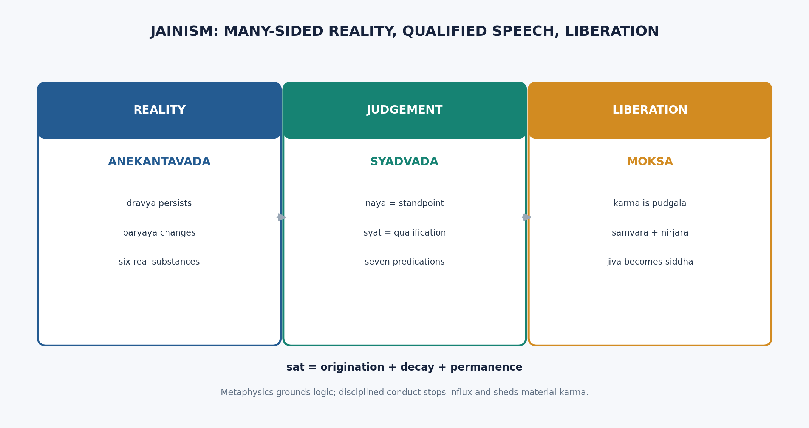

# JAINISM - Syllabus Item 13 (Paper I - Section B)

> **Syllabus (verbatim):** Jainism : Theory of Reality; Saptabhanginaya; Bondage and Liberation.
> **Evidence key:** ✅ canonical doctrine · ⚠️ analytical synthesis · ❓ contested/uncertain
> **Placement:** A recurring UPSC favorite because it combines metaphysics, logic of conditional predication, and a distinctive doctrine of karmic bondage and liberation.

## 0. ONE-SCREEN MAP

```text
JAINISM
│
├─ SOURCE ANCHOR
│  └─ Tattvārthasūtra: ratna-traya, tattvas, dravyas, jñāna, liberation
│
├─ THEORY OF REALITY
│  ├─ Anekāntavāda (anekantavada): reality is many-sided
│  ├─ Dravya = sat = utpāda + vyaya + dhrauvya
│  ├─ Six dravyas: jīva, pudgala, dharma, adharma, ākāśa, kāla
│  ├─ Pañcāstikāya: five extended substances; kāla is an-astikāya
│  └─ Guṇa (qualities) + paryāya (modes)
│
├─ EPISTEMOLOGY
│  ├─ Pratyakṣa vs parokṣa, with the Jaina inversion trap
│  ├─ Five jñānas: mati, śruta, avadhi, manaḥparyāya, kevala
│  └─ Partial kṣāyopaśamika knowledge grounds nayavāda and syādvāda
│
├─ THEORY OF JUDGEMENT
│  ├─ Nayavāda: partial standpoints
│  ├─ Syādvāda: conditional predication
│  └─ Saptabhaṅgī: sevenfold judgement
│
└─ SOTERIOLOGY
   ├─ Seven tattvas / nine padārthas
   ├─ Karma = subtle material pudgala; eight karma-prakṛtis
   ├─ Āsrava → bandha → saṃvara → nirjarā → mokṣa
   ├─ Bhāvabandha + dravyabandha; four bandha-parameters
   ├─ Guṇasthānas: fourteen stages, including sayoga-kevalī
   └─ Three jewels + vows + sallekhanā lead to kevala-jñāna and liberation
```

## 0A. UMĀSVĀTI / UMĀSVĀMĪ AND THE TATTVĀRTHASŪTRA ✅

**Statement.** ✅ The *Tattvārthasūtra* or *Tattvārthādhigama-sūtra* of **Umāsvāti** in Śvetāmbara usage and **Umāsvāmī** in Digambara usage is the first systematic Sanskrit exposition of Jaina philosophy and is authoritative for both major sects.

**Argument.** ✅
1. ✅ It gives a compact doctrinal grammar for Jaina metaphysics, epistemology, ethics, bondage, and liberation.
2. ✅ Its cross-sectarian authority is unusual because Śvetāmbara and Digambara traditions often differ in scriptural canon and practice.
3. ✅ It states the path through the **ratna-traya** (three jewels): **samyag-darśana** (right vision), **samyag-jñāna** (right knowledge), and **samyak-cāritra** (right conduct).
4. ✅ It systematizes the seven tattvas, the five astikāyas plus kāla, and the classification of jñāna without reducing Jainism to only ethics or only logic.

**Presupposition.** ⚠️ A UPSC answer improves when Jainism is presented as a systematic darśana rather than as a loose collection of ascetic practices.

**Distinction.** ✅ The Tīrthaṅkaras are liberated teachers and ford-makers, not creator Gods; Jainism remains **anīśvaravāda** (non-theistic about creation).

**Example.** ✅ The famous formulation that right vision, right knowledge, and right conduct together constitute the path to mokṣa may be safely used without inventing a sūtra number.

**Objection (sectarian-history objection).** ❓ A critic may ask whether a text accepted by both Śvetāmbaras and Digambaras erases real sectarian differences.

**Reply.** ⚠️ It does not erase them; it supplies a shared doctrinal framework within which disagreements about canon, practice, and interpretation can still remain.

**Names to drop carefully.** ✅
- ✅ **Kundakunda**: Digambara thinker associated with *Samayasāra* and the **niścaya-naya / vyavahāra-naya** distinction.
- ✅ **Siddhasena Divākara** and **Samantabhadra**: important names in the early logic of anekānta and syādvāda.
- ✅ **Akalaṅka**, **Māṇikyanandi**, **Hemacandra**, and **Yaśovijaya**: major later Jaina logicians to cite for the mature pramāṇa tradition.

## 1. THEORY OF REALITY ✅

### 1.1 Anekāntavāda as metaphysical thesis

**Statement.** ✅ **Anekāntavāda** is the Jaina doctrine that reality is many-sided; no single unqualified proposition exhausts the nature of a real thing.

**Argument.** ✅
1. Real things endure through change and exhibit multiple aspects.
2. Human cognition usually grasps only one aspect at a time.
3. Dogmatic one-sided claims therefore distort reality.
4. A sound metaphysics must allow plurality of aspects within one real.
5. Hence reality is non-one-sided, or anekānta.

**Presupposition.** ⚠️ Being is richer than any single finite judgement.

**Distinction.** ✅ Anekāntavāda is not mere indecision. It is a **metaphysical** claim about the complexity of reality, not yet the logical form of predication.

**Example.** ✅ A jar is permanent as a substance across a short stretch, changing in modes, describable by shape, use, material, and temporal state. No one predicate says all of this at once.

**Objection (skeptical objection).** ✅ If every object has indefinitely many aspects, knowledge may become impossible.

**Reply.** ⚠️ Jaina thought replies that knowledge is possible precisely through qualified standpoints, not through absolutist simplification.

### 1.2 Dravya as sat = utpāda-vyaya-dhrauvya ✅

**Statement.** ✅ The real (**sat**) is what possesses **utpāda** (origination), **vyaya** (decay), and **dhrauvya** (persistence or permanence) together.

**Argument.** ✅
1. Experience shows change: forms arise and pass.
2. Experience also shows continuity: something persists through those changes.
3. Pure permanence cannot explain transformation.
4. Pure flux cannot explain identity.
5. Therefore reality must include both persistence and modification.
6. This is articulated by saying substance is characterized by origination, decay, and permanence.

**Presupposition.** ⚠️ Both common-sense identity and experiential change are philosophically significant and must be preserved.

**Distinction.** ✅ This differs from Buddhist momentariness, which gives primacy to flux, and from strict monisms that absorb change into mere appearance.

**Example.** ✅ A gold ornament changes from bracelet to ring: modes originate and cease, yet the underlying substance persists.

**Objection (Buddhist/Nyāya-style objection).** ✅ How can opposite features—change and permanence—belong to one thing?

**Reply.** ✅ They belong in different respects: permanence as dravya, change as paryāya.

### 1.3 Six dravyas ✅

**Statement.** ✅ Jainism classically recognizes **six dravyas**: **jīva**, **pudgala**, **dharma**, **adharma**, **ākāśa**, and **kāla**.

**Argument.** ✅
1. ✅ The classification accounts for consciousness, matter, motion, rest, spatial accommodation, and temporal succession.
2. ✅ Jainism is therefore pluralistic without being chaotic: each dravya has a distinct explanatory function.
3. ✅ Five of the six dravyas are **astikāyas** (extended substances with many space-points or **pradeśas**).
4. ✅ **Kāla** (time) is a real dravya in the mainstream sixfold presentation, but it is **not** an astikāya; hence Jainism speaks of **pañcāstikāya** plus kāla.

**The six dravyas.** ✅

| Dravya | Basic sense | Role |
|---|---|---|
| **Jīva** | conscious substance | experiencer, knower, bearer of bondage and liberation |
| **Pudgala** | matter | corporeality, karmic matter, bodies, sense-objects |
| **Dharma** | medium of motion | condition making movement possible |
| **Adharma** | medium of rest | condition making rest possible |
| **Ākāśa** | space | accommodation for substances |
| **Kāla** | time | succession, change, sequence |

**Astikāya table.** ✅

| Dravya | Astikāya? | Function | Extension |
|---|---|---|---|
| **Jīva** | ✅ Yes | knowing, experiencing, agency, bondage and liberation | ✅ Has pradeśas; in embodied existence it is co-extensive with the body |
| **Pudgala** | ✅ Yes | material bodies, sense-objects, speech, breath, karma-pudgala | ✅ Extended and aggregative |
| **Dharma-dravya** | ✅ Yes | medium enabling motion | ✅ Co-extensive with lokākāśa |
| **Adharma-dravya** | ✅ Yes | medium enabling rest | ✅ Co-extensive with lokākāśa |
| **Ākāśa** | ✅ Yes | gives room or accommodation to substances | ✅ Extended as lokākāśa and alokākāśa |
| **Kāla** | ❌ No | succession, duration, before-and-after, change | ✅ A dravya but **an-astikāya** because it lacks spatial extension across many pradeśas in the astikāya sense |

**Presupposition.** ⚠️ Reality is irreducibly pluralistic, and extension must be distinguished from substantiality.

**Distinction.** ✅ **Dharma** and **adharma** here do **not** mean moral merit and demerit; they mean media of motion and rest.

**Sectarian note.** ✅ The safe doctrinal point is: **kāla is a dravya but not an astikāya**; the pañcāstikāya list has five members, while the dravya list has six. ❓ A common sectarian nuance is that Digambara authors characteristically affirm real **kāla-aṇus** (time-atoms) associated with the space-points of lokākāśa, whereas some Śvetāmbara discussions treat the substantial independence of kāla as disputed or conventional.

**Example.** ✅ A fish swims because water is the medium enabling motion; analogically, dharma-dravya is the cosmic condition enabling movement, not motion itself.

**Objection (Nyāya-Vaiśeṣika-style objection).** ✅ Dharma and adharma as “media” look mysterious and unparsimonious.

**Reply.** ⚠️ Jaina metaphysics treats them not as pushes or forces but as enabling conditions required for a coherent pluralistic cosmology.

### 1.4 Guṇa and paryāya ✅

**Statement.** ✅ Every dravya possesses **guṇa** (essential qualities) and **paryāya** (modes or modifications).

**Argument.** ✅
1. A substance must have stable features or it would not be what it is.
2. It must also undergo modal change or it would not participate in experience.
3. Therefore it is intelligible as substance-with-qualities-and-modes.

**Presupposition.** ⚠️ Ontology must distinguish what remains from how it appears or changes.

**Distinction.** ✅ **Guṇa** is not the same as **paryāya**: qualities belong to the substance as abiding characteristics; modes are changing states or manifestations.

**Example.** ✅ Consciousness is a defining feature of jīva; pleasure, pain, delusion, or liberated omniscience are modes or conditions in which the jīva appears.

**Objection (Buddhist nominalist objection).** ✅ Why not just speak of changing qualities rather than introduce a substance?

**Reply.** ⚠️ Because changing qualities still presuppose something whose changes they are.

### 1.5 Jīva and ajīva ✅

**Statement.** ✅ The most fundamental ontological distinction is between **jīva** (conscious) and **ajīva** (non-conscious).

**Argument.** ✅
1. Experience distinguishes living, aware beings from inert entities.
2. This distinction is ontologically basic because consciousness cannot be reduced to inert matter in Jaina thought.
3. Hence the universe divides into jīva and ajīva.

**Presupposition.** ⚠️ Consciousness is real and fundamental, not epiphenomenal.

**Distinction.** ✅ Unlike Advaita, this is not a distinction within one underlying Brahman. Unlike Cārvāka, consciousness is not reducible to material organization.

**Example.** ✅ The body, speech, and even karmic matter belong to ajīva; the conscious experiencer bound by them is jīva.

**Objection (Nyāya-Vedānta objection).** ✅ If jīva is immaterial, how can material karma affect it?

**Reply.** ⚠️ This becomes the central challenge in Jaina bondage theory and is answered through the doctrine of karmic influx and adhesion, though critics find the relation obscure.

### 1.6 Nature of jīva ✅

**Statement.** ✅ Every jīva is distinct, beginningless, intrinsically endowed with infinite knowledge, perception, bliss, and power, though these are obscured by karma.

**Argument.** ✅
1. Liberation is meaningful only if the soul has a native capacity to realize perfection.
2. Bondage is then understood as obscuration, not total annihilation of that nature.
3. Therefore jīva is intrinsically luminous but contingently covered.

**Presupposition.** ⚠️ Spiritual progress presupposes a real self capable of purification.

**Distinction.** ✅ Jainism is pluralistic: there are many jīvas, not one universal self. It also differs from Nyāya, where the self is conscious through conjunction with mind; in Jainism consciousness belongs intrinsically to jīva.

**Example.** ✅ Souls are graded from one-sense beings to five-sense beings; even minute living entities are morally significant.

**Objection (Sāṃkhya/Vedānta objection).** ✅ If the soul is naturally omniscient, ignorance becomes hard to explain.

**Reply.** ✅ Karma as obscuring matter is introduced precisely to explain the discrepancy between intrinsic capacity and empirical limitation.

### 1.7 Pudgala ✅

**Statement.** ✅ **Pudgala** is the material dravya and the only dravya possessing **rūpa** (form); it includes atoms, bodies, sense-objects, and karmic matter.

**Argument.** ✅
1. Corporeality, extension, and sensible quality require a material substrate.
2. Matter must therefore be treated as a real and irreducible category.
3. Since karmic bondage has quasi-physical efficacy, karmic particles too are classed under pudgala.

**Presupposition.** ⚠️ Materiality is not illusory; it is an objective domain with its own laws.

**Distinction.** ✅ Pudgala is uniquely important because unlike jīva it is divisible, aggregative, and form-bearing.

**Example.** ✅ The body I inhabit, the food I consume, the dust in air, and karmic accretions all belong to pudgala.

**Objection (Nyāya/Mīmāṃsā-style objection).** ✅ To call karma matter seems strange.

**Reply.** ✅ That strangeness is also Jainism’s originality: bondage is not merely moral description but a real quasi-physical entanglement.

## 1A. JAINA PRAMĀṆA SCHEME: THE EPISTEMIC GROUND OF ANEKĀNTAVĀDA ✅

### 1A.1 Primary division: pratyakṣa and parokṣa ✅

**Statement.** ✅ Jaina epistemology distinguishes **pratyakṣa** (direct knowledge) and **parokṣa** (indirect knowledge), but it uses the word pratyakṣa in a high-yield, non-ordinary way.

**Argument.** ✅
1. ✅ In the strict Jaina sense, **pratyakṣa** means knowledge that the soul knows directly without mediation by senses or mind.
2. ✅ Ordinary sense-perception is therefore not ultimate direct knowledge; it is only **sāṃvyavahārika pratyakṣa** (empirical or conventional direct knowledge).
3. ✅ Strictly, ordinary sense-and-mind cognition belongs with mediated cognition because it depends on sense-organs, mind, signs, and karmic limitation.
4. ⚠️ This reverses the usual classroom expectation that perception is the primary direct pramāṇa.

**Presupposition.** ⚠️ Directness is measured by freedom from mediation and karmic obstruction, not merely by sensory vividness.

**Distinction.** ✅ Do not map Jaina pratyakṣa mechanically onto Nyāya pratyakṣa; the same term carries a different doctrinal weight.

**Example.** ✅ Seeing a pot with the eyes is conventionally direct in ordinary dealings, but **kevala-jñāna** is direct in the strict spiritual sense.

**Objection (Nyāya objection).** ✅ Nyāya may object that perception through sense-contact is the paradigm of direct cognition.

**Reply.** ⚠️ Jainism replies that sense-contact is direct only pragmatically; metaphysically it is mediated by organs, mind, and knowledge-obscuring karma.

### 1A.2 Five kinds of jñāna ✅

**Statement.** ✅ Jainism classically enumerates five kinds of **jñāna** (knowledge): **mati**, **śruta**, **avadhi**, **manaḥparyāya**, and **kevala**.

| Jñāna | Status | Meaning | UPSC trap |
|---|---|---|---|
| **Mati-jñāna** | ✅ Parokṣa / conventional | sense-and-mind cognition | ✅ Ordinary perception is not strict pratyakṣa |
| **Śruta-jñāna** | ✅ Parokṣa | scriptural, verbal, or sign-mediated knowledge derived from mati | ✅ Not blind faith; it depends on cognition and communication |
| **Avadhi-jñāna** | ✅ Mukhya or pāramārthika pratyakṣa | limited clairvoyant direct knowledge of material things | ✅ Direct but limited |
| **Manaḥparyāya-jñāna** | ✅ Mukhya or pāramārthika pratyakṣa | direct knowledge of others’ mental modes | ✅ Higher than avadhi, still not omniscience |
| **Kevala-jñāna** | ✅ Mukhya or pāramārthika pratyakṣa | unlimited, unmediated omniscience | ✅ The full overcoming of cognitive obstruction |

**Argument.** ✅
1. ✅ Mati and śruta are mediated and therefore indirect in the strict classification.
2. ✅ Avadhi, manaḥparyāya, and kevala are direct because the soul knows without ordinary sense-and-mind mediation.
3. ✅ The series shows graded release from karmic veiling.

**Presupposition.** ⚠️ Knowledge is graded according to the degree to which karmic obscuration is removed.

**Distinction.** ✅ The five jñānas are not five independent pramāṇas in the Nyāya sense; they are Jaina modes of knowledge mapped to bondage and purification.

**Example.** ✅ A student’s study of doctrine uses mati and śruta; the kevalin’s omniscience is immediate and total.

**Objection (Cārvāka-style objection).** ✅ Avadhi, manaḥparyāya, and kevala appear unverifiable to ordinary experience.

**Reply.** ⚠️ Jainism treats them as necessary consequences of its soul-karma theory; a critic may still reject them if the ontology of jīva and karmic obstruction is denied.

### 1A.3 Wrong cognition: ajñāna under mithyā-darśana ✅

**Statement.** ✅ Jainism recognizes **mati-ajñāna** or **kumati**, **śruta-ajñāna** or **kuśruta**, and **vibhaṅga-jñāna** as wrong cognition.

**Argument.** ✅
1. ✅ Wrongness is not always the mere absence of content.
2. ✅ Cognition becomes spiritually wrong when held under **mithyā-darśana** (false vision or wrong orientation).
3. ✅ **Kumati** is misoriented sensory-mental cognition; **kuśruta** is misoriented verbal or scriptural cognition; **vibhaṅga-jñāna** is perverted avadhi.
4. ⚠️ The content may have some descriptive accuracy, but its orientation is false because it is governed by delusion.

**Presupposition.** ⚠️ Epistemology and ethics interpenetrate: how one is disposed affects how one knows.

**Distinction.** ✅ Jaina error is not only logical mistake; it can be a karmically conditioned mode of seeing.

**Example.** ✅ A learned person may quote doctrine but use it for pride, sectarian contempt, or violence; the verbal cognition then functions as kuśruta.

**Objection (Nyāya objection).** ✅ Calling cognition wrong because of spiritual orientation seems to confuse truth with moral psychology.

**Reply.** ⚠️ Jainism replies that bondage affects the knower as a whole; epistemic correctness without right vision remains incomplete for liberation.

### 1A.4 Later Jaina logic and indirect pramāṇas ⚠️

**Statement.** ✅ Jainism admits **anumāna** (inference) and **śabda** (testimony or verbal authority) within parokṣa, and later Jaina logicians give a richer account of indirect knowledge.

**Argument.** ⚠️
1. ✅ **Akalaṅka**, **Māṇikyanandi**, **Hemacandra**, and **Yaśovijaya** are important names for the developed Jaina pramāṇa tradition.
2. ⚠️ Later Jaina logicians accept **smṛti** (recollection), **pratyabhijñā** (recognition), **tarka** or **ūha** (reasoning that grasps pervasion or vyāpti), and **anumāna** as valid indirect knowledge in appropriate contexts.
3. ✅ This is a notable contrast with Nyāya, which does not treat memory as an independent pramāṇa.
4. ⚠️ The Jaina move protects continuity, recognition, and inferential preparation as genuine cognitive achievements without making them omniscient knowledge.

**Presupposition.** ⚠️ Valid cognition need not be restricted to fresh sense-contact; mediated cognition can still disclose real features of the object.

**Distinction.** ✅ **Śabda** is accepted as mediated knowledge, not as a creator-God’s revelation; Jainism remains non-theistic about cosmic creation.

**Example.** ✅ Recognizing “this is the same teacher I met earlier” is not mere raw perception; it involves memory and recognition.

**Objection (Nyāya objection).** ✅ Nyāya can argue that memory merely reproduces past knowledge and is not a new pramāṇa.

**Reply.** ⚠️ The Jaina reply is that recollection and recognition can be valid cognition when they successfully connect present awareness with a real object or past experience.

### 1A.5 Critical link: pramāṇa → nayavāda → syādvāda ✅

**Statement.** ✅ Anekāntavāda is not an arbitrary logical device; it is the epistemological consequence of Jaina metaphysics plus Jaina theory of knowledge.

**Argument.** ✅
1. ✅ Reality is **ananta-dharmātmakaṃ vastu**: the real object has infinitely many aspects, properties, and modes.
2. ✅ Ordinary human cognition is **kṣāyopaśamika** (arising from partial destruction-cum-subsidence of knowledge-obscuring karma), and is therefore necessarily partial.
3. ✅ A judgment made by a non-omniscient knower captures an aspect, not the whole object.
4. ✅ A partial judgment is true only relative to its standpoint; this is **nayavāda**.
5. ✅ Absolutising a partial standpoint yields **ekāntavāda** (one-sidedness), the root error of rival schools according to Jainism.
6. ✅ Therefore assertion must carry the operator **syāt** (“from a certain standpoint”); this is **syādvāda**.
7. ✅ The sevenfold schema of qualified predication is the disciplined expression of that standpoint-relativity; this is **saptabhaṅgī**.
8. ✅ Only **kevala-jñāna** grasps all aspects at once, because only omniscience is no longer karmically partial.

**Presupposition.** ⚠️ Finite cognition is not false simply because it is partial; it becomes false when it claims unconditioned finality.

**Distinction.** ✅ Jaina relativity is not subjectivism: the aspects are really in the object, but finite knowers access them partially.

**Example.** ✅ “The jar exists” is true with respect to its present substance-mode-place-time complex, but false with respect to another place, another time, or another incompatible mode.

**Objection (Śaṃkara-style objection).** ✅ If all assertions are standpoint-relative, the assertion of standpoint-relativity may also lose absolute force.

**Reply.** ⚠️ Jainism accepts reflexive qualification: syādvāda too is asserted **syāt**, and its force lies in disciplined anti-absolutism rather than in an unqualified dogma.

## 2. SAPTABHAṄGĪNAYA ✅

### 2.1 Nayavāda: standpoint-theory

**Statement.** ✅ **Nayavāda** teaches that every ordinary judgement expresses a **naya**, a standpoint that captures one aspect of the real.

**Argument.** ✅
1. Reality is many-sided.
2. Finite knowers rarely grasp all sides at once.
3. Therefore judgements are aspectual, not exhaustive.
4. A doctrine of standpoints is needed to explain how partial truth is possible.

**Presupposition.** ⚠️ Partiality is not falsehood; it becomes falsehood only when the partial is absolutized.

**Distinction.** ✅ Nayavāda is not skepticism. It permits truth, but qualified truth.

**Example.** ✅ A jar may be described as clay, as container, as round, as breakable, as existing-now. Each statement is true from a standpoint.

**Objection (Nyāya-style objection).** ✅ Standpoints may proliferate without limit.

**Reply.** ⚠️ Jaina thinkers classify principal standpoints to discipline rather than dissolve discourse.

### 2.2 The seven nayas ✅

**Statement.** ✅ Classical Jainism enumerates **seven nayas**, each marking a characteristic standpoint.

| Naya | Brief meaning |
|---|---|
| **Naigama naya** | common or teleological standpoint; mixed, unspecialized practical view |
| **Saṃgraha naya** | generic standpoint; emphasis on class-character |
| **Vyavahāra naya** | practical or particular standpoint; ordinary usage about specific things |
| **Ṛjusūtra naya** | momentary or present-state standpoint |
| **Śabda naya** | verbal standpoint; attention to linguistic expression |
| **Samabhirūḍha naya** | etymological or strictly differentiated verbal standpoint |
| **Evambhūta naya** | actuality-conditioned verbal standpoint; a term applies when the function is being performed |

**Argument.** ✅ The list shows that partiality may arise from pragmatic, generic, particular, temporal, and linguistic conditioning.

**Presupposition.** ⚠️ Language itself contributes to one-sidedness if its scope is not critically examined.

**Distinction.** ✅ Do not confuse **nayas** (standpoints) with the **sevenfold predications** of syādvāda. The former are epistemic perspectives; the latter are structured propositional forms.

**Example.** ✅ Calling a person “a singer” may be true generically or dispositionally, but **evambhūta naya** is stricter: the term applies in the relevant performance-actuality.

**Objection (examiner's objection).** ✅ The linguistic nayas seem overly scholastic.

**Reply.** ⚠️ They matter because many philosophical disputes are verbal absolutizations of context-bound usage.

### 2.3 Syādvāda as logical expression

**Statement.** ✅ **Syādvāda** is the doctrine that assertions should be made with the qualification **syāt**—“in some respect,” “from a certain standpoint,” or “conditionally.”

**Argument.** ✅
1. Since reality is many-sided, categorical assertion is risky.
2. Since judgements arise from standpoints, language must register conditionality.
3. The particle **syāt** prevents absolutization.
4. Hence syādvāda is the logical-linguistic expression of anekāntavāda.

**Presupposition.** ⚠️ Good logic mirrors ontological complexity and epistemic modesty.

**Distinction.** ✅ Anekāntavāda = metaphysical doctrine; nayavāda = theory of standpoints; syādvāda = mode of conditional predication.

**Example.** ✅ “The jar exists” becomes “syād asti”—it exists in some respect, e.g., as present on the floor now.

**Objection (Śaṃkara-style objection).** ✅ Constant qualification may weaken assertoric force.

**Reply.** ⚠️ Jaina logic accepts that precision is preferable to dogmatic simplicity.

### 2.4 Saptabhaṅgī: the seven predications, exactly and in order ✅

**Statement.** ✅ The **saptabhaṅgī** is the sevenfold schema of conditional predication produced by combining affirmation, negation, and indescribability under the qualifier **syāt**.

1. **syād asti** — in some respect, it is.
2. **syād nāsti** — in some respect, it is not.
3. **syād asti ca nāsti ca** — in some respect, it is and it is not.
4. **syād avaktavyam** — in some respect, it is indescribable.
5. **syād asti ca avaktavyam** — in some respect, it is and is indescribable.
6. **syād nāsti ca avaktavyam** — in some respect, it is not and is indescribable.
7. **syād asti ca nāsti ca avaktavyam** — in some respect, it is, is not, and is indescribable.

**Argument.** ✅
1. A thing may be affirmed under one standpoint.
2. Negated under another.
3. Both affirmed and negated under different references or times.
4. Called indescribable where simultaneous exhaustive predication fails.
5. Combinations of these yield seven basic structured forms.

**Presupposition.** ⚠️ Contraries need not violate logic when they are indexed to standpoint, time, relation, or mode.

**Distinction.** ✅ “Indescribable” does not mean mystical silence simpliciter. It means that an unqualified or simultaneous statement is not straightforwardly expressible.

**Example.** ✅ A clay jar exists now on the table; it does not exist as a lump of raw clay; it both is and is not under different modal descriptions; in a complex state of transition it may be called avaktavya.

**Objection (Śaṃkara/Rāmānuja objection).** ✅ Critics say this violates non-contradiction.

**Reply.** ✅ The Jaina response is that contradiction would arise only if affirmation and negation were made in the same respect at the same time in the same sense. Syāt blocks that absolutist reading.

### 2.5 Blind men and the elephant ✅

**Statement.** ✅ The familiar illustration of the blind men and the elephant captures the spirit of anekāntavāda: each grasped part yields a partial truth wrongly elevated into a whole truth.

**Argument.** ⚠️ The illustration dramatizes the difference between **partial correctness** and **exclusive completeness**.

**Presupposition.** ⚠️ Cognitive violence begins when a part is mistaken for the whole.

**Distinction.** ✅ The parable illustrates non-absolutism; it is not itself the formal doctrine.

**Example.** ✅ One touches the trunk and says “the elephant is like a serpent,” another the leg and says “like a pillar.” Each is conditionally right and absolutely wrong.

**Objection (pedagogical objection).** ✅ The parable may trivialize complex metaphysics.

**Reply.** ⚠️ It is pedagogical, not probative; its use is to clarify the structure of partial truth.

### 2.6 Five kinds of knowledge ✅

**Statement.** ✅ Jaina epistemology commonly speaks of **five kinds of knowledge**: **mati**, **śruta**, **avadhi**, **manaḥparyāya**, and **kevala**.

| Kind of knowledge | Basic sense |
|---|---|
| **Mati-jñāna** | sensory-mental cognition, ordinary empirical knowledge |
| **Śruta-jñāna** | scriptural/verbal knowledge, mediated through signs and teaching |
| **Avadhi-jñāna** | clairvoyant knowledge of material things beyond ordinary sense range |
| **Manaḥparyāya-jñāna** | telepathic knowledge of mental states |
| **Kevala-jñāna** | perfect omniscience |

**Argument.** ✅ The gradation maps the progressive removal of karmic obstruction from cognition.

**Presupposition.** ⚠️ Knowledge is not uniform; it has degrees according to the soul’s purity.

**Distinction.** ✅ In exam answers, do not confuse these five kinds of knowledge with the seven nayas or the sevenfold predications.

**Example.** ✅ The ordinary learner begins with mati and śruta, while the liberated or near-liberated soul culminates in kevala-jñāna.

**Objection (Cārvāka-style objection).** ✅ Higher forms seem unverifiable.

**Reply.** ⚠️ Within Jainism they are internally connected to the ontology of soul and karma; externally they remain open to critical challenge.

### 2.7 Standard objection: is anekāntavāda self-refuting or trivial? ✅

**Statement.** ✅ Critics argue either that anekāntavāda is self-refuting—because the claim that “all reality is many-sided” is itself made absolutely—or trivial, because everyone already admits contextual variation.

**Argument of the critic.** ✅
1. If every assertion must be qualified, then the doctrine itself must be qualified.
2. If qualified, it may lose universal force.
3. If unqualified, it violates its own rule.
4. Alternatively, if it merely says that things can be looked at in different ways, it seems philosophically thin.

**Presupposition.** ⚠️ A doctrine of relativity must explain its own status.

**Reply.** ✅
1. Jainism need not deny that the doctrine itself is also expressible from a standpoint.
2. This does not collapse it; it exhibits the very discipline it teaches.
3. The thesis is not that all statements are equally true, but that truth is aspect-conditioned.
4. Its philosophical bite lies in reconciling plurality with realism, not in banal relativism.

### 2.8 Does Jaina non-absolutism presuppose absolutism? (2022) ⚠️

**Statement.** ⚠️ A standard challenge says that to say reality is many-sided, one must already know absolutely that it is so; therefore anekāntavāda covertly presupposes absolutism.

**Argument of the challenge.** ✅
1. The doctrine claims universal scope.
2. Universal scope appears absolute.
3. Therefore the doctrine seems to rely on the very absolutism it criticizes.

**Jaina reply.** ✅
1. Non-absolutism does not deny more comprehensive knowledge; it denies one-sided exclusivism by finite knowers.
2. The doctrine is a methodological and ontological caution against ekānta, not a ban on all graded comprehensiveness.
3. Within Jainism, **kevala-jñāna** represents total knowledge, while ordinary discourse remains standpoint-bound.
4. Hence the charge succeeds only if one confuses finite judgement with omniscient cognition.

**Assessment.** ⚠️ This is a subtle and strong reply: Jainism can admit a difference between omniscience and ordinary language without abandoning its critique of dogmatic partiality.

### 2.9 Is Jainism pluralistic and realistic? (2025) ⚠️

**Statement.** ⚠️ Yes, Jainism is strongly **pluralistic** and broadly **realistic**, though both labels require nuance.

**Why pluralistic.** ✅
1. It accepts many real souls.
2. It accepts multiple irreducible dravyas.
3. It rejects monistic reduction.
4. Liberation is of many individual souls, not absorption into one absolute.

**Why realistic.** ✅
1. It treats dravyas, qualities, and modes as objectively real.
2. The external world is not illusion.
3. Knowledge aims at real objects, though only under standpoints.

**Nuance.** ⚠️ Its realism is **qualified realism**, because judgement is standpoint-indexed. But qualification of knowledge does not imply unreality of the object.

**Objection (realist objection).** ✅ If all knowledge is relative to standpoint, realism weakens.

**Reply.** ⚠️ Jainism separates ontological realism from epistemic non-absolutism: reality is objective, but our finite access to it is partial.

## 3. BONDAGE AND LIBERATION ✅

### 3.1 Karma as subtle material substance

**Statement.** ✅ Jainism’s distinctive doctrine is that **karma is a subtle material substance**, a form of **pudgala** that flows toward and binds the soul.

**Argument.** ✅
1. The soul’s intrinsic omniscience is obscured in empirical life.
2. This obscuration requires a real binding factor.
3. That factor is karma, conceived not merely as moral tendency but as fine material accretion.
4. Thus bondage is ontologically real, not merely metaphorical.

**Presupposition.** ⚠️ Ethical and cognitive defilement must have a concrete causal structure.

**Distinction.** ✅ This is a crucial UPSC trap: in Jainism karma is **material**, unlike many Hindu presentations where karma is a moral force, merit-demerit ledger, or adṛṣṭa.

**Example.** ✅ Passions attract karmic particles just as a sticky surface gathers dust.

**Objection (Nyāya-Vedānta objection).** ✅ How can matter bind a conscious immaterial soul?

**Reply.** ⚠️ Jainism answers through intimate association and obscuration, though critics often say the mechanism remains conceptually difficult.

### 3.2 The fivefold soteriological sequence ✅

**Statement.** ✅ The Jaina path is commonly described through the sequence **āsrava → bandha → saṃvara → nirjarā → mokṣa**.

| Stage | Meaning |
|---|---|
| **Āsrava** | influx of karmic matter into the soul |
| **Bandha** | bondage; karmic matter adheres to the soul |
| **Saṃvara** | stoppage of fresh inflow |
| **Nirjarā** | shedding or exhaustion of accumulated karma |
| **Mokṣa** | complete release from karma |

**Argument.** ✅
1. Wrong belief, passions, and activity open the soul to karmic influx.
2. Influx produces bondage.
3. Discipline blocks new inflow.
4. Austerity and purification burn off old karma.
5. When all karmic matter is gone, liberation occurs.

**Presupposition.** ⚠️ Spiritual progress is both preventive and purgative.

**Distinction.** ✅ Saṃvara and nirjarā are not the same: one stops new karma; the other removes old karma.

**Example.** ✅ Closing a muddy stream into a tank is like saṃvara; cleaning the sediment already deposited is like nirjarā.

**Objection (Buddhist/Vedānta-style objection).** ✅ The process may seem mechanically moralistic.

**Reply.** ⚠️ Its strength is exactly its causal clarity: vice has ontological consequence; discipline has ontological remedy.

### 3.3 Bhāvabandha and dravyabandha (2024) ✅

**Statement.** ✅ Bondage has two closely related forms: **bhāvabandha** (psychic bondage) and **dravyabandha** (material bondage).

**Argument.** ✅
1. The soul first undergoes affective-volitional corruption through passions, attachment, aversion, delusion, and wrong disposition.
2. This inner deformation is **bhāvabandha**.
3. Corresponding karmic particles then attach materially to the soul.
4. This actual material adhesion is **dravyabandha**.
5. Thus psychic and material bondage are distinct yet interlinked.

**Presupposition.** ⚠️ Inner states are causally efficacious; moral psychology precedes material karmic accretion.

**Distinction.** ✅
- **Bhāvabandha** = subjective, intentional, affective bondage.
- **Dravyabandha** = objective, material bondage by karmic pudgala.

**Example.** ✅ Anger or greed in the soul is bhāvabandha; the karmic matter drawn and fixed by that passion is dravyabandha.

**Objection (analytical objection).** ✅ Why not collapse them into one process?

**Reply.** ✅ The distinction helps Jainism explain both moral agency and ontological consequence: one is the soul’s state, the other is the karmic material result.

### 3.4 The three jewels ✅

**Statement.** ✅ Liberation requires the **three jewels (ratnatraya)**: **samyag-darśana** (right faith/vision), **samyag-jñāna** (right knowledge), and **samyag-cāritra** (right conduct).

**Argument.** ✅
1. One must first see reality correctly.
2. One must know it correctly.
3. One must live in accordance with that insight.
4. Mere knowledge without conduct does not stop karmic influx.
5. Mere conduct without right view lacks orientation.

**Presupposition.** ⚠️ Cognitive, affective, and practical transformation are inseparable.

**Distinction.** ✅ The three jewels are not sequential in a crude external sense; they are mutually reinforcing dimensions of one path.

**Example.** ✅ One who knows non-violence conceptually but continues harmful conduct has not completed the path.

**Objection (Cārvāka-style objection).** ✅ Is “faith” here blind belief?

**Reply.** ✅ No. Samyag-darśana is right apprehension or trustful orientation to truth, not irrational fideism.

### 3.5 Five mahāvratas ✅

**Statement.** ✅ Right conduct is classically articulated through the **five mahāvratas**: **ahiṃsā**, **satya**, **asteya**, **brahmacarya**, and **aparigraha**.

**Argument.** ✅ These vows reduce passions, prevent harmful activity, and therefore check karmic influx.

| Vow | Basic meaning | Soteriological relevance |
|---|---|---|
| **Ahiṃsā** | non-violence | central because injury binds karma deeply |
| **Satya** | truthfulness | purifies speech and intention |
| **Asteya** | non-stealing | curbs acquisitive harm |
| **Brahmacarya** | chastity / control of sensuality | disciplines desire |
| **Aparigraha** | non-possession / non-attachment | reduces grasping and karmic adhesion |

**Presupposition.** ⚠️ Ethical discipline is metaphysically effective, not merely socially good.

**Distinction.** ✅ In Jainism ahiṃsā is not only a moral ideal but a central soteriological technology.

**Example.** ✅ Extreme care toward even one-sense beings follows from the pluralistic doctrine of jīva.

**Objection (householder-pragmatic objection).** ✅ Such rigor seems too severe for ordinary life.

**Reply.** ⚠️ Jainism distinguishes full vows for ascetics and limited observances for householders, preserving the ideal while allowing graded practice.

### 3.6 Kevala-jñāna ✅

**Statement.** ✅ **Kevala-jñāna** is perfect knowledge or omniscience attained when the obstructive karmas are fully destroyed.

**Argument.** ✅
1. The soul is intrinsically omniscient.
2. Ignorance is due to karmic obstruction.
3. Remove the obstruction and the native luminosity manifests completely.
4. Therefore kevala-jñāna is revelation of what the soul truly is.

**Presupposition.** ⚠️ Perfection is recovery, not production ex nihilo.

**Distinction.** ✅ Kevala-jñāna differs from scriptural knowledge and extraordinary clairvoyance; it is total, direct, unobstructed knowledge.

**Example.** ✅ The Tīrthaṅkara is revered as one who attained such perfect knowledge.

**Objection (Buddhist/Cārvāka objection).** ✅ Omniscience seems excessive or unverifiable.

**Reply.** ⚠️ Within Jaina metaphysics, omniscience is the natural terminus of complete karmic purification.

### 3.7 Mokṣa ✅

**Statement.** ✅ **Mokṣa** is the final state in which the soul is freed from all karmic matter, regains infinite knowledge, bliss, power, and perception, and rises to **siddha-śilā**.

**Argument.** ✅
1. Bondage is due to karmic accretion.
2. Complete stoppage and exhaustion of karma eliminate bondage.
3. The soul then manifests its intrinsic excellences unobstructed.
4. Being no longer weighed down by karmic matter, it rises to the topmost region of the cosmos.

**Presupposition.** ⚠️ Liberation is individual and cosmologically locatable within the Jaina universe.

**Distinction.** ✅ Unlike Advaita mokṣa, this is not merger into impersonal Brahman. Unlike Buddhist nirvāṇa, it is liberation of a distinct enduring jīva.

**Example.** ✅ The liberated soul is a **siddha**, no longer embodied, no longer karmically entangled.

**Objection (modern philosophical objection).** ✅ Spatial ascent of a liberated soul may seem mythic.

**Reply.** ⚠️ In doctrinal exposition, one should report the cosmological picture faithfully while separating canonical doctrine from modern philosophical evaluation.

## 3A. SEVEN TATTVAS AND NINE PADĀRTHAS ✅

### 3A.1 Seven tattvas ✅

**Statement.** ✅ The seven **tattvas** (real categories for liberation-analysis) are **jīva**, **ajīva**, **āsrava**, **bandha**, **saṃvara**, **nirjarā**, and **mokṣa**.

**Argument.** ✅
1. ✅ **Jīva** and **ajīva** identify the two broad ontological poles.
2. ✅ **Āsrava** explains how karmic matter flows toward the soul.
3. ✅ **Bandha** explains how that matter becomes bound.
4. ✅ **Saṃvara** explains the stopping of new influx.
5. ✅ **Nirjarā** explains the shedding or wearing away of accumulated karma.
6. ✅ **Mokṣa** names the final state when all karmic bondage is absent.

**Presupposition.** ⚠️ Metaphysics is organized around soteriology: the list is not merely classificatory but therapeutic.

**Distinction.** ✅ The tattva-list moves from what exists to what binds and what liberates.

**Example.** ✅ A person’s anger is not merely a mental event; it opens āsrava, deepens bandha, and must be countered by saṃvara and nirjarā.

**Objection (Buddhist-style objection).** ✅ The list seems to reify a permanent soul and material karma beyond observable process.

**Reply.** ⚠️ Jainism replies that without jīva and karma-pudgala, bondage and liberation cannot be explained as real transformation of an enduring knower.

### 3A.2 Nine padārthas ✅

**Statement.** ✅ The nine **padārthas** are the same seven tattvas plus **puṇya** (merit) and **pāpa** (demerit).

| Enumeration | Members | Exam significance |
|---|---|---|
| **Seven tattvas** | ✅ jīva, ajīva, āsrava, bandha, saṃvara, nirjarā, mokṣa | ✅ Standard liberation-sequence framework |
| **Nine padārthas** | ✅ the seven plus puṇya and pāpa | ✅ Makes moral valence explicit |

**Argument.** ✅
1. ✅ Puṇya and pāpa are ethically important because meritorious and demeritorious states affect karmic bondage.
2. ⚠️ They can also be subsumed under āsrava and bandha because both merit and demerit are forms of karmic involvement.
3. ⚠️ Hence some expositions emphasize seven for soteriological mechanics and nine for moral classification.

**Presupposition.** ⚠️ Even “good” karma remains karmic bondage if it keeps the soul within saṃsāra.

**Distinction.** ✅ Puṇya is better than pāpa ethically, but both are to be transcended for mokṣa.

**Example.** ✅ Charity performed with attachment may produce puṇya, but liberation requires non-attachment rather than pleasant rebirth alone.

**Objection (Mīmāṃsā-style objection).** ✅ If puṇya is morally valuable, why treat it as ultimately part of bondage?

**Reply.** ⚠️ Jainism distinguishes ethical improvement within saṃsāra from final release beyond all karmic determination.

### 3A.3 Soteriological flow: liberation by subtraction ✅

**Statement.** ✅ Jaina liberation is primarily a matter of subtraction, not acquisition: the soul’s **ananta-catuṣṭaya** (infinite knowledge, infinite perception, infinite bliss, infinite power) is revealed when karmic obstruction is removed.

```text
jīva + ajīva
     │
     ▼
āsrava  (influx of karma-pudgala)
     │
     ▼
bandha  (adhesion through yoga + kaṣāya)
     │
     ├──► saṃvara  (stops new influx)
     │
     ▼
nirjarā (wears away accumulated karma)
     │
     ▼
mokṣa   (all karma gone; ananta-catuṣṭaya manifest)
```

**Argument.** ✅
1. ✅ The soul does not manufacture omniscience from nothing.
2. ✅ It removes what obscures its intrinsic cognitive and blissful capacity.
3. ✅ Kevala-jñāna is therefore revealed rather than produced.
4. ✅ Mokṣa is the purified manifestation of what the jīva essentially is.

**Presupposition.** ⚠️ The self is intrinsically capable of perfection, but empirically veiled by beginningless karma.

**Distinction.** ✅ Jaina mokṣa is not acquisition of God’s grace, not merger into Brahman, and not annihilation of self; it is release of an individual jīva from karmic matter.

**Example.** ✅ Cleaning a sooted lamp does not create light; it allows light to shine unobstructed.

**Objection (Sāṃkhya/Vedānta objection).** ✅ If the soul is intrinsically omniscient, why was it obscured at all?

**Reply.** ✅ The jīva-karma relation is **anādi** (beginningless) but not endless; like seed-and-tree or ore-and-gold analogies, there is no first temporal term, but purification can terminate the bondage.

## 3B. EIGHT KARMA-PRAKṚTIS AND THE MECHANICS OF BANDHA ✅

### 3B.1 Karma is material pudgala ✅

**Statement.** ✅ Jainism’s philosophically distinctive thesis is that karma is literally material: **karma-pudgala** is subtle matter that flows into and adheres to the soul.

**Argument.** ✅
1. ✅ Empirical ignorance, delusion, embodied limitation, status, pleasure-pain, and lifespan require causal explanation.
2. ✅ Jainism explains them through subtle material karmas rather than through an invisible moral potency alone.
3. ✅ **Bhāva-karma** (the soul’s psychical state) attracts **dravya-karma** (material karmic influx).
4. ✅ Thus passions and activities have ontological consequences, not merely psychological consequences.

**Presupposition.** ⚠️ Moral causation is not merely legal or symbolic; it is a real interaction between a modified soul and subtle matter.

**Distinction.** ✅ This differs sharply from Nyāya **adṛṣṭa**, Mīmāṃsā **apūrva**, Sāṃkhya **saṃskāra**, and Buddhist **vāsanā**, which are not material karmic particles.

**Example.** ✅ Anger makes the soul “sticky,” as oil or wet clay gathers dust; the image expresses the causal role of kaṣāya.

**Objection (Nyāya-Vedānta objection).** ✅ How can material karma bind an immaterial conscious soul?

**Reply.** ⚠️ Jainism replies that the embodied jīva is not absolutely non-spatial: it has **pradeśas**, is co-extensive with the body, and is modified by bhāva-karma; karmic matter is attracted through passions. ⚠️ A residual difficulty remains because interaction between consciousness and matter still demands explanation.

### 3B.2 Eight basic karma-prakṛtis ✅

| Class | Karma-prakṛti | What it obscures or determines | Philosophical significance |
|---|---|---|---|
| **Ghātiyā** | ✅ **Jñānāvaraṇīya** | knowledge | ✅ Blocks the soul’s intrinsic knowing |
| **Ghātiyā** | ✅ **Darśanāvaraṇīya** | perception or apprehension | ✅ Blocks direct awareness |
| **Ghātiyā** | ✅ **Mohanīya** | right vision and conduct | ✅ Most dangerous because delusion misorients the path |
| **Ghātiyā** | ✅ **Antarāya** | energy, power, capacity to act | ✅ Obstructs the soul’s effective power |
| **Aghātiyā** | ✅ **Vedanīya** | pleasure and pain | ✅ Determines felt experience without destroying essence |
| **Aghātiyā** | ✅ **Nāma** | body, form, embodiment | ✅ Determines the type of body and individuality of embodiment |
| **Aghātiyā** | ✅ **Gotra** | status or family-standing | ✅ Determines high or low status conditions |
| **Aghātiyā** | ✅ **Āyus** | lifespan | ✅ Determines duration of embodied life |

**Statement.** ✅ The eight karmas divide into **ghātiyā** karmas, which damage or obscure the soul’s essential qualities, and **aghātiyā** karmas, which determine embodiment without directly destroying those qualities.

**Argument.** ✅
1. ✅ Jñānāvaraṇīya, darśanāvaraṇīya, mohanīya, and antarāya are ghātiyā because they obstruct knowledge, perception, right orientation, and power.
2. ✅ Vedanīya, nāma, gotra, and āyus are aghātiyā because they structure embodied experience, body, status, and lifespan.
3. ✅ **Mohanīya** is the most dangerous because delusion corrupts both right vision and right conduct.
4. ✅ Mohanīya is commonly divided into **darśana-mohanīya** and **cāritra-mohanīya**.

**Presupposition.** ⚠️ Liberation requires not only moral improvement but precise removal of the karmic veils that obstruct the soul’s essential nature.

**Distinction.** ✅ The arhat at the **sayoga-kevalī** stage has destroyed ghātiyā karmas but still lives with remaining aghātiyā karmas until final release.

**Example.** ✅ A kevalin has omniscience because knowledge-obscuring karma is destroyed, but embodied life continues until lifespan-determining karma is exhausted.

**Objection (Buddhist objection).** ✅ The taxonomy seems metaphysically heavy compared with a mental-volitional account of karma.

**Reply.** ⚠️ Jainism accepts the heaviness because it wants a realist explanation of why cognition, embodiment, status, pleasure, and lifespan are all karmically structured.

### 3B.3 Four parameters of bandha ✅

**Statement.** ✅ Karmic bondage is analysed through four parameters: **prakṛti** (type or nature), **sthiti** (duration), **anubhāga** or **rasa** (intensity), and **pradeśa** (quantity of karmic matter).

| Bandha-parameter | Meaning | Main determinant |
|---|---|---|
| **Prakṛti** | ✅ type of karma bound | ✅ **Yoga** (activity of body, speech, and mind) |
| **Sthiti** | ✅ duration of bondage | ✅ **Kaṣāya** (passions) |
| **Anubhāga / rasa** | ✅ intensity or fruition-strength | ✅ **Kaṣāya** |
| **Pradeśa** | ✅ quantity of karmic matter bound | ✅ **Yoga** |

**Argument.** ✅
1. ✅ **Yoga** brings karmic matter into relation with the soul and determines type and quantity.
2. ✅ **Kaṣāya** makes the bondage deep, long-lasting, and intense.
3. ✅ Activity without passion therefore has a radically different karmic effect from activity with passion.
4. ✅ This explains the contrast between **īryāpathika bandha** (momentary bondage from activity without passion) and **sāmparāyika bandha** (durable bondage from passion-coloured activity).

**Presupposition.** ⚠️ The moral weight of an action depends not only on external movement but on passion, attachment, and delusion.

**Distinction.** ✅ Jainism is not crude physicalism: material karma binds through psychical states; passion is doctrinally decisive.

**Example.** ✅ A monk’s careful walking may involve bodily activity, but if free from passion it binds only momentarily; an angry act binds deeply because kaṣāya fixes the karma.

**Objection (Mīmāṃsā-Nyāya objection).** ✅ This mechanism seems more elaborate than needed to explain moral consequence.

**Reply.** ⚠️ Jainism replies that the elaboration is the point: it explains why intention, passion, duration, intensity, and embodiment are linked in a single karmic science.

## 3C. FOURTEEN GUṆASTHĀNAS: STAGES OF SPIRITUAL DEVELOPMENT ✅

### 3C.1 Ordered list ✅

**Statement.** ✅ The **guṇasthānas** are fourteen ordered stages marking the soul’s gradual movement from delusion to omniscience and final liberation.

| No. | Guṇasthāna | Brief gloss |
|---:|---|---|
| 1 | ✅ **Mithyā-dṛṣṭi** | false vision; complete wrong orientation |
| 2 | ✅ **Sāsvādana / sāsādana** | falling condition with a lingering taste of right vision |
| 3 | ✅ **Miśra / samyag-mithyā-dṛṣṭi** | mixed right and wrong orientation |
| 4 | ✅ **Avirata samyag-dṛṣṭi** | right vision without full restraint |
| 5 | ✅ **Deśavirata** | partial restraint, especially lay vows |
| 6 | ✅ **Pramatta-saṃyata** | full restraint with negligence |
| 7 | ✅ **Apramatta-saṃyata** | full restraint without negligence |
| 8 | ✅ **Apūrva-karaṇa / nivṛtti-bādara** | unprecedented purification; gross passions being transformed |
| 9 | ✅ **Anivṛtti-bādara** | further advanced purification of gross passions |
| 10 | ✅ **Sūkṣma-samparāya** | only subtle greed remains |
| 11 | ✅ **Upaśānta-moha** | delusion suppressed, not destroyed |
| 12 | ✅ **Kṣīṇa-moha** | delusion destroyed |
| 13 | ✅ **Sayoga-kevalī** | omniscient embodied arhat with activity still present |
| 14 | ✅ **Ayoga-kevalī** | activity ceases; momentary final state before siddhatva |

**Argument.** ✅
1. ✅ The first three stages describe wrong, falling, or mixed vision.
2. ✅ Stage 4 is decisive because **samyag-darśana** first becomes stable enough to orient the path.
3. ✅ Stages 5–7 discipline conduct through partial and full restraint.
4. ✅ Stages 8–10 refine passions from gross to extremely subtle.
5. ✅ Stages 11–12 mark the crucial difference between suppression and destruction of delusion.
6. ✅ Stages 13–14 explain how omniscience and final disembodiment are related.

**Presupposition.** ⚠️ Liberation is gradual, psychologically exact, and karmically measurable.

**Distinction.** ✅ Stage 4 is a breakthrough in right vision; it is not yet complete ascetic conduct.

**Example.** ✅ A layperson with right vision and partial vows belongs doctrinally closer to stage 5 than to complete monastic purification.

**Objection (Advaita-style objection).** ✅ A fourteen-stage ladder may seem to turn liberation into a mechanical sequence rather than insight.

**Reply.** ⚠️ Jainism replies that insight, conduct, and karmic purification must be integrated; right vision without progressive destruction of karma is incomplete.

### 3C.2 Two ladders and jīvanmukti ✅

**Statement.** ✅ Jaina doctrine distinguishes **upaśama-śreṇi** (ladder of suppression) and **kṣapaka-śreṇi** (ladder of annihilation); only the annihilation ladder reaches irreversible destruction of delusion.

**Argument.** ✅
1. ✅ **Upaśama-śreṇi** suppresses delusion and can reach stage 11.
2. ✅ Stage 11 necessarily falls back because suppressed moha is not destroyed.
3. ✅ **Kṣapaka-śreṇi** destroys delusion and reaches stage 12 and beyond.
4. ✅ At stage 13 the **sayoga-kevalī** has kevala-jñāna but still retains embodied activity because aghātiyā karmas remain.
5. ✅ Stage 14, **ayoga-kevalī**, is the momentary cessation of activity immediately before **siddhatva**.

**Presupposition.** ⚠️ Suppression is spiritually unstable; destruction alone is final.

**Distinction.** ✅ The sayoga-kevalī is the Jaina answer to “is jīvanmukti possible?”: the embodied omniscient arhat is liberated-in-life in the Jaina sense, though final siddha-state follows only after remaining aghātiyā karmas are exhausted.

**Example.** ✅ A lamp with its obscuring cover removed shines fully even before the lamp is relocated; similarly the arhat is omniscient while embodied.

**Objection (Rāmānuja-style objection).** ✅ Omniscience while embodied may seem unintelligible if embodiment itself implies limitation.

**Reply.** ⚠️ Jainism distinguishes ghātiyā karmas, which obstruct essential knowledge, from aghātiyā karmas, which sustain embodiment without blocking omniscience.

## 3D. SALLEKHANĀ / SANTHĀRĀ: DEATH WITHOUT PASSION ✅

**Statement.** ✅ **Sallekhanā** or **santhārā** is the voluntary, gradual, ritually regulated relinquishment of food and passions undertaken when death is unavoidable or bodily decline is incurable.

**Argument.** ✅
1. ✅ Bondage tracks **kaṣāya**: passion fixes karmic matter more deeply than bare activity.
2. ✅ A death faced with equanimity minimizes new influx and prevents panic, attachment, and aversion from creating fresh bondage.
3. ✅ The aim is not to end life as such but to end passion at the moment when life is already naturally or medically approaching its close.
4. ✅ The practice must be free from desire for death, desire to continue living, attachment to friends, recollection of pleasures, and hope of reward.
5. ✅ If such motives enter, the act becomes an **aticāra** (transgression) of the vow’s proper discipline.

**Presupposition.** ⚠️ The karmic quality of dying depends on the inner state with which death is faced.

**Distinction.** ✅ Jainism distinguishes sallekhanā from **ātma-ghāta** (suicide): suicide is passion-driven, sudden, violent, often concealed, and motivated by despair or aversion; sallekhanā is passion-free, non-violent, gradual, supervised, and public.

**Example.** ✅ An elderly ascetic or lay practitioner facing irreversible decline may gradually reduce intake under religious supervision while cultivating forgiveness, detachment, and equanimity.

**Objection (modern legal-ethical objection).** ❓ Critics in India have disputed whether sallekhanā is protected religious practice or an impermissible form of self-destruction.

**Reply.** ⚠️ The Jaina reply is that legal and ethical evaluation must distinguish intention, procedure, publicity, non-violence, and the absence of death-desire; the controversy is a useful Paper II bridge to religion and morality, but specific case names, holdings, dates, and statutory details should not be asserted unless separately verified.

## 4. INTER-THINKER / INTER-SCHOOL DEBATES ⚠️

### 4.1 Jainism vs Buddhism on reality

| Axis | Jainism | Buddhism |
|---|---|---|
| Self | Many enduring jīvas | Anātman / no enduring self-substance |
| Reality | Substance with permanence-in-change | Strong tendency to momentariness in many schools |
| Logic of judgement | Conditional many-sided predication | Often sharper critiques of substantial identity |
| Karma | Material karmic accretion | Moral-causal continuity without material karmic particles |
| Liberation | Distinct soul freed from karma | Nirvāṇa without eternal self |

### 4.2 Jainism vs Advaita Vedānta

| Axis | Jainism | Advaita |
|---|---|---|
| Ultimate reality | Pluralistic | Non-dual Brahman |
| World | Real | Empirically real, ultimately dependent / mithyā |
| Souls | Many real jīvas | Ultimately one ātman/Brahman |
| Ignorance/bondage | Karmic material obscuration | Avidyā / adhyāsa |
| Liberation | Distinct siddhas | Realization of non-duality |

### 4.3 Jainism vs Cārvāka

| Axis | Jainism | Cārvāka |
|---|---|---|
| Ontology | Pluralist realism with soul and karma | Materialist minimalism |
| Karma | Material and real | Rejected |
| Liberation | Central | Denied or emptied |
| Logic | Conditional predication | Suspicion of inference and testimony |
| Ethics | Austerity and ahiṃsā | This-worldly pleasure and prudence |

## 5. NAMED CRITICISMS AND JAINA REPLIES ✅

### 5.1 Śaṃkara's critique of anekāntavāda ✅

**Statement.** ✅ Śaṃkara, in the *Brahmasūtra-bhāṣya*, criticizes Jaina anekāntavāda by arguing that contradictory attributes cannot belong to the same thing in the same way.

**Argument of the critic.** ✅
1. ✅ If the same object is said to be both existent and non-existent, determinate knowledge is threatened.
2. ✅ If everything is “somehow yes and somehow no,” practical action loses clear guidance.
3. ✅ If anekāntavāda asserts itself absolutely, it contradicts itself.
4. ✅ If it asserts itself only conditionally, it seems to lose universal force.

**Presupposition.** ⚠️ A viable metaphysics must preserve non-contradiction and assertoric clarity.

**Jaina reply.** ✅
1. ✅ Opposed predicates are indexed to distinct standpoints: **dravya** (substance), **kṣetra** (place), **kāla** (time), and **bhāva** (mode).
2. ✅ There is no contradiction unless affirmation and negation are made in the same respect, place, time, and mode.
3. ✅ Syādvāda is itself asserted **syāt**; this reflexive qualification is a virtue because the doctrine obeys its own rule.
4. ⚠️ A residual objection remains: if syādvāda is always qualified, critics may say it loses final assertoric force.

### 5.2 Rāmānuja's critique: opposed real attributes ✅

**Statement.** ✅ Rāmānuja presses the charge that a real substance with really opposed attributes is unintelligible.

**Argument of the critic.** ✅
1. ✅ A thing cannot be genuinely both F and not-F in the same meaningful sense.
2. ✅ If the attributes are real and opposed, the substance becomes incoherent.
3. ✅ If they are not real, Jaina realism weakens.

**Presupposition.** ⚠️ Real predication must avoid contradiction at the level of the object, not merely at the level of language.

**Jaina reply.** ✅ The Jaina answer again uses standpoint-indexing: the same dravya persists while paryāyas arise and cease, so the opposition is between aspects, not within one unqualified predication.

**Assessment.** ⚠️ The reply works best if one accepts the dravya–paryāya distinction; it is less persuasive to schools that reject such aspect-realism.

### 5.3 Dharmakīrti / Buddhist critique of permanent-yet-changing soul ✅

**Statement.** ✅ A Buddhist critique associated with Dharmakīrti’s causal-efficacy style of argument challenges the Jaina soul as permanent yet changing.

**Argument of the critic.** ✅
1. ✅ If the soul expands and contracts with the body, it undergoes real change.
2. ✅ What undergoes real change cannot be absolutely permanent.
3. ✅ A permanent entity that changes faces the **arthakriyā** (causal efficacy) dilemma: if it acts, it changes; if it does not change, it cannot act.

**Presupposition.** ⚠️ Causal efficacy and permanence are difficult to combine in one substance.

**Jaina reply.** ✅ Jainism replies through **utpāda-vyaya-dhrauvya**: origination, cessation, and permanence are simultaneously real features of every sat; the substance is permanent qua dravya and changing qua paryāya.

**Assessment.** ⚠️ The Buddhist objection remains strong if one denies the real distinction between substance and modes.

### 5.4 Nyāya critique of the soul's expansion and material karma ✅

**Statement.** ✅ Nyāya criticizes the Jaina view that the soul is co-extensive with the body and expands or contracts like a lamp filling a room.

**Argument of the critic.** ✅
1. ✅ An eternal self should not literally expand and contract.
2. ✅ If the self has parts or pradeśas, its eternality seems threatened.
3. ✅ Material karma is less parsimonious than an unseen moral potency such as adṛṣṭa.

**Presupposition.** ⚠️ A permanent self should be partless or at least not spatially variable.

**Jaina reply.** ✅ Jainism invokes **pradeśas** and the lamp simile: consciousness can pervade the body without being identical with gross matter, and karmic pudgala explains concrete embodiment better than a merely invisible potency.

**Assessment.** ⚠️ The reply is internally coherent within Jaina pluralism, but the interaction of conscious pradeśa-bearing jīva and matter remains a debated point.

### 5.5 Sāṃkhya/Vedānta critique of intrinsic omniscience and beginningless bondage ✅

**Statement.** ✅ Sāṃkhya and Vedānta-style objections ask why karmic matter obscures an intrinsically omniscient soul and what began the obscuration.

**Argument of the critic.** ✅
1. ✅ If the soul is intrinsically pure and omniscient, obscuration appears accidental and inexplicable.
2. ✅ If karma began at some time, a first cause of bondage is required.
3. ✅ If karma never began, liberation may seem impossible.

**Presupposition.** ⚠️ A theory of bondage must explain both its origin and its removal.

**Jaina reply.** ✅ The jīva-karma relation is **anādi** (beginningless) but not endless; like seed-and-tree or ore-and-gold analogies, there is no first temporal term, but disciplined saṃvara and nirjarā can terminate the relation.

**Assessment.** ⚠️ The reply blocks a first-cause demand but leaves a metaphysical puzzle about why beginningless bondage is possible for an intrinsically perfect soul.

### 5.6 Cārvāka / empiricist critique of omniscience and liberation ✅

**Statement.** ✅ A Cārvāka or modern empiricist objection rejects invisible souls, karmic particles, omniscience, and siddha-śilā as unverifiable.

**Argument of the critic.** ✅ Ordinary perception does not disclose karmic matter, disembodied siddhas, or omniscient cognition.

**Presupposition.** ⚠️ Only publicly verifiable empirical entities should be admitted.

**Jaina reply.** ⚠️ Jainism combines testimony, inference, moral phenomenology, and the internal logic of purification to defend these doctrines, but it cannot satisfy a strict materialist who admits only gross perception.

**Assessment.** ⚠️ Use this objection only as an external critique; do not let it replace the named classical objections above.

## 6. COMMON UPSC TRAPS ✅

1. **Anekāntavāda ≠ syādvāda ≠ saptabhaṅgī.** ✅ Metaphysics / epistemic-logical method / formal sevenfold predication.
2. **Karma in Jainism is material (pudgala).** ✅ Do not reduce it to generic moral force or adṛṣṭa.
3. **Six dravyas, but only five astikāyas.** ✅ Kāla is a dravya but not an astikāya; the pañcāstikāya list has five members while the dravya list has six.
4. **Jainism rejects God as creator but not spiritual excellence.** ✅ Liberated souls and Tīrthaṅkaras are worthy of reverence, but there is no creator-God.
5. **Bhāvabandha ≠ dravyabandha.** ✅ Psychic bondage is not identical with material karmic bondage, though they are linked.
6. **Dharma / adharma in ontology do not mean moral merit / sin.** ✅ They are media of motion and rest.
7. **Seven nayas are not the same as seven bhangas.** ✅ One is standpoint taxonomy; the other is predicational schema.
8. **Jainism is realist despite epistemic relativity.** ⚠️ Partial knowledge does not imply unreal objects.
9. **Jaina pratyakṣa is inverted.** ✅ Strict pratyakṣa is soul-direct knowledge; ordinary sense-perception is only sāṃvyavahārika pratyakṣa.
10. **Puṇya is not mokṣa.** ✅ Merit may improve saṃsāric condition but still belongs to karmic involvement.
11. **Ghātiyā ≠ aghātiyā karma.** ✅ Ghātiyā karmas obstruct essential qualities; aghātiyā karmas determine embodiment.
12. **Sayoga-kevalī = Jaina jīvanmukta.** ✅ Omniscience can occur while embodied because aghātiyā karmas remain until final siddhatva.

## 7. KEYWORD & STATEMENT BANK ✅

- **Anekāntavāda** — doctrine of many-sided reality. ✅
- **Sat = utpāda-vyaya-dhrauvya** — reality involves origination, decay, and permanence. ✅
- **Dravya–guṇa–paryāya** — substance, qualities, modes. ✅
- **Jīva / ajīva** — conscious and non-conscious reals. ✅
- **Syādvāda** — conditional predication. ✅
- **Saptabhaṅgī** — sevenfold judgement-schema. ✅
- **Bhāvabandha / dravyabandha** — psychic and material bondage. ✅
- **Ratnatraya** — right faith, right knowledge, right conduct. ✅
- **Kevala-jñāna** — omniscience of the purified soul. ✅
- **Siddha-śilā** — topmost locus of liberated souls. ✅
- **Exam sentence:** “Jaina realism is qualified not because reality is doubtful, but because finite judgement reaches the real only under conditioned standpoints.” ⚠️
- **Exam sentence:** “The originality of Jaina soteriology lies in treating karma not merely as moral record but as subtle material bondage requiring both stoppage and shedding.” ⚠️

<!-- restored-2018-2020-doctrine:start -->

## RESTORED 2018/2020 DOCTRINE DOSSIER

### Bound and liberated soul
- ✅ **Bondage:** karmic matter flows toward the jīva through activity and passions, becomes bound to it, obscures its infinite knowledge, perception, energy and bliss, and determines embodiment.
- ✅ **Liberation sequence:** saṃvara stops new influx; nirjarā sheds accumulated karma; the purified jīva rises to the siddha-śilā and remains an individual perfected soul.
- ⚠️ **Distinction:** the liberated soul is not merged into a universal consciousness; numerical individuality survives without karmic limitation.
- ❓ **Objection → reply:** material karma interacting with an immaterial conscious jīva appears category-confused. Jainism treats karmic matter as subtle and invokes the jīva's embodied expansion/contraction, though the mechanism remains contestable.
<!-- restored-2018-2020-doctrine:end -->

<!-- expanded-pyq-depth:start -->
### CORPUS-DRIVEN DEPTH DELTA (complete 2018–2025 audit)

- ⚠️ **Priority:** Primary ownership rises to 9 of 112 parts and occurs in every year.
- ✅ **Required doctrinal depth:** The restored papers require the mechanics of bondage, bound versus liberated soul, the condition of the siddha, and karma’s direct bearing on liberation.
- ❌ **Trap / answer consequence:** Do not reduce liberation to moral improvement alone: map influx, bondage, stoppage, shedding and the persistence of perfected individual jīva.

<!-- expanded-pyq-depth:end -->

## 7A. PRESUPPOSITION LEDGER ⚠️

| Doctrine | Presupposition | What collapses if denied |
|---|---|---|
| **Anekāntavāda** | ⚠️ Reality has many real aspects, not merely many subjective descriptions | ⚠️ Jaina non-absolutism becomes either skepticism or loose tolerance |
| **Nayavāda** | ⚠️ Finite cognition grasps objects through partial standpoints | ⚠️ Partial truths become either falsehoods or dogmatic absolutes |
| **Syādvāda / saptabhaṅgī** | ⚠️ Language must register standpoint, time, place, substance, and mode | ⚠️ Conditional predication looks like contradiction or indecision |
| **Dravya as utpāda-vyaya-dhrauvya** | ⚠️ Permanence and change are both objectively real in different respects | ⚠️ Jainism collapses either into Buddhist flux or static monism |
| **Five/six substances and astikāya** | ⚠️ Substance and spatial extension must be distinguished | ⚠️ Kāla is confused with the five astikāyas, and pluralist cosmology loses precision |
| **Material karma** | ⚠️ Moral-psychical states can attract subtle matter | ⚠️ Bondage becomes metaphorical and Jaina soteriology loses its distinctive mechanism |
| **Guṇasthāna progression** | ⚠️ Spiritual development is gradual and karmically measurable | ⚠️ Liberation becomes abrupt insight without Jaina moral psychology |
| **Kevala-jñāna** | ⚠️ The soul’s infinite knowledge is intrinsic but obscured | ⚠️ Mokṣa becomes acquisition rather than revelation through removal |
| **Ahiṃsā** | ⚠️ All living jīvas are morally significant and injury binds karma | ⚠️ Jaina ethics loses its metaphysical foundation |

## 7B. PŪRVAPAKṢA–SIDDHĀNTA LEDGER ✅

| Objector (named) | Objection | Jaina reply | Residual force ⚠️ |
|---|---|---|---|
| **Śaṃkara** | ✅ Anekāntavāda allows contradiction and cannot assert itself consistently | ✅ Predicates are indexed to dravya, kṣetra, kāla, and bhāva; syādvāda is itself asserted syāt | ⚠️ Reflexively qualified doctrine may seem to lose assertoric force |
| **Rāmānuja** | ✅ A real substance with opposed real attributes is unintelligible | ✅ Opposed predicates belong to different aspects of dravya and paryāya | ⚠️ Reply depends on accepting aspect-realism |
| **Dharmakīrti / Buddhist** | ✅ Permanent yet changing soul fails the arthakriyā test | ✅ Utpāda-vyaya-dhrauvya: permanence as dravya, change as paryāya | ⚠️ Strong if substance-mode distinction is denied |
| **Nyāya** | ✅ Soul’s expansion/contraction and material karma are unparsimonious | ✅ Jīva has pradeśas and pervades the body like a lamp; karma-pudgala explains embodiment | ⚠️ Consciousness-matter interaction remains difficult |
| **Sāṃkhya/Vedānta** | ✅ Intrinsic omniscience plus beginningless obscuration seems puzzling | ✅ Jīva-karma relation is anādi but terminable through saṃvara and nirjarā | ⚠️ No first-origin explanation is offered |
| **Cārvāka / empiricist** | ✅ Soul, karma-pudgala, omniscience, and siddha-śilā are not perceptually verified | ⚠️ Jainism uses inference, testimony, and systematic soteriology | ⚠️ Unpersuasive to strict perception-only materialism |

## 7C. INTER-SCHOOL POSITIONING ✅

| School | Pramāṇas admitted | Self | Permanence vs change | Universals | Causation | Creator God | Liberation |
|---|---|---|---|---|---|---|---|
| **Jainism** | ✅ Pratyakṣa and parokṣa; developed accounts include anumāna, śabda, smṛti, pratyabhijñā, tarka | ✅ Many permanent jīvas | ✅ Dravya permanent, paryāya changing | ⚠️ Real features grasped under standpoints | ✅ **Sadasatkāryavāda**: effect exists in one respect in the cause because dravya persists, and does not exist in another because paryāya is new | ✅ **Anīśvaravāda**: no creator; Tīrthaṅkaras are liberated teachers | ✅ Individual siddha freed from all karma |
| **Buddhism** | ⚠️ Usually perception and inference in classical epistemology | ✅ No permanent ātman | ✅ Momentariness in many schools | ⚠️ Often nominal or conceptual | ⚠️ Dependent origination, no permanent substrate | ✅ No creator God | ✅ Nirvāṇa without eternal soul-substance |
| **Nyāya-Vaiśeṣika** | ✅ Perception, inference, comparison, testimony | ✅ Many eternal selves | ✅ Substances endure; qualities change | ✅ Universals real | ✅ Asatkāryavāda; effect newly produced | ✅ Theistic in later Nyāya | ✅ Self freed from suffering, not Jaina omniscient bliss |
| **Sāṃkhya-Yoga** | ✅ Perception, inference, reliable testimony | ✅ Many puruṣas | ✅ Puruṣa changeless; prakṛti evolves | ⚠️ Not central like Nyāya universals | ✅ Satkāryavāda; effect pre-exists in cause | ✅ Classical Sāṃkhya non-theistic; Yoga admits Īśvara specially | ✅ Kaivalya of puruṣa from prakṛti |
| **Mīmāṃsā** | ✅ Multiple pramāṇas including śabda; exact list varies by sub-school | ✅ Enduring self | ✅ World and Veda treated as real | ✅ Realist tendencies | ⚠️ Apūrva links ritual action and result | ✅ No creator required for Vedic authority | ⚠️ Often cessation of pain / ritual-moral fulfilment depending on account |
| **Advaita** | ✅ Six pramāṇas in standard Advaita pedagogy | ✅ Ultimately one ātman-Brahman | ✅ Brahman changeless; world mithyā | ⚠️ Ultimately sublated in non-duality | ⚠️ Vivarta-style appearance rather than real transformation | ⚠️ Īśvara is empirical-soteriological, not ultimate second reality | ✅ Realization of non-duality |
| **Cārvāka** | ✅ Perception primarily | ✅ Body-based consciousness | ✅ Material change only | ❓ Universals not central as real entities | ⚠️ Material causal regularity | ✅ Rejects creator God | ✅ Rejects mokṣa or reduces goal to this-worldly life |

**Focused Jainism vs Buddhism.** ✅ Both are śramaṇa traditions, both challenge Vedic ritual supremacy, and both reject a creator God. ✅ Jainism, however, affirms many permanent jīvas and permanent-cum-changing substances, whereas Buddhism rejects substance-self. ✅ Jaina ahiṃsā is far more radical because even minute living beings are jīvas. ✅ Jaina karma is material karma-pudgala, while Buddhist karma is primarily volitional or mental-causal continuity. ⚠️ Thus the two are close historically but sharply opposed metaphysically.

## 7D. CONTROLLED WESTERN COMPARISON ⚠️

| Western comparison | Point of contact | Disanalogy |
|---|---|---|
| **Anekāntavāda and Nietzschean perspectivism** | ⚠️ Both deny a simple “view from nowhere” for ordinary knowers | ✅ Jainism is realist: aspects are in the object; perspectivism is often read anti-realist |
| **Syādvāda and many-valued / paraconsistent logic** | ⚠️ Seven bhaṅgas resemble non-classical evaluation | ✅ **Syāt** is a standpoint-operator, not a third truth-value; **avaktavya** is inexpressibility in one unqualified utterance, not a truth-value gap |
| **Anekānta and Hegelian dialectic** | ⚠️ Both allow opposites within the real | ✅ Hegelian opposites are sublated into higher synthesis; Jaina aspects coexist without sublation |
| **Ahiṃsā and Schweitzer’s reverence for life** | ⚠️ Both widen moral concern toward life | ✅ Jaina ahiṃsā is grounded in jīva, karma, and liberation, not only ethical reverence |
| **Jaina souls and Leibnizian monads** | ⚠️ Both are plural centres carrying their own history | ✅ Jaina souls interact with karmic matter and vary in spatial extension; monads do not interact materially in the same way |
| **Material karma and mechanistic psychology** | ⚠️ Both seek causal explanation for conduct and character | ✅ Jaina karma is subtle moral matter tied to liberation, not value-neutral brain mechanism |

**Rubric.** ⚠️ **Western parallels are illustrative only, never a substitute for the Jaina argument; use at most one or two lines after the Jaina case is complete.**

## 7E. DIRECTIVE DECODER ⚠️

| Directive | What the examiner is testing | Structural move for a Jainism answer | Closing verdict |
|---|---|---|---|
| **Discuss** | ✅ Breadth plus coherence | Define doctrine → explain mechanics → add one debate | ⚠️ “Thus Jainism offers a coherent pluralist realism, though its metaphysical costs remain.” |
| **Examine** | ✅ Doctrinal accuracy | Break into components: dravya, naya, syāt, karma, mokṣa | ⚠️ “The doctrine is intelligible when its presuppositions are made explicit.” |
| **Critically examine** | ✅ Doctrine plus objections | Present Śaṃkara/Nyāya/Buddhist objections and Jaina replies | ⚠️ “The reply is strong internally but not neutral across all schools.” |
| **Analyse** | ✅ Internal logic | Show cause-effect links: metaphysics → epistemology → language → liberation | ⚠️ “Its strength lies in systematic interconnection.” |
| **Evaluate** | ✅ Balanced judgement | State strengths, weaknesses, and residual contestation | ⚠️ “Persuasive as qualified realism; vulnerable on material karma and omniscience.” |
| **Compare** | ✅ Inter-school positioning | Use axes: self, causation, pramāṇa, karma, mokṣa | ⚠️ “The comparison shows Jainism as a middle path between flux and static permanence.” |
| **Distinguish** | ✅ Conceptual precision | Use tables: anekānta/syādvāda/saptabhaṅgī; bhāva/dravya bandha | ⚠️ “The distinction prevents common UPSC conflations.” |
| **Elucidate** | ✅ Clear explanation with examples | Define → give example → link to soteriology | ⚠️ “The example reveals the doctrinal logic, not merely illustration.” |
| **Comment** | ✅ Short evaluative insight | State thesis and one philosophical implication | ⚠️ “The comment should be pointed, not a full survey.” |
| **Bring out** | ✅ Hidden relation | Show how reality is reflected in judgement or karma in liberation | ⚠️ “The relation is constitutive, not accidental.” |
| **Do you agree?** | ✅ Reasoned stance | Agree partly → give doctrine → objections → qualified verdict | ⚠️ “Agree within Jaina presuppositions; qualify from rival standpoints.” |

## 7F. GRADED VERDICT ON JAINISM ⚠️

**Strong ✅**
1. ✅ Jainism gives one of the clearest Indian accounts of how permanence and change can both be real.
2. ✅ Anekāntavāda, nayavāda, and syādvāda form a disciplined sequence from ontology to epistemology to language.
3. ✅ Its material karma doctrine makes ethics causally serious and connects metaphysics with ascetic practice.
4. ✅ Its ahiṃsā follows directly from plural jīvas and karmic bondage, not from sentiment alone.

**Weak ⚠️**
1. ⚠️ Material karma binding a conscious soul remains difficult for non-Jaina metaphysics.
2. ⚠️ Omniscience and higher direct knowledges are hard to verify externally.
3. ⚠️ The system can seem over-taxonomic in karma-types, guṇasthānas, and nayas.
4. ⚠️ Reflexively qualified syādvāda may appear to weaken its own universal claim.

**Genuinely contested ❓**
1. ❓ Sectarian nuances about kāla’s substantial independence differ in presentation.
2. ❓ Modern legal-ethical evaluation of sallekhanā requires case-specific verification before citing details.
3. ❓ Historical dating of several Jaina thinkers should not be asserted unless separately verified.

**Ready verdicts.** ⚠️
- **10 marks:** Jainism is a pluralistic realism that avoids both pure permanence and pure flux by making every real a unity of dravya and paryāya.
- **15 marks:** Its genius lies in connecting many-sided reality with conditional judgement, but its material karma and omniscience doctrines remain philosophically contestable.
- **20 marks:** Jainism is best evaluated as a rigorous qualified realism: internally systematic, ethically powerful, and logically subtle, though vulnerable to external critiques of contradiction, soul-matter interaction, and unverifiable higher knowledge.

## 8. PYQ ROUTING (2018–2025)

> ⚠️ **Corpus signal:** 9 primary-owned question-parts out of 112. The local Paper I corpus is continuous from 2018 through 2025. Cross-links do not create duplicate ownership.

| Year | Question | Marks | Exact demand |
|---|---|---:|---|
| 2018 | Q6(c) | 15 marks | How do the Jaina philosophers explain 'bondage'? What, according to them, is the distinction between 'liberated soul' and 'bound soul'? What do the Jainas think about the condition of the 'liberated soul'? Discuss. |
| 2019 | Q6(a) | 20 marks | How is reality defined by the Jainas? How is this theory of reality reflected in their view on judgements? Discuss. |
| 2020 | Q5(a) | 10 marks | Examine the concept of Karma according to Jainism. How does it bear upon their conception of Liberation? |
| 2021 | Q7(c) | 15 marks | Explain the Jaina view of seven-fold (sapta-bhaṅgī) ‘Naya’. |
| 2022 | Q5(d) | 10 marks | How does Jaina view of Karma bear upon their soteriology? Critically discuss. |
| 2022 | Q6(b) | 15 marks | ‘The doctrine of Relativism of Jain Philosophy cannot be logically sustained without postulating ‘Absolutism’.’ Critically examine this view and give reasons in the favour of your answer. |
| 2023 | Q5(a) | 10 marks | “All human knowledge is empirical and therefore relative.” Critically examine Jaina theory of sevenfold judgement (saptabhaṅgīnaya) in the light of above statement. |
| 2024 | Q6(c) | 15 marks | What is the distinction between Bhāvabandha and Dravyabandha, according to the Jainas? Discuss. |
| 2025 | Q7(c) | 15 marks | Is Jaina philosophy pluralistic and realistic? Critically discuss. |

See the [Indian Philosophy PYQ Bank, 2018–2025](../_PYQ-Indian-Philosophy-2018-2025.md).

## 9. ANSWER ARCHITECTURE (10 / 15 / 20 marks) ⚠️

### 9.1 10-mark answer

```text
Define the key term precisely: anekāntavāda, syādvāda, karma, or bhāvabandha.
Give the doctrinal core in 3–4 compact points.
Add one distinction that prevents confusion (e.g., anekāntavāda vs syādvāda).
Close with one evaluative line or exam-relevant implication.
```

### 9.2 15-mark answer

```text
Frame the issue: Jainism balances realism with non-absolutism.
Body A: explain the doctrine requested (reality / sevenfold judgement / bondage).
Body B: add structure—tables, ordered seven predicates, or bondage sequence.
Body C: include one criticism and one reply.
Conclude with a clear philosophical verdict, not mere summary.
```

### 9.3 20-mark answer

```text
Open by linking metaphysics and judgement: many-sided reality requires qualified predication.
Section 1: define reality via dravya, guṇa, paryāya, utpāda-vyaya-dhrauvya.
Section 2: show reflection in nayavāda, syādvāda, saptabhaṅgī.
Section 3: if asked, connect to soul, karma, and liberation.
Section 4: critically assess pluralism, realism, and self-refutation objections.
End with a balanced conclusion: realism without dogmatism.
```

## 10. LINK-OUTS

- [Carvaka.md](Carvaka.md)
- [Buddhism.md](Buddhism.md)
- [Vedanta.md](Vedanta.md)
- [Pramāṇa across schools](../_themes/Pramana-across-schools.md)
- [Proofs for the Existence of God and their Critique](../../paper-2/philosophy-of-religion/Proofs-for-God.md)
- [Indian Philosophy PYQ bank, 2018–2025](../_PYQ-Indian-Philosophy-2018-2025.md)

## SOURCES

- *Tattvārthasūtra* / *Tattvārthādhigama-sūtra* (named without invented sūtra numbers).
- Chatterjee & Datta, *An Introduction to Indian Philosophy*.
- C.D. Sharma, *A Critical Survey of Indian Philosophy*.
- S. Radhakrishnan, *Indian Philosophy*, Vol. I.

---

# PART II - COMPLETE SOLVED PRACTICE

## Learning Design and Source Grounding

This package uses the canonical owner above, the complete 2018-2025 PYQ audit, Chatterjee and Datta's chapter on Jaina philosophy, and C. D. Sharma's critical treatment. The central learning design follows the actual doctrinal dependence:

```text
MANY-SIDED REALITY
        |
        v
PARTIAL HUMAN STANDPOINTS
        |
        v
QUALIFIED PREDICATION
        |
        v
DISCIPLINED KNOWLEDGE + CONDUCT
        |
        v
STOPPAGE AND SHEDDING OF MATERIAL KARMA
        |
        v
LIBERATED, OMNISCIENT JIVA
```

> **Master distinction:** *Anekantavada* is the metaphysics, *nayavada* is the standpoint discipline, *syadvada* is the rule of conditional predication, and *saptabhangi* is the sevenfold formal expansion.

## Visual - The Three-Pillar System



The same realism that permits permanence and change also explains why finite judgements require qualification and why bondage can be removed without destroying the enduring soul.

## Rapid Retrieval Matrix

| Prompt | Recall spine |
|---|---|
| Reality | *sat* = *utpada* + *vyaya* + *dhrauvya* |
| Ontology | six *dravyas*; five *astikayas* plus time |
| Cognition | five knowledges; finite knowledge is karmically obstructed |
| Standpoints | substance, mode, general, particular, conventional, etymological, actual usage |
| Sevenfold judgement | is; is not; both successively; inexpressible; three combinations with inexpressibility |
| Bondage | passions cause psychic bondage and attract subtle karmic matter |
| Liberation | *asrava -> bandha -> samvara -> nirjara -> moksa* |
| Path | right vision + right knowledge + right conduct |

---

## SOLVED PYQ WORKBOOK - ALL 9 VERIFIED QUESTIONS

### Solved PYQ 1 - 2018 Q6(c), 15 marks

**Question:** How do the Jaina philosophers explain bondage? What is the distinction between liberated soul and bound soul? What is the condition of the liberated soul?

**Model solution**

Jainism explains bondage as the real association of conscious *jiva* with subtle material *karma-pudgala*. The soul is intrinsically endowed with infinite knowledge, perception, energy and bliss, but passions and activities obstruct these powers.

The mechanism has two inseparable dimensions. **Bhavabandha** is the psychic condition of delusion, attachment and the four *kasayas* - anger, pride, deceit and greed. It makes the soul adhesive. **Dravyabandha** is the actual influx and binding of karmic particles to the soul. Chatterjee and Datta therefore say bondage begins in thought: inner passion guides the material embodiment acquired by the soul.

| Bound soul | Liberated soul |
|---|---|
| embodied and co-extensive with a body | bodiless *siddha* |
| knowledge obscured by karmas | *kevala-jnana* fully manifest |
| subject to birth, pleasure, pain and death | beyond rebirth and suffering |
| contracts or expands with embodiment | rises to *siddha-sila* |
| possesses active karmic accretions | all karmas destroyed |

Liberation requires stopping new influx through *samvara* and exhausting old karma through *nirjara*, guided by the three jewels. The liberated soul retains numerical individuality; moksa is not merger into Brahman or extinction of the person.

**Critical qualification:** The account preserves moral continuity through a permanent agent, but the interaction of non-material consciousness with material karma remains difficult.

**Why this earns marks:** It answers all three limbs, distinguishes psychic and material bondage, names the causal sequence, and states the liberated condition without importing Vedanta.

### Solved PYQ 2 - 2019 Q6(a), 20 marks

**Question:** How is reality defined by the Jainas? How is this theory reflected in their view on judgements?

**Model solution**

Jaina philosophy defines the real as what possesses **origination, decay and permanence** together: *utpada-vyaya-dhrauvya-yuktam sat*. A real substance persists through changing modes. This avoids the extremes of immutable monism and Buddhist pure flux.

Reality consists of six irreducible *dravyas*: conscious *jiva* and the five forms of *ajiva* - matter, media of motion and rest, space and time. Every substance has stable *gunas* and changing *paryayas*. A gold ornament, for example, persists materially while bracelet-mode ceases and ring-mode originates. Hence reality is **anekanta**, many-sided.

Finite cognition normally grasps one aspect at a time. **Nayavada** identifies legitimate but partial standpoints; an error occurs when a partial truth is absolutised. **Syadvada** therefore prefixes predication with *syat*, "in some respect" or "conditionally". Its sevenfold expansion states:

1. somehow it is;
2. somehow it is not;
3. somehow it is and is not, successively and in different respects;
4. somehow it is inexpressible;
5. somehow it is and is inexpressible;
6. somehow it is not and is inexpressible;
7. somehow it is, is not and is inexpressible.

The jar exists as its present substance and mode, does not exist as another object or at another time, and becomes inexpressible when incompatible temporal-modal aspects are demanded in one simple utterance.

Shankara objects that opposite predicates cannot belong to one real and that conditional truth presupposes an unconditional doctrine. The Jaina reply is that predicates are indexed to standpoint, respect and time; contradiction arises only when these qualifications are suppressed. Omniscient knowledge apprehends the whole, while ordinary statements remain partial.

**Verdict:** Jaina judgement is not sceptical relativism but the linguistic discipline demanded by a pluralistic realism. Its strength is anti-dogmatism; its vulnerability is explaining the absolute status of anekanta and omniscience.

**Why this earns marks:** It links metaphysics to logic, reproduces all seven predications in order, uses a worked example, and adjudicates the absolutism objection.

### Solved PYQ 3 - 2020 Q5(a), 10 marks

**Question:** Examine the concept of Karma according to Jainism. How does it bear upon liberation?

**Model solution**

Jainism treats karma not merely as moral law but as **subtle material pudgala** attracted to the soul by bodily, verbal and mental activity under passion. Delusion and the four *kasayas* make the soul receptive; karmic matter then obscures its intrinsic knowledge, perception, energy and bliss.

The doctrine directly structures liberation. *Asrava* is influx, *bandha* binding, *samvara* stoppage of new karma, and *nirjara* shedding of accumulated karma. Right vision, knowledge and conduct, together with vows and austerity, weaken passion, stop fresh influx and mature or burn existing karmas. When all eight basic karma-types are destroyed, *kevala-jnana* manifests and the soul becomes a liberated *siddha*.

The theory gives ethical acts an objective continuity without a creator God. Its difficulty is explanatory: material particles affecting immaterial consciousness look category-crossing, and beginningless bondage is asserted rather than historically explained.

**Verdict:** Karma is the material mechanism that makes Jaina soteriology a liberation by subtraction.

**Why this earns marks:** It defines material karma, supplies the five-stage sequence, connects practice to metaphysics, and includes a precise criticism.

### Solved PYQ 4 - 2021 Q7(c), 15 marks

**Question:** Explain the Jaina view of seven-fold (*sapta-bhangi*) Naya.

**Model solution**

The sevenfold judgement is the logical expression of Jaina many-sided realism. *Naya* is a partial standpoint; *syat* qualifies a proposition by respect, time, relation or mode. Since a finite judgement cannot exhaust a real, predication must remain conditional.

The seven forms are:

| Form | Meaning |
|---|---|
| *syad asti* | in some respect, it is |
| *syan nasti* | in some respect, it is not |
| *syad asti ca nasti ca* | in different respects/successive moments, it is and is not |
| *syad avaktavyam* | in some respect, it is inexpressible |
| *syad asti ca avaktavyam ca* | it is and is inexpressible |
| *syan nasti ca avaktavyam ca* | it is not and is inexpressible |
| *syad asti ca nasti ca avaktavyam ca* | it is, is not and is inexpressible |

A jar exists as a jar here and now, does not exist as cloth or in a destroyed future state, and is inexpressible when its mutually indexed aspects are demanded simultaneously in one unqualified assertion.

The theory does not assert brute contradictions. "Is" and "is not" concern different aspects. Nor is *avaktavya* mere ignorance: it marks the inability of one simple sentence to state complex, temporally differentiated reality at once.

Critics call the scheme redundant or self-defeating. The Jaina reply is that seven possibilities systematically combine affirmation, negation and inexpressibility, disciplining speech rather than multiplying truth-values arbitrarily.

**Verdict:** Saptabhangi is best read as standpoint-conditioned predication grounded in realism, not as unrestricted relativism.

**Why this earns marks:** It defines the doctrinal chain, gives the exact ordered seven, applies an example, and blocks the contradiction caricature.

### Solved PYQ 5 - 2022 Q5(d), 10 marks

**Question:** How does Jaina view of Karma bear upon their soteriology? Critically discuss.

**Model solution**

Jaina soteriology depends on its material conception of karma. The soul is intrinsically omniscient and blissful, yet passions attract subtle karmic matter that obscures these powers. Thus liberation is not divine grace or knowledge of an already non-dual identity; it is the actual removal of material obstruction.

The sequence is *asrava -> bandha -> samvara -> nirjara -> moksa*. Ethical vows, non-violence, restraint and the three jewels stop fresh influx; austerity and passionlessness shed accumulated karma. Destruction of knowledge-obscuring karma reveals *kevala-jnana*, and the fully purified soul rises as an individual *siddha*.

The theory strongly integrates metaphysics, ethics and personal responsibility without a creator. Yet material karma binding a conscious soul is obscure, and if bondage is beginningless the transition from original purity to obstruction is never explained.

**Verdict:** Karma gives Jainism a rigorous technology of self-purification, though its literal materialism creates the system's deepest interaction problem.

**Why this earns marks:** It focuses on "bearing", names the operational sequence, links vows to mechanisms, and balances explanatory gain with cost.

### Solved PYQ 6 - 2022 Q6(b), 15 marks

**Question:** "The doctrine of Relativism of Jain Philosophy cannot be logically sustained without postulating Absolutism." Critically examine.

**Model solution**

The objection targets a possible self-reference problem. If every claim is only relatively true, the claim "every claim is relative" must itself be relative and cannot govern all judgements. Moreover, Jaina philosophy treats anekantavada, the reality of substances and *kevala-jnana* as more than merely optional perspectives. C. D. Sharma therefore argues that Jainism makes an exception for its own teaching.

The criticism is powerful against a crude reading of Jainism as "all views are equally true". Classical Jainism, however, is a **realist non-absolutism**, not sceptical relativism. Reality objectively has many aspects; a *naya* is true insofar as it tracks one of them and false when absolutised. *Syat* indexes a statement to conditions; it does not dissolve its truth.

The Jaina may concede two levels. Finite discursive cognition is partial because karmic obstruction limits the knower. Omniscient *kevala-jnana* comprehends all aspects together. The unconditional thesis required is therefore minimal: reality exceeds every finite unqualified judgement. It need not be an absolutist proposition exhaustively describing reality.

Still, the reply carries a cost. If an omniscient standpoint validates the system, its existence needs independent support; otherwise it is introduced to rescue relativity. Further, the assertion that every real has substance and modes appears itself universal.

**Verdict:** Jainism cannot avoid all absoluteness, but it need not. Its coherent position is qualified realism: objective many-sidedness plus the fallibility of finite predication, not the absolute thesis that nothing is absolute.

**Why this earns marks:** It reconstructs the self-reference objection, distinguishes relativism from non-absolutism, presents the omniscience reply, and concedes the residual burden.

### Solved PYQ 7 - 2023 Q5(a), 10 marks

**Question:** "All human knowledge is empirical and therefore relative." Critically examine Jaina sevenfold judgement in this light.

**Model solution**

Jainism agrees that ordinary embodied knowledge is limited and standpoint-bound, but it does not reduce all knowledge to sensory empiricism. Its fivefold scheme includes *mati* and *sruta* as indirect ordinary knowledge, while *avadhi*, *manahparyaya* and *kevala* transcend normal sense mediation.

Sevenfold judgement governs finite discursive assertion. Because reality includes enduring substance and changing modes, "the jar exists" is true from one time, place and respect; "the jar does not exist" is true relative to another object, time or mode. The seven combinations of affirmation, negation and inexpressibility prevent a partial empirical judgement from becoming absolute.

The proposition in the question is therefore only partly Jaina. Human embodied cognition is commonly relative, but *kevala-jnana* is direct, complete and non-relative. Critics may say this exception is ad hoc. The Jaina replies that omniscience is the manifestation of the soul's intrinsic cognition after karmic obstruction ends.

**Verdict:** Saptabhangi is a discipline for finite empirical knowledge, not the final theory of every possible cognition.

**Why this earns marks:** It tests the quotation rather than accepting it, links knowledge classification to judgement, and identifies the kevala qualification.

### Solved PYQ 8 - 2024 Q6(c), 15 marks

**Question:** What is the distinction between Bhavabandha and Dravyabandha?

**Model solution**

Jainism distinguishes the psychic cause of bondage from its material embodiment. **Bhavabandha** is the internal state of the soul: wrong vision, ignorance, attachment and the *kasayas* of anger, pride, deceit and greed. **Dravyabandha** is the actual binding of subtle karmic matter to the soul.

The relation is causal rather than merely classificatory:

```text
MITHYATVA + PASSION + ACTIVITY
            |
            v
       BHAVABANDHA
   psychic adhesiveness
            |
            v
       KARMA ASRAVA
            |
            v
       DRAVYABANDHA
 material particles bind to jiva
```

The distinction explains why bondage begins "in thought" while still producing real bodies, capacities and experiences. It also structures release: right vision and conduct remove the affective conditions, producing *samvara*; austerity and equanimity promote *nirjara* of already bound karma.

The four parameters of material bondage - type, duration, intensity and quantity - show that inner passion shapes the exact karmic result. Thus ethics is not external obedience but causal transformation of the soul's condition.

Critically, the two-level theory avoids reducing morality either to mental intention or physical mechanism. Its weakness is the unexplained bridge by which a non-material affect attracts material particles.

**Why this earns marks:** It defines both terms, shows their direction of dependence, connects them to release, and evaluates the category-crossing mechanism.

### Solved PYQ 9 - 2025 Q7(c), 15 marks

**Question:** Is Jaina philosophy pluralistic and realistic? Critically discuss.

**Model solution**

Jaina philosophy is pluralistic because it recognises infinitely many individual *jivas* and five irreducible forms of *ajiva*, classified as six *dravyas*. It is realistic because these substances, their qualities and modes exist independently of being known. *Anekantavada* does not make reality a construction of language; it states that the real itself has many aspects.

Pluralism is disciplined rather than chaotic. Each substance has a distinct function: *pudgala* is material, *dharma* and *adharma* enable motion and rest, space accommodates, and time orders succession. Every real combines persistence and change through *dravya-guna-paryaya*. Hence Jainism rejects both monistic reduction and momentary flux.

Its theory of judgement follows the realism. *Nayas* select objective aspects; *syadvada* qualifies assertions; sevenfold judgement prevents one-sided predicates from masquerading as complete descriptions. Truth is perspective-conditioned but not merely subjective.

Critics raise three costs. Shankara argues opposed predicates threaten non-contradiction. Buddhist critics reject an enduring substance beneath modes. C. D. Sharma argues that combining partial truths does not automatically yield whole truth and that Jainism absolutises its own relativity. Jaina replies distinguish respects and times, and reserve total cognition for *kevala-jnana*.

**Verdict:** Jainism is best classified as **pluralistic realism with epistemic non-absolutism**. Its ontology is robustly objective; relativity belongs chiefly to finite predication. Its residual burden is to justify the omniscient standpoint and the unity of permanence with change.

**Why this earns marks:** It answers both labels, proves them through the six dravyas and objective modes, connects logic to ontology, and engages three named criticisms.

---

## Integrated MCQ Loop - 24 Questions

| Q | Question and options | Key | Explanation |
|---|---|---|---|
| 1 | Reality according to Jainism is: A. origination, decay and permanence together B. pure permanence C. pure flux D. mental construction | A | The formula preserves identity and change. |
| 2 | Which is a dravya but not an astikaya? A. jiva B. kala C. akasa D. pudgala | B | Time lacks the many-space-point extension of an astikaya. |
| 3 | Anekantavada is primarily: A. ethics B. scepticism C. metaphysical many-sidedness D. ritual pluralism | C | It concerns the structure of reality. |
| 4 | Syadvada is: A. denial of truth B. omniscience C. substance theory D. conditional predication | D | "Syat" indexes assertion to a respect. |
| 5 | Nayavada teaches that: A. standpoints are partial but may be valid B. all views are false C. only scripture is true D. language is impossible | A | Error comes from absolutising a partial standpoint. |
| 6 | The second sevenfold predicate is: A. somehow it is B. somehow it is not C. it is inexpressible D. it is and is not | B | The sequence begins affirmation, negation, then both. |
| 7 | Avaktavya chiefly marks: A. ignorance alone B. falsehood C. inability of one simple utterance to state complex aspects simultaneously D. silence as liberation | C | It is a semantic-modal limitation. |
| 8 | Ordinary human knowledge is limited mainly by: A. divine decree B. language alone C. non-existence of objects D. karmic obstruction | D | Knowledge is intrinsic but obscured. |
| 9 | Karma in Jainism is: A. subtle material pudgala B. divine punishment C. memory D. mere intention | A | It physically binds to the jiva. |
| 10 | Bhavabandha is: A. a liberated state B. psychic bondage through passions C. karmic particle only D. bodily death | B | It is the internal adhesive condition. |
| 11 | Dravyabandha is: A. ignorance only B. a vow C. actual material karmic binding D. omniscience | C | Karmic particles attach to the soul. |
| 12 | Stoppage of new influx is: A. asrava B. bandha C. nirjara D. samvara | D | Nirjara removes already accumulated karma. |
| 13 | The three jewels begin with: A. right vision B. austerity C. omniscience D. non-possession only | A | Vision, knowledge and conduct form the path. |
| 14 | Complete knowledge is: A. mati B. kevala-jnana C. sruta D. avadhi | B | It manifests when obscuring karmas are destroyed. |
| 15 | The liberated soul: A. merges into Brahman B. becomes momentary C. remains an individual siddha D. creates the world | C | Numerical individuality is retained. |
| 16 | Dharma-dravya means: A. moral merit B. scripture C. karma D. medium enabling motion | D | It is not ethical dharma. |
| 17 | Adharma-dravya means: A. medium enabling rest B. sin C. non-being D. obstruction karma | A | It enables rest as water enables fish movement analogically. |
| 18 | The blind-men-and-elephant analogy illustrates: A. material karma B. partial standpoints C. creator God D. momentariness | B | Each perspective captures an aspect. |
| 19 | Jaina realism differs from Madhyamaka because it: A. denies language B. denies all substance C. affirms real substances with modes D. accepts a creator | C | Anekanta is not emptiness of all essence. |
| 20 | Shankara's central logical objection is: A. too few dravyas B. karma is moral C. vows are impossible D. opposed predicates threaten contradiction | D | The Jaina reply indexes them to different respects. |
| 21 | Sallekhana is ideally: A. passionless thinning at life's appropriate end B. impulsive suicide C. punishment D. sacrifice to God | A | Intention and absence of passion are decisive. |
| 22 | Five astikayas plus which sixth dravya? A. karma B. time C. liberation D. omniscience | B | Kala completes the sixfold list. |
| 23 | The four kasayas include anger, pride, deceit and: A. fear B. pleasure C. greed D. doubt | C | These passions intensify bondage. |
| 24 | The best classification of Jainism is: A. subjective idealism B. nihilism C. monism D. pluralistic realism with non-absolutist predication | D | Reality is objective and many-sided. |

> **Rotation audit:** A -> B -> C -> D repeated six times.

## Remedial MCQ Loop - 8 Questions

| Q | Question and options | Key | Correction |
|---|---|---|---|
| 25 | Anekantavada and syadvada are: A. metaphysical basis and linguistic-logical expression B. synonyms without distinction C. rival sects D. vows | A | Reality's many-sidedness grounds qualified speech. |
| 26 | "Somehow it is and is not" means: A. contradiction in one respect B. affirmation and negation under different respects/times C. truth is impossible D. the object is imaginary | B | Qualifications block contradiction. |
| 27 | Karma is attracted principally because of: A. space B. God C. passion joined with activity D. time alone | C | Bhavabandha makes the soul adhesive. |
| 28 | Nirjara means: A. influx B. binding C. right vision D. shedding accumulated karma | D | It complements samvara. |
| 29 | Jainism's soul is: A. permanent through changing modes B. a five-skandha stream C. Brahman D. body alone | A | It is a real individual substance. |
| 30 | "All knowledge is relative" must be qualified because Jainism admits: A. only perception B. kevala-jnana C. no knowledge D. divine revelation | B | Omniscience is non-relative. |
| 31 | Dharma and adharma dravyas are: A. merit and sin B. souls C. media of motion and rest D. creation and destruction | C | Moral meanings are a trap here. |
| 32 | The strongest residual criticism of material karma is: A. it lacks ethical effects B. it requires God C. it denies conduct D. matter-consciousness interaction is obscure | D | The causal bridge remains difficult. |

## Original Mains Practice

### Practice 1 - 10 marks

**Question:** Distinguish anekantavada, nayavada and syadvada.

**Model solution**

The three doctrines form a dependence relation rather than a list of synonyms. **Anekantavada** is ontological: every real has multiple aspects because substance persists while modes change. **Nayavada** is epistemological: a finite knower approaches that complex real from a partial standpoint. **Syadvada** is semantic-logical: every finite assertion should be qualified by *syat*, "in some respect".

A gold ornament illustrates the sequence. The real includes enduring gold and changing ring or bracelet modes. A substantial standpoint stresses continuity; a modal standpoint stresses alteration. "The ornament exists" is therefore true relative to its present form and context, while "it does not exist" may be true as a bracelet after remaking.

Confusing the doctrines makes Jainism look like verbal relativism. The metaphysics grounds the standpoint; the standpoint grounds qualified predication.

**Why this earns marks:** It defines each level, shows the causal order, uses one coherent example and prevents the standard synonym error.

### Practice 2 - 15 marks

**Question:** Does saptabhangi violate the law of non-contradiction?

**Model solution**

The law of non-contradiction forbids asserting P and not-P of the same subject in the same respect and at the same time. Saptabhangi does not intentionally do this. *Syad asti* and *syan nasti* index predicates to different times, relations, places or modes. A jar exists here as clay-jar now; it does not exist as cloth or as the destroyed future jar.

The third predicate combines affirmation and negation successively, not as an unqualified simultaneous contradiction. *Avaktavya* marks the inability of one simple utterance to express complex indexed aspects together. Thus the sevenfold scheme is a discipline of qualification.

Shankara's objection remains relevant when qualifications are omitted or when Jainism claims one subject literally possesses opposed essential attributes. The Jaina reply relies on the dravya-paryaya distinction: permanence belongs to substance, change to mode.

**Verdict:** Saptabhangi is compatible with non-contradiction under explicit indexing; it becomes incoherent only when "syat" is reduced to decorative uncertainty.

**Why this earns marks:** It states the formal law, tests the third and fourth predicates, presents Shankara's pressure, and gives the precise Jaina reply.

### Practice 3 - 20 marks

**Question:** "Jaina liberation is a metaphysics of purification rather than transformation." Analyse.

**Model solution**

The statement captures the Jaina view that the soul is intrinsically endowed with infinite knowledge, perception, energy and bliss. Bondage does not create a new essence; subtle karmic matter obscures the existing capacities of *jiva*. Liberation therefore removes obstruction rather than converting the soul into another substance.

The mechanism is systematic. Psychic bondage - wrong vision, ignorance and passion - attracts material karma. *Asrava* produces influx and *bandha* attachment. Right vision, knowledge and conduct generate *samvara*, while austerity and passionlessness produce *nirjara*. Destruction of obscuring karmas reveals *kevala-jnana*; destruction of all karma yields moksa.

Purification is nevertheless transformative at the level of modes. The embodied soul contracts or expands with bodies, experiences pleasure and pain, and advances through fourteen *gunasthanas*. The liberated *siddha* is bodiless, omniscient and beyond rebirth, though numerically the same soul. Hence substance persists while modes are radically altered - exactly the Jaina formula for reality.

The theory integrates ontology, ethics and soteriology without God. Its costs are the obscure interaction of soul and karmic matter, the unexplained beginninglessness of bondage, and dependence on the contested possibility of omniscience.

**Verdict:** Liberation is purification in substance and transformation in mode; the dravya-paryaya distinction allows Jainism to affirm both without identity-loss.

**Why this earns marks:** It interprets the quotation, reconstructs the full causal sequence, uses guṇasthanas and kevala-jnana, and ends with a qualified synthesis.

---

## FINAL CONSOLIDATED REGISTER NOTES - JAINISM

### Reality: Persistence Without Stasis

- *Sat* = origination + decay + permanence.
- Every real is *dravya* with abiding *guna* and changing *paryaya*.
- Six dravyas: jiva, pudgala, dharma, adharma, akasa, kala.
- Five astikayas: all except time.
- Dharma/adharma are media of motion/rest, not merit/demerit.
- Best classification: pluralistic realism.
- Buddhist foil: flux without enduring substance.
- Advaita foil: non-dual reality with plurality ultimately downgraded.

### Knowledge and the Logic of Qualification

- Five knowledges: mati, sruta, avadhi, manahparyaya, kevala.
- Ordinary embodied cognition is partial because of karmic obstruction.
- Anekantavada: reality is many-sided.
- Nayavada: finite standpoint selects one aspect.
- Syadvada: proposition is conditionally qualified.
- Saptabhangi: seven combinations of affirmation, negation and inexpressibility.
- Avaktavya is not mere ignorance; it marks simultaneous expressive limitation.
- Trap: Jainism is not "all opinions are equally true".

### Sevenfold Order

1. somehow it is;
2. somehow it is not;
3. somehow it is and is not;
4. somehow it is inexpressible;
5. somehow it is and is inexpressible;
6. somehow it is not and is inexpressible;
7. somehow it is, is not and is inexpressible.

### Bondage: Inner Cause, Material Result

- Karma is subtle pudgala, not only moral bookkeeping.
- Bhavabandha: wrong vision, ignorance, anger, pride, deceit, greed.
- Dravyabandha: actual karmic particles bind to jiva.
- Four bandha parameters: type, duration, intensity, quantity.
- Eight karma-prakrtis divide into destructive and non-destructive classes.
- Strong answer line: bondage begins in thought but becomes materially real.

### Liberation by Subtraction

```text
ASRAVA -> BANDHA -> SAMVARA -> NIRJARA -> MOKSA
```

- Three jewels: right vision, right knowledge, right conduct.
- Five great vows: non-violence, truth, non-stealing, celibacy, non-possession.
- Guṇasthanas map progressive destruction/suppression of delusion and passion.
- Kevala-jnana is intrinsic omniscience manifested after obstruction ends.
- Liberated souls remain individual siddhas; no merger and no creator God.
- Sallekhana must be presented as passionless terminal discipline, not impulsive suicide.

### Criticism-Reply Grid

| Criticism | Jaina reply | Residual pressure |
|---|---|---|
| Opposite predicates contradict | different respect, time or mode | indexing must be explicit |
| Relativity needs an absolute thesis | objective many-sided reality grounds partial truths | anekanta itself looks universal |
| Permanent soul cannot change | substance persists, modes change | unity of subject remains contested |
| Material karma cannot affect consciousness | karmic pudgala is subtle and beginninglessly associated | category-crossing mechanism obscure |
| Omniscience is unverifiable | it is intrinsic cognition after all obstructions end | independent proof remains weak |

### PYQ Route Map

- 2018: bondage, bound/liberated soul, liberated condition.
- 2019: reality reflected in judgements.
- 2020 and 2022: material karma and soteriology.
- 2021: exact sevenfold judgement.
- 2022: relativism and absolutism objection.
- 2023: empirical relativity qualified by higher knowledge.
- 2024: bhavabandha versus dravyabandha.
- 2025: pluralism and realism.

### Answer Spines

**10 marks:** define -> 3 doctrinal steps -> one distinction -> one criticism -> verdict.

**15 marks:** doctrine -> ordered structure/table -> objection and reply -> qualified judgement.

**20 marks:** reality formula -> six dravyas -> standpoint logic -> soteriological linkage -> named criticisms -> classification.

### Final Traps

1. Anekantavada, nayavada and syadvada are not synonyms.
2. "Syat" means conditioned assertion, not probability alone.
3. "Is and is not" never means same respect and same time.
4. Time is a dravya but not an astikaya.
5. Dharma/adharma dravyas are not ethical merit and sin.
6. Karma is materially conceived.
7. Bhavabandha causes dravyabandha.
8. Samvara stops; nirjara sheds.
9. Moksa preserves individual soulhood.
10. Jainism is realist non-absolutism, not subjective relativism.
