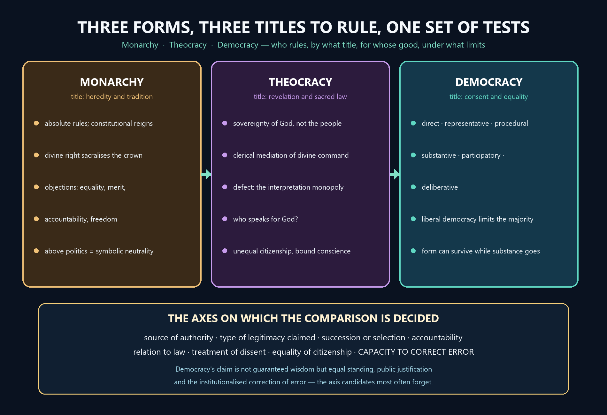

# Forms of Government — Learner-v2 Source-Complete Learning Session


> **Syllabus (verbatim):** Forms of Government : Monarchy; Theocracy and Democracy.
>
> **Generation:** g2, 27 August 2026 · **Approval:** false pending explicit topic approval
>
> **Evidence discipline:** Complete legacy teaching and workbook material is preserved, reordered Basic-first/Advanced-last, and checked against the canonical owner and verified 2018–2025 PYQ ledger.


## BASIC LEARNING SESSION




*Concept map: three forms distinguished by the title each claims to rule — heredity, revelation and consent — and then judged on one shared set of axes ending in the capacity to correct error.*

> **Syllabus (verbatim):** Forms of Government : Monarchy; Theocracy and Democracy.

### How to Use This Five-Layer Session

Every logical subtopic follows exactly:

| Layer | Purpose |
|---:|---|
| 1. SIMPLE START | visual-first plain-language gateway |
| 2. CORE UPSC | complete terminology, doctrine, argument, example and source grounding |
| 3. ADVANCED | objections, replies, comparisons, interpretive issues and provenance cautions |
| 4. EXAM APPLICATION | verified PYQ routes and 10/15/20-mark architecture |
| 5. RAPID REVISION | traps, retrieval notes and links to the exact MCQ set |

### Source Audit and Contemporary-Link Boundary

- **Canonical doctrine source:** `upsc-ai-kit/knowledge/Philosophy/paper-2/socio-political/Forms-of-Government.md` (8,660 words), sliced verbatim into the CORE UPSC layers (each canonical teaching passage exactly once) and preserved again, in full, in the canonical apparatus block.
- **Doctrine grounding (in the canonical file):** the classification problem (who rules, for whose good, under what design, with what limits; descriptive vs normative); the classical classifications (Plato's degeneration sequence and critique of democracy; Aristotle's six-fold number-x-purpose classification, polity as the middle course); monarchy (absolute vs constitutional, the normative arguments and critique, divine right); theocracy (definition, the sovereignty-of-God claim, secularism, and the interpretation-monopoly defect); democracy (direct/representative, procedural/substantive, liberal democracy and minority protection, participatory and deliberative democracy, the epistemic defence); the authority-and-pathologies module (Weber's three pure types and routinisation, Schumpeter's competitive method, Michels's iron law, Mudde/Muller/Laclau on populism, the illiberal-democracy grid and the propaganda/regulator's-dilemma analysis); the inter-thinker and inter-form debates; the criticisms and replies; and the common traps. No book claim is added beyond what the canonical file already grounds.
- **Comparative-context discipline:** parliamentary vs presidential systems; unitary vs federal systems and confederation; centralisation vs decentralisation and local self-government; semi-presidential/cohabitation forms; and the criteria of evaluation are standard, verifiable political theory but are **not** part of this Philosophy owner's canonical doctrine (whose core is Monarchy, Theocracy, Democracy). They appear only in the authored scaffolding layers, always clearly labelled as comparative context beyond the syllabus core, never as fabricated canonical doctrine.
- **Verified PYQs:** local Socio-Political Philosophy Paper II bank, 2018-2025; this clause owns exactly **10** primary parts (2018:1, 2019:1, 2020:1, 2021:1, 2022:2, 2023:2, 2024:0, 2025:2). The 2018 liberty/equality-as-distinctive-features 20-marker (Social and Political Ideals), the 2024 Aristotle-vs-Plato statism/individualism 20-marker (Individual and State), the sovereignty-tinged democracy stems (Sovereignty) and the anarchism stems (Political Ideologies) are kept separate and not double-owned.
- **Provenance discipline:** Weber, Schumpeter and Michels (*Political Parties*, **1911**), Mudde ("The Populist Zeitgeist", **2004**), Muller (*What Is Populism?*, **2016**), Laclau (*On Populist Reason*, **2005**) and Habermas are cited by position, title and year only; no page, edition or verbatim wording is asserted. Articles 25-28, Article 19(1)(a) with 19(2), the Representation of the People Act, **1951**, Article 40 and the 73rd and 74th Constitutional Amendment Acts, **1992** are used only as dated legal facts, never as proof of a philosophical thesis, and no Indian government, party, leader or period is characterised as populist, illiberal or theocratic.
- **India-centric discipline:** India is described as a parliamentary, federal (holding-together, with unitary features) democratic republic under **constitutional supremacy** - never parliamentary sovereignty - with judicial review.
- **Contemporary-affairs boundary (deliberate):** this is a static, syllabus-driven conceptual clause; no 2026 institutional development is forced as an anchor, and no factual claim is invented. Only static syllabus relevance and clearly labelled analysis are used.
- **Qdrant:** optional fallback only; not required for this canonical topic, and it never blocks the learning session.

**Preservation note:** the canonical doctrine is reorganised into layers, never compressed. Every doctrine, numbered argument, objection/reply, comparison, corpus-depth delta, PYQ route, directive rule, graded verdict and provenance caution is retained; simplification means adding accessible gateways, not deleting complexity.

### Learning Roadmap

| Unit | Logical subtopic |
|---:|---|
| 1 | The Classification Problem: Who Rules, For Whom, Under What Limits |
| 2 | Plato: The Degeneration of Constitutions and the Critique of Democracy |
| 3 | Aristotle: The Six-Fold Matrix, Aristocracy/Oligarchy and the Polity |
| 4 | Monarchy: Absolute vs Constitutional, Freedom and the Above-Politics Claim |
| 5 | Theocracy: Divine Sovereignty, Secularism and the Validity Question |
| 6 | Democracy: Models, Institutional Forms and Minority Protection |
| 7 | Authority, Legitimacy and the Non-Democratic Forms (Weber, Schumpeter, Michels) |
| 8 | Populism, Illiberal Democracy and Propaganda |
| 9 | Institutional and Territorial Design: Federal/Unitary, Decentralisation and Inter-Form Debates |
| 10 | Mixed/Constitutional Government, Criteria of Evaluation and the Comparative Verdict |

---

### SESSION 1 — The Classification Problem: Who Rules, By What Title, For Whose Good

#### DEFINITION / WHAT THIS IS CALLED

**Plain-language definition:** A form of government is the standing arrangement that answers four questions at once — who rules, by what title, for whose good, and under what limits — so monarchy, theocracy and democracy are compressed answers rather than neutral names on a list.

**Technical definition:** The clause fixes a classificatory and evaluative problem rather than an institutional inventory: a descriptive classification records who holds power and how office is filled, a normative verdict judges whether that arrangement deserves obedience, and the three named forms are distinguished above all by the title they claim — heredity and tradition, revelation and sacred law, or consent and political equality.

#### VISUAL — The four questions hidden inside every regime label

```text

   (1) WHO RULES?           one    |    few    |    many

                                   |

   (2) FOR WHOSE GOOD?   common good  <----->  private or sectional

                                   |

   (3) BY WHAT TITLE?    heredity | conquest | divine sanction |

                         consent and election | sacred law

                                   |

   (4) UNDER WHAT LIMITS?  law? rights? accountability? none?

                                   |

                                   v

        DESCRIPTIVE map (what the regime IS)

                    against

        NORMATIVE verdict (whether it OUGHT to bind anyone)

```

*The opening grid that should be reproduced in one or two sentences before any form of government is named.*

#### VISUAL — Three named forms, three different titles to rule

```text

+-------------+------------------------+-------------------------+

| FORM        | TITLE CLAIMED          | STANDING DANGER         |

+-------------+------------------------+-------------------------+

| MONARCHY    | heredity, tradition,   | arbitrariness and weak  |

|             | sometimes divine right | accountability          |

| THEOCRACY   | revelation and sacred  | conscience crushed,     |

|             | law, read by clergy    | unequal citizenship     |

| DEMOCRACY   | consent, equality,     | majoritarianism and     |

|             | participation          | manipulated opinion     |

+-------------+------------------------+-------------------------+

   RULE OF USE -> fix the title first; the danger follows from it.

```

*The syllabus names these three because each rests its claim on a different source of authority, not because they differ only in size.*

#### ANSWER-GRABBING OPENING — WRITE/ADAPT IN THE EXAM

> Monarchy, theocracy and democracy are not three neutral names for the same activity: each answers who rules and by what title, and the marks are earned by also asking for whose good rule is exercised and under what limits of law, rights and accountability it operates.

#### MUST-WRITE KEYWORDS

- **who rules, by what title**
- **common good against sectional interest**
- **descriptive classification**
- **normative verdict**
- **source of legitimate authority**
- **limits of law, rights and accountability**

**How to use them:** Separate the descriptive classification from the normative verdict in the opening lines, name the source of legitimate authority each form claims, say whether rule serves the common good or a sectional interest, and only then ask under what limits of law, rights and accountability the regime actually operates.

#### CORE OBJECTION, REPLY AND RESIDUAL LIMIT

**Objection:** If classification is only a set of questions, it decides nothing, and the exercise looks like taxonomy for its own sake rather than political philosophy.

**Best reply:** The questions are not idle, because each isolates a distinct ground of criticism: number of rulers exposes concentration, title exposes arbitrariness, purpose exposes exploitation, and limits expose domination. A classification that keeps these apart has already begun the evaluation.

**Residual limit:** The grid tells you what to ask, never what to conclude; the substantive verdict on monarchy, theocracy or democracy comes only from the later arguments about knowledge, revelation, consent and accountability.

#### EXAM USE AND CONCISE REVISION

**Answer architecture:** Open with the four-question grid, decide in one line whether the stem wants description or evaluation, place the named form on the grid, and close with a graded verdict that states the axis on which the decision actually turns.

- Four questions, not one: who rules, by what title, for whose good, under what limits.
- Monarchy claims heredity and tradition, theocracy claims revelation and sacred law, democracy claims consent and political equality.
- Descriptive classification records what a regime is; the normative verdict judges whether it deserves obedience.
- No form scores highest on every axis, so the closing verdict is graded and names its decisive criterion.

Before naming any single form, "forms of government" asks four blunt questions at
once, and a good answer keeps them apart instead of blurring them into one.

```text
        THE CLASSIFICATION TREE  --  four questions, not one
        ====================================================

        (1) WHO RULES?            one   |   few   |   many
                                    |       |         |
        (2) FOR WHOSE GOOD?     common good  <----->  private / sectional interest
                                    |
        (3) BY WHAT TITLE?     heredity | conquest | divine sanction |
                               consent / election | sacred law
                                    |
        (4) UNDER WHAT LIMITS?  law? rights? accountability? none?
                                    |
                                    v
             DESCRIPTIVE map (what a regime IS)  vs
             NORMATIVE verdict (whether it OUGHT to be obeyed)
```

Plain version: "monarchy / theocracy / democracy" is not a neutral shopping list.
Each label answers WHO rules and BY WHAT TITLE, but the marks come from also
asking FOR WHOSE GOOD and UNDER WHAT LIMITS -- and from noticing when a stem wants
a DESCRIPTIVE picture ("what is a theocracy?") versus a NORMATIVE judgment ("can
theocracy be a valid form?").

> MEMORY: Open every Forms-of-Government answer with the grid -- WHO rules, FOR
> WHOSE good, BY WHAT title, UNDER WHAT limits -- then say whether the stem wants
> description or evaluation. Distinguish first, judge last.


#### 0. ONE-SCREEN MAP

| Form | Basic meaning | Source of legitimacy | Main strength claimed | Main philosophical danger | UPSC hinge |
|---|---|---|---|---|---|
| **Monarchy** | rule of one | heredity, conquest, tradition, sometimes divine sanction | unity, continuity, decisiveness | arbitrariness, unaccountability, weak basis in equality | freedom, divine right, "above politics" |
| **Theocracy** | rule in the name of God or by religious authority | revelation, sacred law, clergy, divine sovereignty | moral unity, sacred order | suppression of conscience, pluralism and equal citizenship | secularism, validity in modern state |
| **Democracy** | rule of the people | consent, equality, participation, representation | accountability, liberty, self-rule | majoritarianism, manipulation, mediocrity, propaganda | minorities, deliberation, equality vs liberty |

```text
CLASSICAL FRAME

PLATO: decline of constitutions
Aristocracy / philosopher-rule
        ↓
    Timocracy
        ↓
    Oligarchy
        ↓
   Democracy
        ↓
    Tyranny

ARISTOTLE: number of rulers × end served
                COMMON GOOD        PRIVATE INTEREST
ONE             Monarchy           Tyranny
FEW             Aristocracy        Oligarchy
MANY            Polity             Democracy
```

**Working key:** ✅ Plato judges democracy primarily by the standard of **knowledge**; ✅ Aristotle judges constitutions by **number of rulers plus orientation to common good**; ⚠️ modern UPSC answers must connect classical analysis to constitutionalism, minority rights, propaganda, decentralisation, and social justice.

#### 1. CLASSICAL CLASSIFICATIONS (Plato and Aristotle)

#### 1.1 Why begin with classification?
✅ Greek political philosophy treats forms of government not as neutral descriptions but as moral-intellectual judgments about the proper ordering of political life. The central questions are: who should rule, what qualifies rulers, and whether rule serves the common good or sectional interest.

⚠️ For UPSC, this opening matters because later questions on monarchy, theocracy and democracy often expect a classical backdrop. Without Plato and Aristotle, answers become descriptive and lose philosophical depth.

#### CLOSING RECALL FLOW — The Classification Problem: Who Rules, By What Title, For Whose Good

```closure-flow
SUBTOPIC: The Classification Problem: Who Rules, By What Title, For Whose Good
STARTING CONCEPT: The Classification Problem: Who Rules, By What Title, For Whose Good
KEY TERMS / DEFINITIONS: who rules, by what title | common good against sectional interest | descriptive classification | normative verdict | source of legitimate authority | limits of law, rights and accountability
MECHANISM / ARGUMENT: Every regime label compresses four separate questions into one word, so a controlled answer unpacks who rules, by what title, for whose good and under what limits before it names any form at all.
CONSEQUENCE / CONTRAST: Because the axes come apart, a regime can score well on continuity and badly on equality, or well on decisiveness and badly on answerability, which is why comparative verdicts in this clause are always graded rather than absolute.
UPSC TRAP / ANSWER-USE: Do not treat the stem's label as settled description; a descriptive question asks what a theocracy is, a normative question asks whether it ought to be obeyed, and the two must never be answered in the same register.
ANSWER-GRABBING FORMULATION: Monarchy, theocracy and democracy are not three neutral names for the same activity: each answers who rules and by what title, and the marks are earned by also asking for whose good rule is exercised and under what limits of law, rights and accountability it operates.
```

### SESSION 2 — Plato: The Degeneration of Constitutions and the Critique of Democracy

#### DEFINITION / WHAT THIS IS CALLED

**Plain-language definition:** Plato holds that ruling is a craft requiring knowledge, so constitutions decay in a determinate order — from the rule of wisdom through timocracy, oligarchy and democracy to tyranny — as the ordering principle of soul and city slides from reason to appetite.

**Technical definition:** In the Republic Plato defends a true aristocracy of knowledge, that is rule by philosopher-rulers, and derives a degeneration sequence in which each constitution's dominant value corrupts into the next: honour yields to the desire for wealth, wealth divides rich from poor, freedom dissolves discipline, and unrestrained licence delivers the city to a demagogue who becomes a tyrant.

#### VISUAL — The degeneration sequence, with the value that fails at each step

```text

   ARISTOCRACY OF KNOWLEDGE  (wisdom rules)

            |  honour displaces wisdom

            v

   TIMOCRACY               (honour, military spiritedness)

            |  desire for wealth displaces honour

            v

   OLIGARCHY               (property; rich divided from poor)

            |  the poor many overthrow the propertied few

            v

   DEMOCRACY               (freedom and equality of desires)

            |  licence makes restraint look oppressive

            v

   TYRANNY                 (one demagogue who flatters, then dominates)

```

*Each stage falls because the value it prizes cannot restrain the appetite that succeeds it.*

#### VISUAL — Three charges against democracy, and what each really attacks

```text

+---------------------------+--------------------------------------+

| CHARGE                    | WHAT IT ACTUALLY ATTACKS             |

+---------------------------+--------------------------------------+

| ruling is a craft         | the assumption that all opinions are |

|                           | politically equal in competence      |

| liberty is not a          | levelling the distinction between    |

| qualification             | knowledge and ignorance              |

| unregulated liberty       | indiscipline in family, education    |

| breeds tyranny            | and public life, then the demagogue  |

+---------------------------+--------------------------------------+

   VERDICT -> diagnosis survives; the guardian remedy does not.

```

*Reconstructing the charges separately is what converts a description of Plato into an argument about him.*

#### ANSWER-GRABBING OPENING — WRITE/ADAPT IN THE EXAM

> Plato's target is not participation as such but rule by unexamined opinion and unrestricted appetite: the ship of state needs a trained navigator, and a city that treats every opinion as equally qualified is already preparing its own demagogue.

#### MUST-WRITE KEYWORDS

- **ruling as a craft of knowledge**
- **ship-of-state analogy**
- **degeneration of constitutions**
- **timocracy, oligarchy, democracy, tyranny**
- **liberty mistaken for qualification**
- **demagogue and the slide to tyranny**

**How to use them:** State that Plato judges constitutions by the standard of knowledge, run the ship-of-state analogy once, lay out the degeneration sequence from timocracy through oligarchy and democracy to tyranny, show how liberty mistaken for qualification licenses the demagogue, and close on the asymmetric verdict.

#### CORE OBJECTION, REPLY AND RESIDUAL LIMIT

**Objection:** Rule by trained guardians supplies no mechanism by which the guardians' own error is detected or their power removed, and it treats the moral equality of citizens as politically irrelevant.

**Best reply:** Plato can reply that competence is demanded everywhere else in life and that a city driven by appetite is no freer than one driven by a tyrant; the diagnosis of demagoguery and defective leadership-selection survives even where the remedy is refused.

**Residual limit:** The asymmetry is the whole point: the diagnosis of manipulation, ignorance and bad leadership-selection stands, while the guardian remedy fails for want of consent, external correction and any available epistemic elite.

#### EXAM USE AND CONCISE REVISION

**Answer architecture:** Name Plato's exact target in two lines, give the degeneration sequence as a numbered spine, deploy the ship-of-state analogy with its limitation, and close with the asymmetric verdict that the diagnosis survives while the authoritarian remedy does not.

- Republic: rule of wisdom, then timocracy (honour), oligarchy (wealth), democracy (freedom), tyranny (domination).
- Ship-of-state analogy: navigation is a skill, and numbers confer no competence.
- Three charges: ruling is a craft, liberty is not qualification, unregulated liberty breeds tyranny.
- Asymmetric verdict: the diagnosis of demagoguery survives; unaccountable guardian rule does not.
- 2025 Q1(d) asks precisely for this comment, so the sequence and the verdict must both appear.

Plato does not list constitutions side by side; he arranges them as a DECLINE --
each stage falling into the next as the ruling value slides from reason to raw
appetite.

```text
        PLATO'S DEGENERATION CYCLE  (Republic VIII)
        ===========================================

        ARISTOCRACY   rule of knowledge (philosopher-rulers)   [the ideal]
             |   honour replaces wisdom
             v
        TIMOCRACY     rule of honour / military spiritedness
             |   desire for wealth replaces honour
             v
        OLIGARCHY     rule of the wealthy few; rich vs poor split
             |   the poor revolt; freedom prized above all
             v
        DEMOCRACY     rule of freedom + equal desires; no discipline
             |   licence breeds a flattering demagogue
             v
        TYRANNY       one strongman seizes absolute power   [the worst]

        Ruling value falls:  reason -> honour -> wealth -> appetite -> domination
```

Plain version: for Plato, democracy is not the safe middle -- it is the second
worst, because its very virtue (maximal freedom) dissolves the discipline that
holds a city together, and the vacuum invites a tyrant.

> MEMORY: A-T-O-D-T -- Aristocracy, Timocracy, Oligarchy, Democracy, Tyranny.
> "Too much freedom is the seed of tyranny" is the line that carries the answer.


#### 1.2 Plato's broad classification and the logic of degeneration
✅ In *Republic*, Plato presents the ideal city as governed by wisdom, that is, by philosopher-rulers or a true aristocracy of knowledge. He then traces a sequence of degeneration: **timocracy → oligarchy → democracy → tyranny**.

| Stage | Dominant value | Why it degenerates |
|---|---|---|
| **Timocracy** | honour, military spiritedness | honour yields to desire for wealth |
| **Oligarchy** | property and wealth | division between rich and poor destabilises order |
| **Democracy** | freedom and equality of desires | excessive liberty undermines discipline and authority |
| **Tyranny** | domination by one demagogue | democracy's disorder invites a strongman |

✅ Plato's point is not merely historical. It is normative: when the ordering principle of the soul and city declines from reason to appetite, constitutions deteriorate correspondingly.

#### 1.3 Plato's critique of democracy
✅ Plato's criticism of democracy, especially relevant for 2025, rests on three interlinked claims.

**First, rule is a craft requiring knowledge.** The famous **ship-of-state analogy** suggests that navigation cannot be entrusted to the unskilled merely because they are numerous. A ship needs a trained navigator; similarly, a polity needs rulers with knowledge of justice and the good. ⚠️ Plato therefore rejects the democratic assumption that all opinions are politically equal in competence.

**Second, democracy mistakes liberty for qualification.** In democracy, according to Plato, everyone claims an equal right to rule regardless of training or moral discipline. This levels distinctions between knowledge and ignorance, excellence and mediocrity.

**Third, unregulated liberty produces tyranny.** Democracy prizes freedom so highly that restraint appears oppressive. The result is indiscipline in family, education and public life. Out of this license emerges the demagogue who flatters the masses, attacks elites, and finally seizes absolute power. Thus **democracy turns into tyranny**.

⚠️ UPSC trap: Plato's critique of democracy is **not** a simple defence of hereditary monarchy. It is a defence of **rule by knowledge** and an attack on uninformed mass rule.

#### CLOSING RECALL FLOW — Plato: The Degeneration of Constitutions and the Critique of Democracy

```closure-flow
SUBTOPIC: Plato: The Degeneration of Constitutions and the Critique of Democracy
STARTING CONCEPT: Plato: The Degeneration of Constitutions and the Critique of Democracy
KEY TERMS / DEFINITIONS: ruling as a craft of knowledge | ship-of-state analogy | degeneration of constitutions | timocracy, oligarchy, democracy, tyranny | liberty mistaken for qualification | demagogue and the slide to tyranny
MECHANISM / ARGUMENT: When the ruling principle of soul and city falls from reason to appetite, each constitution's dominant value corrupts into the value of the next, so political decline follows a determinate order rather than mere accident.
CONSEQUENCE / CONTRAST: Democracy on this account is not one flawed regime among others but the immediate antechamber of tyranny, because a city that prizes freedom above everything makes restraint itself look oppressive.
UPSC TRAP / ANSWER-USE: Plato's critique is not a defence of hereditary monarchy and not a simple hatred of freedom; it is a defence of rule by knowledge, so reconstruct the competence, order and demagoguery arguments before criticising any of them.
ANSWER-GRABBING FORMULATION: Plato's target is not participation as such but rule by unexamined opinion and unrestricted appetite: the ship of state needs a trained navigator, and a city that treats every opinion as equally qualified is already preparing its own demagogue.
```

### SESSION 3 — Aristotle: The Six-Fold Classification and the Polity as Middle Course

#### DEFINITION / WHAT THIS IS CALLED

**Plain-language definition:** Aristotle classifies constitutions by two variables together — how many rule, and whether they rule for the common advantage or their own — which yields three right forms and three deviations, and makes polity, not democracy, the good rule of the many.

**Technical definition:** In the Politics the criteria are the number of rulers, one, few or many, crossed with the orientation of rule to the common or the private advantage, producing monarchy, aristocracy and polity as right forms against tyranny, oligarchy and democracy as their deviations; polity is the practical mixed constitution, rule of the many under law, moderated by property, virtue and a broad middle class.

#### VISUAL — The six-fold classification: number crossed with purpose

```text

+---------------+---------------------------+------------------------+

| NUMBER RULING | RIGHT FORM (common good)  | DEVIATION (private)    |

+---------------+---------------------------+------------------------+

| ONE           | MONARCHY                  | TYRANNY                |

| FEW           | ARISTOCRACY               | OLIGARCHY              |

| MANY          | POLITY                    | DEMOCRACY (classical)  |

+---------------+---------------------------+------------------------+

   KEY -> the good and corrupt versions of each number differ in

          PURPOSE, not in size.

```

*The single most reusable table in this clause, because every classification stem can be opened from it.*

#### VISUAL — Why polity is a middle course and not a compromise

```text

   OLIGARCHY  <-------------  POLITY  ------------->  DEMOCRACY

   rule of the wealthy      rule of the many        rule of the poor

   few in their own          UNDER LAW, moderated    many in their own

   interest                  by property, virtue     interest

                             and a broad MIDDLE

                             CLASS

            against STATISM -> value is not absorbed into one

                               all-wise ruler or a total state

            against INDIVIDUALISM -> politics is not reduced to

                               unrestricted private self-assertion

            for CIVIC MODERATION -> citizenship inside a lawful

                               order aimed at the common good

```

*The middle-class argument is what lets Aristotle answer both the idealist and the individualist at once.*

#### ANSWER-GRABBING OPENING — WRITE/ADAPT IN THE EXAM

> Classification needs two variables rather than one: number tells you who decides, orientation tells you for whom, and the right and corrupt version of each number differ in purpose rather than in size.

#### MUST-WRITE KEYWORDS

- **number of rulers times end served**
- **right forms and deviant forms**
- **polity as the good rule of the many**
- **democracy in the classical deviant sense**
- **middle class and mixed constitution**
- **middle course between statism and individualism**

**How to use them:** Draw the six-fold classification once, insist that the good-many form is polity while democracy in Aristotle's usage names its deviation, explain the mixed constitution and the stabilising middle class, and use the middle course between statism and individualism as the adjudicating line against Plato.

#### CORE OBJECTION, REPLY AND RESIDUAL LIMIT

**Objection:** The phrase common advantage is not self-specifying, so the classification cannot say which constitution is right without importing an independent theory of the human good.

**Best reply:** Aristotle supplies that theory elsewhere through the human good and the life of virtue, and the grid still earns its keep by separating the question of who decides from the question of for whom, a distinction that single-variable classifications simply collapse.

**Residual limit:** The claim that polity is most stable is a sociological judgement about the effect of a broad middle class, not a demonstration that polity is just.

#### EXAM USE AND CONCISE REVISION

**Answer architecture:** Open with the two variables, draw the six-fold grid, name polity as the good-many form, argue the middle-class thesis with its stated limitation, and close by contrasting Aristotle's realism with Plato's idealism on the same axis.

- Two criteria: number of rulers, and rule for the common or the private advantage.
- Right forms: monarchy, aristocracy, polity. Deviations: tyranny, oligarchy, democracy.
- Polity is the mixed constitution: rule of the many under law with a broad middle class.
- Against statism it refuses the all-wise ruler; against individualism it refuses unrestricted private self-assertion.
- Plato asks who ought ideally to rule; Aristotle asks which constitution sustains good political life under real conditions.

Aristotle replaces Plato's single ladder with a 2-variable GRID: count the rulers,
then ask whether they rule for the common good or for themselves.

```text
        ARISTOTLE'S SIX-FOLD MATRIX  (Politics III)
        ===========================================

        rulers |  RIGHT form (common good) |  DEVIANT form (self-interest)
        -------+---------------------------+------------------------------
        ONE    |  MONARCHY                 |  TYRANNY
        FEW    |  ARISTOCRACY (rule of the |  OLIGARCHY (rule of the
               |   best / most virtuous)   |   wealthy few for themselves)
        MANY   |  POLITY (law-governed     |  DEMOCRACY (deviant: rule of
               |   rule of the many)       |   the poor many in their interest)

        Each row: same NUMBER, opposite PURPOSE.  The good-many form is POLITY,
        not "democracy" (which in his classical usage is the deviant version).
```

Plain version: the difference inside each row is not size but ORIENTATION. Rule of
"the few" is aristocracy when the few are the best and rule for all; it is
oligarchy when the few are merely the rich and rule for themselves. Aristotle's
favourite practicable form is POLITY -- a mixed constitution resting on a broad
middle class.

> MEMORY: One / Few / Many, each with a good twin and a corrupt twin. Good-many =
> POLITY. Aristocracy = rule of the BEST; oligarchy = rule of the WEALTHY.


#### 1.4 Aristotle's six-fold classification
✅ Aristotle in *Politics* classifies constitutions by two criteria: **(a) how many rule — one, few, many; and (b) whether they govern for the common advantage or their private advantage.**

| Number of rulers | Right form (common good) | Deviant form (private interest) |
|---|---|---|
| One | **Monarchy** | **Tyranny** |
| Few | **Aristocracy** | **Oligarchy** |
| Many | **Polity** | **Democracy** |

✅ The crucial Aristotelian distinction is that the good-many form is **polity**, not democracy. In Aristotle's classical usage, democracy is the deviant rule of the poor many in their own interest.

#### 1.5 Aristotle's polity as middle course
⚠️ Aristotle is often read, especially in the 2024 question, as more successful than Plato in balancing **statism** and **individualism**. This claim arises because Aristotle does not collapse politics into abstract idealism. He recognises plurality of social interests, the need for law, the dangers of both concentrated wealth and mob rule, and the stabilising role of a **middle class**.

✅ **Polity** is his practical mixed constitution: rule of the many under law, moderated by property, virtue and civic participation. It avoids the extremism of oligarchy and democracy and seeks a workable constitutional mean.

**Why a middle course?**
- against **statism**: it does not absorb all value into a single all-wise ruler or total state.
- against **individualism**: it does not reduce politics to private pursuit or unrestricted self-assertion.
- for **civic moderation**: it embeds citizenship in a lawful order directed to the common good.

⚠️ A strong UPSC line is that Plato asks who ought ideally to rule; Aristotle asks what constitution can **sustain a good political life under real social conditions**.

#### 1.6 Classical relevance to the modern syllabus
✅ Plato illuminates the epistemic and moral vulnerability of democracy; ✅ Aristotle gives a comparative grammar of forms of government. ⚠️ Together they let you evaluate monarchy, theocracy and democracy as rival claims about authority, knowledge, law, freedom and the common good.

#### CLOSING RECALL FLOW — Aristotle: The Six-Fold Classification and the Polity as Middle Course

```closure-flow
SUBTOPIC: Aristotle: The Six-Fold Classification and the Polity as Middle Course
STARTING CONCEPT: Aristotle: The Six-Fold Classification and the Polity as Middle Course
KEY TERMS / DEFINITIONS: number of rulers times end served | right forms and deviant forms | polity as the good rule of the many | democracy in the classical deviant sense | middle class and mixed constitution | middle course between statism and individualism
MECHANISM / ARGUMENT: Because the same number of rulers may serve either the common advantage or a sectional one, each numerical class splits into a right form and its deviation, so purpose rather than size does the classificatory work.
CONSEQUENCE / CONTRAST: Polity emerges as the most durable practicable constitution because extremes of wealth and poverty produce factional rule, whereas a broad middle class makes lawful moderation self-sustaining.
UPSC TRAP / ANSWER-USE: Do not equate Aristotle's polity with modern democracy: it is an illuminating mixed-government precursor that excluded many residents from citizenship, and it is not a regime of universal equal suffrage.
ANSWER-GRABBING FORMULATION: Classification needs two variables rather than one: number tells you who decides, orientation tells you for whom, and the right and corrupt version of each number differ in purpose rather than in size.
```

### SESSION 4 — Monarchy: Absolute and Constitutional, Divine Right and the Freedom Question

#### DEFINITION / WHAT THIS IS CALLED

**Plain-language definition:** Monarchy is rule by one person who normally holds office by heredity, and its modern assessment turns entirely on whether that office is absolute, so that the ruler governs, or constitutional, so that the ruler reigns while elected institutions govern.

**Technical definition:** Absolute monarchy concentrates executive, legislative and sometimes judicial functions in a hereditary ruler legitimised by tradition, conquest or the divine right of kings; constitutional monarchy retains the crown as a ceremonial and integrating office bound by convention and law, transfers effective authority to cabinet and parliament, and thereby relocates accountability instead of abolishing the throne.

#### VISUAL — Two monarchies, and where accountability actually sits

```text

+---------------------+----------------------------+---------------------+

| AXIS                | ABSOLUTE MONARCHY          | CONSTITUTIONAL      |

+---------------------+----------------------------+---------------------+

| powers              | executive, legislative and | crown reigns, the   |

|                     | sometimes judicial in one  | cabinet governs     |

| title               | heredity, conquest,        | historic continuity |

|                     | tradition, divine right    | plus legal limits   |

| accountability      | weak and institutionally   | shifted to cabinet  |

|                     | unsecured                  | and parliament      |

| verdict             | efficient but normatively  | acceptable as       |

|                     | risky                      | symbolic headship   |

+---------------------+----------------------------+---------------------+

```

*The whole modern defence of monarchy lives in the right-hand column, and every criticism bites hardest on the left.*

#### VISUAL — Reading the above-politics claim without conceding too much

```text

   ABOVE PARTY CONFLICT                ABOVE CONSTITUTIONAL

   (non-partisan symbol)               ACCOUNTABILITY

            |                                   |

            v                                   v

   role fixed by convention;          no reviewable limit on the

   elected institutions govern        exercise of public power

            |                                   |

            v                                   v

   SYSTEMATIC: legitimacy,            NOT SYSTEMATIC: the order

   continuity and role clarity        ceases to be constitutional

   are all specifiable                and slides to arbitrary rule

```

*The 2023 stem turns on which of the two readings of above politics is being asserted.*

#### ANSWER-GRABBING OPENING — WRITE/ADAPT IN THE EXAM

> Monarchy leaves room for individual freedom only where law, rights and representative institutions already restrain the crown: the institution does not itself ground freedom, and hereditary title guarantees neither wisdom nor virtue nor answerability.

#### MUST-WRITE KEYWORDS

- **absolute against constitutional monarchy**
- **hereditary office and the equality objection**
- **divine right of kings**
- **above politics as symbolic neutrality**
- **succession failure and arbitrariness**
- **reigns but does not govern**

**How to use them:** Separate absolute from constitutional monarchy in the first two lines, run the equality, merit, accountability and freedom objections in order, read above politics as symbolic neutrality inside a constitutional order rather than supra-legal power, and keep divine right for the bridge to theocracy.

#### CORE OBJECTION, REPLY AND RESIDUAL LIMIT

**Objection:** Hereditary office violates the principle that public authority should be open to all on equal terms, and it makes competence a matter of accident rather than of qualification.

**Best reply:** The constitutional monarchist replies that a non-elective head of state separates a politically neutral symbol of continuity from the elected government that actually rules, which a partisan presidency cannot do, and that the monarch's role is defined by constitutional convention rather than personal will.

**Residual limit:** That reply defends ceremonial monarchy alone: it does nothing for an absolute ruler's claim to govern without consent or accountability, and even a symbolic crown carries inherited hierarchy and unequal civic status.

#### EXAM USE AND CONCISE REVISION

**Answer architecture:** Fix which type of monarchy the stem has in mind, state what freedom in the modern sense requires, show what monarchy as a principle of rule entails, and close with the conditional verdict that monarchy coexists with freedom only when constitutionalised.

- Absolute: concentrated powers, weak institutional accountability. Constitutional: reigns but does not govern.
- Four objections: equality, merit, accountability, freedom.
- Divine right sacralises kingship; it is the bridge to theocracy, not identity with it.
- Systematic only if above politics means symbolic neutrality within a constitutional order.
- 2021 Q1(d) on freedom and 2023 Q1(e) on systematicity are both answered from this one distinction.

Monarchy is rule of one, usually by heredity. But "monarchy" hides a spectrum: the
same word covers an absolute ruler who governs directly and a ceremonial crown that
merely reigns while elected institutions govern.

```text
        THE MONARCHY SPECTRUM  (title of one, very different powers)
        ===========================================================

        ABSOLUTE MONARCHY  <-------------------->  CONSTITUTIONAL MONARCHY
        rules directly;                            reigns but does not rule;
        power concentrated                         real power in cabinet /
        (exec+leg+often jud);                      parliament; monarch is a
        divine right / conquest;                   symbolic, non-partisan head
        weak accountability                        under law + convention
             |                                          |
             |   "above politics" here means            |   "above politics" here means
             |    ABOVE THE LAW (autocracy)             |    ABOVE PARTY (symbolic neutrality)
             v                                          v
        normatively risky                          acceptable as symbolic headship

        Sub-axis (the "few" cousins): rule of the BEST (aristocracy) shades into
        rule of the WEALTHY few (oligarchy) -- expertise vs capture.
```

Plain version: whether monarchy is defensible depends almost entirely on WHERE on
this spectrum it sits. The strongest modern case is for the CONSTITUTIONAL variant,
where the monarch is a unifying symbol and democracy does the governing.

> MEMORY: Distinguish ABSOLUTE (rules, above the law) from CONSTITUTIONAL (reigns,
> above party). Most defences of monarchy quietly rely on the constitutional kind.


#### 2. MONARCHY

#### 2.1 Definition and basic structure
✅ Monarchy is government by **one ruler**, usually occupying office by heredity. It is among the oldest forms of political rule and appears in both ancient and medieval political thought as a natural symbol of unity.

#### 2.2 Absolute monarchy and constitutional monarchy
| Type | Basic character | Source of power | Accountability pattern | Philosophical verdict |
|---|---|---|---|---|
| **Absolute monarchy** | monarch rules directly with concentrated authority | heredity, conquest, tradition, divine right | weak institutional accountability | efficient but normatively risky |
| **Constitutional monarchy** | monarch reigns but elected institutions govern | historic continuity + constitutional limitation | accountability shifts to cabinet/parliament | acceptable as symbolic headship |

✅ **Absolute monarchy** concentrates executive, legislative and sometimes judicial functions in the ruler. ✅ **Constitutional monarchy** preserves the monarch as ceremonial or integrating authority while real political power lies with representative institutions and law.

⚠️ Thus when UPSC asks whether monarchy can be systematic if monarchs are above politics, the most defensible answer lies mainly in the constitutional variant, not the absolute one.

#### 2.3 Normative arguments for monarchy
**Unity and continuity:** ✅ A single ruler can symbolise the state beyond party conflict. Monarchy may appear to offer historical continuity, institutional memory and national identity.

**Decision and stability:** ⚠️ Especially in pre-modern settings, monarchy is defended as decisive and less paralysed by faction than assemblies.

**Above politics thesis:** ⚠️ In constitutional monarchies, the claim that the monarch is "above politics" means above partisan competition. The office may serve as a non-elective unifying symbol while day-to-day politics remains democratic.

#### 2.4 Critique of monarchy
**Equality objection:** ✅ Hereditary office violates the democratic principle that public authority should be open to all on equal terms.

**Merit objection:** ⚠️ Birth gives no guarantee of wisdom or virtue. Plato's philosopher-ruler is chosen by knowledge and training, not heredity.

**Accountability objection:** ✅ Concentration of power in one person invites arbitrariness. Where institutions are weak, monarchy tends toward despotism.

**Freedom objection:** ✅ Monarchy can leave room for freedom only where law, rights and institutions restrain the crown. Unchecked monarchy narrows civil and political liberty.

#### 2.5 Divine Right theory and monarchy-theocracy relation
✅ The **Divine Right of Kings** holds that the monarch rules by God's will and is answerable primarily to God, not to the people. This doctrine historically strengthened absolutism by sacralising political authority.

⚠️ The relation to theocracy is close but not identical:
- in **monarchy**, the ruler is a king; divine sanction may legitimise his office.
- in **theocracy**, sovereignty is explicitly vested in God and interpreted through clergy, scripture or sacred law.

So monarchy and theocracy are **not necessarily identical**, but the doctrine of divine right forms a bridge between them by giving monarchy a theological foundation.

#### 2.6 Does monarchy leave room for individual freedom? (2021)
⚠️ The answer depends on the type of monarchy and the meaning of freedom.

**In favour:**
- constitutional monarchy may coexist with civil liberties, representative government and rule of law.
- if the monarch is symbolic, freedom is not necessarily threatened by the institution itself.

**Against:**
- absolute monarchy subordinates subjects to personal rule.
- even symbolic monarchy carries inherited hierarchy and unequal civic status.
- freedom in the modern sense requires accountability, rights and equal citizenship, none of which arise from heredity as such.

**Balanced conclusion:** ✅ monarchy can coexist with individual freedom only when it is constitutionalised and politically limited; monarchy as a principle of rule does not itself ground freedom.

#### 2.7 If monarchs are above politics, can monarchy be systematic? (2023)
⚠️ A systematic form of government requires principles of legitimacy, continuity and role clarity. Constitutional monarchy can claim systematicity because the monarch's non-partisan role is defined by constitutional conventions, while elected institutions perform governance.

But two reservations matter:
1. **Above politics** can mean above party conflict, not above constitutional accountability.
2. If monarchy becomes genuinely unaccountable, the system ceases to be constitutional and slides toward arbitrary rule.

✅ Hence monarchy can be systematic only when "above politics" means **symbolic neutrality within a constitutional order**, not supra-legal power.

#### 2.8 Final philosophical assessment of monarchy
⚠️ Monarchy survives in modern thought less as a justificatory ideal than as a historically adapted institution. Philosophically, its strongest modern defence is prudential and symbolic; its weakest point is normative — it sits uneasily with equality, merit and democratic legitimacy.

#### CLOSING RECALL FLOW — Monarchy: Absolute and Constitutional, Divine Right and the Freedom Question

```closure-flow
SUBTOPIC: Monarchy: Absolute and Constitutional, Divine Right and the Freedom Question
STARTING CONCEPT: Monarchy: Absolute and Constitutional, Divine Right and the Freedom Question
KEY TERMS / DEFINITIONS: absolute against constitutional monarchy | hereditary office and the equality objection | divine right of kings | above politics as symbolic neutrality | succession failure and arbitrariness | reigns but does not govern
MECHANISM / ARGUMENT: Hereditary succession settles who shall rule without any test of competence or consent, so monarchy purchases continuity and decisiveness at the direct cost of merit and answerability.
CONSEQUENCE / CONTRAST: Constitutional monarchy therefore survives in modern thought as a historically adapted symbol rather than a justificatory ideal, since its defensible functions are prudential and integrative while its normative basis sits uneasily with equal citizenship.
UPSC TRAP / ANSWER-USE: Monarchy does not mean that every monarch wields unlimited power, so distinguish absolute, limited and constitutional forms, and remember that above politics can only mean above party conflict and never above constitutional accountability.
ANSWER-GRABBING FORMULATION: Monarchy leaves room for individual freedom only where law, rights and representative institutions already restrain the crown: the institution does not itself ground freedom, and hereditary title guarantees neither wisdom nor virtue nor answerability.
```

### SESSION 5 — Theocracy: Divine Sovereignty, Sacred Law and the Validity Question

#### DEFINITION / WHAT THIS IS CALLED

**Plain-language definition:** Theocracy is government in which ultimate political authority is claimed for God, divine law or the authorised interpreters of sacred truth, so it is not merely a society influenced by religion but a polity whose sovereignty is held to be divine rather than popular.

**Technical definition:** Its essential features are the sovereignty of God rather than of the people, sacred law that guides or determines civil law, clerical mediation by priests, jurists or religious elites who interpret divine command, limited pluralism in which dissent appears as theological deviance, and a fusion in which political and religious legitimacy overlap.

#### VISUAL — Three things that are constantly confused with theocracy

```text

+-----------------------------+------------------------------------+

| ARRANGEMENT                 | WHERE SOVEREIGNTY ACTUALLY SITS    |

+-----------------------------+------------------------------------+

| religious citizens arguing  | with the people; religion enters   |

| in public debate            | as one voice among many            |

| a secular state engaging    | with the people; the state relates |

| religion by reform or       | to faiths on terms of equal        |

| accommodation               | citizenship                        |

| divine-right monarchy       | with the king, theologically       |

|                             | legitimated but personally held    |

| THEOCRACY                   | with GOD, exercised through sacred |

|                             | law and clerical interpreters      |

+-----------------------------+------------------------------------+

```

*Most avoidable marks on theocracy stems are lost by treating any religiously coloured politics as theocratic.*

#### VISUAL — The validity test applied to theocracy

```text

   NAME THE TEST -> consent | equal citizenship | public reason |

                    revisability | accountability

            |

            v

   CASE FOR: moral unity, collective purpose, restraint on purely

             self-interested politics, a stable ethical order

            |

            v

   CASE AGAINST: no equal standing for other faiths or none;

             conscience compromised; dissent becomes impiety;

             clerical interpretation becomes a monopoly

            |

            v

   VERDICT -> internally valid for believers; as a GENERAL form in a

              plural modern society it fails every named test.

```

*Fixing the test before applying it is the mark-bearing move in every can-it-be-accepted stem.*

#### ANSWER-GRABBING OPENING — WRITE/ADAPT IN THE EXAM

> The decisive line runs between religiously informed public reasoning, which a constitutional democracy can accommodate, and theocratic sovereignty, which makes political authority derive from and answer to religious authority; an answer that condemns theocracy without drawing this line has not made the argument.

#### MUST-WRITE KEYWORDS

- **sovereignty of God rather than of the people**
- **sacred law and clerical mediation**
- **the interpretation monopoly**
- **who speaks for God**
- **liberty of conscience and equal citizenship**
- **secularism as an institutional relation**

**How to use them:** Define theocracy by the source of sovereignty rather than by religiosity, name the structural features, press the who-speaks-for-God problem into the charge of an interpretation monopoly, test the form against liberty of conscience and equal citizenship, and separate secularism from hostility to religion before judging.

#### CORE OBJECTION, REPLY AND RESIDUAL LIMIT

**Objection:** Divine law supplies a moral limit on rulers and prevents the state from becoming the highest source of value, which purely procedural politics cannot do by itself.

**Best reply:** Moral limits on state power are genuinely valuable, but they need not entail exclusive clerical or confessional sovereignty; entrenched constitutional rights limit power just as effectively while preserving equal citizenship across faiths and none.

**Residual limit:** Theocracy may retain internal validity for believers who already accept its source of authority; what it cannot do is satisfy the tests of consent, equal citizenship, public reason and revisability that a plural modern society applies to any general form of government.

#### EXAM USE AND CONCISE REVISION

**Answer architecture:** Name the criterion of validity before judging, state the strongest case for divine limitation of rulers, apply the interpretation-monopoly objection, use the constitutional guarantee of religious freedom as a dated illustration, and close with a criterion verdict.

- Theocracy equals divine sovereignty plus sacred law plus clerical mediation, never mere public religiosity.
- Core defect: the interpretation monopoly, and the unequal citizenship that follows from it.
- Divine right makes monarchy theologically legitimated; theocracy makes theology politically constitutive.
- Articles 25 to 28 guarantee freedom of conscience and religion subject to public order, morality and health, and bar religious instruction in wholly State-funded institutions.
- 2019 Q1(b), 2022 Q4(c) and 2025 Q4(b) are all decided by the sovereignty distinction, not by attitude to religion.

Theocracy is not merely a religious society -- it is a polity whose ULTIMATE
authority is claimed to be divine, exercised through sacred law and its authorised
interpreters. The key is to place it on a spectrum, not to caricature it.

```text
        THE RELIGION-AND-STATE SPECTRUM
        ===============================

        SECULAR STATE        RELIGIOUSLY-INFORMED        THEOCRACY
        (equal citizenship,  DEMOCRACY                   (sovereignty of GOD;
         liberty of          (religious citizens bring    sacred law governs;
         conscience,          moral values into public    clergy interpret;
         plural faiths)       debate; law still rests on   dissent = impiety;
             |                shared public reason)        religion + state fused)
             |                     |                            |
        law from shared      law from public reason       law from revelation /
        reason               + moral argument             clerical authority
             +--------------------- the crucial line -----------+
             Moral values in politics is NOT theocracy;
             CONSTITUTIVE political authority for divine law IS.
```

```text
        FIVE ESSENTIAL FEATURES OF THEOCRACY
        - sovereignty of God (final authority = divine will, not the people)
        - sacred law guides or determines civil law
        - clerical mediation (priests/jurists interpret divine command)
        - limited pluralism (dissent constrained as theological deviance)
        - fusion of religious and political legitimacy
```

> MEMORY: A theocracy relocates SOVEREIGNTY from the people to God-via-clergy. The
> line that earns marks: religious VALUES in public life != theocratic AUTHORITY.


#### 3. THEOCRACY

#### 3.1 Definition
✅ Theocracy is a form of government in which political authority is claimed in the name of **God**, divine law, or authorised interpreters of sacred truth. It is not merely a society influenced by religion; it is a polity where the ultimate source of sovereignty is held to be divine rather than popular.

#### 3.2 Essential features
| Feature | Meaning |
|---|---|
| **Sovereignty of God** | final authority belongs to divine will, not the people |
| **Sacred law** | religious law guides or determines civil law |
| **Clerical mediation** | priests, jurists, clergy or religious elites interpret divine command |
| **Limited pluralism** | dissent is constrained if it appears as theological deviance |
| **Fusion of religion and state** | political legitimacy and religious legitimacy overlap |

✅ This is why theocracy is conceptually stronger than mere public religiosity. It denotes a constitutional-moral order grounded in revelation or sacred authority.

#### 3.3 The sovereignty-of-God claim
✅ The core claim of theocracy is that human beings do not create ultimate norms; they receive them. Political authority is therefore legitimate only insofar as it conforms to divine command.

⚠️ Philosophically, this has an apparent advantage: it limits the arrogance of human rulers by placing them under a higher law. But it also creates a practical problem: **who speaks for God?** Once interpretation is human, theological certainty can mask ordinary power struggles.

#### 3.4 Distinguishing theocracy from religious values in politics
⚠️ This distinction is essential for UPSC.

- A democracy may permit religious citizens to bring moral values into public debate.
- A secular state may engage religion through reform, accommodation or equal respect.
- A **theocracy**, however, gives **constitutive political authority** to divine law or its clerical interpreters.

✅ Therefore, theocracy is not the same as a morally informed polity. It is a specific claim about the source and structure of sovereignty.

#### 3.5 Theocracy and secularism
✅ Secularism asks that the state not be founded on the supremacy of one religious truth for all citizens. In modern constitutional terms, secularism protects equality of citizenship, liberty of conscience and peaceful coexistence under conditions of plural faith.

⚠️ Theocracy stands in structural tension with secularism because:
- it privileges one sacred framework;
- it constrains dissent and apostasy;
- it makes citizenship asymmetrical where belief differs;
- it narrows the public basis of law from shared reason to sectarian authority.

This tension is especially sharp in diverse societies such as India, where equal respect among religions and constitutional morality are central.

#### 3.6 Status of theocracy in the modern secular state (2019)
✅ In a modern secular state, theocracy lacks constitutional centrality. The dominant direction of modern politics is toward popular sovereignty, rights, legal equality and institutional accountability.

⚠️ Yet theocracy remains philosophically important in three ways:
1. as a historical form of legitimacy;
2. as a living challenge to secular constitutionalism;
3. as a reminder that modern states still confront claims of conscience, sacred law and religious identity.

**Judgment:** In a secular constitutional order, theocracy has at best a residual or contested status, not a governing norm.

#### 3.7 Can theocracy be a valid form of government? (2025)
⚠️ A high-quality answer should weigh the arguments before rejecting its modern validity.

**Arguments offered in favour:**
- moral unity and collective purpose;
- restraint on purely self-interested politics;
- stable ethical order derived from sacred obligation.

**Arguments against:**
- no equal standing for citizens of different faiths or no faith;
- liberty of conscience is compromised;
- dissent becomes impiety rather than legitimate disagreement;
- clerical mediation produces interpretive monopoly;
- adaptation to modern rights discourse becomes difficult.

✅ Therefore, theocracy may claim internal validity for believers, but as a **general form of government in a plural modern society** it fails the tests of equal citizenship, public reason and accountability.

#### 3.8 Relation to monarchy through divine right (2022)
✅ Theocracy and monarchy are not necessarily related, but they have historically intersected. Divine-right monarchy secularises little; it sacralises kingship. Theocracy, by contrast, places sovereignty more directly in God or religious law.

⚠️ A useful exam formulation: **Divine right makes monarchy theologically legitimated; theocracy makes theology politically constitutive.**

#### 3.9 Final philosophical assessment of theocracy
⚠️ Theocracy represents the strongest rival to secular democratic legitimacy because it relocates sovereignty outside human consent. Its promise of moral unity comes at the cost of pluralism, equality and freedom of conscience.

#### CLOSING RECALL FLOW — Theocracy: Divine Sovereignty, Sacred Law and the Validity Question

```closure-flow
SUBTOPIC: Theocracy: Divine Sovereignty, Sacred Law and the Validity Question
STARTING CONCEPT: Theocracy: Divine Sovereignty, Sacred Law and the Validity Question
KEY TERMS / DEFINITIONS: sovereignty of God rather than of the people | sacred law and clerical mediation | the interpretation monopoly | who speaks for God | liberty of conscience and equal citizenship | secularism as an institutional relation
MECHANISM / ARGUMENT: Because revelation must always be interpreted by human beings, theocracy transfers political power to interpreters whose authority is immunised from ordinary criticism, and theological certainty can then mask ordinary struggles for power.
CONSEQUENCE / CONTRAST: Citizenship becomes asymmetrical wherever belief differs, dissent is recast as impiety rather than legitimate disagreement, and the public basis of law narrows from shared reason to sectarian authority.
UPSC TRAP / ANSWER-USE: Theocracy does not mean that religion influences politics; it means that divine law or its authorised interpreters are the governing source of political authority, and secularism correspondingly does not require excluding every religious voice from public debate.
ANSWER-GRABBING FORMULATION: The decisive line runs between religiously informed public reasoning, which a constitutional democracy can accommodate, and theocratic sovereignty, which makes political authority derive from and answer to religious authority; an answer that condemns theocracy without drawing this line has not made the argument.
```

### SESSION 6 — Democracy: Direct, Representative, Procedural, Substantive and Deliberative

#### DEFINITION / WHAT THIS IS CALLED

**Plain-language definition:** Democracy means rule of the people, but in modern political philosophy it implies far more than counting votes: political equality, consent, participation, accountability, public justification and some protection of rights against the very majority that wins.

**Technical definition:** The models divide along three axes — direct participation against representation, procedural fairness of authorisation against the substantive social conditions of equal freedom, and aggregation of preferences against deliberative justification — while liberal democracy combines popular rule with constitutional limits, rights, rule of law and minority protection so that the majority governs without converting number into unrestricted power.

#### VISUAL — Three axes that generate every model of democracy

```text

   AXIS 1  DIRECT  <----------------------->  REPRESENTATIVE

           citizens decide themselves        citizens elect rulers

           visible self-rule, hard to scale  workable, but distant


   AXIS 2  PROCEDURAL  <------------------->  SUBSTANTIVE

           are rulers chosen fairly?         do people actually govern

           elections, competition, rules     under fair social conditions?


   AXIS 3  AGGREGATIVE  <------------------>  DELIBERATIVE

           count the preferences             justify the norms publicly

           majority decides                  reasons must be shareable

```

*Naming the axis the stem is testing prevents the commonest failure, which is answering about elections when the question is about social conditions.*

#### VISUAL — Minority protection: what liberal democracy delivers and what it misses

```text

+-------------------------------------+-------------------------------+

| ACHIEVEMENTS                        | LIMITS                        |

+-------------------------------------+-------------------------------+

| legal guarantees and representation | social prejudice outlasts     |

|                                     | formal equality               |

| judicial review and civil liberties | electoral incentives reward   |

|                                     | majoritarian rhetoric         |

| protected dissent, association and  | minorities tolerated formally |

| expression                          | yet excluded substantively    |

| constitutional accommodation of     | delivery depends on           |

| language, religion and culture      | constitutional culture        |

+-------------------------------------+-------------------------------+

   AMBEDKAR -> political equality cannot long survive amid deep

               social and economic inequality.

```

*The 2018 and 2020 stems both require this two-column judgement rather than a one-sided verdict.*

#### ANSWER-GRABBING OPENING — WRITE/ADAPT IN THE EXAM

> Democracy is not simply periodic election: its distinctive claim is that rule is equally authorised, publicly justified and peacefully replaceable, so a regime that keeps elections while dismantling those conditions retains the form and loses the substance.

#### MUST-WRITE KEYWORDS

- **direct against representative democracy**
- **procedural against substantive democracy**
- **liberal democracy and constitutional limits**
- **participatory and deliberative democracy**
- **minority protection and equal moral standing**
- **political equality against social inequality**

**How to use them:** Distinguish the direct, representative, procedural, substantive, participatory and deliberative models before evaluating anything, define liberal democracy as popular rule under constitutional limits, test minority protection against both formal guarantee and social prejudice, and close on political equality against social inequality.

#### CORE OBJECTION, REPLY AND RESIDUAL LIMIT

**Objection:** Liberal democracies proclaim minority protection but deliver it unevenly, since social prejudice outlasts formal equality and electoral incentives reward majoritarian rhetoric.

**Best reply:** The reply concedes the record and shifts to the mechanism: legal guarantees, representation, judicial review, protected dissent and constitutional accommodation give minorities instruments no rival form supplies, so the gap between norm and practice is a demand for institutional repair rather than an argument against the norm.

**Residual limit:** Normative commitment does not guarantee delivery, because substantive inclusion depends on constitutional culture, social equality and institutional independence, none of which a formal design can manufacture by itself.

#### EXAM USE AND CONCISE REVISION

**Answer architecture:** Name which model of democracy the stem is testing, define liberal democracy as popular rule under constitutional limits, run achievements against limits on minority protection, add Ambedkar's warning about political equality amid social and economic inequality, and close with a graded verdict.

- Direct against representative; procedural against substantive; aggregative against deliberative.
- Liberal democracy: popular rule plus rights plus rule of law plus judicial review plus minority protection.
- Participatory democracy is defended developmentally, echoing Mill on the improvement of public character.
- Habermas: legitimacy grows where laws emerge from public reasoning approximating freedom, reciprocity and absence of domination.
- Epistemic defence: democratic procedures allow error-detection, revision and access to dispersed social knowledge.

"Democracy" is a family, not a single thing. A good answer maps the family before
judging it, and separates democracy-as-ideal (rule of the people) from
democracy-as-institution (how the executive is actually formed and checked).

```text
        THE DEMOCRACY MODEL MAP
        =======================

        WHO decides directly?     DIRECT ------------------ REPRESENTATIVE
                                  (citizens vote on         (elect rulers /
                                   issues; hard to scale)    lawmakers; scalable)

        WHAT is measured?         PROCEDURAL --------------- SUBSTANTIVE
                                  (fair elections,           (real equality, rights,
                                   competition, rules)        inclusion actually met)

        HOW is it deepened?       LIBERAL        PARTICIPATORY      DELIBERATIVE
                                  (rights + limits (active civic     (public reasoning;
                                   + minority       involvement;      Habermas)
                                   protection)      Mill: developmental)
```

```text
        INSTITUTIONAL FORM OF A REPRESENTATIVE DEMOCRACY  (comparative scaffolding)
        parliamentary  vs  presidential -- fusion vs separation of powers
        ------------------------------------------------------------------
        PARLIAMENTARY (India, UK) | executive drawn from + answerable to the
                                  | legislature; PM + cabinet; can be removed by
                                  | a no-confidence vote -> responsible government
        PRESIDENTIAL  (USA)       | executive separately elected, fixed term;
                                  | strict separation; removal only by impeachment
```

> MEMORY: Map first (direct/representative; procedural/substantive;
> liberal/participatory/deliberative), THEN judge. Democracy-as-ideal != a single
> institutional blueprint.


#### 4. DEMOCRACY

#### 4.1 Definition and core idea
✅ Democracy literally means rule of the people. In modern political philosophy it implies not only majority rule but also political equality, participation, accountability, public justification and some protection of rights.

#### 4.2 Direct and representative democracy
| Type | Character | Strength | Limitation |
|---|---|---|---|
| **Direct democracy** | citizens decide themselves | high participation, visible self-rule | hard to scale in large modern states |
| **Representative democracy** | citizens elect rulers and lawmakers | workable for large societies | distance between people and power |

✅ Modern democracies are mainly representative, though referenda, local assemblies and participatory devices preserve direct elements.

#### 4.3 Procedural and substantive democracy
| Model | Main focus | Core question |
|---|---|---|
| **Procedural democracy** | elections, competition, voting, rules | are rulers chosen fairly? |
| **Substantive democracy** | justice, rights, inclusion, real equality | do people actually govern under fair social conditions? |

⚠️ This distinction is vital. A polity may hold elections yet remain deeply unequal, exclusionary or manipulative. Substantive democracy asks whether freedom and equality are socially meaningful, not merely formally announced.

#### 4.4 Liberal democracy and minority protection (2018, 2020)
✅ Liberal democracy combines popular rule with constitutional limits, rights, rule of law and protection for minorities. Its ideal is that the majority governs **without converting number into unrestricted power**.

**Why minority protection matters:**
- democracy without rights becomes majoritarianism;
- citizenship requires equal moral standing, not merely counting heads;
- plural societies need constitutional safeguards for language, religion, culture and dissent.

⚠️ How far do liberal democracies safeguard minorities? A balanced answer is needed.

**Achievements:**
- legal guarantees, representation, judicial review, civil liberties;
- protection of dissent, association and expression;
- possibility of constitutional accommodation.

**Limits:**
- social prejudice may outlast formal equality;
- electoral incentives may encourage majoritarian rhetoric;
- minorities may be tolerated formally but excluded substantively.

✅ Thus liberal democracy is normatively committed to minority protection, but its actual success depends on constitutional culture, social equality and institutional independence.

#### 4.5 Liberty and equality as distinctive features of democracy (2018)
⚠️ Democracy is distinctive because it seeks to combine two principles often in tension.

- **Liberty:** citizens should be free to think, speak, associate and choose representatives.
- **Equality:** each citizen counts as one in political decision-making; no natural ruler exists by birth.

✅ Democracy does not abolish the tension between the two. Rather, it institutionalises it. Too much emphasis on liberty without equality can entrench domination by wealth and status; too much equality without liberty can flatten individuality and dissent.

A strong Indian link is Ambedkar's warning that **political equality** cannot long survive amidst deep **social and economic inequality**.

#### 4.6 Participatory democracy
✅ Participatory democracy argues that citizens should not be confined to periodic voting. Real democratic life requires active involvement in local institutions, workplaces, communities and public deliberation.

⚠️ Its philosophical defence is developmental: participation educates citizens, generates civic responsibility and resists alienation. This line resonates with Mill's idea that political participation improves public character.

#### 4.7 Deliberative democracy: Habermas
✅ Deliberative democracy shifts emphasis from mere aggregation of votes to **public reasoning**. For Habermas, legitimacy grows when laws emerge through communication under conditions approximating freedom, reciprocity and absence of domination.

⚠️ This does not replace institutions of voting; it deepens them by asking whether citizens can justify norms to one another. In exam answers, deliberative democracy is a strong reply to propaganda, polarisation and shallow majoritarianism.

#### 4.8 Epistemic defence of democracy
⚠️ Against Plato's scepticism, modern defenders argue that democratic inclusion may have **epistemic value**. Diverse perspectives, open criticism and public contestation can improve collective judgment.

**Key idea:** while no citizen knows everything, institutions of debate, accountability and correction may outperform insulated elite rule.

✅ The strongest epistemic defence is not that all opinions are equally true, but that democratic procedures allow error-detection, revision and broader access to dispersed social knowledge.

---

#### CLOSING RECALL FLOW — Democracy: Direct, Representative, Procedural, Substantive and Deliberative

```closure-flow
SUBTOPIC: Democracy: Direct, Representative, Procedural, Substantive and Deliberative
STARTING CONCEPT: Democracy: Direct, Representative, Procedural, Substantive and Deliberative
KEY TERMS / DEFINITIONS: direct against representative democracy | procedural against substantive democracy | liberal democracy and constitutional limits | participatory and deliberative democracy | minority protection and equal moral standing | political equality against social inequality
MECHANISM / ARGUMENT: Elections authorise rulers, but authorisation is worth having only where rights, independent adjudication and a real opposition keep the losing side able to become the winning side, which is why constitutional limits are internal to democracy rather than external constraints upon it.
CONSEQUENCE / CONTRAST: A polity may therefore hold regular elections and remain deeply unequal, exclusionary or manipulated, which is exactly the condition the substantive conception was designed to detect.
UPSC TRAP / ANSWER-USE: Democracy is not merely periodic election and majority rule is not unlimited, so distinguish electoral, liberal, participatory, deliberative and substantive democracy, and never treat a majority's victory as proof that minority standing has been respected.
ANSWER-GRABBING FORMULATION: Democracy is not simply periodic election: its distinctive claim is that rule is equally authorised, publicly justified and peacefully replaceable, so a regime that keeps elections while dismantling those conditions retains the form and loses the substance.
```

### SESSION 7 — Authority and Legitimacy: Weber, Schumpeter and Michels

#### DEFINITION / WHAT THIS IS CALLED

**Plain-language definition:** Classifying who rules never explains why rule is obeyed, so this module adds the sociology of legitimate authority: Weber's three grounds of believed rightfulness, Schumpeter's redefinition of democracy as competition for votes, and Michels's claim that organisation itself breeds oligarchy.

**Technical definition:** Weber distinguishes power, the ability to secure compliance despite resistance, from authority, power regarded as rightful, and identifies traditional, charismatic and legal-rational types with their own administrations and characteristic crises; Schumpeter defines democracy as the institutional arrangement in which individuals acquire the power to decide by a competitive struggle for the people's vote; Michels, in Political Parties of 1911, argues an iron law of oligarchy by which scale, specialisation and control of information entrench a permanent leadership.

#### VISUAL — Three pure types of legitimate authority and their crises

```text

+------------------+---------------------+----------------------+

| TYPE             | GROUND OF BELIEF    | SUCCESSION PROBLEM   |

+------------------+---------------------+----------------------+

| TRADITIONAL      | sanctity of         | solved by            |

|                  | immemorial custom   | inheritance, custom  |

| CHARISMATIC      | devotion to an      | acute; the type is   |

|                  | exceptional leader  | inherently unstable  |

| LEGAL-RATIONAL   | legality of enacted | solved impersonally  |

|                  | rules; bureaucracy  | by rule              |

+------------------+---------------------+----------------------+

   CROSSING -> monarchy is traditional; theocracy joins traditional to

               charismatic; democracy is legal-rational yet capturable.

```

*The typology is the strongest cross-cutting tool in this clause because it applies to all three named forms at once.*

#### VISUAL — Two deflationary challenges to rule by the people

```text

   SCHUMPETER                       MICHELS

   no determinate common good       organisation needs continuity,

   and no stable popular will       expertise and control of files

            |                                   |

            v                                   v

   define democracy by METHOD:      a full-time leadership becomes

   competitive struggle for the     irreplaceable and acquires its

   people's vote                    own interest in staying

            |                                   |

            v                                   v

   the people PRODUCE a            IRON LAW OF OLIGARCHY inside

   government; they do not govern   avowedly democratic bodies

            |                                   |

            +---------------> REPLY <-----------+

   competition is a minimum, not a ceiling; oligarchic drift is a

   resistible tendency, alterable by rules on terms and transparency.

```

*Both challenges concede the democratic form and attack the claim that the people actually rule.*

#### ANSWER-GRABBING OPENING — WRITE/ADAPT IN THE EXAM

> Classification by number of rulers tells us who decides, while classification by type of legitimacy tells us why they are obeyed, and a complete assessment of monarchy, theocracy or democracy requires both grids laid over each other.

#### MUST-WRITE KEYWORDS

- **power against authority**
- **traditional, charismatic and legal-rational types**
- **ideal type and routinisation of charisma**
- **competitive struggle for the people's vote**
- **democratic elitism as a minimum condition**
- **iron law of oligarchy**

**How to use them:** Separate power from authority at the outset, run the three types with their administrations and succession problems, show that the typology cuts across the classical classification, use Schumpeter to fix the procedural pole of the dispute, and bring in the iron law of oligarchy only where internal democracy or representation is at issue.

#### CORE OBJECTION, REPLY AND RESIDUAL LIMIT

**Objection:** The three types are ideal types and no real regime is pure, so the typology appears to explain nothing determinate, while defining legitimacy as belief lets propaganda-induced acceptance count as legitimate.

**Best reply:** Weber constructs the types explicitly as analytical exaggerations against which real mixtures are measured, so their value is diagnostic: they identify which mixture a regime is and which of its sources of legitimacy is eroding.

**Residual limit:** The belief-based definition genuinely does admit manufactured acceptance, which is why a normative theory of legitimacy resting on consent, accountability and contestability must supplement Weber rather than replace him.

#### EXAM USE AND CONCISE REVISION

**Answer architecture:** Introduce the second grid explicitly, place the stem's form on both the classical and the legitimacy classification, deploy routinisation for succession and stability stems, oppose the procedural minimum to the substantive conception, and close with the cross-typology verdict.

- Traditional: immemorial custom, patrimonial staff, succession by inheritance — monarchy and hereditary theocracy.
- Charismatic: devotion to an exceptional leader, no career structure, an acute succession crisis.
- Legal-rational: belief in enacted rules, administered by bureaucracy — the modern constitutional state, whatever its form.
- Schumpeter: the people's function is to produce a government, not to govern.
- Michels: who says organisation says oligarchy, though the defensible version is a resistible tendency rather than a law.

Classifying by WHO rules does not explain why rule is OBEYED. Weber answers with
three "pure types" of legitimate authority -- and the same lens sorts the
non-democratic forms without lumping them together.

```text
        WEBER'S THREE PURE TYPES OF LEGITIMATE AUTHORITY
        ================================================

        TRADITIONAL      CHARISMATIC            LEGAL-RATIONAL
        sanctity of      devotion to an         belief in enacted RULES and
        immemorial       exceptional leader     the right of those raised under
        custom           (hero/prophet)         them to command
        |                |                      |
        staff: household personal disciples,    BUREAUCRACY (offices, files,
        retainers        no fixed rules         qualification, career)
        |                |                      |
        crisis: solved   crisis: ACUTE          crisis: solved impersonally
        by inheritance   (dies with leader ->   by rule
                          must "routinise")
        affinity:        affinity:              affinity:
        monarchy,        revolutionary /        the modern constitutional
        hereditary       plebiscitary rule      state, whatever its form
        theocracy
```

```text
        SORTING THE NON-DEMOCRACIES  (do NOT conflate them -- comparative scaffolding)
        AUTHORITARIAN   | limited pluralism, low mass mobilisation, no total ideology
        TOTALITARIAN    | all-encompassing ideology + mass mobilisation + terror; total
        (personal)      | one-person concentration; emergency/efficiency claim
        DICTATORSHIP    |
```

> MEMORY: Traditional / Charismatic / Legal-rational -- ground of BELIEF in
> rightfulness. "Legitimate" here = BELIEVED rightful (sociological), NOT justified.


#### 4A. AUTHORITY, ELITE COMPETITION AND THE PATHOLOGIES OF DEMOCRACY

> ⚠️ **Why this section exists.** Classifying regimes by *who rules* (Plato, Aristotle) does not explain why rule is **obeyed**, why democratic forms can coexist with oligarchic substance, or how a regime can be electorally democratic and constitutionally illiberal at the same time. This section supplies the authority typology, the competitive-elitist redefinition of democracy, the organisational objection, and the populism/illiberalism/propaganda cluster. It is a named-scholar reconstruction; no page, chapter, edition or verbatim wording is asserted.

#### 4A.1 Weber: the three pure types of legitimate authority

✅ **Max Weber** distinguishes **power** (the ability to secure compliance despite resistance) from **authority** (power that is regarded as rightful by those subject to it). Every stable regime rests on some claim to legitimacy, and Weber identifies three pure types by the **ground of the belief** in that claim.

| Type | Ground of legitimacy | Administrative form | Succession problem | Regime affinity |
|---|---|---|---|---|
| **Traditional** ✅ | sanctity of immemorial custom and of those who exercise authority under it | personal retainers, household officials, patrimonial staff | solved by inheritance or custom | monarchy, chieftaincy, hereditary theocracy |
| **Charismatic** ✅ | devotion to the exceptional sanctity, heroism or exemplary character of an individual leader | personally chosen disciples; no fixed rules or career structure | acute — the type is inherently unstable | revolutionary movements; prophetic and plebiscitary rule |
| **Legal-rational** ✅ | belief in the legality of enacted rules and in the right of those elevated under them to issue commands | **bureaucracy** — offices, jurisdictions, written files, qualification, career | solved impersonally by rule | modern constitutional state, whatever its form |

**Reconstructed argument ⚠️:**

1. no regime can rely on coercion alone, since surveillance costs rise without limit;
2. stability therefore requires that subjects believe the order is rightful;
3. beliefs of this kind take a limited number of forms — custom, personal devotion, or enacted rule;
4. each form generates its own administrative apparatus and its own characteristic crisis;
5. therefore regimes are best analysed by the *type of legitimacy claim* they make, not only by the number of rulers.

**Presupposition ⚠️:** legitimacy is a **sociological** fact about belief, not a normative verdict. Weber's types describe what is *believed* rightful; they do not certify what *is* rightful. ❌ Do not treat "legitimate" in Weber as equivalent to "justified" — this is the single commonest misuse of the typology in an answer.

✅ **Routinisation of charisma:** because charismatic authority dies with the leader, it must be converted into traditional or legal-rational form to survive — through hereditary succession, designation, or institutionalisation into office. This concept is the bridge between the three types and explains the classic movement from movement to party to bureaucracy.

**Why it matters for this file ⚠️:** the typology cuts *across* the monarchy–theocracy–democracy classification. A monarchy may be traditional or charismatic; a theocracy typically joins traditional to charismatic; a democracy is normally legal-rational but can be captured by a plebiscitary-charismatic leader while retaining its legal forms. That crossing is exactly what the 2021, 2022 and 2023 monarchy/theocracy stems reward.

**Objection → Reply ⚠️:**

- **Objection:** the three types are ideal types; no real regime is pure, so the typology explains nothing determinate. **Reply:** ✅ Weber constructs them explicitly as ideal types — analytical exaggerations against which real mixtures are measured. Their value is diagnostic: identifying *which mixture* a regime is, and which of its legitimacy sources is eroding.
- **Objection:** describing legitimacy as belief makes propaganda-induced acceptance count as legitimate. **Reply:** ⚠️ correct, and this is a genuine limit rather than a defect to be explained away. It is precisely why a **normative** theory of legitimacy — consent, accountability, contestability — must supplement Weber, and why §4A.5 on manufactured legitimacy is not a digression but the necessary complement.

#### 4A.2 Schumpeter: democracy as competitive selection of leaders

✅ **Joseph Schumpeter** rejects what he calls the classical doctrine — that democracy realises the will of the people through representatives who execute it. He replaces it with a **procedural, competitive** definition: democracy is the institutional arrangement in which individuals acquire the power to decide by means of a **competitive struggle for the people's vote**.

**Reconstructed argument ⚠️:**

1. the "common good" is not uniquely determinable, because citizens disagree over ultimate ends;
2. even where a common good could be specified, no determinate "will of the people" exists, since aggregate preferences are unstable and manufactured;
3. the ordinary citizen's grasp of remote political issues is weak, and the sense of responsibility that governs decisions in private life is absent;
4. therefore democracy cannot be defined by the *content* of the outcome; 5. it can be defined by a *method* — free competition among would-be leaders for the electorate's vote;
6. on this account, the people's function is to **produce a government**, not to govern.

**Presupposition ⚠️:** the value of democracy is instrumental and institutional — the peaceful, periodic and open replacement of rulers — rather than expressive of collective self-rule.

**Strengths ✅:** the definition is empirically usable, distinguishes democracy from plebiscitary acclamation, and identifies the minimum without which any other democratic good is unattainable — an open, uncertain, repeatable contest.

**Objection → Reply ⚠️:**

- **Objection (participatory and deliberative):** the account is deflationary. It reduces citizenship to periodic choice among elites, removes the developmental value of participation, and cannot distinguish a genuinely deliberative election from a well-managed one. **Reply:** ⚠️ Schumpeter's defenders reply that his is a *minimum* condition, not a ceiling: without competitive selection nothing else survives, whereas participation without competition can be mobilised acclamation. The residual problem is that the minimum, once treated as the whole definition, licenses precisely the hollow electoralism described in §4A.4.
- **Objection:** if voters' preferences are manufactured, competition among elites is a contest to manufacture them better, not a mechanism of accountability. **Reply:** ⚠️ genuine reply requires adding conditions Schumpeter does not himself supply — plural media, independent adjudication, and rights of opposition — which is the concession that a purely procedural definition is incomplete.

⚠️ **Relation to §4.3:** Schumpeter is the sharpest available statement of the **procedural** pole; §4.3's substantive conception is its rival. Any "what is democracy" stem improves immediately by naming this as the axis of dispute.

#### 4A.3 Michels: the organisational objection

✅ **Robert Michels**, in *Political Parties* (**1911**), argues the **"iron law of oligarchy"**: every large organisation — including one founded on explicitly democratic and egalitarian aims, such as a socialist party or a trade union — tends toward rule by a small leadership.

**Reconstructed argument ⚠️:**

1. large-scale organisation is indispensable for effective mass political action;
2. organisation requires continuity, specialisation, technical competence and control of information;
3. these functions can only be discharged by a full-time, expert leadership;
4. leadership so constituted acquires irreplaceability, controls communication with the membership, and develops interests of its own in retaining position;
5. therefore oligarchy emerges from the requirements of organisation itself, not from bad faith;
6. hence "who says organisation says oligarchy" — democracy inside mass organisations is structurally unstable.

**Presupposition ⚠️:** organisational imperatives dominate ideological commitments — a strong claim that must be argued, not assumed.

**Objection → Reply ⚠️:**

- **Objection:** the "law" is not uniform. Organisations differ measurably in internal democracy — competitive parties with factional rights behave differently from monolithic ones, and rules on term limits, internal elections and transparency demonstrably alter outcomes. **Reply:** ⚠️ the defensible version is a **tendency**, not a law: oligarchic drift is the default and must be actively resisted by institutional design. The residual problem for Michels is that a tendency resistible by design is no longer an *iron* law.
- **Objection (democratic-elitist reply):** even granting leadership, what matters is whether elite selection is **competitive and accountable** — regular elections, rival parties, free press, right to organise opposition. **Reply:** ⚠️ this rescues democracy at the price of conceding Schumpeter's deflation; it defends the *contest* rather than *rule by the people*.

⚠️ **Sequence to state in an answer:** Plato objects to democracy on grounds of **competence**; Michels objects on grounds of **organisation**; Schumpeter concedes both and redefines democracy so that neither objection is fatal. Running the three in that order converts a descriptive answer into an argument.

#### CLOSING RECALL FLOW — Authority and Legitimacy: Weber, Schumpeter and Michels

```closure-flow
SUBTOPIC: Authority and Legitimacy: Weber, Schumpeter and Michels
STARTING CONCEPT: Authority and Legitimacy: Weber, Schumpeter and Michels
KEY TERMS / DEFINITIONS: power against authority | traditional, charismatic and legal-rational types | ideal type and routinisation of charisma | competitive struggle for the people's vote | democratic elitism as a minimum condition | iron law of oligarchy
MECHANISM / ARGUMENT: No regime can rest on coercion alone because surveillance costs rise without limit, so stability requires belief in rightfulness, and beliefs of that kind take only a few forms, each generating its own administrative apparatus and its own crisis.
CONSEQUENCE / CONTRAST: Charismatic authority dies with its bearer and must routinise into traditional or legal-rational form to survive, which explains the movement from movement to party to bureaucracy and answers succession and stability stems directly.
UPSC TRAP / ANSWER-USE: Legitimacy in Weber is a sociological fact about belief and never a normative verdict, so do not treat legitimate as equivalent to justified; that equation is the commonest misuse of the typology in an examination answer.
ANSWER-GRABBING FORMULATION: Classification by number of rulers tells us who decides, while classification by type of legitimacy tells us why they are obeyed, and a complete assessment of monarchy, theocracy or democracy requires both grids laid over each other.
```

### SESSION 8 — Populism, Illiberal Democracy and Propaganda

#### DEFINITION / WHAT THIS IS CALLED

**Plain-language definition:** This module explains how a regime can keep every democratic form and lose the substance: a leader claims to embody the real people, the institutions that check a majority are recast as elite obstructions, and consent is manufactured while elections continue to be held.

**Technical definition:** Mudde treats populism as a thin-centred ideology dividing society into a pure people and a corrupt elite and therefore attaching itself to a host ideology; Muller locates the decisive feature in the claim to exclusive moral representation, which makes anti-pluralism rather than anti-elitism the danger; Laclau treats populism instead as a logic of articulation binding unsatisfied demands into a collective subject called the people; illiberal democracy names the resulting state in which majority rule survives while the constitutional conditions of the next contest are hollowed out.

#### VISUAL — The slide from representation deficit to illiberal democracy

```text

   [1] a genuine representation deficit exists

            |

   [2] a leader articulates the excluded demands and claims to

       embody the real people

            |

   [3] the people is defined MORALLY, so disagreement becomes betrayal

            |

   [4] courts, second chambers, commissions, press and federal units

       are recast as elite obstructions

            |

   [5] they are weakened, captured or bypassed -- elections continue

            |

            v

   [6] ILLIBERAL DEMOCRACY: an electoral majority governs without the

       constraints that make defeat survivable for a minority

```

*Reconstructing the slide as numbered steps is what turns a list of complaints into a philosophical argument.*

#### VISUAL — Form retained, substance eroded

```text

+---------------------------+----------------------------------------+

| DEMOCRATIC FORM RETAINED  | SUBSTANTIVE CONDITION ERODED           |

+---------------------------+----------------------------------------+

| elections continue        | fairness of contest: access, finance,  |

|                           | media, adjudication of disputes        |

| a majority governs        | limits on what a majority may do to    |

|                           | minorities                             |

| courts function           | independence of appointment, tenure    |

|                           | and enforcement                        |

| a press exists            | plurality of ownership, absence of     |

|                           | indirect pressure                      |

| opposition parties exist  | realistic prospect of alternation      |

+---------------------------+----------------------------------------+

```

*The grid is the fastest way to show that held elections do not settle whether a state is democratic.*

#### ANSWER-GRABBING OPENING — WRITE/ADAPT IN THE EXAM

> Anti-elitism is ordinary democratic politics and is entirely compatible with democracy, whereas anti-pluralism, the claim that only one side represents the real people, is not, and that is the line on which any judgement of democratic decay should turn.

#### MUST-WRITE KEYWORDS

- **thin-centred ideology and host ideology**
- **pure people against corrupt elite**
- **exclusive moral representation**
- **logic of articulation**
- **illiberal democracy and the form-substance grid**
- **manufactured consent and the regulator's dilemma**

**How to use them:** Name the contest between the thin-centred, the exclusive-representation and the articulation accounts instead of presenting one settled definition, adopt the anti-pluralism criterion with reasons, run the form-substance grid across elections, courts, press and opposition, and end propaganda stems on the regulator's dilemma rather than on a demand for censorship.

#### CORE OBJECTION, REPLY AND RESIDUAL LIMIT

**Objection:** The analysis protects unelected institutions against democratic majorities and looks itself anti-democratic, while the word populist is a smear that incumbents apply to any disruptive mass challenge.

**Best reply:** The reply to the first charge is temporal: constitutional limits protect the conditions of future majorities, including the losing side's ability to become a majority, so a majority that removes them abolishes the mechanism by which it could itself later be replaced. The reply to the second is that the exclusive-representation criterion applies without regard to a movement's programme.

**Residual limit:** The grid is diagnostic rather than empirical: it states what would have to be shown and by what evidence, and it certifies nothing about any actual country, party, leader or period.

#### EXAM USE AND CONCISE REVISION

**Answer architecture:** Open by stating the definitional contest, adopt a criterion with reasons, run the form-substance grid, reconstruct the slide as numbered steps, state the regulator's dilemma with its structural remedies, and answer contemporary invitations at the level of criteria rather than by naming actors.

- Mudde 2004: a thin-centred ideology of pure people against corrupt elite, attaching to a host ideology.
- Muller 2016: exclusive moral representation, so anti-pluralism rather than anti-elitism is decisive.
- Laclau 2005: populism as a logic of articulation — state the contest, then adopt a position with reasons.
- Article 19(1)(a) guarantees free speech subject to reasonable restrictions under Article 19(2); the Representation of the People Act, 1951 governs the conduct of elections.
- Structural remedies only: plural ownership, transparent political finance, independent electoral adjudication, protected journalism, civic education and rights of reply.

A regime can keep every democratic FORM -- elections, courts, a press, an opposition
-- while the SUBSTANCE that makes those forms worth having is hollowed out. That gap
is where "illiberal democracy" and the propaganda problem live.

```text
        FORM RETAINED   vs   SUBSTANTIVE CONDITION ERODED
        ================================================

        elections continue      | fairness of the contest (access, finance,
                                |  media, dispute adjudication)
        a majority governs      | limits on what a majority may do to minorities
        courts function         | independence of appointment, tenure, enforcement
        a press exists          | plurality of ownership; freedom from indirect
                                |  pressure
        opposition parties exist| realistic prospect of ALTERNATION in power
        --------------------------------------------------------------------------
        MAJORITY RULE           = a decision procedure
        CONSTITUTIONAL DEMOCRACY = majority rule + entrenched rights + independent
                                   adjudication + secured next contest
```

Plain version: "they held elections" is NOT a sufficient answer to "is this a
democracy?" -- because the conditions that let today's minority become tomorrow's
majority can be dismantled while the ballot box stays open.

> MEMORY: Ask not "were there elections?" but "did the FIVE substantive conditions
> survive?" Form can persist while substance is emptied.


#### 4A.4 Populism, and the slide to illiberal democracy

✅ **Populism, minimal definition (Mudde).** Associated with **Cas Mudde**, "The Populist Zeitgeist", *Government and Opposition* (**2004**), populism is a **thin-centred ideology** that divides society into two homogeneous and antagonistic camps — "the pure people" against "the corrupt elite" — and holds that politics should express the general will (*volonté générale*) of the people. Being thin-centred, it carries no full programme of its own and attaches itself to a **host ideology**, which is why populism appears on the left, on the right and in nationalist and religious forms alike.

✅ **The anti-pluralist core (Müller).** Associated with **Jan-Werner Müller**, *What Is Populism?* (**2016**), the distinguishing feature is not criticism of elites — that is ordinary democratic politics — but the claim to **exclusive moral representation**: only the populist represents the real people, so rivals are not legitimate opponents but enemies of the people, and dissenters are excluded from "the people" altogether. ⚠️ This is the analytically decisive point for an examination answer: anti-elitism is compatible with democracy; **anti-pluralism is not**.

⚠️ **A rival account, named for balance:** **Ernesto Laclau**, *On Populist Reason* (**2005**), treats populism not as a pathology but as a **logic of articulation** by which disparate unsatisfied demands are linked into a collective political subject called "the people". On this reading populism is a general form of political construction — potentially democratising where existing institutions exclude, and dangerous where it forecloses plurality. ❌ Do not present Mudde's, Müller's and Laclau's accounts as one settled definition; state the contest, then adopt a position with reasons. That is where the marks are.

**How the slide works — reconstructed ⚠️:**

1. a genuine representation deficit exists: institutions are unresponsive to some part of the electorate;
2. a leader articulates the excluded demands and claims to embody the real people;
3. because "the people" is defined morally rather than procedurally, disagreement becomes betrayal;
4. institutions that check majority will — courts, second chambers, independent commissions, a free press, federal units — are recast as elite obstructions;
5. these are weakened, captured or bypassed, while elections continue to be held;
6. the result is **illiberal democracy**: an electoral majority governs without the constraints that make electoral defeat survivable for a minority.

✅ **The controlling distinction:** *majority rule* is a decision procedure; *constitutional democracy* is majority rule **plus** entrenched rights, independent adjudication, and secured conditions for the next contest. A regime can satisfy the first while dismantling the second, which is precisely why "held elections" is not a sufficient answer to whether a state is democratic.

| Symptom | Democratic form retained | Substantive condition eroded |
|---|---|---|
| elections continue | ✅ periodic contest | ⚠️ fairness of contest — access, finance, media, adjudication of disputes |
| a majority governs | ✅ majority rule | ⚠️ limits on what a majority may do to minorities |
| courts function | ✅ judicial machinery | ⚠️ independence of appointment, tenure and enforcement |
| a press exists | ✅ formal freedom | ⚠️ plurality of ownership and absence of indirect pressure |
| opposition parties exist | ✅ multiparty form | ⚠️ realistic prospect of alternation in power |

**Objection → Reply ⚠️:**

- **Objection:** "populism" is a smear applied by incumbents to any mass challenge, and using it makes the analyst a partisan. **Reply:** ⚠️ this is a serious objection and should be conceded, then answered by the Müller criterion: the test is not whether a movement is anti-elite or disruptive, but whether it claims **exclusive** representation and denies the legitimacy of opposition. That criterion is applicable without regard to the movement's programme.
- **Objection:** the argument protects unelected institutions against democratic majorities and is therefore itself anti-democratic. **Reply:** ⚠️ the reply is temporal — constitutional limits protect the *conditions of future majorities*, including the losing side's ability to become a majority. A majority that removes those conditions abolishes the mechanism by which it could itself later be replaced.

#### 4A.5 Propaganda and manufactured legitimacy

⚠️ Weber's typology makes legitimacy a matter of belief; §4A.4 shows that belief can be engineered. Taken together, these give the philosophical form of the propaganda problem, which is more than "misinformation is bad".

**Reconstructed argument ⚠️:**

1. democratic authorisation is valuable because it expresses the judgment of citizens;
2. a judgment is only the citizen's own if formed under conditions of access to relevant information, exposure to rival argument and freedom from manipulation;
3. concentrated communication power, agenda control, emotional saturation, repetition and targeted disinformation degrade all three conditions;
4. consent produced under those conditions is **manufactured**, not given;
5. therefore an election may generate legitimacy in Weber's sociological sense while failing to generate authorisation in the normative sense;
6. hence the democratic quality of a regime depends on the **conditions of opinion-formation**, not only on the counting of votes.

**Presupposition ⚠️:** citizens have a capacity for autonomous judgment that manipulation can degrade — an empirical premise, and one an answer should state rather than assume.

**The regulator's dilemma ✅:** remedies against propaganda — restrictions on false speech, control of platforms, licensing — hand the state power over public truth, which is the very power a propagandising state abuses. ⚠️ Therefore the defensible remedies are **structural rather than content-based**: plural ownership, transparency of political finance and of paid political messaging, independent electoral adjudication, protected professional journalism, civic education, and rights of reply. State this dilemma explicitly; an answer that simply demands "regulation of fake news" has not seen the problem.

**Indian application (legal-status caution) ⚠️:**

- ✅ The Constitution of India guarantees freedom of speech and expression under Article 19(1)(a), **subject to reasonable restrictions** under Article 19(2) on specified grounds. This is a constitutional provision defining a permissible zone of restriction; it is not a philosophical resolution of the propaganda dilemma.
- ✅ The Representation of the People Act, **1951** is an **enacted statute** governing the conduct of elections, including corrupt practices and disqualifications. ⚠️ Enactment is not enforcement, and a statute cannot establish that opinion-formation is in fact free.
- ⚠️ ❌ Do not describe any Indian party, government, leader or period as "populist", "illiberal" or "propagandist". This file supplies an analytical vocabulary only, and asserts no empirical claim about any actual regime. Where a stem invites contemporary comment, answer at the level of criteria — what would have to be shown, and by what evidence — rather than by naming actors.

---

#### CLOSING RECALL FLOW — Populism, Illiberal Democracy and Propaganda

```closure-flow
SUBTOPIC: Populism, Illiberal Democracy and Propaganda
STARTING CONCEPT: Populism, Illiberal Democracy and Propaganda
KEY TERMS / DEFINITIONS: thin-centred ideology and host ideology | pure people against corrupt elite | exclusive moral representation | logic of articulation | illiberal democracy and the form-substance grid | manufactured consent and the regulator's dilemma
MECHANISM / ARGUMENT: A real representation deficit lets a leader articulate excluded demands and claim to embody the people, and because the people is then defined morally rather than procedurally, disagreement becomes betrayal and the institutions that check majority will are weakened while elections continue.
CONSEQUENCE / CONTRAST: The outcome satisfies majority rule while dismantling the entrenched rights, independent adjudication and secured conditions of the next contest that make electoral defeat survivable for a minority.
UPSC TRAP / ANSWER-USE: Do not use populism as a label for any mass challenge, and do not answer a propaganda stem by demanding regulation of false content, because every content-based remedy hands the state the very power over public truth that a propagandising state abuses.
ANSWER-GRABBING FORMULATION: Anti-elitism is ordinary democratic politics and is entirely compatible with democracy, whereas anti-pluralism, the claim that only one side represents the real people, is not, and that is the line on which any judgement of democratic decay should turn.
```

### SESSION 9 — Institutional and Territorial Design: Unitary, Federal and Decentralised

#### DEFINITION / WHAT THIS IS CALLED

**Plain-language definition:** Alongside the question of who rules there is a second design axis that the classical labels miss, and it is the question of where power sits territorially and how far down it is pushed towards the people who live under it.

**Technical definition:** A unitary system vests authority in one central government whose sub-units exercise delegated powers it may withdraw, while a federal system constitutionally divides powers between centre and units, each with a guaranteed sphere, stabilised by bicameralism, a judicial umpire over the centre-unit boundary and fiscal and intergovernmental machinery; federations are coming-together or holding-together, and a federation with one indissoluble sovereignty differs from a confederation of sovereign members who may leave.

#### VISUAL — Where power sits: the unitary and federal poles

```text

   UNITARY  <------------------------------------------>  FEDERAL

   one central government;              constitutional DIVISION of

   sub-units exercise DELEGATED         powers between centre and

   powers it may withdraw               units, each with a guaranteed

                                        sphere

   uniformity and decisiveness,         autonomy, diversity-management

   at the price of remoteness           and a check on central

                                        overreach, at the price of

                                        coordination cost and deadlock

            STABILISERS -> bicameralism, a chamber for the units

                        -> a judicial umpire over the boundary

                        -> fiscal and intergovernmental machinery

```

*The stabilisers in the middle are what make a federal division of powers workable rather than merely declared.*

#### VISUAL — The decentralisation ladder and the principle beneath it

```text

   SUBSIDIARITY -> decide at the LOWEST capable level


   CENTRE  ->  STATE / PROVINCE  ->  DISTRICT  ->  LOCAL

                                                   SELF-GOVERNMENT

                                                   (panchayats and

                                                    municipalities)


   VARIETIES -> COMING-TOGETHER: independent states unite

             -> HOLDING-TOGETHER: one polity devolves to hold diversity

             -> FEDERATION (one indissoluble sovereignty) against

                CONFEDERATION (sovereign members, exit possible)


   GANDHI -> village self-rule (swaraj): self-reliant, participatory

             village republics as the base of the pyramid.

```

*Subsidiarity converts a description of tiers into a normative argument about where self-rule should actually happen.*

#### ANSWER-GRABBING OPENING — WRITE/ADAPT IN THE EXAM

> A complete modern account of forms of government runs two axes rather than one: who rules and by what title, and where power sits territorially and how far down it is pushed under the principle that decisions belong at the lowest capable level.

#### MUST-WRITE KEYWORDS

- **unitary against federal division of powers**
- **coming-together and holding-together federation**
- **federation against confederation**
- **bicameralism and the judicial umpire**
- **decentralisation and subsidiarity**
- **local self-government and village self-rule**

**How to use them:** Introduce the territorial axis as clearly labelled comparative scaffolding, contrast delegated powers with a constitutional division of powers, name the coming-together and holding-together varieties, distinguish a federation from a confederation, and run decentralisation down to local self-government before adjudicating.

#### CORE OBJECTION, REPLY AND RESIDUAL LIMIT

**Objection:** Territorial design is institutional detail belonging to comparative government, and importing it turns a philosophy answer into a politics fact sheet.

**Best reply:** The axis earns its place only where it does philosophical work: it shows that limits on power are territorial as well as legal, that self-rule can be graded by proximity, and that Gandhi's decentralised ideal of self-reliant village republics is a normative claim about where political life ought to be lived.

**Residual limit:** The scaffolding must stay subordinate, because no monarchy, theocracy or democracy stem is answered by federal machinery alone, and the doctrinal core of the clause remains the source, purpose and limits of authority.

#### EXAM USE AND CONCISE REVISION

**Answer architecture:** Use this axis only where the stem concerns design, decentralisation or the location of power, label it as comparative context, run the unitary and federal contrast on named criteria, add the subsidiarity ladder, and return promptly to the doctrinal verdict.

- Unitary: delegated, withdrawable powers. Federal: constitutionally divided spheres with a judicial umpire.
- Coming-together federation unites independent states; holding-together federation devolves to hold diversity.
- Confederation: sovereign members, exit possible, weak centre — not a federation.
- Article 40 directs the State to organise village panchayats as units of self-government; the 73rd and 74th Constitutional Amendment Acts, 1992 added Parts IX and IX-A.
- Subsidiarity ladder: centre, state, district, then local self-government, with Gandhi's village self-rule (swaraj) at the base.

Alongside "who rules" sits a second design axis the classical labels miss: WHERE is
power located territorially, and HOW FAR down is it pushed? This is the federal/unitary
and centralisation/decentralisation axis -- comparative scaffolding that completes a
modern "forms of government" answer.

```text
        UNITARY  <----------------------------->  FEDERAL
        one central government;                    constitutional DIVISION of powers
        sub-units exercise DELEGATED               between centre and states, each
        powers it may withdraw                     with a guaranteed sphere;
        (e.g. UK-style)                            bicameralism + a judicial umpire
                                                   + fiscal / intergovernmental relations
             COMING-TOGETHER federation (USA: independent states unite)
             HOLDING-TOGETHER federation (India: one polity devolves to hold diversity)
             FEDERATION (one sovereignty, indissoluble) vs CONFEDERATION (sovereign
             members, exit possible, weak centre)
```

```text
        THE DECENTRALISATION LADDER  (subsidiarity: decide at the LOWEST capable level)
        CENTRE  ->  STATE / PROVINCE  ->  DISTRICT  ->  LOCAL SELF-GOVERNMENT
                                                         (panchayats / municipalities)
        Gandhi's decentralised ideal: village self-rule ("swaraj") --
        self-reliant, participatory village republics as the base of the pyramid.
```

> MEMORY: Two axes, not one -- who rules (form) AND where power sits (unitary/federal)
> + how far it is pushed down (centralisation/decentralisation, subsidiarity).


#### 5. INTER-THINKER AND INTER-FORM DEBATES

#### 5.1 Plato versus democratic self-government

| Axis | Plato's objection | Democratic reply |
|---|---|---|
| Competence | political rule requires knowledge, like navigation or medicine | expertise informs policy, but equal citizens retain authority over common purposes |
| Freedom | excessive freedom dissolves discipline and prepares tyranny | constitutional liberty is ordered by rights, law and accountability |
| Desire | demagogues manipulate appetites | plural media, opposition, deliberation and review can expose manipulation |
| Unity | faction fragments the city | legitimate plurality is preferable to enforced unity |

⚠️ **Verdict:** Plato identifies real pathologies of propaganda, ignorance and leadership
selection. His remedy, rule by a philosophically trained guardian class, underestimates the
danger of unaccountable expertise and the moral equality of citizens.

#### 5.2 Aristotle's polity and modern constitutional democracy

✅ Aristotle's **polity** mixes oligarchic and democratic elements and relies on a broad middle
class. Modern constitutional democracy similarly combines popular authorization with limits,
institutions, rights and checks.

⚠️ The analogy is not identity. Aristotle excluded many residents from citizenship, while
modern democracy claims universal equal citizenship. His lasting insight is institutional:
stable government avoids both rule by wealth alone and rule by an unrestrained numerical
majority.

#### 5.3 Monarchy versus democracy

| Question | Monarchical answer | Democratic answer |
|---|---|---|
| Why obey? | continuity, tradition, unity or divine/hereditary title | equal citizenship and public authorization |
| Who corrects error? | prudent ruler, counsel, customary restraint | opposition, elections, courts, public criticism |
| Main strength | decisiveness and continuity | accountability and peaceful correction |
| Main danger | arbitrariness and succession failure | demagoguery, short-termism and majoritarianism |

#### 5.4 Theocracy versus secular democracy

✅ Theocracy bases ultimate political authority on divine law or a privileged religious
interpretation. Secular democracy bases coercive law on reasons that citizens of different
faiths and none can contest as equals.

⚠️ This does not require hostility to religion. Religious arguments may enter public life,
but coercive institutions must not make citizenship depend on adherence to one faith.

#### 5.5 Can democracy use expertise without becoming technocracy?

1. Complex administration requires specialized knowledge.
2. Expertise does not decide every value-conflict; it clarifies consequences and feasible
   means.
3. Democratic institutions must therefore authorize goals, demand reasons and hold experts
   accountable.
4. ⚠️ The balanced model is **expertise under democratic control**, not expertise replaced by
   polling or democracy replaced by experts.

---

#### CLOSING RECALL FLOW — Institutional and Territorial Design: Unitary, Federal and Decentralised

```closure-flow
SUBTOPIC: Institutional and Territorial Design: Unitary, Federal and Decentralised
STARTING CONCEPT: Institutional and Territorial Design: Unitary, Federal and Decentralised
KEY TERMS / DEFINITIONS: unitary against federal division of powers | coming-together and holding-together federation | federation against confederation | bicameralism and the judicial umpire | decentralisation and subsidiarity | local self-government and village self-rule
MECHANISM / ARGUMENT: Federalism buys autonomy, diversity-management and a check on central overreach at the price of coordination costs and possible deadlock, while unitary design buys uniformity and decisiveness at the price of remoteness from those governed.
CONSEQUENCE / CONTRAST: India is accordingly described as a parliamentary, holding-together federal republic with unitary features, operating under constitutional supremacy with judicial review rather than parliamentary sovereignty.
UPSC TRAP / ANSWER-USE: This axis is standard comparative political theory rather than canonical doctrine of the Philosophy clause, so label it as scaffolding, do not present it as owned philosophical doctrine, and never describe India as parliamentary-sovereign when it rests on constitutional supremacy.
ANSWER-GRABBING FORMULATION: A complete modern account of forms of government runs two axes rather than one: who rules and by what title, and where power sits territorially and how far down it is pushed under the principle that decisions belong at the lowest capable level.
```

### SESSION 10 — Mixed and Constitutional Government: Criteria and the Comparative Verdict

#### DEFINITION / WHAT THIS IS CALLED

**Plain-language definition:** No pure form survives contact with reality, so modern constitutional government is a deliberate mixture in which legislature, executive and judiciary check one another under a supreme law, and any form is judged by scoring it on several criteria at once.

**Technical definition:** Constitutionalism combines separation of powers, the rule of law, entrenched rights and a defined amendment procedure so that the constitution both authorises and limits every organ; the comparative evaluation then runs monarchy, theocracy and democracy down the same axes of source of authority, type of legitimacy claimed, mode of succession or selection, accountability, relation to law, treatment of dissent, equality of citizenship and capacity to correct error.

#### VISUAL — The constitutional machine that no pure form contains

```text

                    +------------------------+

                    |    THE CONSTITUTION    |  supreme law, rights,

                    +-----------+------------+  amendment procedure

                                | limits and authorises

        +-----------------------+-----------------------+

        v                       v                       v

   LEGISLATURE   <--->     EXECUTIVE     <--->     JUDICIARY

   makes law               enforces law            interprets law,

   scrutiny, purse         answerable to the       judicial review

        ^                  legislature or                 ^

        |                  separately elected             |

        +----------- each checks the others --------------+

   PILLARS -> separation of powers, rule of law, constitutionalism,

              entrenched rights.

```

*Checks and balances are what make a mixture defensible rather than merely untidy.*

#### VISUAL — The comparative verdict, run down shared axes

```text

+---------------------+--------------+--------------+--------------+

| AXIS                | MONARCHY     | THEOCRACY    | DEMOCRACY    |

+---------------------+--------------+--------------+--------------+

| source of authority | heredity     | revelation   | consent      |

| legitimacy type     | traditional  | traditional  | legal-       |

|                     |              | plus charisma| rational     |

| selection           | birth        | clerical     | election     |

|                     |              | designation  |              |

| accountability      | customary    | to God, read | electoral,   |

|                     | and weak     | by clergy    | legal, moral |

| dissent             | disloyalty   | impiety      | legitimate   |

| error-correction    | counsel only | doctrinal    | opposition,  |

|                     |              | revision     | courts, vote |

+---------------------+--------------+--------------+--------------+

```

*Running the axes in parallel is the difference between a comparison and three mini-essays.*

#### ANSWER-GRABBING OPENING — WRITE/ADAPT IN THE EXAM

> Democracy's superiority is not that it guarantees wise decisions; it lies in equal standing, public justification and the institutionalised correction of error, and that is the axis on which the comparison of monarchy, theocracy and democracy finally turns.

#### MUST-WRITE KEYWORDS

- **mixed government and checks and balances**
- **separation of powers and rule of law**
- **constitutionalism under a supreme law**
- **shared axes of comparison**
- **error-correction and peaceful transfer**
- **graded verdict rather than a winner**

**How to use them:** State that pure types are textbook fictions, set out the constitutional machinery of separated powers under a supreme law, fix five or six shared axes of comparison and run all three forms down each of them, and let error-correction and peaceful transfer carry the graded verdict.

#### CORE OBJECTION, REPLY AND RESIDUAL LIMIT

**Objection:** Scoring regimes on a list of axes looks like a marking exercise rather than philosophy, and the choice of axes silently decides the result before any argument is made.

**Best reply:** The choice of axes is itself argued rather than assumed, because each axis names a distinct way in which public power can go wrong — arbitrariness, exclusion, unaccountability and irreversibility — so defending the list is part of the argument and leaves the verdict contestable in the open.

**Residual limit:** The comparison stays conditional throughout: a constitutional democracy that loses fair contest, protected minorities, independent adjudication and realistic alternation keeps the form while forfeiting precisely what made the form worth having.

#### EXAM USE AND CONCISE REVISION

**Answer architecture:** Announce the axes before comparing, run all three forms down each axis in parallel, place both the classical and the legitimacy grids on the table, deliver a graded verdict that concedes something to the losing side, and end on error-correction and peaceful transfer.

- Pillars: separation of powers, rule of law, constitutionalism, entrenched rights.
- Axes: legitimacy, liberty, equality, participation, accountability, stability, efficiency, responsiveness, inclusion, peaceful transfer.
- Directive decoder: comment on, discuss, critically examine, can X be accepted, does X leave room for Y, how far, compare.
- Verdict formulas: asymmetric, distinctiveness, criterion, form-and-substance, cross-typology and dilemma.
- Closing thesis: equal standing, public justification and institutionalised correction of error.

No pure form survives contact with reality. Modern constitutional government is a
DELIBERATE MIXTURE -- separated powers checking one another under a supreme law -- and
the way to judge any form is to score it on several axes at once.

```text
        MIXED / CONSTITUTIONAL GOVERNMENT  --  checks and balances
        =========================================================

                        +----------------------+
                        |   THE CONSTITUTION    |  (supreme law; rights; amendment)
                        +----------+-----------+
                                   | limits + authorises
              +--------------------+--------------------+
              v                    v                    v
        LEGISLATURE  <--->    EXECUTIVE     <--->    JUDICIARY
        makes law            enforces law           interprets law /
        (scrutiny, purse)    (accountable to        judicial review
              ^               legislature or                ^
              |               separately elected)           |
              +----------- each checks the others ----------+

        Pillars: separation of powers + rule of law + constitutionalism + rights.
```

```text
        THE EVALUATION / ANSWER SPINE  --  score every form on the same axes
        legitimacy | liberty | equality | participation | accountability
        stability | efficiency | responsiveness | inclusion | PEACEFUL TRANSFER
        --> no single form excels on EVERY axis; the verdict is always GRADED.
```

> MEMORY: Pure types are textbook fictions; real government is MIXED. Judge on the
> axes -- and error-correction / peaceful transfer is the axis candidates forget.


#### 6. CRITICISMS AND REPLIES

#### 6.1 Monarchy

**Objection:** hereditary office violates equality and makes competence accidental.

**Monarchical reply:** constitutional monarchy can separate a politically neutral symbol of
continuity from elected government.

**Assessment:** this reply may defend ceremonial monarchy, but not an absolute ruler's right
to govern without consent or accountability. ⚠️

#### 6.2 Theocracy

**Objection:** revelation requires human interpretation; theocracy transfers political power
to interpreters who can immunize their authority from ordinary criticism.

**Theocratic reply:** divine law supplies a moral limit on rulers and prevents the state from
becoming the highest source of value.

**Assessment:** moral limits on state power are valuable, but they need not entail exclusive
clerical or confessional sovereignty. Constitutional rights can limit power while preserving
equal citizenship across faiths. ⚠️

#### 6.3 Democracy

**Objection 1 - ignorance:** citizens lack time and competence.

**Reply:** democratic judgment is distributed across parties, associations, experts, media and
institutions; the alternative ruler is not guaranteed wisdom.

**Objection 2 - majority tyranny:** a majority can oppress minorities.

**Reply:** constitutional democracy is not bare majority rule; rights, federalism, judicial
review and opposition constrain collective power.

**Objection 3 - propaganda:** wealth and communication power manufacture consent.

**Reply:** transparency, plural media, political-finance regulation, civic education and
deliberative institutions reduce rather than automatically eliminate manipulation.

**Objection 4 - short-termism:** electoral cycles privilege immediate gains.

**Reply:** independent institutions, legislative scrutiny and intergenerational duties can
extend democratic time horizons, though the tension remains real.

---

#### 7. COMMON UPSC TRAPS

| ❌ Trap | ✅ Correction |
|---|---|
| Monarchy means every monarch has unlimited power | distinguish absolute, limited and constitutional monarchy |
| Theocracy means religion influences politics | theocracy makes divine law/authorized interpreters the governing source of political authority |
| Democracy is simply periodic election | distinguish electoral, liberal, participatory, deliberative and substantive democracy |
| Majority rule is unlimited | constitutional democracy protects rights and minority standing |
| Plato merely "hated freedom" | reconstruct his competence, order and demagoguery arguments before criticizing |
| Aristotle's polity is identical with modern democracy | it is an illuminating mixed-government precursor, not universal suffrage democracy |
| Secularism requires exclusion of every religious voice | it primarily concerns equal citizenship and the institutional relation of state and religion |
| Expertise and democracy are opposites | the issue is the authorization and accountability of expertise |

---

#### CLOSING RECALL FLOW — Mixed and Constitutional Government: Criteria and the Comparative Verdict

```closure-flow
SUBTOPIC: Mixed and Constitutional Government: Criteria and the Comparative Verdict
STARTING CONCEPT: Mixed and Constitutional Government: Criteria and the Comparative Verdict
KEY TERMS / DEFINITIONS: mixed government and checks and balances | separation of powers and rule of law | constitutionalism under a supreme law | shared axes of comparison | error-correction and peaceful transfer | graded verdict rather than a winner
MECHANISM / ARGUMENT: Because each organ authorises and limits the others under a supreme law, no holder of public power can be judge in its own cause, and the same design supplies the mechanism by which the regime corrects its own mistakes.
CONSEQUENCE / CONTRAST: No form excels on every axis, so a defensible conclusion concedes decisiveness and continuity to monarchy and moral limitation of rulers to theocracy while awarding equal standing, public justification and peaceful replacement to constitutional democracy.
UPSC TRAP / ANSWER-USE: Never write three disconnected mini-essays on monarchy, theocracy and democracy; run shared axes in parallel, and do not omit error-correction, which most often decides the verdict and is the axis candidates most often forget.
ANSWER-GRABBING FORMULATION: Democracy's superiority is not that it guarantees wise decisions; it lies in equal standing, public justification and the institutionalised correction of error, and that is the axis on which the comparison of monarchy, theocracy and democracy finally turns.
```

## BASIC MCQS / REMEDIATION

### RAPID REVISION 1 — The Classification Problem: Who Rules, For Whom, Under What Limits


- Four questions, always distinguished: WHO rules (one/few/many); FOR WHOSE good
  (common vs sectional); BY WHAT title (heredity/conquest/divine/consent/sacred
  law); UNDER WHAT limits (law, rights, accountability, or none).
- Descriptive classification = what a regime IS; normative classification =
  whether it OUGHT to be obeyed. Greek theory fuses them.
- One axis (number of rulers) cannot separate monarchy/tyranny,
  aristocracy/oligarchy, polity/democracy -- purpose and limits do.
- Forms are AXES to run regimes down, not sealed boxes; real government is mixed.
- Trap: do not answer a "can X be valid?" (normative) stem with a "what is X?"
  (descriptive) essay.

---


### RAPID REVISION 2 — Plato: The Degeneration of Constitutions and the Critique of Democracy


- Degeneration order: Aristocracy -> Timocracy -> Oligarchy -> Democracy -> Tyranny
  (value falls reason -> honour -> wealth -> appetite -> domination).
- Three-claim critique of democracy: (1) rule is a craft (ship analogy); (2)
  liberty is mistaken for qualification; (3) excess liberty breeds the
  demagogue-to-tyrant slide.
- NOT a defence of hereditary monarchy -- a defence of rule by KNOWLEDGE.
- Reply: epistemic value of inclusion + democracy's error-correction; Plato has no
  check on the guardians themselves.
- Verdict is ASYMMETRIC: keep the diagnosis, reject the remedy. (Owns 2025 Q1d.)

---


### RAPID REVISION 3 — Aristotle: The Six-Fold Matrix, Aristocracy/Oligarchy and the Polity


- Two variables: number of rulers (one/few/many) x orientation (common good vs
  self-interest) -> six forms; good-many = POLITY, not democracy.
- Aristocracy = rule of the best for all; oligarchy = rule of the wealthy few for
  themselves. Same number, opposite purpose.
- Elite theory (Pareto circulation, Mosca ruling class) = clearly-labelled
  comparative context on the capture/accountability problem.
- Polity = mixed constitution + broad middle class; stability in the middle (F3).
- Plato: who ought ideally to rule. Aristotle: what constitution can sustain a good
  life. (2024 statism/individualism stem is owned by Individual and State.)

---


### RAPID REVISION 4 — Monarchy: Absolute vs Constitutional, Freedom and the Above-Politics Claim


- Absolute (rules, above the law) vs constitutional (reigns, above party). Defences
  mostly ride on the constitutional variant.
- For: unity, continuity, decisiveness, non-partisan symbol. Against: equality,
  merit, accountability, freedom objections.
- Divine right sacralises the KING (theologically legitimated); theocracy vests
  sovereignty in God/clergy (politically constitutive) -- related, not identical.
- 2021: monarchy leaves room for freedom ONLY if constitutionalised/limited.
- 2023: "above politics" = above party (systematic) not above constitution
  (arbitrary). (Owns 2021 Q1d, 2023 Q1e; co-serves 2022 Q4c.)

---


### RAPID REVISION 5 — Theocracy: Divine Sovereignty, Secularism and the Validity Question


- Theocracy = sovereignty of God + sacred law + clerical mediation + limited
  pluralism + fusion of religion and state. NOT mere public religiosity.
- Core problem: "who speaks for God?" -> interpretive monopoly + unequal citizenship;
  structural tension with secularism.
- Validity: internal validity for believers; fails as a general form for a plural
  society (equal citizenship, public reason, accountability).
- Divine right = monarchy theologically LEGITIMATED; theocracy = theology politically
  CONSTITUTIVE. Related, not identical.
- Discipline: criteria not caricature; name no actual regime. (Owns 2019 Q1b, 2022
  Q4c, 2025 Q4b.)

---


### RAPID REVISION 6 — Democracy: Models, Institutional Forms and Minority Protection


- Models: direct/representative; procedural/substantive; liberal/participatory/
  deliberative. Map before judging.
- Liberal democracy = popular rule + constitutional limits + rights + minority
  protection; success depends on constitutional culture, not just elections.
- Liberty/equality tension is institutionalised, not abolished; Ambedkar: political
  equality cannot survive amid social/economic inequality.
- Participatory (Mill developmental) + deliberative (Habermas) + epistemic defence =
  replies to majoritarianism.
- Parliamentary (fusion, responsible govt; India) vs presidential (separation, fixed
  term; USA); India = constitutional supremacy, NOT parliamentary sovereignty. (Owns
  2018 Q1a, 2020 Q1b; 2018 Q2a liberty/equality is Ideals.)

---


### RAPID REVISION 7 — Authority, Legitimacy and the Non-Democratic Forms (Weber, Schumpeter, Michels)


- Power (compliance despite resistance) vs authority (power believed rightful).
- Three pure types: traditional / charismatic / legal-rational -- ground of the belief
  in rightfulness; legitimacy = sociological, not normative.
- Routinisation of charisma (F5): charisma must convert to tradition/legal-rational to
  survive -> succession + "systematic" answers.
- Schumpeter (F6): democracy = competitive struggle for the vote; people produce a
  government. Michels (F7): iron law of oligarchy (resistible tendency).
- Sequence: Plato competence -> Michels organisation -> Schumpeter redefinition.
- Authoritarian != totalitarian != dictatorship: sort by ideology, mobilisation,
  concentration of power (comparative scaffolding; do not conflate).

---


### RAPID REVISION 8 — Populism, Illiberal Democracy and Propaganda


- Form (elections/majority/courts/press/opposition) can persist while substance
  (fair contest, minority limits, judicial independence, media plurality, realistic
  alternation) erodes = illiberal democracy.
- Populism: Mudde (thin-centred, people vs elite, F8) / Muller (anti-pluralism =
  exclusive moral representation, F9) / Laclau (logic of articulation, contested).
- Manufactured consent (F11): a vote may give sociological legitimacy without normative
  authorisation.
- Regulator's dilemma: content-based remedies empower the state over public truth ->
  use STRUCTURAL remedies + deliberation (F12).
- India discipline: Art 19(1)(a)/19(2), RPA 1951 = dated legal facts, not resolutions;
  name no actor. (Owns 2022 Q4a, 2023 Q4b.)

---


### RAPID REVISION 9 — Institutional and Territorial Design: Federal/Unitary, Decentralisation and Inter-Form Debates


- Unitary (delegated powers, one centre) vs federal (constitutional division, bicameral,
  judicial umpire, fiscal relations). Coming-together (USA) vs holding-together (India).
- Federation (one sovereignty, indissoluble) vs confederation (sovereign members, exit).
- India = federal with unitary features; holding-together; strong centre; constitutional
  supremacy + judicial review; NOT parliamentary sovereignty.
- Decentralisation = subsidiarity + participation + responsiveness vs coordination /
  capacity. Article 40 (DPSP); 73rd/74th Amendment Acts, 1992 (Parts IX/IX-A); Gandhi's
  village self-rule (swaraj).
- Inter-form comparison: run shared axes in parallel; expertise UNDER democratic control
  (not technocracy). (Comparative scaffolding -- no owned PYQ.)

---


### RAPID REVISION 10 — Mixed/Constitutional Government, Criteria of Evaluation and the Comparative Verdict


- Real government is MIXED/constitutional: separation of powers + rule of law +
  constitutionalism + rights + checks and balances.
- Criticisms answered: monarchy (constitutional variant only), theocracy (rights can
  limit power without clerical sovereignty), democracy (replies REDUCE, not remove,
  ignorance/majority tyranny/propaganda/short-termism).
- Criteria: legitimacy, liberty, equality, participation, accountability, stability,
  efficiency, responsiveness, inclusion, peaceful transfer -- no form wins on all.
- Democracy's edge = equal standing + public justification + error-correction, not
  guaranteed wisdom.
- India = parliamentary federal democratic republic; constitutional supremacy + judicial
  review; NOT parliamentary sovereignty. Compare on shared axes; error-correction decides.

---

#### CANONICAL EXAM APPARATUS (PRESERVED VERBATIM)

> The examiner apparatus below is reproduced verbatim from the canonical Forms-of-Government.md (headings demoted, navigation links stripped). It is preserved intact so that no canonical depth - the keyword and statement bank with its corpus-driven depth delta, the PYQ routing table, the answer architecture with its directive decoder, the selectable evidence bank (F1-F14) and the graded verdict formulas, the link-outs and the sources - is lost in the layered reorganisation.

#### Keyword and Statement Bank (with Corpus-Driven Depth Delta)

**Promoted vocabulary (this pass) ⚠️:** power vs authority · traditional, charismatic and legal-rational authority · ideal type · routinisation of charisma · bureaucracy · competitive struggle for the vote · procedural vs substantive democracy · democratic elitism · iron law of oligarchy · thin-centred ideology · pure people vs corrupt elite · exclusive moral representation · anti-pluralism · logic of articulation · illiberal democracy · manufactured consent · regulator's dilemma

- ✅ **Monarchy:** one-person rule; absolute versus constitutional; hereditary succession;
  unity, continuity, arbitrariness.
- ✅ **Theocracy:** sovereignty of God; divine law; clerical/confessional authority;
  interpretation problem; equal citizenship.
- ✅ **Democracy:** popular sovereignty; political equality; consent; accountability;
  majority rule under constitutional limits.
- ✅ **Plato:** ship analogy; rule of knowledge; democratic excess; demagogue-to-tyrant
  degeneration.
- ✅ **Aristotle:** one/few/many; common interest versus private interest; monarchy,
  aristocracy, polity; tyranny, oligarchy, democracy in the deviant sense.
- ⚠️ **Procedural versus substantive:** fair authorization versus the actual social
  conditions of equal freedom.
- ⚠️ **Exam-ready thesis:** democracy's superiority is not guaranteed wise decisions; it lies
  in equal standing, public justification and institutionalized correction of error.

---

#### CORPUS-DRIVEN DEPTH DELTA (expanded PYQ audit)

- ⚠️ **Priority:** Primary ownership is 10 of 112 parts; there is no owned part in 2024 after the statism–individualism question is correctly assigned to Individual and State.
- ✅ **Required doctrinal depth:** Older papers require liberal democracy/social cohesion, theocracy in a secular state, minority protection, monarchy and freedom, and later propaganda/challenges to democracy.
- ❌ **Trap / answer consequence:** Do not treat democracy as elections alone or theocracy as identical with monarchy; answer through legitimacy, participation, rights, accountability and source of authority.

#### PYQ Routing Table (2018-2025)

> ⚠️ **Corpus signal:** 10 primary-owned question-parts out of 112. The local Paper II corpus is continuous from 2018 through 2025. Cross-links do not create duplicate ownership.

| Year | Question | Marks | Exact demand |
|---|---|---:|---|
| 2018 | Q1(a) | 10 | What is meant by liberal democracy? Does it require deeper principles for social cohesion to balance its own strong affirmation of individual rights? Give reasons from the Indian context. |
| 2019 | Q1(b) | 10 | Discuss the status of theocracy in the modern secular state. |
| 2020 | Q1(b) | 10 | How far do the liberal democracies safeguard the interests of minorities? Evaluate critically. |
| 2021 | Q1(d) | 10 | Does monarchy as a form of government leave room for individual freedom? Explain. |
| 2022 | Q4(a) | 20 | Discuss propaganda as a challenge to democratic form of government. |
| 2022 | Q4(c) | 15 | Are monarchy and theocracy necessarily related? Discuss with reference to the theory of Divine Right. |
| 2023 | Q1(e) | 10 | If monarchs are above politics, can monarchy be a systematic form of government? Discuss. |
| 2023 | Q4(b) | 15 | Explain the challenges faced by a democratic state and the ways to overcome them. |
| 2025 | Q1(d) | 10 | Comment on Plato's critique of Democracy. |
| 2025 | Q4(b) | 15 | Can Theocracy be accepted as a valid form of Government? Give reasons and justification in support of your answer. |

See the Socio-Political PYQ Bank, 2018–2025.

#### Answer Architecture (10 / 15 / 20 Marks)

#### 10.0 Directive decoder — the verb fixes the structure

| Directive in the stem | What is actually scored | Compulsory structural move | Failure mode |
|---|---|---|---|
| **Comment on** | a compressed, adjudicated position | claim → argument → one objection → verdict, in that order | drifting into general description of the form of government |
| **Discuss** | exposition plus one adjudicated tension | doctrine → rival → objection → reply → verdict | three disconnected paragraphs on monarchy, theocracy and democracy |
| **Critically examine / evaluate** | the objection–reply layer *is* the answer | two objections, each with a reply and a residual problem | a criticism list with no defence attempted |
| **Can X be accepted / Is X valid?** | the criterion of validity must be named before judging | fix the test (consent, accountability, equal citizenship, error-correction) → apply → verdict | asserting acceptability with no standard |
| **Does X leave room for Y?** | the compatibility question is conceptual, not historical | show what X *entails*, then what Y *requires*, then whether they can co-exist | listing historical examples in place of an argument |
| **How far are X and Y distinctive features of Z?** | a degree judgment, plus a distinctiveness test | show what Z has that rivals lack; concede what rivals also secure | proving that Z has X and Y, without showing it is distinctive |
| **Compare / Distinguish forms** | shared axes run in parallel | fix 5–6 axes, run all forms down each, then adjudicate | sequential mini-essays |

#### 10.1 10-mark method (~150 words · 4 moves · ~12 minutes)

1. **Exact target (2 lines).** Name what the doctrine actually attacks or defends — Plato's target is rule by unrestricted appetite and opinion, not participation as such. 2. **Argument spine (4–5 lines)** as numbered premises, using technical vocabulary: *degeneration cycle*, *polity as middle course*, *proportional vs numerical equality*, *legal-rational authority*, *thin-centred ideology*.
3. **One evidence unit** from §10.4, with its limitation. 4. **Graded verdict (2 lines)** from §10.5, typically asymmetric — the diagnosis survives, the remedy does not.

> ❌ At 10 marks do not run the full authority typology, the populism debate and the classical classification. One line of argument, fully worked.

**Worked example — "Comment on Plato's critique of democracy":** target (rule driven by unrestricted desire and unexamined opinion) → spine (equality of unequal competences → excessive liberty → demagoguery → tyranny) → evidence unit F1 with its limit → verdict (the diagnosis of demagoguery and leadership-selection survives; the guardian remedy fails for want of consent and external accountability).

#### 10.2 15-mark method (~220 words · 6 moves · ~18 minutes)

1. **Frame the axis of dispute**, not the topic — "the question is whether religiously grounded authority can satisfy the conditions of equal citizenship". 2. **The strongest case for** the form or claim under examination, stated charitably. 3. **The strongest case against**, on the same axes. 4. **One table** — the six-fold classification (§1.4), the authority typology (§4A.1), or the form/substance grid (§4A.4). 5. **One fully worked objection → reply → residual problem.**
6. **Conditional verdict** naming what survives and under what constraint.

> ⚠️ For theocracy stems, the mark-bearing move is the distinction between **religiously informed public reasoning** (compatible with constitutional democracy) and **theocratic sovereignty** (a claim that political authority derives from and is answerable to religious authority). An answer that condemns theocracy without drawing this line has not made the argument.

#### 10.3 20-mark method (~300 words · 8 moves · ~25 minutes)

1. **Provisional thesis** using the stem's own directive verb. 2. **Classificatory placement:** locate the form on the classical grid *and* on the Weberian legitimacy grid — the two cut across each other, and saying so is itself a depth marker.
3. **Strongest case for**, reconstructed as premises with its presupposition stated. 4. **Strongest rival**, in its best form. 5. **Two objection → reply chains**, each ending in a residual problem. 6. **The form/substance analysis** (§4A.4) where the stem concerns democracy's health, or the routinisation analysis (§4A.1) where it concerns succession and stability. 7. **One dated Indian illustration**, classified accurately as constitutional provision, statute or judgment, with the caution that no Indian actor is being characterised. 8. **Graded verdict** conceding something to the losing side.

> ⚠️ On propaganda stems, the mark-bearing move is the **regulator's dilemma** (§4A.5): the remedy hands the state power over public truth, so defensible responses must be structural — plurality, transparency, independent adjudication, civic education — rather than content-based censorship. An answer that ends at "regulate misinformation" has not seen the problem.

#### 10.4 Selectable evidence bank — 1 unit at 10 marks, 2 at 15, 4–5 at 20

Each unit is **Claim → Named anchor → Use for → Limitation**.

- **F1 · Regimes degenerate in a determinate order.** Claim: unrestricted liberty licenses demagoguery, which prepares tyranny → Named: Plato's degeneration sequence and critique of democracy → Use for: 2024-pattern Plato stems; any "dangers of democracy" stem → Limit: the guardian remedy has no mechanism of consent or external correction, and presupposes an unavailable epistemic elite.
- **F2 · Classification needs two variables, not one.** Claim: number of rulers × rule in the common interest or in self-interest yields six forms; the good and the corrupt version of each number differ in *purpose*, not in size → Named: Aristotle's six-fold classification → Use for: any classification stem → Limit: "common interest" is not self-specifying and must be supplied by an independent theory of the good.
- **F3 · Stability lies in the middle.** Claim: *polity* — a mixed constitution resting on a large middle stratum — is the most durable practicable form, because extremes of wealth and poverty produce factional rule → Named: Aristotle's polity → Use for: modern constitutional-democracy comparisons → Limit: a sociological claim about stability, not a demonstration of justice.
- **F4 · Authority rests on the *type* of legitimacy claimed.** Claim: traditional, charismatic and legal-rational are the three pure grounds of believed rightfulness, each with its own administration and its own crisis → Named: Weber (§4A.1) → Use for: monarchy, theocracy and succession stems; the strongest cross-cutting analytical tool in this file → Limit: ⚠️ legitimacy here is sociological belief, not normative justification; do not equate the two.
- **F5 · Charisma must routinise or die.** Claim: personally grounded authority cannot survive its bearer and must convert into traditional or legal-rational form → Named: Weber's routinisation → Use for: 2023-pattern "can monarchy be systematic?" stems; movement-to-institution questions → Limit: describes a mechanism, not a normative test.
- **F6 · Democracy is a method, not an outcome.** Claim: it is the competitive struggle for the people's vote by which individuals acquire the power to decide; the people's function is to produce a government → Named: Schumpeter → Use for: "what is democracy" and procedural/substantive stems → Limit: deflationary — it cannot distinguish a deliberative election from a well-managed one, and needs supplementary conditions it does not supply.
- **F7 · Organisation breeds oligarchy.** Claim: scale, specialisation and control of information entrench a permanent leadership even in avowedly democratic bodies → Named: Michels, *Political Parties* (**1911**), the "iron law of oligarchy" → Use for: internal-democracy and representation stems → Limit: organisations differ measurably; the defensible version is a resistible tendency, not an iron law.
- **F8 · Populism is thin-centred, not a full ideology.** Claim: it opposes a pure people to a corrupt elite and attaches to a host ideology, which is why it appears across the spectrum → Named: Mudde, "The Populist Zeitgeist" (**2004**) → Use for: contemporary-challenge stems → Limit: a minimal definition; it identifies the form without settling whether any instance is democratic or not.
- **F9 · The danger is anti-pluralism, not anti-elitism.** Claim: the decisive move is the claim to **exclusive** moral representation, which delegitimises opposition itself → Named: Müller, *What Is Populism?* (**2016**) → Use for: the analytically sharpest line available on democratic decay → Limit: ⚠️ the contested rival is Laclau, *On Populist Reason* (**2005**), who treats populism as a general logic of constructing a people; name the contest rather than presenting one definition as settled.
- **F10 · Form can survive while substance erodes.** Claim: elections, courts, press and opposition can all persist while fairness of contest, limits on majorities, judicial independence, media plurality and realistic alternation are hollowed out → Named: the illiberal-democracy grid (§4A.4) → Use for: 2018/2020-pattern minority-protection stems and any "challenges to democracy" stem → Limit: ⚠️ a diagnostic grid; this file applies it to no actual country, party or period.
- **F11 · Consent can be manufactured.** Claim: authorisation is valuable only if judgment is formed under conditions of access, contestation and freedom from manipulation, so a vote may confer sociological legitimacy without normative authorisation → Named: §4A.5, joining Weber's belief-based legitimacy to the propaganda mechanism → Use for: 20-mark propaganda stems → Limit: the remedy itself empowers the state over public truth — the regulator's dilemma must be stated.
- **F12 · Deliberation, not only aggregation.** Claim: legitimacy arises from reasons that can be publicly defended before those bound by them, not merely from counting preferences → Named: Habermas (§4.7) → Use for: the constructive half of any democratic-decay answer → Limit: demanding in scale, time and civic capacity; vulnerable to the same communicative distortions it seeks to remedy.
- **F13 · Sovereignty of God as a political claim.** Claim: theocratic authority derives law from a religious source and vests interpretation in a religious office → Named: §3 of this file; the divine-right bridge to monarchy → Use for: 2019, 2022, 2025 stems → Limit: the philosophical defect is the interpretation monopoly and the unequal citizenship it entails, not religiosity as such.
- **F14 · Constitutional protection of religious freedom without establishment.** Claim: Articles 25–28 of the Constitution of India guarantee freedom of conscience and religion subject to public order, morality and health, and prohibit religious instruction in wholly State-funded institutions → Named: constitutional text → Use for: the Indian illustration in theocracy and secular-democracy stems → Limit: ✅ constitutional provisions are dated legal facts, not proof of a philosophical thesis; ❌ do not characterise any Indian government or period.

#### 10.5 Graded verdict formulas (adapt; never reproduce mechanically)

- **Asymmetric verdict:** "Plato's diagnosis of demagoguery and defective leadership-selection survives; his authoritarian remedy does not, because it supplies no mechanism of consent or of correcting the guardians' own error."
- **Distinctiveness verdict:** "Liberty and equality are not unique to democracy in their formal statement, but democracy alone institutionalises the *equal authorisation* of rule and the *peaceful replacement* of rulers — that is where its distinctiveness lies."
- **Criterion verdict (theocracy stems):** "Judged by consent, equal citizenship and revisability, theocracy is normatively defective; judged by moral limitation of the ruler, it identifies a real deficiency in purely procedural politics. Religious ethics may enrich public reason; theocratic sovereignty cannot satisfy equal citizenship."
- **Form/substance verdict:** "The regime retains democratic form; the question is whether it retains the conditions — fair contest, protected minority, independent adjudication, realistic alternation — that make the form worth having."
- **Cross-typology verdict:** "Classification by number of rulers tells us who decides; classification by type of legitimacy tells us why they are obeyed. A complete assessment of any form requires both."
- **Dilemma verdict (propaganda stems):** "Democracy survives propaganda through contestable institutions rather than through censorship, because every content-based remedy hands the state precisely the power over public truth that a propagandising state abuses."

#### 10.6 Compare/distinguish rule

For monarchy, theocracy and democracy, compare on the same axes — **source of authority, type of legitimacy claimed (Weber), mode of succession or selection, accountability, relation to law, treatment of dissent, equality of citizenship, and capacity to correct error.** Do not write three disconnected mini-essays. The final axis, **error-correction**, is the one that most often decides the verdict and is the one candidates most often omit.

---

#### Link-Outs to Related Topics

- `Sovereignty.md` - Austin, Bodin, Laski and Kautilya.
- `Social-Political-Ideals.md` - liberty, equality and justice.
- `Individual-and-State.md` - rights, duties, accountability and
  political obligation.
- `Humanism-Secularism-Multiculturalism.md` -
  secularism and equal citizenship.
- `Political-Ideologies.md` - anarchist and Marxist critiques of
  the state.
- `Religious-Pluralism.md` - diversity,
  truth claims and public coexistence.
- `Plato-Aristotle.md` - metaphysical and
  epistemological background to the classical political classifications.

---

#### Sources

- Plato, *Republic*, especially Books VI and VIII - philosopher-rule, ship analogy and
  democratic degeneration.
- Aristotle, *Politics*, especially Books III-IV - classification, common interest and polity.
- O. P. Gauba, works on political theory and socio-political philosophy - monarchy,
  theocracy, democracy and modern debates.
- Rajeev Bhargava and Ashok Acharya, *Political Theory: An Introduction* - democracy,
  secularism, citizenship and political ideals.
- B. R. Ambedkar, *States and Minorities* and Constituent Assembly interventions - political
  democracy, social democracy and minority safeguards.
- Constitution of India - representative institutions, rights, religious freedom and
  constitutional limits, used as illustration rather than as a substitute for theory.
- UPSC Civil Services (Main) Philosophy Optional Paper II, 2018-2025, routed in the linked
  local PYQ bank.
- Max Weber, writings on power, authority and legitimacy - the traditional, charismatic and
  legal-rational types and the routinisation of charisma. Cited by position, not by page or
  verbatim wording.
- Joseph A. Schumpeter, *Capitalism, Socialism and Democracy* - democracy as the competitive
  struggle for the people's vote. Cited by title only; paraphrased, never quoted.
- Robert Michels, *Political Parties* (**1911**) - the iron law of oligarchy.
- Cas Mudde, "The Populist Zeitgeist", *Government and Opposition* (**2004**) - populism as a
  thin-centred ideology.
- Jan-Werner Muller, *What Is Populism?* (**2016**) - the exclusive-representation and
  anti-pluralism criterion.
- Ernesto Laclau, *On Populist Reason* (**2005**) - the rival account of populism as a logic of
  articulation, named to keep the definition contested rather than settled.
- The Representation of the People Act, 1951 - India Code,
  used only as a dated statutory illustration of election regulation.

> ⚠️ **Provenance note for §4A (added in this pass):** the Weber, Schumpeter, Michels and
> populism modules are named-scholar reconstructions adapted into this Philosophy owner. They
> assert no page, chapter, edition or verbatim wording, and make **no** empirical claim about any
> country, party, leader, government or period - Indian or otherwise. The vocabulary is supplied
> as an analytical grid, and stems inviting contemporary comment should be answered at the level
> of criteria rather than by naming actors.

---


### ORIGINAL MCQ MASTERY SET - EXACTLY 48 QUESTIONS

> Questions 1-40 are core coverage - four per subtopic across the ten subtopics; Questions 41-48 are remedial items targeting the most common misreadings. Correct answers rotate strictly A -> B -> C -> D 12 times.

#### MCQ 1

The classical "classification problem" for forms of government asks primarily:

A. who rules, in whose interest, under what institutional design and with what limits
B. only how many people are entitled to vote in an election
C. which economic class owns the means of production
D. whether a state is large or small in territory

**Correct answer: A** — who rules, in whose interest, under what institutional design and with what limits

**Explanation:** Classification turns on who rules, for whose benefit, under what design and with what limits -- descriptive and normative together.

#### MCQ 2

A DESCRIPTIVE classification of governments differs from a NORMATIVE one in that:

A. descriptive classification ranks forms by moral worth alone
B. descriptive classification sorts forms by observable features while normative classification evaluates them against standards like justice or the common good
C. the two are identical in political philosophy
D. normative classification merely counts the number of rulers

**Correct answer: B** — descriptive classification sorts forms by observable features while normative classification evaluates them against standards like justice or the common good

**Explanation:** Description sorts by features; evaluation judges against standards -- Aristotle fuses number (descriptive) with common good vs self-interest (normative).

#### MCQ 3

"Rule in the common interest versus rule in the rulers' self-interest" is the axis that:

A. Plato uses to praise democracy
B. distinguishes large from small states
C. converts a bare count of rulers into the good/corrupt distinction among forms
D. defines the difference between unitary and federal states

**Correct answer: C** — converts a bare count of rulers into the good/corrupt distinction among forms

**Explanation:** The purpose axis (common good vs self-interest) separates the good form from its corrupt twin at each number of rulers.

#### MCQ 4

To classify a government fully, the canonical map requires attention to all EXCEPT:

A. who rules (the number or identity of rulers)
B. for whose benefit rule is exercised
C. what limits -- law, rights, accountability -- constrain rulers
D. the personal wealth of the current head of government

**Correct answer: D** — the personal wealth of the current head of government

**Explanation:** The map asks who rules, for whose good, under what design and with what limits; a ruler's personal wealth is not a classificatory criterion.

#### MCQ 5

Plato's ship-of-state analogy is meant to show that:

A. ruling is a craft requiring knowledge, so it cannot be entrusted to the unskilled merely because they are numerous
B. a state should always be ruled by a hereditary king
C. all opinions are politically equal in competence
D. democracy is the most stable regime

**Correct answer: A** — ruling is a craft requiring knowledge, so it cannot be entrusted to the unskilled merely because they are numerous

**Explanation:** The analogy defends rule by knowledge: a ship needs a trained navigator, and so does a polity.

#### MCQ 6

For Plato, democracy tends to degenerate into tyranny because:

A. it concentrates all power in a single monarch
B. its prizing of unregulated liberty breeds indiscipline and the demagogue, who flatters the masses and seizes absolute power
C. it relies too heavily on trained guardians
D. it abolishes private opinion entirely

**Correct answer: B** — its prizing of unregulated liberty breeds indiscipline and the demagogue, who flatters the masses and seizes absolute power

**Explanation:** Excess liberty -> license -> demagoguery -> tyranny is Plato's degeneration claim about democracy.

#### MCQ 7

A common UPSC trap about Plato's critique of democracy is to read it as:

A. a defence of rule by knowledge
B. an attack on uninformed mass rule
C. a simple defence of hereditary monarchy, which it is NOT
D. a claim that ruling requires competence

**Correct answer: C** — a simple defence of hereditary monarchy, which it is NOT

**Explanation:** The canonical trap warning: Plato defends rule by knowledge, not hereditary monarchy.

#### MCQ 8

Plato's charge that democracy "mistakes liberty for qualification" means that democracy:

A. gives too much power to trained experts
B. denies citizens any freedom at all
C. is identical to an aristocracy of merit
D. treats an equal right to rule as if it were equal competence to rule, levelling knowledge and ignorance

**Correct answer: D** — treats an equal right to rule as if it were equal competence to rule, levelling knowledge and ignorance

**Explanation:** Plato objects that democracy equates the equal right to rule with equal fitness to rule.

#### MCQ 9

Aristotle's six-fold classification is generated by combining:

A. the number of rulers (one/few/many) with whether rule serves the common interest or the rulers' self-interest
B. the wealth of rulers with the size of territory
C. the religion of rulers with the age of the state
D. direct versus representative institutions

**Correct answer: A** — the number of rulers (one/few/many) with whether rule serves the common interest or the rulers' self-interest

**Explanation:** Number x purpose yields the six forms; the good and corrupt version at each number differ in purpose, not size.

#### MCQ 10

In Aristotle's HISTORICAL usage, the corrupt counterparts of monarchy, aristocracy and polity are, respectively:

A. oligarchy, tyranny, democracy
B. tyranny, oligarchy, democracy
C. democracy, oligarchy, tyranny
D. tyranny, democracy, oligarchy

**Correct answer: B** — tyranny, oligarchy, democracy

**Explanation:** The good forms monarchy/aristocracy/polity degrade into tyranny/oligarchy/democracy in Aristotle's terminology.

#### MCQ 11

Aristotle's "polity" is best described as:

A. rule by a single virtuous monarch
B. rule by the wealthiest few
C. a mixed constitution resting on a large middle stratum, offered as the most durable practicable form
D. the corrupt form of aristocracy

**Correct answer: C** — a mixed constitution resting on a large middle stratum, offered as the most durable practicable form

**Explanation:** Polity is the middle-course mixed constitution; a broad middle class resists factional extremes.

#### MCQ 12

The canonical LIMITATION attached to Aristotle's six-fold scheme (evidence unit F2) is that:

A. it uses far too many variables
B. it ignores the number of rulers
C. it applies only to modern states
D. "common interest" is not self-specifying and must be supplied by an independent theory of the good

**Correct answer: D** — "common interest" is not self-specifying and must be supplied by an independent theory of the good

**Explanation:** F2's limit: the common-interest criterion needs an external theory of the good to be determinate.

#### MCQ 13

The distinction between ABSOLUTE and CONSTITUTIONAL monarchy is that:

A. absolute monarchy vests unlimited personal rule in the crown, while constitutional monarchy limits the monarch by law, conventions and representative institutions
B. absolute monarchy is always elective
C. constitutional monarchy has no head of state
D. the two are indistinguishable in modern theory

**Correct answer: A** — absolute monarchy vests unlimited personal rule in the crown, while constitutional monarchy limits the monarch by law, conventions and representative institutions

**Explanation:** Absolute = unlimited personal rule; constitutional = a crown limited by law and elected institutions.

#### MCQ 14

The strongest MODERN philosophical defence of monarchy, per the canonical assessment, is:

A. that heredity guarantees the wisest possible ruler
B. prudential and symbolic -- continuity and ceremonial unity within a constitutional order
C. that the monarch should hold absolute legislative power
D. that monarchy grounds individual freedom all by itself

**Correct answer: B** — prudential and symbolic -- continuity and ceremonial unity within a constitutional order

**Explanation:** Monarchy survives less as a justificatory ideal than as an adapted institution; its best modern defence is prudential and symbolic.

#### MCQ 15

Monarchy's WEAKEST point, philosophically, is that it:

A. provides continuity of office
B. can offer ceremonial neutrality
C. sits uneasily with equality, merit and democratic legitimacy because it rests on heredity
D. can be constitutionally limited

**Correct answer: C** — sits uneasily with equality, merit and democratic legitimacy because it rests on heredity

**Explanation:** The normative weakness is heredity's tension with equality, merit and democratic legitimacy.

#### MCQ 16

"Monarchy can coexist with individual freedom only when constitutionalised" implies that freedom is grounded by:

A. heredity as such
B. the monarch's personal virtue
C. the mere existence of a crown
D. the constitutional order of rights and accountability around the crown, not by monarchy as a principle

**Correct answer: D** — the constitutional order of rights and accountability around the crown, not by monarchy as a principle

**Explanation:** Freedom is the achievement of constitutionalism; monarchy may accommodate but does not itself ground it.

#### MCQ 17

Theocracy, in the canonical definition, is a form of government in which:

A. sovereignty is vested in God (or sacred law) and interpreted through clergy, scripture or religious office
B. religion is entirely excluded from public life
C. a monarch rules by hereditary right alone
D. citizens deliberate under conditions free of domination

**Correct answer: A** — sovereignty is vested in God (or sacred law) and interpreted through clergy, scripture or religious office

**Explanation:** Theocracy locates sovereignty in God or sacred law, with clerical or scriptural interpretation.

#### MCQ 18

The canonical distinction between "religiously informed public reasoning" and "theocratic sovereignty" matters because:

A. the two are identical
B. religiously informed reasoning is compatible with constitutional democracy, whereas theocratic sovereignty -- authority derived from and answerable to religious office -- is not
C. constitutional democracy forbids all religious speech
D. theocracy is merely the presence of religious values in politics

**Correct answer: B** — religiously informed reasoning is compatible with constitutional democracy, whereas theocratic sovereignty -- authority derived from and answerable to religious office -- is not

**Explanation:** The mark-bearing line: religiously informed public reasoning is compatible; theocratic sovereignty is not.

#### MCQ 19

The central PHILOSOPHICAL defect of theocracy (evidence unit F13) is:

A. religiosity as such
B. that it uses written scripture
C. the interpretation monopoly and the unequal citizenship it entails
D. that it lacks any moral content

**Correct answer: C** — the interpretation monopoly and the unequal citizenship it entails

**Explanation:** F13 locates the defect in the interpretive monopoly and unequal citizenship, not in religiosity.

#### MCQ 20

"Divine right makes monarchy theologically legitimated; theocracy makes theology politically constitutive" captures that:

A. monarchy and theocracy are identical
B. theocracy is merely ceremonial
C. divine right abolishes monarchy
D. divine right sacralises a king's rule, whereas theocracy vests sovereignty itself in God or sacred law -- a bridge, not an identity

**Correct answer: D** — divine right sacralises a king's rule, whereas theocracy vests sovereignty itself in God or sacred law -- a bridge, not an identity

**Explanation:** Divine right legitimates kingship theologically; theocracy makes theology constitutive of authority.

#### MCQ 21

The distinction between PROCEDURAL and SUBSTANTIVE democracy is that:

A. procedural democracy asks whether rulers are chosen fairly, while substantive democracy asks whether people actually govern under fair social conditions
B. procedural democracy concerns social justice while substantive concerns only voting rules
C. the two are synonyms
D. substantive democracy rejects elections entirely

**Correct answer: A** — procedural democracy asks whether rulers are chosen fairly, while substantive democracy asks whether people actually govern under fair social conditions

**Explanation:** Procedural = fair choice of rulers; substantive = whether freedom and equality are socially meaningful, not merely announced.

#### MCQ 22

Liberal democracy's defining ideal, per the canonical account, is that the majority governs:

A. with unlimited power once elected
B. WITHOUT converting number into unrestricted power, under constitutional limits and minority protection
C. only through direct assemblies
D. by excluding all judicial review

**Correct answer: B** — WITHOUT converting number into unrestricted power, under constitutional limits and minority protection

**Explanation:** Liberal democracy is popular rule plus constitutional limits, so number is not turned into unrestricted power.

#### MCQ 23

For Habermas's deliberative democracy (evidence unit F12), legitimacy grows when:

A. votes are simply aggregated without discussion
B. a single expert body decides for all
C. laws emerge through public reasoning under conditions approximating freedom, reciprocity and absence of domination
D. religious authority interprets sacred law

**Correct answer: C** — laws emerge through public reasoning under conditions approximating freedom, reciprocity and absence of domination

**Explanation:** Deliberative democracy shifts from aggregation to public reasoning; it deepens rather than replaces voting.

#### MCQ 24

The canonical EPISTEMIC defence of democracy against Plato holds that:

A. all opinions are equally true
B. elite rule always outperforms mass judgment
C. participation has no cognitive value
D. democratic procedures allow error-detection, revision and access to dispersed social knowledge

**Correct answer: D** — democratic procedures allow error-detection, revision and access to dispersed social knowledge

**Explanation:** The epistemic defence is about error-correction and dispersed knowledge, not the equal truth of all opinions.

#### MCQ 25

Weber's three pure types of legitimate authority are:

A. traditional, charismatic and legal-rational
B. monarchic, aristocratic and democratic
C. procedural, substantive and deliberative
D. thin-centred, host and anti-pluralist

**Correct answer: A** — traditional, charismatic and legal-rational

**Explanation:** Weber's typology is traditional, charismatic and legal-rational, each with its own administration and crisis.

#### MCQ 26

A crucial caution (evidence unit F4) about Weberian legitimacy is that it is:

A. identical to moral justification
B. sociological BELIEF in rightfulness, not normative justification -- the two must not be equated
C. only about written legal codes
D. a theory of economic class

**Correct answer: B** — sociological BELIEF in rightfulness, not normative justification -- the two must not be equated

**Explanation:** F4's warning: legitimacy is believed rightfulness, not moral justification.

#### MCQ 27

Weber's "routinisation of charisma" (evidence unit F5) states that:

A. charismatic authority lasts forever unchanged
B. legal-rational authority always precedes charisma
C. personally grounded authority cannot survive its bearer and must convert into traditional or legal-rational form
D. tradition is the weakest form of authority

**Correct answer: C** — personally grounded authority cannot survive its bearer and must convert into traditional or legal-rational form

**Explanation:** F5: charisma must routinise into tradition or a legal-rational order, or die with its bearer.

#### MCQ 28

Schumpeter's account of democracy (evidence unit F6) defines it as:

A. rule by the wise few
B. direct self-government by assembled citizens
C. the substantive realisation of social equality
D. a METHOD -- the competitive struggle for the people's vote by which individuals acquire the power to decide

**Correct answer: D** — a METHOD -- the competitive struggle for the people's vote by which individuals acquire the power to decide

**Explanation:** F6: democracy is a competitive method for selecting leaders; the people's function is to produce a government.

#### MCQ 29

Mudde's minimal definition (evidence unit F8) treats populism as:

A. a thin-centred ideology dividing society into "the pure people" and "the corrupt elite", attaching to a host ideology
B. a complete, self-standing programme of government
C. identical to any criticism of elites
D. a synonym for constitutional democracy

**Correct answer: A** — a thin-centred ideology dividing society into "the pure people" and "the corrupt elite", attaching to a host ideology

**Explanation:** F8: populism is thin-centred and rides a host ideology, which is why it appears on the left, right and in religious forms.

#### MCQ 30

For Muller (evidence unit F9), the DECISIVE feature of populism is:

A. ordinary anti-elitism
B. anti-pluralism -- the claim to EXCLUSIVE moral representation, which delegitimises opposition itself
C. support for judicial review
D. a commitment to minority rights

**Correct answer: B** — anti-pluralism -- the claim to EXCLUSIVE moral representation, which delegitimises opposition itself

**Explanation:** F9: anti-elitism is compatible with democracy; anti-pluralism (exclusive moral representation) is not.

#### MCQ 31

The "regulator's dilemma" in the propaganda problem is that:

A. propaganda is always harmless to democracy
B. only citizens, never states, can spread propaganda
C. content-based remedies hand the state power over public truth -- the very power a propagandising state abuses -- so defensible remedies must be structural
D. structural remedies are identical to censorship

**Correct answer: C** — content-based remedies hand the state power over public truth -- the very power a propagandising state abuses -- so defensible remedies must be structural

**Explanation:** The dilemma pushes toward structural remedies -- plurality, transparency, independent adjudication, civic education -- not content control.

#### MCQ 32

The controlling distinction in the illiberal-democracy analysis (evidence unit F10) is that:

A. any election automatically guarantees democracy
B. majority rule and constitutional democracy are the same thing
C. courts are unnecessary to a democracy
D. democratic FORM can persist while SUBSTANCE -- fair contest, minority limits, judicial independence, media plurality, realistic alternation -- erodes

**Correct answer: D** — democratic FORM can persist while SUBSTANCE -- fair contest, minority limits, judicial independence, media plurality, realistic alternation -- erodes

**Explanation:** F10: form can survive while the substantive conditions that make it worth having are hollowed out.

#### MCQ 33

A FEDERAL system differs from a UNITARY system in that:

A. a federal system constitutionally divides powers between centre and units, each with a guaranteed sphere, whereas a unitary system centralises, with sub-units exercising delegated powers
B. a unitary system always has two legislative chambers
C. a federal system has no central government at all
D. the two are indistinguishable in practice

**Correct answer: A** — a federal system constitutionally divides powers between centre and units, each with a guaranteed sphere, whereas a unitary system centralises, with sub-units exercising delegated powers

**Explanation:** Federal = constitutional division with guaranteed spheres; unitary = delegated, revocable sub-unit powers.

#### MCQ 34

The difference between a FEDERATION and a CONFEDERATION is that:

A. a confederation is always more centralised than a federation
B. a federation is an indissoluble union with one sovereignty, while a confederation is a looser league of sovereign members with a weak centre and possible exit
C. a federation always allows member secession at will
D. the two terms mean exactly the same thing

**Correct answer: B** — a federation is an indissoluble union with one sovereignty, while a confederation is a looser league of sovereign members with a weak centre and possible exit

**Explanation:** Federation = one sovereignty, indissoluble; confederation = sovereign members, weak centre, exit possible.

#### MCQ 35

India is most precisely described as:

A. a confederation of fully sovereign states
B. a purely unitary state
C. a federal polity with strong unitary features (holding-together), under constitutional supremacy and judicial review -- not parliamentary sovereignty
D. a state exercising parliamentary sovereignty on the UK model

**Correct answer: C** — a federal polity with strong unitary features (holding-together), under constitutional supremacy and judicial review -- not parliamentary sovereignty

**Explanation:** India is a holding-together federation with unitary features; Parliament is subject to the Constitution, not sovereign over it.

#### MCQ 36

The principle of SUBSIDIARITY in the decentralisation debate holds that:

A. all decisions should be centralised for uniformity
B. local bodies should never be given constitutional status
C. decentralisation always harms coordination
D. decisions should be taken at the lowest capable level, advancing participation and responsiveness

**Correct answer: D** — decisions should be taken at the lowest capable level, advancing participation and responsiveness

**Explanation:** Subsidiarity favours the lowest competent tier; Article 40 and the 73rd/74th Amendment Acts, 1992 give local self-government constitutional status.

#### MCQ 37

"Mixed" or constitutional government is best characterised by:

A. separation of powers, checks and balances, rule of law and constitutionalism, combining institutional elements rather than instantiating a pure type
B. the concentration of all power in one organ
C. the abolition of the judiciary
D. rule by a single hereditary monarch

**Correct answer: A** — separation of powers, checks and balances, rule of law and constitutionalism, combining institutional elements rather than instantiating a pure type

**Explanation:** Real government is a deliberate mixture under a supreme law, not a pure textbook form.

#### MCQ 38

The canonical "compare/distinguish" rule for forms of government (section 10.6) requires:

A. writing three disconnected mini-essays on monarchy, theocracy and democracy
B. running the SAME axes -- source of authority, legitimacy type, succession, accountability, relation to law, treatment of dissent, equal citizenship and error-correction -- in parallel across the forms
C. comparing only the wealth of the rulers
D. ranking forms solely by their territory

**Correct answer: B** — running the SAME axes -- source of authority, legitimacy type, succession, accountability, relation to law, treatment of dissent, equal citizenship and error-correction -- in parallel across the forms

**Explanation:** The rule is parallel shared axes; sequential mini-essays lose marks. Error-correction is the axis most often decisive.

#### MCQ 39

Across the criteria of evaluation, the canonical conclusion is that:

A. monarchy excels on every axis
B. democracy guarantees wise decisions
C. no single form excels on every axis, and error-correction is the axis that most often decides the verdict
D. theocracy best secures equal citizenship

**Correct answer: C** — no single form excels on every axis, and error-correction is the axis that most often decides the verdict

**Explanation:** No form wins on all axes; democracy's edge is equal standing, public justification and institutionalised error-correction.

#### MCQ 40

Democracy's DISTINCTIVE strength, per the canonical verdict, is that it:

A. guarantees that the wisest always rule
B. eliminates all political disagreement
C. abolishes the tension between liberty and equality
D. institutionalises the equal authorisation of rule and the peaceful replacement of rulers, with error-correction

**Correct answer: D** — institutionalises the equal authorisation of rule and the peaceful replacement of rulers, with error-correction

**Explanation:** The distinctiveness verdict: democracy institutionalises equal authorisation and peaceful replacement, not guaranteed wisdom.

#### Remedial MCQ 41

Common error: "Plato's critique of democracy is a defence of hereditary monarchy." The correction is:

A. Plato defends RULE BY KNOWLEDGE and attacks uninformed mass rule; it is not a defence of hereditary monarchy
B. Plato defends unlimited liberty
C. Plato praises the demagogue
D. Plato endorses tyranny as the best regime

**Correct answer: A** — Plato defends RULE BY KNOWLEDGE and attacks uninformed mass rule; it is not a defence of hereditary monarchy

**Explanation:** The canonical trap warning: Plato defends rule by knowledge, not hereditary monarchy.

#### Remedial MCQ 42

Common error: "any religious influence in politics makes a state a theocracy." The correction is:

A. all religious speech in public is theocratic
B. theocracy requires sovereignty vested in God or sacred law with clerical interpretation; religiously informed public reasoning is compatible with constitutional democracy
C. secular states forbid all religion
D. theocracy is merely ceremonial religion

**Correct answer: B** — theocracy requires sovereignty vested in God or sacred law with clerical interpretation; religiously informed public reasoning is compatible with constitutional democracy

**Explanation:** Distinguish theocratic sovereignty from religiously informed public reasoning.

#### Remedial MCQ 43

Common error: "democracy just means holding periodic elections." The correction is:

A. elections alone are sufficient for democracy
B. majority rule and constitutional democracy are identical
C. constitutional democracy is majority rule PLUS entrenched rights, independent adjudication and secured conditions for the next contest
D. courts are irrelevant to democracy

**Correct answer: C** — constitutional democracy is majority rule PLUS entrenched rights, independent adjudication and secured conditions for the next contest

**Explanation:** "Held elections" is not sufficient; the substantive conditions must survive (F10).

#### Remedial MCQ 44

Common error: "Weberian legitimacy proves a regime is morally justified." The correction is:

A. legitimacy equals moral justification
B. legitimacy is only about legal codes
C. legitimacy is really about territory
D. Weberian legitimacy is sociological BELIEF in rightfulness, not normative justification (F4)

**Correct answer: D** — Weberian legitimacy is sociological BELIEF in rightfulness, not normative justification (F4)

**Explanation:** Do not equate believed legitimacy with moral justification.

#### Remedial MCQ 45

Common error: "the cure for propaganda is simply to ban fake news." The correction is:

A. content-based bans hand the state power over public truth (the regulator's dilemma), so defensible remedies are structural -- plurality, transparency, independent adjudication, civic education
B. censorship is always the best remedy
C. propaganda poses no problem for democracy
D. only citizens can ever spread propaganda

**Correct answer: A** — content-based bans hand the state power over public truth (the regulator's dilemma), so defensible remedies are structural -- plurality, transparency, independent adjudication, civic education

**Explanation:** The mark-bearing move is the regulator's dilemma and structural remedies, not censorship.

#### Remedial MCQ 46

Common error: "Aristotle's polity is identical to modern liberal democracy." The correction is:

A. they are exactly the same thing
B. polity is a mixed constitution on a broad middle stratum in Aristotle's historical usage; identifying it with modern constitutional democracy is a comparison, not an equivalence
C. polity is the corrupt form of democracy
D. polity means rule by the wealthy few

**Correct answer: B** — polity is a mixed constitution on a broad middle stratum in Aristotle's historical usage; identifying it with modern constitutional democracy is a comparison, not an equivalence

**Explanation:** Polity resembles but is not identical to modern constitutional democracy.

#### Remedial MCQ 47

Common error: "India exercises parliamentary sovereignty like the UK." The correction is:

A. India follows the UK model of parliamentary sovereignty
B. India is a confederation of sovereign states
C. India operates under CONSTITUTIONAL SUPREMACY with judicial review; Parliament is subject to the Constitution
D. India has no federal features at all

**Correct answer: C** — India operates under CONSTITUTIONAL SUPREMACY with judicial review; Parliament is subject to the Constitution

**Explanation:** India = constitutional supremacy, not parliamentary sovereignty; a federal polity with unitary features.

#### Remedial MCQ 48

Common error: "one form of government is simply best on every criterion." The correction is:

A. monarchy wins on all axes
B. theocracy secures equal citizenship best
C. democracy guarantees wise outcomes
D. no single form excels on every axis; verdicts are graded, and error-correction is the axis most often decisive

**Correct answer: D** — no single form excels on every axis; verdicts are graded, and error-correction is the axis most often decisive

**Explanation:** The canonical evaluation: no form wins on all axes, so grade the verdict on the axis you are weighting.
## PYQS AND ANSWER PRACTICE

### EXAM APPLICATION 1 — The Classification Problem: Who Rules, For Whom, Under What Limits


This subtopic is the FRAME every Forms-of-Government stem opens with -- the two
lines of concept-mapping the 15/20-mark method demands before doctrine.

- Any classification stem (2025 Plato, 2023 monarchy-systematic, 2019/2025
  theocracy) should begin by LOCATING the form on the who/for-whom/title/limits
  grid, then declaring whether the demand is descriptive or normative.
- **Ownership caution:** the 2024 Q3(a) stem on Aristotle vs Plato "steering
  between statism and individualism" USES this classical frame but is owned by
  Individual and State (the demanded axis is the state-individual balance), which
  is why Forms of Government has no owned part in 2024. Deploy the frame; do not
  claim the question.

> MEMORY: Concept spine -> WHO / FOR WHOSE GOOD / BY WHAT TITLE / UNDER WHAT
> LIMITS -> descriptive or normative? -> only then expound the specific form.


### EXAM APPLICATION 2 — Plato: The Degeneration of Constitutions and the Critique of Democracy


**Owned PYQ -- 2025 Q1(d), 10 marks:** "Comment on Plato's critique of Democracy."

- Directive "Comment on" = a compressed, ADJUDICATED position: claim -> argument
  -> one objection -> verdict, in that order. Do NOT drift into a general essay on
  democracy.
- Spine: name the target (rule by unrestricted appetite and unexamined opinion) ->
  the three claims (craft/ship, liberty != qualification, licence -> tyranny) ->
  one objection (the epistemic defence) -> asymmetric verdict (diagnosis survives,
  guardian remedy fails for want of consent and external correction).
- Evidence unit F1 (degeneration sequence) with its limit is the one-unit choice
  at 10 marks; do NOT also run Aristotle's matrix and the authority typology here.

> MEMORY: 2025 = "Comment on Plato's critique of Democracy". Four moves, ~150
> words: target -> spine -> objection -> graded verdict. Never a description dump.


### EXAM APPLICATION 3 — Aristotle: The Six-Fold Matrix, Aristocracy/Oligarchy and the Polity


Aristotle's matrix is a general-purpose opener for classification and comparison
stems, and its middle-course reading services the recurring Plato/Aristotle debate.

- Deploy the matrix (evidence unit F2) whenever a stem asks you to CLASSIFY or to
  distinguish good from corrupt versions of the same number of rulers -- the
  mark-bearing line is "same number, opposite purpose".
- Deploy polity + the middle class (F3) for any "modern constitutional democracy"
  comparison, conceding that the analogy is institutional, not identity.
- **Ownership caution:** 2024 Q3(a) (Aristotle "more successful than Plato"
  between statism and individualism, 20 marks) is routed to Individual and State;
  use Aristotle's polity as SUPPORT there, but the owned answer lives in that file.

> MEMORY: Matrix = number x purpose (F2). Middle-course = polity + middle class
> (F3). "Common interest" is not self-specifying -- name the standard you use.


### EXAM APPLICATION 4 — Monarchy: Absolute vs Constitutional, Freedom and the Above-Politics Claim


**Owned PYQ -- 2021 Q1(d), 10 marks:** "Does monarchy as a form of government leave
room for individual freedom? Explain."
**Owned PYQ -- 2023 Q1(e), 10 marks:** "If monarchs are above politics, can
monarchy be a systematic form of government? Discuss."

- 2021 directive "Does X leave room for Y?" is CONCEPTUAL, not historical: show what
  monarchy ENTAILS, then what freedom REQUIRES (accountability, rights, equal
  citizenship), then whether they co-exist -> balanced conclusion: only where the
  monarchy is CONSTITUTIONALISED and limited.
- 2023 turns on the two senses of "above politics": above PARTY (compatible with a
  systematic constitutional role defined by convention) vs above the CONSTITUTION
  (then it ceases to be systematic and slides to arbitrary rule).
- 2022 Q4(c) (monarchy-theocracy via divine right) is co-serviced here and homed in
  the Theocracy subtopic; use the "legitimated vs constitutive" formula.

> MEMORY: Freedom stem -> constitutional-only "yes". Systematic stem -> "above party,
> not above the constitution". Never let symbolic monarchy blur into autocracy.


### EXAM APPLICATION 5 — Theocracy: Divine Sovereignty, Secularism and the Validity Question


**Owned PYQ -- 2019 Q1(b), 10 marks:** "Discuss the status of theocracy in the
modern secular state."
**Owned PYQ -- 2022 Q4(c), 15 marks:** "Are monarchy and theocracy necessarily
related? Discuss with reference to the theory of Divine Right."
**Owned PYQ -- 2025 Q4(b), 15 marks:** "Can Theocracy be accepted as a valid form
of Government? Give reasons and justification in support of your answer."

- 2019: status = residual/contested, not a governing norm -- theocracy survives as
  a historical form of legitimacy, a living challenge to secular constitutionalism,
  and a reminder that states still face claims of conscience and sacred law.
- 2022: "necessarily related?" -> NO (not identical) but historically intersecting;
  the divine-right BRIDGE. Formula: divine right = monarchy theologically
  legitimated; theocracy = theology politically constitutive.
- 2025: "Can X be accepted/valid?" -> NAME the criterion first (consent,
  accountability, equal citizenship, revisability), APPLY it, then a criterion
  verdict: religious ethics may enrich public reason; theocratic sovereignty cannot
  satisfy equal citizenship (evidence unit F13).

> MEMORY: Theocracy = 3 owned stems. Status (2019, residual) / relation to monarchy
> (2022, divine-right bridge) / validity (2025, criterion verdict). Never caricature.


### EXAM APPLICATION 6 — Democracy: Models, Institutional Forms and Minority Protection


**Owned PYQ -- 2018 Q1(a), 10 marks:** "What is meant by liberal democracy? Does it
require deeper principles for social cohesion to balance its own strong affirmation
of individual rights? Give reasons from the Indian context."
**Owned PYQ -- 2020 Q1(b), 10 marks:** "How far do the liberal democracies safeguard
the interests of minorities? Evaluate critically."

- 2018: define liberal democracy (popular rule + constitutional limits + rights +
  minority protection), then argue YES it needs deeper social-cohesion principles --
  fraternity, constitutional morality, Ambedkar's social democracy -- so rights do not
  fragment a plural society.
- 2020: "How far / evaluate critically" = a DEGREE judgment: achievements vs limits
  (evidence unit F10 form-vs-substance), ending in a conditional verdict.
- **Ownership caution:** 2018 Q2(a) "how far can liberty and equality be considered
  distinctive features of democracy" (20 marks) is owned by SOCIAL AND POLITICAL
  IDEALS -- democracy is the setting, but the demanded axis is the two ideals. Use the
  distinctiveness verdict here as support; the owned answer lives in that file.

> MEMORY: 2018 = liberal democracy + social cohesion (Indian context, Ambedkar).
> 2020 = minority protection, degree judgment (form vs substance). Liberty/equality
> as distinctive features (2018 Q2a) is Ideals, not here.


### EXAM APPLICATION 7 — Authority, Legitimacy and the Non-Democratic Forms (Weber, Schumpeter, Michels)


This subtopic is not separately PYQ-owned, but it powers the 15/20-mark democracy,
monarchy-succession and legitimacy answers.

- Weber's typology (F4) is the strongest CROSS-CUTTING tool in the file: it cuts across
  monarchy/theocracy/democracy, so "classify on the classical grid AND the Weberian
  legitimacy grid" is itself a depth marker at 20 marks.
- Routinisation (F5) services the 2023 "systematic monarchy" stem (personal charisma
  must institutionalise to persist); Schumpeter (F6) and Michels (F7) service any
  "what is democracy?" or internal-democracy stem.
- Keep the caution explicit: Weberian legitimacy is BELIEF, not justification -- which is
  exactly why the propaganda/manufactured-consent module (next subtopic) is its necessary
  normative complement.

> MEMORY: Authority types = ground of belief (F4). Routinisation (F5) = succession/
> systematic. Sequence: Plato (competence) -> Michels (organisation) -> Schumpeter
> (redefine). Never equate "legitimate" with "justified".


### EXAM APPLICATION 8 — Populism, Illiberal Democracy and Propaganda


**Owned PYQ -- 2022 Q4(a), 20 marks:** "Discuss propaganda as a challenge to democratic
form of government."
**Owned PYQ -- 2023 Q4(b), 15 marks:** "Explain the challenges faced by a democratic
state and the ways to overcome them."

- 2022 (20 marks): run the 8-move method -- classify democracy on the substantive grid ->
  Weber belief-legitimacy -> the manufacture mechanism (F11) -> two objection/reply chains
  -> THE REGULATOR'S DILEMMA (the mark-bearing move) -> structural (not censorship)
  remedies -> deliberative repair (F12) -> graded verdict. An answer that stops at
  "censor misinformation" has not seen the problem.
- 2023 (15 marks): frame the AXIS (majority rule vs constitutional democracy) -> the
  form-vs-substance challenges (majoritarianism, populism/anti-pluralism, propaganda,
  short-termism, oligarchic drift) -> "ways to overcome": rights entrenchment, judicial
  independence, plural media, political-finance transparency, deliberation, civic
  education -> conditional verdict.

> MEMORY: 2022 propaganda (20) = regulator's dilemma + structural remedies. 2023
> challenges (15) = form-vs-substance + institutional repairs. Never name actors.


### EXAM APPLICATION 9 — Institutional and Territorial Design: Federal/Unitary, Decentralisation and Inter-Form Debates


The federal/unitary and decentralisation axes are comparative political-theory
scaffolding: they are NOT separately owned by any Philosophy Paper-II 2018-2025 stem,
so deploy them as SUPPORT, never as the spine of a Philosophy answer.

- Use the inter-form debate axes (canonical §5) to structure any "monarchy vs
  democracy", "theocracy vs secular democracy" or "expertise vs technocracy" comparison
  -- run shared axes in parallel (source of authority, accountability, error-correction),
  never as three disconnected mini-essays.
- Bring in federalism/decentralisation only where a stem on "challenges", "constitutional
  democracy" or "self-government" genuinely invites it, and keep every India fact precise
  (holding-together federation; Article 40; 73rd/74th Amendments, 1992; constitutional
  supremacy).
- The "expertise without technocracy" line (F-adjacent, §5.5) is the balanced model:
  expertise UNDER democratic control -- authorise goals, demand reasons, hold experts
  accountable.

> MEMORY: Federal/unitary + decentralisation = SCAFFOLDING (not owned PYQs). Comparison
> rule: shared axes in parallel; error-correction is the axis that decides verdicts.


### EXAM APPLICATION 10 — Mixed/Constitutional Government, Criteria of Evaluation and the Comparative Verdict


This subtopic is the SYNTHESIS the 20-mark answers close on; it owns no PYQ but supplies
the comparison rule and the graded verdicts.

- Compare/distinguish rule (§10.6): for monarchy, theocracy and democracy run the SAME
  axes in parallel -- source of authority, type of legitimacy (Weber), mode of
  succession/selection, accountability, relation to law, treatment of dissent, equality
  of citizenship, and CAPACITY TO CORRECT ERROR. The last axis most often decides the
  verdict and is the one most often omitted.
- Close with a graded verdict formula (§10.5): asymmetric (Plato), distinctiveness
  (liberty/equality), criterion (theocracy), form/substance (illiberal democracy),
  cross-typology (number + legitimacy) or dilemma (propaganda) -- adapt, never reproduce
  mechanically.
- Mixed/constitutional government is the constructive answer to "what should replace the
  pure forms?": separation of powers + rule of law + rights + constitutionalism.

> MEMORY: Same axes in parallel -> error-correction decides -> graded verdict. No form
> wins on every axis; say which axis you are weighting and why.


### Workbook Source Audit

- Exact PYQ wording, year and marks: local Socio-Political Philosophy Paper II bank, 2018-2025.
- Exactly 10 owner questions (2018:1, 2019:1, 2020:1, 2021:1, 2022:2, 2023:2, 2024:0, 2025:2).
- Ownership discipline: the 2018 liberty/equality-as-distinctive-features 20-marker (Social and Political Ideals), the 2024 Aristotle-vs-Plato statism/individualism 20-marker (Individual and State, hence no 2024 owned part here), the sovereignty-tinged democracy stems (Sovereignty) and the anarchism stems (Political Ideologies) are kept separate and not double-owned here.
- Model solutions authored at examiner grade: thesis -> doctrine in canonical terms -> named evidence unit (F1-F14) or example -> objection/reply -> graded verdict, each closing with a "Why this earns marks" note.
- MCQs: 40 core plus 8 remedial, exactly 48, strict A-B-C-D rotation 12 times.
- Original Mains: one solved 10-marker, one solved 15-marker and one solved 20-marker.
- Provenance discipline observed throughout: Weber, Schumpeter, Michels (1911), Mudde (2004), Muller (2016), Laclau (2005) and Habermas by position/title and year only; Articles 25-28, 19(1)(a)/19(2), RPA 1951, Article 40 and the 73rd/74th Amendment Acts, 1992 are dated legal facts, not proof; no Indian actor or period is characterised.
- Comparative-context discipline: parliamentary/presidential, unitary/federal, decentralisation and evaluation criteria are marked comparative scaffolding beyond the syllabus core (Monarchy, Theocracy, Democracy).
- No current-affairs anchor is used (no verified 2026 development forced); relevance is static and syllabus-driven.
- Final consolidated register notes are intentionally excluded from this workbook.

### Practice Design

The workbook sequence is the 10 exact verified PYQs -> 40 core MCQs -> 8 remedial MCQs -> original 10/15/20-mark Mains practice. There are no register notes and no canonical apparatus block in this workbook.

```text
DIRECTIVE -> THESIS -> DOCTRINE -> NAMED EVIDENCE / EXAMPLE -> OBJECTION / REPLY -> VERDICT
```

### SOLVED PYQ BANK - EXACTLY 10 VERIFIED OWNER QUESTIONS

> Exact wording, year and marks are parsed from the local Socio-Political Philosophy Paper II bank for 2018-2025. This clause owns exactly 10 primary parts (2018:1, 2019:1, 2020:1, 2021:1, 2022:2, 2023:2, 2024:0, 2025:2). Ownership discipline (explained, not silently double-owned): the 2018 liberty-and-equality-as-distinctive-features 20-marker (Q2a) is owned by Social and Political Ideals; the 2024 Aristotle-versus-Plato on statism and individualism 20-marker (Q3a) is owned by Individual and State, which is why this clause has no owned part in 2024; Austin-and-democracy (2021 Q1c) and Kautilya-in-a-democracy (2021 Q3c) are owned by Sovereignty; and anarchism / dispensing-with-political-authority stems (2020 Q1e, 2021 Q3a, 2023 Q1b) are owned by Political Ideologies. None of those is counted here.

#### Solved PYQ 1 - 2018 Q1(a), 10 marks

**Question:** What is meant by liberal democracy? Does it require deeper principles for social cohesion to balance its own strong affirmation of individual rights? Give reasons from the Indian context.

**Model solution**

**Thesis.** Liberal democracy is popular rule placed under CONSTITUTIONAL LIMITS --
rights, rule of law, judicial review and minority protection -- so that the majority
governs WITHOUT converting number into unrestricted power; and yes, its strong
affirmation of individual rights does require deeper cohesive principles, because formal
political equality does not by itself secure the social solidarity a rights-based order
presupposes.

- **What it means.** Liberal democracy = democracy (equal authorisation, accountable
  government) PLUS liberal constitutionalism (entrenched rights, independent courts,
  limits on majorities). Its defining ideal is that the majority rules but may not
  extinguish the equal standing of the minority.
- **Why deeper principles are needed.** A purely rights-affirming liberalism can leave
  citizens as isolated bearers of claims; without fraternity, mutual recognition and
  substantive equality, formal rights can coexist with real social division. The point is
  not to dilute rights but to give them a social floor.
- **Indian reasons.** Ambedkar's warning is exactly this: POLITICAL equality -- one
  person, one vote, one value -- cannot long survive amid deep SOCIAL and ECONOMIC
  inequality; the Republic must add fraternity and dignity to liberty and equality or the
  contradiction will endanger the democracy itself. Evidence unit F14: Articles 25-28
  secure freedom of conscience and religion subject to public order, morality and health
  -- a dated constitutional fact showing how India institutionalises plural cohesion, not
  a proof of any philosophical thesis, and characterising no government or period.

**Verdict.** Liberal democracy means constitutionally limited popular rule; it does
require deeper cohesive principles -- fraternity, dignity and substantive equality -- to
balance its individualism, and the Indian constitutional experience states that
requirement more sharply than most.

> MEMORY: Why this earns marks -- it DEFINES liberal democracy exactly (popular rule +
> constitutional limits + minority protection), answers the "deeper principles" half with
> Ambedkar's political-vs-social-equality thesis, and anchors India with F14 (Arts 25-28)
> as a dated fact, not proof.

#### Solved PYQ 2 - 2019 Q1(b), 10 marks

**Question:** Discuss the status of theocracy in the modern secular state.

**Model solution**

**Thesis.** In a modern secular state theocracy has, at best, a RESIDUAL and CONTESTED
status, not a governing norm: the dominant direction of modern politics -- popular
sovereignty, rights, legal equality and institutional accountability -- displaces
theocratic sovereignty from constitutional centrality, even as theocracy remains
philosophically important.

- **Why it loses centrality.** A secular constitutional order locates sovereignty in the
  people and binds rulers to law and equal citizenship. Theocracy (evidence unit F13)
  derives law from a religious source and vests interpretation in a religious office; that
  interpretation monopoly, and the unequal citizenship it entails, cannot satisfy the
  secular state's equal-standing condition.
- **Why it still matters (three ways).** As a historical form of legitimacy; as a living
  challenge to secular constitutionalism; and as a reminder that modern states still
  confront claims of conscience, sacred law and religious identity.
- **The mark-bearing line.** Distinguish religiously INFORMED public reasoning (compatible
  with constitutional democracy) from theocratic SOVEREIGNTY (the claim that political
  authority derives from and is answerable to religious authority). Only the second is
  displaced; the first is protected.

**Verdict (criterion).** Judged by consent, equal citizenship and revisability, theocracy
is normatively defective and constitutionally residual in a secular state; judged by its
demand that power serve a moral order, it names a real deficiency in purely procedural
politics. Religious ethics may enrich public reason; theocratic sovereignty cannot.

> MEMORY: Why this earns marks -- it states the residual/contested STATUS, grounds the
> defect in F13 (interpretation monopoly, unequal citizenship), draws the
> informed-public-reasoning vs theocratic-sovereignty line, and closes on the criterion
> verdict.

#### Solved PYQ 3 - 2020 Q1(b), 10 marks

**Question:** How far do the liberal democracies safeguard the interests of minorities? Evaluate critically.

**Model solution**

**Thesis.** Liberal democracy is NORMATIVELY committed to minority protection but only
CONDITIONALLY successful in practice: it safeguards minorities as far as constitutional
culture, social equality and institutional independence are real, and no further.

- **The commitment.** Liberal democracy combines popular rule with constitutional limits,
  rights, rule of law and protection for minorities; its ideal is majority government
  WITHOUT converting number into unrestricted power. Citizenship requires equal moral
  standing, not merely counting heads.
- **Achievements.** Legal guarantees, representation, judicial review and civil liberties;
  protection of dissent, association and expression; the possibility of constitutional
  accommodation of language, religion and culture.
- **Limits (the critical half).** Social prejudice can outlast formal equality; electoral
  incentives can reward majoritarian rhetoric; minorities may be tolerated formally yet
  excluded substantively. Evidence unit F10: elections, courts, press and opposition can
  persist while fairness of contest, limits on majorities and realistic alternation are
  hollowed out -- a diagnostic grid this answer applies to no actual country, party or
  period.

**Verdict (form/substance).** Liberal democracy retains the democratic FORM and a genuine
normative commitment to minorities; how far it protects them depends on whether the
SUBSTANTIVE conditions -- independent adjudication, plural media, a rights-respecting
culture -- survive. The commitment is real; the safeguard is contingent.

> MEMORY: Why this earns marks -- it runs the achievements/limits balance the stem
> demands, deploys F10 form-vs-substance as the critical engine, and grades with the
> form/substance verdict instead of a flat "yes/no".

#### Solved PYQ 4 - 2021 Q1(d), 10 marks

**Question:** Does monarchy as a form of government leave room for individual freedom? Explain.

**Model solution**

**Thesis.** Whether monarchy leaves room for individual freedom is a CONCEPTUAL question
about what monarchy entails and what freedom requires, not a catalogue of examples:
monarchy can COEXIST with individual freedom only when it is constitutionalised and
politically limited; monarchy AS A PRINCIPLE OF RULE does not itself ground freedom.

- **What monarchy entails.** Rule by a single hereditary head. In its ABSOLUTE form it
  subordinates subjects to personal rule; even in SYMBOLIC form it carries inherited
  hierarchy and unequal civic status.
- **What freedom requires.** In the modern sense: accountability, rights and equal
  citizenship -- none of which arise from heredity as such.
- **The compatibility answer.** Constitutional monarchy may coexist with civil liberties,
  representative government and the rule of law; where the monarch is genuinely symbolic,
  the institution need not threaten freedom. Weber (evidence unit F4) sharpens this: a
  constitutional monarch supplies TRADITIONAL legitimacy within a system whose real
  authority is LEGAL-RATIONAL and accountable -- so freedom is secured by the constitution
  around the crown, not by the crown.

**Verdict.** Monarchy leaves room for freedom when, and only when, it is limited by a
constitutional order that supplies rights and accountability; absolute monarchy does not,
and heredity alone grounds no freedom. Freedom is the achievement of constitutionalism,
which monarchy may accommodate but does not itself produce.

> MEMORY: Why this earns marks -- it treats the "does X leave room for Y" directive
> conceptually (entailment of monarchy vs requirements of freedom), splits absolute from
> constitutional, and uses F4 to locate freedom in legal-rational limits, not the crown.

#### Solved PYQ 5 - 2022 Q4(a), 20 marks

**Question:** Discuss propaganda as a challenge to democratic form of government.

**Model solution**

**Thesis.** Propaganda challenges democracy not merely because it spreads falsehood but
because it attacks the CONDITIONS OF OPINION-FORMATION on which democratic authorisation
depends; democracy survives it through contestable institutions, not through censorship.

- **Classificatory placement.** Democracy is rule of the people resting on equal
  authorisation; Weber (evidence unit F4) makes legitimacy a matter of BELIEF -- and
  belief can be engineered. That cross-cut -- a democratic form whose legitimacy is
  belief-based -- is precisely where propaganda bites.
- **The manufactured-consent argument (F11).** (1) democratic authorisation is valuable
  because it expresses citizens' judgment; (2) a judgment is the citizen's own only if
  formed under access to information, exposure to rival argument and freedom from
  manipulation; (3) concentrated communication power, agenda control, emotional
  saturation, repetition and targeted disinformation degrade all three; (4) consent so
  produced is MANUFACTURED, not given; (5) so an election may confer legitimacy in Weber's
  sociological sense while failing normative authorisation. State the PRESUPPOSITION:
  citizens have a capacity for autonomous judgment that manipulation can degrade.
- **Objection -> reply (i).** Objection: "propaganda" is a label incumbents pin on any
  mass persuasion they dislike. Reply: the test is STRUCTURAL -- whether the conditions of
  free opinion-formation are degraded -- not whether a message is disliked.
- **Objection -> reply (ii).** Objection: remedies protect elites who distrust the public.
  Reply: the defensible remedies EMPOWER the public's judgment (plurality, transparency);
  they do not overrule it.
- **The regulator's dilemma (the mark-bearing move).** Content-based remedies -- banning
  "false" speech, licensing platforms -- hand the state power over public truth, the very
  power a propagandising state abuses. So defensible remedies are STRUCTURAL: plural
  ownership, transparency of political finance and paid messaging, independent electoral
  adjudication, protected journalism, civic education, rights of reply. Habermas (F12)
  supplies the constructive half: legitimacy from reasons publicly defensible, deepening
  -- not replacing -- the vote.
- **Indian illustration (dated legal facts, not proof).** Article 19(1)(a) guarantees free
  speech SUBJECT TO reasonable restrictions under Article 19(2); the Representation of the
  People Act, 1951 governs the conduct of elections. Enactment is not enforcement, and no
  Indian party, government, leader or period is characterised here.

**Verdict (dilemma).** Democracy survives propaganda through contestable institutions
rather than through censorship, because every content-based remedy hands the state
precisely the power over public truth that a propagandising state abuses.

> MEMORY: Why this earns marks -- it reframes propaganda as an attack on opinion-formation
> (F11), runs two objection/reply chains, lands the REGULATOR'S DILEMMA with structural
> remedies + F12, keeps India to Art 19(1)(a)/19(2) and RPA 1951 as dated facts, and
> closes on the dilemma verdict.

#### Solved PYQ 6 - 2022 Q4(c), 15 marks

**Question:** Are monarchy and theocracy necessarily related? Discuss with reference to the theory of Divine Right.

**Model solution**

**Thesis.** Monarchy and theocracy are NOT necessarily related; the theory of Divine
Right is the historical BRIDGE that has linked them without making them identical.

- **Frame the axis.** The question is whether the two forms share a NECESSARY conceptual
  connection or only a CONTINGENT historical one. Fix the difference in the LOCUS OF
  SOVEREIGNTY.
- **The distinction.** In MONARCHY the ruler is a king; divine sanction MAY legitimise his
  office, but sovereignty is his. In THEOCRACY sovereignty is explicitly vested in God and
  interpreted through clergy, scripture or sacred law (evidence unit F13). Ruler-type and
  source-of-law differ.
- **The bridge -- Divine Right.** The Divine Right of Kings holds that the monarch rules
  by God's will and is answerable primarily to God, not the people; this SACRALISES
  kingship and historically strengthened absolutism. The exam formulation: DIVINE RIGHT
  MAKES MONARCHY THEOLOGICALLY LEGITIMATED; THEOCRACY MAKES THEOLOGY POLITICALLY
  CONSTITUTIVE.
- **Objection -> reply.** Objection: since both invoke God, they are at bottom the same.
  Reply: invoking God to LEGITIMATE a human king's rule differs from vesting SOVEREIGNTY
  itself in God and clerical interpretation; a constitutional monarchy today can be wholly
  secular, which would be impossible if the link were necessary.
- **One table (Weber, F4).** Monarchy leans on TRADITIONAL legitimacy; theocracy fuses a
  claim of divine or sacred-legal authority; divine-right absolutism is the historical
  hybrid of the two.

**Verdict.** The relation is HISTORICAL, not NECESSARY: divine right gave monarchy a
theological foundation and so bridged the two, but monarchy can exist without theocracy
and theocracy without monarchy. They intersect through a doctrine, not through identity.

> MEMORY: Why this earns marks -- it fixes the locus-of-sovereignty axis, states the
> canonical "theologically legitimated vs politically constitutive" line, uses F13/F4, and
> grades the relation as contingent-historical rather than necessary.

#### Solved PYQ 7 - 2023 Q1(e), 10 marks

**Question:** If monarchs are above politics, can monarchy be a systematic form of government? Discuss.

**Model solution**

**Thesis.** Monarchy can be a SYSTEMATIC form of government only when "above politics"
means SYMBOLIC NEUTRALITY WITHIN A CONSTITUTIONAL ORDER -- not supra-legal power: a
systematic form needs principles of legitimacy, continuity and role clarity, and
constitutional monarchy can supply them while elected institutions govern.

- **What systematicity requires.** Defined principles of legitimacy, continuity and role
  clarity -- not personal caprice.
- **How constitutional monarchy meets it.** The monarch's non-partisan role is fixed by
  constitutional conventions; the crown supplies continuity and ceremonial unity while
  elected institutions perform governance. Weber (evidence unit F5): charismatic or purely
  personal authority cannot survive its bearer and must ROUTINISE into traditional or
  legal-rational form -- which is exactly what a constitutional monarchy is, a routinised,
  rule-bound crown.
- **Two reservations.** (1) "Above politics" must mean above PARTY conflict, not above
  constitutional ACCOUNTABILITY. (2) If monarchy becomes genuinely unaccountable, the
  system ceases to be constitutional and slides toward arbitrary rule.

**Verdict.** Yes -- but conditionally: monarchy is systematic where the crown is
symbolically neutral inside a constitutional order and remains accountable through it;
"above politics" read as supra-legal immunity destroys the very systematicity the stem
asks about.

> MEMORY: Why this earns marks -- it names the systematicity conditions, uses F5
> (routinisation) to explain how a crown becomes rule-bound, and disambiguates "above
> politics" (above party, not above accountability) before a conditional verdict.

#### Solved PYQ 8 - 2023 Q4(b), 15 marks

**Question:** Explain the challenges faced by a democratic state and the ways to overcome them.

**Model solution**

**Thesis.** The deepest challenges to a democratic state are not to its FORM but to its
SUBSTANCE -- majoritarianism, populist anti-pluralism, propaganda, oligarchic drift and
short-termism -- and they are overcome by institutions that protect the conditions of fair
contest, not by suspending democracy to save it.

- **Frame the axis.** MAJORITY RULE is a decision procedure; CONSTITUTIONAL DEMOCRACY is
  majority rule PLUS entrenched rights, independent adjudication and secured conditions for
  the next contest. The challenges attack the "plus".
- **The challenges.** (i) Majoritarianism -- number converted into unrestricted power over
  minorities. (ii) Populist anti-pluralism -- Muller (evidence unit F9): the claim to
  EXCLUSIVE moral representation that delegitimises opposition (contrast Mudde's
  thin-centred definition, F8, and Laclau's rival logic-of-articulation account). (iii)
  Propaganda -- manufactured consent degrading opinion-formation (F11). (iv) Oligarchic
  drift -- Michels' organisational tendency (F7). (v) Form/substance erosion (F10):
  elections, courts, press and opposition persist while fairness, minority limits and
  alternation are hollowed out.
- **Ways to overcome.** Entrenched rights and judicial independence; plural media and
  transparency of political finance; free and fair electoral administration; and -- the
  constructive core -- DELIBERATION over mere aggregation (Habermas, F12), plus civic
  education. Objection -> reply: "these protect elites against majorities" -> constitutional
  limits protect the CONDITIONS OF FUTURE MAJORITIES, including the losing side's chance to
  win next time.

**Verdict.** A democratic state is defended by DEEPENING its substance -- rights,
independent institutions, plural information and public reasoning -- because the one remedy
that never works is dismantling the constraints that make electoral defeat survivable.

> MEMORY: Why this earns marks -- it separates form from substance, itemises the
> challenges with named anchors (F9/F8/Laclau, F11, Michels/F7, F10), pairs each with a
> structural remedy plus F12, and answers the anti-democratic objection temporally.

#### Solved PYQ 9 - 2025 Q1(d), 10 marks

**Question:** Comment on Plato's critique of Democracy.

**Model solution**

**Thesis.** Plato's critique of democracy is not a defence of hereditary monarchy but a
defence of RULE BY KNOWLEDGE against uninformed mass rule: its diagnosis of demagoguery
survives; its authoritarian remedy does not.

- **The argument spine (three interlinked claims).** (1) Rule is a CRAFT requiring
  knowledge -- the ship-of-state analogy: navigation cannot be handed to the unskilled
  merely because they are numerous. (2) Democracy MISTAKES LIBERTY FOR QUALIFICATION,
  levelling the distinction between knowledge and ignorance, excellence and mediocrity.
  (3) UNREGULATED LIBERTY PRODUCES TYRANNY: prizing freedom so highly that restraint seems
  oppressive breeds the demagogue who flatters the masses, attacks elites and finally
  seizes absolute power -- so democracy degenerates into tyranny. Evidence unit F1: regimes
  degenerate in a determinate order.
- **One objection (the epistemic reply).** Modern defenders answer that democratic
  inclusion has EPISTEMIC value: diverse perspectives, open criticism and public
  contestation permit error-detection and revision that insulated elite rule lacks -- and
  Plato supplies no mechanism of consent or for correcting the guardians' own error.

**Verdict (asymmetric).** Plato's diagnosis of demagoguery and defective
leadership-selection survives; his authoritarian remedy does not, because it supplies no
mechanism of consent or of correcting the guardians' own error, and presupposes an
unavailable epistemic elite.

> MEMORY: Why this earns marks -- it fixes Plato's TARGET (rule by appetite and opinion,
> not participation as such), runs the three-claim spine with F1, raises the epistemic
> objection, and lands the asymmetric verdict the "Comment on" directive rewards.

#### Solved PYQ 10 - 2025 Q4(b), 15 marks

**Question:** Can Theocracy be accepted as a valid form of Government? Give reasons and justification in support of your answer.

**Model solution**

**Thesis.** Judged by the criteria that make a modern government valid -- consent, equal
citizenship, liberty of conscience, public reason and accountability -- theocracy may
claim INTERNAL validity for believers but FAILS as a general form of government in a plural
modern society.

- **Name the test first.** "Valid form" is not self-evident: fix the standard as consent,
  equal citizenship and revisability before judging (the "Is X valid?" directive demands
  the criterion be named before the verdict).
- **The strongest case FOR (stated charitably).** Moral unity and collective purpose; a
  restraint on purely self-interested politics; a stable ethical order derived from sacred
  obligation.
- **The case AGAINST, on the same axes.** No equal standing for citizens of other faiths
  or of none; liberty of conscience is compromised; dissent becomes IMPIETY rather than
  legitimate disagreement; clerical mediation produces an INTERPRETIVE MONOPOLY (evidence
  unit F13); and adaptation to modern rights discourse becomes difficult.
- **Objection -> reply -> residual.** Objection: theocracy alone binds power to a moral
  order, which secular procedure lacks. Reply: religious ETHICS can enrich public reason
  without vesting SOVEREIGNTY in a religious office; constitutional rights can limit power
  while preserving equal citizenship. Residual: theocracy does identify a real deficiency
  in purely procedural politics even as it fails the equal-citizenship test. Indian
  illustration (F14, dated fact): Articles 25-28 secure freedom of conscience subject to
  public order, morality and health -- limiting religion's political sovereignty without
  excluding the religious voice.

**Verdict (criterion).** Judged by consent, equal citizenship and revisability, theocracy
is normatively defective; judged by moral limitation of the ruler, it identifies a real
deficiency in purely procedural politics. Religious ethics may enrich public reason;
theocratic sovereignty cannot satisfy equal citizenship -- so theocracy cannot be accepted
as a valid GENERAL form of government in a plural society.

> MEMORY: Why this earns marks -- it NAMES the validity test before judging, runs the
> for/against charitably on shared axes, drives the defect through F13 (interpretation
> monopoly) with F14 as a dated Indian fact, and closes on the criterion verdict.

### ORIGINAL MAINS PRACTICE WITH MODEL SOLUTIONS

> Three original questions authored for this package (not PYQs), one each at 10, 15 and 20 marks, with full model solutions.

#### Original Mains 1

> Original practice - Socio-Political Philosophy Paper II - 10 marks - answer in about 150 words - directive: Distinguish / Explain

**Question:** Distinguish between the classical and the modern criteria for classifying forms of government, and explain why no single criterion is sufficient.

**Model solution**

**Thesis.** Classical classification sorts forms by the NUMBER of rulers crossed with
the PURPOSE of rule; modern classification adds the TYPE OF LEGITIMACY and the
FORM/SUBSTANCE and institutional-design axes -- and no single criterion is sufficient
because each captures only one dimension of "who rules, for whose good, under what
design and with what limits".

- **Classical (Aristotle).** Number (one/few/many) x common interest vs self-interest
  yields the six forms; the good and corrupt versions differ in PURPOSE, not size
  (evidence unit F2). Limit: "common interest" is not self-specifying and needs an
  independent theory of the good.
- **Modern additions.** Weber's TYPE OF LEGITIMACY (traditional/charismatic/legal-rational,
  F4) tells us WHY rulers are obeyed; the FORM/SUBSTANCE grid (F10) tells us whether the
  democratic form retains its conditions; institutional design (unitary/federal,
  parliamentary/presidential) tells us HOW power is located and checked.
- **Why one criterion fails.** Number alone cannot distinguish a legitimate from a
  manufactured majority; legitimacy alone cannot fix who decides; a cross-typology reading
  is a depth marker -- "who decides" and "why obeyed" must both be stated.

**Verdict.** Classification by number tells us who decides; classification by legitimacy
tells us why they are obeyed; a complete assessment of any form requires both, plus the
design and limits axes -- so no single criterion suffices.

> MEMORY: Why this earns marks -- it distinguishes classical (number x purpose, F2) from
> modern (legitimacy F4, form/substance F10, design), and closes on the cross-typology
> verdict rather than a flat list.

#### Original Mains 2

> Original practice - Socio-Political Philosophy Paper II - 15 marks - answer in about 250 words - directive: Critically examine

**Question:** 'Constitutional monarchy and theocracy both claim to place rulers under a higher order, yet only one is compatible with equal citizenship.' Critically examine.

**Model solution**

**Thesis.** The claim is largely correct: both forms subordinate the ruler to something
beyond personal will, but only CONSTITUTIONAL MONARCHY does so through a public order that
preserves equal citizenship, whereas THEOCRACY subordinates rule to a religious order that
cannot.

- **Frame the axis.** The test is EQUAL CITIZENSHIP -- can every citizen, of any faith or
  none, stand as a political equal under the "higher order" invoked?
- **Constitutional monarchy.** Here the "higher order" is the CONSTITUTION. Weber (evidence
  unit F5): personal/charismatic authority must ROUTINISE into legal-rational form; a
  constitutional monarch is exactly such a routinised, rule-bound crown, symbolically
  neutral while elected institutions govern under law. Equal citizenship survives because
  the constraint is public, revisable and applies to all.
- **Theocracy.** Here the "higher order" is sacred law vested in God and interpreted
  through a religious office (F13). The constraint is real, but the INTERPRETATION MONOPOLY
  and the unequal standing of dissenters and non-believers defeat equal citizenship;
  dissent becomes impiety rather than legitimate disagreement.
- **Objection -> reply -> residual.** Objection: constitutional monarchy still carries
  inherited hierarchy, so it too offends equality. Reply: it offends equality in the
  SYMBOLIC office, not in the distribution of political rights, which the constitution
  equalises; theocracy offends equality in the very SOURCE of law. Residual: a purely
  ceremonial inequality is a real, if lesser, cost.

**Verdict (criterion).** Judged by equal citizenship, only constitutional monarchy passes,
because its higher order is a public constitution binding all alike; theocracy's higher
order vests interpretive sovereignty in a religious office and cannot secure equal
standing. Religious ethics may enrich public reason; theocratic sovereignty cannot.

> MEMORY: Why this earns marks -- it fixes equal citizenship as the test, uses F5 to show
> the crown routinised under a public constitution and F13 to locate theocracy's defect in
> the interpretation monopoly, and grades with a criterion verdict that concedes the
> symbolic-hierarchy cost.

#### Original Mains 3

> Original practice - Socio-Political Philosophy Paper II - 20 marks - answer in about 400 words - directive: Examine

**Question:** 'Democracy is threatened less by its avowed enemies than by the erosion of its own substantive conditions.' Examine with reference to populism, propaganda and the distinction between majority rule and constitutional democracy.

**Model solution**

**Thesis.** The claim is well-founded: modern democracies rarely fall to open enemies;
they decay when the SUBSTANTIVE conditions -- fair contest, minority protection, judicial
independence, media plurality and realistic alternation -- are hollowed out while the FORM
of elections continues. Populism and propaganda are the two central mechanisms of that
erosion.

- **Classificatory placement.** Democracy is rule of the people resting on equal
  authorisation; Weber (evidence unit F4) makes legitimacy a matter of BELIEF -- and belief
  can be engineered. The controlling distinction: MAJORITY RULE is a decision procedure;
  CONSTITUTIONAL DEMOCRACY is majority rule PLUS entrenched rights, independent
  adjudication and secured conditions for the next contest. Erosion attacks the "plus".
- **Form can survive while substance erodes (F10).** Elections, courts, a press and an
  opposition can all persist while fairness of contest, limits on majorities, judicial
  independence, media plurality and realistic alternation are degraded -- so "held
  elections" is not a sufficient answer to whether a state is democratic.
- **Populism (objection -> reply chain 1).** Mudde (F8): a thin-centred ideology of "pure
  people" vs "corrupt elite" attaching to a host ideology. Muller (F9): the decisive
  feature is ANTI-PLURALISM -- the claim to exclusive moral representation that
  delegitimises opposition (Laclau, F9's named rival, treats it instead as a democratising
  logic of articulation; state the contest). Objection: "populism" is a smear on any mass
  challenge. Reply: the test is not anti-elitism but the claim to EXCLUSIVE
  representation -- applicable regardless of programme.
- **Propaganda (objection -> reply chain 2).** Manufactured consent (F11): authorisation is
  valuable only if judgment is formed under access, contestation and freedom from
  manipulation; concentrated communication power degrades all three, so a vote may confer
  sociological legitimacy without normative authorisation. Objection: remedies protect
  distrustful elites. Reply: the defensible remedies EMPOWER public judgment. The
  REGULATOR'S DILEMMA: content-based remedies hand the state power over public truth, so
  responses must be STRUCTURAL -- plural ownership, transparency of political finance,
  independent adjudication, protected journalism, civic education -- with Habermas's
  deliberation (F12) as the constructive half.
- **Indian illustration (dated legal facts, not proof).** Article 19(1)(a), subject to
  Article 19(2) reasonable restrictions, and the Representation of the People Act, 1951
  frame speech and elections; enactment is not enforcement, and no Indian actor or period
  is characterised here.

**Verdict (dilemma).** The thesis holds: democracy is defended by DEEPENING its substantive
conditions, not by suspending them, because every content-based shortcut hands the state
precisely the power over public truth that erosion exploits. The enemy is usually internal
decay, and the remedy is institutional resilience, not a strongman cure.

> MEMORY: Why this earns marks -- it makes the majority-rule/constitutional-democracy
> distinction the spine, runs F10 form/substance, two named objection/reply chains
> (F8/F9/Laclau; F11 + regulator's dilemma + F12), keeps India to dated legal facts, and
> closes on the dilemma verdict.

## OPTIONAL ADVANCED DEPTH — NOT REQUIRED FOR A CORE ANSWER

### ADVANCED SESSION 1 — The Classification Problem: Who Rules, For Whom, Under What Limits


The examiner's real target in any opening move is the ABILITY TO SORT, not a
memorised definition.

> ANALYSIS: Descriptive vs normative. A *descriptive* classification records who > holds power and how it is organised; a *normative* classification judges whether
> that arrangement deserves obedience by some standard -- knowledge (Plato),
> common good (Aristotle), consent and equal citizenship (modern democracy), or
> sacred law (theocracy). Greek political philosophy fused the two: for Plato and
> Aristotle a "form of government" is already a moral-intellectual judgment about
> the proper ordering of political life, not a value-free taxonomy.

> ANALYSIS: Why one axis is never enough. "Number of rulers" alone cannot tell
> monarchy from tyranny, aristocracy from oligarchy, or polity from mob rule --
> the good and the corrupt version of each number share the same headcount and
> differ only in PURPOSE and in the presence of LIMITS. That is exactly why
> Aristotle needs two variables (number x end) and why the modern answer adds a
> third (constitutional limits, rights, accountability).

> WRONG: Treating the three named forms as sealed boxes. Real regimes MIX --
> constitutional monarchy is monarchical in title but democratic in governance; a
> secular democracy may still confront theocratic claims. The classification is a
> set of AXES to run each regime down, not a set of pigeonholes.


### ADVANCED SESSION 2 — Plato: The Degeneration of Constitutions and the Critique of Democracy


Plato's critique of democracy (the 2025 stem) is not one complaint but three
linked claims, and the marks come from reconstructing them before criticising.

> ANALYSIS: Claim 1 -- rule is a CRAFT requiring knowledge. The ship-of-state
> analogy: you would not pick a navigator by lottery or by counting heads, so why
> pick rulers that way? Political judgment about justice and the good is expertise,
> not everyone's equal possession. Claim 2 -- democracy mistakes LIBERTY for
> QUALIFICATION: it lets everyone claim an equal right to rule regardless of
> training, levelling the distinction between knowledge and ignorance. Claim 3 --
> unregulated liberty PRODUCES TYRANNY: when restraint feels oppressive, indiscipline
> spreads until a demagogue who flatters the crowd and attacks elites seizes power.

> WRONG: Reading Plato as a defender of hereditary monarchy or of "hating freedom".
> His target is UNINFORMED MASS RULE and the leadership-selection it produces; his
> remedy is rule by KNOWLEDGE (a trained guardian class), not rule by birth.

> ANALYSIS: The democratic reply (epistemic defence). Against Plato, moderns argue
> that inclusion has EPISTEMIC value: diverse perspectives, open criticism and
> contestation detect and correct error better than an insulated elite. The
> decisive counter is ACCOUNTABILITY -- Plato supplies no mechanism to correct the
> guardians' OWN error, whereas democracy institutionalises error-correction
> through opposition, elections and courts. So the honest verdict is asymmetric:
> Plato's diagnosis of demagoguery survives; his authoritarian remedy does not.


### ADVANCED SESSION 3 — Aristotle: The Six-Fold Matrix, Aristocracy/Oligarchy and the Polity


Aristotle's grid is the single most reusable classification tool in the paper, and
its aristocracy/oligarchy row is where "rule of the best vs rule of the few" lives.

> ANALYSIS: Aristocracy vs oligarchy. The expertise argument for aristocracy is
> that the virtuous and competent should govern for the common good; the standing
> danger is CAPTURE -- "rule of the best" quietly becoming "rule of the wealthy few"
> who entrench themselves. This is the classical seed of modern ELITE THEORY
> (Pareto's "circulation of elites"; Mosca's "ruling class") -- named here as
> clearly-labelled comparative context, not as canonical doctrine of this owner --
> whose worry is that some organised minority always rules and the real question is
> whether it is ACCOUNTABLE and REPLACEABLE.

> ANALYSIS: Polity as a mixed middle course. Polity blends oligarchic and
> democratic elements and leans on a large MIDDLE CLASS to resist both rule by
> wealth alone and rule by an unrestrained majority. Aristotle's lasting insight is
> institutional and sociological: stability lies in the middle, not the extremes
> (evidence unit F3). Modern constitutional democracy echoes this by combining
> popular authorisation with limits, rights and checks -- but the analogy is not
> identity, since Aristotle excluded many residents from citizenship while modern
> democracy claims universal equal citizenship.

> ANALYSIS: Plato vs Aristotle (the 2024-pattern angle). Plato asks who ought
> IDEALLY to rule (knowledge); Aristotle asks what constitution can SUSTAIN a good
> political life under real social conditions (the middle course between statism and
> individualism). NOTE: the exact 2024 Q3(a) stem is owned by Individual and State
> because its demanded axis is the state-individual balance; here the grid is a tool,
> not the owned question.


### ADVANCED SESSION 4 — Monarchy: Absolute vs Constitutional, Freedom and the Above-Politics Claim


The examiner rewards the candidate who separates the prudential/symbolic case for
monarchy from its weak normative foundation.

> ANALYSIS: The case FOR. Unity and continuity -- one ruler can symbolise the state
> beyond party conflict, offering historical continuity and national identity;
> decisiveness -- less paralysed by faction than assemblies (a pre-modern point);
> the "above politics" thesis -- a non-elective unifying symbol while day-to-day
> politics stays democratic.

> ANALYSIS: The case AGAINST. Equality objection -- hereditary office violates the
> principle that public authority be open to all on equal terms; merit objection --
> birth guarantees neither wisdom nor virtue (Plato's ruler is chosen by knowledge,
> not blood); accountability objection -- concentrated personal power invites
> arbitrariness; freedom objection -- monarchy leaves room for liberty only where
> law, rights and institutions restrain the crown.

> ANALYSIS: Divine right as the bridge to theocracy. The Divine Right of Kings holds
> the monarch answerable primarily to God, not the people -- it SACRALISES kingship
> without vesting sovereignty in clergy or sacred law. So monarchy and theocracy are
> related but NOT identical: "divine right makes monarchy theologically legitimated;
> theocracy makes theology politically constitutive." (This is the 2022 hinge.)

> WRONG: Equating symbolic constitutional monarchy with autocracy. The whole
> mark-bearing move on "freedom" and "systematic" stems is that a constitutionalised,
> politically limited monarch is compatible with rights and responsible government,
> while an unaccountable absolute ruler is not.


### ADVANCED SESSION 5 — Theocracy: Divine Sovereignty, Secularism and the Validity Question


The strongest theocracy answers weigh its real appeal before rejecting its modern
validity -- and they never overreach into naming contemporary states.

> ANALYSIS: The sovereignty-of-God claim and its problem. The appeal: humans do not
> INVENT ultimate norms, they RECEIVE them, so rulers are placed under a higher law
> that limits their arrogance. The problem: once interpretation is human, "who speaks
> for God?" -- theological certainty can mask ordinary power struggles, producing an
> INTERPRETIVE MONOPOLY immune to ordinary criticism.

> ANALYSIS: Theocracy vs secularism. Secularism protects equal citizenship, liberty
> of conscience and peaceful coexistence under plural faith; theocracy stands in
> structural tension with it because it privileges one sacred framework, constrains
> dissent/apostasy, makes citizenship asymmetrical by belief, and narrows the public
> basis of law from shared reason to sectarian authority. In diverse societies this
> tension is especially sharp.

> ANALYSIS: The validity verdict (the 2025 hinge). FOR: moral unity, restraint on
> self-interested politics, a stable ethical order. AGAINST: no equal standing for
> other faiths or none; conscience compromised; dissent becomes impiety; clerical
> interpretive monopoly; hard to reconcile with modern rights. So theocracy may claim
> INTERNAL validity for believers, but as a GENERAL form for a plural modern society
> it fails the tests of equal citizenship, public reason and accountability.

> WRONG: Caricaturing theocracy as "any religious influence" or naming particular
> countries/regimes as theocratic. Answer at the level of CRITERIA (source of
> authority, treatment of dissent, equality of citizenship), as the canonical file
> requires; assert no empirical claim about any actual state.


### ADVANCED SESSION 6 — Democracy: Models, Institutional Forms and Minority Protection


The two recurring democracy stems -- liberal democracy/social cohesion (2018) and
minority protection (2020) -- both turn on the same move: democracy is more than
majority counting.

> ANALYSIS: Liberal democracy + minority protection. Liberal democracy combines
> popular rule with constitutional limits, rights, rule of law and safeguards for
> minorities -- the majority governs WITHOUT converting number into unrestricted
> power. Achievements: legal guarantees, representation, judicial review, civil
> liberties, protected dissent. Limits: social prejudice can outlast formal
> equality; electoral incentives can reward majoritarian rhetoric; minorities may be
> formally tolerated yet substantively excluded. So the commitment is normative;
> actual success depends on constitutional culture and institutional independence.

> ANALYSIS: Liberty and equality in tension. Democracy institutionalises rather than
> abolishes the tension: too much liberty without equality entrenches domination by
> wealth; too much equality without liberty flattens dissent. The strong Indian line
> is Ambedkar's warning that POLITICAL equality (one person, one vote) cannot long
> survive amid deep SOCIAL and ECONOMIC inequality.

> ANALYSIS: Deepening democracy. Participatory democracy (Mill's developmental case:
> participation educates citizens and resists alienation) and deliberative democracy
> (Habermas: legitimacy grows when laws emerge from public reasoning under conditions
> approximating freedom and reciprocity) are the strong replies to shallow
> majoritarianism -- and the epistemic defence adds that open contestation detects and
> corrects error.

> ANALYSIS: Parliamentary vs presidential (clearly-labelled comparative scaffolding,
> not canonical doctrine). FUSION (parliamentary) buys responsibility and easy removal
> but risks instability and coalition gridlock; SEPARATION (presidential) buys stable
> fixed terms but risks executive-legislative DEADLOCK and personalisation. India is a
> PARLIAMENTARY democracy with RESPONSIBLE government under CONSTITUTIONAL SUPREMACY and
> judicial review -- NOT parliamentary sovereignty. Semi-presidential/hybrid forms add a
> dual executive (elected president + PM) and the risk of "cohabitation" friction; do
> not overexpand beyond what a stem asks.


### ADVANCED SESSION 7 — Authority, Legitimacy and the Non-Democratic Forms (Weber, Schumpeter, Michels)


This module supplies the cross-cutting tools that lift a democracy answer from
description to argument.

> ANALYSIS: Power vs authority; the presupposition. Weber separates POWER (compliance
> despite resistance) from AUTHORITY (power believed rightful). Legitimacy here is a
> SOCIOLOGICAL fact about belief, not a normative verdict -- the commonest misuse in an
> answer is to read "legitimate" as "justified". Routinisation of charisma: because
> charismatic authority dies with its bearer, it must convert into traditional or
> legal-rational form to survive (evidence unit F5) -- the engine of the 2023
> "can-monarchy-be-systematic" answer.

> ANALYSIS: Schumpeter's competitive elitism. He rejects the "classical doctrine"
> (democracy realises the will of the people) and redefines democracy as the
> institutional arrangement in which individuals acquire power to decide by a
> COMPETITIVE STRUGGLE FOR THE VOTE; the people's function is to PRODUCE a government,
> not to govern (F6). This is the sharpest statement of the PROCEDURAL pole against the
> substantive conception -- usable, but deflationary: it cannot by itself tell a
> deliberative election from a well-managed one.

> ANALYSIS: Michels' iron law of oligarchy. Even avowedly democratic mass
> organisations drift toward rule by a small leadership, because scale, specialisation
> and control of information entrench full-time experts (F7). The defensible version is
> a resistible TENDENCY, not an iron law -- organisations differ measurably by design.

> ANALYSIS: The answer-building SEQUENCE. Plato objects to democracy on COMPETENCE;
> Michels on ORGANISATION; Schumpeter concedes both and REDEFINES democracy so neither
> is fatal. Running the three in that order converts a descriptive answer into an
> argument. Authoritarian vs totalitarian vs dictatorship (clearly-labelled scaffolding,
> after Linz/Arendt in general political theory): do NOT conflate all non-democracies --
> the axes are IDEOLOGY, MOBILISATION and the concentration of power; the shared claim is
> emergency/efficiency, the shared defect is the absence of accountability and rights.


### ADVANCED SESSION 8 — Populism, Illiberal Democracy and Propaganda


Both owned stems here -- propaganda (2022) and challenges to democracy (2023) -- are
won by refusing easy answers and stating the hard dilemma.

> ANALYSIS: What populism is (name the contest, do not settle it). Mudde: a
> THIN-CENTRED ideology dividing society into "the pure people" vs "the corrupt elite",
> attaching to a host ideology (hence left, right and religious forms alike) (F8).
> Muller: the decisive feature is not anti-elitism (ordinary democratic politics) but
> ANTI-PLURALISM -- the claim to EXCLUSIVE moral representation, so rivals become
> enemies of the people (F9). Laclau (named rival): populism as a LOGIC OF ARTICULATION
> that builds "a people" from unmet demands -- potentially democratising where
> institutions exclude. State the contest, then adopt a reasoned position; do not
> present one as settled.

> ANALYSIS: The slide to illiberal democracy. A real representation deficit -> a leader
> embodies "the real people" -> disagreement becomes betrayal -> checks (courts, second
> chambers, commissions, free press, federal units) are recast as elite obstructions ->
> weakened while elections continue -> a majority governs without the constraints that
> make electoral defeat survivable. The temporal reply to "this is anti-democratic":
> constitutional limits protect the conditions of FUTURE majorities, including the
> losing side's chance to win next time.

> ANALYSIS: Propaganda and manufactured consent (the 20-mark hinge). Weber makes
> legitimacy a matter of belief; belief can be ENGINEERED. Authorisation is valuable
> only if judgment is formed under access to information, exposure to rival argument
> and freedom from manipulation; concentrated communication power degrades all three,
> so a vote may confer sociological legitimacy while failing normative authorisation
> (F11). THE REGULATOR'S DILEMMA: content-based remedies (banning "false" speech,
> licensing platforms) hand the state the very power over public truth a propagandising
> state abuses -- so defensible remedies are STRUCTURAL: plural ownership, transparency
> of political finance and paid messaging, independent electoral adjudication, protected
> journalism, civic education, rights of reply.

> WRONG: Ending at "regulate fake news", or naming any Indian party/government/period as
> populist or illiberal. India-anchor discipline: Article 19(1)(a) guarantees free speech
> SUBJECT TO reasonable restrictions under 19(2); the Representation of the People Act,
> 1951 is an enacted statute on the conduct of elections. These are dated legal facts,
> not a philosophical resolution, and enactment is not enforcement. Answer at the level
> of CRITERIA; assert no empirical claim about any actor.


### ADVANCED SESSION 9 — Institutional and Territorial Design: Federal/Unitary, Decentralisation and Inter-Form Debates


The canonical inter-form debates (Plato vs democracy, Aristotle's polity vs modern
constitutional democracy, monarchy vs democracy, theocracy vs secular democracy,
expertise vs technocracy) supply the comparison ENGINE; the institutional-design axes
below extend it to modern government -- always as clearly-labelled scaffolding.

> ANALYSIS: Federal vs unitary, evaluated. Federalism buys autonomy, diversity-management
> and a check on central overreach, at the price of coordination costs and possible
> deadlock; unitary systems buy uniformity and decisiveness at the price of remoteness.
> The stabilisers are BICAMERALISM (a second chamber representing units) and a JUDICIAL
> UMPIRE (constitutional review of the centre-state boundary), plus fiscal and
> intergovernmental machinery.

> ANALYSIS: India, described with care. India is a FEDERAL polity with strong UNITARY
> FEATURES -- a HOLDING-TOGETHER federation with a strong centre, single citizenship and
> an integrated judiciary, under CONSTITUTIONAL SUPREMACY and judicial review (NOT
> parliamentary sovereignty; Parliament is subject to the Constitution). This is a
> federation, not a confederation: units cannot secede at will.

> ANALYSIS: Centralisation vs decentralisation. The case for decentralisation is
> SUBSIDIARITY (decide at the lowest capable level), participation and responsiveness;
> the case for the centre is coordination, uniform standards and capacity. Local
> self-government operationalises the participatory and developmental ideals of §4.6.
> India illustration (dated legal facts): Article 40 (Directive Principle) directs the
> State to organise VILLAGE PANCHAYATS as units of self-government; the 73rd and 74th
> Constitutional Amendment Acts, 1992 added Parts IX and IX-A, giving constitutional
> status to rural Panchayati Raj institutions and urban municipalities as a third tier.
> Gandhi's decentralised ideal of village self-rule (SWARAJ) is the philosophical anchor for this
> ladder where the syllabus invites it.

> ANALYSIS: Semi-presidential / hybrid (brief, do not overexpand). A DUAL EXECUTIVE (a
> separately elected president alongside a legislature-dependent prime minister) can
> combine stability with responsibility, but risks COHABITATION friction when president
> and parliamentary majority diverge. Mixed and hybrid forms show that real government
> COMBINES institutional elements rather than instantiating a pure textbook type -- the
> bridge to the mixed-government subtopic.


### ADVANCED SESSION 10 — Mixed/Constitutional Government, Criteria of Evaluation and the Comparative Verdict


This closing subtopic carries the canonical criticisms-and-replies and traps, and
turns them into a disciplined comparative verdict.

> ANALYSIS: Criticisms answered, not just listed. Monarchy: hereditary office offends
> equality -> reply, constitutional monarchy separates a neutral symbol from elected
> government -> assessment, defends ceremonial not absolute rule. Theocracy: revelation
> needs human interpreters who can immunise their power -> reply, divine law limits
> rulers -> assessment, moral limits need not entail exclusive clerical sovereignty;
> constitutional rights can limit power while preserving equal citizenship. Democracy:
> ignorance / majority tyranny / propaganda / short-termism -> replies via distributed
> judgment, constitutional limits, plural media + transparency, and independent
> institutions -- each reducing, not eliminating, the pathology.

> ANALYSIS: Criteria of evaluation. Legitimacy, liberty, equality, participation,
> accountability, stability, efficiency, responsiveness, inclusion and PEACEFUL TRANSFER
> of power -- no single form scores best on all. Monarchy may offer continuity but fails
> equality; theocracy may offer moral unity but fails conscience and equal citizenship;
> democracy may secure accountability and peaceful correction but must manage
> majoritarianism, competence, money and media. Democracy's distinctive strength is not
> guaranteed WISE decisions but EQUAL standing, public justification and institutionalised
> ERROR-CORRECTION.

> ANALYSIS: The Indian constitutional comparison, precisely. India is a PARLIAMENTARY,
> FEDERAL, DEMOCRATIC REPUBLIC with RESPONSIBLE government, JUDICIAL REVIEW and
> CONSTITUTIONAL SUPREMACY. Live tensions -- centre-state / federal friction, emergency
> provisions, anti-defection discipline -- are named only where canonical and factually
> precise, and never used to characterise any government or period. Do NOT claim
> parliamentary sovereignty in India.

> ANALYSIS: Contemporary evaluation (analytical tags, not empirical claims). Democratic
> backsliding, technocracy and expert bodies, digital participation, coalition governance
> and institutional resilience are live analytical themes; treat them at the level of
> CRITERIA (what would have to be shown, and by what evidence), consistent with the
> canonical provenance discipline.

> WRONG (trap sweep): "every monarch is absolute"; "any religious influence = theocracy";
> "democracy = periodic elections"; "majority rule is unlimited"; "Plato just hated
> freedom"; "Aristotle's polity = modern democracy"; "secularism excludes every religious
> voice"; "expertise and democracy are opposites". Correct each with the canonical
> distinction before scoring.


### ADVANCED DOSSIER REFINEMENTS — USE SELECTIVELY

> **Classification: OPTIONAL ADVANCED.** The residual dispute over why democracy is justified, the epistocracy quarrel and the republican anti-domination reading are unnecessary for a competent Core answer on this clause. Use them only once monarchy, theocracy, democracy, the classical classifications and the legitimacy typology are secure.

- **Owner:** [Forms-of-Government.md](../paper-2/socio-political/Forms-of-Government.md)
- **Core prerequisite:** Monarchy, theocracy and democracy as named syllabus terms; Plato and Aristotle on classification and democracy; liberal/substantive democracy, minority protection, propaganda, divine right, monarchy and freedom; all 2018–2025 owned demands.

| Optional debate | Contending positions | Why it stays optional |
|---|---|---|
| Why democracy is justified | Equal-status justification; good-outcomes or epistemic justification; public-reason justification; collective-autonomy justification | Core already covers democracy's structure and standard criticisms |
| ✅ **Deliberative vs aggregative democracy — now Core** | Counting preferences may suffice; or legitimacy requires reason-giving, mutual justification and revisability | **Promoted 15 Aug 2026** as the standard reply to the majoritarian objection. Optional residue: systemic/institutional designs of deliberation |
| Epistocracy and expert rule | More competent rule may yield better decisions; rival view says unequal political power insults equal citizenship and is self-defeating | An advanced defence/critique, not a syllabus term |
| Republican anti-domination | Democracy protects against arbitrary power, not just interference; liberal view prioritises rights and procedures | Helpful for bridging liberty and democracy, but owner architecture stays core |

- **Strongest additional objection / reply:**  
  **Objection:** Epistemic defences of democracy can quietly slide into rule by experts and revive Plato's suspicion of ordinary citizens.  
  **Reply:** The strongest democratic answer keeps expertise advisory and contestable while preserving equal standing in authorising power; competence may inform rule, but may not replace political equality.
- **India-centric safe use in 15/20 markers:** Use public reasoning, minority inclusion, media manipulation, federal diversity and institutional checks as examples of why democracy is more than periodic voting. Keep the example analytic, not event-driven.
- **Risks / what not to over-study:** Do not over-study election technology, current-party tactics or global regime typologies. Do not let democracy theory erase monarchy and theocracy, both of which are repeatedly asked.
- **Promotion trigger:** ✅ **The deliberative justification of democracy fired and was promoted on 15 Aug 2026** and is now Core. Still to promote if a PYQ asks it directly: epistocracy, public reason as a named doctrine, or republican democracy.
- **Credible source trail:** Plato, *Republic*; Aristotle, *Politics*; Mill, *Considerations on Representative Government*; Habermas, *Between Facts and Norms*; Nadia Urbinati, *Democracy Disfigured*; David Estlund, *Democratic Authority*; Philip Pettit, *Republicanism*

## CONSOLIDATED REGISTER NOTES

> One-glance revision of the whole file. Every entry is compressed for recall, not for
> first learning; read it after the ten layered subtopics, never instead of them. Syllabus
> core is Monarchy, Theocracy and Democracy; comparative institutional design is clearly
> flagged as scaffolding.

### A. The classification problem (open every answer here)

```text
  WHO rules? (one / few / many)   x   FOR WHOSE good? (common interest / self-interest)
  under WHAT design? (unitary/federal, parliamentary/presidential, mixed)
  with WHAT limits? (law, rights, accountability, error-correction)
  -> descriptive (features) AND normative (standards) together; no one criterion suffices.
```

### B. Classical grid (Plato and Aristotle)

- **Plato, degeneration:** each form decays into the next; democracy's excess liberty ->
  license -> demagogue -> tyranny.
- **Plato's critique of democracy (F1):** (1) ruling is a CRAFT of knowledge (ship-of-state);
  (2) democracy mistakes LIBERTY FOR QUALIFICATION; (3) unregulated liberty produces
  tyranny. TRAP: it is a defence of rule by knowledge, NOT of hereditary monarchy.
- **Aristotle, six-fold (F2):** number x purpose. Good -> corrupt: monarchy -> tyranny;
  aristocracy -> oligarchy; polity -> democracy (his historical usage). Limit: "common
  interest" needs an external theory of the good.
- **Polity (F3):** mixed constitution on a broad MIDDLE stratum = most durable practicable
  form; a stability claim, not a proof of justice.

### C. Monarchy

- Absolute (unlimited personal rule) vs CONSTITUTIONAL (crown limited by law, conventions,
  representative institutions).
- Arguments FOR: continuity, unity, decisiveness -- prudential and SYMBOLIC in the modern
  defence. AGAINST: heredity offends equality, merit, accountability; succession.
- **2021:** monarchy leaves room for freedom ONLY when constitutionalised; heredity alone
  grounds no freedom.
- **2023:** monarchy is systematic only where "above politics" = symbolic neutrality inside
  a constitutional order (Weber routinisation, F5), not supra-legal power.

### D. Theocracy

- Sovereignty vested in God / sacred law, interpreted through clergy or scripture (F13).
- Defect = INTERPRETATION MONOPOLY + unequal citizenship (NOT religiosity as such).
- Key line: religiously INFORMED public reasoning (compatible) vs theocratic SOVEREIGNTY
  (incompatible with equal citizenship).
- Divine right = the BRIDGE to monarchy: "divine right makes monarchy theologically
  legitimated; theocracy makes theology politically constitutive." Not necessarily related.
- **2019** residual/contested status in a secular state; **2025** internally valid for believers, fails as a general form; **2022** monarchy-theocracy not necessarily related.

### E. Democracy

- Direct vs representative; procedural (fair choice of rulers) vs substantive (fair social
  conditions); liberal democracy = popular rule + constitutional limits + minority
  protection (majority WITHOUT unrestricted power).
- Participatory (developmental, Mill-resonant); deliberative (Habermas, F12: public
  reasoning, not mere aggregation); epistemic defence (error-detection, dispersed
  knowledge) answers Plato.
- **2018** liberal democracy needs deeper cohesion (Ambedkar: political equality cannot survive amid social/economic inequality); **2020** minority protection is a real
  commitment but contingent success (F10).

### F. Authority and pathologies (the analytical engine)

- **Weber (F4):** traditional / charismatic / legal-rational; legitimacy = believed rightfulness, NOT moral justification. **Routinisation (F5):** charisma must convert or
  die.
- **Schumpeter (F6):** democracy = competitive METHOD for selecting leaders; deflationary.
- **Michels (F7):** iron law of oligarchy -- a resistible TENDENCY, not an iron law.
- **Populism:** Mudde (F8, thin-centred, people vs elite) / Muller (F9, ANTI-PLURALISM =
  exclusive moral representation) / Laclau (rival: logic of articulation). Anti-elitism is
  democratic; anti-pluralism is not.
- **Illiberal democracy (F10):** FORM persists (elections, courts, press, opposition) while
  SUBSTANCE erodes (fair contest, minority limits, independence, plurality, alternation).
- **Propaganda (F11):** manufactured consent -> sociological legitimacy without normative
  authorisation. REGULATOR'S DILEMMA -> structural, not content-based, remedies + F12.

### G. Institutional and territorial design (comparative scaffolding)

- Unitary (delegated powers) vs FEDERAL (constitutional division, guaranteed spheres,
  bicameralism, judicial umpire, fiscal relations). Coming-together (USA) vs holding-together
  (India). FEDERATION (one sovereignty, indissoluble) vs CONFEDERATION (sovereign members,
  exit).
- India = federal WITH unitary features; holding-together; CONSTITUTIONAL SUPREMACY +
  judicial review; NOT parliamentary sovereignty.
- Decentralisation = subsidiarity + participation + responsiveness vs coordination /
  capacity. Article 40 (DPSP); 73rd/74th Amendment Acts, 1992 (Parts IX/IX-A); Gandhi's
  village self-rule (swaraj). Semi-presidential dual executive -> cohabitation risk (do not overexpand).

### H. Mixed government, criteria and the verdict

- Mixed/constitutional government = separation of powers + rule of law + constitutionalism
  + rights + checks and balances; real government COMBINES elements, no pure type.
- **Criteria:** legitimacy, liberty, equality, participation, accountability, stability,
  efficiency, responsiveness, inclusion, PEACEFUL TRANSFER. No form wins on all.
- **Compare rule (10.6):** run shared axes in parallel -- source of authority, legitimacy
  type, succession, accountability, relation to law, treatment of dissent, equal
  citizenship, ERROR-CORRECTION (the decisive, most-omitted axis).
- Democracy's edge = equal authorisation + public justification + error-correction, NOT
  guaranteed wisdom.

### I. Directive decoder (verb fixes the structure)

- **Comment on** -> claim -> argument -> one objection -> verdict.
- **Discuss** -> doctrine -> rival -> objection -> reply -> verdict.
- **Critically examine/evaluate** -> two objections, each with reply + residual.
- **Can X be accepted / Is X valid?** -> NAME the criterion, then apply, then verdict.
- **Does X leave room for Y?** -> what X entails, what Y requires, can they co-exist
  (conceptual, not a list of examples).
- **Compare/distinguish** -> shared axes in parallel, never sequential mini-essays.

### J. Graded verdict formulas (memorise the closing lines)

- **Asymmetric (Plato):** the diagnosis of demagoguery survives; the authoritarian remedy
  fails for want of consent and error-correction.
- **Criterion (theocracy):** normatively defective on consent/equal citizenship; identifies
  a real deficiency in purely procedural politics.
- **Form/substance (illiberal democracy):** the form persists; the question is whether the
  conditions that make it worth having survive.
- **Cross-typology:** number tells us who decides; legitimacy tells us why obeyed; a full
  assessment needs both.
- **Dilemma (propaganda):** survives through contestable institutions, not censorship.

### K. Trap list (final pre-submission check)

> WRONG: Plato's critique = defence of hereditary monarchy. It is a defence of rule by
> knowledge.
> WRONG: any religious influence = theocracy. Theocracy = sovereignty in God + clerical
> interpretation.
> WRONG: democracy = periodic elections. Add rights, adjudication, alternation.
> WRONG: majority rule = constitutional democracy. The second adds entrenched limits.
> WRONG: Weberian legitimacy = moral justification. It is believed rightfulness.
> WRONG: Aristotle's polity = modern liberal democracy. A comparison, not an equivalence.
> WRONG: India has parliamentary sovereignty. India has constitutional supremacy.
> WRONG: "ban fake news" solves propaganda. State the regulator's dilemma; go structural.
> WRONG: naming any real party/government/period as populist, illiberal or theocratic.

### L. PYQ ownership (2018-2025)

- **Owns exactly 10 parts** (2018:1, 2019:1, 2020:1, 2021:1, 2022:2, 2023:2, 2024:0,
  2025:2): 2018 Q1(a) liberal democracy; 2019 Q1(b) theocracy status; 2020 Q1(b) minority
  protection; 2021 Q1(d) monarchy and freedom; 2022 Q4(a) propaganda; 2022 Q4(c)
  monarchy-theocracy/divine right; 2023 Q1(e) monarchy systematic; 2023 Q4(b) challenges to
  democracy; 2025 Q1(d) Plato's critique; 2025 Q4(b) theocracy valid.
- **Not owned (explain, do not double-own):** 2018 Q2(a) liberty/equality as distinctive
  features -> Social and Political Ideals; 2024 Q3(a) Aristotle vs Plato statism/individualism
  -> Individual and State (hence 2024 = 0 here); Austin-and-democracy 2021 Q1(c) and
  Kautilya-in-a-democracy 2021 Q3(c) -> Sovereignty; anarchism / dispensing-with-authority
  (2020 Q1e, 2021 Q3a, 2023 Q1b) -> Political Ideologies.

> MEMORY: The whole file in one line -- classify by WHO rules, FOR WHOSE good, under WHAT
> design and WITH WHAT LIMITS; no form wins on every axis, and error-correction usually
> decides the verdict.

### COMPLETE TOPIC ASCII MASTER FLOW DIAGRAM

#### ASCII MASTER FLOW — PANEL 1/10: The central question of regime classification and its four axes

```ascii-master
CENTRAL QUESTION -> by what title may one arrangement of rule bind everyone in a
                    territory, and on what grounds may that arrangement be judged?
        |
        v
FOUR AXES, NEVER ONE
  (1) WHO RULES?            one  |  few  |  many
  (2) FOR WHOSE GOOD?       common good  <-->  private or sectional interest
  (3) BY WHAT TITLE?        heredity | conquest | divine sanction |
                            consent and election | sacred law
  (4) UNDER WHAT LIMITS?    law? rights? accountability? none at all?
        |
  +-----+-----------------------+-----------------------------+
  v                             v                             v
MONARCHY                     THEOCRACY                     DEMOCRACY
rule of one; title is        rule in the name of God;      rule of the people;
heredity, tradition and      title is revelation and       title is consent,
sometimes divine right       sacred law read by clergy     equality, participation
  |                             |                             |
  v                             v                             v
danger: arbitrariness,       danger: conscience crushed,   danger: majoritarianism,
unaccountability, a weak     citizenship made unequal,     manipulated opinion,
basis in equality            dissent read as impiety       mediocrity, propaganda
        |
        v
DESCRIPTIVE map (what a regime IS)  vs  NORMATIVE verdict (whether it OUGHT to bind)
CONTROL -> separate the four axes first, fix description or evaluation second,
           adjudicate last on a criterion you have already named.
```

#### ASCII MASTER FLOW — PANEL 2/10: Plato: the degeneration sequence and the three charges against democracy

```ascii-master
ROOT CLAIM -> ruling is a CRAFT requiring KNOWLEDGE of justice and the good
        |
        v
SHIP OF STATE -> navigation is not handed to the unskilled because they are many
        |
        v
DEGENERATION OF CONSTITUTIONS (Republic): each dominant value corrupts into the next
  ARISTOCRACY OF KNOWLEDGE -- wisdom rules
        |  honour displaces wisdom
        v
  TIMOCRACY -- honour and military spiritedness
        |  the desire for wealth displaces honour
        v
  OLIGARCHY -- property and wealth; rich divided from poor
        |  the poor many overthrow the propertied few
        v
  DEMOCRACY -- freedom and equality of desires
        |  unrestrained licence makes restraint itself look oppressive
        v
  TYRANNY -- one demagogue who flatters the many, then dominates them
        |
        v
THREE CHARGES -> [1] ruling is a craft, so numbers confer no competence
              -> [2] democracy mistakes LIBERTY for QUALIFICATION
              -> [3] unregulated liberty breeds the demagogue, hence tyranny
TRAP -> this is NOT a defence of hereditary monarchy and NOT mere hatred of freedom
VERDICT (asymmetric) -> the diagnosis of demagoguery and defective leadership-
  selection survives; the guardian remedy fails for want of consent and correction.
```

#### ASCII MASTER FLOW — PANEL 3/10: Aristotle's six-fold matrix and the polity as the practicable mean

```ascii-master
TWO VARIABLES -> [A] HOW MANY RULE    [B] FOR WHOSE ADVANTAGE
+---------------+------------------------------+-----------------------------+
| NUMBER RULING | RIGHT FORM (common good)     | DEVIATION (private gain)    |
+---------------+------------------------------+-----------------------------+
| ONE           | MONARCHY                     | TYRANNY                     |
| FEW           | ARISTOCRACY                  | OLIGARCHY                   |
| MANY          | POLITY                       | DEMOCRACY (classical sense) |
+---------------+------------------------------+-----------------------------+
        |
        v
KEY -> the right and corrupt version of each number differ in PURPOSE, not in SIZE;
       the good-MANY form is POLITY, and classical democracy is its DEVIATION
        |
        v
POLITY = mixed constitution -> rule of the many UNDER LAW, moderated by property,
         virtue, civic participation and a broad MIDDLE CLASS
  against STATISM       -> value is not absorbed into one all-wise ruler or state
  against INDIVIDUALISM -> politics is not unrestricted private self-assertion
  for CIVIC MODERATION  -> citizenship inside a lawful order aimed at common good
        |
        v
PLATO asks WHO OUGHT IDEALLY TO RULE   |  ARISTOTLE asks WHICH CONSTITUTION CAN
                                       |  SUSTAIN good political life in practice
LIMIT -> common advantage is not self-specifying and needs an independent theory of
         the good; the stability of polity is a sociological claim, not a proof.
TRAP -> polity is a mixed-government precursor, NOT universal-suffrage democracy.
```

#### ASCII MASTER FLOW — PANEL 4/10: Monarchy: two types, four objections and the above-politics test

```ascii-master
DEFINITION -> rule by ONE person, normally holding office by HEREDITY
        |
  +-----+-------------------------------------+
  v                                           v
ABSOLUTE MONARCHY                          CONSTITUTIONAL MONARCHY
executive, legislative and sometimes       the monarch REIGNS while elected
judicial power concentrated in one         institutions GOVERN
title: heredity, conquest, tradition,      historic continuity plus legal
       DIVINE RIGHT OF KINGS               limitation by convention
accountability: weak, unsecured            accountability: cabinet, parliament
verdict: efficient, normatively risky      verdict: acceptable as symbolic head
        |
        v
FOUR OBJECTIONS TO HEREDITARY RULE AS A PRINCIPLE
  EQUALITY       -> public authority should be open to all on equal terms
  MERIT          -> birth guarantees neither wisdom nor virtue
  ACCOUNTABILITY -> concentrated power invites arbitrariness and despotism
  FREEDOM        -> liberty needs law, rights and institutions, not a crown
        |
        v
THE ABOVE-POLITICS TEST
  above PARTY CONFLICT -> systematic: the role is fixed by convention and the
                          elected institutions retain governance
  above CONSTITUTIONAL ACCOUNTABILITY -> not systematic: the order ceases to be
                          constitutional and slides toward arbitrary rule
        |
        v
DIVINE RIGHT -> the king rules by God's will and answers primarily to God: a BRIDGE
                between monarchy and theocracy, never an identity of the two
VERDICT -> monarchy coexists with individual freedom only where CONSTITUTIONALISED;
           as a principle of rule it does not by itself ground freedom.
```

#### ASCII MASTER FLOW — PANEL 5/10: Theocracy: divine sovereignty, the interpretation monopoly and validity

```ascii-master
DEFINITION -> political authority claimed in the name of GOD, of divine law, or of
              the authorised interpreters of sacred truth
NOT the same as -> a society merely INFLUENCED by religion, or a morally informed
                   polity in which believers argue publicly as equal citizens
        |
        v
FIVE STRUCTURAL FEATURES
  SOVEREIGNTY OF GOD  -> final authority is divine will, not the people
  SACRED LAW          -> religious law guides or determines civil law
  CLERICAL MEDIATION  -> priests, jurists and elites interpret divine command
  LIMITED PLURALISM   -> dissent is constrained as theological deviance
  FUSION              -> political and religious legitimacy overlap
        |
        v
CASE FOR                              |  CASE AGAINST
moral unity and collective purpose    |  no equal standing for other faiths or none
restraint on self-interested politics |  liberty of conscience is compromised
a stable ethical order derived from   |  dissent becomes impiety, not disagreement
sacred obligation                     |  interpretation becomes a clerical MONOPOLY
a higher law above human rulers       |  adaptation to rights discourse is hard
        |
        v
THE DECISIVE PROBLEM -> WHO SPEAKS FOR GOD? once interpretation is human,
  theological certainty can mask ordinary struggles for power
SECULARISM -> the state is not founded on the supremacy of one religious truth for
  all; it protects equal citizenship, liberty of conscience and coexistence
  (India: Articles 25-28 guarantee freedom of conscience and religion subject to
   public order, morality and health, and bar religious instruction in wholly
   State-funded institutions -- dated legal facts, not proof of a thesis)
VERDICT -> internally valid for believers; as a GENERAL form of government in a
           plural modern society it fails consent, equal citizenship and revision.
```

#### ASCII MASTER FLOW — PANEL 6/10: Democracy: the model taxonomy and the protection of minorities

```ascii-master
DEFINITION -> rule of the people: political equality, consent, participation,
              accountability, public justification and protection of rights
        |
  +-----+-----------+---------------------+--------------------+
  v                 v                     v                    v
DIRECT          REPRESENTATIVE        PROCEDURAL           SUBSTANTIVE
citizens        citizens elect        are rulers chosen    do people actually
decide          rulers and            fairly? elections,   govern under fair
themselves      lawmakers             competition, rules   social conditions?
high            workable at scale;                         justice, rights,
participation   power stands apart                         real equality
        |
        v
LIBERAL DEMOCRACY = popular rule + constitutional limits + rights + rule of law
  -> the majority governs WITHOUT converting number into unrestricted power
        |
  +-----+------------------------------+
  v                                    v
ACHIEVEMENTS                        LIMITS
legal guarantees, representation    social prejudice outlasts formal equality
judicial review, civil liberties    incentives reward majoritarian rhetoric
protected dissent and association   formal tolerance, substantive exclusion
constitutional accommodation        delivery rests on constitutional culture
        |
        v
DEEPENING MODELS -> PARTICIPATORY: participation educates citizens and resists
                    alienation, echoing Mill on public character
                 -> DELIBERATIVE: Habermas grounds legitimacy in public reasoning
                    under freedom, reciprocity and absence of domination
                 -> EPISTEMIC: procedures allow error-detection and revision
INDIA ANCHOR -> Ambedkar warns that political equality cannot long survive amid
                deep social and economic inequality.
```

#### ASCII MASTER FLOW — PANEL 7/10: Authority and legitimacy: the Weberian grid laid across the classical one

```ascii-master
POWER = compliance secured despite resistance | AUTHORITY = power believed RIGHTFUL
+------------------+----------------------+----------------------+---------------+
| TYPE             | GROUND OF BELIEF     | ADMINISTRATION       | SUCCESSION    |
+------------------+----------------------+----------------------+---------------+
| TRADITIONAL      | sanctity of          | personal retainers,  | inheritance   |
|                  | immemorial custom    | patrimonial staff    | or custom     |
| CHARISMATIC      | devotion to an       | disciples chosen     | acute; the    |
|                  | exceptional leader   | personally, no rules | type is frail |
| LEGAL-RATIONAL   | legality of enacted  | BUREAUCRACY: office, | impersonal,   |
|                  | rules                | files, career        | by rule       |
+------------------+----------------------+----------------------+---------------+
        |
        v
THE TYPOLOGY CUTS ACROSS THE CLASSICAL GRID
  monarchy   -> traditional, occasionally charismatic
  theocracy  -> traditional joined to charismatic
  democracy  -> normally legal-rational, yet capturable by plebiscitary charisma
ROUTINISATION OF CHARISMA -> movement becomes party becomes bureaucracy
        |
        v
SCHUMPETER -> democracy is the COMPETITIVE STRUGGLE FOR THE PEOPLE'S VOTE; the
  people's function is to PRODUCE A GOVERNMENT, not to govern (procedural pole)
MICHELS, Political Parties (1911) -> IRON LAW OF OLIGARCHY: scale, specialisation
  and control of information entrench a permanent leadership
TRAP -> Weberian legitimacy is a SOCIOLOGICAL fact about belief, never a normative
        certificate of justification; ideal types are yardsticks, not portraits
VERDICT -> number of rulers tells us WHO decides; type of legitimacy tells us WHY
           they are obeyed, and a complete assessment requires both grids.
```

#### ASCII MASTER FLOW — PANEL 8/10: Populism, illiberal democracy and the manufacture of consent

```ascii-master
DEFINITIONAL CONTEST -> state it, never settle it silently
  MUDDE (2004)  -> populism as a THIN-CENTRED ideology: a pure people against a
                   corrupt elite, attaching to a HOST ideology across the spectrum
  MULLER (2016) -> the decisive move is EXCLUSIVE MORAL REPRESENTATION: rivals are
                   not opponents but enemies of the people (ANTI-PLURALISM)
  LACLAU (2005) -> populism as a LOGIC OF ARTICULATION binding unsatisfied demands
                   into a collective subject called the people
        |
        v
THE SLIDE, STEP BY STEP
  [1] a genuine representation deficit exists
  [2] a leader articulates the excluded demands and claims to embody the people
  [3] the people is defined MORALLY, so disagreement becomes betrayal
  [4] courts, chambers, commissions, press and federal units become obstructions
  [5] they are weakened, captured or bypassed while elections continue
  [6] result -> ILLIBERAL DEMOCRACY
        v
FORM RETAINED             |  SUBSTANCE ERODED
elections continue        |  fairness of contest: access, finance, media, disputes
a majority governs        |  limits on what a majority may do to minorities
courts function           |  independence of appointment, tenure and enforcement
a press exists            |  plurality of ownership, absence of indirect pressure
opposition parties exist  |  a realistic prospect of alternation in power
        v
PROPAGANDA -> a judgment is the citizen's own only under access to information,
  rival argument and freedom from manipulation; otherwise consent is MANUFACTURED
  and a vote confers sociological legitimacy without normative authorisation
REGULATOR'S DILEMMA -> content-based remedies hand the state power over public
  truth, the very power a propagandising state abuses
STRUCTURAL REMEDIES -> plural ownership, transparent political finance, independent
  electoral adjudication, protected journalism, civic education, rights of reply
CAUTION -> a diagnostic grid only; no country, party, leader or period is judged.
```

#### ASCII MASTER FLOW — PANEL 9/10: Where power sits: unitary against federal design and subsidiarity

```ascii-master
SECOND AXIS (comparative scaffolding, clearly labelled -- not owned doctrine)
WHO RULES is one question; WHERE POWER SITS and HOW FAR DOWN it goes is another
        |
UNITARY  <--------------------------------------------------------->  FEDERAL
one central government;                    a constitutional DIVISION of powers
sub-units exercise DELEGATED               between centre and units, each with
powers it may withdraw                     a guaranteed sphere
uniformity and decisiveness,               autonomy, diversity-management and a
at the price of remoteness                 check on central overreach, at the
                                           price of coordination and deadlock
        |
        +--------------- STABILISERS --------------+
                    bicameralism: a chamber for the units
                    a JUDICIAL UMPIRE over the centre-unit boundary
                    fiscal and intergovernmental machinery
        v
VARIETIES -> COMING-TOGETHER federation: independent states unite
          -> HOLDING-TOGETHER federation: one polity devolves to hold diversity
          -> FEDERATION (one indissoluble sovereignty) against CONFEDERATION
             (sovereign members, exit possible, weak centre)
        v
SUBSIDIARITY -> decide at the LOWEST capable level
CENTRE -> STATE / PROVINCE -> DISTRICT -> LOCAL SELF-GOVERNMENT
                                          (panchayats and municipalities)
INDIA (dated legal facts) -> Article 40 directs the State to organise village
  panchayats as units of self-government; the 73rd and 74th Constitutional
  Amendment Acts, 1992 added Parts IX and IX-A. India is a parliamentary,
  holding-together federal republic under CONSTITUTIONAL SUPREMACY with judicial
  review -- never parliamentary sovereignty
GANDHI -> village self-rule (swaraj): self-reliant, participatory village republics
CONTROL -> keep the axis subordinate and return to source, purpose and limits.
```

#### ASCII MASTER FLOW — PANEL 10/10: The answer spine: shared axes, directive decoder and the graded verdict

```ascii-master
STEP 1 DEFINE   -> name the form by its SOURCE OF AUTHORITY, not by a caricature
STEP 2 LOCATE   -> place the stem on the classical grid AND the legitimacy grid
STEP 3 RIVALS   -> stage ONE real debate, never three disconnected mini-essays
STEP 4 OBJECT   -> voice the strongest objection to your own thesis, then reply
STEP 5 EVIDENCE -> one unit at 10 marks, two at 15, four or five at 20
STEP 6 VERDICT  -> graded, conceding something to the losing side
        v
RUN ALL THREE FORMS DOWN THE SAME AXES
  source of authority | type of legitimacy claimed | succession or selection
  accountability | relation to law | treatment of dissent | equal citizenship
  CAPACITY TO CORRECT ERROR  <- the axis that usually decides and is usually left out
        v
DIRECTIVE DECODER -- the verb fixes the structure
  Comment on               -> claim, argument, one objection, verdict
  Discuss                  -> doctrine, rival, objection, reply, verdict
  Critically examine       -> two objections, each with reply and residual problem
  Can X be accepted?       -> NAME THE TEST first, apply it, then judge
  Does X leave room for Y? -> what X entails, what Y requires, can they co-exist
  How far is X distinctive -> a degree judgment plus a distinctiveness test
        |
        v
VERDICT FORMULAS (adapt, never reproduce mechanically)
  ASYMMETRIC     -> the diagnosis survives, the remedy does not
  CRITERION      -> by consent and equal citizenship, theocratic sovereignty fails
  FORM/SUBSTANCE -> the form is kept; the conditions worth having are not
  CROSS-TYPOLOGY -> who decides, plus why they are obeyed
  DILEMMA        -> answer propaganda by contestable institutions, not censorship
        |
        v
CLOSING THESIS -> democracy's superiority is not guaranteed wisdom; it is equal
  standing, public justification and institutionalised correction of error.
```
