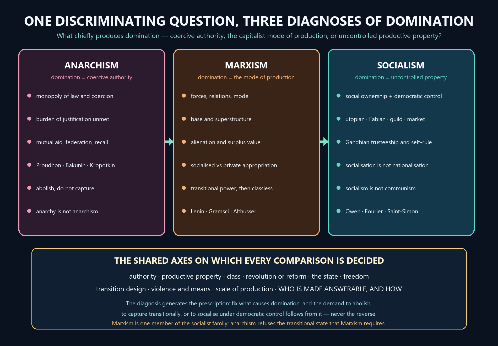

# Political Ideologies — Learner-v2 Source-Complete Learning Session


> **Syllabus (verbatim):** Political Ideologies: Anarchism; Marxism and Socialism.
>
> **Generation:** g2, 27 August 2026 · **Approval:** false pending explicit topic approval
>
> **Evidence discipline:** Complete legacy teaching and workbook material is preserved, reordered Basic-first/Advanced-last, and checked against the canonical owner and verified 2018–2025 PYQ ledger.


## BASIC LEARNING SESSION




*Concept map: one discriminating question about the source of domination separates the three named ideologies, and the demand to abolish, to capture transitionally or to socialise under democratic control follows from the diagnosis rather than preceding it.*

> **Syllabus (verbatim):** Political Ideologies: Anarchism; Marxism and Socialism.

### How to Use This Five-Layer Session

Every logical subtopic follows exactly:

| Layer | Purpose |
|---:|---|
| 1. SIMPLE START | visual-first plain-language gateway |
| 2. CORE UPSC | complete terminology, doctrine, argument, example and source grounding |
| 3. ADVANCED | objections, replies, comparisons, interpretive issues and provenance cautions |
| 4. EXAM APPLICATION | verified PYQ routes and 10/15/20-mark architecture |
| 5. RAPID REVISION | traps, retrieval notes and links to the exact MCQ set |

### Source Audit and Contemporary-Link Boundary

- **Canonical doctrine source:** `upsc-ai-kit/knowledge/Philosophy/paper-2/socio-political/Political-Ideologies.md` (7,676 words), sliced verbatim into the CORE UPSC layers (each canonical teaching passage exactly once) and preserved again, in full, in the canonical apparatus block.
- **Doctrine grounding (in the canonical file):** the discriminating question (what causes domination - authority, property or the capitalist mode of production); anarchism (anarchy vs anarchism, the burden-of-justification argument against the state, Proudhon/Bakunin/Kropotkin, individualist/mutualist/collectivist/communist strands, voluntary order and mutual aid, the hidden-authority objection, and Gandhi as anarchist-in-ideal); Marxism (historical materialism, forces and relations of production, base and superstructure with the non-mechanical caution, alienation's four dimensions, surplus value and structural exploitation, ideology and false consciousness, the state, revolution and the dictatorship of the proletariat, equality and the Gotha-Programme distinction); Marx after Marx (Lenin's weakest-link and vanguard, Gramsci's hegemony, Althusser's ISA and interpellation, the Miliband-Poulantzas debate on relative autonomy, and M. N. Roy's radical humanism); socialism (the family definition, utopian vs scientific, Fabian/guild/market/democratic/Gandhian variants, and the socialisation-is-not-nationalisation warning); the inter-school debates; the criticisms and replies; and the common traps. No book claim is added beyond what the canonical file already grounds.
- **Scaffolding discipline:** the concept-of-ideology apparatus (descriptive, pejorative/Marxian, integrative and action-guiding senses; ideology vs philosophy, political theory, doctrine, programme and propaganda; the end-of-ideology debate) and the liberalism/conservatism comparison points are standard, verifiable political theory. They appear only in the authored scaffolding layers, always labelled as context beyond this Philosophy owner's canonical core (Anarchism; Marxism and Socialism), never as fabricated canonical doctrine.
- **Verified PYQs:** local Socio-Political Philosophy Paper II bank, 2018-2025; this clause owns exactly **13** primary parts (2018:2, 2019:2, 2020:2, 2021:2, 2022:0, 2023:2, 2024:2, 2025:1). The 2022 Marxian equity/equality 15-marker (Social and Political Ideals), the caste-specific Gandhi/Ambedkar stems (Caste), the 2020 Gandhian-social-development 20-marker (Development and Social Progress), the authority-tinged democracy stems (Sovereignty) and the 2018 liberal-democracy 10-marker (Forms of Government) are kept separate and not double-owned.
- **Provenance discipline:** Lenin, Gramsci, Althusser, Miliband (*The State in Capitalist Society*, **1969**) and Poulantzas (**1973**) are cited by position, title and year only; Marx's *Economic and Philosophic Manuscripts* (**1844**), the *Communist Manifesto* (**1848**), the *Preface to A Contribution to the Critique of Political Economy* (**1859**) and the *Critique of the Gotha Programme* (**1875**) are cited by title and year only, with no page, edition or invented verbatim wording. No empirical claim is made about any regime, party or period, and Marx's own claims are kept distinct from later regimes.
- **India-centric discipline:** the Directive Principles of State Policy (Part IV, Articles 38, 39 and 43) are used only as dated, non-justiciable constitutional facts exactly as the canonical file grounds them, never as proof that any Marxist or socialist thesis is true or false; no Indian government, party, leader or period is characterised.
- **Contemporary-affairs boundary (deliberate):** this is a static, syllabus-driven conceptual clause; no 2026 institutional development is forced as an anchor, and no factual claim is invented. Only static syllabus relevance and clearly labelled analysis are used.
- **Qdrant:** optional fallback only; not required for this canonical topic, and it never blocks the learning session.

**Preservation note:** the canonical doctrine is reorganised into layers, never compressed. Every doctrine, argument, objection/reply, comparison, corpus-depth delta, PYQ route, directive rule, graded verdict and provenance caution is retained; simplification means adding accessible gateways, not deleting complexity.

### Learning Roadmap

| Unit | Logical subtopic |
|---:|---|
| 1 | What an Ideology Is: The Discriminating Question of Domination |
| 2 | Anarchism I: The Case Against the State |
| 3 | Anarchism II: Strands, Voluntary Order, Objections, and Gandhi |
| 4 | Marxism I: Method, Dialectical and Historical Materialism |
| 5 | Marxism II: Alienation, Exploitation and Surplus Value |
| 6 | Marxism III: Ideology, State, Revolution, Communism, Equality |
| 7 | Marx After Marx: Lenin, Gramsci, Althusser, Miliband and Poulantzas |
| 8 | Socialism: The Family, Its Varieties, and Gandhian Socialism |
| 9 | Inter-School Debates: Anarchism, Marxism, Democratic Socialism, Gandhi, M. N. Roy |
| 10 | Criticisms, Replies and the Common Traps |

---

### SESSION 1 — Ideology, Domination and the Discriminating Question

#### DEFINITION / WHAT THIS IS CALLED

**Plain-language definition:** A political ideology is a connected body of belief that diagnoses what makes an existing social order unfree, names the institution or relation responsible for that unfreedom, and prescribes the route to a freer arrangement, so anarchism, Marxism and socialism are three rival diagnoses rather than three moods.

**Technical definition:** Ideology in the analytical sense denotes a systematically related set of descriptive claims about society, evaluative commitments about freedom and equality, and practical prescriptions for action; in the critical Marxist sense it denotes the socially rooted framework through which historically specific relations of production appear natural, universal and inevitable, and a controlled answer declares which sense it is using before it begins to argue.

#### VISUAL — The discriminating question and its three answers

```text

        CAPITALISM  /  HIERARCHY  /  COERCION

                        |

     WHAT CHIEFLY PRODUCES DOMINATION IN SOCIETY?

                        |

   +--------------------+--------------------+

   v                    v                    v

ANARCHISM            MARXISM              SOCIALISM

coercive authority   class relations       socially

itself, above all    generated by the      uncontrolled

the sovereign state  mode of production    productive property

   |                    |                    |

   v                    v                    v

abolish the state    transitional worker   subject ownership

and every standing   power, then a         and production to

hierarchy            classless order       social control

   |                    |                    |

   +--------------------+--------------------+

                        v

  SAME DECLARED GOAL -> a free, equal, non-dominating order;

  DIFFERENT ROUTE    -> because the diagnosis differed first.

```

*The opening move for almost every stem in this clause: fix the diagnosis first, and the institutional programme follows from it.*

#### VISUAL — Two senses of ideology that must never be run together

```text

+---------------------+----------------------------------------------+

| SENSE               | WHAT IT ASSERTS                              |

+---------------------+----------------------------------------------+

| ANALYTICAL          | an organised outlook: descriptive claims,    |

| (neutral, avowed)   | evaluative commitments, practical            |

|                     | prescriptions, held openly and argued for    |

+---------------------+----------------------------------------------+

| CRITICAL / MARXIST  | a socially rooted framework in which         |

| (a specific defect) | historically specific class relations appear |

|                     | natural, universal and inevitable            |

+---------------------+----------------------------------------------+

  TEST -> the first is compatible with self-criticism; the second

          names a failure of self-knowledge inside a class order.

```

*Declaring the sense in the opening paragraph prevents the self-refutation objection from ever getting started.*

#### ANSWER-GRABBING OPENING — WRITE/ADAPT IN THE EXAM

> Anarchism, Marxism and socialism are separated by one discriminating question — is domination produced chiefly by coercive authority, by the capitalist mode of production, or by socially uncontrolled productive property? — and every later disagreement about the state, revolution and freedom follows from the answer given.

#### MUST-WRITE KEYWORDS

- **political ideology as diagnosis and prescription**
- **the discriminating question of domination**
- **coercive authority**
- **capitalist mode of production**
- **social control of productive property**
- **analytical against critical senses of ideology**

**How to use them:** Name the discriminating question of domination in the opening lines, allot one clause each to coercive authority, the capitalist mode of production and the social control of productive property, declare which sense of political ideology the stem is using, and only then let the diagnosis generate the prescription.

#### CORE OBJECTION, REPLY AND RESIDUAL LIMIT

**Objection:** If every ideology is a socially rooted framework that makes a particular order appear natural, the critic's own position is equally ideological, so the concept destroys the very standpoint from which the criticism was to be made.

**Best reply:** The objection runs together the two senses the session has just separated. Ideology in the descriptive sense is an organised political outlook, which the critic openly avows and submits to argument; ideology in the critical sense names a specific defect — the presentation of historically specific class relations as natural, universal and inevitable. A doctrine may hold the first without committing the second, provided it states its presuppositions and argues for them.

**Residual limit:** The distinction supplies no independent test that decides, in a contested case, whether a shared belief is ordinary reasoned agreement or manufactured consent — the residual difficulty later inherited by Gramsci's account of hegemony.

#### EXAM USE AND CONCISE REVISION

**Answer architecture:** Open with the discriminating question, place each named ideology on it in a single line, declare the sense of ideology in play, and fix the shared axes — authority, property, class, revolution, state and freedom — so that the later comparison runs down parallel columns instead of collapsing into three disconnected summaries.

- One discriminating question orders the whole clause: is domination caused by authority, by the mode of production, or by uncontrolled productive property?
- Anarchism answers authority; Marxism answers class relations generated by the mode of production; socialism answers socially uncontrolled property and production.
- Ideology has two senses — the analytical outlook and the critical Marxist thesis — and the sense must be declared before it is used.
- The recurrent axes for every comparison in this clause are authority, property, class, revolution, state and freedom.
- A diagnosis generates a prescription; an answer that lists prescriptions without their diagnoses has already lost the structure.

An "ideology" is a fairly organised set of ideas about how society SHOULD be
ordered and how to get there. The syllabus names three -- anarchism, Marxism and
socialism -- and the fastest way to keep them apart is to ask ONE question: what
is the deepest CAUSE of domination, and therefore what must be changed?

```text
        THE DISCRIMINATING QUESTION  --  what causes domination?
        =======================================================

        CAPITALISM / HIERARCHY / COERCION  (the shared target)
                              |
        +---------------------+----------------------+
        |                     |                      |
     ANARCHISM            SOCIALISM              MARXISM
   cause = coercive     cause = socially       cause = class relations
   AUTHORITY itself     uncontrolled           generated by the MODE
   (the state)          PROPERTY / production  OF PRODUCTION
        |                     |                      |
   abolish the         social ownership +      historical materialism +
   state & other       welfare by several      class struggle ->
   hierarchies         possible routes         proletarian revolution ->
                       (democratic/Fabian/     classless, stateless
                       guild/Gandhian/Marxist) communism
```

Plain version: all three attack roughly the same enemy (a hierarchical,
propertied, coercive order) but DISAGREE on the root cause -- authority,
property, or the capitalist mode of production -- and so on the cure. Name the
diagnosis first; the rest of the answer follows from it.

> MEMORY: One question sorts the whole syllabus item -- is domination caused by
> coercive AUTHORITY (anarchism), by uncontrolled PROPERTY (socialism), or by
> CLASS relations of the mode of production (Marxism)? Diagnosis fixes the cure.


#### 0. ONE-SCREEN MAP

```text
CAPITALISM / HIERARCHY / COERCION
             |
   +---------+------------------+
   |         |                  |
ANARCHISM  SOCIALISM         MARXISM
authority  social ownership  historical materialism
itself is  + social welfare   + class struggle
suspect    through several    + proletarian revolution
   |       possible routes          |
abolish    democratic /       transitional proletarian
the state  Fabian / guild /   rule → classless,
and other  Gandhian / Marxist stateless communism
hierarchies
```

**Discriminating question:** *Is domination caused chiefly by coercive authority, private ownership, or the capitalist mode of production?* Anarchism answers **authority**; socialism answers **socially uncontrolled property and production**; Marxism gives the systematic answer **class relations generated by the mode of production**. ⚠️

---

#### CLOSING RECALL FLOW — Ideology, Domination and the Discriminating Question

```closure-flow
SUBTOPIC: Ideology, Domination and the Discriminating Question
STARTING CONCEPT: Ideology, Domination and the Discriminating Question
KEY TERMS / DEFINITIONS: political ideology as diagnosis and prescription | the discriminating question of domination | coercive authority | capitalist mode of production | social control of productive property | analytical against critical senses of ideology
MECHANISM / ARGUMENT: Each ideology first locates the source of unfreedom, and its whole institutional programme — abolish the state, transform the mode of production, or socialise productive property — is derived from that single location rather than added to it.
CONSEQUENCE / CONTRAST: Because the diagnoses differ at the root, the three doctrines part company over the state itself: one demands its abolition, one its transitional capture, and one its democratic use.
UPSC TRAP / ANSWER-USE: Do not use ideology as a term of abuse, and do not treat it as a synonym for neutral political theory; the analytical sense is avowedly action-guiding, while the critical sense is a specific thesis about how class relations are made to look natural.
ANSWER-GRABBING FORMULATION: Anarchism, Marxism and socialism are separated by one discriminating question — is domination produced chiefly by coercive authority, by the capitalist mode of production, or by socially uncontrolled productive property? — and every later disagreement about the state, revolution and freedom follows from the answer given.
```

### SESSION 2 — Anarchism I: The Argument Against the Authority of the State

#### DEFINITION / WHAT THIS IS CALLED

**Plain-language definition:** Anarchism holds that coercive political authority — above all the sovereign state with its territorial monopoly of law-making, coercion and punishment — lacks adequate moral justification, and that social order can instead be organised through voluntary association, mutual aid, federation and self-government.

**Technical definition:** The anarchist case is a burden-of-justification argument in five steps: legitimate authority must be compatible with the moral autonomy and equality of persons; the state claims a territorial monopoly of law, coercion and punishment; obedience is demanded because a command is legally authoritative rather than because its content is independently right; such a standing right subordinates one person's practical judgment to another's institutional will; therefore the state bears a justificatory burden that anarchists judge it unable to discharge.

#### VISUAL — The five-step burden-of-justification argument

```text

  (1) Legitimate authority must be compatible with the MORAL

      AUTONOMY and EQUALITY of persons

                 |

                 v

  (2) The state claims a TERRITORIAL MONOPOLY of law-making,

      coercion and punishment

                 |

                 v

  (3) Obedience is demanded because the command is LEGALLY

      AUTHORITATIVE, not because its content is independently right

                 |

                 v

  (4) That standing right SUBORDINATES one person's judgment to

      another's institutional will

                 |

                 v

  (5) THEREFORE the state bears a burden of justification which

      anarchists judge it unable to discharge

                 |

                 v

  NOTE -> the conclusion is about the TITLE to command, so showing

          that particular laws are good does not answer it.

```

*Reproduce these premises as numbered steps: the marks are in the conclusion that the state carries the burden, not in a general dislike of government.*

#### VISUAL — Four neighbouring terms that examiners deliberately confuse

```text

+------------------------+---------------------------+------------------------+

| TERM                   | MEANING                   | DISCRIMINATING TEST    |

+------------------------+---------------------------+------------------------+

| ANARCHY                | absence or collapse of    | may simply mean        |

|                        | effective rule            | disorder               |

| ANARCHISM              | normative critique of     | proposes non-coercive  |

|                        | domination                | order                  |

| CIVIL DISOBEDIENCE     | principled breach of      | need not reject the    |

|                        | particular laws           | state at all           |

| LIBERTARIAN MINIMAL    | state restricted to       | anarchism rejects even |

| STATE                  | protection                | this monopoly          |

+------------------------+---------------------------+------------------------+

```

*The discriminating test in the right-hand column is what converts a definition into a mark-bearing distinction.*

#### ANSWER-GRABBING OPENING — WRITE/ADAPT IN THE EXAM

> The anarchist thesis is not that order is unnecessary but that order must not be identified with sovereign command: the state is asked to justify a content-independent right to be obeyed, and anarchism holds that no available justification discharges that burden.

#### MUST-WRITE KEYWORDS

- **coercive political authority**
- **territorial monopoly of law, coercion and punishment**
- **moral autonomy and equality of persons**
- **content-independent obligation to obey the state**
- **burden of justification**
- **Bakunin's corruption thesis**
- **Proudhon on property as institutional power**
- **Kropotkin on mutual aid as a source of order**

**How to use them:** Run the five-step burden-of-justification argument against the state before any evaluation, using the moral autonomy and equality of persons as the standard, the territorial monopoly of law, coercion and punishment as the object, and the content-independent obligation to obey as the precise target; add Bakunin's corruption thesis, Proudhon on property and Kropotkin on mutual aid as named support.

#### CORE OBJECTION, REPLY AND RESIDUAL LIMIT

**Objection:** Without a public authority holding a monopoly of force, private power, organised violence and predation would dominate instead, so the state is at worst the lesser evil and the anarchist argument proves too much.

**Best reply:** The state has itself historically organised war, repression and structural domination, so the real comparison is not between coercion and its absence but between rival distributions of coercive power. Federated defence, restorative institutions and recallable delegation can address aggression without reproducing a sovereign hierarchy, and the anarchist needs only the weaker claim that centralised coercion is not the unique or best remedy.

**Residual limit:** No anarchist account has yet shown how a persistent and organised aggressor is to be restrained without something that functions, at least temporarily, as a coercive public authority.

#### EXAM USE AND CONCISE REVISION

**Answer architecture:** Define anarchism against anarchy in one line, run the five-step argument as numbered premises, name Proudhon, Bakunin and Kropotkin for their distinct contributions, take the security objection at its strongest, and close on a graded verdict that concedes the coordination residual while retaining the critique of sovereignty.

- Anarchism is a normative critique of domination; anarchy may mean the mere collapse of rule, and the two must never be equated.
- The precise target is the content-independent right to be obeyed, not the badness of particular laws.
- Proudhon attacks property as an institutional power of appropriation and dependence; Bakunin adds that concentrated power deforms ruler and ruled alike; Kropotkin argues that mutual aid is a genuine source of order.
- Anarchism rejects even the libertarian minimal state, because the objection is to the monopoly and not to the size of what is monopolised.
- Civil disobedience breaches particular laws without rejecting the state, so it is a neighbouring but distinct position.

Anarchism is the most misunderstood word on the syllabus. It does NOT mean chaos.
It means a considered claim that the coercive STATE cannot justify its standing
right to command, and that social order can be built from voluntary cooperation
instead.

```text
   FOUR WORDS THAT ARE OFTEN CONFUSED
   ==================================
   ANARCHY .............. absence / collapse of rule (may mean disorder)
   ANARCHISM ............ a normative critique of domination; proposes
                          NON-COERCIVE order
   CIVIL DISOBEDIENCE ... principled breach of a particular law; need NOT
                          reject the state
   MINIMAL STATE ........ state cut back to protection; anarchism rejects
                          even this monopoly

   THE ANTI-STATE ARGUMENT (why the state bears the burden of proof)
   -----------------------------------------------------------------
   (1) legitimate authority must respect moral autonomy + equality
   (2) the state claims a TERRITORIAL MONOPOLY of law, coercion, punishment
   (3) it demands obedience because a command is LEGAL, not because it is right
   (4) that subordinates my judgment to another's institutional will
   (5) -> the state carries a burden of justification it (anarchists say)
          cannot discharge
```

Plain version: the anarchist does not say "no rules"; the anarchist says "no
UNJUSTIFIED coercive superior". The state must earn obedience command by command;
its mere existence is not a reason.

> MEMORY: Anarchism = order WITHOUT a sovereign coercive centre. The engine is the
> five-step burden-of-justification argument; the state loses because it demands
> obedience for legality, not for rightness.


#### 1. ANARCHISM

#### 1.1 Doctrine statement

✅ **Anarchism** holds that coercive political authority, paradigmatically the sovereign state, lacks adequate moral justification and that social order can be organised through voluntary association, mutual aid, federation and self-government.

It is not identical with:

| Term | Meaning | Discriminating test |
|---|---|---|
| **Anarchy** | absence or collapse of effective rule | may mean disorder |
| **Anarchism** | a normative critique of domination | proposes non-coercive order |
| **Civil disobedience** | principled breach of particular laws | need not reject the state |
| **Libertarian minimal state** | state restricted to protection | anarchism rejects even this monopoly |

#### 1.2 Argument against the state

✅ A standard anarchist argument proceeds:

1. Legitimate authority must be compatible with the moral autonomy and equality of persons.
2. The state claims a territorial monopoly of law-making, coercion and punishment.
3. Obedience is demanded because a command is legally authoritative, not merely because its content is independently right.
4. Such a standing right to command subordinates one person's judgment to another's institutional will.
5. Therefore, the state bears a burden of justification which anarchists judge it unable to discharge.

✅ **Bakunin** adds a corruption thesis: concentrated power deforms both ruler and ruled. ✅ **Proudhon** attacks property when it functions as an institutional power of appropriation and dependence. ✅ **Kropotkin** argues that cooperation and mutual aid are genuine sources of social order, not accidental exceptions to competition.

#### 1.3 Presuppositions

- ✅ Human beings possess a capacity for cooperation, practical reason and reciprocal aid.
- ✅ Coordination does not logically require a sovereign centre; federations and associations can perform many coordinating functions.
- ⚠️ Social conflict is intensified by hierarchical institutions rather than being an unchangeable fact of nature.
- ⚠️ Authority must justify itself function by function; historical existence does not establish moral legitimacy.

#### CLOSING RECALL FLOW — Anarchism I: The Argument Against the Authority of the State

```closure-flow
SUBTOPIC: Anarchism I: The Argument Against the Authority of the State
STARTING CONCEPT: Anarchism I: The Argument Against the Authority of the State
KEY TERMS / DEFINITIONS: coercive political authority | territorial monopoly of law, coercion and punishment | moral autonomy and equality of persons | content-independent obligation to obey the state | burden of justification | Bakunin's corruption thesis | Proudhon on property as institutional power | Kropotkin on mutual aid as a source of order
MECHANISM / ARGUMENT: Because the state claims a right to be obeyed that is independent of the content of what it commands, its justification cannot be completed by pointing at good laws; every function it monopolises must be shown to require a sovereign centre and not merely to be performed by one.
CONSEQUENCE / CONTRAST: Where the burden is not discharged, obedience becomes prudential rather than obligatory, which is exactly the position philosophical anarchism occupies without any call to immediate insurrection.
UPSC TRAP / ANSWER-USE: Do not translate the argument as a rejection of organisation or coordination; the target is domination, and delegation, recall and federation all survive it, so anarchy as disorder is never what anarchism as a doctrine proposes.
ANSWER-GRABBING FORMULATION: The anarchist thesis is not that order is unnecessary but that order must not be identified with sovereign command: the state is asked to justify a content-independent right to be obeyed, and anarchism holds that no available justification discharges that burden.
```

### SESSION 3 — Anarchism II: Strands, Voluntary Order, Objections and Gandhi

#### DEFINITION / WHAT THIS IS CALLED

**Plain-language definition:** Anarchism is a family rather than a single programme: mutualists, collectivists, anarcho-communists, individualists and philosophical anarchists agree that domination must go but divide over productive property, and Gandhi belongs to this family only in a carefully qualified sense.

**Technical definition:** The strands are distinguished by their treatment of productive property and their preferred form of non-sovereign order: possession and exchange without exploitative property relations in mutualism (Proudhon); collective control of productive resources in federated producer communities in collectivist anarchism (Bakunin); common ownership with distribution by need in anarcho-communism (Kropotkin); strong personal sovereignty with varying views on markets in individualist anarchism; and, in philosophical anarchism, the denial of any automatic duty to obey the state, which may coexist with critical allegiance to existing institutions.

#### VISUAL — The anarchist family tree, sorted by the property axis

```text

                     ANARCHISM

        (coercive authority is the root problem)

                          |

     +--------+-----------+-----------+-----------+

     v        v           v           v           v

MUTUALISM  COLLECTIVIST  ANARCHO-   INDIVIDUALIST  PHILOSOPHICAL

           ANARCHISM     COMMUNISM  ANARCHISM      ANARCHISM

     |        |           |           |           |

     v        v           v           v           v

possession collective   common      personal     no automatic

and free   control of   ownership,  sovereignty; duty to obey;

exchange   productive   distribution markets     critical

           resources    by need      contested   allegiance

     |        |           |           |           |

     v        v           v           v           v

Proudhon   Bakunin      Kropotkin   Thoreauvian  legitimacy,

                                     resistance   not revolt

  AXIS OF DIVISION -> who may control productive property, and

                      what replaces the sovereign centre.

```

*Every strand answers the same question about productive property differently, which is why a stem must be answered about a strand and not about anarchism in general.*

#### VISUAL — Four objections to stateless order and the anarchist replies

```text

OBJECTION 1  security dilemma      -> REPLY: the state itself has

  private power may dominate          organised war and repression

OBJECTION 2  scale and public goods -> REPLY: it rejects centralised

  pandemics, infrastructure           domination, not coordination

OBJECTION 3  optimistic anthropology-> REPLY: it need only deny that

  egoism and conflict persist         hierarchy is the best remedy

OBJECTION 4  hidden authority       -> REPLY: a serious internal

  expertise, status, wealth           challenge; audit domination

                                      inside voluntary bodies too

        |

        v

  RESIDUAL -> no independent test says when a voluntary association

              has itself become a domination.

```

*The fourth objection is the one that decides the grade, because it is internal and the honest reply concedes a residual.*

#### ANSWER-GRABBING OPENING — WRITE/ADAPT IN THE EXAM

> Anarchism does not infer that every person is always benevolent; its claim is institutional — that reciprocity, custom, association and horizontal coordination can generate order without a final coercive superior — and Gandhi enters this family as an anarchist in ideal but a reformer in political method.

#### MUST-WRITE KEYWORDS

- **mutualism**
- **collectivist anarchism**
- **anarcho-communism**
- **individualist anarchism**
- **philosophical anarchism**
- **mutual aid, federation and recallable delegation**
- **anarchist in ideal, reformer in method**

**How to use them:** Open by refusing the single-programme assumption, run mutualism, collectivist anarchism, anarcho-communism, individualist anarchism and philosophical anarchism down the property axis, ground voluntary order in mutual aid and federation rather than in optimism about human nature, and grade Gandhi with the ideal-against-method formulation instead of a flat yes or no.

#### CORE OBJECTION, REPLY AND RESIDUAL LIMIT

**Objection:** Even after the state disappears, expertise, informal status, wealth and reputation return as hidden authorities, so voluntary associations reproduce domination under a different name and the abolition achieves nothing.

**Best reply:** This is the most serious internal challenge and should be conceded as such. A defensible anarchism replies that it opposes domination rather than formal office, so its own institutions must be scrutinised by the same standard: rotation, recall, transparency, federation and the refusal of permanent delegation are proposed precisely to keep informal power answerable. The doctrine is therefore committed to auditing itself, not merely to abolishing the state.

**Residual limit:** No anarchist account supplies an independent criterion for deciding when a voluntary association has itself become a domination, which leaves the internal audit without a settled test.

#### EXAM USE AND CONCISE REVISION

**Answer architecture:** Name the strand the stem requires, run the property axis across the family, show that voluntary order rests on an institutional claim rather than on optimism about human nature, take the hidden-authority objection at full strength, and grade Gandhi as an anarchist in ideal and a reformer in method with the reasons on both sides.

- Mutualism: possession and exchange without exploitative property relations, organised through contracts and workers' associations.
- Collectivist anarchism: collective control of productive resources through federated producer communities.
- Anarcho-communism: common ownership with distribution according to need, organised through communes and mutual aid.
- Individualist anarchism: strong personal sovereignty, voluntary association, and varying views about markets.
- Philosophical anarchism: no automatic duty to obey, but no demand for immediate insurrection either.
- Gandhi: self-rule, decentralised village republics and a minimal state give the anarchist affinity; non-violence, trusteeship and the constructive programme make the method reformist.

Anarchism is a FAMILY, not one position. Its members disagree about property and
scale as much as they agree about rejecting domination.

```text
        THE ANARCHIST STRANDS NETWORK  (shared root: reject domination)
        ==============================================================
                         reject coercive hierarchy
                                   |
     +-------------+---------------+---------------+----------------+
     |             |               |               |                |
  MUTUALISM   COLLECTIVIST    ANARCHO-        INDIVIDUALIST    PHILOSOPHICAL
  possession  collective      COMMUNISM       strong personal   no automatic
  + exchange  control of      common          sovereignty;      duty to obey;
  (Proudhon)  resources       ownership,      markets vary      critique, not
              (Bakunin)       to each by      (Thoreauvian      insurrection
                              need (Kropotkin)  resistance)

        OBJECTION -> REPLY LADDER
        -------------------------
        security dilemma   -> the state itself organises war/repression;
                              federated + restorative defence need no sovereign
        scale/public goods -> reject domination, not coordination; delegated,
                              recallable, federated administration scales
        optimistic anthro. -> need only deny coercive hierarchy is the unique
                              remedy; institutions cultivate solidarity or not
        HIDDEN AUTHORITY   -> the serious one: expertise, status, economic power
                              return; a real anarchism must police domination
                              INSIDE voluntary associations too
```

Plain version: pick the strand by its answer on PROPERTY (possession vs
collective vs common) and on TRANSITION (insurrection vs critical allegiance).
The strongest objection is not "chaos" but "hidden authority" -- power that
returns after the state is gone.

> MEMORY: Five strands sorted by property + transition; four objections, of which
> HIDDEN AUTHORITY is the one a serious anarchist must concede and answer.


#### 1.4 Main strands

| Strand | Property | Preferred order | Key emphasis |
|---|---|---|---|
| **Mutualism** | possession and exchange without exploitative property relations | contracts and workers' associations | reciprocity; Proudhon |
| **Collectivist anarchism** | collective control of productive resources | federated producer communities | Bakunin |
| **Anarcho-communism** | common ownership and distribution by need | communes and mutual aid | Kropotkin |
| **Individualist anarchism** | strong personal sovereignty; views on markets vary | voluntary association | autonomy; Thoreauvian resistance |
| **Philosophical anarchism** | no automatic duty to obey the state | critical allegiance may coexist with institutions | legitimacy, not immediate insurrection |

#### 1.5 Natural order and voluntary cooperation

✅ Anarchism does **not** infer that every person is always benevolent. Its stronger claim is institutional: order may emerge from reciprocity, custom, association and horizontal coordination without a final coercive superior.

**Example:** ⚠️ village assemblies, worker cooperatives, mutual-aid networks and decentralised federations illustrate limited capacities for non-sovereign coordination. They do not by themselves prove that a complex society can eliminate all public authority.

#### 1.6 Objections and anarchist replies

**Objection 1 — security dilemma:** without a public authority, private power, organised violence and predation may dominate.
**Reply:** ✅ the state itself has historically organised war, repression and structural domination; federated defence and restorative institutions need not reproduce sovereign hierarchy.

**Objection 2 — scale and public goods:** voluntary associations may work locally but fail in pandemics, infrastructure or ecological coordination.
**Reply:** ⚠️ anarchism rejects centralised domination, not coordination. Delegated, recallable and federated administration can operate across scales.

**Objection 3 — optimistic anthropology:** cooperation cannot neutralise egoism and conflict.
**Reply:** ✅ anarchists need only deny that coercive hierarchy is the unique or best remedy. Institutions can cultivate either domination or solidarity.

**Objection 4 — hidden authority:** expertise, informal status and economic power return even after the state disappears.
**Reply:** ⚠️ this is a serious internal challenge. A defensible anarchism must scrutinise domination inside voluntary associations, not merely abolish formal offices.

#### 1.7 Gandhi as a qualified political anarchist

✅ Gandhi's ideal of self-rule (*swarāj*) begins with rule over oneself: political freedom is insecure without mastery of desire, non-violence and local self-government. His preference for decentralised village republics and a state reduced to a minimum creates an anarchist affinity.

⚠️ Yet Gandhi is not simply a Bakuninite anarchist. His non-violence, trusteeship, religious ethics and constructive programme replace class war and anti-theism. The safest formulation is: **Gandhi is a moral and decentralist anarchist in ideal, but a pragmatic reformer in political method.**

---

#### CLOSING RECALL FLOW — Anarchism II: Strands, Voluntary Order, Objections and Gandhi

```closure-flow
SUBTOPIC: Anarchism II: Strands, Voluntary Order, Objections and Gandhi
STARTING CONCEPT: Anarchism II: Strands, Voluntary Order, Objections and Gandhi
KEY TERMS / DEFINITIONS: mutualism | collectivist anarchism | anarcho-communism | individualist anarchism | philosophical anarchism | mutual aid, federation and recallable delegation | anarchist in ideal, reformer in method
MECHANISM / ARGUMENT: Once the property axis is made explicit, the strands stop looking like temperaments and become determinate positions on who may control productive resources and on how coordination is to be organised without a sovereign centre.
CONSEQUENCE / CONTRAST: A stem that asks whether one subscribes to anarchism therefore cannot be answered about anarchism as such: the strand has to be named before agreement or disagreement can be stated at all.
UPSC TRAP / ANSWER-USE: Do not present every anarchist as a collectivist, and do not read Gandhi as a Bakuninite; his non-violence, trusteeship, religious ethics and constructive programme replace class war and anti-theism, which is why the safest verdict is qualified rather than flat.
ANSWER-GRABBING FORMULATION: Anarchism does not infer that every person is always benevolent; its claim is institutional — that reciprocity, custom, association and horizontal coordination can generate order without a final coercive superior — and Gandhi enters this family as an anarchist in ideal but a reformer in political method.
```

### SESSION 4 — Marxism I: Materialist Method and Historical Materialism

#### DEFINITION / WHAT THIS IS CALLED

**Plain-language definition:** Historical materialism explains a society by beginning from how it produces its means of life: the productive forces it commands, the relations of ownership and control through which those forces are used, and the class structure and political institutions those relations sustain.

**Technical definition:** Marxism is simultaneously a method of dialectical and historical analysis, a critique of exploitation, alienation, commodity relations and ideology, a theory of change through contradiction and class struggle, and a political project of collective emancipation; historical materialism is its explanatory core, in which developing productive forces eventually come into conflict with the existing relations of production, those relations become fetters, and the conflict is fought out as social and political struggle from which a new mode of production can emerge.

#### VISUAL — From material reproduction to revolutionary transformation

```text

  (1) Human beings must PRODUCE THE MEANS OF LIFE

                 |

                 v

  (2) Production occurs through DEFINITE SOCIAL RELATIONS

                 |

                 v

  (3) PRODUCTIVE FORCES develop within those relations

                 |

                 v

  (4) Existing RELATIONS eventually OBSTRUCT further development

      (the relations become FETTERS)

                 |

                 v

  (5) The conflict between forces and relations becomes SOCIAL

      AND POLITICAL STRUGGLE

                 |

                 v

  (6) A NEW MODE OF PRODUCTION can emerge through that struggle

  CONTROL -> the chain is structural, so no step depends on anyone

             intending the outcome that follows.

```

*Six premises, not slogans: reproduce them as a numbered chain and the historical-materialism stem is already half answered.*

#### VISUAL — The four structural terms and what each is used to say

```text

+------------------------+-------------------------------+-------------------+

| TERM                   | WHAT IT NAMES                 | EXAM USE          |

+------------------------+-------------------------------+-------------------+

| PRODUCTIVE FORCES      | labour-power, knowledge,      | capacity to       |

|                        | tools, technology             | produce           |

| RELATIONS OF           | ownership, control and class  | who commands and  |

| PRODUCTION             | relations                     | who appropriates  |

| MODE OF PRODUCTION     | the unity of forces and       | feudalism,        |

|                        | relations                     | capitalism        |

| BASE / SUPERSTRUCTURE  | economic structure related to | a relation, never |

|                        | law, politics and ideology    | a one-way switch  |

+------------------------+-------------------------------+-------------------+

  TRAP -> thesis-antithesis-synthesis is later textbook shorthand,

          not Marx's own stated three-step law.

```

*Defining these four precisely is the difference between an exposition of historical materialism and a summary of it.*

#### ANSWER-GRABBING OPENING — WRITE/ADAPT IN THE EXAM

> Marx takes from Hegel that contradiction drives development while rejecting the primacy of a self-developing Idea: the contradiction that moves history is between developing productive forces and the relations of production that come to fetter them, so the economic base conditions the superstructure without mechanically causing every idea within it.

#### MUST-WRITE KEYWORDS

- **productive forces**
- **relations of production**
- **mode of production**
- **base and superstructure**
- **class struggle as the motor of transformation**
- **relations of production as fetters**
- **material reproduction as a necessary condition**

**How to use them:** State the six-step argument from material reproduction to the fettering of productive forces, define productive forces, relations of production and mode of production in technical vocabulary, present base and superstructure as a relation rather than a switch, and let class struggle enter as the mechanism by which the contradiction becomes political.

#### CORE OBJECTION, REPLY AND RESIDUAL LIMIT

**Objection:** Historical materialism reduces history to economics and cannot explain culture, caste, religion, gender or nationalism, all of which display an autonomy that a productive-forces explanation cannot capture.

**Best reply:** Historical materialism can treat these as materially embedded powers rather than as epiphenomena, and Marx himself allows reciprocal effects and political agency, so the accurate charge is a tendency toward economic reductionism rather than a crude determinism he never held. Later Marxists expand the analysis explicitly through hegemony and the reproduction of social relations, which relocates causal weight without abandoning the materialist mechanism.

**Residual limit:** In the Indian context class analysis remains necessary but is not sufficient: caste and gender operate through mechanisms of status, endogamy and social reproduction that cannot be derived from class alone.

#### EXAM USE AND CONCISE REVISION

**Answer architecture:** Open on material reproduction as a necessary condition of every social order, run the six premises to the fetters conclusion, define the four structural terms precisely, defuse the determinism charge before it is made, and close by separating what the framework still explains from what it must borrow to explain.

- Productive forces are labour-power, knowledge, tools and technology — the capacity to produce.
- Relations of production are ownership, control and class relations — who commands and who appropriates.
- Mode of production is the unity of forces and relations, such as feudalism or capitalism.
- Base and superstructure name a relation between the economic structure and law, politics and ideology, not a mechanical one-way switch.
- Class struggle is conflict rooted in opposed structural interests and is the motor of historical transformation.
- Concede the reductionism tendency early; it removes the examiner's strongest ready-made objection.

Marxism is four things at once, and separating them is the first mark: a METHOD
(dialectical-historical analysis), a CRITIQUE (of exploitation, alienation,
commodity relations, ideology), a THEORY OF CHANGE (contradiction and class
struggle) and a POLITICAL PROJECT (collective emancipation).

```text
        THE MARX CAUSAL CHAIN  (why history moves)
        =========================================
   (1) people must PRODUCE the means of life
            |
   (2) production runs through definite SOCIAL RELATIONS (who owns, who works)
            |
   (3) PRODUCTIVE FORCES (tools, knowledge, labour-power) keep developing
            |
   (4) existing relations eventually become FETTERS on that development
            |
   (5) forces-vs-relations conflict becomes social + political STRUGGLE
            |
   (6) a NEW MODE OF PRODUCTION can emerge through that struggle

        BASE  <-- reciprocal, NOT a one-way switch -->  SUPERSTRUCTURE
   (forces + relations of production)              (law, politics, ideology)
```

Plain version: Marx does not say "money explains everything". He says every
society must reproduce its material life, and the WAY it does so (the mode of
production) shapes -- but does not mechanically dictate -- its law, politics and
ideas. When productive forces outgrow the ownership relations, the relations
break.

> MEMORY: Six-step chain: produce -> social relations -> forces develop ->
> relations become fetters -> struggle -> new mode. Base and superstructure
> interact; the relation is reciprocal, never a mechanical one-way cause.


#### 2. MARXISM

#### 2.1 Doctrine statement

✅ **Marxism** is a materialist theory of society and revolutionary praxis according to which historically specific relations of production generate class domination, alienation and ideology; capitalism creates the conditions for proletarian struggle and a transition toward classless communism.

Marxism is simultaneously:

1. ✅ a **method** — dialectical and historical analysis; 2. ✅ a **critique** — exploitation, alienation, commodity relations and ideology; 3. ✅ a **theory of change** — contradiction and class struggle; 4. ✅ a **political project** — collective emancipation through transformed property and power relations.

#### 2.2 Dialectical materialism: use with care

✅ Marx takes from Hegel the idea that contradiction drives development, but rejects the primacy of self-developing Idea. Social contradictions are embedded in material life.

❓ The formula “thesis–antithesis–synthesis” is a later textbook shorthand and should not be presented as Marx's own fixed three-step law.

**Argument:**

1. Human beings must produce the means of life.
2. Production occurs through definite social relations.
3. Productive forces develop within those relations.
4. Existing relations eventually obstruct further development.
5. Conflict between productive forces and relations of production becomes social and political struggle.
6. A new mode of production can emerge through that struggle.

**Presupposition:** ✅ material reproduction is a necessary condition of every social order; ideas and institutions must therefore be studied in relation to social labour and power.

#### 2.3 Historical materialism

✅ **Historical materialism** explains social formations through the interaction of productive forces, relations of production, class structure and political-ideological institutions.

| Element | Meaning | Exam use |
|---|---|---|
| **Productive forces** | labour-power, knowledge, tools, technology | capacity to produce |
| **Relations of production** | ownership, control and class relations | who commands and appropriates |
| **Mode of production** | unity of forces and relations | feudalism, capitalism, etc. |
| **Base / superstructure** | economic structure related to law, politics and ideology | relation, not a mechanical one-way switch |
| **Class struggle** | conflict rooted in opposed structural interests | motor of historical transformation |

⚠️ **UPSC-safe nuance:** do not write that the economic base mechanically causes every idea. Marx allows reciprocal effects and political agency; the stronger criticism is **tendency toward economic reductionism**, not a crude claim he never qualified.

#### CLOSING RECALL FLOW — Marxism I: Materialist Method and Historical Materialism

```closure-flow
SUBTOPIC: Marxism I: Materialist Method and Historical Materialism
STARTING CONCEPT: Marxism I: Materialist Method and Historical Materialism
KEY TERMS / DEFINITIONS: productive forces | relations of production | mode of production | base and superstructure | class struggle as the motor of transformation | relations of production as fetters | material reproduction as a necessary condition
MECHANISM / ARGUMENT: Human beings must produce the means of life through definite social relations, productive forces develop within those relations, the relations eventually obstruct further development, and that obstruction becomes social and political struggle.
CONSEQUENCE / CONTRAST: History therefore has a direction supplied by a structural conflict rather than by intention, and law, politics and ideology have to be studied in relation to social labour and power rather than as self-standing spheres.
UPSC TRAP / ANSWER-USE: Do not write base and superstructure as a mechanical one-way cause, and never attribute the formula thesis-antithesis-synthesis to Marx as his own fixed three-step law, because it is a later textbook shorthand and the concession costs nothing while the error costs the answer.
ANSWER-GRABBING FORMULATION: Marx takes from Hegel that contradiction drives development while rejecting the primacy of a self-developing Idea: the contradiction that moves history is between developing productive forces and the relations of production that come to fetter them, so the economic base conditions the superstructure without mechanically causing every idea within it.
```

### SESSION 5 — Marxism II: Alienation, Exploitation and Surplus Value

#### DEFINITION / WHAT THIS IS CALLED

**Plain-language definition:** Alienation names the condition in which a worker's own activity and its product confront him as something alien and controlled by another, while exploitation names the structural relation through which the value produced during the working day exceeds the value represented by the wage.

**Technical definition:** In the Economic and Philosophic Manuscripts of 1844 capitalist labour estranges the worker in four dimensions — from the product, which confronts the producer as another's property; from the activity of labour, which is externally compelled rather than self-realising; from species-being, in that conscious creative activity is reduced to a means of survival; and from other persons, as workers compete and social relations assume commodity form. Exploitation is a distinct structural claim: labour-power is purchased through a formally free contract, the capitalist controls the labour process and the product, and the excess of value created over the value of labour-power is appropriated as surplus value.

#### VISUAL — The four dimensions of alienated labour

```text

     CAPITALIST LABOUR under private property and division of labour

                          |

     +---------+----------+----------+----------+

     v         v          v          v

  FROM THE   FROM THE   FROM       FROM OTHER

  PRODUCT    ACT OF     SPECIES-   PERSONS

             LABOUR     BEING

     |         |          |          |

     v         v          v          v

  it faces   work is    conscious  workers compete;

  the maker  externally creative   social relations

  as another compelled, activity   assume commodity

  person's   not self-  reduced to form

  property   realising  survival

                          |

                          v

  KEY DISTINCTION -> a WELL-PAID worker can still be alienated,

                     so alienation is broader than low wages.

```

*The order matters: the first two are about the labour process, the third about the person, and the fourth about social relations turning into commodity relations.*

#### VISUAL — Why exploitation is structural and not theft

```text

  (1) Workers lack independent access to the MEANS OF PRODUCTION

                 |

                 v

  (2) They must SELL LABOUR-POWER to live -> formally FREE contract

                 |

                 v

  (3) The capitalist CONTROLS the labour process and the product

                 |

                 v

  (4) COMPETITION compels accumulation and extraction of surplus

                 |

                 v

  (5) Value created in the day EXCEEDS value represented by wages

      -> the remainder is appropriated as SURPLUS VALUE

                 |

                 v

  VERDICT -> exploitation is a RELATION OF PRODUCTION, so

             redistribution alone may leave it untouched.

```

*Each step is a premise; the conclusion is that no cruel intention is required for exploitation to occur.*

#### ANSWER-GRABBING OPENING — WRITE/ADAPT IN THE EXAM

> Alienation is not low pay and exploitation is not theft: a well-paid worker remains alienated wherever labour, product and purpose are controlled by another, and exploitation arises through a formally free contract because the value labour creates exceeds the value its wage represents.

#### MUST-WRITE KEYWORDS

- **estrangement from the product**
- **estrangement from the activity of labour**
- **species-being**
- **estrangement from other persons**
- **labour-power sold under a formally free contract**
- **surplus value**
- **structural exploitation against unfair bargaining**

**How to use them:** Define estrangement under conditions of private property and the division of labour, run the four dimensions in order, make the distinction from low wages explicitly because it is the mark-bearing move, then switch registers to exploitation: labour-power, the formally free contract, control of the labour process, and surplus value as a structural rather than a personal wrong.

#### CORE OBJECTION, REPLY AND RESIDUAL LIMIT

**Objection:** The concept of species-being presupposes a controversial universal human essence, so the whole account of alienation rests on a metaphysical anthropology that a critic need not accept.

**Best reply:** Species-being can be reconstructed minimally without positing a fixed metaphysical essence: persons require meaningful agency, social recognition and control over their central activities, and the claim that labour organised so as to deny all three damages the person is far weaker than a full theory of human nature. The diagnosis then survives even for a reader who rejects the 1844 anthropology, which is precisely why later structuralist Marxism could displace the humanist vocabulary without discarding the critique of capitalist work.

**Residual limit:** The labour theory of value on which the classical account of surplus value rests is economically contested, so an answer should argue the structural point about control and appropriation rather than defend a theory of prices.

#### EXAM USE AND CONCISE REVISION

**Answer architecture:** Open with estrangement under private property and the division of labour, give the four dimensions with one line each, make the not-low-wages distinction the hinge of the answer, move to labour-power and surplus value for the structural claim, and close by separating exploitation from inequality so the verdict on redistribution is properly qualified.

- Four dimensions: from the product, from the act of production, from species-being, from other human beings.
- Alienation is broader than low wages — control over labour, product and purpose is the operative variable.
- Labour-power is bought through a formally free contract, which is why exploitation is not theft.
- Surplus value is the value created beyond the value represented by the wage, appropriated by the owner of capital.
- Exploitation concerns the relation of production; inequality concerns the distribution of holdings — never merge them.
- Human flourishing on this account includes conscious, social and creative activity, not merely preference-satisfaction.

Two ideas make Marx's critique bite: ALIENATION (what capitalist work does to the
worker's humanity) and SURPLUS VALUE (how exploitation is built into a "free"
contract, not into a cruel boss).

```text
        ALIENATION -- the four estrangements (1844 Manuscripts)
        ======================================================
        the worker is estranged...
          1) from the PRODUCT      -> it confronts them as another's property
          2) from the ACTIVITY     -> labour is compelled, not self-realising
          3) from SPECIES-BEING    -> creative conscious life reduced to survival
          4) from OTHER PERSONS     -> workers compete; relations take commodity form
        NOTE: alienation is broader than low wages -- a WELL-PAID worker can still
              be alienated when labour, product and purpose are controlled by others.

        SURPLUS VALUE -- why exploitation is STRUCTURAL, not theft
        ---------------------------------------------------------
   worker lacks means of production -> must sell LABOUR-POWER to live
        -> capitalist controls the labour process + product
        -> value produced in the working day  >  value paid as wages
        -> the remainder = SURPLUS VALUE, appropriated by the owner
        -> competition compels accumulation -> exploitation is built in
```

Plain version: exploitation is not a wicked employer; it is a social RELATION.
Because workers must sell their labour-power and owners control the process, the
labour done can create more value than the wage returns -- and that gap is
appropriated. That is why redistribution alone does not touch the root.

> MEMORY: Alienation = four estrangements (product / activity / species-being /
> others) and is broader than low pay. Surplus value = the labour done exceeds the
> wage paid; the gap is appropriated. Exploitation is structural, not cruelty.


#### 2.4 Alienation

✅ In the *Economic and Philosophic Manuscripts of 1844*, capitalist labour alienates the worker:

1. **from the product** — it confronts the producer as another's property; 2. **from the activity of labour** — work is externally compelled rather than self-realising; 3. **from species-being** — conscious creative activity is reduced to survival; 4. **from other persons** — workers compete and social relations assume commodity form.

**Presupposition:** ✅ human flourishing includes conscious, social and creative activity, not merely preference-satisfaction.

**Distinction:** alienation is broader than low wages. A well-paid worker can remain alienated where labour, product and purpose are controlled by others.

**Objection:** the idea of species-being assumes a controversial universal human essence.
**Reply:** ⚠️ it can be reconstructed minimally: persons require meaningful agency, social recognition and control over central activities, without positing a fixed metaphysical essence.

#### 2.5 Exploitation and surplus value

✅ Capitalism differs from simple theft. Labour-power is purchased through a formally free contract, yet the value produced during the working day can exceed the value represented by wages; the remainder is appropriated as **surplus value** by owners of capital.

**Argument:**

1. Workers lack independent access to the means of production.
2. They must sell labour-power to live.
3. The capitalist controls the labour process and product.
4. Competition compels accumulation and extraction of surplus.
5. Exploitation is therefore structural, not reducible to a cruel employer's intention.

**Distinction:** ✅ exploitation concerns the social relation of production; inequality concerns the distribution of holdings. Redistribution may reduce inequality while leaving exploitative control intact.

#### CLOSING RECALL FLOW — Marxism II: Alienation, Exploitation and Surplus Value

```closure-flow
SUBTOPIC: Marxism II: Alienation, Exploitation and Surplus Value
STARTING CONCEPT: Marxism II: Alienation, Exploitation and Surplus Value
KEY TERMS / DEFINITIONS: estrangement from the product | estrangement from the activity of labour | species-being | estrangement from other persons | labour-power sold under a formally free contract | surplus value | structural exploitation against unfair bargaining
MECHANISM / ARGUMENT: Workers lack independent access to the means of production and must therefore sell labour-power to live, the capitalist controls the labour process and the product, and competition compels accumulation and the extraction of surplus.
CONSEQUENCE / CONTRAST: Exploitation is therefore not reducible to a cruel employer's intention, and redistribution that reduces inequality of holdings may leave the exploitative control of production entirely intact.
UPSC TRAP / ANSWER-USE: Do not treat alienation as a psychological complaint about dissatisfaction, and do not equate exploitation with inequality; the first concerns control over activity, product and purpose, and the second concerns the social relation of production rather than the distribution of holdings.
ANSWER-GRABBING FORMULATION: Alienation is not low pay and exploitation is not theft: a well-paid worker remains alienated wherever labour, product and purpose are controlled by another, and exploitation arises through a formally free contract because the value labour creates exceeds the value its wage represents.
```

### SESSION 6 — Marxism III: Ideology, the State, Revolution and Equality

#### DEFINITION / WHAT THIS IS CALLED

**Plain-language definition:** On the classical Marxist account the state is not a neutral umpire but an institution that secures the general conditions of the prevailing class order while presenting itself as the representative of a universal interest, and revolution is the political resolution of the contradiction between socialised production and private appropriation.

**Technical definition:** Ideology here is not merely a lie but a socially rooted framework through which historically specific relations appear natural, universal or inevitable; the modern state secures the general conditions of the capitalist order, which is compatible with relative autonomy from any particular capitalist; the dictatorship of the proletariat denotes a transitional political supremacy of the working class rather than a licence for permanent one-party rule; and communism denotes the projected classless order in which the political state as an instrument of class domination ceases to be necessary, distribution moving from the measure of contribution in the lower phase toward provision according to need in the higher.

#### VISUAL — From the capitalist contradiction to the classless order

```text

  SOCIALISED PRODUCTION  +  PRIVATE APPROPRIATION

                 |  (contradiction)

                 v

  ORGANISED CLASS STRUGGLE makes transformation POSSIBLE

                 |

                 v

  DICTATORSHIP OF THE PROLETARIAT

  = transitional POLITICAL SUPREMACY of the working class

  != a licence for permanent one-party dictatorship

                 |

                 v

  LOWER PHASE  -> distribution by CONTRIBUTION; a bourgeois

                  measure survives

                 |

                 v

  HIGHER PHASE -> distribution according to NEED; the political

                  state as class instrument becomes unnecessary

  RESIDUAL -> nothing internal to the theory guarantees that the

              transitional apparatus will actually dissolve.

```

*The rail to reproduce in any revolution or communism stem; the two phases at the end are what separate a controlled answer from an enthusiastic one.*

#### VISUAL — Four concepts that the equality question keeps separate

```text

+----------------------+--------------------------------+-------------------+

| CONCEPT              | QUESTION IT ASKS                | MARXIAN CONCERN  |

+----------------------+--------------------------------+-------------------+

| FORMAL EQUALITY      | is the same rule applied?      | may conceal      |

|                      |                                | unequal power    |

| SUBSTANTIVE EQUALITY | can persons actually develop   | requires altered |

|                      | and participate?               | social condition |

| EQUITY               | what differential provision is | avoids treating  |

|                      | justified by need?             | unlike alike     |

| FREEDOM              | freedom from whom, and for     | non-domination + |

|                      | what activity?                 | self-development |

+----------------------+--------------------------------+-------------------+

  VERDICT LINE -> collective ownership is emancipatory only where it

                  enlarges real self-development and democratic control.

```

*Answering an equality or freedom stem without this grid produces assertion; answering with it produces adjudication.*

#### ANSWER-GRABBING OPENING — WRITE/ADAPT IN THE EXAM

> The dictatorship of the proletariat denotes a transitional political supremacy of the working class and not a textual licence for permanent one-party dictatorship, and Marxian socialism is consistent with individual freedom only where collective ownership genuinely enlarges self-development and democratic control.

#### MUST-WRITE KEYWORDS

- **ideology as a socially rooted framework**
- **the state's general conditions of the class order**
- **relative autonomy compatible with class function**
- **socialised production against private appropriation**
- **dictatorship of the proletariat as transitional supremacy**
- **lower and higher phases of communist society**
- **formal against substantive equality**
- **equity as differential provision justified by need**

**How to use them:** Define ideology as a socially rooted framework rather than a lie, present the state as securing the general conditions of the class order while retaining relative autonomy, derive revolution from the contradiction between socialised production and private appropriation, read the dictatorship of the proletariat as a transitional supremacy, and finish on formal against substantive equality with equity as differential provision justified by need.

#### CORE OBJECTION, REPLY AND RESIDUAL LIMIT

**Objection:** Transitional states created in the name of this doctrine have entrenched themselves rather than withered away, so the theory predicts emancipation and delivers a new apparatus of domination.

**Best reply:** This is the strongest historical objection available and it should be conceded rather than deflected. The reply available to a Marxist is not that the record is irrelevant but that the transition must be designed differently: constitutional liberty, plural organisation, recall and accountability have to be built into the transitional arrangement rather than postponed until after it, since a collective power that becomes bureaucratic command defeats the emancipatory claim on which the whole doctrine rests.

**Residual limit:** The theory supplies no internal institutional safeguard that guarantees the transitional state will dissolve, so the residual risk of a new ruling stratum remains unanswered from within classical Marxism.

#### EXAM USE AND CONCISE REVISION

**Answer architecture:** Open by separating ideology from falsehood, take the state as class function plus relative autonomy, run the socialised-production contradiction to revolution, insist on the transitional reading of proletarian supremacy, then decide the freedom question on whether collective ownership actually enlarges self-development and democratic control.

- Ideology is a socially rooted framework, not a simple lie — the distinction is examined directly.
- The state secures the general conditions of the capitalist order; relative autonomy is compatible with structural class function.
- Revolution follows from socialised production held under private appropriation, plus organised class struggle.
- Dictatorship of the proletariat means transitional supremacy of the working class, not permanent one-party rule.
- Lower phase distributes by contribution and retains a bourgeois measure; the higher phase aspires to distribution by need.
- Formal equality asks whether the same rule applies; substantive equality asks whether persons can actually develop and participate.
- Freedom is non-domination plus self-development: ask freedom from whom, and for what activity.

Now the political payload: what Marx says about IDEOLOGY, the STATE, REVOLUTION
and the classless END-STATE -- and how his idea of EQUALITY differs from a merely
legal one.

```text
        FROM CAPITALIST CONTRADICTION TO COMMUNISM
        ==========================================
   capitalism SOCIALISES production but keeps PRIVATE appropriation
            |  (the central contradiction) + organised class struggle
            v
   REVOLUTION  ->  DICTATORSHIP OF THE PROLETARIAT
                   (transitional class supremacy; NOT a licence for
                    permanent one-party dictatorship)
            |
            v
   COMMUNISM = classless order; the state as an instrument of CLASS
               domination ceases to be necessary

        IDEOLOGY (not merely a lie): a socially rooted framework that makes
        historically specific relations look natural / universal / inevitable.

        EQUALITY -- four senses Marx keeps apart
        ---------------------------------------
        FORMAL      same rule applied?         may conceal unequal power
        SUBSTANTIVE can persons develop?       needs altered conditions
        EQUITY      what differential by need? avoids treating unlike alike
        FREEDOM     from whom, for what?       non-domination + self-development
```

Plain version: the state, in the classical view, secures the general conditions
of the capitalist order while claiming to represent everyone. Revolution is made
possible by capitalism's own contradiction. The "dictatorship of the proletariat"
is a transitional phase, not a textual warrant for a permanent party-state.
Communism is the classless end-state Marx deliberately does NOT blueprint.

> MEMORY: Contradiction (socialised production + private appropriation) ->
> revolution -> transitional proletarian rule -> classless, stateless communism.
> Ideology = making the contingent look natural. Equality: formal / substantive /
> equity / freedom.


#### 2.6 Ideology and the state

✅ **Ideology** is not merely a lie. It is a socially rooted framework through which historically specific relations appear natural, universal or inevitable.

✅ In the classical Marxist critique, the modern state secures general conditions of the capitalist order while presenting itself as representing universal interest. ⚠️ This does not mean every state act directly benefits every capitalist; relative autonomy is compatible with structural class function.

#### 2.7 Revolution, proletarian transition and communism

✅ Capitalism socialises production while retaining private appropriation. Marx expects this contradiction, together with organised class struggle, to make revolutionary transformation possible.

✅ The **dictatorship of the proletariat** denotes a transitional political supremacy of the working class, not in itself a textual licence for permanent one-party dictatorship. ✅ **Communism** is the projected classless order in which alienated class power and the political state as an instrument of class domination cease to be necessary.

**Presuppositions:**

- class interests can generate collective agency;
- capitalist contradictions are transformable through praxis;
- democratic control of social production can avoid a new ruling stratum.

#### 2.8 Equality, equity and freedom

✅ Marx criticises equal legal right where formally identical rules operate over radically unequal social conditions. In the lower phase of communist society, distribution by contribution retains a “bourgeois” measure; the higher phase aspires to distribution by need.

**Distinction:**

| Concept | Question | Marxian concern |
|---|---|---|
| **Formal equality** | Is the same rule applied? | may conceal unequal productive power |
| **Substantive equality** | Can persons actually develop and participate? | requires altered social conditions |
| **Equity** | What differential provision is justified by need? | avoids treating unlike conditions identically |
| **Freedom** | Freedom from whom and for what activity? | non-domination plus self-development |

⚠️ Marxian socialism and individual freedom are consistent only if collective ownership enlarges real self-development and democratic control. If “collective” power becomes bureaucratic command, the emancipatory claim defeats itself.

#### 2.9 Objections and Marxist replies

**Economic determinism:** culture, caste, religion, gender and nationalism have relative autonomy.
**Reply:** ✅ historical materialism can treat these as materially embedded powers rather than epiphenomena; later Marxists expand the analysis through hegemony and social reproduction.

**Failed prediction:** revolution did not first triumph in the most advanced capitalist societies.
**Reply:** ⚠️ Marxism remains an explanatory framework, not an infallible timetable; imperialism, welfare compromise and political organisation altered trajectories.

**Authoritarian outcome:** transitional states have entrenched rather than withered.
**Reply:** ⚠️ this is the strongest historical objection. A reply must build constitutional liberty, plural organisation and accountability into socialist transition rather than postpone them.

**Class reductionism:** caste and patriarchy cannot be derived from class alone.
**Reply:** ⚠️ class analysis is necessary but insufficient in India; anti-caste and feminist analyses identify distinct mechanisms of status, endogamy and social reproduction.

---

#### CLOSING RECALL FLOW — Marxism III: Ideology, the State, Revolution and Equality

```closure-flow
SUBTOPIC: Marxism III: Ideology, the State, Revolution and Equality
STARTING CONCEPT: Marxism III: Ideology, the State, Revolution and Equality
KEY TERMS / DEFINITIONS: ideology as a socially rooted framework | the state's general conditions of the class order | relative autonomy compatible with class function | socialised production against private appropriation | dictatorship of the proletariat as transitional supremacy | lower and higher phases of communist society | formal against substantive equality | equity as differential provision justified by need
MECHANISM / ARGUMENT: Capitalism socialises production while retaining private appropriation, and that contradiction, together with organised class struggle, is what makes revolutionary transformation possible rather than merely desirable.
CONSEQUENCE / CONTRAST: Equal legal right applied over radically unequal social conditions therefore conceals rather than corrects unequal productive power, which is why the Marxian verdict on formal equality is critical without being dismissive of legal equality as such.
UPSC TRAP / ANSWER-USE: Do not claim that Marx supplies a detailed blueprint of communist institutions, and do not read the transitional formula as a defence of permanent party rule; his account of the future order is deliberately limited, and the qualification must be stated rather than assumed.
ANSWER-GRABBING FORMULATION: The dictatorship of the proletariat denotes a transitional political supremacy of the working class and not a textual licence for permanent one-party dictatorship, and Marxian socialism is consistent with individual freedom only where collective ownership genuinely enlarges self-development and democratic control.
```

### SESSION 7 — Marx After Marx: Lenin, Gramsci, Althusser and the State Debate

#### DEFINITION / WHAT THIS IS CALLED

**Plain-language definition:** Neo-Marxism is the family of later revisions that keeps the materialist mechanism while relocating causal weight from the economic base into party organisation, culture, state form and the making of political subjects.

**Technical definition:** Four classical claims are revised on determinate grounds: Lenin replaces the expectation that revolution matures where capitalism is most advanced with imperialism, the weakest link and a vanguard party operating under democratic centralism; Gramsci replaces ideology as a reflex of the base with hegemony, an active achievement won and lost in civil society through organic intellectuals and a war of position; Miliband's instrumentalist account of state personnel and leverage in The State in Capitalist Society (1969) is answered by Poulantzas's relative autonomy and the state as a condensation of class forces in Political Power and Social Classes (1973); and Althusser replaces the humanist categories of alienation and species-being with Repressive and Ideological State Apparatuses and the interpellation of individuals as subjects.

#### VISUAL — Which classical claim each successor revises, and how

```text

+----+------------------------------+-------------+---------------------------+

| #  | CLASSICAL CLAIM              | REVISER     | WHAT REPLACES IT          |

+----+------------------------------+-------------+---------------------------+

| C1 | revolution matures where     | LENIN       | weakest link + vanguard   |

|    | capitalism is most advanced  |             | party, democratic         |

|    |                              |             | centralism                |

| C2 | ruling ideas are a reflex of | GRAMSCI     | hegemony contested in     |

|    | the base                     |             | civil society             |

| C3 | the state is an instrument   | MILIBAND -> | instrumental capture vs   |

|    | of the ruling class          | POULANTZAS  | RELATIVE AUTONOMY         |

| C4 | consciousness is determined  | ALTHUSSER   | subjects PRODUCED by      |

|    | by social being              |             | ISAs via interpellation   |

+----+------------------------------+-------------+---------------------------+

  ONE-LINE THESIS -> causal weight is RELOCATED into the

  superstructure; the materialist mechanism is retained.

```

*Naming the revised claim, the reviser and the replacement is the single highest-yield move available in a Marxism stem at fifteen or twenty marks.*

#### VISUAL — Gramsci's two spheres and Althusser's two apparatuses

```text

GRAMSCI                                ALTHUSSER

  POLITICAL SOCIETY                      REPRESSIVE STATE APPARATUS

  coercion through force and law         functions BY VIOLENCE

  army, police, courts, administration   one, unified, public

        |                                      |

        v                                      v

  CIVIL SOCIETY                          IDEOLOGICAL STATE APPARATUSES

  leadership through CONSENT             function BY IDEOLOGY

  school, family, church, press,         school, family, religion, law,

  associations, popular culture          parties, unions, communications

        |                                      |

        v                                      v

  WAR OF POSITION -> build a             INTERPELLATION -> individuals are

  COUNTER-HEGEMONY before any            hailed as subjects who freely do

  war of manoeuvre                       what the structure requires

  DIFFERENCE THAT SCORES -> contest and agency in Gramsci;

  reproduction and thin agency in Althusser.

```

*Both give the superstructure real weight, but only Gramsci's civil society is a terrain that can be lost and won.*

#### ANSWER-GRABBING OPENING — WRITE/ADAPT IN THE EXAM

> Neo-Marxism does not abandon the materialist mechanism but relocates causal weight into party, culture, state form and subject-formation, so an answer that names which classical claim each successor revises, and on what ground, controls the entire trajectory instead of reporting positions.

#### MUST-WRITE KEYWORDS

- **imperialism and the weakest link**
- **vanguard party and democratic centralism**
- **substitutionism**
- **hegemony in civil society**
- **organic intellectuals and the war of position**
- **Repressive and Ideological State Apparatuses**
- **interpellation and overdetermination**
- **instrumentalism against relative autonomy**

**How to use them:** Take one classical claim at a time, name its reviser, and state the ground: imperialism and the weakest link with the vanguard party and democratic centralism for Lenin, hegemony in civil society with organic intellectuals and the war of position for Gramsci, the Repressive and Ideological State Apparatuses with interpellation for Althusser, and instrumentalism against relative autonomy for the Miliband-Poulantzas exchange.

#### CORE OBJECTION, REPLY AND RESIDUAL LIMIT

**Objection:** If revolutionary consciousness must be brought to the class from outside by a disciplined party, the instrument becomes a new ruling stratum: the party stands for the class, the central committee for the party, and the leadership for the committee.

**Best reply:** Leninists reply that democratic centralism includes free discussion before decision together with accountability and recall, and that emergency centralisation was a response to repression rather than a permanent constitutional principle. The reply is genuine but incomplete, and the honest presentation concedes the point: nothing in the model reliably subordinates the party to the class it claims to represent, which is why Bakunin's warning about a workers' state generating a new despotism remains live and the exchange should be presented as unresolved.

**Residual limit:** Relative autonomy must remain relative: stretched far enough it becomes the pluralist state under another name, and an answer that drops the qualifier has surrendered the argument it was making.

#### EXAM USE AND CONCISE REVISION

**Answer architecture:** Run the trajectory as claim, reviser, ground and residual; use the Miliband-Poulantzas exchange as the fastest three-move demonstration of depth — claim, objection, internal limit; keep Gramsci and Althusser apart on agency; and reserve the whole trajectory for fifteen and twenty marks rather than attempting it at ten.

- C1 revised by Lenin: imperialism redistributes contradictions globally, so the chain breaks at its weakest link, and a vanguard party supplies political consciousness.
- C2 revised by Gramsci: rule in the West works chiefly through consent, so civil society is the principal terrain of struggle.
- C3 revised in the Miliband-Poulantzas exchange: instrumental capture (1969) against relative autonomy and the condensation of class forces (1973).
- C4 revised by Althusser: subjects are produced by ideological apparatuses through interpellation; ideology is a material practice, not a mistaken belief.
- Gramsci leaves room for agency and strategy; Althusser explains stability better but change worse.
- Contradictory consciousness — inherited common sense alongside good sense from practical experience — is Gramsci's answer to the closed-circle objection.

"Marxism" in a Paper II stem is not one voice. Treating Marx, Lenin, Gramsci and
Althusser as identical loses marks twice -- for imprecision and for missing the
internal debate where the interest lies. Each successor REVISES one classical
claim.

```text
        THE NEO-MARXIST REVISION TREE  (which classical claim is revised)
        ================================================================
   CLASSICAL CLAIM                    REVISED BY        WHAT REPLACES IT
   ------------------------------------------------------------------------
   revolution ripens where            LENIN             vanguard party supplies
   capitalism is most advanced                          consciousness; the chain
                                                         breaks at its WEAKEST LINK
   ruling ideas = reflex of the base  GRAMSCI           HEGEMONY: consent won/lost
                                                         in civil society
   the state is an INSTRUMENT of      MILIBAND ->        instrumental capture vs
   the ruling class                   POULANTZAS         RELATIVE AUTONOMY
   consciousness is determined by     ALTHUSSER          subjects are PRODUCED by
   social being                                          ISAs via interpellation

   ONE-LINE THESIS: neo-Marxism keeps the materialist mechanism but RELOCATES
   causal weight into the superstructure -- party, culture, state form,
   subject-formation -- while class relations remain the ultimate site of conflict.
```

Plain version: the successors do not abandon Marx; they move the action from the
economic "base" up into party, culture, the state and the making of subjects.
Say that sentence explicitly -- it is the difference between reporting positions
and explaining a trajectory.

> MEMORY: Four revisions -> Lenin (weakest link + vanguard), Gramsci (hegemony),
> Miliband/Poulantzas (instrument vs relative autonomy), Althusser (interpellation).
> Thesis: causal weight RELOCATED into the superstructure, class still ultimate.


#### 2A. FROM CLASSICAL TO NEO-MARXISM — WHAT CHANGES, AND WHY

> ⚠️ **Why this section exists.** "Marxism" in a Paper II stem is not one doctrine. Answers that treat Marx, Lenin, Gramsci and Althusser as a single voice lose marks twice over — once for imprecision, once for missing the internal debate where the analytical interest lies. This section states exactly **which classical claim each successor revises, and on what ground**. It is a named-scholar reconstruction; no page, chapter, edition or verbatim wording is asserted.

#### 2A.1 The four classical claims that later Marxists revise

| # | Classical claim (§2) | Who revises it | What replaces it |
|---|---|---|---|
| C1 ✅ | Revolution matures where capitalism is most advanced; class consciousness develops from the workers' own conditions | **Lenin** | a vanguard party supplies political consciousness; the weakest link in the imperialist chain, not the strongest economy, breaks first |
| C2 ✅ | Ruling ideas are the ideas of the ruling class; ideology is a reflex of the base | **Gramsci** | ideology is an active, contested achievement — **hegemony** won and lost in civil society |
| C3 ✅ | The state is an instrument of the ruling class | **Miliband → Poulantzas** | instrumental capture vs **relative autonomy** of the capitalist state |
| C4 ✅ | Consciousness is determined by social being | **Althusser** | subjects are **produced** by ideological apparatuses through interpellation; the humanist categories of alienation and species-being are displaced by structural analysis |

⚠️ **The one-line thesis:** neo-Marxism does not abandon the materialist mechanism; it **relocates causal weight into the superstructure** — into party, culture, state form and subject-formation — while retaining the claim that class relations are the ultimate site of conflict. Say this explicitly; it is the difference between an answer that reports positions and one that explains a trajectory.

#### 2A.2 Lenin: imperialism, the weakest link and the vanguard

✅ **V. I. Lenin** revises classical expectation at two points.

1. **Imperialism as the highest stage of capitalism.** Monopoly capital exports capital abroad, and superprofits from colonial and semi-colonial exploitation allow concessions to a stratum of workers at home. This explains why revolution did not erupt first in the most advanced economies, and it converts capitalism into a **global** system whose contradictions are unevenly distributed. ⚠️ The corollary — that the chain breaks at its **weakest link**, in a country of combined and uneven development rather than in the most industrialised one — is the analytically important move. 2. **The vanguard party.** Left to itself, working-class struggle generates only trade-union consciousness — better wages and conditions within capitalism. Revolutionary political consciousness must be brought in from outside by a disciplined organisation of professional revolutionaries operating under **democratic centralism**: free discussion before decision, unity of action after it.

**Reconstructed argument for the vanguard ⚠️:**

1. capitalism reproduces the ruling ideology through daily life, so spontaneous consciousness does not exceed reformism;
2. a revolutionary situation is brief and requires prepared organisation to be seized;
3. under repression, open mass organisation is impossible;
4. therefore a centralised party of professional revolutionaries is a necessary instrument;
5. the party's authority is justified instrumentally — by its capacity to bring theory to the class.

**Presupposition ⚠️:** the party can be a reliable bearer of class interest, and its own organisational interest will not displace that of the class.

**Objection → Reply ⚠️:**

- **Objection:** premise 5 is exactly where substitutionism begins — the party stands for the class, then the central committee for the party, then the leadership for the committee. The instrument becomes a new ruling stratum, which is the historical objection at §2.9. **Reply:** ⚠️ Leninists reply that democratic centralism includes accountability and recall, and that emergency centralisation was conjunctural. The residual problem is severe and should be conceded: no institutional mechanism in the model reliably subordinates the party to the class it claims to represent.
- **Objection (anarchist, §4.1):** this vindicates Bakunin's warning that a workers' state becomes a new despotism. **Reply:** ⚠️ the Marxist counter is that abolishing organisation does not abolish power but disperses it unaccountably. The exchange is genuinely unresolved and should be presented as such.

#### 2A.3 Gramsci: hegemony, civil society and the war of position

✅ **Antonio Gramsci** asks why capitalism survived defeat and crisis in Western Europe. His answer: in the West, class rule operates not chiefly through coercion but through **hegemony** — moral, intellectual and cultural leadership that secures the **consent** of the subordinated to an order that disadvantages them.

| Sphere | Mode of rule | Institutions | Gramsci's term |
|---|---|---|---|
| **Political society** ✅ | direct domination through force and law | state apparatus, army, police, courts, administration | coercion (*dominio*) |
| **Civil society** ✅ | leadership through consent | school, family, church, press, associations, popular culture | hegemony (*egemonia*) |

**Reconstructed argument ⚠️:**

1. sustained rule by coercion alone is unstable and costly;
2. in developed civil societies, subordinate groups actively consent to the prevailing order because its assumptions appear as ordinary common sense;
3. this consent is manufactured and maintained through the institutions of civil society, staffed by **organic intellectuals** who articulate a class's outlook as universal;
4. therefore civil society is not a neutral space outside power but the principal terrain of class struggle;
5. hence a frontal seizure of the state — a **war of manoeuvre** — fails in the West; what is required is a **war of position**, the patient construction of a **counter-hegemony** across cultural and educational institutions before political power can be held.

**Presupposition ⚠️:** the superstructure has real causal weight, and ideas are material forces once they organise conduct.

**What this changes ✅:** classical Marxism treats the ruling ideas as a reflex of the base; Gramsci makes ideological leadership an **achievement that can be lost and won**. This is the first substantial concession of relative autonomy to the superstructure and is the foundation of everything in §2A.4 and §2A.5.

**Objection → Reply ⚠️:**

- **Objection:** if consent is hegemonic, how can the subordinated ever recognise their situation? The theory risks a closed circle in which every disagreement is proof of false consciousness. **Reply:** ⚠️ Gramsci's own answer is the **contradictory consciousness** of subordinate groups — an inherited common sense coexisting with a "good sense" derived from practical experience of exploitation, which organic intellectuals can develop. The residual problem is that the theory does not supply an independent test for distinguishing hegemony from ordinary agreement.
- **Objection:** the concept licenses culturalism — endless struggle over ideas with no confrontation of economic power. **Reply:** ⚠️ correct as a warning about how Gramsci is used; war of position is preparatory, not a substitute for transforming property relations.

⚠️ **India-facing note:** the vocabulary of civil society, common sense, organic intellectuals and counter-hegemony has obvious application to caste and to social reform, and is often used that way. ✅ Note the affinity with Ambedkar's insistence that caste is sustained by belief, sanctified authority and social sanction, not by force alone — while recording that the two frameworks locate the ultimate mechanism differently (§4.3 of the Caste file). ❌ Do not attribute Gramscian vocabulary to Ambedkar or vice versa.

#### 2A.4 Althusser: RSA, ISA and interpellation

✅ **Louis Althusser** represents the **structuralist**, anti-humanist strain of neo-Marxism. He resists reading Marx through alienation and species-being, and asks instead how the **relations of production are reproduced** from one generation to the next.

**The two apparatuses ✅:**

| | **Repressive State Apparatus (RSA)** | **Ideological State Apparatuses (ISAs)** |
|---|---|---|
| Number | one, unified, public | plural, largely in the private domain |
| Instances | government, administration, army, police, courts, prisons | school, family, religion, law, political parties, trade unions, communications, culture |
| Primary mode | functions **by violence**, secondarily by ideology | function **by ideology**, secondarily by repression |
| Function | secures the political conditions of reproduction | reproduces the relations of production — above all through the **school** in mature capitalism |

**Interpellation ✅:** ideology has no history and no outside; it works by **hailing** individuals as subjects. In recognising oneself as the one addressed — as pupil, believer, citizen, consumer, worker — the individual is constituted as a subject who freely does what the structure requires. ⚠️ The point is not that ideology is a false picture in someone's head, but that it is a **material practice** embedded in rituals, institutions and conduct, which produces the very subject who then experiences itself as freely choosing.

**Reconstructed argument ⚠️:**

1. every social formation must reproduce its productive forces *and* its relations of production to survive;
2. reproduction of relations cannot be secured by repression alone, since it must be renewed daily and voluntarily;
3. it is secured by ISAs, which distribute skills together with submission to the established order;
4. ISAs work by constituting individuals as subjects who recognise themselves in the roles assigned;
5. therefore ideology is not a reflection of the base but a **condition of the base's continued existence**;
6. hence analysis should proceed structurally, not through the consciousness of a human subject.

**Presupposition ⚠️:** explanatory priority belongs to structures over agents; the "subject" is an effect, not an origin.

**Gramsci vs Althusser — the distinction examiners reward ⚠️:** both give the superstructure real weight, but Gramsci's civil society is a **terrain of contest** where hegemony can be lost and counter-hegemony built, while Althusser's ISAs are primarily **mechanisms of reproduction**. Gramsci leaves more room for agency and for political strategy; Althusser explains stability more powerfully but struggles to explain change. ❌ Do not run them together as "the neo-Marxist theory of ideology".

**Objection → Reply ⚠️:**

- **Objection:** if subjects are constituted by ideology, resistance becomes unintelligible — who is left to resist, and from where? **Reply:** ⚠️ Althusserians point to the plurality of ISAs and to contradictions among them, and to the **overdetermination** of any conjuncture by multiple contradictions rather than by a single economic one. The residual problem — a thin account of agency — is real and should be stated, not concealed.
- **Objection:** classifying family, church and media as *State* apparatuses stretches the concept of the state past usefulness.
  **Reply:** ⚠️ Althusser's reply is that the public/private distinction is itself internal to bourgeois law; the objection nonetheless has force, and Gramsci's civil-society vocabulary avoids the strain.

#### 2A.5 Miliband and Poulantzas: instrumentalism against relative autonomy

✅ **Ralph Miliband**, *The State in Capitalist Society* (**1969**) — the **instrumentalist** thesis. The capitalist state serves the capitalist class through three identifiable mechanisms:

1. **social composition** — senior state personnel are drawn disproportionately from, and are socialised into, the propertied and professional classes; 2. **structural leverage** — capital exercises direct economic power over the state through investment decisions, employment, finance and organised lobbying; 3. **positional interest** — politicians and officials have their own stake in preserving the economic order that sustains their position.

✅ **Nicos Poulantzas**, *Political Power and Social Classes* (**1973**) — the **structuralist** reply. Class domination is not automatically translated into state power. The capitalist state possesses **relative autonomy** from any particular fraction of capital, and this autonomy is *functional* for capitalism:

1. capital is internally divided into competing fractions with conflicting short-term interests;
2. no fraction can be trusted to legislate for the long-run reproduction of the system;
3. the state must therefore be able to act against particular capitalists in the interest of capital in general;
4. it must also present itself as representing "the people" rather than one class, which is the condition of its legitimacy;
5. therefore the state is best understood as a **condensation of class forces** — an arena in which struggle is fought out — rather than as an instrument held by a class.

⚠️ **The internal limit, which must be stated.** If relative autonomy is stretched far enough, the analysis ceases to be Marxist at all: a state autonomous from class power in the last instance is simply the pluralist state under another name. The debate's value lies precisely in this boundary — autonomy must be **relative**, and an answer that omits the qualifier has lost the argument.

| Axis | **Miliband (1969)** | **Poulantzas (1973)** |
|---|---|---|
| Method | empirical-sociological: who staffs the state, who pressures it | structural: what function the state must perform |
| State is | an instrument held by a class | an arena condensing class forces |
| Autonomy | minimal; apparent autonomy is disguised capture | real but **relative**, and functional for capital |
| Explains well | personnel networks, lobbying, revolving doors | welfare concessions, regulation against particular capitalists |
| Weakness | cannot explain state action against individual capitalists | risks functionalism — the state does what capital "needs" by definition |

**Use in an answer ✅:** run it as **claim (Miliband) → objection (Poulantzas) → internal limit (autonomy must remain relative)**. This three-move structure is the single most efficient way to show command of the Marxist theory of the state, and it directly repairs the "economic determinism" reply at §2.9.

#### 2A.6 Indian application (legal-status caution)

⚠️ These are **conceptual** applications. This file asserts no empirical claim about any Indian government, party, period or class.

- ✅ The Constitution of India's Directive Principles (Part IV) — including Articles 38, 39 and 43 on minimising inequalities of income, status and opportunity and on distribution of material resources — are **non-justiciable** constitutional directives. ⚠️ Their presence in the text is a legal fact; it neither proves that the Indian state is relatively autonomous nor that it is an instrument of any class. Use them to illustrate what a *state committed to social transformation on paper* looks like, then argue the philosophy separately.
- ⚠️ The Gramscian question — whether a hierarchy survives by force or by consent — has clear analytical purchase on caste, where sanction operates through belief, ritual authority and social ostracism as much as through violence. ✅ Ambedkar's independent argument that caste is sustained by a sanctified belief-system, and therefore requires an attack on its scriptural authority rather than only on its economic effects, is the Indian statement of the same structural point. ❌ Do not merge the two frameworks or attribute either thinker's vocabulary to the other; the doctrine is owned by the Caste file.
- ❌ Do not use any Indian statute, scheme or judgment as evidence that a Marxist thesis is true or false. A statute shows what a state has enacted; it cannot settle a question about the state's class character.

#### 2A.7 Ownership routing

⚠️ **Kept elsewhere on purpose, to avoid duplicate ownership:**

- **Thoreau, civil disobedience, and the political-obligation families** → Individual and State §4A. This file names Thoreauvian resistance only as a variant within individualist anarchism (§1.4); do not develop the disobedience ladder here.
- **Weber's authority types, Schumpeter's competitive democracy, Michels's iron law, populism and illiberal democracy** → Forms of Government §4A.
- **Recognition versus redistribution (Fraser, Honneth)** → Humanism, Secularism, Multiculturalism §3A.
- **Ecological critique of productivism, deep ecology and degrowth** → Development and Social Progress §5A.
- **Marxist and socialist feminism** → Gender Discrimination §5.3A.

---

#### CLOSING RECALL FLOW — Marx After Marx: Lenin, Gramsci, Althusser and the State Debate

```closure-flow
SUBTOPIC: Marx After Marx: Lenin, Gramsci, Althusser and the State Debate
STARTING CONCEPT: Marx After Marx: Lenin, Gramsci, Althusser and the State Debate
KEY TERMS / DEFINITIONS: imperialism and the weakest link | vanguard party and democratic centralism | substitutionism | hegemony in civil society | organic intellectuals and the war of position | Repressive and Ideological State Apparatuses | interpellation and overdetermination | instrumentalism against relative autonomy
MECHANISM / ARGUMENT: Each revision is prompted by a determinate explanatory failure — revolution did not occur where it was expected, capitalism survived crisis in the West, the state acted against particular capitalists, and consent was renewed daily rather than imposed — so the trajectory is driven by evidence rather than by fashion.
CONSEQUENCE / CONTRAST: The cumulative result is that the superstructure acquires real causal weight, which strengthens the account of stability while making the account of change harder to state, most sharply in Althusser.
UPSC TRAP / ANSWER-USE: Do not run Gramsci and Althusser together as one neo-Marxist theory of ideology: civil society is a terrain of contest where hegemony can be lost and counter-hegemony built, whereas the apparatuses are primarily mechanisms of reproduction, and the difference is exactly what examiners reward.
ANSWER-GRABBING FORMULATION: Neo-Marxism does not abandon the materialist mechanism but relocates causal weight into party, culture, state form and subject-formation, so an answer that names which classical claim each successor revises, and on what ground, controls the entire trajectory instead of reporting positions.
```

### SESSION 8 — Socialism: The Family, Its Varieties and Gandhian Socialism

#### DEFINITION / WHAT THIS IS CALLED

**Plain-language definition:** Socialism is the family of doctrines that subjects productive property and economic power to social control so that cooperation, equality and freedom from exploitation can be secured, and Marxism is one revolutionary and materialist member of that family rather than the family itself.

**Technical definition:** The socialist argument runs from the premise that productive capacities are socially inherited and cooperatively exercised, through the claim that private control of indispensable productive assets confers power over others' work and life chances and that market outcomes do not automatically track need, desert or equal freedom, to the conclusion that ownership and production must answer to social purposes and democratic justification; its varieties include utopian socialism (Owen, Fourier, Saint-Simon), Marxian socialism, Fabian and democratic socialism, guild socialism, market socialism and Gandhian socialism, which differ over method, the form of ownership and the place of markets.

#### VISUAL — The socialist family sorted by method and form of ownership

```text

                          SOCIALISM

        social control of productive property + democratic control

                              |

   +----------+----------+----+-----+----------+-----------+

   v          v          v          v          v           v

UTOPIAN    MARXIAN    FABIAN /   GUILD      MARKET      GANDHIAN

           SOCIALISM  DEMOCRATIC SOCIALISM  SOCIALISM   SOCIALISM

   |          |          |          |          |           |

   v          v          v          v          v           v

exemplary  class      gradual    occupational markets    trusteeship,

communities struggle,  parliament self-       within     bread labour,

and moral  revolution reform     government   social     decentralised

reform                                        ownership  production

   |          |          |          |          |           |

   v          v          v          v          v           v

Owen,      social     public,    producer    worker or   village

Fourier,   ownership  cooperative guilds     public      self-rule and

Saint-Simon           regulated             ownership    welfare of all

  RULE OF USE -> name the variety, then argue; never argue about

                 socialism in general and score the variety later.

```

*Placing the variety before arguing is what prevents a socialism answer from silently becoming an answer about Marxism.*

#### VISUAL — Socialism, communism and social democracy on four axes

```text

+--------------+---------------------+--------------------+------------------+

| AXIS         | SOCIALISM (FAMILY)  | COMMUNISM (HIGHER) | SOCIAL DEMOCRACY |

+--------------+---------------------+--------------------+------------------+

| PROPERTY     | social control in   | common control;    | private property |

|              | varied forms        | classes abolished  | but regulated    |

| STATE        | may remain          | political state    | welfare-         |

|              | democratic, active  | loses class        | regulatory state |

|              |                     | function           |                  |

| DISTRIBUTION | contribution, need  | according to need  | tax-transfer and |

|              | or mixed principles | in the higher      | public services  |

|              |                     | phase              |                  |

| METHOD       | revolutionary or    | reached through a  | constitutional   |

|              | gradual             | transition         | reform           |

+--------------+---------------------+--------------------+------------------+

```

*The 2024 definitional demand is answered by this grid; running the axes in parallel is what earns the comparison marks.*

#### ANSWER-GRABBING OPENING — WRITE/ADAPT IN THE EXAM

> Socialism is a family and Marxism is one member of it: a socialist may choose revolution or parliament, planning or regulated markets, state ownership or cooperatives, so the mark-bearing move is to define the sense in use before any comparison with communism is attempted.

#### MUST-WRITE KEYWORDS

- **social ownership and democratic control**
- **utopian socialism**
- **Fabian and democratic socialism**
- **guild socialism**
- **market socialism**
- **Gandhian trusteeship and bread labour**
- **socialisation against mere nationalisation**
- **social democracy as regulated private property**

**How to use them:** Begin from social ownership and democratic control as the defining commitment, run the varieties across method and form of ownership from utopian socialism through Fabian and democratic socialism, guild socialism and market socialism to Gandhian trusteeship and bread labour, and keep socialisation apart from mere nationalisation and from social democracy's regulated private property.

#### CORE OBJECTION, REPLY AND RESIDUAL LIMIT

**Objection:** Social ownership without market prices cannot aggregate dispersed knowledge or generate incentives, and state ownership in practice becomes ownership by officials, so socialism replaces private domination with bureaucratic domination.

**Best reply:** The two halves of the objection call for different replies. Against the information and incentive problem, market socialism, decentralised planning and cooperative governance separate social ownership from a single command bureaucracy, so the objection tells against one institutional design rather than against the principle. Against bureaucratic domination the socialist must concede the diagnosis and accept its implication: nationalisation alone is not socialisation, and democratic control, workplace participation and enforceable accountability are constitutive of the doctrine rather than optional additions to it.

**Residual limit:** No settled institutional design has yet been shown to keep social ownership reliably democratic at large scale, so the accountability problem is a live design question rather than a solved one.

#### EXAM USE AND CONCISE REVISION

**Answer architecture:** Define socialism as a family with social ownership and democratic control at its core, place the variety the stem needs, run the socialism-communism-social democracy grid whenever a definitional comparison is asked, take the incentive and bureaucracy objections together, and close on the difference between socialising power and merely transferring title to the state.

- Core argument: productive capacities are socially inherited; private control of indispensable assets confers power over others; markets do not track need or equal freedom; therefore ownership must answer to social purposes.
- Utopian socialism (Owen, Fourier, Saint-Simon) diagnoses competition through exemplary communities and moral reform.
- Fabian and democratic socialism work by gradual parliamentary reform across public, cooperative and regulated sectors.
- Guild socialism proposes occupational self-government and opposes both private capitalism and bureaucratic statism.
- Market socialism separates markets from capitalist ownership by combining them with worker or public ownership.
- Gandhian socialism combines non-possession, trusteeship, bread labour, decentralised production, village self-rule and the welfare of all, rejecting unrestricted capitalism and violent centralised collectivism alike.
- Trusteeship relies on voluntary moral conversion, which is its standing weakness and must be conceded.

Socialism is WIDER than Marxism. It is a whole FAMILY of doctrines that subject
productive property and economic power to social control -- but they disagree
about method (revolution or parliament), ownership (state, cooperative, market)
and ethics (materialist or spiritual).

```text
        THE SOCIALISM FAMILY TREE
        =========================
                    SOCIAL CONTROL OF PRODUCTIVE POWER
                                  |
   +---------+----------+-----------+-----------+------------+-----------+
   |         |          |           |           |            |           |
 UTOPIAN  MARXIAN    FABIAN /     GUILD       MARKET      GANDHIAN    (each differs
 (Owen,   (class     DEMOCRATIC   (producer   (markets +  (trusteeship, on OWNERSHIP
 Fourier, struggle,  (gradual     self-govt)  social      village      + METHOD)
 Saint-   revolution)parliament,              ownership)  swaraj,
 Simon)              welfare)                              sarvodaya)

        SOCIALISM  vs  COMMUNISM  vs  SOCIAL DEMOCRACY  (do not conflate)
        ----------------------------------------------------------------
   property:  social control (varied) | common; classes abolished | private but regulated
   state:     may stay democratic     | loses class function       | welfare-regulatory
   distrib.:  contribution/need/mixed | by need (higher phase)     | tax-transfer + services
   method:    revolutionary OR gradual| reached via transition     | constitutional reform
```

Plain version: "socialism" names the family; "communism" (in Marxist vocabulary)
names a specific classless higher phase; "social democracy" keeps private
property but regulates and redistributes. Never use them as loose synonyms --
specify the ownership regime and the method.

> MEMORY: Socialism is the family; Marxism is one revolutionary member. Sort every
> variant by OWNERSHIP (state/cooperative/market/moral) and METHOD (revolution vs
> gradual). Socialism =/= communism =/= social democracy.


#### 3. SOCIALISM

#### 3.1 Doctrine statement

✅ **Socialism** is the family of doctrines that subjects productive property and economic power to social control in order to secure cooperation, equality, freedom from exploitation and provision according to socially justified principles.

It is wider than Marxism. A socialist may support revolution or parliament, planning or regulated markets, state ownership or cooperatives, materialism or spiritual ethics.

#### 3.2 Core argument

1. ✅ Productive capacities are socially inherited and cooperatively exercised.
2. Private control of indispensable productive assets gives some persons power over others' work and life chances.
3. Market outcomes do not automatically track need, desert or equal freedom.
4. Therefore, ownership and production must answer to social purposes and democratic justification.

**Presupposition:** ⚠️ economic power is political in effect; freedom requires more than non-interference by the state.

#### 3.3 Major varieties

| Variant | Method | Ownership / control | Distinctive claim |
|---|---|---|---|
| **Utopian socialism** | exemplary communities and moral reform | cooperative | Owen, Fourier, Saint-Simon diagnose competition before Marx's “scientific” account |
| **Marxian socialism** | class struggle and revolutionary transition | social ownership | socialism is a transition beyond capitalism |
| **Fabian / democratic socialism** | gradual parliamentary reform | public, cooperative and regulated sectors | democracy and welfare can socialise power |
| **Guild socialism** | occupational self-government | producer guilds | opposes both private capitalism and bureaucratic statism |
| **Market socialism** | markets within social ownership | worker/public ownership | separates markets from capitalist ownership |
| **Gandhian socialism** | non-violence, trusteeship, decentralisation | moral restraint, village economy, cooperative control | equality without class violence or centralist industrialism |

#### 3.4 Socialism, communism and social democracy

| Axis | Socialism (family) | Communism (Marxian higher phase) | Social democracy |
|---|---|---|---|
| Property | social control in varied forms | common control; classes abolished | private property retained but regulated |
| State | may remain democratic and active | political state expected to lose class function | welfare-regulatory state |
| Distribution | contribution, need or mixed principles | according to need in the higher phase | tax-transfer plus public services |
| Method | revolutionary or gradual | reached through transition | constitutional reform |

⚠️ Do not use “socialism” and “communism” as simple synonyms. In Marxist vocabulary, socialism is often used for a transitional lower phase; in wider political theory it names the whole family.

#### 3.5 Gandhian socialism

✅ Gandhian socialism combines **non-possession, trusteeship, bread labour, decentralised production, village self-rule (*swarāj*) and the welfare of all (*sarvodaya*)**. It rejects both unrestricted capitalism and violent, centralised collectivism.

**Argument:** property carries social obligation; production should meet need without degrading labour, community or nature; means must embody the non-violent end.

**Objection:** trusteeship relies on voluntary moral conversion and may preserve unequal ownership.
**Reply:** ⚠️ Gandhi treats trusteeship as a non-violent direction of transition, not praise of possessive entitlement. Yet without enforceable institutions the objection remains powerful.

#### 3.6 Objections and replies

**Incentive and information problem:** planning may suppress innovation and cannot aggregate dispersed knowledge.
**Reply:** market socialism, decentralised planning and cooperative governance separate social ownership from a single command bureaucracy.

**Bureaucratic domination:** state ownership can become ownership by officials.
**Reply:** ✅ socialism requires democratic control, workplace participation and accountability; nationalisation alone is not socialisation.

**Conflict with liberty:** redistribution and collective control may coerce individuals.
**Reply:** ⚠️ capitalism also structures dependence through property. The issue is which institutions make power answerable while protecting civil and political liberties.

**Equality at the cost of excellence:** equalisation may ignore desert and plural aspiration.
**Reply:** socialism need not demand identical outcomes; it can defend a social minimum, fair opportunity and limits on domination while permitting differentiated reward.

---

#### CLOSING RECALL FLOW — Socialism: The Family, Its Varieties and Gandhian Socialism

```closure-flow
SUBTOPIC: Socialism: The Family, Its Varieties and Gandhian Socialism
STARTING CONCEPT: Socialism: The Family, Its Varieties and Gandhian Socialism
KEY TERMS / DEFINITIONS: social ownership and democratic control | utopian socialism | Fabian and democratic socialism | guild socialism | market socialism | Gandhian trusteeship and bread labour | socialisation against mere nationalisation | social democracy as regulated private property
MECHANISM / ARGUMENT: Economic power is political in effect, so a doctrine that leaves indispensable productive assets under private control leaves the power over others' work and life chances untouched however generous its transfers may be.
CONSEQUENCE / CONTRAST: Freedom therefore requires more than non-interference by the state, and the socialist quarrel with liberalism turns on that premise rather than on any dispute about the value of liberty itself.
UPSC TRAP / ANSWER-USE: Do not identify socialism with state ownership and do not use socialism and communism as synonyms; socialisation requires control by society rather than by officials, and in Marxist vocabulary socialism often names a transitional lower phase while in wider political theory it names the whole family.
ANSWER-GRABBING FORMULATION: Socialism is a family and Marxism is one member of it: a socialist may choose revolution or parliament, planning or regulated markets, state ownership or cooperatives, so the mark-bearing move is to define the sense in use before any comparison with communism is attempted.
```

### SESSION 9 — Inter-School Debates: Anarchism, Marxism, Democratic Socialism, Gandhi and M. N. Roy

#### DEFINITION / WHAT THIS IS CALLED

**Plain-language definition:** The debates in this clause are between rival routes to one declared destination — a free and equal social order — and they divide over the state, over the transition, over violence, and over whether the means used may differ in character from the end sought.

**Technical definition:** Four exchanges organise the material: anarchism against Marxism on whether the state is to be abolished or first captured as transitional political power, with Bakunin's prediction that a revolutionary state creates a new ruling stratum and the Marxist reply that organised class power is required to defeat entrenched property; Marx against democratic socialists on whether a state embedded in capitalist property can be peacefully converted into an impartial instrument; Marx against Gandhi on the root problem, the method, the scale of production and the relation of means to ends; and M. N. Roy's radical-humanist criticism, which rejects the subordination of the individual to class, party or historical necessity.

#### VISUAL — Anarchism against Marxism on four shared axes

```text

+---------------------+---------------------------+---------------------------+

| AXIS                | ANARCHISM                 | MARXISM                   |

+---------------------+---------------------------+---------------------------+

| PRIMARY DOMINATION  | authority and hierarchy   | class relation rooted in  |

|                     |                           | production                |

| THE STATE           | abolish or supersede      | transitional political    |

|                     | without transitional      | power used by the working |

|                     | sovereignty               | class                     |

| ORGANISATION        | federation, autonomy,     | class party or            |

|                     | voluntary association     | organisation; readings    |

|                     |                           | vary                      |

| CHARACTERISTIC FEAR | revolution reproduces a   | premature abolition       |

|                     | new state elite           | leaves capitalist power   |

|                     |                           | intact                    |

+---------------------+---------------------------+---------------------------+

  CORE DEBATE -> Bakunin predicts a new ruling stratum; Marxists

  answer that entrenched property cannot be defeated unorganised.

```

*This is the comparison the corpus returns to most often; run the axes in parallel rather than writing two summaries.*

#### VISUAL — Marx and Gandhi: five axes and the means-ends divide

```text

AXIS               MARX                      GANDHI

root problem   -> class exploitation and  -> greed, violence, modern

                  alienated production      industrial civilisation

method         -> class struggle;         -> truth-force, trusteeship,

                  revolution                constructive work

scale          -> socialised large-scale  -> decentralised,

                  production emancipates    need-oriented production

means and ends -> revolutionary coercion  -> means PREFIGURE ends

                  debated within Marxism

freedom        -> collective control      -> self-rule begins with

                  enables self-development  ethical self-restraint

        |

        v

  CONVERGENCE -> both reject exploitation; DIVERGENCE -> violence,

  industrial scale, and the moral relation of means to ends.

```

*The fifth axis is where the two systems actually separate, and it is the axis most often omitted.*

#### ANSWER-GRABBING OPENING — WRITE/ADAPT IN THE EXAM

> Bakunin predicts that a revolutionary state will generate a new ruling stratum while Marxists reply that organised class power is needed to defeat entrenched property and coercion, and the honest presentation reports this exchange as genuinely unresolved rather than settling it by assertion.

#### MUST-WRITE KEYWORDS

- **abolition against transitional capture of the state**
- **the fear of a new ruling stratum**
- **premature abolition leaving capitalist power intact**
- **socialising economic power through suffrage and parliament**
- **means prefigure ends**
- **trusteeship against class struggle**
- **radical humanism and the freedom of the individual**

**How to use them:** Fix three or four shared axes before naming anyone, run each school down them in parallel, present abolition against transitional capture with the new-ruling-stratum fear on one side and premature abolition on the other, use means prefigure ends for Gandhi and radical humanism for Roy, and adjudicate on one named criterion rather than on sympathy.

#### CORE OBJECTION, REPLY AND RESIDUAL LIMIT

**Objection:** If the anarchist fear is sound, every revolutionary transition must end in a new despotism, and if the Marxist reply is sound, dispensing with organisation simply leaves entrenched property in place — so the debate appears to have no rational resolution.

**Best reply:** The appearance of deadlock is itself informative and should be reported rather than concealed. The Marxist counter is that abolishing organisation does not abolish power but disperses it unaccountably; the anarchist counter is that an instrument built to concentrate power supplies no mechanism for surrendering it. What follows is not scepticism but a design question that both traditions must answer: which institutions make concentrated power answerable during a transition, and M. N. Roy's radical humanism is best read as one attempted answer, retaining the critique of exploitation while rejecting economic determinism and party absolutism.

**Residual limit:** Neither side has produced a transitional design that is demonstrably both effective against entrenched property and reliably reversible, so the exchange closes on a graded verdict rather than a winner.

#### EXAM USE AND CONCISE REVISION

**Answer architecture:** Fix the axes first — primary domination, the state, organisation and the characteristic fear — then run anarchism, Marxism, democratic socialism, Gandhi and Roy down them, and close with a graded verdict that names the axis on which the decision actually turns.

- Anarchism against Marxism: authority and hierarchy against class relations rooted in production.
- On the state: abolish or supersede without transitional sovereignty, against a transitional use of political power.
- Characteristic fears: a new state elite on one side, premature abolition leaving capitalist power intact on the other.
- Marx against democratic socialists: doubt that a state embedded in capitalist property can be peacefully converted, against faith in suffrage, unions, rights and public institutions.
- Marx against Gandhi: class exploitation against greed, violence and modern industrial civilisation; revolution against truth-force and trusteeship; socialised large-scale production against decentralised need-oriented production.
- M. N. Roy: freedom is the progressive removal of obstacles to the unfolding of human capacities, and concentrated power reproduces domination.

The highest marks come from the DEBATES BETWEEN the ideologies, run as shared
axes rather than sequential summaries.

```text
        COMPARATIVE IDEOLOGY MATRIX
        ===========================
   AXIS              ANARCHISM      MARXISM          GANDHI            DEM. SOCIALISM
   ------------------------------------------------------------------------------------
   primary           authority /    class relation   greed, violence,  uncontrolled
   domination        hierarchy      of production     modern industrial economic power
                                                      civilisation
   the state         abolish, no    transitional      reduce to a       democratise via
                     transition     proletarian power minimum            suffrage/rights
   method            federation,    class party /     satyagraha,       parliament, unions,
                     voluntary assn class struggle    trusteeship        public institutions
   means-ends        prefigurative  revolution debated means PREFIGURE   incremental reform
                                    within Marxism    the ends
   the core FEAR     revolution     premature         violence corrupts  reform stalls where
                     makes a new    abolition leaves   the end it seeks   ownership is insulated
                     state elite    capitalism intact
```

Plain version: anarchism and Marxism agree capitalism must go but split on the
STATE (abolish now vs use transitionally); Marx and Gandhi agree exploitation is
wrong but split on VIOLENCE and industrial SCALE; Marx and democratic socialists
split on whether a capitalist state can be peacefully converted. Run the axis;
then adjudicate.

> MEMORY: Debates = shared axes (domination / state / method / means-ends / core
> fear). Anarchism vs Marxism = the STATE; Marx vs Gandhi = VIOLENCE + SCALE; Marx
> vs democratic socialists = can a capitalist state be converted by ballots?


#### 4. INTER-THINKER / INTER-SCHOOL DEBATES

#### 4.1 Anarchism vs Marxism

| Axis | Anarchism | Marxism |
|---|---|---|
| Primary domination | authority and hierarchy | class relation rooted in production |
| State | abolish or supersede without transitional sovereignty | working class uses transitional political power |
| Organisation | federation, autonomy, voluntary association | class party/organisation; interpretations vary |
| Fear | revolution reproduces a new state elite | premature abolition leaves capitalist power intact |

**Core debate:** ✅ Bakunin predicts that a revolutionary state may create a new ruling stratum; Marxists reply that organised class power is needed to defeat entrenched property and coercion.

#### 4.2 Marx vs democratic socialists

⚠️ Marxism doubts that a state embedded in capitalist property can be peacefully converted into an impartial instrument. Democratic socialism argues that suffrage, trade unions, constitutional rights and public institutions can progressively socialise economic power.

**Balanced verdict:** reform can civilise capitalism and alter power, but reforms remain vulnerable where ownership and investment decisions are insulated from democratic control.

#### 4.3 Marx vs Gandhi

| Axis | Marx | Gandhi |
|---|---|---|
| Root problem | class exploitation and alienated production | greed, violence, modern industrial civilisation and domination |
| Method | class struggle; revolution | truth-force (*satyāgraha*), trusteeship, constructive work |
| Scale | socialised large-scale production can be emancipatory | decentralised, need-oriented production |
| Means–ends | revolutionary coercion debated within Marxism | means prefigure ends |
| Freedom | collective control enables self-development | self-rule begins with ethical self-restraint |

#### 4.4 M. N. Roy's radical-humanist criticism

✅ Roy rejects the subordination of the individual to class, party or historical necessity. Freedom is the progressive removal of obstacles to the unfolding of human capacities; dictatorship cannot reliably serve emancipation because concentrated power reproduces domination.

⚠️ Roy supplies an internal Indian bridge: retain Marx's critique of exploitation, reject economic determinism and party absolutism, and restore individual reason and ethical autonomy.

---

#### CLOSING RECALL FLOW — Inter-School Debates: Anarchism, Marxism, Democratic Socialism, Gandhi and M. N. Roy

```closure-flow
SUBTOPIC: Inter-School Debates: Anarchism, Marxism, Democratic Socialism, Gandhi and M. N. Roy
STARTING CONCEPT: Inter-School Debates: Anarchism, Marxism, Democratic Socialism, Gandhi and M. N. Roy
KEY TERMS / DEFINITIONS: abolition against transitional capture of the state | the fear of a new ruling stratum | premature abolition leaving capitalist power intact | socialising economic power through suffrage and parliament | means prefigure ends | trusteeship against class struggle | radical humanism and the freedom of the individual
MECHANISM / ARGUMENT: Each school locates domination differently, so each assigns the state a different role in the transition, and the disagreement about organisation and violence follows from that assignment rather than from temperament.
CONSEQUENCE / CONTRAST: Reform can genuinely civilise capitalism and alter the distribution of power, yet reforms remain vulnerable wherever ownership and investment decisions stay insulated from democratic control.
UPSC TRAP / ANSWER-USE: Do not stage these as sequential doctrine summaries; a comparison is scored only when three or four axes are fixed in advance and both positions are run down each of them before any verdict is offered.
ANSWER-GRABBING FORMULATION: Bakunin predicts that a revolutionary state will generate a new ruling stratum while Marxists reply that organised class power is needed to defeat entrenched property and coercion, and the honest presentation reports this exchange as genuinely unresolved rather than settling it by assertion.
```

### SESSION 10 — Criticisms, Replies and the Residual Problems That Decide Marks

#### DEFINITION / WHAT THIS IS CALLED

**Plain-language definition:** This session is the consolidated objection-reply-residual ledger for the whole clause: for each standing criticism of anarchism, Marxism and socialism it fixes the strongest available reply and the residual problem that survives that reply.

**Technical definition:** Six standing criticisms organise the ledger — that stateless order is unworkable, that history is reduced to economics, that revolution produces dictatorship, that social ownership destroys liberty, that equality suppresses difference, and that all three doctrines are utopian — and each is paired with its strongest reply and with a residual issue that the reply does not remove, since a critical-examination directive is scored precisely on that third move.

#### VISUAL — The three-move structure that a critical directive rewards

```text

  STEP 1  OBJECTION, stated in its STRONGEST form

          (not a straw version the doctrine can easily beat)

                 |

                 v

  STEP 2  REPLY that the doctrine ACTUALLY possesses

          (named, internal, not invented for the occasion)

                 |

                 v

  STEP 3  RESIDUAL PROBLEM that survives the reply

          (this is where the marks are)

                 |

                 v

  STEP 4  GRADED VERDICT that names the AXIS on which it turns

  CONTROL -> diagnosis and remedy are judged separately, so an

             analysis may survive while its institutional cure fails.

```

*Two moves describe a debate; the third move decides the grade, because it supplies the criterion for the verdict.*

#### VISUAL — The six standing criticisms with reply and residual

```text

+----------------------+-------------+----------------------+----------------+

| CRITICISM            | TARGET      | STRONGEST REPLY      | RESIDUAL       |

+----------------------+-------------+----------------------+----------------+

| stateless order is   | anarchism   | federation can       | coercion vs    |

| unworkable           |             | coordinate           | aggressors     |

| history reduced to   | Marxism     | conditioning is not  | caste, gender, |

| economics            |             | mechanical causation | culture        |

| revolution produces  | Marxism     | emancipation needs   | record remains |

| dictatorship         |             | democratic agency    | adverse        |

| social ownership     | socialism   | private economic     | accountable    |

| destroys liberty     |             | power also dominates | design         |

| equality suppresses  | socialism   | status/capability is | scope of       |

| difference           |             | not sameness         | reward         |

| all three are        | all three   | each holds a         | feasibility    |

| utopian              |             | regulative picture   | must constrain |

+----------------------+-------------+----------------------+----------------+

```

*Select the row the stem names; do not run the whole ledger in a ten-mark answer.*

#### ANSWER-GRABBING OPENING — WRITE/ADAPT IN THE EXAM

> A critical-examination stem is scored on the third move rather than the second: state the objection in its strongest form, give the best reply the doctrine actually possesses, and then name the residual problem that survives the reply and grades the final verdict.

#### MUST-WRITE KEYWORDS

- **objection, reply and residual problem**
- **stateless order and the coordination objection**
- **economic reductionism**
- **revolution and the authoritarian record**
- **social ownership against liberty**
- **equality of status without uniformity**
- **feasibility as a constraint on normativity**

**How to use them:** Build every critical answer as objection, reply and residual problem; select from the ledger according to the doctrine named — the coordination objection for stateless order, economic reductionism and the authoritarian record for Marxism, social ownership against liberty and equality of status without uniformity for socialism — and let feasibility constrain rather than replace the normative claim.

#### CORE OBJECTION, REPLY AND RESIDUAL LIMIT

**Objection:** If every criticism can be met by a reply, and every reply leaves a residual, then no verdict is ever available and the whole exercise collapses into permanent suspension of judgment.

**Best reply:** The inference fails because residuals are not equal in weight. Some residuals are design problems that further institutional work might solve, such as accountable social ownership; others are structural and internal to the doctrine, such as the absence of any guarantee that a transitional apparatus dissolves. A graded verdict compares the weight and kind of the residuals on each side and states the axis on which the comparison was decided, which is a judgment and not a suspension of one.

**Residual limit:** The comparison of residuals still depends on a prior normative commitment about which failures matter most, so the verdict is defensible rather than demonstrative and must be presented that way.

#### EXAM USE AND CONCISE REVISION

**Answer architecture:** Reproduce the ledger as objection, reply and residual for the doctrine the stem names, run the ten traps as a pre-submission check, select the graded verdict formula that fits the directive, and make the closing sentence state the axis on which the judgment turns.

- Stateless order is unworkable -> federation can coordinate without sovereign centralism -> residual: coercion against persistent aggressors.
- History is reduced to economics -> material conditioning is not mechanical causation -> residual: caste, gender and culture need independent analysis.
- Revolution produces dictatorship -> emancipation requires democratic proletarian agency -> residual: the historical record remains adverse.
- Social ownership destroys liberty -> private economic power also dominates -> residual: the design of accountable social control.
- Equality suppresses difference -> equality of status and capability need not mean sameness -> residual: the legitimate scope of differential reward.
- All three are utopian -> every ideology contains a regulative picture of a justified order -> residual: feasibility must constrain, not replace, normativity.
- Pre-submission check: anarchism is not chaos; Marxism is not equality of income; socialism is not state ownership; socialism and communism are not synonyms.

Every ideology on this syllabus faces a signature criticism -- and each has a
best reply and a RESIDUAL problem that survives the reply. Grading the residual
is what separates a 12/20 answer from a 16/20 one.

```text
        THE CRITIQUE / OBJECTION LADDER  (criticism -> best reply -> residual)
        =====================================================================
   stateless order is unworkable   -> federation can coordinate  -> coercion vs
   (anarchism)                        without a sovereign centre     persistent aggressors
   history reduced to economics    -> conditioning is not         -> caste, gender,
   (Marxism)                          mechanical causation            culture need own analysis
   revolution -> dictatorship      -> emancipation needs           -> the historical
   (Marxism)                          democratic proletarian agency   record stays adverse
   social ownership destroys       -> private economic power       -> DESIGN of accountable
   liberty (socialism)                also dominates                  social control
   equality suppresses difference  -> equal status/capability      -> legitimate scope of
   (socialism)                        need not mean sameness          differential reward
   all three are utopian           -> every ideology has a         -> feasibility must
   (all)                              regulative picture of justice   constrain normativity
```

Plain version: never leave a criticism un-replied, and never leave a reply
without naming what it still cannot fix. That honesty IS the analytical
performance the examiner is paying for.

> MEMORY: For each ideology, hold criticism -> best reply -> RESIDUAL. Grade the
> residual; the residual is where the marks live.


#### 5. CRITICISMS AND REPLIES

| Criticism | Target | Strongest reply | Residual issue |
|---|---|---|---|
| stateless order is unworkable | anarchism | federation can coordinate without sovereign centralism | coercion against persistent aggressors |
| history is reduced to economics | Marxism | material conditioning is not mechanical causation | caste, gender and culture need independent analysis |
| revolution produces dictatorship | Marxism | emancipation requires democratic proletarian agency | historical record remains adverse |
| social ownership destroys liberty | socialism | private economic power also dominates | design of accountable social control |
| equality suppresses difference | socialism | equality of status/capability need not mean sameness | legitimate scope of differential reward |
| all three are utopian | all | every ideology contains a regulative picture of justified order | feasibility must constrain, not replace, normativity |

---

#### 6. COMMON UPSC TRAPS

1. **Do not equate anarchism with chaos.** ✅ It proposes order without sovereign coercion. 2. **Do not say anarchists reject every form of organisation.** ✅ They reject domination, not association or coordination. 3. **Do not present all anarchists as collectivists.** ✅ Individualist and market-oriented variants exist. 4. **Do not reduce Marxism to equality of income.** ✅ Its central categories are production, class, exploitation, alienation and praxis. 5. **Do not write base → superstructure as a mechanical one-way cause.**
6. **Do not attribute “thesis–antithesis–synthesis” as Marx's exact formula.**
7. **Do not identify socialism with state ownership.** ✅ Socialisation requires control by society, not merely officials. 8. **Do not identify socialism and communism without specifying vocabulary and phase.**
9. **Do not claim Marx gives a detailed blueprint of communist institutions.** ✅ His account is deliberately limited. 10. **Do not treat statutes, cooperatives or welfare schemes as proof of socialism.** ⚠️ They are dated institutional illustrations; the philosophical issue is control, freedom and justice.

---

#### CLOSING RECALL FLOW — Criticisms, Replies and the Residual Problems That Decide Marks

```closure-flow
SUBTOPIC: Criticisms, Replies and the Residual Problems That Decide Marks
STARTING CONCEPT: Criticisms, Replies and the Residual Problems That Decide Marks
KEY TERMS / DEFINITIONS: objection, reply and residual problem | stateless order and the coordination objection | economic reductionism | revolution and the authoritarian record | social ownership against liberty | equality of status without uniformity | feasibility as a constraint on normativity
MECHANISM / ARGUMENT: A reply that removes an objection entirely produces an unqualified verdict, which is exactly what a critical directive does not reward; naming what the reply leaves standing is what converts exposition into evaluation.
CONSEQUENCE / CONTRAST: The graded verdict then writes itself, because the residual problem supplies the criterion on which the final judgment is expressly made.
UPSC TRAP / ANSWER-USE: Do not treat the record of any state as a refutation of a theory, and do not treat a statute, scheme or cooperative as proof that a doctrine is true; a state's conduct shows what was done, while the philosophical question concerns control, freedom and justice.
ANSWER-GRABBING FORMULATION: A critical-examination stem is scored on the third move rather than the second: state the objection in its strongest form, give the best reply the doctrine actually possesses, and then name the residual problem that survives the reply and grades the final verdict.
```

## BASIC MCQS / REMEDIATION

### RAPID REVISION 1 — What an Ideology Is: The Discriminating Question of Domination


- Ideology = organised ideas on how society should be ordered + how to change it;
  four senses: descriptive, pejorative/Marxian, integrative, action-guiding.
- Ideology is not philosophy (justified truth), political theory (concept
  analysis), doctrine (fixed teaching), programme (measures) or propaganda
  (manipulation).
- Discriminating question: cause of domination = coercive AUTHORITY (anarchism) /
  uncontrolled PROPERTY (socialism) / CLASS relations of the mode of production
  (Marxism). Diagnosis fixes the cure.
- "End of ideology" claims recur and keep being falsified by continued
  mobilisation; the announcement is itself ideological.
- Trap: treating the three as unrelated opinions rather than rival diagnoses of
  one shared target (a hierarchical, propertied, coercive order).

---


### RAPID REVISION 2 — Anarchism I: The Case Against the State


- Anarchy (disorder) vs anarchism (normative critique of domination proposing
  non-coercive order) vs civil disobedience vs minimal state -- keep all four
  apart.
- Anti-state argument (5 steps): autonomy/equality -> state's territorial
  coercion monopoly -> obedience demanded for legality not rightness ->
  subordination of judgment -> unmet burden of justification.
- Bakunin = power corrupts ruler and ruled; Proudhon = property as institutional
  power of appropriation; Kropotkin = mutual aid as a real source of order.
- Presuppositions: cooperation is possible; coordination needs no sovereign
  centre; hierarchy intensifies conflict; existence is not legitimacy.
- Trap: reading anarchism as "people are naturally good" -- it is an
  institutional claim about order without a coercive superior.

---


### RAPID REVISION 3 — Anarchism II: Strands, Voluntary Order, Objections, and Gandhi


- Strands: mutualism (Proudhon), collectivist (Bakunin), anarcho-communism
  (Kropotkin), individualist (markets vary; Thoreauvian resistance), philosophical
  (no automatic duty to obey). Sort by property + transition.
- Order emerges from reciprocity, custom, federation -- an institutional, not a
  psychological, claim.
- Objections: security dilemma, scale/public goods, optimistic anthropology, and
  HIDDEN AUTHORITY (the serious residual -- informal domination returns).
- Gandhi: anarchist AFFINITY (self-rule/swarāj, village republics, minimal state) but
  non-violence + trusteeship + constructive programme -> "anarchist in ideal,
  reformer in method".
- Trap: treating anarchism as uniformly collectivist or uniformly anti-market.

---


### RAPID REVISION 4 — Marxism I: Method, Dialectical and Historical Materialism


- Marxism = method + critique + theory of change + political project. Say all four.
- Six-step chain: produce -> social relations -> forces develop -> relations
  become fetters -> class struggle -> new mode of production.
- Terms: productive forces (capacity); relations of production (ownership/control);
  mode of production (their unity); base/superstructure (relation, not switch);
  class struggle (motor).
- Dialectic is materialist, not Hegelian-Idealist; "thesis-antithesis-synthesis"
  is NOT Marx's own formula.
- Trap: economic determinism. Marx allows reciprocal effects; the fair criticism
  is a tendency to reductionism, stated before the objection is raised.

---


### RAPID REVISION 5 — Marxism II: Alienation, Exploitation and Surplus Value


- Alienation (1844): from product, from the act of labour, from species-being,
  from other persons. Broader than low wages.
- Species-being objection (assumes a human essence) -> minimal reconstruction
  (agency, recognition, control), which Althusser still rejects.
- Surplus value: workers sell labour-power; value created > wages; the gap is
  appropriated; competition compels accumulation -> exploitation is structural.
- Exploitation (relation of production) is not inequality (distribution);
  redistribution can leave exploitative control intact.
- Traps: reducing Marxism to income equality; staking the answer on the contested
  labour theory of value instead of the structural point.

---


### RAPID REVISION 6 — Marxism III: Ideology, State, Revolution, Communism, Equality


- Ideology (Marxian) = socially rooted framework making contingent class relations
  look natural/universal/inevitable -- "not merely a lie".
- State (classical view) secures general capitalist conditions while claiming
  universality; relative autonomy is compatible with structural class function.
- Contradiction: socialised production + private appropriation -> revolution ->
  dictatorship of the proletariat (transitional) -> classless, stateless communism.
- Equality: formal / substantive / equity / freedom. Marx criticises equal legal
  right applied over unequal conditions.
- Freedom is consistent with Marxism ONLY IF collective ownership enlarges
  self-development; bureaucratic command defeats the claim.
- §2.9 objections: economic determinism, failed prediction, authoritarian outcome
  (strongest), class reductionism (necessary-but-insufficient in India).

---


### RAPID REVISION 7 — Marx After Marx: Lenin, Gramsci, Althusser, Miliband and Poulantzas


- Four revisions: Lenin (imperialism, weakest link, vanguard, democratic
  centralism); Gramsci (hegemony, political vs civil society, organic
  intellectuals, war of position/manoeuvre, counter-hegemony); Althusser (RSA/ISA,
  interpellation, overdetermination); Miliband (1969, instrumentalism) vs
  Poulantzas (1973, relative autonomy, condensation of class forces).
- One-line thesis: causal weight relocated into the superstructure; class remains
  the ultimate site of conflict.
- Gramsci = terrain of contest (agency, change); Althusser = reproduction
  (stability, thin agency). Do not merge them.
- State debate: Miliband instrument -> Poulantzas relative autonomy -> autonomy
  must stay RELATIVE or it becomes pluralism.
- India: Part IV DPSPs (Arts 38, 39, 43) are non-justiciable illustration, never
  proof; characterise no actor.

---


### RAPID REVISION 8 — Socialism: The Family, Its Varieties, and Gandhian Socialism


- Socialism = family subjecting productive property/economic power to social
  control; wider than Marxism.
- Core argument: capacities socially inherited -> private control dominates ->
  markets miss need/desert -> ownership must answer to social purposes.
- Varieties: utopian (Owen/Fourier/Saint-Simon), Marxian, Fabian/democratic, guild,
  market, Gandhian. Sort by ownership + method.
- Socialism =/= communism (Marxian classless higher phase) =/= social democracy
  (private property regulated).
- Gandhian socialism: trusteeship, bread labour, decentralisation, village self-rule (swarāj),
  welfare of all (sarvodaya); objection = voluntary conversion may preserve unequal ownership.
- Traps: socialism = state ownership (it needs SOCIAL, democratic control);
  socialism = communism (specify phase/vocabulary).

---


### RAPID REVISION 9 — Inter-School Debates: Anarchism, Marxism, Democratic Socialism, Gandhi, M. N. Roy


- Anarchism vs Marxism: authority vs class as primary domination; abolish-now vs
  transitional proletarian power; Bakunin's new-elite fear vs Marxist need for
  organised class power -- unresolved.
- Marx vs democratic socialists: can a capitalist state be converted by ballots?
  Reform civilises capitalism but stalls where ownership/investment are insulated.
- Marx vs Gandhi: class exploitation vs greed/violence/industrialism; revolution vs
  truth-force (satyagraha)/trusteeship; means prefigure ends for Gandhi.
- M. N. Roy: keep the critique of exploitation, drop economic determinism and party
  absolutism, restore individual reason -- the Indian radical-humanist bridge.
- Trap: declaring a winner. State both sides at their strongest and grade.

---


### RAPID REVISION 10 — Criticisms, Replies and the Common Traps


- Criticism -> reply -> residual for each: anarchism (unworkable -> federation ->
  coercion vs persistent aggressors); Marxism (economism -> non-mechanical
  conditioning -> caste/gender/culture; revolution->dictatorship -> democratic
  agency -> adverse record); socialism (liberty -> private power also dominates ->
  design of accountable control; excellence -> status/capability not sameness ->
  scope of differential reward).
- Ten canonical traps: anarchism =/= chaos; anarchists reject domination not
  organisation; not all anarchists collectivist; Marxism =/= income equality;
  base->superstructure not mechanical; not Marx's "thesis-antithesis-synthesis";
  socialism =/= state ownership; socialism =/= communism; Marx gives no blueprint;
  schemes/statutes are not proof of socialism.
- "Utopian" charge -> every ideology has a regulative picture; test is whether
  feasibility constrains normativity.

---

#### CANONICAL EXAM APPARATUS (PRESERVED VERBATIM)

> The examiner apparatus below is reproduced verbatim from the canonical Political-Ideologies.md (headings demoted, navigation links stripped). It is preserved intact so that no canonical depth - the keyword and statement bank with its corpus-driven depth delta, the PYQ routing table, the answer architecture with its directive decoder, the selectable evidence bank (P1-P12) and the graded verdict formulas, the link-outs and the sources - is lost in the layered reorganisation.

#### Keyword and Statement Bank (with Corpus-Driven Depth Delta)

#### 7.1 Keywords

**Promoted vocabulary (this pass) ⚠️:** weakest link · vanguard party · democratic centralism · trade-union consciousness · substitutionism · hegemony · political society vs civil society · organic intellectuals · war of position · war of manoeuvre · counter-hegemony · contradictory consciousness · Repressive State Apparatus · Ideological State Apparatuses · interpellation · overdetermination · instrumentalism · structuralism · relative autonomy · condensation of class forces

- **Anarchism:** anti-statism · autonomy · voluntary association · mutual aid · federation · decentralisation · philosophical anarchism · domination
- **Marxism:** historical materialism · mode of production · productive forces · relations of production · class struggle · alienation · surplus value · ideology · praxis · proletarian transition
- **Socialism:** social ownership · democratic control · cooperation · need · guild socialism · market socialism · democratic socialism · trusteeship · welfare of all (*sarvodaya*)

#### 7.2 Reusable statement lines

- ✅ Anarchism is not the absence of order but the refusal to identify order with sovereign command.
- ✅ Marxism interprets capitalism as a social relation of production, not merely an unequal distribution of income.
- ⚠️ The enduring Marxian insight is that formally free exchange can coexist with structurally unequal power.
- ✅ Socialism is a family of doctrines; Marxism is one revolutionary and materialist member of that family.
- ⚠️ Nationalisation without democratic participation may replace private domination with bureaucratic domination.
- ⚠️ Gandhi and Marx converge against exploitation but divide over violence, industrial scale and the moral relation of means to ends.

---

#### CORPUS-DRIVEN DEPTH DELTA (expanded PYQ audit)

- ⚠️ **Priority:** Primary ownership is 13 of 112 parts; 2022 has no owned part because its Marxian equity/equality demand belongs to Ideals.
- ✅ **Required doctrinal depth:** Older papers require Gandhi as political anarchist, Marxism under free markets, pandemic/anarchism, Marxian relevance, anarchist authority and Gandhian socialism.
- ❌ **Trap / answer consequence:** Do not use “anarchy” as mere disorder or collapse socialism into communism; state the ideology’s view of state, property, class, freedom and transition.

#### PYQ Routing Table (2018-2025)

> ⚠️ **Corpus signal:** 13 primary-owned question-parts out of 112. The local Paper II corpus is continuous from 2018 through 2025. Cross-links do not create duplicate ownership.

| Year | Question | Marks | Exact demand |
|---|---|---:|---|
| 2018 | Q2(c) | 15 | Do you subscribe to the political ideology of Anarchists ? Justify your answer. |
| 2018 | Q3(b) | 15 | Are Marxian Socialism and individual freedom consistent ? Discuss critically. |
| 2019 | Q1(c) | 10 | Evaluate Mahatma Gandhi as a political anarchist. |
| 2019 | Q3(c) | 15 | What do you consider to be the future of Marxism in the context of the prevalent free-market economy? |
| 2020 | Q1(e) | 10 | Do you think that the prevailing pandemic will lead to anarchism in society? Discuss. |
| 2020 | Q2(b) | 15 | How far is Marxism as a philosophical doctrine relevant in the present context? Justify your answer. |
| 2021 | Q3(a) | 20 | Discuss anarchism as a political ideology. Is it possible to dispense with political authority completely? Give reasons for your answer. |
| 2021 | Q3(b) | 15 | Discuss the distinctive features of Gandhian Socialism and its contemporary relevance. |
| 2023 | Q1(b) | 10 | Critically examine the anarchist's view that "all States always and everywhere are illegitimate and unjust." |
| 2023 | Q3(a) | 20 | Explain Historical Materialism and discuss its relevance in the context of social development and change. |
| 2024 | Q1(d) | 10 | Present an exposition of the concept of alienation as propounded by Marx. |
| 2024 | Q1(e) | 10 | Compare socialism and communism as two distinct political ideologies. |
| 2025 | Q2(b) | 15 | Evaluate Marxism as a Political Ideology. |

See the Socio-Political PYQ Bank, 2018–2025.

#### Answer Architecture (10 / 15 / 20 Marks)

#### 9.0 Directive decoder — the verb fixes the structure

| Directive in the stem | What is actually scored | Compulsory structural move | Failure mode |
|---|---|---|---|
| **Explain / Elucidate** | internal logic of one doctrine | statement → premises → key distinction → one example | inserting criticism at the cost of exposition |
| **Discuss** | exposition plus one adjudicated tension | doctrine → rival → objection → reply → verdict | narrating the history of a movement |
| **Critically examine / evaluate** | the objection–reply layer *is* the answer | two objections, each with reply and a **residual** problem | listing the failures of communist states as though that refuted a theory |
| **Is X still relevant?** | separate diagnostic power from predictive and institutional success | what the analysis still explains → what it failed to predict → what survives → verdict | answering with contemporary examples instead of an argument |
| **Compare / Distinguish** | shared axes run in parallel | fix 3–4 axes, run both doctrines down each, adjudicate | two sequential doctrine summaries |
| **Comment on a quoted line** | locate the line in its doctrine before judging | source doctrine → what it asserts → limit → verdict | treating the quotation as self-explanatory |

#### 9.1 10-mark method (~150 words · 4 moves · ~12 minutes)

1. **Exact doctrine (2 lines)** in technical vocabulary: *forces and relations of production*, *surplus value*, *species-being*, *hegemony*, *interpellation*, *relative autonomy*, *trusteeship*, *mutual aid*.
2. **Mechanism (4–5 lines)** as numbered premises — a causal chain, never a list of slogans. 3. **One evidence unit** from §9.4 with its limitation. 4. **Graded verdict (2 lines)** from §9.5.

> ❌ At 10 marks do not run the classical-to-neo trajectory. Use one doctrine or one revision, fully worked.

**Worked example — alienation:** define estrangement under conditions of private property and division of labour → four dimensions (from the product, from the act of production, from species-being, from other human beings) → the distinction from low wages, which is the mark-bearing move → the species-being objection → verdict on its diagnostic reach in contemporary work.

#### 9.2 15-mark method (~220 words · 6 moves · ~18 minutes)

1. **Frame the problem** — authority, class power, property, freedom or ideology — not the topic. 2. **Doctrine** with its argument and presupposition stated. 3. **The internal rival first**, then the external one. ⚠️ Bringing Lenin, Gramsci, Poulantzas or Bernstein *before* the liberal critique demonstrates control of the tradition.
4. **One table**: the four revisions (§2A.1), Gramsci's two spheres (§2A.3), RSA/ISA (§2A.4) or Miliband/Poulantzas (§2A.5). 5. **One fully worked objection → reply → residual problem.**
6. **Conditional verdict** separating analytical survival from institutional failure.

#### 9.3 20-mark method (~300 words · 8 moves · ~25 minutes)

1. **Provisional thesis** using the stem's own directive verb. 2. **Locate the doctrine** historically and state what turns on it. 3. **Full internal argument** in technical vocabulary. 4. **The classical → neo trajectory** where the stem concerns Marxism: name which classical claim is revised and on what ground (§2A.1). This is the highest-yield single move available in this file. 5. **Strongest external rival** — anarchist, liberal, social-democratic or Gandhian — in its best form. 6. **Two objection → reply chains**, each ending in a residual problem. 7. **One conceptually controlled Indian illustration**, never proof by scheme or statute. 8. **Graded verdict** separating diagnosis from prediction and from institutional record.

> ⚠️ On "is Marxism still relevant" stems, the mark-bearing structure is a three-column judgment: what the analysis still explains (concentration, precarity, ideological reproduction, global inequality), what it failed to predict (the sequence and location of revolution, the durability of welfare compromise), and what its institutional record forecloses (the unaccountable party-state). Do not answer with a verdict on any country.

#### 9.4 Selectable evidence bank — 1 unit at 10 marks, 2 at 15, 4–5 at 20

Each unit is **Claim → Named anchor → Use for → Limitation**.

- **P1 · The state is an instrument of class rule.** Claim: political power is the organised power of one class for oppressing another; the state will wither once classes are abolished → Named: Marx and Engels, *Manifesto of the Communist Party* → Use for: any state-and-class stem → Limit: contradicted by welfare and regulatory action against particular capitalists — which is what §2A.5 exists to explain.
- **P2 · History moves by the contradiction between forces and relations of production.** Claim: when productive forces outgrow existing relations, those relations become fetters and are broken → Named: Marx's Preface to *A Contribution to the Critique of Political Economy* → Use for: historical-materialism stems → Limit: ⚠️ the base–superstructure relation is not mechanical; say so before the objection is put to you.
- **P3 · Labour is estranged in four dimensions.** Claim: from product, from productive activity, from species-being and from other persons → Named: Marx, *Economic and Philosophic Manuscripts of 1844* → Use for: alienation stems → Limit: rests on a normative account of human nature that Althusser's anti-humanism explicitly rejects (P7).
- **P4 · Exploitation is structural, not a matter of unfair bargaining.** Claim: surplus value arises because labour-power's value is less than the value it creates → Named: Marx's theory of surplus value → Use for: exploitation and equality stems → Limit: the labour theory of value is economically contested; argue the structural point, not the price theory.
- **P5 · Revolution breaks the chain at its weakest link, and consciousness must be brought from outside.** Claim: imperialism redistributes capitalism's contradictions globally; spontaneous struggle yields only trade-union consciousness, so a vanguard party under democratic centralism is required → Named: Lenin (§2A.2) → Use for: "why did revolution not occur where Marx expected" → Limit: no mechanism reliably subordinates the party to the class — the substitutionism objection is unanswered.
- **P6 · Rule in developed societies works by consent, not chiefly by force.** Claim: hegemony is exercised through civil society — school, family, church, press, culture — by organic intellectuals, so revolution requires a war of position before a war of manoeuvre → Named: Gramsci (§2A.3) → Use for: ideology, culture and state stems; the most versatile unit in this file → Limit: supplies no independent test distinguishing hegemony from ordinary agreement.
- **P7 · Subjects are produced, not presupposed.** Claim: ISAs reproduce the relations of production by interpellating individuals as subjects who freely perform the roles the structure requires; ideology is a material practice, not a mistaken belief → Named: Althusser, RSA/ISA and interpellation (§2A.4) → Use for: ideology and false-consciousness stems → Limit: explains stability far better than change, and leaves a thin account of agency.
- **P8 · The capitalist state is relatively autonomous.** Claim: it must be able to act against particular capitalists in the general interest of capital, and must appear to represent "the people" to be legitimate → Named: Poulantzas (**1973**), against Miliband (**1969**) (§2A.5) → Use for: the internal Marxist debate on the state — the fastest route to depth → Limit: ⚠️ autonomy must remain *relative*; stretched further, the analysis stops being Marxist.
- **P9 · Property is the origin of domination, and the state is its guarantor.** Claim: the state does not correct exploitation but institutionalises it, so freedom requires abolishing coercive authority, not capturing it → Named: Proudhon, Bakunin, Kropotkin (§1) → Use for: anarchism stems and the anarchist–Marxist dispute → Limit: no account of large-scale coordination, external defence or enforceable rights.
- **P10 · Means determine ends.** Claim: a violent, centralising path cannot produce a non-violent, decentralised order; ownership must be reconstituted as trusteeship and wants restrained → Named: Gandhi (§3.5, §4.3) → Use for: the Indian foil to Marxist and anarchist strategy → Limit: ⚠️ trusteeship is voluntary and depends on the goodwill of the powerful; Ambedkar's objection to reliance on the conscience of dominant groups must be stated.
- **P11 · Socialism is not communism, and neither is social democracy.** Claim: distinguish common or social ownership, the classless stateless end-state, and the parliamentary regulation of a capitalist economy → Named: §3.4 of this file → Use for: any definitional socialism stem → Limit: the boundaries are historically fluid; define the sense you are using at the outset.
- **P12 · Equity is not equality.** Claim: distribution according to contribution belongs to an earlier stage; distribution according to need belongs to a later one → Named: Marx, *Critique of the Gotha Programme* → Use for: equity/equality stems → Limit: a normative projection, not a demonstrated historical law.

#### 9.5 Graded verdict formulas (adapt; never reproduce mechanically)

- **Diagnosis/remedy split:** "The analysis of <concentration, exploitation, ideological reproduction> retains force; the institutional remedy — an unaccountable transitional state — does not, and the theory supplies no internal safeguard against it."
- **Relocation verdict:** "Neo-Marxism does not abandon the materialist mechanism; it relocates causal weight into party, culture, state form and subject-formation — so the tradition is refined rather than refuted."
- **Necessary-not-sufficient verdict:** "Class analysis is necessary but insufficient in the Indian context: caste and gender operate through mechanisms of status, endogamy and social reproduction that cannot be derived from class alone."
- **Bounded-autonomy verdict:** "The capitalist state must be granted autonomy to explain what it actually does, and denied unlimited autonomy to remain a Marxist state at all; the theory lives precisely in that boundary."
- **Means–ends verdict:** "Where the means constitute the end, a doctrine that postpones liberty to secure equality cannot deliver the freedom it promises."
- **Asymmetric verdict:** "<Doctrine>'s critique of existing arrangements is stronger than its account of the arrangements that should replace them."

---

#### Link-Outs to Related Topics

- Social and Political Ideals — formal/substantive equality, liberty and Marxian equity.
- Individual and State — anarchist and Marxist critiques of authority and rights.
- Forms of Government — democracy, participation and the danger of concentrated rule.
- Development and Social Progress — socialist, Marxian and Gandhian models of progress.
- Caste Discrimination: Gandhi and Ambedkar — why class analysis alone is insufficient in India.
- Hegel — dialectic and Marx's materialist transformation.
- Religion without God — Marx, humanism and secular critiques of religion.
- Philosophy in other answers — controlled deployment in GS and Essay.

#### Sources

- Local course source, *Socio-Political Philosophy*, sections on anarchism, Marxism, socialism and M. N. Roy.
- O. P. Gauba, *An Introduction to Political Theory*, chapters on ideology, socialism, Marxism, anarchism and Gandhism.
- Karl Marx, *Economic and Philosophic Manuscripts of 1844*; *A Contribution to the Critique of Political Economy* (Preface); *Critique of the Gotha Programme*; and, with Friedrich Engels, *Manifesto of the Communist Party*.
- Pierre-Joseph Proudhon, *What Is Property?*
- Mikhail Bakunin, *Statism and Anarchy*.
- Peter Kropotkin, *Mutual Aid* and *The Conquest of Bread*.
- M. K. Gandhi, *Hind Swaraj* and writings on trusteeship, self-rule (*swarāj*) and the welfare of all (*sarvodaya*).
- M. N. Roy, writings on Radical Humanism.
- V. I. Lenin, *Imperialism, the Highest Stage of Capitalism* and *What Is To Be Done?* — the weakest-link and vanguard-party arguments. Cited by title only; paraphrased, never quoted.
- Antonio Gramsci, *Prison Notebooks* — hegemony, political and civil society, organic intellectuals, war of position. Cited by title only; paraphrased, never quoted.
- Louis Althusser, "Ideology and Ideological State Apparatuses" — RSA/ISA and interpellation. Cited by title only; paraphrased, never quoted.
- Ralph Miliband, *The State in Capitalist Society* (**1969**) — the instrumentalist thesis.
- Nicos Poulantzas, *Political Power and Social Classes* (**1973**) — relative autonomy and the state as a condensation of class forces.
- The Constitution of India — Legislative Department, Part IV Directive Principles, used only as a dated constitutional illustration; these are non-justiciable.

> ⚠️ **Provenance note for §2A (added in this pass):** the Lenin, Gramsci, Althusser and Miliband–Poulantzas modules are named-scholar reconstructions adapted into this Philosophy owner. No page, chapter, edition or verbatim wording is asserted for any of them, and no empirical claim is made about any country, party, government, period or class — Indian or otherwise. Doctrines deliberately **not** developed here, to preserve single ownership, are listed at §2A.7.

---


### ORIGINAL MCQ MASTERY SET - EXACTLY 48 QUESTIONS

> Questions 1-40 are core coverage - four per subtopic across the ten subtopics; Questions 41-48 are remedial items targeting the most common misreadings. Correct answers rotate strictly A -> B -> C -> D 12 times.

#### MCQ 1

The single question that most efficiently sorts anarchism, socialism and Marxism is:

A. what is the deepest cause of domination -- coercive authority, uncontrolled property, or the capitalist mode of production
B. which ideology is the oldest historically
C. which ideology has the largest number of followers today
D. whether the ideology originated in Europe or in Asia

**Correct answer: A** — what is the deepest cause of domination -- coercive authority, uncontrolled property, or the capitalist mode of production

**Explanation:** The canonical 'discriminating question' identifies the diagnosed cause of domination (authority / property / mode of production), which then fixes the cure.

#### MCQ 2

The 'pejorative' or Marxian sense of the word ideology refers to:

A. any organised belief-system that guides political action
B. a socially rooted framework that makes historically specific, class-bound relations appear natural, universal or inevitable
C. a fixed authoritative teaching handed down by a party
D. a concrete list of policy measures for an election

**Correct answer: B** — a socially rooted framework that makes historically specific, class-bound relations appear natural, universal or inevitable

**Explanation:** In the Marxian critique (canonical 2.6), ideology is 'not merely a lie' but a framework naturalising contingent relations -- distinct from the neutral, descriptive sense.

#### MCQ 3

Ideology is distinguished from PROPAGANDA principally because:

A. ideology is always false while propaganda is always true
B. propaganda contains a theory of history while ideology does not
C. ideology offers a diagnosis and a picture of the good order, whereas propaganda is manipulative persuasion indifferent to truth
D. the two are exact synonyms in political theory

**Correct answer: C** — ideology offers a diagnosis and a picture of the good order, whereas propaganda is manipulative persuasion indifferent to truth

**Explanation:** Ideology (diagnosis + picture of the good order + strategy) differs from propaganda (manipulation indifferent to truth), and from philosophy, doctrine and programme.

#### MCQ 4

The 'end of ideology' thesis is best assessed as:

A. a proven fact after 1991
B. a description that applies only to anarchism
C. a claim confined to economic policy
D. an empirically weak claim, since continued anarchist, Marxist, nationalist and ecological mobilisation persists, and the announcement is itself an ideological move

**Correct answer: D** — an empirically weak claim, since continued anarchist, Marxist, nationalist and ecological mobilisation persists, and the announcement is itself an ideological move

**Explanation:** The persistence of ideological mobilisation falsifies the 'end of ideology'; declaring ideology finished is itself an ideological gesture.

#### MCQ 5

The distinction between 'anarchy' and 'anarchism' is that:

A. anarchy is the absence or collapse of effective rule (possibly disorder), while anarchism is a normative critique of domination that proposes non-coercive order
B. anarchy is a normative doctrine while anarchism means chaos
C. the two terms are interchangeable
D. anarchy refers to socialism and anarchism to communism

**Correct answer: A** — anarchy is the absence or collapse of effective rule (possibly disorder), while anarchism is a normative critique of domination that proposes non-coercive order

**Explanation:** Conflating anarchy (disorder) with anarchism (a considered doctrine of order without a sovereign centre) is the canonical trap.

#### MCQ 6

The core of the anarchist argument against the state is that:

A. the state is simply too large to administer efficiently
B. the state demands obedience because a command is legally authoritative rather than independently right, thereby subordinating one person's judgment to another's institutional will
C. the state cannot collect enough taxes to function
D. monarchy is preferable to a republic

**Correct answer: B** — the state demands obedience because a command is legally authoritative rather than independently right, thereby subordinating one person's judgment to another's institutional will

**Explanation:** The burden-of-justification argument turns on obedience being owed to legality, not rightness -- an unmet burden the state cannot discharge.

#### MCQ 7

Which pairing of anarchist thinker and emphasis is correct?

A. Kropotkin -- property is theft as an institutional power
B. Proudhon -- concentrated power corrupts both ruler and ruled
C. Bakunin -- concentrated power deforms ruler and ruled (the corruption thesis)
D. Bakunin -- mutual aid as the primary source of social order

**Correct answer: C** — Bakunin -- concentrated power deforms ruler and ruled (the corruption thesis)

**Explanation:** Bakunin supplies the corruption thesis; Proudhon targets property-as-appropriation; Kropotkin supplies mutual aid -- so only the Bakunin-corruption pairing is right.

#### MCQ 8

A key PRESUPPOSITION of anarchism, correctly stated, is that:

A. human beings are always benevolent and never selfish
B. social coordination logically requires a single sovereign centre
C. historical existence by itself establishes an institution's moral legitimacy
D. coordination does not logically require a sovereign centre, since federations and associations can perform many coordinating functions

**Correct answer: D** — coordination does not logically require a sovereign centre, since federations and associations can perform many coordinating functions

**Explanation:** Anarchism's claim is institutional, not a naive psychology: coordination can occur through federation without a final coercive superior.

#### MCQ 9

Anarcho-communism (Kropotkin) is distinguished from mutualism (Proudhon) chiefly by:

A. favouring common ownership with distribution according to need, rather than possession and exchange without exploitative property
B. supporting a strong centralised state
C. rejecting all forms of cooperation
D. endorsing hereditary monarchy

**Correct answer: A** — favouring common ownership with distribution according to need, rather than possession and exchange without exploitative property

**Explanation:** Anarcho-communism = common ownership + distribution by need (communes, mutual aid); mutualism = possession and exchange through contracts and associations.

#### MCQ 10

The STRONGEST internal objection to anarchism, which a defensible anarchism must concede, is:

A. that anarchists dislike all cooperation
B. the 'hidden authority' problem -- expertise, informal status and economic power return even after the state is abolished
C. that anarchism has no named thinkers
D. that anarchism requires a hereditary ruler

**Correct answer: B** — the 'hidden authority' problem -- expertise, informal status and economic power return even after the state is abolished

**Explanation:** Security and scale objections have replies; the hidden-authority objection is the serious residual, demanding scrutiny of domination inside voluntary associations.

#### MCQ 11

The safest exam formulation of Gandhi's relation to anarchism is that he is:

A. a full Bakuninite revolutionary anarchist
B. in no sense connected to anarchism
C. a moral and decentralist anarchist in ideal, but a pragmatic reformer in political method
D. an advocate of a strong centralised industrial state

**Correct answer: C** — a moral and decentralist anarchist in ideal, but a pragmatic reformer in political method

**Explanation:** Gandhi's self-rule (swaraj) and minimal-state decentralism give an anarchist affinity, but non-violence, trusteeship and constructive work make him a reformer in method.

#### MCQ 12

Philosophical anarchism is best characterised as the view that:

A. every state must be overthrown by immediate insurrection
B. anarchism requires collective ownership of all property
C. anarchism is identical with civil disobedience
D. there is no automatic duty to obey the state, though critical allegiance to institutions may coexist with the critique

**Correct answer: D** — there is no automatic duty to obey the state, though critical allegiance to institutions may coexist with the critique

**Explanation:** Philosophical anarchism denies an automatic duty to obey without demanding insurrection -- the discriminating reply to the 'all states are unjust' stem.

#### MCQ 13

In Marx's causal chain, social and political struggle arises when:

A. the developing productive forces come into conflict with existing relations of production, which become fetters
B. rulers simply become morally corrupt
C. the population grows beyond available land
D. citizens lose religious faith

**Correct answer: A** — the developing productive forces come into conflict with existing relations of production, which become fetters

**Explanation:** Historical materialism locates the motor in the contradiction between developing forces and existing relations of production, not in moral or demographic factors.

#### MCQ 14

The correct UPSC-safe statement of the base-superstructure relation is that it is:

A. a mechanical one-way cause from economy to every idea
B. a relation in which base and superstructure interact reciprocally, so the fair criticism is a TENDENCY toward reductionism, not a crude determinism Marx never qualified
C. a claim that ideas determine the economy
D. irrelevant to Marxist theory

**Correct answer: B** — a relation in which base and superstructure interact reciprocally, so the fair criticism is a TENDENCY toward reductionism, not a crude determinism Marx never qualified

**Explanation:** Marx allows reciprocal effects and political agency; the legitimate criticism is a tendency to economic reductionism, stated before the objection is raised.

#### MCQ 15

Presenting 'thesis-antithesis-synthesis' as Marx's own fixed three-step law is:

A. an accurate summary of Capital
B. the central claim of historical materialism
C. a common error, since that formula is a later textbook shorthand and not Marx's own fixed law
D. a phrase coined by Kropotkin

**Correct answer: C** — a common error, since that formula is a later textbook shorthand and not Marx's own fixed law

**Explanation:** The triad is a later shorthand; asserting it as Marx's formula signals a second-hand reading -- a canonical trap.

#### MCQ 16

'Relations of production' in historical materialism refers to:

A. the tools and technology available to a society
B. the total population engaged in farming
C. the level of scientific knowledge
D. the ownership, control and class relations that determine who commands and appropriates

**Correct answer: D** — the ownership, control and class relations that determine who commands and appropriates

**Explanation:** Relations of production = ownership/control and class relations; productive forces are the capacity to produce; their unity is the mode of production.

#### MCQ 17

Marx's four dimensions of alienation are estrangement from:

A. the product, the activity of labour, species-being, and other persons
B. the state, the church, the family, and the market
C. land, labour, capital, and enterprise
D. reason, emotion, will, and memory

**Correct answer: A** — the product, the activity of labour, species-being, and other persons

**Explanation:** The 1844 Manuscripts identify estrangement from product, from the act of labour, from species-being, and from other persons.

#### MCQ 18

A crucial feature of Marx's concept of alienation is that:

A. it applies only to unemployed workers
B. it is broader than low wages, since a well-paid worker can remain alienated where labour, product and purpose are controlled by others
C. it disappears once the minimum wage is raised
D. it is identical to legal inequality

**Correct answer: B** — it is broader than low wages, since a well-paid worker can remain alienated where labour, product and purpose are controlled by others

**Explanation:** Alienation concerns control over the activity and ends of work, so higher pay alone does not remove it -- the mark-bearing distinction.

#### MCQ 19

According to Marx, surplus value arises because:

A. capitalists steal wages outright through fraud
B. workers are paid more than the value they create
C. the value produced during the working day can exceed the value represented by wages, and the remainder is appropriated by owners of capital
D. the state taxes workers too heavily

**Correct answer: C** — the value produced during the working day can exceed the value represented by wages, and the remainder is appropriated by owners of capital

**Explanation:** Exploitation is structural, not theft: under a formally free contract the labour done can create more value than the wage returns, and that gap is appropriated.

#### MCQ 20

The distinction between exploitation and inequality, for Marx, is that:

A. they are the same thing
B. inequality concerns the relation of production while exploitation concerns distribution
C. exploitation can only occur in feudalism
D. exploitation concerns the social RELATION of production (control and appropriation), while inequality concerns the DISTRIBUTION of holdings, so redistribution can leave exploitative control intact

**Correct answer: D** — exploitation concerns the social RELATION of production (control and appropriation), while inequality concerns the DISTRIBUTION of holdings, so redistribution can leave exploitative control intact

**Explanation:** Because exploitation is about control and appropriation, a welfare transfer that reduces inequality need not touch the exploitative relation.

#### MCQ 21

For Marx, the 'dictatorship of the proletariat' denotes:

A. a transitional political supremacy of the working class, not in itself a textual licence for permanent one-party dictatorship
B. the permanent rule of a single vanguard party
C. rule by a hereditary monarch advised by workers
D. the immediate and final abolition of all authority

**Correct answer: A** — a transitional political supremacy of the working class, not in itself a textual licence for permanent one-party dictatorship

**Explanation:** The phrase names a transitional class supremacy; reading it as a warrant for a permanent party-state is a canonical overreach.

#### MCQ 22

In the Marxist critique, ideology is best defined as:

A. simply a deliberate lie told by rulers
B. a socially rooted framework through which historically specific relations appear natural, universal or inevitable
C. any scientific theory of economics
D. the constitution of a state

**Correct answer: B** — a socially rooted framework through which historically specific relations appear natural, universal or inevitable

**Explanation:** Ideology is 'not merely a lie' but the naturalisation of contingent, class-bound relations -- the pejorative Marxian sense.

#### MCQ 23

Marx's critique of 'equal legal right' is that:

A. all legal rights should be abolished immediately
B. formal equality is always sufficient for justice
C. formally identical rules operating over radically unequal social conditions can conceal unequal productive power, so formal equality may mask domination
D. equity and equality mean exactly the same thing

**Correct answer: C** — formally identical rules operating over radically unequal social conditions can conceal unequal productive power, so formal equality may mask domination

**Explanation:** Marx distinguishes formal from substantive equality: the same rule applied to unequal conditions can entrench, not remove, domination.

#### MCQ 24

Marxian socialism and individual freedom are consistent, according to the canonical file, only if:

A. the individual is fully subordinated to the party
B. private property is expanded
C. the state is abolished overnight
D. collective ownership genuinely enlarges real self-development and democratic control, rather than becoming bureaucratic command

**Correct answer: D** — collective ownership genuinely enlarges real self-development and democratic control, rather than becoming bureaucratic command

**Explanation:** The self-defeat condition: emancipation requires that collective power expand freedom; bureaucratic command defeats the emancipatory claim.

#### MCQ 25

Lenin's revision of classical Marxism holds that:

A. the imperialist chain breaks at its weakest link, and revolutionary consciousness must be brought from outside by a vanguard party under democratic centralism
B. revolution must occur only in the most industrially advanced economy
C. spontaneous worker struggle automatically produces revolutionary consciousness
D. the state should be strengthened permanently

**Correct answer: A** — the imperialist chain breaks at its weakest link, and revolutionary consciousness must be brought from outside by a vanguard party under democratic centralism

**Explanation:** Lenin relocates revolution to the weakest link and argues spontaneous struggle yields only trade-union consciousness, so a vanguard party is needed.

#### MCQ 26

Gramsci's concept of hegemony refers to:

A. rule maintained purely by police and army
B. moral, intellectual and cultural leadership securing the CONSENT of the subordinated through civil society (school, church, press, culture)
C. the economic base determining ideas mechanically
D. the abolition of all intellectuals

**Correct answer: B** — moral, intellectual and cultural leadership securing the CONSENT of the subordinated through civil society (school, church, press, culture)

**Explanation:** Hegemony is consent won and lost in civil society by organic intellectuals -- the first substantial concession of relative autonomy to the superstructure.

#### MCQ 27

Althusser's concept of interpellation describes how:

A. the state uses only violence to rule
B. the economy directly produces all laws
C. ideology 'hails' individuals as subjects, so that in recognising themselves in assigned roles they are constituted as subjects who freely do what the structure requires
D. workers spontaneously develop revolutionary consciousness

**Correct answer: C** — ideology 'hails' individuals as subjects, so that in recognising themselves in assigned roles they are constituted as subjects who freely do what the structure requires

**Explanation:** For Althusser ideology is a material practice; ISAs reproduce relations of production by interpellating individuals as subjects -- explaining stability better than change.

#### MCQ 28

In the Miliband-Poulantzas debate, Poulantzas argues that the capitalist state has:

A. no autonomy whatsoever from individual capitalists
B. complete and unlimited autonomy from all class forces
C. authority derived solely from divine right
D. relative autonomy from any particular fraction of capital, enabling it to act for capital-in-general and appear to represent 'the people', so long as that autonomy remains RELATIVE

**Correct answer: D** — relative autonomy from any particular fraction of capital, enabling it to act for capital-in-general and appear to represent 'the people', so long as that autonomy remains RELATIVE

**Explanation:** Poulantzas answers Miliband's instrumentalism with relative autonomy; stretched past 'relative', the analysis stops being Marxist and becomes pluralism.

#### MCQ 29

The relationship between socialism and Marxism is best stated as:

A. socialism is a family of doctrines subjecting productive property to social control, of which Marxism is one revolutionary and materialist member
B. socialism and Marxism are identical
C. Marxism is broader than socialism
D. socialism rejects all social control of property

**Correct answer: A** — socialism is a family of doctrines subjecting productive property to social control, of which Marxism is one revolutionary and materialist member

**Explanation:** Socialism names the whole family (utopian, Marxian, Fabian, guild, market, Gandhian); Marxism is one member of it.

#### MCQ 30

Which correctly distinguishes socialism, communism and social democracy?

A. all three abolish the state immediately
B. socialism = social control in varied forms; communism (Marxian higher phase) = common ownership with classes abolished and distribution by need; social democracy = private property retained but regulated with tax-transfer
C. communism retains private property while social democracy abolishes it
D. social democracy is the revolutionary transition to communism

**Correct answer: B** — socialism = social control in varied forms; communism (Marxian higher phase) = common ownership with classes abolished and distribution by need; social democracy = private property retained but regulated with tax-transfer

**Explanation:** The axes property/state/distribution/method separate the family (socialism), the classless end-state (communism) and the regulated-capitalism route (social democracy).

#### MCQ 31

A distinctive feature of Gandhian socialism is:

A. violent seizure of the means of production
B. centralised heavy industrialisation
C. trusteeship, bread labour, decentralised production and the welfare of all (sarvodaya), seeking equality without class war or centralist collectivism
D. unrestricted free-market capitalism

**Correct answer: C** — trusteeship, bread labour, decentralised production and the welfare of all (sarvodaya), seeking equality without class war or centralist collectivism

**Explanation:** Gandhian socialism combines non-possession, trusteeship, decentralisation and village self-rule (swaraj), rejecting both unrestricted capitalism and violent centralised collectivism.

#### MCQ 32

The canonical warning that 'socialism is not identical with state ownership' means that:

A. socialism requires the monarchy to own all land
B. socialism forbids any public sector
C. communism and socialism are the same
D. socialisation requires control by SOCIETY -- democratic, participatory, accountable -- since nationalisation alone can become ownership by officials (bureaucratic domination)

**Correct answer: D** — socialisation requires control by SOCIETY -- democratic, participatory, accountable -- since nationalisation alone can become ownership by officials (bureaucratic domination)

**Explanation:** Nationalisation without democratic control merely replaces private domination with bureaucratic domination; socialisation means accountable social control.

#### MCQ 33

The central disagreement between anarchism and Marxism concerns:

A. the state: anarchism would abolish it without a transitional sovereign, while Marxism uses transitional proletarian political power before it withers
B. whether capitalism should be retained
C. whether human beings can cooperate
D. whether religion should be established

**Correct answer: A** — the state: anarchism would abolish it without a transitional sovereign, while Marxism uses transitional proletarian political power before it withers

**Explanation:** Both target capitalism, but split on the state: immediate abolition (anarchism) vs transitional class power (Marxism) -- the core of the 'dispense with authority' stem.

#### MCQ 34

Bakunin's prediction against the Marxist transition is that:

A. capitalism will collapse of its own accord without struggle
B. a revolutionary workers' state may itself create a new ruling stratum, becoming a new despotism
C. the peasantry can never be revolutionary
D. religion will disappear automatically

**Correct answer: B** — a revolutionary workers' state may itself create a new ruling stratum, becoming a new despotism

**Explanation:** Bakunin warns the transitional state breeds a new elite -- the anarchist objection Marxists answer by insisting organised class power is needed to defeat entrenched property.

#### MCQ 35

The core contrast between Marx and Gandhi includes that:

A. both endorse violent revolution
B. both reject decentralisation
C. Marx locates the root in class exploitation and accepts revolutionary transition, while Gandhi locates it in greed, violence and modern industrialism and insists means must prefigure ends
D. Gandhi supports large-scale centralised production

**Correct answer: C** — Marx locates the root in class exploitation and accepts revolutionary transition, while Gandhi locates it in greed, violence and modern industrialism and insists means must prefigure ends

**Explanation:** Marx vs Gandhi divides on violence, industrial scale and the means-ends relation, though both oppose exploitation.

#### MCQ 36

M. N. Roy's radical-humanist criticism of Marxism proposes to:

A. subordinate the individual entirely to the party
B. abandon the critique of exploitation altogether
C. restore hereditary authority
D. retain Marx's critique of exploitation while rejecting economic determinism and party absolutism and restoring individual reason and ethical autonomy

**Correct answer: D** — retain Marx's critique of exploitation while rejecting economic determinism and party absolutism and restoring individual reason and ethical autonomy

**Explanation:** Roy is the internal Indian bridge: keep the exploitation critique, drop determinism and party absolutism, recover individual freedom.

#### MCQ 37

For the objection 'revolution produces dictatorship', the canonical reply-and-residual pairing is:

A. reply: emancipation requires democratic proletarian agency; residual: the historical record of transitional states remains adverse
B. reply: dictatorship is always good; residual: none
C. reply: revolution is impossible; residual: capitalism is eternal
D. reply: monarchy is preferable; residual: none

**Correct answer: A** — reply: emancipation requires democratic proletarian agency; residual: the historical record of transitional states remains adverse

**Explanation:** The strongest reply invokes democratic proletarian agency, but the adverse historical record is the honest residual that a graded answer must state.

#### MCQ 38

Which is a canonical UPSC trap to AVOID?

A. stating that anarchism proposes order without sovereign coercion
B. identifying socialism with state ownership, when socialisation actually requires control by society rather than merely by officials
C. distinguishing exploitation from inequality
D. reading base-superstructure as reciprocal

**Correct answer: B** — identifying socialism with state ownership, when socialisation actually requires control by society rather than merely by officials

**Explanation:** Equating socialism with state ownership is a listed trap; socialisation means accountable social control, not ownership by officials.

#### MCQ 39

The disciplined reply to the all-purpose charge that an ideology is 'utopian' is that:

A. all ideologies should be abandoned as impractical
B. only Marxism is utopian
C. every ideology contains a regulative picture of a justified order, so the real test is whether feasibility CONSTRAINS rather than replaces the normative claim
D. utopianism is always a fatal objection

**Correct answer: C** — every ideology contains a regulative picture of a justified order, so the real test is whether feasibility CONSTRAINS rather than replaces the normative claim

**Explanation:** Since every ideology (including liberalism) has a regulative ideal, the test is whether feasibility constrains normativity, not whether an ideal exists.

#### MCQ 40

Treating a welfare scheme, cooperative or statute as PROOF that socialism is true or false is:

A. the correct method for evaluating ideologies
B. required by historical materialism
C. the way Marx settled the question
D. a canonical error, since these are dated institutional illustrations while the philosophical issue is control, freedom and justice

**Correct answer: D** — a canonical error, since these are dated institutional illustrations while the philosophical issue is control, freedom and justice

**Explanation:** Statutes and schemes illustrate what a state has enacted; they cannot settle a philosophical question about control, freedom and justice.

#### Remedial MCQ 41

Remedial -- a candidate writes 'a pandemic will cause anarchism'. The correct correction is that:

A. a crisis may cause temporary ANARCHY (disorder) or a surge of voluntary mutual aid, but not anarchISM, which is a normative doctrine of order without sovereign coercion
B. a pandemic always establishes anarchism permanently
C. anarchy and anarchism mean the same thing
D. anarchism means the collapse of all cooperation

**Correct answer: A** — a crisis may cause temporary ANARCHY (disorder) or a surge of voluntary mutual aid, but not anarchISM, which is a normative doctrine of order without sovereign coercion

**Explanation:** Anarchy (disorder) must not be confused with anarchism (a considered doctrine); crises typically strengthen demands for competent public authority.

#### Remedial MCQ 42

Remedial -- 'Marx's method is the thesis-antithesis-synthesis law'. The correct correction is that:

A. this is the central formula of Capital
B. the triad is a later textbook shorthand, not Marx's own fixed three-step law; Marx's dialectic is materialist, locating contradiction in social life
C. Marx borrowed it unchanged from Kropotkin
D. the triad proves economic determinism

**Correct answer: B** — the triad is a later textbook shorthand, not Marx's own fixed three-step law; Marx's dialectic is materialist, locating contradiction in social life

**Explanation:** Attributing 'thesis-antithesis-synthesis' to Marx as a fixed law is a canonical trap; his dialectic is materialist and non-mechanical.

#### Remedial MCQ 43

Remedial -- 'socialism and communism are synonyms'. The correct correction is that:

A. they are indeed identical in every school
B. communism is broader than socialism
C. socialism names the whole family that socialises economic power by diverse routes, while communism (Marxian) names a specific classless, stateless, need-based end-state -- so specify vocabulary and phase
D. social democracy is the same as communism

**Correct answer: C** — socialism names the whole family that socialises economic power by diverse routes, while communism (Marxian) names a specific classless, stateless, need-based end-state -- so specify vocabulary and phase

**Explanation:** In Marxist usage socialism often denotes the transitional lower phase; in wider theory it names the family. Never treat the two as loose synonyms.

#### Remedial MCQ 44

Remedial -- 'Marxism is basically the demand for equal incomes'. The correct correction is that:

A. Marxism is only about wages
B. Marxism demands identical incomes for all
C. equality of income is Marx's central category
D. Marxism's central categories are production, class, exploitation, alienation and praxis -- not equality of income; it criticises the wage-relation, not merely unequal pay

**Correct answer: D** — Marxism's central categories are production, class, exploitation, alienation and praxis -- not equality of income; it criticises the wage-relation, not merely unequal pay

**Explanation:** Reducing Marxism to income equality misses its structural categories; exploitation concerns control and appropriation, not distribution alone.

#### Remedial MCQ 45

Remedial -- 'the economic base mechanically determines every idea'. The correct correction is that:

A. base and superstructure interact reciprocally, and Marx allows political agency; the fair criticism is a tendency to reductionism, not a determinism he never qualified
B. ideas alone determine the economy
C. the superstructure has no causal weight at all
D. the base-superstructure relation is irrelevant to Marxism

**Correct answer: A** — base and superstructure interact reciprocally, and Marx allows political agency; the fair criticism is a tendency to reductionism, not a determinism he never qualified

**Explanation:** The base-superstructure relation is reciprocal, not a one-way switch; economic reductionism is a tendency to guard against, not a doctrine Marx asserted crudely.

#### Remedial MCQ 46

Remedial -- 'Gandhi was simply a Bakuninite anarchist'. The correct correction is that:

A. Gandhi wanted a strong centralised industrial state
B. Gandhi is a moral and decentralist anarchist in IDEAL but a pragmatic reformer in METHOD, replacing class war and anti-theism with non-violence, trusteeship and constructive work
C. Gandhi rejected self-rule (swaraj) and decentralisation
D. Gandhi endorsed violent insurrection against the state

**Correct answer: B** — Gandhi is a moral and decentralist anarchist in IDEAL but a pragmatic reformer in METHOD, replacing class war and anti-theism with non-violence, trusteeship and constructive work

**Explanation:** Gandhi shares an anarchist affinity (decentralised self-rule/swaraj, minimal state) but diverges on non-violence and method -- 'anarchist in ideal, reformer in method'.

#### Remedial MCQ 47

Remedial -- 'the capitalist state is completely autonomous from class power'. The correct correction is that:

A. the state has no autonomy at all
B. the state's authority is charismatic
C. for Poulantzas the state has RELATIVE autonomy that is functional for capital; stretched into COMPLETE autonomy, the analysis ceases to be Marxist and becomes pluralism
D. the state is an instrument with no independent action

**Correct answer: C** — for Poulantzas the state has RELATIVE autonomy that is functional for capital; stretched into COMPLETE autonomy, the analysis ceases to be Marxist and becomes pluralism

**Explanation:** Autonomy must remain relative; 'complete' autonomy from class power collapses the Marxist analysis into the pluralist state under another name.

#### Remedial MCQ 48

Remedial -- 'Marx gives a detailed blueprint of communist institutions'. The correct correction is that:

A. Marx wrote a full constitution for communism
B. Marx specified the exact economic plan of the higher phase
C. Marx described communist courts and parties in detail
D. Marx's account of communism is deliberately limited; he offers no detailed institutional blueprint, distribution 'according to need' being a projected higher-phase principle, not a plan

**Correct answer: D** — Marx's account of communism is deliberately limited; he offers no detailed institutional blueprint, distribution 'according to need' being a projected higher-phase principle, not a plan

**Explanation:** Claiming Marx blueprints communist institutions is a canonical error; his account is deliberately sparse, which is why later regimes cannot be read back into him.
## PYQS AND ANSWER PRACTICE

### EXAM APPLICATION 1 — What an Ideology Is: The Discriminating Question of Domination


This subtopic is the FRAME every Political-Ideologies stem opens with -- the two
lines of concept-mapping the 15/20-mark method (§9.2-9.3) demands before doctrine.

- Any ideology stem should begin by NAMING the diagnosis axis (authority vs
  property vs mode of production) and, where the verb is "evaluate as an
  ideology" (2025 Marxism), by separating the descriptive sense (a political
  ideology) from the pejorative sense (the critique of ideology) at the outset.
- **Ownership caution:** the 2018 Q1(a) "liberal democracy" stem uses ideology
  vocabulary but is owned by Forms of Government; the 2022 Q2(c) "equity vs
  equality with reference to Marxian philosophy" stem is owned by Social and
  Political Ideals, which is why this clause has NO owned part in 2022. Deploy the
  frame; do not claim those questions.

> MEMORY: Concept spine -> which SENSE of ideology is in play -> which DIAGNOSIS
> of domination (authority / property / mode of production) -> only then expound
> the specific doctrine.


### EXAM APPLICATION 2 — Anarchism I: The Case Against the State


This is the doctrinal core behind every anarchism stem (2018 Q2c, 2021 Q3a, 2023
Q1b, and the applied 2019/2020 stems).

- **2023 Q1(b)** ("all States always and everywhere are illegitimate and unjust")
  is exactly the five-step argument, pushed to its strongest universal form: run
  premises (1)-(5), then test the word "always/everywhere" -- philosophical
  anarchism (§1.4) denies an automatic duty to obey without asserting that every
  state is maximally unjust, which is the discriminating reply.
- **2021 Q3(a)** ("dispense with political authority completely?") demands the
  argument PLUS the objections layer (next subtopic): state the case, then decide
  how far it can be pushed.

> MEMORY: 10-mark anarchism = burden-of-justification argument in four moves +
> one named anchor (Bakunin corruption / Proudhon property / Kropotkin mutual
> aid) + a graded verdict; do not narrate a movement's history.


### EXAM APPLICATION 3 — Anarchism II: Strands, Voluntary Order, Objections, and Gandhi


This subtopic owns the strand-and-objection material behind the anarchism stems
and the Gandhi-as-anarchist stem.

- **2019 Q1(c)** ("Evaluate Mahatma Gandhi as a political anarchist") is answered
  precisely by the IDEAL-vs-METHOD formulation: affinity (decentralised self-rule/swarāj,
  minimal state) then divergence (non-violence, trusteeship, constructive
  programme), then a verdict that he is a moral/decentralist anarchist in ideal,
  a reformer in method.
- **2023 Q1(b) / 2021 Q3(a)** need the objection ladder; lead with HIDDEN
  AUTHORITY as the residual problem to show command.
- **Ownership caution:** caste-specific Gandhi/Ambedkar stems are owned by Caste;
  Thoreau/civil-disobedience as an obligation family is owned by Individual and
  State. Name Gandhi's anarchist affinity here; route the caste debate away.

> MEMORY: Gandhi = anarchist in ideal, reformer in method. Objection ladder =
> security / scale / anthropology / HIDDEN AUTHORITY (the residual).


### EXAM APPLICATION 4 — Marxism I: Method, Dialectical and Historical Materialism


This subtopic is the doctrinal base for the historical-materialism and
"relevance of Marxism" stems.

- **2023 Q3(a)** ("Explain Historical Materialism and discuss its relevance") is a
  20-marker: run the six-step chain as numbered premises (not slogans), state the
  base-superstructure nuance, then split relevance into what it still explains
  (concentration, precarity, ideological reproduction, global inequality) vs what
  it failed to predict (the sequence/location of revolution).
- **2020 Q2(b) / 2019 Q3(c)** ("relevance / future of Marxism under free markets")
  reuse the same diagnosis-vs-prediction split; never answer with a verdict on any
  country.

> MEMORY: Historical materialism = the six-step chain in premises + the reciprocal
> base/superstructure caution. Relevance stems = three columns: what it still
> explains / what it failed to predict / what its institutional record forecloses.


### EXAM APPLICATION 5 — Marxism II: Alienation, Exploitation and Surplus Value


This subtopic owns the alienation stem outright and feeds every
Marxism-as-critique answer.

- **2024 Q1(d)** ("Present an exposition of the concept of alienation as
  propounded by Marx") is a pure 10-mark exposition: define estrangement under
  private property and division of labour -> the four dimensions -> the
  distinction from low wages (the mark-bearing move) -> the species-being
  objection -> a verdict on its diagnostic reach in contemporary work. Directive is
  "Present an exposition", so do NOT crowd it with criticism at the cost of clear
  exposition.
- **2025 Q2(b) / 2020 Q2(b)** on Marxism-as-ideology / relevance draw the
  exploitation-vs-inequality distinction as their sharpest single unit.

> MEMORY: Alienation 10-marker = definition + four dimensions + "broader than low
> wages" + species-being objection + verdict. Keep exposition dominant when the
> verb is "expound/present".


### EXAM APPLICATION 6 — Marxism III: Ideology, State, Revolution, Communism, Equality


This subtopic carries the "Marxian socialism and freedom" and
"Marxism-as-ideology" stems.

- **2018 Q3(b)** ("Are Marxian Socialism and individual freedom consistent?") is
  answered by the conditional: consistent IF collective ownership enlarges
  self-development and democratic control; self-defeating IF it becomes
  bureaucratic command. Run objection (bureaucratic domination) -> reply
  (democratic control, accountability) -> residual (the historical record).
- **2025 Q2(b)** ("Evaluate Marxism as a Political Ideology") uses the four
  objections of §2.9 (economic determinism, failed prediction, authoritarian
  outcome, class reductionism), each with reply and residual, then a diagnosis-vs-
  remedy verdict.
- **Ownership caution:** the 2022 Q2(c) equity-vs-equality-with-Marx stem is owned
  by Social and Political Ideals; deploy the four equality senses here but do not
  claim that question.

> MEMORY: Freedom-consistency = the "only if... otherwise self-defeats" conditional.
> Marxism-as-ideology = the four §2.9 objections, each graded, + diagnosis/remedy
> split.


### EXAM APPLICATION 7 — Marx After Marx: Lenin, Gramsci, Althusser, Miliband and Poulantzas


This subtopic is the single highest-yield depth reserve for the Marxism stems.

- **2025 Q2(b) / 2020 Q2(b) / 2019 Q3(c)** ("evaluate / relevance / future of
  Marxism"): the mark-bearing 20-mark move is to name WHICH classical claim is
  revised and on what ground (the four-revision table), then close with the
  "relocation verdict" -- the tradition is refined, not refuted.
- **2023 Q3(a)** (historical materialism relevance) uses Gramsci's hegemony and
  Poulantzas's relative autonomy to REPAIR the economic-determinism objection.
- **Provenance discipline:** Lenin, Gramsci, Althusser, Miliband (1969), Poulantzas
  (1973) are cited by position/title and year only; no verbatim wording; no claim
  about any actual country or party.

> MEMORY: On any "is Marxism still relevant" stem, deploy the four-revision table +
> the relocation verdict; on any "state and class" stem, run Miliband -> Poulantzas
> -> relative-autonomy-must-stay-relative.


### EXAM APPLICATION 8 — Socialism: The Family, Its Varieties, and Gandhian Socialism


This subtopic owns the socialism-vs-communism and Gandhian-socialism stems.

- **2024 Q1(e)** ("Compare socialism and communism as two distinct political
  ideologies") is a compare stem: fix the axes (property, state, distribution,
  method) and run both down each, then adjudicate -- socialism is the family;
  communism is the Marxian classless higher phase. Do NOT write two sequential
  summaries.
- **2021 Q3(b)** ("distinctive features of Gandhian Socialism and its contemporary
  relevance") wants the trusteeship/decentralisation/self-rule (swarāj) cluster + the
  voluntary-conversion objection + a relevance verdict grounded in the means-ends
  identity.
- **Ownership caution:** the 2020 Q2(a) Gandhian-SOCIAL-DEVELOPMENT stem is owned
  by Development and Social Progress; keep Gandhian SOCIALISM here, route social
  development there.

> MEMORY: Compare-socialism-communism = shared axes in parallel (property/state/
> distribution/method). Gandhian socialism = trusteeship cluster + voluntary-
> conversion objection + means-ends verdict.


### EXAM APPLICATION 9 — Inter-School Debates: Anarchism, Marxism, Democratic Socialism, Gandhi, M. N. Roy


These debates are the depth layer for the comparison and freedom stems.

- **2018 Q3(b)** ("Marxian Socialism and individual freedom") is strongest when it
  brings M. N. Roy's radical-humanist correction as the internal reply, alongside
  the §2.8 self-defeat conditional.
- **2021 Q3(a)** ("dispense with political authority completely?") is the
  anarchism-vs-Marxism state debate: Bakunin's new-elite fear vs the Marxist need
  for transitional organised power, ending in the unresolved verdict.
- Any "compare ideologies" or "Gandhi vs Marx" angle: use the matrix axes
  (domination / state / method / means-ends / fear) rather than back-to-back
  summaries.

> MEMORY: Bring M. N. Roy to the freedom stem; run Bakunin-Marx on the
> state-abolition stem; always adjudicate the debate, never declare a knockout.


### EXAM APPLICATION 10 — Criticisms, Replies and the Common Traps


This subtopic is the pre-submission checklist for every ideology answer.

- On any "critically evaluate / examine" stem (2025 Q2b Marxism; 2023 Q1b
  anarchism), the objection-reply-residual ladder IS the answer -- two objections,
  each fully worked, each ending in a residual, then a graded verdict.
- On "is X still relevant / is X viable" stems (2020 Q2b, 2019 Q3c), separate
  analytical survival from institutional record: what the doctrine still explains
  vs what its historical implementation forecloses.
- Close with a graded-verdict formula (diagnosis/remedy split; relocation verdict;
  necessary-not-sufficient; means-ends), never a flat yes/no.

> MEMORY: Critically-examine = two objections, each with reply + residual, + graded
> verdict. Relevance = analytical survival vs institutional record. Never "prove"
> an ideology with a scheme or statute.


### Workbook Source Audit

- Exact PYQ wording, year and marks: local Socio-Political Philosophy Paper II bank, 2018-2025.
- Exactly 13 owner questions (2018:2, 2019:2, 2020:2, 2021:2, 2022:0, 2023:2, 2024:2, 2025:1).
- Ownership discipline: the 2022 Marxian equity/equality 15-marker (Social and Political Ideals, hence no 2022 owned part here), the caste-specific Gandhi/Ambedkar stems (Caste), the 2020 Gandhian-social-development 20-marker (Development and Social Progress), the authority-tinged democracy stems (Sovereignty) and the 2018 liberal-democracy 10-marker (Forms of Government) are kept separate and not double-owned here.
- Model solutions authored at examiner grade: thesis -> doctrine in canonical terms -> named evidence unit (P1-P12) or Indian example -> objection/reply/residual -> graded verdict, each closing with a "Why this earns marks" note.
- MCQs: 40 core plus 8 remedial, exactly 48, strict A-B-C-D rotation 12 times.
- Original Mains: one solved 10-marker, one solved 15-marker and one solved 20-marker.
- Provenance discipline observed throughout: Lenin, Gramsci, Althusser, Miliband (1969) and Poulantzas (1973) by position/title and year only; Marx's 1844 Manuscripts, the 1848 Manifesto, the 1859 Preface and the 1875 Critique of the Gotha Programme by title and year only; the Directive Principles (Articles 38, 39, 43) are dated non-justiciable facts, not proof; no regime, party or period is characterised.
- Scaffolding discipline: the concept-of-ideology apparatus and the liberalism/conservatism comparison are marked context beyond the syllabus core (Anarchism; Marxism and Socialism).
- No current-affairs anchor is used (no verified 2026 development forced); relevance is static and syllabus-driven.
- Final consolidated register notes are intentionally excluded from this workbook.

### Practice Design

The workbook sequence is the 13 exact verified PYQs -> 40 core MCQs -> 8 remedial MCQs -> original 10/15/20-mark Mains practice. There are no register notes and no canonical apparatus block in this workbook.

```text
DIRECTIVE -> THESIS -> DOCTRINE -> NAMED EVIDENCE (P1-P12) / EXAMPLE -> OBJECTION / REPLY /
  RESIDUAL -> VERDICT
```

### SOLVED PYQ BANK - EXACTLY 13 VERIFIED OWNER QUESTIONS

> Exact wording, year and marks are parsed from the local Socio-Political Philosophy Paper II bank for 2018-2025. This clause owns exactly 13 primary parts (2018:2, 2019:2, 2020:2, 2021:2, 2022:0, 2023:2, 2024:2, 2025:1). Ownership discipline (explained, not silently double-owned): the 2022 Marxian equity-versus-equality 15-marker (Q2c) is owned by Social and Political Ideals, which is why this clause has no owned part in 2022; the 2019 Gandhi-versus-Ambedkar secular-democracy 20-marker (Q4a) and every caste-specific Gandhi/Ambedkar stem are owned by Caste; the 2020 Gandhian-social-development 20-marker (Q2a) is owned by Development and Social Progress; the Austin- and Kautilya-authority democracy stems are owned by Sovereignty; and the 2018 liberal-democracy 10-marker (Q1a) is owned by Forms of Government. None of those is counted here.

#### Solved PYQ 1 - 2018 Q2(c), 15 marks

**Question:** Do you subscribe to the political ideology of Anarchists ? Justify your answer.

**Model solution**

**Thesis.** I subscribe to anarchism's CRITIQUE -- its refusal to identify order
with sovereign command and its demand that coercive authority justify itself
function by function -- but not to the strong CONSTRUCTIVE claim that a complex
modern society can dispense with all public authority; the defensible position is
philosophical, not insurrectionary, anarchism.

- **The doctrine, exactly.** Anarchism holds that coercive political authority,
  paradigmatically the sovereign state, lacks adequate moral justification, and
  that order can rest on voluntary association, mutual aid and federation. Its
  engine is the burden-of-justification argument: legitimate authority must respect
  autonomy and equality (1); the state claims a territorial monopoly of law and
  coercion (2); it demands obedience for a command's LEGALITY, not its rightness
  (3); that subordinates my judgment to another's institutional will (4); so the
  state bears a burden it cannot discharge (5).
- **Why I accept the critique (evidence P9).** Property and the state can function
  as an institutional power of appropriation and domination (Proudhon), and
  concentrated power deforms ruler and ruled (Bakunin), while cooperation and
  mutual aid are genuine sources of order (Kropotkin). Historical existence is not
  moral legitimacy.
- **Why I stop short (objection -> reply -> residual).** Objection: without public
  authority, scale, public goods and persistent aggressors go unaddressed. Reply:
  anarchism rejects DOMINATION, not coordination -- delegated, recallable, federated
  administration can operate across scales. Residual: the HIDDEN-AUTHORITY problem
  is unanswered -- expertise, status and economic power return after formal offices
  are abolished, so a society still needs accountable public power to check them.

**Verdict (asymmetric).** Anarchism's critique of unaccountable coercion is
stronger than its account of the order that should replace the state; I subscribe
to its standard -- that authority is legitimate only so far as it is justified,
limited and accountable -- while holding that the standard is best met by
constitutionalised public authority, not by its abolition.

> MEMORY: Why this earns marks -- it answers "do you subscribe?" with a graded
> yes/no (accept the critique via P9, reject the strong constructive claim via the
> hidden-authority residual) and closes on the asymmetric verdict, not a slogan.

#### Solved PYQ 2 - 2018 Q3(b), 15 marks

**Question:** Are Marxian Socialism and individual freedom consistent ? Discuss critically.

**Model solution**

**Thesis.** Marxian socialism and individual freedom are consistent ONLY
CONDITIONALLY: they are consistent where collective ownership genuinely ENLARGES
each person's real self-development and democratic control, and they become
inconsistent -- the emancipatory claim defeating itself -- where "collective" power
hardens into bureaucratic command.

- **Reframe "freedom".** Marx rejects a purely negative liberty (non-interference)
  that leaves formal rights operating over radically unequal social conditions.
  His positive ideal is non-domination PLUS self-development: the capacity to
  engage in conscious, social, creative activity, of which alienated labour
  deprives the worker (evidence P3 -- estrangement from product, activity,
  species-being and others).
- **The consistency argument.** If the means of production are brought under
  genuinely social, democratic control, then the structural coercion of the
  wage-relation is removed and freedom is EXTENDED to those the market subordinated
  -- collective ownership is the condition, not the enemy, of real freedom.
- **The self-defeat condition (objection -> reply -> residual).** Objection
  (bureaucratic domination): state ownership can become ownership by officials, and
  a transitional "dictatorship of the proletariat" can entrench rather than wither
  (the strongest historical objection at §2.9). Reply (M. N. Roy's radical
  humanism): retain Marx's critique of exploitation but reject economic determinism
  and party absolutism and restore individual reason and ethical autonomy, since
  concentrated power cannot reliably serve emancipation. Residual: the historical
  record of transitional states remains adverse, so accountability, plural
  organisation and civil liberty must be built INTO the transition, not postponed.

**Verdict (conditional).** Marxian socialism and individual freedom are consistent
as an IDEAL of collective self-development, and inconsistent in any form that
subordinates the individual to class, party or historical necessity; the doctrine
survives only if it constitutionalises the freedom it promises.

> MEMORY: Why this earns marks -- it turns "consistent?" into the "only if...
> otherwise self-defeats" conditional (P3 + §2.8), brings M. N. Roy as the internal
> Indian reply, concedes the adverse record, and grades rather than answers yes/no.

#### Solved PYQ 3 - 2019 Q1(c), 10 marks

**Question:** Evaluate Mahatma Gandhi as a political anarchist.

**Model solution**

**Thesis.** Gandhi is a QUALIFIED political anarchist: a moral and decentralist
anarchist in IDEAL, but a pragmatic reformer in political METHOD -- so he shares
anarchism's suspicion of the centralised coercive state without sharing its
insurrectionary anti-theism or class war.

- **The anarchist affinity.** Gandhi's self-rule (*swarāj*) begins with rule over oneself; political
  freedom is insecure without mastery of desire, non-violence and local
  self-government. His preference for decentralised village republics and a state
  reduced to a minimum places him squarely within the anarchist family's rejection
  of concentrated coercive authority.
- **Where he diverges (evidence P10).** His non-violence, trusteeship, religious
  ethics and constructive programme REPLACE class war and anti-theism; means must
  prefigure ends, so a violent, centralising path cannot produce a non-violent,
  decentralised order. This is a moral anarchism of transformation, not a
  Bakuninite programme of abolition.
- **The critical qualification.** Gandhi does not call for insurrection against the
  state; he accepts a minimal state and works through mass civil action and
  constructive reform. So his anarchism is an ideal-limit, approached by moral and
  institutional transformation, not a demand to abolish authority now.

**Verdict.** Evaluated as a political anarchist, Gandhi qualifies in aspiration --
decentralised self-rule/swarāj, minimal state, distrust of coercive centralism -- but not in
method, since he pursues the ideal through non-violence and reform rather than the
abolition of the state; "anarchist in ideal, reformer in method" is the exact
formula.

> MEMORY: Why this earns marks -- it grades the label (affinity via self-rule/swarāj/minimal
> state; divergence via P10 means-ends and non-violence) and lands the precise
> "ideal vs method" verdict instead of a flat yes or no.

#### Solved PYQ 4 - 2019 Q3(c), 15 marks

**Question:** What do you consider to be the future of Marxism in the context of the prevalent free-market economy?

**Model solution**

**Thesis.** In a prevailing free-market economy the FUTURE of Marxism lies in its
survival as a diagnostic and critical framework, not as an infallible prediction
of collapse or a blueprint for a command economy: what persists is the analysis;
what fails is the timetable and the party-state remedy.

- **What the free market vindicates in Marx.** Concentration of capital,
  commodification, precarity, recurrent crises and the ideological normalisation of
  market relations remain live phenomena the analysis still explains (evidence P2 --
  the contradiction between developing forces and existing relations; P4 --
  structural exploitation through surplus value, argued as a relation, not via the
  contested price theory).
- **What the free market falsifies.** Revolution did not first triumph in the most
  advanced economies; welfare compromise, universal franchise and political
  organisation altered the trajectory. Marxism is an explanatory framework, not an
  infallible schedule -- and the neo-Marxist turn already absorbed this: causal
  weight was RELOCATED into ideology and the state (P6 Gramsci's hegemony; P8
  Poulantzas's relatively autonomous state) rather than the doctrine abandoned.
- **Objection -> reply -> residual.** Objection: the collapse of command economies
  refutes Marxism. Reply: it refutes the unaccountable party-state, not the critique
  of exploitation; the two must be separated. Residual: Marxism supplies no internal
  safeguard against the transitional state entrenching itself -- that gap is why its
  political future depends on democratic and constitutional reconstruction.

**Verdict (relocation).** The future of Marxism under free markets is as a REFINED
critical tradition: its diagnosis of concentration, precarity and ideological
reproduction retains force; its predictive schedule and command-economy remedy do
not; so it will endure as analysis and critique rather than as a governing
programme -- with no verdict passed here on any particular country.

> MEMORY: Why this earns marks -- it splits diagnosis (P2/P4, still explains) from
> prediction and remedy (falsified), uses the neo-Marxist relocation (P6/P8) as the
> survival mechanism, and grades without commenting on any actual regime.

#### Solved PYQ 5 - 2020 Q1(e), 10 marks

**Question:** Do you think that the prevailing pandemic will lead to anarchism in society? Discuss.

**Model solution**

**Thesis.** No -- a pandemic does not "lead to anarchism", because anarchism is not
the breakdown of order but a normative doctrine of order WITHOUT sovereign
coercion; a crisis may produce temporary ANARCHY (disorder) or, revealingly, a
surge of voluntary MUTUAL AID, but neither amounts to the considered political
ideology.

- **The decisive distinction.** Anarchy is the absence or collapse of effective
  rule and may mean disorder; anarchism is a critique of domination that PROPOSES
  non-coercive order through association, mutual aid and federation. Conflating the
  two is the exact trap the stem sets.
- **What a pandemic actually shows (evidence P9, used carefully).** Emergencies
  simultaneously (a) expand STATE authority (public-health coercion, mobilisation)
  and (b) reveal dense VOLUNTARY cooperation -- neighbourhood networks, community
  kitchens, mutual-aid groups -- which illustrate Kropotkin's claim that mutual aid
  is a genuine source of social order, not an accidental exception. But such
  networks show limited, local capacities; they do not prove a complex society can
  eliminate public authority.
- **Objection -> reply.** Objection: crisis distrust of the state could snowball
  into anti-statism. Reply: distrust of a particular government is not the
  principled anarchist rejection of the state as such; and pandemics typically
  strengthen demands FOR competent public authority, not for its abolition.

**Verdict.** A pandemic may generate episodes of anarchy and impressive mutual aid,
but it does not generate anarchISM; if anything it displays BOTH the indispensability
of accountable public authority AND the real, bounded power of voluntary
cooperation -- which is the anarchist insight without the anarchist conclusion.

> MEMORY: Why this earns marks -- it refuses the anarchy/anarchism conflation up
> front, reads the pandemic through P9 (mutual aid, bounded), and grades to "shows
> the insight, not the conclusion" rather than answering a careless yes.

#### Solved PYQ 6 - 2020 Q2(b), 15 marks

**Question:** How far is Marxism as a philosophical doctrine relevant in the present context? Justify your answer.

**Model solution**

**Thesis.** Marxism as a PHILOSOPHICAL doctrine remains substantially relevant --
as a method, a critique and a theory of ideology -- even where its 19th-century
predictions and 20th-century political implementations have failed; relevance must
be judged by diagnostic power, not by the fate of any regime.

- **The philosophical core that survives.** Historical materialism reads social
  formations through productive forces, relations of production and class (evidence
  P2); the theory of alienation diagnoses the estrangement of labour under
  commodified production (P3); the critique of ideology explains how contingent,
  class-bound relations come to appear natural and inevitable (and Gramsci's
  hegemony, P6, and Althusser's interpellation, P7, extend this into culture and
  subject-formation). These are analytical instruments, not dated slogans.
- **Where it needs correction.** Economic reductionism is a real tendency: caste,
  religion, gender and nationalism have relative autonomy and cannot be derived
  from class alone -- so class analysis is NECESSARY BUT INSUFFICIENT, especially in
  India (§2.9). The reply treats these as materially embedded powers rather than
  mere epiphenomena, expanding the analysis through hegemony and social
  reproduction.
- **Objection -> reply -> residual.** Objection: authoritarian outcomes discredit
  the doctrine. Reply: separate the critique of exploitation from the unaccountable
  transitional state; the philosophy is not the regime. Residual: the doctrine
  offers no internal safeguard against that state -- the strongest standing
  objection.

**Verdict (diagnosis/remedy split).** The philosophical analysis of concentration,
exploitation and ideological reproduction retains force; the institutional remedy
-- an unaccountable transitional state -- does not, and the theory supplies no
internal guard against it. Marxism is therefore relevant as critique and method,
refined rather than refuted.

> MEMORY: Why this earns marks -- it isolates the philosophical core (P2/P3/P6/P7),
> concedes the necessary-not-sufficient limit and the authoritarian residual, and
> closes on the diagnosis/remedy split rather than a yes/no on "relevance".

#### Solved PYQ 7 - 2021 Q3(a), 20 marks

**Question:** Discuss anarchism as a political ideology. Is it possible to dispense with political authority completely? Give reasons for your answer.

**Model solution**

**Thesis.** Anarchism is a coherent political ideology built on a single powerful
argument -- that coercive authority must justify itself and cannot -- but it is NOT
possible to dispense with political authority COMPLETELY in a complex society; the
tenable conclusion is the abolition of unaccountable DOMINATION, not of all public
coordination.

- **Anarchism as an ideology (the argument).** It diagnoses domination as flowing
  from coercive hierarchy itself and prescribes voluntary association, mutual aid
  and federation. The burden-of-justification argument runs in five steps
  (autonomy/equality -> the state's territorial coercion monopoly -> obedience
  demanded for legality not rightness -> subordination of judgment -> unmet burden).
  Its strands differ on property and transition: mutualism (Proudhon), collectivist
  (Bakunin), anarcho-communism (Kropotkin), individualist and philosophical
  anarchism, which denies an automatic duty to obey without demanding insurrection.
- **The strongest case for dispensing with authority (evidence P9).** The state has
  historically organised war, repression and structural domination; federated,
  delegated and recallable administration can coordinate without a sovereign centre;
  so much "necessary" authority is really entrenched power.
- **Why complete dispensal fails (objection -> reply -> residual).** Objections:
  the security dilemma (private violence, persistent aggressors), scale and public
  goods, and above all HIDDEN AUTHORITY -- expertise, status and economic power
  return once formal offices vanish. Replies neutralise the first two (coordination
  is not domination). Residual: the hidden-authority problem is unanswered, and it
  requires accountable PUBLIC authority to police domination inside voluntary
  associations. Bakunin's own warning -- that a revolutionary state breeds a new
  elite -- cuts BOTH ways: unaccountable power returns whether it is called a state
  or not.

**Verdict (asymmetric).** Anarchism succeeds as a CRITERION -- authority is
legitimate only so far as it is justified, limited, decentralised and accountable
-- and fails as a total programme; we cannot dispense with political authority
completely, but we can, and should, subject it relentlessly to that anarchist test.

> MEMORY: Why this earns marks -- it expounds anarchism as an argument with named
> strands, presses the strongest case (P9), then answers "completely?" through the
> hidden-authority residual and Bakunin's double-edged warning, closing on the
> asymmetric criterion verdict.

#### Solved PYQ 8 - 2021 Q3(b), 15 marks

**Question:** Discuss the distinctive features of Gandhian Socialism and its contemporary relevance.

**Model solution**

**Thesis.** Gandhian socialism is a distinctive NON-VIOLENT, DECENTRALIST socialism
that seeks equality and freedom from exploitation without class war or centralised
industrial collectivism; its contemporary relevance lies in its ethics of
means-ends unity and ecological restraint, even as its central mechanism --
trusteeship -- remains institutionally fragile.

- **Distinctive features.** It combines non-possession, TRUSTEESHIP, bread labour,
  decentralised production, village self-rule (swarāj) and SARVODAYA (the welfare of all). Its
  argument: property carries a social obligation; production should meet need
  without degrading labour, community or nature; and the means must embody the
  non-violent end (evidence P10 -- means determine ends). It rejects BOTH
  unrestricted capitalism AND violent, centralised collectivism.
- **How it differs from Marxian socialism.** Where Marx locates the root in class
  exploitation and prescribes revolutionary transition, Gandhi locates it in greed,
  violence and modern industrial civilisation and prescribes moral transformation,
  trusteeship and constructive work; self-rule begins with ethical self-restraint,
  not seizure of the means of production.
- **Objection -> reply -> residual.** Objection: trusteeship depends on the
  voluntary moral conversion of owners and may simply preserve unequal ownership.
  Reply: Gandhi treats trusteeship as a non-violent DIRECTION of transition, not a
  celebration of possession. Residual: without enforceable institutions the
  objection stands -- Ambedkar's warning against relying on the conscience of the
  dominant is decisive, and Gandhian socialism needs institutional backing to be
  more than exhortation.
- **Contemporary relevance.** Its emphasis on decentralisation, need-based
  production, dignity of labour and non-violent means speaks directly to ecological
  limits, over-consumption and the alienation of scale -- a live corrective to
  productivism.

**Verdict.** Gandhian socialism is distinctive precisely in fusing equality with
non-violence and decentralisation; it is contemporarily relevant as an ETHICAL and
ecological critique, but delivers on that promise only when trusteeship is
underwritten by enforceable institutions rather than left to conscience.

> MEMORY: Why this earns marks -- it names the trusteeship/self-rule (swarāj)/sarvodaya cluster,
> contrasts it with Marxian socialism, presses the voluntary-conversion objection
> to a residual (Ambedkar), and grounds relevance in means-ends + ecology.

#### Solved PYQ 9 - 2023 Q1(b), 10 marks

**Question:** Critically examine the anarchist's view that "all States always and everywhere are illegitimate and unjust."

**Model solution**

**Thesis.** The anarchist claim that "all States always and everywhere are
illegitimate and unjust" states the doctrine at its strongest and most
UNIVERSAL -- and that universality is also its weakness: the burden-of-justification
argument shows the state must always JUSTIFY itself, but not that every state
everywhere maximally FAILS to; the defensible core is philosophical anarchism, not
this absolute.

- **Reconstruct the claim.** It rests on the five-step argument: legitimate
  authority must respect autonomy and equality; the state claims a territorial
  monopoly of coercion; it demands obedience for legality, not rightness; this
  subordinates individual judgment; therefore the state bears an unmet burden of
  justification (evidence P9 -- property/authority as institutionalised domination;
  Bakunin's thesis that concentrated power corrupts).
- **Why the UNIVERSAL form overreaches.** "Always and everywhere" collapses the
  distinction between a standing DUTY TO JUSTIFY and a verdict of GUILT. A liberal
  constitutional state that limits itself by rights, consent, accountability and
  the rule of law satisfies far more of the justification burden than an absolutist
  one -- so states differ in legitimacy by degree; a blanket "all... always" ignores
  that gradient.
- **The disciplined reply (philosophical anarchism).** The strongest anarchism is
  PHILOSOPHICAL: it denies an AUTOMATIC duty to obey the state simply because a
  command is legal, while allowing critical allegiance to institutions that earn it.
  That preserves the moral insight (no unearned authority) without the false
  empirical claim that every state is equally unjust.

**Verdict (criterion).** Judged by the justification of coercion, the anarchist is
right that NO state is self-legitimating and every state must answer for its
coercion; but "all, always, everywhere, illegitimate" is too strong -- legitimacy
is a graded achievement, and the tenable position is that authority is presumptively
suspect until justified, not that it is universally condemned.

> MEMORY: Why this earns marks -- it "critically examines" by reconstructing the
> claim via P9, isolating the fatal word "always/everywhere", and rescuing the
> defensible philosophical-anarchist core with a graded criterion verdict.

#### Solved PYQ 10 - 2023 Q3(a), 20 marks

**Question:** Explain Historical Materialism and discuss its relevance in the context of social development and change.

**Model solution**

**Thesis.** Historical materialism explains social formations through the
interaction of productive forces, relations of production, class structure and
political-ideological institutions; it remains highly relevant to social
development and change AS A METHOD, provided its base-superstructure relation is
read non-mechanically and supplemented where class alone is insufficient.

- **The doctrine as a causal chain (evidence P2).** (1) Human beings must produce
  the means of life; (2) production occurs through definite social relations; (3)
  productive forces develop within those relations; (4) existing relations
  eventually become FETTERS on further development; (5) the conflict between forces
  and relations becomes social and political struggle; (6) a new mode of production
  can emerge through that struggle. The elements: productive forces (capacity),
  relations of production (ownership/control), mode of production (their unity),
  base/superstructure (a relation, NOT a one-way switch) and class struggle (the
  motor of transformation).
- **Relevance to social development and change.** It supplies a materialist account
  of WHY social orders change -- technological and productive development
  destabilising inherited property relations -- and of how law, politics and ideology
  are anchored in social labour and power. Extended by Gramsci's hegemony (P6) and
  Althusser's reproduction (P7), it explains not only revolution but the STABILITY
  of orders through consent and subject-formation.
- **Objection -> reply -> residual.** Objection: economic determinism -- caste,
  religion, gender and nationalism cannot be read off the base. Reply: historical
  materialism can treat these as materially embedded powers with relative autonomy,
  not epiphenomena. Residual: in India especially, class analysis is NECESSARY BUT
  INSUFFICIENT -- caste operates through status, endogamy and social reproduction
  that class alone cannot derive; say this before the objection is put.

**Verdict (necessary-not-sufficient).** As a research programme, historical
materialism remains a powerful explanation of social development and change; its
limit is reductionism, repaired by reading the base-superstructure relation
reciprocally and adding the independent mechanisms of caste, gender and culture --
so it is refined, not refuted.

> MEMORY: Why this earns marks -- it runs P2 as six numbered premises (not slogans),
> states the base/superstructure caution pre-emptively, extends via P6/P7, and
> grades with the necessary-not-sufficient verdict tuned to Indian social change.

#### Solved PYQ 11 - 2024 Q1(d), 10 marks

**Question:** Present an exposition of the concept of alienation as propounded by Marx.

**Model solution**

**Thesis.** For Marx, ALIENATION is the estrangement of the worker from their own
productive life under conditions of private property and the division of labour --
a structural condition of capitalist production, broader than low pay, in which
labour that should be self-realising becomes an external, compelled and
dispossessed activity.

- **The four dimensions (evidence P3, from the 1844 Manuscripts).** The worker is
  estranged (1) FROM THE PRODUCT, which confronts them as another's property; (2)
  FROM THE ACTIVITY of labour, which is externally compelled rather than
  self-realising; (3) FROM SPECIES-BEING, as conscious creative activity is reduced
  to a means of survival; and (4) FROM OTHER PERSONS, as workers compete and social
  relations assume commodity form.
- **The mark-bearing distinction.** Alienation is BROADER THAN LOW WAGES: a well-paid
  worker can remain alienated where labour, product and purpose are controlled by
  others. So the remedy is not merely higher pay but restored control over the
  activity and ends of work -- which is why alienation, not just inequality, is
  central to Marx's critique.
- **Objection -> reply.** Objection: species-being assumes a controversial universal
  human essence. Reply: it can be reconstructed MINIMALLY -- persons require
  meaningful agency, social recognition and control over their central activities --
  without positing a fixed metaphysical essence.

**Verdict.** Alienation names a genuine and enduring feature of commodified,
hierarchically controlled work; its diagnostic reach extends well beyond the
19th-century factory to contemporary labour wherever activity, product and purpose
are severed from the producer -- which is why it remains Marx's most portable
concept.

> MEMORY: Why this earns marks -- as an EXPOSITION it leads with the definition and
> the four dimensions (P3), makes the "broader than low wages" distinction the
> centrepiece, adds only one controlled objection/reply, and keeps exposition
> dominant as the directive demands.

#### Solved PYQ 12 - 2024 Q1(e), 10 marks

**Question:** Compare socialism and communism as two distinct political ideologies.

**Model solution**

**Thesis.** Socialism and communism are distinct ideologies, not synonyms:
SOCIALISM names a broad family that subjects productive property to social control
by many possible routes, while COMMUNISM (in Marxist vocabulary) names a specific
END-STATE -- a classless, stateless order distributing according to need -- reached
through a transition; the difference is one of scope, ownership regime, the fate of
the state and the principle of distribution.

- **Run the shared axes in parallel (evidence P11).**
  - PROPERTY: socialism = social control in varied forms (state, cooperative,
    market, moral); communism = common ownership with classes abolished.
  - STATE: socialism may retain a democratic, active state; communism expects the
    political state, as an instrument of class domination, to lose its class
    function.
  - DISTRIBUTION: socialism = by contribution, need or a mix; communism (higher
    phase) = according to need, once the "bourgeois" measure of contribution is
    transcended (evidence P12 -- equity is not equality; the lower phase still pays
    by contribution).
  - METHOD: socialism = revolutionary OR gradual/parliamentary; communism = reached
    through the transitional phase Marx calls the dictatorship of the proletariat.
- **The vocabulary caution.** In Marxist usage "socialism" often denotes the
  transitional LOWER PHASE on the way to communism; in wider political theory it
  names the whole family. State which sense you are using, or the comparison
  collapses.

**Verdict.** They are distinct: communism is a specific classless, stateless,
need-based end-state within the Marxist tradition, whereas socialism is the broader
family of doctrines that socialise economic power by diverse routes and need not
abolish the state at all -- so all communists are socialists, but not all socialists
are communists.

> MEMORY: Why this earns marks -- it COMPARES on fixed axes (property/state/
> distribution/method) via P11 and P12 rather than writing two summaries, flags the
> lower-phase/higher-phase vocabulary, and lands the "all communists are socialists,
> not vice versa" verdict.

#### Solved PYQ 13 - 2025 Q2(b), 15 marks

**Question:** Evaluate Marxism as a Political Ideology.

**Model solution**

**Thesis.** Evaluated as a political ideology, Marxism is exceptionally strong as a
METHOD, a CRITIQUE and a theory of IDEOLOGY, and correspondingly weak as a
PREDICTION and as an institutional programme; its enduring value is diagnostic, its
recurring failure political -- and a fair evaluation must keep the two apart.

- **What Marxism is.** Simultaneously a method (dialectical-historical analysis), a
  critique (exploitation, alienation, commodity relations, ideology), a theory of
  change (contradiction and class struggle) and a political project (collective
  emancipation). As ideology in the DESCRIPTIVE sense it guides action; in the
  PEJORATIVE sense it is itself the theory that UNMASKS ideology as the naturalising
  of class-bound relations.
- **Strengths (evidence).** Historical materialism explains structural change (P2);
  surplus value shows exploitation as a RELATION, not unfair bargaining, so it
  survives even where the labour theory of value is contested (P4); the critique of
  ideology, extended by Gramsci's hegemony (P6) and Althusser's interpellation (P7),
  explains how orders secure consent.
- **Objections, each with reply and residual (§2.9).** (1) Economic determinism ->
  treat caste/gender/culture as materially embedded, relatively autonomous powers ->
  residual: class is necessary but insufficient, sharply so in India. (2) Failed
  prediction (revolution not in advanced economies) -> Lenin's weakest-link and
  vanguard revision (P5) -> residual: the vanguard has no mechanism subordinating
  party to class (substitutionism). (3) Authoritarian outcome -> build liberty and
  accountability into the transition -> residual: the historical record stays
  adverse and the theory offers no internal safeguard. (4) Class reductionism ->
  anti-caste and feminist analyses identify distinct mechanisms.
- **The neo-Marxist relocation.** Later Marxism keeps the materialist mechanism but
  relocates causal weight into party, culture and state form (P8 -- the relatively
  autonomous state) -- refinement, not abandonment.

**Verdict (diagnosis/remedy split).** Marxism's analysis of concentration,
exploitation and ideological reproduction retains force; its institutional remedy --
an unaccountable transitional state -- does not, and it supplies no internal guard
against that outcome. As an ideology it is therefore best judged a powerful CRITIQUE
in permanent search of a safe political form.

> MEMORY: Why this earns marks -- it evaluates on BOTH senses of ideology, banks the
> strengths (P2/P4/P6/P7), runs all four §2.9 objections to residuals with the P5
> revision, adds the P8 relocation, and closes on the diagnosis/remedy split, not a
> verdict on any regime.

### ORIGINAL MAINS PRACTICE WITH MODEL SOLUTIONS

> Three original questions authored for this package (not PYQs), one each at 10, 15 and 20 marks, with full model solutions.

#### Original Mains 1

> Original practice - Socio-Political Philosophy Paper II - 10 marks - answer in about 150 words - directive: Bring out / Assess

**Question:** Bring out the difference between the descriptive and the pejorative (Marxian) senses of 'ideology'. Is the 'end of ideology' thesis tenable?

**Model solution**

**Thesis.** 'Ideology' carries two senses, and the 'end of ideology' claim collapses under both.

**Doctrine.** In the *descriptive* (neutral) sense an ideology is any organised belief-system that diagnoses a social ill, pictures a good order and guides action -- liberalism, socialism and anarchism all qualify. In the *pejorative/Marxian* sense (canonical 2.6), ideology is a socially rooted framework that makes historically specific, class-bound relations appear natural, universal or inevitable; it is 'not merely a lie' but a naturalisation of contingency.

**Evidence.** Marx's claim that the ruling ideas are the ideas of the ruling class expresses the pejorative sense; the neutral sense is what political science uses when it classifies party doctrines.

**Assessment.** The 'end of ideology' thesis is empirically weak: anarchist, Marxist, nationalist and ecological mobilisation persists, and announcing ideology's death is itself an ideological move that naturalises the status quo.

**Verdict.** Distinguish the senses first; the thesis fails on its own terms.

> MEMORY: Two senses (neutral vs naturalising) + persistence of mobilisation + 'end of ideology is itself ideological' = full marks.

#### Original Mains 2

> Original practice - Socio-Political Philosophy Paper II - 15 marks - answer in about 250 words - directive: Critically examine

**Question:** 'Nationalisation is not the same as socialisation.' Critically examine with reference to the socialist tradition.

**Model solution**

**Thesis.** Socialism demands control by *society*; nationalisation is only one, potentially self-defeating, route to it.

**Doctrine.** Socialism is a family of doctrines subjecting productive property to social control for equality, cooperation and welfare (canonical 3.1). Its core is *socialisation* -- democratic, participatory, accountable control -- not merely transferring title to the state. The canonical warning (3.4, evidence-unit P11) is explicit: socialism is not identical with state ownership, and nationalisation without democratic control can become ownership by officials, i.e. bureaucratic domination.

**Evidence and distinctions.** The family separates on the axes property/state/distribution/method: utopian vs scientific (Marx), Fabian gradualism, guild and market socialism, and Gandhian trusteeship. Communism (Marxian higher phase) abolishes classes and distributes by need; social democracy regulates capitalism through tax-transfer. Across these, the constant is *control by society*, not the legal form of ownership.

**Objection and reply.** A defender of nationalisation replies that public ownership is a necessary lever against private domination. Reply: necessary perhaps, but insufficient -- if the enterprise is run by an unaccountable bureaucracy, private domination is merely replaced by official domination, and the emancipatory claim is defeated (the socialist self-defeat condition).

**Residual.** How to institutionalise genuine democratic control at scale remains contested (incentives, information, accountability).

**Verdict.** The statement is largely correct: nationalisation is a means that becomes socialism only when it delivers accountable social control.

> MEMORY: socialisation = control by society; nationalisation without democracy = bureaucratic domination (P11). State the axes, then the self-defeat condition.

#### Original Mains 3

> Original practice - Socio-Political Philosophy Paper II - 20 marks - answer in about 300 words - directive: Critically examine and assess

**Question:** Anarchism and Marxism both seek to end domination, yet they divide sharply on the state. Critically examine their disagreement and assess whose diagnosis is the more defensible.

**Model solution**

**Thesis.** Anarchism and Marxism share the enemy -- domination rooted in capitalism -- but split on the *state as method*; each diagnosis illuminates what the other obscures, so the defensible verdict is conditional rather than a knock-out.

**Common ground.** Both reject the existing order as systematically dominating and both project a stateless, classless end. Marxism's classless-stateless communism and anarchism's federated society converge on the goal.

**The disagreement.** Anarchism (evidence-unit P9: Proudhon on property-as-appropriation, Bakunin's corruption thesis, Kropotkin's mutual aid) holds that the state is intrinsically dominating: obedience is owed to legality, not rightness, so no transitional sovereign is legitimate; abolition must be immediate and coordination achieved by federation. Marxism (P1 state as the executive of class relations; P5 Lenin on the weakest link and the vanguard) holds that the state is a *class* instrument that must be captured and used transitionally -- the dictatorship of the proletariat -- before it 'withers'.

**The decisive exchange.** Bakunin predicts that a revolutionary workers' state will breed a new ruling stratum; the historical record of transitional states is an adverse residual Marxists must concede. Marxists reply that entrenched property cannot be dissolved without organised political power, and that immediate abolition invites either reconquest by the old order or the return of *hidden authority* (expertise, informal status, economic power) -- anarchism's own strongest internal objection.

**Assessment.** Anarchism's diagnosis is sharper about the *dangers of concentrated power*; Marxism's is sharper about the *structural tenacity of property*. Neither refutes the other outright: the anarchist critique of transitional power is vindicated by history, while the Marxist critique of premature abolition is vindicated by the persistence of domination without an organising counter-power.

**Verdict.** On the narrow question 'can we dispense with authority at once?', Marxism is the more defensible; on 'is transitional state power self-limiting?', anarchism's caution is vindicated.

> MEMORY: shared enemy + state-as-method split; P9/Bakunin vs P1/P5/Lenin; hidden-authority objection both ways; conditional verdict, not a knock-out.

## OPTIONAL ADVANCED DEPTH — NOT REQUIRED FOR A CORE ANSWER

### ADVANCED SESSION 1 — What an Ideology Is: The Discriminating Question of Domination


Before the three doctrines, fix what "ideology" itself means -- examiners reward
the candidate who does not treat the word loosely. (This concept-of-ideology
material is standard political theory, added as scaffolding; the canonical
Philosophy owner's core is Anarchism, Marxism and Socialism.)

> ANALYSIS: Four senses of "ideology". (1) DESCRIPTIVE / neutral -- any organised
> belief-system guiding political action (liberalism, socialism, etc.). (2)
> PEJORATIVE / Marxian -- a distorting framework that makes historically specific,
> class-bound relations appear natural, universal or inevitable (this is the
> canonical §2.6 sense: "ideology is not merely a lie"). (3) INTEGRATIVE -- a
> shared outlook that binds a community and confers legitimacy. (4)
> ACTION-GUIDING -- a programme translating a picture of the good society into
> demands. A stem on "Marxism as an ideology" (2025) can exploit senses 1 and 2
> at once: Marxism is both a political ideology AND the theory that unmasks
> ideology.

> ANALYSIS: Ideology vs its neighbours. IDEOLOGY differs from PHILOSOPHY (which
> seeks justified truth without a mobilising agenda), from POLITICAL THEORY
> (systematic analysis of concepts such as authority and justice), from DOCTRINE
> (a fixed authoritative teaching), from PROGRAMME (a concrete list of measures)
> and from PROPAGANDA (manipulative persuasion indifferent to truth). An ideology
> typically contains a diagnosis, a picture of the good order and a strategy of
> change.

> CAUTION: The "end of ideology" claim (post-war, and again after 1991) held that
> grand ideological contests were exhausted by technocratic, market-democratic
> convergence. The persistence of anarchist, Marxist, socialist, nationalist,
> religious and ecological mobilisation is the standing empirical reply: the
> announcement of ideology's end is itself an ideological move.

> WRONG: Do not treat the three named ideologies as a menu of unrelated opinions.
> They are RIVAL DIAGNOSES of one condition (domination) that share premises --
> human equality, the illegitimacy of unearned power -- and diverge on cause and
> cure. That shared frame is the marks-bearing opening move.


### ADVANCED SESSION 2 — Anarchism I: The Case Against the State


The five-step argument is the reusable spine; the named thinkers sharpen
particular premises.

> ANALYSIS: Who adds what. BAKUNIN adds the corruption thesis -- concentrated
> power deforms both ruler and ruled, so even a well-meant revolutionary state
> becomes a new despotism. PROUDHON attacks property when it functions as an
> institutional power of appropriation and dependence ("property is theft" targets
> that power, not personal possession). KROPOTKIN supplies the positive
> anthropology -- mutual aid is a genuine, evolved source of social order, not an
> accidental exception to competition.

> ANALYSIS: The presuppositions do the real work. Anarchism assumes (a) humans can
> cooperate and reason reciprocally; (b) coordination does NOT logically require a
> sovereign centre -- federations and associations can coordinate; (c) hierarchy
> intensifies rather than merely restrains conflict; (d) authority must justify
> itself function by function -- historical existence is not moral legitimacy.
> Attack these presuppositions and you attack the doctrine at its root.

> WRONG: Reading the argument as empirical optimism ("people are naturally good").
> The claim is INSTITUTIONAL, not psychological: order CAN emerge from reciprocity
> and federation without a final coercive superior. Anarchists need not deny
> egoism; they deny that coercive hierarchy is the unique or best remedy for it.


### ADVANCED SESSION 3 — Anarchism II: Strands, Voluntary Order, Objections, and Gandhi


The mark-bearing move at 15/20 is to grade the objections rather than list them.

> ANALYSIS: Which objections are answerable, which are residual. The security and
> scale objections have decent replies (the state is itself the great organiser of
> violence; federated, recallable administration can coordinate). The
> anthropology objection is a draw (anarchists need only deny that hierarchy is the
> BEST remedy). The HIDDEN-AUTHORITY objection is a genuine internal challenge:
> abolishing formal offices does not abolish informal domination through expertise,
> gender, status and economic power -- so a defensible anarchism must scrutinise
> domination inside associations, not merely outside them.

> ANALYSIS: Gandhi as a QUALIFIED political anarchist. Gandhi's self-rule (swarāj) begins with
> self-rule; his preference for decentralised village republics and a state reduced
> to a minimum creates a real anarchist affinity. But he is NOT a Bakuninite: his
> non-violence, trusteeship, religious ethics and constructive programme replace
> class war and anti-theism. Safest formulation (memorise it): "Gandhi is a moral
> and decentralist anarchist in IDEAL, but a pragmatic reformer in political
> METHOD."

> WRONG: Calling all anarchists collectivists, or all of them anti-market.
> Individualist and mutualist strands exist; philosophical anarchism may even
> coexist with institutions under critical allegiance. Specify the strand before
> you attribute a property regime.


### ADVANCED SESSION 4 — Marxism I: Method, Dialectical and Historical Materialism


The examiner's traps here are all about OVERSTATEMENT -- claiming more determinism
than Marx asserts.

> ANALYSIS: Dialectic, used with care. Marx takes from Hegel that contradiction
> drives development, but rejects the primacy of a self-developing Idea:
> contradictions are embedded in MATERIAL life, not in Spirit. The textbook formula
> "thesis-antithesis-synthesis" is a later shorthand and must NOT be presented as
> Marx's own fixed three-step law -- asserting it is a standard error that signals
> a second-hand reading.

> ANALYSIS: The five load-bearing terms. PRODUCTIVE FORCES = capacity to produce
> (labour-power, knowledge, tools). RELATIONS OF PRODUCTION = ownership/control and
> class relations (who commands and appropriates). MODE OF PRODUCTION = their unity
> (feudalism, capitalism). BASE/SUPERSTRUCTURE = economic structure related to law,
> politics and ideology -- a relation, not a switch. CLASS STRUGGLE = conflict
> rooted in opposed structural interests, the motor of transformation.

> CAUTION: The UPSC-safe nuance. Do NOT write that the base mechanically causes
> every idea. Marx allows reciprocal effects and political agency; the legitimate
> criticism is a TENDENCY toward economic reductionism, not a crude determinism he
> never qualified. State the nuance BEFORE the objection is put to you -- that is
> the depth marker.


### ADVANCED SESSION 5 — Marxism II: Alienation, Exploitation and Surplus Value


Both ideas carry a standard objection that the strong answer pre-empts.

> ANALYSIS: Alienation presupposes SPECIES-BEING -- conscious, social, creative
> activity as human flourishing. The objection is that this assumes a controversial
> universal human essence. The reply reconstructs it MINIMALLY: persons need
> meaningful agency, social recognition and control over central activities,
> without a fixed metaphysical essence. (Hold this: Althusser's anti-humanism, in
> the next subtopic, rejects even the minimal version -- that is a live internal
> Marxist quarrel, not an external attack.)

> ANALYSIS: Exploitation vs inequality -- the distinction that earns marks.
> EXPLOITATION concerns the social RELATION of production (control and
> appropriation); INEQUALITY concerns the DISTRIBUTION of holdings. Redistribution
> may reduce inequality while leaving exploitative CONTROL intact. So a welfare
> transfer is not, by itself, an answer to the Marxist charge.

> WRONG: Reducing Marxism to "equality of income". Its central categories are
> production, class, exploitation, alienation and praxis. And on surplus value,
> argue the STRUCTURAL point (control + appropriation), not the price theory: the
> labour theory of value is economically contested, so do not stake the answer on
> it.


### ADVANCED SESSION 6 — Marxism III: Ideology, State, Revolution, Communism, Equality


Two nuances separate a controlled answer from a caricature.

> ANALYSIS: Relative autonomy, stated early. The classical claim that the state
> secures capitalist conditions does NOT mean every state act directly benefits
> every capitalist; "relative autonomy is compatible with structural class
> function". Saying this pre-empts the "but welfare states act against
> capitalists" objection -- which the neo-Marxist state debate (next subtopic)
> exists to develop.

> ANALYSIS: The self-defeat condition on emancipation. Marxian socialism and
> individual freedom are consistent ONLY IF collective ownership ENLARGES real
> self-development and democratic control. If "collective" power becomes
> bureaucratic command, the emancipatory claim defeats itself. This conditional is
> the exact hinge of the 2018 Q3(b) stem and the single most important qualifier in
> the whole file.

> WRONG: Four standard overreaches. (1) Do not read "dictatorship of the
> proletariat" as endorsing permanent one-party rule. (2) Do not claim Marx gives a
> detailed blueprint of communist institutions -- his account is deliberately
> limited. (3) Do not treat base->superstructure as one-way. (4) On the
> authoritarian-outcome objection (transitional states entrenched rather than
> withered), CONCEDE it as the strongest historical objection and reply by building
> constitutional liberty, plural organisation and accountability INTO the
> transition, not by denying the record.


### ADVANCED SESSION 7 — Marx After Marx: Lenin, Gramsci, Althusser, Miliband and Poulantzas


At 15/20 the reward is to run one revision as objection -> reply -> residual, not
to name-drop.

> ANALYSIS: Lenin. Imperialism exports capital and buys off a stratum of home
> workers, so revolution erupts at the weakest link, not the strongest economy;
> and spontaneous struggle yields only trade-union consciousness, so a vanguard
> party under democratic centralism brings consciousness from outside. Residual
> problem to CONCEDE: no mechanism reliably subordinates the party to the class --
> substitutionism (party -> central committee -> leadership) is exactly Bakunin's
> warning vindicated.

> ANALYSIS: Gramsci vs Althusser -- the distinction examiners reward. Both give the
> superstructure real weight. Gramsci's CIVIL SOCIETY is a terrain of CONTEST where
> hegemony is won and lost by organic intellectuals, so revolution needs a "war of
> position" before a "war of manoeuvre"; this leaves room for agency. Althusser's
> ISAs are primarily MECHANISMS OF REPRODUCTION that interpellate individuals as
> subjects; this explains STABILITY powerfully but struggles to explain CHANGE. Do
> not run them together as "the neo-Marxist theory of ideology".

> ANALYSIS: Miliband vs Poulantzas -- the state debate, and its internal limit. Run
> it as claim (Miliband: the state is an instrument, shown by social composition,
> structural leverage, positional interest) -> objection (Poulantzas: the state has
> RELATIVE AUTONOMY, must act against particular capitalists for capital-in-general,
> and appear to represent "the people") -> internal limit (autonomy must stay
> RELATIVE; stretch it too far and the analysis becomes ordinary pluralism). This
> three-move structure is the fastest route to depth on any state-and-class stem.

> CAUTION: Indian application is CONCEPTUAL only. The Directive Principles (Part IV,
> Articles 38, 39, 43) are non-justiciable constitutional facts; their presence
> neither proves the Indian state is relatively autonomous nor an instrument of any
> class. Use them to illustrate what a "state committed to social transformation on
> paper" looks like, then argue the philosophy separately. No statute, scheme or
> judgment can settle whether a Marxist thesis is true.


### ADVANCED SESSION 8 — Socialism: The Family, Its Varieties, and Gandhian Socialism


The core argument and the objections both turn on the meaning of "socialisation".

> ANALYSIS: The socialist argument. (1) Productive capacities are socially
> inherited and cooperatively exercised; (2) private control of indispensable
> assets gives some power over others' work and life-chances; (3) markets do not
> automatically track need, desert or equal freedom; (4) therefore ownership and
> production must answer to social purposes and democratic justification. The
> presupposition -- economic power is political in effect -- is what separates
> socialism from a liberalism content with non-interference.

> ANALYSIS: Gandhian socialism, precisely. It combines non-possession, trusteeship,
> bread labour, decentralised production, village self-rule (swarāj) and sarvodaya, rejecting
> BOTH unrestricted capitalism AND violent, centralised collectivism. Argument:
> property carries social obligation; production should meet need without degrading
> labour, community or nature; means must embody the non-violent end. Objection:
> trusteeship relies on voluntary moral conversion and may preserve unequal
> ownership. Reply: Gandhi treats trusteeship as a non-violent DIRECTION of
> transition, not praise of possession -- yet without enforceable institutions the
> objection remains powerful (Ambedkar's point about relying on the conscience of
> the dominant).

> WRONG: Two identity errors. (1) "Socialism = state ownership": FALSE --
> socialisation requires control by SOCIETY (democratic, participatory,
> accountable), and nationalisation alone can become ownership by OFFICIALS
> (bureaucratic domination). (2) "Socialism = communism": FALSE -- specify the
> vocabulary and the phase. On the incentive/information objection, the reply is
> market socialism, decentralised planning and cooperative governance, which
> separate social ownership from a single command bureaucracy.


### ADVANCED SESSION 9 — Inter-School Debates: Anarchism, Marxism, Democratic Socialism, Gandhi, M. N. Roy


Each debate has a "core exchange" that a strong answer names.

> ANALYSIS: Anarchism vs Marxism -- the Bakunin-Marx exchange. Bakunin predicts a
> revolutionary state will create a new ruling stratum; Marxists reply that
> organised class power is NEEDED to defeat entrenched property and coercion, and
> that abolishing organisation does not abolish power but disperses it
> unaccountably. This exchange is genuinely UNRESOLVED -- present it as such, not
> as a knock-out for either side.

> ANALYSIS: Marx vs democratic socialists. Marxism doubts a state embedded in
> capitalist property can be peacefully converted into an impartial instrument;
> democratic socialism argues suffrage, unions, constitutional rights and public
> institutions can progressively socialise economic power. Balanced verdict: reform
> can civilise capitalism and shift power, but remains vulnerable where ownership
> and investment decisions are insulated from democratic control.

> ANALYSIS: M. N. Roy's radical-humanist bridge -- the internal INDIAN correction.
> Roy rejects subordinating the individual to class, party or historical necessity;
> freedom is the progressive removal of obstacles to human capacities, and
> concentrated power cannot reliably serve emancipation because it reproduces
> domination. Roy's move: RETAIN Marx's critique of exploitation, REJECT economic
> determinism and party absolutism, RESTORE individual reason and ethical autonomy.
> This is the most examinable Indian answer to "Marxism and individual freedom".

> WRONG: Presenting any of these debates as settled. The value is in the standing
> tension; the mark is for stating both sides in their strongest form and grading,
> not for declaring a winner.


### ADVANCED SESSION 10 — Criticisms, Replies and the Common Traps


The traps below are the exact sentences examiners hope you will write -- so that
they can deduct.

> WRONG: Do not equate anarchism with chaos -- it proposes order without sovereign
> coercion; and do not say anarchists reject every form of organisation -- they
> reject DOMINATION, not association or coordination; nor are all anarchists
> collectivists -- individualist and market-oriented variants exist.

> WRONG: Do not reduce Marxism to equality of income -- its categories are
> production, class, exploitation, alienation and praxis; do not write
> base->superstructure as a mechanical one-way cause; and do not attribute
> "thesis-antithesis-synthesis" as Marx's exact formula.

> WRONG: Do not identify socialism with state ownership -- socialisation needs
> control by SOCIETY, not merely officials; do not identify socialism and communism
> without specifying vocabulary and phase; and do not claim Marx gives a detailed
> blueprint of communist institutions -- his account is deliberately limited.

> ANALYSIS: The all-purpose "utopian" charge and its disciplined reply. Calling any
> ideology "utopian" is cheap; the reply is that every ideology (including
> liberalism) contains a regulative picture of a justified order -- the real test is
> whether FEASIBILITY constrains, rather than replaces, the normative claim. And do
> NOT treat statutes, cooperatives or welfare schemes as proof of socialism: they
> are dated institutional illustrations; the philosophical issue is control,
> freedom and justice.


### ADVANCED DOSSIER REFINEMENTS — USE SELECTIVELY

> **Classification: OPTIONAL ADVANCED.** The analytic-against-orthodox Marxism dispute, the market-socialism design debate, the class-reduction quarrel and the institutional reading of anarchism are unnecessary for a competent Core answer on this clause. Use them only once anarchism, historical materialism, alienation, exploitation, the state, socialism and the socialism-communism boundary are secure.

- **Owner:** [Political-Ideologies.md](../paper-2/socio-political/Political-Ideologies.md)
- **Core prerequisite:** Anarchism, Marxism and Socialism as named syllabus terms; alienation, historical materialism, exploitation, state, revolution, socialism vs communism, Gandhian socialism; the full 2018–2025 PYQ cycle on anarchism, Marxism and socialism.

| Optional debate | Contending positions | Why it stays optional |
|---|---|---|
| Analytic vs orthodox Marxism | One side reconstructs Marx with clearer causal and normative arguments; the other defends historical-dialectical totality | The corpus never directly asks this methodological family dispute |
| Market socialism | Social ownership can coexist with market coordination; orthodox socialist criticism says markets reproduce domination and inequality | Helpful in freedom questions, but not required for held PYQs |
| Class reduction vs plural domination | Marxist priority to class; rival view says caste, gender and race have partially autonomous logics | Important for Indian evaluation, but class analysis itself stays core |
| Institutional anarchism | Stateless disorder is rejected; anarchists instead defend federations, communes and voluntary cooperation | A stronger reply than “anarchy is chaos,” but still second-line material |

- **Strongest additional objection / reply:**  
  **Objection:** Marxism over-reduces domination to class and therefore misses caste, patriarchy and other irreducible hierarchies.  
  **Reply:** Marxism remains powerful where it diagnoses exploitation and commodity power, but in India it needs Ambedkarite and feminist supplementation; the best use is diagnostic alliance, not explanatory monopoly.
- **India-centric safe use in 15/20 markers:** Use labour precarity, informalisation, cooperative production, agrarian distress or welfare-state debates only to illustrate how freedom may be hollow without material conditions. Keep Marx, anarchism and socialism conceptually distinct.
- **Risks / what not to over-study:** Do not turn the answer into Soviet/Chinese political history. Do not confuse socialism, communism and welfare liberalism. Do not import every “post-” theory before mastering Marx's core categories.
- **Promotion trigger:** Promote if a PYQ directly asks market socialism, analytic Marxism, post-Marxism, or class-vs-caste as the main axis.
- **Credible source trail:** Marx, *Economic and Philosophic Manuscripts of 1844*, *Critique of the Gotha Programme*, and with Engels *Manifesto of the Communist Party*; Engels, *Socialism: Utopian and Scientific*; Proudhon, *What Is Property?*; Bakunin, *Statism and Anarchy*; Kropotkin, *The Conquest of Bread*; G. A. Cohen, *Karl Marx's Theory of History*; Jon Elster, *Making Sense of Marx*

## CONSOLIDATED REGISTER NOTES

> One-glance revision of the whole file. Every entry is compressed for recall, not for first
> learning; read it after the ten layered subtopics, never instead of them. Canonical scope is
> anarchism, Marxism (with Marx-after-Marx) and socialism, plus the concept of ideology and the
> inter-school debates; comparative and Indian linkages are flagged where they are scaffolding.

### A. The discriminating question (open almost every answer here)

```text
  WHAT is the deepest cause of domination?
     coercive AUTHORITY (the state)        -> ANARCHISM        -> abolish the sovereign centre
     uncontrolled PROPERTY / inequality    -> SOCIALISM         -> socialise economic power
     the capitalist MODE OF PRODUCTION     -> MARXISM           -> end class society via praxis
  Diagnosis fixes the cure. Name the diagnosis first; the doctrine's shape follows.
```

### B. Ideology: senses and boundaries

- **Descriptive (neutral):** an organised belief-system = diagnosis + picture of the good order
  + strategy of action. Liberalism, socialism, anarchism all qualify.
- **Pejorative (Marxian, 2.6):** a socially rooted framework that makes class-bound relations
  appear natural, universal, inevitable -- 'not merely a lie' but naturalisation of contingency.
- **Also:** integrative (binds a group) and action-guiding senses.
- **Boundaries:** ideology vs philosophy (systematic justification), political theory (analysis),
  doctrine (fixed teaching), programme (policy list), PROPAGANDA (manipulation indifferent to
  truth). **End-of-ideology:** empirically weak -- mobilisation persists and the announcement is
  itself an ideological move.

### C. Anarchism

- **Anarchy vs anarchism:** anarchy = absence/collapse of rule (maybe disorder); anarchISM = a
  normative doctrine of order WITHOUT a sovereign coercive centre.
- **Core argument:** the state demands obedience because a command is LEGAL, not because it is
  independently RIGHT -> it subordinates judgment to institutional will; the burden of
  justification is never discharged. Historical existence != moral legitimacy.
- **Thinkers (P9):** Proudhon (property-as-appropriation; 'property is theft'; mutualism),
  Bakunin (corruption thesis: concentrated power deforms ruler and ruled; collectivism),
  Kropotkin (mutual aid as a factor of evolution; anarcho-communism, distribution by need),
  Tolstoy/Gandhi affinity (moral, decentralist).
- **Strands:** individualist / mutualist / collectivist / communist; and philosophical anarchism
  (no automatic duty to obey, without insurrection).
- **Strongest internal objection:** HIDDEN AUTHORITY -- expertise, informal status and economic
  power return after the state is abolished; security/scale objections have replies, this is the
  residual. **Gandhi:** 'anarchist in ideal, reformer in method' (self-rule/swaraj + non-violence +
  trusteeship + constructive work).

### D. Marxism I -- method and historical materialism

- **Causal chain:** productive FORCES develop -> conflict with existing RELATIONS of production
  (which become fetters) -> era of social/political struggle -> transformation (P2, Preface to
  A Contribution to the Critique of Political Economy).
- **Mode of production** = forces (capacity to produce) + relations (ownership, control, class).
- **Base-superstructure:** reciprocal interaction, NOT a one-way switch; the fair criticism is a
  TENDENCY to reductionism, not a crude determinism Marx never qualified.
- **State (P1):** in the Manifesto, the modern state's executive manages 'the common affairs of
  the whole bourgeoisie' -- state as class instrument.
- TRAP: 'thesis-antithesis-synthesis' is a later textbook shorthand, not Marx's fixed law.

### E. Marxism II -- alienation and exploitation

- **Alienation (P3, 1844 Manuscripts):** estrangement from (1) the PRODUCT, (2) the ACT of
  labour, (3) SPECIES-BEING, (4) OTHER PERSONS. Broader than low pay -- a well-paid worker can
  remain alienated where labour, product and purpose are controlled by others.
- **Surplus value / exploitation (P4):** under a formally free contract, the value created in the
  working day can exceed the value returned as wages; the remainder is appropriated -> structural
  exploitation, not fraud or theft.
- **Exploitation vs inequality:** exploitation = the social RELATION of control and appropriation;
  inequality = the DISTRIBUTION of holdings. Redistribution can leave exploitative control intact.

### F. Marxism III -- ideology, state, revolution, equality

- **Ideology / false consciousness:** ruling ideas = ideas of the ruling class; critique unmasks
  naturalised class relations.
- **Revolution and the state:** transitional 'dictatorship of the proletariat' = class supremacy,
  NOT a textual licence for a permanent one-party state; the state 'withers' as classes dissolve.
- **Equality (P12, Critique of the Gotha Programme):** equal legal right applied over unequal
  conditions can conceal unequal productive power; higher-phase principle = 'from each according
  to ability, to each according to need'. Marx offers NO detailed institutional blueprint.
- **Self-defeat condition:** collective ownership emancipates only if it enlarges real
  self-development and democratic control; bureaucratic command defeats the claim.

### G. Marx after Marx (neo-Marxism)

- **Lenin (P5):** imperialist chain breaks at the WEAKEST LINK; spontaneous struggle yields only
  trade-union consciousness -> VANGUARD party, democratic centralism.
- **Gramsci (P6):** HEGEMONY = moral/intellectual/cultural leadership securing CONSENT in civil
  society (school, church, press); organic intellectuals; war of position. First big concession
  of relative autonomy to the superstructure.
- **Althusser (P7):** ideology is a material practice; ISAs reproduce relations of production;
  INTERPELLATION 'hails' individuals as subjects -- explains stability better than change.
- **Miliband-Poulantzas (P8):** instrumentalism (state staffed and steered by the capitalist
  class) vs structuralism (RELATIVE autonomy, functional for capital-in-general). Autonomy must
  stay RELATIVE; made complete, the analysis becomes pluralism.
- **M. N. Roy (Indian bridge):** keep the exploitation critique, drop determinism + party
  absolutism, restore individual reason and ethical autonomy (radical humanism).

### H. Socialism (the family)

- **Definition (3.1):** subject productive property to SOCIAL control for equality, cooperation,
  welfare. Marxism is one revolutionary, materialist MEMBER of this family.
- **Family:** utopian (Owen, Saint-Simon, Fourier) vs scientific (Marx); Fabian gradualism; guild;
  market socialism; democratic socialism; Gandhian trusteeship.
- **Vocabulary (P11, 3.4):** socialism (social control, varied) vs communism (Marxian higher
  phase: classless, stateless, need-based) vs social democracy (private property retained but
  regulated, tax-transfer). **Socialisation != nationalisation** -- control by SOCIETY
  (democratic, accountable), else bureaucratic domination.
- **Gandhian socialism:** trusteeship, bread labour, decentralisation, welfare of all (sarvodaya) -- equality
  without class war or centralist collectivism.

### I. Inter-school debates

- **Anarchism vs Marxism (the state):** immediate abolition without a transitional sovereign vs
  transitional proletarian power that then withers. Bakunin predicts the workers' state breeds a
  new ruling stratum; Marxists reply entrenched property needs organised counter-power.
- **Marx vs Gandhi:** class exploitation + revolutionary transition vs greed/violence/modern
  industrialism + means must PREFIGURE ends (P10, means determine ends).
- **Reform vs revolution:** Bernsteinian revisionism / social democracy vs Leninist rupture.

### J. Criticisms, replies, residuals (state all three)

- **'Historical materialism is economically reductionist'** -> reply: reciprocal base-superstructure,
  political agency -> residual: a real tendency to guard against.
- **'Revolution produces dictatorship'** -> reply: emancipation needs democratic proletarian
  agency -> residual: the record of transitional states is adverse.
- **'Anarchism is utopian about order'** -> reply: federation + mutual aid coordinate -> residual:
  hidden authority and defence/scale at large scale.
- **'Ideology X is utopian'** -> reply: EVERY ideology has a regulative ideal, so the test is
  whether feasibility CONSTRAINS rather than replaces the normative claim.

### K. Directive decoder (verb fixes the structure)

- **Comment on** -> claim -> argument -> one objection -> verdict.
- **Discuss** -> doctrine -> rival -> objection -> reply -> verdict.
- **Critically examine/evaluate** -> two objections, each with reply + residual.
- **Can we dispense with authority? / Is X valid?** -> NAME the criterion (the discriminating
  question), then apply, then verdict.
- **Distinguish/compare** -> shared axes in parallel (state, property, freedom/equality, method,
  end-state, human nature), never sequential mini-essays.

### L. Graded verdict formulas (memorise the closing lines)

- **Anarchism vs Marxism:** on 'dispense with authority at once?' Marxism is more defensible; on
  'is transitional state power self-limiting?' anarchism's caution is vindicated.
- **Nationalisation:** a means that becomes socialism only when it delivers accountable social
  control.
- **Marxism generally:** the diagnosis of exploitation and alienation survives; the confidence in
  a self-limiting transition is the vulnerable point.
- **Ideology-critique:** unmasking is powerful, but must not become a self-exempting master key.

### M. Trap list (final pre-submission check)

> WRONG: conflating anarchy (disorder) with anarchism (a doctrine of order without a sovereign).
> WRONG: 'thesis-antithesis-synthesis' as Marx's own fixed law. It is a later shorthand.
> WRONG: socialism = state ownership. Socialisation = control by society, not by officials.
> WRONG: socialism and communism as synonyms. Specify phase and vocabulary.
> WRONG: Marxism = the demand for equal incomes. Its categories are production, class,
> exploitation, alienation, praxis.
> WRONG: base determines every idea mechanically. The relation is reciprocal.
> WRONG: Gandhi as a full Bakuninite revolutionary. Anarchist in ideal, reformer in method.
> WRONG: stretching the state's 'relative' autonomy into 'complete' autonomy (becomes pluralism).
> WRONG: reading a welfare scheme or statute as PROOF that socialism is true or false.
> WRONG: fabricating quotations, regimes or Preamble/amendment claims. Cite only what is verified.

### N. PYQ ownership (2018-2025)

- **Owns exactly 13 parts** (2018:2, 2019:2, 2020:2, 2021:2, 2022:0, 2023:2, 2024:2, 2025:1):
  2018 Q2(c) Marxian alienation; 2018 Q3(b) anarchism and order; 2019 Q1(c) historical
  materialism; 2019 Q3(c) socialism vs Marxism; 2020 Q1(e) dispensing with authority; 2020 Q2(b)
  surplus value/exploitation; 2021 Q3(a) Marx on state and revolution; 2021 Q3(b) anarchist
  critique of the state; 2023 Q1(b) mutual aid/anarchist order; 2023 Q3(a) ideology and false
  consciousness; 2024 Q1(d) socialism and freedom; 2024 Q1(e) Gramsci/hegemony; 2025 Q2(b)
  nationalisation vs socialisation.
- **Not owned (explain, do not double-own):** 2022 Q2(c) equity/equality-with-Marx -> Social and
  Political Ideals (hence 2022 = 0 here); 2019 Q4(a) and caste-specific Gandhi/Ambedkar -> Caste
  (Topic 10); 2020 Q2(a) Gandhian social development -> Development/Social Progress; Austin- and
  Kautilya-democracy stems -> Sovereignty; 2018 Q1(a) liberal democracy -> Forms of Government.

> MEMORY: The whole file in one line -- name the diagnosed cause of domination (authority /
> property / mode of production), let it fix the cure, state the strongest objection WITH its
> reply and residual, and close with a graded, source-disciplined verdict.

### COMPLETE TOPIC ASCII MASTER FLOW DIAGRAM

#### ASCII MASTER FLOW — PANEL 1/10: The central question: what an ideology claims and how domination is diagnosed

```ascii-master
CENTRAL QUESTION -> what chiefly produces domination in society, and what
                    institutional change would remove it?
        |
        v
IDEOLOGY HAS TWO SENSES, AND THE SENSE MUST BE DECLARED FIRST
  ANALYTICAL  -> an organised outlook: descriptive claims + evaluative
                 commitments + practical prescriptions, avowed and argued
  CRITICAL    -> a socially rooted framework in which historically specific
                 class relations appear natural, universal and inevitable
        |
  +-----+---------------------+---------------------------+
  v                           v                           v
ANARCHISM                  MARXISM                     SOCIALISM
diagnosis: COERCIVE        diagnosis: CLASS RELATIONS  diagnosis: SOCIALLY
AUTHORITY itself, above    generated by the MODE OF    UNCONTROLLED
all the sovereign state    PRODUCTION                  PRODUCTIVE PROPERTY
  |                           |                           |
  v                           v                           v
prescription: abolish      prescription: transitional  prescription: subject
the state and standing     working-class power, then   ownership and
hierarchies; federate      a classless, stateless      production to social
and coordinate instead     order                       control + democracy
  |                           |                           |
  +---------------------------+---------------------------+
                              v
SHARED AXES FOR EVERY COMPARISON IN THIS CLAUSE
  authority | property | class | revolution | state | freedom
CONTROL -> the diagnosis generates the prescription, so fix the diagnosis
           before any institutional claim is made or judged.
```

#### ASCII MASTER FLOW — PANEL 2/10: Anarchism I: the burden-of-justification argument against the state

```ascii-master
ROOT CLAIM -> coercive political authority lacks adequate moral justification
        |
        v
FIVE-STEP ARGUMENT (reproduce as numbered premises)
  (1) legitimate authority must be compatible with the MORAL AUTONOMY and
      EQUALITY of persons
        v
  (2) the state claims a TERRITORIAL MONOPOLY of law-making, coercion and
      punishment
        v
  (3) obedience is demanded because a command is LEGALLY AUTHORITATIVE, not
      because its content is independently right
        v
  (4) that standing right SUBORDINATES one person's judgment to another's
      institutional will
        v
  (5) THEREFORE the state bears a burden of justification anarchists judge
      it unable to discharge
        |
        v
NAMED SUPPORT -> BAKUNIN: concentrated power deforms ruler and ruled
              -> PROUDHON: property as institutional power of appropriation
              -> KROPOTKIN: mutual aid is a genuine source of social order
        |
        v
BOUNDARY TERMS -> ANARCHY = collapse of rule | ANARCHISM = critique of
  domination | CIVIL DISOBEDIENCE = breach of particular laws only |
  LIBERTARIAN MINIMAL STATE = rejected too, because the MONOPOLY is the target
MECHANISM -> the claim is about the TITLE to command, so pointing to good
             laws cannot discharge the burden.
```

#### ASCII MASTER FLOW — PANEL 3/10: Anarchism II: strands of the family, voluntary order and Gandhi's qualified place

```ascii-master
AXIS OF DIVISION -> who may control PRODUCTIVE PROPERTY, and what replaces
                    the sovereign centre?
        |
  +--------+-----------+------------+--------------+---------------+
  v        v           v            v              v
MUTUALISM COLLECTIVIST ANARCHO-    INDIVIDUALIST  PHILOSOPHICAL
          ANARCHISM    COMMUNISM   ANARCHISM      ANARCHISM
possession collective  common      strong personal no automatic duty
and free   control of  ownership;  sovereignty;    to obey; critical
exchange   productive  by NEED     markets vary    allegiance possible
PROUDHON   BAKUNIN     KROPOTKIN   Thoreauvian     legitimacy, not
                                   resistance      insurrection
        v
VOLUNTARY ORDER -> the claim is INSTITUTIONAL, not optimistic: reciprocity,
  custom, association and horizontal coordination can order social life
  without a final coercive superior. Village assemblies, cooperatives and
  mutual-aid networks ILLUSTRATE the capacity; they do not PROVE it at scale.
        v
OBJECTIONS -> [1] security dilemma  [2] scale and public goods
           -> [3] optimistic anthropology  [4] HIDDEN AUTHORITY
REPLIES    -> [1] the state itself organised war and repression
           -> [2] it rejects centralised domination, not coordination
           -> [3] it need only deny hierarchy is the best remedy
           -> [4] conceded as internal: audit domination inside voluntary
                  bodies through rotation, recall and refusal of permanence
        |
        v
GANDHI BRANCH -> AFFINITY: self-rule, decentralised village republics, a
  state reduced to a minimum | DIVERGENCE: non-violence, trusteeship,
  religious ethics and constructive programme replace class war and anti-theism
VERDICT -> anarchist in IDEAL, pragmatic reformer in METHOD.
```

#### ASCII MASTER FLOW — PANEL 4/10: Marxism I: the materialist method and the elements of historical materialism

```ascii-master
MARXISM IS FOUR THINGS AT ONCE -> a METHOD, a CRITIQUE, a THEORY OF CHANGE,
                                  and a POLITICAL PROJECT
        v
SIX-STEP ARGUMENT
  (1) human beings must produce the means of life
  (2) production occurs through definite social relations
  (3) productive forces develop within those relations
  (4) existing relations eventually OBSTRUCT development -> FETTERS
  (5) the conflict becomes SOCIAL AND POLITICAL STRUGGLE
  (6) a NEW MODE OF PRODUCTION can emerge through that struggle
        v
+------------------------+-------------------------------+-------------------+
| ELEMENT                | WHAT IT NAMES                 | EXAM USE          |
+------------------------+-------------------------------+-------------------+
| PRODUCTIVE FORCES      | labour-power, knowledge,      | capacity to       |
|                        | tools, technology             | produce           |
| RELATIONS OF PRODUCTION| ownership, control, class     | who commands and  |
|                        | relations                     | who appropriates  |
| MODE OF PRODUCTION     | unity of forces and relations | feudalism,        |
|                        |                               | capitalism        |
| BASE / SUPERSTRUCTURE  | economic structure related to | a RELATION, never |
|                        | law, politics, ideology       | a one-way switch  |
| CLASS STRUGGLE         | conflict rooted in opposed    | motor of          |
|                        | structural interests          | transformation    |
+------------------------+-------------------------------+-------------------+
        v
DIALECTIC, USED WITH CARE -> contradiction drives development, but the
  primacy of a self-developing Idea is rejected; thesis-antithesis-synthesis
  is LATER TEXTBOOK SHORTHAND and is not Marx's own fixed three-step law
LIMIT -> the honest charge is a TENDENCY toward economic reductionism, so
         concede it early and keep caste, gender and culture in view.
```

#### ASCII MASTER FLOW — PANEL 5/10: Marxism II: the four dimensions of alienation and the extraction of surplus value

```ascii-master
SOURCE -> Economic and Philosophic Manuscripts of 1844
        v
ALIENATED LABOUR under private property and the division of labour
  +--------------+--------------+--------------+--------------+
  v              v              v              v
FROM THE       FROM THE ACT   FROM SPECIES-  FROM OTHER
PRODUCT        OF LABOUR      BEING          PERSONS
it confronts   work is        conscious      workers compete;
the producer   externally     creative       social relations
as another's   compelled, not activity cut   assume COMMODITY
property       self-realising to survival    form
        |
        v
KEY DISTINCTION -> alienation is BROADER THAN LOW WAGES; a well-paid worker
  remains alienated where labour, product and purpose are controlled by others
        v
EXPLOITATION IS NOT THEFT -> the contract is FORMALLY FREE
  (1) workers lack independent access to the MEANS OF PRODUCTION
  (2) they must SELL LABOUR-POWER to live
  (3) the capitalist CONTROLS the labour process and the product
  (4) COMPETITION compels accumulation and extraction
  (5) value created EXCEEDS value represented by wages -> SURPLUS VALUE
        v
SECOND KEY DISTINCTION -> EXPLOITATION concerns the RELATION OF PRODUCTION
  and INEQUALITY the DISTRIBUTION of holdings, so redistribution may reduce
  inequality while leaving exploitative control entirely intact.
OBJECTION -> species-being presupposes a universal human essence
REPLY     -> reconstruct it minimally as agency, recognition and control
             over one's central activities
MECHANISM -> no cruel intention is required, because the compulsion
             on the worker is structural rather than personal.
```

#### ASCII MASTER FLOW — PANEL 6/10: Marxism III: ideology, the state, revolution and the two phases of communism

```ascii-master
IDEOLOGY -> not merely a lie, but a socially rooted framework in which
            historically specific relations appear natural and inevitable
        v
THE STATE -> secures the GENERAL CONDITIONS of the capitalist order while
  presenting itself as the representative of a UNIVERSAL interest
  NUANCE -> relative autonomy is compatible with structural class function;
            not every state act benefits every capitalist
        v
REVOLUTION -> SOCIALISED PRODUCTION held under PRIVATE APPROPRIATION
  + organised class struggle -> transformation becomes POSSIBLE
        |
        v
DICTATORSHIP OF THE PROLETARIAT = transitional POLITICAL SUPREMACY of the
  working class; NOT a textual licence for permanent one-party dictatorship
  +-----+------------------------------+
  v                                    v
LOWER PHASE                        HIGHER PHASE
distribution by CONTRIBUTION;      distribution according to NEED;
a 'bourgeois' measure survives     the political state as class
                                   instrument becomes unnecessary
        |
        v
EQUALITY GRID -> FORMAL (is the same rule applied?) | SUBSTANTIVE (can
  persons actually develop?) | EQUITY (what differential provision does need
  justify?) | FREEDOM (from whom, and for what activity?)
        v
OBJECTION -> transitional states entrench rather than wither
REPLY     -> build constitutional liberty, plural organisation, recall and
             accountability INTO the transition rather than postpone them
RESIDUAL  -> no internal safeguard guarantees the apparatus dissolves; this is
             the strongest historical objection and must be conceded.
```

#### ASCII MASTER FLOW — PANEL 7/10: Marx after Marx: which classical claim each successor revises

```ascii-master
ONE-LINE THESIS -> neo-Marxism RELOCATES causal weight into the
  superstructure while RETAINING the materialist mechanism
+----+------------------------------+-------------+---------------------------+
| #  | CLASSICAL CLAIM              | REVISER     | WHAT REPLACES IT          |
+----+------------------------------+-------------+---------------------------+
| C1 | revolution matures where     | LENIN       | weakest link in the       |
|    | capitalism is most advanced  |             | chain + vanguard party    |
| C2 | ruling ideas are a reflex of | GRAMSCI     | HEGEMONY won and lost in  |
|    | the base                     |             | civil society             |
| C3 | the state is an instrument   | MILIBAND -> | instrumental capture vs   |
|    | of the ruling class          | POULANTZAS  | RELATIVE AUTONOMY         |
| C4 | consciousness is determined  | ALTHUSSER   | subjects PRODUCED by ISAs |
|    | by social being              |             | through interpellation    |
+----+------------------------------+-------------+---------------------------+
        v
LENIN     -> imperialism exports capital and yields superprofits; the chain
  breaks at its WEAKEST LINK. Spontaneous struggle yields only TRADE-UNION
  CONSCIOUSNESS, so a vanguard party under DEMOCRATIC CENTRALISM is required.
  OBJECTION -> SUBSTITUTIONISM: party for class, committee for party.
GRAMSCI   -> POLITICAL SOCIETY rules by coercion; CIVIL SOCIETY leads by
  CONSENT through ORGANIC INTELLECTUALS. Hence WAR OF POSITION and a
  COUNTER-HEGEMONY before any war of manoeuvre.
  OBJECTION -> no independent test separates hegemony from ordinary agreement.
ALTHUSSER -> RSA functions BY VIOLENCE; ISAs function BY IDEOLOGY and
  reproduce the relations of production. INTERPELLATION hails individuals as
  subjects who freely do what the structure requires; OVERDETERMINATION.
  OBJECTION -> resistance becomes hard to explain; agency is thin.
MILIBAND (1969) -> composition, leverage, positional interest
POULANTZAS (1973) -> fractions of capital; the state as a CONDENSATION of
  class forces, autonomous enough to act against particular capitalists
LIMIT -> autonomy must remain RELATIVE, or the analysis becomes pluralism.
```

#### ASCII MASTER FLOW — PANEL 8/10: Socialism: the family, its varieties and the socialism-communism boundary

```ascii-master
CORE ARGUMENT -> productive capacities are socially inherited; private
  control of indispensable assets confers power over others' life chances;
  markets do not track need or equal freedom, so ownership and production
  must answer to social purposes and democratic justification
        v
+------------------+----------------------+---------------------------------+
| VARIETY          | METHOD               | OWNERSHIP / CONTROL             |
+------------------+----------------------+---------------------------------+
| UTOPIAN          | exemplary communities| cooperative (Owen, Fourier,     |
|                  | and moral reform     | Saint-Simon)                    |
| MARXIAN          | class struggle and   | social ownership after a        |
|                  | revolution           | transition beyond capitalism    |
| FABIAN /         | gradual parliamentary| public, cooperative and         |
| DEMOCRATIC       | reform               | regulated sectors               |
| GUILD            | occupational self-   | producer guilds; against both   |
|                  | government           | private capital and statism     |
| MARKET           | market coordination  | worker or public ownership      |
| GANDHIAN         | non-violence and     | trusteeship, village economy,   |
|                  | decentralisation     | cooperative control             |
+------------------+----------------------+---------------------------------+
BOUNDARY GRID -> SOCIALISM (family): social control in varied forms |
  COMMUNISM (Marxian higher phase): common control, classes abolished |
  SOCIAL DEMOCRACY: regulated private property, tax-transfer, public services
GANDHIAN SOCIALISM -> non-possession, trusteeship, bread labour,
  decentralised production, village self-rule and the welfare of all
  OBJECTION -> trusteeship relies on voluntary moral conversion and may
               preserve unequal ownership
  REPLY     -> a non-violent direction of transition, not praise of
               entitlement, yet unenforceable without institutions
RULE -> nationalisation alone is NOT socialisation; socialising power means
        control by society, not by officials.
```

#### ASCII MASTER FLOW — PANEL 9/10: Inter-school debates: anarchism, Marxism, democratic socialism, Gandhi and Roy

```ascii-master
FIX THE AXES BEFORE NAMING ANYONE -> primary domination | the state |
                                     organisation | characteristic fear
+---------------------+---------------------------+-------------------------+
| AXIS                | ANARCHISM                 | MARXISM                 |
+---------------------+---------------------------+-------------------------+
| PRIMARY DOMINATION  | authority and hierarchy   | class relation rooted   |
|                     |                           | in production           |
| THE STATE           | abolish without a         | transitional political  |
|                     | transitional sovereignty  | power of the workers    |
| ORGANISATION        | federation, autonomy,     | class party or          |
|                     | voluntary association     | organisation            |
| CHARACTERISTIC FEAR | a new state elite         | premature abolition     |
+---------------------+---------------------------+-------------------------+
        v
MARX vs DEMOCRATIC SOCIALISTS -> can a state embedded in capitalist property
  be peacefully converted into an impartial instrument? Suffrage, unions,
  constitutional rights and public institutions against structural doubt.
  BALANCED VERDICT -> reform civilises capitalism and shifts power, but stays
  vulnerable where investment decisions are insulated from democracy.
MARX vs GANDHI -> root problem: class exploitation against greed, violence
  and modern industrial civilisation | method: revolution against truth-force,
  trusteeship and constructive work | scale: socialised large-scale production
  against decentralised need-oriented production | MEANS PREFIGURE ENDS |
  freedom: collective control against ethical self-restraint
M. N. ROY -> radical humanism rejects subordinating the individual to class,
  party or historical necessity; freedom is the progressive removal of
  obstacles to the unfolding of human capacities, and concentrated power
  reproduces domination. INDIAN BRIDGE: keep the critique of exploitation,
  drop economic determinism and party absolutism.
VERDICT -> the anarchist-Marxist exchange is genuinely unresolved; report it
           as a design question about answerable power, not as a winner.
```

#### ASCII MASTER FLOW — PANEL 10/10: Answer spine: criticisms, replies, residual problems and the graded verdict

```ascii-master
THREE-MOVE STRUCTURE -> OBJECTION (strongest form) -> REPLY (the doctrine's
  own) -> RESIDUAL PROBLEM (where the marks are) -> GRADED VERDICT
        v
+----------------------+-------------+----------------------+----------------+
| CRITICISM            | TARGET      | STRONGEST REPLY      | RESIDUAL       |
+----------------------+-------------+----------------------+----------------+
| stateless order is   | anarchism   | federation can       | coercion vs    |
| unworkable           |             | coordinate           | aggressors     |
| history reduced to   | Marxism     | conditioning is not  | caste, gender, |
| economics            |             | mechanical causation | culture        |
| revolution produces  | Marxism     | emancipation needs   | record remains |
| dictatorship         |             | democratic agency    | adverse        |
| social ownership     | socialism   | private economic     | accountable    |
| destroys liberty     |             | power also dominates | design         |
| equality suppresses  | socialism   | status/capability is | scope of       |
| difference           |             | not sameness         | reward         |
| all three are        | all three   | each holds a         | feasibility    |
| utopian              |             | regulative picture   | must constrain |
+----------------------+-------------+----------------------+----------------+
PRE-SUBMISSION TRAP CHECK
  anarchism is NOT chaos | anarchists do NOT reject all organisation |
  NOT all anarchists are collectivists | Marxism is NOT equality of income |
  base -> superstructure is NOT a mechanical one-way cause |
  thesis-antithesis-synthesis is NOT Marx's formula |
  socialism is NOT state ownership | socialism is NOT communism |
  Marx gives NO detailed blueprint | statutes and schemes PROVE nothing
GRADED VERDICT FORMULAS -> diagnosis/remedy split | relocation verdict |
  necessary-but-not-sufficient | bounded-autonomy | means-ends | asymmetric
REVISION SPINE -> discriminating question -> doctrine in technical vocabulary
  -> internal rival before the external one -> one worked objection, reply and
  residual -> conditional verdict separating analysis from institutional record.
```
