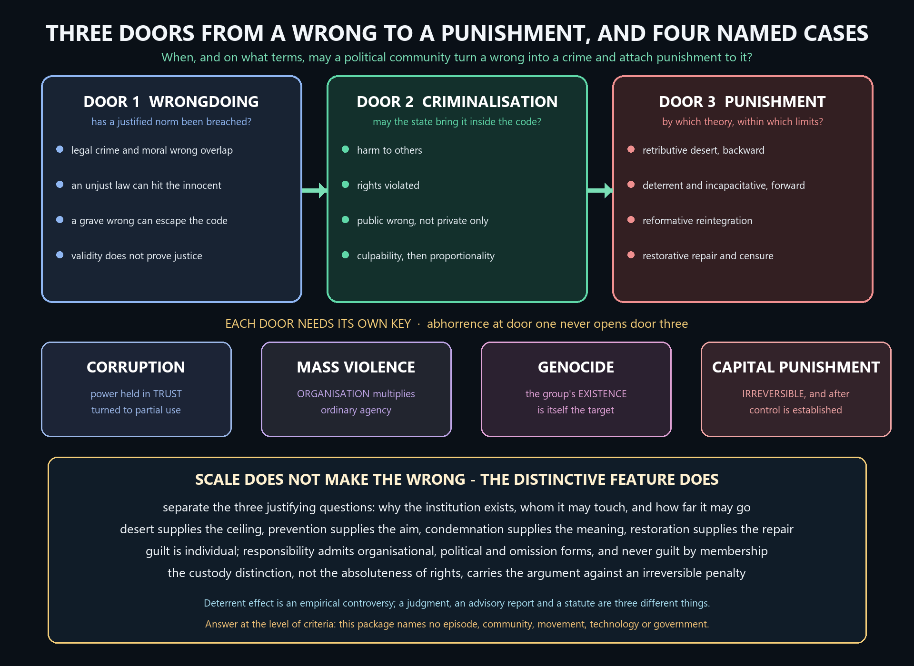

# Crime and Punishment — Learner-v2 Source-Complete Learning Session


> **Syllabus (verbatim):** Crime and Punishment : Corruption, Mass Violence, Genocide, Capital Punishment.
>
> **Generation:** g2, 27 August 2026 · **Approval:** false pending explicit topic approval
>
> **Evidence discipline:** Complete legacy teaching and workbook material is preserved, reordered Basic-first/Advanced-last, and checked against the canonical owner and verified 2018–2025 PYQ ledger.


## BASIC LEARNING SESSION




*Concept map: wrongdoing, criminalisation and punishment are three gates with three different keys, and corruption, mass violence, genocide and capital punishment are each distinguished by the feature that makes the wrong what it is rather than by how many people it touches.*

> **Syllabus (verbatim):** Crime and Punishment : Corruption, Mass Violence, Genocide, Capital Punishment.

### How to Use This Five-Layer Session

Every logical subtopic follows exactly:

| Layer | Purpose |
|---:|---|
| 1. SIMPLE START | visual-first plain-language gateway |
| 2. CORE UPSC | complete terminology, doctrine, argument, example and source grounding |
| 3. ADVANCED | objections, replies, comparisons, interpretive issues and provenance cautions |
| 4. EXAM APPLICATION | verified PYQ routes and 10/15/20-mark architecture |
| 5. RAPID REVISION | traps, retrieval notes and links to the exact MCQ set |

### Source Audit and Contemporary-Link Boundary

- **Canonical doctrine source:** `upsc-ai-kit/knowledge/Philosophy/paper-2/socio-political/Crime-and-Punishment.md` (8,838 words), sliced verbatim into the CORE UPSC layers (each canonical teaching passage exactly once) and preserved again, in full, in the canonical apparatus block.
- **Doctrine grounding (in the canonical file):** the crime/moral-wrong distinction and the criminalisation question; the seven conditions of just punishment and the responsibility/culpability analysis; the five theories (RETRIBUTIVE - Kant and Hegel; DETERRENT/utilitarian - Bentham and Beccaria, with certainty over severity; PREVENTIVE/incapacitative; REFORMATIVE and dignity; RESTORATIVE, with Braithwaite's reintegrative shaming); the three justifying questions (aim, distribution, amount) and the mixed/limiting theory; the EXPRESSIVE (Feinberg), COMMUNICATIVE (Duff) and Foucauldian-genealogical additions; corruption as betrayal of entrusted public power with the systemic-versus-ethical and mass-violence-analogy debates; mass violence with Arendt's banality thesis and the five kinds of collective responsibility; genocide (Lemkin, 1944; the 1948 Convention and its narrower legal scope); capital punishment (retention/abolition, the right-to-life and fallibility/necessity pivot, and the Indian legal materials); and the inter-school debates, the criticisms with replies, the ten traps and the selectable evidence bank C1-C15. No book claim is added beyond what the canonical file already grounds.
- **Scaffolding discipline:** the SIMPLE START gateways, the ASCII maps and comparison tables, and the exam architecture are authored scaffolding around the canonical core; they add accessible on-ramps and retrieval structure only, never new doctrine, and every canonical term, argument, objection/reply, comparison and caution is preserved.
- **Verified PYQs:** local Socio-Political Philosophy Paper II bank, 2018-2025; this clause owns exactly **12** primary parts (2018:1, 2019:2, 2020:2, 2021:1, 2022:2, 2023:1, 2024:1, 2025:2). Obligation/resistance and civil-disobedience stems (Individual and the State), abstract rights/justice or entitlement framing (Social and Political Ideals), ideology-label stems (Political Ideologies), caste/gender-discrimination stems (Gender and Caste Discrimination) and integrity-only stems (Ethics, GS-IV) are kept separate and not double-owned.
- **Provenance discipline:** Kant, Hegel, Bentham, Beccaria, Feinberg, Duff, Foucault, Braithwaite, Lemkin, Hart and Arendt are cited by position and standard title only; Foucault is used as genealogy, never as normative justification; no page, edition or verbatim wording is asserted and no quotation is fabricated. The Prevention of Corruption Act, **1988** (amended **2018**), the Lokpal and Lokayuktas Act, **2013**, Bachan Singh v. State of Punjab (**1980**) with the 'rarest of rare' framework, Law Commission of India Report No. 262 (**2015**), the Genocide Convention (**1948**) and Lemkin's Axis Rule in Occupied Europe (**1944**) appear only as dated, correctly classified legal/scholarly facts (statute / judgment / advisory report / international instrument), never as philosophical proof.
- **India-centric discipline:** Indian examples (the two anti-corruption statutes, the 1980 judgment and its 'rarest of rare' framework, and the 2015 advisory report) are used only as dated, verifiable facts exactly as the canonical file grounds them, never as proof that a philosophical thesis is true or false; no country, community, party, government, movement, technology or historical episode is named as an instance of mass violence, genocide, communal violence or surveillance, and contemporary comment is answered at the level of criteria.
- **Contemporary-affairs boundary (deliberate):** this is a static, syllabus-driven conceptual clause; no 2026 institutional development is forced as an anchor, and no factual claim is invented. Only static syllabus relevance and clearly labelled analysis are used.
- **Qdrant:** optional fallback only; not required for this canonical topic, and it never blocks the learning session.

**Preservation note:** the canonical doctrine is reorganised into layers, never compressed. Every doctrine, argument, objection/reply, comparison, corpus-depth delta, PYQ route, directive rule, graded verdict and provenance caution is retained; simplification means adding accessible gateways, not deleting complexity.

### Learning Roadmap

| Unit | Logical subtopic |
|---:|---|
| 1 | Crime as Legal Wrong versus Moral Wrong; the Criminalisation Question |
| 2 | Conditions of Just Punishment: Responsibility, Culpability and the Five Theories |
| 3 | Retributivism: Desert, Kant, Hegel and the Limits of Punishment |
| 4 | Deterrence and Incapacitation: the Utilitarian Justification of Punishment |
| 5 | Reform, Dignity, Proportionality and Juveniles |
| 6 | The Three-Question Grid and the Mixed / Limiting Theory |
| 7 | Expressive, Communicative and Restorative Theories; Foucault's Caution |
| 8 | Corruption, Mass Violence and Genocide: the Structural-Wrong Frontier |
| 9 | Capital Punishment: the Argument Tree and the Indian Position |
| 10 | Inter-School Debates, Criticisms, Traps and the Universal Answer Spine |

---

### SESSION 1 — Crime, Moral Wrong and the Question of Criminalisation

#### DEFINITION / WHAT THIS IS CALLED

**Plain-language definition:** Crime is conduct that a valid criminal law prohibits and makes punishable, while a moral wrong is conduct that breaches a justified ethical norm; the two classes overlap in the paradigm offences but are not the same list, so neither of them settles the other.

**Technical definition:** The clause opens with three logically separate gates that must never be run together: a wrongdoing gate asking whether a justified norm has been breached, a criminalisation gate asking whether the state may bring that conduct inside the penal code by reference to harm, rights, public wrong, culpability and proportionality, and a punishment gate asking by which theory and within which limits a sanction may then be attached.

#### VISUAL — Legal crime and moral wrong: what overlaps and what does not

```text

        LEGAL CRIME                          MORAL WRONG

 prohibited + punishable by            breaches a justified

    a valid criminal law                    ethical norm

   +---------------+     +===========+     +---------------+

   |       A       |     |     B     |     |       C       |

   | law only:     |     | murder,   |     | wrong but not |

   | an unjust law |     | theft --  |     | a crime: harms|

   | reaches       |<--->| legal AND |<--->| the code has  |

   | innocent      |     | moral     |     | never reached |

   | conduct       |     | wrong     |     |               |

   +---------------+     +===========+     +---------------+


READ IT BOTH WAYS -> being a crime does not prove the conduct

is wrong (A); being wrong does not prove it should be a crime (C).

```

*Region B is the paradigm, not the whole picture: the two outer regions are exactly why criminalisation needs a justification of its own.*

#### VISUAL — The criminalisation filter: may the state make THIS conduct a crime?

```text

conduct

   |

   v

[ GATE 1  HARM ] -> does it set back the interests of others?

   |  fail -> not criminalisable, however disliked

   v

[ GATE 2  RIGHTS ] -> is a right of another violated?

   |  fail -> regulate or leave alone, do not criminalise

   v

[ GATE 3  PUBLIC WRONG ] -> is the community, not only a

   |  private party, wronged?          (contested gate)

   v

[ GATE 4  CULPABILITY ] -> voluntary act and a guilty mind?

   |  fail -> no fair basis for censure at all

   v

[ GATE 5  PROPORTIONATE RESPONSE ] -> is penal coercion the

   |  least burdensome adequate response?

   v

CRIMINALISATION JUSTIFIED -> and only now does the separate

question of WHICH THEORY OF PUNISHMENT applies arise.

```

*Five gates in series, not a checklist: failing any one gate defeats criminalisation, and clearing all five still leaves the justification of punishment untouched.*

#### ANSWER-GRABBING OPENING — WRITE/ADAPT IN THE EXAM

> Wrongdoing, criminalisation and punishment are three doors with three different keys, and the standard failure in this clause is to open the third door by pointing at how ugly the room behind the first one looks.

#### MUST-WRITE KEYWORDS

- **legal crime and moral wrong**
- **the criminalisation filter**
- **harm, rights and public wrong**
- **culpability and proportionality gates**
- **legal-positivist, moral and sociological accounts of crime**
- **wrong in itself and wrong because prohibited**

**How to use them:** Define legal crime and moral wrong in one line each and place the overlap before anything else, run the criminalisation filter as five named gates rather than as a mood, assign the three accounts of crime their separate jobs, and reserve the word punishment for the third gate so that the theories of desert and deterrence are never smuggled in as answers to a definitional question.

#### CORE OBJECTION, REPLY AND RESIDUAL LIMIT

**Objection:** If crime is whatever the law prohibits, criminal law becomes self-justifying and philosophy has nothing to add; if crime is whatever is morally wrong, the criminal law loses the certainty and fair notice that make it law at all.

**Best reply:** The dilemma dissolves once the three accounts are given different jobs rather than treated as rival answers to one question. The legal-positivist account fixes the rule and delivers certainty; the moral account supplies the standard by which a prohibition can be judged unjust; the sociological account exposes the selectivity with which the deviant label is applied. Each is inadequate alone, and each answers a question the other two cannot.

**Residual limit:** The division of labour does not say who adjudicates when the moral test and the enacted rule conflict in a particular case, and the public-wrong gate itself remains contested between harm-principle, legal-moralist, paternalist and offence-based positions.

#### EXAM USE AND CONCISE REVISION

**Answer architecture:** Open by separating wrongdoing, criminalisation and punishment; define legal crime and moral wrong and locate the overlap; run the five criminalisation gates as a filter; deploy the three accounts of crime with the limitation attached to each; distinguish conduct wrong in itself from conduct wrong because prohibited; and close by stating that a theory of punishment can begin only once the criminalisation gate has been cleared.

- Legal crime and moral wrong overlap in the paradigm offences and come apart in two directions at once.
- An unjust law can criminalise morally innocent conduct; a grave moral wrong can escape legal definition entirely.
- The criminalisation filter has five gates: harm, rights, public wrong, culpability and proportionality.
- Legal-positivist account fixes the rule but cannot criticise it; moral account criticises but imports vagueness; sociological account exposes bias but can weaken legal certainty.
- Conduct wrong in itself and conduct wrong because prohibited rest on different justifications, the second on coordination and fair notice.
- Responsibility for a wrong and liability to punishment are separate findings, reached at separate gates.
- Criminalisation is a question about the state's authority, not about the moral quality of the act alone.
- Trap 1 of the canonical bank: never equate every moral wrong with a legal crime.

This whole syllabus item runs on ONE chain: some conduct is a WRONG; the state
sometimes turns a wrong into a CRIME; and it sometimes attaches PUNISHMENT to the
crime. Three separate steps, three separate justifications. The commonest mistake
is to slide from "this is terrible" straight to "so the state may punish it" -- as
if abhorrence alone licensed the prison. It does not. Start where the canonical map
starts: what is a crime, how does it relate to moral wrong, and when may the state
criminalise at all?

```text
   CRIME vs MORAL WRONG -- two ideas that OVERLAP but are NOT identical
   ==================================================================
        LEGAL CRIME                                MORAL WRONG
   (prohibited + punishable                 (violates a justified
    by a valid criminal law)                 ethical norm)
       +--------------+                        +--------------+
       |      A       |        OVERLAP         |      C       |
       |  law only    |   +==============+     |  wrong but   |
       | (an unjust   |   |      B       |     |  NOT a crime |
       |  law hits    |   |  murder,     |     | (cruelty a   |
       |  innocent    |   |  theft:      |     |  law never   |
       |  conduct)    |   |  legal AND   |     |  reached)    |
       +--------------+   |  moral wrong |     +--------------+
                          +==============+
   A = an unjust law criminalises morally innocent conduct
   B = the paradigm: legal wrong and moral wrong coincide
   C = a grave moral wrong escapes legal definition
```

Plain version: crime and sin are not the same list. Law can get it wrong in both
directions -- criminalising the innocent (A) and missing real wrongs (C). So being
a crime does not prove something is wrong, and being wrong does not prove it should
be a crime. That gap is exactly why criminalisation needs its OWN justification.

```text
   THE CRIMINALISATION FILTER -- may the state make THIS conduct a crime?
   =====================================================================
   conduct -> [ HARM to others? ] -> [ RIGHTS violated? ] -> [ PUBLIC wrong? ]
           -> [ CULPABILITY present? ] -> [ PROPORTIONATE to respond? ] -> CRIME
   Fail any gate  ->  criminalisation is UNJUSTIFIED, however much disliked.
```

> 🔑 Mnemonic: "WRONG -> CRIME -> PUNISH are three doors, each with its own key."
> Never open door three by pointing at how ugly the room behind door one is.


#### 0. ONE-SCREEN MAP

```text
WRONGDOING
   +-- CORRUPTION: office + entrusted power → partial/private use
   +-- MASS VIOLENCE: organised or cascading violence against many
   +-- GENOCIDE: specified acts + intent to destroy a protected group
                         |
                         v
WHY PUNISH?
   retribution · deterrence · prevention · reform · restoration
                         |
                         v
CAPITAL PUNISHMENT = irreversible test case
desert/security claims ↔ dignity, fallibility, equality and reform
```

⚠️ **Master distinction:** punishment is not justified merely because conduct is abhorrent. A theory must explain **who may punish, for what purpose, within what limits, and under what conditions of responsibility and fair procedure**.

---

#### 1. CRIME AND THE JUSTIFICATION OF PUNISHMENT

#### 1.1 Crime: legal and moral concepts

✅ **Legal crime** is conduct prohibited and punishable by a valid criminal law. **Moral wrong** is conduct that violates a justified ethical norm. The classes overlap but are not identical: an unjust law may criminalise morally innocent conduct, while grave moral wrongs may escape legal definition.

| Concept | Question | Limitation |
|---|---|---|
| **Legal positivist account** | what has the law prohibited? | validity does not prove moral justice |
| **Moral account** | what wrongful harm or violation occurred? | disagreement and vagueness |
| **Sociological account** | which norms and power relations define deviance? | may weaken legal certainty |

⚠️ Criminalisation itself needs justification through harm, rights, public wrong, culpability and proportionality.

#### CLOSING RECALL FLOW — Crime, Moral Wrong and the Question of Criminalisation

```closure-flow
SUBTOPIC: Crime, Moral Wrong and the Question of Criminalisation
STARTING CONCEPT: Crime, Moral Wrong and the Question of Criminalisation
KEY TERMS / DEFINITIONS: legal crime and moral wrong | the criminalisation filter | harm, rights and public wrong | culpability and proportionality gates | legal-positivist, moral and sociological accounts of crime | wrong in itself and wrong because prohibited
MECHANISM / ARGUMENT: Positive law fixes the rule and supplies certainty and fair notice, the moral account supplies the external standard by which an unjust prohibition can be criticised, and the sociological account exposes whose power the label of deviance tracks; criminalisation is justified only when the conduct clears every gate rather than borrowing a justification from the wrongfulness of the act.
CONSEQUENCE / CONTRAST: Because validity does not prove justice, an unjust criminal statute can be criticised without abandoning legality, and a grave moral wrong can be conceded to lie outside the code without any demand that it be criminalised.
UPSC TRAP / ANSWER-USE: Do not equate every moral wrong with a legal crime and do not treat abhorrence as a licence to punish: an answer that reaches prison by way of disgust has skipped both the criminalisation filter and the entire theory of punishment.
ANSWER-GRABBING FORMULATION: Wrongdoing, criminalisation and punishment are three doors with three different keys, and the standard failure in this clause is to open the third door by pointing at how ugly the room behind the first one looks.
```

### SESSION 2 — Conditions of Just Punishment: Responsibility, Culpability and the Five Theories

#### DEFINITION / WHAT THIS IS CALLED

**Plain-language definition:** Punishment is hard treatment together with authoritative censure, imposed by a competent public authority on a person found to have breached a criminal law, and it counts as just only when a set of conditions about notice, voluntary conduct, culpability, proof, impartiality, proportionality and equal application has been satisfied.

**Technical definition:** Two components must be kept apart in every answer: the enabling conditions of responsible punishment, which decide whether a person is answerable at all, and the five substantive theories - retributive, deterrent, incapacitative, reformative and restorative - each of which fixes what the sanction is for, in which temporal direction it looks, by which central test it is measured, and against which characteristic danger it must be guarded.

#### VISUAL — The seven conditions that must hold before any theory is reached

```text

  +---------------------------------------------------------+

  | 1 PUBLIC LAW KNOWN IN ADVANCE   -> conduct is guidable   |

  | 2 VOLUNTARY ACT OR OMISSION     -> agency is engaged     |

  | 3 CULPABILITY, GRADED           -> censure is deserved   |

  | 4 FAIR PROCEDURE, RELIABLE PROOF-> finding is trustworthy|

  | 5 COMPETENT IMPARTIAL AUTHORITY -> public, not partisan  |

  | 6 PROPORTIONALITY               -> penalty tracks wrong  |

  | 7 EQUAL APPLICATION             -> no status bias        |

  +---------------------------------------------------------+

                            |

                            v

   ONLY NOW: which of the five theories justifies the sanction?


  FAIL ANY CONDITION -> the sanction is defective even if the

  chosen theory is impeccable. Conditions constrain; they do

  not choose.

```

*The conditions are prior to and independent of the theories, which is why a procedural criticism and a theoretical criticism are different objections.*

#### VISUAL — The five theories on four axes

```text

+--------------+-------------+------------+----------------+

| THEORY       | DIRECTION   | TEST       | DANGER         |

+--------------+-------------+------------+----------------+

| RETRIBUTIVE  | backward    | desert     | vengeance,     |

|              |             |            | excess         |

+--------------+-------------+------------+----------------+

| DETERRENT    | forward     | expected   | offender used  |

|              |             | prevention | as a means     |

+--------------+-------------+------------+----------------+

| INCAPACITA-  | forward     | necessity  | indefinite or  |

| TIVE         |             | and risk   | biased custody |

+--------------+-------------+------------+----------------+

| REFORMATIVE  | forward     | reintegra- | paternalism,   |

|              |             | tion       | victims ignored|

+--------------+-------------+------------+----------------+

| RESTORATIVE  | relational  | repair and | unequal        |

|              |             | acknowl-   | bargaining     |

|              |             | edgement   |                |

+--------------+-------------+------------+----------------+

```

*Reproduce this grid rather than a list of names: the central test earns the exposition mark and the characteristic danger earns the criticism mark.*

#### ANSWER-GRABBING OPENING — WRITE/ADAPT IN THE EXAM

> Punishment is not revenge with paperwork: it is public, proportionate and impartial hard treatment imposed on a responsible agent under rules known in advance, and every one of those adjectives is doing work that private vengeance cannot do.

#### MUST-WRITE KEYWORDS

- **conditions of responsible punishment**
- **voluntary act and guilty mind (mens rea)**
- **culpability graded by intention, knowledge, recklessness and negligence**
- **responsibility is not identical with causal contribution**
- **the five theories and their central tests**
- **backward-looking desert against forward-looking prevention**
- **punishment distinguished from revenge**

**How to use them:** State the conditions of responsible punishment as a numbered list before naming any theory, mark the grading of culpability rather than treating intention as a switch, use the causal-contribution distinction to catch both the unknowing contributor and the culpably omitting official, and present the five theories as a table of purpose, direction, test and danger instead of as a catalogue of names.

#### CORE OBJECTION, REPLY AND RESIDUAL LIMIT

**Objection:** If punishment simply is hard treatment plus censure, then the conditions of just punishment are stipulations about a practice we have already decided to keep, and the real question - why the state may deliberately impose suffering at all - has been postponed rather than answered.

**Best reply:** The conditions are not stipulations but constraints that any candidate justification must survive, and they already do substantive work: legality rules out retrospective censure, the voluntariness and culpability conditions rule out strict vicarious blame, impartiality rules out the vendetta, and proportionality rules out unlimited escalation. A theory that cannot accommodate them is refuted before it is examined, which is why they are stated first.

**Residual limit:** The conditions constrain without selecting: retributive, deterrent, incapacitative, reformative and restorative theories can all satisfy them in principle, so the choice among the five has to be made on grounds the conditions themselves do not supply.

#### EXAM USE AND CONCISE REVISION

**Answer architecture:** Define punishment as hard treatment plus authoritative censure by a competent authority; list the conditions of responsible punishment; separate responsibility from causal contribution in one worked line; present the five theories in a four-column table of doctrine, direction, central test and danger; name the punishment-against-revenge distinction; and close by saying which theory the stem is actually asking about.

- Punishment = hard treatment + authoritative censure + competent public authority + proved breach.
- Conditions: law known in advance, voluntary act, graded culpability, fair procedure, impartial authority, proportionality, equal application.
- Culpability is graded: intention, knowledge, recklessness, negligence - not a single switch.
- Causal contribution without knowledge or control is not responsibility; culpable omission by an official is.
- Retributive: desert, backward-looking, danger of vengeance and excess.
- Deterrent: expected prevention, forward-looking, danger of using the offender as a means.
- Preventive or incapacitative: necessity and risk, danger of indefinite or discriminatory confinement.
- Reformative: reintegration, danger of paternalism and neglect of victims.
- Restorative: acknowledgement and repair, danger of unequal bargaining and unsuitability for some crimes.
- Punishment differs from revenge in being public, proportionate, impartial and rule-governed.

Before we ask WHY we punish, we must ask WHEN we are even allowed to. Punishment is
the deliberate infliction of hard treatment by the state; that is a serious thing,
so it comes with entry conditions. And once those conditions are met, there are
exactly FIVE families of answer to "why punish?" -- this subtopic lays out the
gatekeeping conditions and the five-theory menu together, because the conditions
constrain which theory may operate.

```text
   THE RESPONSIBILITY LADDER -- how much is a person answerable?
   ============================================================
   MOST culpable   |  INTENTION      (meant to do the wrong)          ^
        ^          |  KNOWLEDGE      (knew it was near-certain)       |
        |          |  RECKLESSNESS   (knew of the risk, ran it)       |  desert
        |          |  NEGLIGENCE     (should have known)              |  rises
        |          |  ---- excuses cut the rungs ----                 |
   LEAST culpable  |  INSANITY / DURESS / NECESSITY / infancy         |
   Culpability is proportioned to the rung; excuses lower or remove it.
   Causing a harm is NOT the same as being responsible for it.
```

Then the menu -- five ways to answer "why punish?":

```text
   THE FIVE THEORIES OF PUNISHMENT (the whole map on one line)
   ==========================================================
   RETRIBUTIVE  ->  looks BACK: punish because deserved (test: desert)
   DETERRENT    ->  looks FWD:  threaten to prevent (test: prevention)
   PREVENTIVE   ->  looks FWD:  restrain the dangerous (test: risk/necessity)
   REFORMATIVE  ->  looks FWD:  rebuild lawful agency (test: reintegration)
   RESTORATIVE  ->  looks SIDE: repair harm with victim + community (test: repair)
```

> 🔑 Mnemonic: theories = "R-D-P-R-R"; DIRECTIONS = back / forward / forward /
> forward / relational. Ask of any theory: which direction does it look, and what
> is its single test?


#### 1.2 Conditions of responsible punishment

✅ A defensible punishment normally presupposes:

- a public law known in advance;
- a voluntary act or legally relevant omission;
- culpability proportionate to intention, knowledge, recklessness or negligence;
- fair procedure and reliable proof;
- a competent and impartial authority;
- proportionality between wrong, responsibility and sanction;
- equal application without status bias.

**Distinction:** responsibility is not identical with causal contribution. A person may causally contribute without sufficient knowledge or control; conversely, an official can be responsible for culpable omission.

#### 1.3 Theories of punishment

| Theory | Doctrine | Direction | Central test | Main danger |
|---|---|---|---|---|
| **Retributive** | punish because culpable wrongdoing deserves a proportionate response | backward-looking | desert | vengeance/excess |
| **Deterrent** | threaten or impose penalty to reduce future offending | forward-looking | expected prevention | using offender as a means |
| **Preventive / incapacitative** | restrain a dangerous offender to protect others | forward-looking | necessity and risk | indefinite or discriminatory confinement |
| **Reformative / rehabilitative** | transform capacities and conditions for lawful agency | forward-looking | reintegration | paternalism; neglect of victims |
| **Restorative** | repair harm through accountable participation of victim, offender and community | relational | acknowledgement and repair | unequal bargaining; unsuitable for some crimes |

#### CLOSING RECALL FLOW — Conditions of Just Punishment: Responsibility, Culpability and the Five Theories

```closure-flow
SUBTOPIC: Conditions of Just Punishment: Responsibility, Culpability and the Five Theories
STARTING CONCEPT: Conditions of Just Punishment: Responsibility, Culpability and the Five Theories
KEY TERMS / DEFINITIONS: conditions of responsible punishment | voluntary act and guilty mind (mens rea) | culpability graded by intention, knowledge, recklessness and negligence | responsibility is not identical with causal contribution | the five theories and their central tests | backward-looking desert against forward-looking prevention | punishment distinguished from revenge
MECHANISM / ARGUMENT: A public law known in advance makes conduct guidable, a voluntary act with a graded guilty mind makes the agent answerable, fair procedure and reliable proof make the finding trustworthy, an impartial authority makes the sanction public rather than partisan, and proportionality with equal application keeps the penalty tied to the wrong rather than to the offender's status.
CONSEQUENCE / CONTRAST: Once the conditions are stated separately from the theories, a defective conviction can be criticised without disputing any theory of punishment, and a defensible theory can be criticised without alleging any procedural defect.
UPSC TRAP / ANSWER-USE: Do not run the five theories as a list of opinions to be surveyed and do not treat causal contribution as proof of responsibility: the marks lie in the central test and characteristic danger of each theory, and in the gap between having caused a harm and being answerable for it.
ANSWER-GRABBING FORMULATION: Punishment is not revenge with paperwork: it is public, proportionate and impartial hard treatment imposed on a responsible agent under rules known in advance, and every one of those adjectives is doing work that private vengeance cannot do.
```

### SESSION 3 — Retributivism: Desert, Kant, Hegel and the Limits of Punishment

#### DEFINITION / WHAT THIS IS CALLED

**Plain-language definition:** Retributivism holds that punishment is justified because a culpable wrongdoer deserves a proportionate response for what was done, so the sanction looks backward to the offence rather than forward to any benefit it might be expected to produce.

**Technical definition:** Desert functions as both the ground and the boundary of the sanction: the offender's imputable act generates the claim of desert, proportionality fixes the amount, and in the modern limiting form the theory operates as a negative side-constraint under which no one may be punished without desert and no penalty may exceed it, whatever social advantage a heavier sentence would purchase.

#### VISUAL — The retributive argument, step by step

```text

  CRIME COMMITTED

        |

        v

  (1) the act asserts a MAXIM incompatible with equal right

        |

        v

  (2) IMPUTABLE AGENCY -> the offender is answerable for it

        |

        v

  (3) a PROPORTIONATE LEGAL RESPONSE publicly denies the maxim

        |

        v

  (4) the denial expresses RESPECT FOR RIGHT, not private revenge

        |

        +--> KANT: the offender is an end, never a mere

        |          instrument of social prevention

        +--> HEGEL: punishment is the annulment of the crime's

                   wrongful claim, and honours the offender

                   as a responsible agent

```

*Write the four numbered steps and then attach Kant and Hegel to steps four and three respectively; the argument carries the marks, the names only anchor it.*

#### VISUAL — Maximising and limiting retributivism are not the same theory

```text

+-------------------+-------------------+-------------------+

|                   | MAXIMISING form   | LIMITING form     |

+-------------------+-------------------+-------------------+

| What desert does  | REQUIRES the      | PERMITS up to,    |

|                   | deserved penalty  | and never beyond  |

+-------------------+-------------------+-------------------+

| Innocent person   | protected         | protected         |

+-------------------+-------------------+-------------------+

| Ceiling on        | fixed by desert   | fixed by desert   |

| severity          |                   |                   |

+-------------------+-------------------+-------------------+

| Rights objection  | bites: the state  | fails: the theory |

|                   | must inflict pain | only restrains    |

+-------------------+-------------------+-------------------+

| Weak point        | why must the      | supplies no       |

|                   | state add pain?   | positive aim      |

+-------------------+-------------------+-------------------+

```

*The human-rights stem is answered in this table: name the form of retributivism before conceding or denying that it violates rights.*

#### ANSWER-GRABBING OPENING — WRITE/ADAPT IN THE EXAM

> Retribution is not vengeance made respectable: it is the claim that a responsible agent's own act, and not the community's appetite for suffering, fixes both the ground and the ceiling of what may lawfully be done to him.

#### MUST-WRITE KEYWORDS

- **desert as ground and as ceiling**
- **imputable agency and answerability**
- **Kant on the offender as an end**
- **punishment as annulment of the crime's wrongful claim (Hegel)**
- **proportionate legal response against private revenge**
- **limiting or negative retributivism**
- **retribution distinguished from vengeance**

**How to use them:** Lead with desert doing two jobs at once, use Kant for the refusal to treat the offender merely as an instrument of social benefit, use Hegel for the public denial of the wrongful maxim, and reach for limiting retributivism the moment the human-rights objection appears, because the limiting form is what converts desert from a demand for suffering into a ceiling on it.

#### CORE OBJECTION, REPLY AND RESIDUAL LIMIT

**Objection:** Suffering does not undo suffering. Even granting that the offender deserves censure, desert alone does not show why the state should add pain to the world, and a theory that demands it looks like institutionalised retaliation dressed in the language of right.

**Best reply:** Modern retributivism is limiting rather than maximising: it does not demand that deserved suffering be inflicted, it forbids inflicting undeserved or excessive suffering. Read that way, the theory is not a licence for hard treatment but the principal constraint on it, and it explains the two things pure prevention cannot - why the innocent may not be punished however useful it would be, and why there is a ceiling on severity at all.

**Residual limit:** The limiting form buys its defensive strength by giving up the positive claim: it can say what may not be done but not why the state must inflict anything, so it still owes an account of the general justifying aim, which is exactly the gap the three-question grid is built to fill.

#### EXAM USE AND CONCISE REVISION

**Answer architecture:** State desert as ground and ceiling; run the four-step Hegelian argument from wrongful maxim to public denial; add the Kantian refusal to instrumentalise the offender; take the suffering-does-not-undo-suffering objection head on; convert to limiting retributivism as the reply; and close by conceding that the theory answers liability and severity well and the general justifying aim poorly.

- Desert is both the ground of punishment and the ceiling on it.
- Kant: punishment answers the culpable act, never merely social utility; the offender is not an instrument of deterrence.
- Hegel: crime asserts a maxim against equal right; punishment annuls that wrongful claim and takes the offender seriously as responsible.
- Four-step argument: incompatible maxim, imputable agency, proportionate public denial, respect for right rather than revenge.
- Objection: suffering does not undo suffering; desert alone does not license adding pain.
- Reply: limiting or negative retributivism - never without desert, never beyond it.
- Retribution against revenge: public, proportionate, impartial, rule-governed, not privately administered.
- 2020 Q3(c) route: retributivism is against human rights only in its maximising form; the limiting form protects them.
- Residual gap: retributivism explains Q2 and Q3 far better than it explains Q1.

The first great answer to "why punish?" looks BACKWARD: we punish because a culpable
wrong DESERVES a proportionate response, full stop -- not to fix the future. This is
retributivism, and its most demanding versions come from Kant and Hegel. Its whole
appeal is that it treats the offender as a responsible person, an author of his
deed, rather than as raw material for social engineering.

```text
   RETRIBUTION vs UTILITARIAN DETERRENCE -- two opposite engines
   ============================================================
                  RETRIBUTIVE                    UTILITARIAN / DETERRENT
   Why punish?    desert for a culpable wrong     prevent future harm
   Looks          BACKWARD (at the deed done)     FORWARD (at the effects)
   Offender is    a responsible AGENT, an END     a lever on future conduct
   The limit      proportional GUILT (a ceiling)  least-cost prevention
   Chief danger   sanctified suffering / excess   using the person as a MEANS
```

The one line to remember: retribution says the punishment is owed BECAUSE of the
crime; deterrence says it is owed FOR THE SAKE OF future benefit. Same prison, two
utterly different justifications -- and Kant thought only the first respects the
person.

> 🔑 Mnemonic: "DESERT looks in the rear-view mirror." Retributivism keeps its eyes
> on the deed already done, and lets desert set both the floor (only the guilty) and
> the ceiling (never more than deserved).


#### 1.4 Retributivism: Kant and Hegel

✅ For Kant, punishment must answer to the offender's culpable act and cannot be imposed merely to produce social utility. Treating a person only as an instrument of deterrence violates rational agency.

✅ Hegel interprets punishment as the negation of the crime's wrongful claim: it restores right while taking the offender seriously as a responsible agent.

**Argument:**

1. crime asserts a maxim incompatible with equal right;
2. imputable agency makes the offender answerable;
3. a proportionate legal response publicly denies the wrongful maxim;
4. punishment therefore expresses respect for right, not private revenge.

**Objection:** suffering does not undo suffering, and desert alone cannot show why the state should add pain.
**Reply:** ✅ modern retributivism can be limiting rather than maximising: no one may be punished without desert, and no penalty may exceed it. ⚠️ It still needs an account of humane institutions.

#### CLOSING RECALL FLOW — Retributivism: Desert, Kant, Hegel and the Limits of Punishment

```closure-flow
SUBTOPIC: Retributivism: Desert, Kant, Hegel and the Limits of Punishment
STARTING CONCEPT: Retributivism: Desert, Kant, Hegel and the Limits of Punishment
KEY TERMS / DEFINITIONS: desert as ground and as ceiling | imputable agency and answerability | Kant on the offender as an end | punishment as annulment of the crime's wrongful claim (Hegel) | proportionate legal response against private revenge | limiting or negative retributivism | retribution distinguished from vengeance
MECHANISM / ARGUMENT: The criminal act asserts a maxim incompatible with equal right, imputable agency makes the offender answerable for that assertion, a proportionate legal response publicly denies the maxim, and the denial is therefore an expression of respect for right and for the offender's standing as a responsible agent rather than an expression of the community's anger.
CONSEQUENCE / CONTRAST: Read as a limiting theory, retributivism becomes the strongest available shield against penal excess: it forbids punishing the innocent for social advantage and forbids a sentence heavier than the offence deserves, which is precisely what pure prevention cannot rule out.
UPSC TRAP / ANSWER-USE: Do not confuse retribution with revenge and do not let the human-rights objection stand unanswered: retribution is public, proportionate and impartial, and the limiting form is the reply that a 2020-style rights objection was designed to test.
ANSWER-GRABBING FORMULATION: Retribution is not vengeance made respectable: it is the claim that a responsible agent's own act, and not the community's appetite for suffering, fixes both the ground and the ceiling of what may lawfully be done to him.
```

### SESSION 4 — Deterrence and Incapacitation: the Utilitarian Justification of Punishment

#### DEFINITION / WHAT THIS IS CALLED

**Plain-language definition:** Deterrence justifies punishment by the future offending it is expected to prevent, whether by discouraging the particular offender or by holding out a credible threat to everyone else, while incapacitation justifies restraint by the harm a confined or disabled offender is thereby prevented from causing.

**Technical definition:** Both are forward-looking consequentialist justifications, but they work through different mechanisms and carry different presuppositions: deterrence operates on the offender's practical reasoning about perceived costs and therefore depends on knowledge, certainty and promptness of sanction, whereas incapacitation operates on opportunity rather than on reasons and therefore depends on a defensible judgment of risk and necessity.

#### VISUAL — Two forward-looking arguments with two different targets

```text

                 FORWARD-LOOKING PREVENTION

                            |

        +-------------------+-------------------+

        v                                       v

   DETERRENCE                            INCAPACITATION

   target: the offender's REASONS        target: OPPORTUNITY

        |                                       |

   +----+----+                          needs: necessity

   v         v                          + risk judgment

 SPECIFIC  GENERAL                             |

 this      everyone                            v

 offender  else                        secure custody also

        |                              incapacitates, so no

        v                              argument for an

 needs: knowledge, CERTAINTY,          irreversible penalty

 promptness  (severity is the          follows from this

 weakest lever of the three)           branch alone

```

*Splitting the branch early is what stops a capital-punishment answer from sliding between prevention by threat and prevention by restraint.*

#### VISUAL — Where the classic objection actually lands

```text

  PURE DETERRENCE

     |

     +-- at Q1 GENERAL AIM --------- strong: prevention is a

     |         real and statable purpose for the institution

     |

     +-- at Q2 WHO MAY BE PUNISHED . FAILS: permits convicting

     |         a known innocent if the yield is high enough

     |            |

     |            +-> reply: rule-utilitarian legality and

     |                due process are themselves utility-

     |                maximising rules

     |            +-> rejoinder: protection then rests on a

     |                calculation that could come out

     |                the other way

     |

     +-- at Q3 HOW MUCH ------------ FAILS: no internal

               ceiling on severity without a desert limit

```

*The objection is not to deterrence as such but to deterrence at the second and third questions, which is why a mixed theory can keep the aim and drop the defect.*

#### ANSWER-GRABBING OPENING — WRITE/ADAPT IN THE EXAM

> Deterrence works on the offender's reasons and incapacitation works on his opportunities, which is why an argument that succeeds for one of them has not thereby succeeded for the other.

#### MUST-WRITE KEYWORDS

- **specific and general deterrence**
- **certainty and promptness against severity**
- **punishment as an evil justified by prevention**
- **incapacitation as restraint rather than persuasion**
- **the punishing-the-innocent objection**
- **rule-utilitarian side-constraints**
- **deterrent effect as a contested empirical claim**

**How to use them:** Separate specific from general deterrence in the first line, state the four presuppositions before claiming any preventive benefit, keep the certainty-over-severity point ready for every severity stem, and mark the deterrent effect of any particular penalty as an empirical controversy rather than reporting it as an established fact.

#### CORE OBJECTION, REPLY AND RESIDUAL LIMIT

**Objection:** Deterrence justifies punishing an innocent person whenever the social benefit is large enough, because on its own terms only the preventive yield of the sanction matters and the guilt of the person on whom it falls is instrumentally irrelevant.

**Best reply:** The rule-utilitarian answer is that a practice of convicting known innocents cannot be publicly avowed and would destroy the trust, predictability and compliance on which the whole preventive yield depends, so reliable guilt, legality and due process are themselves utility-maximising rules rather than external impositions. Critics answer that this makes the protection of the innocent contingent on a calculation that could come out the other way, and that rights ought to constrain utility independently.

**Residual limit:** Even a successful rule-utilitarian defence protects the innocent only derivatively, and it supplies no principled ceiling on the severity of penalties imposed on the guilty, so the theory remains strongest at the level of institutional aim and weakest at liability and amount.

#### EXAM USE AND CONCISE REVISION

**Answer architecture:** Define deterrence and incapacitation separately and name the mechanism of each; list the four presuppositions of the deterrent claim; state the certainty-and-promptness point associated with Beccaria and Bentham; run the punishing-the-innocent objection with the rule-utilitarian reply and the rights-based rejoinder; and close by locating the theory on the three-question grid.

- Specific deterrence addresses this offender; general deterrence addresses everyone else.
- Presuppositions: persons respond to perceived costs; sanctions are known and certain; preventive benefit exceeds direct and collateral harm; less harmful alternatives are inadequate.
- Beccaria and Bentham: certainty and promptness matter more than severity; all punishment is an evil justified only by preventing a greater evil.
- Incapacitation removes opportunity, not motive - its test is necessity and risk, and its danger is indefinite or discriminatory confinement.
- Secure imprisonment also incapacitates, which is decisive on the capital-punishment stem.
- Objection: pure deterrence permits punishing the innocent and permits unlimited escalation.
- Reply: rule-utilitarian constraints of reliable guilt, legality and due process; rejoinder that rights should constrain utility independently.
- Empirical status: comparative deterrent claims are contested; mark them as controversial rather than settled.
- Grid position: strong at the general justifying aim, weak at liability and at amount.

The second great answer looks FORWARD: punishment is justified by the future harm it
prevents, not by the past deed it answers. This is the utilitarian family, and it
prevents harm through two distinct mechanisms -- changing people's CHOICES
(deterrence) and removing their ABILITY to offend (incapacitation). For a
utilitarian, punishment is itself an evil (it inflicts suffering) and is justified
ONLY if it prevents greater evil at least cost.

```text
   FORWARD-LOOKING PREVENTION -- two mechanisms, one aim: fewer future harms
   ========================================================================
   DETERRENCE (change CHOICES)              INCAPACITATION (remove ABILITY)
   threat/penalty -> raises expected cost   restraint -> offender cannot reoffend
     |  GENERAL: aimed at everyone            |  secure custody incapacitates
     |  SPECIFIC: aimed at this offender      |  (execution = permanent, Subtopic 9)
     v                                        v
   works IF cost is known, certain, prompt  works regardless of deterrent effect
   Beccaria: CERTAINTY + SWIFTNESS beat mere SEVERITY
   Risks: punishing the innocent (deterrence); indefinite confinement, false
          positives (incapacitation/preventive detention)
```

Plain version: deterrence tries to make crime a bad bet; incapacitation just takes
away the dice. Deterrence needs offenders to be rational cost-weighers who know the
penalty; incapacitation works even on those who do not calculate at all.

> 🔑 Mnemonic: deterrence = "make it not worth it"; incapacitation = "make it not
> possible." Beccaria's rule: it is the CERTAINTY of being caught, not the severity
> of the penalty, that deters.


#### 1.5 Deterrence: utilitarian justification

✅ Deterrence justifies punishment by expected reduction of future harm. **Specific deterrence** addresses the offender; **general deterrence** addresses others.

**Presuppositions:**

- persons respond to perceived costs;
- sanctions are known and sufficiently certain;
- preventive benefits exceed direct and collateral harms;
- less harmful alternatives are inadequate.

**Objection:** deterrence may justify punishing an innocent person if social benefit is large enough.
**Reply:** rule-utilitarian constraints—reliable guilt, legality and due process—protect trust and long-term utility. ⚠️ Critics answer that rights should constrain utility independently.

#### CLOSING RECALL FLOW — Deterrence and Incapacitation: the Utilitarian Justification of Punishment

```closure-flow
SUBTOPIC: Deterrence and Incapacitation: the Utilitarian Justification of Punishment
STARTING CONCEPT: Deterrence and Incapacitation: the Utilitarian Justification of Punishment
KEY TERMS / DEFINITIONS: specific and general deterrence | certainty and promptness against severity | punishment as an evil justified by prevention | incapacitation as restraint rather than persuasion | the punishing-the-innocent objection | rule-utilitarian side-constraints | deterrent effect as a contested empirical claim
MECHANISM / ARGUMENT: A sanction that is known, sufficiently certain and promptly applied enters the practical reasoning of potential offenders as an expected cost; incapacitation bypasses that reasoning altogether by removing the opportunity, which is why the two arguments have to be defended separately even when they recommend the same sentence.
CONSEQUENCE / CONTRAST: Because deterrence measures a penalty by its expected preventive yield, it has no internal ceiling on severity and no internal bar on punishing a person known to be innocent where the social gain would be large enough, which is why it is almost never defensible without an imported desert constraint.
UPSC TRAP / ANSWER-USE: Do not report the deterrent effect of any penalty as proved or disproved and do not let incapacitation ride free on a deterrence argument: the first is an empirical controversy, and the second is a distinct claim about restraint that has to carry its own necessity and risk justification.
ANSWER-GRABBING FORMULATION: Deterrence works on the offender's reasons and incapacitation works on his opportunities, which is why an argument that succeeds for one of them has not thereby succeeded for the other.
```

### SESSION 5 — Reform, Dignity, Proportionality and Juveniles

#### DEFINITION / WHAT THIS IS CALLED

**Plain-language definition:** Reformative punishment treats the offender as a person capable of moral development and of return to lawful membership, so the sanction is designed to rebuild the capacities and conditions of responsible agency instead of degrading the offender or fixing him permanently in his worst act.

**Technical definition:** The reformative claim joins a thesis about persons - that responsible agency can be impaired and rebuilt, and that a person is more than a single act - to a proportionality framework with two dimensions: ordinal proportionality ranks offences against one another, and cardinal proportionality fixes how severe the entire penal scale may be, and together they set the outer band inside which reformative measures may operate.

#### VISUAL — Two dimensions of proportionality, and where the juvenile stem bites

```text

  ORDINAL PROPORTIONALITY            CARDINAL PROPORTIONALITY

  ranks offences against              fixes how severe the WHOLE

  one another                         scale may be

  +-------------------+               +---------------------+

  | grave  ---  minor |               | ceiling of the scale|

  |   ^                |              |         ^           |

  |   | relative       |              |         | absolute  |

  |   | ranking        |              |         | anchor    |

  +-------------------+               +---------------------+

        |                                      |

        +------------------+-------------------+

                           v

        JUVENILE CASE: harm may rank high ORDINALLY while

        reduced and developing agency lowers CULPABILITY, so

        the deserved point on the cardinal scale falls.

        VERDICT -> nature of the crime is relevant, not decisive.

```

*Answering a juvenile stem with ordinal ranking alone is the standard failure; the mark is carried by the move to the cardinal anchor and to culpability.*

#### VISUAL — Bounded rehabilitation: the four limits that answer the objection

```text

  REFORMATIVE MEASURE

        |

        +-- LIMIT 1  stays inside the proportionate band

        |             fixed by desert

        +-- LIMIT 2  seeks consent wherever consent is

        |             possible

        +-- LIMIT 3  is subject to periodic review

        +-- LIMIT 4  is bounded by rights and is measured by

                      restored capacity, not by conformity

                      of opinion

        |

        v

  OBJECTION ANSWERED -> what is refuted is unbounded

  therapeutic power, not reform as a penal purpose.

```

*State the four limits and the indefinite-treatment objection is met on the page rather than conceded.*

#### ANSWER-GRABBING OPENING — WRITE/ADAPT IN THE EXAM

> Reform is not leniency: it accepts responsibility and accepts proportionate restraint, and adds only the claim that a state which forecloses the route back to membership has punished the person rather than the offence.

#### MUST-WRITE KEYWORDS

- **the offender is more than the worst act**
- **capability rather than degradation**
- **a preserved route back to membership**
- **ordinal and cardinal proportionality**
- **offence-centred and offender-centred assessment**
- **developmental capacity and susceptibility to influence**
- **bounded rehabilitation with consent, review and rights**
- **reform distinguished from leniency**

**How to use them:** Run the four-step dignity argument before any sentiment about second chances, keep ordinal and cardinal proportionality explicitly apart because juvenile stems turn on the second, integrate the offence-centred and offender-centred perspectives rather than choosing between them, and state the bounding conditions on rehabilitation so that the indefinite-treatment objection is answered before it is made.

#### CORE OBJECTION, REPLY AND RESIDUAL LIMIT

**Objection:** Compulsory treatment can pathologise dissent and become indefinite: once the sanction is measured by whether the offender has been improved rather than by what the offence deserved, there is no principled point at which the intervention must stop.

**Best reply:** Defensible rehabilitation is bounded rather than open-ended. It remains inside the proportionate band that desert fixes, seeks consent where consent is possible, is subject to periodic review and to rights, and is measured by the restoration of capacity for lawful agency rather than by conformity of opinion. So understood the objection is an objection to unbounded therapeutic power, not to reform as a penal purpose.

**Residual limit:** The bounding conditions borrow their outer limits from desert, so reformative theory is not self-standing on severity, and it carries a standing risk that reformative language will be used to describe an intensified apparatus of control - the qualification that the disciplinary critique presses.

#### EXAM USE AND CONCISE REVISION

**Answer architecture:** State the reformative thesis about persons; run the four-step dignity argument; separate ordinal from cardinal proportionality; list the five juvenile considerations and integrate the two perspectives; answer the indefinite-treatment objection with the bounding conditions; and close with a graded verdict in which the nature of the crime is relevant but not conclusive.

- Dignity argument: persons are more than their worst act; agency can be impaired and rebuilt; the state should use capability, not degradation; a route back to membership must be preserved.
- Reform addresses ignorance, addiction, trauma, exclusion and distorted incentives without denying responsibility.
- Ordinal proportionality ranks offences; cardinal proportionality fixes the severity of the whole scale.
- Juvenile assessment: seriousness of harm, intention and understanding, developmental capacity, susceptibility to influence, prospects of reform, procedural reliability.
- The nature of the crime is relevant but not conclusive - that is the 2023 Q4(a) verdict.
- Objection: compulsory treatment pathologises dissent and can run indefinitely.
- Reply: proportionate band, consent where possible, review, rights, capacity rather than conformity.
- Reform is not leniency: it is compatible with responsibility and proportionate restraint.
- Standing risk: reformative rhetoric can coexist with intensified control - the point taken up in Session 7.

The third answer to "why punish?" also looks forward, but at the PERSON rather than
at social statistics: punish so as to reform the offender, who is capable of change,
and return a better citizen to society. Alongside it stands a sibling that looks not
at the offender's psyche but at the broken RELATION -- restorative justice, which
repairs the harm between victim, offender and community. Both refuse to reduce a
person to their worst act; both therefore need dignity as a limit.

```text
   THE FORWARD-LOOKING, PERSON-CENTRED FAMILY -- reform and restoration
   ===================================================================
   REFORMATIVE (change the OFFENDER)         RESTORATIVE (repair the RELATION)
   aim: rehabilitate, re-educate, reintegrate aim: acknowledge harm, restore victim
     |  offender is capable of change           |  victim-offender-community meet
     |  social causes are taken seriously       |  restitution + reintegration
     v                                          v
   risk: paternalism, indeterminate sentence  risk: power imbalance, serious crimes,
         coercive "normalisation" (Foucault)        mistaking repair for LENIENCY
   SHARED: both see the offender as more than the worst act; both need DIGNITY limits
```

Sitting beside reform is the demand of PROPORTIONALITY: the punishment must FIT the
crime -- serious wrongs may be punished more, trivial wrongs less. This is what makes
the juvenile question hard: do we weigh the NATURE of the crime, or the reduced
culpability of a still-forming agent?

> 🔑 Mnemonic: reform asks "can this person be remade?"; proportionality asks "does
> the penalty FIT?"; the juvenile case forces you to hold both at once.


#### 1.6 Reformative theory and dignity

✅ Reformative punishment views the offender as capable of moral development and social reintegration. It seeks to address ignorance, addiction, trauma, exclusion or distorted incentives without denying responsibility.

**Dignity argument:**

1. persons are more than their worst act;
2. responsible agency can be impaired and rebuilt;
3. a humane state should reduce future wrongdoing through capability, not degradation;
4. punishment should therefore preserve a route back to membership.

**Objection:** compulsory “treatment” can pathologise dissent and become indefinite.
**Reply:** rehabilitation must remain bounded by proportionality, consent where possible, review and rights.

#### 1.7 Proportionality and juveniles

✅ **Ordinal proportionality** ranks penalties according to seriousness; **cardinal proportionality** asks how severe the entire punishment scale may be.

For juveniles, moral assessment must distinguish:

- seriousness of harm;
- intention and understanding;
- developmental capacity and susceptibility to influence;
- prospects of reform;
- procedural reliability.

⚠️ The nature of the crime is relevant but not conclusive. A juvenile's reduced and developing agency can alter culpability even where harm is grave. The offence-centred and offender-centred perspectives must be integrated.

---

#### CLOSING RECALL FLOW — Reform, Dignity, Proportionality and Juveniles

```closure-flow
SUBTOPIC: Reform, Dignity, Proportionality and Juveniles
STARTING CONCEPT: Reform, Dignity, Proportionality and Juveniles
KEY TERMS / DEFINITIONS: the offender is more than the worst act | capability rather than degradation | a preserved route back to membership | ordinal and cardinal proportionality | offence-centred and offender-centred assessment | developmental capacity and susceptibility to influence | bounded rehabilitation with consent, review and rights | reform distinguished from leniency
MECHANISM / ARGUMENT: If persons are more than their worst act and responsible agency can be impaired and rebuilt, then a humane state reduces future wrongdoing by restoring capability rather than by degradation, and the sanction must therefore keep open a route back into membership while remaining inside the proportionate band that desert fixes.
CONSEQUENCE / CONTRAST: On a juvenile stem, seriousness of harm remains relevant but stops being conclusive: reduced and developing agency alters culpability even where the harm is grave, so the offence-centred and offender-centred assessments have to be integrated rather than ranked.
UPSC TRAP / ANSWER-USE: Do not reduce reform to leniency and do not answer a proportionality stem with ordinal ranking alone: the juvenile question turns on developmental capacity and on the cardinal ceiling, and compulsory treatment without limits is the very objection that reformative theory has to survive.
ANSWER-GRABBING FORMULATION: Reform is not leniency: it accepts responsibility and accepts proportionate restraint, and adds only the claim that a state which forecloses the route back to membership has punished the person rather than the offence.
```

### SESSION 6 — The Three-Question Grid and the Mixed or Limiting Theory

#### DEFINITION / WHAT THIS IS CALLED

**Plain-language definition:** The three-question grid is the device that separates the general justifying aim of the institution of punishment, the principle deciding who may be punished and on what condition, and the principle fixing how much punishment is permissible, so that no single theory is asked to answer all three questions at once.

**Technical definition:** The grid licenses a two-level or mixed theory in which the institution is justified at the level of general aim by crime prevention while its application to individuals is governed by an independent retributive side-constraint - desert at liability and a proportionality ceiling at severity - on the presupposition, which a pure retributivist denies, that the aim of an institution and the principles governing its application can coherently come apart.

#### VISUAL — One institution, three questions, two directions of justification

```text

+-----+-------------------+---------------------+-------------+

| Q   | THE QUESTION      | BEST ANSWER         | FAILS FOR   |

+-----+-------------------+---------------------+-------------+

| Q1  | why should the    | forward-looking     | pure        |

|     | institution of    | prevention,         | retribution |

|     | punishment exist? | protection,         |             |

|     |                   | restored security   |             |

+-----+-------------------+---------------------+-------------+

| Q2  | whom may we       | backward-looking    | pure        |

|     | punish, and on    | desert: guilt,      | deterrence  |

|     | what condition?   | voluntary act,      |             |

|     |                   | culpability         |             |

+-----+-------------------+---------------------+-------------+

| Q3  | how much may we   | proportionality:    | pure        |

|     | punish?           | ordinal ranking +   | deterrence  |

|     |                   | cardinal ceiling    |             |

+-----+-------------------+---------------------+-------------+

RESULT -> consequentialist in AIM, retributivist in CONSTRAINT.

```

*The right-hand column is what makes the grid an adjudicating device rather than a tidy classification.*

#### VISUAL — How the grid dissolves the classical dilemma

```text

  APPARENT DILEMMA: retribution OR deterrence?

        |

        v

  STEP 1  an institution may be justified by its general

          benefit while its applications follow an

          independent principle of fairness

        |

  STEP 2  this is ordinary institutional reasoning -- the

          point of promise-keeping differs from the rules

          fixing who is bound by a given promise

        |

  STEP 3  prevention supplies the AIM  (Q1)

  STEP 4  desert supplies the SIDE-CONSTRAINT  (Q2, Q3)

        |

        v

  MIXED THEORY -> the dilemma dissolves without conceding

  that either pure theory was adequate on its own.

```

*Four steps, reproducible in about sixty words, and they reorganise an entire twenty-mark answer.*

#### ANSWER-GRABBING OPENING — WRITE/ADAPT IN THE EXAM

> Retribution and deterrence stop looking like rivals the moment one notices that they are answering different questions: prevention explains why the institution exists at all, desert explains whom it may touch and how far it may go.

#### MUST-WRITE KEYWORDS

- **general justifying aim (Q1)**
- **distribution or liability (Q2)**
- **amount or severity (Q3)**
- **desert as a side-constraint**
- **mixed or two-level theory**
- **the separation associated with Hart**
- **where each classic objection lands**

**How to use them:** Write the general justifying aim, the question of distribution or liability and the question of amount or severity as three separate lines before anything else; assign forward-looking prevention to the aim and desert as a side-constraint to liability and to severity; name the separation associated with Hart as the licence for a mixed or two-level theory; and finish by showing where each classic objection lands rather than attacking a whole theory.

#### CORE OBJECTION, REPLY AND RESIDUAL LIMIT

**Objection:** A pure retributivist denies the presupposition outright: if the institution is justified by prevention, then punishing this offender is ultimately being done for the sake of others, and the desert constraint is a decorative limit on what remains an instrumental practice.

**Best reply:** The mixed theory does not make the individual sentence instrumental. Nothing is inflicted on the offender because it will prevent crime; what is inflicted is fixed and capped by his own desert, and the preventive consideration explains only why a practice of proportionate censure exists rather than none. Institutional reasoning of this shape is ordinary rather than exotic, which is why the burden lies on the pure retributivist to show that penal institutions are the exception.

**Residual limit:** The reply concedes that a person who deserved punishment might still not be punished if the institution served no preventive purpose, which some retributivists regard as already a capitulation, and the grid itself is silent on how the cardinal anchor of the desert ceiling is to be fixed.

#### EXAM USE AND CONCISE REVISION

**Answer architecture:** Write the three questions and their best answers; state the institutional analogy that makes the separation intelligible; place each classic objection at its question; name the presupposition and the pure retributivist's denial of it; and close with the question-separating verdict rather than a summary of theories.

- Q1 general justifying aim: why should the institution exist? Best answer forward-looking prevention and protection.
- Q2 distribution or liability: whom may we punish? Best answer backward-looking - only the guilty, only for a voluntary act, only to the extent of culpability.
- Q3 amount or severity: how much? Best answer proportionality, ordinal ranking plus a cardinal ceiling set by desert.
- Pure retribution answers Q1 poorly; pure deterrence fails at Q2 and Q3.
- Mixed or two-level theory: consequentialist in aim, retributivist in constraint.
- Presupposition: institutional aim and application principle can come apart without incoherence.
- The promise-keeping analogy is what makes that presupposition look ordinary rather than ad hoc.
- Objection addresses: punishing the innocent lands at Q2; why-inflict-suffering lands at Q1.
- Highest-yield opening in this clause: separate the three questions in the first paragraph of any 15 or 20 mark answer.

Most exam disasters come from answering ONE question when the examiner asked THREE.
"Why have punishment at all?" is not the same as "who may be punished?" or "how
much?" Once you separate them, the long war between retribution and utilitarianism
dissolves into a division of labour -- and that division of labour IS the mixed, or
limiting, theory that wins 20-mark questions.

```text
   THE MIXED / LIMITING THEORY -- a funnel: a forward AIM inside backward LIMITS
   ==========================================================================
   Three questions (never answer them with a single theory):
      1. GENERAL JUSTIFYING AIM  -> why punish at all?   (forward: prevent harm)
      2. DISTRIBUTION            -> who may be punished?  (backward: only the guilty)
      3. AMOUNT                  -> how much?             (proportionality caps it)
   +-----------------------------------------------------------+
   |  AIM:    reduce future crime (deter + reform + protect)   |  <- forward engine
   |             |  must pass through                          |
   |  FILTER: only the GUILTY  (desert = FLOOR)                |  <- backward limit
   |             |                                             |
   |  CAP:    never MORE than deserved (desert = CEILING)      |  <- proportionality
   +-----------------------------------------------------------+
                     |  what survives all three  v
              a punishment that is USEFUL, DESERVED and PROPORTIONATE
```

Plain version: let CONSEQUENCES tell you why the institution exists, but let DESERT
tell you who may be caught in it and how hard. Aim forward; limit backward.

> 🔑 Mnemonic: "AIM forward, LIMIT backward." The forward-looking good (crime
> reduction) supplies the AIM; backward-looking desert supplies the FLOOR (only the
> guilty) and the CEILING (never beyond desert).


#### 1A. THE JUSTIFYING-QUESTION GRID, AND THE EXPRESSIVE–COMMUNICATIVE–RESTORATIVE FAMILY

> ⚠️ **Why this section exists.** Most answers on punishment collapse three separate questions into one and then oscillate between retribution and deterrence. §1.3 gives the theories; this section gives the **structure of the problem** that decides which theory answers which question, together with the three modern families — expressive, communicative and restorative — that neither pure retributivism nor pure deterrence contains. It is a named-scholar reconstruction; no page, chapter, edition or verbatim wording is asserted.

#### 1A.1 The three questions that must be separated

✅ A defensible theory of punishment must answer three logically distinct questions, and the classic mistake is to give one answer to all three.

| Question | Formulation | Answers that fit well | Answers that fit badly |
|---|---|---|---|
| **Q1 · General justifying aim** | Why should the institution of punishment exist at all? | forward-looking: crime prevention, protection, restoration of security | pure retribution struggles to explain why the *state* must inflict deserved suffering |
| **Q2 · Distribution / liability** | *Whom* may we punish, and on what condition? | backward-looking: only the guilty, only for a voluntary act, only to the extent of culpability | pure deterrence permits punishing the innocent where it would deter effectively |
| **Q3 · Amount / severity** | *How much* punishment is permissible? | proportionality — ordinal ranking and a cardinal ceiling set by desert | pure deterrence permits escalation without ceiling |

**Reconstructed argument ⚠️:**

1. an institution can be justified by its general benefit while its individual applications are governed by an independent principle of fairness;
2. this is ordinary in institutional reasoning — the aims of a promise-keeping practice differ from the rules determining who is bound by a particular promise;
3. crime prevention supplies a plausible aim for the institution (Q1);
4. desert and culpability supply an indispensable side-constraint on liability and severity (Q2, Q3);
5. therefore the strongest position is a **mixed** or two-level theory: consequentialist in aim, retributivist in constraint;
6. this dissolves the classical dilemma without conceding that either pure theory is adequate.

**Presupposition ⚠️:** the aim of an institution and the principles governing its application can come apart without incoherence — a claim that must be stated, since a pure retributivist denies it.

⚠️ **Examiner-facing payoff.** Opening any punishment answer by separating Q1, Q2 and Q3 immediately positions the whole essay. It shows why the standard objections land where they do — the "punishing the innocent" objection is an objection to deterrence *at Q2*, not at Q1, and the "why should the state inflict suffering" objection is an objection to retributivism *at Q1*, not at Q2 or Q3. ❌ An answer that treats retribution and deterrence as rival answers to a single question cannot make either point.

#### CLOSING RECALL FLOW — The Three-Question Grid and the Mixed or Limiting Theory

```closure-flow
SUBTOPIC: The Three-Question Grid and the Mixed or Limiting Theory
STARTING CONCEPT: The Three-Question Grid and the Mixed or Limiting Theory
KEY TERMS / DEFINITIONS: general justifying aim (Q1) | distribution or liability (Q2) | amount or severity (Q3) | desert as a side-constraint | mixed or two-level theory | the separation associated with Hart | where each classic objection lands
MECHANISM / ARGUMENT: An institution can be justified by its general benefit while its individual applications are governed by an independent principle of fairness, exactly as the point of a promise-keeping practice differs from the rules deciding who is bound by a particular promise; prevention therefore supplies the aim and desert supplies the side-constraint without either collapsing into the other.
CONSEQUENCE / CONTRAST: The classical dilemma dissolves without conceding that either pure theory is adequate, and each standard objection acquires an address: punishing the innocent is an objection to deterrence at the second question, and why-must-the-state-inflict-suffering is an objection to retributivism at the first.
UPSC TRAP / ANSWER-USE: Do not present retribution and deterrence as rival answers to a single question: an answer built that way cannot say where either objection lands, and it forfeits the highest-yield opening available in this clause.
ANSWER-GRABBING FORMULATION: Retribution and deterrence stop looking like rivals the moment one notices that they are answering different questions: prevention explains why the institution exists at all, desert explains whom it may touch and how far it may go.
```

### SESSION 7 — Expressive, Communicative and Restorative Theories, with Foucault's Caution

#### DEFINITION / WHAT THIS IS CALLED

**Plain-language definition:** This family of theories holds that what distinguishes punishment from a mere penalty is authoritative condemnation, that the condemnation is properly addressed to the offender as a member of the moral community rather than merely announced about him, and that the response to crime should also repair the harm done to the persons and relationships involved.

**Technical definition:** The three positions differ in the direction and the addressee of the penal act: the expressive account makes reprobation part of the concept of punishment, the communicative account converts one-way expression into a two-way address that invites repentance and treats hard treatment as secular penance conditional on the polity's standing to call the offender to account, and restorative justice relocates the central question from what the offender deserves to who was harmed, what they need and whose obligation it is to repair.

#### VISUAL — Expression, communication and restoration on the same act

```text

  THE PENAL ACT

        |

  +-----+-------------------+-------------------------+

  v                         v                         v

EXPRESSIVE               COMMUNICATIVE            RESTORATIVE

one-way: society         two-way: an address      relational:

condemns                 inviting a response      repair harm

offender = object        offender = rational      victim, offender

of judgment              participant              and community

aim: authoritative       aim: repentance,         aim: reparation,

denunciation             reform, reconciliation   reintegration

hard treatment =         hard treatment =         outcome measured

credible censure         secular penance          by repair needed

        |                         |                       |

        +-------------------------+-----------------------+

                                  v

  LAYERED VERDICT -> desert fixes LIMITS, condemnation the

  MEANING, communication the ADDRESS, restoration the REPAIR.

```

*Reading down each column gives three distinct theories; reading across the bottom gives the synthesis that a verdict paragraph needs.*

#### VISUAL — Foucault: where he belongs and where he does not

```text

  SPECTACLE ON THE BODY  ->  DISCIPLINE OF CONDUCT

  occasional terror          continuous supervision

        |                            |

        v                            v

  target: the body           target: soul, conduct, habits

                                     |

                                     v

                          PANOPTICISM: asymmetrical, permanent

                          visibility -> surveillance internalised

                                     |

                                     v

                          docile bodies + delinquency produced

                          as a manageable category


  USE HIM HERE -> the critical paragraph: reformative rhetoric

                  can coexist with intensified control.

  NOT HERE ----> as a normative theory of when punishment is

                  justified. That is a category error.

  CAUTION -----> the functional claim is CONTESTED; name no

                  technology, programme, database or state.

```

*Two lines of placement discipline are worth more marks here than three lines of exposition.*

#### ANSWER-GRABBING OPENING — WRITE/ADAPT IN THE EXAM

> Condemnation supplies the meaning of punishment, communication supplies its address to the offender, and restoration supplies the repair of harm, which is why the old quarrel between retribution and reform is a false alternative rather than a genuine choice.

#### MUST-WRITE KEYWORDS

- **expressive function and condemnation against penalty (Feinberg)**
- **communicative punishment as secular penance (Duff)**
- **standing to punish and calling to account**
- **restorative justice: harm, need and obligation**
- **reintegrative against stigmatising shaming (Braithwaite)**
- **discipline, panopticism and docile bodies (Foucault)**
- **genealogy of penal power is not a justification**

**How to use them:** Use the parking-fine contrast to fix the expressive point in one line, use the standing condition as the strongest available bridge from penal philosophy to social justice, keep restorative justice conditionally rather than universally recommended, and place Foucault only in the critical paragraph with the caveat stated explicitly.

#### CORE OBJECTION, REPLY AND RESIDUAL LIMIT

**Objection:** Restorative outcomes vary with the victim's temperament, so a forgiving victim yields a light outcome for a grave wrong and a vengeful one a heavy outcome for a minor wrong, and face-to-face process can re-traumatise or coerce where the parties are radically unequal.

**Best reply:** Defensible restorative schemes operate inside upper and lower limits set by desert, so restoration determines the outcome within a proportionate band rather than replacing proportionality, and the process is conditionally rather than universally appropriate: it requires genuine voluntariness, prior safety, skilled facilitation and the screening out of cases with entrenched domination.

**Residual limit:** The reply concedes that the retributive framework remains the outer constraint and that the power-imbalance objection cannot be fully answered, while the communicative account still owes an explanation of how a burden imposed by force can count as an invitation, and Braithwaite's mechanism presupposes exactly the inclusion that already-excluded groups do not have.

#### EXAM USE AND CONCISE REVISION

**Answer architecture:** Distinguish punishment from a penalty by the expressive function; move to the communicative account and state the standing condition; set out restorative justice on the six-axis contrast; add reintegrative against stigmatising shaming as the mechanism; run the proportionality and power-imbalance objections with the conditional-appropriateness reply; and place Foucault in the critical paragraph with the caveat.

- Feinberg: a parking fine and a conviction both impose hardship; only the second carries authoritative condemnation.
- That explains why wrongful conviction is a distinct wrong, why degrading punishments are objectionable independently of severity, and why acquittal is a vindication.
- Duff: punishment is communication addressed to the offender as a citizen, seeking repentance, reform and reconciliation.
- Hard treatment as secular penance; the trial as calling to account rather than mere fact-finding.
- Standing condition: a polity that has denied a person the conditions of citizenship has weakened its standing to demand penance - an argument about standing, not about causation.
- Restorative justice: crime as harm to persons and relationships; who was hurt, what do they need, whose obligation is it to repair?
- Braithwaite: stigmatising shaming condemns the person and is criminogenic; reintegrative shaming condemns the act and preserves the route back.
- Restorative answers on the grid: Q1 repair, Q2 still requires proved or admitted wrong, Q3 measured by repair - which is where proportionality bites.
- Foucault: spectacle to discipline, panopticism, docile bodies, the production of delinquency - genealogy, not justification.
- Compulsory caveat: the functional claim about the prison's failure is contested; name no technology, programme or state.

A fourth family says punishment is fundamentally a form of COMMUNICATION. It begins
as a message (society denounces the wrong), matures into a dialogue (the offender is
addressed as a rational agent invited to repent and repair), and can end in repair
(victim, offender and community are reconciled). Running underneath is Foucault's
warning that this humane, "communicative" language can also disguise a deeper machinery
of control.

```text
   THE COMMUNICATIVE ARC -- punishment as message, then dialogue, then repair
   =========================================================================
   EXPRESSIVE (Feinberg)     COMMUNICATIVE (Duff)      RESTORATIVE (Braithwaite)
   punishment SPEAKS:        punishment ADDRESSES:     punishment REPAIRS:
   public censure /          a rational agent, inviting a meeting of victim,
   denunciation of the wrong repentance + reparation   offender + community to
      |  affirms the norm       |  (censure with a point)  acknowledge and restore
      v                         v                          |
   "this conduct is           the offender has STANDING     v
    condemned by us all"      to answer and to reform     reintegrative shaming:
                                                          shame the ACT, keep the
                                                          PERSON in the community
   CRITICAL COUNTERPOINT (Foucault): reform/communication rhetoric can MASK
   disciplinary power -- the "gentle" modern prison may intensify control, not reduce it.
```

Plain version: expressive = punishment as a public "no"; communicative = punishment
as a conversation aimed at repentance; restorative = punishment as repair of a
relationship. Foucault asks who really gains power when we call punishment "treatment".

> 🔑 Mnemonic: SPEAK -> ADDRESS -> REPAIR (Feinberg -> Duff -> Braithwaite), with
> Foucault as the sceptic in the margin.


#### 1A.2 Feinberg: punishment as expressive condemnation

✅ **Joel Feinberg** argues that what distinguishes **punishment** from a mere penalty — a parking fine, a tax, a fee for late filing — is not the hardship imposed but its **expressive function**: punishment conveys the community's resentment, reprobation and judgment of condemnation toward the offender for what was done.

**Reconstructed argument ⚠️:**

1. penalties and punishments both impose hard treatment;
2. yet we distinguish them sharply — nobody regards a parking fine as a stain on character;
3. the difference cannot lie in severity, since some penalties are heavier than some punishments;
4. it lies in symbolic significance: punishment carries authoritative disapproval, penalties do not;
5. therefore condemnation is part of the *concept* of punishment, not an incidental side effect.

**What this explains that other theories cannot ✅:**

- why wrongful conviction is a distinct and grave wrong even if the person is later compensated — the condemnation cannot be refunded;
- why the *form* of punishment matters and degrading punishments are objectionable independently of their severity;
- why acquittal is not merely a release but a **vindication** of the accused;
- why victims often want the offence publicly named rather than only compensated.

**Objection → Reply ⚠️:**

- **Objection:** if condemnation is the point, symbolic denunciation without hard treatment would suffice — the state could simply declare the conduct wrong. **Reply:** ⚠️ hard treatment is what makes the condemnation credible and non-cheap, and it distinguishes a public verdict from mere disapproval. The residual problem is that this makes hard treatment instrumental to expression, which sits uneasily with the claim that it is deserved for its own sake.

#### 1A.3 Duff: punishment as communication and secular penance

✅ **R. A. Duff** develops the expressive account into a **communicative** one. Punishment is not merely an expression *about* the offender directed at the public; it is a communication *addressed to* the offender **as a responsible member of the moral community**, seeking a response — repentance, self-reform and reconciliation.

| | **Expressive (Feinberg)** | **Communicative (Duff)** |
|---|---|---|
| Direction ✅ | one-way: society expresses condemnation | two-way: an address that invites a response |
| Offender treated as ✅ | the object of judgment | a rational participant capable of answering |
| Aim ✅ | authoritative denunciation | repentance, reform and reconciliation |
| Hard treatment is ✅ | the vehicle that makes condemnation credible | a **secular penance** — a burden that focuses attention on the wrong and expresses repentance |

**Reconstructed argument ⚠️:**

1. citizens of a political community owe one another an account of their conduct;
2. a criminal trial is a process of **calling to account**, not merely of fact-finding;
3. the offender remains a member of the community, so the response must address rather than merely process him;
4. a burden imposed and undergone can focus the offender's attention on the wrong and give repentance public form;
5. therefore punishment is justified as communicative penance aimed at repentance, reform and reconciliation.

**Presupposition ⚠️:** the political community has the **standing** to call this offender to account — which requires that it has not itself denied him the conditions of citizenship.

**Objection → Reply ⚠️:**

- **Objection:** a state that has excluded, impoverished and discriminated against an offender lacks the moral standing to demand penance from him. **Reply:** ✅ Duff accepts this as a genuine limit, and it is the strongest available link between penal philosophy and social justice: **the legitimacy of punishment is conditional on the justice of the political order that imposes it.** ⚠️ Deploy this rather than the vague claim that "poverty causes crime" — it is an argument about standing, not about causation, and it is far harder to answer.
- **Objection:** aiming at repentance is illiberal, since the state may regulate conduct but not attempt moral conversion. **Reply:** ⚠️ Duff replies that the communication *invites* rather than compels a response, and that the offender's refusal to repent attracts no further penalty. The residual problem is that a burden imposed by force is a strange invitation.

#### 1A.4 Foucault: discipline, panopticism and the caveat

✅ **Michel Foucault**, in *Discipline and Punish* (**1975** French; **1977** English translation), advances a **historical and analytical** thesis rather than a normative justification. He describes a transition from punishment as public spectacle inflicted on the body of the condemned to punishment as **discipline** — the ordering, observation, timetabling, training and normalisation of subjects, with the prison as one instance of a technique diffused through schools, barracks, hospitals, factories and asylums.

✅ **Panopticism** names the mechanism: an architecture of permanent, asymmetrical visibility in which the observed cannot verify whether they are being watched at any given moment, so that surveillance is **internalised** and the subject disciplines herself. The apparatus's power lies in the *possibility* of observation, not its actuality — which is why it economises on force. On this account modern punishment produces "docile bodies" and manufactures **delinquency** as a manageable category, rather than eliminating crime.

**Reconstructed argument ⚠️:**

1. the shift from spectacular corporal punishment to imprisonment is usually narrated as humanitarian progress;
2. but the shift also changed the **target** — from the body to the soul, conduct and habits — and the **technique** — from occasional terror to continuous supervision;
3. the new technique required knowledge of the offender, generating criminology, psychiatry and the case file;
4. power and knowledge therefore develop together rather than opposing one another;
5. the prison's persistent failure to reduce reoffending is not an anomaly to be corrected but is functional, since it sustains a bounded, identifiable delinquent population;
6. therefore penal reform cannot be assessed only by its stated humanitarian aims.

⚠️ **The compulsory caveat — state it explicitly.** Foucault offers a **genealogy of penal power**, not a theory of when punishment is justified. Using him as though he supplied a normative alternative to retribution or deterrence is a category error and will be marked as one. Three specific cautions:

1. ❌ Do not present Foucault as saying punishment is *unjustified*; his argument is about how penal power operates, not about desert or liability.
2. ⚠️ His functional claim — that the prison's failure serves a purpose — is **contested**, and stronger than the historical evidence he assembles strictly supports. Present it as a thesis, not a finding.
3. ❌ Do not attach panopticism to any named contemporary technology, database, programme or government. The concept is an analytical model; this file makes no empirical claim about any surveillance practice anywhere.

**Objection → Reply ⚠️:**

- **Objection:** if power constitutes subjects, the resources for criticising penal power are unavailable — the critique undercuts its own normative standing. **Reply:** ⚠️ Foucauldians reply that resistance is co-extensive with power and that the point is to make contingent arrangements visible as contingent. The residual problem — the absence of a stated normative criterion — is genuine, and an answer should say so rather than paper over it.

**Best use in an answer ✅:** Foucault belongs in the **critical** paragraph of a punishment essay, not the justificatory one. He is at his strongest showing why *reformative* rhetoric can coexist with intensified control, which is a direct and powerful qualification of §1.6.

#### 1A.5 Restorative justice, and Braithwaite's reintegrative shaming

✅ **Restorative justice** reconceives crime as a **violation of persons and relationships** rather than primarily as an offence against the state, and defines the proper response as a process in which those affected — victim, offender and community — collectively address harms, needs and obligations.

| Axis | **Retributive / conventional process** | **Restorative process** |
|---|---|---|
| Crime is ✅ | a breach of law, an offence against the state | a harm to persons and relationships |
| Central question ✅ | which law was broken, who did it, what do they deserve? | who was hurt, what do they need, whose obligation is it to repair? |
| Victim's role ✅ | a witness for the prosecution | a central participant with standing |
| Offender's role ✅ | object of proceedings; incentivised to deny | active participant, expected to acknowledge and repair |
| Outcome ✅ | proportionate hard treatment | reparation, apology, restitution, changed conduct, reintegration |
| Community ✅ | represented by the state | directly involved as a stakeholder |

✅ **John Braithwaite** supplies the theoretical mechanism through **reintegrative shaming**. His controlling distinction:

- **Stigmatising shaming** ✅ condemns *the offender* — it labels the person as bad, severs bonds, offers no route back, and pushes the offender toward criminal subcultures where the label is worn as identity. It is **criminogenic**.
- **Reintegrative shaming** ✅ condemns *the act* while sustaining respect for the person — disapproval is expressed within a continuing relationship of care and is terminated by gestures of forgiveness and reacceptance into the community of law-abiding citizens.

**Reconstructed argument ⚠️:**

1. informal social disapproval is a more powerful regulator of conduct than formal sanction;
2. shaming can therefore reduce offending — but only if the offender is not permanently cast out;
3. stigmatising shaming severs the bonds that make disapproval matter and creates outcast identities;
4. reintegrative shaming preserves the bonds that give disapproval its force and provides a route back;
5. therefore societies and processes that shame reintegratively should have lower reoffending than those that stigmatise;
6. hence restorative processes are justified both by their moral character and by their regulatory effect.

**Presupposition ⚠️:** the offender values inclusion in the relevant community, and the community is willing to reaccept — conditions that plainly fail for members of already-excluded groups. This is the theory's most serious limitation and should be stated, not omitted.

**How restorative justice answers the grid of §1A.1 ⚠️:** at **Q1** the aim is repair of harm and restoration of relationships; at **Q2** liability still requires an admitted or proved voluntary wrong, so restoration is not a licence to bypass guilt; at **Q3** the measure is what repair requires rather than what desert permits — which is precisely where the proportionality objection bites.

**Objections → Replies ⚠️:**

- **Objection (proportionality):** outcomes will vary with the victim's temperament — a forgiving victim yields a light outcome for a grave wrong, a vengeful one a heavy outcome for a minor wrong. Like cases are not treated alike. **Reply:** ⚠️ defensible restorative schemes operate inside **upper and lower limits set by desert**, so restoration determines the outcome *within* a proportionate band rather than replacing proportionality. The residual problem is that this concedes that the retributive framework remains the outer constraint.
- **Objection (power imbalance):** face-to-face process can re-traumatise victims and can be coercive where the parties are unequal — in domestic violence, caste atrocity, or offences by the powerful against the weak. **Reply:** ⚠️ this is the strongest objection and cannot be fully answered. The honest position is that restorative process is **conditionally appropriate**: it requires genuine voluntariness, prior safety, skilled facilitation, and screening out of cases with entrenched domination. ❌ Do not present restorative justice as universally applicable.
- **Objection (public wrong):** if crime is only a harm to persons, the public interest in denouncing the wrong disappears and serious crime becomes a private matter for settlement. **Reply:** ✅ Feinberg's expressive point (§1A.2) and Duff's communicative one (§1A.3) supply the answer — some wrongs must be publicly named and condemned, so restoration must **supplement rather than replace** authoritative condemnation for serious offences.

⚠️ **The synthesis to state in a verdict:** the modern position is not "retribution versus reform" but a layered one — desert fixes the **limits**, condemnation supplies the **meaning**, communication supplies the **address to the offender**, restoration supplies the **repair of harm**, and Foucault supplies the standing **warning** that any of these can be captured by an apparatus of control.

---

#### CLOSING RECALL FLOW — Expressive, Communicative and Restorative Theories, with Foucault's Caution

```closure-flow
SUBTOPIC: Expressive, Communicative and Restorative Theories, with Foucault's Caution
STARTING CONCEPT: Expressive, Communicative and Restorative Theories, with Foucault's Caution
KEY TERMS / DEFINITIONS: expressive function and condemnation against penalty (Feinberg) | communicative punishment as secular penance (Duff) | standing to punish and calling to account | restorative justice: harm, need and obligation | reintegrative against stigmatising shaming (Braithwaite) | discipline, panopticism and docile bodies (Foucault) | genealogy of penal power is not a justification
MECHANISM / ARGUMENT: Hard treatment makes public condemnation credible rather than cheap; the same burden, addressed to a citizen who is being called to account, becomes a secular penance that invites repentance; and where the offender values inclusion and the community will reaccept, disapproval directed at the act rather than the person sustains the bonds that give the disapproval its regulatory force.
CONSEQUENCE / CONTRAST: The layered synthesis follows: desert fixes the limits, condemnation supplies the meaning, communication supplies the address and restoration supplies the repair, with the disciplinary critique standing over all four as a warning that any of them can be captured by an apparatus of control.
UPSC TRAP / ANSWER-USE: Do not use Foucault as a normative alternative to retribution or deterrence, do not attach panopticism to any named technology, programme or government, and do not present restorative justice as universally applicable: each of those is a marked error rather than a stylistic lapse.
ANSWER-GRABBING FORMULATION: Condemnation supplies the meaning of punishment, communication supplies its address to the offender, and restoration supplies the repair of harm, which is why the old quarrel between retribution and reform is a false alternative rather than a genuine choice.
```

### SESSION 8 — Corruption, Mass Violence and Genocide: the Structural-Wrong Frontier

#### DEFINITION / WHAT THIS IS CALLED

**Plain-language definition:** These are the three named public wrongs of the clause: corruption is the misuse of entrusted public or institutional power through partial, concealed or improperly exchanged advantage; mass violence is large-scale violence against populations produced through organised coercion, collective mobilisation or cascading participation; and genocide consists of specified acts committed with intent to destroy a protected group as such.

**Technical definition:** The three are graded by what makes each wrong distinctive rather than by how many people are harmed: corruption is a fiduciary wrong in which particularistic standards displace universalistic ones inside an office held in trust; mass violence is an organisational wrong whose responsibility must be differentiated across leaders, planners, direct perpetrators, enablers, bystanders and resisters; and genocide is constituted by a specific destructive intent directed at the continued existence of a national, ethnical, racial or religious group.

#### VISUAL — Three named wrongs, three distinctive features

```text

  PUBLIC WRONGDOING

        |

  +-----+-------------------+-------------------------+

  v                         v                         v

CORRUPTION               MASS VIOLENCE            GENOCIDE

entrusted power ->       organised or             specified acts

partial, concealed,      cascading violence       + SPECIFIC INTENT

improperly exchanged     against populations      to destroy a

advantage                                         protected group

                                                  AS SUCH

distinctive feature:     distinctive feature:     distinctive

FIDUCIARY betrayal       ORGANISATION multi-      feature: the

inside an office         plies ordinary agency    GROUP'S EXISTENCE

held in trust                                     is the target

        |                         |                       |

        +-------------------------+-----------------------+

                                  v

  CONTROL -> the grading is by KIND of wrong, never by

  headcount. Scale alone reclassifies nothing.

```

*Fix the distinctive feature of each wrong first; every extension question in this clause is then decided by testing conditions rather than by rhetoric.*

#### VISUAL — Five kinds of collective responsibility, and the one that must be refused

```text

+---------------------+--------------+--------------------+

| KIND                | DEFENSIBLE?  | ATTACHES TO        |

+---------------------+--------------+--------------------+

| criminal guilt      | yes -- the   | individuals only   |

| planned, ordered,   | paradigm     |                    |

| incited, committed  |              |                    |

+---------------------+--------------+--------------------+

| organisational      | yes, where   | institutions,      |

| liability           | the body has | commands, parties  |

|                     | real agency  |                    |

+---------------------+--------------+--------------------+

| political           | partly --    | citizens           |

| responsibility      | reparation,  | collectively       |

|                     | memory,      |                    |

|                     | reform       |                    |

+---------------------+--------------+--------------------+

| responsibility for  | yes, graded  | individuals, by    |

| omission            | by knowledge | role and situation |

|                     | and capacity |                    |

+---------------------+--------------+--------------------+

| inherited or        | NO -- this   | rejected outright  |

| metaphysical guilt  | is the       |                    |

|                     | perpetrator's|                    |

|                     | own logic    |                    |

+---------------------+--------------+--------------------+

RULE -> guilt is individual; RESPONSIBILITY admits collective

forms, and never converts into guilt by membership.

```

*An answer that assigns guilt to a community as such has reproduced the reasoning it set out to condemn; this grid is what prevents that.*

#### VISUAL — Is corruption a form of mass violence? Test, do not assert

```text

STEP 1  state the necessary conditions of VIOLENCE:

        direct agency, intention or recklessness toward harm,

        identifiable victims, a traceable causal chain

                            |

STEP 2  test corruption against each condition

        FOR  -> diffuse victims, cumulative harm, invisible

                causal chains, abuse of institutional power

        AGAINST -> conceptual inflation erases the distinctive

                agency and intent of physical mass violence

                            |

STEP 3  VERDICT, graded rather than yes or no:

        large-scale diversion of essential resources that

        foreseeably exposes many to avoidable deprivation is

        STRUCTURALLY violent -- an argued ANALOGY with a

        demonstrated harm-chain, not an identity.

        Otherwise use the accurate term STRUCTURAL HARM.

```

*The 2019 stem is a conceptual-test question: the marks are in stating the conditions before applying them, and in conceding the disanalogy.*

#### ANSWER-GRABBING OPENING — WRITE/ADAPT IN THE EXAM

> Scale does not make the wrong: corruption is distinctive because power held in trust was turned to private use, mass violence because organisation multiplied ordinary agency, and genocide because a group's continued existence was itself the target.

#### MUST-WRITE KEYWORDS

- **entrusted power and fiduciary office**
- **particularistic against universalistic standards**
- **an ethical act inside a systemic ecology**
- **structural harm rather than loose analogy**
- **dehumanisation, moral exclusion, diffusion of responsibility**
- **thoughtlessness and the banality of evil (Arendt)**
- **guilt individual, responsibility differentiated**
- **destruction of a group as such and specific intent**

**How to use them:** Define each wrong by its distinctive feature rather than by its scale, run corruption through the particularistic against universalistic tension before reaching for any remedy list and settle it as an ethical act inside a systemic ecology, use dehumanisation, moral exclusion and diffusion of responsibility to explain participation while keeping guilt individual and responsibility differentiated, and state the specific intent to destroy a group as such before applying or refusing the word genocide.

#### CORE OBJECTION, REPLY AND RESIDUAL LIMIT

**Objection:** If corruption diverts essential resources and foreseeably exposes many people to avoidable deprivation, danger and exclusion, then calling it a form of mass violence looks apt; and if the individual killings that compose an atrocity are already the gravest of crimes, then genocide seems to add a label rather than a distinct wrong.

**Best reply:** Both extensions have to be tested rather than asserted. For corruption, state the necessary conditions of violence, show the harm-chain, and then concede the disanalogy in directness and intention, using structural harm as the accurate term and the mass-violence description as an argued analogy. For genocide, the additional wrong is the destruction of a form of shared life - a language, a tradition of transmission, a community of memory - which is a loss to survivors, to those never born into it and arguably to humanity, and which counting murders does not capture.

**Residual limit:** The group-existence premise is denied by strictly individualist moral theories, which would locate the entire wrong in the killings; the specific-intent requirement is genuinely hard to prove and is in practice met by inferring intent from a pattern of conduct; and the Convention's four protected categories exclude political groups, so the legal term is narrower than the moral concept it was coined to name.

#### EXAM USE AND CONCISE REVISION

**Answer architecture:** Take the three wrongs in order and define each by its distinctive feature; for corruption run trust, impartiality, rule of law, agency and institutional harm, then the particularism-universalism tension and the ethical-systemic verdict; for mass violence run the mechanisms and the five-kind responsibility grid; for genocide state the 1948 definition, distinguish it from crimes against humanity and war crimes, and answer at the level of criteria without naming any episode.

- Corruption is wider than bribery: favouritism, nepotism, embezzlement, regulatory capture and abuse of discretion.
- Five wrongs of corruption: breach of fiduciary trust, violation of impartiality, injury to the rule of law, harm to citizens' standing as equals, institutional corrosion of expectations.
- Particularistic norms weight family, caste, friendship and patronage; universalistic norms require impartial public criteria inside an entrusted role.
- The remedy is role-boundaries, conflict-of-interest rules and recusal, not the abolition of personal loyalty.
- Ethical diagnosis targets character; systemic diagnosis targets opacity, monopoly, discretion and impunity; the defensible position is both.
- No regime type is automatically immune; regime affects information, accountability and competition, not outcomes alone.
- Prevention of Corruption Act 1988 as amended 2018 is a criminal-law framework; Lokpal and Lokayuktas Act 2013 is an institutional accountability framework - neither settles the ethical question.
- Mass-violence mechanisms: dehumanisation, moral exclusion, diffusion of responsibility, obedience and bureaucracy, polarisation and propaganda, the security dilemma.
- Arendt: extraordinary wrongdoing through cliche, careerism and failure of judgment; banality concerns the psychology of perpetration, not the degree of guilt.
- Five kinds of collective responsibility: criminal guilt (individuals), organisational liability (bodies with decision procedures), political responsibility (citizens, grounding reparation and reform), responsibility for omission (graded), inherited or metaphysical guilt (rejected).
- Religiously framed violence: separate doctrine from mobilisation, communal violence from pogrom from genocide, identity as target from identity as motive.
- Genocide: 1948 Convention, specified acts plus intent to destroy a national, ethnical, racial or religious group as such.
- Lemkin coined the term in Axis Rule in Occupied Europe (1944); the Convention entered into force in 1951 and adopted a narrower conception, omitting political groups.
- Distinguish genocide from crimes against humanity (widespread or systematic attack on a civilian population) and from war crimes (serious violation connected to armed conflict).

Not every serious wrong is a lone act with a lone victim. Three wrongs in this
syllabus are STRUCTURAL -- they betray the shared order itself, at rising scale:
corruption betrays public TRUST, mass violence destroys many PERSONS, and genocide
targets a GROUP "as such". Running through all three is one moral axis: do you serve
a PARTICULAR loyalty (my kin, my caste, my community) or the UNIVERSAL rule that
treats citizens as equals?

```text
   THE STRUCTURAL-WRONG MATRIX -- three scaled betrayals of the shared order
   =======================================================================
   WRONG         UNIT WRONGED       CORE OF THE WRONG        RESPONSIBILITY
   -----------   ----------------   ----------------------   ------------------
   CORRUPTION    public trust /     particularistic favour   individual guilt +
                 equal citizenship  over the universal rule  systemic conditions
   MASS          many persons /     organised or enabled     FIVE kinds; guilt
   VIOLENCE      a population       killing and harm         individual, resp. plural
   GENOCIDE      a GROUP "as such"  INTENT to destroy the    specific intent; leaders
                                    group's foundations      + enablers + bystanders
   AXIS through all:  PARTICULARISTIC loyalty  <---->  UNIVERSALISTIC equal rule
   CAUTION: structure CONDITIONS wrongdoing; it never ERASES agency (no mechanical excuse)
```

Plain version: corruption is cheating the rules for "my own"; mass violence is
organised harm to many; genocide is trying to erase a people. All three tempt us to
blame "the system" and forget the chooser -- resist that. Structure explains, it does
not excuse.

> 🔑 Mnemonic: TRUST -> PERSONS -> GROUP (corruption -> mass violence -> genocide),
> with one axis beneath: particular loyalty vs universal rule.


#### 2. CORRUPTION

#### 2.1 Doctrine statement

✅ **Corruption** is the misuse of entrusted public or institutional power through partial, concealed or improperly exchanged advantage, subverting the norm that office should serve its justified purpose.

It is wider than bribery and may include favouritism, nepotism, embezzlement, regulatory capture and abuse of discretion.

#### 2.2 Why corruption is morally wrong

1. ✅ **Breach of trust:** office creates fiduciary obligations. 2. ✅ **Impartiality violation:** similarly placed persons receive unequal treatment. 3. ✅ **Rule-of-law injury:** public rules are displaced by private access. 4. ✅ **Agency harm:** citizens become clients or supplicants rather than equals. 5. ⚠️ **Institutional harm:** repeated corruption changes expectations, making honest action costly and collective trust fragile.

#### 2.3 Particularistic and universalistic standards

✅ **Particularistic norms** assign special weight to family, caste, friendship or patronage. **Universalistic norms** require office-holders to apply public criteria impartially.

**Tension:**

1. personal relations generate genuine duties;
2. public office is entrusted for a specified common purpose;
3. using office to discharge private loyalty imposes costs on unrepresented citizens;
4. corruption occurs when a legitimate particular loyalty is acted upon in a role governed by universal public standards.

⚠️ The solution is not to abolish personal loyalty but to define role boundaries, conflicts of interest and recusal.

#### 2.4 Systemic or ethical?

| Ethical diagnosis | Systemic diagnosis |
|---|---|
| greed, dishonesty, weak integrity | opacity, monopoly, excessive discretion, impunity |
| focuses on character and choice | focuses on incentives and institutional equilibrium |
| remedy: moral education, professional ethos | remedy: transparency, audit, competition, accountability |

⚠️ **Best position:** corruption is an ethical act within a systemic ecology. Structure influences opportunity and cost, but does not erase agency; character matters, but heroic virtue cannot substitute for sound institutions.

#### 2.5 Political regimes and corruption

✅ No form of government is automatically immune. Autocracy may conceal corruption through weak scrutiny; democracy may expose it yet also generate patronage, campaign-finance and capture risks.

**Argument:** regime type affects information, accountability and competition, but outcomes also depend on institutional design, social inequality and norms of office.

#### 2.6 Is corruption a form of mass violence?

⚠️ Corruption is not normally **direct physical violence**, but large-scale corruption can become structurally violent where diversion of essential resources foreseeably exposes many persons to avoidable deprivation, danger or exclusion.

**For the claim:** diffuse victims, cumulative harm, invisibility of causal chains, abuse of institutional power.
**Against the claim:** conceptual inflation may erase the distinctive agency and intent involved in physical mass violence.

**Verdict:** call corruption “mass violence” only analogically and with a demonstrated harm-chain; otherwise use **structural harm**.

#### 2.7 Indian institutional illustrations

- ✅ The Prevention of Corruption Act, **1988**, as amended in **2018**, is an **enacted criminal-law framework**.
- ✅ The Lokpal and Lokayuktas Act, **2013**, created an **institutional accountability framework**.

⚠️ Neither enactment proves that corruption is ethically solved; implementation, independence, enforcement and public norms remain separate questions.

---

#### 3. MASS VIOLENCE

#### 3.1 Doctrine statement

✅ **Mass violence** is large-scale violence against populations produced through organised coercion, collective mobilisation or cascading participation. It includes, but is wider than, genocide.

#### 3.2 Mechanisms

- ✅ **dehumanisation:** victims are represented as contaminants, threats or non-persons;
- ✅ **moral exclusion:** ordinary restraints are withdrawn from an out-group;
- ✅ **diffusion of responsibility:** each participant treats agency as fragmented;
- ✅ **obedience and bureaucracy:** harmful acts are routinised as role-performance;
- ✅ **polarisation and propaganda:** ambiguity and dissent are suppressed;
- ⚠️ **security dilemma:** groups interpret pre-emption as necessary self-defence.

#### 3.3 Arendt and thoughtlessness

✅ In *Eichmann in Jerusalem*, Arendt's “banality of evil” highlights how extraordinary wrongdoing can be performed through clichés, careerism and failure of judgment rather than demonic depth.

**Presupposition:** moral responsibility requires reflective judgment, not merely conformity to role.

**Objection:** “banality” may understate ideology, hatred and initiative.
**Reply:** ✅ Arendt does not deny the enormity of the evil; she warns that ordinary institutional obedience can become its vehicle.

#### 3.4 Collective and individual responsibility

| Position | Strength | Danger |
|---|---|---|
| only individuals are responsible | preserves personal culpability | ignores institutions and command structures |
| groups are collectively responsible | captures organised agency and inherited benefit | punishes persons merely by membership |
| differentiated responsibility | assigns liability by role, knowledge, capacity and contribution | factually demanding |

⚠️ The strongest view is differentiated: leaders, planners, direct perpetrators, enablers, bystanders and resisters do not bear identical responsibility.

#### 3.4A Kinds of collective responsibility, distinguished

⚠️ "Collective responsibility" names at least five different claims, and conflating them produces both bad philosophy and dangerous politics. Distinguish them explicitly.

| Kind | Claim | Defensible? | Attaches to |
|---|---|---|---|
| **Criminal guilt** ✅ | this person planned, ordered, incited or committed the act | ✅ yes — the paradigm case | individuals only |
| **Organisational liability** ✅ | a body with decision procedures and a chain of command bears responsibility for what it decided | ✅ yes, where the body has genuine agency | institutions, commands, parties |
| **Political responsibility** ✅ | members of a polity bear responsibility for what is done in their name and by their institutions | ⚠️ partly — it grounds duties of reparation, memory and reform, not guilt | citizens collectively |
| **Moral responsibility for omission** ✅ | bystanders who could have acted at acceptable cost and did not bear some responsibility | ⚠️ yes, but graded by knowledge, capacity and risk | individuals, by role and situation |
| **Metaphysical or inherited guilt** ❌ | members of a group are guilty because of ancestry or membership | ❌ **no** — this is the very logic that generates atrocity | rejected |

⚠️ **The controlling rule:** guilt is individual; **responsibility** admits of collective forms. Political responsibility grounds obligations to repair, remember and reform; it never converts into criminal guilt by membership. ❌ An answer that assigns guilt to a community as such has reproduced the perpetrator's own reasoning.

#### 3.4B Religiously framed violence: three distinctions that must be made

⚠️ Mass violence organised around religious identity is philosophically distinctive, and answers routinely blur three separate things.

1. **Doctrine versus mobilisation.** ⚠️ A tradition's texts and a movement's political use of them are not the same object. Explaining violence requires examining organisation, incentive, leadership, impunity and prior grievance, not only theology. ❌ Do not derive violence from a religion, and do not exonerate a movement by pointing to a peaceful text. 2. **Communal violence, pogrom, and genocide.** ✅ These differ in structure, not merely in scale — reciprocal communal conflict, one-sided attack with official acquiescence, and destruction of a group *as such* with the specific intent required by §4.1 are three distinct categories with different evidentiary requirements. ⚠️ Using "genocide" loosely both weakens the concept and misdescribes the case.
3. **Identity as target versus identity as motive.** ✅ Victims may be selected by religious identity for entirely instrumental political reasons — control of land, votes, markets or labour. That the marker is religious does not establish that the motive is. ⚠️ This distinction matters because the appropriate remedy differs: theological engagement addresses one, and accountability for organisation and impunity addresses the other.

⚠️ **Answer discipline.** ❌ This file names **no** community, country, party, government, movement or historical episode as an instance of any of these categories. Where a stem invites contemporary comment, answer at the level of **criteria** — what would have to be shown, and by what evidence — rather than by identifying actors.

#### 3.5 Prevention

✅ Philosophical prevention requires institutions that preserve personhood: independent information, protection of dissent, universal civic status, accountability for command, and refusal of dehumanising categories.

⚠️ Education and memory matter, but moral exhortation without institutional checks is inadequate.

---

#### 4. GENOCIDE

#### 4.1 Doctrine statement

✅ Under the **Convention on the Prevention and Punishment of the Crime of Genocide (1948)**, genocide consists of specified acts committed with intent to destroy, in whole or in part, a national, ethnical, racial or religious group, as such.

#### 4.1A Lemkin and the construction of the concept

✅ The term **genocide** was coined by the jurist **Raphael Lemkin**, in *Axis Rule in Occupied Europe* (**1944**), from the Greek *genos* (race, tribe) and the Latin *-cide* (killing). Lemkin's campaigning was central to the adoption of the **1948 Convention**, which entered into force in **1951**.

✅ **Lemkin's conceptual claim, and why it matters philosophically:** he did not define genocide as mass killing. He conceived it as a **coordinated plan of different actions aiming at the destruction of the essential foundations of the life of a group**, with the aim of annihilating the group itself. On his account the targets include political and social institutions, culture, language, national feeling, religion, economic existence, personal security, liberty, health and dignity — killing being one method among several.

**Reconstructed argument ⚠️:**

1. existing legal categories addressed wrongs done to individuals;
2. but some wrongs are directed at a person **because of** membership, and aim at the group's continued existence as such;
3. a group's existence is sustained not only by the lives of its members but by its institutions, language, transmission and shared life;
4. destroying those foundations destroys the group even where many individuals survive;
5. therefore a distinct category is required, whose defining element is the **intent to destroy the group as such**;
6. the wrong is accordingly irreducible to the aggregate of the individual murders that may compose it.

**⚠️ Precision the examiner rewards — what the Convention did and did not adopt.** ✅ The Convention's definition requires the specific intent to destroy a national, ethnical, racial or religious group, in whole or in part. ⚠️ Lemkin's broader conception of destruction of a group's cultural and institutional foundations is **narrower in the adopted text** than in his own writing, and **political groups are not among the protected categories** in the Convention's definition. ❌ Do not assert that the Convention adopts Lemkin's conception in full, and do not extend the protected categories beyond the four named.

**Presupposition ⚠️:** groups have a morally significant existence that is not exhausted by the aggregate of their members' interests — a claim that must be argued rather than assumed, since individualist moral theories deny it and would locate the entire wrong in the murders.

**Objection → Reply ⚠️:**

- **Objection:** if all the individual killings are already the gravest of crimes, "genocide" adds a label rather than a distinct wrong. **Reply:** ✅ the additional wrong is the destruction of a **form of shared life** — a language, a tradition of transmission, a community of memory — which is a loss to the survivors, to those never born into it, and arguably to humanity, and which is not captured by counting murders. This is the argument at §4.3 and it is what the extra category exists to name.
- **Objection:** the specific-intent requirement makes genocide nearly impossible to prove, so the concept protects perpetrators. **Reply:** ⚠️ a real evidentiary problem, and one that has been met by inferring intent from a pattern of conduct. ⚠️ It is nonetheless a limit to be stated honestly rather than dissolved, and it explains why "crimes against humanity" often does the practical work (§4.2).

⚠️ ❌ **Answer discipline:** name no country, community, government or episode. Cite the 1948 Convention as a dated international instrument, Lemkin's 1944 work as a dated scholarly source, and argue the philosophy separately.

#### 4.2 Genocide, mass violence and crimes against humanity

| Concept | Distinctive feature |
|---|---|
| **Mass violence** | scale and collective pattern; no single fixed legal intent requirement |
| **Genocide** | special intent to destroy a protected group, wholly or partly |
| **Crimes against humanity** | specified acts as part of a widespread or systematic attack against a civilian population |
| **War crime** | serious violation connected to armed conflict |

**UPSC test:** not every massacre is legally genocide; the specific destructive intent matters.

#### 4.3 Why genocide is a distinctive moral wrong

1. ✅ victims are attacked not only as individuals but as members of a group marked for destruction;
2. cultural and generational continuity is targeted;
3. the perpetrator claims power to decide which human plurality may exist;
4. individual killing and collective annihilatory purpose are joined.

#### 4.4 Responsibility, obedience and denial

✅ “Following orders” does not erase agency where an order is manifestly criminal. Command responsibility, bureaucratic contribution and propaganda raise different evidentiary and moral questions, but role never automatically cancels judgment.

⚠️ Denial continues the wrong by attacking memory, testimony and the standing of survivors. Yet legal guilt must remain individualised rather than inherited by later members of a population.

#### 4.5 Objections and replies

**Protected-group limitation:** the Convention does not list political and many social groups.
**Reply:** ✅ that is a limitation of the legal definition; broader moral condemnation can be expressed through crimes against humanity without casually rewriting the treaty term.

**Intent is difficult to prove:** organised destruction may operate through coded policy.
**Reply:** ✅ intent may be inferred from a pattern and context under legal standards, but moral outrage cannot substitute for evidence.

---

#### CLOSING RECALL FLOW — Corruption, Mass Violence and Genocide: the Structural-Wrong Frontier

```closure-flow
SUBTOPIC: Corruption, Mass Violence and Genocide: the Structural-Wrong Frontier
STARTING CONCEPT: Corruption, Mass Violence and Genocide: the Structural-Wrong Frontier
KEY TERMS / DEFINITIONS: entrusted power and fiduciary office | particularistic against universalistic standards | an ethical act inside a systemic ecology | structural harm rather than loose analogy | dehumanisation, moral exclusion, diffusion of responsibility | thoughtlessness and the banality of evil (Arendt) | guilt individual, responsibility differentiated | destruction of a group as such and specific intent
MECHANISM / ARGUMENT: Office creates fiduciary obligations, so acting on a legitimate particular loyalty inside a role governed by universal public criteria converts loyalty into corruption; dehumanisation, moral exclusion, diffusion of responsibility, routinised obedience and propaganda together lower the threshold at which ordinary agents participate in mass violence; and where the aim becomes the destruction of a group's shared life rather than the harming of its members, the wrong changes in kind rather than in degree.
CONSEQUENCE / CONTRAST: Corruption is best described as an ethical act nested in a systemic opportunity structure, so remedies must work on both character and institutional design; and because guilt remains individual while political responsibility grounds duties of reparation, memory and reform, an answer can condemn an organised atrocity without attributing guilt to a population.
UPSC TRAP / ANSWER-USE: Do not call every massacre genocide, do not infer collective guilt from group membership, do not answer corruption as only bad character or only bad structure, and extend the term mass violence to corruption only analogically and with a demonstrated harm-chain rather than by rhetorical inflation.
ANSWER-GRABBING FORMULATION: Scale does not make the wrong: corruption is distinctive because power held in trust was turned to private use, mass violence because organisation multiplied ordinary agency, and genocide because a group's continued existence was itself the target.
```

### SESSION 9 — Capital Punishment: the Argument Tree and the Indian Position

#### DEFINITION / WHAT THIS IS CALLED

**Plain-language definition:** Capital punishment is the state's intentional execution of an offender who has already been convicted and secured, and it is the hardest case in penal philosophy because the sanction is irreversible and removes the very agent whose responsibility, reform and rights the other theories rely upon.

**Technical definition:** The philosophical question is not whether the right to life admits of any limit, since defenders and critics agree that it yields in self-defence and necessity, but whether deliberate killing after custody and adjudication satisfies necessity, proportionate desert and equal application under acknowledged conditions of institutional fallibility and in the presence of alternative means of incapacitation.

#### VISUAL — The capital-punishment argument tree

```text

                    CAPITAL PUNISHMENT

                            |

        +-------------------+--------------------+

        v                                        v

     ARGUMENTS FOR                        ARGUMENTS AGAINST

 1 desert: gravest culpable          1 fallibility and

   killing, gravest response           IRREVERSIBILITY

 2 deterrence  [EMPIRICAL,           2 dignity: the state

   CONTESTED -- flag it]               kills a restrained

 3 incapacitation -- but               person it condemns

   secure custody also does          3 deterrence uncertainty

   the same work                     4 unequal administration

 4 public affirmation of the         5 foreclosure of reform

   equal value of victims            6 death-row suffering

        |                                        |

        +--------------------+-------------------+

                             v

  VERDICT ROUTE -> necessity after custody, not the

  absoluteness of rights, carries the abolitionist case.

```

*Six against four, with the deterrence branch flagged on both sides: the flag itself is a mark, because it shows the empirical claim has been recognised as contested.*

#### VISUAL — The right-to-life sequence, and the two Indian illustrations classified

```text

STEP 1  a right may be fundamental WITHOUT being exceptionless

STEP 2  it yields to a PRESENT unjust threat: self-defence,

        necessity, proportionate force -- all agree

STEP 3  execution follows CUSTODY and ADJUDICATION; the threat

        is no longer present and control is established

STEP 4  less final means of incapacitation are available

STEP 5  therefore the defensive permission does NOT transfer

                            |

                            v

  +-------------------------+--------------------------+

  | Bachan Singh v. State of Punjab (1980)             |

  |   -> a Supreme Court JUDGMENT; retained the penalty|

  |      and formulated the rarest-of-rare limitation  |

  +----------------------------------------------------+

  | Law Commission Report No. 262 (2015)               |

  |   -> an official ADVISORY REPORT, not legislation; |

  |      recommended abolition for ordinary crimes,    |

  |      excluding specified terrorism-related and war |

  |      contexts                                      |

  +----------------------------------------------------+

  CONTROL -> both are dated legal facts, never philosophical

  proofs, and each must be labelled as what it is.

```

*Five steps and two correctly labelled illustrations supply the whole Indian paragraph of a twenty-mark answer without a single unverified claim.*

#### ANSWER-GRABBING OPENING — WRITE/ADAPT IN THE EXAM

> The decisive move on any death-penalty stem is the custody distinction: a right that yields to an ongoing unjust threat has not thereby yielded to a decision taken calmly about a person already restrained.

#### MUST-WRITE KEYWORDS

- **irreversibility and institutional fallibility**
- **desert, deterrence and incapacitation as the three arguments for**
- **dignity and the foreclosure of reform**
- **unequal administration and the social-justice objection**
- **deterrent effect as empirically contested**
- **the custody distinction and the necessity test**
- **rarest of rare as a judicial limitation**
- **an advisory report is not enacted law**

**How to use them:** Build the argument tree before taking a side, mark the deterrence branch as an empirical controversy rather than a settled premise, run the custody distinction on any right-to-life stem, and classify each Indian illustration as judgment, report or statute in the same clause in which it is cited.

#### CORE OBJECTION, REPLY AND RESIDUAL LIMIT

**Objection:** A retentionist can concede fallibility and still argue that exceptionally grave culpable killing deserves the gravest proportionate response, that the penalty publicly affirms the equal value of victims, and that error is an argument for better procedure rather than for abolition.

**Best reply:** The fallibility argument is not about the frequency of error but about the character of a penalty that cannot be corrected when error occurs, and better procedure reduces without eliminating that risk. The desert claim also has to survive the administration of the penalty through unequal defence, discretion and social disadvantage, because a sentence that varies with the resources of the accused fails the very principle of proportionate desert that was offered to justify it.

**Residual limit:** The abolitionist conclusion still owes the victim-justice concern an answer: life punishment must itself be proportionate, reviewable and humane, or abolition purchases dignity for the offender at the cost of an indefinite and unexamined alternative.

#### EXAM USE AND CONCISE REVISION

**Answer architecture:** Say what makes the case hard - irreversibility plus the removal of the agent penal theory depends on; build the argument tree for and against; run the right-to-life sequence through the custody distinction; note the Kantian tension between desert and respect for persons; classify the Indian illustrations precisely; and close with the fallibility verdict, separating philosophical validity from implementation and from empirical effect.

- For: retribution for exceptionally grave culpable killing; deterrence, which is an empirical and contested claim; incapacitation, though secure imprisonment also incapacitates; public affirmation of the equal value of victims.
- Against: fallibility and irreversibility; dignity and the state's self-contradiction; deterrence uncertainty; unequal administration; foreclosure of reform; the added suffering of prolonged uncertainty.
- Kantian tension: desert-based retributivism supports the penalty for murder, while treating persons as ends intensifies concern about procedural certainty and instrumental deterrence.
- A Kantian abolitionist cannot merely cite dignity; the argument must show why equal respect forbids execution even where guilt and desert are established.
- Right to life: fundamental without being exceptionless; self-defence and necessity are structurally different from executing a secured prisoner.
- Custody distinction in four steps: present unjust threat, custody and adjudication, availability of less final means, therefore no transfer of the defensive permission.
- Bachan Singh v. State of Punjab (1980) is a Supreme Court judgment retaining the penalty while formulating the rarest-of-rare limitation.
- Law Commission of India Report No. 262, The Death Penalty (2015), is an official advisory report recommending abolition for ordinary crimes while excluding specified terrorism-related and war contexts.
- Proportionality: seriousness is necessary but not sufficient; culpability, mitigation, consistency and alternatives matter.
- Social justice: a neutral abstract rule administered through unequal social conditions can magnify injustice.
- Separate empirical effectiveness from moral permissibility: an effective deterrent may still violate rights, and an ineffective one loses its utilitarian basis.

Capital punishment is where every theory of punishment collides at once: desert says
some crimes deserve death, deterrence asks whether it saves lives, dignity says the
state must not kill, and fallibility warns that courts make mistakes that cannot be
undone. The clean way to hold it all is an ARGUMENT TREE -- retention reasons on one
side, abolition reasons on the other, and one pivot that decides most exam answers.

```text
   CAPITAL PUNISHMENT -- the argument tree
   =======================================
             Is the death penalty morally justified?
                  /                           \
             RETENTION (for)              ABOLITION (against)
             -------------                -------------------
             retribution: desert          right to life + dignity
             deterrence: CONTESTED        irreversibility of ERROR
             incapacitation               arbitrary / discriminatory use
             victim "closure"             brutalisation of society
                     \                         /
                      v                       v
            PIVOT -- the fallibility verdict:
            an irrevocable penalty imposed by a fallible and
            unequally applied process cannot satisfy the very
            proportionate DESERT offered to justify it.
            ("Right to life" not absolute -- yet custodial killing
             is not self-defence: there is no imminent threat to meet.)
   INDIA (legal facts, not proofs): Bachan Singh (1980, JUDGMENT) ->
   'rarest of rare'; Law Commission Report 262 (2015, REPORT) ->
   abolition except terrorism.   LAW =/= PHILOSOPHY.
```

Plain version: even people who defend the death penalty admit the right to life can be
overridden (self-defence, war). So the real question is narrow -- is killing a
DISARMED prisoner like self-defence? It is not: there is no ongoing threat. That is
why fallibility becomes decisive.

> 🔑 Mnemonic: RETAIN (desert, deterrence, incapacitation, closure) vs ABOLISH (life,
> dignity, irreversibility, arbitrariness, brutalisation). The tie-breaker is
> FALLIBILITY + IRREVERSIBILITY.


#### 5. CAPITAL PUNISHMENT

#### 5.1 The philosophical issue

✅ Capital punishment is the state's intentional execution of a convicted offender. It is the hardest case because punishment becomes irreversible and eliminates the subject whose responsibility, reform and rights ground penal theory.

#### 5.2 Arguments for

1. **Retribution:** ✅ exceptionally grave culpable killing may deserve the gravest proportionate response. 2. **Deterrence:** ❓ execution may deter potential offenders beyond life imprisonment; this is an empirical claim and cannot be assumed. 3. **Incapacitation:** ✅ execution permanently prevents reoffending, though secure imprisonment can also incapacitate. 4. **Public affirmation:** ⚠️ the penalty may express the equal value of victims and condemnation of atrocity.

#### 5.3 Arguments against

1. ✅ **Fallibility and irreversibility:** wrongful execution cannot be repaired. 2. ✅ **Human dignity:** the state contradicts its own condemnation of killing by deliberately extinguishing a restrained person. 3. ❓ **Deterrence uncertainty:** comparative claims are empirically contested; philosophical argument must state that uncertainty. 4. ✅ **Unequal administration:** unequal defence, bias and discretion undermine proportionality. 5. ✅ **Foreclosure of reform:** execution denies the possibility of moral transformation. 6. ⚠️ **Cruelty and death-row process:** prolonged uncertainty can add suffering beyond the formal sentence.

#### 5.4 Kantian tension

✅ Kantian retributivism supports punishment according to desert and famously treats murder as demanding death. Yet the wider Kantian commitment to persons as ends also intensifies concern about procedural certainty and instrumental deterrence.

⚠️ A Kantian abolitionist cannot simply cite dignity; the argument must show why equal respect forbids execution even where guilt and desert are established.

#### 5.5 Is the right to life absolute?

✅ A right can be fundamental without being exceptionless. Self-defence, necessity and use of proportionate force against an ongoing threat are structurally different from executing a secured prisoner.

**Argument against equivalence:**

1. immediate defence responds to present unjust threat;
2. execution follows custody and adjudication;
3. less final means of incapacitation are available;
4. therefore, limits on the right to life in defence do not automatically justify capital punishment.

⚠️ The strongest abolitionist conclusion is not “all rights are absolute,” but that **deliberate irreversible killing after control is established fails necessity under conditions of fallibility and alternative protection**.

#### 5.6 Indian legal illustrations

- ✅ *Bachan Singh v. State of Punjab* (**1980**) is a **Supreme Court judgment** that retained capital punishment while formulating the “rarest of rare” limitation.
- ✅ Law Commission of India, Report No. 262, *The Death Penalty* (**2015**), is an **official advisory report**, not legislation or a judgment; it recommended abolition for ordinary crimes while excluding specified terrorism-related and war contexts from that recommendation.

⚠️ These illustrate India's legal compromise. They do not settle the moral debate or establish deterrent effect.

#### 5.7 Proportionality, social justice and deterrence

**Proportionality:** the seriousness of the offence is necessary but not sufficient; culpability, mitigation, consistency and alternatives matter.
**Social justice:** a penalty administered through unequal social conditions can magnify injustice even if its abstract rule is neutral.
**Deterrence:** acceptance or rejection must separate empirical effectiveness from moral permissibility; even an effective deterrent may violate rights, and an ineffective one loses its utilitarian basis.

---

#### CLOSING RECALL FLOW — Capital Punishment: the Argument Tree and the Indian Position

```closure-flow
SUBTOPIC: Capital Punishment: the Argument Tree and the Indian Position
STARTING CONCEPT: Capital Punishment: the Argument Tree and the Indian Position
KEY TERMS / DEFINITIONS: irreversibility and institutional fallibility | desert, deterrence and incapacitation as the three arguments for | dignity and the foreclosure of reform | unequal administration and the social-justice objection | deterrent effect as empirically contested | the custody distinction and the necessity test | rarest of rare as a judicial limitation | an advisory report is not enacted law
MECHANISM / ARGUMENT: Immediate defence responds to a present unjust threat and is governed by necessity; execution follows custody and adjudication, when less final means of incapacitation are already available; therefore the limits on the right to life that everyone accepts in defence do not transfer to the custodial case, and the abolitionist conclusion is reached by a necessity test rather than by asserting that rights are exceptionless.
CONSEQUENCE / CONTRAST: The strongest abolitionist claim is narrow and therefore hard to answer: deliberate irreversible killing after control has been established fails necessity under conditions of fallibility and available alternative protection, whatever one concludes about desert.
UPSC TRAP / ANSWER-USE: Do not treat the rarest-of-rare framework as legislation or the 2015 advisory report as enacted law, do not argue from the existence of limits on the right to life to the permissibility of execution, and do not assert or deny a comparative deterrent effect as though it were established.
ANSWER-GRABBING FORMULATION: The decisive move on any death-penalty stem is the custody distinction: a right that yields to an ongoing unjust threat has not thereby yielded to a decision taken calmly about a person already restrained.
```

### SESSION 10 — Inter-School Debates, Traps and the Universal Answer Spine

#### DEFINITION / WHAT THIS IS CALLED

**Plain-language definition:** The answer spine is the fixed sequence of moves on which any question from this clause can be built: name the penal question at issue, separate the three justifying questions, state the strongest rival, work one objection with its reply and residual limit, classify any legal illustration correctly, and close with a graded verdict.

**Technical definition:** The spine encodes the four adjudications this clause keeps generating - desert against utility, backward-looking against forward-looking justification, individual guilt against collective responsibility, and philosophical validity against implementation and against empirical effect - and fixes the order in which they are stated, so that the directive word of the stem rather than the topic determines the structure of the script.

#### VISUAL — The directive decoder: the verb fixes the structure

```text

+---------------------+-----------------------------------+

| DIRECTIVE           | COMPULSORY STRUCTURAL MOVE        |

+---------------------+-----------------------------------+

| Explain / Elucidate | statement -> premises -> key      |

|                     | distinction -> illustration       |

+---------------------+-----------------------------------+

| Discuss             | theory -> rival -> objection ->   |

|                     | reply -> verdict                  |

+---------------------+-----------------------------------+

| Critically examine  | two objections, each with reply   |

|                     | and a residual problem            |

+---------------------+-----------------------------------+

| Is X justified?     | Q1 aim -> Q2 liability ->         |

|                     | Q3 amount -> verdict              |

+---------------------+-----------------------------------+

| Abolish or retain?  | name the CRITERION -> apply ->    |

|                     | verdict                           |

+---------------------+-----------------------------------+

| Is X a form of Y?   | state Y's necessary conditions -> |

|                     | test X -> graded verdict          |

+---------------------+-----------------------------------+

| Do you agree that.. | qualified commitment FIRST, then  |

|                     | defend it                         |

+---------------------+-----------------------------------+

```

*Read the verb before the topic: every row is a different script, and writing the wrong script is the most expensive error available in this clause.*

#### VISUAL — The universal spine, and the four adjudications it carries

```text

  1 NAME the penal question at issue (not the topic)

        |

  2 SEPARATE Q1 aim / Q2 liability / Q3 amount

        |

  3 STATE the strongest rival on the SAME question

        |

  4 WORK one objection -> reply -> residual limit

        |

  5 CLASSIFY the illustration: statute / report / judgment

        |

  6 GRADED VERDICT naming the conditions that carry it


  FOUR ADJUDICATIONS THE CLAUSE KEEPS GENERATING

  a  desert  <-> utility

  b  backward-looking  <->  forward-looking

  c  individual guilt  <->  collective responsibility

  d  philosophical validity <-> implementation <-> empirical

     effect

```

*Six moves and four adjudications: the spine is a sequence of decisions the stem must settle, not a template to be copied out.*

#### ANSWER-GRABBING OPENING — WRITE/ADAPT IN THE EXAM

> Marks in this clause are not carried by the catalogue of theories but by the three moves that follow it: separate the justifying question, adjudicate one live rival, and state the conditions under which the verdict holds.

#### MUST-WRITE KEYWORDS

- **Kant against Bentham on why we punish**
- **retribution against reform as a false alternative**
- **banality of evil against monster theories**
- **particular loyalty against public impartiality**
- **the directive decoder**
- **graded verdict formulas**
- **philosophical validity, implementation and empirical effect**
- **statute, report and judgment correctly classified**

**How to use them:** Run the directive decoder before the topic decides anything; take exactly one of the four standing debates - Kant against Bentham, retribution against reform, the banality of evil against monster theories, or particular loyalty against public impartiality - and adjudicate it instead of surveying all four; classify any statute, report or judgment correctly in the very clause in which it is cited; and close with an adapted graded verdict that separates philosophical validity from implementation and from empirical effect.

#### CORE OBJECTION, REPLY AND RESIDUAL LIMIT

**Objection:** A fixed spine risks producing formulaic scripts in which the structure is reproduced mechanically and the same verdict formulas reappear whatever the stem asks, which examiners penalise as template writing.

**Best reply:** The spine fixes the sequence of moves rather than their content, and each move requires a decision that only the particular stem can supply: which penal question is at issue, which rival is strongest here, which objection is live, which illustration is correctly classified and on what conditions the verdict depends. The verdict formulas are patterns to be adapted, and reproducing one unchanged is precisely the failure the spine is designed to prevent.

**Residual limit:** The spine cannot supply the doctrinal content it organises: an answer that separates the three questions but cannot state the expressive, communicative and restorative positions, or that classifies an illustration correctly without knowing what it illustrates, will be well shaped and thinly rewarded.

#### EXAM USE AND CONCISE REVISION

**Answer architecture:** Decode the directive first; open with the question separation on any justification stem; run one adjudication with objection, reply and residual limit; add one correctly classified illustration; keep the disciplinary qualification for the critical paragraph; and close with an adapted graded verdict that separates validity, implementation and empirical effect.

- Kant against Bentham: desert against prevention, backward against forward, proportional guilt against least-cost utility, sanctified suffering against instrumentalised persons.
- Retribution against reform: retribution protects agency by refusing to treat the offender as only a patient; reform protects dignity by refusing to freeze him in the past act; a mixed theory sets desert as the upper limit and pursues humane reform inside it.
- Arendt against monster theories: atrocity placed outside ordinary humanity against atrocity enabled by bureaucracy and thoughtlessness; the two are not exclusive.
- Particular loyalty against public impartiality: personal bonds generate genuine duties, but entrusted office is not private property; the task is role-differentiation.
- Directive decoder: explain gives internal logic; discuss adds one adjudicated tension; critically examine makes objection and reply the answer; is X justified separates the three questions; should X be abolished names the criterion first; is X a form of Y states Y's conditions before applying them; do you agree demands a qualified commitment at the outset.
- 10-mark method: precise concept, numbered argument, one evidence unit with its limitation, graded verdict.
- 15-mark method: name the penal purpose at issue, the relevant theory, the strongest rival on the same question, one table, one worked objection and reply, a verdict separating validity, implementation and empirical effect.
- 20-mark method: state the difficulty, separate Q1, Q2 and Q3, competing theories at their strongest, rights and proportionality applied, two objection-reply chains, the critical qualification, one classified Indian illustration, graded verdict.
- Verdict families: layered, question-separating, fallibility, standing, conditional-appropriateness, differentiated-responsibility, critical-qualification.
- Ten traps: moral wrong equals crime; retribution equals revenge; deterrence proved or disproved; reform equals leniency; every massacre is genocide; guilt by membership; corruption as only character or only structure; treating an advisory report as law; treating a judgment as legislation; inferring capital punishment from the mere existence of limits on the right to life.

The last subtopic is the SYNTHESIS kit: the standing debates between schools, the
criticisms every theory must survive, the traps the examiner plants, and one reusable
ANSWER SPINE that structures any punishment question at 10, 15 or 20 marks. Learn the
spine and you can walk into any stem in this topic.

```text
   THE UNIVERSAL ANSWER SPINE -- any punishment stem, 10 / 15 / 20 marks
   ====================================================================
   1. FRAME     name the penal PURPOSE / institutional wrong (not the topic)
   2. SEPARATE  the three questions: AIM | DISTRIBUTION | AMOUNT  (1A.1)
   3. THEORY    the relevant theory in its strongest form (+ named anchor Cx)
   4. RIVAL     the strongest rival, on the SAME question
   5. OBJECT    one worked objection -> reply -> residual (moral AND empirical)
   6. CRITICAL  the qualification: Foucault discipline OR Duff standing
   7. INDIA     ONE correctly classified legal fact (statute / report / judgment)
   8. VERDICT   graded -- name the CONDITIONS under which the conclusion holds
   ------------------------------------------------------------------
   GOLDEN RULE: separate PHILOSOPHICAL validity from IMPLEMENTATION
                from EMPIRICAL effect -- the distinction most answers collapse.
```

Plain version: never dump four theories in a row. Frame the question, split it into
its three sub-questions, run one theory against its best rival, survive one objection,
add the critical caution, plant one classified Indian fact, and end with a conditional
verdict. That skeleton earns marks in every stem.

> 🔑 Mnemonic: FRAME - SEPARATE - THEORY - RIVAL - OBJECT - CRITICAL - INDIA - VERDICT.
> Eight moves; the middle four are where the marks live.


#### 6. INTER-THINKER / INTER-SCHOOL DEBATES

#### 6.1 Kant vs Bentham

| Axis | Kantian retribution | Benthamite deterrence |
|---|---|---|
| Why punish? | desert for culpable wrong | prevent future harm |
| Temporal direction | backward | forward |
| Limit | proportional guilt | utility and least-cost prevention |
| Main danger | sanctified suffering | instrumentalising persons |

#### 6.2 Retribution vs reform

⚠️ Retribution protects agency by refusing to treat the offender as a patient only; reform protects dignity by refusing to freeze the person in the past act. A mixed theory can set desert as an upper limit and pursue humane reform within it.

#### 6.3 Arendt vs “monster” theories of evil

✅ Monster theories place atrocity outside ordinary humanity. Arendt warns that bureaucracy and thoughtlessness make ordinary participation possible. ⚠️ The two need not be exclusive: ideological hatred and routinised obedience can reinforce each other.

#### 6.4 Particular loyalty vs public impartiality

✅ Aristotle's insight that friendship and particular bonds matter cannot justify using public office as private property. The ethical task is role-differentiation: personal partiality is legitimate in some domains and corrupt in entrusted public decision.

---

#### 7. CRITICISMS AND REPLIES

| Claim | Objection | Reply |
|---|---|---|
| punishment communicates censure | state-inflicted suffering remains coercive | censure must be proportionate and rights-bounded |
| corruption is ethical | ignores systemic equilibrium | agency and structure are jointly explanatory |
| corruption is systemic | excuses individual choice | incentives influence but do not erase responsibility |
| mass violence is collective | collective guilt is indiscriminate | differentiate roles and contribution |
| death is proportionate to murder | equivalence repeats the wrong and risks error | retributivists distinguish public justice from private imitation |
| abolition respects dignity | may understate victim justice and security | life punishment must still be proportionate, reviewable and humane |

---

#### 8. COMMON UPSC TRAPS

1. **Do not equate every moral wrong with legal crime.**
2. **Do not confuse retribution with revenge.** ✅ Retribution claims public, proportionate and impartial desert. 3. **Do not say deterrence is “proved” or “disproved” without evidence.** Mark it as an empirical controversy. 4. **Do not reduce reform to leniency.** ✅ It remains compatible with responsibility and proportionate restraint. 5. **Do not call every massacre genocide.** Specific destructive intent is decisive. 6. **Do not infer collective guilt from group membership.**
7. **Do not answer corruption as only bad character or only bad structure.**
8. **Do not treat the 2015 Law Commission report as enacted law.** It is advisory. 9. **Do not treat *Bachan Singh* as legislation.** It is a 1980 judgment. 10. **Do not argue that because the right to life has some limits, capital punishment follows.** Necessity and the custody distinction remain.

---

#### CLOSING RECALL FLOW — Inter-School Debates, Traps and the Universal Answer Spine

```closure-flow
SUBTOPIC: Inter-School Debates, Traps and the Universal Answer Spine
STARTING CONCEPT: Inter-School Debates, Traps and the Universal Answer Spine
KEY TERMS / DEFINITIONS: Kant against Bentham on why we punish | retribution against reform as a false alternative | banality of evil against monster theories | particular loyalty against public impartiality | the directive decoder | graded verdict formulas | philosophical validity, implementation and empirical effect | statute, report and judgment correctly classified
MECHANISM / ARGUMENT: Each debate in this clause is a disagreement about which question is being answered, so identifying the question converts a shapeless survey into an adjudication; the graded verdict then states the controlling principle together with the conditions under which it holds, which is what separates a position from an assertion.
CONSEQUENCE / CONTRAST: Two answers with identical content receive different marks, because the one that separates the question, adjudicates a rival and conditions its verdict has demonstrated control of the concepts while the other has demonstrated recall of them.
UPSC TRAP / ANSWER-USE: Do not list all five theories at ten marks, do not answer corruption as administration or capital punishment as emotion, do not treat a judgment or an advisory report as legislation, and do not close a discuss-directive answer with a summary in place of a verdict.
ANSWER-GRABBING FORMULATION: Marks in this clause are not carried by the catalogue of theories but by the three moves that follow it: separate the justifying question, adjudicate one live rival, and state the conditions under which the verdict holds.
```

## BASIC MCQS / REMEDIATION

### RAPID REVISION 1 — Crime as Legal Wrong versus Moral Wrong; the Criminalisation Question


- Crime = conduct prohibited and punishable by a valid criminal law; moral wrong =
  conduct violating a justified ethical norm. They OVERLAP but are NOT identical.
- Three accounts, three limits: positivist (rule, but validity is not justice),
  moral (justice-test, but vague), sociological (exposes power/bias, but risks
  certainty). Hold all three.
- Criminalisation filter: harm, rights, public wrong, culpability, proportionality;
  fail any gate and criminalisation is unjustified however disliked the conduct.
- Three separate questions: WRONG (ethics) -> CRIME (criminalisation) -> PUNISH
  (penal theory). Never justify punishment merely by the wrongness of the act.
- wrong in itself (mala in se) against wrong because prohibited (mala prohibita); the
  latter rests on coordination, public order and fair notice.
- Trap: equating crime with sin, and sliding from abhorrence straight to punishment.

---


### RAPID REVISION 2 — Conditions of Just Punishment: Responsibility, Culpability and the Five Theories


- Seven conditions of just punishment: prior public law; voluntary act/omission;
  culpability by a guilty mind (mens rea); fair procedure + proof; competent impartial authority;
  proportionality; equal application. Any breach = pro tanto indefensible.
- Responsibility ladder: intention > knowledge > recklessness > negligence; excuses
  (insanity, duress, necessity, infancy) cut the rungs. Causation is NOT
  responsibility.
- Five theories: Retributive (back / desert), Deterrent (forward / prevention),
  Preventive (forward / risk), Reformative (forward / reintegration), Restorative
  (relational / repair). Each has a signature danger.
- Free will / determinism / compatibilism underlie desert; keep insanity and duress
  at the philosophical level, do not fabricate statutory tests.
- Trap: treating the five theories as rival answers to ONE question (they are not),
  or reducing reform to leniency.

---


### RAPID REVISION 3 — Retributivism: Desert, Kant, Hegel and the Limits of Punishment


- Retributivism: punish because a culpable wrong is DESERVED; backward-looking; test
  is desert; treats the offender as a responsible end, not a means.
- Kant: punishment answers the culpable act, never mere utility (persons as ends,
  C1). Hegel: punishment negates the crime's wrongful claim and restores right, and
  is the offender's own right (C2).
- Retribution =/= revenge: public, proportionate, impartial, authorised vs private,
  unlimited, partial, appetite-driven.
- Limiting retributivism: no punishment without desert, none beyond it; desert is a
  two-sided CONSTRAINT (floor + ceiling), not a duty to maximise pain.
- Objections: suffering does not undo suffering; background social inequality
  compromises the fair-opportunity basis of desert; desert fixes limits, not humane
  institutions.
- Trap: calling retribution "dressed-up vengeance"; treating desert as maximising.

---


### RAPID REVISION 4 — Deterrence and Incapacitation: the Utilitarian Justification of Punishment


- Utilitarian punishment: justified by future harm prevented at least cost;
  punishment is itself an evil needing justification. Forward-looking.
- Two mechanisms: DETERRENCE (general + specific; change choices) and INCAPACITATION
  (remove ability; secure custody suffices, execution is the extreme, Subtopic 9).
- Beccaria: certainty and swiftness deter more than severity.
- Presuppositions (all empirical): people weigh costs; sanctions known/certain;
  benefit exceeds harm; alternatives inadequate. So never claim deterrence is proved.
- Innocent-scapegoat objection -> rule-utilitarian reply (legality, due process
  preserve trust) -> residual: rights should constrain utility independently.
- Preventive detention worries: forecast vs proven act; false positives; indefinite
  confinement severs desert. Add a desert side-constraint to answer the means charge.

---


### RAPID REVISION 5 — Reform, Dignity, Proportionality and Juveniles


- Reformative theory: punish to rehabilitate; offender capable of change; social
  causes matter; means education, therapy, reintegration (canonical 1.6).
- Dignity (2021 Q2b): reform respects the agent's future BUT risks coercive
  "normalisation"; in tune with dignity only if consent-based, proportionate,
  determinate (Foucault caution, C7).
- Objections to pure reform: paternalism; indeterminate "cure-first" sentence;
  desert-blindness. Reply = mixed theory (reform as aim within desert limits).
- Proportionality (C10): CARDINAL sets the severity scale; ORDINAL sets rankings
  (worse crime -> worse penalty; like cases alike). Two independent dimensions.
- Juvenile (2023 Q4a): nature of crime is ONE input; culpability is REDUCED for an
  immature agent; do not punish a child as an adult. Responsibility gradient governs.
- Restorative preview: repair the relation (victim-offender-community); risks power
  imbalance and being mistaken for leniency (fully in Subtopic 7).

---


### RAPID REVISION 6 — The Three-Question Grid and the Mixed / Limiting Theory


- Separate three questions (Hart): (1) general justifying AIM of punishment; (2)
  DISTRIBUTION -- who may be punished; (3) AMOUNT -- how much (C4).
- Pure utilitarianism: right AIM, wrong DISTRIBUTION (could punish the innocent).
  Pure retributivism: right distribution, weak on the aim. The grid fixes both.
- Mixed / LIMITING retributivism: forward-looking aim WITHIN backward-looking desert
  limits; desert = floor (only the guilty) + ceiling (never beyond desert).
- "AIM forward, LIMIT backward." Utility selects the sentence inside the desert band.
- Residual tension: if a big benefit tempts breaching the ceiling, hold it LEXICALLY
  firm, else the theory collapses into disguised utilitarianism (scapegoat reopens).
- Master key for "critically examine the theories" 15/20-markers: assign each theory
  its office, then synthesise -- do not merely rank 1-2-3-4.

---


### RAPID REVISION 7 — Expressive, Communicative and Restorative Theories; Foucault's Caution


- Expressive (Feinberg, C5): punishment symbolically DENOUNCES the wrong and vindicates
  the norm/victim; differs from a mere penalty; needs proportionality as a brake.
- Communicative (Duff, C6): punishment ADDRESSES the offender as a moral agent -- secular
  penance seeking repentance and reparation; state's STANDING depends on a just order.
- Foucault (C7): genealogical CRITIC, not a justifying theory; the gentle prison =
  discipline/normalisation/surveillance (panopticism). Use only as critical caution.
- Restorative (C8) via reintegrative shaming (Braithwaite, C9): shame the ACT, keep the
  PERSON; centres victim, repairs relations. Limits: power imbalance, serious
  offences, and must NOT be mistaken for leniency.
- Do not duplicate-label: expressive/denunciatory/communicative are one family.
- Exam use: depth markers and the constructive bridge in synthesis answers.

---


### RAPID REVISION 8 — Corruption, Mass Violence and Genocide: the Structural-Wrong Frontier


- Corruption (C14): betrayal of an entrusted public role -- particularistic favour
  over the universalistic rule; corrodes equal citizenship. (2025 Q1a = this
  definition, agree with qualification.)
- Systemic OR ethical (2022 Q1c): BOTH -- individual ethical failure made
  self-sustaining by systemic incentives; remedies need integrity + institutions.
- Regimes condition corruption (2020 Q4c): structure shapes opportunity/risk;
  conditioning is NOT determination -- agency remains.
- Corruption as mass violence (2019 Q1d): PARTIAL analogy -- structural harm in
  EFFECTS, but lacks specific intent/directness; state violence-conditions first.
- Eradication (2018 Q1e): classified statutes (PCA 1988/2018, Lokpal 2013, C15) +
  integrity culture; both arms.
- Collective responsibility (C12): guilt individual; organisational, political,
  omission forms valid; inherited guilt REJECTED. Arendt banality (C11) = psychology,
  not reduced guilt.
- Genocide (C13): Lemkin 1944, Convention 1948; specific intent to destroy a protected
  group AS SUCH; Convention narrower than Lemkin, omits political groups; name no case.
- Structure conditions crime (poverty/caste/gender, policing bias) but never mechanically
  excuses the agent.

---


### RAPID REVISION 9 — Capital Punishment: the Argument Tree and the Indian Position


- Retention: retribution/desert (Kant, C1, himself retentionist), deterrence
  (CONTESTED), incapacitation, victim closure.
- Abolition: right to life + dignity, irreversibility of error, arbitrariness /
  discrimination, brutalisation; Beccaria's utilitarian case (C3).
- Right to life NOT absolute even for defenders (self-defence/necessity) -- but
  custodial killing is not self-defence (no imminent threat), so the concession does
  not license execution (2025 Q3a).
- PIVOT -- fallibility verdict: an irrevocable penalty by a fallible, unequally applied
  process cannot satisfy the proportionate desert offered to justify it.
- Social justice (2019 Q4c): unequal administration deepens injustice (arbitrariness +
  Duff standing).
- India (C15): Bachan Singh (1980, JUDGMENT) 'rarest of rare'; Law Commission Report
  262 (2015, REPORT) abolition except terrorism. Law =/= philosophy; classify facts.
- Separate EMPIRICAL deterrence (2024 Q3b) from MORAL permissibility.

---


### RAPID REVISION 10 — Inter-School Debates, Criticisms, Traps and the Universal Answer Spine


- Four debates (canonical 6): Kant vs Bentham (desert/utility); retribution vs reform
  (false alternative -> layered verdict); Arendt vs "monster" (banality, not reduced
  guilt); loyalty vs impartiality (corruption axis).
- Criticisms->replies->RESIDUE (canonical 7): name the residue for a first-class answer.
- Ten traps (canonical 8): retribution=revenge; deterrence "proved"; reform auto-humane;
  restorative=leniency; Foucault as justification; banality=>less guilt; inherited guilt;
  Convention=Lemkin/naming episodes; corruption flatly = mass violence; legal fact as proof.
- Directive decoder: examine=both sides+verdict; discuss=for/against; comment=defend a
  position; "do you agree"=thesis+concession.
- Answer spine (8 moves): FRAME-SEPARATE-THEORY-RIVAL-OBJECT-CRITICAL-INDIA-VERDICT.
- Length method: 10 = one distinction + one C-unit + verdict; 15 = 6 moves; 20 = 8 moves.
- Golden rule: separate philosophical validity from implementation from empirical effect.

---

#### CANONICAL EXAM APPARATUS (PRESERVED VERBATIM)

> The examiner apparatus below is reproduced verbatim from the canonical Crime-and-Punishment.md (headings demoted, navigation links stripped). It is preserved intact so that no canonical depth - the keyword and statement bank with its corpus-driven depth delta, the PYQ routing table for 2018-2025, the answer architecture with its directive decoder, the selectable evidence bank (C1-C15) with each unit's stated limitation and the graded verdict formulas, the link-outs and the sources - is lost in the layered reorganisation.

#### Keyword and Statement Bank (with Corpus-Driven Depth Delta)

#### 9.1 Keywords

**Promoted vocabulary (this pass) ⚠️:** general justifying aim · distribution/liability · amount/severity · side-constraint · mixed theory · expressive function · condemnation vs penalty · communicative punishment · secular penance · standing to punish · calling to account · discipline · panopticism · docile bodies · delinquency · restorative justice · reintegrative vs stigmatising shaming · criminal guilt vs political responsibility · differentiated responsibility · destruction of a group as such · specific intent

public wrong · culpability · guilty mind (mens rea) · proportionality · retribution · deterrence · incapacitation · rehabilitation · restorative justice · fiduciary office · particularism · universalism · structural harm · dehumanisation · thoughtlessness · differentiated responsibility · genocidal intent · irreversibility · mitigation

#### 9.2 Reusable statement lines

- ✅ Criminal law is not self-justifying; coercive punishment requires legality, culpability, proportionality and fair procedure.
- ⚠️ Corruption is an ethical choice nested in a systemic opportunity structure.
- ⚠️ Particular loyalty becomes corruption when it occupies a public role governed by impartial criteria.
- ✅ Mass violence diffuses action but does not dissolve responsibility.
- ✅ Genocide is distinguished not by numbers alone but by the intent to destroy a protected group.
- ⚠️ Capital punishment concentrates the deepest penal tensions: desert versus dignity, security versus fallibility, and finality versus reform.
- ⚠️ The right-to-life issue is best framed through necessity after custody, not by asserting that every right is exceptionless.

---

#### CORPUS-DRIVEN DEPTH DELTA (expanded PYQ audit)

- ⚠️ **Priority:** Primary ownership is 12 of 112 parts and spans corruption, mass violence and punishment theory; genocide remains a syllabus obligation despite no direct owned question in the held cycle.
- ✅ **Required doctrinal depth:** Older papers require corruption as mass violence, regime-conditioned corruption, retributivism and human rights, reform and dignity, and capital punishment versus social justice.
- ❌ **Trap / answer consequence:** Do not answer corruption only as administration or capital punishment only as emotion; use theory, proportionality, deterrence, desert, reform, rights and institutional causation.

#### PYQ Routing Table (2018-2025)

> ⚠️ **Corpus signal:** 12 primary-owned question-parts out of 112. The local Paper II corpus is continuous from 2018 through 2025. Cross-links do not create duplicate ownership.

| Year | Question | Marks | Exact demand |
|---|---|---:|---|
| 2018 | Q1(e) | 10 | What measures do you suggest to eradicate corruption in Indian democracy? |
| 2019 | Q1(d) | 10 | Is corruption not a form of mass violence? Discuss. |
| 2019 | Q4(c) | 15 | Does capital punishment weaken the doctrine of social justice? Discuss. |
| 2020 | Q3(c) | 15 | Do you think that retributive theory of punishment is against human rights? Discuss. |
| 2020 | Q4(c) | 15 | How far do the social and political regimes condition corrupt practices in a nation-state? Discuss. |
| 2021 | Q2(b) | 15 | Explain the reformative theory of punishment and discuss whether this is in tune with human dignity. |
| 2022 | Q1(c) | 10 | Is corruption a systemic issue or an ethical issue? Give your critical comments. |
| 2022 | Q1(e) | 10 | What are the moral justifications of capital punishment? Discuss. |
| 2023 | Q4(a) | 20 | "Severity of punishment should be proportionate to the seriousness of the crime." Do you agree that while punishing a juvenile, the nature of the crime should be considered? Justify your answer. |
| 2024 | Q3(b) | 15 | On what grounds would you accept or reject the idea of capital punishment as an effective deterrent? Discuss. |
| 2025 | Q1(a) | 10 | "Corrupt practices reveal an inherent tension between particularistic and universalistic normative standards." Do you agree with this statement? Give reasons and justification for your answer. |
| 2025 | Q3(a) | 20 | Can one's right to life be absolute? Answer with reference to the idea of Capital Punishment. |

See the Socio-Political PYQ Bank, 2018–2025.

#### Answer Architecture (10 / 15 / 20 Marks)

#### 11.0 Directive decoder — the verb fixes the structure

| Directive in the stem | What is actually scored | Compulsory structural move | Failure mode |
|---|---|---|---|
| **Explain / Elucidate** | internal logic of one theory | statement → premises → key distinction → example | moralising instead of expounding |
| **Discuss** | exposition plus one adjudicated tension | theory → rival → objection → reply → verdict | listing all four theories of punishment with no adjudication |
| **Critically examine / evaluate** | the objection–reply layer *is* the answer | two objections, each with reply and a residual problem | emotive denunciation of crime or of the death penalty |
| **Is X justified?** | separate the three justifying questions first | Q1 aim → Q2 liability → Q3 amount (§1A.1) → verdict | one answer offered to three different questions |
| **Should X be abolished / retained?** | the *criterion* of assessment must be named | fix the test (desert, deterrence, dignity, fallibility, equality of application) → apply → verdict | asserting a position, then listing arguments for both sides |
| **Is X a form of Y?** | the conceptual test for Y must be stated before applying it | define Y's necessary conditions → test X against each → verdict, including partial fit | analogy asserted without a test |
| **Do you agree that…** | commitment is compulsory, and must be qualified | state the qualified position at the outset, then defend it | a survey with no position taken |

#### 11.1 10-mark method (~150 words · 4 moves · ~12 minutes)

1. **Precise concept (2 lines)** in technical vocabulary: guilty mind (*mens rea*), *ordinal and cardinal proportionality*, *specific intent*, *expressive function*, *reintegrative shaming*, *general justifying aim*.
2. **Argument (4–5 lines)** as numbered premises, plus the one distinction the stem turns on. 3. **One evidence unit** from §11.4, with its limitation. 4. **Graded verdict (2 lines)** from §11.5 — the **controlling principle** stated, not a summary.

> ❌ At 10 marks do not run the full theory catalogue. One theory or one distinction, fully worked.

#### 11.2 15-mark method (~220 words · 6 moves · ~18 minutes)

1. **Identify the penal purpose or institutional wrong** at issue — not the topic. 2. **The relevant theory** with its argument and presupposition. 3. **The strongest rival**, on the same question of the three (§1A.1). 4. **One table**: the three justifying questions, retributive versus restorative process, the kinds of collective responsibility, or expressive versus communicative. 5. **One fully worked objection → reply → residual problem**, moral *and* empirical where relevant.
6. **Verdict separating philosophical validity from implementation and from empirical effect** — the distinction candidates most often collapse.

#### 11.3 20-mark method (~300 words · 8 moves · ~25 minutes)

1. **State what makes the case philosophically difficult** — usually a clash between desert, consequence and dignity. 2. **Separate Q1, Q2 and Q3** (§1A.1). This single move reorganises the whole answer and is the highest-yield opening available in this file. 3. **Competing theories** stated in their strongest form. 4. **Rights, dignity, culpability and proportionality** applied to the specific case. 5. **Two objection → reply chains**, one of which should include the fallibility, differentiated-responsibility or standing-to-punish argument. 6. **The critical qualification** — Foucault's disciplinary reading (§1A.4) with its caveat, or Duff's standing condition (§1A.3) — placed in the critical paragraph, never in the justificatory one. 7. **One precisely classified Indian legal illustration**: identify whether it is a statute, a Law Commission report or a judgment, and state that its status is legal rather than probative. 8. **Graded verdict** naming the conditions under which the conclusion holds.

> ⚠️ On capital-punishment stems, the mark-bearing sequence is: the right to life is not treated as absolute even by its defenders (self-defence, necessity) → so the question is whether *custodial* killing meets the same conditions → desert and deterrence arguments → fallibility, irrevocability and unequal application → *Bachan Singh* and the 262nd Report **correctly classified** → verdict.

#### 11.4 Selectable evidence bank — 1 unit at 10 marks, 2 at 15, 4–5 at 20

Each unit is **Claim → Named anchor → Use for → Limitation**.

- **C1 · Punishment is deserved, and the offender is treated as an end.** Claim: punishment must be inflicted because a crime has been committed, never merely as a means to social benefit; it respects the offender as a responsible agent → Named: Kant, *The Metaphysics of Morals* → Use for: any justification stem → Limit: answers Q2 and Q3 well and Q1 poorly — it does not explain why the state must inflict deserved suffering.
- **C2 · Crime annuls right; punishment annuls the annulment.** Claim: punishment restores the violated order of right and is the offender's own right, since his act contained the universal principle he now has applied to himself → Named: Hegel, *Philosophy of Right* → Use for: depth on retributivism beyond Kant → Limit: highly abstract; supplies no measure of severity.
- **C3 · All punishment is an evil, justified only by preventing greater evil.** Claim: penalties should be calibrated to deter at least cost, with certainty and promptness mattering more than severity → Named: Bentham; Beccaria, *On Crimes and Punishments* → Use for: deterrence and severity stems → Limit: unconstrained at Q2 and Q3 — it permits punishing the innocent and unlimited escalation unless a desert side-constraint is added.
- **C4 · Aim and distribution are separate questions.** Claim: an institution may be justified by prevention while its application is governed by desert as a side-constraint → Named: the three-question grid (§1A.1) → Use for: the opening of any 15- or 20-mark justification answer → Limit: presupposes that institutional aim and application principle can coherently come apart.
- **C5 · Punishment condemns; penalties do not.** Claim: the expressive function of authoritative reprobation is what distinguishes punishment from a fee or fine → Named: Feinberg → Use for: wrongful conviction, degrading punishment, and "why not just compensate the victim?" → Limit: if condemnation is the point, hard treatment needs a separate justification.
- **C6 · Punishment addresses the offender as a citizen.** Claim: it is communicative secular penance aimed at repentance, reform and reconciliation, and presupposes the polity's **standing** to call this person to account → Named: Duff → Use for: the strongest available bridge from penal philosophy to social justice → Limit: an invitation backed by force is a strained notion of address.
- **C7 · Modern punishment disciplines rather than merely restrains.** Claim: the shift from spectacle to imprisonment changed the target from body to conduct and the technique to continuous, internalised supervision — panopticism → Named: Foucault, *Discipline and Punish* (**1975** French; **1977** English) → Use for: the critical paragraph on reformative rhetoric and on surveillance → Limit: ⚠️ genealogy, not justification; the functional claim is contested; ❌ attach it to no actual technology, programme or state.
- **C8 · Crime is a harm to persons, and repair is the proper response.** Claim: victim, offender and community jointly address harms, needs and obligations, aiming at reparation and reintegration → Named: restorative justice (§1A.5) → Use for: reform, juvenile and victim-centred stems → Limit: proportionality varies with the victim, and power imbalance makes it inappropriate in domination cases.
- **C9 · Shame the act, not the person.** Claim: stigmatising shaming is criminogenic because it severs bonds and creates outcast identities; reintegrative shaming sustains respect and provides a route back → Named: Braithwaite → Use for: the mechanism behind restorative claims; juvenile-justice stems → Limit: presupposes that the offender values inclusion and that the community will reaccept — both fail for already-excluded groups.
- **C10 · Proportionality has two dimensions.** Claim: ordinal proportionality ranks offences against one another; cardinal proportionality fixes the severity of the scale as a whole → Named: §1.7 → Use for: severity, juvenile and death-penalty stems → Limit: ordinal ranking is easier to defend than any particular cardinal anchor.
- **C11 · Evil can be banal.** Claim: catastrophic wrongdoing can be produced by ordinary functionaries acting without independent thought, within bureaucratic routines and euphemism → Named: Arendt, *Eichmann in Jerusalem* → Use for: mass-violence and responsibility stems → Limit: ⚠️ banality does not entail diminished responsibility; the thesis concerns the *psychology* of perpetration, not the *degree* of guilt. Say so, or the point will be read as excuse.
- **C12 · Guilt is individual; responsibility admits collective forms.** Claim: criminal guilt, organisational liability, political responsibility, responsibility for omission and inherited guilt are five distinct claims, of which the last must be rejected → Named: §3.4A grid → Use for: collective-responsibility and mass-violence stems → Limit: attributing political responsibility is contested where citizens had no effective voice.
- **C13 · Genocide names the destruction of a group as such.** Claim: the term was coined by Lemkin (*Axis Rule in Occupied Europe*, **1944**) for a coordinated plan aimed at destroying the essential foundations of a group's life; the **1948 Convention** requires specific intent against four protected categories → Named: Lemkin; the Convention → Use for: genocide stems → Limit: ⚠️ the Convention is narrower than Lemkin's conception and omits political groups; ❌ do not claim otherwise, and name no episode.
- **C14 · Corruption is a betrayal of entrusted public role.** Claim: it substitutes particularistic for universalistic standards in offices held in trust, corroding equal citizenship and the fairness of public rules → Named: §2 of this file → Use for: corruption stems, including "is corruption a form of mass violence?" → Limit: the mass-violence analogy is partial — state the necessary conditions for violence before extending the term, and concede the disanalogy in intention and directness.
- **C15 · Indian penal illustrations, correctly classified.** Claim: *Bachan Singh v. State of Punjab* (Supreme Court judgment, **1980**) is a **judgment** articulating the rarest-of-rare framework; Law Commission of India **Report No. 262** (**2015**) on the death penalty is a **report**, which recommends and does not enact; the Prevention of Corruption Act, **1988** (amended **2018**) and the Lokpal and Lokayuktas Act, **2013** are **enacted statutes** → Use for: the Indian paragraph in any 20-mark answer → Limit: ✅ classify each accurately; ❌ a judgment, report or statute is a dated legal fact and never a philosophical proof.

#### 11.5 Graded verdict formulas (adapt; never reproduce mechanically)

- **Layered verdict:** "Desert fixes the limits, condemnation supplies the meaning, communication supplies the address to the offender, and restoration supplies the repair; the classical opposition between retribution and reform is therefore a false alternative."
- **Question-separating verdict:** "The institution is justified by prevention; its application is constrained by desert. The stem's apparent dilemma dissolves once the general justifying aim is distinguished from the principle of liability."
- **Fallibility verdict:** "Even granting the desert argument, an irrevocable penalty administered by a fallible and unequally applied process cannot satisfy the very principle of proportionate desert that is offered to justify it."
- **Standing verdict:** "The legitimacy of punishment is conditional on the justice of the order that imposes it: a polity that has denied a person the conditions of citizenship has weakened its standing to call him to account."
- **Conditional-appropriateness verdict:** "Restorative process is justified where participation is genuinely voluntary, safety is secured and no entrenched domination is present; it is not a general substitute for public condemnation of grave wrongs."
- **Differentiated-responsibility verdict:** "Leaders, planners, direct perpetrators, enablers, bystanders and resisters do not bear identical responsibility; guilt remains individual, while political responsibility grounds duties of reparation, memory and institutional reform."
- **Critical-qualification verdict:** "Reformative language is not self-validating: a regime can intensify control while describing itself as rehabilitative, which is why the aims of a penal institution must be assessed by its techniques and not only by its stated purposes."

---

#### Link-Outs to Related Topics

- Individual and State — rights, accountability and legitimate coercion.
- Social and Political Ideals — justice, dignity and proportionality.
- Forms of Government — regime design, propaganda and accountability.
- Gender Discrimination — structural harm, bodily integrity and agency.
- Caste Discrimination: Gandhi and Ambedkar — graded inequality and institutional violence.
- Kant — persons as ends and retributive responsibility.
- Problem of Evil — moral evil and responsibility.

#### Sources

- Local course source, *Socio-Political Philosophy*, sections on crime, theories of punishment, capital punishment and genocide.
- O. P. Gauba, *An Introduction to Political Theory*, discussions of authority, justice and public institutions.
- Immanuel Kant, *The Metaphysics of Morals*.
- G. W. F. Hegel, *Philosophy of Right*.
- Jeremy Bentham, *An Introduction to the Principles of Morals and Legislation*.
- Cesare Beccaria, *On Crimes and Punishments*.
- Hannah Arendt, *Eichmann in Jerusalem* and *The Origins of Totalitarianism*.
- Convention on the Prevention and Punishment of the Crime of Genocide (1948) — OHCHR.
- Law Commission of India, Report No. 262, *The Death Penalty* (2015).
- *Bachan Singh v. State of Punjab* (Supreme Court judgment, 1980).
- Prevention of Corruption Act, 1988 (amended 2018), and Lokpal and Lokayuktas Act, 2013, as dated legislative illustrations available through India Code.
- Joel Feinberg, "The Expressive Function of Punishment" — the condemnation criterion distinguishing punishment from penalties. Cited by title only; paraphrased, never quoted.
- R. A. Duff, *Punishment, Communication, and Community* — punishment as communicative secular penance and the standing-to-punish condition. Cited by title only; paraphrased, never quoted.
- Michel Foucault, *Discipline and Punish: The Birth of the Prison* (**1975** French; **1977** English translation) — discipline, panopticism and the production of docile bodies. Cited by title and year only; used as genealogy, not as a normative justification.
- John Braithwaite, *Crime, Shame and Reintegration* — the stigmatising/reintegrative shaming distinction. Cited by title only; paraphrased, never quoted.
- Raphael Lemkin, *Axis Rule in Occupied Europe* (**1944**) — the coinage and original conception of genocide, distinguished from the narrower definition adopted in the 1948 Convention.
- H. L. A. Hart, the separation of the general justifying aim of punishment from the principles governing liability and severity, used as the structure of §1A.1.

> ⚠️ **Provenance note for §1A, §3.4A, §3.4B and §4.1A (added in this pass):** these are named-scholar reconstructions adapted into this Philosophy owner. No page, chapter, edition or verbatim wording is asserted for Feinberg, Duff, Foucault, Braithwaite, Lemkin, Hart or Arendt. ❌ **No country, community, party, government, movement, technology, programme or historical episode is named as an instance of mass violence, genocide, communal violence, pogrom, panopticism or surveillance.** Where a stem invites contemporary comment, answer at the level of criteria rather than by identifying actors.

---


### ORIGINAL MCQ MASTERY SET - EXACTLY 48 QUESTIONS

> Questions 1-40 are core coverage - four per subtopic across the ten subtopics; Questions 41-48 are remedial items targeting the most common misreadings. Correct answers rotate strictly A -> B -> C -> D 12 times.

#### MCQ 1

On the canonical account, the relation between legal crime and moral wrong is best described as:

A. overlapping but not identical -- an unjust law may criminalise morally innocent conduct, while grave moral wrongs may escape legal definition
B. identical, since every crime is a moral wrong and every moral wrong is a crime
C. mutually exclusive, since law and morality govern wholly separate domains
D. identical in content, differing only in the severity of the sanction attached

**Correct answer: A** — overlapping but not identical -- an unjust law may criminalise morally innocent conduct, while grave moral wrongs may escape legal definition

**Explanation:** Canonical 1.1: legal crime and moral wrong overlap but are not identical; the validity of a law does not prove its moral justice.

#### MCQ 2

According to the canonical criminalisation filter, criminalising conduct must be justified through:

A. the legislature's unfettered discretion alone
B. harm, rights, public wrong, culpability and proportionality
C. the mere fact of majority moral disapproval of the conduct
D. the offender's dangerousness assessed only after the act

**Correct answer: B** — harm, rights, public wrong, culpability and proportionality

**Explanation:** Canonical 1.1: criminalisation itself needs justification through harm, rights, public wrong, culpability and proportionality.

#### MCQ 3

The legal-positivist account of crime is limited because:

A. it cannot identify which conduct the law has prohibited
B. it collapses the distinction between crime and sin
C. the validity of a law does not prove its moral justice
D. it denies that power relations shape definitions of deviance

**Correct answer: C** — the validity of a law does not prove its moral justice

**Explanation:** Canonical 1.1 table: the positivist account answers 'what has the law prohibited?' but validity does not prove moral justice.

#### MCQ 4

Which account of crime foregrounds the way norms and power relations define deviance, at the risk of weakening legal certainty?

A. the moral account
B. the legal-positivist account
C. the retributive account
D. the sociological account

**Correct answer: D** — the sociological account

**Explanation:** Canonical 1.1 table: the sociological account asks which norms and power relations define deviance; its stated limitation is that it may weaken legal certainty.

#### MCQ 5

Which of the following is a canonical condition of responsible punishment?

A. a voluntary act or legally relevant omission, with culpability proportionate to intention, knowledge, recklessness or negligence
B. a confession obtained by whatever means proves effective
C. punishment imposed before the law is publicly known, to maximise deterrent surprise
D. a sanction proportioned to the offender's wealth rather than the wrong

**Correct answer: A** — a voluntary act or legally relevant omission, with culpability proportionate to intention, knowledge, recklessness or negligence

**Explanation:** Canonical 1.2 lists a public law known in advance, a voluntary act/omission, proportionate culpability, fair procedure, a competent authority, proportionality and equal application.

#### MCQ 6

The canonical distinction between responsibility and causal contribution holds that:

A. responsibility and causal contribution are always identical
B. a person may causally contribute without responsibility, while an official may be responsible for a culpable omission
C. only direct physical causation can ever ground responsibility
D. officials can never be responsible for omissions

**Correct answer: B** — a person may causally contribute without responsibility, while an official may be responsible for a culpable omission

**Explanation:** Canonical 1.2: responsibility is not identical with causal contribution; one may contribute without sufficient knowledge or control, and an official can be responsible for a culpable omission.

#### MCQ 7

In the canonical five-theory table, the theory whose central test is 'necessity and risk' and whose main danger is 'indefinite or discriminatory confinement' is:

A. retributive
B. reformative
C. preventive / incapacitative
D. restorative

**Correct answer: C** — preventive / incapacitative

**Explanation:** Canonical 1.3: the preventive/incapacitative theory restrains a dangerous offender; its test is necessity and risk and its danger is indefinite or discriminatory confinement.

#### MCQ 8

Which theory in the canonical table is described as 'relational', with its central test being 'acknowledgement and repair'?

A. deterrent
B. retributive
C. reformative
D. restorative

**Correct answer: D** — restorative

**Explanation:** Canonical 1.3: restorative justice repairs harm through accountable participation of victim, offender and community; its direction is relational and its test is acknowledgement and repair.

#### MCQ 9

For Kant, punishment becomes illegitimate when it is:

A. imposed merely to produce social utility, treating the person only as an instrument of deterrence
B. proportionate to the offender's culpable act
C. imposed by a competent and impartial authority
D. a response to a maxim incompatible with equal right

**Correct answer: A** — imposed merely to produce social utility, treating the person only as an instrument of deterrence

**Explanation:** Canonical 1.4: for Kant punishment must answer the culpable act and cannot be imposed merely for social utility; treating a person only as a deterrent instrument violates rational agency.

#### MCQ 10

Hegel interprets punishment as:

A. the maximisation of social welfare through deterrent threat
B. the negation of the crime's wrongful claim, restoring right while taking the offender seriously as a responsible agent
C. the rehabilitation of the offender's impaired capacities
D. the repair of harm through victim-offender participation

**Correct answer: B** — the negation of the crime's wrongful claim, restoring right while taking the offender seriously as a responsible agent

**Explanation:** Canonical 1.4: Hegel reads punishment as the negation of the crime's wrongful claim; it restores right while treating the offender as a responsible agent.

#### MCQ 11

The canonical reply to the objection that 'suffering does not undo suffering' is that modern retributivism can be:

A. purely maximising, requiring the greatest deserved pain
B. abandoned entirely in favour of deterrence
C. limiting rather than maximising -- no one punished without desert, and no penalty exceeding it
D. indifferent to proportionality between wrong and sanction

**Correct answer: C** — limiting rather than maximising -- no one punished without desert, and no penalty exceeding it

**Explanation:** Canonical 1.4: limiting retributivism holds that no one may be punished without desert and no penalty may exceed it.

#### MCQ 12

The residual problem the canonical text concedes even for LIMITING retributivism is that it:

A. permits punishing the innocent for social benefit
B. makes desert a mere function of social utility
C. denies that crime asserts a maxim against equal right
D. still needs an account of humane institutions

**Correct answer: D** — still needs an account of humane institutions

**Explanation:** Canonical 1.4: the limiting reply still needs an account of humane institutions -- desert fixes limits, not the decency of the prison.

#### MCQ 13

In the canonical account, specific and general deterrence are distinguished as follows:

A. specific deterrence addresses the offender; general deterrence addresses others
B. specific deterrence addresses society; general deterrence addresses the offender
C. specific deterrence is backward-looking; general deterrence is relational
D. both address only the offender, differing merely in severity

**Correct answer: A** — specific deterrence addresses the offender; general deterrence addresses others

**Explanation:** Canonical 1.5: specific deterrence addresses the offender, general deterrence addresses others.

#### MCQ 14

Which of the following is NOT among the canonical presuppositions of deterrence?

A. persons respond to perceived costs
B. punishment is deserved regardless of any preventive benefit
C. sanctions are known and sufficiently certain
D. less harmful alternatives are inadequate

**Correct answer: B** — punishment is deserved regardless of any preventive benefit

**Explanation:** Canonical 1.5 presuppositions are forward-looking (perceived costs, known/certain sanctions, benefit exceeding harm, inadequate alternatives); 'deserved regardless of benefit' is a retributive claim, not a deterrence presupposition.

#### MCQ 15

The standard objection to deterrence in the canonical text is that it may:

A. treat the offender strictly as an end in himself
B. make punishment purely backward-looking
C. justify punishing an innocent person where the social benefit is large enough
D. require certainty and swiftness in place of severity

**Correct answer: C** — justify punishing an innocent person where the social benefit is large enough

**Explanation:** Canonical 1.5: deterrence may justify punishing an innocent person if social benefit is large enough; the reply invokes rule-utilitarian constraints.

#### MCQ 16

The canonical rule-utilitarian reply to the innocent-punishment objection is itself criticised on the ground that:

A. rule-utilitarianism forbids all punishment whatsoever
B. legality and due process actually reduce long-term utility
C. specific deterrence is empirically impossible
D. rights should constrain utility independently, not merely because respecting them happens to maximise utility

**Correct answer: D** — rights should constrain utility independently, not merely because respecting them happens to maximise utility

**Explanation:** Canonical 1.5: critics answer that rights should constrain utility independently of whether respecting them maximises it.

#### MCQ 17

The canonical 'dignity argument' for reformative punishment begins from the premise that:

A. persons are more than their worst act, and responsible agency can be impaired and rebuilt
B. the offender should be treated purely as a means to social protection
C. punishment must maximise the offender's deserved suffering
D. rehabilitation requires no limits of proportionality or consent

**Correct answer: A** — persons are more than their worst act, and responsible agency can be impaired and rebuilt

**Explanation:** Canonical 1.6 dignity argument: persons are more than their worst act; agency can be impaired and rebuilt; a humane state reduces future wrongdoing through capability, not degradation.

#### MCQ 18

The canonical reply to the objection that compulsory 'treatment' can pathologise dissent and become indefinite is that rehabilitation must:

A. be abandoned in favour of pure deterrence
B. remain bounded by proportionality, consent where possible, review and rights
C. continue until the offender is officially certified fully cured
D. override the offender's rights for the sake of reform

**Correct answer: B** — remain bounded by proportionality, consent where possible, review and rights

**Explanation:** Canonical 1.6: rehabilitation must remain bounded by proportionality, consent where possible, review and rights.

#### MCQ 19

In the canonical account, cardinal proportionality asks:

A. which offences are more serious than others
B. whether a particular offender is capable of reform
C. how severe the entire punishment scale may be
D. whether a juvenile understood the nature of the act

**Correct answer: C** — how severe the entire punishment scale may be

**Explanation:** Canonical 1.7: ordinal proportionality ranks penalties by seriousness; cardinal proportionality asks how severe the whole scale may be.

#### MCQ 20

On the canonical treatment of juveniles, the nature of the crime is:

A. the sole and conclusive determinant of the punishment
B. wholly irrelevant to the moral assessment
C. decisive, because the gravity of harm alone fixes culpability
D. relevant but not conclusive, since reduced and developing agency can alter culpability even where harm is grave

**Correct answer: D** — relevant but not conclusive, since reduced and developing agency can alter culpability even where harm is grave

**Explanation:** Canonical 1.7: the nature of the crime is relevant but not conclusive; a juvenile's reduced, developing agency can alter culpability, and offence-centred and offender-centred views must be integrated.

#### MCQ 21

The canonical 'three questions' a defensible theory of punishment must keep separate are:

A. the general justifying aim (why punish at all), the distribution/liability question (whom may we punish), and the amount/severity question (how much)
B. retribution, deterrence and reform, ranked by importance
C. the legal, moral and sociological accounts of crime
D. ordinal proportionality, cardinal proportionality and mercy

**Correct answer: A** — the general justifying aim (why punish at all), the distribution/liability question (whom may we punish), and the amount/severity question (how much)

**Explanation:** Canonical 1A.1: Q1 general justifying aim, Q2 distribution/liability, Q3 amount/severity; the classic mistake is to give one answer to all three.

#### MCQ 22

In the canonical grid, the objection that a theory 'permits punishing the innocent where it would deter effectively' is an objection to:

A. retributivism at Q1
B. pure deterrence at Q2, the distribution/liability question
C. restorative justice at Q3
D. reformative theory at Q1

**Correct answer: B** — pure deterrence at Q2, the distribution/liability question

**Explanation:** Canonical 1A.1: pure deterrence permits punishing the innocent; this lands at Q2 (distribution), not Q1 -- which is why separating the questions positions the whole essay.

#### MCQ 23

The canonical objection that a theory 'struggles to explain why the state must inflict deserved suffering' targets:

A. pure deterrence at Q2
B. restorative justice at Q3
C. pure retribution at Q1, the general justifying aim
D. reformative theory at Q2

**Correct answer: C** — pure retribution at Q1, the general justifying aim

**Explanation:** Canonical 1A.1: pure retribution struggles to explain why the state must inflict deserved suffering -- an objection at Q1, not Q2 or Q3.

#### MCQ 24

The 'mixed' or two-level theory the canonical reconstruction endorses is:

A. purely retributivist in both aim and application
B. purely consequentialist in both aim and application
C. restorative in aim and retributive in application
D. consequentialist in aim and retributivist in constraint

**Correct answer: D** — consequentialist in aim and retributivist in constraint

**Explanation:** Canonical 1A.1: the strongest position is a mixed theory -- consequentialist in aim (crime prevention) and retributivist as a side-constraint on liability and severity.

#### MCQ 25

For Feinberg, what distinguishes punishment from a mere penalty (a parking fine or fee) is:

A. its expressive function -- punishment conveys the community's reprobation and condemnation, which a penalty does not
B. the greater monetary severity of a punishment
C. that penalties are imposed by courts and punishments by legislatures
D. that punishment is always reformative in aim

**Correct answer: A** — its expressive function -- punishment conveys the community's reprobation and condemnation, which a penalty does not

**Explanation:** Canonical 1A.2: Feinberg locates the difference not in the hardship but in the expressive function -- punishment carries authoritative condemnation, penalties do not.

#### MCQ 26

Duff's communicative theory differs from Feinberg's expressive account chiefly in that punishment is:

A. a one-way expression about the offender directed at the public
B. a two-way communication addressed to the offender as a responsible member of the moral community, seeking repentance, reform and reconciliation
C. purely a technique of surveillance and normalisation
D. a repair of harm that requires no admission of guilt

**Correct answer: B** — a two-way communication addressed to the offender as a responsible member of the moral community, seeking repentance, reform and reconciliation

**Explanation:** Canonical 1A.3: Duff develops expression into communication addressed TO the offender as a rational participant; hard treatment functions as secular penance.

#### MCQ 27

The canonical 'compulsory caveat' about Foucault is that his account of discipline and panopticism is:

A. a normative theory of when punishment is deserved
B. a defence of retribution against deterrence
C. a genealogy of penal power, not a theory of when punishment is justified -- using it as a normative alternative is a category error
D. an empirical claim about a named modern surveillance database

**Correct answer: C** — a genealogy of penal power, not a theory of when punishment is justified -- using it as a normative alternative is a category error

**Explanation:** Canonical 1A.4: Foucault offers a genealogy of penal power, not a justification; do not treat him as a normative alternative or attach panopticism to any named technology.

#### MCQ 28

In Braithwaite's theory, stigmatising and reintegrative shaming differ in that:

A. both condemn the person and sever social bonds
B. reintegrative shaming labels the offender permanently as bad
C. stigmatising shaming reliably reduces reoffending
D. stigmatising shaming condemns the person and is criminogenic, whereas reintegrative shaming condemns the act while sustaining respect and offering a route back

**Correct answer: D** — stigmatising shaming condemns the person and is criminogenic, whereas reintegrative shaming condemns the act while sustaining respect and offering a route back

**Explanation:** Canonical 1A.5: stigmatising shaming condemns the offender, severs bonds and is criminogenic; reintegrative shaming condemns the act while keeping respect and providing reacceptance.

#### MCQ 29

The canonical 'best position' on whether corruption is systemic or ethical is that corruption is:

A. an ethical act within a systemic ecology -- structure influences opportunity and cost but does not erase agency
B. purely a matter of individual greed and weak character
C. purely a systemic equilibrium in which individuals bear no responsibility
D. neither ethical nor systemic but merely a legal-technical failure

**Correct answer: A** — an ethical act within a systemic ecology -- structure influences opportunity and cost but does not erase agency

**Explanation:** Canonical 2.4: the best position is that corruption is an ethical act within a systemic ecology; character matters, but heroic virtue cannot substitute for sound institutions.

#### MCQ 30

The canonical verdict on 'is corruption a form of mass violence?' is to:

A. assert flatly that corruption is identical to physical mass violence
B. call corruption 'mass violence' only analogically and with a demonstrated harm-chain, otherwise using the term 'structural harm'
C. deny that corruption can ever cause serious harm
D. treat all large-scale corruption as genocide against the poor

**Correct answer: B** — call corruption 'mass violence' only analogically and with a demonstrated harm-chain, otherwise using the term 'structural harm'

**Explanation:** Canonical 2.6: call corruption 'mass violence' only analogically and with a demonstrated harm-chain; otherwise use 'structural harm', since inflation erases the distinctive agency and intent of physical mass violence.

#### MCQ 31

In the canonical grid of five kinds of collective responsibility, which kind is explicitly REJECTED?

A. criminal guilt of the individual planner or perpetrator
B. organisational liability of a body with decision procedures and a chain of command
C. metaphysical or inherited guilt attaching to members by ancestry or membership
D. political responsibility grounding duties of reparation, memory and reform

**Correct answer: C** — metaphysical or inherited guilt attaching to members by ancestry or membership

**Explanation:** Canonical 3.4A: metaphysical/inherited guilt by ancestry or membership is rejected -- it is the very logic that generates atrocity. Guilt is individual; responsibility admits collective forms.

#### MCQ 32

On the canonical account, the specific-intent element that legally distinguishes genocide under the 1948 Convention is the intent to destroy:

A. any large number of civilians in a widespread attack
B. a political or economic group opposed to the state
C. an armed enemy force during hostilities
D. a national, ethnical, racial or religious group, as such, in whole or in part

**Correct answer: D** — a national, ethnical, racial or religious group, as such, in whole or in part

**Explanation:** Canonical 4.1: genocide requires the specific intent to destroy, in whole or in part, a national, ethnical, racial or religious group as such; political groups are not among the four protected categories.

#### MCQ 33

In the canonical account, capital punishment is 'the hardest case' because:

A. punishment becomes irreversible and eliminates the very subject whose responsibility, reform and rights ground penal theory
B. it is the cheapest penalty for the state to administer
C. it is universally agreed to be an effective deterrent
D. it is the only penalty that can incapacitate offenders

**Correct answer: A** — punishment becomes irreversible and eliminates the very subject whose responsibility, reform and rights ground penal theory

**Explanation:** Canonical 5.1: capital punishment is the hardest case because it is irreversible and eliminates the subject whose responsibility, reform and rights ground penal theory.

#### MCQ 34

The canonical treatment of deterrence as an argument FOR capital punishment marks it as:

A. a proven empirical fact establishing the penalty's necessity
B. an empirical claim that execution may deter beyond life imprisonment, which cannot be assumed
C. a purely retributive consideration independent of any evidence
D. wholly irrelevant to the moral debate

**Correct answer: B** — an empirical claim that execution may deter beyond life imprisonment, which cannot be assumed

**Explanation:** Canonical 5.2/5.7: execution may deter beyond life imprisonment, but this is an empirical claim that cannot be assumed; effectiveness must be separated from moral permissibility.

#### MCQ 35

On the canonical question 'is the right to life absolute?', the strongest abolitionist conclusion is that:

A. all rights are exceptionless and can never be limited
B. self-defence and executing a secured prisoner are morally equivalent situations
C. deliberate irreversible killing after control is established fails necessity under conditions of fallibility and available alternatives
D. the right to life has no bearing whatsoever on capital punishment

**Correct answer: C** — deliberate irreversible killing after control is established fails necessity under conditions of fallibility and available alternatives

**Explanation:** Canonical 5.5: a right can be fundamental without being exceptionless; executing a secured prisoner differs from immediate defence, so irreversible killing after control fails necessity given fallibility and alternatives.

#### MCQ 36

The canonical classification of the Indian legal illustrations holds that:

A. Bachan Singh (1980) is enacted legislation and Report 262 (2015) is a judgment
B. both Bachan Singh and Report 262 are Supreme Court judgments
C. Report No. 262 (2015) recommended retaining the death penalty for all crimes
D. Bachan Singh (1980) is a Supreme Court judgment formulating 'rarest of rare', while Law Commission Report No. 262 (2015) is an advisory report recommending abolition for ordinary crimes but excluding specified terrorism-related and war contexts

**Correct answer: D** — Bachan Singh (1980) is a Supreme Court judgment formulating 'rarest of rare', while Law Commission Report No. 262 (2015) is an advisory report recommending abolition for ordinary crimes but excluding specified terrorism-related and war contexts

**Explanation:** Canonical 5.6: Bachan Singh (1980) is a judgment articulating 'rarest of rare'; Report No. 262 (2015) is an official advisory report -- it recommends, it does not enact.

#### MCQ 37

In the canonical Kant vs Bentham table, the 'main danger' of each position is, respectively:

A. sanctified suffering (Kant) and instrumentalising persons (Bentham)
B. instrumentalising persons (Kant) and sanctified suffering (Bentham)
C. leniency (Kant) and excess (Bentham)
D. indefinite confinement (Kant) and vengeance (Bentham)

**Correct answer: A** — sanctified suffering (Kant) and instrumentalising persons (Bentham)

**Explanation:** Canonical 6.1: Kantian retribution's main danger is sanctified suffering; Benthamite deterrence's main danger is instrumentalising persons.

#### MCQ 38

The canonical synthesis of the retribution vs reform debate is that:

A. reform should wholly replace desert as the basis of punishment
B. a mixed theory can set desert as an upper limit and pursue humane reform within it
C. retribution and reform are strictly incompatible and cannot be combined
D. desert should be maximised regardless of any reform prospects

**Correct answer: B** — a mixed theory can set desert as an upper limit and pursue humane reform within it

**Explanation:** Canonical 6.2: a mixed theory sets desert as an upper limit and pursues humane reform within it -- retribution protects agency, reform protects dignity.

#### MCQ 39

Which of the following is a canonical 'common UPSC trap' to AVOID?

A. distinguishing retribution from revenge
B. marking deterrence as an empirical controversy
C. arguing that because the right to life has some limits, capital punishment follows
D. treating Bachan Singh as a 1980 judgment

**Correct answer: C** — arguing that because the right to life has some limits, capital punishment follows

**Explanation:** Canonical 8, trap 10: do not argue that because the right to life has some limits, capital punishment follows; the necessity and custody distinctions remain.

#### MCQ 40

The canonical 'layered' verdict on the theories of punishment holds that:

A. only retribution can justify any punishment
B. only deterrence matters, since punishment is purely forward-looking
C. restorative justice should replace all authoritative condemnation
D. desert fixes the limits, condemnation supplies the meaning, communication supplies the address to the offender, and restoration supplies the repair

**Correct answer: D** — desert fixes the limits, condemnation supplies the meaning, communication supplies the address to the offender, and restoration supplies the repair

**Explanation:** Canonical 1A.5/11.5 layered verdict: desert fixes limits, condemnation supplies meaning, communication supplies the address, restoration supplies repair -- so the retribution-versus-reform opposition is a false alternative.

#### Remedial MCQ 41

A candidate writes that 'retribution is simply the state's version of revenge.' The best correction is:

A. retribution is public, proportionate and impartial desert administered by a competent authority, whereas revenge is private, unlimited and partial
B. retribution and revenge are indeed identical in every respect
C. revenge is the more principled of the two
D. retribution abandons proportionality altogether

**Correct answer: A** — retribution is public, proportionate and impartial desert administered by a competent authority, whereas revenge is private, unlimited and partial

**Explanation:** Canonical Trap 2 / 1.4: retribution claims public, proportionate and impartial desert; conflating it with private, unlimited revenge is the classic error.

#### Remedial MCQ 42

A candidate asserts that 'capital punishment has been proved to deter murder.' The disciplined correction is:

A. the deterrent effect is a settled empirical fact
B. the comparative deterrent effect of execution over life imprisonment is empirically contested and must be marked as an empirical controversy, not asserted as proved
C. deterrence has been conclusively disproved
D. deterrence is irrelevant because punishment is only ever retributive

**Correct answer: B** — the comparative deterrent effect of execution over life imprisonment is empirically contested and must be marked as an empirical controversy, not asserted as proved

**Explanation:** Canonical Trap 3 / 5.2 / 5.7: do not say deterrence is 'proved' or 'disproved' without evidence; separate empirical effectiveness from moral permissibility.

#### Remedial MCQ 43

A candidate equates the reformative theory with 'simply being lenient towards criminals.' The correct clarification is:

A. reform indeed means minimal or no punishment
B. reform denies that offenders are responsible for their acts
C. reform remains compatible with responsibility and proportionate restraint; it addresses capacities and conditions without denying culpability
D. reform requires indefinite detention until cure in every case

**Correct answer: C** — reform remains compatible with responsibility and proportionate restraint; it addresses capacities and conditions without denying culpability

**Explanation:** Canonical Trap 4 / 1.6: reform is not leniency; it is compatible with responsibility and proportionate restraint, seeking reintegration without denying culpability.

#### Remedial MCQ 44

A candidate labels every large-scale massacre as 'genocide.' The precise correction is:

A. all mass killings are legally genocide by definition
B. genocide requires only a sufficiently high number of victims
C. genocide and crimes against humanity are identical legal categories
D. genocide requires the specific intent to destroy a protected group as such; not every massacre meets this, and 'crimes against humanity' often does the practical work

**Correct answer: D** — genocide requires the specific intent to destroy a protected group as such; not every massacre meets this, and 'crimes against humanity' often does the practical work

**Explanation:** Canonical Trap 5 / 4.2 / 4.5: the special destructive intent against a protected group is decisive; not every massacre is legally genocide.

#### Remedial MCQ 45

A candidate concludes that 'the whole community is guilty' for mass violence committed in its name. The controlling correction is:

A. guilt is individual, while responsibility admits collective forms; inferring guilt from mere group membership reproduces the perpetrator's own logic
B. collective guilt by membership is philosophically sound
C. no one can ever be held responsible for mass violence
D. political responsibility is identical to criminal guilt

**Correct answer: A** — guilt is individual, while responsibility admits collective forms; inferring guilt from mere group membership reproduces the perpetrator's own logic

**Explanation:** Canonical 3.4A / Trap 6: guilt is individual; responsibility (organisational, political, omission) admits collective forms; inherited or metaphysical guilt by membership is rejected.

#### Remedial MCQ 46

A candidate answers a corruption stem as 'only a problem of bad individual character.' The corrective position is:

A. corruption is only a problem of bad institutions, never of character
B. corruption is an ethical act within a systemic ecology; agency and structure are jointly explanatory
C. corruption is neither an ethical nor a structural matter
D. heroic individual virtue alone can substitute for sound institutions

**Correct answer: B** — corruption is an ethical act within a systemic ecology; agency and structure are jointly explanatory

**Explanation:** Canonical 2.4 / Trap 7: do not answer corruption as only bad character or only bad structure; it is an ethical act within a systemic ecology, agency and structure jointly explanatory.

#### Remedial MCQ 47

A candidate cites 'the 2015 Law Commission report that abolished the death penalty as law.' The accurate correction is:

A. the 2015 report is enacted legislation binding on the courts
B. the 2015 report is itself a Supreme Court judgment
C. Law Commission Report No. 262 (2015) is an advisory report that recommended, not legislation; it did not itself abolish the death penalty
D. the report abolished capital punishment for all offences with immediate effect

**Correct answer: C** — Law Commission Report No. 262 (2015) is an advisory report that recommended, not legislation; it did not itself abolish the death penalty

**Explanation:** Canonical Trap 8 / 5.6: the 2015 Law Commission report is advisory, not enacted law; it recommended abolition for ordinary crimes while excluding specified terrorism-related and war contexts.

#### Remedial MCQ 48

A candidate argues 'since the right to life already permits killing in self-defence, capital punishment is thereby justified.' The decisive correction is:

A. the inference is valid, because any limit on a right removes it entirely
B. self-defence and execution are structurally identical situations
C. the right to life is exceptionless, so self-defence killing is also wrong
D. immediate defence responds to a present unjust threat, whereas execution follows custody and adjudication with less final means available, so limits in defence do not automatically justify execution

**Correct answer: D** — immediate defence responds to a present unjust threat, whereas execution follows custody and adjudication with less final means available, so limits in defence do not automatically justify execution

**Explanation:** Canonical Trap 10 / 5.5: do not infer capital punishment from the mere fact that the right to life has limits; the necessity and custody distinctions break the inference.
## PYQS AND ANSWER PRACTICE

### EXAM APPLICATION 1 — Crime as Legal Wrong versus Moral Wrong; the Criminalisation Question


This subtopic is the CONCEPTUAL GATEWAY that should open almost any Crime and
Punishment answer: fix what a crime is, separate it from moral wrong, and separate
criminalisation from punishment, before running any theory.

- On "Is corruption a form of mass violence?" (2019 Q1d) and "Is corruption a
  systemic or an ethical issue?" (2022 Q1c) the crime-vs-moral-wrong and
  criminalisation frame is the disciplined opening: name the conceptual test before
  extending a loaded label. Both are solved in Part II.
- The 10-mark move: define crime (legal) and moral wrong, state that they overlap
  without being identical, add ONE evidence unit (C14 corruption as betrayal of
  entrusted role, or C1 desert), and close on the "abhorrence does not license
  punishment" controlling principle.
- **Ownership caution:** stems that turn on rights-as-entitlement (2025 Q4c "Duties
  are obligation, Rights are entitlement") are owned by Individual and State, and
  Rawlsian justice stems by Social and Political Ideals; do not annex them here even
  though crime touches rights. This clause owns the corruption, mass-violence,
  punishment-theory and capital-punishment stems -- 12 parts in all.

> 🔑 MEMORY: crime (legal) vs moral wrong (ethical), overlap not identity; then the
> three doors WRONG -> CRIME -> PUNISH, each with its own key. Open with the
> distinction, never with the emotion.


### EXAM APPLICATION 2 — Conditions of Just Punishment: Responsibility, Culpability and the Five Theories


This subtopic supplies the CHECKLIST and the MENU that structure every punishment
answer, and it is directly examined whenever a stem asks about a single theory
"in tune with human dignity" or "against human rights".

- On "Explain the reformative theory ... in tune with human dignity" (2021 Q2b) and
  "Do you think that retributive theory of punishment is against human rights?"
  (2020 Q3c) you must first place the theory on the five-fold map and name its
  direction and test, THEN run the dignity/rights evaluation. Both solved in Part II.
- The 15-mark move: state the penal purpose at issue -> the relevant theory with its
  presupposition -> the strongest rival on the SAME question -> one worked
  objection/reply -> a verdict separating philosophical validity from implementation.
- Evidence pairings: C1 (Kant desert), C3 (Bentham/Beccaria deterrence), C10
  (ordinal/cardinal proportionality) are the natural anchors; the responsibility
  ladder itself is the anchor for any culpability or juvenile stem.

> 🔑 MEMORY: seven-condition checklist for "just punishment"; five-theory menu with
> direction + test + danger for "why punish?"; responsibility is not causation.


### EXAM APPLICATION 3 — Retributivism: Desert, Kant, Hegel and the Limits of Punishment


Retributivism is examined head-on whenever a stem asks whether a theory is "against
human rights" or demands the "moral justifications" of a penalty.

- "Do you think that retributive theory of punishment is against human rights?"
  (2020 Q3c) is answered by distinguishing retribution from revenge, presenting the
  LIMITING version (desert as a rights-protecting ceiling, not a licence for cruelty)
  and then adjudicating -- retribution can PROTECT rights by capping severity, but
  fails them if it sanctifies suffering. Solved in Part II.
- "What are the moral justifications of capital punishment?" (2022 Q1e) leads with
  C1/C2 desert but must immediately flag the fallibility and dignity counters
  (Subtopic 9); a moral-justification stem is not a licence to omit the objections.
- Evidence: C1 (Kant, persons as ends), C2 (Hegel, crime annuls right), C10
  (proportionality has two dimensions). At 20 marks, pair retribution with its
  strongest rival on the SAME justifying question, never as a stand-alone eulogy.

> 🔑 MEMORY: desert = floor + ceiling; retribution =/= revenge (public, proportionate,
> impartial); limiting not maximising; the social-inequality objection is the bridge
> to social justice.


### EXAM APPLICATION 4 — Deterrence and Incapacitation: the Utilitarian Justification of Punishment


Deterrence is examined directly on capital-punishment stems and wherever a policy
"works or not" question appears.

- "On what grounds would you accept or reject the idea of capital punishment as an
  effective deterrent?" (2024 Q3b) is a DETERRENCE stem first: separate the empirical
  question (does execution deter beyond life imprisonment? -- contested, cannot be
  assumed) from the moral question (even an effective deterrent may violate rights;
  an ineffective one loses its utilitarian basis). Solved in Part II.
- The 15-mark move: state the deterrence claim and its four presuppositions -> the
  certainty-over-severity point (Beccaria) -> the innocent-punishment objection with
  the rule-utilitarian reply and its residual -> a verdict separating effectiveness
  from permissibility.
- Evidence: C3 (Bentham/Beccaria, punishment as an evil justified by prevention), C7
  (Foucault, in the CRITICAL paragraph only -- reformative/deterrent rhetoric can
  mask intensified control), C4 (aim vs distribution) to set up the constraint.

> 🔑 MEMORY: deterrence (choices) + incapacitation (ability); certainty > severity;
> never say "deterrence is proved"; separate EFFECTIVENESS from PERMISSIBILITY.


### EXAM APPLICATION 5 — Reform, Dignity, Proportionality and Juveniles


This subtopic owns two high-value PYQs outright, one on reform-and-dignity and one on
proportionality-and-juveniles.

- "Explain the reformative theory of punishment and discuss whether this is in tune
  with human dignity." (2021 Q2b) -- lead with the reform aim and its dignity case
  (canonical 1.6), then the coercion/indeterminacy/Foucault worries (C7), then a bounded verdict:
  in tune with dignity IF consent-respecting, proportionate and determinate. Solved
  in Part II.
- "'Severity of punishment should be proportionate to the seriousness of the crime.'
  Do you agree that while punishing a juvenile, the nature of the crime should be
  considered?" (2023 Q4a) -- deploy ordinal/cardinal proportionality (C10) and the
  reduced-culpability gradient; agree that nature is one input, deny it overrides
  developmental culpability. Solved in Part II.
- Evidence: canonical 1.6 (reform and dignity), C7 (Foucault caution), C8 (restorative), C10 (two proportionalities).

> 🔑 MEMORY: reform in tune with dignity ONLY if bounded (consent, proportionality,
> determinate ceiling); ordinal vs cardinal proportionality; juvenile = nature is an
> input, culpability is reduced.


### EXAM APPLICATION 6 — The Three-Question Grid and the Mixed / Limiting Theory


The three-question grid is a method, not a PYQ owner: it is the ARCHITECTURE that
upgrades a 15- or 20-mark theories answer from a list into a judgement.

- Deploy it on any stem that says "critically examine / evaluate the theories of
  punishment" or forces a choice between retribution and deterrence: separate aim from
  distribution, assign each rival its office, then converge on limiting retributivism.
- On rights-vs-utility stems (2020 Q3c retribution and human rights; 2024 Q3b
  deterrence) the grid supplies the reconciling move: rights operate at the
  DISTRIBUTION level as side-constraints while utility may inform the AIM.
- Evidence: C4 (general justifying aim vs distribution), plus C1/C2 (desert side) and
  C3 (utility side) as the two inputs the funnel combines.

> 🔑 MEMORY: three questions -- AIM (forward), DISTRIBUTION (desert floor), AMOUNT
> (desert ceiling). Limiting retributivism = utility WITHIN desert limits; hold the
> ceiling lexically firm or it collapses into utilitarianism.


### EXAM APPLICATION 7 — Expressive, Communicative and Restorative Theories; Foucault's Caution


These theories rarely own a PYQ alone but are the DEPTH markers that lift a synthesis
answer from competent to distinctive.

- On "critically examine the theories of punishment" 20-markers, add the communicative
  family as the bridge between backward-looking desert and forward-looking reform:
  punishment as censure that ADDRESSES the offender unifies both orientations.
- On the juvenile stem (2023 Q4a) and reform stem (2021 Q2b), restorative and
  reintegrative approaches are the constructive proposal after the critique -- but flag
  the power-imbalance and serious-offence limits so you are not read as "soft on crime".
- Foucault (C7) belongs in the CRITICAL paragraph of any reform/deterrence answer, as
  the caution that "humane" penal rhetoric can conceal deeper control.
- Evidence: C5 (Feinberg, expressive censure), C6 (Duff, communicative penance and
  standing), C7 (Foucault), C8 (restorative), C9 (Braithwaite, reintegrative shaming).

> 🔑 MEMORY: Feinberg = censure (SPEAK); Duff = penance/standing (ADDRESS); Braithwaite
> = reintegrative shaming (REPAIR); Foucault = disciplinary critique, not a justifying
> theory. Restorative =/= leniency; limited by power imbalance and grave crimes.


### EXAM APPLICATION 8 — Corruption, Mass Violence and Genocide: the Structural-Wrong Frontier


This subtopic OWNS FIVE of the topic's twelve PYQ parts -- the corruption cluster plus
the mass-violence analogy -- so its exam architecture is the most valuable in the file.

- 2018 Q1e (measures to eradicate corruption) -> both arms: classified statutes (PCA
  1988/2018, Lokpal 2013) + integrity culture. Solved in Part II.
- 2019 Q1d (is corruption a form of mass violence?) -> partial analogy, conditions of
  violence first, concede the intention/directness disanalogy. Solved in Part II.
- 2020 Q4c (regimes condition corrupt practices) -> conditioning not determination;
  opportunity/discretion/accountability. Solved in Part II.
- 2022 Q1c (systemic or ethical?) -> BOTH/AND, individual failure made self-sustaining
  by systemic incentives. Solved in Part II.
- 2025 Q1a (particularistic vs universalistic tension) -> agree with the qualification
  that corruption is the WRONGFUL subordination of universal rule to particular tie.
  Solved in Part II.
- Evidence: C14 (corruption/betrayal of trust + mass-violence-analogy limit), C15
  (classified Indian statutes), C11 (Arendt banality), C12 (five kinds of collective
  responsibility), C13 (Lemkin 1944 / Convention 1948).

> 🔑 MEMORY: corruption = particular over universal in a trusted role; systemic AND
> ethical; conditions not determines; mass-violence analogy PARTIAL (effects yes,
> intention no); genocide = specific intent vs a group "as such"; structure conditions,
> never erases, agency.


### EXAM APPLICATION 9 — Capital Punishment: the Argument Tree and the Indian Position


Capital punishment is the single most examined node in this file -- four of the twelve
PYQ parts turn on it, each hitting a different branch of the tree.

- 2019 Q4c (does capital punishment weaken social justice?) -> arbitrariness /
  discrimination + Duff standing; unequal administration deepens injustice. Solved in
  Part II.
- 2022 Q1e (moral justifications of capital punishment) -> lead with desert (C1) and
  incapacitation, then immediately the fallibility/dignity counters -- a justification
  stem still requires the objections. Solved in Part II.
- 2024 Q3b (accept/reject as an effective deterrent) -> separate the EMPIRICAL
  deterrence question (contested, not proven) from the MORAL permissibility question.
  Solved in Part II.
- 2025 Q3a (can the right to life be absolute?) -> "not absolute" concession, then the
  custodial-killing-is-not-self-defence move, then fallibility. Solved in Part II.
- Evidence: C1 (Kant desert, incl. his own retentionism), C3 (Beccaria's utilitarian
  abolitionism + deterrence limits), C10 (proportionality), C15 (Bachan Singh 1980,
  Report 262/2015, correctly classified).

> 🔑 MEMORY: argue both sides fully; Kant retained, Beccaria abolished (state both
> accurately); right to life not absolute BUT custodial killing =/= self-defence;
> fallibility + irreversibility is the pivot; Indian facts are FACTS not proofs.


### EXAM APPLICATION 10 — Inter-School Debates, Criticisms, Traps and the Universal Answer Spine


This subtopic is pure exam method: it does not own a fresh PYQ so much as supply the
ARCHITECTURE for all twelve.

- 10-mark (canonical 11.1): one distinction fully worked -> one evidence unit with its
  limit -> a two-line graded verdict. Do NOT run the whole theory catalogue.
- 15-mark (canonical 11.2): purpose -> theory + presupposition -> strongest rival on
  the same question -> one table -> one worked objection->reply->residual -> verdict
  separating validity from implementation from empirical effect.
- 20-mark (canonical 11.3): state what makes it hard -> separate the three questions ->
  competing theories at full strength -> rights/dignity/culpability/proportionality on
  the case -> two objection chains (one being fallibility / differentiated
  responsibility / standing) -> the critical qualification (Foucault or Duff) -> one
  classified Indian illustration -> graded verdict naming conditions.
- Graded verdict formulas (canonical 11.5): layered, question-separating, fallibility,
  standing, conditional-appropriateness, differentiated-responsibility,
  critical-qualification. Adapt; never reproduce mechanically.
- Evidence: the full C1-C15 bank is assembled here -- 1 unit at 10 marks, 2 at 15, 4-5
  at 20, each Claim -> Named anchor -> Use -> Limitation.

> 🔑 MEMORY: FRAME-SEPARATE-THEORY-RIVAL-OBJECT-CRITICAL-INDIA-VERDICT; match the
> directive; every reply leaves a residue; separate validity from implementation from
> empirical effect.


### Workbook Source Audit

- Exact PYQ wording, year and marks: local Socio-Political Philosophy Paper II bank, 2018-2025.
- Exactly 12 owner questions (2018:1, 2019:2, 2020:2, 2021:1, 2022:2, 2023:1, 2024:1, 2025:2).
- Ownership discipline: obligation/resistance and civil-disobedience stems (Individual and the State), abstract rights/justice or entitlement framing (Social and Political Ideals), ideology-label stems (Political Ideologies), caste/gender-discrimination stems (Gender and Caste Discrimination) and integrity-only stems (Ethics, GS-IV) are kept separate and not double-owned here.
- Model solutions authored at examiner grade: thesis -> doctrine in canonical terms -> named evidence unit (C1-C15) or Indian legal example -> objection/reply/residual -> graded verdict, each closing with a "Why this earns marks" note.
- MCQs: 40 core plus 8 remedial, exactly 48, strict A-B-C-D rotation 12 times.
- Original Mains: one solved 10-marker, one solved 15-marker and one solved 20-marker.
- Provenance discipline observed throughout: Kant, Hegel, Bentham, Beccaria, Feinberg, Duff, Foucault, Braithwaite, Lemkin, Hart and Arendt by position and standard title only; Foucault as genealogy, not justification; the Prevention of Corruption Act 1988 (amended 2018), the Lokpal and Lokayuktas Act 2013, Bachan Singh v. State of Punjab (1980) with 'rarest of rare', Law Commission Report No. 262 (2015), the Genocide Convention (1948) and Lemkin (1944) as dated, correctly classified facts, not philosophical proof; no episode, community or government named as an instance.
- No current-affairs anchor is used (no verified 2026 development forced); relevance is static and syllabus-driven.
- Final consolidated register notes are intentionally excluded from this workbook.

### Practice Design

The workbook sequence is the 12 exact verified PYQs -> 40 core MCQs -> 8 remedial MCQs -> original 10/15/20-mark Mains practice. There are no register notes and no canonical apparatus block in this workbook.

```text
DIRECTIVE -> THESIS -> DOCTRINE -> NAMED EVIDENCE (C1-C15) / EXAMPLE -> OBJECTION / REPLY /
  RESIDUAL -> VERDICT
```

### SOLVED PYQ BANK - EXACTLY 12 VERIFIED OWNER QUESTIONS

> Exact wording, year and marks are parsed from the local Socio-Political Philosophy Paper II bank for 2018-2025. This clause owns exactly 12 primary parts (2018:1, 2019:2, 2020:2, 2021:1, 2022:2, 2023:1, 2024:1, 2025:2). Ownership discipline (explained, not silently double-owned): obligation-, resistance- and civil-disobedience stems are routed to Individual and the State; abstract rights-and-justice or entitlement/distribution framing to Social and Political Ideals; ideology-label stems (liberalism, socialism, Marxism as doctrines) to Political Ideologies; caste- and gender-discrimination stems to Gender and Caste Discrimination; and pure probity-of-conscience or integrity-only stems to Ethics (GS-IV) and Indian Polity. Only the twelve punishment-theory, corruption, mass-violence, genocide and capital-punishment parts above are counted here.

#### Solved PYQ 1 - 2018 Q1(e), 10 marks

**Question:** What measures do you suggest to eradicate corruption in Indian democracy?

**Model solution**

**Thesis.** Corruption cannot be eradicated by law OR by ethics alone: because it is
at once a systemic incentive-problem and an individual ethical failure, the only
credible programme is TWIN-TRACKED -- accountable institutions plus a universalistic
integrity culture.

- **Doctrine.** Corruption is the betrayal of an entrusted public role, substituting
  particularistic favour (kin, caste, party, bribe-payer) for the universalistic
  standards that offices held in trust demand (C14). It therefore has two roots:
  weak institutional accountability makes betrayal rational and routine, while a
  culture that tolerates favouritism makes it normal.
- **Institutional measures, correctly classified (C15).** The Prevention of Corruption
  Act, 1988 (amended 2018) and the Lokpal and Lokayuktas Act, 2013 are ENACTED
  STATUTES -- their thrust is to reduce monopoly and discretion, strengthen
  accountability and transparency, and protect disclosure. These are dated legal
  facts, not philosophical proofs, but they name the institutional arm.
- **Ethical measure and the objection -> reply.** Objection: laws alone fail where
  norms reward loyalty over rule. Reply: pair institutions with the cultivation of
  universalistic public-service integrity, since systemic incentives and individual
  character are mutually reinforcing (the 2022 Q1c both/and applied as policy).

**Verdict.** Eradication requires reducing discretion and raising accountability
(institutional) WHILE building a culture in which the universal public rule overrides
particular loyalty (ethical); neither arm suffices alone.

> 🔑 MEMORY: Why this earns marks -- a 10-marker kept to one worked distinction
> (systemic/ethical) with correctly classified statutes (C15) and a twin-tracked
> verdict, not a scattershot list of "solutions".

#### Solved PYQ 2 - 2019 Q1(d), 10 marks

**Question:** Is corruption not a form of mass violence? Discuss.

**Model solution**

**Thesis.** Corruption is a form of STRUCTURAL violence in its EFFECTS, but it is not
identical to physical mass violence in its NATURE; so I agree with the analogy only
when it is stated with its limit (C14).

- **Doctrine.** State the necessary conditions of "violence" first. Corruption
  RESEMBLES mass violence in its aggregate, diffuse harm -- it can deprive many people
  of health, food, safety and justice -- and in its structural, impersonal causation.
  It DISANALOGISES in intention and directness: it usually lacks the specific intent
  to injure bodies and works through diverted resources rather than direct assault.
- **Objection -> reply.** Objection: the analogy either trivialises physical atrocity
  or inflates "violence" until the word loses meaning. Reply: restrict the claim to
  STRUCTURAL violence and openly concede the disanalogy in intention and directness;
  then the comparison illuminates corruption's lethal scale without conflating it with
  a massacre.

**Verdict.** Corruption is "a form of mass violence" as structural harm in its
consequences -- yes; as identical in nature to intended physical mass violence -- no.
The word must be qualified, not asserted flatly.

> 🔑 MEMORY: Why this earns marks -- it refuses both the easy "yes" and the dismissive
> "no", states the conditions of violence, and lands the exact C14 discipline
> (effects yes, intention no).

#### Solved PYQ 3 - 2019 Q4(c), 15 marks

**Question:** Does capital punishment weaken the doctrine of social justice? Discuss.

**Model solution**

**Thesis.** Capital punishment weakens the doctrine of social justice not through its
abstract concept but through its ADMINISTRATION: because the penalty falls unequally
on the poor and marginalised, its practice deepens the very inequalities social
justice exists to correct.

- **Doctrine.** The arbitrariness / discrimination objection (canonical 5): quality of
  counsel, investigative bias and social position skew who is actually sentenced to
  death, so the penalty tracks disadvantage rather than desert. Proportionate desert
  (C10) itself demands equal treatment of like cases, which unequal administration
  violates. Duff's standing argument (C6) sharpens this: a polity that has denied a
  person the conditions of citizenship has weakened its moral standing to impose the
  ultimate penalty on him.
- **Objection -> reply.** Objection: these are implementation flaws, curable by
  procedure, not objections to the penalty in principle. Reply: for an IRREVERSIBLE
  penalty, systematic unequal application is not a contingent blemish but a reason the
  practice cannot satisfy the proportionate desert offered to justify it -- the
  fallibility verdict.

**Verdict.** Capital punishment weakens social justice because its irreversible and
unequal administration entrenches disadvantage; separate the philosophical concept of
desert from the socially skewed practice, and it is the practice that fails.

> 🔑 MEMORY: Why this earns marks -- it routes "social justice" through the
> arbitrariness objection plus Duff's standing (C6), and separates philosophical
> validity from implementation rather than moralising.

#### Solved PYQ 4 - 2020 Q3(c), 15 marks

**Question:** Do you think that retributive theory of punishment is against human rights? Discuss.

**Model solution**

**Thesis.** Retributive theory is against human rights only in its MAXIMISING form,
which sanctifies suffering; in its LIMITING form, desert is precisely what PROTECTS
rights, by capping how much the state may inflict.

- **Doctrine.** Distinguish retribution from revenge (canonical Trap 2): public,
  proportionate, impartial desert versus private, unlimited, appetite-driven payback.
  Kant treats the offender as an END and a responsible agent, never a mere means to
  social benefit (C1); Hegel's punishment honours the offender as the author of a
  maxim now applied to himself (C2). Limiting retributivism makes desert a two-sided
  CONSTRAINT -- no punishment without desert (floor), none beyond it (ceiling).
- **Objection -> reply.** Objection: retribution licenses cruelty and adds pointless
  suffering, offending dignity. Reply: the limiting version forbids exactly this,
  because proportionality caps severity; and the social-inequality objection is met by
  conceding that unfair background conditions can REDUCE desert, not by abandoning
  desert.

**Verdict.** Properly limited, retributivism is a rights-GUARANTEE: by tying
punishment to proportionate desert it shields the offender from utilitarian excess.
It threatens rights only when it forgets its own ceiling.

> 🔑 MEMORY: Why this earns marks -- it turns the expected "retribution vs rights"
> clash on its head via limiting retributivism (desert as ceiling, C1/C2) and answers
> the cruelty and inequality objections directly.

#### Solved PYQ 5 - 2020 Q4(c), 15 marks

**Question:** How far do the social and political regimes condition corrupt practices in a nation-state? Discuss.

**Model solution**

**Thesis.** Social and political regimes CONDITION corrupt practices substantially --
by structuring opportunity, discretion and accountability -- but conditioning is not
DETERMINATION: the responsible agent, bound by a universalistic duty, remains.

- **Doctrine.** Corruption is the particularistic capture of a trusted public role
  (C14). Regimes set the incentive structure: monopoly plus wide discretion minus
  accountability raises corruption risk; concentrated power, weak transparency and
  impunity condition it further. So regime type explains the PROPENSITY and pattern of
  corruption across nation-states.
- **Objection -> reply.** Objection: a "systemic" reading excuses individuals -- "the
  regime made me corrupt". Reply: hold both levels together -- systemic incentives
  raise the probability of betrayal while the office-holder's universalistic obligation
  stays binding (the structural-justice caution: structure conditions, it does not
  erase agency).

**Verdict.** Regimes condition corruption strongly but not deterministically; the
remedy is to redesign the structure -- reduce discretion, raise accountability
(Lokpal 2013, PCA 1988/2018, C15) -- WITHOUT dissolving individual responsibility.

> 🔑 MEMORY: Why this earns marks -- it answers "how far" with a graded "strongly but
> not deterministically", names the opportunity/discretion/accountability mechanism,
> and keeps agency intact.

#### Solved PYQ 6 - 2021 Q2(b), 15 marks

**Question:** Explain the reformative theory of punishment and discuss whether this is in tune with human dignity.

**Model solution**

**Thesis.** The reformative theory is in tune with human dignity ONLY when it is
bounded -- by consent, proportionality and a determinate ceiling. Unbounded, "treatment"
can offend the very dignity it claims to serve.

- **Doctrine.** Reform treats the offender as capable of moral change and aims at
  rehabilitation, education and reintegration (canonical 1.6). The dignity CASE:
  this respects the person as an agent with a future rather than fixing a permanent
  criminal identity. The dignity WORRY: an indeterminate "cure-first, release-later"
  sentence hands officials open-ended power, and Foucault (C7) warns that a "gentle"
  reformative apparatus can intensify discipline and normalisation rather than liberate.
- **Objection -> reply.** Objection: pure reform is paternalistic and desert-blind --
  it could detain a minor offender indefinitely until "cured" while releasing a
  "reformed" serious offender, offending proportionality. Reply: the mixed theory
  bounds reform as an AIM within desert LIMITS (a proportionate ceiling), which
  preserves both the forward-looking good and the person's dignity.

**Verdict.** Reform is in tune with dignity when it is consent-respecting, proportionate
and determinate; it violates dignity when it becomes coercive, open-ended normalisation.

> 🔑 MEMORY: Why this earns marks -- it gives a CONDITIONAL yes, states reform's dignity
> credentials AND the Foucault/indeterminacy dangers (C7), and resolves via the bounded
> mixed theory.

#### Solved PYQ 7 - 2022 Q1(c), 10 marks

**Question:** Is corruption a systemic issue or an ethical issue? Give your critical comments.

**Model solution**

**Thesis.** The dichotomy is false: corruption is BOTH systemic and ethical -- an
individual ethical failure that becomes self-sustaining through systemic incentives.

- **Doctrine.** Ethically, corruption is a betrayal of an entrusted role, choosing the
  particular over the universal (C14). Systemically, weak accountability and wide
  discretion make that betrayal rational, routine and expected. The two levels
  reinforce each other: bad incentives corrode character, and corroded character
  captures institutions.
- **Objection -> reply.** Objection: calling corruption "systemic" excuses the agent.
  Reply: systemic conditioning raises the probability of betrayal, but the
  office-holder's universalistic duty remains binding, so responsibility survives
  alongside the structural diagnosis.

**Verdict.** Corruption is systemic AND ethical; effective response therefore combines
institutional design (C15) with the cultivation of integrity -- neither alone reaches
the whole phenomenon.

> 🔑 MEMORY: Why this earns marks -- it names the either/or as a false dichotomy, holds
> both levels with C14, and keeps the 10-marker tight around one controlling
> distinction.

#### Solved PYQ 8 - 2022 Q1(e), 10 marks

**Question:** What are the moral justifications of capital punishment? Discuss.

**Model solution**

**Thesis.** The moral justifications of capital punishment are RETRIBUTIVE (desert),
DETERRENT and INCAPACITATIVE -- but a justification stem still requires stating the
fallibility and dignity counters that defeat them.

- **Doctrine.** Retributively, the gravest murders can seem to deserve the gravest
  penalty; Kant himself defended the death penalty on strict retributive grounds
  (C1) -- state this accurately, not as caricature. Deterrence claims execution
  uniquely saves future victims (contested, C3). Incapacitation guarantees the
  offender never kills again.
- **Objection -> reply.** Objection: irreversibility, human fallibility and unequal
  application undercut the desert case. Reply: even GRANTING desert, an irrevocable
  penalty administered by a fallible and unequally applied process cannot satisfy the
  proportionate desert offered to justify it -- and secure imprisonment already
  incapacitates, so incapacitation does not require killing.

**Verdict.** The justifications are genuine but defeasible: retributive desert is the
strongest, yet fallibility plus irreversibility is the counter it cannot survive.

> 🔑 MEMORY: Why this earns marks -- it answers the "justifications" demand fully (C1
> desert, deterrence, incapacitation) but a 10-marker still lands the decisive
> fallibility limit rather than eulogising the penalty.

#### Solved PYQ 9 - 2023 Q4(a), 20 marks

**Question:** "Severity of punishment should be proportionate to the seriousness of the crime." Do you agree that while punishing a juvenile, the nature of the crime should be considered? Justify your answer.

**Model solution**

**Thesis.** I agree that severity should be proportionate to seriousness, and that the
NATURE of a juvenile's crime is a relevant input -- but it must not OVERRIDE the reduced
culpability of a developmentally immature agent, whose desert, and therefore deserved
severity, is lower.

- **What makes it hard.** The stem pits the seriousness of the ACT against the status
  of the OFFENDER, and it forces a choice only if we conflate the two.
- **Doctrine.** Proportionality has two dimensions (C10): ordinal proportionality ranks
  worse crimes above lesser ones; cardinal proportionality fixes the overall severity
  scale. The maxim in the stem is ordinal. Crucially, desert presupposes responsible
  agency (canonical 1.2); a juvenile's capacities for deliberation and self-control are
  still forming, so CULPABILITY -- the basis of desert -- is reduced (the responsibility
  gradient). Reformative prospects are also greater (canonical 1.6), and
  restorative / reintegrative approaches (C8, C9) fit the juvenile case. Separating the
  three questions (C4) shows the AIM (prevent harm, reform) does not settle the AMOUNT
  (desert-capped severity).
- **Objection -> reply (two chains).** (1) Objection: grave crimes are grave whoever
  commits them, so a heinous juvenile act warrants adult severity. Reply: the
  seriousness of the act is not irrelevant, but proportionate desert tracks
  culpability, which immaturity reduces -- so nature is one INPUT, not an OVERRIDE. (2)
  Objection: reduced culpability means impunity and ignores victims. Reply: reduced is
  not zero; a proportionate, reform-oriented and restorative response answers victims
  without treating a child as an adult.
- **Critical qualification.** Foucault's caution (C7): open-ended "treatment" of
  juveniles risks disciplinary control, so keep a determinate ceiling. Indian
  juvenile-justice and proportionality principles are legal facts (C15), not
  philosophical proofs, and no specific holding is asserted here.

**Verdict.** Agree with proportionality; in juvenile cases weigh the nature of the
crime as ONE factor within a desert reduced by developmental immaturity -- individualised
justice that neither trivialises grave harm nor punishes a child as an adult.

> 🔑 MEMORY: Why this earns marks -- a 20-marker that separates the three questions
> (C4), deploys ordinal/cardinal proportionality (C10) and the responsibility gradient,
> runs two objection chains, and lands a genuinely graded verdict.

#### Solved PYQ 10 - 2024 Q3(b), 15 marks

**Question:** On what grounds would you accept or reject the idea of capital punishment as an effective deterrent? Discuss.

**Model solution**

**Thesis.** I would REJECT reliance on capital punishment as a deterrent -- separating
the EMPIRICAL question (does execution deter beyond life imprisonment?) from the MORAL
question (even an effective deterrent may be impermissible). On both, the case fails.

- **Doctrine.** Deterrence rests on empirical presuppositions (C3): offenders weigh
  costs, and sanctions are known and certain. Beccaria's decisive point is that
  CERTAINTY and SWIFTNESS of detection deter more than SEVERITY of penalty -- so the
  marginal deterrent of execution OVER life imprisonment is not established and must
  never be assumed "proved" (Trap 3). If that marginal effect is unproven, the
  distinctively utilitarian ground for execution collapses.
- **Objection -> reply.** Objection: if it deters even slightly, it saves innocent
  lives and is justified. Reply: (a) the marginal effect is empirically unproven; (b)
  using the offender purely as a lever to frighten others instrumentalises him, the
  Kantian charge (C1); (c) irreversibility means wrongful executions cannot be
  corrected -- fallibility defeats the practice independently of deterrence.

**Verdict.** Reject on deterrence grounds: the empirical case is unproven and the moral
case is independently defeated by instrumentalisation and irreversibility. What deters
is the certainty of detection, not the severity of the penalty.

> 🔑 MEMORY: Why this earns marks -- it splits effectiveness from permissibility, uses
> Beccaria's certainty-over-severity (C3), and refuses to assert deterrence as proven.

#### Solved PYQ 11 - 2025 Q1(a), 10 marks

**Question:** "Corrupt practices reveal an inherent tension between particularistic and universalistic normative standards." Do you agree with this statement? Give reasons and justification for your answer.

**Model solution**

**Thesis.** I agree, with one qualification: corruption IS the wrongful subordination
of universalistic public rules to particularistic loyalties -- but the tension is
between the DEMANDS OF PUBLIC OFFICE and particular ties, not a claim that every
particular attachment is corrupt.

- **Doctrine.** Offices held in trust demand universalistic standards -- treat like
  cases alike, serve the public rule impartially. Corruption substitutes
  particularistic favour (kin, caste, community, bribe-payer) for that rule (C14). The
  tension the statement names is real because public roles require impartiality while
  social life is thick with particular loyalties.
- **Objection -> reply.** Objection: this makes all partiality corrupt, which is
  absurd. Reply: corruption is the WRONGFUL subordination of the universal PUBLIC rule
  to a particular interest, not the mere existence of particular attachments -- family
  loyalty is not corruption; diverting a public office to serve it is.

**Verdict.** Agree -- corrupt practices reveal exactly this particularistic /
universalistic tension, resolved in the public domain by the universalistic duty of
trusted office overriding particular loyalty.

> 🔑 MEMORY: Why this earns marks -- it endorses the statement while disciplining it
> (wrongful subordination, not all partiality), grounding the answer in C14's
> definition rather than generic anti-corruption rhetoric.

#### Solved PYQ 12 - 2025 Q3(a), 20 marks

**Question:** Can one's right to life be absolute? Answer with reference to the idea of Capital Punishment.

**Model solution**

**Thesis.** No -- the right to life is not treated as absolute even by its defenders;
but that concession does NOT license capital punishment, because custodial killing does
not meet the conditions (imminent-threat self-defence, necessity) under which taking
life is permitted.

- **What makes it hard.** The case is a three-way clash between desert, deterrence and
  dignity; separating the three questions (C4) reorganises it.
- **Doctrine.** The right to life is qualified even by its champions: self-defence and
  necessity are conceded exceptions (canonical 5), so an exceptionless right cannot be
  simply asserted. The decisive move is therefore CONDITIONAL -- is custodial killing
  relevantly LIKE self-defence? It is not: a convicted prisoner poses no imminent
  threat that only killing can avert, and imprisonment already incapacitates. So the
  permitted exceptions do not reach the execution of a disarmed offender.
- **Competing theories at strength.** Retention: retributive desert (Kant, C1, himself
  a retentionist), deterrence (C3), incapacitation. Abolition: dignity, irreversibility,
  arbitrariness and discrimination, brutalisation; Beccaria's utilitarian abolitionism
  (C3).
- **Objection -> reply (two chains, including fallibility and standing).** (1) Objection:
  some crimes deserve death and society may defend itself. Reply: secure imprisonment
  already achieves incapacitation, so the self-defence analogy fails; and the
  fallibility verdict -- an irrevocable penalty by a fallible, unequally applied process
  cannot satisfy the proportionate desert offered to justify it. (2) Objection: the
  state takes life in war and self-defence, so why not in punishment? Reply: those
  involve imminent threat or necessity absent in custodial killing; Duff's standing
  point (C6) further weakens the state's title where it has denied the conditions of
  citizenship.
- **Critical qualification.** Distinguish philosophical evaluation from current law.
  Indian legal facts (C15) -- Bachan Singh v. State of Punjab (1980, JUDGMENT)
  articulating the "rarest of rare" framework, and Law Commission of India Report No.
  262 (2015, REPORT) recommending abolition except for terrorism-related offences --
  are dated legal facts, not philosophical proofs.

**Verdict.** The right to life is not absolute, but its permitted exceptions do not
extend to killing a disarmed, incapacitated prisoner; capital punishment therefore
cannot be justified by the "not absolute" concession, and its irreversibility makes it
incompatible with the very desert invoked to justify it.

> 🔑 MEMORY: Why this earns marks -- it concedes "not absolute", then blocks the
> inference with the custodial-killing-is-not-self-defence move, runs fallibility and
> standing (C6), and classifies the Indian facts (C15) as facts, not proofs.

### ORIGINAL MAINS PRACTICE WITH MODEL SOLUTIONS

> Three original questions authored for this package (not PYQs), one each at 10, 15 and 20 marks, with full model solutions.

#### Original Mains 1

> Original practice - Socio-Political Philosophy Paper II - 10 marks - answer in about 150 words - directive: State / Explain

**Question:** State the conditions that a punishment must satisfy to be just, and explain why responsibility is not identical with causal contribution.

**Model solution**

**Thesis.** A punishment is just only if it satisfies a cluster of conditions centred on responsible agency, and the hinge of that cluster is that responsibility is not the same as merely causing an outcome.

**Conditions (canonical 1.2).** A public law known in advance; a voluntary act or a legally relevant omission; culpability proportionate to intention, knowledge, recklessness or negligence; fair procedure and reliable proof; a competent and impartial authority; proportionality between wrong, responsibility and sanction; and equal application without status bias.

**Responsibility vs causal contribution.** A person may causally contribute to a harm without the knowledge or control that grounds blame, so causation alone does not establish liability; conversely, an official can be responsible for a culpable OMISSION that caused nothing directly. Responsibility tracks agency -- capacity, knowledge and control -- not the bare causal chain.

**Verdict.** Just punishment answers to responsible agency and proportionality; where the conditions or genuine responsibility are absent, the practice loses its justification even if causation is present.

> 🔑 MEMORY: seven conditions (public law, voluntary act, proportionate culpability, fair procedure, competent authority, proportionality, equal application); responsibility = agency, not causal contribution (canonical 1.2).

#### Original Mains 2

> Original practice - Socio-Political Philosophy Paper II - 15 marks - answer in about 250 words - directive: Critically examine

**Question:** Critically examine the claim that restorative justice can replace retributive punishment for serious crimes.

**Model solution**

**Thesis.** Restorative justice is a valuable and sometimes superior response, but for serious crimes it can SUPPLEMENT, not fully REPLACE, retributive and authoritative condemnation; it is conditionally appropriate.

**Doctrine.** Restorative justice reconceives crime as a harm to persons and relationships and makes victim, offender and community central participants (C8); Braithwaite's reintegrative shaming supplies the mechanism -- shame the act while keeping the person, offering a route back (C9). Mapped onto the three questions (C4): at Q1 the aim is repair; at Q2 liability still requires an admitted or proved voluntary wrong, so restoration does not bypass guilt; at Q3 the measure is what repair requires rather than what desert permits.

**Critical examination (objection -> reply -> residual).** (1) Proportionality: outcomes vary with the victim's temperament, so like cases are treated unalike; reply -- defensible schemes operate inside desert-set upper and lower limits, which concedes that the retributive framework remains the outer constraint. (2) Power imbalance: face-to-face process can re-traumatise or coerce in domination cases (domestic violence, caste atrocity); reply -- restoration is only conditionally appropriate, needing voluntariness, prior safety and screening; this is the strongest objection and cannot be fully answered. (3) Public wrong: if crime is only private harm, denunciation disappears; reply -- Feinberg (C5) and Duff (C6) show some wrongs must be publicly named, so condemnation must remain.

**Verdict.** Restoration within desert limits, supplementing authoritative condemnation -- not a general substitute for serious offences.

> 🔑 MEMORY: restoration = repair (C8/C9) inside desert bands; three objections (proportionality, power imbalance, public wrong); supplement not replace for grave crimes.

#### Original Mains 3

> Original practice - Socio-Political Philosophy Paper II - 20 marks - answer in about 300 words - directive: Discuss

**Question:** 'Punishment is a constrained practice, not a free exercise of state power.' Discuss with reference to the three justifying questions, human dignity and the Indian debate on capital punishment.

**Model solution**

**Thesis.** Punishment is legitimate only as a CONSTRAINED practice: its aim may be forward-looking, but its application is bound by desert, dignity and due process. The capital-punishment debate is where these constraints bite hardest.

**What makes it hard.** Every punishment stem hides a clash between desert, consequence and dignity; the way to organise it is to separate the three questions (C4).

**The three questions.** Q1 general justifying aim -- the institution exists to prevent harm and protect security; Q2 distribution -- only the guilty, only for a voluntary act, only to the extent of culpability; Q3 amount -- proportionality, ordinal ranking under a cardinal ceiling set by desert (C10). Pure deterrence fails Q2 (it could punish the innocent); pure retribution struggles at Q1 -- so the defensible view is consequentialist in aim, retributivist in constraint.

**The constraints as substance.** Legality, culpability, proportionality, human dignity, due process, equality and a preserved possibility of reintegration together mark punishment off from raw power. Retribution treats the offender as an end (C1, C2); reform preserves a route back (canonical 1.6); restoration repairs harm (C8) -- and Foucault (C7) warns that reformative rhetoric can mask intensified control, so aims must be judged by techniques.

**The Indian capital-punishment test.** The right to life is not absolute, but executing a secured prisoner is not self-defence -- there is no imminent threat and less final means exist (canonical 5.5); under fallibility and unequal administration, an irreversible penalty cannot satisfy the very desert invoked for it. Indian legal facts, correctly classified (C15): Bachan Singh (1980, JUDGMENT) 'rarest of rare'; Law Commission Report No. 262 (2015, REPORT) recommending abolition except for terrorism-related contexts -- facts, not proofs.

**Verdict.** Punishment is justified only within legality, culpability, proportionality, dignity, due process, equality and reintegration; the death penalty shows the constraints at their most demanding, where irreversibility makes the practice hardest to justify.

> 🔑 MEMORY: constrained practice = aim (Q1) inside desert limits (Q2/Q3); constraints = legality, culpability, proportionality, dignity, due process, equality, reintegration; capital punishment = right-to-life-not-absolute + custody distinction + fallibility; India C15 as facts.

## OPTIONAL ADVANCED DEPTH — NOT REQUIRED FOR A CORE ANSWER

### ADVANCED SESSION 1 — Crime as Legal Wrong versus Moral Wrong; the Criminalisation Question


The subtlety the examiner rewards is that "what is a crime?" has THREE competing
answers, and each has a built-in limitation the canonical table already names.

> ANALYSIS: The three accounts of crime. (1) The LEGAL-POSITIVIST account asks only
> "what has the law prohibited?" -- clean and certain, but validity does not prove
> justice, so it cannot criticise an unjust criminal law from within. (2) The MORAL
> account asks "what wrongful harm or violation occurred?" -- it can criticise bad
> law, but it imports disagreement and vagueness. (3) The SOCIOLOGICAL account asks
> "which norms and power relations define deviance?" -- it exposes how criminal
> labels track power, but pressed hard it weakens legal certainty. A strong answer
> holds all three: positive law fixes the RULE, morality tests its JUSTICE, sociology
> exposes its BIAS.

> 🔑 CAUTION: Do NOT equate every moral wrong with a legal crime (Trap 1 in the
> canonical bank). Adultery, ingratitude and private cruelty may be moral wrongs
> without being crimes; an unjust regime may criminalise dissent that is morally
> innocent. The overlap circle B is the paradigm, not the whole picture.

> ANALYSIS: Criminalisation is a distinct question from punishment. Even where
> conduct clears the criminalisation filter (harm, rights, public wrong,
> culpability, proportionality), it is a FURTHER question whether and how the state
> may punish it -- and by which theory (Subtopics 3-7). Collapsing the two is how
> answers end up justifying prison by pointing at the wrongfulness of the act, which
> is a non-sequitur. Mill's harm principle, legal moralism, paternalism and the
> offence principle are the standard positions that populate the criminalisation
> gate; the canonical file keeps them at the philosophical level and does not settle
> them by citing any particular statute.

> ANALYSIS: Wrong in itself (mala in se) versus wrong because prohibited (mala prohibita). Some conduct is wrong "in itself"
> (mala in se: murder, rape), some is wrong only "because prohibited" (mala
> prohibita: driving on the wrong side, unlicensed trade). The distinction matters
> because mala prohibita crimes rest almost entirely on the coordination and
> public-order value of the rule, so their criminalisation is justified by
> consequences and fair notice rather than by intrinsic wickedness.


### ADVANCED SESSION 2 — Conditions of Just Punishment: Responsibility, Culpability and the Five Theories


The load-bearing idea here is that responsibility is NOT the same as causation, and
that the five theories are not five rival answers to one question -- a point that
becomes decisive in Subtopic 6.

> ANALYSIS: The seven conditions of defensible punishment (canonical 1.2), worth
> memorising as a checklist: (1) a public law known in advance; (2) a voluntary act
> or a legally relevant omission; (3) culpability proportioned to intention,
> knowledge, recklessness or negligence; (4) fair procedure and reliable proof; (5)
> a competent and impartial authority; (6) proportionality between wrong,
> responsibility and sanction; (7) equal application without status bias. Strike out
> any one and the punishment is to that extent indefensible -- this checklist is the
> fastest structure for a "conditions of just punishment" stem.

> 🔑 CAUTION: Responsibility is not identical with causal contribution. A person may
> causally contribute to a harm without sufficient knowledge or control (so bears
> little responsibility); conversely an official can be fully responsible for a
> culpable OMISSION though he "did" nothing. This is why the excuses -- insanity,
> duress, necessity, infancy -- work: they attack control or knowledge, not
> causation.

> ANALYSIS: Diminished responsibility and the philosophical/legal boundary. At the
> philosophical level, free will, determinism and compatibilism sit underneath the
> whole ladder: retributive desert seems to need some real authorship of action,
> which hard determinism denies and compatibilism tries to rescue by defining
> freedom as acting from one's own reasons without compulsion. The canonical file
> keeps the legal detail of insanity or duress at the philosophical level and does
> not assert any particular statutory test -- deploy the concept, not a fabricated
> section number.

> ANALYSIS: Why the five theories cannot be simply ranked. Each answers a slightly
> different question and carries a signature DANGER (canonical 1.3): retribution ->
> vengeance/excess; deterrence -> using the offender as a mere means; prevention ->
> indefinite or discriminatory confinement; reform -> paternalism and neglect of
> victims; restoration -> unequal bargaining and unsuitability for some crimes. The
> mature position mixes them under constraints (Subtopic 6), rather than crowning one.


### ADVANCED SESSION 3 — Retributivism: Desert, Kant, Hegel and the Limits of Punishment


The examiner's favourite trap on retributivism is to confuse it with revenge, and
its strongest modern form is "limiting", not "maximising".

> 🔑 CAUTION: Retribution is NOT revenge (canonical Trap 2). Revenge is private,
> unlimited, partial and appetite-driven; retribution is PUBLIC, PROPORTIONATE,
> IMPARTIAL desert administered by a competent authority. Saying "retribution is
> just dressed-up vengeance" is the single most common error and is answered by
> these four contrasts.

> ANALYSIS: Kant and Hegel, precisely. For KANT punishment must answer to the
> offender's culpable ACT and never be imposed merely to produce social utility;
> treating a person only as an instrument of deterrence violates rational agency
> (C1: persons as ends). For HEGEL punishment is the NEGATION of the crime's
> wrongful claim -- the crime asserts a maxim incompatible with equal right, and a
> proportionate legal response publicly annuls that maxim while honouring the
> offender as a responsible agent; on Hegel's striking formulation punishment is even
> the offender's "right" (C2). The four-step argument: crime asserts a maxim against
> equal right -> imputable agency makes the offender answerable -> a proportionate
> response denies the wrongful maxim -> punishment therefore expresses respect for
> right, not private revenge.

> ANALYSIS: Maximising vs limiting retributivism -- the move that saves the theory.
> Objection: suffering does not undo suffering, and desert alone cannot show why the
> STATE should add pain to the world. Reply: modern retributivism can be LIMITING
> rather than maximising -- no one may be punished WITHOUT desert, and no penalty may
> EXCEED desert, but desert need not be maximised for its own sake. Desert becomes a
> two-sided constraint (floor and ceiling), not a positive duty to inflict pain. The
> residual gap the canonical file concedes: this still needs an account of humane
> institutions, i.e. desert tells you the limits but not how to run a decent prison.

> ANALYSIS: The social-inequality objection. If culpability presupposes fair
> opportunity to obey the law, then punishing the severely disadvantaged at full
> desert is questionable, because the background injustice compromises the very
> responsibility desert rests on. This links directly to Duff's standing argument
> (Subtopic 7) and is the strongest bridge from retributive theory to social justice.


### ADVANCED SESSION 4 — Deterrence and Incapacitation: the Utilitarian Justification of Punishment


The utilitarian theory's power is its realism; its scandal is that, unconstrained,
it will punish the innocent. Everything turns on how the constraint is added.

> ANALYSIS: The presuppositions deterrence needs (canonical 1.5): persons respond to
> perceived costs; sanctions are known and sufficiently certain; the preventive
> benefit exceeds direct and collateral harm; and less harmful alternatives are
> inadequate. Each is an empirical bet, which is why deterrence claims must never be
> asserted as "proved" (Trap 3) -- the effectiveness of any given penalty over its
> alternatives is an empirical controversy, and a philosophy answer should say so.

> 🔑 CAUTION: The innocent-scapegoat objection. If social benefit is large enough,
> raw deterrence would license framing and punishing an innocent person to reassure
> the public. Reply: RULE-utilitarian constraints -- reliable guilt, legality and due
> process -- protect trust and long-term utility, so a rule permitting scapegoating
> would be self-defeating. Residual: critics answer that RIGHTS should constrain
> utility INDEPENDENTLY, not merely because respecting them happens to maximise
> utility; if the only bar to scapegoating is its expected disutility, the bar is too
> contingent.

> ANALYSIS: Incapacitation and the preventive/incapacitative theory. Beyond deterrence
> lies pure restraint: protect the public by removing a dangerous offender's ABILITY
> to offend. Its test is necessity and risk, and its dangers are indefinite or
> discriminatory confinement. Preventive detention and dangerousness prediction raise
> three worries the canonical frame supports: (1) punishing for a FORECAST rather than
> a proven act strains the "voluntary act" condition; (2) FALSE POSITIVES mean some
> are confined who would never have offended; (3) indefinite confinement severs
> punishment from proportionate desert. Secure imprisonment already incapacitates, so
> incapacitation rarely needs the most extreme measures.

> ANALYSIS: Instrumentalisation, the shared Kantian charge. Both deterrence and
> incapacitation risk using the offender as a MEANS to social protection. The
> utilitarian's honest reply is that a DESERT SIDE-CONSTRAINT (Subtopic 6) can be
> bolted on: prevent harm as the AIM, but only within the limits set by guilt and
> proportionality -- which is precisely the mixed theory.


### ADVANCED SESSION 5 — Reform, Dignity, Proportionality and Juveniles


Reform is the most humane theory and the easiest to sentimentalise; the examiner
rewards candidates who state its dignity credentials AND its coercive dangers.

> ANALYSIS: Reform and human dignity (2021 Q2b). The dignity CASE: treating the
> offender as capable of moral change respects them as an agent with a future, not a
> fixed criminal type; education, therapy and reintegration honour the person (canonical 1.6).
> The dignity WORRY: "treatment" can slide into COERCIVE normalisation -- an
> indeterminate sentence "until cured" hands officials open-ended power, and Foucault's
> analysis (C7) warns that a "gentle", reformative apparatus may intensify discipline
> rather than liberate. So reform is in tune with dignity ONLY when bounded by
> consent, proportionality and a determinate ceiling.

> 🔑 CAUTION: The three standing objections to pure reform -- (1) PATERNALISM: it can
> override the offender's own ends in the name of their good; (2) INDETERMINACY: "cure
> first, release later" detaches confinement from desert; (3) INEFFICACY / DESERT-BLIND:
> if reform is the ONLY aim, an unreformable but minor offender could be held forever
> while a "cured" serious offender walks free -- which offends proportionality. The
> reply is the mixed theory: reform as an AIM inside desert limits (Subtopic 6).

> ANALYSIS: Proportionality has two dimensions (canonical 1.7, C10). CARDINAL
> proportionality fixes the overall severity scale (how harsh the system is);
> ORDINAL proportionality fixes RANKINGS (worse crimes get worse penalties, like
> cases alike). A system can be ordinally consistent yet cardinally too savage. This
> distinction is the analytic key to any "severity should match seriousness" stem.

> ANALYSIS: The juvenile problem (2023 Q4a), stated fairly. The stem pits the NATURE
> of the crime against the status of the offender. The philosophically careful answer
> holds BOTH: proportionality means grave crimes are grave whoever commits them (the
> nature of the crime is not irrelevant), BUT culpability -- and hence desert -- is
> REDUCED for an immature agent whose capacities for deliberation and self-control are
> still forming, and whose reformative prospects are greater. So "consider the nature
> of the crime" is accepted as ONE input, not as a licence to punish a child as an
> adult; the responsibility gradient (Subtopic 2) does the real work.


### ADVANCED SESSION 6 — The Three-Question Grid and the Mixed / Limiting Theory


The mixed theory is not a mushy compromise; it is a structured answer that assigns
each rival its proper office, and the examiner rewards showing exactly where each fits.

> ANALYSIS: Hart's separation of questions (canonical 1A.1). The GENERAL JUSTIFYING
> AIM of the practice of punishment may be forward-looking (a society institutes
> punishment to reduce crime and protect rights), while the DISTRIBUTION of punishment
> -- whom we punish and how much -- is governed by backward-looking desert and
> proportionality. Confusing the two produces both classic disasters: pure
> utilitarianism gets the AIM right but the DISTRIBUTION wrong (it could punish the
> innocent); pure retributivism gets the DISTRIBUTION right but struggles to say why
> the STATE should add suffering at all (the aim). The grid lets each answer only its
> own question (C4).

> ANALYSIS: Limiting retributivism, precisely. Desert functions as a CONSTRAINT, not
> a goal: no punishment without desert (floor) and none beyond it (ceiling), while
> WITHIN those limits forward-looking aims -- deterrence, reform, protection -- select
> the actual sentence. This is the "graded synthesis": desert sets the permissible
> band; utility chooses within it. It answers the innocent-punishment objection (the
> floor forbids it) and the pointless-suffering objection (the aim explains it).

> 🔑 CAUTION: The residual tension (do not over-sell the synthesis). Critics note the
> mixed theory can be pulled apart under pressure: when a large social benefit tempts
> us to breach the desert ceiling, which side yields? A committed limiting
> retributivist holds the ceiling FIRM (rights are side-constraints, not tradeable);
> a soft mixed theorist may let utility win at the margin, reopening the scapegoat
> worry. The honest position: the desert limits are LEXICALLY prior to the utilitarian
> aim, or the theory collapses back into disguised utilitarianism.

> ANALYSIS: Why this is the master key. Almost every "compare/critically examine the
> theories of punishment" stem is best answered NOT by ranking theories 1-2-3-4 but by
> showing they answer different questions and then assembling them into an
> aim-within-limits structure. The mixed theory is the synthesis the graded verdict
> (Subtopic 10) reaches for.


### ADVANCED SESSION 7 — Expressive, Communicative and Restorative Theories; Foucault's Caution


This family is where high-scoring candidates show range; each thinker must be stated
in his own register, and restorative justice must be defended without collapsing into
"just be lenient".

> ANALYSIS: Feinberg -- the EXPRESSIVE function (canonical 1A.2, C5). Punishment
> differs from a mere penalty (a parking fine) because it carries society's
> reprobation: it symbolically DENOUNCES the wrong and vindicates the victim and the
> norm. This explains why we feel a purely compensatory response to a grave wrong is
> inadequate -- something must be SAID. Risk: expressivism can license harshness for
> the sake of "sending a message", so it needs proportionality as a brake.

> ANALYSIS: Duff -- the COMMUNICATIVE theory (C6). Punishment is addressed TO the offender
> as a member of the moral community: it is a secular penance that seeks to bring the
> offender to understand and repent the wrong, and to make reparation. Crucially, Duff
> ties the state's STANDING to punish to the justice of the surrounding order -- a
> polity that tolerates severe injustice may lack the moral standing to censure the
> disadvantaged (the bridge from Subtopic 3's social-inequality objection). Punishment
> here is a two-way address, not a one-way infliction.

> ANALYSIS: Foucault -- the disciplinary CAUTION (C7). Do not read Foucault as a rival
> "theory of justified punishment"; he is a genealogical critic. The shift from public
> torture to the "gentle" prison is not simply moral progress but a change in the
> TECHNOLOGY of power: surveillance, normalisation and discipline (the panoptic model)
> produce docile subjects. The exam use is as a CRITICAL counterpoint -- reformative
> and communicative rhetoric can mask intensified control -- never as a positive
> justification.

> ANALYSIS: Braithwaite and restorative justice -- strengths and honest limits (C8 restorative; C9 reintegrative shaming).
> Reintegrative shaming condemns the ACT while keeping the PERSON within the community,
> aiming at acknowledgment, restitution and reintegration rather than exclusion.
> Strengths: centres the VICTIM, repairs relationships, reduces stigmatising
> re-offending. Limits the canonical file insists on: (1) POWER IMBALANCE -- an
> unequal victim-offender relation can re-victimise; (2) SERIOUS offences -- repair may
> be impossible and denunciation necessary; (3) it must not be mistaken for mere
> LENIENCY (Trap) -- restoration is demanding, not soft. So restorative justice
> complements, rather than replaces, the constrained practice of punishment.

> 🔑 CAUTION: Avoid duplicate labelling (canonical warning). Expressive, denunciatory
> and communicative are a FAMILY with different emphases (symbolic censure vs
> addressed dialogue); do not treat every mention of "condemnation" as a brand-new
> theory.


### ADVANCED SESSION 8 — Corruption, Mass Violence and Genocide: the Structural-Wrong Frontier


This is the densest subtopic and the richest PYQ mine (it owns five parts). Each wrong
has an exact canonical formulation the examiner rewards, and each carries a discipline
about not over-extending the concept.

> ANALYSIS: Corruption is a betrayal of an entrusted public role (C14). It substitutes
> PARTICULARISTIC standards (favour for kin, caste, party, bribe-payer) for the
> UNIVERSALISTIC standards that offices held in trust demand, corroding equal
> citizenship and the fairness of public rules. This single definition drives four
> distinct PYQs: (a) "particularistic vs universalistic tension" (2025 Q1a) IS this
> definition, so AGREE with a qualification -- the tension is real, but not every
> particular tie is corrupt; corruption is the WRONGFUL subordination of the
> universal public rule to a particular interest. (b) "systemic or ethical?" (2022
> Q1c) is a BOTH/AND, not either/or: corruption is an individual ethical failure that
> becomes SELF-SUSTAINING through systemic incentives, so remedies need both integrity
> and institutional design. (c) "regimes condition corrupt practices" (2020 Q4c):
> political and social regimes structure OPPORTUNITY and RISK (monopoly, discretion,
> weak accountability), conditioning corruption without erasing the agent's choice --
> conditioning is not determination.

> 🔑 CAUTION: Is corruption a form of mass violence (2019 Q1d)? Handle the analogy
> HONESTLY (C14 limit). State the necessary conditions of "violence" FIRST, then argue
> the analogy is PARTIAL: corruption resembles mass violence in aggregate harm (it can
> deprive many of health, food, justice) and in structural, diffuse causation, but
> DISANALOGISES in intention and directness -- it usually lacks the specific intent to
> injure bodies. So: "a form of structural violence in its EFFECTS, yes; identical to
> physical mass violence in its NATURE, no." Never assert the identity flatly.

> ANALYSIS: Eradicating corruption (2018 Q1e) needs BOTH arms, precisely classified.
> Institutional (correctly labelled Indian statutes, C15): the Prevention of Corruption
> Act, 1988 (amended 2018) and the Lokpal and Lokayuktas Act, 2013 are ENACTED
> STATUTES -- transparency, accountability, reduced discretion, protected whistle-
> blowing. Ethical: public-service integrity and a culture of universalistic norms.
> Neither arm alone suffices -- this is the 2022 Q1c both/and applied as policy.

> ANALYSIS: Mass violence and the FIVE kinds of collective responsibility (C12,
> canonical 3.4A). Criminal GUILT is individual; but responsibility also takes
> organisational (liability of institutions), political (citizens' responsibility for
> acts done in their name), and omission (bystander) forms -- while INHERITED or
> collective ethnic guilt must be REJECTED. Arendt's "banality of evil" (C11): great
> wrong can be done by ordinary functionaries acting thoughtlessly within bureaucratic
> routine -- but (crucial limit) banality concerns the PSYCHOLOGY of perpetration, NOT
> a reduced DEGREE of guilt; do not turn it into an excuse.

> ANALYSIS: Genocide (C13, canonical 4). Lemkin coined the term (Axis Rule in Occupied
> Europe, 1944) for a coordinated plan to destroy the essential foundations of a
> group's life; the 1948 Genocide Convention requires SPECIFIC INTENT to destroy, in
> whole or in part, one of four protected groups AS SUCH. Two disciplines: the
> Convention is NARROWER than Lemkin's conception and OMITS political groups; and name
> no episode as a probative example. Genocide is defined by intent against a group's
> existence, which distinguishes it from even large-scale ordinary killing.

> 🔑 CAUTION: The structural-justice temptation. Poverty, caste, gender and
> marginalisation shape who offends, who is policed and who is criminalised (selective
> criminalisation, policing bias). This MITIGATES and contextualises, but a philosophy
> answer must not reduce crime MECHANICALLY to structure or dissolve agency -- keep the
> responsible agent and the conditioning structure in view together.


### ADVANCED SESSION 9 — Capital Punishment: the Argument Tree and the Indian Position


The examiner tests whether you can argue BOTH sides in their strongest form, represent
Kant and Beccaria accurately, and keep Indian legal facts firmly classified as facts.

> ANALYSIS: The retention case, at full strength. Retributively, if desert justifies
> proportionate punishment, the gravest murders may seem to deserve the gravest penalty
> (Kant, C1, notably DID defend the death penalty on strict retributive grounds -- state
> this accurately, not as a caricature). Deterrence adds that if execution uniquely
> deters, it may save future victims. Incapacitation guarantees the offender never kills
> again; some add victim/community "closure". Each is a serious argument and must be
> stated before it is answered.

> ANALYSIS: The abolition case, at full strength. The right to LIFE and human DIGNITY
> tell against the state deliberately killing a defenceless person. IRREVERSIBILITY plus
> human FALLIBILITY means wrongful executions cannot be corrected. ARBITRARINESS and
> DISCRIMINATION -- the penalty falls unequally by wealth, competence of counsel and
> social position -- offend the equal treatment desert itself demands. Brutalisation
> argues state killing coarsens rather than civilises. Beccaria (C3) argued against the
> death penalty on utilitarian grounds -- represent him accurately too.

> ANALYSIS: The right to life is NOT treated as absolute even by its defenders
> (canonical 5, the mark-bearing sequence). Self-defence and necessity are conceded
> exceptions, so the abolitionist cannot simply assert an exceptionless right. The
> decisive move is therefore CONDITIONAL: does CUSTODIAL killing meet the same
> conditions as self-defence? It does not -- there is no imminent threat that only
> killing can avert -- so the concession does not license execution. This is the single
> most valuable paragraph on any 2025 Q3a-type "can the right to life be absolute?" stem.

> ANALYSIS: The fallibility verdict is the pivot (canonical 5, verdict formula). Even
> GRANTING the desert argument, an irrevocable penalty administered by a fallible and
> unequally applied process cannot satisfy the very principle of proportionate desert
> offered to justify it. This turns the retentionist's own premise against the practice
> and is the highest-yield closing available.

> 🔑 CAUTION: Indian legal facts are FACTS, not proofs (C15). Bachan Singh v. State of
> Punjab (1980) is a JUDGMENT articulating the "rarest of rare" framework; Law
> Commission of India Report No. 262 (2015) is a REPORT recommending abolition except
> for terrorism-related offences -- it recommends, it does not enact. Classify each
> accurately, use it as the Indian illustration, and never treat a dated legal fact as
> philosophical proof. Distinguish philosophical EVALUATION from current LAW throughout.

> ANALYSIS: Does capital punishment weaken social justice (2019 Q4c)? Because the
> penalty falls unequally on the poor and marginalised (counsel quality, bias), its
> administration can DEEPEN existing injustice -- the social-justice objection is a
> species of the arbitrariness/discrimination argument, joined to Duff's standing point
> (a polity that denied someone the conditions of citizenship has weakened its standing
> to impose the ultimate penalty).


### ADVANCED SESSION 10 — Inter-School Debates, Criticisms, Traps and the Universal Answer Spine


The inter-school debates are the raw material the spine assembles; know each as a live
tension, not a slogan, and know the traps that sink otherwise-good answers.

> ANALYSIS: The four canonical debates (canonical 6). (1) KANT vs BENTHAM -- desert
> vs utility; backward vs forward; person-as-end vs person-as-lever. The mixed theory
> (Subtopic 6) is the reconciliation, not a knockout. (2) RETRIBUTION vs REFORM -- the
> layered verdict dissolves the "false alternative": desert fixes limits, reform
> supplies a forward aim within them. (3) ARENDT vs the "MONSTER" view -- great evil
> need not come from monstrous agents (banality), but this is about the psychology of
> perpetration, not diminished guilt. (4) LOYALTY vs IMPARTIALITY -- the corruption
> axis: particular attachments vs the universalistic demands of public office.

> ANALYSIS: Criticisms and replies every theory must survive (canonical 7). Retribution
> -> "sanctified revenge / adds suffering": reply with the limiting version (desert as
> constraint). Deterrence -> "punishes the innocent / instrumentalises": reply with rule
> constraints + desert side-constraint. Reform -> "coercive normalisation / indeterminate":
> reply with consent + proportionate ceiling. Restorative -> "soft / unsafe in domination":
> reply with the voluntariness-and-safety conditions. Capital punishment -> "fallibility":
> the objection that survives all replies. Each reply leaves a RESIDUE -- naming it is
> what distinguishes a first-class answer.

> 🔑 CAUTION: The ten common traps (canonical 8), compressed. (1) Retribution = revenge.
> (2) Deterrence "proved". (3) Reform is automatically humane. (4) Restorative = leniency.
> (5) Treating Foucault as a justifying theory. (6) Banality => reduced guilt. (7)
> Inherited/collective ethnic guilt. (8) Genocide Convention = Lemkin's full concept /
> naming episodes as proof. (9) Corruption flatly IS mass violence. (10) Treating an
> Indian statute, report or judgment as philosophical PROOF. Each trap has a one-line
> antidote already built into the subtopics above.

> ANALYSIS: The directive decoder (canonical 11.0). "Examine/critically examine" =>
> both sides + verdict; "discuss" => structured for-and-against; "comment" => take and
> defend a position; "do you agree" => explicit thesis then defence with a concession.
> Matching the directive is a marks discipline, not a stylistic nicety.


### ADVANCED DOSSIER REFINEMENTS — USE SELECTIVELY

> **Classification: OPTIONAL ADVANCED.** The residual question whether censure-communication can be coercively delivered, the question whether restorative practice scales to grave and mass crimes, the collective and command responsibility refinement and the abolition-against-constrained-retention debate are unnecessary for a competent Core answer on this clause. Use them only once the criminalisation filter, the conditions of responsible punishment, the five theories, limiting retributivism, the three-question grid, the expressive, communicative and restorative family, the three named public wrongs and the custody distinction are already secure.

- **Owner:** [Crime-and-Punishment.md](../paper-2/socio-political/Crime-and-Punishment.md)
- **Core prerequisite:** Crime, punishment, corruption, mass violence, genocide and capital punishment as named syllabus terms; retributive, deterrent and reformative theories; proportionality, dignity, juveniles, corruption and mass violence; all 2018–2025 owned demands.

| Optional debate | Contending positions | Why it stays optional |
|---|---|---|
| ✅ **Punishment as communication — now Core** (§1A of the owner) | Duff: punishment addresses the offender as a citizen, communicating censure and calling for repentance and reconciliation; rivals emphasise deterrence or bare desert | **Promoted 15 Aug 2026.** Optional residue: whether censure-communication can be *coercively* delivered without collapsing into hard treatment justified on other grounds |
| ✅ **Restorative justice — now Core** (§1A.5, with Braithwaite's reintegrative shaming) | Repair, dialogue and restoration of relationships; rival concern says public condemnation and equal justice may be diluted | **Promoted 15 Aug 2026.** Optional residue: whether restorative practice scales to grave and mass crimes, and how it interacts with victim inequality |
| Collective responsibility in mass violence | Structural and command responsibility matter; rival worry says guilt must remain strictly individual | Sharpens genocide/mass-violence analysis beyond the minimum |
| Abolition vs limited retention of death penalty | One side rejects capital punishment categorically; the other allows tightly constrained retention under extreme culpability | Core already contains moral justifications and rights-based objections |

- **Strongest additional objection / reply:**  
  **Objection:** Restorative or communicative models can underplay the moral seriousness of grave wrongs and fail victims who need public denunciation.  
  **Reply:** The best restorative view is not anti-censure; it preserves condemnation while refusing vengeance as the sole mode of justice, and is strongest where reintegration and differentiated responsibility matter.
- **India-centric safe use in 15/20 markers:** Use corruption in public office, communal or collective violence, custodial wrongs, juvenile culpability and death-penalty debates only as illustrations of how punishment balances dignity, desert, deterrence and fallibility. If you invoke a legal doctrine, mark it as time-sensitive and use it only if independently remembered accurately.
- **Risks / what not to over-study:** Do not collect crime statistics, prison data or international convention lists here. Do not make genocide a merely historical catalogue. Keep theory first.
- **Promotion trigger:** ✅ **Restorative and communicative punishment fired and were promoted on 15 Aug 2026** and are now Core. Still to promote if a PYQ asks it directly: transitional justice or collective/command responsibility.
- **Credible source trail:** Kant, *The Metaphysics of Morals*; Hegel, *Philosophy of Right*; Bentham, *An Introduction to the Principles of Morals and Legislation*; H. L. A. Hart, *Punishment and Responsibility*; Joel Feinberg, “The Expressive Function of Punishment”; Antony Duff, *Punishment, Communication, and Community*; Hannah Arendt, *Eichmann in Jerusalem*

## CONSOLIDATED REGISTER NOTES

> One-glance revision of the whole file. Every entry is compressed for RECALL, not for first
> learning; read it after the ten layered subtopics, never instead of them. Canonical scope is
> crime and the justification of punishment (five theories), the three-question grid and the
> expressive-communicative-restorative family, corruption, mass violence, genocide, capital
> punishment, and the inter-school debates. Indian legal facts are flagged as dated FACTS, not
> philosophical proofs.

### A. The topic in one line (open almost every answer here)

```text
  WHY PUNISH?  separate THREE questions -- never answer them with one theory:
    Q1 AIM         why have punishment at all?      forward: prevent harm
    Q2 DISTRIBUTION whom may we punish?              backward: only the guilty (desert FLOOR)
    Q3 AMOUNT      how much?                         proportionality (desert CEILING)
  DEFENSIBLE VIEW: consequentialist in AIM, retributivist in CONSTRAINT (mixed/limiting).
  Punishment is a CONSTRAINED practice: legality, culpability, proportionality, dignity,
  due process, equality, possibility of reintegration.
```

### B. Crime, moral wrong and criminalisation

- **Legal crime** = conduct prohibited and punishable by valid criminal law; **moral wrong** =
  violation of a justified ethical norm. Classes OVERLAP but are not identical (unjust law can
  criminalise innocent conduct; grave moral wrongs can escape legal definition). Validity != justice.
- **Three accounts:** positivist (what has the law prohibited? -- but validity != justice);
  moral (what wrongful harm? -- but vagueness); sociological (which power relations define
  deviance? -- but may weaken legal certainty).
- **Criminalisation filter:** criminalising needs justification through HARM, RIGHTS, PUBLIC
  WRONG, CULPABILITY and PROPORTIONALITY.

### C. Conditions of just punishment; responsibility

- **Seven conditions (1.2):** public law known in advance; voluntary act/omission; culpability
  proportionate to intention/knowledge/recklessness/negligence; fair procedure and reliable
  proof; competent impartial authority; proportionality; equal application without status bias.
- **Responsibility != causal contribution:** may contribute causally without knowledge/control;
  may be responsible for a culpable OMISSION. Responsibility tracks agency, not the causal chain.

### D. The five theories (compressed)

```text
  THEORY            WHY PUNISH               DIRECTION  TEST            DANGER
  Retributive       culpable wrong deserved  backward   desert          vengeance / excess
  Deterrent         reduce future offending  forward    prevention      offender as a means
  Preventive/incap. restrain the dangerous   forward    necessity/risk  indefinite confinement
  Reformative       rebuild lawful agency    forward    reintegration   paternalism / neglect
    victims
  Restorative       repair harm (participate) relational acknowledge/repair unequal bargaining
```

### E. Retributivism -- Kant, Hegel, limiting

- **Kant (C1):** punish because a crime was committed, never merely for utility; offender as an END. **Hegel (C2):** punishment negates the crime's wrongful claim, restores right, honours
  the offender as a responsible agent.
- **Retribution != revenge:** public, proportionate, impartial vs private, unlimited, partial.
- **Limiting (not maximising):** no punishment without desert (FLOOR), none beyond it (CEILING);
  desert is a two-sided CONSTRAINT. Residue: still needs an account of humane institutions.

### F. Deterrence and incapacitation

- **Deterrence (C3):** justified by expected reduction of future harm; SPECIFIC (offender) +
  GENERAL (others). Beccaria: CERTAINTY and swiftness beat severity.
- **Presuppositions (all empirical):** people weigh costs; sanctions known/certain; benefit
  exceeds harm; alternatives inadequate. So never say deterrence is "proved".
- **Innocent-punishment objection -> rule-utilitarian reply (legality, due process) -> residue: rights should constrain utility INDEPENDENTLY.**
- **Incapacitation:** restrain the dangerous; secure imprisonment suffices; risks = indefinite
  confinement, false positives, punishing a forecast not a proven act.

### G. Reform, dignity, proportionality, juveniles

- **Reform (1.6):** offender capable of moral development; addresses ignorance, addiction,
  trauma, exclusion WITHOUT denying responsibility. Dignity: persons are more than their worst
  act; preserve a route back. Objection: compulsory "treatment" pathologises dissent / indefinite
  -> reply: bounded by proportionality, consent, review, rights.
- **Proportionality (C10):** ORDINAL (rank offences) vs CARDINAL (severity of the whole scale).
- **Juveniles (1.7):** nature of the crime is RELEVANT but NOT conclusive; reduced/developing
  agency alters culpability even where harm is grave; integrate offence- and offender-centred views.

### H. Three-question grid and the mixed theory

- **Separate Q1/Q2/Q3 (C4).** Pure deterrence fails Q2 (could punish innocent); pure retribution
  weak at Q1 (why must the STATE add suffering?). Mixed theory: consequentialist aim + retributive
  side-constraint. Hold the desert ceiling LEXICALLY firm or it collapses into utilitarianism.

### I. Expressive, communicative, restorative; Foucault

- **Feinberg (C5):** punishment CONDEMNS (expressive), a penalty does not; explains why wrongful
  conviction is a distinct wrong.
- **Duff (C6):** communicative secular penance ADDRESSED to the offender; state's STANDING depends
  on a just order (strongest bridge to social justice).
- **Foucault (C7):** genealogy of discipline/panopticism -- NOT a justification; critical paragraph
  only; attach to no named technology.
- **Restorative (C8) + Braithwaite reintegrative shaming (C9):** shame the ACT, keep the PERSON;
  within desert bands; limits = proportionality, power imbalance, public wrong; NOT leniency.

### J. Corruption

- **Definition (C14):** misuse of entrusted public power; particularistic favour over
  universalistic rule; wider than bribery (favouritism, nepotism, capture, abuse of discretion).
- **Systemic OR ethical? BOTH** -- an ethical act within a systemic ecology (2.4); structure
  conditions, does not erase agency.
- **Mass violence? (2.6)** analogically only, with a demonstrated harm-chain; else "structural harm".
- **India (C15):** Prevention of Corruption Act 1988 (amended 2018); Lokpal and Lokayuktas Act
  2013 -- enacted statutes; enactment does not prove corruption solved.

### K. Mass violence and collective responsibility

- **Mechanisms:** dehumanisation, moral exclusion, diffusion of responsibility, obedience/
  bureaucracy, polarisation/propaganda, security dilemma.
- **Arendt banality (C11):** ordinary functionaries, thoughtlessness -- PSYCHOLOGY of perpetration,
  NOT reduced degree of guilt.
- **Five kinds of collective responsibility (C12):** criminal guilt (individual) YES;
  organisational YES; political (reparation/memory/reform) PARTLY; omission (graded) YES;
  metaphysical/inherited guilt NO. Controlling rule: guilt is individual; responsibility admits
  collective forms.

### L. Genocide

- **1948 Convention (C13):** specified acts with INTENT to destroy, in whole or in part, a national, ethnical, racial or religious group AS SUCH. **Lemkin (1944)** coined the term
  (destroying the foundations of a group's life). Convention is NARROWER than Lemkin and omits
  POLITICAL groups. Not every massacre is genocide; name no episode.
- **Distinctive wrong:** destruction of a form of shared life, not captured by counting murders.

### M. Capital punishment

```text
  FOR                              AGAINST
  retribution / desert (Kant)      right to life + dignity
  deterrence (CONTESTED)           irreversibility of ERROR (fallibility)
  incapacitation (life term also)  arbitrary / discriminatory administration
  public affirmation / closure     foreclosure of reform; brutalisation
  PIVOT: right to life not absolute, BUT executing a secured prisoner is not self-defence
         (no imminent threat; less final means exist) -> fails necessity under fallibility.
  INDIA (C15, FACTS not proofs): Bachan Singh 1980 (JUDGMENT) 'rarest of rare';
         Law Commission Report 262 / 2015 (REPORT) abolition except terrorism-related contexts.
```

### N. Inter-school debates

- **Kant vs Bentham:** desert/backward/proportional-guilt/sanctified-suffering vs
  utility/forward/least-cost/instrumentalising-persons.
- **Retribution vs reform:** false alternative -> desert as upper limit, humane reform within.
- **Arendt vs "monster":** banality and ideological hatred can reinforce each other.
- **Particular loyalty vs public impartiality:** role-differentiation (Aristotle's friendship
  cannot make office private property).

### O. The ten traps (one-line antidotes)

1. Not every moral wrong is a legal crime. 2. Retribution != revenge. 3. Never "prove/disprove"
deterrence without evidence. 4. Reform != leniency. 5. Not every massacre is genocide (specific
intent). 6. No collective guilt by membership. 7. Corruption is not ONLY character or ONLY
structure. 8. The 2015 Law Commission report is ADVISORY, not enacted. 9. Bachan Singh is a 1980
JUDGMENT, not legislation. 10. Right-to-life limits do NOT entail capital punishment (necessity +
custody distinction).

### P. Exam apparatus in miniature

```text
  ANSWER SPINE (10/15/20):  FRAME -> SEPARATE (Q1/Q2/Q3) -> THEORY -> RIVAL -> OBJECTION/REPLY/
  RESIDUE -> CRITICAL (Foucault or Duff standing) -> INDIA (classified fact) -> GRADED VERDICT
  GOLDEN RULE: separate PHILOSOPHICAL validity from IMPLEMENTATION from EMPIRICAL effect.
```

- **Evidence bank C1-C15** (Claim -> Named anchor -> Use -> Limit): C1 Kant desert/end; C2 Hegel
  crime annuls right; C3 Bentham/Beccaria prevention + certainty>severity; C4 aim vs distribution;
  C5 Feinberg expressive; C6 Duff communicative/standing; C7 Foucault discipline (genealogy, not
  justification); C8 restorative repair; C9 Braithwaite reintegrative shaming; C10 proportionality
  (ordinal/cardinal); C11 Arendt banality; C12 five kinds of collective responsibility; C13
  genocide -- Lemkin 1944 / Convention 1948; C14 corruption -- betrayal of trust + mass-violence
  limit; C15 Indian penal illustrations, correctly classified. 1 unit at 10 marks, 2 at 15, 4-5 at 20.
- **Verdict formulas:** layered; question-separating; fallibility; standing; conditional-
  appropriateness; differentiated-responsibility; critical-qualification. Adapt, never reproduce
  mechanically.

### Q. PYQ ownership (2018-2025)

- **Owns exactly 12 primary parts:** 2018 Q1(e); 2019 Q1(d), Q4(c); 2020 Q3(c), Q4(c); 2021 Q2(b);
  2022 Q1(c), Q1(e); 2023 Q4(a); 2024 Q3(b); 2025 Q1(a), Q3(a). Distribution 1/2/2/1/2/1/1/2.
- **Ownership discipline (routed elsewhere, not double-owned):** obligation/resistance and civil
  disobedience -> Individual and the State; abstract rights/justice framing -> Social and Political
  Ideals; ideology labels -> Political Ideologies; caste/gender discrimination stems -> Gender and
  Caste; pure ethics-of-integrity stems -> Ethics (GS-IV). Only the twelve parts above are counted here.

### COMPLETE TOPIC ASCII MASTER FLOW DIAGRAM

#### ASCII MASTER FLOW — PANEL 1/12: The central question of the clause and the three doors from wrong to punishment

```ascii-master
CENTRAL QUESTION -> when, and on what terms, may a political community
                    turn a wrong into a crime and attach punishment to it?
        |
        v
THREE DOORS, THREE SEPARATE KEYS  (never open door 3 from door 1)
  DOOR 1  WRONGDOING     -> has a justified ethical norm been breached?
  DOOR 2  CRIMINALISATION-> may the state bring this inside the code?
  DOOR 3  PUNISHMENT     -> by which theory, and within which limits?
        |
        v
LEGAL CRIME vs MORAL WRONG -- overlapping, not identical
  A law only      -> an unjust law criminalises innocent conduct
  B overlap       -> murder, theft: legal AND moral wrong (paradigm)
  C wrong only    -> a grave moral wrong the code never reached
  CONSEQUENCE -> validity does not prove justice; wrongness does not
                 prove criminalisability
        |
        v
THREE ACCOUNTS OF CRIME, WITH THE LIMIT ATTACHED TO EACH
  legal-positivist -> what has the law prohibited?   limit: validity
                      certainty and fair notice             != justice
  moral            -> what wrongful harm occurred?   limit: vagueness
  sociological     -> which power relations define   limit: weakens
                      deviance?                             certainty
        |
        v
THE CRIMINALISATION FILTER -- five gates in series
  harm -> rights -> public wrong -> culpability -> proportionality
  FAIL ANY GATE -> criminalisation unjustified, however disliked
CONTROL -> abhorrence is not a licence; the theory of punishment
           begins only after gate five has been cleared.
```

#### ASCII MASTER FLOW — PANEL 2/12: Conditions of responsible punishment and the classification of the five theories

```ascii-master
PUNISHMENT = hard treatment + AUTHORITATIVE CENSURE, imposed by a
             competent public authority for a proved breach
        |
        v
SEVEN ENABLING CONDITIONS (all must hold before any theory is reached)
  1 public law known in advance      -> conduct is guidable
  2 voluntary act or legally relevant omission
  3 culpability GRADED: intention > knowledge > recklessness >
                        negligence
  4 fair procedure and reliable proof
  5 competent and impartial authority
  6 proportionality between wrong, responsibility and sanction
  7 equal application without status bias
  DISTINCTION -> responsibility is NOT causal contribution: one may
                 contribute without knowledge or control, and an
                 official may be responsible for culpable omission
        |
        v
FIVE THEORIES  |  DIRECTION  |  CENTRAL TEST      |  MAIN DANGER
  retributive   |  backward   |  desert            |  vengeance, excess
  deterrent     |  forward    |  expected          |  offender used as
                |             |  prevention        |  a means
  incapacitative|  forward    |  necessity + risk  |  indefinite or
                |             |                    |  biased confinement
  reformative   |  forward    |  reintegration     |  paternalism;
                |             |                    |  victims neglected
  restorative   |  relational |  acknowledgement   |  unequal bargaining
                |             |  and repair        |  unsuitable cases
CONTROL -> punishment differs from revenge by being public,
           proportionate, impartial and rule-governed.
```

#### ASCII MASTER FLOW — PANEL 3/12: The retributive argument: desert as ground and as ceiling

```ascii-master
CLAIM -> punish BECAUSE a culpable wrong was done, not in order to
         produce a future benefit
        |
        v
FOUR-STEP ARGUMENT (reproduce as numbered premises)
  (1) the crime asserts a MAXIM incompatible with equal right
  (2) IMPUTABLE AGENCY makes the offender answerable for it
  (3) a PROPORTIONATE legal response publicly denies that maxim
  (4) the denial expresses RESPECT FOR RIGHT, not private revenge
        |
        +--> KANT: punishment answers the culpable act; the offender
        |          is an end, never a mere instrument of deterrence
        +--> HEGEL: punishment is the ANNULMENT of the crime's
                   wrongful claim; it restores right and honours the
                   offender as a responsible agent
        |
        v
OBJECTION -> suffering does not undo suffering; desert alone does not
             show why the STATE should add pain to the world
        |
        v
REPLY -> LIMITING (negative) RETRIBUTIVISM
  never WITHOUT desert   |   never BEYOND desert
  maximising form: desert REQUIRES the penalty  -> rights objection
                                                   bites here
  limiting form:   desert PERMITS up to a ceiling -> rights objection
                                                   fails here
RESIDUAL LIMIT -> the limiting form buys defence by surrendering the
  positive aim, so Q1 remains unanswered and passes to the grid.
CONTROL -> retribution is public, proportionate and impartial;
           vengeance is private, unbounded and partisan.
```

#### ASCII MASTER FLOW — PANEL 4/12: Deterrence and incapacitation weighed on the same axes

```ascii-master
FORWARD-LOOKING PREVENTION splits into two arguments with two targets
        |
  +-----+-----------------------------+
  v                                   v
DETERRENCE (works on REASONS)   INCAPACITATION (works on OPPORTUNITY)
  specific -> this offender       restrains a dangerous offender
  general  -> everyone else       test: necessity and risk
        |                          danger: indefinite or
        v                                  discriminatory confinement
FOUR PRESUPPOSITIONS OF THE DETERRENT CLAIM
  persons respond to perceived costs
  sanctions are known and sufficiently certain
  preventive benefit exceeds direct and collateral harm
  less harmful alternatives are inadequate
  BECCARIA / BENTHAM -> CERTAINTY and PROMPTNESS outweigh SEVERITY;
                        all punishment is an evil, justified only by
                        preventing a greater evil
        |
        v
WHERE THE OBJECTION LANDS
  at Q1 general aim ------- strong: prevention is a statable purpose
  at Q2 who may be punished FAILS: permits convicting a known innocent
     reply    -> rule-utilitarian legality and due process are
                 themselves utility-maximising rules
     rejoinder-> protection then rests on a calculation that could
                 come out the other way; rights should constrain
                 utility independently
  at Q3 how much ---------- FAILS: no ceiling without a desert limit
CONTROL -> comparative deterrent effect is an EMPIRICAL CONTROVERSY;
           never report it as proved or disproved.
```

#### ASCII MASTER FLOW — PANEL 5/12: Reform, dignity and the two proportionality dimensions for juveniles

```ascii-master
REFORMATIVE THESIS -> the offender is capable of moral development
                      and of return to lawful membership
        |
        v
DIGNITY ARGUMENT, four steps
  (1) persons are more than their worst act
  (2) responsible agency can be impaired and rebuilt
  (3) a humane state reduces wrongdoing by CAPABILITY, not degradation
  (4) punishment must preserve a ROUTE BACK to membership
  addresses ignorance, addiction, trauma, exclusion, distorted
  incentives -- WITHOUT denying responsibility
        |
        v
TWO DIMENSIONS OF PROPORTIONALITY
  ORDINAL   -> ranks offences against one another
  CARDINAL  -> fixes how severe the WHOLE penal scale may be
        |
        v
JUVENILE DECISION SEQUENCE
  seriousness of harm -> intention and understanding ->
  developmental capacity -> susceptibility to influence ->
  prospects of reform -> procedural reliability
  RESULT -> harm may rank high ORDINALLY while reduced and developing
            agency lowers CULPABILITY, so the deserved point on the
            CARDINAL scale falls
  VERDICT -> the nature of the crime is RELEVANT but NOT CONCLUSIVE;
             offence-centred and offender-centred views are integrated
OBJECTION -> compulsory treatment pathologises dissent, runs indefinitely
REPLY -> bounded rehabilitation: proportionate band, consent where
  possible, periodic review, rights; capacity, not conformity.
```

#### ASCII MASTER FLOW — PANEL 6/12: The three-question grid and the mixed or limiting theory

```ascii-master
THE CLASSIC MISTAKE -> one answer offered to three different questions
        |
        v
  Q  | THE QUESTION            | BEST ANSWER          | FAILS FOR
 ----+-------------------------+----------------------+--------------
  Q1 | why should the          | forward-looking      | pure
     | institution exist?      | prevention,          | retribution
     | GENERAL JUSTIFYING AIM  | protection, security |
 ----+-------------------------+----------------------+--------------
  Q2 | whom may we punish,     | backward-looking     | pure
     | on what condition?      | desert: guilt,       | deterrence
     | DISTRIBUTION/LIABILITY  | voluntary act,       |
     |                         | culpability          |
 ----+-------------------------+----------------------+--------------
  Q3 | how much punishment     | proportionality:     | pure
     | is permissible?         | ordinal ranking +    | deterrence
     | AMOUNT/SEVERITY         | cardinal ceiling     |
        |
        v
THE SEPARATION ARGUMENT (associated with Hart)
  (1) an institution may be justified by its general benefit while
      its applications follow an independent principle of fairness
  (2) ordinary institutional reasoning: the point of promise-keeping
      differs from the rules fixing who is bound by a given promise
  (3) prevention supplies the AIM; desert supplies the SIDE-CONSTRAINT
  (4) therefore MIXED / TWO-LEVEL THEORY: consequentialist in aim,
      retributivist in constraint
  PRESUPPOSITION -> aim and application principle can come apart; the
                    pure retributivist denies exactly this
CONTROL -> each objection now has an ADDRESS: punishing the innocent
           lands at Q2; why-inflict-suffering lands at Q1.
```

#### ASCII MASTER FLOW — PANEL 7/12: Expressive, communicative and restorative theories compared

```ascii-master
WHAT SEPARATES PUNISHMENT FROM A MERE PENALTY? -> CONDEMNATION
  a parking fine and a conviction both impose hardship; only the
  second carries authoritative reprobation (FEINBERG)
  explains -> wrongful conviction is a distinct wrong; degrading
  punishment is objectionable apart from severity; acquittal is a
  VINDICATION, not a mere release
        |
        v
  AXIS            | EXPRESSIVE       | COMMUNICATIVE  | RESTORATIVE
 -----------------+------------------+----------------+---------------
  direction       | one-way          | two-way address| relational
  offender is     | object of        | rational       | active
                  | judgment         | participant    | participant
  aim             | denunciation     | repentance,    | reparation,
                  |                  | reconciliation | reintegration
  hard treatment  | credible censure | SECULAR PENANCE| measured by
                  |                  |                | repair needed
  central question| what is deserved | are you        | who was hurt,
                  |                  | answerable?    | what is needed?
        |
        v
DUFF'S STANDING CONDITION -> a polity that has denied a person the
  conditions of citizenship has weakened its STANDING to call him to
  account. An argument about standing, not about causation.
BRAITHWAITE -> stigmatising shaming condemns the PERSON, severs bonds,
  is criminogenic; reintegrative shaming condemns the ACT and keeps
  the route back open. Presupposes inclusion and reacceptance.
FOUCAULT CAVEAT -> discipline, panopticism, docile bodies, produced
  delinquency: GENEALOGY of penal power, never a justification.
```

#### ASCII MASTER FLOW — PANEL 8/12: Corruption: entrusted power, particularism and the systemic-ethical verdict

```ascii-master
CORRUPTION = misuse of ENTRUSTED public or institutional power through
  partial, concealed or improperly exchanged advantage. Wider than
  bribery: favouritism, nepotism, embezzlement, regulatory capture,
  abuse of discretion
FIVE WRONGS, IN ORDER OF DEPTH
  breach of fiduciary trust -> office creates obligations
  violation of impartiality -> like cases treated unlike
  injury to the rule of law -> private access displaces public rules
  harm to civic agency      -> citizens become clients, not equals
  institutional corrosion   -> honest action becomes costly
        |
        v
PARTICULARISTIC vs UNIVERSALISTIC STANDARDS  (2025 Q1a route)
  (1) personal relations generate GENUINE duties
  (2) public office is entrusted for a specified common purpose
  (3) discharging private loyalty through office costs unrepresented
      citizens
  (4) corruption = a legitimate PARTICULAR loyalty acted upon inside a
      role governed by UNIVERSAL criteria
  REMEDY -> role boundaries, conflict-of-interest rules, recusal --
            not the abolition of loyalty
        |
        v
ETHICAL or SYSTEMIC?  (2022 Q1c route)
  ethical: greed, dishonesty, weak integrity -> moral education
  systemic: opacity, monopoly, discretion, impunity -> transparency,
            audit, competition, accountability
  VERDICT -> an ETHICAL ACT inside a SYSTEMIC ECOLOGY; structure
             shapes opportunity and cost but does not erase agency.
REGIME -> no regime is automatically immune; regime type affects
  information, accountability and competition, not outcomes alone.
```

#### ASCII MASTER FLOW — PANEL 9/12: Mass violence: mechanisms and the five kinds of collective responsibility

```ascii-master
MASS VIOLENCE = large-scale violence against populations produced by
  organised coercion, collective mobilisation or cascading participation
        |
        v
SIX MECHANISMS THAT LOWER THE THRESHOLD
  dehumanisation -> victims figured as contaminants or non-persons
  moral exclusion -> ordinary restraints withdrawn from an out-group
  diffusion of responsibility -> agency treated as fragmented
  obedience and bureaucracy -> harm routinised as role-performance
  polarisation and propaganda -> ambiguity and dissent suppressed
  security dilemma -> pre-emption reinterpreted as self-defence
  ARENDT -> thoughtlessness, cliche and careerism, not demonic depth;
            the thesis concerns the PSYCHOLOGY of perpetration, never
            the DEGREE of guilt
        |
        v
FIVE KINDS OF COLLECTIVE RESPONSIBILITY
  criminal guilt          | defensible: paradigm  | individuals only
  organisational liability| defensible where the  | institutions,
                          | body has real agency  | commands, parties
  political responsibility| partly: grounds       | citizens
                          | reparation and reform | collectively
  responsibility for      | yes, graded by        | individuals, by
  omission                | knowledge, capacity   | role and situation
  inherited/metaphysical  | NO -- the perpetrator's| rejected
  guilt                   | own reasoning         |
  RULE -> guilt is INDIVIDUAL; responsibility admits collective forms
RELIGIOUSLY FRAMED VIOLENCE -> separate doctrine from mobilisation;
  communal violence from pogrom from genocide; identity as TARGET
  from identity as MOTIVE. Answer at the level of criteria only.
```

#### ASCII MASTER FLOW — PANEL 10/12: Genocide: Lemkin's coinage, the 1948 Convention and the neighbouring categories

```ascii-master
1944  LEMKIN, Axis Rule in Occupied Europe -> coins GENOCIDE from
      Greek genos (race, tribe) + Latin -cide (killing)
        |
        v
      LEMKIN'S CONCEPTION -> a coordinated plan aimed at destroying
      the ESSENTIAL FOUNDATIONS OF THE LIFE of a group: institutions,
      culture, language, religion, economic existence, personal
      security, liberty, health, dignity. Killing is ONE method.
        |
        v
1948  CONVENTION ON THE PREVENTION AND PUNISHMENT OF THE CRIME OF
      GENOCIDE -> specified acts + SPECIFIC INTENT to destroy, in
      whole or in part, a NATIONAL, ETHNICAL, RACIAL or RELIGIOUS
      group, AS SUCH.  1951 -> entry into force.
      PRECISION -> the adopted text is NARROWER than Lemkin; political
      groups are NOT among the protected categories
        |
        v
WHY IT IS A DISTINCTIVE MORAL WRONG
  victims attacked as MEMBERS of a group marked for destruction
  cultural and generational continuity is targeted
  the perpetrator claims power to decide which human plurality exists
  individual killing and collective annihilatory purpose are joined
NEIGHBOURING CATEGORIES -- do not merge them
  mass violence          -> scale and pattern; no fixed intent test
  genocide               -> specific intent against a protected group
  crimes against humanity-> widespread or systematic attack on a
                            civilian population
  war crime              -> serious violation tied to armed conflict
CONTROL -> not every massacre is genocide; intent is decisive, may be
  inferred from a pattern, and NO episode or actor is named here.
```

#### ASCII MASTER FLOW — PANEL 11/12: Capital punishment: the argument tree, objections and replies

```ascii-master
CAPITAL PUNISHMENT = the state's intentional execution of a convicted
  and SECURED offender -- irreversible, and it removes the very agent
  whose responsibility, reform and rights penal theory relies upon
        |
  +-----+---------------------------------+
  v                                       v
FOR                                     AGAINST
  retribution: gravest culpable           fallibility + IRREVERSIBILITY
    killing, gravest response             dignity: the state kills a
  deterrence [EMPIRICAL, CONTESTED]         restrained person
  incapacitation -- but secure            deterrence uncertainty
    custody also incapacitates            unequal administration
  public affirmation of the equal         foreclosure of reform
    value of victims                      death-row suffering
IS THE RIGHT TO LIFE ABSOLUTE?  (2025 Q3a route)
  (1) a right may be fundamental WITHOUT being exceptionless
  (2) it yields to a PRESENT unjust threat: self-defence, necessity
  (3) execution follows CUSTODY and ADJUDICATION
  (4) less final means of incapacitation are available
  (5) therefore the defensive permission does NOT transfer
  KANTIAN TENSION -> desert supports the penalty; persons-as-ends
    intensifies concern about certainty and instrumental deterrence
        |
        v
INDIAN ILLUSTRATIONS, CLASSIFIED
  Bachan Singh v. State of Punjab (1980) -> Supreme Court JUDGMENT;
    retained the penalty, formulated the rarest of rare limitation
  Law Commission Report No. 262 (2015) -> ADVISORY REPORT; recommended
    abolition for ordinary crimes, excluding specified terrorism-
    related and war contexts. Not legislation, not a judgment.
```

#### ASCII MASTER FLOW — PANEL 12/12: Integrated answer spine, directive decoder and the graded verdict bank

```ascii-master
FOUR STANDING DEBATES OF THE CLAUSE
  Kant vs Bentham        -> desert vs prevention; backward vs forward;
                            sanctified suffering vs instrumentalising
  retribution vs reform  -> a FALSE alternative: desert sets the upper
                            limit, humane reform works inside it
  Arendt vs monster      -> thoughtless bureaucratic participation vs
  theories of evil          evil placed outside ordinary humanity;
                            the two are not exclusive
  loyalty vs impartiality-> particular bonds are real, but entrusted
                            office is not private property
        |
        v
DIRECTIVE DECODER -- the verb fixes the structure
  Explain -> statement, premises, key distinction, illustration
  Discuss -> theory, rival, objection, reply, verdict
  Critically examine -> two objections, replies, residual problems
  Is X justified? -> Q1 aim, Q2 liability, Q3 amount, verdict
  Abolish or retain? -> name the CRITERION first, then apply
  Is X a form of Y? -> state Y's conditions, test X, graded verdict
  Do you agree that..? -> qualified commitment FIRST, then defend
UNIVERSAL ANSWER SPINE (any stem in this clause)
  name the penal question -> separate Q1/Q2/Q3 -> strongest rival on
  the SAME question -> one objection, reply, residual limit -> one
  correctly classified illustration -> GRADED VERDICT
GRADED VERDICT BANK -- adapt, never reproduce mechanically
  layered | question-separating | fallibility | standing |
  conditional-appropriateness | differentiated-responsibility |
  critical-qualification
FINAL CONTROL -> separate philosophical validity from implementation
  and from empirical effect; that separation is the marked move.
```
