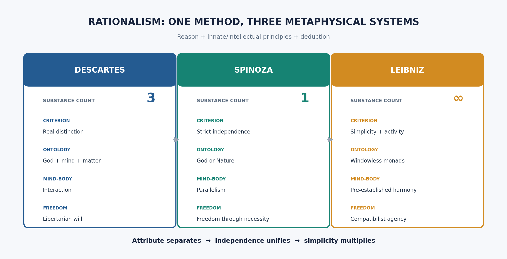

# RATIONALISM (Descartes, Spinoza, Leibniz) - Syllabus Item 2 (Paper I - Section A)

> **Syllabus (verbatim):** Rationalism (Descartes, Spinoza, Leibniz); Cartesian Method and Certain Knowledge; Substance; God; Mind-Body Dualism; Determinism and Freedom.
> **Evidence key:** ✅ canonical doctrine · ⚠️ analytical synthesis (mine, for exam use) · ❓ contested/uncertain
> **Placement:** A joint-highest-yield Western item: 14 primary-owned parts across 2018–2025, with 2021 the only year without one. Three thinkers share the rationalist premise (reason is the source of certain knowledge; the world is intelligible *a priori*) but diverge dramatically on substance (3 → 1 → ∞). The examiner rewards per-philosopher precision, not "school summaries."

---

## 0. ONE-SCREEN MAP ⚠️

```
RATIONALISM = certain knowledge through REASON ALONE (model: mathematics)
               │
     The SUBSTANCE question drives the trio:
   ┌───────────────────┬───────────────────┬───────────────────┐
   │ DESCARTES          │ SPINOZA            │ LEIBNIZ            │
   │ 3 substances       │ ONE substance      │ ∞ substances       │
   │ (God + mind + body)│ (God = Nature)     │ (monads)           │
   │ DUALISM            │ MONISM/PANTHEISM   │ PLURALISM          │
   │ interaction (pineal)│ parallelism        │ pre-est. harmony   │
   │ free will (will>int)│ determinism        │ compatibilism      │
   └───────────────────┴───────────────────┴───────────────────┘
```
> 🔑 **Mnemonic — Substance count "3-1-∞":** Descartes **3**, Spinoza **1**, Leibniz **∞**.
> 🔑 **Mind-body mnemonic — "I-P-H":** Interaction → Parallelism → Harmony.

---

## 1. CARTESIAN METHOD AND CERTAIN KNOWLEDGE ✅

### 1.1 Descartes — the Method of Doubt

**Goal:** to find a foundation of *indubitable* certainty, as secure as mathematics, on which all knowledge can be rebuilt. ✅

**Four rules of method** (*Discourse on Method*, Part II):
1. Accept nothing as true unless evident (clear and distinct).
2. Divide each problem into parts.
3. Proceed from simplest to most complex.
4. Make enumerations complete.

**Hyperbolic/methodic doubt** (*Meditations* I): doubt everything that *can* be doubted:
- **Sense-deception:** the senses sometimes err (bent stick in water) — perhaps always.
- **Dream argument:** I cannot be certain I am not dreaming — so perhaps the external world is an illusion.
- **Evil Demon (*genius malignus*):** suppose an omnipotent deceiver systematically makes me err — even about mathematics (2+3=5?). ✅

### 1.2 The Cogito

**"Cogito, ergo sum" — "I think, therefore I am."** The one thing I cannot doubt is that I (as a thinking thing) exist: *the very act of doubting proves a doubter*. ✅

- Not a syllogism (despite the "therefore") — it is an **immediate intuition**: "I think, I exist" is self-evident whenever I think it.
- The self known through the cogito is a **res cogitans** — a thinking thing whose whole essence is thought. ✅
- The cogito is the **Archimedean point** from which Descartes rebuilds all knowledge.

### 1.3 Criterion of Truth and the Rebuilding

- **Clear and distinct perception** is the criterion of truth (the cogito is its model — it is maximally clear and distinct). ✅
- Reconstruction: cogito → God exists (§3) → God is no deceiver → clear-and-distinct perceptions are reliable → mathematics and the external world are restored.

### 1.4 The Cartesian Circle (stock objection) ⚠️

Descartes uses clear-and-distinct perception to prove God, then uses God to *guarantee* the reliability of clear-and-distinct perception. This circularity is raised by Arnauld in the Fourth Objections. ✅

- **Possible Cartesian reply:** the cogito and the divine proofs are so pellucidly clear that they do not need God's guarantee *while being attended to*; God's guarantee is needed only for *remembered* clear-and-distinct perceptions. ❓ (Whether this reply succeeds is debated.)

### 1.5 The Basic Tenets of Rationalism (PYQ 2025 Q2a — "basic tenets") ⚠️

| Tenet | Content |
|---|---|
| **Innate ideas** | Some ideas (God, substance, infinity, the axioms of mathematics) are not derived from experience; they are implanted in the mind by its very nature. |
| **Reason as source of certain knowledge** | Genuine knowledge is *a priori* — attained by the intellect alone (contra empiricism). |
| **Deductive method** | Knowledge proceeds by deduction from self-evident axioms (more geometrico in Spinoza). |
| **The intelligibility of reality** | The real is the rational — the world's structure is accessible to reason. |
| **Substance metaphysics** | Reality is explained in terms of substance(s) and their attributes/modes. |

### 1.6 Descartes — THE WAX ARGUMENT (*Meditation* II) ✅ — the missing half of "certain knowledge"

**Where it sits in the arc.** The *cogito* establishes **that** I exist. The wax argument establishes three further things without which the *Meditations* cannot proceed: (a) **what kind** of thing I am, (b) that **bodies are known by intellect, not sense**, and (c) that **the mind is better known than the body**. Any question phrased "Cartesian Method and *Certain Knowledge*" that is answered with the cogito alone is a half-answer.

**Exact printed subterms** (use these, not paraphrases): *cera* (the wax) · *inspectio mentis* / "mental scrutiny" (the intellect's grasp) · *sensus* (sense) vs *imaginatio* (imagination) vs *intellectus* (understanding) · *flexibile et mutabile* ("flexible and changeable") · *res extensa* · and the printed sub-title of Meditation II itself: **"The nature of the human mind, and how it is better known than the body."** ✅

**The argument, numbered:**
1. Take the *clearest possible* case of a body — a piece of wax fresh from the honeycomb. Its sensible catalogue: taste of honey, scent of flowers, a colour, a shape, a size, hardness, coldness, and it emits a sound when rapped.
2. Move it to the fire. **Every** item in that catalogue is destroyed or replaced: taste and scent vanish, colour alters, shape and size are lost, it becomes liquid and hot, and no longer sounds.
3. Yet I judge, without hesitation, that the **same wax** remains.
4. ∴ What I take the wax to *be* is not identical with any sensible quality listed at (1), since all of them have been replaced while the wax persists.
5. Nor is it delivered by **imagination**: heat can give the wax an *indefinite* number of shapes and sizes, and I cannot run through indefinitely many images. (This is the force of *flexibile et mutabile*.)
6. ∴ The wax is grasped as an **extended, flexible, changeable thing** by the **intellect alone** — by *inspectio mentis*, not by seeing or touching or imagining.
7. Further: at every stage — whether I judge the wax present, or doubt it, or am deceived — I perceive **myself** judging. Each perception of a body is *ipso facto* a perception of the mind that perceives, and a more certain one, because it survives even if the body does not exist.
8. **∴ (a)** Bodies are known by understanding, not by sense; **∴ (b)** the mind is *notior* — more evidently known — than any body.

**Presuppositions ⚠️** (state these; they are where the marks are):
- **P1 — Substance/attribute metaphysics is already assumed.** Identity through total qualitative replacement requires a *bearer* distinct from the qualities. Step 3 smuggles in the very metaphysics the *Meditations* claim to derive.
- **P2 — Sense is exhausted by the catalogue.** If sense could deliver a structural or relational item (not just colour, taste, sound), step 4 fails.
- **P3 — Imagination is image-bound and therefore finite in range**, while intellect is not.
- **P4 — Perception is self-intimating**: I cannot perceive without perceiving *that* I perceive. Step 7 depends wholly on this.

**Canonical example (the paired case in the same Meditation) ✅:** the **"hats and coats"** case. Looking from a window I say I *see men* crossing the square; strictly I see only hats and coats, and **judge** that men are underneath. Same moral as the wax: what passes for seeing is in fact judging — an operation of intellect.

**Strongest objection → reply:**
| Objection | Source | Reply | Residual |
|---|---|---|---|
| What survives melting is just "extended stuff," an *abstraction* built up from repeated sense-experience — not an intellectual intuition. | Gassendi, *Fifth Objections*; empiricist line generally | The abstraction still has to be *of* something identical across the change; the empiricist must name the sensory item that registers **identity**, and there is none. | ❓ Descartes has shown the *concept* is not an image; he has not shown the *knowledge* is a priori. |
| Strip away every sensible quality and nothing remains to be known — "extension" without sensible qualities is unintelligible. | Berkeley, *Principles* §§9–11 | Descartes: extension is not a further quality but the *mode of being* of every quality that could be sensed. | ❓ This reply presupposes exactly what Berkeley denies. |
| Step 7 conflates *certainty* with *content*: that my knowledge of mind is more **certain** does not make it richer or prior in **content**. | ⚠️ analytic reconstruction | Descartes needs only epistemic priority for the order of the *Meditations*. | Fair; the "better known" claim should be read strictly as *more indubitable*. |

**Executable verdict:**
- **10m close:** "The wax argument does not prove that bodies exist; it proves that *if* bodies are known at all they are known by intellect and not by sense, and that self-knowledge is epistemically prior to world-knowledge. That is exactly the result the rationalist programme needs."
- **15/20m close:** add — "Its cost is that Meditation II already installs *extension* as the essence of body, so the dualism 'proved' in Meditation VI is in part presupposed in Meditation II. The *Meditations* must therefore be read as one deductive arc, not six independent exercises."

### 1.7 Spinoza — THE THREE KINDS OF KNOWLEDGE (*Ethics* II, P40, Scholium 2) ✅

Rationalist "certain knowledge" does not stop at Descartes. Spinoza's tripartite epistemology is the load-bearing bridge between his metaphysics (§2.2) and his ethics of freedom (§5.2) — without it, "freedom = adequate ideas" is an unexplained slogan.

**Exact printed subterms:** *imaginatio* / *opinio* (first kind) · *experientia vaga* ("random/vague experience") · *ex signis* ("from signs") · *ratio* (second kind) · *notiones communes* ("common notions") · *scientia intuitiva* (third kind) · *idea adaequata* vs *idea inadaequata* · *sub specie aeternitatis* · *amor Dei intellectualis*.

| Kind | Name | Source | Adequacy | Status |
|---|---|---|---|---|
| **First** | *Imaginatio* / *opinio* | (a) *experientia vaga* — random experience through the senses; (b) *ex signis* — hearsay, words, memory | **Inadequate**, mutilated and confused | ✅ *"the only cause of falsity"* (*Eth.* II, P41) |
| **Second** | *Ratio* (reason) | **Common notions** and adequate ideas of the properties of things — what is equally in the part and the whole | **Adequate** | ✅ Necessarily true (*Eth.* II, P41) |
| **Third** | *Scientia intuitiva* | Proceeds from an adequate idea of the formal essence of certain **attributes of God** to adequate knowledge of the **essence of things** | **Adequate**, and grasped in a single act | ✅ Necessarily true; the highest kind (*Eth.* V, P25) |

**Spinoza's own canonical example — the fourth proportional ✅** (*Eth.* II, P40, Sch. 2). Given the numbers 1, 2 and 3, find the fourth proportional:
1. The **merchant** multiplies the second by the third and divides by the first — because he was taught the rule, or has seen it work in simple cases. *First kind*: he knows **that**, from signs and vague experience, with no grasp of why.
2. The **mathematician** demonstrates it from the common property of proportionals (Euclid VII.19). *Second kind*: adequate, but discursive — arrived at through a chain.
3. But with 1, 2, 3 anyone **sees at a glance** that the fourth is **6** — the ratio is grasped in the essences themselves, in one act. *Third kind*: adequate and intuitive.

> 🔑 **Mnemonic — "Merchant · Mathematician · Seer" (M-M-S)** = imagination · reason · intuition.

**The argument connecting knowledge to freedom, numbered ⚠️:**
1. Everything follows necessarily from the nature of God/Substance (§5.2).
2. An idea is **adequate** when it is understood through its cause, i.e. through its place in that necessary order.
3. Bondage (*servitus*) = being determined by causes *external* to my nature; this is precisely the condition of one whose ideas are inadequate, since inadequate ideas are the traces of external bodies in mine.
4. Freedom = being determined by my **own** nature alone (*Eth.* I, Def. 7).
5. Adequate ideas *are* the mind acting from its own nature — for in having them the mind is the adequate cause of what follows from them.
6. ∴ To move from the first kind to the second and third kinds **is** to move from bondage to freedom. Knowledge is not a means to freedom; it *is* freedom.
7. At the limit, the third kind sees things *sub specie aeternitatis* — as following necessarily from God's essence — and this generates the **intellectual love of God** (*amor Dei intellectualis*, *Eth.* V, P32C), the mind's highest good and blessedness (*beatitudo*).

**Presuppositions ⚠️:**
- **P1 — Parallelism**: the order of ideas = the order of things (*Eth.* II, P7); otherwise adequacy in thought would not track causal reality.
- **P2 — Necessitarianism**: there is a single complete causal order to be adequate *to*; without it "adequate idea" has no content.
- **P3 — Common notions really are common**: there exist properties equally in the part and the whole, which the mind cannot conceive inadequately. If there are none, the second kind collapses into the first.
- **P4 — Intuition is not a further inference** but a distinct cognitive act; otherwise the third kind is only fast reason.

**Strongest objection → reply:**
- *Objection:* the third kind is epistemically unaccountable — if *scientia intuitiva* is not demonstrative, what distinguishes it from the first kind's confident guessing? Spinoza gives a mathematical illustration but no criterion.
- *Reply:* the criterion is internal — *Eth.* II, P43: "he who has a true idea knows at the same time that he has a true idea." Truth is *index sui* — the standard of itself and of the false; adequacy is self-certifying.
- *Counter ❓:* self-certification is exactly what the first kind also *feels* like. This is the strongest live objection to Spinoza's epistemology, and it is worth conceding in the answer.

**Executable verdict:** "The three kinds are not three degrees of confidence but three *ontological positions* of the knower: the first is a mind pushed about by external bodies, the second a mind reasoning along the true causal order, the third a mind seeing itself as a mode of that order. Spinoza's real claim is that epistemology and ethics are the same subject — which is his most original move and, because the third kind is self-certifying, his most vulnerable one."

---

## 2. SUBSTANCE ✅ — The STAR Sub-topic

**Shared definition all three inherit:** substance = *that which exists in itself, conceived through itself, needing nothing else in order to exist.* ✅

---

### 2.1 DESCARTES on Substance — THREE substances (Dualist)

- Strictly, only **God** (infinite substance) fully satisfies the definition — He alone is absolutely independent. ✅
- But Descartes also admits two kinds of **created** (finite) substance:
  - **Res cogitans** (thinking substance) — essence = **thought**; unextended, indivisible.
  - **Res extensa** (extended substance) — essence = **extension**; unthinking, divisible, mechanistic. ✅
- **Attributes and modes:** each substance has one *principal attribute* (thought / extension) which constitutes its essence; particular thoughts (ideas, volitions) and particular shapes/motions are its *modes*.
- **Tension:** by his own definition, only God needs nothing else; mind and body need God for their creation and conservation — so calling them "substances" is an equivocation. Spinoza will exploit this. ✅

**Knowledge of the self vs knowledge of the world** (PYQ 2022 Q4b):
- The self (*res cogitans*) is known **immediately** through the cogito — no mediation, no possibility of error about its *existence* (though its nature must be further clarified).
- The external world (*res extensa*) is known only **mediately** — via ideas that represent it; the reliability of these ideas depends on God's veracity being established first. Hence knowledge of the self is more certain and more direct than knowledge of the world. ✅

### 2.2 SPINOZA on Substance — ONE substance (Monist/Pantheist)

**The argument for monism** (*Ethics* Part I, demonstrated *more geometrico*):
1. Substance is that which is *in itself and conceived through itself*. ✅
2. No two substances can share an attribute (else they would be indistinguishable qua substance). ✅
3. Substance is necessarily *infinite* (a finite substance would be limited by another of the same nature — contradicting (2)). ✅
4. Therefore there can be only **one** substance, possessing **all** attributes — this is **God** (*Deus sive Natura*). ✅

**Attributes:** the infinite substance has infinitely many attributes, of which we know **two**: **Thought** and **Extension**. These are not separate substances (contra Descartes) but *aspects* of the one substance. ✅

**Modes:** particular things (this mind, this body, this stone) are **modifications (modes)** of the one substance under its various attributes. My mind = a mode of God under Thought; my body = a mode of God under Extension. ✅

**"Omnis determinatio est negatio" — "All determination is negation"** (PYQ 2025 Q2b): To determine (i.e. to say a thing is *this* and not *that*) is to *negate*. Every finite thing is defined by what it is *not*. Only God/Substance, being infinite and unlimited, involves no negation. Finite modes are "negations" within the infinite affirmation of Substance. ✅

**"Whatever is, is in God" (*Eth.* I, P15)** (PYQ 2024 Q2b): Since there is only one substance and everything else is its mode, *nothing* exists outside God. God alone is absolutely real; finite things are real only as modifications *within* God. ✅

**Does Spinoza's monism entail pantheism?** (PYQ 2022 Q2c):
- *Pantheism:* God = Nature = the one infinite substance. God is not a personal transcendent creator but the immanent, necessary order of all that is. ✅
- *Objection (acosmism charge — Hegel's):* if God is the *only* reality, individual things dissolve into nothingness; this is *acosmism* (denial of the world), not pantheism (deification of the world). ❓ (Contested — Spinoza would say modes are real *in their way*, as expressions of substance.)

### 2.3 LEIBNIZ on Substance — INFINITE substances (Pluralist)

- Leibniz denies that *extension* can be the essence of substance (it is divisible → composite → not truly simple). True substances must be **simple** (partless). ✅
- **Monads:** reality consists of infinitely many **monads** — simple, unextended, indestructible, soul-like points of force/perception. ✅
- Each monad has **perception** (internal representation of the universe) and **appetition** (inner striving from one perception to the next).
- **"Monads have no windows":** they do not causally interact — no influx of external influence. All change is internal, unfolding from the monad's own nature. ✅
- Monads form a graded hierarchy: bare (mineral) → animal soul → rational soul → **God** (the supreme Monad, the only *necessary* being).
- **Identity of Indiscernibles:** no two monads are exactly alike (else God would have no reason to create both — violates the Principle of Sufficient Reason). ✅
- **What we call "matter"** = confused perception by inferior monads; extension is a *phenomenon* (appearance), not the essence of reality. ⚠️

### 2.4 Substance — Comparative Table ⚠️

| Feature | Descartes | Spinoza | Leibniz |
|---|---|---|---|
| Number of substances | 3 (God + mind + matter) | 1 (God = Nature) | ∞ (monads) |
| Definition applied | loosely (created substances conceded) | rigorously (only God fits) | rigorously (simple, independent, indestructible) |
| Essence of the physical | extension | a mode of one attribute (Extension) of God | confused perception of monads (extension = phenomenon) |
| Relation of mind to body | two distinct substances | two attributes of one substance | two monads pre-harmonised |
| The individual | a substance (mind) or a mode of extension (body) | a mode (of God) | a substance (each monad unique) |
| Internal logic | starts from cogito + God → admits 3 | pushes Descartes' own definition → collapses to 1 | demands simplicity → explodes to ∞ |

> 🔑 **For any 20-mark substance question:** open with the shared definition, show the *logical move* each makes, then present this table.

---

## 3. GOD ✅

### 3.1 DESCARTES on God

**Proof 1 — Trademark / Causal argument** (*Meditation* III): ✅
1. I have an idea of God (an infinite, perfect being).
2. The cause of an idea must have at least as much *formal reality* as the idea has *objective reality*.
3. I, a finite imperfect being, cannot be the adequate cause of the idea of an infinite perfect being.
4. ∴ God must exist as the cause of this idea — He "stamped" it on my mind (the trademark).

**Proof 2 — Ontological argument** (*Meditation* V): ✅
1. The concept of God = the concept of a supremely perfect being.
2. Existence is a perfection.
3. A supremely perfect being lacking existence would lack a perfection (contradiction).
4. ∴ God necessarily exists.
- (Kant will later attack this — "existence is not a real predicate"; see [`Kant.md`](Kant.md) §6.)

**Proof 3 — Conservation / Cosmological variant** (*Meditation* III): ✅
- I exist now; I cannot sustain my own existence from moment to moment; the cause of my continued existence must ultimately be God.

**God's role in the system:** God guarantees the reliability of clear-and-distinct perception (the bridge from the cogito to knowledge of the external world). ✅

### 3.2 SPINOZA on God

- **God = the one infinite substance = Deus sive Natura.** ✅
- God is not a personal, loving, willing creator; He/It is the **immanent** (not transitive) cause of all things — "God is the immanent, not the transitive, cause of all things" (*Eth.* I, P18). ✅
- God acts from the **necessity of His own nature** — not by will or design; there is no choice, no purpose, no providence.
- **Natura naturans** (God as the self-caused creative activity) vs **Natura naturata** (God as the totality of modes — the produced world). ✅
- **Attributes of God:** infinite in number; we know Thought and Extension. Each attribute expresses the *whole* essence of God from a different aspect.
- PYQ 2024 P-II Q6b and 2022 P-II Q5a ask precisely this: **God embedded in substance-and-attributes.** The answer = God IS substance; attributes ARE God's essence expressed under kinds; modes ARE God's self-modifications.

**"Whatever is, is in God, and nothing can be or be conceived without God"** (*Eth.* I, P15): ✅ this is not merely "God created everything" (theism) — it is "everything *is* God" (pantheism / panentheism).

### 3.3 LEIBNIZ on God

- God is the **necessary being** whose existence is demanded by the **Principle of Sufficient Reason**: contingent things exist → there must be a sufficient reason for the whole series → a necessary being outside the series = God. ✅
- God chose to actualise **this** world out of infinitely many possible worlds because it is the **"best of all possible worlds"** (maximum perfection with minimum means). ✅ (Voltaire satirised this in *Candide*.)
- God establishes the **pre-established harmony** among all monads at creation — they subsequently unfold without external interaction.

### 3.4 God — Comparative Table ⚠️

| Feature | Descartes | Spinoza | Leibniz |
|---|---|---|---|
| Nature of God | personal, transcendent, infinite perfection | impersonal, immanent, = substance = Nature | personal (in a sense), necessary being, supreme Monad |
| Proof used | trademark + ontological + conservation | a priori from definition of substance | cosmological (PSR) + ontological |
| God's relation to world | creator (transcendent, external) | immanent cause (God = world under modes) | creator who chose the best possible world |
| God and freedom | God created freely; gave humans free will | God acts by necessity of His nature (no will) | God chose freely (among possibles) → but the choice was determined by what is best |
| Role in the system | guarantees knowledge | IS the system | harmonises monads |

---

## 4. MIND-BODY DUALISM ✅

### 4.1 DESCARTES — Substance Dualism and Interactionism

**The doctrine:** Mind (res cogitans) and body (res extensa) are **really distinct** substances (each can exist without the other; each has a completely different essence). Yet they are intimately **united** in a human being and causally interact. ✅

- **Evidence for real distinction:** I can clearly and distinctly conceive mind without body and body without mind → (by God's omnipotence) they can exist apart → they are really distinct substances.
- **Interaction via the pineal gland:** Descartes conjectured that mind and body interact at the pineal gland (a single, centrally located structure in the brain). ✅
- This is widely regarded as an unsatisfying ad hoc answer.

**The Interaction Problem (the central objection to Cartesian dualism):** ✅
- How can a substance whose entire nature is *thought* (unextended, non-spatial) causally affect a substance whose entire nature is *extension* (spatial, mechanical)?
- Causation seems to require some *commonality* between cause and effect; thought and extension share nothing.
- This problem drove Spinoza and Leibniz to their rival solutions.

### 4.2 SPINOZA — Parallelism (Double-Aspect Theory)

- Mind and body are **not two substances interacting** but **one and the same thing expressed under two attributes** (Thought and Extension). ✅
- *"The order and connection of ideas is the same as the order and connection of things"* (*Eth.* II, P7). ✅
- There is no causal interaction *across* attributes; instead, every event has both a mental and a physical description (parallelism). My "decision" to raise my arm and the physical arm-movement are the *same* event seen under Thought and Extension respectively.
- **Dissolution of the problem:** the mind-body problem was generated by Descartes' false assumption that mind and body are *different substances*. Remove that assumption and the puzzle vanishes. ⚠️

### 4.3 LEIBNIZ — Pre-established Harmony

- Since monads are "windowless" (no causal interaction at all), mind and body do not *really* interact. ✅
- God pre-arranged all monads at creation so that the perceptions of the mind-monad and the states of the body-monads *correspond perfectly* — like **two clocks** synchronised to keep the same time without any mechanical connection. ✅
- **Analogy:** two perfectly synchronised clocks appear to influence each other (when one chimes, the other does too) but in fact operate independently.
- This preserves the *appearance* of mind-body interaction while denying its reality.

### 4.4 Comparative Summary — Mind-Body ⚠️

| Solution | Mechanism | Strength | Weakness |
|---|---|---|---|
| **Descartes — Interaction** | direct causal link (pineal gland) | matches common-sense experience | unintelligible how utterly different substances interact |
| **Spinoza — Parallelism** | identity (one thing, two attributes) | no interaction needed; elegant | seems to eliminate genuine mental causation; is there still "free will"? |
| **Leibniz — Pre-established Harmony** | divine synchronisation | preserves independence of each monad | ad hoc; unfalsifiable; why did God create this arrangement? |

### 4.5 Which account is compatible with human freedom? (PYQ 2024 Q3c) ⚠️

- **Spinoza's parallelism** entails strict determinism (see §5.2) — freedom is only understanding necessity; there is no libertarian free will. ✅
- **Descartes' interactionism** allows libertarian free will (the mind's volitions are not determined by the body's mechanics). ✅
- **Leibniz's pre-established harmony** allows a *compatibilist* freedom: the monad's acts unfold from its own nature (spontaneity) + are intelligent + the actual world is contingent (not logically necessary) — so freedom = spontaneity + intelligence + contingency. ✅
- **Answer to the PYQ:** Leibniz's account is most *compatible* with human freedom because it preserves a meaningful (compatibilist) sense of free choice while also resolving the mind-body problem without requiring unintelligible cross-substance causation. Descartes allows *more* freedom (libertarian) but at the cost of an insoluble interaction problem. ⚠️

---

## 5. DETERMINISM AND FREEDOM ✅

### 5.1 DESCARTES on Freedom

- The **will** is *infinite* in scope (we can affirm or deny anything); the **intellect** is *finite* (we perceive clearly only a limited range). ✅
- **Error** arises when the will affirms beyond what the intellect clearly perceives.
- **Freedom:** Descartes is a **libertarian** about human freedom — the will is genuinely undetermined; it can withhold assent. The mind is not subject to mechanical laws (those govern only extension).
- However: God created our nature and the eternal truths — so there is a layer of *divine determinism* in the background. ❓

### 5.2 SPINOZA on Freedom and Determinism

- **Strict necessitarianism/determinism:** everything that happens follows **necessarily** from God's nature. Nothing is contingent; things *could not* be other than they are ("what is, cannot be other than what it is" — PYQ 2019 Q2c). ✅
- **Free will is an illusion:** humans think they are free only because they are *conscious of their desires* but *ignorant of the causes* that determine them (the famous stone analogy: a thrown stone, if conscious, would think it *chose* to fly). ✅
- **Freedom ≠ absence of determination.** Freedom = **self-determination through adequate ideas.** A being is free to the extent that it acts from its own nature rather than being determined by external causes. ✅
  - *"That thing is said to be free which exists solely from the necessity of its own nature, and is determined to action by itself alone"* (*Eth.* I, Def. 7). ✅ — PYQ 2023 Q1(c) quotes this.
- **Only God is absolutely free** (He alone is determined solely by His own nature, without external constraint). Humans achieve *relative* freedom by attaining adequate knowledge (the third kind of knowledge — *scientia intuitiva*; see §1.7 for the full three-kinds apparatus and the fourth-proportional example). ✅
- **Consequence — passions vs actions:** when we are governed by external causes (passions/affects), we are in *bondage*; when we understand things adequately (sub specie aeternitatis), we *act* — and this is freedom. ✅

### 5.3 LEIBNIZ on Freedom

- **Compatibilism:** Leibniz rejects both Spinozan necessitarianism and Cartesian libertarianism. ✅
- Every monad's states unfold from its own **complete individual concept** (God, in creating Adam, foresaw every state Adam would ever be in). This is *determined* — yet Leibniz claims it is **free** because:
  1. **Spontaneity:** the action springs from the agent's own nature (no external compulsion).
  2. **Intelligence:** the agent deliberates (acts for reasons).
  3. **Contingency:** this world is *chosen by God* from among possible worlds — it is not *logically* necessary (the opposite does not imply a contradiction), only *morally* necessary (God's goodness makes the choice certain but not logically compelled). ✅
- **"Incline without necessitating":** reasons determine the will, but the determination is moral (strongest motive prevails) not logical (it remains conceivable that the agent act otherwise). ✅

### 5.4 Determinism & Freedom — Comparative Table ⚠️

| Feature | Descartes | Spinoza | Leibniz |
|---|---|---|---|
| Position | libertarian free will | hard determinism (necessitarianism) | compatibilism (soft determinism) |
| Will | infinite, undetermined | "free will" = illusion | inclined but not necessitated |
| Source of action | the mind, uncaused by body | God's necessary nature flowing through modes | the monad's complete concept |
| What "freedom" means | ability to do otherwise | acting from one's own adequate knowledge | spontaneity + intelligence + contingency |
| Moral responsibility | yes (contra-causal freedom) | problematic (but Spinoza reinterprets via adequate ideas) | yes (agent is the source, though determined) |

---

## 6. INTER-THINKER / INTER-SCHOOL DEBATES ⚠️

| Axis | Descartes | Spinoza | Leibniz |
|---|---|---|---|
| **Substance count** | 3 (God, mind, matter) | 1 (God = Nature) | ∞ (monads) |
| **God** | personal, transcendent, veracity-guarantee | impersonal, immanent, IS all reality | necessary being, chose best world |
| **Mind-body** | interaction (pineal gland) | parallelism (double-aspect) | pre-established harmony |
| **Freedom** | libertarian free will | freedom = understanding necessity | compatibilism |
| **Method** | doubt → cogito → reconstruction | geometric deduction (*more geometrico*) | principle of sufficient reason + pre-established harmony |
| **The individual** | a thinking substance (self) | a mode of God | a unique monad (substance) |
| **Physical world** | res extensa (mechanistic) | a mode of Extension attribute | phenomenon (confused perception of monads) |

---

## 7. CRITICISMS AND REPLIES

### Against Descartes
| Criticism | Reply |
|---|---|
| Cartesian Circle (Arnauld) | Descartes distinguishes current vs remembered CDI; God guarantees the latter ❓ |
| Interaction problem (Princess Elizabeth) | Descartes concedes the difficulty; the union is a "primitive notion" not reducible to thought or extension ❓ |
| Substance definition inconsistency | Descartes uses "substance" analogically for God (absolutely) and created things (relatively) |

### Against Spinoza
| Criticism | Reply |
|---|---|
| Pantheism removes a personal God → moral collapse? | Spinoza: morality is grounded in adequate knowledge, not divine command |
| Acosmism (Hegel): if God = all, the world = nothing | Spinoza: modes are real *as* expressions of substance, not independent |
| Determinism eliminates moral responsibility | Spinoza: responsibility is reinterpreted; the free person acts from understanding |
| "All determination is negation" → finite things are merely negative? | Finite things are positive *modes* of infinite substance, limited by other modes |

### Against Leibniz
| Criticism | Reply |
|---|---|
| Pre-established harmony is ad hoc / unfalsifiable | Leibniz: it is the only solution that avoids both unintelligible interaction and the loss of substance-plurality |
| "Best of all possible worlds" → Voltaire's *Candide* | Leibniz: "best" = maximum variety with minimum principles, not maximum human comfort |
| Freedom is illusory if every state is pre-determined in the concept | Leibniz: contingency is preserved because the opposite is conceivable (not self-contradictory) |

---

## 8. COMMON UPSC TRAPS ⚠️

| Trap | Discrimination |
|---|---|
| "Spinoza is an atheist" | **Wrong.** He is a *pantheist* (God = substance = Nature). He was expelled from his synagogue for heterodoxy, not atheism. The charge is closer to "unorthodox theism." |
| "Descartes proved the external world first, then God" | **Wrong.** The order is cogito → God → external world. God is the *bridge* to the world. |
| Confusing Spinoza's "freedom" with libertarian free will | Spinoza explicitly *denies* contra-causal freedom; his freedom = self-determination through adequate ideas. |
| "Leibniz's monads interact with each other" | **Wrong.** They are "windowless" — *no* causal interaction. All apparent interaction is pre-established harmony. |
| Confusing Spinoza's *attributes* with Descartes' *substances* | For Descartes, Thought and Extension are essences of *two substances*; for Spinoza they are *two attributes of ONE substance*. |
| "Cogito is a syllogism" | Descartes explicitly denies this; it is an *immediate intuition*, not an inference from a suppressed premise. |
| "Descartes' innate ideas = the mind is born knowing truths in propositional form" | Not quite — innate ideas are *dispositions* or "seeds of knowledge" that the mind activates when occasion prompts (a reply to the empiricist caricature). ❓ |

---

## 9. KEYWORD & STATEMENT BANK ⚠️

| # | Term / Statement | Use |
|---|---|---|
| 1 | *Cogito, ergo sum* | Descartes — certain knowledge |
| 2 | *Res cogitans* / *res extensa* | Descartes — two created substances |
| 3 | *Deus sive Natura* | Spinoza — substance = God = Nature |
| 4 | *Causa sui* | Spinoza — substance is self-caused |
| 5 | *Omnis determinatio est negatio* | Spinoza — all determination is negation |
| 6 | *Natura naturans / natura naturata* | Spinoza — active vs produced nature |
| 7 | *More geometrico* | Spinoza — geometric method of the *Ethics* |
| 8 | Monad / "no windows" | Leibniz — simple, windowless substances |
| 9 | Pre-established harmony / "two clocks" | Leibniz — mind-body solution |
| 10 | "Best of all possible worlds" | Leibniz — divine choice |
| 11 | Principle of Sufficient Reason (PSR) | Leibniz — nothing without a reason |
| 12 | Identity of Indiscernibles | Leibniz — no two monads alike |
| 13 | Clear and distinct perception | Descartes — criterion of truth |
| 14 | Genius malignus / evil demon | Descartes — extremity of doubt |

---

<!-- restored-2018-2020-doctrine:start -->
## RESTORED 2018/2020 DOCTRINE DOSSIER

### One inherited definition, three classifications of substance
- ✅ **Statement:** the rationalists inherit independence and self-conception as the test of substance but apply it differently: Descartes admits dependent created substances, Spinoza applies strict independence only to God/Nature, and Leibniz makes simplicity and an internal principle of action decisive for monads.
- ✅ **Argument:** Descartes begins from real distinction of thought and extension; Spinoza argues substances sharing an attribute cannot be distinct; Leibniz rejects extended composites as ultimate substances and posits simple centres of perception.
- ⚠️ **Presupposition:** a satisfactory metaphysics must identify what is ontologically basic rather than merely linguistically a subject.
- ❓ **Objection → reply:** the common word “substance” may conceal three incompatible projects. The rationalist reply is that each revision exposes a tension in the predecessor's application of the inherited criterion.

### Leibnizian and Spinozist necessity
- ✅ Pre-established harmony removes inter-monadic causal exchange, but a rational monad acts from its own perceptions and appetitions; Leibniz calls this spontaneity, while distinguishing certainty from absolute necessity.
- ✅ Spinoza's claim that infinitely many things follow from divine nature expresses immanent causal necessity: modes follow from what God/Nature is, not from a discretionary decree.
- ❌ Do not call Leibnizian harmony external compulsion or Spinozist freedom an exception to necessity; each redefines freedom through internal rational determination.
<!-- restored-2018-2020-doctrine:end -->

<!-- expanded-pyq-depth:start -->
### CORPUS-DRIVEN DEPTH DELTA (complete 2018–2025 audit)

- ⚠️ **Priority:** Primary ownership rises to 14 of 112 parts, joint-highest in Western Philosophy; 2021 remains the only year without a primary-owned part.
- ✅ **Required doctrinal depth:** The restored papers make Leibnizian freedom under pre-established harmony, monadic determinism, the three rationalists’ divergent definitions/classifications of substance and Spinoza’s modal necessity indispensable.
- ❌ **Trap / answer consequence:** Do not call Leibniz a simple libertarian or fatalist: distinguish certainty from necessity, hypothetical from absolute necessity and internal spontaneity from uncaused choice.

<!-- expanded-pyq-depth:end -->

## 10. PYQ ROUTING (2018–2025)

> ⚠️ **Corpus signal:** 14 primary-owned question-parts out of 112. The local Paper I corpus is continuous from 2018 through 2025. Cross-links do not create duplicate ownership.

| Year | Question | Marks | Exact demand |
|---|---|---:|---|
| 2018 | Q1(b) | 10 marks | Is there any place for freedom in Leibniz's philosophy, when he speaks of 'pre-established harmony'? Discuss. |
| 2018 | Q2(a) | 20 marks | What is the reason for the difference in the definitions and classifications of substances made by Descartes, Spinoza and Leibniz in spite of the fact that they all belonged to the rationalist school of thought? Discuss. |
| 2019 | Q1(d) | 10 marks | How does Descartes prove the existence of things other than himself and God? Discuss. |
| 2019 | Q2(c) | 15 marks | What do you understand by Spinoza’s statement that what is, cannot be other than what it is? Explain. |
| 2020 | Q1(b) | 10 marks | How does Leibniz's conception of monads bear upon his views on determinism and freedom? Discuss with your own comments. |
| 2020 | Q4(b) | 15 marks | “From the necessity of the divine nature there must follow infinitely many things in infinitely many ways.” Explain this statement by Spinoza along with some possible criticisms. |
| 2022 | Q2(c) | 15 marks | Discuss the concept of substance according to Spinoza. Does his discussion on substance lead to pantheism? Substantiate your view. |
| 2022 | Q4(b) | 15 marks | How does Rene Descartes explain the notion of certainty with reference to knowledge of the self? Critically discuss the way it differs from the knowledge of the world. |
| 2023 | Q1(c) | 10 marks | “That thing is said to be free which exists solely from the necessity of its own nature, and is determined to action by itself alone.” Discuss Spinoza’s views on freedom and determinism in the light of the above statement. |
| 2023 | Q2(c) | 15 marks | Discuss Descartes’ theory of innate ideas and the grounds on which Locke refutes it. |
| 2024 | Q2(b) | 15 marks | How does Spinoza establish that God alone is absolutely real with his statement — “Whatever is, is in God”? Critically discuss. |
| 2024 | Q3(c) | 15 marks | Among the rationalists, whose account of mind-body problem is compatible with the notion of human freedom and free will? Critically discuss. |
| 2025 | Q2(a) | 20 marks | What are the basic tenets of Rationalism? How does Descartes build a system of Philosophy in consonance with them? Discuss. |
| 2025 | Q2(b) | 15 marks | “All determination is negation.” Comment with reference to Spinoza. |

See the [Western Philosophy PYQ Bank, 2018–2025](../_PYQ-Western-Philosophy-2018-2025.md).

## 11. ANSWER ARCHITECTURE (10 / 15 / 20 marks) ⚠️

### 10-mark: "Spinoza's views on freedom and determinism" (2023)
```
Line 1: Spinoza holds strict determinism — everything follows necessarily from God's
         nature; nothing is contingent.
Body  : (i) "Free will" is an illusion born of ignorance of causes (stone analogy).
        (ii) Freedom ≠ contingency; freedom = self-determination through adequate ideas.
        (iii) "That thing is free which exists solely from the necessity of its own nature
             and is determined to action by itself alone" (Eth. I, Def. 7).
        (iv) Only God is absolutely free; humans approach freedom via adequate knowledge.
Eval  : Freedom is reconceived, not abandoned — but libertarian critics say this is
        determinism renamed.
Close : "Discuss" = present + assess; close with whether this is genuine freedom or verbal.
```

### 15-mark: "All determination is negation — comment with reference to Spinoza" (2025)
```
Frame : In Spinoza's monist system, the one substance (God) is infinite and unlimited.
Body A: "Determination" = making something definite, finite, bounded. To say X is *this*
        is to say X is *not* everything else → hence negation.
Body B: Consequence for finite things: they are *limitations* (negations) within the infinite
        substance. They lack independent being; they are what God is not.
        Consequence for God: God, being infinite, involves *no* negation — He is pure
        affirmation, unlimited, undetermined by anything external.
Body C: Implication for knowledge: to know finite things adequately is to see them sub
        specie aeternitatis — as expressions of the one affirmative substance, not as
        independent negations. Link to freedom (adequate knowledge = seeing necessity).
Assess: Powerful ontological insight, but critics charge it dissolves individuality (Hegel's
        acosmism objection); finite things become mere "negations" without intrinsic worth.
Close : "Comment" = brief pointed assessment; end on whether the formula illuminates or
        obliterates the finite.
```

### 20-mark: "Basic tenets of Rationalism; how Descartes builds a system in consonance" (2025)
```
Frame : Rationalism = reason is the source of certain knowledge (vs empiricism).
Body A: The tenets — innate ideas, deductive method, intelligibility of reality,
        substance metaphysics, reason over sense (table from §1.5).
Body B: Descartes' system step by step:
        (i) Method of doubt → cogito (reason alone; no reliance on sense).
        (ii) Innate idea of God → proofs of God (trademark, ontological).
        (iii) God guarantees CDI → rebuilds mathematics + external world.
        (iv) Substance metaphysics (3 substances — res cogitans, res extensa, God).
Body C: How each step instantiates a tenet. Contrast with empiricist counter (Locke's
        attack on innate ideas; Hume's fork).
Assess: Descartes' system is internally coherent but fragile — it depends on the cogito
        not being circular and on God's proof not begging the question.
Close : Descartes does not merely *assert* rationalist tenets; he *constructs* a system
        that **embodies** them as its operating logic.
```

---

## D. DIRECTIVE DECODER ⚠️ — what each command word obliges you to *do* here

| Directive (as printed in UPSC Philosophy) | What it demands | Structural obligation for **this** file | Fatal error |
|---|---|---|---|
| **Discuss** | exposition **+** assessment, both substantial | Two-part body: doctrine reconstructed as numbered steps, then a weighing paragraph. ~60:40 split. | Pure exposition with no evaluative sentence. |
| **Critically discuss / examine** | assessment must **dominate** | Reconstruct in 3–4 lines, then spend the bulk on objection → reply → adjudication. Verdict is compulsory. | Listing criticisms without ruling between them. |
| **Comment** (e.g. 2025 Q2b "All determination is negation") | short, pointed, *thesis-first* | Open by stating what the sentence **means in Spinoza's own system**, not what it means generally; then one consequence for God, one for finite modes, one for knowledge; then a one-line judgment. | Treating "comment" as an invitation to write a general essay on Spinoza. |
| **Explain** (2019 Q2c, 2020 Q4b) | make the doctrine **intelligible**, showing *why* it follows | Foreground the derivation: from Def. 7 / P16 / P29, not from summary. | Restating the quotation in other words. |
| **Substantiate your view** (2022 Q2c) | you must **take a side** and defend it with textual grounds | Declare "yes, it entails pantheism, in the following precise sense…", then defend against the acosmism reading. | Sitting on the fence. |
| **Discuss with your own comments** (2020 Q1b) | an explicit **first-person evaluative** paragraph is being marked | Reserve the last 25% for a signposted personal adjudication. | Omitting the personal verdict. |
| **Whose account is compatible with…? Critically discuss** (2024 Q3c) | a **comparative ranking** with a defended winner | Rank all three explicitly against a stated criterion of freedom; then defend the ranking. | Describing all three neutrally. |
| **What is the reason for the difference…?** (2018 Q2a) | **explanatory**, not descriptive | The answer is a *mechanism*: one inherited definition + three different applications of the independence criterion. | Tabulating the three views without explaining the divergence. |

---

## V. GRADED VERDICT BANK ⚠️ — executable closing positions (10 / 15 / 20)

Each verdict is a **defensible position**, not a summary. Use verbatim or compress.

| Sub-topic | **10-mark verdict** (1 sentence) | **15-mark verdict** (2–3 sentences, with the concession) | **20-mark verdict** (thesis + mechanism + cost) |
|---|---|---|---|
| **Cartesian method** | The method of doubt is not scepticism but scepticism's instrument: it is used to destroy itself, and it succeeds only because the cogito is performatively, not inferentially, certain. | …Its success is local. The cogito secures the *existence* of a thinker but not the *substantiality* of the thinker; Hume and Kant both exploit exactly this gap. | Descartes' method delivers a genuine indubitable, but the reconstruction built on it is only as strong as the divine guarantee — so the *Meditations* stand or fall on Meditation III, not Meditation II. The Cartesian Circle is therefore not a peripheral blemish but the system's load-bearing joint. |
| **Wax argument** | The wax argument proves not that bodies exist but that, if known, they are known by intellect — self-knowledge is epistemically prior. | …It succeeds against naive empiricism because no sensory item registers *identity through change*; it fails to establish apriority, since the empiricist can call "extension" an abstraction. | Meditation II already installs extension as body's essence, so Meditation VI's dualism is partly presupposed rather than proved; the wax argument is thus the hinge on which Cartesian dualism silently turns. |
| **Substance (all three)** | The three rationalists differ not because they disagree about the *definition* of substance but because they differ on how strictly to apply it. | …Descartes applies it loosely (admitting dependent "created substances"), Spinoza strictly (only the wholly independent qualifies — hence one), Leibniz adds *simplicity* (hence infinitely many). | The trio is a single argument unfolding: Spinoza's monism is the *consistent* Descartes, and Leibniz's pluralism is the *consistent* rejection of extension as an essence. The lesson is that "substance" is not a discovery but a criterion, and the metaphysics you get is the criterion you enforce. |
| **God** | For Descartes God is a *guarantee*, for Spinoza God *is the system*, for Leibniz God is a *selector*. | …Only Spinoza's God does no explanatory work outside the system, which is why only his is immune to Kant's critique of the ontological argument; Descartes' and Leibniz's both require it. | Kant's demolition of the ontological proof ("existence is not a real predicate") kills Descartes' and Leibniz's God but leaves Spinoza's untouched, because Spinoza does not *infer* God's existence from a concept — he identifies God with the totality of what is. Spinoza therefore survives the Enlightenment critique that destroys his fellow rationalists. |
| **Mind–body** | The three solutions are not three answers to one question but three verdicts on whether the question is well-formed. | …Descartes accepts the question and cannot answer it; Spinoza dissolves it by denying the two-substance premise; Leibniz dissolves it by denying causation altogether. | Judged by explanatory economy Spinoza wins, judged by fidelity to experience Descartes wins, judged by systematic consistency Leibniz wins — and the fact that no single criterion selects one answer is itself the strongest evidence that Descartes bequeathed a *pseudo-problem* rather than a problem. |
| **Freedom / determinism** | Spinoza does not abolish freedom, he relocates it — from the will's indifference to the intellect's adequacy. | …Whether that is freedom or determinism renamed depends on whether one thinks "could have done otherwise" is essential to freedom; Spinoza denies it, and consistently. | Ranking against a stated criterion: if freedom requires alternative possibilities, only Descartes qualifies, at the price of an unintelligible interaction; if freedom requires *self-determination*, Spinoza qualifies best; if it requires reconciling determination with responsibility, Leibniz's spontaneity + intelligence + contingency is the most workable. The examiner-safe ruling: **Leibniz**, because his is the only account that keeps both the determination the metaphysics requires and the responsibility ethics requires. |
| **Three kinds of knowledge** | Spinoza's three kinds are three *ontological positions of the knower*, not three degrees of confidence. | …This makes epistemology and ethics one subject — his most original move; but because *scientia intuitiva* is self-certifying (*verum index sui*), it is also his most vulnerable. | The tripartite scheme is what converts Spinoza's necessitarianism from a fatalism into an ethics: because knowing adequately *is* acting from one's own nature, the discovery that all is necessary is itself the act by which one becomes free. Its price is that Spinoza cannot give an external criterion distinguishing the third kind from confident imagination. |

---

## T. TRANSLATION, QUOTATION & PROVENANCE DISCIPLINE ✅

**Rule of the file:** quote *verbatim* only where a standard English edition is being followed and named; elsewhere **paraphrase and mark it as paraphrase**. Never present a reconstructed sentence in quotation marks.

| Text | Standard editions | Safe practice |
|---|---|---|
| Descartes, *Meditations on First Philosophy* (Latin 1641; French 1647) | Cottingham–Stoothoff–Murdoch, *The Philosophical Writings of Descartes* (CSM, CUP 1984) — the scholarly default; older Haldane–Ross (1911) still common in Indian editions | **Wording differs between CSM and Haldane–Ross.** *Solius mentis inspectio* is "purely mental scrutiny" (CSM) but "inspection of the mind" (Haldane–Ross). Either write "*inspectio mentis* — rendered 'purely mental scrutiny' in CSM" or paraphrase. |
| *Cogito, ergo sum* | Latin phrase appears in the *Discourse* (1637, French: *je pense, donc je suis*) and *Principles* I.7; the *Meditations* has the first-person "I am, I exist" formulation | ✅ Safe to quote the Latin tag. ❌ Do **not** attribute "*Cogito ergo sum*" to the *Meditations* — the *Meditations* runs "I am, I exist, is necessarily true whenever it is put forward by me or conceived in my mind." |
| Spinoza, *Ethics* (*Ethica*, posthumous 1677) | Curley, *Collected Works of Spinoza* Vol. I (Princeton 1985) — current standard; Elwes (1883) and White–Stirling are the older public-domain versions widely reprinted in India | Cite by **structural reference** (*Eth.* I, Def. 7; I, P15; II, P7; II, P40S2; V, P32C) rather than page. Structural references are translation-invariant and impress; page numbers do not. |
| *Omnis determinatio est negatio* | ⚠️ **Provenance caution.** The exact Latin formula is **not** in the *Ethics*. Spinoza writes *determinatio negatio est* in **Letter 50 to Jarig Jelles (2 June 1674)**. The universalised slogan "*omnis determinatio est negatio*" is **Hegel's** rendering, which is how it entered the textbook tradition. | Write: "Spinoza's dictum, in Letter 50, that determination is negation — universalised by Hegel as *omnis determinatio est negatio*." This exactly answers PYQ 2025 Q2(b) **and** earns a provenance mark. |
| *Deus sive Natura* | *Eth.* IV, Preface, and IV, P4 Dem. | ✅ Safe verbatim. |
| Leibniz, *Monadology* (1714, French; published posthumously 1720 German / 1840 French) | Latta (1898); Ariew–Garber, *Philosophical Essays* (Hackett 1989) | "Monads have no windows" is a **standard rendering** of *Monadology* §7 ("Les Monades n'ont point de fenêtres"), not a literal English original. ✅ Safe as a rendering; say "as it is usually rendered." |
| "Best of all possible worlds" | *Theodicy* (1710); *Monadology* §§53–55 | ✅ Safe. Note it is Leibniz's own French *le meilleur des mondes possibles*; Voltaire's *Candide* (1759) satirises it as "*tout est au mieux*." |
| "Incline without necessitating" | *Theodicy*; also Leibniz–Clarke correspondence | ✅ Standard rendering of *incliner sans nécessiter*. |

> ❌ **Never write:** "Descartes says the mind is a ghost in the machine." That is **Ryle's** hostile coinage (*The Concept of Mind*, 1949), not Descartes'. Attribute it correctly and the same sentence becomes a mark-earner.

---

## 12. LINK-OUTS

- [`../_themes/Substance-across-western.md`](../_themes/Substance-across-western.md) — the full Aristotle → Descartes → Spinoza → Leibniz → Locke → Hume → Kant thread.
- [`../_themes/A-priori-a-posteriori-knowledge.md`](../_themes/A-priori-a-posteriori-knowledge.md) — the rationalist claim to a priori knowledge; contrasted with Hume and resolved by Kant.
- [`Empiricism.md`](Empiricism.md) — the rival tradition; Locke's attack on innate ideas directly counters Descartes.
- [`Kant.md`](Kant.md) — Kant synthesises rationalism + empiricism; rescues causality from Hume while limiting metaphysics.
- [`../../paper-2/philosophy-of-religion/Proofs-for-God.md`](../../paper-2/philosophy-of-religion/Proofs-for-God.md) — Descartes' ontological & causal arguments treated in the cross-paper Religion context; Kant's refutations.
- [`../../paper-2/philosophy-of-religion/Notions-of-God.md`](../../paper-2/philosophy-of-religion/Notions-of-God.md) — Spinoza's impersonal pantheistic God.
- PYQ bank: [`../_PYQ-Western-Philosophy-2018-2025.md`](../_PYQ-Western-Philosophy-2018-2025.md).

---

## SOURCES

- Masih, Y., *A Critical History of Western Philosophy* — chapters on Descartes, Spinoza, Leibniz.
- Copleston, F., *A History of Philosophy*, Vol. IV (Descartes to Leibniz).
- Nigel Warburton, *Philosophy: The Classics*, chapters on Descartes' *Meditations* and Spinoza's *Ethics* (local PDF, pp. 103–146 in the file pagination).
- Robert Audi (ed.), *The Cambridge Dictionary of Philosophy*, entries on Descartes, Spinoza and Leibniz (local PDF, especially file pages 257–259, 904–906 and 524–527).

---

# PART II — COMPLETE LEARNING SESSION AND SOLVED PRACTICE

## Learning Roadmap

| Stage | Subtopic | What must be mastered | Exam payoff |
|---|---|---|---|
| Foundation | Rationalist project | a priori reason, innate ideas, deduction, intelligibility | Define the school without reducing it to “anti-sense” |
| Core 1 | Cartesian certainty | doubt, cogito, wax, God, external world | Reconstruct Descartes as an ordered system |
| Core 2 | Substance | Descartes 3 → Spinoza 1 → Leibniz ∞ | Highest-yield comparative route |
| Core 3 | God | guarantor → immanent reality → rational selector | Compare explanatory roles, not merely proofs |
| Core 4 | Mind-body | interaction → parallelism → harmony | Rank solutions by freedom and explanatory economy |
| Core 5 | Freedom | libertarianism → rational necessity → compatibilism | Handle quotation-led and comparative questions |
| Advanced | Live disputes | Cartesian Circle, attributes problem, infinite analysis | Add qualified evaluation in 15/20 markers |
| Exam | PYQs and drills | 14 verified PYQs, MCQs, remedial and Mains practice | Convert doctrine into directive-faithful answers |

> **Source note:** Static Philosophy does not require an artificial current-affairs anchor. The teaching design uses argument maps, contrastive matrices, worked answers and retrieval practice because these formats make premises, objections and philosophical differences visible.

## Visual 1 — The Rationalist Transformation



The visual tracks the decisive movement: a shared confidence in reason produces three incompatible ontologies because each thinker applies the test of substance differently.

## Subtopic 1 — What Makes Rationalism a School?

```text
MATHEMATICAL CERTAINTY AS MODEL
             |
             v
SELF-EVIDENT OR INNATE STARTING POINTS
             |
             v
DEDUCTIVE RECONSTRUCTION OF REALITY
             |
      +------+------+
      |             |
 epistemology    metaphysics
 “How know?”     “What is basic?”
```

Rationalism is not the thesis that sensation is useless. It is the stronger claim that sense-experience cannot by itself yield necessity, universality or an indubitable foundation. Reason supplies principles whose authority does not depend on repeated observation. Descartes therefore searches for an indubitable first truth; Spinoza deduces a necessary order *more geometrico*; Leibniz explains reality through principles such as sufficient reason and the identity of indiscernibles.

**Worked discrimination.** “All rationalists accept innate ideas” is broadly useful but incomplete. What unites them more deeply is a confidence that reality has an intelligible structure and that reason can move from privileged principles to that structure. Their disagreement over substance shows that a method does not mechanically dictate one metaphysics.

> **UPSC trap:** Do not define rationalism as the denial of experience. Define it by the source and status of *certain* knowledge.

## Subtopic 2 — Descartes: From Demolition to Reconstruction

```text
Sense error -> Dream -> Evil demon
                    |
                    v
          “I am, I exist” while thinking
                    |
                    v
        clear-and-distinct perception
                    |
                    v
   innate idea / proofs of a non-deceiving God
                    |
                    v
 mathematics + external world + dual substances
```

The order matters. The cogito defeats total doubt only at the point of the thinking act. It does not immediately establish a permanent soul, other minds, God or the material world. The wax argument then shows that bodily identity through change is judged by intellect, while the divine guarantee is used to extend certainty beyond the presently attended cogito.

**Named evidence and what it proves**

| Evidence | Philosophical work | What it proves | Qualification |
|---|---|---|---|
| Dream and evil-demon arguments | *Meditations* I | ordinary and mathematical beliefs can be suspended methodically | doubt is an instrument, not Descartes’ final position |
| “I am, I exist” | *Meditations* II | the occurrence of thought is performatively indubitable | existence of a thinker does not yet prove a substantial soul |
| Wax and hats-and-coats cases | *Meditations* II | judgement/intellect structures apparent perception | an empiricist can call extension an abstraction from experience |
| Trademark and ontological proofs | *Meditations* III and V | a perfect non-deceiver is made the bridge to stable knowledge | Arnauld’s Circle objection attacks this bridge |
| God is no deceiver | *Meditations* VI | involuntary sensory ideas support an external material cause | this proves material reality more securely than every perceived quality |

### Mini-evaluation

Descartes obtains a genuine local certainty: doubting cannot occur without thinking existence. The larger system is less secure because the proof of God appears to use the very clear-and-distinct perceptions whose general reliability God is supposed to guarantee. The cogito is therefore the strongest point; the reconstruction is the contested point.

## Subtopic 3 — Substance: One Definition, Three Applications

| Test | Descartes | Spinoza | Leibniz |
|---|---|---|---|
| Basic unit | God, mind, matter | God or Nature alone | infinitely many monads |
| Decisive criterion | real distinction by principal attribute | strict self-existence and self-conception | simplicity plus internal activity |
| Count | 3 kinds | 1 | ∞ |
| Cost | “created substance” is dependent on God | individuals lose independent substancehood | bodies become well-founded phenomena |

**The explanatory mechanism:** Descartes uses “substance” analogically: God is absolutely independent, while mind and matter depend only on God. Spinoza refuses this looseness; if substance must be conceived through itself, only the infinite can qualify. Leibniz agrees that extended composites cannot be ultimate but rejects Spinoza’s single substance: true units must be simple, active and internally differentiated, hence monads.

> **Memory chain:** **Attribute separates → independence unifies → simplicity multiplies.**

### Claim–objection–reply tree

```text
DESCARTES: thought and extension are really distinct
  objection: dependent created things fail his definition
  reply: “substance” is analogical, not univocal

SPINOZA: strict independence permits one substance only
  objection: modes become unreal; acosmism
  reply: modes are real as expressions, not as independent beings

LEIBNIZ: ultimate substance must be simple and active
  objection: windowless monads make correspondence miraculous
  reply: pre-established harmony preserves plurality without influx
```

## Subtopic 4 — God: Guarantee, Reality, Selector

| Thinker | God’s function | Named doctrine | Analytical consequence |
|---|---|---|---|
| Descartes | secures truth and creates finite substances | trademark, ontological and conservation arguments | epistemology depends on theology |
| Spinoza | is the sole substance and immanent cause | *Deus sive Natura*; *Ethics* I P15/P18 | creation becomes necessary self-expression |
| Leibniz | explains the contingent series and chooses a world | PSR; best possible world | divine wisdom coordinates monads |

The strongest comparison asks what explanatory work “God” performs. Descartes’ God validates cognition; Spinoza’s God is not an added cause but the immanent structure of reality; Leibniz’s God selects and harmonises. This also changes freedom: Cartesian divine creation permits a finite free will, Spinoza’s divine nature acts necessarily, and Leibniz’s God chooses among possibles according to sufficient reason.

## Subtopic 5 — Mind and Body: Three Responses to One Inheritance

```text
Are mind and body two substances?
          |
      YES | DESCARTES
          v
 interaction -> causal gap

      NO: one substance, two attributes | SPINOZA
          v
 parallel order -> no cross-attribute causation

      MANY: every true substance is a monad | LEIBNIZ
          v
 no interaction -> divinely pre-established correspondence
```

**Ranking requires a criterion.**

- If freedom means genuine alternative possibilities, Descartes ranks first, but his interaction mechanism is obscure.
- If freedom means action from adequate understanding of one’s nature, Spinoza ranks first, but libertarian freedom disappears.
- If freedom means determined yet responsible agency, Leibniz ranks first: spontaneity, intelligence and contingency preserve a compatibilist space.

The examiner-safe answer to the 2024 comparative PYQ is therefore Leibniz, provided the criterion is stated. A bare assertion that “Leibniz preserves freedom” without explaining hypothetical necessity, internal spontaneity and possible worlds earns little.

## Subtopic 6 — Determinism and Freedom

| Axis | Descartes | Spinoza | Leibniz |
|---|---|---|---|
| Determination | mechanical body does not determine will | every mode follows necessarily | complete concept settles the series |
| Freedom | ability to assent, deny or withhold | acting from one’s own understood nature | spontaneity + intelligence + contingency |
| Error/bondage | will outruns finite intellect | inadequate ideas and passive affects | confused perception and external-looking compulsion |
| Best textual anchor | *Meditations* IV | *Ethics* I Def. 7; II P7; V | *Discourse*, *Monadology*, *Theodicy* |

Spinoza’s decisive move is to reject freedom as uncaused choice. The conscious stone imagines itself free because it knows its motion but not its cause. Yet the free person is not passive: adequate understanding makes the mind an adequate cause of action. Leibniz instead distinguishes certainty from absolute necessity. Caesar’s crossing may be contained in Caesar’s complete concept and certain to God, while its opposite remains logically possible in another world.

## Subtopic 7 — Advanced Refinements

### 7.1 Cartesian Circle

**Objection:** Descartes trusts clear-and-distinct perception to prove God and God to validate clear-and-distinct perception.  
**Reply:** present intuition is self-evident while attended to; God guarantees remembered or extended reasoning.  
**Judgement:** this softens but does not eliminate the problem, because the divine proofs themselves employ remembered premises.

### 7.2 Spinoza’s attributes problem

**Issue:** substance has infinitely many attributes, but human beings know only Thought and Extension.  
**Strong reading:** attributes are genuine expressions of the whole divine essence, not parts. Human cognition is structurally limited.  
**Objection:** unknown attributes appear explanatorily idle.  
**Reply:** their infinity prevents the anthropomorphic claim that reality is exhausted by the two forms accessible to us.

### 7.3 Leibniz and infinite analysis

Necessary truths terminate through finite analysis in identities; contingent truths require an infinite analysis completed only by God. This lets Leibniz say that a contingent predicate is contained in a subject’s complete concept without becoming logically necessary. The cost is that contingency can look merely epistemic from the creature’s standpoint.

## Rapid Recap Before Practice

1. Rationalism seeks necessity and certainty through reason, not the abolition of experience.
2. Descartes’ order is doubt → cogito → God → world.
3. Wax proves intellectual judgement of body, not the existence of body.
4. Substance count is 3 → 1 → ∞.
5. Spinoza’s Thought and Extension are attributes, not substances.
6. Monads are simple, perceptive, appetitive and windowless.
7. God guarantees, is, and selects in Descartes, Spinoza and Leibniz respectively.
8. Mind-body solutions are interaction, parallelism and harmony.
9. Freedom is libertarian, rational self-determination and compatibilist spontaneity.
10. Every comparative answer must state the criterion of comparison.

---

## SOLVED PYQ WORKBOOK — VERIFIED 2018–2025

### Solved PYQ 1 — 2018 Q1(b), 10 marks

**Question:** Is there any place for freedom in Leibniz's philosophy, when he speaks of “pre-established harmony”? Discuss.

**Model solution**

Leibniz’s pre-established harmony denies causal interaction among monads, but it does not reduce agency to external compulsion. Each monad unfolds its states from its own internal principle of perception and appetition; *Monadology* §7’s “windowless” thesis therefore supports **spontaneity**, the first condition of freedom.

Freedom additionally requires **intelligence** and **contingency**. A rational monad acts for perceived reasons, not by blind physical impact. Although its predicates belong to its complete concept, Leibniz distinguishes certainty from absolute necessity: “Caesar crosses the Rubicon” is certain in this chosen world but its opposite is conceivable in another possible world. God’s selection under the Principle of Sufficient Reason makes the series hypothetically, not logically, necessary.

The difficulty is that an act fixed in the complete concept seems unable to be otherwise in the actual world. Leibniz’s answer is compatibilist: reasons “incline without necessitating,” and an action is free when it flows intelligently from the agent rather than from coercion. Thus freedom survives, but not as Cartesian indifference.

**Verdict:** Pre-established harmony leaves a defensible place for responsible self-expression, though not for libertarian alternative possibilities.

**Why this earns marks:** It answers “any place” directly, links harmony to spontaneity, names complete concepts and possible worlds, and qualifies the claim.

### Solved PYQ 2 — 2018 Q2(a), 20 marks

**Question:** What is the reason for the difference in the definitions and classifications of substances made by Descartes, Spinoza and Leibniz in spite of the fact that they all belonged to the rationalist school of thought? Discuss.

**Model solution**

The difference arises not from abandoning rationalism but from successively tightening what counts as ontologically basic. All three inherit the idea that substance exists in itself and is conceived through itself; they disagree over independence, simplicity and individuation.

Descartes begins from clear-and-distinct **real distinction**. Thought and extension have mutually exclusive principal attributes, so mind and matter are created substances, while God is infinite substance. Yet *Principles* I.51 concedes that only God needs nothing whatever. “Substance” is therefore analogical: finite substances depend on God.

Spinoza applies the independence test strictly. In *Ethics* I, substances sharing an attribute cannot be distinct; a finite substance would have to be limited by another of the same nature. Hence only one infinite substance, God or Nature, exists. Minds and bodies become modes under Thought and Extension. This produces monism and pantheism but risks the acosmist charge that individuals lack independent reality.

Leibniz rejects both extended Cartesian substance and Spinozist absorption. Extension is divisible and composite, so it cannot be ultimate. True substances are simple centres of perception and appetition: infinitely many monads. The identity of indiscernibles differentiates them, while pre-established harmony explains correspondence without interaction. Bodies become well-founded phenomena.

Thus:

| Revision | Criterion enforced | Result |
|---|---|---|
| Descartes | principal-attribute distinction | dualist created substances under God |
| Spinoza | absolute independence | one infinite substance |
| Leibniz | simplicity and internal activity | infinitely many monads |

Their shared rationalism supplies the deductive ambition, not a compulsory substance count. Indeed, the sequence is dialectical: Spinoza exposes Descartes’ equivocation; Leibniz tries to restore individuality without returning to extended substance.

**Verdict:** “Substance” is a criterion whose interpretation generates the metaphysics. The trio’s disagreement demonstrates rationalism’s internal development rather than its incoherence.

**Why this earns marks:** It explains the *reason* for divergence, uses named doctrines, compares mechanisms and costs, and avoids a merely descriptive table.

### Solved PYQ 3 — 2019 Q1(d), 10 marks

**Question:** How does Descartes prove the existence of things other than himself and God? Discuss.

**Model solution**

After the cogito and the proof of a non-deceiving God, Descartes argues in *Meditation* VI that material things probably cause his involuntary sensory ideas. He possesses a passive faculty of receiving such ideas; this requires an active cause. He has a strong natural inclination to attribute them to bodies. If no bodies existed and God directly caused this inclination, God would deceive him. Since a perfect God is no deceiver, material things exist.

The proof establishes **res extensa** more securely than the complete accuracy of perception. Descartes allows that senses misreport size, colour or distance; reason must correct them. The wax argument had already shown that the essence of body is extension, flexibility and changeability grasped by intellect, not a catalogue of sensible qualities.

The argument’s strength is systemic coherence: God bridges self and world. Its weakness is dependence on the contested divine proofs and Cartesian Circle. It also underdetermines whether external bodies resemble sensory appearances in detail.

**Verdict:** Descartes proves an external material cause within his system, but the result is only as secure as divine veracity.

**Why this earns marks:** It reconstructs the causal argument, distinguishes existence from perceived qualities, and evaluates the theological dependence.

### Solved PYQ 4 — 2019 Q2(c), 15 marks

**Question:** What do you understand by Spinoza’s statement that what is, cannot be other than what it is? Explain.

**Model solution**

The statement expresses Spinoza’s **necessitarianism**. God or Nature is the one self-caused substance, and *Ethics* I P16 holds that infinitely many things follow from the necessity of divine nature. Modes are not products of arbitrary choice; they follow from what substance is, as conclusions follow from adequate premises.

Three distinctions clarify the claim. First, God is free because God acts from the necessity of God’s own nature, not because God could choose contrary possibilities (*Ethics* I Def. 7). Second, contingency is a name for human ignorance of causes; *Ethics* I P29 denies contingency in nature. Third, finite things are determined by other finite modes within the single causal order.

This does not entail passive fatalism. Under Thought, an adequate idea understands a cause; under Extension, the same order is expressed bodily (*Ethics* II P7). A person becomes relatively free by replacing inadequate passions with adequate activity and seeing things *sub specie aeternitatis*.

Critics argue that necessity erases responsibility and novelty. Spinoza replies that blame based on an uncaused will is confused; ethical improvement consists in increasing rational power. The reply preserves self-determination but abandons the ability to do otherwise.

**Verdict:** “Cannot be other” means metaphysical causal necessity, not external fate. Spinoza saves freedom only by redefining it as intelligent participation in necessity.

**Why this earns marks:** It derives the quotation from substance, distinguishes necessity from fatalism, and links metaphysics to ethics.

### Solved PYQ 5 — 2020 Q1(b), 10 marks

**Question:** How does Leibniz's conception of monads bear upon his views on determinism and freedom? Discuss with your own comments.

**Model solution**

Monads are simple, windowless substances whose states arise internally through perception and appetition. Consequently, an agent is not mechanically pushed by other substances; conduct expresses the agent’s complete concept. This supports determinism because the entire sequence is certain to God and coordinated through pre-established harmony.

Yet Leibniz treats internally sourced rational action as free. Freedom combines spontaneity, intelligence and contingency. The complete concept does not make acts logically necessary: other possible worlds contain alternative individuals and histories. Reasons incline the will without necessitating it in the way contradiction necessitates a truth.

In my view, the account successfully distinguishes coercion from self-expression and preserves responsibility better than Spinoza’s strict necessitarianism. However, because the actual agent’s complete concept is fixed, the availability of alternatives in other worlds may not satisfy a libertarian demand that this agent could now do otherwise.

**Verdict:** Monadology yields coherent compatibilism, not indeterministic freedom.

**Why this earns marks:** It connects monadic structure to both determination and freedom and includes the explicitly demanded personal assessment.

### Solved PYQ 6 — 2020 Q4(b), 15 marks

**Question:** “From the necessity of the divine nature there must follow infinitely many things in infinitely many ways.” Explain this statement by Spinoza along with some possible criticisms.

**Model solution**

In *Ethics* I P16, Spinoza derives the world from the essence of the one infinite substance. God has infinitely many attributes, each expressing eternal and infinite essence; therefore infinitely many modes follow in infinitely many ways. The relation is **immanent causation**: modes are in God, not external products made by a transcendent artisan.

The proposition supports four conclusions. God does not deliberate between worlds; divine action is necessary. Nothing is genuinely contingent; apparent contingency records ignorance. Thought and Extension express the same order under different attributes. Finite beings possess reality as modes, not independent substances.

Three criticisms follow. First, necessity threatens divine personality and worship: a God without choice resembles an impersonal order. Spinoza accepts the consequence and rejects anthropomorphism. Second, Hegel’s acosmism objection says that if only substance is real, the finite disappears. Spinoza replies that modes are real as determinate expressions, though not self-subsistent. Third, strict derivation can seem to make evil and bondage divine necessities. Spinoza answers that good and evil are relational notions tied to human power, not properties of God.

**Verdict:** P16 gives Spinoza extraordinary systematic unity, but at the price of personality, contingency and robust individuality.

**Why this earns marks:** It explains the derivation, names P16 and immanent causation, and evaluates three distinct costs with replies.

### Solved PYQ 7 — 2022 Q2(c), 15 marks

**Question:** Discuss the concept of substance according to Spinoza. Does his discussion on substance lead to pantheism? Substantiate your view.

**Model solution**

Spinoza defines substance as what is in itself and conceived through itself. In *Ethics* I, no two substances can share an attribute; substance cannot be finite because limitation would require another of the same nature. Therefore one absolutely infinite substance exists, possessing infinite attributes: God or Nature.

Thought and Extension are attributes known to human beings; particular minds and bodies are modes. *Ethics* I P15 states that whatever is, is in God, while P18 calls God the immanent rather than transitive cause. God does not stand outside and create Nature; Natura naturans and Natura naturata describe active nature and the order of modes.

This leads to pantheism in the precise sense that all reality is within and expressive of God, and nothing exists independently outside God. It is not crude identification of God with a mere aggregate of finite objects, because substance exceeds the two attributes humans know. The panentheist reading therefore qualifies but does not erase the pantheistic implication.

Hegel’s acosmism charge argues that the finite becomes unreal. Yet modes possess dependent reality as expressions of substance. My view is that Spinoza is best described as a philosophically qualified pantheist: divine immanence is undeniable, while divine infinity prevents reduction to the visible world alone.

**Why this earns marks:** It takes and substantiates a position, uses P15/P18 and the attribute-mode distinction, and answers the pantheism/acosmism debate.

### Solved PYQ 8 — 2022 Q4(b), 15 marks

**Question:** How does Rene Descartes explain the notion of certainty with reference to knowledge of the self? Critically discuss the way it differs from the knowledge of the world.

**Model solution**

Descartes discovers certainty by methodically suspending every belief vulnerable to sense error, dreaming or an evil demon. In *Meditation* II, “I am, I exist” is true whenever thought occurs: deception itself requires a deceived thinker. Knowledge of self is thus immediate, performative and independent of sensory mediation.

The self is first known as *res cogitans*: doubting, affirming, denying, imagining and seeming to sense. The wax case strengthens the priority claim: even if the wax does not exist, the act of judging reveals the judging mind. Hence mind is “better known” epistemically.

Knowledge of the world is mediate. Sensory ideas represent objects but can mislead; an external world is restored only after God’s existence and non-deceptiveness are established. Even then, intellect identifies body’s essence as extension, while reason corrects sensible appearances.

Critically, the cogito proves thinking existence, not automatically an enduring immaterial substance. Lichtenberg’s later “there is thinking” objection and Hume’s bundle critique expose this move. Moreover, the world-proof inherits the Cartesian Circle. Nevertheless, the asymmetry in certainty remains: self-presence survives the hypothesis under which world-presence is doubted.

**Verdict:** Descartes establishes epistemic priority of self over world, but not without further argument the full metaphysical dualism built upon it.

**Why this earns marks:** It compares modes of access, uses wax and divine veracity, and separates epistemic certainty from substantiality.

### Solved PYQ 9 — 2023 Q1(c), 10 marks

**Question:** “That thing is said to be free which exists solely from the necessity of its own nature, and is determined to action by itself alone.” Discuss Spinoza’s views on freedom and determinism.

**Model solution**

The quotation is *Ethics* I Definition 7. Spinoza rejects freedom as an uncaused choice. Every finite mode is determined within Nature’s necessary order; humans imagine free will because they know desires but not their causes, as the conscious stone would mistake thrown motion for choice.

Only God is absolutely free because only God exists and acts from divine nature alone. Human freedom is relative: when inadequate ideas and external affects determine us, we are passive; when adequate ideas make us the adequate cause of action, we act from our understood nature. Reason and *scientia intuitiva* therefore transform necessity into self-determination.

The account is coherent but revisionary. It preserves rational agency and emotional liberation while denying alternative possibilities.

**Verdict:** Spinoza reconciles freedom with determinism by making freedom a higher form of determination, not an exception to causation.

**Why this earns marks:** It interprets the quoted definition, uses the stone analogy and adequate ideas, and ends with a qualified judgement.

### Solved PYQ 10 — 2023 Q2(c), 15 marks

**Question:** Discuss Descartes’ theory of innate ideas and the grounds on which Locke refutes it.

**Model solution**

Descartes distinguishes adventitious, factitious and innate ideas. Innate ideas are not necessarily explicit propositions present in an infant’s consciousness; they are native capacities or intellectual contents, including God, substance, mind, extension and mathematical principles. In *Meditation* III, the idea of an infinite perfect being grounds the trademark argument because a finite mind cannot be its adequate total cause.

Locke attacks innate principles in *Essay* I. Universal assent is absent: children and persons without the relevant concepts do not consciously affirm alleged principles. Saying that principles are “in the mind” but unknown empties innateness of meaning, because by that standard every knowable truth would be innate. Locke instead begins with the mind as white paper and derives simple ideas from sensation and reflection.

Descartes can reply that innateness means a dispositional power, not constant awareness; geometrical knowledge is elicited rather than copied from sensation. Locke’s argument decisively defeats crude occurrent innatism but less clearly defeats dispositional innatism. The empiricist must also explain necessity and universality without merely reporting repeated experience.

**Verdict:** Locke narrows the defensible Cartesian claim from preformed conscious truths to native cognitive structures; he refutes the caricature more securely than the strongest version.

**Why this earns marks:** It presents both theories fairly, identifies Locke’s exact tests and gives a balanced adjudication.

### Solved PYQ 11 — 2024 Q2(b), 15 marks

**Question:** How does Spinoza establish that God alone is absolutely real with his statement — “Whatever is, is in God”? Critically discuss.

**Model solution**

Spinoza’s conclusion follows from his substance argument. Substance is in itself and conceived through itself; no two substances can share an attribute; an absolutely infinite substance must possess every attribute. Therefore God alone is substance, and *Ethics* I P15 concludes that everything else exists in God as a mode.

“In God” is ontological, not spatial. A mind is a mode under Thought and a body a mode under Extension; neither can be conceived independently. P18 adds that God is the immanent cause of things. God is therefore absolutely real because divine existence and conception depend on nothing else, while finite reality is derivative.

The view avoids a creator-world dualism and explains parallelism elegantly. Yet it faces three objections: the individuality of modes appears weakened; modal change seems hard to reconcile with eternal substance; and a personal providential God disappears. Spinoza can reply that independent reality is not the only reality, temporal order belongs to finite modes, and personality would anthropomorphise infinity.

**Verdict:** God alone is absolutely real, but finite things are not nothing; they are real relational expressions. This makes Spinoza monist and pantheistic without committing him to simple world-denial.

**Why this earns marks:** It derives P15, explains “in,” distinguishes absolute and modal reality, and critically handles individuality.

### Solved PYQ 12 — 2024 Q3(c), 15 marks

**Question:** Among the rationalists, whose account of mind-body problem is compatible with the notion of human freedom and free will? Critically discuss.

**Model solution**

Compatibility depends on the criterion of freedom. Descartes’ interactionism separates unextended mind from mechanically determined body, permitting libertarian will. But Princess Elizabeth’s objection remains: no intelligible account explains causal commerce between substances lacking a common property; the pineal gland merely gives a location.

Spinoza dissolves interaction by making mind and body the same mode under Thought and Extension (*Ethics* II P7). This is metaphysically economical but entails necessitarianism. Freedom becomes adequate self-determination, not free will as alternative choice.

Leibniz denies interaction because windowless monads unfold internally. Pre-established harmony coordinates mental and bodily series. Rational action remains spontaneous, intelligent and contingent because the actual world is one possible world chosen by God; truths about action are certain but not absolutely necessary.

If “free will” means ability to do otherwise, Descartes wins but with an unintelligible causal theory. If it means responsible agency compatible with systematic determination, Leibniz offers the strongest account. Spinoza offers the deepest self-mastery but openly rejects free will.

**Verdict:** Leibniz is the best qualified answer because his mind-body theory preserves internal agency and moral responsibility without Cartesian interaction, though it remains compatibilist rather than libertarian.

**Why this earns marks:** It explicitly ranks all three against stated criteria and defends the winner rather than neutrally describing positions.

### Solved PYQ 13 — 2025 Q2(a), 20 marks

**Question:** What are the basic tenets of Rationalism? How does Descartes build a system of Philosophy in consonance with them? Discuss.

**Model solution**

Rationalism holds that reason can yield necessary and universal knowledge through innate or self-evident principles, deduction and an intelligible structure of reality. Experience may occasion thought, but it cannot alone provide the certainty modelled by mathematics.

Descartes embodies these tenets as a system:

1. **Method over authority:** the four rules of the *Discourse* and hyperbolic doubt reject inherited opinion and seek evident beginnings.
2. **Self-evident foundation:** the cogito is grasped by intellectual intuition, not inferred from sensory evidence.
3. **Innate content:** ideas of God, substance, mind, extension and mathematical truths are native to rational cognition.
4. **Deductive reconstruction:** from the thinking self Descartes argues to a perfect God through the trademark, conservation and ontological routes.
5. **Intelligibility and truth:** a non-deceiving God guarantees clear-and-distinct perception, restoring mathematics and the external world.
6. **Substance metaphysics:** reality is ordered into infinite God and the created principal attributes of thought and extension.
7. **Mechanistic nature and rational freedom:** extended nature is mathematically governed, while the will can withhold assent; error occurs when will outruns intellect.

The system is rationalist not merely because it praises reason but because each stage seeks necessity independent of sensory contingency. The wax argument even makes intellect, rather than the senses, the judge of bodily identity.

Its vulnerabilities are equally systematic. The cogito may prove only occurring thought, not a Cartesian substance. The trademark and ontological arguments are disputed. Arnauld’s Circle suggests that the divine guarantee presupposes the criterion it secures. Locke attacks innate principles, while Kant later denies that existence is a real predicate.

**Verdict:** Descartes constructs the paradigm rationalist system—foundational, innate, deductive and substance-based—but its success beyond the cogito depends on theological premises less indubitable than its method demands.

**Why this earns marks:** It first defines the school, then maps every tenet onto a stage in Descartes, and finally evaluates the load-bearing weaknesses.

### Solved PYQ 14 — 2025 Q2(b), 15 marks

**Question:** “All determination is negation.” Comment with reference to Spinoza.

**Model solution**

The formula is associated with Spinoza’s Letter 50—“determination is negation”—and universalised in Hegelian reception. To determine a finite thing is to bound it as this rather than that; every limit excludes alternatives. Finitude therefore contains negation.

In Spinoza’s metaphysics, God or substance is absolutely infinite and determined by nothing external. God is pure positive self-expression through infinite attributes. Finite modes, by contrast, are limited by other modes: a body occupies this region and excludes others; a particular idea expresses only a bounded causal perspective. Their determination marks dependence and limitation.

The dictum also explains knowledge and freedom. Inadequate knowledge treats a finite thing in isolation; adequate knowledge understands it through the affirmative whole of Nature. The free person sees limitation and necessity *sub specie aeternitatis* rather than imagining an independent will.

Hegel’s criticism is that Spinoza’s infinite may swallow all finite determination, turning the world into negation—acosmism. Spinoza can answer that negation concerns independent self-subsistence, not every form of reality: modes positively express divine power in determinate ways.

**Verdict:** The dictum illuminates why finite beings are dependent, but it becomes reductive if limitation is mistaken for unreality. Spinoza needs both the negation of independence and the affirmation of modal expression.

**Why this earns marks:** It corrects provenance, explains the formula inside monism, links it to knowledge, and adjudicates the acosmism objection.

---

## Integrated MCQ Loop — 24 Questions

| Q | Question and options | Key | Explanation |
|---|---|---|---|
| 1 | Descartes’ doubt is primarily: A. methodical and temporary B. permanent scepticism C. theological faith D. sensory relativism | A | It clears unstable beliefs to find an indubitable foundation. |
| 2 | The wax argument chiefly shows: A. wax is unreal B. bodily identity is judged by intellect C. senses never function D. God is extension | B | Changing sensible qualities do not exhaust the judged object. |
| 3 | The Cartesian Circle concerns: A. mind-body interaction B. proof of the world C. mutual dependence of God and clear-distinct perception D. monadic harmony | C | Each appears used to validate the other. |
| 4 | For Spinoza, Thought and Extension are: A. modes B. substances C. illusions D. attributes | D | They express one substance under two accessible aspects. |
| 5 | Spinoza’s first kind of knowledge is: A. imagination/opinion B. reason C. intuition D. recollection | A | It arises from vague experience and signs and may be inadequate. |
| 6 | The fourth proportional grasped demonstratively exemplifies: A. imagination B. reason C. intuition D. revelation | B | Discursive mathematical proof belongs to the second kind. |
| 7 | Leibniz rejects extension as ultimate because it is: A. unreal to sense B. divine C. divisible and composite D. self-caused | C | Ultimate substance must be simple. |
| 8 | “Monads have no windows” means: A. they lack perception B. they are spatial C. they are identical D. they receive no causal influx | D | Their changes arise internally. |
| 9 | Descartes’ God mainly functions epistemologically as: A. guarantor of clear-distinct truth B. one mode C. aggregate of bodies D. strongest monad | A | Divine non-deception bridges cogito and stable knowledge. |
| 10 | Spinoza’s God is best described as: A. transcendent artisan B. immanent substance C. finite intellect D. contingent selector | B | God or Nature is the one substance. |
| 11 | Leibniz invokes the PSR to argue for: A. sensory atoms B. parallel attributes C. a sufficient ground of contingent reality D. denial of God | C | The contingent series requires a sufficient reason. |
| 12 | Cartesian interaction is commonly located at the: A. heart B. optic nerve C. cerebellum D. pineal gland | D | The location does not solve the conceptual causal gap. |
| 13 | Spinozist parallelism says: A. mental and bodily orders express the same mode B. minds push bodies C. bodies are unreal D. God resets events | A | II P7 links the order of ideas and things. |
| 14 | Pre-established harmony is illustrated by: A. melting wax B. synchronized clocks C. a thrown stone D. a blank slate | B | Correspondence occurs without interaction. |
| 15 | Spinoza calls absolutely free what: A. is uncaused B. is random C. acts solely from its own nature D. defeats natural law | C | This is *Ethics* I Definition 7. |
| 16 | Leibnizian reasons: A. never affect choice B. logically necessitate every act C. are sensory impacts D. incline without necessitating | D | This supports compatibilist freedom. |
| 17 | Descartes’ error theory says error occurs when: A. will outruns intellect B. body disappears C. ideas interact D. God deceives | A | The will assents beyond clear understanding. |
| 18 | “Whatever is, is in God” is found in: A. *Monadology* §7 B. *Ethics* I P15 C. *Meditations* II D. Locke’s *Essay* I | B | It states modal dependence on the one substance. |
| 19 | The acosmism objection says Spinoza: A. multiplies substances B. denies reason C. dissolves the finite world into substance D. accepts creation in time | C | The finite appears to lose robust reality. |
| 20 | The complete-concept doctrine most threatens: A. extension B. innate ideas C. pantheism D. contingency and freedom | D | Predicates fixed in the concept seem necessary. |
| 21 | Rationalism’s deepest common commitment is: A. reason can disclose necessary intelligible structure B. all senses are false C. only one substance exists D. all wills are free | A | Substance counts and freedom theories differ. |
| 22 | Descartes restores the external world after proving: A. monads B. a non-deceiving God C. parallelism D. common notions | B | Divine veracity validates the natural inclination toward bodies. |
| 23 | Spinoza’s third kind of knowledge is: A. vague experience B. hearsay C. *scientia intuitiva* D. imagination | C | It moves from divine attributes to essences in one adequate grasp. |
| 24 | The safest 2024 mind-body/freedom winner is: A. Spinoza always B. Descartes without qualification C. none can be compared D. Leibniz under a compatibilist criterion | D | The criterion must be explicitly defended. |

> **Rotation audit:** Correct options follow A → B → C → D six times.

## Remedial MCQ Loop — High-Risk Confusions

| Q | Question and options | Key | Why the correction matters |
|---|---|---|---|
| 25 | The cogito is best treated as: A. immediate performative certainty B. a syllogism from “all thinkers exist” C. sense inference D. proof of the body | A | Descartes denies dependence on a suppressed major premise. |
| 26 | Spinoza’s freedom is: A. randomness B. adequate self-determination C. exemption from causes D. bodily indifference | B | It is a mode of necessity understood and internally expressed. |
| 27 | Leibnizian contingency means: A. God is ignorant B. events lack reasons C. the opposite is logically conceivable in another possible world D. complete concepts are false | C | Certainty is distinguished from absolute necessity. |
| 28 | Descartes calls mind and matter substances: A. in exactly God’s absolute sense B. because they create God C. because they are modes of Nature D. in a dependent/created sense | D | This analogical use prompts Spinoza’s critique. |
| 29 | Spinoza is most accurately called: A. a qualified pantheist/monist B. a simple atheist C. a Cartesian dualist D. an atomist | A | His God is impersonal but indispensable as substance. |
| 30 | The wax argument does not by itself prove: A. intellectual judgement B. existence of external wax C. sensory change D. priority of self-awareness | B | External existence is restored later through God. |
| 31 | Parallelism avoids interaction by saying: A. God pushes both series B. matter causes mind C. one event is expressed under two attributes D. monads exchange signals | C | It dissolves the two-substance premise. |
| 32 | The phrase “all determination is negation” should be handled as: A. a direct sentence from *Meditations* B. Leibniz’s PSR C. Locke’s slogan D. Spinoza’s Letter 50 idea universalised by Hegel | D | Accurate provenance is an evaluative mark-earner. |

## Original Mains Practice

### Practice 1 — 10 marks

**Question:** Explain why the wax argument is necessary to Descartes’ rationalist project even after the cogito.

**Model solution**

The cogito establishes only that thinking existence is indubitable whenever thought occurs. The wax argument in *Meditation* II extends the result by showing how bodily identity is cognised. A fresh piece of wax loses taste, smell, shape, hardness and sound near fire, yet is judged to be the same wax. Neither a fixed sensory catalogue nor imagination covering indefinitely many possible shapes explains this judgement; *inspectio mentis* does.

The case therefore supports two rationalist claims. First, intellect contributes the concept of an extended, flexible and changeable thing. Second, every judgement of wax more certainly reveals the judging mind, even if the object is absent. The hats-and-coats example similarly converts apparent seeing into intellectual judgement.

However, the argument may presuppose extension as body’s essence, and an empiricist can treat it as abstraction. It proves intellectual structuring more clearly than innate knowledge.

**Verdict:** The wax turns the cogito from a bare certainty into an epistemological priority claim: mind is the condition under which body can be known.

**Why this earns marks:** It answers necessity, reconstructs the example, links it to rationalism and includes a precise limitation.

### Practice 2 — 15 marks

**Question:** Is Spinoza’s freedom merely determinism under a more attractive name? Critically examine.

**Model solution**

Spinoza is a strict necessitarian: *Ethics* I P29 denies contingency, and finite modes are causally determined. If freedom requires the ability to do otherwise under identical conditions, his theory is indeed determinism renamed.

Yet *Ethics* I Definition 7 distinguishes external determination from action flowing from one’s own nature. Human bondage consists in inadequate ideas and passive affects produced by partial causal understanding. Through common notions, reason and *scientia intuitiva*, the person becomes an adequate cause of action. The conscious-stone analogy attacks ignorance, not agency as such.

This is more than rhetorical relabelling because the distinction between passive and active determination has ethical consequences: understanding an affect changes one’s relation to it and increases rational power. Still, every achievement of understanding is itself necessary, and alternative possibilities never return.

**Verdict:** Spinoza offers a substantive compatibilist ideal of self-mastery, but not free will in the libertarian sense. Its success depends on whether freedom is defined by authorship or alternatives.

**Why this earns marks:** It states both criteria of freedom, names textual evidence, shows practical significance and gives a graded ruling.

### Practice 3 — 20 marks

**Question:** “The history of rationalist substance is a movement from dualism through monism to pluralism.” Analyse the logic and cost of this movement.

**Model solution**

The sequence 3 → 1 → ∞ captures a real dialectic, but its logic lies in changing criteria rather than numerical preference. Descartes, Spinoza and Leibniz all seek self-explanatory reality accessible to reason.

Descartes uses principal attributes and real distinction. God is infinite substance; mind and body are created substances whose essences are thought and extension. The gain is a clear basis for mathematical nature and personal consciousness. The cost is definitional equivocation and the interaction problem.

Spinoza applies independence consistently. If substance is conceived through itself, dependent created substances cannot qualify; substances sharing attributes cannot be distinct. God or Nature alone remains, while minds and bodies are modes under Thought and Extension. The gain is unity and dissolution of interaction. The cost is necessitarianism and the threat of acosmism.

Leibniz accepts that extended composites are not ultimate but refuses to sacrifice individuals. Simplicity, perception and appetition define infinitely many monads. The gain is active plurality and internal agency. The cost is that bodies become phenomenal and correspondence requires pre-established harmony and a divine selector.

| Movement | Problem solved | New problem generated |
|---|---|---|
| Descartes → Spinoza | dependence and interaction between created substances | finite individuality and freedom weaken |
| Spinoza → Leibniz | restores genuine individual centres | harmony and complete concepts strain explanation |

The movement is therefore neither linear progress nor arbitrary disagreement. Each successor enforces one rationalist demand more strictly while paying elsewhere: coherence, individuality and experiential plausibility cannot all be maximised simultaneously.

**Verdict:** Rationalist substance evolves through internal criticism, revealing that the definition of the basic unit already contains a theory of causation, individuality and freedom.

**Why this earns marks:** It analyses the movement, names mechanisms and textual doctrines, balances gains with costs, and concludes at the conceptual level.

---

## FINAL CONSOLIDATED REGISTER NOTES — RATIONALISM

## Rationalist Operating Logic

- Certain knowledge: necessity and universality grounded in reason.
- Core devices: innate structures, intellectual intuition, deduction and substance metaphysics.
- Do not write “sense is useless”; write “sense cannot by itself establish necessity.”
- Whole-topic memory line: **Method shared; substance criterion diverges; God and freedom follow the substance choice.**

## Cartesian Reconstruction Spine

```text
Methodic doubt -> cogito -> clear/distinct rule -> God -> world -> dualism
```

- Doubt stages: sensory error, dream, evil demon.
- Cogito: immediate/performative, not syllogistic.
- Wax: intellect judges identity through qualitative change.
- God: trademark, conservation and ontological routes; non-deceiver.
- World: involuntary sensory ideas plus divine veracity.
- Error: infinite will assents beyond finite intellect.
- Critical joint: Cartesian Circle; cogito proves thinking existence more securely than substantial soul.

## Substance 3–1–∞

| Descartes | Spinoza | Leibniz |
|---|---|---|
| God + mind + matter | one substance, God/Nature | infinitely many monads |
| attributes separate | strict independence unifies | simplicity and activity multiply |
| created substances depend on God | finite things are modes | bodies are well-founded phenomena |

- Best 20-mark thesis: the common definition does not force a common classification; application of independence and simplicity does.

## Spinoza: One System

- *Ethics* I Def. 7: freedom = action from one’s own nature.
- I P15: whatever is, is in God.
- I P16: infinitely many things follow from divine necessity.
- I P18: God is immanent, not transitive, cause.
- I P29: nothing contingent in Nature.
- II P7: order and connection of ideas and things is the same.
- Knowledge: imagination → reason/common notions → intuitive knowledge.
- Ethics: inadequate ideas/passions = bondage; adequate causation = action/freedom.
- God: *Deus sive Natura*; Natura naturans / naturata.
- Trap: pantheism does not mean God is merely the aggregate of visible objects.

## Leibniz: Plurality Without Interaction

- Monads: simple, unextended, perceptive, appetitive, windowless.
- Identity of indiscernibles: no two genuine substances are exactly alike.
- PSR: nothing without a sufficient reason.
- Harmony: synchronized correspondence without causal influx.
- Freedom: spontaneity + intelligence + contingency.
- Complete concept: all predicates belong to the individual concept.
- Qualification: certainty/hypothetical necessity ≠ logical/absolute necessity.
- Advanced rescue: contingent truths require infinite analysis completed only by God.

## God Across the Trio

| Descartes | Spinoza | Leibniz |
|---|---|---|
| **guarantees** knowledge | **is** reality | **selects** and harmonises |
| transcendent creator | immanent substance | necessary rational chooser |

## Mind–Body and Freedom Ranking

- Descartes: interaction; strongest libertarian freedom, weakest causal explanation.
- Spinoza: parallelism; strongest economy, no libertarian free will.
- Leibniz: pre-established harmony; strongest compatibilist answer, divine coordination cost.
- Always state criterion before ranking.
- 2024 safe verdict: Leibniz if compatibility means responsibility under determination.

## Criticism–Reply Pairs

| Target | Criticism | Reply | Residual |
|---|---|---|---|
| Descartes | Circle | present intuition vs remembered certainty | proofs use extended reasoning |
| Descartes | interaction gap | mind-body union is primitive | not an explanatory mechanism |
| Spinoza | acosmism | modes are real expressions | dependent individuality remains thin |
| Spinoza | no responsibility | freedom is adequate causation | alternatives disappear |
| Leibniz | harmony is ad hoc | avoids influx and monism | depends heavily on God |
| Leibniz | fixed concepts erase freedom | certainty differs from necessity | actual alternatives remain difficult |

## PYQ Route Map

- **Substance:** 2018 20m; compare criterion, count, gain and cost.
- **Leibniz freedom:** 2018/2020; use monads, harmony, complete concept, contingency.
- **Descartes certainty/world:** 2019/2022; preserve reconstruction order.
- **Spinoza necessity:** 2019/2020/2023; derive ethics from metaphysics.
- **Spinoza substance/God:** 2022/2024; P15/P18, pantheism vs acosmism.
- **Innate ideas:** 2023; strongest Descartes vs strongest Locke.
- **Mind-body and freedom:** 2024; rank by an explicit criterion.
- **Rationalist tenets:** 2025; map every tenet onto Descartes’ system.
- **Determination-negation:** 2025; Letter 50 provenance, finite limitation, modal affirmation.

## Answer Spines

**10 marks — D-R-A-E**

```text
Define -> Reconstruct -> Apply one named text/example -> Evaluate
```

**15 marks — D-R-D-E-V**

```text
Define -> Reconstruct -> Debate (objection/reply) -> Evaluate -> Verdict
```

**20 marks — C-M-C**

```text
Common premise -> Mechanism of divergence -> Comparative costs and conclusion
```

## Final Rapid-Recall Traps

1. Cogito is not a syllogism.
2. Wax does not prove the external world.
3. Descartes’ “substance” is analogical.
4. Thought/Extension are Spinozist attributes, not substances.
5. Spinoza’s freedom is not indeterminism.
6. Monads never causally interact.
7. Harmony is not occasional divine intervention after creation.
8. Leibnizian certainty is not absolute necessity.
9. “All determination is negation” requires provenance caution.
10. Comparative answers without a criterion remain descriptive.
- Kenny, A., *A New History of Western Philosophy*, Vol. III — Early Modern.
- Warburton, N., *Philosophy: The Classics* — chapters on the *Meditations* and the *Ethics*.
- Primary texts referenced: Descartes, *Meditations on First Philosophy* (1641); Spinoza, *Ethics* (1677); Leibniz, *Monadology* (1714), *Discourse on Metaphysics* (1686).
