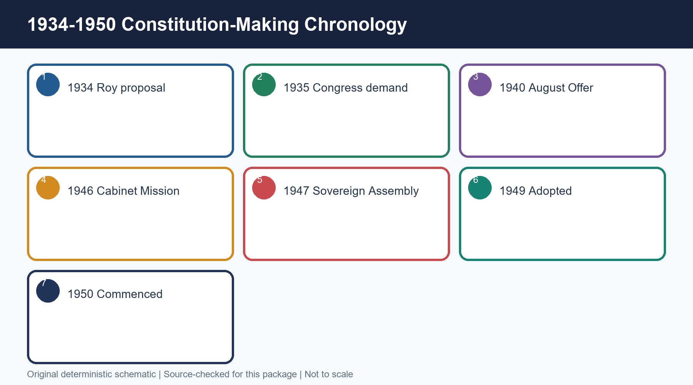
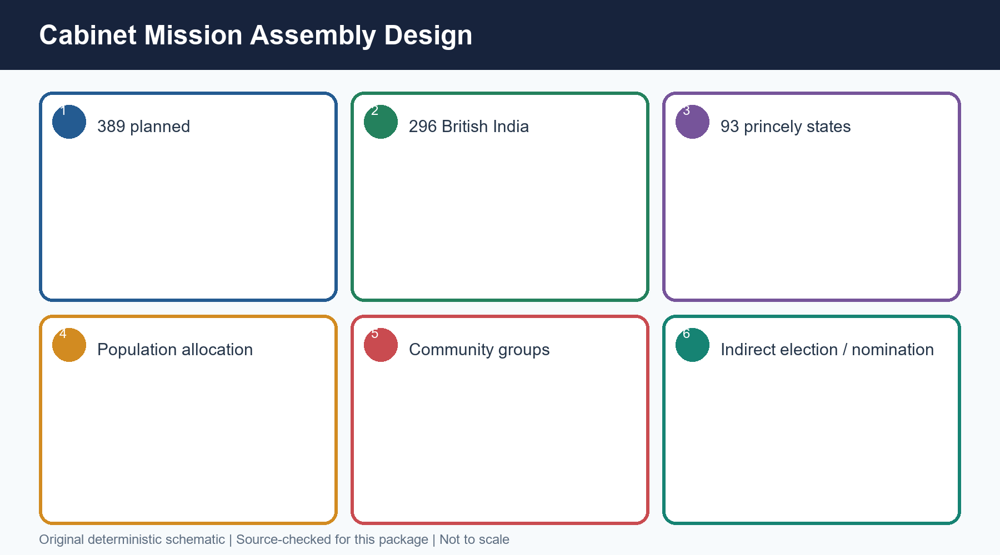
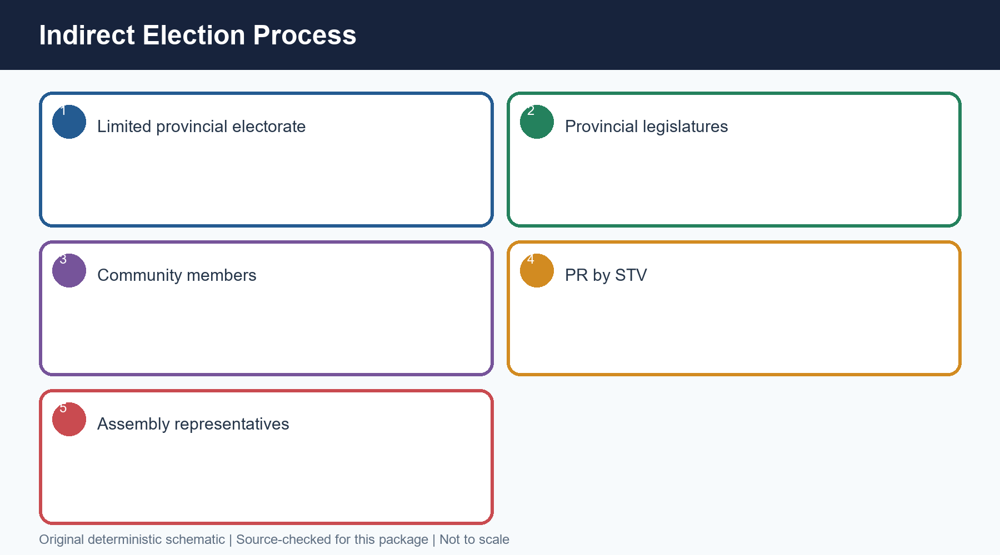
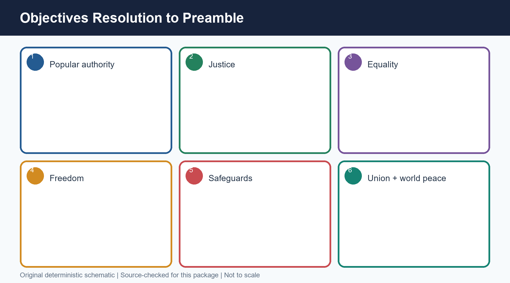
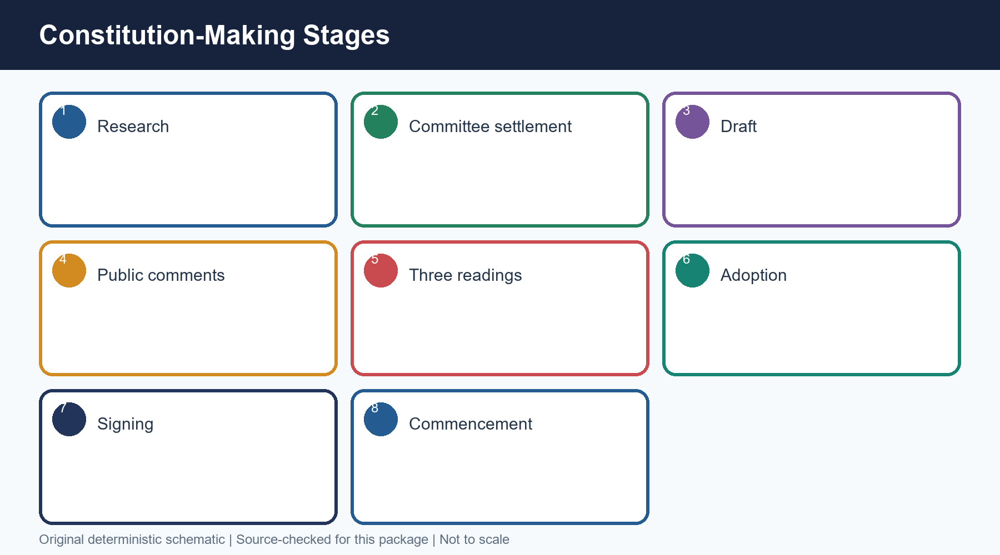
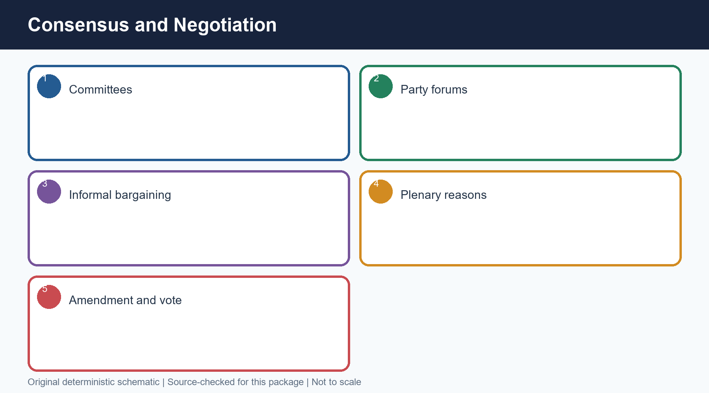
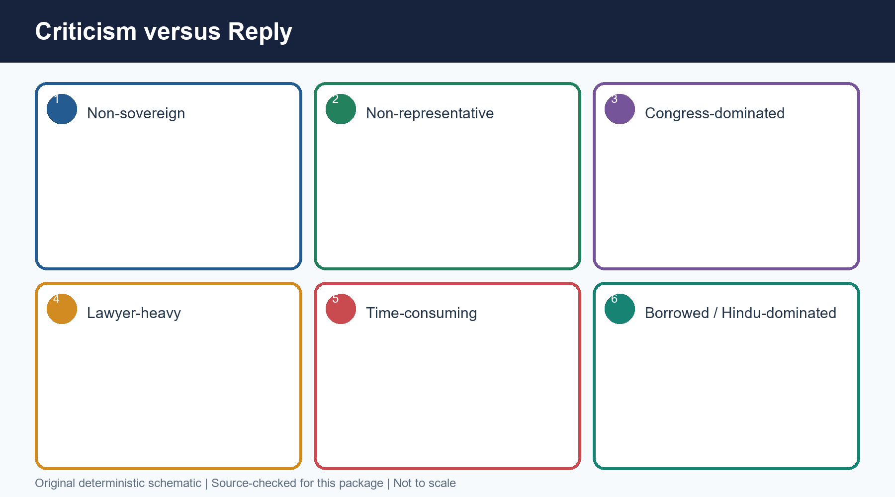
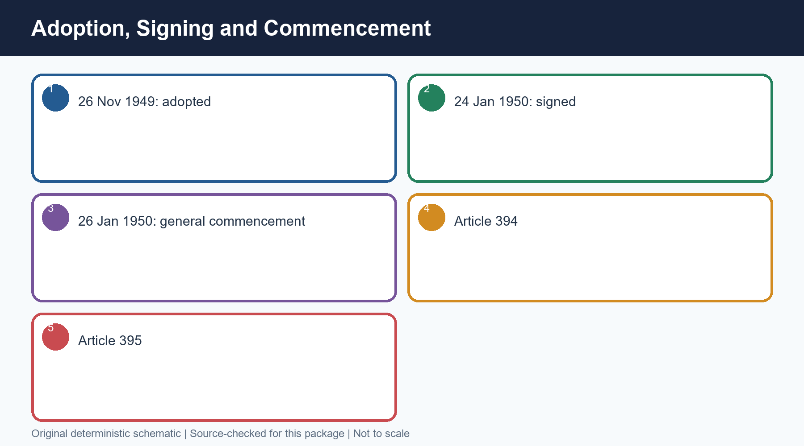
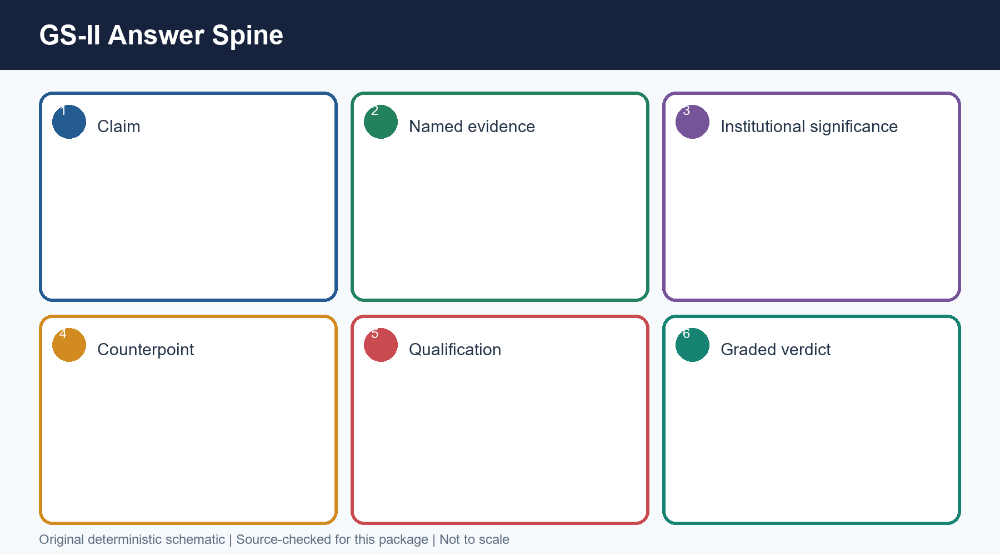

# Polity 02 - Making of the Constitution: Complete Topic Package

> Subject: Indian Polity | GS-II and Prelims | Dated 14 August 2026
> Approval state: generated; approved=false.

## Package method, evidence key and source audit

- [FACT] directly supported by repository Core/advanced knowledge, locally OCR-searchable Laxmikanth Chapter 2, constitutional text or locally audited UPSC routing.
- [ANALYSIS] exam-oriented inference or synthesis.
- [LIMIT] ownership, evidentiary or interpretive boundary.
- Source order: repository Markdown; local OCR-searchable Indian Polity PDF; live current affairs not forced because institutional relevance is sufficient; Qdrant not used.
- Topic 01 is used only for the concise 1935-46 bridge; colonial Acts are not duplicated.
- Direct locally routed Prelims demands: 2021 Q93, 2023 Q85, 2024 Q61 and 2026 Q55. No direct locally verified Mains PYQ was found; none is invented.
- Original visual assets: 15 deterministic PNG schematics under `notes/Polity/assets/02_Making-of-Constitution/`.

## PART I - Complete multi-subtopic learning session

## 01. Intellectual and political origins: 1934-1946

[FACT] From a radical proposal to an accepted constitution-making principle.

*Caption: Original deterministic schematic prepared for this package; labels are source-checked.*

### Chronology

| Date | Event |
|---|---|
| 1934 | M.N. Roy first put forward the idea |
| 1935 | Congress officially demanded a Constituent Assembly |
| 1938 | Nehru linked it to adult franchise and freedom from outside interference |
| 1940 | August Offer accepted the principle |
| 1942 | Cripps proposals; League sought two assemblies |
| 1946 | Cabinet Mission supplied the operative scheme |

### Evidence matrix

| Stage | Institutional movement | Precision |
|---|---|---|
| M.N. Roy | Constitution made by Indians through a constituent body | Credit the proposal to Roy; do not call it a Congress proposal in 1934 |
| Congress demand | Nationalist ownership of constitution-making | Official demand in 1935; Nehru's adult-franchise formulation came in 1938 |
| British response | Rejection moved to acceptance in principle and then a scheme | August Offer was acceptance in principle, not the creation of the Assembly |
| Cabinet Mission | One Assembly under a negotiated federal scheme | It rejected the League's demand for two constituent assemblies |

### Teaching and analysis

- [FACT] M.N. Roy, a pioneer of the communist movement in India, first put forward the idea of a Constituent Assembly in 1934. Source precision matters: he proposed the institutional idea; the Congress did not originate it.
- [FACT] The Indian National Congress first officially demanded a Constituent Assembly in 1935. In 1938, Jawaharlal Nehru stated that free India's Constitution should be framed without outside interference by an Assembly elected on adult franchise.
- [FACT] The August Offer of 1940 accepted the constitution-making principle. The Cripps proposals of 1942 envisaged post-war constitution-making, but the Muslim League sought two constituent assemblies.
- [FACT] The Cabinet Mission of 1946 rejected two assemblies and supplied the scheme under which the Indian Constituent Assembly was constituted.
- [ANALYSIS] The demand changed the source of constitutional authority: from a statute enacted for India by Westminster to a constitution reasoned and adopted in India.
- [LIMIT] Topic 01 owns the colonial Acts. This package uses only the endpoint bridge: the 1935 Act supplied inherited administrative material, but not the democratic source of the Constitution.

### Rapid recall

- Roy: 1934
- Congress official demand: 1935
- Nehru adult-franchise formulation: 1938
- August Offer: 1940
- Cabinet Mission scheme: 1946

### Close-option traps

- Wrong: Congress first proposed the idea in 1934
  Correct: M.N. Roy did; Congress officially demanded it in 1935
- Wrong: August Offer created the Assembly
  Correct: It accepted the principle; the Cabinet Mission supplied the operative scheme

**Mains route:** Use a source-of-authority thesis: indigenous demand -> British concession -> negotiated scheme -> sovereign constitution-making after 1947.

**Owner link:** Polity 01: concise 1935 Act and 1946 transition only.

## 02. Cabinet Mission design and allocation logic

[FACT] A federal, indirect and partly nominated Assembly.

*Caption: Original deterministic schematic prepared for this package; labels are source-checked.*

### Chronology

| Date | Event |
|---|---|
| May 1946 | Cabinet Mission statement and scheme |
| July-August 1946 | Elections for British Indian seats |
| November 1946 | Assembly constituted under the scheme |

### Evidence matrix

| Component | Planned seats | Selection |
|---|---|---|
| Governors' provinces | 292 | Community members of provincial assemblies elected representatives by PR-STV |
| Chief Commissioners' provinces | 4 | One each under the scheme |
| Princely states | 93 | Representatives nominated by rulers |
| Total | 389 | 296 British India plus 93 princely states |

### Teaching and analysis

- [FACT] Planned strength was 389: 292 from eleven Governors' provinces, 4 from Chief Commissioners' provinces and 93 from princely states.
- [FACT] Allocation was broadly one seat per million population. Provincial seats were divided among Muslim, Sikh and General categories in proportion to their population.
- [FACT] Within a province, members of each community in the provincial legislative assembly elected that community's representatives by proportional representation through the single transferable vote.
- [FACT] Provincial assembly members themselves rested on the limited franchise of the period. Therefore the Constituent Assembly was indirectly elected, not elected by universal adult suffrage.
- [FACT] Princely-state representatives were to be nominated by the rulers. The Assembly was consequently partly elected and partly nominated.
- [LIMIT] Source caution: the Cabinet Mission statement contemplated settling the precise method of princely-state representation through consultation; standard UPSC texts describe the representatives who joined as nominated by rulers. Do not imply a popular election in the states.
- [LIMIT] Do not say every one of the 296 British Indian seats was filled through an identical direct popular ballot. The selection chain ran through provincial legislatures, and the four Chief Commissioners' province seats formed a distinct component.
- [ANALYSIS] The scheme tried to combine population, community assurance and territorial representation; this enhanced negotiated inclusion but entrenched categories inherited from late-colonial politics.

### Rapid recall

- 389 planned
- 296 British India
- 93 princely states
- One seat per million, roughly
- PR by STV within community groups

### Close-option traps

- Wrong: The people directly elected the Assembly
  Correct: Provincial legislators indirectly elected provincial representatives
- Wrong: Princely-state representatives were elected by provincial assemblies
  Correct: They were nominated by their rulers

**Mains route:** For representativeness, state the exact selection chain before judging legitimacy.

**Owner link:** Later owners: Federal System; Elections; Representation.

## 03. Elections, composition change and metric discipline

[FACT] Never conflate planned strength, post-Partition strength, attendance or signatures.

*Caption: Original deterministic schematic prepared for this package; labels are source-checked.*

### Chronology

| Date | Event |
|---|---|
| July-August 1946 | Congress 208, League 73, others 15 in elections for 296 seats |
| 9 Dec 1946 | First meeting; 211 attended amid League boycott |
| After Partition | Strength re-fixed at 299: 229 provinces plus 70 states |
| 24 Jan 1950 | 284 members signed the Constitution |

### Evidence matrix

| Metric | Verified figure | Meaning |
|---|---|---|
| Original planned strength | 389 | Design ceiling under Cabinet Mission |
| British India allocation/election frame | 296 | 292 Governors' provinces plus 4 Chief Commissioners' provinces |
| Post-Partition strength | 299 | 229 provincial plus 70 princely-state seats |
| First-meeting attendance | 211 | Attendance amid boycott, not membership strength |
| Signatories on 24 Jan 1950 | 284 | Actual signatures, not post-Partition sanctioned strength |

### Teaching and analysis

- [FACT] In the 1946 elections for 296 British Indian seats, Congress won 208, the Muslim League 73, and smaller groups and independents 15. The 93 princely-state seats were initially unfilled because the states stayed away.
- [FACT] The Muslim League boycotted the first meeting; 211 members attended on 9 December 1946.
- [FACT] Partition reduced the strength from 389 to 299, consisting of 229 provincial and 70 princely-state seats.
- [FACT] On 24 January 1950, 284 members appended their signatures. Signing occurred after adoption, and 284 must not be presented as the Assembly's post-Partition strength.
- [ANALYSIS] Congress dominance was arithmetically real. Yet Congress functioned as a broad coalition, and the Assembly also included non-Congress experts and diverse social voices.
- [LIMIT] A single number cannot answer 'how representative?' Use selection method, social range, political dominance, boycott and post-Partition change together.

### Rapid recall

- 208 Congress
- 73 Muslim League
- 15 others
- 299 after Partition
- 284 signatories on 24 January 1950

### Close-option traps

- Wrong: 284 was the post-Partition strength
  Correct: 299 was the strength; 284 signed
- Wrong: 389 members attended the first meeting
  Correct: 211 attended amid the League boycott

**Mains route:** Open legitimacy answers with a five-metric box: 389, 296, 299, 211 and 284.

**Owner link:** Polity 43 Political Parties for Congress as umbrella organisation.

## 04. First sitting, presiding officers and secretariat

[FACT] The Assembly was an institution, not only a gathering of famous leaders.

*Caption: Original deterministic schematic prepared for this package; labels are source-checked.*

### Chronology

| Date | Event |
|---|---|
| 9 Dec 1946 | First sitting; Sachchidananda Sinha temporary President |
| 11 Dec 1946 | Rajendra Prasad elected permanent President |
| 13 Dec 1946 | Objectives Resolution introduced |
| 22 Jan 1947 | Objectives Resolution adopted |

### Evidence matrix

| Role | Person | Function |
|---|---|---|
| Temporary President | Dr Sachchidananda Sinha | Presided at the opening under the French oldest-member practice |
| President | Dr Rajendra Prasad | Presided over constituent deliberations |
| Vice-Presidents | H.C. Mukherjee and V.T. Krishnamachari | Assisted the presidency |
| Constitutional Adviser | B.N. Rau | Research, comparative advice and initial constitutional-adviser draft |
| Secretary | H.V.R. Iyengar | Assembly secretariat |
| Chief Draftsman | S.N. Mukerjee | Technical legislative drafting |

### Teaching and analysis

- [FACT] The first meeting was held on 9 December 1946. Sachchidananda Sinha, the oldest member, became temporary President following the French practice.
- [FACT] Rajendra Prasad was elected permanent President. H.C. Mukherjee and V.T. Krishnamachari served as Vice-Presidents.
- [FACT] B.N. Rau was Constitutional Adviser; H.V.R. Iyengar was Secretary; S.N. Mukerjee was Chief Draftsman.
- [ANALYSIS] Secretariat and drafting expertise converted political settlements into administrable text. A leader-only narrative misses this institutional production chain.
- [LIMIT] The Assembly had distinct constituent and legislative capacities after independence. Rajendra Prasad presided in the constituent role; G.V. Mavlankar presided when it functioned as the Dominion legislature.

### Rapid recall

- Temporary: Sinha
- Permanent: Rajendra Prasad
- Constitutional Adviser: B.N. Rau
- Secretary: H.V.R. Iyengar
- Chief Draftsman: S.N. Mukerjee

### Close-option traps

- Wrong: Rajendra Prasad was temporary President
  Correct: Sachchidananda Sinha was temporary; Prasad was permanent
- Wrong: B.N. Rau chaired the Drafting Committee
  Correct: Ambedkar chaired it; Rau was Constitutional Adviser

**Mains route:** Use role differentiation to avoid hero-only answers.

**Owner link:** Parliament owner for the Dominion-legislature/provisional-Parliament transition.

## 05. Objectives Resolution to Preamble

[FACT] Values were fixed before the final clauses.

*Caption: Original deterministic schematic prepared for this package; labels are source-checked.*

### Chronology

| Date | Event |
|---|---|
| 13 Dec 1946 | Nehru moved the Objectives Resolution |
| 22 Jan 1947 | Assembly adopted it unanimously |
| 26 Nov 1949 | Modified values enacted in the Preamble |

### Evidence matrix

| Resolution idea | Constitutional destination | Caution |
|---|---|---|
| Independent sovereign republic | Preamble's sovereign democratic republic | Socialist and secular were added only in 1976 |
| Power from the people | We, the People | The Assembly itself was indirectly elected |
| Justice, equality and freedoms | Preamble plus Parts III and IV | Specific rights are owned by later topics |
| Minority/backward/tribal safeguards | Rights and special constitutional protections | Do not reduce safeguards to separate electorates |
| World peace | Preamble/Directive Principle ethos | Not a justiciable foreign-policy command |

### Teaching and analysis

- [FACT] Nehru moved the Objectives Resolution on 13 December 1946; it was adopted on 22 January 1947.
- [FACT] It declared the resolve for an independent sovereign republic, a Union, authority derived from the people, justice, equality and freedoms, safeguards for minorities and backward and tribal areas, territorial integrity and contribution to world peace.
- [FACT] Its modified form became the Preamble.
- [ANALYSIS] The Resolution worked as a normative constraint: committees could disagree about machinery, but they drafted within a publicly stated value framework.
- [LIMIT] It did not contain the final 1949 wording. 'Socialist' and 'secular' were inserted into the Preamble by the 42nd Amendment in 1976.

### Rapid recall

- Moved: 13 December 1946
- Adopted: 22 January 1947
- Mover: Nehru
- Modified form: Preamble

### Close-option traps

- Wrong: Ambedkar moved the Resolution
  Correct: Nehru moved it
- Wrong: The 1947 Resolution used the final amended Preamble verbatim
  Correct: It became the Preamble in modified form

**Mains route:** Show the chain: political resolution -> drafting constraint -> Preamble -> interpretive identity.

**Owner link:** Polity 04 Preamble owns doctrine and later interpretation.

## 06. Committee architecture and distributed authorship

[FACT] Specialisation, reporting and Assembly control.

*Caption: Original deterministic schematic prepared for this package; labels are source-checked.*

### Chronology

| Date | Event |
|---|---|
| 1946-47 | Major subject committees and subcommittees worked |
| 29 Aug 1947 | Drafting Committee appointed |
| 1948-49 | Draft examined through readings and amendments |

### Evidence matrix

| Committee | Chair | Core scope |
|---|---|---|
| Union Powers Committee | Jawaharlal Nehru | Distribution and character of Union powers |
| Union Constitution Committee | Jawaharlal Nehru | Structure of the Union constitution |
| Provincial Constitution Committee | Vallabhbhai Patel | Provincial constitutional structure |
| Advisory Committee | Vallabhbhai Patel | Fundamental rights, minorities, tribal and excluded areas |
| Fundamental Rights Sub-Committee | J.B. Kripalani | Rights recommendations |
| Minorities Sub-Committee | H.C. Mukherjee | Minority safeguards |
| North-East Frontier (Assam) Tribal/Excluded Areas Sub-Committee | Gopinath Bardoloi | Assam tribal and excluded areas |
| Excluded and Partially Excluded Areas Sub-Committee (other than Assam) | A.V. Thakkar | Tribal/excluded areas outside Assam |
| Drafting Committee | B.R. Ambedkar | Convert decisions and reports into a coherent draft |

### Teaching and analysis

- [FACT] Major committees included Union Powers and Union Constitution under Nehru; Provincial Constitution and the Advisory Committee under Patel; Drafting under Ambedkar; Rules of Procedure and Steering under Rajendra Prasad; and the States Committee under Nehru.
- [FACT] The Advisory Committee was supported by specialised subcommittees on fundamental rights, minorities, and tribal/excluded areas.
- [ANALYSIS] Committee architecture separated agenda formation, negotiated settlement, legal drafting and plenary authorisation.
- [ANALYSIS] This is why 'Ambedkar wrote the Constitution' is useful shorthand but bad institutional history: reports, adviser work, drafting, amendments and final Assembly votes were separate stages.
- [LIMIT] Chairmanship does not imply sole authorship; committee recommendations remained subject to the Assembly.

### Rapid recall

- Nehru: Union Powers/Union Constitution/States
- Patel: Provincial Constitution/Advisory
- Ambedkar: Drafting
- Kripalani: FR Sub-Committee
- Mukherjee: Minorities

### Close-option traps

- Wrong: Drafting Committee decided every constitutional principle independently
  Correct: It drafted within Assembly and committee decisions
- Wrong: Patel chaired the Fundamental Rights Sub-Committee
  Correct: J.B. Kripalani chaired it; Patel chaired the parent Advisory Committee

**Mains route:** Draw a committee-to-plenary production chain in Mains answers.

**Owner link:** Later owners teach the provisions produced by these committees.

## 07. B.N. Rau, Drafting Committee and Assembly: role flow

[FACT] Research is not drafting; drafting is not adoption.

*Caption: Original deterministic schematic prepared for this package; labels are source-checked.*

### Chronology

| Date | Event |
|---|---|
| Oct 1947 | Constitutional Adviser prepared an initial draft |
| 29 Aug 1947 | Drafting Committee appointed |
| Feb 1948 | Draft Constitution published |
| Oct 1948 | Revised draft published |
| 4 Nov 1948 | Ambedkar introduced the Draft in the Assembly |

### Evidence matrix

| Actor | Contribution | Boundary |
|---|---|---|
| B.N. Rau | Comparative research, advice, initial adviser draft | Did not chair the Drafting Committee or adopt the Constitution |
| Drafting Committee | Scrutinised material, reconciled decisions and framed the Draft Constitution | Could not replace the plenary Assembly's authority |
| B.R. Ambedkar | Chaired Drafting Committee; piloted and defended the Draft | Central role, but not solitary authorship |
| S.N. Mukerjee | Technical drafting and language | Not the constitutional decision-maker |
| Constituent Assembly | Debated, amended, adopted and later signed | Final institutional author |

### Teaching and analysis

- [FACT] B.N. Rau's adviser draft preceded the Drafting Committee's published Draft Constitution.
- [FACT] The seven-member Drafting Committee was appointed on 29 August 1947 under B.R. Ambedkar.
- [FACT] Original members were Ambedkar, N. Gopalaswami Ayyangar, Alladi Krishnaswami Ayyar, K.M. Munshi, Mohammad Saadulla, B.L. Mitter and D.P. Khaitan. N. Madhava Rau replaced Mitter; T.T. Krishnamachari replaced Khaitan.
- [FACT] The Drafting Committee sat for 141 days. A draft appeared in February 1948 and a revised draft in October 1948.
- [ANALYSIS] Rau widened the menu of constitutional techniques; the Committee converted choices into a coherent instrument; the Assembly supplied democratic-deliberative authority.
- [LIMIT] Avoid both errors: erasing Ambedkar's exceptional leadership and reducing a collective process to one person.

### Rapid recall

- Drafting Committee: 29 August 1947
- Seven members
- 141 sitting days
- Rau adviser draft before Committee draft
- Ambedkar introduced Draft: 4 November 1948

### Close-option traps

- Wrong: B.N. Rau was a Drafting Committee member
  Correct: He was Constitutional Adviser
- Wrong: The Drafting Committee's text became law without plenary amendment
  Correct: The Assembly debated and amended it

**Mains route:** Role-flow answers score because they attribute each stage precisely.

**Owner link:** Preamble, FR, DPSP, Federal and Parliamentary owner topics.

## 08. Drafting stages, readings, adoption, signing and commencement

[FACT] A five-stage chronology with Article 394 precision.

*Caption: Original deterministic schematic prepared for this package; labels are source-checked.*

### Chronology

| Date | Event |
|---|---|
| 4 Nov 1948 | First reading/general discussion began |
| 15 Nov 1948-17 Oct 1949 | Second reading: clause-by-clause consideration |
| 14-26 Nov 1949 | Third reading and adoption |
| 24 Jan 1950 | Members signed |
| 26 Jan 1950 | Remaining provisions commenced; India became a republic |

### Evidence matrix

| Event | Date | Legal meaning |
|---|---|---|
| Adoption/enactment | 26 Nov 1949 | Assembly adopted the Constitution; specified provisions commenced at once |
| Signing | 24 Jan 1950 | 284 members appended signatures |
| General commencement | 26 Jan 1950 | Remaining provisions commenced under Article 394 |
| Repeal transition | 26 Jan 1950 | Article 395 repealed the 1935 and 1947 Acts, subject to its text |
| Original output | 26 Nov 1949 | Preamble, 395 Articles, 8 Schedules |

### Teaching and analysis

- [FACT] Committee reports and Rau's adviser draft preceded the Drafting Committee's Draft Constitution. The public draft and comments fed further revision.
- [FACT] Ambedkar introduced the Draft on 4 November 1948. The second reading considered clauses from 15 November 1948 to 17 October 1949; the third reading ran in November 1949.
- [FACT] The Constitution was adopted on 26 November 1949, signed on 24 January 1950, and generally commenced on 26 January 1950.
- [FACT] Article 394 brought Articles 5-9, 60, 324, 366, 367, 379, 380, 388, 391-393 into force at once and the remaining provisions on 26 January 1950.
- [FACT] Article 393 gives the short title. Article 395 repealed the Indian Independence Act 1947 and Government of India Act 1935 with its amending/supplementing enactments. The Abolition of Privy Council Jurisdiction Act 1949 continued.
- [FACT] The original adopted Constitution had a Preamble, 395 Articles and 8 Schedules.
- [LIMIT] Do not say the Constitution was adopted on Republic Day or signed on 26 November.

### Rapid recall

- Adopted: 26 Nov 1949
- Signed: 24 Jan 1950
- Commenced: 26 Jan 1950
- Article 394: commencement
- Article 395: repeals

### Close-option traps

- Wrong: Adoption, signing and commencement occurred together
  Correct: They occurred on three distinct dates
- Wrong: The whole Constitution commenced on 26 November 1949
  Correct: Only specified provisions did; the remainder commenced on 26 January 1950

**Mains route:** A date-function table is the safest Prelims and Mains presentation.

**Owner link:** Polity 01 for the statutes repealed; Citizenship/Elections for provisions commenced early.

## 09. Major debates and owner-topic cross-links

[FACT] Design choices were settlements among competing risks.

*Caption: Original deterministic schematic prepared for this package; labels are source-checked.*

### Chronology

| Date | Event |
|---|---|
| 1946-49 | Committee negotiation and plenary debate |
| 1949 | Final settlements embedded in constitutional text |
| 1950 onward | Courts, Parliament and amendments developed the choices |

### Evidence matrix

| Debate | Constitution-making tension | Owner topic |
|---|---|---|
| Federalism | Strong Union versus provincial autonomy after Partition | Federal System/Centre-State Relations |
| Executive | Stability versus legislative responsibility | Parliamentary System |
| Fundamental rights | Liberty versus public order and reform | Fundamental Rights |
| DPSP | Transformative goals versus non-justiciability | Directive Principles |
| Minorities | Group safeguards versus common citizenship | FR/Minorities/Special Provisions |
| Language | National coordination versus linguistic plurality | Official Language |
| Citizenship | Partition emergency versus inclusive membership | Citizenship |
| Judiciary | Rights protection versus democratic policy space | Supreme Court |
| Services/emergency/property | Continuity and state capacity versus liberty/social transformation | Public Services/Emergency/Property history |

### Teaching and analysis

- [ANALYSIS] Federal design hardened toward a strong Union under the pressures of Partition, integration and administrative continuity, while retaining a constitutionally divided field of authority.
- [ANALYSIS] The parliamentary system prioritised a responsible executive answerable to the legislature over a separately elected executive.
- [ANALYSIS] Fundamental Rights and Directive Principles formed a liberty-transformation pair: enforceable restraints plus programmatic social commitments.
- [ANALYSIS] Minority debates moved away from communal electorates while retaining cultural, religious and equality protections.
- [ANALYSIS] Language, citizenship, judiciary, services, emergency powers and property each involved a compromise between unity/state capacity and plural freedom/social change.
- [LIMIT] This topic owns the making and debate logic, not full doctrine. Use one paragraph per debate and cross-link the later owner file.

### Rapid recall

- Strong Union was a negotiated response, not proof of a unitary Constitution
- Parliamentary responsibility was deliberately preferred
- Rights and DPSP were complementary design instruments

### Close-option traps

- Wrong: Every debated provision should be taught fully here
  Correct: Teach the choice and route doctrine to its owner topic
- Wrong: Consensus meant absence of conflict
  Correct: It meant managed disagreement and accepted settlements

**Mains route:** Write debates as tension -> chosen institution -> benefit -> cost -> later owner.

**Owner link:** Polity 03-14 and 40-41 own the resulting constitutional doctrines.

## 10. Borrowed provisions as adaptation, not copying

[FACT] Comparative learning was filtered through Indian problems.

*Caption: Original deterministic schematic prepared for this package; labels are source-checked.*

### Chronology

| Date | Event |
|---|---|
| Before 1947 | 1935 Act provided an administrative inheritance |
| 1946-48 | Rau and committees studied comparative models |
| 1948-49 | Assembly selected, modified and integrated devices |

### Evidence matrix

| Source family | Often associated feature | Indian adaptation |
|---|---|---|
| United Kingdom | Parliamentary government, cabinet responsibility, rule-of-law traditions | Written and supreme Constitution; judicially enforceable rights |
| United States | Fundamental rights, judicial review/federal devices | Parliamentary rather than presidential executive; detailed limits and exceptions |
| Ireland | Directive Principles | Non-justiciable goals integrated with enforceable rights |
| Canada | Federation with a strong centre | Distinct Union-State lists and Indian emergency/integration context |
| Government of India Act 1935 | Federal-administrative machinery, offices and lists | Democratised, rights-bound and placed under popular sovereignty |

### Teaching and analysis

- [FACT] The framers studied foreign constitutions and inherited substantial administrative machinery from the Government of India Act 1935.
- [ANALYSIS] Borrowing is a technique, not a verdict. The correct test is whether an institution was selected, modified and integrated to meet Indian conditions.
- [ANALYSIS] Parliamentary government under a written supreme Constitution, enforceable rights alongside Directive Principles, and a federation with a strong Union are examples of synthesis rather than mechanical copying.
- [ANALYSIS] The Constitution combined continuity of institutions with rupture in legitimacy: colonial offices were retained where useful, but authority was relocated to the people and universal adult citizenship.
- [LIMIT] Avoid unverified one-feature-one-country lists. Many ideas have multiple lineages; use only securely established associations and explain adaptation.

### Rapid recall

- Comparative study does not equal copying
- 1935 Act was an administrative source, not the democratic source
- Adaptation must be demonstrated through changed function

### Close-option traps

- Wrong: A borrowed device is necessarily unsuitable
  Correct: Suitability depends on adaptation and integration
- Wrong: The Constitution simply reproduced the 1935 Act
  Correct: It transformed source, rights, accountability and citizenship

**Mains route:** Use a three-column source-feature-adaptation table.

**Owner link:** Comparative Constitutional Schemes and Salient Features.

## 11. Consensus, party organisation and negotiation

[FACT] How a large Assembly produced a durable settlement.

*Caption: Original deterministic schematic prepared for this package; labels are source-checked.*

### Chronology

| Date | Event |
|---|---|
| Committee stage | Smaller groups gathered evidence and framed options |
| Congress/party forums | Differences were negotiated before and alongside plenary debate |
| Plenary stage | Public reasons, amendments and votes authorised the text |

### Evidence matrix

| Mechanism | Contribution | Risk |
|---|---|---|
| Committees | Expertise and manageable bargaining | Technocratic insulation |
| Congress umbrella | Coalition discipline across ideological tendencies | Numerical dominance |
| Informal negotiation | Compromise before public deadlock | Opacity |
| Plenary debate | Public justification and amendment | Time and repetition |
| Presidential steering | Procedural continuity | Dependence on leadership |

### Teaching and analysis

- [ANALYSIS] Consensus was produced through repeated movement between committees, party forums, informal negotiation and plenary debate.
- [ANALYSIS] Congress dominance facilitated coordination, but its internal ideological breadth meant that agreement still required bargaining among socialists, Gandhians, liberals, conservatives and provincial interests.
- [ANALYSIS] Patel's committee and integration work, Nehru's Union/value agenda, Ambedkar's drafting leadership, Prasad's procedural stewardship and Rau's technical preparation were complementary roles.
- [ANALYSIS] Consensus did not erase dissent. It made disagreement governable by narrowing options, recording objections and accepting a final institutional settlement.
- [LIMIT] Do not romanticise: unequal social power, indirect election, the League boycott and princely nomination constrained the process.

### Rapid recall

- Consensus was institutional, not merely personal
- Party organisation enabled coordination
- Plenary adoption remained indispensable

### Close-option traps

- Wrong: Congress dominance proves no debate occurred
  Correct: Dominance and meaningful internal/plenary debate can coexist
- Wrong: Consensus means unanimity on every clause
  Correct: It means workable settlement, often after disagreement

**Mains route:** Explain mechanism and incentive, then qualify democratic depth.

**Owner link:** Political Parties; Parliament; Constitutional Morality.

## 12. People and plural voices without hero-only reduction

[FACT] Leadership, expertise, women and marginalised interventions.

*Caption: Original deterministic schematic prepared for this package; labels are source-checked.*

### Chronology

| Date | Event |
|---|---|
| 1946-50 | Members intervened through committees and plenary debate |
| Post-Partition | Minority safeguards and common citizenship were renegotiated |
| 1950 | Universal adult franchise widened democratic membership beyond the Assembly's own electorate |

### Evidence matrix

| Person/group | Verified institutional contribution | Analytical use |
|---|---|---|
| B.R. Ambedkar | Drafting Committee chair; piloted Draft | Legal coherence and social-democratic transformation |
| Jawaharlal Nehru | Objectives Resolution; Union committees | Value framework and Union design |
| Vallabhbhai Patel | Provincial/Advisory committees; states integration context | Federal settlement and minority/tribal channels |
| Rajendra Prasad | Assembly President; Rules/Steering leadership | Procedural legitimacy |
| B.N. Rau | Constitutional Adviser and initial draft | Comparative-technical preparation |
| Hansa Mehta | Equality and women's-status interventions | Formal equality and gendered citizenship |
| Dakshayani Velayudhan | Dalit woman member; opposed untouchability and stressed social transformation | Marginalised constitutional voice |
| Begum Aizaz Rasul | Muslim woman member; opposed separate electorates | Minority citizenship beyond communal electorates |
| Durgabai Deshmukh / Rajkumari Amrit Kaur | Social reform, language/welfare and rights concerns | Women as substantive participants, not symbols |

### Teaching and analysis

- [FACT] Gandhi was not a member. His political and moral influence is not the same as institutional membership.
- [ANALYSIS] Ambedkar's role was exceptional because he chaired drafting, defended clauses and linked political democracy to social conditions; precision requires credit without solitary-authorship mythology.
- [ANALYSIS] Women members and marginalised voices intervened on equality, untouchability, minority representation, social reform, language and citizenship.
- [ANALYSIS] The Assembly's most radical representative act was prospective: it constitutionalised universal adult franchise, expanding political equality far beyond the restricted electorate that indirectly produced it.
- [LIMIT] Do not invent quotations or attribute every final clause to one speech. State verified participation and the issue advanced.

### Rapid recall

- Gandhi was not a member
- Ambedkar chaired drafting, not the entire process
- Women's participation was substantive
- Universal franchise widened legitimacy prospectively

### Close-option traps

- Wrong: Women were only symbolic members
  Correct: Named members made substantive interventions
- Wrong: Recognising collective authorship diminishes Ambedkar
  Correct: It clarifies why his leadership was central within a distributed process

**Mains route:** Use five roles and two plural-voice examples; connect each to institutional significance.

**Owner link:** FR, Social Justice, Minorities and Political Representation.

## 13. Criticism versus evidence-led reply

[FACT] Concede the kernel, answer with evidence, retain the limitation.

*Caption: Original deterministic schematic prepared for this package; labels are source-checked.*

### Chronology

| Date | Event |
|---|---|
| 1946 | Indirect, limited-franchise and partly nominated origin |
| 1947 | Independence Act made the Assembly sovereign |
| 1949-50 | Adoption, signature and universal-franchise constitutional order |

### Evidence matrix

| Criticism | Evidence-led reply | Qualification |
|---|---|---|
| Non-sovereign | Indian Independence Act 1947 made it fully sovereign | British plan shaped its origin |
| Non-representative | Social diversity, debate and future universal franchise | No direct adult-franchise election |
| Congress-dominated | Congress was a broad coalition and experts/dissent were included | 208 of 296 electoral seats confirms dominance |
| Lawyer-heavy | Legal expertise produced a detailed workable text | Professional/social imbalance remained |
| Time-consuming | 11 sessions, complex transition and extended clause scrutiny | Comparisons with shorter constitutions are context-sensitive |
| Borrowed | Foreign devices were adapted and integrated | Colonial/foreign continuities were substantial |
| Hindu-dominated | League boycott and Partition altered composition; minority channels remained | Post-Partition imbalance cannot be denied |

### Teaching and analysis

- [ANALYSIS] The strongest reply never denies the criticism's factual kernel. It states the defect, identifies the contextual constraint or institutional answer, and retains a qualification.
- [FACT] Sovereignty criticism changes across time: plausible at the British-created origin, substantially answered after the Indian Independence Act 1947.
- [ANALYSIS] Representativeness has electoral and deliberative dimensions. The Assembly was weak on direct electoral mandate but stronger on social range, reason-giving and the universal franchise it created.
- [ANALYSIS] Congress dominance aided settlement but also raises questions about agenda control. Lawyerly expertise aided drafting but could not substitute for social representation.
- [LIMIT] Do not use unverifiable rhetorical quotations from critics. The evidence is sufficient without decorative attribution.

### Rapid recall

- Criticism must be periodised
- Representation has electoral and deliberative dimensions
- Every reply needs a residual limitation

### Close-option traps

- Wrong: Defence requires denying defects
  Correct: High-quality evaluation concedes and qualifies
- Wrong: The Independence Act made the Assembly sovereign from its first meeting
  Correct: The change occurred in 1947

**Mains route:** Use criticism -> conceded kernel -> named evidence -> reply -> residual limit.

**Owner link:** Answer-worthiness architecture in Polity Core.

## 14. Time, cost, output and transition dashboard

[FACT] Numbers are useful only when their denominators are clear.

*Caption: Original deterministic schematic prepared for this package; labels are source-checked.*

### Chronology

| Date | Event |
|---|---|
| 9 Dec 1946 | Work began |
| 26 Nov 1949 | Adoption after 2 years, 11 months, 18 days |
| 24 Jan 1950 | Signing |
| 26 Jan 1950 | General commencement |

### Evidence matrix

| Indicator | Verified value | Caution |
|---|---|---|
| Duration | 2 years, 11 months, 18 days | From first sitting to adoption |
| Sessions | 11 | Assembly met again on 24 Jan 1950 for signatures |
| Draft debate | 114 days | Not the same as total Assembly working days |
| Drafting Committee | 141 days | Committee sitting figure, not plenary debate |
| Cost | About Rs 64 lakh | Historical nominal figure; do not modernise without method |
| Original Constitution | 395 Articles, 8 Schedules and Preamble | Do not substitute today's counts |
| Amendments | 7,653 proposed; 2,473 moved/disposed in the Assembly account commonly cited | Use source wording carefully; do not call all accepted |

### Teaching and analysis

- [FACT] The Assembly took 2 years, 11 months and 18 days over 11 sessions; the Draft Constitution was debated for 114 days.
- [FACT] The commonly recorded cost was about Rs 64 lakh.
- [FACT] The original adopted Constitution contained 395 Articles and 8 Schedules.
- [ANALYSIS] Time and length reflect the scale of federal, rights, minority, Partition and administrative-transition problems, not automatically inefficiency.
- [LIMIT] Keep denominators distinct: Assembly sessions, debate days, Drafting Committee days, proposed amendments, moved amendments and adopted provisions are different measures.

### Rapid recall

- 11 sessions
- 2y 11m 18d
- 114 draft-debate days
- Rs 64 lakh
- 395 Articles/8 Schedules

### Close-option traps

- Wrong: 141 days was the entire Assembly's duration
  Correct: It was the Drafting Committee's sitting figure
- Wrong: Today's article/schedule count describes the 1949 output
  Correct: Use 395 and 8 for the original Constitution

**Mains route:** A dashboard supports, but does not replace, institutional analysis.

**Owner link:** Amendment and Basic Structure for constitutional evolution.

## 15. Social revolution, continuity and rupture

[FACT] A new source of authority using selectively inherited machinery.

*Caption: Original deterministic schematic prepared for this package; labels are source-checked.*

### Chronology

| Date | Event |
|---|---|
| Colonial endpoint | Administrative continuity from the 1935 framework |
| Constitution-making | Rights, franchise, federal and parliamentary redesign |
| 26 Jan 1950 | Republican popular sovereignty commenced |

### Evidence matrix

| Dimension | Continuity | Rupture |
|---|---|---|
| Administration | Offices, services, lists and legal techniques | Accountability to a republican Constitution |
| State capacity | Strong executive and emergency instruments | Justiciable rights and judicial control |
| Territory | Inherited provinces and integration process | Union founded constitutionally, not imperially |
| Citizenship | Existing population and transition rules | Universal adult political equality |
| Social order | Many institutions and inequalities survived | Equality, abolition of untouchability, reform goals and DPSP |

### Teaching and analysis

- [ANALYSIS] Constitutional continuity made government possible on day one; constitutional rupture changed why power was legitimate and to whom it was answerable.
- [ANALYSIS] Granville Austin's social-revolution lens is useful as analysis: the Constitution joined national unity, democratic institutions and social reform.
- [ANALYSIS] Universal adult franchise, equality, rights and Directive Principles converted constitution-making into a project of political and social transformation.
- [ANALYSIS] Yet the Constitution worked through inherited bureaucracy, courts, federal lists and emergency techniques. Transformation was constitutional and gradual, not a total administrative reset.
- [LIMIT] Do not present continuity as colonial copying or rupture as immediate social equality. Both operated simultaneously.

### Rapid recall

- Popular sovereignty is the key rupture
- Administrative inheritance is the key continuity
- Social revolution linked democracy and reform

### Close-option traps

- Wrong: Continuity cancels independence
  Correct: Institutional continuity can coexist with a new source of authority
- Wrong: A transformative Constitution instantly transformed society
  Correct: It created institutions and claims; implementation remained political

**Mains route:** Use a continuity-versus-rupture matrix and conclude with constitutional transformation.

**Owner link:** Salient Features, FR, DPSP and Social Justice.

## 16. UPSC answer spine and current institutional relevance

[FACT] Institutional design, not forced news.

*Caption: Original deterministic schematic prepared for this package; labels are source-checked.*

### Chronology

| Date | Event |
|---|---|
| Prelims | Identify dates, roles, selection method and metrics |
| 10 marks | One claim, three evidence units, one qualification |
| 15 marks | Process plus debate plus balanced verdict |
| 20 marks | Origins, composition, mechanisms, criticism/reply and legacy |

### Evidence matrix

| Demand | Answer spine | Evidence minimum |
|---|---|---|
| How representative? | Method -> composition -> inclusion -> defects -> verdict | 389/299, indirect election, boycott, universal franchise |
| Who made it? | Rau -> committees -> Drafting Committee -> Assembly | Named roles and dates |
| Borrowed? | Source -> adaptation -> Indian problem -> limitation | Three secure examples |
| Why durable? | Values -> committee bargaining -> legal coherence -> legitimacy limits | Objectives Resolution, readings, criticism/reply |
| Current relevance | Design principles for plural bargaining and institutional restraint | No forced daily-news peg required |

### Teaching and analysis

- [ANALYSIS] Current relevance lies in method: public reasons, committee scrutiny, opposition channels, federal negotiation, rights constraints and clear transition rules.
- [ANALYSIS] Use the Assembly to evaluate present institutional design without claiming that every current controversy reproduces 1946-49.
- [ANALYSIS] Every Mains paragraph should follow claim -> named institutional evidence -> significance -> limitation/qualification.
- [LIMIT] No direct Mains PYQ on the making process was found in the locally audited GS-I/GS-II corpus used for this package. Cross-owned applications must not be relabelled as direct PYQs.
- [FACT] Direct locally routed Prelims demands are 2021 Q93, 2023 Q85, 2024 Q61 and 2026 Q55; official-key status differs by year and is stated in the workbook.

### Rapid recall

- No direct locally verified Mains PYQ found
- Four routed Prelims demands
- Current relevance is institutional design

### Close-option traps

- Wrong: A practice Mains question is a PYQ
  Correct: Label original practice honestly
- Wrong: Current relevance requires a recent headline
  Correct: Static institutional relevance can be genuine and sufficient

**Mains route:** End with a graded verdict, not praise or rejection.

**Owner link:** All later Polity owner topics.

## PART II - Learning MCQ loops

### Loop 1

The idea of a Constituent Assembly was first put forward in 1934 by:

A. M.N. Roy
B. Jawaharlal Nehru
C. B.R. Ambedkar
D. Rajendra Prasad

**Answer: A.** Roy first put forward the idea; Congress officially demanded it in 1935.

### Loop 2

Which statement best describes provincial representation under the Cabinet Mission scheme?

A. Direct universal election
B. Election by community members of provincial assemblies through PR-STV
C. Nomination by Governors
D. Election by the central legislature

**Answer: B.** The election was indirect and organised through community members in provincial legislatures.

### Loop 3

Which figure denotes post-Partition strength, not first-meeting attendance or signatures?

A. 389
B. 284
C. 299
D. 211

**Answer: C.** 299 was the post-Partition strength: 229 provinces plus 70 states.

### Loop 4

Who was the Constitutional Adviser?

A. S.N. Mukerjee
B. H.V.R. Iyengar
C. B.R. Ambedkar
D. B.N. Rau

**Answer: D.** Rau advised and prepared an initial draft; he did not chair the Drafting Committee.

### Loop 5

The Objectives Resolution was adopted on:

A. 22 January 1947
B. 13 December 1946
C. 29 August 1947
D. 26 November 1949

**Answer: A.** Nehru moved it on 13 December 1946; it was adopted on 22 January 1947.

### Loop 6

The parent Advisory Committee on Fundamental Rights, Minorities and Tribal Areas was chaired by:

A. J.B. Kripalani
B. Vallabhbhai Patel
C. H.C. Mukherjee
D. Gopinath Bardoloi

**Answer: B.** Patel chaired the parent committee; specialised subcommittees had other chairs.

### Loop 7

Which is the correct role sequence?

A. Drafting Committee -> Rau -> Assembly
B. Assembly -> Rau -> committees
C. Committee reports/Rau draft -> Drafting Committee -> Assembly
D. Rau -> adoption -> Drafting Committee

**Answer: C.** Research and reports fed drafting; the Assembly debated and adopted.

### Loop 8

Which event occurred on 24 January 1950?

A. Adoption
B. General commencement
C. Drafting Committee appointment
D. Signing by 284 members

**Answer: D.** Signing followed adoption and preceded general commencement.

### Loop 9

Which is the safest statement about borrowed provisions?

A. They were selected and adapted to Indian conditions
B. They prove the text lacked originality
C. Every feature has one exclusive foreign source
D. The 1935 Act was copied without transformation

**Answer: A.** The analytical issue is adaptation and integration, not source alone.

### Loop 10

Which mechanism most directly made disagreement manageable before plenary adoption?

A. Judicial review
B. Committee specialisation and negotiation
C. Direct referendum
D. Royal assent

**Answer: B.** Committees narrowed and framed disputes; plenary debate retained authority.

### Loop 11

Which member is correctly linked to opposition to separate electorates?

A. Hansa Mehta
B. Dakshayani Velayudhan
C. Begum Aizaz Rasul
D. Rajkumari Amrit Kaur

**Answer: C.** Begum Aizaz Rasul opposed separate electorates while participating as a Muslim woman member.

### Loop 12

Which was NOT a valid reply to criticism?

A. Independence Act supplied sovereignty
B. Universal franchise broadened the created order
C. Comparative study required time
D. The Assembly was directly elected by all adults

**Answer: D.** It was not directly elected on adult franchise.

### Loop 13

The Drafting Committee was appointed on:

A. 29 August 1947
B. 26 November 1949
C. 9 December 1946
D. 15 November 1948

**Answer: A.** The seven-member committee was appointed on 29 August 1947.

### Loop 14

Article 394 principally concerns:

A. Short title
B. Commencement
C. Repeals
D. Hindi text

**Answer: B.** Article 393 is short title, 394 commencement, 395 repeals.

### Loop 15

The original Constitution contained:

A. 299 Articles and 8 Schedules
B. 395 Articles and 12 Schedules
C. 395 Articles and 8 Schedules
D. 389 Articles and 8 Schedules

**Answer: C.** The original adopted text had 395 Articles and 8 Schedules.

### Loop 16

Which is the best legitimacy verdict?

A. Perfectly representative by modern standards
B. Illegitimate because indirect
C. Legitimate only because Congress won
D. Electorally limited but deliberatively and prospectively democratising

**Answer: D.** A graded verdict recognises both the deficit and the democratic output.

## PART III - Solved Mains practice

### 33. Solved Mains practice: representativeness (10 marks)

- Question (10 marks): How far was the Constituent Assembly representative despite not being elected on universal adult franchise?
- Direct thesis: It lacked a direct democratic mandate but built qualified legitimacy through plural participation, reasoned deliberation and the universal franchise it constitutionalised.
- Claim -> named evidence -> significance: Cabinet Mission design: 389 planned; provincial representatives were indirectly elected by limited-franchise provincial assemblies through PR-STV, while princely-state representatives were nominated. This proves the electoral deficit.
- Claim -> named evidence -> significance: The Assembly included varied religious, caste, tribal and women's voices; 211 attended the first sitting despite the League boycott. This proves social range but not proportional equality.
- Claim -> named evidence -> significance: After the Indian Independence Act 1947 it became sovereign, and the Constitution created universal adult franchise. This converted a constrained founding body into a democratic constitutional order.
- Limitation/qualification: Congress won 208 of 296 electoral seats; the League boycott, indirect election and princely nomination remain real limits.
- Conclusion: The Assembly was not fully representative by modern electoral standards, but its deliberative inclusion and democratic output generated a defensible, not perfect, founding legitimacy.
- Why this earns marks: It answers the directive, uses named institutional evidence, explains what each fact proves, preserves a qualification and ends with a graded verdict.

### 34. Solved Mains practice: collective authorship (15 marks)

- Question (15 marks): The Constitution was neither the work of one person nor an anonymous collective. Analyse.
- Direct thesis: Indian constitution-making was distributed across political settlement, comparative advice, legal drafting and plenary authorisation, with Ambedkar exercising exceptional leadership within that chain.
- Claim -> named evidence -> significance: Nehru moved the Objectives Resolution and chaired Union committees; Patel chaired the Provincial Constitution and Advisory Committees. These bodies settled value, federal and safeguards questions.
- Claim -> named evidence -> significance: B.N. Rau prepared comparative advice and an initial adviser draft; S.N. Mukerjee supplied technical drafting. This shows indispensable expert preparation outside the Drafting Committee.
- Claim -> named evidence -> significance: The seven-member Drafting Committee under Ambedkar reconciled reports and prepared the Draft; Ambedkar introduced and defended it through the readings. This establishes his central, not solitary, role.
- Claim -> named evidence -> significance: The Assembly debated clauses, considered amendments and adopted the text on 26 November 1949. Final authorship therefore belongs institutionally to the Assembly.
- Limitation/qualification: Committee chairs and experts operated amid Congress dominance and unequal representation; collective authorship does not imply equal influence.
- Conclusion: The accurate formulation is distributed authorship with differentiated responsibility: Ambedkar was the pivotal draftsman-statesman, while the Assembly was the constitutional author.
- Why this earns marks: It answers the directive, uses named institutional evidence, explains what each fact proves, preserves a qualification and ends with a graded verdict.

### 35. Solved Mains practice: borrowed Constitution (20 marks)

- Question (20 marks): Critically examine the charge that the Indian Constitution is merely a borrowed document.
- Direct thesis: The Constitution borrowed techniques but transformed their authority, combination and function for Indian conditions; the charge identifies sources but mistakes adaptation for imitation.
- Claim -> named evidence -> significance: British parliamentary responsibility was combined with a written supreme Constitution and judicially enforceable rights, producing a structure unlike the uncodified British order.
- Claim -> named evidence -> significance: United States-linked rights and review techniques were integrated with a parliamentary executive and express restriction clauses, showing functional adaptation.
- Claim -> named evidence -> significance: Irish Directive Principles were joined to enforceable Fundamental Rights to combine legal restraint with social transformation.
- Claim -> named evidence -> significance: Canadian strong-centre federal ideas and the Government of India Act 1935 machinery were recast for Partition, integration and republican accountability.
- Claim -> named evidence -> significance: The Objectives Resolution, universal adult franchise and safeguards supplied an indigenous normative frame: authority came from the people, not the borrowed source.
- Claim -> named evidence -> significance: The committee-reading-amendment process tested imported devices against Indian disagreements, which is evidence of selection rather than copying.
- Limitation/qualification: Colonial continuities were deep, and some emergency/administrative devices carried centralising risks; borrowing should not be romanticised.
- Conclusion: The Constitution is best understood as an Indian synthesis: comparatively informed, administratively continuous and normatively ruptural.
- Why this earns marks: It answers the directive, uses named institutional evidence, explains what each fact proves, preserves a qualification and ends with a graded verdict.

## PART IV - Workbook mirror: verified PYQ status and broad practice

The separate workbook contains the full four-PYQ source-status record, 24 MCQs in strict A-B-C-D rotation, eight remedials and six original solved Mains questions. Its substantive answer logic is retained below.

### 2024 Prelims GS-I Q61 - Provisional President

- Question: Who was the Provisional President of the Constituent Assembly before Dr Rajendra Prasad took over? (A) C. Rajagopalachari (B) B.R. Ambedkar (C) T.T. Krishnamachari (D) Sachchidananda Sinha
- Answer: D. Sachchidananda Sinha.
- Explanation: Sinha, the oldest member, presided temporarily at the first sitting under the French practice. Rajendra Prasad was later elected permanent President.
- Source status: Official 2024 Set-A paper and key are held locally.

### 2023 Prelims GS-I Q85 - Constitution Day

- Question: Statement I says Constitution Day is celebrated on 26 November to promote constitutional values. Statement II says the Assembly set up the Drafting Committee on 26 November 1949. Choose the correct relationship.
- Answer: C - Statement I is correct; Statement II is incorrect.
- Explanation: Constitution Day is observed on 26 November. The Drafting Committee was appointed on 29 August 1947; 26 November 1949 is the adoption date.
- Source status: Exact question locally extracted from the official paper; official key is not held locally. INFERRED ANSWER - NOT OFFICIALLY VERIFIED. Confidence: high.

### 2021 Prelims GS-I Q93 - Republic status

- Locally routed demand: constitutional status of India on Republic Day, 26 January 1950.
- Answer route: India became a sovereign democratic republic under the commenced Constitution, with an elected head of state; continued Commonwealth membership did not preserve Dominion status. 'Socialist' and 'secular' were not in the 1950 Preamble.
- Source status: Official question is routed locally, but the exact option text and official key are unavailable in the audited local material. INFERRED SUBSTANTIVE ANSWER - NOT OFFICIALLY VERIFIED. Confidence: high on doctrine, no answer letter claimed.

### 2026 Prelims GS-I Q55 - Articles 393-395

- Locally routed demand: short title, repeal and commencement provisions.
- Answer route: Article 393-short title; Article 394-specified provisions at once and remaining provisions on 26 January 1950; Article 395-repeals of the 1947 and 1935 Acts as stated.
- Source status: Provisional 2026 Set-A key exists locally, but no answer letter is claimed in the routing ledger. PROVISIONAL/INFERRED SUBSTANTIVE ANSWER. Confidence: high on constitutional text.

### MCQ key audit

Keys: A, B, C, D, A, B, C, D, A, B, C, D, A, B, C, D, A, B, C, D, A, B, C, D.

### 10 marks: Assess the role of the Objectives Resolution in constitution-making.

- Claim: It supplied a normative framework before the machinery was finalised.
- Evidence: Nehru moved it on 13 Dec 1946; adoption on 22 Jan 1947; popular authority, justice, equality, freedoms and safeguards were stated.
- Significance: Committees drafted within an agreed value horizon; its modified form became the Preamble.
- Qualification: The Resolution was not the final constitutional text and later doctrine belongs to the Preamble owner.
- Verdict: It was the value bridge from nationalist aspiration to constitutional identity.
- Why this earns marks: precise chronology, named content, causal significance and a boundary.

### 10 marks: Differentiate B.N. Rau's role from that of the Drafting Committee.

- Claim: Rau prepared comparative advice and an initial adviser draft; the Committee converted decisions into the Draft Constitution.
- Evidence: Rau was Constitutional Adviser; the seven-member Committee was appointed 29 Aug 1947 under Ambedkar.
- Significance: Research, drafting and adoption were institutionally separated.
- Qualification: Neither Rau nor the Committee could substitute for plenary amendment and adoption.
- Verdict: Rau widened and organised choices; the Committee legally integrated them.
- Why this earns marks: direct comparison with precise role boundaries.

### 15 marks: Critically examine the Congress-dominated character of the Assembly.

- Question (15 marks): Critically examine Congress dominance in the Constituent Assembly.
- Direct thesis: Congress dominance was numerically decisive and organisationally useful, but not identical to ideological uniformity or total exclusion.
- Claim -> named evidence -> significance: Congress won 208 of 296 seats in the 1946 election frame, proving agenda and voting dominance.
- Claim -> named evidence -> significance: Its umbrella contained socialists, Gandhians, liberals, conservatives and provincial interests, requiring internal negotiation.
- Claim -> named evidence -> significance: Non-Congress experts and minority/women members participated; committees and plenary amendments created channels beyond a simple party caucus.
- Claim -> named evidence -> significance: The League boycott and Partition altered the balance, explaining but not eliminating post-Partition imbalance.
- Limitation/qualification: Indirect election, limited franchise and party control constrained the depth of representation.
- Conclusion: Congress dominance should be treated as both a coordination asset and a democratic limitation.
- Why this earns marks: It answers the directive, uses named institutional evidence, explains what each fact proves, preserves a qualification and ends with a graded verdict.

### 15 marks: Explain how committee government strengthened constitution-making.

- Question (15 marks): Explain how committee government strengthened Indian constitution-making.
- Direct thesis: Committees converted a vast, conflict-ridden agenda into specialised, negotiable and legally draftable units.
- Claim -> named evidence -> significance: Nehru's Union committees framed central architecture.
- Claim -> named evidence -> significance: Patel's Provincial and Advisory Committees linked federal design with rights/minority/tribal channels.
- Claim -> named evidence -> significance: Kripalani, Mukherjee, Bardoloi and Thakkar subcommittees deepened issue-specific scrutiny.
- Claim -> named evidence -> significance: Ambedkar's Drafting Committee integrated reports and Rau's advice before plenary readings.
- Limitation/qualification: Committee work could be technocratic and partly opaque; plenary debate was essential for authorisation.
- Conclusion: The strength lay in specialisation joined to, not replacing, Assembly control.
- Why this earns marks: It answers the directive, uses named institutional evidence, explains what each fact proves, preserves a qualification and ends with a graded verdict.

### 20 marks: Constitution-making represented continuity and rupture. Discuss.

- Question (20 marks): Constitution-making represented both continuity and rupture. Discuss.
- Direct thesis: The Constitution retained machinery necessary for governability while replacing colonial legitimacy with republican popular sovereignty and social-democratic commitments.
- Claim -> named evidence -> significance: 1935 Act-derived offices, lists, services and legal techniques supplied administrative continuity.
- Claim -> named evidence -> significance: Parliamentary responsibility and a written supreme Constitution changed accountability.
- Claim -> named evidence -> significance: Universal adult franchise created mass political equality absent from the Assembly's own indirect electorate.
- Claim -> named evidence -> significance: Fundamental Rights and judicial review constrained state power; DPSP directed social transformation.
- Claim -> named evidence -> significance: A strong Union and emergency devices continued centralising state capacity, shaped by Partition/integration.
- Claim -> named evidence -> significance: Article 394-395 managed legal transition through staged commencement and repeal.
- Limitation/qualification: Inherited institutions carried colonial and centralising risks; constitutional promises did not instantly transform social relations.
- Conclusion: The founding achievement was controlled rupture: enough continuity to govern, enough transformation to democratise authority.
- Why this earns marks: It answers the directive, uses named institutional evidence, explains what each fact proves, preserves a qualification and ends with a graded verdict.

### 20 marks: Evaluate the legitimacy of the Constituent Assembly.

- Question (20 marks): Evaluate the legitimacy of the Constituent Assembly.
- Direct thesis: Its legitimacy was neither a pure electoral mandate nor a British gift; it was progressively built through sovereignty, plural deliberation and democratic constitutional output.
- Claim -> named evidence -> significance: Cabinet Mission selection was indirect and partly nominated, establishing an origin deficit.
- Claim -> named evidence -> significance: Congress 208/296 and League boycott establish dominance and absence.
- Claim -> named evidence -> significance: Indian Independence Act 1947 removed the external sovereignty objection.
- Claim -> named evidence -> significance: Committees, subcommittees, women and marginalised members created deliberative channels.
- Claim -> named evidence -> significance: Three readings and amendments supplied public institutional authorisation.
- Claim -> named evidence -> significance: Universal adult franchise and popular sovereignty democratised the order prospectively.
- Limitation/qualification: Princely nomination, restricted franchise, social imbalance and post-Partition composition remain irreducible limits.
- Conclusion: The Assembly earned qualified founding legitimacy by creating a more democratic polity than the body that created it.
- Why this earns marks: It answers the directive, uses named institutional evidence, explains what each fact proves, preserves a qualification and ends with a graded verdict.

# FINAL CONSOLIDATED REGISTER NOTES

## A. Chronology and metrics

- 1934 Roy -> 1935 Congress demand -> 1938 Nehru adult-franchise formulation -> 1940 August Offer -> 1942 Cripps -> 1946 Cabinet Mission.
- 389 planned = 296 British India + 93 princely states. 296 = 292 Governors' provinces + 4 Chief Commissioners' provinces.
- Provincial community members elected through PR-STV; princely rulers nominated. Indirect and partly nominated.
- 1946 result for 296: Congress 208, League 73, others 15. First sitting attendance: 211. Post-Partition strength: 299. Signatories: 284 on 24 Jan 1950.
- 9 Dec 1946 first sitting; Sinha temporary President; Rajendra Prasad permanent President.
- Objectives Resolution: moved 13 Dec 1946; adopted 22 Jan 1947; modified into Preamble.
- Adopted 26 Nov 1949; signed 24 Jan 1950; generally commenced 26 Jan 1950.

## B. Institutions and people

- Committee logic: subject committee -> adviser/drafting -> plenary reading/amendment -> adoption.
- Nehru: Union Powers, Union Constitution, States; Patel: Provincial Constitution, Advisory; Prasad: Rules/Steering; Ambedkar: Drafting.
- Subcommittees: Kripalani-FR; H.C. Mukherjee-Minorities; Bardoloi-Assam tribal/excluded; A.V. Thakkar-other excluded areas.
- B.N. Rau = Constitutional Adviser and initial adviser draft; Ambedkar = Drafting Committee chair; S.N. Mukerjee = Chief Draftsman; Assembly = final author.
- Women/marginalised examples: Hansa Mehta, Dakshayani Velayudhan, Begum Aizaz Rasul, Durgabai Deshmukh, Rajkumari Amrit Kaur.
- Gandhi was not a member. Do not turn influence into membership.

## C. Debates, criticism and answer architecture

- Debate route: tension -> selected design -> benefit -> cost -> owner-topic cross-link.
- Borrowing route: source -> feature -> Indian adaptation -> limitation. Never use an unverified country-feature catalogue.
- Critique route: concede kernel -> named evidence -> reply -> residual qualification.
- Continuity: administrative machinery and legal techniques. Rupture: popular sovereignty, republic, universal franchise, rights and social transformation.
- Direct locally routed Prelims: 2021 Q93, 2023 Q85, 2024 Q61, 2026 Q55. No direct locally verified Mains PYQ found.
- Answer spine: claim -> named institutional evidence -> significance -> limitation -> graded verdict.
- Final trap: 389, 299, 211 and 284 answer different questions; adoption, signing and commencement are different events.

**End of final register notes.**
