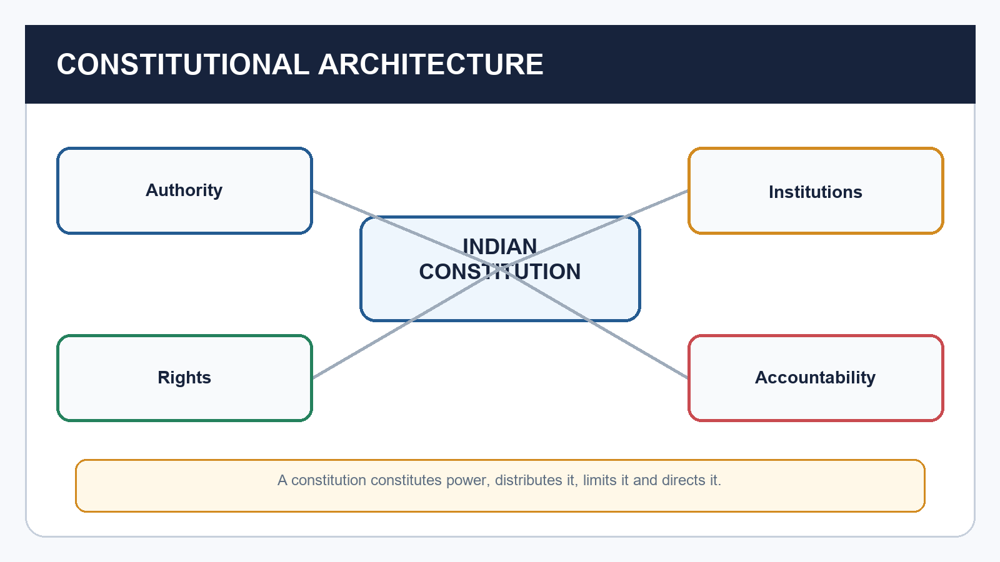
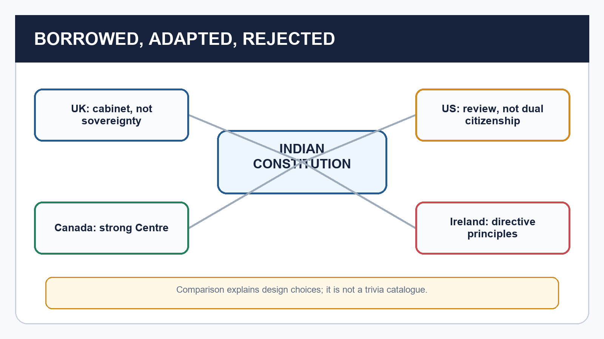
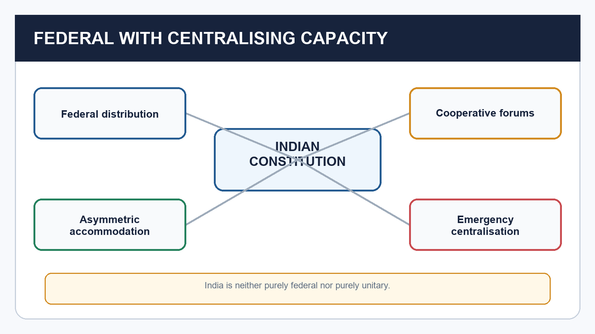
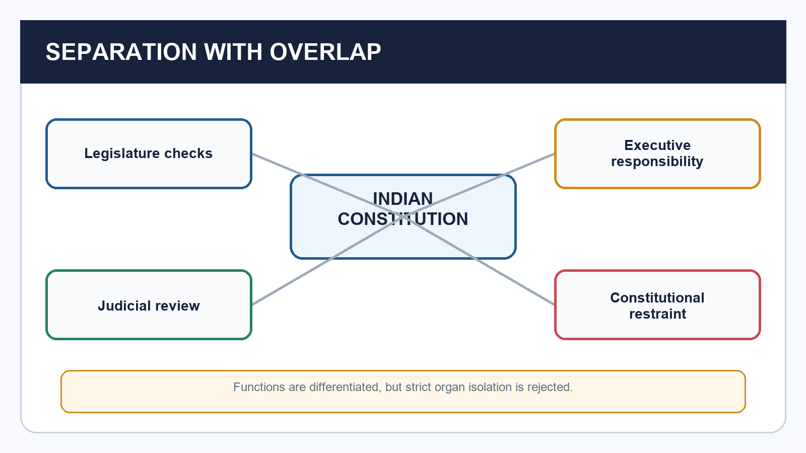
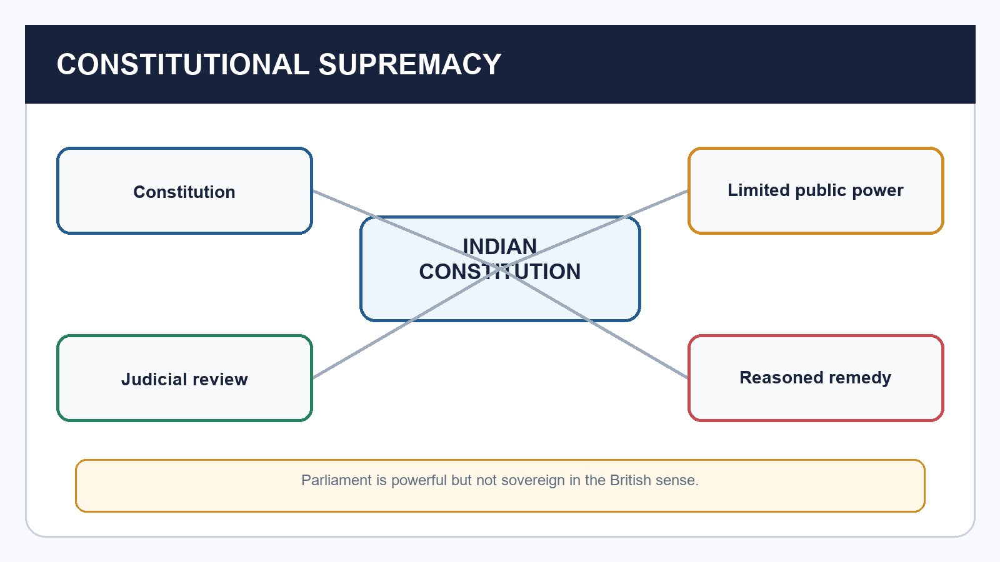
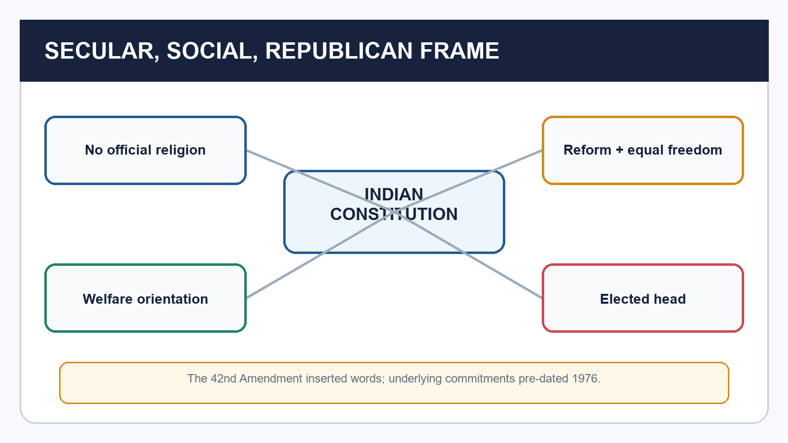
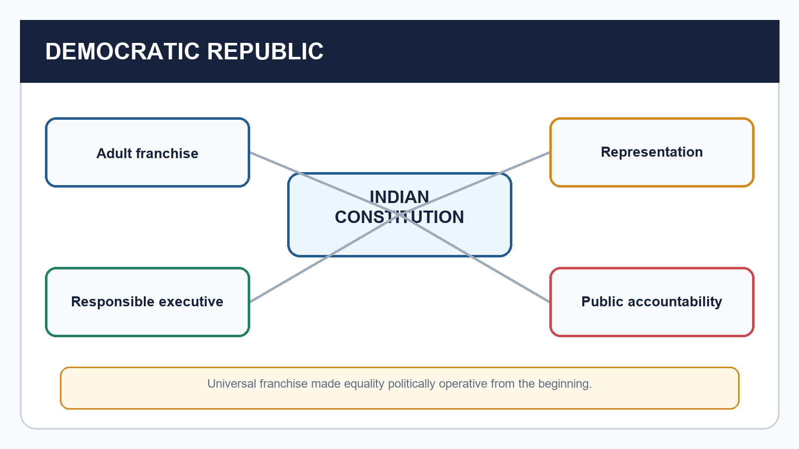
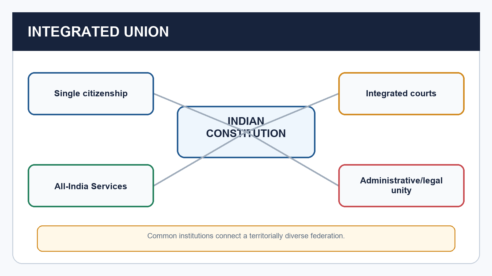
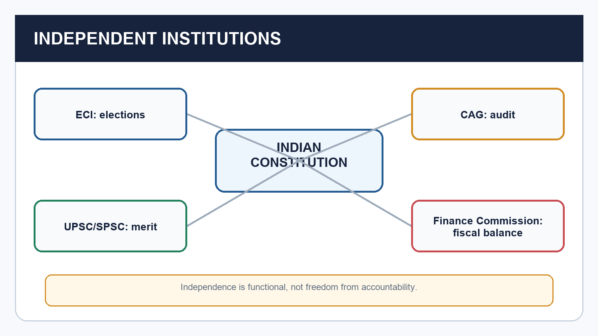
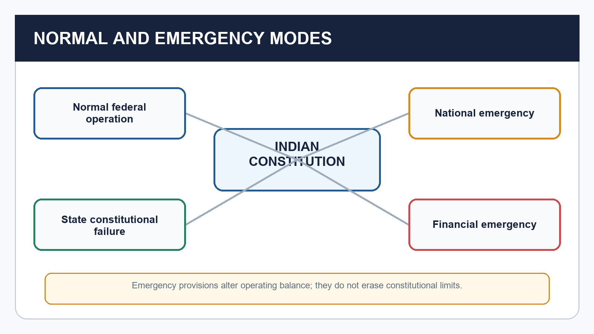

# Polity 03 - Salient Features: Complete Topic Package
> Subject: Indian Polity | GS-II and Prelims | Dated 15 August 2026
> Approval state: generated; approved=false.

## Package method, evidence key and source audit
- [FACT] directly supported by repository Core/advanced knowledge, locally OCR-searchable M. Laxmikanth Chapter 3, constitutional text, named judgments or locally audited UPSC routing.
- [ANALYSIS] exam-oriented synthesis or inference.
- [LIMIT] ownership, status or interpretive boundary.
- Source order followed: repository Markdown; retained Topic 03 PDFs and local OCR-searchable Indian Polity PDF; live search only to corroborate the 16 April 2026 commencement illustration; Qdrant not used.
- The package avoids full duplication of Preamble, Rights, DPSP, Duties, Amendment/Basic Structure, Parliament, Federalism, Judiciary, Emergency and Local Government owners.
- The live-source search also returned commentary superseded by the later Article 143 position; this package therefore relies on the repository's dated certified audit and does not use unsafe Governor-timeline claims.
- Original visual assets: 18 deterministic, fact-checked PNG schematics under `notes/Polity/assets/03_Salient-Features/`.

## PART I - Complete multi-subtopic learning session

## 01. What counts as a salient constitutional feature

[FACT] A salient feature is a recurring design characteristic that explains how the constitutional order is organised, limited and directed; it is wider than one provision and narrower than the Constitution as a whole.

*Caption: A constitution constitutes power, distributes it, limits it and directs it. Original deterministic schematic prepared for this package.*

| Term | Meaning | Example |
| --- | --- | --- |
| Feature | A system-level characteristic produced by several rules | Federal with centralising features |
| Provision | A textual rule or cluster in the Constitution | Article 1: Union of States |
| Institution | An office or body created or recognised by law | Election Commission of India |
| Value | A normative commitment that guides interpretation and government | Liberty, equality, dignity, fraternity |

### Teaching and analysis
- [FACT] A feature answers 'what kind of constitutional order is this?'; a provision answers 'what does the text command or permit?'; an institution answers 'who performs a function?'; and a value answers 'towards what constitutional end?'.
- [ANALYSIS] Salient features should be explained as relationships: written detail supports legal certainty; federal distribution accommodates territory; parliamentary responsibility links executive power to representation; rights and review limit public power.
- [FACT] Constitutional supremacy means every organ receives authority from the Constitution. Limited government follows because competence, procedure and rights constrain the Union, States and institutions.
- [ANALYSIS] Rule of law supplies the operating ethic: public power must have legal authority, like cases must be treated alike, and remedies must exist against arbitrariness.
- [LIMIT] 'Salient features' is a teaching classification, not a closed constitutional schedule. Lists vary by author and constitutional development.
- [LIMIT] Do not equate every salient feature with the judicial basic-structure doctrine. Basic structure is a judicial limit on the amending power; Topic 10 owns its full development.

### UPSC traps
- Wrong: A feature is the same as an Article.
  Correct: A feature usually emerges from several provisions, institutions and practices.
- Wrong: All important features are basic structure elements.
  Correct: The categories overlap but are not identical.

**Cross-link:** Owner links: Preamble (Topic 04); Amendment and Basic Structure (Topic 10); specialist institutional topics.

## 02. Written, lengthy and detailed Constitution

[FACT] India has a written, comprehensive and unusually detailed Constitution because it combines fundamental rules with substantial administrative design for a vast and diverse Union.

*Caption: Detail can secure clarity and accommodation, but it also raises complexity. Original deterministic schematic prepared for this package.*

| Dimension | Constitutional significance | Qualification |
| --- | --- | --- |
| Written | Authoritative text and reviewable allocation of power | Text still works with conventions and judicial interpretation |
| Detailed | Administrative and institutional specificity | Detail can create complexity and frequent amendment |
| Original 1949 form | Preamble, 395 Articles, 22 Parts, 8 Schedules | Use these as historical counts |
| Later form | 25 Parts and 12 Schedules in the source snapshot | Exact Article totals vary by counting method |

### Teaching and analysis
- [FACT] Laxmikanth identifies four reasons for size: geographical diversity; the bulky Government of India Act, 1935; one constitutional framework for the Union and States; and the influence of legal specialists in the Constituent Assembly.
- [FACT] The text constitutionalises matters that some systems leave to ordinary legislation or convention. This choice increases legal visibility and permits judicial enforcement where the Constitution creates standards.
- [ANALYSIS] Detail is an accommodation technology. It can specify institutions, minority protections, territorial arrangements and emergency rules in advance, reducing reliance on unwritten consensus.
- [ANALYSIS] Detail also has costs: amendment pressure, technical complexity, litigation over fine distinctions and a tendency to mistake constitutional design for guaranteed implementation.
- [LIMIT] 'Lengthiest' is a comparative textbook description, not a licence to quote an unsourced current Article count. Inserted, omitted and renumbered Articles make totals method-dependent.
- [LIMIT] Written does not mean self-executing. Conventions, statutes, rules, political parties, administrative capacity and constitutional morality determine whether text becomes practice.

### UPSC traps
- Wrong: Written means no conventions operate.
  Correct: India has written supremacy alongside conventions, especially in parliamentary government.
- Wrong: The current Article count is a single uncontested number.
  Correct: Parts and Schedules are safer; explain the counting caveat.

**Cross-link:** Cross-link: Polity 01 for the 1935 Act; Polity 02 for drafting choices.

## 03. Borrowed sources as adaptation, not copying

[FACT] The Constitution drew from multiple constitutional traditions and the 1935 Act, but the exam-worthy point is selective adaptation to Indian conditions rather than a catalogue of foreign origins.

*Caption: Comparison explains design choices; it is not a trivia catalogue. Original deterministic schematic prepared for this package.*

| Source | Adapted feature | Indian alteration / context |
| --- | --- | --- |
| United Kingdom | Cabinet government, rule of law, single citizenship, bicameralism | No parliamentary sovereignty; republican head; written limits |
| United States | Fundamental Rights, judicial review, judicial independence, Vice-President | No presidential executive, dual citizenship or rigid separation |
| Canada | Strong-Centre federation, residuary power at Union, appointed Governors | Combined with parliamentary government and asymmetric provisions |
| Ireland | DPSP, nominated Rajya Sabha members, presidential election method | DPSP made fundamental in governance but non-justiciable |
| Australia | Concurrent List, joint sitting, trade and commerce freedom | Placed within India's stronger Union framework |
| France / USSR / South Africa / Japan | Republic and fraternity / duties and justice / amendment procedure / procedure established by law | Each element was fitted into a different overall design |

### Teaching and analysis
- [FACT] The structural part was strongly influenced by the Government of India Act, 1935; the philosophical parts drew notably on American rights and Irish directive principles; executive-legislative relations drew on the British model.
- [ANALYSIS] Adaptation is shown by rejection. India accepted cabinet responsibility but rejected hereditary monarchy and unlimited Parliament; accepted review but rejected dual citizenship and a presidential executive.
- [FACT] The 1935 Act supplied federal, gubernatorial, judicial, public-service, emergency and administrative material. Popular sovereignty, universal franchise, enforceable rights and republican government transformed its purpose.
- [ANALYSIS] Comparative references earn marks only when they prove why India's combination is distinctive: parliamentary plus federal, written plus flexible, rights plus directive principles, central capacity plus asymmetry.
- [LIMIT] Borrowed-source lists are prone to false one-to-one claims. A feature may have multiple intellectual and institutional influences; use the repository-verified table and avoid decorative trivia.
- [LIMIT] The specialist comparative owner should carry operational country comparison. This topic uses comparisons only to illuminate adaptation.

### UPSC traps
- Wrong: Concurrent List came from Canada.
  Correct: It is conventionally traced to Australia; strong-Centre federalism is linked to Canada.
- Wrong: India copied British parliamentary sovereignty.
  Correct: India adopted responsible government under constitutional supremacy.

**Cross-link:** Owner link: Comparative Constitutional Schemes (Topic 47) for full country comparison.

## 04. Blend of rigidity and flexibility

[FACT] The amendment design combines ordinary legislative change, special parliamentary majorities and, for specified federal matters, ratification by at least half of the States.

*Caption: India lies between constitutional rigidity and ordinary-law flexibility. Original deterministic schematic prepared for this package.*

| Route | Core logic | Significance |
| --- | --- | --- |
| Simple majority outside Article 368 | Certain constitutional changes follow ordinary-law style procedure | Adaptability without treating every change as constituent amendment |
| Special majority under Article 368 | Majority of total membership plus two-thirds present and voting in each House | Entrenches constitutional choice |
| Special majority plus State ratification | Specified federal provisions also require at least half the States | Protects the federal compact |
| Judicial boundary | Amending power cannot damage basic structure | Flexibility is constitutionally bounded |

### Teaching and analysis
- [FACT] India is neither as flexible as the classic British model nor as rigid as the United States model. Different subjects receive different levels of entrenchment.
- [ANALYSIS] Graduated amendment rules align procedure with constitutional stakes: technical or territorial adjustments may be easier, while federal balance receives State participation.
- [FACT] Article 368 supplies constituent power and procedure, but some changes described as constitutional amendments lie outside Article 368 and use simple majority.
- [ANALYSIS] The basic-structure doctrine creates a tension between democratic updating and constitutional identity: amendment is broad, not destructive.
- [LIMIT] Basic structure is not a textual schedule and has no exhaustive closed list. Its doctrine and cases belong to Topic 10.
- [LIMIT] Never say every constitutional amendment needs State ratification, a referendum or a joint sitting. India has no constitutional referendum requirement for Article 368 amendments.

### UPSC traps
- Wrong: All amendments use Article 368.
  Correct: Some constitution-related changes use simple majority outside it.
- Wrong: Basic structure prevents amendment.
  Correct: It prevents destructive alteration, not constitutional change as such.

**Cross-link:** Owner link: Amendment and Basic Structure (Topic 10).

## 05. Federal system with centralising, cooperative and asymmetric dimensions

[FACT] India is a federation in structure with constitutionally strong Union capacity; its operation also includes cooperative, competitive and asymmetric forms of federalism.

*Caption: India is neither purely federal nor purely unitary. Original deterministic schematic prepared for this package.*

| Federal dimension | Illustration | Centralising / qualifying feature |
| --- | --- | --- |
| Dual governments | Union and States have constitutional fields | Union has residuary power and stronger crisis capacity |
| Distribution of powers | Union, State and Concurrent Lists | Union priority in constitutionally specified conflicts |
| Written supremacy | Competence is constitutionally allocated | Parliament may reorganise State boundaries under the Constitution |
| Judicial umpire | Courts decide competence disputes | Integrated, not dual, judiciary |
| Territorial chamber | Rajya Sabha represents States | Representation is unequal and party discipline matters |

### Teaching and analysis
- [FACT] Article 1 calls India a 'Union of States'; the Constitution does not use 'Federation'. The Union was not created by a compact among sovereign States, and States have no right to secede.
- [FACT] Federal indicators include two levels of government, distribution of legislative power, written supremacy, partial rigidity, judicial review and bicameralism.
- [FACT] Centralising indicators include single citizenship, integrated courts, Union appointment of Governors, All-India Services, emergency provisions, a strong Union list and one Constitution for the general Union-State framework.
- [ANALYSIS] Cooperative federalism appears where governments jointly finance, deliberate or implement; competitive federalism describes comparison for investment and governance; asymmetry gives differentiated arrangements to accommodate distinct histories and communities.
- [ANALYSIS] The design seeks survival and integration without erasing diversity. Central capacity can coordinate national action, but excessive use can weaken State autonomy and democratic accountability.
- [LIMIT] 'Quasi-federal' is a scholar's description, not constitutional text. A good answer weighs domains and time periods instead of declaring India simply unitary.
- [FACT] Recent illustration, status disciplined: the 106th Amendment commenced on 16 April 2026, but women's reservation is not operational pending the constitutionally linked census-publication and delimitation sequence. This shows how representation, amendment and federal consequences interact; no election year or seat projection is inferred.

### UPSC traps
- Wrong: India is purely unitary because the Centre is strong.
  Correct: It has a constitutionally distributed federal structure with centralising features.
- Wrong: Asymmetry violates federalism.
  Correct: Differentiated arrangements can be a federal device for accommodation.

**Cross-link:** Owner links: Federal System (12), Centre-State Relations (13), Special Provisions (22).

## 06. Parliamentary government and responsible executive

[FACT] India adopts parliamentary government at Union and State levels: a nominal constitutional head works with a real Council of Ministers collectively responsible to the elected lower House.

*Caption: The real executive survives only while it retains legislative confidence. Original deterministic schematic prepared for this package.*

| Feature | Mechanism | Risk / qualification |
| --- | --- | --- |
| Dual executive | President/Governor as formal head; PM/CM-led Council as real executive | Discretion exists only in constitutionally bounded situations |
| Collective responsibility | Council stands or falls together before lower House | Large majority and party discipline can weaken scrutiny |
| Fusion | Ministers normally sit in the legislature | Fusion is not absence of checks |
| Confidence | Government requires lower-House support | Coalitions and anti-defection law affect incentives |

### Teaching and analysis
- [FACT] Responsible government links executive survival to legislative confidence. It differs from a presidential separation in which executive tenure is independently fixed.
- [FACT] Core features include nominal and real executives, majority leadership, collective responsibility, ministerial membership in the legislature, PM/CM leadership and possible dissolution of the lower House.
- [ANALYSIS] The accountability chain is electoral and institutional: citizens choose representatives; the lower House sustains or removes the ministry; questions, debates, committees and budget control scrutinise administration.
- [ANALYSIS] Parliamentary government favours coordination and responsiveness, but executive dominance can arise when the ministry controls a disciplined legislative majority.
- [LIMIT] Indian Parliament is not sovereign like Westminster. Written limits, federal competence, Fundamental Rights, judicial review and basic structure constrain it.
- [LIMIT] Do not call the President merely ceremonial in every context. The office has constitutional powers, generally exercised on ministerial aid and advice subject to specified text and conventions.

### UPSC traps
- Wrong: Fusion means no separation of powers.
  Correct: Parliamentary fusion coexists with judicial review and institutional checks.
- Wrong: Responsible government guarantees effective scrutiny.
  Correct: Party majorities and anti-defection incentives may reduce deliberative accountability.

**Cross-link:** Owner links: Parliamentary System (11), President (15), PM and Council (16), Parliament (17).

## 07. Separation of powers through checks and balances

[FACT] India does not adopt strict separation; it differentiates core functions while permitting overlap and reciprocal checks.

*Caption: Functions are differentiated, but strict organ isolation is rejected. Original deterministic schematic prepared for this package.*

| Constitutional marker | What it protects | Qualification |
| --- | --- | --- |
| Article 50 | Separation of judiciary from executive in public services of the State | A DPSP, not by itself a directly enforceable right |
| Articles 121 and 211 | Limits legislative discussion of judges' conduct except removal process | Does not immunise judgments from criticism |
| Articles 122 and 212 | Procedural autonomy of legislatures | Substantive constitutional illegality remains reviewable within doctrine |
| Articles 123 and 213 | Executive ordinance law-making | Temporary, conditioned legislative power |
| Articles 13, 32 and 226 | Judicial review and remedies | Review is constitutional, not judicial government |

### Teaching and analysis
- [FACT] Ram Jawaya Kapur (1955) recognised that the Constitution does not contemplate a rigid separation, though functions are sufficiently differentiated.
- [FACT] Kesavananda Bharati (1973) and Indira Nehru Gandhi v. Raj Narain (1975) anchor separation and review within basic-structure reasoning.
- [ANALYSIS] Overlap is functional: executives initiate most legislation and may issue ordinances; legislatures hold executives accountable; courts review legality and frame procedural rules.
- [ANALYSIS] Checks and balances prevent concentration without paralysing government. The test is whether overlap preserves each organ's constitutionally assigned core and accountability.
- [LIMIT] Judicial independence is not judicial supremacy. Courts are bound by text, precedent, reasons, jurisdiction and institutional limits.
- [LIMIT] Legislative privilege and internal procedure are not zones of total immunity; nor may courts substitute policy preference for constitutional adjudication.

### UPSC traps
- Wrong: India follows Montesquieu-style strict separation.
  Correct: India follows functional separation with checks, balances and overlaps.
- Wrong: Judicial review makes courts sovereign.
  Correct: The Constitution is supreme; judicial review is one enforcement mechanism.

**Cross-link:** Direct owner of 2019 GS-II separation-of-powers PYQ; Judiciary topics own deeper doctrine.

## 08. Constitutional supremacy, rule of law and limited government

[FACT] The Constitution is the superior source of public authority; rule of law and judicially enforceable limits distinguish constitutional government from merely popular or legislative government.

*Caption: Parliament is powerful but not sovereign in the British sense. Original deterministic schematic prepared for this package.*

| Idea | Core test | Exam distinction |
| --- | --- | --- |
| Constitutional supremacy | Can every organ trace and justify its power under the Constitution? | Different from British parliamentary sovereignty |
| Rule of law | Is power authorised, non-arbitrary and equally applied? | Not rule by any enacted law |
| Limited government | Are competence, procedure and rights enforceable limits? | Elections alone do not create constitutionalism |
| Judicial review | Can unconstitutional action be invalidated or corrected? | Review is not policy administration |

### Teaching and analysis
- [FACT] Dicey's classic rule-of-law elements are supremacy of regular law over arbitrary power, equality before law and a legal spirit in which courts protect rights. India's written rights and remedies alter the British setting but preserve the anti-arbitrariness core.
- [FACT] Articles 13, 32 and 226 are central review/remedy anchors; Article 368 gives broad amendment power subject to the basic-structure limit.
- [ANALYSIS] Constitutional government both creates and restrains power. Institutions need sufficient capacity to govern, yet must remain within jurisdiction, follow fair procedure and justify restrictions.
- [ANALYSIS] Law and liberty are not simple opposites. General, prospective and reviewable law can create ordered liberty by restraining arbitrary coercion.
- [LIMIT] Procedure established by law in Article 21 is the textual phrase. After Maneka Gandhi, procedure must be fair, just and reasonable; do not claim India simply copied the entire American substantive-due-process model.
- [LIMIT] Parliamentary majority is democratic evidence, not a waiver of constitutional limits.

### UPSC traps
- Wrong: Rule of law means any action backed by statute is valid.
  Correct: The law and its application must satisfy constitutional competence and rights.
- Wrong: Limited government means weak government.
  Correct: It means legally bounded government with adequate constitutional capacity.

**Cross-link:** Owner links: Fundamental Rights (07), Supreme Court (18), Amendment and Basic Structure (10).

## 09. Independent, integrated judiciary and judicial review

[FACT] India has one integrated judicial hierarchy administering Union and State law, designed to remain institutionally independent and to enforce constitutional supremacy.

*Caption: Parliament is powerful but not sovereign in the British sense. Original deterministic schematic prepared for this package.*

| Dimension | Meaning | Limit |
| --- | --- | --- |
| Integrated | Supreme Court, High Courts and subordinate courts form one hierarchy | Federal disputes still receive constitutionally assigned jurisdiction |
| Independent | Tenure, service conditions, charged expenditure and institutional protections reduce external control | Appointment and accountability debates continue |
| Review | Courts test legislative and executive action against the Constitution | Review does not confer unlimited governance power |
| Remedies | Supreme Court and High Courts issue writs within constitutional jurisdiction | Access, delay and compliance affect effectiveness |

### Teaching and analysis
- [FACT] The Supreme Court is the apex court, federal court, final appellate court, protector of Fundamental Rights and guardian of constitutional boundaries.
- [FACT] Independence safeguards include security of tenure, protected service conditions, charged expenditure, restrictions on legislative discussion of judicial conduct, contempt power and constitutional separation from the executive.
- [ANALYSIS] Integration promotes legal unity: the same court system applies Union and State law, unlike a fully dual federal judiciary.
- [ANALYSIS] Judicial review makes written supremacy operational by providing reasoned remedies against ultra vires action.
- [LIMIT] Judicial independence is institutional impartiality, not absence of accountability, criticism or constitutional limits.
- [LIMIT] This package does not duplicate appointments, jurisdiction, PIL, activism or tribunal doctrine; those belong to judicial owner topics.

### UPSC traps
- Wrong: Integrated judiciary means States have no High Courts.
  Correct: High Courts are constitutionally significant within one integrated hierarchy.
- Wrong: Independent judiciary equals judicial supremacy.
  Correct: The Constitution, not any organ, is supreme.

**Cross-link:** Owner links: Supreme Court (18), High Courts and Subordinate Courts (21), Tribunals (46).

## 10. Rights, Directive Principles and Duties as normative architecture

[FACT] Parts III, IV and IV-A combine enforceable liberty, governance directives for social transformation and citizen duties; their constitutional roles differ but their purposes interact.

*Caption: The three parts work as a constitutional moral architecture. Original deterministic schematic prepared for this package.*

| Component | Legal position | Constitutional purpose |
| --- | --- | --- |
| Fundamental Rights | Justiciable, subject to constitutional restrictions | Political liberty, equality and remedies |
| Directive Principles | Non-justiciable; declared fundamental in governance | Social/economic democracy and welfare orientation |
| Fundamental Duties | Non-justiciable citizen duties | Civic responsibility and interpretive support |
| Balance | Harmony, not automatic hierarchy | Dignity, freedom and social justice |

### Teaching and analysis
- [FACT] Fundamental Rights restrain arbitrary public power and enable remedies. They are not absolute, and not every right belongs only to citizens.
- [FACT] DPSP are not enforceable in court merely as DPSP, yet Article 37 declares them fundamental in governance and imposes a duty on the State to apply them in law-making.
- [FACT] Fundamental Duties were added by the 42nd Amendment, with an additional duty later added by the 86th Amendment. Their full content belongs to Topic 09.
- [FACT] Minerva Mills (1980) treats harmony between Fundamental Rights and Directive Principles as central to constitutional balance.
- [ANALYSIS] The architecture answers three questions: what the State may not unjustifiably do; what social order it should pursue; and what civic commitments citizens should cultivate.
- [LIMIT] Do not turn DPSP into directly enforceable rights or Duties into free-standing penal offences. Legislation may give concrete legal effect, but the source and legal status must be identified.

### UPSC traps
- Wrong: DPSP are legally irrelevant because non-justiciable.
  Correct: They are constitutionally fundamental in governance and guide law and interpretation.
- Wrong: Rights always defeat social reform.
  Correct: Constitutional adjudication seeks rights-compatible reform and balance.

**Cross-link:** Owner links: Fundamental Rights (07), DPSP (08), Fundamental Duties (09).

## 11. Secular, socialist, democratic republic; dignity and fraternity

[FACT] India is a sovereign socialist secular democratic republic; the words 'socialist', 'secular' and 'integrity' were inserted in the Preamble by the 42nd Amendment in 1976, while related constitutional commitments pre-dated the insertion.

*Caption: The 42nd Amendment inserted words; underlying commitments pre-dated 1976. Original deterministic schematic prepared for this package.*

| Commitment | Precise meaning | Caveat |
| --- | --- | --- |
| Secular | No official religion; equal freedom, non-discrimination and reform-oriented engagement | Not identical to a strict wall-of-separation model |
| Socialist | Democratic welfare and distributive-justice orientation | Not a command for one fixed economic system |
| Democratic | Universal franchise, representation, responsibility and rights | Elections require constitutional limits and institutional fairness |
| Republic | Elected, non-hereditary head of State | Does not itself describe the full democratic system |
| Dignity and fraternity | Individual worth, common citizenship and unity | Must be connected to rights and social equality |

### Teaching and analysis
- [FACT] Articles 14-16 and 25-30, along with the Preamble, supply central secular anchors. The State may regulate secular aspects and pursue reform while protecting conscience and denominational rights within constitutional limits.
- [ANALYSIS] Indian secularism manages principled distance and equal citizenship in a multi-religious society; it neither creates a theocratic State nor demands complete institutional non-contact.
- [ANALYSIS] Democratic republic joins electoral equality to responsible government and constitutional remedies. Franchise gives political voice; rights and institutions prevent majority rule from becoming unlimited.
- [ANALYSIS] Socialist and welfare orientation is expressed through distributive and social-justice goals, not through constitutional freezing of a particular policy instrument.
- [FACT] Dignity links liberty and equality at the level of the person; fraternity connects them to social solidarity and national unity.
- [LIMIT] Topic 04 owns the Preamble's full text, history, interpretation and amendability.

### UPSC traps
- Wrong: 'Secular' and 'socialist' first became constitutional ideas in 1976.
  Correct: The words were inserted in 1976; underlying provisions and commitments already existed.
- Wrong: Indian secularism requires total State withdrawal from religion.
  Correct: The Constitution permits regulated engagement for equality, reform and protection.

**Cross-link:** Owner links: Preamble (04), Rights (07), DPSP (08), Social Justice owners.

## 12. Universal adult franchise, representative democracy and bicameralism

[FACT] Universal adult franchise established equal political membership from the Constitution's commencement, while representative institutions and bicameralism channel that equality into government.

*Caption: Universal franchise made equality politically operative from the beginning. Original deterministic schematic prepared for this package.*

| Element | Design contribution | Qualification |
| --- | --- | --- |
| Adult franchise | Equal vote without property, literacy, caste, religion or sex qualification, subject to law | Voting age reduced from 21 to 18 by 61st Amendment |
| Lok Sabha / Assemblies | Direct territorial representation and government confidence | Representation quality depends on elections, parties and deliberation |
| Rajya Sabha | Federal and revising chamber with continuity | States are not equally represented |
| Republican accountability | Offices derive legitimacy from constitutional processes | Electoral victory remains constitutionally limited |

### Teaching and analysis
- [FACT] Adopting universal franchise amid poverty, inequality and low literacy was a transformative commitment to political equality, not a later reward for social development.
- [FACT] The 61st Amendment Act, 1988 reduced the voting age from 21 to 18, operating for elections from 1989.
- [ANALYSIS] Representative democracy converts popular sovereignty into periodic authorisation, deliberation, law-making and accountability. It needs independent election administration and meaningful legislative scrutiny.
- [ANALYSIS] Bicameralism adds revision, continuity and a territorial voice. Its performance depends on party systems and respect for each House's constitutional role.
- [LIMIT] Rajya Sabha is a federal chamber, but it does not reproduce the equal-State representation of the United States Senate.
- [LIMIT] Election law, delimitation, representation and parliamentary procedure belong to specialist owners.

### UPSC traps
- Wrong: Voting age was 18 in the original Constitution.
  Correct: It was 21, reduced to 18 by the 61st Amendment.
- Wrong: Bicameralism means both Houses have identical powers.
  Correct: The Constitution creates important asymmetries, especially for confidence and money bills.

**Cross-link:** Owner links: Parliament (17), Election Commission (27), Representation/election-law material.

## 13. Single citizenship, administrative/legal unity and All-India Services

[FACT] A federal distribution of government coexists with single Indian citizenship, an integrated judiciary, common constitutional institutions and All-India Services, creating substantial administrative and legal unity.

*Caption: Common institutions connect a territorially diverse federation. Original deterministic schematic prepared for this package.*

| Integrating device | Function | Federal tension |
| --- | --- | --- |
| Single citizenship | Equal national membership across States | Residence-based rules may still exist where constitutionally/lawfully permitted |
| Integrated judiciary | Common hierarchy applies Union and State law | Central legal unity must respect State competence |
| All-India Services | Common recruitment with service in Union and States | Supports standards but raises control/autonomy questions |
| Constitutional audit/election/service bodies | Common integrity framework | Independence and federal consultation remain essential |

### Teaching and analysis
- [FACT] Unlike the United States model of dual citizenship, the Constitution provides single Indian citizenship despite a dual polity.
- [ANALYSIS] Single citizenship supports mobility, common political identity and equal civil membership; it does not erase India's linguistic, cultural or State identities.
- [FACT] All-India Services are a distinctive bridge: officers are recruited through a common system and serve under both Union and State arrangements.
- [ANALYSIS] Administrative unity helps coordination, minimum standards and national programmes, but central personnel influence can produce State-autonomy concerns.
- [ANALYSIS] Legal unity also comes from one Constitution for the general Union-State order, integrated courts and common constitutional remedies.
- [LIMIT] Citizenship acquisition, termination, OCI and contemporary citizenship law belong to Topic 06; public-service detail belongs to Topic 41.

### UPSC traps
- Wrong: Single citizenship makes India unitary.
  Correct: It is one integrating feature inside a federal constitutional structure.
- Wrong: All-India Services are exclusively Union services.
  Correct: They institutionally connect Union recruitment/standards with State administration.

**Cross-link:** Owner links: Citizenship (06), Public Services (41), Federal System (12).

## 14. Independent constitutional bodies and accountability ecosystem

[FACT] The Constitution disperses integrity functions among specialised bodies so elections, audit, recruitment and fiscal distribution are not left to the ordinary executive alone.

*Caption: Independence is functional, not freedom from accountability. Original deterministic schematic prepared for this package.*

| Body | Constitutional function | Independence logic |
| --- | --- | --- |
| Election Commission | Superintendence, direction and control of elections within Article 324's field | Protected constitutional status; appointment and conditions remain live design questions |
| CAG | Audits public accounts and reports through constitutional channels | Tenure/service protections and charged expenditure |
| UPSC / SPSC | Merit-based recruitment advice and specified service functions | Constitutional tenure and removal safeguards |
| Finance Commission | Periodic recommendations on Union-State fiscal distribution | Independent expert constitutional commission |

### Teaching and analysis
- [FACT] These are constitutional bodies, unlike institutions created only by statute or executive resolution. Their source, composition, tenure and powers differ and must not be homogenised.
- [ANALYSIS] Functional independence reduces conflicts of interest: incumbents should not exclusively control electoral administration, executive spending should face external audit, and recruitment/fiscal recommendations need institutional credibility.
- [ANALYSIS] Independence is compatible with transparency, reasons, reporting, legislative scrutiny and judicial review. Unaccountable insulation is not the constitutional ideal.
- [FACT] The CAG is conventionally described as guardian of the public purse; the Election Commission anchors electoral integrity; Public Service Commissions support merit; Finance Commissions structure vertical and horizontal fiscal recommendations.
- [LIMIT] This overview does not reproduce appointment controversies, detailed powers or recent commission formulas. Each body has a specialist owner.
- [LIMIT] Do not call every 'commission' constitutional or every constitutional body a court.

### UPSC traps
- Wrong: All independent bodies have identical safeguards.
  Correct: Their text, appointment, removal and functions differ.
- Wrong: Independence means no accountability.
  Correct: Independence protects function; reporting, review and public reason remain necessary.

**Cross-link:** Owner links: ECI (27), UPSC/SPSC (28), Finance Commission (29), CAG (32).

## 15. Emergency provisions and constitutional modes

[FACT] Emergency provisions allow exceptional centralisation and altered rights/fiscal operation under specified conditions; they are constitutional powers subject to textual procedure and post-1975 safeguards.

*Caption: Emergency provisions alter operating balance; they do not erase constitutional limits. Original deterministic schematic prepared for this package.*

| Emergency | Article | Design effect |
| --- | --- | --- |
| National Emergency | 352 | Enhanced Union authority and specified consequences for federal and rights operation |
| State constitutional failure | 356, read with 355 and related provisions | Union assumes constitutionally specified State functions subject to approval and review |
| Financial Emergency | 360 | Directions affecting financial propriety and specified service conditions |
| Rights safeguards | 358-359 framework | Effects vary by right, ground and order; Articles 20 and 21 receive protection after 44th Amendment |

### Teaching and analysis
- [FACT] The Constitution recognises national emergency, failure of constitutional machinery in a State and financial emergency. Their triggers and effects are not interchangeable.
- [ANALYSIS] Emergency design reflects the founding concern that a territorially diverse new State required crisis capacity. It enables temporary centralisation without formally rewriting the federal Constitution.
- [FACT] The 44th Amendment tightened safeguards after the 1975-77 Emergency, including replacing 'internal disturbance' with 'armed rebellion' for Article 352 and protecting Articles 20 and 21 from suspension under Article 359 orders.
- [ANALYSIS] The central tension is survival versus abuse: emergency power may protect constitutional order, but it can also suppress opposition, liberty and federal autonomy.
- [LIMIT] A proclamation is not beyond judicial review, and emergency does not create an extra-constitutional government.
- [LIMIT] Topic 14 owns procedure, duration, approval, effects and case law; this section explains the feature only.

### UPSC traps
- Wrong: Emergency converts India permanently into a unitary State.
  Correct: It changes operation temporarily within the Constitution.
- Wrong: All Fundamental Rights automatically disappear.
  Correct: Effects differ; Articles 20 and 21 cannot be suspended through Article 359.

**Cross-link:** Owner link: Emergency Provisions (14).

## 16. Local self-government, social justice and affirmative action

[FACT] Democratic decentralisation and affirmative-action provisions deepen representative equality; the present constitutional third tier is primarily a later constitutionalisation through the 73rd and 74th Amendments.

*Caption: Differentiation can serve equality and integration rather than contradict them. Original deterministic schematic prepared for this package.*

| Dimension | Constitutional movement | Qualification |
| --- | --- | --- |
| Panchayats | 73rd Amendment, Part IX, Eleventh Schedule | Effective devolution depends on State law, functions, funds and functionaries |
| Municipalities | 74th Amendment, Part IX-A, Twelfth Schedule | Urban capacity and metropolitan coordination remain uneven |
| Affirmative action | Equality provisions permit/require differentiated measures in specified fields | Classification and design remain constitutionally reviewable |
| Social revolution | Rights plus DPSP seek status equality and material capability | Constitutional promise needs legislation and administration |

### Teaching and analysis
- [FACT] The original Constitution included a directive concerning village panchayats, but today's detailed constitutional local-government structure was added in 1992 through the 73rd and 74th Amendments.
- [ANALYSIS] Local constitutionalisation widens participation, creates regular electoral institutions and can improve context-sensitive service delivery.
- [ANALYSIS] Formal third-tier status does not guarantee autonomy. Fiscal dependence, weak staffing, incomplete activity mapping and State control can create 'decentralisation on paper'.
- [FACT] Affirmative action is not a departure from equality understood only as identical treatment; it is part of substantive equality where historical disadvantage and representation are constitutionally relevant.
- [ANALYSIS] Welfare-state and social-revolution orientation joins political democracy to social and economic transformation.
- [LIMIT] Reservation categories, ceilings, local-body composition and case law belong to specialist Rights, Parliament, Social Justice and Local Government owners.

### UPSC traps
- Wrong: The current local-government scheme was fully original in 1950.
  Correct: Detailed Parts IX and IX-A were inserted by the 73rd and 74th Amendments.
- Wrong: Affirmative action contradicts equality by definition.
  Correct: The Constitution contains substantive-equality authorisations subject to limits.

**Cross-link:** Owner links: Panchayati Raj (23), Municipalities (24), Fundamental Rights (07).

## 17. Asymmetry, language, pluralism and accommodation of diversity

[FACT] The Constitution combines common citizenship with differentiated territorial, tribal, cultural and linguistic arrangements; unity is pursued through accommodation as well as uniform rules.

*Caption: Differentiation can serve equality and integration rather than contradict them. Original deterministic schematic prepared for this package.*

| Mechanism | Purpose | Risk / balance |
| --- | --- | --- |
| Special provisions for States/regions | Respond to historical and institutional distinctiveness | Differentiation needs constitutional justification and clarity |
| Fifth and Sixth Schedule arrangements | Protect Scheduled Areas and specified tribal autonomy | Autonomy must connect with rights and accountable governance |
| Language framework | Permit Union, State and linguistic-minority arrangements | Language can integrate or generate exclusion |
| Cultural and educational rights | Protect distinct language, script, culture and minority institutions | Rights coexist with regulatory standards |
| Affirmative representation | Address exclusion in specified institutions | Design must remain within constitutional boundaries |

### Teaching and analysis
- [FACT] India does not adopt one-language or one-institution uniformity as the sole method of nation-building. It recognises official-language arrangements, linguistic minorities and cultural rights.
- [ANALYSIS] Asymmetry may strengthen integration by allowing groups to remain within a shared constitutional order without surrendering all institutional distinctiveness.
- [ANALYSIS] Uniformity can promote equal national standards, while asymmetry can protect substantive equality and negotiated trust. The constitutional task is principled calibration.
- [FACT] Special provisions and Scheduled/Tribal Area arrangements arise from different Articles and Schedules; they must not be collapsed into one generic 'special status'.
- [ANALYSIS] Fraternity is especially important here: common citizenship must be experienced as equal respect, not coerced sameness.
- [LIMIT] Jammu and Kashmir's former constitutional position, the 2019 changes and the December 2023 Supreme Court decision require specialist treatment and dated precision; this feature overview does not reconstruct that full doctrine.

### UPSC traps
- Wrong: Asymmetry means unequal citizenship.
  Correct: It can differentiate governmental arrangements while preserving common citizenship and rights.
- Wrong: Hindi is the national language under the Constitution.
  Correct: The Constitution provides an official-language framework; it does not declare a national language.

**Cross-link:** Owner links: Special Provisions (22), Scheduled and Tribal Areas (26), Official Language (40).

## 18. Continuity, transformation, strengths and internal tensions

[ANALYSIS] The Constitution's distinctiveness lies less in isolated devices than in a transformative recombination: inherited administrative capacity was subjected to popular sovereignty, rights, representation and social-justice goals.

*Caption: A high-scoring answer evaluates the balance rather than choosing slogans. Original deterministic schematic prepared for this package.*

| Tension | Strength | Criticism / answer qualification |
| --- | --- | --- |
| Federalism vs centralisation | National coordination and crisis capacity | Governor, fiscal and emergency practices may weaken autonomy |
| Liberty vs social reform | Rights coexist with transformative legislation | Restrictions and reform need proportional constitutional justification |
| Accountability vs executive dominance | Collective responsibility enables removal | Party discipline and majorities can hollow scrutiny |
| Detail vs complexity | Clarity and accommodation | Legalism and amendment dependence |
| Review vs democratic legitimacy | Protects supremacy and minorities | Judicial overreach and appointment concerns |
| Uniformity vs asymmetry | Common standards plus diversity accommodation | Differentiation may become opaque or politically contested |

### Teaching and analysis
- [FACT] The Government of India Act, 1935 contributed institutional and administrative continuity, but the Constitution changed the source and ends of authority through republicanism, universal franchise, rights and accountable government.
- [ANALYSIS] Strengths include a durable framework, peaceful political competition, judicial remedies, adaptable amendment, multilevel government and social transformation commitments.
- [ANALYSIS] Criticisms include centralisation, executive dominance, excessive detail, weak local devolution, rights-emergency vulnerability, judicial-democratic tension and implementation gaps.
- [FACT] Constitutional morality, in Ambedkar's use drawing on George Grote, concerns disciplined respect for constitutional forms, methods and values rather than personal or majoritarian morality.
- [ANALYSIS] Constitutional morality is useful when tied to text, structure, accountability, minority protection and restraint; untethered invocation risks subjective judicial or political preference.
- [LIMIT] A conclusion should be graded: the design creates capacity and restraint, but institutional practice determines the balance. Avoid 'perfect synthesis' and 'complete failure' claims.

### UPSC traps
- Wrong: Constitutional morality means judges' personal moral view.
  Correct: It must be anchored in constitutional text, structure, methods and values.
- Wrong: Continuity with 1935 proves colonial copying.
  Correct: Administrative continuity was transformed by democratic authority and rights.

**Cross-link:** Direct owner of 2021 GS-II constitutional-morality PYQ; cross-link Topic 02 and Topic 10.

## 19. Eighth-edition integration: constitution, constitutional law and constitutionalism

[FACT] The eighth edition separates the **Concept of the Constitution** from the later catalogue of
salient features. The distinction improves answer precision:

| Concept | Exam-safe meaning | Evidence anchor |
| --- | --- | --- |
| Constitution | Fundamental framework that creates institutions, distributes power, protects rights and prescribes change | Articles 1, 79, 124, 245-255 and 368 illustrate different functions |
| Constitutional law | Wider body of rules governing public power, including constitutional text, binding judgments and valid implementing law | Articles 13, 32, 141 and 226 |
| Constitutionalism | Effective limitation and accountability of public power under law | Rights, judicial review, responsible government, federalism and basic structure |

[ANALYSIS] A high-scoring salient-features answer should move from **design** to **operation**.
Written supremacy, federal allocation or parliamentary responsibility describe constitutional
design; constitutionalism asks whether those devices actually restrain arbitrariness and provide
remedies.

[FACT] India is best classified through paired qualifications: enacted but evolutionary in
operation; codified but supported by conventions; partly rigid and partly flexible; federal with
centralising features; procedural and transformative.

[LIMIT] Classification is an analytical tool, not constitutional text. Do not treat "federal",
"quasi-federal", "transformative" or "constitutionalism" as self-executing labels.

### Answer-writing evidence chain

- **Claim:** The Constitution both creates and limits public power.
- **Named evidence:** Articles 79 and 124 constitute Parliament and the Supreme Court; Articles
  13, 32 and 226 make public action reviewable.
- **Analysis:** Authority and restraint originate in the same supreme framework, distinguishing
  Indian constitutional government from unlimited parliamentary sovereignty.
- **Qualification:** Text alone does not guarantee constitutionalism; conventions, institutional
  capacity, access to remedies and compliance determine whether limits operate.

**Cross-link:** New Core owner `basic/Concept-of-the-Constitution.md`; this package retains the
feature-level application rather than duplicating the full conceptual chapter.

## PART II - Solved locally routed PYQs

### Verified Mains PYQs

#### 2019 GS-II Q1 - Explain whether the Constitution accepts strict separation of powers rather than checks and balances. (10 marks, 150 words)

[FACT] India rejects strict organ isolation and adopts functional separation with checks and balances. Ram Jawaya Kapur (1955) recognised that the constitutional scheme does not contemplate rigid separation, although core functions are differentiated.

[FACT] The text creates insulation: Article 50 directs separation of the judiciary from the executive; Articles 121 and 211 protect judges from ordinary legislative discussion of conduct; Articles 122 and 212 protect legislative procedure; Article 361 provides specified immunity to the President and Governors. Yet overlap is deliberate. The executive participates in legislation and may promulgate ordinances under Articles 123 and 213; the Council of Ministers is collectively responsible to the lower House under Article 75; courts review laws through Articles 13, 32 and 226.

[ANALYSIS] These arrangements permit coordinated government while preventing one organ from becoming final in its own cause. Kesavananda Bharati (1973) and Indira Nehru Gandhi (1975) protect separation and review within basic-structure doctrine.

[LIMIT] Overlap is valid only while each organ respects constitutional competence and institutional restraint. Thus India balances power rather than separating it absolutely.

Why this earns marks: direct thesis; named Articles and cases; mechanism; qualification; directive answered.

#### 2021 GS-II Q1 - Explain the doctrine of constitutional morality and its essential facets with illustrations. (10 marks, 150 words)

[ANALYSIS] Constitutional morality is disciplined fidelity to constitutional forms, methods and values over personal, partisan or majoritarian preference. Ambedkar used the expression, drawing on George Grote, to stress that democratic institutions require habits of restraint.

[FACT] Its facets include rule of law; reasoned exercise of power; respect for procedure and institutional roles; protection of liberty, equality, dignity and pluralism; accountability of constitutional functionaries; and minority protection. The Preamble and Articles 14, 15, 19, 21 and 25 provide textual anchors.

[FACT] Navtej Singh Johar (2018) preferred constitutional values to exclusionary social morality; the Sabarimala judgments (2018) used equality, dignity and religious-freedom reasoning; Government of NCT of Delhi v. Union of India (2018) connected constitutional morality with representative government and federal balance.

[LIMIT] The doctrine can become subjective if detached from text and structure. It should discipline institutions, not authorise a judge's personal morality.

[ANALYSIS] Constitutional morality therefore converts written forms into a culture of justified, restrained and inclusive public power.

Why this earns marks: definition, essential facets, three illustrations, textual evidence and a clear limiting caution.

### Locally routed Prelims PYQs and ownership-aware solutions
[LIMIT] Exact wording is reproduced only where the local official paper was directly extractable. Demand-only ledger entries are not reverse-engineered into invented options. When the official key is unavailable, the answer is prominently labelled inferred.

#### 2018 Q40 routed demand: relationship between law and liberty

INFERRED ANSWER - NOT OFFICIALLY VERIFIED LOCALLY: law is a condition of ordered liberty when general and constitutional law restrains arbitrary power. Confidence: high.

Why this earns marks: it states answer-key status, gives the constitutional distinction and preserves ownership limits.

#### 2018 Q45 routed demand: main features of rule of law

INFERRED ANSWER - NOT OFFICIALLY VERIFIED LOCALLY: supremacy of regular law, equality before law and legal protection against arbitrariness are core. Confidence: high.

Why this earns marks: it states answer-key status, gives the constitutional distinction and preserves ownership limits.

#### 2020 Q7 exact locally extracted: A constitutional government by definition is (a) government by legislature (b) popular government (c) multi-party government (d) limited government

Answer: D, limited government. The defining idea is enforceable limitation of public power, not merely popularity or institutional form. Official key not held locally for this paper; confidence: high.

Why this earns marks: it states answer-key status, gives the constitutional distinction and preserves ownership limits.

#### 2021 Q87 routed demand: definition of State in political theory

INFERRED ANSWER - NOT OFFICIALLY VERIFIED LOCALLY: population, territory, government and sovereignty form the conventional four-element definition. Confidence: high.

Why this earns marks: it states answer-key status, gives the constitutional distinction and preserves ownership limits.

#### 2021 Q90 routed demand: best safeguard of liberty in liberal democracy

INFERRED ANSWER - NOT OFFICIALLY VERIFIED LOCALLY: an independent judiciary and rule of law are the strongest institutional safeguard among conventional options. Confidence depends on exact options.

Why this earns marks: it states answer-key status, gives the constitutional distinction and preserves ownership limits.

#### 2021 Q94 routed demand: constitutional government and limiting authority

INFERRED ANSWER - NOT OFFICIALLY VERIFIED LOCALLY: constitutional government is limited government whose authority is defined and restrained. Confidence: high.

Why this earns marks: it states answer-key status, gives the constitutional distinction and preserves ownership limits.

#### 2023 Q33 exact locally extracted: Which statement best reflects the chief purpose of a Constitution? (a) determines objectives for necessary laws (b) enables political offices and government (c) defines and limits powers of government (d) secures social justice, equality and security

Answer: C. A Constitution both constitutes and limits public power; the other options describe possible purposes but not the chief defining function. Official key unavailable locally; confidence: high.

Why this earns marks: it states answer-key status, gives the constitutional distinction and preserves ownership limits.

#### 2023 Q84 exact locally extracted: Flag Code statement I says 600 mm x 400 mm is a standard size; statement II says length:width is 3:2

INFERRED ANSWER - NOT OFFICIALLY VERIFIED LOCALLY: both statements are correct and statement II explains statement I, because 600:400 equals 3:2. Confidence: high; this is a cross-owned national-symbol detail.

Why this earns marks: it states answer-key status, gives the constitutional distinction and preserves ownership limits.

#### 2024 Q74 exact official Set A: Part IX-A Municipalities; Part XVIII Emergencies; Part XX Amendment - which are correct?

OFFICIALLY VERIFIED SET-A ANSWER: D, 1, 2 and 3. All three Part mappings are correct. This is directly owned by Salient Features and cross-owned by Local Government, Emergency and Amendment topics.

Why this earns marks: it states answer-key status, gives the constitutional distinction and preserves ownership limits.

## PART III - Learning MCQ loops

Use these as six four-question loops. Correct keys rotate A -> B -> C -> D without consecutive repetition.

### MCQ 1. Which statement best distinguishes a feature from a provision?
- A. A feature is a system-level characteristic produced by multiple rules
- B. A feature is always a single Article
- C. A provision is always an institution
- D. A value and a feature are identical
**Answer: A.** Federalism is a feature emerging from many provisions and institutions.

### MCQ 2. Why is the Constitution unusually detailed?
- A. Only because it was written by lawyers
- B. Diversity, 1935 Act influence, Union-State coverage and administrative detail
- C. Because every convention was prohibited
- D. Only because it contains Fundamental Rights
**Answer: B.** The verified four-factor account makes B the best answer.

### MCQ 3. Which pair is correctly matched?
- A. Concurrent List - Canada
- B. DPSP - United States
- C. Procedure established by law - Japan
- D. Fundamental Duties - Ireland
**Answer: C.** Japan is the conventional source for the phrase; the distractors swap sources.

### MCQ 4. Which amendment route is not a universal requirement?
- A. Special majority
- B. Simple majority for specified matters
- C. State ratification for specified federal matters
- D. Referendum for every Article 368 amendment
**Answer: D.** India has no universal constitutional referendum requirement.

### MCQ 5. Which formulation is most accurate?
- A. India is a federation with centralising features
- B. India is purely unitary
- C. States created the Union by compact
- D. States possess a right to secede
**Answer: A.** The first preserves both federal structure and Union strength.

### MCQ 6. Collective responsibility primarily links the Council of Ministers to which body?
- A. Rajya Sabha
- B. Lok Sabha at Union level
- C. Supreme Court
- D. Election Commission
**Answer: B.** Article 75 responsibility is to the House of the People.

### MCQ 7. Which case supports the proposition that India lacks rigid separation?
- A. Minerva Mills
- B. Kesavananda only
- C. Ram Jawaya Kapur
- D. S.R. Bommai only
**Answer: C.** Ram Jawaya is the direct proposition.

### MCQ 8. Which claim is incorrect?
- A. Parliament has broad constituent power
- B. Courts exercise judicial review
- C. The Constitution is supreme
- D. Indian Parliament is sovereign in the British sense
**Answer: D.** Written limits and review reject British-style parliamentary sovereignty.

### MCQ 9. DPSP are best described as
- A. non-justiciable but fundamental in governance
- B. judicially enforceable exactly like Fundamental Rights
- C. ordinary political promises outside the Constitution
- D. penal duties of citizens
**Answer: A.** Article 37 supplies the exact distinction.

### MCQ 10. The word 'secular' was inserted in the Preamble by
- A. 44th Amendment
- B. 42nd Amendment
- C. 61st Amendment
- D. 73rd Amendment
**Answer: B.** The 42nd Amendment, 1976 inserted secular, socialist and integrity.

### MCQ 11. Universal adult franchise chiefly constitutionalised
- A. administrative centralisation
- B. judicial appointment
- C. equal political membership
- D. dual citizenship
**Answer: C.** It made adult citizens politically equal without literacy/property qualification.

### MCQ 12. Which is not an integrating constitutional device?
- A. Single citizenship
- B. Integrated judiciary
- C. All-India Services
- D. Dual State citizenship
**Answer: D.** India does not adopt dual State citizenship.

## PART IV - Solved original Mains practice

### Original 10-marker - Why is India described as federal with a unitary bias?

[FACT] India distributes authority constitutionally between Union and States, yet equips the Union with stronger coordinating and crisis powers.

[FACT] Federal evidence includes dual governments, legislative lists, written supremacy, bicameralism and an independent judicial umpire. Article 1's 'Union of States', Union residuary power, appointed Governors, single citizenship, integrated courts, All-India Services and emergency provisions create centralising capacity.

[ANALYSIS] The mechanism is variable geometry: normal governance is federal; cooperative institutions support joint action; asymmetry accommodates diversity; emergencies temporarily shift the balance.

[LIMIT] Strength of the Centre does not erase State constitutional status. Nor does federal form prevent central overreach in practice.

[ANALYSIS] The best verdict is therefore a federation with centralising features, not a purely federal or unitary State.

Why this earns marks: balanced classification, named constitutional evidence, operational explanation and a qualified verdict.

### Original 15-marker - The Indian Constitution is borrowed yet original. Discuss.

[FACT] The Constitution's components have identifiable sources, but constitutional originality lies in selection, alteration and combination for Indian conditions.

[FACT] From Britain came cabinet government, rule of law and single citizenship, but India rejected hereditary monarchy and parliamentary sovereignty. From the United States came rights, review and judicial independence, but not presidential government, dual citizenship or rigid separation. Canada influenced a strong-Centre federation; Ireland influenced Directive Principles; Australia the Concurrent List and joint sitting; the 1935 Act supplied administrative structure.

[ANALYSIS] Adaptation created combinations not reducible to any source: parliamentary federalism; enforceable rights plus non-justiciable social directives; universal franchise from commencement; single citizenship within a dual polity; constitutional asymmetry; emergency centralisation within a written order.

[FACT] Administrative continuity from 1935 was transformed by popular sovereignty, republican government, rights and judicial remedies.

[LIMIT] Borrowing did carry centralising and legalistic legacies, and detailed transplantation does not ensure suitable practice.

[ANALYSIS] Therefore the 'bag of borrowings' criticism confuses the ancestry of parts with the identity of the whole.

Why this earns marks: comparative evidence is used analytically, rejected models demonstrate choice, and the conclusion directly answers originality.

### Original 20-marker - Evaluate the strengths and tensions within the salient features of the Indian Constitution.

[ANALYSIS] The Constitution is a designed balance between governing capacity, liberty, diversity and transformation. Its strength is the interaction of features; its tensions arise when one side overwhelms another.

[FACT] First, federal distribution accommodates territory, while Article 1, Union residuary authority, All-India Services and emergency powers create national capacity. This aids coordination but can produce centralisation. Second, parliamentary responsibility allows removal of the executive through the lower House; disciplined majorities can nevertheless convert responsibility into executive dominance.

[FACT] Third, written supremacy, Articles 13, 32 and 226, and an independent integrated judiciary protect limited government. Review secures rights and federal boundaries, but debates over judicial overreach and democratic legitimacy require reasoned restraint. Fourth, Parts III, IV and IV-A join liberty, welfare and civic responsibility. Minerva Mills supports harmony, yet rights restrictions and social reform remain contested.

[FACT] Fifth, universal franchise, republican government and independent election administration support political equality; unequal social capacity can still limit substantive participation. Sixth, asymmetry, language safeguards and affirmative action accommodate diversity, while demands for uniformity create political tension. Seventh, detail creates clarity but also complexity; graded amendment supports adaptation but basic structure preserves identity.

[FACT] The 1935 Act supplied machinery, but popular sovereignty, rights and universal franchise transformed its purpose.

[LIMIT] None of these balances is self-executing. Parties, conventions, administrative capacity, public reason and constitutional morality shape outcomes.

[ANALYSIS] The Constitution is strongest when central capacity remains federal, majority rule remains rights-bound, and transformative action remains accountable.

Why this earns marks: covers multiple dimensions with named evidence, explains each trade-off, includes limitations and gives a graded evaluative conclusion.

## PART V - Complete consolidated register notes (FINAL SECTION)

These are compressed topic-specific notes. They are deliberately last and do not repeat the teaching introduction.

### Feature logic and constitutional identity
- [FACT] Feature = system-level design characteristic; provision = textual rule; institution = office/body; value = normative end.
- [FACT] Constitution creates and allocates power; constitutional law is the wider legal field;
  constitutionalism requires effective limited and accountable government.
- [FACT] India is enacted/codified, mixed rigid-flexible, federal with centralising features, and
  both procedural and transformative.
- [ANALYSIS] Read every feature as a mechanism connecting authority, limits, accountability and social purpose.
- [LIMIT] Salient-feature lists are pedagogic and open; they are not identical to basic structure.

### Written detail, sources and amendment
- [FACT] Original form: Preamble, 395 Articles, 22 Parts, 8 Schedules. Later exact Article totals need a counting caveat.
- [FACT] Size reasons: diversity, 1935 Act, Union-State coverage and administrative/legal detail.
- [FACT] Borrowing is adaptation: UK cabinet without parliamentary sovereignty; US review without presidentialism/dual citizenship; Canada strong Centre; Ireland DPSP; Australia Concurrent List.
- [FACT] Amendment spectrum: simple majority outside Article 368; special majority; special plus at least half States for specified matters; basic-structure boundary.

### Power map: federal, parliamentary and checked
- [FACT] India is a Union of States, federal in structure with centralising capacity; not purely federal or unitary.
- [FACT] Parliamentary chain: electorate -> lower House -> Council of Ministers -> administration; collective responsibility is central.
- [FACT] Separation is functional, not strict: Articles 50, 121/211, 122/212, 123/213, 13/32/226.
- [FACT] Constitutional supremacy differs from British parliamentary sovereignty; judicial independence differs from judicial supremacy.

### Normative and democratic architecture
- [FACT] Rights = justiciable liberty/equality; DPSP = non-justiciable but fundamental in governance; Duties = non-justiciable civic obligations.
- [FACT] Secular/socialist words entered the Preamble in 1976; related commitments existed earlier.
- [FACT] Universal franchise constitutionalised political equality; voting age fell from 21 to 18 through the 61st Amendment.
- [ANALYSIS] Dignity centres the individual; fraternity connects equality and liberty to social solidarity.

### Integration, accountability and diversity
- [FACT] Single citizenship, integrated courts, All-India Services and common constitutional bodies create administrative/legal unity.
- [FACT] ECI, CAG, UPSC/SPSC and Finance Commission distribute integrity functions outside ordinary executive control.
- [FACT] Emergency provisions change constitutional operation under specified safeguards; they do not erase the Constitution.
- [FACT] Present detailed local government is later constitutionalisation through the 73rd/74th Amendments.
- [ANALYSIS] Asymmetry, linguistic protection, tribal arrangements and affirmative action use differentiation to support substantive equality and integration.

### Tensions, PYQ routes and last-minute traps
- [ANALYSIS] Tensions: federalism/centralisation; liberty/reform; accountability/executive dominance; detail/complexity; review/democratic legitimacy; uniformity/asymmetry.
- [FACT] 2019 Mains route: strict separation vs checks and balances. 2021 route: constitutional morality with text-linked illustrations.
- [LIMIT] Constitutional morality is not free-floating judicial morality; basic structure is doctrine, not a textual schedule.
- [LIMIT] Do not say Federation is constitutional text, separation is absolute, DPSP are irrelevant, secularism is a strict wall, or local bodies existed in today's constitutional form in 1950.
- Answer spine: claim -> named Article/case/institution -> mechanism/significance -> limitation -> graded verdict.

**End of final register notes. No teaching or practice section follows.**
