# Polity 06 - Citizenship - Complete Topic Package

> **Subject:** Indian Polity | **Topic:** 06 | **GS-II + Prelims** | **Export date:** 2026-08-15
>
> **Approval:** false - awaiting explicit user approval.
>
> **Evidence key:** [FACT] source-grounded statement; [ANALYSIS] reasoned exam synthesis; [CURRENT] law/status checked for this export; [LIMIT] qualification that prevents overstatement.

## Package method, roadmap boundary and current-law control

- Source order followed: canonical Core owner `Polity/basic/Citizenship.md` -> separately labelled optional Advanced owner `Polity/advanced/06_Citizenship.md` -> locally OCR-searchable M. Laxmikanth Chapter 6 and audited PYQ routing -> official constitutional, statutory, judicial and executive materials -> Qdrant not used.
- [LIMIT] The Core below independently covers the exam outcome. The optional Advanced section adds jurisprudential and analytical depth without becoming necessary for basic command.
- [FACT] The Constitution's permanent text is the control for Articles 5-11; the current Citizenship Act, 1955 text published by MHA is the control for statutory acquisition, loss, Section 6A, Section 6B and OCI.
- [CURRENT] The Citizenship (Amendment) Act, 2019 is operative. The Citizenship (Amendment) Rules, 2024 were notified on 11 March 2024. PIB recorded the first set of certificates on 15 May 2024. The official MHA law page checked for this package continues to publish the 2019 Act and the 2024 Rules; this package does not rely on any unsupported claim of a separate "2026 Rules amendment".
- [CURRENT] No authoritative final Supreme Court disposal of the constitutional challenges to the CAA was located in the official-source sweep completed on 15 August 2026. The validity challenge is therefore described only as pending/sub judice; no hearing calendar or predicted outcome is asserted.
- [FACT] In *In Re: Section 6A of the Citizenship Act, 1955*, decided on 17 October 2024, a Constitution Bench upheld Section 6A by 4:1. The majority also recorded serious implementation deficiencies and issued monitoring-oriented directions. Justice J.B. Pardiwala alone dissented.
- PYQ control: the audited repository routing identifies one directly relevant demand, 2021 Prelims GS-I Q89. Its text was read from the local official paper. No official 2021 Prelims key is held locally, so the solution is prominently labelled **INFERRED ANSWER - NOT OFFICIALLY VERIFIED**. No genuine directly relevant Mains PYQ was located in the audited ledgers or local official GS-II papers; none is fabricated.
- Practice counts: 1 solved routed PYQ; 24 original hard MCQs; 8 remedial MCQs; 6 original solved Mains questions across 10, 15 and 20 marks.
- Visual count: 12 original compact PNG schematics under `notes/Polity/assets/06_Citizenship/`.
- [LIMIT] Detailed refugee/asylum policy belongs to International Relations/Governance; electoral-roll administration belongs to Elections; Article 19 doctrine belongs to Fundamental Rights; and the full theory of membership, exclusion and multicultural citizenship belongs to Political Theory. They are cross-linked here only to the depth required for Citizenship.

**Concise source/control note**

- Constitution of India, Part II: [Legislative Department](https://legislative.gov.in/document/constitution-of-india-in-english).
- Citizenship Act, 1955 and Citizenship (Amendment) Act, 2019: [MHA Foreigners Division - Acts and Rules](https://www.mha.gov.in/en/divisionofmha/foreigners-division/acts-rules-and-regulations-pertaining-foreigners-division).
- Citizenship (Amendment) Rules, 2024: [official MHA Gazette PDF](https://www.mha.gov.in/sites/default/files/2025-01/TheCitizenshipAmendmentRules2024_02012025.pdf).
- *In Re: Section 6A of the Citizenship Act, 1955*, 17 October 2024: [official Supreme Court PDF](https://www.api.sci.gov.in/supremecourt/2009/16113/16113_2009_1_1501_56604_Judgement_17-Oct-2024.pdf).
- OCI rights notification, S.O. 1050(E), 4 March 2021: MHA Gazette notification under Section 7B.
- First CAA-rule certificates: PIB, 15 May 2024, PRID 2020671.
- Aadhaar status: UIDAI's statutory formulation that Aadhaar does not by itself confer or prove citizenship or domicile.

## Roadmap

| Stage | Coverage | Exam result |
|---|---|---|
| Foundation | Citizen, alien, citizenship-only rights, domicile and residence | Removes definition and close-option errors |
| Constitutional Core | Articles 5, 6, 7, 8, 9, 10 and 11 separately | Masters commencement citizenship |
| Statutory Core | Five modes of acquisition, exact date thresholds, three modes of loss | Secures Prelims and GS-II law |
| Assam | Accord, Section 6A, NRC cut-off and 2024 judgment | Handles the highest-risk current-law area |
| Diaspora | PIO-OCI evolution, rights, restrictions and cancellation | Prevents the dual-citizenship trap |
| CAA | Exact class, date, territory exclusions, Rules 2024 and Article 14 debate | Produces a balanced, legally current answer |
| Application | Documents, proof, traps, PYQ and answer spines | Converts doctrine into elimination and writing skill |
| Optional Advanced | Equality, fraternity, temporality, diaspora and political theory | Adds 15/20-mark sophistication |

## PART I - Complete Foundation and Core learning session

## 01. Citizenship as legal membership: citizen, alien and the constitutional rights map

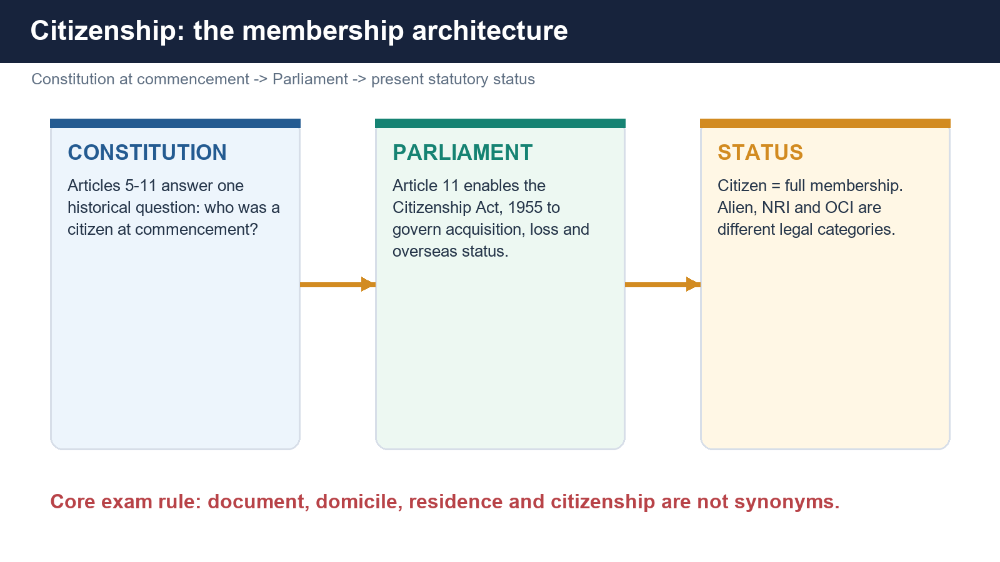

[FACT] Citizenship is the legal status of full membership in the Indian political community. It creates a reciprocal relation: the citizen owes allegiance to India, while the constitutional and statutory order recognises a bundle of civil and political entitlements.

[FACT] An **alien** is a person who is not an Indian citizen. Traditional polity texts distinguish a friendly alien from an enemy alien, but this classification does not mean that every non-citizen lacks fundamental rights. The Constitution frequently protects **persons**, not merely citizens.

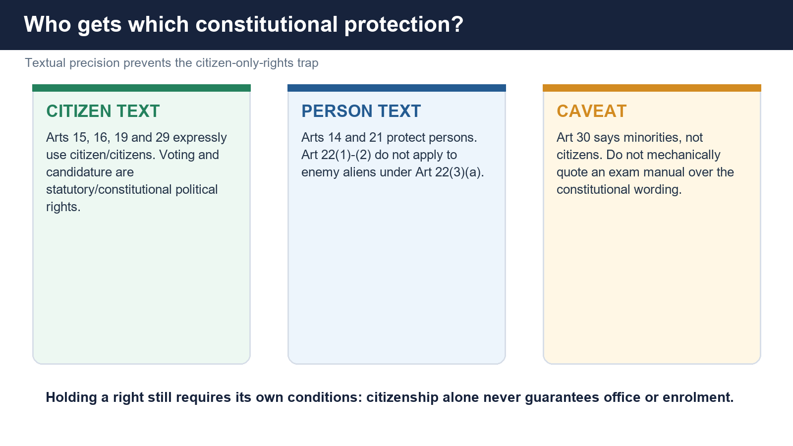

| Provision | Exact beneficiary language | Citizenship consequence |
|---|---|---|
| Article 14 | Any person | Equality before law and equal protection extend to citizens and non-citizens. |
| Article 15 | Citizen / citizens | The non-discrimination guarantees in Article 15 are textually citizen-specific. |
| Article 16 | Citizens | Equality of opportunity in public employment is citizen-specific. |
| Article 19 | All citizens | The six freedoms are confined to citizens. |
| Articles 20 and 21 | Person / no person | Criminal-law safeguards and life/personal liberty are not citizen-only. |
| Article 22(1)-(2) | Person, but subject to Article 22(3) | Enemy aliens and preventive detainees are excluded from clauses (1)-(2); avoid the loose claim that every part of Article 22 disappears in every situation. |
| Article 25 | All persons | Freedom of conscience and religion is not citizen-only. |
| Article 29(1)-(2) | Section of citizens / no citizen | The textual guarantees are citizen-specific. |
| Article 30 | All minorities | Article 30 does not itself use the word "citizen". Do not mechanically reproduce a simplified list without this textual caveat. |

[FACT] Voting is not a Fundamental Right. A citizen must also satisfy the Representation of the People Act, 1950, including ordinary residence in a constituency and the statutory age/registration conditions. A non-citizen is disqualified from electoral registration under Section 16.

[FACT] Candidature and high office also require citizenship plus office-specific conditions. The President need only be a **citizen of India** under Article 58; India does not impose the United States' "natural-born citizen" rule. Naturalised and registered citizens are not constitutionally excluded merely because their citizenship was acquired after birth.

| Office or political role | Citizenship anchor | Caveat |
|---|---|---|
| President | Article 58 | Must also be 35 and qualified for Lok Sabha membership. |
| Vice-President | Article 66 read with Rajya Sabha qualifications | Citizenship alone is insufficient. |
| MP / MLA | Articles 84/173 and RPA | Statutory qualifications and disqualifications apply. |
| Governor | Article 157 | Must be a citizen and at least 35. |
| Supreme Court / High Court judge | Articles 124/217 | Citizenship plus prescribed judicial/legal experience. |
| Attorney General / Advocate General | Articles 76/165 | Qualification is tied to judicial-office eligibility. |

> **UPSC trap:** "Only citizens possess fundamental rights." Wrong. Some rights are citizen-specific; many crucial protections, especially Articles 14 and 21, protect persons.

## 02. Citizenship, domicile and residence - and why India still has single citizenship

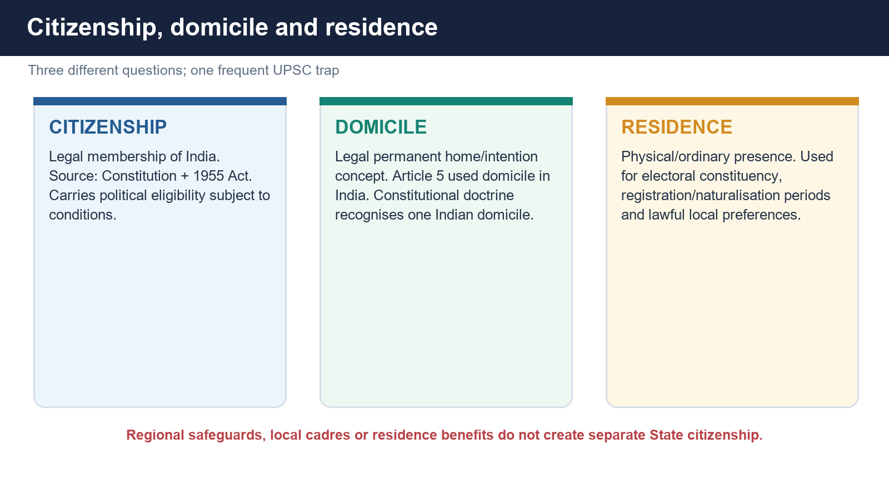

| Concept | Core question | Legal effect |
|---|---|---|
| Citizenship | Of which State is the person a legal member? | Political membership, passport/nationality consequences and citizen-specific constitutional rights. |
| Domicile | Which legal system is the person's permanent home, supported by residence and intention? | Article 5 used domicile in India as a commencement condition; doctrine recognises domicile in India, not a second State citizenship. |
| Residence | Where does the person factually or ordinarily live? | Used for electoral rolls, statutory residence periods, admissions, benefits and some lawful regional preferences. |

[FACT] In *Pradeep Jain v. Union of India* (1984), the Supreme Court stressed that the Constitution recognises one citizenship and one domicile in the territory of India. The expression "State domicile" is often used administratively, but it usually describes residence/local-status rules, not a sovereign domicile or separate citizenship.

[FACT] India has **single citizenship** despite a federal distribution of legislative and executive power. There is no citizenship of Kerala, Assam, Maharashtra or any other State separate from Indian citizenship.

[ANALYSIS] Single citizenship serves integration and equal political membership, but it does not produce identical residence benefits everywhere. The Constitution permits carefully bounded regional protection:

- Article 16(3) authorises **Parliament**, not every State legislature acting on its own, to prescribe residence requirements for specified public employment.
- Article 19(5) permits reasonable restrictions on movement/residence in the general public interest or for protection of Scheduled Tribes.
- Articles 371A to 371J and related orders create region-specific institutional, land, customary-law or local-cadre safeguards.
- Article 15(1) prohibits discrimination on **place of birth**, but does not list residence as a prohibited ground; residence preferences remain subject to Article 14 and the rest of the Constitution.
- The former Article 35A/J&K permanent-resident regime is not a current constitutional exception after the 2019 changes.

[LIMIT] These are asymmetrical protections inside a single citizenship. Calling them "separate State citizenship" is legally wrong.

> **Close-option rule:** Citizenship is membership; domicile is permanent legal home; residence is a factual connection. One can reside in a State without becoming a different citizen.

## 03. Why Articles 5-11 are transitional, but not unimportant

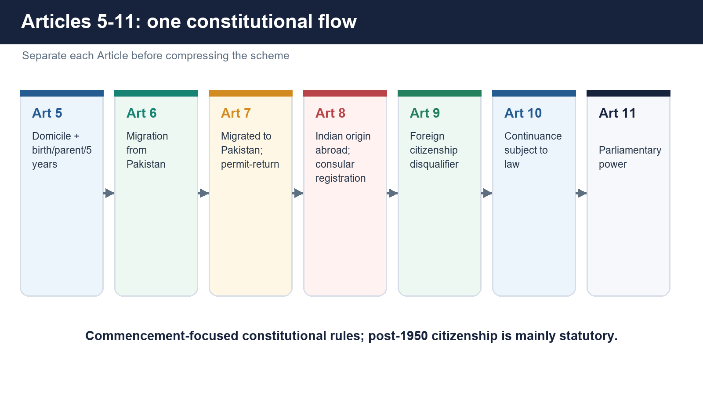

[FACT] Part II of the Constitution does not create a complete permanent code of citizenship. It primarily determines who was a citizen **at the commencement of the Constitution** and then preserves Parliament's power to govern future acquisition and loss.

[ANALYSIS] The scheme has three layers:

1. **Articles 5-8:** affirmative routes to citizenship at commencement.
2. **Article 9:** a disqualifying rule for voluntary foreign citizenship in relation to those commencement routes.
3. **Articles 10-11:** continuity subject to parliamentary law, and Parliament's plenary citizenship competence.

[LIMIT] Articles 5-11 are not obsolete. They remain constitutional text, explain the origin of many statuses, and constrain how commencement claims are understood. But current acquisition and loss are mainly controlled by the Citizenship Act, 1955 under Article 11.

## 04. Article 5 - domicile plus one of three connecting factors

[FACT] At commencement, a person became a citizen under Article 5 if the person had **domicile in the territory of India** and satisfied at least one of three connections:

1. the person was born in the territory of India; or
2. either parent was born in the territory of India; or
3. the person had been ordinarily resident in India for at least five years immediately preceding commencement.

[ANALYSIS] Domicile is the controlling gateway. Birth, parentage or residence alone did not substitute for it. The Article therefore combined a subjective-permanent-home connection with objective territorial facts.

> **Trap:** Article 5 did not say "anyone residing for five years became a citizen". It required domicile **and** one of the three connections.

## 05. Article 6 - migrants from Pakistan and the 19 July 1948 divide

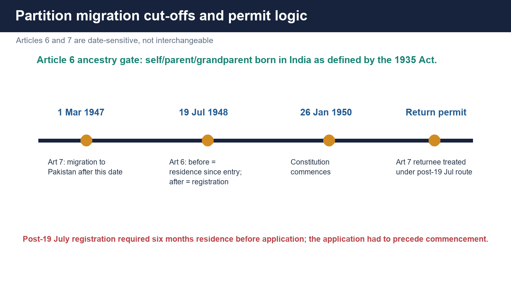

[FACT] Article 6 begins with an ancestry gate: the person, or either parent or any grandparent, had to be born in India as defined in the Government of India Act, 1935.

[FACT] It then divides migrants from territory now included in Pakistan into two streams:

| Migration date | Additional condition |
|---|---|
| Before 19 July 1948 | The person had been ordinarily resident in India since the date of migration. |
| On or after 19 July 1948 | The person had to be registered as a citizen before commencement by an authorised officer, after applying before commencement and showing at least six months' residence immediately before the application. |

[ANALYSIS] The date marks the introduction of a permit/registration-controlled phase. UPSC tests the difference between residence since migration and registration after a six-month residence floor.

> **Trap:** The six-month period does not replace the requirement that the application and registration route be completed in the constitutional time-frame before commencement.

## 06. Article 7 - migration to Pakistan after 1 March 1947 and the permit-return exception

[FACT] Article 7 overrides Articles 5 and 6 for a person who migrated from India to territory now included in Pakistan **after 1 March 1947**: such a person was not deemed an Indian citizen.

[FACT] The exception covers a person who later returned to India under a permit for **resettlement or permanent return**. For Article 6(b), that person is treated as having migrated to India after 19 July 1948 and must use the registration route.

[ANALYSIS] Article 7 is not a simple permanent ban on every returnee. Its structure is exclusion plus a controlled return-and-registration channel.

> **Trap:** A temporary visit permit is not the constitutional expression. The Article speaks of a permit for resettlement or permanent return.

## 07. Article 8 - persons of Indian origin ordinarily resident outside India

[FACT] Article 8 covers a person ordinarily residing outside India if that person, or either parent or any grandparent, was born in India as defined in the Government of India Act, 1935, and the person was registered as an Indian citizen by an Indian diplomatic or consular representative.

[FACT] The application could be made before or after commencement, subject to the Government of India's prescribed form and manner.

[ANALYSIS] Article 8 is the Constitution's original diaspora bridge. It should not be confused with modern OCI, which is a statutory foreign-national card status and not citizenship.

## 08. Article 9 - the commencement-context foreign-citizenship disqualifier

[FACT] Article 9 says that no person shall be a citizen of India by virtue of Article 5, or be deemed a citizen under Article 6 or Article 8, if the person has voluntarily acquired the citizenship of a foreign State.

[LIMIT] The most accurate formulation is contextual: Article 9 directly qualifies the commencement routes in Articles 5, 6 and 8. It should not be quoted as if it alone is a self-executing universal code for every later dual-nationality problem.

[FACT] The present single-citizenship result is produced by Article 9 read with Parliament's Citizenship Act framework, especially Section 9 termination on voluntary acquisition of foreign citizenship. OCI does not alter that result because an OCI cardholder remains a foreign national.

## 09. Article 10 - continuance subject to parliamentary law

[FACT] Every person who is or is deemed to be a citizen under the preceding provisions continues as a citizen, **subject to the provisions of any law made by Parliament**.

[ANALYSIS] Article 10 protects continuity but expressly rejects immutability. Citizenship can be regulated or lost under a valid parliamentary law.

## 10. Article 11 - Parliament's citizenship power

[FACT] Article 11 declares that the preceding provisions do not detract from Parliament's power to make law concerning acquisition and termination of citizenship and all other citizenship matters.

[FACT] Parliament exercised that power through the Citizenship Act, 1955.

[LIMIT] Citizenship is therefore a constitutional status predominantly regulated by statute; it is not itself enumerated as a Fundamental Right. That does not make citizenship decisions immune from Articles 14, 21 or judicial review.

## 11. Citizenship Act, 1955 - the statutory architecture

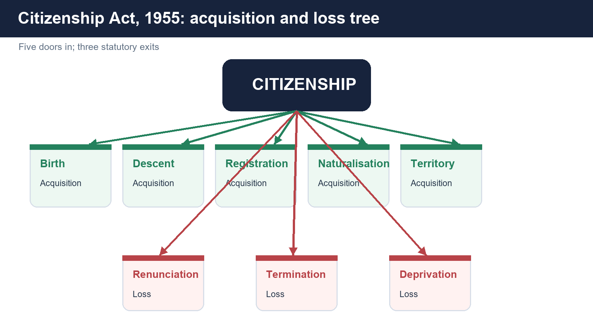

> **Memory hook:** Acquisition = **B-D-R-N-I**: Birth, Descent, Registration, Naturalisation, Incorporation. Loss = **R-T-D**: Renunciation, Termination, Deprivation.

| Route | Character | Main control |
|---|---|---|
| Birth | Place + date + parental status | Section 3 |
| Descent | Birth abroad + citizen parent + later registration controls | Section 4 |
| Registration | Listed categories, application and residence/oath conditions | Section 5 |
| Naturalisation | General alien route through Third Schedule qualifications | Section 6 |
| Incorporation of territory | Government order for persons connected with newly incorporated territory | Section 7 |

[FACT] "Illegal migrant" is a defined statutory category. The definition generally covers a foreigner who entered without valid travel authority or remained beyond the permitted period. CAA 2019 inserted a proviso for its specified class, subject to the statutory exemptions.

## 12. Citizenship by birth - three periods, not one rule

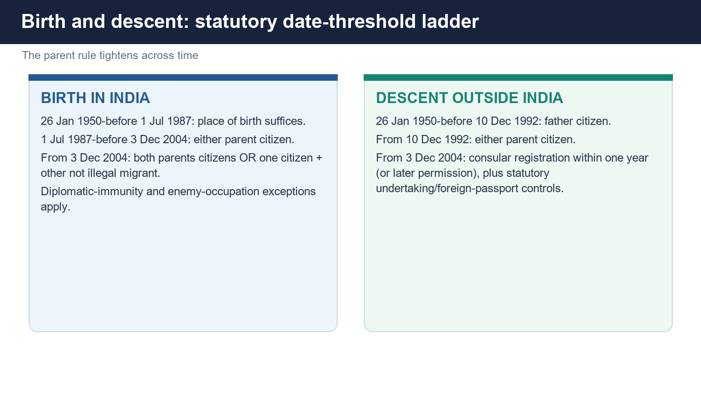

| Date of birth in India | Citizenship rule |
|---|---|
| 26 January 1950 to before 1 July 1987 | Citizen by birth, subject to Section 3(2) exceptions; parental citizenship is not required. |
| 1 July 1987 to before 3 December 2004 | Citizen if either parent was an Indian citizen at birth. |
| On or after 3 December 2004 | Citizen if both parents were citizens, or one parent was a citizen and the other was not an illegal migrant at birth. |

[FACT] Section 3(2) excludes:

- a birth where a parent possessed diplomatic immunity as an accredited envoy and was not an Indian citizen; and
- a birth where a parent was an enemy alien and the birth occurred in a place then under enemy occupation.

[LIMIT] A birth certificate proves facts of birth; it does not, by itself, answer the parental-status conditions applicable after 1987/2004.

> **Close-option trap:** "Born in India equals citizen" is safely true only for the first statutory period, and even that period remains subject to Section 3(2).

## 13. Citizenship by descent - gender change, registration and foreign-passport controls

| Birth outside India | Parent rule |
|---|---|
| 26 January 1950 to before 10 December 1992 | Father had to be an Indian citizen at the time of birth. |
| On or after 10 December 1992 | Either parent may supply the citizenship link. |
| On or after 3 December 2004 | Consular registration within one year is required, unless the Central Government permits later registration. |

[FACT] For the post-3 December 2004 period, the statutory application is accompanied by a parental undertaking that the minor does not hold the passport of another country.

[FACT] A minor who is an Indian citizen by descent and also a citizen of another country must comply with the Act's renunciation requirement within six months of attaining full age, failing which Indian citizenship ceases.

[ANALYSIS] The descent route shows why parentage, date, registration and foreign nationality must be checked together. "One citizen parent" is an incomplete answer after 2004.

## 14. Citizenship by registration - listed categories and exact residence logic

[FACT] Section 5 is discretionary ("may register") and excludes an illegal migrant unless the CAA proviso/Section 6B framework applies. Major categories include:

| Section 5(1) category | Key condition |
|---|---|
| Person of Indian origin ordinarily resident in India | Seven years under the statutory calculation. |
| Person of Indian origin ordinarily resident outside undivided India | No seven-year Indian-residence phrase in clause (b). |
| Person married to an Indian citizen | Seven years' ordinary residence in India. |
| Minor child of Indian citizens | Registration route for the minor. |
| Full-age person whose parents are registered under specified provisions | Listed parent-status route. |
| Person who or either parent was earlier a citizen of independent India | Twelve months' ordinary residence immediately before application. |
| OCI cardholder for five years | Twelve months' ordinary residence immediately before application. |

[FACT] For the seven-year clauses (person of Indian origin resident in India and spouse), the Act's calculation is:

- residence throughout the twelve months immediately before application; plus
- at least six years' residence during the eight years preceding those twelve months.

[FACT] A full-age applicant must take the oath of allegiance. Registration is not an automatic consequence of marriage, Indian ancestry or possession of an OCI card.

> **Trap:** "Spouse of a citizen becomes a citizen on marriage." Wrong. Marriage creates eligibility for a statutory application route; residence, scrutiny, registration and oath remain.

## 15. Citizenship by naturalisation - Third Schedule, waiver and the CAA modification

[FACT] Section 6 permits the Central Government to grant a certificate to a full-age, capable applicant who is not an illegal migrant and satisfies the Third Schedule.

| General qualification | Exact exam formulation |
|---|---|
| Immediate period | Residence in India or government service, or a combination, throughout the twelve months immediately preceding application, subject to a recorded relaxation up to thirty days in special circumstances. |
| Aggregate period | During the fourteen years preceding that twelve-month period, aggregate residence/service of at least eleven years. |
| Character | Good character. |
| Language | Adequate knowledge of an Eighth Schedule language. |
| Future connection | Intention to reside in India or continue specified government/international-organisation/India-established-body service. |
| Reciprocity | Applicant must not belong to a country that prevents Indians by law or practice from naturalising there. |

[FACT] The Central Government may waive all or any Third Schedule conditions for distinguished service to science, philosophy, art, literature, world peace or human progress generally.

[FACT] For the CAA-specified class, the Third Schedule's **aggregate eleven years** is read as **five years**. The separate twelve-month immediately preceding condition is not deleted.

> **High-value trap:** "CAA reduces naturalisation to five years" is imprecise. It reduces the aggregate requirement from eleven to five for the specified class; the immediate twelve-month limb remains.

## 16. Citizenship by incorporation of territory

[FACT] If territory becomes part of India, Section 7 authorises the Central Government, by Gazette order, to specify the persons who become citizens because of their connection with that territory and the date from which citizenship operates.

[ANALYSIS] This is a collective, territory-linked route, unlike an individual naturalisation application. The Citizenship (Pondicherry) Order, 1962 is the standard illustration.

## 17. Loss of citizenship - renunciation, termination and deprivation

| Mode | Trigger | Decision structure |
|---|---|---|
| Renunciation, Section 8 | Full-age capable citizen makes a declaration | Effective upon registration; registration may be withheld during war. |
| Termination, Section 9 | Voluntary acquisition of another country's citizenship | Citizenship ceases, subject to the statutory wartime proviso and determination rules. |
| Deprivation, Section 10 | Central Government order against defined categories on listed grounds | Notice, public-good satisfaction and inquiry safeguards apply. |

### Renunciation

[FACT] When a person renounces citizenship, every minor child of that person also ceases to be a citizen. Such a child may resume Indian citizenship by declaration within one year after attaining full age.

### Termination

[FACT] Termination follows voluntary acquisition of foreign citizenship. If the fact, time or manner of foreign acquisition is disputed, it is determined by the prescribed authority and evidence rules.

### Deprivation - category gate first, grounds second

[FACT] Section 10 does **not** create a free-standing power to deprive every citizen on the listed grounds. Its category gate covers:

- a citizen by naturalisation;
- a citizen by virtue only of Article 5(c), the commencement five-year-residence limb; and
- a citizen by registration **other than** Article 6(b)(ii) registration and Section 5(1)(a) registration.

[LIMIT] Citizens by birth and descent do not fall within Section 10(1)'s deprivation category. The common shorthand "deprivation applies to registered and naturalised citizens" is incomplete because the Act contains express inclusions and exclusions.

[FACT] Once the category gate is met, the listed grounds are:

1. fraud, false representation or concealment in registration/naturalisation;
2. disloyalty or disaffection towards the Constitution by act or speech;
3. unlawful enemy trading/communication during war;
4. imprisonment for at least two years within five years after registration or naturalisation; or
5. seven years' continuous ordinary residence abroad without falling within the student/government or qualifying international-organisation exceptions and without annual consular registration of the intention to retain citizenship.

[FACT] The Central Government must also be satisfied that continued citizenship is not conducive to the public good. Written notice and a committee-of-inquiry route apply as specified by Section 10.

> **Trap:** Renunciation is voluntary declaration; termination follows foreign citizenship; deprivation is a compulsory, category-limited government order.

## 18. Assam Accord, Section 6A and the NRC cut-off

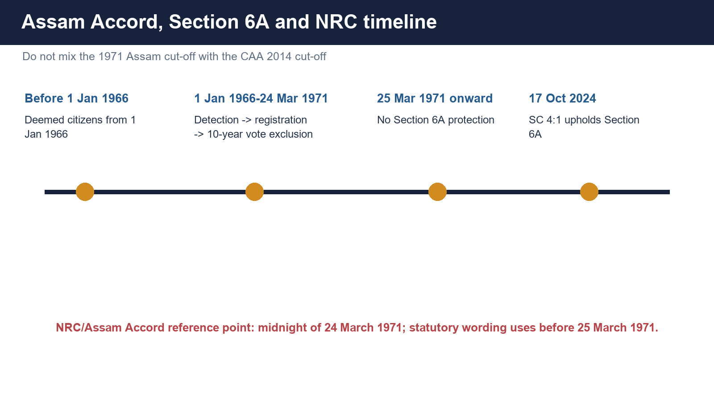

[FACT] Section 6A was inserted by the Citizenship (Amendment) Act, 1985 to implement the citizenship component of the Assam Accord.

| Stream | Statutory consequence |
|---|---|
| Indian-origin persons who came from the specified territory to Assam before 1 January 1966 and remained ordinarily resident | Deemed citizens from 1 January 1966, subject to Section 6A. |
| Indian-origin persons who came on/after 1 January 1966 but before 25 March 1971, remained ordinarily resident and were detected as foreigners | Must register; electoral-roll name is deleted; citizenship follows after ten years from detection. |
| During the ten-year period | Same rights and obligations as a citizen, including passport eligibility, but no electoral-roll inclusion. |
| Entry on or after 25 March 1971 | No Section 6A protection. |

[FACT] The familiar Assam/NRC cut-off is **midnight of 24 March 1971**, expressed in Section 6A as entry **before 25 March 1971**.

[LIMIT] NRC and CAA use different dates and different legal purposes:

- Assam Accord/NRC reference: 24 March 1971.
- CAA entry cut-off: 31 December 2014.

[ANALYSIS] Section 6A is an instance of constitutional-statutorily authorised asymmetry: a national citizenship law creates an Assam-specific historical settlement. It does not create Assam citizenship.

## 19. In Re: Section 6A (17 October 2024) - the controlling 4:1 judgment

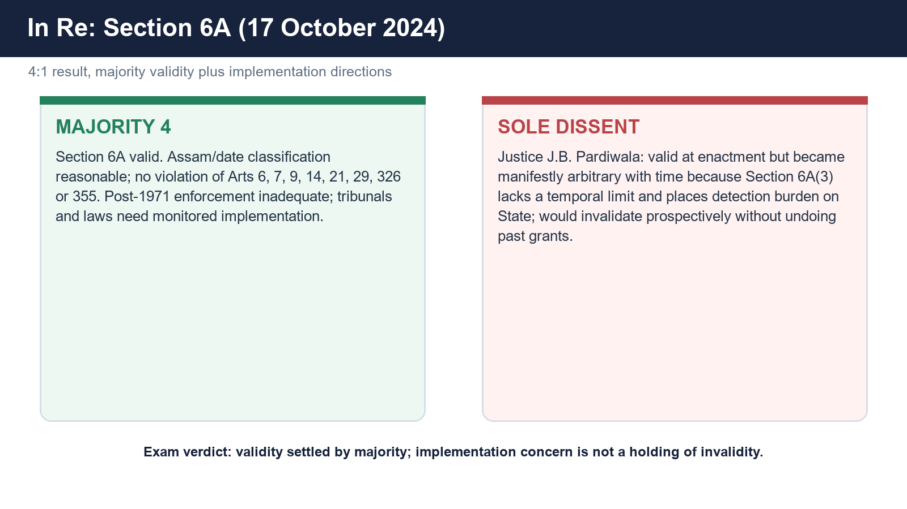

### Result and opinions

[FACT] The Constitution Bench result was 4:1:

- Chief Justice D.Y. Chandrachud wrote a concurring opinion upholding Section 6A.
- Justice Surya Kant wrote for himself, Justice M.M. Sundresh and Justice Manoj Misra, also upholding it and issuing implementation directions.
- Justice J.B. Pardiwala dissented.

### Majority reasoning

[FACT] The majority conclusions included:

- Articles 6 and 7 fixed the constitutional commencement framework; Article 11 allowed Parliament to legislate later for persons outside that temporal coverage.
- Assam and the 24 March 1971 cut-off formed a reasonable classification linked to the special scale and impact of migration and the Bangladesh-war context.
- Section 6A did not violate Articles 6, 7, 9, 14, 21, 29, 326 or 355.
- Article 29(1) protects the ability of a section of citizens to conserve language, script and culture; the petitioners had not proved that Section 6A itself destroyed that ability.
- The provision was not invalid merely because Section 6A(2) uses deemed citizenship without a registration procedure.
- Article 355 was not treated as an independent standard for striking down the law.

[FACT] Justice Surya Kant's opinion separated **validity** from **implementation**. It held the law valid but found the machinery inadequate, noted post-1971 enforcement failures, called for effective use of immigration laws and tribunals, and directed that a bench monitor implementation.

[LIMIT] Figures recorded in the judgment about pending tribunal cases or unfenced border were evidence before the Court at that time. They should not be presented as timeless current statistics.

### Sole dissent

[FACT] Justice Pardiwala accepted that the Assam classification was not unconstitutional when enacted in 1985, but concluded that Section 6A(3) had become manifestly arbitrary with the passage of time because:

- it lacked a temporal end-point for detecting and processing the 1966-1971 stream;
- the burden of detection lay almost entirely on the State;
- the mechanism frustrated timely detection, electoral deletion and regularisation.

[FACT] He would have declared Section 6A invalid **prospectively**, protected citizenship already granted and preserved specified pending proceedings.

[ANALYSIS] The exam-safe conclusion is: Section 6A is valid because the majority controls. The dissent is valuable for implementation design and temporal-reasonableness analysis, not for stating the law's present validity.

## 20. OCI and PIO evolution - diaspora connection without citizenship

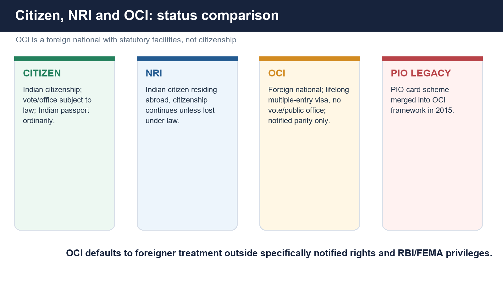

### Evolution

| Stage | Development |
|---|---|
| 2000-2002 | High Level Committee on the Indian Diaspora under L.M. Singhvi studied diaspora engagement. |
| 2003 amendment | Introduced the statutory OCI framework and removed Commonwealth-citizenship provisions. |
| 2005 amendment | Expanded OCI eligibility beyond the original limited-country design, subject to statutory exclusions. |
| 2015 amendment | Recast the status as "OCI Cardholder" and merged the PIO card scheme into the OCI framework. |

[FACT] OCI is **not Indian citizenship**, not dual citizenship and not a constitutional status. The 2021 MHA notification expressly describes an OCI cardholder as a foreign national holding a foreign passport.

### OCI eligibility and exclusions

[FACT] Section 7A includes specified former citizens/eligible persons, descendants up to great-grandchildren, some minor children and qualifying foreign spouses. A foreign spouse's marriage must have been registered and subsisted continuously for at least two years immediately before application, and security clearance applies.

[FACT] A person who, or whose parent/grandparent/great-grandparent, is or was a citizen of Pakistan or Bangladesh, or another country notified by the Central Government, is excluded from ordinary Section 7A eligibility.

### Rights and facilities under the 4 March 2021 notification

[FACT] Notified facilities include:

- multiple-entry lifelong visa for visiting India;
- exemption from FRRO/FRO registration for any length of stay, subject to address/occupation intimation for ordinarily resident OCI cardholders;
- parity with Indian nationals for domestic air tariffs and entry fees at listed public sites;
- parity with NRIs for inter-country adoption, specified entrance-test/NRI or supernumerary seats, non-agricultural immovable property and listed professions.

[FACT] Special permission/permit is required for research; missionary, Tabligh, mountaineering or journalistic activity; specified foreign diplomatic internships/employment; and protected/restricted/prohibited areas.

[FACT] Outside specifically notified rights and applicable RBI/FEMA privileges, the 2021 notification gives the OCI cardholder the same rights and privileges as a **foreigner**.

### Political and public-office restrictions

[FACT] Section 7B denies OCI cardholders:

- Article 16 equality in public employment;
- eligibility to be President, Vice-President, Supreme Court or High Court judge;
- voter registration;
- eligibility for Parliament or State legislatures; and
- appointment to Union/State public services unless specially specified.

### Cancellation

[FACT] Section 7D grounds include fraud/concealment, constitutional disaffection, enemy assistance in war, a qualifying two-year sentence within five years, violation of specified law, sovereignty/security/public-interest grounds, and breakdown/breach of the qualifying spouse marriage. A reasonable opportunity of hearing is required.

| Status | Citizen? | Vote? | Passport/nationality | Typical India connection |
|---|---:|---:|---|---|
| Resident Indian citizen | Yes | If otherwise registered/eligible | Indian | Resides in India |
| NRI | Yes | Subject to electoral law and registration | Indian | Indian citizen ordinarily abroad |
| OCI cardholder | No | No | Foreign | Statutory visa and notified facilities |
| Foreign national without OCI | No | No | Foreign | General foreigner regime |

> **Trap:** NRI describes a citizen's residence position; OCI describes a foreign national's statutory card status.

## 21. Citizenship (Amendment) Act, 2019 and Rules 2024 - exact operation

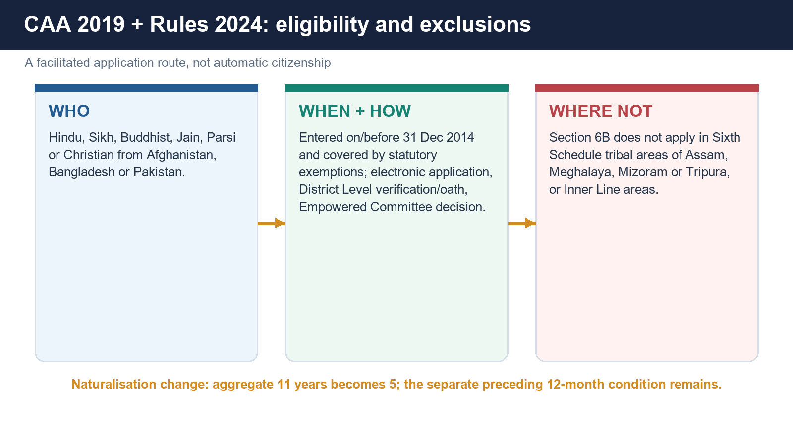

### Exact eligible statutory class

[FACT] The proviso to Section 2(1)(b), read with Section 6B, addresses a person who:

1. belongs to the **Hindu, Sikh, Buddhist, Jain, Parsi or Christian** community;
2. is from **Afghanistan, Bangladesh or Pakistan**;
3. entered India **on or before 31 December 2014**; and
4. was exempted by the Central Government under the specified Passport (Entry into India) Act / Foreigners Act instruments.

[LIMIT] "Religious persecution" is central to the legislative justification and government narrative, but the operative statutory class is expressed through community, country, date and exemption. Do not invent an additional case-by-case statutory phrase that is absent from the operative proviso.

### What Section 6B does

[FACT] The Central Government or specified authority may grant registration or naturalisation after application and fulfilment of Section 5 or Third Schedule conditions.

[FACT] A person granted a certificate under Section 6B is deemed a citizen from the **date of entry into India**.

[FACT] Pending proceedings concerning illegal migration or citizenship abate **on conferment of citizenship**, not merely on filing an application.

[LIMIT] CAA does not automatically turn every member of the six communities into a citizen. Eligibility, application, documentary verification, oath and decision remain.

### Territorial exclusions

[FACT] Section 6B does not apply to:

- tribal areas of Assam, Meghalaya, Mizoram or Tripura included in the Sixth Schedule; and
- areas covered by "the Inner Line" notified under the Bengal Eastern Frontier Regulation, 1873.

[LIMIT] Use the statutory description. Do not convert it into a loose claim that the whole Northeast is excluded.

### Naturalisation residence change

[FACT] For the specified class, the Third Schedule's aggregate period in the preceding fourteen-year window is read as **not less than five years** instead of eleven. The immediate twelve-month condition remains.

### Rules 2024 process

[FACT] The Rules create an electronic workflow:

1. application to the Empowered Committee through the District Level Committee;
2. District Level Committee document verification;
3. personal appearance and oath of allegiance before the designated officer;
4. electronic forwarding to the Empowered Committee;
5. scrutiny, inquiry and fit-and-proper assessment by the Empowered Committee; and
6. digital certificate, with hard copy if opted for.

[FACT] Schedule IA lists documents connecting the applicant to Afghanistan, Bangladesh or Pakistan. Schedule IB lists documents evidencing entry into India on or before 31 December 2014. The latter can include government records such as licence, ration, school, court, bank, utility, employment and other dated records.

[LIMIT] Aadhaar appears in Schedule IB as one possible document to evidence entry/presence for this specific process. That does not transform Aadhaar into universal proof of Indian citizenship.

### Operational status

[CURRENT] PIB recorded the first set of certificates in New Delhi on 15 May 2024, followed later that month by certificates through empowered committees in other States. This confirms operation; it does not resolve the constitutional challenge.

## 22. CAA, Article 14, secularism and Assam - argument tree, not slogan

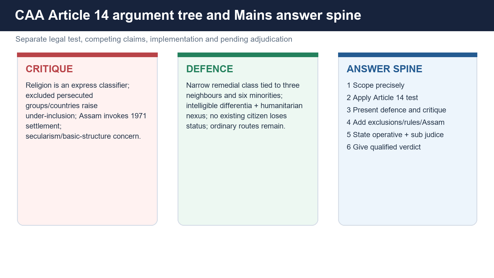

### Article 14 test

[FACT] Article 14 protects persons, including non-citizens. A classification must rest on an intelligible differentia and have a rational nexus with the object. Modern review also examines manifest arbitrariness.

### Principal criticism

- [ANALYSIS] Religion is an express part of the eligibility class; critics argue that excluding Muslim sects facing persecution and excluding similarly situated groups in other neighbours makes the classification under-inclusive.
- [ANALYSIS] Because secularism is a basic feature, critics argue that a religion-coded citizenship preference must receive exacting constitutional scrutiny.
- [ANALYSIS] Assam-based challenges stress that the CAA's 2014 date sits uneasily with the Accord's 1971 settlement and may affect indigenous political/cultural protection.
- [ANALYSIS] A refugee law based on individual persecution rather than religion/country categories is offered as a less exclusionary alternative.

### Principal defence

- [ANALYSIS] The Government presents the law as a narrow remedial measure for six minorities in three neighbouring countries linked to Partition and state-religion conditions.
- [ANALYSIS] Legislative classification need not solve every hardship at once; the selected class is defended as intelligible and connected to a humanitarian object.
- [FACT] The Act does not remove citizenship from any existing Indian citizen and does not amend the ordinary citizenship routes available under the rest of the Act.
- [ANALYSIS] Territory exclusions and the separate Assam regime are invoked to show legislative accommodation of regional concerns.

### Qualified current conclusion

[CURRENT] The Act and Rules are operative. Their constitutional validity is sub judice on the source record used here. The exam-safe conclusion is neither "obviously valid" nor "already unconstitutional", but that the final answer turns on whether the Court accepts the statutory class as a reasonable remedial classification compatible with equality and secularism.

## 23. Citizenship proof and document traps

| Document/status | What it can establish | What it cannot universally establish by itself |
|---|---|---|
| Aadhaar | Identity/residence under the Aadhaar framework | Citizenship or domicile; the Aadhaar Act expressly denies that inference. |
| Birth certificate | Place/date/parent details as recorded | Automatic citizenship without applying the relevant Section 3 period and parent rule. |
| Voter registration/EPIC | Administrative electoral enrolment; law requires citizenship | Conclusive citizenship in every legal proceeding if enrolment itself is disputed or erroneous. |
| Passport | Strong nationality/travel-document evidence in ordinary administration | An irrebuttable citizenship certificate in every case; the Passports Act also recognises travel documents/passports in limited non-citizen contexts. |
| Domicile/residence certificate | Local residence or domicile criteria for the issuing purpose | Indian citizenship. |
| Citizenship certificate | Registration/naturalisation under the Act | Rights outside the status and law under which issued; fraud can trigger statutory consequences. |

[ANALYSIS] India does not use one universal card that proves every route of citizenship. The relevant legal route determines the evidence: birth and parental documents, consular registration, citizenship certificate, incorporation order or other statutory records.

> **Trap:** A document may be evidence of a fact relevant to citizenship without itself being citizenship.

## 24. Prelims close-option laboratory

1. **Articles 5-11:** commencement citizenship plus Parliament's power, not a complete permanent code.
2. **Article 5:** domicile plus birth/parent/five-year residence; not residence alone.
3. **Article 6:** 19 July 1948 separates residence-since-migration from registration.
4. **Article 7:** post-1 March 1947 migration to Pakistan excludes, but permit for resettlement/permanent return opens the post-19 July registration route.
5. **Article 9:** contextual disqualifier for Articles 5, 6 and 8; present single-citizenship law also depends on the 1955 Act.
6. **Birth:** 1950-1987, 1987-2004, post-3 December 2004.
7. **Descent:** father before 10 December 1992; either parent after; registration control after 3 December 2004.
8. **Registration:** marriage/ancestry/OCI creates eligibility, not automatic citizenship.
9. **Naturalisation:** twelve immediate months plus eleven of preceding fourteen; CAA class gets aggregate five, not deletion of immediate twelve.
10. **Deprivation:** category-limited Section 10 power; not applicable to every citizen.
11. **Assam:** before 1966; 1966-before 25 March 1971; post-1971.
12. **OCI:** foreign national, no vote, not dual citizenship.
13. **CAA:** six communities, three countries, on/before 31 December 2014, statutory exemptions, Sixth Schedule/Inner Line exclusions.
14. **Proof:** Aadhaar, residence or voter card is not universal conclusive citizenship proof.

## 25. Mains answer architecture and qualified conclusions

### Answer spine A - "How does the Constitution deal with citizenship?"

1. Define citizenship as membership.
2. State that Articles 5-8 identify commencement citizens.
3. Explain Articles 9 and 10.
4. End the constitutional spine with Article 11.
5. Add the 1955 Act's five acquisition and three loss routes.
6. Conclude: constitutional origin, statutory continuation, judicial-review limits.

### Answer spine B - "Single citizenship versus regional protection"

1. Explain one citizenship and one Indian domicile.
2. State the integration rationale.
3. Distinguish residence/local status.
4. Use Articles 16(3), 19(5) and 371 safeguards.
5. Reject the label "State citizenship".
6. Conclude that equal membership can coexist with proportionate territorial protection.

### Answer spine C - "CAA and Article 14"

1. Define the exact six-community/three-country/date/exemption class.
2. State the Article 14 test.
3. Present under-inclusion/secularism and Assam objections.
4. Present remedial-classification/no-deprivation defence.
5. Add Rules 2024, territorial exclusions and implementation.
6. State operative + sub judice; give no invented verdict.

### Qualified conclusions

- **Constitution-statute conclusion:** "The Constitution supplied the founding membership rules; Article 11 made Parliament the continuing architect, but statutory discretion remains accountable to equality, liberty and judicial review."
- **Single-citizenship conclusion:** "India protects one political membership while permitting residence and region-sensitive safeguards; asymmetry is not a second citizenship."
- **OCI conclusion:** "OCI is durable diaspora access without political membership: a foreign-national status whose benefits exist only to the extent statute and notification grant them."
- **Assam conclusion:** "The 2024 majority settled Section 6A's validity, not its administrative success; legality and implementation must therefore be answered separately."
- **CAA conclusion:** "The Act is operative, but its constitutional legitimacy remains a live Article 14/secularism question; a responsible answer states the exact class, both arguments and the sub judice limit."

## PART II - Optional Advanced depth

### A. Citizenship is a gatekeeping status, not merely a rights bundle

[ANALYSIS] Citizenship performs three functions at once: it allocates political voice, determines eligibility for selected public offices and supplies a legal identity in international relations. That is why apparently technical rules about dates and parentage also decide who participates in democratic authorship.

### B. Fraternity and exclusion pull in opposite directions

[ANALYSIS] A citizenship law can advance fraternity by integrating long-settled populations, yet weaken it if classification appears to stigmatise another group. The Section 6A majority treated historical accommodation as fraternity-consistent; CAA critics use fraternity and secularism to question religion-coded selection. The concepts do not mechanically produce an answer; they organise the competing constitutional claims.

### C. Equality review must identify the comparator

[ANALYSIS] CAA analysis often fails because the comparator remains unstated. Possible comparators include all persecuted migrants, all undocumented migrants from neighbouring States, or only the six minorities in the selected three countries. The constitutional result can shift with the level at which the class is framed. A strong answer makes that choice explicit before applying differentia and nexus.

### D. Temporal reasonableness after the Section 6A dissent

[ANALYSIS] Justice Pardiwala's dissent adds a design question: can a provision valid at enactment become arbitrary when its mechanism has no workable temporal closure? The majority rejected invalidity but accepted grave implementation deficiencies. The enduring analytical lesson is to distinguish a defective rule from defective administration while recognising that prolonged administrative failure can expose design weaknesses.

### E. National membership and federal asymmetry

[ANALYSIS] Section 6A is Assam-specific but produces Indian citizenship. Articles 371 and local-cadre systems are region-specific but operate inside one citizenship. These examples show that Indian federalism manages diversity through asymmetric incidents and procedures rather than multiple nationalities.

### F. OCI as calibrated external membership

[ANALYSIS] OCI offers mobility, property/professional access and cultural connection while withholding the franchise, public office and a general equality claim in public employment. It is best understood as calibrated external membership, not "half citizenship" and not an Indian nationality.

### G. Political Theory cross-link - bounded enrichment only

[ANALYSIS] Liberal theory emphasises equal legal membership; republican theory links citizenship to participation and civic responsibility; multicultural theory asks whether formally equal citizenship adequately protects distinct communities; feminist and subaltern critiques expose how documents, family law, displacement and administrative burden can make formal membership unequal in practice.

[LIMIT] These critiques enrich a GS-II conclusion but do not replace Articles 5-11, the Citizenship Act, Section 6A, OCI or CAA. Constitutional/statutory ownership comes first.

### H. A citizenship decision has at least four review layers

| Layer | Question |
|---|---|
| Status source | Which constitutional Article, statutory section or order creates the claim? |
| Fact proof | Which date, parent, residence, migration, entry or registration fact must be proved? |
| Procedure | Which authority, application, notice, oath, hearing or appeal applies? |
| Constitutional control | Does the classification or decision satisfy Articles 14/21 and natural justice? |

[ANALYSIS] This four-layer method is reusable for CAA applications, deprivation, OCI cancellation and disputed birth/descent claims.

## Solved topic-specific MCQs

### Verified routed PYQ

#### PYQ 1. UPSC Prelims 2021, GS Paper I, Question 89 - verbatim-verified from the local official paper

**Question:** With reference to India, consider the following statements:

1. There is only one citizenship and one domicile.
2. A citizen by birth only can become the Head of State.
3. A foreigner once granted the citizenship cannot be deprived of it under any circumstances.

Which of the statements given above is/are correct?

- A. 1 only
- B. 2 only
- C. 1 and 3
- D. 2 and 3

**INFERRED ANSWER - NOT OFFICIALLY VERIFIED: A. 1 only. Confidence: high.**

**Solution:** Statement 1 is correct. India has one Indian citizenship, and *Pradeep Jain* explains the constitutional idea of one domicile in India rather than separate State domiciles. Statement 2 is wrong because Article 58 requires the President to be a citizen of India; it does not impose a citizenship-by-birth condition. Statement 3 is wrong because Section 10 permits deprivation of defined categories of citizens on listed grounds and through prescribed safeguards. The local repository does not hold the official 2021 Prelims answer key, so this solution is an inference from the Constitution, statute and judgment, not an official UPSC key.

**Why this is a strong solution:** It tests each statement independently, names the controlling constitutional/statutory rule and does not convert a high-confidence inference into an official answer.

### Original hard MCQs - strict A -> B -> C -> D rotation

#### Q1. Which one of the following most accurately states the constitutional position of non-citizens?

- A. Articles 14 and 21 protect persons, while Articles 15, 16 and 19 are textually citizen-specific
- B. Every Fundamental Right is confined to citizens
- C. Article 19 protects every person lawfully present in India
- D. Article 14 protects citizens alone, but Article 15 protects all persons

**Answer: A.** Article 14 uses "person" and Article 21 uses "no person"; Articles 15, 16 and 19 expressly use citizen/citizens. A close option may exploit the false idea that all fundamental rights share one beneficiary formula.

#### Q2. A person claimed citizenship under Article 5 at commencement solely because the person had lived in India for five years. What additional constitutional requirement was indispensable?

- A. Registration by an Indian consulate
- B. Domicile in the territory of India
- C. A permit for resettlement
- D. Descent from a grandparent born in undivided India

**Answer: B.** Article 5 required domicile plus one of birth, parentage or five years' ordinary residence. Residence alone was not the constitutional gateway.

#### Q3. Which combination correctly describes an Article 6 migrant who came to India from Pakistan on or after 19 July 1948?

- A. Residence since migration alone
- B. Domicile plus five years immediately before commencement
- C. Registration before commencement after an application and at least six months' prior residence
- D. Automatic citizenship after ten years from detection

**Answer: C.** The post-19 July 1948 stream was registration-controlled. The ten-year detection rule belongs to Section 6A, not Article 6.

#### Q4. Article 7's exception for a person who migrated to Pakistan after 1 March 1947 applies when the person

- A. returns on any tourist or transit permit
- B. has one parent born in India
- C. lives in India for five years after return
- D. returns under a permit for resettlement or permanent return and then uses the post-19 July Article 6 route

**Answer: D.** Article 7 first excludes the migrant and then creates a controlled exception. The constitutional phrase is resettlement or permanent return, not any permit.

#### Q5. Article 8 primarily concerned

- A. persons of Indian origin ordinarily residing abroad who obtained consular/diplomatic registration
- B. persons born in India after 3 December 2004
- C. foreign spouses of OCI cardholders
- D. persons detected as foreigners in Assam

**Answer: A.** Article 8 is the commencement-era diaspora route. Modern OCI is a separate statutory foreign-national status.

#### Q6. Which statement best captures Articles 10 and 11 together?

- A. Citizenship at commencement is immutable
- B. Continuance is subject to parliamentary law, and Parliament may regulate acquisition, termination and other citizenship matters
- C. State legislatures possess exclusive citizenship power
- D. Parliament may legislate only on naturalisation

**Answer: B.** Article 10 preserves continuity subject to law; Article 11 preserves broad parliamentary competence.

#### Q7. A person was born in India on 2 July 1987. Which minimum statutory fact, apart from the Section 3(2) exceptions, would establish citizenship by birth?

- A. Five years' later residence in India
- B. Both parents had to be citizens
- C. Either parent was a citizen at the time of birth
- D. Consular registration within one year

**Answer: C.** The either-parent rule applies from 1 July 1987 until the 2003 amendment commenced on 3 December 2004.

#### Q8. Which one is required for a person born outside India on or after 3 December 2004 to claim citizenship by descent?

- A. Residence in India for seven years
- B. Birth to an Indian father only
- C. Marriage to an Indian citizen
- D. Consular registration within one year, or later with Central Government permission, alongside the statutory controls

**Answer: D.** Parentage remains necessary but is no longer sufficient. Registration and the foreign-passport undertaking are high-value close-option details.

#### Q9. Which person has a Section 5 registration route but does not become a citizen automatically from the described relationship?

- A. A foreign spouse of an Indian citizen who satisfies the prescribed seven-year residence calculation
- B. Every tourist born in a former princely State
- C. Every foreign employee of an Indian company
- D. Every OCI cardholder immediately upon receiving the card

**Answer: A.** Marriage creates an eligibility route, not citizenship by operation of marriage. Application, discretion, residence and oath remain.

#### Q10. Under the general Third Schedule rule, naturalisation ordinarily requires

- A. five continuous years immediately before application
- B. twelve months immediately before application plus at least eleven aggregate years in the preceding fourteen-year window
- C. seven years immediately before application with no language requirement
- D. ten years from detection as a foreigner

**Answer: B.** The two residence limbs must be kept separate. CAA changes the aggregate limb for its specified class, not the basic architecture.

#### Q11. Which statement about distinguished-service naturalisation is correct?

- A. Only the Supreme Court can waive residence
- B. No condition can ever be waived
- C. The Central Government may waive all or any Third Schedule conditions for distinguished service in listed fields
- D. The waiver is confined to Olympic medal winners

**Answer: C.** Section 6 expressly names science, philosophy, art, literature, world peace and human progress generally.

#### Q12. Which category is outside Section 10(1)'s deprivation gate?

- A. A citizen by naturalisation
- B. A citizen by virtue only of Article 5(c)
- C. Some citizens by registration, subject to statutory exclusions
- D. A citizen by birth

**Answer: D.** Section 10 is category-limited. Citizens by birth and descent do not fall within its opening category.

#### Q13. A full-age citizen makes a valid declaration giving up Indian citizenship. This is

- A. renunciation; a minor child also ceases but may resume by declaration within one year after attaining full age
- B. termination; the child can never resume
- C. deprivation; no declaration is necessary
- D. expatriation under Article 9 alone

**Answer: A.** Section 8 governs voluntary declaration. Wartime registration may be withheld.

#### Q14. Termination under Section 9 is most directly linked to

- A. seven years' residence outside India
- B. voluntary acquisition of another country's citizenship
- C. a two-year sentence within five years of naturalisation
- D. constitutional disaffection

**Answer: B.** The other listed circumstances are potential deprivation grounds for eligible categories.

#### Q15. Which one of the following is the best legal distinction?

- A. Citizenship and residence are synonyms
- B. Domicile is a State-created second citizenship
- C. Citizenship is membership, domicile is permanent legal home, and residence is factual presence
- D. Residence automatically confers the franchise

**Answer: C.** Residence can be relevant to enrolment or benefits but does not itself confer citizenship or voting.

#### Q16. Which textual caveat is most accurate?

- A. Article 30 expressly says "citizens only"
- B. Article 29 protects every foreign tourist
- C. Articles 14 and 21 are citizen-only
- D. Article 30 uses "minorities", whereas Article 29 expressly uses citizen/citizens

**Answer: D.** This distinction prevents over-reliance on simplified textbook lists.

#### Q17. Under Section 6A, Indian-origin persons who came from the specified territory to Assam before 1 January 1966 and met the residence condition were

- A. deemed citizens from 1 January 1966
- B. denied citizenship for ten years from detection
- C. governed by the CAA 2014 cut-off
- D. required to prove entry after 25 March 1971

**Answer: A.** The ten-year electoral exclusion belongs to the 1966-1971 detected stream.

#### Q18. A Section 6A person who came between 1 January 1966 and before 25 March 1971, was detected as a foreigner and registered

- A. becomes a voter immediately on detection
- B. receives most citizen rights/obligations but is excluded from electoral rolls for ten years from detection, after which citizenship is deemed for all purposes
- C. remains permanently an alien
- D. is governed by Article 5 alone

**Answer: B.** Section 6A deliberately separates interim civil status from political enrolment.

#### Q19. What did the controlling majority hold in *In Re: Section 6A* (2024)?

- A. Section 6A was invalid from inception
- B. Section 6A created unconstitutional dual citizenship
- C. Section 6A was constitutionally valid, although implementation machinery was inadequate
- D. The Assam cut-off was moved to 31 December 2014

**Answer: C.** Validity and enforcement were treated separately. The majority also called for monitoring and stronger implementation.

#### Q20. Justice J.B. Pardiwala's sole dissent would have

- A. cancelled all citizenship ever granted under Section 6A
- B. upheld Section 6A without qualification
- C. replaced the 1971 cut-off with 1950
- D. invalidated Section 6A prospectively because temporal open-endedness and the detection design had become manifestly arbitrary

**Answer: D.** The dissent protected past grants and specified pending cases; it did not demand retrospective mass cancellation.

#### Q21. Which is correct regarding OCI?

- A. It is a statutory foreign-national card status, not Indian citizenship or dual citizenship
- B. It confers the right to vote after five years
- C. It guarantees Article 16 public-employment equality
- D. It replaces the holder's foreign passport with an Indian passport

**Answer: A.** The 2021 notification expressly treats the OCI cardholder as a foreign national holding a foreign passport.

#### Q22. Under the 2021 OCI notification, an OCI cardholder generally receives

- A. unrestricted parity with citizens in every field
- B. a lifelong multiple-entry visa, but special permission for listed research, missionary/Tabligh, mountaineering, journalistic and protected-area activities
- C. automatic eligibility for citizen-reserved educational seats
- D. a right to purchase agricultural land

**Answer: B.** OCI rights are notified and limited. Outside specified parity, the default is foreigner treatment.

#### Q23. Which set exactly matches the CAA statutory class?

- A. All persecuted persons from every neighbouring country who entered before 2020
- B. All non-Muslims from South Asia
- C. Hindu, Sikh, Buddhist, Jain, Parsi or Christian persons from Afghanistan, Bangladesh or Pakistan who entered on/before 31 December 2014 and fall within the statutory exemption framework
- D. Every migrant from Bangladesh who entered before 24 March 1971

**Answer: C.** Community, country, date and exemption are cumulative elements. The Assam cut-off belongs to a different legal regime.

#### Q24. Which statement about CAA operation is correct?

- A. The Rules were first notified in 2026
- B. The CAA automatically confers citizenship without application
- C. Section 6B applies uniformly throughout every Sixth Schedule and Inner Line area
- D. Rules 2024 create an electronic application-verification-oath-decision process, and the aggregate naturalisation period is reduced from eleven to five for the specified class while the immediate twelve-month limb remains

**Answer: D.** This option combines the procedural and residence details that close options often split incorrectly.

### Remedial MCQs for recurring errors - separate A -> B -> C -> D rotation

#### Q25. A student writes, "Aadhaar appears in a CAA Rules document list, so Aadhaar proves Indian citizenship." The best correction is

- A. Aadhaar may evidence entry/presence for that application schedule, but the Aadhaar framework says it does not by itself prove citizenship or domicile
- B. Aadhaar proves citizenship only in Assam
- C. Aadhaar proves citizenship if issued before 2014
- D. Aadhaar and citizenship certificate are legally identical

**Answer: A.** The evidentiary purpose of a document must be kept separate from the legal status being decided.

#### Q26. A candidate states, "Article 9 by itself universally bans every form of dual status in every later case." The precise correction is

- A. India allows full dual citizenship through OCI
- B. Article 9 directly qualifies Articles 5, 6 and 8 at commencement; the current single-citizenship result also rests on the Citizenship Act, especially Section 9, and OCI is not citizenship
- C. Article 9 has been repealed
- D. Article 9 applies only to State domicile

**Answer: B.** The conclusion of no dual Indian citizenship is correct, but the legal explanation must not detach Article 9 from its text and statutory continuation.

#### Q27. A student says deprivation applies to every citizen whenever the Government alleges disloyalty. Which correction is best?

- A. Deprivation applies only to citizens by birth
- B. No citizen can ever be deprived
- C. Section 10 first limits the categories against whom the power exists, and only then applies listed grounds, public-good satisfaction, notice and inquiry safeguards
- D. Deprivation is automatic on a police complaint

**Answer: C.** Category, ground and procedure are separate statutory gates.

#### Q28. A candidate writes that all entrants before 31 December 2014 are protected by Section 6A. The correction is

- A. Section 6A uses the 2014 cut-off only for OCI
- B. Section 6A has no date
- C. Section 6A applies throughout India
- D. Section 6A's Assam stream ends before 25 March 1971; 31 December 2014 is the CAA entry cut-off for its specified class

**Answer: D.** Mixing the 1971 and 2014 dates is among the most predictable UPSC traps.

#### Q29. A student says, "The 2024 Section 6A judgment struck the provision down because implementation was poor." The correction is

- A. The 4:1 majority upheld it while separately issuing implementation directions; only the dissent favoured prospective invalidity
- B. The Court did not decide validity
- C. Parliament repealed Section 6A during the case
- D. The majority adopted the dissent

**Answer: A.** Implementation criticism is not the same as a holding of invalidity.

#### Q30. A candidate describes an OCI cardholder as "an Indian citizen residing abroad." The correct category is

- A. Resident citizen
- B. Foreign national with a statutory OCI card; an NRI, by contrast, remains an Indian citizen abroad
- C. Stateless person
- D. Citizen by descent

**Answer: B.** OCI and NRI answer different questions: nationality versus residence.

#### Q31. A student states that the CAA's five-year rule eliminates every other naturalisation condition. The correction is

- A. It eliminates the oath only
- B. It applies to every foreigner
- C. It substitutes five for eleven in the aggregate residence/service limb for the specified class; other statutory qualifications continue
- D. It applies only to Section 6A

**Answer: C.** The Rules and Third Schedule must be read together.

#### Q32. A candidate writes, "State domicile proves that India has multiple citizenships." The best response is

- A. Every State creates its own passport
- B. State legislatures control Article 11
- C. Domicile and citizenship are identical
- D. Local residence/domicile terminology and constitutional regional safeguards do not create a separate State citizenship

**Answer: D.** India uses one national membership with bounded regional asymmetry.

## Solved Mains practice

### Original 10-marker 1: Distinguish citizenship, domicile and residence. Why does the distinction matter in Indian constitutional law? (150 words)

**Model answer.** **Thesis:** Citizenship is legal membership of India; domicile is a person's permanent legal home supported by residence and intention; residence is factual or ordinary physical presence. **Evidence:** Articles 5-11 and the Citizenship Act govern membership. Article 5 used domicile in India as a commencement gateway. *Pradeep Jain v. Union of India* stressed one Indian citizenship and one Indian domicile, while electoral law and Sections 5-6 of the Citizenship Act use ordinary residence for constituency or acquisition purposes. **Analysis:** The distinction prevents three errors. First, a State residence certificate cannot create State citizenship. Second, long residence does not automatically produce citizenship. Third, political rights require citizenship even when residence supplies an additional condition, as with electoral registration. **Qualification:** The Constitution still permits bounded regional protection through Articles 16(3), 19(5) and 371-based arrangements. **Conclusion:** India combines one political membership with differentiated residence-based administration; confusing the categories either overstates local preference or understates national citizenship.

**Why this earns marks:** It defines all three terms, uses Article 5, *Pradeep Jain* and specific constitutional exceptions, and ends with a qualified rather than absolute conclusion.

### Original 10-marker 2: Explain why OCI is not dual citizenship. Evaluate the logic of its principal rights and restrictions. (150 words)

**Model answer.** **Thesis:** OCI is a statutory foreign-national card status under Sections 7A-7D, not Indian citizenship. **Evidence:** The 2021 MHA notification describes an OCI cardholder as a foreign national holding a foreign passport and grants a lifelong multiple-entry visa, limited parity in fees, NRI-equivalent access in specified education/property/professional fields and FRRO exemption. Section 7B withholds the vote, legislative membership, Presidency/Vice-Presidency, judgeship and Article 16 public-employment equality. **Analysis:** The design supports diaspora mobility, investment and cultural connection without creating competing political allegiance. The restrictions track the distinction between social-economic access and democratic authorship. **Qualification:** OCI is not secure against all change: rights depend on notification and registration can be cancelled under Section 7D with a hearing. **Conclusion:** OCI is calibrated external membership - deeper than an ordinary visa, but deliberately short of nationality and political membership.

**Why this earns marks:** It names the statutory sections and 2021 notification, links each right/restriction to a design rationale, and avoids the "half citizenship" cliché.

### Original 15-marker 1: The Constitution settled citizenship at commencement but left its future architecture to Parliament. Discuss. (250 words)

**Model answer.** **Thesis:** Part II creates a founding membership settlement, while Articles 10-11 deliberately make citizenship a continuing statutory project. **Constitutional settlement:** Article 5 uses domicile plus birth, parentage or five-year residence. Article 6 regularises specified migrants from Pakistan, dividing them at 19 July 1948. Article 7 excludes post-1 March 1947 migrants to Pakistan but permits a resettlement/permanent-return route. Article 8 enables consular registration of persons of Indian origin abroad. Article 9 disqualifies voluntary foreign citizenship for the specified commencement routes. **Parliamentary continuation:** Article 10 continues status subject to law; Article 11 preserves Parliament's power over acquisition, termination and all citizenship matters. The Citizenship Act, 1955 consequently supplies five acquisition routes - birth, descent, registration, naturalisation and incorporation - and three loss routes - renunciation, termination and deprivation. **Analysis:** The arrangement gives flexibility to respond to changing migration, diaspora and territorial conditions, illustrated by Section 6A, OCI and CAA amendments. **Qualification:** Parliamentary breadth is not constitutional immunity. Article 14 review, Article 21 procedure and natural justice constrain classification, deprivation and cancellation. The 2024 Section 6A judgment demonstrates this duality: wide legislative competence, but searching constitutional review and implementation directions. **Conclusion:** The Constitution fixed the Republic's first citizenry; Parliament continuously defines the membership boundary, under constitutional supervision.

**Why this earns marks:** It answers both halves, covers every Article without becoming a list, links Article 11 to named statutory institutions and uses current case law as analysis.

### Original 15-marker 2: Section 6A is constitutionally valid, but its implementation remains a governance challenge. Analyse in light of the 2024 Constitution Bench judgment. (250 words)

**Model answer.** **Thesis:** The 4:1 judgment separates the validity of Assam's historical settlement from the adequacy of its enforcement. **Scheme:** Section 6A deems pre-1966 Indian-origin entrants citizens; subjects the 1966-before-25 March 1971 stream to detection, registration and a ten-year electoral exclusion; and protects no post-cut-off entrant. **Majority:** Chief Justice Chandrachud and Justice Surya Kant's three-judge opinion upheld Parliament's Article 11 competence and found Assam plus the 1971 date to be a reasonable classification. They rejected challenges under Articles 6, 7, 9, 14, 21, 29, 326 and 355; Article 29 protects the capacity to conserve culture, and destruction of that capacity was not proved. **Governance deficit:** Justice Surya Kant nevertheless found tribunals and statutory machinery inadequate, stressed detection/deportation of post-1971 entrants, effective use of complementary laws and continuing judicial monitoring. **Dissent:** Justice Pardiwala argued that the absence of temporal closure and State-centred detection burden made Section 6A(3) manifestly arbitrary with time; he would invalidate prospectively while preserving past grants. **Assessment:** The dissent identifies design risk, but the majority controls. Administrative failure cannot be casually converted into invalidity; nor can validity excuse indefinite non-enforcement. **Conclusion:** Section 6A survives as law, but legitimacy now depends on timely, rights-respecting and reviewable implementation.

**Why this earns marks:** It gives the exact streams, majority holdings, sole dissent and a reasoned validity-versus-administration verdict.

### Original 20-marker 1: Critically examine the Citizenship (Amendment) Act, 2019 as a classification under Article 14 and as an instrument of humanitarian policy. (250 words)

**Model answer.** **Thesis:** CAA is an operative humanitarian facilitation whose constitutional legitimacy depends on whether its religion-country-date class is a reasonable response or an impermissibly under-inclusive citizenship preference. **Statutory design:** The law covers Hindus, Sikhs, Buddhists, Jains, Parsis and Christians from Afghanistan, Bangladesh and Pakistan who entered on/before 31 December 2014 and fall within specified exemptions. Section 6B enables registration/naturalisation, deems citizenship from entry upon grant and excludes Sixth Schedule tribal and Inner Line areas. The Third Schedule's aggregate period falls from eleven to five years; Rules 2024 require electronic application, documentary verification, oath and Empowered Committee decision. **Article 14 criticism:** Religion is explicit. Critics cite excluded Muslim sects and persecuted groups from other neighbours, secularism as a basic feature and the possibility that country selection is under-inclusive. Assam adds a federal-cultural objection: the 2014 date departs from the Accord's 1971 settlement. **Defence:** The State frames a narrow remedial class tied to Partition and vulnerable minorities in three selected neighbours; legislatures may address problems in stages. No existing citizen loses status and ordinary citizenship routes remain. Territorial exclusions show regional accommodation. **Assessment:** Humanitarian purpose does not end equality review; equally, under-inclusion does not automatically invalidate classification. The Court must test comparator, differentia, nexus and arbitrariness. **Conclusion:** Because the Act and 2024 Rules operate while constitutional challenges remain pending, the sound verdict is conditional: humanitarian legitimacy will endure only if the classification is judicially accepted as precise, non-arbitrary and secularism-compatible.

**Why this earns marks:** It states the exact law, separates aggregate and immediate residence, applies both sides of Article 14, adds Assam and current status, and avoids predicting the pending case.

### Original 20-marker 2: India's single citizenship coexists with differentiated regional protections. Does this strengthen or weaken the Union? Discuss. (250 words)

**Model answer.** **Thesis:** Single citizenship supplies equal national membership; differentiated protections can strengthen that membership when they are constitutionally bounded, but weaken it when residence becomes a proxy for exclusion. **Integrative core:** Unlike classical federations with State citizenship, India gives one citizenship, one national franchise structure and interstate mobility under Article 19. *Pradeep Jain* rejects a separate State domicile in the constitutional sense. This lowers internal membership barriers and supports fraternity and a national labour market. **Protective asymmetry:** Article 16(3) allows Parliament to prescribe residence conditions for specified public posts; Article 19(5) permits tribal-protection restrictions; Articles 371A-371J protect customary law, land, local cadres or regional opportunity. Section 6A is another historical asymmetry, but it creates Indian rather than Assam citizenship. **Benefits:** These devices can reduce domination fears, preserve indigenous institutions and make national membership credible in culturally vulnerable regions. **Risks:** Excessive local quotas, vague "domicile" barriers or political hostility to interstate migrants can hollow out equal citizenship and conflict with Articles 14, 16(2) and 19. The former Article 35A debate illustrates how entrenched local privilege can become constitutionally contested. **Test:** A valid safeguard should have constitutional/statutory authority, a legitimate vulnerability or governance objective, proportional means, temporal review and no claim to a separate nationality. **Conclusion:** Differentiation strengthens the Union when it secures participation within common citizenship; it weakens the Union when it converts residence into hereditary political closure.

**Why this earns marks:** It uses named Articles, *Pradeep Jain*, Section 6A and a proportionality-style test, while balancing integration against regional vulnerability.

### Mains PYQ scope note

No directly relevant genuine Mains PYQ was present in the audited repository routing ledgers or located in the local official GS-II papers searched for this package. The six questions above are explicitly original; no year or UPSC provenance is fabricated.

## Final consolidated register notes - Citizenship

### Membership map and rights

- Citizenship = full legal membership of India; alien = non-citizen.
- Articles 14, 20, 21 and 25 use person-based language; Articles 15, 16 and 19 are citizen-specific.
- Article 22(3)(a) excludes enemy aliens from Article 22(1)-(2); avoid saying every part of Article 22 is textually erased.
- Article 29 expressly uses citizens. Article 30 uses minorities, not the word citizen.
- Vote = statutory right requiring citizenship + electoral enrolment conditions.
- President need only be a citizen, not citizen by birth. Office-specific age/qualification rules still apply.

### Citizenship, domicile, residence and single citizenship

- Citizenship = national membership; domicile = permanent legal home; residence = factual/ordinary presence.
- *Pradeep Jain* (1984): one Indian citizenship and one domicile in India; "State domicile" usually means local residence criteria.
- No separate State citizenship.
- Regional protection without separate citizenship: Articles 16(3), 19(5), 371A-371J and lawful local-cadre/residence arrangements.
- Article 15(1) lists place of birth, not residence; residence distinctions still face Article 14 and other limits.

### Articles 5-11 rapid spine

| Article | One-line rule |
|---|---|
| 5 | Domicile in India + birth / either parent born / five years' ordinary residence. |
| 6 | Pakistan-to-India migration; ancestry gate; 19 July 1948 divides residence and registration routes. |
| 7 | Post-1 March 1947 migration to Pakistan excludes, except permit for resettlement/permanent return followed by post-19 July registration logic. |
| 8 | Indian origin abroad + consular/diplomatic registration. |
| 9 | Voluntary foreign citizenship disqualifies Articles 5, 6 and 8 claims. |
| 10 | Continuance subject to parliamentary law. |
| 11 | Parliament may legislate on acquisition, termination and all citizenship matters. |

### Article 6 and 7 date drill

- Before 19 July 1948: Article 6 requires ordinary residence since migration.
- On/after 19 July 1948: registration before commencement + application before commencement + six months' prior residence.
- Migration to Pakistan after 1 March 1947: Article 7 exclusion.
- Return exception: permit for resettlement/permanent return; treated under post-19 July Article 6 route.

### Acquisition under the Citizenship Act, 1955

> **Mnemonic:** B-D-R-N-I = Birth, Descent, Registration, Naturalisation, Incorporation.

#### Birth

- 26 January 1950-before 1 July 1987: birth in India suffices, subject to exceptions.
- 1 July 1987-before 3 December 2004: either parent citizen.
- From 3 December 2004: both parents citizens, or one citizen + other not illegal migrant.
- Exceptions: specified diplomatic-immunity birth; enemy-alien parent + birth in enemy-occupied place.

#### Descent

- Before 10 December 1992: father citizen.
- From 10 December 1992: either parent citizen.
- From 3 December 2004: consular registration within one year or Central Government permission later; parental foreign-passport undertaking.

#### Registration

- Major routes: PIO resident in India; PIO abroad; spouse; minor child; listed parent/independent-India categories; OCI cardholder after five years.
- Seven-year clauses = twelve immediate months + six of preceding eight years.
- Eligibility is not automatic citizenship; application, discretion and oath apply.

#### Naturalisation

- Full age/capacity; not illegal migrant; reciprocity; good character; Eighth Schedule language; future India connection.
- Residence: twelve immediate months + eleven aggregate years in preceding fourteen.
- Distinguished service waiver possible in named fields.
- CAA class: aggregate eleven becomes five; immediate twelve months remains.

#### Incorporation

- Central Government Gazette order specifies persons connected to newly incorporated territory and operative date.

### Loss under the Act

> **Mnemonic:** R-T-D = Renunciation, Termination, Deprivation.

- Renunciation: full-age declaration; minor child also ceases; may resume within one year after full age.
- Termination: voluntary acquisition of foreign citizenship; prescribed authority resolves disputed fact/time/manner.
- Deprivation category gate:
  - naturalised citizens;
  - citizens by virtue only of Article 5(c);
  - registered citizens except Article 6(b)(ii) and Section 5(1)(a) categories.
- Citizens by birth/descent are outside Section 10(1)'s gate.
- Grounds: fraud; disloyalty/disaffection; enemy assistance; two-year sentence within five years; seven-year continuous foreign residence subject to exceptions/annual retention registration.
- Extra controls: public-good satisfaction, notice and inquiry route.

### Assam Accord, Section 6A and NRC

- Before 1 January 1966: deemed citizen from 1 January 1966, subject to statutory conditions.
- 1 January 1966-before 25 March 1971: detection + registration; ten-year electoral exclusion; then citizen for all purposes.
- On/after 25 March 1971: no Section 6A protection.
- NRC/Accord memory date = midnight 24 March 1971.
- Never mix with CAA cut-off = 31 December 2014.

### In Re: Section 6A, 17 October 2024

- Constitution Bench 4:1 upheld Section 6A.
- Majority: Article 11 competence; Assam/date class reasonable; no violation of Articles 6, 7, 9, 14, 21, 29, 326 or 355.
- Article 29 claim failed because destruction of Assamese citizens' ability to conserve culture was not proved.
- Justice Surya Kant's opinion: validity yes, implementation inadequate; stronger tribunals/laws and judicial monitoring directed.
- Sole dissent, Justice J.B. Pardiwala: valid at enactment, later manifestly arbitrary due temporal open-endedness and State detection burden; would invalidate prospectively and preserve past grants.
- Present law = majority controls; implementation failure does not equal invalidity.

### OCI/PIO/NRI register

- NRI = Indian citizen residing abroad.
- OCI = foreign national with statutory card; not citizenship and not dual citizenship.
- 2003 OCI framework; 2005 expansion; 2015 PIO-OCI merger.
- Section 7A includes former citizens/eligible descendants and qualifying spouses; Pakistan/Bangladesh ancestry exclusion applies as enacted.
- 2021 facilities: lifelong multiple-entry visa; FRRO exemption; limited Indian-national parity; NRI parity in specified adoption, education, non-agricultural property and professions.
- Special permission: research; missionary/Tabligh; mountaineering; journalism; listed diplomatic work; protected/restricted/prohibited areas.
- Section 7B restrictions: no vote, legislature, Presidency/Vice-Presidency, SC/HC judgeship, Article 16 equality or ordinary public service.
- Section 7D: fraud, disaffection, enemy assistance, sentence, specified legal violation, security/public interest and spouse-marriage grounds; hearing required.
- Outside notified rights, OCI defaults to foreigner treatment.

### CAA 2019 + Rules 2024

- Communities: Hindu, Sikh, Buddhist, Jain, Parsi, Christian.
- Countries: Afghanistan, Bangladesh, Pakistan.
- Entry: on/before 31 December 2014.
- Also requires coverage by statutory Passport/Foreigners Act exemptions.
- Section 6B route = application for registration/naturalisation; citizenship deemed from entry only after grant.
- Pending illegal-migration/citizenship proceeding abates on conferment, not mere application.
- Excluded territories: Sixth Schedule tribal areas of Assam, Meghalaya, Mizoram, Tripura + Inner Line areas.
- Rules notified 11 March 2024; electronic application -> District Level verification/oath -> Empowered Committee scrutiny/decision -> digital certificate.
- First certificates recorded by PIB on 15 May 2024.
- Operative law; constitutional challenge remains sub judice on the verified record.
- No unsupported "2026 Rules amendment" used.

### CAA Article 14 answer frame

| Critique | Defence |
|---|---|
| Religion-coded class; excluded persecuted groups/countries; secularism concern; Assam 1971 conflict | Narrow remedial class linked to three neighbours/six minorities; intelligible differentia/nexus; no existing citizen loses status; ordinary routes remain |

- Legal test: comparator -> intelligible differentia -> rational nexus -> manifest arbitrariness.
- Qualified verdict: operational humanitarian facilitation; final constitutional validity awaits authoritative judgment.

### Document and proof traps

- Aadhaar: identity/residence; not citizenship or domicile by itself.
- Birth certificate: birth facts; citizenship still depends on date and parental rule.
- Voter ID/electoral roll: citizenship legally required, but enrolment is not an irrebuttable universal citizenship certificate.
- Passport: strong ordinary evidence, not universally conclusive if nationality or issue is legally disputed.
- Domicile/residence certificate: local status, not citizenship.
- Citizenship certificate: direct registration/naturalisation evidence, subject to fraud and statutory review.

### PYQ and close-option recall

- 2021 Prelims Q89: one citizenship/one domicile correct; birth-only President false; deprivation-impossible false.
- Included solution label: **INFERRED ANSWER - NOT OFFICIALLY VERIFIED** because no official local key was available.
- Fast traps:
  - Article 30 wording is minorities, not citizens.
  - Article 9 context + Section 9 together explain present single-citizenship law.
  - CAA five-year change is aggregate, not the immediate twelve-month limb.
  - Deprivation is category-limited.
  - OCI is foreign nationality, not NRI and not dual citizenship.
  - 1971 = Assam; 2014 = CAA.

### Mains one-line verdicts

- **Constitution:** founding rules in Articles 5-9; statutory evolution through Articles 10-11.
- **Single citizenship:** equal national membership with proportionate regional safeguards.
- **Section 6A:** constitutionally valid, administratively under-enforced.
- **OCI:** diaspora access without democratic membership.
- **CAA:** operative classification, constitutionally sub judice.
- **Proof:** evidence must be matched to the legal route; no single identity card answers every citizenship claim.
