# Polity 11 - Parliamentary System - Complete Topic Package

> **Subject:** Indian Polity | **Topic:** 11 | **GS-II + Prelims** | **Export date:** 2026-08-16
>
> **Approval:** false - awaiting explicit user approval.
>
> **Evidence key:** [FACT] constitutional, judicial, parliamentary or source-verified proposition; [ANALYSIS] reasoned exam synthesis; [CURRENT] dated status; [LIMIT] qualification preventing overstatement.

## Package method, scope boundary and current control

- Source order followed: certified answer-complete Core owner `Polity/basic/Parliamentary-System.md` -> separately labelled optional Advanced owner `Polity/advanced/11_Parliamentary-System.md` -> local official-question routing ledgers, official local question papers and OCR-searchable *Indian Polity* -> live Constitution, Supreme Court judgments, Parliament and PRS controls -> Qdrant not used.
- [LIMIT] The Foundation and Core session is independently answer-complete. Optional Advanced adds analytical labels and comparative theory only. Skipping Advanced does not remove any constitutional Article, mechanism, case, comparison, current control, PYQ route or answer framework needed for marks.
- [CURRENT] Legal and parliamentary status is controlled to **16 August 2026, Asia/Kolkata**.
- [CURRENT] The Constitution (One Hundred and Twenty-Ninth Amendment) Bill, 2024 was introduced in Lok Sabha on **17 December 2024** and remains under consideration of a Joint Committee of Parliament. Proposed Article 82A is **not** part of the current Constitution, and no implementation year is established.
- [LIMIT] This package owns the **system architecture**. Office-specific detail is cross-linked to Polity 15 (President), 16 (PM and Council of Ministers) and 19 (Governor-CM-State Council); parliamentary procedure to Polity 17; anti-defection to Polity 42; full comparative design to Polity 47.
- Package design target: **5 verified routed PYQs**, **24 original hard MCQs**, **8 remedial MCQs**, **6 original solved Mains questions**, and **12 original compact visuals**.

## Roadmap

| Stage | Complete coverage | Exam outcome |
|---|---|---|
| Definition | Parliamentary, responsible, cabinet and Westminster government; sovereignty distinction | Frames the system by executive-legislature relations |
| Constitutional architecture | Union Articles 52-53, 74-75, 77-78, 88; State Articles 163-164, 166-167 | Solves Article and mechanism questions |
| Eight features | Nominal/real executive to secrecy, with coalition and legal caveats | Converts textbook labels into mechanisms |
| Bedrock principle | Confidence, solidarity, no-confidence, supply defeat and four leading cases | Builds collective-responsibility command |
| Exact comparison | Parliamentary versus presidential on nine constitutional axes | Answers Prelims and 2018 GS-II |
| Indian choice | Familiarity, responsibility, coordination, plural representation, Swaran Singh review | Produces a reasoned adoption answer |
| Experience | Merits, demerits, coalitions and qualified system verdicts | Avoids one-sided evaluation |
| Cabinet dominance | Whip, agenda, guillotine, delegation, ordinances, Money Bills and PMO | Answers 2024 GS-II directly |
| Correctives | Questions, motions, committees, PAC-CAG, bicameralism, courts and elections | Supplies balance and reform |
| India-UK-US | Sovereignty, review, federalism, headship, PM membership and responsibility | Prevents comparative traps |
| Current control | Simultaneous-elections proposal as stability-accountability debate only | Adds verified contemporary value |
| Optional Advanced | Bagehot, Jennings, Laski/Muir, Crossman/Mackintosh, elective dictatorship, core executive | Adds analytical depth without burdening Core |
| Practice | Every routed PYQ, 32 rotated MCQs and 9 solved Mains models | Converts knowledge into marks |

## Scope ownership and cross-links

- This package is self-sufficient on the **executive-legislature relationship**, confidence principle, classic features, system choice, comparative structure and cabinet-dominance debate.
- Detailed President appointment, veto, impeachment and discretionary questions -> **Polity 15**.
- Detailed PM appointment, cabinet committees, minister categories and internal Council operation -> **Polity 16**.
- Bill procedure, Money Bills, motions, committees, Question Hour, guillotine and privileges -> **Polity 17**.
- Detailed Governor discretion, hung Assemblies, floor tests and State Council operation -> **Polity 19**.
- Tenth Schedule adjudication and reform -> **Polity 42**.
- Full UK-US-France-Switzerland constitutional comparison -> **Polity 47**.
- [LIMIT] Cross-linking prevents duplication; every parliamentary-system rule necessary for Topic 11 remains explained here.

## PART I - Complete Foundation and Core learning session

## 01. Definition: classify government by the executive-legislature relationship

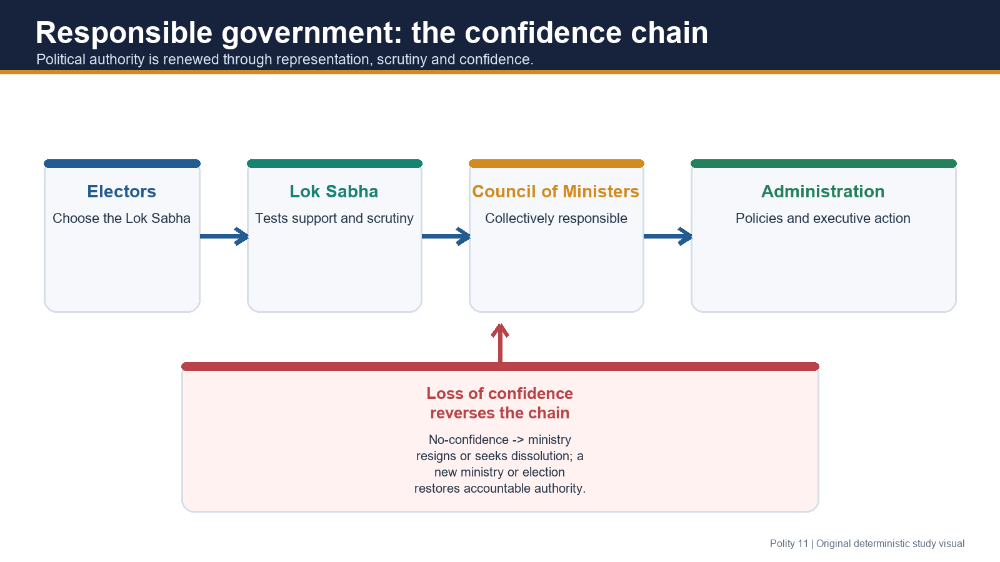

### The controlling test

- [FACT] A **parliamentary government** is one in which the real executive is drawn from, sits in and is politically responsible to the legislature, especially the popularly elected lower House.
- [FACT] A **presidential government** has a separately selected political executive with a constitutionally fixed tenure, not dependent on continuing legislative confidence.
- [ANALYSIS] The classification therefore turns on **responsibility, tenure and institutional relationship**, not on whether a country merely possesses a building or body called Parliament.

### Four related names, carefully distinguished

| Label | Proper meaning | Qualification |
|---|---|---|
| Parliamentary government | Executive survives through lower-House confidence | Constitutional system category |
| Responsible government | Ministry is answerable and removable through the representative House | Emphasises accountability |
| Cabinet government | Cabinet is the coordinating nucleus of the political executive | Also an analytical description of where power operates |
| Westminster model | Historical family derived from British responsible government | India adapted it under a written, supreme Constitution |

- [LIMIT] **Parliamentary government is not parliamentary sovereignty.** India has the former; orthodox British doctrine gives Parliament the latter.
- [LIMIT] “Cabinet government” may name the constitutional form, while “cabinet dominance” or “prime-ministerial government” are later analytical claims about the internal distribution of power.
- [FACT] At the Union, the Council of Ministers headed by the Prime Minister is the real political executive; at the State level, the Council headed by the Chief Minister performs the parallel role.

> **Core thesis:** India combines a formally vested executive power with a politically responsible ministry; legal form lies with the head of State, while democratic responsibility lies with ministers who must retain lower-House confidence.

## 02. Constitutional architecture at Union and State levels

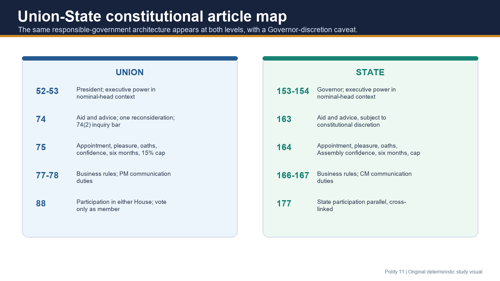

### Nominal-head context: Articles 52 and 53

- [FACT] Article 52 establishes the office of the President; Article 53 vests the Union's executive power in the President and permits its exercise directly or through subordinate officers in accordance with the Constitution.
- [ANALYSIS] These provisions identify the formal constitutional head. They must be read with Articles 74 and 75, which locate responsible political decision-making in the ministry.
- [LIMIT] Detailed presidential powers belong to Polity 15. For this topic, Articles 52-53 matter only to explain why formal vesting does not create an independently governing President.

### Article 74: aid, advice, reconsideration and the inquiry bar

- [FACT] Article 74(1) requires a Council of Ministers with the Prime Minister at the head to **aid and advise** the President.
- [FACT] The 42nd Amendment made action in accordance with ministerial advice explicit.
- [FACT] The 44th Amendment permits the President to require the Council to reconsider advice **once**, generally or otherwise; after reconsideration, the President must act according to the advice tendered.
- [FACT] Article 74(2) bars judicial inquiry into **whether any, and if so what, advice** was tendered by ministers to the President.
- [LIMIT] Article 74(2) protects the content and existence of advice from inquiry; it does not automatically immunise the resulting executive action or its underlying material from constitutional review.

### Article 75: appointment, pleasure and responsibility

| Clause / rule | Exact proposition | Parliamentary significance |
|---|---|---|
| Article 75(1) | President appoints the PM; other ministers on PM's advice | Head of government controls ministerial composition |
| Article 75(1A) | Total ministers, including PM, not above 15% of Lok Sabha strength | 91st Amendment ministry-size control |
| Article 75(1B) | Certain Tenth Schedule disqualifications bar ministerial appointment for the stated period | Links stability rules to executive office |
| Article 75(2) | Ministers hold office during President's pleasure | In practice, individual tenure is mediated through PM advice |
| Article 75(3) | Council collectively responsible to Lok Sabha | Bedrock confidence rule |
| Article 75(4) | President administers oaths of office and secrecy | Third Schedule constitutional commitment |
| Article 75(5) | Non-member minister ceases after six consecutive months | Temporary exception, not permanent external executive |

- [FACT] **Collective responsibility** concerns the ministry as a team before Lok Sabha.
- [FACT] **Individual responsibility** is reflected in ministerial office during pleasure; constitutionally and conventionally, a minister may be removed on the Prime Minister's advice without the whole ministry falling.
- [FACT] India does not adopt the British system of **legal responsibility** requiring a ministerial countersignature for every official act of the head of State. This distinction does not erase political or statutory liability.

### Articles 77 and 78: formal business and the PM-President channel

- [FACT] Article 77 requires Union executive action to be expressed in the President's name and permits authentication rules and rules for convenient transaction and allocation of government business.
- [ANALYSIS] Article 77 makes administration legally orderly; it does not transform the President into the policy-making executive.
- [FACT] Article 78 requires the PM to communicate Council decisions and legislative proposals to the President, furnish requested information, and place before the Council a ministerial decision not considered by it if the President so requires.
- [ANALYSIS] Article 78 creates a constitutional information channel, supporting the head of State's rights to be informed, consulted and to warn without displacing ministerial responsibility.

### Article 88: participation across Houses, but voting follows membership

- [FACT] Every minister and the Attorney-General may speak and take part in proceedings of either House, a joint sitting and a committee of Parliament of which that person is named a member.
- [FACT] Article 88 does **not** confer a vote by virtue of ministerial office.
- [FACT] A minister may vote only in the House of which the minister is a member. A Rajya Sabha minister may address Lok Sabha but cannot vote there.
- [ANALYSIS] This rule makes the executive operationally present across Parliament while preserving House-specific membership rights.

### State parallels: Articles 163, 164, 166 and 167

| Union architecture | State parallel | Exact State qualification |
|---|---|---|
| Article 74 aid and advice | Article 163 | Governor acts on aid and advice except where the Constitution requires discretion |
| Article 75 appointment and responsibility | Article 164 | CM appointed by Governor; other ministers on CM advice; collective responsibility to Legislative Assembly |
| 15% ministry cap | Article 164(1A) | Maximum 15% of Assembly strength, with a constitutional minimum of 12 |
| Six-month rule | Article 164(4) | Non-legislator minister ceases after six consecutive months |
| Article 77 business form | Article 166 | State executive action in Governor's name; authentication and business rules |
| Article 78 communication | Article 167 | CM communicates decisions, furnishes information and may be required to place a minister's decision before Council |

- [LIMIT] Governor discretion and floor-test disputes are primarily State-level questions; use Polity 19 for the full doctrine.

## 03. Nominal and real executive: form, advice and accountability

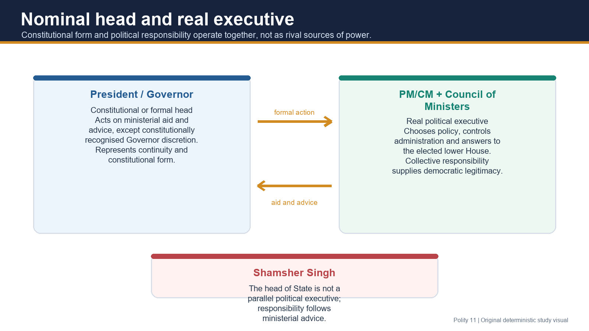

### How the dual executive works

- [FACT] The President is the **nominal, de jure or formal executive**; the PM and Council are the **real, de facto political executive**.
- [FACT] The State parallel is Governor as formal head and CM-Council as responsible political executive.
- [ANALYSIS] “Nominal” does not mean constitutionally useless. The head of State authenticates continuity, receives information, appoints under constitutional rules and may exercise limited cautionary or discretionary space. It means that ordinary policy authority is not personally exercised against responsible advice.

### Shamsher Singh v. State of Punjab (1974)

- [FACT] The Supreme Court treated the President and Governor as constitutional or formal heads acting on ministerial aid and advice, except where the Constitution requires the Governor to act in discretion.
- [ANALYSIS] The holding rejects a parallel personally governing head while preserving the offices' constitutional role.
- [LIMIT] The case does not mean every gubernatorial question is mechanically identical to the President's position; Article 163 and specific provisions create a distinct State field.

### Advice, action and responsibility

1. Ministry chooses and advises.
2. Formal action issues in the constitutional head's name.
3. Ministers answer to Parliament or the Assembly.
4. Courts may review the action on constitutional grounds while Article 74(2) protects the advice itself from inquiry.

> **Close-option trap:** “Executive power is vested in the President” and “the President ordinarily acts on binding advice” are both true. The first describes constitutional form; the second describes responsible exercise.

## 04. The eight classic features: mechanism plus caveat

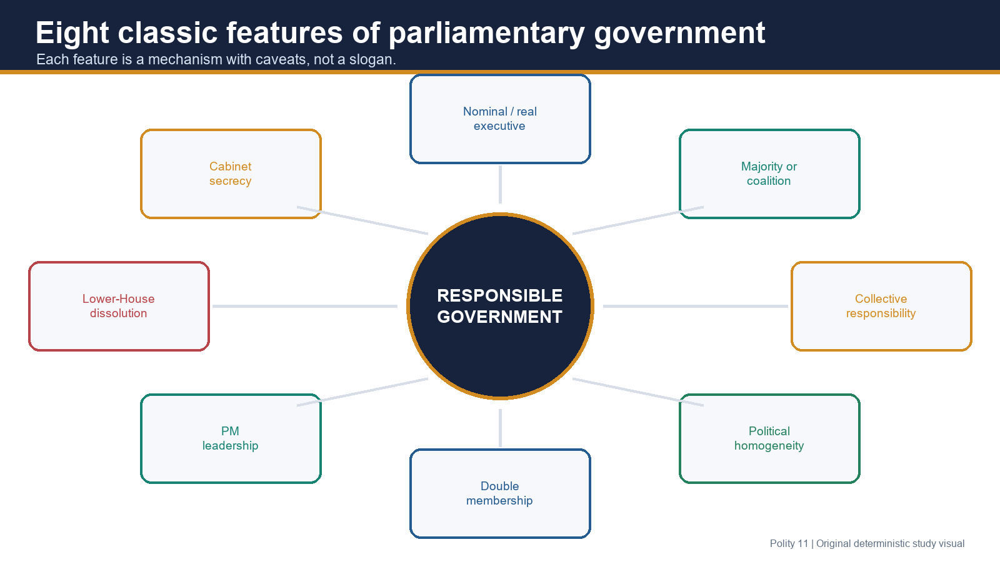

### 1. Nominal and real executives

- Formal head: President/Governor.
- Real political executive: PM/CM and Council.
- Caveat: nominal does not mean irrelevant; discretion and information rights are constitutionally bounded.

### 2. Majority government or coalition government

- [FACT] A party or pre-/post-poll combination capable of commanding Lok Sabha confidence forms the Union government.
- [ANALYSIS] “Majority-party rule” is the classic label; India's multiparty experience requires the broader formulation **majority support**, which can be coalition-based.
- [LIMIT] The President identifies who can command confidence in a hung House but does not create a personal mandate independent of a floor majority.

### 3. Collective responsibility

- Council acts as a political team, publicly supports settled policy and survives together.
- Lok Sabha may remove the ministry through no-confidence.
- Caveat: internal disagreement can exist; a minister unable to support the final position should resign rather than publicly oppose and remain.

### 4. Political homogeneity

- Single-party ministries usually share programme and ideology.
- Coalition ministries replace perfect homogeneity with a common programme, negotiated consensus and coalition discipline.
- Caveat: it is a political tendency, not a constitutional eligibility condition.

### 5. Double membership

- Ministers connect executive and legislature by membership and participation.
- A non-member may be appointed, but Article 75(5)/164(4) allows only six consecutive months without legislative membership.
- Caveat: S.P. Anand confirms that the temporary exception extends to the PM; the person may enter either House of Parliament.

### 6. Leadership of the Prime Minister

- PM leads Council, majority/coalition and the government's parliamentary programme.
- Appointment/removal influence, agenda coordination and Article 78 strengthen the office.
- Caveat: constitutional leadership remains embedded in collective responsibility, party support, courts, federal politics and elections.

### 7. Dissolution of the lower House

- Lok Sabha may be dissolved before its maximum term, normally on PM-led ministerial advice.
- Dissolution can return a deadlock or mandate question to electors.
- Caveat: dissolution is not available against Rajya Sabha; State and exceptional hung-House situations require separate Governor doctrine.

### 8. Secrecy

- Ministers take an oath of secrecy under the Third Schedule, enabling candid internal deliberation and unified public responsibility.
- Caveat: secrecy is not a licence to defeat legislative accountability, judicial process, audit or applicable transparency law.

> **Memory line:** **Head - majority - team - common programme - dual role - PM leadership - dissolution - secrecy.**

## 05. Collective responsibility as the bedrock

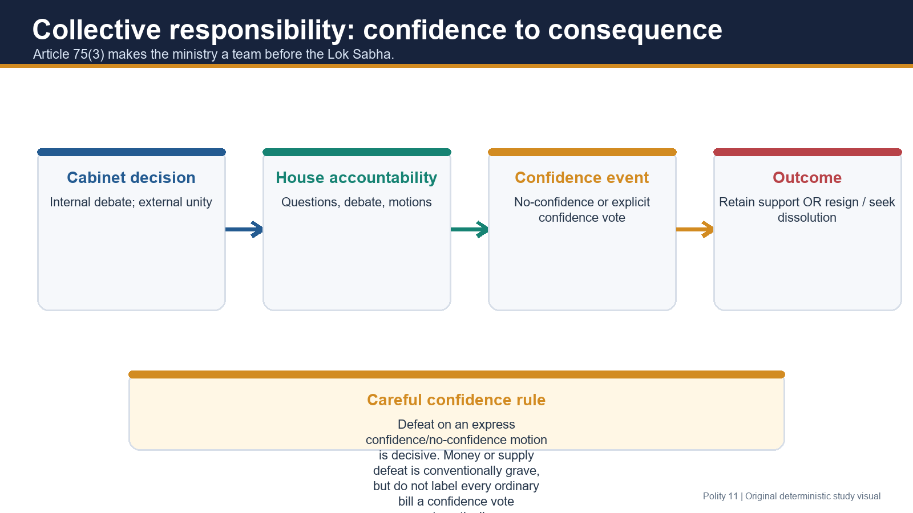

### Three dimensions

| Dimension | Rule | Practical consequence |
|---|---|---|
| Confidence | Ministry must retain Lok Sabha support | Express loss requires resignation or constitutionally proper dissolution route |
| Solidarity | Ministers publicly support settled policy | Dissenting minister should resign |
| Unified accountability | Cabinet decisions bind the ministry | Parliament questions departments, but the government answers as a team |

### No-confidence and confidence votes

- [FACT] Article 75(3) makes the Council collectively responsible to **Lok Sabha**, not Rajya Sabha.
- [FACT] A carried no-confidence motion establishes that the ministry no longer possesses House confidence; the ministry must resign or pursue a constitutionally available dissolution.
- [FACT] A government may itself seek a confidence vote to demonstrate support.
- [LIMIT] Rajya Sabha may criticise, reject ordinary legislation within its powers or adopt motions, but it cannot dismiss the Union Council through no-confidence.

### Defeat on money, supply and other government business

- [FACT] Denial of essential **supply** or defeat on an expressly framed confidence question is conventionally incompatible with continuation.
- [ANALYSIS] Defeat of demands for grants or the central financial programme in Lok Sabha would be a grave confidence event because government cannot govern without supply.
- [LIMIT] Do not mechanically say that defeat of **every** government bill automatically removes the ministry. Context, explicit confidence framing, subsequent confidence testing and constitutional practice matter.
- [LIMIT] A Money Bill has a special bicameral procedure; Rajya Sabha's inability to veto it must not be confused with Lok Sabha's confidence power.

### Four leading cases

#### U.N.R. Rao v. Indira Gandhi (1971)

- [FACT] Dissolution of Lok Sabha does not automatically terminate the PM and Council.
- [FACT] Article 74(1) remains mandatory; government continuity requires ministerial aid and advice even while the House is dissolved.
- [ANALYSIS] Article 75(3) operates when a House exists to test confidence; dissolution temporarily prevents testing but does not convert India into presidential government.

#### Shamsher Singh v. State of Punjab (1974)

- [FACT] President and Governor are constitutional heads who ordinarily act through ministerial advice.
- [ANALYSIS] Responsibility follows the advice-giving ministry, reinforcing the parliamentary allocation of political accountability.

#### S.P. Anand v. H.D. Deve Gowda (1996)

- [FACT] A person who is not initially a member of either House may be appointed PM but can remain only for the six-month constitutional window unless elected or chosen to a House.
- [ANALYSIS] Democratic linkage is required, but it need not exist on the exact day of appointment.

#### S.R. Bommai v. Union of India (1994)

- [FACT] In the Article 356 context, legislative majority should ordinarily be tested on the Assembly floor rather than inferred from subjective claims outside the House; proclamation material is judicially reviewable.
- [ANALYSIS] The floor is the institutional site for proving responsible-government support.
- [LIMIT] Bommai's floor-test doctrine is primarily State and Governor/Article 356 terrain. Use it here to illuminate confidence, then cross-link Polity 19 for operational detail and later refinements.

## 06. Parliamentary versus presidential government: exact axes

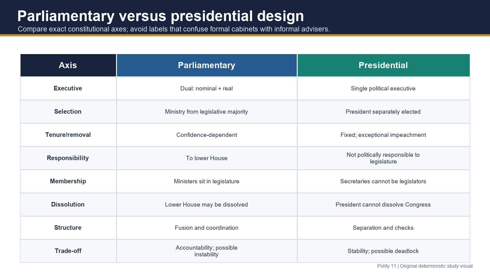

| Axis | Parliamentary system | Presidential system |
|---|---|---|
| Executive structure | Dual: formal head plus real ministry | Single political executive combines head of State/government roles |
| Selection | Ministry emerges from legislative majority/support | President selected separately from legislature |
| Tenure/removal | Confidence-dependent; lower House can remove ministry | Fixed term; exceptional constitutional removal such as impeachment |
| Political responsibility | Ministry responsible to lower House | Executive not politically responsible to legislature |
| Membership | Ministers are or become legislators | Departmental secretaries cannot simultaneously sit in Congress |
| Dissolution | Lower House may be dissolved under constitutional rules | President cannot dissolve Congress |
| Power relationship | Fusion, coordination and mutual dependence | Separation with checks and balances |
| Accountability | Daily parliamentary questioning and confidence control | Periodic electoral and institutional checks |
| Stability/deadlock | Responsive but potentially unstable | Stable tenure but executive-legislative deadlock possible |

### Correcting the “Kitchen Cabinet” error

- [FACT] The United States has constitutionally/statutorily established executive departments led by secretaries appointed through the presidential system.
- [FACT] **Kitchen cabinet** properly refers to an informal circle of advisers; it is not the constitutional name for US cabinet secretaries.
- [LIMIT] Do not present the American cabinet as collectively responsible to Congress. Secretaries are accountable within the executive and subject to oversight, law and confirmation structures, but the President's tenure does not depend on lower-House confidence.

### Brief optional distinction: semi-presidential systems

- [ANALYSIS] A semi-presidential arrangement combines a directly elected President with a PM-government responsible to the legislature; the balance varies by constitutional text and political cohabitation.
- [LIMIT] India is not semi-presidential merely because it has both a President and PM. The Indian President is not a separately mandated political executive governing alongside the PM.

## 07. Why India adopted the parliamentary system

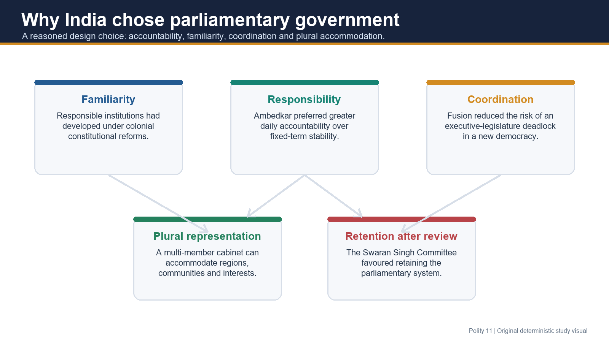

### Familiarity and transition capacity

- [FACT] Limited responsible institutions had developed through the colonial constitutional sequence, especially the 1919 and 1935 arrangements.
- [ANALYSIS] Familiarity lowered the institutional transition cost; it did not mean India copied every British doctrine.
- [LIMIT] Avoid unattributed dramatic quotations. The defensible point is practical constitutional experience, associated in the debate with K.M. Munshi.

### Responsibility over stability

- [FACT] B.R. Ambedkar contrasted the presidential system's greater fixed-term stability with the parliamentary system's greater day-to-day responsibility and defended the latter priority for India.
- [ANALYSIS] The system knowingly accepts a possibility of government change in order to preserve continuous legislative accountability.
- [LIMIT] This was a design judgment, not a claim that stability is irrelevant or that Parliament should govern administration directly.

### Avoiding executive-legislature conflict

- [ANALYSIS] A ministry dependent on legislative support can coordinate policy and law-making more readily than separately elected rival institutions.
- [LIMIT] Fusion reduces structural deadlock risk but can also produce executive dominance when party discipline is excessive.

### Plural representation

- [ANALYSIS] A multi-member cabinet can accommodate regions, social groups, coalition partners and policy constituencies better than a single-person executive.
- [LIMIT] Representation is a political possibility, not an automatic constitutional guarantee of inclusion.

### Swaran Singh Committee retention

- [FACT] The Swaran Singh Committee in the 1970s considered the parliamentary-presidential question and supported retention of the parliamentary system.
- [LIMIT] Do not claim that later political debate is legally barred; the committee supplies evaluative history, not constitutional entrenchment by itself.

> **Qualified verdict:** India selected a responsible executive under legislative confidence because accountability, coordination and plural accommodation were considered more valuable than an independently fixed executive tenure.

## 08. Merits, demerits and the Indian experience

### Merits

| Merit | Mechanism | Qualification |
|---|---|---|
| Executive-legislative harmony | Ministry leads House business and depends on majority | Harmony can become domination |
| Continuous accountability | Questions, debates, motions and committees | Effectiveness depends on time, information and opposition space |
| Alternative government | A new majority may form without immediate election | Feasible only where an alternative commands confidence |
| Broad representation | Cabinet can include regions and groups | PM/party choices determine actual inclusion |
| Flexible response | Leadership can change without constitutional rupture | Excessive churn may damage continuity |

### Demerits

| Demerit | Mechanism | Qualified assessment |
|---|---|---|
| Instability | Coalition breakdown, defection or confidence loss | Not inherent in every coalition |
| Policy discontinuity | Change in ministry may alter programme | Institutions and bipartisan policy can preserve continuity |
| Cabinet/PM dominance | Majority, whip, agenda and appointment control | Correctives survive but may be under-used |
| Fusion weakens scrutiny | Executive sits within and leads legislature | Fusion also makes daily accountability possible |
| “Amateur minister” critique | Political heads may lack sector expertise | Civil service, advisers and committees supply expertise; democratic leadership is not a technical examination |

### Coalition-era counterevidence

- [FACT] India experienced several short-lived Union governments in the late 1970s, 1989-91 and 1996-98, demonstrating the instability risk.
- [FACT] Coalition governments also completed full terms, including the NDA government formed in 1999 and UPA governments after 2004.
- [ANALYSIS] Coalitions can create negotiated programmes, federal voice and restraint as well as bargaining costs.
- [LIMIT] The accurate verdict is **conditional**: party fragmentation, coalition agreements, anti-defection rules, leadership and electoral mandates influence stability more than the parliamentary label alone.

## 09. Cabinet and PM dominance: how Parliament may be marginalised

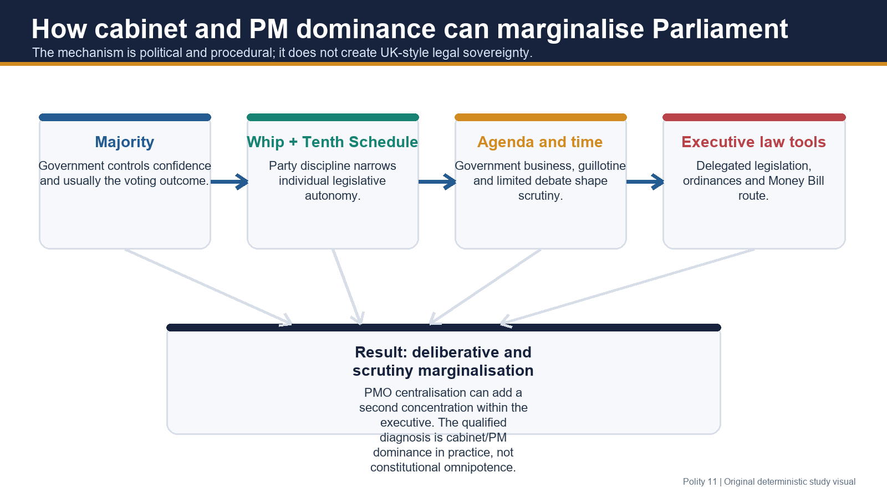

### First clarify the proposition

- [FACT] India's Constitution is supreme; Parliament is not legally sovereign in the British sense.
- [ANALYSIS] “Marginalisation of parliamentary supremacy” in the 2024 PYQ means erosion of Parliament's **effective control and deliberation**, not transfer of unlimited legal sovereignty to the cabinet.

### Mechanisms of dominance

1. **Majority support:** a disciplined governing majority normally controls confidence and legislative outcomes.
2. **Whip and Tenth Schedule:** disqualification risk for voting contrary to party direction can reduce individual MP autonomy. Detailed doctrine and reform belong to Polity 42.
3. **Agenda and time:** government business dominates scheduling; limited sittings and compressed debate reduce scrutiny.
4. **Guillotine:** undiscussed demands for grants may be put to vote together at the allotted deadline, weakening detailed financial examination.
5. **Delegated legislation:** Parliament enacts a framework while the executive supplies rules; committees and courts can scrutinise, but volume creates an information asymmetry.
6. **Ordinance power:** Article 123 permits temporary law when Parliament is not in session, subject to constitutional conditions and later parliamentary control; repeated or strategic use can bypass prior debate.
7. **Money Bill route:** Article 110 classification limits Rajya Sabha to recommendations and a 14-day window, creating concern when the route is stretched beyond its proper field.
8. **PMO and centralisation:** appointment influence, information control, media leadership and a central coordinating office can shift power from cabinet government toward PM-centred government.

### Reliable PRS evidence

- [FACT] PRS Legislative Research reports that the **17th Lok Sabha sat for 274 days over five years**, the lowest for a full-term Lok Sabha.
- [FACT] PRS reported that **16% of Bills** in the 17th Lok Sabha were referred to committees, lower than the **28%** in the 16th and **71%** in the 15th Lok Sabha.
- [ANALYSIS] The data supports a deliberative-decline argument; it does not prove that every law lacked scrutiny or that the constitutional system ceased to be parliamentary.
- [LIMIT] No invented 2026 Budget percentages, bill counts or legislative timelines are used.

## 10. Accountability correctives: Parliament is not powerless

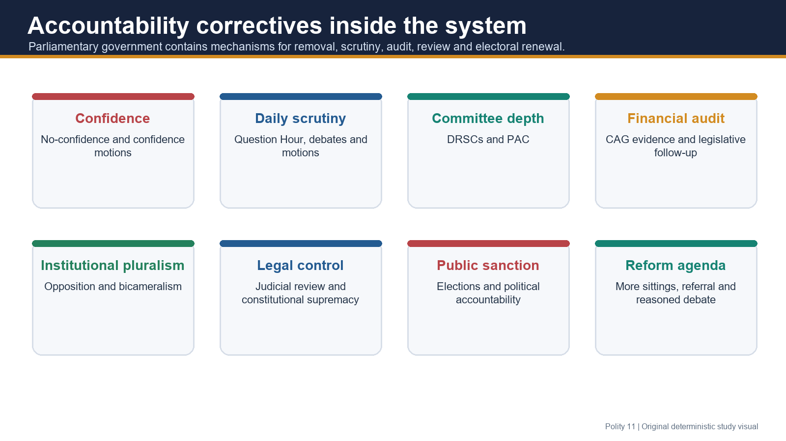

| Corrective | What it does | Limitation |
|---|---|---|
| No-confidence/confidence vote | Tests the ministry's authority to govern | Majority discipline may predetermine result |
| Question Hour and debates | Force information and public explanation | Requires time, admissibility and ministerial responsiveness |
| Motions | Raise censure, adjournment or urgent public issues under House rules | Procedural admission matters |
| DRSCs | Examine bills, demands and ministry performance in detail | Referral is not automatic for all bills |
| PAC and CAG | Link independent audit evidence to legislative financial accountability | Follow-up quality determines effect |
| Opposition | Tests claims and offers alternative government | Strength depends on numbers, organisation and speaking space |
| Bicameralism | Rajya Sabha revises and delays most ordinary legislation | Money Bills and joint-sitting possibilities limit it in defined fields |
| Courts | Enforce constitutional supremacy and review legal boundaries | Courts do not replace political scrutiny |
| Elections | Periodic public sanction | Periodic accountability cannot substitute daily House accountability |

### Reform direction

- Increase predictable sitting days and protect scrutiny time.
- Strengthen routine committee referral with reasoned exceptions.
- Narrow whip compulsion to government-survival and core manifesto matters through considered reform.
- Give members research support and publish delegated-legislation scrutiny promptly.
- Preserve correct Money Bill classification and responsible ordinance practice.
- [ANALYSIS] The remedy for deliberative decline is institutional renewal, not automatic abandonment of parliamentary government.

## 11. India, Britain and the United States: comparative precision

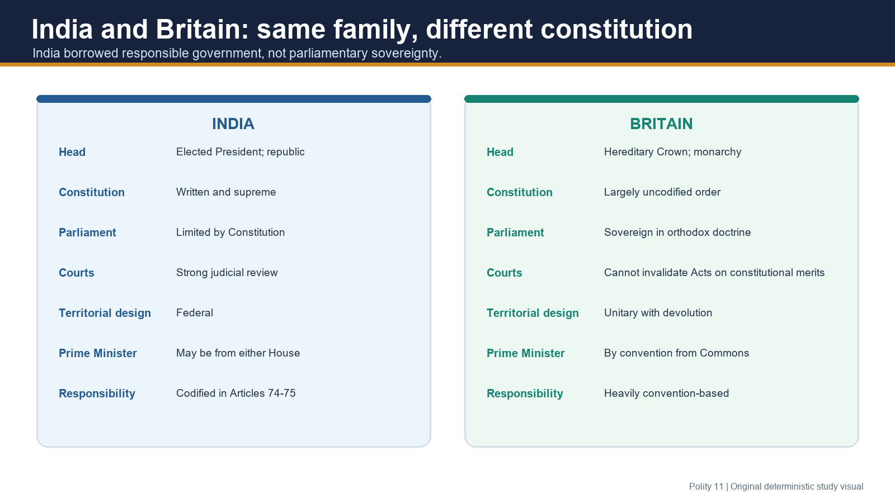

### India versus Britain

| Axis | India | Britain |
|---|---|---|
| Head of State | Elected President; republic | Hereditary Crown; constitutional monarchy |
| Constitutional form | Written and supreme Constitution | Largely uncodified constitutional order |
| Parliament | Constitutionally limited | Sovereign under orthodox doctrine |
| Judicial review | Courts may invalidate unconstitutional law | Courts cannot invalidate an Act merely for constitutional inconsistency under the orthodox sovereignty rule |
| Territorial design | Federal Constitution with strong Union features | Unitary State with devolution |
| PM's House | May be member of either House; six-month entry rule applies | By convention PM sits in House of Commons |
| Responsibility | Collective and individual framework codified | Heavily developed through convention and law |
| Legal responsibility | No universal countersignature rule for official head-of-State acts | Ministerial countersignature/legal-responsibility traditions are stronger |

- [FACT] India has **constitutional supremacy plus parliamentary government**.
- [FACT] Britain combines **parliamentary sovereignty plus responsible cabinet government**.
- [LIMIT] “Unwritten British Constitution” is shorthand; Britain has many written constitutional statutes and documents but no single codified supreme constitutional text equivalent to India's.

### India versus the United States: support for the 2018 PYQ

| Tenet | India | United States |
|---|---|---|
| Democratic form | Parliamentary republic | Presidential republic |
| Federalism | Federal with a strong Union and parliamentary executive | Federal with separated national institutions |
| Executive-legislature | Fusion and confidence | Separation and fixed executive term |
| Rights | Justiciable Fundamental Rights subject to constitutional doctrine | Bill of Rights and later amendments |
| Courts | Integrated judiciary with judicial review | Dual federal-State system with judicial review |
| Citizenship | Single citizenship | Dual political citizenship in federal practice |
| Amendment | Article 368 graded route and basic-structure limit | Article V high federal threshold |

- [ANALYSIS] Both systems rest on constitutionalism, republican democracy, federalism, rights and judicial review, but they organise accountability and institutional conflict differently.

## 12. Current control: simultaneous elections as a system-design debate

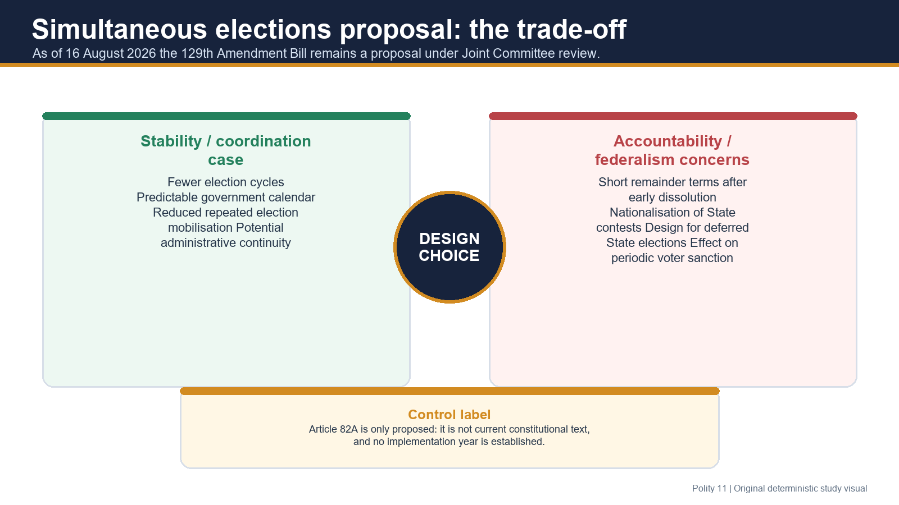

### Verified status on 16 August 2026

- [CURRENT] The Constitution (One Hundred and Twenty-Ninth Amendment) Bill, 2024 was introduced in Lok Sabha on **17 December 2024**.
- [CURRENT] It was referred, with the Union Territories Laws (Amendment) Bill, 2024, to a **Joint Committee of Parliament**, chaired by P.P. Chaudhary.
- [CURRENT] PRS and Digital Sansad continued to show the Bills under committee consideration; no enacted constitutional amendment or final implementation scheme is claimed here.
- [FACT] The Bill proposes a new Article 82A framework and connected changes for simultaneous Lok Sabha and State Assembly elections.
- [LIMIT] **Article 82A is not current constitutional text.** Do not give an implementation year or claim that the committee has endorsed constitutionality unless a primary report is tabled and verified.

### Use only as a parliamentary-system debate

| Claimed stability gain | Accountability/federal concern |
|---|---|
| More predictable electoral calendar | Remainder terms after premature dissolution may be short |
| Fewer repeated election cycles | National contests may overshadow State-specific accountability |
| Reduced repeated administrative mobilisation | Deferral design raises representation questions |
| Greater policy continuity | Less frequent staggered voter sanction may alter political incentives |

- [ANALYSIS] Ambedkar's responsibility-versus-stability frame supplies the correct answer lens: efficiency claims must be weighed against confidence-based flexibility, federal representation and periodic democratic accountability.

## 13. Prelims close-option traps and qualified verdicts

| Trap | Correct distinction |
|---|---|
| Council responsible to Parliament generally | Constitutionally collective responsibility is specifically to **Lok Sabha** |
| President may reject advice after reconsideration | May return once; must accept reconsidered advice |
| Article 74(2) bars review of executive action | It bars inquiry into ministerial advice, not all review |
| Every minister must already be an MP | Six-month temporary exception exists |
| Minister may vote in either House | Participation in either; vote only in House of membership |
| President's pleasure is personal political discretion | Individual tenure operates through PM-led responsible government |
| Parliamentary government means Parliament is sovereign | India has parliamentary government under constitutional supremacy |
| US secretaries are a “Kitchen Cabinet” | Formal secretaries are not the informal kitchen cabinet |
| Any government-bill defeat automatically removes ministry | Express confidence and essential supply are decisive; context matters otherwise |
| Floor test is mainly a Union President doctrine | Bommai's operational focus is State majority and Article 356 |
| Article 82A already governs elections | It is only proposed in a pending Bill |

### Qualified verdict bank

- **System choice:** India's parliamentary system accepts conditional instability to secure continuous responsibility and plural coalition-building.
- **Cabinet dominance:** The cabinet and PM can marginalise legislative scrutiny through majority, whip and agenda control, but they do not acquire British-style legal sovereignty.
- **Coalitions:** Coalition politics can destabilise, but it can also federalise decision-making and produce stable negotiated governments.
- **Corrective:** More sittings, committee referral, financial scrutiny and narrower whip use strengthen the existing design more directly than a wholesale presidential shift.

## PART II - Optional Advanced analytical labels

> **Advanced boundary:** The following labels interpret political practice. They are not constitutional provisions or judicial doctrines, and skipping them must not reduce the score of a Core answer.

### Bagehot: fusion or the “hyphen”

- [ANALYSIS] Walter Bagehot described cabinet as the connecting link between executive and legislature.
- Use: explain why parliamentary government avoids rigid separation.
- Caution: fusion can enable accountability or domination depending on party and scrutiny conditions.

### Jennings: cabinet government

- [ANALYSIS] Ivor Jennings emphasised cabinet as the system's working nucleus and opposition as a potential alternative government.
- Use: explain coordination and ready replacement.
- Caution: modern PMO and party leadership may weaken a cabinet-centred description.

### Laski and Muir: cabinet dictatorship

- [ANALYSIS] The label captures a disciplined majority's capacity to control House outcomes and time.
- Use: critique the majority-whip-agenda mechanism.
- Caution: “dictatorship” is a polemical analytical label; elections, courts, federalism, bicameralism and confidence rules remain.

### Crossman and Mackintosh: prime-ministerial government

- [ANALYSIS] The label identifies migration of power from collegial cabinet toward PM-centred appointments, communication, coordination and electoral leadership.
- Use: add a second layer to the 2024 cabinet-dominance answer.
- Caution: it does not repeal Article 75(3) or prove equal centralisation under every PM and coalition.

### Elective dictatorship

- [ANALYSIS] This label describes a government using an elected lower-House majority to dominate law-making between elections.
- Use: discuss the weak scrutiny side of fusion.
- Caution: it is neither an Indian constitutional term nor proof that elections alone authorise unlimited power.

### Core executive

- [ANALYSIS] “Core executive” studies the network around PM, cabinet, PMO, senior bureaucracy, finance and security institutions rather than assuming one fixed centre.
- Use: explain why actual power varies by issue, information, coalition and institutional resources.
- Caution: analytical mapping must not replace the constitutional confidence framework.

## Concise source and control note

- Certified Core: `Polity/basic/Parliamentary-System.md`; optional Advanced: `Polity/advanced/11_Parliamentary-System.md`; both left unmodified.
- Local OCR-searchable *Indian Polity* chapter on the parliamentary system, used for classic features, merits/demerits, adoption reasons and India-Britain distinctions; corrected here on the US “Kitchen Cabinet” label.
- Official Constitution of India, Legislative Department: Articles 52-53, 74-75, 77-78, 88, 163-164, 166-167 and Third Schedule.
- Official Supreme Court judgment records: *U.N.R. Rao v. Indira Gandhi* (1971), *Shamsher Singh v. State of Punjab* (1974), *S.P. Anand v. H.D. Deve Gowda* (1996); *S.R. Bommai v. Union of India* (1994) used for the floor-test/Article 356 principle.
- Local official UPSC papers and routing ledgers for 2020 Prelims Q11, 2021 Prelims Q77, 2018 GS-II Q13, 2023 GS-II Q4 and 2024 GS-II Q3.
- Historical 2020 and 2021 official Prelims keys are unavailable locally; solutions below are prominently labelled **INFERRED ANSWER - NOT OFFICIALLY VERIFIED**.
- PRS Legislative Research: *Functioning of the 17th Lok Sabha* and legislative brief/status for the simultaneous-elections Bills; Digital Sansad Joint Committee page checked for current committee control.

## Solved topic-specific MCQs

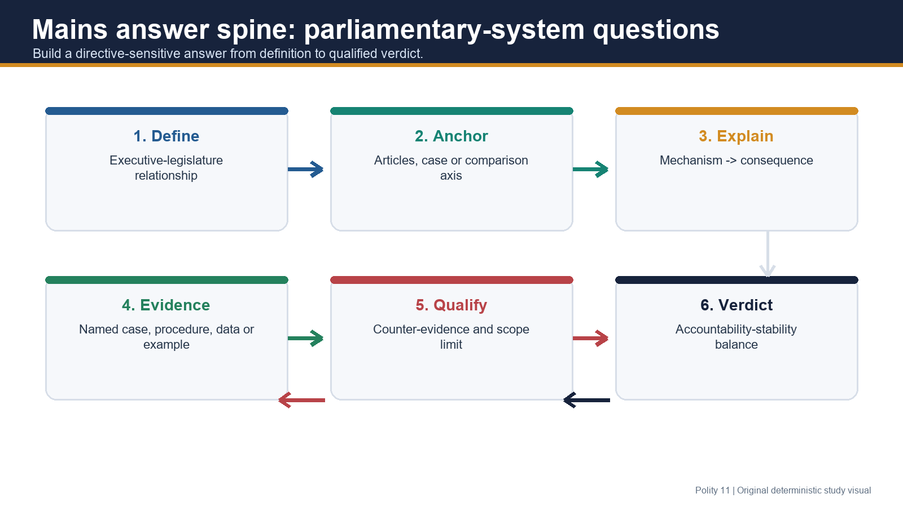

> **Workbook boundary:** Everything from this heading through the original Mains practice is reproduced in the separate solved-practice workbook. Final register notes are intentionally excluded from that workbook.

## Verified routed PYQ laboratory

### PYQ 1 - UPSC Prelims 2020, GS-I, Q11

**Question:** A Parliamentary System of Government is one in which:

A. all political parties in the Parliament are represented in the Government  
B. the Government is responsible to the Parliament and can be removed by it  
C. the Government is elected by the people and can be removed by them  
D. the Government is chosen by the Parliament but cannot be removed by it before completion of a fixed term

**INFERRED ANSWER - NOT OFFICIALLY VERIFIED: B.**

- A is wrong: an opposition remains outside government; an all-party ministry is not a defining requirement.
- B is correct: political responsibility and removability through the lower House are the controlling features.
- C is wrong: electors choose legislators; the ministry ordinarily emerges through the House majority and is removed by confidence procedure.
- D is wrong: fixed, confidence-independent tenure is presidential, not parliamentary.
- **Confidence:** Very high. The local official question is verified; the historical official key is not held locally.

### PYQ 2 - UPSC Prelims 2021, GS-I, Q77

**Question:** We adopted parliamentary democracy based on the British model, but how does our model differ from that model?

1. As regards legislation, the British Parliament is supreme or sovereign, but in India, the power of Parliament to legislate is limited.
2. In India, matters related to the constitutionality of the amendment of an Act of Parliament are referred to the Constitution Bench by the Supreme Court.

Select the correct answer:

A. 1 only  
B. 2 only  
C. Both 1 and 2  
D. Neither 1 nor 2

**INFERRED ANSWER - NOT OFFICIALLY VERIFIED: C.**

- Statement 1 is correct: Indian legislation is limited by legislative competence, Fundamental Rights, other constitutional provisions and judicial review; orthodox British doctrine treats Parliament as sovereign.
- Statement 2 is accepted as correct in the PYQ's intended frame: Article 145(3) requires at least five judges where a case involves a substantial question of law as to constitutional interpretation.
- [LIMIT] Not every routine statutory challenge becomes a Constitution Bench matter; the constitutional threshold is a **substantial question of interpretation**.
- **Confidence:** High. The local official question is verified; the historical official key is not held locally.

### PYQ 3 - UPSC GS-II 2024, Q3 - direct owner

**Question:** “The growth of cabinet system has practically resulted in the marginalisation of the parliamentary supremacy.” Elucidate.  
**10 marks | 150 words**

**Demand decoding**

- “Elucidate” requires mechanism and evidence, not a generic merits/demerits list.
- “Parliamentary supremacy” must be clarified as effective control and deliberation, not UK-style legal sovereignty.
- A high-scoring answer should accept the tendency, identify correctives and give a qualified verdict.

**Model solution**

India's cabinet is drawn from Parliament and remains responsible to Lok Sabha under Article 75(3). Yet this fusion can allow the executive to dominate the institution meant to scrutinise it.

First, a disciplined majority and the whip, reinforced by the Tenth Schedule, usually make government defeat unlikely and reduce independent legislative voting. Second, the cabinet controls most House business and time; guillotining of demands for grants, compressed debate and limited committee referral weaken financial and legislative examination. Third, delegated legislation, ordinances under Article 123 and an overbroad Money Bill route can reduce prior bicameral scrutiny. PMO-centred coordination may further convert cabinet government into prime-ministerial government.

However, Parliament retains no-confidence power, Question Hour, motions, DRSCs and PAC-CAG scrutiny. Courts enforce constitutional limits, and elections renew accountability.

Thus, cabinet growth has marginalised Parliament's **deliberative and control functions**, not created British-style cabinet sovereignty. The remedy is more sittings, routine committee scrutiny and narrower whip use.

#### Why this earns marks

- Opens with Article 75(3) and directly resolves the sovereignty/supremacy ambiguity.
- Uses a mechanism chain: majority -> whip -> agenda/time -> executive law tools -> PM concentration.
- Adds named correctives and a reform-oriented, qualified conclusion within 10-mark scope.

### PYQ 4 - UPSC GS-II 2018, Q13 - supporting/cross-owned

**Question:** India and USA are two large democracies. Examine the basic tenets on which the two political systems are based.  
**15 marks | 250 words**

> **Ownership label:** Cross-owned by comparative constitutional design; included here because parliamentary-presidential structure is central to the demand.

**Demand decoding**

- “Examine” requires both common constitutional commitments and structural differences.
- Avoid reducing the answer to a table of President versus PM.
- Use evidence from constitutional form, federalism, rights, review and accountability.

**Model solution**

India and the United States are constitutional, federal, republican democracies committed to representative government, rights and judicial review. Their basic tenets overlap, but the institutional routes differ.

**Common foundations:** Both derive authority from a written Constitution, divide power federally, protect enforceable rights and entrust courts with constitutional review. Bicameral national legislatures represent population and constituent units, while periodic elections provide democratic legitimacy.

**Different executive principles:** India adopts responsible parliamentary government. Articles 74-75 create a dual executive: the President is the formal head, while the PM-Council governs subject to Lok Sabha confidence. The United States has a single elected President with fixed tenure; cabinet secretaries cannot sit in Congress and are not collectively responsible to it.

**Different separation logic:** India uses functional fusion and coordination, qualified by judicial review and federal distribution. The US uses a stricter separation with presidential veto, Senate confirmation and congressional oversight, creating checks but also deadlock risk.

**Federal and political variation:** India has a stronger Union, single citizenship and an integrated judiciary; the US combines constitutionally stronger States, dual political citizenship and dual court structures. Indian party discipline and anti-defection rules strengthen executive control over the legislature; US divided government may intensify bargaining.

Therefore, both systems seek limited democratic government, but India prioritises daily legislative responsibility, whereas the US prioritises fixed tenure and institutional separation. Neither model ensures accountability or stability automatically; outcomes depend on parties, federal practice and constitutional restraint.

#### Why this earns marks

- Answers “basic tenets” through shared foundations plus institutional differences.
- Uses named Articles and exact comparison axes rather than slogans.
- Includes effects and qualifications: responsibility versus stability, fusion versus deadlock, strong Union versus State autonomy.

### PYQ 5 - UPSC GS-II 2023, Q4 - supporting/cross-owned

**Question:** Compare and contrast the British and Indian approaches to Parliamentary sovereignty.  
**10 marks | 150 words**

> **Ownership label:** Cross-owned by comparative constitutional design; included here to prevent confusion between parliamentary government and parliamentary sovereignty.

**Model solution**

Britain and India both practise responsible cabinet government, but their approaches to legislative authority differ fundamentally.

Under orthodox British doctrine, Parliament may enact or repeal any law; courts interpret Acts but cannot invalidate them merely for inconsistency with a superior codified Constitution. The constitutional order is largely uncodified and conventions regulate much executive practice.

India instead adopts **constitutional supremacy**. Parliament's ordinary law-making is limited by the Seventh Schedule, Fundamental Rights and other constitutional provisions, and is subject to judicial review. Even the Article 368 amending power is limited by the basic-structure doctrine. Federalism and bicameral representation further distribute authority.

Similarity remains in political responsibility: in both systems the cabinet survives through lower-House confidence and normally controls the legislative agenda.

Thus, India borrowed Westminster responsible government but constitutionalised and limited it. British parliamentary sovereignty concerns legal competence; Indian “parliamentary supremacy” is better understood as Parliament's political control over the executive within a supreme Constitution.

#### Why this earns marks

- Defines the precise legal contrast before listing institutional evidence.
- Uses Seventh Schedule, Fundamental Rights, judicial review, Article 368 and basic structure.
- Ends by separating sovereignty from responsible government, the core trap in the question.

## Original hard MCQ set - strict A -> B -> C -> D rotation

### OM1. Article 74 control

Consider the following statements:

1. The President may require ministerial advice to be reconsidered once.
2. After reconsideration, the President may permanently reject the advice.
3. Article 74(2) bars inquiry into the advice but does not necessarily bar review of the resulting action.

Which is correct?

A. 1 and 3 only  
B. 2 and 3 only  
C. 1 only  
D. 1, 2 and 3

**Answer: A.**

The 44th Amendment permits one reconsideration, after which the advice binds. Article 74(2) protects advice from inquiry; constitutional review of the action may still proceed on available material and legal grounds.

### OM2. Union-State architecture

Which pairing is correct?

A. Article 77 - collective responsibility to Lok Sabha  
B. Article 167 - Chief Minister's communication duties to the Governor  
C. Article 88 - State Council's responsibility to Assembly  
D. Article 166 - President's rules for Union business

**Answer: B.**

Article 167 is the State parallel to Article 78. Article 77 concerns Union executive business, Article 88 parliamentary participation, and Article 166 State executive business.

### OM3. Ministry-size controls

Consider the following:

1. Union ministry: maximum 15% of Lok Sabha strength.
2. State ministry: maximum 15% of Legislative Assembly strength.
3. State ministry: constitutional minimum of 12.
4. These caps were introduced by the 91st Amendment.

Which is correct?

A. 1 and 4 only  
B. 1, 2 and 4 only  
C. 1, 2, 3 and 4  
D. 2 and 3 only

**Answer: C.**

Articles 75(1A) and 164(1A), inserted by the 91st Amendment, establish the two 15% caps; the State Council also has a minimum of 12.

### OM4. Minister in the other House

A Union minister who belongs to Rajya Sabha attends Lok Sabha. Which statement is most accurate?

A. The minister cannot speak because the minister is not a Lok Sabha member.  
B. The minister may speak and vote because executive office overrides membership.  
C. The minister may vote only on government bills.  
D. The minister may speak and participate but cannot vote in Lok Sabha.

**Answer: D.**

Article 88 enables participation in either House, joint sittings and named committees, but gives no vote by virtue of office. Voting follows House membership.

### OM5. Nominal and real executive

Which proposition best reflects *Shamsher Singh*?

A. President and Governor are formal heads ordinarily acting on responsible advice, subject to constitutionally recognised Governor discretion.  
B. The President has a personal popular mandate equal to Lok Sabha.  
C. All gubernatorial discretion is unconstitutional.  
D. Article 53 allows the President to govern without a Council.

**Answer: A.**

The case constitutionalises the formal-head position and ministerial responsibility. It does not erase specific gubernatorial discretion or create personal presidential government.

### OM6. Dissolution and continuity

What was the central implication of *U.N.R. Rao v. Indira Gandhi*?

A. Lok Sabha dissolution automatically dismisses the Council.  
B. The Council continues because Article 74 remains mandatory even while confidence cannot be tested in a dissolved House.  
C. The President governs alone until elections.  
D. Article 75(3) is permanently suspended after dissolution.

**Answer: B.**

The Court harmonised continuity under Article 74 with confidence under Article 75(3). Dissolution prevents an immediate floor test; it does not terminate responsible government.

### OM7. Non-member Prime Minister

Which is correct after *S.P. Anand*?

A. Only an existing Lok Sabha member can become PM.  
B. A Rajya Sabha member cannot become PM.  
C. A non-member may become PM but must enter either House within six months.  
D. A non-member PM may continue until the next general election.

**Answer: C.**

Article 75(5) permits a six-month window. The Indian Constitution does not import the British convention that the PM must sit in the Commons.

### OM8. Floor-test doctrine

Which statement is the most precise use of *S.R. Bommai* in this topic?

A. It makes every Union bill a confidence vote.  
B. It gives Governors unrestricted discretion to assess support privately.  
C. It abolishes Article 356.  
D. It supports floor determination of disputed Assembly majority and judicial review of Article 356 material.

**Answer: D.**

Bommai's main operational field is State government and President's Rule. It supports the wider responsible-government principle that legislative support is tested in the House.

### OM9. Collective responsibility

Which statement best captures collective responsibility?

A. The ministry must retain Lok Sabha confidence and publicly stand by settled cabinet policy as a team.  
B. Every minister is individually elected by Lok Sabha.  
C. Rajya Sabha may dismiss the Council through no-confidence.  
D. Cabinet disagreement is legally prohibited even inside meetings.

**Answer: A.**

Collective responsibility combines confidence and solidarity. Internal debate is possible; public opposition while remaining in office conflicts with cabinet solidarity.

### OM10. Financial defeat

Which is the safest constitutional formulation?

A. Defeat of any government amendment automatically removes the ministry.  
B. Express confidence defeat or denial of essential supply is decisive/grave; ordinary legislative defeat requires contextual assessment.  
C. Rajya Sabha rejection of a Money Bill dismisses the Council.  
D. The Budget has no relationship with confidence.

**Answer: B.**

Parliamentary convention treats supply as essential to governing, but not every adverse division is automatically a confidence loss. Lok Sabha is the confidence chamber.

### OM11. Political homogeneity

In a coalition ministry, political homogeneity is best understood as:

A. a constitutional requirement that every minister belong to one party.  
B. a prohibition on regional parties entering government.  
C. negotiated consensus around a common programme rather than identical ideology.  
D. automatic loss of office whenever partners disagree.

**Answer: C.**

Homogeneity is a classic political tendency. Coalition government adapts it through agreed programmes and cabinet solidarity.

### OM12. Secrecy

Which statement is correct?

A. The oath of secrecy eliminates Parliament's right to seek information.  
B. Cabinet secrecy prevails over every court order.  
C. Secrecy is merely a political convention with no constitutional oath.  
D. Secrecy protects candid deliberation but coexists with legislative, judicial, audit and statutory accountability.

**Answer: D.**

Ministers take the Third Schedule oath. Its purpose is not absolute executive opacity.

### OM13. System comparison

Which combination correctly distinguishes parliamentary from presidential government?

A. Confidence-dependent ministry, legislative membership and possible lower-House dissolution.  
B. Fixed executive tenure, collective responsibility and fusion.  
C. Separate executive selection with ministerial membership of Congress.  
D. Lower-House confidence with President unable to dissolve it in any circumstance.

**Answer: A.**

The parliamentary cluster is responsibility, double membership and dissolution. Presidential government features separate selection, fixed tenure and separation.

### OM14. US executive terminology

Which is correct?

A. “Kitchen Cabinet” is the constitutional collective name for US departmental secretaries.  
B. US cabinet secretaries are formal executive officers; “kitchen cabinet” refers to informal advisers.  
C. US secretaries remain members of Congress while serving.  
D. The House of Representatives can dismiss the US cabinet by no-confidence.

**Answer: B.**

The informal label must not be confused with the formal cabinet. The presidential executive is not collectively responsible to Congress.

### OM15. India-Britain difference

Consider the following:

1. India is a republic; Britain a constitutional monarchy.
2. India has a written supreme Constitution; Britain follows parliamentary sovereignty.
3. India's PM may be from either House; Britain's PM is by convention from the Commons.

Which is correct?

A. 1 only  
B. 1 and 2 only  
C. 1, 2 and 3  
D. 2 and 3 only

**Answer: C.**

All three distinctions are central. India constitutionalised Westminster responsibility without importing Crown heredity or parliamentary legal omnipotence.

### OM16. Adoption rationale

Which was **not** a defensible reason for India's adoption of parliamentary government?

A. Familiarity with responsible institutions  
B. Preference for daily responsibility  
C. Accommodation of plural representation  
D. Desire to make Parliament legally sovereign over the Constitution

**Answer: D.**

India chose responsible government under constitutional supremacy. The design rejected British-style unlimited parliamentary sovereignty.

### OM17. Coalition evidence

Which conclusion is best supported by Indian experience?

A. Coalitions can be unstable, but full-term coalitions show instability is conditional rather than inherent.  
B. Every coalition necessarily collapses before five years.  
C. Anti-defection guarantees perfect cabinet stability.  
D. Single-party governments cannot produce cabinet dominance.

**Answer: A.**

Short-lived governments demonstrate risk; full-term NDA and UPA coalitions demonstrate negotiated stability. Institutional incentives and political conditions matter.

### OM18. Cabinet-dominance chain

Which sequence is most accurate?

A. Judicial review -> cabinet secrecy -> parliamentary sovereignty  
B. Majority + whip -> agenda/time control -> reduced scrutiny, qualified by committees and confidence power  
C. Federalism -> fixed tenure -> no dissolution  
D. Rajya Sabha no-confidence -> PM dismissal

**Answer: B.**

The majority-whip-agenda mechanism explains practical dominance. It is checked, not erased, by scrutiny institutions.

### OM19. PRS evidence

Which statement reflects the verified PRS anchor used in this package?

A. The 17th Lok Sabha sat more than every earlier full-term House.  
B. All Bills in the 17th Lok Sabha were referred to committees.  
C. It sat 274 days, while committee referral was lower than in the 16th and 15th Lok Sabhas.  
D. PRS found that parliamentary committees had been abolished.

**Answer: C.**

PRS reported 274 sitting days and a 16% referral rate, down from 28% in the 16th and 71% in the 15th Lok Sabha.

### OM20. Simultaneous-elections control

As of 16 August 2026, which is correct?

A. Article 82A is operative constitutional law.  
B. Parliament has enacted a mandatory implementation year.  
C. The Joint Committee has conclusively upheld every provision.  
D. The 129th Amendment Bill remains a proposal under Joint Committee consideration.

**Answer: D.**

The Bill was introduced on 17 December 2024 and remains under committee review. No enacted Article 82A or implementation year may be asserted.

### OM21. Articles 77 and 78

Which pairing is correct?

A. Article 77 - form/authentication/allocation of Union business; Article 78 - PM's information duties to President.  
B. Article 77 - no-confidence; Article 78 - ministerial oath.  
C. Article 77 - parliamentary privilege; Article 78 - dissolution.  
D. Article 77 - State business; Article 78 - Governor discretion.

**Answer: A.**

Article 77 structures executive business in the President's name; Article 78 sustains the constitutional communication channel.

### OM22. State Council

Which statement is correct?

A. State Council is collectively responsible to Legislative Council wherever one exists.  
B. It is collectively responsible to the Legislative Assembly, and the 15% cap is subject to a minimum of 12 ministers.  
C. Governor may permanently reject reconsidered advice in all matters.  
D. A non-legislator State minister has a twelve-month window.

**Answer: B.**

Article 164 mirrors the lower-House confidence rule, applies a six-month membership window and imposes the cap/minimum.

### OM23. Three responsibility concepts

Which classification is correct?

A. Collective responsibility means each minister must countersign every presidential act.  
B. Individual responsibility means Rajya Sabha can dismiss one minister.  
C. Collective responsibility concerns the team before Lok Sabha; individual tenure operates through pleasure/PM advice; India lacks the British universal countersignature model.  
D. Legal responsibility and collective responsibility are identical.

**Answer: C.**

The three concepts answer different questions: survival of ministry, tenure of individual minister, and formal legal authentication/countersignature.

### OM24. Advanced labels

Which is correct?

A. “Prime-ministerial government” is text in Article 78.  
B. “Cabinet dictatorship” is a binding Supreme Court doctrine.  
C. “Elective dictatorship” abolishes the need for elections.  
D. These are analytical labels for power distribution and must not be treated as constitutional rules.

**Answer: D.**

Bagehot, Jennings, Laski/Muir, Crossman/Mackintosh and core-executive analysis help interpret practice; the Constitution remains the legal framework.

## Remedial MCQ loop - strict A -> B -> C -> D rotation

### RM1. Advice after reconsideration

The President returns advice once. The Council reaffirms it. What follows?

A. The President must act according to the reconsidered advice.  
B. The President may call a referendum.  
C. The President may refer it to Rajya Sabha.  
D. The advice automatically lapses.

**Answer: A.**

The 44th Amendment created a single reconsideration opportunity, not a permanent veto.

### RM2. Confidence chamber

Which body can remove the Union Council through a no-confidence motion?

A. Rajya Sabha alone  
B. Lok Sabha  
C. Joint sitting  
D. Supreme Court

**Answer: B.**

Article 75(3) fixes collective responsibility to Lok Sabha. Courts enforce law; they do not hold confidence votes.

### RM3. Six-month rule

A person appointed minister while not a member of Parliament:

A. can never vote but may remain for five years.  
B. must enter Lok Sabha only.  
C. must become a member of either House within six consecutive months or cease to be minister.  
D. receives automatic Rajya Sabha membership.

**Answer: C.**

The temporary exception preserves appointment flexibility while requiring legislative connection.

### RM4. Government versus sovereignty

Which statement is correct?

A. Parliamentary government always makes Parliament legally unlimited.  
B. India follows British parliamentary sovereignty.  
C. Judicial review is incompatible with responsible government.  
D. India has parliamentary government within a supreme, judicially enforceable Constitution.

**Answer: D.**

The confidence relationship and the location of final legal authority are separate constitutional questions.

### RM5. US “Kitchen Cabinet”

The safest statement is:

A. A kitchen cabinet is an informal adviser circle, not the constitutional machinery of US departmental secretaries.  
B. It is the US lower House.  
C. It is collectively responsible to Congress.  
D. Its members must be senators.

**Answer: A.**

This correction prevents a common textbook-label overreach.

### RM6. Government defeat

Which formulation is most accurate?

A. Every lost division automatically dissolves Lok Sabha.  
B. No-confidence or denial of essential supply is decisive/grave; other defeats require context.  
C. Rajya Sabha alone determines Union confidence.  
D. Financial business never affects confidence.

**Answer: B.**

Confidence doctrine is serious but should not be converted into an automatic rule for every bill or amendment.

### RM7. Floor test

The floor-test doctrine is most directly associated in this package with:

A. appointment of Supreme Court judges.  
B. authentication under Article 77.  
C. disputed State-government majority and Article 356 review.  
D. election of the President.

**Answer: C.**

Use Bommai to show that majority is proved in the representative chamber; take procedural Governor detail to Polity 19.

### RM8. Article 82A status

As of the package control date:

A. Article 82A has already shortened every Assembly term.  
B. The President has notified the first simultaneous cycle.  
C. The Supreme Court has approved a final implementation year.  
D. Article 82A remains proposed text in a pending constitutional-amendment Bill.

**Answer: D.**

The proposal is relevant to the stability-accountability debate only; it is not current law.

## Original Mains practice with examiner-grade models

### M1. 10 marks | 150 words

**Question:** Explain how Articles 74, 75, 77, 78 and 88 together convert formal executive power into responsible government.

**Demand decoding**

- “Explain how” requires an integrated mechanism, not five isolated Article definitions.
- Connect advice, appointment, business form, information and parliamentary participation.

**Model solution**

The Constitution formally vests Union executive power in the President, but Articles 74, 75, 77, 78 and 88 make its exercise politically responsible.

Article 74 places a PM-headed Council to aid and advise the President; after one reconsideration, the advice binds, while Article 74(2) protects the advice from judicial inquiry. Article 75 then gives the arrangement democratic content: ministers are appointed within a PM-led structure, hold office during pleasure, take constitutional oaths and are collectively responsible to Lok Sabha. The six-month rule ensures that even an initially non-member minister acquires legislative membership.

Article 77 converts decisions into valid executive form through action in the President's name and business-allocation rules. Article 78 requires the PM to communicate decisions and information to the President, preserving consultation without personal presidential government. Article 88 allows ministers to participate in either House, though voting remains tied to membership.

Together, these provisions join constitutional form, cabinet decision and legislative accountability: the President acts formally, the Council decides politically, and Lok Sabha controls survival.

#### Why this earns marks

- Integrates all five Articles through one causal chain.
- Uses the reconsideration, six-month and voting caveats.
- Ends with a crisp nominal-head/real-executive/confidence synthesis.

### M2. 10 marks | 150 words

**Question:** Collective responsibility is both a rule of government survival and a rule of cabinet solidarity. Analyse with judicial support.

**Demand decoding**

- Address both confidence and solidarity.
- Use at least two cases and qualify dissolution/floor-test context.

**Model solution**

Article 75(3) makes collective responsibility the bedrock of Union parliamentary government in two senses.

**Survival:** The Council must retain Lok Sabha confidence. A carried no-confidence motion requires resignation or a constitutionally proper dissolution route. Denial of essential supply is similarly grave, though not every legislative defeat automatically equals loss of confidence.

**Solidarity:** Ministers may disagree internally, but once policy is settled they must defend it publicly; a minister who cannot do so should resign. This gives Parliament one accountable government rather than competing departmental executives.

In *U.N.R. Rao* (1971), the Supreme Court held that dissolution does not terminate the Council: Article 74 ensures continuity while Article 75(3) operates when a House exists to test confidence. *Shamsher Singh* (1974) located responsibility in the advice-giving ministry rather than the formal head. At State level, *S.R. Bommai* (1994) reinforced the House floor as the proper place to test disputed majority.

Thus, collective responsibility unifies authority, accountability and continuity, but must not be confused with suppression of internal debate or a claim that every lost vote dismisses government.

#### Why this earns marks

- Separates the two limbs named in the question.
- Uses three cases for different propositions rather than decorative citation.
- Adds the supply/ordinary-defeat and State-level qualifications.

### M3. 15 marks | 250 words

**Question:** Compare parliamentary and presidential systems and assess why the parliamentary form remains better suited to India's constitutional conditions.

**Demand decoding**

- Comparison must use exact axes.
- Assessment needs Indian reasons, counterarguments and a graded verdict.

**Model solution**

Parliamentary and presidential systems differ primarily in the relationship between executive and legislature.

| Axis | Parliamentary | Presidential |
|---|---|---|
| Executive | Formal head plus real ministry | Single political executive |
| Selection | Ministry from legislative support | President separately elected |
| Tenure | Confidence-dependent | Fixed |
| Responsibility | Daily to lower House | Not politically responsible to legislature |
| Membership | Ministers sit in legislature | Executive officers cannot sit in legislature |
| Structure | Fusion and coordination | Separation and checks |

India preferred the parliamentary form for four connected reasons. First, Ambedkar prioritised greater responsibility over the presidential model's greater fixed-term stability. Questions, motions and no-confidence make accountability continuous rather than merely periodic. Second, constitutional experience under late-colonial reforms made responsible institutions administratively familiar. Third, fusion reduced the risk of a separately elected executive and legislature producing deadlock in a new democracy. Fourth, a multi-member cabinet offered room for regional, social and coalition representation in a plural federation. The Swaran Singh Committee later favoured retention.

The choice has costs. Short-lived governments demonstrate instability; majority, whip and PMO control can produce cabinet dominance; generalist ministers invite the “amateur” critique. A presidential system offers tenure stability and access to external expertise.

However, Indian evidence qualifies these objections. Full-term coalitions show that fragmentation need not cause collapse. Expert administration can be supplied without making the executive confidence-independent, while constitutional supremacy, federalism and courts check concentration.

Therefore, parliamentary government remains better suited not because it guarantees good governance, but because its confidence principle, replaceability and coalition capacity align with India's need for continuous accountability and plural accommodation. Reform should strengthen Parliament rather than replace responsible government.

#### Why this earns marks

- Gives an exact comparison before evaluation.
- Uses Ambedkar, institutional familiarity, pluralism, Swaran Singh and coalition counterevidence.
- Acknowledges presidential advantages and parliamentary failures before defending a qualified Indian choice.

### M4. 15 marks | 250 words

**Question:** “Cabinet dominance in India is a product of constitutional fusion amplified by party and procedural power.” Discuss.

**Demand decoding**

- Separate the constitutional base from political amplifiers.
- Explain consequences and correctives; avoid calling the cabinet legally sovereign.

**Model solution**

India's parliamentary Constitution deliberately fuses executive and legislative personnel: Articles 74-75 create a ministry drawn from Parliament and sustained by Lok Sabha confidence. Fusion enables coordination and accountability, but does not alone explain cabinet dominance.

**Party amplification:** A governing majority normally controls House outcomes. The whip, backed in relevant cases by Tenth Schedule disqualification risk, prioritises party survival over independent legislative judgment. The cabinet therefore commands the very majority meant to scrutinise it.

**Procedural amplification:** Government business occupies most agenda time. Guillotining of undiscussed demands for grants compresses financial scrutiny. Delegated legislation transfers operational detail to the executive; ordinances under Article 123 can precede debate; an overbroad Money Bill route can reduce Rajya Sabha's role. PM control over appointments, communication and coordination, strengthened by PMO resources, may further convert cabinet government into prime-ministerial government.

**Evidence of weakened deliberation:** PRS records only 274 sitting days for the full-term 17th Lok Sabha and a committee-referral rate lower than in the 16th and 15th Lok Sabhas. This indicates reduced opportunity for detailed scrutiny, though it does not establish that every enactment was unexamined.

**Correctives:** Article 75(3) still enables removal through no-confidence. Question Hour, motions, DRSCs, PAC-CAG scrutiny, opposition, bicameralism, courts and elections constrain the executive. Judicial review is especially important because India follows constitutional, not parliamentary, sovereignty.

Thus, cabinet dominance is best seen as **fusion plus disciplined majority plus control of procedure and information**. It marginalises deliberation in practice, not Parliament's constitutional capacity. More sittings, routine committee referral and narrower whip use are the appropriate correctives.

#### Why this earns marks

- Directly tests and proves both parts of the quotation.
- Adds precise instruments, PRS evidence and constitutional correctives.
- Avoids the major conceptual error of equating executive dominance with legal sovereignty.

### M5. 20 marks | 250-300 words

**Question:** Critically evaluate whether India's parliamentary system has delivered responsibility at an unacceptable cost to stability and policy continuity.

**Demand decoding**

- “Critically evaluate” requires criteria, positive evidence, negative evidence, counterevidence and a reasoned threshold judgment.
- Responsibility, stability and continuity must all be addressed.

**Model solution**

India adopted parliamentary government because a democratic executive must be stable yet accountable, and the framers preferred greater day-to-day responsibility. The central question is whether the resulting instability has become disproportionate.

**Responsibility delivered:** Article 75(3) makes government survival dependent on Lok Sabha confidence. Questions, debates, committees, financial voting and no-confidence expose ministers to continuous scrutiny. A failed ministry can be replaced without constitutional rupture. *Shamsher Singh* places political responsibility on the advice-giving Council, while *U.N.R. Rao* preserves responsible continuity even during dissolution.

**Stability and continuity costs:** India has seen short-lived governments, particularly in 1979, 1989-91 and 1996-98. Coalition bargaining and defection can delay decisions; a new ministry may reverse policy. Confidence incentives may encourage short-term electoral calculation. The simultaneous-elections proposal itself draws political force from the claim that repeated elections and uncertain terms disrupt governance.

**Why the cost is not inherently unacceptable:** Full-term coalition governments after 1999 show that negotiated programmes, anti-defection discipline and institutional learning can produce stability. Major economic, welfare, foreign-policy and federal commitments have often continued across governments, demonstrating bureaucratic, judicial and intergovernmental continuity. Presidential fixed tenure would reduce one kind of instability but could create executive-legislative deadlock and concentrate personal mandate.

**A deeper responsibility deficit:** The more serious modern problem may be too little, not too much, legislative control. Majority whips, reduced sittings, weak committee referral and PMO centralisation can make governments stable while Parliament becomes less deliberative. PRS's 274-day figure for the 17th Lok Sabha illustrates this concern.

**Judgment:** Parliamentary instability is a designed accountability cost, but it becomes unacceptable only when party fragmentation defeats governance without enabling scrutiny. India's experience is mixed, not a system failure. The priority should be constructive confidence conventions, coalition transparency, stronger committees, predictable sittings and protection of federal/electoral accountability.

#### Why this earns marks

- Establishes explicit evaluation criteria and follows them.
- Uses Articles, cases, historical instability, coalition counterevidence and PRS evidence.
- Reframes the debate by showing that excessive executive stability can coexist with weak legislative responsibility.

### M6. 20 marks | 250-300 words

**Question:** The simultaneous-elections proposal revives the parliamentary dilemma between stability and accountability. Examine the constitutional trade-offs without treating the proposal as current law.

**Demand decoding**

- Begin with the verified pending status.
- Use the proposal only as a system-design debate.
- Balance governance claims against confidence flexibility, federalism and voter accountability.

**Model solution**

The Constitution (One Hundred and Twenty-Ninth Amendment) Bill, 2024, introduced on 17 December 2024, proposes an Article 82A framework for simultaneous Lok Sabha and Assembly elections. As of 16 August 2026 it remains under Joint Committee review: Article 82A is not current law and no implementation year is established.

**Stability case:** Fewer election cycles may create a more predictable administrative calendar, reduce repeated mobilisation and give governments a clearer policy horizon. Synchronisation could also reduce the political incentive for continuous campaign mode. These claims echo the presidential advantage of tenure stability without formally replacing parliamentary government.

**Accountability cost:** Parliamentary government permits a ministry to fall when it loses House confidence. The proposal's remainder-term design after premature dissolution may produce legislatures with very short mandates merely to restore the common cycle. This could weaken the value of a fresh electoral mandate and encourage actors to prioritise calendar preservation over responsive government.

**Federal concern:** State elections express State-specific accountability. Synchronisation may nationalise campaign issues and alter the balance between Union and State political cycles. A mechanism for deferring a particular Assembly election must also be tested against representative continuity and constitutional safeguards.

**Constitutional design issue:** Ambedkar's formulation remains apt: no system maximises stability and responsibility equally. Election expenditure and administrative convenience are relevant, but they cannot by themselves displace confidence, federalism and periodic voter sanction. Conversely, staggered elections are not automatically superior if they cause chronic governance avoidance.

**Judgment:** The proposal should be assessed through necessity, proportionality, federal consultation, workable treatment of early dissolution and protection of House confidence. Stability is valuable only when it serves, rather than freezes, democratic responsibility. Until enactment, it must remain an analytical current-affairs illustration, not a statement of constitutional law.

#### Why this earns marks

- Opens with exact current control and repeats the non-law qualification.
- Organises analysis into stability, accountability, federalism and design.
- Uses Ambedkar's frame and provides a constitutional test rather than a partisan verdict.

## Final consolidated register notes

### System identity and non-negotiable distinctions

- Parliamentary/responsible government = real executive drawn from and politically answerable to legislature; survives through lower-House confidence.
- Cabinet government = cabinet as coordinating nucleus; may also be an analytical label.
- Westminster model = historical family, adapted rather than copied.
- India has **parliamentary government + constitutional supremacy**.
- Britain has **responsible government + orthodox parliamentary sovereignty**.
- “Parliamentary supremacy” in Indian Mains questions usually means effective legislative control, not unlimited law-making power.

### Union constitutional chain

| Provision | Rapid recall |
|---|---|
| 52-53 | President and formal vesting of executive power; read with responsible advice |
| 74(1) | PM-headed Council aids and advises; President may return once, then must accept |
| 74(2) | No judicial inquiry into whether/what advice was tendered; action itself not automatically immune |
| 75(1) | PM appointed by President; ministers on PM advice |
| 75(1A) | Ministry maximum 15% of Lok Sabha; 91st Amendment |
| 75(2) | Pleasure: individual tenure operates through PM-led system |
| 75(3) | Collective responsibility to Lok Sabha |
| 75(4) | Oaths of office and secrecy; Third Schedule |
| 75(5) | Six consecutive months for a non-member |
| 77 | Action in President's name; authentication, allocation and transaction of business |
| 78 | PM communicates decisions, supplies information, places ministerial matter before Council if required |
| 88 | Minister may participate in either House/joint sitting/named committee; vote only in House of membership |

### State mirror

- Article 163 = aid and advice, subject to constitutionally recognised Governor discretion.
- Article 164 = CM/ministers, pleasure, Assembly confidence, oath, six-month rule.
- Article 164(1A) = 15% of Assembly, minimum 12.
- Article 166 = action in Governor's name and State business rules.
- Article 167 = CM-Governor communication channel.
- Cross-link floor-test, hung-House and discretion detail to **Polity 19**.

### Eight-feature recall grid

1. Nominal/real executive -> form versus responsible power.
2. Majority/coalition support -> majority in confidence sense, not always one party.
3. Collective responsibility -> confidence + solidarity + unified accountability.
4. Political homogeneity -> common ideology or coalition programme; political tendency, not legal condition.
5. Double membership -> fusion; six-month temporary exception.
6. PM leadership -> Council, majority and government programme; not legally unlimited.
7. Lower-House dissolution -> return to electors; Rajya Sabha not dissolvable.
8. Secrecy -> candid deliberation; not immunity from Parliament, courts, audit or statute.

> **Mnemonic:** **Head - majority - team - programme - dual role - leader - dissolution - secrecy.**

### Collective responsibility case strip

| Case | Holding to deploy | Limit |
|---|---|---|
| *U.N.R. Rao* (1971) | Council continues after Lok Sabha dissolution; Article 74 remains mandatory | Confidence cannot be tested while House is dissolved |
| *Shamsher Singh* (1974) | President/Governor formal heads ordinarily acting on responsible advice | Governor has constitutionally specified discretionary field |
| *S.P. Anand* (1996) | Non-member may be PM for six months and may enter either House | No permanent non-legislator executive |
| *S.R. Bommai* (1994) | Disputed State majority belongs on Assembly floor; Article 356 material reviewable | Primary operational owner is Governor/State government |

- No-confidence carried -> ministry must resign or use a constitutionally proper dissolution route.
- Essential supply defeat -> conventionally grave.
- Do not say every lost government division automatically dismisses the ministry.
- Rajya Sabha scrutinises but cannot remove the Union Council through no-confidence.

### Parliamentary-presidential comparison spine

| Axis | Parliamentary | Presidential |
|---|---|---|
| Executive | Dual | Single political executive |
| Selection | Legislative majority/support | Separate election |
| Term | Confidence-dependent | Fixed |
| Removal | No-confidence | Exceptional impeachment |
| Membership | Ministers in legislature | Executive officers outside legislature |
| Dissolution | Lower House possible | Congress not dissolvable by President |
| Structure | Fusion | Separation/checks |
| Strength | Daily accountability | Tenure stability |
| Risk | Instability/dominance | Deadlock/personal concentration |

- US departmental secretaries are formal executive officers; **kitchen cabinet = informal advisers**.
- Semi-presidential = elected President + PM responsible to legislature; not India's model.

### Why India chose it

- Familiarity with evolving responsible institutions.
- Ambedkar: greater responsibility preferred to greater fixed-term stability.
- Reduced structural executive-legislature conflict.
- Cabinet can accommodate India's plural regions and interests.
- Swaran Singh Committee favoured retention.
- Do not overclaim Constituent Assembly unanimity or use unattributed quotations.

### Indian performance ledger

**Merits:** coordination; questions/motions; alternative government; flexible leadership change; representation.

**Demerits:** collapse risk; policy reversal; cabinet/PM dominance; weakened separation; generalist-minister critique.

**Coalition qualification:** short-lived ministries prove risk; full-term NDA/UPA coalitions prove instability is conditional. Coalitions can federalise decisions and constrain concentration.

### Cabinet-dominance mechanism and answer evidence

`Fusion -> majority -> whip/Tenth Schedule -> agenda/time -> guillotine/delegation/ordinance/Money Bill -> PMO centralisation -> reduced deliberation`

- Tenth Schedule can convert party direction into disqualification risk; detailed reform -> Polity 42.
- Guillotine compresses discussion of demands for grants.
- Delegated legislation shifts detail to executive, subject to legislative/judicial control.
- Article 123 ordinance is temporary and reviewable, not a parallel sovereign law source.
- Money Bill route narrows Rajya Sabha's role and must remain within Article 110.
- PRS anchor: 17th Lok Sabha = **274 sitting days**; **16%** bills referred, below 16th (**28%**) and 15th (**71%**).
- Qualified conclusion: scrutiny and deliberation are marginalised; constitutional supremacy is not transferred to cabinet.

### Accountability-corrective stack

- Removal: no-confidence/confidence.
- Daily scrutiny: Question Hour, debates, motions.
- Detailed scrutiny: DRSCs.
- Financial accountability: CAG -> PAC.
- Political balance: opposition and bicameralism.
- Legal boundary: judicial review.
- Public sanction: elections.
- Reform: predictable sitting calendar, routine referral, research support, narrower whip, proper Money Bill and ordinance practice.

### India-Britain-US rapid comparison

- India republic; Britain monarchy.
- India written supreme Constitution; Britain largely uncodified order and parliamentary sovereignty.
- India strong judicial review; British courts do not invalidate Acts under orthodox sovereignty doctrine.
- India federal; Britain unitary with devolution.
- Indian PM may be from either House; UK PM conventionally from Commons.
- Indian responsibility rules are significantly codified; British system relies more heavily on convention.
- India and US share constitutionalism, federalism, rights and review; differ on parliamentary fusion versus presidential separation.

### Current-control card: simultaneous elections

- **Bill:** Constitution (129th Amendment) Bill, 2024.
- **Introduced:** 17 December 2024.
- **Status on 16 August 2026:** under Joint Committee consideration with connected UT Laws Bill.
- **Not law:** proposed Article 82A is not in the current Constitution.
- **No claim:** no implementation year; no unverified committee endorsement.
- **Use in answers:** stability/coordination claims versus confidence flexibility, short remainder terms, federal political space and voter accountability.

### Advanced labels - optional only

- Bagehot -> fusion/hyphen.
- Jennings -> cabinet government and alternative government.
- Laski/Muir -> cabinet dictatorship critique.
- Crossman/Mackintosh -> prime-ministerial government.
- Elective dictatorship -> majority domination between elections.
- Core executive -> networked power around PM, cabinet, PMO and senior institutions.
- All are **analytical labels**, never constitutional doctrine.

### PYQ routes

- 2020 Prelims Q11 -> responsibility/removability definition -> inferred B.
- 2021 Prelims Q77 -> UK sovereignty + Indian constitutional limits/Constitution Bench -> inferred C.
- 2024 GS-II Q3 direct -> fusion, whip, agenda, executive law tools, PRS evidence, correctives.
- 2018 GS-II Q13 cross-owned -> shared constitutional democracy/federalism/rights/review + parliamentary-presidential divergence.
- 2023 GS-II Q4 cross-owned -> British sovereignty versus Indian constitutional supremacy.

### Mains answer spines

**System definition:** relation -> Articles -> mechanism -> case -> qualification -> verdict.

**Cabinet dominance:** clarify sovereignty -> fusion -> majority/whip -> procedure/tools -> PRS evidence -> correctives -> deliberative-decline verdict.

**System choice:** responsibility/stability -> familiarity -> coordination -> pluralism -> demerits -> coalition counterevidence -> retain with reform.

**Comparison:** exact axes -> common democratic foundations -> institutional effects -> Indian suitability -> graded conclusion.

### Final trap checklist

- President returns advice **once**, not repeatedly.
- Article 74(2) protects advice, not every executive act.
- Collective responsibility = **Lok Sabha**; State = **Legislative Assembly**.
- Six months = temporary non-member window; either House for Union PM.
- 15% cap = 91st Amendment; State minimum = 12.
- Article 88 participation does not create cross-House vote.
- Individual, collective and legal responsibility are not synonyms.
- Bommai floor test is primarily State-level.
- Parliamentary government is not parliamentary sovereignty.
- Kitchen cabinet is informal.
- Not every defeat is confidence loss.
- Article 82A remains proposed, not operative.
