# Polity 13 - Centre-State and Inter-State Relations - Complete Topic Package

> **Subject:** Indian Polity | **Topic:** 13 | **GS-II + Prelims** | **Export date:** 2026-08-16
>
> **Approval:** false - awaiting explicit user approval.
>
> **Evidence key:** [FACT] constitutional, judicial, statutory or source-verified proposition; [ANALYSIS] reasoned exam synthesis; [CURRENT] dated status; [LIMIT] qualification preventing overstatement.

## Package method, scope boundary and current control

- Source order followed: certified Core owner `Polity/basic/Centre-State-Relations.md` -> optional Advanced owner `Polity/advanced/13_Centre-State-and-Inter-State-Relations.md` -> official local PYQ papers and keys -> Constitution, judgments and official current controls -> Qdrant not used.
- [LIMIT] Foundation and Core are independently answer-complete. Optional Advanced adds representation, economic-federalism and scholar depth only.
- [CURRENT] Status is controlled to **16 August 2026, Asia/Kolkata**.
- [CURRENT] Standard Seventh Schedule examination counts are **Union 100, State 61, Concurrent 52**. Historical numbering retains omitted and inserted entries.
- [CURRENT] The 2019 Inter-State River Water Disputes Amendment Bill passed Lok Sabha but has **not become law**; the existing ad-hoc tribunal architecture remains controlling.
- [CURRENT] The Sixteenth Finance Commission award for 2026-31 retains **41% vertical devolution** and adds a **10% contribution-to-GDP** criterion.
- [CURRENT] The November 2025 Article 143 opinion controls Governor assent: no fixed judicial deadlines and no deemed assent, while prolonged unexplained inaction can be reviewed through a direction to act.
- [LIMIT] Federal theory is owned by Polity 12; detailed Emergency doctrine by Polity 14; Governor office by Polity 19; Finance Commission institution by Polity 29. This package remains complete on how those mechanisms affect relations.
- Package target: **8 routed PYQs**, **28 original MCQs**, **8 remedials**, **7 solved Mains questions** and **14 original visuals**.

## Roadmap

| Stage | Coverage | Exam outcome |
|---|---|---|
| Framework | Four dimensions and constitutional map | Organises every answer |
| Legislative | Articles 245-255, Lists, overlap and State-field entry | Solves competence questions |
| State-law control | Prior sanction, reservation and assent | Handles Governor/President traps |
| Doctrines | Harmonious construction, supremacy, repugnancy, pith and substance | Answers 2019 GS-II |
| Administrative | Articles 256-263, directions, delegation, Article 365 | Explains central leverage |
| Services/agencies | AIS, integrated institutions and CBI consent | Connects administration to conflict |
| Financial | Articles 265-293, tax sharing, grants and borrowing | Builds fiscal architecture |
| Evolution | Planning Commission to FC-GST-NITI model | Answers 2025 GS-II |
| 16th FC | Accepted devolution, formula and grant shifts | Current fiscal control |
| Inter-State | Water disputes, ISC, Zonal Councils and full faith | Solves institutional questions |
| Common market | Articles 301-307 and Jindal Stainless | Completes economic federalism |
| Commissions | Rajamannar, Sarkaria and Punchhi | Supplies reform menu |
| Practice | Eight PYQs, 36 MCQs and seven Mains models | Converts knowledge into marks |

## Scope ownership and cross-links

- **Polity 12:** meaning, classifications, federal/centralising features and federalism as Basic Structure.
- **Polity 14:** National, State and Financial Emergencies in full.
- **Polity 19:** Governor appointment, government formation, discretion and office-specific doctrine.
- **Polity 29:** Finance Commission constitution, detailed recommendations and State-wise devolution.
- **Polity 33:** GST Council composition, voting and tax mechanics.
- **Polity 35:** Inter-State Council and Zonal Councils may recur as dedicated bodies, but their relation function is complete here.

## PART I - Complete Foundation and Core learning session

## 01. Constitutional map: four dimensions

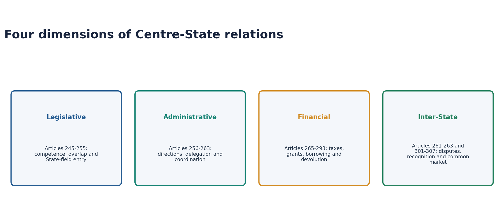

| Dimension | Principal Articles | Core question |
|---|---|---|
| Legislative | 245-255, Part XI | Who may make the law and what happens on conflict? |
| Administrative | 256-263, Part XI | Who implements, directs, delegates and coordinates? |
| Financial | 265-293, Part XII | Who taxes, receives, grants and borrows? |
| Inter-State/economic | 261-263 and 301-307 | How are disputes, recognition and the common market managed? |

- [ANALYSIS] The dimensions interact. A legally State subject may depend on Union finance; a shared tax may require administrative coordination; a water dispute may become a political and fiscal conflict.
- [ANALYSIS] High-scoring answers therefore identify the dimension before listing grievances.

## 02. Legislative relations: competence before conflict

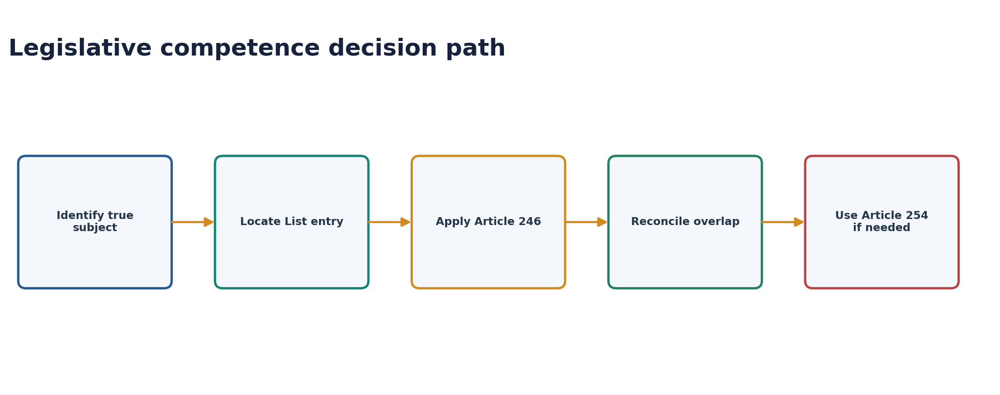

### Territorial reach: Article 245

- [FACT] Parliament may legislate for the whole or any part of India; a parliamentary law is not invalid merely because it has extra-territorial operation.
- [FACT] A State legislature ordinarily legislates for the State or part of it.
- [FACT] The territorial-nexus doctrine permits State law to affect an extra-State object where the connection is real and the liability is pertinent to that connection.

### Distribution: Article 246 and the Seventh Schedule

| List | Standard current count | Primary legislature | Illustrations |
|---|---:|---|---|
| Union | 100 | Parliament | Defence, currency, inter-State trade, inter-State migration/quarantine |
| State | 61 | State legislature | Police, public health, agriculture, markets, prisons |
| Concurrent | 52 | Both | Criminal law, marriage, education, forests |

- [FACT] Article 246(1) gives Union List competence notwithstanding the other clauses.
- [FACT] Article 246(2) creates concurrent competence; Article 246(3) gives State List competence subject to clauses (1) and (2).
- [FACT] Article 248 and Union Entry 97 place residuary legislative and taxing power with Parliament.
- [FACT] The 42nd Amendment moved education, forests, weights and measures, protection of wild animals and birds, and administration of justice from State to Concurrent.
- [LIMIT] List entries are fields of legislation, not narrow statutory definitions; courts interpret them broadly.

## 03. Parliament in the State field

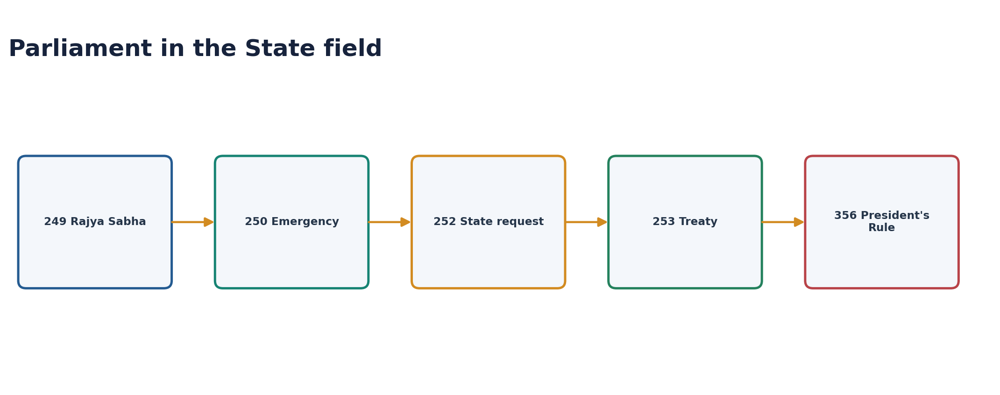

| Article | Trigger | Duration/effect | Federal safeguard |
|---|---|---|---|
| 249 | Rajya Sabha: two-thirds present and voting; national interest | Resolution up to one year, renewable; law has six-month tail | State chamber supplies trigger |
| 250 | National Emergency in operation | Law has six-month tail after Emergency ends | Temporary crisis route |
| 252 | Resolutions by two or more State legislatures | Applies to requesting/adopting States; Parliament alone amends/repeals | State-initiated consent |
| 253 | Treaty or international decision implementation | Operates as needed for implementation | National external obligation |
| 356 | Parliament exercises State legislative power during President's Rule | Parliamentary law continues until altered by competent legislature | Bommai review and restoration safeguards |

> **Mnemonic:** **R-N-S-I-P** - Rajya Sabha, National Emergency, States' request, International obligation, President's Rule.

- [LIMIT] Article 249 does not require an Emergency.
- [LIMIT] Under Article 252 a participating State cannot unilaterally amend the parliamentary enactment.
- [LIMIT] Farm-market or disaster examples must be analysed through the actual List entry and statute, not political labels alone.

## 04. Union control over State legislation

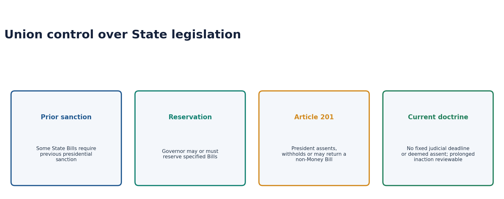

### Prior presidential sanction

- [FACT] Some State Bills require previous presidential sanction, including a Bill imposing a reasonable restriction under Article 304(b).
- [FACT] A State Bill affecting High Court powers so as to endanger its constitutional position must be reserved under the proviso to Article 200.
- [ANALYSIS] Prior sanction and reservation are distinct: one is permission before legislative introduction or consideration; the other sends a passed Bill for presidential decision.

### Articles 200 and 201

- [FACT] A Governor presented with a State Bill acts through the constitutional options of assent, withholding, return of a non-Money Bill, or reservation for the President as applicable.
- [FACT] Under Article 201 the President may assent or withhold assent; for a non-Money Bill the President may direct return through the Governor for reconsideration.
- [FACT] If the State legislature passes the returned Bill again, Article 201 does not impose the Article 200-style obligation that assent must follow.

### Current Governor-assent control

- [CURRENT] The 20 November 2025 advisory opinion rejects judicially fixed timelines and deemed assent.
- [CURRENT] Prolonged, unexplained and indefinite inaction remains open to limited review; a court may require action without choosing the constitutional option.
- [LIMIT] Do not reproduce the superseded April 2025 timelines as current law.

## 05. Federal supremacy and harmonious construction

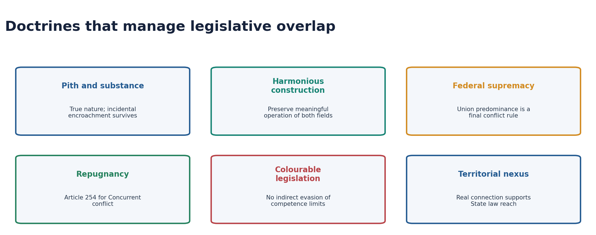

| Doctrine | Test | Consequence |
|---|---|---|
| Pith and substance | What is the law's true nature and dominant character? | Incidental encroachment does not invalidate competence |
| Harmonious construction | Can both entries/laws receive meaningful operation? | Reconciliation is preferred |
| Federal supremacy | Does an irreconcilable constitutional priority remain? | Union predominance operates as tie-breaker |
| Repugnancy | Are Union and State laws on a Concurrent matter directly inconsistent? | Article 254 ordinarily gives Union law priority |
| Colourable legislation | Is competence being evaded by form? | Indirect transgression is invalid |
| Territorial nexus | Is there a real connection to the State? | Supports extra-territorial effect of State law |

### Article 254

- [FACT] A State law repugnant to parliamentary law on a Concurrent subject is void to the extent of repugnancy.
- [FACT] A reserved State law receiving Presidential assent may prevail in that State.
- [FACT] Parliament may later add to, amend, vary or repeal that State law.
- [LIMIT] Article 254 is not the first step in every List dispute. First identify competence and attempt harmonious construction.

> **2019 PYQ thesis:** Harmonious construction is the ordinary preservation rule; federal supremacy is the exceptional last-resort rule. Sarkaria called supremacy a technique to avoid absurdity and resolve conflict.

### Eighth-edition doctrine sequence: do not start with repugnancy

```text
1. Identify the law's true nature (pith and substance)
2. Locate the competent legislative entry
3. Test whether any overlap is merely incidental/ancillary
4. Reconcile entries and provisions through harmonious construction
5. If two laws occupy a Concurrent field, test Article 254 repugnancy
6. Apply constitutional Union priority only to the irreconcilable residue
```

[FACT] **Territorial nexus** addresses the reach of a State law under Article 245, while **pith and
substance** addresses its subject classification. **Colourable legislation** tests disguised lack
of competence, not political motive.

[ANALYSIS] This sequence protects both levels of government before invoking Union predominance. It
turns federal supremacy from a slogan into a constitutionally bounded conflict rule.

[LIMIT] Presidential assent under Article 254(2) cannot cure a State law enacted outside State
competence, and Parliament may later override an assented State law.

### Answer-writing evidence chain

- **Claim:** Indian legislative federalism prefers reconciliation before supremacy.
- **Named evidence:** Articles 245-246 allocate reach and fields; Article 254 resolves Concurrent
  repugnancy; *M. Karunanidhi* supplies the conflict inquiry.
- **Analysis:** Pith and substance and harmonious construction preserve workable regulatory overlap,
  while Article 254 prevents contradictory commands in the Concurrent field.
- **Qualification:** Federal supremacy is constitutionally authorised but should be used only after
  competence and reconciliation analysis, not as a presumption that every Union law displaces State
  law.

**Cross-link:** `basic/Constitutional-Interpretation-Doctrines.md` is the consolidated doctrine map;
this package owns their Centre-State application.

## 06. Administrative relations: implementation, directions and consequence

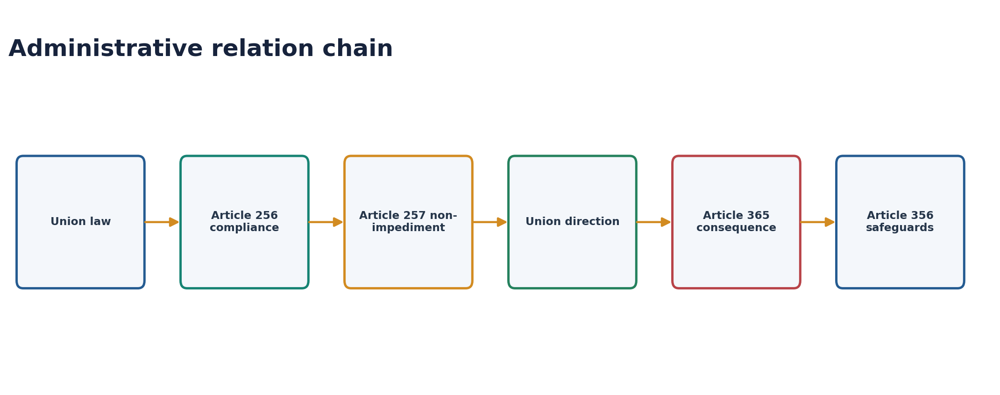

### Articles 256 and 257

- [FACT] State executive power must ensure compliance with parliamentary laws and existing laws applying in the State.
- [FACT] Union executive power extends to giving necessary directions for that purpose.
- [FACT] State executive power must not impede Union executive power.
- [FACT] The Union may direct construction/maintenance of communications of national or military importance and measures for railway protection, with constitutionally governed extra costs.

### Other direction fields

- [FACT] Article 339(2) permits Union directions concerning schemes essential for Scheduled Tribe welfare.
- [FACT] Article 350A concerns facilities for mother-tongue instruction at the primary stage for linguistic-minority children.

### Article 365 is not automatic President's Rule

- [FACT] Failure to comply with Union directions permits the President to hold that a situation has arisen in which State government cannot be carried on according to the Constitution.
- [LIMIT] Article 365 creates a constitutionally relevant inference, not an automatic mechanical proclamation.
- [FACT] Any Article 356 action remains subject to parliamentary approval, temporal rules and *S.R. Bommai* judicial review.

## 07. Delegation, services and agencies

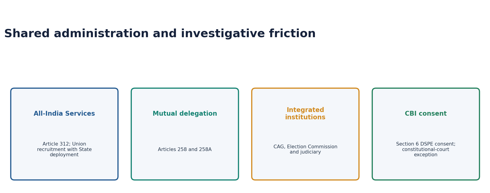

### Mutual delegation

- [FACT] Article 258 permits the President, with State consent, to entrust Union executive functions to a State or its officers.
- [FACT] Parliamentary law may confer powers and impose duties on States even without consent, with adjustment for administrative costs.
- [FACT] Article 258A permits a Governor, with Union consent, to entrust State executive functions to the Union or its officers.

### All-India Services: Article 312

- [FACT] IAS, IPS and Indian Forest Service are All-India Services.
- [FACT] Rajya Sabha must pass the prescribed national-interest resolution before Parliament creates a new All-India Service.
- [ANALYSIS] Shared cadres combine national standards and State implementation, but disciplinary control and cadre allocation can generate federal friction.
- [LIMIT] Indian Forest Service is not the Indian Foreign Service.

### CBI consent

- [FACT] Section 6 of the Delhi Special Police Establishment Act requires State consent for DSPE/CBI powers within a State.
- [FACT] Withdrawal of general consent ordinarily makes case-specific consent necessary for fresh investigations.
- [FACT] Supreme Court and High Courts may order a CBI investigation through constitutional jurisdiction without State consent.
- [CURRENT] The 2024 *State of West Bengal v. Union of India* decision upheld maintainability of the State's Article 131 suit against preliminary objection; it did not finally decide all merits.

## 08. Financial relations: constitutional architecture

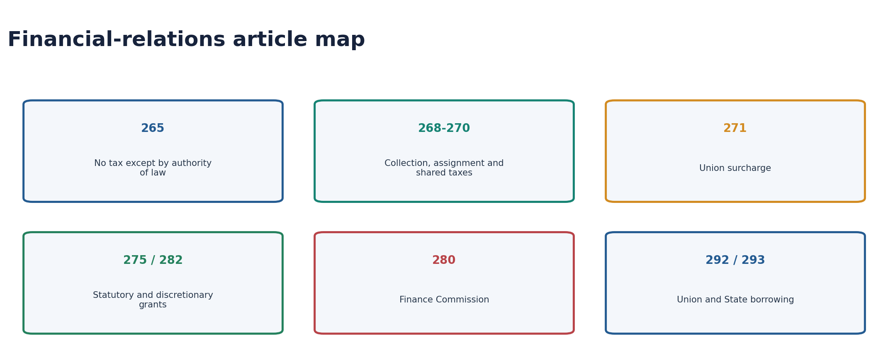

### Foundational rules

- [FACT] Article 265: no tax shall be levied or collected except by authority of law.
- [FACT] The Concurrent List has no general tax entry; GST shared competence arises specially from Article 246A.
- [FACT] Article 276 permits taxes on professions, trades, callings and employments subject to the constitutional annual cap of Rs 2,500 per person.

### Revenue-distribution map

| Article | Mechanism | Exam distinction |
|---|---|---|
| 268 | Union levies; States collect and appropriate specified stamp duties | Not part of ordinary divisible-pool devolution |
| 269 | Union levies/collects and assigns specified inter-State taxes to States | Distinguish from IGST |
| 269A | Union levies/collects inter-State GST and apportions it | GST Council framework |
| 270 | Union taxes distributed between Union and States | Divisible pool and FC shares |
| 271 | Parliament may impose Union-purpose surcharge | Surcharge proceeds are not shared |
| 275 | Grants-in-aid under constitutional criteria | Rules-based/statutory grants |
| 282 | Union or State grants for any public purpose | Discretionary policy leverage |
| 280 | Finance Commission | Periodic devolution and grants |

### Tax immunities and borrowing

- [FACT] Article 285 generally exempts Union property from State taxation, subject to parliamentary provision and transitional rules.
- [FACT] Article 289 generally exempts State property and income from Union taxation, subject to business/trade exceptions Parliament may regulate.
- [FACT] Article 292 governs Union borrowing; Article 293 limits State borrowing to within India.
- [FACT] A State requires Union consent to raise a loan where a Union loan or guaranteed loan remains outstanding, and consent may carry conditions.

## 09. Evolution of fiscal federalism

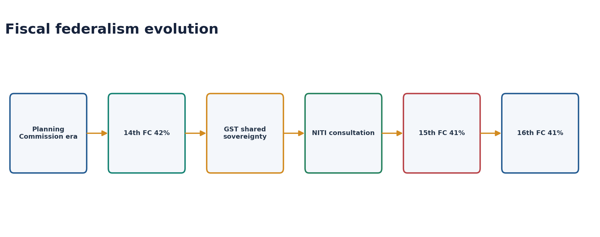

### Planned-development era

- Planning Commission and National Development Council shaped plan assistance outside the Finance Commission's constitutional cycle.
- Article 282 grants enabled national development priorities but increased executive discretion.
- States negotiated plan size and scheme assistance through a centralised planning structure.

### Post-2015 architecture

- [FACT] NITI Aayog replaced the Planning Commission through executive resolution in 2015; it has no tax-devolution power.
- [FACT] The 14th Finance Commission raised vertical devolution to 42%, increasing untied tax share while scheme restructuring changed the wider transfer picture.
- [FACT] GST pooled major indirect-tax autonomy through Articles 246A, 269A and 279A.
- [FACT] The 15th and 16th Finance Commissions use 41%, accounting for the changed status of Jammu and Kashmir in the divisible-pool calculation.

### Assessment

- [ANALYSIS] The system became more rules-based through Finance Commission devolution and a constitutional GST forum.
- [ANALYSIS] Re-centralisation persists through cesses/surcharges outside the divisible pool, centrally sponsored scheme conditions, borrowing consent and unequal administrative capacity.
- [LIMIT] “More devolution” cannot be assessed from the percentage alone; the divisible-pool base, grants and expenditure mandates matter.

## 10. Sixteenth Finance Commission: accepted 2026-31 control

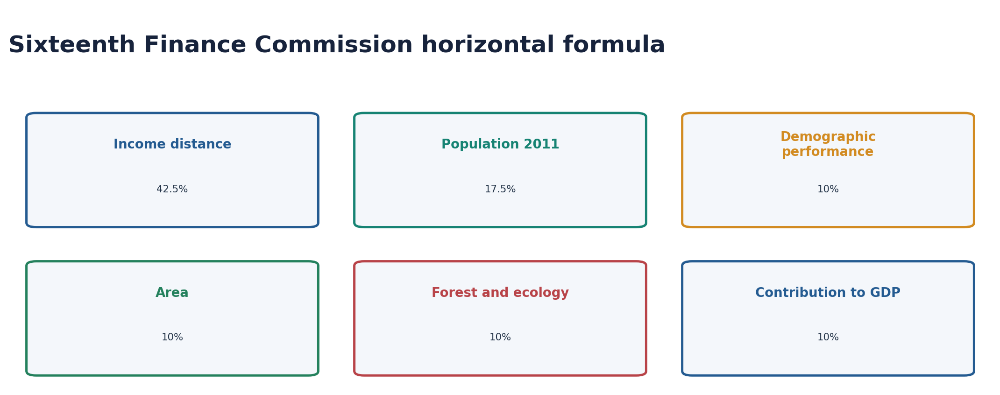

| Criterion | Weight |
|---|---:|
| Income distance | 42.5% |
| Population (2011) | 17.5% |
| Demographic performance | 10% |
| Area | 10% |
| Forest and ecology | 10% |
| Contribution to GDP | 10% |

- [CURRENT] Vertical devolution remains **41% of the divisible pool** for 2026-31.
- [CURRENT] Contribution to GDP is a new 10% criterion; tax effort was removed.
- [CURRENT] Revenue-deficit, sector-specific and State-specific grants were discontinued in the accepted framework; local-body and disaster grants remain major grant channels.
- [CURRENT] Disaster-fund sharing is 90:10 for specified north-eastern/Himalayan States and 75:25 for other States.
- [ANALYSIS] The formula balances equalisation and contribution, but every criterion creates distributional winners and losers; legitimacy depends on transparent methodology.

## 11. GST Council and fiscal negotiation

- [FACT] Article 279A creates a joint Union-State forum on GST rates, exemptions, thresholds, model laws and special rates.
- [FACT] The Union's vote has one-third weight and States together two-thirds; a decision requires at least three-fourths weighted votes of members present and voting.
- [FACT] *Union of India v. Mohit Minerals* (2022) held Council recommendations recommendatory, not binding law.
- [ANALYSIS] Consensus remains politically valuable because divergent GST laws can fragment the common market even where legal autonomy exists.
- [LIMIT] GST Council recommendations are neither judicial orders nor constitutional amendments.

## 12. Inter-State water disputes: Article 262

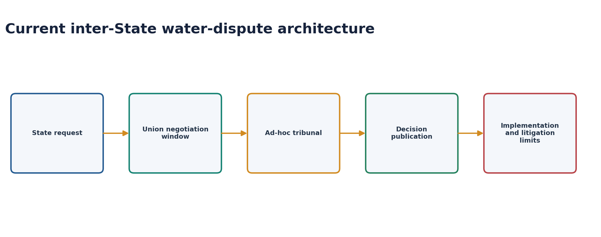

- [FACT] Article 262 permits Parliament to provide adjudication of inter-State river-water disputes and exclude Supreme Court and other court jurisdiction over such disputes.
- [FACT] Parliament enacted the River Boards Act, 1956 and Inter-State River Water Disputes Act, 1956.
- [FACT] The existing Act uses dispute-specific tribunals; awards become final and binding under the statutory scheme after publication.
- [CURRENT] The 2019 Amendment Bill proposed a permanent tribunal with multiple benches and a dispute-resolution committee. It passed Lok Sabha but has not been enacted as of the control date.
- [LIMIT] Do not describe a permanent tribunal as current law.

### Structural weaknesses and reform

| Weakness | Consequence | Reform direction |
|---|---|---|
| Delayed tribunal constitution and adjudication | Conflict hardens politically | Firm statutory stages and staffed benches |
| Data disagreement | Competing hydrological narratives | Independent shared basin data |
| Implementation conflict | Award does not end politics | Basin institutions and compliance monitoring |
| Climate variability | Historical flows become unstable | Adaptive review and ecological-flow planning |
| Jurisdiction exclusion | Limited ordinary judicial route | Precise statutory review/implementation design |

## 13. Inter-State Council and Zonal Councils

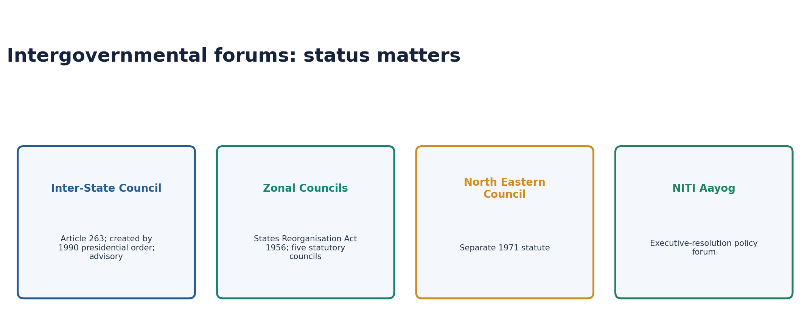

### Inter-State Council

- [FACT] Article 263 authorises the President to establish a Council if public interest would be served.
- [FACT] The Council may inquire into and advise on disputes, investigate common-interest subjects and recommend coordination.
- [FACT] It was established by presidential order in 1990 following Sarkaria Commission recommendation.
- [FACT] It is advisory; unlike an Article 131 judgment, its recommendations are not binding.
- [CURRENT] Full Council meetings remain infrequent; recent visible activity is stronger in Zonal Councils and their standing committees.

### Zonal Councils and NEC

| Body | Legal status | Chair / character |
|---|---|---|
| Five Zonal Councils | Statutory, States Reorganisation Act 1956 | Union Home Minister; advisory and regional |
| North Eastern Council | Statutory, NEC Act 1971 | Separate institution, not a sixth Zonal Council |
| NITI Aayog | Executive resolution | PM-chaired national policy forum |
| National Security Council | Executive/non-statutory | Security advisory architecture |

- [CURRENT] 2026 meetings of Central, Northern and Eastern Zonal mechanisms demonstrate active regional coordination even while the full ISC remains underused.
- [ANALYSIS] The design gap is not absence of forums but irregular escalation from regional problem-solving to national intergovernmental settlement.

## 14. Full faith and credit: Article 261

- [FACT] Public acts, records and judicial proceedings of the Union and every State receive full faith and credit throughout India.
- [FACT] Parliament may prescribe the manner of proof and effect.
- [FACT] Final judgments or orders delivered or passed by civil courts in any part of India are capable of execution anywhere according to law.
- [LIMIT] Clause (3) specifically concerns civil judgments; do not convert it into a claim that every criminal or penal rule has extra-territorial operation.

## 15. Freedom of trade, commerce and intercourse

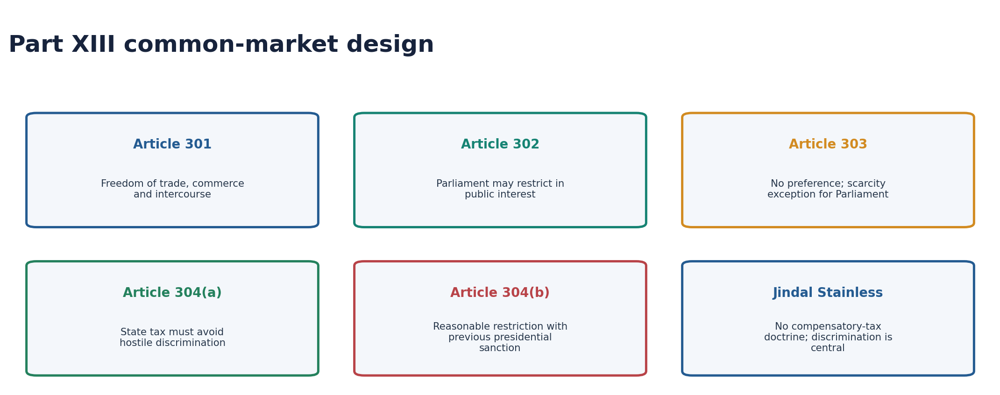

| Article | Rule |
|---|---|
| 301 | Trade, commerce and intercourse throughout India shall be free |
| 302 | Parliament may impose public-interest restrictions |
| 303(1) | Parliament and States generally cannot prefer one State over another |
| 303(2) | Parliament may depart to address scarcity of goods |
| 304(a) | State tax on imported goods must not discriminate against them vis-a-vis similar local goods |
| 304(b) | State may impose reasonable public-interest restrictions with previous presidential sanction |
| 307 | Parliament may appoint an implementing authority |

### Judicial evolution

- *Atiabari Tea* (1961) focused on direct and immediate restrictions.
- *Automobile Transport* (1962) developed a regulatory/compensatory approach.
- [FACT] *Jindal Stainless* (2016, nine judges) rejected the compensatory-tax doctrine as lacking textual foundation.
- [FACT] Article 301 does not create a tax-free market; the central tax question is hostile or protectionist discrimination under Article 304(a).
- [FACT] Article 304(a) and 304(b) operate distinctly; public-interest restriction cannot cure a discriminatory tax.
- [ANALYSIS] GST supplied fiscal integration that Part XIII litigation alone could not administratively achieve.

## 16. Minor minerals: Union notification, State rule-making

- [FACT] The Mines and Minerals (Development and Regulation) Act, 1957 is parliamentary legislation under Union control over mineral regulation to the declared extent.
- [FACT] Section 3(e) empowers the Central Government to notify additional minerals as “minor minerals.”
- [FACT] Section 15 empowers State Governments to make rules regulating quarry leases, mining leases and other concessions for minor minerals.
- [LIMIT] Central power to define/notify the category does not eliminate State rule-making for concessions.

## 17. Commissions on Centre-State relations

| Body | Orientation | High-yield recommendations |
|---|---|---|
| Rajamannar Committee (1969) | Strong State autonomy | Curtail Union power, strengthen ISC, review Articles 356-357 |
| Sarkaria Commission (1983-88) | Cooperative federalism within a strong Union | Article 356 last resort; neutral Governors; consult States on Concurrent laws; permanent ISC |
| Punchhi Commission (2007-10) | Modernise intergovernmental machinery | Governor norms, stronger ISC, localised emergency concept, clearer consultation |

### Trust-building reform stack

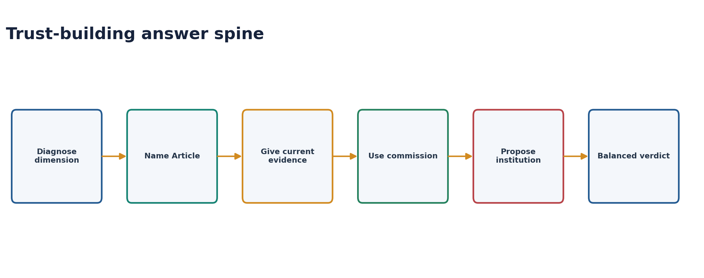

1. Convene the Inter-State Council regularly with published follow-up.
2. Consult States before major Concurrent-field legislation.
3. Use Governors as neutral constitutional heads, with reasoned and prompt decisions.
4. Protect predictable tax devolution and improve transparency of cesses/surcharges.
5. Make centrally sponsored schemes flexible and jointly designed.
6. Strengthen GST dispute resolution and preserve consensus practice.
7. Create shared river-basin data and enforceable implementation institutions.
8. Clarify CBI accountability and consent protocols by statute.

> **Core verdict:** Trust is not goodwill. It is the repeated institutional experience that consultation occurs before compulsion, reasons accompany discretion, and agreed fiscal rules are honoured.

## PART II - Optional Advanced enrichment

## 18. Representation as a fourth Centre-State dimension - optional

- State influence at the Union depends not only on Lists and transfers but on seats in Lok Sabha, Rajya Sabha and the Presidential Electoral College.
- The 42nd, 84th and 87th Amendment sequence separated inter-State seat allocation freeze from permissible intra-State boundary readjustment.
- [CURRENT] The 2026 delimitation package was defeated; its proposed 850-seat figure is not law.
- [ANALYSIS] Representation and devolution are two currencies of the same grievance where population growth affects both political and fiscal weight.
- [LIMIT] Full representational-federalism treatment belongs to Polity 12 and Parliament; no seat projection or implementation date should be invented.

## 19. Executive federalism and institutional under-use - optional

- Much Indian federal coordination occurs among Prime Minister, Chief Ministers, ministers and officials rather than through legislatures.
- Executive federalism can respond quickly but may weaken transparency and opposition participation.
- Zonal mechanisms often solve operational questions; the ISC should address national structural disputes.
- A stronger ISC secretariat, regular agenda cycle and response-to-recommendation duty would turn consultation into accountable process.

## Solved topic-specific MCQs

## Routed PYQs with model solutions

### PYQ 1 - UPSC GS-II 2019, Q4 - direct

**Question:** From the resolution of contentious issues regarding distribution of legislative powers by the courts, “Principle of Federal Supremacy” and “Harmonious Construction” have emerged. Explain.  
**10 marks | 150 words**

**Model solution**

The Seventh Schedule distributes legislative fields, but modern laws overlap. Courts therefore reconcile entries before invalidating legislation.

**Harmonious construction** gives broad meaning to each entry while preserving meaningful operation of both Union and State fields. **Pith and substance** supports this approach: if a law's dominant character lies within competence, incidental encroachment survives.

**Federal supremacy** operates when reconciliation fails. Article 246 gives Union List predominance through its notwithstanding clause. On a Concurrent subject, Article 254 ordinarily makes parliamentary law prevail over repugnant State law. A State law reserved for and receiving Presidential assent may operate within that State, but Parliament can subsequently override it.

The doctrines are therefore sequential, not contradictory. Harmonious construction protects federal autonomy; supremacy prevents legal paralysis. Sarkaria described federal supremacy as a technique to avoid absurdity and resolve conflict.

Thus, Indian legislative federalism is accommodative in interpretation but Union-weighted at the point of irreconcilable conflict.

### PYQ 2 - UPSC GS-II 2020, Q11 - direct

**Question:** The Indian Constitution exhibits centralising tendencies to maintain unity and integrity of the nation. Elucidate in the perspective of the Epidemic Diseases Act, 1897, the Disaster Management Act, 2005 and the recently passed Farm Acts.  
**15 marks | 250 words**

**Model solution**

India's holding-together federation gives the Union exceptional capacity to coordinate national crises and markets. Recent legislation showed both the necessity and federal cost of that design.

During COVID-19, the Union used the Disaster Management Act, 2005 for nationwide directions, while the Epidemic Diseases Act, 1897 operated through State measures. Uniform restrictions, procurement and movement rules supplied scale but also compressed State policy space in public health, a State subject.

The 2020 Farm Acts relied substantially on Concurrent List Entry 33 concerning trade in foodstuffs, yet affected agriculture and markets associated with State List Entries 14 and 28. States argued that legal competence was being used without adequate federal consultation. The Acts were repealed in 2021, demonstrating political federalism and mobilisation.

Other centralising tools include residuary power, Articles 249, 250, 253 and 356, All-India Services, conditional schemes and fiscal dependence. However, centralisation is not unlimited: *S.R. Bommai* makes federalism Basic Structure; courts apply pith and substance; GST requires shared institutions; States retain electoral and implementation power.

Therefore, national coordination may justify central legislation, but legitimacy requires necessity, clear List competence, consultation and proportionality. Unity is strengthened when Union capacity works through cooperative institutions rather than treating States as implementing agencies.

### PYQ 3 - UPSC GS-II 2021, Q11 - supporting

**Question:** The jurisdiction of the Central Bureau of Investigation regarding lodging an FIR and conducting a probe within a particular State is being questioned by various States. However, the power of States to withhold consent to the CBI is not absolute. Explain with special reference to the federal character of India.  
**15 marks | 250 words**

**Model solution**

Police is a State subject, while the CBI exercises investigative powers through the Delhi Special Police Establishment Act, 1946. Section 6 therefore requires State consent for DSPE jurisdiction within a State.

General consent permits routine registration; withdrawal ordinarily requires case-specific consent for fresh cases. This is a real federal safeguard against an unrestricted parallel central police force.

The safeguard is not absolute. The Supreme Court under Article 32 and High Courts under Article 226 may order a CBI probe without State consent to secure fair investigation and fundamental rights. Withdrawal also does not automatically nullify every validly commenced case, and territorial or accused-specific questions can affect jurisdiction.

In *State of West Bengal v. Union of India* (2024), the Supreme Court rejected the Union's preliminary objection and allowed the State's Article 131 suit to proceed; it did not finally decide all substantive claims.

The federal balance requires State police autonomy, national coordination for cross-border corruption and judicial power where local investigation is compromised. A dedicated CBI statute, transparent consent protocols and independent appointment/accountability mechanisms would reduce political confrontation.

Thus, consent is constitutionally significant statutory federalism, but it cannot override constitutional-court power.

### PYQ 4 - UPSC GS-II 2024, Q13 - direct

**Question:** What changes has the Union Government recently introduced in the domain of Centre-State relations? Suggest measures to be adopted to build the trust between the Centre and the States and for strengthening federalism.  
**15 marks | 250 words**

**Model solution**

Centre-State relations have shifted from plan-era bargaining to a mixed Finance Commission-GST-NITI architecture, while administrative and legislative disputes have intensified.

**Changes:** The Planning Commission was replaced by NITI Aayog; the 14th Finance Commission increased untied devolution, followed by 41% under later Commissions. GST pooled indirect-tax autonomy through a constitutional Council. Centrally sponsored schemes, cesses and surcharges, borrowing conditions and central agencies continue to shape State choices. Governor assent, CBI consent and Concurrent-field legislation have become recurrent flashpoints.

**Trust measures:**  
1. Convene the Inter-State Council regularly and publish implementation reports.  
2. Consult States before major Concurrent List laws.  
3. Follow Sarkaria/Punchhi norms for politically neutral Governors and reasoned action.  
4. Reduce reliance on cesses outside the divisible pool and ensure predictable transfers.  
5. Design schemes jointly with flexible State components.  
6. Use consensus and a credible dispute process in the GST Council.  
7. Clarify CBI powers and consent through comprehensive legislation.  
8. Build shared river-basin data and compliance institutions.

*S.R. Bommai* makes federalism Basic Structure, but judicial protection alone cannot create cooperation.

Trust is an institutional output: States must repeatedly experience consultation before compulsion, fiscal predictability and neutral use of constitutional offices.

### PYQ 5 - UPSC Prelims 2024, Q75 - official key

**Question:** Which one of the following statements is correct as per the Constitution of India?

A. Inter-State trade and commerce is a State subject under the State List.  
B. Inter-State migration is a State subject under the State List.  
C. Inter-State quarantine is a Union subject under the Union List.  
D. Corporation tax is a State subject under the State List.

**Answer: C. OFFICIAL UPSC SET-A KEY.**

Union List Entry 81 covers inter-State migration and inter-State quarantine; Entry 42 covers inter-State trade and commerce; corporation tax is also a Union subject.

### PYQ 6 - UPSC GS-II 2025, Q14 - direct

**Question:** Examine the evolving pattern of Centre-State financial relations in the context of planned development in India. How far have the recent reforms impacted the fiscal federalism in India?  
**15 marks | 250 words**

**Model solution**

Centre-State finance has evolved from discretionary plan bargaining toward a more rules-based but still Union-dependent architecture.

During planned development, the Planning Commission and National Development Council shaped plan assistance, while Article 282 grants allowed broad executive discretion. The Finance Commission handled constitutional tax devolution and grants, producing parallel transfer channels.

Post-2015 reforms changed this pattern. NITI Aayog replaced the Planning Commission without assuming devolution powers. The 14th Finance Commission raised the States' tax share to 42%; later Commissions use 41%. GST pooled Union and State indirect taxes through Articles 246A, 269A and 279A, creating a common market and shared decision forum. The 16th Finance Commission retains 41% for 2026-31 and balances income distance with population, demographic, ecological and GDP-contribution criteria.

Reforms improved transparency, untied resources and institutional bargaining. *Mohit Minerals* preserves legislative autonomy by treating GST Council recommendations as non-binding.

However, vertical imbalance persists. Cesses and surcharges remain outside the divisible pool; centrally sponsored schemes impose conditions; GST narrowed independent rate space; Article 293 borrowing consent creates leverage.

Thus, fiscal federalism is more rules-based but not fiscally equal. Protecting the divisible pool, predictable schemes, robust GST dispute resolution and stronger State revenue capacity are necessary for meaningful autonomy.

### PYQ 7 - UPSC Prelims 2025, Q53 - official key

**Question:** With reference to India, consider the following:

1. The Inter-State Council  
2. The National Security Council  
3. Zonal Councils

How many of the above were established as per provisions of the Constitution of India?

A. Only one  
B. Only two  
C. All the three  
D. None

**Answer: A. OFFICIAL UPSC SET-A KEY.**

Article 263 provides for establishment of the Inter-State Council. Zonal Councils are statutory and the National Security Council is executive/non-statutory.

### PYQ 8 - UPSC Prelims 2025, Q89 - official key

**Question:** Consider the following statements:

Statement I: In India, State Governments have no power for making rules for grant of concessions in respect of extraction of minor minerals even though such minerals are located in their territories.  
Statement II: In India, the Central Government has the power to notify minor minerals under the relevant law.

Which one of the following is correct?

A. Both statements are correct and Statement II explains Statement I  
B. Both statements are correct but Statement II does not explain Statement I  
C. Statement I is correct but Statement II is not correct  
D. Statement I is not correct but Statement II is correct

**Answer: D. OFFICIAL UPSC SET-A KEY.**

The Centre can notify minor minerals under Section 3(e) of the MMDR Act, while States make concession rules under Section 15.

## Original hard MCQ set - strict A -> B -> C -> D rotation

### OM1. Article 245

Which statement is correct?

A. A parliamentary law is not invalid merely for extra-territorial operation.  
B. Parliament needs State consent for extra-territorial law.  
C. Article 245 concerns only taxation.  
D. A State law can never have extra-State effect.  

**Answer: A.**

Article 245(2) supplies the rule; State reach depends on territorial nexus.

### OM2. List hierarchy

Which is the standard current examination count?

A. Union 98, State 59, Concurrent 52  
B. Union 100, State 61, Concurrent 52  
C. Union 97, State 66, Concurrent 47  
D. Union 100, State 60, Concurrent 52  

**Answer: B.**

Use 100/61/52 while recognising retained omitted/inserted numbering.

### OM3. 42nd Amendment

Which subject was moved from State to Concurrent List by the 42nd Amendment?

A. Police  
B. Agriculture  
C. Education  
D. Public health  

**Answer: C.**

Education was one of five transferred subjects.

### OM4. Residuary power

Residuary legislative power belongs to:

A. States  
B. Inter-State Council  
C. Supreme Court  
D. Parliament  

**Answer: D.**

Article 248 and Union Entry 97 place it with Parliament.

### OM5. Article 249

The special trigger is:

A. Rajya Sabha national-interest resolution by prescribed majority  
B. Lok Sabha simple majority  
C. National Emergency  
D. Two-State request  

**Answer: A.**

It is a federal role of Rajya Sabha and does not require Emergency.

### OM6. Article 252

Which is correct?

A. It applies automatically to every State.  
B. Two or more States initiate; Parliament alone later amends/repeals.  
C. It requires presidential rule.  
D. A State may unilaterally repeal it.  

**Answer: B.**

Other States can later adopt the parliamentary law.

### OM7. Article 253

Parliament can legislate on a State field to:

A. create a local body  
B. remove a Governor  
C. implement a treaty or international decision  
D. alter a State Budget  

**Answer: C.**

Article 253 is an express treaty-implementation route.

### OM8. Article 250

A State-field law made during National Emergency becomes inoperative:

A. immediately after Emergency  
B. after one year  
C. only after State repeal  
D. six months after Emergency ceases  

**Answer: D.**

The six-month tail permits transition.

### OM9. Pith and substance

The doctrine asks:

A. What is the law's true nature?  
B. Whether Union law is popular  
C. Whether President agrees  
D. Whether two States consent  

**Answer: A.**

Incidental encroachment does not defeat a law within competence.

### OM10. Harmonious construction

Its principal purpose is to:

A. always invalidate State law  
B. allow both constitutional fields maximum workable operation  
C. transfer residue to States  
D. abolish Article 254  

**Answer: B.**

Supremacy is used after reconciliation fails.

### OM11. Article 254

A President-assented State law repugnant on a Concurrent subject:

A. prevails nationally  
B. cannot be overridden  
C. may operate in that State until Parliament overrides  
D. becomes a constitutional amendment  

**Answer: C.**

Article 254(2) is State-specific and subject to later parliamentary law.

### OM12. Colourable legislation

Which principle is captured?

A. Every overlap is valid.  
B. Form alone decides competence.  
C. President cures all incompetence.  
D. What cannot be done directly cannot be done indirectly.  

**Answer: D.**

Substance controls over legislative disguise.

### OM13. Article 256

States must:

A. ensure compliance with parliamentary and applicable laws  
B. obtain Union approval for every executive act  
C. transfer police to Union  
D. follow ISC recommendations as binding  

**Answer: A.**

Union directions can support this compliance duty.

### OM14. Article 365

Which is most accurate?

A. It automatically imposes President's Rule.  
B. Non-compliance may support a presidential conclusion, but Article 356 safeguards remain.  
C. It concerns tax sharing.  
D. It creates an All-India Service.  

**Answer: B.**

The inference is not automatic and Bommai review remains.

### OM15. Article 258A

It permits:

A. President to amend State law  
B. Parliament to dissolve Assembly  
C. Governor with Union consent to entrust State functions to Union  
D. ISC to issue binding directions  

**Answer: C.**

Article 258 concerns Union-to-State entrustment; 258A is the reverse.

### OM16. All-India Service

Which is not an All-India Service?

A. IAS  
B. IPS  
C. Indian Forest Service  
D. Indian Foreign Service  

**Answer: D.**

The Foreign Service is a Central Civil Service.

### OM17. CBI consent

Which is correct?

A. Constitutional courts may order a CBI probe without State consent.  
B. Withdrawal voids all earlier cases automatically.  
C. Police is Concurrent List.  
D. CBI has a dedicated constitutional article.  

**Answer: A.**

Section 6 consent is important but does not bind Article 32/226 courts.

### OM18. Article 265

It provides:

A. Finance Commission every five years  
B. no tax except by authority of law  
C. free inter-State trade  
D. State borrowing abroad  

**Answer: B.**

It is the foundational legality rule for taxation.

### OM19. Article 269A

It principally concerns:

A. profession tax  
B. Union surcharge  
C. inter-State GST apportionment  
D. State borrowing  

**Answer: C.**

IGST is levied/collected by Union and apportioned.

### OM20. Article 271

Which is correct?

A. Surcharge is shared under Article 270.  
B. States impose Union surcharge.  
C. GST surcharge is unrestricted.  
D. Parliament may impose Union-purpose surcharge whose proceeds are not shared.  

**Answer: D.**

Cesses/surcharges outside the pool are a major State grievance.

### OM21. Article 275

It concerns:

A. constitutional grants-in-aid  
B. discretionary any-purpose grants only  
C. external borrowing  
D. inter-State water tribunals  

**Answer: A.**

Article 282 is the broad discretionary public-purpose grant provision.

### OM22. State borrowing

A State with an outstanding Union loan:

A. may borrow abroad freely  
B. needs Union consent for further borrowing, potentially with conditions  
C. cannot borrow at all  
D. requires ISC consent  

**Answer: B.**

Article 293 is a central fiscal-leverage point.

### OM23. 16th FC

Which criterion is new in the 2026-31 horizontal formula?

A. Tax effort  
B. Fiscal deficit  
C. Contribution to GDP  
D. Urbanisation  

**Answer: C.**

Contribution to GDP has 10%; tax effort was removed.

### OM24. 16th FC vertical share

The accepted share is:

A. 50% gross tax  
B. 42% divisible pool  
C. 40% all receipts  
D. 41% divisible pool  

**Answer: D.**

Cesses, surcharges and collection cost are outside the divisible pool.

### OM25. Water amendment

As of 16 August 2026:

A. The 2019 permanent-tribunal Bill has not become law.  
B. A permanent tribunal is operational.  
C. Article 262 was repealed.  
D. Courts have unrestricted jurisdiction.  

**Answer: A.**

The existing dispute-specific tribunal system remains controlling.

### OM26. Inter-State Council

Which is correct?

A. It is created by the States Reorganisation Act.  
B. Article 263 permits it and a 1990 presidential order established it.  
C. Its decisions bind like Supreme Court judgments.  
D. It is chaired by the Chief Justice.  

**Answer: B.**

It is advisory and constitutionally provided.

### OM27. Part XIII

After Jindal Stainless, a State tax on imported goods is centrally tested for:

A. quid pro quo  
B. compensatory character  
C. hostile/protectionist discrimination under Article 304(a)  
D. Finance Commission approval  

**Answer: C.**

The nine-judge bench rejected the compensatory-tax doctrine.

### OM28. Minor minerals

Which allocation is correct?

A. States notify minor-mineral category and Union grants leases.  
B. ISC makes rules.  
C. Only Union has all powers.  
D. Centre may notify category; States make concession rules under Section 15.  

**Answer: D.**

This is the official 2025 PYQ distinction.


## Remedial MCQ loop - strict A -> B -> C -> D rotation

### RM1. R-N-S-I-P

Which Article uses a Rajya Sabha national-interest resolution?

A. 249  
B. 250  
C. 252  
D. 253  

**Answer: A.**

Article 249 is not an Emergency provision.

### RM2. Repugnancy

Article 254 principally concerns:

A. Union List  
B. Concurrent conflict  
C. State borrowing  
D. water disputes  

**Answer: B.**

First identify competence; then apply repugnancy if relevant.

### RM3. Directions

Failure to comply with Union directions:

A. automatically dissolves Assembly  
B. automatically ends Governor tenure  
C. may trigger Article 365 inference, subject to Article 356 safeguards  
D. has no consequence  

**Answer: C.**

Automatic-President's-Rule language is wrong.

### RM4. Services

Which is a Central Civil Service, not AIS?

A. IAS  
B. IPS  
C. IFoS  
D. Indian Foreign Service  

**Answer: D.**

The similar initials are a common trap.

### RM5. Grants

Article 275 refers to:

A. constitutional grants-in-aid  
B. any-purpose discretionary grants  
C. GST compensation  
D. foreign borrowing  

**Answer: A.**

Article 282 is the broad discretionary provision.

### RM6. Institution status

Zonal Councils are:

A. constitutional  
B. statutory  
C. judicial  
D. private  

**Answer: B.**

They arise under the States Reorganisation Act 1956.

### RM7. Trade tax

Jindal Stainless rejected:

A. Article 304(a)  
B. all State taxes  
C. the compensatory-tax doctrine  
D. GST  

**Answer: C.**

Non-discriminatory taxation is not automatically barred.

### RM8. Water tribunal

The permanent single tribunal is:

A. operational  
B. constitutional body  
C. created in 1956  
D. a 2019 Bill proposal not enacted by the control date  

**Answer: D.**

Do not turn a Bill into current law.


## Original Mains practice with examiner-grade models

### M1. 10 marks | 150 words

**Question:** Explain the constitutional relationship between Articles 256, 257, 365 and 356. Why is non-compliance with Union directions not equivalent to automatic President's Rule?

**Model solution**

Articles 256 and 257 coordinate executive power in a federation with shared implementation.

Article 256 requires States to ensure compliance with parliamentary and applicable laws and permits Union directions for that purpose. Article 257 requires State executive power not to impede Union executive power and permits specified directions concerning national/military communications and railway protection.

Article 365 provides that failure to comply with Union directions may permit the President to hold that State government cannot be carried on according to the Constitution. It therefore supplies a relevant constitutional inference.

However, it does not automatically impose President's Rule. Article 356 still requires a presidential satisfaction based on relevant material, parliamentary approval and compliance with temporal limits. *S.R. Bommai* makes the proclamation judicially reviewable and ordinarily protects floor determination of political majority.

Thus, Articles 256-257 enable coordination, Article 365 marks serious non-compliance, and Article 356 supplies the exceptional remedy. Treating the sequence as automatic would convert federal directions into unrestricted Union control.

### M2. 10 marks | 150 words

**Question:** Distinguish the Inter-State Council, Zonal Councils, North Eastern Council and NITI Aayog by source, composition logic and function.

**Model solution**

These bodies all facilitate coordination but have different legal foundations.

The **Inter-State Council** is contemplated by Article 263 and was established by presidential order in 1990. Chaired by the Prime Minister, it advises on disputes and common policy; its recommendations are not binding.

The **five Zonal Councils** are statutory bodies under the States Reorganisation Act, 1956. Chaired by the Union Home Minister, they address regional administrative and inter-State issues.

The **North Eastern Council** is a separate statutory institution under the NEC Act, 1971; it is not a sixth Zonal Council.

**NITI Aayog** was created by executive resolution in 2015. It is a policy and development forum, not a constitutional or statutory body and not a substitute for the Finance Commission.

Thus, “intergovernmental body” does not establish legal status. Article, statute and executive resolution must be separately identified.

### M3. 15 marks | 250 words

**Question:** Examine whether All-India Services strengthen administrative unity at an excessive cost to State autonomy.

**Model solution**

Article 312 permits common services for Union and States after a Rajya Sabha national-interest resolution. IAS, IPS and Indian Forest Service embody India's integrated administrative federalism.

**Benefits:** Common recruitment and training establish professional standards, enable movement of experience across States and Union, and provide continuity during crises. Officers serving State cadres possess local administrative knowledge while connecting implementation to national law and programmes. Ambedkar's “strategic posts” rationale remains relevant for a diverse federation.

**Autonomy costs:** Cadre allocation, deputation, disciplinary control and central empanelment can create divided accountability. States may perceive officer shortages or recall/deputation disputes as Union pressure. Uniform career incentives can also weaken responsiveness to local political priorities.

The design is not inherently anti-federal because officers work under State governments in State posts and new services require Rajya Sabha approval. The problem arises when shared control becomes unilateral command.

Reform should use transparent deputation rules, meaningful State consultation, predictable cadre strength, protection against partisan transfer, and joint performance frameworks. Specialised State services should be strengthened rather than displaced.

Thus, All-India Services are a federal bridge, not merely a centralising instrument. Their legitimacy depends on genuinely shared personnel governance.

### M4. 15 marks | 250 words

**Question:** Cesses, surcharges and centrally sponsored schemes can re-centralise fiscal federalism even when tax devolution remains high. Analyse.

**Model solution**

The Finance Commission may recommend a substantial State share, but effective fiscal autonomy depends on the base being shared and the conditions attached to other transfers.

Article 270 distributes the divisible pool, while Article 271 permits Union-purpose surcharges whose proceeds are not shareable. Cesses are similarly commonly kept outside the divisible pool. Growth in these instruments can reduce the proportion of gross Union tax revenue subject to the stated devolution percentage.

Centrally sponsored schemes support national priorities and equal citizenship, but detailed guidelines, matching contributions and fragmented funding may constrain State budgeting. States carry major responsibilities in health, agriculture, police and local services, so conditional transfers can convert them into implementation agencies.

Counterarguments matter. Cesses can finance identifiable national externalities; schemes can reduce interstate inequality; and the 16th Finance Commission retains 41% rules-based vertical devolution. State capacity and accountability also justify performance conditions.

The corrective is not abolition but transparency and consent: sunset clauses and reporting for cesses, a protected divisible-pool base, fewer and more flexible schemes, predictable Union shares, outcome-based rather than input-heavy conditions, and regular ISC/GST consultation.

Thus, formal devolution and practical autonomy can diverge. Fiscal federalism must be evaluated through total transfer design, not the headline percentage alone.

### M5. 20 marks | 250-300 words

**Question:** Critically evaluate the constitutional and institutional framework for inter-State river-water disputes in India.

**Model solution**

River basins ignore political boundaries, making water disputes a test of federal adjudication, scientific capacity and political compliance.

Article 262 authorises Parliament to provide adjudication and exclude court jurisdiction. The Inter-State River Water Disputes Act, 1956 creates dispute-specific tribunals, while the River Boards Act, 1956 envisages cooperative basin management.

**Strengths:** Tribunals provide specialised fact-finding; awards are final and binding under statute; jurisdiction exclusion can prevent parallel litigation; Union facilitation offers a national forum.

**Weaknesses:** Delays occur in negotiation, tribunal creation, evidence and decision. States dispute flow data, project effects and distress-year sharing. Publication and implementation may generate new litigation. Ad-hoc tribunals lose institutional memory, and climate change makes historical averages less reliable.

The 2019 Amendment Bill proposed a dispute-resolution committee and permanent tribunal with benches, but it passed only Lok Sabha and is not current law as of 16 August 2026.

Reform requires a permanent professional secretariat even if benches remain dispute-specific, independent basin data, time-bound stages, ecological-flow and climate scenarios, transparent distress-sharing formulas, compliance monitoring and stronger river-basin organisations. Courts should retain narrow constitutional review while respecting Article 262's jurisdiction design.

Thus, adjudication is necessary but insufficient. Durable settlement requires continuous cooperative basin governance before and after an award.

### M6. 20 marks | 250-300 words

**Question:** The constitutional freedom of trade under Part XIII is a federal common-market guarantee, not a promise of tax-free commerce. Discuss with case law.

**Model solution**

Articles 301-307 seek an integrated economic union while preserving regulatory and fiscal space.

Article 301 declares trade, commerce and intercourse throughout India free. Article 302 permits Parliament to impose public-interest restrictions. Article 303 generally bars preference or discrimination between States, with a parliamentary scarcity exception. States may levy non-discriminatory taxes under Article 304(a) and impose reasonable public-interest restrictions under Article 304(b) with previous presidential sanction.

Early cases complicated the framework. *Atiabari Tea* focused on measures directly and immediately restricting trade. *Automobile Transport* developed a compensatory-tax doctrine, allowing levies linked to trading facilities.

In *Jindal Stainless* (2016), a nine-judge bench rejected compensatory tax as lacking constitutional text. Article 301 does not create freedom from taxation. The central question for a State tax is hostile or protectionist discrimination under Article 304(a). Clauses (a) and (b) are distinct; a discriminatory tax cannot be saved merely as a reasonable restriction.

GST later supplied a constitutional fiscal mechanism for a common market through Articles 246A, 269A and 279A, though State participation and Council bargaining remain federal features.

Therefore, Part XIII balances integration with autonomy. It prohibits economic protectionism, not every tax or regulation. The modern test is non-discrimination, constitutional competence and procedural compliance.

### M7. 20 marks | 250-300 words

**Question:** “The principal weakness of Centre-State relations is institutional under-use rather than constitutional scarcity.” Evaluate and suggest reforms.

**Model solution**

The Constitution supplies extensive mechanisms: divided legislative fields, Rajya Sabha safeguards, Inter-State Council, Finance Commission, GST Council, Article 131 adjudication, water tribunals, mutual delegation and commission-developed conventions. Yet conflict persists because these mechanisms are irregularly or asymmetrically used.

The full Inter-State Council meets infrequently, while major Concurrent legislation may proceed without structured State consultation. Governor assent and government-formation disputes turn convention into litigation. Cesses and scheme conditions weaken the practical effect of devolution. Water tribunals suffer delay and implementation gaps. CBI general-consent withdrawals reveal distrust in central agencies.

However, constitutional design also contributes. Residuary power, Article 253, Article 356, Governor appointment, Article 293 borrowing consent and vertical fiscal imbalance give the Union superior leverage. Institutional activation alone cannot erase this structural tilt.

Reform should therefore combine use and redesign: regular ISC meetings with tracked responses; mandatory consultation protocols for Concurrent laws; neutral Governor conventions and reasoned decisions; transparent cesses and flexible schemes; a GST dispute mechanism; shared river data and implementation bodies; comprehensive CBI legislation; and joint All-India Service governance.

Sarkaria and Punchhi already provide much of this menu. *S.R. Bommai* and *Mohit Minerals* show that courts can protect boundaries but cannot substitute for political dialogue.

The proposition is substantially correct: India has enough forums, but insufficient habits of consultation. Trust requires repeated, rule-bound use of institutions while correcting the Union's strongest structural asymmetries.

## Final consolidated register notes

### Four dimensions

- Legislative: Articles 245-255.
- Administrative: Articles 256-263.
- Financial: Articles 265-293.
- Inter-State/economic: Articles 261-263 and 301-307.
- Relations interact: legal competence, implementation and finance must be analysed together.

### Legislative recall

- Standard List counts: 100 / 61 / 52.
- Article 245: territorial reach; Parliament not invalid merely for extra-territorial operation.
- Article 246: Union > Concurrent > State in constitutional priority.
- Article 248 + Union Entry 97: residuary power with Parliament.
- 42nd Amendment moved five State subjects to Concurrent: education, forests, weights/measures, wildlife, administration of justice.
- Parliament in State field: 249, 250, 252, 253, 356.
- R-N-S-I-P mnemonic.

### Doctrine order

1. Identify pith and substance.
2. Locate competence.
3. Test whether encroachment is incidental/ancillary.
4. Harmoniously construe overlap.
5. Apply Article 254 only for Concurrent-field repugnancy.
6. Use federal supremacy only for irreconcilable conflict.
- Colourable legislation prevents indirect evasion.
- Territorial nexus concerns reach, not subject classification.
- Presidential assent cannot cure absence of State competence; Parliament may later override the
  assented State law.

### State-law control

- Prior presidential sanction and reservation are different.
- Article 200: Governor options; compulsory reservation for High Court-endangering Bill.
- Article 201: President assent/withhold; may return non-Money Bill.
- Current assent doctrine: no fixed judicial deadlines, no deemed assent, prolonged inaction reviewable through direction to act.

### Administrative relations

- Article 256: State compliance with parliamentary/applicable law; Union directions.
- Article 257: State must not impede Union; communications and railway directions.
- Article 339(2): ST welfare directions.
- Article 350A: primary mother-tongue facilities.
- Article 365 is an inference route, not automatic President's Rule.
- Article 356 remains controlled by Parliament and Bommai review.
- Articles 258/258A: mutual delegation.

### Services and agencies

- AIS: IAS, IPS, Indian Forest Service; Article 312 Rajya Sabha trigger.
- Indian Foreign Service is not AIS.
- CBI: Section 6 DSPE State consent; constitutional courts can order probe.
- West Bengal 2024 decided maintainability at preliminary stage, not all merits.

### Financial map

| Article | Recall |
|---|---|
| 265 | No tax except authority of law |
| 268 | Union levy, State collection/appropriation |
| 269 | Union collection, assignment to States |
| 269A | Inter-State GST apportionment |
| 270 | Divisible-pool sharing |
| 271 | Union surcharge, not shared |
| 275 | Constitutional grants |
| 282 | Any-public-purpose discretionary grants |
| 280 | Finance Commission |
| 292/293 | Union/State borrowing |

- Article 276 profession-tax cap: Rs 2,500 annually.
- Concurrent List has no general tax entry; GST uses Article 246A.
- State borrowing only within India; Union consent if Union loan remains outstanding.

### Fiscal evolution and 16th FC

- Plan era: Planning Commission/NDC + Article 282 discretion.
- NITI Aayog replaced Planning Commission in 2015; no devolution power.
- 14th FC: 42%; 15th and 16th: 41%.
- 16th FC weights: income distance 42.5; population 17.5; demographic 10; area 10; forest/ecology 10; GDP contribution 10.
- Tax effort removed; contribution to GDP added.
- Revenue-deficit, sector and State-specific grants discontinued in accepted framework.
- Cesses/surcharges outside divisible pool remain grievance.

### GST

- Articles 246A, 269A, 279A; 101st Amendment.
- Union vote one-third, States two-thirds; three-fourths weighted decision threshold.
- Mohit Minerals: recommendations not binding.
- Consensus still matters for harmonisation.

### Inter-State relations

- Article 262 water disputes; Parliament can exclude courts.
- Existing system: dispute-specific tribunals.
- 2019 permanent-tribunal Bill passed Lok Sabha only; not law.
- Article 263 ISC; established 1990 by presidential order; advisory.
- Five Zonal Councils statutory under SRA 1956.
- NEC separate 1971 Act.
- NITI and National Security Council executive/non-statutory.
- Article 261: full faith and credit; civil judgments executable India-wide.

### Part XIII common market

- Article 301 freedom.
- 302 Parliament public-interest restrictions.
- 303 no State preference; Parliament scarcity exception.
- 304(a) non-discriminatory State tax.
- 304(b) reasonable restriction + previous presidential sanction.
- Jindal Stainless 2016 rejected compensatory-tax doctrine.
- Article 301 is not tax-free commerce.

### Minor minerals

- MMDR Act 1957.
- Centre notifies minor minerals under Section 3(e).
- States make concession rules under Section 15.

### Commission reform menu

- Rajamannar: maximal State autonomy.
- Sarkaria: Article 356 last resort, neutral Governors, ISC, Concurrent consultation.
- Punchhi: modern Governor rules, stronger ISC, localised-emergency proposal.

### PYQ routes

- 2019: harmonious construction first; federal supremacy last.
- 2020: emergency/disaster/farm legislation -> competence + consultation.
- 2021: CBI consent is real but not absolute against constitutional courts.
- 2024 Mains: diagnose recent change + specific trust reforms.
- 2024 Prelims: inter-State trade/migration/quarantine are Union fields.
- 2025 Mains: plan discretion -> FC/GST/NITI rules, with continuing imbalance.
- 2025 Prelims: ISC constitutional provision; NSC executive; Zonal Councils statutory.
- 2025 Prelims: Centre notifies minor category; States regulate concessions.

### Final trap checklist

- Use 100/61/52, not stale 98/59/52.
- Article 249 does not require Emergency.
- Article 252 law cannot be unilaterally amended by a State.
- Article 254 is mainly Concurrent repugnancy.
- Article 365 does not automatically impose President's Rule.
- Indian Foreign Service is not All-India Service.
- GST is not a Concurrent List entry.
- Article 271 surcharge is outside divisible pool.
- NITI does not replace Finance Commission.
- Permanent river-water tribunal is not current law.
- ISC advisory; Zonal Councils statutory; NSC executive.
- Article 301 does not prohibit all taxation.
- Jindal rejected compensatory-tax doctrine.
- State rule-making over minor-mineral concessions exists.
- No fixed Governor-assent timeline or deemed assent under current doctrine.
