# Polity 15 - President and Vice-President - Complete Topic Package

> **Subject:** Indian Polity | **Topic:** 15 | **GS-II + Prelims** | **Export date:** 2026-08-16
>
> **Approval:** false - awaiting explicit user approval.
>
> **Evidence key:** [FACT] constitutional, judicial or officially verified proposition; [ANALYSIS] reasoned exam synthesis; [CURRENT] dated status; [LIMIT] qualification preventing overstatement.

## Package method, scope boundary and current control

- Source order followed: certified Core owner `Polity/basic/President-and-Vice-President.md` -> optional Advanced owner `Polity/advanced/15_President-and-Vice-President.md` -> comparative Core for France/USA -> official local PYQ scans and 2025 official Set-A key -> live official constitutional-office controls -> Qdrant not used.
- [LIMIT] Foundation and Core are independently answer-complete. Optional Advanced adds theory, comparisons and deeper institutional criticism only.
- [CURRENT] Status is controlled to **16 August 2026, Asia/Kolkata**.
- [CURRENT] **Droupadi Murmu** is the 15th President of India, in office since 25 July 2022.
- [CURRENT] **C. P. Radhakrishnan** is the 15th Vice-President of India, in office since 12 September 2025.
- [CURRENT] His 2025 election followed a casual vacancy. Article 68 requires that election **as soon as possible** and gives the successor a fresh five-year term; it does **not** prescribe the President's six-month casual-vacancy deadline.
- [CURRENT] The Supreme Court's 20 November 2025 Article 143 opinion rejected judicially invented rigid assent timelines and deemed assent under Articles 200/201, while allowing limited intervention against glaring, prolonged and unexplained inaction.
- Package target: **8 routed PYQs**, **28 original MCQs**, **8 remedials**, **7 solved Mains questions** and **14 original visuals**.

## Roadmap

| Stage | Coverage | Exam outcome |
|---|---|---|
| Architecture | Nominal President, presiding Vice-President | Understands office design |
| President election | College, vote value, STV, disputes | Solves repeated Prelims route |
| Conditions | Qualifications, oath, term, vacancy, immunity | Controls close options |
| Removal | Article 61 impeachment | Distinguishes election and removal bodies |
| Position | Articles 53, 74, 75 and situational discretion | Answers "rubber stamp" demands |
| Powers | Executive, legislative, financial, judicial and external | Builds complete Mains body |
| Veto/ordinance | Articles 111, 123 and 201 | Handles executive-legislation traps |
| Clemency | Article 72, Article 161 contrast and review | Solves 2025 Prelims/Mains |
| Vice-President | Election, removal, vacancy and acting role | Prevents President-VP mixing |
| Rajya Sabha Chair | Rules, casting vote, defection and neutrality | Answers 2022 GS-II |
| Comparison | India-France election and India-USA pardon | Answers 2022/2025 GS-II |
| Practice | Eight PYQs, 36 MCQs and seven Mains models | Converts knowledge into marks |

## Scope ownership and cross-links

- **Polity 11:** parliamentary-government logic and collective responsibility.
- **Polity 14:** presidential Emergency powers.
- **Polity 16:** Prime Minister and Council of Ministers.
- **Polity 17:** Parliament, Money Bills, sessions and presiding officers.
- **Polity 19:** Governor, Article 161 and Article 200.
- **Comparative Constitutional Schemes:** complete French election and US pardon comparison.
- [LIMIT] Cross-linking avoids duplication; every President-Vice-President-specific rule remains complete here.

## PART I - Complete Foundation and Core learning session

## 01. Two offices, two constitutional purposes

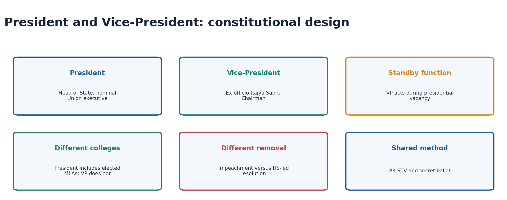

| Dimension | President | Vice-President |
|---|---|---|
| Articles | 52-62; powers across Constitution, including 72 | 63-71; Chairmanship also under 64, 89, 92 and 100 |
| Core position | Head of State; Union executive power formally vested in office | Ex-officio Chairman of Rajya Sabha |
| Election base | Elected MPs plus specified elected MLAs | Members of both Houses of Parliament |
| Normal executive authority | Acts on ministerial advice | No ordinary Union executive power |
| Removal | Impeachment for violation of Constitution | Rajya Sabha-initiated removal; no ground stated |
| Standby role | Office must always exist | Acts as President during vacancy/temporary inability |

- [FACT] Article 52 says there shall be a President of India; Article 63 similarly creates a Vice-President.
- [ANALYSIS] The offices are not a succession hierarchy in the US sense. The Vice-President temporarily acts; he or she does not inherit the remainder of a presidential term.
- [LIMIT] The Constitution does not use "nominal executive" as a label; that conclusion follows from Articles 53, 74 and 75 and parliamentary practice.

## 02. Election of the President: who votes

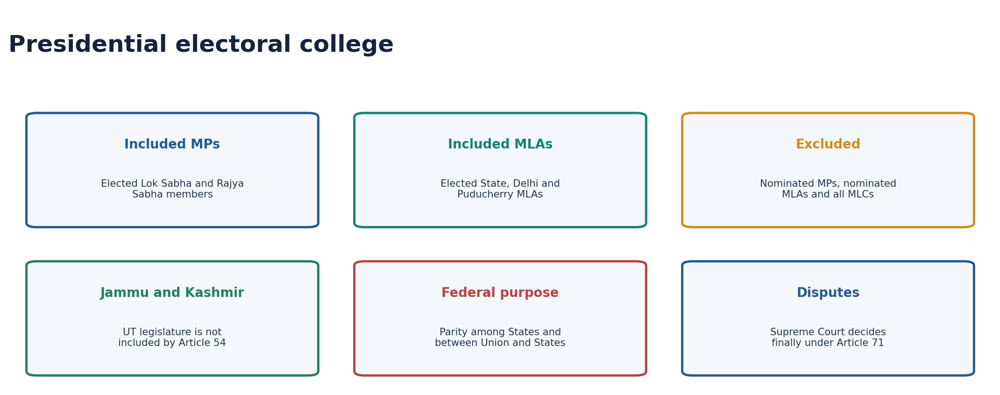

### Included

- [FACT] Elected members of Lok Sabha and Rajya Sabha.
- [FACT] Elected members of the Legislative Assemblies of the States.
- [FACT] Elected members of the Legislative Assemblies of the National Capital Territory of Delhi and Puducherry, added through the 70th Amendment framework.

### Excluded

- [FACT] Nominated members of either House of Parliament.
- [FACT] Nominated members of State/eligible UT Assemblies.
- [FACT] Every member of a State Legislative Council.
- [FACT] Jammu and Kashmir's UT legislature is not added to the Article 54 explanation, which names only Delhi and Puducherry.

### Why indirect

- [ANALYSIS] Indirect election fits a parliamentary system in which the President normally lacks an independent executive programme.
- [ANALYSIS] Weighted State votes provide a federal element while equal MP vote value binds the Union side into one national college.
- [LIMIT] The President is democratically elected but does not possess a direct popular mandate against the Council of Ministers.

## 03. Vote value, parity and PR-STV

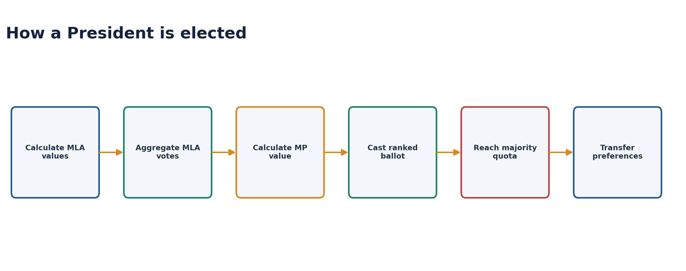

### MLA vote value

`State population / (elected MLAs x 1000)`

- [FACT] If the remaining fraction is at least 500, one is added to the quotient.
- [FACT] "Population" continues to use the 1971 census until relevant figures of the first census taken after 2026 have been published.
- [ANALYSIS] More Assembly seats do not by themselves raise each MLA's value; the decisive quantity is the population-to-elected-MLA ratio.

### MP vote value

`Total value of votes of all elected MLAs / total elected MPs of both Houses`

- [FACT] Every elected MP, whether from Lok Sabha or Rajya Sabha, has the same vote value.
- [FACT] Fractions exceeding one-half are counted as one; other fractions are disregarded.

### Ballot and count

- [FACT] Election uses proportional representation by single transferable vote and secret ballot.
- [FACT] Electors rank candidates. The winning quota is more than half the total valid vote value.
- [FACT] If nobody reaches the quota on first preferences, the lowest candidate is excluded and transferable values move according to next preferences.
- [LIMIT] "Proportional representation" here elects one office; its practical effect is majority preference through transferable rankings, not a multi-seat proportional legislature.

## 04. Presidential election administration and disputes

- [FACT] A candidate needs **50 proposers and 50 seconders** and a statutory deposit of **Rs 15,000**.
- [FACT] The Supreme Court finally decides doubts and disputes connected with election of the President or Vice-President under Article 71.
- [FACT] Acts already done in office are not invalidated merely because the election is later declared void.
- [FACT] An election cannot be challenged merely because the electoral college contained a vacancy for any reason.
- [FACT] Dissolution of some State Assemblies does not constitutionally justify postponing the presidential election.
- [ANALYSIS] These rules protect continuity of the Head of State while preserving judicial control over the election itself.

## 05. Qualifications, oath and conditions of office

| Test | President |
|---|---|
| Citizenship | Citizen of India |
| Minimum age | 35 years |
| Electoral qualification | Qualified for election as a Lok Sabha member |
| Office of profit | Must not hold one under Union, State or controlled local/other authority |
| Oath | CJI, or in absence the senior-most available Supreme Court judge |
| Legislative membership | If an MP/MLA is elected, the seat is deemed vacated on entering office |

- [FACT] For qualification, holding office as President, Vice-President, Governor or Union/State minister is not treated as holding an office of profit.
- [FACT] The President is entitled to the official residence and statutory emoluments; these cannot be diminished during the term.
- [FACT] The oath promises faithful execution, preservation/protection/defence of the Constitution and law, and service to the people.

## 06. Term, re-election, vacancy and succession

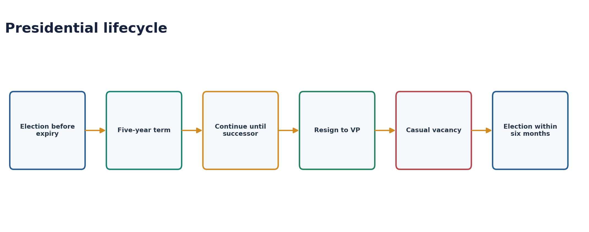

- [FACT] The term is five years from entering office.
- [FACT] The President may resign to the Vice-President.
- [FACT] The President remains in office after the five years until the successor enters office; there is no ordinary interregnum.
- [FACT] Re-election is constitutionally unlimited. Dr Rajendra Prasad alone completed two presidential terms.
- [FACT] Election to fill an expected expiry must be completed before expiry.
- [FACT] A casual vacancy caused by death, resignation, removal or otherwise must be filled within six months; the elected successor receives a fresh five-year term.
- [FACT] The Vice-President acts as President during a vacancy. If both offices are unavailable, Parliament's law places the Chief Justice of India, or the senior-most available Supreme Court judge, in the acting role.

## 07. Impeachment under Article 61

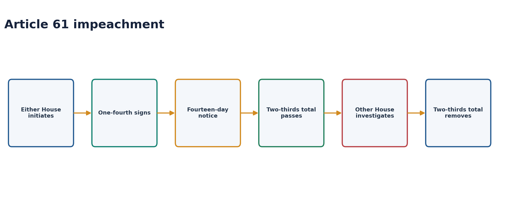

- [FACT] The sole ground is **violation of the Constitution**, which the Constitution does not define.
- [FACT] Either House may initiate.
- [FACT] At least one-fourth of the total membership of the initiating House must sign the notice; at least 14 days' notice is required.
- [FACT] The initiating House must pass the charge by at least two-thirds of its total membership.
- [FACT] The other House investigates or causes investigation. The President has the right to appear and be represented.
- [FACT] If the investigating House also sustains the charge by two-thirds of its total membership, removal takes effect on passage.
- [FACT] Nominated MPs may participate in impeachment although they do not elect the President; State MLAs elect but do not impeach.
- [CURRENT] No Indian President has been impeached.

## 08. Presidential immunities under Article 361

- [FACT] The President is not answerable to any court for official acts, subject to parliamentary investigation of an impeachment charge and the ability to sue the Union where law permits.
- [FACT] No criminal proceeding may be instituted or continued during the term.
- [FACT] No arrest or imprisonment process may issue during the term.
- [FACT] Civil proceedings concerning personal acts may begin during the term only after two months' written notice containing the prescribed particulars.
- [LIMIT] Immunity of the person does not place government action beyond judicial review.

## 09. Constitutional position: dignity without a rival mandate

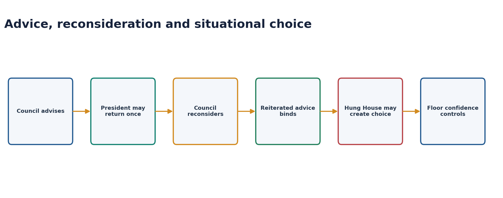

- [FACT] Article 53 formally vests Union executive power in the President.
- [FACT] Article 74 requires a Council of Ministers headed by the Prime Minister to aid and advise.
- [FACT] The 42nd Amendment made advice expressly binding.
- [FACT] The 44th Amendment permits the President to require reconsideration once; advice tendered after reconsideration must be accepted.
- [FACT] Article 75 ties the Council's survival to collective responsibility to Lok Sabha.
- [ANALYSIS] Ambedkar's formula remains exact: the President is head of the State but not the real executive.

### Situational discretion, not a personal policy power

- [ANALYSIS] Appointing a Prime Minister when no party has a clear majority, with the objective test being ability to secure Lok Sabha confidence.
- [ANALYSIS] Requiring a ministry whose majority is credibly disputed to demonstrate confidence on the floor.
- [ANALYSIS] Dismissing a ministry that has lost confidence but refuses to resign.
- [ANALYSIS] Considering whether dissolution advice from a defeated/minority ministry should be accepted where an alternative government is demonstrably available.
- [FACT] K. R. Narayanan returned Union Cabinet advice concerning proposed President's Rule in Uttar Pradesh (1997) and Bihar (1998); reiterated advice would have bound him.
- [LIMIT] The President has no general constitutional discretion equivalent to the Governor's Article 163 formulation. Convention, reasoned choice and floor confidence bound each exceptional decision.

## 10. Executive powers

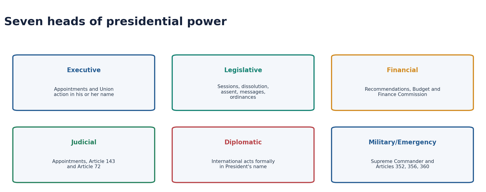

- [FACT] All Union executive action is expressed in the President's name; authenticated orders receive Article 77 protection as to mode.
- [FACT] Appoints the Prime Minister and, on PM advice, other ministers.
- [FACT] Appoints the Attorney General, CAG, Governors, Finance Commission, UPSC members, Election Commissioners under applicable constitutional/statutory processes, and Supreme Court/High Court judges.
- [FACT] Can require the Prime Minister to communicate Council decisions and information and to place before the Council a minister's decision not considered by it (Article 78).
- [FACT] Directly administers Union Territories through administrators to the extent provided by the Constitution.
- [FACT] Appoints commissions for specified constitutional purposes, including Finance Commission and certain official-language/backward-class inquiries where applicable.
- [LIMIT] Appointment in the President's name does not mean unfettered personal selection; constitutional provisions, statutes, judicial doctrine and ministerial advice control different offices.

## 11. Legislative powers and Parliament

- [FACT] Summons and prorogues either House and dissolves Lok Sabha on advice/convention.
- [FACT] Addresses Parliament after each general election to Lok Sabha and at the first session each year.
- [FACT] May address either/both Houses and send messages.
- [FACT] Summons a joint sitting of both Houses for an ordinary legislative deadlock under Article 108.
- [FACT] Nominates 12 Rajya Sabha members with special knowledge/practical experience in literature, science, art and social service.
- [FACT] The former power to nominate two Anglo-Indian members to Lok Sabha ceased through the 104th Amendment framework.
- [FACT] Causes the Budget and constitutional reports to be laid before Parliament.
- [FACT] Prior presidential recommendation is constitutionally required for specified financial and other bills.

## 12. Veto under Article 111 and reserved State bills

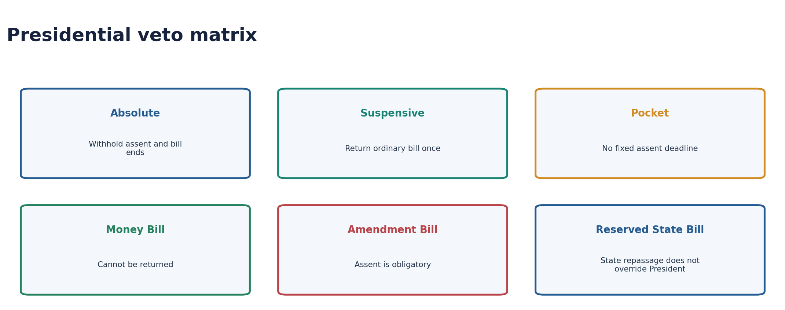

### Parliamentary bills

| Bill | Options |
|---|---|
| Ordinary Bill | Assent; withhold assent; return once for reconsideration |
| Money Bill | Assent or withhold; cannot return |
| Constitution Amendment Bill | Must assent after the 24th Amendment |

- [FACT] If Parliament re-passes a returned ordinary bill, with or without amendments, the President cannot withhold assent.
- [FACT] Re-passage needs only the ordinary majority applicable to the bill, not a special veto-override majority.
- [FACT] The Constitution gives no fixed deadline for Article 111 assent. This permits a pocket veto.
- [FACT] Zail Singh's handling of the Indian Post Office (Amendment) Bill, 1986 is the standard pocket-veto illustration.
- [ANALYSIS] Absolute veto is most plausible for private-member bills or a government bill after the ministry has resigned; in normal government legislation ministerial advice dominates.

### State bills reserved under Article 201

- [FACT] The President may assent, withhold assent, or direct the Governor to return a non-Money Bill.
- [FACT] If the State legislature re-passes and re-presents it, the President is not textually compelled to assent; this differs from Article 111.
- [CURRENT] The 20 November 2025 Article 143 opinion held that courts cannot create rigid timelines or deemed assent, but glaring, prolonged and unexplained inaction can attract limited directions to decide.
- [LIMIT] Article 201 is not a personal federal veto exercised outside Article 74 advice.

## 13. Ordinance-making power under Article 123

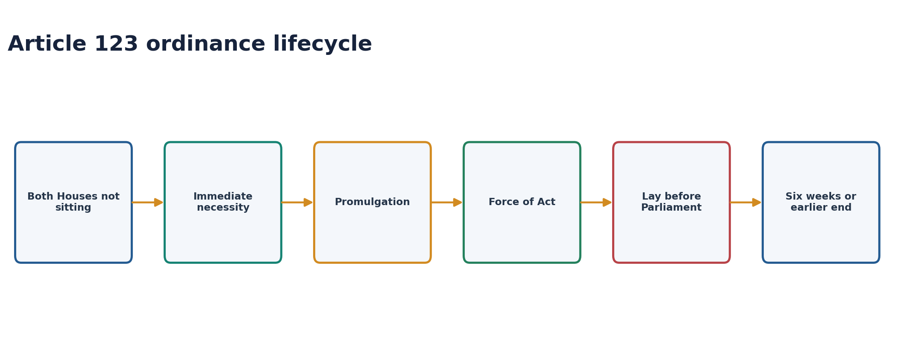

- [FACT] An ordinance may be promulgated except when **both Houses are in session**. It is enough that one House is not sitting.
- [FACT] The President must be satisfied that circumstances require immediate action; this satisfaction is ministerially formed and judicially reviewable on limited grounds.
- [FACT] It has the same force and effect as an Act of Parliament but only within Parliament's legislative competence and constitutional limits.
- [FACT] It may amend or repeal a Central Act and may operate retrospectively, subject especially to Article 20(1).
- [FACT] It cannot abridge Fundamental Rights and cannot amend the Constitution.
- [FACT] It must be laid before both Houses and ceases six weeks after the later date of their reassembly, unless disapproved earlier by both Houses.
- [FACT] The President may withdraw it at any time on advice.
- [ANALYSIS] Its maximum practical life is approximately six months plus six weeks because six months is the maximum constitutional gap between parliamentary sessions.

### Judicial controls

- [FACT] *R. C. Cooper* (1970): ordinance satisfaction is not completely beyond review.
- [FACT] *D. C. Wadhwa* (1987): routine re-promulgation without legislative consideration is a fraud on the Constitution.
- [FACT] *Krishna Kumar Singh* (2017, seven judges, 5:2): laying is mandatory; re-promulgation subverts legislative supremacy; enduring rights do not automatically survive every lapsed ordinance.
- [ANALYSIS] The ordinance power is legitimate for urgency, not for avoiding an inconvenient House.

## 14. Financial, judicial, diplomatic, military and emergency powers

### Financial

- [FACT] A Money Bill needs prior presidential recommendation.
- [FACT] No demand for a grant can be made except on presidential recommendation.
- [FACT] The Annual Financial Statement is caused to be laid before Parliament.
- [FACT] The President constitutes a Finance Commission every five years or earlier and can authorise advances from the Contingency Fund pending parliamentary approval.

### Judicial

- [FACT] Appoints Supreme Court and High Court judges under the constitutional appointments framework.
- [FACT] May seek the Supreme Court's advisory opinion under Article 143. The opinion is not binding in the same way as an adjudicated decree.
- [FACT] Exercises clemency under Article 72.

### Diplomatic, military and emergency

- [FACT] International treaties and agreements are formally concluded in the President's name but remain governed by the constitutional distribution of executive/legislative power.
- [FACT] The President is Supreme Commander of the defence forces; operational authority belongs to elected government under law.
- [FACT] National, State and Financial Emergency proclamations are presidential acts under Articles 352, 356 and 360, controlled by advice, parliamentary approval and judicial review.

## 15. Pardoning power under Article 72

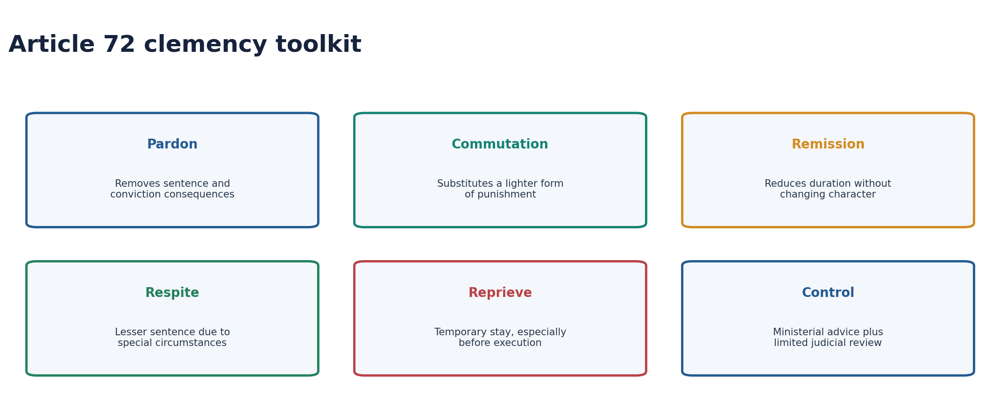

### Jurisdiction

- [FACT] Cases where punishment/sentence is by court-martial.
- [FACT] Offences against laws concerning matters to which Union executive power extends.
- [FACT] Every case where the sentence is death.

### Five forms

| Form | Meaning |
|---|---|
| Pardon | Removes punishment and ordinarily the disqualifying consequences of conviction |
| Commutation | Replaces one form of punishment with a lighter form |
| Remission | Reduces the period without changing the character of punishment |
| Respite | Awards a lesser sentence because of a special fact such as pregnancy/disability |
| Reprieve | Temporarily stays execution to permit consideration of relief |

### Advice, merits and review

- [FACT] *Maru Ram* (1980): clemency is exercised on binding ministerial advice.
- [FACT] *Kehar Singh* (1989): the executive may examine the merits afresh; the President is not an appellate court and need not give a judicial-style hearing.
- [FACT] *Epuru Sudhakar* (2006): limited review lies for mala fides, arbitrariness, non-application of mind and relevant/irrelevant-material defects.
- [FACT] Unexplained mercy-petition delay can have constitutional consequences in death-sentence cases, but no automatic numerical rule replaces case-sensitive review.

### President versus Governor

| Point | President, Article 72 | Governor, Article 161 |
|---|---|---|
| Court-martial | Can grant all forms | No power |
| Death sentence | Can pardon and grant lesser forms | Cannot pardon, but may suspend/remit/commute |
| Ordinary offences | Union executive field | State executive field |
| Advice | Union Council | State Council |

## 16. Vice-President: election and qualifications

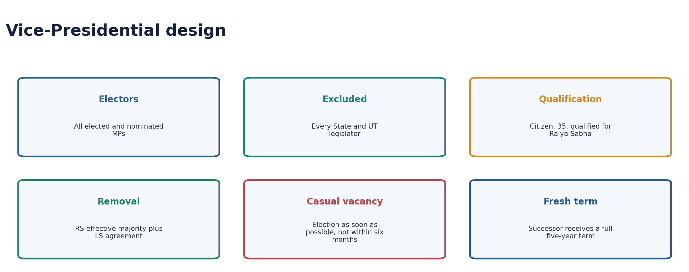

- [FACT] The electoral college consists of **all members of both Houses of Parliament**, elected and nominated.
- [FACT] No State or UT legislator votes.
- [FACT] Election uses PR-STV and secret ballot; all votes have equal value.
- [FACT] Qualifications: citizen, 35 years, qualified for election to Rajya Sabha, and no disqualifying office of profit.
- [FACT] A candidate needs 20 proposers and 20 seconders and the statutory deposit.
- [FACT] The President, or a person appointed by the President, administers the oath.
- [FACT] Election disputes are decided finally by the Supreme Court under Article 71.

## 17. Vice-Presidential term, resignation, removal and vacancy

- [FACT] Term: five years; the Vice-President continues until the successor enters office.
- [FACT] Resignation is addressed to the President.
- [FACT] Removal is by a resolution of Rajya Sabha passed by a majority of **all the then members** (effective majority) and agreed to by Lok Sabha.
- [FACT] Only Rajya Sabha can initiate; at least 14 days' notice is required; no constitutional ground is stated.
- [LIMIT] This is removal, not impeachment. Lok Sabha agreement is by its ordinary voting majority unless a contrary special rule exists.
- [FACT] Election for a vacancy expected on expiry must be completed before expiry.
- [FACT] A casual vacancy must be filled **as soon as possible**; unlike the President, Article 68 specifies no six-month outer deadline.
- [FACT] The successor in a casual vacancy receives a fresh five-year term.

## 18. The Vice-President as Rajya Sabha Chairman

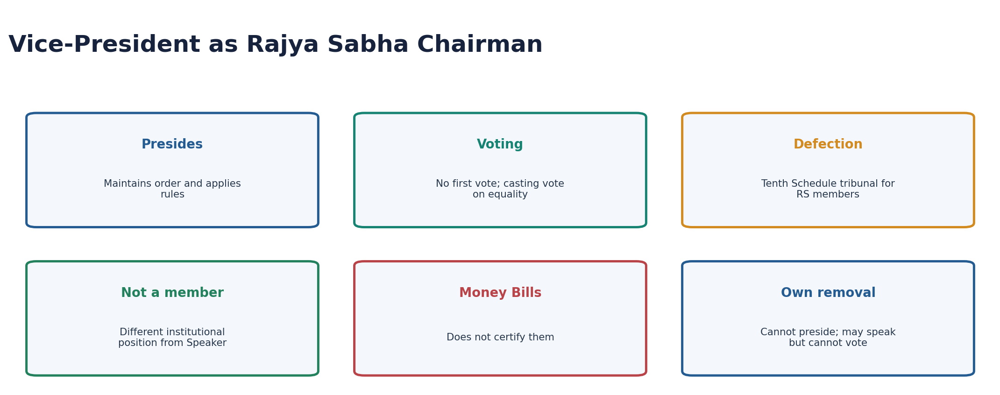

- [FACT] Article 64 makes the Vice-President ex-officio Chairman of Rajya Sabha.
- [FACT] The Chairman is not a Rajya Sabha member and has no first-instance vote; Article 100 gives a casting vote when votes are equal.
- [FACT] Presides, maintains order, interprets rules, decides points of order/admissibility and coordinates committee references under House rules.
- [FACT] Decides Tenth Schedule disqualification questions for Rajya Sabha members; *Kihoto Hollohan* makes the decision judicially reviewable.
- [FACT] Does not certify Money Bills; that constitutional function belongs to the Lok Sabha Speaker.
- [FACT] During consideration of the Vice-President's own removal resolution, Article 92 bars him/her from presiding. The Vice-President may speak/take part but cannot vote even though normally possessing a casting vote.
- [ANALYSIS] Because Rajya Sabha articulates State interests and revising scrutiny, the office's practical authority depends heavily on demonstrable neutrality.

## 19. Acting as President

- [FACT] The Vice-President acts as President when the presidential office falls vacant and discharges functions when the President is unable because of absence, illness or another cause.
- [FACT] During that period, the Vice-President does not perform Rajya Sabha Chairman duties; the Deputy Chairman performs the presiding function.
- [FACT] The acting Vice-President receives presidential emoluments/privileges for the period rather than Chairman's salary.
- [FACT] The acting arrangement after a presidential casual vacancy ends when the new President enters office; the presidential election must occur within six months.
- [LIMIT] The six-month rule attaches to filling the **presidential** vacancy, not to filling a Vice-Presidential vacancy.

## 20. Current constitutional-office control

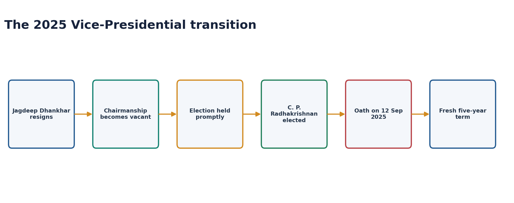

- [CURRENT] Droupadi Murmu became the 15th President on 25 July 2022.
- [CURRENT] Jagdeep Dhankhar's resignation in July 2025 created a Vice-Presidential casual vacancy.
- [CURRENT] The Election Commission's official result records C. P. Radhakrishnan elected on 9 September 2025: 452 valid votes to B. Sudershan Reddy's 300, with 15 invalid ballots.
- [CURRENT] C. P. Radhakrishnan entered office on 12 September 2025 as the 15th Vice-President.
- [ANALYSIS] This is the cleanest current example for Article 68: prompt election, no six-month textual deadline, and a fresh five-year term.

## 21. Master comparison and trap firewall

| Test | President | Vice-President |
|---|---|---|
| Electoral college | Elected MPs + elected State/Delhi/Puducherry MLAs | Elected + nominated MPs only |
| Vote value | Weighted | Equal |
| Qualification for House | Lok Sabha | Rajya Sabha |
| Oath by | CJI/senior-most available SC judge | President/person appointed |
| Resignation to | Vice-President | President |
| Removal | Either House starts; 2/3 total in both | RS starts; effective majority + LS agreement |
| Ground | Violation of Constitution | None stated |
| Casual-vacancy election | Within six months | As soon as possible |
| Regular function | Head of State on advice | Rajya Sabha Chairman |

### Trap firewall

- Nominated MPs do not elect the President but do elect the Vice-President and may impeach the President.
- MLAs elect the President but neither elect the Vice-President nor impeach the President.
- MLCs participate in neither election.
- President: qualified for Lok Sabha; Vice-President: qualified for Rajya Sabha.
- Presidential ordinary bill can be returned once; Money Bill cannot; amendment bill must receive assent.
- Article 123 is available when one or both Houses are not in session, not only when both are adjourned.
- Governor cannot pardon a death sentence but can suspend, remit or commute it.
- Article 71 preserves acts done before an election is declared void.
- No fixed Article 111 assent deadline exists.
- VP removal is not impeachment and needs no stated ground.
- VP casual vacancy has no six-month rule; presidential casual vacancy does.
- VP acting as President does not simultaneously chair Rajya Sabha.

## PART II - Optional Advanced enrichment

> Skipping this Part does not reduce answer completeness. Use it for deeper evaluation, comparison and interview-level refinement.

## A1. Why the President is neither ruler nor rubber stamp

- [ANALYSIS] "Rubber stamp" is too strong because constitutional form can delay, warn and force reconsideration; "independent executive" is equally wrong because reiterated advice binds.
- [ANALYSIS] Bagehot's rights - to be consulted, to encourage and to warn - illuminate the office, but Indian answers must anchor them in Articles 74 and 78 rather than importing convention as text.
- [ANALYSIS] The office has maximum leverage where democratic authorization is least clear: hung Houses, contested confidence, caretaker situations and questionable dissolution advice.
- [LIMIT] Leverage is not policy autonomy. The President cannot substitute a preferred programme for the elected ministry's.

## A2. Election method follows office design: India and France

| Dimension | India | France |
|---|---|---|
| System | Parliamentary republic | Semi-presidential Fifth Republic |
| President's normal role | Nominal Head of State | Politically powerful executive actor |
| Electorate | Indirect federal electoral college | Direct universal adult suffrage |
| Voting | Weighted PR-STV, secret ballot | Two-round majority election |
| Majority method | Transfer lower preferences until quota | Absolute majority first round; top two contest second if needed |
| Mandate | Federal-symbolic and mediated | Direct nationwide personal mandate |
| Risk | Indirectness can appear remote | Dual legitimacy/cohabitation can divide executive authority |

- [ANALYSIS] India's mechanism prevents a rival popular executive mandate and represents federal units.
- [ANALYSIS] France's mechanism legitimises a strong President but may generate tension with a parliamentary majority of another political camp.
- [VERDICT] The procedures are not competing election technologies in isolation; each matches a different constitutional job description.

## A3. India and USA: pardon power

| Dimension | India | United States |
|---|---|---|
| Text | Article 72 | Article II, Section 2 |
| Office type | Nominal executive | Real presidential executive |
| Advice | Binding Council of Ministers | Personal presidential power |
| Jurisdiction | Union field, court-martial, death sentence | Federal offences against United States |
| Express limits | Constitutional field; advice and review | Cannot pardon impeachment; no State offences |
| Judicial control | Limited review of decision-making defects | Very broad power; constitutional limits remain |
| Pre-emptive pardon | Do not mechanically import US doctrine | Completed conduct may be pardoned before charge/conviction; not future conduct |

- [ANALYSIS] Both systems treat clemency as a safety valve, but accountability differs: parliamentary ministerial responsibility in India versus direct presidential political responsibility in the USA.
- [LIMIT] "Pre-emptive" does not mean authorization of a future crime.

## A4. Ordinances and democratic legitimacy

- [ANALYSIS] Necessity argument: crises and immediate legal gaps may arise between sittings.
- [ANALYSIS] Abuse argument: the executive can bypass debate, committee scrutiny and an unfavourable second chamber.
- [ANALYSIS] Constitutional settlement: temporary force, mandatory laying, legislative disapproval, judicial review and anti-re-promulgation.
- [LIMIT] Courts police constitutional abuse but cannot replace Parliament's political duty to scrutinise ordinances promptly.

## A5. Veto, assent delay and constitutional time

- [ANALYSIS] A pocket veto is a consequence of textual silence, not a separately enumerated power.
- [ANALYSIS] Delay can preserve deliberative space but can also become an unaccountable veto through inertia.
- [CURRENT] The 2025 Article 143 opinion rejected rigid court-made clocks and deemed assent while retaining limited review of glaring unexplained delay.
- [VERDICT] The sound reform direction is transparent reasons and constitutional expedition, not judicial rewriting of an absent deadline.

## A6. Clemency as mercy, public power and rule of law

- [ANALYSIS] Clemency corrects exceptional harshness, accounts for post-conviction developments and permits public-policy mercy.
- [ANALYSIS] Because it alters a judicially imposed consequence, reasons/material must not be caste-, religion-, status- or politics-driven.
- [ANALYSIS] Limited review respects separation of powers: courts inspect the integrity of the process rather than retrying clemency merits.

## A7. Chairmanship, federal deliberation and neutrality

- [ANALYSIS] The Vice-President is elected nationally by Parliament but presides over the chamber designed to represent States; this creates a permanent neutrality test.
- [ANALYSIS] Agenda rulings, speaking opportunities, disciplinary action and anti-defection timing can affect substantive political outcomes.
- [ANALYSIS] Legal review catches some defects; daily legitimacy still depends on consistent procedure and reasoned rulings.
- [VERDICT] The Chair's strongest authority is reputational: opposition compliance rises when procedure appears even-handed.

## A8. Reform matrix

| Issue | Reform-compatible response | Constitutional caution |
|---|---|---|
| Hung-House discretion | Published order of preference and immediate floor test | Do not freeze all political contingencies |
| Assent delay | Reasons, tracking and constitutional expedition | No invented deemed assent after 2025 opinion |
| Ordinance overuse | Prompt committee/parliamentary scrutiny | Urgency power remains constitutionally valid |
| Mercy delay | Time-bound administration and full records | Final decision remains executive on advice |
| Chair neutrality | Reasoned rulings and predictable rule enforcement | House autonomy and judicial limits remain |
| VP vacancy | Prompt notified election | Article 68 has no six-month text |

## A9. Mains answer architecture

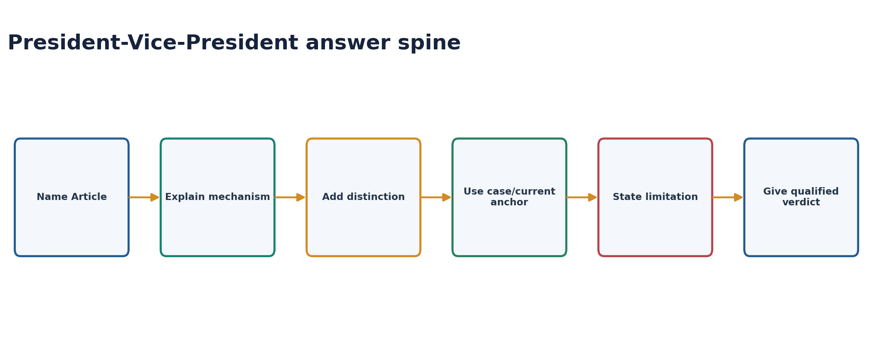

### President as rubber stamp

1. Define nominal executive through Articles 53/74.
2. State 42nd binding-advice and 44th reconsideration rules.
3. Separate normal rule from hung-House situational discretion.
4. Use K. R. Narayanan as a reconsideration example.
5. Bound discretion by Lok Sabha confidence and judicially reviewable constitutionalism.
6. Conclude: dormant in normal politics, consequential at constitutional margins.

### Ordinance answer

1. Article 123 purpose.
2. Preconditions and legislative competence.
3. Six-week/laying/disapproval controls.
4. *Wadhwa* and *Krishna Kumar Singh*.
5. Necessity versus bypass criticism.
6. Conclude with legislative scrutiny, not abolition.

### Vice-President as Chairman

1. Article 64 thesis: regular role is presiding.
2. Rule/order/casting-vote powers.
3. Tenth Schedule tribunal and review.
4. Speaker distinctions.
5. Neutrality/federal-chamber challenge.
6. Conclude that impartiality converts authority into legitimacy.

## Solved topic-specific MCQs

## Solved UPSC PYQs

### PYQ 1 - 2018 Prelims GS-I Q32

**Question:** With reference to the election of the President of India, consider the following statements:

1. The value of the vote of each MLA varies from State to State.
2. The value of the vote of MPs of the Lok Sabha is more than the value of the vote of MPs of the Rajya Sabha.

Which of the statements given above is/are correct?

A. 1 only  
B. 2 only  
C. Both 1 and 2  
D. Neither 1 nor 2

**INFERRED ANSWER - NOT OFFICIALLY VERIFIED: A.**

**Solution:** Statement 1 is correct because MLA value depends on the State's 1971 population-to-elected-MLA ratio. Statement 2 is false because every elected MP has the same value regardless of House.

### PYQ 2 - 2022 GS-II Q4

**Question:** Discuss the role of the Vice-President of India as the Chairman of the Rajya Sabha. (150 words, 10 marks)

**Model answer:** Article 64 makes the Vice-President ex-officio Chairman of Rajya Sabha; this presiding role, not the rare acting-presidential contingency, is the office's regular constitutional work.

The Chairman maintains order, interprets rules, decides points of order and admissibility, allocates proceedings under House rules and refers matters to committees. Though not a Rajya Sabha member, Article 100 gives a casting vote when votes are equal. Under paragraph 6 of the Tenth Schedule, the Chairman decides defection cases concerning Rajya Sabha members, subject to judicial review after *Kihoto Hollohan*. The Chairman neither votes initially nor certifies Money Bills, unlike the Lok Sabha Speaker's Article 110 function. Under Article 92, while the Vice-President's removal resolution is considered, he/she cannot preside and may speak but not vote.

As Rajya Sabha represents States and revises legislation, neutral rule enforcement is essential. Thus, the Chair's legal powers matter, but perceived impartiality is the foundation of their democratic legitimacy.

### PYQ 3 - 2022 GS-II Q14

**Question:** Critically examine the procedures through which the Presidents of India and France are elected. (250 words, 15 marks)

**Model answer:** The two procedures reflect different executive designs. India's President is a nominal federal Head of State; France's President is a powerful actor in a semi-presidential system.

India uses an indirect electoral college of elected MPs and elected State, Delhi and Puducherry MLAs. Nominated members and MLCs are excluded. MLA votes are weighted by the 1971 population-to-seat ratio and MP value balances aggregate State and Union votes. PR-STV, a secret ranked ballot and preference transfers produce a majority-supported winner. The method embeds federal parity and avoids creating a direct rival mandate to the responsible Cabinet. Its weakness is democratic remoteness and complexity.

France uses direct universal suffrage. A candidate needs an absolute majority in the first round; otherwise the two leading candidates contest a second round. The method creates a clear nationwide personal mandate appropriate to a politically active President. However, direct presidential and legislative mandates can conflict, producing cohabitation or divided executive leadership.

Therefore, India's election privileges federal mediation and parliamentary logic; France privileges popular authorization and executive leadership. Neither procedure is superior without reference to the office it elects.

### PYQ 4 - 2023 Prelims GS-I Q36

**Question:** Consider the following statements:

1. If the election of the President is declared void by the Supreme Court, all acts done before the decision become invalid.
2. Presidential election can be postponed because some Legislative Assemblies are dissolved and elections are pending.
3. The Constitution prescribes a time limit for presidential assent to a Bill.

How many statements are correct?

A. Only one  
B. Only two  
C. All three  
D. None

**INFERRED ANSWER - NOT OFFICIALLY VERIFIED: D.**

**Solution:** All are false. Article 71(2) preserves acts already done; electoral-college vacancies do not invalidate/postpone the election; Article 111 fixes no assent deadline.

### PYQ 5 - 2023 Prelims GS-I Q80

**Question:** Consider the following statements in respect of election to the President of India:

1. Nominated members of Parliament or State Assemblies are included.
2. Higher the number of elective Assembly seats, higher is each MLA's vote value.
3. Each Madhya Pradesh MLA has a higher value than each Kerala MLA.
4. Puducherry MLA value is higher than Arunachal Pradesh because its population-to-elective-seat ratio is higher.

How many statements are correct?

A. Only one  
B. Only two  
C. Only three  
D. All four

**INFERRED ANSWER - NOT OFFICIALLY VERIFIED: A.**

**Solution:** Only statement 4 is correct. Nominated members are excluded. Vote value depends on population divided by elected seats, so more seats do not mechanically increase value. Kerala's per-MLA value exceeds Madhya Pradesh's under the frozen data.

### PYQ 6 - 2025 Prelims GS-I Q51

**Question:** With reference to Indian polity, consider the following statements:

1. An Ordinance can amend any Central Act.
2. An Ordinance can abridge a Fundamental Right.
3. An Ordinance can come into effect from a back date.

Which are correct?

A. 1 and 2 only  
B. 2 and 3 only  
C. 1 and 3 only  
D. 1, 2 and 3

**Official Set-A answer: C.**

**Solution:** An ordinance has Act-like force and may amend a Central Act or operate retrospectively within constitutional limits. It is "law" under Article 13 and cannot abridge Fundamental Rights.

### PYQ 7 - 2025 Prelims GS-I Q86

**Question:** Consider the following statements regarding the pardoning power of the President:

1. Its exercise can be subjected to limited judicial review.
2. The President can exercise it without advice of the Central Government.

Which is/are correct?

A. 1 only  
B. 2 only  
C. Both 1 and 2  
D. Neither 1 nor 2

**Official Set-A answer: A.**

**Solution:** *Epuru Sudhakar* permits limited review for defects such as mala fides and non-application of mind. *Maru Ram* confirms that Article 72 is exercised on binding ministerial advice.

### PYQ 8 - 2025 GS-II Q3

**Question:** Compare and contrast the President's power to pardon in India and in the USA. Are there any limits to it in both countries? What are "preemptive pardons"? (150 words, 10 marks)

**Model answer:** Article 72 vests India's President with pardon, reprieve, respite, remission and commutation for Union-field offences, court-martial cases and every death sentence. The power is exercised on binding Council of Ministers advice (*Maru Ram*), may reassess merits (*Kehar Singh*) and is reviewable on narrow grounds such as mala fides, arbitrariness and non-application of mind (*Epuru Sudhakar*).

The US President's Article II power is personal rather than ministerially advised and extends to federal offences. It cannot cover State offences or cases of impeachment. Both powers are constitutionally broad but not legally limitless.

A US preemptive pardon covers completed conduct before charge, trial or conviction; it cannot license a future offence. India should not automatically import that doctrine because Article 72 operates within parliamentary government, ministerial responsibility and Indian review doctrine.

Thus, both are safety valves, but India's clemency is government-advised and reviewable, whereas the US model concentrates responsibility in the elected President.

## Original MCQ loop

### OM1. Electoral college

Who participates in electing the President?

A. Elected MPs plus elected State/Delhi/Puducherry MLAs  
B. All MPs and all MLAs  
C. Elected MPs and all State legislators  
D. Only elected MPs  

**Answer: A.**

Article 54 excludes nominated members and all MLCs.

### OM2. Vice-Presidential college

Which group elects the Vice-President?

A. Elected MPs only  
B. All members of both Houses of Parliament  
C. Elected MPs plus MLAs  
D. Rajya Sabha alone  

**Answer: B.**

Nominated MPs participate; no MLA does.

### OM3. MLA vote value

The value principally depends on:

A. Area and population  
B. Assembly strength only  
C. 1971 population relative to elected Assembly seats  
D. Current population only  

**Answer: C.**

The constitutional freeze preserves the 1971 basis until relevant post-2026 census figures are published.

### OM4. MP vote value

Which is correct?

A. Lok Sabha MPs have higher value  
B. Rajya Sabha MPs have higher value  
C. Value varies by State  
D. Every elected MP has the same value  

**Answer: D.**

The aggregate MLA value is divided across elected MPs of both Houses.

### OM5. President qualification

The candidate must be qualified for election to:

A. Lok Sabha  
B. Rajya Sabha  
C. Either House  
D. A State Assembly only  

**Answer: A.**

The Vice-President uses the Rajya Sabha qualification.

### OM6. President oath

It is ordinarily administered by the:

A. Prime Minister  
B. Chief Justice of India  
C. Vice-President  
D. Lok Sabha Speaker  

**Answer: B.**

The senior-most available Supreme Court judge acts in the CJI's absence.

### OM7. Re-election

The Constitution permits the President to be re-elected:

A. Once only  
B. Twice only  
C. Any number of times  
D. Never  

**Answer: C.**

Unlike the US, India sets no numerical limit.

### OM8. Casual presidential vacancy

The election must be held within:

A. One month  
B. Three months  
C. One year  
D. Six months  

**Answer: D.**

The successor receives a fresh five-year term.

### OM9. Impeachment initiator

A charge may be initiated by:

A. Either House of Parliament  
B. Lok Sabha only  
C. Rajya Sabha only  
D. The electoral college  

**Answer: A.**

Both Houses have symmetrical initiation capacity.

### OM10. Impeachment majority

Each decisive House resolution needs:

A. Simple majority  
B. Two-thirds of total membership  
C. Effective majority  
D. Special majority plus State ratification  

**Answer: B.**

This is stricter than two-thirds present and voting.

### OM11. Nominated MPs

Which statement is correct?

A. They elect and impeach  
B. They elect but cannot impeach  
C. They may impeach but do not elect the President  
D. They do neither  

**Answer: C.**

Election and impeachment bodies differ.

### OM12. Advice

After the President returns advice once and the Council reiterates it:

A. The Supreme Court decides  
B. Parliament votes  
C. The President may keep returning it  
D. The President must accept it  

**Answer: D.**

The 44th Amendment creates one reconsideration, not a veto.

### OM13. Hung Lok Sabha

The sound presidential test for appointing a PM is:

A. Likely ability to secure House confidence  
B. Personal ideological closeness  
C. Largest party in every circumstance  
D. Rajya Sabha strength  

**Answer: A.**

Floor confidence controls the discretion.

### OM14. Ordinary Bill

If Parliament re-passes a returned ordinary Bill:

A. A referendum follows  
B. The President must assent  
C. A two-thirds override is needed  
D. The President may return it again  

**Answer: B.**

Article 111 makes the second presentation conclusive.

### OM15. Money Bill

The President may not:

A. Assent  
B. Withhold assent  
C. Return it for reconsideration  
D. Act on advice  

**Answer: C.**

A Money Bill already required presidential recommendation before introduction.

### OM16. Amendment Bill

After valid passage, presidential assent is:

A. Optional  
B. Returnable once  
C. Subject to States  
D. Obligatory  

**Answer: D.**

The 24th Amendment removed veto uncertainty.

### OM17. Pocket veto

Its textual basis is:

A. No fixed Article 111 deadline  
B. A six-month clause  
C. Rajya Sabha approval  
D. Supreme Court permission  

**Answer: A.**

It is inferred from silence, not named as pocket veto.

### OM18. Ordinance timing

Article 123 is available when:

A. Both Houses must be dissolved  
B. Both Houses are not simultaneously in session  
C. Lok Sabha alone is dissolved  
D. A National Emergency exists  

**Answer: B.**

One House not sitting is sufficient.

### OM19. Ordinance end

Unless earlier disapproved/withdrawn, it ceases:

A. Immediately on reassembly  
B. After six months  
C. Six weeks after later reassembly date  
D. After one year  

**Answer: C.**

Different reassembly dates use the later date.

### OM20. Re-promulgation

D.C. Wadhwa characterises routine re-promulgation as:

A. Basic Structure  
B. Pocket veto  
C. Collective responsibility  
D. Fraud on the Constitution  

**Answer: D.**

The executive cannot maintain ordinance rule without legislative consideration.

### OM21. Article 72

Which falls uniquely within presidential clemency?

A. Court-martial sentence  
B. Every State-law offence  
C. Civil decree  
D. Legislative privilege  

**Answer: A.**

The Governor has no court-martial clemency power.

### OM22. Governor and death

A Governor may:

A. Pardon a death sentence  
B. Suspend/remit/commute but not pardon death  
C. Do nothing concerning death sentence  
D. Review a court-martial  

**Answer: B.**

Article 161 is narrower than Article 72.

### OM23. Clemency review

Epuru Sudhakar supports review for:

A. Incorrect evidence appreciation alone  
B. Any disagreement on mercy  
C. Mala fides/non-application of mind  
D. No grounds whatsoever  

**Answer: C.**

Courts review decision-making defects, not sit as clemency appellate bodies.

### OM24. VP removal

The resolution starts in:

A. Either House  
B. Lok Sabha  
C. Joint sitting  
D. Rajya Sabha  

**Answer: D.**

Rajya Sabha needs an effective majority; Lok Sabha agrees.

### OM25. VP casual vacancy

The Constitution requires election:

A. As soon as possible  
B. Within six months  
C. Within one year  
D. Only at Parliament's next session  

**Answer: A.**

Article 68 has no fixed six-month outer limit.

### OM26. Chairman vote

The Rajya Sabha Chairman ordinarily has:

A. A first vote only  
B. No first vote but a casting vote  
C. Two votes  
D. No vote under any circumstance  

**Answer: B.**

During his own removal motion, even the casting vote is unavailable.

### OM27. Acting President

While the VP acts as President:

A. He also chairs Rajya Sabha  
B. Lok Sabha Speaker chairs Rajya Sabha  
C. Deputy Chairman performs Chairman duties  
D. Rajya Sabha is suspended  

**Answer: C.**

Article 64 prevents simultaneous discharge of Chair duties.

### OM28. Article 143

The Supreme Court's advisory opinion is:

A. A constitutional amendment  
B. Always a binding decree  
C. An ordinance  
D. Advisory, not binding like an adjudicated decree  

**Answer: D.**

The President may seek advice on qualifying questions of law/fact.

## Remedial MCQs

### R1. College reversal

Which pairing is correct?

A. President: elected MPs + specified elected MLAs; VP: all MPs  
B. President: all MPs; VP: elected MPs + MLAs  
C. Both: elected MPs only  
D. Both: MPs + MLAs  

**Answer: A.**

Remember: P includes elected provinces; VP is Parliament only.

### R2. Removal arithmetic

Vice-President removal in Rajya Sabha requires:

A. Simple majority  
B. Majority of all then members  
C. Two-thirds total membership  
D. Two-thirds present and voting  

**Answer: B.**

This is the effective majority.

### R3. Six-month trap

The explicit six-month casual-vacancy deadline applies to:

A. Vice-President only  
B. Both offices  
C. President only  
D. Neither  

**Answer: C.**

VP vacancy is filled as soon as possible.

### R4. Article 111

Which bill cannot be returned and cannot be vetoed?

A. Ordinary Bill  
B. Money Bill  
C. State Bill  
D. Constitution Amendment Bill  

**Answer: D.**

Money Bill cannot be returned but assent may theoretically be withheld; amendment assent is obligatory.

### R5. Void election

Acts done before the Supreme Court voids a presidential election:

A. Remain valid  
B. Automatically vanish  
C. Need parliamentary ratification  
D. Need CJI approval  

**Answer: A.**

Article 71 protects continuity.

### R6. Ordinance

Which statement is correct?

A. It needs both Houses dissolved  
B. It may be retrospective within constitutional limits  
C. It can amend the Constitution  
D. It can abridge Fundamental Rights  

**Answer: B.**

Act-like force remains subject to the Constitution.

### R7. Death clemency

Which is accurate?

A. Only Governor can pardon death  
B. Both can pardon death  
C. President can pardon; Governor cannot pardon but can commute  
D. Neither can act  

**Answer: C.**

Separate pardon from lesser clemency forms.

### R8. Own removal debate

While the VP's removal is under consideration, the VP:

A. Presides normally  
B. Has a casting vote  
C. Cannot participate at all  
D. May speak but cannot preside or vote  

**Answer: D.**

Article 92 creates the special rule.

## Original solved Mains practice

### M1. "The Indian President is a constitutional sentinel, not an alternative executive." Examine. (10 marks, 150 words)

**Model answer:** Articles 53 and 74 create a deliberate duality: Union executive power is formally vested in the President, but is exercised on binding ministerial advice. The 42nd Amendment made advice expressly binding; the 44th permits one reconsideration, after which reiterated advice controls.

Therefore, in ordinary majority government the President cannot pursue an independent policy. Yet the office is not empty. Article 78 supports consultation and information; assent and reconsideration can force reflection; hung Lok Sabhas create bounded choices in appointing a Prime Minister; and disputed confidence must be tested on the floor. K. R. Narayanan's return of President's-Rule advice illustrates warning without final defiance.

Thus, the President protects constitutional process through questions, reasons and carefully bounded delay. The office is a sentinel because it preserves rules, but not an alternative executive because democratic responsibility remains with the Council of Ministers.

### M2. Explain how the presidential election reconciles popular representation with federal balance. (15 marks, 250 words)

**Model answer:** India avoids both hereditary headship and direct presidential rivalry. Articles 54-55 create an indirectly elected President whose electoral college contains elected MPs and elected State, Delhi and Puducherry MLAs.

Popular representation enters because every elector is elected, while nominated members and MLCs are excluded. Federal balance enters through weighted MLA votes based on the 1971 population-to-elected-seat ratio. This creates relative uniformity within each State and comparative weight among States. The total MLA vote value is then divided across elected MPs of both Houses, seeking parity between the States collectively and Parliament collectively. PR-STV and secret preference voting require a winner to cross a majority quota rather than merely lead a fragmented field.

The design has limits: its arithmetic is complex, the 1971 freeze no longer reflects current population distribution, and indirect election weakens immediate public visibility. Yet automatic use of present population could penalise States that controlled population growth, while direct election could create a rival executive mandate.

The system therefore represents a constitutional compromise: democratic but mediated, national but federal, and majoritarian only after transferable preferences.

### M3. Critically examine the President's veto powers after the 2025 Article 143 opinion on assent. (15 marks, 250 words)

**Model answer:** Article 111 allows assent, withholding and one return of a non-Money Bill. Re-passage binds the President. A Money Bill cannot be returned, while assent to a constitutional amendment is obligatory. Textual silence on time creates the pocket-veto possibility.

For a Governor-reserved State Bill, Article 201 permits assent, withholding or direction to return a non-Money Bill; unlike Article 111, State re-passage does not expressly bind the President. This can protect national constitutional concerns but also prolong federal uncertainty.

The Supreme Court's 20 November 2025 Article 143 opinion rejected rigid judicial timelines and automatic deemed assent, reasoning that courts cannot add constitutional consequences. Yet it did not constitutionalise indefinite inertia: glaring, prolonged and unexplained inaction remains open to limited intervention requiring a decision.

The opinion preserves separation of powers but shifts responsibility toward transparent constitutional conduct. Pocket veto should therefore be treated as a narrow consequence of text, not a routine political weapon. Reasons, expedition and parliamentary/federal accountability are preferable to either executive silence or judicial rewriting.

### M4. Ordinance power is necessary for urgency but dangerous as a substitute for Parliament. Discuss. (15 marks, 250 words)

**Model answer:** Article 123 permits temporary legislation when both Houses are not simultaneously in session and immediate action is necessary. An ordinance has Act-like force, can amend a Central Act and operate retrospectively, but cannot exceed Parliament's competence, abridge Fundamental Rights or amend the Constitution.

Necessity supports the power: crises and legal gaps may arise between sittings. Democratic danger arises because promulgation precedes debate, committee scrutiny and bicameral approval. Re-promulgation can convert an emergency bridge into executive legislation.

The Constitution therefore requires laying before both Houses and makes the ordinance cease six weeks after the later reassembly date or earlier disapproval. *D. C. Wadhwa* called routine re-promulgation a fraud on the Constitution. *Krishna Kumar Singh* made laying mandatory, reaffirmed review and rejected automatic survival of benefits from every lapsed ordinance.

The appropriate response is not abolition but constitutional discipline: reasons demonstrating urgency, prompt parliamentary scrutiny, committee review and refusal to re-promulgate except on genuinely new circumstances. The power is valid when it bridges time; it becomes abusive when it bypasses representation.

### M5. Compare the pardoning powers of the President and Governor and explain their judicial limits. (10 marks, 150 words)

**Model answer:** Article 72 empowers the President to grant pardon, reprieve, respite, remission or commutation in court-martial cases, Union-field offences and every death sentence. Article 161 gives the Governor corresponding authority over State-field offences but no court-martial power and no power to pardon a death sentence, though the Governor may suspend, remit or commute it.

Neither is personal mercy. *Maru Ram* binds both to ministerial advice. *Kehar Singh* allows executive reconsideration of merits without converting the President into an appellate court. *Epuru Sudhakar* permits limited judicial review for mala fides, arbitrariness, non-application of mind and relevant-material defects.

Thus, clemency is broader than ordinary adjudication but not above constitutionalism: jurisdiction differs, elected governments bear responsibility, and courts police the integrity rather than the merits of mercy.

### M6. Evaluate the neutrality challenge facing the Vice-President as Chairman of Rajya Sabha. (10 marks, 150 words)

**Model answer:** Article 64 makes the Vice-President ex-officio Chairman of Rajya Sabha, a chamber representing States and revising national legislation. The Chairman maintains order, interprets rules, controls admissibility under House procedure, uses a casting vote under Article 100 and decides Rajya Sabha defection cases under the Tenth Schedule.

Neutrality is difficult because the Vice-President emerges from a political election while rulings affect government-opposition competition. Speaking opportunities, disciplinary action and timing of defection decisions can alter parliamentary outcomes. Legal safeguards include absence of a first vote, judicial review of Tenth Schedule decisions and Article 92's bar on presiding/voting during the Chair's own removal motion.

Yet law cannot manufacture trust. Consistent precedents, reasoned rulings and balanced enforcement are essential. The Chairman's formal power secures order; perceived impartiality secures legitimacy.

### M7. Distinguish vacancy and removal rules for the President and Vice-President. Why do the differences matter? (10 marks, 150 words)

**Model answer:** The President is impeached under Article 61 for violation of the Constitution: either House may initiate, one-fourth must sign, 14 days' notice applies and both Houses require two-thirds of total membership. A presidential casual vacancy must be filled within six months; the Vice-President acts meanwhile.

The Vice-President is removed by a Rajya Sabha resolution passed by a majority of all then members and agreed to by Lok Sabha. Only Rajya Sabha initiates, no ground is stated and the process is not impeachment. A Vice-Presidential casual vacancy is filled as soon as possible, without a six-month textual deadline; the successor receives a fresh five-year term.

The differences track function: presidential removal protects the Head of State through a very high threshold, while Rajya Sabha leads removal of its own presiding officer. The 2025 transition to C. P. Radhakrishnan illustrates Article 68's prompt-election rule.

## Final consolidated register notes

### Constitutional identity

- President: Articles 52-62, 72, 74; nominal Head of State.
- Vice-President: Articles 63-71; ex-officio Rajya Sabha Chairman.
- President acts on binding ministerial advice; may return advice once.
- VP is not an automatic successor for the unexpired presidential term.

### President election

- College: elected LS + elected RS + elected State/Delhi/Puducherry MLAs.
- Excluded: nominated MPs/MLAs, all MLCs, J&K UT MLAs.
- MLA value: 1971 population divided by elected MLAs and 1000; rounding rule.
- MP value: total MLA vote value divided by elected MPs of both Houses.
- Same MP value across Houses.
- PR-STV, secret ranked ballot, majority quota and preference transfer.
- 50 proposers + 50 seconders; statutory deposit.
- Supreme Court finally decides disputes.
- Electoral-college vacancy does not invalidate election.
- Acts before election is voided remain valid.

### President qualification and tenure

- Citizen; 35; qualified for Lok Sabha; no office of profit.
- Oath: CJI/senior-most available SC judge.
- Five years; continues until successor; unlimited re-election.
- Resigns to VP.
- Casual vacancy election within six months; successor gets fresh five years.
- Dr Rajendra Prasad alone completed two terms.

### Impeachment and immunity

- Ground: violation of Constitution.
- Either House starts; one-fourth signs; 14-day notice.
- Two-thirds of total membership in both Houses.
- Nominated MPs participate; MLAs do not.
- President may appear/be represented in investigation.
- No President impeached.
- Article 361: official non-answerability; no criminal case/arrest during term; two-month notice for personal civil claim.

### Position and discretion

- Article 53 form; Articles 74-75 parliamentary reality.
- 42nd: advice binding; 44th: return once, reiterated advice binding.
- Situational spaces: hung-House PM, floor-confidence demand, ministry refusing to resign, dissolution where alternative exists.
- No general personal policy discretion.
- Narayanan 1997/1998: President's-Rule advice returned.

### Powers

- Executive: appointments, Article 77 form, Article 78 information.
- Legislative: summon/prorogue, dissolve LS, addresses/messages, joint sitting, 12 RS nominations, assent/ordinance.
- Financial: recommendations, Budget, grants, Finance Commission, Contingency Fund.
- Judicial: judges, Article 143 advice, Article 72.
- Diplomatic/military: formal international authority, Supreme Commander.
- Emergency: Articles 352, 356, 360 under separate safeguards.

### Veto

- Ordinary: assent/withhold/return once; re-passage binds.
- Money: assent/withhold; cannot return.
- Amendment: assent obligatory.
- Pocket: no fixed Article 111 deadline.
- Article 201 State bill: State repassage does not override President.
- 2025 opinion: no rigid judicial timeline/deemed assent; glaring unexplained delay remains reviewable for direction to decide.

### Ordinance

- Available unless both Houses are in session.
- Immediate action; same force as Act; within Parliament competence.
- Can amend Central Act and be retrospective.
- Cannot abridge FRs or amend Constitution.
- Lay before both Houses; ends six weeks after later reassembly or earlier disapproval/withdrawal.
- *Cooper*: review; *Wadhwa*: re-promulgation fraud; *Krishna Kumar Singh*: mandatory laying and no automatic enduring rights.

### Pardon

- Pardon, reprieve, respite, remission, commutation.
- President: court-martial, Union-field offences, every death sentence.
- Governor: State field; cannot pardon death or touch court-martial; may suspend/remit/commute death.
- *Maru Ram*: advice.
- *Kehar Singh*: merits can be reconsidered.
- *Epuru Sudhakar*: limited review.
- US pre-emptive pardon: completed conduct before charge/conviction, never future crime.

### Vice-President

- College: all elected + nominated MPs; no MLAs.
- PR-STV, secret ballot, equal votes.
- Citizen; 35; qualified for Rajya Sabha.
- 20 proposers + 20 seconders.
- Oath by President/person appointed.
- Five years; resigns to President.
- Removal: RS effective majority, LS agreement, 14 days, no ground, not impeachment.
- Casual vacancy: election as soon as possible, no six-month text, fresh five-year term.
- C. P. Radhakrishnan: elected 9 Sep 2025, entered office 12 Sep 2025.

### Chairman and acting role

- Not RS member; no first vote; casting vote on tie.
- Maintains order, rules on procedure, Tenth Schedule tribunal subject to review.
- Does not certify Money Bills.
- During own removal: cannot preside; may speak; cannot vote.
- Acting as President: does not chair RS; Deputy Chairman performs duties.

### Final 15 traps

1. Nominated MPs: VP election yes; President election no; impeachment yes.
2. MLAs: President election yes; VP election/impeachment no.
3. MLCs: neither election.
4. Delhi/Puducherry MLAs included for President; J&K UT MLAs not included.
5. President qualifies for LS; VP for RS.
6. President oath by CJI; VP oath by President.
7. President casual vacancy within six months; VP as soon as possible.
8. VP successor gets fresh term; does not finish predecessor's term.
9. Ordinary Bill returnable; Money Bill not; amendment assent mandatory.
10. Article 111 has no fixed deadline.
11. Ordinance possible if even one House is not in session.
12. Ordinance cannot amend Constitution/abridge FR.
13. Governor cannot pardon death but may commute it.
14. VP removal is not impeachment.
15. Acting VP cannot simultaneously chair Rajya Sabha.
