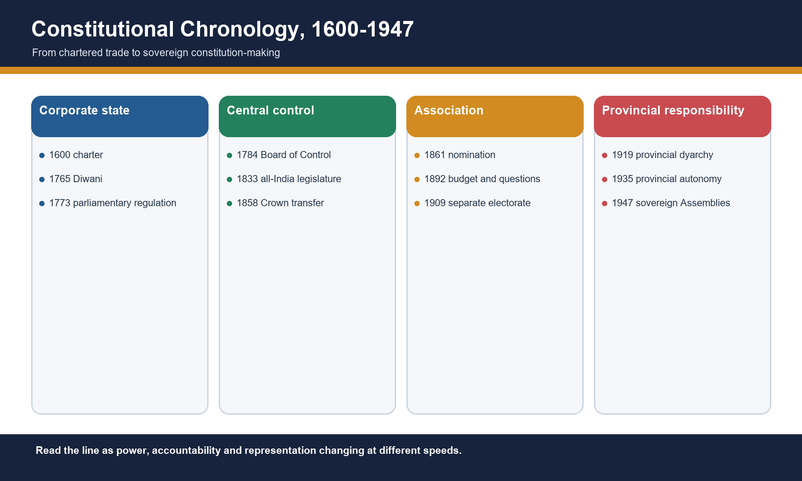
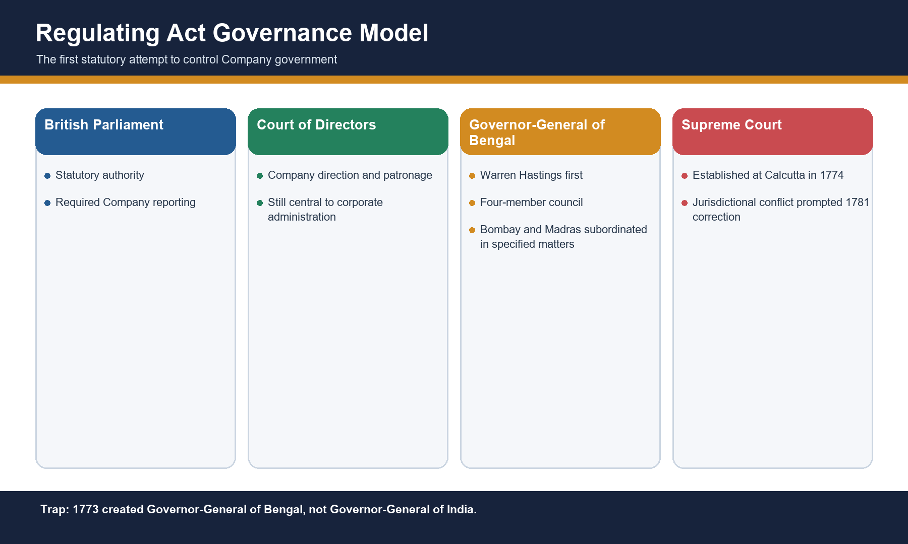
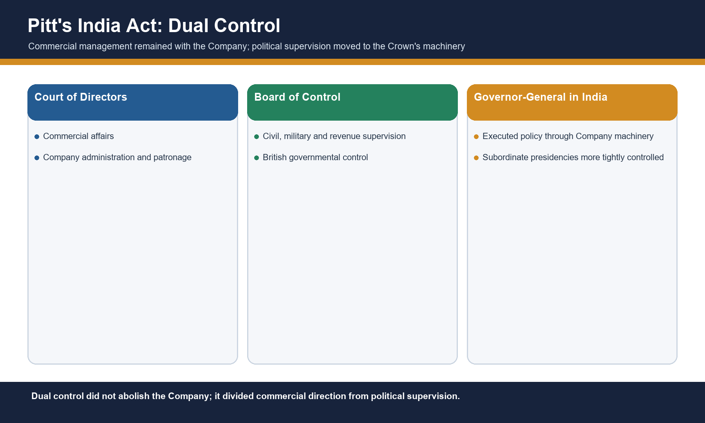
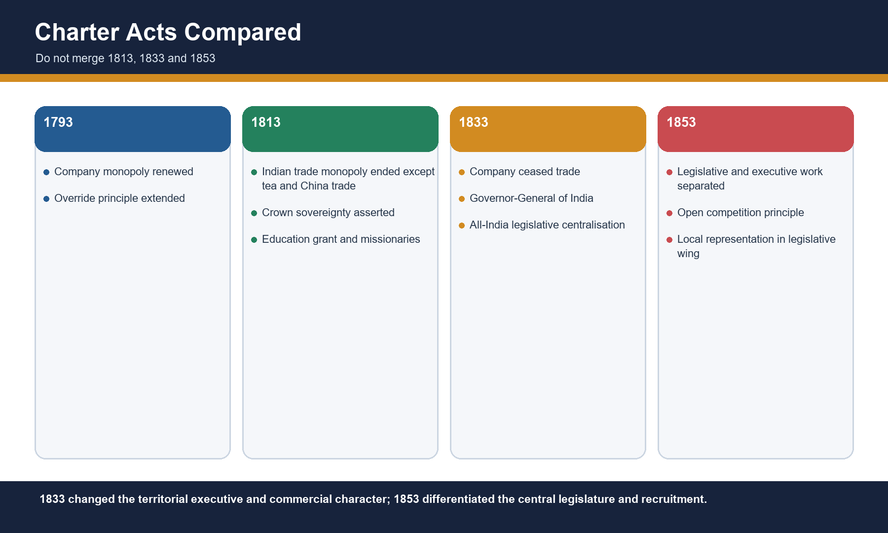
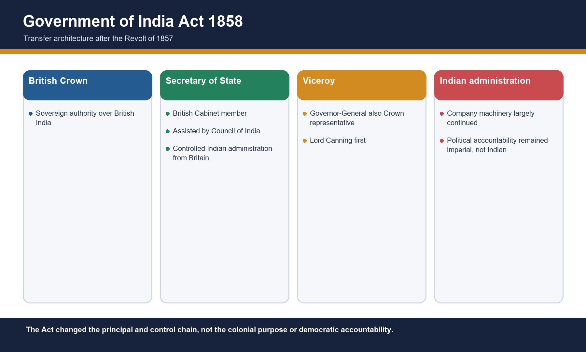
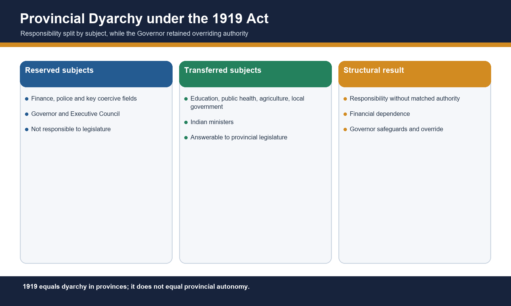

# Historical Background of the Indian Constitution - Complete Topic Package

> Subject: Indian Polity | GS-I and GS-II | Topic 01 | Rebuilt: 14 August 2026
>
> Approval state: generated, approved=false. This rebuild remains yellow awaiting explicit approval.

## Package method, evidence key and source audit

- [FACT] means directly supported by repository knowledge, the OCR-searchable local Laxmikanth chapter, a locally read official UPSC scan/key, or a securely established enacted provision.
- [ANALYSIS] means an exam-oriented inference or synthesis, not a quotation.
- [LIMIT] marks an operational, ownership, evidentiary or interpretive boundary.
- Source order used: retained Polity complete-package Markdown and updated Polity Core/basic files; advanced Topic 01 and syllabus/answer-worthiness/PYQ routing files; OCR-searchable local Indian Polity source; no forced live current-affairs story; Qdrant not used.
- Prior art consulted for layout and package discipline: Modern Indian History 03, corrected International Relations 01, and Ancient Indian History 18-21.
- Locally verified relevant PYQs: four Prelims items. Direct owner: 2024 Q62. Cross-owned/adjacent: 2018 Q38, 2019 Q4, 2023 Q50. No direct historical-background Mains PYQ was found in the audited local GS-I/GS-II corpus; no Mains PYQ is invented.
- Main learning loops: 16 solved MCQs. Workbook: 4 verified PYQs, 40 broad MCQs, 8 remedials and 9 original solved Mains answers. Correct options rotate A -> B -> C -> D within each intended sequence.
- Original visuals: 12 deterministic, fact-checked PNG schematics.

## PART I - Complete multi-subtopic learning session

## 01. Method and the pre-1773 corporate state

[FACT] The East India Company received its charter in 1600 and entered India as a trading corporation. Plassey (1757), Buxar (1764) and the Diwani grant (1765) supplied political leverage, military superiority and revenue authority. [LIMIT] These events are background, not constitutional statutes.

[ANALYSIS] Read each statute through four questions: who controlled the executive, who made law, who paid, and who was represented.

*Caption: Original deterministic schematic prepared for this package; labels are source-checked.*

### Chronology

| Date | Event |
|---|---|
| 1600 | East India Company charter |
| 1757 | Plassey |
| 1764 | Buxar |
| 1765 | Diwani |
| 1772 | Bengal Dual Government ended |

### Evidence matrix

| Event | Immediate effect | Constitutional meaning |
|---|---|---|
| Plassey | Political leverage | Company intervention in government |
| Buxar | Military superiority | Coercive base |
| Diwani | Revenue and civil authority | Private corporation exercises public power |

### Teaching and analysis

- [FACT] Diwani gave the Company revenue and civil-justice authority in Bengal, Bihar and Orissa; it did not begin Crown rule.
- [ANALYSIS] Revenue converted intermittent military success into a durable fiscal-administrative state.
- [FACT] Bengal's Dual Government separated the Company's effective revenue power from the Nawab's nominal responsibility.
- [ANALYSIS] Parliament's problem was constitutional: a private corporation exercised sovereign functions without a public accountability chain.
- [LIMIT] Do not narrate all eighteenth-century conquest; use only what explains why regulation became unavoidable.

### Rapid recall

- 1600 means chartered trade, not territorial sovereignty.
- 1765 is the fiscal turning point.
- Crown rule begins in 1858.

### Close-option traps

- Wrong: Diwani began direct Crown government.
  Correct: Diwani strengthened Company territorial power; Crown government began in 1858.
- Wrong: Plassey alone created a complete colonial state.
  Correct: Plassey created leverage; Buxar and Diwani supplied stronger coercive and fiscal foundations.

**Mains route:** Claim that constitutional regulation followed the accountability crisis created when corporate power became territorial; prove it with Diwani and the failure of Dual Government.

## 02. Regulating Act 1773 and Settlement Act 1781

[FACT] The Regulating Act was Parliament's first major statutory intervention in Company government. It created the Governor-General of Bengal with a four-member council, subordinated Bombay and Madras in specified matters, and provided for a Supreme Court at Calcutta. The 1781 Act corrected jurisdictional conflict.

[ANALYSIS] Read each statute through four questions: who controlled the executive, who made law, who paid, and who was represented.

*Caption: Original deterministic schematic prepared for this package; labels are source-checked.*

### Chronology

| Date | Event |
|---|---|
| 1773 | Regulating Act |
| 1774 | Supreme Court at Calcutta began |
| 1781 | Settlement or Amending Act |

### Evidence matrix

| Provision | 1773 position | 1781 correction |
|---|---|---|
| Executive | Governor-General of Bengal and council | Official acts protected from Supreme Court jurisdiction |
| Judiciary | Supreme Court at Calcutta | Revenue matters excluded; personal laws recognised |
| Appeals | Unsettled conflict | Provincial-court appeals routed to Governor-General-in-Council |

### Teaching and analysis

- [FACT] Warren Hastings was the first Governor-General of Bengal; the title Governor-General of India dates to 1833.
- [FACT] The Supreme Court consisted of a Chief Justice and three judges and began functioning in 1774.
- [FACT] Company servants were barred from private trade and accepting presents or bribes.
- [FACT] The Court of Directors had to report revenue, civil and military affairs to the British government.
- [ANALYSIS] The statute began centralisation and judicialisation but did not create responsible government.
- [LIMIT] The 1781 Act narrowed and clarified jurisdiction; it did not establish modern judicial review.

### Rapid recall

- Governor-General of Bengal: 1773.
- Supreme Court operational: 1774.
- Settlement Act: 1781 jurisdictional repair.

### Close-option traps

- Wrong: 1773 created the Governor-General of India.
  Correct: It created the Governor-General of Bengal.
- Wrong: The Supreme Court had uncontested authority over all revenue acts.
  Correct: Jurisdictional conflict led the 1781 Act to exclude revenue matters and protect official acts.

**Mains route:** Use 1773 as the start of statutory centralisation, then qualify that the 1781 repair reveals institutional improvisation rather than a settled separation of powers.

## 03. Pitt's India Act 1784, the 1786 measure and Charter Act 1793

[FACT] Pitt's India Act separated the Company's commercial management from British political supervision. The Court of Directors remained; the Board of Control supervised civil, military and revenue government. Later measures strengthened the Governor-General's capacity to override councils.

[ANALYSIS] Read each statute through four questions: who controlled the executive, who made law, who paid, and who was represented.

*Caption: Original deterministic schematic prepared for this package; labels are source-checked.*

### Chronology

| Date | Event |
|---|---|
| 1784 | Board of Control created |
| 1786 | Cornwallis enabled to override council and act as Commander-in-Chief |
| 1793 | Override principle extended; charter renewed |

### Evidence matrix

| Institution | Primary role | Precision |
|---|---|---|
| Court of Directors | Commercial affairs and Company administration | Not abolished in 1784 |
| Board of Control | Political, military and revenue supervision | Instrument of British government |
| Governor-General | Execution in India | Worked through Company machinery |

### Teaching and analysis

- [FACT] The Act first described Company territories as British possessions in India.
- [FACT] The Board of Control represented British governmental supervision; the Court of Directors retained commercial administration and patronage.
- [ANALYSIS] Dual control allowed the Crown to direct policy without immediately assuming all Company liabilities and machinery.
- [FACT] The 1786 arrangement is associated with Cornwallis and stronger executive coordination.
- [LIMIT] Pitt's Act did not transfer India to the Crown and did not create cabinet responsibility in India.
- [ANALYSIS] The sequence strengthened executive command faster than legislative accountability.

### Rapid recall

- 1784 equals Board of Control.
- Court of Directors continued until 1858.
- Dual control is not Bengal's 1765-72 Dual Government.

### Close-option traps

- Wrong: Board of Control managed only Company trade.
  Correct: It supervised political, civil, military and revenue affairs.
- Wrong: Pitt's Act abolished Company rule.
  Correct: Company rule continued under dual control until 1858.

**Mains route:** Explain dual control as a control-chain innovation and an accountability ambiguity: policy control moved toward the British state while operational machinery remained corporate.

## 04. Charter Acts 1793 and 1813: monopoly, sovereignty and education

[FACT] The Charter Act 1793 renewed Company privileges. The Charter Act 1813 ended the Company's monopoly over Indian trade except tea and trade with China, asserted Crown sovereignty, permitted missionaries and sanctioned an annual sum for education.

[ANALYSIS] Read each statute through four questions: who controlled the executive, who made law, who paid, and who was represented.

*Caption: Original deterministic schematic prepared for this package; labels are source-checked.*

### Chronology

| Date | Event |
|---|---|
| 1793 | Company charter and monopoly renewed |
| 1813 | Indian trade opened with exceptions; sovereignty asserted |

### Evidence matrix

| Dimension | 1793 | 1813 |
|---|---|---|
| Trade | Monopoly continued | Indian trade monopoly ended except tea and China trade |
| Constitution | Existing control consolidated | Crown sovereignty expressly asserted |
| Education and mission | No comparable opening | Annual education sanction; missionaries permitted |

### Teaching and analysis

- [FACT] The 1813 exception covered tea and trade with China; wording that all monopoly ended is false.
- [FACT] The Act asserted the sovereignty of the British Crown over Company-held Indian territories.
- [FACT] It sanctioned one lakh rupees annually for education and encouragement of learning.
- [ANALYSIS] Free-trade interests, missionary pressure and imperial control converged in one statute.
- [LIMIT] The education grant did not settle the Orientalist-Anglicist controversy and did not itself create mass education.
- [LIMIT] Parliament did not thereby take direct control of Indian revenues in the sense asserted by the false statement in the 2019 PYQ.

### Rapid recall

- 1813: tea and China exceptions.
- One lakh annual education sanction.
- Crown sovereignty asserted before Crown rule.

### Close-option traps

- Wrong: 1813 ended every Company monopoly.
  Correct: Tea and China trade remained exceptions.
- Wrong: 1813 began Crown rule.
  Correct: It asserted Crown sovereignty while Company administration continued.

**Mains route:** Show how 1813 joined economic liberalisation to imperial sovereignty, but distinguish an opening of trade from transfer of government.

## 05. Charter Acts 1833 and 1853: all-India government, law and civil service

[FACT] The Charter Act 1833 made the Governor-General of Bengal the Governor-General of India, ended the Company's commercial functions and centralised legislation. The 1853 Act separated the legislative and executive work of the Governor-General's council and advanced open competition.

[ANALYSIS] Read each statute through four questions: who controlled the executive, who made law, who paid, and who was represented.

*Caption: Original deterministic schematic prepared for this package; labels are source-checked.*

### Chronology

| Date | Event |
|---|---|
| 1833 | Governor-General of India; Company becomes administrative body |
| 1834 | First Law Commission |
| 1853 | Last Charter Act; legislative wing enlarged |
| 1854 | Macaulay Committee on civil service |

### Evidence matrix

| Question | Charter Act 1833 | Charter Act 1853 |
|---|---|---|
| Executive title | Governor-General of India; Bentinck first | No new transfer to Crown |
| Legislature | All-India legislative centralisation | Legislative and executive work separated |
| Civil service | Competition principle attempted but frustrated | Open competition established; 1854 committee followed |
| Company status | Trade ended; administrative body | Rule continued without fixed renewal term |

### Teaching and analysis

- [FACT] Bombay and Madras lost legislative powers under 1833; laws made by the central legislature came to be called Acts.
- [FACT] A Law Member was added and the first Law Commission followed; Macaulay became the first Law Member.
- [FACT] The 1833 Act's equality clause did not produce equal recruitment in practice.
- [FACT] The 1853 Act added legislative councillors and created a differentiated central legislative council sometimes described as a mini-Parliament.
- [FACT] Four of the six new legislative members represented Madras, Bombay, Bengal and Agra.
- [ANALYSIS] Centralisation, codification and merit rhetoric built a professional state, while racial and imperial constraints limited equality.
- [LIMIT] Company abolition belongs to 1858, not 1853.

### Rapid recall

- 1833: Governor-General of India.
- 1853: legislative-executive separation.
- 1854: Macaulay Committee.

### Close-option traps

- Wrong: Open competition was fully realised by 1833.
  Correct: The 1833 opening was frustrated; 1853 established open competition in principle.
- Wrong: 1853 ended Company government.
  Correct: It was the last Charter Act; Company government ended in 1858.

**Mains route:** Compare 1833 and 1853 through institutional function: 1833 created all-India legislative centralisation; 1853 differentiated legislation and professional recruitment.

## 06. Government of India Act 1858: Crown rule and imperial accountability

[FACT] After the Revolt of 1857, the 1858 Act abolished the East India Company and transferred government to the British Crown. It ended the Board of Control-Court of Directors system and created the Secretary of State for India assisted by a Council of India.

[ANALYSIS] Read each statute through four questions: who controlled the executive, who made law, who paid, and who was represented.

*Caption: Original deterministic schematic prepared for this package; labels are source-checked.*

### Chronology

| Date | Event |
|---|---|
| 1857 | Revolt |
| 1858 | Act for the Better Government of India; Crown transfer |
| 1858 | Lord Canning became first Viceroy |

### Evidence matrix

| Office | Change | Accountability limit |
|---|---|---|
| Secretary of State for India | British Cabinet minister; Council of India assistance | Responsible to British, not Indian, politics |
| Governor-General/Viceroy | Executive head and Crown representative | No responsible government in India |
| Company institutions | Court of Directors and Board abolished | Administrative personnel and habits substantially continued |

### Teaching and analysis

- [FACT] Lord Canning was the first Viceroy; he was already Governor-General.
- [FACT] The Secretary of State's Council had fifteen members in the original arrangement.
- [FACT] The double-government institutions created around 1784 were abolished.
- [ANALYSIS] The transfer clarified the imperial principal-agent chain but did not democratise it.
- [ANALYSIS] Crown proclamations of non-interference and equal treatment must be distinguished from implementation.
- [LIMIT] Administrative continuity means 1858 was not a total institutional rupture.

### Rapid recall

- Company abolished: 1858.
- First Viceroy: Canning.
- Secretary of State was in British Cabinet.

### Close-option traps

- Wrong: Viceroy was a wholly separate office from Governor-General.
  Correct: The Governor-General also acted as Viceroy, the Crown's representative.
- Wrong: 1858 introduced responsible government.
  Correct: It centralised imperial accountability without making the executive responsible to Indians.

**Mains route:** Argue that 1858 changed the sovereign and supervision architecture while preserving a highly centralised colonial administration.

## 07. Indian Councils Acts 1861 and 1892: association without responsibility

[FACT] The 1861 Act introduced nominated Indian non-officials into legislative work, recognised the portfolio system and restored legislative powers to Bombay and Madras. The 1892 Act widened councils, enabled budget discussion and questions, and used nomination on recommendation as indirect election in substance.

[ANALYSIS] Read each statute through four questions: who controlled the executive, who made law, who paid, and who was represented.

*Caption: Original deterministic schematic prepared for this package; labels are source-checked.*

### Chronology

| Date | Event |
|---|---|
| 1859 | Portfolio system used by Canning |
| 1861 | Councils Act |
| 1862 | First nominated Indian non-officials |
| 1892 | Budget discussion and questions |

### Evidence matrix

| Dimension | 1861 | 1892 |
|---|---|---|
| Entry | Nomination of non-official Indians | Indirect election in substance through recommendation |
| Control | Viceroy retained ordinance and legislative control | Official majority retained |
| Scrutiny | Limited legislative association | Budget discussion and questions; no vote of confidence |

### Teaching and analysis

- [FACT] The 1861 nominees included the Raja of Benaras, Maharaja of Patiala and Sir Dinkar Rao.
- [FACT] The Act decentralised legislation by restoring powers to Bombay and Madras.
- [FACT] It recognised portfolio allocation and authorised Viceroy's ordinances with a six-month life.
- [FACT] The 1892 Act enlarged non-official membership but retained official majorities.
- [FACT] The word election was avoided; bodies recommended nominees.
- [ANALYSIS] Legislative scrutiny developed before executive responsibility.
- [LIMIT] Neither Act created responsible government or a democratic franchise.

### Rapid recall

- 1861 equals nomination and portfolio system.
- 1892 equals budget discussion and questions.
- Indirect election is not direct popular election.

### Close-option traps

- Wrong: 1861 introduced elected Indian representatives.
  Correct: It associated nominated non-official Indians.
- Wrong: Budget discussion in 1892 made the executive removable.
  Correct: Discussion and questions did not create confidence responsibility.

**Mains route:** Trace the move from consultation to scrutiny while emphasising that association was designed to strengthen colonial legitimacy, not surrender executive control.

## 08. Indian Councils Act 1909: representation and communal electorates

[FACT] The Morley-Minto reforms enlarged councils, introduced separate electorates for Muslims and enabled Satyendra Prasad Sinha to enter the Viceroy's Executive Council as Law Member. Official control at the centre survived.

[ANALYSIS] Read each statute through four questions: who controlled the executive, who made law, who paid, and who was represented.

*Caption: Original deterministic schematic prepared for this package; labels are source-checked.*

### Chronology

| Date | Event |
|---|---|
| 1906 | Muslim League founded; deputation politics |
| 1909 | Indian Councils Act |
| 1909 | S.P. Sinha joined Viceroy's Executive Council |

### Evidence matrix

| Device | Meaning | Consequence |
|---|---|---|
| Separate electorate | Muslim voters elected Muslim representatives in designated seats | Communal political identity received statutory form |
| Council enlargement | More discussion and non-official presence | Executive remained irresponsible |
| Provincial composition | Non-official majorities in some councils | Officials and nominated groups still protected control |

### Teaching and analysis

- [FACT] Separate electorates are different from reserved seats in a joint electorate.
- [FACT] The central legislative council retained an official majority.
- [FACT] S.P. Sinha was the first Indian on the Viceroy's Executive Council.
- [ANALYSIS] British divide-and-rule incentives and Muslim elite demands both formed the political context; mono-causal answers are weak.
- [ANALYSIS] Representation widened while the electorate was segmented by community.
- [LIMIT] The Act did not introduce dyarchy, provincial autonomy or responsible government.

### Rapid recall

- 1909 equals separate Muslim electorates.
- S.P. Sinha, not a 1919 appointee.
- Communal electorate differs from reservation.

### Close-option traps

- Wrong: 1909 introduced provincial dyarchy.
  Correct: Provincial dyarchy came under the 1919 Act.
- Wrong: A separate electorate is merely a reserved seat.
  Correct: It also separates the electoral roll and electorate by community.

**Mains route:** Assess 1909 as a paradox: widened representative procedure but constitutionalised communal political boundaries.

## 09. Government of India Act 1919: dyarchy, bicameralism, franchise and review

[FACT] The Montagu-Chelmsford reforms separated central and provincial subjects, introduced dyarchy in provinces, established bicameralism at the centre and expanded direct elections on a restricted franchise. A statutory commission was promised after ten years.

[ANALYSIS] Read each statute through four questions: who controlled the executive, who made law, who paid, and who was represented.

*Caption: Original deterministic schematic prepared for this package; labels are source-checked.*

### Chronology

| Date | Event |
|---|---|
| 1917 | Montagu Declaration |
| 1919 | Government of India Act |
| 1921 | Main reforms came into operation |
| 1926 | Central Public Service Commission |
| 1927 | Simon Commission appointed |

### Evidence matrix

| Institution | Provision | Limit |
|---|---|---|
| Provincial dyarchy | Reserved and transferred subjects | Governor override and financial dependence |
| Central legislature | Council of State and Legislative Assembly | Executive not responsible to legislature |
| Franchise | Property, tax and education qualifications | Small and unequal electorate |
| Review | Statutory commission after ten years | Simon Commission appointed early and all-British |

### Teaching and analysis

- [FACT] Reserved subjects were administered by Governor and Executive Council; transferred subjects by ministers responsible to provincial legislatures.
- [FACT] Bicameralism and direct elections appeared at the central level.
- [FACT] Separate electorates extended beyond Muslims to Sikhs, Indian Christians, Anglo-Indians and Europeans.
- [FACT] Three of six members of the Viceroy's Executive Council, excluding Commander-in-Chief, were to be Indian.
- [FACT] Provincial budgets were separated and a High Commissioner for India was provided in London.
- [ANALYSIS] Dyarchy failed because political responsibility was not matched by fiscal, coercive or overriding authority.
- [LIMIT] The Act retained a unitary and safeguarded imperial structure.

### Rapid recall

- 1919 equals provincial dyarchy.
- Central bicameralism began under 1919.
- Central Public Service Commission began in 1926.

### Close-option traps

- Wrong: Transferred ministers controlled finance and police.
  Correct: Core reserved fields remained with Governor and Executive Council.
- Wrong: 1919 created provincial autonomy.
  Correct: Provincial autonomy belongs to the 1935 Act.

**Mains route:** Evaluate dyarchy with the governance test of functions, finances and functionaries; named subject division proves why responsibility was incomplete.

## 10. Bridges to 1935: Simon Commission, Round Tables, Communal Award and Poona Pact

[FACT] The all-British Simon Commission reviewed the 1919 system. Its report, three Round Table Conferences, a White Paper and Joint Select Committee process fed into the 1935 Act. The 1932 Communal Award and Poona Pact altered the representation debate.

[ANALYSIS] Read each statute through four questions: who controlled the executive, who made law, who paid, and who was represented.

*Caption: Original deterministic schematic prepared for this package; labels are source-checked.*

### Chronology

| Date | Event |
|---|---|
| 1927 | Simon Commission appointed |
| 1928 | Commission reached India; boycott |
| 1930 | Report and First Round Table Conference |
| 1931 | Second Round Table Conference |
| 1932 | Communal Award and Poona Pact; Third Round Table Conference |
| 1933-34 | White Paper and Joint Select Committee |

### Evidence matrix

| Bridge | Secure point | Scope limit |
|---|---|---|
| Simon Commission | All seven members British; proposed ending provincial dyarchy and moving toward federation | Do not attribute every 1935 provision solely to it |
| Round Tables | Negotiated federation, safeguards and representation | No single conference settled all issues |
| Communal Award | Separate electorates extended to depressed classes | Superseded for depressed classes by Poona Pact |
| Poona Pact | Reserved seats within joint electorate | Did not create universal franchise |

### Teaching and analysis

- [FACT] Indian opposition focused on exclusion from the Simon Commission.
- [FACT] The Commission recommended provincial responsibility and a federation including princely states.
- [FACT] Ramsay MacDonald's Communal Award proposed separate electorates for depressed classes.
- [FACT] Gandhi's fast and negotiations with B.R. Ambedkar produced the Poona Pact: reservation in joint electorates.
- [ANALYSIS] Indian political pressure altered the reform agenda but British safeguards bounded the constitutional concession.
- [LIMIT] These events are bridges, not substitutes for studying the enacted 1935 text.

### Rapid recall

- Simon Commission: all British.
- Poona Pact: reserved seats plus joint electorate.
- Round Table sequence feeds 1935.

### Close-option traps

- Wrong: Poona Pact retained separate electorates for depressed classes.
  Correct: It substituted reserved seats within joint electorates.
- Wrong: Simon alone wrote the 1935 Act.
  Correct: The Act followed a longer report-conference-White Paper-Joint Select Committee process.

**Mains route:** Use the bridge to show constitutional reform as bargaining under unequal sovereignty: pressure changed design, but imperial authorities retained final enactment.

## 11. Government of India Act 1935: federation, lists and provincial autonomy

[FACT] The 1935 Act proposed an All-India Federation of provinces and acceding princely states, distributed powers through Federal, Provincial and Concurrent Lists, abolished provincial dyarchy and introduced provincial autonomy. The federation did not commence.

[ANALYSIS] Read each statute through four questions: who controlled the executive, who made law, who paid, and who was represented.

*Caption: Original deterministic schematic prepared for this package; labels are source-checked.*

### Chronology

| Date | Event |
|---|---|
| 1935 | Act enacted |
| 1937 | Provincial autonomy and elections; Federal Court began |
| 1939 | Congress ministries resigned |

### Evidence matrix

| Feature | Legal design | Operational status |
|---|---|---|
| All-India Federation | Provinces plus acceding princely states | Never commenced because accession condition failed |
| Provincial autonomy | Ministers responsible to provincial legislatures | Operated from 1937, subject to safeguards |
| Dyarchy at centre | Reserved and transferred federal subjects | Never operated |
| Lists | Federal, Provincial, Concurrent; residuary allocation by Governor-General | Distribution influenced 1950 but not identical |

### Teaching and analysis

- [FACT] The Act contained 321 sections and 10 schedules.
- [FACT] The proposed federation depended on princely-state accession and never came into being.
- [FACT] Provincial dyarchy was abolished; responsible ministries operated under gubernatorial safeguards.
- [FACT] The Federal List had 59, Provincial List 54 and Concurrent List 36 entries in the enacted scheme.
- [FACT] Residuary authority was vested in the Governor-General, who could allocate a matter.
- [FACT] Defence, external affairs, ecclesiastical affairs and tribal areas were reserved at the proposed centre.
- [LIMIT] Saying the 1935 federation was established in practice is incorrect; UPSC may use established loosely in a stem, but the legal-operational distinction must be stated.

### Rapid recall

- Federation proposed, not commenced.
- Provincial autonomy operated.
- Central dyarchy proposed, not operated.

### Close-option traps

- Wrong: Defence and foreign affairs were controlled by the federal legislature.
  Correct: They were reserved under the Governor-General in the proposed central dyarchy.
- Wrong: 1935 continued dyarchy in provinces.
  Correct: It abolished provincial dyarchy and proposed it at the centre.

**Mains route:** Build every 1935 answer in two columns - provided and operated - before discussing inheritance.

## 12. Government of India Act 1935: institutions, franchise and safeguards

[FACT] Beyond federal design, the Act provided for the Federal Court, public service commissions, bicameralism in six provinces, separation of Burma and an expanded but restricted franchise. Governors and the Governor-General retained extensive discretionary and special-responsibility powers.

[ANALYSIS] Read each statute through four questions: who controlled the executive, who made law, who paid, and who was represented.

*Caption: Original deterministic schematic prepared for this package; labels are source-checked.*

### Chronology

| Date | Event |
|---|---|
| 1935 | Institutional scheme enacted |
| 1937 | Federal Court and provincial ministries |
| 1937 | Burma separated under the statutory arrangement |

### Evidence matrix

| Institution | Provision | 1950 relation |
|---|---|---|
| Federal Court | Federal adjudication from 1937 | Predecessor environment of Supreme Court |
| PSCs | Federal, provincial and joint commissions | UPSC/SPSC lineage |
| RBI | Central banking framework associated with 1935 settlement; RBI began 1935 under 1934 Act | Institutional continuity, but avoid saying the Act itself created the RBI statute |
| Bicameral provinces | Six provinces | Selective second chambers |
| Franchise | Roughly one-tenth, qualification based | Rejected by universal adult franchise |

### Teaching and analysis

- [FACT] Bicameralism applied in Bengal, Bombay, Madras, Bihar, Assam and United Provinces.
- [FACT] Separate representation extended to additional categories including women, labour and depressed classes.
- [FACT] The Council of India was abolished.
- [ANALYSIS] Governors' safeguards made autonomy conditional rather than fully sovereign.
- [FACT] The Federal Court opened in 1937.
- [LIMIT] RBI was constituted under the Reserve Bank of India Act 1934 and began in 1935; describe the 1935 constitutional framework as providing for/recognising the institutional arrangement, not as the sole creating statute.
- [LIMIT] The approximate franchise share should not be converted into a precise electorate count without a secure source.

### Rapid recall

- Six bicameral provinces.
- Federal Court: 1937.
- Restricted franchise remained.

### Close-option traps

- Wrong: The 1935 Act created universal adult franchise.
  Correct: Franchise remained restricted by qualifications.
- Wrong: Provincial ministers held unrestricted power.
  Correct: Governors retained discretionary powers and special responsibilities.

**Mains route:** Assess 1935 as the administrative quarry of 1950 but qualify every continuity by the democratic changes made by the Constituent Assembly.

## 13. Indian Independence Act 1947 and the Constituent Assembly bridge

[FACT] The 1947 Act ended British rule, created the Dominions of India and Pakistan from 15 August 1947, ended British paramountcy, removed imperial legislative supremacy and made the existing Constituent Assemblies sovereign legislative and constitution-making bodies. Assembly formation itself belongs to the next topic.

[ANALYSIS] Read each statute through four questions: who controlled the executive, who made law, who paid, and who was represented.

*Caption: Original deterministic schematic prepared for this package; labels are source-checked.*

### Chronology

| Date | Event |
|---|---|
| 20 Feb 1947 | Attlee announced transfer deadline |
| 3 Jun 1947 | Mountbatten Plan |
| 18 Jul 1947 | Indian Independence Act received royal assent |
| 15 Aug 1947 | Two Dominions came into being |
| 26 Nov 1949 | Constitution adopted - endpoint belongs to next topic |
| 26 Jan 1950 | Constitution commenced |

### Evidence matrix

| Provision | Effect | Precision |
|---|---|---|
| Dominion status | India and Pakistan became independent Dominions | Republic followed in 1950 |
| Paramountcy | Lapsed over princely states | Did not automatically transfer to India |
| Constituent Assemblies | Could legislate and frame constitutions | Formation under Cabinet Mission is next-topic background |
| Interim law | 1935 Act adapted until new constitutions | Continuity did not negate sovereignty |

### Teaching and analysis

- [FACT] The office of Secretary of State for India was abolished.
- [FACT] Each Dominion had a Governor-General; the title Viceroy ended.
- [FACT] British Parliament could no longer legislate for a Dominion after the appointed day.
- [FACT] Paramountcy and treaty relations with princely states lapsed.
- [ANALYSIS] Legal sovereignty arrived before the Republic; the Assembly could now alter inherited institutions without imperial permission.
- [LIMIT] Do not claim princely states automatically became part of India on lapse of paramountcy.
- [LIMIT] Detailed Assembly composition, committees and debates belong to Polity 02.

### Rapid recall

- Act date: 18 July 1947.
- Appointed day: 15 August 1947.
- Paramountcy lapsed.

### Close-option traps

- Wrong: Paramountcy transferred automatically to India.
  Correct: It lapsed, creating an integration problem.
- Wrong: The Constituent Assembly first came into existence under the Independence Act.
  Correct: It was formed earlier under the Cabinet Mission framework; the Act made it sovereign.

**Mains route:** Close the topic by separating independence, dominion status, constituent sovereignty and republican commencement.

## 14. Thematic evolution: legislature, executive, judiciary, services and finance

[ANALYSIS] Statute-by-statute narration becomes examinable only when reorganised into institutional trajectories. Legislative control widened from centralisation to scrutiny; executive accountability moved from corporate to imperial control before becoming democratic only after independence.

[ANALYSIS] Read each statute through four questions: who controlled the executive, who made law, who paid, and who was represented.

*Caption: Original deterministic schematic prepared for this package; labels are source-checked.*

### Chronology

| Date | Event |
|---|---|
| 1773-1853 | Central executive, legislature, court and civil-service differentiation |
| 1861-1909 | Association, scrutiny and communal representation |
| 1919-1935 | Provincial responsibility and federal design |
| 1947-1950 | Sovereignty and democratic transformation |

### Evidence matrix

| Trajectory | Colonial development | Constitutional inheritance or rupture |
|---|---|---|
| Legislature | Centralisation, councils, questions, bicameralism | Parliamentary control plus popular sovereignty |
| Executive | GG/Viceroy, Secretary of State, Governors | Parliamentary executive; offices retained but democratised |
| Judiciary | Supreme Court at Calcutta; Federal Court | Integrated independent judiciary |
| Civil services | Patronage to competition; PSC | UPSC and all-India services with equality norms |
| Finance | Diwani, budget discussion, separated provincial budgets, RBI framework | Legislative financial control and federal finance |
| Local government | Transferred subject under dyarchy; provincial field | Constitutional devolution added later through Parts IX and IX-A |

### Teaching and analysis

- [FACT] Budget discussion began under 1892 but control over supply remained limited.
- [FACT] The 1919 Act separated provincial budgets and provided the path to a central PSC.
- [ANALYSIS] Colonial legality built procedural habits without conceding popular sovereignty.
- [ANALYSIS] Judiciary evolved alongside executive dominance; independence is a constitutional transformation, not a simple inheritance.
- [ANALYSIS] Civil-service merit rhetoric coexisted with racial exclusion and imperial objectives.
- [LIMIT] Local self-government history also involves executive resolutions and provincial laws beyond the central Acts; keep claims bounded.

### Rapid recall

- Organise by institution, not dates alone.
- Name the provision before claiming inheritance.
- Always add democratic qualification.

### Close-option traps

- Wrong: Every inherited office retained its colonial powers.
  Correct: The Constitution retained forms but changed source, limits and accountability.
- Wrong: Council discussion equalled parliamentary control.
  Correct: Scrutiny preceded responsible control by decades.

**Mains route:** Use a strand answer when the question asks evolution, accountability or inheritance; each paragraph must contain a named Act, institutional effect and limitation.

## 15. British motives, Indian pressures and colonial constitutionalism

[ANALYSIS] Colonial reform combined imperial administrative necessity, British party and commercial pressures, crisis management and Indian political mobilisation. Democratic language often coexisted with safeguards designed to preserve imperial command.

[ANALYSIS] Read each statute through four questions: who controlled the executive, who made law, who paid, and who was represented.

*Caption: Original deterministic schematic prepared for this package; labels are source-checked.*

### Chronology

| Date | Event |
|---|---|
| 1773-1858 | Corporate crisis and imperial supervision |
| 1861-1909 | Post-revolt cooperation and managed association |
| 1917-1935 | Promise of responsible government under nationalist pressure |
| 1947 | Transfer under mass politics, war and imperial decline |

### Evidence matrix

| Driver | Named evidence | Qualification |
|---|---|---|
| Administrative efficiency | 1773 centralisation; 1858 transfer | Efficiency served colonial extraction and order |
| British economic interest | 1813 free-trade opening | Not an Indian democratic concession |
| Indian pressure | Boycott of Simon Commission; Round Tables; electoral mobilisation | British government retained enactment and safeguards |
| Divide and manage | 1909 separate electorates; communal representation | Also interacted with organised community demands |
| War and imperial weakness | Post-war transfer | Must be combined with sustained Indian nationalism |

### Teaching and analysis

- [ANALYSIS] Constitutional development does not prove democratic intent.
- [FACT] Reforms repeatedly preserved official majorities, restricted franchises, executive vetoes and reserved fields.
- [ANALYSIS] Indian political action changed the cost of exclusion and the terms of negotiation.
- [ANALYSIS] Separate electorates were both an imperial strategy and a response to political claims; avoid a single-cause formula.
- [ANALYSIS] 'Colonial constitutionalism' means rule increasingly channelled through statutes and institutions without sovereignty resting in the colonised people.
- [LIMIT] Do not convert analytical motive claims into quotations or precise intentions without documentary evidence.

### Rapid recall

- Legal development can coexist with political domination.
- Safeguards reveal the ceiling of concession.
- Indian agency matters without erasing imperial asymmetry.

### Close-option traps

- Wrong: A sequence of Acts proves a steady British plan for democracy.
  Correct: The Acts primarily managed empire; democratic outcomes resulted from contestation and later rupture.
- Wrong: Indian pressure had no role because Britain enacted the statutes.
  Correct: Political mobilisation shaped timing, demands and the cost of exclusion, though enactment remained imperial.

**Mains route:** A high-scoring debate answer weighs administrative modernisation, coercive safeguards and Indian pressure before reaching a graded verdict.

## 16. Continuity and rupture into the Constitution of 1950

[ANALYSIS] The Constitution retained a large administrative and federal vocabulary from colonial statutes, especially 1935, but changed the source and purpose of authority through popular sovereignty, republicanism, universal franchise, rights and responsible government.

[ANALYSIS] Read each statute through four questions: who controlled the executive, who made law, who paid, and who was represented.

*Caption: Original deterministic schematic prepared for this package; labels are source-checked.*

### Chronology

| Date | Event |
|---|---|
| 1935 | Administrative-federal template |
| 1947 | Constituent sovereignty |
| 1949 | Constitution adopted |
| 1950 | Republic and constitutional supremacy |

### Evidence matrix

| Colonial element | 1950 relation | Nature of change |
|---|---|---|
| Three-list distribution | Union, State and Concurrent Lists | Retained structure; redrawn entries and democratic authority |
| Governor and public services | Constitutional offices and commissions | Bound by Constitution, courts and responsible government |
| Federal Court | Supreme Court | Expanded jurisdiction and constitutional supremacy |
| Separate electorates | Rejected | Joint electorate and universal adult franchise |
| Emergency and strong centre | Retained in constitutional form | Justified, limited and reviewable under a sovereign Constitution |

### Teaching and analysis

- [FACT] The 1935 Act is the largest single statutory source of administrative provisions, not the source of the Constitution's democratic legitimacy.
- [FACT] The Constitution rejected separate electorates and restricted franchise.
- [ANALYSIS] Borrowing can be creative: institutional forms were relocated into a rights-based republican order.
- [ANALYSIS] Strong-centre federalism reflects both colonial administrative experience and Partition/integration concerns.
- [LIMIT] Do not claim every constitutional institution has a colonial origin; Fundamental Rights, constitutional remedies, Election Commission independence and universal franchise represent major departures.
- [LIMIT] Numerical claims such as 'X percent copied' should be avoided unless tied to a secure and precisely defined source.

### Rapid recall

- Structure continued; legitimacy ruptured.
- 1935 is a quarry, not a constitution for free India.
- Retained, transformed and rejected are three separate categories.

### Close-option traps

- Wrong: The Constitution simply copied the 1935 Act.
  Correct: It transformed inherited machinery through popular sovereignty, rights and universal franchise.
- Wrong: Nothing colonial survived after 1950.
  Correct: Substantial administrative, judicial and federal structures were retained and constitutionalised.

**Mains route:** Use the formula: structural continuity plus normative rupture, followed by two retained examples, two rejected devices and one qualification.

## 17. Analytical periodisation and GS-II answer architecture

[ANALYSIS] A useful periodisation is corporate regulation (1773-1813), administrative centralisation (1813-1858), imperial association (1861-1909), limited responsibility and federal experimentation (1919-1935), and transfer to sovereign constitution-making (1947).

[ANALYSIS] Read each statute through four questions: who controlled the executive, who made law, who paid, and who was represented.

*Caption: Original deterministic schematic prepared for this package; labels are source-checked.*

### Chronology

| Date | Event |
|---|---|
| 1773-1813 | Regulate and supervise corporate sovereignty |
| 1813-1858 | End commercial privileges; centralise administration |
| 1861-1909 | Associate selected Indians without responsibility |
| 1919-1935 | Experiment with provincial responsibility, federation and safeguards |
| 1947 | End imperial sovereignty |

### Evidence matrix

| Answer move | Required content | Common failure |
|---|---|---|
| Claim | Direct response to directive | Chronology dump |
| Named evidence | Act plus exact provision | Date list without institutional meaning |
| Significance | What changed in power/accountability/representation | Decorative fact |
| Limitation | What did not operate or remain democratic | Teleology |
| Verdict | Degree-based continuity and rupture | Absolute conclusion |

### Teaching and analysis

- [ANALYSIS] Periods should be defined by constitutional function, not monarch or viceroy.
- [ANALYSIS] A 10-mark answer needs three to four named statutes; a 15-mark answer six to seven; a 20-mark answer eight to ten with comparison and qualification.
- [ANALYSIS] Every paragraph should follow claim -> named provision/evidence -> significance -> limitation.
- [LIMIT] Evidence density must rise with marks without becoming a catalogue.
- [ANALYSIS] 'Responsible government' requires an executive politically answerable to an elected legislature; consultation or Indian membership is insufficient.
- [ANALYSIS] End with a calibrated formula, not 'therefore British rule was good/bad'.

### Rapid recall

- Claim, evidence, significance, limitation.
- Provided is not operated.
- Association is not responsibility.

### Close-option traps

- Wrong: More dates automatically mean more marks.
  Correct: Dates earn marks only when tied to institutional meaning.
- Wrong: A verdict must be absolute.
  Correct: UPSC rewards calibrated degree and explicit qualification.

**Mains route:** Thesis: colonial statutes built the machinery of a centralised state and cautiously widened participation, while the Constitution transformed that machinery by locating sovereignty in the people.

## 18. Learning MCQ loops - solved

[ANALYSIS] Solve by identifying the constitutional device, operational status and closest distractor.

[LIMIT] Cross-owned items retain their true Modern History owner even when they are useful here.

### Teaching and analysis

- Q1. Which event supplied the Company with a durable fiscal base in Bengal, Bihar and Orissa?
- A. Diwani grant of 1765 | B. Charter of 1600 | C. Battle of Plassey alone | D. Government of India Act 1858
- Answer: A. Diwani joined revenue and civil authority to Company power.
- Q2. The Regulating Act 1773 created which office?
- A. Governor-General of India | B. Governor-General of Bengal | C. Viceroy of India | D. Secretary of State for India
- Answer: B. The all-India title dates to 1833.
- Q3. What was the central purpose of the Settlement Act 1781?
- A. Abolishing the Company | B. Introducing provincial autonomy | C. Clarifying Supreme Court jurisdiction and protecting official acts | D. Creating separate electorates
- Answer: C. It repaired executive-judicial and revenue-jurisdiction conflict.
- Q4. Under Pitt's India Act, political supervision was exercised through the:
- A. Court of Wards | B. Council of India | C. Federal Court | D. Board of Control
- Answer: D. The Court of Directors retained commercial administration.
- Q5. The Charter Act 1813 ended Company monopoly except:
- A. Tea and trade with China | B. Salt and opium | C. Cotton and indigo | D. Shipping and insurance
- Answer: A. This exception is the recurring PYQ distinction.
- Q6. Which change belongs to the Charter Act 1833?
- A. Company was abolished | B. Governor-General of Bengal became Governor-General of India | C. Provincial dyarchy began | D. Separate Muslim electorates began
- Answer: B. William Bentinck became first Governor-General of India.
- Q7. Which change most precisely belongs to 1853 rather than 1833?
- A. End of Company trade | B. All-India legislative centralisation | C. Separation of legislative and executive work in the Governor-General's council | D. Creation of Governor-General of India
- Answer: C. 1853 differentiated the legislative wing and established open competition principle.
- Q8. The Government of India Act 1858 abolished:
- A. Provincial legislatures | B. Governor-General's office | C. All civil services | D. Court of Directors and Board of Control
- Answer: D. The Company system ended and Crown control operated through Secretary of State.
- Q9. The 1861 Act associated Indians with law-making primarily through:
- A. Nomination as non-official members | B. Universal election | C. Separate electorates | D. Cabinet responsibility
- Answer: A. Association was nominated and limited.
- Q10. The 1892 Act is best linked to:
- A. Provincial autonomy | B. Budget discussion and questions to the executive | C. Federal Court | D. Abolition of official majority
- Answer: B. Scrutiny expanded without responsible government.
- Q11. The constitutional novelty of the 1909 Act was:
- A. Provincial dyarchy | B. Three legislative lists | C. Separate electorates for Muslims | D. Universal adult franchise
- Answer: C. 1909 communal electorate; 1919 dyarchy; 1935 provincial autonomy.
- Q12. S.P. Sinha's appointment is associated with:
- A. The Regulating Act | B. The 1919 statutory commission | C. The Independence Act | D. The 1909 reform era
- Answer: D. He became the first Indian member of the Viceroy's Executive Council.
- Q13. Under the 1919 system, education and public health were generally:
- A. Transferred provincial subjects | B. Reserved federal subjects | C. Excluded subjects | D. Princely-state subjects
- Answer: A. Ministers handled transferred fields, though finance and override limited them.
- Q14. Which statement about the Simon Commission is correct?
- A. It was elected by Indian provincial councils | B. All seven members were British | C. It created the Poona Pact | D. It commenced the 1935 federation
- Answer: B. Its exclusion of Indians drove the boycott.
- Q15. The Poona Pact replaced separate electorates for depressed classes with:
- A. No representation | B. Universal adult franchise | C. Reserved seats in joint electorates | D. Nominated executive seats
- Answer: C. This distinction matters for the later constitutional model.
- Q16. Which feature of the 1935 Act actually operated?
- A. All-India Federation | B. Dyarchy at the centre | C. Responsible federal cabinet | D. Provincial autonomy
- Answer: D. The federation and central dyarchy never commenced.

**Mains route:** Use mistakes to revise the provision -> significance -> limitation chain.

## 19. Solved Mains practice - examiner-grade models

[ANALYSIS] Solve by identifying the constitutional device, operational status and closest distractor.

[LIMIT] Cross-owned items retain their true Modern History owner even when they are useful here.

### Teaching and analysis

- Question (10 marks): Examine how the Charter Acts transformed the East India Company from a commercial corporation into an administrative agency.
- Demand and thesis: [ANALYSIS] The Charter Acts progressively removed monopoly, trade and undifferentiated corporate government while centralising public administration.
- Claim -> named evidence: [FACT] The 1813 Act ended the Indian trade monopoly except tea and China trade; the 1833 Act ended Company trade, created the Governor-General of India and centralised legislation; the 1853 Act separated legislative and executive work and established open competition in principle.
- Significance: [ANALYSIS] Economic liberalisation and administrative centralisation were simultaneous: the Company lost commercial privilege as its bureaucracy and legislature became more state-like.
- Limitation / qualification: [LIMIT] The transformation remained colonial, racially unequal and politically irresponsible; 1853 did not transfer power to the Crown.
- Conclusion: [ANALYSIS] The Company ceased to be a trader before it ceased to be a ruler, making 1833 the commercial break and 1858 the sovereign transfer.
- Why this earns marks: It answers the directive directly, follows claim -> named provision/evidence -> significance -> limitation, and scales evidence to the mark demand. Use three to four named Acts or provisions.
- Question (15 marks): Analyse why dyarchy under the Government of India Act 1919 failed to create responsible provincial government.
- Demand and thesis: [ANALYSIS] Dyarchy failed because responsibility was divided by subject while fiscal and overriding authority remained concentrated in the Governor.
- Claim -> named evidence: [FACT] Transferred subjects such as education, health, agriculture and local government went to ministers answerable to councils; reserved subjects such as finance, police and land revenue remained with Governor and Executive Council. Restricted franchise, official safeguards and Governor override bounded councils.
- Significance: [ANALYSIS] Ministers bore public blame without controlling finance, coercion or the entire administrative chain; the split also obstructed coordinated policy.
- Limitation / qualification: [LIMIT] The experiment widened Indian executive experience and legislative debate, so it was not institutionally empty; however, participation is not the same as full responsibility.
- Conclusion: [ANALYSIS] Its structural mismatch explains why the 1935 Act abolished provincial dyarchy and introduced provincial autonomy, though safeguards still survived.
- Why this earns marks: It answers the directive directly, follows claim -> named provision/evidence -> significance -> limitation, and scales evidence to the mark demand. Use six to seven named Acts or provisions.
- Question (20 marks): The Constitution is both a culmination of colonial constitutional development and a repudiation of colonial rule. Discuss.
- Demand and thesis: [ANALYSIS] The Constitution inherited administrative forms but replaced their imperial source, restricted representation and executive irresponsibility with popular sovereignty, rights and universal franchise.
- Claim -> named evidence: [FACT] 1773 and 1833 built central executive-legislative machinery; 1853 developed legislative differentiation and merit recruitment; 1861 and 1892 introduced portfolio government and scrutiny; 1919 separated subjects and created a PSC path; 1935 supplied lists, Governors, provincial autonomy, Federal Court and PSCs; 1947 made the Assembly sovereign.
- Significance: [ANALYSIS] These provisions explain institutional continuity in federal distribution, courts, services and legislative procedure, while rejection of separate electorates, official majorities and restricted franchise marks democratic rupture.
- Limitation / qualification: [LIMIT] Colonial safeguards, communal electorates and executive dominance were not inherited as normative principles; nor were Fundamental Rights, universal adult franchise or constitutional remedies gifts of colonial statutes.
- Conclusion: [ANALYSIS] Thus 1950 was not a blank slate or a copy: it constitutionalised inherited machinery within a republican, rights-based and electorally sovereign order.
- Why this earns marks: It answers the directive directly, follows claim -> named provision/evidence -> significance -> limitation, and scales evidence to the mark demand. Use eight to ten named Acts or provisions plus comparison.

**Mains route:** Use mistakes to revise the provision -> significance -> limitation chain.

## PART II - Separate solved-practice workbook content

## PYQ 1. 2018 Prelims GS-I Q38 - CROSS-OWNED by Modern History; relevant to Polity 01

[ANALYSIS] Solve by identifying the constitutional device, operational status and closest distractor.

[LIMIT] Cross-owned items retain their true Modern History owner even when they are useful here.

### Teaching and analysis

- In the Federation established by The Government of India Act of 1935, residuary powers were given to the: (a) Federal Legislature (b) Governor General (c) Provincial Legislature (d) Provincial Governors
- Correct option: B. [LIMIT] The official answer key is unavailable locally; this is INFERRED - NOT OFFICIALLY VERIFIED, very high confidence. The Governor-General held the residuary allocation. [LIMIT] The federal scheme itself never commenced. The item is locally verified from the official scanned paper; the repository routing assigns true ownership to Modern Indian History Topic 24.
- Why this earns marks: The solution states the exact provision, eliminates the close distractor, preserves answer-key status and labels ownership.

**Mains route:** Use mistakes to revise the provision -> significance -> limitation chain.

## PYQ 2. 2019 Prelims GS-I Q4 - CROSS-OWNED by Modern History; relevant to Polity 01

[ANALYSIS] Solve by identifying the constitutional device, operational status and closest distractor.

[LIMIT] Cross-owned items retain their true Modern History owner even when they are useful here.

### Teaching and analysis

- Consider the following statements about 'the Charter Act of 1813': 1. It ended the trade monopoly of the East India Company in India except for trade in tea and trade with China. 2. It asserted the sovereignty of the British Crown over the Indian territories held by the Company. 3. The revenues of India were now controlled by the British Parliament. Which of the statements given above are correct? (a) 1 and 2 only (b) 2 and 3 only (c) 1 and 3 only (d) 1, 2 and 3
- Correct option: A. Statements 1 and 2 are correct; statement 3 overstates parliamentary revenue control. [LIMIT] The local official paper is verified, but the official answer key is unavailable locally; answer is INFERRED - NOT OFFICIALLY VERIFIED, high confidence. True routing owner: Modern Indian History Topic 06.
- Why this earns marks: The solution states the exact provision, eliminates the close distractor, preserves answer-key status and labels ownership.

**Mains route:** Use mistakes to revise the provision -> significance -> limitation chain.

## PYQ 3. 2023 Prelims GS-I Q50 - CROSS-OWNED by Modern History; relevant to Polity 01

[ANALYSIS] Solve by identifying the constitutional device, operational status and closest distractor.

[LIMIT] Cross-owned items retain their true Modern History owner even when they are useful here.

### Teaching and analysis

- By which one of the following Acts was the Governor General of Bengal designated as the Governor General of India? (a) The Regulating Act (b) The Pitt's India Act (c) The Charter Act of 1793 (d) The Charter Act of 1833
- Correct option: D. The Charter Act 1833 created the Governor-General of India; William Bentinck was first. [LIMIT] Local official paper verified; official key unavailable locally, so this is INFERRED - NOT OFFICIALLY VERIFIED, very high confidence. True routing owner: Modern Indian History Topic 06.
- Why this earns marks: The solution states the exact provision, eliminates the close distractor, preserves answer-key status and labels ownership.

**Mains route:** Use mistakes to revise the provision -> significance -> limitation chain.

## PYQ 4. 2024 Prelims GS-I Q62 - DIRECT owner Polity 01

[ANALYSIS] Solve by identifying the constitutional device, operational status and closest distractor.

[LIMIT] Cross-owned items retain their true Modern History owner even when they are useful here.

### Teaching and analysis

- With reference to the Government of India Act, 1935, consider the following statements: 1. It provided for the establishment of an All India Federation based on the union of the British Indian Provinces and Princely States. 2. Defence and Foreign Affairs were kept under the control of the federal legislature. Which of the statements given above is/are correct? (a) 1 only (b) 2 only (c) Both 1 and 2 (d) Neither 1 nor 2
- Correct option: A. Statement 1 is correct as a provision even though the federation never commenced. Statement 2 is false because defence and foreign affairs were reserved under the Governor-General. The local official Set-A paper and official Set-A key are present and verified.
- Why this earns marks: The solution states the exact provision, eliminates the close distractor, preserves answer-key status and labels ownership.

**Mains route:** Use mistakes to revise the provision -> significance -> limitation chain.

## Broad MCQ set - 40 solved questions

[ANALYSIS] Solve by identifying the constitutional device, operational status and closest distractor.

[LIMIT] Cross-owned items retain their true Modern History owner even when they are useful here.

*Caption: Original topic schematic reused to anchor retrieval before practice.*

### Teaching and analysis

- Q1. Which event supplied the Company with a durable fiscal base in Bengal, Bihar and Orissa?
- A. Diwani grant of 1765 | B. Charter of 1600 | C. Battle of Plassey alone | D. Government of India Act 1858
- Answer: A. Diwani joined revenue and civil authority to Company power.
- Q2. The Regulating Act 1773 created which office?
- A. Governor-General of India | B. Governor-General of Bengal | C. Viceroy of India | D. Secretary of State for India
- Answer: B. The all-India title dates to 1833.
- Q3. What was the central purpose of the Settlement Act 1781?
- A. Abolishing the Company | B. Introducing provincial autonomy | C. Clarifying Supreme Court jurisdiction and protecting official acts | D. Creating separate electorates
- Answer: C. It repaired executive-judicial and revenue-jurisdiction conflict.
- Q4. Under Pitt's India Act, political supervision was exercised through the:
- A. Court of Wards | B. Council of India | C. Federal Court | D. Board of Control
- Answer: D. The Court of Directors retained commercial administration.
- Q5. The Charter Act 1813 ended Company monopoly except:
- A. Tea and trade with China | B. Salt and opium | C. Cotton and indigo | D. Shipping and insurance
- Answer: A. This exception is the recurring PYQ distinction.
- Q6. Which change belongs to the Charter Act 1833?
- A. Company was abolished | B. Governor-General of Bengal became Governor-General of India | C. Provincial dyarchy began | D. Separate Muslim electorates began
- Answer: B. William Bentinck became first Governor-General of India.
- Q7. Which change most precisely belongs to 1853 rather than 1833?
- A. End of Company trade | B. All-India legislative centralisation | C. Separation of legislative and executive work in the Governor-General's council | D. Creation of Governor-General of India
- Answer: C. 1853 differentiated the legislative wing and established open competition principle.
- Q8. The Government of India Act 1858 abolished:
- A. Provincial legislatures | B. Governor-General's office | C. All civil services | D. Court of Directors and Board of Control
- Answer: D. The Company system ended and Crown control operated through Secretary of State.
- Q9. The 1861 Act associated Indians with law-making primarily through:
- A. Nomination as non-official members | B. Universal election | C. Separate electorates | D. Cabinet responsibility
- Answer: A. Association was nominated and limited.
- Q10. The 1892 Act is best linked to:
- A. Provincial autonomy | B. Budget discussion and questions to the executive | C. Federal Court | D. Abolition of official majority
- Answer: B. Scrutiny expanded without responsible government.
- Q11. The constitutional novelty of the 1909 Act was:
- A. Provincial dyarchy | B. Three legislative lists | C. Separate electorates for Muslims | D. Universal adult franchise
- Answer: C. 1909 communal electorate; 1919 dyarchy; 1935 provincial autonomy.
- Q12. S.P. Sinha's appointment is associated with:
- A. The Regulating Act | B. The 1919 statutory commission | C. The Independence Act | D. The 1909 reform era
- Answer: D. He became the first Indian member of the Viceroy's Executive Council.
- Q13. Under the 1919 system, education and public health were generally:
- A. Transferred provincial subjects | B. Reserved federal subjects | C. Excluded subjects | D. Princely-state subjects
- Answer: A. Ministers handled transferred fields, though finance and override limited them.
- Q14. Which statement about the Simon Commission is correct?
- A. It was elected by Indian provincial councils | B. All seven members were British | C. It created the Poona Pact | D. It commenced the 1935 federation
- Answer: B. Its exclusion of Indians drove the boycott.
- Q15. The Poona Pact replaced separate electorates for depressed classes with:
- A. No representation | B. Universal adult franchise | C. Reserved seats in joint electorates | D. Nominated executive seats
- Answer: C. This distinction matters for the later constitutional model.
- Q16. Which feature of the 1935 Act actually operated?
- A. All-India Federation | B. Dyarchy at the centre | C. Responsible federal cabinet | D. Provincial autonomy
- Answer: D. The federation and central dyarchy never commenced.
- Q17. Under the 1935 Act, residuary powers were associated with the:
- A. Governor-General | B. Federal legislature | C. Provincial legislatures | D. Federal Court
- Answer: A. The 2018 PYQ tests this point.
- Q18. Defence and external affairs under the proposed 1935 central scheme were:
- A. Controlled by the federal legislature | B. Reserved under the Governor-General | C. Transferred to provincial ministers | D. Placed under the Federal Court
- Answer: B. Hence statement 2 of the 2024 PYQ is incorrect.
- Q19. Which body began functioning in 1937?
- A. Supreme Court of Calcutta | B. Central Public Service Commission | C. Federal Court | D. Board of Control
- Answer: C. The Federal Court was a major judicial predecessor.
- Q20. The Indian Independence Act caused British paramountcy over princely states to:
- A. Transfer automatically to India | B. Transfer automatically to Pakistan | C. Continue until 1950 | D. Lapse
- Answer: D. Lapse created the political task of integration.
- Q21. Which Act first separated central and provincial subjects?
- A. Government of India Act 1919 | B. Indian Councils Act 1892 | C. Indian Councils Act 1909 | D. Indian Independence Act 1947
- Answer: A. The 1919 division preceded the three-list scheme of 1935.
- Q22. Bicameralism in six provinces is associated with:
- A. Regulating Act 1773 | B. Government of India Act 1935 | C. Indian Councils Act 1861 | D. Charter Act 1853
- Answer: B. The six were Bengal, Bombay, Madras, Bihar, Assam and United Provinces.
- Q23. Which is the best test of responsible government?
- A. Presence of Indian nominees | B. Budget discussion alone | C. Executive removal through an elected legislature | D. A written statute
- Answer: C. Association and consultation do not equal political responsibility.
- Q24. The Court of Directors primarily retained which side after 1784?
- A. Final imperial political supervision | B. Federal adjudication | C. Provincial cabinet responsibility | D. Commercial and Company administration
- Answer: D. Political supervision shifted to the Board of Control.
- Q25. Which Act recognised the portfolio system and restored provincial legislative powers?
- A. Indian Councils Act 1861 | B. Charter Act 1813 | C. Indian Councils Act 1909 | D. Government of India Act 1935
- Answer: A. It combined association with legislative decentralisation.
- Q26. The Central Public Service Commission was established in:
- A. 1854 | B. 1926 | C. 1909 | D. 1937
- Answer: B. The 1919 Act provided the institutional path.
- Q27. Which is a democratic rupture rather than colonial continuity?
- A. Office of Governor | B. Public Service Commission | C. Universal adult franchise | D. Three-list distribution
- Answer: C. The colonial franchise remained restricted.
- Q28. The most accurate description of colonial constitutionalism is:
- A. Full democracy under imperial rule | B. Absence of any legal institutions | C. Immediate federal sovereignty in 1935 | D. Rule through statutes and institutions without popular sovereignty
- Answer: D. Legalisation and institutionalisation did not equal self-government.
- Q29. Which statement best distinguishes a reserved seat from a separate electorate?
- A. A reserved seat can operate within a common electorate | B. They are always identical | C. A separate electorate uses no electoral roll | D. Reserved seats exclude community candidates
- Answer: A. The Poona Pact is the key example.
- Q30. Which Act removed the Company's remaining commercial character?
- A. Charter Act 1813 | B. Charter Act 1833 | C. Charter Act 1853 | D. Government of India Act 1858
- Answer: B. 1813 narrowed monopoly; 1833 ended trade; 1858 ended Company government.
- Q31. Which 1935 feature did not commence because princely-state accession conditions were unmet?
- A. Provincial autonomy | B. Federal Court | C. All-India Federation | D. Provincial elections
- Answer: C. Provided and operated must be kept distinct.
- Q32. Which is the best qualified continuity thesis?
- A. The Constitution copied 1935 unchanged | B. No colonial institution survived | C. Separate electorates were retained nationally | D. Administrative structures continued but democratic legitimacy and rights transformed them
- Answer: D. Continuity and rupture must both be stated.
- Q33. The 1781 Act instructed the Calcutta Supreme Court to apply:
- A. Personal law to Hindu and Muslim litigants in relevant matters | B. Only English criminal law in every dispute | C. The 1935 federal lists | D. Universal civil code
- Answer: A. This was part of jurisdictional clarification.
- Q34. The Charter Act 1853 extended Company government:
- A. For exactly twenty years | B. Without a fixed renewal period | C. Until 1947 by irrevocable grant | D. Only until the 1857 Revolt
- Answer: B. Parliament could terminate it at any time.
- Q35. Which sequence is correct?
- A. 1909 dyarchy; 1919 autonomy; 1935 electorate | B. 1909 autonomy; 1919 electorate; 1935 dyarchy in provinces | C. 1909 separate electorate; 1919 provincial dyarchy; 1935 provincial autonomy | D. 1909 federation; 1919 Crown rule; 1935 Diwani
- Answer: C. This is the core close-option sequence.
- Q36. What is the strongest limitation on calling 1892 responsible government?
- A. There were no Indians anywhere | B. No budget could be mentioned | C. The Company still governed India | D. The executive was not removable by the councils
- Answer: D. Official control and executive irresponsibility remained.
- Q37. The first Viceroy of India was:
- A. Lord Canning | B. Warren Hastings | C. William Bentinck | D. Lord Minto
- Answer: A. Canning became Crown representative after 1858.
- Q38. The phrase 'Governor-General of India' first belongs to:
- A. Regulating Act 1773 | B. Charter Act 1833 | C. Pitt's India Act 1784 | D. Charter Act 1793
- Answer: B. This was the exact 2023 Prelims demand.
- Q39. The proposed central dyarchy under 1935 would have divided:
- A. Provincial voters into rural and urban lists | B. Courts into civil and criminal branches | C. Federal subjects into reserved and transferred categories | D. Princely states into elected provinces
- Answer: C. It never operated.
- Q40. Which statement about the RBI is most precise?
- A. The 1935 Act alone was the RBI's constituting statute | B. The RBI began under the 1919 Act | C. The Federal Court created the RBI | D. It was created under the RBI Act 1934 and began in 1935 within the wider constitutional settlement
- Answer: D. Avoid the textbook shorthand that the 1935 Act itself created the RBI.

**Mains route:** Use mistakes to revise the provision -> significance -> limitation chain.

## Remedial MCQ set - 8 solved questions

[ANALYSIS] Solve by identifying the constitutional device, operational status and closest distractor.

[LIMIT] Cross-owned items retain their true Modern History owner even when they are useful here.

*Caption: Original topic schematic reused to anchor retrieval before practice.*

### Teaching and analysis

- Q1. The Regulating Act's executive title was:
- A. Governor-General of Bengal | B. Governor-General of India | C. Viceroy | D. Secretary of State
- Answer: A. 1773 versus 1833.
- Q2. The Company was abolished by:
- A. Charter Act 1853 | B. Government of India Act 1858 | C. Charter Act 1833 | D. Pitt's India Act
- Answer: B. 1853 changed council and recruitment, not sovereignty.
- Q3. Dyarchy in provinces belongs to:
- A. Councils Act 1909 | B. Government of India Act 1935 | C. Government of India Act 1919 | D. Independence Act 1947
- Answer: C. 1935 abolished provincial dyarchy.
- Q4. The 1935 federation:
- A. Operated from 1937 | B. Ended in 1939 after full implementation | C. Excluded princely states by design | D. Was provided for but never commenced
- Answer: D. Accession condition was unmet.
- Q5. Under 1909, representation for Muslims used:
- A. Separate electorates | B. Reserved seats in a universal joint electorate | C. Nomination only | D. No community classification
- Answer: A. Do not collapse electoral devices.
- Q6. The Poona Pact used:
- A. Separate electorates for depressed classes | B. Reserved seats in joint electorates | C. No reserved seats | D. A federal communal chamber
- Answer: B. It changed the Communal Award arrangement.
- Q7. The Court of Directors after 1784:
- A. Was abolished immediately | B. Became the Federal Court | C. Continued alongside the Board of Control | D. Controlled only provincial courts
- Answer: C. Dual control lasted until 1858.
- Q8. Provincial autonomy is associated with:
- A. Government of India Act 1919 | B. Councils Act 1892 | C. Charter Act 1813 | D. Government of India Act 1935
- Answer: D. 1919 equals provincial dyarchy.

**Mains route:** Use mistakes to revise the provision -> significance -> limitation chain.

## Original solved Mains - 10, 15 and 20 marks

[ANALYSIS] Solve by identifying the constitutional device, operational status and closest distractor.

[LIMIT] Cross-owned items retain their true Modern History owner even when they are useful here.

*Caption: Original topic schematic reused to anchor retrieval before practice.*

### Teaching and analysis

- Question (10 marks): Examine how the Charter Acts transformed the East India Company from a commercial corporation into an administrative agency.
- Demand and thesis: [ANALYSIS] The Charter Acts progressively removed monopoly, trade and undifferentiated corporate government while centralising public administration.
- Claim -> named evidence: [FACT] The 1813 Act ended the Indian trade monopoly except tea and China trade; the 1833 Act ended Company trade, created the Governor-General of India and centralised legislation; the 1853 Act separated legislative and executive work and established open competition in principle.
- Significance: [ANALYSIS] Economic liberalisation and administrative centralisation were simultaneous: the Company lost commercial privilege as its bureaucracy and legislature became more state-like.
- Limitation / qualification: [LIMIT] The transformation remained colonial, racially unequal and politically irresponsible; 1853 did not transfer power to the Crown.
- Conclusion: [ANALYSIS] The Company ceased to be a trader before it ceased to be a ruler, making 1833 the commercial break and 1858 the sovereign transfer.
- Why this earns marks: It answers the directive directly, follows claim -> named provision/evidence -> significance -> limitation, and scales evidence to the mark demand. Use three to four named Acts or provisions.
- Question (15 marks): Analyse why dyarchy under the Government of India Act 1919 failed to create responsible provincial government.
- Demand and thesis: [ANALYSIS] Dyarchy failed because responsibility was divided by subject while fiscal and overriding authority remained concentrated in the Governor.
- Claim -> named evidence: [FACT] Transferred subjects such as education, health, agriculture and local government went to ministers answerable to councils; reserved subjects such as finance, police and land revenue remained with Governor and Executive Council. Restricted franchise, official safeguards and Governor override bounded councils.
- Significance: [ANALYSIS] Ministers bore public blame without controlling finance, coercion or the entire administrative chain; the split also obstructed coordinated policy.
- Limitation / qualification: [LIMIT] The experiment widened Indian executive experience and legislative debate, so it was not institutionally empty; however, participation is not the same as full responsibility.
- Conclusion: [ANALYSIS] Its structural mismatch explains why the 1935 Act abolished provincial dyarchy and introduced provincial autonomy, though safeguards still survived.
- Why this earns marks: It answers the directive directly, follows claim -> named provision/evidence -> significance -> limitation, and scales evidence to the mark demand. Use six to seven named Acts or provisions.
- Question (20 marks): The Constitution is both a culmination of colonial constitutional development and a repudiation of colonial rule. Discuss.
- Demand and thesis: [ANALYSIS] The Constitution inherited administrative forms but replaced their imperial source, restricted representation and executive irresponsibility with popular sovereignty, rights and universal franchise.
- Claim -> named evidence: [FACT] 1773 and 1833 built central executive-legislative machinery; 1853 developed legislative differentiation and merit recruitment; 1861 and 1892 introduced portfolio government and scrutiny; 1919 separated subjects and created a PSC path; 1935 supplied lists, Governors, provincial autonomy, Federal Court and PSCs; 1947 made the Assembly sovereign.
- Significance: [ANALYSIS] These provisions explain institutional continuity in federal distribution, courts, services and legislative procedure, while rejection of separate electorates, official majorities and restricted franchise marks democratic rupture.
- Limitation / qualification: [LIMIT] Colonial safeguards, communal electorates and executive dominance were not inherited as normative principles; nor were Fundamental Rights, universal adult franchise or constitutional remedies gifts of colonial statutes.
- Conclusion: [ANALYSIS] Thus 1950 was not a blank slate or a copy: it constitutionalised inherited machinery within a republican, rights-based and electorally sovereign order.
- Why this earns marks: It answers the directive directly, follows claim -> named provision/evidence -> significance -> limitation, and scales evidence to the mark demand. Use eight to ten named Acts or provisions plus comparison.
- Question (10 marks): Trace the evolution of legislative control over the executive from 1861 to 1935.
- Demand and thesis: [ANALYSIS] Legislative control evolved from nominated association to scrutiny and limited responsibility, but full executive accountability was withheld.
- Claim -> named evidence: [FACT] The 1861 Act nominated non-official Indians; 1892 allowed budget discussion and questions; 1909 enlarged councils and elections while retaining central official control; 1919 introduced bicameralism, direct elections and provincial ministers; 1935 created provincial responsible ministries subject to safeguards.
- Significance: [ANALYSIS] Each stage added a technique of parliamentary government - representation, questions, budget debate or ministerial responsibility.
- Limitation / qualification: [LIMIT] Official majorities, restricted franchises, Governor-General vetoes and gubernatorial safeguards prevented sovereignty from shifting to legislatures.
- Conclusion: [ANALYSIS] The Constitution completed the trajectory by making executives collectively responsible to legislatures elected through universal adult franchise.
- Why this earns marks: It answers the directive directly, follows claim -> named provision/evidence -> significance -> limitation, and scales evidence to the mark demand. Use three to four named Acts or provisions.
- Question (15 marks): Critically examine the claim that the Government of India Act 1935 established a federation in India.
- Demand and thesis: [ANALYSIS] The Act designed a federation but did not establish an operating All-India Federation.
- Claim -> named evidence: [FACT] It proposed provinces plus acceding princely states, Federal, Provincial and Concurrent Lists, a federal legislature, central dyarchy and a Federal Court. Accession conditions were not met; defence and external affairs remained reserved and residuary authority lay with Governor-General. Provincial autonomy and the Federal Court did operate from 1937.
- Significance: [ANALYSIS] The design became an important federal-administrative source for the Constitution and rehearsed inter-governmental distribution.
- Limitation / qualification: [LIMIT] Its princely component, central dyarchy and imperial safeguards prevented democratic federal responsibility, and its principal federal part never commenced.
- Conclusion: [ANALYSIS] The precise verdict is designed federation, operating provincial autonomy and judicial institutions, but no functioning All-India Federation.
- Why this earns marks: It answers the directive directly, follows claim -> named provision/evidence -> significance -> limitation, and scales evidence to the mark demand. Use six to seven named Acts or provisions.
- Question (20 marks): Assess how colonial electoral reforms shaped and distorted representation in India.
- Demand and thesis: [ANALYSIS] Colonial reforms widened representation while fragmenting it through restricted, indirect and communal devices designed to preserve imperial control.
- Claim -> named evidence: [FACT] 1861 used nomination; 1892 used recommendation-based indirect election; 1909 created separate Muslim electorates; 1919 extended separate electorates and direct election under limited franchise; the 1932 Award extended communal representation; the Poona Pact replaced depressed-class separate electorates with reserved seats in joint electorates; 1935 widened but retained qualified franchise.
- Significance: [ANALYSIS] The reforms developed electoral procedure and legislative politics, yet privileged community categories and elites while withholding universal political equality.
- Limitation / qualification: [LIMIT] Community claims were not merely manufactured by Britain, but imperial design institutionalised and strategically managed them. Representation did not make the executive fully responsible.
- Conclusion: [ANALYSIS] The Constitution retained reservations within joint electorates for SC/ST but rejected separate electorates and restricted franchise through universal adult suffrage.
- Why this earns marks: It answers the directive directly, follows claim -> named provision/evidence -> significance -> limitation, and scales evidence to the mark demand. Use eight to ten named Acts or provisions plus comparison.
- Question (10 marks): Explain the civil-service trajectory from Company patronage to constitutional public service commissions.
- Demand and thesis: [ANALYSIS] Recruitment moved from Company patronage toward competitive and institutionally protected public service, though colonial racial barriers persisted.
- Claim -> named evidence: [FACT] The 1833 Act articulated an opening principle but Court of Directors resistance frustrated it; the 1853 Act established open competition and the 1854 Macaulay Committee followed; the 1919 settlement provided for a Public Service Commission, established centrally in 1926; the 1935 Act provided federal, provincial and joint commissions.
- Significance: [ANALYSIS] Merit recruitment and commission insulation became institutional ancestors of Articles 315-323.
- Limitation / qualification: [LIMIT] Competition did not create equality in practice, and services remained instruments of imperial administration.
- Conclusion: [ANALYSIS] The Constitution retained merit and commission architecture while subordinating services to equality, legislative government and constitutional accountability.
- Why this earns marks: It answers the directive directly, follows claim -> named provision/evidence -> significance -> limitation, and scales evidence to the mark demand. Use three to four named Acts or provisions.
- Question (15 marks): Colonial constitutionalism developed legality without democracy. Analyse.
- Demand and thesis: [ANALYSIS] British rule increasingly used statutes, councils, courts and procedures, but sovereignty and decisive executive power remained imperial.
- Claim -> named evidence: [FACT] 1773 regulated the Company and created a Supreme Court; 1784 formalised supervision; 1833 centralised law-making; 1861-1892 created councils and scrutiny; 1909-1919 widened elections; 1935 designed autonomy and federation. Yet official majorities, restricted franchise, separate electorates, reserved subjects, vetoes and safeguards persisted.
- Significance: [ANALYSIS] Legality regularised administration and produced institutions later democratised, but it also legitimised and stabilised colonial extraction and control.
- Limitation / qualification: [LIMIT] Indian political pressure widened concessions, so the story is not unilateral imperial design; nor were institutions meaningless simply because they were colonial.
- Conclusion: [ANALYSIS] The Constitution's achievement was to detach legal institutions from imperial sovereignty and ground them in the people, rights and responsible government.
- Why this earns marks: It answers the directive directly, follows claim -> named provision/evidence -> significance -> limitation, and scales evidence to the mark demand. Use six to seven named Acts or provisions.
- Question (20 marks): Compare the constitutional significance of the Acts of 1919 and 1935.
- Demand and thesis: [ANALYSIS] The 1919 Act initiated limited provincial responsibility; the 1935 Act replaced provincial dyarchy with autonomy and designed a wider federal structure.
- Claim -> named evidence: [FACT] 1919 separated central/provincial subjects, split provincial fields into reserved/transferred, created central bicameralism, direct elections, expanded communal electorates and a PSC path. 1935 created three lists, provincial autonomy, proposed central dyarchy and federation, bicameralism in six provinces, Federal Court and multiple PSCs, with extensive safeguards.
- Significance: [ANALYSIS] The second Act responded to the failure of divided provincial responsibility and supplied more of the institutional vocabulary later used in 1950.
- Limitation / qualification: [LIMIT] Neither created popular sovereignty: franchise remained restricted, Governors retained special powers, and the 1935 federation and central dyarchy never commenced.
- Conclusion: [ANALYSIS] 1919 was the experiment in limited responsibility; 1935 was the comprehensive but safeguarded federal-administrative blueprint.
- Why this earns marks: It answers the directive directly, follows claim -> named provision/evidence -> significance -> limitation, and scales evidence to the mark demand. Use eight to ten named Acts or provisions plus comparison.

**Mains route:** Use mistakes to revise the provision -> significance -> limitation chain.

## PART III - Final consolidated register notes

[LIMIT] These final notes are intentionally last.

## FINAL REGISTER 1/8 - Chronology and firsts

[ANALYSIS] Compressed topic-specific revision module.

[ANALYSIS] Read each statute through four questions: who controlled the executive, who made law, who paid, and who was represented.

*Caption: Original deterministic schematic prepared for this package; labels are source-checked.*

### Evidence matrix

| Recall axis | Core |
|---|---|
| Function | Exam-ready compression |

### Teaching and analysis

- [FACT] 1773 GG of Bengal; 1784 Board of Control; 1833 GG of India; 1853 legislative-executive differentiation; 1858 Crown transfer; 1909 separate electorates; 1919 provincial dyarchy; 1935 provincial autonomy; 1947 constituent sovereignty.
- [ANALYSIS] Use the chronology as a control chain, not a date list.

### Rapid recall

- Warren Hastings - first GG of Bengal.
- William Bentinck - first GG of India.
- Lord Canning - first Viceroy.
- S.P. Sinha - first Indian in Viceroy's Executive Council.

### Close-option traps

- Wrong: 1773 equals GG of India.
  Correct: 1773 equals GG of Bengal; 1833 equals GG of India.

**Mains route:** Answer with named statute, exact provision, significance and qualification.

## FINAL REGISTER 2/8 - Company rule control architecture

[ANALYSIS] Compressed topic-specific revision module.

[ANALYSIS] Read each statute through four questions: who controlled the executive, who made law, who paid, and who was represented.

*Caption: Original deterministic schematic prepared for this package; labels are source-checked.*

### Evidence matrix

| Recall axis | Core |
|---|---|
| Function | Exam-ready compression |

### Teaching and analysis

- [FACT] 1773 regulated; 1781 repaired jurisdiction; 1784 split commercial direction and political supervision; 1813 narrowed monopoly; 1833 ended trade; 1853 differentiated legislature and recruitment; 1858 transferred sovereignty.
- [ANALYSIS] Corporate government became an administrative state before it became Crown government.

### Rapid recall

- Court of Directors and Board of Control coexisted after 1784.
- 1833 and 1853 perform different functions.

### Close-option traps

- Wrong: Pitt's Act ended the Company.
  Correct: It placed Company government under dual control.

**Mains route:** Answer with named statute, exact provision, significance and qualification.

## FINAL REGISTER 3/8 - Representation ladder

[ANALYSIS] Compressed topic-specific revision module.

[ANALYSIS] Read each statute through four questions: who controlled the executive, who made law, who paid, and who was represented.

*Caption: Original deterministic schematic prepared for this package; labels are source-checked.*

### Evidence matrix

| Recall axis | Core |
|---|---|
| Function | Exam-ready compression |

### Teaching and analysis

- [FACT] 1861 nomination -> 1892 recommendation-based indirect election and scrutiny -> 1909 separate electorates -> 1919 direct elections and wider communal representation -> 1935 wider restricted franchise.
- [ANALYSIS] Association widened much earlier than executive responsibility.

### Rapid recall

- Nomination is not election.
- Separate electorate is not a reserved seat.
- Budget discussion is not control of government.

### Close-option traps

- Wrong: 1909 equals dyarchy.
  Correct: 1909 equals separate Muslim electorates.

**Mains route:** Answer with named statute, exact provision, significance and qualification.

## FINAL REGISTER 4/8 - 1919 versus 1935

[ANALYSIS] Compressed topic-specific revision module.

[ANALYSIS] Read each statute through four questions: who controlled the executive, who made law, who paid, and who was represented.

*Caption: Original deterministic schematic prepared for this package; labels are source-checked.*

### Evidence matrix

| Recall axis | Core |
|---|---|
| Function | Exam-ready compression |

### Teaching and analysis

- [FACT] 1919: provincial dyarchy, central bicameralism, direct election, subject separation and PSC path. 1935: provincial autonomy, three lists, proposed central dyarchy, proposed federation, Federal Court and multiple PSCs.
- [LIMIT] Federation and central dyarchy under 1935 never commenced.

### Rapid recall

- 1919 provincial dyarchy.
- 1935 provincial autonomy.
- 1935 proposed central dyarchy.

### Close-option traps

- Wrong: 1935 continued provincial dyarchy.
  Correct: It abolished provincial dyarchy.

**Mains route:** Answer with named statute, exact provision, significance and qualification.

## FINAL REGISTER 5/8 - Institutional trajectories

[ANALYSIS] Compressed topic-specific revision module.

[ANALYSIS] Read each statute through four questions: who controlled the executive, who made law, who paid, and who was represented.

*Caption: Original deterministic schematic prepared for this package; labels are source-checked.*

### Evidence matrix

| Recall axis | Core |
|---|---|
| Function | Exam-ready compression |

### Teaching and analysis

- [ANALYSIS] Legislature: centralisation -> association -> scrutiny -> limited responsibility. Executive: corporate -> imperial -> responsible. Judiciary: Calcutta Supreme Court -> Federal Court -> Supreme Court. Services: patronage -> competition -> PSC. Finance: Diwani -> budget discussion -> provincial budgets -> federal finance.
- [LIMIT] Colonial antecedent does not mean unchanged constitutional power.

### Rapid recall

- Name one Act for every institutional claim.
- Add what remained colonial.
- End with the 1950 transformation.

### Close-option traps

- Wrong: Institutional continuity proves democratic continuity.
  Correct: Structures continued, but legitimacy and accountability changed.

**Mains route:** Answer with named statute, exact provision, significance and qualification.

## FINAL REGISTER 6/8 - Continuity, rupture and colonial constitutionalism

[ANALYSIS] Compressed topic-specific revision module.

[ANALYSIS] Read each statute through four questions: who controlled the executive, who made law, who paid, and who was represented.

*Caption: Original deterministic schematic prepared for this package; labels are source-checked.*

### Evidence matrix

| Recall axis | Core |
|---|---|
| Function | Exam-ready compression |

### Teaching and analysis

- [ANALYSIS] Retained and transformed: lists, Governors, services, courts, procedure. Rejected: separate electorates, official majorities, imperial paramountcy and restricted franchise. Added or fundamentally transformed: popular sovereignty, republic, rights, remedies and universal adult franchise.
- [ANALYSIS] Colonial constitutionalism means legality without popular sovereignty.

### Rapid recall

- 1935 is the largest administrative source, not the source of democratic legitimacy.
- Borrowing can be creative and transformative.

### Close-option traps

- Wrong: The Constitution is a copy.
  Correct: It is structural continuity within a democratic-republican rupture.

**Mains route:** Answer with named statute, exact provision, significance and qualification.

## FINAL REGISTER 7/8 - PYQ and close-option controls

[ANALYSIS] Compressed topic-specific revision module.

[ANALYSIS] Read each statute through four questions: who controlled the executive, who made law, who paid, and who was represented.

### Evidence matrix

| Recall axis | Core |
|---|---|
| Function | Exam-ready compression |

### Teaching and analysis

- [FACT] Verified direct owner: 2024 Q62. Cross-owned adjacent items: 2018 residuary powers, 2019 Charter Act 1813, 2023 GG of India.
- [LIMIT] No direct historical-background Mains PYQ was found in the audited local GS-I/GS-II papers; original questions are used instead of invented PYQs.

### Rapid recall

- Provided for can be correct even when not commenced.
- RBI shorthand requires the RBI Act 1934 qualification.
- Paramountcy lapsed; it did not transfer automatically.

### Close-option traps

- Wrong: Defence and foreign affairs were under federal legislature.
  Correct: They were reserved under Governor-General.

**Mains route:** Answer with named statute, exact provision, significance and qualification.

## FINAL REGISTER 8/8 - GS-II answer spines and rapid verdicts

[ANALYSIS] Compressed topic-specific revision module.

[ANALYSIS] Read each statute through four questions: who controlled the executive, who made law, who paid, and who was represented.

*Caption: Original deterministic schematic prepared for this package; labels are source-checked.*

### Evidence matrix

| Recall axis | Core |
|---|---|
| Function | Exam-ready compression |

### Teaching and analysis

- [ANALYSIS] 10 marks: thesis + 3-4 Acts + one rejection + verdict. 15 marks: two trajectories + 6-7 Acts + qualification. 20 marks: periodisation + 8-10 Acts + institutional comparison + motives + continuity/rupture verdict.
- [ANALYSIS] Mandatory paragraph logic: claim -> named provision/evidence -> significance -> limitation.
- [ANALYSIS] Verdict: The colonial state built much of the machinery, Indian political struggle changed the terms of participation, and the Constitution relocated sovereignty in the people.

### Rapid recall

- Use responsible government precisely.
- Distinguish motive from effect.
- Never end with an unqualified copy thesis.

### Close-option traps

- Wrong: Chronology alone answers 'examine'.
  Correct: Chronology must be converted into institutional and analytical argument.

**Mains route:** Answer with named statute, exact provision, significance and qualification.
