# Union and Territory — Learner-v2 Source-Complete Learning Session

> **Catalogue identity:** Polity · Subject-wide Syllabus · `polity-05`  
> **Generation identity:** `polity-05:learner-v2:g2` · generated 21 August 2026 · supersedes `polity-05:legacy-v1:g1` in metadata only  
> **Approval:** false — explicit approval of this exact generation is still required.  
> **Evidence key:** `[FACT]` = source-supported fact · `[ANALYSIS]` = exam synthesis · `[LIMIT]` = ownership, search or interpretation boundary.

## BASIC LEARNING SESSION

### Source audit, preservation, syllabus boundary and package counts

- **Mandatory source order followed:** canonical complete Topic 05 package -> Basic owner -> Advanced
  owner -> official Constitution, Polity syllabus/README/PYQ ledgers, local OCR-searchable Polity books
  and local official paper/key -> live official judgment, MHA, PIB, MEA/National Portal sources.
  Qdrant was not used.
- **Official Constitution control:** Legislative Department's official Constitution of India dated
  **1 May 2026**, including Articles 1–4, the current First Schedule and Appendix I containing the
  100th Amendment/LBA material.
- **Local OCR control:** the chapter was text-checked in
  `books\Courseware on Indian Polity by M Laxmikanth.pdf` (chapter begins at PDF page 119) and
  `books\Indian Polity by M Laxmikant.pdf` (corresponding chapter begins at PDF page 111).
- **Verified relevant PYQs:** 3 — 2025 Prelims GS-I Q52, 2018 Mains GS-I Q12 and 2022 Mains
  GS-I Q11. No additional directly relevant verified item was found across the repository's
  2018–2026 routing and integration ledgers.
- **Practice:** 40 core MCQs + 8 remedials in strict A -> B -> C -> D rotation; six original solved
  Mains models (2 x 10, 2 x 15, 2 x 20).
- **Preservation:** the legacy g1 PDFs and Markdown remain untouched with SHA-256 hashes
  `D8B00660CD26F0ABFEEFA240D0DBCF5382207F8E85639B719131D7D1C067A16F`,
  `874B56B6105488E2A50D6C1830382E6381A0AC1C43F412196C23EB1268885B30` and
  `D9193C2F329A13B9AAEB9493BB9F14AADFC8C4CF888B1FC0C70A4624CEBFFE42`.
- **Flowchart audit:** a recursive filename/content/tracker search found no dedicated approved
  `polity-05` flowchart. The new companion is separate and remains unapproved.
- **Syllabus boundary:** Topic 05 owns territorial architecture and reorganisation. Topic 25 owns
  Articles 239–241 administration; Topic 22 owns detailed Article 370 doctrine.


```closure-flow
SUBTOPIC: Source audit, preservation, syllabus boundary and package counts
KEY TERMS / DEFINITIONS: 1 May 2026, including Articles 1–4, the current First Schedule and Appendix I containing the
MECHANISM / ARGUMENT: books\Courseware on Indian Polity by M Laxmikanth.pdf (chapter begins at PDF page 119) and
CONSEQUENCE / CONTRAST: and local official paper/key -> live official judgment, MHA, PIB, MEA/National Portal sources.
UPSC TRAP / ANSWER-USE: Answer-use: Mandatory source order followed: canonical complete Topic 05 package -> Basic owner -> Advanced
ANSWER-GRABBING FORMULATION: Mandatory source order followed: canonical complete Topic 05 package -> Basic owner -> Advanced
```

### Official live-status decision — checked through 21 August 2026

- [FACT] The official MHA Jammu, Kashmir and Ladakh Affairs page retrieved on 21 August 2026
  describes **Jammu and Kashmir as a UT with Legislature** and **Ladakh as a UT without Legislature**.
- [FACT] The official Constitution dated 1 May 2026 separately lists Jammu and Kashmir and Ladakh in
  the First Schedule and carries the merged UT name **Dadra and Nagar Haveli and Daman and Diu**.
- [FACT] *In Re Article 370*, 2023 INSC 1058, upheld Ladakh's UT status under Article 3(a) read with
  Explanation I, treated State-legislature views as recommendatory, left the broader whole-State-to-UT
  question open, and stated that J&K Statehood restoration shall take place “at the earliest and as
  soon as possible”.
- [FACT] PIB on 24 September 2025 recorded the Ladakh Sixth-Schedule and Statehood demands and the
  High-Powered Committee dialogue. PIB on 14 March 2026 reiterated necessary safeguards and continued
  constructive engagement; neither release changed territorial status.
- [FACT] Official MEA material and the official Constitution's 100th-Amendment appendix verify the
  LBA exchange of **111 Indian enclaves in Bangladesh and 51 Bangladesh enclaves in India**; the
  appointed-day implementation took effect from midnight of **31 July 2015**.
- [LIMIT] Exact official-domain and eGazette searches through 21 August 2026 located no later dated
  notification or order restoring J&K Statehood or changing Ladakh's status. The safe formulation is
  **“no later official change was located”**, not a claim that no unlocated or later instrument can exist.


```closure-flow
SUBTOPIC: Official live-status decision — checked through 21 August 2026
KEY TERMS / DEFINITIONS: [FACT] The official MHA Jammu, Kashmir and Ladakh Affairs page retrieved on 21 August 2026
MECHANISM / ARGUMENT: [LIMIT] Exact official-domain and eGazette searches through 21 August 2026 located no later dated
CONSEQUENCE / CONTRAST: appointed-day implementation took effect from midnight of 31 July 2015.
UPSC TRAP / ANSWER-USE: “no later official change was located”, not a claim that no unlocated or later instrument can exist.
ANSWER-GRABBING FORMULATION: [FACT] The official MHA Jammu, Kashmir and Ladakh Affairs page retrieved on 21 August 2026
```

### Master learning roadmap

```text
ARTICLE 1: NAME + UNION THESIS + TERRITORY TAXONOMY
  -> ARTICLES 2 / 3 / 4: EXTERNAL ENTRY / INTERNAL REORGANISATION / LEGAL EFFECT
  -> ARTICLE 3 PROCEDURE: RECOMMENDATION -> REFERENCE -> NON-BINDING VIEWS
  -> ARTICLE 4: FIRST + FOURTH SCHEDULES -> ORDINARY MAJORITY
  -> ACQUISITION / CESSION / BOUNDARY SETTLEMENT
  -> PRINCELY-STATE INTEGRATION -> 1950 PART A/B/C/D MAP
  -> DHAR -> JVP -> ANDHRA -> FAZL ALI/SRC -> 1956 SETTLEMENT
  -> POST-1956 STATEHOOD + RENAMING + UT INCORPORATION
  -> J&K/LADAKH 2019 -> CURRENT STATUS CONTROL
  -> FEDERAL CRITIQUE -> SMALLER-STATE CRITERIA -> ANSWER VERDICT
```

### Answer-line control register

The following controlled sentences appear unchanged in the relevant teaching stage, the learning PDF
and the flowchart companion.

1. **OPENING:** India is a constitutionally indestructible Union whose internal State map remains adaptable under Articles 1–4; the phrase 'indestructible Union of destructible States' is an analytical formula, not constitutional text.
2. **ARCHITECTURE:** Articles 1–4 move from identity and territorial composition, to external admission or establishment, to internal reorganisation, and finally to the ordinary-law consequences that amend the First and Fourth Schedules.
3. **PROCEDURE:** Article 3 constitutionalises consultation, not consent: prior presidential recommendation and State-legislature reference are mandatory where the proviso applies, views do not bind Parliament, no fresh reference is required for every amendment, and a Union Territory has no equivalent proviso right.
4. **CESSION:** The sovereignty test separates cession from boundary settlement: surrender of accepted Indian territory requires Article 368, while genuine ascertainment or implementation of a disputed boundary may proceed without constitutional amendment.
5. **LINGUISTIC:** Linguistic reorganisation strengthened the Union by constitutionalising identity, but Fazl Ali's rejection of 'one language–one State' kept language subordinate to unity, viability and welfare.
6. **FEDERAL:** Article 3 is a centralising safety valve: its flexibility can absorb regional demands, but legitimacy depends on consultation, transparency and negotiated transition because affected States possess no constitutional veto.
7. **CURRENT:** As verified on the located official record through 21 August 2026, India has 28 States and 8 Union Territories; J&K remains a UT with Legislature and Ladakh a UT without Legislature, no later official status-changing notification or order was located, and Ladakh Statehood/Sixth-Schedule demands remain dialogue rather than law.
8. **FINAL:** India's territorial Constitution works best when parliamentary flexibility is joined to federal statesmanship: unity supplies the legal power, while democratic consultation supplies the legitimacy.


```closure-flow
SUBTOPIC: Answer-line control register
KEY TERMS / DEFINITIONS: OPENING: India is a constitutionally indestructible Union whose internal State map remains adaptable under Articles 1–4; the phrase 'indestructible Union of destructible States' is an analytical formula, not constitutional text.
MECHANISM / ARGUMENT: CESSION: The sovereignty test separates cession from boundary settlement: surrender of accepted Indian territory requires Article 368, while genuine ascertainment or implementation of a disputed boundary may proceed without constitutional amendment.
CONSEQUENCE / CONTRAST: ARCHITECTURE: Articles 1–4 move from identity and territorial composition, to external admission or establishment, to internal reorganisation, and finally to the ordinary-law consequences that amend the First and Fourth Schedules.
UPSC TRAP / ANSWER-USE: OPENING: India is a constitutionally indestructible Union whose internal State map remains adaptable under Articles 1–4; the phrase 'indestructible Union of destructible States' is an analytical formula, not constitutional text.
ANSWER-GRABBING FORMULATION: The following controlled sentences appear unchanged in the relevant teaching stage, the learning PDF
```

### 01. Constitutional conception: why Article 1 says 'Union of States'

> **ANSWER-GRABBING LINE — WRITE/ADAPT IN THE EXAM (OPENING):** India is a constitutionally indestructible Union whose internal State map remains adaptable under Articles 1–4; the phrase 'indestructible Union of destructible States' is an analytical formula, not constitutional text.

> **CONTENT CLASSIFICATION:** CORE PRELIMS + CORE MAINS

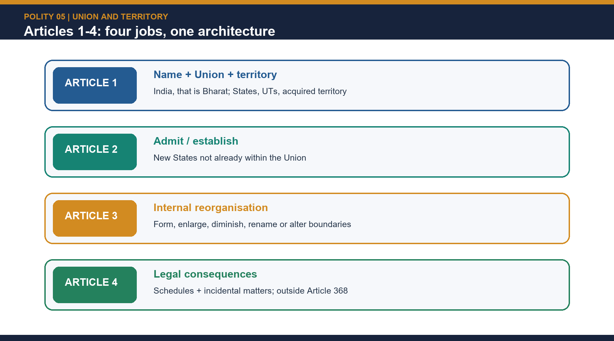

[FACT] Article 1 chooses the expression "Union of States", not "Federation of States". The framers wanted the Constitution to show that India is federal in structure, but not the product of a treaty among pre-existing sovereign units.

[FACT] Ambedkar's two-point explanation remains the best exam opening: the Indian federation was not formed by agreement among the States, and no State has a right to secede. The Union is therefore indestructible even though State boundaries are not.

[ANALYSIS] UPSC rewards the design inference. India is not unitary because powers are constitutionally distributed; but it is not a compact federation either because Parliament can redraw the internal map under Article 3 and because the States are constitutionally derived units.

[LIMIT] "Indestructible Union of destructible States" is a powerful analytical formula, not the literal text of Article 1. Use it to explain the territorial chapter; do not present it as a quotation from the Constitution.

> UPSC trap: "Union of States" means a unitary State. Correct approach: it means a federation with a centralising, anti-secession design.


```closure-flow
SUBTOPIC: Constitutional conception: why Article 1 says 'Union of States'
KEY TERMS / DEFINITIONS: ANSWER-GRABBING LINE — WRITE/ADAPT IN THE EXAM (OPENING): India is a constitutionally indestructible Union whose internal State map remains adaptable under Articles 1–4; the phrase 'indestructible Union of destructible States' is an analytical formula, not constitutional text.
MECHANISM / ARGUMENT: [FACT] Ambedkar's two-point explanation remains the best exam opening: the Indian federation was not formed by agreement among the States, and no State has a right to secede.
CONSEQUENCE / CONTRAST: !Articles 1-4 in one architecture: name, territory, new States, reorganisation and legal effect.
UPSC TRAP / ANSWER-USE: ANSWER-GRABBING LINE — WRITE/ADAPT IN THE EXAM (OPENING): India is a constitutionally indestructible Union whose internal State map remains adaptable under Articles 1–4; the phrase 'indestructible Union of destructible States' is an analytical formula, not constitutional text.
ANSWER-GRABBING FORMULATION: ANSWER-GRABBING LINE — WRITE/ADAPT IN THE EXAM (OPENING): India is a constitutionally indestructible Union whose internal State map remains adaptable under Articles 1–4; the phrase 'indestructible Union of destructible States' is an analytical formula, not constitutional text.
```

### 02. Articles 1 to 4 clause-by-clause: the constitutional architecture of territory

> **ANSWER-GRABBING LINE — WRITE/ADAPT IN THE EXAM (ARCHITECTURE):** Articles 1–4 move from identity and territorial composition, to external admission or establishment, to internal reorganisation, and finally to the ordinary-law consequences that amend the First and Fourth Schedules.

> **CONTENT CLASSIFICATION:** CORE PRELIMS + CORE MAINS

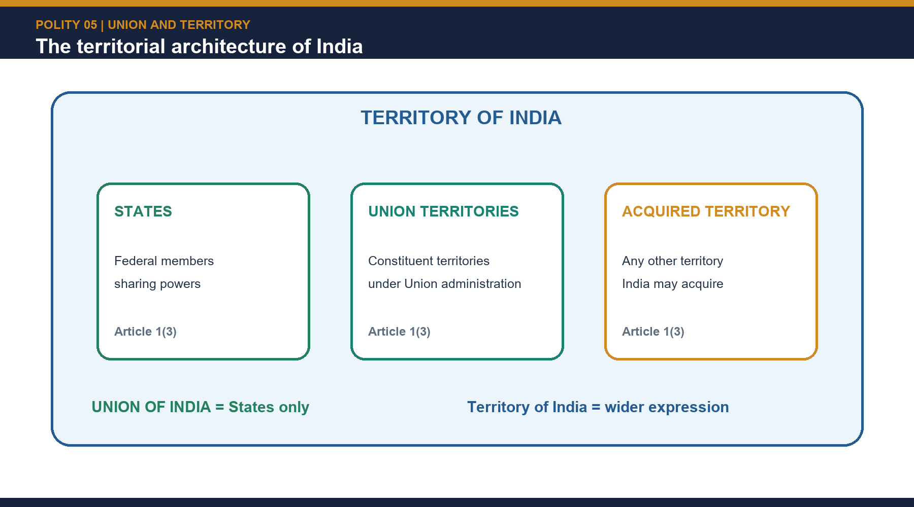

| Provision | Exact constitutional move | High-yield implication |
|---|---|---|
| Article 1(1) | India, that is Bharat, shall be a Union of States | Name of the country + form of polity |
| Article 1(2) | The States and the territories thereof shall be as specified in the First Schedule | Territorial listing is constitutional, not merely administrative |
| Article 1(3) | The territory of India shall comprise (a) territories of the States, (b) Union Territories specified in the First Schedule, and (c) such other territories as may be acquired | Explains the difference between Union of India and Territory of India |
| Article 2 | Parliament may by law admit into the Union, or establish, new States on such terms and conditions as it thinks fit | External admission or establishment |
| Article 3(a)-(e) | Parliament may form a new State, increase area, diminish area, alter boundaries, or alter the name of any State | Internal reorganisation |
| Article 4(1) | Laws under Articles 2 and 3 may amend the First and Fourth Schedules and include supplemental, incidental and consequential provisions | Representation and transitional machinery travel with the same law |
| Article 4(2) | Such a law is not deemed an amendment for the purposes of Article 368 | Internal reorganisation is ordinarily outside the amendment procedure |

[FACT] Article 1(1) also captures the famous naming compromise: "India" and "Bharat" were both politically resonant, so the Constitution retained both.

[FACT] Article 1(2) makes the First Schedule central. The schedule is the formal list of State and Union Territory names and territorial extent. When units are renamed, merged, reorganised or ceded, the schedule changes.

[FACT] Article 1(3) creates the key taxonomic distinction. The Union of India means the States as federal members. The Territory of India is wider: it includes the States, the Union Territories and any territories that India may acquire.

[ANALYSIS] That difference is not pedantic. It explains why Union Territories belong to India without being equal federal partners and why acquired territory can enter Indian sovereignty before its internal constitutional location is finally settled.


```closure-flow
SUBTOPIC: Articles 1 to 4 clause-by-clause: the constitutional architecture of territory
KEY TERMS / DEFINITIONS: ANSWER-GRABBING LINE — WRITE/ADAPT IN THE EXAM (ARCHITECTURE): Articles 1–4 move from identity and territorial composition, to external admission or establishment, to internal reorganisation, and finally to the ordinary-law consequences that amend the First and Fourth Schedules.
MECHANISM / ARGUMENT: [FACT] Article 1(3) creates the key taxonomic distinction.
CONSEQUENCE / CONTRAST: !Territory of India is wider than Union of India: States are federal members; Union Territories and acquired territories are not.
UPSC TRAP / ANSWER-USE: [ANALYSIS] That difference is not pedantic.
ANSWER-GRABBING FORMULATION: ANSWER-GRABBING LINE — WRITE/ADAPT IN THE EXAM (ARCHITECTURE): Articles 1–4 move from identity and territorial composition, to external admission or establishment, to internal reorganisation, and finally to the ordinary-law consequences that amend the First and Fourth Schedules.
```

### 03. Article 2 and Article 3 are not the same power

[FACT] Article 2 is conceptually about entry from outside the existing Union: Parliament may admit or establish new States on terms it thinks fit. Article 3 is conceptually about internal readjustment among units already inside the Union.

| Article 3 limb | Exact operation | Typical exam use |
|---|---|---|
| 3(a) | Form a new State by separating territory from any State, by uniting two or more States or parts of States, or by uniting any territory to a part of any State | Bifurcation, merger, combination |
| 3(b) | Increase the area of any State | Adjustment / addition |
| 3(c) | Diminish the area of any State | Carving out territory |
| 3(d) | Alter the boundaries of any State | Boundary revision |
| 3(e) | Alter the name of any State | Renaming |

[FACT] Two explanations matter. Explanation I says that for clauses (a) to (e), "State" includes a Union Territory, but in the proviso it does not. Explanation II says that clause (a) includes the power to form a new State or Union Territory by uniting a part of any State or Union Territory to any other State or Union Territory.

[ANALYSIS] This is why the common formula "Article 3 only means State bifurcation" is too narrow. It also reaches boundary changes, name changes, and UT-linked combinations.

[LIMIT] Indian constitutional practice has used Article 3 far more often than Article 2. Do not force uncertain examples of Article 2 when the safer conceptual point is the difference between external admission/establishment and internal reorganisation.

> UPSC trap: Articles 2 and 3 both create new States, so the distinction is trivial. Correct approach: the distinction controls whether the Constitution is dealing with an outsider's entry or an insider's reorganisation.


```closure-flow
SUBTOPIC: Article 2 and Article 3 are not the same power
KEY TERMS / DEFINITIONS: [FACT] Article 2 is conceptually about entry from outside the existing Union: Parliament may admit or establish new States on terms it thinks fit.
MECHANISM / ARGUMENT: Explanation II says that clause (a) includes the power to form a new State or Union Territory by uniting a part of any State or Union Territory to any other State or Union Territory.
CONSEQUENCE / CONTRAST: Explanation I says that for clauses (a) to (e), "State" includes a Union Territory, but in the proviso it does not.
UPSC TRAP / ANSWER-USE: Do not force uncertain examples of Article 2 when the safer conceptual point is the difference between external admission/establishment and internal reorganisation.
ANSWER-GRABBING FORMULATION: [FACT] Article 2 is conceptually about entry from outside the existing Union: Parliament may admit or establish new States on terms it thinks fit.
```

### 04. Article 3 procedure: consultation without consent

> **ANSWER-GRABBING LINE — WRITE/ADAPT IN THE EXAM (PROCEDURE):** Article 3 constitutionalises consultation, not consent: prior presidential recommendation and State-legislature reference are mandatory where the proviso applies, views do not bind Parliament, no fresh reference is required for every amendment, and a Union Territory has no equivalent proviso right.

> **CONTENT CLASSIFICATION:** CORE PRELIMS + CORE MAINS

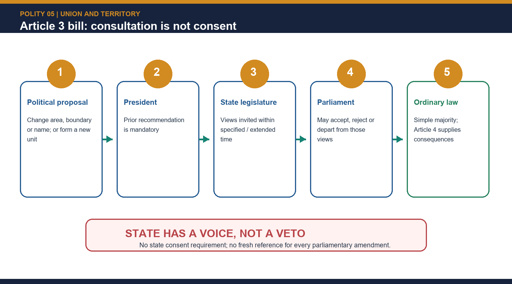

[FACT] Article 3 does not permit a free-floating private or ordinary parliamentary initiative. A bill for State reorganisation can be introduced only on the prior recommendation of the President.

[FACT] Before making that recommendation, the President refers the bill to the legislature of the affected State for expressing its views within the time specified in the reference, or within any extended time the President allows.

[FACT] Those views are not binding. Parliament may accept, modify or reject them. It is also not necessary to make a fresh reference to the State legislature for every later amendment adopted in Parliament.

[FACT] In the case of a Union Territory, the constitutional proviso does not require a comparable legislature-reference step.

[ANALYSIS] The constitutional formula is consultation without consent. This is the single most important high-yield distinction in the chapter. Students lose marks when they treat the State legislature's opinion as a veto.

[ANALYSIS] Compared with compact federations such as the United States, the Indian design clearly privileges national continuity and parliamentary flexibility over sub-national entrenchment. That is why Article 3 is one of the clearest textual proofs of the Constitution's strong-Centre tilt.

[LIMIT] The existence of consultation still matters. The President's reference is not empty ritual: it constitutionalises notice, invites a formal record of regional objections, and gives Parliament a consultative file even though it does not create a State veto.

> UPSC trap: State consent is mandatory. Correct approach: President's recommendation and legislature-reference for views are mandatory; State consent is not.


```closure-flow
SUBTOPIC: Article 3 procedure: consultation without consent
KEY TERMS / DEFINITIONS: ANSWER-GRABBING LINE — WRITE/ADAPT IN THE EXAM (PROCEDURE): Article 3 constitutionalises consultation, not consent: prior presidential recommendation and State-legislature reference are mandatory where the proviso applies, views do not bind Parliament, no fresh reference is required for every amendment, and a Union Territory has no equivalent proviso right.
MECHANISM / ARGUMENT: !Article 3 procedure in sequence: recommendation, reference, views, parliamentary decision and Article 4 follow-through.
CONSEQUENCE / CONTRAST: !Article 3 procedure in sequence: recommendation, reference, views, parliamentary decision and Article 4 follow-through.
UPSC TRAP / ANSWER-USE: ANSWER-GRABBING LINE — WRITE/ADAPT IN THE EXAM (PROCEDURE): Article 3 constitutionalises consultation, not consent: prior presidential recommendation and State-legislature reference are mandatory where the proviso applies, views do not bind Parliament, no fresh reference is required for every amendment, and a Union Territory has no equivalent proviso right.
ANSWER-GRABBING FORMULATION: ANSWER-GRABBING LINE — WRITE/ADAPT IN THE EXAM (PROCEDURE): Article 3 constitutionalises consultation, not consent: prior presidential recommendation and State-legislature reference are mandatory where the proviso applies, views do not bind Parliament, no fresh reference is required for every amendment, and a Union Territory has no equivalent proviso right.
```

### 05. Article 4: supplemental, incidental and consequential provisions - and why this is not Article 368

[FACT] Article 4(1) allows a law under Articles 2 or 3 to do more than just redraw territory. It may amend the First Schedule and the Fourth Schedule and include supplemental, incidental and consequential provisions, including adjustments of representation in Parliament and in the legislature or legislatures of the affected States.

[FACT] Article 4(2) then declares that such a law shall not be deemed an amendment of the Constitution for the purposes of Article 368. The law therefore passes by ordinary majority through the ordinary legislative process.

| Issue | Article 3 + Article 4 law | Article 368 amendment |
|---|---|---|
| Internal reorganisation of States or UTs | Yes | Not normally required |
| First Schedule / Fourth Schedule changes flowing from reorganisation | Yes | Built into Article 4 |
| Cession of accepted Indian territory to a foreign State | No | Yes, after Berubari |
| Majority route | Ordinary majority | Special majority, plus state ratification where applicable |

[ANALYSIS] Article 4 is the constitutional lubricant of reorganisation. Without it, every merger, bifurcation, renaming or representation adjustment would become needlessly cumbersome.

[LIMIT] Article 4 does not erase the sovereignty line. It simplifies internal territorial change; it does not authorise transfer of Indian territory to a foreign sovereign.

> UPSC trap: every territorial change is a constitutional amendment. Correct approach: internal reorganisation ordinarily travels through Article 3 read with Article 4; cession does not.


```closure-flow
SUBTOPIC: Article 4: supplemental, incidental and consequential provisions - and why this is not Article 368
KEY TERMS / DEFINITIONS: [FACT] Article 4(1) allows a law under Articles 2 or 3 to do more than just redraw territory.
MECHANISM / ARGUMENT: The law therefore passes by ordinary majority through the ordinary legislative process.
CONSEQUENCE / CONTRAST: The law therefore passes by ordinary majority through the ordinary legislative process.
UPSC TRAP / ANSWER-USE: [FACT] Article 4(2) then declares that such a law shall not be deemed an amendment of the Constitution for the purposes of Article 368.
ANSWER-GRABBING FORMULATION: [FACT] Article 4(1) allows a law under Articles 2 or 3 to do more than just redraw territory.
```

### 06. The First Schedule as a living territorial ledger

[FACT] The First Schedule is the Constitution's territorial ledger. It names the States and Union Territories and records their territorial extent. Whenever a unit is created, renamed, merged, split or ceded, the schedule must reflect that shift.

[FACT] That is why different kinds of legal instruments change the same schedule. Article 3 read with Article 4 changes it for internal reorganisation; the Ninth Amendment changed it for Berubari-related cession; the 100th Amendment changed it for the India-Bangladesh Land Boundary Agreement; the 2019 and 2020 laws changed it for the J&K-Ladakh split and the DNH-Daman and Diu merger.

[FACT] As of 21 Aug 2026, the operational constitutional count is 28 States and 8 Union Territories.

[ANALYSIS] The schedule's exam value is twofold: it anchors territorial facts, and it reminds you that territorial questions are constitutional-structural, not merely map-trivia questions.


```closure-flow
SUBTOPIC: The First Schedule as a living territorial ledger
KEY TERMS / DEFINITIONS: [FACT] The First Schedule is the Constitution's territorial ledger.
MECHANISM / ARGUMENT: It names the States and Union Territories and records their territorial extent.
CONSEQUENCE / CONTRAST: Whenever a unit is created, renamed, merged, split or ceded, the schedule must reflect that shift.
UPSC TRAP / ANSWER-USE: Whenever a unit is created, renamed, merged, split or ceded, the schedule must reflect that shift.
ANSWER-GRABBING FORMULATION: [FACT] The First Schedule is the Constitution's territorial ledger.
```

### 07. Acquisition, cession and boundary settlement: Berubari, the 1969 distinction and the 100th Amendment

> **ANSWER-GRABBING LINE — WRITE/ADAPT IN THE EXAM (CESSION):** The sovereignty test separates cession from boundary settlement: surrender of accepted Indian territory requires Article 368, while genuine ascertainment or implementation of a disputed boundary may proceed without constitutional amendment.

> **CONTENT CLASSIFICATION:** CORE PRELIMS + CORE MAINS

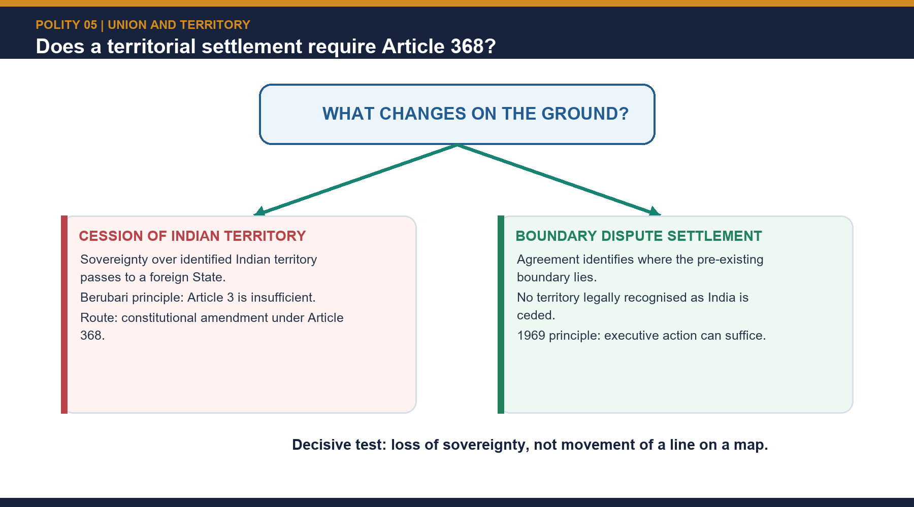

[FACT] Article 1(3)(c) gives the Constitution capacity to receive acquired territory but does not itself prescribe a mode. Traditional polity texts list cession, purchase, gift, lease-linked transfer, occupation, conquest or subjugation, and plebiscitary transfer.

[LIMIT] A modern answer must qualify the historical list: contemporary international law and the UN Charter sharply constrain acquisition by force.

[FACT] The hard constitutional question is not acquisition alone, but the legal route for parting with territory. In Berubari Union (1960), a Presidential reference under Article 143 arose after a proposal to transfer part of the Berubari area in West Bengal to Pakistan.

[FACT] The Supreme Court held that Parliament's power under Article 3 to diminish the area of a State does not include cession of Indian territory to a foreign country. The consequence was the Constitution (Ninth Amendment) Act, 1960, which supplied the constitutional route for implementing the agreement.

[LIMIT] Avoid saying that the Ninth Amendment by itself completed every contemplated East Pakistan transfer. Official background to the later LBA records that the relevant portion was not operationalised at that stage amid litigation and political developments.

[FACT] In a later 1969 ruling, the Supreme Court distinguished a boundary settlement from cession: when the legal issue is ascertainment or implementation of an existing boundary and not the transfer of accepted Indian territory, Article 368 is not automatically triggered.

[FACT] The 100th Amendment Act, 2015 later implemented the India-Bangladesh Land Boundary Agreement and its protocol. It exchanged 111 enclaves to Bangladesh and 51 enclaves to India, addressed adverse possessions, and modified the First Schedule entries for Assam, West Bengal, Meghalaya and Tripura.

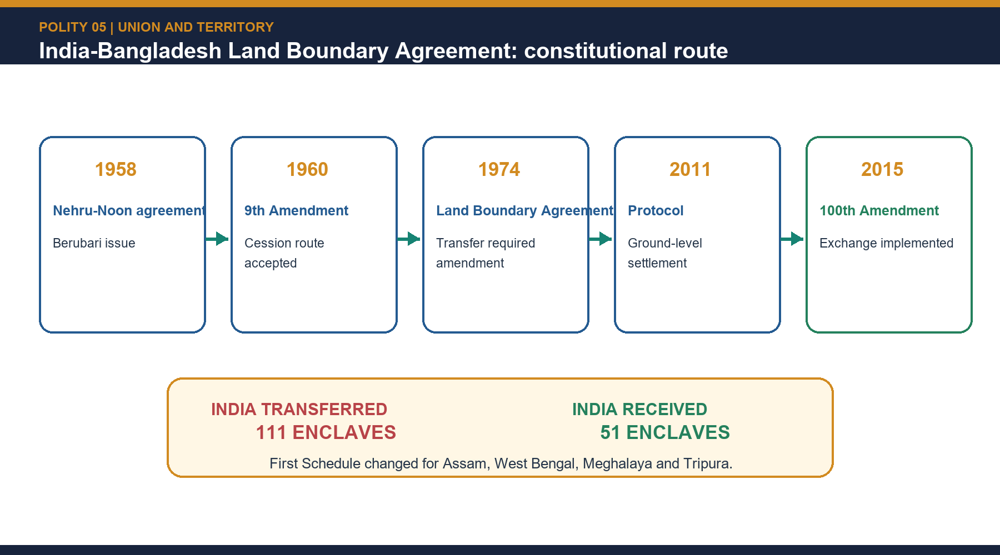

[FACT] The MEA records that the enclave exchange took effect from midnight of 31 July 2015.

[ANALYSIS] The decisive constitutional line is therefore not simply domestic versus international, but internal readjustment versus loss of sovereign territory. That is the line Berubari fixed.

[LIMIT] Do not over-extend the 1969 principle. It concerns boundary ascertainment and implementation, not a general licence to transfer accepted Indian territory without constitutional amendment.

> UPSC trap: any reduction of a State's area equals cession. Correct approach: internal diminution under Article 3 is not the same as cession to a foreign sovereign.


```closure-flow
SUBTOPIC: Acquisition, cession and boundary settlement: Berubari, the 1969 distinction and the 100th Amendment
KEY TERMS / DEFINITIONS: ANSWER-GRABBING LINE — WRITE/ADAPT IN THE EXAM (CESSION): The sovereignty test separates cession from boundary settlement: surrender of accepted Indian territory requires Article 368, while genuine ascertainment or implementation of a disputed boundary may proceed without constitutional amendment.
MECHANISM / ARGUMENT: ANSWER-GRABBING LINE — WRITE/ADAPT IN THE EXAM (CESSION): The sovereignty test separates cession from boundary settlement: surrender of accepted Indian territory requires Article 368, while genuine ascertainment or implementation of a disputed boundary may proceed without constitutional amendment.
CONSEQUENCE / CONTRAST: [FACT] The MEA records that the enclave exchange took effect from midnight of 31 July 2015.
UPSC TRAP / ANSWER-USE: [FACT] Article 1(3)(c) gives the Constitution capacity to receive acquired territory but does not itself prescribe a mode.
ANSWER-GRABBING FORMULATION: ANSWER-GRABBING LINE — WRITE/ADAPT IN THE EXAM (CESSION): The sovereignty test separates cession from boundary settlement: surrender of accepted Indian territory requires Article 368, while genuine ascertainment or implementation of a disputed boundary may proceed without constitutional amendment.
```

### 08. State of West Bengal v Union of India: why the case matters even though it is not an Article 3 case

[FACT] State of West Bengal v Union of India (1963) concerned Parliament's competence to acquire State property under the Coal Bearing Areas (Acquisition and Development) Act. The majority upheld Parliament's competence.

[FACT] The case matters for this chapter because it treated the Indian Constitution as not "traditionally federal" in the classical treaty-compact sense. States were not treated as sovereign entities possessing a residual inviolable domain against the Union.

[ANALYSIS] Use the case for the strong-Centre thesis, especially when you need to explain why the Union can constitutionally outweigh States in questions about property, territorial flexibility or structural supremacy.

[LIMIT] Do not misuse the case. West Bengal is not the governing authority for cession or the Article 3 procedure. Berubari and the Article 3 text do that work.


```closure-flow
SUBTOPIC: State of West Bengal v Union of India: why the case matters even though it is not an Article 3 case
KEY TERMS / DEFINITIONS: [FACT] State of West Bengal v Union of India (1963) concerned Parliament's competence to acquire State property under the Coal Bearing Areas (Acquisition and Development) Act.
MECHANISM / ARGUMENT: [FACT] The case matters for this chapter because it treated the Indian Constitution as not "traditionally federal" in the classical treaty-compact sense.
CONSEQUENCE / CONTRAST: [FACT] The case matters for this chapter because it treated the Indian Constitution as not "traditionally federal" in the classical treaty-compact sense.
UPSC TRAP / ANSWER-USE: [FACT] The case matters for this chapter because it treated the Indian Constitution as not "traditionally federal" in the classical treaty-compact sense.
ANSWER-GRABBING FORMULATION: [FACT] State of West Bengal v Union of India (1963) concerned Parliament's competence to acquire State property under the Coal Bearing Areas (Acquisition and Development) Act.
```

### 09. Integration of princely States and the transitional 1950 map

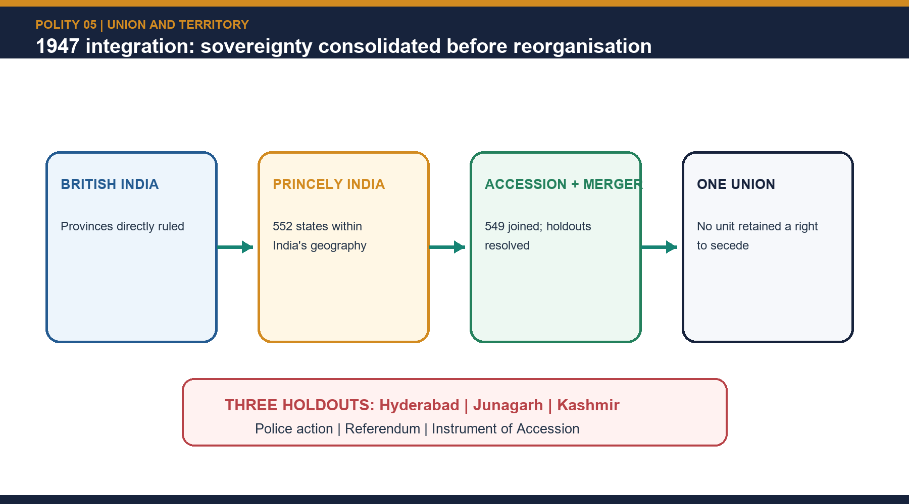

[FACT] Standard polity sources refer to 552 princely States at Independence. The advanced repository note records that 549 joined India, while Hyderabad, Junagadh and Kashmir became the best-known difficult cases.

[FACT] These three hard cases were resolved through different constitutional-political routes: Junagadh through plebiscitary confirmation after accession controversy, Hyderabad through police action, and Kashmir through accession under invasion conditions.

[FACT] The Constitution's first map in 1950 was therefore transitional. India was divided into Part A, Part B, Part C and Part D units: former Governors' provinces, former princely States or unions, centrally administered units, and the Andaman and Nicobar Islands respectively.

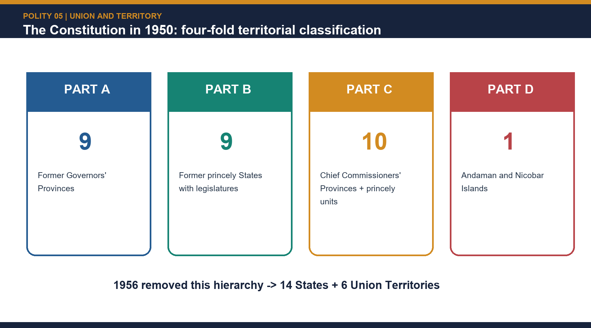

| Category | Number | Units |
|---|---:|---|
| Part A | 9 | Assam, Bihar, Bombay, Madhya Pradesh, Madras, Orissa, Punjab, United Provinces, West Bengal |
| Part B | 9 | Hyderabad, Jammu and Kashmir, Madhya Bharat, Mysore, Patiala and East Punjab States Union, Rajasthan, Saurashtra, Travancore-Cochin, Vindhya Pradesh |
| Part C | 10 | Ajmer, Bhopal, Bilaspur, Cooch Behar, Coorg, Delhi, Himachal Pradesh, Kutch, Manipur, Tripura |
| Part D | 1 | Andaman and Nicobar Islands |

[ANALYSIS] This arrangement shows that Article 1 provided a permanent constitutional shell, but the internal territorial map remained open to revision. The territorial chapter was designed to stabilise sovereignty first and optimise the map later.

> UPSC traps: Manipur and Tripura were Part C; Hyderabad was Part B; Bombay was Part A; Andaman and Nicobar Islands alone formed Part D.

[LIMIT] The textbook total of **552 princely States** and the shorthand **549 joined / three difficult
cases** are retained as the repository owner's conventional count. They must not be read as if all
accessions were identical one-step transactions. Integration also used Instruments of Accession,
Merger Agreements, diplomacy, state unions and later constitutional reclassification. Hyderabad,
Junagadh and Jammu and Kashmir are highlighted because their routes were politically difficult, not
because the remaining integrations were legally or administratively uniform.


```closure-flow
SUBTOPIC: Integration of princely States and the transitional 1950 map
KEY TERMS / DEFINITIONS: [FACT] Standard polity sources refer to 552 princely States at Independence.
MECHANISM / ARGUMENT: [FACT] These three hard cases were resolved through different constitutional-political routes: Junagadh through plebiscitary confirmation after accession controversy, Hyderabad through police action, and Kashmir through accession under invasion conditions.
CONSEQUENCE / CONTRAST: [FACT] The Constitution's first map in 1950 was therefore transitional.
UPSC TRAP / ANSWER-USE: UPSC traps: Manipur and Tripura were Part C; Hyderabad was Part B; Bombay was Part A; Andaman and Nicobar Islands alone formed Part D.
ANSWER-GRABBING FORMULATION: !From accession to one Union: integration preceded territorial rationalisation.
```

### 10. Linguistic reorganisation: Dhar, JVP, Andhra and the Fazl Ali / SRC settlement

> **ANSWER-GRABBING LINE — WRITE/ADAPT IN THE EXAM (LINGUISTIC):** Linguistic reorganisation strengthened the Union by constitutionalising identity, but Fazl Ali's rejection of 'one language–one State' kept language subordinate to unity, viability and welfare.

> **CONTENT CLASSIFICATION:** CORE PRELIMS + CORE MAINS

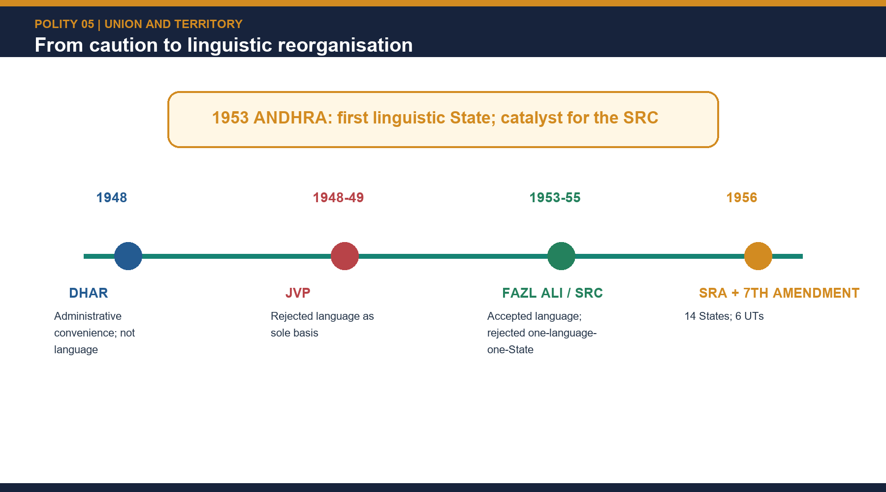

[FACT] The Dhar Commission (1948) recommended reorganisation on administrative convenience rather than language. The JVP Committee (1948-49) - Jawaharlal Nehru, Vallabhbhai Patel and Pattabhi Sitaramayya - formally rejected language as the decisive principle.

[FACT] Events then outran the initial caution. After Potti Sriramulu's death following a prolonged fast, Andhra State was created in 1953 out of the Telugu-speaking areas of Madras. It was the first major linguistic State.

[FACT] The Fazl Ali / States Reorganisation Commission (1953-55) broadly accepted language as a basis but rejected the slogan "one language, one State". It emphasised four balancing considerations: national unity and security, linguistic-cultural homogeneity, financial-economic-administrative viability, and public welfare.

[FACT] The States Reorganisation Act, 1956 and the Seventh Amendment abolished the old Part A/B/C/D classification and created 14 States and 6 Union Territories on 1 November 1956.

**The 14 States:** Andhra Pradesh, Assam, Bihar, Bombay, Jammu and Kashmir, Kerala, Madhya Pradesh, Madras, Mysore, Orissa, Punjab, Rajasthan, Uttar Pradesh and West Bengal.

**The 6 Union Territories:** Andaman and Nicobar Islands, Delhi, Himachal Pradesh, Laccadive-Minicoy-Amindivi Islands, Manipur and Tripura.

**Major 1956 territorial effects**
- Kerala combined Travancore-Cochin, Malabar and Kasaragod.
- Andhra State combined with the Telugu-speaking part of Hyderabad to form Andhra Pradesh.
- Madhya Bharat, Vindhya Pradesh and Bhopal were consolidated into Madhya Pradesh.
- Saurashtra and Kutch were merged into Bombay.
- Coorg was merged into Mysore.
- PEPSU was merged into Punjab.
- Ajmer was merged into Rajasthan.
- Laccadive, Minicoy and Amindivi Islands became a Union Territory.

[ANALYSIS] Linguistic reorganisation is one of the strongest answers to the claim that a strong Union must suppress regional identity. In India, the same constitutional order absorbed identity by redrawing units rather than denying its existence.

[LIMIT] Do not simplify the story into language alone. The SRC explicitly refused one language-one State and treated viability and unity as equally important.

> UPSC trap: Fazl Ali endorsed a pure language test. Correct approach: language mattered, but not as an exclusive or mechanical rule.


```closure-flow
SUBTOPIC: Linguistic reorganisation: Dhar, JVP, Andhra and the Fazl Ali / SRC settlement
KEY TERMS / DEFINITIONS: [FACT] The Dhar Commission (1948) recommended reorganisation on administrative convenience rather than language.
MECHANISM / ARGUMENT: ANSWER-GRABBING LINE — WRITE/ADAPT IN THE EXAM (LINGUISTIC): Linguistic reorganisation strengthened the Union by constitutionalising identity, but Fazl Ali's rejection of 'one language–one State' kept language subordinate to unity, viability and welfare.
CONSEQUENCE / CONTRAST: !From initial caution to qualified linguistic reorganisation.
UPSC TRAP / ANSWER-USE: !From initial caution to qualified linguistic reorganisation.
ANSWER-GRABBING FORMULATION: ANSWER-GRABBING LINE — WRITE/ADAPT IN THE EXAM (LINGUISTIC): Linguistic reorganisation strengthened the Union by constitutionalising identity, but Fazl Ali's rejection of 'one language–one State' kept language subordinate to unity, viability and welfare.
```

### 11. After 1956: State creation, renaming and the route to 28 States and 8 Union Territories

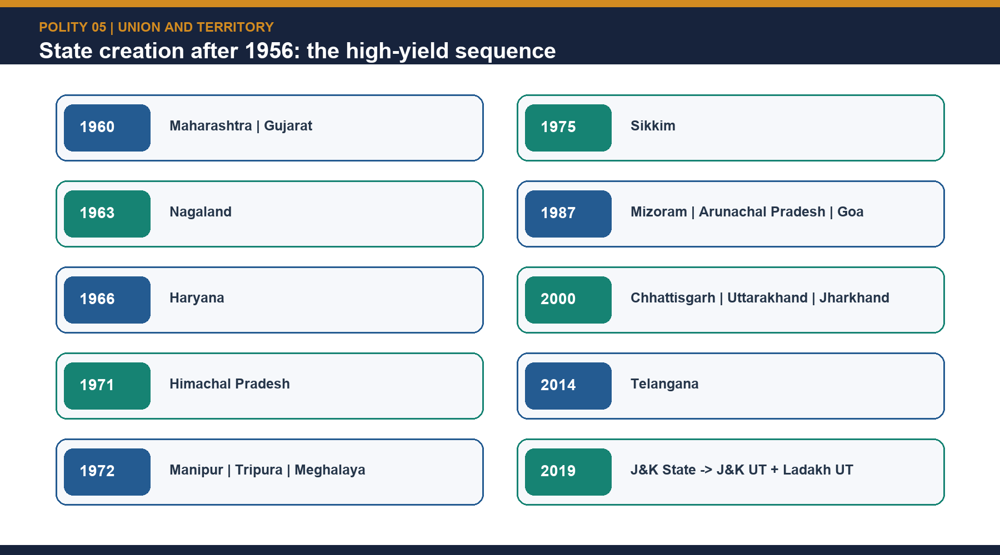

| Year | Change | High-yield note |
|---|---|---|
| 1960 | Maharashtra and Gujarat | Bombay split; Gujarat became the 15th State |
| 1963 | Nagaland | 16th State, carved from Assam's Naga Hills-Tuensang area |
| 1966 | Haryana + UT Chandigarh; hill areas to Himachal Pradesh | Punjab reorganisation |
| 1971 | Himachal Pradesh | UT to State |
| 1972 | Manipur, Tripura and Meghalaya became States; Mizoram and Arunachal became UTs | North-East reorganisation |
| 1974 | Sikkim received associate-State status | 35th Amendment inserted Article 2A and a Tenth Schedule, both later repealed |
| 1975 | Sikkim became full State | 36th Amendment; Article 371F special provisions |
| 1987 | Mizoram, Arunachal Pradesh and Goa became States | Goa separated from Goa, Daman and Diu UT |
| 2000 | Chhattisgarh, Uttarakhand and Jharkhand | Smaller-State phase |
| 2014 | Telangana | Carved out of Andhra Pradesh |
| 2019 | Jammu and Kashmir reorganised into the UT of J&K and the UT of Ladakh | Current chapter's most recent major territorial shock |
| 2020 | Dadra and Nagar Haveli merged with Daman and Diu, effective 26 January | Reduced UT count from 9 to 8 |

[FACT] Several renamings are also exam-worthy: United Provinces to Uttar Pradesh (1950), Madras to Tamil Nadu (1969), Mysore to Karnataka (1973), Laccadive-Minicoy-Amindivi Islands to Lakshadweep (1973), Uttaranchal to Uttarakhand (2006), Pondicherry to Puducherry (2006), and Orissa to Odisha (2011).

[FACT] Sikkim deserves separate attention. It first became an associate State through the 35th Amendment and Article 2A / Tenth Schedule arrangement, then a full-fledged State through the 36th Amendment, which also inserted Article 371F.

| Territorial incorporation | Constitutional step |
|---|---|
| Dadra and Nagar Haveli | Tenth Amendment, 1961 |
| Goa, Daman and Diu | Twelfth Amendment, 1962 |
| Puducherry | Fourteenth Amendment, 1962 |

[FACT] The 2019 J&K reorganisation produced 28 States and 9 UTs. The 2020 DNH-DD merger changed only the UT count, producing the present **28 States and 8 UTs**.

[ANALYSIS] Reorganisation after 1956 proves that Article 3 is not a one-time linguistic device. It has remained the constitutional valve through which regional demands, administrative feasibility, insurgency settlements and federal adjustments have been processed.

#### Statehood-number sequence after 1956

| Statehood order | State and year | Source-safe route |
|---:|---|---|
| 15th | Gujarat, 1960 | Bombay Reorganisation; Maharashtra continued as the other successor unit |
| 16th | Nagaland, 1963 | State of Nagaland Act with the Thirteenth Amendment / Article 371A settlement |
| 17th | Haryana, 1966 | Punjab Reorganisation |
| 18th | Himachal Pradesh, 1971 | Union Territory upgraded to State |
| 19th–21st | Manipur, Tripura and Meghalaya, 1972 | North-Eastern Areas reorganisation |
| 22nd | Sikkim, 1975 | Thirty-Sixth Amendment after the brief associate-State phase |
| 23rd–25th | Mizoram, Arunachal Pradesh and Goa, 1987 | Statehood Acts; Goa separated from the former Goa, Daman and Diu UT |
| 26th–28th | Chhattisgarh, Uttarakhand and Jharkhand, 2000 | Reorganisation of Madhya Pradesh, Uttar Pradesh and Bihar |
| 29th | Telangana, 2014 | Andhra Pradesh Reorganisation Act |

[LIMIT] Statehood numbers are used only where the repository owner directly grounds them. Maharashtra
is not labelled the 15th State: Gujarat is conventionally counted as the 15th because the bilingual
Bombay State was reorganised into the two successor States.

#### Union-Territory incorporation and merger sequence

- [FACT] **Dadra and Nagar Haveli**, formerly under Portuguese rule, entered the First Schedule as a
  Union Territory through the **Tenth Amendment, 1961**.
- [FACT] **Goa, Daman and Diu**, after the end of Portuguese rule in December 1961, entered through
  the **Twelfth Amendment, 1962**; Goa became a State in 1987.
- [FACT] The former French establishments now forming **Puducherry** entered through the
  **Fourteenth Amendment, 1962**. Detailed legislature and administration doctrine belongs to Topic 25.
- [FACT] The **Dadra and Nagar Haveli and Daman and Diu (Merger of Union Territories) Act, 2019**
  took effect on **26 January 2020**, reducing the Union-Territory count from nine to eight.
- [FACT] **Delhi became the National Capital Territory of Delhi** through the
  **Sixty-Ninth Amendment, 1991**; its Article 239AA administration belongs to Topic 25.


```closure-flow
SUBTOPIC: After 1956: State creation, renaming and the route to 28 States and 8 Union Territories
KEY TERMS / DEFINITIONS: [FACT] Several renamings are also exam-worthy: United Provinces to Uttar Pradesh (1950), Madras to Tamil Nadu (1969), Mysore to Karnataka (1973), Laccadive-Minicoy-Amindivi Islands to Lakshadweep (1973), Uttaranchal to Uttarakhand (2006), Pondicherry to Puducherry (2006), and Orissa to Odisha (2011).
MECHANISM / ARGUMENT: It first became an associate State through the 35th Amendment and Article 2A / Tenth Schedule arrangement, then a full-fledged State through the 36th Amendment, which also inserted Article 371F.
CONSEQUENCE / CONTRAST: took effect on 26 January 2020, reducing the Union-Territory count from nine to eight.
UPSC TRAP / ANSWER-USE: [ANALYSIS] Reorganisation after 1956 proves that Article 3 is not a one-time linguistic device.
ANSWER-GRABBING FORMULATION: !High-yield chronology from 1956 to the present position.
```

### 12. Article 3's State-UT consultation nuance

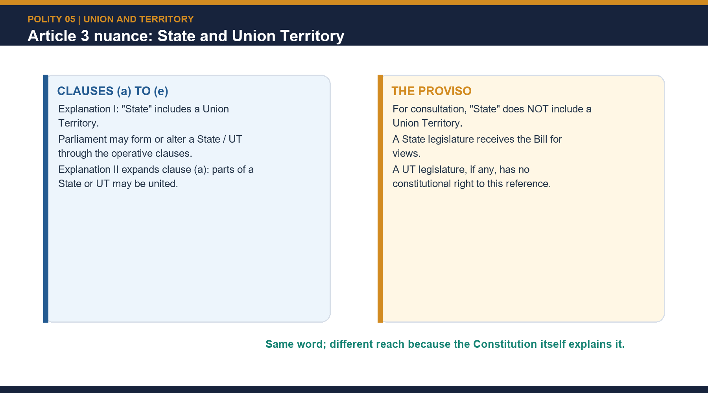

[FACT] Explanation I says that "State" includes a Union Territory for clauses (a) to (e), but does not include a Union Territory in the proviso.

[FACT] Explanation II says the clause (a) power includes forming a new State or UT by uniting part of any State or UT to any other State or UT.

| Situation | Constitutional result |
|---|---|
| Proposal affects a State's area, boundary or name | President refers the Bill to that State legislature for views |
| Proposal affects a UT | Article 3 gives no equivalent proviso-based right of reference |
| A UT happens to have a legislature | That does not convert it into a "State" for the proviso |

[ANALYSIS] The operative power is wide; the consultation safeguard is narrower. This is a favourite close-option trap and also explains why UT-linked reorganisation is textually easier for Parliament than State-boundary revision.

[LIMIT] The presence of a UT legislature does not convert that territory into a "State" for the purposes of the Article 3 proviso.


```closure-flow
SUBTOPIC: Article 3's State-UT consultation nuance
KEY TERMS / DEFINITIONS: !Article 3 treats Union Territories differently in the operative clauses and the consultation proviso.
MECHANISM / ARGUMENT: [FACT] Explanation II says the clause (a) power includes forming a new State or UT by uniting part of any State or UT to any other State or UT.
CONSEQUENCE / CONTRAST: [FACT] Explanation II says the clause (a) power includes forming a new State or UT by uniting part of any State or UT to any other State or UT.
UPSC TRAP / ANSWER-USE: [FACT] Explanation I says that "State" includes a Union Territory for clauses (a) to (e), but does not include a Union Territory in the proviso.
ANSWER-GRABBING FORMULATION: !Article 3 treats Union Territories differently in the operative clauses and the consultation proviso.
```

### 13. J&K reorganisation as an Article 3 illustration

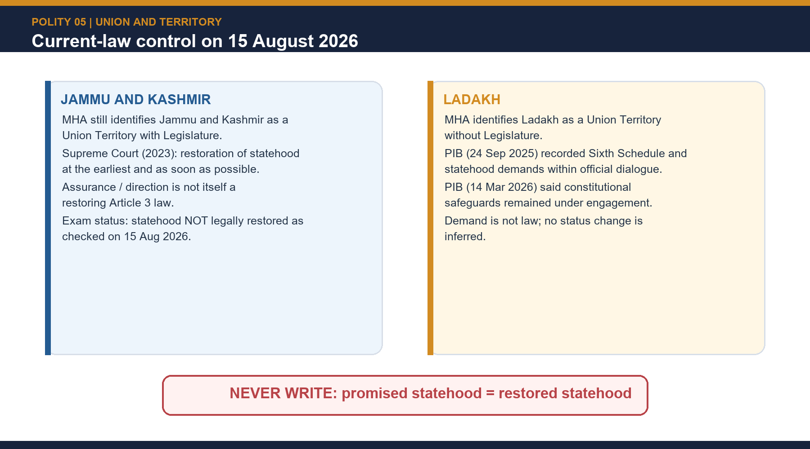

[FACT] The Jammu and Kashmir Reorganisation Act, 2019 took effect on 31 October 2019 and created the UT of Jammu and Kashmir with a legislature and the UT of Ladakh without one.

[LIMIT] The J&K Legislative Assembly confirms the classification 'UT with Legislature'. Its detailed subject competence, Lieutenant-Governor relationship and Parliament-Assembly overlap belong to Topic 25 and are not retaught here.

[FACT] In *In Re Article 370* (11 December 2023), the Supreme Court held that:
- the State legislature's views under the first proviso to Article 3 are recommendatory;
- carving out Ladakh as a UT was valid under Article 3(a) read with Explanation I;
- because the Solicitor General stated that J&K Statehood would be restored, the Court found it unnecessary to determine whether converting the entire State into the two UTs was permissible under Article 3; and
- restoration of Statehood should take place "at the earliest and as soon as possible."

[FACT] Justice Sanjiv Khanna's concurrence stressed that State-to-UT conversion has grave federal consequences and must rest on strong grounds and strict Article 3 compliance.

[CURRENT STATUS] The MHA page checked on 21 August 2026 still described J&K as a UT with Legislature and Ladakh as a UT without Legislature. **The MHA page still described J&K as a UT with Legislature, and the official MHA/eGazette search located no later dated notification or order restoring Statehood.**

[LIMIT] Do not use the 2023 judgment as a general final approval of every whole-State-to-UT conversion. The case settles parts of the 2019 arrangement, but not every future State-to-UT downgrading controversy.

#### Ownership firewall

- **Topic 05 owns:** Articles 1–4, the First Schedule as territorial ledger, accession/integration,
  internal reorganisation, cession and current territorial status.
- **Topic 25 owns:** administration of Union Territories under Articles 239–241, Article 239A,
  Article 239AA/AB, Lieutenant-Governor relations and detailed legislature competence.
- **Topic 22 owns:** Article 370 doctrine, presidential orders, special-provision history and the
  wider merits of the 2023 judgment.
- This session uses Topic 25 and Topic 22 only to the minimum extent needed to classify J&K and
  Ladakh territorially and to state the bounded Article 3 holding.


```closure-flow
SUBTOPIC: J&K reorganisation as an Article 3 illustration
KEY TERMS / DEFINITIONS: [FACT] The Jammu and Kashmir Reorganisation Act, 2019 took effect on 31 October 2019 and created the UT of Jammu and Kashmir with a legislature and the UT of Ladakh without one.
MECHANISM / ARGUMENT: because the Solicitor General stated that J&K Statehood would be restored, the Court found it unnecessary to determine whether converting the entire State into the two UTs was permissible under Article 3; and
CONSEQUENCE / CONTRAST: [FACT] The Jammu and Kashmir Reorganisation Act, 2019 took effect on 31 October 2019 and created the UT of Jammu and Kashmir with a legislature and the UT of Ladakh without one.
UPSC TRAP / ANSWER-USE: Its detailed subject competence, Lieutenant-Governor relationship and Parliament-Assembly overlap belong to Topic 25 and are not retaught here.
ANSWER-GRABBING FORMULATION: !Current-law control on Jammu and Kashmir and Ladakh.
```

### 14. Current demands for new or smaller States

| Demand type | Illustrative claims | Governance question |
|---|---|---|
| Identity and culture | Gorkhaland and other recurring subregional claims | Can autonomy protect identity without a new State? |
| Administrative distance | Bundelkhand-type claims | Will a smaller capital distance improve capacity? |
| Developmental imbalance | Vidarbha-type claims | Is underdevelopment caused by size or by policy and institutions? |
| Restoration/status upgrade | J&K Statehood; Ladakh Statehood demand | What federal, security, minority and transition safeguards are needed? |

[FACT] PIB's MHA release of 24 September 2025 expressly recorded Ladakh Statehood and Sixth-Schedule demands within official dialogue. PIB's 14 March 2026 release recorded continuing engagement on safeguards; neither announced a territorial-status change.

[ANALYSIS] Test every demand against:
1. democratic support across affected districts and communities;
2. administrative accessibility;
3. fiscal and revenue viability;
4. division of assets, debt, water, power, employees and institutions;
5. capital and transition cost;
6. minority protection inside the proposed State;
7. inter-State and national-security effects; and
8. whether devolution or autonomy could solve the grievance at lower cost.

**Qualified verdict:** smaller is not automatically better. Statehood can improve representation and focus, but without capacity and negotiated transition it can merely relocate conflict.


```closure-flow
SUBTOPIC: Current demands for new or smaller States
KEY TERMS / DEFINITIONS: [FACT] PIB's MHA release of 24 September 2025 expressly recorded Ladakh Statehood and Sixth-Schedule demands within official dialogue.
MECHANISM / ARGUMENT: PIB's 14 March 2026 release recorded continuing engagement on safeguards; neither announced a territorial-status change.
CONSEQUENCE / CONTRAST: 7. inter-State and national-security effects; and
UPSC TRAP / ANSWER-USE: Qualified verdict: smaller is not automatically better.
ANSWER-GRABBING FORMULATION: [FACT] PIB's MHA release of 24 September 2025 expressly recorded Ladakh Statehood and Sixth-Schedule demands within official dialogue.
```

### 15. Federalism, democratic consent, regionalism and territorial integrity

> **ANSWER-GRABBING LINE — WRITE/ADAPT IN THE EXAM (FEDERAL):** Article 3 is a centralising safety valve: its flexibility can absorb regional demands, but legitimacy depends on consultation, transparency and negotiated transition because affected States possess no constitutional veto.

> **CONTENT CLASSIFICATION:** CORE MAINS

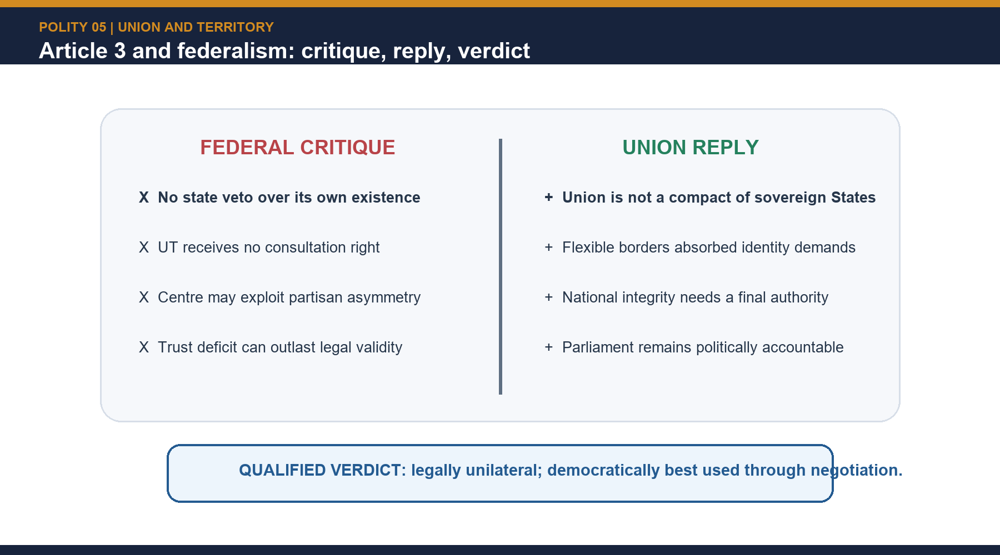

[FACT] The territorial chapter gives Parliament unusual constitutional power over the internal map. No comparable State veto exists, and Article 4 deliberately keeps ordinary reorganisation outside Article 368.

[ANALYSIS] The usual defence is nation-preserving flexibility. In a socially and linguistically plural polity, the Union must be able to respond to regional demands, insurgency settlements, administrative unviability and capital-area complexity without constitutional paralysis.

[ANALYSIS] The usual criticism is democratic-consent deficit. Because affected States cannot stop reorganisation, and because UT downgrades sharpen central control, Article 3 can look like consultation stripped of bargaining power.

[FACT] Linguistic reorganisation is the strongest evidence for the defence. Instead of fragmenting the Union, it largely absorbed regional identity inside the constitutional order.

[FACT] State of West Bengal v Union of India (1963) supplies a judicial anchor for the strong-Centre reading; S.R. Bommai (1994), though belonging to another topic, supplies the counter-reminder that federalism remains a basic feature.

[ANALYSIS] The best verdict is therefore graded. India is not a compact federation, but neither is Article 3 merely a tool of arbitrary centralism. It is a centralising safety valve whose democratic legitimacy rises or falls with political consultation, timing, transparency and accommodation.

[LIMIT] Current debates on Statehood, Sixth Schedule demands, delimitation or smaller-State proposals must not be treated as law until backed by enacted text or official notification.


```closure-flow
SUBTOPIC: Federalism, democratic consent, regionalism and territorial integrity
KEY TERMS / DEFINITIONS: ANSWER-GRABBING LINE — WRITE/ADAPT IN THE EXAM (FEDERAL): Article 3 is a centralising safety valve: its flexibility can absorb regional demands, but legitimacy depends on consultation, transparency and negotiated transition because affected States possess no constitutional veto.
MECHANISM / ARGUMENT: ANSWER-GRABBING LINE — WRITE/ADAPT IN THE EXAM (FEDERAL): Article 3 is a centralising safety valve: its flexibility can absorb regional demands, but legitimacy depends on consultation, transparency and negotiated transition because affected States possess no constitutional veto.
CONSEQUENCE / CONTRAST: [ANALYSIS] The best verdict is therefore graded.
UPSC TRAP / ANSWER-USE: Because affected States cannot stop reorganisation, and because UT downgrades sharpen central control, Article 3 can look like consultation stripped of bargaining power.
ANSWER-GRABBING FORMULATION: ANSWER-GRABBING LINE — WRITE/ADAPT IN THE EXAM (FEDERAL): Article 3 is a centralising safety valve: its flexibility can absorb regional demands, but legitimacy depends on consultation, transparency and negotiated transition because affected States possess no constitutional veto.
```

### 16. Current-status dashboard through 21 August 2026

> **ANSWER-GRABBING LINE — WRITE/ADAPT IN THE EXAM (CURRENT):** As verified on the located official record through 21 August 2026, India has 28 States and 8 Union Territories; J&K remains a UT with Legislature and Ladakh a UT without Legislature, no later official status-changing notification or order was located, and Ladakh Statehood/Sixth-Schedule demands remain dialogue rather than law.

> **CONTENT CLASSIFICATION:** CORE PRELIMS + CORE MAINS

| Current issue | Officially safe statement | Verification control |
|---|---|---|
| Number of States and UTs | **28 States and 8 Union Territories** | Current official National Portal count; the official Constitution dated 1 May 2026 carries 28 State entries and the current First-Schedule UT entries |
| Jammu and Kashmir | **Union Territory with Legislature** | MHA Jammu, Kashmir and Ladakh Affairs page retrieved 21 August 2026 |
| Ladakh | **Union Territory without Legislature** | Same MHA page; the First Schedule separately lists J&K and Ladakh |
| J&K Statehood restoration | The Supreme Court recorded the Union's assurance and said restoration shall take place “at the earliest and as soon as possible” | Exact MHA/eGazette and official-domain searches located no later dated notification or order completing restoration through 21 August 2026 |
| Ladakh Statehood / Sixth Schedule | Demands remained within official dialogue through the High-Powered Committee and other platforms | PIB 24 September 2025 recorded the demands; PIB 14 March 2026 reiterated safeguards and dialogue, not a status change |

[LIMIT] The search result is deliberately bounded: **no later official change was located**. It does
not claim that an inaccessible or subsequently issued instrument cannot exist. Political assurances,
committee discussions, protest demands, Bills and judicial directions do not amend the First Schedule.


```closure-flow
SUBTOPIC: Current-status dashboard through 21 August 2026
KEY TERMS / DEFINITIONS: [LIMIT] The search result is deliberately bounded: no later official change was located.
MECHANISM / ARGUMENT: ANSWER-GRABBING LINE — WRITE/ADAPT IN THE EXAM (CURRENT): As verified on the located official record through 21 August 2026, India has 28 States and 8 Union Territories; J&K remains a UT with Legislature and Ladakh a UT without Legislature, no later official status-changing notification or order was located, and Ladakh Statehood/Sixth-Schedule demands remain dialogue rather than law.
CONSEQUENCE / CONTRAST: [LIMIT] The search result is deliberately bounded: no later official change was located.
UPSC TRAP / ANSWER-USE: ANSWER-GRABBING LINE — WRITE/ADAPT IN THE EXAM (CURRENT): As verified on the located official record through 21 August 2026, India has 28 States and 8 Union Territories; J&K remains a UT with Legislature and Ladakh a UT without Legislature, no later official status-changing notification or order was located, and Ladakh Statehood/Sixth-Schedule demands remain dialogue rather than law.
ANSWER-GRABBING FORMULATION: ANSWER-GRABBING LINE — WRITE/ADAPT IN THE EXAM (CURRENT): As verified on the located official record through 21 August 2026, India has 28 States and 8 Union Territories; J&K remains a UT with Legislature and Ladakh a UT without Legislature, no later official status-changing notification or order was located, and Ladakh Statehood/Sixth-Schedule demands remain dialogue rather than law.
```

### 17. GS-II answer architecture: the fastest reliable route from provision to verdict

> **ANSWER-GRABBING LINE — WRITE/ADAPT IN THE EXAM (FINAL):** India's territorial Constitution works best when parliamentary flexibility is joined to federal statesmanship: unity supplies the legal power, while democratic consultation supplies the legitimacy.

> **CONTENT CLASSIFICATION:** CORE MAINS

| Demand family | Best opening thesis | Evidence core |
|---|---|---|
| Why India is a Union of States | The Union is constitutionally prior to State boundaries | Article 1 + Ambedkar explanation + Article 3 |
| Article 3 and State consent | India gives consultation, not consent | President's recommendation, State-legislature reference, non-binding views, Article 4 |
| Cession vs boundary settlement | Internal readjustment and transfer of sovereignty are constitutionally distinct | Berubari, Ninth Amendment, 1969 distinction, 100th Amendment |
| Linguistic reorganisation | Accommodation strengthened the Union more than it weakened it | Dhar, JVP, Andhra, SRC, 1956 |
| J&K 2019 | Ladakh carving was upheld; the whole-State-to-UT question was not finally resolved | Reorganisation Act + 2023 INSC 1058 + current MHA status |
| Smaller-State demand | Statehood is an instrument, not an automatic cure | viability, assets, minorities, democratic support and transition |

[FACT] The safest 10-marker structure is provision -> mechanism -> one named case -> verdict. The safest 15-marker structure is thesis -> provision -> mechanism -> case law -> one balance paragraph -> verdict. The safest 20-marker structure adds history, critique and current-status caution.

[ANALYSIS] The main mark-loss in this topic is category confusion: Union versus Territory, Article 2 versus 3, reorganisation versus cession, State legislature versus UT legislature, and constitutional text versus political promise.

> Prelims traps to recite before any objective question: Article 2 is not Article 3; State consent is not mandatory; a UT has no proviso consultation right; Article 4 keeps internal reorganisation outside Article 368; cession requires Article 368; the current count is 28 States and 8 UTs.


```closure-flow
SUBTOPIC: GS-II answer architecture: the fastest reliable route from provision to verdict
KEY TERMS / DEFINITIONS: ANSWER-GRABBING LINE — WRITE/ADAPT IN THE EXAM (FINAL): India's territorial Constitution works best when parliamentary flexibility is joined to federal statesmanship: unity supplies the legal power, while democratic consultation supplies the legitimacy.
MECHANISM / ARGUMENT: [FACT] The safest 10-marker structure is provision -> mechanism -> one named case -> verdict.
CONSEQUENCE / CONTRAST: The safest 15-marker structure is thesis -> provision -> mechanism -> case law -> one balance paragraph -> verdict.
UPSC TRAP / ANSWER-USE: The safest 20-marker structure adds history, critique and current-status caution.
ANSWER-GRABBING FORMULATION: ANSWER-GRABBING LINE — WRITE/ADAPT IN THE EXAM (FINAL): India's territorial Constitution works best when parliamentary flexibility is joined to federal statesmanship: unity supplies the legal power, while democratic consultation supplies the legitimacy.
```

## BASIC MCQS / REMEDIATION

### Forty core diagnostic MCQs

#### Core MCQ 1. Article 1(1) primarily settles which two issues together?

- A. The country's name and the type of polity

- B. The capital city and the official language

- C. The citizenship rules and the anthem

- D. The emergency powers and amendment process

**Answer: A.** Article 1(1) gives both the name - India, that is Bharat - and the formula 'Union of States'.

#### Core MCQ 2. Which statement best captures the difference between the Union of India and the Territory of India?

- A. The Union of India includes only Parliament, while the Territory of India includes Parliament and the States

- B. The Union of India refers to the States as federal members, while the Territory of India also includes Union Territories and acquired territories

- C. The Union of India means the Union executive, while the Territory of India means the Union judiciary

- D. The two expressions are exact constitutional synonyms

**Answer: B.** This distinction flows directly from Article 1 and is one of the most examinable definitions in the chapter.

#### Core MCQ 3. Article 2 is conceptually different from Article 3 because Article 2 deals with

- A. renaming existing States

- B. creation of legislative councils in States

- C. admission into the Union or establishment of new States not already part of the existing Union

- D. cession of Indian territory to a foreign State

**Answer: C.** Article 3 handles internal reorganisation of existing units; Article 2 is the external-admission clause.

#### Core MCQ 4. Which one of the following is NOT one of the express Article 3 operations?

- A. Increasing the area of a State

- B. Altering the name of a State

- C. Altering the boundaries of a State

- D. Ceding accepted Indian territory to a foreign State

**Answer: D.** Cession is outside Article 3 after Berubari; the other three are expressly listed in clauses (b), (e) and (d).

#### Core MCQ 5. Before an Article 3 bill is introduced in Parliament, what is constitutionally necessary?

- A. The prior recommendation of the President

- B. Prior ratification by at least half the States

- C. A joint sitting of both Houses

- D. Approval by the Supreme Court under Article 143

**Answer: A.** The bill cannot even be introduced without the President's recommendation.

#### Core MCQ 6. The legislature of the affected State, when consulted under Article 3, has

- A. a suspensive veto that can be overridden only in a joint sitting

- B. a right to express its views, but no veto over Parliament's final decision

- C. a binding veto unless the Supreme Court permits otherwise

- D. a co-equal decision-making role with Parliament

**Answer: B.** Article 3 requires consultation, not consent.

#### Core MCQ 7. Explanation I to Article 3 matters because it states that

- A. Union Territories are treated as States for all constitutional purposes

- B. States and UTs have identical representation in Rajya Sabha

- C. for clauses (a) to (e), 'State' includes a Union Territory, but not in the proviso requiring legislature-reference

- D. the President may abolish a State by ordinance

**Answer: C.** This is a close-option trap: inclusion applies to clauses (a)-(e), not fully to the proviso.

#### Core MCQ 8. Article 4 keeps reorganisation laws outside Article 368 because such laws are

- A. automatically approved by the Supreme Court

- B. valid only for five years unless renewed

- C. treated as Money Bills

- D. not deemed constitutional amendments for the purposes of Article 368

**Answer: D.** Article 4(2) expressly says so.

#### Core MCQ 9. The First Schedule is constitutionally important because it

- A. lists the States and Union Territories and their territorial extent

- B. contains the amendment procedure

- C. allocates Lok Sabha seats among constituencies

- D. lists the official languages of every State

**Answer: A.** Territorial and nomenclature changes must be reflected in the First Schedule.

#### Core MCQ 10. Which one of the following most accurately states Berubari Union (1960)?

- A. Any change in a State boundary requires prior consent of that State

- B. Cession of accepted Indian territory to a foreign State requires a constitutional amendment

- C. No Indian territory can ever be ceded under the Constitution

- D. Parliament cannot alter a State's name without Article 368

**Answer: B.** Berubari did not ban cession; it fixed the route - Article 368, not Article 3.

#### Core MCQ 11. The Supreme Court's 1969 boundary-settlement ruling is mainly remembered for holding that

- A. every international boundary issue must be referred under Article 143

- B. the Union cannot acquire State property

- C. boundary settlement or ascertainment without cession does not automatically require Article 368

- D. Article 3 and Article 4 are unconstitutional

**Answer: C.** The case distinguishes boundary implementation from surrender of sovereignty.

#### Core MCQ 12. Which constitutional amendment implemented the India-Bangladesh enclave exchange and related territorial adjustments?

- A. The Ninth Constitutional Amendment Act, 1960

- B. The Seventh Constitutional Amendment Act, 1956

- C. The Thirty-Sixth Constitutional Amendment Act, 1975

- D. The 100th Constitutional Amendment Act, 2015

**Answer: D.** The 100th Amendment gave effect to the Land Boundary Agreement and its protocol.

#### Core MCQ 13. Which sequence is correct for the linguistic-reorganisation debate?

- A. Dhar Commission -> JVP Committee -> Andhra State -> Fazl Ali / SRC -> States Reorganisation Act

- B. JVP Committee -> Dhar Commission -> Fazl Ali / SRC -> Andhra State -> Seventh Amendment

- C. Andhra State -> Dhar Commission -> JVP Committee -> Fazl Ali / SRC -> States Reorganisation Act

- D. Fazl Ali / SRC -> Dhar Commission -> JVP Committee -> Andhra State -> States Reorganisation Act

**Answer: A.** Chronology is often more important than slogans in this topic.

#### Core MCQ 14. What was the decisive political trigger for the creation of Andhra State in 1953?

- A. A Presidential reference under Article 143

- B. The prolonged fast and death of Potti Sriramulu

- C. The demand of the JVP Committee

- D. The Ninth Amendment Act

**Answer: B.** Andhra is the first major linguistic-State milestone.

#### Core MCQ 15. The States Reorganisation Act, 1956 together with the Seventh Amendment created

- A. 16 States and 3 Union Territories exactly as originally recommended by the SRC

- B. 28 States and 8 Union Territories

- C. 14 States and 6 Union Territories

- D. 15 States and 5 Union Territories

**Answer: C.** The government modified the SRC's exact recommendation, but the enacted 1956 outcome was 14 and 6.

#### Core MCQ 16. Which one of the following pairs is correctly matched?

- A. Nagaland - Statehood through the Ninth Amendment

- B. Goa - Statehood through the 100th Amendment

- C. Telangana - created by the Seventh Amendment

- D. Sikkim - full Statehood through the 36th Amendment after the brief associate-State experiment

**Answer: D.** Sikkim's path is constitutionally distinctive and therefore high-yield.

#### Core MCQ 17. The present practical count of Union Territories as of 21 Aug 2026 is

- A. 8

- B. 6

- C. 7

- D. 9

**Answer: A.** The count fell from 9 to 8 after the 2020 DNH-Daman and Diu merger.

#### Core MCQ 18. Which sequence of Statehood is correct?

- A. Arunachal Pradesh 1963; Nagaland 1972; Tripura 1987

- B. Nagaland 1963; Tripura 1972; Arunachal Pradesh 1987

- C. Tripura 1963; Arunachal Pradesh 1972; Nagaland 1987

- D. Nagaland, Tripura and Arunachal Pradesh all in 1972

**Answer: B.** This is the chronology behind Prelims 2025 Q52.

#### Core MCQ 19. Which one of the following correctly describes the 1950 map?

- A. Manipur and Tripura were Part B States

- B. Delhi was the sole Part D territory

- C. Part A had 9 units, Part B 9, Part C 10, and Andaman and Nicobar Islands alone formed Part D

- D. Hyderabad was a Part A State

**Answer: C.** Part C included Delhi, Himachal Pradesh, Manipur and Tripura; Hyderabad was Part B.

#### Core MCQ 20. Sikkim's constitutional sequence was

- A. full Statehood in 1974 followed by associate status in 1975

- B. UT status under the Seventh Amendment followed by Article 3 Statehood

- C. associate status under the 36th Amendment followed by Statehood under the 35th

- D. associate-State status through the 35th Amendment in 1974, followed by full Statehood through the 36th Amendment in 1975

**Answer: D.** Article 2A and the old Tenth Schedule marked the brief associate phase.

#### Core MCQ 21. With reference to the India-Bangladesh Land Boundary Agreement, which is correct?

- A. The 100th Amendment implemented an exchange in which India transferred 111 enclaves and received 51

- B. India transferred 51 enclaves and received 111 under the Ninth Amendment alone

- C. The First Schedule did not require amendment

- D. Only West Bengal's territorial entry was affected

**Answer: A.** Assam, West Bengal, Meghalaya and Tripura were affected.

#### Core MCQ 22. On the official record located through 21 August 2026, the correct J&K position is

- A. Statehood was automatically restored by the 2023 judgment

- B. J&K remains a UT with Legislature; restoration was directed and assured but had not been legally completed

- C. J&K and Ladakh have recombined into a State

- D. Ladakh is a State without Legislature

**Answer: B.** MHA's current official page continues to describe both as UTs.

#### Core MCQ 23. In the 2023 Article 370 judgment, the Supreme Court

- A. held every whole-State-to-UT conversion valid

- B. restored J&K Statehood with immediate effect

- C. upheld carving out Ladakh, treated State views as recommendatory, but did not finally decide the broader whole-State-to-UT issue because of the restoration assurance

- D. held Article 3 inapplicable to Union Territories

**Answer: C.** This qualified holding is safer than claiming a universal power was conclusively approved.

#### Core MCQ 24. Which criterion set is most defensible for evaluating a smaller-State demand?

- A. Population and language alone

- B. Political mobilisation alone

- C. Consent of the parent State alone

- D. Administrative access, fiscal viability, transition costs, resource division, minority safeguards, democratic support and inter-State effects

**Answer: D.** Statehood is a multi-dimensional governance decision.

#### Core MCQ 25. Which one of the following is correctly matched?

- A. United Provinces -> Uttar Pradesh, 1950

- B. Mysore -> Tamil Nadu, 1973

- C. Orissa -> Odisha, 2000

- D. Pondicherry -> Lakshadweep, 2006

**Answer: A.** Mysore became Karnataka; Orissa became Odisha in 2011; Pondicherry became Puducherry.

#### Core MCQ 26. The enacted result of the 1956 settlement was

- A. 16 States and 3 UTs

- B. 14 States and 6 UTs

- C. 28 States and 8 UTs

- D. 9 Part A and 9 Part B States

**Answer: B.** The Commission's proposed map and the enacted outcome must not be conflated.

#### Core MCQ 27. Which statement is correct about Ladakh's current demand?

- A. Statehood was granted by the PIB release of September 2025

- B. Sixth Schedule status automatically followed the 2025 regulations

- C. Official PIB releases recorded Statehood/Sixth-Schedule demands and continuing safeguard dialogue, but no territorial-status change

- D. Ladakh became a State through the 100th Amendment

**Answer: C.** Demand, dialogue and enacted law are distinct.

#### Core MCQ 28. Which statement best explains why Article 3 is often cited as proof of India's strong-Centre bias?

- A. States cannot legislate on the Concurrent List

- B. every State law needs Presidential approval

- C. Rajya Sabha seats are equal across States

- D. Parliament may reorganise States without needing their consent

**Answer: D.** Article 3 is among the clearest textual examples of centre-weighted federalism.

#### Core MCQ 29. Article 4 expressly enables a law under Articles 2 or 3 to amend which Schedules as necessary?

- A. The First and Fourth Schedules
- B. The Fifth and Sixth Schedules
- C. The Seventh and Eighth Schedules
- D. The Ninth and Tenth Schedules

**Answer: A.** The First Schedule records territorial units, while the Fourth allocates Rajya Sabha
seats. Article 4 lets the same reorganisation law make both adjustments.

#### Core MCQ 30. Parliament materially amends an Article 3 Bill after the affected State legislature has sent its views. Which statement is correct?

- A. The Bill automatically lapses
- B. A fresh State-legislature reference is not constitutionally required for every amendment
- C. The State legislature acquires a veto over the amended clauses
- D. The Supreme Court must approve the amended Bill before passage

**Answer: B.** The Supreme Court's Article 3 jurisprudence treats the State's views as recommendatory
and rejects an endless fresh-reference requirement for each parliamentary amendment.

#### Core MCQ 31. Historical polity texts list conquest among modes of territorial acquisition. A current answer should add that

- A. conquest remains unrestricted whenever Parliament passes an Article 3 law
- B. the President may validate acquisition by ordinance
- C. contemporary international law and the UN Charter sharply constrain acquisition by force
- D. acquired territory must immediately become a full State

**Answer: C.** The historical taxonomy needs a modern international-law qualification. Article
1(3)(c) recognises acquired territory but does not legalise aggressive force.

#### Core MCQ 32. *State of West Bengal v. Union of India* is relevant to this topic chiefly because it

- A. created Andhra State
- B. authorised foreign cession under Article 3
- C. made State consent compulsory
- D. supports the strong-Centre proposition that Indian States are not classical compact-sovereigns

**Answer: D.** The case concerned Union acquisition of State property. It is a limited structural
analogy, not the controlling authority for cession or Article 3 procedure.

#### Core MCQ 33. Which statement correctly qualifies the familiar account of princely-State integration?

- A. The 552/549/three shorthand is a textbook convention; integration also used accession, merger, diplomacy and state unions
- B. Every princely State joined by an identical referendum
- C. Hyderabad, Junagadh and Kashmir all followed the same legal route
- D. Integration began only after the States Reorganisation Act, 1956

**Answer: A.** The shorthand is useful for recall but should not erase the diversity of instruments,
politics and transitional arrangements.

#### Core MCQ 34. Which combination best reflects the Fazl Ali / States Reorganisation Commission approach?

- A. Language alone; one language must always produce one State
- B. Language plus unity/security, administrative-economic viability and welfare; one language-one State rejected
- C. No role for language under any condition
- D. State consent as a constitutional veto

**Answer: B.** Language was accepted as important but not exclusive. The Commission explicitly
resisted a mechanical one-language-one-State rule.

#### Core MCQ 35. Which statehood-number sequence is correct?

- A. Haryana 16th, Nagaland 17th, Himachal Pradesh 18th
- B. Manipur 18th, Tripura 19th, Meghalaya 20th
- C. Gujarat 15th, Nagaland 16th, Haryana 17th
- D. Telangana 28th, Jharkhand 29th

**Answer: C.** The owner-grounded sequence begins Gujarat 15th, Nagaland 16th and Haryana 17th;
Telangana became the 29th State in 2014.

#### Core MCQ 36. Which incorporation pair is correctly matched?

- A. Dadra and Nagar Haveli — Twelfth Amendment
- B. Goa, Daman and Diu — Fourteenth Amendment
- C. Puducherry — Tenth Amendment
- D. Puducherry — Fourteenth Amendment

**Answer: D.** Dadra and Nagar Haveli used the Tenth Amendment; Goa, Daman and Diu the Twelfth;
Puducherry the Fourteenth.

#### Core MCQ 37. What was the direct count effect of the 2020 merger of Dadra and Nagar Haveli with Daman and Diu?

- A. The Union-Territory count fell from nine to eight, while the State count remained twenty-eight
- B. The State count rose to twenty-nine
- C. Ladakh became a State
- D. Delhi ceased to be a Union Territory

**Answer: A.** Two UTs became one combined UT on 26 January 2020; no State was created.

#### Core MCQ 38. Which is the most accurate statement of *In Re Article 370* on territorial reorganisation?

- A. It finally upheld every possible conversion of a whole State into Union Territories
- B. It upheld Ladakh's creation under Article 3(a) read with Explanation I, while leaving the broader whole-State conversion question open because of the restoration assurance
- C. It restored J&K Statehood immediately
- D. It held State-legislature views binding under Article 3

**Answer: B.** The Court's holding was expressly qualified. It also reiterated that Article 3 views
are recommendatory and called for Statehood restoration at the earliest and as soon as possible.

#### Core MCQ 39. Which topic-ownership statement is correct?

- A. Topic 05 owns every detail of Lieutenant-Governor administration
- B. Topic 22 owns the complete Article 3 chronology
- C. Topic 05 owns territorial architecture; Topic 25 owns Articles 239–241 administration; Topic 22 owns detailed Article 370 doctrine
- D. Topic boundaries are irrelevant because all three topics are identical

**Answer: C.** The firewall prevents territorial status from being confused with UT administration
or the full special-provisions doctrine.

#### Core MCQ 40. Which is the safest current-status sentence for an examination answer dated 21 August 2026?

- A. J&K Statehood has certainly been restored because political leaders promised it
- B. Ladakh entered the Sixth Schedule automatically after the 2025 regulations
- C. Any committee discussion changes the First Schedule
- D. Official sources still describe J&K as a UT with Legislature and Ladakh as a UT without Legislature; no later status-changing notification or order was located

**Answer: D.** The rule is notification control: an assurance, demand, dialogue or regulation is not
itself a territorial-status change.

### Eight remedial MCQs for recurring traps

#### Remedial MCQ 41. A student writes that every change in a State's boundary requires Article 368 because the First Schedule changes. Which correction is most accurate?

- A. Article 4 itself allows First Schedule changes within an Article 3 law, so Article 368 is not normally needed

- B. The First Schedule can never be changed

- C. First Schedule changes are done only by executive notification

- D. Rajya Sabha approval replaces Parliament's ordinary law-making process

**Answer: A.** This remedial question targets the First-Schedule-amendment trap.

#### Remedial MCQ 42. A candidate uses Article 2 for the creation of Telangana. What is the best correction?

- A. Article 2 applies because Telangana had a separate movement

- B. Telangana was formed from an existing State, so Article 3 was the relevant territorial power

- C. Article 368 alone applies whenever a new State is created

- D. Article 1 alone authorises State creation

**Answer: B.** Political novelty does not make the territory external to the existing Union.

#### Remedial MCQ 43. A candidate writes the current count as 28 States and 9 UTs. The correction is

- A. 29 States and 8 UTs

- B. 27 States and 9 UTs

- C. 28 States and 8 UTs after the 2020 DNH-DD merger

- D. 28 States and 7 UTs

**Answer: C.** The State count stayed 28; the UT count fell by one.

#### Remedial MCQ 44. A student confuses Berubari with the Supreme Court's 1969 boundary-settlement principle. Which contrast is right?

- A. Berubari is a State-creation case; the 1969 principle is a renaming rule

- B. Berubari authorises cession by executive order; the 1969 principle bars every boundary agreement

- C. Berubari and the 1969 principle both say Article 3 is enough for cession

- D. Berubari deals with cession of accepted Indian territory; the 1969 principle deals with boundary settlement without such cession

**Answer: D.** This remedial item repairs the most common case-law mix-up in the topic.

#### Remedial MCQ 45. Which correction best answers the statement 'State consent is mandatory under Article 3'?

- A. Only the State legislature's views are sought; Parliament is not bound by them

- B. Consent is mandatory unless the State is bilingual

- C. Consent is mandatory only for name changes

- D. Consent is mandatory for Article 3 but not for Article 2

**Answer: A.** This is the central remedial trap of the chapter.

#### Remedial MCQ 46. A candidate writes that the 1956 settlement created 16 States and 3 UTs. The enacted result was

- A. 15 States and 7 UTs

- B. 14 States and 6 UTs

- C. 28 States and 8 UTs

- D. 9 Part A and 9 Part B States

**Answer: B.** The SRC recommendation and the enacted map were not identical.

#### Remedial MCQ 47. A candidate solves Prelims 2025 Q52 as "only two pairs" by treating the Nagaland statement as false. The correction is

- A. Pair I alone was correct

- B. The question was dropped

- C. The official UPSC key is C, all three pairs; Nagaland's settlement involved both the State of Nagaland Act and the Thirteenth Amendment

- D. Tripura was never a Part C unit

**Answer: C.** Official-key control overrides an incomplete one-statute elimination.

#### Remedial MCQ 48. Which is the best present-tense statement on J&K as of 21 Aug 2026?

- A. J&K has already regained full Statehood

- B. J&K has no legislature at all

- C. J&K and Ladakh have both become States

- D. J&K remains a Union Territory with a legislature; the official source sweep located no later dated notification or order completing Statehood restoration

**Answer: D.** The package deliberately uses the narrow, source-safe current-status formulation.

## PYQS AND ANSWER PRACTICE

### PYQ provenance audit

| PYQ | Verification status | Treatment in this package |
|---|---|---|
| 2025 Prelims GS-I Q52 | Verbatim extracted from local official Set-A paper; official local Set-A key records **C** | Solved exactly with statement-level explanation |
| 2018 Mains GS-I Q12 | Exact owner text preserved; central routing ledger independently corroborates year, paper, question, directive, marks and word limit | Solved independently; no additional local official-paper file was found in this worktree |
| 2022 Mains GS-I Q11 | Exact owner text preserved; central routing ledger independently corroborates year, paper, question, directive, marks and word limit | Solved independently; no additional local official-paper file was found in this worktree |

[LIMIT] Repository-wide searches of every 2018–2026 central PYQ routing and integration ledger found
no additional directly relevant verified PYQ for this topic. Shared Delhi administration and detailed
J&K Assembly-power questions remain with Topic 25 rather than being relabelled as Topic 05 owners.

### PYQ 1. Prelims 2025, GS Paper I, Question 52 — verbatim official-paper verification

Consider the following pairs:

| State | Description |
|---|---|
| I. Arunachal Pradesh | The capital is named after a fort, and the State has two National Parks |
| II. Nagaland | The State came into existence on the basis of a Constitutional Amendment Act |
| III. Tripura | Initially a Part 'C' State, it became a centrally administered territory with the reorganization of States in 1956 and later attained the status of a full-fledged State |

How many of the above pairs are correctly matched?

(a) Only one  
(b) Only two  
(c) All the three  
(d) None

**Official Set-A answer: (c) All the three.**

- **Pair I:** Itanagar is named after Ita Fort; Arunachal Pradesh has Namdapha and Mouling National Parks.
- **Pair II:** The official key accepts the pair. Nagaland's settlement involved the State of
  Nagaland Act, 1962 and the Constitution (Thirteenth Amendment) Act, 1962, which inserted Article 371A.
- **Pair III:** Tripura was a Part C unit, became a Union Territory in the 1956 arrangement and attained
  full Statehood in 1972.

> Why this earns marks: it follows the official key, tests every pair independently, and explains why
> an ordinary Statehood Act and an accompanying constitutional amendment are not mutually exclusive.

### PYQ 2. Mains 2018, GS Paper I, Question 12 — owner-verified exact text

**Question:** Discuss whether formation of new states in recent times is beneficial or not for the
economy of India. (15 marks, 250 words)

**Model solution**

State formation can improve economic governance, but the gain follows from **institutional capacity
and transition design**, not from small size by itself.

**Potential benefits.** A smaller unit can reduce administrative distance, reveal region-specific
constraints and align budgets with local geography. **Chhattisgarh** obtained a dedicated policy arena
for a large tribal-mineral region; **Uttarakhand** could focus on mountain roads, tourism and disaster
risk; **Jharkhand** acquired a separate budgetary platform for mineral-rich but socially deprived
districts; **Telangana** gained autonomous policy priority after 2014. These cases show how Statehood
can improve problem recognition, accountability and capital allocation.

**Costs and qualifications.** New capitals, High Courts, cadres and departments create large fixed
costs. Weak revenue capacity may increase grant dependence. Division of debt, employees, institutions,
power and river water can generate prolonged disputes: the **Andhra Pradesh–Telangana** transition
illustrates capital, asset and water frictions. Statehood also did not automatically remove
**Jharkhand's political instability**, while Uttarakhand's development model remains constrained by
fragile Himalayan ecology.

Thus, the relevant test is not “smaller equals richer” but whether reorganisation corrects neglect,
improves access and is supported by viable finances, accountable institutions and a negotiated
transition. New States can be economically beneficial, but Article 3 is a constitutional instrument,
not a self-executing development policy.

> Why this earns marks: the answer follows the economic directive, uses four named State examples,
> links each example to a mechanism, presents transition costs and ends with a conditional verdict.

### PYQ 3. Mains 2022, GS Paper I, Question 11 — owner-verified exact text

**Question:** The political and administrative reorganization of states and territories has been a
continuous ongoing process since the mid-nineteenth century. Discuss with examples. (15 marks, 250 words)

**Model solution**

India's political map has never been static; it has been repeatedly remade by colonial administration,
national integration, linguistic accommodation, security settlements and developmental demands.

**Colonial phase.** The **1858 Crown takeover**, later provincial adjustments and the **1905 partition
and 1911 reunification of Bengal** showed that boundaries could be administrative instruments with
large political consequences. The Government of India Acts also altered provincial structures and
degrees of autonomy.

**Integration and transition.** After 1947, accession and merger integrated princely States through
different routes: **Junagadh, Hyderabad and Jammu and Kashmir** demonstrate plebiscitary, coercive and
accession-under-invasion complexities. The 1950 **Part A/B/C/D** classification was therefore a
transitional constitutional map, not a final settlement.

**Linguistic and later reorganisation.** **Andhra (1953)** made language unavoidable. The
**Fazl Ali Commission**, while rejecting “one language–one State”, led to the **States Reorganisation
Act, 1956 and Seventh Amendment**, creating 14 States and 6 UTs. Later changes responded to multiple
drivers: Maharashtra–Gujarat (1960), Nagaland (1963), Haryana (1966), North-Eastern Statehood (1972
and 1987), Sikkim (1975), the three States of 2000, Telangana (2014), J&K–Ladakh (2019) and the DNH–DD
UT merger (2020).

The continuity lies in the recurring search for congruence between identity, administrative viability
and national unity. Article 3 constitutionalised that adaptability, though democratic legitimacy
still depends on consultation and fair transition.

> Why this earns marks: it respects the mid-nineteenth-century time span, uses chronology as analysis,
> names examples across every phase and closes by identifying the continuing constitutional mechanism.

### Six original solved Mains models

### Original Mains model 1 — 10 marks: Distinguish the 'Territory of India' from the 'Union of India'. Why does the distinction matter?

**Model answer.** [CLAIM] The two expressions are related but not identical. [EVIDENCE] Article 1 and standard polity doctrine treat the Union of India as the States taken as federal members, whereas the Territory of India includes the territories of the States, the Union Territories, and such territories as may be acquired. [MECHANISM] This matters because States share constitutionally distributed powers with the Union, while Union Territories are centrally administered units under Articles 239-241 and acquired territories may await internal constitutional placement. [ANALYSIS] The distinction explains why a UT belongs to India without becoming a full federal partner, and why the First Schedule can list both States and UTs while still preserving their unequal constitutional status. [LIMIT] The distinction is structural, not emotional; one should not collapse sovereignty with federal membership. [VERDICT] The Union of India is the federation's membership core; the Territory of India is the wider constitutional space over which Indian sovereignty extends. **Why this earns marks:** it defines both expressions, links them to operative constitutional consequences, and avoids the common synonym trap.

### Original Mains model 2 — 10 marks: Distinguish cession of Indian territory from settlement of a boundary dispute.

**Model answer.** [CLAIM] The Constitution treats cession and boundary settlement differently because only the former parts with accepted sovereign territory. [EVIDENCE] *Berubari Union* (1960) held that ceding accepted Indian territory to a foreign State cannot be done under Article 3 and requires constitutional amendment under Article 368. [MECHANISM] Cession changes the sovereign content of the Constitution's territorial ledger. By contrast, the Supreme Court's later 1969 ruling held that where the issue is ascertainment or implementation of an existing disputed boundary, and not transfer of accepted Indian territory, executive action need not be preceded by Article 368. [ANALYSIS] The test is not whether another country is involved, but whether India is surrendering what it accepts as its own territory. [LIMIT] A boundary-settlement label cannot disguise actual cession. [VERDICT] Cession changes sovereignty and needs amendment; boundary settlement clarifies or implements an existing line and need not. **Why this earns marks:** it identifies the controlling test, uses the safely verified case/principle and converts the distinction into a usable constitutional rule.

### Original Mains model 3 — 15 marks: 'India is an indestructible Union of destructible States.' Examine with special reference to Article 3.

**Model answer.** [CLAIM] The phrase captures the asymmetry built into Indian federalism: the Union's continuity is entrenched, but State boundaries are not. [EVIDENCE] Article 1 names India a Union of States, while Article 3 empowers Parliament to form new States, increase or diminish their area, alter boundaries and alter names. [MECHANISM] An Article 3 bill requires the President's prior recommendation and reference to the affected State legislature for views, but those views are non-binding. Article 4 then keeps the reorganisation law outside Article 368, allowing ordinary-majority change. [ANALYSIS] This makes the Indian federation unlike a compact federation such as the United States, where State consent is structurally stronger. Yet the same flexibility enabled linguistic reorganisation, small-State creation and administrative adaptation without constitutional deadlock. [EVIDENCE] Andhra (1953), the 1956 settlement, and later creations such as Chhattisgarh, Jharkhand and Telangana show the practical utility of this power. [LIMIT] The design can create a democratic-consent deficit when major territorial change proceeds over sharp regional opposition. [VERDICT] India is indestructible because no State can claim a right to continued boundaries or secession; the States are destructible only in the constitutional sense that Parliament may reorganise them, not in the sense of lawless central arbitrariness. **Why this earns marks:** it ties the famous formula to the exact procedural mechanics of Article 3 and balances national flexibility with federal criticism.

### Original Mains model 4 — 15 marks: Demands for smaller States should be decided through governance criteria, not identity alone. Discuss.

**Model answer.** [CLAIM] Identity can establish democratic urgency, but it cannot by itself prove that a new State will govern better. [EVIDENCE] Uttarakhand, Chhattisgarh and Jharkhand were created in 2000 to address distinct regional geographies and developmental claims; Telangana followed in 2014 after sustained regional mobilisation. [ANALYSIS] Smaller units may improve administrative access, policy focus and accountability. [QUALIFICATION] Statehood also creates new capital, cadre and institutional costs; weak revenue bases can deepen grant dependence; water, power, debt and assets can generate inter-State disputes; and a new regional majority may create a new minority. Jharkhand's institutional instability and Andhra-Telangana transition disputes show that Statehood is not a self-executing development policy. [CURRENT EVIDENCE] J&K restoration and Ladakh Statehood demands further require federal, security and minority safeguards; the official source sweep located no later status-changing notification or order through 21 August 2026. [VERDICT] Parliament should use Article 3 after transparent viability studies, broad consultation and negotiated transition, treating Statehood as a governance instrument rather than a reward for mobilisation. **Why this earns marks:** it uses four named examples, connects each claim to a mechanism, includes present debates and supplies operational decision criteria.

### Original Mains model 5 — 20 marks: Linguistic reorganisation strengthened rather than weakened the Indian Union. Critically examine.

**Model answer.** [CLAIM] Linguistic reorganisation ultimately strengthened the Indian Union because it channelled identity into constitutional politics rather than leaving it outside the system, though not without centralising tensions and new sub-regional claims. [EVIDENCE] The initial hesitation of the Dhar Commission and the JVP Committee reflected a real fear that language-based States might embolden fragmentation. The creation of Andhra in 1953 after Potti Sriramulu's death showed that these demands could not simply be suppressed. [EVIDENCE] The Fazl Ali / States Reorganisation Commission accepted language as a major organising principle but rejected one language-one State and balanced it with viability, unity and welfare. The resulting States Reorganisation Act, 1956 and Seventh Amendment restructured India without dismantling its constitutional framework. [MECHANISM] By aligning administration with language in many cases, the Union reduced alienation, improved representational legitimacy and absorbed regional mobilisation into parliamentary and electoral channels. [ANALYSIS] Later developments - Nagaland, Meghalaya, Mizoram, Goa, Telangana and smaller-State formations in 2000 - show that Article 3 remained an accommodation device, not merely a linguistic tool. [LIMIT] Reorganisation did not end regionalism; it often displaced it into fresh internal claims for smaller units, capitals or autonomous protections. Nor can every present-day demand be justified by language alone. [VERDICT] Linguistic reorganisation did not dissolve the Union; it made the Union governable by recognising identity inside the Constitution. Its success, however, depended on combining language with viability, asymmetry and central constitutional control. **Why this earns marks:** it uses chronology as argument, gives both the fear and the outcome, and converts the 1956 settlement into a broader federalism verdict.

### Original Mains model 6 — 20 marks: Does Article 3 reconcile national unity with democratic consent, or does it privilege unity at the expense of federal trust? Critically examine.

**Model answer.** [CLAIM] Article 3 reconciles unity and democracy only partially: it was designed to privilege the Union's continuity, and democratic consent enters the structure as consultation rather than as a State veto. [EVIDENCE] The President must recommend the bill and refer it to the affected State legislature for views, but Parliament is not bound by those views. Article 4 then keeps the resulting law outside Article 368, reinforcing flexibility. [MECHANISM] This makes Article 3 a nation-preserving safety valve. The Union can respond to secessionary pressures, viability problems, linguistic claims and administrative demands without constitutional paralysis. Andhra, the 1956 settlement, State creation in 2000 and Telangana in 2014 are evidence of this accommodative capacity. [ANALYSIS] Yet the same structure can weaken trust. If an affected State's legislature can only advise and not co-decide, consultation may appear symbolic in politically high-stakes reorganisations. The conversion of a former State into Union Territories in 2019 intensified this anxiety. [EVIDENCE] State of West Bengal v Union of India reinforces the strong-Centre reading, while the continuing democratic force of federalism is better captured by the political need for negotiated legitimacy and, in the broader constitutional order, by Bommai's basic-feature floor. [LIMIT] A compact-federation standard is not fully appropriate for India, whose Constitution deliberately rejected a treaty-union model. [VERDICT] Article 3 does not produce symmetrical federal consent; it privileges unity structurally, but can still generate democratic legitimacy when used through negotiation, transparency and accommodation rather than through bare majoritarian power. **Why this earns marks:** it neither romanticises consent nor demonises unity, and it uses the text, history and case law to produce a graded verdict rather than a slogan.

## OPTIONAL ADVANCED DEPTH — NOT REQUIRED FOR A CORE ANSWER

**A. Explanation I is a favourite close-option trap.** In Article 3, 'State' includes Union Territories for clauses (a) to (e), but not for the proviso requiring reference to a State legislature. This is why Parliament may restructure UTs without a comparable constitutionally mandated consultation step.

**B. The First Schedule and Fourth Schedule do different jobs.** The First Schedule tracks territorial units; the Fourth Schedule tracks Rajya Sabha seat allocation. Article 4 lets a reorganisation law adjust both together.

**C. Ordinary law is not a lesser constitutional act in this chapter.** An Article 3 law is ordinary in voting threshold, but constitutional in subject matter. That is why it can lawfully redraw the map while still remaining outside Article 368.

**D. Berubari is not just a territorial case.** It also teaches exam method: identify whether the question is about internal diminution, cession, or interpretive use of a case in another topic such as the Preamble.

**E. West Bengal is about constitutional status, not map procedure.** Use it to show that States are not classical sovereigns; do not use it to answer the cession route or Article 3 procedure.

**F. J&K current status must be written in two layers.** Layer one is operative law: UT with Legislature. Layer two is political-constitutional promise and judicial direction: Statehood restoration at the earliest, still legally pending on the 21 Aug 2026 check.

**G. The whole-State-to-UT issue remains qualified.** The 2023 judgment upheld carving out Ladakh but did not finally decide the broader conversion issue because of the restoration assurance.

**H. Linguistic reorganisation was not a surrender to separatism.** The 1956 settlement shows that territorial flexibility can be a nation-building tool.

**I. Renaming is constitutionally small but exam-relevant.** Article 3(e) handles both major territorial restructuring and nomenclature changes.

**J. Current demands are not current law.** A memorandum, protest, committee dialogue, assurance or Bill does not change the First Schedule.

**K. Viability must accompany identity.** Fiscal capacity, assets, water, minorities and transition institutions decide whether a smaller State can govern.

**L. Current affairs should update status, not replace doctrine.** The stable core remains Articles 1-4; Polity 25 owns Articles 239-241. Live sources here only refresh the 28/8 count, J&K restoration status and current Statehood demands.

## CONSOLIDATED REGISTER NOTES

### Controlled answer-line bank

1. **OPENING:** India is a constitutionally indestructible Union whose internal State map remains adaptable under Articles 1–4; the phrase 'indestructible Union of destructible States' is an analytical formula, not constitutional text.
2. **ARCHITECTURE:** Articles 1–4 move from identity and territorial composition, to external admission or establishment, to internal reorganisation, and finally to the ordinary-law consequences that amend the First and Fourth Schedules.
3. **PROCEDURE:** Article 3 constitutionalises consultation, not consent: prior presidential recommendation and State-legislature reference are mandatory where the proviso applies, views do not bind Parliament, no fresh reference is required for every amendment, and a Union Territory has no equivalent proviso right.
4. **CESSION:** The sovereignty test separates cession from boundary settlement: surrender of accepted Indian territory requires Article 368, while genuine ascertainment or implementation of a disputed boundary may proceed without constitutional amendment.
5. **LINGUISTIC:** Linguistic reorganisation strengthened the Union by constitutionalising identity, but Fazl Ali's rejection of 'one language–one State' kept language subordinate to unity, viability and welfare.
6. **FEDERAL:** Article 3 is a centralising safety valve: its flexibility can absorb regional demands, but legitimacy depends on consultation, transparency and negotiated transition because affected States possess no constitutional veto.
7. **CURRENT:** As verified on the located official record through 21 August 2026, India has 28 States and 8 Union Territories; J&K remains a UT with Legislature and Ladakh a UT without Legislature, no later official status-changing notification or order was located, and Ladakh Statehood/Sixth-Schedule demands remain dialogue rather than law.
8. **FINAL:** India's territorial Constitution works best when parliamentary flexibility is joined to federal statesmanship: unity supplies the legal power, while democratic consultation supplies the legitimacy.

### Articles 1-4: complete constitutional spine

| Article | Recall line | Main trap |
|---|---|---|
| 1 | India, that is Bharat, is a Union of States; territory = States + UTs + acquired territory | Union of India is narrower than territory of India |
| 2 | Admit or establish a new State not already within the Union | Not internal reorganisation |
| 3 | Form, enlarge, diminish, alter boundary or rename existing units | State views are not consent; foreign cession excluded |
| 4 | Amend First/Fourth Schedules and add consequences by ordinary law | Not deemed an Article 368 amendment |

**Rapid thesis:** the Union is indestructible; the internal map is adaptable.

### India, Union and territory
- Article 1 says Union of States, not Federation of States.
- Ambedkar: no compact among sovereign States and no secession right.
- Union of India = States as federal members.
- Territory of India = States + UTs + acquired territories.
- First Schedule is the constitutional territorial ledger.
- Article 1(3)(c) accommodates acquisition but does not prescribe its international-law mode.
- Contemporary law sharply qualifies historical textbook references to conquest.

### Article 2 versus Article 3
```text
ARTICLE 2 = NEW ENTRY / ESTABLISHMENT FROM OUTSIDE THE EXISTING UNION
ARTICLE 3 = INTERNAL READJUSTMENT OF EXISTING STATES / TERRITORIES
```
- Telangana, Chhattisgarh, Haryana and renamings -> Article 3.
- Acquisition of sovereign title and admission as a State are distinct questions.

### Article 3 procedure
1. Proposal falls within clause (a), (b), (c), (d) or (e).
2. President's recommendation before introduction.
3. Reference to affected State legislature where area, boundary or name is affected.
4. Views within specified or extended time.
5. Views are recommendatory; Parliament is not bound.
6. No fresh reference for every parliamentary amendment.
7. Passage, assent and Article 4 consequences.

**Federal rule:** a State has a constitutional voice, not a veto.

### State and UT nuance
- Explanation I: State includes UT in clauses (a)-(e).
- Explanation I: State excludes UT in the proviso.
- A UT therefore has no Article 3 reference entitlement, even if it has a legislature.
- Explanation II: Parliament can form a State or UT by combining parts of States/UTs.
- Ownership firewall: Topic 05 uses UT classifications only; Topic 25 owns Articles 239-241 and legislature/administrator doctrine.

### Article 4 consequences
- First Schedule: names and territorial descriptions.
- Fourth Schedule: Rajya Sabha seat allocation.
- Supplemental/incidental/consequential matters: representation and transition.
- Ordinary process and simple majority of members present and voting.
- No Article 368 deeming and no State ratification requirement.

### Integration of princely States
- 552 princely States within India's geographical boundaries; 549 joined.
- Hyderabad -> police action; Junagadh/Junagarh -> referendum; J&K -> Instrument of Accession.
- Patel and V.P. Menon are central figures.
- Integration established one sovereignty; reorganisation rationalised administration.

### The 1950 map
| Category | Number | Anchors |
|---|---:|---|
| Part A | 9 | Former Governors' Provinces; Bombay, Madras, United Provinces |
| Part B | 9 | Former princely units; Hyderabad, J&K, Mysore, Rajasthan |
| Part C | 10 | Delhi, Himachal Pradesh, Manipur, Tripura among centrally administered units |
| Part D | 1 | Andaman and Nicobar Islands |

**Traps:** Manipur/Tripura = Part C; Hyderabad = Part B; Bombay = Part A; A&N = sole Part D.

### Linguistic reorganisation
- Dhar Commission, 1948 -> administrative convenience, not language.
- JVP Committee, 1948-49 -> resisted language as immediate basis.
- Andhra, October 1953 -> first linguistic State; Potti Sriramulu catalyst.
- Fazl Ali/SRC, 1953-55 -> accepted language; rejected one language-one State.
- Four tests: unity/security; linguistic-cultural homogeneity; viability; welfare/planning.
- 1956 Act + Seventh Amendment -> 14 States + 6 UTs.

**Verdict:** linguistic recognition strengthened unity because it was qualified by viability and national integration.

### The 1956 settlement: named effects
- Kerala = Travancore-Cochin + Malabar + Kasaragod.
- Andhra Pradesh = Andhra + Telugu-speaking Hyderabad area.
- Madhya Pradesh absorbed Madhya Bharat, Vindhya Pradesh and Bhopal.
- Bombay absorbed Saurashtra and Kutch.
- Mysore absorbed Coorg.
- Punjab absorbed PEPSU.
- Rajasthan absorbed Ajmer.
- Laccadive-Minicoy-Amindivi became a UT.

### State-creation chronology
| Cluster | Sequence |
|---|---|
| 1960s | Maharashtra/Gujarat (1960) -> Nagaland (1963) -> Haryana (1966) |
| 1970s | Himachal (1971) -> Manipur/Tripura/Meghalaya (1972) -> Sikkim associate (1974), State (1975) |
| 1987 | Mizoram -> Arunachal Pradesh -> Goa |
| 2000 | Chhattisgarh -> Uttarakhand -> Jharkhand |
| Recent | Telangana (2014) -> J&K/Ladakh UTs (2019) -> DNH-DD merger (2020) |

**2025 Prelims triad:** Nagaland 1963; Tripura 1972; Arunachal Pradesh 1987.

### Renaming and incorporation
- United Provinces -> Uttar Pradesh (1950).
- Madras -> Tamil Nadu (1969).
- Mysore -> Karnataka (1973).
- Laccadive-Minicoy-Amindivi -> Lakshadweep (1973).
- Uttaranchal -> Uttarakhand (2006).
- Pondicherry -> Puducherry (2006).
- Orissa/Oriya -> Odisha/Odia (2011).
- Tenth Amendment -> Dadra and Nagar Haveli.
- Twelfth Amendment -> Goa, Daman and Diu.
- Fourteenth Amendment -> Puducherry.

### Cession and boundary settlement
```text
ACKNOWLEDGED INDIAN TERRITORY SURRENDERED?
  YES -> CESSION -> ARTICLE 368
  NO, ONLY TRUE DISPUTED LINE IDENTIFIED -> EXECUTIVE SETTLEMENT MAY SUFFICE
```
- *Berubari* (1960): Article 3 diminution does not include foreign cession.
- Ninth Amendment: constitutional route; do not claim every contemplated transfer immediately operated.
- Supreme Court 1969: genuine boundary settlement without cession need not use Article 368.
- Decisive variable = legal title and surrender of sovereignty.

### India-Bangladesh LBA
- Radcliffe 1947 -> Bagge 1950 -> Nehru-Noon 1958 -> Ninth Amendment 1960.
- LBA 1974 -> Protocol 2011 -> 100th Amendment 2015.
- India transferred 111 enclaves; received 51.
- First Schedule entries: Assam, West Bengal, Meghalaya, Tripura.
- Exchange effective from midnight of 31 July 2015.

### J&K 2019 and 2023 judgment
- Reorganisation effective 31 October 2019.
- J&K = UT with Legislature; Ladakh = UT without Legislature.
- State legislature's Article 3 views are recommendatory.
- Ladakh carving upheld under Article 3(a) + Explanation I.
- Whole-State-to-UT question not finally determined because Statehood restoration was assured.
- Restoration directed at the earliest and as soon as possible.
- Justice Khanna: State-to-UT conversion has grave federal consequences.

### Current-law control: 21 August 2026
- MHA still identifies J&K as a UT with Legislature.
- MHA still identifies Ladakh as a UT without Legislature.
- Current count = **28 States and 8 UTs**.
- J&K Statehood = assured and judicially urged; no later dated official restoration notification or order was located through 21 August 2026.
- PIB 24 Sep 2025 recorded Ladakh Statehood/Sixth-Schedule demands in dialogue.
- PIB 14 Mar 2026 recorded continuing safeguards engagement, not a status change.
- Demand, assurance, committee dialogue and judicial direction are not enacted reorganisation.

### Smaller-State evaluation
| Test | Question |
|---|---|
| Democratic support | Is support broad across affected communities? |
| Administrative access | Will service capacity genuinely improve? |
| Fiscal viability | Can the proposed State sustain core expenditure? |
| Asset transition | How will debt, employees, water, power, institutions and capital be divided? |
| Minority protection | Will a new majority create a vulnerable minority? |
| Alternatives | Can autonomy or devolution solve the grievance at lower cost? |

**Verdict:** Statehood is a governance instrument, not an automatic reward for mobilisation.

### Federal debate
| Critique | Reply | Qualified conclusion |
|---|---|---|
| No State veto | India is not a compact of sovereign States | Final authority is necessary; negotiated use is more legitimate |
| UT gets no proviso right | Flexibility permits complex territorial solutions | Political consultation should exceed the minimum |
| Partisan misuse is possible | Parliament remains nationally accountable | Publish criteria and viability studies |
| Reorganisation can create distrust | It has absorbed identity demands | Transition justice determines success |

### PYQ routes and last-minute traps
- Prelims 2025 GS-I Q52 -> official answer C, all three pairs.
- Mains 2018 GS-I Q12 -> economic effects of recent State formation.
- Mains 2022 GS-I Q11 -> continuous political and administrative reorganisation since the mid-nineteenth century.
- Andhra 1953 = first linguistic State.
- Fazl Ali rejected one language-one State.
- 1956 = 14 States, 6 UTs.
- Sikkim: associate 1974, State 1975.
- Cession needs Article 368; genuine boundary settlement may not.
- Current count = 28 States, 8 UTs.
- No later dated official notification or order restoring J&K Statehood was located in the source sweep through 21 August 2026.

### Four answer spines

**Article 3 federalism**
```text
Union not compact -> President recommendation -> State views, no veto
-> Article 4 ordinary law -> centralisation critique
-> flexibility reply -> negotiated-use verdict
```

**Linguistic reorganisation**
```text
Dhar -> JVP -> Andhra 1953 -> Fazl Ali qualified acceptance
-> 1956 settlement -> integration gains -> remaining disputes -> qualified success
```

**Cession**
```text
Internal Article 3 change -> Berubari excludes cession
-> Ninth Amendment -> 1969 boundary distinction
-> LBA + 100th Amendment -> sovereignty-based verdict
```

**Smaller States**
```text
Identity/development trigger -> Article 3 mechanism
-> access/accountability gains -> fiscal/asset/minority risks
-> current status control -> criteria-based verdict
```
