# Fundamental Rights — Learner-v2 Source-Complete Learning Session

> **Catalogue identity:** Polity · Subject-wide Syllabus · `polity-07`  
> **Generation identity:** `polity-07:learner-v2:g16` · generated 28 August 2026 · supersedes `polity-07:learner-v2:g15`; all earlier generations remain immutable  
> **Approval:** false — explicit approval of this exact generation is still required.  
> **Evidence key:** `[FACT]` = source-supported constitutional/statutory/judicial proposition · `[ANALYSIS]` = exam synthesis · `[CURRENT]` = dated official status · `[LIMIT]` = ownership, search or interpretation boundary.

## BASIC LEARNING SESSION

### Source audit, preservation, syllabus boundary and package counts

- **Mandatory source order followed:** immutable complete Topic 07 owner → Basic owner → Advanced owner → Constitution, syllabus/README and repository PYQ ledgers → local OCR-searchable Laxmikanth books and official/local papers → live official Supreme Court, Gazette, MeitY, MHA and India Code controls. Qdrant was not used.
- **Non-compression:** every substantive Core section, Advanced refinement, verified routed PYQ, close-option trap, doctrinal distinction, criticism, answer architecture and consolidated register-note family from the 2,000+ line owner is retained. Four former remedials were promoted to core MCQs so the package contains exactly 40 core MCQs + 8 remedials without deleting any source-owned practice concept.
- **Verified relevant PYQs:** 21 total — six Mains, thirteen inferred-key Prelims routes from 2018-2023, official-keyed 2024 Prelims Q76, and provisionally keyed 2026 Prelims Q54. Inferred and provisional answers remain expressly non-official.
- **Original Mains practice:** nine solved models — 3 x 10 marks, 3 x 15 marks and 3 x 20 marks — each ending with “Why this earns marks” and answer-specific “How to improve this answer” guidance.
- **Preservation:** legacy `polity-07:legacy-v1:g1` files remain untouched with SHA-256 hashes `F5C07AC6B100C268B5A3586D63297631CECFC04CE6B79B232B2444902B2A933F`, `22DAC47BD22FAA4AFDE76CF081B3443576B3E9410DA56970430ED14D57067602` and `C58AFAF55D856A8EEF81795DF214430C7134ABF75F3276703D654B3474741F0E`.
- **Flowchart audit:** recursive filename/tracker/content checks found no dedicated approved Fundamental Rights flowchart. The new companion remains separate and `approved: false`.
- **Syllabus boundary:** this topic owns Part III doctrine and remedies. Full basic-structure development remains Topic 10, Emergency architecture Topic 14, FR-DPSP reconciliation Topic 08, Supreme Court/PIL institutional detail Topic 18, and distributive-policy evaluation remains with Social Justice.

### Official live-status decision — checked through 28 August 2026

> **ANSWER-GRABBING LINE — WRITE/ADAPT IN THE EXAM (CURRENT CASES):** Current Part III analysis must be date-bounded: Electoral Bonds protects political-funding information, Davinder Singh permits evidence-based Scheduled Caste sub-classification, Property Owners preserves original Article 31C, DPDP commencement is phased, Harish Rana applies dignified-dying safeguards to withdrawal of CANH, and BNS section 152 remains under a notified constitutional challenge without a located final merits decision.

- [FACT] The official 15 February 2024 Electoral Bonds judgment remains the controlling merits decision. Later compliance proceedings did not alter its Article 19(1)(a) information holding; a bounded official-domain search located no later altering review/clarification through 28 August 2026.
- [FACT] The official 1 August 2024 *Davinder Singh* judgment continues to permit evidence-based Scheduled Caste sub-classification without changing the Article 341 list; no later official altering decision was located.
- [FACT] The official 5 November 2024 *Property Owners Association* judgment continues to preserve original Article 31C for genuine Article 39(b)/(c) laws and rejects the claim that every private asset is automatically a community material resource; no later official altering decision was located.
- [FACT] Gazette G.S.R. 843(E) and 846(E), both dated 13 November 2025, finally notified phased DPDP Act/Rules commencement. As of 21 August 2026 only the first notified tranche is operative; the one-year and eighteen-month tranches remain future.
- [FACT] BNS and BNSS have operated since 1 July 2024. BNSS Sections 47, 48 and 58 preserve information-of-grounds/bail, relative-or-friend notification and the twenty-four-hour custody ceiling, alongside Article 22.
- [FACT] *Harish Rana v. Union of India*, 2026 INSC 222 (11 March 2026), treated clinically assisted nutrition and hydration through a PEG tube as medical treatment and permitted its withdrawal for an irreversibly unconscious patient under the *Common Cause* passive-euthanasia safeguards, best-interests review and dignified palliative care; it did not legalise active euthanasia.
- [FACT] The Supreme Court issued notice on 28 August 2025 only on the vires of BNS Section 152 in *Abhisar Sharma* and tagged the matter with W.P.(C) No. 720/2025. A bounded official-domain search located no final merits disposition through 28 August 2026.
- [LIMIT] No Waqf, Places of Worship or Sabarimala final-status claim is made without a securely located official controlling decision.

### Answer-line control register

The following sentences appear unchanged in the relevant teaching stage, the learning PDF and the separate flowchart companion.

1. **ARCHITECTURE:** Part III is a constitutional operating system, not a bare catalogue: Articles 12-13 identify bound power and invalid law, Articles 14-30 secure six present rights, Article 32 supplies the remedy, and Articles 31A-35 plus 358-359 control exceptional protection or enforcement.
2. **BENEFICIARIES / HORIZONTALITY:** Fundamental-right analysis must separate beneficiary from respondent: some guarantees belong only to citizens, many protect every person, and Articles 15(2), 17, 23 and 24 directly reach specified private conduct while positive duties may require State protection.
3. **QUALIFIED RIGHTS / PROPORTIONALITY:** Indian Fundamental Rights are qualified but not defeasible at executive will: every restriction must rest on valid law, fit the exact constitutional ground, pursue a legitimate aim and remain rational, necessary, balanced and procedurally safeguarded.
4. **PROPERTY / EMERGENCY CORE:** The Forty-fourth Amendment moved property from Part III to the constitutional guarantee in Article 300A and made Articles 20 and 21 non-derogable from an Article 359 enforcement order.
5. **ARTICLE 12:** Article 12 looks beyond legal form to governmental domination: an entity may be State when its financial, functional and administrative relationship reveals pervasive governmental control, while Article 226 may separately reach a non-State body performing a public duty.
6. **ARTICLE 13:** Article 13 converts rights into judicially enforceable limits by defining law broadly and using severability, eclipse and non-waiver, while constitutional amendments are reviewed through Article 368 and the basic-structure boundary.
7. **ARTICLE 14:** Article 14 combines equality before law with equal protection: it permits reasonable classification only through intelligible differentia and rational nexus, and independently invalidates arbitrary State action.
8. **ARTICLES 15-16:** Articles 15 and 16 move equality from non-discrimination to substantive opportunity by prohibiting exact grounds yet authorising carefully targeted special provisions and reservation through distinct enabling clauses.
9. **RESERVATION CONTROL:** Reservation is a technique of substantive equality, but its design remains evidence-based, reviewable and attentive to creamy-layer exclusion, representation, promotion conditions, backlog treatment, EWS text and administrative efficiency.
10. **ARTICLES 17-18:** Articles 17 and 18 attack inherited civic hierarchy horizontally and symbolically: untouchability is abolished and punishable, while titles are prohibited without invalidating military, academic or properly used national distinctions.
11. **ARTICLE 19:** Article 19 protects six citizen freedoms through clause-specific discipline: the State must identify the exact restriction clause and closed ground, after which reasonableness and proportionality test the means.
12. **ARTICLE 20:** Article 20 creates three person-protective criminal shields against retrospective penal liability, repeated prosecution-and-punishment for the same offence, and compelled testimonial self-incrimination.
13. **ARTICLE 21:** Article 21 became a dignity charter when Maneka Gandhi required fair, just and reasonable procedure and linked liberty with Articles 14 and 19, enabling named protections without turning every policy aspiration into an unlimited entitlement.
14. **ARTICLE 21A:** Article 21A constitutionalises free and compulsory education for children aged six to fourteen, implemented by the RTE Act while preserving the distinct Article 30 position of minority institutions.
15. **ARTICLE 22:** Article 22 separates ordinary arrest from preventive detention: the first carries grounds, counsel and twenty-four-hour production safeguards, while the second follows a distinct regime whose current no-Advisory-Board ceiling remains three months.
16. **ARTICLES 23-24:** Articles 23-24 constitutionalise labour dignity against State and private exploitation: trafficking, begar (forced unpaid labour), economically compelled forced labour and prohibited child labour attract both rights remedies and statutory enforcement.
17. **ARTICLES 25-28:** Indian religious freedom protects conscience and denominational autonomy while permitting public-order, health, morality, secular-regulation and social-reform controls; the governing model is principled distance, not either theocracy or an absolute wall.
18. **ARTICLES 29-30:** Articles 29-30 protect cultural conservation, non-discriminatory admission and minority educational autonomy, but Article 29 is not minority-exclusive and Article 30 protects administration rather than maladministration.
19. **ARTICLE 32 / WRITS:** Article 32 makes the Supreme Court a guaranteed Fundamental-Rights forum, while Article 226 is wider in subject matter and public-duty reach; the correct writ follows the defect—detention, unperformed duty, threatened excess, defective order or unlawful public office.
20. **SAVING / CONTROL PROVISIONS:** Articles 31A-31C, 33-35 create defined constitutional controls rather than rights-free zones: their field, purpose and legislative competence remain text-bound and subject to basic-structure review where applicable.
21. **EMERGENCY:** Article 358 automatically displaces Article 19 constraints only during war or external-aggression Emergency within its conditions, whereas Article 359 requires a Presidential order suspending court enforcement of specified rights and can never include Articles 20 or 21.
22. **CURRENT CASES:** Current Part III analysis must be date-bounded: Electoral Bonds protects political-funding information, Davinder Singh permits evidence-based Scheduled Caste sub-classification, Property Owners preserves original Article 31C, DPDP commencement is phased, Harish Rana applies dignified-dying safeguards to withdrawal of CANH, and BNS section 152 remains under a notified constitutional challenge without a located final merits decision.
23. **FINAL VERDICT:** Fundamental Rights are neither absolute liberties nor revocable State gifts: they are transformative, judicially enforceable guarantees whose legitimacy lies in exact text, proportionate limitation, positive protection and a non-derogable rule-of-law core.

#### Package method, roadmap boundary and current-law control

- Source order followed: certified Core owner `Polity/basic/Fundamental-Rights.md` → separately labelled optional Advanced owner `Polity/advanced/07_Fundamental-Rights.md` → audited local PYQ ledgers, official/local papers and keys, and OCR-searchable M. Laxmikanth chapter → official constitutional, statutory and Supreme Court materials → Qdrant not used.
- [LIMIT] The Core learning session below independently secures the paper outcome. The optional Advanced section adds doctrinal depth; skipping it does not remove any essential Article, restriction ground, writ, saving clause, Emergency rule, routed PYQ or answer structure.
- [FACT] Part III contains Articles 12-35. The six present rights are equality, freedom, protection against exploitation, freedom of religion, cultural and educational rights, and constitutional remedies.
- [FACT] The Right to Property ceased to be a Fundamental Right through the Forty-fourth Amendment. Article 300A now protects every person against deprivation of property except by authority of law.
- [FACT] Fundamental Rights are qualified, not absolute. The Constitution itself specifies the beneficiaries, respondent, exceptions and restriction grounds; courts review whether the State stayed within those limits.
- [CURRENT] Legal status was checked through 28 August 2026 against located official Supreme Court, Gazette, MeitY, MHA and India Code materials. Bounded official-domain searches located no later decision altering Electoral Bonds, Davinder Singh or Property Owners. The package uses the notified DPDP commencement schedule and the official 28 August 2025 Section 152 notice order, but makes no unverified final-status claim about Waqf, Sabarimala or Places of Worship litigation.
- [CURRENT] *Association for Democratic Reforms v. Union of India*, 15 February 2024, invalidated the Electoral Bond Scheme and enabling non-disclosure architecture: voter information about political funding falls within Article 19(1)(a), while unlimited corporate funding and secrecy impaired political equality and transparency.
- [CURRENT] *State of Punjab v. Davinder Singh*, 1 August 2024, held that sub-classification within Scheduled Castes is constitutionally permissible. It permits evidence-based sub-classification; it does not compel every State to create a sub-quota.
- [CURRENT] *Property Owners Association v. State of Maharashtra*, 5 November 2024, confirmed that original Article 31C survives for laws genuinely giving effect to Article 39(b) or (c). Privately owned resources may in context qualify as material resources of the community, but not every private asset does.
- [CURRENT] The Bharatiya Nyaya Sanhita, 2023 has operated from 1 July 2024. Section 152 is a successor provision concerning secession, armed rebellion, subversive or separatist activity and threats to sovereignty, unity and integrity. It is not accurately described as a simple renaming of IPC section 124A.
- [CURRENT] Gazette notification G.S.R. 843(E), 13 November 2025 commenced Section 2, Sections 18-26, Sections 35 and 38-43, and Section 44(1) and (3), with the remaining Act provisions scheduled one year or eighteen months later. The Digital Personal Data Protection Rules, 2025 were finally notified by G.S.R. 846(E) with the same staged logic.
- [LIMIT] Supreme Court/PIL institutional detail belongs to Polity 18; Emergency architecture to Polity 14; amendment/basic structure to Polity 10; FR-DPSP reconciliation to Polity 08; and policy evaluation of reservations to Social Justice. This package retains the constitutional mechanism needed for Fundamental Rights answers.

**Concise source/control note**

- Constitution of India, Part III and related Articles: Legislative Department, Government of India.
- Bharatiya Nyaya Sanhita, 2023 and Bharatiya Sakshya Adhiniyam, 2023: official Ministry of Home Affairs criminal-law texts and commencement notification.
- Digital Personal Data Protection Act, 2023 and Digital Personal Data Protection Rules, 2025: official MeitY/Gazette texts and phased commencement notifications.
- *Association for Democratic Reforms v. Union of India*, 2024 INSC 113, official Supreme Court judgment dated 15 February 2024.
- *State of Punjab v. Davinder Singh*, 2024 INSC 562, official Supreme Court judgment dated 1 August 2024.
- *Property Owners Association v. State of Maharashtra*, 2024 INSC 835, official Supreme Court judgment dated 5 November 2024.
- *I.R. Coelho v. State of Tamil Nadu* (2007), *K.S. Puttaswamy v. Union of India* (2017), and the other named decisions are used for their settled propositions.
- Local PYQ control: 5 historical Mains demands (2019, 2021, 2022 and two in 2023), the 2024 privacy/DNA Mains demand, 13 routed Prelims questions from 2018-2023, official-keyed 2024 Privacy question, and provisionally keyed 2026 Article 13/custom question.
- Key discipline: all 2018-2023 Prelims solutions are labelled **INFERRED ANSWER - NOT OFFICIALLY VERIFIED**; the 2024 answer is labelled **OFFICIAL LOCAL UPSC KEY VERIFIED**; the 2026 answer is labelled **PROVISIONAL 2026 KEY - NOT OFFICIAL**.
- Practice counts: 21 verified routed PYQs; 40 core MCQs; 8 remedial MCQs; 9 original solved Mains questions across 10, 15 and 20 marks.
- Visual count: 16 original compact PNG learning assets under `notes/Polity/assets/07_Fundamental-Rights/`.

### Roadmap

| Stage | Coverage | Paper outcome |
|---|---|---|
| Architecture | Part III, beneficiaries, vertical/horizontal reach, qualified nature, property and Emergency core | Eliminates foundational close-option errors |
| Gateway | Articles 12-13, State, law, judicial review and doctrines | Builds the enforceability mechanism |
| Equality | Articles 14-18, classification, arbitrariness, affirmative action, reservations, untouchability and titles | Handles the densest Prelims/GS-II zone |
| Freedom | Article 19 freedoms and exact grounds; Articles 20-22 | Secures speech, liberty, criminal safeguards and detention |
| Community rights | Articles 23-30 | Covers exploitation, secularism, ERP and minority institutions |
| Remedies and controls | Article 32, writs, Articles 31A/B/C, 33-35, 358-359 | Connects right, remedy, immunity and suspension |
| Current law | Electoral Bonds, Davinder Singh, Property Owners, BNS section 152 and DPDP control | Prevents stale or fabricated status claims |
| Application | Verified PYQs, 48 original/remedial MCQs and 9 solved Mains questions | Converts doctrine into marks |
| Optional Advanced | Proportionality, horizontality, positive duties and transformative equality | Adds depth without making Core incomplete |

### 01. Part III as an architecture: rights, limits, remedies and special controls

> **ANSWER-GRABBING LINE — WRITE/ADAPT IN THE EXAM (ARCHITECTURE):** Part III is a constitutional operating system, not a bare catalogue: Articles 12-13 identify bound power and invalid law, Articles 14-30 secure six present rights, Article 32 supplies the remedy, and Articles 31A-35 plus 358-359 control exceptional protection or enforcement.

> **CONTENT CLASSIFICATION:** CORE PRELIMS + CORE MAINS

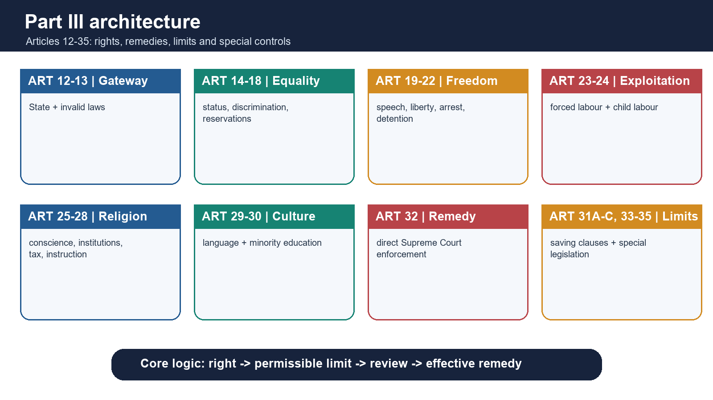

[FACT] Part III is not merely a list of entitlements. It has four interacting elements:

1. **Gateway:** Article 12 identifies the State; Article 13 invalidates inconsistent law.
2. **Substantive rights:** Articles 14-30 protect equality, freedom, labour dignity, conscience and cultural autonomy.
3. **Enforcement:** Article 32 guarantees access to the Supreme Court for Fundamental Rights; Article 226 supplies wider High Court writ power.
4. **Constitutional controls:** Articles 31A-31C, 33-35 and 358-359 define limited immunity, special legislation or Emergency consequences.

[ANALYSIS] The correct exam method is therefore:

> identify the right → identify its beneficiary and respondent → locate the exact permitted restriction → apply the judicial test → choose the remedy → state any saving or Emergency caveat.

#### Six rights and their Article spans

| Right | Articles | Core exam question |
|---|---:|---|
| Equality | 14-18 | Is the distinction rational, non-arbitrary and compatible with substantive equality? |
| Freedom | 19-22 | Which freedom/liberty is engaged, and does the limit fit the exact constitutional clause? |
| Against exploitation | 23-24 | Does coercion or prohibited child labour exist, including through private action? |
| Freedom of religion | 25-28 | Is the claim religious, denominational or secular, and which textual limit applies? |
| Cultural and educational rights | 29-30 | Is the claimant a section of citizens or a religious/linguistic minority institution? |
| Constitutional remedies | 32 | Which writ and which court can cure the constitutional injury? |

> **UPSC trap:** Articles 12-13 and 31A-35 are in Part III, but they are not separately counted among the six present Fundamental Rights.

### 02. Beneficiaries, vertical and horizontal reach, positive and negative duties

> **ANSWER-GRABBING LINE — WRITE/ADAPT IN THE EXAM (BENEFICIARIES / HORIZONTALITY):** Fundamental-right analysis must separate beneficiary from respondent: some guarantees belong only to citizens, many protect every person, and Articles 15(2), 17, 23 and 24 directly reach specified private conduct while positive duties may require State protection.

> **CONTENT CLASSIFICATION:** CORE PRELIMS + CORE MAINS

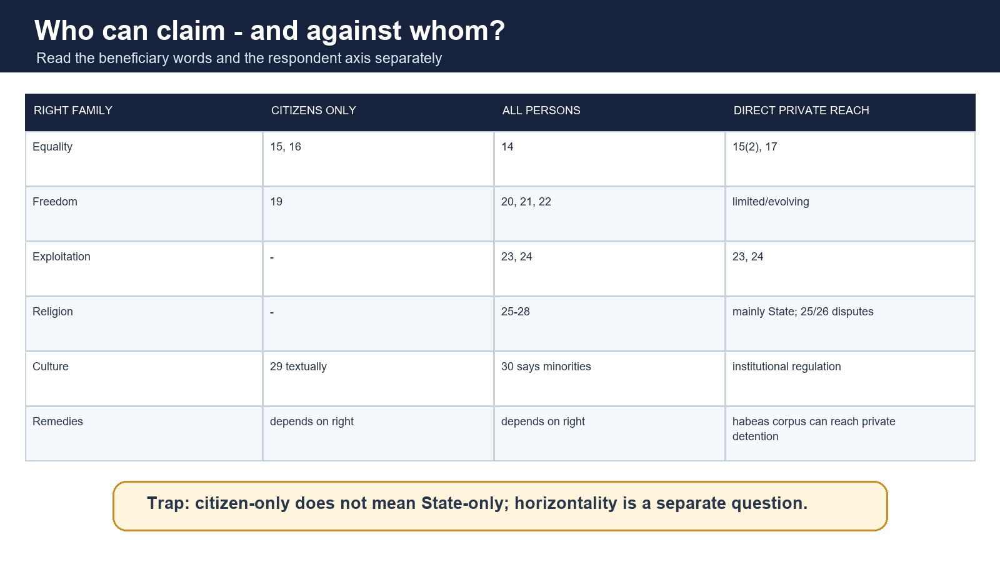

#### Citizen-only and person-protective guarantees

| Provision | Textual beneficiary | Exam-safe formulation |
|---|---|---|
| Article 14 | any person | Citizens, non-citizens and juristic persons may invoke it where applicable. |
| Article 15 | citizen / citizens | Citizen-specific; Article 15(2) also reaches specified private exclusion. |
| Article 16 | all citizens | Citizen-specific equality in public employment. |
| Article 19 | all citizens | The six freedoms are citizen-only. Companies do not become citizens, though shareholder/media claims may be framed through affected citizens. |
| Articles 20-22 | person / no person | Protect persons, subject to Article 22's enemy-alien and preventive-detention distinctions. |
| Articles 23-24 | person-oriented prohibitions | Reach State and private exploitation. |
| Articles 25-28 | all persons / denominations / institutional rules | Religious freedom is not citizen-only. |
| Article 29 | section of citizens / no citizen | Textually citizen-linked. |
| Article 30 | all minorities | The clause does not use the word citizen; standard exam lists treat it as minority/citizen-linked, but quote the text accurately. |

#### Vertical and horizontal application

- **Vertical:** the usual model is individual versus State. Articles 14, 16 and 19 primarily discipline State action.
- **Express horizontal reach:** Article 15(2) covers denial of access to specified public-facing places; Article 17 abolishes untouchability; Articles 23-24 prohibit exploitation by private actors too.
- **Remedial reach:** habeas corpus may issue against private detention; High Courts may use Article 226 against a non-State body performing a public duty.
- [LIMIT] *Kaushal Kishor v. State of Uttar Pradesh* (2023) contains important reasoning on the operation of Articles 19 and 21 beyond the State. Do not convert it into the loose proposition that every Fundamental Right now applies fully against every private person.

#### Negative and positive dimensions

- **Negative duty:** the State must not censor speech outside Article 19(2), discriminate only on prohibited grounds, or deprive liberty through unfair procedure.
- **Positive duty:** equal protection may require protection from private violence; Article 21 can require legal aid, custodial safeguards and fair investigation; Article 17 requires abolition backed by penal law.
- [ANALYSIS] Modern rights adjudication therefore asks not only, "Did the State interfere?" but also, "Did the State reasonably protect the conditions in which the right can be exercised?"

### 03. Qualified rights, reasonable restrictions and proportionality

> **ANSWER-GRABBING LINE — WRITE/ADAPT IN THE EXAM (QUALIFIED RIGHTS / PROPORTIONALITY):** Indian Fundamental Rights are qualified but not defeasible at executive will: every restriction must rest on valid law, fit the exact constitutional ground, pursue a legitimate aim and remain rational, necessary, balanced and procedurally safeguarded.

> **CONTENT CLASSIFICATION:** CORE MAINS

[FACT] Fundamental Rights are not absolute. Their qualification takes different forms:

- Article 14 permits reasonable classification but bars class legislation and arbitrariness.
- Article 19 contains six freedoms and four different restriction clauses; the grounds are closed, not illustrative.
- Articles 25-26 are expressly subject to public order, morality and health; Article 25 is also subject to other Fundamental Rights.
- Article 22 itself authorises preventive detention while imposing minimum safeguards.
- Articles 31A-31C save specified laws from specified challenges.

#### The modern review sequence

1. **Legality:** Is the restriction authorised by valid law rather than unsupported executive preference?
2. **Legitimate constitutional aim:** Does it fit the exact provision, such as Article 19(2) public order?
3. **Rational connection:** Is the measure capable of advancing that aim?
4. **Necessity:** Is a less rights-restrictive but equally effective measure available?
5. **Balancing:** Is the rights cost excessive relative to the public benefit?
6. **Procedural safeguards:** Are reasons, publication, hearing, review and time limits present?

[ANALYSIS] "Reasonable restriction" and proportionality are related but not interchangeable slogans. Always begin with the Article's text; proportionality disciplines the chosen means.

### 04. Right to property transition and the non-derogable Emergency core

> **ANSWER-GRABBING LINE — WRITE/ADAPT IN THE EXAM (PROPERTY / EMERGENCY CORE):** The Forty-fourth Amendment moved property from Part III to the constitutional guarantee in Article 300A and made Articles 20 and 21 non-derogable from an Article 359 enforcement order.

> **CONTENT CLASSIFICATION:** CORE PRELIMS + CORE MAINS

[FACT] Article 31 originally protected property as a Fundamental Right. The Forty-fourth Amendment removed Article 31 and Article 19(1)(f). Article 300A now provides: no person shall be deprived of property save by authority of law.

| Feature | Former Fundamental Right | Present Article 300A position |
|---|---|---|
| Location | Part III | Part XII |
| Beneficiary | citizen/property framework | every person |
| Direct Article 32 claim | available when Article 31/19 engaged | not merely because Article 300A is violated; ordinarily Article 226/ordinary remedies |
| Standard | Fundamental Rights scrutiny | authority of valid law; non-arbitrariness and public-law limits still matter |

[LIMIT] Calling property merely a "legal right" is incomplete. Article 300A is a **constitutional right**, though not a Fundamental Right.

[FACT] The Forty-fourth Amendment also entrenched an Emergency lesson: a Presidential order under Article 359 cannot suspend the right to move a court for enforcement of Articles 20 and 21.

> **Rapid recall:** property moved out of Part III; criminal safeguards and life/personal liberty became non-derogable under Article 359.

### 05. Article 12 - the State and the instrumentality inquiry

> **ANSWER-GRABBING LINE — WRITE/ADAPT IN THE EXAM (ARTICLE 12):** Article 12 looks beyond legal form to governmental domination: an entity may be State when its financial, functional and administrative relationship reveals pervasive governmental control, while Article 226 may separately reach a non-State body performing a public duty.

> **CONTENT CLASSIFICATION:** CORE PRELIMS + CORE MAINS

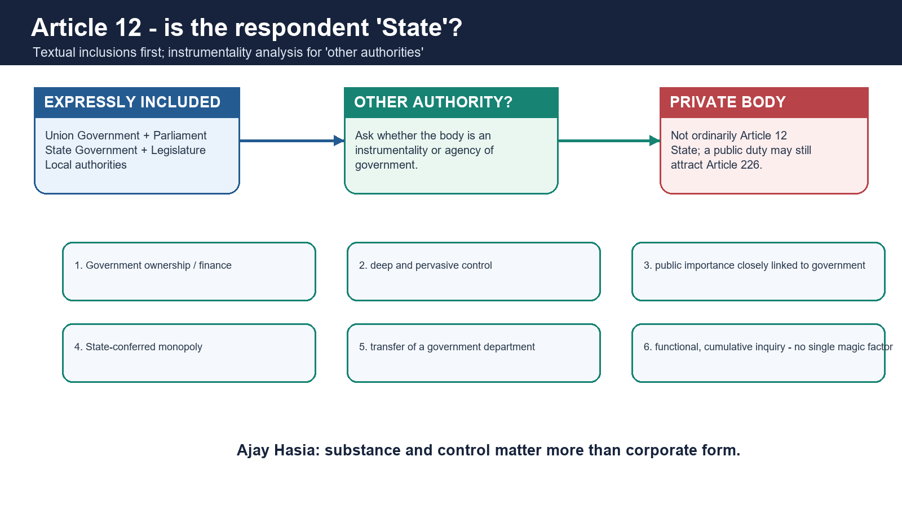

[FACT] Article 12 includes:

- Government and Parliament of India;
- Government and Legislature of each State;
- all local authorities; and
- other authorities within India or under the control of the Government of India.

#### Other authorities

[FACT] *Rajasthan Electricity Board v. Mohan Lal* rejected an unduly narrow reading tied only to sovereign functions. *R.D. Shetty* and *Ajay Hasia* developed the instrumentality/agency approach.

Relevant indicators include:

- substantial government ownership or finance;
- deep and pervasive control;
- functions of public importance closely related to governmental functions;
- State-conferred monopoly;
- transfer of a government department; and
- the cumulative factual relationship rather than the body's corporate form.

[LIMIT] No single factor is conclusive. The later approach in *Pradeep Kumar Biswas* asks whether the body is financially, functionally and administratively dominated by or under government control of a pervasive character.

#### Article 12 versus Article 226

- A body may fail the Article 12 State test yet still perform a **public duty**.
- Article 226 can reach a non-State body for the public-law element of its work.
- [ANALYSIS] Therefore, "not State under Article 12" does not always mean "immune from writ jurisdiction."

> **UPSC trap:** registration as a society or company neither automatically includes nor excludes a body from Article 12.

### 06. Article 13 - law, judicial review and the voidness doctrines

> **ANSWER-GRABBING LINE — WRITE/ADAPT IN THE EXAM (ARTICLE 13):** Article 13 converts rights into judicially enforceable limits by defining law broadly and using severability, eclipse and non-waiver, while constitutional amendments are reviewed through Article 368 and the basic-structure boundary.

> **CONTENT CLASSIFICATION:** CORE PRELIMS + CORE MAINS

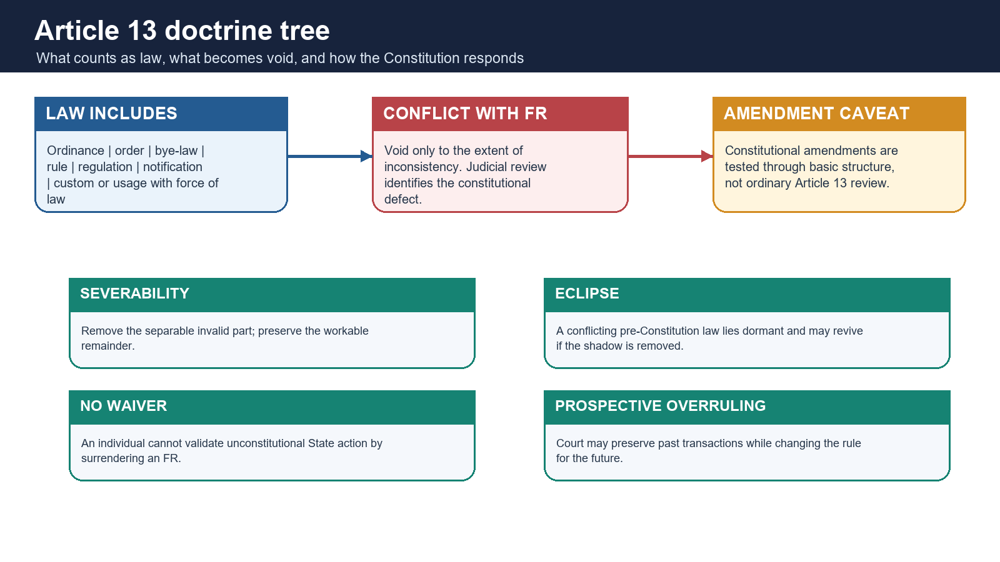

#### What "law" includes

[FACT] Article 13(3)(a) includes an ordinance, order, bye-law, rule, regulation, notification, custom or usage having in the territory of India the force of law.

#### Pre- and post-Constitution law

- Article 13(1): pre-Constitution laws are void **to the extent** of inconsistency with Fundamental Rights.
- Article 13(2): the State shall not make law taking away or abridging Fundamental Rights; contravening law is void to the extent of contravention.
- Article 13(3): defines law and laws in force.
- Article 13(4): inserted by the Twenty-fourth Amendment; Article 13 does not apply to constitutional amendments under Article 368.

#### Doctrine of severability

[FACT] If the invalid provision can be separated from the valid remainder without defeating the legislative scheme, only the offending portion falls. The phrase "to the extent of" supports limited invalidation.

**Test:** Can the remainder operate independently, and would the legislature have enacted it without the invalid part?

#### Doctrine of eclipse

[FACT] *Bhikaji Narain Dhakras* explains that a conflicting pre-Constitution law is not erased for all purposes; it lies dormant against the Fundamental Right and can revive if the constitutional shadow is removed.

[LIMIT] The classic eclipse rule chiefly concerns pre-Constitution law. A post-Constitution law made in direct violation of Article 13(2) is ordinarily void from inception to the extent of violation.

#### No waiver of Fundamental Rights

[FACT] *Basheshar Nath v. Commissioner of Income Tax* held that an individual cannot waive a Fundamental Right so as to validate unconstitutional State action. *Olga Tellis* later rejected estoppel against a Fundamental Right.

[ANALYSIS] Rights are structural limits on public power, not merely private benefits that the holder may bargain away.

#### Prospective overruling

[FACT] *I.C. Golaknath v. State of Punjab* used prospective overruling: it announced a rule for the future without unsettling past amendments. *Kesavananda Bharati* displaced Golaknath's amendment theory but retained the Indian court's capacity to calibrate temporal effect where justified.

#### Constitutional amendments and basic structure

| Stage | Proposition |
|---|---|
| *Shankari Prasad* / *Sajjan Singh* | Constitutional amendment not ordinary "law" under Article 13. |
| *Golaknath* (1967) | Amendment treated as law; Parliament could not abridge FRs; applied prospectively. |
| Twenty-fourth Amendment | Expressly affirmed amendment power and added Article 13(4). |
| *Kesavananda Bharati* (1973) | Parliament may amend every Part, including FRs, but cannot damage basic structure. |
| *Minerva Mills* (1980) | Limited amending power and harmony between Parts III and IV are basic features. |

[LIMIT] The complete amendment doctrine belongs to Polity 10. Here the exam rule is: ordinary law is tested under Article 13; constitutional amendment is tested under the basic-structure limitation.

### 07. Article 14 - twin equality, classification and anti-arbitrariness

> **ANSWER-GRABBING LINE — WRITE/ADAPT IN THE EXAM (ARTICLE 14):** Article 14 combines equality before law with equal protection: it permits reasonable classification only through intelligible differentia and rational nexus, and independently invalidates arbitrary State action.

> **CONTENT CLASSIFICATION:** CORE PRELIMS + CORE MAINS

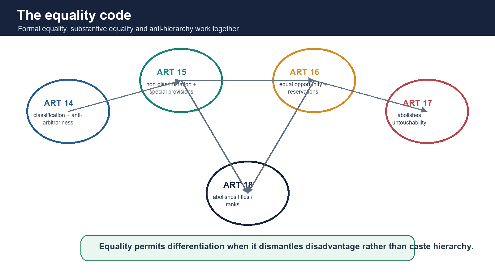

#### Twin concepts

| Concept | Source | Nature | Meaning |
|---|---|---|---|
| Equality before law | British rule-of-law tradition | negative | no special privilege; equal subjection to ordinary law |
| Equal protection of laws | US Fourteenth Amendment influence | positive | like cases treated alike; State may differentiate to correct relevant differences |

[FACT] Article 14 protects every person. It forbids **class legislation**, not all classification.

#### Reasonable classification test

1. **Intelligible differentia:** the included group must be distinguishable from the excluded group.
2. **Rational nexus:** the differentia must relate to the law's object.

[LIMIT] The classification cannot be artificial, evasive or unrelated. The object itself must be constitutionally legitimate.

#### From classification to arbitrariness

- *E.P. Royappa* treated equality and arbitrariness as sworn enemies.
- *Maneka Gandhi* linked Articles 14, 19 and 21 and required non-arbitrary, fair procedure.
- *Ajay Hasia* reinforced that arbitrary State action violates Article 14.
- *Shayara Bano* used manifest arbitrariness in reviewing legislation.

[ANALYSIS] A high-scoring answer does not abandon classification for arbitrariness. It uses both:

> classification tests the structure of differentiation; arbitrariness tests irrational, capricious or disproportionate State power even where a neat class is difficult to identify.

#### Constitutional exceptions and immunities

- President and Governors receive specified immunities under Article 361.
- Legislative speech and votes receive privileges under Articles 105 and 194.
- Foreign sovereigns/diplomats and international organisations may possess recognised immunities.
- [LIMIT] These are constitutionally or legally structured immunities, not proof that rule of law is absent.

### 08. Articles 15 and 16 - non-discrimination and protective discrimination

> **ANSWER-GRABBING LINE — WRITE/ADAPT IN THE EXAM (ARTICLES 15-16):** Articles 15 and 16 move equality from non-discrimination to substantive opportunity by prohibiting exact grounds yet authorising carefully targeted special provisions and reservation through distinct enabling clauses.

> **CONTENT CLASSIFICATION:** CORE PRELIMS + CORE MAINS

#### Article 15

[FACT] Article 15(1) bars the State from discriminating against a citizen on grounds **only** of religion, race, caste, sex, place of birth or any of them.

[FACT] Article 15(2) prevents a citizen, on those grounds only, from being subjected to disability in access to:

- shops, public restaurants, hotels and places of public entertainment; and
- wells, tanks, bathing ghats, roads and places of public resort maintained wholly/partly from State funds or dedicated to public use.

This clause has direct horizontal force.

#### Enabling clauses under Article 15

| Clause | Constitutional purpose |
|---|---|
| 15(3) | special provisions for women and children |
| 15(4) | advancement of socially and educationally backward classes, SCs and STs |
| 15(5) | admission-related special provisions in educational institutions, including private aided/unaided institutions, excluding Article 30(1) minority institutions |
| 15(6) | EWS special provisions, including reservation up to 10 per cent, for classes outside 15(4)/(5) coverage |

[FACT] Article 15(4) followed *State of Madras v. Champakam Dorairajan* and the First Amendment. Article 15(5) came through the Ninety-third Amendment. Article 15(6) came through the 103rd Amendment.

#### Article 16

[FACT] Article 16(1) guarantees equality of opportunity to citizens in public employment. Article 16(2) bars discrimination on religion, race, caste, sex, descent, place of birth, residence or any of them.

| Clause | Function |
|---|---|
| 16(3) | Parliament may prescribe residence requirements for specified employment |
| 16(4) | enables reservation for a backward class inadequately represented in State services |
| 16(4A) | enables promotion reservation with consequential seniority for SCs/STs, subject to doctrine |
| 16(4B) | allows unfilled reserved vacancies to be treated as a separate class for carry-forward |
| 16(5) | permits religion-linked office requirements in a religious/denominational institution |
| 16(6) | enables EWS reservation up to 10 per cent outside existing reserved classes |

[ANALYSIS] Articles 15(4) and 16(4) are not grudging exceptions to equality. They are textual methods of substantive equality. Yet they remain enabling powers, not an individual Fundamental Right to demand reservation in every setting.

### 09. Reservation doctrine: creamy layer, ceiling, promotion, efficiency, EWS and SC sub-classification

> **ANSWER-GRABBING LINE — WRITE/ADAPT IN THE EXAM (RESERVATION CONTROL):** Reservation is a technique of substantive equality, but its design remains evidence-based, reviewable and attentive to creamy-layer exclusion, representation, promotion conditions, backlog treatment, EWS text and administrative efficiency.

> **CONTENT CLASSIFICATION:** CORE PRELIMS + CORE MAINS

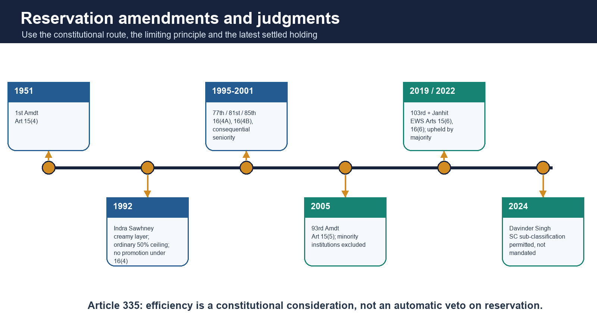

#### Indra Sawhney (1992)

[FACT] The nine-judge decision:

- upheld 27 per cent OBC reservation;
- required exclusion of the OBC creamy layer;
- treated the 50 per cent ceiling as the ordinary constitutional rule, with extraordinary situations narrowly conceived;
- held that Article 16(4) did not authorise reservation in promotion; and
- accepted sub-classification among backward classes where rationally designed.

[LIMIT] "Fifty per cent can never be crossed" is too absolute. The case described an ordinary ceiling with exceptional-space language; later constitutional amendments and EWS doctrine require precise treatment.

#### Promotion amendments and doctrine

- 77th Amendment: Article 16(4A), promotion reservation for SCs/STs.
- 81st Amendment: Article 16(4B), backlog vacancies as a separate class.
- 82nd Amendment: proviso to Article 335 permitting relaxation in qualifying marks/standards for SC/ST promotion reservation.
- 85th Amendment: consequential seniority.
- *M. Nagaraj* upheld the amendments but required constitutional discipline, including quantifiable data on inadequate representation and attention to Article 335.
- *Jarnail Singh* removed the requirement that the State prove backwardness of SCs/STs afresh, while retaining data-based inadequacy and efficiency controls.

#### Creamy layer

- [FACT] The settled Indra Sawhney creamy-layer rule directly concerns OBC reservation.
- [LIMIT] Do not automatically state that a single identical creamy-layer rule now governs every SC/ST reservation context. Concurring opinions and later debates must not be converted into a universal holding.

#### Article 335 and efficiency

[FACT] Claims of SCs/STs in services must be considered consistently with maintaining administrative efficiency. The proviso permits relaxation in qualifying marks or evaluation standards for specified promotion-reservation purposes.

[ANALYSIS] Efficiency is not a veto owned by the unreserved category. A constitutional answer should ask how representative administration, competence, training and fair standards interact.

#### EWS

[FACT] The 103rd Amendment inserted Articles 15(6) and 16(6). In *Janhit Abhiyan v. Union of India* (2022), a majority upheld:

- economic criteria as a basis for the EWS class;
- exclusion of classes already covered by SC/ST/OBC reservation; and
- the additional 10 per cent design against a basic-structure challenge.

[LIMIT] The decision was by majority, not unanimity.

#### Davinder Singh (2024)

[CURRENT] A seven-judge Bench overruled the bar created by *E.V. Chinnaiah* and held that States may sub-classify Scheduled Castes for distributing reservation benefits more effectively.

Exam-safe propositions:

1. sub-classification is **permitted**, not constitutionally mandated;
2. it cannot alter the Presidential List under Article 341;
3. it must rest on evidence of differential disadvantage/representation rather than political assertion;
4. a State cannot reserve the entire benefit for one sub-class and exclude the rest; and
5. judicial review remains available.

[LIMIT] The judgment does not authorise a State to add or delete castes from the Scheduled Castes list.

### 10. Articles 17 and 18 - anti-untouchability and anti-title guarantees

> **ANSWER-GRABBING LINE — WRITE/ADAPT IN THE EXAM (ARTICLES 17-18):** Articles 17 and 18 attack inherited civic hierarchy horizontally and symbolically: untouchability is abolished and punishable, while titles are prohibited without invalidating military, academic or properly used national distinctions.

> **CONTENT CLASSIFICATION:** CORE PRELIMS + CORE MAINS

#### Article 17

[FACT] Untouchability is abolished; its practice in any form is forbidden; enforcement of any disability arising from it is an offence punishable by law.

- It is absolute in text and operates against private persons.
- The Protection of Civil Rights Act, 1955 penalises untouchability disabilities.
- The Scheduled Castes and Scheduled Tribes (Prevention of Atrocities) Act, 1989 addresses specified caste atrocities.
- [LIMIT] "Untouchability" is understood in its historical caste-based constitutional sense, not every form of social avoidance.

[ANALYSIS] Article 17 is transformative: it does not merely restrain government classification; it constitutionally abolishes a social hierarchy and requires public enforcement.

#### Article 18

| Clause | Rule |
|---|---|
| 18(1) | State shall not confer titles except military or academic distinctions |
| 18(2) | citizen shall not accept a title from a foreign State |
| 18(3) | non-citizen holding office of profit/trust under State requires President's consent to accept foreign title |
| 18(4) | office-holder requires President's consent for present, emolument or office from foreign State |

[FACT] *Balaji Raghavan v. Union of India* (1996) held that Bharat Ratna and Padma awards are not prohibited titles, but they cannot be used as prefixes or suffixes.

> **UPSC trap:** Article 17 belongs to the Right to Equality, not the Right against Exploitation.

### 11. Article 19 - six freedoms and exact restriction grounds

> **ANSWER-GRABBING LINE — WRITE/ADAPT IN THE EXAM (ARTICLE 19):** Article 19 protects six citizen freedoms through clause-specific discipline: the State must identify the exact restriction clause and closed ground, after which reasonableness and proportionality test the means.

> **CONTENT CLASSIFICATION:** CORE PRELIMS + CORE MAINS

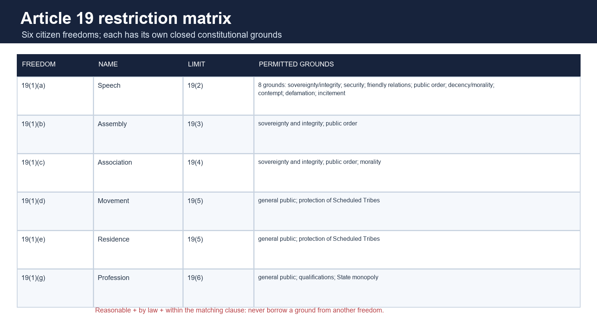

#### The six freedoms

1. Article 19(1)(a): speech and expression.
2. Article 19(1)(b): assemble peaceably and without arms.
3. Article 19(1)(c): form associations or unions or co-operative societies.
4. Article 19(1)(d): move freely throughout India.
5. Article 19(1)(e): reside and settle in any part of India.
6. Article 19(1)(g): practise any profession or carry on any occupation, trade or business.

#### Exact grounds

| Freedom | Restriction clause | Exact constitutional grounds |
|---|---|---|
| Speech | 19(2) | sovereignty and integrity of India; security of State; friendly relations with foreign States; public order; decency or morality; contempt of court; defamation; incitement to an offence |
| Assembly | 19(3) | sovereignty and integrity of India; public order |
| Association | 19(4) | sovereignty and integrity of India; public order; morality |
| Movement/residence | 19(5) | interests of general public; protection of interests of any Scheduled Tribe |
| Profession/trade | 19(6) | interests of general public; professional/technical qualifications; State monopoly |

[FACT] The restrictions must be imposed by law and be reasonable. "Offensiveness", administrative convenience or vague hurt sentiment is not an independent Article 19(2) ground.

#### Internal movement, residence and travel abroad

- Articles 19(1)(d) and (e) concern movement/residence **within India**.
- Travel abroad is protected through personal liberty under Article 21 after *Maneka Gandhi*.
- Article 19(5) expressly recognises protection of Scheduled Tribe interests.

#### Assembly and association cautions

- Assembly must be peaceful and unarmed.
- There is no Fundamental Right to strike.
- The right to form an association does not automatically include a right to government recognition or to achieve every object of the association.

#### Profession and trade

- Reasonable licensing, qualifications and health/safety regulation can be valid.
- The State may create a monopoly under Article 19(6).
- No Fundamental Right protects an inherently harmful or legally prohibited trade as though it were an ordinary occupation.

### 12. Speech, press, right to know and the First Amendment settlement

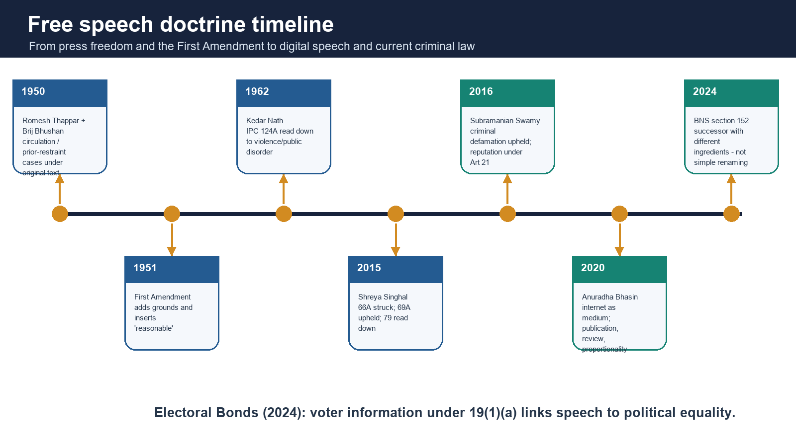

#### Press and circulation

[FACT] There is no separate press Article. Freedom of the press is derived from Article 19(1)(a).

- *Romesh Thappar v. State of Madras* (1950): circulation is part of speech; the ban failed under the original narrow Article 19(2).
- *Brij Bhushan v. State of Delhi* (1950): pre-censorship order failed under the original text.
- [LIMIT] These cases pre-date the First Amendment. Do not quote them as if present Article 19(2) lacked "public order."

#### First Amendment, 1951

[FACT] It:

- inserted the word **reasonable** before restrictions;
- added public order, friendly relations with foreign States and incitement to an offence; and
- responded to the 1950 decisions.

[FACT] "Sovereignty and integrity of India" came through the Sixteenth Amendment, 1963, not the First Amendment.

[ANALYSIS] The First Amendment both widened the State's grounds and strengthened judicial control through the reasonableness requirement.

#### Right to know

[FACT] The right to receive information necessary for democratic choice has been read into Article 19(1)(a). Candidate-disclosure cases and the Right to Information framework build on this democratic-speech logic.

[CURRENT] In the Electoral Bonds judgment (15 February 2024), the Supreme Court held that non-disclosure of political funding violated the voter's right to information. The Court also invalidated the unlimited-corporate-contribution change as manifestly arbitrary.

[ANALYSIS] The case links three constitutional ideas:

> information → informed voting → political equality and accountable government.

### 13. Sedition lineage, BNS section 152 and speech-incitement discipline

#### Kedar Nath Singh (1962)

[FACT] The Supreme Court upheld IPC section 124A only by reading it down to speech involving incitement to violence or a tendency/intention to create public disorder. Strong criticism of government, without that connection, was protected.

[LIMIT] The case did **not** strike down section 124A.

#### S.G. Vombatkere

[FACT] On 11 May 2022, the Supreme Court placed use of IPC section 124A in abeyance while reconsideration occurred. On 12 September 2023, the constitutional challenge was directed to a Bench of at least five judges.

[CURRENT] The Supreme Court's official order in Abhisar Sharma v. Union of India, 28 August 2025, issued notice only on the vires of BNS Section 152 and tagged the matter with W.P.(C) No. 720/2025. A bounded official-domain search through 28 August 2026 located no final merits disposition. The IPC has meanwhile been repealed for new offences under the new criminal-code framework.

#### Bharatiya Nyaya Sanhita section 152

[CURRENT] BNS section 152 targets purposeful/knowing acts through words, signs, visible representation, electronic communication, financial means or otherwise that:

- excite or attempt to excite secession;
- excite armed rebellion or subversive activities;
- encourage feelings of separatist activities; or
- endanger India's sovereignty, unity and integrity.

[LIMIT] It differs from IPC section 124A's language of hatred, contempt or disaffection toward government established by law. Therefore:

- "sedition was simply renamed" is inaccurate; and
- "all sedition-type criminalisation disappeared" is also inaccurate.

[ANALYSIS] Any constitutional answer should still test legality, precision, overbreadth, incitement/public-order connection and proportionality under Article 19(2).

### 14. Digital speech: Shreya Singhal, internet shutdowns and criminal defamation

#### Shreya Singhal (2015)

[FACT] The Court:

- struck down IT Act section 66A for vagueness and overbreadth;
- distinguished protected discussion and advocacy from punishable incitement;
- upheld section 69A blocking power because of its structured safeguards; and
- read down intermediary liability under section 79 so "actual knowledge" was tied to court/government process.

> **Trap:** *Shreya Singhal* did not strike down all blocking powers and did not declare the internet itself a Fundamental Right.

#### Anuradha Bhasin (2020)

[FACT] Speech under Article 19(1)(a) and trade under Article 19(1)(g), when conducted through the internet, remain constitutionally protected. The Court required:

- publication of restriction orders;
- proportionality review;
- periodic review;
- rejection of indefinite suspension; and
- careful use of section 144-type powers.

[LIMIT] The Court protected freedoms exercised **through** the internet; it did not pronounce a freestanding universal Fundamental Right to internet access.

#### Criminal defamation

[FACT] *Subramanian Swamy v. Union of India* (2016) upheld criminal defamation by balancing Article 19(1)(a) with reputation under Article 21 and the express Article 19(2) ground of defamation.

[CURRENT] The current criminal provision is BNS section 356, not the repealed IPC sections 499-500.

[ANALYSIS] A critical answer should still note the chilling effect, criminal-process burden and availability of civil remedies, while accurately stating the binding holding.

### 15. Article 20 - ex post facto law, double jeopardy and self-incrimination

> **ANSWER-GRABBING LINE — WRITE/ADAPT IN THE EXAM (ARTICLE 20):** Article 20 creates three person-protective criminal shields against retrospective penal liability, repeated prosecution-and-punishment for the same offence, and compelled testimonial self-incrimination.

> **CONTENT CLASSIFICATION:** CORE PRELIMS + CORE MAINS

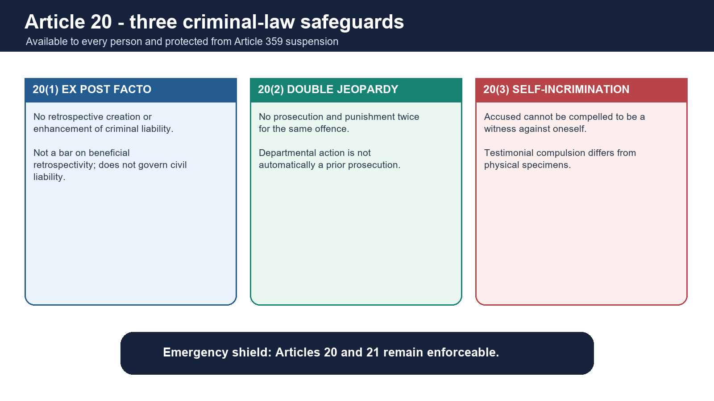

#### Article 20(1): ex post facto criminal law

- No person may be convicted for an act that was not an offence when done.
- No greater penalty may be imposed than the law authorised when the offence occurred.
- A beneficial retrospective criminal change may operate in the accused's favour.
- The clause concerns conviction and penalty, not every retrospective civil, tax or procedural law.

#### Article 20(2): double jeopardy

- Text: no person shall be prosecuted and punished for the same offence more than once.
- Both prosecution and punishment must ordinarily be present for the constitutional bar.
- Departmental proceedings are not automatically a prior criminal prosecution.
- Distinguish the wider procedural doctrines of autrefois acquit/convict under criminal law.

#### Article 20(3): self-incrimination

Three elements:

1. the person is accused of an offence;
2. compulsion exists; and
3. the person is made a witness against oneself.

[FACT] *M.P. Sharma* and *State of Bombay v. Kathi Kalu Oghad* distinguish testimonial compulsion from physical evidence such as fingerprints, specimen signatures or bodily samples. *Selvi v. State of Karnataka* treated involuntary narco-analysis, polygraph and brain-mapping techniques as violating testimonial autonomy and personal liberty.

[LIMIT] Article 20(3) is not a blanket right to suppress every material derived from the body.

### 16. Article 21 - Gopalan to Maneka: fair procedure and the dignity charter

> **ANSWER-GRABBING LINE — WRITE/ADAPT IN THE EXAM (ARTICLE 21):** Article 21 became a dignity charter when Maneka Gandhi required fair, just and reasonable procedure and linked liberty with Articles 14 and 19, enabling named protections without turning every policy aspiration into an unlimited entitlement.

> **CONTENT CLASSIFICATION:** CORE PRELIMS + CORE MAINS

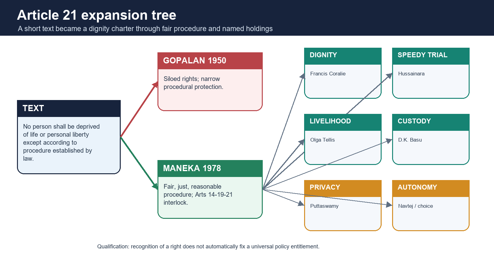

#### Text and early approach

[FACT] Article 21 protects every person: no person shall be deprived of life or personal liberty except according to procedure established by law.

- *A.K. Gopalan* (1950) read rights in separate silos and accepted a narrow procedural approach.
- *R.C. Cooper* (1970) weakened the silo theory by examining the effect of State action across rights.
- *Maneka Gandhi* (1978) completed the turn: procedure must be fair, just and reasonable, and Articles 14, 19 and 21 interlock.

[LIMIT] India did not textually replace "procedure established by law" with the American phrase "due process." The exam-safe formulation is that *Maneka* imported a due-process **standard** of fairness and non-arbitrariness.

#### Life means dignified life

[FACT] *Francis Coralie Mullin* held that life is more than animal existence and includes human dignity.

Named Article 21 anchors:

| Right/dimension | Authority | Exact proposition and limit |
|---|---|---|
| speedy trial | *Hussainara Khatoon* | unreasonable undertrial delay violates fair procedure; no universal judicial stopwatch was created |
| free legal aid | *M.H. Hoskot*, *Hussainara*, Article 39A | indigent accused must have meaningful legal assistance |
| livelihood | *Olga Tellis* | livelihood forms part of life; eviction power still survived subject to fair procedure |
| prisoner dignity | *Sunil Batra* | prisoner is not a non-person; arbitrary solitary confinement/bar fetters restricted |
| arrest safeguards/compensation | *D.K. Basu* | arrest memo, information, records, medical/counsel safeguards; public-law compensation can follow custodial violation |
| shelter | *Chameli Singh* | shelter linked to dignified life; not a judicial guarantee of a house to every claimant |
| health/emergency care | *Parmanand Katara*, *Paschim Banga* | immediate care and reasonable public-health obligations |
| clean environment | *Subhash Kumar* and environmental line | pollution-free water/air linked to life, balanced through environmental law |
| travel abroad | *Maneka Gandhi* | personal liberty includes foreign travel subject to fair lawful procedure |
| choice/marriage | *Lata Singh*, *Shafin Jahan* | adult choice, dignity and autonomy protected |
| sexual autonomy | *Navtej Singh Johar* | consensual adult same-sex intimacy protected through dignity, privacy and equality |
| reproductive autonomy | *Suchita Srivastava*, later abortion jurisprudence | bodily integrity and reproductive choice protected subject to valid law |
| passive euthanasia/living will | *Common Cause*; *Harish Rana* (2026 INSC 222) | dignified dying recognised within carefully controlled safeguards; *Harish Rana* applied them to withdrawal of CANH for an irreversibly unconscious patient, without legalising active euthanasia |

[ANALYSIS] Article 21 is a living guarantee because courts translate dignity into concrete safeguards. The qualification is equally important: named rights often secure fair process and minimum protection, not an unlimited judicially supplied welfare entitlement.

### 17. Privacy, proportionality, DNA testing and data protection

#### Puttaswamy (2017)

[FACT] A nine-judge Bench held unanimously that privacy is a Fundamental Right protected as an intrinsic part of life and personal liberty under Article 21 and as part of the freedoms guaranteed by Part III.

Privacy includes:

- bodily privacy and integrity;
- decisional autonomy;
- informational privacy;
- family, marriage, procreation and intimate choice; and
- protection against arbitrary State surveillance.

#### Privacy limitation test

An interference requires:

1. **law**;
2. **legitimate State aim**;
3. **proportionality** between means and aim; and
4. **procedural safeguards** against abuse.

#### DNA and paternity

[FACT] Compulsory DNA testing engages privacy, bodily integrity, dignity, identity and the child's interests. Courts do not order it as a routine fishing inquiry.

[CURRENT] Bharatiya Sakshya Adhiniyam, 2023 section 116 carries the conclusive presumption of legitimacy for a child born during a valid marriage or within 280 days after dissolution while the mother remains unmarried, unless non-access is shown.

[ANALYSIS] The answer balance is:

- truth and identity may justify testing in a strong case;
- the statutory legitimacy presumption and child's social dignity weigh heavily;
- less intrusive evidence must be considered;
- the order must be necessary and proportionate; and
- refusal consequences cannot be mechanically converted into forced bodily intrusion.

#### DPDP control

[CURRENT] The Digital Personal Data Protection Act, 2023 supplies a statutory framework for digital personal data processing, consent/legitimate uses, data-principal rights, data-fiduciary obligations and enforcement.

[CURRENT] Under G.S.R. 843(E), as of 21 August 2026 the definition and Data Protection Board/institutional provisions specified in the notification are operative. Section 6(9) and Section 27(1)(d) are scheduled for 13 November 2026; most substantive processing, rights, obligations and penalty provisions are scheduled for 13 May 2027. Under G.S.R. 846(E), Rules 1, 2 and 17-21 are operative, Rule 4 is scheduled after one year, and Rules 3, 5-16, 22 and 23 after eighteen months. [LIMIT] Notification is not full implementation: informational privacy remains constitutionally reviewable under Puttaswamy.

### 18. Article 21A - education as a Fundamental Right

> **ANSWER-GRABBING LINE — WRITE/ADAPT IN THE EXAM (ARTICLE 21A):** Article 21A constitutionalises free and compulsory education for children aged six to fourteen, implemented by the RTE Act while preserving the distinct Article 30 position of minority institutions.

> **CONTENT CLASSIFICATION:** CORE PRELIMS + CORE MAINS

[FACT] The Eighty-sixth Amendment inserted Article 21A: the State shall provide free and compulsory education to children aged six to fourteen in the manner determined by law.

The constitutional package also:

- recast Article 45 toward early childhood care and education below six years; and
- added Article 51A(k), a parental/guardian duty to provide educational opportunity to children aged six to fourteen.

#### Judicial and statutory sequence

- *Mohini Jain* (1992) gave education an expansive Article 21 reading.
- *Unni Krishnan* (1993) confined the enforceable core and shaped the six-to-fourteen constitutional response.
- Right of Children to Free and Compulsory Education Act, 2009 operationalises Article 21A.
- *Society for Unaided Private Schools* upheld the 25 per cent admission obligation for non-minority unaided schools.
- *Pramati Educational and Cultural Trust* protected minority institutions from that application to preserve Article 30(1).

[ANALYSIS] Article 21A demonstrates a shift from judge-developed Article 21 content to an express, age-bounded Fundamental Right implemented by statute.

### 19. Article 22 - ordinary arrest, preventive detention and the unenforced 44th Amendment clause

> **ANSWER-GRABBING LINE — WRITE/ADAPT IN THE EXAM (ARTICLE 22):** Article 22 separates ordinary arrest from preventive detention: the first carries grounds, counsel and twenty-four-hour production safeguards, while the second follows a distinct regime whose current no-Advisory-Board ceiling remains three months.

> **CONTENT CLASSIFICATION:** CORE PRELIMS + CORE MAINS

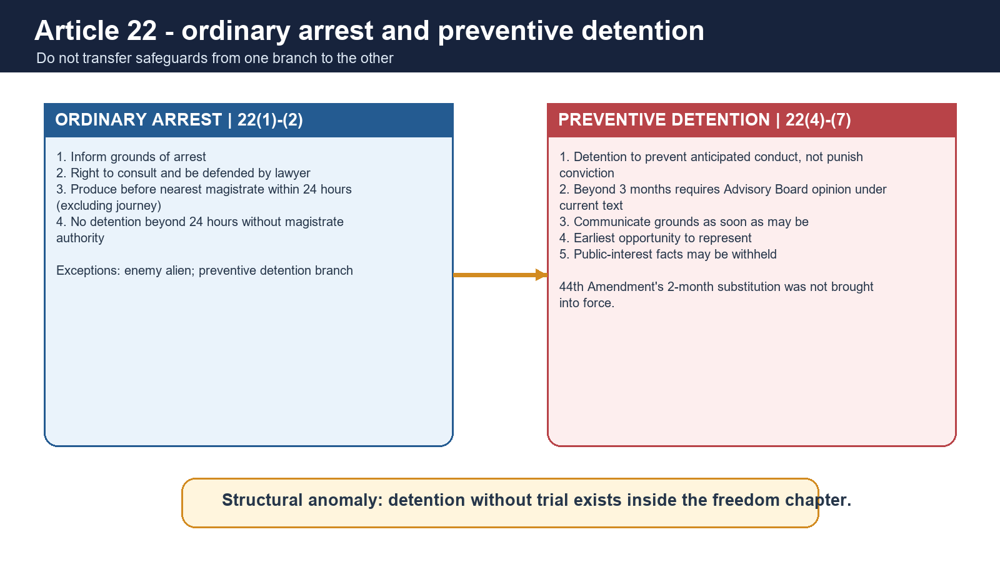

#### Ordinary arrest: Articles 22(1)-(2)

A person arrested must:

- be informed as soon as may be of the grounds;
- not be denied the right to consult and be defended by a legal practitioner of choice;
- be produced before the nearest magistrate within 24 hours, excluding journey time; and
- not be detained beyond that period without magistrate authority.

#### Exceptions under Article 22(3)

Clauses (1) and (2) do not apply to:

- an enemy alien; or
- a person arrested/detained under preventive-detention law.

[LIMIT] This does not mean preventive detainees have no constitutional protection. Clauses (4)-(7) supply a different safeguard architecture.

#### Preventive detention

- Prevents anticipated conduct rather than punishing a proved offence.
- Current constitutional text permits detention up to **three months** without Advisory Board approval.
- Beyond that, an Advisory Board must report sufficient cause, subject to parliamentary law under clauses (4)-(7).
- Grounds must be communicated as soon as may be.
- Earliest opportunity to make a representation must be given.
- Facts considered against public interest to disclose may be withheld.

#### The Forty-fourth Amendment trap

[FACT] The amendment proposed reducing the no-Advisory-Board period from three months to two months and restructuring the Board.

[CURRENT] That substitution was never brought into force. The operative constitutional period remains **three months**.

[ANALYSIS] Preventive detention is the rights chapter's deepest structural contradiction: it constitutionalises detention without trial, yet surrounds it with minimum review, communication and representation safeguards.

### 20. Articles 23-24 - exploitation, forced labour and child labour

> **ANSWER-GRABBING LINE — WRITE/ADAPT IN THE EXAM (ARTICLES 23-24):** Articles 23-24 constitutionalise labour dignity against State and private exploitation: trafficking, begar (forced unpaid labour), economically compelled forced labour and prohibited child labour attract both rights remedies and statutory enforcement.

> **CONTENT CLASSIFICATION:** CORE PRELIMS + CORE MAINS

#### Article 23

[FACT] It prohibits:

- traffic in human beings;
- begar (forced unpaid labour); and
- other similar forms of forced labour.

It binds the State and private persons and protects citizens and non-citizens.

[FACT] In *People's Union for Democratic Rights v. Union of India* (Asiad Workers), payment below the legal minimum in conditions of economic compulsion could amount to forced labour. *Bandhua Mukti Morcha* linked bonded labour abolition, dignity and State enforcement.

[FACT] Article 23(2) permits compulsory service for public purposes, but the State cannot discriminate in imposing it only on religion, race, caste or class.

#### Article 24

[FACT] No child below fourteen may be employed in a factory, mine or other hazardous employment.

Relevant statutory architecture includes:

- Child and Adolescent Labour (Prohibition and Regulation) Act, 1986 as amended in 2016;
- Bonded Labour System (Abolition) Act, 1976;
- anti-trafficking criminal provisions; and
- education protections under Article 21A and the RTE Act.

[LIMIT] Article 24's text is narrower than a complete ban on every kind of child work, while the amended statute creates broader prohibitions and defined exceptions. Keep constitutional and statutory propositions separate.

### 21. Articles 25-28 - conscience, denomination, secular regulation and principled distance

> **ANSWER-GRABBING LINE — WRITE/ADAPT IN THE EXAM (ARTICLES 25-28):** Indian religious freedom protects conscience and denominational autonomy while permitting public-order, health, morality, secular-regulation and social-reform controls; the governing model is principled distance, not either theocracy or an absolute wall.

> **CONTENT CLASSIFICATION:** CORE PRELIMS + CORE MAINS

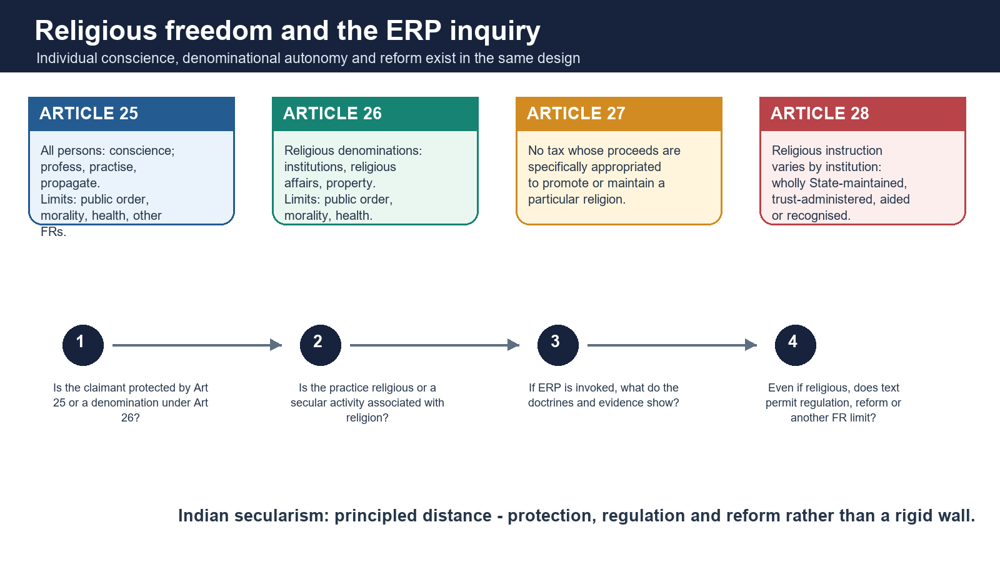

#### Article 25

[FACT] All persons have freedom of conscience and the right freely to profess, practise and propagate religion, subject to:

- public order;
- morality;
- health;
- the other provisions of Part III; and
- State regulation/reform under Article 25(2).

[FACT] Propagation is not a right to convert another person by force, fraud or allurement. *Rev. Stainislaus v. State of Madhya Pradesh* upheld that distinction.

[FACT] Carrying the kirpan is included in the profession of Sikh religion. For Article 25(2)(b), reference to Hindus includes Sikhs, Jains and Buddhists.

#### Article 26

Every religious denomination or section, subject to public order, morality and health, may:

1. establish and maintain religious/charitable institutions;
2. manage its own affairs in matters of religion;
3. own and acquire property; and
4. administer property according to law.

[LIMIT] Article 26(b) religious affairs receive stronger autonomy than secular administration of property, which remains regulable.

#### Essential Religious Practices doctrine

[FACT] *Shirur Mutt* distinguished religious matters from secular activities associated with religion and anchored essentiality in the religion's doctrines.

The exam sequence:

1. identify whether the claimant is an individual or denomination;
2. distinguish religious practice from associated secular activity;
3. examine essentiality where the doctrine is invoked;
4. apply public order, morality, health, reform and other-FR limits; and
5. state the criticism that secular judges may become arbiters of theology.

[FACT] In *Indian Young Lawyers Association* (Sabarimala, 2018), the majority invalidated the exclusion of women of the specified age group through equality, denomination and constitutional-morality reasoning.

[LIMIT] A bounded official-source check through 28 August 2026 located no final later decision that this package can securely use; it therefore states only the 2018 majority holding and does not speculate about the review/reference.

#### Article 27

[FACT] No person shall be compelled to pay taxes whose proceeds are specifically appropriated to promote or maintain a particular religion or denomination.

> **Trap:** Article 27 distinguishes a tax for religious promotion from a regulatory fee or a general tax whose expenditure may incidentally benefit religious institutions.

#### Article 28

| Institution | Religious instruction position |
|---|---|
| wholly maintained from State funds | prohibited |
| State-administered but established under endowment/trust requiring instruction | permitted |
| State-recognised | instruction/worship cannot be compelled without consent |
| State-aided | instruction/worship cannot be compelled without consent |

#### Principled-distance secularism

[ANALYSIS] Indian secularism is not a rigid wall:

- the State protects conscience and denominational autonomy;
- it may engage equally with religions;
- it may regulate secular administration; and
- it may intervene for social welfare, reform, dignity and equality.

This is why the Indian model can both protect religious practice and constitutionally dismantle untouchability or exclusion.

### 22. Articles 29-30 - cultural conservation and minority educational autonomy

> **ANSWER-GRABBING LINE — WRITE/ADAPT IN THE EXAM (ARTICLES 29-30):** Articles 29-30 protect cultural conservation, non-discriminatory admission and minority educational autonomy, but Article 29 is not minority-exclusive and Article 30 protects administration rather than maladministration.

> **CONTENT CLASSIFICATION:** CORE PRELIMS + CORE MAINS

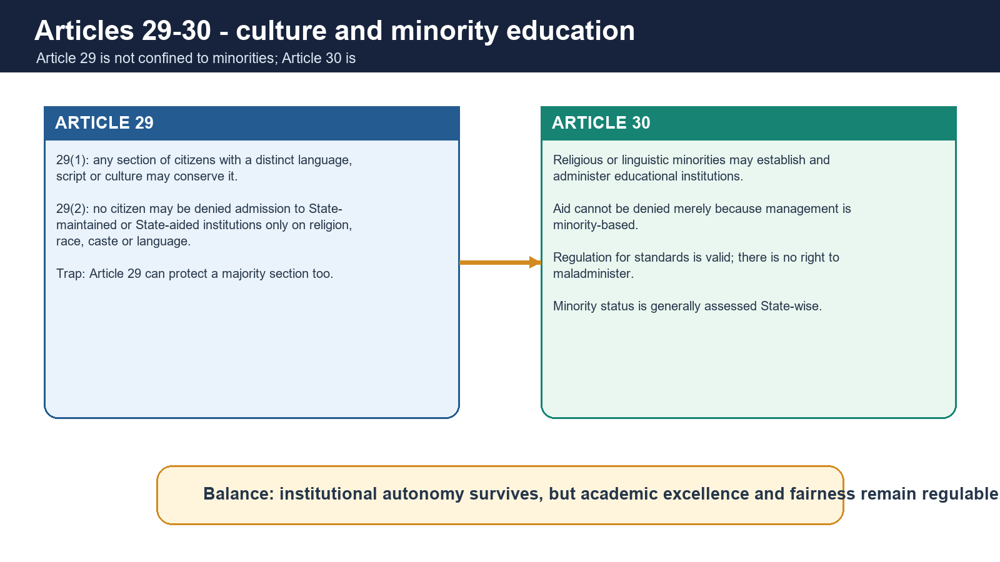

#### Article 29

- Article 29(1): any section of citizens with a distinct language, script or culture has the right to conserve it.
- Article 29(2): no citizen may be denied admission to a State-maintained or State-aided educational institution on grounds only of religion, race, caste, language or any of them.

[FACT] Article 29 is not confined to minorities. A majority section with a distinct culture/language can invoke Article 29(1).

#### Article 30

[FACT] All religious or linguistic minorities have the right to establish and administer educational institutions of their choice.

Related protections:

- acquisition law must not make the Article 30(1) guarantee illusory;
- State aid cannot discriminate merely because the institution is minority-managed; and
- regulation for academic standards, sanitation, teacher qualifications, fairness and excellence can be valid.

#### Governing cases

- *T.M.A. Pai Foundation* (2002): minority status generally assessed State-wise; administration includes meaningful institutional choice, subject to regulation.
- *P.A. Inamdar* (2005): autonomy in unaided professional institutions; no State-imposed reservation under the then framework.
- *St. Xavier's College* and *Malankara Syrian Catholic College*: regulatory excellence is valid, but the State cannot destroy the minority management's core.

> **Qualified rule:** Article 30 protects administration, not maladministration.

#### Article 29(2) and Article 30 interaction

[ANALYSIS] Aided minority institutions retain Article 30 identity but cannot treat State aid as a licence to ignore every admission-related constitutional obligation. The exact balance depends on the institution type and governing authority.

### 23. Article 32 and the five writs

> **ANSWER-GRABBING LINE — WRITE/ADAPT IN THE EXAM (ARTICLE 32 / WRITS):** Article 32 makes the Supreme Court a guaranteed Fundamental-Rights forum, while Article 226 is wider in subject matter and public-duty reach; the correct writ follows the defect—detention, unperformed duty, threatened excess, defective order or unlawful public office.

> **CONTENT CLASSIFICATION:** CORE PRELIMS + CORE MAINS

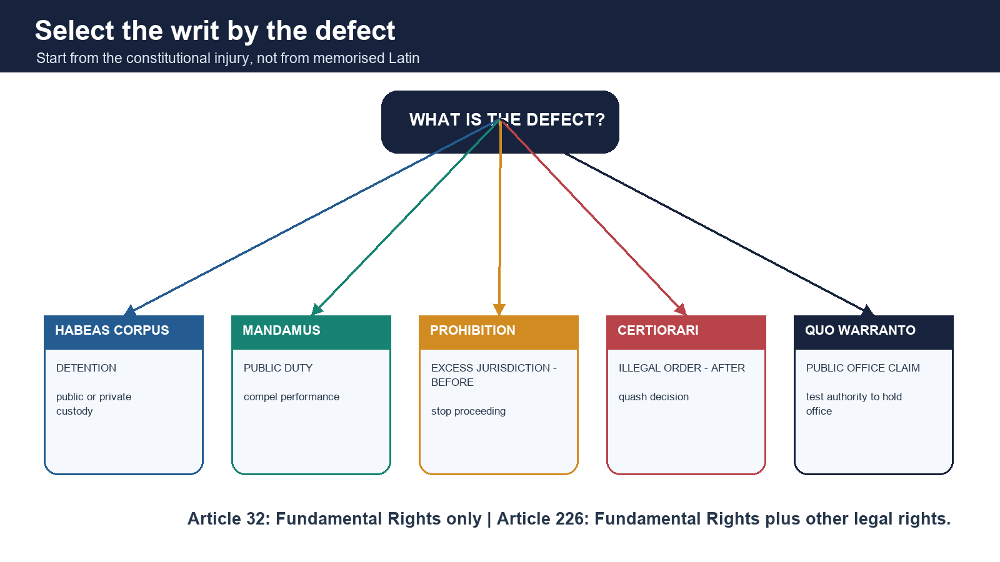

[FACT] Article 32 guarantees the right to move the Supreme Court for enforcement of Fundamental Rights. Dr B.R. Ambedkar called it the Constitution's "heart and soul."

[FACT] Judicial review and the central remedial role of Articles 32/226 form part of the basic structure, though the complete institutional doctrine belongs to Polity 18.

#### Five writs

| Writ | Defect cured | Key limits |
|---|---|---|
| Habeas corpus | unlawful detention | may issue against public or private detention; not a substitute for appeal from every competent-court custody order |
| Mandamus | failure of public duty | not ordinarily for private duty, purely discretionary power, contractual obligation, or against President/Governor in constitutional capacity |
| Prohibition | lower court/tribunal threatens jurisdictional excess | preventive; issued before the impugned proceeding/order is completed |
| Certiorari | jurisdictional error, legal error or natural-justice defect in an order | curative/quashing; reaches judicial, quasi-judicial and appropriate administrative decisions |
| Quo warranto | unlawful claim to substantive public office | applicant need not show personal injury; office must be public and legally created |

#### Article 32 versus Article 226

| Dimension | Supreme Court, Article 32 | High Court, Article 226 |
|---|---|---|
| Purpose | Fundamental Rights enforcement | Fundamental Rights plus any other legal right/public duty |
| Nature | Article 32 remedy is itself a Fundamental Right | discretionary constitutional jurisdiction |
| Territorial reach | national constitutional jurisdiction | within territorial jurisdiction/cause-of-action rules |
| Respondent | determined by right/writ | can reach public-duty bodies beyond Article 12 State |

[LIMIT] "Supreme Court cannot refuse Article 32" does not mean every petition must receive final relief despite alternate remedy, disputed facts or absence of a Fundamental Right. It means the constitutional guarantee cannot be abolished or reduced to ordinary legislative grace.

#### PIL boundary

[ANALYSIS] Relaxed standing made rights of bonded labourers, prisoners and marginalised groups practically enforceable. Detailed PIL growth, epistolary jurisdiction and institutional criticism are cross-linked to Polity 18.

### 24. Articles 31A, 31B and 31C - saving provisions without blanket immunity

> **ANSWER-GRABBING LINE — WRITE/ADAPT IN THE EXAM (SAVING / CONTROL PROVISIONS):** Articles 31A-31C, 33-35 create defined constitutional controls rather than rights-free zones: their field, purpose and legislative competence remain text-bound and subject to basic-structure review where applicable.

> **CONTENT CLASSIFICATION:** CORE PRELIMS + CORE MAINS

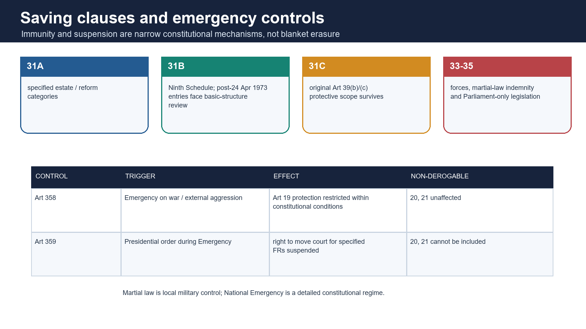

#### Article 31A

[FACT] Saves specified categories of laws, chiefly connected with acquisition of estates, management/amalgamation of property and related reform, from specified Article 14/19 challenges, subject to its text and provisos.

[LIMIT] It is not a general immunity for every property-related law.

#### Article 31B and the Ninth Schedule

[FACT] Article 31B validates listed Acts/Regulations through the Ninth Schedule notwithstanding inconsistency with Fundamental Rights.

[FACT] *I.R. Coelho v. State of Tamil Nadu* (2007) held that laws inserted after **24 April 1973** remain open to basic-structure review. The court examines whether the protected law's effect damages rights forming part of basic structure.

> **Trap:** Ninth Schedule placement is not absolute immunity after *I.R. Coelho*.

#### Article 31C

[FACT] The original Article 31C protects a law genuinely giving effect to Article 39(b) or 39(c) from Article 14/19 challenge, with the constitutional history shaped by *Kesavananda Bharati* and *Minerva Mills*.

[CURRENT] *Property Owners Association* (5 November 2024) held:

- original Article 31C survives;
- Article 39(b) can in context include privately owned resources;
- not every privately owned resource automatically becomes a material resource of the community;
- the inquiry is context-specific, considering resource nature, community impact, scarcity, concentration and common good.

[LIMIT] Do not say Article 39(b) converts all private property into community property. Do not say Article 31C protects every DPSP-implementing law; its surviving scope is Article 39(b)/(c).

### 25. Articles 33-35 and martial law

#### Article 33

[FACT] Parliament may determine the extent to which Fundamental Rights are restricted or abrogated for:

- armed forces;
- forces maintaining public order;
- intelligence/counter-intelligence organisations; and
- connected telecommunication systems,

to ensure proper discharge of duties and discipline.

[LIMIT] This power belongs to Parliament, not State legislatures.

#### Article 34

[FACT] Parliament may indemnify persons for acts done in connection with maintenance/restoration of order where martial law was in force and validate sentences or acts.

#### Article 35

[FACT] Parliament has exclusive legislative competence over specified Part III matters, including:

- residence requirements under Article 16(3);
- legislation under Articles 32(3), 33 and 34; and
- punishment for acts declared offences under Part III.

#### Martial law versus National Emergency

| Dimension | Martial law | National Emergency |
|---|---|---|
| Constitutional basis | implicit recognition through Article 34; term undefined | express Articles 352-360 framework |
| Cause | breakdown requiring military control/restoration | war, external aggression or armed rebellion |
| Area | ordinarily a disturbed locality | whole or part of India |
| Ordinary government/courts | may be displaced/restricted in area | continue under modified federal/rights rules |
| Rights effect | tied to actual military control and indemnity | Articles 358/359 apply according to text |

[LIMIT] Martial law does not automatically erase habeas corpus or create unlimited military power.

### 26. Articles 358 and 359 - two different Emergency mechanisms

> **ANSWER-GRABBING LINE — WRITE/ADAPT IN THE EXAM (EMERGENCY):** Article 358 automatically displaces Article 19 constraints only during war or external-aggression Emergency within its conditions, whereas Article 359 requires a Presidential order suspending court enforcement of specified rights and can never include Articles 20 or 21.

> **CONTENT CLASSIFICATION:** CORE PRELIMS + CORE MAINS

#### Article 358

[FACT] During a National Emergency based on **war or external aggression**, Article 19 does not restrict State power to make/take otherwise inconsistent law/executive action within Article 358's conditions.

After the Forty-fourth Amendment:

- it does not operate for an Emergency based only on armed rebellion;
- protection is tied to law related to the Emergency and the required recital; and
- the law ceases to have effect when the Emergency ends to the extent of inconsistency, except past acts.

#### Article 359

[FACT] The President may suspend the right to move a court for enforcement of specified Part III rights and suspend pending proceedings for the stated period/area.

Critical distinctions:

- the specified right is not textually deleted; its judicial enforcement is suspended;
- Articles 20 and 21 cannot be included;
- the order must identify the rights and duration/area; and
- Article 359(1A) contains law/action protections with constitutional conditions.

#### 358 versus 359

| Point | Article 358 | Article 359 |
|---|---|---|
| Trigger | Emergency based on war/external aggression | any valid National Emergency plus Presidential order |
| Rights affected | Article 19 | specified Part III rights except 20 and 21 |
| Operation | automatic within text | order-based |
| Core effect | Article 19 restriction on State power displaced | court-enforcement right suspended |

> **UPSC trap:** "All Fundamental Rights are automatically suspended in Emergency" is wrong.

### 27. Current-law dashboard - securely verified positions only

> **ANSWER-GRABBING LINE — WRITE/ADAPT IN THE EXAM (CURRENT CASES):** Current Part III analysis must be date-bounded: Electoral Bonds protects political-funding information, Davinder Singh permits evidence-based Scheduled Caste sub-classification, Property Owners preserves original Article 31C, DPDP commencement is phased, Harish Rana applies dignified-dying safeguards to withdrawal of CANH, and BNS section 152 remains under a notified constitutional challenge without a located final merits decision.

> **CONTENT CLASSIFICATION:** CURRENT-LAW CONTROL

| Development | Settled proposition used | What this package does not claim |
|---|---|---|
| Electoral Bonds, 15 Feb 2024 | political-funding information under Article 19(1)(a); scheme/enabling secrecy architecture invalid; unlimited corporate funding change manifestly arbitrary | no later political-finance reform is invented |
| Davinder Singh, 1 Aug 2024 | SC sub-classification permitted, evidence-based and reviewable; Article 341 list unchanged | no mandatory national sub-quota or unverified State percentage |
| Property Owners, 5 Nov 2024 | original Article 31C survives for 39(b)/(c); private resource inquiry context-specific | not every private asset is a material resource |
| BNS section 152, operative 1 Jul 2024 | different successor ingredients; Supreme Court issued vires notice on 28 Aug 2025 | not called a simple renaming; no later final merits disposition was located through 21 Aug 2026 |
| DPDP Act/Rules | G.S.R. 843(E) and 846(E), 13 Nov 2025, create phased commencement; only the first notified tranche is operative by 21 Aug 2026 | do not state that the whole Act/Rules are already operative |
| Sabarimala | 2018 majority holding stated | no unverified 2026 hearing/order outcome |
| Places of Worship / Waqf | omitted from current-status teaching | no reliance on unverified interim-order summaries |

### 28. Prelims close-option laboratory

| Confusion pair | Correct elimination rule |
|---|---|
| citizen-only vs all-person | 15, 16, 19, 29 are textually citizen-specific; 14, 20, 21, 22, 23-25 protect persons; quote Article 30's actual "all minorities" wording |
| State-only vs private reach | 15(2), 17, 23 and 24 directly reach private conduct |
| equality vs exploitation | untouchability is Article 17 in equality; begar (forced unpaid labour) is Article 23 |
| internal movement vs foreign travel | Article 19(1)(d)/(e) internal; travel abroad under Article 21 |
| tax vs fee under Article 27 | only specified religious-promotion tax is barred |
| propagation vs conversion | propagation does not include coercive/fraudulent conversion |
| procedure established vs due process | *Maneka* requires fair, just and reasonable procedure; do not erase the textual distinction |
| preventive detention period | three months remains operative; 44th Amendment's two-month substitution unenforced |
| Article 358 vs 359 | 358 automatic and Article 19/external Emergency; 359 order-based and cannot include 20/21 |
| property status | constitutional right under 300A, not Fundamental Right |
| awards vs titles | national awards valid; no prefix/suffix |
| Article 31B | Ninth Schedule is reviewable after 24 Apr 1973 under basic structure |
| Article 31C | surviving scope tied to 39(b)/(c), not all DPSPs |
| internet right | speech/trade through internet protected; no broad standalone holding in *Anuradha Bhasin* |
| BNS 152 | successor with different ingredients; neither simple renaming nor total disappearance |

### 29. GS-II answer architecture and qualified conclusions

> **ANSWER-GRABBING LINE — WRITE/ADAPT IN THE EXAM (FINAL VERDICT):** Fundamental Rights are neither absolute liberties nor revocable State gifts: they are transformative, judicially enforceable guarantees whose legitimacy lies in exact text, proportionate limitation, positive protection and a non-derogable rule-of-law core.

> **CONTENT CLASSIFICATION:** CORE MAINS

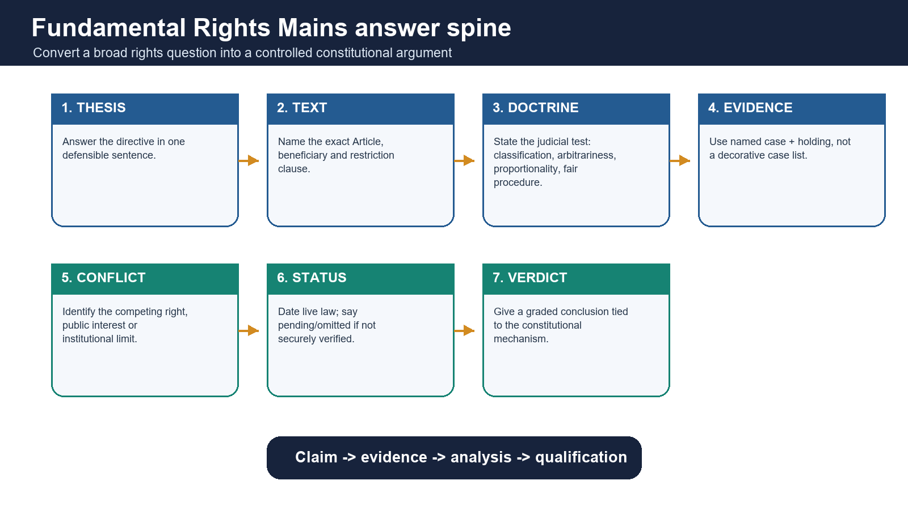

#### Universal answer spine

1. **Direct thesis:** answer whether the right is absolute, expanding, horizontal, discriminatory or adequately protected.
2. **Exact text:** Article, beneficiary, respondent and restriction clause.
3. **Doctrine:** classification, arbitrariness, proportionality, fair procedure, ERP or writ test.
4. **Named evidence:** one case for each claim, with its holding.
5. **Competing interest:** another right, public order, efficiency, reform or institutional competence.
6. **Current control:** use only securely verified dated law.
7. **Qualified verdict:** defend rights without pretending that limits disappear.

#### Mark-scaled evidence load

| Marks | Structure | Evidence density |
|---:|---|---|
| 10 | thesis → 2-3 constitutional dimensions → one limit → verdict | 2-3 Articles/cases |
| 15 | thesis → text → doctrine evolution/comparison → current application → counterpoint → verdict | 4-6 named authorities |
| 20 | thesis → architecture → multiple rights/mechanisms → institutional and implementation critique → current law → graded reform/verdict | 5-8 named authorities |

#### Qualified conclusions

- **Equality:** Indian equality is substantive and anti-hierarchical; classification and affirmative action are constitutional methods, but evidence and non-arbitrariness prevent distributive power from becoming patronage.
- **Speech:** Article 19 protects discussion and advocacy through a closed list of reasonable grounds; the modern challenge is often vague criminalisation or unreviewable process rather than absence of doctrine.
- **Article 21:** the living Constitution transformed procedure into dignity, but named rights must remain linked to enforceable standards rather than unlimited policy promises.
- **Religion:** principled distance protects conscience while preserving reform; the constitutional question is not religion versus State, but which sphere is religious, secular, unequal or harmful.
- **Remedies:** Article 32 gives rights institutional reality, while Article 226 supplies wider public-law reach; the remedy must still fit the injury.
- **Emergency:** the Forty-fourth Amendment's protection of Articles 20 and 21 is the constitutional memory of 1975-77: necessity cannot extinguish the minimum rule of law.

### 30. Eighth-edition integration: doctrine routing and Part XVI boundary

#### Article 13 doctrines in the wider interpretation map

| Doctrine | Trigger | Effect | Qualification |
|---|---|---|---|
| Severability | A separable part violates the Constitution | Invalid part falls; workable valid remainder survives | Court cannot rewrite an inseparable legislative scheme |
| Eclipse | A pre-Constitution law conflicts with a Fundamental Right | Law becomes unenforceable to the extent of conflict and may revive if the impediment is removed | Classical field is pre-Constitution law; eclipse is not repeal |
| Waiver | A person purportedly consents to unconstitutional State action | Fundamental-right limits cannot ordinarily be waived to validate the action | Do not extend the rule to every private statutory/procedural right |
| Prospective overruling | A new constitutional rule would disrupt settled transactions | Court may shape future temporal effect | Requires an express judicial choice; it is not automatic |

[LIMIT] Pith and substance, colourable legislation, territorial nexus and repugnancy are primarily
legislative-competence doctrines. Their consolidated route is
`basic/Constitutional-Interpretation-Doctrines.md` and their federal application belongs to Topic
13; they should not be presented as Article 13 doctrines.

#### Part XVI: identity of a class versus entitlement to a benefit

[FACT] Articles 341 and 342 govern specification of Scheduled Castes and Scheduled Tribes:
Presidential notification identifies the list and Parliament alone includes or excludes entries.
Article 342A separately structures the Central SEBC List and, after the 105th Amendment, State/UT
lists prepared by law for their own purposes.

[ANALYSIS] The exam sequence is:

```text
IDENTIFICATION OF CLASS
Arts 341 / 342 / 342A
          ↓
SEPARATE BENEFIT AUTHORITY
Arts 15, 16, 330, 332, 335 or valid legislation/policy
          ↓
EVIDENCE, EQUALITY AND JUDICIAL REVIEW
```

[LIMIT] A constitutional list does not itself create every reservation or benefit. Conversely,
evidence-based sub-classification for distributing benefits does not permit a State to alter the
Article 341 list.

#### Answer-writing evidence chain

- **Claim:** Indian equality distinguishes class identification from benefit design.
- **Named evidence:** Articles 341-342A identify protected classes; Articles 15(4)-(6), 16(4)-(6),
  330, 332 and 335 provide distinct benefit or representation routes.
- **Analysis:** Separating the two questions protects list integrity while permitting tailored,
  evidence-based substantive equality.
- **Qualification:** *Davinder Singh* permits evidence-based SC sub-classification for distribution;
  it does not transfer Parliament's Article 341 inclusion/exclusion power to States.

**Cross-links:** `basic/Special-Provisions-Relating-to-Certain-Classes.md` and
`basic/Constitutional-Interpretation-Doctrines.md`.

### Semantic-completeness ownership and PYQ control

- **Part III architecture:** Articles 12-13 define the State/law gateway;
  Articles 14-18 equality; 19-22 freedom and criminal-process safeguards; 23-24
  exploitation; 25-28 religion; 29-30 culture and education; Article 32 remedies;
  Articles 31A-31C and 33-35 are exact saving/competence controls.
- **Beneficiary and respondent:** Articles 15, 16, 19 and 29 are citizen-specific;
  Articles 14, 20, 21 and 25 protect persons; Article 30 speaks of minorities.
  Articles 15(2), 17, 23 and 24 have specified horizontal reach. Article 226 may
  reach public duty beyond Article 12 without rewriting the Article 12 test.
- **Equality and reservation:** reasonable classification, anti-arbitrariness,
  Articles 15(3)-(6), 16(4), 16(4A), 16(4B), 16(6), Indra Sawhney, M. Nagaraj,
  Jarnail Singh, Janhit Abhiyan and Davinder Singh must retain distinct holdings,
  evidence requirements and limits.
- **Freedoms and liberty:** quote the closed Article 19(2)-(6) grounds; distinguish
  Articles 20(1)-(3), Maneka's fair-just-reasonable procedure, Article 21A, and
  ordinary arrest from preventive detention. The uncommenced 44th-Amendment
  two-month text must not replace the operative three-month Article 22 ceiling.
- **Religion, minority rights and remedies:** preserve Article 25(2), Articles
  26-28, the distinct limbs of Articles 29-30, the five writs and the wider
  Article 226 jurisdiction. Articles 358 and 359 are not interchangeable, and
  Articles 20-21 cannot be included in an Article 359 order.
- **Current legal controls:** Electoral Bonds (2024 INSC 113), Davinder Singh
  (2024 INSC 562), Property Owners (2024 INSC 835), phased DPDP notifications
  G.S.R. 843(E)/846(E), Harish Rana (2026 INSC 222), and the 28 August 2025
  notice on BNS Section 152 are used only for their exact official propositions.
- **Four-ledger hostile audit:** every Article, beneficiary, restriction ground,
  doctrine, case, amendment, exception, remedy, emergency effect and routed
  2018-2026 demand was checked independently.
- **Verified PYQ ownership:** preserve all routed Mains and Prelims metadata;
  historical unavailable keys remain inferred, 2024 official keys stay official,
  and 2026 provisional keys are never promoted.

## BASIC MCQS / REMEDIATION

### Forty core diagnostic MCQs

> Correct options rotate strictly A → B → C → D, repeated ten times.

#### Q1. With reference to the architecture of Part III, consider the following statements:

1. Article 12 identifies bodies bound as the State for Part III purposes.
2. Article 13 makes every inconsistent law wholly non-existent for all purposes.
3. Article 32 is itself a Fundamental Right.
4. Articles 31A-31C create defined protections rather than a general immunity from judicial review.

Which of the statements given above are correct?

- A. 1, 3 and 4 only
- B. 1 and 2 only
- C. 2, 3 and 4 only
- D. 1, 2, 3 and 4

**Answer: A.**

**Explanation:** Statement 2 is overbroad: Article 13 uses "to the extent of" inconsistency, supporting severability and, for pre-Constitution law, eclipse. Article 32 is both a right and remedy. Saving clauses operate within their text and remain subject to basic-structure controls where applicable.

#### Q2. Which one of the following correctly distinguishes beneficiary and horizontal application?

- A. Every right available to all persons necessarily applies directly against private actors.
- B. Article 15 is citizen-specific, while Article 15(2) can directly prohibit specified private exclusion.
- C. Article 17 is citizen-only because caste is linked to citizenship.
- D. Article 19 protects every person but only against the State.

**Answer: B.**

**Explanation:** Beneficiary and respondent are separate axes. Article 15 protects citizens, yet clause (2) reaches specified private denial of public-facing facilities. Article 17 is absolute and horizontal. Article 19 is citizen-only.

#### Q3. A society is almost entirely financed by government, performs a function transferred from a department, and is subject to pervasive administrative control. Which is the most appropriate constitutional approach?

- A. It cannot be State because it is registered as a society.
- B. It is automatically Parliament under Article 12.
- C. Its functional, financial and administrative relationship may make it an instrumentality under Article 12.
- D. Only a statutory corporation can be an "other authority."

**Answer: C.**

**Explanation:** *Ajay Hasia* rejects form over substance. Registration as a society does not prevent Article 12 status. The inquiry is cumulative and functional; no claim that it becomes Parliament is involved.

#### Q4. Which statement about Article 13 is correct?

- A. Custom is outside "law" because it is not enacted.
- B. Constitutional amendments are ordinary laws and can be invalidated solely under Article 13(2).
- C. Every invalid part necessarily destroys the entire Act.
- D. A custom having the force of law is included, while constitutional amendments are controlled through Article 368 and basic structure.

**Answer: D.**

**Explanation:** Article 13(3)(a) expressly includes custom/usage with force of law. Article 13(4) and *Kesavananda Bharati* place constitutional-amendment review on the basic-structure route. Severability prevents automatic destruction of the entire Act.

#### Q5. A pre-Constitution transport law conflicts with a newly enforceable Fundamental Right but is not repealed. Later, the constitutional bar is validly removed. Which doctrine most directly explains possible revival?

- A. Eclipse
- B. Colourable legislation
- C. Pith and substance
- D. Territorial nexus

**Answer: A.**

**Explanation:** Under *Bhikaji Narain Dhakras*, a conflicting pre-Constitution law can remain dormant or eclipsed and revive if the shadow is removed. The other doctrines concern legislative competence.

#### Q6. Which sequence most accurately describes the amendment-Fundamental Rights relationship?

- A. Golaknath created basic structure; Kesavananda abolished amendment review.
- B. Golaknath restricted amendment of FRs prospectively; the 24th Amendment responded; Kesavananda allowed amendment subject to basic structure.
- C. The 24th Amendment deleted Article 13.
- D. Minerva Mills held that every DPSP automatically overrides every FR.

**Answer: B.**

**Explanation:** *Golaknath* used prospective overruling and treated amendment power restrictively. The 24th Amendment affirmed Article 368 power and inserted Article 13(4). *Kesavananda* established the basic-structure limit; *Minerva Mills* defended limited amendment and Part III-IV harmony.

#### Q7. A law creates two classes using an intelligible criterion, but the criterion has no relation to the law's stated objective. Under Article 14, the classification

- A. is valid because only intelligibility matters.
- B. is valid if passed unanimously.
- C. fails the rational-nexus limb.
- D. can be tested only under Article 21.

**Answer: C.**

**Explanation:** Reasonable classification requires both intelligible differentia and rational nexus to the objective. Legislative support does not cure constitutional irrationality.

#### Q8. Which one best captures the relationship between classification and arbitrariness under Article 14?

- A. Anti-arbitrariness abolished all classification analysis.
- B. Classification applies only to executive action and arbitrariness only to statutes.
- C. Any classification is arbitrary.
- D. Classification tests differentiation; anti-arbitrariness also controls capricious State power beyond a neat class comparison.

**Answer: D.**

**Explanation:** *E.P. Royappa*, *Maneka Gandhi* and later cases broaden Article 14 without discarding reasonable-classification analysis. Both tools can be relevant.

#### Q9. Which special provision is constitutionally authorised by Article 15(3)?

- A. A measure specifically advancing women and children
- B. A residence requirement for State employment made by a State executive order
- C. A title conferred for social service
- D. Preventive detention without statutory authority

**Answer: A.**

**Explanation:** Article 15(3) expressly saves special provisions for women and children. Article 16(3) residence conditions require parliamentary law; titles and detention are unrelated.

#### Q10. Which statement concerning Article 16(4) is most accurate?

- A. It creates an enforceable individual right to reservation in every service.
- B. It enables the State to reserve appointments/posts for a backward class inadequately represented in State services.
- C. It applies to private employment generally.
- D. It abolishes the Article 335 efficiency consideration.

**Answer: B.**

**Explanation:** Article 16(4) is enabling and representation-linked. It does not compel reservation everywhere, does not generally regulate private employment and must operate with the wider constitutional scheme.

#### Q11. Consider the following pairs:

1. Article 16(4A) - promotion reservation for SCs/STs
2. Article 16(4B) - separate treatment of backlog reserved vacancies
3. Article 335 proviso - relaxation in qualifying marks/standards for specified promotion reservation

How many pairs are correctly matched?

- A. Only one
- B. Only two
- C. All three
- D. None

**Answer: C.**

**Explanation:** All three are correctly matched. The provisions must still be read with *Nagaraj*, *Jarnail Singh* and data/efficiency doctrine.

#### Q12. After *State of Punjab v. Davinder Singh* (2024), which proposition is correct?

- A. States may alter the Presidential Scheduled Castes list.
- B. Every State must create a sub-quota.
- C. One sub-class may receive the entire reservation without review.
- D. Evidence-based sub-classification within Scheduled Castes is permissible, without changing the Article 341 list.

**Answer: D.**

**Explanation:** The judgment permits, but does not mandate, sub-classification. Article 341 list-making remains constitutionally distinct, and exclusionary or unsupported design remains reviewable.

#### Q13. Which combination is correct?

- A. Article 17 directly reaches private untouchability; national awards are not Article 18 titles if not used as prefixes/suffixes.
- B. Article 17 covers only government untouchability; national awards are always prohibited.
- C. Article 17 belongs to exploitation; Article 18 abolishes academic degrees.
- D. Article 17 permits caste disability if customary; Article 18 applies only to citizens.

**Answer: A.**

**Explanation:** Article 17 abolishes untouchability in any form and is horizontally enforceable. *Balaji Raghavan* upheld national awards while forbidding title-like use. Academic and military distinctions are expressly permitted.

#### Q14. Which Article 19 restriction pairing is correct?

- A. Speech - protection of Scheduled Tribes under Article 19(5)
- B. Association - sovereignty and integrity, public order and morality under Article 19(4)
- C. Movement - friendly relations with foreign States under Article 19(2)
- D. Profession - contempt of court under Article 19(6)

**Answer: B.**

**Explanation:** Restriction grounds are clause-specific. ST protection belongs to movement/residence; friendly relations and contempt belong to speech; profession uses general-public interest, qualifications and State monopoly.

#### Q15. With reference to the First Amendment's speech impact, consider the following:

1. It added public order.
2. It added friendly relations with foreign States.
3. It inserted "reasonable" before restrictions.
4. It added sovereignty and integrity of India.

Which are correct?

- A. 1 and 2 only
- B. 3 and 4 only
- C. 1, 2 and 3 only
- D. 1, 2, 3 and 4

**Answer: C.**

**Explanation:** The first three came through the First Amendment, 1951. Sovereignty and integrity was added by the Sixteenth Amendment, 1963.

#### Q16. The 2024 Electoral Bonds judgment is best understood as holding that

- A. donor privacy always defeats voter information.
- B. political funding lies wholly outside Article 19(1)(a).
- C. only the Scheme's administrative circular, not enabling provisions, was invalid.
- D. funding non-disclosure violated voter information, and unlimited corporate contribution architecture was manifestly arbitrary.

**Answer: D.**

**Explanation:** The judgment connected political-funding information to informed voting and invalidated the Scheme/enabling secrecy architecture; it also found deletion of corporate limits manifestly arbitrary.

#### Q17. Which statement accurately compares IPC section 124A and BNS section 152?

- A. Section 152 uses different ingredients focused on secession, armed rebellion, subversion, separatist activity and sovereignty/unity/integrity; "simple renaming" is inaccurate.
- B. Their wording and punishment are identical.
- C. BNS section 152 criminalises every criticism of government.
- D. Kedar Nath struck down section 124A, so no lineage exists.

**Answer: A.**

**Explanation:** The successor provision changes the protected object and ingredients and expressly covers electronic communication/financial means. *Kedar Nath* upheld the old law only through reading down.

#### Q18. Which is a correct statement of *Shreya Singhal*?

- A. It upheld section 66A but struck down section 69A.
- B. It struck down section 66A, upheld section 69A with safeguards and read down section 79.
- C. It created a standalone Fundamental Right to internet access.
- D. It held all offensive speech punishable.

**Answer: B.**

**Explanation:** Vagueness, overbreadth and chilling effect invalidated 66A. Structured blocking under 69A survived, while intermediary knowledge under 79 was narrowed.

#### Q19. *Anuradha Bhasin* most directly supports which proposition?

- A. All internet shutdowns are per se unconstitutional.
- B. The Court declared internet access an independent Fundamental Right.
- C. Speech and trade through the internet are protected; orders require publication, review and proportionality, and indefinite suspension is impermissible.
- D. Secret orders are valid if based on public order.

**Answer: C.**

**Explanation:** The Court protected constitutional freedoms exercised through the medium and imposed procedural/proportionality controls. It did not create the broad standalone right or invalidate every shutdown automatically.

#### Q20. Which statement about criminal defamation is correct?

- A. Defamation is not mentioned in Article 19(2).
- B. Reputation has no Article 21 dimension.
- C. *Subramanian Swamy* invalidated criminal defamation.
- D. *Subramanian Swamy* upheld criminal defamation; the present offence is carried by BNS section 356.

**Answer: D.**

**Explanation:** Defamation is an express Article 19(2) ground, and the Court recognised reputation within Article 21. A critical answer may question proportionality without misstating the holding.

#### Q21. Which Article 20 statement is correct?

- A. Article 20(1) bars retrospective creation/enhancement of criminal liability but permits a beneficial retrospective change.
- B. Article 20(2) bars every departmental proceeding after a criminal case.
- C. Article 20(3) applies only to citizens.
- D. Article 20 can be included in an Article 359 suspension order.

**Answer: A.**

**Explanation:** Article 20 protects all persons and is non-derogable under Article 359. Double jeopardy requires constitutional conditions; beneficial criminal retrospectivity is not the evil targeted by clause (1).

#### Q22. Which of the following is most likely protected by Article 20(3)?

- A. Compulsory fingerprinting
- B. Compelled testimonial disclosure by an accused that communicates personal knowledge against oneself
- C. Routine measurement of height
- D. Collection of a lawfully authorised physical specimen in every circumstance

**Answer: B.**

**Explanation:** The core is compelled testimonial communication by an accused. Physical evidence is not automatically testimonial, though collection methods still face Article 21/statutory safeguards.

#### Q23. Which sequence best represents Article 21's doctrinal expansion?

- A. Maneka → Gopalan → Cooper
- B. Puttaswamy → Gopalan → Maneka
- C. Gopalan's siloed approach → Cooper's effect analysis → Maneka's fair, just and reasonable procedure
- D. Golaknath → Minerva Mills → Indra Sawhney

**Answer: C.**

**Explanation:** The first sequence traces the transformation of liberty doctrine. The last concerns amendment/reservation rather than the Article 21 procedural arc.

#### Q24. A court considers compulsory prenatal DNA testing solely because one party makes a bare allegation. Which is the strongest constitutional objection?

- A. Privacy is absolute, so DNA testing can never be ordered.
- B. Paternity can never be litigated.
- C. Article 21 does not protect bodily integrity.
- D. Testing requires a strong lawful need, necessity, child-centred proportionality and attention to BSA section 116, not a roving inquiry.

**Answer: D.**

**Explanation:** Privacy can yield to proportionate lawful need, but bare allegations do not satisfy that threshold. The legitimacy presumption and the child's dignity are material.

#### Q25. Which statement about Article 21A is correct?

- A. It guarantees free and compulsory education for ages six to fourteen and is implemented principally through the RTE Act, 2009.
- B. It guarantees university education to every person.
- C. It applies only to citizens over fourteen.
- D. It was inserted by the Forty-fourth Amendment.

**Answer: A.**

**Explanation:** The Eighty-sixth Amendment inserted the age-bounded right and related changes to Article 45 and Article 51A(k).

#### Q26. Which is correct regarding preventive detention under the current constitutional text?

- A. Article 22 prohibits it completely.
- B. Three months remains the no-Advisory-Board constitutional period because the 44th Amendment's two-month substitution was not commenced.
- C. Clauses 22(1)-(2) apply identically to preventive detention.
- D. Grounds never need communication.

**Answer: B.**

**Explanation:** Preventive detention is constitutionally permitted but separately safeguarded. Communication/representation duties apply subject to the public-interest withholding clause.

#### Q27. Consider the following:

1. Article 23 applies against private forced labour.
2. Economic compulsion and payment below the legal minimum can enter forced-labour analysis.
3. Article 24 bars children below fourteen from factories, mines and hazardous employment.

How many are correct?

- A. Only one
- B. Only two
- C. All three
- D. None

**Answer: C.**

**Explanation:** All are correct. *PUDR* supplied the economic-compulsion insight; Article 24's constitutional text is hazard/factory/mine focused.

#### Q28. Which statement correctly distinguishes Articles 25 and 26?

- A. Both are subject to other Fundamental Rights in identical words.
- B. Article 26 protects only individuals, not denominations.
- C. Article 25 has no reform clause.
- D. Article 25 protects all persons and is subject to other Part III provisions; Article 26 protects denominations subject to public order, morality and health.

**Answer: D.**

**Explanation:** The textual limits differ. Article 25(2) expressly permits secular regulation and social reform; Article 26 separates religious affairs from property administration.

#### Q29. Which is the most accurate statement of the Essential Religious Practices doctrine?

- A. *Shirur Mutt* distinguishes religious affairs from secular activity and examines essentiality by reference to religious doctrines, while the approach is criticised for judicial theology.
- B. Any practice asserted by a believer is automatically essential.
- C. ERP eliminates Article 25(2) reform power.
- D. ERP originated in the Sabarimala case.

**Answer: A.**

**Explanation:** *Shirur Mutt* is the foundational authority. Essentiality is not established by assertion alone, and even religious claims face textual limits.

#### Q30. Which statement about Articles 29 and 30 is correct?

- A. Article 29(1) is available only to numerical minorities.
- B. Article 29 can protect any distinct section of citizens; Article 30 protects religious and linguistic minority educational institutions.
- C. Article 30 creates a right to maladminister.
- D. Article 29(2) applies only to unaided private institutions.

**Answer: B.**

**Explanation:** Article 29's text says any section of citizens. Article 30 autonomy coexists with regulations for standards, and Article 29(2) addresses State-maintained/aided admissions.

#### Q31. A tribunal is about to hear a matter that the statute plainly places outside its jurisdiction. Which writ is most directly preventive?

- A. Quo warranto
- B. Habeas corpus
- C. Prohibition
- D. Certiorari only after every appeal

**Answer: C.**

**Explanation:** Prohibition stops a lower court/tribunal from proceeding beyond jurisdiction. Certiorari generally quashes an order already made, though practical boundaries can overlap.

#### Q32. Which proposition about Articles 32 and 226 is correct?

- A. Article 32 enforces all legal rights; Article 226 only Fundamental Rights.
- B. Article 226 cannot reach a private body performing public duty.
- C. Article 32 and 226 are territorially and substantively identical.
- D. Article 32 is confined to Fundamental Rights, while Article 226 also reaches other legal rights and public duties.

**Answer: D.**

**Explanation:** High Court writ jurisdiction is wider in subject matter. Article 32 is itself a Fundamental Right but requires an FR injury.

#### Q33. Which statement about Article 31B is correct?

- A. Post-24 April 1973 Ninth Schedule insertions may be reviewed for damage to basic structure under *I.R. Coelho*.
- B. Every Ninth Schedule law is eternally immune.
- C. Article 31B is identical to Article 31C.
- D. Only pre-Constitution laws can enter the Ninth Schedule.

**Answer: A.**

**Explanation:** *I.R. Coelho* prevents Ninth Schedule placement from becoming a device to destroy basic-structure rights. Articles 31B and 31C use distinct mechanisms.

#### Q34. After *Property Owners Association* (2024), which proposition is correct?

- A. Article 31C was completely deleted by *Minerva Mills*.
- B. Original Article 31C survives for Article 39(b)/(c), and private resources require a context-specific material-resource inquiry.
- C. Every private home is automatically a material resource.
- D. Article 31C protects laws implementing any DPSP.

**Answer: B.**

**Explanation:** The judgment rejects both the no-private-resource extreme and the all-private-resource extreme. Surviving Article 31C is tied to 39(b)/(c).

#### Q35. Which combination is correctly matched?

1. Article 33 - Parliament may restrict rights of specified disciplined forces.
2. Article 34 - parliamentary indemnity/validation connected with martial law.
3. Article 35 - exclusive parliamentary competence over specified Part III matters.

- A. 1 only
- B. 1 and 2 only
- C. 1, 2 and 3
- D. 2 and 3 only

**Answer: C.**

**Explanation:** All are correct. State legislatures cannot exercise Article 33's special power, and martial law remains distinct from National Emergency.

#### Q36. Which statement accurately distinguishes Articles 358 and 359?

- A. Both automatically suspend all Fundamental Rights.
- B. Article 358 applies to armed-rebellion Emergency and Article 359 can suspend Articles 20-21.
- C. Article 359 deletes the specified rights permanently.
- D. Article 358 automatically concerns Article 19 in war/external-aggression Emergency; Article 359 is Presidential-order based and cannot include Articles 20-21.

**Answer: D.**

**Explanation:** The mechanisms, triggers and effects differ. Article 359 suspends court enforcement for specified rights during the order; it does not amend the constitutional text.

#### Q37. A candidate writes, "Article 27 prevents government from collecting any fee connected with a pilgrimage or religious institution." The correction is:

- A. Article 27 bars compelled taxation specifically appropriated to promote/maintain a particular religion; a regulatory or service fee is analytically different.
- B. Article 27 applies only to citizens.
- C. Article 27 abolishes all general taxation.
- D. Article 27 concerns religious instruction.

**Answer: A.**

**Explanation:** Tax versus fee and specific appropriation are the close-option controls. Religious instruction belongs to Article 28.

#### Q38. A student writes, "Article 29 is only for minorities and Article 30 prevents all regulation." The best correction is:

- A. Both Articles apply only to the majority.
- B. Article 29(1) protects any distinct section of citizens; Article 30 minority autonomy remains subject to valid excellence/fairness regulation and carries no right to maladminister.
- C. Article 30 protects cultural festivals only.
- D. Article 29(2) permits religion-only denial of admission.

**Answer: B.**

**Explanation:** The two provisions have different claimants and objects. Institutional autonomy is real but not regulatory immunity.

#### Q39. A candidate writes, "A Ninth Schedule law cannot be reviewed by any court." The correction is:

- A. Article 31B was repealed.
- B. Only Parliament may review it politically.
- C. Post-24 April 1973 insertions are open to *I.R. Coelho* basic-structure review.
- D. Every Ninth Schedule law is automatically void.

**Answer: C.**

**Explanation:** The Ninth Schedule still has protective force, but it cannot become a tunnel around basic structure.

#### Q40. A student states, "Article 359 suspends the Fundamental Right itself, including Articles 20 and 21." The correct position is:

- A. Article 359 applies only to Article 19.
- B. Article 359 operates without a Presidential order.
- C. Article 359 permanently deletes the selected rights.
- D. It suspends the right to move courts for enforcement of specified rights during the order; Articles 20 and 21 cannot be included.

**Answer: D.**

**Explanation:** Enforcement suspension, textual extinction and Article 358 operation must be kept separate.

### Eight remedial MCQs

> This separate eight-question remedial set rotates A → B → C → D twice.

#### R1. A candidate writes, "All Fundamental Rights are available only to citizens." The best correction is:

- A. Articles 14, 20, 21, 22, 23, 24 and 25 protect persons; Articles 15, 16, 19 and 29 are textually citizen-specific, while Article 30 says "all minorities."
- B. Only Article 21 protects non-citizens.
- C. Every Article protects companies in exactly the same manner.
- D. Citizenship is irrelevant throughout Part III.

**Answer: A.**

**Explanation:** The Constitution uses different beneficiary language. The remedy is textual reading, not a single memorised list detached from Article 30's wording and juristic-person limits.

#### R2. A student says, "A private organisation can never face a Fundamental Rights remedy." The correct response is:

- A. Private actors are always Article 12 State.
- B. Articles 15(2), 17, 23 and 24 have direct private reach; habeas corpus and Article 226 public-duty jurisdiction add remedial routes.
- C. Only criminal courts can examine private rights violations.
- D. Article 32 applies to every private contract.

**Answer: B.**

**Explanation:** Horizontal reach is provision-specific. A private body is not automatically State, but explicit rights and public-duty remedies prevent the absolute claim.

#### R3. A candidate writes, "The 50 per cent reservation ceiling is an exceptionless mathematical rule." The best correction is:

- A. There is no ceiling doctrine at all.
- B. The ceiling applies only to EWS.
- C. *Indra Sawhney* states an ordinary 50 per cent rule with narrow extraordinary-situation space; later constitutional amendments and *Janhit Abhiyan* require precise treatment.
- D. Every State may cross it without reasons.

**Answer: C.**

**Explanation:** Both absolutes are wrong. The ordinary ceiling remains a major doctrine, but EWS and exceptional-space jurisprudence make the word "never" unsafe.

#### R4. A student writes, "Davinder Singh requires every State to create a Scheduled Caste sub-quota." The correction is:

- A. The case abolished SC reservation.
- B. The case transferred Article 341 list power to States.
- C. The case fixed one nationwide percentage.
- D. It permits evidence-based sub-classification without mandating it or altering the Presidential List.

**Answer: D.**

**Explanation:** Permission, compulsion and list alteration are three different propositions. Only the first is the controlling holding.

#### R5. A candidate writes, "Anuradha Bhasin declared internet access a Fundamental Right." The best correction is:

- A. It protected speech and trade conducted through the internet and imposed publication, review, duration and proportionality controls; it did not make the broad standalone declaration.
- B. It removed the State's telecom-suspension power entirely.
- C. It upheld indefinite shutdowns.
- D. It concerned only Article 14.

**Answer: A.**

**Explanation:** The medium and the underlying freedom must be kept distinct. The case's procedural holdings are as important as its Article 19 analysis.

#### R6. A student writes, "BNS section 152 is just IPC section 124A with a new number." The correct response is:

- A. The provisions are unrelated to speech.
- B. Section 152 has differently framed ingredients centred on secession, armed rebellion, subversion, separatist activity and sovereignty/unity/integrity, including electronic/financial means.
- C. Section 152 punishes only violence already completed.
- D. Kedar Nath automatically invalidated it.

**Answer: B.**

**Explanation:** "Simple renaming" suppresses material textual differences. Constitutional review must address the successor provision on its own language while using settled speech principles.

#### R7. A candidate states, "Article 20(3) prevents collection of every bodily sample." The precise correction is:

- A. Article 20(3) never applies to an accused.
- B. Bodily samples are always admissible regardless of procedure.
- C. The clause targets compelled testimonial communication; physical evidence is analytically distinct but still subject to Article 21 and statutory safeguards.
- D. The clause applies only in civil suits.

**Answer: C.**

**Explanation:** *Kathi Kalu Oghad* supplies the testimonial/physical distinction. The correction avoids both overbreadth and a rights-free collection process.

#### R8. A student says, "The 44th Amendment reduced preventive detention without Advisory Board approval to two months." The correct position is:

- A. It abolished preventive detention.
- B. It increased the period to six months.
- C. It transferred the power to courts.
- D. The two-month substitution was not brought into force; the operative constitutional period remains three months.

**Answer: D.**

**Explanation:** The amendment text and its commencement are distinct. UPSC repeatedly tests this unenforced clause.

## PYQS AND ANSWER PRACTICE

### Twenty-one verified routed PYQs with independent solutions

#### Mains PYQ 1. UPSC 2019 GS-II Q5 - What can France learn from the Indian Constitution's approach to secularism? (10 marks, 150 words)

**Model answer.** **Thesis:** France can learn from India that secularism in a deeply plural society may require principled engagement with religion rather than only a strict public-private wall. **Constitutional design:** Articles 25-26 protect individual conscience and denominational autonomy, while Articles 27-28 restrain religious taxation and instruction. Yet Article 25(2) allows regulation of secular activity and social reform; Article 17 abolishes untouchability. **Analysis:** This creates three lessons for French laicite. First, equal citizenship need not erase public religious identity. Second, accommodation - such as denomination-sensitive autonomy - can coexist with public order, health, morality and equality. Third, the State may intervene asymmetrically where reform is needed, while maintaining equal concern for all faiths. *S.R. Bommai* treats secularism as a basic feature, and *Shirur Mutt* distinguishes protected religious affairs from regulable secular administration. **Qualification:** India's model also risks selective intervention and judicial theology through the ERP test; France cannot transplant it without its own constitutional history. **Conclusion:** The transferable lesson is not State religiosity, but context-sensitive neutrality: protect conscience, regulate harm and preserve equal citizenship.

**Why this earns marks:** It answers "what can learn," uses Articles 17 and 25-28 plus *Bommai* and *Shirur Mutt*, compares institutional logics, states a limitation and gives a graded conclusion.

**How to improve this answer:** In the final 30 seconds, add a two-column France/India contrast and name Article 25(2) as the reform lever; this prevents the answer from becoming a generic defence of Indian secularism.


#### Mains PYQ 2. UPSC 2021 GS-II Q13 - Analyze the distinguishing features of the notion of Right to Equality in the Constitutions of the USA and India. (15 marks, 250 words)

**Model answer.** **Thesis:** Both Constitutions reject arbitrary hierarchy, but India constitutionalises a broader, group-conscious equality code while the US model centres on the Fourteenth Amendment's Equal Protection Clause.

**Text and structure:** Article 14 combines British **equality before law** with American **equal protection of laws**. India then adds Articles 15-16 on prohibited grounds and public opportunity, Article 17's abolition of untouchability, and Article 18's abolition of titles. The US Constitution has no direct equivalent of this five-Article code.

**Substantive equality:** India expressly authorises special provisions for women/children, SEBCs, SCs/STs and EWS under Articles 15(3)-(6), and service reservation under Article 16(4)-(6). In the US, affirmative action developed judicially/statutorily under a text that does not expressly authorise group reservations; judicial review uses tiered scrutiny.

**Judicial tests:** Indian courts use intelligible differentia plus rational nexus, and since *E.P. Royappa* and *Maneka Gandhi*, anti-arbitrariness. *Indra Sawhney* adds creamy-layer and ordinary ceiling discipline; *Janhit Abhiyan* upheld EWS by majority. US doctrine differentiates strict, intermediate and rational-basis scrutiny.

**Enforcement and social context:** Article 32 itself is a Fundamental Right; Article 17 directly reaches private caste practice. US equal-protection duties generally require State action, though civil-rights statutes regulate private discrimination.

**Qualification:** Neither system is purely formal or purely group-blind; both have contested affirmative-action histories. **Conclusion:** India's distinctive feature is an explicit anti-hierarchy and protective-discrimination Constitution, whereas US equality grows from a general clause through judicial tiers.

**Why this earns marks:** It compares text, beneficiaries, affirmative action, judicial tests, private reach and remedies rather than merely listing provisions; it uses named doctrine and avoids caricaturing either system.

**How to improve this answer:** Add one concrete US authority or contemporary affirmative-action reference and compress the Indian reservation detail into a comparison table so every paragraph remains explicitly comparative.

#### Mains PYQ 3. UPSC 2022 GS-II Q2 - "Right of movement and residence throughout the territory of India are freely available to the Indian citizens, but these rights are not absolute." Comment. (10 marks, 150 words)

**Model answer.** **Thesis:** Articles 19(1)(d) and 19(1)(e) make internal mobility and settlement core incidents of common citizenship, but Article 19(5) expressly subjects both to reasonable restrictions.

**Scope:** The freedoms belong only to citizens and operate against State restriction. They promote national integration, labour mobility and personal choice. Travel abroad, however, is protected under Article 21 after *Maneka Gandhi*, not Article 19(1)(d).

**Limits:** Article 19(5) permits restrictions in the interests of the general public or for protection of Scheduled Tribes. Constitutionally supportable illustrations include carefully drawn protected-area/tribal-land regimes, public-health quarantine and proportionate public-order restrictions. A restriction still requires valid law, rational connection, necessity and non-arbitrariness under Articles 14 and 19.

**Qualification:** "General public interest" is not an executive blank cheque; excessive duration, geographic breadth or discriminatory implementation can fail reasonableness.

**Conclusion:** Movement and residence are presumptive freedoms within a single Union, while Article 19(5) preserves proportionate protection of vulnerable communities and genuine public interests.

**Why this earns marks:** It names both freedoms and the exact Article 19(5) grounds, distinguishes foreign travel, applies proportionality and ends with a qualified comment.

**How to improve this answer:** Draw the Article 19(1)(d)/(e) → Article 19(5) restriction chain and use one tribal-protection illustration; do not spend scarce words on unrelated migration policy.

#### Mains PYQ 4. UPSC 2023 GS-II Q11 - "The Constitution of India is a living instrument with capabilities of enormous dynamism. It is a constitution made for a progressive society." Illustrate with special reference to the expanding horizons of the right to life and personal liberty. (15 marks, 250 words)

**Model answer.** **Thesis:** Article 21 demonstrates constitutional dynamism: an apparently procedural guarantee has become a dignity-based charter without textual replacement.

**Doctrinal arc:** *A.K. Gopalan* read "procedure established by law" narrowly and treated rights as silos. *R.C. Cooper* shifted attention to the effect of State action. *Maneka Gandhi* then required procedure to be fair, just and reasonable and linked Articles 14, 19 and 21.

**Expanding horizons:** *Francis Coralie Mullin* made dignity central; *Hussainara Khatoon* recognised speedy trial; *M.H. Hoskot* and Article 39A support free legal aid; *Olga Tellis* protected livelihood through fair procedure; *D.K. Basu* constitutionalised arrest safeguards and compensation; environmental cases linked clean air/water to life. *K.S. Puttaswamy* unanimously protected bodily, decisional and informational privacy. *Navtej Singh Johar* applied dignity, privacy and equality to intimate autonomy.

**Progressive constitutionalism:** These holdings allow old text to answer new problems - surveillance, data processing, custodial power and reproductive choice. The later insertion of Article 21A shows that interpretation and amendment can complement each other.

**Qualification:** Expansion must retain administrable standards. *Olga Tellis*, for example, did not create immunity from eviction; recognition of livelihood required fair procedure. Courts should secure a rights floor without converting every policy aspiration into an unlimited entitlement.

**Conclusion:** Article 21 is "living" because stable text is repeatedly applied through dignity, fairness and proportionality to changing forms of power.

**Why this earns marks:** It directly illustrates dynamism through a chronological case arc, uses more than six named holdings, explains what each proves and includes an institutional limitation.

**How to improve this answer:** Use a four-step timeline—*Gopalan*, *Cooper*, *Maneka*, *Puttaswamy*—then attach only one modern application to each step; this improves chronology and stays within 250 words.

#### Mains PYQ 5. UPSC 2023 GS-II Q12 - Explain the constitutional perspectives of Gender Justice with the help of relevant Constitutional Provisions and case laws. (15 marks, 250 words)

**Model answer.** **Thesis:** The Constitution moves gender justice from formal non-discrimination to substantive equality, dignity, autonomy and institutional protection.

**Equality:** Articles 14 and 16 guarantee equality and public opportunity; Article 15(1) bars discrimination only on sex, while Article 15(3) authorises special provisions for women and children. This permits corrective measures rather than requiring gender blindness.

**Freedom and dignity:** Articles 19(1)(a)/(g) and 21 protect voice, work, bodily integrity, reproductive choice and decisional autonomy. Article 23 attacks trafficking; Article 39(d), 42 and 51A(e) strengthen equal pay, humane work/maternity relief and rejection of practices derogatory to women's dignity.

**Cases:** *Vishaka v. State of Rajasthan* converted Articles 14, 19(1)(g) and 21 plus CEDAW into binding workplace-harassment safeguards until legislation. *Anuj Garg* rejected paternalistic exclusion from employment. *Joseph Shine* invalidated adultery law that treated women as marital property. *Secretary, Ministry of Defence v. Babita Puniya* rejected stereotypes in permanent commission. *Suchita Srivastava* linked reproductive choice to liberty; *Shayara Bano* used equality/manifest arbitrariness against instant triple talaq.

**Qualification:** Protective law can itself become paternalistic; the test is whether it expands agency or fixes women into dependency. Social justice delivery and representation remain uneven despite constitutional doctrine.

**Conclusion:** Gender justice requires the State to remove direct discrimination, dismantle structural stereotypes and protect equal autonomy in public and private life.

**Why this earns marks:** It integrates Fundamental Rights, DPSPs/duty and six targeted cases, distinguishes protection from paternalism and preserves the Social Justice implementation cross-link.

**How to improve this answer:** Organise the body as equality, autonomy, work and protection, and add one implementation gap such as unpaid care or workplace enforcement to satisfy the constitutional “perspectives” demand.

#### Mains PYQ 6. UPSC 2024 GS-II Q12 - Right to privacy is intrinsic to life and personal liberty and is inherently protected under Article 21 of the Constitution. Explain. In this reference discuss the law relating to D.N.A. testing of child in the womb to establish its paternity. (15 marks, 250 words)

**Model answer.** **Thesis:** Privacy is a constitutionally protected sphere of bodily integrity, decisional autonomy and personal information, but a lawful, necessary and proportionate intrusion may be justified for a compelling adjudicatory need.

**Constitutional basis:** *K.S. Puttaswamy* (2017), a nine-judge decision, held privacy intrinsic to Article 21 and Part III. Interference requires law, legitimate aim, proportionality and safeguards. Pregnancy and DNA sampling engage the woman's bodily integrity, the child's identity/dignity and family privacy; they cannot be treated as ordinary documentary discovery.

**Paternity framework:** Bharatiya Sakshya Adhiniyam, 2023 section 116 continues the conclusive presumption that a child born during a valid marriage, or within 280 days after dissolution while the mother remains unmarried, is legitimate unless non-access is proved. The presumption protects status and social dignity. Courts have therefore required a strong prima facie foundation or eminent need before DNA testing, considered less intrusive evidence, and prioritised the child's welfare. *Bhabani Prasad Jena* cautioned against routine tests; *Nandlal Wasudeo Badwaik* shows that reliable DNA evidence can become decisive where testing is lawfully justified.

**Qualification:** Truth-seeking is legitimate, but compulsion must not become a roving inquiry. Refusal may have evidentiary consequences only within fair procedure; it does not automatically erase bodily autonomy or the statutory presumption.

**Conclusion:** Privacy does not create absolute immunity from DNA evidence; it converts the judicial question into one of legality, necessity, child-centred proportionality and safeguards.

**Why this earns marks:** It answers both halves, updates the evidence-law section, uses *Puttaswamy* plus paternity authorities, applies the four-part privacy test and gives a precise qualified conclusion.

**How to improve this answer:** State BSA section 116 and the non-access exception in a separate legal-rule sentence, then apply necessity, less-intrusive alternatives and child welfare to the prenatal facts in that order.

#### Prelims PYQ 1. UPSC 2018 GS-I Q92 - Privacy

Right to Privacy is protected as an intrinsic part of Right to Life and Personal Liberty. Which of the following in the Constitution of India correctly and appropriately imply the above statement?

- A. Article 14 and the provisions under the Amendment to the Constitution
- B. Article 17 and the Directive Principles of State Policy in Part IV
- C. Article 21 and the freedoms guaranteed in Part III
- D. Article 24 and the provisions under the 44th Amendment to the Constitution

**INFERRED ANSWER - NOT OFFICIALLY VERIFIED: C (high confidence).**

**Explanation:** *Puttaswamy* states that privacy is intrinsic to Article 21 and forms part of the freedoms guaranteed by Part III. Article 14 contributes equality review, but option A's amendment formulation is not the holding.

#### Prelims PYQ 2. UPSC 2019 GS-I Q56 - Right to marry

Which Article of the Constitution of India safeguards one's right to marry the person of one's choice?

- A. Article 19
- B. Article 21
- C. Article 25
- D. Article 29

**INFERRED ANSWER - NOT OFFICIALLY VERIFIED: B (high confidence).**

**Explanation:** Adult choice in marriage is protected through life, liberty, dignity and autonomy under Article 21, illustrated by *Lata Singh* and *Shafin Jahan*.

#### Prelims PYQ 3. UPSC 2019 GS-I Q85 - Liberty

In the context of polity, which one of the following would you accept as the most appropriate definition of liberty?

- A. Protection against the tyranny of political rulers
- B. Absence of restraint
- C. Opportunity to do whatever one likes
- D. Opportunity to develop oneself fully

**INFERRED ANSWER - NOT OFFICIALLY VERIFIED: D (high confidence).**

**Explanation:** Constitutional liberty is not mere absence of restraint or licence; it creates the protected sphere in which personality and capacity can develop consistently with others' equal freedom.

#### Prelims PYQ 4. UPSC 2020 GS-I Q4 - Untouchability

Which one of the following categories of Fundamental Rights incorporates protection against untouchability as a form of discrimination?

- A. Right against Exploitation
- B. Right to Freedom
- C. Right to Constitutional Remedies
- D. Right to Equality

**INFERRED ANSWER - NOT OFFICIALLY VERIFIED: D (high confidence).**

**Explanation:** Article 17 lies within Articles 14-18, the Right to Equality. Article 23, not Article 17, addresses begar (forced unpaid labour) and forced labour.

#### Prelims PYQ 5. UPSC 2021 GS-I Q79 - Privacy Article

'Right to Privacy' is protected under which Article of the Constitution of India?

- A. Article 15
- B. Article 19
- C. Article 21
- D. Article 29

**INFERRED ANSWER - NOT OFFICIALLY VERIFIED: C (high confidence).**

**Explanation:** Privacy is intrinsic to Article 21 and Part III. Some privacy applications also engage Article 19, but the requested Article is 21.

#### Prelims PYQ 6. UPSC 2021 GS-I Q82 - Judicial custody

With reference to India, consider the following statements:

1. Judicial custody means an accused is in the custody of the concerned magistrate and such accused is locked up in police station, not in jail.
2. During judicial custody, the police officer in charge of the case is not allowed to interrogate the suspect without the approval of the court.

Which of the statements given above is/are correct?

- A. 1 only
- B. 2 only
- C. Both 1 and 2
- D. Neither 1 nor 2

**INFERRED ANSWER - NOT OFFICIALLY VERIFIED: B (high confidence).**

**Explanation:** Judicial custody ordinarily places the accused in jail under judicial authority, not a police station, so statement 1 is false. Police interrogation during judicial custody requires court permission, making statement 2 correct.

#### Prelims PYQ 7. UPSC 2021 GS-I Q83 - Parole

With reference to India, consider the following statements:

1. When a prisoner makes out a sufficient case, parole cannot be denied because it becomes a matter of right.
2. State Governments have their own Prisoners Release on Parole Rules.

Which of the statements given above is/are correct?

- A. 1 only
- B. 2 only
- C. Both 1 and 2
- D. Neither 1 nor 2

**INFERRED ANSWER - NOT OFFICIALLY VERIFIED: B (high confidence).**

**Explanation:** Parole is ordinarily discretionary and governed by applicable prison/parole rules; it is not an automatic Fundamental Right. Prisons are a State subject and States maintain their own rule frameworks.

#### Prelims PYQ 8. UPSC 2021 GS-I Q85 - Unguided discretion

A legislation which confers on the executive or administrative authority an unguided and uncontrolled discretionary power in the matter of application of law violates which one of the following Articles?

- A. Article 14
- B. Article 28
- C. Article 32
- D. Article 44

**INFERRED ANSWER - NOT OFFICIALLY VERIFIED: A (high confidence).**

**Explanation:** Uncanalised discretion is arbitrary and violates Article 14's equality/non-arbitrariness guarantee.

#### Prelims PYQ 9. UPSC 2021 GS-I Q92 - Right to Property

What is the position of the Right to Property in India?

- A. Legal right available to citizens only
- B. Legal right available to any person
- C. Fundamental Right available to citizens only
- D. Neither Fundamental Right nor legal right

**INFERRED ANSWER - NOT OFFICIALLY VERIFIED: B (high confidence).**

**Explanation:** Article 300A protects "no person," so it is not citizen-only. The technically fuller description is a constitutional right, not a Fundamental Right; among the options, B is correct.

#### Prelims PYQ 10. UPSC 2021 GS-I Q96 - Bharat Ratna and Padma Awards

Consider the following statements:

1. Bharat Ratna and Padma Awards are titles under Article 18(1).
2. Padma Awards, instituted in 1954, were suspended only once.
3. The number of Bharat Ratna Awards is restricted to a maximum of five in a particular year.

Which of the above statements are not correct?

- A. 1 and 2 only
- B. 2 and 3 only
- C. 1 and 3 only
- D. 1, 2 and 3

**INFERRED ANSWER - NOT OFFICIALLY VERIFIED: D (high confidence).**

**Explanation:** National awards are not prohibited titles (*Balaji Raghavan*); Padma awards were suspended in more than one period; and Bharat Ratna regulations do not set a five-per-year maximum (the conventional annual cap is three). All three statements are incorrect.

#### Prelims PYQ 11. UPSC 2022 GS-I Q18 - Mandamus and Quo Warranto

With reference to the writs issued by the Courts in India, consider the following statements:

1. Mandamus will not lie against a private organisation unless it is entrusted with a public duty.
2. Mandamus will not lie against a Company even though it may be a Government Company.
3. Any public-minded person can be a petitioner to move the Court to obtain the writ of Quo Warranto.

Which of the statements given above are correct?

- A. 1 and 2 only
- B. 2 and 3 only
- C. 1 and 3 only
- D. 1, 2 and 3

**INFERRED ANSWER - NOT OFFICIALLY VERIFIED: C (high confidence).**

**Explanation:** Mandamus can reach a private body entrusted with public duty and can reach a government company where public duty exists, so statement 2 is false. Quo warranto uses relaxed standing because it protects the public character of an office.

#### Prelims PYQ 12. UPSC 2023 GS-I Q31 - Due Process

In essence, what does 'Due Process of Law' mean?

- A. The principle of natural justice
- B. The procedure established by law
- C. Fair application of law
- D. Equality before law

**INFERRED ANSWER - NOT OFFICIALLY VERIFIED: A (moderate-to-high confidence).**

**Explanation:** Due process in essence requires fair hearing, impartiality and non-arbitrary procedure - the principles of natural justice. Option C is close but less doctrinally precise; *Maneka Gandhi* reads fairness into Article 21's procedure-established formulation.

#### Prelims PYQ 13. UPSC 2023 GS-I Q40 - Reservation and efficiency

Consider the following statements:

Statement I: The Supreme Court has held in some judgments that reservation policies made under Article 16(4) would be limited by Article 335 for maintenance of efficiency of administration.

Statement II: Article 335 defines the term 'efficiency of administration'.

Which one of the following is correct?

- A. Both are correct and II correctly explains I
- B. Both are correct but II does not explain I
- C. I is correct but II is incorrect
- D. I is incorrect but II is correct

**INFERRED ANSWER - NOT OFFICIALLY VERIFIED: C (high confidence).**

**Explanation:** Article 335 supplies the efficiency consideration but does not define "efficiency of administration." The Court has used it in reservation doctrine, so I is true and II false.

#### Prelims PYQ 14. UPSC 2024 GS-I Q76 - Right to Privacy

Under which of the following Articles of the Constitution of India has the Supreme Court placed the Right to Privacy?

- A. Article 15
- B. Article 16
- C. Article 19
- D. Article 21

**OFFICIAL LOCAL UPSC KEY VERIFIED: D.**

**Explanation:** The local official Set-A key records Q76 as D. *Puttaswamy* placed privacy intrinsically within Article 21 and Part III.

#### Prelims PYQ 15. UPSC 2026 GS-I Q54 - Article 13 and custom

'X' was addressing a seminar on the meaning of the term 'law' under Article 13. X explained that law included ordinances, orders, rules and regulations, but was not convinced that custom or usage having the force of law was included. 'Y' maintained that such custom or usage was included. Select the correct conclusion:

- A. X is correct, including on non-inclusion of custom
- B. Y's view that law includes custom is incorrect
- C. The views of both X and Y are correct
- D. Only Y's view is correct

**PROVISIONAL 2026 KEY - NOT OFFICIAL: D.**

**Explanation:** Article 13(3)(a) expressly includes custom or usage having in India the force of law. X's examples are correct, but X's rejection of custom is wrong; Y alone is correct. The local Set-A provisional key records Q54 as D.

### Nine original solved Mains models

#### OQ1. Fundamental Rights are qualified guarantees, not absolute liberties. Explain the constitutional method by which India limits and protects them. (10 marks, 150 words)

**Model answer.** **Thesis:** Part III protects liberty through structured limitation: government must point to constitutional text, valid law and a reasonable means, while courts preserve an enforceable core.

**Architecture:** Article 14 permits classification only through intelligible differentia and rational nexus and independently bars arbitrariness after *E.P. Royappa*. Article 19 supplies a closed list of restriction grounds - for example, speech can be limited only within Article 19(2), not for mere offensiveness. Articles 25-26 expressly recognise public order, morality and health; Article 25 also yields to other Fundamental Rights and reform under clause (2).

**Judicial control:** *Maneka Gandhi* requires fair, just and reasonable procedure; *Puttaswamy* adds legality, legitimate aim, proportionality and safeguards. Article 32 guarantees a direct constitutional remedy, while Article 226 is wider.

**Qualification:** Special clauses such as 31A-31C and Emergency Articles 358-359 narrow review or enforcement only within their own conditions; Articles 20 and 21 remain protected from Article 359.

**Conclusion:** Indian rights are neither absolute nor gifts of government: their limits are constitutionally enumerated, reasoned and judicially reviewable.

**Why this earns marks:** It explains a method rather than listing rights, uses Articles 14, 19, 25, 32, 31A-C and 358-359 plus three cases, and closes with the qualified proposition asked.

**How to improve this answer:** Open with the five-step validity test—beneficiary, respondent, exact ground, proportionality, remedy—and apply it to one short hypothetical instead of listing additional rights.

#### OQ2. Article 13 makes judicial review practical through a family of doctrines. Discuss severability, eclipse and waiver. (10 marks, 150 words)

**Model answer.** **Thesis:** Article 13 invalidates law "to the extent" of inconsistency, allowing courts to protect rights without mechanically erasing an entire legal order.

**Severability:** If the offending provision can be removed and the remainder remains workable and legislatively intended, only the invalid portion falls. This gives operational meaning to "to the extent of."

**Eclipse:** Under *Bhikaji Narain Dhakras*, a pre-Constitution law inconsistent with a Fundamental Right lies dormant against that right rather than becoming dead for every purpose; it may revive if the constitutional shadow is removed. The classic rule does not automatically revive a post-Constitution law void under Article 13(2).

**No waiver:** *Basheshar Nath* and *Olga Tellis* reject individual surrender or estoppel as a means to validate unconstitutional State action. Fundamental Rights are public limits on power, not merely private benefits.

**Qualification:** Constitutional amendments follow the Article 368/basic-structure route after Article 13(4) and *Kesavananda Bharati*.

**Conclusion:** The doctrines combine rights supremacy with legal continuity and calibrated remedies.

**Why this earns marks:** It defines all three doctrines, distinguishes pre/post-Constitution law, explains rationale and links amendment review without drifting into the whole basic-structure chapter.

**How to improve this answer:** Add a compact pre-Constitution/post-Constitution comparison for eclipse and state that severability turns on legislative intent and workability; these are the two most likely examiner discriminators.

#### OQ3. Preventive detention is a constitutional anomaly within the Right to Freedom. Examine. (10 marks, 150 words)

**Model answer.** **Thesis:** Article 22 simultaneously constitutionalises detention without trial and attempts to civilise it through minimum procedural safeguards.

**Anomaly:** Preventive detention responds to anticipated conduct, unlike punitive detention after adjudication. Article 22(3) excludes preventive detainees from the ordinary clauses requiring counsel and magistrate production within 24 hours. This sits uneasily with *Maneka Gandhi*'s fair-procedure principle and Article 21 liberty.

**Safeguards:** Articles 22(4)-(7) cap detention without Advisory Board approval at the presently operative three months; require communication of grounds as soon as may be; and provide the earliest opportunity to represent, while allowing public-interest withholding. Parliament and States legislate within their distribution-of-power fields.

**Implementation concern:** vague grounds, delayed communication and repetitive detention orders can make review formal rather than effective.

**Qualification:** The Forty-fourth Amendment's proposed two-month substitution was never commenced, so asserting two months as current law is wrong.

**Conclusion:** Preventive detention remains constitutionally valid but legitimate only as an exceptional, narrowly construed and rigorously reviewed power.

**Why this earns marks:** It answers "anomaly," contrasts punitive/preventive detention, names exact safeguards and the unenforced amendment trap, and offers a constitutionally grounded verdict.

**How to improve this answer:** Use a punitive-versus-preventive detention table and explicitly separate Article 22(1)-(2) from 22(4)-(7); reserve the final line for the uncommenced two-month trap.

#### OQ4. India's reservation jurisprudence seeks substantive equality but is controlled by evidence, limits and administrative efficiency. Analyse. (15 marks, 250 words)

**Model answer.** **Thesis:** Reservation is a constitutional technique of equal opportunity, not a departure from equality; its legitimacy depends on identifying disadvantage and under-representation without converting enabling power into unreviewable allocation.

**Constitutional basis:** Articles 15(4)-(6) authorise educational/special provisions for SEBCs, SCs/STs and EWS; Articles 16(4), 16(4A), 16(4B) and 16(6) address appointment, promotion/backlog and EWS. Article 335 adds the efficiency consideration.

**Judicial controls:** *Indra Sawhney* upheld OBC reservation, required creamy-layer exclusion, set the ordinary 50 per cent ceiling and excluded promotion from Article 16(4). The 77th, 81st, 82nd and 85th Amendments rebuilt promotion/backlog tools. *M. Nagaraj* required data on inadequate representation and attention to efficiency; *Jarnail Singh* removed the need to re-prove SC/ST backwardness but retained inadequacy/efficiency discipline.

**New dimensions:** *Janhit Abhiyan* upheld the 103rd Amendment's EWS design by majority. *Davinder Singh* (2024) permitted evidence-based SC sub-classification to reach the most disadvantaged, without allowing States to alter Article 341 lists or mandating sub-quotas.

**Assessment:** Data prevents political assertion from replacing constitutional need; creamy layer guards capture; Article 335 requires capable administration. Yet "efficiency" cannot mean preserving historically exclusionary institutions.

**Conclusion:** Reservation serves substantive equality when targeted, evidence-based, reviewable and combined with education/training rather than treated as either permanent patronage or an anti-merit exception.

**Why this earns marks:** It follows claim → provisions → amendment/case evidence → what each controls → qualification, includes 2024 law and gives a balanced understanding of efficiency.

**How to improve this answer:** Add a clause map of Articles 15(4)-(6) and 16(4), (4A), (4B), (6), then connect each case to one control—creamy layer, ceiling, data, efficiency or sub-classification.

#### OQ5. India's freedom of speech is protected through a structured test, not an absolute slogan. Discuss with special reference to digital speech and political information. (15 marks, 250 words)

**Model answer.** **Thesis:** Article 19(1)(a) presumptively protects expression, press circulation and democratic information, while Article 19(2) allows only eight enumerated, reasonable and law-based grounds.

**Historical settlement:** *Romesh Thappar* and *Brij Bhushan* invalidated circulation/pre-censorship restraints under the original text. The First Amendment added public order, friendly relations and incitement, but also inserted "reasonable"; the Sixteenth Amendment later added sovereignty and integrity.

**Doctrinal test:** *Kedar Nath* saved old IPC section 124A only by confining it to incitement to violence/public disorder. *Shreya Singhal* struck section 66A for vagueness, overbreadth and chilling effect, protected discussion/advocacy short of incitement, upheld section 69A and read down section 79.

**Digital process:** *Anuradha Bhasin* protected speech/trade through the internet and required published orders, proportionality, periodic review and no indefinite suspension; it did not create a standalone internet right.

**Political information:** *Association for Democratic Reforms* (2024) invalidated Electoral Bond secrecy because voters need political-funding information under Article 19(1)(a), linking transparency with political equality.

**Current criminal law:** BNS section 152 is a differently drafted successor focused on secession, rebellion, subversion and sovereignty; calling it a mere renaming obscures the new constitutional inquiry.

**Conclusion:** Speech protection succeeds when grounds remain closed and State process is precise, published, proportionate and reviewable.

**Why this earns marks:** It uses the historical sequence, exact doctrinal holdings, digital procedure, electoral transparency and current BNS control, while correcting two common overstatements.

**How to improve this answer:** Quote the eight Article 19(2) grounds as a closed list in a margin box and explicitly distinguish the old section 124A interim position from the live Section 152 challenge.

#### OQ6. Article 21 has transformed the Supreme Court into a guarantor of dignity, but its expansion also raises institutional concerns. Critically examine. (15 marks, 250 words)

**Model answer.** **Thesis:** Article 21's expansion is the Constitution's strongest dignity achievement, but the Court must distinguish enforceable minimums from policy administration.

**Transformation:** *Gopalan*'s narrow, siloed procedure yielded to *R.C. Cooper* and *Maneka Gandhi*, which required fair, just and reasonable law and linked Articles 14, 19 and 21. *Francis Coralie* made dignity central. *Hussainara* and *Hoskot* secured speedy trial/legal aid; *D.K. Basu* imposed arrest safeguards and compensation; *Sunil Batra* protected prisoners; *Olga Tellis* recognised livelihood; environmental cases protected clean air/water.

**Autonomy:** *Puttaswamy* recognised bodily, decisional and informational privacy through legality, legitimate aim, proportionality and safeguards. *Navtej Singh Johar* and reproductive-choice cases applied dignity to intimate autonomy. Article 21A's later insertion shows amendment can crystallise judicially identified needs.

**Institutional concern:** Expansive declarations may lack budget, statutory detail or monitoring capacity. A right to livelihood, shelter or health can become rhetorically unlimited if detached from a concrete duty, responsible institution and remedy. *Olga Tellis* itself allowed eviction subject to fair procedure, illustrating remedial restraint.

**Assessment:** Courts are institutionally strongest at stopping coercion, requiring reasons, removing discrimination and enforcing emergency minima; legislatures/executives should design distributive systems above that floor.

**Conclusion:** Article 21 should remain a dynamic dignity floor, not an unbounded judicial policy code.

**Why this earns marks:** It presents both achievement and concern, supplies eight named authorities, explains remedial limits and gives an institutional rather than ideological criticism.

**How to improve this answer:** Prioritise six rights with one named authority each and add a short enforceability test—duty-bearer, minimum core and remedy—before the institutional-restraint conclusion.

#### OQ7. Religious freedom in India combines protection, regulation and reform. Critically examine the Essential Religious Practices doctrine within this model. (20 marks, 250 words)

**Model answer.** **Thesis:** Articles 25-26 create neither a theocratic privilege nor a strict separation wall; they protect conscience and denominational affairs while allowing public-order limits, secular regulation and social reform. ERP is the judiciary's contested device for drawing that boundary.

**Constitutional design:** Article 25 protects all persons, subject to public order, morality, health, other Fundamental Rights and Article 25(2) regulation/reform. Article 26 protects denominations in religious affairs but permits lawful regulation of property administration. Articles 27-28 restrain religious taxation and instruction.

**ERP origin and use:** *Shirur Mutt* distinguished religious matters from secular activities and referred essentiality to religious doctrines. The doctrine prevents every associated activity from claiming immunity. *Durgah Committee* introduced a narrower judicial filter; later cases often asked courts to determine theological centrality. In *Sabarimala* (2018), the majority rejected the exclusion practice through denomination, equality and constitutional-morality reasoning.

**Defence:** ERP preserves a protected religious core while enabling reform and preventing commercial/administrative practices from escaping law.

**Criticism:** Secular judges may become theologians; essentiality can freeze religion, privilege texts over lived practice and avoid the more transparent question of harm/proportionality.

**Better approach:** First classify individual/denominational claims and religious/secular activity; then apply explicit text, competing rights, harm, reform authority and proportionality. Essentiality should not substitute for the Constitution's express limits.

**Conclusion:** ERP is useful as a threshold but constitutionally legitimate only when disciplined by equality, dignity and institutional humility.

**Why this earns marks:** It covers all four religion Articles, origin/evolution/application, defence and criticism, and proposes a text-first test rather than a slogan.

**How to improve this answer:** Add a three-column ERP defence/criticism/replacement-test table and avoid stating the Sabarimala review proceedings as finally settled beyond the 2018 majority holding.

#### OQ8. "Article 32 is the heart and soul of the Constitution, but Article 226 is the wider remedial jurisdiction." Examine. (20 marks, 250 words)

**Model answer.** **Thesis:** Article 32 gives Fundamental Rights guaranteed access to the Supreme Court; Article 226 gives High Courts a wider subject-matter and public-duty reach. They are complementary pillars of judicial review.

**Article 32:** It is itself a Fundamental Right and authorises writs for enforcement of Part III. Ambedkar's "heart and soul" description reflects direct access, while *L. Chandra Kumar* and basic-structure doctrine protect judicial review from exclusion. The Supreme Court's jurisdiction is original but not exclusive.

**Article 226:** High Courts may issue writs for Fundamental Rights **and any other purpose**, including ordinary legal rights and public duties. Territorial/cause-of-action proximity and fact-sensitive supervision often make the High Court the effective first constitutional court. A non-State body performing a public duty may be reached even when Article 12 status fails.

**Writ logic:** Habeas corpus cures unlawful detention, including private detention; mandamus compels public duty; prohibition stops jurisdictional excess; certiorari quashes defective orders; quo warranto protects public office with relaxed standing.

**Qualifications:** Article 32 is not a general appeal over every illegality; an FR injury is essential. High Court relief is discretionary and may consider alternate remedy, delay or disputed facts, though these rules are not absolute bars in rights cases.

**PIL contribution:** Relaxed standing enabled bonded-labour and prisoner claims, but institutional detail belongs to the Supreme Court/PIL chapter.

**Conclusion:** Article 32 constitutionalises the right to a remedy; Article 226 decentralises and broadens public-law justice. Weakening either would impair basic structure.

**Why this earns marks:** It explains "heart and soul" and "wider" separately, uses the five writs and public-duty reach, states limits and preserves the cross-link boundary.

**How to improve this answer:** Separate Article 32 entitlement from Article 226 discretion in the opening diagram, and give one fact-pattern for each writ so the answer demonstrates remedial selection rather than memorisation.

#### OQ9. Part III reconciles rights with social revolution and constitutional emergency, but not without tension. Evaluate with reference to Articles 31A-31C, 33-35 and 358-359. (20 marks, 250 words)

**Model answer.** **Thesis:** The Constitution protects individual freedom while preserving defined space for redistribution, disciplined services and emergency action; legitimacy depends on narrow text, judicial review and a non-derogable core.

**Social-revolution clauses:** Article 31A saves specified reform categories from Article 14/19 attack. Article 31B and the Ninth Schedule protect listed laws, but *I.R. Coelho* subjects post-24 April 1973 insertions to basic-structure review. Article 31C protects genuine implementation of Article 39(b)/(c). *Property Owners Association* (2024) confirmed its survival while rejecting the claim that every private asset is automatically a material resource.

**Institutional discipline:** Article 33 lets Parliament restrict rights of armed/public-order/intelligence forces for discipline. Article 34 permits parliamentary indemnity connected with martial law; Article 35 reserves specified Part III legislation to Parliament. These are competence and necessity clauses, not rights-free zones.

**Emergency:** Article 358 automatically displaces Article 19 constraints only during war/external-aggression Emergency and within post-44th conditions. Article 359 requires a Presidential order suspending court enforcement of specified rights. Articles 20 and 21 cannot be included.

**Tensions:** Saving clauses can shield coercive redistribution; discipline can suppress dissent; emergency power can normalise exceptional rule. The answers are relation-to-purpose, recital, temporality, proportionality and basic-structure review.

**Conclusion:** Part III reconciles transformation and necessity not by trusting the State, but by enumerating exceptional powers and keeping their boundaries judicially enforceable.

**Why this earns marks:** It integrates every requested Article family, uses *I.R. Coelho* and *Property Owners*, distinguishes martial law/Emergency and gives a mechanism-based evaluation.

**How to improve this answer:** Use three mini-headings—redistribution, disciplined services, Emergency—and end each with its review control; explicitly state that Article 359 suspends enforcement, not the right text itself.

## OPTIONAL ADVANCED DEPTH — NOT REQUIRED FOR A CORE ANSWER

> **Optional:** The Core above is independently paper-complete. This section is for deeper 15/20-mark reasoning and unfamiliar hypotheticals.

#### A. Equality as anti-subordination, not merely consistency

[ANALYSIS] Formal equality asks whether similarly situated persons receive the same rule. Anti-subordination asks whether law entrenches a hierarchy such as caste, sex or disability. Articles 15(3)-(6), 16(4)-(6) and 17 show that the Constitution does not treat social power as irrelevant.

**Advanced use:** Reservation is strongest when defended as redistribution of effective opportunity and institutional voice, not as a permanent arithmetic exception to merit.

**Qualification:** Anti-subordination cannot eliminate evidence, tailoring, periodic review or Article 335.

#### B. Proportionality and the danger of conclusory balancing

[ANALYSIS] "Balance rights and security" earns few marks unless decomposed:

1. What exact constitutional ground is available?
2. Is the measure suitable?
3. Is there a less restrictive alternative?
4. Are duration, publication and review controlled?
5. Who bears error costs?

*Puttaswamy* and *Anuradha Bhasin* make proportionality operational. The danger is judicial subjectivity if courts announce balance without showing each step.

#### C. Horizontality and State protective obligations

[ANALYSIS] Direct horizontality makes private actors constitutional respondents. Indirect horizontality requires the State, through legislation and adjudication, to protect rights in private relationships.

Examples:

- Article 17 directly invalidates caste disability.
- Article 23 directly prohibits forced labour.
- *Vishaka* used Articles 14, 19(1)(g) and 21 to fill a statutory vacuum around workplace sexual harassment.
- Privacy disputes between individuals often operate through evidence, family, labour or data statutes rather than a simple Article 32 petition.

[LIMIT] A constitutional right does not automatically constitutionalise every private dispute.

#### D. Positive obligations and institutional competence

[ANALYSIS] Article 21 may require emergency medical treatment, legal aid, prison safeguards or investigation. Courts are strongest at setting minimum standards, ordering reasons and ensuring non-discrimination; they are weaker at designing budgets or running institutions continuously.

**Answer refinement:** defend a judicially enforceable floor while leaving policy choice above that floor to accountable institutions.

#### E. Transformative constitutionalism

[ANALYSIS] Articles 17, 23 and 25(2)(b) reveal a Constitution intended to transform society, not merely preserve a neutral marketplace of rights. *Navtej Singh Johar* and gender-justice jurisprudence use dignity, equality and constitutional morality to challenge inherited social domination.

[LIMIT] Constitutional morality must be tied to text, structure and rights; it cannot become a judge's free-floating personal morality.

#### F. Rights, DPSPs and the Article 31C boundary

[ANALYSIS] Parts III and IV are complementary: rights prevent coercive means while DPSPs supply distributive ends. *Minerva Mills* treats harmony as basic structure. *Property Owners Association* makes the current boundary precise: Article 31C protects genuine 39(b)/(c) implementation, but the State cannot label every private asset a community resource.

Cross-link: detailed DPSP design belongs to Polity 08.

#### G. Emergency constitutionalism and constitutional memory

[ANALYSIS] The post-Emergency Constitution did not make every right non-derogable. Instead, it:

- narrowed Article 358 to external Emergency;
- protected Articles 20 and 21 from Article 359;
- required tighter relation/recital controls; and
- retained judicial review of the Emergency architecture.

The advanced point is institutional: a Constitution proves its resilience when it controls the State precisely when ordinary politics is weakest.

#### H. A novel-hypothetical method

For a new speech, surveillance, reservation, religious-practice or detention law:

1. classify the right and beneficiary;
2. locate State/private/public-duty status;
3. identify the exact textual restriction or enabling clause;
4. apply the controlling judicial test;
5. compare less restrictive alternatives;
6. check reasons, hearing, publication, duration and review;
7. identify saving/Emergency clauses;
8. state whether current litigation is settled, pending or deliberately omitted; and
9. conclude with the narrowest constitutionally supportable outcome.

## CONSOLIDATED REGISTER NOTES

#### Part III master map

| Block | Function |
|---|---|
| 12 | State definition |
| 13 | inconsistent laws void; judicial review |
| 14-18 | equality code |
| 19-22 | freedoms, criminal safeguards, life/liberty, education, arrest/detention |
| 23-24 | exploitation prohibitions |
| 25-28 | religion |
| 29-30 | culture and minority education |
| 32 | Supreme Court remedy |
| 31A-31C | saving clauses |
| 33-35 | disciplined forces, martial law, Parliament-only laws |

- Present rights = 6; originally 7.
- Property: removed from Part III by 44th Amendment → Article 300A constitutional right for every person.
- FR workflow: beneficiary → respondent → right → exact limit → doctrine → remedy → saving/Emergency caveat.
- Qualified, justiciable and amendable only subject to basic structure.

#### Beneficiary and horizontal-reach drill

- Citizen-specific text: Articles 15, 16, 19, 29.
- All-person text: Articles 14, 20, 21, 22, 23, 24, 25.
- Article 30 says "all minorities"; do not falsely quote "citizens."
- Direct private reach: 15(2), 17, 23, 24.
- Habeas corpus can reach private detention.
- Article 226 can reach a non-State body performing public duty.
- Negative right = State must not interfere unlawfully.
- Positive obligation = State may need to protect, investigate or supply minimum safeguards.

#### Qualification and proportionality

- A restriction needs valid law + exact constitutional ground + reasonableness.
- Proportionality: legitimate aim → suitability → necessity/less restrictive alternative → balancing → safeguards.
- Do not begin with "balance"; begin with the Article's actual text.
- Procedure controls: reasons, publication, hearing, time limit and review.

#### Article 12 rapid test

- Express: Union Government/Parliament; State Government/Legislature; local authorities.
- Other authority: financial, functional and administrative domination; public importance; monopoly; transferred department.
- Cases: *R.D. Shetty*, *Ajay Hasia*, *Pradeep Kumar Biswas*.
- Form not decisive: society/company can be State.
- Not Article 12 State may still face Article 226 public-duty writ.

#### Article 13 and doctrine grid

- Law includes ordinance, order, bye-law, rule, regulation, notification, custom/usage with force of law.
- 13(1): pre-Constitution law void to inconsistency.
- 13(2): State cannot make abridging law.
- Severability: remove separable invalid part.
- Eclipse: pre-Constitution law dormant, potentially revivable.
- Waiver: FR cannot validate unconstitutional State action - *Basheshar Nath*, *Olga Tellis*.
- Prospective overruling: *Golaknath* applied new rule forward.
- Amendment route: 24th Amendment + Article 13(4); *Kesavananda* basic structure; *Minerva Mills* limited power/harmony.
- Competence doctrines such as pith and substance, territorial nexus and repugnancy belong to the
  federal doctrine route, not the Article 13 validity grid.

#### Part XVI identification-benefit distinction

- Articles 341/342: President specifies SC/ST lists; Parliament alone includes/excludes.
- Article 342A: Central SEBC List plus State/UT lists after the 105th Amendment.
- List status identifies a class; Articles 15/16/330/332/335 or valid law separately authorise a
  benefit, representation or service measure.
- *Davinder Singh* sub-classification does not amend the Article 341 list.

#### Article 14 equality code

- Equality before law = British, negative, no privilege.
- Equal protection = American, positive, like treatment in like circumstances.
- Classification test = intelligible differentia + rational nexus.
- Article 14 forbids class legislation, not classification.
- Anti-arbitrariness: *E.P. Royappa* → *Maneka Gandhi* → *Ajay Hasia*.
- Manifest arbitrariness review: *Shayara Bano*.
- Classification tests differentiation; arbitrariness tests capricious power.

#### Article 15 register

- Prohibited grounds: religion, race, caste, sex, place of birth - discrimination **only** on these.
- 15(2): shops/restaurants/hotels/public entertainment + wells/tanks/ghats/roads/public resorts; horizontal.
- 15(3): women/children.
- 15(4): SEBC/SC/ST advancement; First Amendment after *Champakam*.
- 15(5): educational admissions incl private aided/unaided; Article 30(1) minority institutions excluded.
- 15(6): EWS incl up to 10 per cent.

#### Article 16 and reservation mechanism

- 16(1): citizen equal opportunity in public employment.
- 16(2) adds descent and residence to barred grounds.
- 16(3): Parliament may prescribe residence.
- 16(4): backward class + inadequate representation; enabling, not compulsory.
- 16(4A): SC/ST promotion reservation.
- 16(4B): backlog separate class.
- 16(5): religious office.
- 16(6): EWS.

#### Reservation cases and amendments

- *Indra Sawhney*: OBC 27 per cent upheld; creamy layer; ordinary 50 per cent ceiling; no promotion under 16(4).
- 77th: 16(4A); 81st: 16(4B); 82nd: Article 335 proviso; 85th: consequential seniority.
- *M. Nagaraj*: amendments upheld; data/inadequacy/efficiency discipline.
- *Jarnail Singh*: no fresh proof of SC/ST backwardness; inadequacy and efficiency retained.
- Article 335: claims consistent with efficiency; efficiency not a veto.
- 103rd Amendment: 15(6), 16(6).
- *Janhit Abhiyan*: EWS upheld by majority, not unanimously.
- *Davinder Singh* (1 Aug 2024): SC sub-classification permitted, evidence-based, not mandated; Article 341 list unchanged; no total exclusion of remaining classes.

#### Articles 17-18 anti-hierarchy notes

- Article 17: untouchability abolished in any form; private reach; PCR Act 1955; SC/ST PoA Act 1989.
- Historical caste practice, not every social avoidance.
- Article 18: no titles except military/academic; foreign-title and foreign-present controls.
- *Balaji Raghavan* (1996): Bharat Ratna/Padma not titles; no prefix/suffix.
- Trap: untouchability = equality, not exploitation.

#### Article 19 exact matrix

| Freedom | Limit |
|---|---|
| speech 19(1)(a) | 19(2): sovereignty/integrity; security; friendly relations; public order; decency/morality; contempt; defamation; incitement |
| assembly 19(1)(b) | 19(3): sovereignty/integrity; public order |
| association 19(1)(c) | 19(4): sovereignty/integrity; public order; morality |
| movement/residence 19(1)(d)/(e) | 19(5): general public; ST protection |
| profession 19(1)(g) | 19(6): general public; qualifications; State monopoly |

- Citizens only.
- Movement/residence = internal India; foreign travel under Article 21.
- Assembly peaceful/unarmed; no FR to strike.
- Association does not guarantee recognition/success.
- Grounds cannot be borrowed across clauses.

#### Speech doctrine timeline

- *Romesh Thappar* (1950): circulation; original Article 19(2).
- *Brij Bhushan* (1950): pre-censorship; original text.
- First Amendment (1951): public order + friendly relations + incitement + "reasonable."
- 16th Amendment (1963): sovereignty/integrity.
- *Kedar Nath* (1962): section 124A upheld only through incitement/violence/public-disorder reading.
- *S.G. Vombatkere*: 11 May 2022 abeyance; 12 Sep 2023 larger-Bench referral; no unverified later final claim.
- BNS 152 from 1 Jul 2024: secession/armed rebellion/subversion/separatism/sovereignty-unity-integrity; electronic/financial means; not simple renaming.

#### Press, digital speech and information

- No separate press Article; derives from 19(1)(a).
- Right to know under democratic speech.
- Electoral Bonds, 15 Feb 2024: voter funding information under 19(1)(a); secrecy scheme/enabling provisions invalid; unlimited corporate funding change manifestly arbitrary.
- *Shreya Singhal*: 66A struck; discussion/advocacy/incitement; 69A upheld; 79 read down.
- *Anuradha Bhasin*: speech/trade through internet; orders published/reviewed/proportionate; no indefinite suspension; not standalone internet-right holding.
- *Subramanian Swamy*: criminal defamation upheld; reputation Article 21; current BNS section 356.

#### Article 20 three shields

- 20(1): no retrospective offence or enhanced penalty; beneficial retrospectivity allowed.
- 20(2): no prosecution **and punishment** twice for same offence.
- 20(3): accused + compulsion + testimonial communication against self.
- Physical samples distinct from testimonial compulsion - *Kathi Kalu Oghad*.
- Involuntary narco/polygraph/brain mapping - *Selvi*.
- All persons; Article 359 cannot suspend enforcement.

#### Article 21 doctrinal arc

- *Gopalan*: narrow, siloed.
- *R.C. Cooper*: effect over object; silos weaken.
- *Maneka*: fair, just, reasonable procedure; 14-19-21 interlock.
- Say "due-process standard," not textual American substitution.
- *Francis Coralie*: dignity.
- *Hussainara*: speedy trial.
- *Hoskot*: legal aid.
- *Olga Tellis*: livelihood + fair procedure, not no-eviction right.
- *Sunil Batra*: prisoner rights.
- *D.K. Basu*: arrest safeguards + compensation.
- *Parmanand Katara/Paschim Banga*: emergency care.
- Environmental cases: clean air/water.
- Travel abroad: *Maneka*.
- Choice/marriage: *Lata Singh*, *Shafin Jahan*.
- Sexual autonomy: *Navtej*.
- Reproductive autonomy: *Suchita Srivastava*.
- Qualification: rights floor, not unlimited judicial welfare code.

#### Privacy, DNA and data control

- *Puttaswamy* (2017), nine judges: privacy intrinsic to Article 21 + Part III.
- Dimensions: body, decision, information, family/intimacy.
- Test: legality → legitimate aim → proportionality → safeguards.
- DNA: bodily integrity + truth/identity + child's dignity.
- BSA 2023 section 116: legitimacy presumption; rebuttal through non-access.
- DNA order: strong prima facie/eminent need; less intrusive evidence; no fishing inquiry.
- *Bhabani Prasad Jena*: caution; *Nandlal Badwaik*: reliable DNA can matter when lawfully obtained.
- DPDP Act/Rules: G.S.R. 843(E) and 846(E) notified phased commencement; only the first tranche is operative by 21 Aug 2026.

#### Article 21A education

- 86th Amendment: free/compulsory education, ages 6-14.
- Article 45: early childhood below 6.
- Article 51A(k): parent/guardian opportunity duty.
- *Mohini Jain* → *Unni Krishnan* → Article 21A.
- RTE Act 2009.
- *Society for Unaided Private Schools*: 25 per cent obligation upheld for non-minority unaided schools.
- *Pramati*: minority-institution protection.

#### Article 22 arrest and detention

- Ordinary arrest: grounds; counsel; nearest magistrate within 24 hours excluding journey; no further detention without authority.
- Article 22(3): clauses (1)-(2) exceptions = enemy alien + preventive detention.
- Preventive detention: anticipated conduct; 3 months without Advisory Board under operative text; grounds + earliest representation; public-interest non-disclosure.
- 44th Amendment's two-month substitution not commenced.
- Structural anomaly: detention without trial inside freedom chapter.

#### Articles 23-24 exploitation

- Article 23: trafficking, begar (forced unpaid labour), similar forced labour; State/private; all persons.
- *PUDR*: economic compulsion/below legal minimum can be forced labour.
- *Bandhua Mukti Morcha*: bonded labour + dignity + enforcement.
- 23(2): compulsory public service allowed; no religion/race/caste/class discrimination.
- Article 24: below 14 in factory, mine, hazardous employment.
- Child and Adolescent Labour Act 1986/2016; Bonded Labour Act 1976.
- Keep constitutional rule separate from broader statutory ban/exceptions.

#### Articles 25-28 religion

- Article 25: conscience; profess/practise/propagate; all persons; public order/morality/health/other FRs; 25(2) secular regulation + reform.
- *Rev Stainislaus*: propagate != coercive/fraudulent conversion.
- Kirpan Sikh explanation; Hindu for 25(2)(b) includes Sikh/Jain/Buddhist.
- Article 26: denomination institutions, religious affairs, property; public order/morality/health.
- Article 27: bars specifically appropriated religious-promotion tax, not every fee/general tax.
- Article 28:
  - wholly State-maintained → no instruction;
  - State-administered trust/endowment → permitted;
  - recognised/aided → no compulsion without consent.
- Principled distance = protection + equal engagement + regulation + reform.

#### ERP doctrine

- *Shirur Mutt*: religious vs secular; essentiality linked to doctrines.
- Use sequence: claimant → religious/secular → essentiality → explicit limits/reform/other FR → proportionality.
- Defence: preserves religious core, regulates associated secular activity.
- Criticism: judges as theologians; freezes religion; may obscure harm/equality.
- Sabarimala: use the 2018 majority holding only; no later final status is asserted without a located official controlling decision.

#### Articles 29-30

- 29(1): any section of citizens with distinct language/script/culture.
- 29(2): no citizen denied State-maintained/aided admission only on religion/race/caste/language.
- Article 29 not minority-only.
- Article 30: religious/linguistic minorities establish/administer institutions.
- *T.M.A. Pai*: State-wise minority assessment; autonomy + regulation.
- *P.A. Inamdar*: unaided professional autonomy under its framework.
- *St Xavier's*, *Malankara*: no right to maladminister; excellence regulation valid.

#### Article 32 and writ recall

- Article 32 = Fundamental Right; SC enforcement of FRs; Ambedkar "heart and soul."
- Article 226 = FR + other legal rights/public duties; wider subject scope.
- Habeas corpus = unlawful detention, public/private.
- Mandamus = public duty.
- Prohibition = stop jurisdictional excess before completion.
- Certiorari = quash defective order.
- Quo warranto = test public-office claim; relaxed standing.
- Judicial review/basic remedial power = basic structure.
- Detailed PIL institutional analysis → Polity 18.

#### Articles 31A-31C

- 31A: specified estate/reform categories; not all property law.
- 31B: Ninth Schedule.
- *I.R. Coelho*: post-24 Apr 1973 entries face basic-structure review.
- 31C original: genuine Article 39(b)/(c) law protected from 14/19 challenge.
- *Property Owners*, 5 Nov 2024:
  - original 31C survives;
  - private resources may qualify;
  - not every private asset;
  - context: nature, scarcity, community effect, concentration, common good.

#### Articles 33-35 and martial law

- Article 33: Parliament restricts/abrogates rights of specified armed/public-order/intelligence/communications forces for discipline.
- Article 34: indemnity/validation where martial law existed.
- Article 35: Parliament-only specified Part III laws.
- Martial law: local military control/restoration; term undefined; Article 34 recognition.
- National Emergency: express constitutional regime; ordinary institutions continue.
- Martial law does not automatically erase habeas corpus.

#### Articles 358-359 emergency grid

- 358:
  - automatic Article 19 effect;
  - only war/external aggression Emergency after 44th;
  - relation/recital conditions;
  - prospective cessation after Emergency, past acts saved.
- 359:
  - Presidential order;
  - suspends right to move court for specified FR enforcement;
  - rights not textually deleted;
  - Articles 20 and 21 excluded.
- Trap: no automatic suspension of all FRs.
- Full Emergency architecture → Polity 14.

#### Current-law dated control

- 15 Feb 2024 - Electoral Bonds: voter information, political equality, transparency; scheme/enabling provisions struck.
- 1 Aug 2024 - *Davinder Singh*: SC sub-classification permitted, not mandated.
- 5 Nov 2024 - *Property Owners*: original 31C survives; contextual private-resource inquiry.
- 1 Jul 2024 - BNS/BNSS operative; Section 152 is not a simple 124A renaming. Supreme Court issued vires notice on 28 Aug 2025; no final merits disposition was located through 21 Aug 2026.
- DPDP Act/Rules: final 2025 notifications use phased commencement; as of 28 Aug 2026, do not describe the whole regime as operative.
- Omitted as live status: unverified 2025/26 judgments/orders, Waqf, Places of Worship and Sabarimala hearing claims.

#### Verified PYQ route

- Mains 2019: France learning from Indian secularism.
- Mains 2021: India-US equality comparison.
- Mains 2022: movement/residence limits.
- Mains 2023: living Constitution/Article 21; gender justice.
- Mains 2024: privacy and prenatal DNA/paternity.
- Prelims 2018-2023: 13 routed questions, all labelled **INFERRED ANSWER - NOT OFFICIALLY VERIFIED**.
- Prelims 2024 Q76: **OFFICIAL LOCAL UPSC KEY VERIFIED: D**.
- Prelims 2026 Q54: **PROVISIONAL 2026 KEY - NOT OFFICIAL: D**.

#### Last-minute trap sheet

- Property = Article 300A constitutional right, not FR.
- Article 30 text says minorities, not "citizens."
- Untouchability = equality.
- Travel abroad = Article 21.
- Propagate != force/fraud conversion.
- Article 27 tax != every fee.
- Article 22 current no-Board period = 3 months.
- Article 19 grounds are not interchangeable.
- First Amendment did not add sovereignty/integrity.
- *Kedar Nath* upheld by reading down.
- *Shreya* did not strike 69A.
- *Anuradha Bhasin* did not declare standalone internet FR.
- BNS 152 not simple renaming.
- *Janhit* majority, not unanimous.
- *Davinder* permission, not mandate.
- Ninth Schedule not absolutely immune.
- Article 31C = 39(b)/(c), not every DPSP.
- Articles 20/21 never within Article 359 order.

#### Mains answer spines

**Equality/reservation**

> Article 14 twin concepts → classification + arbitrariness → enabling Articles 15/16 → named limit (*Indra Sawhney*, data, Article 335) → EWS/*Davinder* current layer → evidence-based substantive-equality verdict.

**Speech/digital rights**

> 19(1)(a) + exact 19(2) grounds → 1950 cases/First Amendment → *Kedar Nath* or *Shreya* → *Anuradha Bhasin* process → competing reputation/privacy → dated BNS/electoral-bond control → precise verdict.

**Article 21**

> *Gopalan* → *Cooper* → *Maneka* → 4-6 named dignity rights with limits → *Puttaswamy* proportionality → institutional-floor qualification → living-Constitution verdict.

**Religion**

> Articles 25-28 separate → individual/denomination → religious/secular → ERP + criticism → reform/equality limits → principled-distance verdict.

**Remedies**

> Article 32 as right → select writ by defect → Article 226 wider public-duty reach → standing/PIL only as needed → basic-structure and alternate-remedy qualification.

**Saving/Emergency**

> 31A/31B/31C distinct → *I.R. Coelho* + *Property Owners* → 33-35 competence/discipline → martial law vs Emergency → 358 vs 359 → non-derogable 20/21 → narrow-exception verdict.
