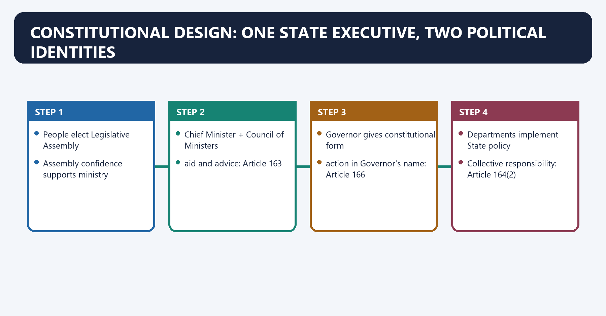
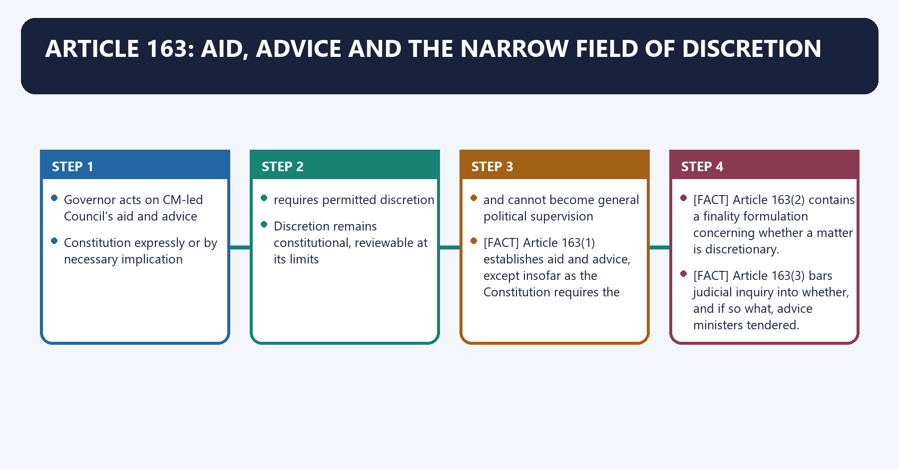
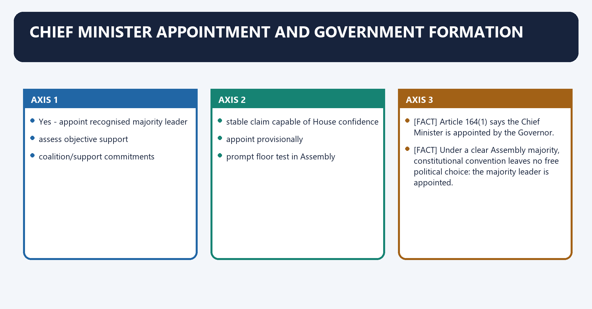
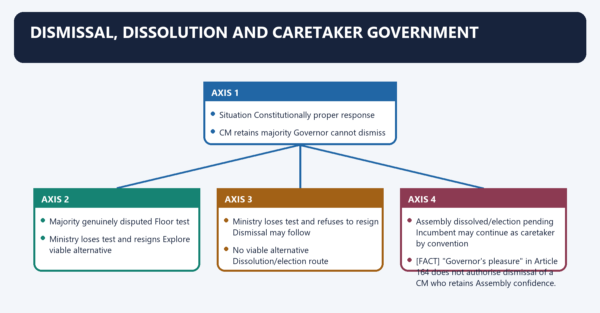
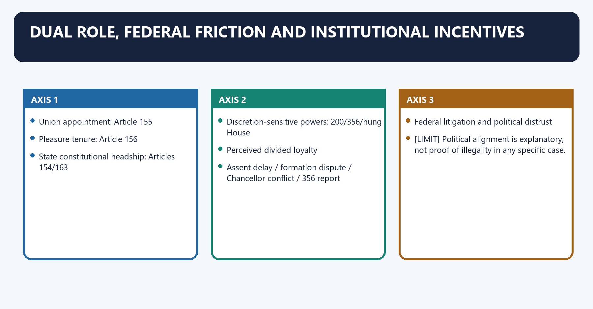

# Governor CM State Council — Complete Uncompressed Learning Session

> **Subject:** Indian Polity | **Topic:** 19 | **GS-II + Prelims** | **Export date:** 2026-08-24
>
> **Approval:** false - awaiting explicit user approval.
>
> **Evidence key:** [FACT] constitutional, judicial or officially verified proposition; [ANALYSIS] reasoned exam synthesis; [CURRENT] dated legal/current control; [LIMIT] qualification preventing overstatement.

#### Package method, source priority and current control

- Source order followed: `basic/Governor-and-CM.md` -> `advanced/19_Governor-CM-State-Council.md` -> necessary cross-links in Polity 12-17, `basic/Anti-Defection-Law.md`, `basic/State-Legislature.md` and `basic/High-Court.md` -> official/current legal control. Qdrant was not used.
- [FACT] The authoritative Core owner supersedes any stale or less-qualified Advanced statement.
- [LIMIT] This is an institutional package. It deliberately avoids live lists of Governors, Chief Ministers, ministers, university Chancellors or office-specific controversies that may change.
- [CURRENT] Status is controlled to **24 August 2026, Asia/Kolkata**.
- [CURRENT] **Live official refresh, 24 August 2026:** The official 20 November 2025 Article 143 assent opinion was rechecked on 24 August 2026; it rejects court-created rigid timelines and automatic deemed assent while preserving limited review of prolonged inaction.
- [CURRENT] *State of Tamil Nadu v. Governor of Tamil Nadu*, 8 April 2025, **2025 INSC 481**, prescribed timelines and used deemed assent on its facts.
- [CURRENT] The later five-judge Article 143 advisory opinion, *In re: Assent, Withholding or Reservation of Bills by the Governor and the President of India*, 20 November 2025, **2025 INSC 1333**, held that Articles 200-201 do not permit court-created rigid timelines or automatic deemed assent. Prolonged, unexplained and indefinite inaction may still attract limited judicial review and a direction to act.
- [LIMIT] The November opinion is advisory and non-binding. It did **not** "overrule" the April judgment. This package uses it narrowly as the later controlling position on timelines, deemed assent and limited review.
- Official opinion: `https://api.sci.gov.in/supremecourt/2025/39157/39157_2025_1_1501_66169_Judgement_20-Nov-2025.pdf`.
- [LIMIT] The specified Core and cross-links do not carry a sufficiently qualified proposition from *B.P. Singhal*. This package therefore does not import a free-standing case gloss; it teaches the verified Article 156 rule, the anti-arbitrariness concern analytically and the sourced commission proposals.
- Package target: independently answer-complete Foundation/Core, separate Optional Advanced, more than 20 text-native visuals, five routed/application Mains PYQs, all four routed Prelims demands, 36 original MCQs, 12 remedial MCQs and eight original solved Mains questions.

#### Roadmap

| Stage | Coverage | Exam outcome |
|---|---|---|
| Constitutional skeleton | Articles 153-167 | Locates every office and responsibility |
| Governor's office | Appointment, qualification, oath, conditions, tenure, pleasure and immunity | Solves factual close options |
| Governor's powers | Executive, legislative, financial, judicial and special roles | Builds complete 10/15-mark bodies |
| Advice and discretion | Article 163, *Shamsher Singh* and narrow exceptions | Prevents the "personal ruler" error |
| Political crises | Hung Assembly, floor test, dismissal, dissolution and caretaker government | Applies doctrine to facts |
| Legislative control | Articles 168, 171, 174-176, 200-201 and 213 | Answers assent and ordinance questions |
| Chief Minister | Appointment, six-month rule, powers and Article 167 | Explains the real State executive |
| State Council | Articles 163-164, responsibility, ranks, cap and defector bar | Solves ministry questions |
| Federal debate | Dual role, Article 356, Chancellor disputes and reform commissions | Produces balanced GS-II analysis |
| Workbook | PYQs, MCQs, remedials and solved Mains practice | Converts coverage into marks |

#### Scope ownership and cross-links

- **Polity 12 - Federal System:** federalism as Basic Structure, strong-Union design and bargaining federalism.
- **Polity 13 - Centre-State and Inter-State Relations:** State-law control, Union directions and intergovernmental reform.
- **Polity 14 - Emergency Provisions:** full Article 356 procedure, duration, parliamentary control and *Bommai* consequences.
- **Polity 15 - President and Vice-President:** President-Governor comparison, Article 72-161 and Article 201.
- **Polity 16 - PM and Council of Ministers:** Union parallel, responsibility and caretaker convention.
- **Polity 17 - Parliament:** Union legislative procedure, ordinances and privileges comparison.
- **Anti-Defection Law:** Speaker adjudication, whip, 91st Amendment and *Subhash Desai*'s party/faction holdings.
- **State Legislature:** Articles 168-212, Legislative Council composition and Bill procedure.
- **High Court:** institutional position protected by Article 200's mandatory-reservation proviso.
- [LIMIT] This package owns the Governor, Chief Minister and State Council of Ministers. Cross-links prevent repetition, but the Foundation/Core below is independently answer-complete.

## BASIC LEARNING SESSION

### 01. Constitutional design: one State executive, two political identities

Constitutional design: one State executive, two political identities denotes the constitutional rules and institutional links organised around People elect Legislative Assembly.
Constitutional design: one State executive, two political identities operates through Assembly confidence supports ministry, connected with Chief Minister + Council of Ministers.
The operative mechanism matters because aid and advice: Article 163.
Its principal consequence is that governor gives constitutional form.
The decisive contrast is between action in Governor's name: Article 166 and Departments implement State policy.
The exam-safe limitation is that collective responsibility: Article 164(2).

**Visual 1 - Responsible State government**

```text
People elect Legislative Assembly
              |
              v
Assembly confidence supports ministry
              |
              v
Chief Minister + Council of Ministers
              |
              | aid and advice: Article 163
              v
Governor gives constitutional form
              |
              | action in Governor's name: Article 166
              v
Departments implement State policy
              |
              v
Collective responsibility: Article 164(2)
```

Caption: Democratic authority comes from Assembly confidence; formal executive action is expressed through the Governor.

- [FACT] Article 153 provides a Governor for each State and permits the same person to be Governor of two or more States.
- [FACT] Article 154 vests State executive power in the Governor, exercisable directly or through subordinate officers according to the Constitution.
- [FACT] Article 163 creates a Council of Ministers headed by the Chief Minister to aid and advise the Governor, except in constitutionally recognised discretionary fields.
- [FACT] Article 164(2) makes the Council collectively responsible to the Legislative Assembly.
- [ANALYSIS] The State therefore has a **dual executive**: Governor as formal constitutional head; CM-led ministry as responsible political executive.
- [LIMIT] "Nominal" does not mean irrelevant. The Governor performs constitutionally necessary acts, but ordinary policy authority belongs to the confidence-holding ministry.

**Visual 2 - Articles 153-167 master map**

| Article | Subject | One-line recall |
|---:|---|---|
| 153 | Governors | One for each State; one person may serve multiple States |
| 154 | Executive power | Vested in Governor; exercised constitutionally |
| 155 | Appointment | President appoints by warrant |
| 156 | Term | Five years, subject to President's pleasure |
| 157 | Qualification | Citizen; at least 35 |
| 158 | Conditions | No legislature membership/office of profit; residence and protected emoluments |
| 159 | Oath | By High Court Chief Justice or available senior judge |
| 160 | Contingency | President may provide for unprovided contingencies |
| 161 | Clemency | State-field offences; narrower than Article 72 |
| 162 | Executive extent | Coextensive broadly with State legislative competence, subject to constitutional limits |
| 163 | Aid/advice | CM-led Council; narrow discretion carve-out |
| 164 | Ministers | Appointment, pleasure, responsibility, oaths, cap and six-month rule |
| 165 | Advocate General | State's highest constitutional law officer |
| 166 | Business form | Action in Governor's name; authentication and business rules |
| 167 | CM duties | Communicate, furnish information and collectivise decisions |

> **Memory line:** 153-162 build the Governor; 163-167 build responsible State government.

### 02. Appointment, qualifications, oath and conditions

Appointment, qualifications, oath and conditions denotes the constitutional rules and institutional links organised around Article 155 appointment by President.
Appointment, qualifications, oath and conditions operates through Article 157 eligibility, connected with completed 35 years.
The operative mechanism matters because article 158 conditions checked.
Its principal consequence is that no MP/State-legislature seat.
The decisive contrast is between no other office of profit and Article 159 oath before HC Chief Justice.
The exam-safe limitation is that assumes constitutional office.

**Visual 3 - Entry into office**

```text
Article 155 appointment by President
                 |
                 v
Article 157 eligibility
  - citizen of India
  - completed 35 years
                 |
                 v
Article 158 conditions checked
  - no MP/State-legislature seat
  - no other office of profit
                 |
                 v
Article 159 oath before HC Chief Justice
                 |
                 v
Assumes constitutional office
```

- [FACT] The Governor is **appointed**, not elected. Article 155 uses appointment by the President by warrant under his hand and seal.
- [FACT] Article 157 requires citizenship of India and completion of **35 years**.
- [FACT] Article 158 bars membership of either House of Parliament or a State legislature. If a sitting member assumes office as Governor, the seat is deemed vacated.
- [FACT] The Governor cannot hold another office of profit.
- [FACT] The Governor is entitled to official residence without rent and to emoluments, allowances and privileges determined by parliamentary law; emoluments and allowances cannot be diminished during the term.
- [FACT] Where one person is Governor of two or more States, emoluments and allowances are allocated among those States in the proportion determined by the President.
- [FACT] Under Article 159, the oath is administered by the Chief Justice of the High Court exercising jurisdiction, or in that judge's absence by the senior-most available judge of that Court.
- [LIMIT] "Outsider" status and consultation with the Chief Minister are reform conventions/recommendations, not constitutional qualifications.

**Visual 4 - Appointment: text versus desirable convention**

| Layer | What controls | Legal status |
|---|---|---|
| Constitution | President appoints; citizen; 35; conditions in Article 158 | Binding law |
| Parliamentary design | Emoluments and privileges under law | Binding where enacted |
| Sarkaria ideal | Eminent outsider; detached from local politics; consult CM | Recommendation |
| Political practice | Choice may reflect Union priorities | Practice, not constitutional rule |

> **UPSC trap:** There is no constitutional election, electoral college, State-legislature confirmation or minimum educational qualification for Governor.

### 03. Common Governor, term, pleasure, resignation, transfer and continuity

Common Governor, term, pleasure, resignation, transfer and continuity denotes the constitutional rules and institutional links organised around Governor of State A Governor of State B.
Common Governor, term, pleasure, resignation, transfer and continuity operates through distinct office distinct office, connected with Emolument allocation fixed by President.
The operative mechanism matters because article 156(1): President's pleasure can end office.
Its principal consequence is that article 156(2): resignation addressed to President.
The decisive contrast is between Article 156(3): five-year term, subject to pleasure and Continuity: remains until successor enters office.
The exam-safe limitation is that [FACT] Article 156 states a five-year term subject to the pleasure of the President.

**Visual 5 - One person, multiple State offices**

```text
                    One individual
                    /            \
                   v              v
          Governor of State A   Governor of State B
             distinct office      distinct office
                   \              /
                    \            /
           Emolument allocation fixed by President
```

- [FACT] The proviso to Article 153, inserted through the Seventh Amendment framework, allows one person to be appointed Governor of two or more States.
- [ANALYSIS] A common incumbent does not merge the States or their Councils of Ministers. Each constitutional relationship remains State-specific.

**Visual 6 - Tenure is a floorless outer term, not a guaranteed lease**

```text
Appointment
    |
    +---- Article 156(1): President's pleasure can end office
    |
    +---- Article 156(2): resignation addressed to President
    |
    +---- Article 156(3): five-year term, subject to pleasure
    |
    +---- Continuity: remains until successor enters office
```

- [FACT] Article 156 states a five-year term **subject to the pleasure of the President**.
- [FACT] The Governor may resign by writing addressed to the President.
- [FACT] The Governor continues until the successor enters office, avoiding an interregnum.
- [FACT] The constitutional scheme permits transfer and reappointment; it does not create an enforceable right to remain in one State for five years.
- [ANALYSIS] Pleasure creates structural dependence because the appointing Union executive can bring the tenure to an end.
- [LIMIT] Pleasure is not the same as a constitutional impeachment process, and the text specifies no State-legislature removal vote.
- [LIMIT] The sourced Core does not authorise a detailed *B.P. Singhal* holding. In an answer, safely state the verified proposition: the tenure is not fixed or secure, while constitutional power is never a licence for partisan arbitrariness.

**Visual 7 - Tenure distinctions**

| Proposition | Correct? | Why |
|---|:---:|---|
| "Governor has a guaranteed five-year term" | No | Five years is subject to pleasure |
| "Governor must leave exactly after five years even if successor is absent" | No | Continuity clause applies |
| "Governor may be transferred" | Yes | No State-specific tenure guarantee |
| "Governor may be reappointed" | Yes | Constitution does not bar it |
| "State Assembly can impeach Governor under existing text" | No | No such constitutional process |

### 04. Article 361 immunity and accountability

Article 361 immunity and accountability denotes the constitutional rules and institutional links organised around PERSONAL IMMUNITY DURING TERM.
Article 361 immunity and accountability operates through no criminal proceeding instituted or continued, connected with no arrest or imprisonment process.
The operative mechanism matters because personal civil claim only after two months' notice.
Its principal consequence is that official non-answerability to court.
The decisive contrast is between immunity for the State government's action and freedom from judicial review of unconstitutional material.
The exam-safe limitation is that legislative speech privilege under Article 194.
**Visual 8 - Immunity protects the office-holder, not unlawful government action**

```text
PERSONAL IMMUNITY DURING TERM
  - no criminal proceeding instituted or continued
  - no arrest or imprisonment process
  - personal civil claim only after two months' notice
  - official non-answerability to court

DOES NOT CREATE
  - immunity for the State government's action
  - freedom from judicial review of unconstitutional material
  - legislative speech privilege under Article 194
```

- [FACT] Article 361 makes the Governor not answerable to any court for the exercise and performance of official powers and duties.
- [FACT] No criminal proceeding may be instituted or continued against a Governor during the term.
- [FACT] No process for arrest or imprisonment may issue during the term.
- [FACT] A civil proceeding concerning a personal act may be instituted during the term only after two months' written notice containing the required particulars.
- [LIMIT] The immunity of the person does not immunise the underlying governmental action, relevant material or constitutional validity from review through proceedings against the State or Union as legally appropriate.
- [FACT] Article 194 protects speech/votes of members of a State legislature. The Governor is a component of the legislature under Article 168 but **not a member** of either House.

**Visual 9 - Routed immunity discriminators**

| Demand | Correct doctrinal distinction |
|---|---|
| 2018 Prelims Q41 | No criminal proceedings during term; emoluments/allowances cannot be diminished during term |
| 2025 Prelims Q59 | Article 361 office immunity is not Article 194 legislative speech immunity |
| Common trap | "Part of legislature" under Article 168 does not make Governor a legislator |

### 05. Governor's powers: complete classification

Governor's powers: complete classification denotes the constitutional rules and institutional links organised around Executive Legislative Financial Judicial Special.
Governor's powers: complete classification operates through appointments, sessions, budget, Article discretion,, connected with business rules Bills, grants, 161, Sixth Schedule/.
The operative mechanism matters because and information ordinances SFC judges UT charge.
Its principal consequence is that a. Executive powers.
The decisive contrast is between [FACT] State executive action is formally taken in the Governor's name under Article 166 and [FACT] The Governor appoints the Chief Minister and, on the CM's advice, other ministers.
The exam-safe limitation is that [FACT] The Governor appoints the Advocate General under Article 165.

**Visual 10 - Five power clusters**

```text
                         GOVERNOR
       -------------------------------------------------
       |              |            |          |         |
    Executive      Legislative   Financial   Judicial  Special
  appointments,    sessions,     budget,     Article   discretion,
  business rules   Bills,        grants,     161,      Sixth Schedule/
  and information  ordinances    SFC         judges    UT charge
```

#### A. Executive powers

- [FACT] State executive action is formally taken in the Governor's name under Article 166.
- [FACT] The Governor appoints the Chief Minister and, on the CM's advice, other ministers.
- [FACT] The Governor appoints the Advocate General under Article 165.
- [FACT] Constitutionally specified appointments include the State Election Commissioner, State Public Service Commission chair/members and district judges in consultation with the High Court under their respective provisions.
- [FACT] The Governor may seek information from the CM under Article 167.
- [FACT] The Governor may report under Article 356 that State government cannot be carried on according to the Constitution.
- [LIMIT] The Governor does not appoint High Court judges; the President appoints them after constitutionally required consultation.

**Visual 11 - Appointment caution table**

| Office/body | Governor's role | Trap |
|---|---|---|
| Chief Minister | Appoints | Choice is conventional under clear majority, bounded under hung House |
| Other State ministers | Appoints on CM's advice | Not personal selection |
| Advocate General | Appoints | Must be qualified to be a High Court judge |
| State Election Commissioner | Appoints under Article 243K | Removal protection is separately structured |
| SPSC chair/members | Appoints | Removal belongs to President under constitutional process |
| High Court judge | Consulted in appointment architecture | Governor does not appoint |
| District judge | Appoints in consultation with High Court | Judicial-independence constraint |

#### B. Legislative powers

- [FACT] Article 168 makes the Governor a component of the State legislature.
- [FACT] Article 174 permits summoning, prorogation and dissolution of the Legislative Assembly, ordinarily on ministerial advice.
- [FACT] Article 175 permits addresses and messages to either House.
- [FACT] Article 176 requires a special address at the first session after a general election and the first session of each year.
- [FACT] Article 171 permits nomination of **one-sixth** of the Legislative Council in a bicameral State from persons with special knowledge or practical experience in specified fields.
- [FACT] The Governor does **not** nominate members to the Legislative Assembly under the present scheme.
- [FACT] Article 200 governs assent, withholding, return of a non-Money Bill and reservation for the President.
- [FACT] Article 213 governs ordinances.

**Visual 12 - Legislative interface**

```text
State legislature
  |
  +-- Article 168: Governor + House(s)
  +-- Article 171: Governor nominates 1/6 of Council
  +-- Article 174: summon / prorogue / dissolve Assembly
  +-- Article 175: address / messages
  +-- Article 176: special address
  +-- Article 200: Bill decision
  +-- Article 213: ordinance when session condition permits
```

#### C. Financial powers

- [FACT] The Governor causes the annual financial statement to be laid before the State legislature under Article 202.
- [FACT] A demand for a grant cannot be made except on the Governor's recommendation under Article 203(3).
- [FACT] A Money Bill and specified financial Bills require the Governor's recommendation under Article 207.
- [FACT] The State Contingency Fund is placed at the Governor's disposal under Article 267(2), subject to law.
- [FACT] The Governor constitutes the State Finance Commission under Article 243-I.
- [ANALYSIS] These are formal gateways of responsible finance, not a personal gubernatorial budget.

#### D. Judicial and clemency powers

- [FACT] Article 161 empowers the Governor to grant pardon, reprieve, respite, remission or commutation for offences against laws relating to matters within State executive power, subject to the Constitution's scope.
- [FACT] The Governor cannot exercise clemency over court-martial sentences.
- [FACT] The Governor cannot **pardon** a death sentence, but may suspend, remit or commute it.
- [FACT] District-judge appointments involve the Governor and High Court under Article 233.
- [LIMIT] Clemency is exercised on ministerial advice and remains open to limited judicial review for constitutionally recognised defects; it is not personal mercy.

#### E. University Chancellor and other statutory roles

- [FACT] The Constitution does not make the Governor the Chancellor of every State university.
- [FACT] A Chancellor or related university role arises, where it exists, under the relevant **State university statute**.
- [ANALYSIS] This distinction explains why university-law amendments can alter the role without amending Articles 153-167.
- [LIMIT] Models differ by State. Never universalise one State statute or a live office-holder dispute.

**Visual 13 - Constitutional office versus statutory hat**

| Function | Source | Can State law redesign it? |
|---|---|:---:|
| Governor of State | Constitution | Not by ordinary State law |
| Assent under Article 200 | Constitution | No |
| Chancellor of a State university | Relevant State statute | Yes, subject to constitutional limits |
| Visitor/chancellor selection role | Statute-specific | Yes |

### 06. Article 163: aid, advice and the narrow field of discretion

Article 163: aid, advice and the narrow field of discretion denotes the constitutional rules and institutional links organised around Governor acts on CM-led Council's aid and advice.
Article 163: aid, advice and the narrow field of discretion operates through Constitution expressly or by necessary implication, connected with requires permitted discretion.
The operative mechanism matters because discretion remains constitutional, reviewable at its limits.
Its principal consequence is that and cannot become general political supervision.
The decisive contrast is between [FACT] Article 163(1) establishes aid and advice, except insofar as the Constitution requires the Governor to act in discretion and [FACT] Article 163(2) contains a finality formulation concerning whether a matter is discretionary.
The exam-safe limitation is that [FACT] Article 163(3) bars judicial inquiry into whether, and if so what, advice ministers tendered.

**Visual 14 - The default-exception rule**

```text
DEFAULT
Governor acts on CM-led Council's aid and advice
                    |
                    v
EXCEPTION
Constitution expressly or by necessary implication
requires permitted discretion
                    |
                    v
CONTROL
Discretion remains constitutional, reviewable at its limits
and cannot become general political supervision
```

- [FACT] Article 163(1) establishes aid and advice, except insofar as the Constitution requires the Governor to act in discretion.
- [FACT] Article 163(2) contains a finality formulation concerning whether a matter is discretionary.
- [FACT] Article 163(3) bars judicial inquiry into whether, and if so what, advice ministers tendered.
- [FACT] Unlike Article 74 after the 42nd/44th Amendment scheme, Article 163 does not use an equivalent express textual command that all advice is binding.
- [LIMIT] That textual difference does **not** create a general personal discretion. *Shamsher Singh* and later cases keep discretion narrow.

**Visual 15 - Express and situational discretion**

| Category | Illustrations | Control |
|---|---|---|
| Express/constitutionally anchored | Reserve Bill under Article 200; report under Article 356; special responsibilities where Constitution provides; UT administrator additional charge | Must remain within purpose |
| Situational/implied | Choose CM in hung Assembly; require floor test on objective doubt; respond to ministry that has demonstrably lost confidence; consider dissolution/alternative | Temporary, evidence-based and House-centred |
| Not discretion | Routine policy disagreement; choosing ministers contrary to CM; summoning House for partisan strategy; deciding intra-party leadership | Ministerial advice/party and House processes govern |

> **Core rule:** Discretion fills a constitutional gap; it does not create a rival elected executive.

### 07. Case-law control: proposition, significance and limitation

Case-law control: proposition, significance and limitation denotes the constitutional rules and institutional links organised around Shamsher Singh (1974).
Case-law control: proposition, significance and limitation operates through constitutional head; advice is the norm, connected with S.R. Bommai (1994).
The operative mechanism matters because article 356 review + floor of House.
Its principal consequence is that rameshwar Prasad (2006).
The decisive contrast is between apprehension/horse-trading claim cannot justify mala fide dissolution and Nabam Rebia (2016).
The exam-safe limitation is that article 174/175 discretion is narrow; ordinary advice controls.
**Visual 16 - Doctrine ladder**

```text
Shamsher Singh (1974)
  constitutional head; advice is the norm
          |
          v
S.R. Bommai (1994)
  Article 356 review + floor of House
          |
          v
Rameshwar Prasad (2006)
  apprehension/horse-trading claim cannot justify mala fide dissolution
          |
          v
Nabam Rebia (2016)
  Article 174/175 discretion is narrow; ordinary advice controls
          |
          v
Subhash Desai (2023)
  objective material required; floor test cannot settle intra-party dispute
```

#### *Shamsher Singh v. State of Punjab* (1974)

- [FACT] A seven-judge Bench treated the President and Governor as constitutional heads who ordinarily exercise powers on the aid and advice of their Councils of Ministers.
- [ANALYSIS] The case supplies the default rule for every power table: formal vesting does not imply personal government.
- [LIMIT] Constitutionally recognised discretionary situations remain.

#### *S.R. Bommai v. Union of India* (1994)

- [FACT] Article 356 satisfaction is judicially reviewable.
- [FACT] A disputed legislative majority should ordinarily be tested on the floor of the House, not decided through subjective gubernatorial assessment.
- [FACT] Federalism is part of Basic Structure.
- [ANALYSIS] The case turns Raj Bhavan's report from an unreviewable political trigger into a reasoned constitutional input.
- [LIMIT] Full Article 356 procedure belongs to Polity 14; this package uses the Governor/floor-test propositions.

#### *Rameshwar Prasad v. Union of India* (2006)

- [FACT] Dissolution of the Bihar Assembly based on the Governor's report concerning anticipated horse-trading was held unconstitutional/mala fide.
- [ANALYSIS] Suspicion about future conduct cannot replace actual House processes and objective evidence.
- [LIMIT] The case does not make political instability irrelevant; it requires constitutionally probative material and proper testing.

#### *Nabam Rebia v. Deputy Speaker* (2016)

- [FACT] The Governor's powers to summon/prorogue and send messages are normally exercised on aid and advice; Article 163 does not authorise self-expanding discretion.
- [ANALYSIS] Article 174 cannot be used to take over legislative scheduling for a partisan end.
- [CURRENT/LIMIT] The *Nabam Rebia* question concerning a Speaker facing a removal notice while adjudicating disqualification was referred by *Subhash Desai* to a larger seven-judge Bench and remains unresolved according to the authoritative Core. Do not present that issue as finally settled.

#### *Subhash Desai v. Principal Secretary, Governor of Maharashtra* (2023)

- [FACT] A floor test requires **objective material** giving reason to believe that the incumbent government has lost House confidence.
- [FACT] Intra-party dissent, factional letters or apprehended instability are not by themselves sufficient material.
- [FACT] A Governor cannot enter the political arena or use a floor test to resolve an internal party dispute.
- [FACT] The Court did not restore the previous government because the Chief Minister resigned without facing the floor test.
- [LIMIT] The judgment did not disqualify members, restore a government or finally settle the referred *Nabam Rebia* Speaker-removal issue.
- [ANALYSIS] The floor test is a remedy for demonstrated constitutional doubt, not a device for manufacturing a change of government.

**Visual 17 - Case-to-question router**

| Question signal | Primary case | What to write | Qualification |
|---|---|---|---|
| Ordinary advice | *Shamsher Singh* | Constitutional head, not personal executive | Narrow exceptions remain |
| Majority dispute/356 | *Bommai* | Floor test + review | Use State context |
| Pre-emptive dissolution | *Rameshwar Prasad* | Apprehension is not objective proof | Facts still matter |
| Session/message discretion | *Nabam Rebia* | Article 174/175 usually advice-bound | Speaker-removal issue unresolved |
| Factional crisis | *Subhash Desai* | Objective material; no intra-party arbitration | No restoration due to CM resignation |

### 08. Chief Minister appointment and government formation

Chief Minister appointment and government formation denotes the constitutional rules and institutional links organised around Yes - appoint recognised majority leader.
Chief Minister appointment and government formation operates through assess objective support, connected with coalition/support commitments.
The operative mechanism matters because stable claim capable of House confidence.
Its principal consequence is that appoint provisionally.
The decisive contrast is between prompt floor test in Assembly and [FACT] Article 164(1) says the Chief Minister is appointed by the Governor.
The exam-safe limitation is that [FACT] Under a clear Assembly majority, constitutional convention leaves no free political choice: the majority leader is appointed.

**Visual 18 - Appointment algorithm**

```text
Election result
   |
   +-- Clear majority?
   |      |
   |      +-- Yes -> appoint recognised majority leader
   |
   +-- No clear majority
          |
          v
   assess objective support
   - pre-poll alliance
   - coalition/support commitments
   - stable claim capable of House confidence
          |
          v
   appoint provisionally
          |
          v
   prompt floor test in Assembly
```

- [FACT] Article 164(1) says the Chief Minister is appointed by the Governor.
- [FACT] Under a clear Assembly majority, constitutional convention leaves no free political choice: the majority leader is appointed.
- [ANALYSIS] In a hung Assembly, the Governor may identify the person most likely to command confidence, using objective support rather than ideological preference.
- [FACT] Majority need not be conclusively proved before appointment; survival authority comes from the Assembly floor.
- [LIMIT] Commission orders of preference are valuable neutral guides but are proposals/conventions, not an inflexible constitutional algorithm for every configuration.

**Visual 19 - Appointment is not confidence**

| Stage | Actor | Constitutional meaning |
|---|---|---|
| Invitation | Governor | Temporary access to form ministry |
| Oath | Governor administers | Assumption of office |
| Floor test | Legislative Assembly | Democratic proof of confidence |
| Continuing tenure | Assembly numbers | Real survival condition |

#### Non-member Chief Minister

- [FACT] Article 164(4) permits a minister, including the CM, to remain without membership of the State legislature for no more than **six consecutive months**.
- [FACT] In a bicameral State, the CM may belong to either House.
- [LIMIT] The six-month window cures temporary non-membership, not an underlying constitutional disqualification. *B.R. Kapur v. State of Tamil Nadu* supplies the controlling caution.
- [LIMIT] There is no separate constitutional age qualification for the office of CM; ordinary legislative eligibility is relevant, generally 25 for Assembly and 30 for Council membership.

### 09. Floor test: trigger, process and limits

Floor test: trigger, process and limits denotes the constitutional rules and institutional links organised around Political noise alone.
Floor test: trigger, process and limits operates through intra-party dissent, connected with rival faction letters.
The operative mechanism matters because x not enough by itself.
Its principal consequence is that constitutionally relevant objective material.
The decisive contrast is between withdrawal of coalition/support and resignations affecting numbers.
The exam-safe limitation is that defeat indicating confidence loss.
**Visual 20 - Objective-material threshold**

```text
Political noise alone
  - media reports
  - intra-party dissent
  - rival faction letters
           |
           X  not enough by itself
           |
Constitutionally relevant objective material
  - withdrawal of coalition/support
  - resignations affecting numbers
  - defeat indicating confidence loss
  - credible rival claim tied to House strength
           |
           v
Prompt, fair floor test
```

- [FACT] *Bommai* makes the House floor the ordinary forum for testing a disputed majority.
- [FACT] *Subhash Desai* requires objective material and rejects use of a floor test to resolve an internal party dispute.
- [ANALYSIS] The Governor may initiate a test only to clarify Assembly confidence, not party legitimacy, whip validity or factional control.
- [LIMIT] The Speaker's Tenth Schedule proceedings and the Governor's confidence inquiry are distinct legal tracks. One cannot predetermine the other by partisan timing.

**Visual 21 - Fair-test checklist**

| Requirement | Why it matters |
|---|---|
| Objective trigger | Prevents speculative intervention |
| Reasonable promptness | Stops engineered delay or surprise |
| Assembly forum | Lets elected members decide confidence |
| Neutral procedure | Avoids Raj Bhavan becoming a political participant |
| Separate defection track | Preserves Speaker/court jurisdiction |
| Judicial review at limits | Checks mala fides and irrelevant material |

### 10. Dismissal, dissolution and caretaker government

Dismissal, dissolution and caretaker government denotes the constitutional rules and institutional links organised around Situation Constitutionally proper response.
Dismissal, dissolution and caretaker government operates through CM retains majority Governor cannot dismiss, connected with Majority genuinely disputed Floor test.
The operative mechanism matters because ministry loses test and resigns Explore viable alternative.
Its principal consequence is that ministry loses test and refuses to resign Dismissal may follow.
The decisive contrast is between No viable alternative Dissolution/election route and Assembly dissolved/election pending Incumbent may continue as caretaker by convention.
The exam-safe limitation is that [FACT] "Governor's pleasure" in Article 164 does not authorise dismissal of a CM who retains Assembly confidence.

**Visual 22 - Loss-of-confidence decision matrix**

| Situation | Constitutionally proper response |
|---|---|
| CM retains majority | Governor cannot dismiss |
| Majority genuinely disputed | Floor test |
| Ministry loses test and resigns | Explore viable alternative |
| Ministry loses test and refuses to resign | Dismissal may follow |
| No viable alternative | Dissolution/election route |
| Assembly dissolved/election pending | Incumbent may continue as caretaker by convention |

- [FACT] "Governor's pleasure" in Article 164 does not authorise dismissal of a CM who retains Assembly confidence.
- [ANALYSIS] Individual ministerial pleasure is operationally mediated by the CM; the Governor does not personally manage the team.
- [ANALYSIS] A dissolution request from a defeated or minority ministry may be declined if a demonstrably viable alternative government exists.
- [LIMIT] Dissolution is not a punishment for political disagreement. It is a route when representative government cannot otherwise be formed.
- [FACT] The Constitution does not contain a complete separately titled caretaker-government code.
- [ANALYSIS] Caretaker convention supports continuity while counselling restraint on major irreversible policy, appointments and commitments unless urgency or necessity requires action.

**Visual 23 - Caretaker convention**

```text
Outgoing ministry continues
          |
          +-- essential administration
          +-- security and urgent finance
          +-- implementation already committed
          |
          X-- avoid avoidable irreversible policy
          X-- avoid partisan appointments
          X-- avoid binding successor without necessity
```

### 11. Article 356 recommendation and the federal firewall

Article 356 recommendation and the federal firewall denotes the constitutional rules and institutional links organised around Governor's report OR other material.
Article 356 recommendation and the federal firewall operates through President considers Article 356, connected with Proclamation, if constitutional breakdown shown.
The operative mechanism matters because parliamentary Judicial review.
Its principal consequence is that approval under Bommai.
The decisive contrast is between restoration possible if action invalid and [FACT] Article 356 may operate on a Governor's report or otherwise ; a report is important but not textually indispensable.
The exam-safe limitation is that [FACT] Where the issue is legislative majority, a floor test ordinarily displaces subjective assessment.

**Visual 24 - From report to constitutional control**

```text
Governor's report OR other material
             |
             v
President considers Article 356
             |
             v
Proclamation, if constitutional breakdown shown
             |
       ----------------
       |              |
       v              v
Parliamentary       Judicial review
approval            under Bommai
       |              |
       -------> restoration possible if action invalid
```

- [FACT] Article 356 may operate on a Governor's report **or otherwise**; a report is important but not textually indispensable.
- [FACT] The report must concern inability to carry on State government according to the Constitution, not mere maladministration or political inconvenience.
- [FACT] Where the issue is legislative majority, a floor test ordinarily displaces subjective assessment.
- [FACT] *Bommai* permits review of the proclamation's material and constitutional relevance.
- [FACT] *Rameshwar Prasad* rejects anticipatory dissolution based on unsupported apprehension.
- [ANALYSIS] The Governor is an information bridge, not the final judge of State democracy.
- [LIMIT] Article 356 is a last-resort remedy. Full approval, duration and consequence rules are in Polity 14.

### 12. Articles 168, 171 and 174-176: Governor inside the legislative process

Articles 168, 171 and 174-176: Governor inside the legislative process denotes the constitutional rules and institutional links organised around Article Governor's relation Key caution.
Articles 168, 171 and 174-176: Governor inside the legislative process operates through 168 Component of State legislature Not a member of either House, connected with 171 Nominates one-sixth of Legislative Council Never Assembly nomination.
The operative mechanism matters because 174 Summons, prorogues, dissolves Assembly Normally advice-bound.
Its principal consequence is that 175 Addresses and sends messages Not a general power to direct legislative outcomes.
The decisive contrast is between 176 Special address First session after election and first each year and Legislative Council nominations.
The exam-safe limitation is that [LIMIT] The nomination power exists only where the State has a Legislative Council.
**Visual 25 - Legislature map**

| Article | Governor's relation | Key caution |
|---:|---|---|
| 168 | Component of State legislature | Not a member of either House |
| 171 | Nominates one-sixth of Legislative Council | Never Assembly nomination |
| 174 | Summons, prorogues, dissolves Assembly | Normally advice-bound |
| 175 | Addresses and sends messages | Not a general power to direct legislative outcomes |
| 176 | Special address | First session after election and first each year |

#### Legislative Council nominations

- [FACT] The Governor nominates one-sixth of Council members from persons with special knowledge or practical experience in literature, science, art, cooperative movement and social service.
- [LIMIT] The nomination power exists only where the State has a Legislative Council.
- [FACT] The Governor no longer has a general power to nominate an Anglo-Indian member to a Legislative Assembly under the current constitutional scheme.

#### Sessions and addresses

- [FACT] Article 174 requires no more than six months between the last sitting of one session and the first sitting of the next.
- [FACT] Prorogation ends a session; dissolution ends the life of the Assembly, not the permanent Council.
- [FACT] Under *Nabam Rebia*, Article 174/175 powers are normally exercised on ministerial advice.

### 13. Article 200: assent, withholding, return and reservation

Article 200: assent, withholding, return and reservation denotes the constitutional rules and institutional links organised around Bill presented to Governor.
Article 200: assent, withholding, return and reservation operates through Assent ---------------------- becomes law, connected with Withhold assent ------------- does not become law.
The operative mechanism matters because return for reconsideration -- only if non-Money Bill.
Its principal consequence is that house(s) reconsider.
The decisive contrast is between textual bar on withholding and Reserve for President -------- Article 201.
The exam-safe limitation is that [FACT] Article 200 applies when a Bill passed by the State legislature is presented to the Governor.

**Visual 26 - Article 200 decision tree**

```text
Bill presented to Governor
          |
          +-- Assent ----------------------> becomes law
          |
          +-- Withhold assent -------------> does not become law
          |
          +-- Return for reconsideration --> only if non-Money Bill
          |                                  |
          |                                  v
          |                            House(s) reconsider
          |                                  |
          |                                  v
          |                            repassed Bill
          |                            textual bar on withholding
          |
          +-- Reserve for President --------> Article 201
```

- [FACT] Article 200 applies when a Bill passed by the State legislature is presented to the Governor.
- [FACT] The Governor may assent, withhold assent, return a **non-Money Bill** for reconsideration or reserve the Bill for the President.
- [FACT] A Money Bill cannot be returned under the first proviso.
- [FACT] If a returned Bill is repassed, the Article 200 text says the Governor shall not withhold assent.
- [LIMIT] Do not merge this direct return route with Article 201's reserved-Bill route.

#### Mandatory reservation for High Court protection

- [FACT] The second proviso to Article 200 requires reservation where, in the Governor's opinion, the Bill would so derogate from High Court powers as to endanger the position which the High Court is designed by the Constitution to fill.
- [ANALYSIS] This is an institutional-independence safeguard, not a general power to reserve every unpopular Bill.

**Visual 27 - Assent choices and democratic cost**

| Choice | Constitutional function | Abuse risk | Control |
|---|---|---|---|
| Assent | Completes legislation | Minimal | Advice/default |
| Withhold | Rejects legal completion | Political veto concern | Constitutional purpose/review at limits |
| Return | Requests reconsideration | Delay | Non-Money Bill only |
| Reserve | Federal/constitutional scrutiny | Centralisation | Purpose, mandatory HC proviso, Article 201 |
| Inaction | No textual "pocket veto" label | Suspends elected law-making | 2025 limited mandamus against prolonged unexplained delay |

### 14. Article 201 and the President on reserved State Bills

Article 201 and the President on reserved State Bills denotes the constitutional rules and institutional links organised around Governor reserves Bill.
Article 201 and the President on reserved State Bills operates through President under Article 201, connected with for non-Money Bill, direct return through Governor.
The operative mechanism matters because state legislature reconsiders within constitutional route.
Its principal consequence is that repassed Bill returns for presidential consideration.
The decisive contrast is between No Article 200-style duty compelling presidential assent and [FACT] Under Article 201, the President may assent or withhold assent to a reserved Bill.
The exam-safe limitation is that [FACT] For a non-Money Bill, the President may direct the Governor to return it to the State legislature for reconsideration.

**Visual 28 - Reserved-Bill route**

```text
Governor reserves Bill
          |
          v
President under Article 201
  - assent
  - withhold assent
  - for non-Money Bill, direct return through Governor
          |
          v
State legislature reconsiders within constitutional route
          |
          v
Repassed Bill returns for presidential consideration
          |
          v
No Article 200-style duty compelling presidential assent
```

- [FACT] Under Article 201, the President may assent or withhold assent to a reserved Bill.
- [FACT] For a non-Money Bill, the President may direct the Governor to return it to the State legislature for reconsideration.
- [FACT] The President is **not obliged to assent** merely because the State legislature re-passes a reserved Bill.
- [ANALYSIS] Article 201 therefore supplies a stronger central gate than the direct Article 200 return loop.
- [LIMIT] Prior presidential sanction and post-passage reservation are different constitutional mechanisms.

### 15. Assent doctrine after the two 2025 decisions

Assent doctrine after the two 2025 decisions denotes the constitutional rules and institutional links organised around State of Tamil Nadu v Governor.
Assent doctrine after the two 2025 decisions operates through prescribed timelines, connected with deemed assent used on its facts.
The operative mechanism matters because five-judge Article 143 advisory opinion.
Its principal consequence is that no court-created rigid timelines.
The decisive contrast is between no automatic deemed assent and prolonged unexplained indefinite inaction reviewable.
The exam-safe limitation is that mandamus may require action, not dictate the option.
**Visual 29 - Dated legal-control timeline**

```text
8 April 2025
State of Tamil Nadu v Governor
  - prescribed timelines
  - deemed assent used on its facts
               |
               v
20 November 2025
Five-judge Article 143 advisory opinion
  - no court-created rigid timelines
  - no automatic deemed assent
  - prolonged unexplained indefinite inaction reviewable
  - mandamus may require action, not dictate the option
               |
               v
18 August 2026 package rule
Use later position narrowly as controlling;
do not say it "overruled" April judgment
```

- [CURRENT] The April judgment supplied a forceful remedy to prolonged gubernatorial delay.
- [CURRENT] The November advisory opinion rejected judicial addition of fixed clocks and automatic assent consequences to Articles 200-201.
- [CURRENT] The opinion did not constitutionalise indefinite inaction: limited review may require the authority to act where delay is prolonged, unexplained and indefinite.
- [LIMIT] A court may direct constitutional movement without choosing assent, withholding, return or reservation for the authority.
- [LIMIT] Because the November opinion is advisory, describe it as the **later controlling position narrowly**, not as a binding overruling.

**Visual 30 - Safe Mains formulation**

| Unsafe claim | Exam-safe formulation |
|---|---|
| "Governor has three months" | No court-created rigid timeline controls after the Nov 2025 opinion |
| "Delay automatically means assent" | No automatic deemed assent |
| "Governor may sit forever" | Prolonged unexplained indefinite inaction attracts limited review |
| "Advisory opinion overruled April case" | It is non-binding and later; use it narrowly as controlling on this issue |
| "Court can itself select reservation/assent" | Mandamus may require action without dictating the constitutional choice |

### 16. Article 213 ordinances: emergency bridge, not parallel legislature

Article 213 ordinances: emergency bridge, not parallel legislature denotes the constitutional rules and institutional links organised around Immediate action considered necessary.
Article 213 ordinances: emergency bridge, not parallel legislature operates through Session condition permits ordinance, connected with Governor promulgates on ministerial advice.
The operative mechanism matters because force and effect of State Act.
Its principal consequence is that must be laid before State legislature.
The decisive contrast is between approved/replaced by Act and disapproved earlier.
The exam-safe limitation is that ceases six weeks after reassembly.

**Visual 31 - Ordinance life cycle**

```text
Immediate action considered necessary
             +
Session condition permits ordinance
             |
             v
Governor promulgates on ministerial advice
             |
             v
Force and effect of State Act
             |
             v
Must be laid before State legislature
             |
             +-- approved/replaced by Act
             +-- disapproved earlier
             +-- withdrawn
             +-- ceases six weeks after reassembly
```

- [FACT] Article 213 permits an ordinance when the Legislative Assembly is not in session; in a bicameral State, the prohibition applies when both Houses are in session.
- [FACT] The Governor must be satisfied that circumstances require immediate action, but the power operates through responsible government, not personal law-making.
- [FACT] An ordinance has the same force and effect as a State Act, subject to legislative competence and constitutional limits.
- [FACT] It must be laid before the legislature and ceases six weeks after reassembly; where Houses reassemble on different dates, the later date controls the six-week period.
- [FACT] It may cease earlier through disapproval or be withdrawn.
- [FACT] Presidential instructions are required in constitutionally specified cases analogous to prior sanction, reservation or invalidity without presidential assent.

#### Re-promulgation

- [FACT] *D.C. Wadhwa v. State of Bihar* (1987) characterised routine serial re-promulgation as a **fraud on the Constitution**.
- [FACT] *Krishna Kumar Singh v. State of Bihar* (2017), seven judges, 5:2, reaffirmed legislative supremacy, held laying mandatory and treated satisfaction as reviewable at constitutional limits.
- [FACT] Rights and liabilities created by a lapsed ordinance do not automatically survive in every case.
- [ANALYSIS] Re-promulgation replaces legislative deliberation with executive repetition and is therefore unconstitutional when used as a regular governing method.
- [LIMIT] The ordinance power itself is valid; urgency may justify it. The vice lies in bypass, not in every promulgation.

**Visual 32 - Ordinance validity test**

| Question | If answer is weak, constitutional risk rises |
|---|---|
| Was the session condition met? | Invalid use of Article 213 |
| Was immediate action genuinely required? | Review for irrelevant/mala fide material |
| Was the subject within State competence? | Legislative incompetence |
| Were presidential instructions required? | Procedural invalidity |
| Was it laid promptly? | *Krishna Kumar Singh* violation |
| Is it being serially reissued? | *Wadhwa* fraud-on-Constitution concern |

### 17. Article 161 compared with Article 72

Article 161 compared with Article 72 denotes the constitutional rules and institutional links organised around Dimension President - Article 72 Governor - Article 161.
Article 161 compared with Article 72 operates through Court-martial All forms of clemency available No power, connected with Death sentence May pardon and grant lesser forms Cannot pardon; may suspend, remit or commute.
The operative mechanism matters because ordinary offence field Union executive competence State executive competence.
Its principal consequence is that advice Union Council of Ministers State Council of Ministers.
The decisive contrast is between Review Limited constitutional review Same broad review logic and [FACT] Clemency forms include pardon, reprieve, respite, remission and commutation, but the Governor's jurisdiction is narrower.
The exam-safe limitation is that [FACT] Maru Ram establishes that clemency is exercised on ministerial advice.
**Visual 33 - Clemency comparison**

| Dimension | President - Article 72 | Governor - Article 161 |
|---|---|---|
| Court-martial | All forms of clemency available | No power |
| Death sentence | May pardon and grant lesser forms | Cannot pardon; may suspend, remit or commute |
| Ordinary offence field | Union executive competence | State executive competence |
| Advice | Union Council of Ministers | State Council of Ministers |
| Review | Limited constitutional review | Same broad review logic |

- [FACT] Clemency forms include pardon, reprieve, respite, remission and commutation, but the Governor's jurisdiction is narrower.
- [FACT] *Maru Ram* establishes that clemency is exercised on ministerial advice.
- [FACT] *Epuru Sudhakar* permits limited review for mala fides, arbitrariness, non-application of mind and relevant/irrelevant-material defects.
- [ANALYSIS] Clemency is a constitutional safety valve for justice, public policy and humanitarian considerations; it is not an appellate judgment.
- [LIMIT] Do not write that the Governor can pardon a death sentence merely because Article 161 concerns State law.

### 18. Chief Minister: constitutional position and powers

Chief Minister: constitutional position and powers denotes the constitutional rules and institutional links organised around Council Governor Legislature Federation/party.
Chief Minister: constitutional position and powers operates through selects team Article 167 majority leader ISC/NITI/zonal, connected with portfolios advice link policy agenda political voice.
The operative mechanism matters because chairs Cabinet information dissolution coordination.
Its principal consequence is that [FACT] The CM is the head of the State Council of Ministers and the real political executive.
The decisive contrast is between [FACT] The CM recommends appointment and removal of ministers, allocates/reshuffles portfolios and chairs Council/Cabinet meetings and [FACT] The CM's resignation or death ends the existing ministry as a CM-headed Council; one minister's resignation does not.
The exam-safe limitation is that [FACT] The CM is the principal constitutional communication channel between the Council and Governor under Article 167.

**Visual 34 - CM as the State executive hub**

```text
                         CHIEF MINISTER
       -------------------------------------------------
       |                |              |               |
   Council           Governor       Legislature     Federation/party
   selects team      Article 167    majority leader  ISC/NITI/zonal
   portfolios        advice link    policy agenda    political voice
   chairs Cabinet    information    dissolution      coordination
```

- [FACT] The CM is the head of the State Council of Ministers and the real political executive.
- [FACT] The CM recommends appointment and removal of ministers, allocates/reshuffles portfolios and chairs Council/Cabinet meetings.
- [FACT] The CM's resignation or death ends the existing ministry as a CM-headed Council; one minister's resignation does not.
- [FACT] The CM is the principal constitutional communication channel between the Council and Governor under Article 167.
- [FACT] The CM leads the government's legislative programme, advises on sessions and may advise dissolution subject to constitutional circumstances.
- [ANALYSIS] Party leadership, coalition dependence and Assembly arithmetic determine the practical strength of a CM; the Constitution supplies office, not a uniform level of dominance.
- [LIMIT] Roles in intergovernmental bodies or State planning arrangements may arise from institutional practice; do not confuse them with a closed Article 164 list.

### 19. Article 167: communicate, furnish, collectivise

Article 167: communicate, furnish, collectivise denotes the constitutional rules and institutional links organised around Council decisions on administration and legislative proposals.
Article 167: communicate, furnish, collectivise operates through Information the Governor calls for, connected with Place an individual minister's unconsidered decision before Council.
The operative mechanism matters because if the Governor so requires.
Its principal consequence is that [FACT] Article 167(a) requires communication of Council decisions concerning State administration and legislative proposals.
The decisive contrast is between [FACT] Article 167(b) requires furnishing information called for by the Governor and Memory line: Article 167 = Communicate - Furnish - Collectivise.
The exam-safe limitation is that council decisions on administration and legislative proposals.
**Visual 35 - The three duties**

```text
COMMUNICATE
Council decisions on administration and legislative proposals
        |
FURNISH
Information the Governor calls for
        |
COLLECTIVISE
Place an individual minister's unconsidered decision before Council
if the Governor so requires
```

- [FACT] Article 167(a) requires communication of Council decisions concerning State administration and legislative proposals.
- [FACT] Article 167(b) requires furnishing information called for by the Governor.
- [FACT] Article 167(c) allows the Governor to require that a matter decided by an individual minister but not considered by the Council be placed before the Council.
- [ANALYSIS] Article 167 protects informed constitutional headship and collective responsibility; it does not create a power to substitute gubernatorial policy.

> **Memory line:** Article 167 = **Communicate - Furnish - Collectivise**.

### 20. State Council of Ministers under Articles 163-164

State Council of Ministers under Articles 163-164 denotes the constitutional rules and institutional links organised around aid and advice: Article 163.
State Council of Ministers under Articles 163-164 operates through Ministers of State, connected with Deputy Ministers, if used.
The operative mechanism matters because collective responsibility to Legislative Assembly: Article 164(2).
Its principal consequence is that appointment and tenure.
The decisive contrast is between [FACT] The Governor appoints the CM; other ministers are appointed by the Governor on the CM's advice and [FACT] Ministers hold office during the Governor's pleasure.
The exam-safe limitation is that [FACT] The Governor administers oaths of office and secrecy in the Third Schedule.

**Visual 36 - Responsibility architecture**

```text
Governor
   ^
   | aid and advice: Article 163
   |
Chief Minister
   |
   +-- Cabinet Ministers
   +-- Ministers of State
   +-- Deputy Ministers, if used
   |
   v
Collective responsibility to Legislative Assembly: Article 164(2)
```

#### Appointment and tenure

- [FACT] The Governor appoints the CM; other ministers are appointed by the Governor on the CM's advice.
- [FACT] Ministers hold office during the Governor's pleasure.
- [ANALYSIS] In parliamentary practice, that pleasure is operationally controlled by the CM for individual ministers while the whole ministry depends on Assembly confidence.
- [FACT] The Governor administers oaths of office and secrecy in the Third Schedule.
- [FACT] Article 164(4) applies the six-consecutive-month non-member rule to ministers.

#### Collective responsibility

- [FACT] The entire Council is collectively responsible to the **Legislative Assembly**, not the Legislative Council.
- [FACT] A carried no-confidence motion or demonstrated loss of essential confidence requires the ministry to resign or pursue a constitutionally proper dissolution route.
- [ANALYSIS] Collective responsibility has three dimensions: confidence, solidarity and unified accountability.
- [LIMIT] Every defeat on an ordinary Bill does not mechanically equal loss of confidence; context, express confidence motions and essential supply matter.

#### Individual responsibility

- [FACT] One minister may leave office without the whole Council falling.
- [ANALYSIS] The CM enforces individual responsibility through portfolio control, demand for resignation and advice to remove.
- [LIMIT] "Individual responsibility" is political/constitutional and must not be confused with criminal or civil liability.

**Visual 37 - Responsibility comparison**

| Type | Constitutional/practical base | Consequence |
|---|---|---|
| Collective | Article 164(2) | Whole ministry stands/falls with Assembly confidence |
| Individual | Article 164(1) pleasure through CM-led practice | One minister may be removed |
| Legal | Ordinary constitutional/statutory law | Ministers remain legally accountable |

### 21. Ministry size, defector bar, ranks and Tribal Welfare Minister

Ministry size, defector bar, ranks and Tribal Welfare Minister denotes the constitutional rules and institutional links organised around Maximum State ministry.
Ministry size, defector bar, ranks and Tribal Welfare Minister operates through = 15% of total Legislative Assembly membership, connected with Minimum State ministry.
The operative mechanism matters because = Chief Minister + all ministers.
Its principal consequence is that base does NOT include.
The decisive contrast is between = combined strength of Assembly and Council and [FACT] The constitutional minimum is 12.
The exam-safe limitation is that [FACT] The base is Assembly membership, not both Houses.
**Visual 38 - 91st Amendment formula**

```text
Maximum State ministry
  = 15% of total Legislative Assembly membership

Minimum State ministry
  = 12

Count includes
  = Chief Minister + all ministers

Base does NOT include
  = combined strength of Assembly and Council
```

- [FACT] Article 164(1A), inserted by the 91st Amendment, caps the total number of ministers including the CM at **15% of the total membership of the Legislative Assembly**.
- [FACT] The constitutional minimum is **12**.
- [FACT] The base is Assembly membership, not both Houses.
- [FACT] Article 164(1B) bars a member disqualified under the specified Tenth Schedule ground from ministerial appointment for the constitutional period until term-end or earlier re-election as provided.
- [ANALYSIS] The cap reduces jumbo ministries and patronage; the office bar attacks "defect and receive a ministry" incentives.

**Visual 39 - Conventional ministerial ranks**

| Rank | Typical role | Constitutional caution |
|---|---|---|
| Cabinet Minister | Heads major department; participates in core decisions | "Cabinet" is functional/conventional at State level |
| Minister of State, independent charge | Heads a department without Cabinet Minister above | Rank details are not exhaustively constitutional |
| Minister of State, attached | Assists Cabinet Minister | Allocation varies |
| Deputy Minister | Assists senior minister, where used | Conventional and not mandatory |

#### Tribal Welfare Minister

- [FACT] Article 164 requires a minister in charge of tribal welfare in **Chhattisgarh, Jharkhand, Madhya Pradesh and Odisha**.
- [FACT] The minister may additionally be in charge of welfare of Scheduled Castes and backward classes or other work.
- [FACT] Bihar was removed from this textual list by the 94th Amendment.

**Visual 40 - Four-State recall**

```text
Tribal Welfare Minister rule

Chhattisgarh - Jharkhand - Madhya Pradesh - Odisha

Recall: CJMO
```

### 22. Article 165 Advocate General and Article 166 State business

Article 165 Advocate General and Article 166 State business denotes the constitutional rules and institutional links organised around Article Institution/rule Function.
Article 165 Advocate General and Article 166 State business operates through 165 Advocate General Advises State government; performs assigned legal duties, connected with 166(1) Name clause Executive action expressed in Governor's name.
The operative mechanism matters because 166(2) Authentication Rules authenticate orders/instruments.
Its principal consequence is that 166(3) Business rules Governor makes rules for convenient transaction/allocation on advice.
The decisive contrast is between [FACT] The Governor appoints as Advocate General a person qualified to be appointed a High Court judge and [FACT] The Advocate General holds office during the Governor's pleasure and receives remuneration determined by the Governor.
The exam-safe limitation is that [FACT] Properly authenticated orders cannot be challenged merely on the ground that they were not personally made by the Governor.
**Visual 41 - Legal advice and executive form**

| Article | Institution/rule | Function |
|---:|---|---|
| 165 | Advocate General | Advises State government; performs assigned legal duties |
| 166(1) | Name clause | Executive action expressed in Governor's name |
| 166(2) | Authentication | Rules authenticate orders/instruments |
| 166(3) | Business rules | Governor makes rules for convenient transaction/allocation on advice |

- [FACT] The Governor appoints as Advocate General a person qualified to be appointed a High Court judge.
- [FACT] The Advocate General holds office during the Governor's pleasure and receives remuneration determined by the Governor.
- [FACT] Article 166's "Governor's name" is a constitutional form; it does not convert every departmental decision into the Governor's personal decision.
- [FACT] Properly authenticated orders cannot be challenged merely on the ground that they were not personally made by the Governor.
- [FACT] Business rules allocate work among ministers and organise decision-making, except constitutionally discretionary business.
- [ANALYSIS] Article 166 translates political responsibility into administratively traceable State action.

### 23. President and Governor: similarities that must not erase differences

President and Governor: similarities that must not erase differences denotes the constitutional rules and institutional links organised around Point President Governor.
President and Governor: similarities that must not erase differences operates through Appointment/election Indirectly elected Appointed by President, connected with Formal executive Union State.
The operative mechanism matters because advice article 74 163.
Its principal consequence is that express general discretion formula No Article 163 equivalent Article 163 carve-out.
The decisive contrast is between Ministry responsibility Lok Sabha Legislative Assembly and Ordinance Article 123 Article 213.
The exam-safe limitation is that bill assent Article 111 Article 200.
**Visual 42 - Parallel and divergence**

| Point | President | Governor |
|---|---|---|
| Appointment/election | Indirectly elected | Appointed by President |
| Formal executive | Union | State |
| Advice article | 74 | 163 |
| Express general discretion formula | No Article 163 equivalent | Article 163 carve-out |
| Ministry responsibility | Lok Sabha | Legislative Assembly |
| Ordinance | Article 123 | Article 213 |
| Bill assent | Article 111 | Article 200 |
| Reserved State Bill | Article 201 decision-maker | Article 200 reservation gateway |
| Clemency | Article 72, broader | Article 161, narrower |
| Removal | Impeachment | President's pleasure |

- [ANALYSIS] The offices share parliamentary-head logic but not identical appointment, tenure, discretion or clemency fields.
- [LIMIT] Never reason: "President is bound, therefore Governor is always identically bound." The better formula is: advice is the default for both; Governor has a narrow constitutionally recognised discretionary field.

### 24. Dual role, federal friction and institutional incentives

Dual role, federal friction and institutional incentives denotes the constitutional rules and institutional links organised around Union appointment: Article 155.
Dual role, federal friction and institutional incentives operates through Pleasure tenure: Article 156, connected with State constitutional headship: Articles 154/163.
The operative mechanism matters because discretion-sensitive powers: 200/356/hung House.
Its principal consequence is that perceived divided loyalty.
The decisive contrast is between Assent delay / formation dispute / Chancellor conflict / 356 report and Federal litigation and political distrust.
The exam-safe limitation is that [LIMIT] Political alignment is explanatory, not proof of illegality in any specific case.

**Visual 43 - Friction mechanism**

```text
Union appointment: Article 155
          +
Pleasure tenure: Article 156
          +
State constitutional headship: Articles 154/163
          +
Discretion-sensitive powers: 200/356/hung House
          |
          v
Perceived divided loyalty
          |
          v
Assent delay / formation dispute / Chancellor conflict / 356 report
          |
          v
Federal litigation and political distrust
```

- [ANALYSIS] The Governor is simultaneously the State's constitutional head and an office filled and tenured through the Union. That design creates a recurring neutrality problem.
- [ANALYSIS] Friction intensifies where Union and State governments are politically opposed because discretionary moments become high-stakes federal gates.
- [LIMIT] Political alignment is explanatory, not proof of illegality in any specific case.
- [ANALYSIS] Statutory Chancellor disputes add a second hat to a constitutional office; clarity improves when State law precisely separates statutory university functions from Article 163 government.

#### Arguments for retaining the office

- [ANALYSIS] Ensures continuity of constitutional form.
- [ANALYSIS] Provides a neutral facilitator in a genuinely hung Assembly.
- [ANALYSIS] Supplies information and warning before constitutional breakdown.
- [ANALYSIS] Connects State legislation to presidential scrutiny in constitutionally sensitive cases.

#### Criticisms

- [ANALYSIS] Pleasure tenure may incentivise responsiveness to the Union.
- [ANALYSIS] Assent and formation powers can delay or alter elected-government choices.
- [ANALYSIS] Chancellor roles can create parallel administrative authority.
- [ANALYSIS] Conventions remain weakly enforceable until litigation occurs.

**Visual 44 - Critique and reply**

| Critique | Institutional reply | Residual problem |
|---|---|---|
| Agent of Centre | *Shamsher Singh*, *Bommai*, judicial review | Review is episodic and after conflict |
| Partisan floor test | *Subhash Desai* objective-material test | Political facts remain contested |
| Pocket veto on Bills | 2025 limited mandamus | No rigid timeline |
| Arbitrary 356 report | Parliament + *Bommai* | Information asymmetry |
| Chancellor overreach | Statutory redesign | State-specific litigation |

### 25. Sarkaria, Punchhi and NCRWC reform agenda

Sarkaria, Punchhi and NCRWC reform agenda denotes the constitutional rules and institutional links organised around Body Main Governor-related proposal in sourced Core Status.
Sarkaria, Punchhi and NCRWC reform agenda operates through [ANALYSIS] The commissions converge on three aims: neutral selection, tenure security and objective handling of crisis powers, connected with [LIMIT] They differ in institutional detail. Do not merge them into one enacted code.
The operative mechanism matters because [FACT] The constitutional pleasure doctrine and presidential appointment remain unchanged.
Its principal consequence is that partisan appointment risk - consultative/plural selection.
The decisive contrast is between Pleasure insecurity - protected or reasoned tenure and Hung-House dispute - published neutral criteria + prompt floor test.
The exam-safe limitation is that assent delay - reasoned tracking + constitutional expedition.
**Visual 45 - Recommendation matrix**

| Body | Main Governor-related proposal in sourced Core | Status |
|---|---|---|
| Sarkaria Commission | Eminent outsider; non-partisan; consult CM; removal only for compelling reasons; Article 356 last resort | Proposal/convention, not law |
| NCRWC/Venkatachaliah | Appointment committee including PM, Home Minister, Lok Sabha Speaker and State CM; tenure disturbed only rarely | Proposal, not law |
| Punchhi Commission | Fixed tenure; State-legislature-linked removal/impeachment-type process; clearer modern discretion norms | Proposal, not law |

- [ANALYSIS] The commissions converge on three aims: neutral selection, tenure security and objective handling of crisis powers.
- [LIMIT] They differ in institutional detail. Do not merge them into one enacted code.
- [FACT] The constitutional pleasure doctrine and presidential appointment remain unchanged.

**Visual 46 - Reform from cause to cure**

```text
Partisan appointment risk -> consultative/plural selection
Pleasure insecurity       -> protected or reasoned tenure
Hung-House dispute        -> published neutral criteria + prompt floor test
Assent delay              -> reasoned tracking + constitutional expedition
Article 356 misuse        -> warning, floor test, last resort, review
Chancellor conflict       -> precise State statutory allocation
```

### 26. Answer writing: claim, evidence, analysis, qualification, verdict

Answer writing: claim, evidence, analysis, qualification, verdict denotes the constitutional rules and institutional links organised around Direct answer to directive.
Answer writing: claim, evidence, analysis, qualification, verdict operates through Article + case + commission/current control, connected with What the evidence proves and through what mechanism.
The operative mechanism matters because textual limit, factual variation, counter-case or status caution.
Its principal consequence is that graded answer, not slogan.
The decisive contrast is between Directive fidelity and Directive Required operation.
The exam-safe limitation is that discuss Cover main dimensions and arrive at reasoned synthesis.
**Visual 47 - Universal Polity answer spine**

```text
CLAIM
  Direct answer to directive
       |
NAMED EVIDENCE
  Article + case + commission/current control
       |
ANALYSIS
  What the evidence proves and through what mechanism
       |
QUALIFICATION
  Textual limit, factual variation, counter-case or status caution
       |
VERDICT
  Graded answer, not slogan
```

#### Directive fidelity

| Directive | Required operation |
|---|---|
| Discuss | Cover main dimensions and arrive at reasoned synthesis |
| Examine | Test proposition against law and evidence |
| Critically examine | Build case, counter-case, limitations and graded verdict |
| Analyse | Break into mechanisms, causes and consequences |
| Comment | Take a defensible position supported by evidence |
| Compare | Use common parameters; do not write two disconnected notes |
| Suggest | Link each reform to a diagnosed defect |

**Visual 48 - Mark-scaled evidence load**

| Marks | Structure | Normal named evidence load |
|---:|---|---|
| 10 / 150 words | Thesis -> 2-3 dimensions -> qualification -> verdict | 2-3 precise units |
| 15 / 250 words | Thesis -> constitutional map -> cases/current control -> counterpoint -> verdict | 4-6 precise units |
| 20 / 250 words | Design -> mechanism -> practice -> cases -> reform -> graded verdict | 5-8 precise units |

#### Ready-made evidence chains

1. **Discretion:** Article 163 -> *Shamsher Singh* default -> *Nabam Rebia* narrow field -> *Subhash Desai* objective material -> constitutional-head verdict.
2. **Assent:** Article 200 options -> mandatory HC reservation -> Article 201 distinction -> April/November 2025 control -> no pocket veto and no deemed assent.
3. **Formation:** Article 164 appointment -> objective support -> *Bommai* floor -> *Rameshwar Prasad* anti-apprehension -> *Subhash Desai* anti-factional test.
4. **Pleasure:** Articles 155-156 -> Union appointment and insecurity -> commission recommendations -> proposals-not-law qualification.
5. **Ordinance:** Article 213 urgency -> laying/six weeks -> *Wadhwa* -> *Krishna Kumar Singh* -> emergency bridge, not bypass.
6. **CM/CoM:** Articles 163-164 -> Assembly confidence -> Article 167 -> 91st Amendment cap -> real-executive verdict.

### Semantic-completeness ownership and PYQ control

- **Office map:** Articles 153-162 govern the Governor and State executive power;
  Articles 163-164 govern advice, discretion, ministers and responsibility;
  Articles 165-167 govern the Advocate General, business and the Chief Minister's
  information duties. Article 361 immunity protects the person, not unlawful State action.
- **Advice and discretion:** Shamsher Singh makes ministerial advice the default.
  Express or necessarily implied exceptions remain narrow: specified Article 200
  choices, government formation, objective floor-test situations, Article 356
  reporting and specially worded constitutional responsibilities.
- **Formation and confidence:** the Governor invites the person most likely to
  command Assembly confidence and uses an early floor test where objective doubt
  exists. Bommai, Rameshwar Prasad and Subhash Desai reject subjective arithmetic,
  speculative dissolution and use of a floor test to settle an internal party dispute.
- **Tenure and neutrality:** Article 156 pleasure does not make the Governor a
  Union employee. B.P. Singhal bars arbitrary, capricious or mala fide removal;
  Sarkaria, Punchhi and NCRWC proposals remain reform recommendations, not law.
- **Article 200 current rule:** Special Reference No. 1 of 2025 identifies three
  options—assent, reserve, or withhold and return a non-Money Bill with comments.
  The Governor chooses among them in discretion and is not bound by State-Cabinet
  advice for that choice. Merits review, rigid timelines and deemed assent are
  unavailable; prolonged, unexplained and indefinite inaction permits only a
  limited mandamus to discharge the function within a reasonable time.
- **Article 201:** Presidential assent/withholding is not merits-justiciable and
  carries no court-created deadline. The President need not seek Article 143
  advice whenever a Bill is reserved, and courts cannot adjudicate a Bill's
  contents before it becomes law.
- **Ordinance:** Article 213 requires the relevant House or Houses not to be in
  session and immediate action. D.C. Wadhwa and Krishna Kumar Singh condemn
  routine re-promulgation, require laying and preserve judicial review of satisfaction.
- **Clemency correction:** Article 161 is controlled by the offence-law nexus to
  State executive power; it can include pardon of a death sentence within that
  field. Unlike Article 72, it has no court-martial limb and no separate power over
  every death sentence regardless of legislative field. Maru Ram, State of Haryana
  v. Raj Kumar @ Bittu and A.G. Perarivalan make Cabinet advice binding and delay reviewable.
- **Chief Minister and Council:** Article 164 appointment and collective
  responsibility run to the Legislative Assembly. Article 164(1A) caps ministers
  at fifteen per cent of Assembly strength with a minimum of twelve; clause (1B)
  bars defectors. Article 167 parallels the Union Article 78 information bridge.
- **Four-ledger/PYQ control:** all direct and supporting 2018-2025 Governor,
  ordinance, defection, assent and federal-neutrality demands were reconciled;
  State-legislature procedure remains owned by Topic 20.

## BASIC MCQS / REMEDIATION

### Original MCQ loop - strict A -> B -> C -> D rotation

#### OM1. Mode of selection

Which statement correctly describes the constitutional selection of a State Governor?

A. The President appoints the Governor by warrant.  
B. The State Assembly elects the Governor by proportional representation.  
C. An electoral college of State legislators and MPs elects the Governor.  
D. The Chief Minister nominates and the High Court confirms the Governor.

**Answer: A.**

**Explanation:** [FACT] Article 155 provides presidential appointment. There is no gubernatorial electoral college.

#### OM2. Common Governor

The Constitution permits:

A. one State to have two Governors simultaneously with equal authority.  
B. the same person to be appointed Governor of two or more States.  
C. a Chief Minister to serve automatically as Governor of another State.  
D. Parliament to merge two States merely by appointing a common Governor.

**Answer: B.**

**Explanation:** [FACT] The proviso to Article 153 permits a common incumbent. [LIMIT] The States and their ministries remain constitutionally distinct.

#### OM3. Tenure

Which formulation is most accurate?

A. The Governor has an unqualified five-year tenure.  
B. The Governor serves until removed by the State Assembly.  
C. The five-year term is subject to the President's pleasure, and the Governor continues until a successor enters office.  
D. A Governor can neither be transferred nor reappointed.

**Answer: C.**

**Explanation:** [FACT] Article 156 combines pleasure, five years and continuity. Five years is not a fixed enforceable lease.

#### OM4. Oath

Who ordinarily administers the Governor's oath?

A. President of India.  
B. Chief Minister.  
C. Speaker of the Legislative Assembly.  
D. Chief Justice of the High Court exercising jurisdiction, or the available senior judge in the Chief Justice's absence.

**Answer: D.**

**Explanation:** [FACT] Article 159 supplies the High Court-based oath arrangement.

#### OM5. Article 361

Which is protected during a Governor's term?

A. No criminal proceeding may be instituted or continued against the Governor.  
B. Every State-government action becomes immune from review.  
C. No civil claim can ever be brought for personal acts.  
D. The Governor acquires legislative speech privilege as a House member.

**Answer: A.**

**Explanation:** [FACT] Article 361 supplies personal criminal-process and arrest protections. [LIMIT] It does not erase review of governmental action.

#### OM6. Legislative privilege

Why does Article 194 speech immunity not automatically attach to the Governor?

A. The Governor is outside the State legislature for all purposes.  
B. The Governor is a component under Article 168 but is not a member of either House.  
C. Article 194 applies only to Parliament.  
D. Article 361 repeals Article 194 whenever the Governor addresses the House.

**Answer: B.**

**Explanation:** [FACT] Membership, not mere inclusion in the legislative composition, controls member privilege.

#### OM7. Nomination

In a bicameral State, the Governor nominates:

A. one-sixth of the Legislative Assembly.  
B. one-third of the Legislative Council.  
C. one-sixth of the Legislative Council.  
D. all members representing graduates and teachers.

**Answer: C.**

**Explanation:** [FACT] Article 171 reserves one-sixth of the Council for gubernatorial nominees with specified knowledge/experience.

#### OM8. Article 166

Which statement is correct?

A. Every order in the Governor's name must have been personally decided by the Governor.  
B. Article 166 makes the Governor the political head of every department.  
C. Business rules are framed by the State Assembly alone.  
D. State executive action is expressed in the Governor's name and authenticated under rules, without implying personal decision-making.

**Answer: D.**

**Explanation:** [FACT] Article 166 provides form, authentication and allocation/transaction rules for responsible government.

#### OM9. Article 163 default

The constitutional default is that the Governor:

A. acts on the aid and advice of the CM-led Council except in a narrow recognised discretionary field.  
B. acts independently whenever political controversy exists.  
C. is bound only by directions of the Union Home Ministry.  
D. may reject every advised decision without reasons.

**Answer: A.**

**Explanation:** [FACT] Article 163 and *Shamsher Singh* establish advice as the norm. Discretion is the exception.

#### OM10. Discretion

Which is the best example of constitutionally recognised gubernatorial discretion?

A. Selecting individual ministers contrary to the CM's advice.  
B. Reserving an appropriate State Bill for the President under Article 200.  
C. deciding which faction is the real political party.  
D. rewriting the State budget.

**Answer: B.**

**Explanation:** [FACT] Reservation is a recognised discretionary field. Party identity and ordinary policy belong to other institutions.

#### OM11. *Shamsher Singh*

The main proposition of *Shamsher Singh* for this topic is:

A. every Governor must be elected.  
B. Article 356 is wholly non-justiciable.  
C. the President and Governor are constitutional heads ordinarily acting on ministerial advice.  
D. the Governor may pardon a court-martial sentence.

**Answer: C.**

**Explanation:** [FACT] The case prevents formal vesting from becoming personal executive rule.

#### OM12. *S.R. Bommai*

Which proposition is most closely associated with *S.R. Bommai*?

A. A common Governor is unconstitutional.  
B. A Legislative Council must exist in every State.  
C. Article 200 creates automatic deemed assent.  
D. Article 356 is reviewable and disputed majority should ordinarily be tested on the House floor.

**Answer: D.**

**Explanation:** [FACT] *Bommai* constitutionalised review and floor-test discipline and recognised federalism as Basic Structure.

#### OM13. *Rameshwar Prasad*

The case principally warns that:

A. apprehension of future horse-trading cannot replace objective constitutional material for dissolution.  
B. every post-election coalition is illegal.  
C. the Governor must always invite the single largest party.  
D. courts cannot review an Assembly dissolution.

**Answer: A.**

**Explanation:** [FACT] The Bihar dissolution based on anticipated conduct was held unconstitutional/mala fide.

#### OM14. *Nabam Rebia*

For gubernatorial power, *Nabam Rebia* supports which rule?

A. Article 174 is wholly personal to the Governor.  
B. summoning, prorogation and messages are normally advice-bound; discretion cannot be self-expanded.  
C. the Governor may adjudicate Tenth Schedule petitions.  
D. every Speaker-removal question is finally settled.

**Answer: B.**

**Explanation:** [FACT] The case narrows Article 163 discretion. [CURRENT/LIMIT] The Speaker-removal issue was referred in *Subhash Desai* and is treated as unresolved here.

#### OM15. *Subhash Desai*

Which statement is correct?

A. The Court restored the previous Maharashtra government.  
B. The Governor may call a floor test to decide internal party leadership.  
C. A floor test needs objective material indicating possible loss of House confidence; intra-party dissent alone is insufficient.  
D. The Court disqualified the relevant legislators itself.

**Answer: C.**

**Explanation:** [FACT] The objective-material rule is central. [LIMIT] No restoration followed because the CM resigned without facing the test.

#### OM16. Non-member CM

A person appointed Chief Minister without being a member of the State legislature must ordinarily secure membership within:

A. three months.  
B. one year.  
C. the remainder of the Assembly term.  
D. six consecutive months.

**Answer: D.**

**Explanation:** [FACT] Article 164(4) supplies the six-month rule. [LIMIT] It cannot cure an underlying disqualification.

#### OM17. Floor-test trigger

Which is the best constitutional basis for requiring a floor test?

A. Objective material creating a genuine doubt about Assembly confidence.  
B. Any newspaper report of party disagreement.  
C. A Governor's disagreement with policy.  
D. A request from the Union executive without State-level material.

**Answer: A.**

**Explanation:** [FACT] *Subhash Desai* requires objective material; *Bommai* identifies the floor as the forum.

#### OM18. Dismissal

When may dismissal of a State ministry become constitutionally defensible?

A. Whenever the Governor dislikes a Bill.  
B. After demonstrable loss of confidence where the ministry refuses to resign.  
C. When a Legislative Council criticises the ministry.  
D. Immediately after a party faction changes its leader.

**Answer: B.**

**Explanation:** [ANALYSIS] Pleasure does not displace Assembly confidence. Dismissal is exceptional after loss is properly established.

#### OM19. Caretaker government

Which statement is most accurate?

A. The Constitution codifies a complete caretaker-government chapter.  
B. A caretaker ministry cannot perform urgent administration.  
C. Caretaker continuity rests mainly on convention, with restraint on avoidable irreversible action.  
D. Dissolution leaves the State without any Council of Ministers.

**Answer: C.**

**Explanation:** [ANALYSIS] Continuity is necessary, while restraint preserves electoral fairness and successor choice.

#### OM20. Article 356 input

Which statement is correct?

A. Article 356 can be used only on a Governor's report.  
B. A Governor's report automatically dissolves the Assembly.  
C. Courts cannot examine the material.  
D. The President may act on a Governor's report or otherwise, but the action remains subject to constitutional controls.

**Answer: D.**

**Explanation:** [FACT] "Report or otherwise" is textual. Parliament and *Bommai* review remain.

#### OM21. Return of Bill

Under Article 200, the Governor may return for reconsideration:

A. a non-Money Bill.  
B. only a Money Bill.  
C. a constitutional amendment passed by Parliament.  
D. a Finance Commission recommendation.

**Answer: A.**

**Explanation:** [FACT] The first proviso's return mechanism excludes Money Bills.

#### OM22. Mandatory reservation

Reservation is constitutionally mandatory where the Governor considers that a Bill:

A. reduces a minister's salary.  
B. so derogates from High Court powers as to endanger its constitutional position.  
C. is opposed by the Union ruling party.  
D. creates a Legislative Council.

**Answer: B.**

**Explanation:** [FACT] The second proviso to Article 200 protects the High Court's constitutional position.

#### OM23. Article 201

After a reserved non-Money Bill is returned and repassed by the State legislature:

A. it automatically becomes law.  
B. the Governor alone gives final assent without presidential consideration.  
C. the President is not subject to an Article 200-style obligation to assent.  
D. the Supreme Court must certify it.

**Answer: C.**

**Explanation:** [FACT] Article 201 does not reproduce the direct-return obligation applicable to the Governor.

#### OM24. Current assent doctrine

As controlled to 18 August 2026, which statement is most accurate?

A. Every Bill is deemed assented after three months.  
B. Courts may choose whether the Governor should assent or reserve.  
C. The November 2025 opinion bindingly overruled every part of the April case.  
D. No court-created rigid timeline or automatic deemed assent applies, but prolonged unexplained indefinite inaction may attract limited mandamus.

**Answer: D.**

**Explanation:** [CURRENT] This is the later narrow controlling position. [LIMIT] The opinion is advisory and non-binding.

#### OM25. Ordinance session condition

Which statement is correct?

A. Article 213 is unavailable when the relevant legislature is fully in session under the constitutional session rule.  
B. An ordinance may be issued only after an Assembly rejects the same Bill.  
C. A Governor may issue an ordinance on any Union List subject.  
D. An ordinance never needs to be laid before the legislature.

**Answer: A.**

**Explanation:** [FACT] The power bridges a session gap and remains limited by legislative competence and laying.

#### OM26. *D.C. Wadhwa*

Routine serial re-promulgation was described as:

A. a constitutional convention.  
B. a fraud on the Constitution.  
C. an exercise of legislative privilege.  
D. a non-justiciable political question.

**Answer: B.**

**Explanation:** [FACT] The case condemns executive repetition used to avoid the legislature.

#### OM27. *Krishna Kumar Singh*

Which proposition is correct?

A. Every lapsed ordinance creates permanent rights.  
B. Laying an ordinance is optional.  
C. Laying is mandatory, re-promulgation subverts legislative supremacy and satisfaction is reviewable at constitutional limits.  
D. Only a three-judge Bench decided the case unanimously.

**Answer: C.**

**Explanation:** [FACT] The seven-judge, 5:2 decision strengthened legislative control and rejected automatic enduring effects.

#### OM28. Death sentence and Article 161

The Governor:

A. may pardon a death sentence and a court-martial sentence.  
B. may deal with court-martial but not State offences.  
C. has no clemency role in death cases.  
D. cannot pardon a death sentence but may suspend, remit or commute it.

**Answer: D.**

**Explanation:** [FACT] This is the precise Article 161-Article 72 distinction.

#### OM29. Article 167

Which is an express duty of the Chief Minister?

A. Communicate Council decisions and furnish information sought by the Governor.  
B. Obtain Legislative Council confidence every month.  
C. countersign every judicial order.  
D. appoint the Advocate General personally.

**Answer: A.**

**Explanation:** [FACT] Article 167 also permits the Governor to require collectivisation of an individual minister's unconsidered decision.

#### OM30. Collective responsibility

The State Council of Ministers is collectively responsible to:

A. the Governor personally.  
B. the Legislative Assembly.  
C. the Legislative Council.  
D. both Houses in equal measure.

**Answer: B.**

**Explanation:** [FACT] Article 164(2) locates confidence in the popularly elected Assembly.

#### OM31. Ministry-cap base

The maximum State ministry under Article 164(1A) is calculated with reference to:

A. combined membership of both State Houses.  
B. elected Assembly members excluding vacancies.  
C. total membership of the Legislative Assembly.  
D. a number fixed by the Governor.

**Answer: C.**

**Explanation:** [FACT] The cap is 15% of total Assembly membership and includes the CM.

#### OM32. Minimum ministry

The constitutional minimum number of State ministers is:

A. 6.  
B. 8.  
C. 10.  
D. 12.

**Answer: D.**

**Explanation:** [FACT] State ministries have a minimum of 12; the Union has no equivalent constitutional minimum.

#### OM33. Tribal Welfare Minister

Which set is covered by the Article 164 tribal-welfare-minister rule?

A. Chhattisgarh, Jharkhand, Madhya Pradesh and Odisha.  
B. Bihar, Assam, Meghalaya and Nagaland.  
C. Rajasthan, Gujarat, Maharashtra and Goa.  
D. All States having Scheduled Areas.

**Answer: A.**

**Explanation:** [FACT] Recall CJMO. [LIMIT] The rule is not a general list of every State with tribal population or Scheduled Areas.

#### OM34. University Chancellor

Which statement is accurate?

A. Article 153 makes every Governor Chancellor of all universities.  
B. A Chancellor role exists only where the relevant State statute creates it.  
C. Parliament alone may define every State university Chancellor.  
D. The role is part of Article 161.

**Answer: B.**

**Explanation:** [FACT] The Chancellor hat is statutory, not inherent in the Constitution.

#### OM35. Reform commissions

How should Sarkaria, Punchhi and NCRWC recommendations be used?

A. As binding constitutional amendments already in force.  
B. As Supreme Court orders that remove Article 156.  
C. As reform proposals supporting neutral appointment, tenure security and bounded discretion.  
D. As proof that every Governor must be elected.

**Answer: C.**

**Explanation:** [LIMIT] They are persuasive reform evidence, not law.

#### OM36. Advice-binding trap

Which is the most precise statement?

A. Ministerial advice is expressly binding on the Governor in exactly the same words as Article 74.  
B. Article 163 gives unlimited personal discretion.  
C. The Governor may ignore advice in every legislative matter.  
D. Advice is not expressed in the same binding terms as for the President, but constitutional practice and case law make advice the norm and discretion narrow.

**Answer: D.**

**Explanation:** [FACT] The textual difference must be preserved without converting it into general discretion.

### Remedial MCQs - strict A -> B -> C -> D rotation

#### R1. Age trap

The minimum age for appointment as Governor is:

A. 35 years.  
B. 30 years.  
C. 25 years.  
D. 40 years.

**Answer: A.**

**Remedy:** Link Article 157 with the fixed number 35.

#### R2. Nomination trap

The Governor's one-sixth nomination applies to:

A. Legislative Assembly.  
B. Legislative Council.  
C. Rajya Sabha.  
D. Inter-State Council.

**Answer: B.**

**Remedy:** Governor -> Council; President -> Rajya Sabha nomination under a different provision.

#### R3. Tenure trap

Which statement is correct?

A. Five years cannot be shortened.  
B. The Assembly removes by impeachment.  
C. Five years is subject to President's pleasure.  
D. Transfer is constitutionally prohibited.

**Answer: C.**

**Remedy:** Read Article 156 as pleasure first, five-year outer term second.

#### R4. Immunity trap

During the term:

A. all State action is immune.  
B. personal civil claims need no notice.  
C. Article 194 makes the Governor a House member.  
D. criminal proceedings cannot be instituted or continued against the Governor.

**Answer: D.**

**Remedy:** Article 361 protects the office-holder; it does not erase review of government action.

#### R5. Return trap

The Governor's Article 200 return power applies to:

A. a non-Money Bill.  
B. a Money Bill only.  
C. a Union Budget.  
D. a constitutional-amendment Bill.

**Answer: A.**

**Remedy:** Return = non-Money Bill; reservation is a separate route.

#### R6. Reserved Bill trap

After re-passage of a Bill returned under Article 201:

A. assent is automatically deemed.  
B. the President is not constitutionally compelled to assent.  
C. the Governor becomes final decision-maker.  
D. the Bill becomes a Money Bill.

**Answer: B.**

**Remedy:** Do not import Article 200's direct-return language into Article 201.

#### R7. 2025 doctrine trap

Which current statement is accurate?

A. April 2025 has no continuing relevance because it was formally overruled.  
B. Courts must impose a three-month clock.  
C. No rigid judicial clock/deemed assent, but prolonged unexplained inaction may receive limited review.  
D. Inaction is entirely non-justiciable.

**Answer: C.**

**Remedy:** Later controlling position narrowly; advisory, not an overruling.

#### R8. Floor-test trap

A Governor should not use a floor test:

A. after an express coalition withdrawal.  
B. where objective numbers create genuine doubt.  
C. after a ministry volunteers to prove confidence.  
D. merely to resolve an intra-party leadership dispute.

**Answer: D.**

**Remedy:** *Subhash Desai* separates House confidence from party faction.

#### R9. Non-member trap

A non-member minister ordinarily ceases after:

A. six consecutive months without entering the legislature.  
B. three months.  
C. one Assembly session.  
D. one year.

**Answer: A.**

**Remedy:** Article 164(4) mirrors the Union six-month rule.

#### R10. Cap trap

The 15% State ministry cap uses:

A. both Houses together.  
B. total Legislative Assembly membership.  
C. elected Assembly members only.  
D. State population.

**Answer: B.**

**Remedy:** Assembly is both the cap base and the confidence House.

#### R11. Clemency trap

Which statement is correct?

A. Governor may pardon court-martial sentences.  
B. Governor may pardon every death sentence.  
C. Governor may suspend/remit/commute a death sentence but cannot pardon it.  
D. Article 161 is wider than Article 72.

**Answer: C.**

**Remedy:** Article 72 is broader on court-martial and death pardon.

#### R12. Referred-question trap

According to the controlling Core, the *Nabam Rebia* issue concerning a Speaker facing a removal notice:

A. was finally affirmed without qualification in *Subhash Desai*.  
B. was abolished by constitutional amendment.  
C. was decided by the Governor.  
D. was referred to a larger seven-judge Bench and remains unresolved.

**Answer: D.**

**Remedy:** Separate *Nabam Rebia*'s Governor-advice proposition from the referred Speaker-removal issue.

## PYQS AND ANSWER PRACTICE

### Verified routed PYQs

#### PYQ 1 - UPSC GS-II 2022, Q12 - direct owner

**Verified neutral demand:** Discuss the Governor's legislative powers and the legality/constitutional implications of re-promulgating ordinances.  
**15 marks | 250 words**

**Demand decoding**

- "Discuss" requires the legislative-power map plus focused treatment of ordinance re-promulgation.
- The answer must distinguish valid ordinance power from its serial abuse.
- The current assent doctrine is a value addition, not a substitute for Article 213.

**Model answer**

**Claim:** [FACT] The Governor is a component of the State legislature under Article 168, but as a constitutional head ordinarily exercises legislative powers on ministerial advice. These powers preserve continuity and scrutiny; they become problematic when used to bypass the elected House.

**Named evidence and analysis:** Under Articles 174-176, the Governor summons/prorogues the legislature, may dissolve the Assembly, sends messages and delivers the special address. Article 171 permits nomination of one-sixth of a Legislative Council. Article 200 permits assent, withholding, return of a non-Money Bill or reservation for the President; the High Court-protection proviso makes reservation mandatory in its field. Article 201 then governs presidential action. [CURRENT] The 20 November 2025 Article 143 opinion rejects rigid judicial assent timelines and automatic deemed assent, while allowing limited mandamus against prolonged unexplained inaction.

Article 213 permits an ordinance when the session condition is met and immediate action is necessary. It has Act-like force but must be laid and ceases six weeks after reassembly. *D.C. Wadhwa* called routine re-promulgation a "fraud on the Constitution." *Krishna Kumar Singh* made laying mandatory, reaffirmed review and rejected automatic survival of every lapsed ordinance's effects.

**Qualification and verdict:** [LIMIT] Ordinances remain legitimate emergency bridges; occasional fresh circumstances may require new law. But serial reissue to avoid legislative scrutiny subverts representative government. The Governor's legislative legitimacy therefore lies in constitutional facilitation, not executive law-making by repetition.

**Examiner comment:** Do not write only on Article 200. The question's second half requires Article 213, six-week control and both ordinance cases.

**Evidence chain:** Article 168 -> Articles 174-176/171/200-201 -> Article 213 -> *Wadhwa* -> *Krishna Kumar Singh* -> current 2025 assent qualification.

**Why this earns marks:** It answers both limbs, uses more than six precise constitutional/case anchors, explains what abuse does and ends with a qualified verdict.

#### PYQ 2 - UPSC GS-II 2020, Q3 - cross-owned federalism application

**Question:** How far have cooperation, competition and confrontation shaped the nature of federation in India?  
**10 marks | 150 words | Primary owner: Polity 12; application here: Governor-State friction**

**Model answer**

**Claim:** [ANALYSIS] Indian federalism is neither permanently cooperative nor permanently coercive; all three modes operate together.

**Named evidence:** Cooperation appears in the GST Council, Finance Commission transfers and intergovernmental crisis coordination. Competition appears in State welfare and investment innovation. Confrontation appears in Governor assent disputes, Article 356 reports, CBI consent, fiscal conditions and river conflicts.

**Analysis:** Governor disputes reveal why institutional design matters: Article 155 creates Union appointment, Article 156 pleasure tenure and Article 200 a gate in State law-making. Yet *S.R. Bommai* protects federalism as Basic Structure and subjects Article 356 to review; the 2025 assent opinion permits limited action against prolonged unexplained delay.

**Qualification and verdict:** [LIMIT] Conflict is not itself anti-federal; federalism expects disagreement. It becomes destructive when constitutional offices substitute partisan delay for reasoned decision. India is therefore a bargaining federation whose success depends on keeping confrontation institutional, reviewable and negotiable.

**Examiner comment:** Use the Governor as one application, not as the whole federalism answer.

**Evidence chain:** GST/Finance Commission -> Articles 155/156/200 -> *Bommai* -> 2025 assent control.

**Why this earns marks:** It covers all three terms, links a topic-specific example to federal theory and qualifies confrontation.

#### PYQ 3 - UPSC GS-II 2022, Q13 - cross-owned federalism application

**Question:** While national political parties in India favour centralisation, regional parties favour State autonomy. Comment.  
**15 marks | 250 words | Primary owner: Polity 12; application here: Governor reform**

**Model answer**

**Claim:** [ANALYSIS] The proposition identifies a recurring incentive but overstates ideological permanence. Parties often change federal preferences with their location in power.

**Named evidence:** A national party controlling the Union may prefer uniform policy, central agencies, conditional schemes and the leverage of Articles 155-156, 200 and 356. Regional parties commonly seek greater tax autonomy, fewer scheme conditions, neutral Governors and restraint in Union intervention. Coalition eras after 1989 increased regional bargaining at the Union.

**Analysis:** The Governor illustrates the asymmetry. A Union-appointed, pleasure-tenure constitutional head controls sensitive formation, assent and breakdown gateways. Rival-party States therefore perceive delay or crisis intervention as centralisation. Sarkaria, Punchhi and NCRWC proposed neutral selection, consultation and tenure reform precisely to reduce this distrust.

**Counter-evidence:** National parties demand autonomy when in opposition in States; regional parties may centralise power within their own governments. GST demonstrates acceptance of pooled authority, while *Bommai* prevents either party type from erasing the federal Basic Structure.

**Verdict:** Party family influences rhetoric, but office, coalition arithmetic and issue-specific interest explain conduct better. Federal trust needs institutions that remain neutral whichever party occupies the Union.

**Examiner comment:** "Comment" needs a clear judgement; do not merely list national and regional parties.

**Evidence chain:** Party incentives -> Articles 155/156/200/356 -> coalition era -> commissions -> *Bommai*.

**Why this earns marks:** It accepts, tests and qualifies the proposition with a Governor-specific mechanism and named reforms.

#### PYQ 4 - UPSC GS-II 2023, Q13 - cross-owned emergency application

**Question:** Account for the legal and political factors responsible for the reduced frequency of Article 356 use since the mid-1990s.  
**15 marks | 250 words | Primary owner: Polity 14; application here: Governor reports and floor tests**

**Model answer**

**Claim:** [FACT] Article 356 declined without textual repeal because law raised the constitutional cost and political federalisation raised the electoral cost of partisan dismissal.

**Named legal evidence:** *S.R. Bommai* (1994) made proclamations reviewable, required relevant material, prioritised a floor test for majority disputes and permitted restoration after invalid action. *Rameshwar Prasad* (2006) held the Bihar dissolution based on anticipated horse-trading unconstitutional. The Governor's report thus became evidence subject to scrutiny, not an unchallengeable verdict.

**Named political evidence:** Coalition Union governments often depended on regional parties; strong State parties raised parliamentary and electoral costs. Media, opposition and civil-society scrutiny made partisan removals reputationally expensive. Sarkaria and Punchhi norms reinforced warning, speaking reports and last-resort use.

**Analysis:** Legal review changed incentives at Raj Bhavan and the Union; political dependence made misuse threaten government survival.

**Qualification and verdict:** [LIMIT] Article 356 still contains "report or otherwise," and disputes have not disappeared. Reduced use reflects judicial discipline plus bargaining federalism, not the disappearance of centralising power.

**Examiner comment:** Separate legal from political causes and identify the Governor's report as an input, not the final constitutional act.

**Evidence chain:** *Bommai* -> floor test/review/restoration -> *Rameshwar Prasad* -> coalition/regional parties -> commission norms.

**Why this earns marks:** It directly "accounts for" decline through two causal groups and preserves the textual qualification.

#### PYQ 5 - UPSC GS-II 2024, Q13 - cross-owned Centre-State application

**Question:** What recent changes have occurred in Centre-State relations, and what measures can build trust and strengthen federalism?  
**15 marks | 250 words | Primary owner: Polity 13; application here: neutral Governor**

**Model answer**

**Claim:** [ANALYSIS] Centre-State relations have become more institutionally shared yet more politically contested: GST and Finance Commission rules coexist with disputes over cesses, central agencies, legislation and Governors.

**Named evidence:** NITI Aayog replaced plan-era allocation architecture; GST pooled indirect-tax authority; Finance Commission transfers remain rules-based. At the same time, Governor assent, statutory Chancellor roles, CBI consent, borrowing conditions and centrally sponsored schemes generate distrust. *Bommai* protects federalism through review; the November 2025 assent opinion rejects deemed assent but permits limited mandamus against prolonged unexplained inaction.

**Measures:** Convene the Inter-State Council regularly; consult States on Concurrent subjects; use transparent fiscal transfers; follow Sarkaria/Punchhi neutrality norms; publish reasoned gubernatorial decisions; track Bills without inventing deemed assent; use prompt floor tests; clarify Chancellor powers in State statutes; and strengthen neutral dispute processes.

**Qualification and verdict:** [LIMIT] No single reform eliminates political conflict, and commission proposals are not law. Trust is produced through repeated experience of consultation, reasons, predictable finance and non-partisan constitutional offices.

**Examiner comment:** Each reform must answer a diagnosed problem. Avoid generic calls for "cooperative federalism."

**Evidence chain:** GST/NITI/Finance Commission -> Governor/CBI/fiscal disputes -> *Bommai* -> 2025 assent control -> targeted reforms.

**Why this earns marks:** It addresses changes and measures, supplies current legal control and links Governor reform to the federal trust deficit.

### Routed Prelims demands - provenance without invented answer letters

#### Prelims route 1 - 2018 GS-I Q41

**Verified neutral demand:** Criminal proceedings against a Governor and protection of gubernatorial emoluments.  
**Provenance:** Local routing ledger; older official key unavailable locally. No answer letter is invented.

**Doctrinal solution**

- [FACT] Article 361 bars institution or continuation of criminal proceedings during the term.
- [FACT] No arrest or imprisonment process may issue during the term.
- [FACT] Article 158 protects emoluments and allowances from diminution during the term.
- [LIMIT] Immunity is temporary/personal; it does not erase liability forever or immunise governmental action from review.

**Elimination rule:** Reject any statement permitting criminal prosecution during the term or allowing reduction of protected emoluments during that term.

#### Prelims route 2 - 2019 GS-I Q66

**Verified neutral demand:** Recommendations concerning the qualities/appointment of an ideal Governor.  
**Provenance:** Local routing ledger; older official key unavailable locally. No answer letter is invented.

**Doctrinal solution**

- [FACT] The Constitution itself requires citizenship and age 35, not outsider status or CM consultation.
- [ANALYSIS] Sarkaria recommended an eminent person, outsider to the State, detached from local politics and selected after consultation with the CM.
- [ANALYSIS] Punchhi and NCRWC proposed additional appointment/tenure insulation.
- [LIMIT] These are recommendations, not enacted qualifications.

**Elimination rule:** Distinguish constitutional eligibility from commission criteria; reject options presenting proposals as law.

#### Prelims route 3 - 2025 GS-I Q54

**Verified neutral demand:** Governor's discretion and the President's role where a State Bill is reserved.  
**Provenance:** Official 2025 Set-A key exists locally, but the answer is not recorded in the authoritative Core and is not inferred here.

**Doctrinal solution**

- [FACT] Reserving a Bill for the President under Article 200 is a constitutionally recognised discretionary field.
- [FACT] Mandatory reservation applies to the High Court-endangering category in the second proviso.
- [FACT] Under Article 201 the President may assent, withhold, or for a non-Money Bill direct return.
- [FACT] The President is not obliged to assent after re-passage of a reserved Bill.

**Elimination rule:** Reject any claim that reservation is always bound by ordinary advice or that re-passage automatically compels presidential assent.

#### Prelims route 4 - 2025 GS-I Q59

**Verified neutral demand:** Governor's immunity compared with immunity for words spoken in a State legislature.  
**Provenance:** Official 2025 Set-A key exists locally, but the answer is not recorded in the authoritative Core and is not inferred here.

**Doctrinal solution**

- [FACT] Article 361 protects the Governor in specified ways during the term.
- [FACT] Article 194 speech/vote immunity belongs to members of the State legislature.
- [FACT] The Governor is part of the legislature under Article 168 but is not a member of a House.

**Elimination rule:** Reject any option transferring Article 194 member privilege to the Governor merely because Article 168 includes the office in the legislature.

### Original solved Mains practice

#### M1. "The Governor's discretion is constitutionally necessary but politically dangerous." Examine. (10 marks, 150 words)

**Directive fidelity:** "Examine" requires the need, the constitutional limits, evidence of danger and a graded verdict.

**Model answer**

**Claim:** [FACT] Article 163 preserves limited gubernatorial discretion for hung Assemblies, Bill reservation and constitutional-breakdown reports.

**Named evidence:** *Shamsher Singh* makes advice the norm. *Nabam Rebia* prevents self-expanded discretion over sessions. *S.R. Bommai* requires floor testing and review of Article 356 material. *Subhash Desai* requires objective material and bars a floor test for intra-party dissent.

**Analysis:** Discretion restarts responsible government when no ministry clearly commands confidence. It becomes dangerous because Articles 155-156 combine Union appointment with pleasure tenure.

**Qualification and verdict:** [LIMIT] Not every disputed decision is unconstitutional, and Article 163 is not empty. Yet legitimacy depends on narrow purpose, recorded objective material and rapid transfer of the decisive question to the Assembly. Discretion is therefore a **procedural safety valve, not a competing political mandate**.

**Examiner comment:** A 10-marker should not list every power. Centre the answer on the default-exception-control structure.

**Evidence chain:** Article 163 -> *Shamsher Singh* -> *Nabam Rebia* -> *Bommai* -> *Subhash Desai*.

**Why this earns marks:** It supplies four named cases, explains both necessity and danger, states a qualification and answers the proposition directly.

#### M2. Explain why the Chief Minister and State Council of Ministers constitute the real executive. (10 marks, 150 words)

**Directive fidelity:** "Explain why" requires a constitutional mechanism, not merely the labels "real" and "nominal."

**Model answer**

**Claim:** [FACT] Although Article 154 vests power in the Governor, Articles 163-164 locate political authority in the CM-led Council responsible to the Assembly.

**Named evidence:** Other ministers are appointed on CM advice; the CM allocates portfolios, chairs the Council and secures individual exits. Article 164(2) makes the Council stand or fall with Assembly confidence. Article 167 makes the CM the communication and information link. Article 166's name clause does not create personal gubernatorial policy.

**Analysis:** The ministry draws authority from the Assembly, controls policy and administration, and bears collective accountability. The Governor supplies constitutional form and limited process supervision.

**Qualification and verdict:** [LIMIT] The Governor is not irrelevant: hung-House appointment, Bill reservation and Article 356 reporting remain sensitive functions. Nevertheless, ordinary government belongs to the CM-Council because power follows responsibility. The State executive is therefore formally gubernatorial but substantively ministerial.

**Examiner comment:** Connect each power to Assembly responsibility; do not treat "real executive" as a memorised definition.

**Evidence chain:** Articles 154/163 -> Article 164(2) -> Article 166 -> Article 167.

**Why this earns marks:** It uses four constitutional provisions to prove, rather than assert, the real-executive conclusion.

#### M3. "Article 200 creates a constitutional gate, not a gubernatorial pocket veto." Discuss in light of the 2025 assent cases. (15 marks, 250 words)

**Directive fidelity:** "Discuss" requires Article 200's options, the democratic concern, both dated 2025 controls and a balanced conclusion.

**Model answer**

**Claim:** [FACT] Article 200 places the Governor within State law-making to ensure constitutional scrutiny, but its listed choices do not expressly create a power of indefinite non-decision.

**Named evidence:** A presented Bill may receive assent, withholding, return for reconsideration if it is not a Money Bill, or reservation for the President. Reservation is mandatory where the Bill would so derogate from High Court powers as to endanger its constitutional position. Under Article 201 the President may assent, withhold or direct return of a non-Money Bill; unlike the Article 200 direct-return loop, re-passage does not compel presidential assent.

**Current evidence and analysis:** In *State of Tamil Nadu v. Governor of Tamil Nadu* (8 April 2025, 2025 INSC 481), the Court prescribed timelines and used deemed assent on the facts, responding to constitutional paralysis. The later five-judge Article 143 opinion (20 November 2025, 2025 INSC 1333) held that courts cannot add rigid timelines or automatic deemed assent to Articles 200-201. Yet prolonged, unexplained and indefinite inaction remains open to limited review and mandamus requiring action.

**Qualification:** [LIMIT] The later opinion is advisory and non-binding; it did not "overrule" the April judgment. A court may require decision but not choose assent, withholding, return or reservation.

**Verdict:** Article 200 is a scrutiny gate, not a pocket veto. Federal legitimacy requires constitutional expedition and reasons, while separation of powers forbids judicial invention of a new deemed-assent option.

**Examiner comment:** Preserve the April-November sequence and the advisory-status qualification.

**Evidence chain:** Article 200 options -> mandatory HC proviso -> Article 201 distinction -> April 2025 -> November 2025 -> limited mandamus.

**Why this earns marks:** It uses the exact current legal control, explains both democratic effectiveness and separation-of-powers limits, and avoids the prohibited "overruled" claim.

#### M4. Frame a constitutionally proper response to a hung Assembly and a later claim that the ministry has lost confidence. (15 marks, 250 words)

**Directive fidelity:** The question requires a sequential government-formation and confidence-loss protocol, with cases and limits.

**Model answer**

**Claim:** [ANALYSIS] The Governor's role is temporary and procedural: identify a plausible confidence-holder, then let the Legislative Assembly decide who governs.

**Appointment stage:** Article 164(1) authorises appointment of the CM. With a clear majority, the recognised leader must be invited. In a hung House, the Governor should examine objective support such as a pre-poll alliance, coalition agreement or credible support commitments, appoint the person most likely to command confidence and require a prompt floor test. Sarkaria-style preference guides promote neutrality but are recommendations, not an inflexible legal code.

**Later confidence claim:** *S.R. Bommai* makes the floor the ordinary forum. Objective events such as withdrawal of coalition support, resignations affecting numbers or a credible rival claim may justify a test. *Subhash Desai* bars reliance on intra-party dissent or factional letters alone and holds that the Governor cannot use a test to decide an internal party dispute. Speaker disqualification and Election Commission symbol proceedings remain separate tracks.

**Failure stage:** If the ministry loses and resigns, the Governor should explore a viable alternative before dissolution. If it refuses to resign after demonstrated loss, dismissal may follow. *Rameshwar Prasad* warns against pre-emptive dissolution based on anticipated horse-trading.

**Qualification and verdict:** [LIMIT] Political configurations vary, so rigid invitation arithmetic can mislead. The constant rules are objective material, equal treatment, prompt floor proof and no partisan adjudication. Appointment opens the door; Assembly confidence keeps it open.

**Examiner comment:** Sequence is essential: invitation -> floor test -> alternative -> dissolution.

**Evidence chain:** Article 164 -> objective support -> *Bommai* -> *Subhash Desai* -> *Rameshwar Prasad*.

**Why this earns marks:** It gives an operational protocol, five named anchors, institutional separation and a qualified verdict.

#### M5. Does the pleasure doctrine make the Governor and State ministers agents of the appointing authority? Analyse. (15 marks, 250 words)

**Directive fidelity:** "Analyse" requires separating gubernatorial pleasure from ministerial pleasure and tracing each through parliamentary responsibility.

**Model answer**

**Claim:** [FACT] "Pleasure" appears in two different relationships and cannot be read literally as unlimited personal command. Article 156 places the Governor during the President's pleasure; Article 164 places ministers during the Governor's pleasure.

**Governor:** The five-year term is expressly subject to presidential pleasure. Transfer and reappointment are possible, and no State-legislature removal process exists. [ANALYSIS] This insecurity can create perceived dependence on the Union, particularly in assent, government formation and Article 356 disputes. Sarkaria, Punchhi and NCRWC consequently proposed consultative selection and stronger tenure protection.

**Ministers:** Article 164's pleasure operates inside responsible government. Other ministers are appointed on CM advice; the CM ordinarily secures an individual minister's removal. The whole Council, however, survives on Legislative Assembly confidence under Article 164(2). A Governor cannot dismiss a majority-holding CM merely by invoking pleasure.

**Named judicial evidence:** *Shamsher Singh* makes ministerial advice the default. *Bommai* and *Subhash Desai* shift confidence questions to objective material and the House floor.

**Qualification:** [LIMIT] The specified source owners do not support an expanded *B.P. Singhal* case gloss, so the safest legal statement remains that the Governor has no fixed enforceable tenure while every constitutional power is subject to rule-of-law limits.

**Verdict:** Pleasure creates dependence, but not agency in the private-law sense. For ministers it is democratically mediated by the CM and Assembly; for Governors its structural Union tilt justifies tenure and appointment reform.

**Examiner comment:** Do not merge Article 156 and Article 164 or say the Governor personally controls every minister.

**Evidence chain:** Article 156 -> Article 164(1)/(2) -> *Shamsher Singh* -> *Bommai/Subhash Desai* -> commissions.

**Why this earns marks:** It distinguishes two doctrines, explains their mechanisms and uses the source-bound case caution.

#### M6. Compare Articles 72 and 161 and assess the constitutional limits on the Governor's clemency power. (15 marks, 250 words)

**Directive fidelity:** "Compare and assess" requires common parameters, cases, the death/court-martial distinctions and review.

**Model answer**

**Claim:** [FACT] Articles 72 and 161 create parallel humanitarian powers, but presidential jurisdiction is broader.

**Comparison:** The President may grant pardon, reprieve, respite, remission or commutation in court-martial cases, Union-field offences and every death sentence. The Governor acts for offences against laws within State executive power. The Governor has no court-martial jurisdiction but may pardon a death sentence where the offence-law nexus lies within State executive power.

**Named evidence:** *Maru Ram* establishes that clemency is exercised on ministerial advice, defeating the notion of personal mercy. *Kehar Singh*, in the presidential context, shows that the executive may reconsider merits without becoming an appellate court. *Epuru Sudhakar* permits limited review for mala fides, arbitrariness, non-application of mind and relevant/irrelevant-material defects.

**Analysis:** Clemency corrects exceptional harshness, considers public policy and supplies a constitutional safety valve beyond strict judicial sentencing. Advice preserves democratic responsibility; review preserves legality.

**Qualification:** [LIMIT] Courts do not ordinarily substitute their preferred mercy outcome, and no automatic rule follows from delay in every category. Article 161 also cannot reach an offence outside the State executive field merely because the prisoner is held in that State.

**Verdict:** The Governor's power is substantial but jurisdictionally narrower and institutionally controlled: humanitarian discretion operates through the State Council, within subject-matter limits and under limited review.

**Examiner comment:** The death-sentence formula must be exact: no pardon, but suspension/remission/commutation.

**Evidence chain:** Article 72 field -> Article 161 field -> *Maru Ram* -> *Kehar Singh* -> *Epuru Sudhakar*.

**Why this earns marks:** It compares on identical parameters, uses three cases and preserves both jurisdiction and review qualifications.

#### M7. "The Governor's dual role is a bridge in constitutional theory but a fault line in federal practice." Critically examine and suggest reforms. (20 marks, 250 words)

**Directive fidelity:** "Critically examine and suggest" requires design, benefits, failures, counter-evidence and reforms linked to diagnosed defects.

**Model answer**

**Claim:** [ANALYSIS] The Governor links the Union-weighted federation to responsible State government: Article 155 supplies Union appointment, while Articles 154 and 163 make the office the State head. The same duality can facilitate coordination or generate divided-loyalty distrust.

**Bridge function:** The Governor ensures constitutional continuity, appoints a CM where no majority is clear, completes legislation, reserves sensitive Bills and reports exceptional breakdown. Article 167 information can warn without displacing elected policy. A statutory Chancellor role may support university oversight where State law provides.

**Fault-line evidence:** Article 156 pleasure tenure weakens perceived independence. Assent delay can suspend State legislation; factional formation disputes can alter government; an Article 356 report can trigger central takeover; Chancellor powers can create a parallel statutory executive. *Rameshwar Prasad* exposed speculative dissolution, while *Subhash Desai* rejected a floor test based on factional dissent.

**Counter-controls:** *Shamsher Singh* makes advice the norm; *Bommai* constitutionalises review and floor testing; the November 2025 assent opinion allows limited mandamus against prolonged unexplained inaction while rejecting deemed assent.

**Reforms:** Use consultative appointment; protect tenure or require compelling reasons; publish neutral hung-House criteria; record floor-test material; issue reasoned, trackable Bill decisions without invented deadlines; use Article 356 only after warning/floor process; and define Chancellor powers in State statutes. Sarkaria, Punchhi and NCRWC support this direction.

**Qualification and verdict:** [LIMIT] Recommendations are not law, and over-codification may sacrifice flexibility. The office should be retained as a **neutral process guardian**, but its Union dependence must be offset by transparent reasons, tenure insulation and House-centred decision-making.

**Examiner comment:** Reform must map onto appointment, tenure, formation, assent, emergency and statutory-role defects.

**Evidence chain:** Articles 155/156/163/167 -> Article 200/356 -> *Rameshwar Prasad*/*Subhash Desai* -> *Bommai* -> 2025 opinion -> commissions.

**Why this earns marks:** It provides eight evidence units, a genuine counter-case, targeted reforms and a graded institutional verdict.

#### M8. Evaluate the ordinance power of the Governor as a test of executive necessity versus legislative supremacy. (20 marks, 250 words)

**Directive fidelity:** "Evaluate" requires criteria, legitimate uses, abuse mechanisms, case-law controls and a reasoned balance.

**Model answer**

**Claim:** [FACT] Article 213 is a constitutionally valid emergency bridge, not an alternative legislative chamber. Its legitimacy depends on genuine temporal necessity and prompt return to representative scrutiny.

**Constitutional design:** The Governor may promulgate when the session condition permits and immediate action is considered necessary. In a bicameral State, the power is unavailable when both Houses are in session. An ordinance has Act-like force but must remain within State legislative competence, comply with Fundamental Rights and obtain presidential instructions in specified sanction/reservation situations. It must be laid and ends six weeks after reassembly, earlier disapproval or withdrawal.

**Necessity case:** Public emergencies, urgent fiscal/legal gaps or immediate implementation needs may arise between sittings. Temporary law prevents administrative paralysis.

**Supremacy danger:** The executive can avoid debate, committee scrutiny and an uncertain Assembly majority. Serial re-promulgation converts a short bridge into executive legislation.

**Named evidence:** *D.C. Wadhwa* called routine re-promulgation a fraud on the Constitution. *Krishna Kumar Singh* (seven judges, 5:2) made laying mandatory, reaffirmed review, protected legislative supremacy and rejected automatic survival of every lapsed ordinance's effects.

**Reform and qualification:** Require publicly stated urgency, immediate laying, committee scrutiny and explanation of any fresh ordinance. [LIMIT] Courts should review competence, mala fides and constitutional abuse but not abolish the power or substitute their policy judgement.

**Verdict:** Article 213 is legitimate when it bridges time; it is unconstitutional in spirit and law when repetition bypasses representation. Necessity authorises the first step, but legislative accountability must control the destination.

**Examiner comment:** Include session condition, competence, presidential instructions, laying, six weeks and both cases.

**Evidence chain:** Article 213 preconditions -> Act-like force/competence -> laying/six weeks -> *Wadhwa* -> *Krishna Kumar Singh* -> urgency-and-scrutiny reform.

**Why this earns marks:** It evaluates against explicit criteria, presents both necessity and abuse, uses more than six precise anchors and gives proportionate reform.

## OPTIONAL ADVANCED DEPTH — NOT REQUIRED FOR A CORE ANSWER

### A1. Formal vesting, real authority and constitutional trusteeship

**Visual 49 - Three levels of gubernatorial action**

| Level | Nature | Example | Standard |
|---|---|---|---|
| Formal | Gives legal form to advised decision | Appointment of ministers on CM advice | Follow responsible government |
| Facilitative | Maintains constitutional process | Seeking information under Article 167 | Neutrality and relevance |
| Discretion-sensitive | Acts where ordinary advice cannot settle threshold | Hung House, reservation, 356 report | Objective material and narrow purpose |

- [ANALYSIS] The Governor is best described as a **constitutional trustee of process**, not a rival policy-maker.
- [ANALYSIS] Trusteeship requires fidelity to institutions: Assembly for confidence, political party for internal leadership, Speaker for Tenth Schedule adjudication, courts for legality and elected ministry for policy.

### A2. The political-information problem

**Visual 50 - Why mistakes occur**

```text
Private political claims
        +
Rapidly changing House numbers
        +
Speaker/defection proceedings
        +
Union-State party competition
        |
        v
Governor faces information asymmetry
        |
        v
Constitutional cure:
objective material + transparent reasons + prompt floor test
```

- [ANALYSIS] A Governor often receives asymmetric claims from parties that benefit from a particular timing.
- [ANALYSIS] The safest institutional response is to minimise private factual adjudication and move the decisive question to the public Assembly floor.
- [LIMIT] A floor test cannot cure every illegality. It does not decide the validity of a whip, disqualification petition or party constitution.

### A3. Assent as a separation-of-powers problem

- [ANALYSIS] State law-making requires interaction among legislature, responsible executive, Governor and sometimes President. Delay lets an unelected office block an elected legislature without openly accepting responsibility for assent, withholding or reservation.
- [ANALYSIS] The April 2025 judgment prioritised effective constitutional government; the November advisory opinion prioritised textual silence and institutional non-substitution.
- [LIMIT] The exam-worthy synthesis is not "judiciary versus Governor." It is that courts may police prolonged non-performance while not creating a new constitutional option or choosing the result.

**Visual 51 - Competing values**

| Value | What it supports | What restrains it |
|---|---|---|
| Democratic law-making | Timely decision on passed Bills | Constitutional reservation/scrutiny |
| Federal autonomy | Respect for State legislature | Article 200/201 central gate |
| Separation of powers | No judicially invented deemed assent | Limited mandamus against inaction |
| Rule of law | Reasons and review | Immunity of person, not action |

### A4. Anti-defection and formation crises

- [FACT] *Subhash Desai* held that the whip/leader recognised for Tenth Schedule purposes must be appointed by the **political party**, not merely a breakaway legislature-party faction.
- [FACT] It also allowed Election Commission symbol proceedings and Speaker disqualification proceedings to run on distinct tracks.
- [LIMIT] These holdings do not authorise the Governor to decide the real political party.
- [ANALYSIS] Government formation, floor testing, disqualification and symbol adjudication overlap politically but remain institutionally separate.

**Visual 52 - Four-track firewall**

```text
Governor -> Does ministry retain Assembly confidence?
Speaker  -> Are members disqualified under Tenth Schedule?
ECI      -> Which group receives symbol recognition under election law?
Court    -> Were constitutional/statutory limits breached?

No track should usurp another.
```

### A5. Federal reform: legal rules versus conventions

- [ANALYSIS] Some defects require legal change: tenure/removal architecture, statutory Chancellor design or procedural reporting.
- [ANALYSIS] Others need conventions: consultation, public reasons, caretaker restraint and non-partisan communication.
- [LIMIT] Codification can create rigidity and litigation; pure convention can be ignored. A mixed model is preferable.

**Visual 53 - Reform instrument choice**

| Defect | Best primary instrument | Reason |
|---|---|---|
| Appointment neutrality | Constitutional convention/statutory consultation, possibly amendment | Broadens legitimacy |
| Tenure insecurity | Constitutional reform if fixed protection desired | Article 156 now controls |
| Hung-House procedure | Published convention + judicial standards | Needs flexibility |
| Assent tracking | Transparent procedure/reasons | Improves accountability without deemed assent |
| Chancellor conflict | State university statute | Role is statutory |
| Article 356 abuse | Existing *Bommai* law + political compliance | Legal safeguards already substantial |

### A6. Source and factual-control note

- Authoritative owner: `Polity/basic/Governor-and-CM.md`.
- Optional depth: `Polity/advanced/19_Governor-CM-State-Council.md`.
- Cross-links used: Polity 12-17; `basic/Anti-Defection-Law.md`; `basic/State-Legislature.md`; `basic/High-Court.md`.
- Constitutional anchors: Articles 153-176, 200-201, 213, 233, 243-I, 243K, 316, 356 and 361.
- Judicial anchors: *Shamsher Singh*; *S.R. Bommai*; *Rameshwar Prasad*; *Nabam Rebia*; *Subhash Desai*; *D.C. Wadhwa*; *Krishna Kumar Singh*; *B.R. Kapur*; *Maru Ram*; *Epuru Sudhakar*.
- [LIMIT] Commission recommendations are proposals, not law.
- [LIMIT] No live office-holder list is maintained.
- [LIMIT] Any future answer must recheck assent doctrine after 18 August 2026.

## CONSOLIDATED REGISTER NOTES

### Constitutional operating chain

```text
Assembly confidence
   -> Governor appoints CM: Article 164
   -> CM forms Council
   -> Council aids/advises Governor: Article 163
   -> action expressed in Governor's name: Article 166
   -> CM informs Governor: Article 167
   -> Council remains responsible to Assembly: Article 164(2)
```

- Governor = formal constitutional head; CM-Council = responsible political executive.
- Article 154 formal vesting must be read with Articles 163-164 responsibility.
- Advice is the norm; discretion is a narrow constitutional exception.
- "Nominal" means no independent ordinary policy mandate, not ceremonial uselessness.

### Articles 153-167 rapid map

| Article | Recall |
|---:|---|
| 153 | Governor for each State; common Governor permitted |
| 154 | State executive power vested in Governor |
| 155 | Presidential appointment by warrant |
| 156 | Pleasure + five years + resignation + continuity |
| 157 | Citizen; 35 |
| 158 | Conditions, residence, emoluments, no diminution |
| 159 | Oath by HC Chief Justice/senior judge |
| 160 | President covers unprovided contingency |
| 161 | State clemency, narrower than Article 72 |
| 162 | Extent of State executive power |
| 163 | Advice with narrow discretion |
| 164 | CM/ministers, responsibility, cap, oaths, six months |
| 165 | Advocate General |
| 166 | Governor's name, authentication, business rules |
| 167 | Communicate, furnish, collectivise |

### Governor appointment and office conditions

- Appointed by President, not elected.
- Qualification: Indian citizen + completed 35 years.
- No Parliament/State-legislature membership; seat deemed vacated on assuming office.
- No other office of profit.
- Official residence without rent; statutory emoluments/allowances.
- Emoluments and allowances cannot be diminished during term.
- Common Governor: President determines allocation of emoluments among States.
- Oath: preserve, protect and defend Constitution/law and serve State people; administered under Article 159.
- Outsider/non-partisan/CM consultation = commission criteria, not constitutional qualification.

### Common Governor and tenure

- Same person may govern two or more States; offices/ministries remain separate.
- Five-year term is subject to President's pleasure.
- No fixed enforceable five-year right.
- Resignation addressed to President.
- Continues until successor enters office.
- Transfer and reappointment are constitutionally possible.
- No current State-legislature impeachment process.
- Source-bound caution: do not improvise an unsupported *B.P. Singhal* holding; use Article 156 plus rule-of-law analysis.

### Article 361 immunity

| Protection | Exact point |
|---|---|
| Official non-answerability | Governor not personally answerable to court for official exercise |
| Criminal process | Cannot be instituted or continued during term |
| Arrest/imprisonment | No process during term |
| Personal civil claim | Two months' prior written notice |
| Review survives | Governmental action/material may still be reviewed |

- Article 361 is not Article 194.
- Governor is part of legislature under Article 168 but not a House member.
- 2018 Q41 route: criminal-process immunity + no diminution of emoluments/allowances.
- 2025 Q59 route: office immunity versus member speech privilege.

### Executive powers

- Appoints CM; other ministers on CM advice.
- Appoints Advocate General.
- Constitutionally specified role in SEC, SPSC and district-judge appointments.
- Seeks information through Article 167.
- Makes business rules in constitutional form under Article 166.
- May report under Article 356.
- Does not appoint High Court judges.
- University Chancellor role, if any, comes from State statute, not Constitution.

### Legislative powers

- Article 168: Governor + House(s) constitute State legislature.
- Article 171: nominates one-sixth of Legislative Council, never Assembly.
- Nominated fields: literature, science, art, cooperative movement, social service.
- Article 174: summon, prorogue, dissolve Assembly; six-month session gap ceiling.
- Article 175: addresses/messages.
- Article 176: special address after general election and first session each year.
- Article 200: assent / withhold / return non-Money Bill / reserve.
- Article 213: ordinance.
- *Nabam Rebia*: session/message power normally advice-bound.

### Financial powers

- Causes annual financial statement to be laid: Article 202.
- Recommendation for demands for grants: Article 203(3).
- Recommendation for Money/specified financial Bills: Article 207.
- State Contingency Fund at disposal subject to law: Article 267(2).
- Constitutes State Finance Commission: Article 243-I.
- Formal financial gate does not equal personal budget power.

### Judicial and clemency powers

- Article 161 field = offences under laws within State executive competence.
- No court-martial clemency.
- Death sentence: cannot pardon; may suspend, remit or commute.
- *Maru Ram*: ministerial advice.
- *Epuru Sudhakar*: limited review for mala fides, arbitrariness, non-application of mind and material defects.
- District judges: Governor + High Court consultation under Article 233.

### Article 163 discretion

```text
Advice is default
  -> discretion only where Constitution expressly/necessarily permits
  -> objective material and proper purpose
  -> no rival policy mandate
```

- Express/anchored examples: Bill reservation, Article 356 report, special constitutional responsibilities.
- Situational examples: hung-House CM appointment; confidence test; response after demonstrated majority loss.
- Not discretion: routine policy, minister selection against CM, party-faction adjudication, partisan session scheduling.
- Article 163(2) finality language does not create unlimited discretion.
- Article 163(3) protects the advice from inquiry, not every resulting action.

### Case-law proposition bank

| Case | Proposition | Qualification |
|---|---|---|
| *Shamsher Singh* (1974) | Constitutional head ordinarily acts on advice | Narrow exceptions remain |
| *S.R. Bommai* (1994) | Article 356 review; floor test; federalism Basic Structure | Full emergency doctrine cross-owned |
| *Rameshwar Prasad* (2006) | Anticipated horse-trading cannot justify mala fide dissolution | Objective facts still matter |
| *Nabam Rebia* (2016) | Article 174/175 ordinarily advice-bound; narrow discretion | Speaker-removal question later referred |
| *Subhash Desai* (2023) | Objective material for floor test; no intra-party arbitration | No restoration because CM resigned |
| *D.C. Wadhwa* (1987) | Serial re-promulgation = fraud on Constitution | Ordinance power itself valid |
| *Krishna Kumar Singh* (2017) | Laying mandatory; review; no automatic enduring effects | Seven judges, 5:2 |
| *B.R. Kapur* (2001) | Six-month non-member rule cannot cure disqualification | Use for eligibility caution |

### Hung Assembly and CM appointment

```text
Clear majority -> appoint leader
Hung House -> assess objective support
            -> provisional invitation
            -> prompt Assembly floor test
```

- Article 164 appoints CM but gives no exhaustive invitation order.
- Commission preference lists guide neutrality; they are not immutable law.
- Appointment does not itself prove confidence.
- CM may be from either House in bicameral State.
- Non-member CM/minster: six consecutive months under Article 164(4).
- Temporary non-membership is not a cure for disqualification.

### Floor-test doctrine

- *Bommai*: House floor is ordinary majority forum.
- *Subhash Desai*: objective material required.
- Intra-party dissent/faction letters alone are insufficient.
- Floor test cannot decide party leadership, whip validity or disqualification.
- Speaker, ECI, Governor and courts have distinct tracks.
- Fair test = objective trigger + promptness + neutral procedure + House decision.

### Dismissal, dissolution and caretaker

- Majority-holding CM cannot be dismissed under a literal pleasure theory.
- Disputed majority -> floor test.
- Demonstrated loss + refusal to resign -> dismissal may follow.
- After resignation/loss, explore viable alternative before dissolution.
- No viable alternative -> election/dissolution route.
- *Rameshwar Prasad*: apprehension cannot substitute for House process.
- Caretaker government is convention-based, not a complete constitutional code.
- Caretaker: continue essentials; avoid avoidable irreversible decisions unless necessary.

### Article 356 Governor route

- Trigger = constitutional breakdown, not bad administration or policy conflict.
- President may act on Governor report **or otherwise**.
- Governor report is relevant material, not final verdict.
- Majority disputes ordinarily require floor test.
- *Bommai*: judicial review, relevant material, federalism.
- *Rameshwar Prasad*: no speculative pre-emptive dissolution.
- Sarkaria/Punchhi: warning, last resort, speaking/objective report - proposals/norms.

### Article 200 exact card

| Option | Rule |
|---|---|
| Assent | Bill becomes law |
| Withhold | Bill does not become law |
| Return | Non-Money Bill only |
| Reserve | President decides under Article 201 |

- Returned and repassed direct Article 200 Bill: textual bar on withholding.
- Mandatory reservation: Bill derogates from HC powers so as to endanger HC constitutional position.
- No general "pocket veto" in the text.
- Inaction creates democratic paralysis and may attract limited review.

### Article 201 exact card

- President: assent or withhold.
- Non-Money Bill: may direct return through Governor.
- Re-passage does **not** compel President to assent.
- Do not import Article 200 direct-return obligation into Article 201.
- Prior presidential sanction and reservation are distinct.

### 2025 assent doctrine control

| Date | Authority | Safe proposition |
|---|---|---|
| 8 Apr 2025 | *State of Tamil Nadu v. Governor*, 2025 INSC 481 | Timelines prescribed; deemed assent used on facts |
| 20 Nov 2025 | Article 143 opinion, 2025 INSC 1333 | No rigid court-made timelines; no automatic deemed assent; prolonged unexplained indefinite inaction reviewable |

- November opinion = later controlling position narrowly.
- It is advisory and non-binding.
- It did not "overrule" April judgment.
- Limited mandamus may require action without dictating assent/withhold/return/reserve.
- Never write a fixed three-month rule or automatic deemed assent.

### Article 213 ordinance card

```text
Session condition + immediate necessity
  -> ordinance with Act-like force
  -> within State competence and constitutional limits
  -> presidential instructions where required
  -> mandatory laying
  -> six weeks after reassembly / earlier disapproval / withdrawal
```

- Bicameral State: unavailable when both Houses are in session.
- Six weeks runs from later reassembly date if Houses reassemble differently.
- *Wadhwa*: routine re-promulgation fraud.
- *Krishna Kumar Singh*: laying mandatory; review; legislative supremacy; no automatic enduring effects.
- Valid purpose = urgent bridge.
- Invalid pattern = serial bypass.

### Chief Minister powers

- Head of Council and real executive.
- Recommends ministers; allocates/reshuffles portfolios; chairs Cabinet/Council.
- CM resignation/death ends existing CM-headed ministry.
- Leads Assembly majority and legislative programme.
- Advises on sessions/dissolution subject to constitutional conditions.
- Article 167 channel to Governor.
- Practical strength varies with majority, coalition, party and institutional constraints.

### Article 167 recall

1. **Communicate** Council decisions on administration and legislative proposals.
2. **Furnish** information sought by Governor.
3. **Collectivise** an individual minister's unconsidered decision if Governor requires Council consideration.

- Information power is not policy-substitution power.

### State Council of Ministers

- Article 163: aid/advice with narrow discretion carve-out.
- Article 164: CM appointed Governor; others on CM advice.
- Oaths of office and secrecy by Governor.
- Collective responsibility only to Legislative Assembly.
- Individual minister pleasure operates through CM-led practice.
- One minister's exit does not end whole ministry.
- CM's resignation/death ends existing ministry.
- Ranks: Cabinet; Minister of State independent/attached; Deputy Minister if used.
- Ranks are conventional, not an exhaustive constitutional taxonomy.

### 91st Amendment and Tribal Welfare Minister

| Rule | Exact fact |
|---|---|
| Maximum | 15% of total Assembly membership |
| Minimum | 12 |
| Count | Includes CM and all ministers |
| Defector bar | Article 164(1B), specified Tenth Schedule disqualification period |
| Tribal Welfare Minister | Chhattisgarh, Jharkhand, Madhya Pradesh, Odisha |

- Base is Assembly, not both Houses.
- Bihar excluded from current four-State list after 94th Amendment.
- Cap curbs patronage; defector bar blocks office reward.

### Advocate General and business rules

- Article 165: appointed by Governor; qualified to be HC judge.
- Advises State; performs legal duties assigned.
- Holds office during Governor's pleasure; remuneration determined by Governor.
- Article 166: action in Governor's name; authentication; business rules.
- Governor's name = constitutional form, not proof of personal decision.

### Chancellor role

- Not constitutional.
- Exists only under relevant State university statute.
- State statutes vary and may redesign the role subject to constitutional limits.
- Never say all Governors are ex officio Chancellors by Article 153.
- Keep university appointment litigation separate from Article 163 unless the statute raises that issue.

### Dual-role debate

**Bridge case**

- continuity;
- neutral facilitation in genuine hung House;
- constitutional warning/information;
- federal scrutiny of sensitive State Bills.

**Fault-line case**

- Union appointment;
- pleasure tenure;
- assent delay;
- partisan formation/floor-test risk;
- Article 356 report;
- statutory Chancellor conflict.

**Controls**

- *Shamsher Singh*: advice.
- *Bommai*: review/floor.
- *Rameshwar Prasad*: no apprehension-based dissolution.
- *Subhash Desai*: objective material/no faction arbitration.
- 2025 opinion: limited review of prolonged assent inaction.

### Reform commissions - proposals, not law

- **Sarkaria:** eminent outsider, non-partisan, CM consultation, compelling-reason removal, Article 356 last resort.
- **NCRWC/Venkatachaliah:** plural appointment committee; tenure disturbance only rarely.
- **Punchhi:** fixed tenure and State-legislature-linked removal/impeachment-type proposal; clearer discretion norms.
- Shared reform logic: neutral appointment + tenure insulation + objective crisis procedure.
- Constitutional reality remains Articles 155-156.

### Prelims routed-demand card

1. **2018 Q41:** no criminal proceedings during term; protected emoluments/allowances not diminished.
2. **2019 Q66:** ideal-Governor commission criteria are proposals, distinct from Article 157 qualifications.
3. **2025 Q54:** reservation is discretionary; President not compelled after re-passage under Article 201.
4. **2025 Q59:** Article 361 office immunity is not Article 194 member speech immunity.
- No answer letters are invented where authoritative local recording is absent.

### Mains answer spines

**Discretion**

```text
Article 163 -> Shamsher default -> express/situational fields
-> Bommai/Nabam/Subhash controls -> neutral process verdict
```

**Assent**

```text
Article 200 options -> HC mandatory reservation -> Article 201
-> April/November 2025 -> no pocket veto, no deemed assent
```

**Formation**

```text
Article 164 -> objective support -> floor test
-> alternative ministry -> dissolution last
```

**Pleasure/reform**

```text
Articles 155-156 -> structural Union tilt
-> commission cures -> proposals-not-law
```

**Ordinance**

```text
Article 213 urgency -> laying/six weeks
-> Wadhwa -> Krishna Kumar Singh -> bridge-not-bypass
```

**CM/CoM**

```text
Articles 163-164 -> Assembly responsibility
-> Article 167 -> 91st Amendment -> real executive
```

### Final rapid-fire traps

1. Governor is appointed, not elected.
2. Minimum age is 35.
3. Five years is subject to President's pleasure.
4. One person may govern multiple States.
5. Common Governor does not merge States.
6. Governor nominates one-sixth of Council, never Assembly.
7. Chancellor role is statutory, not constitutional.
8. Advice is not textually identical to Article 74, but discretion remains narrow.
9. Floor test needs objective material.
10. Floor test cannot settle intra-party dispute.
11. *Subhash Desai* gave no restoration because CM resigned.
12. *Nabam Rebia* Speaker-removal issue is referred/unresolved in the Core.
13. Article 200 return is only for non-Money Bill.
14. Mandatory reservation protects High Court position.
15. Article 201 does not compel presidential assent after re-passage.
16. No rigid court-made assent clock after November 2025 opinion.
17. No automatic deemed assent.
18. Advisory opinion did not "overrule" April 2025 judgment.
19. Prolonged unexplained indefinite inaction remains reviewable.
20. Article 213 ordinances must be laid.
21. Serial re-promulgation is unconstitutional.
22. Governor may pardon a death sentence within the State offence-law field; court-martial remains outside Article 161.
23. Governor has no court-martial clemency.
24. CM non-member window is six consecutive months.
25. Six-month rule cannot cure disqualification.
26. Council responsible only to Assembly.
27. State ministry cap = 15% of Assembly, minimum 12.
28. CM is included in minister count.
29. Defector office bar is separate from cap.
30. Tribal Welfare Minister States = Chhattisgarh, Jharkhand, MP, Odisha.
31. Article 166 name clause does not mean personal gubernatorial decision.
32. Article 167 = communicate, furnish, collectivise.
33. Article 356 may rest on report or otherwise.
34. Governor report is reviewable material, not final verdict.
35. Commission recommendations are proposals, not law.
36. Avoid live office-holder lists in an institutional answer.
