# State Legislature — Complete Uncompressed Learning Session

> **Subject:** Indian Polity | **Topic:** 20 | **GS-II + Prelims** | **Export date:** 2026-08-24
>
> **Approval:** false - awaiting explicit user approval.
>
> **Evidence key:** [FACT] constitutional, judicial or officially verified proposition; [ANALYSIS] reasoned exam synthesis; [CURRENT] dated legal/current control; [LIMIT] qualification preventing overstatement.

#### Package method, source priority and current control

- Source order followed: `basic/State-Legislature.md` -> `advanced/20_State-Legislature.md` -> `basic/Anti-Defection-Law.md` -> necessary cross-links in Polity 17 and 19 -> live PRS/current legal control. Qdrant was not used.
- [FACT] The Core owner supersedes any stale or less-qualified Advanced statement.
- [CURRENT] Status is controlled to **24 August 2026, Asia/Kolkata**.
- [CURRENT] **Live official refresh, 24 August 2026:** Constitution, delimitation and assent controls were rechecked on 24 August 2026. Six States retain Legislative Councils; the 106th Amendment is commenced but not yet operational.
- [CURRENT] Six States have Legislative Councils: Andhra Pradesh, Telangana, Uttar Pradesh, Bihar, Maharashtra and Karnataka.
- [CURRENT] The Constitution (106th Amendment) Act provides one-third reservation for women in the Lok Sabha and State Legislative Assemblies, but it is not yet operational because the constitutionally required census-linked delimitation has not been completed.
- [CURRENT] Three 2026 Bills sought to use the 2011 Census, enlarge the Lok Sabha and activate reservation. The constitutional amendment Bill failed to obtain the required special majority on 17 April 2026; the connected Bills were withdrawn. They are not law.
- [CURRENT] Census 2027 has a reference date of 1 March 2027. Publication, delimitation and operational reservation dates remain unknown.
- [LIMIT] The women-reservation amendment covers the Lok Sabha and State Legislative Assemblies, not Legislative Councils.
- [CURRENT] On gubernatorial assent, the five-judge Article 143 advisory opinion of 20 November 2025 rejects court-created rigid timelines and automatic deemed assent, while allowing limited review of prolonged, unexplained and indefinite inaction.
- [LIMIT] The November 2025 opinion is advisory and did not "overrule" the April 2025 Tamil Nadu judgment. Use it as the later controlling qualification on timelines, deemed assent and limited mandamus.
- Current delimitation source: PRS Legislative Research, `https://prsindia.org/billtrack/the-delimitation-bill-2026`.
- Package target: independently answer-complete Foundation/Core, Optional Advanced refinements, more than 30 text-native visuals, two direct solved Mains PYQs, routed Prelims demands, 36 original MCQs, 12 remedial MCQs and eight original solved Mains questions.

#### Roadmap

| Stage | Coverage | Exam outcome |
|---|---|---|
| Constitutional skeleton | Articles 168-177 | Locates Houses, membership and sessions |
| Assembly | Composition, election, duration and representation | Solves direct factual questions |
| Council | Article 169, composition and duration | Answers the 2021 Mains PYQ |
| Officers and membership | Articles 178-193 | Handles Speaker, quorum and disqualification |
| Privileges | Articles 194-195 | Separates speech immunity from institutional privilege |
| Legislative procedure | Articles 196-201 | Compares ordinary, Money and reserved Bills |
| Financial procedure | Articles 202-207 | Tracks budget, grants and financial Bills |
| Procedure and courts | Articles 208-212 | Explains autonomy and judicial-review limits |
| Accountability | Questions, motions, committees and confidence | Links procedure to responsible government |
| Reform | sittings, scrutiny, Speaker neutrality and Councils | Produces balanced GS-II conclusions |
| Workbook | PYQs, MCQs, remedials and solved Mains | Converts coverage into marks |

#### Scope ownership and cross-links

- **Polity 17 - Parliament:** Union comparison, parliamentary devices and committee logic.
- **Polity 19 - Governor, CM and State Council:** Governor's assent, ordinance power, confidence and State executive.
- **Polity 27 - Election Commission:** election disputes, RPA and electoral machinery.
- **Polity 42 - Anti-Defection Law:** full Tenth Schedule doctrine and reforms.
- [LIMIT] This package owns the institutions and procedures of State legislatures. It supplies enough cross-linked doctrine to remain independently answer-complete without duplicating every specialist topic.

## BASIC LEARNING SESSION

### 01. Constitutional architecture: no uniform State legislature

Constitutional architecture: no uniform State legislature denotes the constitutional rules and institutional links organised around Governor (constitutional component).
Constitutional architecture: no uniform State legislature operates through Legislative Assembly in every State, connected with Legislative Council only in six States.
The operative mechanism matters because [FACT] Article 168 provides a legislature for every State consisting of the Governor and one or two Houses.
Its principal consequence is that [FACT] Every State has a Legislative Assembly. Only specified States have a Legislative Council.
The decisive contrast is between [FACT] A unicameral legislature is Governor plus Assembly; a bicameral legislature is Governor plus Assembly plus Council and [ANALYSIS] State bicameralism is optional and asymmetric. It is not a federal necessity comparable to the Rajya Sabha.
The exam-safe limitation is that [LIMIT] Inclusion of the Governor under Article 168 does not confer member privileges under Article 194.
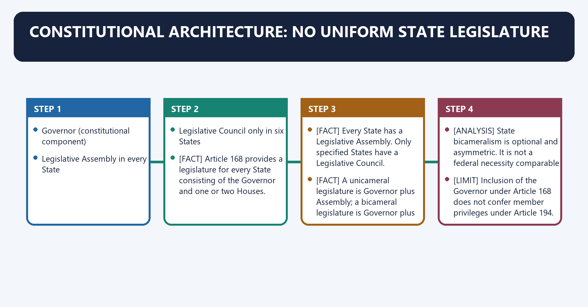
**Visual 1 - Article 168 structure**

```text
STATE LEGISLATURE
      |
      +-- Governor (constitutional component)
      |
      +-- Legislative Assembly in every State
      |
      +-- Legislative Council only in six States
```

Caption: A State legislature includes the Governor, but the Governor is not a member of either House.

- [FACT] Article 168 provides a legislature for every State consisting of the Governor and one or two Houses.
- [FACT] Every State has a Legislative Assembly. Only specified States have a Legislative Council.
- [FACT] A unicameral legislature is Governor plus Assembly; a bicameral legislature is Governor plus Assembly plus Council.
- [ANALYSIS] State bicameralism is optional and asymmetric. It is not a federal necessity comparable to the Rajya Sabha.
- [LIMIT] Inclusion of the Governor under Article 168 does not confer member privileges under Article 194.

**Visual 2 - Six bicameral States**

| Mnemonic | State |
|---|---|
| K | Karnataka |
| A | Andhra Pradesh |
| T | Telangana |
| B | Bihar |
| U | Uttar Pradesh |
| M | Maharashtra |

> **Mnemonic:** KATBUM - the six States with Legislative Councils.

- [FACT] Jammu and Kashmir's Legislative Council was abolished through the 2019 reorganisation framework.
- [FACT] Tamil Nadu's 2010 Council-creation legislation was not brought into force.
- [LIMIT] Proposals or Assembly resolutions for a Council do not themselves create one. Parliament must enact the Article 169 law.

### 02. Article 169: creation or abolition of a Legislative Council

Article 169: creation or abolition of a Legislative Council denotes the constitutional rules and institutional links organised around State Legislative Assembly.
Article 169: creation or abolition of a Legislative Council operates through passes special-majority resolution, connected with Parliament may enact a law.
The operative mechanism matters because by ordinary/simple majority.
Its principal consequence is that council created or abolished.
The decisive contrast is between Incidental constitutional-text changes allowed and without using Article 368.
The exam-safe limitation is that [FACT] The Assembly resolution requires.
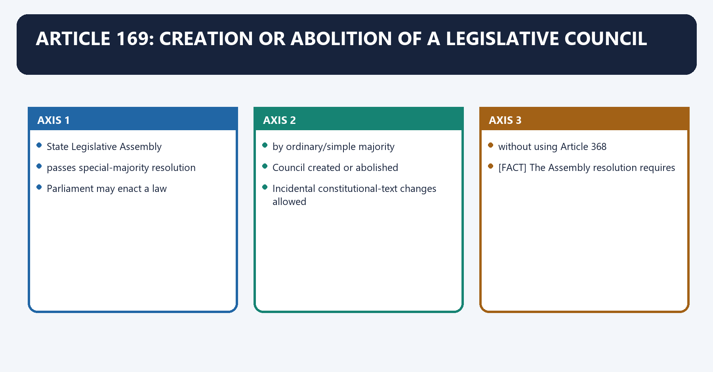
**Visual 3 - Article 169 sequence**

```text
State Legislative Assembly
passes special-majority resolution
        |
        v
Parliament may enact a law
by ordinary/simple majority
        |
        v
Council created or abolished
        |
        v
Incidental constitutional-text changes allowed
without using Article 368
```

- [FACT] The Assembly resolution requires:
  - a majority of the total membership of the Assembly; and
  - a majority of not less than two-thirds of members present and voting.
- [FACT] Parliament may then provide by law for creation or abolition.
- [FACT] Parliament passes that law by ordinary legislative majority.
- [FACT] Article 169 expressly prevents the law from being treated as a constitutional amendment for Article 368.
- [LIMIT] Parliament is enabled, not mechanically compelled, by the Assembly resolution.
- [ANALYSIS] The design lets each State express institutional preference while preserving Parliament's final law-making control.

**Visual 4 - Majority trap**

| Stage | Required majority |
|---|---|
| Assembly resolution | Total-membership majority plus two-thirds present and voting |
| Parliamentary law | Simple/ordinary majority |
| State ratification under Article 368 | Not required |

> **UPSC trap:** The special majority belongs to the initiating Assembly resolution, not to Parliament's later Article 169 Act.

### 03. Legislative Assembly: popular chamber and confidence chamber

Legislative Assembly: popular chamber and confidence chamber denotes the constitutional rules and institutional links organised around direct territorial election.
Legislative Assembly: popular chamber and confidence chamber operates through Legislative Assembly, connected with confidence / no-confidence.
The operative mechanism matters because chief Minister and Council of Ministers.
Its principal consequence is that [FACT] Article 170 ordinarily provides 60 to 500 directly elected members from territorial constituencies.
The decisive contrast is between [FACT] Special constitutional or statutory arrangements permit smaller Assemblies, including Sikkim 32, Goa 40 and Mizoram 40 and [FACT] Universal adult suffrage under Article 326 governs direct election.
The exam-safe limitation is that [FACT] The Council of Ministers is collectively responsible only to the Legislative Assembly under Article 164(2).
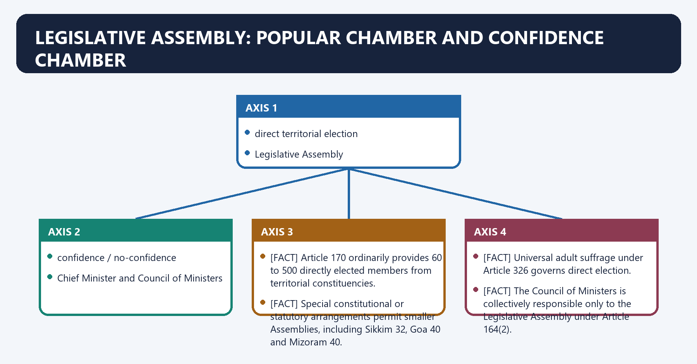
**Visual 5 - Democratic chain**

```text
Adult citizens
   |
direct territorial election
   |
Legislative Assembly
   |
confidence / no-confidence
   |
Chief Minister and Council of Ministers
```

- [FACT] Article 170 ordinarily provides 60 to 500 directly elected members from territorial constituencies.
- [FACT] Special constitutional or statutory arrangements permit smaller Assemblies, including Sikkim 32, Goa 40 and Mizoram 40.
- [FACT] Universal adult suffrage under Article 326 governs direct election.
- [FACT] The Council of Ministers is collectively responsible only to the Legislative Assembly under Article 164(2).
- [ANALYSIS] Direct election plus confidence control makes the Assembly the democratic and political centre of State government.

**Visual 6 - Representation controls**

| Control | Position |
|---|---|
| Territorial constituencies | Direct election |
| Population-seat readjustment | Frozen until relevant figures of first census after 2026 are published |
| SC/ST reservation | Constitutionally protected and population-linked |
| Anglo-Indian nomination | Lapsed under the 104th Amendment |
| Women's reservation | Constitutionally provided, not yet operational |

- [FACT] The 84th Amendment continued the freeze on total seat readjustment until publication of the first census taken after 2026.
- [LIMIT] The year 2026 did not itself trigger delimitation.
- [CURRENT] The 2026 legislative package that sought an earlier route using the 2011 Census failed; the existing constitutional sequence remains controlling.

### 04. Legislative Council: composition and representational logic

Legislative Council: composition and representational logic denotes the constitutional rules and institutional links organised around 1/3 local authorities.
Legislative Council: composition and representational logic operates through 1/3 elected by MLAs from non-MLAs, connected with 1/6 nominated by Governor.
The operative mechanism matters because [FACT] Council strength cannot exceed one-third of the Assembly strength and cannot ordinarily be below 40.
Its principal consequence is that [FACT] Five-sixths are indirectly elected and one-sixth are nominated.
The decisive contrast is between [FACT] Elected categories use proportional representation by means of the single transferable vote and [LIMIT] "Education" is not the exact constitutional category; "literature" and "science" are.
The exam-safe limitation is that share Electoral source Core logic.
**Visual 7 - Article 171 composition wheel**

```text
1/3  local authorities
1/12 graduates
1/12 teachers
1/3  elected by MLAs from non-MLAs
1/6  nominated by Governor
```

- [FACT] Council strength cannot exceed one-third of the Assembly strength and cannot ordinarily be below 40.
- [FACT] Five-sixths are indirectly elected and one-sixth are nominated.
- [FACT] Elected categories use proportional representation by means of the single transferable vote.
- [FACT] Governor-nominated members possess special knowledge or practical experience in literature, science, art, the cooperative movement or social service.
- [LIMIT] "Education" is not the exact constitutional category; "literature" and "science" are.

**Visual 8 - Electoral colleges**

| Share | Electoral source | Core logic |
|---:|---|---|
| 1/3 | Municipalities, district boards and other specified local authorities | Local-government voice |
| 1/12 | Graduates of prescribed standing | Functional constituency |
| 1/12 | Teachers of prescribed standing in qualifying institutions | Functional constituency |
| 1/3 | MLAs elect non-MLAs | Assembly-linked membership |
| 1/6 | Governor nominates | Expertise and public service |

- [ANALYSIS] The Council mixes territorial-local, occupational, Assembly-mediated and expert representation.
- [ANALYSIS] This diversity can improve scrutiny, but old graduate/teacher franchise categories invite reform questions about contemporary representativeness.

### 05. Duration: dissolution versus continuity

Duration: dissolution versus continuity denotes the constitutional rules and institutional links organised around 5-year normal term permanent chamber.
Duration: dissolution versus continuity operates through may be dissolved cannot be dissolved, connected with entire House renewed 1/3 retires every 2 years.
The operative mechanism matters because member term: 6 years.
Its principal consequence is that [FACT] Article 172 gives an Assembly a normal five-year term from its first meeting unless sooner dissolved.
The decisive contrast is between [FACT] The Council is permanent; one-third retire every second year and [ANALYSIS] Council continuity can preserve institutional memory when the Assembly changes abruptly.
The exam-safe limitation is that 5-year normal term permanent chamber.
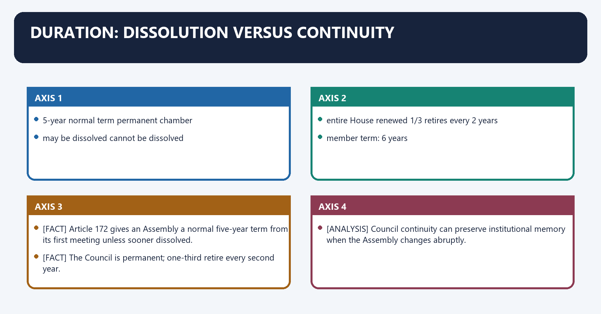
**Visual 9 - House life cycle**

```text
ASSEMBLY                         COUNCIL
5-year normal term              permanent chamber
may be dissolved                cannot be dissolved
entire House renewed            1/3 retires every 2 years
                                member term: 6 years
```

- [FACT] Article 172 gives an Assembly a normal five-year term from its first meeting unless sooner dissolved.
- [FACT] During a National Emergency, Parliament may extend an Assembly term one year at a time, but not beyond six months after the emergency ends.
- [FACT] The Council is permanent; one-third retire every second year.
- [ANALYSIS] Council continuity can preserve institutional memory when the Assembly changes abruptly.

### 06. Qualifications, oath and disqualification

Qualifications, oath and disqualification denotes the constitutional rules and institutional links organised around Requirement Assembly Council.
Qualifications, oath and disqualification operates through Citizenship Indian Indian, connected with Oath/affirmation Required before sitting Required before sitting.
The operative mechanism matters because other qualifications Parliamentary law Parliamentary law.
Its principal consequence is that [FACT] Article 173 contains citizenship, oath and age requirements.
The decisive contrast is between [FACT] Article 188 requires oath or affirmation before the Governor or a person appointed by the Governor and [FACT] Sitting or voting without qualification/oath may attract the Article 193 penalty.
The exam-safe limitation is that office of profit under Union/State.
**Visual 10 - Entry requirements**

| Requirement | Assembly | Council |
|---|---:|---:|
| Citizenship | Indian | Indian |
| Minimum age | 25 | 30 |
| Oath/affirmation | Required before sitting | Required before sitting |
| Other qualifications | Parliamentary law | Parliamentary law |

- [FACT] Article 173 contains citizenship, oath and age requirements.
- [FACT] Article 188 requires oath or affirmation before the Governor or a person appointed by the Governor.
- [FACT] Sitting or voting without qualification/oath may attract the Article 193 penalty.

**Visual 11 - Article 191 disqualifications**

```text
Office of profit under Union/State
Unsound mind declared by competent court
Undischarged insolvent
Not citizen / foreign allegiance
Disqualified by parliamentary law
Tenth Schedule defection
```

- [FACT] Article 191 supplies constitutional grounds; the Representation of the People Act adds statutory grounds.
- [FACT] Under Article 192, a non-defection question of member disqualification is decided by the Governor after obtaining and acting according to the Election Commission's opinion.
- [FACT] Tenth Schedule disputes are decided by the Speaker or Chairman, subject to judicial review.
- [LIMIT] Do not send a Tenth Schedule question to the Governor under Article 192.

### 07. Sessions, prorogation and dissolution

Sessions, prorogation and dissolution denotes the constitutional rules and institutional links organised around Governor summons House(s).
Sessions, prorogation and dissolution operates through not more than 6 months between sessions, connected with may prorogue House(s).
The operative mechanism matters because may dissolve Assembly.
Its principal consequence is that [FACT] The Governor summons each House from time to time.
The decisive contrast is between [FACT] Six months cannot intervene between the last sitting in one session and the first sitting in the next and [FACT] Prorogation ends a session; adjournment suspends a sitting; dissolution ends the Assembly's life.
The exam-safe limitation is that [FACT] A Legislative Council is never dissolved.
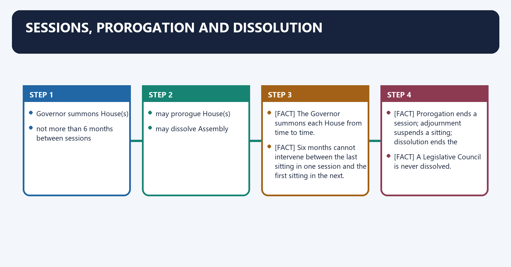
**Visual 12 - Article 174 controls**

```text
Governor summons House(s)
       |
       +-- not more than 6 months between sessions
       |
       +-- may prorogue House(s)
       |
       +-- may dissolve Assembly
```

- [FACT] The Governor summons each House from time to time.
- [FACT] Six months cannot intervene between the last sitting in one session and the first sitting in the next.
- [FACT] Prorogation ends a session; adjournment suspends a sitting; dissolution ends the Assembly's life.
- [FACT] A Legislative Council is never dissolved.
- [LIMIT] The Governor ordinarily acts on ministerial advice; Article 174 is not a general personal discretion.

**Visual 13 - Terminology**

| Device | Authority | Effect |
|---|---|---|
| Adjournment | Presiding officer/House | Suspends sitting |
| Adjournment sine die | Presiding officer | Ends sittings without next date |
| Prorogation | Governor | Ends session |
| Dissolution | Governor constitutionally | Ends Assembly |

### 08. Governor's address and messages

Governor's address and messages denotes the constitutional rules and institutional links organised around address either House or both.
Governor's address and messages operates through send messages on pending or other matters, connected with Article 176 special address.
The operative mechanism matters because first session after each general election.
Its principal consequence is that first session of each year.
The decisive contrast is between followed by Motion of Thanks and [FACT] The special address states the causes of summoning and outlines the government's programme.
The exam-safe limitation is that [ANALYSIS] Debate on the Motion of Thanks is a broad accountability occasion, not merely ceremonial response.
**Visual 14 - Articles 175-176**

```text
Article 175
  - address either House or both
  - send messages on pending or other matters

Article 176 special address
  - first session after each general election
  - first session of each year
  - followed by Motion of Thanks
```

- [FACT] The special address states the causes of summoning and outlines the government's programme.
- [ANALYSIS] Debate on the Motion of Thanks is a broad accountability occasion, not merely ceremonial response.
- [LIMIT] Defeat on an amendment or Motion of Thanks may be politically serious, but confidence consequences depend on context and House practice.

### 09. Presiding officers: offices and continuity

Presiding officers: offices and continuity denotes the constitutional rules and institutional links organised around House Presiding officer Deputy.
Presiding officers: offices and continuity operates through Assembly Speaker Deputy Speaker, connected with Council Chairman Deputy Chairman.
The operative mechanism matters because [FACT] Articles 178-181 govern Assembly officers; Articles 182-185 govern Council officers.
Its principal consequence is that [FACT] Each House chooses its presiding and deputy presiding officer from among its members.
The decisive contrast is between [FACT] An Assembly Speaker resigns to the Deputy Speaker; the Deputy Speaker resigns to the Speaker and [FACT] Removal requires a resolution passed by a majority of all then members after at least 14 days' notice.
The exam-safe limitation is that [FACT] The Speaker continues after dissolution until immediately before the first meeting of the next Assembly.
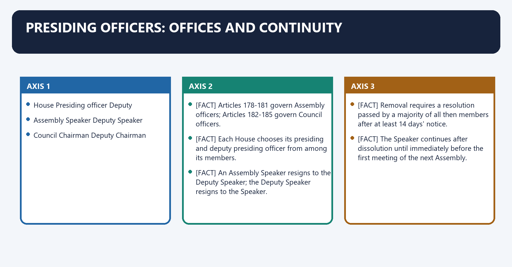
**Visual 15 - Constitutional offices**

| House | Presiding officer | Deputy |
|---|---|---|
| Assembly | Speaker | Deputy Speaker |
| Council | Chairman | Deputy Chairman |

- [FACT] Articles 178-181 govern Assembly officers; Articles 182-185 govern Council officers.
- [FACT] Each House chooses its presiding and deputy presiding officer from among its members.
- [FACT] An Assembly Speaker resigns to the Deputy Speaker; the Deputy Speaker resigns to the Speaker.
- [FACT] Removal requires a resolution passed by a majority of all then members after at least 14 days' notice.
- [FACT] The Speaker continues after dissolution until immediately before the first meeting of the next Assembly.
- [FACT] A presiding officer does not preside over a motion for their own removal but may participate and vote in the first instance.

**Visual 16 - Speaker's core functions**

```text
ORDER AND PROCEDURE
  +-- interprets rules
  +-- recognises speakers
  +-- maintains discipline
  +-- decides admissibility

CONSTITUTIONAL FUNCTIONS
  +-- Money Bill certification
  +-- Tenth Schedule adjudication
  +-- casting vote when tied
```

### 10. Impartiality and the Speaker problem

Impartiality and the Speaker problem denotes the constitutional rules and institutional links organised around Speaker remains party member.
Impartiality and the Speaker problem operates through controls House agenda and recognition, connected with decides defection petitions.
The operative mechanism matters because risk of partisan delay or selective urgency.
Its principal consequence is that [FACT] The Tenth Schedule assigns defection decisions to the Speaker/Chairman.
The decisive contrast is between [FACT] Kihoto Hollohan treats the presiding officer as a tribunal subject to judicial review and [LIMIT] The independent tribunal and statutory deadline are proposals, not enacted law.
The exam-safe limitation is that [ANALYSIS] Neutrality cannot rest only on personal virtue where office incentives are partisan.
**Visual 17 - Institutional tension**

```text
Speaker remains party member
          +
controls House agenda and recognition
          +
decides defection petitions
          =
risk of partisan delay or selective urgency
```

- [FACT] The Tenth Schedule assigns defection decisions to the Speaker/Chairman.
- [FACT] *Kihoto Hollohan* treats the presiding officer as a tribunal subject to judicial review.
- [FACT] *Keisham Meghachandra Singh* (2020) stated that petitions should ordinarily be decided within a reasonable period of about three months and urged Parliament to consider an independent tribunal.
- [FACT] *Subhash Desai* (2023) holds that the whip and leader recognised for Tenth Schedule purposes must be appointed by the political party, not merely a legislature-party faction.
- [LIMIT] The independent tribunal and statutory deadline are proposals, not enacted law.
- [ANALYSIS] Neutrality cannot rest only on personal virtue where office incentives are partisan.

### 11. Quorum, voting and vacancies

Quorum, voting and vacancies denotes the constitutional rules and institutional links organised around Rule State House position.
Quorum, voting and vacancies operates through Ordinary decision Majority of members present and voting, connected with Presiding officer No first vote; casting vote on equality.
The operative mechanism matters because quorum 10 members or one-tenth, whichever is greater.
Its principal consequence is that vacancy House may act despite vacancies, subject to constitutional limits.
The decisive contrast is between UPSC trap: State quorum is not merely one-tenth; it is 10 or one-tenth, whichever is greater and [FACT] If quorum is absent, the presiding officer must adjourn or suspend the meeting until quorum exists.
The exam-safe limitation is that rule State House position.
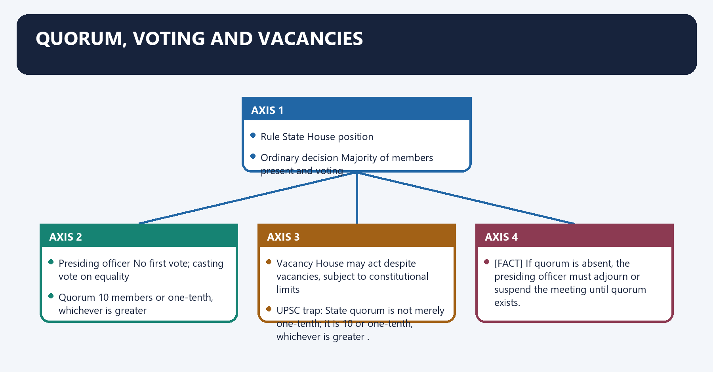
**Visual 18 - Article 189**

| Rule | State House position |
|---|---|
| Ordinary decision | Majority of members present and voting |
| Presiding officer | No first vote; casting vote on equality |
| Quorum | 10 members or one-tenth, whichever is greater |
| Vacancy | House may act despite vacancies, subject to constitutional limits |

> **UPSC trap:** State quorum is not merely one-tenth; it is **10 or one-tenth, whichever is greater**.

- [FACT] If quorum is absent, the presiding officer must adjourn or suspend the meeting until quorum exists.
- [ANALYSIS] Vacancies do not automatically paralyse a House, but disputed majorities must be tested against the effective constitutional membership and valid votes.

### 12. Privileges and freedom of speech

Privileges and freedom of speech denotes the constitutional rules and institutional links organised around Freedom of speech in legislature.
Privileges and freedom of speech operates through subject to Constitution and House rules, connected with immunity for vote or speech in House/committee.
The operative mechanism matters because authorised publication immunity.
Its principal consequence is that [FACT] Article 194 protects members from court proceedings for speech or vote in the House or committee.
The decisive contrast is between [FACT] Privilege belongs to members and the House; it is not a general immunity for conduct outside legislative functions and [FACT] Article 211 bars discussion of the conduct of Supreme Court or High Court judges in discharge of duties.
The exam-safe limitation is that [LIMIT] The Governor is a component of the legislature but not a House member and does not acquire Article 194 member privilege.
**Visual 19 - Article 194 shield**

```text
Freedom of speech in legislature
       |
       +-- subject to Constitution and House rules
       |
       +-- immunity for vote or speech in House/committee
       |
       +-- authorised publication immunity
```

- [FACT] Article 194 protects members from court proceedings for speech or vote in the House or committee.
- [FACT] Privilege belongs to members and the House; it is not a general immunity for conduct outside legislative functions.
- [FACT] Article 211 bars discussion of the conduct of Supreme Court or High Court judges in discharge of duties.
- [LIMIT] The Governor is a component of the legislature but not a House member and does not acquire Article 194 member privilege.
- [ANALYSIS] Privilege protects deliberative independence, not corruption or substantive constitutional illegality.

### 13. Ordinary Bills in a unicameral State

Ordinary Bills in a unicameral State denotes the constitutional rules and institutional links organised around Introduction in Assembly.
Ordinary Bills in a unicameral State operates through readings / debate / committee / vote, connected with passed by Assembly.
The operative mechanism matters because presented to Governor under Article 200.
Its principal consequence is that assent / return / withhold / reserve.
The decisive contrast is between [FACT] Subject to special rules, an ordinary Bill may be introduced by a minister or private member and [FACT] A Bill pending in the Assembly lapses on dissolution unless constitutional doctrine provides otherwise.
The exam-safe limitation is that [FACT] A Bill passed by the Assembly but pending with the Council ordinarily lapses on Assembly dissolution.
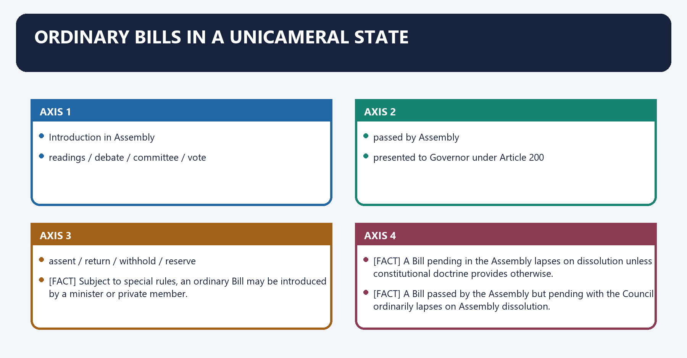
**Visual 20 - Unicameral route**

```text
Introduction in Assembly
       |
readings / debate / committee / vote
       |
passed by Assembly
       |
presented to Governor under Article 200
       |
assent / return / withhold / reserve
```

- [FACT] Subject to special rules, an ordinary Bill may be introduced by a minister or private member.
- [FACT] A Bill pending in the Assembly lapses on dissolution unless constitutional doctrine provides otherwise.
- [FACT] A Bill passed by the Assembly but pending with the Council ordinarily lapses on Assembly dissolution.
- [LIMIT] Bill-lapse questions are status-sensitive; always identify the House and stage.

### 14. Ordinary Bills in a bicameral State

Ordinary Bills in a bicameral State denotes the constitutional rules and institutional links organised around Assembly passes Bill.
Ordinary Bills in a bicameral State operates through Council rejects / delays / amends, connected with Assembly passes again.
The operative mechanism matters because bill deemed passed in Assembly form.
Its principal consequence is that [FACT] The Council cannot permanently veto an ordinary Bill.
The decisive contrast is between [FACT] Total potential delay is approximately four months: three months plus one month and [FACT] There is no joint sitting of State Houses.
The exam-safe limitation is that [ANALYSIS] The Council is a suspensive or dilatory chamber, not a co-equal revising chamber.
**Visual 21 - Article 197: maximum Council delay**

```text
Assembly passes Bill
       |
Council rejects / delays / amends
       |
up to 3 months
       |
Assembly passes again
       |
Council rejects / delays / amends
       |
up to 1 month
       |
Bill deemed passed in Assembly form
```

- [FACT] The Council cannot permanently veto an ordinary Bill.
- [FACT] Total potential delay is approximately four months: three months plus one month.
- [FACT] There is no joint sitting of State Houses.
- [ANALYSIS] The Council is a suspensive or dilatory chamber, not a co-equal revising chamber.
- [LIMIT] Four months is the maximum constitutional delay across the two-stage route, not a single fixed holding period.

**Visual 22 - Assembly versus Council on ordinary Bills**

| Feature | Assembly | Council |
|---|---|---|
| Initiation | Yes | Yes, except Money/financial restrictions |
| Final control | Yes | No |
| First-stage delay | Repasses | Up to 3 months |
| Second-stage delay | Prevails | Up to 1 month |
| Joint sitting | Not applicable | No joint sitting exists |

### 15. Money Bills: Assembly monopoly

Money Bills: Assembly monopoly denotes the constitutional rules and institutional links organised around Governor's recommendation.
Money Bills: Assembly monopoly operates through introduction only in Assembly, connected with Speaker certifies Money Bill.
The operative mechanism matters because council may recommend within 14 days.
Its principal consequence is that assembly accepts or rejects recommendations.
The decisive contrast is between [FACT] Article 199 defines a State Money Bill and makes the Speaker's certificate central and [FACT] A Money Bill cannot be introduced in the Council.
The exam-safe limitation is that [FACT] The Council must return it within 14 days with recommendations, which the Assembly may accept or reject.
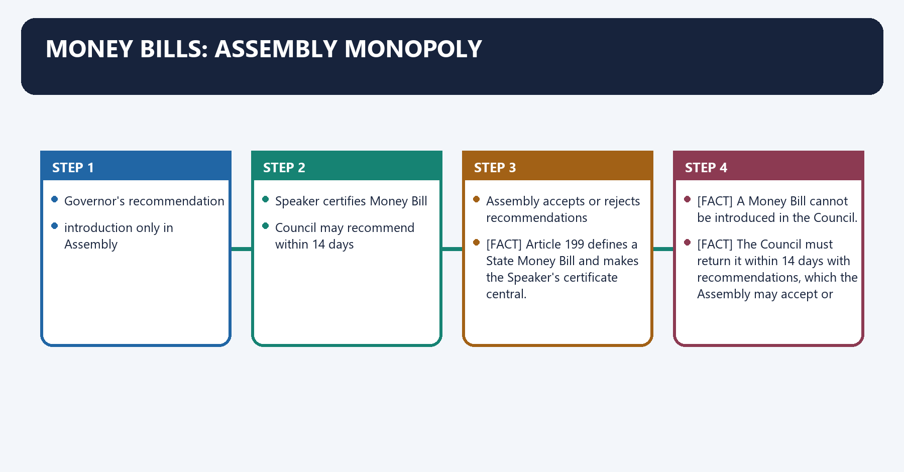
**Visual 23 - Money Bill route**

```text
Governor's recommendation
       |
introduction only in Assembly
       |
Speaker certifies Money Bill
       |
Council may recommend within 14 days
       |
Assembly accepts or rejects recommendations
       |
Governor
```

- [FACT] Article 199 defines a State Money Bill and makes the Speaker's certificate central.
- [FACT] A Money Bill cannot be introduced in the Council.
- [FACT] The Council must return it within 14 days with recommendations, which the Assembly may accept or reject.
- [FACT] If not returned within 14 days, it is deemed passed in the Assembly form.
- [FACT] A Money Bill cannot be returned by the Governor for reconsideration under Article 200.
- [ANALYSIS] The confidence chamber controls taxation, borrowing and the Consolidated Fund.

**Visual 24 - Money Bill close options**

| Claim | Correct position |
|---|---|
| Council may reject | No |
| Council may amend | Only recommend |
| Council has 14 days | Yes |
| Speaker certifies | Yes |
| Joint sitting resolves dispute | No |

### 16. Governor's assent under Articles 200-201

Governor's assent under Articles 200-201 denotes the constitutional rules and institutional links organised around Bill presented to Governor.
Governor's assent under Articles 200-201 operates through return non-Money Bill for reconsideration, connected with reserve for President.
The operative mechanism matters because [FACT] Reservation is mandatory where the Bill would so derogate from High Court powers as to endanger its constitutional position.
Its principal consequence is that [FACT] Under Article 201, the President may assent, withhold, or direct return of a non-Money Bill.
The decisive contrast is between [FACT] Repassage after presidentially directed return does not compel presidential assent and [LIMIT] A court may require constitutional action; it does not choose the substantive option for the Governor or President.
The exam-safe limitation is that bill presented to Governor.
**Visual 25 - Four Article 200 routes**

```text
Bill presented to Governor
   |
   +-- assent
   +-- withhold assent
   +-- return non-Money Bill for reconsideration
   +-- reserve for President
```

- [FACT] A returned non-Money Bill, if repassed, is presented again and the constitutional text states that the Governor shall not withhold assent.
- [FACT] Reservation is mandatory where the Bill would so derogate from High Court powers as to endanger its constitutional position.
- [FACT] Under Article 201, the President may assent, withhold, or direct return of a non-Money Bill.
- [FACT] Repassage after presidentially directed return does not compel presidential assent.
- [CURRENT] The November 2025 Article 143 opinion rejects rigid court-written timelines and deemed assent, but prolonged unexplained inaction remains amenable to limited judicial review and a direction to decide.
- [LIMIT] A court may require constitutional action; it does not choose the substantive option for the Governor or President.

### 17. Annual financial statement and demands for grants

Annual financial statement and demands for grants denotes the constitutional rules and institutional links organised around Annual Financial Statement: Article 202.
Annual financial statement and demands for grants operates through charged expenditure identified, connected with demands for grants voted by Assembly: Article 203.
The operative mechanism matters because appropriation Bill: Article 204.
Its principal consequence is that finance/financial legislation: Article 207.
The decisive contrast is between [FACT] The Governor causes the annual financial statement to be laid before the House or Houses and [FACT] Charged expenditure is discussed but not voted.
The exam-safe limitation is that [FACT] Demands for grants are submitted only to the Assembly and require the Governor's recommendation.
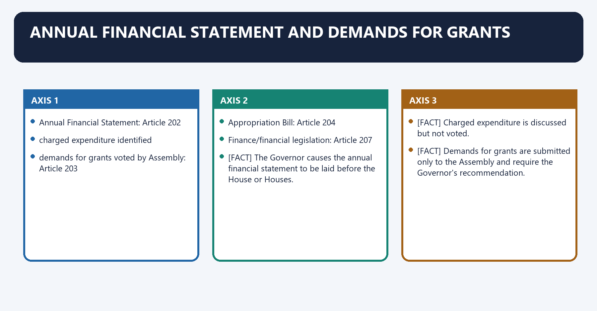
**Visual 26 - State budget chain**

```text
Annual Financial Statement: Article 202
       |
charged expenditure identified
       |
demands for grants voted by Assembly: Article 203
       |
Appropriation Bill: Article 204
       |
Finance/financial legislation: Article 207
```

- [FACT] The Governor causes the annual financial statement to be laid before the House or Houses.
- [FACT] Charged expenditure is discussed but not voted.
- [FACT] Demands for grants are submitted only to the Assembly and require the Governor's recommendation.
- [FACT] No money may be withdrawn from the Consolidated Fund of the State except under appropriation made by law.
- [FACT] The Council cannot vote demands for grants.

**Visual 27 - Grants toolkit**

| Device | Purpose |
|---|---|
| Supplementary grant | Original amount insufficient |
| Additional grant | New service not contemplated |
| Excess grant | Expenditure exceeded authorised amount |
| Vote on account | Short-term expenditure pending full budget |
| Vote of credit | Unexpected demand of indefinite character |
| Exceptional grant | Special purpose outside current service |

### 18. Financial Bills and recommendation

Financial Bills and recommendation denotes the constitutional rules and institutional links organised around Question Money Bill Wider Financial Bill.
Financial Bills and recommendation operates through Contains only Article 199 matters Yes May contain other matters, connected with Introduction Assembly only Constitutionally restricted as applicable.
The operative mechanism matters because governor recommendation Required Required for specified financial provisions.
Its principal consequence is that council power Recommendation only, 14 days Ordinary-Bill route may apply.
The decisive contrast is between Speaker certification Conclusive constitutional role Not a Money Bill certificate unless Article 199 test met and [LIMIT] Do not label every Bill involving expenditure a Money Bill.
The exam-safe limitation is that [ANALYSIS] Classification matters because it determines the Council's power and the available legislative route.
**Visual 28 - Money Bill versus Financial Bill**

| Question | Money Bill | Wider Financial Bill |
|---|---|---|
| Contains only Article 199 matters | Yes | May contain other matters |
| Introduction | Assembly only | Constitutionally restricted as applicable |
| Governor recommendation | Required | Required for specified financial provisions |
| Council power | Recommendation only, 14 days | Ordinary-Bill route may apply |
| Speaker certification | Conclusive constitutional role | Not a Money Bill certificate unless Article 199 test met |

- [LIMIT] Do not label every Bill involving expenditure a Money Bill.
- [ANALYSIS] Classification matters because it determines the Council's power and the available legislative route.

### 19. Legislative accountability devices

Legislative accountability devices denotes the constitutional rules and institutional links organised around Zero Hour / special mention.
Legislative accountability devices operates through Calling attention / discussion, connected with ministerial explanation.
The operative mechanism matters because adjournment-type devices.
Its principal consequence is that censure and disruption of normal business.
The decisive contrast is between No-confidence motion and government survival.
The exam-safe limitation is that [FACT] Collective responsibility makes Assembly confidence decisive.
**Visual 29 - Accountability ladder**

```text
Question Hour
   -> information
Zero Hour / special mention
   -> urgency
Calling attention / discussion
   -> ministerial explanation
Adjournment-type devices
   -> censure and disruption of normal business
No-confidence motion
   -> government survival
Committees
   -> detailed scrutiny
```

- [FACT] Collective responsibility makes Assembly confidence decisive.
- [FACT] A Legislative Council may question and debate ministers but cannot remove the ministry through no-confidence.
- [ANALYSIS] Daily accountability is broader than government survival: questions, discussions, budget control and committees expose policy to reasons.
- [LIMIT] Exact device names and admissibility conditions vary under State House rules.

### 20. Committees and scrutiny

Committees and scrutiny denotes the constitutional rules and institutional links organised around Full House constraints.
Committees and scrutiny operates through political speeches, connected with Committee advantage.
The operative mechanism matters because evidence and departments.
Its principal consequence is that clause-level scrutiny.
The decisive contrast is between [FACT] Financial committees include the Public Accounts Committee, Estimates Committee and Committee on Public Undertakings and [ANALYSIS] Strong subject committees can compensate for short sessions and rushed plenary passage.
The exam-safe limitation is that full House constraints.
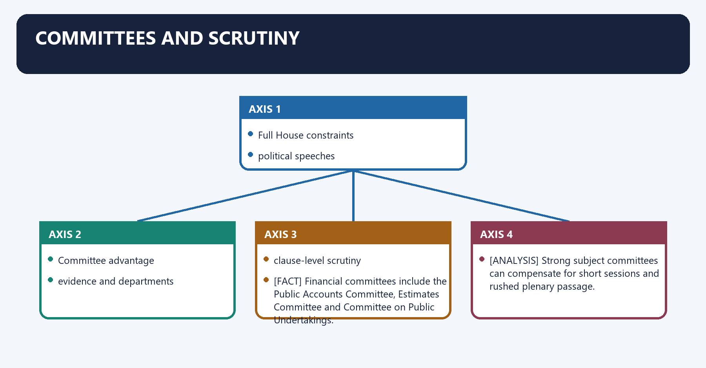
**Visual 30 - Why committees matter**

```text
Full House constraints
  - limited time
  - political speeches
  - complex Bills
        |
        v
Committee advantage
  - smaller forum
  - evidence and departments
  - clause-level scrutiny
  - cross-party work
```

- [FACT] Financial committees include the Public Accounts Committee, Estimates Committee and Committee on Public Undertakings.
- [ANALYSIS] Strong subject committees can compensate for short sessions and rushed plenary passage.
- [LIMIT] Committee systems differ across States; do not assume every State mirrors Parliament's department-related standing committee structure.

### 21. Anti-defection inside the State House

Anti-defection inside the State House denotes the constitutional rules and institutional links organised around voluntarily gives up membership.
Anti-defection inside the State House operates through defies whip without permission/condonation, connected with Independent member.
The operative mechanism matters because joins party after six months.
Its principal consequence is that merger supported by at least 2/3.
The decisive contrast is between [FACT] The 52nd Amendment inserted the Tenth Schedule; the 91st Amendment removed the split exception and [FACT] Only the two-thirds merger defence survives.
The exam-safe limitation is that [FACT] Speaker/Chairman decides, subject to judicial review under Kihoto Hollohan.
**Visual 31 - Tenth Schedule basics**

```text
Party member
  - voluntarily gives up membership
  - defies whip without permission/condonation

Independent member
  - joins any party

Nominated member
  - joins party after six months

Exception
  - merger supported by at least 2/3
```

- [FACT] The 52nd Amendment inserted the Tenth Schedule; the 91st Amendment removed the split exception.
- [FACT] Only the two-thirds merger defence survives.
- [FACT] Speaker/Chairman decides, subject to judicial review under *Kihoto Hollohan*.
- [FACT] "Voluntarily giving up" may be inferred from conduct under *Ravi S. Naik*.
- [FACT] *Rajendra Singh Rana* confirms that Speaker inaction can be reviewed.
- [LIMIT] The approximately three-month norm from *Keisham* is not a statutory deadline.

### 22. Legislative Council versus Rajya Sabha

Legislative Council versus Rajya Sabha denotes the constitutional rules and institutional links organised around Dimension Legislative Council Rajya Sabha.
Legislative Council versus Rajya Sabha operates through Constitutional status Optional Mandatory Union House, connected with Represents Mixed local/functional/expert interests States in Union federation.
The operative mechanism matters because creation/abolition Article 169 route Cannot be abolished by ordinary law.
Its principal consequence is that ordinary Bills Only delays up to about 4 months Co-equal except joint-sitting route.
The decisive contrast is between Money Bills Recommends for 14 days Recommends for 14 days and Executive confidence No Union Council responsible only to Lok Sabha.
The exam-safe limitation is that special powers No Article 249/312 equivalent Articles 249 and 312.
**Visual 32 - Side-by-side comparison**

| Dimension | Legislative Council | Rajya Sabha |
|---|---|---|
| Constitutional status | Optional | Mandatory Union House |
| Represents | Mixed local/functional/expert interests | States in Union federation |
| Creation/abolition | Article 169 route | Cannot be abolished by ordinary law |
| Ordinary Bills | Only delays up to about 4 months | Co-equal except joint-sitting route |
| Money Bills | Recommends for 14 days | Recommends for 14 days |
| Executive confidence | No | Union Council responsible only to Lok Sabha |
| Special powers | No Article 249/312 equivalent | Articles 249 and 312 |

- [ANALYSIS] Similar permanence and Money Bill weakness should not hide the Council's deeper inferiority on ordinary legislation and federal purpose.

### 23. Legislative Council: case for and against

Legislative Council: case for and against denotes the constitutional rules and institutional links organised around Case for Council Case against Council.
Legislative Council: case for and against operates through second look at legislation can only delay, connected with institutional continuity recurring expenditure.
The operative mechanism matters because local-body and expert voices indirect/patronage concerns.
Its principal consequence is that forum for experienced public figures graduate/teacher categories may be dated.
The decisive contrast is between checks Assembly haste may duplicate partisan balance and [LIMIT] "White elephant" is a critique, not a constitutional conclusion.
The exam-safe limitation is that case for Council Case against Council.
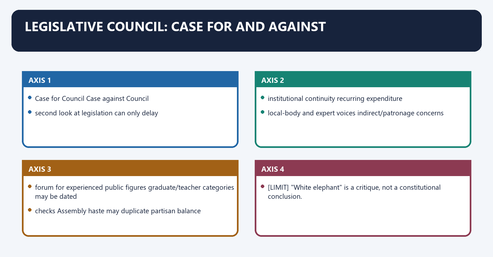
**Visual 33 - Retain, reform or abolish**

| Case for Council | Case against Council |
|---|---|
| second look at legislation | can only delay |
| institutional continuity | recurring expenditure |
| local-body and expert voices | indirect/patronage concerns |
| forum for experienced public figures | graduate/teacher categories may be dated |
| checks Assembly haste | may duplicate partisan balance |

- [ANALYSIS] A Council's value is empirical and State-specific. A different majority and strong committees may create scrutiny; a mirror-image chamber may add little.
- [ANALYSIS] The best reform position is conditional: retain where it demonstrably improves scrutiny, reform composition and working, and abolish where it functions only as patronage.
- [LIMIT] "White elephant" is a critique, not a constitutional conclusion.

### 24. State legislative performance and the scrutiny deficit

State legislative performance and the scrutiny deficit denotes the constitutional rules and institutional links organised around weak committee referral.
State legislative performance and the scrutiny deficit operates through late Bill circulation, connected with executive dominance.
The operative mechanism matters because lower legislative legitimacy.
Its principal consequence is that [ANALYSIS] State legislatures often face short sessions, weak research support, rushed Bills and uneven committee systems.
The decisive contrast is between [LIMIT] Sitting-day and referral rates change by State and year. Use verified figures only when a current source is available and Problem Targeted reform.
The exam-safe limitation is that short sessions minimum annual sitting calendar through rules/convention.
**Visual 34 - Causal chain**

```text
Few sitting days
   + disruptions
   + weak committee referral
   + late Bill circulation
        |
        v
compressed debate
        |
        v
executive dominance
        |
        v
lower legislative legitimacy
```

- [ANALYSIS] State legislatures often face short sessions, weak research support, rushed Bills and uneven committee systems.
- [ANALYSIS] The result is not merely fewer speeches; it is less evidence, less opposition input and weaker anticipation of implementation problems.
- [LIMIT] Sitting-day and referral rates change by State and year. Use verified figures only when a current source is available.

**Visual 35 - Reform map**

| Problem | Targeted reform |
|---|---|
| Short sessions | minimum annual sitting calendar through rules/convention |
| Rushed Bills | mandatory prior publication except certified urgency |
| Weak committees | subject committees with evidence powers and tracked replies |
| Speaker partisanship | office convention or independent defection tribunal |
| Assent delay | public Bill tracker and reasoned constitutional action |
| Council legitimacy | modernise electorate categories and nomination transparency |
| Poor research | non-partisan legislative research service |

### 25. Women's reservation, delimitation and State Assemblies

Women's reservation, delimitation and State Assemblies denotes the constitutional rules and institutional links organised around first census after commencement.
Women's reservation, delimitation and State Assemblies operates through publication of census figures, connected with delimitation exercise.
The operative mechanism matters because reservation activated in Assembly constituencies.
Its principal consequence is that [FACT] Reservation is linked to post-census delimitation and is not self-executing merely because the amendment exists.
The decisive contrast is between [CURRENT] The 2026 attempt to alter this sequence and use the 2011 Census did not become law and [CURRENT] Census 2027 publication and later delimitation dates are not yet fixed.
The exam-safe limitation is that [LIMIT] Do not state that one-third of current Assembly seats are already reserved for women.
**Visual 36 - Current constitutional sequence**

```text
106th Amendment
   |
first census after commencement
   |
publication of census figures
   |
delimitation exercise
   |
reservation activated in Assembly constituencies
```

- [FACT] The amendment provides one-third reservation in the Lok Sabha and State Legislative Assemblies, including within SC/ST-reserved seats.
- [FACT] Reservation is linked to post-census delimitation and is not self-executing merely because the amendment exists.
- [CURRENT] The 2026 attempt to alter this sequence and use the 2011 Census did not become law.
- [CURRENT] Census 2027 publication and later delimitation dates are not yet fixed.
- [LIMIT] Do not state that one-third of current Assembly seats are already reserved for women.
- [LIMIT] The provision does not extend to Legislative Councils.

### 26. Articles 208-212: procedure, language and judicial restraint

Articles 208-212: procedure, language and judicial restraint denotes the constitutional rules and institutional links organised around 208 Rules of procedure.
Articles 208-212: procedure, language and judicial restraint operates through 209 Law regulating financial-business procedure, connected with 210 Language in legislature.
The operative mechanism matters because 211 Bar on discussion of judges' conduct.
Its principal consequence is that 212 Courts not to question procedural irregularity.
The decisive contrast is between [FACT] Article 212 protects proceedings from judicial inquiry merely on an alleged procedural irregularity and [LIMIT] It does not immunise substantive illegality, mala fides or constitutional violations.
The exam-safe limitation is that 208 Rules of procedure.
**Visual 37 - Closing constitutional map**

| Article | Subject |
|---:|---|
| 208 | Rules of procedure |
| 209 | Law regulating financial-business procedure |
| 210 | Language in legislature |
| 211 | Bar on discussion of judges' conduct |
| 212 | Courts not to question procedural irregularity |

- [FACT] Article 212 protects proceedings from judicial inquiry merely on an alleged procedural irregularity.
- [LIMIT] It does not immunise substantive illegality, mala fides or constitutional violations.
- [ANALYSIS] Legislative autonomy and judicial review coexist: courts avoid managing internal procedure but remain guardians of constitutional boundaries.

### 27. Full Articles 168-212 rapid map

Full Articles 168-212 rapid map denotes the constitutional rules and institutional links organised around 168 Constitution of State legislatures.
Full Articles 168-212 rapid map operates through 169 Creation/abolition of Councils, connected with 170 Assembly composition.
The operative mechanism matters because 171 Council composition.
Its principal consequence is that 173 Qualifications.
The decisive contrast is between 174 Sessions, prorogation, dissolution and 175 Governor's address/messages.
The exam-safe limitation is that 176 Special address.
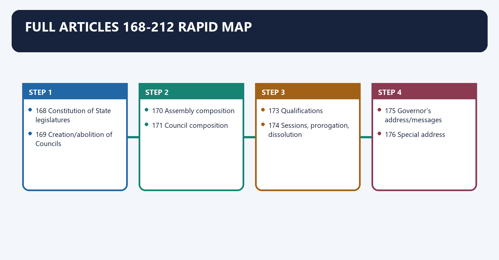
| Article | Recall |
|---:|---|
| 168 | Constitution of State legislatures |
| 169 | Creation/abolition of Councils |
| 170 | Assembly composition |
| 171 | Council composition |
| 172 | Duration |
| 173 | Qualifications |
| 174 | Sessions, prorogation, dissolution |
| 175 | Governor's address/messages |
| 176 | Special address |
| 177 | Rights of ministers and Advocate General |
| 178-181 | Assembly presiding officers |
| 182-185 | Council presiding officers |
| 186-187 | Salaries and secretariat |
| 188 | Oath |
| 189 | Voting, vacancies and quorum |
| 190 | Vacation of seats |
| 191 | Disqualification |
| 192 | Decision on disqualification |
| 193 | Penalty for unauthorised sitting/voting |
| 194-195 | Privileges and salaries |
| 196-197 | Ordinary Bills and Council limitation |
| 198-199 | Money Bills |
| 200-201 | Assent and reserved Bills |
| 202-207 | Financial procedure |
| 208-212 | Rules, language, judges and courts |

### Semantic-completeness ownership and PYQ control

- **Constitutional map:** Article 168 permits one or two Houses with the Governor
  as a component of the legislature. Articles 169-177 govern creation,
  composition, duration, qualification and participation; Articles 178-187
  officers; Articles 188-212 oath, voting, disqualification, privileges,
  legislation, finance, procedure and judicial non-interference.
- **Article 169 route:** the Assembly first resolves by a majority of total
  membership plus two-thirds present and voting; Parliament then creates or
  abolishes the Council by ordinary law and simple majority. The resulting law is
  expressly not an Article 368 constitutional amendment.
- **Composition:** the Assembly is directly elected and normally has 60-500
  members subject to special provisions. A Council may not exceed one-third of
  Assembly strength and ordinarily has at least forty members; Article 171's
  local-body, graduate, teacher, MLA and nominated fractions must remain exact.
- **Duration and officers:** the Assembly normally lasts five years and may be
  dissolved; the Council is permanent with one-third retiring every second year.
  Speaker/Deputy Speaker and Chairman/Deputy Chairman have distinct removal,
  vacancy, casting-vote and continuity rules.
- **Bicameral inequality:** Article 197 allows a Council to delay an ordinary Bill
  for three months and then one month after Assembly repassage. There is no State
  joint sitting. A Council-originated Bill rejected by the Assembly ends.
- **Finance firewall:** Money Bills originate only in the Assembly, receive a
  fourteen-day recommendatory Council review and Speaker certification. Article
  207(1) mixed financial Bills and Article 207(3) expenditure Bills are distinct;
  neither category becomes a Money Bill merely because expenditure is involved.
- **Lapse and procedure:** prorogation does not lapse Bills; Council-only pending
  Bills survive Assembly dissolution; Assembly-pending and Assembly-passed/
  Council-pending Bills lapse. Article 212 protects procedural irregularity, not
  substantive illegality or unconstitutionality.
- **Presiding-officer review:** Kihoto Hollohan makes the Speaker a Tenth-Schedule
  tribunal subject to review. Keisham Meghachandra supplies the ordinarily
  three-month norm; Padi Kaushik Reddy (31 July 2025) directed the Telangana
  Speaker to conclude ten pending petitions within three months and confirms that
  Articles 122/212 immunity does not attach to Paragraph 6 adjudication.
- **Current representation control:** Andhra Pradesh, Bihar, Karnataka,
  Maharashtra, Telangana and Uttar Pradesh retain Councils. The 106th Amendment
  commenced on 16 April 2026 but reservation remains dormant until the Article
  334A census-publication-delimitation sequence. Census 2027 reference dates are
  notified; publication and delimitation dates are not.
- **Four-ledger/PYQ control:** all direct and routed 2018-2025 Council,
  presiding-officer, Bill, finance and assent demands were retained. Parliament's
  Union procedure and the Governor's executive doctrine remain cross-owned.

## BASIC MCQS / REMEDIATION

### Original MCQ loop - strict A -> B -> C -> D rotation

#### OM1. State bicameralism

Which statement is correct?

A. Every State has an Assembly, while only specified States have a Council.  
B. Every State must have two Houses.  
C. The Governor is outside the State legislature.  
D. Parliament alone may initiate a Council without State action.

**Answer: A.**

**Explanation:** [FACT] Article 168 requires an Assembly in every State; Councils are optional.

#### OM2. Article 169

Parliament may create a Council after:

A. a simple-majority Council resolution.  
B. an Assembly special-majority resolution.  
C. presidential reference to the Supreme Court.  
D. ratification by half the States.

**Answer: B.**

**Explanation:** [FACT] The Assembly initiates through the prescribed special majority.

#### OM3. Parliamentary majority

The Article 169 law is passed by Parliament:

A. by two-thirds of total membership.  
B. only after State ratification.  
C. as an ordinary law by simple majority.  
D. only in a joint sitting.

**Answer: C.**

**Explanation:** [FACT] It is not treated as an Article 368 amendment.

#### OM4. Council strength

The Council's strength is ordinarily:

A. exactly half the Assembly.  
B. at least 60.  
C. fixed by the Governor.  
D. not more than one-third of Assembly strength and not below 40.

**Answer: D.**

**Explanation:** [FACT] Article 171 supplies both limits.

#### OM5. Local bodies

Approximately what share of a Council is elected by local authorities?

A. One-third.  
B. One-sixth.  
C. One-twelfth.  
D. Two-thirds.

**Answer: A.**

**Explanation:** [FACT] Local authorities elect one-third.

#### OM6. Graduates

Graduates elect:

A. one-third.  
B. one-twelfth.  
C. one-sixth.  
D. half.

**Answer: B.**

**Explanation:** [FACT] The graduate and teacher categories each elect one-twelfth.

#### OM7. Governor nominations

The Governor nominates:

A. one-third of the Assembly.  
B. one-twelfth of the Council.  
C. one-sixth of the Council.  
D. all teacher members.

**Answer: C.**

**Explanation:** [FACT] One-sixth is nominated for specified knowledge or experience.

#### OM8. Council duration

Which is correct?

A. Council dissolves with the Assembly.  
B. Council has a five-year collective term.  
C. Half retires every three years.  
D. Council is permanent and one-third retires every two years.

**Answer: D.**

**Explanation:** [FACT] Individual members ordinarily serve six years.

#### OM9. Minimum age

Minimum age for Assembly membership is:

A. 25.  
B. 30.  
C. 35.  
D. 21.

**Answer: A.**

**Explanation:** [FACT] Assembly 25; Council 30.

#### OM10. Assembly term

The normal Assembly term is:

A. six years.  
B. five years unless sooner dissolved.  
C. permanent.  
D. four years.

**Answer: B.**

**Explanation:** [FACT] Article 172 sets five years.

#### OM11. Quorum

State House quorum is:

A. one-fifth.  
B. exactly ten in every House.  
C. ten members or one-tenth, whichever is greater.  
D. one-tenth, with no minimum.

**Answer: C.**

**Explanation:** [FACT] Article 189 contains the ten-member floor.

#### OM12. Casting vote

The presiding officer:

A. always votes first.  
B. cannot vote in a tie.  
C. has two ordinary votes.  
D. ordinarily has no first vote but has a casting vote on equality.

**Answer: D.**

**Explanation:** [FACT] Article 189 provides the casting vote.

#### OM13. Speaker after dissolution

On Assembly dissolution, the Speaker:

A. continues until immediately before the first meeting of the new Assembly.  
B. vacates immediately.  
C. becomes Governor.  
D. continues for six months regardless of the new House.

**Answer: A.**

**Explanation:** [FACT] Article 179 preserves continuity.

#### OM14. Speaker removal

Removal requires:

A. simple majority of those present without notice.  
B. majority of all then members after 14 days' notice.  
C. two-thirds of total membership.  
D. Governor's order.

**Answer: B.**

**Explanation:** [FACT] The effective-majority rule and notice apply.

#### OM15. Defection adjudicator

Tenth Schedule State-member disqualification is initially decided by:

A. Governor on ECI advice.  
B. High Court.  
C. Speaker or Chairman.  
D. Chief Minister.

**Answer: C.**

**Explanation:** [FACT] The presiding officer decides, subject to judicial review.

#### OM16. Article 192

For a non-defection Article 191 disqualification question, the Governor:

A. acts personally without advice from any institution.  
B. sends it to Parliament.  
C. refers it to the Speaker.  
D. obtains and acts according to the Election Commission's opinion.

**Answer: D.**

**Explanation:** [FACT] Article 192 provides this route.

#### OM17. Ordinary Bill delay

Maximum Council delay across Article 197 stages is approximately:

A. four months.  
B. six months.  
C. fourteen days.  
D. one year.

**Answer: A.**

**Explanation:** [FACT] Three months plus one month.

#### OM18. Joint sitting

For disagreement between State Houses:

A. Governor always calls a joint sitting.  
B. no constitutional joint sitting exists.  
C. President chairs a joint sitting.  
D. Supreme Court resolves amendments.

**Answer: B.**

**Explanation:** [FACT] Assembly preference prevails through Article 197.

#### OM19. Money Bill introduction

A State Money Bill may be introduced:

A. in either House.  
B. only in the Council.  
C. only in the Assembly.  
D. only in Parliament.

**Answer: C.**

**Explanation:** [FACT] The Assembly has initiation monopoly.

#### OM20. Council on Money Bill

The Council:

A. can reject permanently.  
B. can amend conclusively.  
C. has three months.  
D. may recommend within 14 days.

**Answer: D.**

**Explanation:** [FACT] Assembly may accept or reject recommendations.

#### OM21. Money Bill certificate

Who certifies a State Money Bill?

A. Assembly Speaker.  
B. Governor.  
C. Council Chairman.  
D. Advocate General.

**Answer: A.**

**Explanation:** [FACT] Article 199 assigns the Speaker.

#### OM22. Confidence

The State Council of Ministers is collectively responsible to:

A. both Houses equally.  
B. the Legislative Assembly.  
C. the Legislative Council.  
D. the Governor personally.

**Answer: B.**

**Explanation:** [FACT] Article 164(2) establishes Assembly responsibility.

#### OM23. Demands for grants

Demands for grants are voted by:

A. both Houses.  
B. the Council alone.  
C. the Assembly alone.  
D. the Governor.

**Answer: C.**

**Explanation:** [FACT] The power of the purse follows the confidence chamber.

#### OM24. Charged expenditure

Charged expenditure:

A. is neither discussed nor voted.  
B. is voted only by Council.  
C. requires a joint sitting.  
D. may be discussed but is not voted.

**Answer: D.**

**Explanation:** [FACT] Article 203 preserves discussion but excludes voting.

#### OM25. Article 200 return

The Governor may return for reconsideration:

A. a non-Money Bill.  
B. a Money Bill only.  
C. a constitutional amendment Bill.  
D. a demand for grant.

**Answer: A.**

**Explanation:** [FACT] A Money Bill cannot be returned under Article 200.

#### OM26. Mandatory reservation

Reservation for the President is mandatory where a Bill:

A. alters a municipal boundary.  
B. endangers the constitutional position of the High Court by derogating from its powers.  
C. creates a Council.  
D. changes House rules.

**Answer: B.**

**Explanation:** [FACT] The second proviso to Article 200 controls.

#### OM27. Article 201

After a reserved non-Money Bill is returned and repassed:

A. President must assent.  
B. Governor must enact it without presentation.  
C. presidential assent is not constitutionally compelled.  
D. it becomes law automatically.

**Answer: C.**

**Explanation:** [FACT] Article 201 differs from the direct Article 200 return loop.

#### OM28. Assent status

The November 2025 advisory opinion supports:

A. automatic deemed assent after one month.  
B. rigid judicial timelines in every case.  
C. absolute non-justiciability of inaction.  
D. limited review of prolonged unexplained inaction without deemed assent.

**Answer: D.**

**Explanation:** [CURRENT] Courts may direct action but cannot invent assent.

#### OM29. Privilege

Article 194 primarily protects:

A. member speech and votes in the House/committees.  
B. every private act of a legislator.  
C. the Governor as a House member.  
D. all party communications.

**Answer: A.**

**Explanation:** [FACT] Privilege is function-linked.

#### OM30. Article 212

Article 212 bars courts from questioning proceedings merely for:

A. violation of Fundamental Rights.  
B. procedural irregularity.  
C. mala fides.  
D. lack of legislative competence.

**Answer: B.**

**Explanation:** [FACT] Substantive constitutional review remains possible.

#### OM31. Women's reservation

The 106th Amendment reservation applies to:

A. Legislative Councils only.  
B. every nominated seat.  
C. Lok Sabha and State Legislative Assemblies, subject to activation conditions.  
D. Rajya Sabha and Councils.

**Answer: C.**

**Explanation:** [FACT/CURRENT] It does not cover Councils and is not operational yet.

#### OM32. Delimitation trigger

Which is accurate as of 18 August 2026?

A. Delimitation automatically occurred on 1 January 2026.  
B. The failed 2026 Bills are law.  
C. Women's reservation already applies to all Assembly elections.  
D. Publication of the relevant post-2026 census figures and delimitation remain pending.

**Answer: D.**

**Explanation:** [CURRENT] Census and delimitation dates remain unresolved.

#### OM33. Rajya Sabha comparison

Unlike a Council, Rajya Sabha:

A. has federal representation and special Articles 249/312 powers.  
B. is optional.  
C. may be abolished by Article 169 law.  
D. is directly elected by citizens.

**Answer: A.**

**Explanation:** [FACT] The Council has no equivalent federal power.

#### OM34. Governor's special address

Article 176 requires it:

A. before every sitting.  
B. after each general election and at the first session of each year.  
C. only in bicameral States.  
D. only during emergency.

**Answer: B.**

**Explanation:** [FACT] These are the two constitutional occasions.

#### OM35. Assembly dissolution and Bills

Which statement is generally correct?

A. Every Bill survives dissolution.  
B. Council Bills always become law.  
C. Bills pending in or passed by the Assembly at relevant stages may lapse on dissolution.  
D. Money Bills transfer to Parliament.

**Answer: C.**

**Explanation:** [FACT] Lapse analysis depends on House and stage.

#### OM36. Council verdict

The most accurate constitutional description is:

A. co-equal federal chamber.  
B. confidence chamber.  
C. permanent veto chamber.  
D. optional, permanent and mainly suspensive/advisory chamber.

**Answer: D.**

**Explanation:** [ANALYSIS] This captures Article 169 status and Articles 197-199 weakness.

### Remedial MCQs - strict A -> B -> C -> D rotation

#### R1. Bicameral-State trap

Which is currently bicameral?

A. Karnataka.  
B. Odisha.  
C. Rajasthan.  
D. Tamil Nadu.

**Answer: A.**

**Remedy:** Use KATBUM.

#### R2. Article 169 trap

The Assembly resolution uses:

A. simple majority only.  
B. total-membership majority plus two-thirds present and voting.  
C. unanimous vote.  
D. half-State ratification.

**Answer: B.**

**Remedy:** Special Assembly resolution, ordinary parliamentary law.

#### R3. Composition trap

Teachers elect:

A. one-third.  
B. one-sixth.  
C. one-twelfth.  
D. half.

**Answer: C.**

**Remedy:** 1/3 - 1/12 - 1/12 - 1/3 - 1/6.

#### R4. Council power trap

On an ordinary Bill, Council ultimately:

A. has absolute veto.  
B. forces a joint sitting.  
C. sends it to Supreme Court.  
D. can delay but not defeat Assembly preference.

**Answer: D.**

**Remedy:** Three months plus one month; no State joint sitting.

#### R5. Speaker trap

The Assembly Speaker after dissolution:

A. continues until immediately before the new Assembly's first meeting.  
B. vacates instantly.  
C. continues for a fixed six years.  
D. becomes caretaker Chief Minister.

**Answer: A.**

**Remedy:** Continuity is an explicit Article 179 exception.

#### R6. Quorum trap

Correct quorum:

A. one-tenth only.  
B. ten or one-tenth, whichever is greater.  
C. ten or one-tenth, whichever is smaller.  
D. twenty in every House.

**Answer: B.**

**Remedy:** Remember the State ten-member floor.

#### R7. Disqualification trap

Non-defection Article 191 disputes go to:

A. Speaker without review.  
B. President.  
C. Governor acting according to ECI opinion.  
D. Chief Minister.

**Answer: C.**

**Remedy:** Article 192 differs from the Tenth Schedule.

#### R8. Privilege trap

Article 194:

A. makes Governor a House member.  
B. protects every criminal act.  
C. bars all judicial review.  
D. protects member speech/votes in legislative functions.

**Answer: D.**

**Remedy:** Privilege is member- and function-specific.

#### R9. Money Bill trap

Council may:

A. recommend within 14 days.  
B. veto permanently.  
C. amend conclusively.  
D. certify it.

**Answer: A.**

**Remedy:** Speaker certifies; Assembly decides recommendations.

#### R10. Confidence trap

No-confidence is effective in:

A. either House.  
B. Assembly only.  
C. Council only.  
D. Governor's office.

**Answer: B.**

**Remedy:** Collective responsibility is to the Assembly.

#### R11. Reservation trap

Women's reservation presently covers constitutionally:

A. Councils only.  
B. Rajya Sabha only.  
C. Lok Sabha and Assemblies, but activation remains pending.  
D. every House immediately.

**Answer: C.**

**Remedy:** Separate constitutional provision from operational implementation.

#### R12. Article 212 trap

Courts remain able to review:

A. no legislative matter.  
B. every minor procedural error.  
C. only Council composition.  
D. substantive constitutional illegality despite Article 212.

**Answer: D.**

**Remedy:** Procedural irregularity is not substantive illegality.

## PYQS AND ANSWER PRACTICE

### Verified routed Mains PYQs

#### PYQ 1 - UPSC GS-II 2021, Q14 - direct owner

**Verified neutral demand:** Explain the constitutional provisions for Legislative Councils and review their working.  
**15 marks | 250 words**

**Demand decoding**

- "Explain" requires Articles 169 and 171 plus legislative powers.
- "Review" requires a judgement on actual utility and weakness.
- A complete answer must compare the Council with the Assembly and Rajya Sabha.

**Model answer**

**Claim:** [FACT] A Legislative Council is an optional, permanent and structurally subordinate second chamber. Its constitutional purpose is reconsideration and wider representation, not equality with the Assembly.

**Named evidence:** Under Article 169, an Assembly initiates creation or abolition through a total-membership majority plus two-thirds present and voting; Parliament then enacts an ordinary law, which is not an Article 368 amendment. Article 171 limits strength to one-third of the Assembly with a minimum of 40 and distributes membership among local authorities, graduates, teachers, MLAs and Governor-nominated experts. Five-sixths are indirectly elected through STV and one-sixth nominated. Councillors serve six years, with one-third retiring every two years.

**Working and analysis:** Articles 197-199 make the Council weak. It may delay an ordinary Bill for about four months but cannot veto it; on a Money Bill it can only recommend within 14 days. It neither votes grants nor removes the ministry, which is responsible only to the Assembly. Unlike the Rajya Sabha, it has no federal or Article 249/312-type special power.

**Review:** It can check haste, preserve continuity and include local/expert voices. Yet dated occupational constituencies, indirect election, cost and patronage create the "ornamental chamber" criticism.

**Qualification and verdict:** [LIMIT] Utility varies by State and political composition. Councils should be retained where they produce independent scrutiny, but their electorates, nominations and committee work need reform; where they merely duplicate the Assembly, Article 169 abolition remains constitutionally legitimate.

**Examiner comment:** Do not stop after composition. "Working" demands Articles 197-199, confidence/finance weakness and a reviewed conclusion.

**Evidence chain:** Article 169 -> Article 171 -> permanence -> Articles 197-199 -> Assembly confidence -> Rajya Sabha comparison -> reform.

**Why this earns marks:** It answers provision and performance, uses precise fractions and timelines, supplies counter-arguments and ends with a conditional verdict.

#### PYQ 2 - UPSC GS-II 2023, Q5 - direct owner

**Verified neutral demand:** Discuss the role of Presiding Officers of State legislatures in maintaining order and impartial conduct of business.  
**10 marks | 150 words**

**Model answer**

**Claim:** [FACT] The Speaker/Chairman is the procedural guardian of the State House, but the constitutional design gives the office powers whose legitimacy depends on visible impartiality.

**Named evidence:** Articles 178-185 establish the offices and removal safeguards. The presiding officer interprets rules, maintains order, recognises members, decides admissibility, uses a casting vote under Article 189 and, in the Assembly, certifies Money Bills under Article 199. Under the Tenth Schedule the Speaker/Chairman adjudicates defection.

**Analysis:** These powers determine who speaks, which motion proceeds, whether a government survives and whether bicameral scrutiny applies. Continued party membership creates a conflict, especially when defection petitions are delayed.

**Judicial control:** *Kihoto Hollohan* subjects tribunal-like defection decisions to review. *Keisham Meghachandra* urged decisions ordinarily within three months and proposed an independent tribunal.

**Qualification and verdict:** [LIMIT] The tribunal and deadline are not enacted law. Impartiality therefore needs reasoned rulings, equal rules, stronger conventions and transfer of defection adjudication to a neutral body. The chair is indispensable, but neutrality must be institutional rather than merely personal.

**Examiner comment:** Link each power to impartial business; avoid a generic list of Speaker functions.

**Evidence chain:** Articles 178-185 -> Articles 189/199 -> Tenth Schedule -> *Kihoto* -> *Keisham* -> reform.

**Why this earns marks:** It fits 150 words conceptually, combines functions with the neutrality problem and gives targeted reform.

### Routed Prelims demands - provenance without invented answer letters

#### Prelims route 1 - 2018 GS-I Q39

**Verified neutral demand:** Vacation and continuation of the Legislative Assembly Speaker's office.

**Doctrinal solution**

- [FACT] The Speaker vacates on ceasing to be a member, resignation to the Deputy Speaker, or removal by a majority of all then Assembly members after 14 days' notice.
- [FACT] Dissolution does not immediately vacate the Speaker's office; the Speaker continues until immediately before the first meeting of the new Assembly.

**Elimination rule:** Reject any statement that dissolution instantly ends the Speaker's tenure.

#### Prelims route 2 - 2019 GS-I Q53

**Verified neutral demand:** Governor's address/messages and State legislative procedure.

**Doctrinal solution**

- [FACT] Article 175 permits address and messages.
- [FACT] Article 176 requires the special address after a general election and at the first session of each year.
- [FACT] Article 208 concerns House rules; Article 212 protects against review of procedural irregularity.

**Elimination rule:** Distinguish the discretionary Article 175 power from the constitutionally required Article 176 occasions.

#### Prelims route 3 - 2025 GS-I Q59 - cross-owned

**Verified neutral demand:** Governor's immunity and immunity for words spoken in a State legislature.

**Doctrinal solution**

- [FACT] Article 361 protects the Governor in specified ways.
- [FACT] Article 194 speech/vote immunity applies to House members.
- [FACT] The Governor is a legislative component under Article 168 but not a House member.

**Elimination rule:** Do not transfer member privilege to the Governor.

### Original solved Mains practice

#### M1. "The Legislative Council is a revising convenience, not a revising power." Examine. (10 marks, 150 words)

**Model answer**

**Claim:** [FACT] A Council offers a second deliberative stage but lacks the authority to defeat the elected Assembly.

**Named evidence:** Article 197 permits only about four months' delay on ordinary Bills. Articles 198-199 limit it to 14-day recommendations on Money Bills. It cannot vote grants or remove the ministry, which is responsible only to the Assembly.

**Analysis:** These limits preserve democratic primacy while allowing reconsideration, expert participation and institutional continuity. Different party control may expose drafting flaws or compel public justification.

**Qualification:** [LIMIT] Delay without committee capacity can become mere duplication, and graduate/teacher constituencies may no longer represent scarce expertise.

**Verdict:** The Council is valuable when delay produces evidence-based scrutiny; it is ornamental when it only reproduces party patronage. Retention should therefore be linked to composition reform and measurable legislative work.

**Evidence chain:** Articles 197-199 -> finance/confidence weakness -> scrutiny value -> reform.

#### M2. Should Legislative Councils be abolished? Discuss with constitutional and democratic arguments. (15 marks, 250 words)

**Model answer**

**Claim:** [ANALYSIS] Uniform abolition is as crude as automatic retention because Article 169 deliberately makes State bicameralism optional.

**For abolition:** Councils impose cost, cannot block ordinary or Money Bills, may provide patronage posts and rest partly on dated occupational electorates. Their existence depends on Assembly initiative and ordinary parliamentary law, confirming that they are not federal essentials.

**For retention:** Permanence preserves memory; local-body, teacher, graduate and expert categories diversify representation; a second chamber can slow hasty majoritarian legislation and strengthen committees. Where the Council has a different majority, it may force reasons and negotiation.

**Named evidence:** Articles 169 and 171 establish optionality and composition; Articles 197-199 establish subordination. Rajya Sabha comparison shows that weakness is real but does not prove zero deliberative value.

**Reform:** Modernise electorates, publish nomination criteria, strengthen committee referral, assess legislative outputs and prevent use as rehabilitation for defeated politicians.

**Verdict:** Use a State-specific retain-reform-abolish test. Councils that add independent scrutiny deserve reform; those that merely delay and reward patronage may legitimately be abolished through Article 169.

#### M3. Analyse the constitutional position and impartiality challenge of State Speakers. (15 marks, 250 words)

**Model answer**

**Claim:** [FACT] The Speaker is simultaneously procedural judge, constitutional certifier and politically elected member, creating an unavoidable neutrality challenge.

**Named evidence:** Articles 178-181 establish election, continuity and removal. Article 189 provides the casting vote; Article 199 assigns Money Bill certification; the Tenth Schedule assigns defection adjudication. *Kihoto Hollohan* subjects this tribunal role to review. *Keisham Meghachandra* urged decisions ordinarily within three months and an independent tribunal. *Subhash Desai* requires recognition of the political party's authorised whip.

**Analysis:** Agenda control, recognition and delayed disqualification can alter confidence arithmetic. Party membership means the adjudicator may have an institutional stake in the outcome.

**Counterpoint:** The office needs decisional authority to preserve order, and excessive external intervention may weaken House autonomy.

**Reform:** Require reasoned orders, equal scheduling rules, transparent recognition decisions, strong removal safeguards and transfer defection disputes to a neutral tribunal.

**Verdict:** The Speaker should remain master of procedure, but not final partisan judge of government survival. Institutional separation is stronger than appeals to personal restraint.

#### M4. Compare the legislative powers of a State Assembly and Legislative Council. (15 marks, 250 words)

**Model answer**

**Claim:** [FACT] State bicameralism is formally dual but functionally Assembly-dominant.

**Ordinary legislation:** Either House may ordinarily initiate, but Article 197 allows the Council only three months plus one month of delay; there is no joint sitting.

**Finance:** Money Bills originate only in the Assembly on recommendation; the Council has 14 days to recommend. Demands for grants are voted only by the Assembly.

**Executive accountability:** Ministers may participate in either House, but collective responsibility and no-confidence belong only to the Assembly.

**Constitutional status:** The Assembly can initiate Council creation or abolition under Article 169. Council members neither elect the President nor possess a Rajya Sabha-like federal role.

**Counterpoint:** The Council is permanent and can debate, question ministers, initiate non-Money Bills and add expert/local representation.

**Verdict:** The Assembly decides; the Council advises and delays. This asymmetry protects direct democratic control but makes Council legitimacy depend on the quality of scrutiny rather than formal power.

#### M5. "State legislative decline strengthens executive federalism at the cost of representative federalism." Analyse. (15 marks, 250 words)

**Model answer**

**Claim:** [ANALYSIS] When State Houses sit briefly, scrutinise few Bills and rely on weak committees, policy shifts from elected deliberation toward cabinets, bureaucracy and Union-State executive bargaining.

**Mechanism:** Rushed Bills reduce opposition and stakeholder input. Weak financial scrutiny lowers departmental accountability. Ordinances and delegated legislation enlarge executive law-making. Limited research support makes members dependent on departments. Intergovernmental decisions then occur through councils, ministries and party leadership rather than State legislatures.

**Constitutional evidence:** Articles 168-212 create a complete legislative and financial-control structure; Article 164(2) makes the executive responsible to the Assembly. A weak Assembly therefore hollows the responsible-government link even if formal confidence survives.

**Qualification:** [LIMIT] Executive coordination is necessary in a complex federation, and sitting-day performance varies widely across States.

**Reform:** Adopt predictable calendars, pre-legislative publication, subject committees, non-partisan research, post-legislative review and tracked government responses.

**Verdict:** Strong State autonomy requires not only powerful State executives but capable State legislatures. Representative federalism begins inside each State House.

#### M6. Explain how Articles 200-201 balance State democracy, constitutional scrutiny and Union oversight. (15 marks, 250 words)

**Model answer**

**Claim:** [FACT] Articles 200-201 make assent a constitutional checkpoint rather than a second political mandate.

**Mechanism:** The Governor may assent, withhold, return a non-Money Bill or reserve it. Repassage after direct return normally closes withholding. Reservation is mandatory where High Court powers are endangered. For a reserved Bill, the President may assent, withhold or direct return; repassage does not compel assent.

**Analysis:** Return enables State reconsideration, mandatory reservation protects judicial structure and presidential consideration provides Union oversight where the Constitution contemplates it. Yet unexplained delay suspends an elected legislature without taking an accountable decision.

**Current control:** [CURRENT] The November 2025 Article 143 opinion rejects rigid judicial deadlines and automatic deemed assent while permitting limited review of prolonged unexplained inaction.

**Qualification:** [LIMIT] It is advisory and did not overrule the April judgment. Courts may direct decision, not dictate the option.

**Verdict:** Federal balance requires prompt, reasoned constitutional choice: scrutiny without pocket veto and review without judicial substitution.

#### M7. Evaluate the case for reforming Legislative Council composition. (20 marks, 250 words)

**Model answer**

**Claim:** [ANALYSIS] Article 171's mixed design sought expertise and local representation, but its legitimacy depends on whether twentieth-century categories still serve democratic scrutiny.

**Strengths:** Local-authority members connect decentralisation to State law-making. Graduate and teacher constituencies may add policy knowledge. MLA-elected and nominated members bring experience and permit representation outside mass elections. STV supports proportionality.

**Weaknesses:** Graduate status is no longer a narrow expertise proxy; teacher constituencies exclude other public-service professions; electoral rolls and turnout may be weak; nominations may become partisan patronage; MLA-elected seats can rehabilitate defeated politicians.

**Institutional context:** Because Articles 197-199 make the Council weak, it cannot justify itself through decisional power. It must justify itself through better debate, committees and representation.

**Reforms:** Update occupational categories after evidence review, strengthen local-body voice, publish objective nomination criteria, require conflict disclosure, invest in research and measure committee/Bill contributions.

**Qualification:** [LIMIT] Article 171 redesign needs national constitutional/parliamentary action; State-specific experimentation is constrained.

**Verdict:** Reform should preserve plural representation while replacing inherited status categories with transparent, contemporary expertise and democratic linkage.

#### M8. Assess how delimitation and women's reservation will reshape State Assemblies. (20 marks, 250 words)

**Model answer**

**Claim:** [CURRENT] Delimitation and one-third women's reservation could transform Assembly size, constituency boundaries, party recruitment and federal representation, but neither transformation is operational yet.

**Constitutional sequence:** The 84th Amendment freeze lasts until publication of the first census after 2026. The 106th Amendment links women's reservation in the Lok Sabha and Assemblies to the first census after commencement and subsequent delimitation. Reservation includes SC/ST sub-reservation and seat rotation.

**Potential effects:** Fresh boundaries may correct population disparities but create North-South and population-control concerns. Larger or redrawn Assemblies may alter ministry caps, constituency workload and regional balance. Women's reservation can broaden descriptive representation and party pipelines but rotation may weaken constituency continuity.

**Current evidence:** [CURRENT] The 2026 Bills proposed using the 2011 Census and changing the sequence but failed to become law. Census 2027 publication and delimitation dates remain unknown.

**Qualification:** [LIMIT] No current seat projection is legally operative, and Councils are outside the reservation.

**Verdict:** Legitimacy needs transparent criteria, federal consultation, timely census publication and safeguards against penalising successful population stabilisation. Representation reform must expand inclusion without converting demographic change into federal distrust.

## OPTIONAL ADVANCED DEPTH — NOT REQUIRED FOR A CORE ANSWER

### 28. Why optional bicameralism differs from federal bicameralism

Why optional bicameralism differs from federal bicameralism denotes the constitutional rules and institutional links organised around [ANALYSIS] Rajya Sabha is built into the Union's federal architecture; a Council is created only when a State and Parliament choose it.
Why optional bicameralism differs from federal bicameralism operates through [ANALYSIS] Council electorates are functionally heterogeneous rather than State-representative, connected with [ANALYSIS] Its weakness on ordinary Bills means bicameralism supplies delay without final bargaining equality.
The operative mechanism matters because [LIMIT] Weakness does not equal uselessness. Even delay may expose drafting flaws, enable public debate or force compromise.
Its principal consequence is that [ANALYSIS] Rajya Sabha is built into the Union's federal architecture; a Council is created only when a State and Parliament choose it.
The decisive contrast is between [ANALYSIS] Rajya Sabha is built into the Union's federal architecture; a Council is created only when a State and Parliament choose it and [ANALYSIS] Rajya Sabha is built into the Union's federal architecture; a Council is created only when a State and Parliament choose it.
The exam-safe limitation is that [ANALYSIS] Rajya Sabha is built into the Union's federal architecture; a Council is created only when a State and Parliament choose it.
- [ANALYSIS] Rajya Sabha is built into the Union's federal architecture; a Council is created only when a State and Parliament choose it.
- [ANALYSIS] Council electorates are functionally heterogeneous rather than State-representative.
- [ANALYSIS] Its weakness on ordinary Bills means bicameralism supplies delay without final bargaining equality.
- [LIMIT] Weakness does not equal uselessness. Even delay may expose drafting flaws, enable public debate or force compromise.

### 29. The democratic case against occupational constituencies

The democratic case against occupational constituencies denotes the constitutional rules and institutional links organised around [ANALYSIS] Graduate and teacher constituencies were designed to draw specialised voices into legislation.
The democratic case against occupational constituencies operates through [ANALYSIS] Expansion of higher education weakens the historical claim that graduates form a small expert class, connected with [ANALYSIS] Unequal functional franchise can appear inconsistent with universal political equality even while constitutionally valid.
The operative mechanism matters because [LIMIT] Reform requires constitutional/parliamentary action; a State House cannot unilaterally rewrite Article 171.
Its principal consequence is that [ANALYSIS] Graduate and teacher constituencies were designed to draw specialised voices into legislation.
The decisive contrast is between [ANALYSIS] Graduate and teacher constituencies were designed to draw specialised voices into legislation and [ANALYSIS] Graduate and teacher constituencies were designed to draw specialised voices into legislation.
The exam-safe limitation is that [ANALYSIS] Graduate and teacher constituencies were designed to draw specialised voices into legislation.
- [ANALYSIS] Graduate and teacher constituencies were designed to draw specialised voices into legislation.
- [ANALYSIS] Expansion of higher education weakens the historical claim that graduates form a small expert class.
- [ANALYSIS] Unequal functional franchise can appear inconsistent with universal political equality even while constitutionally valid.
- [ANALYSIS] Reform options include updating eligibility, widening professional representation, strengthening local-body representation or redesigning nomination.
- [LIMIT] Reform requires constitutional/parliamentary action; a State House cannot unilaterally rewrite Article 171.

### 30. Presiding officer reform options

Presiding officer reform options denotes the constitutional rules and institutional links organised around Option Strength Limitation.
Presiding officer reform options operates through Resign party membership symbolic and behavioural neutrality difficult without legal/conventional support, connected with Independent tribunal for defection removes direct partisan conflict requires constitutional or legislative redesign.
The operative mechanism matters because fixed statutory timeline reduces strategic delay complex cases may need flexibility.
Its principal consequence is that reasoned published orders improves review and legitimacy does not remove partisan incentive.
The decisive contrast is between Stable tenure and removal safeguards protects chair from executive pressure may also insulate misconduct and Option Strength Limitation.
The exam-safe limitation is that option Strength Limitation.
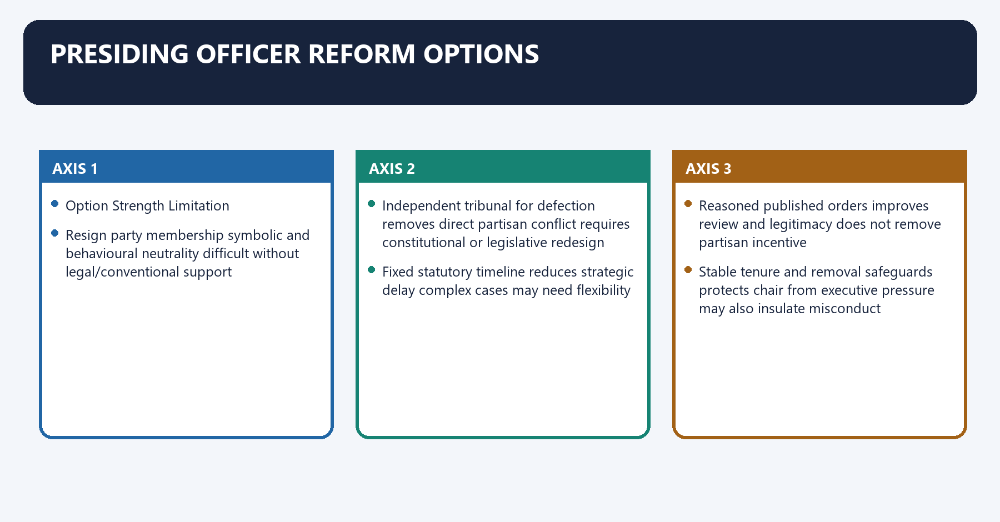
| Option | Strength | Limitation |
|---|---|---|
| Resign party membership | symbolic and behavioural neutrality | difficult without legal/conventional support |
| Independent tribunal for defection | removes direct partisan conflict | requires constitutional or legislative redesign |
| Fixed statutory timeline | reduces strategic delay | complex cases may need flexibility |
| Reasoned published orders | improves review and legitimacy | does not remove partisan incentive |
| Stable tenure and removal safeguards | protects chair from executive pressure | may also insulate misconduct |

### 31. Model answer-writing method

Model answer-writing method denotes the constitutional rules and institutional links organised around NAMED ARTICLE / CASE / CURRENT SOURCE.
Model answer-writing method operates through MECHANISM: how it works, connected with ANALYSIS: why it matters.
The operative mechanism matters because qUALIFICATION: what it does not prove.
Its principal consequence is that vERDICT: answer the directive.
The decisive contrast is between Claim: The Council is structurally weak and Named evidence: Articles 197-199.
The exam-safe limitation is that mechanism: four-month ordinary-Bill delay and 14-day Money Bill recommendation.
**Visual 38 - Evidence discipline**

```text
CLAIM
  -> NAMED ARTICLE / CASE / CURRENT SOURCE
  -> MECHANISM: how it works
  -> ANALYSIS: why it matters
  -> QUALIFICATION: what it does not prove
  -> VERDICT: answer the directive
```

**Example**

- Claim: The Council is structurally weak.
- Named evidence: Articles 197-199.
- Mechanism: four-month ordinary-Bill delay and 14-day Money Bill recommendation.
- Analysis: Assembly preference ultimately prevails.
- Qualification: delay may still improve scrutiny.
- Verdict: advisory second chamber, not co-equal legislature.

## CONSOLIDATED REGISTER NOTES

### Constitutional skeleton

```text
Article 168: Governor + Assembly + optional Council
Article 169: Council creation/abolition
Articles 170-171: composition
Articles 172-177: duration, qualification, sessions, address
Articles 178-195: officers, members, voting, privilege
Articles 196-201: Bills and assent
Articles 202-207: finance
Articles 208-212: procedure and judicial restraint
```

### Assembly essentials

- Directly elected popular chamber.
- Normally 60-500, subject to special small-State arrangements.
- Minimum age 25.
- Normal term five years unless sooner dissolved.
- Confidence and no-confidence chamber.
- Votes demands for grants and controls Money Bills.
- Speaker continues after dissolution until immediately before the new Assembly's first meeting.

### Council essentials

- Exists in six States: Karnataka, Andhra Pradesh, Telangana, Bihar, Uttar Pradesh and Maharashtra.
- Article 169: Assembly special majority, then ordinary parliamentary law.
- Not an Article 368 amendment.
- Strength: maximum one-third of Assembly, minimum 40.
- Composition: 1/3 local bodies, 1/12 graduates, 1/12 teachers, 1/3 MLAs, 1/6 Governor-nominated.
- Five-sixths indirectly elected by STV; one-sixth nominated.
- Permanent; one-third retire every two years; six-year member term.
- Minimum age 30.

### Assembly-Council power comparison

| Area | Assembly | Council |
|---|---|---|
| Ordinary Bill | Final control | Delay up to about four months |
| Money Bill | Originates and decides | Recommends within 14 days |
| Grants | Votes | Does not vote |
| Confidence | Removes ministry | Cannot remove |
| Dissolution | Dissolvable | Permanent |
| Council existence | Initiates Article 169 resolution | Cannot secure its own survival |

### Presiding officers

- Articles 178-181: Speaker and Deputy Speaker.
- Articles 182-185: Chairman and Deputy Chairman.
- Removal: majority of all then members plus 14 days' notice.
- Article 189: ordinary majority; casting vote; quorum ten or one-tenth, whichever is greater.
- Article 199: Speaker certifies State Money Bill.
- Tenth Schedule: Speaker/Chairman decides defection, subject to review.
- *Kihoto*: reviewable tribunal.
- *Keisham*: ordinarily about three months; independent tribunal suggested.
- *Subhash Desai*: political party, not factional legislature party, appoints authorised whip/leader.

### Bills and assent

```text
Ordinary bicameral Bill:
Assembly -> Council 3 months -> Assembly repasses -> Council 1 month -> Assembly prevails

Money Bill:
Assembly only -> Council recommendations in 14 days -> Assembly decides

Article 200:
assent / withhold / return non-Money Bill / reserve

Article 201:
President assent / withhold / return non-Money Bill
```

- No State joint sitting.
- Mandatory reservation where High Court constitutional position is endangered.
- November 2025 opinion: no rigid timelines, no deemed assent, limited review of prolonged unexplained inaction.

### Finance

- Article 202: annual financial statement.
- Charged expenditure discussed, not voted.
- Article 203: demands for grants voted only by Assembly.
- Article 204: Appropriation Bill.
- Articles 205-206: supplementary/additional/excess and vote-on-account/credit/exceptional grants.
- Article 207: financial-Bill restrictions and recommendation.

### Privilege and courts

- Article 194 protects member speech/votes in legislative functions.
- Governor is not a member and does not receive Article 194 member privilege.
- Article 211 bars discussion of judges' conduct in discharge of duties.
- Article 212 protects against review for procedural irregularity, not substantive unconstitutionality.

### Current controls

- Women's reservation covers Lok Sabha and Assemblies, not Councils.
- It is constitutionally provided but not operational as of 18 August 2026.
- 2026 delimitation/women-reservation Bills did not become law.
- Census 2027 publication and delimitation dates remain unknown.
- Never write that delimitation automatically began in 2026.

### Answer-writing evidence bank

| Claim | Named evidence | Qualification |
|---|---|---|
| Council optional | Articles 168-169 | Parliament still enacts law |
| Council heterogeneous | Article 171 fractions | not direct popular mandate |
| Council weak | Articles 197-199 | delay may still improve scrutiny |
| Assembly dominant | Article 164(2), grants and Money Bills | Council retains debate/question role |
| Speaker neutrality strained | Tenth Schedule, *Kihoto*, *Keisham* | tribunal reform not enacted |
| Assent is no pocket veto | Articles 200-201, 2025 opinion | no deemed assent or fixed court timeline |
| Procedure autonomous | Articles 208-212 | substantive illegality review survives |
| Reservation pending | 106th Amendment and census-delimitation sequence | Councils excluded |

### Final verdicts

- **Council:** optional advisory chamber whose legitimacy comes from scrutiny, not veto.
- **Assembly:** elected confidence and finance chamber; centre of responsible State government.
- **Speaker:** indispensable procedural guardian requiring institutional neutrality.
- **State legislative reform:** more sittings, prior publication, committees, research and tracked assent.
- **Representation:** delimitation and women's reservation must combine inclusion with federal fairness.

### Last-minute traps

1. Six bicameral States, not seven.
2. Assembly special majority; Parliament simple majority under Article 169.
3. Council minimum 40, not 60.
4. Council formula: 1/3, 1/12, 1/12, 1/3, 1/6.
5. Assembly age 25; Council age 30.
6. Council permanent; Assembly dissolvable.
7. Ordinary-Bill delay about four months; Money Bill 14 days.
8. No joint sitting at State level.
9. State quorum is ten or one-tenth, whichever is greater.
10. Speaker continues after dissolution until the new Assembly first meets.
11. Article 192 route does not govern Tenth Schedule disputes.
12. Governor is part of legislature but not a House member.
13. Article 212 bars procedural-irregularity review, not substantive review.
14. Women's reservation is not operational and does not cover Councils.
