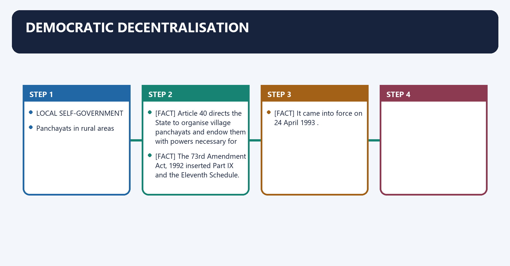
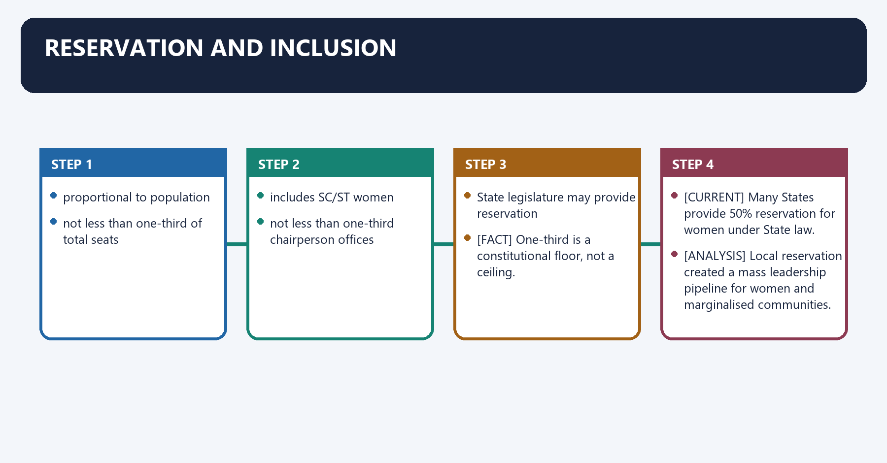
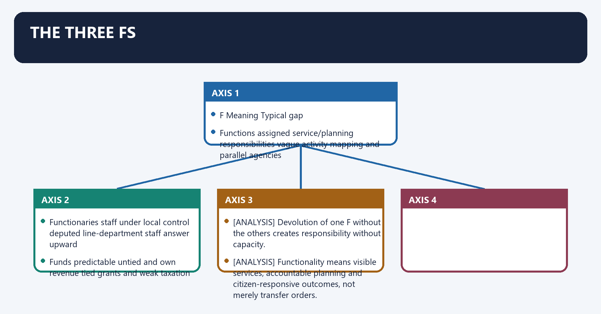
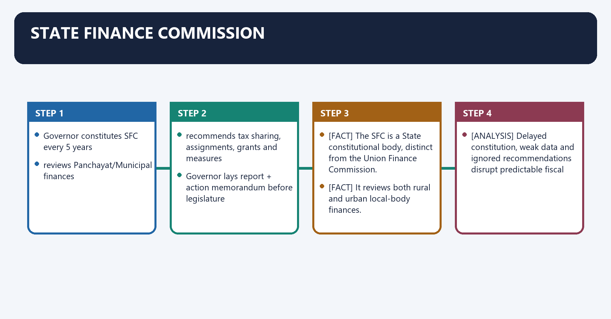
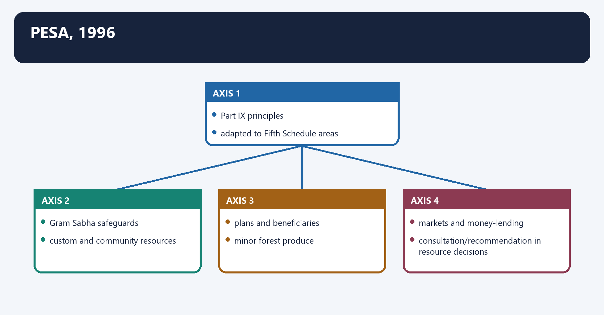
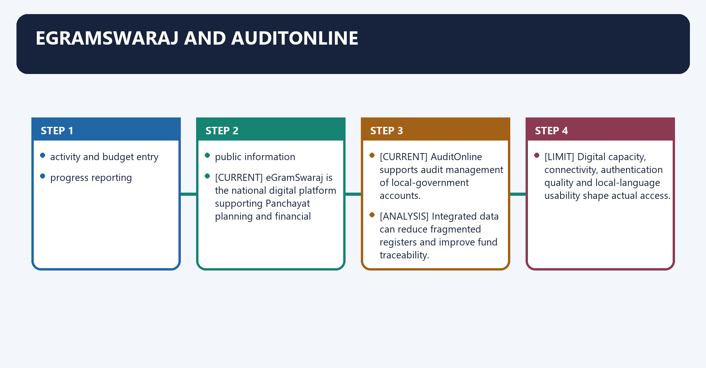
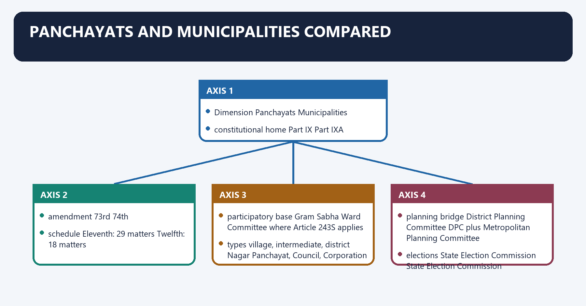

# Panchayati Raj — Complete Uncompressed Learning Session

> **Subject:** Indian Polity | **Topic:** 23 | **GS-II + Prelims** | **Export date:** 2026-08-24
>
> **Approval:** false - awaiting explicit user approval.
>
> **Evidence key:** [FACT] constitutional, judicial or officially verified proposition; [ANALYSIS] reasoned exam synthesis; [CURRENT] dated legal/current control; [LIMIT] qualification preventing overstatement.

#### Package method, source priority and current control

- Source order followed: `basic/Panchayati-Raj.md` -> `advanced/23_Panchayati-Raj.md` -> `basic/Scheduled-and-Tribal-Areas.md` -> official Ministry of Panchayati Raj material on devolution, XVI Finance Commission rural-local-body guidelines, eGramSwaraj, PESA and SVAMITVA. Qdrant was not used.
- [FACT] The Core owner supersedes stale or less-qualified Advanced statements.
- [CURRENT] Status is controlled to **28 August 2026, Asia/Kolkata**.
- [CURRENT] **Live official refresh, 28 August 2026:** The Ministry of Panchayati Raj, eGramSwaraj, AuditOnline, SVAMITVA and Finance Commission portals were rechecked on 28 August 2026. The Devolution Index 2024 and 2026-31 local-body grant period are dated anchors; no changing dashboard total is frozen.
- [CURRENT] Part IX, Articles 243-243O, the Eleventh Schedule and the PESA Act, 1996 remain the controlling constitutional/statutory framework.
- [CURRENT] The Ministry of Panchayati Raj hosts the Panchayat Devolution Index 2024, which evaluates devolution across functions, finances, functionaries and enabling/accountability conditions.
- [CURRENT] Operational guidelines for rural local bodies under the Sixteenth Finance Commission award period **2026-27 to 2030-31** are controlled through the Commission report and Union action memorandum.
- [LIMIT] Grant totals, release amounts, Panchayat counts, property-card counts and portal-usage numbers change. This package uses named programmes and dated frameworks but does not freeze dashboard totals as permanent facts.
- [CURRENT] eGramSwaraj supports planning, accounting and monitoring; AuditOnline supports audit workflows; SVAMITVA uses drone-based survey and property cards for rural inhabited areas.
- [CURRENT] PESA-specific planning has been integrated into digital Gram Panchayat Development Plan workflows, but legal implementation and connectivity/capacity remain uneven.
- [LIMIT] A portal upload is not proof of substantive devolution, Gram Sabha consent or service-delivery quality.
- Official current sources: Ministry of Panchayati Raj homepage, Devolution Index 2024, XVI Finance Commission rural-local-body guidelines/report, eGramSwaraj, AuditOnline and SVAMITVA dashboards.
- Package target: independently answer-complete Foundation/Core, Optional Advanced refinements, more than 35 text-native visuals, three direct solved Mains PYQs, one routed Prelims demand, 36 original MCQs, 12 remedial MCQs and eight original solved Mains questions.

#### Roadmap

| Stage | Coverage | Exam outcome |
|---|---|---|
| Evolution | committees and pre-constitutional history | Handles chronology and recommendations |
| Constitutional structure | Part IX, tiers and Gram Sabha | Solves direct provision questions |
| Representation | elections, reservations and tenure | Builds women/social-justice answers |
| Powers | Article 243G and Eleventh Schedule | Explains enabling devolution |
| Finance | Article 243H, SFC and Central grants | Answers own-source revenue PYQ |
| Accountability | SEC, audit, social audit and planning | Links democracy to delivery |
| PESA | Scheduled-Area self-government | Handles tribal-governance application |
| Functionality | three Fs and State variation | Answers devolution criticism |
| Digital reform | eGramSwaraj, AuditOnline, SVAMITVA | Adds current evidence safely |
| Workbook | PYQs, MCQs, remedials and solved Mains | Converts coverage into marks |

#### Scope ownership and cross-links

- **Polity 24 - Municipalities:** urban local government and Twelfth Schedule.
- **Polity 26 - Scheduled and Tribal Areas:** full Fifth/Sixth Schedule, PESA and FRA doctrine.
- **Polity 29 - Finance Commission:** full Union Finance Commission design and grants.
- **Governance - Local Service Delivery:** implementation, social accountability and district administration.
- [LIMIT] This package owns rural local self-government. It uses PESA and Finance Commission controls only to make Panchayati Raj independently answer-complete.

## BASIC LEARNING SESSION

### 01. Democratic decentralisation


**Visual 1 - Three levels of Indian government**

```text
UNION
   |
STATES
   |
LOCAL SELF-GOVERNMENT
   |
Panchayats in rural areas
```

Caption: The 73rd Amendment constitutionalised rural local institutions as the third governmental tier.

- [FACT] Article 40 directs the State to organise village panchayats and endow them with powers necessary for self-government.
- [FACT] The 73rd Amendment Act, 1992 inserted Part IX and the Eleventh Schedule.
- [FACT] It came into force on **24 April 1993**.
- [ANALYSIS] Constitutional status guarantees institutional existence, elections and inclusion; it does not by itself guarantee administrative or fiscal power.

### 02. Committee lineage


**Visual 2 - Evolution timeline**

```text
1957 Balwant Rai Mehta
   -> democratic decentralisation, three tiers
1959 Rajasthan launches at Nagaur
1977-78 Ashok Mehta
   -> two tiers, district focus, party participation
1985 G.V.K. Rao
   -> district planning, PRIs central to development
1986 L.M. Singhvi
   -> constitutional status, Gram Sabha
1992-93 73rd Amendment
```

- [FACT] Balwant Rai Mehta recommended Gram Panchayat-Panchayat Samiti-Zila Parishad.
- [FACT] Rajasthan launched the system at Nagaur on 2 October 1959.
- [FACT] Ashok Mehta preferred a two-tier model centred on district and mandal panchayat.
- [FACT] G.V.K. Rao emphasised the district as the basic planning/development unit.
- [FACT] L.M. Singhvi recommended constitutional recognition and stressed the Gram Sabha.

**Visual 3 - Committee trap table**

| Committee | Recall |
|---|---|
| Balwant Rai Mehta | three-tier democratic decentralisation |
| Ashok Mehta | two-tier model and political-party participation |
| G.V.K. Rao | district development administration |
| L.M. Singhvi | constitutional status and Gram Sabha |

### 03. Part IX master map


**Visual 4 - Articles 243-243O**

| Article | Subject |
|---:|---|
| 243 | definitions |
| 243A | Gram Sabha |
| 243B | constitution of Panchayats |
| 243C | composition |
| 243D | reservation |
| 243E | duration |
| 243F | disqualification |
| 243G | powers, authority and responsibilities |
| 243H | taxes, duties, tolls, fees and funds |
| 243I | State Finance Commission |
| 243J | accounts and audit |
| 243K | elections |
| 243L | application to Union Territories |
| 243M | exclusions |
| 243N | continuance of existing laws |
| 243O | bar to court interference in electoral matters |

> **Mnemonic:** A Sabha, B tiers, C composition, D reservation, E duration, G functions, H finance, I SFC, K SEC.

- [FACT] Under **Article 243L**, the President may apply Part IX to a Union Territory with specified exceptions and modifications.
- [FACT] Under **Article 243N**, inconsistent pre-existing Panchayat laws could survive for at most one year from commencement unless earlier amended or repealed.

### 04. Gram Sabha: direct-democracy foundation


**Visual 5 - Gram Sabha and Gram Panchayat**

| Gram Sabha | Gram Panchayat |
|---|---|
| all registered voters in village area | elected local-government body |
| deliberative/direct-democracy forum | executive and representative institution |
| powers conferred by State law/PESA | statutory and constitutional functions |
| social audit and plan approval role where law provides | implements plans and services |

- [FACT] Article 243A recognises the Gram Sabha and leaves its powers/functions to State law.
- [ANALYSIS] It can convert beneficiaries into decision-makers through plan discussion, beneficiary selection and social audit.
- [LIMIT] Constitutional recognition does not automatically make every Gram Sabha powerful; quorum, information, inclusion and follow-up matter.

**Visual 6 - Participation chain**

```text
citizens identify needs
      |
Gram Sabha deliberates
      |
Gram Panchayat prepares GPDP
      |
budget and scheme convergence
      |
implementation
      |
social audit and feedback
```

### 05. Three-tier structure

**Visual 7 - Rural tiers**

```text
DISTRICT LEVEL
Zila Parishad
      |
INTERMEDIATE LEVEL
Panchayat Samiti / Block / Taluka
      |
VILLAGE LEVEL
Gram Panchayat
```

- [FACT] Article 243B provides village, intermediate and district Panchayats.
- [FACT] A State with population **not exceeding 20 lakh** may omit the intermediate tier.
- [LIMIT] The exemption does not permit omission of village or district Panchayats.

### 06. Composition and election

**Visual 8 - Article 243C election rules**

| Position | Method |
|---|---|
| territorial seats at all three tiers | direct election |
| intermediate chairperson | elected by and from elected members |
| district chairperson | elected by and from elected members |
| village chairperson | State law determines method |
| MPs/MLAs and lower-tier chairs | representation may be provided by State law |

- [FACT] "All territorial seats directly elected" does not mean every chairperson is directly elected.
- [FACT] Constituency-population ratio should, as far as practicable, be uniform within the Panchayat area.
- [ANALYSIS] Direct territorial representation creates legitimacy, while indirect chair selection promotes collegial leadership at upper tiers.

### 07. Reservation and inclusion


**Visual 9 - Article 243D**

```text
SC/ST seats
  -> proportional to population

Women
  -> not less than one-third of total seats
  -> includes SC/ST women
  -> not less than one-third chairperson offices

Backward classes
  -> State legislature may provide reservation
```

- [FACT] One-third is a constitutional floor, not a ceiling.
- [CURRENT] Many States provide 50% reservation for women under State law.
- [ANALYSIS] Local reservation created a mass leadership pipeline for women and marginalised communities.
- [LIMIT] Presence is not identical to substantive control; proxy rule, social hierarchy and capacity constraints can persist.

### 08. Women's representation: empowerment and proxy rule

**Visual 10 - Two-sided outcome**

| Empowerment gains | Patriarchal constraints |
|---|---|
| entry into electoral politics | sarpanch-pati/pradhan-pati proxy |
| agenda attention to everyday services | restricted mobility and speech |
| role-model effects | literacy/digital barriers |
| leadership experience | caste and household control |
| pathway to higher politics | rotational discontinuity |

- [ANALYSIS] Reservation is a structural intervention that changes who can occupy office.
- [ANALYSIS] Capacity training, peer networks, SHG links, independent bank/signature authority and action against proxy governance convert descriptive into substantive representation.
- [LIMIT] Do not portray every woman representative as a proxy or every reservation outcome as empowerment.

### 09. Duration and continuity

**Visual 11 - Article 243E**

```text
normal term: 5 years
      |
election completed before expiry
      |
if dissolved early:
election within 6 months
      |
new body serves remainder of original term
unless remainder is below 6 months
```

- [FACT] The Amendment ended indefinite supersession as ordinary practice.
- [FACT] A dissolved Panchayat must ordinarily be reconstituted within six months.
- [LIMIT] A reconstituted body after premature dissolution does not automatically receive a fresh five-year term.
- [FACT] If the unexpired remainder is **less than six months**, Article 243E does not require an election merely for that short remainder.

### 10. Qualifications and disqualification

- [FACT] Article 243F connects disqualification to State legislative law and equivalent Assembly-member grounds.
- [FACT] A person who has attained **21 years** cannot be disqualified merely for being below 25.
- [FACT] Disqualification questions are decided by the authority and manner prescribed by State law.

> **UPSC trap:** Panchayat candidate minimum age is 21, not 25.

### 11. Article 243G: powers and Eleventh Schedule


**Visual 12 - Enabling language**

```text
State legislature MAY by law endow Panchayats
      |
preparation of plans
      |
economic development and social justice
      |
implementation of schemes
      |
Eleventh Schedule subjects
```

- [FACT] Article 243G uses enabling language and does not automatically transfer all 29 subjects.
- [ANALYSIS] This drafting choice explains the gap between constitutional status and functional power.

### 12. Eleventh Schedule: 29 subjects

**Visual 13 - Subject clusters**

| Cluster | Illustrative Eleventh Schedule subjects |
|---|---|
| natural resources | agriculture, land improvement, minor irrigation, animal husbandry, fisheries, social forestry, minor forest produce |
| rural economy | small-scale industry, khadi/village industries, markets and fairs |
| infrastructure | rural housing, drinking water, roads, bridges, rural electrification, non-conventional energy |
| human development | education, technical training, adult education, libraries, cultural activities, health, sanitation, family welfare |
| social justice | women/child development, weaker-section welfare, public distribution system |
| community assets | maintenance of community assets |

- [FACT] The Eleventh Schedule contains **29** matters.
- [LIMIT] Listing a matter does not prove that a particular State has devolved law-making, staff and budget for it.

**Visual 14 - Devolution test for each subject**

```text
ACTIVITY MAPPING
Who does what?
      +
FUNCTIONARIES
Who reports to Panchayat?
      +
FUNDS
Which untied/own revenue supports it?
      =
FUNCTIONAL DEVOLUTION
```

### 13. The three Fs


**Visual 15 - From status to functionality**

| F | Meaning | Typical gap |
|---|---|---|
| Functions | assigned service/planning responsibilities | vague activity mapping and parallel agencies |
| Functionaries | staff under local control | deputed line-department staff answer upward |
| Funds | predictable untied and own revenue | tied grants and weak taxation |

- [ANALYSIS] Devolution of one F without the others creates responsibility without capacity.
- [ANALYSIS] Functionality means visible services, accountable planning and citizen-responsive outcomes, not merely transfer orders.

### 14. Article 243H: Panchayat finance


**Visual 16 - Four fiscal channels**

```text
State legislature may:
  1. authorise Panchayat taxes/duties/tolls/fees
  2. assign State-collected revenues
  3. provide grants-in-aid
  4. create Panchayat Funds
```

- [FACT] Panchayats possess no automatic plenary taxing power; State law must authorise it.
- [ANALYSIS] Fiscal decentralisation depends on the quality of State Panchayat law and actual tax assignment.

### 15. Own-source and non-grant revenue

**Visual 17 - Non-grant basket**

| Source | Examples |
|---|---|
| own taxes | house/property, markets/fairs and authorised local taxes |
| fees | licences, certificates, sanitation and service fees |
| user charges | water, solid waste and local facilities |
| tolls | ferries, roads or facilities where authorised |
| property income | shops, markets, buildings, ponds, fisheries, community assets |
| assigned revenue | State taxes/cess shares assigned by law |
| borrowing | limited and State-law controlled |

- [FACT] Finance Commission transfers and State grants are not own-source revenue.
- [ANALYSIS] Own revenue creates a downward accountability loop: local taxpayers demand local performance.
- [LIMIT] User charges must protect affordability and equity; not every service should be fully cost-recovered.

### 16. Why own revenue remains weak

**Visual 18 - Fiscal-dependence spiral**

```text
weak tax base/assessment
      +
political reluctance to tax
      +
State retains buoyant sources
      +
grant dependence
      |
upward accountability to grantor
      |
low local fiscal legitimacy
```

- [ANALYSIS] Weak property records, exemptions, poor billing, collection capacity and electoral resistance depress local revenue.
- [ANALYSIS] Grants remain necessary for horizontal equity, but excessive tied funding narrows local choice.
- [LIMIT] Panchayat fiscal capacity varies sharply by State and settlement type.

### 17. State Finance Commission


**Visual 19 - Article 243I cycle**

```text
Governor constitutes SFC every 5 years
      |
reviews Panchayat/Municipal finances
      |
recommends tax sharing, assignments, grants and measures
      |
Governor lays report + action memorandum before legislature
```

- [FACT] The SFC is a State constitutional body, distinct from the Union Finance Commission.
- [FACT] It reviews both rural and urban local-body finances.
- [FACT] Its constitutional recommendations cover State-local tax distribution, assigned taxes, grants-in-aid and measures to improve Panchayat finances; the Governor lays the report and an action memorandum before the State legislature.
- [ANALYSIS] Delayed constitution, weak data and ignored recommendations disrupt predictable fiscal federalism.

### 18. Union Finance Commission and local grants

**Visual 20 - Article 280 link**

```text
Union Finance Commission
      |
measures to augment State Consolidated Fund
      |
supplement Panchayat resources
      |
based on State Finance Commission recommendations
```

- [FACT] Article 280 requires recommendations on augmenting State funds for Panchayat resources on the basis of SFC recommendations.
- [CURRENT] XVI Finance Commission rural-local-body guidelines cover 2026-27 to 2030-31.
- [LIMIT] Central grants supplement rather than replace State devolution and own-source effort.
- [LIMIT] Do not quote total allocations or release amounts without the dated official report/order.

### 19. Accounts, audit and transparency

**Visual 21 - Accountability stack**

| Tool | Purpose |
|---|---|
| Article 243J | State-law framework for accounts and audit |
| eGramSwaraj | planning, accounting and progress |
| AuditOnline | digital audit workflow |
| Gram Sabha | public deliberation and local verification |
| social audit | community examination of records and outcomes |

- [ANALYSIS] Financial compliance and social accountability answer different questions: whether money followed rules and whether work actually benefited citizens.
- [LIMIT] Digital entries may still be late, inaccurate or formalistic; public verification remains essential.

### 20. Social audit

**Visual 22 - Social-audit process**

```text
records disclosed
  muster rolls, bills, vouchers, beneficiaries
        |
community verification
        |
public hearing / Gram Sabha
        |
findings, recovery, correction and responsibility
```

- [FACT] MGNREGA provides a statutory social-audit role for the Gram Sabha and local community.
- [ANALYSIS] Social audit is participatory accountability, not departmental inspection or CAG audit.
- [LIMIT] It requires independent facilitation, timely records and protection for participants.

### 21. State Election Commission


**Visual 23 - Article 243K**

```text
superintendence, direction and control
of electoral rolls and Panchayat elections
          |
State Election Commissioner
appointed by Governor
          |
removal protection like High Court judge
```

- [FACT] Panchayat elections are conducted by the State Election Commission, not the Election Commission of India.
- [FACT] Service conditions cannot be varied to the Commissioner's disadvantage after appointment.
- [FACT] The Governor must make staff available when the SEC requests it for election work.
- [ANALYSIS] Institutional independence is undermined if election schedules, staff or delimitation support remain under political control.

### 22. Electoral disputes and Article 243O

- [FACT] Courts cannot question laws concerning delimitation or seat allotment in the prohibited manner.
- [FACT] A Panchayat election is challenged only through an election petition under State law.
- [ANALYSIS] The provision protects timely elections while preserving post-election legal remedies.
- [LIMIT] It does not immunise every unconstitutional pre-election action from all judicial scrutiny; exact doctrine depends on timing and remedy.

### 23. Exclusions under Article 243M

**Visual 24 - Where ordinary Part IX does not directly apply**

```text
Nagaland
Meghalaya
Mizoram
Scheduled Areas and tribal areas
specified Manipur hill areas
Darjeeling hill arrangements
```

- [FACT] Article 243M separately covers Fifth Schedule Scheduled Areas, Sixth Schedule tribal areas, Nagaland, Meghalaya, Mizoram, specified Manipur hill areas and the constitutional Darjeeling hill clause.
- [FACT] Parliament may extend Part IX to Nagaland, Meghalaya or Mizoram only after the State Assembly passes the prescribed resolution by a majority of total membership and at least two-thirds of members present and voting; such an extension law is not treated as an Article 368 amendment.
- [FACT] Parliament may extend Part IX to Scheduled Areas with exceptions and modifications.
- [FACT] PESA, 1996 uses that power for Fifth Schedule areas.
- [LIMIT] PESA does not extend ordinary Part IX to Sixth Schedule areas.

### 24. PESA, 1996


**Visual 25 - Tribal self-government**

```text
Part IX principles
      |
adapted to Fifth Schedule areas
      |
Gram Sabha safeguards:
  custom and community resources
  plans and beneficiaries
  land alienation
  minor forest produce
  markets and money-lending
  consultation/recommendation in resource decisions
```

- [FACT] PESA is a parliamentary statute extending Panchayat provisions to Fifth Schedule Scheduled Areas with modifications.
- [FACT] PESA requires State Panchayat law to respect customary law, social and religious practices, and traditional management of community resources; its verbs of **approval, consultation, recommendation and prior recommendation** are not interchangeable.
- [FACT] State laws must be consistent with customary law, social/religious practices and traditional management of community resources.
- [FACT] Gram Sabhas approve plans/programmes/projects and identify beneficiaries under the statutory scheme.
- [FACT] PESA assigns significant roles concerning minor forest produce, land alienation, village markets, money-lending and minor minerals.
- [LIMIT] Exact legal verbs differ: approval, consultation and recommendation must not all be described as an absolute veto.

### 25. PESA and the Forest Rights Act

**Visual 26 - Rights convergence**

| PESA | Forest Rights Act |
|---|---|
| local self-government in Fifth Schedule areas | recognition of individual/community forest rights |
| Gram Sabha planning and resource role | Gram Sabha initiates/verifies claims |
| customary/community-resource protection | community forest-resource governance |

- [ANALYSIS] Together they can shift tribal governance from administrative protection to community rights.
- [LIMIT] Weak State rules, forest bureaucracy, disputed records and extractive pressures often obstruct implementation.

### 26. District Planning Committee link


- [FACT] Rural plans must ultimately connect with district-level integrated planning, including the constitutional District Planning Committee framework under Part IXA.
- [ANALYSIS] Without convergence, Gram Panchayat plans become scheme lists rather than spatial and economic development strategies.
- [LIMIT] DPC composition and detailed law belong primarily to the Municipalities package.

### 27. Gram Panchayat Development Plan

**Visual 27 - GPDP cycle**

```text
situation analysis
      |
Gram Sabha priorities
      |
resource envelope
      |
convergence of schemes and own funds
      |
approved plan
      |
implementation and monitoring
```

- [CURRENT] eGramSwaraj supports digital preparation and tracking of local plans.
- [ANALYSIS] A good GPDP links needs, functions, funds, measurable outputs and responsible functionaries.
- [LIMIT] Copy-pasted plans and scheme-driven templates are not participatory planning.

### 28. Localisation of Sustainable Development Goals

**Visual 28 - Global-to-local chain**

```text
SDG goals
   |
local themes and indicators
   |
Gram Sabha priorities
   |
GPDP activities
   |
service outcomes
```

- [ANALYSIS] Panchayats are delivery institutions for water, sanitation, health, livelihoods and inclusion.
- [LIMIT] SDG branding cannot compensate for missing functions, staff or untied finance.

### 29. eGramSwaraj and AuditOnline


**Visual 29 - Digital governance flow**

```text
planning
  -> activity and budget entry
  -> accounting
  -> progress reporting
  -> audit workflow
  -> public information
```

- [CURRENT] eGramSwaraj is the national digital platform supporting Panchayat planning and financial workflows.
- [CURRENT] AuditOnline supports audit management of local-government accounts.
- [ANALYSIS] Integrated data can reduce fragmented registers and improve fund traceability.
- [LIMIT] Digital capacity, connectivity, authentication quality and local-language usability shape actual access.

### 30. SVAMITVA

**Visual 30 - Rural property-record chain**

```text
drone survey of abadi area
      |
parcel mapping and verification
      |
property card / record
      |
reduced disputes and clearer ownership
      |
potential credit and Panchayat tax-base gains
```

- [FACT] SVAMITVA expands survey and property-card systems in inhabited rural areas.
- [ANALYSIS] Better records can support household security, planning and property-tax administration.
- [LIMIT] A property card's legal effect depends on State revenue/property law; mapping does not automatically settle every title dispute.
- [LIMIT] Current village/property-card totals must be taken from the live official dashboard.

### 31. Rashtriya Gram Swaraj Abhiyan

- [CURRENT] RGSA supports capacity building, training and institutional strengthening for elected representatives and functionaries.
- [ANALYSIS] Constitutional powers require skills in budgeting, procurement, data, inclusion, meetings and service management.
- [LIMIT] Training counts do not prove behavioural or institutional change; mentoring and authority matter.

### 32. Devolution Index

**Visual 31 - What devolution measurement asks**

| Dimension | Core question |
|---|---|
| framework | Is State law aligned with Part IX? |
| functions | Are subjects/activity responsibilities transferred? |
| finances | Are revenues and untied funds adequate? |
| functionaries | Does Panchayat control relevant staff? |
| capacity | Can institutions exercise powers? |
| accountability | Are elections, audit and transparency effective? |

- [CURRENT] The Ministry's Devolution Index 2024 provides a named official comparative framework.
- [LIMIT] Rankings are time-specific and methodology-dependent; do not memorise or reproduce a rank without checking the report.

### 33. Political versus administrative decentralisation

**Visual 32 - Uneven achievement**

```text
POLITICAL
regular elections + reservations
        |
stronger achievement

ADMINISTRATIVE
staff and activity control
        |
uneven

FISCAL
own revenue + untied funds
        |
often weakest
```

- [ANALYSIS] India has constitutionalised local democracy more deeply than local administrative sovereignty.
- [ANALYSIS] State variation proves Part IX is a platform whose outcomes depend on State devolution choices.

### 34. Parallel bodies and bureaucratic control

- [ANALYSIS] Line departments, special-purpose agencies and scheme societies may retain functions nominally assigned to Panchayats.
- [ANALYSIS] Deputed staff often answer to departmental superiors rather than elected local bodies.
- [LIMIT] Parallel institutions can provide technical expertise; the problem is unclear accountability and bypass, not mere existence.

### 35. State variation and good practice

**Visual 33 - Why States differ**

| Enabling factor | Effect |
|---|---|
| political commitment | deeper subject and fund transfer |
| clear activity mapping | less duplication |
| local cadre/control | accountable staff |
| strong SFC | predictable fiscal system |
| participatory planning | citizen-linked priorities |
| own-revenue reform | greater local discretion |

- [ANALYSIS] Kerala's participatory planning and Karnataka's early devolution are standard qualitative illustrations.
- [LIMIT] Avoid unverified percentages, current ranks or claims of uniform success.

### 36. Reform agenda


**Visual 34 - From three Fs to functionality**

| Problem | Reform |
|---|---|
| vague functions | binding activity maps for all 29 subjects |
| weak staff control | Panchayat cadres or accountable placement |
| tied finance | predictable untied transfers and tax assignment |
| weak own revenue | updated registers, fair rates, collection support |
| delayed SFCs | fixed calendar, data secretariat and action reports |
| proxy representation | legal enforcement, training and peer support |
| weak Gram Sabha | notice, accessible records, inclusion and follow-up |
| digital divide | assisted access and offline alternatives |

### 37. Compulsory versus enabling provisions

**Visual 35 - Constitutional design**

| Relatively mandatory | State-discretion/enabling |
|---|---|
| Gram Sabha recognition | exact Gram Sabha powers |
| tiers subject to population exception | detailed Panchayat powers |
| direct territorial elections | devolution of 29 subjects |
| reservation floor | backward-class reservation |
| five-year term/elections | tax authorisation and assignments |
| SEC and SFC | composition details within constitutional bounds |

- [ANALYSIS] The Amendment guarantees democratic form more strongly than self-government substance.

### 38. Panchayati Raj and cooperative federalism

- [ANALYSIS] Local bodies are constitutionally recognised but remain primarily within State legislative and administrative control.
- [ANALYSIS] Union schemes and Finance Commission grants can strengthen capacity yet also increase upward conditionality.
- [LIMIT] Panchayats are not constitutionally co-equal sovereign units with Union and States; "third tier" describes governance structure, not identical federal status.

### 39. Answer-writing evidence discipline

**Visual 36 - Evidence chain**

```text
CLAIM
 -> EXACT ARTICLE / STATUTE
 -> MECHANISM
 -> NAMED PROGRAMME OR STATE EXAMPLE
 -> ANALYSIS
 -> QUALIFICATION
 -> VERDICT
```

**Example**

- Claim: Panchayats remain fiscally dependent.
- Article: 243H is enabling; 243I requires SFC.
- Mechanism: States choose tax authority/assignments; SFC delays weaken sharing.
- Current evidence: XVI FC rural-local-body guidelines supplement resources.
- Qualification: grants are necessary for equity but cannot replace own revenue.
- Verdict: fiscal autonomy requires State tax devolution plus capacity.

### 40. Panchayats and Municipalities compared


| Dimension | Panchayats | Municipalities |
|---|---|---|
| constitutional home | Part IX | Part IXA |
| amendment | 73rd | 74th |
| schedule | Eleventh: 29 matters | Twelfth: 18 matters |
| participatory base | Gram Sabha | Ward Committee where Article 243S applies |
| types | village, intermediate, district | Nagar Panchayat, Council, Corporation |
| planning bridge | District Planning Committee | DPC plus Metropolitan Planning Committee |
| elections | State Election Commission | State Election Commission |
| fiscal review | State Finance Commission | same State Finance Commission |

[LIMIT] Neither Schedule transfers functions automatically; State legislation and activity
mapping determine operational control.

### 41. Local-body case law and Gram Nyayalaya boundary


| Decision | Exam-safe holding |
|---|---|
| Kishansing Tomar (2006) | timely local elections are a constitutional command |
| K. Krishna Murthy (2010) | local political reservation needs distinct constitutional care |
| Vikas Kishanrao Gawali (2021) | OBC reservation requires the judicially stated triple test |
| State of Goa v. Fouziya Imtiaz Shaikh (2021) | SEC independence cannot be executive-subordinate |

[FACT] Gram Nyayalayas arise under the Gram Nyayalayas Act, 2008. They are statutory
judicial institutions, not Gram Sabhas, Gram Panchayats or a fourth Panchayat tier.


**Controlling propositions**

- [FACT] *Kishansing Tomar v. Municipal Corporation of Ahmedabad* (2006) treats timely local elections as a constitutional obligation, subject only to exceptional impossibility.
- [FACT] *K. Krishna Murthy v. Union of India* (2010) distinguishes political reservation from Articles 15(4)/16(4), requires local-body-specific empirical inquiry for backward-class reservation and ordinarily applies an aggregate 50% ceiling, with Scheduled Area qualifications.
- [FACT] *Vikas Kishanrao Gawali v. State of Maharashtra* (2021) states the triple test: a dedicated commission, contemporaneous rigorous empirical inquiry for each local body, and reservation calibrated without breaching the aggregate ceiling.
- [FACT] *State of Goa v. Fouziya Imtiaz Shaikh* (2021) requires a genuinely independent SEC and rejects entrusting it to a serving government officer.
- [LIMIT] Gram Nyayalayas under the 2008 Act are courts; they are not Gram Sabhas, Panchayats or Nyaya Panchayats.

## BASIC MCQS / REMEDIATION

### Original MCQ loop - strict A -> B -> C -> D rotation

#### OM1. Constitutional amendment

Panchayati Raj received constitutional status through:

A. 73rd Amendment.  
B. 74th Amendment.  
C. 42nd Amendment.  
D. 44th Amendment.

**Answer: A.**

**Explanation:** [FACT] Passed in 1992 and effective 24 April 1993.

#### OM2. Part

The Panchayat provisions are in:

A. Part IXA.  
B. Part IX.  
C. Part X.  
D. Part XXI.

**Answer: B.**

**Explanation:** [FACT] Articles 243-243O.

#### OM3. Schedule

The Eleventh Schedule contains:

A. 18 subjects.  
B. 12 subjects.  
C. 29 subjects.  
D. 30 subjects.

**Answer: C.**

**Explanation:** [FACT] Twelfth Schedule has 18 municipal matters.

#### OM4. DPSP root

Village Panchayats are directed by:

A. Article 39A.  
B. Article 48A.  
C. Article 50.  
D. Article 40.

**Answer: D.**

**Explanation:** [FACT] It is a Directive Principle.

#### OM5. Gram Sabha

Gram Sabha consists of:

A. registered voters in the village area.  
B. elected Panchayat members only.  
C. village officials only.  
D. all residents regardless of electoral registration.

**Answer: A.**

**Explanation:** [FACT] Article 243A.

#### OM6. Intermediate exemption

A State may omit the intermediate tier if population is:

A. below 10 lakh.  
B. not exceeding 20 lakh.  
C. below 50 lakh.  
D. determined by Parliament each year.

**Answer: B.**

**Explanation:** [FACT] Article 243B.

#### OM7. Territorial seats

Territorial seats at the three tiers are:

A. nominated.  
B. indirectly elected.  
C. directly elected.  
D. appointed by Governor.

**Answer: C.**

**Explanation:** [FACT] Chairperson rules differ.

#### OM8. District chairperson

The district Panchayat chairperson is generally:

A. directly elected by all district voters.  
B. appointed by Governor.  
C. selected by MPs.  
D. elected by and from elected members.

**Answer: D.**

**Explanation:** [FACT] Article 243C.

#### OM9. Women's seats

The constitutional floor is:

A. not less than one-third.  
B. exactly one-half.  
C. one-fourth.  
D. two-thirds.

**Answer: A.**

**Explanation:** [FACT] States may raise it.

#### OM10. Backward classes

Reservation for backward classes in Panchayats:

A. is prohibited.  
B. may be provided by State legislature.  
C. must be fixed by Parliament at 27%.  
D. is decided by SFC.

**Answer: B.**

**Explanation:** [FACT] Article 243D permits State provision.

#### OM11. Normal term

A Panchayat's normal duration is:

A. four years.  
B. six years.  
C. five years.  
D. permanent.

**Answer: C.**

**Explanation:** [FACT] Article 243E.

#### OM12. Dissolution election

Fresh election is ordinarily required within:

A. one year.  
B. three months.  
C. two years.  
D. six months.

**Answer: D.**

**Explanation:** [FACT] Subject to the short-remainder qualification.

#### OM13. Candidate age

Minimum age is:

A. 21.  
B. 25.  
C. 30.  
D. 18.

**Answer: A.**

**Explanation:** [FACT] Article 243F prevents disqualification merely for being below 25 after age 21.

#### OM14. Article 243G

This Article concerns:

A. elections.  
B. powers, authority and responsibilities.  
C. audit only.  
D. exclusions.

**Answer: B.**

**Explanation:** [FACT] It links to Eleventh Schedule plans and schemes.

#### OM15. Devolution language

Article 243G means:

A. all 29 subjects automatically transfer.  
B. Union transfers subjects directly.  
C. State legislature may endow Panchayats by law.  
D. Gram Sabha controls every department.

**Answer: C.**

**Explanation:** [FACT] It is enabling.

#### OM16. Finance

Article 243H:

A. creates RBI grants.  
B. gives automatic GST share.  
C. establishes SEC.  
D. enables State-authorised local taxes, assignments, grants and funds.

**Answer: D.**

**Explanation:** [FACT] State law controls the fiscal authority.

#### OM17. Own-source revenue

Which is own/non-grant revenue?

A. authorised property tax.  
B. Union Finance Commission grant.  
C. State grant-in-aid.  
D. centrally sponsored scheme transfer.

**Answer: A.**

**Explanation:** [FACT] Own taxes/fees differ from transfers.

#### OM18. SFC

The State Finance Commission is constituted:

A. annually.  
B. every five years.  
C. every ten years.  
D. only on Assembly request.

**Answer: B.**

**Explanation:** [FACT] Article 243I.

#### OM19. Elections

Panchayat elections are conducted by:

A. ECI.  
B. District Collector alone.  
C. State Election Commission.  
D. SFC.

**Answer: C.**

**Explanation:** [FACT] Article 243K.

#### OM20. Audit

Accounts and audit are addressed by:

A. 243G.  
B. 243H.  
C. 243I.  
D. 243J.

**Answer: D.**

**Explanation:** [FACT] State law provides the framework.

#### OM21. Election challenge

A Panchayat election is ordinarily challenged by:

A. election petition under State law.  
B. pre-election civil suit in every case.  
C. presidential reference.  
D. SFC review.

**Answer: A.**

**Explanation:** [FACT] Article 243O.

#### OM22. PESA

PESA extends Panchayat principles to:

A. Sixth Schedule areas.  
B. Fifth Schedule areas.  
C. every urban ward.  
D. cantonments.

**Answer: B.**

**Explanation:** [FACT] Enacted in 1996.

#### OM23. PESA institution

The central participatory body is:

A. District Collector.  
B. Rajya Sabha.  
C. Gram Sabha.  
D. NEC.

**Answer: C.**

**Explanation:** [FACT] PESA recognises customary/community governance.

#### OM24. Social audit

Social audit is best described as:

A. CAG certification only.  
B. departmental inspection.  
C. court trial.  
D. community verification of records and outcomes.

**Answer: D.**

**Explanation:** [ANALYSIS] It requires disclosure and public hearing.

#### OM25. Three Fs

They are:

A. functions, functionaries and funds.  
B. federalism, finance and fairness.  
C. food, fuel and fertiliser.  
D. files, forms and fees.

**Answer: A.**

**Explanation:** [ANALYSIS] Together they create functionality.

#### OM26. Functionaries gap

A common problem is:

A. every Panchayat has independent cadre.  
B. staff remain accountable to State line departments.  
C. no State role exists.  
D. Gram Sabha appoints all officers.

**Answer: B.**

**Explanation:** [ANALYSIS] Authority and accountability become misaligned.

#### OM27. Devolution Index

The official index evaluates:

A. election turnout only.  
B. village population only.  
C. multiple dimensions including functions, finances and functionaries.  
D. Lok Sabha seats.

**Answer: C.**

**Explanation:** [CURRENT] Rankings are report- and year-specific.

#### OM28. Central grants

XVI Finance Commission rural-local-body guidelines cover:

A. 2020-25.  
B. 2025-26 only.  
C. 2031-36.  
D. 2026-27 to 2030-31.

**Answer: D.**

**Explanation:** [CURRENT] Official operational guidelines are published.

#### OM29. eGramSwaraj

It primarily supports:

A. Panchayat planning and financial/progress workflows.  
B. Supreme Court appointments.  
C. military command.  
D. parliamentary voting.

**Answer: A.**

**Explanation:** [CURRENT] It is a digital local-governance platform.

#### OM30. AuditOnline

It supports:

A. election delimitation.  
B. digital audit workflows.  
C. property title adjudication.  
D. criminal trials.

**Answer: B.**

**Explanation:** [CURRENT] Audit complements accounting and public scrutiny.

#### OM31. SVAMITVA

The scheme uses:

A. satellite voting.  
B. judicial surveys.  
C. drone-based rural inhabited-area mapping and property cards.  
D. forest-right cancellation.

**Answer: C.**

**Explanation:** [FACT] Legal effect still depends on State property law.

#### OM32. GPDP

A strong GPDP:

A. is only a portal form.  
B. excludes Gram Sabha.  
C. lists Union schemes only.  
D. links local needs, resources, activities and outcomes.

**Answer: D.**

**Explanation:** [ANALYSIS] Participatory planning requires a resource envelope.

#### OM33. SFC versus UFC

Which is correct?

A. SFC reviews local finances within the State.  
B. SFC is constituted by President.  
C. UFC conducts Panchayat elections.  
D. Both are identical.

**Answer: A.**

**Explanation:** [FACT] Governor constitutes SFC.

#### OM34. Part IX exclusion

Ordinary Part IX does not directly apply to:

A. every State.  
B. Nagaland, Meghalaya and Mizoram among specified exclusions.  
C. all plains.  
D. all Union Territories.

**Answer: B.**

**Explanation:** [FACT] Article 243M contains exclusions.

#### OM35. Third tier

Panchayats are:

A. sovereign units equal to States.  
B. Union departments.  
C. constitutionally recognised local governments whose substantive powers depend heavily on State law.  
D. courts.

**Answer: C.**

**Explanation:** [FACT/ANALYSIS] Constitutional status is not co-equal sovereignty.

#### OM36. Functionality

The strongest test is:

A. number of portal entries.  
B. number of committees alone.  
C. election frequency only.  
D. citizen-visible services backed by functions, staff and funds.

**Answer: D.**

**Explanation:** [ANALYSIS] Outputs and accountability complete devolution.

### Remedial MCQs - strict A -> B -> C -> D rotation

#### R1. Commencement trap

The 73rd Amendment came into force:

A. 24 April 1993.  
B. 26 January 1992.  
C. 2 October 1959.  
D. 1 June 1996.

**Answer: A.**

**Remedy:** Passed 1992, operational 1993.

#### R2. Schedule trap

Panchayat subjects:

A. Twelfth Schedule, 18.  
B. Eleventh Schedule, 29.  
C. Seventh Schedule, 30.  
D. Fifth Schedule, 29.

**Answer: B.**

**Remedy:** Eleventh rural; Twelfth urban.

#### R3. Tier trap

The skippable tier is:

A. village.  
B. district.  
C. intermediate, for States not exceeding 20 lakh population.  
D. all tiers.

**Answer: C.**

**Remedy:** Village and district remain.

#### R4. Chairperson trap

Intermediate/district chairpersons are:

A. always nominated.  
B. directly elected by all voters.  
C. appointed by SEC.  
D. indirectly elected by and from elected members.

**Answer: D.**

**Remedy:** Territorial seats are directly elected.

#### R5. Reservation trap

Women's constitutional reservation is:

A. not less than one-third.  
B. exactly one-third ceiling.  
C. one-fourth.  
D. only at village level.

**Answer: A.**

**Remedy:** States may provide 50%.

#### R6. Tax trap

Panchayat taxation depends on:

A. automatic constitutional tax list.  
B. State-law authorisation under Article 243H.  
C. SFC collection.  
D. ECI approval.

**Answer: B.**

**Remedy:** Article 243H is enabling.

#### R7. Election-body trap

Panchayat elections:

A. ECI.  
B. CAG.  
C. SEC.  
D. UFC.

**Answer: C.**

**Remedy:** Article 243K.

#### R8. PESA trap

PESA covers:

A. Sixth Schedule.  
B. municipalities.  
C. cantonments.  
D. Fifth Schedule areas.

**Answer: D.**

**Remedy:** PESA is tribal rural self-government in Scheduled Areas.

#### R9. Own-revenue trap

Which is non-grant?

A. user charge authorised by State law.  
B. Central Finance Commission grant.  
C. State grant.  
D. scheme transfer.

**Answer: A.**

**Remedy:** Separate own income from transfers.

#### R10. SFC trap

SFC:

A. conducts elections.  
B. reviews local-body finances every five years.  
C. appoints Panchayat staff.  
D. audits Parliament.

**Answer: B.**

**Remedy:** Article 243I.

#### R11. Digital trap

SVAMITVA:

A. automatically grants conclusive title everywhere.  
B. replaces State property law.  
C. supports mapping/property records subject to State legal processes.  
D. is an election platform.

**Answer: C.**

**Remedy:** Survey technology is not universal title adjudication.

#### R12. Functionality trap

Portal compliance:

A. proves all 29 subjects devolved.  
B. proves Gram Sabha consent.  
C. eliminates staff shortages.  
D. is useful evidence but not proof of substantive self-government.

**Answer: D.**

**Remedy:** Verify powers, staff, funds and outcomes.

## PYQS AND ANSWER PRACTICE

### Verified routed Mains PYQs

#### PYQ 1 - UPSC GS-II 2018, Q15

**Verified neutral demand:** Assess the Panchayat system and explain the possible financing sources for Panchayat projects other than government grants.  
**15 marks | 250 words**

**Model answer**

**Claim:** [FACT] The 73rd Amendment secured Panchayat existence, elections and inclusion, but fiscal self-government remains dependent on State action under Article 243H.

**Assessment:** Part IX provides three tiers, Gram Sabha, five-year terms, reservations, SEC and SFC. Yet Article 243G/H are enabling; incomplete activity mapping, staff dependence and tied transfers produce political decentralisation without full functionality.

**Non-grant sources:** State-authorised house/property and market taxes; licence and service fees; water/sanitation user charges; tolls; rent from shops, markets and Panchayat buildings; income from ponds, fisheries, community property and haats; assigned State taxes/cesses; and limited borrowing under State law.

**Why important:** Own revenue strengthens discretion, creditworthiness and downward taxpayer accountability.

**Constraints and reform:** Update property/asset registers through lawful survey systems, set fair rates, digitise billing, protect poor users, assign buoyant revenues and professionalise collection. SFC recommendations should guide sharing.

**Qualification:** [LIMIT] Grants remain essential for poor Panchayats and equalisation.

**Verdict:** The constitutional tools exist; fiscal autonomy requires States to authorise viable taxes and Panchayats to collect them credibly.

**Why this earns marks:** It assesses the constitutional system before separating non-grant instruments from grants and ends with an equity qualification.

**How to improve:** In 250 words, compress institutional features to two lines and devote most space to an Article 243H-classified revenue basket plus one implementation reform.

#### PYQ 2 - UPSC GS-II 2019, Q13 - cross-cutting

**Verified neutral demand:** Comment on whether reservation of seats for women in local bodies has effectively weakened patriarchy.  
**15 marks | 250 words**

**Model answer**

**Claim:** [ANALYSIS] Article 243D has weakened the monopoly of men over local office, but numerical representation has only partially transformed patriarchal power.

**Constitutional shock:** Not less than one-third of seats and chairperson offices are reserved for women, including SC/ST women; many States provide 50%. This created a large leadership pipeline and normalised women as public decision-makers.

**Substantive gains:** Women representatives often foreground water, sanitation, health and welfare; experience builds confidence, networks and future candidacy.

**Persistent barriers:** Sarpanch-pati proxy rule, household control, caste violence, low literacy/digital access, bureaucratic gatekeeping, no-confidence politics and rotation can weaken independent authority.

**Reform:** punish proxy exercise of office, ensure direct financial/signature control, provide continuous training and legal support, link elected women with SHGs and reserve leadership offices with adequate tenure.

**Qualification:** [LIMIT] Outcomes vary; neither universal empowerment nor universal proxy is accurate.

**Verdict:** Reservation is a necessary structural intervention that has begun to erode patriarchy; support institutions determine whether a reserved seat becomes real power.

**Why this earns marks:** It gives Article 243D, substantive gains, patriarchal counter-evidence and a qualified rather than celebratory verdict.

**How to improve:** Use one verified empirical illustration if recalled, but avoid universal claims; preserve space for proxy-rule remedies and intersectional barriers.

#### PYQ 3 - UPSC GS-II 2020, Q13 - cross-cutting

**Verified neutral demand:** Highlight the challenges in moving local institutions from functions, functionaries and funds to actual functionality.  
**15 marks | 250 words**

**Model answer**

**Claim:** [FACT] The 73rd Amendment constitutionalised Panchayats but left substantive devolution largely to States, creating formally recognised yet unevenly functional institutions.

**Functions:** Article 243G and the Eleventh Schedule are enabling; incomplete activity mapping and parallel agencies blur responsibility.

**Functionaries:** teachers, engineers, health and agriculture staff often remain under line departments, so elected bodies cannot direct delivery or enforce accountability.

**Funds:** Article 243H taxation is under-used, SFCs are delayed or weak, own revenue is low and grants are frequently tied.

**Cross-cutting constraints:** weak Gram Sabhas, capacity gaps, proxy leadership, irregular data, poor district-plan convergence and digital exclusion.

**Path to functionality:** binding activity maps, staff placement/control, predictable untied finance, SFC calendars, own-revenue reform, professional support, social audit and outcome-based GPDPs.

**Qualification:** [LIMIT] State variation is large; strong examples show the design can work.

**Verdict:** The three Fs must be devolved together and tested by citizen-visible services, not by transfer notifications.

**Why this earns marks:** It converts the three-F slogan into separate constitutional and administrative mechanisms and tests them through citizen-visible functionality.

**How to improve:** In 250 words, use a compact Functions–Functionaries–Funds table and reserve the final quarter for a sequenced reform chain.

### Supporting PYQ 4 - UPSC GS-II 2024, Q5 - cross-owned with Governance

**Verified neutral demand:** Analyse the role of local bodies in good governance and examine the advantages and disadvantages of merging rural and urban local bodies.  
**10 marks | 150 words**

**Model answer**

**Claim:** [FACT] Panchayats and municipalities deepen good governance by localising representation, planning, service delivery and accountability, but their constitutional forms and settlement problems remain distinct.

**Role:** Panchayats connect Gram Sabha priorities, Article 243G functions, local revenues and social audit; municipalities perform the urban counterpart under Part IXA. Proximity improves information, participation and responsiveness when functions, staff and funds are genuinely devolved.

**Case for merger:** peri-urban regions share water, waste, transport, markets and land-use systems; one authority can reduce boundary disputes, fragmented infrastructure and duplicated staff.

**Case against:** rural and urban revenue bases, representation forums, service standards, land relations and constitutional schedules differ. A blanket merger can dilute Gram Sabha voice and rural priorities.

**Verdict:** Use metropolitan or district planning and shared-service institutions for functional integration; merge elected bodies only after transparent boundary, representation and fiscal analysis.

**Why this earns marks:** It answers both limbs, distinguishes constitutional institutions from shared service systems and gives a conditional rather than binary merger verdict.

**How to improve:** For 150 words, use a Role → Advantages → Disadvantages → calibrated alternative structure and avoid spending space on the full 73rd/74th Amendment history.

### Routed Prelims demand - provenance without invented answer letter

#### Prelims route 1 - 2025 GS-I Q91

**Verified neutral demand:** Constitutional position of Panchayats at the intermediate level.

**Doctrinal solution**

- [FACT] The intermediate tier is the Panchayat Samiti/block/taluka level.
- [FACT] A State with population not exceeding 20 lakh may omit it.
- [FACT] Territorial seats are directly elected, while the chairperson is indirectly elected.
- [FACT] State law may provide representation for MPs/MLAs and village chairpersons.

**Elimination rule:** Reject statements making the intermediate tier compulsory in every State or making every chairperson directly elected.

### Original solved Mains practice

#### M1. "The 73rd Amendment constitutionalised Panchayats but did not constitutionalise devolution." Examine. (10 marks, 150 words)

**Model answer**

**Claim:** [FACT] Part IX guarantees institutional form more strongly than substantive power.

**Named evidence:** Articles 243B-243F mandate tiers, elections, reservations and tenure; Articles 243I and 243K require SFC and SEC. But Article 243G says States may endow powers over the 29 subjects, while Article 243H makes local taxation depend on State law.

**Analysis:** States can comply through elections while retaining line departments, staff and buoyant revenues. Panchayats then have responsibility without authority.

**Qualification:** [LIMIT] Strong State examples show the framework permits deep devolution.

**Verdict:** The Amendment settled political decentralisation; binding activity mapping, staff control and predictable finance are needed to constitutionalise its self-government promise in practice.

**Why this earns marks:** The answer distinguishes mandatory democratic form from enabling devolution through Articles 243G and 243H.

**How to improve:** For 150 words, retain only the institutional contrast, one consequence and one sharp reform sentence.

#### M2. Evaluate Gram Sabha as an institution of participatory democracy. (15 marks, 250 words)

**Model answer**

**Claim:** [FACT] Article 243A makes the Gram Sabha the direct-democracy foundation of rural local government, while State law and PESA determine its operative power.

**Potential:** It identifies needs, approves plans/beneficiaries where law provides, monitors works, conducts social audits and gives marginal groups a public forum. Under PESA it protects custom and community resources.

**Constraints:** poor notice, elite capture, gender/caste exclusion, unreadable records, low quorum, bureaucratic agenda control and weak follow-up convert meetings into ritual.

**Reform:** scheduled calendars, advance public records, facilitated inclusion, ward-level preparation, social-audit units, speaking orders on resolutions and digital-plus-physical access.

**Qualification:** [LIMIT] Direct participation cannot replace the elected Panchayat or professional administration.

**Verdict:** Gram Sabha is transformative when information, voice and consequence meet; without enforceable follow-up it remains consultation without power.

**Why this earns marks:** It treats Gram Sabha power as conditional on information, inclusion and enforceable follow-up rather than assuming participation.

**How to improve:** Add a two-column potential-versus-constraint structure and one PESA or social-audit application.

#### M3. Analyse the fiscal architecture of Panchayati Raj. (15 marks, 250 words)

**Model answer**

**Claim:** [FACT] Panchayat finance combines own revenue, assigned State revenue, State grants, SFC sharing and Union Finance Commission supplementation.

**Constitutional design:** Article 243H enables taxes, duties, tolls, fees, assignments, grants and Panchayat Funds. Article 243I requires SFC review every five years. Article 280 links Union Finance Commission measures to augment State funds for Panchayats.

**Weakness:** State authorisation is narrow, registers and collection weak, SFCs delayed, grants tied and richer/poorer Panchayat tax bases unequal.

**Reform:** predictable tax assignment, modern asset/property registers, fair user charges, professional billing, untied equalisation grants, SFC secretariats and public fiscal dashboards.

**Current control:** [CURRENT] XVI FC rural-local-body operational guidelines cover 2026-31.

**Verdict:** Grants secure equity; own revenue secures discretion and accountability. A healthy system needs both.

**Why this earns marks:** It integrates own revenue, State sharing, SFC review and Union supplementation without confusing their constitutional sources.

**How to improve:** Draw the Article 243H → 243I → 280 chain and name one equity safeguard against regressive user charges.

#### M4. Discuss PESA as a model of tribal self-government. (15 marks, 250 words)

**Model answer**

**Claim:** [FACT] PESA, 1996 adapts Part IX to Fifth Schedule areas by placing custom, community resources and the Gram Sabha at the centre.

**Design:** State laws must respect customary practices. Gram Sabhas approve plans and beneficiaries and hold roles concerning minor forest produce, land alienation, village markets, money-lending, land acquisition and minor minerals.

**Significance:** It shifts tribal administration from guardianship toward self-rule and complements Forest Rights Act community rights.

**Gaps:** delayed/inadequate State rules, bureaucratic control, mining/land pressures, weak record access, confusion over consultation versus recommendation and digital exclusion.

**Reform:** harmonise State laws, map Gram Sabha powers, require documented prior processes, strengthen community-resource records and create independent grievance review.

**Qualification:** [LIMIT] PESA applies to Fifth, not Sixth, Schedule areas.

**Verdict:** PESA is constitutionally inspired democratic autonomy whose failure lies mainly in under-implementation, not lack of legal ambition.

**Why this earns marks:** It preserves PESA’s exact legal design, Fifth Schedule scope and distinct decision verbs while acknowledging implementation gaps.

**How to improve:** Organise the body under custom, planning, land and resources; never describe every Gram Sabha role as consent or veto.

#### M5. Can digital platforms solve the accountability deficit in Panchayats? Critically examine. (15 marks, 250 words)

**Model answer**

**Claim:** [CURRENT] eGramSwaraj, AuditOnline and SVAMITVA can improve records, traceability and planning, but cannot substitute for devolution or citizen power.

**Benefits:** integrated plans/accounts, public progress, audit trails, better property mapping, reduced record fragmentation and data for case-specific intervention.

**Limits:** poor connectivity, shared credentials, low digital literacy, inaccurate data, portal-driven planning, privacy/cyber risks and exclusion of citizens without assisted access.

**Institutional point:** A perfectly entered plan is ineffective if staff answer to line departments, funds are tied and Gram Sabha resolutions lack consequence.

**Safeguards:** local-language design, e-Sewa assistance, offline options, independent audit, data-quality checks, public hearings and human decision control.

**Verdict:** Digital systems are accountability infrastructure; democracy still requires powers, transparent records and organised citizen scrutiny.

**Why this earns marks:** It evaluates digital tools as infrastructure within constitutional devolution rather than presenting portals as self-government.

**How to improve:** Pair each digital benefit with a matching institutional risk and finish with an assisted-access safeguard.

#### M6. "Own-source revenue is both a fiscal and democratic reform." Comment. (15 marks, 250 words)

**Model answer**

**Claim:** [ANALYSIS] Local taxation finances discretion and creates a direct accountability relationship between payer and elected Panchayat.

**Fiscal value:** taxes, fees, user charges, tolls and property income diversify resources and reduce dependence on delayed/tied grants. Better records under lawful survey systems can expand the base.

**Democratic value:** Citizens paying visible local levies demand service standards, budget transparency and justification of rates. Panchayats gain bargaining capacity and planning flexibility.

**Risks:** regressive fees, political reluctance, weak assessment, coercive collection and unequal local bases.

**Design:** progressive exemptions, affordable lifeline services, transparent rate-setting, grievance mechanisms, State equalisation grants and professional collection.

**Qualification:** [LIMIT] Own revenue cannot finance equal services in every poor rural jurisdiction.

**Verdict:** Own-source reform strengthens self-government when paired with equity transfers and accountable service delivery.

**Why this earns marks:** It links fiscal capacity to downward accountability and balances autonomy with equalisation and affordability.

**How to improve:** Classify taxes, fees, property income and assigned revenue before discussing collection reforms.

#### M7. Assess Panchayati Raj as a vehicle of social transformation. (20 marks, 250 words)

**Model answer**

**Claim:** [FACT] Panchayati Raj transforms democracy by relocating representation, planning and accountability to everyday rural life.

**Inclusion:** Article 243D reserves SC/ST and women's seats; many States use a 50% women's quota. New leadership can alter agendas and aspirations.

**Participation:** Gram Sabhas, social audits and GPDPs let citizens shape plans and inspect expenditure. PESA adds tribal custom/resource rights.

**Delivery:** the Eleventh Schedule connects local institutions with livelihoods, water, sanitation, health, education and welfare.

**Limits:** elite capture, proxy women leaders, caste exclusion, weak three-F devolution, parallel agencies, delayed SFCs and digital barriers.

**Reform:** protected participation, leadership support, own revenue, staff control, transparent activity maps, social audit and enforceable Gram Sabha follow-up.

**Verdict:** Panchayats have democratised access to office more than control over the State. Their transformative promise depends on converting representation into authority and services.

**Why this earns marks:** It combines representation, participation and service delivery while testing each against structural exclusion and weak devolution.

**How to improve:** For 20 marks, add a brief transformation chain and distinguish descriptive representation from substantive authority.

#### M8. Design a reform programme to move Panchayats from the three Fs to functionality. (20 marks, 250 words)

**Model answer**

**Claim:** [ANALYSIS] Functionality requires a sequenced institutional compact, not isolated grants or training.

**Functions:** enact binding activity maps for all devolved Eleventh Schedule matters, eliminate duplicate mandates and integrate GPDP with district planning.

**Functionaries:** create local cadres or place sector staff under Panchayat performance/attendance control, supported by technical pools.

**Funds:** authorise viable taxes, assign predictable State revenues, implement SFC recommendations, increase untied equalisation and publish fund-flow calendars.

**Democracy/accountability:** strengthen Gram Sabha notice and records, independent social audits, anti-proxy enforcement, SEC autonomy and public outcome dashboards.

**Capacity/technology:** continuous role-based training, local-language eGramSwaraj assistance, data-quality audits and privacy safeguards.

**Measurement:** use the Devolution Index dimensions and citizen service outcomes rather than subject-transfer claims alone.

**Verdict:** Functionality begins when the elected Panchayat can decide, direct staff, spend predictable money and answer publicly for outcomes.

**Why this earns marks:** It supplies an executable sequence across all three Fs, democracy, technology and measurable outcomes.

**How to improve:** Present reforms in immediate, medium-term and institutional phases, with one accountable actor for each phase.

## OPTIONAL ADVANCED DEPTH — NOT REQUIRED FOR A CORE ANSWER

> **Subject:** Polity · **Tier:** Advanced (exam depth) · **GS Paper:** GS-II
> **Grounded in:** Indian Polity by M. Laxmikant, Ch. 38 (direct check of the local Sixth Revised Edition PDF).
> ✅ = from source book · ⚠️ = inference / case law · 📰 = current affairs.
> *Companion: `basic/Panchayati-Raj.md`.*

---

### PART A — EVOLUTION ⭐
✅ **Balwant Rai Mehta Committee (1957):** recommended **"democratic decentralisation"** → the **3-tier
Panchayati Raj** (Gram Panchayat–Panchayat Samiti–Zila Parishad). **Rajasthan** first to launch PR (**2 Oct 1959,
Nagaur**), followed by Andhra Pradesh. ⚠️ Later committees: **Ashok Mehta (1977)** — 2-tier + political parties;
**G.V.K. Rao (1985)**; **L.M. Singhvi (1986)** — **constitutional status** for PRIs (the key idea behind the 73rd
Amendment).

---

### PART B — 73rd AMENDMENT ACT, 1992 ⭐
✅ Added **Part IX ("The Panchayats", Art 243–243-O)** + the **Eleventh Schedule (29 functional items,
Art 243-G)**. Gave **constitutional status** to PRIs, giving practical shape to **Art 40 (DPSP)**. Came into
force **24 April 1993**. Provisions are **compulsory (mandatory)** or **voluntary (optional for states)**.

#### Salient features (compulsory)
| Feature | Detail |
|---|---|
| ✅ **Gram Sabha** | Village assembly of all registered voters — foundation of PR |
| ✅ **3-tier system** | Village, intermediate, district — but a state **< 20 lakh** population may skip the **intermediate** tier |
| ✅ **Election** | All **territorial seats** at all 3 levels directly elected; chairpersons of intermediate & district levels **indirectly**; village chairperson as state law decides; Art 243-C permits specified representation |
| ✅ **Reservation** | SC/ST in proportion to population; **≥ 1/3 seats for women** (incl. SC/ST women) at all levels + chairperson offices |
| ✅ **Duration** | **5-year term**; elections before expiry OR within **6 months** of dissolution; a reconstituted panchayat serves only the **remainder** |
| ✅ **Disqualification** | Age **21** allowed (not the 25 of state legislature) |
| ✅ **State Election Commission** | Governor-appointed **SEC** conducts panchayat elections; removed only like an HC judge |
| ✅ **State Finance Commission** | Governor constitutes an **SFC every 5 years** to review PRI finances |

#### Voluntary provisions ⚠️
✅ Endowing panchayats to function as institutions of **self-government**; devolving the **29 Eleventh-Schedule
subjects**; giving reservation to **backward classes**; giving financial powers, etc.

#### Exemptions ⭐
✅ Part IX does **NOT** apply to **Nagaland, Meghalaya, Mizoram**, the **Fifth/Sixth Schedule areas**, the hill
areas of Manipur (district councils), and Darjeeling (Gorkha Hill Council).

---

### PART C — PESA ACT, 1996 ⭐
✅ **Provisions of the Panchayats (Extension to the Scheduled Areas) Act, 1996** — extends Part IX to the
**Fifth Schedule areas**. Empowers the **Gram Sabha** with control over local resources, minor forest produce,
land alienation, and consultation before land acquisition/mining — the cornerstone of **tribal self-governance**.

---


#### ➕ Social Audit (high-yield gap)

> ✅ Grounded in M. Laxmikant *Indian Polity* + ⚠️ standard + 📰 verified. Added to close a UPSC gap.

- ✅ Laxmikant frames Gram Sabha as the participatory-democracy core of Panchayati Raj.
- 📰 Sec 17 of MGNREGA mandates Gram Sabha monitoring and regular social audits of works within the Gram Panchayat.
- ⚠️ Social audit means community verification of records, expenditure and outcomes — not merely departmental inspection.
- 📰 Meghalaya enacted the Meghalaya Community Participation and Public Services Social Audit Act, 2017, widely cited as the first state social-audit law.

| Feature | Social audit significance |
|---|---|
| Forum | Gram Sabha / community platform |
| Evidence | Muster rolls, bills, vouchers, measurement books, beneficiary records |
| Outcome | Transparency, recovery/correction, accountability of implementing agencies |

> 🔑 Trap: Social audit is participatory accountability by beneficiaries/citizens; it is not the CAG audit of accounts.

#### UPSC Traps
- ❌ 73rd Amendment came into force in 1992 → **passed 1992, in force 24 April 1993**.
- ❌ Eleventh Schedule has 29 items for municipalities → **29 for panchayats** (Twelfth Schedule = 18 for
  municipalities).
- ❌ All 3 tiers are compulsory for every state → a state **< 20 lakh** may skip the **intermediate** tier.
- ❌ Only village-level territorial seats are directly elected → territorial seats at **all
  three levels** are directly elected, but this does not make every chairperson/represented
  member directly elected.
- ❌ Minimum candidate age is 25 → **21** for panchayats.
- ❌ Women's reservation is 1/3 and fixed → **"not less than 1/3"**; many states have raised it to **50%**.
- ❌ PESA extends Part IX to Sixth Schedule areas → **Fifth Schedule** areas.
- ❌ The Election Commission of India conducts panchayat polls → the **State Election Commission**.

#### 📰 CA hooks
- 📰 ⚠️ **50% women's reservation** in PRIs adopted by ~21 states — grassroots women's empowerment (links to the
  Nari Shakti Vandan Adhiniyam debate).
- 📰 ⚠️ **15th/16th Finance Commission grants** to local bodies (tied/untied) & the demand for greater fiscal
  devolution ("3 Fs — funds, functions, functionaries").
- 📰 ⚠️ **PESA implementation gaps** & tribal Gram Sabha rights (land acquisition, mining, FRA linkage).

#### Mains angles
- "Panchayati Raj has achieved political decentralisation but not administrative & fiscal decentralisation."
  Examine (the 3 Fs).
- Women's reservation in PRIs — has it led to genuine empowerment or "sarpanch-pati" proxy rule?
- PESA & tribal self-governance: promise vs ground reality.

<!-- BEGIN GENERATED PYQ INTEGRATION: 2018-2023 -->
#### Historical PYQ Integration (2018-2023)

> **Status:** Question-level PYQ demand is integrated into this owner.
> **Provenance:** Audited local official-paper routing ledgers: `_PYQ-ROUTING-MAINS-GS1-GS2-ESSAY-2018-2023.md`.

- **Years represented:** 2018, 2019, 2020
- **Paper(s):** GS-II
- **Routed question demands:** 3

| Year | Paper | Q | PYQ demand (neutral rendering) | Directive / format | Source status | Owner requirement |
|---:|---|---:|---|---|---|---|
| 2018 | GS-II | 15 | Panchayat system and non-grant sources for financing projects | Assess · 15 marks · 250 words | Routed to owning topic | Prepare context, core dimensions, evidence/examples, counterpoint and a concise conclusion. |
| 2019 | GS-II | 13 | Reservation of seats for women in local self-government and patriarchy | Comment · 15 marks · 250 words | Social Justice Core route; cross-cutting local-government link retained | Prepare context, core dimensions, evidence/examples, counterpoint and a concise conclusion. |
| 2020 | GS-II | 13 | Local institutions from functions functionaries and funds to functionality | Highlight the challenges · 15 marks · 250 words | Cross-cutting; service delivery and the constitutional tier both linked | Prepare context, core dimensions, evidence/examples, counterpoint and a concise conclusion. |

##### What this owner must now support

- Panchayat system and non-grant sources for financing projects
- Reservation of seats for women in local self-government and patriarchy
- Local institutions from functions functionaries and funds to functionality

> The table integrates the examinable demand and paper metadata. It does not turn an unkeyed objective question into a solved answer, and it does not claim that lexical presence alone proves full conceptual sufficiency.
<!-- END GENERATED PYQ INTEGRATION: 2018-2023 -->

## CONSOLIDATED REGISTER NOTES

### Constitutional skeleton

```text
Article 40 -> village Panchayat DPSP
73rd Amendment 1992 -> effective 24 April 1993
Part IX -> Articles 243-243O
Eleventh Schedule -> 29 subjects
PESA 1996 -> Fifth Schedule extension
```

### Core article map

| Article | Recall |
|---:|---|
| 243A | Gram Sabha |
| 243B | three tiers; intermediate exemption |
| 243C | composition and elections |
| 243D | reservations |
| 243E | five-year term |
| 243F | disqualification; age 21 |
| 243G | powers/functions/plans |
| 243H | taxes, assignments, grants and funds |
| 243I | State Finance Commission |
| 243J | accounts/audit |
| 243K | State Election Commission |
| 243M | exclusions |
| 243O | election-litigation bar |

### Three tiers

- Village: Gram Panchayat.
- Intermediate: Panchayat Samiti/block/taluka.
- District: Zila Parishad.
- State population not exceeding 20 lakh may omit intermediate tier.
- Territorial seats at all tiers directly elected.
- Intermediate/district chairpersons indirectly elected.

### Inclusion

- SC/ST seats proportional to population.
- Women: not less than one-third seats and chair offices.
- One-third is floor; many States provide 50%.
- State may reserve for backward classes.
- Representation requires anti-proxy, training and independent authority.

### Three Fs

| Function | Functionary | Fund |
|---|---|---|
| Article 243G and activity map | accountable staff/cadre | Article 243H, SFC and transfers |

- All three must converge for functionality.
- Eleventh Schedule listing does not automatically transfer power.

### Finance

- Own taxes, fees, charges, tolls and property income.
- Assigned State revenues.
- State grants.
- SFC every five years.
- Union Finance Commission augments State resources for Panchayats.
- XVI FC rural-local-body guidelines: 2026-27 to 2030-31.
- Own revenue supports accountability; grants support equalisation.

### PESA

- Applies to Fifth Schedule areas, not Sixth Schedule.
- Gram Sabha-centred custom and community-resource protection.
- Plans/beneficiaries and specified resource-governance roles.
- Companion rights link: Forest Rights Act, 2006.
- Legal verbs differ; do not turn every consultation into veto.

### Accountability and digital tools

- SEC conducts elections.
- Article 243J accounts/audit.
- Social audit = community verification, not CAG audit.
- eGramSwaraj = planning/accounting/progress.
- AuditOnline = audit workflow.
- SVAMITVA = drone survey/property cards subject to State law.
- Portal compliance is not proof of devolution.

### Answer-writing evidence bank

| Claim | Named evidence | Qualification |
|---|---|---|
| political decentralisation secured | Articles 243B-E, K | administrative/fiscal power uneven |
| devolution remains optional | Articles 243G-H | State variation proves possibility |
| women transformed representation | Article 243D | proxy and capacity constraints |
| own revenue is available | Article 243H | requires State authority and equity |
| fiscal review constitutional | Article 243I | SFC delays weaken it |
| tribal self-rule extended | PESA 1996 | only Fifth Schedule |
| technology improves traceability | eGramSwaraj/SVAMITVA | digital is not substantive power |

### Final verdicts

- **73rd Amendment:** constitution-strong on democracy, State-dependent on devolution.
- **Gram Sabha:** direct-democracy forum whose strength depends on information and consequence.
- **Finance:** grants plus own revenue, not either alone.
- **Women's reservation:** necessary and partly transformative, requiring anti-proxy support.
- **PESA:** ambitious self-government statute weakened by implementation.
- **Functionality:** citizen-visible outcomes backed by all three Fs.

### Last-minute traps

1. Passed 1992; effective 24 April 1993.
2. Part IX, not Part IXA.
3. Eleventh Schedule has 29 subjects.
4. Only intermediate tier may be omitted, at population not exceeding 20 lakh.
5. Territorial seats directly elected; upper chairpersons indirectly elected.
6. Women: not less than one-third, not fixed ceiling.
7. Candidate age 21.
8. Article 243G/H are enabling.
9. SEC, not ECI, conducts polls.
10. SFC every five years.
11. PESA applies to Fifth Schedule areas.
12. Own revenue excludes grants.
13. Social audit differs from financial audit.
14. Digital entry does not prove self-government.
