# GST Council — Complete Uncompressed Learning Session

> **Control date:** 2026-08-24  
> **Tags:** `[FACT]` directly supported by a named constitutional, statutory, judicial, official or audited local source; `[ANALYSIS]` reasoned exam use; `[CURRENT]` date-sensitive position; `[LIMIT]` qualification, boundary or uncertainty.  
> **Answer discipline:** claim -> named evidence -> analysis -> qualification.  
> **Scope:** the pre-GST problem; Constitution (One Hundred and First Amendment) Act, 2016; Articles 246A, 269A and 279A; composition, recommendations, procedure and voting; legislation and delegated notification; rates, exemptions, input-tax credit and inverted duty; compensation; *Union of India v. Mohit Minerals*; fiscal federalism; institutional comparison; accountability, disputes and reform.

#### Package method, source priority and legal-current control

- [CURRENT] Status is controlled to **24 August 2026, Asia/Kolkata**.

- [CURRENT] **Live official refresh, 24 August 2026:** The official 56th GST Council meeting release dated 3 September 2025 and the April 2026 Secretariat newsletter were rechecked on 24 August 2026. They are dated recommendation and notification-chain anchors, not a frozen commodity-wise rate code.
- [FACT] Local-first sequence followed: `Polity/basic/GST-Council.md` -> `Polity/advanced/30_GST-Council.md` -> Polity owners for Finance Commission, Centre-State Relations, constitutional amendment and Parliament -> Economy taxation/GST/fiscal-federalism owner -> audited PYQ routing and integration ledgers.
- [FACT] Polity packages 27, 28 and 29 were used only as structural, visual and validation references. Their subject content has not been imported.
- [FACT] The constitutional text was controlled against the Legislative Department's official consolidation and the official Gazette text of the Constitution (One Hundred and First Amendment) Act, 2016.
- [FACT] The institutional holding was controlled against the Supreme Court's official judgment dated 19 May 2022 in *Union of India v. Mohit Minerals Pvt. Ltd.*, Civil Appeal No. 1390 of 2022.
- [FACT] The compensation design was controlled against the official Gazette text of the Goods and Services Tax (Compensation to States) Act, 2017.
- [CURRENT] The latest official Council-meeting release located for this export was the Ministry of Finance/PIB release for the **56th GST Council meeting dated 3 September 2025**. The official GST Council newsletter archive located an **April 2026** issue, but no later official meeting recommendation release was established by the control date.
- [CURRENT] The 56th meeting officially recommended a broad **5 per cent merit rate, 18 per cent standard rate and 40 per cent special de-merit rate**, with most announced changes intended from 22 September 2025. This package does **not** freeze a commodity-wise current rate list: the legal rate for a supply must be read from the applicable statute and Gazette notification.
- [CURRENT] The April 2026 GST Council Secretariat newsletter records Notification No. 01/2026-Central Tax (Rate), dated 30 April 2026, as an amendment issued on Council recommendation under sections 9(1) and 15(5) of the CGST Act. It is evidence of the recommendation-to-notification chain, not evidence of a new Council meeting.
- [LIMIT] No verified official public instrument establishing a complete adjudicatory mechanism under Article 279A(11) was located. Existing Council committees, political negotiation, taxpayer appeals and GSTAT must not be silently relabelled as that intergovernmental constitutional mechanism.
- [LIMIT] No 2026 meeting number, fresh rate package, exact compensation-cess end date or volatile commodity list is asserted without an official instrument.

### Authoritative evidence board

| Named evidence | Claim controlled |
|---|---|
| Constitution of India, Articles 246A, 269A, 279A, 366(12A), Seventh Schedule | competence, inter-State GST, Council, alcohol/petroleum/electricity boundaries |
| Constitution (One Hundred and First Amendment) Act, 2016 | constitutional insertion, omission/substitution and five-year compensation direction |
| GST Council Procedure and Conduct of Business Regulations | duly constituted meeting, proposal handling, voting, minutes and Vice-Chair procedure |
| CGST Act, 2017, sections 7, 9, 11, 16 and 49 | levy, notification, exemption and credit interaction |
| GST (Compensation to States) Act, 2017, sections 2-8 and 10 | five-year transition, 14 per cent projected growth, base year and cess fund |
| *Union of India v. Mohit Minerals* (2022) | persuasive Council recommendations; simultaneous legislative power; statutory limits on delegated action |
| Official 56th GST Council press release and FAQ, 3 September 2025 | latest located meeting recommendation and implementation caution |
| GST Council Secretariat Newsletter, April 2026 | current example of Council recommendation implemented through notification |
| Audited local PYQ ledgers | exact routing status, year, paper, question number and key limitation |

### Official links used for current control

- Legislative Department, Constitution: `https://legislative.gov.in/documents/constitution-of-india`
- GST Council, constitutional/institutional page: `https://gstcouncil.gov.in/en/gst-council`
- GST Council, conduct regulations: `https://gstcouncil.gov.in/sites/default/files/2024-09/procedure_conduct_business.pdf`
- Supreme Court judgment: `https://api.sci.gov.in/supremecourt/2020/23083/23083_2020_4_1501_35969_Judgement_19-May-2022.pdf`
- GST Compensation Act: `https://gstcouncil.gov.in/sites/default/files/2024-03/gst-compensation-to-states-act-2017.pdf`
- 56th meeting release: `https://gstcouncil.gov.in/sites/default/files/2025-09/press_release_press_information_bureau.pdf`
- 56th meeting FAQ: `https://gstcouncil.gov.in/sites/default/files/2025-09/faq.pdf`
- GST Council newsletters: `https://gstcouncil.gov.in/en/gst-council-newsletter`

#### Roadmap

| Stage | Units | Exam outcome |
|---|---|---|
| Foundation | pre-GST fragmentation, cascading and destination principle | explain why GST required constitutional change |
| Architecture | 101st Amendment; Articles 246A, 269A and 279A | separate competence, allocation and coordination |
| Institution | composition, recommendations, Secretariat and procedure | solve close constitutional options |
| Decision | quorum, weighted vote, consensus and coalition arithmetic | explain the federal bargain precisely |
| Tax mechanics | statutes, notifications, rates, ITC, exemptions and inverted duty | prevent institution-tax confusion |
| Transition | compensation, cess, June 2022 end and loan servicing | write fiscal-trust answers safely |
| Doctrine | *Mohit Minerals* and delegated action | state “non-binding” without making the Council irrelevant |
| Evaluation | autonomy, common market, disputes and reform | build balanced GS-II/GS-III answers |
| Workbook | verified PYQs, 48 rotated MCQs and eight solved Mains | convert doctrine into marks |

### Visual 1 - Source and claim-control ladder

```text
CONSTITUTION / AMENDMENT ACT
          |
      GST STATUTES
          |
 GAZETTE NOTIFICATIONS + RULES
          |
 OFFICIAL COUNCIL RELEASES / MINUTES
          |
  JUDGMENTS ON INTERPRETATION
          |
 [ANALYSIS] FEDERAL AND ECONOMIC EFFECT
```

Caption: A Council recommendation is evidence of policy agreement; the applicable legal obligation may require a statute, rule or notification.

## BASIC LEARNING SESSION

### 01. Why did India need a GST compact?

Why did India need a GST compact? denotes the constitutional rules and institutional links organised around Central excise at manufacture.
Why did India need a GST compact? operates through State VAT / CST at sale, connected with entry tax / octroi.
The operative mechanism matters because embedded tax-on-tax where cross-credit failed.
Its principal consequence is that stage Without full credit With GST-style credit.
The decisive contrast is between input tax becomes cost eligible tax enters electronic credit and production tax may be charged on cost including earlier tax output liability less eligible input credit.
The exam-safe limitation is that distribution repeated embedded burden tax follows value added.
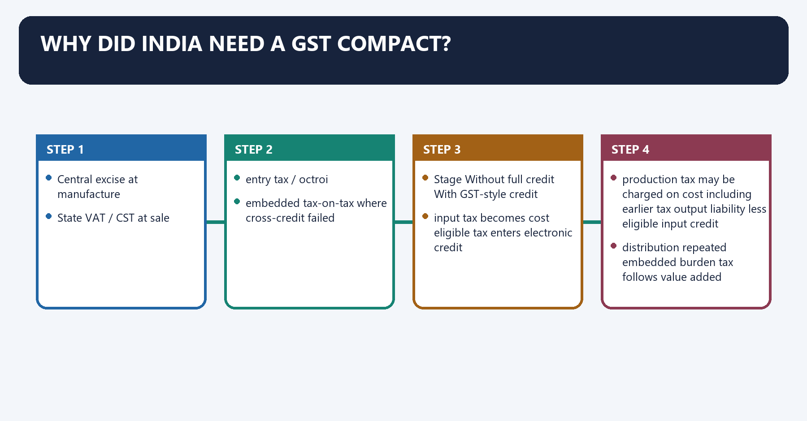
[FACT] Before GST, the Union and States imposed different indirect taxes under separate constitutional entries. Central excise generally attached to manufacture, service tax to taxable services, State VAT to sale, Central Sales Tax to inter-State sale, and entry tax/octroi to entry into local areas.

[ANALYSIS] Multiple taxable events, non-creditable levies and border procedures fragmented the value chain. A national value-added tax required more than an ordinary Union law because the Constitution had distributed tax fields between different legislatures.

[LIMIT] “One Nation, One Tax” is a political shorthand. GST is a dual levy implemented through Central, State/Union-territory and Integrated GST laws, with important taxes and supplies outside or deferred from the core system.

#### Visual 2 - Pre-GST tax maze

```text
FACTORY
  |-- Central excise at manufacture
  |
WHOLESALER
  |-- State VAT / CST at sale
  |
CITY BORDER
  |-- entry tax / octroi
  |
SERVICE INPUT
  |-- service tax
  |
CONSUMER
  +-- embedded tax-on-tax where cross-credit failed
```

Caption: The constitutional problem was not merely “many rates”; it was divided tax competence plus broken credit chains.

#### Visual 3 - Cascading versus value-added credit

| Stage | Without full credit | With GST-style credit |
|---|---|---|
| input | tax becomes cost | eligible tax enters electronic credit |
| production | tax may be charged on cost including earlier tax | output liability less eligible input credit |
| distribution | repeated embedded burden | tax follows value added |
| consumer | opaque cumulative incidence | invoice-based destination levy, subject to compliance |

[ANALYSIS] Input-tax credit (ITC) reduces cascading only where the law permits credit and the taxpayer satisfies conditions. Exempt supplies, blocked credits, invoice mismatches and rate inversions can interrupt the ideal chain.

#### Visual 4 - Origin-to-destination shift

```text
PRODUCTION STATE ---- goods/services ----> CONSUMPTION STATE
      old concern: origin-linked revenue

GST DESIGN:
tax travels through invoice and settlement architecture
                         |
                         v
revenue significance moves toward final consumption destination
```

[FACT] Article 269A supports this destination logic for inter-State supplies by placing levy and collection with the Government of India and requiring apportionment between Union and States under parliamentary law on Council recommendation.

#### Visual 5 - Major pre-GST levies and post-GST location

| Pre-GST levy family | Broad post-GST treatment | Qualification |
|---|---|---|
| central excise on most goods | subsumed into GST | retained constitutional field for specified petroleum and tobacco goods |
| service tax | subsumed | services now within supply-based GST |
| State VAT/sales tax on most goods | subsumed | retained for specified petroleum and alcoholic liquor for human consumption |
| CST | replaced operationally by IGST settlement | inter-State supply uses Article 269A architecture |
| entry tax/octroi | largely subsumed | local-government revenue consequences remain |
| luxury/entertainment taxes | largely subsumed | local-body entertainment/amusement taxation survives within narrowed Entry 62 |
| basic customs duty | not GST | IGST may additionally apply on imports |
| stamp duty and electricity duty | not subsumed as GST levies | remain under their constitutional/statutory fields |

### 02. The 101st Amendment: constitutional surgery, not a single tax rate

The 101st Amendment: constitutional surgery, not a single tax rate denotes the constitutional rules and institutional links organised around exclusive tax entries + service-tax Article 268A.
The 101st Amendment: constitutional surgery, not a single tax rate operates through Article 246A: shared GST competence, connected with Article 269A: inter-State levy/apportionment.
The operative mechanism matters because article 279A: joint Council.
Its principal consequence is that article 366(12A): GST definition.
The decisive contrast is between Seventh Schedule and revenue-distribution changes and Article Core question answered One-line recall.
The exam-safe limitation is that 246A Who may legislate on GST? Parliament and States simultaneously; Parliament exclusive for inter-State supply.
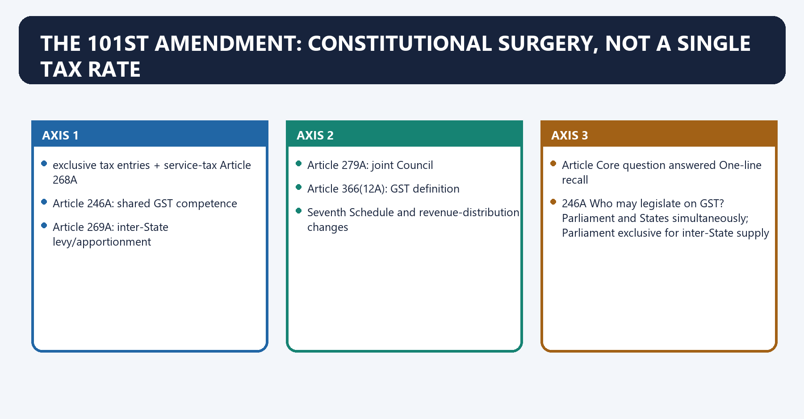
[FACT] The Constitution (One Hundred and First Amendment) Act, 2016 created the enabling architecture. It inserted Articles 246A, 269A and 279A, inserted the GST definition in Article 366(12A), altered tax-distribution provisions and changed relevant Seventh Schedule entries.

[FACT] The Amendment omitted Article 268A, which had dealt with service tax, and reworked Union and State tax entries to accommodate the supply-based GST design.

[FACT] Section 18 of the Amendment directed Parliament, by law and on Council recommendation, to provide compensation to States for GST-related revenue loss for five years.

[LIMIT] The Amendment did not itself enact every GST rate, exemption, compliance rule or compensation calculation. Those came through legislation and delegated instruments.

#### Visual 6 - Before-and-after constitutional map

```text
BEFORE 2016
exclusive tax entries + service-tax Article 268A
                 |
                 v
101st AMENDMENT
  |-- Article 246A: shared GST competence
  |-- Article 269A: inter-State levy/apportionment
  |-- Article 279A: joint Council
  |-- Article 366(12A): GST definition
  +-- Seventh Schedule and revenue-distribution changes
```

#### Visual 7 - The three-article triangle

| Article | Core question answered | One-line recall |
|---|---|---|
| 246A | Who may legislate on GST? | Parliament and States simultaneously; Parliament exclusive for inter-State supply |
| 269A | Who levies/collects and how is inter-State GST shared? | Union collection plus statutory apportionment |
| 279A | Where do Union and States negotiate GST design? | constitutional Council making recommendations |

Caption: Competence, inter-State allocation and coordination are related but legally distinct.

#### Visual 8 - Selected legal surgery

| Amendment move | Significance | Exam caution |
|---|---|---|
| inserted Article 246A | created special shared legislative field | not an ordinary Concurrent List entry |
| omitted Article 268A | displaced separate service-tax architecture | do not quote it as current |
| inserted Article 269A | constitutionalised IGST apportionment | Parliament legislates place-of-supply principles |
| inserted Article 279A | created Council | body recommends; it does not replace legislatures |
| amended Article 368 proviso | alteration of Article 279A enters State-ratification field | shows federal significance |
| amended Article 366 | defined GST; excluded alcohol for human consumption | petroleum is treated differently |
| changed Entries 84 and 54 | preserved specified petroleum/tobacco and alcohol fields | not every old indirect tax vanished |

### 03. Article 246A: a special shared taxing power

Article 246A: a special shared taxing power denotes the constitutional rules and institutional links organised around Supply field Parliament State legislature.
Article 246A: a special shared taxing power operates through intra-State GST yes yes, for State GST, connected with inter-State GST exclusive no independent inter-State GST law.
The operative mechanism matters because specified petroleum before recommended date constitutional/statutory levy deferred existing non-GST fields continue.
Its principal consequence is that alcohol for human consumption outside GST definition State excise/sales-tax fields remain.
The decisive contrast is between Supply field Parliament State legislature and Supply field Parliament State legislature.
The exam-safe limitation is that supply field Parliament State legislature.
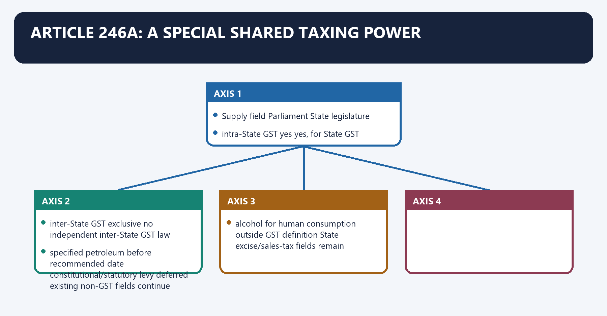
[FACT] Article 246A(1), notwithstanding Articles 246 and 254, gives Parliament and, subject to clause (2), every State legislature power to make laws on GST imposed by the Union or the State.

[FACT] Article 246A(2) gives Parliament exclusive power over GST where the supply takes place in the course of inter-State trade or commerce.

[ANALYSIS] This is a constitutional pooling of tax sovereignty. It differs from a normal Concurrent List subject because Article 246A is a stand-alone competence and the ordinary Article 254 repugnancy template is not simply imported into it.

[LIMIT] Simultaneous legislative power does not mean identical territorial or transaction fields. State GST laws govern intra-State supplies within their constitutional reach; Parliament owns inter-State GST.

#### Visual 9 - Article 246A competence grid

| Supply field | Parliament | State legislature |
|---|---:|---:|
| intra-State GST | yes | yes, for State GST |
| inter-State GST | exclusive | no independent inter-State GST law |
| specified petroleum before recommended date | constitutional/statutory levy deferred | existing non-GST fields continue |
| alcohol for human consumption | outside GST definition | State excise/sales-tax fields remain |

### 04. Article 269A: IGST and the inter-State bridge

Article 269A: IGST and the inter-State bridge denotes the constitutional rules and institutional links organised around SUPPLIER IN STATE A.
Article 269A: IGST and the inter-State bridge operates through charges IGST on inter-State supply, connected with Government of India collection / credit mechanism.
The operative mechanism matters because place-of-supply + settlement rules.
Its principal consequence is that dESTINATION STATE B receives apportioned revenue significance.
The decisive contrast is between [LIMIT] The exact settlement calculation is statutory and system-based. A constitutional answer should not invent accounting formulae and Layer Example Function.
The exam-safe limitation is that constitution Articles 246A, 269A, 279A competence and federal structure.
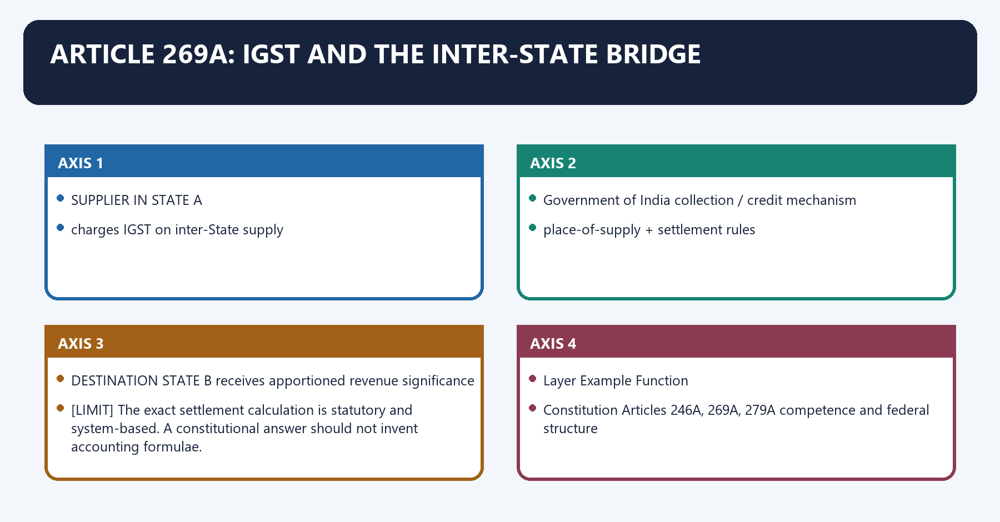
[FACT] Article 269A(1) provides that GST on inter-State supplies is levied and collected by the Government of India and apportioned between Union and States in the manner Parliament provides by law on Council recommendation.

[FACT] Imports are deemed inter-State supplies for this purpose. Parliament may formulate place-of-supply principles under Article 269A(5).

[ANALYSIS] IGST is a clearing bridge rather than a separate final destination burden. Credit and settlement seek to transfer revenue to the jurisdiction of consumption while allowing inter-State trade without an origin-State tax barrier.

#### Visual 10 - Simplified IGST settlement flow

```text
SUPPLIER IN STATE A
      |
charges IGST on inter-State supply
      |
Government of India collection / credit mechanism
      |
place-of-supply + settlement rules
      |
DESTINATION STATE B receives apportioned revenue significance
```

[LIMIT] The exact settlement calculation is statutory and system-based. A constitutional answer should not invent accounting formulae.

#### Visual 11 - Three legal layers

| Layer | Example | Function |
|---|---|---|
| Constitution | Articles 246A, 269A, 279A | competence and federal structure |
| primary legislation | CGST, SGST, IGST, Compensation Acts | charge, liability, credit, procedure and remedies |
| delegated law | rate/exemption notifications and rules | operational rate, class, condition and date |

### 05. Article 279A: exact composition and institutional support

Article 279A: exact composition and institutional support denotes the constitutional rules and institutional links organised around [FACT] The constitutional membership is.
Article 279A: exact composition and institutional support operates through Union Finance Minister - Chairperson, connected with Union Minister of State in charge of Revenue or Finance - Member; and.
The operative mechanism matters because minister in charge of Finance or Taxation, or another Minister nominated by each State Government - Members.
Its principal consequence is that [FACT] State members choose one among themselves as Vice-Chairperson for such period as they decide.
The decisive contrast is between UNION FINANCE MINISTER ---------------- Chairperson and UNION MoS, REVENUE OR FINANCE -------- Member.
The exam-safe limitation is that oNE FINANCE/TAX/NOMINATED MINISTER.
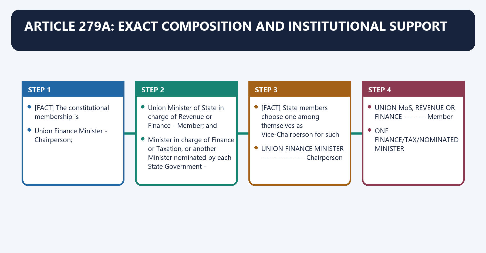
[FACT] The constitutional membership is:

1. Union Finance Minister - Chairperson;
2. Union Minister of State in charge of Revenue or Finance - Member; and
3. Minister in charge of Finance or Taxation, or another Minister nominated by each State Government - Members.

[FACT] State members choose one among themselves as Vice-Chairperson for such period as they decide.

[LIMIT] Article 279A does not constitutionally create a permanent, separately independent Secretariat. The Union Cabinet approved a GST Council Secretariat in New Delhi; the Secretary (Revenue) is ex-officio Secretary and the CBIC Chairperson is a permanent non-voting invitee. These are administrative arrangements, not additional constitutional voting members.

#### Visual 12 - Exact membership map

```text
UNION FINANCE MINISTER ---------------- Chairperson
UNION MoS, REVENUE OR FINANCE -------- Member
ONE FINANCE/TAX/NOMINATED MINISTER
FROM EACH STATE GOVERNMENT ----------- State members
                                           |
                                           +-- choose Vice-Chair
```

#### Visual 13 - Constitution versus administrative support

| Feature | Source | Voting status |
|---|---|---|
| Union Finance Minister | Article 279A(2)(a) | Union vote |
| Union MoS Revenue/Finance | Article 279A(2)(b) | part of Central representation |
| State minister/nominated minister | Article 279A(2)(c) | State vote |
| Vice-Chair | Article 279A(3), chosen by State members | remains a State member |
| Revenue Secretary as ex-officio Secretary | Cabinet/administrative arrangement | no additional vote |
| CBIC Chair as permanent invitee | Cabinet/administrative arrangement | non-voting |
| Council Secretariat | Cabinet/administrative arrangement | institutional support, not constitutional fourth tier |

### 06. What exactly may the Council recommend?

What exactly may the Council recommend? denotes the constitutional rules and institutional links organised around Bucket Exact constitutional subject.
What exactly may the Council recommend? operates through 1 Union, State and local-body taxes, cesses and surcharges that may be subsumed, connected with 2 goods and services that may be subjected to or exempted from GST.
The operative mechanism matters because 3 model GST laws, levy principles, Article 269A apportionment and place of supply.
Its principal consequence is that 4 threshold turnover below which goods and services may be exempted.
The decisive contrast is between 5 rates, including floor rates with bands and 6 special rates for a specified period during natural calamity or disaster.
The exam-safe limitation is that 7 special provisions for the States named in clause (4)(g).
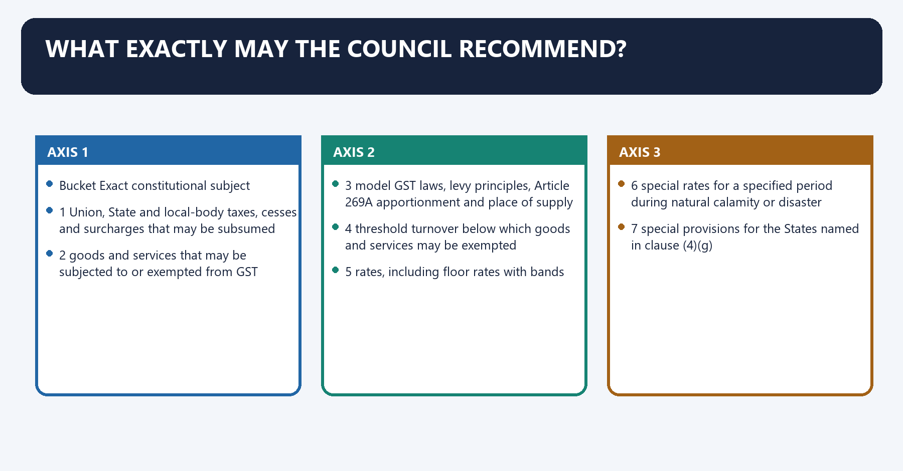
[FACT] Article 279A(4) lists recommendation fields. The Council does not acquire a general power to legislate merely because an issue affects GST.

#### Visual 14 - Eight recommendation buckets

| Bucket | Exact constitutional subject |
|---:|---|
| 1 | Union, State and local-body taxes, cesses and surcharges that may be subsumed |
| 2 | goods and services that may be subjected to or exempted from GST |
| 3 | model GST laws, levy principles, Article 269A apportionment and place of supply |
| 4 | threshold turnover below which goods and services may be exempted |
| 5 | rates, including floor rates with bands |
| 6 | special rates for a specified period during natural calamity or disaster |
| 7 | special provisions for the States named in clause (4)(g) |
| 8 | any other GST-related matter the Council decides |

[FACT] Article 279A(5) separately requires the Council to recommend the date on which GST is levied on petroleum crude, high-speed diesel, petrol, natural gas and aviation turbine fuel.

#### Visual 15 - Petroleum is deferred, not constitutionally banished

```text
SPECIFIED PETROLEUM PRODUCTS
      |
currently taxed through retained Union/State fields
      |
Article 279A(5): Council recommends GST start date
      |
CGST section 9(2): Government notifies date on Council recommendation
      |
GST applies from legally effective date
```

[LIMIT] “Petroleum is permanently outside GST” is wrong. Equally, “all petroleum products are already under GST” is wrong.

### 07. From proposal to legal effect

From proposal to legal effect denotes the constitutional rules and institutional links organised around officer/committee analysis + State/Union inputs.
From proposal to legal effect operates through proposal placed on Council agenda, connected with discussion / modification / consensus or vote.
The operative mechanism matters because cOUNCIL RECOMMENDATION.
Its principal consequence is that law / rule / notification / portal implementation.
The decisive contrast is between administration, litigation and feedback and Actor Constitutional/statutory role Cannot be confused with.
The exam-safe limitation is that gST Council recommends common design Parliament or State legislature.
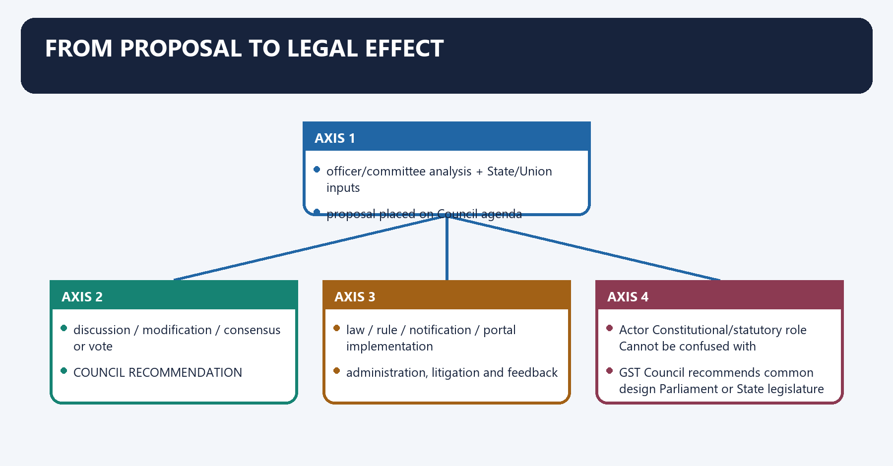
[FACT] Council regulations allow proposals from members, circulation of agenda material, discussion, voting where required, recording of proceedings and confirmation of minutes.

[ANALYSIS] The Council's central output is a negotiated recommendation. Legal effect then depends on the constitutional/statutory route: parliamentary or State legislation, amendment of rules, or a Gazette notification by the competent government.

#### Visual 16 - Recommendation workflow

```text
ISSUE IDENTIFIED
      |
officer/committee analysis + State/Union inputs
      |
proposal placed on Council agenda
      |
discussion / modification / consensus or vote
      |
COUNCIL RECOMMENDATION
      |
law / rule / notification / portal implementation
      |
administration, litigation and feedback
```

#### Visual 17 - Who does what?

| Actor | Constitutional/statutory role | Cannot be confused with |
|---|---|---|
| GST Council | recommends common design | Parliament or State legislature |
| Parliament | enacts CGST/IGST and related law | Council Secretariat |
| State legislature | enacts SGST law | Finance Commission |
| Union/State government | issues delegated notifications where authorised | primary legislature |
| CBIC/State tax administration | administers and enforces law | Council's weighted vote |
| courts/tribunals | interpret and review legal action | rate-setting political forum |

#### Visual 18 - Legal-effect ladder

```text
COUNCIL RECOMMENDATION
   |
   +-- if primary law needed -> legislature -> Act/amendment
   |
   +-- if delegated power exists -> government -> Gazette notification/rule
   |
   +-- if administrative/system step -> competent executive/GSTN process
```

[LIMIT] A press release announcing a recommendation is not by itself the safest source for the rate payable on a transaction. Use the applicable notification and effective date.

### 08. Quorum, weighted voting and coalition arithmetic

Quorum, weighted voting and coalition arithmetic denotes the constitutional rules and institutional links organised around [FACT] One-half of the total Council membership constitutes quorum.
Quorum, weighted voting and coalition arithmetic operates through Union support weight + State support weight = 3/4, connected with Union support weight = 1/3 if Union votes yes, otherwise 0.
The operative mechanism matters because state support weight = (States voting yes / States present and voting) x 2/3.
Its principal consequence is that required total = 3/4 = 9/12.
The decisive contrast is between Union yes = 1/3 = 4/12 and remaining weighted support needed = 5/12.
The exam-safe limitation is that states collectively hold = 2/3.
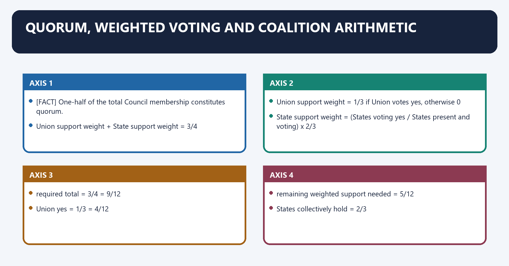
[FACT] One-half of the total Council membership constitutes quorum.

[FACT] A decision requires not less than three-fourths of the weighted votes of members present and voting. The Central Government carries one-third of the votes cast; all State Governments together carry two-thirds.

[ANALYSIS] The design gives the Union a blocking position because States alone can reach only two-thirds, below three-fourths. It does not give the Union a passing position because one-third is far below three-fourths.

#### Visual 19 - Formal vote formula

```text
PASS if:

Union support weight + State support weight >= 3/4

Union support weight = 1/3 if Union votes yes, otherwise 0

State support weight = (States voting yes / States present and voting) x 2/3
```

#### Visual 20 - Why 5/8 of State votes are needed with Union support

```text
required total                     = 3/4 = 9/12
Union yes                          = 1/3 = 4/12
remaining weighted support needed = 5/12

States collectively hold          = 2/3
required fraction of State votes  = (5/12) / (2/3)
                                  = 5/8 = 62.5%
```

[ANALYSIS] Therefore, when the Union supports a proposal, at least five-eighths of the State votes present and voting must support it, subject to rounding to a whole number of States.

#### Visual 21 - Coalition examples with 20 States present and voting

| Union | States in favour | Weighted total | Result |
|---|---:|---:|---|
| yes | 13 of 20 | 1/3 + (13/20 x 2/3) = 0.7667 | passes |
| yes | 12 of 20 | 1/3 + (12/20 x 2/3) = 0.7333 | fails |
| no | all 20 | 2/3 | fails |
| yes | 0 | 1/3 | fails |

[LIMIT] Abstentions change the denominator because Article 279A(9) refers to members present and voting, not every member on the constitutional roll.

#### Visual 22 - Consensus practice versus formal rule

| Dimension | Consensus practice | Formal constitutional vote |
|---|---|---|
| objective | reduce visible federal division | resolve a proposal when voting occurs |
| legal threshold | political agreement | at least three-fourths weighted |
| Union position | negotiates | one-third weight |
| State position | negotiated collective voice | together two-thirds |
| exam line | common practice | binding procedural rule |

[CURRENT] The official Council institutional page describes a general consensus-based approach. [LIMIT] Consensus does not repeal Article 279A(9).

### 09. Procedure, records and institutional accountability

Procedure, records and institutional accountability denotes the constitutional rules and institutional links organised around STATE/UNION POSITIONS.
Procedure, records and institutional accountability operates through REASONS + RECOMMENDATION, connected with MINUTES / PRESS RELEASE.
The operative mechanism matters because rEVENUE + DISTRIBUTIONAL OUTCOME.
Its principal consequence is that aUDIT / LEGISLATIVE SCRUTINY / COURT REVIEW.
The decisive contrast is between STATE/UNION POSITIONS and STATE/UNION POSITIONS.
The exam-safe limitation is that sTATE/UNION POSITIONS.
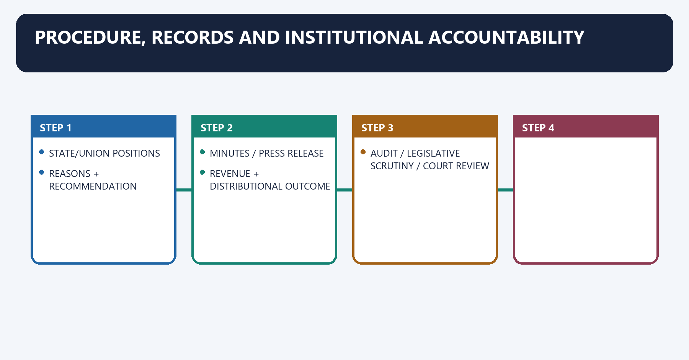
[FACT] The conduct regulations provide for a duly constituted meeting under the Chairperson with at least half the members present, proposal circulation, discussion, division, running minutes, Chairperson-signed minutes and confirmation at the next meeting.

[ANALYSIS] Reasoned and timely publication matters because rate coordination affects revenue, prices, credit chains and State autonomy. Transparency improves both democratic accountability and judicially reviewable legality.

#### Visual 23 - Accountability chain

```text
AGENDA + EVIDENCE
      |
STATE/UNION POSITIONS
      |
REASONS + RECOMMENDATION
      |
MINUTES / PRESS RELEASE
      |
LEGAL INSTRUMENT
      |
REVENUE + DISTRIBUTIONAL OUTCOME
      |
AUDIT / LEGISLATIVE SCRUTINY / COURT REVIEW
```

[LIMIT] Full publication may be shaped by Council directions and confidentiality. A reform demand for fuller reasons must be labelled a proposal, not current constitutional law.

### 10. GST mechanics the Council influences but does not itself levy

GST mechanics the Council influences but does not itself levy denotes the constitutional rules and institutional links organised around Transaction Broad levy form Revenue logic.
GST mechanics the Council influences but does not itself levy operates through intra-State supply CGST + SGST/UTGST shared tax base through parallel laws, connected with inter-State supply IGST Union collection with credit and settlement.
The operative mechanism matters because import IGST treatment as inter-State supply, plus customs as applicable destination principle.
Its principal consequence is that export/SEZ qualifying supply zero-rated under IGST law output burden relieved with credit/refund route subject to law.
The decisive contrast is between 2 Input-tax credit and INPUT PURCHASE: tax paid = 18.
The exam-safe limitation is that oUTPUT SALE: tax liability = 30.
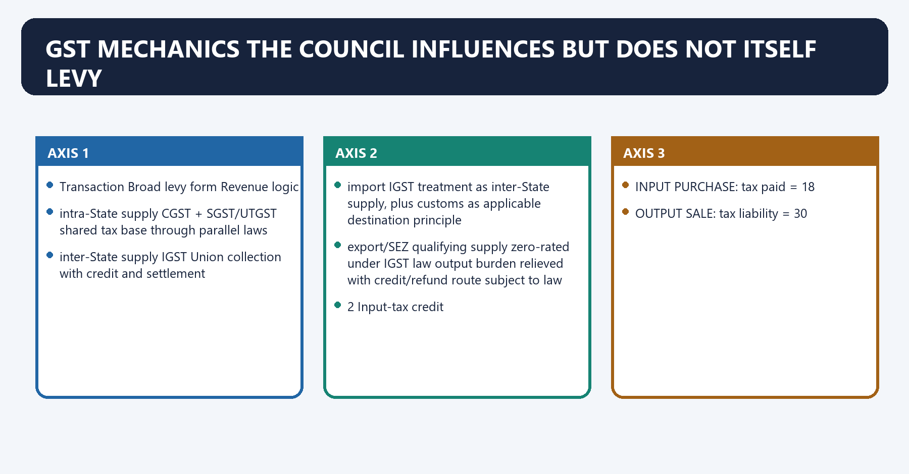
#### 10.1 Dual GST

[FACT] Intra-State supplies generally attract Central GST and State GST (or Union Territory GST). Inter-State supplies generally attract IGST.

#### Visual 24 - Dual levy map

| Transaction | Broad levy form | Revenue logic |
|---|---|---|
| intra-State supply | CGST + SGST/UTGST | shared tax base through parallel laws |
| inter-State supply | IGST | Union collection with credit and settlement |
| import | IGST treatment as inter-State supply, plus customs as applicable | destination principle |
| export/SEZ qualifying supply | zero-rated under IGST law | output burden relieved with credit/refund route subject to law |

#### 10.2 Input-tax credit

[FACT] CGST Act section 16 creates the entitlement framework for eligible input tax charged on inward supplies, subject to statutory conditions and restrictions. Section 49 governs use of the electronic credit ledger.

[ANALYSIS] ITC converts GST from a gross turnover tax toward a tax on value addition. Compliance and matching are integral because one firm's credit corresponds to tax reported elsewhere in the chain.

#### Visual 25 - ITC value chain

```text
INPUT PURCHASE: tax paid = 18
        |
OUTPUT SALE: tax liability = 30
        |
eligible ITC used = 18
        |
net cash tax = 12
```

[LIMIT] This illustration is conceptual. Actual eligibility depends on statutory conditions, blocked-credit rules, documentation and the supply's tax treatment.

#### 10.3 Rates, exemptions and the notification problem

[FACT] CGST Act section 9(1) authorises notified rates on Council recommendation within the statutory ceiling. Section 11 authorises public-interest exemptions by notification on Council recommendation.

[FACT] The 56th Council release recommended broad 5, 18 and special 40 per cent rate categories. The official FAQ directed readers to the rate notification for revised legal rates.

#### Visual 26 - Rate decision is not one document

```text
COUNCIL recommends category/rate/date
                 |
statutory authority checked
                 |
Gazette notification issued
                 |
classification + conditions + effective date applied
```

[CURRENT] Use the 56th meeting only as a dated reform anchor. [LIMIT] Do not answer a current item-rate question from the meeting headline alone.

#### Visual 27 - Exempt, nil-rated and zero-rated are not synonyms

| Category | Output tax | ITC consequence, broad | Example logic |
|---|---:|---|---|
| exempt supply | no output tax | credit may require reversal/restriction | exemption notification |
| nil-rated supply | rate schedule says nil | treated within exempt-supply framework for credit consequences | zero rate in tariff |
| zero-rated supply | special IGST-law category | credit/refund pathway may remain | exports and qualifying SEZ supplies |
| non-GST/outside levy | GST charge does not presently apply | GST credit chain may break | alcohol; deferred petroleum treatment |

[LIMIT] Always read the statute and current notification; labels alone do not resolve every credit consequence.

#### 10.4 Inverted duty structure

[FACT] An inverted duty structure arises where the tax rate on inputs exceeds the rate on outputs, generating accumulated credit.

#### Visual 28 - Inversion problem

```text
INPUT TAX RATE HIGH
       |
credit accumulates
       |
OUTPUT TAX RATE LOWER
       |
cash-flow / refund / classification pressure
       |
Council may recommend rate correction
       |
notification gives legal effect
```

[ANALYSIS] Rate rationalisation must balance fewer inversions, revenue neutrality, consumer incidence and sectoral lobbying.

### 11. Constitutional and statutory boundaries: alcohol, petroleum and electricity

Constitutional and statutory boundaries: alcohol, petroleum and electricity denotes the constitutional rules and institutional links organised around Item Legal position Correct wording.
Constitutional and statutory boundaries: alcohol, petroleum and electricity operates through alcoholic liquor for human consumption excluded from GST definition by Article 366(12A) constitutionally outside GST definition, connected with Item Legal position Correct wording.
The operative mechanism matters because item Legal position Correct wording.
Its principal consequence is that item Legal position Correct wording.
The decisive contrast is between Item Legal position Correct wording and Item Legal position Correct wording.
The exam-safe limitation is that item Legal position Correct wording.
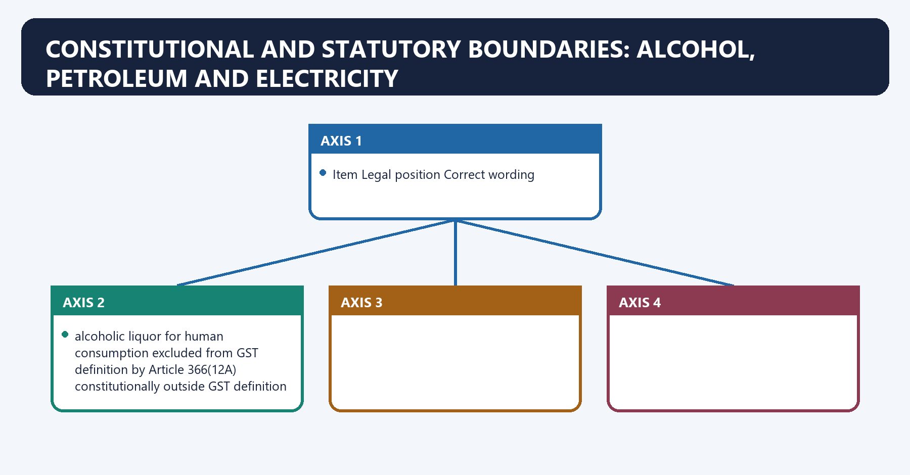
#### Visual 29 - Three different exclusion logics

| Item | Legal position | Correct wording |
|---|---|---|
| alcoholic liquor for human consumption | excluded from GST definition by Article 366(12A) | constitutionally outside GST definition |
| petroleum crude, HSD, petrol, natural gas, ATF | Article 279A(5) defers GST to Council-recommended date; retained entries operate | capable of future GST inclusion from notified date |
| electricity | State List Entry 53 preserves tax on consumption or sale; supply treatment also depends on GST law/notification | do not call it an Article 366(12A) exclusion |

[FACT] State List Entry 54 retains taxes on sale of the specified petroleum products and alcoholic liquor for human consumption, subject to the entry's limits. Entry 53 retains taxes on consumption or sale of electricity.

[LIMIT] “Everything outside the current rate schedule is constitutionally excluded” is false. Constitutional exclusion, deferred commencement, retained tax entry and notification-based exemption are distinct.

### 12. GST compensation: the transition bargain

GST compensation: the transition bargain denotes the constitutional rules and institutional links organised around [FACT] The five-year compensation period ended in June 2022.
GST compensation: the transition bargain operates through BASE-YEAR REVENUE: FY 2015-16, connected with apply 14% projected nominal annual growth.
The operative mechanism matters because pROJECTED PROTECTED REVENUE.
Its principal consequence is that minus ACTUAL REVENUE defined by the Act.
The decisive contrast is between COMPENSATION PAYABLE, subject to audit and statutory calculation and 2017-2022 five-year transition protection.
The exam-safe limitation is that cOVID shock - cess shortfall - back-to-back borrowing.
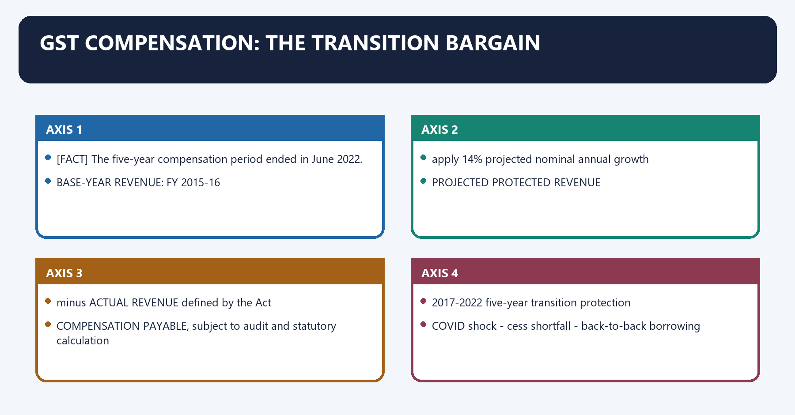
[FACT] The 101st Amendment required a parliamentary compensation law for five years. The Compensation to States Act defines the transition period as five years from the transition date.

[FACT] The Act set a projected nominal growth rate of 14 per cent per annum and used the financial year ending 31 March 2016 as the base year. Compensation broadly represented the gap between projected and actual protected revenue under the Act.

[FACT] The five-year compensation period ended in June 2022.

[LIMIT] Compensation was a statutory transition guarantee; it was not a permanent constitutional entitlement administered directly by the Council.

#### Visual 30 - Compensation calculation logic

```text
BASE-YEAR REVENUE: FY 2015-16
          |
apply 14% projected nominal annual growth
          |
PROJECTED PROTECTED REVENUE
          |
minus ACTUAL REVENUE defined by the Act
          |
COMPENSATION PAYABLE, subject to audit and statutory calculation
```

#### Visual 31 - Compensation timeline

```text
2017 GST launch
   |
2017-2022 five-year transition protection
   |
COVID shock -> cess shortfall -> back-to-back borrowing
   |
June 2022 compensation period ends
   |
cess on specified goods continues for loan/interest servicing
   |
future transition only through official notification
```

[CURRENT] The 56th meeting FAQ states that existing GST and compensation-cess rates on specified tobacco goods would continue until the entire loan and interest liabilities on account of compensation cess are discharged, with later transition to be notified.

[LIMIT] No exact final repayment or cessation date is asserted in this package.

#### Visual 32 - Separate four often-confused concepts

| Concept | What it is | What it is not |
|---|---|---|
| constitutional direction | section 18 of 101st Amendment | perpetual payment guarantee |
| Compensation Act formula | 14 per cent projected growth over 2015-16 base for transition period | ordinary Finance Commission devolution |
| compensation cess | earmarked levy/fund mechanism | State's general GST share |
| back-to-back loans | pandemic shortfall financing | extension of the five-year compensation entitlement itself |

[ANALYSIS] Compensation was the credibility device that enabled States to exchange independent indirect-tax fields for a negotiated common base. The COVID shortfall exposed how transition assurances can become federal trust tests.

### 13. *Union of India v. Mohit Minerals* (2022)

*Union of India v. Mohit Minerals* (2022) denotes the constitutional rules and institutional links organised around [FACT] The dispute concerned IGST on ocean freight in cost-insurance-freight imports and the validity of delegated notifications.
*Union of India v. Mohit Minerals* (2022) operates through IGST already on value including freight, connected with separate ocean-freight reverse-charge notification.
The operative mechanism matters because challenge: competence + recipient + composite supply.
Its principal consequence is that council recommendations persuasive for legislatures.
The decisive contrast is between delegated executive remains bound by statutory conditions and separate freight levy invalid within composite-supply scheme.
The exam-safe limitation is that question Holding Qualification.
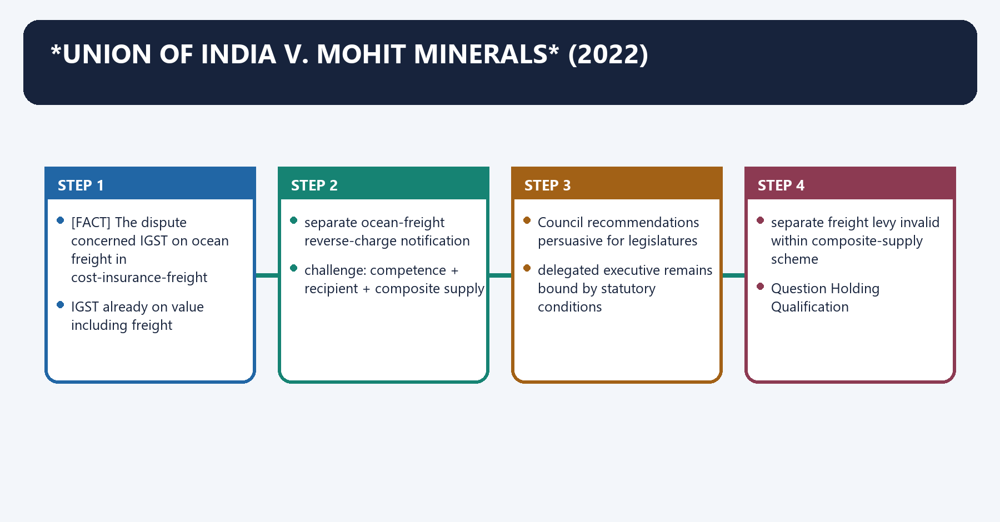
[FACT] The dispute concerned IGST on ocean freight in cost-insurance-freight imports and the validity of delegated notifications.

[FACT] The Supreme Court held that Council recommendations are not binding on the Union and State legislatures; they have persuasive value within a collaborative federal dialogue.

[FACT] The Court linked this conclusion to Article 246A's simultaneous legislative power and the absence of text making Article 246A subject to Article 279A.

[FACT] The Court also stated that where the CGST/IGST statutes make delegated rule-making or notification power conditional on Council recommendation, the executive must comply with that statutory condition.

[FACT] The ocean-freight levy failed because taxing the service component again conflicted with the statutory composite-supply scheme, even though the notification power was examined separately.

#### Visual 33 - Case pathway

```text
CIF IMPORT
  |
IGST already on value including freight
  |
separate ocean-freight reverse-charge notification
  |
challenge: competence + recipient + composite supply
  |
SUPREME COURT
  |-- Council recommendations persuasive for legislatures
  |-- delegated executive remains bound by statutory conditions
  +-- separate freight levy invalid within composite-supply scheme
```

#### Visual 34 - Exact holding matrix

| Question | Holding | Qualification |
|---|---|---|
| Are Council recommendations binding on legislatures? | no; recommendatory/persuasive | high political and harmonising value remains |
| Does Article 246A preserve Union and State legislative power? | yes, within constitutional fields | Parliament exclusive for inter-State supply |
| May executive ignore a statute requiring Council recommendation? | no | statutory condition binds delegated action |
| Did the Court make the Council irrelevant? | no | collaborative dialogue remains central |
| Was every Council-linked notification invalidated? | no | ocean-freight outcome turned on statutory scheme |

#### Visual 35 - Primary law versus delegated action

```text
PARLIAMENT / STATE LEGISLATURE
Article 246A power
Council recommendation = persuasive, not binding

GOVERNMENT ISSUING NOTIFICATION
power comes from GST statute
if statute says "on Council recommendation"
the condition must be followed
```

[LIMIT] The safe proposition is not “Council decisions are optional in every setting.” It is: recommendations do not bind primary legislative power, while a statute may bind executive action to a recommendation.

#### Visual 36 - Federal consequence of the judgment

| Reading | Federal effect | Risk |
|---|---|---|
| binding Council edict | uniformity | subordinates legislatures to an intergovernmental forum |
| persuasive recommendation | preserves legislative autonomy and dialogue | potential divergence if consensus fails |
| statute-conditioned notification | maintains lawful delegated coordination | requires precise statutory reading |

[ANALYSIS] *Mohit Minerals* constitutionalises bargaining rather than command. Harmonisation is sustained by political interdependence, credit chains and common-market costs, not by treating the Council as a super-legislature.

### 14. Cooperative, competitive and confrontational federalism

Cooperative, competitive and confrontational federalism denotes the constitutional rules and institutional links organised around UNION gives up unilateral control over a fully central indirect-tax design.
Cooperative, competitive and confrontational federalism operates through STATES give up unilateral control over many State indirect taxes, connected with SHARED GST TAX BASE + COUNCIL.
The operative mechanism matters because common market, but continuous bargaining.
Its principal consequence is that [ANALYSIS] GST is better described as pooled sovereignty than as either complete centralisation or complete State autonomy.
The decisive contrast is between Mode GST example Value Risk and cooperative consensus on common rules and procedures harmonisation unequal bargaining may be hidden.
The exam-safe limitation is that competitive States improve administration/compliance innovation enforcement race or taxpayer burden.
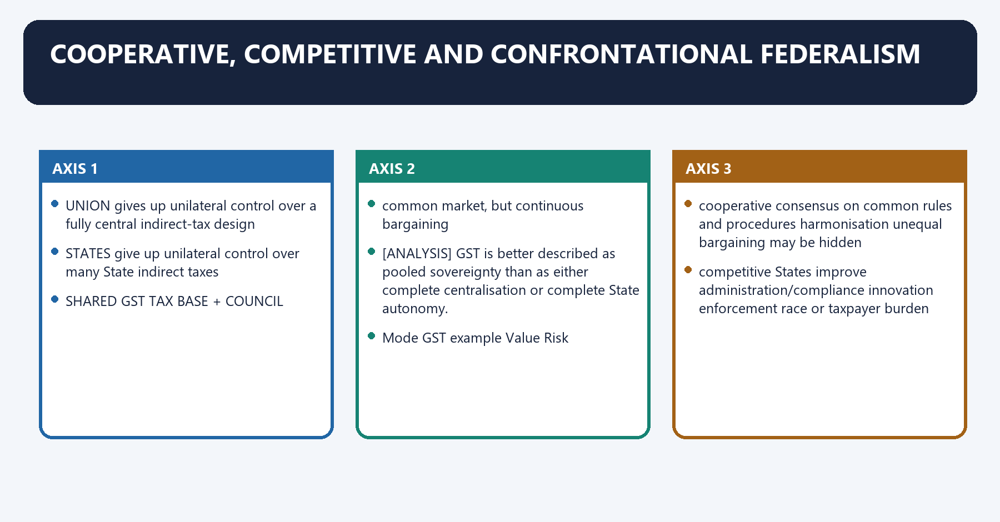
#### Visual 37 - Pooled-sovereignty model

```text
UNION gives up unilateral control over a fully central indirect-tax design
STATES give up unilateral control over many State indirect taxes
                         |
                         v
            SHARED GST TAX BASE + COUNCIL
                         |
       common market, but continuous bargaining
```

[ANALYSIS] GST is better described as **pooled sovereignty** than as either complete centralisation or complete State autonomy.

#### Visual 38 - Three operating modes

| Mode | GST example | Value | Risk |
|---|---|---|---|
| cooperative | consensus on common rules and procedures | harmonisation | unequal bargaining may be hidden |
| competitive | States improve administration/compliance | innovation | enforcement race or taxpayer burden |
| confrontational | compensation, rate or exclusion dispute | autonomy and accountability | fragmentation and trust deficit |

#### Visual 39 - Gains and autonomy costs

| Claimed gain | Named mechanism | Qualification |
|---|---|---|
| reduced cascading | ITC chain | blocked/mismatched credit can interrupt |
| common market | harmonised base and IGST | exclusions and compliance variation remain |
| destination revenue | Article 269A | producing States faced transition concerns |
| joint voice | Article 279A membership/vote | Union has blocking weight |
| predictability | Council process and notifications | frequent change can create compliance cost |
| wider information | invoice system | privacy, capacity and false-invoice risks remain |

[ANALYSIS] State autonomy shifted from unilateral rate-setting toward negotiated rule-making plus retained legislative competence after *Mohit Minerals*. The exchange is real, not costless.

### 15. Recurring conflicts and Article 279A(11)

Recurring conflicts and Article 279A(11) denotes the constitutional rules and institutional links organised around [LIMIT] This is an intergovernmental dispute clause. It is not the taxpayer appeal hierarchy under GST statutes.
Recurring conflicts and Article 279A(11) operates through Dispute pair Within clause (11)?, connected with Government of India versus one or more States yes.
The operative mechanism matters because government of India and some States versus other State(s) yes.
Its principal consequence is that two or more States yes.
The decisive contrast is between taxpayer versus assessing officer no; statutory appeal route and supplier versus customer no; ordinary legal remedies.
The exam-safe limitation is that cONSTITUTIONAL DUTY: establish intergovernmental adjudicatory mechanism.
[FACT] Article 279A(11) commands the Council to establish a mechanism to adjudicate disputes between the Union and State(s), opposing Union-State groupings, or two or more States, where the dispute arises from Council recommendations or implementation.

[LIMIT] This is an intergovernmental dispute clause. It is not the taxpayer appeal hierarchy under GST statutes.

#### Visual 40 - What clause (11) covers

| Dispute pair | Within clause (11)? |
|---|---:|
| Government of India versus one or more States | yes |
| Government of India and some States versus other State(s) | yes |
| two or more States | yes |
| taxpayer versus assessing officer | no; statutory appeal route |
| supplier versus customer | no; ordinary legal remedies |

[CURRENT] No complete, separately published Article 279A(11) adjudicatory mechanism was located in the official public material reviewed for this control date.

#### Visual 41 - Current institutional gap

```text
CONSTITUTIONAL DUTY: establish intergovernmental adjudicatory mechanism
                              |
officially visible Council committees / negotiation / minutes
                              |
taxpayer appeals and GSTAT are separate
                              |
[LIMIT] no verified complete clause (11) mechanism located
                              |
[ANALYSIS] reform need: neutral panel + procedure + reasons + review boundary
```

#### Conflict matrix

| Conflict | Union concern | State concern | Balanced route |
|---|---|---|---|
| rate rationalisation | common market/revenue | local incidence and fiscal need | published modelling and transition |
| compensation | fiscal capacity/debt | trust and surrendered autonomy | transparent accounts and negotiated post-transition framework |
| petroleum inclusion | credit chain/inflation | VAT revenue autonomy | phased, product-specific decision with revenue safeguard |
| compliance | anti-evasion | small-business burden | risk-based, interoperable simplification |
| cesses | targeted revenue | divisible-pool erosion and autonomy | distinguish GST cess from Union cesses; improve transparency |
| divergent legislation | legal autonomy | harmonisation costs | Council dialogue plus constitutional litigation where necessary |

### 16. Institutional comparison

Institutional comparison denotes the constitutional rules and institutional links organised around Dimension GST Council Finance Commission Inter-State Council Zonal Councils.
Institutional comparison operates through base Article 279A Article 280 Article 263 enables establishment; 1990 order States Reorganisation Act, 1956, connected with continuity standing forum periodic commission continuing advisory forum once established standing statutory regional forums.
The operative mechanism matters because subject GST design tax devolution and grants broad intergovernmental coordination regional cooperation/security/development.
Its principal consequence is that output recommendations recommendations to President advice/recommendations deliberative recommendations.
The decisive contrast is between key trap does not devolve divisible pool does not set GST rates not a GST rate body statutory, not constitutional and GST RATE / EXEMPTION / MODEL LAW? ---------- GST COUNCIL.
The exam-safe limitation is that uNION-STATE TAX DEVOLUTION / GRANTS? ------- FINANCE COMMISSION.
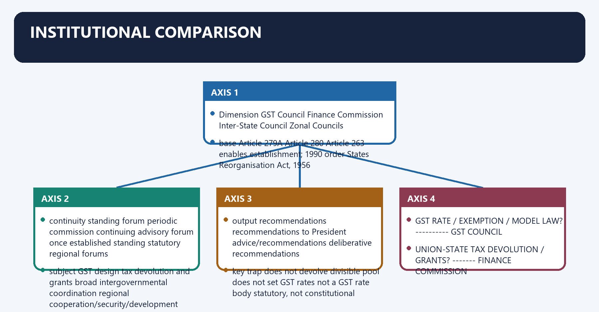
#### Visual 42 - GST Council, Finance Commission, Inter-State Council and Zonal Councils

| Dimension | GST Council | Finance Commission | Inter-State Council | Zonal Councils |
|---|---|---|---|---|
| base | Article 279A | Article 280 | Article 263 enables establishment; 1990 order | States Reorganisation Act, 1956 |
| continuity | standing forum | periodic commission | continuing advisory forum once established | standing statutory regional forums |
| membership | Union FM, Union MoS, State ministers | Chair + four expert members | PM, Union and State leadership under order | Union Home Minister and regional members |
| subject | GST design | tax devolution and grants | broad intergovernmental coordination | regional cooperation/security/development |
| output | recommendations | recommendations to President | advice/recommendations | deliberative recommendations |
| vote design | weighted 1/3 Union, 2/3 States, 3/4 threshold | no federal weighted vote | no Article 279A-style vote | no Article 279A-style vote |
| key trap | does not devolve divisible pool | does not set GST rates | not a GST rate body | statutory, not constitutional |

#### Visual 43 - Which institution answers which question?

```text
GST RATE / EXEMPTION / MODEL LAW? ---------- GST COUNCIL
UNION-STATE TAX DEVOLUTION / GRANTS? ------- FINANCE COMMISSION
BROAD CENTRE-STATE POLICY COORDINATION? ---- INTER-STATE COUNCIL
REGIONAL INTER-STATE COOPERATION? ---------- ZONAL COUNCIL
LEGALITY OF TAX/NOTIFICATION? -------------- COURT / TRIBUNAL
```

[ANALYSIS] The GST Council coordinates a shared tax base; the Finance Commission redistributes shareable Union revenues. They interact in fiscal federalism but perform different constitutional jobs.

### 17. Accountability and reform agenda

Accountability and reform agenda denotes the constitutional rules and institutional links organised around [FACT] Present law already supplies membership, quorum, weighted voting, recommendations, statutory implementation and judicial review.
Accountability and reform agenda operates through Proposal Problem addressed Safeguard/qualification, connected with publish fuller minutes and reasons opaque trade-offs protect legitimately confidential taxpayer data.
The operative mechanism matters because independent revenue/distribution modelling contested projections publish assumptions and error bands.
Its principal consequence is that operationalise Article 279A(11) unresolved intergovernmental disputes define jurisdiction, neutrality and review.
The decisive contrast is between stable rate-review calendar frequent compliance change emergency flexibility retained and simplify rate structure classification and inversion protect revenue and vulnerable consumption.
The exam-safe limitation is that compensation-transition framework post-2022 trust gap do not recreate automatic permanent guarantee without law.
[FACT] Present law already supplies membership, quorum, weighted voting, recommendations, statutory implementation and judicial review.

[ANALYSIS] Reform should improve evidence, reasons, federal trust and administrative simplicity without pretending that a proposal is enacted law.

#### Visual 44 - Reform matrix

| Proposal | Problem addressed | Safeguard/qualification |
|---|---|---|
| publish fuller minutes and reasons | opaque trade-offs | protect legitimately confidential taxpayer data |
| independent revenue/distribution modelling | contested projections | publish assumptions and error bands |
| operationalise Article 279A(11) | unresolved intergovernmental disputes | define jurisdiction, neutrality and review |
| stable rate-review calendar | frequent compliance change | emergency flexibility retained |
| simplify rate structure | classification and inversion | protect revenue and vulnerable consumption |
| compensation-transition framework | post-2022 trust gap | do not recreate automatic permanent guarantee without law |
| strengthen small-business support | compliance burden | avoid weakening anti-evasion controls |
| assess local-government losses | octroi/entry-tax displacement | route through State-local fiscal architecture |
| transparent notification tracker | recommendation-law confusion | mark recommendation, notification and effective date separately |

#### Visual 45 - Safe current-affairs writing protocol

```text
1. NAME OFFICIAL MEETING + DATE
2. SAY "RECOMMENDED", NOT "LAW", AT COUNCIL STAGE
3. IDENTIFY NOTIFICATION / ACT FOR LEGAL EFFECT
4. STATE EFFECTIVE DATE
5. AVOID UNVERIFIED ITEM-WISE RATE LIST
6. ADD CONTROL DATE + VOLATILITY LIMIT
```

### 18. Answer-writing architecture

Answer-writing architecture denotes the constitutional rules and institutional links organised around Step GST Council example.
Answer-writing architecture operates through claim the Council institutionalises shared fiscal rule-making, connected with named evidence Article 279A membership and 1/3-2/3 weighted vote.
The operative mechanism matters because analysis neither Union nor States can pass alone.
Its principal consequence is that qualification Union can block; recommendations do not bind legislatures after Mohit Minerals.
The decisive contrast is between Marks Architecture Evidence load and 10 definition/thesis - three mechanisms - one limitation - verdict 2 Articles + one statute/case.
The exam-safe limitation is that 15 architecture - voting - law interaction - federal evaluation - verdict 4-6 named anchors.
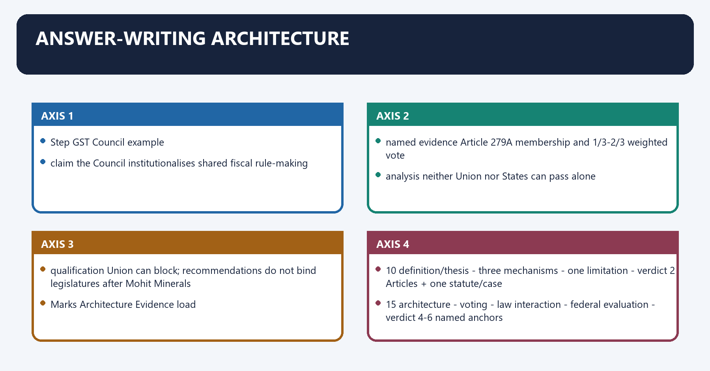
#### Visual 46 - Claim-evidence-analysis-qualification unit

| Step | GST Council example |
|---|---|
| claim | the Council institutionalises shared fiscal rule-making |
| named evidence | Article 279A membership and 1/3-2/3 weighted vote |
| analysis | neither Union nor States can pass alone |
| qualification | Union can block; recommendations do not bind legislatures after *Mohit Minerals* |

#### Visual 47 - Mark-scaled structure

| Marks | Architecture | Evidence load |
|---:|---|---|
| 10 | definition/thesis -> three mechanisms -> one limitation -> verdict | 2 Articles + one statute/case |
| 15 | architecture -> voting -> law interaction -> federal evaluation -> verdict | 4-6 named anchors |
| 20 | pre-GST problem -> Articles 246A/269A/279A -> mechanics -> compensation/case -> conflicts/reforms -> graded verdict | 6-8 anchors and counterpoint |

#### Visual 48 - Directive map

| Directive | What examiner expects |
|---|---|
| explain significance | identify constitutional/economic change and why it matters |
| examine | test design against operation and limitations |
| critically analyse | gains, costs, counter-view and graded judgment |
| compare | common basis plus sharp distinctions |
| suggest | diagnosed problem -> feasible institutional remedy -> safeguard |

#### Visual 49 - High-risk trap board

| Wrong claim | Controlled correction |
|---|---|
| GST Council is statutory | constitutional under Article 279A |
| Prime Minister chairs it | Union Finance Minister |
| Revenue Secretary is constitutional member | ex-officio Secretary by administrative arrangement |
| Centre has half the vote | one-third |
| quorum is one-third | one-half |
| simple majority passes | at least three-fourths weighted |
| States can pass without Union | maximum State weight is two-thirds |
| recommendations always bind | persuasive for legislatures; statutes may bind delegated action |
| compensation is permanent constitutional right | five-year statutory transition ended June 2022 |
| petroleum is outside forever | date may be recommended under Article 279A(5) |
| electricity equals alcohol exclusion | electricity follows a different entry/notification logic |
| Council press release itself changes tax | legal effect requires competent instrument |

#### Visual 50 - Current-control board, 24 August 2026

| Field | Safe statement |
|---|---|
| latest located official meeting release | 56th meeting, 3 September 2025 |
| broad rate reform anchor | recommended 5%, 18% and special 40%; most changes intended 22 September 2025 |
| 2026 official evidence | April newsletter records a rate notification amendment on Council recommendation |
| commodity-wise rates | omitted; verify applicable notification |
| compensation cess | specified old rates continued pending entire loan/interest discharge; no exact end date frozen |
| Article 279A(11) | duty exists; complete public mechanism not verified |
| case law | *Mohit Minerals* remains controlling Supreme Court proposition located |

## BASIC MCQS / REMEDIATION

### Original MCQs - 36 questions

#### OM1. Special legislative competence

Which provision creates the special shared legislative power over GST?

A. Article 246A  
B. Article 263  
C. Article 280  
D. Article 301

**Answer: A.**

**Explanation:** [FACT] Article 246A gives Parliament and State legislatures GST competence, subject to Parliament's exclusive power over inter-State supplies.

#### OM2. Inter-State supply

Under Article 246A(2), exclusive legislative power over GST on inter-State supply belongs to:

A. State legislatures collectively.  
B. Parliament.  
C. the GST Council.  
D. the Finance Commission.

**Answer: B.**

**Explanation:** [FACT] The Council recommends and Article 269A handles allocation, but Parliament has the exclusive inter-State legislative field.

#### OM3. IGST bridge

Which Article provides for Union levy and collection of GST on inter-State supplies with apportionment?

A. Article 268  
B. Article 270  
C. Article 269A  
D. Article 279

**Answer: C.**

**Explanation:** [FACT] Article 269A is the constitutional IGST and place-of-supply bridge.

#### OM4. Council chair

The constitutional Chairperson of the GST Council is:

A. the Prime Minister.  
B. the Revenue Secretary.  
C. the Minister of State for Finance.  
D. the Union Finance Minister.

**Answer: D.**

**Explanation:** [FACT] Article 279A(2)(a) expressly names the Union Finance Minister.

#### OM5. State representation

Each State Government is represented constitutionally by:

A. its finance/taxation minister or another minister it nominates.  
B. its Chief Secretary only.  
C. one legislator elected by the Assembly.  
D. the Governor.

**Answer: A.**

**Explanation:** [FACT] Article 279A(2)(c) uses ministerial representation, not officials as voting substitutes.

#### OM6. Vice-Chair

The Vice-Chairperson is chosen:

A. by the President from Union ministers.  
B. by State members from among themselves for a period they decide.  
C. automatically by seniority among Chief Ministers.  
D. by the Council Secretariat.

**Answer: B.**

**Explanation:** [FACT] Article 279A(3) leaves both selection and period to State members.

#### OM7. Secretariat status

Which statement is correct?

A. Article 279A makes the Revenue Secretary a voting member.  
B. The CBIC Chairperson carries the Union's one-third vote.  
C. The Secretariat is an administrative arrangement supporting the constitutional Council.  
D. The Constitution creates an independent permanent GST civil service.

**Answer: C.**

**Explanation:** [FACT] The Cabinet approved the Secretariat, ex-officio Secretary and non-voting invitee; these are not additional constitutional members.

#### OM8. Recommendation field

Which subject is not an Article 279A(4) recommendation field?

A. thresholds for GST exemption.  
B. floor rates with bands.  
C. special disaster rates.  
D. horizontal tax devolution among States from the divisible pool.

**Answer: D.**

**Explanation:** [FACT] Horizontal devolution belongs to the Finance Commission architecture, not GST Council rate design.

#### OM9. Petroleum date

Article 279A(5) requires the Council to recommend:

A. the date for GST levy on five specified petroleum products.  
B. permanent exclusion of every petroleum product.  
C. State VAT rates on alcohol.  
D. customs duty on crude oil.

**Answer: A.**

**Explanation:** [FACT] Crude, HSD, petrol, natural gas and ATF are deferred to a Council-recommended date.

#### OM10. Quorum

The constitutional quorum is:

A. one-third of voting States.  
B. one-half of total Council members.  
C. two-thirds of all members.  
D. three-fourths of members present.

**Answer: B.**

**Explanation:** [FACT] Article 279A(7) fixes one-half of total membership.

#### OM11. Passing threshold

A formal Council decision requires:

A. simple majority of persons present.  
B. two-thirds of unweighted votes.  
C. at least three-fourths of weighted votes present and voting.  
D. unanimity.

**Answer: C.**

**Explanation:** [FACT] Consensus is practice; Article 279A(9) supplies the weighted legal threshold.

#### OM12. Vote weights

Which pairing is correct?

A. Union one-half; States one-half.  
B. Union two-thirds; States one-third.  
C. Union one-fourth; States three-fourths.  
D. Union one-third; States together two-thirds.

**Answer: D.**

**Explanation:** [FACT] The Constitution divides total votes cast in that ratio.

#### OM13. Union blocking position

Why can the Union block a proposal?

A. Without Union support, State weight can reach only two-thirds, below three-fourths.  
B. The Chairperson has an absolute veto written in Article 279A.  
C. Every State vote is advisory.  
D. Parliament must first approve each vote.

**Answer: A.**

**Explanation:** [ANALYSIS] The blocking effect follows arithmetically from the constitutional weights, not from a separate veto clause.

#### OM14. State coalition needed

If the Union votes in favour, what fraction of State votes present and voting must support the proposal at minimum?

A. one-half.  
B. five-eighths.  
C. two-thirds.  
D. three-fourths.

**Answer: B.**

**Explanation:** [ANALYSIS] Three-fourths minus one-third leaves five-twelfths; divided by the States' two-thirds weight, this equals five-eighths.

#### OM15. Consensus

Which statement best describes consensus in the Council?

A. It constitutionally replaces voting.  
B. It means the Union has no vote.  
C. It is a preferred practice operating alongside the formal Article 279A(9) rule.  
D. It requires judicial certification.

**Answer: C.**

**Explanation:** [FACT] The official Council page describes consensus practice; [LIMIT] the weighted rule remains legally available.

#### OM16. Council recommendation and law

A Council press release announcing a rate change:

A. automatically amends every GST Act.  
B. is equivalent to a Supreme Court order.  
C. binds consumers before any effective date.  
D. must be followed through the competent legal instrument for enforceable effect.

**Answer: D.**

**Explanation:** [FACT] Statutes and Gazette notifications create the applicable liability.

#### OM17. Dual GST

An ordinary intra-State taxable supply broadly attracts:

A. CGST plus SGST/UTGST.  
B. IGST only.  
C. customs duty only.  
D. compensation cess only.

**Answer: A.**

**Explanation:** [FACT] Parallel Union and State/UT laws operationalise the shared Article 246A field.

#### OM18. Input-tax credit

The core economic function of eligible ITC is to:

A. replace every tax with a fee.  
B. reduce cascading by crediting eligible input tax against output liability.  
C. exempt every business input.  
D. transfer GST Council votes.

**Answer: B.**

**Explanation:** [FACT] Sections 16 and 49 form the broad credit-entitlement and use architecture.

#### OM19. Inverted duty

An inverted duty structure occurs where:

A. output is exported.  
B. no invoice is issued.  
C. the input tax rate exceeds the output tax rate.  
D. direct tax exceeds indirect tax.

**Answer: C.**

**Explanation:** [FACT] The mismatch can accumulate credit and create refund/cash-flow pressure.

#### OM20. Zero-rating

Which category is designed to preserve a credit/refund route despite relief from output burden?

A. every non-GST supply.  
B. every exempt domestic supply.  
C. every nil-rated supply.  
D. zero-rated supply under the IGST framework.

**Answer: D.**

**Explanation:** [FACT] Exports and qualifying SEZ supplies are the standard zero-rating examples, subject to law.

#### OM21. Alcohol boundary

Alcoholic liquor for human consumption is:

A. excluded from the GST definition by Article 366(12A).  
B. merely deferred under Article 279A(5).  
C. zero-rated by Article 269A.  
D. assigned to the Finance Commission.

**Answer: A.**

**Explanation:** [FACT] This is a constitutional definition exclusion, unlike the petroleum-date mechanism.

#### OM22. Electricity boundary

Which statement is precise?

A. Electricity is excluded by the same words as alcohol in Article 366(12A).  
B. State List Entry 53 retains tax on consumption or sale of electricity; GST supply treatment also depends on law/notification.  
C. Electricity duty was constitutionally converted into IGST.  
D. The GST Council alone collects electricity duty.

**Answer: B.**

**Explanation:** [FACT] Electricity follows a different constitutional and notification route from alcohol and petroleum.

#### OM23. Compensation base

The Compensation Act used which base year?

A. 2016-17.  
B. 2017-18.  
C. financial year ending 31 March 2016.  
D. 2019-20.

**Answer: C.**

**Explanation:** [FACT] Section 4 identifies FY 2015-16 as the base year.

#### OM24. Protected growth

The projected nominal annual growth rate under the Compensation Act was:

A. 10 per cent.  
B. 12 per cent.  
C. 15 per cent.  
D. 14 per cent.

**Answer: D.**

**Explanation:** [FACT] Section 3 set 14 per cent for the transition period.

#### OM25. Compensation duration

The statutory transition period was:

A. five years from the transition date.  
B. permanent.  
C. ten years from enactment.  
D. dependent on each Finance Commission.

**Answer: A.**

**Explanation:** [FACT] The five-year period ended in June 2022 for the GST launch timeline.

#### OM26. Cess after June 2022

Which statement is safe?

A. The compensation entitlement automatically became permanent.  
B. Cess continuation for pandemic loan/interest servicing is distinct from extending the five-year entitlement.  
C. Every cess entered the divisible pool.  
D. States acquired power to set the cess unilaterally.

**Answer: B.**

**Explanation:** [CURRENT] The official 56th FAQ links specified cess continuation to discharge of loan and interest liabilities.

#### OM27. *Mohit Minerals*

The Supreme Court held Council recommendations to legislatures are:

A. binding decrees.  
B. constitutional amendments.  
C. persuasive/recommendatory.  
D. irrelevant.

**Answer: C.**

**Explanation:** [FACT] The Court tied recommendatory status to simultaneous legislative power and collaborative dialogue.

#### OM28. Delegated notification

After *Mohit Minerals*, where a GST statute authorises notification “on the recommendations of the Council”:

A. the executive may ignore the condition.  
B. only States must comply.  
C. the recommendation automatically becomes primary law.  
D. the executive must satisfy the statutory condition.

**Answer: D.**

**Explanation:** [FACT] The judgment separates legislative autonomy from statute-bound delegated action.

#### OM29. Ocean freight

The ocean-freight levy was ultimately invalid because:

A. it conflicted with the statutory composite-supply scheme and duplicated the freight component.  
B. Article 279A was repealed.  
C. imports cannot be inter-State supplies.  
D. the Council lacked any power to discuss freight.

**Answer: A.**

**Explanation:** [FACT] The Court's outcome rested on the IGST/CGST statutory scheme, not a blanket invalidation of Council-linked notifications.

#### OM30. Article 279A(11)

The clause (11) mechanism concerns:

A. taxpayer assessment appeals.  
B. intergovernmental disputes arising from Council recommendations or implementation.  
C. private commercial arbitration.  
D. election disputes.

**Answer: B.**

**Explanation:** [FACT] It covers Union-State and State-State disputes, not the ordinary taxpayer hierarchy.

#### OM31. Finance Commission comparison

Which body recommends Union-State tax devolution and grants?

A. GST Council.  
B. Inter-State Council.  
C. Finance Commission.  
D. Zonal Council.

**Answer: C.**

**Explanation:** [FACT] Article 280 performs redistribution; Article 279A coordinates GST design.

#### OM32. Inter-State Council comparison

The Inter-State Council is best distinguished as:

A. the rate-notification authority.  
B. a periodic expert tax commission.  
C. a statutory regional body.  
D. a broad advisory coordination forum enabled by Article 263.

**Answer: D.**

**Explanation:** [FACT] It does not possess the GST Council's weighted tax vote.

#### OM33. Local-government effect

Which is the soundest analytical statement?

A. Subsuming entry tax/octroi can affect local own-revenue space, requiring State-local fiscal adjustment.  
B. Municipalities became GST Council voting members.  
C. GST compensation was paid constitutionally to every municipality.  
D. Article 279A replaced State Finance Commissions.

**Answer: A.**

**Explanation:** [ANALYSIS] Local effects are real, but constitutional compensation was to States and local finance remains State-mediated.

#### OM34. Latest located meeting release

For this package's control date, the latest official meeting recommendation release located was:

A. a 2026 57th meeting release.  
B. the 56th meeting release of 3 September 2025.  
C. the 55th meeting only.  
D. no official release.

**Answer: B.**

**Explanation:** [CURRENT] No later official meeting release was established; April 2026 material was a newsletter, not a new meeting outcome.

#### OM35. Current rate writing

The safest way to state a current GST rate is:

A. rely only on coaching summaries.  
B. quote the Council headline without date.  
C. identify the applicable notification, classification, conditions and effective date.  
D. assume every recommendation was notified unchanged.

**Answer: C.**

**Explanation:** [LIMIT] Council recommendations and legally effective rates are distinct stages.

#### OM36. Reform status

Which statement correctly labels reform?

A. Article 279A already mandates public release of every internal model.  
B. An independent fiscal council currently sets GST rates.  
C. Article 279A(11) has been repealed.  
D. Fuller reasons, independent data and a neutral dispute panel are proposals, not current law.

**Answer: D.**

**Explanation:** [ANALYSIS] Reform proposals must be separated from enacted constitutional and statutory rules.

### Remedial MCQs - 12 questions

#### RM1. Quorum-versus-weight trap

Which pairing is correct?

A. quorum one-half; Union vote weight one-third.  
B. quorum one-third; Union vote weight one-half.  
C. both are three-fourths.  
D. both are two-thirds.

**Answer: A.**

**Explanation:** [FACT] These are separate constitutional fractions with different functions.

#### RM2. Union-pass trap

The Union voting alone:

A. passes because it chairs the meeting.  
B. cannot pass because its weight is only one-third.  
C. passes if quorum exists.  
D. converts the recommendation into law.

**Answer: B.**

**Explanation:** [FACT] Three-fourths weighted support is required.

#### RM3. States-alone trap

All States present and voting in favour, with the Union opposed, produce at most:

A. three-fourths.  
B. four-fifths.  
C. two-thirds, so the proposal fails.  
D. unanimity.

**Answer: C.**

**Explanation:** [ANALYSIS] State weight cannot cross the formal threshold without Union support.

#### RM4. Recommendation trap

“Council recommendations are non-binding” means:

A. the Council is unconstitutional.  
B. no GST notification needs Council input.  
C. States may ignore every statutory condition.  
D. primary legislatures retain power, while delegated action remains governed by its statute.

**Answer: D.**

**Explanation:** [FACT] This is the precise *Mohit Minerals* distinction.

#### RM5. Petroleum trap

Which statement corrects “petrol can never enter GST”?

A. Article 279A(5) allows GST from a Council-recommended and legally notified date.  
B. Petrol was excluded by Article 366(12A).  
C. The Finance Commission fixes the date.  
D. State legislatures alone decide inter-State petrol GST.

**Answer: A.**

**Explanation:** [FACT] Deferral is not permanent constitutional exclusion.

#### RM6. Compensation trap

Which statement is correct?

A. Article 279A permanently guarantees 14 per cent revenue growth.  
B. The 2017 Act created a five-year, formula-based transition guarantee.  
C. Compensation is an Article 280 grant.  
D. June 2022 ended every compensation-cess liability immediately.

**Answer: B.**

**Explanation:** [FACT] Separate constitutional direction, statute, cess and loan servicing.

#### RM7. Exemption trap

Which distinction is correct?

A. exempt and zero-rated always have identical ITC consequences.  
B. non-GST and nil-rated are constitutional synonyms.  
C. zero-rating can preserve credit/refund pathways unlike ordinary exemption.  
D. the Council itself credits refunds.

**Answer: C.**

**Explanation:** [FACT] Credit consequences depend on the category and statutory framework.

#### RM8. Secretariat trap

Which statement is inaccurate?

A. Revenue Secretary is ex-officio Secretary by administrative arrangement.  
B. CBIC Chair is a non-voting permanent invitee.  
C. the Secretariat supports Council proceedings.  
D. Article 279A makes the Secretariat a fourth constitutional government.

**Answer: D.**

**Explanation:** [LIMIT] Administrative support must not be inflated into a constitutional tier.

#### RM9. Latest-source trap

Which dated formulation is safest?

A. “As of 24 August 2026, the latest official meeting release located is the 56th meeting release of 3 September 2025.”  
B. “A 57th meeting certainly occurred in August 2026.”  
C. “The April 2026 newsletter is the 57th meeting.”  
D. “All 2025 recommendations were self-executing.”

**Answer: A.**

**Explanation:** [CURRENT] The statement reports the evidence located without claiming universal absence.

#### RM10. Electricity trap

Electricity is best handled by saying:

A. it is excluded by Article 366(12A) exactly like alcohol.  
B. State Entry 53 and applicable GST notifications must be distinguished.  
C. Article 269A makes every electricity sale inter-State.  
D. it is a Finance Commission tax.

**Answer: B.**

**Explanation:** [FACT] This avoids collapsing different constitutional and statutory routes.

#### RM11. Clause (11) trap

GSTAT is not automatically the Article 279A(11) mechanism because:

A. GSTAT sets rates.  
B. Article 279A(11) was omitted.  
C. GSTAT handles statutory taxpayer appeals, while clause (11) concerns intergovernmental disputes.  
D. only Parliament may hear tax cases.

**Answer: C.**

**Explanation:** [FACT] The disputants and legal sources differ.

#### RM12. Institutional comparison trap

Which pairing is wrong?

A. Finance Commission - tax devolution.  
B. Inter-State Council - broad coordination.  
C. Zonal Councils - regional statutory forum.  
D. GST Council - final CAG certification of net proceeds.

**Answer: D.**

**Explanation:** [FACT] CAG certification under Article 279 belongs to fiscal-transfer mechanics, not Council rate design.

## PYQS AND ANSWER PRACTICE

[FACT] This H2 deliberately begins all practice material so that `markdown_learning_pdf.py --mode workbook` extracts the workbook and stops before the final consolidated register notes.

[FACT] Audited routing ledgers for 2018-2023, 2024-2025 and 2026 were searched for GST Council, Article 279A, Article 246A, GST, cooperative/accommodative federalism and *Mohit Minerals*.

[FACT] One direct Polity Mains PYQ was verified: **2023 GS-II Q15** on the 101st Amendment and accommodative federalism.

[FACT] Three closely adjacent verified GST questions are included without relabelling ownership: **2018 Prelims Q97** on GST exemption, **2019 GS-III Q1** on subsumed indirect taxes/revenue implications, and **2020 GS-III Q12** on compensation/COVID federal tension.

[FACT] One wider adjacent fiscal-federalism question, **2025 GS-II Q14**, is included because GST is one necessary reform dimension; its principal owner remains Centre-State Relations.

[LIMIT] No direct standalone 2024, 2025 or 2026 GST Council question was found in the audited routes. The 2016 Essay prompt “Cooperative federalism: Myth or reality” is thematically useful but is not relabelled here as a GST Council PYQ.

#### Visual 51 - PYQ route audit

| Year | Stage/paper | Directness | Package treatment |
|---:|---|---|---|
| 2018 | Prelims GS-I Q97 | adjacent GST-rate/exemption mechanics | solve with historical-key limitation |
| 2019 | GS-III Q1 | adjacent GST structure/economy | full model solution |
| 2020 | GS-III Q12 | adjacent compensation/federalism | full model solution |
| 2023 | GS-II Q15 | direct constitutional owner | full model solution |
| 2025 | GS-II Q14 | broad fiscal-federalism adjacency | full routed model, ownership qualified |

### Verified PYQ 1 - UPSC Prelims 2018, Q97

**Question:** Consider the following items:

1. Cereal grains hulled  
2. Chicken eggs cooked  
3. Fish processed and canned  
4. Newspapers containing advertising material

Which of the above items is/are exempted under GST (Goods and Services Tax)?

A. 1 only  
B. 2 and 3 only  
C. 1, 2 and 4 only  
D. 1, 2, 3 and 4

#### Controlled resolution

- [FACT] The audited ledger verifies the official question route but records that the local official key was unavailable.
- [ANALYSIS] The historically accepted resolution is **C: 1, 2 and 4**; processed/canned fish was not within the exemption combination.
- [LIMIT] This is not labelled an official UPSC key in this package. Item-specific 2018 rates are historical and must not be used as a 2026 rate list.

**Why this earns marks:** It answers the historical question while separating question verification, key status and current-rate volatility.

### Verified PYQ 2 - UPSC GS-III 2019, Q1 - 10 marks, 150 words

**Question:** “Enumerate the indirect taxes which have been subsumed in the Goods and Services Tax (GST) in India. Also, comment on the revenue implications of the GST introduced in India since July 2017.”

#### Demand decoding

| Part | Required response |
|---|---|
| enumerate | name Central and State levies, not generic “many taxes” |
| comment | gains plus transition/revenue qualifications |
| time frame | introduction since July 2017 |

#### Evidence-led model solution

GST subsumed major Central levies such as central excise on most goods, service tax, additional excise duties, countervailing duty and special additional customs duty, along with relevant Central cesses and surcharges on supply. At the State level it absorbed VAT/sales tax on most goods, Central Sales Tax, purchase tax, entry tax/octroi, luxury tax, and most entertainment, betting, gambling and lottery taxes.

The revenue logic was positive in design. [FACT] Article 246A created a shared tax base, Article 269A enabled destination-based IGST settlement, and invoice-linked ITC reduced cascading. [ANALYSIS] A wider common base and digital reporting could improve buoyancy and formalisation.

The transition was uneven. Rate changes, refund delays, ITC mismatches and compliance costs affected collections and working capital. Destination taxation generated adjustment concerns for producing States, which explains the five-year Compensation Act bargain. Petroleum, alcohol, electricity duty, stamp duty and basic customs duty also qualify the “single tax” claim.

GST therefore improved the architecture for long-run revenue and a common market, but its fiscal result depends on base design, compliance, refunds, economic conditions and federal trust rather than the label alone.

**Why this earns marks:** It enumerates named levies, links revenue to Articles 246A/269A and ITC, and qualifies the answer with exclusions and transition costs.

### Verified PYQ 3 - UPSC GS-III 2020, Q12 - 15 marks, 250 words

**Question:** “Explain the rationale behind the Goods and Services Tax (Compensation to States) Act of 2017. How has COVID-19 impacted the GST compensation fund and created new federal tensions?”

#### Evidence-led model solution

The Compensation to States Act, 2017 converted the political assurance behind GST into a time-bound statutory revenue guarantee. States surrendered VAT, entry tax and other independent levies and accepted a destination-based common tax. Manufacturing States feared transition losses and all States faced uncertainty over a new base and compliance system.

[FACT] The Act therefore defined a five-year transition period, adopted FY 2015-16 as the base and projected 14 per cent annual nominal growth in protected revenue. Compensation equalled the statutory gap between projected and actual revenue, financed through a compensation cess and fund. [ANALYSIS] This was the credibility price of pooled sovereignty.

COVID-19 simultaneously reduced GST/cess receipts and raised State health and welfare expenditure. The compensation requirement exceeded the available cess fund, producing disagreement over whether and how the Union should borrow. Back-to-back loans were arranged and cess collection continued beyond the compensation period for debt and interest servicing.

The tension was federal because States had lost much unilateral rate space yet remained responsible for essential services. The Union faced its own borrowing and macro-stability constraints. Delays and uncertainty weakened trust in the Council bargain.

The five-year compensation entitlement ended in June 2022; current cess servicing must not be described as an extension of that entitlement. Future reform requires transparent cess accounts, predictable settlement and a negotiated shock-sharing framework rather than ad hoc bargaining.

**Why this earns marks:** It explains the statutory formula, connects it causally to surrendered autonomy, addresses both COVID revenue mechanics and competing federal constraints, and ends with a precise post-2022 qualification.

### Verified PYQ 4 - UPSC GS-II 2023, Q15 - 15 marks, 250 words

**Question:** “Explain the significance of the 101st Constitutional Amendment Act. To what extent does it reflect the accommodative spirit of federalism?”

#### Demand decoding

| Demand | Evidence route |
|---|---|
| significance | pre-GST fragmentation; Articles 246A, 269A, 279A; common market |
| accommodative extent | composition, vote, compensation and dialogue |
| qualification | Union veto, State autonomy cost, compensation friction, *Mohit Minerals* |

#### Evidence-led model solution

The 101st Constitutional Amendment is significant because it did not merely introduce a tax; it restructured India's fiscal Constitution. [FACT] Article 246A gives Parliament and State legislatures simultaneous GST power, while reserving inter-State supply to Parliament. Article 269A creates the IGST levy-apportionment bridge. Article 279A establishes a permanent Union-State Council. Article 366(12A) shifts the base to supply while excluding alcoholic liquor for human consumption.

The design reflects accommodative federalism in four ways. First, it pools previously separate tax fields rather than transferring them wholly to one level. Second, every State receives ministerial representation. Third, the Union has one-third and States collectively two-thirds of weighted votes, while three-fourths is required; neither side can pass alone. Fourth, the five-year Compensation Act bargain protected the transition.

Accommodation is qualified. The Union can block a proposal, States lost unilateral rate flexibility, and the end of compensation exposed revenue dependence. Exclusions and compliance burdens prevent a fully seamless market.

*Union of India v. Mohit Minerals* (2022) preserves the federal balance by treating Council recommendations as persuasive, not binding on legislatures, while recognising collaborative dialogue. Statutes may nevertheless condition executive notifications on Council recommendation.

Thus, the Amendment is India's boldest experiment in pooled fiscal sovereignty. Its accommodative character is strong in design but depends in practice on transparent evidence, consensus, dispute settlement and respect for State fiscal capacity.

**Why this earns marks:** It answers both limbs, uses the three-article architecture, computes the federal design, deploys compensation and *Mohit Minerals*, and gives a graded rather than celebratory verdict.

### Verified adjacent PYQ 5 - UPSC GS-II 2025, Q14 - 15 marks, 250 words

**Question:** “Examine the evolving pattern of Centre-State financial relations in the context of planned development in India. How far have the recent reforms impacted the fiscal federalism in India?”

[LIMIT] The principal owner is Centre-State Relations. GST Council material supplies one dimension and cannot replace Finance Commission, Article 282, cesses/surcharges and borrowing analysis.

#### Evidence-led routed model solution

Centre-State finance evolved from a mixed Finance Commission-Planning Commission system toward a more rule-based but still Union-influenced architecture. During planned development, Finance Commissions handled tax sharing and grants while the Planning Commission and centrally sponsored schemes channelled significant discretionary assistance under Article 282.

Recent reforms changed both institutions and tax bases. The Fourteenth Finance Commission enlarged untied devolution; NITI Aayog replaced the Planning Commission; and plan/non-plan classification ended. [FACT] The 101st Amendment then pooled major indirect taxes through Articles 246A, 269A and 279A. The GST Council gave States a continuing role in common tax design, and the five-year compensation law eased transition.

The impact is substantial but mixed. Formula-based devolution and the Council improved predictability and consultation. *Mohit Minerals* protected legislative autonomy by making Council recommendations persuasive. Yet cesses and surcharges narrow the divisible pool, centrally sponsored schemes retain conditions, GST reduced unilateral State rate-setting, and the June 2022 end of compensation sharpened revenue concerns. Article 293 borrowing consent and uneven State tax capacity add asymmetry.

Reform should widen transparent untied transfers, rationalise cesses and schemes, publish GST revenue modelling, operationalise Article 279A(11), strengthen State and local own revenues and coordinate debt rules.

Fiscal federalism has become more institutionalised and consultative, but not automatically more decentralised. Its quality depends on the real fiscal space behind the formal forums.

**Why this earns marks:** It keeps GST in its proper place inside the wider transfer-and-borrowing system, uses named constitutional evidence and tests reforms against autonomy, equalisation and transparency.

### Original solved Mains practice - 8 questions

#### Original Solved Mains 1 - 10 marks, 150 words

**Question:** Distinguish the constitutional roles of Articles 246A, 269A and 279A in India's GST architecture.

##### Model solution

The three provisions solve different parts of one federal tax problem.

[FACT] **Article 246A** creates legislative competence. Parliament and State legislatures possess simultaneous power over GST, while Parliament has exclusive power over inter-State supplies. It is a special constitutional field, not a normal Concurrent List entry.

[FACT] **Article 269A** creates the inter-State bridge. The Government of India levies and collects IGST, which is apportioned between Union and States under parliamentary law on Council recommendation. Imports are treated as inter-State supplies and Parliament formulates place-of-supply principles.

[FACT] **Article 279A** establishes the Union-State Council that recommends rates, exemptions, thresholds, model laws, apportionment principles and other GST matters.

[ANALYSIS] Together they connect power, revenue destination and negotiated harmonisation. [LIMIT] The Council does not enact tax statutes, and Article 269A does not give States independent inter-State legislative power.

Thus, Article 246A answers **who legislates**, Article 269A **how inter-State GST is allocated**, and Article 279A **how common design is negotiated**.

**Why this earns marks:** It uses one precise function and one limitation for each Article, avoiding the common error of treating all three as Council provisions.

#### Original Solved Mains 2 - 10 marks, 150 words

**Question:** Explain the GST Council's voting arithmetic and its federal significance.

##### Model solution

[FACT] Article 279A requires one-half of total members for quorum. A decision needs at least three-fourths of weighted votes of members present and voting. The Union has one-third; States collectively have two-thirds.

The arithmetic deliberately prevents unilateral passage. The Union alone has only one-third. States alone can reach only two-thirds, below three-fourths. If the Union supports a proposal, the remaining five-twelfths must come from the States; this equals five-eighths, or 62.5 per cent, of State votes present and voting.

[ANALYSIS] The system combines a Union blocking position with a compulsory State coalition. It supports harmonisation because both levels must negotiate. Consensus practice further lowers the political cost of formal division.

[LIMIT] The balance is asymmetric: the Union can block alone, while no single State has comparable weight. Abstentions also alter the State denominator.

The voting design is therefore accommodative but not perfectly equal federalism: it constitutionalises bargaining between a nationally weighted Union and collectively weighted States.

**Why this earns marks:** It computes the five-eighths requirement, explains both non-unilateralism and asymmetry, and distinguishes quorum, weight and consensus.

#### Original Solved Mains 3 - 15 marks, 250 words

**Question:** “The GST Council recommends, but legislatures and governments give legal effect.” Examine.

##### Model solution

The GST Council is a constitutional coordinating institution, not a super-legislature.

[FACT] Article 279A(4) authorises recommendations on subsumed taxes, taxable or exempt supplies, model laws, place of supply, thresholds and rates. Article 246A separately vests legislative power in Parliament and State legislatures. The CGST, SGST and IGST Acts therefore create the charge, liability, credit, procedure and remedies.

Delegated action forms the next layer. [FACT] CGST Act section 9 permits notified rates and specified reverse-charge categories on Council recommendation; section 11 permits public-interest exemptions on Council recommendation. The applicable rate depends on the competent Gazette notification, classification, conditions and effective date, not merely the meeting press release.

*Union of India v. Mohit Minerals* (2022) clarifies the relationship. Council recommendations are persuasive, not binding on primary legislatures, because Article 246A confers simultaneous legislative power. However, where a statute conditions executive rule-making or notification on Council recommendation, the executive must follow that statutory requirement.

[ANALYSIS] This layered system preserves democratic legislative authority while enabling national harmonisation. Its weakness is communication: recommendation, enactment, notification and portal implementation may occur at different times.

[LIMIT] “Non-binding” does not mean irrelevant, and “Council decided” does not by itself prove a taxpayer's current liability.

Reform should publish a single tracker marking recommendation, instrument, effective date and implementation status.

**Why this earns marks:** It uses Articles 279A/246A, sections 9/11 and *Mohit Minerals* to trace the full legal-effect chain with a practical reform.

#### Original Solved Mains 4 - 15 marks, 250 words

**Question:** Assess whether GST has strengthened cooperative federalism while weakening State fiscal autonomy.

##### Model solution

GST simultaneously strengthens intergovernmental cooperation and narrows unilateral State tax choice.

**Cooperation strengthened.** [FACT] Article 279A places every State at a ministerial table with the Union. The one-third Union, two-thirds States and three-fourths threshold prevents unilateral passage. Article 269A requires common inter-State settlement, while the five-year Compensation Act enabled States to enter a destination-based system. Shared rules reduce cascading and internal tax barriers.

**Autonomy constrained.** States surrendered VAT, entry tax and other levies and cannot independently redesign the common base without credit-chain and market consequences. The Union's one-third weight gives it a blocking position. Compliance systems, rate rationalisation and the June 2022 end of compensation can deepen revenue dependence, especially for States with narrow own-tax bases.

**Constitutional counterweight.** [FACT] *Mohit Minerals* treats Council recommendations as persuasive, preserving State legislative power under Article 246A. States also retain alcohol, electricity-duty and specified-petroleum fields. Thus GST collectivises rather than extinguishes autonomy.

[ANALYSIS] The correct test is not whether States remain fully sovereign over rates, but whether negotiated decisions rest on transparent data, credible transitions and fair dispute resolution.

[LIMIT] Consensus can coexist with unequal fiscal leverage.

GST is cooperative in institutional design and centralising in some fiscal effects. Its federal legitimacy depends on making pooled sovereignty genuinely reciprocal.

**Why this earns marks:** It presents a balanced thesis, links every side to named provisions and gives a graded autonomy verdict rather than a binary label.

#### Original Solved Mains 5 - 15 marks, 250 words

**Question:** Explain the compensation bargain under GST and evaluate the post-June 2022 federal challenge.

##### Model solution

GST compensation was the transition price of a major federal tax bargain.

[FACT] Section 18 of the 101st Amendment directed a parliamentary law for five-year compensation. The 2017 Act used FY 2015-16 as the base, projected 14 per cent annual nominal growth and compensated the statutory gap between projected and actual revenue. A compensation cess and non-lapsable fund financed payments.

[ANALYSIS] The design addressed three State concerns: surrender of VAT and entry-tax autonomy, destination-based revenue movement away from production, and uncertainty during migration to a common compliance system. It converted political assurance into a calculable legal commitment.

COVID-19 damaged both sides of the formula: collections and cess receipts fell while protected requirements and State expenditure pressure rose. Back-to-back borrowing bridged part of the shortfall and cess collection continued for debt/interest servicing.

The compensation entitlement ended in June 2022. [LIMIT] Continuing cess on specified goods is not a perpetual extension of the 14 per cent guarantee. The official 56th meeting FAQ linked transition of specified tobacco rates to complete discharge of loan and interest liabilities but gave no exact final date used here.

Post-2022 challenges include weaker trust, uneven State revenue capacity and no settled shock-sharing rule. Reform should publish cess accounts, distinguish entitlement from debt service, model State-specific transition effects and negotiate a rules-based emergency facility.

**Why this earns marks:** It states the exact formula and period, explains political rationale, separates COVID financing from entitlement and offers feasible post-transition reforms.

#### Original Solved Mains 6 - 20 marks, 250 words

**Question:** Critically analyse the constitutional and economic case for bringing the five specified petroleum products into GST.

##### Model solution

The Constitution postpones, rather than prohibits, GST on petroleum crude, high-speed diesel, petrol, natural gas and aviation turbine fuel. [FACT] Article 279A(5) requires a Council-recommended date; Article 246A's explanation and CGST Act section 9(2) connect levy to that date and notification.

**Case for inclusion.** Petroleum is a major business input. Exclusion breaks ITC chains in transport, aviation, industry and power-linked sectors, embeds tax in prices and weakens the common-market claim. IGST settlement could reduce inter-State distortions, and a harmonised base could improve transparency.

**Federal and fiscal objections.** State VAT on fuel is a substantial, adjustable own-revenue source; Union excise also serves fiscal and policy goals. GST inclusion could reduce rate flexibility, create compensation demands and expose revenue to Council bargaining. Fuel prices carry inflation, environmental and distributional effects, so a low uniform rate may be fiscally costly while a high rate may defeat simplification.

**Design route.** The Council should use product-specific modelling rather than an all-at-once slogan: publish revenue-neutral scenarios, protect existing debt/fiscal space, allow a transition band, integrate ITC gradually, and review carbon and transport effects. Natural gas or ATF may present different trade-offs from petrol and diesel.

[LIMIT] Inclusion requires a Council recommendation and legally effective instrument; it is not achieved by policy speech.

Petroleum inclusion has a strong efficiency case but must be a negotiated fiscal transition. The constitutional answer is phased cooperative federalism, not permanent exclusion or abrupt uniformity.

**Why this earns marks:** It begins with exact Article 279A(5), weighs credit-chain gains against State own-revenue loss, differentiates products and supplies an implementable route.

#### Original Solved Mains 7 - 20 marks, 250 words

**Question:** Evaluate *Mohit Minerals* as a judgment on fiscal federalism rather than merely an ocean-freight tax case.

##### Model solution

*Union of India v. Mohit Minerals* (2022) arose from IGST on ocean freight in CIF imports, but its constitutional significance lies in defining authority inside the GST compact.

[FACT] The Supreme Court held Council recommendations non-binding on Union and State legislatures and persuasive within collaborative dialogue. Article 246A grants simultaneous power; it is not made subject to Article 279A. Treating Council recommendations as binding edicts would subordinate legislatures and disturb fiscal federalism.

The judgment nevertheless preserves coordination. Where CGST/IGST statutes condition delegated notification or rule-making on Council recommendation, the executive is bound by that statutory requirement. The Court also did not invalidate the Council as an institution. It invalidated the ocean-freight levy because the separate service charge conflicted with the statutory composite-supply framework in which IGST had already captured freight within import value.

[ANALYSIS] The ruling shifts GST from hierarchical uniformity to negotiated harmonisation. States retain constitutional voice and may contest, while credit chains and market costs create incentives to agree. This recognises Indian federalism as cooperation plus possible contestation.

[LIMIT] The decision can generate divergence if political dialogue fails, and it does not answer every notification dispute. Nor does it make Council expertise dispensable.

The best institutional response is reasoned recommendations, transparent impact data and an operational Article 279A(11) mechanism. *Mohit Minerals* strengthens the Council by grounding its legitimacy in persuasion and law, not command.

**Why this earns marks:** It connects the case facts, constitutional holding, delegated-action qualification and federal consequence, while rejecting both “binding Council” and “irrelevant Council” extremes.

#### Original Solved Mains 8 - 20 marks, 250 words

**Question:** Suggest an accountability and reform framework that can make the GST Council a more durable institution of fiscal federalism.

##### Model solution

The Council's durability depends on whether States and taxpayers can trace a recommendation from evidence to legal effect and fiscal outcome.

**First, improve deliberative transparency.** Publish agendas where feasible, fuller minutes, dissent, revenue assumptions and reasons. A notification tracker should separately mark Council recommendation, statutory authority, Gazette instrument, effective date and portal implementation.

**Second, strengthen evidence.** An independent technical unit should publish distributional, State-revenue, inflation, ITC and compliance modelling with assumptions and error bands. [LIMIT] It should advise, not acquire rate-setting power.

**Third, operationalise Article 279A(11).** A neutral intergovernmental panel needs defined jurisdiction, timelines, reasoned decisions and a clear relationship with Article 131 and judicial review. It must remain separate from taxpayer appeals and GSTAT.

**Fourth, rebuild transition trust.** Publish compensation-cess and loan-servicing accounts, avoid implying a permanent 14 per cent guarantee, and design a rules-based shock facility for future nationwide disruptions.

**Fifth, simplify without fiscal blindness.** Use a stable review calendar, reduce inversions and classification disputes, support small firms and assess State/local-government revenue effects before changes.

**Sixth, protect federal reciprocity.** Preserve consensus where possible, record formal votes when needed and disclose implementation delays by both levels.

[FACT] Articles 246A, 269A and 279A already supply competence, settlement and negotiation; *Mohit Minerals* protects legislative autonomy. [ANALYSIS] Reform should therefore improve legitimacy and execution, not replace legislatures with technocracy.

The goal is transparent pooled sovereignty: common rules produced by evidence, reciprocal accommodation and enforceable legal instruments.

**Why this earns marks:** It diagnoses transparency, data, dispute, compensation, compliance and federal-accountability gaps and pairs each proposal with an institutional safeguard.

## OPTIONAL ADVANCED DEPTH — NOT REQUIRED FOR A CORE ANSWER

> **Subject:** Polity · **Tier:** Advanced (exam depth) · **GS Paper:** GS-II / GS-III
> **Grounded in:** Indian Polity by M. Laxmikant, Ch. 46 (direct check of the local Sixth Revised Edition PDF) + official GST Council update.
> ✅ = from source book · ⚠️ = inference / case law · 📰 = current affairs.
> *Companion: `basic/GST-Council.md`.*

---

### PART A — ESTABLISHMENT ⭐
✅ The **101st Amendment Act, 2016** introduced **GST** and inserted **Article 279-A**, empowering the **President**
to constitute the **GST Council** by order (issued **15 Sept 2016**).
- ✅ A **constitutional federal recommendatory forum** central to GST design — a model
  of cooperative federalism. Its recommendations require legal implementation and are not
  independently binding commands.
- ✅ Secretariat at **New Delhi**; the **Union Revenue Secretary** is the **ex-officio Secretary**; the **CBIC/CBEC
  chairperson** is a **permanent invitee (non-voting)**.

---

### PART B — COMPOSITION ⭐
| Member | Role |
|---|---|
| ✅ **Union Finance Minister** | **Chairperson** |
| ✅ **Union MoS (Revenue/Finance)** | Member |
| ✅ **State Minister** (Finance/Taxation or nominated) from **each state** | Members |

✅ The **state members choose one among themselves as Vice-Chairperson** (and decide his term).

---

### PART C — WORKING (voting maths) ⭐⭐
| Rule | Value |
|---|---|
| ✅ **Quorum** | **½** of total members |
| ✅ **Decision majority** | **≥ 3/4 of weighted votes** of members present & voting |
| ✅ **Centre's weight** | **1/3** of votes cast |
| ✅ **All states combined** | **2/3** of votes cast |

⭐ **Design insight:** the Centre alone (1/3) can **block** any resolution (needs 3/4 to pass), but **cannot pass**
anything without states — a deliberate federal balance. Acts are **not invalidated** by vacancies, defects in
appointment, or non-material procedural irregularities.

---

### PART D — FUNCTIONS ✅
Recommends to Centre & states on: taxes/cesses/surcharges **subsumed** in GST; goods/services **taxed or exempt**;
**model GST laws, place-of-supply** principles; **threshold turnover** for exemption; **rates (incl. floor rates
with bands)**; special disaster rates; special provisions for **NE & hill/special-category states**.
- ✅ Recommends **the date** to bring **petroleum crude, diesel, petrol, natural gas, ATF** under GST (currently
  outside GST).
- ✅ Must set up a **dispute-resolution mechanism** (Centre-state / state-state).
- ✅ Recommended **compensation to states** for revenue loss for **5 years** (GST Compensation Act, 2017).

---

### PART E — 📰 CURRENT DEVELOPMENTS ⭐
- 📰 **GST 2.0 (56th GST Council, effective 22 Sept 2025):** the old four-slab structure (5/12/18/28%) was
  **rationalised into two main slabs — 5% (merit) & 18% (standard)** — plus a **40% "sin/luxury" rate** (tobacco,
  pan masala, aerated drinks, luxury vehicles). Individual health & life insurance **fully exempt**.
- 📰 ⚠️ **Mohit Minerals (2022) case (SC, 2022):** GST Council recommendations are **only persuasive, NOT binding** on the
  Centre or states (both have simultaneous power to tax) — a landmark on **fiscal federalism** and states'
  autonomy.
- 📰 ⚠️ **End of GST compensation (June 2022)** & states' demand for extension; **compensation cess** now servicing
  loans / repurposed.

---

#### UPSC Traps
- ❌ GST Council decisions need a simple majority → **3/4 of weighted votes**.
- ❌ Centre's vote weight is 1/2 → **1/3** (all states together = 2/3).
- ❌ GST Council recommendations are binding → **only recommendatory/persuasive** (Mohit Minerals (2022)).
- ❌ Petrol & diesel are already under GST → **outside GST** until the Council fixes a date.
- ❌ GST Council is a statutory body → it is a **constitutional body** (Art 279-A).
- ❌ The PM chairs the GST Council → the **Union Finance Minister**.
- ❌ Quorum is 1/3 → **½** of members (the 1/3 refers to the Centre's *vote weight*).

#### 📰 CA hooks
- 📰 **GST 2.0** two-slab rationalisation — consumption boost vs revenue implication (~₹48,000 cr).
- 📰 GST on **petroleum products** — long-pending inclusion debate.
- 📰 **Cooperative vs "coercive" federalism** — states' voice in the Council post-compensation.

#### Mains angles
- "The GST Council is a laboratory of cooperative federalism." Examine, using the voting design and Mohit Minerals (2022).
- Should petroleum products be brought under GST? Analyse the fiscal-federal trade-offs.
- GST 2.0 rate rationalisation: simplification vs revenue autonomy of states.

<!-- BEGIN GENERATED PYQ INTEGRATION: 2018-2023 -->
#### Historical PYQ Integration (2018-2023)

> **Status:** Question-level PYQ demand is integrated into this owner.
> **Provenance:** Audited local official-paper routing ledgers: `_PYQ-ROUTING-MAINS-GS1-GS2-ESSAY-2018-2023.md`.

- **Years represented:** 2023
- **Paper(s):** GS-II
- **Routed question demands:** 1

| Year | Paper | Q | PYQ demand (neutral rendering) | Directive / format | Source status | Owner requirement |
|---:|---|---:|---|---|---|---|
| 2023 | GS-II | 15 | 101st Constitutional Amendment Act and accommodative federalism | Explain the significance · 15 marks · 250 words | Routed to owning topic; word limit taken from the instruction block | Prepare context, core dimensions, evidence/examples, counterpoint and a concise conclusion. |

##### What this owner must now support

- 101st Constitutional Amendment Act and accommodative federalism

> The table integrates the examinable demand and paper metadata. It does not turn an unkeyed objective question into a solved answer, and it does not claim that lexical presence alone proves full conceptual sufficiency.
<!-- END GENERATED PYQ INTEGRATION: 2018-2023 -->

## CONSOLIDATED REGISTER NOTES

### Constitutional compact in one view

- [FACT] The 101st Amendment created a supply-based, dual GST through constitutional redistribution and sharing of tax power.
- [FACT] Article 246A = legislative competence; Article 269A = inter-State levy/apportionment; Article 279A = Union-State recommendation forum.
- [FACT] Article 366(12A) excludes alcoholic liquor for human consumption from the GST definition.
- [FACT] Article 279A is included in the Article 368 State-ratification proviso, underlining its federal character.
- [LIMIT] GST is not one Union tax and the Council is not a legislature.

### Visual 52 - Three-article rapid spine

```text
246A = POWER
269A = INTER-STATE FLOW
279A = NEGOTIATED DESIGN
```

### Pre-GST problem and tax logic

- [FACT] Fragmented taxable events included manufacture, service, sale and entry.
- [ANALYSIS] Broken cross-credit caused cascading and internal-market friction.
- [FACT] GST uses invoice-linked ITC and destination logic.
- [LIMIT] ITC is conditional; exemptions, blocked credit, mismatch and inversion interrupt the ideal chain.

### Exact Council design

- [FACT] Chair: Union Finance Minister.
- [FACT] Union member: Union MoS in charge of Revenue or Finance.
- [FACT] State member: Finance/Taxation Minister or another Minister nominated by each State Government.
- [FACT] State members choose one among themselves as Vice-Chair for a period they decide.
- [LIMIT] Revenue Secretary, CBIC Chair and Secretariat are administrative support, not extra constitutional voting members.

### Visual 53 - Membership and support distinction

| Constitutional voter/member | Administrative support |
|---|---|
| Union FM | Revenue Secretary, ex-officio Secretary |
| Union MoS Revenue/Finance | CBIC Chair, non-voting invitee |
| one nominated State minister each | Secretariat officers from Union/States |

### Recommendation domains

- [FACT] subsumed taxes/cesses/surcharges;
- [FACT] taxable or exempt goods/services;
- [FACT] model laws, levy, Article 269A apportionment and place of supply;
- [FACT] exemption threshold;
- [FACT] rates including floor rates with bands;
- [FACT] specified-period disaster rates;
- [FACT] special provisions for named States;
- [FACT] other GST matters;
- [FACT] separate date recommendation for crude, HSD, petrol, natural gas and ATF.

### Voting mathematics

### Visual 54 - Four-number memory board

| Number | Meaning |
|---:|---|
| 1/2 | quorum of total members |
| 1/3 | Union weight |
| 2/3 | States' collective weight |
| 3/4 | passing threshold |

- [ANALYSIS] Union alone cannot pass; States alone cannot pass.
- [ANALYSIS] Union can block because States max out at two-thirds.
- [ANALYSIS] With Union support, five-eighths of State votes present and voting are needed.
- [LIMIT] Consensus practice and formal voting rule must be distinguished.

### Recommendation-to-law chain

### Visual 55 - Legal effect recall

```text
COUNCIL RECOMMENDS
      |
LEGISLATURE ENACTS / GOVERNMENT NOTIFIES
      |
ADMINISTRATION IMPLEMENTS
      |
COURT OR TRIBUNAL REVIEWS LEGALITY
```

- [FACT] CGST section 9 links rate and specified notification powers to Council recommendation.
- [FACT] Section 11 links exemptions to Council recommendation.
- [LIMIT] Press release != rate notification.
- [CURRENT] The 56th meeting is the latest official meeting release located; commodity-wise current rates are intentionally not frozen.

### Tax-mechanics distinctions

| Confusion | Correct recall |
|---|---|
| intra-State | CGST + SGST/UTGST |
| inter-State | IGST and settlement |
| exempt | no output tax; credit may be restricted/reversed |
| nil-rated | zero tariff rate within exempt framework |
| zero-rated | exports/qualifying SEZ supplies with credit/refund route |
| inverted duty | input rate exceeds output rate |
| alcohol | constitutional GST-definition exclusion |
| petroleum | deferred date mechanism |
| electricity | retained State entry plus notification treatment |

### Compensation compact

- [FACT] five-year transition period ending June 2022.
- [FACT] FY 2015-16 base and 14 per cent projected nominal growth.
- [FACT] compensation = statutory projected-actual revenue gap.
- [FACT] cess/fund financed transition; COVID produced shortfall and borrowing.
- [CURRENT] specified cess treatment continues pending entire loan and interest discharge under the latest located official FAQ.
- [LIMIT] no exact cessation date; cess servicing is not a permanent compensation guarantee.

### *Mohit Minerals* doctrine

### Visual 56 - Case recall

| Proposition | Status |
|---|---|
| Council recommendations bind primary legislatures | false |
| recommendations have persuasive value | true |
| Article 246A preserves simultaneous power | true |
| executive may ignore statutory recommendation condition | false |
| Council became irrelevant | false |
| ocean-freight levy conflicted with composite-supply scheme | true |

- [ANALYSIS] The judgment protects fiscal federalism through collaborative dialogue rather than hierarchy.
- [LIMIT] It must not be stretched into a claim that every Council-linked notification is invalid.

### Federal debate bank

- [ANALYSIS] **Cooperative:** common rules, Council dialogue, IGST settlement.
- [ANALYSIS] **Competitive:** administrative innovation and compliance performance.
- [ANALYSIS] **Confrontational:** compensation, petroleum, rates and legal divergence.
- [ANALYSIS] **Autonomy cost:** reduced unilateral State rate-setting.
- [ANALYSIS] **Autonomy protection:** State vote, retained tax fields and *Mohit Minerals*.
- [LIMIT] Consensus may conceal unequal revenue dependence.

### Institutional comparison recall

| Body | One-line function |
|---|---|
| GST Council | coordinates GST design |
| Finance Commission | recommends devolution and grants |
| Inter-State Council | broad intergovernmental advice |
| Zonal Councils | statutory regional coordination |
| courts/tribunals | decide legality and statutory disputes |

### Disputes and reforms

- [FACT] Article 279A(11) mandates an intergovernmental adjudicatory mechanism.
- [LIMIT] No complete official public mechanism was verified by the control date; do not substitute GSTAT.
- [ANALYSIS] Priority reforms: fuller reasons/minutes, independent modelling, operational clause (11), stable rate calendar, notification tracker, post-compensation shock framework, local-government impact review and small-business simplification.
- [LIMIT] These are proposals, not current law.

### PYQ routes and answer theses

- **2019 GS-III:** enumerate subsumed taxes, then assess revenue through ITC, destination, compliance and exclusions.
- **2020 GS-III:** compensation formula -> COVID shortfall -> borrowing -> federal trust.
- **2023 GS-II direct:** pooled sovereignty -> vote design -> compensation -> *Mohit Minerals* -> qualified accommodative verdict.
- **2025 GS-II adjacent:** GST belongs inside wider Finance Commission, cesses, schemes and borrowing analysis.

### Final 12 rapid-recall facts

1. 101st Amendment, 2016; GST launch from July 2017.
2. Article 246A is special shared competence, not Concurrent List.
3. Parliament is exclusive for inter-State GST legislation.
4. Article 269A is the IGST/apportionment bridge.
5. Article 279A creates the Council.
6. Chair = Union Finance Minister.
7. Quorum = one-half.
8. Vote = Union one-third, States two-thirds, threshold three-fourths.
9. With Union support, five-eighths of State votes are needed.
10. Recommendations are persuasive for legislatures after *Mohit Minerals*.
11. Statute-conditioned delegated notifications still require Council recommendation.
12. Compensation ended June 2022; cess loan servicing is a separate current issue.

### Final verdict bank

- **Institutional:** The GST Council is a constitutional bargaining forum whose authority rests on structured interdependence, not legislative supremacy.
- **Federal:** GST collectivised tax sovereignty; its legitimacy depends on reciprocal accommodation and credible State fiscal space.
- **Judicial:** *Mohit Minerals* preserves harmonisation through persuasion while keeping delegated action within statute.
- **Reform:** Transparent evidence, an operational dispute mechanism and clear recommendation-to-notification tracking are the next stage of cooperative fiscal federalism.
