# National Commissions SC ST BC — Complete Uncompressed Learning Session

> **Control date:** 2026-08-24  
> **Tags:** `[FACT]` directly supported by a named constitutional, statutory, official, judicial or audited local source; `[ANALYSIS]` reasoned exam use; `[CURRENT]` date-sensitive control; `[LIMIT]` qualification preventing overstatement.  
> **Answer discipline:** claim -> named evidence -> analysis -> qualification.  
> **Scope:** Articles 338, 338A, 338B, 341, 342, 342A and 366(26C); institutional evolution; composition; safeguards, complaints, development and reporting functions; civil-court powers; consultation; SC/ST/SEBC list mechanics; the 65th, 89th, 102nd and 105th Amendments; *Indra Sawhney*, *Jaishri Laxmanrao Patil* and *State of Punjab v. Davinder Singh*; domain overlaps, limits, comparison, accountability and reform.

#### Package method, source priority and legal-current control

- [CURRENT] Status is controlled to **24 August 2026, Asia/Kolkata**.

- [CURRENT] **Live official refresh, 24 August 2026:** NCSC, NCST, NCBC, Legislative Department and Supreme Court official sources were rechecked on 24 August 2026. No later constitutional amendment changing Articles 338, 338A, 338B, 341, 342 or 342A is asserted.
- [FACT] Local-first sequence followed: `Polity/basic/National-Commissions-SC-ST-BC.md` -> `Polity/advanced/31_National-Commissions-SC-ST-BC.md` -> OCR-searchable local *Indian Polity* commission chapters -> Fundamental Rights/reservation, Scheduled and Tribal Areas, statutory-body, social-justice and Centre-State owners only where needed -> all relevant PYQ routing and audit ledgers.
- [FACT] Polity packages 29 and 30 were used only as structural, visual and validation references. Their subject content has not been imported.
- [CURRENT] Constitutional control was checked against the Legislative Department's official Constitution page and official Gazette texts of the 89th, 102nd and 105th Amendments.
- [FACT] The official NCSC history and functions pages, NCST establishment page and 2005 specification-of-other-functions notification, and NCBC duties page were checked directly.
- [FACT] The repealed National Commission for Backward Classes Act, 1993 and the 2018 Repeal Act were checked through official NCBC/India Code routes.
- [FACT] Judicial control uses the Supreme Court's official judgment in *Jaishri Laxmanrao Patil v. Chief Minister, Maharashtra* (5 May 2021) and *State of Punjab v. Davinder Singh* (1 August 2024), with *Indra Sawhney v. Union of India* (1992) used for the permanent-body origin.
- [CURRENT] No verified post-105th constitutional amendment changing Articles 338, 338A, 338B, 341, 342 or 342A was located by the control date.
- [LIMIT] Current chairpersons, individual vacancies and complaint-disposal totals are intentionally not frozen. They are volatile, unnecessary for the constitutional core and can distract from institutional design.
- [LIMIT] Commission websites sometimes use loose expressions such as “quasi-judicial”. This package controls legal effect through the constitutional clauses: evidentiary civil-court powers apply only while investigating or inquiring and do not convert a commission into a court.

### Authoritative evidence board

| Named evidence | Claim controlled |
|---|---|
| Constitution, Articles 338, 338A and 338B | status, composition, duties, reports, civil-court powers and consultation |
| Constitution, Articles 341, 342, 342A and 366(26C) | SC, ST and Central/State SEBC list architecture |
| Constitution (Sixty-fifth Amendment) Act, 1990 and NCSC official history | replacement of the Special Officer by the combined constitutional commission; operational constitution on 12 March 1992 |
| Constitution (Eighty-ninth Amendment) Act, 2003 and NCSC/NCST official history | separation of NCSC and NCST; operative from 19 February 2004 |
| Constitution (One Hundred and Second Amendment) Act, 2018 | Article 338B, original Article 342A and Article 366(26C); commenced 15 August 2018 |
| Constitution (One Hundred and Fifth Amendment) Act, 2021 | Central List clarification, State/UT lists and Article 338B(9) proviso; commenced 15 September 2021 |
| NCBC Act, 1993 and NCBC (Repeal) Act, 2018 | statutory origin, inclusion/exclusion focus, prior civil-court powers and repeal |
| NCST (Specification of Other Functions) Rules, 2005 | minor forest produce, land, mineral/water, displacement, forests, PESA and shifting cultivation |
| *Indra Sawhney* (1992) | direction for a permanent body on inclusion and over/under-inclusion |
| *Jaishri Laxmanrao Patil* (2021) | majority reading of the 102nd Amendment and State identification power; Maratha ceiling holding |
| *State of Punjab v. Davinder Singh* (2024) | data-supported SC sub-classification without alteration of the Presidential List |
| Audited local PYQ ledgers and locally held official papers | exact routed demands, paper metadata and answer-key limitations |

### Official links used for control

- Legislative Department, Constitution: `https://legislative.gov.in/document/constitution-of-india-in-english`
- 89th Amendment official Gazette: `https://www.legislative.gov.in/static/uploads/2025/07/0c2366570aee86b57258a378ddf6dbc1.pdf`
- 102nd Amendment official Gazette: `https://www.legislative.gov.in/static/uploads/2025/07/8c366f8ebe268d1bee2992bfb4ae9db1.pdf`
- Amendment Acts 102 onward: `https://legislative.gov.in/document/amendment-acts-102-onwards`
- NCSC history: `https://ncsc.nic.in/about-us/history`
- NCSC functions: `https://ncsc.nic.in/about-us/functions-of-ncsc`
- NCSC annual-report archive: `https://ncsc.nic.in/annual_reports_of_ncsc`
- NCST establishment: `https://ncst.nic.in/page/about-the-commission`
- NCST 2005 additional functions: `https://ncst.nic.in/uploads-dev/Function_of_the_Commission/5R%20ANNEXURE%201_II9063229042.doc`
- NCBC constitutional duties: `https://www.ncbc.nic.in/User_Panel/UserView.aspx?TypeID=1171`
- NCBC Act, 1993 archive: `https://ncbc.nic.in/writereaddata/1113.pdf`
- NCBC repeal material: `https://www.indiacode.nic.in/handle/123456789/4036`
- PIB explanation of State identification power: `https://pib.gov.in/PressReleasePage.aspx?PRID=1739890`
- *Jaishri Laxmanrao Patil* official judgment: `https://api.sci.gov.in/supremecourt/2019/23618/23618_2019_35_1501_27992_Judgement_05-May-2021.pdf`
- *Davinder Singh* official judgment: `https://api.sci.gov.in/supremecourt/2010/25536/25536_2010_1_1501_54462_Judgement_01-Aug-2024.pdf`

#### Roadmap

| Stage | Coverage | Exam outcome |
|---|---|---|
| Foundation | why protective commissions exist | connect equality, safeguards and accountability |
| Evolution | Special Officer to three commissions | avoid enactment/operation date traps |
| Constitution | Articles 338, 338A and 338B clause by clause | distinguish shared design from textual differences |
| Powers | investigation, complaints, civil-court tools and reports | state authority without making the bodies courts |
| Group domains | SC, ST and SEBC-specific responsibilities | allocate examples to the right commission |
| Identification | Articles 341, 342, 342A and 366(26C) | identify the final legal authority over lists |
| Amendments/cases | 65th, 89th, 102nd, 105th; three cases | write chronology with federal and equality logic |
| Evaluation | independence, overlap, delays and advisory force | build balanced GS-II analysis |
| Workbook | six verified PYQs, 48 MCQs and eight solved Mains | convert doctrine into marks |

#### Scope ownership and cross-links

| This package owns | Related owner | Boundary |
|---|---|---|
| NCSC, NCST and NCBC design | constitutional/statutory bodies | wider regulator theory remains with the body-design owner |
| list-identification authority | reservation and Fundamental Rights | detailed quota percentages, promotion doctrine and creamy-layer tests remain with reservation owners |
| NCST monitoring domain | Scheduled Areas, PESA and FRA | NCST does not administer Fifth/Sixth Schedule institutions or decide FRA claims |
| NCSC atrocity-safeguard monitoring | PCR and SC/ST PoA architecture | police, prosecutors and Special Courts enforce criminal law |
| NCBC constitutionalisation | OBC/SEBC social justice | welfare schemes and mobility outcomes remain with Social Justice |
| State-list federalism | Centre-State Relations | wider legislative/executive/fiscal federalism remains elsewhere |

### Visual 1 - The constitutional safeguard ecosystem

```text
SUBSTANTIVE EQUALITY + GROUP-SPECIFIC SAFEGUARDS
                       |
        ---------------------------------
        |               |               |
      NCSC            NCST            NCBC
   Article 338     Article 338A     Article 338B
        |               |               |
 monitor + inquire + advise + report + recommend
        |
 elected government / administration / legislature / courts
        |
      implementation, scrutiny and legal remedy
```

Caption: The commissions connect constitutional safeguards to public accountability; they do not replace government, legislature, police or courts.

## BASIC LEARNING SESSION

### 01. Why do these commissions exist?

Why do these commissions exist? denotes the constitutional rules and institutional links organised around Safeguard failure Commission response Constitutional anchor.
Why do these commissions exist? operates through rule or protection not implemented investigate and monitor clause (5)(a), connected with specific deprivation inquire into complaint clause (5)(b).
The operative mechanism matters because exclusion in development design participate, advise and evaluate clause (5)(c).
Its principal consequence is that repeated systemic failure report and recommend clauses (5)(d)-(e), (6)-(7).
The decisive contrast is between CONSTITUTION / LAW / GOVERNMENT ORDER and actual administrative practice.
The exam-safe limitation is that complaint / monitoring evidence.
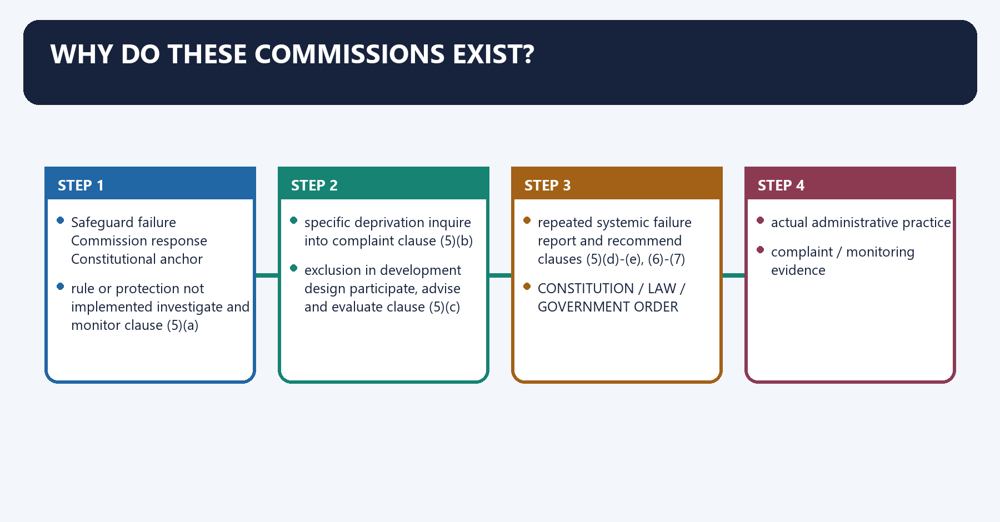
[FACT] Part XVI contains special provisions relating to certain classes. Articles 338, 338A and 338B create specialised constitutional commissions for Scheduled Castes, Scheduled Tribes and socially and educationally backward classes.

[ANALYSIS] A safeguard may fail in at least four ways: a rule may be absent, an existing rule may be poorly implemented, an individual complaint may be ignored, or development policy may reproduce structural disadvantage. The commissions are designed to observe all four.

[LIMIT] Their existence does not guarantee enforcement. Their strongest constitutional levers are investigation, compulsory evidence-gathering, consultation, reasoned reporting and legislative visibility.

#### Visual 2 - Four failures and four institutional responses

| Safeguard failure | Commission response | Constitutional anchor |
|---|---|---|
| rule or protection not implemented | investigate and monitor | clause (5)(a) |
| specific deprivation | inquire into complaint | clause (5)(b) |
| exclusion in development design | participate, advise and evaluate | clause (5)(c) |
| repeated systemic failure | report and recommend | clauses (5)(d)-(e), (6)-(7) |

#### Visual 3 - Rights-to-accountability chain

```text
CONSTITUTION / LAW / GOVERNMENT ORDER
                 |
              safeguard
                 |
       actual administrative practice
                 |
      complaint / monitoring evidence
                 |
              COMMISSION
                 |
 report + recommendation + action memorandum
                 |
       PARLIAMENT / STATE LEGISLATURE
```

Caption: The constitutional design converts implementation evidence into an answerable public record.

#### Visual 4 - Status is not sanction

| Attribute | What constitutional status gives | What it does not automatically give |
|---|---|---|
| entrenchment | existence cannot be removed by ordinary executive action | immunity from constitutional amendment |
| visibility | report-and-memorandum route | automatic acceptance |
| inquiry | civil-court evidentiary tools | criminal investigation or punishment |
| consultation | mandatory institutional hearing on major policy | veto over policy |
| recommendation | expert, public and constitutionally recognised advice | decree or executable order |

### 02. Historical evolution: officer -> combined commission -> specialised commissions

Historical evolution: officer -> combined commission -> specialised commissions denotes the constitutional rules and institutional links organised around 1950 12 Mar 1992 19 Feb 2004.
Historical evolution: officer -> combined commission -> specialised commissions operates through Special Officer --- combined NCSCST --- NCSC + NCST, connected with Article 338 65th Amendment 89th Amendment.
The operative mechanism matters because 1992 judgment 1993 statute 15 Aug 2018.
Its principal consequence is that indra Sawhney --- statutory NCBC --- constitutional NCBC.
The decisive contrast is between 5 May 2021 15 Sep 2021 and Maratha reading --- 105th Amendment operational.
The exam-safe limitation is that of Article 342A State/UT own-list power explicit.
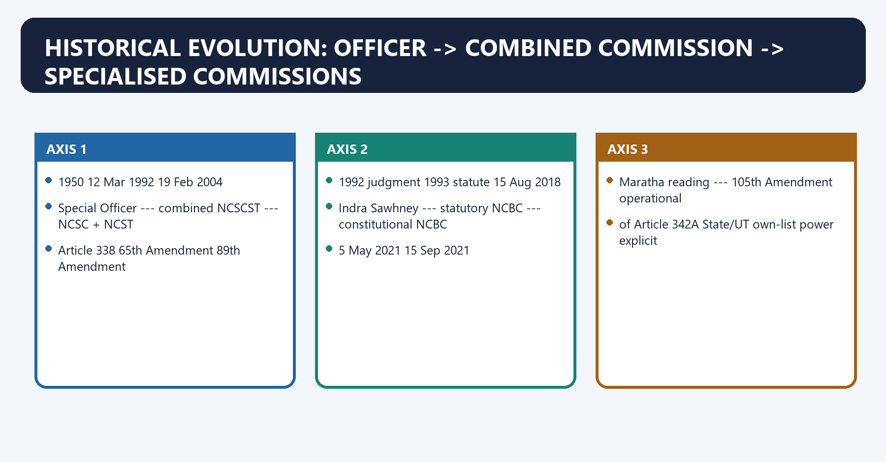
[FACT] Original Article 338 provided for a **Special Officer for Scheduled Castes and Scheduled Tribes**, appointed by the President, to investigate safeguards and report.

[FACT] A non-statutory multi-member commission was created by executive resolution in 1978 and renamed in 1987, while the constitutional Special Officer architecture continued.

[FACT] The Constitution (Sixty-fifth Amendment) Act, 1990 substituted a high-level multi-member **National Commission for Scheduled Castes and Scheduled Tribes**. The first constitutional commission under the amended Article was constituted on **12 March 1992**.

[FACT] The Constitution (Eighty-ninth Amendment) Act, 2003 amended Article 338 and inserted Article 338A. The separate NCSC and NCST became operational on **19 February 2004**.

[FACT] *Indra Sawhney* (1992) directed a permanent body for backward-class inclusion and over/under-inclusion complaints. Parliament created the statutory NCBC through the **NCBC Act, 1993**.

[FACT] The Constitution (One Hundred and Second Amendment) Act, 2018 inserted Article 338B, Article 342A and Article 366(26C). It received assent on **11 August 2018** and commenced on **15 August 2018**; the 1993 Act was repealed.

[FACT] The 105th Amendment received assent on **18 August 2021**, was gazetted on 19 August and commenced by notification on **15 September 2021**.

#### Visual 5 - Controlled evolution timeline

```text
1950                  12 Mar 1992              19 Feb 2004
Special Officer  ---> combined NCSCST     ---> NCSC + NCST
Article 338           65th Amendment           89th Amendment

1992 judgment         1993 statute             15 Aug 2018
Indra Sawhney    ---> statutory NCBC      ---> constitutional NCBC
                                              102nd Amendment

5 May 2021            15 Sep 2021
Maratha reading  ---> 105th Amendment operational:
of Article 342A       State/UT own-list power explicit
```

Caption: Enactment, assent, notification and operational date are not interchangeable.

#### Visual 6 - Amendment date discipline

| Change | Act/assent date | Operational control | Exam-safe statement |
|---|---|---|---|
| combined constitutional SC/ST commission | 65th Amendment Act, 1990 | first commission constituted 12 March 1992 | do not say “operational in 1990” |
| NCSC-NCST separation | 89th Amendment Act, 28 September 2003 | 19 February 2004 | Act year and institutional start differ |
| constitutional NCBC | 102nd Amendment assent 11 August 2018 | 15 August 2018 | Article 338B commenced after notified date |
| State SEBC-list restoration | 105th Amendment assent 18 August 2021 | 15 September 2021 | do not use assent as commencement |

#### Visual 7 - Why specialisation occurred

| Combined design problem | Institutional response | Analytical effect |
|---|---|---|
| SC and ST safeguards overlap but contexts differ | separate Articles 338 and 338A | deeper subject expertise |
| tribal land, forest and self-government issues require distinct focus | 2005 NCST functions | domain-sensitive monitoring |
| backward-class inclusion disputes required permanent scrutiny | 1993 NCBC | regular inclusion/exclusion advice |
| broader SEBC safeguards needed constitutional visibility | Article 338B | complaints, development and reporting beyond list advice |

### 03. Shared constitutional design of Articles 338, 338A and 338B

Shared constitutional design of Articles 338, 338A and 338B denotes the constitutional rules and institutional links organised around [FACT] Each current commission consists of a Chairperson, Vice-Chairperson and three other Members.
Shared constitutional design of Articles 338, 338A and 338B operates through [FACT] The President appoints them by warrant under hand and seal, connected with [FACT] Each commission may regulate its own procedure.
The operative mechanism matters because clause Common institutional idea.
Its principal consequence is that (1) creates and names the commission.
The decisive contrast is between (2) Chairperson + Vice-Chairperson + three Members; service/tenure by rule and (3) presidential appointment by warrant.
The exam-safe limitation is that (4) power to regulate procedure.
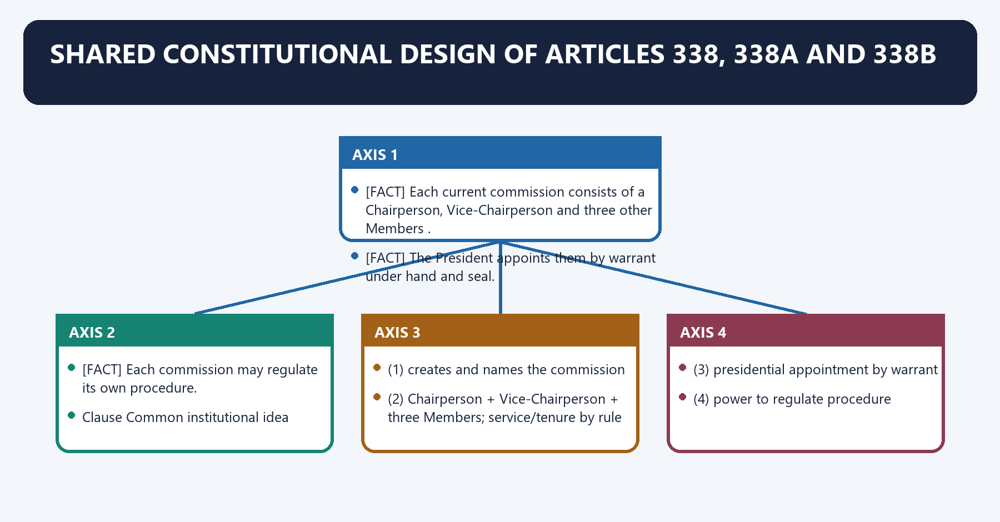
[FACT] Each current commission consists of a **Chairperson, Vice-Chairperson and three other Members**.

[FACT] The President appoints them by warrant under hand and seal.

[FACT] Subject to parliamentary law, their conditions of service and tenure are determined by presidential rules. The three-year term found in governing rules is not itself written into the constitutional Articles.

[FACT] Each commission may regulate its own procedure.

#### Visual 8 - Shared nine-clause skeleton

| Clause | Common institutional idea |
|---:|---|
| (1) | creates and names the commission |
| (2) | Chairperson + Vice-Chairperson + three Members; service/tenure by rule |
| (3) | presidential appointment by warrant |
| (4) | power to regulate procedure |
| (5) | six duties |
| (6) | Union-related report laid before Parliament with memorandum |
| (7) | State-related report and State-legislature accountability |
| (8) | civil-court powers during investigation/inquiry |
| (9) | consultation on major policy matters |

#### Visual 9 - Constitution, rules and procedure

```text
CONSTITUTION
existence + size + appointment + duties + powers + reporting
                         |
        PRESIDENTIAL RULES, SUBJECT TO PARLIAMENTARY LAW
        service conditions + tenure + specified functions
                         |
             COMMISSION'S OWN PROCEDURE
       complaint processing + hearings + internal workflow
```

Caption: Do not attribute every operational detail to the Constitution itself.

#### Visual 10 - Current composition memory card

```text
                 PRESIDENT
                    |
        warrant under hand and seal
                    |
       --------------------------------
       |              |               |
  Chairperson   Vice-Chairperson   3 Members

TOTAL = 5
```

#### Visual 11 - Historical composition contrast

| Stage | Composition | Trap control |
|---|---|---|
| original Article 338 | one Special Officer | not a commission |
| 65th-Amendment combined body | Chairperson + Vice-Chairperson + five other Members | historical body had seven |
| current NCSC/NCST/NCBC | Chairperson + Vice-Chairperson + three other Members | each current body has five |

### 04. The six common duties

The six common duties denotes the constitutional rules and institutional links organised around [FACT] Clause (5) in each Article contains the same functional architecture, adapted to the relevant group.
The six common duties operates through INVESTIGATE + MONITOR, connected with INQUIRE COMPLAINTS ---- COMMISSION ---- ADVISE DEVELOPMENT.
The operative mechanism matters because eVALUATE DEVELOPMENT.
Its principal consequence is that aNNUAL / OTHER REPORTS.
The decisive contrast is between RECOMMEND + OTHER FUNCTIONS and Duty Typical evidence Output.
The exam-safe limitation is that investigate/monitor safeguards laws, rules, files, implementation data systemic finding.
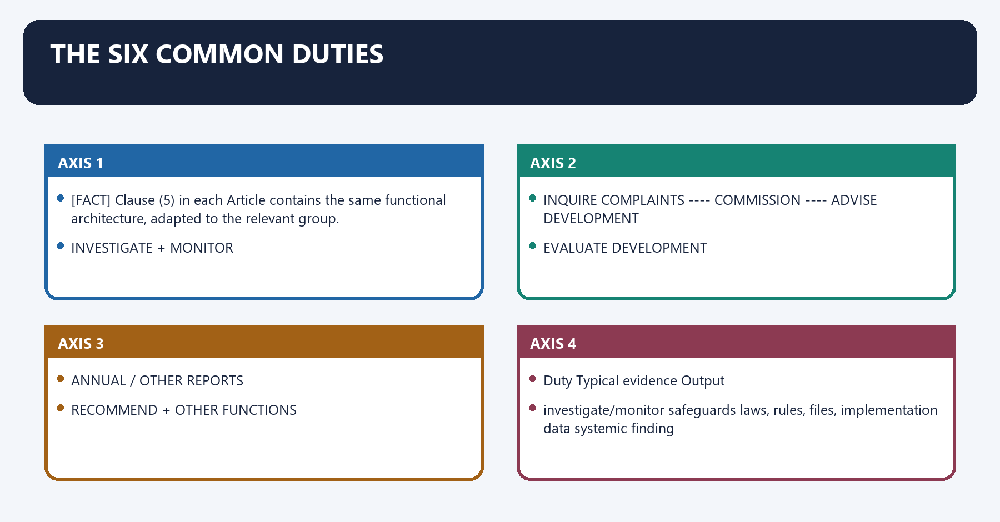
[FACT] Clause (5) in each Article contains the same functional architecture, adapted to the relevant group.

#### Visual 12 - Six-duty wheel

```text
                 INVESTIGATE + MONITOR
                         |
 INQUIRE COMPLAINTS ---- COMMISSION ---- ADVISE DEVELOPMENT
                         |
              EVALUATE DEVELOPMENT
                         |
           ANNUAL / OTHER REPORTS
                         |
          RECOMMEND + OTHER FUNCTIONS
```

#### Visual 13 - Function-to-evidence matrix

| Duty | Typical evidence | Output |
|---|---|---|
| investigate/monitor safeguards | laws, rules, files, implementation data | systemic finding |
| inquire into complaint | parties, records, affidavits, hearing | factual recommendation |
| participate and advise | draft policy, programme design, consultation | policy advice |
| evaluate progress | outcome data, field visits, studies | progress assessment |
| report | annual/special synthesis | President + legislature route |
| other specified functions | presidential rule | domain-specific task |

[ANALYSIS] “Participate and advise” gives the commissions an ex ante role, while complaint inquiry and monitoring are ex post. A good Mains answer should show both.

[LIMIT] Participation does not mean that the commission prepares or executes the government's development plan.

#### Visual 14 - Ex ante and ex post roles

| Time | Role | Example |
|---|---|---|
| before policy | consultation and development advice | proposed major safeguard policy |
| during implementation | monitoring and evaluation | application of reservation or welfare safeguards |
| after alleged harm | complaint inquiry | denial of a protected benefit |
| after recurring pattern | special/annual report | systemic recommendation and reasons for non-acceptance |

### 05. Civil-court powers: exact scope and exact list

Civil-court powers: exact scope and exact list denotes the constitutional rules and institutional links organised around [FACT] The enumerated powers are.
Civil-court powers: exact scope and exact list operates through summoning and enforcing attendance of any person from any part of India and examining that person on oath, connected with requiring discovery and production of documents.
The operative mechanism matters because receiving evidence on affidavits.
Its principal consequence is that requisitioning a public record or copy from a court or office.
The decisive contrast is between issuing commissions for examination of witnesses and documents; and and any other matter the President may by rule determine.
The exam-safe limitation is that pERSONS - summon + enforce attendance + examine on oath.
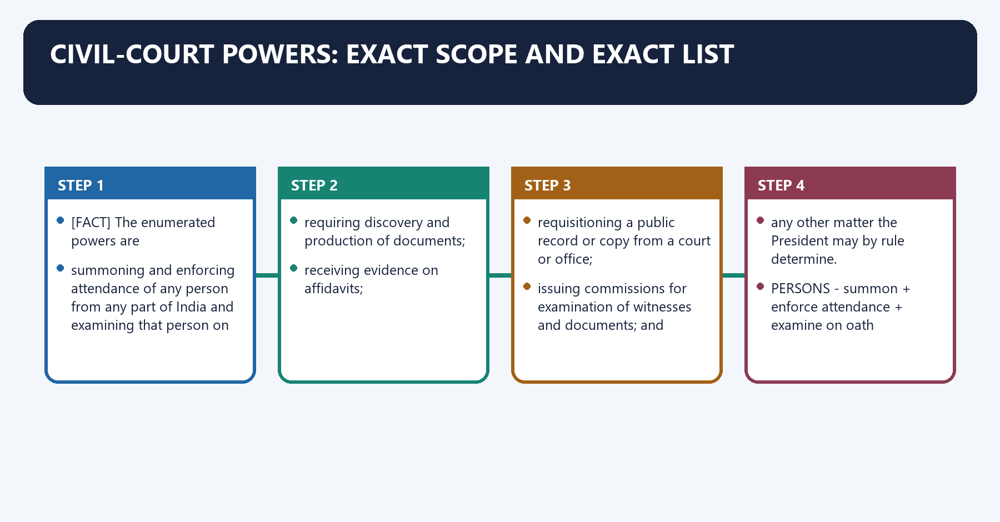
[FACT] While investigating a clause (5)(a) matter or inquiring into a clause (5)(b) complaint, each commission has all the powers of a civil court trying a suit in specified evidentiary matters.

[FACT] The enumerated powers are:

1. summoning and enforcing attendance of any person from any part of India and examining that person on oath;
2. requiring discovery and production of documents;
3. receiving evidence on affidavits;
4. requisitioning a public record or copy from a court or office;
5. issuing commissions for examination of witnesses and documents; and
6. any other matter the President may by rule determine.

#### Visual 15 - Civil-court toolkit

```text
PERSONS       -> summon + enforce attendance + examine on oath
DOCUMENTS     -> discovery + production
AFFIDAVITS    -> receive evidence
PUBLIC RECORD -> requisition from court or office
REMOTE PROOF  -> issue commission for witness/document examination
OTHER MATTER  -> presidential rule
```

#### Visual 16 - Power boundary

| Commission can | Commission cannot merely because of clause (8) |
|---|---|
| compel attendance and documents | convict or sentence |
| take evidence on oath/affidavit | award damages as a civil decree |
| requisition public records | strike down legislation |
| record findings and recommend action | conclusively determine criminal guilt |
| use powers during specified inquiry/investigation | use them as a general policing power |

[LIMIT] “Powers of a civil court” describes tools, context and subject matter. It does not confer the entire jurisdiction of a civil court.

#### Visual 17 - Investigation is not adjudication

```text
COMPLAINT
   |
evidence-gathering using clause (8)
   |
finding + recommendation
   |
-----------------------------------------
|                 |                     |
departmental    police/court          legislature
follow-up       legal process         report scrutiny

NO AUTOMATIC DECREE AT THE COMMISSION STAGE
```

#### Visual 18 - Three meanings that must not be merged

| Expression | Correct meaning |
|---|---|
| constitutional body | created by the Constitution |
| civil-court powers | specified evidence-compulsion tools during inquiry |
| court | judicial institution capable of binding adjudication within jurisdiction |

### 06. Reporting: constitutional accountability, not a private letter

Reporting: constitutional accountability, not a private letter denotes the constitutional rules and institutional links organised around [FACT] Each commission presents annual reports and may present reports at other times it considers fit.
Reporting: constitutional accountability, not a private letter operates through [LIMIT] A shorthand saying “all three State reports go to the Governor” is inaccurate for Article 338B's enacted text, connected with annual / other report.
The operative mechanism matters because each House of Parliament.
Its principal consequence is that action taken / proposed + reasons for non-acceptance.
The decisive contrast is between Commission State-related copy goes to Who causes legislative laying? and NCSC, Article 338(7) Governor Governor.
The exam-safe limitation is that nCST, Article 338A(7) Governor Governor.
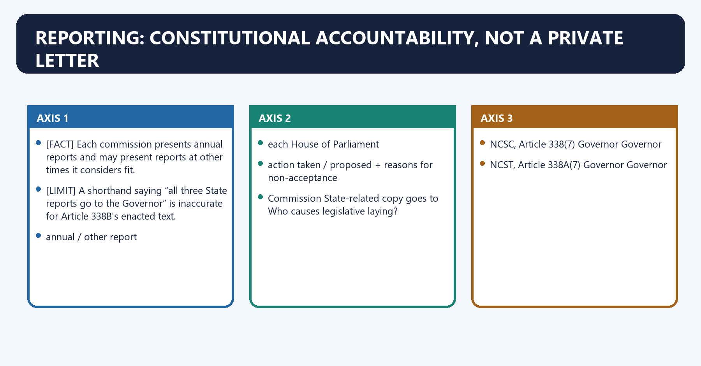
[FACT] Each commission presents annual reports and may present reports at other times it considers fit.

[FACT] For Union-related recommendations, the President causes the report to be laid before **each House of Parliament**, with a memorandum explaining action taken or proposed and reasons for non-acceptance.

[FACT] Articles 338(7) and 338A(7) forward State-related reports to the **Governor**, who causes laying before the State Legislature with the corresponding memorandum.

[FACT] Article 338B(7) is textually different: the State-related NCBC report is forwarded to the **State Government**, which causes it to be laid before the State Legislature with the memorandum.

[LIMIT] A shorthand saying “all three State reports go to the Governor” is inaccurate for Article 338B's enacted text.

#### Visual 19 - Union report chain

```text
COMMISSION
    |
annual / other report
    |
PRESIDENT
    |
each House of Parliament
    |
memorandum:
action taken / proposed + reasons for non-acceptance
```

#### Visual 20 - State report routes: the key textual difference

| Commission | State-related copy goes to | Who causes legislative laying? |
|---|---|---|
| NCSC, Article 338(7) | Governor | Governor |
| NCST, Article 338A(7) | Governor | Governor |
| NCBC, Article 338B(7) | State Government | State Government |

#### Visual 21 - Accountability stages

```text
REPORT WRITTEN
     |
REPORT SUBMITTED
     |
REPORT LAID
     |
MEMORANDUM EXPLAINS RESPONSE
     |
LEGISLATIVE / COMMITTEE / PUBLIC SCRUTINY
     |
IMPLEMENTATION FOLLOW-UP
```

Caption: Submission, laying, debate and implementation are separate stages.

[CURRENT] The NCSC's official archive records a visible lag in some recent cycles; for example, combined 2020-21 and 2021-22 reports submitted on 26 September 2023 were recorded as laid on 17 December 2024.

[ANALYSIS] A delayed report can retain historical value but lose preventive impact. Timely laying and a trackable response are therefore part of institutional effectiveness.

[LIMIT] A website field showing no tabling date is not by itself conclusive proof that tabling never occurred; it is evidence of a public-record gap unless cross-verified.

#### Visual 22 - Reporting deficit diagnosis

| Deficit | Consequence | Reform direction |
|---|---|---|
| delayed commission report | stale scrutiny | statutory/constitutional calendar discipline |
| delayed laying | weak legislative visibility | prompt transmission and laying protocol |
| generic memorandum | no measurable follow-up | recommendation-wise response |
| no public tracker | repeated recommendations disappear | status dashboard with reasons |

### 07. Consultation on major policy matters

Consultation on major policy matters denotes the constitutional rules and institutional links organised around [FACT] Article 338B(9) similarly requires consultation on major policy matters affecting SEBCs.
Consultation on major policy matters operates through Stage Weak form Constitutionally meaningful form, connected with timing after decision before finalisation.
The operative mechanism matters because material headline only draft and relevant evidence.
Its principal consequence is that opportunity ceremonial meeting reasonable opportunity to respond.
The decisive contrast is between government response silence reasoned acceptance or departure and legal effect veto informed but non-binding input.
The exam-safe limitation is that hear + consider + decide with reasons.
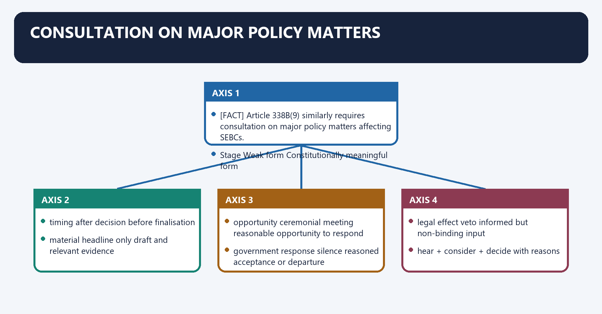
[FACT] Articles 338(9) and 338A(9) require the Union and every State Government to consult the relevant commission on all major policy matters affecting SCs or STs.

[FACT] Article 338B(9) similarly requires consultation on major policy matters affecting SEBCs.

[FACT] The 105th Amendment added a proviso to Article 338B(9): the clause does not apply for the purposes of Article 342A(3), the State/UT own-list power.

[ANALYSIS] Consultation ordinarily requires a genuine opportunity to provide views before a final policy decision. It does not mean concurrence, consent or veto unless the Constitution or a law expressly says so.

#### Visual 23 - Consultation ladder

| Stage | Weak form | Constitutionally meaningful form |
|---|---|---|
| timing | after decision | before finalisation |
| material | headline only | draft and relevant evidence |
| opportunity | ceremonial meeting | reasonable opportunity to respond |
| government response | silence | reasoned acceptance or departure |
| legal effect | veto | informed but non-binding input |

#### Visual 24 - Consultation is not concurrence

```text
CONSULTATION:
hear + consider + decide with reasons

CONCURRENCE:
approval required before action

VETO:
power to block action

Articles 338/338A/338B use the first, not the second or third.
```

#### Visual 25 - Article 338B(9) after the 105th Amendment

```text
MAJOR SEBC POLICY
       |
normally consult NCBC
       |
EXCEPTION:
State/UT law preparing its own list under Article 342A(3)
       |
Article 338B(9) consultation clause does not apply for that purpose
```

[LIMIT] The exception should not be expanded into a claim that States never consult NCBC on any SEBC matter. It is tied to Article 342A(3).

### 08. NCSC: Article 338 and the SC safeguard domain

NCSC: Article 338 and the SC safeguard domain denotes the constitutional rules and institutional links organised around [LIMIT] It does not itself prosecute an atrocity, register an FIR, try an offence or operate a Special Court.
NCSC: Article 338 and the SC safeguard domain operates through EQUALITY / NON-DISCRIMINATION, connected with ABOLITION OF UNTOUCHABILITY.
The operative mechanism matters because rEPRESENTATION / SERVICE SAFEGUARDS.
Its principal consequence is that pCR + SC/ST PoA IMPLEMENTATION MONITORING.
The decisive contrast is between SOCIO-ECONOMIC DEVELOPMENT and NCSC monitoring, complaints, advice and reports.
The exam-safe limitation is that function NCSC Police/prosecution/Special Court.
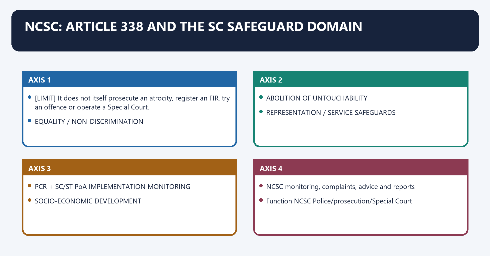
[FACT] NCSC monitors constitutional, legal and governmental safeguards for Scheduled Castes, inquires into specific complaints, advises and evaluates socio-economic development, and reports.

[FACT] Article 338(10), after the 102nd Amendment removed the earlier backward-class reference, continues to construe references to Scheduled Castes as including the Anglo-Indian community.

[ANALYSIS] NCSC's domain spans equality and representation safeguards, anti-untouchability protections, access to public institutions, service safeguards and welfare implementation.

[LIMIT] It does not itself prosecute an atrocity, register an FIR, try an offence or operate a Special Court.

#### Visual 26 - NCSC safeguard map

```text
EQUALITY / NON-DISCRIMINATION
          |
ABOLITION OF UNTOUCHABILITY
          |
REPRESENTATION / SERVICE SAFEGUARDS
          |
PCR + SC/ST PoA IMPLEMENTATION MONITORING
          |
SOCIO-ECONOMIC DEVELOPMENT
          |
NCSC monitoring, complaints, advice and reports
```

#### Visual 27 - NCSC versus criminal-law institutions

| Function | NCSC | Police/prosecution/Special Court |
|---|---|---|
| monitor safeguards | yes | incident-specific role |
| inquire into deprivation complaint | yes | investigate statutory offence |
| summon evidence in commission inquiry | yes | use criminal-procedure powers |
| file charge-sheet | no | police |
| prosecute | no | Special Public Prosecutor |
| determine guilt and punishment | no | competent court |

#### Visual 28 - PCR/PoA institutional chain

```text
ALLEGED CASTE HARM
      |
      +--> PCR Act / SC-ST PoA complaint -> police -> prosecutor -> court
      |
      +--> NCSC complaint -> inquiry -> recommendation / monitoring / report

The routes can coexist; they are not substitutes.
```

[LIMIT] A commission recommendation may trigger administrative or legal follow-up, but it does not replace proof and procedure required in court.

### 09. NCST: Article 338A and the distinctive tribal domain

NCST: Article 338A and the distinctive tribal domain denotes the constitutional rules and institutional links organised around [FACT] Under the 2005 presidential rules, NCST's specified additional functions cover.
NCST: Article 338A and the distinctive tribal domain operates through ownership rights over minor forest produce, connected with safeguards over mineral and water resources as provided by law.
The operative mechanism matters because viable tribal livelihood strategies.
Its principal consequence is that relief and rehabilitation for displacement by development projects.
The decisive contrast is between prevention of land alienation and rehabilitation after alienation and tribal participation in forest protection and social afforestation.
The exam-safe limitation is that full implementation of PESA; and.
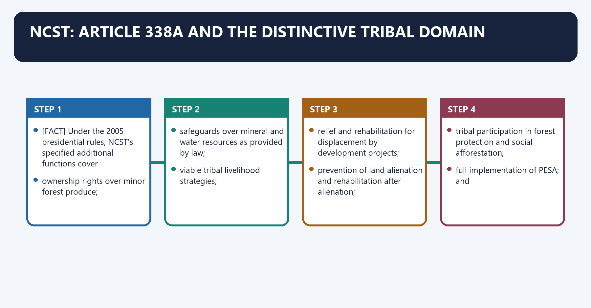
[FACT] NCST shares the common constitutional functions but has a distinctive domain because tribal safeguards involve territory, land, forests, minerals, water, displacement, self-government and cultural survival.

[FACT] Under the 2005 presidential rules, NCST's specified additional functions cover:

- ownership rights over minor forest produce;
- safeguards over mineral and water resources as provided by law;
- viable tribal livelihood strategies;
- relief and rehabilitation for displacement by development projects;
- prevention of land alienation and rehabilitation after alienation;
- tribal participation in forest protection and social afforestation;
- full implementation of PESA; and
- reduction and eventual elimination of disempowering shifting-cultivation practices.

[LIMIT] FRA, 2006 is an important later safeguard within NCST monitoring, but the 2005 notification itself predates FRA and should not be misquoted as naming it.

#### Visual 29 - NCST distinctive domain map

```text
LAND ---- FOREST ---- WATER ---- MINERALS
  \          |          |          /
      LIVELIHOOD + CULTURAL SURVIVAL
                    |
          DISPLACEMENT / REHABILITATION
                    |
             PESA + FRA SAFEGUARDS
                    |
                  NCST
        monitor + inquire + advise + report
```

#### Visual 30 - 2005 additional-function matrix

| Domain | NCST function | Boundary |
|---|---|---|
| minor forest produce | recommend ownership measures | legal vesting follows applicable law |
| minerals/water | recommend safeguards | does not grant mining lease |
| displacement | improve relief and rehabilitation | does not acquire land or award compensation |
| land alienation | prevention and rehabilitation measures | title disputes follow competent law/forum |
| forests | strengthen tribal participation | not the forest department |
| PESA | monitor and recommend full implementation | not a Gram Sabha or State legislature |
| shifting cultivation | recommend welfare/environment measures | policy must be rights-sensitive |

#### Visual 31 - NCST and Fifth/Sixth Schedule institutions

| Institution | Core role | NCST relationship |
|---|---|---|
| Governor under Fifth Schedule | report/regulation functions in Scheduled Areas | NCST may monitor safeguards and advise |
| Tribal Advisory Council | advises on ST welfare in relevant Fifth Schedule States | separate advisory institution |
| Gram Sabha under PESA | local self-government powers in Scheduled Areas | NCST monitors implementation |
| Autonomous District/Regional Council | Sixth Schedule legislative/judicial/administrative functions | NCST does not administer the council |
| FRA committees/Gram Sabha | forest-rights claim process | NCST monitors safeguard performance |

#### Visual 32 - What NCST does not administer

```text
NCST IS NOT:
  a Fifth Schedule Governor
  a Tribal Advisory Council
  a PESA Gram Sabha
  a Sixth Schedule Autonomous Council
  an FRA claim-adjudication committee
  a mining or forest regulator

NCST IS:
  constitutional monitor + complaint body + adviser + reporter
```

### 10. NCBC: from statutory list adviser to constitutional safeguard commission

NCBC: from statutory list adviser to constitutional safeguard commission denotes the constitutional rules and institutional links organised around Dimension NCBC Act, 1993 Article 338B after 102nd.
NCBC: from statutory list adviser to constitutional safeguard commission operates through legal source Act of Parliament Constitution, connected with composition judicial Chair + specialist structure + Member-Secretary Chair + Vice-Chair + three Members.
The operative mechanism matters because appointment Central Government under statute President by warrant.
Its principal consequence is that civil-court tools yes, by statute yes, constitutionally specified.
The decisive contrast is between report route statutory President - Parliament; State route under clause (7) and major-policy consultation not the same constitutional command Article 338B(9), subject to 105th proviso.
The exam-safe limitation is that binding effect “ordinarily binding” advice in specific statutory scheme no general binding force in Article 338B.
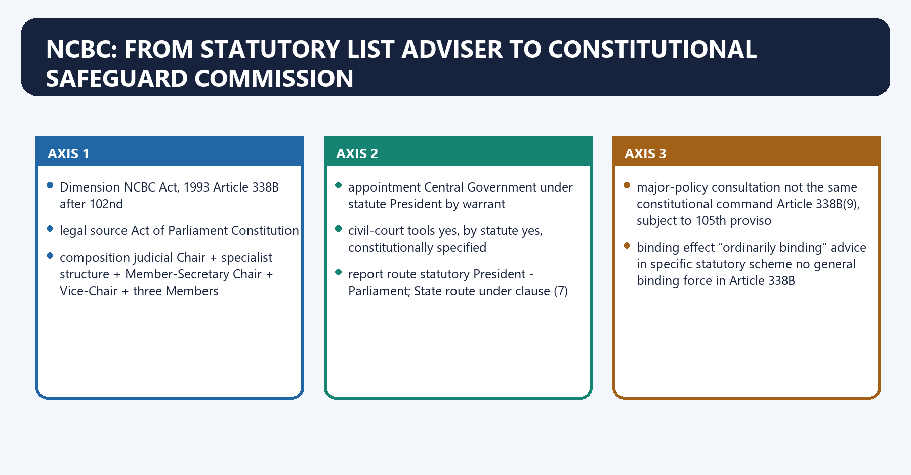
[FACT] *Indra Sawhney* directed establishment of a permanent body to consider requests for inclusion and complaints of over-inclusion and under-inclusion in backward-class lists.

[FACT] The NCBC Act, 1993 created a five-member statutory body: a judicial Chairperson, a social scientist, two persons with special knowledge of backward classes and a Member-Secretary.

[FACT] The 1993 Act focused on inclusion/exclusion advice and stated that the Commission's advice under that scheme would ordinarily bind the Central Government. It also conferred civil-court evidentiary powers.

[FACT] The 102nd Amendment created the constitutional NCBC under Article 338B; the 1993 Act was repealed from the constitutional body's operational transition.

#### Visual 33 - Statutory-to-constitutional comparison

| Dimension | NCBC Act, 1993 | Article 338B after 102nd |
|---|---|---|
| legal source | Act of Parliament | Constitution |
| central purpose | inclusion/exclusion and over/under-inclusion advice | full safeguard monitoring, complaints, development, reports and recommendations |
| composition | judicial Chair + specialist structure + Member-Secretary | Chair + Vice-Chair + three Members |
| appointment | Central Government under statute | President by warrant |
| civil-court tools | yes, by statute | yes, constitutionally specified |
| report route | statutory | President -> Parliament; State route under clause (7) |
| major-policy consultation | not the same constitutional command | Article 338B(9), subject to 105th proviso |
| binding effect | “ordinarily binding” advice in specific statutory scheme | no general binding force in Article 338B |

#### Visual 34 - What actually changed

```text
NARROWER LIST-ADVICE BODY
          |
102nd Amendment
          v
CONSTITUTIONAL SAFEGUARD BODY
  |-- monitor all safeguards
  |-- inquire into rights complaints
  |-- advise/evaluate development
  |-- report through constitutional route
  |-- mandatory major-policy consultation
  +-- civil-court tools retained in constitutional form
```

#### Visual 35 - What did not change

| Continuity | Qualification |
|---|---|
| evidentiary inquiry powers | do not become adjudicatory decree powers |
| expert advisory character | recommendations remain non-binding |
| inclusion/exclusion relevance | final Central List change follows Article 342A and parliamentary law |
| reservation-policy context | policy remains subject to Articles 14-16 and judicial review |
| need for credible data | constitutional status does not create data automatically |

[ANALYSIS] Constitutionalisation increased breadth, permanence and public accountability, but it did not convert NCBC into the final list-making authority or a reservation court.

### 11. Articles 341 and 342: SC and ST list mechanics

Articles 341 and 342: SC and ST list mechanics denotes the constitutional rules and institutional links organised around [FACT] Under Article 342(1), the parallel rule applies to tribes or tribal communities or parts/groups deemed Scheduled Tribes.
Articles 341 and 342: SC and ST list mechanics operates through [FACT] SC/ST status is territorial: a community recognised in one State need not be recognised in another, connected with INITIAL SPECIFICATION.
The operative mechanism matters because president + Governor consultation for a State.
Its principal consequence is that public notification.
The decisive contrast is between State/UT-specific SC list and LATER INCLUSION / EXCLUSION.
The exam-safe limitation is that state/UT-specific ST list.
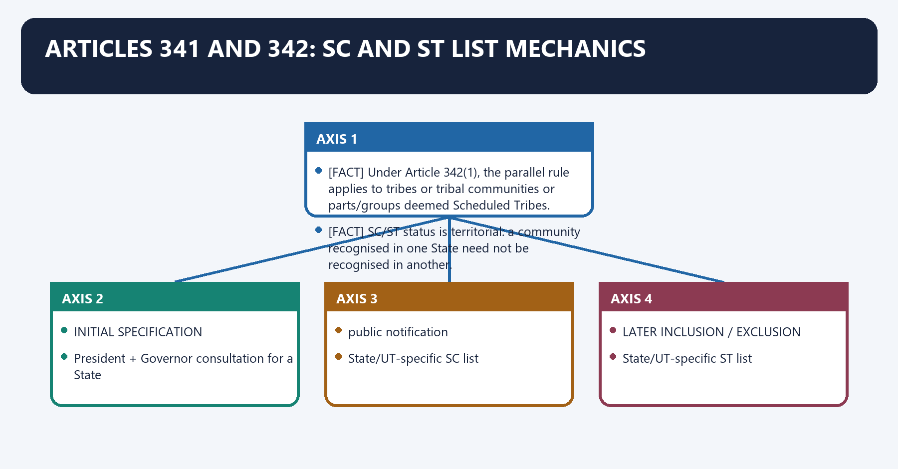
[FACT] Under Article 341(1), the President may, for a State or Union territory and after consultation with the Governor where it is a State, specify by public notification the castes, races, tribes or parts/groups deemed Scheduled Castes for that territory.

[FACT] Under Article 342(1), the parallel rule applies to tribes or tribal communities or parts/groups deemed Scheduled Tribes.

[FACT] Under Articles 341(2) and 342(2), Parliament may by law include or exclude entries. Except through that parliamentary route, a subsequent notification cannot vary the original notification.

[FACT] SC/ST status is territorial: a community recognised in one State need not be recognised in another.

#### Visual 36 - SC list legal chain

```text
INITIAL SPECIFICATION
President + Governor consultation for a State
                 |
         public notification
                 |
       State/UT-specific SC list
                 |
LATER INCLUSION / EXCLUSION
            Parliament by law
```

#### Visual 37 - ST list legal chain

```text
INITIAL SPECIFICATION
President + Governor consultation for a State
                 |
         public notification
                 |
       State/UT-specific ST list
                 |
LATER INCLUSION / EXCLUSION
            Parliament by law
```

#### Visual 38 - Who cannot finally alter an SC/ST list alone?

| Actor | Can recommend/supply evidence? | Can finally include/exclude alone? |
|---|---:|---:|
| NCSC/NCST | yes | no |
| State Government | yes | no |
| Governor | consulted in initial State notification | no |
| President | initial specification by notification | not later variation alone |
| Parliament | yes | yes, by law |
| court | interprets legality/entry; cannot rewrite list as legislature | no legislative substitution |

#### Visual 39 - Identification versus distribution

| Question | Governing idea |
|---|---|
| Who belongs to the constitutional SC/ST list? | Articles 341/342 |
| May benefits be rationally distributed within the list? | equality/reservation doctrine, including *Davinder Singh* |
| May a listed caste be removed through sub-classification? | no; list alteration follows Article 341(2) |

### 12. Article 342A and Article 366(26C): Central and State SEBC lists

Article 342A and Article 366(26C): Central and State SEBC lists denotes the constitutional rules and institutional links organised around [FACT] The 105th Amendment rewrote the architecture.
Article 342A and Article 366(26C): Central and State SEBC lists operates through Article 342A(1) concerns SEBCs in the Central List for Central Government purposes, connected with Article 342A(2) gives Parliament the inclusion/exclusion role for the Central List.
The operative mechanism matters because the Explanation defines Central List as prepared and maintained by and for the Central Government.
Its principal consequence is that article 366(26C) defines SEBCs by reference to Article 342A for Central, State or Union-territory purposes as applicable.
The decisive contrast is between SEBC IDENTIFICATION and CENTRAL LIST STATE/UT LIST.
The exam-safe limitation is that central Govt purposes own purposes.
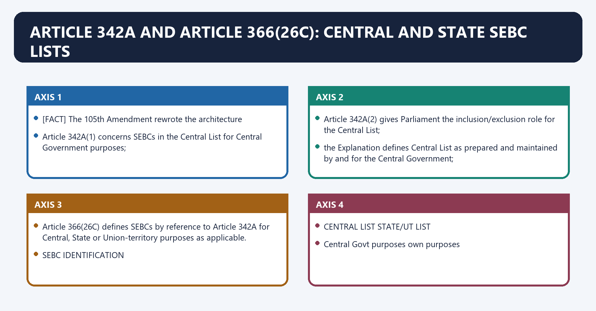
[FACT] The 102nd Amendment originally inserted Article 342A, allowing presidential specification of SEBCs for a State/UT and parliamentary inclusion/exclusion, and inserted Article 366(26C).

[FACT] The 105th Amendment rewrote the architecture:

- Article 342A(1) concerns SEBCs in the **Central List** for Central Government purposes;
- Article 342A(2) gives Parliament the inclusion/exclusion role for the Central List;
- the Explanation defines Central List as prepared and maintained by and for the Central Government;
- Article 342A(3) permits every State or Union territory, **by law**, to prepare and maintain its own list for its own purposes, even if entries differ from the Central List; and
- Article 366(26C) defines SEBCs by reference to Article 342A for Central, State or Union-territory purposes as applicable.

#### Visual 40 - Post-105th dual-list architecture

```text
                    SEBC IDENTIFICATION
                          |
          -----------------------------------
          |                                 |
      CENTRAL LIST                    STATE/UT LIST
  Central Govt purposes              own purposes
          |                                 |
President notification                State/UT by law
          |                                 |
Parliament changes                     may differ from Central List
```

#### Visual 41 - Article 342A clause map

| Clause | Rule | Exam trap |
|---|---|---|
| 342A(1) | President specifies Central List for Central purposes | not every State-purpose list |
| 342A(2) | Parliament includes/excludes from Central List | NCBC does not issue final inclusion order |
| Explanation | defines Central List | central and State lists may differ |
| 342A(3) | State/UT may by law maintain own list | explicit post-105th power |

#### Visual 42 - Article 366(26C) bridge

```text
“SOCIALLY AND EDUCATIONALLY BACKWARD CLASSES”
                         |
               Article 366(26C)
                         |
classes deemed under Article 342A
for Central OR State OR Union-territory purposes,
as the case may be
```

#### Visual 43 - Commission advice versus legal list change

```text
EVIDENCE / REPRESENTATION
          |
    NCBC examination/advice
          |
executive and legislative processing
          |
---------------------------------
|                               |
Central List                   State List
President + Parliament         State/UT law under 342A(3)
```

[LIMIT] A recommendation can be influential and procedurally important without being the final constitutive act.

### 13. The amendment-and-case trajectory

The amendment-and-case trajectory denotes the constitutional rules and institutional links organised around Event Institutional/legal move Core lesson.
The amendment-and-case trajectory operates through 65th Amendment Special Officer - combined commission collective monitoring, connected with 89th Amendment NCSC separated from NCST group-specific expertise.
The operative mechanism matters because indra Sawhney permanent BC body directed regular list review.
Its principal consequence is that nCBC Act, 1993 statutory NCBC list-advice institution.
The decisive contrast is between 102nd Amendment constitutional NCBC + Article 342A status and list architecture linked and Jaishri Patil majority read State identification power as displaced federal consequence of wording.
The exam-safe limitation is that 105th Amendment Central/State list distinction explicit State power restored/clarified.
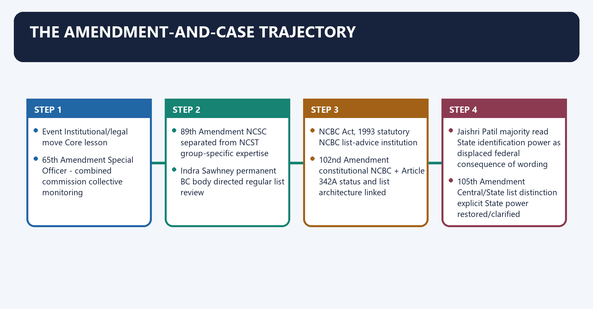
#### Visual 44 - 65th to 105th master trajectory

| Event | Institutional/legal move | Core lesson |
|---|---|---|
| 65th Amendment | Special Officer -> combined commission | collective monitoring |
| 89th Amendment | NCSC separated from NCST | group-specific expertise |
| *Indra Sawhney* | permanent BC body directed | regular list review |
| NCBC Act, 1993 | statutory NCBC | list-advice institution |
| 102nd Amendment | constitutional NCBC + Article 342A | status and list architecture linked |
| *Jaishri Patil* | majority read State identification power as displaced | federal consequence of wording |
| 105th Amendment | Central/State list distinction explicit | State power restored/clarified |
| *Davinder Singh* | SC sub-classification allowed with evidence | distribution within list differs from alteration of list |

#### Visual 45 - *Indra Sawhney* to NCBC

```text
OVER-INCLUSION / UNDER-INCLUSION COMPLAINTS
                    |
          *Indra Sawhney* (1992)
                    |
       permanent expert body directed
                    |
            NCBC Act, 1993
                    |
   constitutional expansion in Article 338B
```

[LIMIT] Detailed creamy-layer tests and the entire 50 per cent doctrine belong to the reservation owner. Here, *Indra Sawhney* is used primarily for NCBC's institutional origin.

#### Visual 46 - Maratha judgment and 105th Amendment

```text
102nd Amendment wording
          |
*Jaishri Laxmanrao Patil* majority, 5 May 2021
          |
States treated as lacking independent SEBC-identification power
          |
105th Amendment
  |-- Central List confined to Central purposes
  |-- States/UTs empowered by law for own lists
  +-- Article 338B consultation exception for 342A(3)
```

[FACT] The Maratha reservation law also failed the Court's 50 per cent ceiling analysis; that holding should not be collapsed into the separate Article 342A federal issue.

#### Visual 47 - Two holdings, two questions

| *Jaishri Patil* issue | Question | Later constitutional response |
|---|---|---|
| reservation ceiling | did exceptional circumstances justify breach? | no 105th Amendment answer; reservation doctrine remains |
| SEBC identification power | what did 102nd wording do to State power? | 105th expressly restored/clarified State/UT own lists |

#### Visual 48 - *Davinder Singh* boundary

```text
ARTICLE 341 LIST REMAINS INTACT
             |
State may create evidence-based sub-classification
for fair distribution of reservation benefits
             |
must rest on quantifiable, demonstrable material
             |
cannot use sub-classification to delete a listed caste
```

[CURRENT] *Davinder Singh* overruled *E.V. Chinnaiah* on the permissibility of sub-classification. Separate opinions discussed creamy-layer ideas; those observations should not be presented as one unanimous legislated SC/ST exclusion rule.

### 14. Common design and meaningful differences

Common design and meaningful differences denotes the constitutional rules and institutional links organised around Dimension NCSC NCST NCBC.
Common design and meaningful differences operates through Article 338 338A 338B, connected with beneficiary group SCs; clause (10) Anglo-Indian reference STs SEBCs.
The operative mechanism matters because separate origin 19 Feb 2004 19 Feb 2004 15 Aug 2018 constitutional.
Its principal consequence is that state report recipient Governor Governor State Government.
The decisive contrast is between consultation all major SC policy all major ST policy all major SEBC policy, except 342A(3) purpose and final list authority Article 341 Article 342 Article 342A.
The exam-safe limitation is that monitor + complaint + development advice + report + civil-court tools.
#### Visual 49 - Three-commission comparison

| Dimension | NCSC | NCST | NCBC |
|---|---|---|---|
| Article | 338 | 338A | 338B |
| beneficiary group | SCs; clause (10) Anglo-Indian reference | STs | SEBCs |
| separate origin | 19 Feb 2004 | 19 Feb 2004 | 15 Aug 2018 constitutional |
| specialised extra domain | SC safeguards/atrocity monitoring | 2005 tribal land/forest/resource/PESA functions | Central/State SEBC policy and list context |
| State report recipient | Governor | Governor | State Government |
| consultation | all major SC policy | all major ST policy | all major SEBC policy, except 342A(3) purpose |
| final list authority | Article 341 | Article 342 | Article 342A |

#### Visual 50 - Same engine, different terrain

```text
SHARED ENGINE:
monitor + complaint + development advice + report + civil-court tools

DIFFERENT TERRAIN:
NCSC -> caste discrimination, untouchability, representation, atrocity safeguards
NCST -> territory, land, forest, resources, displacement, PESA/FRA
NCBC -> SEBC safeguards, development, policy and dual-list architecture
```

### 15. Overlap without institutional conflation

Overlap without institutional conflation denotes the constitutional rules and institutional links organised around Problem NCSC role Other decisive institution.
Overlap without institutional conflation operates through untouchability practice monitor/inquire/recommend police/court under PCR law where offence, connected with atrocity monitor complaint and safeguard implementation police, prosecutor, Special Court.
The operative mechanism matters because service discrimination inquire and recommend department, tribunal or constitutional court.
Its principal consequence is that reservation in minority institution advise within mandate Articles 15(5), 30 and courts control limit.
The decisive contrast is between Problem NCST role Other decisive institution and FRA claim denial monitor/inquire Gram Sabha/SDLC/DLC and courts under law.
The exam-safe limitation is that land acquisition/displacement safeguards and rehabilitation advice acquiring authority, LARR process, courts.
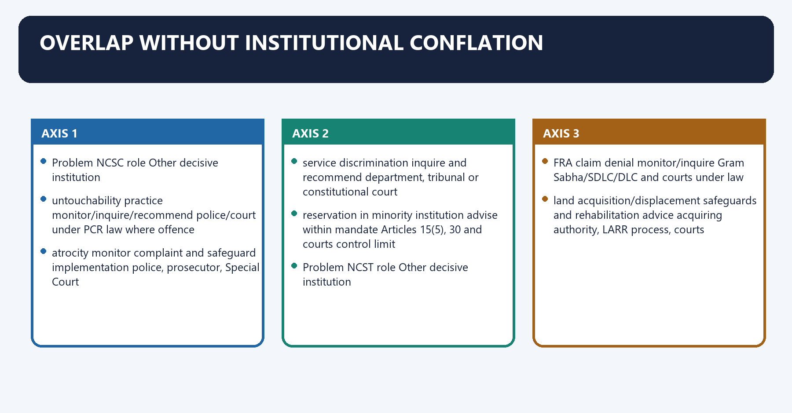
[ANALYSIS] Rights problems often cross institutions. The correct answer is to map concurrent roles rather than nominate one omnipotent body.

#### Visual 51 - NCSC overlap map

| Problem | NCSC role | Other decisive institution |
|---|---|---|
| untouchability practice | monitor/inquire/recommend | police/court under PCR law where offence |
| atrocity | monitor complaint and safeguard implementation | police, prosecutor, Special Court |
| service discrimination | inquire and recommend | department, tribunal or constitutional court |
| reservation in minority institution | advise within mandate | Articles 15(5), 30 and courts control limit |

#### Visual 52 - NCST overlap map

| Problem | NCST role | Other decisive institution |
|---|---|---|
| FRA claim denial | monitor/inquire | Gram Sabha/SDLC/DLC and courts under law |
| land acquisition/displacement | safeguards and rehabilitation advice | acquiring authority, LARR process, courts |
| mining in Scheduled Area | resource-right monitoring | statutory regulators, Gram Sabha where law requires, courts |
| PESA non-implementation | monitor and recommend | State legislature/executive and local institutions |

#### Visual 53 - NCBC overlap map

| Problem | NCBC role | Other decisive institution |
|---|---|---|
| Central List inclusion request | examine/advise | President/Parliament under Article 342A |
| State own-list law | general safeguard role; 338B(9) exception applies to 342A(3) purpose | State/UT legislature |
| reservation validity | evidence/advice | Constitution, legislature/executive and courts |
| welfare exclusion complaint | inquire and recommend | responsible department and legal forum |

### 16. Institutional comparison: constitutional and statutory bodies

Institutional comparison: constitutional and statutory bodies denotes the constitutional rules and institutional links organised around Body Legal basis Primary constituency/domain Core legal effect.
Institutional comparison: constitutional and statutory bodies operates through NCSC Article 338 Scheduled Castes constitutional monitoring/advice/reporting, connected with NCST Article 338A Scheduled Tribes constitutional monitoring with tribal-specific domain.
The operative mechanism matters because nCBC Article 338B SEBCs constitutional monitoring plus SEBC-policy/list context.
Its principal consequence is that nHRC Protection of Human Rights Act, 1993 broad human-rights violations statutory inquiry/recommendation.
The decisive contrast is between National Commission for Minorities NCM Act, 1992 notified minorities statutory safeguard monitoring/advice and State SC/ST/BC commissions State law/executive framework varies State-specific constituency territorial statutory/advisory role.
The exam-safe limitation is that test Constitutional commission Statutory commission.
#### Visual 54 - National-body comparison matrix

| Body | Legal basis | Primary constituency/domain | Core legal effect |
|---|---|---|---|
| NCSC | Article 338 | Scheduled Castes | constitutional monitoring/advice/reporting |
| NCST | Article 338A | Scheduled Tribes | constitutional monitoring with tribal-specific domain |
| NCBC | Article 338B | SEBCs | constitutional monitoring plus SEBC-policy/list context |
| NHRC | Protection of Human Rights Act, 1993 | broad human-rights violations | statutory inquiry/recommendation |
| National Commission for Minorities | NCM Act, 1992 | notified minorities | statutory safeguard monitoring/advice |
| State SC/ST/BC commissions | State law/executive framework varies | State-specific constituency | territorial statutory/advisory role |

#### Visual 55 - Constitutional versus statutory status

| Test | Constitutional commission | Statutory commission |
|---|---|---|
| source | Constitution | Act of legislature |
| abolition/redesign | constitutional amendment for constitutional core | legislative amendment/repeal |
| powers | constitutional text plus rules | statute plus rules |
| recommendation force | depends on text; usually advisory here | depends on statute; can still be advisory |
| quality guarantee | none automatic | none automatic |

#### Visual 56 - Specialist versus umbrella model

```text
SPECIALIST MODEL                     UMBRELLA MODEL
deep group expertise                 common standards
distinct historical context         reduced overlap
clear constituency                   shared resources
        \                               /
         \                             /
          COORDINATED SPECIALISATION
 shared intake protocols + referrals + joint thematic studies
```

[ANALYSIS] Constitutional merger of NCSC, NCST and NCBC would require amendment and risks diluting distinct problems. Coordination is a more proportionate first reform than abolition.

### 17. Independence, accountability and practical limits

Independence, accountability and practical limits denotes the constitutional rules and institutional links organised around [LIMIT] These are design and implementation risks, not proof that every commission is ineffective in every case.
Independence, accountability and practical limits operates through Strength Counter-pressure, connected with constitutional entrenchment executive-led appointment process.
The operative mechanism matters because president-appointed membership service/resources determined within governmental framework.
Its principal consequence is that procedure-regulating power administrative dependence.
The decisive contrast is between evidence-compulsion tools no final adjudicatory sanction and report to constitutional authorities laying and follow-up may be delayed.
The exam-safe limitation is that member independence.
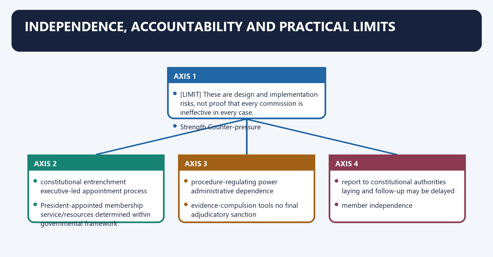
[FACT] Constitutional status, presidential appointment, own procedure, civil-court tools and legislative reporting give institutional stature.

[ANALYSIS] Independence remains incomplete where appointments are executive-led, secretariats depend on government resources, posts remain vacant, reports are delayed or recommendations lack follow-up.

[LIMIT] These are design and implementation risks, not proof that every commission is ineffective in every case.

#### Visual 57 - Independence balance sheet

| Strength | Counter-pressure |
|---|---|
| constitutional entrenchment | executive-led appointment process |
| President-appointed membership | service/resources determined within governmental framework |
| procedure-regulating power | administrative dependence |
| evidence-compulsion tools | no final adjudicatory sanction |
| report to constitutional authorities | laying and follow-up may be delayed |

#### Visual 58 - Effectiveness equation

```text
EFFECTIVENESS =
legal status
+ member independence
+ staff and regional capacity
+ evidence quality
+ timely reports
+ government response
+ legislative scrutiny
+ implementation follow-up

Status alone is one term, not the whole equation.
```

#### Visual 59 - Advisory-force spectrum

| Level | Example | Force |
|---|---|---|
| observation | field finding | persuasive |
| recommendation | corrective measure | advisory |
| consultation | input before major policy | mandatory process, non-binding outcome |
| report memorandum | reasons for acceptance/non-acceptance | accountability |
| court order | decree/judgment | binding within jurisdiction |

#### Visual 60 - Recurring implementation deficits

| Deficit | Institutional effect |
|---|---|
| vacancies | fewer hearings and studies |
| weak regional reach | access cost for complainants |
| poor data | generic recommendations |
| jurisdictional overlap | forum confusion |
| delayed reports | reduced preventive value |
| weak follow-up | repeated non-compliance |
| overclaiming civil-court status | legal confusion and credibility loss |

### 18. Reform agenda - proposals, not current law

Reform agenda - proposals, not current law denotes the constitutional rules and institutional links organised around [ANALYSIS] The following are reform proposals. None should be written as an existing constitutional requirement unless enacted.
Reform agenda - proposals, not current law operates through Problem Reform proposal Qualification, connected with opaque appointments public criteria, search process and reasoned selection preserve constitutional appointing authority.
The operative mechanism matters because vacancies time-bound appointment calendar avoid automatic extension without law.
Its principal consequence is that delayed reports fixed submission, transmission and laying timelines may require rules/law.
The decisive contrast is between weak follow-up recommendation-wise digital dashboard protect complainant privacy and poor coordination inter-commission referral protocol do not erase specialist jurisdiction.
The exam-safe limitation is that generic evidence common data and research standards retain group-specific indicators.
[ANALYSIS] The following are reform proposals. None should be written as an existing constitutional requirement unless enacted.

#### Visual 61 - Problem-to-reform matrix

| Problem | Reform proposal | Qualification |
|---|---|---|
| opaque appointments | public criteria, search process and reasoned selection | preserve constitutional appointing authority |
| vacancies | time-bound appointment calendar | avoid automatic extension without law |
| delayed reports | fixed submission, transmission and laying timelines | may require rules/law |
| weak follow-up | recommendation-wise digital dashboard | protect complainant privacy |
| poor coordination | inter-commission referral protocol | do not erase specialist jurisdiction |
| generic evidence | common data and research standards | retain group-specific indicators |
| weak local access | staffed regional offices and digital filing | digital route must not exclude offline claimants |

#### Visual 62 - Appointment reform options

```text
VACANCY FORECAST
      |
PUBLIC ELIGIBILITY CRITERIA
      |
SEARCH / SHORTLIST WITH DISCLOSED PROCESS
      |
PRESIDENTIAL APPOINTMENT
      |
CONFLICT-OF-INTEREST + PERFORMANCE DISCLOSURE
```

#### Visual 63 - Follow-up dashboard design

| Field | Purpose |
|---|---|
| recommendation number | precise tracking |
| responsible ministry/State | ownership |
| accepted/partly accepted/not accepted | status clarity |
| reasons | constitutional accountability |
| deadline | implementation discipline |
| evidence of completion | prevents paper compliance |

#### Visual 64 - Why blanket binding power is not an easy cure

```text
MORE BINDING POWER
      |
possible faster compliance
      |
but also:
separation-of-powers concerns
policy rigidity
overlap with courts/administration
need for appeal and procedure

BETTER FIRST STEP:
timely evidence + reasoned response + legislative scrutiny
```

### 19. Current-control board, 24 August 2026

Current-control board, 24 August 2026 denotes the constitutional rules and institutional links organised around Stable legal fact Volatile fact deliberately not frozen.
Current-control board, 24 August 2026 operates through Article numbers and clause design current officeholders, connected with constitutional composition current vacancies.
The operative mechanism matters because amendment commencement dates complaint-disposal totals.
Its principal consequence is that report-laying architecture pending case counts.
The decisive contrast is between 2005 NCST functions website headline statistics and Stable legal fact Volatile fact deliberately not frozen.
The exam-safe limitation is that stable legal fact Volatile fact deliberately not frozen.
#### Visual 65 - Stable and volatile facts

| Stable legal fact | Volatile fact deliberately not frozen |
|---|---|
| Article numbers and clause design | current officeholders |
| constitutional composition | current vacancies |
| amendment commencement dates | complaint-disposal totals |
| report-laying architecture | pending case counts |
| 2005 NCST functions | website headline statistics |

[CURRENT] The NCSC website was live and updated close to the control date; the NCST and NCBC official sites continued to present the constitutional mandates described here.

[CURRENT] The latest constitutional development directly controlling the dual SEBC-list architecture remains the 105th Amendment, while *Davinder Singh* supplies the major recent SC-list distribution doctrine.

[LIMIT] Commission annual reports may contain useful sector findings, but a statistic must carry its reporting period, definition and publication date. This package does not turn a dashboard count into a timeless fact.

### 20. Answer-writing architecture

Answer-writing architecture denotes the constitutional rules and institutional links organised around “Constitutional status raises accountability.”.
Answer-writing architecture operates through Articles 338-338B: President, Parliament, memorandum, connected with government must publicly explain acceptance or rejection.
The operative mechanism matters because recommendations remain non-binding and laying can be delayed.
Its principal consequence is that 20 words direct thesis and Article.
The decisive contrast is between 80 words three changes/functions with named evidence and 30 words one limit or complication.
The exam-safe limitation is that 20 words graded verdict.
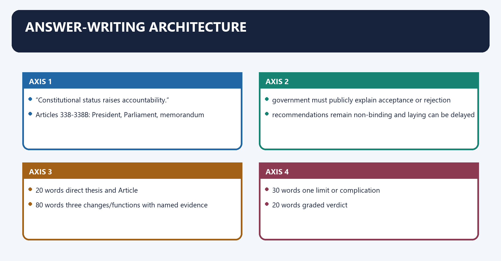
#### Visual 66 - Claim-evidence-analysis-qualification unit

```text
CLAIM
“Constitutional status raises accountability.”
       |
NAMED EVIDENCE
Articles 338-338B: President, Parliament, memorandum
       |
ANALYSIS
government must publicly explain acceptance or rejection
       |
QUALIFICATION
recommendations remain non-binding and laying can be delayed
```

#### Visual 67 - 10-mark answer blueprint

| Segment | Content |
|---|---|
| 20 words | direct thesis and Article |
| 80 words | three changes/functions with named evidence |
| 30 words | one limit or complication |
| 20 words | graded verdict |

#### Visual 68 - 15-mark answer blueprint

```text
INTRO: constitutional/statutory context
BODY 1: design and functions
BODY 2: named amendment/case trajectory
BODY 3: limits and accountability
CONCLUSION: status + capacity + follow-up verdict
```

#### Visual 69 - 20-mark answer blueprint

| Dimension | Evidence |
|---|---|
| history | Special Officer, 65th, 89th, 1993 Act, 102nd |
| constitutional design | clauses (1)-(9) |
| group specificity | NCSC/NCST/NCBC domains |
| list mechanics | Articles 341/342/342A |
| federal/equality doctrine | *Jaishri Patil*, 105th, *Davinder Singh* |
| evaluation | advisory force, reports, vacancies/resources |
| reform | appointment, data, follow-up, coordination |

#### Visual 70 - Directive map

| Directive | Required operation |
|---|---|
| discuss | explain dimensions and reach a balanced view |
| examine | test claim against law, evidence and limits |
| analyse | show causal/institutional relationships |
| evaluate | apply criteria and give a graded judgment |
| argue your case | take a position after engaging the opposite case |

#### Visual 71 - High-risk trap board

| Wrong statement | Correct control |
|---|---|
| civil-court powers make the body a court | tools only during specified inquiry/investigation |
| commission adds a community to the list | final authority follows Articles 341/342/342A |
| consultation means consent | views must be sought; advice is non-binding |
| all State reports go to Governor | Article 338B(7) says State Government |
| 89th Amendment operated in 2003 | separate bodies operated from 19 Feb 2004 |
| 102nd began on assent date | commenced 15 Aug 2018 |
| 105th began on assent date | commenced 15 Sep 2021 |
| NCST administers Scheduled Areas | it monitors/advises; constitutional institutions administer |

### 21. Integrated revision before assessment

Integrated revision before assessment denotes the constitutional rules and institutional links organised around ART 338 NCSC --------\.
Integrated revision before assessment operates through ART 338A NCST -------- COMMON DESIGN, connected with ART 338B NCBC --------/ 5 members, President, six duties,.
The operative mechanism matters because reports, civil-court tools, consultation.
Its principal consequence is that 341 SC - President initial; Parliament changes.
The decisive contrast is between 342 ST - President initial; Parliament changes and 342A SEBC - Central List: President/Parliament.
The exam-safe limitation is that state List: State/UT by law under clause (3).
#### Visual 72 - One-page institution map

```text
ART 338 NCSC --------\
ART 338A NCST --------> COMMON DESIGN:
ART 338B NCBC --------/ 5 members, President, six duties,
                         reports, civil-court tools, consultation

LISTS:
341 SC -> President initial; Parliament changes
342 ST -> President initial; Parliament changes
342A SEBC -> Central List: President/Parliament
             State List: State/UT by law under clause (3)

LIMIT:
recommendation != decree
consultation != concurrence
sub-classification != list alteration
```

#### Visual 73 - Chronology rapid strip

| Recall | Date |
|---|---|
| 65th combined commission operational | 12 March 1992 |
| statutory NCBC | 1993 |
| NCSC/NCST separation operational | 19 February 2004 |
| NCST other functions | 23 August 2005 |
| 102nd operational | 15 August 2018 |
| Maratha judgment | 5 May 2021 |
| 105th operational | 15 September 2021 |
| *Davinder Singh* | 1 August 2024 |

#### Visual 74 - Final legal-effect ladder

```text
COMMISSION EVIDENCE
        |
COMMISSION FINDING
        |
COMMISSION RECOMMENDATION
        |
GOVERNMENT RESPONSE + REASONS
        |
LEGISLATIVE SCRUTINY
        |
LAW / EXECUTIVE ACTION / COURT PROCESS AS REQUIRED
```

#### Visual 75 - Final comparison mnemonic

```text
338   = CASTE safeguards
338A  = TRIBAL safeguards + land/forest/resource lens
338B  = BACKWARD-CLASS safeguards + dual-list federal lens

341   = SC list
342   = ST list
342A  = SEBC Central + State list architecture
```

## BASIC MCQS / REMEDIATION

### Original MCQs - 36 questions

#### OM1. Current composition

Each of the NCSC, NCST and NCBC consists of

A. a Chairperson, a Vice-Chairperson and three other Members  
B. a Chairperson and four other Members without a Vice-Chairperson  
C. a Chairperson, a Vice-Chairperson and five other Members  
D. one Special Officer appointed by the President

**Answer: A.**

[FACT] Articles 338(2), 338A(2) and 338B(2) provide the same five-member design.

#### OM2. Combined commission operational date

The first constitutional combined National Commission for Scheduled Castes and Scheduled Tribes under the 65th Amendment was constituted on

A. 26 January 1950  
B. 12 March 1992  
C. 28 September 2003  
D. 19 February 2004

**Answer: B.**

[FACT] NCSC's official history distinguishes the 1990 Amendment Act from constitution of the first commission on 12 March 1992.

#### OM3. NCSC-NCST separation

The separate NCSC and NCST became operational on

A. 7 June 1990  
B. 12 March 1992  
C. 19 February 2004  
D. 23 August 2005

**Answer: C.**

[FACT] The 89th Amendment was enacted in 2003 but came into force for separation on 19 February 2004.

#### OM4. 102nd Amendment commencement

The constitutional NCBC architecture under the 102nd Amendment commenced on

A. 11 August 2018  
B. 14 August 2018  
C. 18 August 2021  
D. 15 August 2018

**Answer: D.**

[FACT] Assent was 11 August; Notification S.O. 3989(E), dated 14 August, appointed 15 August 2018.

#### OM5. 105th Amendment commencement

The 105th Amendment became operational on

A. 15 September 2021  
B. 18 August 2021  
C. 19 August 2021  
D. 5 May 2021

**Answer: A.**

[FACT] Assent and Gazette publication preceded the commencement notification.

#### OM6. Article 338 special coverage

Article 338(10), after removal of the earlier backward-class reference by the 102nd Amendment, continues to extend the Scheduled-Caste reference to the

A. religious minorities  
B. Anglo-Indian community  
C. denotified tribes  
D. economically weaker sections

**Answer: B.**

[FACT] This is a textual feature of Article 338, not a common clause in Articles 338A or 338B.

#### OM7. NCST additional function

Which is specifically found in the 2005 presidential rules on NCST's other functions?

A. fixing royalty rates for all minerals  
B. deciding individual FRA titles finally  
C. recommending measures on tribal ownership of minor forest produce  
D. administering Autonomous District Councils

**Answer: C.**

[FACT] The rules name minor forest produce; the other options confer powers the NCST does not possess.

#### OM8. NCBC State-report route

Under Article 338B(7), a State-related report is forwarded to the

A. Governor, who may choose whether to lay it  
B. Chief Justice of the High Court  
C. President for direct laying in the State Legislature  
D. State Government, which causes it to be laid before the State Legislature

**Answer: D.**

[FACT] This is a textual difference from Articles 338(7) and 338A(7), which use the Governor route.

#### OM9. Monitoring duty

Investigation and monitoring of safeguards, and evaluation of their working, appears in

A. clause (5)(a) of each commission Article  
B. clause (6) dealing with Parliament  
C. clause (8) dealing with civil-court powers  
D. clause (9) dealing with consultation

**Answer: A.**

[FACT] Clause (5)(a) is the systemic safeguard-monitoring function.

#### OM10. Complaint duty

Inquiry into a specific complaint about deprivation of rights is primarily authorised by

A. the list-identification Articles only  
B. clause (5)(b) of the relevant commission Article  
C. the Governor's discretionary power  
D. Article 368

**Answer: B.**

[FACT] Complaint inquiry is distinct from systemic monitoring under clause (5)(a).

#### OM11. Exact civil-court power

Which expression accurately reproduces a clause (8) power?

A. issuing binding writs to government  
B. punishing contempt by imprisonment  
C. issuing commissions for examination of witnesses and documents  
D. reviewing Supreme Court judgments

**Answer: C.**

[FACT] “Issuing commissions” is an evidentiary process; it is not a power to issue constitutional writs.

#### OM12. Power not conferred

Civil-court powers do not by themselves authorise a commission to

A. receive affidavit evidence  
B. requisition public records  
C. examine a summoned person on oath  
D. impose criminal punishment

**Answer: D.**

[LIMIT] The powers are investigative and evidentiary, not penal.

#### OM13. Major-policy clause

The constitutional direction that governments consult the commission on major policy matters is best understood as

A. a mandatory consultation process without an automatic veto  
B. a requirement of concurrence in every individual administrative order  
C. a transfer of legislative power to the commission  
D. a power to invalidate policy without court review

**Answer: A.**

[ANALYSIS] Consultation must be meaningful, but the Articles do not make advice binding.

#### OM14. 105th consultation exception

The proviso inserted in Article 338B(9) excludes that clause's application for the purposes of

A. Article 341(2)  
B. Article 342A(3)  
C. Article 338A(5)(f)  
D. Article 340(1)

**Answer: B.**

[FACT] The exception accompanies the State/UT own-list power restored/clarified by the 105th Amendment.

#### OM15. Scheduled Castes list

Initial specification of Scheduled Castes for a State is governed by

A. Article 340  
B. Article 342A  
C. Article 341  
D. Article 338B

**Answer: C.**

[FACT] Article 341 is the SC list Article.

#### OM16. Later SC/ST list change

After an initial presidential notification, inclusion or exclusion from an SC/ST list is made by

A. the relevant national commission by order  
B. the Governor by notification  
C. the State Cabinet by resolution  
D. Parliament by law

**Answer: D.**

[FACT] Articles 341(2) and 342(2) reserve later variation to Parliament.

#### OM17. Scheduled Tribes list

Which Article governs initial specification of Scheduled Tribes?

A. Article 342  
B. Article 341  
C. Article 338  
D. Article 366(26C)

**Answer: A.**

[FACT] Article 342 parallels Article 341 but concerns tribes and tribal communities.

#### OM18. Territorial character

A community's status as an ST

A. must be identical throughout India  
B. may differ from one State/UT to another  
C. is decided finally by NCST  
D. depends only on residence in a Scheduled Area

**Answer: B.**

[FACT] The constitutional notification is State/UT-specific.

#### OM19. Central SEBC List

After the 105th Amendment, Article 342A(1) principally concerns

A. State lists for municipal purposes  
B. all backward-class lists for every constitutional purpose  
C. the Central List for Central Government purposes  
D. the SC list under Article 341

**Answer: C.**

[FACT] The 105th Amendment inserted the express Central-purpose limitation.

#### OM20. State SEBC list

Article 342A(3) permits a State or Union territory to

A. alter the Central List by executive order  
B. ask NCBC to issue the State list  
C. vary the SC list through rules  
D. prepare and maintain by law its own SEBC list for its own purposes

**Answer: D.**

[FACT] Entries may differ from the Central List.

#### OM21. Definition bridge

The constitutional definition of “socially and educationally backward classes” is found in

A. Article 366(26C)  
B. Article 341(1)  
C. Article 338A(9)  
D. Article 330

**Answer: A.**

[FACT] Article 366(26C) now accommodates Central, State and Union-territory purposes through Article 342A.

#### OM22. NCBC and list inclusion

Which statement is correct?

A. NCBC's recommendation itself amends the Central List  
B. NCBC advises/examines, while constitutional list change follows Article 342A  
C. every State list requires an NCBC concurrence certificate  
D. courts must accept every NCBC recommendation

**Answer: B.**

[LIMIT] Influence in the process is not final constitutive authority.

#### OM23. Statutory NCBC composition

Under the 1993 Act, the statutory NCBC included

A. only serving civil servants  
B. Chairperson + Vice-Chairperson + three Members in the present form  
C. a judicial Chairperson, a social scientist, two backward-class specialists and a Member-Secretary  
D. the Union Social Justice Minister as ex officio Chair

**Answer: C.**

[FACT] The 102nd Amendment replaced this statutory composition with the current constitutional pattern.

#### OM24. 1993 advice formula

The repealed NCBC Act, 1993 stated that advice given under its inclusion/exclusion function would

A. always be void unless Parliament approved first  
B. operate as a Supreme Court decree  
C. bind every State Legislature absolutely  
D. ordinarily be binding on the Central Government

**Answer: D.**

[FACT] “Ordinarily” allowed a qualified rather than absolute binding formula.

#### OM25. Civil-court continuity

Which feature was not wholly new in 2018 because the statutory NCBC already possessed it?

A. civil-court evidentiary powers  
B. constitutional entrenchment  
C. Article 338B reporting  
D. constitutional major-policy consultation

**Answer: A.**

[FACT] The source of the power changed from statute to Constitution; the basic evidence toolkit had existed.

#### OM26. Institutional origin of statutory NCBC

The judicial direction most directly linked to a permanent backward-class body came from

A. *T.M.A. Pai Foundation*  
B. *Indra Sawhney*  
C. *S.R. Bommai*  
D. *Janhit Abhiyan*

**Answer: B.**

[FACT] The 1992 Mandal judgment drove the 1993 statutory institution.

#### OM27. Maratha judgment and Article 342A

The majority in *Jaishri Laxmanrao Patil* read the 102nd Amendment as

A. abolishing NCBC  
B. making all reservation unconstitutional  
C. displacing States' independent SEBC-identification power  
D. converting every State list into an SC list

**Answer: C.**

[FACT] The 105th Amendment responded to this federal consequence.

#### OM28. Purpose of 105th Amendment

The 105th Amendment primarily

A. merged NCSC and NCST  
B. made all NCBC recommendations binding  
C. abolished the Central List  
D. restored/clarified State and UT power to maintain own SEBC lists

**Answer: D.**

[FACT] It also inserted the Article 338B(9) proviso and revised Article 366(26C).

#### OM29. *Davinder Singh*

The 2024 judgment permits States to

A. sub-classify Scheduled Castes for fair benefit distribution on supporting evidence  
B. delete a caste from the Article 341 list by executive order  
C. treat SC status as nationally uniform  
D. ignore equality review

**Answer: A.**

[LIMIT] Sub-classification is not list alteration.

#### OM30. Presidential List boundary

Under *Davinder Singh*, a sub-classification measure

A. automatically changes the Presidential notification  
B. cannot use benefit distribution as a device to exclude the remainder of the listed class  
C. requires no empirical basis  
D. gives NCSC final quota-allocation power

**Answer: B.**

[FACT] The Court requires a constitutionally defensible, evidence-backed design.

#### OM31. NCSC and atrocity cases

Which institutional allocation is accurate?

A. NCSC conducts the criminal trial  
B. NCSC files every charge-sheet  
C. NCSC monitors/inquires, while police, prosecutors and courts exercise criminal-law powers  
D. the Special Court submits its judgment for NCSC approval

**Answer: C.**

[FACT] Constitutional monitoring and criminal adjudication are complementary, not interchangeable.

#### OM32. NCST boundary

NCST

A. directly administers every Fifth Schedule area  
B. replaces all PESA Gram Sabhas  
C. grants final mining clearances  
D. monitors and advises on tribal safeguards without administering those institutions

**Answer: D.**

[LIMIT] Its 2005 functions are recommendation and monitoring functions.

#### OM33. NHRC comparison

The NHRC is

A. a statutory body under the Protection of Human Rights Act, 1993  
B. created by Article 338  
C. a constitutional appellate court over NCSC  
D. the final SC/ST list authority

**Answer: A.**

[FACT] Broad human-rights jurisdiction does not change its statutory source.

#### OM34. National Commission for Minorities

The National Commission for Minorities is

A. established under Article 338B  
B. statutory under the National Commission for Minorities Act, 1992  
C. the Article 342A list-maker  
D. a constitutional court

**Answer: B.**

[FACT] It must not be conflated with NCSC/NCST/NCBC.

#### OM35. State commissions

State SC/ST/BC commissions

A. can alter the Central constitutional lists finally  
B. replace the relevant national constitutional commission  
C. operate under State-specific legal frameworks without displacing national constitutional authority  
D. exercise Supreme Court jurisdiction

**Answer: C.**

[FACT] Their source, powers and territorial reach depend on the relevant State framework.

#### OM36. Institutional effectiveness

Which is the best evaluation?

A. constitutional status guarantees compliance  
B. civil-court powers guarantee conviction  
C. reporting alone guarantees implementation  
D. status matters, but capacity, timely reports, reasons and follow-up determine practical effect

**Answer: D.**

[ANALYSIS] Institutional performance is a design-and-implementation equation.

### Remedial MCQs - 12 questions

#### RM1. Current-size trap

A candidate writes that each current commission has a Chairperson and five other Members. The correction is

A. Chairperson + Vice-Chairperson + three other Members  
B. Chairperson + four judges  
C. Chairperson + Vice-Chairperson + five other Members  
D. one Special Officer only

**Answer: A.**

[FACT] The historical combined body and the current bodies have different compositions.

#### RM2. Historical-composition trap

The combined commission created through the 65th-Amendment design had

A. five persons in total  
B. Chairperson + Vice-Chairperson + five other Members  
C. Chairperson + three other Members  
D. no Vice-Chairperson

**Answer: B.**

[FACT] Current five-member composition should not be projected backward.

#### RM3. State-report trap

Which pairing is accurate?

A. Article 338B -> Governor only  
B. Article 338A -> State Government, never Governor  
C. Articles 338/338A -> Governor; Article 338B -> State Government  
D. all three -> Chief Minister

**Answer: C.**

[FACT] The difference is visible in the enacted constitutional text.

#### RM4. Clause (8) context trap

Civil-court powers are available

A. for any political statement issued by a commission  
B. only after a High Court delegates jurisdiction  
C. for every governmental decision whether related to safeguards or not  
D. while investigating clause (5)(a) matters or inquiring into clause (5)(b) complaints

**Answer: D.**

[FACT] Context limits the power.

#### RM5. “Issuing commissions” trap

The phrase means

A. a procedural method for examination of witnesses/documents  
B. creating a new constitutional commission  
C. issuing an arrest warrant  
D. appointing a State Commission

**Answer: A.**

[FACT] It is a conventional evidentiary expression.

#### RM6. State-list form trap

Article 342A(3) says a State or Union territory may prepare and maintain its own list

A. by a commission's oral advice  
B. by law  
C. by a Governor's private communication  
D. only after Parliament amends the Central List

**Answer: B.**

[FACT] The legal form is expressly specified.

#### RM7. Consultation-exception trap

The 105th Amendment's proviso to Article 338B(9)

A. abolishes all NCBC consultation  
B. applies to Article 341 changes  
C. removes clause (9) for the purpose of State/UT own lists under 342A(3)  
D. makes NCBC advice binding on courts

**Answer: C.**

[LIMIT] The exception should not be generalised beyond its text.

#### RM8. Amendment-date trap

Which statement is correct?

A. the 102nd and 105th Amendments commenced on their assent dates  
B. the 89th Amendment's separate commissions operated from 2003  
C. the 65th Amendment's combined commission operated from 1990  
D. the 102nd commenced 15 August 2018 and the 105th commenced 15 September 2021

**Answer: D.**

[FACT] The answer distinguishes enactment/assent from notified commencement.

#### RM9. List-authority trap

Later inclusion or exclusion in an SC or ST list requires

A. parliamentary law  
B. an NCSC/NCST final order  
C. a State executive notification alone  
D. a Governor's direction

**Answer: A.**

[FACT] Articles 341(2) and 342(2) control.

#### RM10. Sub-classification trap

The safest description of *Davinder Singh* is that it

A. lets States delete castes from the Presidential List  
B. permits evidence-based distributional sub-classification without changing the list  
C. creates an automatic creamy-layer statute for SCs/STs  
D. transfers Article 341 power to NCSC

**Answer: B.**

[CURRENT] Separate opinions must not be converted into a single unanimous rule beyond the holding.

#### RM11. NCBC-transformation trap

Which statement best captures 2018?

A. every NCBC power was newly invented  
B. NCBC lost all inclusion/exclusion relevance  
C. constitutionalisation broadened safeguards/reporting while civil-court tools had statutory precedent  
D. NCBC became the final reservation court

**Answer: C.**

[FACT] The change was major but not a complete institutional creation ex nihilo.

#### RM12. Reform-status trap

A public appointment panel, fixed report-laying deadline and binding follow-up dashboard are

A. already clauses (10)-(12) of every commission Article  
B. parts of the 89th Amendment  
C. holdings of *Indra Sawhney*  
D. reform proposals unless enacted through the competent route

**Answer: D.**

[LIMIT] A good Mains answer labels proposals as proposals.

## PYQS AND ANSWER PRACTICE

#### Audited PYQ routing note

- [FACT] The audited 2018-2023 routing ledgers assign four direct Mains demands and one direct Prelims demand to this topic: 2018 GS-II Q2, 2018 GS-II Q16, 2020 GS-II Q15, 2022 GS-II Q5 and 2023 Prelims Q35.
- [FACT] The 2024 Prelims Q84 list-identification question is included as a verified adjacent PYQ because Article 342 mechanics are an expressly required part of this package.
- [FACT] Exact English wording below was checked against locally held official papers.
- [LIMIT] The official 2023 Prelims key is not held locally. The question is retained and conceptually resolved, but no official or inferred option letter is asserted.

#### Visual 76 - PYQ route audit

| Year | Paper/Q | Demand | Route |
|---:|---|---|---|
| 2018 | GS-II Q2 | NCSC and minority-institution reservation | direct |
| 2018 | GS-II Q16 | multiplicity and umbrella commission | direct |
| 2020 | GS-II Q15 | constitutionalising NCW | direct cross-cutting |
| 2022 | GS-II Q5 | NCBC statutory-to-constitutional role | direct |
| 2023 | Prelims Q35 | constitutional versus statutory bodies | direct; key unavailable locally |
| 2024 | Prelims Q84 | Article 342 identification authority | adjacent list-mechanics control |

### Verified PYQ 1 - UPSC GS-II 2018, Q2 - 10 marks, 150 words

> Whether National Commission for Scheduled Castes (NCSC) can enforce the implementation of constitutional reservation for the Scheduled Castes in the religious minority institutions? Examine.

#### Demand decoding

- **Whether** requires a direct yes/no position.
- **Enforce** requires distinction between inquiry/recommendation and binding legal command.
- **Religious minority institutions** activates Articles 15(5) and 30(1).

#### Evidence-led model solution

The NCSC cannot itself enforce SC reservation in religious-minority educational institutions.

[FACT] Article 338 authorises NCSC to monitor SC safeguards, inquire into specific deprivation complaints, advise on socio-economic development and report with recommendations. Clause (8) gives evidentiary civil-court powers during inquiry, not a decree-enforcement jurisdiction.

[FACT] Article 15(5) enables special provisions, including reservation in admissions, for socially and educationally backward classes and SCs/STs, but expressly excludes minority educational institutions protected by Article 30(1). *T.M.A. Pai Foundation* and *P.A. Inamdar* protect minority/private-unaided institutional autonomy, while *Ashoka Kumar Thakur* upheld the statutory OBC framework without erasing the minority-institution exclusion.

[ANALYSIS] NCSC may investigate discriminatory practice falling outside legitimate minority autonomy, seek records, recommend corrective policy and expose non-compliance through its report. It cannot create a reservation obligation where the Constitution has excluded minority institutions, nor can it execute its recommendation as a court decree.

[LIMIT] Minority status does not immunise every act from equality, regulatory or criminal law; the narrow conclusion concerns compulsory reservation under the stated constitutional route.

Thus, NCSC has monitoring and persuasive authority, but the Articles 15(5)-30(1) boundary and its advisory character prevent it from enforcing such reservation.

**Why this earns marks:** It answers “whether” immediately, links Article 338 power to the Articles 15(5)/30 limit, uses named cases and qualifies rather than absolutising minority autonomy.

### Verified PYQ 2 - UPSC GS-II 2018, Q16 - 15 marks, 250 words

> Multiplicity of various commissions for the vulnerable sections of the society leads to problems of overlapping jurisdiction and duplication of functions. Is it better to merge all commissions into an umbrella Human Rights Commission? Argue your case.

#### Demand decoding

- **Argue your case** requires a defended position, not an unranked list.
- The answer must distinguish constitutional commissions from statutory commissions.

#### Evidence-led model solution

India's commission landscape combines constitutional specialists—NCSC, NCST and NCBC under Articles 338, 338A and 338B—with statutory bodies such as NHRC, NCW and the National Commission for Minorities. Overlap is real, but a complete merger is not the best first response.

**Case for an umbrella body:** A common intake system can reduce forum-shopping; shared research and regional infrastructure can lower duplication; uniform hearing and follow-up standards can strengthen vulnerable complainants whose identities intersect.

**Case against merger:** [FACT] NCSC, NCST and NCBC possess distinct constitutional mandates and cannot be abolished or merged through ordinary administrative action. [FACT] NCST's 2005 functions cover tribal land, forests, displacement, resources and PESA—issues not reducible to generic human-rights review. [ANALYSIS] SC untouchability/atrocity safeguards and SEBC list federalism also require specialist knowledge. A generalist umbrella risks dilution and weaker constituency access.

The NHRC itself is statutory and recommendatory; placing constitutional bodies beneath it would create source-of-authority and accountability conflicts. Merger also does not cure delayed appointments, weak staffing, poor data or non-binding recommendations.

A better model is **coordinated specialisation**: a shared digital intake and referral protocol, joint inquiries for overlapping harms, common data standards, interoperable regional offices and recommendation-wise government response dashboards, while preserving distinct constitutional identities.

Therefore, rationalisation of statutory overlap is defensible, but wholesale merger is disproportionate. Coordination secures administrative efficiency without sacrificing constitutional history, domain expertise and group-specific accountability.

**Why this earns marks:** It takes a clear position, gives the strongest argument on both sides, distinguishes legal bases, uses NCST as named evidence and proposes an institutionally feasible middle path.

### Verified PYQ 3 - UPSC GS-II 2020, Q15 - 15 marks, 250 words

> Which steps are required for constitutionalization of a Commission? Do you think imparting constitutionality to the National Commission for Women would ensure greater gender justice and empowerment in India? Give reasons.

#### Evidence-led model solution

Constitutionalising the National Commission for Women requires more than renaming the existing statutory body.

**Steps:** Parliament must pass a Constitution Amendment Bill under Article 368 inserting an Article that defines the body's existence, composition, appointment, tenure framework, duties, reporting route, inquiry powers and consultation role. The amendment must secure the constitutionally prescribed special majority; State ratification is necessary only if the proposal touches a matter listed in the Article 368 proviso. Consequentially, the NCW Act, 1990 would require repeal or adaptation, and rules would operationalise service conditions and procedure.

**Why constitutional status can help:** Articles 338-338B provide the comparison. Entrenchment raises the cost of abolition, a President-to-Parliament report route compels public reasons for rejected recommendations, and a consultation clause can bring gender impact into major policy design. A constitutionally secured mandate may also strengthen continuity and symbolic parity.

**Why it is insufficient:** NCSC, NCST and NCBC remain recommendatory despite constitutional status. Civil-court powers gather evidence but do not punish. Executive-dominated appointments, vacancies, weak regional capacity, delayed reports and poor follow-up can persist. Gender justice also depends on police, courts, labour regulation, health, education, budgets and local institutions.

Therefore, constitutionalisation can improve permanence and accountability, but greater empowerment requires transparent appointments, resources, reasoned government responses, time-bound reports and coordination with enforcement agencies. Status is an enabling platform, not an outcome guarantee.

**Why this earns marks:** It separately answers the procedural and evaluative limbs, uses Article 368 and the 338-series comparison, and ends with a qualified institutional verdict.

### Verified PYQ 4 - UPSC GS-II 2022, Q5 - 10 marks, 150 words

> Discuss the role of the National Commission for Backward Classes in the wake of its transformation from a statutory body to a constitutional body.

#### Evidence-led model solution

The 102nd Amendment transformed NCBC from a specialised statutory list-adviser into a broader constitutional safeguard commission.

[FACT] Following *Indra Sawhney* (1992), the NCBC Act, 1993 created a permanent body mainly to examine inclusion, exclusion and over/under-inclusion in the Central backward-class list. The Act already supplied civil-court evidentiary powers.

[FACT] The 102nd Amendment, operational from 15 August 2018, inserted Article 338B and Article 342A and repealed the 1993 framework. NCBC now investigates and monitors all SEBC safeguards, inquires into rights complaints, advises and evaluates socio-economic development, reports to the President, recommends corrective measures and must normally be consulted on major SEBC policy.

[ANALYSIS] Constitutional status adds permanence, broader subject jurisdiction and parliamentary accountability. [LIMIT] It does not make NCBC a court or final list-maker: Central List alteration follows Article 342A and parliamentary law, and recommendations remain advisory.

After *Jaishri Laxmanrao Patil* read the 102nd Amendment as displacing State identification power, the 105th Amendment restored/clarified State and UT own lists under Article 342A(3).

Thus, constitutionalisation strengthened status, scope and visibility, but effective social justice still depends on data, capacity, reasoned follow-up and constitutionally valid reservation policy.

**Why this earns marks:** It answers the post-transformation “role”, distinguishes new and continuing features, and integrates the 105th Amendment without allowing federal list doctrine to overwhelm the 150-word demand.

### Verified PYQ 5 - UPSC Prelims 2023, Q35

> Consider the following organizations/bodies in India:
>
> 1. The National Commission for Backward Classes  
> 2. The National Human Rights Commission  
> 3. The National Law Commission  
> 4. The National Consumer Disputes Redressal Commission
>
> How many of the above are constitutional bodies?
>
> A. Only one  
> B. Only two  
> C. Only three  
> D. All four

#### Controlled concept resolution

- [FACT] NCBC is constitutional under Article 338B.
- [FACT] NHRC is statutory under the Protection of Human Rights Act, 1993.
- [FACT] The Law Commission is constituted through executive resolutions, not the Constitution.
- [FACT] NCDRC is statutory under consumer-protection legislation.
- [ANALYSIS] Therefore, the constitutional-body count is one.
- [LIMIT] The official 2023 Prelims key is not held locally. No option letter is claimed as an official or inferred key.

### Verified PYQ 6 - UPSC Prelims 2024, Q84

> Consider the following statements:
>
> 1. It is the Governor of the State who recognizes and declares any community of that State as a Scheduled Tribe.  
> 2. A community declared as a Scheduled Tribe in a State need not be so in another State.
>
> Which of the statements given above is/are correct?
>
> A. 1 only  
> B. 2 only  
> C. Both 1 and 2  
> D. Neither 1 nor 2

**Official Set-A key: B.**

[FACT] Article 342 gives initial specification power to the President by public notification, after consultation with the Governor where a State is concerned. [FACT] ST status is State/UT-specific, so statement 2 is correct. Parliament later includes or excludes by law.

### Original solved Mains practice - 8 questions

#### Original Solved Mains 1 - 10 marks, 150 words

**Question:** “Civil-court powers do not make the National Commissions for SCs, STs and Backward Classes courts.” Explain.

#### Model solution

The statement distinguishes institutional tools from adjudicatory status.

[FACT] Articles 338(8), 338A(8) and 338B(8) give the commissions civil-court powers only while investigating safeguards or inquiring into specific complaints. They may summon persons across India, examine them on oath, compel documents, receive affidavits, requisition public records and issue commissions for witness/document examination.

[ANALYSIS] These powers improve fact-finding and prevent departments or parties from defeating an inquiry by withholding evidence. They support informed recommendations and reports.

[LIMIT] The commissions cannot on that basis convict, sentence, award executable damages, strike down a law or conclusively adjudicate title. Police and prosecutors enforce criminal law; civil/constitutional courts issue binding judgments within jurisdiction. Commission findings instead travel through administrative follow-up and the constitutional report-and-memorandum route.

Thus, the bodies are constitutional investigative-recommendatory institutions with selected court-like tools, not courts of plenary jurisdiction.

**Why this earns marks:** It gives the exact clause context and powers, explains their purpose and states four clear legal limits.

#### Original Solved Mains 2 - 10 marks, 150 words

**Question:** Examine how the reporting clauses of Articles 338, 338A and 338B create legislative accountability.

#### Model solution

The reporting design converts expert findings into an answerable constitutional record.

[FACT] Each commission submits annual and other reports. Under clause (6), the President causes Union-related reports to be laid before each House of Parliament with a memorandum stating action taken or proposed and reasons for non-acceptance.

[FACT] Under Articles 338(7) and 338A(7), State-related reports go to the Governor for laying before the State Legislature. Article 338B(7) instead routes them to the State Government, which causes the laying.

[ANALYSIS] This structure prevents a report from remaining private correspondence. It allows legislators, committees, media and affected groups to compare recommendation with governmental response. The reason-giving requirement raises the political cost of silent rejection.

[LIMIT] Accountability can weaken where submission, transmission or laying is delayed, memoranda are generic, or follow-up is not tracked. Laying also does not make recommendations binding.

Therefore, the clauses create transparency and deliberative sanction, but practical accountability depends on timeliness and recommendation-wise scrutiny.

**Why this earns marks:** It identifies the NCBC textual difference, links reason-giving to accountability and avoids equating laying with enforcement.

#### Original Solved Mains 3 - 15 marks, 250 words

**Question:** Compare the constitutional design and distinctive domains of the NCSC, NCST and NCBC.

#### Model solution

Articles 338, 338A and 338B use one institutional template for three different terrains of social justice.

**Common design:** [FACT] Each body has a Chairperson, Vice-Chairperson and three Members appointed by the President; may regulate procedure; monitors safeguards; inquires into complaints; advises and evaluates development; submits reports; recommends measures; exercises specified civil-court powers during inquiry; and must normally be consulted on major policy.

**NCSC:** Its domain includes SC equality, anti-untouchability, representation, service and atrocity safeguards. It may monitor PCR/PoA implementation, but police, prosecutors and Special Courts enforce criminal law. Article 338(10) retains the Anglo-Indian reference.

**NCST:** Tribal disadvantage is territorially and resource embedded. The 2005 rules add minor forest produce, minerals/water, land alienation, displacement, forest participation, PESA and shifting cultivation. NCST monitors these safeguards but does not administer Fifth/Sixth Schedule bodies or adjudicate FRA claims.

**NCBC:** Article 338B broadened the 1993 list-focused statutory body into a full SEBC safeguard commission. Its distinctive context is the Central/State list architecture under Article 342A. After the 105th Amendment, Article 338B(9) consultation does not apply for Article 342A(3) State-list purposes.

**Textual accountability difference:** NCSC/NCST State reports go to the Governor; NCBC's Article 338B(7) uses the State Government.

[ANALYSIS] Specialisation recognises that identical procedural machinery cannot erase distinct histories and policy fields.

[LIMIT] None of the three is a court or final list-maker; recommendations remain advisory.

Thus, the commissions share constitutional stature but derive relevance from differentiated expertise.

**Why this earns marks:** It compares both common architecture and four precise differences, with named rules and limits rather than three disconnected descriptions.

#### Original Solved Mains 4 - 15 marks, 250 words

**Question:** Explain the constitutional architecture for identifying Scheduled Castes, Scheduled Tribes and socially and educationally backward classes. What role do the national commissions play?

#### Model solution

The Constitution separates expert advice from the final legal act of identification.

**Scheduled Castes:** [FACT] Article 341 authorises the President, after Governor consultation for a State, to specify SCs by public notification. Parliament alone may later include or exclude by law.

**Scheduled Tribes:** [FACT] Article 342 creates the parallel State/UT-specific route for tribes and tribal communities. Territorial specificity means one community's status can differ across States.

**SEBCs:** [FACT] After the 105th Amendment, Article 342A(1)-(2) governs the Central List for Central Government purposes: presidential specification and parliamentary variation. The Explanation defines the Central List. Article 342A(3) allows every State/UT, by law, to maintain its own list for its own purposes; entries may differ. Article 366(26C) supplies the definition bridge.

**Commission role:** NCSC, NCST and NCBC investigate safeguards, receive representations, gather evidence and recommend. NCBC has special inclusion/exclusion expertise inherited from its 1993 origin. Their analysis may inform executive and legislative processing.

[LIMIT] A commission does not add or delete a community by final order. Governors do not declare STs. Courts interpret validity but do not substitute themselves for the parliamentary list-amendment function.

*Davinder Singh* further distinguishes **identification** from **distribution**: evidence-based SC sub-classification may allocate benefits within the list without changing Article 341 membership.

Therefore, list legitimacy combines constitutional authority, territorial sensitivity, expert evidence and legislative accountability.

**Why this earns marks:** It covers all four requested Articles, names each final authority, positions the commissions accurately and adds the current sub-classification distinction.

#### Original Solved Mains 5 - 15 marks, 250 words

**Question:** NCST's distinctive mandate reflects the territorial and resource dimensions of tribal justice, but it does not administer tribal self-government. Discuss.

#### Model solution

NCST's Article 338A design is common to the other commissions, but its 2005 additional functions recognise that tribal disadvantage is tied to land, habitat, resources and displacement.

[FACT] The presidential rules ask NCST to recommend measures on ownership of minor forest produce, safeguards over mineral and water resources, viable livelihoods, relief and rehabilitation after development-induced displacement, prevention of land alienation, tribal participation in forest protection, full PESA implementation and reduction of disempowering shifting cultivation.

[ANALYSIS] These functions let NCST examine whether development treats tribes merely as beneficiaries or as rights-bearing communities. FRA implementation, Gram Sabha participation, commons and cultural survival become relevant evidence even though FRA post-dates the 2005 notification.

However, institutional boundaries remain. Fifth Schedule Governors and Tribal Advisory Councils have their constitutional roles; PESA Gram Sabhas exercise local powers through law; Sixth Schedule Autonomous Councils possess specified legislative, judicial and administrative functions; FRA committees process claims; mining, forest and environmental authorities issue statutory decisions.

[LIMIT] NCST may summon evidence, inquire, recommend and report, but cannot itself grant a forest title, cancel a mining lease, legislate for an Autonomous Council or acquire land.

The appropriate reform is therefore stronger monitoring, regional access, joint field studies and reasoned government response—not substitution of NCST for self-government institutions.

Thus, NCST is a constitutional sentinel over tribal safeguards. Its effectiveness lies in connecting dispersed institutions to accountability while respecting their legal competence.

**Why this earns marks:** It names the 2005 domains, distinguishes every major tribal institution and derives a boundary-respecting reform conclusion.

#### Original Solved Mains 6 - 20 marks, 250 words

**Question:** “Constitutional status is necessary but insufficient for effective social-justice commissions.” Evaluate with reference to NCSC, NCST and NCBC.

#### Model solution

Constitutional status is valuable because it entrenches an institution and creates a durable accountability route, but outcomes depend on capacity and follow-up.

**Why necessary:** Articles 338-338B guarantee existence, common composition, presidential appointment, own procedure, six duties, evidence-compulsion powers, mandatory major-policy consultation and report laying with reasons for non-acceptance. The 89th Amendment's separation of NCST recognised distinct tribal problems; the 102nd Amendment placed NCBC's broader SEBC-safeguard role beyond an ordinary statutory design.

**Why insufficient:** First, recommendations are advisory. Civil-court powers collect evidence but do not produce decrees or punishment. Second, executive-led appointments and government-dependent staffing can constrain perceived autonomy. Third, vacancies and weak regional presence reduce access. Fourth, poor social data weakens identification and development advice. Fifth, delayed reports or laying reduce preventive value; the NCSC archive records substantial lag in a recent report cycle. Sixth, jurisdiction overlaps with police, courts, welfare departments, PESA/FRA institutions and State commissions. Seventh, governments may formally respond without implementing.

**Differentiated impact:** NCSC requires effective linkage with PCR/PoA enforcement; NCST needs land/forest/displacement expertise and field presence; NCBC requires transparent list evidence and correct Centre-State coordination after Article 342A.

**Reform:** publish appointment criteria, fill posts predictably, strengthen research and regional offices, set report/response timelines, create recommendation-wise dashboards and use joint-referral protocols. Blanket binding powers require caution because they may duplicate courts and elected policy authority.

Therefore, constitutional status secures voice, continuity and visibility; institutional independence, evidence and accountable implementation convert those assets into justice.

**Why this earns marks:** It evaluates against explicit criteria, uses body-specific evidence, gives a counterweight to the critique and proposes proportionate reforms.

#### Original Solved Mains 7 - 20 marks, 250 words

**Question:** Trace how the 102nd and 105th Constitutional Amendments reshaped the backward-classes institution and Centre-State identification power.

#### Model solution

The two amendments separate two questions: the status of NCBC and the federal authority to identify SEBCs.

**Before 2018:** *Indra Sawhney* led to the NCBC Act, 1993. The statutory body primarily examined inclusion/exclusion and over/under-inclusion; its advice in that scheme was ordinarily binding and it had civil-court evidence powers.

**102nd Amendment:** Operational from 15 August 2018, it inserted Article 338B, Article 342A and Article 366(26C), while the 1993 Act was repealed. NCBC became a constitutional body with broader safeguards monitoring, complaints, socio-economic advice/evaluation, reporting and major-policy consultation. Original Article 342A used presidential specification and parliamentary variation language.

**Judicial consequence:** In *Jaishri Laxmanrao Patil* (2021), the majority read the wording as displacing States' independent power to identify SEBCs. The Maratha quota also failed the separate 50 per cent ceiling test; the two issues should not be conflated.

**105th Amendment:** Operational from 15 September 2021, it confined Article 342A(1)-(2) to the Central List for Central purposes, defined that list, inserted clause (3) allowing States/UTs by law to maintain different own-purpose lists, amended Article 366(26C), and exempted 342A(3) purposes from Article 338B(9) consultation.

**Assessment:** The 102nd strengthened national institutional accountability but created a federal ambiguity with major consequences. The 105th restored/clarified subnational identification while preserving a Central List.

[LIMIT] State list power does not remove constitutional equality review or reservation limits, and NCBC constitutionalisation does not make its recommendations judicial orders.

Thus, the trajectory moved from status enhancement with centralising text to an explicit dual-list federal settlement.

**Why this earns marks:** It follows chronology, separates institutional and federal questions, gives commencement dates and uses the case-amendment relationship accurately.

#### Original Solved Mains 8 - 20 marks, 250 words

**Question:** Suggest reforms to improve the independence, accountability and coordination of the National Commissions for SCs, STs and Backward Classes without converting them into parallel courts.

#### Model solution

Reform should strengthen evidence, voice and follow-up while preserving the commissions' investigative-recommendatory character.

**Appointments and tenure:** Publish eligibility and conflict-of-interest criteria, forecast vacancies and use a transparent search/shortlist process before presidential appointment. This improves legitimacy without changing the constitutional appointing authority.

**Capacity:** Fill sanctioned posts on schedule, strengthen regional offices, create multidisciplinary research units and ensure accessible digital plus offline complaints. NCST requires land/forest/resource expertise; NCSC needs service and atrocity-safeguard knowledge; NCBC needs social-statistical and federal-list expertise.

**Evidence:** Adopt common minimum inquiry standards, secure data-sharing with ministries/States and publish methodology. Sensitive personal data and complainant identity require protection.

**Reporting:** Prescribe fixed calendars for submission, transmission, legislative laying and response. Memoranda should answer each recommendation, state reasons and identify responsibility and deadline. A public dashboard should distinguish accepted, partly accepted, rejected and implemented recommendations.

**Coordination:** Establish referral protocols among national and State commissions, NHRC, NCM and enforcement bodies. Joint thematic inquiries should address intersectional harms without dissolving specialist mandates.

**Legislative scrutiny:** Dedicated committee hearings on major reports can turn formal laying into substantive accountability.

**Why not parallel courts:** Blanket binding orders would require appeal, procedural safeguards and jurisdictional demarcation and could conflict with courts, police and elected policy authority. Clause (8) evidence tools should remain tied to investigation/inquiry.

Therefore, the preferred model is “strong evidence + mandatory reasons + visible follow-up”, not unreviewable commission command.

**Why this earns marks:** It answers all three reform dimensions, differentiates body capacities, states implementable proposals and expressly respects separation of functions.

## OPTIONAL ADVANCED DEPTH — NOT REQUIRED FOR A CORE ANSWER

> **Subject:** Polity · **Tier:** Advanced (exam depth) · **GS Paper:** GS-II
> **Grounded in:** Indian Polity by M. Laxmikant, Ch. 47–50 (direct check of the local Sixth Revised Edition PDF) + official updates.
> ✅ = from source book · ⚠️ = inference / case law · 📰 = current affairs.
> *Companion: `basic/National-Commissions-SC-ST-BC.md`.*

---

### THE BIG PICTURE ⭐
| Body | Article | Status |
|---|---|---|
| ✅ **National Commission for SCs (NCSC)** | **338** | Constitutional |
| ✅ **National Commission for STs (NCST)** | **338-A** | Constitutional |
| ✅ **National Commission for BCs (NCBC)** | **338-B** | Constitutional (since 2018) |
| ✅ **Commissioner for Linguistic Minorities** | **350-B** | Constitutional office |

⚠️ **Contrast (statutory bodies):** National Commission for **Women (1992)**, **Minorities (1993)**, **Human
Rights (1993)**, **Protection of Child Rights (2007)** — all created by **Acts of Parliament**.

---

### PART A — NCSC (Art 338) & NCST (Art 338-A) ⭐
✅ **Evolution:** originally a single **Special Officer** (Commissioner for SCs & STs). The **65th Amendment (1990)**
created a multi-member **National Commission for SCs & STs**; the **89th Amendment (2003)** **bifurcated** it into
the separate **NCSC (338)** and **NCST (338-A)** — NCST came into existence in **2004**.
- ✅ **Composition (each):** **Chairperson + Vice-Chairperson + 3 members**, appointed by the **President** by
  warrant under hand & seal.
- ✅ **Functions:** investigate/monitor SC/ST safeguards; inquire into complaints; advise on & evaluate
  socio-economic development; **annual report to the President** (→ Parliament, with action-taken memo).
- ✅ **Civil-court powers** while investigating (summon persons, require documents, receive affidavit evidence,
  requisition public records).
- ✅ **NCST extra duties** (tribal-specific): safeguards under forest/mining law, minor forest produce, PESA/FRA
  linkages.

---

### PART B — NCBC (Art 338-B) ⭐⭐
✅ **Origin:** the **Indra Sawhney (1992) / Mandal case (1992)** directed a permanent statutory body → **NCBC set up 1993**
(NCBC Act 1993). The **102nd Amendment Act, 2018** gave it **constitutional status** (Art 338-B) — now **on par with
NCSC/NCST** — and inserted **Art 342-A** (President specifies socially & educationally backward classes).
- ✅ **Composition:** **Chairperson + Vice-Chairperson + 3 members** (President-appointed).
- ✅ Centre & states **must consult** the NCBC on **all major policy matters** affecting SEBCs.
- ⚠️ **105th Amendment (2021):** restored **states'/UTs' power** to make their **own SEBC/OBC lists** (after the SC's
  Maratha-reservation reading of the 102nd Amendment had centralised it).

---

### PART C — LINGUISTIC MINORITIES (Art 350-B) ⭐
✅ Inserted by the **7th Amendment (1956)** on the **States Reorganisation Commission (1953–55)** recommendation.
- ✅ **Special Officer for Linguistic Minorities**, appointed by the **President** → investigates safeguards for
  linguistic minorities; reports to the President → laid before Parliament & sent to states.
- ✅ Designated **Commissioner for Linguistic Minorities** (office created 1957), under the
  **Ministry of Minority Affairs**. Headquarters moved from Allahabad to **New Delhi on
  1 June 2015** (official Ministry status checked 21 Jul 2026).
- ⚠️ Constitution is **silent** on his qualifications, tenure, salary & removal.
- ✅ Related: **Art 350-A** (mother-tongue primary-education facilities); **Art 29 & 30** (cultural/educational
  rights of minorities).

---

#### UPSC Traps
- ❌ NCBC is a statutory body → became **constitutional** via the **102nd Amendment (2018)**, Art 338-B.
- ❌ National Commissions for Women/Minorities are constitutional → they are **statutory** (only SC/ST/BC are
  constitutional).
- ❌ NCSC & NCST were always separate → split only in **2004** (89th Amendment 2003).
- ❌ Each commission has a chairman + 5 members → **Chairperson + Vice-Chairperson + 3 members**.
- ❌ Commissioner for Linguistic Minorities is under the Home Ministry → **Ministry of Minority Affairs**.
- ❌ Art 350-B fixes the Commissioner's tenure → Constitution is **silent** on it.
- ❌ NCBC lists OBCs / prepares the central list → the **President** specifies SEBCs (Art 342-A); **states** keep
  their own lists (105th Amendment).

#### 📰 CA hooks
- 📰 ✅ **Sub-classification of SCs — *Davinder Singh (2024)* (1 Aug
  2024):** the seven-judge Bench overruled *E.V. Chinnaiah* and permits sub-classification
  supported by quantifiable, demonstrable data; it cannot exclude the balance of the
  Presidential-list class. Creamy-layer exclusion was discussed in concurring opinions and
  earlier promotion cases, not as one unanimous ratio of all seven judges.
- 📰 ⚠️ **Caste census** demand & the OBC/SEBC data gap — central to NCBC's mandate.
- 📰 ⚠️ **Maratha / other quota agitations** and the **50% ceiling** (Indra Sawhney (1992)) debate.
- 📰 ⚠️ Demand to elevate the **Linguistic Minorities** office into a full statutory commission.

#### Mains angles
- "Constitutional status alone does not empower a commission." Examine w.r.t. NCSC/NCST/NCBC's advisory nature.
- Sub-classification of SCs and the creamy-layer debate — equality within reservation. Discuss (Davinder Singh (2024).
- The neglected Art 350-B: are linguistic minorities adequately protected in India?

## CONSOLIDATED REGISTER NOTES

### Constitutional identity in one frame

- [FACT] NCSC = Article 338; NCST = Article 338A; NCBC = Article 338B.
- [FACT] Each current body has Chairperson + Vice-Chairperson + three Members, appointed by the President by warrant.
- [FACT] Service conditions and tenure come through presidential rules, subject to parliamentary law; the Articles do not themselves state “three years”.
- [LIMIT] Constitutional status does not equal judicial status or binding recommendation.

### Visual 77 - Five-number rapid card

| Recall number | Meaning |
|---:|---|
| 3 | Articles: 338, 338A, 338B |
| 5 | persons in each current commission |
| 6 | common duties in clause (5) |
| 6 | specified civil-court matter categories in clause (8) |
| 2 | levels of legislative report accountability: Union and State |

### Evolution and operational dates

### Visual 78 - Evolution strip

```text
Special Officer under original Article 338
          |
65th Amendment -> combined constitutional commission
          |        operational 12 Mar 1992
89th Amendment -> NCSC + NCST
          |        operational 19 Feb 2004
Indra Sawhney -> NCBC Act 1993
          |
102nd Amendment -> constitutional NCBC
                   operational 15 Aug 2018
          |
105th Amendment -> explicit State/UT own SEBC lists
                   operational 15 Sep 2021
```

- [FACT] 65th-Amendment combined commission had Chairperson + Vice-Chairperson + five other Members.
- [FACT] 89th Amendment Act year is 2003; institutional separation date is 19 February 2004.
- [FACT] 102nd assent 11 August 2018; commencement 15 August.
- [FACT] 105th assent 18 August 2021; commencement 15 September.

### Shared constitutional engine

### Visual 79 - Clause spine

| Clause | Rapid recall |
|---:|---|
| 1 | create body |
| 2 | composition/conditions |
| 3 | presidential warrant |
| 4 | own procedure |
| 5 | duties |
| 6 | Parliament report route |
| 7 | State report route |
| 8 | civil-court evidence tools |
| 9 | major-policy consultation |

### Six-duty checklist

1. [FACT] investigate and monitor safeguards;
2. [FACT] inquire into specific deprivation complaints;
3. [FACT] participate and advise in socio-economic development;
4. [FACT] evaluate development progress;
5. [FACT] present annual and other reports and recommend measures; and
6. [FACT] perform other presidentially specified functions, subject to parliamentary law.

### Visual 80 - Duty mnemonic

```text
M I D E R O
Monitor
Inquire
Development advice
Evaluate
Report/recommend
Other functions
```

### Civil-court powers and their boundary

### Visual 81 - Evidence toolkit

| Power | Exact use |
|---|---|
| attendance | summon from any part of India; examine on oath |
| documents | discovery and production |
| affidavits | receive evidence |
| public records | requisition record/copy from court or office |
| commissions | witness/document examination |
| other | presidential rule |

- [LIMIT] Available only while investigating clause (5)(a) or inquiring under clause (5)(b).
- [LIMIT] No conviction, sentence, decree, damages award, law-striking or final list order.

### Reporting and legislative accountability

### Visual 82 - Report routes

```text
UNION:
Commission -> President -> each House + response/rejection reasons

STATE:
NCSC/NCST -> Governor -> State Legislature + memorandum
NCBC      -> State Government -> State Legislature + memorandum
```

- [ANALYSIS] The constitutional sanction is reason-giving and legislative visibility.
- [LIMIT] Submission, laying, scrutiny and implementation are four different stages.
- [CURRENT] A recent NCSC archive cycle records a substantial submission-to-laying lag; timeliness is therefore an evidence-backed reform issue.

### Consultation control

### Visual 83 - Consultation rule

| Body | Rule |
|---|---|
| NCSC | Union and every State consult on all major SC policy |
| NCST | Union and every State consult on all major ST policy |
| NCBC | Union and every State consult on all major SEBC policy |
| NCBC exception | Article 338B(9) does not apply for Article 342A(3) purposes |

- [LIMIT] Consultation is not concurrence or veto.
- [ANALYSIS] Meaningful consultation should precede final policy and use relevant material.

### NCSC domain and boundaries

### Visual 84 - NCSC action map

```text
SC SAFEGUARDS
equality + untouchability + representation + services + welfare
          |
NCSC monitor / complaint / advice / report
          |
department + police/prosecutor/court + legislature
```

- [FACT] NCSC may monitor PCR and SC/ST PoA safeguards.
- [LIMIT] It does not register the criminal case, file charge-sheet, prosecute or punish.
- [FACT] Article 338(10) retains the Anglo-Indian reference.
- [PYQ] 2018 Q2 requires Articles 338, 15(5), 30(1) and the advisory limit.

### NCST distinctive domain

### Visual 85 - Tribal-rights recall

| 2005 function family | Keywords |
|---|---|
| forest livelihood | minor forest produce |
| resources | minerals and water as provided by law |
| economy | viable livelihoods |
| displacement | relief and rehabilitation |
| land | prevent alienation and rehabilitate |
| environment | tribal forest participation |
| self-government | full PESA implementation |
| cultivation | reduce disempowering shifting cultivation |

- [LIMIT] 2005 rules predate FRA; use FRA as a later safeguard linkage, not as quoted 2005 wording.
- [LIMIT] NCST does not administer Fifth/Sixth Schedule institutions, PESA Gram Sabhas or FRA claim bodies.

### NCBC transformation

### Visual 86 - Before and after

| Before 2018 | After 15 August 2018 |
|---|---|
| NCBC Act, 1993 | Article 338B |
| inclusion/exclusion focus | all safeguards + complaints + development |
| specialist statutory composition | Chair + Vice-Chair + three Members |
| statutory report/powers | constitutional report/consultation |
| civil-court powers already present | powers constitutionally entrenched |
| advice ordinarily binding in statutory list scheme | no general binding recommendation clause |

- [FACT] Statutory NCBC arose after *Indra Sawhney*.
- [LIMIT] Constitutionalisation broadened scope but did not make NCBC a court or final list-maker.
- [PYQ] 2022 Q5 thesis: “status, scope and visibility rose; binding sanction did not.”

### SC, ST and SEBC list mechanics

### Visual 87 - Three-list board

| Group | Initial/Central route | Later/own-list route |
|---|---|---|
| SC | President under Article 341(1) | Parliament under 341(2) |
| ST | President under Article 342(1) | Parliament under 342(2) |
| Central SEBC | President under 342A(1) | Parliament under 342A(2) |
| State/UT SEBC | not the Central List route | State/UT by law under 342A(3) |

- [FACT] SC/ST recognition is State/UT-specific.
- [FACT] Article 366(26C) defines SEBCs through Article 342A for the applicable government.
- [LIMIT] Commission recommendation is evidence/advice, not the final inclusion instrument.

### 102nd-105th federal trajectory

### Visual 88 - Case-amendment chain

```text
102nd: Article 338B + original 342A
               |
*Jaishri Patil* majority: State identification displaced
               |
105th:
Central List = Central purposes
State/UT list = own purposes by law
338B(9) exception for 342A(3)
```

- [LIMIT] Maratha ceiling holding and SEBC-identification holding are separate.
- [LIMIT] State list power remains subject to equality and judicial review.

### *Davinder Singh* rapid control

### Visual 89 - List versus distribution

| Permitted in principle | Not permitted through sub-classification |
|---|---|
| evidence-based internal distribution of reservation benefits | deletion from Article 341 list |
| focus on relatively more deprived listed groups | exclusion of the remainder from all benefit |
| judicial review of data and design | treating separate opinions as enacted creamy-layer law |

- [CURRENT] Judgment date: 1 August 2024.
- [FACT] It overruled *E.V. Chinnaiah* on the sub-classification issue.

### Institutional comparison and coordination

| Institution | Source | Correct role |
|---|---|---|
| NCSC/NCST/NCBC | Constitution | group-specific monitor/adviser/reporter |
| NHRC | 1993 Act | broad statutory human-rights body |
| NCM | 1992 Act | statutory minorities body |
| State commissions | State-specific framework | territorial complement |
| police/courts | criminal/civil/constitutional law | binding enforcement/adjudication |

- [ANALYSIS] Best reform baseline: coordinated specialisation, not indiscriminate merger.
- [PYQ] 2018 Q16 requires a defended case against wholesale umbrella merger.
- [PYQ] 2020 Q15 teaches that constitutional label must be paired with powers, capacity and follow-up.

### Independence and reform register

### Visual 90 - Reform recall

```text
transparent selection
      +
timely vacancies
      +
regional and research capacity
      +
fixed report / laying / response calendar
      +
recommendation-wise public follow-up
      +
inter-commission referral protocols
      =
stronger accountability without parallel courts
```

- [ANALYSIS] Constitutional strengths: entrenchment, presidential appointment, own procedure, evidence tools, consultation and reports.
- [LIMIT] Practical risks: executive dominance, vacancies, resources, data gaps, delayed reports, overlap and advisory force.
- [ANALYSIS] Do not demand blanket binding power without addressing appeal, procedure, competence and separation of functions.

### Prelims final trap box

1. Current commission = five persons; historical combined body = seven.
2. 89th Act 2003; separation operational 19 February 2004.
3. 102nd operational 15 August 2018.
4. 105th operational 15 September 2021.
5. Civil-court powers apply in inquiry/investigation only.
6. “Issuing commissions” is evidentiary, not institution creation.
7. NCSC/NCST State report -> Governor; NCBC State report -> State Government.
8. Consultation is not concurrence.
9. NCST monitors PESA/FRA safeguards; it does not administer them.
10. NCSC monitors atrocity safeguards; it is not police or court.
11. Central SEBC List and State lists may differ after the 105th Amendment.
12. NCSC/NCST/NCBC do not finally add communities to constitutional lists.

### PYQ answer theses

- **2018 Q2:** NCSC can investigate and recommend, but cannot enforce reservation against the Articles 15(5)-30 minority-institution exclusion.
- **2018 Q16:** Preserve specialist constitutional bodies; coordinate intake, data and referrals rather than impose a single umbrella.
- **2020 Q15:** Article 368 constitutionalisation can add permanence and accountability, but status without resources/enforcement is insufficient.
- **2022 Q5:** NCBC moved from list-focused statute to broad constitutional safeguards, reporting and consultation; recommendations remain advisory.
- **2023 Prelims Q35:** among the four bodies, only NCBC is constitutional; official local key unavailable, so no option letter is claimed.
- **2024 Prelims Q84:** President specifies STs; status is State-specific; official Set-A key B.

### Final answer spine

```text
DEFINE THE BODY / ARTICLE
          |
STATE THE EXACT CLAUSE OR AMENDMENT
          |
ADD NAMED EVIDENCE:
65th / 89th / 102nd / 105th
Indra Sawhney / Jaishri Patil / Davinder Singh
          |
EXPLAIN INSTITUTIONAL EFFECT
          |
QUALIFY:
advisory, not court; list authority elsewhere; implementation gap
          |
GIVE GRADED VERDICT
```

### Final current and legal limitations

- [CURRENT] Legal control date is 24 August 2026, Asia/Kolkata.
- [LIMIT] No current officeholder, vacancy number or complaint-disposal statistic is treated as a static fact.
- [LIMIT] Article 338B(7)'s State Government wording is preserved even though many summaries incorrectly generalise the Governor route from Articles 338 and 338A.
- [LIMIT] The 2023 Prelims concept is resolved without asserting an unavailable official key.
- [LIMIT] Detailed reservation percentages, creamy-layer criteria and promotion doctrine remain with the reservation owner; this package retains only the amount needed to explain commission and list architecture.
- [LIMIT] Every reform above remains a proposal unless adopted through the constitutionally competent law, rule or procedure.
