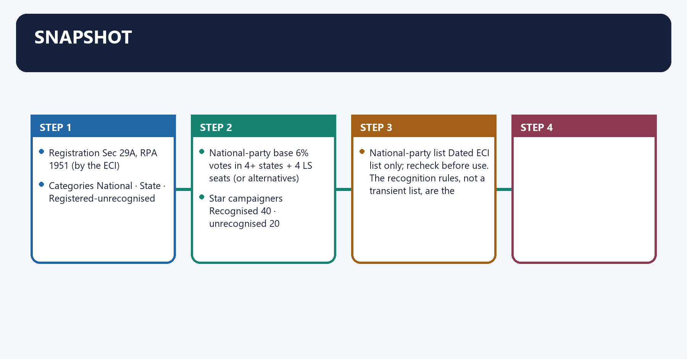
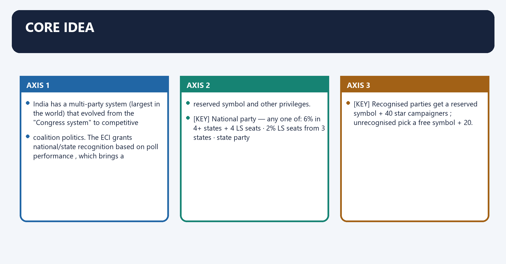
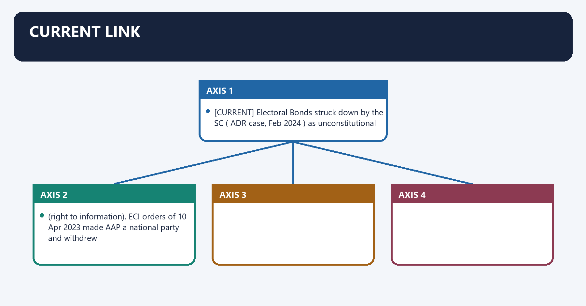
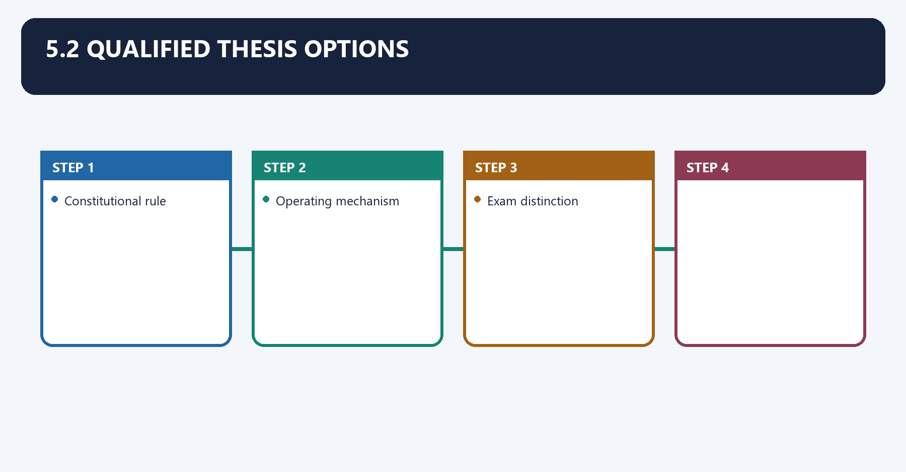
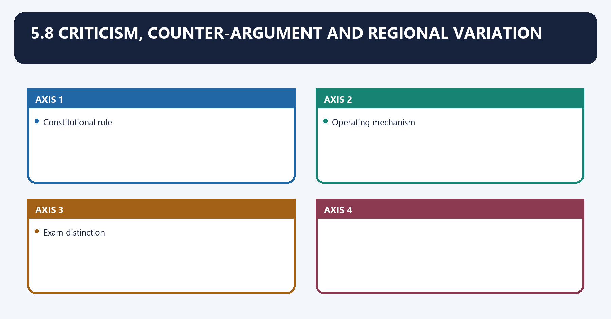
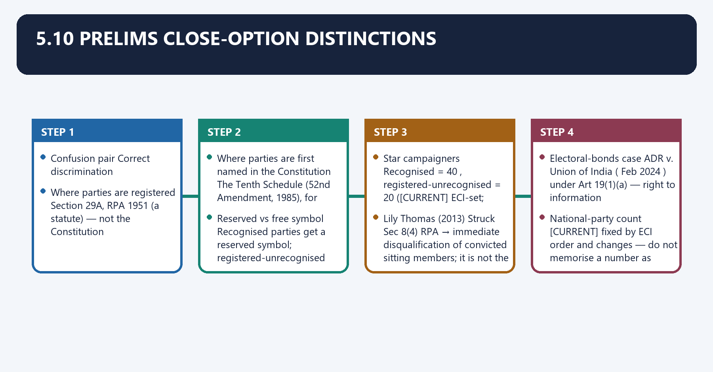
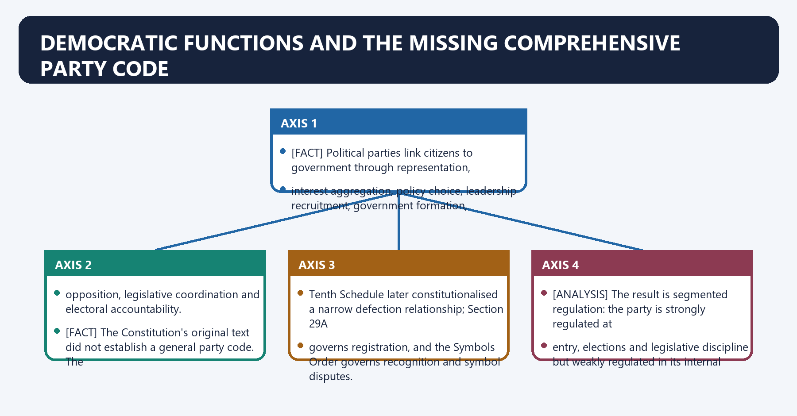

# Political Parties — Complete Uncompressed Learning Session

**Complete independent learning session + verified PYQ routing + solved practice workbook + final consolidated register notes**

**Legal/current control date:** 5 September 2026 (Asia/Kolkata)

> **Tag key:** `[FACT]` = named constitutional, statutory, official, judicial or audited local support; `[ANALYSIS]` = reasoned examination; `[CURRENT]` = checked for the control date; `[LIMIT]` = qualification.
>
> **Answer-writing discipline:** claim -> named evidence -> analysis -> qualification.

- [CURRENT] Status is controlled to **5 September 2026, Asia/Kolkata**.
- [CURRENT] **Live official refresh, 5 September 2026:** Section 29A, the Election Symbols Order, the post-electoral-bonds legal position and controlling party-registration, disclosure, criminalisation and symbol-dispute decisions were rechecked on 5 September 2026. Recognition criteria are stated as dated rules; the current list of recognised parties is deliberately not frozen.

#### How to Use This Package

[FACT] The complete Basic/Core owner is taught first in source order. Cross-topic Markdown, local OCR books and verified PYQ ledgers supplement it.

[FACT] Advanced-owner material appears only after the Core and practice sections under the required optional-depth label.

[LIMIT] India has no comprehensive constitutional party code. Registration, recognition, finance, defection and candidate disclosure arise from different legal instruments. The ECI cannot use Section 29A as a general merits-based deregistration power, and the electoral-bonds judgment did not create a complete campaign-finance code.

#### Local Owner Gateway

> **Subject:** Polity · **Tier:** Basic (foundation) · **GS-II**
> [FACT] = from book · [CURRENT] = current link · [KEY] = mnemonic. *Advanced: optional deeper detail in `advanced/43_Political-Parties.md` — not required for any mark.*

## BASIC LEARNING SESSION

### 01. Snapshot

Snapshot denotes the constitutional rules and institutional links organised around Registration Sec 29A, RPA 1951 (by the ECI).
Snapshot operates through Categories National · State · Registered-unrecognised, connected with National-party base 6% votes in 4+ states + 4 LS seats (or alternatives).
The operative mechanism matters because star campaigners Recognised 40 · unrecognised 20.
Its principal consequence is that national-party list Dated ECI list only; recheck before use. The recognition rules, not a transient list, are the examinable core.
The decisive contrast is between Registration Sec 29A, RPA 1951 (by the ECI) and Registration Sec 29A, RPA 1951 (by the ECI).
The exam-safe limitation is that registration Sec 29A, RPA 1951 (by the ECI).

| Item | Fact |
|---|---|
| Registration | **Sec 29A, RPA 1951** (by the ECI) |
| Categories | National · State · **Registered-unrecognised** |
| National-party base | 6% votes in **4+ states + 4 LS seats** (or alternatives) |
| Star campaigners | Recognised **40** · unrecognised **20** |
| National-party list | Dated ECI list only; recheck before use. The recognition rules, not a transient list, are the examinable core. |

### 02. Core idea

Core idea denotes the constitutional rules and institutional links organised around India has a multi-party system (largest in the world) that evolved from the "Congress system" to competitive.
Core idea operates through coalition politics. The ECI grants national/state recognition based on poll performance , which brings a, connected with reserved symbol and other privileges.
The operative mechanism matters because [KEY] National party — any one of: 6% in 4+ states + 4 LS seats · 2% LS seats from 3 states · state party.
Its principal consequence is that [KEY] Recognised parties get a reserved symbol + 40 star campaigners ; unrecognised pick a free symbol + 20.
The decisive contrast is between India has a multi-party system (largest in the world) that evolved from the "Congress system" to competitive and India has a multi-party system (largest in the world) that evolved from the "Congress system" to competitive.
The exam-safe limitation is that india has a multi-party system (largest in the world) that evolved from the "Congress system" to competitive.

India has a **multi-party system** (largest in the world) that evolved from the **"Congress system"** to competitive
coalition politics. The **ECI** grants **national/state** recognition based on **poll performance**, which brings a
**reserved symbol** and other privileges.

> [KEY] **National party** — any one of: **6% in 4+ states + 4 LS seats** · **2% LS seats from 3 states** · **state party
> in 4 states**.
> [KEY] Recognised parties get a **reserved symbol** + **40 star campaigners**; unrecognised pick a **free symbol** + 20.

### 03. Must-Know Facts

Must-Know Facts denotes the constitutional rules and institutional links organised around [FACT] Registered under Section 29A of the RPA, 1951.
Must-Know Facts operates through [FACT] Rajni Kothari → "one-party dominance / Congress system.", connected with [FACT] Recognition privileges: reserved symbol, broadcast time, one proposer, electoral-roll access.
The operative mechanism matters because [FACT] Registered under Section 29A of the RPA, 1951.
Its principal consequence is that [FACT] Registered under Section 29A of the RPA, 1951.
The decisive contrast is between [FACT] Registered under Section 29A of the RPA, 1951 and [FACT] Registered under Section 29A of the RPA, 1951.
The exam-safe limitation is that [FACT] Registered under Section 29A of the RPA, 1951.
- [FACT] Registered under **Section 29A of the RPA, 1951**.
- [FACT] Rajni Kothari → **"one-party dominance / Congress system."**
- [FACT] Recognition privileges: reserved symbol, broadcast time, one proposer, electoral-roll access.

### 04. Current link

Current link denotes the constitutional rules and institutional links organised around [CURRENT] Electoral Bonds struck down by the SC ( ADR case, Feb 2024 ) as unconstitutional.
Current link operates through (right to information). ECI orders of 10 Apr 2023 made AAP a national party and withdrew, connected with [CURRENT] Electoral Bonds struck down by the SC ( ADR case, Feb 2024 ) as unconstitutional.
The operative mechanism matters because [CURRENT] Electoral Bonds struck down by the SC ( ADR case, Feb 2024 ) as unconstitutional.
Its principal consequence is that [CURRENT] Electoral Bonds struck down by the SC ( ADR case, Feb 2024 ) as unconstitutional.
The decisive contrast is between [CURRENT] Electoral Bonds struck down by the SC ( ADR case, Feb 2024 ) as unconstitutional and [CURRENT] Electoral Bonds struck down by the SC ( ADR case, Feb 2024 ) as unconstitutional.
The exam-safe limitation is that [CURRENT] Electoral Bonds struck down by the SC ( ADR case, Feb 2024 ) as unconstitutional.

[CURRENT] **Electoral Bonds struck down** by the SC (**ADR case, Feb 2024**) as unconstitutional
(right to information). **ECI orders of 10 Apr 2023** made AAP a national party and withdrew
national status from TMC, NCP and CPI; **official list checked 5 September 2026 as a dated illustration only; the list must be rechecked before use**. The RTI/inner-party-democracy debate continues.

### 05. 5. Answer architecture (10/15/20-mark support)

5. Answer architecture (10/15/20-mark support) denotes the constitutional rules and institutional links organised around Constitutional rule.
5. Answer architecture (10/15/20-mark support) operates through Operating mechanism, connected with Exam distinction.
The operative mechanism matters because constitutional rule.
Its principal consequence is that constitutional rule.
The decisive contrast is between Constitutional rule and Constitutional rule.
The exam-safe limitation is that constitutional rule.

> Purpose: make this Core file independently able to answer directive-sensitive GS-II questions on the constitutional and statutory basis of parties, party finance and the electoral-bonds verdict, criminalisation and internal democracy, and the party-system half of the centralisation debate — without opening Advanced. Party-recognition thresholds and national-party counts change by ECI order; treat every number as re-verifiable, not eternal.

### 06. 5.1 Demand and directive map

5.1 Demand and directive map denotes the constitutional rules and institutional links organised around Demand family Typical directive signals Answer spine to use.
5.1 Demand and directive map operates through Demand family Typical directive signals Answer spine to use, connected with Demand family Typical directive signals Answer spine to use.
The operative mechanism matters because demand family Typical directive signals Answer spine to use.
Its principal consequence is that demand family Typical directive signals Answer spine to use.
The decisive contrast is between Demand family Typical directive signals Answer spine to use and Demand family Typical directive signals Answer spine to use.
The exam-safe limitation is that demand family Typical directive signals Answer spine to use.
| Demand family | Typical directive signals | Answer spine to use |
|---|---|---|
| Constitutional/statutory basis of parties | "regulation of parties", "are parties above the law", Discuss | Silence of original text → Tenth Schedule + Sec 29A → Symbols Order + *Sadiq Ali* → gaps → reform verdict |
| Party finance & transparency | "money power", "electoral bonds", "opacity", Critically examine | Legal sources → anonymity problem → 2024 ADR verdict → residual gaps → verdict |
| Criminalisation of politics | "decriminalise", "criminal antecedents", Examine | Scale → disclosure directions → *Lily Thomas* → why laws under-bite → verdict |
| Internal democracy & dynasticism | "inner-party democracy", "high command", Comment | No statutory code → ECI/committee record → dynastic incentive → reform options |
| Party system evolution | "one-party dominance to coalition", "fourth party system", Analyse | Phase-by-phase → what changed and why → current phase → qualified label |
| Centralisation vs autonomy | "national vs regional parties", Comment | Incentive/organisation logic → both-sides evidence → institutional verdict (§5.0) |
| Regionalisation of politics | "strength or threat to federal democracy", Discuss | Deepened representation → governance costs → net assessment |

### 07. 5.2 Qualified thesis options

5.2 Qualified thesis options denotes the constitutional rules and institutional links organised around Constitutional rule.
5.2 Qualified thesis options operates through Operating mechanism, connected with Exam distinction.
The operative mechanism matters because constitutional rule.
Its principal consequence is that constitutional rule.
The decisive contrast is between Constitutional rule and Constitutional rule.
The exam-safe limitation is that constitutional rule.

- *India's parties are heavily regulated at the entry and symbol stage yet almost unregulated internally: the Constitution names the party only to punish defection (Tenth Schedule), the statute registers it (Sec 29A), and the ECI disciplines its symbol (1968 Order) — but no law compels internal democracy, so accountability is strong outward and weak inward.*
- *The 2024 electoral-bonds verdict reframed party finance as a voter's right-to-know problem rather than a donor's privacy problem, but striking down one instrument did not by itself close the wider anonymity and corporate-funding gap.*
- *Criminalisation persists not for want of judicial directions but because disqualification bites only after conviction while selection incentives reward "winnability"; the binding change came from* Lily Thomas *removing the sitting-member shield, not from exhortation.*
- *Party preferences on centralisation are a function of who holds the Union and of organisational form, not of ideology, which is why the same party centralises in office and demands autonomy in opposition.*
- *Regionalisation has widened representation and made federalism a lived bargain, but it has also fragmented mandates and raised the transaction costs of national decision-making — a democratisation with a coordination price.*

### 08. 5.3 Mark-scaled structures

5.3 Mark-scaled structures denotes the constitutional rules and institutional links organised around Marks Architecture Evidence load.
5.3 Mark-scaled structures operates through 10 Thesis → two dimensions (e.g. legal basis + one gap) → one qualification → verdict 3 units, at least one Article/Act + one case, connected with 15 Thesis → basis → the specific problem (finance / criminalisation / autonomy) → counter-evidence → qualified verdict 5–6 units.
The operative mechanism matters because marks Architecture Evidence load.
Its principal consequence is that marks Architecture Evidence load.
The decisive contrast is between Marks Architecture Evidence load and Marks Architecture Evidence load.
The exam-safe limitation is that marks Architecture Evidence load.
| Marks | Architecture | Evidence load |
|---:|---|---|
| 10 | Thesis → two dimensions (e.g. legal basis + one gap) → one qualification → verdict | 3 units, at least one Article/Act + one case |
| 15 | Thesis → basis → the specific problem (finance / criminalisation / autonomy) → counter-evidence → qualified verdict | 5–6 units |
| 20 | Thesis → constitutional-statutory frame → finance → criminalisation/internal democracy → system evolution → reform menu → graded verdict | 6–8 units + a "regulate what, and how far" paragraph |

### 09. 5.4 Bank A — Constitutional & statutory basis (Claim → provision → mechanism → limitation)

5.4 Bank A — Constitutional & statutory basis (Claim → provision → mechanism → limitation) denotes the constitutional rules and institutional links organised around Constitutional rule.
5.4 Bank A — Constitutional & statutory basis (Claim → provision → mechanism → limitation) operates through Operating mechanism, connected with Exam distinction.
The operative mechanism matters because constitutional rule.
Its principal consequence is that constitutional rule.
The decisive contrast is between Constitutional rule and Constitutional rule.
The exam-safe limitation is that constitutional rule.

- [FACT] **Claim:** the Constitution's *original* text did not mention parties; recognition entered only in 1985. **Provision:** the **Tenth Schedule** (inserted by the **52nd Amendment, 1985**) is the first constitutional text to define and empower the "political party" — for the purpose of **disqualification on defection**. **Mechanism:** it ties a legislator's seat to the party whip, converting the party into a constitutional actor. **Limitation:** it regulates loyalty, not internal democracy or finance — a narrow constitutional footing (defection interface developed in `basic/Anti-Defection-Law.md`).
- [FACT] **Claim:** registration is statutory, not constitutional. **Provision:** **Section 29A, Representation of the People Act, 1951** — every association seeking to be a party must register with the **ECI** and swear allegiance to the Constitution, socialism, secularism and democracy. **Mechanism:** registration confers legal existence and tax and disclosure consequences, but **not** recognition. **Limitation:** the ECI's power to *register* is not matched by an express power to *de-register* an inactive or errant party — a recognised statutory gap.
- [FACT] **Claim:** recognition and symbols are an ECI administrative-cum-quasi-judicial function. **Provision:** the **Election Symbols (Reservation and Allotment) Order, 1968** — a subordinate instrument under the RPA and Conduct of Election Rules — sets the **National / State / registered-unrecognised** categories, allots **reserved symbols** to recognised parties and free symbols to the rest, and empowers the ECI to decide disputes between rival factions claiming the party and its symbol. **Mechanism:** the categories are prescribed by the **ECI Order and revised periodically** (thresholds were relaxed in 2011; reviews recur), so they are policy, not entrenched law. **Limitation:** because it is executive-made, criteria and counts shift by order — never cite a threshold or a national-party count as fixed.
- [FACT] **Claim:** the ECI's symbol-dispute power is judicially upheld. **Case:** *Sadiq Ali v. Election Commission of India* (**1972**) — the Supreme Court sustained the ECI's authority under the 1968 Order to decide which faction is the "real" party, applying the **test of majority** across the party's organisational and legislative wings (the "*Sadiq Ali* test"). **Mechanism:** it makes the ECI a quasi-judicial arbiter of party identity, not merely a registrar. **Limitation:** the majority test can privilege the legislative/organisational count over the rank and file, and recurs in every high-profile split.
- [FACT] **Claim:** the defection interface makes the party a disciplinary authority over its own legislators. **Provision:** the **Tenth Schedule** disqualifies a member who defies the party whip or voluntarily gives up membership; the **91st Amendment (2003)** deleted the earlier one-third "**split**" exemption, so only a **two-thirds merger** now escapes disqualification, and it **barred a disqualified defector from ministerial or remunerative political office**. **Mechanism:** it converts party loyalty into a condition of holding the seat; the **Speaker/Chairman adjudicates**, subject to judicial review (*Kihoto Hollohan*, **1992**). **Limitation:** [LIMIT] it strengthens the **high command** against the individual legislator — deepening the internal-democracy problem (full treatment in `basic/Anti-Defection-Law.md`).

> [KEY] **Three legal layers:** **Constitution** (Tenth Schedule — defection) · **Statute** (Sec 29A — registration) · **ECI Order** (1968 — recognition & symbol). Distinguish them in every "how are parties regulated" answer.

### 10. 5.5 Bank B — Party finance and the electoral-bonds verdict (routed to the 2024 proposition)

5.5 Bank B — Party finance and the electoral-bonds verdict (routed to the 2024 proposition) denotes the constitutional rules and institutional links organised around Constitutional rule.
5.5 Bank B — Party finance and the electoral-bonds verdict (routed to the 2024 proposition) operates through Operating mechanism, connected with Exam distinction.
The operative mechanism matters because constitutional rule.
Its principal consequence is that constitutional rule.
The decisive contrast is between Constitutional rule and Constitutional rule.
The exam-safe limitation is that constitutional rule.
- [FACT] **Claim:** party income is legally sourced but weakly transparent. **Provisions:** contributions are permitted (companies may donate under the **Companies Act, 2013, Sec 182**; **electoral trusts** are recognised), and **Section 29C, RPA 1951** requires a party to report to the ECI contributions **above a statutory threshold** ([CURRENT] a fixed rupee figure set by statute/rules — verify the current amount before quoting it). **Mechanism:** reporting is meant to expose large donors. **Limitation:** anonymous small-cash and instrument-based routes historically escaped disclosure.
- [FACT] **Claim:** the Supreme Court has recast anonymous corporate funding as a right-to-know violation. **Case (exact proposition):** *Association for Democratic Reforms v. Union of India* (**February 2024**, five-judge Constitution Bench) **struck down the Electoral Bond Scheme, 2018** and the enabling amendments (to the RPA, the Companies Act and the Income-tax Act) as **unconstitutional for violating the voter's right to information under Article 19(1)(a)**, and held that unlimited, anonymous corporate funding is not saved by donor privacy; it **directed the State Bank of India to disclose** bond purchaser and encashment data to the ECI. **Mechanism:** it re-anchored campaign-finance law in the informed vote rather than donor confidentiality. **Limitation:** [LIMIT] striking one instrument does not by itself cap corporate donations or mandate a comprehensive disclosure regime — the wider anonymity and quid-pro-quo problem remains open.
- [LIMIT] **Claim:** reform proposals predate the verdict. **Evidence:** the **Indrajit Gupta Committee (1998)** recommended partial **State funding** of elections in kind; the **Law Commission's 255th Report (2015)** proposed tighter disclosure and donation controls. **Significance:** the debate is between transparency-plus-caps and State funding. **Limitation:** none has been enacted as a complete scheme; treat as recommendations, not law.
- [FACT]/[CURRENT] **Claim:** corporate-funding transparency was diluted before 2024 and partly restored by the verdict. **Provision:** the **Finance Act, 2017** had **removed the earlier profit-linked cap** on company donations (Companies Act 2013, Sec 182) and the requirement to **name the recipient party** in company accounts; the **2024 ADR** judgment **struck those changes down** with the bond scheme. **Mechanism:** it restored the corporate-disclosure baseline. **Limitation:** [LIMIT] do **not** quote donation caps or percentages as current — the statutory position has shifted and remains contested.

### 11. 5.6 Bank C — Criminalisation and internal democracy (mechanism, incentives and consequences)

5.6 Bank C — Criminalisation and internal democracy (mechanism, incentives and consequences) denotes the constitutional rules and institutional links organised around Constitutional rule.
5.6 Bank C — Criminalisation and internal democracy (mechanism, incentives and consequences) operates through Operating mechanism, connected with Exam distinction.
The operative mechanism matters because constitutional rule.
Its principal consequence is that constitutional rule.
The decisive contrast is between Constitutional rule and Constitutional rule.
The exam-safe limitation is that constitutional rule.

- [FACT] **Claim:** disclosure of criminal antecedents is now mandatory, by judicial direction, not by a fresh statute. **Cases:** *Union of India v. Association for Democratic Reforms* (**2002**) and *PUCL v. Union of India* (**2003**) established the voter's **right to know** and the **candidate-affidavit** requirement on criminal, financial and educational background; *Rambabu Singh Thakur v. Sunil Arora* (**2020**) directed **parties** to publish candidates' criminal antecedents and reasons for selection on their websites. **Mechanism:** it works by publicity, leaving the *choice* to voters and parties. **Limitation:** disclosure has not reduced the share of candidates with cases, because selection rewards "winnability".
- [FACT] **Claim:** the one change that actually removed sitting offenders was judicial excision of a statutory shield. **Case (exact proposition):** *Lily Thomas v. Union of India* (**2013**) struck down **Section 8(4) of the RPA, 1951**, so a sitting MP or MLA **convicted** of an offence carrying the disqualifying sentence is disqualified **immediately**, without the earlier protection pending appeal. **Mechanism:** it aligned sitting members with candidates. **Limitation:** disqualification still bites only **after conviction**, and trials are slow — hence the demand for special courts and a lifetime ban (pending policy, not law).
- [FACT]/[LIMIT] **Claim:** internal democracy is the least-regulated frontier. **Evidence:** there is **no statutory code** compelling internal elections; parties file organisational-election particulars with the ECI, but compliance is formal and the **high-command / dynastic** model dominates candidate selection and finance. **Mechanism:** without an internal-democracy law, leadership succession and ticket distribution stay discretionary. **Limitation:** [LIMIT] proposals (Law Commission 170th Report, 1999; ECI's recurring pleas) to legislate inner-party democracy have not been adopted — cite them as reform demands, not existing obligations.

### 12. 5.7 Bank D — Evolution of the party system (analytical, not just chronological)

5.7 Bank D — Evolution of the party system (analytical, not just chronological) denotes the constitutional rules and institutional links organised around Phase Character What changed and why (analysis).
5.7 Bank D — Evolution of the party system (analytical, not just chronological) operates through Phase Character What changed and why (analysis), connected with Phase Character What changed and why (analysis).
The operative mechanism matters because phase Character What changed and why (analysis).
Its principal consequence is that phase Character What changed and why (analysis).
The decisive contrast is between Phase Character What changed and why (analysis) and Phase Character What changed and why (analysis).
The exam-safe limitation is that phase Character What changed and why (analysis).
| Phase | Character | What changed and why (analysis) |
|---|---|---|
| [FACT] **One-party dominance (1952–1967)** | Rajni Kothari's **"Congress system"** | Congress was hegemonic yet internally plural — an "umbrella" that absorbed factions and functioned as a system of consensus with margins of pressure; opposition survived at the edges. |
| [FACT]/[LIMIT] **Fragmentation & first coalitions (1967–1989)** | Congress loses many States in 1967; Janata (1977) | Social coalitions broke, regional and backward-class assertion rose; the *dominance* model ended even before the Centre changed hands durably. |
| [FACT]/[LIMIT] **Coalition era (1989–2014)** | National Front / UF / NDA / UPA | No single-party Lok Sabha majority; **regional parties became pivotal**, extracting fiscal and portfolio concessions — federalism's most bargained phase. |
| [LIMIT] **Dominant-party-with-federal-plurality (post-2014)** | A single dominant party at the Centre alongside strong State parties | A national majority coexists with vigorous regional dominance in States — analysts describe a new phase; treat the label as characterisation, not settled fact. |

- **Analytical use:** the phases explain the centralisation debate — dominance and single-party majorities pull central; fragmentation and regional pivotality pull federal.

### 13. 5.8 Criticism, counter-argument and regional variation

5.8 Criticism, counter-argument and regional variation denotes the constitutional rules and institutional links organised around Constitutional rule.
5.8 Criticism, counter-argument and regional variation operates through Operating mechanism, connected with Exam distinction.
The operative mechanism matters because constitutional rule.
Its principal consequence is that constitutional rule.
The decisive contrast is between Constitutional rule and Constitutional rule.
The exam-safe limitation is that constitutional rule.

- **Over-regulated outside, under-regulated inside:** [LIMIT] entry (Sec 29A) and symbols (1968 Order) are tightly controlled, but internal democracy and finance are not — the central critique of the Indian party.
- **Regionalisation — the two-sided argument:** [LIMIT] *For:* regional parties deepened representation of language, region and backward groups, made federalism a lived bargain, and improved governance responsiveness in several States. *Against:* they can fragment mandates, raise coalition transaction costs, personalise and dynasticise power, and pursue sub-national rather than national interests. The honest verdict is **democratisation with a coordination cost**, not an unqualified good or ill.
- **Finance:** [LIMIT] even after the 2024 verdict, corporate and anonymous funding routes and the absence of donation caps keep the money-power critique alive.
- **Implementation constraint:** [LIMIT] the ECI can register but struggles to **de-register**, and disclosure directions depend on voter response — regulatory reach exceeds regulatory bite.
- **Documented criminalisation:** [LIMIT] the **Vohra Committee Report (1993)** officially recorded the **criminal–politician–bureaucrat nexus**; it is the standard citation for the *scale* of criminalisation, though its full findings were never published — cite it as an official acknowledgement, not a data source.
- **Old, cross-partisan reform demand:** [LIMIT] the **Dinesh Goswami Committee (1990)**, the **Indrajit Gupta Committee (1998)** on state funding, the **Law Commission 170th (1999)** and **255th (2015)** Reports, and the **NCRWC (2002)** all urged inner-party democracy, transparent finance and decriminalisation — the agenda is settled in principle and unlegislated in fact.

### 14. 5.9 Verdict scaffolds

5.9 Verdict scaffolds denotes the constitutional rules and institutional links organised around Constitutional rule.
5.9 Verdict scaffolds operates through Operating mechanism, connected with Exam distinction.
The operative mechanism matters because constitutional rule.
Its principal consequence is that constitutional rule.
The decisive contrast is between Constitutional rule and Constitutional rule.
The exam-safe limitation is that constitutional rule.
- **Regulation verdict:** "India regulates the party at its edges — birth, symbol and defection — but leaves its interior to convention; the reform frontier is inner-party democracy and finance, not registration."
- **Finance verdict:** "The 2024 electoral-bonds judgment restored the voter's right to know, but transparency without caps is a floor, not a ceiling — the funding question is reopened, not closed."
- **Centralisation verdict:** "National and regional parties tilt central and federal not by conviction but by position and organisational form; the safeguard of autonomy is therefore institutional, not partisan."
- **Criminalisation verdict:** "The Court has forced disclosure — *Lily Thomas* and the candidate-antecedents directions — but disqualification still waits on conviction; the gap between *known* and *proven* criminality is where reform now sits."
- **Reform-locus verdict:** "Every major committee since 1990 has converged on the same three fixes — internal democracy, transparent finance and decriminalisation — so the deficit is political will, not institutional imagination."

### 15. 5.10 Prelims close-option distinctions

5.10 Prelims close-option distinctions denotes the constitutional rules and institutional links organised around Confusion pair Correct discrimination.
5.10 Prelims close-option distinctions operates through Where parties are registered Section 29A, RPA 1951 (a statute) — not the Constitution, connected with Where parties are first named in the Constitution The Tenth Schedule (52nd Amendment, 1985), for anti-defection only.
The operative mechanism matters because reserved vs free symbol Recognised parties get a reserved symbol; registered-unrecognised choose from free symbols.
Its principal consequence is that star campaigners Recognised = 40 , registered-unrecognised = 20 ([CURRENT] ECI-set; verify).
The decisive contrast is between Lily Thomas (2013) Struck Sec 8(4) RPA → immediate disqualification of convicted sitting members; it is not the electoral-bonds case and Electoral-bonds case ADR v. Union of India ( Feb 2024 ) under Art 19(1)(a) — right to information.
The exam-safe limitation is that national-party count [CURRENT] fixed by ECI order and changes — do not memorise a number as permanent.

| Confusion pair | Correct discrimination |
|---|---|
| Where parties are *registered* | **Section 29A, RPA 1951** (a statute) — **not** the Constitution |
| Where parties are first *named* in the Constitution | The **Tenth Schedule** (52nd Amendment, 1985), for **anti-defection** only |
| Recognition categories & symbols | The **Election Symbols (Reservation and Allotment) Order, 1968** (an ECI order), **not** the RPA sections directly |
| Faction/symbol disputes | Decided by the **ECI** under the 1968 Order; upheld in *Sadiq Ali* (1972) — **not** by the High Court in the first instance |
| Reserved vs free symbol | **Recognised** parties get a **reserved** symbol; **registered-unrecognised** choose from **free** symbols |
| Star campaigners | Recognised = **40**, registered-unrecognised = **20** ([CURRENT] ECI-set; verify) |
| *Lily Thomas* (2013) | Struck **Sec 8(4) RPA** → immediate disqualification of convicted sitting members; it is **not** the electoral-bonds case |
| Electoral-bonds case | *ADR v. Union of India* (**Feb 2024**) under **Art 19(1)(a)** — right to information |
| National-party count | [CURRENT] fixed by ECI order and **changes** — do not memorise a number as permanent |
| "National party" meaning | A **recognition/privilege** category — not a party that contests only national elections |
| 52nd vs 91st Amendment | **52nd (1985)** created the Tenth Schedule; **91st (2003)** deleted the one-third **split** exception and capped the Council of Ministers — do not merge the two |
| Symbol-dispute forum | The **ECI** (quasi-judicial) under the **1968 Order** decides first; courts intervene only on **review** — not the High Court in the first instance |
| Registration vs recognition | **Any** party may **register** (Sec 29A); only a party crossing prescribed poll thresholds is **recognised** (State/national) |
| Vohra Committee subject | **Criminalisation / criminal–politician nexus (1993)** — not party finance or symbols |
| NCRWC vs Vohra vs Goswami | **NCRWC (2002)** = constitutional review; **Vohra (1993)** = criminal nexus; **Goswami (1990)** = electoral reform — distinct mandates |

### 16. 5.11 Factual-risk and current-status controls

5.11 Factual-risk and current-status controls denotes the constitutional rules and institutional links organised around [LIMIT] Do not quantify party income, corporate-donation shares or bond values from memory; funding figures change and are contested.
5.11 Factual-risk and current-status controls operates through [LIMIT] Party-system "phases" and the post-2014 label are characterisations , not constitutional facts — mark them as analysis, connected with [LIMIT] Do not quantify party income, corporate-donation shares or bond values from memory; funding figures change and are contested.
The operative mechanism matters because [LIMIT] Do not quantify party income, corporate-donation shares or bond values from memory; funding figures change and are contested.
Its principal consequence is that [LIMIT] Do not quantify party income, corporate-donation shares or bond values from memory; funding figures change and are contested.
The decisive contrast is between [LIMIT] Do not quantify party income, corporate-donation shares or bond values from memory; funding figures change and are contested and [LIMIT] Do not quantify party income, corporate-donation shares or bond values from memory; funding figures change and are contested.
The exam-safe limitation is that [LIMIT] Do not quantify party income, corporate-donation shares or bond values from memory; funding figures change and are contested.

- [CURRENT] **Recognition thresholds and national-party counts change by ECI order.** State the *criteria structure* (votes-plus-seats in either House) and cross-link `basic/Election-Commission.md`; if a count is needed, mark it [CURRENT] with the check date (e.g. six national parties, list checked 5 September 2026) and flag it for re-verification.
- [FACT] **Distinguish the legal layers:** Tenth Schedule (Constitution) ≠ Sec 29A (statute) ≠ 1968 Symbols Order (ECI subordinate order). Do not attribute registration to the Constitution or recognition to the RPA sections alone.
- [FACT] **Electoral bonds:** the scheme was **struck down (Feb 2024)**; do not describe it as an operative funding route. Cite *ADR* as a **right-to-information (Art 19(1)(a))** holding.
- [LIMIT] **Do not quantify** party income, corporate-donation shares or bond values from memory; funding figures change and are contested.
- [FACT] *Lily Thomas* (2013) removed the **sitting-member shield (Sec 8(4))**; it did **not** create a lifetime ban — a lifetime ban remains a **proposal**, not law.
- [LIMIT] Party-system "phases" and the post-2014 label are **characterisations**, not constitutional facts — mark them as analysis.
- [LIMIT] Committee reports (Indrajit Gupta 1998; Law Commission 170th/255th) are **recommendations**; State funding and a statutory internal-democracy code are **not** enacted.
- [LIMIT] **NCRWC (2002)** proposed regulating parties' internal functioning and finances by law; treat it as a **recommendation**, not existing law.
- [CURRENT] **Star-campaigner ceilings (40 for recognised, 20 for registered-unrecognised)** and expenditure limits are **ECI/rule-set and revised** — cite the structure, verify the current figure before quoting.
- [FACT] Distinguish the **52nd Amendment (1985, Tenth Schedule)** from the **91st Amendment (2003, deletion of the split exception + CoM cap)** — a common Prelims trap.

### 17. Democratic functions and the missing comprehensive party code

Democratic functions and the missing comprehensive party code denotes the constitutional rules and institutional links organised around [FACT] Political parties link citizens to government through representation,.
Democratic functions and the missing comprehensive party code operates through interest aggregation, policy choice, leadership recruitment, government formation,, connected with opposition, legislative coordination and electoral accountability.
The operative mechanism matters because [FACT] The Constitution's original text did not establish a general party code. The.
Its principal consequence is that tenth Schedule later constitutionalised a narrow defection relationship; Section 29A.
The decisive contrast is between governs registration, and the Symbols Order governs recognition and symbol disputes and [ANALYSIS] The result is segmented regulation: the party is strongly regulated at.
The exam-safe limitation is that entry, elections and legislative discipline but weakly regulated in its internal.

[FACT] Political parties link citizens to government through representation,
interest aggregation, policy choice, leadership recruitment, government formation,
opposition, legislative coordination and electoral accountability.

[FACT] The Constitution's original text did not establish a general party code. The
Tenth Schedule later constitutionalised a narrow defection relationship; Section 29A
governs registration, and the Symbols Order governs recognition and symbol disputes.

[ANALYSIS] The result is segmented regulation: the party is strongly regulated at
entry, elections and legislative discipline but weakly regulated in its internal
membership, leadership and candidate-selection life.

[LIMIT] Article 19(1)(c) association autonomy matters. Reform must distinguish
transparent minimum standards from State control of political ideology or leadership.

### 18. Membership, candidate selection and internal federalism

Membership, candidate selection and internal federalism denotes the constitutional rules and institutional links organised around Internal field Democratic benchmark Common risk Reform direction.
Membership, candidate selection and internal federalism operates through membership clear eligibility, notice and appeal arbitrary admission/expulsion published rules and reasoned process, connected with leadership periodic, competitive election indefinite high-command control verified internal electoral rolls.
The operative mechanism matters because candidates transparent criteria and consultation dynasty, money and winnability recorded criteria and local participation.
Its principal consequence is that finance audited, donor-visible accounts centralised opaque control public disclosure and independent audit.
The decisive contrast is between State units meaningful organisational autonomy national centralisation internal federal allocation of authority and [LIMIT] A statutory internal-democracy floor can protect members and voters, but a.
The exam-safe limitation is that regulator should not select a party's ideology, leadership or candidates.

| Internal field | Democratic benchmark | Common risk | Reform direction |
|---|---|---|---|
| membership | clear eligibility, notice and appeal | arbitrary admission/expulsion | published rules and reasoned process |
| leadership | periodic, competitive election | indefinite high-command control | verified internal electoral rolls |
| candidates | transparent criteria and consultation | dynasty, money and winnability | recorded criteria and local participation |
| finance | audited, donor-visible accounts | centralised opaque control | public disclosure and independent audit |
| State units | meaningful organisational autonomy | national centralisation | internal federal allocation of authority |

[LIMIT] A statutory internal-democracy floor can protect members and voters, but a
regulator should not select a party's ideology, leadership or candidates.

### Semantic-completeness ownership and PYQ control

- **Layered legal identity:** Section 29A of the Representation of the People
  Act, 1951 governs registration; the Election Symbols (Reservation and
  Allotment) Order, 1968 governs recognition and symbols; the Tenth Schedule
  governs legislative defection. These are not interchangeable.
- **Registration:** an association of Indian citizens applies to the ECI and
  must carry the statutory constitutional-allegiance declaration. Registration
  does not itself confer National or State party recognition.
- **Bounded deregistration:** Indian National Congress (I) v Institute of
  Social Welfare (2002) treats the ECI's Section 29A function as quasi-judicial
  and rejects a general merits-based deregistration power, while preserving
  narrow fraud, non-compliance and unlawful-object situations recognised in
  the judgment.
- **Recognition and symbols:** the Symbols Order supplies performance criteria,
  reserved/free symbols and paragraph 15 faction adjudication. Sadiq Ali
  sustains the ECI's party-identity jurisdiction. Recognition lists and
  election-specific concessions are date-sensitive and deliberately unfrozen.
- **Finance:** Sections 29B-29C, the Companies Act, Income-tax law, FCRA and ECI
  disclosure directions operate through different tests. A contribution
  threshold, foreign-source rule or candidate-expenditure ceiling must not be
  transferred to another legal route.
- **Electoral bonds, checked 5 September 2026:** Association for Democratic
  Reforms v Union of India, 2024 INSC 113, remains the controlling official
  judgment invalidating the scheme and enabling amendments on Article
  19(1)(a), proportionality and corporate-funding grounds. It did not enact a
  complete new campaign-finance code.
- **Criminalisation:** ADR (2002) and PUCL (2003) ground candidate disclosure;
  Lily Thomas removes the former sitting-member protection after conviction;
  Rambabu Singh Thakur requires party publication of criminal antecedents and
  reasons for selection. Disclosure is not pre-conviction disqualification.
- **Internal democracy:** no comprehensive enacted party-democracy code
  controls leadership succession, membership and candidate selection. ECI,
  committee and Law Commission proposals remain proposals.
- **System analysis:** national/regional behaviour varies with organisation,
  territorial base and position in Union or State power. Coalition,
  centralisation and autonomy claims require evidence and qualification.
- **PYQ firewall:** the 2022 GS-II centralisation/autonomy demand is shared
  with Federal System, while the party-system incentive analysis is owned
  here. Recognition and finance questions retain exact legal-source labels.

## BASIC MCQS / REMEDIATION

### Original MCQs 1-36 — Broad Coverage
#### OM1. Which statement most accurately describes constitutional status of parties?

- A. The original Constitution did not create a comprehensive party code; later provisions regulate specific fields.
- B. Political parties are wholly unregulated by law.
- C. Article 324 itself registers political parties.
- D. The Tenth Schedule regulates every aspect of party organisation.

**Answer: A**

**Explanation:** Party law is segmented across the Constitution, statutes and the Symbols Order. The other options collapse distinct legal sources, institutions or consequences and therefore fail the close-option test.

#### OM2. Which statement most accurately describes Section 29A?

- A. Section 29A of the RPA 1951 provides the statutory registration route and allegiance declaration.
- B. Section 29A grants national-party recognition.
- C. Section 29A creates the anti-defection whip.
- D. Section 29A makes every registered party a public authority.

**Answer: A**

**Explanation:** Registration is distinct from recognition, defection and RTI status. The other options collapse distinct legal sources, institutions or consequences and therefore fail the close-option test.

#### OM3. Which statement most accurately describes recognition?

- A. National and State recognition follows dated criteria in the Election Symbols Order, not an immutable constitutional list.
- B. Recognition follows Article 324 alone without an Order.
- C. Every registered party has a reserved symbol.
- D. Recognition never changes after first grant.

**Answer: A**

**Explanation:** Criteria and lists must be rechecked against ECI orders. The other options collapse distinct legal sources, institutions or consequences and therefore fail the close-option test.

#### OM4. Which statement most accurately describes party functions?

- A. Parties aggregate interests, recruit leaders, form governments, organise opposition and enable electoral accountability.
- B. Parties only nominate candidates.
- C. Opposition is external to the party system.
- D. Interest aggregation belongs only to pressure groups.

**Answer: A**

**Explanation:** The democratic role extends across representation, government and accountability. The other options collapse distinct legal sources, institutions or consequences and therefore fail the close-option test.

#### OM5. Which statement most accurately describes internal democracy?

- A. India lacks a comprehensive statutory internal-democracy code despite registration and disclosure requirements.
- B. The ECI conducts all internal party elections.
- C. The Constitution prescribes candidate-selection primaries.
- D. Dynastic succession is itself a statutory disqualification.

**Answer: A**

**Explanation:** Autonomy and minimum democratic safeguards must be balanced. The other options collapse distinct legal sources, institutions or consequences and therefore fail the close-option test.

#### OM6. Which statement most accurately describes party finance?

- A. The 2024 electoral-bonds judgment invalidated the scheme and enabling anonymity changes on right-to-information grounds.
- B. The judgment constitutionalised anonymous bonds.
- C. The judgment prohibited every corporate donation.
- D. The judgment created full State funding of elections.

**Answer: A**

**Explanation:** One instrument was struck down; the wider finance framework still needs statutory analysis. The other options collapse distinct legal sources, institutions or consequences and therefore fail the close-option test.

#### OM7. Which statement most accurately describes candidate disclosure?

- A. ADR (2002) and PUCL (2003) ground candidate-affidavit disclosure in the voter's right to know.
- B. Disclosure arises only after conviction.
- C. The ECI may cancel an election solely for any pending case.
- D. Candidate education is constitutionally irrelevant and cannot be disclosed.

**Answer: A**

**Explanation:** Disclosure and disqualification are different mechanisms. The other options collapse distinct legal sources, institutions or consequences and therefore fail the close-option test.

#### OM8. Which statement most accurately describes criminalisation?

- A. Lily Thomas (2013) removed the sitting-member protection in RPA Section 8(4), but disqualification still depends on conviction.
- B. Every chargesheet causes automatic disqualification.
- C. Disclosure alone equals acquittal.
- D. Political parties cannot nominate a person with pending cases.

**Answer: A**

**Explanation:** The core gap is the delay between accusation, trial and conviction. The other options collapse distinct legal sources, institutions or consequences and therefore fail the close-option test.

#### OM9. Which statement most accurately describes NOTA?

- A. NOTA protects a negative voting choice but does not automatically cancel the election or require re-poll.
- B. NOTA converts India to recall elections.
- C. NOTA votes are transferred to the runner-up.
- D. NOTA disqualifies all listed candidates.

**Answer: A**

**Explanation:** PUCL (2013) concerns secrecy and choice, not automatic rejection of the field. The other options collapse distinct legal sources, institutions or consequences and therefore fail the close-option test.

#### OM10. Which statement most accurately describes anti-defection interface?

- A. The Tenth Schedule disciplines legislators; it is not a general code for party membership or finance.
- B. A party whip can criminally punish a voter.
- C. Every internal party dispute is decided by the Speaker.
- D. The Symbols Order and Tenth Schedule are the same proceeding.

**Answer: A**

**Explanation:** Party, legislature-party, symbol and defection questions remain distinct. The other options collapse distinct legal sources, institutions or consequences and therefore fail the close-option test.

#### OM11. Which statement most accurately describes deregistration?

- A. Indian National Congress v. Institute of Social Welfare (2002) limits ECI cancellation to narrow grounds such as fraud or loss of foundational allegiance.
- B. The ECI has an unlimited policy power to deregister inactive parties.
- C. Recognition withdrawal and registration cancellation are identical.
- D. The Supreme Court barred cancellation even for fraud.

**Answer: A**

**Explanation:** Registration power does not imply a general merits-based deregistration power. The other options collapse distinct legal sources, institutions or consequences and therefore fail the close-option test.

#### OM12. Which statement most accurately describes regional parties and coalitions?

- A. Regional parties can deepen federal representation while also increasing bargaining and coordination costs.
- B. Regional parties are constitutionally confined to State elections.
- C. Coalitions are unconstitutional when no party has a majority.
- D. National parties always favour autonomy.

**Answer: A**

**Explanation:** Effects depend on incentives, alliances and institutional context. The other options collapse distinct legal sources, institutions or consequences and therefore fail the close-option test.

#### OM13. Which is the safest UPSC distinction concerning constitutional status of parties?

- A. The original Constitution did not create a comprehensive party code; later provisions regulate specific fields.
- B. Political parties are wholly unregulated by law.
- C. Article 324 itself registers political parties.
- D. The Tenth Schedule regulates every aspect of party organisation.

**Answer: A**

**Explanation:** Party law is segmented across the Constitution, statutes and the Symbols Order. The other options collapse distinct legal sources, institutions or consequences and therefore fail the close-option test.

#### OM14. Which is the safest UPSC distinction concerning Section 29A?

- A. Section 29A of the RPA 1951 provides the statutory registration route and allegiance declaration.
- B. Section 29A grants national-party recognition.
- C. Section 29A creates the anti-defection whip.
- D. Section 29A makes every registered party a public authority.

**Answer: A**

**Explanation:** Registration is distinct from recognition, defection and RTI status. The other options collapse distinct legal sources, institutions or consequences and therefore fail the close-option test.

#### OM15. Which is the safest UPSC distinction concerning recognition?

- A. National and State recognition follows dated criteria in the Election Symbols Order, not an immutable constitutional list.
- B. Recognition follows Article 324 alone without an Order.
- C. Every registered party has a reserved symbol.
- D. Recognition never changes after first grant.

**Answer: A**

**Explanation:** Criteria and lists must be rechecked against ECI orders. The other options collapse distinct legal sources, institutions or consequences and therefore fail the close-option test.

#### OM16. Which is the safest UPSC distinction concerning party functions?

- A. Parties aggregate interests, recruit leaders, form governments, organise opposition and enable electoral accountability.
- B. Parties only nominate candidates.
- C. Opposition is external to the party system.
- D. Interest aggregation belongs only to pressure groups.

**Answer: A**

**Explanation:** The democratic role extends across representation, government and accountability. The other options collapse distinct legal sources, institutions or consequences and therefore fail the close-option test.

#### OM17. Which is the safest UPSC distinction concerning internal democracy?

- A. India lacks a comprehensive statutory internal-democracy code despite registration and disclosure requirements.
- B. The ECI conducts all internal party elections.
- C. The Constitution prescribes candidate-selection primaries.
- D. Dynastic succession is itself a statutory disqualification.

**Answer: A**

**Explanation:** Autonomy and minimum democratic safeguards must be balanced. The other options collapse distinct legal sources, institutions or consequences and therefore fail the close-option test.

#### OM18. Which is the safest UPSC distinction concerning party finance?

- A. The 2024 electoral-bonds judgment invalidated the scheme and enabling anonymity changes on right-to-information grounds.
- B. The judgment constitutionalised anonymous bonds.
- C. The judgment prohibited every corporate donation.
- D. The judgment created full State funding of elections.

**Answer: A**

**Explanation:** One instrument was struck down; the wider finance framework still needs statutory analysis. The other options collapse distinct legal sources, institutions or consequences and therefore fail the close-option test.

#### OM19. Which is the safest UPSC distinction concerning candidate disclosure?

- A. ADR (2002) and PUCL (2003) ground candidate-affidavit disclosure in the voter's right to know.
- B. Disclosure arises only after conviction.
- C. The ECI may cancel an election solely for any pending case.
- D. Candidate education is constitutionally irrelevant and cannot be disclosed.

**Answer: A**

**Explanation:** Disclosure and disqualification are different mechanisms. The other options collapse distinct legal sources, institutions or consequences and therefore fail the close-option test.

#### OM20. Which is the safest UPSC distinction concerning criminalisation?

- A. Lily Thomas (2013) removed the sitting-member protection in RPA Section 8(4), but disqualification still depends on conviction.
- B. Every chargesheet causes automatic disqualification.
- C. Disclosure alone equals acquittal.
- D. Political parties cannot nominate a person with pending cases.

**Answer: A**

**Explanation:** The core gap is the delay between accusation, trial and conviction. The other options collapse distinct legal sources, institutions or consequences and therefore fail the close-option test.

#### OM21. Which is the safest UPSC distinction concerning NOTA?

- A. NOTA protects a negative voting choice but does not automatically cancel the election or require re-poll.
- B. NOTA converts India to recall elections.
- C. NOTA votes are transferred to the runner-up.
- D. NOTA disqualifies all listed candidates.

**Answer: A**

**Explanation:** PUCL (2013) concerns secrecy and choice, not automatic rejection of the field. The other options collapse distinct legal sources, institutions or consequences and therefore fail the close-option test.

#### OM22. Which is the safest UPSC distinction concerning anti-defection interface?

- A. The Tenth Schedule disciplines legislators; it is not a general code for party membership or finance.
- B. A party whip can criminally punish a voter.
- C. Every internal party dispute is decided by the Speaker.
- D. The Symbols Order and Tenth Schedule are the same proceeding.

**Answer: A**

**Explanation:** Party, legislature-party, symbol and defection questions remain distinct. The other options collapse distinct legal sources, institutions or consequences and therefore fail the close-option test.

#### OM23. Which is the safest UPSC distinction concerning deregistration?

- A. Indian National Congress v. Institute of Social Welfare (2002) limits ECI cancellation to narrow grounds such as fraud or loss of foundational allegiance.
- B. The ECI has an unlimited policy power to deregister inactive parties.
- C. Recognition withdrawal and registration cancellation are identical.
- D. The Supreme Court barred cancellation even for fraud.

**Answer: A**

**Explanation:** Registration power does not imply a general merits-based deregistration power. The other options collapse distinct legal sources, institutions or consequences and therefore fail the close-option test.

#### OM24. Which is the safest UPSC distinction concerning regional parties and coalitions?

- A. Regional parties can deepen federal representation while also increasing bargaining and coordination costs.
- B. Regional parties are constitutionally confined to State elections.
- C. Coalitions are unconstitutional when no party has a majority.
- D. National parties always favour autonomy.

**Answer: A**

**Explanation:** Effects depend on incentives, alliances and institutional context. The other options collapse distinct legal sources, institutions or consequences and therefore fail the close-option test.

#### OM25. A candidate makes a close-option error about constitutional status of parties. Which correction is most accurate?

- A. The original Constitution did not create a comprehensive party code; later provisions regulate specific fields.
- B. Political parties are wholly unregulated by law.
- C. Article 324 itself registers political parties.
- D. The Tenth Schedule regulates every aspect of party organisation.

**Answer: A**

**Explanation:** Party law is segmented across the Constitution, statutes and the Symbols Order. The other options collapse distinct legal sources, institutions or consequences and therefore fail the close-option test.

#### OM26. A candidate makes a close-option error about Section 29A. Which correction is most accurate?

- A. Section 29A of the RPA 1951 provides the statutory registration route and allegiance declaration.
- B. Section 29A grants national-party recognition.
- C. Section 29A creates the anti-defection whip.
- D. Section 29A makes every registered party a public authority.

**Answer: A**

**Explanation:** Registration is distinct from recognition, defection and RTI status. The other options collapse distinct legal sources, institutions or consequences and therefore fail the close-option test.

#### OM27. A candidate makes a close-option error about recognition. Which correction is most accurate?

- A. National and State recognition follows dated criteria in the Election Symbols Order, not an immutable constitutional list.
- B. Recognition follows Article 324 alone without an Order.
- C. Every registered party has a reserved symbol.
- D. Recognition never changes after first grant.

**Answer: A**

**Explanation:** Criteria and lists must be rechecked against ECI orders. The other options collapse distinct legal sources, institutions or consequences and therefore fail the close-option test.

#### OM28. A candidate makes a close-option error about party functions. Which correction is most accurate?

- A. Parties aggregate interests, recruit leaders, form governments, organise opposition and enable electoral accountability.
- B. Parties only nominate candidates.
- C. Opposition is external to the party system.
- D. Interest aggregation belongs only to pressure groups.

**Answer: A**

**Explanation:** The democratic role extends across representation, government and accountability. The other options collapse distinct legal sources, institutions or consequences and therefore fail the close-option test.

#### OM29. A candidate makes a close-option error about internal democracy. Which correction is most accurate?

- A. India lacks a comprehensive statutory internal-democracy code despite registration and disclosure requirements.
- B. The ECI conducts all internal party elections.
- C. The Constitution prescribes candidate-selection primaries.
- D. Dynastic succession is itself a statutory disqualification.

**Answer: A**

**Explanation:** Autonomy and minimum democratic safeguards must be balanced. The other options collapse distinct legal sources, institutions or consequences and therefore fail the close-option test.

#### OM30. A candidate makes a close-option error about party finance. Which correction is most accurate?

- A. The 2024 electoral-bonds judgment invalidated the scheme and enabling anonymity changes on right-to-information grounds.
- B. The judgment constitutionalised anonymous bonds.
- C. The judgment prohibited every corporate donation.
- D. The judgment created full State funding of elections.

**Answer: A**

**Explanation:** One instrument was struck down; the wider finance framework still needs statutory analysis. The other options collapse distinct legal sources, institutions or consequences and therefore fail the close-option test.

#### OM31. A candidate makes a close-option error about candidate disclosure. Which correction is most accurate?

- A. ADR (2002) and PUCL (2003) ground candidate-affidavit disclosure in the voter's right to know.
- B. Disclosure arises only after conviction.
- C. The ECI may cancel an election solely for any pending case.
- D. Candidate education is constitutionally irrelevant and cannot be disclosed.

**Answer: A**

**Explanation:** Disclosure and disqualification are different mechanisms. The other options collapse distinct legal sources, institutions or consequences and therefore fail the close-option test.

#### OM32. A candidate makes a close-option error about criminalisation. Which correction is most accurate?

- A. Lily Thomas (2013) removed the sitting-member protection in RPA Section 8(4), but disqualification still depends on conviction.
- B. Every chargesheet causes automatic disqualification.
- C. Disclosure alone equals acquittal.
- D. Political parties cannot nominate a person with pending cases.

**Answer: A**

**Explanation:** The core gap is the delay between accusation, trial and conviction. The other options collapse distinct legal sources, institutions or consequences and therefore fail the close-option test.

#### OM33. A candidate makes a close-option error about NOTA. Which correction is most accurate?

- A. NOTA protects a negative voting choice but does not automatically cancel the election or require re-poll.
- B. NOTA converts India to recall elections.
- C. NOTA votes are transferred to the runner-up.
- D. NOTA disqualifies all listed candidates.

**Answer: A**

**Explanation:** PUCL (2013) concerns secrecy and choice, not automatic rejection of the field. The other options collapse distinct legal sources, institutions or consequences and therefore fail the close-option test.

#### OM34. A candidate makes a close-option error about anti-defection interface. Which correction is most accurate?

- A. The Tenth Schedule disciplines legislators; it is not a general code for party membership or finance.
- B. A party whip can criminally punish a voter.
- C. Every internal party dispute is decided by the Speaker.
- D. The Symbols Order and Tenth Schedule are the same proceeding.

**Answer: A**

**Explanation:** Party, legislature-party, symbol and defection questions remain distinct. The other options collapse distinct legal sources, institutions or consequences and therefore fail the close-option test.

#### OM35. A candidate makes a close-option error about deregistration. Which correction is most accurate?

- A. Indian National Congress v. Institute of Social Welfare (2002) limits ECI cancellation to narrow grounds such as fraud or loss of foundational allegiance.
- B. The ECI has an unlimited policy power to deregister inactive parties.
- C. Recognition withdrawal and registration cancellation are identical.
- D. The Supreme Court barred cancellation even for fraud.

**Answer: A**

**Explanation:** Registration power does not imply a general merits-based deregistration power. The other options collapse distinct legal sources, institutions or consequences and therefore fail the close-option test.

#### OM36. A candidate makes a close-option error about regional parties and coalitions. Which correction is most accurate?

- A. Regional parties can deepen federal representation while also increasing bargaining and coordination costs.
- B. Regional parties are constitutionally confined to State elections.
- C. Coalitions are unconstitutional when no party has a majority.
- D. National parties always favour autonomy.

**Answer: A**

**Explanation:** Effects depend on incentives, alliances and institutional context. The other options collapse distinct legal sources, institutions or consequences and therefore fail the close-option test.

### Remedial MCQs 1-12 — Common Error Repair
#### RM1. Which statement best repairs a recurring error about constitutional status of parties?

- A. The original Constitution did not create a comprehensive party code; later provisions regulate specific fields.
- B. Article 324 itself registers political parties.
- C. The Tenth Schedule regulates every aspect of party organisation.
- D. Political parties are wholly unregulated by law.

**Answer: A**

**Remedial explanation:** Party law is segmented across the Constitution, statutes and the Symbols Order. Write the governing source, then the mechanism, and finally the limitation before choosing an option.

#### RM2. Which statement best repairs a recurring error about Section 29A?

- A. Section 29A of the RPA 1951 provides the statutory registration route and allegiance declaration.
- B. Section 29A creates the anti-defection whip.
- C. Section 29A makes every registered party a public authority.
- D. Section 29A grants national-party recognition.

**Answer: A**

**Remedial explanation:** Registration is distinct from recognition, defection and RTI status. Write the governing source, then the mechanism, and finally the limitation before choosing an option.

#### RM3. Which statement best repairs a recurring error about recognition?

- A. National and State recognition follows dated criteria in the Election Symbols Order, not an immutable constitutional list.
- B. Every registered party has a reserved symbol.
- C. Recognition never changes after first grant.
- D. Recognition follows Article 324 alone without an Order.

**Answer: A**

**Remedial explanation:** Criteria and lists must be rechecked against ECI orders. Write the governing source, then the mechanism, and finally the limitation before choosing an option.

#### RM4. Which statement best repairs a recurring error about party functions?

- A. Parties aggregate interests, recruit leaders, form governments, organise opposition and enable electoral accountability.
- B. Opposition is external to the party system.
- C. Interest aggregation belongs only to pressure groups.
- D. Parties only nominate candidates.

**Answer: A**

**Remedial explanation:** The democratic role extends across representation, government and accountability. Write the governing source, then the mechanism, and finally the limitation before choosing an option.

#### RM5. Which statement best repairs a recurring error about internal democracy?

- A. India lacks a comprehensive statutory internal-democracy code despite registration and disclosure requirements.
- B. The Constitution prescribes candidate-selection primaries.
- C. Dynastic succession is itself a statutory disqualification.
- D. The ECI conducts all internal party elections.

**Answer: A**

**Remedial explanation:** Autonomy and minimum democratic safeguards must be balanced. Write the governing source, then the mechanism, and finally the limitation before choosing an option.

#### RM6. Which statement best repairs a recurring error about party finance?

- A. The 2024 electoral-bonds judgment invalidated the scheme and enabling anonymity changes on right-to-information grounds.
- B. The judgment prohibited every corporate donation.
- C. The judgment created full State funding of elections.
- D. The judgment constitutionalised anonymous bonds.

**Answer: A**

**Remedial explanation:** One instrument was struck down; the wider finance framework still needs statutory analysis. Write the governing source, then the mechanism, and finally the limitation before choosing an option.

#### RM7. Which statement best repairs a recurring error about candidate disclosure?

- A. ADR (2002) and PUCL (2003) ground candidate-affidavit disclosure in the voter's right to know.
- B. The ECI may cancel an election solely for any pending case.
- C. Candidate education is constitutionally irrelevant and cannot be disclosed.
- D. Disclosure arises only after conviction.

**Answer: A**

**Remedial explanation:** Disclosure and disqualification are different mechanisms. Write the governing source, then the mechanism, and finally the limitation before choosing an option.

#### RM8. Which statement best repairs a recurring error about criminalisation?

- A. Lily Thomas (2013) removed the sitting-member protection in RPA Section 8(4), but disqualification still depends on conviction.
- B. Disclosure alone equals acquittal.
- C. Political parties cannot nominate a person with pending cases.
- D. Every chargesheet causes automatic disqualification.

**Answer: A**

**Remedial explanation:** The core gap is the delay between accusation, trial and conviction. Write the governing source, then the mechanism, and finally the limitation before choosing an option.

#### RM9. Which statement best repairs a recurring error about NOTA?

- A. NOTA protects a negative voting choice but does not automatically cancel the election or require re-poll.
- B. NOTA votes are transferred to the runner-up.
- C. NOTA disqualifies all listed candidates.
- D. NOTA converts India to recall elections.

**Answer: A**

**Remedial explanation:** PUCL (2013) concerns secrecy and choice, not automatic rejection of the field. Write the governing source, then the mechanism, and finally the limitation before choosing an option.

#### RM10. Which statement best repairs a recurring error about anti-defection interface?

- A. The Tenth Schedule disciplines legislators; it is not a general code for party membership or finance.
- B. Every internal party dispute is decided by the Speaker.
- C. The Symbols Order and Tenth Schedule are the same proceeding.
- D. A party whip can criminally punish a voter.

**Answer: A**

**Remedial explanation:** Party, legislature-party, symbol and defection questions remain distinct. Write the governing source, then the mechanism, and finally the limitation before choosing an option.

#### RM11. Which statement best repairs a recurring error about deregistration?

- A. Indian National Congress v. Institute of Social Welfare (2002) limits ECI cancellation to narrow grounds such as fraud or loss of foundational allegiance.
- B. Recognition withdrawal and registration cancellation are identical.
- C. The Supreme Court barred cancellation even for fraud.
- D. The ECI has an unlimited policy power to deregister inactive parties.

**Answer: A**

**Remedial explanation:** Registration power does not imply a general merits-based deregistration power. Write the governing source, then the mechanism, and finally the limitation before choosing an option.

#### RM12. Which statement best repairs a recurring error about regional parties and coalitions?

- A. Regional parties can deepen federal representation while also increasing bargaining and coordination costs.
- B. Coalitions are unconstitutional when no party has a majority.
- C. National parties always favour autonomy.
- D. Regional parties are constitutionally confined to State elections.

**Answer: A**

**Remedial explanation:** Effects depend on incentives, alliances and institutional context. Write the governing source, then the mechanism, and finally the limitation before choosing an option.

## PYQS AND ANSWER PRACTICE

### Verified and Supporting PYQs with Model Solutions
#### Verified direct PYQ 1 — 2022 GS-II Q13

**Question:** National political parties favour centralisation whereas regional parties favour State autonomy. Comment.

**Directive:** Comment · **Marks:** 15 · **Word limit:** 250

**Model solution**

**Opening:** National political parties favour centralisation whereas regional parties favour State autonomy. The answer must respond to the directive **Comment** rather than merely describe the topic.

- **Claim -> evidence -> analysis -> qualification:** The correlation is real but follows organisational incentives and location in power, not permanent ideology.
- **Claim -> evidence -> analysis -> qualification:** Pan-Indian parties internalise Union-wide programmes, a strong Centre and high-command coordination.
- **Claim -> evidence -> analysis -> qualification:** Regional parties depend on State identity, fiscal devolution and bargaining over Governors and schemes.
- **Claim -> evidence -> analysis -> qualification:** Coalition governments show regional parties influencing national policy and national parties conceding autonomy.
- **Claim -> evidence -> analysis -> qualification:** Parties reverse positions between Union office and State opposition; institutions must protect federalism.

**Conclusion:** The strongest answer identifies the governing design, shows how it operates with named evidence, tests the counter-position and ends with a qualified institutional verdict.

#### Supporting routed PYQ 2 — 2023 GS-II Q5

**Question:** Discuss the role of presiding officers of State legislatures in maintaining order and impartiality, with reference to party pressures.

**Directive:** Discuss · **Marks:** 10 · **Word limit:** 150

**Model solution**

**Opening:** Discuss the role of presiding officers of State legislatures in maintaining order and impartiality, with reference to party pressures. The answer must respond to the directive **Discuss** rather than merely describe the topic.

- **Claim -> evidence -> analysis -> qualification:** Presiding officers protect procedure, debate and House order but normally emerge from party politics.
- **Claim -> evidence -> analysis -> qualification:** Whip, anti-defection and removal incentives create a party-institution tension.
- **Claim -> evidence -> analysis -> qualification:** Kihoto Hollohan (1992) preserves judicial review of defection decisions.
- **Claim -> evidence -> analysis -> qualification:** Neutral conventions, reasoned decisions and timely adjudication reduce partisan misuse.

**Conclusion:** The strongest answer identifies the governing design, shows how it operates with named evidence, tests the counter-position and ends with a qualified institutional verdict.

### Original Solved Mains Practice
#### M1. Explain the segmented constitutional and statutory regulation of political parties in India.

**Directive:** Explain · **Marks:** 10 · **Suggested words:** 150

**Demand decode:** Define the exact institutional or doctrinal issue, answer the directive, use named constitutional/statutory/judicial evidence, include the strongest counterpoint and reach a qualified verdict.

**Examiner opening:** Explain the segmented constitutional and statutory regulation of political parties in India. The issue should be analysed through constitutional purpose, operating mechanism and enforceable limitation.

- **Section 29A — claim -> evidence -> analysis -> qualification:** Section 29A of the RPA 1951 provides the statutory registration route and allegiance declaration. Registration is distinct from recognition, defection and RTI status.
- **Recognition — claim -> evidence -> analysis -> qualification:** National and State recognition follows dated criteria in the Election Symbols Order, not an immutable constitutional list. Criteria and lists must be rechecked against ECI orders.
- **Party Functions — claim -> evidence -> analysis -> qualification:** Parties aggregate interests, recruit leaders, form governments, organise opposition and enable electoral accountability. The democratic role extends across representation, government and accountability.
- **Internal Democracy — claim -> evidence -> analysis -> qualification:** India lacks a comprehensive statutory internal-democracy code despite registration and disclosure requirements. Autonomy and minimum democratic safeguards must be balanced.
- **Party Finance — claim -> evidence -> analysis -> qualification:** The 2024 electoral-bonds judgment invalidated the scheme and enabling anonymity changes on right-to-information grounds. One instrument was struck down; the wider finance framework still needs statutory analysis.

**Counter-position:** Institutional reform can improve accountability, but overbroad regulation may displace autonomy, federal choice, expertise or access. The answer must identify the exact trade-off rather than offer a generic reform list.

**Conclusion:** Prefer a calibrated design that preserves the institution's constitutional purpose while adding transparency, independence, reason-giving and judicially reviewable safeguards.

#### M2. Distinguish registration, recognition and deregistration of political parties.

**Directive:** Distinguish · **Marks:** 10 · **Suggested words:** 150

**Demand decode:** Define the exact institutional or doctrinal issue, answer the directive, use named constitutional/statutory/judicial evidence, include the strongest counterpoint and reach a qualified verdict.

**Examiner opening:** Distinguish registration, recognition and deregistration of political parties. The issue should be analysed through constitutional purpose, operating mechanism and enforceable limitation.

- **Recognition — claim -> evidence -> analysis -> qualification:** National and State recognition follows dated criteria in the Election Symbols Order, not an immutable constitutional list. Criteria and lists must be rechecked against ECI orders.
- **Party Functions — claim -> evidence -> analysis -> qualification:** Parties aggregate interests, recruit leaders, form governments, organise opposition and enable electoral accountability. The democratic role extends across representation, government and accountability.
- **Internal Democracy — claim -> evidence -> analysis -> qualification:** India lacks a comprehensive statutory internal-democracy code despite registration and disclosure requirements. Autonomy and minimum democratic safeguards must be balanced.
- **Party Finance — claim -> evidence -> analysis -> qualification:** The 2024 electoral-bonds judgment invalidated the scheme and enabling anonymity changes on right-to-information grounds. One instrument was struck down; the wider finance framework still needs statutory analysis.
- **Candidate Disclosure — claim -> evidence -> analysis -> qualification:** ADR (2002) and PUCL (2003) ground candidate-affidavit disclosure in the voter's right to know. Disclosure and disqualification are different mechanisms.

**Counter-position:** Institutional reform can improve accountability, but overbroad regulation may displace autonomy, federal choice, expertise or access. The answer must identify the exact trade-off rather than offer a generic reform list.

**Conclusion:** Prefer a calibrated design that preserves the institution's constitutional purpose while adding transparency, independence, reason-giving and judicially reviewable safeguards.

#### M3. Examine the democratic functions of political parties beyond electioneering.

**Directive:** Examine · **Marks:** 10 · **Suggested words:** 150

**Demand decode:** Define the exact institutional or doctrinal issue, answer the directive, use named constitutional/statutory/judicial evidence, include the strongest counterpoint and reach a qualified verdict.

**Examiner opening:** Examine the democratic functions of political parties beyond electioneering. The issue should be analysed through constitutional purpose, operating mechanism and enforceable limitation.

- **Party Functions — claim -> evidence -> analysis -> qualification:** Parties aggregate interests, recruit leaders, form governments, organise opposition and enable electoral accountability. The democratic role extends across representation, government and accountability.
- **Internal Democracy — claim -> evidence -> analysis -> qualification:** India lacks a comprehensive statutory internal-democracy code despite registration and disclosure requirements. Autonomy and minimum democratic safeguards must be balanced.
- **Party Finance — claim -> evidence -> analysis -> qualification:** The 2024 electoral-bonds judgment invalidated the scheme and enabling anonymity changes on right-to-information grounds. One instrument was struck down; the wider finance framework still needs statutory analysis.
- **Candidate Disclosure — claim -> evidence -> analysis -> qualification:** ADR (2002) and PUCL (2003) ground candidate-affidavit disclosure in the voter's right to know. Disclosure and disqualification are different mechanisms.
- **Criminalisation — claim -> evidence -> analysis -> qualification:** Lily Thomas (2013) removed the sitting-member protection in RPA Section 8(4), but disqualification still depends on conviction. The core gap is the delay between accusation, trial and conviction.

**Counter-position:** Institutional reform can improve accountability, but overbroad regulation may displace autonomy, federal choice, expertise or access. The answer must identify the exact trade-off rather than offer a generic reform list.

**Conclusion:** Prefer a calibrated design that preserves the institution's constitutional purpose while adding transparency, independence, reason-giving and judicially reviewable safeguards.

#### M4. Critically examine the deficit of internal democracy in Indian political parties.

**Directive:** Critically examine · **Marks:** 15 · **Suggested words:** 250

**Demand decode:** Define the exact institutional or doctrinal issue, answer the directive, use named constitutional/statutory/judicial evidence, include the strongest counterpoint and reach a qualified verdict.

**Examiner opening:** Critically examine the deficit of internal democracy in Indian political parties. The issue should be analysed through constitutional purpose, operating mechanism and enforceable limitation.

- **Internal Democracy — claim -> evidence -> analysis -> qualification:** India lacks a comprehensive statutory internal-democracy code despite registration and disclosure requirements. Autonomy and minimum democratic safeguards must be balanced.
- **Party Finance — claim -> evidence -> analysis -> qualification:** The 2024 electoral-bonds judgment invalidated the scheme and enabling anonymity changes on right-to-information grounds. One instrument was struck down; the wider finance framework still needs statutory analysis.
- **Candidate Disclosure — claim -> evidence -> analysis -> qualification:** ADR (2002) and PUCL (2003) ground candidate-affidavit disclosure in the voter's right to know. Disclosure and disqualification are different mechanisms.
- **Criminalisation — claim -> evidence -> analysis -> qualification:** Lily Thomas (2013) removed the sitting-member protection in RPA Section 8(4), but disqualification still depends on conviction. The core gap is the delay between accusation, trial and conviction.
- **Nota — claim -> evidence -> analysis -> qualification:** NOTA protects a negative voting choice but does not automatically cancel the election or require re-poll. PUCL (2013) concerns secrecy and choice, not automatic rejection of the field.

**Counter-position:** Institutional reform can improve accountability, but overbroad regulation may displace autonomy, federal choice, expertise or access. The answer must identify the exact trade-off rather than offer a generic reform list.

**Conclusion:** Prefer a calibrated design that preserves the institution's constitutional purpose while adding transparency, independence, reason-giving and judicially reviewable safeguards.

#### M5. Assess the current party-finance framework after the electoral-bonds judgment.

**Directive:** Assess · **Marks:** 15 · **Suggested words:** 250

**Demand decode:** Define the exact institutional or doctrinal issue, answer the directive, use named constitutional/statutory/judicial evidence, include the strongest counterpoint and reach a qualified verdict.

**Examiner opening:** Assess the current party-finance framework after the electoral-bonds judgment. The issue should be analysed through constitutional purpose, operating mechanism and enforceable limitation.

- **Party Finance — claim -> evidence -> analysis -> qualification:** The 2024 electoral-bonds judgment invalidated the scheme and enabling anonymity changes on right-to-information grounds. One instrument was struck down; the wider finance framework still needs statutory analysis.
- **Candidate Disclosure — claim -> evidence -> analysis -> qualification:** ADR (2002) and PUCL (2003) ground candidate-affidavit disclosure in the voter's right to know. Disclosure and disqualification are different mechanisms.
- **Criminalisation — claim -> evidence -> analysis -> qualification:** Lily Thomas (2013) removed the sitting-member protection in RPA Section 8(4), but disqualification still depends on conviction. The core gap is the delay between accusation, trial and conviction.
- **Nota — claim -> evidence -> analysis -> qualification:** NOTA protects a negative voting choice but does not automatically cancel the election or require re-poll. PUCL (2013) concerns secrecy and choice, not automatic rejection of the field.
- **Anti-Defection Interface — claim -> evidence -> analysis -> qualification:** The Tenth Schedule disciplines legislators; it is not a general code for party membership or finance. Party, legislature-party, symbol and defection questions remain distinct.

**Counter-position:** Institutional reform can improve accountability, but overbroad regulation may displace autonomy, federal choice, expertise or access. The answer must identify the exact trade-off rather than offer a generic reform list.

**Conclusion:** Prefer a calibrated design that preserves the institution's constitutional purpose while adding transparency, independence, reason-giving and judicially reviewable safeguards.

#### M6. Analyse the party-system causes of criminalisation and weak candidate selection.

**Directive:** Analyse · **Marks:** 15 · **Suggested words:** 250

**Demand decode:** Define the exact institutional or doctrinal issue, answer the directive, use named constitutional/statutory/judicial evidence, include the strongest counterpoint and reach a qualified verdict.

**Examiner opening:** Analyse the party-system causes of criminalisation and weak candidate selection. The issue should be analysed through constitutional purpose, operating mechanism and enforceable limitation.

- **Candidate Disclosure — claim -> evidence -> analysis -> qualification:** ADR (2002) and PUCL (2003) ground candidate-affidavit disclosure in the voter's right to know. Disclosure and disqualification are different mechanisms.
- **Criminalisation — claim -> evidence -> analysis -> qualification:** Lily Thomas (2013) removed the sitting-member protection in RPA Section 8(4), but disqualification still depends on conviction. The core gap is the delay between accusation, trial and conviction.
- **Nota — claim -> evidence -> analysis -> qualification:** NOTA protects a negative voting choice but does not automatically cancel the election or require re-poll. PUCL (2013) concerns secrecy and choice, not automatic rejection of the field.
- **Anti-Defection Interface — claim -> evidence -> analysis -> qualification:** The Tenth Schedule disciplines legislators; it is not a general code for party membership or finance. Party, legislature-party, symbol and defection questions remain distinct.
- **Deregistration — claim -> evidence -> analysis -> qualification:** Indian National Congress v. Institute of Social Welfare (2002) limits ECI cancellation to narrow grounds such as fraud or loss of foundational allegiance. Registration power does not imply a general merits-based deregistration power.

**Counter-position:** Institutional reform can improve accountability, but overbroad regulation may displace autonomy, federal choice, expertise or access. The answer must identify the exact trade-off rather than offer a generic reform list.

**Conclusion:** Prefer a calibrated design that preserves the institution's constitutional purpose while adding transparency, independence, reason-giving and judicially reviewable safeguards.

#### M7. Political parties are regulated strongly at their edges but weakly in their interior. Discuss and propose a balanced regulatory framework.

**Directive:** Discuss · **Marks:** 20 · **Suggested words:** 300

**Demand decode:** Define the exact institutional or doctrinal issue, answer the directive, use named constitutional/statutory/judicial evidence, include the strongest counterpoint and reach a qualified verdict.

**Examiner opening:** Political parties are regulated strongly at their edges but weakly in their interior. Discuss and propose a balanced regulatory framework. The issue should be analysed through constitutional purpose, operating mechanism and enforceable limitation.

- **Criminalisation — claim -> evidence -> analysis -> qualification:** Lily Thomas (2013) removed the sitting-member protection in RPA Section 8(4), but disqualification still depends on conviction. The core gap is the delay between accusation, trial and conviction.
- **Nota — claim -> evidence -> analysis -> qualification:** NOTA protects a negative voting choice but does not automatically cancel the election or require re-poll. PUCL (2013) concerns secrecy and choice, not automatic rejection of the field.
- **Anti-Defection Interface — claim -> evidence -> analysis -> qualification:** The Tenth Schedule disciplines legislators; it is not a general code for party membership or finance. Party, legislature-party, symbol and defection questions remain distinct.
- **Deregistration — claim -> evidence -> analysis -> qualification:** Indian National Congress v. Institute of Social Welfare (2002) limits ECI cancellation to narrow grounds such as fraud or loss of foundational allegiance. Registration power does not imply a general merits-based deregistration power.
- **Regional Parties And Coalitions — claim -> evidence -> analysis -> qualification:** Regional parties can deepen federal representation while also increasing bargaining and coordination costs. Effects depend on incentives, alliances and institutional context.

**Counter-position:** Institutional reform can improve accountability, but overbroad regulation may displace autonomy, federal choice, expertise or access. The answer must identify the exact trade-off rather than offer a generic reform list.

**Conclusion:** Prefer a calibrated design that preserves the institution's constitutional purpose while adding transparency, independence, reason-giving and judicially reviewable safeguards.

#### M8. Evaluate regional parties and coalition politics as instruments of federal representation and democratic accountability.

**Directive:** Evaluate · **Marks:** 20 · **Suggested words:** 300

**Demand decode:** Define the exact institutional or doctrinal issue, answer the directive, use named constitutional/statutory/judicial evidence, include the strongest counterpoint and reach a qualified verdict.

**Examiner opening:** Evaluate regional parties and coalition politics as instruments of federal representation and democratic accountability. The issue should be analysed through constitutional purpose, operating mechanism and enforceable limitation.

- **Nota — claim -> evidence -> analysis -> qualification:** NOTA protects a negative voting choice but does not automatically cancel the election or require re-poll. PUCL (2013) concerns secrecy and choice, not automatic rejection of the field.
- **Anti-Defection Interface — claim -> evidence -> analysis -> qualification:** The Tenth Schedule disciplines legislators; it is not a general code for party membership or finance. Party, legislature-party, symbol and defection questions remain distinct.
- **Deregistration — claim -> evidence -> analysis -> qualification:** Indian National Congress v. Institute of Social Welfare (2002) limits ECI cancellation to narrow grounds such as fraud or loss of foundational allegiance. Registration power does not imply a general merits-based deregistration power.
- **Regional Parties And Coalitions — claim -> evidence -> analysis -> qualification:** Regional parties can deepen federal representation while also increasing bargaining and coordination costs. Effects depend on incentives, alliances and institutional context.
- **Constitutional Status Of Parties — claim -> evidence -> analysis -> qualification:** The original Constitution did not create a comprehensive party code; later provisions regulate specific fields. Party law is segmented across the Constitution, statutes and the Symbols Order.

**Counter-position:** Institutional reform can improve accountability, but overbroad regulation may displace autonomy, federal choice, expertise or access. The answer must identify the exact trade-off rather than offer a generic reform list.

**Conclusion:** Prefer a calibrated design that preserves the institution's constitutional purpose while adding transparency, independence, reason-giving and judicially reviewable safeguards.

## OPTIONAL ADVANCED DEPTH — NOT REQUIRED FOR A CORE ANSWER

> **Subject:** Polity · **Tier:** Advanced (exam depth) · **GS Paper:** GS-II
> **Grounded in:** Indian Polity by M. Laxmikant, Ch. 69 and electoral-reforms section (direct check of the local Sixth Revised Edition PDF) + ECI update.
> ✅ = from source book · ⚠️ = inference / analysis · 📰 = ECI/court-verified update.
> *Companion: `basic/Political-Parties.md`.*

---

### PART A — FEATURES OF THE INDIAN PARTY SYSTEM ✅
- ✅ **Multi-party system** — India has the **largest number of parties** in the world.
- ✅ **One-dominant-party system** — Rajni Kothari's **"Congress system"** (declined post-1967).
- ✅ **Lack of clear ideology** (except BJP, CPI, CPM); **personality cult**; parties based on **religion/caste/language**.
- ✅ **Emergence of regional parties**; **factions & defections**; **lack of an effective Opposition**.

---

### PART B — RECOGNITION: NATIONAL vs STATE PARTIES ⭐⭐
✅ The **Election Commission** registers parties (**Sec 29A, RPA 1951**) and grants **national/state** recognition on
**poll performance**; the rest are **registered-unrecognised**.

#### Privileges of recognition ✅
- **Reserved symbol**; **one proposer** for nomination; **broadcast time** on state media; access to electoral rolls.
- **Star campaigners:** recognised = **40**, registered-unrecognised = **20** (their travel not counted in candidate expenditure).

#### National party — any ONE condition ✅
1. **6%** valid votes in **4+ states** (LS or Assembly) **+ 4 LS seats** (from any states); **OR**
2. **2% of LS seats**, with members from **3 states**; **OR**
3. Recognised as a **state party in 4 states**.

#### State party — any ONE condition ✅
1. **6%** votes in the state (Assembly) **+ 2 Assembly seats**; **OR**
2. **6%** votes (LS from state) **+ 1 LS seat**; **OR**
3. **3% of Assembly seats or 3 seats** (whichever more); **OR**
4. **1 LS seat per 25** LS seats allotted to the state; **OR**
5. **8%** of total valid votes in the state (LS or Assembly) — *added in 2011*.

---

#### UPSC Traps
- ❌ Parties are registered under the Constitution → registered under **Sec 29A, RPA 1951** (a statute).
- ❌ National-party status needs 6% votes in all states → **6% in any 4+ states + 4 LS seats** (or the alternatives).
- ❌ Recognised & unrecognised parties get the same star campaigners → **40 vs 20**.
- ❌ A "national party" contests only national elections → the label is about **recognition/privileges**, not where it contests.
- ❌ The EC allots a symbol to unrecognised parties too → they pick from **free symbols**; only recognised parties get **reserved** symbols.

#### 📰 CA hooks (ECI/court-verified)
- 📰 ⭐ **Electoral Bonds struck down** — SC in **Association for Democratic Reforms (Feb 2024)** held the 2018
  Electoral Bond Scheme **unconstitutional** (violates the **right to information, Art 19(1)(a)**); ordered the SBI to
  disclose donor data.
- 📰 ✅ **ECI orders dated 10 Apr 2023:** AAP gained national-party status; TMC,
  NCP and CPI lost it. **Status checked 5 September 2026 against ECI's notified list:** six
  national parties — BJP, INC, CPI(M), BSP, NPP and AAP.
- 📰 Debate on bringing parties under the **RTI Act** (CIC held 6 national parties are "public authorities," 2013 — not
  complied with) and **inner-party democracy** / criminalisation of politics.

#### Mains angles
- "Money power and opacity threaten Indian democracy." Discuss in light of the Electoral Bonds verdict.
- Should political parties be brought under the RTI Act? Examine transparency vs autonomy.
- Regionalisation of the party system: a strength of federal democracy or a source of instability?

<!-- BEGIN GENERATED PYQ INTEGRATION: 2018-2023 -->
#### Historical PYQ Integration (2018-2023)

> **Status:** Question-level PYQ demand is integrated into this owner.
> **Provenance:** Audited local official-paper routing ledgers: `_PYQ-ROUTING-MAINS-GS1-GS2-ESSAY-2018-2023.md`.

- **Years represented:** 2022
- **Paper(s):** GS-II
- **Routed question demands:** 1

| Year | Paper | Q | PYQ demand (neutral rendering) | Directive / format | Source status | Owner requirement |
|---:|---|---:|---|---|---|---|
| 2022 | GS-II | 13 | National parties favouring centralisation and regional parties State autonomy | Comment · 15 marks · 250 words | Cross-cutting; party system and federal balance both named in the stem | Prepare context, core dimensions, evidence/examples, counterpoint and a concise conclusion. |

##### What this owner must now support

- National parties favouring centralisation and regional parties State autonomy

> The table integrates the examinable demand and paper metadata. It does not turn an unkeyed objective question into a solved answer, and it does not claim that lexical presence alone proves full conceptual sufficiency.
<!-- END GENERATED PYQ INTEGRATION: 2018-2023 -->

## CONSOLIDATED REGISTER NOTES

### Political Parties: Rapid Constitutional Recall

- **Current-control rule:** Section 29A, the Election Symbols Order, the post-electoral-bonds legal position and controlling party-registration, disclosure, criminalisation and symbol-dispute decisions were rechecked on 5 September 2026. Recognition criteria are stated as dated rules; the current list of recognised parties is deliberately not frozen.
- **Factual caveat:** India has no comprehensive constitutional party code. Registration, recognition, finance, defection and candidate disclosure arise from different legal instruments. The ECI cannot use Section 29A as a general merits-based deregistration power, and the electoral-bonds judgment did not create a complete campaign-finance code.

#### Snapshot

- Registration Sec 29A, RPA 1951 (by the ECI)
- Categories National · State · Registered-unrecognised
- National-party base 6% votes in 4+ states + 4 LS seats (or alternatives)

#### Core idea

- India has a multi-party system (largest in the world) that evolved from the "Congress system" to competitive
- coalition politics. The ECI grants national/state recognition based on poll performance , which brings a
- reserved symbol and other privileges.

#### Must-Know Facts

- [FACT] Registered under Section 29A of the RPA, 1951 .
- [FACT] Rajni Kothari → "one-party dominance / Congress system."
- [FACT] Recognition privileges: reserved symbol, broadcast time, one proposer, electoral-roll access.

#### Current link

- [CURRENT] Electoral Bonds struck down by the SC ( ADR case, Feb 2024 ) as unconstitutional
- (right to information). ECI orders of 10 Apr 2023 made AAP a national party and withdrew
- national status from TMC, NCP and CPI; official list checked 5 September 2026 as a dated illustration only; the list must be rechecked before use . The RTI/inner-party-democracy debate continues.

#### 5. Answer architecture (10/15/20-mark support)

#### 5.1 Demand and directive map

- Demand family Typical directive signals Answer spine to use
- Constitutional/statutory basis of parties "regulation of parties", "are parties above the law", Discuss Silence of original text → Tenth Schedule + Sec 29A → Symbols Order + Sadiq Ali → gaps → reform verdict
- Party finance & transparency "money power", "electoral bonds", "opacity", Critically examine Legal sources → anonymity problem → 2024 ADR verdict → residual gaps → verdict

#### 5.2 Qualified thesis options

- The 2024 electoral-bonds verdict reframed party finance as a voter's right-to-know problem rather than a donor's privacy problem, but striking down one instrument did not by itself close the wider anonymity and corporate-funding gap.
- Party preferences on centralisation are a function of who holds the Union and of organisational form, not of ideology, which is why the same party centralises in office and demands autonomy in opposition.
- Regionalisation has widened representation and made federalism a lived bargain, but it has also fragmented mandates and raised the transaction costs of national decision-making — a democratisation with a coordination price.

#### 5.3 Mark-scaled structures

- Marks Architecture Evidence load
- 10 Thesis → two dimensions (e.g. legal basis + one gap) → one qualification → verdict 3 units, at least one Article/Act + one case
- 15 Thesis → basis → the specific problem (finance / criminalisation / autonomy) → counter-evidence → qualified verdict 5–6 units

#### 5.4 Bank A — Constitutional & statutory basis (Claim → provision → mechanism → limitation)

- [KEY] Three legal layers: Constitution (Tenth Schedule — defection) · Statute (Sec 29A — registration) · ECI Order (1968 — recognition & symbol). Distinguish them in every "how are parties regulated" answer.

#### 5.5 Bank B — Party finance and the electoral-bonds verdict (routed to the 2024 proposition)

#### 5.6 Bank C — Criminalisation and internal democracy (mechanism, incentives and consequences)

#### 5.7 Bank D — Evolution of the party system (analytical, not just chronological)

- Phase Character What changed and why (analysis)
- [FACT] One-party dominance (1952–1967) Rajni Kothari's "Congress system" Congress was hegemonic yet internally plural — an "umbrella" that absorbed factions and functioned as a system of consensus with margins of pressure; opposition survived at the edges.
- [FACT]/[LIMIT] Fragmentation & first coalitions (1967–1989) Congress loses many States in 1967; Janata (1977) Social coalitions broke, regional and backward-class assertion rose; the dominance model ended even before the Centre changed hands durably.

#### 5.8 Criticism, counter-argument and regional variation

- Over-regulated outside, under-regulated inside: [LIMIT] entry (Sec 29A) and symbols (1968 Order) are tightly controlled, but internal democracy and finance are not — the central critique of the Indian party.
- Finance: [LIMIT] even after the 2024 verdict, corporate and anonymous funding routes and the absence of donation caps keep the money-power critique alive.
- Implementation constraint: [LIMIT] the ECI can register but struggles to de-register , and disclosure directions depend on voter response — regulatory reach exceeds regulatory bite.

#### 5.9 Verdict scaffolds

- Regulation verdict: "India regulates the party at its edges — birth, symbol and defection — but leaves its interior to convention; the reform frontier is inner-party democracy and finance, not registration."
- Finance verdict: "The 2024 electoral-bonds judgment restored the voter's right to know, but transparency without caps is a floor, not a ceiling — the funding question is reopened, not closed."
- Centralisation verdict: "National and regional parties tilt central and federal not by conviction but by position and organisational form; the safeguard of autonomy is therefore institutional, not partisan."

#### 5.10 Prelims close-option distinctions

- Confusion pair Correct discrimination
- Where parties are registered Section 29A, RPA 1951 (a statute) — not the Constitution
- Where parties are first named in the Constitution The Tenth Schedule (52nd Amendment, 1985), for anti-defection only

#### 5.11 Factual-risk and current-status controls

- [FACT] Distinguish the legal layers: Tenth Schedule (Constitution) ≠ Sec 29A (statute) ≠ 1968 Symbols Order (ECI subordinate order). Do not attribute registration to the Constitution or recognition to the RPA sections alone.
- [FACT] Electoral bonds: the scheme was struck down (Feb 2024) ; do not describe it as an operative funding route. Cite ADR as a right-to-information (Art 19(1)(a)) holding.
- [LIMIT] Do not quantify party income, corporate-donation shares or bond values from memory; funding figures change and are contested.

#### Democratic functions and the missing comprehensive party code

- [FACT] Political parties link citizens to government through representation,
- interest aggregation, policy choice, leadership recruitment, government formation,
- opposition, legislative coordination and electoral accountability.

#### Membership, candidate selection and internal federalism

- Internal field Democratic benchmark Common risk Reform direction
- membership clear eligibility, notice and appeal arbitrary admission/expulsion published rules and reasoned process
- leadership periodic, competitive election indefinite high-command control verified internal electoral rolls

### Final Answer Spine

- Define the institution or design in plain and technical language.
- State the exact constitutional, statutory, order-based or policy source.
- Explain the operating mechanism with named Indian evidence.
- Separate settled law from recommendation, policy, pending litigation and dated status.
- Present the strongest democratic, federal, independence or accountability counterpoint.
- Conclude with a calibrated reform or comparative verdict.
