# Pressure Groups — Complete Uncompressed Learning Session

**Complete independent learning session + verified PYQ routing + solved practice workbook + final consolidated register notes**

**Legal/current control date:** 25 August 2026 (Asia/Kolkata)

> **Tag key:** `[FACT]` = named constitutional, statutory, official, judicial or audited local support; `[ANALYSIS]` = reasoned examination; `[CURRENT]` = checked for the control date; `[LIMIT]` = qualification.
>
> **Answer-writing discipline:** claim -> named evidence -> analysis -> qualification.

- [CURRENT] Status is controlled to **25 August 2026, Asia/Kolkata**.
- [CURRENT] **Live official refresh, 25 August 2026:** The constitutional association, assembly, petition and judicial-remedy channels, FCRA framework and official NGO sources were rechecked on 25 August 2026. India still has no general lobbying-registration or lobbying-disclosure statute; FCRA is not represented as one.

#### How to Use This Package

[FACT] The complete Basic/Core owner is taught first in source order. Cross-topic Markdown, local OCR books and verified PYQ ledgers supplement it.

[FACT] Advanced-owner material appears only after the Core and practice sections under the required optional-depth label.

[LIMIT] Pressure groups seek policy influence without assuming governmental office. Political parties, movements, NGOs, lobbyists and interest groups overlap in practice but are not synonyms. Protest remains subject to reasonable restrictions, and dated movements or funding rules are not converted into permanent generalisations.

#### Local Owner Gateway

> **Subject:** Polity · **Tier:** Basic (foundation) · **GS-II / GS-I**
> [FACT] = from book · [CURRENT] = current link · [KEY] = mnemonic. *Advanced: optional deeper detail in `advanced/44_Pressure-Groups.md` — not required for any mark.*

## BASIC LEARNING SESSION

### 01. Snapshot

Snapshot denotes the constitutional rules and institutional links organised around Origin of term USA.
Snapshot operates through Also called Interest / vested groups, connected with Vs parties Don't contest elections / don't seek power.
The operative mechanism matters because techniques (Odegard) Electioneering, Lobbying, Propagandizing.
Its principal consequence is that first trade union AITUC (1920) — Lala Lajpat Rai.
The decisive contrast is between Origin of term USA and Origin of term USA.
The exam-safe limitation is that origin of term USA.
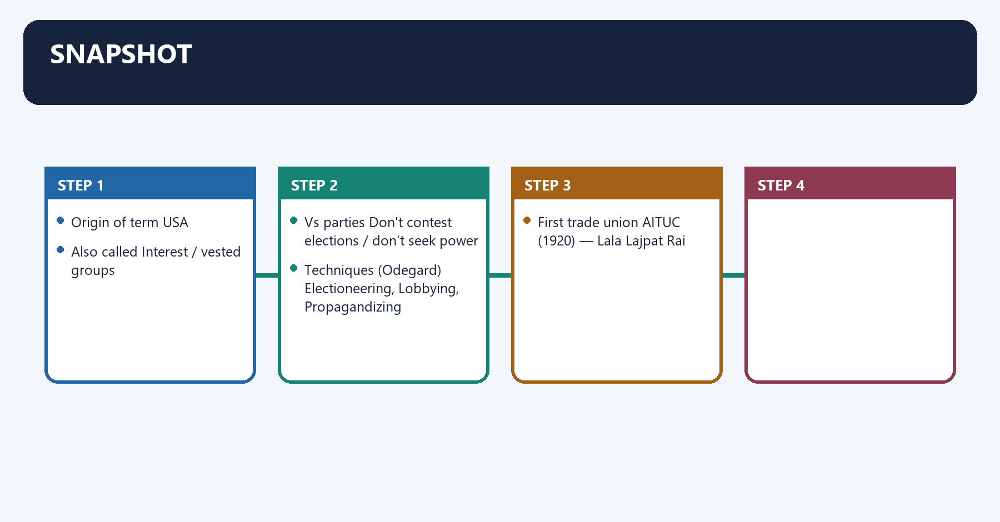
| Item | Fact |
|---|---|
| Origin of term | **USA** |
| Also called | Interest / vested groups |
| Vs parties | **Don't contest elections / don't seek power** |
| Techniques (Odegard) | **Electioneering, Lobbying, Propagandizing** |
| First trade union | **AITUC (1920)** — Lala Lajpat Rai |

### 02. Core idea

Core idea denotes the constitutional rules and institutional links organised around A pressure group organises around a common interest and influences government policy from outside —.
Core idea operates through unlike a political party, it never contests elections or seeks power . It works through lobbying, propaganda and, connected with electioneering (Odegard's three techniques).
The operative mechanism matters because [KEY] Party vs Pressure group: parties capture power ; pressure groups influence it.
Its principal consequence is that [KEY] Odegard: E-L-P → Electioneering · Lobbying · Propagandizing.
The decisive contrast is between [KEY] Anomic groups (Almond & Powell) = spontaneous (riots, ULFA, JKLF) and A pressure group organises around a common interest and influences government policy from outside —.
The exam-safe limitation is that a pressure group organises around a common interest and influences government policy from outside —.
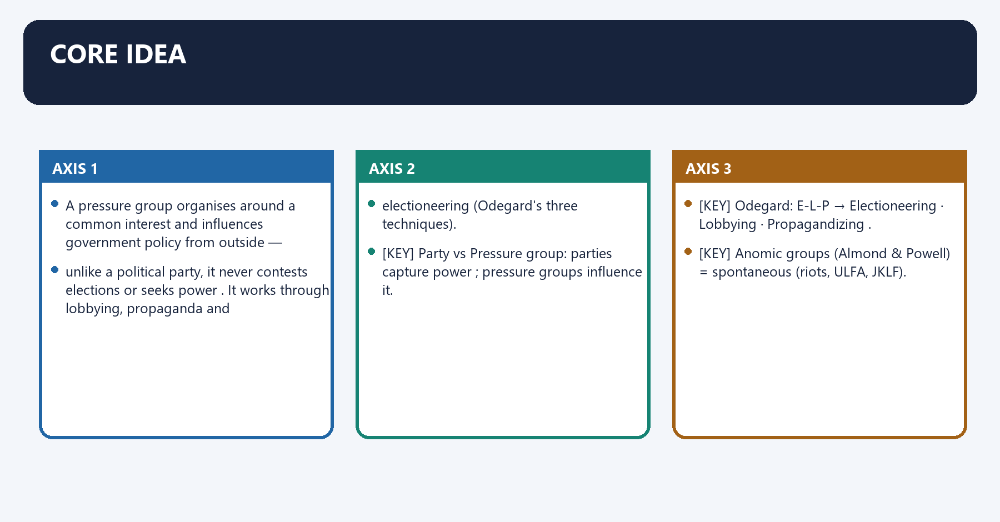
A **pressure group** organises around a **common interest** and **influences government policy from outside** —
unlike a political party, it **never contests elections or seeks power**. It works through **lobbying, propaganda and
electioneering** (Odegard's three techniques).

> [KEY] **Party vs Pressure group:** parties **capture power**; pressure groups **influence** it.
> [KEY] Odegard: **E-L-P → Electioneering · Lobbying · Propagandizing**.
> [KEY] **Anomic** groups (Almond & Powell) = **spontaneous** (riots, ULFA, JKLF).

### 03. Must-Know Facts

Must-Know Facts denotes the constitutional rules and institutional links organised around [FACT] 11 types in India: business ( FICCI/ASSOCHAM — strongest), trade unions, agrarian, professional, student,.
Must-Know Facts operates through religious, caste, tribal, linguistic, ideology-based, anomic, connected with [FACT] Trade unions & student unions are mostly party-affiliated (AITUC-CPI, INTUC-Cong, BMS-BJP; ABVP-BJP, NSUI-Cong).
The operative mechanism matters because [FACT] All India Kisan Sabha is among India's oldest major agrarian organisations.
Its principal consequence is that avoid the unverifiable, time-sensitive claim that it is presently the largest.
The decisive contrast is between [FACT] 11 types in India: business ( FICCI/ASSOCHAM — strongest), trade unions, agrarian, professional, student, and [FACT] 11 types in India: business ( FICCI/ASSOCHAM — strongest), trade unions, agrarian, professional, student,.
The exam-safe limitation is that [FACT] 11 types in India: business ( FICCI/ASSOCHAM — strongest), trade unions, agrarian, professional, student,.
- [FACT] **11 types** in India: business (**FICCI/ASSOCHAM** — strongest), trade unions, agrarian, professional, student,
  religious, caste, tribal, linguistic, ideology-based, anomic.
- [FACT] Trade unions & student unions are mostly **party-affiliated** (AITUC-CPI, INTUC-Cong, BMS-BJP; ABVP-BJP, NSUI-Cong).
- [FACT] **All India Kisan Sabha** is among India's oldest major agrarian organisations;
  avoid the unverifiable, time-sensitive claim that it is presently the largest.

### 04. Current link

Current link denotes the constitutional rules and institutional links organised around [CURRENT] Farmers' protests forced the repeal of the 3 farm laws (2021) and continue over MSP — a classic.
Current link operates through powerful agrarian pressure group. Lobbying remains unregulated in India (demand for a transparency law), connected with [CURRENT] Farmers' protests forced the repeal of the 3 farm laws (2021) and continue over MSP — a classic.
The operative mechanism matters because [CURRENT] Farmers' protests forced the repeal of the 3 farm laws (2021) and continue over MSP — a classic.
Its principal consequence is that [CURRENT] Farmers' protests forced the repeal of the 3 farm laws (2021) and continue over MSP — a classic.
The decisive contrast is between [CURRENT] Farmers' protests forced the repeal of the 3 farm laws (2021) and continue over MSP — a classic and [CURRENT] Farmers' protests forced the repeal of the 3 farm laws (2021) and continue over MSP — a classic.
The exam-safe limitation is that [CURRENT] Farmers' protests forced the repeal of the 3 farm laws (2021) and continue over MSP — a classic.
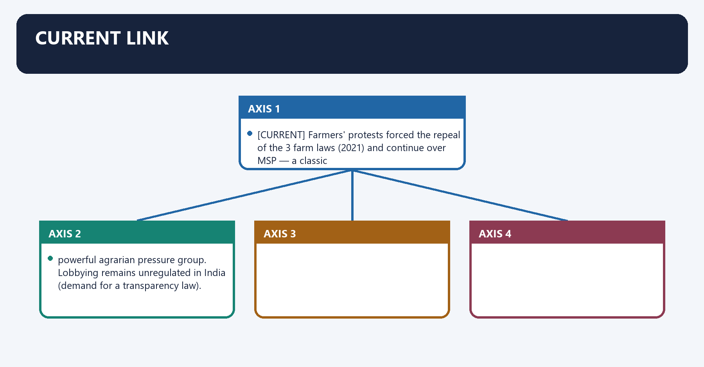
[CURRENT] **Farmers' protests** forced the **repeal of the 3 farm laws (2021)** and continue over **MSP** — a classic
powerful agrarian pressure group. **Lobbying remains unregulated** in India (demand for a transparency law).

### 05. 5. Answer architecture (10/15/20-mark support)

5. Answer architecture (10/15/20-mark support) denotes the constitutional rules and institutional links organised around Constitutional rule.
5. Answer architecture (10/15/20-mark support) operates through Operating mechanism, connected with Exam distinction.
The operative mechanism matters because constitutional rule.
Its principal consequence is that constitutional rule.
The decisive contrast is between Constitutional rule and Constitutional rule.
The exam-safe limitation is that constitutional rule.
> Purpose: make this Core file independently able to answer directive-sensitive GS-II questions on pressure-group methods, business associations in policy-making and environmental pressure groups — with the constitutional basis, the typology, the regulatory frame and named Indian evidence — without opening Advanced.

### 06. 5.1 Demand and directive map

5.1 Demand and directive map denotes the constitutional rules and institutional links organised around Demand family Typical directive signals Answer spine to use.
5.1 Demand and directive map operates through Business associations in policy "role in public policy making", Explain Define → channels → evidence → unequal-access caveat → verdict, connected with PG vs political party "distinguish", "informal face of democracy" Definition contrast → functions → why both matter → limits.
The operative mechanism matters because impact on democracy "strengthen or distort", Critically examine Interest-aggregation gains → inequality/opacity costs → net assessment.
Its principal consequence is that demand family Typical directive signals Answer spine to use.
The decisive contrast is between Demand family Typical directive signals Answer spine to use and Demand family Typical directive signals Answer spine to use.
The exam-safe limitation is that demand family Typical directive signals Answer spine to use.
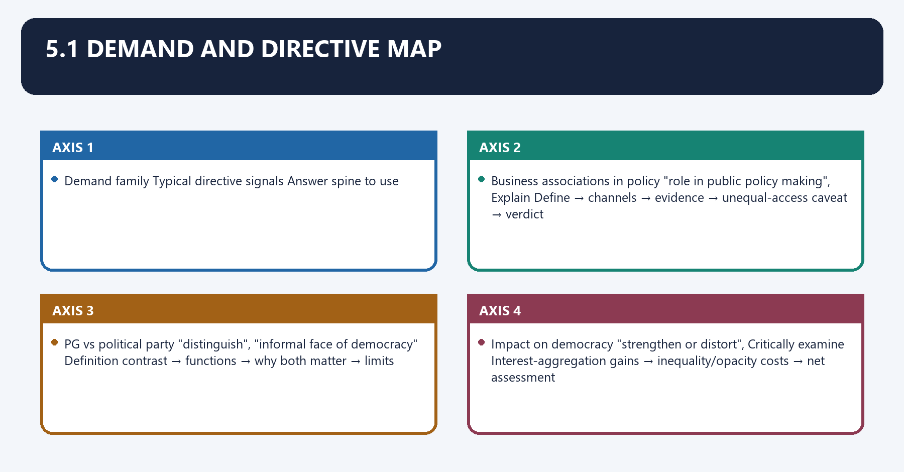
| Demand family | Typical directive signals | Answer spine to use |
|---|---|---|
| Methods of influence | "methods used by X organisations", What are the methods | Constitutional basis → each technique with evidence → impact → limits |
| Business associations in policy | "role in public policy making", Explain | Define → channels → evidence → unequal-access caveat → verdict |
| Environmental groups | "role in awareness/policy/advocacy", Discuss | Define issue-based groups → roles → named cases → constraints → verdict |
| PG vs political party | "distinguish", "informal face of democracy" | Definition contrast → functions → why both matter → limits |
| Regulation of PGs/lobbying | "should lobbying be regulated", Examine | Current frame (FCRA/Societies/Trade Unions) → gap (no lobbying law) → transparency vs capture → verdict |
| Impact on democracy | "strengthen or distort", Critically examine | Interest-aggregation gains → inequality/opacity costs → net assessment |

### 07. 5.2 Qualified thesis options

5.2 Qualified thesis options denotes the constitutional rules and institutional links organised around Constitutional rule.
5.2 Qualified thesis options operates through Operating mechanism, connected with Exam distinction.
The operative mechanism matters because constitutional rule.
Its principal consequence is that constitutional rule.
The decisive contrast is between Constitutional rule and Constitutional rule.
The exam-safe limitation is that constitutional rule.
- *Pressure groups are the informal, continuous face of representation between elections: they aggregate interests the party system cannot register in detail — but their influence is proportional to organisation and resources, so they democratise voice unevenly.*
- *India regulates the money and registration of associations (FCRA, Societies Registration Act, Trade Unions Act) but not the act of lobbying itself, so influence is legal yet opaque — the reform gap is disclosure, not prohibition.*
- *Farmers' organisations succeed when they combine numbers, organisation and direct action, as the 2021 repeal showed; the same repertoire fails scattered, unorganised cultivators — impact tracks organisational capacity, not the justice of the cause.*
- *Business associations add expertise and interest-aggregation to policy, but their privileged access risks a systematic bias toward organised capital over diffuse interests — a case for transparency rather than exclusion.*
- *Environmental pressure groups have been decisive precisely where the electoral system under-weights long-term and diffuse interests, using litigation and mobilisation to internalise costs the market ignores.*

### 08. 5.3 Mark-scaled structures

5.3 Mark-scaled structures denotes the constitutional rules and institutional links organised around Marks Architecture Evidence load.
5.3 Mark-scaled structures operates through 15 Thesis → definition/typology → dimension in depth → named cases → criticism → qualified verdict 5–6 units, connected with Marks Architecture Evidence load.
The operative mechanism matters because marks Architecture Evidence load.
Its principal consequence is that marks Architecture Evidence load.
The decisive contrast is between Marks Architecture Evidence load and Marks Architecture Evidence load.
The exam-safe limitation is that marks Architecture Evidence load.
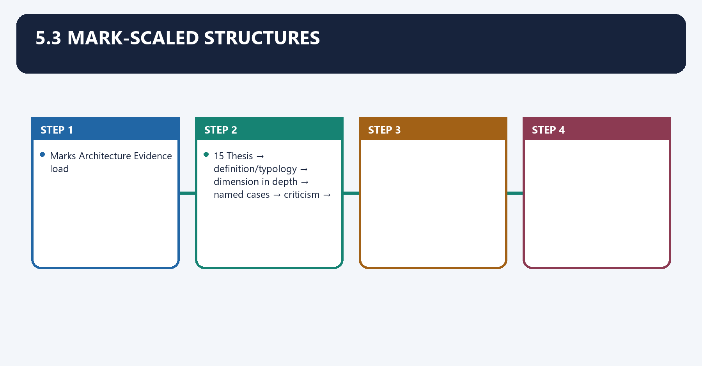
| Marks | Architecture | Evidence load |
|---:|---|---|
| 10 | Define → the demanded dimension (methods / business role) with 2–3 named examples → one qualification → verdict | 3 units incl. one constitutional anchor |
| 15 | Thesis → definition/typology → dimension in depth → named cases → criticism → qualified verdict | 5–6 units |
| 20 | Thesis → definition & basis → typology → techniques → regulatory frame → demand-family evidence → criticism → graded verdict | 6–8 units + a "who wins access" paragraph |

### 09. 5.4 Bank A — Definition, distinction and constitutional basis (Claim → provision → mechanism → limitation)

5.4 Bank A — Definition, distinction and constitutional basis (Claim → provision → mechanism → limitation) denotes the constitutional rules and institutional links organised around Constitutional rule.
5.4 Bank A — Definition, distinction and constitutional basis (Claim → provision → mechanism → limitation) operates through Operating mechanism, connected with Exam distinction.
The operative mechanism matters because constitutional rule.
Its principal consequence is that constitutional rule.
The decisive contrast is between Constitutional rule and Constitutional rule.
The exam-safe limitation is that constitutional rule.
- [FACT] **Claim:** a pressure group influences policy from outside without seeking office. **Definition:** an organised group promoting a **common interest** by pressure on government; it **does not contest elections or seek to capture power** — the defining line from a political party. **Mechanism:** it acts as a permanent liaison between the state and organised interests. **Limitation:** the line blurs where a group's leaders enter electoral politics.
- [FACT] **Claim:** pressure-group activity is a constitutional right, not a tolerated nuisance. **Provisions:** **Art 19(1)(a)** freedom of speech and expression, **Art 19(1)(b)** to **assemble peaceably and without arms**, and **Art 19(1)(c)** to **form associations or unions**. **Mechanism:** these underwrite petitioning, publicity, protest and organisation. **Limitation:** each is subject to **reasonable restrictions** (Art 19(2)–(4)); violent or anomic action loses protection.

### 10. 5.5 Bank B — Typology with named Indian organisations (selectable evidence)

5.5 Bank B — Typology with named Indian organisations (selectable evidence) denotes the constitutional rules and institutional links organised around Class Named Indian organisations Answer use.
5.5 Bank B — Typology with named Indian organisations (selectable evidence) operates through [FACT] Business (most powerful) FICCI, ASSOCHAM, CII, NASSCOM, AIMO Business-in-policy answers (2021 Q5), connected with [FACT] Trade union (party-linked) AITUC (CPI), INTUC (Cong), BMS (BJP), CITU (CPM), HMS Labour-policy, strikes.
The operative mechanism matters because [FACT] Agrarian All India Kisan Sabha, Bharatiya Kisan Union, Shetkari Sanghatana, Samyukt Kisan Morcha Farmers' methods (2019 Q3).
Its principal consequence is that [FACT] Professional IMA, Bar Council of India, IFWJ Regulation, standards.
The decisive contrast is between [FACT] Student ABVP (BJP), NSUI (Cong), SFI (CPM), AISF (CPI) Education/campus policy and [FACT] Religious RSS, VHP, Jamaat-e-Islami, Shiromani Akali Dal Identity/policy debates.
The exam-safe limitation is that [FACT] Caste Nadar Association, Kshatriya Maha Sabha, Marwari Association Reservation/representation.
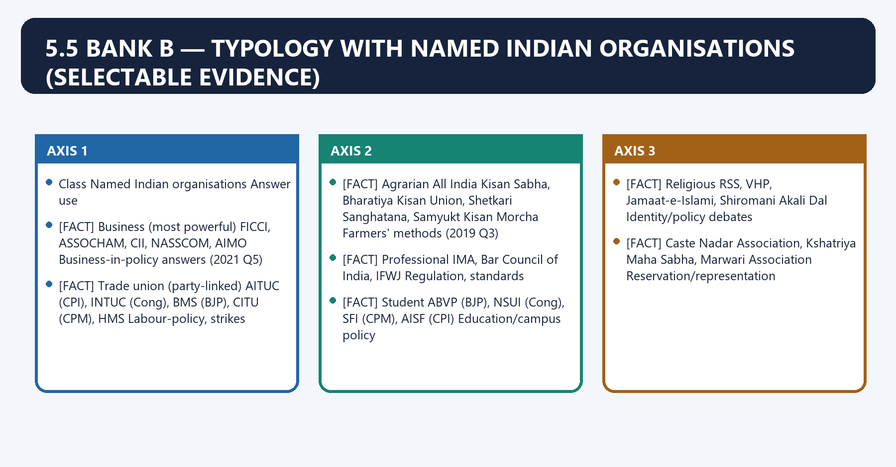
| Class | Named Indian organisations | Answer use |
|---|---|---|
| [FACT] **Business** (most powerful) | FICCI, ASSOCHAM, CII, NASSCOM, AIMO | Business-in-policy answers (2021 Q5) |
| [FACT] **Trade union** (party-linked) | AITUC (CPI), INTUC (Cong), BMS (BJP), CITU (CPM), HMS | Labour-policy, strikes |
| [FACT] **Agrarian** | All India Kisan Sabha, Bharatiya Kisan Union, Shetkari Sanghatana, Samyukt Kisan Morcha | Farmers' methods (2019 Q3) |
| [FACT] **Professional** | IMA, Bar Council of India, IFWJ | Regulation, standards |
| [FACT] **Student** | ABVP (BJP), NSUI (Cong), SFI (CPM), AISF (CPI) | Education/campus policy |
| [FACT] **Religious** | RSS, VHP, Jamaat-e-Islami, Shiromani Akali Dal | Identity/policy debates |
| [FACT] **Caste** | Nadar Association, Kshatriya Maha Sabha, Marwari Association | Reservation/representation |
| [FACT] **Tribal** | NSCN, All-India Jharkhand, United Mizo Federal Org | Autonomy/land |
| [FACT]/[LIMIT] **Environmental** (issue-based) | Narmada Bachao Andolan, Chipko, Silent Valley movement, Centre for Science and Environment | Environmental groups (2025 Q15) |
| [FACT] **Anomic** (spontaneous — Almond & Powell) | ULFA, JKLF, Dal Khalsa | Illustrate the illegitimate/violent extreme |

- **Note:** [LIMIT] AIKS is safely described as an **old, major** agrarian organisation; do **not** assert it is presently the largest — membership rankings are time-sensitive.

### 11. 5.6 Bank C — Techniques of influence (Odegard's three, extended to Indian practice)

5.6 Bank C — Techniques of influence (Odegard's three, extended to Indian practice) denotes the constitutional rules and institutional links organised around Constitutional rule.
5.6 Bank C — Techniques of influence (Odegard's three, extended to Indian practice) operates through Operating mechanism, connected with Exam distinction.
The operative mechanism matters because constitutional rule.
Its principal consequence is that constitutional rule.
The decisive contrast is between Constitutional rule and Constitutional rule.
The exam-safe limitation is that constitutional rule.
- [FACT] **Odegard's three:** **electioneering** (helping favourable candidates), **lobbying** (persuading officials), **propagandizing** (shaping opinion).
- [FACT]/[LIMIT] **Extended repertoire in India:** *representation on statutory/advisory consultative bodies and expert committees*; *litigation and PIL* (a distinctively Indian and powerful route, especially for environmental and civil-liberties groups); *agitation and direct action* (bandhs, dharnas, rail/rasta roko); *media and social-media mobilisation* (digital campaigns). **Mechanism:** legitimate methods (petition, publicity, litigation, consultation) build durable influence; **anomic** methods (violence, coercion) forfeit legitimacy and constitutional protection. **Limitation:** the same technique reads as legitimate or illegitimate depending on whether it stays within Art 19 limits.

### 12. 5.7 Bank D — The regulatory frame (what actually governs groups)

5.7 Bank D — The regulatory frame (what actually governs groups) denotes the constitutional rules and institutional links organised around Constitutional rule.
5.7 Bank D — The regulatory frame (what actually governs groups) operates through Operating mechanism, connected with Exam distinction.
The operative mechanism matters because constitutional rule.
Its principal consequence is that constitutional rule.
The decisive contrast is between Constitutional rule and Constitutional rule.
The exam-safe limitation is that constitutional rule.
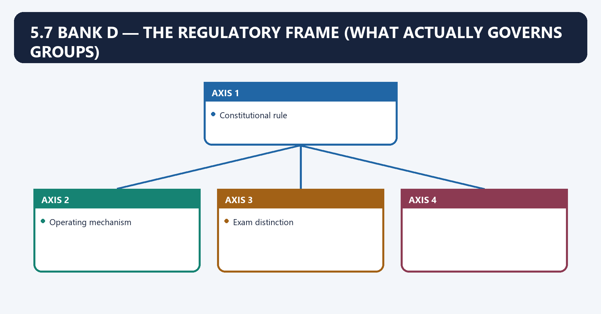
- [FACT] **Claim:** associations are registered and their funding regulated, but *lobbying itself is not.* **Provisions:** the **Societies Registration Act, 1860** (registration of societies/associations); the **Trade Unions Act, 1926** (registration, immunities and rights of trade unions); the **Foreign Contribution (Regulation) Act, 2010** (regulates foreign funding of associations). **Mechanism:** these govern legal existence and money-flows.
- [FACT]/[CURRENT] **Claim:** the FCRA regime tightened significantly. **Provision:** the **FCRA (Amendment) Act, 2020** barred the **sub-transfer of foreign contributions** to other organisations, required a designated **SBI New Delhi FCRA account**, mandated Aadhaar for office-bearers, and lowered the cap on administrative expenses. **Mechanism:** it constrains foreign-funded NGOs and civil-society pressure groups. **Status caution:** [CURRENT] many organisations' FCRA registrations have lapsed or been cancelled since 2020 — cite the *tightening* and its effect on funded advocacy without quoting counts, which change.
- [FACT] **Claim:** India has **no lobbying-disclosure statute** (unlike the US Lobbying Disclosure Act, 1995). **Mechanism:** influence therefore operates without registration or public disclosure of who lobbies whom. **Limitation:** the recurring reform demand is a **transparency/registration** framework — a proposal, not law.

### 13. 5.8 Evidence bank — Farmers' organisations (2019 Q3 family)

5.8 Evidence bank — Farmers' organisations (2019 Q3 family) denotes the constitutional rules and institutional links organised around Constitutional rule.
5.8 Evidence bank — Farmers' organisations (2019 Q3 family) operates through Operating mechanism, connected with Exam distinction.
The operative mechanism matters because constitutional rule.
Its principal consequence is that constitutional rule.
The decisive contrast is between Constitutional rule and Constitutional rule.
The exam-safe limitation is that constitutional rule.
- [FACT] **Claim:** organised agrarian groups can reverse major legislation. **Evidence:** the **Samyukt Kisan Morcha**-led **2020–21 protests** used assembly, blockade, media mobilisation and sustained agitation and secured the **repeal of the three farm laws (2021)**; the continuing **MSP legal-guarantee** demand keeps agriculture on the agenda. **Significance:** demonstrates the full method-spectrum — lobbying, agitation, media — converging into policy impact. **Limitation:** [LIMIT] the mobilised groups were regionally and crop-specific; unorganised and marginal cultivators remained under-represented.

### 14. 5.9 Evidence bank — Business associations (2021 Q5 family)

5.9 Evidence bank — Business associations (2021 Q5 family) denotes the constitutional rules and institutional links organised around Constitutional rule.
5.9 Evidence bank — Business associations (2021 Q5 family) operates through Operating mechanism, connected with Exam distinction.
The operative mechanism matters because constitutional rule.
Its principal consequence is that constitutional rule.
The decisive contrast is between Constitutional rule and Constitutional rule.
The exam-safe limitation is that constitutional rule.
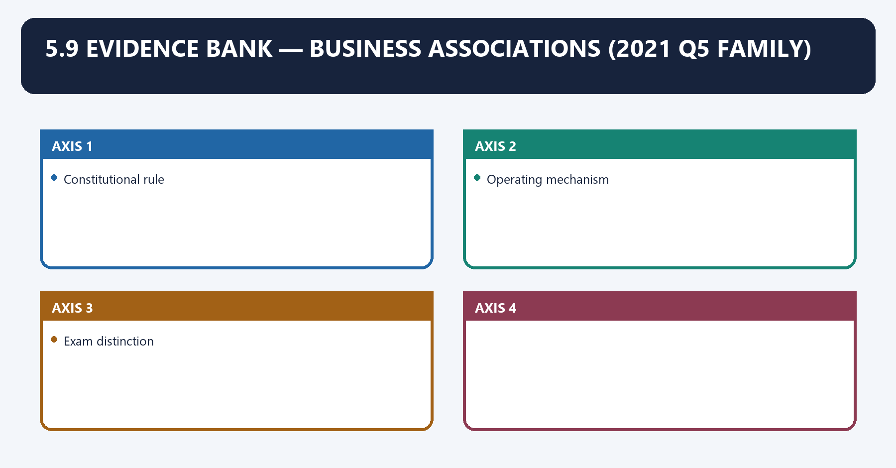
- [FACT]/[LIMIT] **Claim:** business associations are the most institutionalised policy influencers. **Evidence:** **FICCI, ASSOCHAM, CII, NASSCOM** provide pre-Budget representations, sit on advisory/expert committees, submit technical inputs into tax, GST and sectoral policy, and litigate. **Significance:** they supply expertise and aggregate producer interests. **Limitation:** [LIMIT] their **privileged, continuous access** advantages organised capital over diffuse consumers and unorganised labour — the "elite capture" critique.

### 15. 5.10 Evidence bank — Environmental pressure groups (2025 Q15 family)

5.10 Evidence bank — Environmental pressure groups (2025 Q15 family) denotes the constitutional rules and institutional links organised around Constitutional rule.
5.10 Evidence bank — Environmental pressure groups (2025 Q15 family) operates through Operating mechanism, connected with Exam distinction.
The operative mechanism matters because constitutional rule.
Its principal consequence is that constitutional rule.
The decisive contrast is between Constitutional rule and Constitutional rule.
The exam-safe limitation is that constitutional rule.
- [FACT]/[LIMIT] **Claim:** environmental groups shape policy where electoral politics under-weights long-term and diffuse costs. **Evidence:** the **Silent Valley movement** helped halt a hydro project and secure a national park; **Chipko** advanced forest-conservation consciousness; **Narmada Bachao Andolan** foregrounded rehabilitation and environmental review; the **Centre for Science and Environment** drives research-based advocacy; environmental **PIL** built much of India's green jurisprudence. **Significance:** agenda-setting, policy input, litigation and community mobilisation. **Limitation:** [LIMIT] **FCRA** funding constraints, transparency questions and development-vs-conservation trade-offs bound their reach.

### 16. 5.11 Mechanism, institutional incentives and consequences

5.11 Mechanism, institutional incentives and consequences denotes the constitutional rules and institutional links organised around Constitutional rule.
5.11 Mechanism, institutional incentives and consequences operates through Operating mechanism, connected with Exam distinction.
The operative mechanism matters because constitutional rule.
Its principal consequence is that constitutional rule.
The decisive contrast is between Constitutional rule and Constitutional rule.
The exam-safe limitation is that constitutional rule.
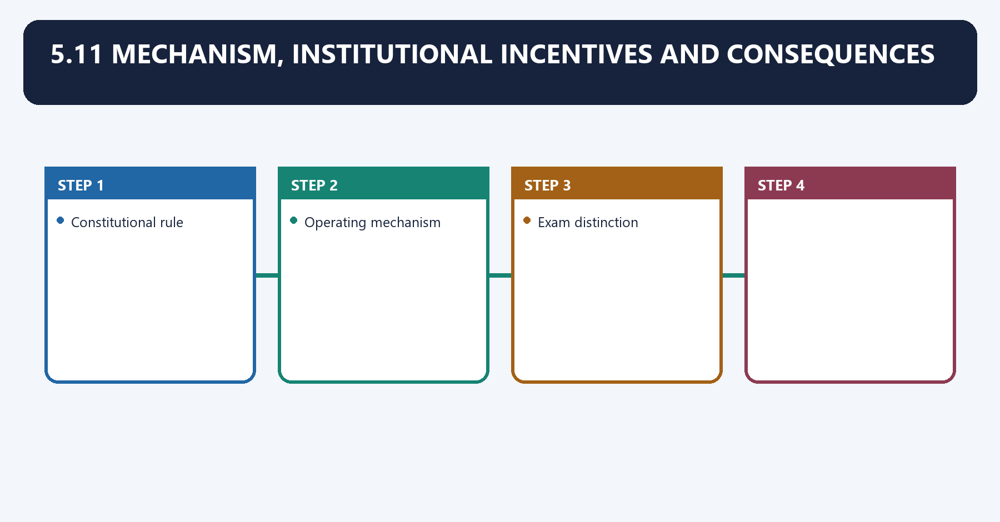
- [LIMIT] **Why groups form:** the party system registers interests only coarsely and periodically; pressure groups fill the gap continuously and in detail.
- [LIMIT] **Why some win:** access follows **organisation, resources and salience** — concentrated, well-funded interests (business) out-compete diffuse ones (consumers, unorganised labour).
- [LIMIT] **Consequences:** interest-aggregation and expertise improve policy inputs, but unequal access can bias outcomes; direct action can either correct under-representation or coerce, depending on method and scale.

### 17. 5.12 Criticism, counter-argument and variation

5.12 Criticism, counter-argument and variation denotes the constitutional rules and institutional links organised around Constitutional rule.
5.12 Criticism, counter-argument and variation operates through Operating mechanism, connected with Exam distinction.
The operative mechanism matters because constitutional rule.
Its principal consequence is that constitutional rule.
The decisive contrast is between Constitutional rule and Constitutional rule.
The exam-safe limitation is that constitutional rule.
- **Inequality of voice:** [LIMIT] influence is **biased toward organised interests**; unorganised sections (informal labour, small farmers, consumers) are systematically under-weighted.
- **Accountability and opacity:** [LIMIT] groups are **unelected and unaccountable**, and with **no lobbying-disclosure law**, their influence is untraceable.
- **Counter (democratic value):** [LIMIT] they widen participation between elections, supply expertise, and, via PIL, have advanced rights and environmental protection.
- **Variation:** [LIMIT] business and professional groups favour institutional lobbying; agrarian and student groups lean to agitation; anomic groups use violence — legitimacy varies with method, not merely aim.

### 18. 5.13 Verdict scaffolds

5.13 Verdict scaffolds denotes the constitutional rules and institutional links organised around Constitutional rule.
5.13 Verdict scaffolds operates through Operating mechanism, connected with Exam distinction.
The operative mechanism matters because constitutional rule.
Its principal consequence is that constitutional rule.
The decisive contrast is between Constitutional rule and Constitutional rule.
The exam-safe limitation is that constitutional rule.
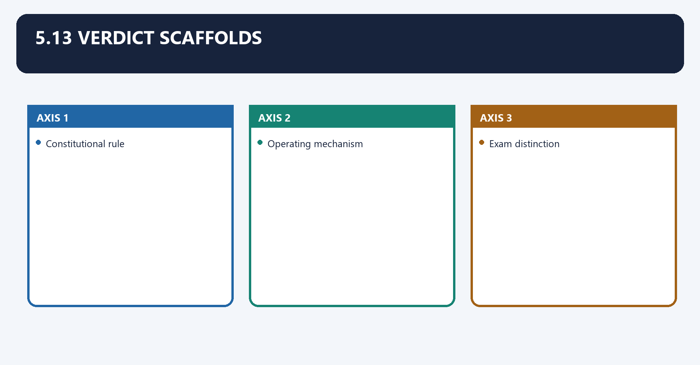
- **Methods verdict:** "Farmers' organisations run the full repertoire — from representation to the CACP to the Delhi-border blockade — and succeed when numbers and organisation combine, as the 2021 repeal proved."
- **Business verdict:** "Business associations make policy better-informed and worse-balanced at once; the answer is disclosure and countervailing voice, not their exclusion."
- **Regulation verdict:** "India regulates the funding and form of associations but not the act of influence; the missing piece is a transparency-of-lobbying regime, not a ban."

### 19. 5.14 Prelims close-option distinctions

5.14 Prelims close-option distinctions denotes the constitutional rules and institutional links organised around Confusion pair Correct discrimination.
5.14 Prelims close-option distinctions operates through Pressure group vs political party PGs do not contest elections or seek power ; parties do, connected with Origin of the term USA , not Britain.
The operative mechanism matters because odegard's three techniques Electioneering, Lobbying, Propagandizing — "agitation" is not one of them.
Its principal consequence is that "Anomic" groups (Almond & Powell) Spontaneous/violent (riots, ULFA), not formal associations.
The decisive contrast is between Constitutional basis Art 19(1)(a), (b), (c) — speech, peaceful assembly, association and Which law regulates foreign funding FCRA, 2010 (amended 2020) — not the Societies Registration Act.
The exam-safe limitation is that lobbying regulation in India No statute (unlike the US Lobbying Disclosure Act, 1995).
| Confusion pair | Correct discrimination |
|---|---|
| Pressure group vs political party | PGs **do not contest elections or seek power**; parties do |
| Origin of the term | **USA**, not Britain |
| Odegard's three techniques | **Electioneering, Lobbying, Propagandizing** — "agitation" is **not** one of them |
| "Anomic" groups (Almond & Powell) | **Spontaneous/violent** (riots, ULFA), **not** formal associations |
| Constitutional basis | **Art 19(1)(a), (b), (c)** — speech, peaceful assembly, association |
| Which law regulates foreign funding | **FCRA, 2010** (amended 2020) — **not** the Societies Registration Act |
| Lobbying regulation in India | **No statute** (unlike the US Lobbying Disclosure Act, 1995) |
| First trade union | **AITUC (1920)**, first president **Lala Lajpat Rai** |
| Most powerful PG class in India | **Business** associations (Laxmikant) |

### 20. 5.15 Factual-risk and current-status controls

5.15 Factual-risk and current-status controls denotes the constitutional rules and institutional links organised around [FACT] Pressure groups do not contest elections — never blur this with parties.
5.15 Factual-risk and current-status controls operates through [FACT] Constitutional basis is Art 19(1)(a)/(b)/(c) ; do not cite a non-existent "right to lobby", connected with [LIMIT] AIKS = an old, major agrarian body, not verified as "the largest today".
The operative mechanism matters because [LIMIT] The 2020–21 farm-law repeal is [FACT] a fact; MSP legal guarantee remains a demand , not law.
Its principal consequence is that <!-- BEGIN GENERATED PYQ INTEGRATION: 2024-2025.
The decisive contrast is between [FACT] Pressure groups do not contest elections — never blur this with parties and [FACT] Pressure groups do not contest elections — never blur this with parties.
The exam-safe limitation is that [FACT] Pressure groups do not contest elections — never blur this with parties.
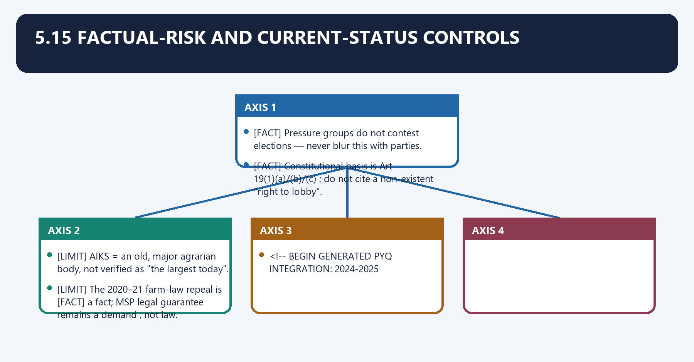
- [FACT] Pressure groups **do not contest elections** — never blur this with parties.
- [FACT] Constitutional basis is **Art 19(1)(a)/(b)/(c)**; do not cite a non-existent "right to lobby".
- [FACT] The regulatory statutes are the **Societies Registration Act 1860**, **Trade Unions Act 1926** and **FCRA 2010** (amended **2020**); India has **no lobbying-disclosure law**.
- [CURRENT] Do **not** quote FCRA-cancellation counts or NGO numbers — they change; cite the **direction** of the 2020 tightening with a re-verification note.
- [LIMIT] AIKS = an **old, major** agrarian body, not verified as "the largest today".
- [FACT] Environmental examples (Silent Valley, Chipko, NBA, CSE) are **movements/organisations**; describe their **roles**, and do not attribute specific court holdings or statute clauses to them without a source.
- [LIMIT] The 2020–21 farm-law repeal is [FACT] a fact; MSP legal guarantee remains a **demand**, not law.

<!-- BEGIN GENERATED PYQ INTEGRATION: 2024-2025 -->

### 21. Pressure group, interest group, movement, NGO and lobbyist compared

Pressure group, interest group, movement, NGO and lobbyist compared denotes the constitutional rules and institutional links organised around Form Primary objective Organisation Seeks office? Typical method.
Pressure group, interest group, movement, NGO and lobbyist compared operates through pressure group influence a public decision variable no consultation, lobbying, protest, connected with interest group articulate a shared interest often stable no representation and bargaining.
The operative mechanism matters because social movement wider social change networked ordinarily no mobilisation and norm change.
Its principal consequence is that nGO service, research or advocacy mission formal entity no projects, expertise, advocacy.
The decisive contrast is between lobbyist professional representation for a client individual/firm no direct policy communication and political party capture and exercise public power electoral organisation yes contesting elections.
The exam-safe limitation is that [ANALYSIS] One organisation may occupy more than one category, but the categories.
| Form | Primary objective | Organisation | Seeks office? | Typical method |
|---|---|---|---|---|
| pressure group | influence a public decision | variable | no | consultation, lobbying, protest |
| interest group | articulate a shared interest | often stable | no | representation and bargaining |
| social movement | wider social change | networked | ordinarily no | mobilisation and norm change |
| NGO | service, research or advocacy mission | formal entity | no | projects, expertise, advocacy |
| lobbyist | professional representation for a client | individual/firm | no | direct policy communication |
| political party | capture and exercise public power | electoral organisation | yes | contesting elections |

[ANALYSIS] One organisation may occupy more than one category, but the categories
answer different questions about purpose, legal form and relation to public office.

### 22. Insider, outsider and corporatist access

Insider, outsider and corporatist access denotes the constitutional rules and institutional links organised around recognised expertise - committee/consultation access - draft input - negotiated change.
Insider, outsider and corporatist access operates through excluded or dissatisfied group - public campaign - protest/litigation - agenda pressure, connected with State convenes organised business, labour or sector representatives in a structured forum.
The operative mechanism matters because privileged access revolving doors undisclosed clients consultation capture.
Its principal consequence is that token participation digital misinformation violence.
The decisive contrast is between public consultation calendar - disclosure of submissions/meetings - conflict rules and cooling-off safeguards - reasoned response - support for under-resourced groups.
The exam-safe limitation is that recognised expertise - committee/consultation access - draft input - negotiated change.
INSIDER ROUTE
recognised expertise -> committee/consultation access -> draft input -> negotiated change.

OUTSIDER ROUTE
excluded or dissatisfied group -> public campaign -> protest/litigation -> agenda pressure.

CORPORATIST ROUTE
State convenes organised business, labour or sector representatives in a structured forum.

RISKS
privileged access | revolving doors | undisclosed clients | consultation capture
| token participation | digital misinformation | violence.

REFORM
public consultation calendar -> disclosure of submissions/meetings -> conflict rules
-> cooling-off safeguards -> reasoned response -> support for under-resourced groups.

## BASIC MCQS / REMEDIATION

### Original MCQs 1-36 — Broad Coverage
#### OM1. Which statement most accurately describes pressure-group definition?

- A. A pressure group seeks to influence public policy without itself seeking to form the government.
- B. It must contest elections to remain lawful.
- C. It is identical to a political party.
- D. It can operate only as a registered society.

**Answer: A**

**Explanation:** Purpose, not one legal form, defines the category. The other options collapse distinct legal sources, institutions or consequences and therefore fail the close-option test.

#### OM2. Which statement most accurately describes party distinction?

- A. Political parties seek public office; pressure groups ordinarily seek influence over office-holders.
- B. Pressure groups cannot support candidates.
- C. Parties cannot represent interests.
- D. Both terms are legally interchangeable.

**Answer: A**

**Explanation:** Electoral influence does not itself convert a group into a party. The other options collapse distinct legal sources, institutions or consequences and therefore fail the close-option test.

#### OM3. Which statement most accurately describes typology?

- A. Associational, non-associational, institutional and anomic categories describe organisation and method.
- B. Anomic groups are permanent professional bodies.
- C. Institutional groups exist only outside government.
- D. Non-associational interests have formal membership rolls.

**Answer: A**

**Explanation:** The typology is analytical and groups may shift forms. The other options collapse distinct legal sources, institutions or consequences and therefore fail the close-option test.

#### OM4. Which statement most accurately describes constitutional channels?

- A. Articles 19(1)(a), 19(1)(b) and 19(1)(c) protect speech, peaceful assembly and association subject to restrictions.
- B. Article 19 protects violent blockade.
- C. Only citizens may invoke Article 32.
- D. Article 226 is narrower than Article 32 in every respect.

**Answer: A**

**Explanation:** Rights enable influence but do not immunise unlawful conduct. The other options collapse distinct legal sources, institutions or consequences and therefore fail the close-option test.

#### OM5. Which statement most accurately describes litigation and PIL?

- A. Groups may use Articles 32 and 226 to seek judicial remedies where standing and jurisdiction permit.
- B. PIL allows courts to enact policy without law.
- C. Every petition by an NGO is a PIL.
- D. Article 226 excludes public-law remedies.

**Answer: A**

**Explanation:** Litigation is one channel among many and remains court-controlled. The other options collapse distinct legal sources, institutions or consequences and therefore fail the close-option test.

#### OM6. Which statement most accurately describes business associations?

- A. Business associations supply expertise and organised representation but can enjoy unequal insider access.
- B. Their submissions bind the government.
- C. Business consultation is prohibited by equality.
- D. Expertise removes capture risk.

**Answer: A**

**Explanation:** Transparency is the answer to privileged access, not exclusion from consultation. The other options collapse distinct legal sources, institutions or consequences and therefore fail the close-option test.

#### OM7. Which statement most accurately describes farmers' organisations?

- A. Farm groups combine lobbying, electoral signalling, media and protest; effectiveness varies by organisation and representation.
- B. All farmers share identical interests.
- C. Only litigation can change farm policy.
- D. Road blockade is constitutionally unrestricted.

**Answer: A**

**Explanation:** Numerical strength can coexist with regional and crop bias. The other options collapse distinct legal sources, institutions or consequences and therefore fail the close-option test.

#### OM8. Which statement most accurately describes environmental groups?

- A. Environmental groups use awareness, research, community mobilisation, consultation and PIL.
- B. They are constitutional bodies.
- C. FCRA status determines whether their environmental claim is correct.
- D. Development and conservation never conflict.

**Answer: A**

**Explanation:** Advocacy value and regulatory compliance are separate questions. The other options collapse distinct legal sources, institutions or consequences and therefore fail the close-option test.

#### OM9. Which statement most accurately describes lobbying law?

- A. India has no general lobbying-registration and disclosure statute.
- B. FCRA is India's general lobbying statute.
- C. Lobbying is expressly criminalised as a category.
- D. All policy meetings are already published by law.

**Answer: A**

**Explanation:** Sectoral laws may apply, but no comprehensive disclosure regime exists. The other options collapse distinct legal sources, institutions or consequences and therefore fail the close-option test.

#### OM10. Which statement most accurately describes FCRA boundary?

- A. FCRA regulates receipt and use of foreign contribution by covered persons; it does not define all domestic advocacy.
- B. FCRA registers political parties as lobbyists.
- C. Domestic donations are always foreign contribution.
- D. FCRA determines constitutional reasonableness of protest.

**Answer: A**

**Explanation:** Funding regulation and policy-influence regulation must be separated. The other options collapse distinct legal sources, institutions or consequences and therefore fail the close-option test.

#### OM11. Which statement most accurately describes pluralism and capture?

- A. Pressure groups widen participation and information but unequal resources can produce capture and opacity.
- B. Pluralism guarantees equal influence.
- C. Capture occurs only through bribery.
- D. Digital mobilisation eliminates misinformation.

**Answer: A**

**Explanation:** Democratic assessment must examine both access gains and distributional inequality. The other options collapse distinct legal sources, institutions or consequences and therefore fail the close-option test.

#### OM12. Which statement most accurately describes reform?

- A. A sound regime discloses meetings and submissions, manages conflicts and supports inclusive consultation.
- B. Government should ban all organised representation.
- C. Only courts should hear policy views.
- D. Consultation must make every submission binding.

**Answer: A**

**Explanation:** Transparency, reason-giving and inclusion preserve both participation and accountability. The other options collapse distinct legal sources, institutions or consequences and therefore fail the close-option test.

#### OM13. Which is the safest UPSC distinction concerning pressure-group definition?

- A. A pressure group seeks to influence public policy without itself seeking to form the government.
- B. It must contest elections to remain lawful.
- C. It is identical to a political party.
- D. It can operate only as a registered society.

**Answer: A**

**Explanation:** Purpose, not one legal form, defines the category. The other options collapse distinct legal sources, institutions or consequences and therefore fail the close-option test.

#### OM14. Which is the safest UPSC distinction concerning party distinction?

- A. Political parties seek public office; pressure groups ordinarily seek influence over office-holders.
- B. Pressure groups cannot support candidates.
- C. Parties cannot represent interests.
- D. Both terms are legally interchangeable.

**Answer: A**

**Explanation:** Electoral influence does not itself convert a group into a party. The other options collapse distinct legal sources, institutions or consequences and therefore fail the close-option test.

#### OM15. Which is the safest UPSC distinction concerning typology?

- A. Associational, non-associational, institutional and anomic categories describe organisation and method.
- B. Anomic groups are permanent professional bodies.
- C. Institutional groups exist only outside government.
- D. Non-associational interests have formal membership rolls.

**Answer: A**

**Explanation:** The typology is analytical and groups may shift forms. The other options collapse distinct legal sources, institutions or consequences and therefore fail the close-option test.

#### OM16. Which is the safest UPSC distinction concerning constitutional channels?

- A. Articles 19(1)(a), 19(1)(b) and 19(1)(c) protect speech, peaceful assembly and association subject to restrictions.
- B. Article 19 protects violent blockade.
- C. Only citizens may invoke Article 32.
- D. Article 226 is narrower than Article 32 in every respect.

**Answer: A**

**Explanation:** Rights enable influence but do not immunise unlawful conduct. The other options collapse distinct legal sources, institutions or consequences and therefore fail the close-option test.

#### OM17. Which is the safest UPSC distinction concerning litigation and PIL?

- A. Groups may use Articles 32 and 226 to seek judicial remedies where standing and jurisdiction permit.
- B. PIL allows courts to enact policy without law.
- C. Every petition by an NGO is a PIL.
- D. Article 226 excludes public-law remedies.

**Answer: A**

**Explanation:** Litigation is one channel among many and remains court-controlled. The other options collapse distinct legal sources, institutions or consequences and therefore fail the close-option test.

#### OM18. Which is the safest UPSC distinction concerning business associations?

- A. Business associations supply expertise and organised representation but can enjoy unequal insider access.
- B. Their submissions bind the government.
- C. Business consultation is prohibited by equality.
- D. Expertise removes capture risk.

**Answer: A**

**Explanation:** Transparency is the answer to privileged access, not exclusion from consultation. The other options collapse distinct legal sources, institutions or consequences and therefore fail the close-option test.

#### OM19. Which is the safest UPSC distinction concerning farmers' organisations?

- A. Farm groups combine lobbying, electoral signalling, media and protest; effectiveness varies by organisation and representation.
- B. All farmers share identical interests.
- C. Only litigation can change farm policy.
- D. Road blockade is constitutionally unrestricted.

**Answer: A**

**Explanation:** Numerical strength can coexist with regional and crop bias. The other options collapse distinct legal sources, institutions or consequences and therefore fail the close-option test.

#### OM20. Which is the safest UPSC distinction concerning environmental groups?

- A. Environmental groups use awareness, research, community mobilisation, consultation and PIL.
- B. They are constitutional bodies.
- C. FCRA status determines whether their environmental claim is correct.
- D. Development and conservation never conflict.

**Answer: A**

**Explanation:** Advocacy value and regulatory compliance are separate questions. The other options collapse distinct legal sources, institutions or consequences and therefore fail the close-option test.

#### OM21. Which is the safest UPSC distinction concerning lobbying law?

- A. India has no general lobbying-registration and disclosure statute.
- B. FCRA is India's general lobbying statute.
- C. Lobbying is expressly criminalised as a category.
- D. All policy meetings are already published by law.

**Answer: A**

**Explanation:** Sectoral laws may apply, but no comprehensive disclosure regime exists. The other options collapse distinct legal sources, institutions or consequences and therefore fail the close-option test.

#### OM22. Which is the safest UPSC distinction concerning FCRA boundary?

- A. FCRA regulates receipt and use of foreign contribution by covered persons; it does not define all domestic advocacy.
- B. FCRA registers political parties as lobbyists.
- C. Domestic donations are always foreign contribution.
- D. FCRA determines constitutional reasonableness of protest.

**Answer: A**

**Explanation:** Funding regulation and policy-influence regulation must be separated. The other options collapse distinct legal sources, institutions or consequences and therefore fail the close-option test.

#### OM23. Which is the safest UPSC distinction concerning pluralism and capture?

- A. Pressure groups widen participation and information but unequal resources can produce capture and opacity.
- B. Pluralism guarantees equal influence.
- C. Capture occurs only through bribery.
- D. Digital mobilisation eliminates misinformation.

**Answer: A**

**Explanation:** Democratic assessment must examine both access gains and distributional inequality. The other options collapse distinct legal sources, institutions or consequences and therefore fail the close-option test.

#### OM24. Which is the safest UPSC distinction concerning reform?

- A. A sound regime discloses meetings and submissions, manages conflicts and supports inclusive consultation.
- B. Government should ban all organised representation.
- C. Only courts should hear policy views.
- D. Consultation must make every submission binding.

**Answer: A**

**Explanation:** Transparency, reason-giving and inclusion preserve both participation and accountability. The other options collapse distinct legal sources, institutions or consequences and therefore fail the close-option test.

#### OM25. A candidate makes a close-option error about pressure-group definition. Which correction is most accurate?

- A. A pressure group seeks to influence public policy without itself seeking to form the government.
- B. It must contest elections to remain lawful.
- C. It is identical to a political party.
- D. It can operate only as a registered society.

**Answer: A**

**Explanation:** Purpose, not one legal form, defines the category. The other options collapse distinct legal sources, institutions or consequences and therefore fail the close-option test.

#### OM26. A candidate makes a close-option error about party distinction. Which correction is most accurate?

- A. Political parties seek public office; pressure groups ordinarily seek influence over office-holders.
- B. Pressure groups cannot support candidates.
- C. Parties cannot represent interests.
- D. Both terms are legally interchangeable.

**Answer: A**

**Explanation:** Electoral influence does not itself convert a group into a party. The other options collapse distinct legal sources, institutions or consequences and therefore fail the close-option test.

#### OM27. A candidate makes a close-option error about typology. Which correction is most accurate?

- A. Associational, non-associational, institutional and anomic categories describe organisation and method.
- B. Anomic groups are permanent professional bodies.
- C. Institutional groups exist only outside government.
- D. Non-associational interests have formal membership rolls.

**Answer: A**

**Explanation:** The typology is analytical and groups may shift forms. The other options collapse distinct legal sources, institutions or consequences and therefore fail the close-option test.

#### OM28. A candidate makes a close-option error about constitutional channels. Which correction is most accurate?

- A. Articles 19(1)(a), 19(1)(b) and 19(1)(c) protect speech, peaceful assembly and association subject to restrictions.
- B. Article 19 protects violent blockade.
- C. Only citizens may invoke Article 32.
- D. Article 226 is narrower than Article 32 in every respect.

**Answer: A**

**Explanation:** Rights enable influence but do not immunise unlawful conduct. The other options collapse distinct legal sources, institutions or consequences and therefore fail the close-option test.

#### OM29. A candidate makes a close-option error about litigation and PIL. Which correction is most accurate?

- A. Groups may use Articles 32 and 226 to seek judicial remedies where standing and jurisdiction permit.
- B. PIL allows courts to enact policy without law.
- C. Every petition by an NGO is a PIL.
- D. Article 226 excludes public-law remedies.

**Answer: A**

**Explanation:** Litigation is one channel among many and remains court-controlled. The other options collapse distinct legal sources, institutions or consequences and therefore fail the close-option test.

#### OM30. A candidate makes a close-option error about business associations. Which correction is most accurate?

- A. Business associations supply expertise and organised representation but can enjoy unequal insider access.
- B. Their submissions bind the government.
- C. Business consultation is prohibited by equality.
- D. Expertise removes capture risk.

**Answer: A**

**Explanation:** Transparency is the answer to privileged access, not exclusion from consultation. The other options collapse distinct legal sources, institutions or consequences and therefore fail the close-option test.

#### OM31. A candidate makes a close-option error about farmers' organisations. Which correction is most accurate?

- A. Farm groups combine lobbying, electoral signalling, media and protest; effectiveness varies by organisation and representation.
- B. All farmers share identical interests.
- C. Only litigation can change farm policy.
- D. Road blockade is constitutionally unrestricted.

**Answer: A**

**Explanation:** Numerical strength can coexist with regional and crop bias. The other options collapse distinct legal sources, institutions or consequences and therefore fail the close-option test.

#### OM32. A candidate makes a close-option error about environmental groups. Which correction is most accurate?

- A. Environmental groups use awareness, research, community mobilisation, consultation and PIL.
- B. They are constitutional bodies.
- C. FCRA status determines whether their environmental claim is correct.
- D. Development and conservation never conflict.

**Answer: A**

**Explanation:** Advocacy value and regulatory compliance are separate questions. The other options collapse distinct legal sources, institutions or consequences and therefore fail the close-option test.

#### OM33. A candidate makes a close-option error about lobbying law. Which correction is most accurate?

- A. India has no general lobbying-registration and disclosure statute.
- B. FCRA is India's general lobbying statute.
- C. Lobbying is expressly criminalised as a category.
- D. All policy meetings are already published by law.

**Answer: A**

**Explanation:** Sectoral laws may apply, but no comprehensive disclosure regime exists. The other options collapse distinct legal sources, institutions or consequences and therefore fail the close-option test.

#### OM34. A candidate makes a close-option error about FCRA boundary. Which correction is most accurate?

- A. FCRA regulates receipt and use of foreign contribution by covered persons; it does not define all domestic advocacy.
- B. FCRA registers political parties as lobbyists.
- C. Domestic donations are always foreign contribution.
- D. FCRA determines constitutional reasonableness of protest.

**Answer: A**

**Explanation:** Funding regulation and policy-influence regulation must be separated. The other options collapse distinct legal sources, institutions or consequences and therefore fail the close-option test.

#### OM35. A candidate makes a close-option error about pluralism and capture. Which correction is most accurate?

- A. Pressure groups widen participation and information but unequal resources can produce capture and opacity.
- B. Pluralism guarantees equal influence.
- C. Capture occurs only through bribery.
- D. Digital mobilisation eliminates misinformation.

**Answer: A**

**Explanation:** Democratic assessment must examine both access gains and distributional inequality. The other options collapse distinct legal sources, institutions or consequences and therefore fail the close-option test.

#### OM36. A candidate makes a close-option error about reform. Which correction is most accurate?

- A. A sound regime discloses meetings and submissions, manages conflicts and supports inclusive consultation.
- B. Government should ban all organised representation.
- C. Only courts should hear policy views.
- D. Consultation must make every submission binding.

**Answer: A**

**Explanation:** Transparency, reason-giving and inclusion preserve both participation and accountability. The other options collapse distinct legal sources, institutions or consequences and therefore fail the close-option test.

### Remedial MCQs 1-12 — Common Error Repair
#### RM1. Which statement best repairs a recurring error about pressure-group definition?

- A. A pressure group seeks to influence public policy without itself seeking to form the government.
- B. It is identical to a political party.
- C. It can operate only as a registered society.
- D. It must contest elections to remain lawful.

**Answer: A**

**Remedial explanation:** Purpose, not one legal form, defines the category. Write the governing source, then the mechanism, and finally the limitation before choosing an option.

#### RM2. Which statement best repairs a recurring error about party distinction?

- A. Political parties seek public office; pressure groups ordinarily seek influence over office-holders.
- B. Parties cannot represent interests.
- C. Both terms are legally interchangeable.
- D. Pressure groups cannot support candidates.

**Answer: A**

**Remedial explanation:** Electoral influence does not itself convert a group into a party. Write the governing source, then the mechanism, and finally the limitation before choosing an option.

#### RM3. Which statement best repairs a recurring error about typology?

- A. Associational, non-associational, institutional and anomic categories describe organisation and method.
- B. Institutional groups exist only outside government.
- C. Non-associational interests have formal membership rolls.
- D. Anomic groups are permanent professional bodies.

**Answer: A**

**Remedial explanation:** The typology is analytical and groups may shift forms. Write the governing source, then the mechanism, and finally the limitation before choosing an option.

#### RM4. Which statement best repairs a recurring error about constitutional channels?

- A. Articles 19(1)(a), 19(1)(b) and 19(1)(c) protect speech, peaceful assembly and association subject to restrictions.
- B. Only citizens may invoke Article 32.
- C. Article 226 is narrower than Article 32 in every respect.
- D. Article 19 protects violent blockade.

**Answer: A**

**Remedial explanation:** Rights enable influence but do not immunise unlawful conduct. Write the governing source, then the mechanism, and finally the limitation before choosing an option.

#### RM5. Which statement best repairs a recurring error about litigation and PIL?

- A. Groups may use Articles 32 and 226 to seek judicial remedies where standing and jurisdiction permit.
- B. Every petition by an NGO is a PIL.
- C. Article 226 excludes public-law remedies.
- D. PIL allows courts to enact policy without law.

**Answer: A**

**Remedial explanation:** Litigation is one channel among many and remains court-controlled. Write the governing source, then the mechanism, and finally the limitation before choosing an option.

#### RM6. Which statement best repairs a recurring error about business associations?

- A. Business associations supply expertise and organised representation but can enjoy unequal insider access.
- B. Business consultation is prohibited by equality.
- C. Expertise removes capture risk.
- D. Their submissions bind the government.

**Answer: A**

**Remedial explanation:** Transparency is the answer to privileged access, not exclusion from consultation. Write the governing source, then the mechanism, and finally the limitation before choosing an option.

#### RM7. Which statement best repairs a recurring error about farmers' organisations?

- A. Farm groups combine lobbying, electoral signalling, media and protest; effectiveness varies by organisation and representation.
- B. Only litigation can change farm policy.
- C. Road blockade is constitutionally unrestricted.
- D. All farmers share identical interests.

**Answer: A**

**Remedial explanation:** Numerical strength can coexist with regional and crop bias. Write the governing source, then the mechanism, and finally the limitation before choosing an option.

#### RM8. Which statement best repairs a recurring error about environmental groups?

- A. Environmental groups use awareness, research, community mobilisation, consultation and PIL.
- B. FCRA status determines whether their environmental claim is correct.
- C. Development and conservation never conflict.
- D. They are constitutional bodies.

**Answer: A**

**Remedial explanation:** Advocacy value and regulatory compliance are separate questions. Write the governing source, then the mechanism, and finally the limitation before choosing an option.

#### RM9. Which statement best repairs a recurring error about lobbying law?

- A. India has no general lobbying-registration and disclosure statute.
- B. Lobbying is expressly criminalised as a category.
- C. All policy meetings are already published by law.
- D. FCRA is India's general lobbying statute.

**Answer: A**

**Remedial explanation:** Sectoral laws may apply, but no comprehensive disclosure regime exists. Write the governing source, then the mechanism, and finally the limitation before choosing an option.

#### RM10. Which statement best repairs a recurring error about FCRA boundary?

- A. FCRA regulates receipt and use of foreign contribution by covered persons; it does not define all domestic advocacy.
- B. Domestic donations are always foreign contribution.
- C. FCRA determines constitutional reasonableness of protest.
- D. FCRA registers political parties as lobbyists.

**Answer: A**

**Remedial explanation:** Funding regulation and policy-influence regulation must be separated. Write the governing source, then the mechanism, and finally the limitation before choosing an option.

#### RM11. Which statement best repairs a recurring error about pluralism and capture?

- A. Pressure groups widen participation and information but unequal resources can produce capture and opacity.
- B. Capture occurs only through bribery.
- C. Digital mobilisation eliminates misinformation.
- D. Pluralism guarantees equal influence.

**Answer: A**

**Remedial explanation:** Democratic assessment must examine both access gains and distributional inequality. Write the governing source, then the mechanism, and finally the limitation before choosing an option.

#### RM12. Which statement best repairs a recurring error about reform?

- A. A sound regime discloses meetings and submissions, manages conflicts and supports inclusive consultation.
- B. Only courts should hear policy views.
- C. Consultation must make every submission binding.
- D. Government should ban all organised representation.

**Answer: A**

**Remedial explanation:** Transparency, reason-giving and inclusion preserve both participation and accountability. Write the governing source, then the mechanism, and finally the limitation before choosing an option.

## PYQS AND ANSWER PRACTICE

### Verified and Supporting PYQs with Model Solutions
#### Verified direct PYQ 1 — 2019 GS-II Q3

**Question:** What are the methods used by farmers' organisations to influence policy-makers in India, and how effective are these methods?

**Directive:** Enumerate and assess · **Marks:** 10 · **Word limit:** 150

**Model solution**

**Opening:** What are the methods used by farmers' organisations to influence policy-makers in India, and how effective are these methods?. The answer must respond to the directive **Enumerate and assess** rather than merely describe the topic.

- **Claim -> evidence -> analysis -> qualification:** Agrarian groups use memoranda, consultation, electoral signalling, media, litigation and mass protest.
- **Claim -> evidence -> analysis -> qualification:** Articles 19(1)(a), 19(1)(b) and 19(1)(c) provide the constitutional channel subject to restrictions.
- **Claim -> evidence -> analysis -> qualification:** CACP representations and the 2020-21 farm-law movement illustrate insider and outsider methods.
- **Claim -> evidence -> analysis -> qualification:** Numerical strength can produce policy reversal, but marginal and regionally dispersed farmers remain weakly represented.

**Conclusion:** The strongest answer identifies the governing design, shows how it operates with named evidence, tests the counter-position and ends with a qualified institutional verdict.

#### Verified direct PYQ 2 — 2021 GS-II Q5

**Question:** Explain how pressure groups and business associations contribute to public-policy making in India.

**Directive:** Explain · **Marks:** 10 · **Word limit:** 150

**Model solution**

**Opening:** Explain how pressure groups and business associations contribute to public-policy making in India. The answer must respond to the directive **Explain** rather than merely describe the topic.

- **Claim -> evidence -> analysis -> qualification:** Business associations aggregate sector interests and supply technical information.
- **Claim -> evidence -> analysis -> qualification:** Pre-Budget consultation, expert committees, draft-rule comments, litigation and public communication are key channels.
- **Claim -> evidence -> analysis -> qualification:** FICCI, CII, ASSOCHAM and NASSCOM provide named Indian examples.
- **Claim -> evidence -> analysis -> qualification:** Their expertise improves feasibility, but unequal access creates capture risk and requires disclosure.

**Conclusion:** The strongest answer identifies the governing design, shows how it operates with named evidence, tests the counter-position and ends with a qualified institutional verdict.

#### Verified direct PYQ 3 — 2025 GS-II Q15

**Question:** Discuss the role of environmental pressure groups in creating awareness, influencing policy and undertaking advocacy in India.

**Directive:** Discuss · **Marks:** 15 · **Word limit:** 250

**Model solution**

**Opening:** Discuss the role of environmental pressure groups in creating awareness, influencing policy and undertaking advocacy in India. The answer must respond to the directive **Discuss** rather than merely describe the topic.

- **Claim -> evidence -> analysis -> qualification:** Environmental groups combine community mobilisation, research, media, consultation and PIL.
- **Claim -> evidence -> analysis -> qualification:** Chipko, Silent Valley, Narmada Bachao Andolan and CSE illustrate distinct methods.
- **Claim -> evidence -> analysis -> qualification:** They widen environmental democracy and expose dispersed ecological costs.
- **Claim -> evidence -> analysis -> qualification:** Funding, representation, scientific contestation and development trade-offs require transparency and qualification.

**Conclusion:** The strongest answer identifies the governing design, shows how it operates with named evidence, tests the counter-position and ends with a qualified institutional verdict.

### Original Solved Mains Practice
#### M1. Distinguish pressure groups from political parties, NGOs and social movements.

**Directive:** Distinguish · **Marks:** 10 · **Suggested words:** 150

**Demand decode:** Define the exact institutional or doctrinal issue, answer the directive, use named constitutional/statutory/judicial evidence, include the strongest counterpoint and reach a qualified verdict.

**Examiner opening:** Distinguish pressure groups from political parties, NGOs and social movements. The issue should be analysed through constitutional purpose, operating mechanism and enforceable limitation.

- **Party Distinction — claim -> evidence -> analysis -> qualification:** Political parties seek public office; pressure groups ordinarily seek influence over office-holders. Electoral influence does not itself convert a group into a party.
- **Typology — claim -> evidence -> analysis -> qualification:** Associational, non-associational, institutional and anomic categories describe organisation and method. The typology is analytical and groups may shift forms.
- **Constitutional Channels — claim -> evidence -> analysis -> qualification:** Articles 19(1)(a), 19(1)(b) and 19(1)(c) protect speech, peaceful assembly and association subject to restrictions. Rights enable influence but do not immunise unlawful conduct.
- **Litigation And Pil — claim -> evidence -> analysis -> qualification:** Groups may use Articles 32 and 226 to seek judicial remedies where standing and jurisdiction permit. Litigation is one channel among many and remains court-controlled.
- **Business Associations — claim -> evidence -> analysis -> qualification:** Business associations supply expertise and organised representation but can enjoy unequal insider access. Transparency is the answer to privileged access, not exclusion from consultation.

**Counter-position:** Institutional reform can improve accountability, but overbroad regulation may displace autonomy, federal choice, expertise or access. The answer must identify the exact trade-off rather than offer a generic reform list.

**Conclusion:** Prefer a calibrated design that preserves the institution's constitutional purpose while adding transparency, independence, reason-giving and judicially reviewable safeguards.

#### M2. Explain the constitutional channels through which pressure groups influence policy.

**Directive:** Explain · **Marks:** 10 · **Suggested words:** 150

**Demand decode:** Define the exact institutional or doctrinal issue, answer the directive, use named constitutional/statutory/judicial evidence, include the strongest counterpoint and reach a qualified verdict.

**Examiner opening:** Explain the constitutional channels through which pressure groups influence policy. The issue should be analysed through constitutional purpose, operating mechanism and enforceable limitation.

- **Typology — claim -> evidence -> analysis -> qualification:** Associational, non-associational, institutional and anomic categories describe organisation and method. The typology is analytical and groups may shift forms.
- **Constitutional Channels — claim -> evidence -> analysis -> qualification:** Articles 19(1)(a), 19(1)(b) and 19(1)(c) protect speech, peaceful assembly and association subject to restrictions. Rights enable influence but do not immunise unlawful conduct.
- **Litigation And Pil — claim -> evidence -> analysis -> qualification:** Groups may use Articles 32 and 226 to seek judicial remedies where standing and jurisdiction permit. Litigation is one channel among many and remains court-controlled.
- **Business Associations — claim -> evidence -> analysis -> qualification:** Business associations supply expertise and organised representation but can enjoy unequal insider access. Transparency is the answer to privileged access, not exclusion from consultation.
- **Farmers' Organisations — claim -> evidence -> analysis -> qualification:** Farm groups combine lobbying, electoral signalling, media and protest; effectiveness varies by organisation and representation. Numerical strength can coexist with regional and crop bias.

**Counter-position:** Institutional reform can improve accountability, but overbroad regulation may displace autonomy, federal choice, expertise or access. The answer must identify the exact trade-off rather than offer a generic reform list.

**Conclusion:** Prefer a calibrated design that preserves the institution's constitutional purpose while adding transparency, independence, reason-giving and judicially reviewable safeguards.

#### M3. Classify pressure groups and illustrate each category from India.

**Directive:** Classify · **Marks:** 10 · **Suggested words:** 150

**Demand decode:** Define the exact institutional or doctrinal issue, answer the directive, use named constitutional/statutory/judicial evidence, include the strongest counterpoint and reach a qualified verdict.

**Examiner opening:** Classify pressure groups and illustrate each category from India. The issue should be analysed through constitutional purpose, operating mechanism and enforceable limitation.

- **Constitutional Channels — claim -> evidence -> analysis -> qualification:** Articles 19(1)(a), 19(1)(b) and 19(1)(c) protect speech, peaceful assembly and association subject to restrictions. Rights enable influence but do not immunise unlawful conduct.
- **Litigation And Pil — claim -> evidence -> analysis -> qualification:** Groups may use Articles 32 and 226 to seek judicial remedies where standing and jurisdiction permit. Litigation is one channel among many and remains court-controlled.
- **Business Associations — claim -> evidence -> analysis -> qualification:** Business associations supply expertise and organised representation but can enjoy unequal insider access. Transparency is the answer to privileged access, not exclusion from consultation.
- **Farmers' Organisations — claim -> evidence -> analysis -> qualification:** Farm groups combine lobbying, electoral signalling, media and protest; effectiveness varies by organisation and representation. Numerical strength can coexist with regional and crop bias.
- **Environmental Groups — claim -> evidence -> analysis -> qualification:** Environmental groups use awareness, research, community mobilisation, consultation and PIL. Advocacy value and regulatory compliance are separate questions.

**Counter-position:** Institutional reform can improve accountability, but overbroad regulation may displace autonomy, federal choice, expertise or access. The answer must identify the exact trade-off rather than offer a generic reform list.

**Conclusion:** Prefer a calibrated design that preserves the institution's constitutional purpose while adding transparency, independence, reason-giving and judicially reviewable safeguards.

#### M4. Assess the contribution of pressure groups to pluralism and accountability.

**Directive:** Assess · **Marks:** 15 · **Suggested words:** 250

**Demand decode:** Define the exact institutional or doctrinal issue, answer the directive, use named constitutional/statutory/judicial evidence, include the strongest counterpoint and reach a qualified verdict.

**Examiner opening:** Assess the contribution of pressure groups to pluralism and accountability. The issue should be analysed through constitutional purpose, operating mechanism and enforceable limitation.

- **Litigation And Pil — claim -> evidence -> analysis -> qualification:** Groups may use Articles 32 and 226 to seek judicial remedies where standing and jurisdiction permit. Litigation is one channel among many and remains court-controlled.
- **Business Associations — claim -> evidence -> analysis -> qualification:** Business associations supply expertise and organised representation but can enjoy unequal insider access. Transparency is the answer to privileged access, not exclusion from consultation.
- **Farmers' Organisations — claim -> evidence -> analysis -> qualification:** Farm groups combine lobbying, electoral signalling, media and protest; effectiveness varies by organisation and representation. Numerical strength can coexist with regional and crop bias.
- **Environmental Groups — claim -> evidence -> analysis -> qualification:** Environmental groups use awareness, research, community mobilisation, consultation and PIL. Advocacy value and regulatory compliance are separate questions.
- **Lobbying Law — claim -> evidence -> analysis -> qualification:** India has no general lobbying-registration and disclosure statute. Sectoral laws may apply, but no comprehensive disclosure regime exists.

**Counter-position:** Institutional reform can improve accountability, but overbroad regulation may displace autonomy, federal choice, expertise or access. The answer must identify the exact trade-off rather than offer a generic reform list.

**Conclusion:** Prefer a calibrated design that preserves the institution's constitutional purpose while adding transparency, independence, reason-giving and judicially reviewable safeguards.

#### M5. Unequal resources can convert participation into capture. Examine.

**Directive:** Examine · **Marks:** 15 · **Suggested words:** 250

**Demand decode:** Define the exact institutional or doctrinal issue, answer the directive, use named constitutional/statutory/judicial evidence, include the strongest counterpoint and reach a qualified verdict.

**Examiner opening:** Unequal resources can convert participation into capture. Examine. The issue should be analysed through constitutional purpose, operating mechanism and enforceable limitation.

- **Business Associations — claim -> evidence -> analysis -> qualification:** Business associations supply expertise and organised representation but can enjoy unequal insider access. Transparency is the answer to privileged access, not exclusion from consultation.
- **Farmers' Organisations — claim -> evidence -> analysis -> qualification:** Farm groups combine lobbying, electoral signalling, media and protest; effectiveness varies by organisation and representation. Numerical strength can coexist with regional and crop bias.
- **Environmental Groups — claim -> evidence -> analysis -> qualification:** Environmental groups use awareness, research, community mobilisation, consultation and PIL. Advocacy value and regulatory compliance are separate questions.
- **Lobbying Law — claim -> evidence -> analysis -> qualification:** India has no general lobbying-registration and disclosure statute. Sectoral laws may apply, but no comprehensive disclosure regime exists.
- **Fcra Boundary — claim -> evidence -> analysis -> qualification:** FCRA regulates receipt and use of foreign contribution by covered persons; it does not define all domestic advocacy. Funding regulation and policy-influence regulation must be separated.

**Counter-position:** Institutional reform can improve accountability, but overbroad regulation may displace autonomy, federal choice, expertise or access. The answer must identify the exact trade-off rather than offer a generic reform list.

**Conclusion:** Prefer a calibrated design that preserves the institution's constitutional purpose while adding transparency, independence, reason-giving and judicially reviewable safeguards.

#### M6. Should India enact a lobbying-transparency law? Discuss.

**Directive:** Discuss · **Marks:** 15 · **Suggested words:** 250

**Demand decode:** Define the exact institutional or doctrinal issue, answer the directive, use named constitutional/statutory/judicial evidence, include the strongest counterpoint and reach a qualified verdict.

**Examiner opening:** Should India enact a lobbying-transparency law? Discuss. The issue should be analysed through constitutional purpose, operating mechanism and enforceable limitation.

- **Farmers' Organisations — claim -> evidence -> analysis -> qualification:** Farm groups combine lobbying, electoral signalling, media and protest; effectiveness varies by organisation and representation. Numerical strength can coexist with regional and crop bias.
- **Environmental Groups — claim -> evidence -> analysis -> qualification:** Environmental groups use awareness, research, community mobilisation, consultation and PIL. Advocacy value and regulatory compliance are separate questions.
- **Lobbying Law — claim -> evidence -> analysis -> qualification:** India has no general lobbying-registration and disclosure statute. Sectoral laws may apply, but no comprehensive disclosure regime exists.
- **Fcra Boundary — claim -> evidence -> analysis -> qualification:** FCRA regulates receipt and use of foreign contribution by covered persons; it does not define all domestic advocacy. Funding regulation and policy-influence regulation must be separated.
- **Pluralism And Capture — claim -> evidence -> analysis -> qualification:** Pressure groups widen participation and information but unequal resources can produce capture and opacity. Democratic assessment must examine both access gains and distributional inequality.

**Counter-position:** Institutional reform can improve accountability, but overbroad regulation may displace autonomy, federal choice, expertise or access. The answer must identify the exact trade-off rather than offer a generic reform list.

**Conclusion:** Prefer a calibrated design that preserves the institution's constitutional purpose while adding transparency, independence, reason-giving and judicially reviewable safeguards.

#### M7. Evaluate insider and outsider pressure-group strategies in Indian democracy.

**Directive:** Evaluate · **Marks:** 20 · **Suggested words:** 300

**Demand decode:** Define the exact institutional or doctrinal issue, answer the directive, use named constitutional/statutory/judicial evidence, include the strongest counterpoint and reach a qualified verdict.

**Examiner opening:** Evaluate insider and outsider pressure-group strategies in Indian democracy. The issue should be analysed through constitutional purpose, operating mechanism and enforceable limitation.

- **Environmental Groups — claim -> evidence -> analysis -> qualification:** Environmental groups use awareness, research, community mobilisation, consultation and PIL. Advocacy value and regulatory compliance are separate questions.
- **Lobbying Law — claim -> evidence -> analysis -> qualification:** India has no general lobbying-registration and disclosure statute. Sectoral laws may apply, but no comprehensive disclosure regime exists.
- **Fcra Boundary — claim -> evidence -> analysis -> qualification:** FCRA regulates receipt and use of foreign contribution by covered persons; it does not define all domestic advocacy. Funding regulation and policy-influence regulation must be separated.
- **Pluralism And Capture — claim -> evidence -> analysis -> qualification:** Pressure groups widen participation and information but unequal resources can produce capture and opacity. Democratic assessment must examine both access gains and distributional inequality.
- **Reform — claim -> evidence -> analysis -> qualification:** A sound regime discloses meetings and submissions, manages conflicts and supports inclusive consultation. Transparency, reason-giving and inclusion preserve both participation and accountability.

**Counter-position:** Institutional reform can improve accountability, but overbroad regulation may displace autonomy, federal choice, expertise or access. The answer must identify the exact trade-off rather than offer a generic reform list.

**Conclusion:** Prefer a calibrated design that preserves the institution's constitutional purpose while adding transparency, independence, reason-giving and judicially reviewable safeguards.

#### M8. Design an inclusive consultation framework that preserves participation while reducing opacity, conflict and misinformation.

**Directive:** Design · **Marks:** 20 · **Suggested words:** 300

**Demand decode:** Define the exact institutional or doctrinal issue, answer the directive, use named constitutional/statutory/judicial evidence, include the strongest counterpoint and reach a qualified verdict.

**Examiner opening:** Design an inclusive consultation framework that preserves participation while reducing opacity, conflict and misinformation. The issue should be analysed through constitutional purpose, operating mechanism and enforceable limitation.

- **Lobbying Law — claim -> evidence -> analysis -> qualification:** India has no general lobbying-registration and disclosure statute. Sectoral laws may apply, but no comprehensive disclosure regime exists.
- **Fcra Boundary — claim -> evidence -> analysis -> qualification:** FCRA regulates receipt and use of foreign contribution by covered persons; it does not define all domestic advocacy. Funding regulation and policy-influence regulation must be separated.
- **Pluralism And Capture — claim -> evidence -> analysis -> qualification:** Pressure groups widen participation and information but unequal resources can produce capture and opacity. Democratic assessment must examine both access gains and distributional inequality.
- **Reform — claim -> evidence -> analysis -> qualification:** A sound regime discloses meetings and submissions, manages conflicts and supports inclusive consultation. Transparency, reason-giving and inclusion preserve both participation and accountability.
- **Pressure-Group Definition — claim -> evidence -> analysis -> qualification:** A pressure group seeks to influence public policy without itself seeking to form the government. Purpose, not one legal form, defines the category.

**Counter-position:** Institutional reform can improve accountability, but overbroad regulation may displace autonomy, federal choice, expertise or access. The answer must identify the exact trade-off rather than offer a generic reform list.

**Conclusion:** Prefer a calibrated design that preserves the institution's constitutional purpose while adding transparency, independence, reason-giving and judicially reviewable safeguards.

## OPTIONAL ADVANCED DEPTH — NOT REQUIRED FOR A CORE ANSWER

> **Subject:** Polity · **Tier:** Advanced (exam depth) · **GS Paper:** GS-II (also GS-I: society)
> **Grounded in:** Indian Polity by M. Laxmikant, Ch. 77 (direct check of the local Sixth Revised Edition PDF).
> ✅ = from source book · ⚠️ = inference / analysis · 📰 = current affairs.
> *Companion: `basic/Pressure-Groups.md`.*

---

### PART A — MEANING ✅
- ✅ The term **originated in the USA**. A **pressure group** is an organised group promoting/defending a **common
  interest** by **exerting pressure on the government** — a **liaison** between government and its members.
- ✅ Also called **interest groups / vested groups**.
- ✅ ⭐ **Differ from political parties:** they **do NOT contest elections** and **do NOT seek to capture power** — they
  focus on **specific issues** and influence policy from outside.

---

### PART B — TECHNIQUES ✅
**Odegard's three techniques:**
1. ✅ **Electioneering** — put favourably-disposed persons in office.
2. ✅ **Lobbying** — persuade public officials to adopt their preferred policies.
3. ✅ **Propagandizing** — shape public opinion to indirectly influence government.

⚠️ Legitimate methods: lobbying, petitioning, publicity, public debate. Illegitimate: strikes, violence, corruption.

---

### PART C — TYPES OF PRESSURE GROUPS IN INDIA ⭐ (Laxmikant's 11 categories)
| # | Category | Examples ✅ |
|---|---|---|
| 1 | **Business** (most powerful) | **FICCI, ASSOCHAM, FAIFDA, AIMO** |
| 2 | **Trade unions** (party-linked) | **AITUC (CPI), INTUC (Cong), HMS, CITU (CPM), BMS (BJP)** |
| 3 | **Agrarian** | **All India Kisan Sabha** (among the oldest major organisations), Bharatiya Kisan Union, Shetkari Sanghatana |
| 4 | **Professional** | **IMA, Bar Council of India, IFWJ** |
| 5 | **Student** | **ABVP (BJP), AISF (CPI), NSUI (Cong), SFI (CPM)** |
| 6 | **Religious** | RSS, VHP, Jamaat-e-Islami, Shiromani Akali Dal |
| 7 | **Caste** | Nadar Association, Kshatriya Maha Sabha, Marwari Association |
| 8 | **Tribal** | **NSCN**, All-India Jharkhand, United Mizo Federal Org |
| 9 | **Linguistic** | Tamil Sangh, Hindi Sahitya Sammelan, Dakshina Bharat Hindi Prachar Sabha |
| 10 | **Ideology-based** | **Narmada Bachao Andolan, Chipko**, civil-liberties bodies, women's-rights orgs |
| 11 | **Anomic** (spontaneous — riots/violence) | ULFA, JKLF, Naxalite groups, Dal Khalsa |

✅ **First trade union in India:** **AITUC (1920)**, first president **Lala Lajpat Rai**.
⚠️ **Almond & Powell** classify groups as **institutional, associational, non-associational, and anomic**.

---

#### UPSC Traps
- ❌ Pressure groups contest elections → they **don't**; that's what distinguishes them from **political parties**.
- ❌ The term originated in Britain → **USA**.
- ❌ "Anomic" groups are formal associations → they are **spontaneous** (riots, demonstrations) per Almond & Powell.
- ❌ Trade unions in India are apolitical → most are **affiliated to political parties** (AITUC-CPI, INTUC-Congress, BMS-BJP.).
- ❌ A timeless "largest agrarian group" ranking can be inferred from the static text →
  membership strength is time-sensitive; AIKS is safely described as an old major organisation.
- ❌ Odegard's techniques include "agitation" → the three are **electioneering, lobbying, propagandizing**.

#### 📰 CA hooks
- 📰 **Farmers' movements** — the **2020–21 protests** forced the **repeal of the 3 farm laws (2021)**; the **2024–25
  MSP/legal-guarantee agitation** (SKM) — a textbook powerful agrarian pressure group.
- 📰 ⚠️ **Lobbying is unregulated in India** (no law like the US); recurring demand for a **transparency/registration** framework.
- 📰 Rise of **digital/social-media pressure groups & civil-society movements** (e.g., anti-corruption, environmental) shaping policy.

#### Mains angles
- "Pressure groups are the informal face of a democracy." Discuss their role in Indian policymaking with examples.
- Should lobbying be legalised and regulated in India? Weigh transparency against the risk of elite capture.
- Distinguish pressure groups from political parties and evaluate their impact on Indian democracy.

#### Verified PYQ application

- ✅ **2025 GS-II Q15 (15 marks, 250 words):** “What are environmental pressure
  groups? Discuss their role in raising awareness, influencing policies and advocating
  for environmental protection in India.” Route: define issue-based non-party groups ->
  research/campaigns, consultation, litigation and community mobilisation -> gains in
  agenda-setting/accountability -> representation, funding and transparency caveats.

<!-- BEGIN GENERATED PYQ INTEGRATION: 2018-2023 -->
#### Historical PYQ Integration (2018-2023)

> **Status:** Question-level PYQ demand is integrated into this owner.
> **Provenance:** Audited local official-paper routing ledgers: `_PYQ-ROUTING-MAINS-GS1-GS2-ESSAY-2018-2023.md`.

- **Years represented:** 2019, 2021
- **Paper(s):** GS-II
- **Routed question demands:** 2

| Year | Paper | Q | PYQ demand (neutral rendering) | Directive / format | Source status | Owner requirement |
|---:|---|---:|---|---|---|---|
| 2019 | GS-II | 3 | Methods used by farmers' organisations to influence policy-makers | What are the methods · 10 marks · 150 words | Routed to owning topic; word limit taken from the instruction block | Prepare context, core dimensions, evidence/examples, counterpoint and a concise conclusion. |
| 2021 | GS-II | 5 | Pressure groups and business associations in public policy making | Explain · 10 marks · 150 words | Routed to owning topic | Prepare context, core dimensions, evidence/examples, counterpoint and a concise conclusion. |

##### What this owner must now support

- Methods used by farmers' organisations to influence policy-makers
- Pressure groups and business associations in public policy making

> The table integrates the examinable demand and paper metadata. It does not turn an unkeyed objective question into a solved answer, and it does not claim that lexical presence alone proves full conceptual sufficiency.
<!-- END GENERATED PYQ INTEGRATION: 2018-2023 -->

## CONSOLIDATED REGISTER NOTES

### Pressure Groups: Rapid Constitutional Recall

- **Current-control rule:** The constitutional association, assembly, petition and judicial-remedy channels, FCRA framework and official NGO sources were rechecked on 25 August 2026. India still has no general lobbying-registration or lobbying-disclosure statute; FCRA is not represented as one.
- **Factual caveat:** Pressure groups seek policy influence without assuming governmental office. Political parties, movements, NGOs, lobbyists and interest groups overlap in practice but are not synonyms. Protest remains subject to reasonable restrictions, and dated movements or funding rules are not converted into permanent generalisations.

#### Snapshot

- Also called Interest / vested groups
- Vs parties Don't contest elections / don't seek power
- Techniques (Odegard) Electioneering, Lobbying, Propagandizing

#### Core idea

- A pressure group organises around a common interest and influences government policy from outside —
- unlike a political party, it never contests elections or seeks power . It works through lobbying, propaganda and
- electioneering (Odegard's three techniques).

#### Must-Know Facts

- [FACT] 11 types in India: business ( FICCI/ASSOCHAM — strongest), trade unions, agrarian, professional, student,
- religious, caste, tribal, linguistic, ideology-based, anomic.
- [FACT] Trade unions & student unions are mostly party-affiliated (AITUC-CPI, INTUC-Cong, BMS-BJP; ABVP-BJP, NSUI-Cong).

#### Current link

- [CURRENT] Farmers' protests forced the repeal of the 3 farm laws (2021) and continue over MSP — a classic
- powerful agrarian pressure group. Lobbying remains unregulated in India (demand for a transparency law).

#### 5. Answer architecture (10/15/20-mark support)

#### 5.1 Demand and directive map

- Demand family Typical directive signals Answer spine to use
- Methods of influence "methods used by X organisations", What are the methods Constitutional basis → each technique with evidence → impact → limits
- Business associations in policy "role in public policy making", Explain Define → channels → evidence → unequal-access caveat → verdict

#### 5.2 Qualified thesis options

- Pressure groups are the informal, continuous face of representation between elections: they aggregate interests the party system cannot register in detail — but their influence is proportional to organisation and resources, so they democratise voice unevenly.
- India regulates the money and registration of associations (FCRA, Societies Registration Act, Trade Unions Act) but not the act of lobbying itself, so influence is legal yet opaque — the reform gap is disclosure, not prohibition.
- Farmers' organisations succeed when they combine numbers, organisation and direct action, as the 2021 repeal showed; the same repertoire fails scattered, unorganised cultivators — impact tracks organisational capacity, not the justice of the cause.

#### 5.3 Mark-scaled structures

- Marks Architecture Evidence load
- 10 Define → the demanded dimension (methods / business role) with 2–3 named examples → one qualification → verdict 3 units incl. one constitutional anchor
- 15 Thesis → definition/typology → dimension in depth → named cases → criticism → qualified verdict 5–6 units

#### 5.4 Bank A — Definition, distinction and constitutional basis (Claim → provision → mechanism → limitation)

#### 5.5 Bank B — Typology with named Indian organisations (selectable evidence)

- Class Named Indian organisations Answer use
- [FACT] Business (most powerful) FICCI, ASSOCHAM, CII, NASSCOM, AIMO Business-in-policy answers (2021 Q5)
- [FACT] Trade union (party-linked) AITUC (CPI), INTUC (Cong), BMS (BJP), CITU (CPM), HMS Labour-policy, strikes

#### 5.6 Bank C — Techniques of influence (Odegard's three, extended to Indian practice)

- [FACT] Odegard's three: electioneering (helping favourable candidates), lobbying (persuading officials), propagandizing (shaping opinion).

#### 5.7 Bank D — The regulatory frame (what actually governs groups)

#### 5.8 Evidence bank — Farmers' organisations (2019 Q3 family)

#### 5.9 Evidence bank — Business associations (2021 Q5 family)

#### 5.10 Evidence bank — Environmental pressure groups (2025 Q15 family)

#### 5.11 Mechanism, institutional incentives and consequences

- [LIMIT] Why groups form: the party system registers interests only coarsely and periodically; pressure groups fill the gap continuously and in detail.
- [LIMIT] Why some win: access follows organisation, resources and salience — concentrated, well-funded interests (business) out-compete diffuse ones (consumers, unorganised labour).
- [LIMIT] Consequences: interest-aggregation and expertise improve policy inputs, but unequal access can bias outcomes; direct action can either correct under-representation or coerce, depending on method and scale.

#### 5.12 Criticism, counter-argument and variation

- Inequality of voice: [LIMIT] influence is biased toward organised interests ; unorganised sections (informal labour, small farmers, consumers) are systematically under-weighted.
- Accountability and opacity: [LIMIT] groups are unelected and unaccountable , and with no lobbying-disclosure law , their influence is untraceable.
- Counter (democratic value): [LIMIT] they widen participation between elections, supply expertise, and, via PIL, have advanced rights and environmental protection.

#### 5.13 Verdict scaffolds

- Methods verdict: "Farmers' organisations run the full repertoire — from representation to the CACP to the Delhi-border blockade — and succeed when numbers and organisation combine, as the 2021 repeal proved."
- Business verdict: "Business associations make policy better-informed and worse-balanced at once; the answer is disclosure and countervailing voice, not their exclusion."
- Regulation verdict: "India regulates the funding and form of associations but not the act of influence; the missing piece is a transparency-of-lobbying regime, not a ban."

#### 5.14 Prelims close-option distinctions

- Confusion pair Correct discrimination
- Pressure group vs political party PGs do not contest elections or seek power ; parties do
- Origin of the term USA , not Britain

#### 5.15 Factual-risk and current-status controls

- [FACT] Pressure groups do not contest elections — never blur this with parties.
- [FACT] Constitutional basis is Art 19(1)(a)/(b)/(c) ; do not cite a non-existent "right to lobby".
- [FACT] The regulatory statutes are the Societies Registration Act 1860 , Trade Unions Act 1926 and FCRA 2010 (amended 2020 ); India has no lobbying-disclosure law .

#### Pressure group, interest group, movement, NGO and lobbyist compared

- Form Primary objective Organisation Seeks office? Typical method
- pressure group influence a public decision variable no consultation, lobbying, protest
- interest group articulate a shared interest often stable no representation and bargaining

#### Insider, outsider and corporatist access

- recognised expertise - committee/consultation access - draft input - negotiated change.
- excluded or dissatisfied group - public campaign - protest/litigation - agenda pressure.
- State convenes organised business, labour or sector representatives in a structured forum.

### Final Answer Spine

- Define the institution or design in plain and technical language.
- State the exact constitutional, statutory, order-based or policy source.
- Explain the operating mechanism with named Indian evidence.
- Separate settled law from recommendation, policy, pending litigation and dated status.
- Present the strongest democratic, federal, independence or accountability counterpoint.
- Conclude with a calibrated reform or comparative verdict.
