# Administrative Tribunals — Complete Uncompressed Learning Session

**Complete independent learning session + verified PYQ routing + solved practice workbook + final consolidated register notes**

**Legal/current control date:** 5 September 2026 (Asia/Kolkata)

> **Tag key:** `[FACT]` = named constitutional, statutory, official, judicial or audited local support; `[ANALYSIS]` = reasoned examination; `[CURRENT]` = checked for the control date; `[LIMIT]` = qualification.
>
> **Answer-writing discipline:** claim -> named evidence -> analysis -> qualification.

- [CURRENT] Status is controlled to **5 September 2026, Asia/Kolkata**.
- [CURRENT] **Live official refresh, 5 September 2026:** Articles 323A/323B, the Administrative Tribunals Act 1985, CAT material and the Supreme Court's tribunal-independence line through the judgment reported as 2025 INSC 1330 were rechecked on 5 September 2026. Appointment, tenure and service-condition statements carry an exact dated caveat because the common tribunal framework remains litigation- and implementation-sensitive.

#### How to Use This Package

[FACT] The complete Basic/Core owner is taught first in source order. Cross-topic Markdown, local OCR books and verified PYQ ledgers supplement it.

[FACT] Advanced-owner material appears only after the Core and practice sections under the required optional-depth label.

[LIMIT] Tribunals supplement specialist adjudication; they do not replace High Courts or the Supreme Court. L. Chandra Kumar preserves Articles 226/227 review. CAT, SATs, other Article 323B tribunals, commissions, courts and Lok Adalats must not be collapsed into one institutional category.

#### Local Owner Gateway

> **Subject:** Polity | **Tier:** Basic | **GS Paper:** GS-II  
> **Grounded in:** Articles 323-A and 323-B; Administrative Tribunals Act, 1985;
> *L. Chandra Kumar v. Union of India* (1997); Tribunal Reforms Act, 2021;
> *Madras Bar Association v. Union of India*, 2025 INSC 1330; Supreme Court order
> dated 9 March 2026.
> [FACT] = official/case-grounded | [LIMIT] = analysis | [CURRENT] = current/PYQ anchor.  
> *Advanced: optional deeper detail in `advanced/46_Administrative-Tribunals.md` — not required for any mark.*

## BASIC LEARNING SESSION

### 01. Snapshot

Snapshot denotes the constitutional rules and institutional links organised around Feature Article 323-A Article 323-B.
Snapshot operates through Law-maker Parliament only Parliament or a State Legislature within its competence, connected with Tribunal pattern One administrative-tribunal field Multiple specified subject fields.
The operative mechanism matters because feature Article 323-A Article 323-B.
Its principal consequence is that feature Article 323-A Article 323-B.
The decisive contrast is between Feature Article 323-A Article 323-B and Feature Article 323-A Article 323-B.
The exam-safe limitation is that feature Article 323-A Article 323-B.
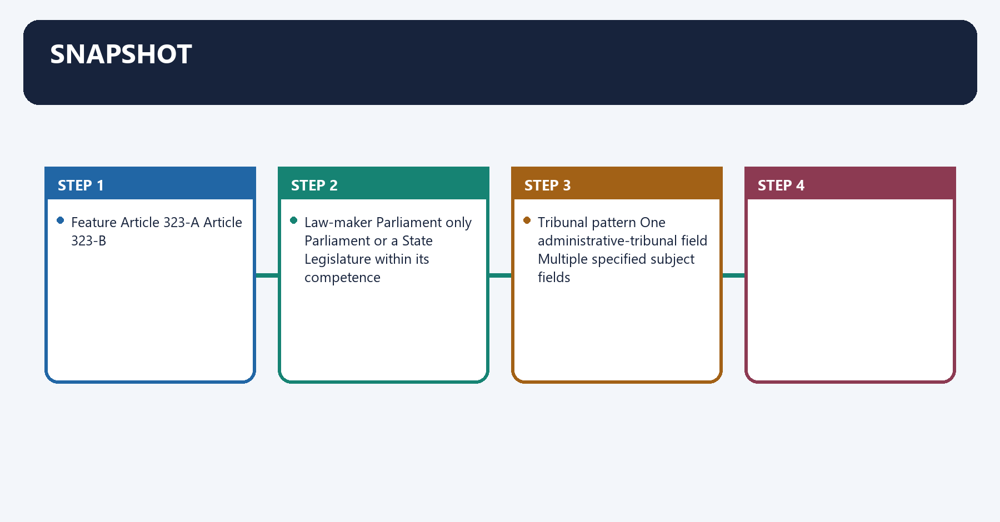
| Feature | Article 323-A | Article 323-B |
|---|---|---|
| Subject | Recruitment and service conditions of public servants | Specified fields such as tax, foreign exchange, labour, land reform and elections |
| Law-maker | Parliament only | Parliament or a State Legislature within its competence |
| Tribunal pattern | One administrative-tribunal field | Multiple specified subject fields |

### 02. Core architecture

Core architecture denotes the constitutional rules and institutional links organised around SPECIALISED, FASTER FORUM.
Core architecture operates through Administrative tribunal, connected with expertise + flexible procedure.
The operative mechanism matters because l. Chandra Kumar safeguard.
Its principal consequence is that tribunal decisions remain reviewable.
The decisive contrast is between by a High Court Division Bench and under Articles 226/227.
The exam-safe limitation is that [FACT] The Administrative Tribunals Act, 1985 provides for the Central Administrative.
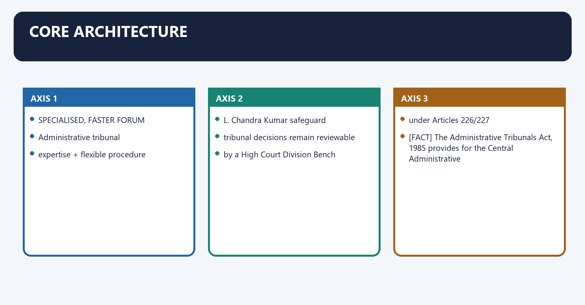
```text
SPECIALISED, FASTER FORUM
        |
        v
Administrative tribunal
expertise + flexible procedure
        |
        v
*L. Chandra Kumar* safeguard
tribunal decisions remain reviewable
by a High Court Division Bench
under Articles 226/227
```

- [FACT] The Administrative Tribunals Act, 1985 provides for the Central Administrative
  Tribunal (CAT) and enables State/Joint Administrative Tribunals.
- [FACT] CAT deals principally with recruitment and service matters of covered Union public
  servants; its jurisdiction is statutory and has exclusions.
- [FACT] Tribunals are supplemental to, not substitutes for, constitutional courts.
- [FACT] Judicial review under Articles 32 and 226/227 is part of the basic structure.

### 03. Tribunal Reforms Act, 2021

Tribunal Reforms Act, 2021 denotes the constitutional rules and institutional links organised around [FACT] The 2021 rationalisation abolished specified appellate bodies and transferred their.
Tribunal Reforms Act, 2021 operates through functions to existing judicial or administrative forums, connected with [FACT] It also prescribed a common framework for qualifications, appointment, tenure and.
The operative mechanism matters because service conditions for members of covered tribunals.
Its principal consequence is that [CURRENT] [FACT] Current legal baseline: on 19 Nov 2025 , the Supreme Court in.
The decisive contrast is between 2025 INSC 1330 struck down the re-enacted appointment/service-condition provisions and that repeated defects already invalidated in earlier Madras Bar Association rulings.
The exam-safe limitation is that these included the fifty-year minimum age, two-name recommendation panel and merely.
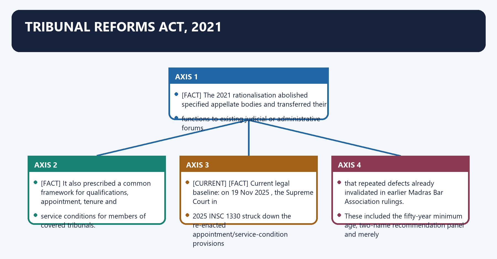
- [FACT] The 2021 rationalisation abolished specified appellate bodies and transferred their
  functions to existing judicial or administrative forums.
- [FACT] It also prescribed a common framework for qualifications, appointment, tenure and
  service conditions for members of covered tribunals.
- [CURRENT] [FACT] **Current legal baseline:** on **19 Nov 2025**, the Supreme Court in
  **2025 INSC 1330** struck down the re-enacted appointment/service-condition provisions
  that repeated defects already invalidated in earlier *Madras Bar Association* rulings.
  These included the fifty-year minimum age, two-name recommendation panel and merely
  preferable appointment timeline, four-year tenure, and impugned allowance framework.
  The Court made *MBA (IV)* and *MBA (V)* the controlling framework and directed creation
  of a National Tribunals Commission within four months.
- [CURRENT] [FACT] A **9 Mar 2026** interim order separately permitted temporary extensions for
  specified serving tribunal incumbents until **8 Sep 2026** or the applicable maximum
  age, whichever was earlier, to prevent tribunals becoming defunct. It was a continuity
  arrangement, not a reopening of the November 2025 constitutional ruling.
- [LIMIT] Rationalisation can reduce institutional duplication, but transferring specialised
  work to already burdened courts may weaken the promised gains in speed and expertise.
- [LIMIT] Executive influence over appointments, short tenure, vacancies and infrastructure
  remain the central independence/capacity concerns.

### 04. Verified PYQ application

Verified PYQ application denotes the constitutional rules and institutional links organised around [FACT] 2025 GS-II Q2 (10 marks, 150 words): “Comment on the need of administrative.
Verified PYQ application operates through tribunals as compared to the court system. Assess the impact of the recent tribunal, connected with reforms through rationalization of tribunals made in 2021.”.
The operative mechanism matters because answer route: need (expertise, speed, flexible procedure) - safeguards.
Its principal consequence is that ( L. Chandra Kumar , independence) - 2021 gains (consolidation) - risks.
The decisive contrast is between (court burden, vacancies, executive control) - independent appointments and capacity and [FACT] 2025 GS-II Q2 (10 marks, 150 words): “Comment on the need of administrative.
The exam-safe limitation is that [FACT] 2025 GS-II Q2 (10 marks, 150 words): “Comment on the need of administrative.
- [FACT] **2025 GS-II Q2 (10 marks, 150 words):** “Comment on the need of administrative
  tribunals as compared to the court system. Assess the impact of the recent tribunal
  reforms through rationalization of tribunals made in 2021.”
- **Answer route:** need (expertise, speed, flexible procedure) -> safeguards
  (*L. Chandra Kumar*, independence) -> 2021 gains (consolidation) -> risks
  (court burden, vacancies, executive control) -> independent appointments and capacity.

### 05. Traps

Traps denotes the constitutional rules and institutional links organised around Wrong: Tribunal decisions are immune from High Court review. - They are reviewable under.
Traps operates through Articles 226/227 after L. Chandra Kumar, connected with Wrong: Articles 323-A and 323-B are identical. - They differ in subject, law-maker and scope.
The operative mechanism matters because wrong: Rationalisation automatically reduces pendency. - Forum transfer can merely shift.
Its principal consequence is that pendency unless judges, benches and infrastructure follow.
The decisive contrast is between Wrong: The March 2026 extension restored the invalidated four-year-tenure rule. - It only and protected specified serving incumbents temporarily; the November 2025 constitutional.
The exam-safe limitation is that ruling and the MBA (IV)/(V) controlling standards remained the legal baseline.
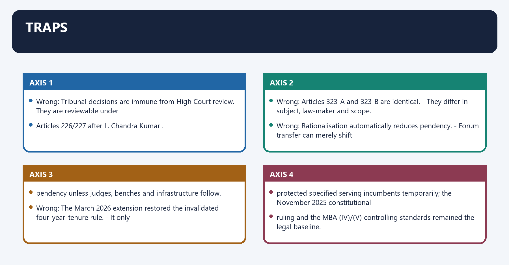
- Wrong: Tribunal decisions are immune from High Court review. -> They are reviewable under
  Articles 226/227 after *L. Chandra Kumar*.
- Wrong: Articles 323-A and 323-B are identical. -> They differ in subject, law-maker and scope.
- Wrong: Rationalisation automatically reduces pendency. -> Forum transfer can merely shift
  pendency unless judges, benches and infrastructure follow.
- Wrong: The March 2026 extension restored the invalidated four-year-tenure rule. -> It only
  protected specified serving incumbents temporarily; the November 2025 constitutional
  ruling and the *MBA (IV)/(V)* controlling standards remained the legal baseline.

See also: For the complete tribunal-versus-regulator taxonomy, natural justice and cross-sector appellate
map, use `Statutory-Regulatory-and-Quasi-Judicial-Bodies.md`.

### 06. 6. Answer architecture (10/15/20-mark support)

6. Answer architecture (10/15/20-mark support) denotes the constitutional rules and institutional links organised around Constitutional rule.
6. Answer architecture (10/15/20-mark support) operates through Operating mechanism, connected with Exam distinction.
The operative mechanism matters because constitutional rule.
Its principal consequence is that constitutional rule.
The decisive contrast is between Constitutional rule and Constitutional rule.
The exam-safe limitation is that constitutional rule.
> Purpose: make this Core file independently answer directive-sensitive GS-II questions on tribunals versus ordinary courts, CAT's adjudicatory independence, the 2021 rationalisation, and Lok Adalats versus arbitration — without opening Advanced. Tenure, age, vacancy and pecuniary-limit numbers change with each amendment and judgment; treat every such figure as [CURRENT] and re-verify.

### 07. 6.1 Demand and directive map

6.1 Demand and directive map denotes the constitutional rules and institutional links organised around Demand family Directive signals Answer spine.
6.1 Demand and directive map operates through Need + 2021 rationalisation "need", "assess reforms", Comment need → safeguards → 2021 Act → gains vs displacement → verdict, connected with Lok Adalat vs arbitration "distinguish", Explain ADR framing → LSA Act 1987 → A&C Act 1996 → distinctions → verdict.
The operative mechanism matters because demand family Directive signals Answer spine.
Its principal consequence is that demand family Directive signals Answer spine.
The decisive contrast is between Demand family Directive signals Answer spine and Demand family Directive signals Answer spine.
The exam-safe limitation is that demand family Directive signals Answer spine.
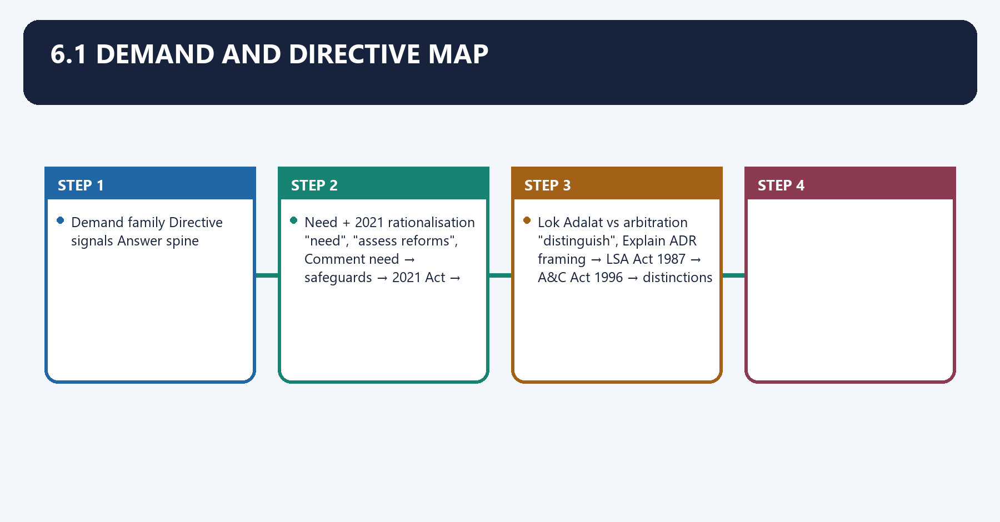
| Demand family | Directive signals | Answer spine |
|---|---|---|
| Tribunals vs ordinary courts | "curtail jurisdiction", How far, Discuss | supplement-not-supplant → 323A/B exclusion → *L. Chandra Kumar* → NTT/*R. Gandhi* → verdict |
| CAT's adjudicatory independence | "independent judicial authority", Explain | AT Act 1985 → independence markers → executive-influence limit → HC review → verdict |
| Need + 2021 rationalisation | "need", "assess reforms", Comment | need → safeguards → 2021 Act → gains vs displacement → verdict |
| Lok Adalat vs arbitration | "distinguish", Explain | ADR framing → LSA Act 1987 → A&C Act 1996 → distinctions → verdict |
| Independence/accountability of tribunals | "appointments", "tenure", Critically examine | MBA line → Finance Act 2017/*Rojer Mathew* → 2021 Act → NTC → verdict |

### 08. 6.2 Qualified thesis options

6.2 Qualified thesis options denotes the constitutional rules and institutional links organised around Constitutional rule.
6.2 Qualified thesis options operates through Operating mechanism, connected with Exam distinction.
The operative mechanism matters because constitutional rule.
Its principal consequence is that constitutional rule.
The decisive contrast is between Constitutional rule and Constitutional rule.
The exam-safe limitation is that constitutional rule.
- *Tribunals are a functional supplement to the courts, not a substitute for them: they may take the first bite of a dispute, but the High Court's supervisory jurisdiction is a basic-structure floor they cannot displace.*
- *The promise of tribunals — expertise, speed and access — is delivered only when their independence is secured; the recurring constitutional litigation since 2010 shows that appointment and tenure design, not jurisdiction, is the real battleground.*
- *Lok Adalats and arbitration answer two different justice deficits — one of access for the poor, one of autonomy for commerce — so they are complementary limbs of an alternative-dispute-resolution architecture, not rivals.*

### 09. 6.3 Mark-scaled structures

6.3 Mark-scaled structures denotes the constitutional rules and institutional links organised around Marks Architecture Evidence load.
6.3 Mark-scaled structures operates through 10 Thesis → two anchors (Article/Act + case) → one qualification → verdict 3 units, connected with 15 Thesis → constitutional design → case-law settlement → counter-risk (independence/burden) → graded verdict 5–6 units.
The operative mechanism matters because marks Architecture Evidence load.
Its principal consequence is that marks Architecture Evidence load.
The decisive contrast is between Marks Architecture Evidence load and Marks Architecture Evidence load.
The exam-safe limitation is that marks Architecture Evidence load.
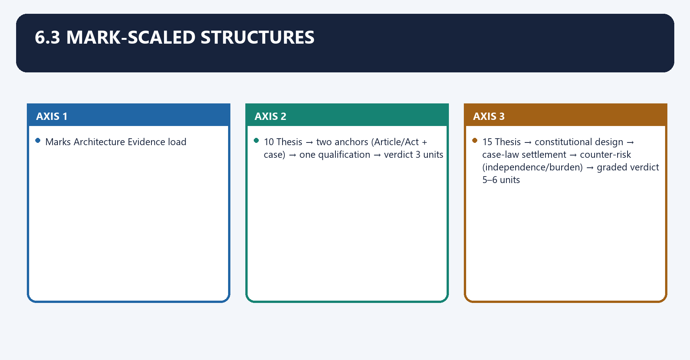
| Marks | Architecture | Evidence load |
|---:|---|---|
| 10 | Thesis → two anchors (Article/Act + case) → one qualification → verdict | 3 units |
| 15 | Thesis → constitutional design → case-law settlement → counter-risk (independence/burden) → graded verdict | 5–6 units |
| 20 | Thesis → design → judicial-review settlement → reform (2017/2021) → Lok Adalat/ADR comparison → graded verdict | 7–8 units + an "independence vs capacity" paragraph |

### 10. 6.4 Bank A — Constitutional design and the judicial-review settlement

6.4 Bank A — Constitutional design and the judicial-review settlement denotes the constitutional rules and institutional links organised around Constitutional rule.
6.4 Bank A — Constitutional design and the judicial-review settlement operates through Operating mechanism, connected with Exam distinction.
The operative mechanism matters because constitutional rule.
Its principal consequence is that constitutional rule.
The decisive contrast is between Constitutional rule and Constitutional rule.
The exam-safe limitation is that constitutional rule.
- **Claim:** the two tribunal Articles differ in subject and law-maker. **Provisions:** **Art 323A** (public-service recruitment/service conditions; **Parliament only**; one field) vs **Art 323B** (enumerated fields — taxation, foreign exchange, labour, land reform, elections, etc.; **Parliament or State Legislature**; multiple fields); both inserted by the **42nd Amendment, 1976** (Part XIV-A). **Mechanism:** enables a specialised, exclusive adjudicatory channel. **Limitation:** [FACT] they are *not* identical — the exclusion-of-review clauses in both were read down by *L. Chandra Kumar*.
- **Claim:** CAT is a creature of statute, not the Constitution. **Provision:** the **Administrative Tribunals Act, 1985** created the **Central Administrative Tribunal** and enables **State (SAT)** and **Joint** tribunals; CAT covers recruitment and service matters of covered Union public servants. **Mechanism:** specialist members + simpler procedure. **Limitation:** [LIMIT] statutory jurisdiction with exclusions (e.g., defence personnel, Supreme Court staff, parliamentary secretariat staff).
- **Claim:** tribunal substitution was accepted only if the alternative is effective. **Case:** *S.P. Sampath Kumar v. Union of India (1987)* upheld the 1985 Act on condition that tribunals are an **"effective alternative institutional mechanism"** with the efficacy of the High Court. **Mechanism:** set the independence/efficacy test. **Limitation:** [LIMIT] it initially excluded HC review (leaving only the SC) — corrected in 1997.
- **Claim:** judicial review of tribunals cannot be excluded. **Case:** *L. Chandra Kumar v. Union of India (1997)* (seven-judge bench) — review under **Art 226/227 and 32 is basic structure**; the exclusion clauses in **Art 323A(2)(d)/323B(3)(d)** are **unconstitutional** to that extent; tribunal orders lie to a **HC Division Bench**. **Mechanism:** tribunals became supplemental, not substitutes. **Limitation:** [LIMIT] it adds a tier — speed then depends on first-instance quality.
- **Claim:** tribunalising a court's core function needs independence guarantees. **Case:** *Union of India v. R. Gandhi (2010)* (NCLT/NCLAT) upheld transferring company-law jurisdiction to tribunals **only if** members' qualifications, selection and service conditions preserve **independence and separation of powers**. **Mechanism:** the template for every later tribunal-reform challenge. **Limitation:** [FACT] a rule violating these standards is struck down, as repeatedly since.
- **Claim:** courts will strike down tribunals that usurp their constitutional role. **Case:** *Madras Bar Association v. Union of India (2014)* struck down the **National Tax Tribunal Act, 2005** because vesting the HC's power over substantial questions of law in an executive-controlled tribunal violated **separation of powers/basic structure**. **Mechanism:** an outer limit on tribunalisation. **Limitation:** [LIMIT] the objection was to the *design*, not to tax adjudication as such.

### 11. 6.5 Bank B — Rationalisation, reform litigation and current status

6.5 Bank B — Rationalisation, reform litigation and current status denotes the constitutional rules and institutional links organised around Constitutional rule.
6.5 Bank B — Rationalisation, reform litigation and current status operates through Operating mechanism, connected with Exam distinction.
The operative mechanism matters because constitutional rule.
Its principal consequence is that constitutional rule.
The decisive contrast is between Constitutional rule and Constitutional rule.
The exam-safe limitation is that constitutional rule.
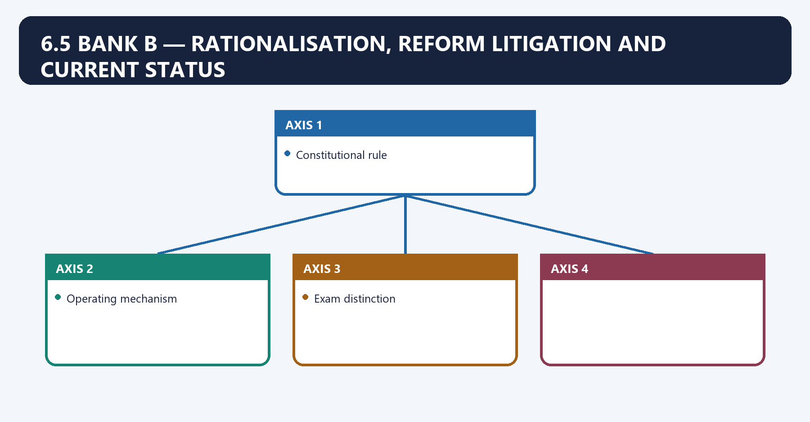
- **Claim:** rationalisation began before 2021. **Provision:** the **Finance Act, 2017** (Part XIV) merged/abolished several tribunals and empowered the Centre to frame rules on members' qualifications, appointment and tenure. **Mechanism:** consolidation + executive rule-making power. **Limitation:** [LIMIT] it was passed as a **Money Bill** — a contested route.
- **Claim:** the 2017 rules were struck down for compromising independence. **Case:** *Rojer Mathew v. South Indian Bank Ltd (2019)* invalidated the **Tribunal Rules 2017** as contrary to judicial independence, ordered re-framing, and **referred the Money-Bill question to a larger bench**. **Mechanism:** judicial policing of appointment design. **Limitation:** [CURRENT] the Money-Bill reference remained pending — do not state it as settled.
- **Claim:** the 2021 Act repeated defects and was repeatedly corrected. **Provision/status:** the **Tribunals Reforms Act, 2021** abolished several appellate tribunals (transferring work to HCs/commercial courts) and prescribed a **four-year tenure, minimum age of 50 and a search-cum-selection committee**. [CURRENT] [FACT] On **19 Nov 2025 (2025 INSC 1330)** the SC struck down the re-enacted age/panel/tenure/allowance provisions, made **MBA (IV)/(V)** controlling, and directed a **National Tribunals Commission** within four months; a **9 Mar 2026** order gave temporary continuity to specified serving incumbents until **8 Sep 2026** or the maximum age. **Limitation:** [CURRENT] these dated holdings move — re-verify before citing; a struck-down provision is not the law.

### 12. 6.6 Bank C — Lok Adalats versus arbitration (the ADR distinction)

6.6 Bank C — Lok Adalats versus arbitration (the ADR distinction) denotes the constitutional rules and institutional links organised around Axis Lok Adalat Arbitration.
6.6 Bank C — Lok Adalats versus arbitration (the ADR distinction) operates through Source Statutory — LSA Act 1987 (Art 39A) Contractual — A&C Act 1996, connected with Nature Court-annexed conciliation/compromise Private adjudication.
The operative mechanism matters because consent Referral or consent; PLA decides merits for public utilities Consent via arbitration agreement.
Its principal consequence is that cost Free; court fee refunded Parties bear arbitrator/institutional fees.
The decisive contrast is between Outcome Award = civil decree, final, no appeal Award enforceable as decree; §34 challenge only and Axis Lok Adalat Arbitration.
The exam-safe limitation is that axis Lok Adalat Arbitration.
- **Claim:** Lok Adalats are a statutory access-to-justice mechanism. **Provision:** the **Legal Services Authorities Act, 1987** (constitutional anchor **Art 39A**) gives Lok Adalats statutory status; they settle pending or pre-litigation disputes by **compromise**; the **award is deemed a decree of a civil court, is final and binding, and no appeal lies** (§21). **Permanent Lok Adalats (§22B)** can decide the **merits** of **public-utility-service** disputes if conciliation fails. **Mechanism:** free, quick, conciliatory closure. **Limitation:** [LIMIT] ordinary Lok Adalats need the parties' consent to settle, and cannot try an offence.
- **Claim:** arbitration is a contractual, adjudicatory ADR. **Provision:** the **Arbitration and Conciliation Act, 1996** (based on the UNCITRAL Model Law) lets parties, by an **arbitration agreement**, have a **private tribunal adjudicate**; the **award is final and enforceable as a decree (§36)** and challengeable only on limited **§34** grounds. **Mechanism:** party autonomy over forum, procedure and seat. **Limitation:** [LIMIT] costs fall on the parties; courts do not re-hear the merits.

| Axis | **Lok Adalat** | **Arbitration** |
|---|---|---|
| Source | Statutory — **LSA Act 1987** (Art 39A) | Contractual — **A&C Act 1996** |
| Nature | Court-annexed **conciliation/compromise** | Private **adjudication** |
| Consent | Referral or consent; **PLA decides merits** for public utilities | Consent via **arbitration agreement** |
| Cost | Free; court fee refunded | Parties bear arbitrator/institutional fees |
| Outcome | Award = **civil decree, final, no appeal** | Award enforceable as decree; **§34** challenge only |

### 13. 6.7 Mechanism, institutional incentives and consequences

6.7 Mechanism, institutional incentives and consequences denotes the constitutional rules and institutional links organised around Constitutional rule.
6.7 Mechanism, institutional incentives and consequences operates through Operating mechanism, connected with Exam distinction.
The operative mechanism matters because constitutional rule.
Its principal consequence is that constitutional rule.
The decisive contrast is between Constitutional rule and Constitutional rule.
The exam-safe limitation is that constitutional rule.
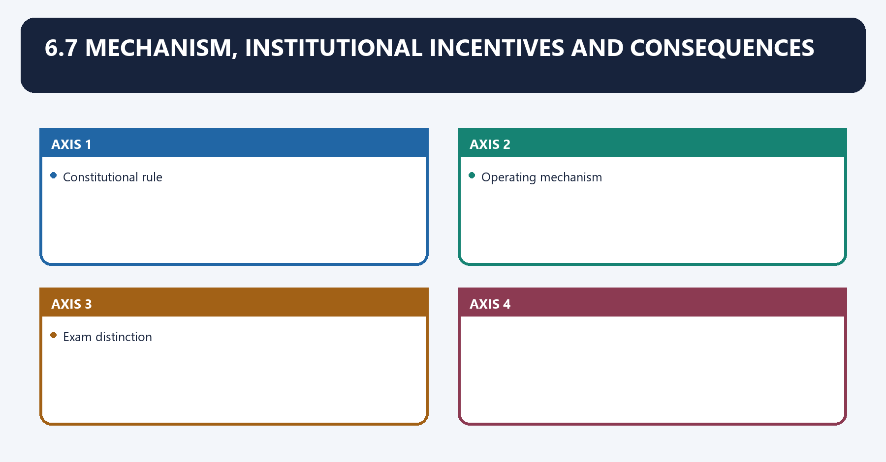
- **Why tribunals were created:** to move technical, high-volume disputes to expert members under simpler procedure, easing the constitutional courts.
- **Why independence is the pressure point:** [LIMIT] because the government is the largest litigant before service and regulatory tribunals, executive control over appointments, tenure and finances creates an incentive to weaken the very forum that judges it — which is why the courts keep intervening.
- **Consequence of the *L. Chandra Kumar* tier:** [FACT] tribunal → HC Division Bench → SC preserves supervision but can *lengthen* the chain, so first-instance quality, not jurisdiction-stripping, is the real efficiency lever.
- **National Tribunals Commission logic:** [LIMIT] an independent umbrella body for appointments, infrastructure and oversight is the standing judicial prescription for breaking the appoint-and-strike-down cycle.

### 14. 6.8 Criticism, counter-argument, variation and implementation constraints

6.8 Criticism, counter-argument, variation and implementation constraints denotes the constitutional rules and institutional links organised around Constitutional rule.
6.8 Criticism, counter-argument, variation and implementation constraints operates through Operating mechanism, connected with Exam distinction.
The operative mechanism matters because constitutional rule.
Its principal consequence is that constitutional rule.
The decisive contrast is between Constitutional rule and Constitutional rule.
The exam-safe limitation is that constitutional rule.
- **Curtailment critique:** tribunals reduce direct access to the HC and fragment appeals; counter — *L. Chandra Kumar* preserves supervisory review, so the curtailment is of original, not supervisory, jurisdiction.
- **Rationalisation critique:** [LIMIT] abolishing appellate tribunals can merely **shift pendency** to already-burdened HCs/commercial courts unless benches, staff and records follow.
- **Independence critique:** the recurring strike-downs (*R. Gandhi* → *Rojer Mathew* → *MBA (IV)/(V)* → 2025 INSC 1330) show a pattern of executive-tilted rules being re-enacted; counter — persistent judicial correction is itself the safeguard working.
- **Variation:** State tribunals under Art 323B and SATs vary in workload and independence, so uniform claims about "tribunals" must be qualified.

### 15. 6.9 Verdict scaffolds

6.9 Verdict scaffolds denotes the constitutional rules and institutional links organised around Constitutional rule.
6.9 Verdict scaffolds operates through Operating mechanism, connected with Exam distinction.
The operative mechanism matters because constitutional rule.
Its principal consequence is that constitutional rule.
The decisive contrast is between Constitutional rule and Constitutional rule.
The exam-safe limitation is that constitutional rule.
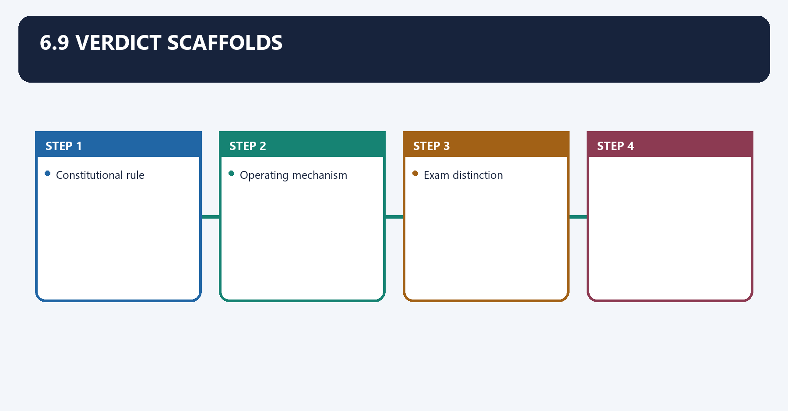
- **Tribunals-vs-courts verdict:** "Tribunals curtail the ordinary courts' first-instance reach but not their constitutional supervision; *L. Chandra Kumar* makes judicial review a floor no tribunal statute can sink below."
- **CAT-independence verdict:** "The Central Administrative Tribunal exercises real adjudicatory authority, but an authority that remains supervised by the High Court and dependent on executive-set service conditions — independent in function, qualified in structure."
- **Rationalisation verdict:** "The 2021 rationalisation is sound in aim and suspect in execution; it delivers only where consolidation is matched by independent appointments and real capacity, as the 2025 judgment insists."
- **ADR verdict:** "Lok Adalats and arbitration solve different problems — access for the citizen, autonomy for commerce — and India's justice system needs both, not a choice between them."

### 16. 6.10 Prelims close-option distinctions

6.10 Prelims close-option distinctions denotes the constitutional rules and institutional links organised around Confusion pair Correct discrimination.
6.10 Prelims close-option distinctions operates through L. Chandra Kumar vs R. Gandhi 1997 = review cannot be excluded ; 2010 = tribunal composition/independence standards, connected with Permanent Lok Adalat Can decide the merits of public-utility disputes if settlement fails (§22B) — an exception to pure conciliation.
The operative mechanism matters because tribunal statute vs current law The 2021 tenure/age/panel rules were struck down — do not cite them as operative.
Its principal consequence is that confusion pair Correct discrimination.
The decisive contrast is between Confusion pair Correct discrimination and Confusion pair Correct discrimination.
The exam-safe limitation is that confusion pair Correct discrimination.
| Confusion pair | Correct discrimination |
|---|---|
| Art 323A vs 323B | 323A = service matters, **Parliament only**; 323B = enumerated fields, **Parliament or State** — both by the **42nd Amendment 1976** |
| Sampath Kumar vs L. Chandra Kumar | 1987 accepted substitution if **effective**; 1997 held HC review is **basic structure** and exclusion **unconstitutional** |
| L. Chandra Kumar vs R. Gandhi | 1997 = **review cannot be excluded**; 2010 = tribunal **composition/independence** standards |
| Lok Adalat award vs arbitral award | Lok Adalat award = **civil decree, no appeal (§21)**; arbitral award = enforceable as decree but **§34 challenge** available |
| Permanent Lok Adalat | Can decide the **merits** of **public-utility** disputes if settlement fails (§22B) — an exception to pure conciliation |
| Finance Act 2017 vs Tribunals Reforms Act 2021 | 2017 = first rationalisation + rule-making power; 2021 = abolition of listed appellate tribunals + service framework |
| Tribunal statute vs current law | The 2021 tenure/age/panel rules were **struck down** — do not cite them as operative |

### 17. 6.11 Factual-risk and current-status controls

6.11 Factual-risk and current-status controls denotes the constitutional rules and institutional links organised around <!-- BEGIN GENERATED PYQ INTEGRATION: 2024-2025.
6.11 Factual-risk and current-status controls operates through <!-- BEGIN GENERATED PYQ INTEGRATION: 2024-2025, connected with <!-- BEGIN GENERATED PYQ INTEGRATION: 2024-2025.
The operative mechanism matters because <!-- BEGIN GENERATED PYQ INTEGRATION: 2024-2025.
Its principal consequence is that <!-- BEGIN GENERATED PYQ INTEGRATION: 2024-2025.
The decisive contrast is between <!-- BEGIN GENERATED PYQ INTEGRATION: 2024-2025 and <!-- BEGIN GENERATED PYQ INTEGRATION: 2024-2025.
The exam-safe limitation is that <!-- BEGIN GENERATED PYQ INTEGRATION: 2024-2025.
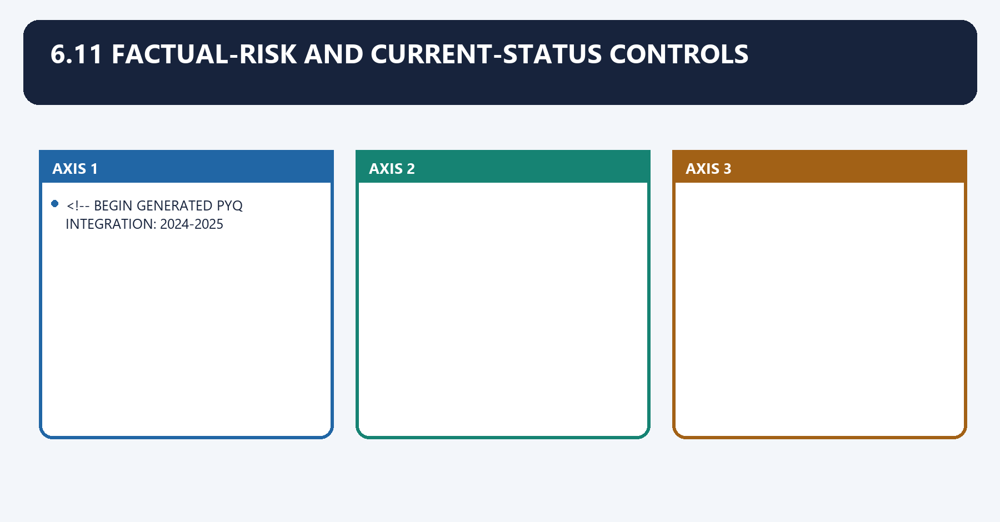
- [FACT] Art 323A/323B were inserted by the **42nd Amendment (1976)**; the **AT Act is 1985**, the **LSA Act is 1987**, the **A&C Act is 1996** — keep the years exact.
- [FACT] *L. Chandra Kumar* (1997) preserved **HC Art 226/227 review**; it did **not** abolish tribunals or bar CAT from deciding constitutional questions at first instance.
- [LIMIT]/[CURRENT] Do **not** state tribunal **tenure, minimum age, pecuniary limits, vacancy counts or the Money-Bill reference** as settled — mark [CURRENT] and re-verify; a **struck-down** provision or a **Bill/Ordinance** is not the law.
- [FACT] The **National Tribunals Commission** is a **judicially directed** body — describe it as directed/pending, not as an operating institution, unless verified.
- [LIMIT] Distinguish Constitution text (Art 323A/B, 226/227, 39A) from statute (AT Act 1985, LSA Act 1987, A&C Act 1996, Finance Act 2017, Tribunals Reforms Act 2021) from judicial interpretation (*Sampath Kumar*, *L. Chandra Kumar*, *R. Gandhi*, *MBA*, *Rojer Mathew*) — never blur the categories.

<!-- BEGIN GENERATED PYQ INTEGRATION: 2024-2025 -->

### 18. Articles 323A and 323B: exact constitutional distinction

Articles 323A and 323B: exact constitutional distinction denotes the constitutional rules and institutional links organised around Axis Article 323A Article 323B.
Articles 323A and 323B: exact constitutional distinction operates through subject recruitment and service conditions of public servants specified fields such as tax, labour, land reforms and elections, connected with law-maker Parliament appropriate legislature within competence.
The operative mechanism matters because tribunal pattern administrative tribunals subject-specific tribunals.
Its principal consequence is that hierarchy may provide a structured administrative-tribunal system may provide a hierarchy for listed matters.
The decisive contrast is between court exclusion text originally contemplated exclusion except Article 136 similar exclusion possibility and current control High Court review survives under L. Chandra Kumar (1997) same basic-structure floor.
The exam-safe limitation is that [LIMIT] The two Articles are enabling provisions. They do not themselves create CAT,.
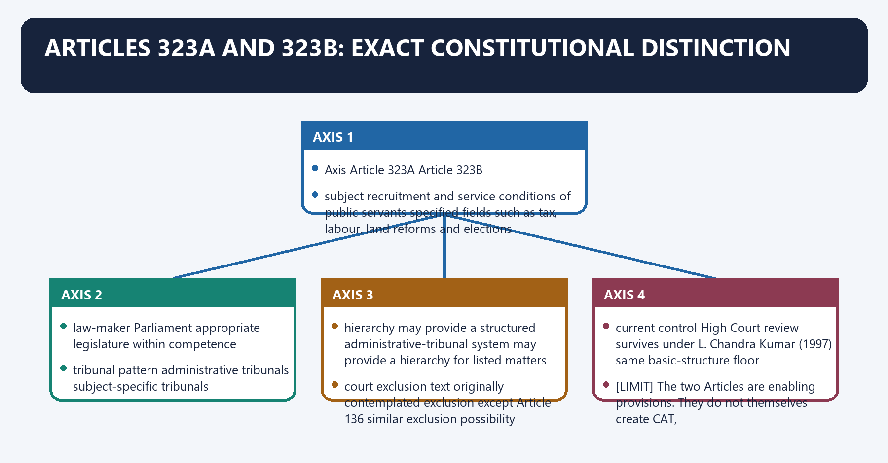
| Axis | Article 323A | Article 323B |
|---|---|---|
| subject | recruitment and service conditions of public servants | specified fields such as tax, labour, land reforms and elections |
| law-maker | Parliament | appropriate legislature within competence |
| tribunal pattern | administrative tribunals | subject-specific tribunals |
| hierarchy | may provide a structured administrative-tribunal system | may provide a hierarchy for listed matters |
| court exclusion text | originally contemplated exclusion except Article 136 | similar exclusion possibility |
| current control | High Court review survives under L. Chandra Kumar (1997) | same basic-structure floor |

[LIMIT] The two Articles are enabling provisions. They do not themselves create CAT,
every State tribunal or every subject tribunal.

### 19. CAT process, exclusions and judicial-review chain

CAT process, exclusions and judicial-review chain denotes the constitutional rules and institutional links organised around covered recruitment/service matter - Original Application before competent CAT bench.
CAT process, exclusions and judicial-review chain operates through notice, pleadings, records, hearing - reasoned tribunal order, connected with High Court Division Bench under Articles 226/227.
The operative mechanism matters because supreme Court route under the Constitution.
Its principal consequence is that natural justice not rigidly bound by CPC civil-court-type statutory powers.
The decisive contrast is between contempt power as provided interim relief within jurisdiction and specified constitutional officeholders and excluded services follow the Act's exact text.
The exam-safe limitation is that criminal prosecution, ordinary civil disputes and every public-employment question do not.
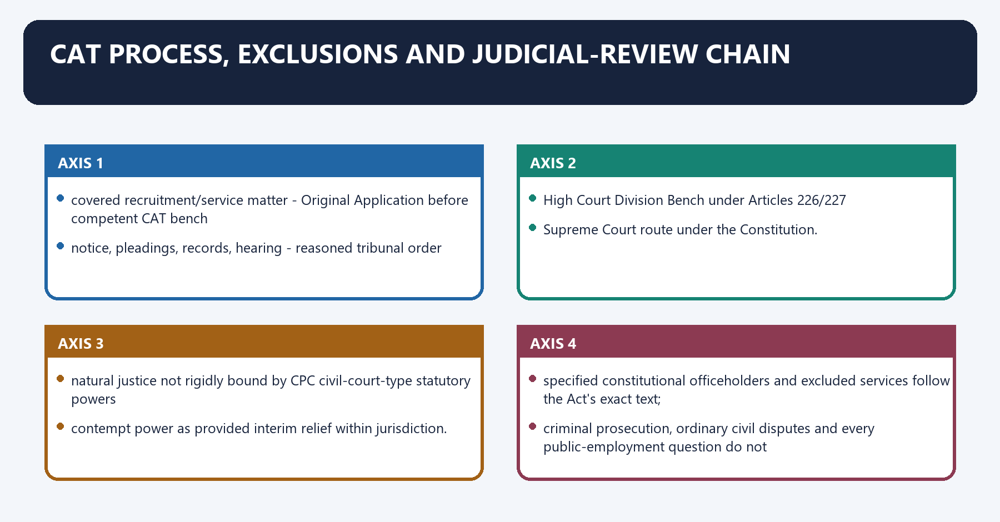
SERVICE GRIEVANCE
covered recruitment/service matter -> Original Application before competent CAT bench
-> notice, pleadings, records, hearing -> reasoned tribunal order
-> High Court Division Bench under Articles 226/227
-> Supreme Court route under the Constitution.

PROCEDURE
natural justice | not rigidly bound by CPC | civil-court-type statutory powers
| contempt power as provided | interim relief within jurisdiction.

BOUNDARIES
specified constitutional officeholders and excluded services follow the Act's exact text;
criminal prosecution, ordinary civil disputes and every public-employment question do not
automatically become CAT matters.

[LIMIT] Article 136 is not a substitute for the L. Chandra Kumar High Court review chain.

### Semantic-completeness ownership and PYQ control

- **Constitutional source:** the Constitution (Forty-second Amendment) Act,
  1976 inserted Part XIV-A. Article 323A permits Parliament alone to create
  administrative tribunals for recruitment and service conditions. Article
  323B permits the competent Parliament or State Legislature to create
  tribunals for the listed subject fields.
- **Statutory institution:** the Administrative Tribunals Act, 1985 creates
  CAT and enables State and Joint Administrative Tribunals. CAT is a statutory
  service tribunal, not a constitutional court or a generic forum for every
  dispute involving government.
- **Jurisdiction and exclusions:** CAT principally covers recruitment and
  service matters of persons appointed to covered Union civil services/posts
  and notified bodies. Armed-forces members, Supreme Court/High Court and
  subordinate-court staff, and legislative-secretariat staff fall within the
  Act's express exclusion structure.
- **Procedure and powers:** applications, limitation, transfer of covered
  proceedings, flexible procedure, civil-court powers and contempt operate
  under the Act and rules. Procedural flexibility does not remove notice,
  hearing, reasons, impartiality or jurisdictional limits.
- **Review chain:** S.P. Sampath Kumar accepted an effective alternative only
  with independence safeguards. L. Chandra Kumar (1997) invalidated exclusion
  of Articles 226/227 and 32 review, retained tribunals as courts of first
  instance in their fields, and routes their decisions to the territorial High
  Court Division Bench before the Supreme Court.
- **Independence line:** R.K. Jain exposed structural weakness; Union of India
  v R. Gandhi, Rojer Mathew and the Madras Bar Association decisions control
  judicial dominance in selection, tenure, service conditions, infrastructure
  and separation from sponsoring ministries.
- **2025 judgment:** Madras Bar Association v Union of India, 2025 INSC 1330
  (19 November 2025), invalidated re-enacted appointment/service-condition
  defects in the 2021 framework and directed creation of an independent
  National Tribunals Commission.
- **2026 continuity order:** the Supreme Court's 9 March 2026 interim order
  continued specified incumbents whose terms expired in the six-month window
  until 8 September 2026 or the applicable maximum age, whichever was earlier.
  It preserved functioning and did not reverse the merits judgment.
- **Live legislative status, checked 5 September 2026:** Parliament passed the
  Tribunals Reforms Bill, 2026, proposing repeal of the 2021 Act and a
  judiciary-led National Tribunals Commission. No official assented Act or
  commencement notification was located on India Code/Legislative Department;
  the Bill is therefore not represented here as operative law.
- **PYQ firewall:** the verified 2025 GS-II demand on administrative tribunals
  and 2021 rationalisation is owned here. Body-specific appellate structures
  remain with their sector owners and no unverified PYQ or answer key is added.

## BASIC MCQS / REMEDIATION

### Original MCQs 1-36 — Broad Coverage
#### OM1. Which statement most accurately describes Article 323A?

- A. Article 323A concerns administrative tribunals for public-service recruitment and service conditions and can be legislated by Parliament.
- B. It creates every tax tribunal.
- C. States alone legislate under Article 323A.
- D. It abolishes High Courts.

**Answer: A**

**Explanation:** The Article is enabling and subject to the judicial-review basic structure. The other options collapse distinct legal sources, institutions or consequences and therefore fail the close-option test.

#### OM2. Which statement most accurately describes Article 323B?

- A. Article 323B covers specified subject fields and allows the appropriate legislature to create tribunals within competence.
- B. It is limited to Union civil servants.
- C. It is identical to Article 323A.
- D. It automatically creates a national appellate tribunal.

**Answer: A**

**Explanation:** Subject, law-maker and scope distinguish the two Articles. The other options collapse distinct legal sources, institutions or consequences and therefore fail the close-option test.

#### OM3. Which statement most accurately describes Administrative Tribunals Act 1985?

- A. The 1985 Act establishes CAT and enables SAT arrangements for covered service matters.
- B. It is a constitutional amendment.
- C. It governs all private employment.
- D. It makes CAT a High Court.

**Answer: A**

**Explanation:** Statutory jurisdiction depends on the Act's coverage and exclusions. The other options collapse distinct legal sources, institutions or consequences and therefore fail the close-option test.

#### OM4. Which statement most accurately describes CAT jurisdiction?

- A. CAT hears covered recruitment and service disputes, not every public-law or criminal matter.
- B. CAT tries corruption offences.
- C. CAT reviews constitutional amendments.
- D. Every PSU employee automatically falls within CAT.

**Answer: A**

**Explanation:** Employer, post and statutory notification matter. The other options collapse distinct legal sources, institutions or consequences and therefore fail the close-option test.

#### OM5. Which statement most accurately describes procedure and powers?

- A. CAT follows natural justice and statutory powers without being rigidly bound by the CPC.
- B. CAT has no power to summon evidence.
- C. Natural justice never applies to tribunals.
- D. Flexible procedure means arbitrary procedure.

**Answer: A**

**Explanation:** Flexibility remains bounded by jurisdiction, fairness and reasoned orders. The other options collapse distinct legal sources, institutions or consequences and therefore fail the close-option test.

#### OM6. Which statement most accurately describes judicial review?

- A. L. Chandra Kumar (1997) preserves High Court Division Bench review under Articles 226/227.
- B. Tribunal orders go only by direct Article 136 appeal.
- C. High Court review was permanently excluded.
- D. CAT can overrule the Supreme Court.

**Answer: A**

**Explanation:** Tribunals are first-instance substitutes, not constitutional-court replacements. The other options collapse distinct legal sources, institutions or consequences and therefore fail the close-option test.

#### OM7. Which statement most accurately describes independence?

- A. Appointments, tenure, removal, infrastructure and administrative control determine tribunal independence.
- B. Expert members alone guarantee independence.
- C. Executive funding is legally irrelevant.
- D. Short tenure always improves neutrality.

**Answer: A**

**Explanation:** Institutional design must match the judicial work transferred. The other options collapse distinct legal sources, institutions or consequences and therefore fail the close-option test.

#### OM8. Which statement most accurately describes rationalisation?

- A. Abolishing or merging tribunals can reduce duplication but can also shift specialised work and pendency to courts.
- B. Rationalisation automatically reduces delay.
- C. Every merger is unconstitutional.
- D. Abolition removes judicial review.

**Answer: A**

**Explanation:** Capacity and transition design determine outcomes. The other options collapse distinct legal sources, institutions or consequences and therefore fail the close-option test.

#### OM9. Which statement most accurately describes R. Gandhi?

- A. Union of India v. R. Gandhi (2010) accepts tribunalisation only with independence safeguards equivalent to transferred judicial functions.
- B. It abolished all tribunals.
- C. It made administrative members constitutional judges.
- D. It removed qualification standards.

**Answer: A**

**Explanation:** The functional-equivalence principle controls institutional design. The other options collapse distinct legal sources, institutions or consequences and therefore fail the close-option test.

#### OM10. Which statement most accurately describes Madras Bar Association?

- A. The Madras Bar Association line invalidates executive-dominated or insecure tribunal arrangements.
- B. It bars Parliament from creating specialist forums.
- C. It treats tenure as purely executive policy.
- D. It removes court review of appointments.

**Answer: A**

**Explanation:** Tribunal validity and particular service-condition defects must be separated. The other options collapse distinct legal sources, institutions or consequences and therefore fail the close-option test.

#### OM11. Which statement most accurately describes Rojer Mathew?

- A. Rojer Mathew (2019) challenged the rules framework and reinforced scrutiny of tribunal independence.
- B. It made tribunal recommendations binding legislation.
- C. It held every Finance Act invalid.
- D. It removed judicial members.

**Answer: A**

**Explanation:** The decision belongs to a continuing line rather than a single final settlement. The other options collapse distinct legal sources, institutions or consequences and therefore fail the close-option test.

#### OM12. Which statement most accurately describes CAT comparison?

- A. CAT is an adjudicatory tribunal; commissions investigate or advise, and constitutional courts retain supervisory review.
- B. CAT and UPSC perform the same role.
- C. A commission's recommendation is a judicial decree.
- D. A Lok Adalat is an Article 323A tribunal.

**Answer: A**

**Explanation:** Institutional taxonomy prevents close-option errors. The other options collapse distinct legal sources, institutions or consequences and therefore fail the close-option test.

#### OM13. Which is the safest UPSC distinction concerning Article 323A?

- A. Article 323A concerns administrative tribunals for public-service recruitment and service conditions and can be legislated by Parliament.
- B. It creates every tax tribunal.
- C. States alone legislate under Article 323A.
- D. It abolishes High Courts.

**Answer: A**

**Explanation:** The Article is enabling and subject to the judicial-review basic structure. The other options collapse distinct legal sources, institutions or consequences and therefore fail the close-option test.

#### OM14. Which is the safest UPSC distinction concerning Article 323B?

- A. Article 323B covers specified subject fields and allows the appropriate legislature to create tribunals within competence.
- B. It is limited to Union civil servants.
- C. It is identical to Article 323A.
- D. It automatically creates a national appellate tribunal.

**Answer: A**

**Explanation:** Subject, law-maker and scope distinguish the two Articles. The other options collapse distinct legal sources, institutions or consequences and therefore fail the close-option test.

#### OM15. Which is the safest UPSC distinction concerning Administrative Tribunals Act 1985?

- A. The 1985 Act establishes CAT and enables SAT arrangements for covered service matters.
- B. It is a constitutional amendment.
- C. It governs all private employment.
- D. It makes CAT a High Court.

**Answer: A**

**Explanation:** Statutory jurisdiction depends on the Act's coverage and exclusions. The other options collapse distinct legal sources, institutions or consequences and therefore fail the close-option test.

#### OM16. Which is the safest UPSC distinction concerning CAT jurisdiction?

- A. CAT hears covered recruitment and service disputes, not every public-law or criminal matter.
- B. CAT tries corruption offences.
- C. CAT reviews constitutional amendments.
- D. Every PSU employee automatically falls within CAT.

**Answer: A**

**Explanation:** Employer, post and statutory notification matter. The other options collapse distinct legal sources, institutions or consequences and therefore fail the close-option test.

#### OM17. Which is the safest UPSC distinction concerning procedure and powers?

- A. CAT follows natural justice and statutory powers without being rigidly bound by the CPC.
- B. CAT has no power to summon evidence.
- C. Natural justice never applies to tribunals.
- D. Flexible procedure means arbitrary procedure.

**Answer: A**

**Explanation:** Flexibility remains bounded by jurisdiction, fairness and reasoned orders. The other options collapse distinct legal sources, institutions or consequences and therefore fail the close-option test.

#### OM18. Which is the safest UPSC distinction concerning judicial review?

- A. L. Chandra Kumar (1997) preserves High Court Division Bench review under Articles 226/227.
- B. Tribunal orders go only by direct Article 136 appeal.
- C. High Court review was permanently excluded.
- D. CAT can overrule the Supreme Court.

**Answer: A**

**Explanation:** Tribunals are first-instance substitutes, not constitutional-court replacements. The other options collapse distinct legal sources, institutions or consequences and therefore fail the close-option test.

#### OM19. Which is the safest UPSC distinction concerning independence?

- A. Appointments, tenure, removal, infrastructure and administrative control determine tribunal independence.
- B. Expert members alone guarantee independence.
- C. Executive funding is legally irrelevant.
- D. Short tenure always improves neutrality.

**Answer: A**

**Explanation:** Institutional design must match the judicial work transferred. The other options collapse distinct legal sources, institutions or consequences and therefore fail the close-option test.

#### OM20. Which is the safest UPSC distinction concerning rationalisation?

- A. Abolishing or merging tribunals can reduce duplication but can also shift specialised work and pendency to courts.
- B. Rationalisation automatically reduces delay.
- C. Every merger is unconstitutional.
- D. Abolition removes judicial review.

**Answer: A**

**Explanation:** Capacity and transition design determine outcomes. The other options collapse distinct legal sources, institutions or consequences and therefore fail the close-option test.

#### OM21. Which is the safest UPSC distinction concerning R. Gandhi?

- A. Union of India v. R. Gandhi (2010) accepts tribunalisation only with independence safeguards equivalent to transferred judicial functions.
- B. It abolished all tribunals.
- C. It made administrative members constitutional judges.
- D. It removed qualification standards.

**Answer: A**

**Explanation:** The functional-equivalence principle controls institutional design. The other options collapse distinct legal sources, institutions or consequences and therefore fail the close-option test.

#### OM22. Which is the safest UPSC distinction concerning Madras Bar Association?

- A. The Madras Bar Association line invalidates executive-dominated or insecure tribunal arrangements.
- B. It bars Parliament from creating specialist forums.
- C. It treats tenure as purely executive policy.
- D. It removes court review of appointments.

**Answer: A**

**Explanation:** Tribunal validity and particular service-condition defects must be separated. The other options collapse distinct legal sources, institutions or consequences and therefore fail the close-option test.

#### OM23. Which is the safest UPSC distinction concerning Rojer Mathew?

- A. Rojer Mathew (2019) challenged the rules framework and reinforced scrutiny of tribunal independence.
- B. It made tribunal recommendations binding legislation.
- C. It held every Finance Act invalid.
- D. It removed judicial members.

**Answer: A**

**Explanation:** The decision belongs to a continuing line rather than a single final settlement. The other options collapse distinct legal sources, institutions or consequences and therefore fail the close-option test.

#### OM24. Which is the safest UPSC distinction concerning CAT comparison?

- A. CAT is an adjudicatory tribunal; commissions investigate or advise, and constitutional courts retain supervisory review.
- B. CAT and UPSC perform the same role.
- C. A commission's recommendation is a judicial decree.
- D. A Lok Adalat is an Article 323A tribunal.

**Answer: A**

**Explanation:** Institutional taxonomy prevents close-option errors. The other options collapse distinct legal sources, institutions or consequences and therefore fail the close-option test.

#### OM25. A candidate makes a close-option error about Article 323A. Which correction is most accurate?

- A. Article 323A concerns administrative tribunals for public-service recruitment and service conditions and can be legislated by Parliament.
- B. It creates every tax tribunal.
- C. States alone legislate under Article 323A.
- D. It abolishes High Courts.

**Answer: A**

**Explanation:** The Article is enabling and subject to the judicial-review basic structure. The other options collapse distinct legal sources, institutions or consequences and therefore fail the close-option test.

#### OM26. A candidate makes a close-option error about Article 323B. Which correction is most accurate?

- A. Article 323B covers specified subject fields and allows the appropriate legislature to create tribunals within competence.
- B. It is limited to Union civil servants.
- C. It is identical to Article 323A.
- D. It automatically creates a national appellate tribunal.

**Answer: A**

**Explanation:** Subject, law-maker and scope distinguish the two Articles. The other options collapse distinct legal sources, institutions or consequences and therefore fail the close-option test.

#### OM27. A candidate makes a close-option error about Administrative Tribunals Act 1985. Which correction is most accurate?

- A. The 1985 Act establishes CAT and enables SAT arrangements for covered service matters.
- B. It is a constitutional amendment.
- C. It governs all private employment.
- D. It makes CAT a High Court.

**Answer: A**

**Explanation:** Statutory jurisdiction depends on the Act's coverage and exclusions. The other options collapse distinct legal sources, institutions or consequences and therefore fail the close-option test.

#### OM28. A candidate makes a close-option error about CAT jurisdiction. Which correction is most accurate?

- A. CAT hears covered recruitment and service disputes, not every public-law or criminal matter.
- B. CAT tries corruption offences.
- C. CAT reviews constitutional amendments.
- D. Every PSU employee automatically falls within CAT.

**Answer: A**

**Explanation:** Employer, post and statutory notification matter. The other options collapse distinct legal sources, institutions or consequences and therefore fail the close-option test.

#### OM29. A candidate makes a close-option error about procedure and powers. Which correction is most accurate?

- A. CAT follows natural justice and statutory powers without being rigidly bound by the CPC.
- B. CAT has no power to summon evidence.
- C. Natural justice never applies to tribunals.
- D. Flexible procedure means arbitrary procedure.

**Answer: A**

**Explanation:** Flexibility remains bounded by jurisdiction, fairness and reasoned orders. The other options collapse distinct legal sources, institutions or consequences and therefore fail the close-option test.

#### OM30. A candidate makes a close-option error about judicial review. Which correction is most accurate?

- A. L. Chandra Kumar (1997) preserves High Court Division Bench review under Articles 226/227.
- B. Tribunal orders go only by direct Article 136 appeal.
- C. High Court review was permanently excluded.
- D. CAT can overrule the Supreme Court.

**Answer: A**

**Explanation:** Tribunals are first-instance substitutes, not constitutional-court replacements. The other options collapse distinct legal sources, institutions or consequences and therefore fail the close-option test.

#### OM31. A candidate makes a close-option error about independence. Which correction is most accurate?

- A. Appointments, tenure, removal, infrastructure and administrative control determine tribunal independence.
- B. Expert members alone guarantee independence.
- C. Executive funding is legally irrelevant.
- D. Short tenure always improves neutrality.

**Answer: A**

**Explanation:** Institutional design must match the judicial work transferred. The other options collapse distinct legal sources, institutions or consequences and therefore fail the close-option test.

#### OM32. A candidate makes a close-option error about rationalisation. Which correction is most accurate?

- A. Abolishing or merging tribunals can reduce duplication but can also shift specialised work and pendency to courts.
- B. Rationalisation automatically reduces delay.
- C. Every merger is unconstitutional.
- D. Abolition removes judicial review.

**Answer: A**

**Explanation:** Capacity and transition design determine outcomes. The other options collapse distinct legal sources, institutions or consequences and therefore fail the close-option test.

#### OM33. A candidate makes a close-option error about R. Gandhi. Which correction is most accurate?

- A. Union of India v. R. Gandhi (2010) accepts tribunalisation only with independence safeguards equivalent to transferred judicial functions.
- B. It abolished all tribunals.
- C. It made administrative members constitutional judges.
- D. It removed qualification standards.

**Answer: A**

**Explanation:** The functional-equivalence principle controls institutional design. The other options collapse distinct legal sources, institutions or consequences and therefore fail the close-option test.

#### OM34. A candidate makes a close-option error about Madras Bar Association. Which correction is most accurate?

- A. The Madras Bar Association line invalidates executive-dominated or insecure tribunal arrangements.
- B. It bars Parliament from creating specialist forums.
- C. It treats tenure as purely executive policy.
- D. It removes court review of appointments.

**Answer: A**

**Explanation:** Tribunal validity and particular service-condition defects must be separated. The other options collapse distinct legal sources, institutions or consequences and therefore fail the close-option test.

#### OM35. A candidate makes a close-option error about Rojer Mathew. Which correction is most accurate?

- A. Rojer Mathew (2019) challenged the rules framework and reinforced scrutiny of tribunal independence.
- B. It made tribunal recommendations binding legislation.
- C. It held every Finance Act invalid.
- D. It removed judicial members.

**Answer: A**

**Explanation:** The decision belongs to a continuing line rather than a single final settlement. The other options collapse distinct legal sources, institutions or consequences and therefore fail the close-option test.

#### OM36. A candidate makes a close-option error about CAT comparison. Which correction is most accurate?

- A. CAT is an adjudicatory tribunal; commissions investigate or advise, and constitutional courts retain supervisory review.
- B. CAT and UPSC perform the same role.
- C. A commission's recommendation is a judicial decree.
- D. A Lok Adalat is an Article 323A tribunal.

**Answer: A**

**Explanation:** Institutional taxonomy prevents close-option errors. The other options collapse distinct legal sources, institutions or consequences and therefore fail the close-option test.

### Remedial MCQs 1-12 — Common Error Repair
#### RM1. Which statement best repairs a recurring error about Article 323A?

- A. Article 323A concerns administrative tribunals for public-service recruitment and service conditions and can be legislated by Parliament.
- B. States alone legislate under Article 323A.
- C. It abolishes High Courts.
- D. It creates every tax tribunal.

**Answer: A**

**Remedial explanation:** The Article is enabling and subject to the judicial-review basic structure. Write the governing source, then the mechanism, and finally the limitation before choosing an option.

#### RM2. Which statement best repairs a recurring error about Article 323B?

- A. Article 323B covers specified subject fields and allows the appropriate legislature to create tribunals within competence.
- B. It is identical to Article 323A.
- C. It automatically creates a national appellate tribunal.
- D. It is limited to Union civil servants.

**Answer: A**

**Remedial explanation:** Subject, law-maker and scope distinguish the two Articles. Write the governing source, then the mechanism, and finally the limitation before choosing an option.

#### RM3. Which statement best repairs a recurring error about Administrative Tribunals Act 1985?

- A. The 1985 Act establishes CAT and enables SAT arrangements for covered service matters.
- B. It governs all private employment.
- C. It makes CAT a High Court.
- D. It is a constitutional amendment.

**Answer: A**

**Remedial explanation:** Statutory jurisdiction depends on the Act's coverage and exclusions. Write the governing source, then the mechanism, and finally the limitation before choosing an option.

#### RM4. Which statement best repairs a recurring error about CAT jurisdiction?

- A. CAT hears covered recruitment and service disputes, not every public-law or criminal matter.
- B. CAT reviews constitutional amendments.
- C. Every PSU employee automatically falls within CAT.
- D. CAT tries corruption offences.

**Answer: A**

**Remedial explanation:** Employer, post and statutory notification matter. Write the governing source, then the mechanism, and finally the limitation before choosing an option.

#### RM5. Which statement best repairs a recurring error about procedure and powers?

- A. CAT follows natural justice and statutory powers without being rigidly bound by the CPC.
- B. Natural justice never applies to tribunals.
- C. Flexible procedure means arbitrary procedure.
- D. CAT has no power to summon evidence.

**Answer: A**

**Remedial explanation:** Flexibility remains bounded by jurisdiction, fairness and reasoned orders. Write the governing source, then the mechanism, and finally the limitation before choosing an option.

#### RM6. Which statement best repairs a recurring error about judicial review?

- A. L. Chandra Kumar (1997) preserves High Court Division Bench review under Articles 226/227.
- B. High Court review was permanently excluded.
- C. CAT can overrule the Supreme Court.
- D. Tribunal orders go only by direct Article 136 appeal.

**Answer: A**

**Remedial explanation:** Tribunals are first-instance substitutes, not constitutional-court replacements. Write the governing source, then the mechanism, and finally the limitation before choosing an option.

#### RM7. Which statement best repairs a recurring error about independence?

- A. Appointments, tenure, removal, infrastructure and administrative control determine tribunal independence.
- B. Executive funding is legally irrelevant.
- C. Short tenure always improves neutrality.
- D. Expert members alone guarantee independence.

**Answer: A**

**Remedial explanation:** Institutional design must match the judicial work transferred. Write the governing source, then the mechanism, and finally the limitation before choosing an option.

#### RM8. Which statement best repairs a recurring error about rationalisation?

- A. Abolishing or merging tribunals can reduce duplication but can also shift specialised work and pendency to courts.
- B. Every merger is unconstitutional.
- C. Abolition removes judicial review.
- D. Rationalisation automatically reduces delay.

**Answer: A**

**Remedial explanation:** Capacity and transition design determine outcomes. Write the governing source, then the mechanism, and finally the limitation before choosing an option.

#### RM9. Which statement best repairs a recurring error about R. Gandhi?

- A. Union of India v. R. Gandhi (2010) accepts tribunalisation only with independence safeguards equivalent to transferred judicial functions.
- B. It made administrative members constitutional judges.
- C. It removed qualification standards.
- D. It abolished all tribunals.

**Answer: A**

**Remedial explanation:** The functional-equivalence principle controls institutional design. Write the governing source, then the mechanism, and finally the limitation before choosing an option.

#### RM10. Which statement best repairs a recurring error about Madras Bar Association?

- A. The Madras Bar Association line invalidates executive-dominated or insecure tribunal arrangements.
- B. It treats tenure as purely executive policy.
- C. It removes court review of appointments.
- D. It bars Parliament from creating specialist forums.

**Answer: A**

**Remedial explanation:** Tribunal validity and particular service-condition defects must be separated. Write the governing source, then the mechanism, and finally the limitation before choosing an option.

#### RM11. Which statement best repairs a recurring error about Rojer Mathew?

- A. Rojer Mathew (2019) challenged the rules framework and reinforced scrutiny of tribunal independence.
- B. It held every Finance Act invalid.
- C. It removed judicial members.
- D. It made tribunal recommendations binding legislation.

**Answer: A**

**Remedial explanation:** The decision belongs to a continuing line rather than a single final settlement. Write the governing source, then the mechanism, and finally the limitation before choosing an option.

#### RM12. Which statement best repairs a recurring error about CAT comparison?

- A. CAT is an adjudicatory tribunal; commissions investigate or advise, and constitutional courts retain supervisory review.
- B. A commission's recommendation is a judicial decree.
- C. A Lok Adalat is an Article 323A tribunal.
- D. CAT and UPSC perform the same role.

**Answer: A**

**Remedial explanation:** Institutional taxonomy prevents close-option errors. Write the governing source, then the mechanism, and finally the limitation before choosing an option.

## PYQS AND ANSWER PRACTICE

### Verified and Supporting PYQs with Model Solutions
#### Verified direct PYQ 1 — 2018 GS-II Q12

**Question:** How far do you agree that tribunals curtail the jurisdiction of ordinary courts? Discuss.

**Directive:** How far do you agree? Discuss · **Marks:** 15 · **Word limit:** 250

**Model solution**

**Opening:** How far do you agree that tribunals curtail the jurisdiction of ordinary courts? Discuss. The answer must respond to the directive **How far do you agree? Discuss** rather than merely describe the topic.

- **Claim -> evidence -> analysis -> qualification:** Tribunals transfer first-instance jurisdiction but cannot extinguish constitutional judicial review.
- **Claim -> evidence -> analysis -> qualification:** Articles 323A/323B contemplated exclusion, but L. Chandra Kumar (1997) restored Articles 226/227 review.
- **Claim -> evidence -> analysis -> qualification:** Madras Bar Association (2014) protected judicial functions from executive-dominated replacement.
- **Claim -> evidence -> analysis -> qualification:** Tribunals supplement rather than supplant constitutional courts.

**Conclusion:** The strongest answer identifies the governing design, shows how it operates with named evidence, tests the counter-position and ends with a qualified institutional verdict.

#### Verified direct PYQ 2 — 2019 GS-II Q2

**Question:** The Central Administrative Tribunal exercises independent judicial authority. Explain.

**Directive:** Explain · **Marks:** 10 · **Word limit:** 150

**Model solution**

**Opening:** The Central Administrative Tribunal exercises independent judicial authority. The answer must respond to the directive **Explain** rather than merely describe the topic.

- **Claim -> evidence -> analysis -> qualification:** CAT is a statutory adjudicatory forum under the Administrative Tribunals Act 1985.
- **Claim -> evidence -> analysis -> qualification:** It decides covered service disputes through reasoned orders and natural justice.
- **Claim -> evidence -> analysis -> qualification:** Its independence is functional but structurally qualified by appointments, tenure and executive support.
- **Claim -> evidence -> analysis -> qualification:** High Court review after L. Chandra Kumar (1997) prevents a self-contained parallel judiciary.

**Conclusion:** The strongest answer identifies the governing design, shows how it operates with named evidence, tests the counter-position and ends with a qualified institutional verdict.

#### Supporting routed PYQ 3 — 2024 GS-II Q2

**Question:** Explain and distinguish Lok Adalats and Arbitration Tribunals.

**Directive:** Explain and distinguish · **Marks:** 10 · **Word limit:** 150

**Model solution**

**Opening:** Explain and distinguish Lok Adalats and Arbitration Tribunals. The answer must respond to the directive **Explain and distinguish** rather than merely describe the topic.

- **Claim -> evidence -> analysis -> qualification:** Lok Adalat is statutory and conciliatory; arbitration is consensual and adjudicatory.
- **Claim -> evidence -> analysis -> qualification:** The Legal Services Authorities Act 1987 and Arbitration and Conciliation Act 1996 supply different legal bases.
- **Claim -> evidence -> analysis -> qualification:** Lok Adalat awards rest on settlement; arbitral awards face limited Section 34 challenge.
- **Claim -> evidence -> analysis -> qualification:** Neither institution is an administrative tribunal under Article 323A.

**Conclusion:** The strongest answer identifies the governing design, shows how it operates with named evidence, tests the counter-position and ends with a qualified institutional verdict.

#### Verified direct PYQ 4 — 2025 GS-II Q2

**Question:** Comment on the need for administrative tribunals compared with courts and assess the 2021 rationalisation reforms.

**Directive:** Comment and assess · **Marks:** 10 · **Word limit:** 150

**Model solution**

**Opening:** Comment on the need for administrative tribunals compared with courts and assess the 2021 rationalisation reforms. The answer must respond to the directive **Comment and assess** rather than merely describe the topic.

- **Claim -> evidence -> analysis -> qualification:** Expertise, flexible procedure and high-volume specialisation justify tribunals.
- **Claim -> evidence -> analysis -> qualification:** Rationalisation can remove duplication but may transfer specialised work to burdened courts.
- **Claim -> evidence -> analysis -> qualification:** Independent selection, secure tenure, benches and infrastructure determine actual speed.
- **Claim -> evidence -> analysis -> qualification:** The post-2025 constitutional position must be stated with a dated service-condition caveat.

**Conclusion:** The strongest answer identifies the governing design, shows how it operates with named evidence, tests the counter-position and ends with a qualified institutional verdict.

### Original Solved Mains Practice
#### M1. Distinguish Articles 323A and 323B.

**Directive:** Distinguish · **Marks:** 10 · **Suggested words:** 150

**Demand decode:** Define the exact institutional or doctrinal issue, answer the directive, use named constitutional/statutory/judicial evidence, include the strongest counterpoint and reach a qualified verdict.

**Examiner opening:** Distinguish Articles 323A and 323B. The issue should be analysed through constitutional purpose, operating mechanism and enforceable limitation.

- **Article 323B — claim -> evidence -> analysis -> qualification:** Article 323B covers specified subject fields and allows the appropriate legislature to create tribunals within competence. Subject, law-maker and scope distinguish the two Articles.
- **Administrative Tribunals Act 1985 — claim -> evidence -> analysis -> qualification:** The 1985 Act establishes CAT and enables SAT arrangements for covered service matters. Statutory jurisdiction depends on the Act's coverage and exclusions.
- **Cat Jurisdiction — claim -> evidence -> analysis -> qualification:** CAT hears covered recruitment and service disputes, not every public-law or criminal matter. Employer, post and statutory notification matter.
- **Procedure And Powers — claim -> evidence -> analysis -> qualification:** CAT follows natural justice and statutory powers without being rigidly bound by the CPC. Flexibility remains bounded by jurisdiction, fairness and reasoned orders.
- **Judicial Review — claim -> evidence -> analysis -> qualification:** L. Chandra Kumar (1997) preserves High Court Division Bench review under Articles 226/227. Tribunals are first-instance substitutes, not constitutional-court replacements.

**Counter-position:** Institutional reform can improve accountability, but overbroad regulation may displace autonomy, federal choice, expertise or access. The answer must identify the exact trade-off rather than offer a generic reform list.

**Conclusion:** Prefer a calibrated design that preserves the institution's constitutional purpose while adding transparency, independence, reason-giving and judicially reviewable safeguards.

#### M2. Explain CAT's jurisdiction, procedure and review chain.

**Directive:** Explain · **Marks:** 10 · **Suggested words:** 150

**Demand decode:** Define the exact institutional or doctrinal issue, answer the directive, use named constitutional/statutory/judicial evidence, include the strongest counterpoint and reach a qualified verdict.

**Examiner opening:** Explain CAT's jurisdiction, procedure and review chain. The issue should be analysed through constitutional purpose, operating mechanism and enforceable limitation.

- **Administrative Tribunals Act 1985 — claim -> evidence -> analysis -> qualification:** The 1985 Act establishes CAT and enables SAT arrangements for covered service matters. Statutory jurisdiction depends on the Act's coverage and exclusions.
- **Cat Jurisdiction — claim -> evidence -> analysis -> qualification:** CAT hears covered recruitment and service disputes, not every public-law or criminal matter. Employer, post and statutory notification matter.
- **Procedure And Powers — claim -> evidence -> analysis -> qualification:** CAT follows natural justice and statutory powers without being rigidly bound by the CPC. Flexibility remains bounded by jurisdiction, fairness and reasoned orders.
- **Judicial Review — claim -> evidence -> analysis -> qualification:** L. Chandra Kumar (1997) preserves High Court Division Bench review under Articles 226/227. Tribunals are first-instance substitutes, not constitutional-court replacements.
- **Independence — claim -> evidence -> analysis -> qualification:** Appointments, tenure, removal, infrastructure and administrative control determine tribunal independence. Institutional design must match the judicial work transferred.

**Counter-position:** Institutional reform can improve accountability, but overbroad regulation may displace autonomy, federal choice, expertise or access. The answer must identify the exact trade-off rather than offer a generic reform list.

**Conclusion:** Prefer a calibrated design that preserves the institution's constitutional purpose while adding transparency, independence, reason-giving and judicially reviewable safeguards.

#### M3. Why do tribunals not replace constitutional courts?

**Directive:** Explain · **Marks:** 10 · **Suggested words:** 150

**Demand decode:** Define the exact institutional or doctrinal issue, answer the directive, use named constitutional/statutory/judicial evidence, include the strongest counterpoint and reach a qualified verdict.

**Examiner opening:** Why do tribunals not replace constitutional courts? The issue should be analysed through constitutional purpose, operating mechanism and enforceable limitation.

- **Cat Jurisdiction — claim -> evidence -> analysis -> qualification:** CAT hears covered recruitment and service disputes, not every public-law or criminal matter. Employer, post and statutory notification matter.
- **Procedure And Powers — claim -> evidence -> analysis -> qualification:** CAT follows natural justice and statutory powers without being rigidly bound by the CPC. Flexibility remains bounded by jurisdiction, fairness and reasoned orders.
- **Judicial Review — claim -> evidence -> analysis -> qualification:** L. Chandra Kumar (1997) preserves High Court Division Bench review under Articles 226/227. Tribunals are first-instance substitutes, not constitutional-court replacements.
- **Independence — claim -> evidence -> analysis -> qualification:** Appointments, tenure, removal, infrastructure and administrative control determine tribunal independence. Institutional design must match the judicial work transferred.
- **Rationalisation — claim -> evidence -> analysis -> qualification:** Abolishing or merging tribunals can reduce duplication but can also shift specialised work and pendency to courts. Capacity and transition design determine outcomes.

**Counter-position:** Institutional reform can improve accountability, but overbroad regulation may displace autonomy, federal choice, expertise or access. The answer must identify the exact trade-off rather than offer a generic reform list.

**Conclusion:** Prefer a calibrated design that preserves the institution's constitutional purpose while adding transparency, independence, reason-giving and judicially reviewable safeguards.

#### M4. Assess administrative tribunals as instruments of expertise, speed and access.

**Directive:** Assess · **Marks:** 15 · **Suggested words:** 250

**Demand decode:** Define the exact institutional or doctrinal issue, answer the directive, use named constitutional/statutory/judicial evidence, include the strongest counterpoint and reach a qualified verdict.

**Examiner opening:** Assess administrative tribunals as instruments of expertise, speed and access. The issue should be analysed through constitutional purpose, operating mechanism and enforceable limitation.

- **Procedure And Powers — claim -> evidence -> analysis -> qualification:** CAT follows natural justice and statutory powers without being rigidly bound by the CPC. Flexibility remains bounded by jurisdiction, fairness and reasoned orders.
- **Judicial Review — claim -> evidence -> analysis -> qualification:** L. Chandra Kumar (1997) preserves High Court Division Bench review under Articles 226/227. Tribunals are first-instance substitutes, not constitutional-court replacements.
- **Independence — claim -> evidence -> analysis -> qualification:** Appointments, tenure, removal, infrastructure and administrative control determine tribunal independence. Institutional design must match the judicial work transferred.
- **Rationalisation — claim -> evidence -> analysis -> qualification:** Abolishing or merging tribunals can reduce duplication but can also shift specialised work and pendency to courts. Capacity and transition design determine outcomes.
- **R. Gandhi — claim -> evidence -> analysis -> qualification:** Union of India v. R. Gandhi (2010) accepts tribunalisation only with independence safeguards equivalent to transferred judicial functions. The functional-equivalence principle controls institutional design.

**Counter-position:** Institutional reform can improve accountability, but overbroad regulation may displace autonomy, federal choice, expertise or access. The answer must identify the exact trade-off rather than offer a generic reform list.

**Conclusion:** Prefer a calibrated design that preserves the institution's constitutional purpose while adding transparency, independence, reason-giving and judicially reviewable safeguards.

#### M5. Examine executive control, vacancies and short tenure as threats to tribunal independence.

**Directive:** Examine · **Marks:** 15 · **Suggested words:** 250

**Demand decode:** Define the exact institutional or doctrinal issue, answer the directive, use named constitutional/statutory/judicial evidence, include the strongest counterpoint and reach a qualified verdict.

**Examiner opening:** Examine executive control, vacancies and short tenure as threats to tribunal independence. The issue should be analysed through constitutional purpose, operating mechanism and enforceable limitation.

- **Judicial Review — claim -> evidence -> analysis -> qualification:** L. Chandra Kumar (1997) preserves High Court Division Bench review under Articles 226/227. Tribunals are first-instance substitutes, not constitutional-court replacements.
- **Independence — claim -> evidence -> analysis -> qualification:** Appointments, tenure, removal, infrastructure and administrative control determine tribunal independence. Institutional design must match the judicial work transferred.
- **Rationalisation — claim -> evidence -> analysis -> qualification:** Abolishing or merging tribunals can reduce duplication but can also shift specialised work and pendency to courts. Capacity and transition design determine outcomes.
- **R. Gandhi — claim -> evidence -> analysis -> qualification:** Union of India v. R. Gandhi (2010) accepts tribunalisation only with independence safeguards equivalent to transferred judicial functions. The functional-equivalence principle controls institutional design.
- **Madras Bar Association — claim -> evidence -> analysis -> qualification:** The Madras Bar Association line invalidates executive-dominated or insecure tribunal arrangements. Tribunal validity and particular service-condition defects must be separated.

**Counter-position:** Institutional reform can improve accountability, but overbroad regulation may displace autonomy, federal choice, expertise or access. The answer must identify the exact trade-off rather than offer a generic reform list.

**Conclusion:** Prefer a calibrated design that preserves the institution's constitutional purpose while adding transparency, independence, reason-giving and judicially reviewable safeguards.

#### M6. Evaluate tribunal rationalisation and abolition as pendency reforms.

**Directive:** Evaluate · **Marks:** 15 · **Suggested words:** 250

**Demand decode:** Define the exact institutional or doctrinal issue, answer the directive, use named constitutional/statutory/judicial evidence, include the strongest counterpoint and reach a qualified verdict.

**Examiner opening:** Evaluate tribunal rationalisation and abolition as pendency reforms. The issue should be analysed through constitutional purpose, operating mechanism and enforceable limitation.

- **Independence — claim -> evidence -> analysis -> qualification:** Appointments, tenure, removal, infrastructure and administrative control determine tribunal independence. Institutional design must match the judicial work transferred.
- **Rationalisation — claim -> evidence -> analysis -> qualification:** Abolishing or merging tribunals can reduce duplication but can also shift specialised work and pendency to courts. Capacity and transition design determine outcomes.
- **R. Gandhi — claim -> evidence -> analysis -> qualification:** Union of India v. R. Gandhi (2010) accepts tribunalisation only with independence safeguards equivalent to transferred judicial functions. The functional-equivalence principle controls institutional design.
- **Madras Bar Association — claim -> evidence -> analysis -> qualification:** The Madras Bar Association line invalidates executive-dominated or insecure tribunal arrangements. Tribunal validity and particular service-condition defects must be separated.
- **Rojer Mathew — claim -> evidence -> analysis -> qualification:** Rojer Mathew (2019) challenged the rules framework and reinforced scrutiny of tribunal independence. The decision belongs to a continuing line rather than a single final settlement.

**Counter-position:** Institutional reform can improve accountability, but overbroad regulation may displace autonomy, federal choice, expertise or access. The answer must identify the exact trade-off rather than offer a generic reform list.

**Conclusion:** Prefer a calibrated design that preserves the institution's constitutional purpose while adding transparency, independence, reason-giving and judicially reviewable safeguards.

#### M7. Trace the constitutional evolution of tribunal judicial review from the 42nd Amendment to L. Chandra Kumar and later cases.

**Directive:** Trace and analyse · **Marks:** 20 · **Suggested words:** 300

**Demand decode:** Define the exact institutional or doctrinal issue, answer the directive, use named constitutional/statutory/judicial evidence, include the strongest counterpoint and reach a qualified verdict.

**Examiner opening:** Trace the constitutional evolution of tribunal judicial review from the 42nd Amendment to L. Chandra Kumar and later cases. The issue should be analysed through constitutional purpose, operating mechanism and enforceable limitation.

- **Rationalisation — claim -> evidence -> analysis -> qualification:** Abolishing or merging tribunals can reduce duplication but can also shift specialised work and pendency to courts. Capacity and transition design determine outcomes.
- **R. Gandhi — claim -> evidence -> analysis -> qualification:** Union of India v. R. Gandhi (2010) accepts tribunalisation only with independence safeguards equivalent to transferred judicial functions. The functional-equivalence principle controls institutional design.
- **Madras Bar Association — claim -> evidence -> analysis -> qualification:** The Madras Bar Association line invalidates executive-dominated or insecure tribunal arrangements. Tribunal validity and particular service-condition defects must be separated.
- **Rojer Mathew — claim -> evidence -> analysis -> qualification:** Rojer Mathew (2019) challenged the rules framework and reinforced scrutiny of tribunal independence. The decision belongs to a continuing line rather than a single final settlement.
- **Cat Comparison — claim -> evidence -> analysis -> qualification:** CAT is an adjudicatory tribunal; commissions investigate or advise, and constitutional courts retain supervisory review. Institutional taxonomy prevents close-option errors.

**Counter-position:** Institutional reform can improve accountability, but overbroad regulation may displace autonomy, federal choice, expertise or access. The answer must identify the exact trade-off rather than offer a generic reform list.

**Conclusion:** Prefer a calibrated design that preserves the institution's constitutional purpose while adding transparency, independence, reason-giving and judicially reviewable safeguards.

#### M8. Propose a tribunal reform architecture consistent with independence, specialisation, access and constitutional review.

**Directive:** Propose · **Marks:** 20 · **Suggested words:** 300

**Demand decode:** Define the exact institutional or doctrinal issue, answer the directive, use named constitutional/statutory/judicial evidence, include the strongest counterpoint and reach a qualified verdict.

**Examiner opening:** Propose a tribunal reform architecture consistent with independence, specialisation, access and constitutional review. The issue should be analysed through constitutional purpose, operating mechanism and enforceable limitation.

- **R. Gandhi — claim -> evidence -> analysis -> qualification:** Union of India v. R. Gandhi (2010) accepts tribunalisation only with independence safeguards equivalent to transferred judicial functions. The functional-equivalence principle controls institutional design.
- **Madras Bar Association — claim -> evidence -> analysis -> qualification:** The Madras Bar Association line invalidates executive-dominated or insecure tribunal arrangements. Tribunal validity and particular service-condition defects must be separated.
- **Rojer Mathew — claim -> evidence -> analysis -> qualification:** Rojer Mathew (2019) challenged the rules framework and reinforced scrutiny of tribunal independence. The decision belongs to a continuing line rather than a single final settlement.
- **Cat Comparison — claim -> evidence -> analysis -> qualification:** CAT is an adjudicatory tribunal; commissions investigate or advise, and constitutional courts retain supervisory review. Institutional taxonomy prevents close-option errors.
- **Article 323A — claim -> evidence -> analysis -> qualification:** Article 323A concerns administrative tribunals for public-service recruitment and service conditions and can be legislated by Parliament. The Article is enabling and subject to the judicial-review basic structure.

**Counter-position:** Institutional reform can improve accountability, but overbroad regulation may displace autonomy, federal choice, expertise or access. The answer must identify the exact trade-off rather than offer a generic reform list.

**Conclusion:** Prefer a calibrated design that preserves the institution's constitutional purpose while adding transparency, independence, reason-giving and judicially reviewable safeguards.

## OPTIONAL ADVANCED DEPTH — NOT REQUIRED FOR A CORE ANSWER

> **Subject:** Polity | **Tier:** Advanced | **GS Paper:** GS-II  
> **Grounded in:** Laxmikanth's Tribunals chapter (direct check of the local Sixth Revised Edition PDF);
> Articles 323-A and 323-B; Administrative Tribunals Act, 1985;
> *S.P. Sampath Kumar* (1987); *L. Chandra Kumar (1997)* (1997); *Madras Bar Association*
> tribunal cases; Tribunal Reforms Act, 2021; verified 2025 GS-II Q2.  
> ✅ = official/case-grounded | ⚠️ = analysis | 📰 = current/PYQ anchor.  
> *Companion: `basic/Administrative-Tribunals.md`.*

#### 1. Constitutional design

| Axis | Article 323-A | Article 323-B |
|---|---|---|
| Field | Public-service recruitment and service conditions | Enumerated fields including taxation, labour, land reform and elections |
| Competent legislature | Parliament | Parliament or State Legislature within legislative competence |
| Design implication | Specialised administrative-justice system | Sector-specific tribunalisation |

Parliament enacted the Administrative Tribunals Act, 1985 under Article 323-A. CAT is a
specialised adjudicatory forum, not an executive department and not a constitutional court.

#### 2. Need compared with ordinary courts

```text
TECHNICAL / HIGH-VOLUME DISPUTE
        |
        +--> specialist members and domain familiarity
        +--> simpler procedure and lower formality
        +--> potentially faster disposal
        |
        v
RISKS
vacancies + executive dependence + fragmented appeals
+ weak infrastructure + transfer of delay
```

⚠️ The case for tribunals is functional, not a claim that ordinary courts are
dispensable. A tribunal succeeds only if specialisation and speed are matched by
independence, stable tenure, adequate benches and constitutional-court supervision.

#### 3. Judicial-review settlement

- ✅ *S.P. Sampath Kumar* initially accepted tribunal substitution if the alternative
  mechanism was effective.
- ✅ *L. Chandra Kumar (1997)* held that exclusion of High Court/Supreme Court judicial review
  under Articles 226/227 and 32 was unconstitutional because judicial review is part of
  the basic structure.
- ✅ Tribunals may decide constitutional questions in the first instance, but their
  decisions are subject to scrutiny by a Division Bench of the territorial High Court.
- ⚠️ This protects constitutional supervision but adds another tier; speed therefore
  depends on sound first-instance adjudication, not jurisdiction stripping.

#### 4. Tribunal Reforms Act, 2021

- ✅ The Act rationalised the tribunal landscape by abolishing specified appellate
  bodies and transferring their work to existing courts or other forums.
- ✅ It established a common service-condition framework for covered tribunal
  chairpersons and members.
- ✅ The Supreme Court's *Madras Bar Association* line insists that tribunal
  appointments, tenure and conditions must preserve judicial independence and
  separation of powers.
- 📰 ✅ On **19 Nov 2025**, the Supreme Court in **2025 INSC 1330** struck down the
  re-enacted provisions covering the fifty-year minimum age, two-name recommendation
  panel and merely preferable appointment timeline, four-year tenure, and impugned
  allowance framework. It made *MBA (IV)* and *MBA (V)* the controlling standards and
  directed a National Tribunals Commission within four months.
- 📰 ✅ On **9 Mar 2026**, the Court made a separate continuity arrangement extending
  specified serving incumbents until **8 Sep 2026** or the applicable maximum age,
  whichever was earlier, because non-extension could make tribunals defunct. The order
  did not revive the provisions invalidated in November 2025.

| Claimed gain | Counter-risk | Surgical reform |
|---|---|---|
| Fewer overlapping bodies | Specialised work shifted to burdened courts | Dedicated rosters and transferred staff/records |
| Uniform appointment rules | Executive dominance or delayed selection | Independent search-selection process and binding timelines |
| Administrative economy | Vacancies and weak regional access | Bench planning, budgets and public vacancy dashboards |
| Faster finality | An additional High Court-review stage remains | Better first-instance quality; do not remove judicial review |

#### 5. Verified PYQ application

- ✅ **2025 GS-II Q2 (10 marks, 150 words):** “Comment on the need of administrative
  tribunals as compared to the court system. Assess the impact of the recent tribunal
  reforms through rationalization of tribunals made in 2021.”
- **Thesis:** Tribunals remain justified by specialisation, accessibility and potential
  speed, but the 2021 rationalisation is beneficial only where consolidation is
  accompanied by capacity and independence; otherwise it transfers rather than resolves
  delay.
- **Structure:** need -> constitutional limits -> 2021 rationalisation -> gains and
  displacement costs -> independent appointments, tenure, benches and infrastructure.

#### 6. Prelims traps

- ❌ Only Parliament may legislate under both Articles. -> States may legislate within
  their competence under Article 323-B; Article 323-A is Parliament-only.
- ❌ CAT is outside all High Court supervision. -> *L. Chandra Kumar (1997)* preserves review
  under Articles 226/227.
- ❌ Tribunalisation permits Parliament to remove the basic structure. -> Constituent
  and legislative power remain subject to basic-structure judicial review.
- ❌ The March 2026 extensions revived the 2021 four-year-tenure framework. -> They were
  temporary incumbent-specific continuity measures; *MBA (IV)/(V)* remained controlling
  after the November 2025 judgment.

#### 7. Study links

- `advanced/18_Supreme-Court.md` - judicial review and basic structure.
- `advanced/21_High-Court-and-Subordinate-Courts.md` - Articles 226/227 and court burden.
- `Governance/advanced/11_Regulatory-Governance-and-Independent-Regulators.md` -
  independence/accountability design for specialist bodies.

## CONSOLIDATED REGISTER NOTES

### Administrative Tribunals: Rapid Constitutional Recall

- **Current-control rule:** Articles 323A/323B, the Administrative Tribunals Act 1985, CAT material and the Supreme Court's tribunal-independence line through the judgment reported as 2025 INSC 1330 were rechecked on 5 September 2026. Appointment, tenure and service-condition statements carry an exact dated caveat because the common tribunal framework remains litigation- and implementation-sensitive.
- **Factual caveat:** Tribunals supplement specialist adjudication; they do not replace High Courts or the Supreme Court. L. Chandra Kumar preserves Articles 226/227 review. CAT, SATs, other Article 323B tribunals, commissions, courts and Lok Adalats must not be collapsed into one institutional category.

#### Snapshot

- Feature Article 323-A Article 323-B
- Subject Recruitment and service conditions of public servants Specified fields such as tax, foreign exchange, labour, land reform and elections
- Law-maker Parliament only Parliament or a State Legislature within its competence

#### Core architecture

- expertise + flexible procedure
- tribunal decisions remain reviewable
- by a High Court Division Bench

#### Tribunal Reforms Act, 2021

- [FACT] The 2021 rationalisation abolished specified appellate bodies and transferred their
- functions to existing judicial or administrative forums.
- [FACT] It also prescribed a common framework for qualifications, appointment, tenure and

#### Verified PYQ application

- [FACT] 2025 GS-II Q2 (10 marks, 150 words): “Comment on the need of administrative
- tribunals as compared to the court system. Assess the impact of the recent tribunal
- reforms through rationalization of tribunals made in 2021.”

#### Traps

- Wrong: Tribunal decisions are immune from High Court review. - They are reviewable under
- Articles 226/227 after L. Chandra Kumar .
- Wrong: Articles 323-A and 323-B are identical. - They differ in subject, law-maker and scope.

#### 6. Answer architecture (10/15/20-mark support)


#### 6.1 Demand and directive map

- Demand family Directive signals Answer spine
- Tribunals vs ordinary courts "curtail jurisdiction", How far, Discuss supplement-not-supplant → 323A/B exclusion → L. Chandra Kumar → NTT/ R. Gandhi → verdict
- CAT's adjudicatory independence "independent judicial authority", Explain AT Act 1985 → independence markers → executive-influence limit → HC review → verdict

#### 6.2 Qualified thesis options

- Tribunals are a functional supplement to the courts, not a substitute for them: they may take the first bite of a dispute, but the High Court's supervisory jurisdiction is a basic-structure floor they cannot displace.
- The promise of tribunals — expertise, speed and access — is delivered only when their independence is secured; the recurring constitutional litigation since 2010 shows that appointment and tenure design, not jurisdiction, is the real battleground.
- Lok Adalats and arbitration answer two different justice deficits — one of access for the poor, one of autonomy for commerce — so they are complementary limbs of an alternative-dispute-resolution architecture, not rivals.

#### 6.3 Mark-scaled structures

- Marks Architecture Evidence load
- 10 Thesis → two anchors (Article/Act + case) → one qualification → verdict 3 units
- 15 Thesis → constitutional design → case-law settlement → counter-risk (independence/burden) → graded verdict 5–6 units

#### 6.4 Bank A — Constitutional design and the judicial-review settlement


#### 6.5 Bank B — Rationalisation, reform litigation and current status


#### 6.6 Bank C — Lok Adalats versus arbitration (the ADR distinction)

- Source Statutory — LSA Act 1987 (Art 39A) Contractual — A&C Act 1996
- Nature Court-annexed conciliation/compromise Private adjudication
- Consent Referral or consent; PLA decides merits for public utilities Consent via arbitration agreement

#### 6.7 Mechanism, institutional incentives and consequences

- Why tribunals were created: to move technical, high-volume disputes to expert members under simpler procedure, easing the constitutional courts.
- Consequence of the L. Chandra Kumar tier: [FACT] tribunal → HC Division Bench → SC preserves supervision but can lengthen the chain, so first-instance quality, not jurisdiction-stripping, is the real efficiency lever.
- National Tribunals Commission logic: [LIMIT] an independent umbrella body for appointments, infrastructure and oversight is the standing judicial prescription for breaking the appoint-and-strike-down cycle.

#### 6.8 Criticism, counter-argument, variation and implementation constraints

- Curtailment critique: tribunals reduce direct access to the HC and fragment appeals; counter — L. Chandra Kumar preserves supervisory review, so the curtailment is of original, not supervisory, jurisdiction.
- Rationalisation critique: [LIMIT] abolishing appellate tribunals can merely shift pendency to already-burdened HCs/commercial courts unless benches, staff and records follow.
- Independence critique: the recurring strike-downs ( R. Gandhi → Rojer Mathew → MBA (IV)/(V) → 2025 INSC 1330) show a pattern of executive-tilted rules being re-enacted; counter — persistent judicial correction is itself the safeguard working.

#### 6.9 Verdict scaffolds

- Tribunals-vs-courts verdict: "Tribunals curtail the ordinary courts' first-instance reach but not their constitutional supervision; L. Chandra Kumar makes judicial review a floor no tribunal statute can sink below."
- Rationalisation verdict: "The 2021 rationalisation is sound in aim and suspect in execution; it delivers only where consolidation is matched by independent appointments and real capacity, as the 2025 judgment insists."
- ADR verdict: "Lok Adalats and arbitration solve different problems — access for the citizen, autonomy for commerce — and India's justice system needs both, not a choice between them."

#### 6.10 Prelims close-option distinctions

- Confusion pair Correct discrimination
- Art 323A vs 323B 323A = service matters, Parliament only ; 323B = enumerated fields, Parliament or State — both by the 42nd Amendment 1976
- Sampath Kumar vs L. Chandra Kumar 1987 accepted substitution if effective ; 1997 held HC review is basic structure and exclusion unconstitutional

#### 6.11 Factual-risk and current-status controls

- [FACT] Art 323A/323B were inserted by the 42nd Amendment (1976) ; the AT Act is 1985 , the LSA Act is 1987 , the A&C Act is 1996 — keep the years exact.
- [FACT] L. Chandra Kumar (1997) preserved HC Art 226/227 review ; it did not abolish tribunals or bar CAT from deciding constitutional questions at first instance.
- [LIMIT]/[CURRENT] Do not state tribunal tenure, minimum age, pecuniary limits, vacancy counts or the Money-Bill reference as settled — mark [CURRENT] and re-verify; a struck-down provision or a Bill/Ordinance is not the law.

#### Articles 323A and 323B: exact constitutional distinction

- Axis Article 323A Article 323B
- subject recruitment and service conditions of public servants specified fields such as tax, labour, land reforms and elections
- law-maker Parliament appropriate legislature within competence

#### CAT process, exclusions and judicial-review chain

- covered recruitment/service matter - Original Application before competent CAT bench
- notice, pleadings, records, hearing - reasoned tribunal order
- High Court Division Bench under Articles 226/227

### Final Answer Spine

- Define the institution or design in plain and technical language.
- State the exact constitutional, statutory, order-based or policy source.
- Explain the operating mechanism with named Indian evidence.
- Separate settled law from recommendation, policy, pending litigation and dated status.
- Present the strongest democratic, federal, independence or accountability counterpoint.
- Conclude with a calibrated reform or comparative verdict.
