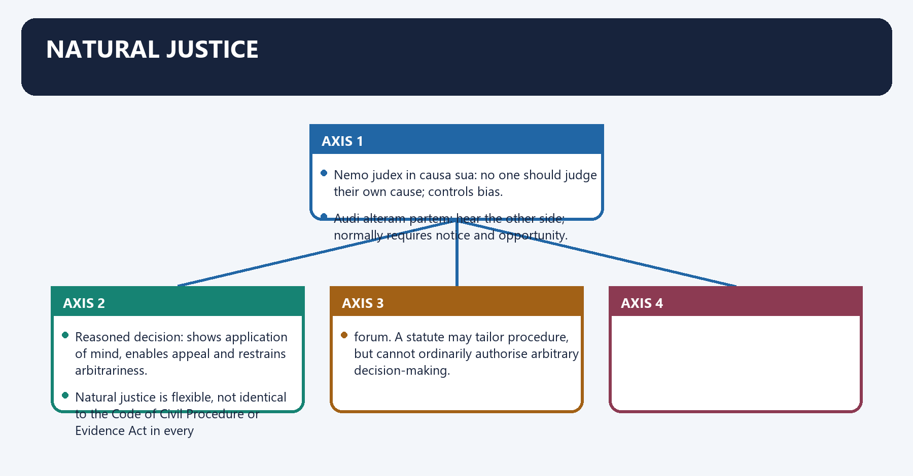
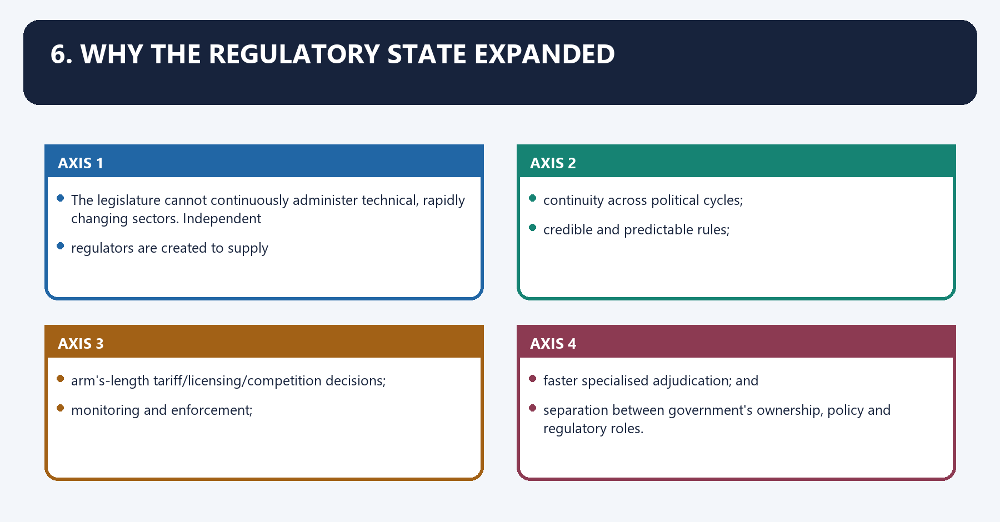
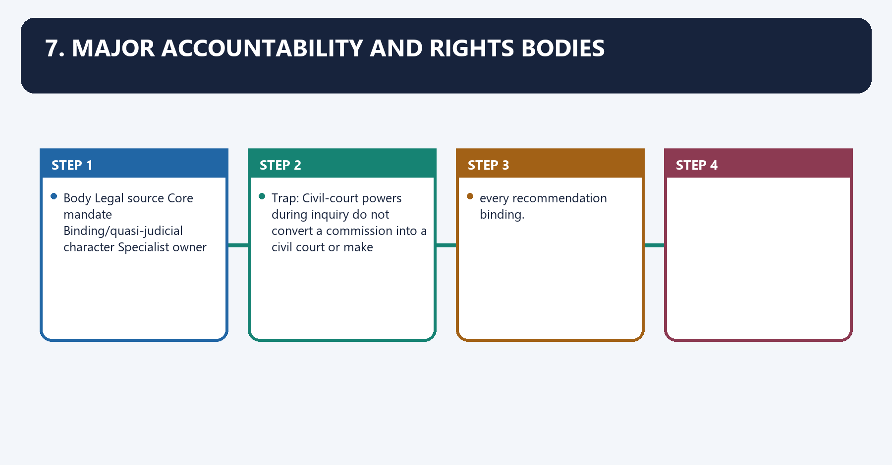
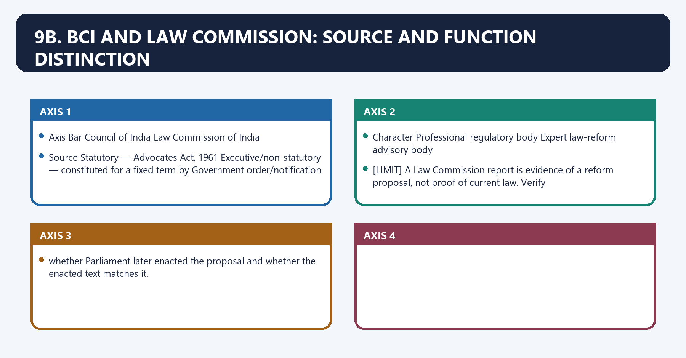
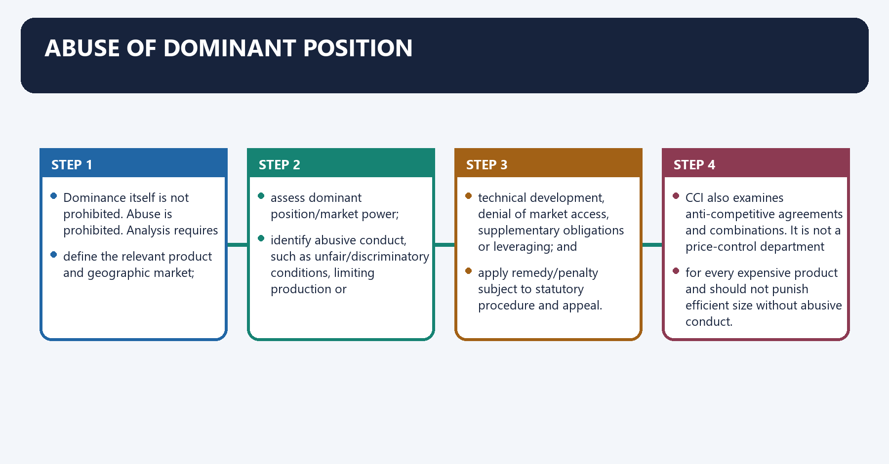

# Regulatory State and Quasi Judicial Institutions — Complete Uncompressed Learning Session

**Complete independent learning session + verified PYQ routing + solved practice workbook + final consolidated register notes**

**Legal/current control date:** 25 August 2026 (Asia/Kolkata)

> **Tag key:** `[FACT]` = named constitutional, statutory, official, judicial or audited local support; `[ANALYSIS]` = reasoned examination; `[CURRENT]` = checked for the control date; `[LIMIT]` = qualification.
>
> **Answer-writing discipline:** claim -> named evidence -> analysis -> qualification.

- [CURRENT] Status is controlled to **25 August 2026, Asia/Kolkata**.
- [CURRENT] **Live official refresh, 25 August 2026:** CCI's current official competition-law description and the official regulator, MeitY and Supreme Court portals were rechecked on 25 August 2026. Digital, data and platform proposals or subordinate frameworks are used only with their dated legal status; no draft is represented as enacted law.

#### How to Use This Package

[FACT] The complete Basic/Core owner is taught first in source order. Cross-topic Markdown, local OCR books and verified PYQ ledgers supplement it.

[FACT] Advanced-owner material appears only after the Core and practice sections under the required optional-depth label.

[LIMIT] Statutory, regulatory and quasi-judicial describe different axes. A regulator is quasi-judicial only while performing an adjudicatory function. Independence does not remove legislative, audit, transparency, appeal or judicial-review accountability, and a consultation paper or proposed digital regime is not law.

#### Local Owner Gateway

> **Subject:** Polity · **Tier:** Core · **GS Paper:** GS-II
> **Official clause:** "Statutory, regulatory and various quasi-judicial bodies."
> **Rule:** Classification, institutional design and PYQ answer engines are complete here.
> Specialist files supply body-specific detail; Advanced adds optional theory only.
> **Advanced (optional):** `../advanced/49_Regulatory-State-and-Quasi-Judicial-Institutions.md` — optional deeper detail; not required for any mark.

---

## BASIC LEARNING SESSION

### 01. 1. The three words describe different things

1. The three words describe different things denotes the constitutional rules and institutional links organised around LEGAL SOURCE PRIMARY FUNCTION DECISIONAL CHARACTER.
1. The three words describe different things operates through Constitutional Advisory Administrative, connected with Statutory Regulatory Quasi-legislative.
The operative mechanism matters because executive Investigative Quasi-judicial.
Its principal consequence is that judicial Adjudicatory Judicial.
The decisive contrast is between Statutory tells us how a body is created : by an Act of Parliament or a State and Regulatory tells us what it mainly does : sets/enforces rules for a sector or activity.
The exam-safe limitation is that quasi-judicial tells us how it decides a dispute or affects rights : through a duty to act.

```text
LEGAL SOURCE                 PRIMARY FUNCTION                 DECISIONAL CHARACTER
-------------                ----------------                 --------------------
Constitutional               Advisory                         Administrative
Statutory                    Regulatory                       Quasi-legislative
Executive                    Investigative                    Quasi-judicial
Judicial                     Adjudicatory                      Judicial
```

- **Statutory** tells us **how a body is created**: by an Act of Parliament or a State
  Legislature.
- **Regulatory** tells us **what it mainly does**: sets/enforces rules for a sector or activity.
- **Quasi-judicial** tells us **how it decides a dispute or affects rights**: through a duty to act
  fairly, consider evidence and give a reasoned decision.

A body may occupy more than one category. CCI is statutory and regulatory and performs
quasi-judicial functions. NHRC is statutory and has inquiry/civil-court powers, but its
recommendations are generally not binding. CBI is not converted into a statutory body merely
because it exercises powers traceable to the DSPE Act.

> **Master trap:** The body's **name** ("Commission", "Authority", "Board" or "Tribunal") does not
> establish its legal source or powers. Read the Constitution, parent Act or executive instrument.

---

### 02. 2. Source-based taxonomy

2. Source-based taxonomy denotes the constitutional rules and institutional links organised around Category Source Amendment/abolition route Examples.
2. Source-based taxonomy operates through Statutory body Legislation Legislative amendment/repeal, subject to Constitution NHRC, CIC, CVC, Lokpal, CCI, TRAI, SEBI, NGT, connected with Judicial body Constitution/statute establishing a court Constitutional/statutory route Supreme Court, High Courts, subordinate courts.
The operative mechanism matters because category Source Amendment/abolition route Examples.
Its principal consequence is that category Source Amendment/abolition route Examples.
The decisive contrast is between Category Source Amendment/abolition route Examples and Category Source Amendment/abolition route Examples.
The exam-safe limitation is that category Source Amendment/abolition route Examples.

| Category | Source | Amendment/abolition route | Examples |
|---|---|---|---|
| **Constitutional body** | Constitution itself | Constitutional amendment, subject to basic structure | ECI, UPSC/SPSC, Finance Commission, CAG, NCSC, NCST, NCBC, GST Council |
| **Statutory body** | Legislation | Legislative amendment/repeal, subject to Constitution | NHRC, CIC, CVC, Lokpal, CCI, TRAI, SEBI, NGT |
| **Delegated statutory/notification authority** | Notification/order issued under an enabling Act | Governed by parent Act and valid delegated action | Central Ground Water Authority under Environment (Protection) Act powers |
| **Executive/non-statutory body** | Resolution, order or business rules without direct creation by Constitution/statute | Executive action, unless statute otherwise controls | NITI Aayog, Law Commission; CBI as an organisation has executive origin while using DSPE Act powers |
| **Judicial body** | Constitution/statute establishing a court | Constitutional/statutory route | Supreme Court, High Courts, subordinate courts |

### 03. Constitutional versus statutory

Constitutional versus statutory denotes the constitutional rules and institutional links organised around Test Constitutional Statutory.
Constitutional versus statutory operates through Mandate source Constitutional article Parent Act, connected with Composition/powers Constitution plus legislation/rules Act plus rules/regulations.
The operative mechanism matters because ordinary-law alteration Cannot erase constitutional core Parliament/legislature may amend within constitutional limits.
Its principal consequence is that judicial review Yes Yes.
The decisive contrast is between Automatic superiority No; effectiveness depends on design and practice No; a well-designed statute may grant substantial autonomy and Trap: Constitutional status does not guarantee strong performance, and statutory status does.
The exam-safe limitation is that not necessarily mean weak independence.

| Test | Constitutional | Statutory |
|---|---|---|
| Mandate source | Constitutional article | Parent Act |
| Composition/powers | Constitution plus legislation/rules | Act plus rules/regulations |
| Ordinary-law alteration | Cannot erase constitutional core | Parliament/legislature may amend within constitutional limits |
| Judicial review | Yes | Yes |
| Automatic superiority | No; effectiveness depends on design and practice | No; a well-designed statute may grant substantial autonomy |

> **Trap:** Constitutional status does not guarantee strong performance, and statutory status does
> not necessarily mean weak independence.

---

### 04. 3. Functional taxonomy

3. Functional taxonomy denotes the constitutional rules and institutional links organised around Function What it involves Typical institutions.
3. Functional taxonomy operates through Advisory/recommendatory Inquiry, reports, recommendations, policy advice NHRC in much of its work, Law Commission, Finance Commission, connected with Investigative Fact-finding, searches/investigation under law, prosecution support CBI, vigilance organisations, investigative wings.
The operative mechanism matters because regulatory Standards, licences, tariffs, market conduct, supervision, enforcement RBI, SEBI, IRDAI, TRAI, CERC, CCI, FSSAI.
Its principal consequence is that tribunal Specialised statutory adjudication outside ordinary court hierarchy CAT, NGT, TDSAT, SAT, APTEL, NCLT/NCLAT.
The decisive contrast is between Functions may be combined, but combination increases the need for internal separation, reasoned and orders and appeal.
The exam-safe limitation is that function What it involves Typical institutions.

| Function | What it involves | Typical institutions |
|---|---|---|
| **Advisory/recommendatory** | Inquiry, reports, recommendations, policy advice | NHRC in much of its work, Law Commission, Finance Commission |
| **Investigative** | Fact-finding, searches/investigation under law, prosecution support | CBI, vigilance organisations, investigative wings |
| **Regulatory** | Standards, licences, tariffs, market conduct, supervision, enforcement | RBI, SEBI, IRDAI, TRAI, CERC, CCI, FSSAI |
| **Adjudicatory/quasi-judicial** | Notice, hearing, evidence, findings, penalty/remedy | CIC, CCI, consumer commissions, regulators when deciding cases |
| **Tribunal** | Specialised statutory adjudication outside ordinary court hierarchy | CAT, NGT, TDSAT, SAT, APTEL, NCLT/NCLAT |
| **Ombudsman/accountability** | Complaints against maladministration/corruption and institutional oversight | Lokpal/Lokayuktas, information and vigilance institutions |

Functions may be combined, but combination increases the need for internal separation, reasoned
orders and appeal.

---

### 05. Regulatory cycle

Regulatory cycle denotes the constitutional rules and institutional links organised around delegated regulations / standards.
Regulatory cycle operates through licence or registration, connected with supervision and information collection.
The operative mechanism matters because show-cause notice and hearing.
Its principal consequence is that order / penalty / corrective direction.
The decisive contrast is between constitutional judicial review and delegated regulations / standards.
The exam-safe limitation is that delegated regulations / standards.

```text
Parent statute
   -> delegated regulations / standards
   -> licence or registration
   -> supervision and information collection
   -> investigation
   -> show-cause notice and hearing
   -> order / penalty / corrective direction
   -> statutory appeal
   -> constitutional judicial review
```

### 06. Three kinds of action

Three kinds of action denotes the constitutional rules and institutional links organised around Action Character Safeguard.
Three kinds of action operates through General regulation/standard Quasi-legislative Statutory authority, publication, consultation where required, reasoned policy basis, connected with Individual penalty, licence cancellation or dispute order Quasi-judicial Notice, hearing, impartiality, evidence, reasons and appeal.
The operative mechanism matters because trap: A regulator is not quasi-judicial every moment. The character depends on the particular.
Its principal consequence is that function being exercised.
The decisive contrast is between Action Character Safeguard and Action Character Safeguard.
The exam-safe limitation is that action Character Safeguard.
| Action | Character | Safeguard |
|---|---|---|
| General regulation/standard | **Quasi-legislative** | Statutory authority, publication, consultation where required, reasoned policy basis |
| Inspection/investigation/prosecution decision | Administrative/investigative | Legality, relevance, non-arbitrariness, procedural safeguards |
| Individual penalty, licence cancellation or dispute order | **Quasi-judicial** | Notice, hearing, impartiality, evidence, reasons and appeal |

> **Trap:** A regulator is not quasi-judicial every moment. The character depends on the particular
> function being exercised.

---

### 07. 5. Quasi-judicial body: precise meaning

5. Quasi-judicial body: precise meaning denotes the constitutional rules and institutional links organised around A quasi-judicial authority is not a regular court, but while deciding a matter affecting rights or.
5. Quasi-judicial body: precise meaning operates through liabilities it must act judicially, connected with A quasi-judicial authority is not a regular court, but while deciding a matter affecting rights or.
The operative mechanism matters because a quasi-judicial authority is not a regular court, but while deciding a matter affecting rights or.
Its principal consequence is that a quasi-judicial authority is not a regular court, but while deciding a matter affecting rights or.
The decisive contrast is between A quasi-judicial authority is not a regular court, but while deciding a matter affecting rights or and A quasi-judicial authority is not a regular court, but while deciding a matter affecting rights or.
The exam-safe limitation is that a quasi-judicial authority is not a regular court, but while deciding a matter affecting rights or.

A quasi-judicial authority is not a regular court, but while deciding a matter affecting rights or
liabilities it must act judicially.

### 08. Core features

Core features denotes the constitutional rules and institutional links organised around authority derives from Constitution/statute.
Core features operates through limited subject-matter jurisdiction, connected with hearing of parties or consideration of rival claims.
The operative mechanism matters because duty of fairness and absence of bias.
Its principal consequence is that fact/law determination.
The decisive contrast is between power to grant a statutory remedy, direction or penalty; and and appeal/review/judicial review according to law.
The exam-safe limitation is that authority derives from Constitution/statute.
1. authority derives from Constitution/statute;
2. limited subject-matter jurisdiction;
3. hearing of parties or consideration of rival claims;
4. duty of fairness and absence of bias;
5. fact/law determination;
6. reasoned order;
7. power to grant a statutory remedy, direction or penalty; and
8. appeal/review/judicial review according to law.

### 09. Natural justice

Natural justice denotes the constitutional rules and institutional links organised around Nemo judex in causa sua: no one should judge their own cause; controls bias.
Natural justice operates through Audi alteram partem: hear the other side; normally requires notice and opportunity, connected with Reasoned decision: shows application of mind, enables appeal and restrains arbitrariness.
The operative mechanism matters because natural justice is flexible, not identical to the Code of Civil Procedure or Evidence Act in every.
Its principal consequence is that forum. A statute may tailor procedure, but cannot ordinarily authorise arbitrary decision-making.
The decisive contrast is between Nemo judex in causa sua: no one should judge their own cause; controls bias and Nemo judex in causa sua: no one should judge their own cause; controls bias.
The exam-safe limitation is that nemo judex in causa sua: no one should judge their own cause; controls bias.

- **Nemo judex in causa sua:** no one should judge their own cause; controls bias.
- **Audi alteram partem:** hear the other side; normally requires notice and opportunity.
- **Reasoned decision:** shows application of mind, enables appeal and restrains arbitrariness.

Natural justice is flexible, not identical to the Code of Civil Procedure or Evidence Act in every
forum. A statute may tailor procedure, but cannot ordinarily authorise arbitrary decision-making.

### 10. Tribunal versus regulator versus court

Tribunal versus regulator versus court denotes the constitutional rules and institutional links organised around Dimension Court Tribunal Regulator acting quasi-judicially.
Tribunal versus regulator versus court operates through Main role General judicial adjudication Specialised statutory adjudication Sector governance plus case-specific decisions, connected with Jurisdiction Constitutional/statutory, often broad Specific statute/subject Parent regulatory statute.
The operative mechanism matters because members Judges/judicial officers Judicial and/or technical members Chair/members with sector and legal expertise.
Its principal consequence is that procedure Formal judicial procedure Often more flexible Statutory/regulatory procedure.
The decisive contrast is between Review Appellate courts Statutory appeal plus HC/SC review Specialist tribunal/court plus HC/SC review and Dimension Court Tribunal Regulator acting quasi-judicially.
The exam-safe limitation is that dimension Court Tribunal Regulator acting quasi-judicially.
| Dimension | Court | Tribunal | Regulator acting quasi-judicially |
|---|---|---|---|
| Main role | General judicial adjudication | Specialised statutory adjudication | Sector governance plus case-specific decisions |
| Jurisdiction | Constitutional/statutory, often broad | Specific statute/subject | Parent regulatory statute |
| Members | Judges/judicial officers | Judicial and/or technical members | Chair/members with sector and legal expertise |
| Procedure | Formal judicial procedure | Often more flexible | Statutory/regulatory procedure |
| Review | Appellate courts | Statutory appeal plus HC/SC review | Specialist tribunal/court plus HC/SC review |

---

### 11. 6. Why the regulatory state expanded

6. Why the regulatory state expanded denotes the constitutional rules and institutional links organised around The legislature cannot continuously administer technical, rapidly changing sectors. Independent.
6. Why the regulatory state expanded operates through regulators are created to supply, connected with continuity across political cycles.
The operative mechanism matters because credible and predictable rules.
Its principal consequence is that arm's-length tariff/licensing/competition decisions.
The decisive contrast is between monitoring and enforcement and faster specialised adjudication; and.
The exam-safe limitation is that separation between government's ownership, policy and regulatory roles.

The legislature cannot continuously administer technical, rapidly changing sectors. Independent
regulators are created to supply:

- domain expertise;
- continuity across political cycles;
- credible and predictable rules;
- arm's-length tariff/licensing/competition decisions;
- monitoring and enforcement;
- faster specialised adjudication; and
- separation between government's ownership, policy and regulatory roles.

### 12. Central design tension

Central design tension denotes the constitutional rules and institutional links organised around AUTONOMY -------- EXPERTISE -------- ACCOUNTABILITY.
Central design tension operates through Too little autonomy enables political or ministry interference, connected with Too much insulation creates democratic deficit or unaccountable technocracy.
The operative mechanism matters because too little expertise produces weak or captured rules.
Its principal consequence is that expertise drawn only from industry may increase capture.
The decisive contrast is between The solution is calibrated independence with statutory mandate, transparent appointments, secured and tenure, adequate funding, conflict rules, reasoned decisions, appeal and parliamentary reporting.
The exam-safe limitation is that aUTONOMY -------- EXPERTISE -------- ACCOUNTABILITY.
```text
AUTONOMY -------- EXPERTISE -------- ACCOUNTABILITY
```

- Too little autonomy enables political or ministry interference.
- Too much insulation creates democratic deficit or unaccountable technocracy.
- Too little expertise produces weak or captured rules.
- Expertise drawn only from industry may increase capture.

The solution is calibrated independence with statutory mandate, transparent appointments, secured
tenure, adequate funding, conflict rules, reasoned decisions, appeal and parliamentary reporting.

---

### 13. 7. Major accountability and rights bodies

7. Major accountability and rights bodies denotes the constitutional rules and institutional links organised around Body Legal source Core mandate Binding/quasi-judicial character Specialist owner.
7. Major accountability and rights bodies operates through Trap: Civil-court powers during inquiry do not convert a commission into a civil court or make, connected with every recommendation binding.
The operative mechanism matters because body Legal source Core mandate Binding/quasi-judicial character Specialist owner.
Its principal consequence is that body Legal source Core mandate Binding/quasi-judicial character Specialist owner.
The decisive contrast is between Body Legal source Core mandate Binding/quasi-judicial character Specialist owner and Body Legal source Core mandate Binding/quasi-judicial character Specialist owner.
The exam-safe limitation is that body Legal source Core mandate Binding/quasi-judicial character Specialist owner.

| Body | Legal source | Core mandate | Binding/quasi-judicial character | Specialist owner |
|---|---|---|---|---|
| **NHRC/SHRC** | Protection of Human Rights Act, 1993 | Inquiry, jail visits, rights promotion and recommendations | Civil-court inquiry powers; recommendations generally advisory | `NHRC-and-SHRC.md` |
| **CIC/SIC** | RTI Act, 2005 | RTI complaints and second appeals | Can require disclosure, impose statutory penalty and award compensation | `CIC-and-SIC.md` |
| **CVC** | CVC Act, 2003 | Vigilance supervision/advice; specified superintendence over CBI corruption work | Statutory supervisory/advisory body, not a general criminal court | `CVC-and-CBI.md` |
| **CBI** | Executive origin; investigation under DSPE Act, 1946 and other laws | Corruption, economic and specified serious-crime investigation | Investigative agency, not a quasi-judicial adjudicator | `CVC-and-CBI.md` |
| **Lokpal** | Lokpal and Lokayuktas Act, 2013 | Anti-corruption complaints/inquiry/investigation architecture | Statutory ombudsman with inquiry/superintendence powers; criminal guilt remains for courts | `Lokpal-and-Lokayuktas.md` |
| **NCW** | National Commission for Women Act, 1990 | Safeguards, complaints, studies and recommendations | Civil-court powers for investigation; mainly recommendatory | Specialist social-justice support |
| **NCM** | National Commission for Minorities Act, 1992 | Monitor minority safeguards and complaints | Investigative/recommendatory | Specialist social-justice support |
| **NCPCR** | Commissions for Protection of Child Rights Act, 2005 | Child-rights safeguards, inquiries and monitoring | Inquiry/civil-court powers; recommendations and statutory functions | Specialist social-justice support |

> **Trap:** Civil-court powers during inquiry do not convert a commission into a civil court or make
> every recommendation binding.

---

### 14. 8. National commission classification trap

8. National commission classification trap denotes the constitutional rules and institutional links organised around Constitutional Statutory.
8. National commission classification trap operates through NCSC - Article 338 NHRC - 1993 Act, connected with NCST - Article 338A NCW - 1990 Act.
The operative mechanism matters because nCBC - Article 338B since 102nd Amendment NCM - 1992 Act.
Its principal consequence is that special Officer for Linguistic Minorities - Article 350B NCPCR - 2005 Act.
The decisive contrast is between NCBC's shift from a statutory commission to a constitutional body is a direct illustration that and legal source affects entrenchment, reporting, consultation and amendment route, but operational.
The exam-safe limitation is that effectiveness still depends on appointments, resources, data and governmental response.
| Constitutional | Statutory |
|---|---|
| NCSC - Article 338 | NHRC - 1993 Act |
| NCST - Article 338A | NCW - 1990 Act |
| NCBC - Article 338B since 102nd Amendment | NCM - 1992 Act |
| Special Officer for Linguistic Minorities - Article 350B | NCPCR - 2005 Act |

NCBC's shift from a statutory commission to a constitutional body is a direct illustration that
legal source affects entrenchment, reporting, consultation and amendment route, but operational
effectiveness still depends on appointments, resources, data and governmental response.

---

### 15. Finance and markets

Finance and markets denotes the constitutional rules and institutional links organised around Regulator Principal legal basis Core field.
Finance and markets operates through SEBI SEBI Act, 1992 and securities laws Investor protection, securities-market development and regulation, connected with IRDAI IRDA Act, 1999; Insurance Act, 1938 Insurance/reinsurance regulation.
The operative mechanism matters because pFRDA PFRDA Act, 2013 Pension-sector/NPS regulation and development.
Its principal consequence is that iFSCA IFSCA Act, 2019 Unified regulation of financial products/services/institutions in IFSCs.
The decisive contrast is between Regulator Principal legal basis Core field and Regulator Principal legal basis Core field.
The exam-safe limitation is that regulator Principal legal basis Core field.

| Regulator | Principal legal basis | Core field |
|---|---|---|
| **RBI** | RBI Act, 1934; Banking Regulation Act, 1949 and connected laws | Currency/monetary system, banking, payments and financial stability functions |
| **SEBI** | SEBI Act, 1992 and securities laws | Investor protection, securities-market development and regulation |
| **IRDAI** | IRDA Act, 1999; Insurance Act, 1938 | Insurance/reinsurance regulation |
| **PFRDA** | PFRDA Act, 2013 | Pension-sector/NPS regulation and development |
| **IFSCA** | IFSCA Act, 2019 | Unified regulation of financial products/services/institutions in IFSCs |
| **IBBI** | Insolvency and Bankruptcy Code, 2016 | Insolvency professionals, agencies and information utilities; regulatory side of insolvency ecosystem |

### 16. Competition, infrastructure and utilities

Competition, infrastructure and utilities denotes the constitutional rules and institutional links organised around Regulator Principal legal basis Core field / appellate logic.
Competition, infrastructure and utilities operates through CCI Competition Act, 2002 Anti-competitive agreements, abuse of dominance, combinations; appeal to NCLAT under the Act, connected with TRAI TRAI Act, 1997 Telecom regulation/recommendations; TDSAT settles specified disputes and hears appeals.
The operative mechanism matters because cERC/SERCs Electricity Act, 2003 Tariffs, licences, grid/market regulation within allocated jurisdiction; appeals to APTEL.
Its principal consequence is that pNGRB PNGRB Act, 2006 Downstream petroleum/natural-gas pipelines, networks and market access; appeals to APTEL.
The decisive contrast is between Regulator Principal legal basis Core field / appellate logic and Regulator Principal legal basis Core field / appellate logic.
The exam-safe limitation is that regulator Principal legal basis Core field / appellate logic.
| Regulator | Principal legal basis | Core field / appellate logic |
|---|---|---|
| **CCI** | Competition Act, 2002 | Anti-competitive agreements, abuse of dominance, combinations; appeal to NCLAT under the Act |
| **TRAI** | TRAI Act, 1997 | Telecom regulation/recommendations; TDSAT settles specified disputes and hears appeals |
| **CERC/SERCs** | Electricity Act, 2003 | Tariffs, licences, grid/market regulation within allocated jurisdiction; appeals to APTEL |
| **PNGRB** | PNGRB Act, 2006 | Downstream petroleum/natural-gas pipelines, networks and market access; appeals to APTEL |
| **AERA** | AERA Act, 2008 | Economic regulation of tariffs/services at covered airports; appellate jurisdiction lies with TDSAT under the amended framework |
| **RERA authorities** | Real Estate (Regulation and Development) Act, 2016 | State/UT real-estate project/agent regulation; Real Estate Appellate Tribunals |

### 17. Social, environmental and professional regulation

Social, environmental and professional regulation denotes the constitutional rules and institutional links organised around Institution Principal legal basis Core field.
Social, environmental and professional regulation operates through FSSAI Food Safety and Standards Act, 2006 Science-based food standards and food-safety regulation, connected with CPCB/SPCBs Water Act, 1974; Air Act, 1981 and environmental laws Pollution standards, consent/monitoring/enforcement functions.
The operative mechanism matters because uGC UGC Act, 1956 Coordination and maintenance of university-education standards.
Its principal consequence is that nMC National Medical Commission Act, 2019 Medical education, institutions and professional regulation through statutory architecture.
The decisive contrast is between The list is a sector map, not a claim that all bodies have identical powers, appointment processes or and appeal routes. Always return to the parent Act.
The exam-safe limitation is that institution Principal legal basis Core field.

| Institution | Principal legal basis | Core field |
|---|---|---|
| **FSSAI** | Food Safety and Standards Act, 2006 | Science-based food standards and food-safety regulation |
| **CPCB/SPCBs** | Water Act, 1974; Air Act, 1981 and environmental laws | Pollution standards, consent/monitoring/enforcement functions |
| **UGC** | UGC Act, 1956 | Coordination and maintenance of university-education standards |
| **NMC** | National Medical Commission Act, 2019 | Medical education, institutions and professional regulation through statutory architecture |
| **Bar Council of India (BCI)** | Advocates Act, 1961 | Professional standards, legal education, discipline architecture and All India Bar Examination; enrolment begins with State Bar Councils |

The list is a sector map, not a claim that all bodies have identical powers, appointment processes or
appeal routes. Always return to the parent Act.

---

### 18. 9A. Consumer Commissions: usable adjudicatory capsule

9A. Consumer Commissions: usable adjudicatory capsule denotes the constitutional rules and institutional links organised around 📜 The Consumer Protection Act 2019 creates a three-tier consumer-disputes redressal commission.
9A. Consumer Commissions: usable adjudicatory capsule operates through Commission Original pecuniary jurisdiction under the 2021 Rules Appellate route, connected with District Consideration paid up to ₹50 lakh State Commission.
The operative mechanism matters because state Above ₹50 lakh and up to ₹2 crore National Commission.
Its principal consequence is that national (NCDRC) Above ₹2 crore Original-jurisdiction orders appeal to Supreme Court under the Act.
The decisive contrast is between Jurisdiction turns on the value of consideration paid , not the compensation claimed and The commissions can grant statutory consumer remedies, including refund, replacement,.
The exam-safe limitation is that compensation and discontinuance of unfair/restrictive practices.
📜 The Consumer Protection Act 2019 creates a three-tier **consumer-disputes redressal commission**
hierarchy:

| Commission | Original pecuniary jurisdiction under the 2021 Rules | Appellate route |
|---|---:|---|
| **District** | Consideration paid **up to ₹50 lakh** | State Commission |
| **State** | Above ₹50 lakh and up to ₹2 crore | National Commission |
| **National (NCDRC)** | Above ₹2 crore | Original-jurisdiction orders appeal to Supreme Court under the Act |

- Jurisdiction turns on the **value of consideration paid**, not the compensation claimed.
- The commissions can grant statutory consumer remedies, including refund, replacement,
  compensation and discontinuance of unfair/restrictive practices.
- The 2019 Act enables e-filing, mediation and filing from the place where the consumer resides or
  works, subject to the statutory route.
- Appeals have prescribed limitation/deposit requirements; quote them only when the question needs
  procedural detail.

> **CCPA ≠ Consumer Commission.** The **Central Consumer Protection Authority** is a regulator/
> enforcement authority for class-wide consumer interests, misleading advertisements and unsafe
> goods/services. District, State and National Commissions **adjudicate consumer disputes**.

[LIMIT] Pecuniary thresholds are rule-made and date-sensitive. The figures above are the operative
**Consumer Protection (Jurisdiction of the District Commission, State Commission and National
Commission) Rules, 2021** position; re-check official rules before a dated current-affairs answer.

### 19. 9B. BCI and Law Commission: source and function distinction

9B. BCI and Law Commission: source and function distinction denotes the constitutional rules and institutional links organised around Axis Bar Council of India Law Commission of India.
9B. BCI and Law Commission: source and function distinction operates through Source Statutory — Advocates Act, 1961 Executive/non-statutory — constituted for a fixed term by Government order/notification, connected with Character Professional regulatory body Expert law-reform advisory body.
The operative mechanism matters because [LIMIT] A Law Commission report is evidence of a reform proposal, not proof of current law. Verify.
Its principal consequence is that whether Parliament later enacted the proposal and whether the enacted text matches it.
The decisive contrast is between Axis Bar Council of India Law Commission of India and Axis Bar Council of India Law Commission of India.
The exam-safe limitation is that axis Bar Council of India Law Commission of India.

| Axis | Bar Council of India | Law Commission of India |
|---|---|---|
| Source | **Statutory** — Advocates Act, 1961 | **Executive/non-statutory** — constituted for a fixed term by Government order/notification |
| Character | Professional regulatory body | Expert law-reform advisory body |
| Core function | Standards of professional conduct/legal education, recognition-related functions and appellate discipline under the Act | Studies laws, consults and recommends repeal, revision, codification or reform through reports |
| Binding force | Statutory rules/orders operate within the Act and remain judicially reviewable | Reports are **recommendatory**; government/Parliament may accept, modify or reject them |
| Institutional trap | State Bar Councils enrol advocates in the first instance; BCI is not a court or a government department | It is not permanent, constitutional or created by a Law Commission Act |

[LIMIT] A Law Commission report is evidence of a reform proposal, not proof of current law. Verify
whether Parliament later enacted the proposal and whether the enacted text matches it.

---

### 20. Core mandate

Core mandate denotes the constitutional rules and institutional links organised around The Competition Act, 2002 seeks to.
Core mandate operates through prevent practices having adverse effect on competition, connected with promote and sustain competition.
The operative mechanism matters because protect consumer interests; and.
Its principal consequence is that ensure freedom of trade by market participants.
The decisive contrast is between The Competition Act, 2002 seeks to and The Competition Act, 2002 seeks to.
The exam-safe limitation is that the Competition Act, 2002 seeks to.
The Competition Act, 2002 seeks to:

- prevent practices having adverse effect on competition;
- promote and sustain competition;
- protect consumer interests; and
- ensure freedom of trade by market participants.

### 21. Abuse of dominant position

Abuse of dominant position denotes the constitutional rules and institutional links organised around Dominance itself is not prohibited. Abuse is prohibited. Analysis requires.
Abuse of dominant position operates through define the relevant product and geographic market, connected with assess dominant position/market power.
The operative mechanism matters because identify abusive conduct, such as unfair/discriminatory conditions, limiting production or.
Its principal consequence is that technical development, denial of market access, supplementary obligations or leveraging; and.
The decisive contrast is between apply remedy/penalty subject to statutory procedure and appeal and CCI also examines anti-competitive agreements and combinations. It is not a price-control department.
The exam-safe limitation is that for every expensive product and should not punish efficient size without abusive conduct.

Dominance itself is not prohibited. **Abuse** is prohibited. Analysis requires:

1. define the relevant product and geographic market;
2. assess dominant position/market power;
3. identify abusive conduct, such as unfair/discriminatory conditions, limiting production or
   technical development, denial of market access, supplementary obligations or leveraging; and
4. apply remedy/penalty subject to statutory procedure and appeal.

CCI also examines anti-competitive agreements and combinations. It is not a price-control department
for every expensive product and should not punish efficient size without abusive conduct.

---

### 22. 11. Environmental and specialised adjudicatory bodies

11. Environmental and specialised adjudicatory bodies denotes the constitutional rules and institutional links organised around Body Source Function Key distinction.
11. Environmental and specialised adjudicatory bodies operates through CPCB/SPCB Water/Air Acts Pollution regulation, standards, consent and enforcement Regulators/boards, not environmental courts, connected with TDSAT TRAI Act, 1997 Telecom/broadcast and assigned appellate/dispute functions Adjudicatory body distinct from TRAI.
The operative mechanism matters because sAT SEBI Act and connected financial laws Appeals from specified financial regulators Appellate tribunal.
Its principal consequence is that aPTEL Electricity Act, 2003 and assigned laws Appeals in electricity and PNGRB matters Sector appellate tribunal.
The decisive contrast is between Body Source Function Key distinction and Body Source Function Key distinction.
The exam-safe limitation is that body Source Function Key distinction.
| Body | Source | Function | Key distinction |
|---|---|---|---|
| **NGT** | National Green Tribunal Act, 2010 | Specialised environmental adjudication and relief under scheduled enactments | Tribunal; applies environmental principles; distinct from CPCB |
| **CPCB/SPCB** | Water/Air Acts | Pollution regulation, standards, consent and enforcement | Regulators/boards, not environmental courts |
| **CAT** | Articles 323A + Administrative Tribunals Act, 1985 | Covered public-service disputes | Decisions reviewable by High Courts under *L. Chandra Kumar* |
| **TDSAT** | TRAI Act, 1997 | Telecom/broadcast and assigned appellate/dispute functions | Adjudicatory body distinct from TRAI |
| **SAT** | SEBI Act and connected financial laws | Appeals from specified financial regulators | Appellate tribunal |
| **APTEL** | Electricity Act, 2003 and assigned laws | Appeals in electricity and PNGRB matters | Sector appellate tribunal |
| **NCLT/NCLAT** | Companies Act, 2013; IBC and connected laws | Company/insolvency adjudication and appeals | Tribunal hierarchy; CCI appeals also assigned to NCLAT |
| **Consumer Commissions** | Consumer Protection Act, 2019 | Consumer disputes/redress | Statutory quasi-judicial commissions, not executive consumer departments |

### 23. IPAB lesson

IPAB lesson denotes the constitutional rules and institutional links organised around The Intellectual Property Appellate Board was a statutory appellate body. The Tribunals Reforms.
IPAB lesson operates through Act, 2021 abolished specified appellate bodies including IPAB and transferred functions to courts, connected with Therefore, a PYQ about IPAB must be answered with the date-sensitive status : it existed when the.
The operative mechanism matters because question was asked, but does not exist today.
Its principal consequence is that the Intellectual Property Appellate Board was a statutory appellate body. The Tribunals Reforms.
The decisive contrast is between The Intellectual Property Appellate Board was a statutory appellate body. The Tribunals Reforms and The Intellectual Property Appellate Board was a statutory appellate body. The Tribunals Reforms.
The exam-safe limitation is that the Intellectual Property Appellate Board was a statutory appellate body. The Tribunals Reforms.

The Intellectual Property Appellate Board was a statutory appellate body. The Tribunals Reforms
Act, 2021 abolished specified appellate bodies including IPAB and transferred functions to courts.
Therefore, a PYQ about IPAB must be answered with the **date-sensitive status**: it existed when the
question was asked, but does not exist today.

### 24. Tribunal-reform legal baseline

Tribunal-reform legal baseline denotes the constitutional rules and institutional links organised around On 19 November 2025 , the Supreme Court in Madras Bar Association v. Union of India ,.
Tribunal-reform legal baseline operates through 2025 INSC 1330 , invalidated the re-enacted Tribunal Reforms Act provisions covering, connected with the fifty-year minimum age, two-name recommendation panel and merely preferable appointment.
The operative mechanism matters because timeline, four-year tenure, and impugned allowance framework.
Its principal consequence is that the Court made the standards in MBA (IV) and MBA (V) controlling until Parliament enacts.
The decisive contrast is between constitutionally compliant legislation, and directed creation of a National Tribunals and Commission within four months.
The exam-safe limitation is that a 9 March 2026 interim order separately permitted temporary extensions for specified.
- On **19 November 2025**, the Supreme Court in *Madras Bar Association v. Union of India*,
  **2025 INSC 1330**, invalidated the re-enacted Tribunal Reforms Act provisions covering
  the fifty-year minimum age, two-name recommendation panel and merely preferable appointment
  timeline, four-year tenure, and impugned allowance framework.
- The Court made the standards in *MBA (IV)* and *MBA (V)* controlling until Parliament enacts
  constitutionally compliant legislation, and directed creation of a National Tribunals
  Commission within four months.
- A **9 March 2026** interim order separately permitted temporary extensions for specified
  serving incumbents until **8 September 2026** or the applicable maximum age, whichever was
  earlier, to prevent tribunals becoming defunct. It did not revive the invalidated provisions.
- Official records: [2025 judgment](https://api.sci.gov.in/supremecourt/2021/20410/20410_2021_1_1502_66136_Judgement_19-Nov-2025.pdf);
  [2026 interim order](https://api.sci.gov.in/supremecourt/2020/15037/15037_2020_1_23_69311_Order_09-Mar-2026.pdf).

---

### 25. 12. Lok Adalat and legal-services bodies

12. Lok Adalat and legal-services bodies denotes the constitutional rules and institutional links organised around The consolidated owner is Lok-Adalats-and-Other-Courts.md . Minimum distinction.
12. Lok Adalat and legal-services bodies operates through ordinary Lok Adalat conciliates/records compromise and cannot impose a merits decision, connected with Permanent Lok Adalat handles eligible pre-litigation public-utility disputes and may decide.
The operative mechanism matters because merits after failed conciliation under the Act.
Its principal consequence is that family Courts/Gram Nyayalayas are statutory courts, not Lok Adalat variants; and.
The decisive contrast is between an Arbitration Tribunal rests on party agreement and the Arbitration and Conciliation Act and 1996, not the legal-services-authority hierarchy.
The exam-safe limitation is that the consolidated owner is Lok-Adalats-and-Other-Courts.md . Minimum distinction.
The consolidated owner is `Lok-Adalats-and-Other-Courts.md`. Minimum distinction:

- **ordinary Lok Adalat** conciliates/records compromise and cannot impose a merits decision;
- **Permanent Lok Adalat** handles eligible pre-litigation public-utility disputes and may decide
  merits after failed conciliation under the Act;
- **Family Courts/Gram Nyayalayas** are statutory courts, not Lok Adalat variants; and
- an **Arbitration Tribunal** rests on party agreement and the Arbitration and Conciliation Act
  1996, not the legal-services-authority hierarchy.

---

### 26. 13. Appointment and independence design

13. Appointment and independence design denotes the constitutional rules and institutional links organised around Evaluate every body through.
13. Appointment and independence design operates through Selection Who nominates, shortlists and appoints? Is opposition/judiciary/expertise represented?, connected with Tenure Is term fixed? Is reappointment possible? What is the age ceiling?.
The operative mechanism matters because removal At pleasure, for specified cause, or after inquiry?.
Its principal consequence is that finance Consolidated Fund charge, fee-funded, grant-dependent or mixed?.
The decisive contrast is between Staff Own cadre or ministry-deputed staff? and Rule-making Does government approve regulations? Is consultation required?.
The exam-safe limitation is that enforcement Investigation, search, penalty, licence, prosecution or recommendation?.
Evaluate every body through:

| Axis | Questions |
|---|---|
| **Selection** | Who nominates, shortlists and appoints? Is opposition/judiciary/expertise represented? |
| **Tenure** | Is term fixed? Is reappointment possible? What is the age ceiling? |
| **Removal** | At pleasure, for specified cause, or after inquiry? |
| **Finance** | Consolidated Fund charge, fee-funded, grant-dependent or mixed? |
| **Staff** | Own cadre or ministry-deputed staff? |
| **Rule-making** | Does government approve regulations? Is consultation required? |
| **Enforcement** | Investigation, search, penalty, licence, prosecution or recommendation? |
| **Adjudication** | Is there functional separation between investigation and decision? |
| **Appeal** | Tribunal, High Court, Supreme Court or another statutory forum? |
| **Reporting** | Annual report to government/Parliament; reasons for rejecting recommendations? |

No single appointment formula suits every body, but independence is weak where the regulated ministry
controls appointment, tenure, budget, staff and case-specific direction simultaneously.

---

### 27. Democratic

Democratic denotes the constitutional rules and institutional links organised around parent statute enacted/amended by legislature.
Democratic operates through questions and Department-related Parliamentary Standing Committees, connected with annual reports laid before Parliament.
The operative mechanism matters because budget/grant scrutiny; and.
Its principal consequence is that cAG audit where applicable.
The decisive contrast is between parent statute enacted/amended by legislature and parent statute enacted/amended by legislature.
The exam-safe limitation is that parent statute enacted/amended by legislature.
- parent statute enacted/amended by legislature;
- questions and Department-related Parliamentary Standing Committees;
- annual reports laid before Parliament;
- budget/grant scrutiny; and
- CAG audit where applicable.

### 28. Legal

Legal denotes the constitutional rules and institutional links organised around action confined to statute.
Legal operates through regulations cannot exceed delegated authority, connected with natural justice and reasoned orders.
The operative mechanism matters because high Court judicial review under Articles 226/227; and.
Its principal consequence is that supreme Court constitutional/appellate jurisdiction.
The decisive contrast is between action confined to statute and action confined to statute.
The exam-safe limitation is that action confined to statute.
- action confined to statute;
- regulations cannot exceed delegated authority;
- natural justice and reasoned orders;
- statutory appeal;
- High Court judicial review under Articles 226/227; and
- Supreme Court constitutional/appellate jurisdiction.

### 29. Administrative/public

Administrative/public denotes the constitutional rules and institutional links organised around transparent regulations and consultation.
Administrative/public operates through conflict-of-interest and revolving-door safeguards, connected with published orders/data.
The operative mechanism matters because grievance channels.
Its principal consequence is that performance and impact review; and.
The decisive contrast is between vigilance/procurement controls and Trap: Judicial review is not the same as a merits appeal. Courts primarily test legality,.
The exam-safe limitation is that jurisdiction, procedure, reasonableness and constitutional compliance according to the case.
- transparent regulations and consultation;
- conflict-of-interest and revolving-door safeguards;
- published orders/data;
- grievance channels;
- performance and impact review; and
- vigilance/procurement controls.

> **Trap:** Judicial review is not the same as a merits appeal. Courts primarily test legality,
> jurisdiction, procedure, reasonableness and constitutional compliance according to the case.

---

### 30. 15. Regulatory capture and other failure modes

15. Regulatory capture and other failure modes denotes the constitutional rules and institutional links organised around Failure Mechanism Corrective.
15. Regulatory capture and other failure modes operates through Industry capture Information dependence, lobbying, revolving door Disclosure, cooling-off, diverse expertise, transparent consultation, connected with Political capture Case-specific direction, insecure tenure/budget For-cause removal, statutory autonomy, recorded policy directions.
The operative mechanism matters because bureaucratic capture Ministry cadres dominate supposedly independent body Independent staffing and mixed recruitment.
Its principal consequence is that mission creep Regulator expands beyond parent law Legislative clarity and judicial review.
The decisive contrast is between Regulatory arbitrage Similar activity governed differently Activity-based coordination/harmonisation and Over-regulation Compliance cost suppresses entry/innovation Proportionality, impact assessment, sandbox where lawful.
The exam-safe limitation is that under-enforcement Vacancies, weak investigation, delayed cases Capacity, timelines, digital case management.
| Failure | Mechanism | Corrective |
|---|---|---|
| **Industry capture** | Information dependence, lobbying, revolving door | Disclosure, cooling-off, diverse expertise, transparent consultation |
| **Political capture** | Case-specific direction, insecure tenure/budget | For-cause removal, statutory autonomy, recorded policy directions |
| **Bureaucratic capture** | Ministry cadres dominate supposedly independent body | Independent staffing and mixed recruitment |
| **Mission creep** | Regulator expands beyond parent law | Legislative clarity and judicial review |
| **Regulatory arbitrage** | Similar activity governed differently | Activity-based coordination/harmonisation |
| **Over-regulation** | Compliance cost suppresses entry/innovation | Proportionality, impact assessment, sandbox where lawful |
| **Under-enforcement** | Vacancies, weak investigation, delayed cases | Capacity, timelines, digital case management |
| **Adjudicatory bias** | Investigation/prosecution/decision combined without safeguards | Internal separation, hearing, reasoned order and independent appeal |
| **Tribunal dependence** | Executive controls appointments, tenure, infrastructure | Judicially compliant selection, adequate tenure and independent administration |

---

### 31. NHRC

NHRC denotes the constitutional rules and institutional links organised around Civil-court powers during inquiry do not make recommendations binding. Its structural limitations.
NHRC operates through include recommendatory outcomes, dependence on government response/investigation, armed-forces, connected with procedure, vacancies/resources and statutory time limitation. Reform requires plural appointments,.
The operative mechanism matters because independent investigation, timely reasoned governmental response and implementation tracking.
Its principal consequence is that civil-court powers during inquiry do not make recommendations binding. Its structural limitations.
The decisive contrast is between Civil-court powers during inquiry do not make recommendations binding. Its structural limitations and Civil-court powers during inquiry do not make recommendations binding. Its structural limitations.
The exam-safe limitation is that civil-court powers during inquiry do not make recommendations binding. Its structural limitations.
Civil-court powers during inquiry do not make recommendations binding. Its structural limitations
include recommendatory outcomes, dependence on government response/investigation, armed-forces
procedure, vacancies/resources and statutory time limitation. Reform requires plural appointments,
independent investigation, timely reasoned governmental response and implementation tracking.

### 32. CIC

CIC denotes the constitutional rules and institutional links organised around CIC/SIC can issue enforceable RTI directions and penalties within the RTI Act. Their autonomy depends.
CIC operates through on transparent appointment, vacancies, tenure/service conditions, resources and compliance. The 2019, connected with amendment moved tenure/service-condition prescription to Central rules, creating an independence.
The operative mechanism matters because cIC/SIC can issue enforceable RTI directions and penalties within the RTI Act. Their autonomy depends.
Its principal consequence is that cIC/SIC can issue enforceable RTI directions and penalties within the RTI Act. Their autonomy depends.
The decisive contrast is between CIC/SIC can issue enforceable RTI directions and penalties within the RTI Act. Their autonomy depends and CIC/SIC can issue enforceable RTI directions and penalties within the RTI Act. Their autonomy depends.
The exam-safe limitation is that cIC/SIC can issue enforceable RTI directions and penalties within the RTI Act. Their autonomy depends.
CIC/SIC can issue enforceable RTI directions and penalties within the RTI Act. Their autonomy depends
on transparent appointment, vacancies, tenure/service conditions, resources and compliance. The 2019
amendment moved tenure/service-condition prescription to Central rules, creating an independence
debate.

### 33. CVC versus CBI versus Lokpal

CVC versus CBI versus Lokpal denotes the constitutional rules and institutional links organised around CVC: statutory vigilance supervision/advice.
CVC versus CBI versus Lokpal operates through CBI: investigation; executive origin with DSPE Act powers and federal consent questions, connected with Lokpal: statutory anti-corruption ombudsman/inquiry-superintendence framework.
The operative mechanism matters because criminal conviction remains with courts after investigation/prosecution.
Its principal consequence is that cVC: statutory vigilance supervision/advice.
The decisive contrast is between CVC: statutory vigilance supervision/advice and CVC: statutory vigilance supervision/advice.
The exam-safe limitation is that cVC: statutory vigilance supervision/advice.
- CVC: statutory vigilance supervision/advice.
- CBI: investigation; executive origin with DSPE Act powers and federal consent questions.
- Lokpal: statutory anti-corruption ombudsman/inquiry-superintendence framework.
- Criminal conviction remains with courts after investigation/prosecution.

### 34. NCBC

NCBC denotes the constitutional rules and institutional links organised around NCBC is now constitutional, not statutory. This is a recurring Prelims trap and a Mains case study in.
NCBC operates through the difference between entrenchment and effectiveness, connected with NCBC is now constitutional, not statutory. This is a recurring Prelims trap and a Mains case study in.
The operative mechanism matters because nCBC is now constitutional, not statutory. This is a recurring Prelims trap and a Mains case study in.
Its principal consequence is that nCBC is now constitutional, not statutory. This is a recurring Prelims trap and a Mains case study in.
The decisive contrast is between NCBC is now constitutional, not statutory. This is a recurring Prelims trap and a Mains case study in and NCBC is now constitutional, not statutory. This is a recurring Prelims trap and a Mains case study in.
The exam-safe limitation is that nCBC is now constitutional, not statutory. This is a recurring Prelims trap and a Mains case study in.
NCBC is now constitutional, not statutory. This is a recurring Prelims trap and a Mains case study in
the difference between entrenchment and effectiveness.

### 35. BCI versus Law Commission

BCI versus Law Commission denotes the constitutional rules and institutional links organised around BCI is a statutory professional regulator under the Advocates Act 1961; the Law Commission is a.
BCI versus Law Commission operates through periodically reconstituted executive advisory body . BCI exercises statutory regulatory/, connected with disciplinary functions; Law Commission reports neither bind courts nor amend law.
The operative mechanism matters because bCI is a statutory professional regulator under the Advocates Act 1961; the Law Commission is a.
Its principal consequence is that bCI is a statutory professional regulator under the Advocates Act 1961; the Law Commission is a.
The decisive contrast is between BCI is a statutory professional regulator under the Advocates Act 1961; the Law Commission is a and BCI is a statutory professional regulator under the Advocates Act 1961; the Law Commission is a.
The exam-safe limitation is that bCI is a statutory professional regulator under the Advocates Act 1961; the Law Commission is a.
BCI is a **statutory professional regulator** under the Advocates Act 1961; the Law Commission is a
periodically reconstituted **executive advisory body**. BCI exercises statutory regulatory/
disciplinary functions; Law Commission reports neither bind courts nor amend law.

### 36. Consumer Commission versus CCPA

Consumer Commission versus CCPA denotes the constitutional rules and institutional links organised around Consumer Commissions are statutory adjudicatory bodies in a District–State–National hierarchy.
Consumer Commission versus CCPA operates through The CCPA is a statutory regulatory/enforcement authority protecting consumers as a class, connected with Consumer Commissions are statutory adjudicatory bodies in a District–State–National hierarchy.
The operative mechanism matters because consumer Commissions are statutory adjudicatory bodies in a District–State–National hierarchy.
Its principal consequence is that consumer Commissions are statutory adjudicatory bodies in a District–State–National hierarchy.
The decisive contrast is between Consumer Commissions are statutory adjudicatory bodies in a District–State–National hierarchy and Consumer Commissions are statutory adjudicatory bodies in a District–State–National hierarchy.
The exam-safe limitation is that consumer Commissions are statutory adjudicatory bodies in a District–State–National hierarchy.
Consumer Commissions are statutory **adjudicatory** bodies in a District–State–National hierarchy.
The CCPA is a statutory **regulatory/enforcement** authority protecting consumers as a class.

---

### 37. 17.1 2018 GS-II: tribunals and ordinary courts

17.1 2018 GS-II: tribunals and ordinary courts denotes the constitutional rules and institutional links organised around Thesis: Tribunals add expertise and speed but cannot constitutionally replace High Court judicial.
17.1 2018 GS-II: tribunals and ordinary courts operates through review or operate without decisional independence, connected with Structure: rationale - Articles 323A/323B and parent Acts - executive-control/vacancy/procedure risks.
The operative mechanism matters because l. Chandra Kumar - independent appointments, tenure, infrastructure and High Court review.
Its principal consequence is that thesis: Tribunals add expertise and speed but cannot constitutionally replace High Court judicial.
The decisive contrast is between Thesis: Tribunals add expertise and speed but cannot constitutionally replace High Court judicial and Thesis: Tribunals add expertise and speed but cannot constitutionally replace High Court judicial.
The exam-safe limitation is that thesis: Tribunals add expertise and speed but cannot constitutionally replace High Court judicial.
**Thesis:** Tribunals add expertise and speed but cannot constitutionally replace High Court judicial
review or operate without decisional independence.

Structure: rationale -> Articles 323A/323B and parent Acts -> executive-control/vacancy/procedure risks
-> *L. Chandra Kumar* -> independent appointments, tenure, infrastructure and High Court review.

### 38. 17.2 2018 GS-II: NCSC and minority educational institutions

17.2 2018 GS-II: NCSC and minority educational institutions denotes the constitutional rules and institutional links organised around Identify NCSC's constitutional source under Article 338 and its safeguard/inquiry/advisory role.
17.2 2018 GS-II: NCSC and minority educational institutions operates through Distinguish commission recommendation from judicial adjudication. Article 15(5), while enabling, connected with special provisions in admissions including private institutions, expressly excludes minority.
The operative mechanism matters because educational institutions under Article 30(1). Balance substantive equality with minority autonomy.
Its principal consequence is that the NCSC cannot itself amend constitutional rights or substitute for courts.
The decisive contrast is between Identify NCSC's constitutional source under Article 338 and its safeguard/inquiry/advisory role and Identify NCSC's constitutional source under Article 338 and its safeguard/inquiry/advisory role.
The exam-safe limitation is that identify NCSC's constitutional source under Article 338 and its safeguard/inquiry/advisory role.
Identify NCSC's constitutional source under Article 338 and its safeguard/inquiry/advisory role.
Distinguish commission recommendation from judicial adjudication. Article 15(5), while enabling
special provisions in admissions including private institutions, expressly excludes minority
educational institutions under Article 30(1). Balance substantive equality with minority autonomy;
the NCSC cannot itself amend constitutional rights or substitute for courts.

### 39. 17.3 2018 GS-II: multiple commissions and an umbrella body

17.3 2018 GS-II: multiple commissions and an umbrella body denotes the constitutional rules and institutional links organised around Compare distinct legal source, clientele and expertise of NCSC/NCST/NCBC/NHRC and other commissions.
17.3 2018 GS-II: multiple commissions and an umbrella body operates through An umbrella body may reduce duplication but can dilute constitutional mandates and specialised, connected with representation. Prefer coordination, shared investigation/data and clear referral over mechanical.
The operative mechanism matters because merger of constitutionally distinct institutions.
Its principal consequence is that compare distinct legal source, clientele and expertise of NCSC/NCST/NCBC/NHRC and other commissions.
The decisive contrast is between Compare distinct legal source, clientele and expertise of NCSC/NCST/NCBC/NHRC and other commissions and Compare distinct legal source, clientele and expertise of NCSC/NCST/NCBC/NHRC and other commissions.
The exam-safe limitation is that compare distinct legal source, clientele and expertise of NCSC/NCST/NCBC/NHRC and other commissions.
Compare distinct legal source, clientele and expertise of NCSC/NCST/NCBC/NHRC and other commissions.
An umbrella body may reduce duplication but can dilute constitutional mandates and specialised
representation. Prefer coordination, shared investigation/data and clear referral over mechanical
merger of constitutionally distinct institutions.

### 40. 17.4 2019 GS-II: CAT and independent judicial authority

17.4 2019 GS-II: CAT and independent judicial authority denotes the constitutional rules and institutional links organised around Explain CAT's Article 323A/Administrative Tribunals Act basis and specialised service jurisdiction.
17.4 2019 GS-II: CAT and independent judicial authority operates through Independence requires judicially compliant appointments, tenure, removal, infrastructure and, connected with procedure; L. Chandra Kumar preserves High Court review. CAT exercises adjudicatory authority but.
The operative mechanism matters because does not become a constitutional court equal to a High Court.
Its principal consequence is that explain CAT's Article 323A/Administrative Tribunals Act basis and specialised service jurisdiction.
The decisive contrast is between Explain CAT's Article 323A/Administrative Tribunals Act basis and specialised service jurisdiction and Explain CAT's Article 323A/Administrative Tribunals Act basis and specialised service jurisdiction.
The exam-safe limitation is that explain CAT's Article 323A/Administrative Tribunals Act basis and specialised service jurisdiction.
Explain CAT's Article 323A/Administrative Tribunals Act basis and specialised service jurisdiction.
Independence requires judicially compliant appointments, tenure, removal, infrastructure and
procedure; *L. Chandra Kumar* preserves High Court review. CAT exercises adjudicatory authority but
does not become a constitutional court equal to a High Court.

### 41. 17.5 2020 GS-II: RTI amendment and Information Commission autonomy

17.5 2020 GS-II: RTI amendment and Information Commission autonomy denotes the constitutional rules and institutional links organised around Explain CIC's statutory appellate/penalty powers; identify how appointment vacancies, tenure/service.
17.5 2020 GS-II: RTI amendment and Information Commission autonomy operates through conditions, finance/staff and compliance affect de facto autonomy; assess the 2019 shift to centrally, connected with prescribed service conditions; recommend transparent appointments and timely disclosure/enforcement.
The operative mechanism matters because explain CIC's statutory appellate/penalty powers; identify how appointment vacancies, tenure/service.
Its principal consequence is that explain CIC's statutory appellate/penalty powers; identify how appointment vacancies, tenure/service.
The decisive contrast is between Explain CIC's statutory appellate/penalty powers; identify how appointment vacancies, tenure/service and Explain CIC's statutory appellate/penalty powers; identify how appointment vacancies, tenure/service.
The exam-safe limitation is that explain CIC's statutory appellate/penalty powers; identify how appointment vacancies, tenure/service.
Explain CIC's statutory appellate/penalty powers; identify how appointment vacancies, tenure/service
conditions, finance/staff and compliance affect de facto autonomy; assess the 2019 shift to centrally
prescribed service conditions; recommend transparent appointments and timely disclosure/enforcement.

### 42. 17.6 2020 GS-II: constitutional status for NCW

17.6 2020 GS-II: constitutional status for NCW denotes the constitutional rules and institutional links organised around State NCW's statutory basis under the 1990 Act. Arguments for constitutionalisation: stronger.
17.6 2020 GS-II: constitutional status for NCW operates through entrenchment, visibility, consultation/reporting and protection from ordinary repeal. Qualification, connected with constitutional status alone does not make recommendations binding or cure vacancies, resources,.
The operative mechanism matters because investigation dependence and implementation failure. Procedurally, constitutionalisation requires a.
Its principal consequence is that constitution Amendment Bill under Article 368, passed by the special majority in each House; state.
The decisive contrast is between ratification is not required unless the amendment also changes a provision listed in Article and 368(2)'s federal proviso. Enabling legislation/rules would still be needed for detailed composition.
The exam-safe limitation is that and procedure. Recommend stronger powers, transparent plural appointments and response duties.
State NCW's statutory basis under the 1990 Act. Arguments for constitutionalisation: stronger
entrenchment, visibility, consultation/reporting and protection from ordinary repeal. Qualification:
constitutional status alone does not make recommendations binding or cure vacancies, resources,
investigation dependence and implementation failure. Procedurally, constitutionalisation requires a
Constitution Amendment Bill under Article 368, passed by the special majority in each House; state
ratification is not required unless the amendment also changes a provision listed in Article
368(2)'s federal proviso. Enabling legislation/rules would still be needed for detailed composition
and procedure. Recommend stronger powers, transparent plural appointments and response duties
whether or not status changes.

### 43. 17.7 2021 GS-II: CBI jurisdiction and federalism

17.7 2021 GS-II: CBI jurisdiction and federalism denotes the constitutional rules and institutional links organised around Distinguish CBI's executive origin from DSPE statutory powers. Explain state consent under DSPE.
17.7 2021 GS-II: CBI jurisdiction and federalism operates through federal architecture, court-ordered investigation, Union-territory base, anti-corruption need and, connected with state autonomy. Reform through an independent comprehensive law, accountable appointments,.
The operative mechanism matters because functional autonomy and federal safeguards.
Its principal consequence is that distinguish CBI's executive origin from DSPE statutory powers. Explain state consent under DSPE.
The decisive contrast is between Distinguish CBI's executive origin from DSPE statutory powers. Explain state consent under DSPE and Distinguish CBI's executive origin from DSPE statutory powers. Explain state consent under DSPE.
The exam-safe limitation is that distinguish CBI's executive origin from DSPE statutory powers. Explain state consent under DSPE.
Distinguish CBI's executive origin from DSPE statutory powers. Explain state consent under DSPE
federal architecture, court-ordered investigation, Union-territory base, anti-corruption need and
state autonomy. Reform through an independent comprehensive law, accountable appointments,
functional autonomy and federal safeguards.

### 44. 17.8 2021 GS-II: Human Rights Commission limitations

17.8 2021 GS-II: Human Rights Commission limitations denotes the constitutional rules and institutional links organised around Mandate and inquiry powers - advisory recommendations and structural/practical constraints.
17.8 2021 GS-II: Human Rights Commission limitations operates through independence, pluralism, investigation capacity, vacancies, armed-forces procedure and compliance, connected with reasoned response and implementation reforms.
The operative mechanism matters because mandate and inquiry powers - advisory recommendations and structural/practical constraints.
Its principal consequence is that mandate and inquiry powers - advisory recommendations and structural/practical constraints.
The decisive contrast is between Mandate and inquiry powers - advisory recommendations and structural/practical constraints and Mandate and inquiry powers - advisory recommendations and structural/practical constraints.
The exam-safe limitation is that mandate and inquiry powers - advisory recommendations and structural/practical constraints.
Mandate and inquiry powers -> advisory recommendations and structural/practical constraints ->
independence, pluralism, investigation capacity, vacancies, armed-forces procedure and compliance ->
reasoned response and implementation reforms.

### 45. 17.9 2022 GS-II: NCBC from statutory to constitutional

17.9 2022 GS-II: NCBC from statutory to constitutional denotes the constitutional rules and institutional links organised around Trace Indra Sawhney and the statutory commission - 102nd Amendment Articles 338B/342A.
17.9 2022 GS-II: NCBC from statutory to constitutional operates through constitutional mandate/consultation/reporting - 105th Amendment and state-list issue - explain that, connected with status strengthens entrenchment but resources, data and response determine outcomes.
The operative mechanism matters because trace Indra Sawhney and the statutory commission - 102nd Amendment Articles 338B/342A.
Its principal consequence is that trace Indra Sawhney and the statutory commission - 102nd Amendment Articles 338B/342A.
The decisive contrast is between Trace Indra Sawhney and the statutory commission - 102nd Amendment Articles 338B/342A and Trace Indra Sawhney and the statutory commission - 102nd Amendment Articles 338B/342A.
The exam-safe limitation is that trace Indra Sawhney and the statutory commission - 102nd Amendment Articles 338B/342A.
Trace *Indra Sawhney* and the statutory commission -> 102nd Amendment Articles 338B/342A ->
constitutional mandate/consultation/reporting -> 105th Amendment and state-list issue -> explain that
status strengthens entrenchment but resources, data and response determine outcomes.

### 46. 17.10 2023 GS-II: CCI and abuse of dominance

17.10 2023 GS-II: CCI and abuse of dominance denotes the constitutional rules and institutional links organised around Define relevant market - dominance is not illegal - identify abusive conduct - CCI investigation,.
17.10 2023 GS-II: CCI and abuse of dominance operates through hearing, order and remedies - digital-market challenges, capacity and due process - competition plus, connected with innovation/consumer welfare.
The operative mechanism matters because define relevant market - dominance is not illegal - identify abusive conduct - CCI investigation,.
Its principal consequence is that define relevant market - dominance is not illegal - identify abusive conduct - CCI investigation,.
The decisive contrast is between Define relevant market - dominance is not illegal - identify abusive conduct - CCI investigation, and Define relevant market - dominance is not illegal - identify abusive conduct - CCI investigation,.
The exam-safe limitation is that define relevant market - dominance is not illegal - identify abusive conduct - CCI investigation,.
Define relevant market -> dominance is not illegal -> identify abusive conduct -> CCI investigation,
hearing, order and remedies -> digital-market challenges, capacity and due process -> competition plus
innovation/consumer welfare.

### 47. 17.11 2024 GS-II: Lok Adalat versus Arbitration Tribunal

17.11 2024 GS-II: Lok Adalat versus Arbitration Tribunal denotes the constitutional rules and institutional links organised around Compare legal source, consent, subject matter, role of settlement/adjudication, award, appeal/challenge.
17.11 2024 GS-II: Lok Adalat versus Arbitration Tribunal operates through and criminal-case limits. Do not describe an ordinary Lok Adalat as a merits court, connected with Compare legal source, consent, subject matter, role of settlement/adjudication, award, appeal/challenge.
The operative mechanism matters because compare legal source, consent, subject matter, role of settlement/adjudication, award, appeal/challenge.
Its principal consequence is that compare legal source, consent, subject matter, role of settlement/adjudication, award, appeal/challenge.
The decisive contrast is between Compare legal source, consent, subject matter, role of settlement/adjudication, award, appeal/challenge and Compare legal source, consent, subject matter, role of settlement/adjudication, award, appeal/challenge.
The exam-safe limitation is that compare legal source, consent, subject matter, role of settlement/adjudication, award, appeal/challenge.
Compare legal source, consent, subject matter, role of settlement/adjudication, award, appeal/challenge
and criminal-case limits. Do not describe an ordinary Lok Adalat as a merits court.

### 48. 17.12 2025 GS-II: administrative tribunals and 2021 rationalisation

17.12 2025 GS-II: administrative tribunals and 2021 rationalisation denotes the constitutional rules and institutional links organised around Need: expertise/speed/access - ordinary-court safeguards - bodies abolished/functions transferred by.
17.12 2025 GS-II: administrative tribunals and 2021 rationalisation operates through 2021 reform - gains in rationalisation versus High Court burden/loss of specialisation - appointment,, connected with tenure and independence litigation - National Tribunal Commission/independent administration.
The operative mechanism matters because need: expertise/speed/access - ordinary-court safeguards - bodies abolished/functions transferred by.
Its principal consequence is that need: expertise/speed/access - ordinary-court safeguards - bodies abolished/functions transferred by.
The decisive contrast is between Need: expertise/speed/access - ordinary-court safeguards - bodies abolished/functions transferred by and Need: expertise/speed/access - ordinary-court safeguards - bodies abolished/functions transferred by.
The exam-safe limitation is that need: expertise/speed/access - ordinary-court safeguards - bodies abolished/functions transferred by.
Need: expertise/speed/access -> ordinary-court safeguards -> bodies abolished/functions transferred by
2021 reform -> gains in rationalisation versus High Court burden/loss of specialisation -> appointment,
tenure and independence litigation -> National Tribunal Commission/independent administration.

---

### 49. 18. Prelims route closure

18. Prelims route closure denotes the constitutional rules and institutional links organised around Demand Required distinction.
18. Prelims route closure operates through NGT versus CPCB Tribunal/adjudication versus pollution regulator, connected with FSSAI Statutory authority under FSS Act, 2006; standards/regulation.
The operative mechanism matters because iPAB Statutory appellate body at PYQ date; abolished in 2021.
Its principal consequence is that parliamentary review of regulators Independent regulator does not mean beyond Parliament.
The decisive contrast is between PNGRB Statutory downstream regulator; APTEL appeal and RBI Governor/powers RBI is statutory, not constitutional.
The exam-safe limitation is that tea Board Statutory commodity board under Tea Act, 1953.
| Demand | Required distinction |
|---|---|
| NGT versus CPCB | Tribunal/adjudication versus pollution regulator |
| FSSAI | Statutory authority under FSS Act, 2006; standards/regulation |
| IPAB | Statutory appellate body at PYQ date; abolished in 2021 |
| Parliamentary review of regulators | Independent regulator does not mean beyond Parliament |
| PNGRB | Statutory downstream regulator; APTEL appeal |
| Central Ground Water Authority | Notification-based authority constituted under Environment (Protection) Act powers, not a constitutional body or ordinary ministry department |
| RBI Governor/powers | RBI is statutory, not constitutional |
| Banks Board Bureau | Executive/reform body, not a constitutional regulator; it was succeeded by the Financial Services Institutions Bureau in 2022, so answers must use PYQ-date discipline |
| Tea Board | Statutory commodity board under Tea Act, 1953 |
| National commissions | NCSC/NCST/NCBC constitutional; NHRC/NCW/NCM/NCPCR statutory |
| Consumer bodies | Commissions adjudicate individual/group consumer disputes; CCPA regulates/enforces class-wide protection |
| BCI versus Law Commission | BCI statutory regulator; Law Commission executive, temporary and recommendatory |

---

### 50. 19. Universal body-comparison template

19. Universal body-comparison template denotes the constitutional rules and institutional links organised around For any unfamiliar body, write.
19. Universal body-comparison template operates through Mandate: advisory, investigative, regulatory or adjudicatory, connected with Composition: expertise and representation.
The operative mechanism matters because appointment and removal: independence design.
Its principal consequence is that powers: rule, licence, investigate, summon, penalise, recommend.
The decisive contrast is between Procedure: natural justice and reasoned orders and Appeal/review: exact statutory forum and constitutional review.
The exam-safe limitation is that accountability: Parliament, audit, reports, courts, transparency.
For any unfamiliar body, write:

1. **Source:** constitutional article / Act / resolution.
2. **Mandate:** advisory, investigative, regulatory or adjudicatory.
3. **Composition:** expertise and representation.
4. **Appointment and removal:** independence design.
5. **Powers:** rule, licence, investigate, summon, penalise, recommend.
6. **Procedure:** natural justice and reasoned orders.
7. **Appeal/review:** exact statutory forum and constitutional review.
8. **Accountability:** Parliament, audit, reports, courts, transparency.
9. **Constraint:** capture, vacancies, overlap, delay or weak enforcement.
10. **Reform:** correct the diagnosed mechanism, not generic "more powers."

---

### 51. 20. High-yield traps

20. High-yield traps denotes the constitutional rules and institutional links organised around "Commission" does not mean constitutional.
20. High-yield traps operates through "Authority" does not mean statutory, connected with "Tribunal" is not an ordinary court.
The operative mechanism matters because statutory does not automatically mean quasi-judicial.
Its principal consequence is that civil-court powers do not make a commission a court.
The decisive contrast is between Recommendatory power is not binding adjudication and Dominance is not prohibited; abuse of dominance is.
The exam-safe limitation is that regulator and appellate tribunal are different institutions.
- "Commission" does not mean constitutional.
- "Authority" does not mean statutory.
- "Tribunal" is not an ordinary court.
- Statutory does not automatically mean quasi-judicial.
- Civil-court powers do not make a commission a court.
- Recommendatory power is not binding adjudication.
- Dominance is not prohibited; abuse of dominance is.
- Regulator and appellate tribunal are different institutions.
- NGT and CPCB are not substitutes.
- TRAI and TDSAT are not the same.
- CERC/SERC and APTEL are not the same.
- CCI appeals lie to NCLAT under the Competition Act framework.
- PNGRB appeals lie to APTEL.
- RBI is statutory, not constitutional.
- NCBC has been constitutional since the 102nd Amendment.
- CVC is statutory; CBI as an organisation is not established by a dedicated CBI statute.
- NITI Aayog and Law Commission are executive/non-statutory.
- BCI is statutory; Law Commission reports do not change law by themselves.
- Consumer Commissions adjudicate; CCPA regulates/enforces — neither is the other.
- IPAB has been abolished; answer old PYQs with date discipline.
- Independent regulators remain accountable to statute, Parliament, audit and courts.
- High Court judicial review cannot be eliminated merely by creating a tribunal.

> **Core firewall:** This file and its specialist Core links contain all indispensable classification,
> institutional design, traps and 2018-2025 PYQ answer structures.

### 52. 21. Answer architecture (10/15/20-mark support)

21. Answer architecture (10/15/20-mark support) denotes the constitutional rules and institutional links organised around Constitutional rule.
21. Answer architecture (10/15/20-mark support) operates through Operating mechanism, connected with Exam distinction.
The operative mechanism matters because constitutional rule.
Its principal consequence is that constitutional rule.
The decisive contrast is between Constitutional rule and Constitutional rule.
The exam-safe limitation is that constitutional rule.
> Purpose: this is a thin *answer-assembly* layer over sections 1-20. It does **not** repeat the taxonomy (§1-8), the regulator map (§9-12), the independence/accountability axes (§13-14), the capture table (§15), the PYQ answer engines (§17) or the Prelims route closure (§18); it adds only the demand-to-structure mapping, the consolidated appeal/judicial-review chain, the natural-justice case anchors and the reform-architecture material that §1-20 do not hold in answer-ready form. Appeal-limitation days, pecuniary limits, vacancy counts and pending-Bill statuses change — treat every such number as [CURRENT] and re-verify.

### 53. 21.1 Demand and directive map

21.1 Demand and directive map denotes the constitutional rules and institutional links organised around Demand family Directive signals Answer spine (using this file).
21.1 Demand and directive map operates through Demand family Directive signals Answer spine (using this file), connected with Demand family Directive signals Answer spine (using this file).
The operative mechanism matters because demand family Directive signals Answer spine (using this file).
Its principal consequence is that demand family Directive signals Answer spine (using this file).
The decisive contrast is between Demand family Directive signals Answer spine (using this file) and Demand family Directive signals Answer spine (using this file).
The exam-safe limitation is that demand family Directive signals Answer spine (using this file).
| Demand family | Directive signals | Answer spine (using this file) |
|---|---|---|
| Source/taxonomy | "constitutional or statutory", "commission", Distinguish | §8 classification → source→entrenchment logic → effectiveness caveat → verdict |
| Sector-case (a named regulator) | "role of CCI/RBI/SEBI", Discuss | parent Act (§9) → mandate/powers → appeal forum (21.4) → capacity/capture limit → verdict |
| Procedural fairness | "quasi-judicial", "natural justice", Examine | §5 quasi-judicial test → *Kraipak*/*Maneka* (21.5) → reasoned order → appeal/review → verdict |
| Independence vs accountability | "autonomy of regulators", "beyond Parliament?", Critically examine | §13 insulation axes → §14 answerability → 21.6 trade-off → reform → verdict |
| Appellate / judicial review | "appeal against a regulator", "curtail courts", How far | 21.4 chain → merits-appeal vs judicial-review standard → *L. Chandra Kumar* floor → verdict |

### 54. 21.2 Qualified thesis options

21.2 Qualified thesis options denotes the constitutional rules and institutional links organised around Constitutional rule.
21.2 Qualified thesis options operates through Operating mechanism, connected with Exam distinction.
The operative mechanism matters because constitutional rule.
Its principal consequence is that constitutional rule.
The decisive contrast is between Constitutional rule and Constitutional rule.
The exam-safe limitation is that constitutional rule.
- *An independent regulator is not an unaccountable one: statutory insulation from the parent ministry and answerability to Parliament, audit and the courts are two halves of the same design, not a contradiction.*
- *The regulatory state's legitimacy rests less on how much power a body has than on whether its adjudication is procedurally fair and its orders are reviewable — independence without natural justice is merely unchecked discretion.*
- *Tribunalising regulatory appeals speeds specialised justice, but the High Court's supervisory jurisdiction is a basic-structure floor beneath every appellate chain, so no regulator sits outside constitutional review.*
- *India's sectoral regulatory architecture manages expertise well but invites arbitrage; the case for activity-based regulation is a case for coherence, not for a super-regulator.*
- *A regulator that combines rule-making, investigation and adjudication is efficient but structurally conflicted; its legitimacy therefore depends on internal functional separation and an external, independent appeal.*

### 55. 21.3 Mark-scaled structures

21.3 Mark-scaled structures denotes the constitutional rules and institutional links organised around Marks Architecture Evidence load.
21.3 Mark-scaled structures operates through 10 Thesis → parent Act + one design axis → appeal forum → one limit → verdict 3 units, connected with 15 Thesis → mandate/powers → procedural-fairness or appeal chain → capture/capacity counter → graded verdict 5-6 units.
The operative mechanism matters because marks Architecture Evidence load.
Its principal consequence is that marks Architecture Evidence load.
The decisive contrast is between Marks Architecture Evidence load and Marks Architecture Evidence load.
The exam-safe limitation is that marks Architecture Evidence load.
| Marks | Architecture | Evidence load |
|---:|---|---|
| 10 | Thesis → parent Act + one design axis → appeal forum → one limit → verdict | 3 units |
| 15 | Thesis → mandate/powers → procedural-fairness or appeal chain → capture/capacity counter → graded verdict | 5-6 units |
| 20 | Thesis → taxonomy → powers/adjudication → appeal + judicial-review chain → independence-vs-accountability → reform (activity-based/FSLRC) → graded verdict | 7-8 units + a standard-of-review paragraph |

### 56. 21.4 Bank A — The consolidated appeal and judicial-review chain

21.4 Bank A — The consolidated appeal and judicial-review chain denotes the constitutional rules and institutional links organised around (§9-11 name the tribunals; this bank supplies the statutory appeal route and the standard of review, which they do not.).
21.4 Bank A — The consolidated appeal and judicial-review chain operates through First forum / regulator Statutory appeal forum Onward review, connected with SEBI (Board / adjudicating officer) SAT — SEBI Act §15T SC on a question of law — SEBI Act §15Z.
The operative mechanism matters because cCI NCLAT — Competition Act §53B (post-2017, replacing COMPAT) SC — Competition Act §53T.
Its principal consequence is that tRAI / AERA TDSAT — TRAI Act §14/§14A SC — TRAI Act §18.
The decisive contrast is between CERC / SERCs APTEL — Electricity Act §111 SC on a question of law — Electricity Act §125 and PNGRB APTEL (serves as its appellate tribunal) SC on a question of law.
The exam-safe limitation is that nGT (no intermediate tribunal) SC — NGT Act §22.
*(§9-11 name the tribunals; this bank supplies the statutory appeal route and the standard of review, which they do not.)*

| First forum / regulator | Statutory appeal forum | Onward review |
|---|---|---|
| **SEBI** (Board / adjudicating officer) | **SAT** — SEBI Act **§15T** | **SC on a question of law** — SEBI Act **§15Z** |
| **CCI** | **NCLAT** — Competition Act **§53B** (post-2017, replacing COMPAT) | **SC** — Competition Act **§53T** |
| **TRAI / AERA** | **TDSAT** — TRAI Act **§14/§14A** | **SC** — TRAI Act **§18** |
| **CERC / SERCs** | **APTEL** — Electricity Act **§111** | **SC on a question of law** — Electricity Act **§125** |
| **PNGRB** | **APTEL** (serves as its appellate tribunal) | **SC on a question of law** |
| **NGT** | *(no intermediate tribunal)* | **SC** — NGT Act **§22** |
| **NCLT** (company / insolvency) | **NCLAT** — Companies Act **§421** / IBC **§61** | **SC on a question of law** — Companies Act **§423** / IBC **§62** |
| **CAT / SAT (service)** | **High Court Division Bench** (*L. Chandra Kumar*) | **SC** — Art 136 |

- **Claim:** a statutory appeal and judicial review differ in depth. **Distinction:** a statutory appeal (to SAT/NCLAT/TDSAT/APTEL) can re-open **facts and merits** within the Act; **judicial review** by the HC (**Art 226/227**) or SC tests only **legality, jurisdiction, procedural fairness and reasonableness** — the classic grounds of **illegality, irrationality (Wednesbury unreasonableness) and procedural impropriety**, with **proportionality** an emerging ground for rights review. **Mechanism:** courts do not substitute their commercial judgment for the regulator's. **Limitation:** [LIMIT] proportionality's reach in ordinary administrative review is still developing — do not state it as settled for all action.
- **Claim:** the appeal chain cannot be used to oust the constitutional courts. **Case:** *L. Chandra Kumar v. Union of India (1997)* — **Art 226/227 review is basic structure**; every regulatory tribunal's order remains reviewable by a **HC Division Bench**. **Mechanism:** a constitutional floor beneath the whole chain. **Limitation:** [LIMIT] review is not a second merits appeal.

- **Claim:** the Supreme Court keeps a discretionary residual route above the whole chain. **Provision:** **Art 136** — Special Leave to Appeal from *any* court or tribunal (except a court/tribunal under a law relating to the Armed Forces). **Mechanism:** even where a statute makes a tribunal's order "final," Art 136 and Art 226/227 survive. **Limitation:** [LIMIT] Art 136 is discretionary and exceptional — not a regular appeal.
- **Claim:** the statutory appeal and the writ are alternative, not cumulative. **Doctrine:** where the parent Act provides an appeal (SAT/APTEL/TDSAT/NCLAT), the HC will ordinarily require the litigant to **exhaust it** before a writ under Art 226 — but the writ survives for jurisdictional or rights failures. **Mechanism:** channels routine disputes to the specialist forum. **Limitation:** [LIMIT] a rule of discretion, not an absolute bar.

### 57. 21.5 Bank B — Procedural fairness (natural-justice anchors §5 does not name)

21.5 Bank B — Procedural fairness (natural-justice anchors §5 does not name) denotes the constitutional rules and institutional links organised around Constitutional rule.
21.5 Bank B — Procedural fairness (natural-justice anchors §5 does not name) operates through Operating mechanism, connected with Exam distinction.
The operative mechanism matters because constitutional rule.
Its principal consequence is that constitutional rule.
The decisive contrast is between Constitutional rule and Constitutional rule.
The exam-safe limitation is that constitutional rule.
- **Claim:** natural justice binds regulators even when the statute is silent. **Case:** *A.K. Kraipak v. Union of India (1969)* — the line between quasi-judicial and administrative action is thin; **natural justice applies to administrative action**, and the **rule against bias** (*nemo judex in causa sua*) vitiates a decision (a selection-board member judging his own candidature). **Mechanism:** every regulatory adjudication must be bias-free. **Limitation:** [LIMIT] what fairness requires varies with context.
- **Claim:** a fair hearing is read into "fair procedure." **Case:** *Maneka Gandhi v. Union of India (1978)* — procedure must be **"just, fair and reasonable"** and **audi alteram partem** is implied even where a statute is silent (the Art 14-19-21 golden triangle). **Mechanism:** regulators must hear affected parties and pass **reasoned/speaking orders**. **Limitation:** [LIMIT] urgent action may permit a **post-decisional** hearing.

- **Claim:** a regulator's order must carry reasons. **Case:** *Siemens Engineering & Manufacturing Co. v. Union of India (1976)* — the **duty to give reasons** is an essential part of natural justice; a quasi-judicial authority must pass a **speaking order**. **Mechanism:** reasons make appeal and judicial review meaningful. **Limitation:** [LIMIT] the depth of reasons expected varies with the stakes and the statute.

- **Claim:** a settled administrative practice can generate an enforceable expectation of fair treatment. **Case:** *Food Corporation of India v. Kamdhenu Cattle Feed Industries (1993)* recognised the **doctrine of legitimate expectation** as an aspect of Article 14 non-arbitrariness — it grounds a right to be **heard/treated fairly**, though not necessarily a substantive benefit. **Mechanism:** disciplines sudden regulatory reversals. **Limitation:** [LIMIT] it yields to an overriding public interest and cannot freeze policy.

### 58. 21.6 Bank C — Independence-versus-accountability and regulatory architecture

21.6 Bank C — Independence-versus-accountability and regulatory architecture denotes the constitutional rules and institutional links organised around Constitutional rule.
21.6 Bank C — Independence-versus-accountability and regulatory architecture operates through Operating mechanism, connected with Exam distinction.
The operative mechanism matters because constitutional rule.
Its principal consequence is that constitutional rule.
The decisive contrast is between Constitutional rule and Constitutional rule.
The exam-safe limitation is that constitutional rule.
- **Claim:** independence and accountability are a designed trade-off, not opposites. **Framework:** a regulator needs **insulation** (secure tenure, for-cause removal, own finance — §13) *and* **answerability** (parent statute, Parliamentary committees, CAG audit, judicial review — §14). **Mechanism:** deploy the two lists together in an answer. **Limitation:** [LIMIT] independence is weakest where the regulated ministry controls appointment, tenure, budget and case-direction simultaneously.
- **Claim:** even the most autonomous regulator retains a statutory answerability hook. **Evidence:** the **RBI Act 1934, §7** lets the Central Government, **after consultation with the Governor**, give **directions in the public interest** to the RBI. **Mechanism:** a designed safety-valve for accountability that coexists with operational autonomy. **Limitation:** [CURRENT] the power has been treated as a last resort and its formal use is exceptional — cite it as an *existing statutory* power, not routine practice.
- **Claim:** appellate consolidation reshaped the chain. **Evidence:** the **Finance Act 2017** merged several sectoral appellate tribunals into existing ones — this is why **CCI appeals now lie to NCLAT** (not the former COMPAT) and **AERA appeals to TDSAT**. **Mechanism:** fewer appellate forums, common service conditions. **Limitation:** [LIMIT] the rationalisation's appointment rules were repeatedly struck down (*Rojer Mathew*, 2019; *Madras Bar Association* line) — see the tribunal Core file.

### 59. 21.7 Institutional incentives and capture in answer-use

21.7 Institutional incentives and capture in answer-use denotes the constitutional rules and institutional links organised around Constitutional rule.
21.7 Institutional incentives and capture in answer-use operates through Operating mechanism, connected with Exam distinction.
The operative mechanism matters because constitutional rule.
Its principal consequence is that constitutional rule.
The decisive contrast is between Constitutional rule and Constitutional rule.
The exam-safe limitation is that constitutional rule.
- **How to deploy §15 in an answer:** name the *specific* capture channel (information dependence, revolving door, insecure tenure) rather than asserting "capture" generically, then attach the matching corrective (disclosure, cooling-off, for-cause removal).
- **Incentive logic:** [LIMIT] because the government or the dominant firm is often the regulator's most powerful counterparty, the incentive to weaken appointments and tenure is structural — which is why *R. Gandhi*/*L. Chandra Kumar*-style judicial standards recur.
- **Consequence framing:** capture and under-enforcement do not merely reduce efficiency; they convert a rights-protecting body into a legitimiser of the interests it regulates — the analytical payoff examiners reward.

### 60. 21.8 Variation and implementation constraints

21.8 Variation and implementation constraints denotes the constitutional rules and institutional links organised around Constitutional rule.
21.8 Variation and implementation constraints operates through Operating mechanism, connected with Exam distinction.
The operative mechanism matters because constitutional rule.
Its principal consequence is that constitutional rule.
The decisive contrast is between Constitutional rule and Constitutional rule.
The exam-safe limitation is that constitutional rule.
- **Design is not uniform:** [LIMIT] appointment, finance and appeal routes differ by parent Act — always "return to the parent Act" (§9) before generalising.
- **Date-sensitivity:** [FACT] some bodies have changed form — **IPAB abolished (2021)**, **Banks Board Bureau → Financial Services Institutions Bureau (2022)**, **NCBC constitutional since the 102nd Amendment**; answer old PYQs with **PYQ-date discipline**.
- **Capacity gap:** [LIMIT] vacancies, weak investigation and delayed adjudication blunt even well-designed bodies, so reform proposals must fix the diagnosed mechanism, not add generic "more powers."

### 61. 21.9 Verdict scaffolds

21.9 Verdict scaffolds denotes the constitutional rules and institutional links organised around Constitutional rule.
21.9 Verdict scaffolds operates through Operating mechanism, connected with Exam distinction.
The operative mechanism matters because constitutional rule.
Its principal consequence is that constitutional rule.
The decisive contrast is between Constitutional rule and Constitutional rule.
The exam-safe limitation is that constitutional rule.
- **Independence verdict:** "An independent regulator answers to statute, Parliament, audit and the courts; autonomy is the means to impartial regulation, not an exemption from accountability."
- **Procedural-fairness verdict:** "*Kraipak* and *Maneka* make natural justice and reasoned orders non-negotiable for every regulator; a body may be expert and independent, but if it is not fair it is not lawful."
- **Appellate-review verdict:** "Specialised tribunals speed regulatory justice, yet *L. Chandra Kumar* keeps High Court review as a basic-structure floor — no regulator, however technical, sits beyond the constitutional courts."
- **Architecture verdict:** "India's sectoral regulators build expertise but invite arbitrage; the answer is coherent, activity-based coordination, not a monolithic super-regulator."
- **Taxonomy verdict:** "Legal source decides entrenchment — constitutional bodies are harder to abolish and easier to consult — but appointments, resources and governmental response, not the label, decide whether a commission actually protects rights."

### 62. 21.10 Prelims close-option distinctions (complement to §18)

21.10 Prelims close-option distinctions (complement to §18) denotes the constitutional rules and institutional links organised around Confusion pair Correct discrimination.
21.10 Prelims close-option distinctions (complement to §18) operates through SEBI appeal route SAT (§15T) , then SC on a question of law (§15Z) — not the High Court in the first instance, connected with CCI appeal route NCLAT (§53B) , then SC (§53T) — COMPAT was replaced by NCLAT in 2017.
The operative mechanism matters because tRAI vs TDSAT TRAI regulates/recommends; TDSAT hears appeals — appeal onward to the SC (§18).
Its principal consequence is that electricity vs PNGRB appeals both go to APTEL ; electricity appeals cite Electricity Act §111/§125.
The decisive contrast is between NGT appeal Straight to the SC (§22) — there is no intermediate green appellate tribunal and Merits appeal vs judicial review A statutory tribunal re-hears merits; Art 226/227 tests only legality/procedure — not the same thing.
The exam-safe limitation is that tribunal "final" clause vs SC A statutory "final order" still faces Art 136 SLP and Art 226/227 — finality is never absolute.
*(§18 already closes the source-classification demands — NGT/CPCB, FSSAI, IPAB, CGWA, RBI, Banks Board Bureau, Tea Board and the constitutional-vs-statutory commissions. This table adds only the appeal-forum pairings §18 omits.)*

| Confusion pair | Correct discrimination |
|---|---|
| SEBI appeal route | **SAT (§15T)**, then **SC on a question of law (§15Z)** — not the High Court in the first instance |
| CCI appeal route | **NCLAT (§53B)**, then **SC (§53T)** — COMPAT was replaced by NCLAT in 2017 |
| TRAI vs TDSAT | TRAI regulates/recommends; **TDSAT** hears appeals — appeal onward to the **SC (§18)** |
| Electricity vs PNGRB appeals | **both go to APTEL**; electricity appeals cite Electricity Act **§111/§125** |
| NGT appeal | Straight to the **SC (§22)** — there is **no** intermediate green appellate tribunal |
| Merits appeal vs judicial review | A statutory tribunal re-hears merits; **Art 226/227** tests only legality/procedure — not the same thing |
| Tribunal "final" clause vs SC | A statutory "final order" still faces **Art 136 SLP** and **Art 226/227** — finality is never absolute |
| Adjudicating officer vs the Board/Commission | A penalty by an **adjudicating officer** and an order of the **Board** may have different first-appeal routes under the same Act — read the section |

### 63. 21.11 Factual-risk and current-status controls

21.11 Factual-risk and current-status controls denotes the constitutional rules and institutional links organised around [FACT] Kraipak (1969) and Maneka Gandhi (1978) are the natural-justice anchors; state their exact propositions , not a name-drop.
21.11 Factual-risk and current-status controls operates through <!-- BEGIN GENERATED PYQ INTEGRATION: 2018-2023, connected with [FACT] Kraipak (1969) and Maneka Gandhi (1978) are the natural-justice anchors; state their exact propositions , not a name-drop.
The operative mechanism matters because [FACT] Kraipak (1969) and Maneka Gandhi (1978) are the natural-justice anchors; state their exact propositions , not a name-drop.
Its principal consequence is that [FACT] Kraipak (1969) and Maneka Gandhi (1978) are the natural-justice anchors; state their exact propositions , not a name-drop.
The decisive contrast is between [FACT] Kraipak (1969) and Maneka Gandhi (1978) are the natural-justice anchors; state their exact propositions , not a name-drop and [FACT] Kraipak (1969) and Maneka Gandhi (1978) are the natural-justice anchors; state their exact propositions , not a name-drop.
The exam-safe limitation is that [FACT] Kraipak (1969) and Maneka Gandhi (1978) are the natural-justice anchors; state their exact propositions , not a name-drop.
- [FACT] Keep the **parent-Act years** exact (RBI Act 1934, SEBI Act 1992, TRAI Act 1997, Competition Act 2002, Electricity Act 2003, PNGRB Act 2006, FSS Act 2006, NGT Act 2010, IBC 2016) — a wrong year is a wrong answer.
- [FACT] Appeal **section numbers** (SEBI §15T/§15Z, Competition §53B/§53T, Electricity §111/§125, NGT §22, Companies §421/§423, IBC §61/§62) are settled; **appeal-limitation days and pecuniary limits are volatile** — omit or mark [CURRENT].
- [FACT] *Kraipak* (1969) and *Maneka Gandhi* (1978) are the natural-justice anchors; state their **exact propositions**, not a name-drop.
- [LIMIT]/[CURRENT] Do **not** present **FSLRC's Indian Financial Code**, a **unified financial regulator**, or any **pending Bill** as law; a Bill/report is never a statute.
- [LIMIT] Distinguish Constitution text (Art 226/227, 323A/B, commission Articles) from statute (the parent Acts) from judicial interpretation (*Kraipak*, *Maneka*, *L. Chandra Kumar*, *R. Gandhi*) from administrative practice (search-cum-selection committees) — never blur the categories.
- [LIMIT] COMPAT no longer exists (merged into **NCLAT** in 2017) and **IPAB** was abolished (2021) — do not send an appeal to a forum that has been dissolved; verify the current appellate forum before citing it.

<!-- BEGIN GENERATED PYQ INTEGRATION: 2018-2023 -->

### 64. Natural justice and regulator-power case matrix

Natural justice and regulator-power case matrix denotes the constitutional rules and institutional links organised around Decision Decision year Safe proposition.
Natural justice and regulator-power case matrix operates through In re Delhi Laws Act 1951 essential legislative function cannot be abdicated, connected with A.K. Kraipak v. Union of India 1969 administrative/quasi-judicial line is thin; bias rule applies.
The operative mechanism matters because maneka Gandhi v. Union of India 1978 procedure affecting liberty must be just, fair and reasonable.
Its principal consequence is that s.N. Mukherjee v. Union of India 1990 reasons support fairness, discipline and effective review.
The decisive contrast is between CCI v. SAIL 2010 character and appealability depend on the statutory stage/function and Cellular Operators Association v. TRAI 2016 delegated regulation must remain within statute and non-arbitrary.
The exam-safe limitation is that l. Chandra Kumar v. Union of India 1997 High Court judicial review is a basic-structure floor.
| Decision | Decision year | Safe proposition |
|---|---:|---|
| In re Delhi Laws Act | 1951 | essential legislative function cannot be abdicated |
| A.K. Kraipak v. Union of India | 1969 | administrative/quasi-judicial line is thin; bias rule applies |
| Maneka Gandhi v. Union of India | 1978 | procedure affecting liberty must be just, fair and reasonable |
| S.N. Mukherjee v. Union of India | 1990 | reasons support fairness, discipline and effective review |
| CCI v. SAIL | 2010 | character and appealability depend on the statutory stage/function |
| Cellular Operators Association v. TRAI | 2016 | delegated regulation must remain within statute and non-arbitrary |
| L. Chandra Kumar v. Union of India | 1997 | High Court judicial review is a basic-structure floor |

[LIMIT] The same authority may act quasi-legislatively, administratively and
quasi-judicially at different stages. Do not attach one label to every act.

### 65. Digital, data and platform regulation boundary

Digital, data and platform regulation boundary denotes the constitutional rules and institutional links organised around REGULATORY QUESTION.
Digital, data and platform regulation boundary operates through identified harm - statutory competence - affected market/right - proposed tool, connected with consultation and impact assessment - rule/order - appeal/review - ex-post evaluation.
The operative mechanism matters because network effects self-preferencing data concentration dark patterns.
Its principal consequence is that algorithmic opacity child/consumer harm systemic cyber risk.
The decisive contrast is between competition enforcement sector regulation data-protection duties and consumer law interoperability/access duties code/sandbox.
The exam-safe limitation is that [CURRENT] As of 25 August 2026, every rule, board, draft Bill or consultation must be.
REGULATORY QUESTION
identified harm -> statutory competence -> affected market/right -> proposed tool
-> consultation and impact assessment -> rule/order -> appeal/review -> ex-post evaluation.

PLATFORM RISKS
network effects | self-preferencing | data concentration | dark patterns
| algorithmic opacity | child/consumer harm | systemic cyber risk.

DESIGN OPTIONS
competition enforcement | sector regulation | data-protection duties
| consumer law | interoperability/access duties | code/sandbox.

[CURRENT] As of 25 August 2026, every rule, board, draft Bill or consultation must be
named with its exact instrument and date. A proposal is not settled law.

[LIMIT] Regulating a digital activity does not make every affected authority a
quasi-judicial body; character remains function-specific.

## BASIC MCQS / REMEDIATION

### Original MCQs 1-36 — Broad Coverage
#### OM1. Which statement most accurately describes three classification axes?

- A. Statutory identifies source, regulatory identifies function and quasi-judicial identifies the character of a particular decision.
- B. Every statutory body is regulatory.
- C. Every regulator is always quasi-judicial.
- D. Every commission is constitutional.

**Answer: A**

**Explanation:** The axes overlap but are not synonyms. The other options collapse distinct legal sources, institutions or consequences and therefore fail the close-option test.

#### OM2. Which statement most accurately describes regulatory state?

- A. Liberalisation can reduce direct production while increasing specialised rule-setting, supervision and market correction.
- B. Regulation means absence of the State.
- C. Only public monopolies need regulation.
- D. A regulator must be constitutional.

**Answer: A**

**Explanation:** The State shifts from owner-command toward rule-governance. The other options collapse distinct legal sources, institutions or consequences and therefore fail the close-option test.

#### OM3. Which statement most accurately describes delegated legislation?

- A. A regulator may make rules or regulations only within the parent statute and cannot receive abdicated essential legislative power.
- B. Delegation permits amendment of the Constitution.
- C. Consultation cures lack of statutory power.
- D. Every regulation is a judicial order.

**Answer: A**

**Explanation:** Authority, purpose, procedure and review control delegation. The other options collapse distinct legal sources, institutions or consequences and therefore fail the close-option test.

#### OM4. Which statement most accurately describes functional cycle?

- A. Regulators may combine rule-making, licensing, monitoring, investigation, enforcement and adjudication under statute.
- B. All functions use identical procedure.
- C. Licensing is necessarily a court function.
- D. Monitoring removes the need for hearing before penalty.

**Answer: A**

**Explanation:** Safeguards intensify as individual rights and sanctions are affected. The other options collapse distinct legal sources, institutions or consequences and therefore fail the close-option test.

#### OM5. Which statement most accurately describes natural justice?

- A. Notice, opportunity to be heard, absence of bias and reasons ordinarily control adverse quasi-judicial action.
- B. Natural justice always requires full CPC trial.
- C. Urgency permanently removes fairness.
- D. Reasons are irrelevant when appeal exists.

**Answer: A**

**Explanation:** Fairness is flexible but arbitrariness is not. The other options collapse distinct legal sources, institutions or consequences and therefore fail the close-option test.

#### OM6. Which statement most accurately describes tribunal regulator court?

- A. A tribunal mainly adjudicates specialised disputes; a regulator governs a sector and may sometimes adjudicate; constitutional courts retain review.
- B. A regulator and its appellate tribunal are the same.
- C. A tribunal is always an executive department.
- D. High Court review can be eliminated by naming a tribunal.

**Answer: A**

**Explanation:** Institutional role and appeal chain must be stated separately. The other options collapse distinct legal sources, institutions or consequences and therefore fail the close-option test.

#### OM7. Which statement most accurately describes independence design?

- A. Appointment, tenure, for-cause removal, finance, staff and decisional non-interference together determine independence.
- B. One fixed term guarantees independence.
- C. Fee funding eliminates capture.
- D. Ministerial policy guidance may dictate case outcomes.

**Answer: A**

**Explanation:** De jure and de facto independence may diverge. The other options collapse distinct legal sources, institutions or consequences and therefore fail the close-option test.

#### OM8. Which statement most accurately describes capture?

- A. Industry, political, bureaucratic, informational and cognitive capture arise through different incentive channels.
- B. Capture requires criminal bribery.
- C. More insulation always prevents capture.
- D. Consumer interests are always concentrated.

**Answer: A**

**Explanation:** Use a portfolio of transparency, conflict and appeal safeguards. The other options collapse distinct legal sources, institutions or consequences and therefore fail the close-option test.

#### OM9. Which statement most accurately describes appeals and review?

- A. A statutory merits appeal differs from constitutional judicial review of legality, jurisdiction, fairness and rights.
- B. Judicial review always retries facts de novo.
- C. An appeal automatically excludes Article 226.
- D. A regulator's order is final if statute says so.

**Answer: A**

**Explanation:** L. Chandra Kumar preserves the constitutional review floor. The other options collapse distinct legal sources, institutions or consequences and therefore fail the close-option test.

#### OM10. Which statement most accurately describes accountability?

- A. Parent statutes, Parliament, CAG where applicable, RTI, consultation, annual reports, appeals and courts constrain regulators.
- B. Independent means beyond Parliament.
- C. RTI converts recommendations into orders.
- D. CAG decides sector tariffs.

**Answer: A**

**Explanation:** Autonomy from case-specific control coexists with public answerability. The other options collapse distinct legal sources, institutions or consequences and therefore fail the close-option test.

#### OM11. Which statement most accurately describes digital regulation?

- A. Digital harms may engage competition, data, consumer, sector and cyber laws through distinct legal instruments.
- B. A consultation paper is enacted law.
- C. Every digital platform is a public utility.
- D. Data concentration proves abuse without market analysis.

**Answer: A**

**Explanation:** Instrument and status must be dated and legally identified. The other options collapse distinct legal sources, institutions or consequences and therefore fail the close-option test.

#### OM12. Which statement most accurately describes reform?

- A. Clear mandates, impact assessment, consultation, conflict controls, functional separation and coherent appeals improve legitimacy.
- B. A super-regulator always removes overlap.
- C. Consultation makes all comments binding.
- D. Regulatory independence requires no reporting.

**Answer: A**

**Explanation:** Reform must diagnose the specific failure mechanism. The other options collapse distinct legal sources, institutions or consequences and therefore fail the close-option test.

#### OM13. Which is the safest UPSC distinction concerning three classification axes?

- A. Statutory identifies source, regulatory identifies function and quasi-judicial identifies the character of a particular decision.
- B. Every statutory body is regulatory.
- C. Every regulator is always quasi-judicial.
- D. Every commission is constitutional.

**Answer: A**

**Explanation:** The axes overlap but are not synonyms. The other options collapse distinct legal sources, institutions or consequences and therefore fail the close-option test.

#### OM14. Which is the safest UPSC distinction concerning regulatory state?

- A. Liberalisation can reduce direct production while increasing specialised rule-setting, supervision and market correction.
- B. Regulation means absence of the State.
- C. Only public monopolies need regulation.
- D. A regulator must be constitutional.

**Answer: A**

**Explanation:** The State shifts from owner-command toward rule-governance. The other options collapse distinct legal sources, institutions or consequences and therefore fail the close-option test.

#### OM15. Which is the safest UPSC distinction concerning delegated legislation?

- A. A regulator may make rules or regulations only within the parent statute and cannot receive abdicated essential legislative power.
- B. Delegation permits amendment of the Constitution.
- C. Consultation cures lack of statutory power.
- D. Every regulation is a judicial order.

**Answer: A**

**Explanation:** Authority, purpose, procedure and review control delegation. The other options collapse distinct legal sources, institutions or consequences and therefore fail the close-option test.

#### OM16. Which is the safest UPSC distinction concerning functional cycle?

- A. Regulators may combine rule-making, licensing, monitoring, investigation, enforcement and adjudication under statute.
- B. All functions use identical procedure.
- C. Licensing is necessarily a court function.
- D. Monitoring removes the need for hearing before penalty.

**Answer: A**

**Explanation:** Safeguards intensify as individual rights and sanctions are affected. The other options collapse distinct legal sources, institutions or consequences and therefore fail the close-option test.

#### OM17. Which is the safest UPSC distinction concerning natural justice?

- A. Notice, opportunity to be heard, absence of bias and reasons ordinarily control adverse quasi-judicial action.
- B. Natural justice always requires full CPC trial.
- C. Urgency permanently removes fairness.
- D. Reasons are irrelevant when appeal exists.

**Answer: A**

**Explanation:** Fairness is flexible but arbitrariness is not. The other options collapse distinct legal sources, institutions or consequences and therefore fail the close-option test.

#### OM18. Which is the safest UPSC distinction concerning tribunal regulator court?

- A. A tribunal mainly adjudicates specialised disputes; a regulator governs a sector and may sometimes adjudicate; constitutional courts retain review.
- B. A regulator and its appellate tribunal are the same.
- C. A tribunal is always an executive department.
- D. High Court review can be eliminated by naming a tribunal.

**Answer: A**

**Explanation:** Institutional role and appeal chain must be stated separately. The other options collapse distinct legal sources, institutions or consequences and therefore fail the close-option test.

#### OM19. Which is the safest UPSC distinction concerning independence design?

- A. Appointment, tenure, for-cause removal, finance, staff and decisional non-interference together determine independence.
- B. One fixed term guarantees independence.
- C. Fee funding eliminates capture.
- D. Ministerial policy guidance may dictate case outcomes.

**Answer: A**

**Explanation:** De jure and de facto independence may diverge. The other options collapse distinct legal sources, institutions or consequences and therefore fail the close-option test.

#### OM20. Which is the safest UPSC distinction concerning capture?

- A. Industry, political, bureaucratic, informational and cognitive capture arise through different incentive channels.
- B. Capture requires criminal bribery.
- C. More insulation always prevents capture.
- D. Consumer interests are always concentrated.

**Answer: A**

**Explanation:** Use a portfolio of transparency, conflict and appeal safeguards. The other options collapse distinct legal sources, institutions or consequences and therefore fail the close-option test.

#### OM21. Which is the safest UPSC distinction concerning appeals and review?

- A. A statutory merits appeal differs from constitutional judicial review of legality, jurisdiction, fairness and rights.
- B. Judicial review always retries facts de novo.
- C. An appeal automatically excludes Article 226.
- D. A regulator's order is final if statute says so.

**Answer: A**

**Explanation:** L. Chandra Kumar preserves the constitutional review floor. The other options collapse distinct legal sources, institutions or consequences and therefore fail the close-option test.

#### OM22. Which is the safest UPSC distinction concerning accountability?

- A. Parent statutes, Parliament, CAG where applicable, RTI, consultation, annual reports, appeals and courts constrain regulators.
- B. Independent means beyond Parliament.
- C. RTI converts recommendations into orders.
- D. CAG decides sector tariffs.

**Answer: A**

**Explanation:** Autonomy from case-specific control coexists with public answerability. The other options collapse distinct legal sources, institutions or consequences and therefore fail the close-option test.

#### OM23. Which is the safest UPSC distinction concerning digital regulation?

- A. Digital harms may engage competition, data, consumer, sector and cyber laws through distinct legal instruments.
- B. A consultation paper is enacted law.
- C. Every digital platform is a public utility.
- D. Data concentration proves abuse without market analysis.

**Answer: A**

**Explanation:** Instrument and status must be dated and legally identified. The other options collapse distinct legal sources, institutions or consequences and therefore fail the close-option test.

#### OM24. Which is the safest UPSC distinction concerning reform?

- A. Clear mandates, impact assessment, consultation, conflict controls, functional separation and coherent appeals improve legitimacy.
- B. A super-regulator always removes overlap.
- C. Consultation makes all comments binding.
- D. Regulatory independence requires no reporting.

**Answer: A**

**Explanation:** Reform must diagnose the specific failure mechanism. The other options collapse distinct legal sources, institutions or consequences and therefore fail the close-option test.

#### OM25. A candidate makes a close-option error about three classification axes. Which correction is most accurate?

- A. Statutory identifies source, regulatory identifies function and quasi-judicial identifies the character of a particular decision.
- B. Every statutory body is regulatory.
- C. Every regulator is always quasi-judicial.
- D. Every commission is constitutional.

**Answer: A**

**Explanation:** The axes overlap but are not synonyms. The other options collapse distinct legal sources, institutions or consequences and therefore fail the close-option test.

#### OM26. A candidate makes a close-option error about regulatory state. Which correction is most accurate?

- A. Liberalisation can reduce direct production while increasing specialised rule-setting, supervision and market correction.
- B. Regulation means absence of the State.
- C. Only public monopolies need regulation.
- D. A regulator must be constitutional.

**Answer: A**

**Explanation:** The State shifts from owner-command toward rule-governance. The other options collapse distinct legal sources, institutions or consequences and therefore fail the close-option test.

#### OM27. A candidate makes a close-option error about delegated legislation. Which correction is most accurate?

- A. A regulator may make rules or regulations only within the parent statute and cannot receive abdicated essential legislative power.
- B. Delegation permits amendment of the Constitution.
- C. Consultation cures lack of statutory power.
- D. Every regulation is a judicial order.

**Answer: A**

**Explanation:** Authority, purpose, procedure and review control delegation. The other options collapse distinct legal sources, institutions or consequences and therefore fail the close-option test.

#### OM28. A candidate makes a close-option error about functional cycle. Which correction is most accurate?

- A. Regulators may combine rule-making, licensing, monitoring, investigation, enforcement and adjudication under statute.
- B. All functions use identical procedure.
- C. Licensing is necessarily a court function.
- D. Monitoring removes the need for hearing before penalty.

**Answer: A**

**Explanation:** Safeguards intensify as individual rights and sanctions are affected. The other options collapse distinct legal sources, institutions or consequences and therefore fail the close-option test.

#### OM29. A candidate makes a close-option error about natural justice. Which correction is most accurate?

- A. Notice, opportunity to be heard, absence of bias and reasons ordinarily control adverse quasi-judicial action.
- B. Natural justice always requires full CPC trial.
- C. Urgency permanently removes fairness.
- D. Reasons are irrelevant when appeal exists.

**Answer: A**

**Explanation:** Fairness is flexible but arbitrariness is not. The other options collapse distinct legal sources, institutions or consequences and therefore fail the close-option test.

#### OM30. A candidate makes a close-option error about tribunal regulator court. Which correction is most accurate?

- A. A tribunal mainly adjudicates specialised disputes; a regulator governs a sector and may sometimes adjudicate; constitutional courts retain review.
- B. A regulator and its appellate tribunal are the same.
- C. A tribunal is always an executive department.
- D. High Court review can be eliminated by naming a tribunal.

**Answer: A**

**Explanation:** Institutional role and appeal chain must be stated separately. The other options collapse distinct legal sources, institutions or consequences and therefore fail the close-option test.

#### OM31. A candidate makes a close-option error about independence design. Which correction is most accurate?

- A. Appointment, tenure, for-cause removal, finance, staff and decisional non-interference together determine independence.
- B. One fixed term guarantees independence.
- C. Fee funding eliminates capture.
- D. Ministerial policy guidance may dictate case outcomes.

**Answer: A**

**Explanation:** De jure and de facto independence may diverge. The other options collapse distinct legal sources, institutions or consequences and therefore fail the close-option test.

#### OM32. A candidate makes a close-option error about capture. Which correction is most accurate?

- A. Industry, political, bureaucratic, informational and cognitive capture arise through different incentive channels.
- B. Capture requires criminal bribery.
- C. More insulation always prevents capture.
- D. Consumer interests are always concentrated.

**Answer: A**

**Explanation:** Use a portfolio of transparency, conflict and appeal safeguards. The other options collapse distinct legal sources, institutions or consequences and therefore fail the close-option test.

#### OM33. A candidate makes a close-option error about appeals and review. Which correction is most accurate?

- A. A statutory merits appeal differs from constitutional judicial review of legality, jurisdiction, fairness and rights.
- B. Judicial review always retries facts de novo.
- C. An appeal automatically excludes Article 226.
- D. A regulator's order is final if statute says so.

**Answer: A**

**Explanation:** L. Chandra Kumar preserves the constitutional review floor. The other options collapse distinct legal sources, institutions or consequences and therefore fail the close-option test.

#### OM34. A candidate makes a close-option error about accountability. Which correction is most accurate?

- A. Parent statutes, Parliament, CAG where applicable, RTI, consultation, annual reports, appeals and courts constrain regulators.
- B. Independent means beyond Parliament.
- C. RTI converts recommendations into orders.
- D. CAG decides sector tariffs.

**Answer: A**

**Explanation:** Autonomy from case-specific control coexists with public answerability. The other options collapse distinct legal sources, institutions or consequences and therefore fail the close-option test.

#### OM35. A candidate makes a close-option error about digital regulation. Which correction is most accurate?

- A. Digital harms may engage competition, data, consumer, sector and cyber laws through distinct legal instruments.
- B. A consultation paper is enacted law.
- C. Every digital platform is a public utility.
- D. Data concentration proves abuse without market analysis.

**Answer: A**

**Explanation:** Instrument and status must be dated and legally identified. The other options collapse distinct legal sources, institutions or consequences and therefore fail the close-option test.

#### OM36. A candidate makes a close-option error about reform. Which correction is most accurate?

- A. Clear mandates, impact assessment, consultation, conflict controls, functional separation and coherent appeals improve legitimacy.
- B. A super-regulator always removes overlap.
- C. Consultation makes all comments binding.
- D. Regulatory independence requires no reporting.

**Answer: A**

**Explanation:** Reform must diagnose the specific failure mechanism. The other options collapse distinct legal sources, institutions or consequences and therefore fail the close-option test.

### Remedial MCQs 1-12 — Common Error Repair
#### RM1. Which statement best repairs a recurring error about three classification axes?

- A. Statutory identifies source, regulatory identifies function and quasi-judicial identifies the character of a particular decision.
- B. Every regulator is always quasi-judicial.
- C. Every commission is constitutional.
- D. Every statutory body is regulatory.

**Answer: A**

**Remedial explanation:** The axes overlap but are not synonyms. Write the governing source, then the mechanism, and finally the limitation before choosing an option.

#### RM2. Which statement best repairs a recurring error about regulatory state?

- A. Liberalisation can reduce direct production while increasing specialised rule-setting, supervision and market correction.
- B. Only public monopolies need regulation.
- C. A regulator must be constitutional.
- D. Regulation means absence of the State.

**Answer: A**

**Remedial explanation:** The State shifts from owner-command toward rule-governance. Write the governing source, then the mechanism, and finally the limitation before choosing an option.

#### RM3. Which statement best repairs a recurring error about delegated legislation?

- A. A regulator may make rules or regulations only within the parent statute and cannot receive abdicated essential legislative power.
- B. Consultation cures lack of statutory power.
- C. Every regulation is a judicial order.
- D. Delegation permits amendment of the Constitution.

**Answer: A**

**Remedial explanation:** Authority, purpose, procedure and review control delegation. Write the governing source, then the mechanism, and finally the limitation before choosing an option.

#### RM4. Which statement best repairs a recurring error about functional cycle?

- A. Regulators may combine rule-making, licensing, monitoring, investigation, enforcement and adjudication under statute.
- B. Licensing is necessarily a court function.
- C. Monitoring removes the need for hearing before penalty.
- D. All functions use identical procedure.

**Answer: A**

**Remedial explanation:** Safeguards intensify as individual rights and sanctions are affected. Write the governing source, then the mechanism, and finally the limitation before choosing an option.

#### RM5. Which statement best repairs a recurring error about natural justice?

- A. Notice, opportunity to be heard, absence of bias and reasons ordinarily control adverse quasi-judicial action.
- B. Urgency permanently removes fairness.
- C. Reasons are irrelevant when appeal exists.
- D. Natural justice always requires full CPC trial.

**Answer: A**

**Remedial explanation:** Fairness is flexible but arbitrariness is not. Write the governing source, then the mechanism, and finally the limitation before choosing an option.

#### RM6. Which statement best repairs a recurring error about tribunal regulator court?

- A. A tribunal mainly adjudicates specialised disputes; a regulator governs a sector and may sometimes adjudicate; constitutional courts retain review.
- B. A tribunal is always an executive department.
- C. High Court review can be eliminated by naming a tribunal.
- D. A regulator and its appellate tribunal are the same.

**Answer: A**

**Remedial explanation:** Institutional role and appeal chain must be stated separately. Write the governing source, then the mechanism, and finally the limitation before choosing an option.

#### RM7. Which statement best repairs a recurring error about independence design?

- A. Appointment, tenure, for-cause removal, finance, staff and decisional non-interference together determine independence.
- B. Fee funding eliminates capture.
- C. Ministerial policy guidance may dictate case outcomes.
- D. One fixed term guarantees independence.

**Answer: A**

**Remedial explanation:** De jure and de facto independence may diverge. Write the governing source, then the mechanism, and finally the limitation before choosing an option.

#### RM8. Which statement best repairs a recurring error about capture?

- A. Industry, political, bureaucratic, informational and cognitive capture arise through different incentive channels.
- B. More insulation always prevents capture.
- C. Consumer interests are always concentrated.
- D. Capture requires criminal bribery.

**Answer: A**

**Remedial explanation:** Use a portfolio of transparency, conflict and appeal safeguards. Write the governing source, then the mechanism, and finally the limitation before choosing an option.

#### RM9. Which statement best repairs a recurring error about appeals and review?

- A. A statutory merits appeal differs from constitutional judicial review of legality, jurisdiction, fairness and rights.
- B. An appeal automatically excludes Article 226.
- C. A regulator's order is final if statute says so.
- D. Judicial review always retries facts de novo.

**Answer: A**

**Remedial explanation:** L. Chandra Kumar preserves the constitutional review floor. Write the governing source, then the mechanism, and finally the limitation before choosing an option.

#### RM10. Which statement best repairs a recurring error about accountability?

- A. Parent statutes, Parliament, CAG where applicable, RTI, consultation, annual reports, appeals and courts constrain regulators.
- B. RTI converts recommendations into orders.
- C. CAG decides sector tariffs.
- D. Independent means beyond Parliament.

**Answer: A**

**Remedial explanation:** Autonomy from case-specific control coexists with public answerability. Write the governing source, then the mechanism, and finally the limitation before choosing an option.

#### RM11. Which statement best repairs a recurring error about digital regulation?

- A. Digital harms may engage competition, data, consumer, sector and cyber laws through distinct legal instruments.
- B. Every digital platform is a public utility.
- C. Data concentration proves abuse without market analysis.
- D. A consultation paper is enacted law.

**Answer: A**

**Remedial explanation:** Instrument and status must be dated and legally identified. Write the governing source, then the mechanism, and finally the limitation before choosing an option.

#### RM12. Which statement best repairs a recurring error about reform?

- A. Clear mandates, impact assessment, consultation, conflict controls, functional separation and coherent appeals improve legitimacy.
- B. Consultation makes all comments binding.
- C. Regulatory independence requires no reporting.
- D. A super-regulator always removes overlap.

**Answer: A**

**Remedial explanation:** Reform must diagnose the specific failure mechanism. Write the governing source, then the mechanism, and finally the limitation before choosing an option.

## PYQS AND ANSWER PRACTICE

### Verified and Supporting PYQs with Model Solutions
#### Verified direct PYQ 1 — 2018 Prelims GS-I Q4

**Question:** How is the National Green Tribunal different from the Central Pollution Control Board, with reference to their legal source and functions?

**Directive:** Objective statement evaluation · **Marks:** 2 · **Word limit:** objective

**Model solution**

**Opening:** How is the National Green Tribunal different from the Central Pollution Control Board, with reference to their legal source and functions?. The answer must respond to the directive **Objective statement evaluation** rather than merely describe the topic.

- **Claim -> evidence -> analysis -> qualification:** NGT is a statutory adjudicatory tribunal under the NGT Act 2010.
- **Claim -> evidence -> analysis -> qualification:** CPCB is also statutory, principally under the Water Act 1974, not an executive-order body.
- **Claim -> evidence -> analysis -> qualification:** NGT provides environmental adjudication and relief within statutory jurisdiction.
- **Claim -> evidence -> analysis -> qualification:** CPCB performs pollution-control regulation, standards, monitoring and enforcement functions.
- **Claim -> evidence -> analysis -> qualification:** The tested distinction is tribunal versus regulator, not statutory versus executive.

**Conclusion:** The strongest answer identifies the governing design, shows how it operates with named evidence, tests the counter-position and ends with a qualified institutional verdict.

#### Verified direct PYQ 2 — 2018 Prelims GS-I Q23

**Question:** Consider statements on the Food Safety and Standards Act 2006 replacing the Prevention of Food Adulteration Act 1954 and on whether FSSAI is under the Director General of Health Services.

**Directive:** Objective statement evaluation · **Marks:** 2 · **Word limit:** objective

**Model solution**

**Opening:** Consider statements on the Food Safety and Standards Act 2006 replacing the Prevention of Food Adulteration Act 1954 and on whether FSSAI is under the Director General of Health Services. The answer must respond to the directive **Objective statement evaluation** rather than merely describe the topic.

- **Claim -> evidence -> analysis -> qualification:** The 2006 Act consolidated and replaced the earlier food-adulteration framework.
- **Claim -> evidence -> analysis -> qualification:** FSSAI is a statutory authority under the Union health ministry's administrative field.
- **Claim -> evidence -> analysis -> qualification:** It is not a subordinate office under the Director General of Health Services.
- **Claim -> evidence -> analysis -> qualification:** Administrative ministry, statutory identity and internal departmental control are separate axes.

**Conclusion:** The strongest answer identifies the governing design, shows how it operates with named evidence, tests the counter-position and ends with a qualified institutional verdict.

#### Verified direct PYQ 3 — 2023 GS-II Q7

**Question:** Discuss the role of the Competition Commission of India in containing the abuse of dominant position by multinational corporations in India. Refer to recent decisions.

**Directive:** Discuss · **Marks:** 10 · **Word limit:** 150

**Model solution**

**Opening:** Discuss the role of the Competition Commission of India in containing the abuse of dominant position by multinational corporations in India. The answer must respond to the directive **Discuss** rather than merely describe the topic.

- **Claim -> evidence -> analysis -> qualification:** Dominance is not prohibited; abuse in a properly defined relevant market is.
- **Claim -> evidence -> analysis -> qualification:** CCI investigates, hears and orders under the Competition Act with statutory appeal to NCLAT.
- **Claim -> evidence -> analysis -> qualification:** Market access, unfair conditions, leveraging and exclusionary conduct require evidence.
- **Claim -> evidence -> analysis -> qualification:** Digital markets intensify network-effect, data and self-preferencing concerns.
- **Claim -> evidence -> analysis -> qualification:** Enforcement must remain reasoned, proportionate and judicially reviewable.

**Conclusion:** The strongest answer identifies the governing design, shows how it operates with named evidence, tests the counter-position and ends with a qualified institutional verdict.

#### Verified direct PYQ 4 — 2025 Prelims GS-I Q60

**Question:** How many among crude-oil production; petroleum refining, storage and distribution; petroleum-product marketing and sale; and natural-gas production are regulated by the Petroleum and Natural Gas Regulatory Board?

**Directive:** Objective jurisdiction test · **Marks:** 2 · **Word limit:** objective

**Model solution**

**Opening:** How many among crude-oil production; petroleum refining, storage and distribution; petroleum-product marketing and sale; and natural-gas production are regulated by the Petroleum and Natural Gas Regulatory Board?. The answer must respond to the directive **Objective jurisdiction test** rather than merely describe the topic.

- **Claim -> evidence -> analysis -> qualification:** The official Set-A key is B: only two listed activities fall within the tested PNGRB field.
- **Claim -> evidence -> analysis -> qualification:** Downstream refining/storage/distribution and marketing/sale are within the regulatory map.
- **Claim -> evidence -> analysis -> qualification:** Upstream crude-oil and natural-gas production are not converted into PNGRB functions.
- **Claim -> evidence -> analysis -> qualification:** Regulatory jurisdiction must be read from the parent Act, not the sector's broad name.

**Conclusion:** The strongest answer identifies the governing design, shows how it operates with named evidence, tests the counter-position and ends with a qualified institutional verdict.

### Original Solved Mains Practice
#### M1. Distinguish statutory, regulatory and quasi-judicial bodies.

**Directive:** Distinguish · **Marks:** 10 · **Suggested words:** 150

**Demand decode:** Define the exact institutional or doctrinal issue, answer the directive, use named constitutional/statutory/judicial evidence, include the strongest counterpoint and reach a qualified verdict.

**Examiner opening:** Distinguish statutory, regulatory and quasi-judicial bodies. The issue should be analysed through constitutional purpose, operating mechanism and enforceable limitation.

- **Regulatory State — claim -> evidence -> analysis -> qualification:** Liberalisation can reduce direct production while increasing specialised rule-setting, supervision and market correction. The State shifts from owner-command toward rule-governance.
- **Delegated Legislation — claim -> evidence -> analysis -> qualification:** A regulator may make rules or regulations only within the parent statute and cannot receive abdicated essential legislative power. Authority, purpose, procedure and review control delegation.
- **Functional Cycle — claim -> evidence -> analysis -> qualification:** Regulators may combine rule-making, licensing, monitoring, investigation, enforcement and adjudication under statute. Safeguards intensify as individual rights and sanctions are affected.
- **Natural Justice — claim -> evidence -> analysis -> qualification:** Notice, opportunity to be heard, absence of bias and reasons ordinarily control adverse quasi-judicial action. Fairness is flexible but arbitrariness is not.
- **Tribunal Regulator Court — claim -> evidence -> analysis -> qualification:** A tribunal mainly adjudicates specialised disputes; a regulator governs a sector and may sometimes adjudicate; constitutional courts retain review. Institutional role and appeal chain must be stated separately.

**Counter-position:** Institutional reform can improve accountability, but overbroad regulation may displace autonomy, federal choice, expertise or access. The answer must identify the exact trade-off rather than offer a generic reform list.

**Conclusion:** Prefer a calibrated design that preserves the institution's constitutional purpose while adding transparency, independence, reason-giving and judicially reviewable safeguards.

#### M2. Explain why a regulator is not quasi-judicial in all its functions.

**Directive:** Explain · **Marks:** 10 · **Suggested words:** 150

**Demand decode:** Define the exact institutional or doctrinal issue, answer the directive, use named constitutional/statutory/judicial evidence, include the strongest counterpoint and reach a qualified verdict.

**Examiner opening:** Explain why a regulator is not quasi-judicial in all its functions. The issue should be analysed through constitutional purpose, operating mechanism and enforceable limitation.

- **Delegated Legislation — claim -> evidence -> analysis -> qualification:** A regulator may make rules or regulations only within the parent statute and cannot receive abdicated essential legislative power. Authority, purpose, procedure and review control delegation.
- **Functional Cycle — claim -> evidence -> analysis -> qualification:** Regulators may combine rule-making, licensing, monitoring, investigation, enforcement and adjudication under statute. Safeguards intensify as individual rights and sanctions are affected.
- **Natural Justice — claim -> evidence -> analysis -> qualification:** Notice, opportunity to be heard, absence of bias and reasons ordinarily control adverse quasi-judicial action. Fairness is flexible but arbitrariness is not.
- **Tribunal Regulator Court — claim -> evidence -> analysis -> qualification:** A tribunal mainly adjudicates specialised disputes; a regulator governs a sector and may sometimes adjudicate; constitutional courts retain review. Institutional role and appeal chain must be stated separately.
- **Independence Design — claim -> evidence -> analysis -> qualification:** Appointment, tenure, for-cause removal, finance, staff and decisional non-interference together determine independence. De jure and de facto independence may diverge.

**Counter-position:** Institutional reform can improve accountability, but overbroad regulation may displace autonomy, federal choice, expertise or access. The answer must identify the exact trade-off rather than offer a generic reform list.

**Conclusion:** Prefer a calibrated design that preserves the institution's constitutional purpose while adding transparency, independence, reason-giving and judicially reviewable safeguards.

#### M3. Examine natural justice as the constitutional discipline of regulatory adjudication.

**Directive:** Examine · **Marks:** 15 · **Suggested words:** 250

**Demand decode:** Define the exact institutional or doctrinal issue, answer the directive, use named constitutional/statutory/judicial evidence, include the strongest counterpoint and reach a qualified verdict.

**Examiner opening:** Examine natural justice as the constitutional discipline of regulatory adjudication. The issue should be analysed through constitutional purpose, operating mechanism and enforceable limitation.

- **Functional Cycle — claim -> evidence -> analysis -> qualification:** Regulators may combine rule-making, licensing, monitoring, investigation, enforcement and adjudication under statute. Safeguards intensify as individual rights and sanctions are affected.
- **Natural Justice — claim -> evidence -> analysis -> qualification:** Notice, opportunity to be heard, absence of bias and reasons ordinarily control adverse quasi-judicial action. Fairness is flexible but arbitrariness is not.
- **Tribunal Regulator Court — claim -> evidence -> analysis -> qualification:** A tribunal mainly adjudicates specialised disputes; a regulator governs a sector and may sometimes adjudicate; constitutional courts retain review. Institutional role and appeal chain must be stated separately.
- **Independence Design — claim -> evidence -> analysis -> qualification:** Appointment, tenure, for-cause removal, finance, staff and decisional non-interference together determine independence. De jure and de facto independence may diverge.
- **Capture — claim -> evidence -> analysis -> qualification:** Industry, political, bureaucratic, informational and cognitive capture arise through different incentive channels. Use a portfolio of transparency, conflict and appeal safeguards.

**Counter-position:** Institutional reform can improve accountability, but overbroad regulation may displace autonomy, federal choice, expertise or access. The answer must identify the exact trade-off rather than offer a generic reform list.

**Conclusion:** Prefer a calibrated design that preserves the institution's constitutional purpose while adding transparency, independence, reason-giving and judicially reviewable safeguards.

#### M4. Analyse the independence-accountability balance in sector regulators.

**Directive:** Analyse · **Marks:** 15 · **Suggested words:** 250

**Demand decode:** Define the exact institutional or doctrinal issue, answer the directive, use named constitutional/statutory/judicial evidence, include the strongest counterpoint and reach a qualified verdict.

**Examiner opening:** Analyse the independence-accountability balance in sector regulators. The issue should be analysed through constitutional purpose, operating mechanism and enforceable limitation.

- **Natural Justice — claim -> evidence -> analysis -> qualification:** Notice, opportunity to be heard, absence of bias and reasons ordinarily control adverse quasi-judicial action. Fairness is flexible but arbitrariness is not.
- **Tribunal Regulator Court — claim -> evidence -> analysis -> qualification:** A tribunal mainly adjudicates specialised disputes; a regulator governs a sector and may sometimes adjudicate; constitutional courts retain review. Institutional role and appeal chain must be stated separately.
- **Independence Design — claim -> evidence -> analysis -> qualification:** Appointment, tenure, for-cause removal, finance, staff and decisional non-interference together determine independence. De jure and de facto independence may diverge.
- **Capture — claim -> evidence -> analysis -> qualification:** Industry, political, bureaucratic, informational and cognitive capture arise through different incentive channels. Use a portfolio of transparency, conflict and appeal safeguards.
- **Appeals And Review — claim -> evidence -> analysis -> qualification:** A statutory merits appeal differs from constitutional judicial review of legality, jurisdiction, fairness and rights. L. Chandra Kumar preserves the constitutional review floor.

**Counter-position:** Institutional reform can improve accountability, but overbroad regulation may displace autonomy, federal choice, expertise or access. The answer must identify the exact trade-off rather than offer a generic reform list.

**Conclusion:** Prefer a calibrated design that preserves the institution's constitutional purpose while adding transparency, independence, reason-giving and judicially reviewable safeguards.

#### M5. Discuss the regulatory cycle from delegated rule-making to appeal and judicial review.

**Directive:** Discuss · **Marks:** 20 · **Suggested words:** 300

**Demand decode:** Define the exact institutional or doctrinal issue, answer the directive, use named constitutional/statutory/judicial evidence, include the strongest counterpoint and reach a qualified verdict.

**Examiner opening:** Discuss the regulatory cycle from delegated rule-making to appeal and judicial review. The issue should be analysed through constitutional purpose, operating mechanism and enforceable limitation.

- **Tribunal Regulator Court — claim -> evidence -> analysis -> qualification:** A tribunal mainly adjudicates specialised disputes; a regulator governs a sector and may sometimes adjudicate; constitutional courts retain review. Institutional role and appeal chain must be stated separately.
- **Independence Design — claim -> evidence -> analysis -> qualification:** Appointment, tenure, for-cause removal, finance, staff and decisional non-interference together determine independence. De jure and de facto independence may diverge.
- **Capture — claim -> evidence -> analysis -> qualification:** Industry, political, bureaucratic, informational and cognitive capture arise through different incentive channels. Use a portfolio of transparency, conflict and appeal safeguards.
- **Appeals And Review — claim -> evidence -> analysis -> qualification:** A statutory merits appeal differs from constitutional judicial review of legality, jurisdiction, fairness and rights. L. Chandra Kumar preserves the constitutional review floor.
- **Accountability — claim -> evidence -> analysis -> qualification:** Parent statutes, Parliament, CAG where applicable, RTI, consultation, annual reports, appeals and courts constrain regulators. Autonomy from case-specific control coexists with public answerability.

**Counter-position:** Institutional reform can improve accountability, but overbroad regulation may displace autonomy, federal choice, expertise or access. The answer must identify the exact trade-off rather than offer a generic reform list.

**Conclusion:** Prefer a calibrated design that preserves the institution's constitutional purpose while adding transparency, independence, reason-giving and judicially reviewable safeguards.

#### M6. Critically evaluate the combination of investigation, enforcement and adjudication in one regulator.

**Directive:** Critically evaluate · **Marks:** 20 · **Suggested words:** 300

**Demand decode:** Define the exact institutional or doctrinal issue, answer the directive, use named constitutional/statutory/judicial evidence, include the strongest counterpoint and reach a qualified verdict.

**Examiner opening:** Critically evaluate the combination of investigation, enforcement and adjudication in one regulator. The issue should be analysed through constitutional purpose, operating mechanism and enforceable limitation.

- **Independence Design — claim -> evidence -> analysis -> qualification:** Appointment, tenure, for-cause removal, finance, staff and decisional non-interference together determine independence. De jure and de facto independence may diverge.
- **Capture — claim -> evidence -> analysis -> qualification:** Industry, political, bureaucratic, informational and cognitive capture arise through different incentive channels. Use a portfolio of transparency, conflict and appeal safeguards.
- **Appeals And Review — claim -> evidence -> analysis -> qualification:** A statutory merits appeal differs from constitutional judicial review of legality, jurisdiction, fairness and rights. L. Chandra Kumar preserves the constitutional review floor.
- **Accountability — claim -> evidence -> analysis -> qualification:** Parent statutes, Parliament, CAG where applicable, RTI, consultation, annual reports, appeals and courts constrain regulators. Autonomy from case-specific control coexists with public answerability.
- **Digital Regulation — claim -> evidence -> analysis -> qualification:** Digital harms may engage competition, data, consumer, sector and cyber laws through distinct legal instruments. Instrument and status must be dated and legally identified.

**Counter-position:** Institutional reform can improve accountability, but overbroad regulation may displace autonomy, federal choice, expertise or access. The answer must identify the exact trade-off rather than offer a generic reform list.

**Conclusion:** Prefer a calibrated design that preserves the institution's constitutional purpose while adding transparency, independence, reason-giving and judicially reviewable safeguards.

#### M7. Assess regulatory capture and the safeguards required against its different forms.

**Directive:** Assess · **Marks:** 15 · **Suggested words:** 250

**Demand decode:** Define the exact institutional or doctrinal issue, answer the directive, use named constitutional/statutory/judicial evidence, include the strongest counterpoint and reach a qualified verdict.

**Examiner opening:** Assess regulatory capture and the safeguards required against its different forms. The issue should be analysed through constitutional purpose, operating mechanism and enforceable limitation.

- **Capture — claim -> evidence -> analysis -> qualification:** Industry, political, bureaucratic, informational and cognitive capture arise through different incentive channels. Use a portfolio of transparency, conflict and appeal safeguards.
- **Appeals And Review — claim -> evidence -> analysis -> qualification:** A statutory merits appeal differs from constitutional judicial review of legality, jurisdiction, fairness and rights. L. Chandra Kumar preserves the constitutional review floor.
- **Accountability — claim -> evidence -> analysis -> qualification:** Parent statutes, Parliament, CAG where applicable, RTI, consultation, annual reports, appeals and courts constrain regulators. Autonomy from case-specific control coexists with public answerability.
- **Digital Regulation — claim -> evidence -> analysis -> qualification:** Digital harms may engage competition, data, consumer, sector and cyber laws through distinct legal instruments. Instrument and status must be dated and legally identified.
- **Reform — claim -> evidence -> analysis -> qualification:** Clear mandates, impact assessment, consultation, conflict controls, functional separation and coherent appeals improve legitimacy. Reform must diagnose the specific failure mechanism.

**Counter-position:** Institutional reform can improve accountability, but overbroad regulation may displace autonomy, federal choice, expertise or access. The answer must identify the exact trade-off rather than offer a generic reform list.

**Conclusion:** Prefer a calibrated design that preserves the institution's constitutional purpose while adding transparency, independence, reason-giving and judicially reviewable safeguards.

#### M8. Design a coherent reform architecture for data, digital and platform regulation without treating proposals as law.

**Directive:** Design · **Marks:** 20 · **Suggested words:** 300

**Demand decode:** Define the exact institutional or doctrinal issue, answer the directive, use named constitutional/statutory/judicial evidence, include the strongest counterpoint and reach a qualified verdict.

**Examiner opening:** Design a coherent reform architecture for data, digital and platform regulation without treating proposals as law. The issue should be analysed through constitutional purpose, operating mechanism and enforceable limitation.

- **Appeals And Review — claim -> evidence -> analysis -> qualification:** A statutory merits appeal differs from constitutional judicial review of legality, jurisdiction, fairness and rights. L. Chandra Kumar preserves the constitutional review floor.
- **Accountability — claim -> evidence -> analysis -> qualification:** Parent statutes, Parliament, CAG where applicable, RTI, consultation, annual reports, appeals and courts constrain regulators. Autonomy from case-specific control coexists with public answerability.
- **Digital Regulation — claim -> evidence -> analysis -> qualification:** Digital harms may engage competition, data, consumer, sector and cyber laws through distinct legal instruments. Instrument and status must be dated and legally identified.
- **Reform — claim -> evidence -> analysis -> qualification:** Clear mandates, impact assessment, consultation, conflict controls, functional separation and coherent appeals improve legitimacy. Reform must diagnose the specific failure mechanism.
- **Three Classification Axes — claim -> evidence -> analysis -> qualification:** Statutory identifies source, regulatory identifies function and quasi-judicial identifies the character of a particular decision. The axes overlap but are not synonyms.

**Counter-position:** Institutional reform can improve accountability, but overbroad regulation may displace autonomy, federal choice, expertise or access. The answer must identify the exact trade-off rather than offer a generic reform list.

**Conclusion:** Prefer a calibrated design that preserves the institution's constitutional purpose while adding transparency, independence, reason-giving and judicially reviewable safeguards.

## OPTIONAL ADVANCED DEPTH — NOT REQUIRED FOR A CORE ANSWER

> **Subject:** Polity · **Tier:** Advanced enrichment · **GS Paper:** GS-II
> **Companion:** `../basic/Statutory-Regulatory-and-Quasi-Judicial-Bodies.md`
> **Firewall:** Core contains all required bodies, distinctions, traps and PYQ answer engines.

---

#### 1. From welfare state to regulatory state

The regulatory state governs not only through departments and public ownership, but through
specialised rule-making, supervision, enforcement and adjudication. Liberalisation reduced direct
state production in some sectors while increasing the need for rules governing competition,
networks, consumer protection, prudential risk and access.

Regulation is therefore not "less state." It is a shift from **ownership/command** toward
**rule-setting, monitoring and correction**.

---

#### 2. Delegation problem

Legislatures delegate because:

- sectors are technically complex;
- standards need frequent updating;
- individual licensing/enforcement decisions are numerous;
- political commitment must survive short cycles; and
- expertise must be concentrated.

Delegation creates a democratic problem: bodies that are not directly elected may make rules,
enforce them and decide cases.

##### Legitimacy chain

```text
Legislative mandate
  -> bounded delegated power
  -> transparent procedure
  -> reasoned decision
  -> legislative reporting
  -> independent appeal/judicial review
```

Breakage at any link creates either arbitrary technocracy or politicised regulation.

---

#### 3. Independence is multidimensional

| Dimension | Design question |
|---|---|
| Goal independence | Can government dictate case outcomes? |
| Instrument independence | Can regulator choose tools within statute? |
| Personnel independence | Who appoints/removes members? |
| Financial independence | Own fees/fund or annual ministry dependence? |
| Operational independence | Own staff/data/investigation? |
| Adjudicatory independence | Is the deciding member insulated from investigation/prosecution? |

Formal statutory autonomy may coexist with informal dependence. Conversely, a formally government-
linked institution may develop strong professional norms. Compare **de jure** and **de facto**
independence.

---

#### 4. Capture theory

##### Capture channels

1. **Information capture:** regulator depends on firms for technical data.
2. **Revolving door:** future/past industry employment shapes incentives.
3. **Cognitive capture:** regulator adopts industry's worldview without corruption.
4. **Political capture:** government uses regulator for short-term distributive/electoral goals.
5. **Bureaucratic capture:** parent ministry treats regulator as a subordinate office.
6. **Consumer diffuse-interest problem:** each consumer has little incentive to organise; firms have
   concentrated stakes.

##### Anti-capture portfolio

- transparent consultation and response-to-comments;
- conflict and asset disclosure;
- cooling-off rules;
- consumer/civil-society participation;
- independent research/data capacity;
- collegial multi-member decisions;
- published dissents/reasons where law permits;
- appeal and parliamentary scrutiny; and
- post-employment monitoring.

No single safeguard eliminates capture. Excessive insulation may itself enable industry capture.

---

#### 5. Multi-member commission design

##### Benefits

- diverse expertise;
- deliberation;
- reduced single-person capture;
- continuity through staggered terms; and
- possibility of dissent.

##### Costs

- slow decisions;
- diluted responsibility;
- strategic vacancies;
- factionalism; and
- chair domination despite formal collegiality.

Evaluate quorum, voting, casting vote, publication of decisions, tenure staggering and member
specialisation under the parent Act.

---

#### 6. Combining rule-making, enforcement and adjudication

Regulators often combine:

```text
make rule -> investigate breach -> prosecute/show cause -> decide -> penalise
```

This concentration is efficient but risks confirmation bias and institutional self-vindication.

##### Functional-separation safeguards

- separate investigation and adjudication wings;
- no participation by investigator in final decision;
- disclosure of material relied upon;
- oral/written hearing proportionate to stakes;
- reasoned order by an unbiased panel;
- independent appellate forum; and
- judicial review.

Constitutional separation of powers does not require every administrative function to be housed in a
different institution, but fairness becomes stricter as sanctions and rights impact increase.

---

#### 7. Regulation by institution versus activity

- **Institution-based regulation:** one regulator supervises a class of institutions.
- **Activity-based regulation:** same economic activity faces similar rules regardless of provider.

Institutional regulation builds expertise and clear supervision but creates arbitrage when different
entities sell substitutable products. Activity-based regulation reduces arbitrage but increases
coordination complexity and may fragment prudential oversight.

FSLRC's proposed architecture illustrates the activity-based direction; India's actual system remains
sectoral with selective consolidation such as FMC's merger into SEBI and unified IFSC regulation by
IFSCA.

---

#### 8. Economic versus social regulation

| Economic regulation | Social regulation |
|---|---|
| Tariff, entry, market power, prudential stability, competition | Health, safety, environment, professional quality, rights |
| Often seeks efficient markets/network access | Often corrects externality, information asymmetry or rights harm |
| Examples: CERC, TRAI, CCI, SEBI | FSSAI, pollution boards, NMC |

The boundary overlaps: food/health regulation has economic effects; financial regulation protects
consumers and systemic stability.

---

#### 9. Network industries

Electricity, telecom, pipelines and airports combine:

- natural-monopoly bottlenecks;
- competitive services;
- universal-service/access goals;
- large sunk investment;
- tariff politics; and
- centre-state or multi-agency jurisdiction.

Regulation should separate contestable from monopoly layers, ensure non-discriminatory access,
provide predictable tariffs and protect users without destroying investment incentives.

---

#### 10. Tribunalisation and institutional choice

Create a tribunal only where:

1. a stable specialised caseload exists;
2. technical expertise materially improves adjudication;
3. independence can be secured;
4. volume justifies a separate institution;
5. appeal/judicial review is coherent; and
6. staffing/infrastructure can be sustained.

Otherwise, specialised benches within courts may outperform a weak tribunal.

##### Tribunal proliferation cycle

```text
court delay -> new tribunal -> weak appointments/infrastructure -> tribunal delay
-> additional appeal -> more complexity -> rationalisation/abolition
```

The correct reform is not automatically "more tribunals" or "abolish tribunals," but institutional
fit plus independent administration.

---

#### 11. Remedies and standard of review

Different review bodies may examine:

- jurisdiction;
- error of law;
- fact/evidence within statutory limits;
- procedure and natural justice;
- proportionality/reasonableness;
- constitutional rights; and
- merits where the statute grants appellate power.

An appellate tribunal may substitute its view if empowered. Judicial review by a High Court normally
focuses on legality and constitutional control rather than acting as an unrestricted second merits
appeal.

---

#### 12. Responsive regulation

An enforcement pyramid can move from:

```text
guidance -> warning -> corrective direction -> civil penalty
-> licence restriction -> prosecution/cancellation
```

Proportionate escalation encourages compliance while preserving strong sanctions for deliberate or
systemic harm. But negotiated compliance must not become selective leniency for powerful firms.

---

#### 13. Regulatory impact assessment

Ex ante review should ask:

- What market/governance failure exists?
- Is statutory authority sufficient?
- What alternatives exist?
- Who bears compliance cost?
- How will small firms/citizens be affected?
- Is data available for evaluation?
- When will the rule be reviewed?

Ex post review should measure outcomes, unintended effects, enforcement consistency and whether the
rule remains necessary. Consultation counts are outputs; improved competition, safety or rights are
outcomes.

---

#### 14. Constitutionalisation of administrative justice

Quasi-judicial institutions are controlled by:

- Article 14 non-arbitrariness;
- Articles 19/21 where rights are affected;
- natural justice;
- judicial review under Articles 32 and 226/227;
- independence of adjudication; and
- basic-structure limits where tribunal design excludes constitutional courts.

Administrative justice is therefore outside the ordinary court system but not outside the
Constitution.

---

#### 15. Institutional evaluation dashboard

| Dimension | Indicator |
|---|---|
| Mandate | Clear jurisdiction and limited overlap |
| Access | Cost, geography, language, digital/physical access |
| Capacity | Vacancy, expertise, staff and case-management |
| Timeliness | Median disposal, age of oldest case |
| Quality | Reasoned orders, appellate reversal/remand |
| Independence | Appointment, tenure, removal, finance, staff |
| Fairness | Notice, hearing, disclosure, recusal |
| Enforcement | Compliance and recovery, not only orders issued |
| Accountability | Reports, audit, parliamentary scrutiny, transparency |
| Outcomes | Competition, safety, rights or service improvement |

Rankings based only on disposal totals reward easy-case clearance and can hide poor quality.

---

#### 16. Reform principles

1. statute-specific independence rather than generic declarations;
2. transparent, plural and timely appointment;
3. adequate fixed tenure and removal for defined cause;
4. functional separation of investigation and adjudication;
5. public consultation and reasoned regulation;
6. consumer/citizen representation;
7. coherent appellate architecture;
8. parliamentary technical capacity;
9. independent data and research;
10. periodic consolidation where overlap exceeds specialisation benefit.

## CONSOLIDATED REGISTER NOTES

### Regulatory State and Quasi Judicial Institutions: Rapid Constitutional Recall

- **Current-control rule:** CCI's current official competition-law description and the official regulator, MeitY and Supreme Court portals were rechecked on 25 August 2026. Digital, data and platform proposals or subordinate frameworks are used only with their dated legal status; no draft is represented as enacted law.
- **Factual caveat:** Statutory, regulatory and quasi-judicial describe different axes. A regulator is quasi-judicial only while performing an adjudicatory function. Independence does not remove legislative, audit, transparency, appeal or judicial-review accountability, and a consultation paper or proposed digital regime is not law.

#### 1. The three words describe different things

- LEGAL SOURCE PRIMARY FUNCTION DECISIONAL CHARACTER
- Constitutional Advisory Administrative
- Statutory Regulatory Quasi-legislative

#### 2. Source-based taxonomy

- Category Source Amendment/abolition route Examples
- Constitutional body Constitution itself Constitutional amendment, subject to basic structure ECI, UPSC/SPSC, Finance Commission, CAG, NCSC, NCST, NCBC, GST Council
- Statutory body Legislation Legislative amendment/repeal, subject to Constitution NHRC, CIC, CVC, Lokpal, CCI, TRAI, SEBI, NGT

#### Constitutional versus statutory

- Test Constitutional Statutory
- Mandate source Constitutional article Parent Act
- Composition/powers Constitution plus legislation/rules Act plus rules/regulations

#### 3. Functional taxonomy

- Function What it involves Typical institutions
- Advisory/recommendatory Inquiry, reports, recommendations, policy advice NHRC in much of its work, Law Commission, Finance Commission
- Investigative Fact-finding, searches/investigation under law, prosecution support CBI, vigilance organisations, investigative wings

#### Regulatory cycle

- delegated regulations / standards
- supervision and information collection
- show-cause notice and hearing

#### Three kinds of action

- General regulation/standard Quasi-legislative Statutory authority, publication, consultation where required, reasoned policy basis
- Inspection/investigation/prosecution decision Administrative/investigative Legality, relevance, non-arbitrariness, procedural safeguards
- Individual penalty, licence cancellation or dispute order Quasi-judicial Notice, hearing, impartiality, evidence, reasons and appeal

#### 5. Quasi-judicial body: precise meaning

- A quasi-judicial authority is not a regular court, but while deciding a matter affecting rights or
- liabilities it must act judicially.

#### Core features

- authority derives from Constitution/statute;
- limited subject-matter jurisdiction;
- hearing of parties or consideration of rival claims;

#### Natural justice

- Nemo judex in causa sua: no one should judge their own cause; controls bias.
- Audi alteram partem: hear the other side; normally requires notice and opportunity.
- Reasoned decision: shows application of mind, enables appeal and restrains arbitrariness.

#### Tribunal versus regulator versus court

- Dimension Court Tribunal Regulator acting quasi-judicially
- Main role General judicial adjudication Specialised statutory adjudication Sector governance plus case-specific decisions
- Jurisdiction Constitutional/statutory, often broad Specific statute/subject Parent regulatory statute

#### 6. Why the regulatory state expanded

- The legislature cannot continuously administer technical, rapidly changing sectors. Independent
- regulators are created to supply
- continuity across political cycles;

#### Central design tension

- AUTONOMY -------- EXPERTISE -------- ACCOUNTABILITY
- Too little autonomy enables political or ministry interference.
- Too much insulation creates democratic deficit or unaccountable technocracy.

#### 7. Major accountability and rights bodies

- Body Legal source Core mandate Binding/quasi-judicial character Specialist owner
- NHRC/SHRC Protection of Human Rights Act, 1993 Inquiry, jail visits, rights promotion and recommendations Civil-court inquiry powers; recommendations generally advisory NHRC-and-SHRC.md
- CIC/SIC RTI Act, 2005 RTI complaints and second appeals Can require disclosure, impose statutory penalty and award compensation CIC-and-SIC.md

#### 8. National commission classification trap

- NCSC - Article 338 NHRC - 1993 Act
- NCST - Article 338A NCW - 1990 Act
- NCBC - Article 338B since 102nd Amendment NCM - 1992 Act

#### Finance and markets

- Regulator Principal legal basis Core field
- RBI RBI Act, 1934; Banking Regulation Act, 1949 and connected laws Currency/monetary system, banking, payments and financial stability functions
- SEBI SEBI Act, 1992 and securities laws Investor protection, securities-market development and regulation

#### Competition, infrastructure and utilities

- Regulator Principal legal basis Core field / appellate logic
- CCI Competition Act, 2002 Anti-competitive agreements, abuse of dominance, combinations; appeal to NCLAT under the Act
- TRAI TRAI Act, 1997 Telecom regulation/recommendations; TDSAT settles specified disputes and hears appeals

#### Social, environmental and professional regulation

- Institution Principal legal basis Core field
- FSSAI Food Safety and Standards Act, 2006 Science-based food standards and food-safety regulation
- CPCB/SPCBs Water Act, 1974; Air Act, 1981 and environmental laws Pollution standards, consent/monitoring/enforcement functions

#### 9A. Consumer Commissions: usable adjudicatory capsule

- 📜 The Consumer Protection Act 2019 creates a three-tier consumer-disputes redressal commission
- Commission Original pecuniary jurisdiction under the 2021 Rules Appellate route
- District Consideration paid up to ₹50 lakh State Commission

#### 9B. BCI and Law Commission: source and function distinction

- Axis Bar Council of India Law Commission of India
- Source Statutory — Advocates Act, 1961 Executive/non-statutory — constituted for a fixed term by Government order/notification
- Character Professional regulatory body Expert law-reform advisory body

#### Core mandate

- The Competition Act, 2002 seeks to
- prevent practices having adverse effect on competition;
- promote and sustain competition;

#### Abuse of dominant position

- Dominance itself is not prohibited. Abuse is prohibited. Analysis requires
- define the relevant product and geographic market;
- assess dominant position/market power;

#### 11. Environmental and specialised adjudicatory bodies

- Body Source Function Key distinction
- NGT National Green Tribunal Act, 2010 Specialised environmental adjudication and relief under scheduled enactments Tribunal; applies environmental principles; distinct from CPCB
- CPCB/SPCB Water/Air Acts Pollution regulation, standards, consent and enforcement Regulators/boards, not environmental courts

#### IPAB lesson

- The Intellectual Property Appellate Board was a statutory appellate body. The Tribunals Reforms
- Act, 2021 abolished specified appellate bodies including IPAB and transferred functions to courts.
- Therefore, a PYQ about IPAB must be answered with the date-sensitive status : it existed when the

#### Tribunal-reform legal baseline

- On 19 November 2025 , the Supreme Court in Madras Bar Association v. Union of India ,
- 2025 INSC 1330 , invalidated the re-enacted Tribunal Reforms Act provisions covering
- the fifty-year minimum age, two-name recommendation panel and merely preferable appointment

#### 12. Lok Adalat and legal-services bodies

- The consolidated owner is Lok-Adalats-and-Other-Courts.md . Minimum distinction
- ordinary Lok Adalat conciliates/records compromise and cannot impose a merits decision;
- Permanent Lok Adalat handles eligible pre-litigation public-utility disputes and may decide

#### 13. Appointment and independence design

- Selection Who nominates, shortlists and appoints? Is opposition/judiciary/expertise represented?
- Tenure Is term fixed? Is reappointment possible? What is the age ceiling?
- Removal At pleasure, for specified cause, or after inquiry?

#### Democratic

- parent statute enacted/amended by legislature;
- questions and Department-related Parliamentary Standing Committees;
- annual reports laid before Parliament;

#### Legal

- regulations cannot exceed delegated authority;
- natural justice and reasoned orders;
- High Court judicial review under Articles 226/227; and

#### Administrative/public

- transparent regulations and consultation;
- conflict-of-interest and revolving-door safeguards;
- performance and impact review; and

#### 15. Regulatory capture and other failure modes

- Failure Mechanism Corrective
- Industry capture Information dependence, lobbying, revolving door Disclosure, cooling-off, diverse expertise, transparent consultation
- Political capture Case-specific direction, insecure tenure/budget For-cause removal, statutory autonomy, recorded policy directions

#### NHRC

- Civil-court powers during inquiry do not make recommendations binding. Its structural limitations
- include recommendatory outcomes, dependence on government response/investigation, armed-forces
- procedure, vacancies/resources and statutory time limitation. Reform requires plural appointments,

#### CIC

- CIC/SIC can issue enforceable RTI directions and penalties within the RTI Act. Their autonomy depends
- on transparent appointment, vacancies, tenure/service conditions, resources and compliance. The 2019
- amendment moved tenure/service-condition prescription to Central rules, creating an independence

#### CVC versus CBI versus Lokpal

- CVC: statutory vigilance supervision/advice.
- CBI: investigation; executive origin with DSPE Act powers and federal consent questions.
- Lokpal: statutory anti-corruption ombudsman/inquiry-superintendence framework.

#### NCBC

- NCBC is now constitutional, not statutory. This is a recurring Prelims trap and a Mains case study in
- the difference between entrenchment and effectiveness.

#### BCI versus Law Commission

- BCI is a statutory professional regulator under the Advocates Act 1961; the Law Commission is a
- periodically reconstituted executive advisory body . BCI exercises statutory regulatory/
- disciplinary functions; Law Commission reports neither bind courts nor amend law.

#### Consumer Commission versus CCPA

- Consumer Commissions are statutory adjudicatory bodies in a District–State–National hierarchy.
- The CCPA is a statutory regulatory/enforcement authority protecting consumers as a class.

#### 17.1 2018 GS-II: tribunals and ordinary courts

- Thesis: Tribunals add expertise and speed but cannot constitutionally replace High Court judicial
- review or operate without decisional independence.
- Structure: rationale - Articles 323A/323B and parent Acts - executive-control/vacancy/procedure risks

#### 17.2 2018 GS-II: NCSC and minority educational institutions

- Identify NCSC's constitutional source under Article 338 and its safeguard/inquiry/advisory role.
- Distinguish commission recommendation from judicial adjudication. Article 15(5), while enabling
- special provisions in admissions including private institutions, expressly excludes minority

#### 17.3 2018 GS-II: multiple commissions and an umbrella body

- Compare distinct legal source, clientele and expertise of NCSC/NCST/NCBC/NHRC and other commissions.
- An umbrella body may reduce duplication but can dilute constitutional mandates and specialised
- representation. Prefer coordination, shared investigation/data and clear referral over mechanical

#### 17.4 2019 GS-II: CAT and independent judicial authority

- Explain CAT's Article 323A/Administrative Tribunals Act basis and specialised service jurisdiction.
- Independence requires judicially compliant appointments, tenure, removal, infrastructure and
- procedure; L. Chandra Kumar preserves High Court review. CAT exercises adjudicatory authority but

#### 17.5 2020 GS-II: RTI amendment and Information Commission autonomy

- Explain CIC's statutory appellate/penalty powers; identify how appointment vacancies, tenure/service
- conditions, finance/staff and compliance affect de facto autonomy; assess the 2019 shift to centrally
- prescribed service conditions; recommend transparent appointments and timely disclosure/enforcement.

#### 17.6 2020 GS-II: constitutional status for NCW

- State NCW's statutory basis under the 1990 Act. Arguments for constitutionalisation: stronger
- entrenchment, visibility, consultation/reporting and protection from ordinary repeal. Qualification
- constitutional status alone does not make recommendations binding or cure vacancies, resources,

#### 17.7 2021 GS-II: CBI jurisdiction and federalism

- Distinguish CBI's executive origin from DSPE statutory powers. Explain state consent under DSPE
- federal architecture, court-ordered investigation, Union-territory base, anti-corruption need and
- state autonomy. Reform through an independent comprehensive law, accountable appointments,

#### 17.8 2021 GS-II: Human Rights Commission limitations

- Mandate and inquiry powers - advisory recommendations and structural/practical constraints
- independence, pluralism, investigation capacity, vacancies, armed-forces procedure and compliance
- reasoned response and implementation reforms.

#### 17.9 2022 GS-II: NCBC from statutory to constitutional

- Trace Indra Sawhney and the statutory commission - 102nd Amendment Articles 338B/342A
- constitutional mandate/consultation/reporting - 105th Amendment and state-list issue - explain that
- status strengthens entrenchment but resources, data and response determine outcomes.

#### 17.10 2023 GS-II: CCI and abuse of dominance

- Define relevant market - dominance is not illegal - identify abusive conduct - CCI investigation,
- hearing, order and remedies - digital-market challenges, capacity and due process - competition plus
- innovation/consumer welfare.

#### 17.11 2024 GS-II: Lok Adalat versus Arbitration Tribunal

- Compare legal source, consent, subject matter, role of settlement/adjudication, award, appeal/challenge
- and criminal-case limits. Do not describe an ordinary Lok Adalat as a merits court.

#### 17.12 2025 GS-II: administrative tribunals and 2021 rationalisation

- Need: expertise/speed/access - ordinary-court safeguards - bodies abolished/functions transferred by
- 2021 reform - gains in rationalisation versus High Court burden/loss of specialisation - appointment,
- tenure and independence litigation - National Tribunal Commission/independent administration.

#### 18. Prelims route closure

- NGT versus CPCB Tribunal/adjudication versus pollution regulator
- FSSAI Statutory authority under FSS Act, 2006; standards/regulation
- IPAB Statutory appellate body at PYQ date; abolished in 2021

#### 19. Universal body-comparison template

- For any unfamiliar body, write
- Source: constitutional article / Act / resolution.
- Mandate: advisory, investigative, regulatory or adjudicatory.

#### 20. High-yield traps

- "Commission" does not mean constitutional.
- "Authority" does not mean statutory.
- "Tribunal" is not an ordinary court.

#### 21. Answer architecture (10/15/20-mark support)


#### 21.1 Demand and directive map

- Demand family Directive signals Answer spine (using this file)
- Source/taxonomy "constitutional or statutory", "commission", Distinguish §8 classification → source→entrenchment logic → effectiveness caveat → verdict
- Sector-case (a named regulator) "role of CCI/RBI/SEBI", Discuss parent Act (§9) → mandate/powers → appeal forum (21.4) → capacity/capture limit → verdict

#### 21.2 Qualified thesis options

- An independent regulator is not an unaccountable one: statutory insulation from the parent ministry and answerability to Parliament, audit and the courts are two halves of the same design, not a contradiction.
- The regulatory state's legitimacy rests less on how much power a body has than on whether its adjudication is procedurally fair and its orders are reviewable — independence without natural justice is merely unchecked discretion.
- Tribunalising regulatory appeals speeds specialised justice, but the High Court's supervisory jurisdiction is a basic-structure floor beneath every appellate chain, so no regulator sits outside constitutional review.

#### 21.3 Mark-scaled structures

- Marks Architecture Evidence load
- 10 Thesis → parent Act + one design axis → appeal forum → one limit → verdict 3 units
- 15 Thesis → mandate/powers → procedural-fairness or appeal chain → capture/capacity counter → graded verdict 5-6 units

#### 21.4 Bank A — The consolidated appeal and judicial-review chain

- (§9-11 name the tribunals; this bank supplies the statutory appeal route and the standard of review, which they do not.)
- First forum / regulator Statutory appeal forum Onward review
- SEBI (Board / adjudicating officer) SAT — SEBI Act §15T SC on a question of law — SEBI Act §15Z

#### 21.5 Bank B — Procedural fairness (natural-justice anchors §5 does not name)


#### 21.6 Bank C — Independence-versus-accountability and regulatory architecture


#### 21.7 Institutional incentives and capture in answer-use

- How to deploy §15 in an answer: name the specific capture channel (information dependence, revolving door, insecure tenure) rather than asserting "capture" generically, then attach the matching corrective (disclosure, cooling-off, for-cause removal).
- Incentive logic: [LIMIT] because the government or the dominant firm is often the regulator's most powerful counterparty, the incentive to weaken appointments and tenure is structural — which is why R. Gandhi / L. Chandra Kumar -style judicial standards recur.
- Consequence framing: capture and under-enforcement do not merely reduce efficiency; they convert a rights-protecting body into a legitimiser of the interests it regulates — the analytical payoff examiners reward.

#### 21.8 Variation and implementation constraints

- Design is not uniform: [LIMIT] appointment, finance and appeal routes differ by parent Act — always "return to the parent Act" (§9) before generalising.
- Date-sensitivity: [FACT] some bodies have changed form — IPAB abolished (2021) , Banks Board Bureau → Financial Services Institutions Bureau (2022) , NCBC constitutional since the 102nd Amendment ; answer old PYQs with PYQ-date discipline .
- Capacity gap: [LIMIT] vacancies, weak investigation and delayed adjudication blunt even well-designed bodies, so reform proposals must fix the diagnosed mechanism, not add generic "more powers."

#### 21.9 Verdict scaffolds

- Independence verdict: "An independent regulator answers to statute, Parliament, audit and the courts; autonomy is the means to impartial regulation, not an exemption from accountability."
- Procedural-fairness verdict: " Kraipak and Maneka make natural justice and reasoned orders non-negotiable for every regulator; a body may be expert and independent, but if it is not fair it is not lawful."
- Appellate-review verdict: "Specialised tribunals speed regulatory justice, yet L. Chandra Kumar keeps High Court review as a basic-structure floor — no regulator, however technical, sits beyond the constitutional courts."

#### 21.10 Prelims close-option distinctions (complement to §18)

- (§18 already closes the source-classification demands — NGT/CPCB, FSSAI, IPAB, CGWA, RBI, Banks Board Bureau, Tea Board and the constitutional-vs-statutory commissions. This table adds only the appeal-forum pairings §18 omits.)
- Confusion pair Correct discrimination
- SEBI appeal route SAT (§15T) , then SC on a question of law (§15Z) — not the High Court in the first instance

#### 21.11 Factual-risk and current-status controls

- [FACT] Keep the parent-Act years exact (RBI Act 1934, SEBI Act 1992, TRAI Act 1997, Competition Act 2002, Electricity Act 2003, PNGRB Act 2006, FSS Act 2006, NGT Act 2010, IBC 2016) — a wrong year is a wrong answer.
- [FACT] Appeal section numbers (SEBI §15T/§15Z, Competition §53B/§53T, Electricity §111/§125, NGT §22, Companies §421/§423, IBC §61/§62) are settled; appeal-limitation days and pecuniary limits are volatile — omit or mark [CURRENT].
- [FACT] Kraipak (1969) and Maneka Gandhi (1978) are the natural-justice anchors; state their exact propositions , not a name-drop.

#### Natural justice and regulator-power case matrix

- Decision Decision year Safe proposition
- In re Delhi Laws Act 1951 essential legislative function cannot be abdicated
- A.K. Kraipak v. Union of India 1969 administrative/quasi-judicial line is thin; bias rule applies

#### Digital, data and platform regulation boundary

- identified harm - statutory competence - affected market/right - proposed tool
- consultation and impact assessment - rule/order - appeal/review - ex-post evaluation.
- network effects self-preferencing data concentration dark patterns

### Final Answer Spine

- Define the institution or design in plain and technical language.
- State the exact constitutional, statutory, order-based or policy source.
- Explain the operating mechanism with named Indian evidence.
- Separate settled law from recommendation, policy, pending litigation and dated status.
- Present the strongest democratic, federal, independence or accountability counterpoint.
- Conclude with a calibrated reform or comparative verdict.
