# Concept of the Constitution — Complete Uncompressed Learning Session

**Complete independent learning session + verified PYQ routing + solved practice workbook + final consolidated register notes**

**Legal/current control date:** 25 August 2026 (Asia/Kolkata)

> **Tag key:** `[FACT]` = named constitutional, statutory, official, judicial or audited local support; `[ANALYSIS]` = reasoned examination; `[CURRENT]` = checked for the control date; `[LIMIT]` = qualification.
>
> **Answer-writing discipline:** claim -> named evidence -> analysis -> qualification.

- [CURRENT] Status is controlled to **25 August 2026, Asia/Kolkata**.
- [CURRENT] **Live official refresh, 25 August 2026:** The official Constitution and Supreme Court portals were rechecked on 25 August 2026. This is a concept-and-doctrine topic: current litigation, political claims and interpretive proposals are not converted into settled constitutional meaning merely because they use constitutional vocabulary.

#### How to Use This Package

[FACT] The complete Basic/Core owner is taught first in source order. Cross-topic Markdown, local OCR books and verified PYQ ledgers supplement it.

[FACT] Advanced-owner material appears only after the Core and practice sections under the required optional-depth label.

[LIMIT] This topic owns the higher-order idea of a constitution and constitutionalism, not a duplicate list of salient features or the history of constitution-making. Living, original-meaning, transformative and morality-based approaches are bounded interpretive lenses; none authorises free-standing personal preference.

#### Local Owner Gateway

> **Subject:** Polity · **Tier:** Core · **GS Paper:** GS-II
> **Official clause:** "Indian Constitution—historical underpinnings, evolution, features,
> amendments, significant provisions and basic structure."
> **Grounded in:** Constitution of India; M. Laxmikanth, *Courseware on Indian Polity*,
> Eighth Edition (2026), Ch. 3.
> **Status legend:** [FACT] constitutional/textual or settled static fact · 📜 statute/rule ·
> ⚖️ judicial holding · 🧾 non-binding recommendation · [LIMIT] analytical inference.
> **Rule:** This Core owner is independently sufficient for Prelims and 10/15/20-mark Mains.
> No Advanced companion is required.

---

## BASIC LEARNING SESSION

### 01. 1. Core proposition

1. Core proposition denotes the constitutional rules and institutional links organised around A constitution is the fundamental arrangement that creates public institutions, allocates and.
1. Core proposition operates through limits their powers, identifies the political community, protects rights and states governing, connected with goals. Constitutionalism is the further idea that public power must actually remain limited,.
The operative mechanism matters because accountable and governed by law.
Its principal consequence is that constitutes institutions.
The decisive contrast is between distributes authority and prescribes procedures and goals.
The exam-safe limitation is that limits arbitrary power.
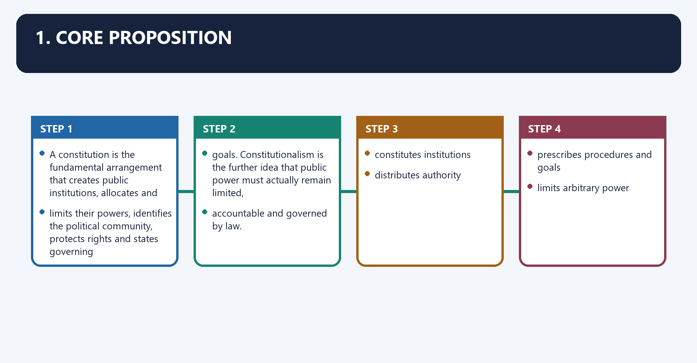
A **constitution** is the fundamental arrangement that creates public institutions, allocates and
limits their powers, identifies the political community, protects rights and states governing
goals. **Constitutionalism** is the further idea that public power must actually remain limited,
accountable and governed by law.

```text
CONSTITUTION
  -> constitutes institutions
  -> distributes authority
  -> protects rights
  -> prescribes procedures and goals

CONSTITUTIONALISM
  -> limits arbitrary power
  -> enforces rule of law
  -> supplies checks, accountability and remedies
```

> **Master distinction:** A State may possess a constitutional document yet lack
> constitutionalism if rulers can exercise arbitrary or effectively unlimited power.

---

### 02. 2. What a constitution does

2. What a constitution does denotes the constitutional rules and institutional links organised around Function Examination use Indian illustration.
2. What a constitution does operates through Creates institutions Establishes legislature, executive and judiciary [FACT] Parts V and VI, connected with Allocates power Horizontal and territorial distribution [FACT] Arts 73/162; Arts 245–255; Seventh Schedule.
The operative mechanism matters because limits government Rights, procedures and judicial review [FACT] Part III; Arts 13, 32 and 226.
Its principal consequence is that expresses identity and values Political morality and collective purpose [FACT] Preamble.
The decisive contrast is between States duties and goals Directs public action and civic responsibility [FACT] Parts IV and IVA and Manages change Preserves continuity while permitting reform [FACT] Art 368 plus other amendment routes.
The exam-safe limitation is that resolves conflict Supplies authoritative institutions and rules [FACT] Courts, federal provisions and constitutional remedies.
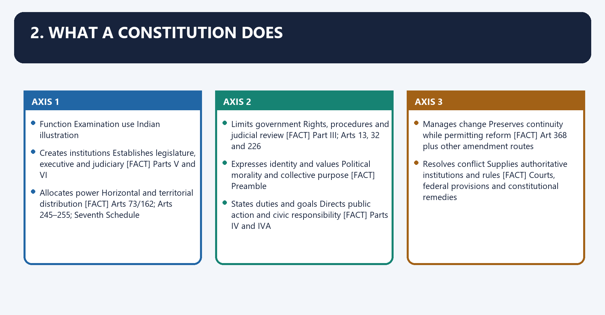
| Function | Examination use | Indian illustration |
|---|---|---|
| Defines the political community | Who governs whom and within what territory? | [FACT] "India, that is Bharat, shall be a Union of States" (Art 1) |
| Creates institutions | Establishes legislature, executive and judiciary | [FACT] Parts V and VI |
| Allocates power | Horizontal and territorial distribution | [FACT] Arts 73/162; Arts 245–255; Seventh Schedule |
| Limits government | Rights, procedures and judicial review | [FACT] Part III; Arts 13, 32 and 226 |
| Expresses identity and values | Political morality and collective purpose | [FACT] Preamble |
| States duties and goals | Directs public action and civic responsibility | [FACT] Parts IV and IVA |
| Manages change | Preserves continuity while permitting reform | [FACT] Art 368 plus other amendment routes |
| Resolves conflict | Supplies authoritative institutions and rules | [FACT] Courts, federal provisions and constitutional remedies |

[LIMIT] A constitution therefore performs both a **constitutive** function—creating power—and a
**restraining** function—limiting power. A document that only organises rulers but does not restrain
them is constitutionally thin.

---

### 03. 3. Constitution, constitutional law and ordinary law

3. Constitution, constitutional law and ordinary law denotes the constitutional rules and institutional links organised around Term Meaning Correct distinction.
3. Constitution, constitutional law and ordinary law operates through [FACT] In India, constitutional supremacy means Parliament is not sovereign in the British sense, connected with Ordinary legislation is tested against the Constitution; even the amending power is limited by the.
The operative mechanism matters because ⚖️ basic-structure doctrine.
Its principal consequence is that trap: "Constitution" and "constitutional law" are not exact synonyms. The Constitution is the.
The decisive contrast is between foundational source; constitutional law is the wider legal field that interprets and applies it and Term Meaning Correct distinction.
The exam-safe limitation is that term Meaning Correct distinction.
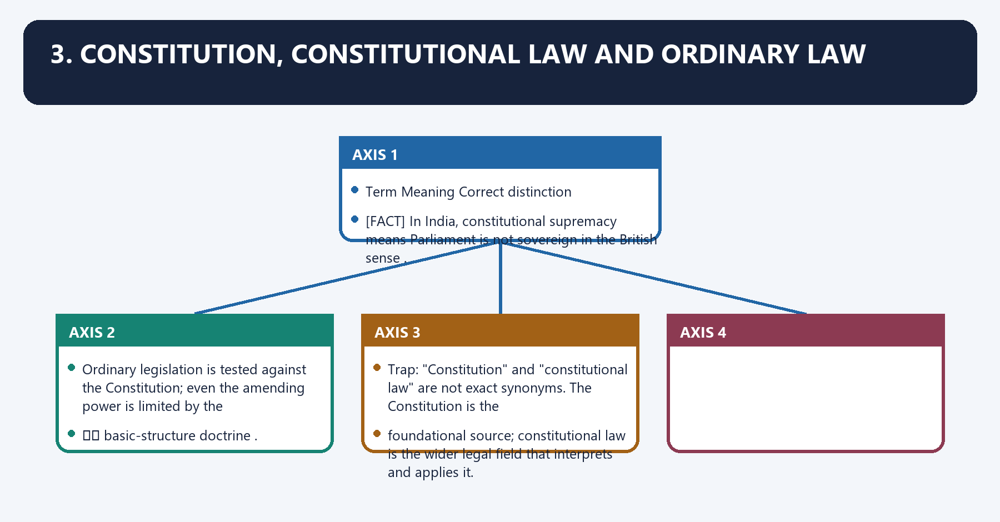
| Term | Meaning | Correct distinction |
|---|---|---|
| **Constitution** | The fundamental framework of the State | In India, the written text is supreme, but conventions and judicial doctrine also affect its operation |
| **Constitutional law** | The body of legal rules concerning public institutions, powers, rights and constitutional remedies | Drawn principally from the Constitution, but also from statutes, judgments and binding rules made under it |
| **Ordinary law** | Legislation enacted under constitutionally conferred power | Must conform to the Constitution and may be invalidated if inconsistent |
| **Convention** | A non-judicial political practice regulating constitutional behaviour | Politically important but not automatically enforceable as law |

[FACT] In India, constitutional supremacy means Parliament is **not sovereign in the British sense**.
Ordinary legislation is tested against the Constitution; even the amending power is limited by the
⚖️ **basic-structure doctrine**.

> **Trap:** "Constitution" and "constitutional law" are not exact synonyms. The Constitution is the
> foundational source; constitutional law is the wider legal field that interprets and applies it.

---

### 04. 4.1 Evolved and enacted

4.1 Evolved and enacted denotes the constitutional rules and institutional links organised around Type Test Illustration Caution.
4.1 Evolved and enacted operates through Evolved Grows gradually through statutes, conventions and judgments United Kingdom "Evolved" does not mean lawless, connected with Type Test Illustration Caution.
The operative mechanism matters because type Test Illustration Caution.
Its principal consequence is that type Test Illustration Caution.
The decisive contrast is between Type Test Illustration Caution and Type Test Illustration Caution.
The exam-safe limitation is that type Test Illustration Caution.
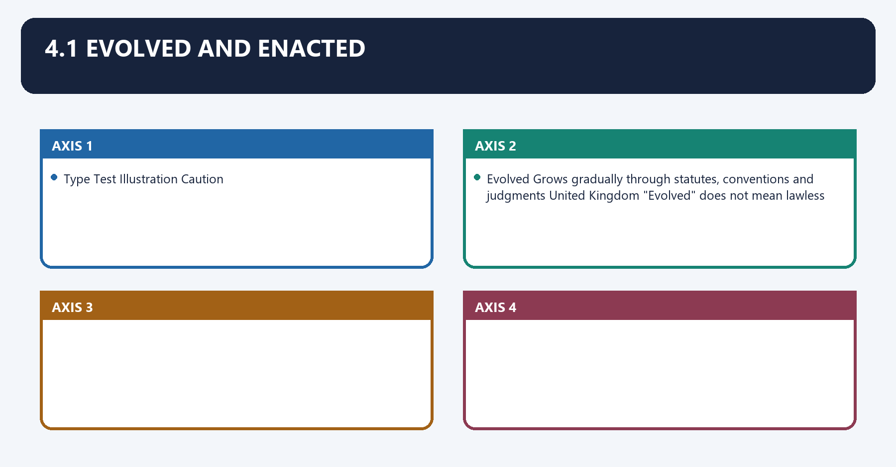
| Type | Test | Illustration | Caution |
|---|---|---|---|
| **Evolved** | Grows gradually through statutes, conventions and judgments | United Kingdom | "Evolved" does not mean lawless |
| **Enacted** | Deliberately framed and adopted by a constituent body or other authorised process | India, United States | An enacted text still develops through interpretation and convention |

### 05. 4.2 Codified and uncodified

4.2 Codified and uncodified denotes the constitutional rules and institutional links organised around Type Test Illustration.
4.2 Codified and uncodified operates through Codified/written Core provisions are consolidated in an authoritative document or set of documents India, United States, connected with Uncodified Constitutional rules are dispersed across statutes, cases, conventions and works of authority United Kingdom.
The operative mechanism matters because trap: "Uncodified" is more accurate than "wholly unwritten"; the UK possesses many written.
Its principal consequence is that constitutional sources.
The decisive contrast is between Type Test Illustration and Type Test Illustration.
The exam-safe limitation is that type Test Illustration.
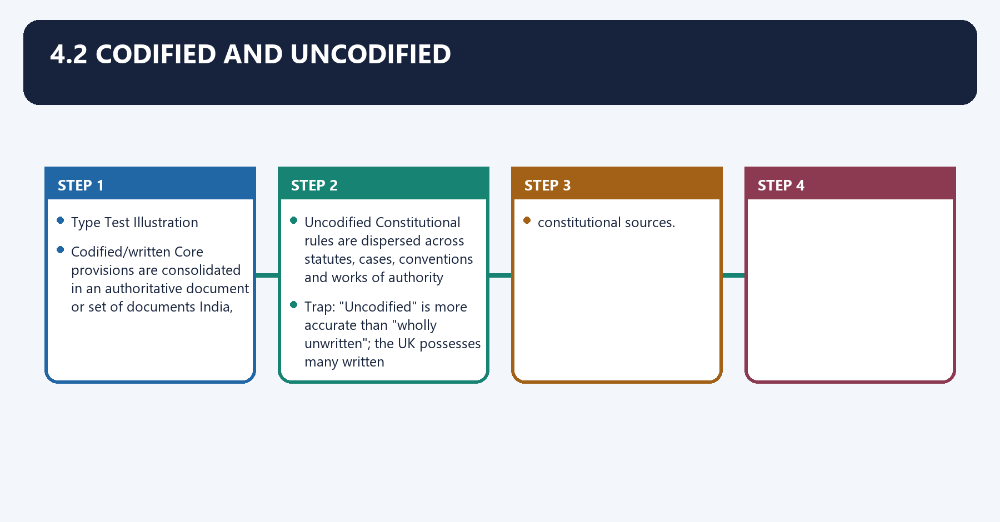
| Type | Test | Illustration |
|---|---|---|
| **Codified/written** | Core provisions are consolidated in an authoritative document or set of documents | India, United States |
| **Uncodified** | Constitutional rules are dispersed across statutes, cases, conventions and works of authority | United Kingdom |

> **Trap:** "Uncodified" is more accurate than "wholly unwritten"; the UK possesses many written
> constitutional sources.

### 06. 4.3 Rigid and flexible

4.3 Rigid and flexible denotes the constitutional rules and institutional links organised around Type Amendment rule Illustration.
4.3 Rigid and flexible operates through Rigid Constitutional change requires a procedure more demanding than ordinary law United States, connected with Flexible Constitutional rules can generally be altered through ordinary legislative procedure United Kingdom.
The operative mechanism matters because type Amendment rule Illustration.
Its principal consequence is that type Amendment rule Illustration.
The decisive contrast is between Type Amendment rule Illustration and Type Amendment rule Illustration.
The exam-safe limitation is that type Amendment rule Illustration.
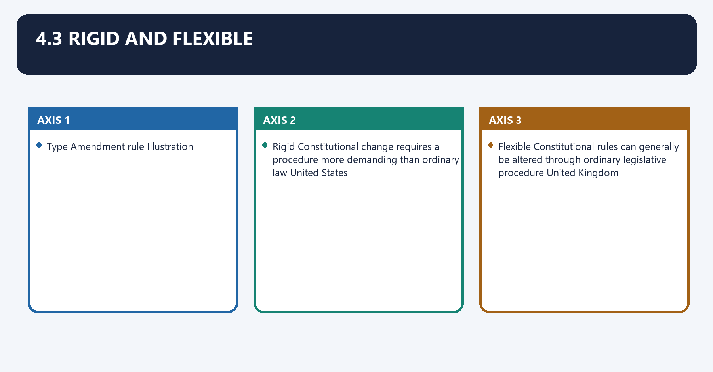
| Type | Amendment rule | Illustration |
|---|---|---|
| **Rigid** | Constitutional change requires a procedure more demanding than ordinary law | United States |
| **Flexible** | Constitutional rules can generally be altered through ordinary legislative procedure | United Kingdom |
| **Mixed** | Different provisions use different procedures | [FACT] India: simple majority, special majority, and special majority plus half-State ratification |

### 07. 4.4 Federal and unitary

4.4 Federal and unitary denotes the constitutional rules and institutional links organised around Federal constitution Unitary constitution.
4.4 Federal and unitary operates through Each level has constitutionally protected fields Regional units ordinarily exercise delegated authority, connected with Written supremacy and an umpiring court are common Legal centralisation can coexist with political decentralisation.
The operative mechanism matters because [FACT] India combines federal division with strong Union features. Use federal with a centralising or.
Its principal consequence is that unitary tilt , not a one-word label that ignores either side.
The decisive contrast is between Federal constitution Unitary constitution and Federal constitution Unitary constitution.
The exam-safe limitation is that federal constitution Unitary constitution.
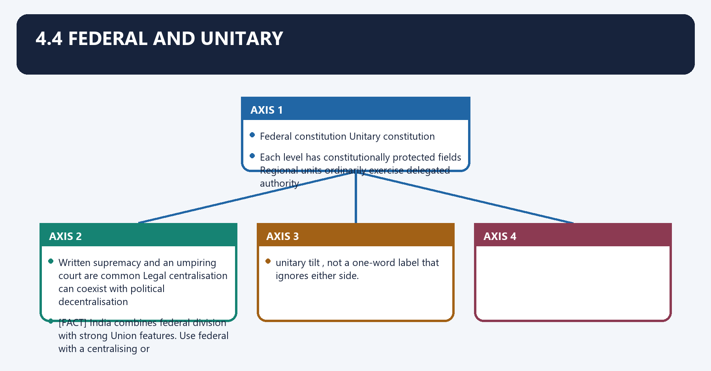
| Federal constitution | Unitary constitution |
|---|---|
| Constitution divides authority between national and regional governments | Ultimate constitutional authority is concentrated at the national level |
| Each level has constitutionally protected fields | Regional units ordinarily exercise delegated authority |
| Written supremacy and an umpiring court are common | Legal centralisation can coexist with political decentralisation |

[FACT] India combines federal division with strong Union features. Use **federal with a centralising or
unitary tilt**, not a one-word label that ignores either side.

### 08. 4.5 Procedural and prescriptive

4.5 Procedural and prescriptive denotes the constitutional rules and institutional links organised around A procedural constitution primarily structures institutions, democratic processes and legal.
4.5 Procedural and prescriptive operates through A prescriptive constitution also commits the State to substantive social, economic or, connected with developmental goals.
The operative mechanism matters because [FACT] India combines both: institutional procedure and rights coexist with the Preamble, DPSPs and.
Its principal consequence is that transformative commitments.
The decisive contrast is between A procedural constitution primarily structures institutions, democratic processes and legal and A procedural constitution primarily structures institutions, democratic processes and legal.
The exam-safe limitation is that a procedural constitution primarily structures institutions, democratic processes and legal.
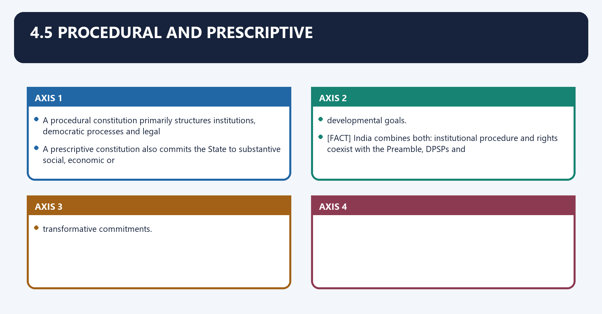
- A **procedural constitution** primarily structures institutions, democratic processes and legal
  limits.
- A **prescriptive constitution** also commits the State to substantive social, economic or
  developmental goals.
- [FACT] India combines both: institutional procedure and rights coexist with the Preamble, DPSPs and
  transformative commitments.

---

### 09. 5. Qualities of a workable constitution

5. Qualities of a workable constitution denotes the constitutional rules and institutional links organised around Quality Why it matters Necessary qualification.
5. Qualities of a workable constitution operates through Clarity and definiteness Reduces avoidable conflict Some open-textured language is necessary for new situations, connected with Comprehensiveness Covers powers, rights and procedures Excess detail can create rigidity.
The operative mechanism matters because stability Protects settled expectations Stability must not become constitutional immobility.
Its principal consequence is that adaptability Allows peaceful institutional change Change remains subject to constitutional procedure.
The decisive contrast is between Suitability Reflects history, society and political needs Foreign borrowing must be adapted, not copied and Enforceability Converts limits into real constraints Text without institutions and remedies may remain nominal.
The exam-safe limitation is that [LIMIT] The key design tension is stability versus adaptability . India's differentiated amendment.
| Quality | Why it matters | Necessary qualification |
|---|---|---|
| Clarity and definiteness | Reduces avoidable conflict | Some open-textured language is necessary for new situations |
| Comprehensiveness | Covers powers, rights and procedures | Excess detail can create rigidity |
| Stability | Protects settled expectations | Stability must not become constitutional immobility |
| Adaptability | Allows peaceful institutional change | Change remains subject to constitutional procedure |
| Suitability | Reflects history, society and political needs | Foreign borrowing must be adapted, not copied |
| Enforceability | Converts limits into real constraints | Text without institutions and remedies may remain nominal |

[LIMIT] The key design tension is **stability versus adaptability**. India's differentiated amendment
system and judicial interpretation allow change while the basic structure protects constitutional
identity.

---

### 10. Essential elements

Essential elements denotes the constitutional rules and institutional links organised around popular sovereignty.
Essential elements operates through responsible and accountable government, connected with separation of powers with checks and balances.
The operative mechanism matters because independent judicial review.
Its principal consequence is that respect for rights and equal citizenship.
The decisive contrast is between civilian authority governed by law; and and effective remedies against unlawful power.
The exam-safe limitation is that [FACT] The Indian mechanisms include the Preamble, Fundamental Rights, parliamentary responsibility,.
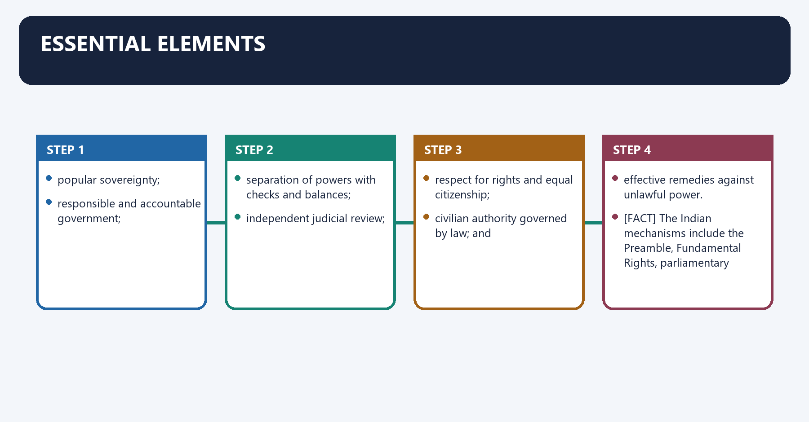
1. popular sovereignty;
2. rule of law;
3. responsible and accountable government;
4. separation of powers with checks and balances;
5. independent judicial review;
6. respect for rights and equal citizenship;
7. civilian authority governed by law; and
8. effective remedies against unlawful power.

[FACT] The Indian mechanisms include the Preamble, Fundamental Rights, parliamentary responsibility,
federal division, judicial review, independent constitutional bodies and amendment limits.

[LIMIT] Constitutional government means more than government acting **under the words** of a
constitution. It means government restrained by constitutional purpose, lawful procedure and
reviewable limits.

### 11. Constitution versus constitutionalism

Constitution versus constitutionalism denotes the constitutional rules and institutional links organised around Question Constitution Constitutionalism.
Constitution versus constitutionalism operates through What is examined? Existence and design of the fundamental framework Whether power is genuinely limited and accountable, connected with Main concern Organisation and allocation Restraint and liberty.
The operative mechanism matters because indian test What do the Articles provide? Do institutions respect rights, procedure, federalism and judicial review?.
Its principal consequence is that question Constitution Constitutionalism.
The decisive contrast is between Question Constitution Constitutionalism and Question Constitution Constitutionalism.
The exam-safe limitation is that question Constitution Constitutionalism.
| Question | Constitution | Constitutionalism |
|---|---|---|
| What is examined? | Existence and design of the fundamental framework | Whether power is genuinely limited and accountable |
| Main concern | Organisation and allocation | Restraint and liberty |
| Possible without the other? | Yes: authoritarian States may possess constitutions | No: constitutionalism needs authoritative rules and institutions |
| Indian test | What do the Articles provide? | Do institutions respect rights, procedure, federalism and judicial review? |

---

### 12. 7. Indian constitutional synthesis

7. Indian constitutional synthesis denotes the constitutional rules and institutional links organised around Design choice Indian position Analytical consequence.
7. Indian constitutional synthesis operates through Enacted + codified Adopted by the Constituent Assembly Deliberate founding text, not merely accumulated custom, connected with Rigid + flexible Multiple amendment routes Neither legal paralysis nor ordinary-majority constitutional change.
The operative mechanism matters because federal + unitary features Divided powers with a strong Union Unity and diversity are constitutionally combined.
Its principal consequence is that procedural + transformative Institutions plus rights, DPSPs and social reform The Constitution governs both power and public purpose.
The decisive contrast is between ⚖️ Kesavananda Bharati confirms that constitutional change cannot destroy the Constitution's and basic structure. ⚖️ Ram Jawaya Kapur confirms that India does not follow a rigid separation of.
The exam-safe limitation is that powers. These cases explain how the design operates ; they do not replace the text.
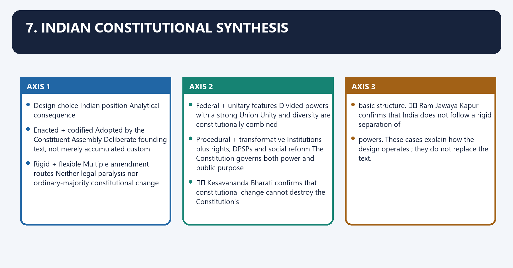
| Design choice | Indian position | Analytical consequence |
|---|---|---|
| Enacted + codified | Adopted by the Constituent Assembly | Deliberate founding text, not merely accumulated custom |
| Rigid + flexible | Multiple amendment routes | Neither legal paralysis nor ordinary-majority constitutional change |
| Federal + unitary features | Divided powers with a strong Union | Unity and diversity are constitutionally combined |
| Parliamentary + judicial review | Responsible executive under a supreme Constitution | Neither parliamentary sovereignty nor judicial supremacy is absolute |
| Procedural + transformative | Institutions plus rights, DPSPs and social reform | The Constitution governs both power and public purpose |

⚖️ *Kesavananda Bharati* confirms that constitutional change cannot destroy the Constitution's
basic structure. ⚖️ *Ram Jawaya Kapur* confirms that India does not follow a rigid separation of
powers. These cases explain **how the design operates**; they do not replace the text.

---

### 13. 8.1 Demand map

8.1 Demand map denotes the constitutional rules and institutional links organised around Demand Answer spine.
8.1 Demand map operates through Meaning/functions of a constitution Definition → constitutive + limiting roles → Indian examples → verdict, connected with Constitution versus constitutionalism Document/framework → limited government → mechanisms → implementation gap.
The operative mechanism matters because classification of constitutions Define each pair → locate India → show mixed character → avoid binary conclusion.
Its principal consequence is that good constitution Stability/adaptability → clarity/comprehensiveness → enforceability → balanced conclusion.
The decisive contrast is between Constitutional government Rule of law → accountability → rights → review → institutional practice and Demand Answer spine.
The exam-safe limitation is that demand Answer spine.
| Demand | Answer spine |
|---|---|
| Meaning/functions of a constitution | Definition → constitutive + limiting roles → Indian examples → verdict |
| Constitution versus constitutionalism | Document/framework → limited government → mechanisms → implementation gap |
| Classification of constitutions | Define each pair → locate India → show mixed character → avoid binary conclusion |
| Good constitution | Stability/adaptability → clarity/comprehensiveness → enforceability → balanced conclusion |
| Constitutional government | Rule of law → accountability → rights → review → institutional practice |

### 14. 8.2 Thesis options

8.2 Thesis options denotes the constitutional rules and institutional links organised around A constitution creates government, but constitutionalism prevents the government it creates.
8.2 Thesis options operates through from becoming arbitrary, connected with India's Constitution is best understood through synthesis: enacted yet evolutionary, federal.
The operative mechanism matters because yet centralising, and rigid in identity yet flexible in institutional detail.
Its principal consequence is that the success of a constitution depends not on textual length but on whether institutions,.
The decisive contrast is between conventions and remedies convert its limits into political practice and A constitution creates government, but constitutionalism prevents the government it creates.
The exam-safe limitation is that a constitution creates government, but constitutionalism prevents the government it creates.
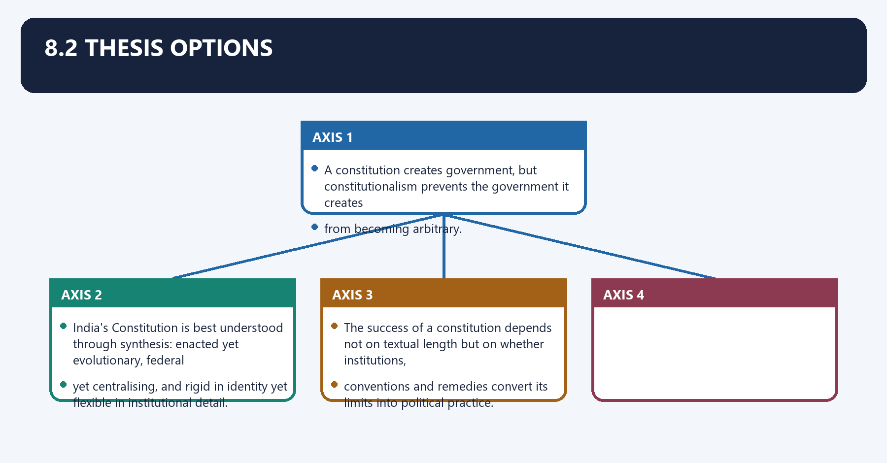
- *A constitution creates government, but constitutionalism prevents the government it creates
  from becoming arbitrary.*
- *India's Constitution is best understood through synthesis: enacted yet evolutionary, federal
  yet centralising, and rigid in identity yet flexible in institutional detail.*
- *The success of a constitution depends not on textual length but on whether institutions,
  conventions and remedies convert its limits into political practice.*

### 15. 8.3 Mark-scaled structures

8.3 Mark-scaled structures denotes the constitutional rules and institutional links organised around Marks Structure Evidence.
8.3 Mark-scaled structures operates through 10 Definition → two functions/distinctions → Indian illustration → verdict 2–3 Articles or one case, connected with 15 Thesis → classification/design → constitutionalism mechanisms → limitation → verdict 4–5 named anchors.
The operative mechanism matters because marks Structure Evidence.
Its principal consequence is that marks Structure Evidence.
The decisive contrast is between Marks Structure Evidence and Marks Structure Evidence.
The exam-safe limitation is that marks Structure Evidence.
| Marks | Structure | Evidence |
|---:|---|---|
| 10 | Definition → two functions/distinctions → Indian illustration → verdict | 2–3 Articles or one case |
| 15 | Thesis → classification/design → constitutionalism mechanisms → limitation → verdict | 4–5 named anchors |
| 20 | Thesis → functions → classifications → Indian synthesis → text/practice gap → graded conclusion | 6–8 anchors and one comparative qualification |

### 16. 8.4 Evidence bank

8.4 Evidence bank denotes the constitutional rules and institutional links organised around Claim: a constitution both constitutes and limits power. Evidence: [FACT] Arts 79/124 create.
8.4 Evidence bank operates through institutions while Arts 13/32 make their action reviewable. Analysis: authority and restraint, connected with arise from the same supreme law. Qualification: effective limits depend on access to courts.
The operative mechanism matters because and institutional compliance.
Its principal consequence is that claim: India is neither wholly rigid nor wholly flexible. Evidence: [FACT] Art 368 and the.
The decisive contrast is between simple-majority routes for specified matters. Analysis: the design matches amendment and difficulty to constitutional importance. Qualification: ⚖️ basic structure adds a judicial.
The exam-safe limitation is that substantive limit beyond procedure.
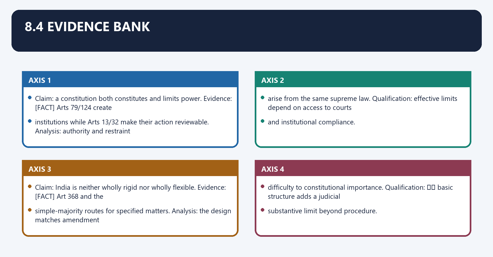
- **Claim:** a constitution both constitutes and limits power. **Evidence:** [FACT] Arts 79/124 create
  institutions while Arts 13/32 make their action reviewable. **Analysis:** authority and restraint
  arise from the same supreme law. **Qualification:** effective limits depend on access to courts
  and institutional compliance.
- **Claim:** India is neither wholly rigid nor wholly flexible. **Evidence:** [FACT] Art 368 and the
  simple-majority routes for specified matters. **Analysis:** the design matches amendment
  difficulty to constitutional importance. **Qualification:** ⚖️ basic structure adds a judicial
  substantive limit beyond procedure.
- **Claim:** a constitution does not guarantee constitutionalism. **Evidence:** [LIMIT] legal powers can
  be used formally yet arbitrarily unless checked by rights, accountability and review.
  **Qualification:** judicial review itself must remain textually disciplined.

---

### 17. 9. Must-Know Facts

9. Must-Know Facts denotes the constitutional rules and institutional links organised around [FACT] India has an enacted, codified and supreme Constitution.
9. Must-Know Facts operates through [FACT] It combines rigidity and flexibility through differentiated amendment procedures, connected with [FACT] Constitutionalism means limited government , not merely government according to a document.
The operative mechanism matters because [FACT] Federal/unitary classification concerns territorial distribution of power; parliamentary/.
Its principal consequence is that presidential classification concerns the executive-legislature relationship.
The decisive contrast is between [FACT] A convention is constitutionally relevant but not automatically judicially enforceable and ⚖️ Basic structure limits the amending power; it is not an express list in the Constitution.
The exam-safe limitation is that [LIMIT] Constitution-making, constitutional law and day-to-day constitutional practice are related but.
- [FACT] India has an **enacted, codified and supreme** Constitution.
- [FACT] It combines rigidity and flexibility through differentiated amendment procedures.
- [FACT] Constitutionalism means **limited government**, not merely government according to a document.
- [FACT] Federal/unitary classification concerns territorial distribution of power; parliamentary/
  presidential classification concerns the executive-legislature relationship.
- [FACT] A convention is constitutionally relevant but not automatically judicially enforceable.
- ⚖️ Basic structure limits the amending power; it is not an express list in the Constitution.
- [LIMIT] Constitution-making, constitutional law and day-to-day constitutional practice are related but
  distinct levels.

---

### 18. 10. UPSC traps and source discipline

Close-option source discipline means the systematic verification of legal source, institutional category, status and exception before choosing a close option.
Technically, close-option source discipline comprises source attribution, doctrinal classification, date control and remedy-specific qualification.
The operative mechanism matters because do not say constitutionalism means only "having a constitution"; it requires effective limits.
Its principal consequence is that do not present a scholarly classification as constitutional text.
The decisive contrast is between Write separately: [FACT] "the Constitution provides"; 📜 "the Act/rule provides"; ⚖️ "the Court and held"; 🧾 "the commission recommended"; [LIMIT] "this implies".
The exam-safe limitation is that route detailed comparisons to Comparative-Constitutional-Schemes.md , salient Indian design to.
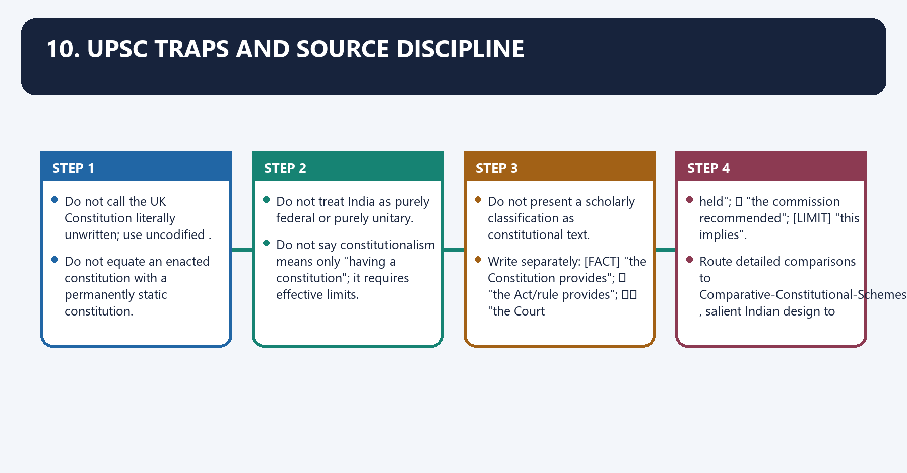
- Do not call the UK Constitution literally unwritten; use **uncodified**.
- Do not equate an enacted constitution with a permanently static constitution.
- Do not treat India as purely federal or purely unitary.
- Do not say constitutionalism means only "having a constitution"; it requires effective limits.
- Do not present a scholarly classification as constitutional text.
- Write separately: [FACT] "the Constitution provides"; 📜 "the Act/rule provides"; ⚖️ "the Court
  held"; 🧾 "the commission recommended"; [LIMIT] "this implies".
- Route detailed comparisons to `Comparative-Constitutional-Schemes.md`, salient Indian design to
  `Salient-Features.md`, and amendment limits to `Amendment-and-Basic-Structure.md`.

### 19. Source control

Source control denotes the constitutional rules and institutional links organised around Constitution of India controls textual propositions.
Source control operates through Official statutes/rules and judgments control legal operation, connected with The local eighth-edition text supplies the static conceptual classification.
The operative mechanism matters because later institutional practice must be dated and officially verified; none is required for this.
Its principal consequence is that constitution of India controls textual propositions.
The decisive contrast is between Constitution of India controls textual propositions and Constitution of India controls textual propositions.
The exam-safe limitation is that constitution of India controls textual propositions.
1. Constitution of India controls textual propositions.
2. Official statutes/rules and judgments control legal operation.
3. The local eighth-edition text supplies the static conceptual classification.
4. Later institutional practice must be dated and officially verified; none is required for this
   static owner.

### 20. Constituent power and constituted institutions

Constituent power and constituted institutions denotes the constitutional rules and institutional links organised around creates/founds constitutional authority - chooses institutional architecture.
Constituent power and constituted institutions operates through Parliament executive judiciary federal units commissions, connected with authority exists only within the Constitution.
The operative mechanism matters because iNDIAN AMENDMENT QUESTION.
Its principal consequence is that article 368 permits constitutional change.
The decisive contrast is between Kesavananda Bharati (1973) preserves basic structure and amendment is broad constituted power, not unlimited original sovereignty.
The exam-safe limitation is that [LIMIT] Basic-structure review does not make the judiciary an unlimited constituent body.
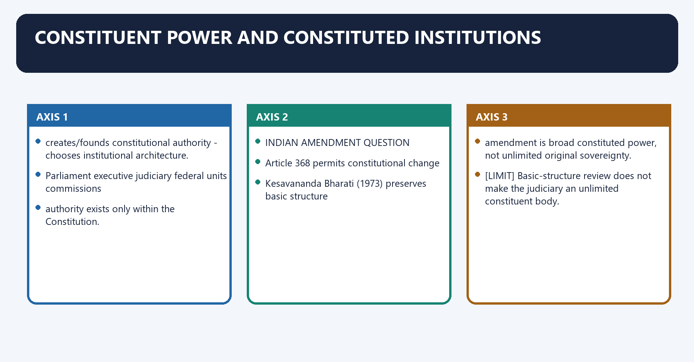
CONSTITUENT POWER
creates/founds constitutional authority -> chooses institutional architecture.

CONSTITUTED POWER
Parliament | executive | judiciary | federal units | commissions
-> authority exists only within the Constitution.

INDIAN AMENDMENT QUESTION
Article 368 permits constitutional change
-> Kesavananda Bharati (1973) preserves basic structure
-> amendment is broad constituted power, not unlimited original sovereignty.

[LIMIT] Basic-structure review does not make the judiciary an unlimited constituent body.

### 21. Legal constitution, political constitution and conventions

Legal constitution, political constitution and conventions denotes the constitutional rules and institutional links organised around text - rights - jurisdiction - judicial review - enforceable remedy.
Legal constitution, political constitution and conventions operates through election - confidence - debate/committee - convention - federal bargaining, connected with public accountability.
The operative mechanism matters because non-judicial rule of constitutional behaviour.
Its principal consequence is that politically obligatory but not automatically enforceable as law.
The decisive contrast is between supreme written Constitution + parliamentary responsibility + conventions and [LIMIT] Courts may enforce legal structure, not every preferred political convention.
The exam-safe limitation is that text - rights - jurisdiction - judicial review - enforceable remedy.
LEGAL CONTROL
text -> rights -> jurisdiction -> judicial review -> enforceable remedy.

POLITICAL CONTROL
election -> confidence -> debate/committee -> convention -> federal bargaining
-> public accountability.

CONVENTION
non-judicial rule of constitutional behaviour;
politically obligatory but not automatically enforceable as law.

INDIAN SYNTHESIS
supreme written Constitution + parliamentary responsibility + conventions.

[LIMIT] Courts may enforce legal structure, not every preferred political convention.

### 22. Sovereignty and legitimacy

Sovereignty and legitimacy denotes the constitutional rules and institutional links organised around POPULAR SOVEREIGNTY.
Sovereignty and legitimacy operates through "We, the People" - democratic authorship and consent, connected with PARLIAMENTARY SOVEREIGNTY.
The operative mechanism matters because classic UK idea - legally unlimited legislature.
Its principal consequence is that cONSTITUTIONAL SOVEREIGNTY IN INDIA.
The decisive contrast is between people authorise Constitution - Parliament legislates/amends within it and executive is responsible - courts review - federal units retain protected fields.
The exam-safe limitation is that source of authority + fair procedure + rights + accountable performance.
POPULAR SOVEREIGNTY
"We, the People" -> democratic authorship and consent.

PARLIAMENTARY SOVEREIGNTY
classic UK idea -> legally unlimited legislature.

CONSTITUTIONAL SOVEREIGNTY IN INDIA
people authorise Constitution -> Parliament legislates/amends within it
-> executive is responsible -> courts review -> federal units retain protected fields.

LEGITIMACY
source of authority + fair procedure + rights + accountable performance.

[LIMIT] Electoral victory supplies governing authority, not a power to erase constitutional limits.

### 23. Constitutional morality and transformative constitutionalism

Constitutional morality and transformative constitutionalism denotes the constitutional rules and institutional links organised around CONSTITUTIONAL MORALITY.
Constitutional morality and transformative constitutionalism operates through fidelity to text + forms + procedures + institutional role + equal citizenship, connected with TRANSFORMATIVE CONSTITUTIONALISM.
The operative mechanism matters because rights + dignity + social justice + anti-hierarchy commitments.
Its principal consequence is that lawful institutional transformation.
The decisive contrast is between S.R. Bommai (1994) - secular/federal limits and Navtej Singh Johar (2018) - dignity, equality and constitutional morality.
The exam-safe limitation is that anchor every morality claim in identifiable text, structure or precedent.
CONSTITUTIONAL MORALITY
fidelity to text + forms + procedures + institutional role + equal citizenship.

TRANSFORMATIVE CONSTITUTIONALISM
rights + dignity + social justice + anti-hierarchy commitments
-> lawful institutional transformation.

CASE ARC
S.R. Bommai (1994) -> secular/federal limits;
Navtej Singh Johar (2018) -> dignity, equality and constitutional morality.

CONTROL
anchor every morality claim in identifiable text, structure or precedent.

[LIMIT] Neither doctrine is a licence for personal judicial or political morality.

### 24. Living constitution and interpretive discipline

Close-option source discipline means the systematic verification of legal source, institutional category, status and exception before choosing a close option.
Technically, close-option source discipline comprises source attribution, doctrinal classification, date control and remedy-specific qualification.
The operative mechanism matters because institutional relationships + accumulated doctrine support coherence.
Its principal consequence is that lIVING APPLICATION.
The decisive contrast is between enduring principle - new circumstance - reasoned extension and Maneka Gandhi (1978) - fair procedure.
The exam-safe limitation is that k.S. Puttaswamy (2017) - privacy/dignity in a technological society.
TEXT AND ORIGINAL MEANING
language/history constrain interpretation.

STRUCTURE AND PRECEDENT
institutional relationships + accumulated doctrine support coherence.

LIVING APPLICATION
enduring principle -> new circumstance -> reasoned extension.

CASE ARC
Maneka Gandhi (1978) -> fair procedure;
K.S. Puttaswamy (2017) -> privacy/dignity in a technological society.

[LIMIT] Dynamism must explain the textual principle, institutional competence and remedy.

### 25. Constitutional identity, amendment and failure

Constitutional identity, amendment and failure denotes the constitutional rules and institutional links organised around Preamble values + democracy + rights + federalism + responsibility.
Constitutional identity, amendment and failure operates through judicial review + social transformation, connected with adaptation - continuity.
The operative mechanism matters because minerva Mills (1980) - limited power and rights-DPSP harmony.
Its principal consequence is that emergency abuse rights hollowing captured institutions broken conventions.
The decisive contrast is between majority treated as unlimited authority and review + Parliament + federal checks + elections + public reason + lawful amendment.
The exam-safe limitation is that [LIMIT] Identity is structured continuity, not a judicially frozen policy code.
IDENTITY
Preamble values + democracy + rights + federalism + responsibility
+ judicial review + social transformation.

AMENDMENT
adaptation -> continuity;
Minerva Mills (1980) -> limited power and rights-DPSP harmony.

FAILURE MODES
emergency abuse | rights hollowing | captured institutions | broken conventions
| majority treated as unlimited authority.

RESPONSE
review + Parliament + federal checks + elections + public reason + lawful amendment.

[LIMIT] Identity is structured continuity, not a judicially frozen policy code.

## BASIC MCQS / REMEDIATION

### Original MCQs 1-36 — Broad Coverage
#### OM1. Which statement most accurately describes constitution definition?

- A. A constitution creates institutions, allocates and limits power, protects rights and identifies the political community.
- B. It is only a list of government offices.
- C. It is identical to every ordinary statute.
- D. It concerns rights but not public power.

**Answer: A**

**Explanation:** Constitutive and restraining functions operate together. The other options collapse distinct legal sources, institutions or consequences and therefore fail the close-option test.

#### OM2. Which statement most accurately describes constitutionalism?

- A. Constitutionalism requires limited, accountable and legally reviewable government, not merely possession of a constitutional document.
- B. Every written constitution guarantees constitutionalism.
- C. Constitutionalism means judicial supremacy.
- D. It excludes democratic government.

**Answer: A**

**Explanation:** Effective restraint depends on institutions, rights and remedies. The other options collapse distinct legal sources, institutions or consequences and therefore fail the close-option test.

#### OM3. Which statement most accurately describes constitutional law?

- A. Constitutional law includes the text plus binding interpretation, statutes, rules and doctrines governing public power.
- B. It is narrower than the document alone.
- C. Every convention is enforceable law.
- D. Ordinary law is constitutionally supreme.

**Answer: A**

**Explanation:** The Constitution is foundational; constitutional law is the wider field. The other options collapse distinct legal sources, institutions or consequences and therefore fail the close-option test.

#### OM4. Which statement most accurately describes classification?

- A. Written/uncodified, rigid/flexible, federal/unitary and supreme/parliamentary classify different dimensions.
- B. Written always means rigid.
- C. Federal always means presidential.
- D. Uncodified means no written sources.

**Answer: A**

**Explanation:** Do not infer one axis from another. The other options collapse distinct legal sources, institutions or consequences and therefore fail the close-option test.

#### OM5. Which statement most accurately describes constituent power?

- A. Constituent power founds the order; constituted institutions exercise powers conferred by that order.
- B. Parliament's ordinary majority is original constituent power.
- C. Courts possess unlimited constituent authority.
- D. Executive convention overrides the Constitution.

**Answer: A**

**Explanation:** Article 368 is broad but constitutionally bounded. The other options collapse distinct legal sources, institutions or consequences and therefore fail the close-option test.

#### OM6. Which statement most accurately describes rule of law?

- A. Rule of law requires authorised, non-arbitrary, equally applied and reviewable public power.
- B. It prohibits all discretion.
- C. It applies only to courts.
- D. A majority vote cures unconstitutional action.

**Answer: A**

**Explanation:** Discretion must be structured rather than eliminated. The other options collapse distinct legal sources, institutions or consequences and therefore fail the close-option test.

#### OM7. Which statement most accurately describes sovereignty?

- A. India combines popular authorship with constitutional supremacy; Parliament is not sovereign in the classic British legal sense.
- B. Courts are politically sovereign.
- C. States possess external sovereignty.
- D. Popular sovereignty makes amendment procedure unnecessary.

**Answer: A**

**Explanation:** Every institution is constituted and limited. The other options collapse distinct legal sources, institutions or consequences and therefore fail the close-option test.

#### OM8. Which statement most accurately describes conventions?

- A. Conventions guide constitutional behaviour without automatically becoming judicially enforceable law.
- B. Conventions amend text silently.
- C. Every repeated practice is a convention.
- D. Courts must enforce all conventions.

**Answer: A**

**Explanation:** Political obligation and legal enforceability differ. The other options collapse distinct legal sources, institutions or consequences and therefore fail the close-option test.

#### OM9. Which statement most accurately describes constitutional morality?

- A. Constitutional morality is fidelity to constitutional forms, procedures, values and institutional roles.
- B. It means a judge's personal morality.
- C. It permits ignoring text for desirable outcomes.
- D. It binds only citizens and not offices.

**Answer: A**

**Explanation:** Claims must be anchored in text and structure. The other options collapse distinct legal sources, institutions or consequences and therefore fail the close-option test.

#### OM10. Which statement most accurately describes transformative constitutionalism?

- A. Transformative constitutionalism uses rights, dignity and social-justice commitments to change entrenched hierarchy through lawful institutions.
- B. It abolishes separation of powers.
- C. It makes every DPSP directly enforceable.
- D. It rejects institutional restraint.

**Answer: A**

**Explanation:** Transformation remains competence- and remedy-bounded. The other options collapse distinct legal sources, institutions or consequences and therefore fail the close-option test.

#### OM11. Which statement most accurately describes living constitution?

- A. Living interpretation applies enduring principles to new circumstances through text, structure, precedent and reasons.
- B. It authorises amendment by judgment.
- C. Original meaning is legally irrelevant in every case.
- D. Every new social claim becomes a right.

**Answer: A**

**Explanation:** Dynamism requires a disciplined interpretive bridge. The other options collapse distinct legal sources, institutions or consequences and therefore fail the close-option test.

#### OM12. Which statement most accurately describes basic structure identity?

- A. Basic structure permits amendment while preventing destruction of constitutional identity.
- B. It is an express constitutional schedule.
- C. It freezes every policy.
- D. It makes Article 368 unusable.

**Answer: A**

**Explanation:** Identity protects foundational design, not a closed policy code. The other options collapse distinct legal sources, institutions or consequences and therefore fail the close-option test.

#### OM13. Which is the safest UPSC distinction concerning constitution definition?

- A. A constitution creates institutions, allocates and limits power, protects rights and identifies the political community.
- B. It is only a list of government offices.
- C. It is identical to every ordinary statute.
- D. It concerns rights but not public power.

**Answer: A**

**Explanation:** Constitutive and restraining functions operate together. The other options collapse distinct legal sources, institutions or consequences and therefore fail the close-option test.

#### OM14. Which is the safest UPSC distinction concerning constitutionalism?

- A. Constitutionalism requires limited, accountable and legally reviewable government, not merely possession of a constitutional document.
- B. Every written constitution guarantees constitutionalism.
- C. Constitutionalism means judicial supremacy.
- D. It excludes democratic government.

**Answer: A**

**Explanation:** Effective restraint depends on institutions, rights and remedies. The other options collapse distinct legal sources, institutions or consequences and therefore fail the close-option test.

#### OM15. Which is the safest UPSC distinction concerning constitutional law?

- A. Constitutional law includes the text plus binding interpretation, statutes, rules and doctrines governing public power.
- B. It is narrower than the document alone.
- C. Every convention is enforceable law.
- D. Ordinary law is constitutionally supreme.

**Answer: A**

**Explanation:** The Constitution is foundational; constitutional law is the wider field. The other options collapse distinct legal sources, institutions or consequences and therefore fail the close-option test.

#### OM16. Which is the safest UPSC distinction concerning classification?

- A. Written/uncodified, rigid/flexible, federal/unitary and supreme/parliamentary classify different dimensions.
- B. Written always means rigid.
- C. Federal always means presidential.
- D. Uncodified means no written sources.

**Answer: A**

**Explanation:** Do not infer one axis from another. The other options collapse distinct legal sources, institutions or consequences and therefore fail the close-option test.

#### OM17. Which is the safest UPSC distinction concerning constituent power?

- A. Constituent power founds the order; constituted institutions exercise powers conferred by that order.
- B. Parliament's ordinary majority is original constituent power.
- C. Courts possess unlimited constituent authority.
- D. Executive convention overrides the Constitution.

**Answer: A**

**Explanation:** Article 368 is broad but constitutionally bounded. The other options collapse distinct legal sources, institutions or consequences and therefore fail the close-option test.

#### OM18. Which is the safest UPSC distinction concerning rule of law?

- A. Rule of law requires authorised, non-arbitrary, equally applied and reviewable public power.
- B. It prohibits all discretion.
- C. It applies only to courts.
- D. A majority vote cures unconstitutional action.

**Answer: A**

**Explanation:** Discretion must be structured rather than eliminated. The other options collapse distinct legal sources, institutions or consequences and therefore fail the close-option test.

#### OM19. Which is the safest UPSC distinction concerning sovereignty?

- A. India combines popular authorship with constitutional supremacy; Parliament is not sovereign in the classic British legal sense.
- B. Courts are politically sovereign.
- C. States possess external sovereignty.
- D. Popular sovereignty makes amendment procedure unnecessary.

**Answer: A**

**Explanation:** Every institution is constituted and limited. The other options collapse distinct legal sources, institutions or consequences and therefore fail the close-option test.

#### OM20. Which is the safest UPSC distinction concerning conventions?

- A. Conventions guide constitutional behaviour without automatically becoming judicially enforceable law.
- B. Conventions amend text silently.
- C. Every repeated practice is a convention.
- D. Courts must enforce all conventions.

**Answer: A**

**Explanation:** Political obligation and legal enforceability differ. The other options collapse distinct legal sources, institutions or consequences and therefore fail the close-option test.

#### OM21. Which is the safest UPSC distinction concerning constitutional morality?

- A. Constitutional morality is fidelity to constitutional forms, procedures, values and institutional roles.
- B. It means a judge's personal morality.
- C. It permits ignoring text for desirable outcomes.
- D. It binds only citizens and not offices.

**Answer: A**

**Explanation:** Claims must be anchored in text and structure. The other options collapse distinct legal sources, institutions or consequences and therefore fail the close-option test.

#### OM22. Which is the safest UPSC distinction concerning transformative constitutionalism?

- A. Transformative constitutionalism uses rights, dignity and social-justice commitments to change entrenched hierarchy through lawful institutions.
- B. It abolishes separation of powers.
- C. It makes every DPSP directly enforceable.
- D. It rejects institutional restraint.

**Answer: A**

**Explanation:** Transformation remains competence- and remedy-bounded. The other options collapse distinct legal sources, institutions or consequences and therefore fail the close-option test.

#### OM23. Which is the safest UPSC distinction concerning living constitution?

- A. Living interpretation applies enduring principles to new circumstances through text, structure, precedent and reasons.
- B. It authorises amendment by judgment.
- C. Original meaning is legally irrelevant in every case.
- D. Every new social claim becomes a right.

**Answer: A**

**Explanation:** Dynamism requires a disciplined interpretive bridge. The other options collapse distinct legal sources, institutions or consequences and therefore fail the close-option test.

#### OM24. Which is the safest UPSC distinction concerning basic structure identity?

- A. Basic structure permits amendment while preventing destruction of constitutional identity.
- B. It is an express constitutional schedule.
- C. It freezes every policy.
- D. It makes Article 368 unusable.

**Answer: A**

**Explanation:** Identity protects foundational design, not a closed policy code. The other options collapse distinct legal sources, institutions or consequences and therefore fail the close-option test.

#### OM25. A candidate makes a close-option error about constitution definition. Which correction is most accurate?

- A. A constitution creates institutions, allocates and limits power, protects rights and identifies the political community.
- B. It is only a list of government offices.
- C. It is identical to every ordinary statute.
- D. It concerns rights but not public power.

**Answer: A**

**Explanation:** Constitutive and restraining functions operate together. The other options collapse distinct legal sources, institutions or consequences and therefore fail the close-option test.

#### OM26. A candidate makes a close-option error about constitutionalism. Which correction is most accurate?

- A. Constitutionalism requires limited, accountable and legally reviewable government, not merely possession of a constitutional document.
- B. Every written constitution guarantees constitutionalism.
- C. Constitutionalism means judicial supremacy.
- D. It excludes democratic government.

**Answer: A**

**Explanation:** Effective restraint depends on institutions, rights and remedies. The other options collapse distinct legal sources, institutions or consequences and therefore fail the close-option test.

#### OM27. A candidate makes a close-option error about constitutional law. Which correction is most accurate?

- A. Constitutional law includes the text plus binding interpretation, statutes, rules and doctrines governing public power.
- B. It is narrower than the document alone.
- C. Every convention is enforceable law.
- D. Ordinary law is constitutionally supreme.

**Answer: A**

**Explanation:** The Constitution is foundational; constitutional law is the wider field. The other options collapse distinct legal sources, institutions or consequences and therefore fail the close-option test.

#### OM28. A candidate makes a close-option error about classification. Which correction is most accurate?

- A. Written/uncodified, rigid/flexible, federal/unitary and supreme/parliamentary classify different dimensions.
- B. Written always means rigid.
- C. Federal always means presidential.
- D. Uncodified means no written sources.

**Answer: A**

**Explanation:** Do not infer one axis from another. The other options collapse distinct legal sources, institutions or consequences and therefore fail the close-option test.

#### OM29. A candidate makes a close-option error about constituent power. Which correction is most accurate?

- A. Constituent power founds the order; constituted institutions exercise powers conferred by that order.
- B. Parliament's ordinary majority is original constituent power.
- C. Courts possess unlimited constituent authority.
- D. Executive convention overrides the Constitution.

**Answer: A**

**Explanation:** Article 368 is broad but constitutionally bounded. The other options collapse distinct legal sources, institutions or consequences and therefore fail the close-option test.

#### OM30. A candidate makes a close-option error about rule of law. Which correction is most accurate?

- A. Rule of law requires authorised, non-arbitrary, equally applied and reviewable public power.
- B. It prohibits all discretion.
- C. It applies only to courts.
- D. A majority vote cures unconstitutional action.

**Answer: A**

**Explanation:** Discretion must be structured rather than eliminated. The other options collapse distinct legal sources, institutions or consequences and therefore fail the close-option test.

#### OM31. A candidate makes a close-option error about sovereignty. Which correction is most accurate?

- A. India combines popular authorship with constitutional supremacy; Parliament is not sovereign in the classic British legal sense.
- B. Courts are politically sovereign.
- C. States possess external sovereignty.
- D. Popular sovereignty makes amendment procedure unnecessary.

**Answer: A**

**Explanation:** Every institution is constituted and limited. The other options collapse distinct legal sources, institutions or consequences and therefore fail the close-option test.

#### OM32. A candidate makes a close-option error about conventions. Which correction is most accurate?

- A. Conventions guide constitutional behaviour without automatically becoming judicially enforceable law.
- B. Conventions amend text silently.
- C. Every repeated practice is a convention.
- D. Courts must enforce all conventions.

**Answer: A**

**Explanation:** Political obligation and legal enforceability differ. The other options collapse distinct legal sources, institutions or consequences and therefore fail the close-option test.

#### OM33. A candidate makes a close-option error about constitutional morality. Which correction is most accurate?

- A. Constitutional morality is fidelity to constitutional forms, procedures, values and institutional roles.
- B. It means a judge's personal morality.
- C. It permits ignoring text for desirable outcomes.
- D. It binds only citizens and not offices.

**Answer: A**

**Explanation:** Claims must be anchored in text and structure. The other options collapse distinct legal sources, institutions or consequences and therefore fail the close-option test.

#### OM34. A candidate makes a close-option error about transformative constitutionalism. Which correction is most accurate?

- A. Transformative constitutionalism uses rights, dignity and social-justice commitments to change entrenched hierarchy through lawful institutions.
- B. It abolishes separation of powers.
- C. It makes every DPSP directly enforceable.
- D. It rejects institutional restraint.

**Answer: A**

**Explanation:** Transformation remains competence- and remedy-bounded. The other options collapse distinct legal sources, institutions or consequences and therefore fail the close-option test.

#### OM35. A candidate makes a close-option error about living constitution. Which correction is most accurate?

- A. Living interpretation applies enduring principles to new circumstances through text, structure, precedent and reasons.
- B. It authorises amendment by judgment.
- C. Original meaning is legally irrelevant in every case.
- D. Every new social claim becomes a right.

**Answer: A**

**Explanation:** Dynamism requires a disciplined interpretive bridge. The other options collapse distinct legal sources, institutions or consequences and therefore fail the close-option test.

#### OM36. A candidate makes a close-option error about basic structure identity. Which correction is most accurate?

- A. Basic structure permits amendment while preventing destruction of constitutional identity.
- B. It is an express constitutional schedule.
- C. It freezes every policy.
- D. It makes Article 368 unusable.

**Answer: A**

**Explanation:** Identity protects foundational design, not a closed policy code. The other options collapse distinct legal sources, institutions or consequences and therefore fail the close-option test.

### Remedial MCQs 1-12 — Common Error Repair
#### RM1. Which statement best repairs a recurring error about constitution definition?

- A. A constitution creates institutions, allocates and limits power, protects rights and identifies the political community.
- B. It is identical to every ordinary statute.
- C. It concerns rights but not public power.
- D. It is only a list of government offices.

**Answer: A**

**Remedial explanation:** Constitutive and restraining functions operate together. Write the governing source, then the mechanism, and finally the limitation before choosing an option.

#### RM2. Which statement best repairs a recurring error about constitutionalism?

- A. Constitutionalism requires limited, accountable and legally reviewable government, not merely possession of a constitutional document.
- B. Constitutionalism means judicial supremacy.
- C. It excludes democratic government.
- D. Every written constitution guarantees constitutionalism.

**Answer: A**

**Remedial explanation:** Effective restraint depends on institutions, rights and remedies. Write the governing source, then the mechanism, and finally the limitation before choosing an option.

#### RM3. Which statement best repairs a recurring error about constitutional law?

- A. Constitutional law includes the text plus binding interpretation, statutes, rules and doctrines governing public power.
- B. Every convention is enforceable law.
- C. Ordinary law is constitutionally supreme.
- D. It is narrower than the document alone.

**Answer: A**

**Remedial explanation:** The Constitution is foundational; constitutional law is the wider field. Write the governing source, then the mechanism, and finally the limitation before choosing an option.

#### RM4. Which statement best repairs a recurring error about classification?

- A. Written/uncodified, rigid/flexible, federal/unitary and supreme/parliamentary classify different dimensions.
- B. Federal always means presidential.
- C. Uncodified means no written sources.
- D. Written always means rigid.

**Answer: A**

**Remedial explanation:** Do not infer one axis from another. Write the governing source, then the mechanism, and finally the limitation before choosing an option.

#### RM5. Which statement best repairs a recurring error about constituent power?

- A. Constituent power founds the order; constituted institutions exercise powers conferred by that order.
- B. Courts possess unlimited constituent authority.
- C. Executive convention overrides the Constitution.
- D. Parliament's ordinary majority is original constituent power.

**Answer: A**

**Remedial explanation:** Article 368 is broad but constitutionally bounded. Write the governing source, then the mechanism, and finally the limitation before choosing an option.

#### RM6. Which statement best repairs a recurring error about rule of law?

- A. Rule of law requires authorised, non-arbitrary, equally applied and reviewable public power.
- B. It applies only to courts.
- C. A majority vote cures unconstitutional action.
- D. It prohibits all discretion.

**Answer: A**

**Remedial explanation:** Discretion must be structured rather than eliminated. Write the governing source, then the mechanism, and finally the limitation before choosing an option.

#### RM7. Which statement best repairs a recurring error about sovereignty?

- A. India combines popular authorship with constitutional supremacy; Parliament is not sovereign in the classic British legal sense.
- B. States possess external sovereignty.
- C. Popular sovereignty makes amendment procedure unnecessary.
- D. Courts are politically sovereign.

**Answer: A**

**Remedial explanation:** Every institution is constituted and limited. Write the governing source, then the mechanism, and finally the limitation before choosing an option.

#### RM8. Which statement best repairs a recurring error about conventions?

- A. Conventions guide constitutional behaviour without automatically becoming judicially enforceable law.
- B. Every repeated practice is a convention.
- C. Courts must enforce all conventions.
- D. Conventions amend text silently.

**Answer: A**

**Remedial explanation:** Political obligation and legal enforceability differ. Write the governing source, then the mechanism, and finally the limitation before choosing an option.

#### RM9. Which statement best repairs a recurring error about constitutional morality?

- A. Constitutional morality is fidelity to constitutional forms, procedures, values and institutional roles.
- B. It permits ignoring text for desirable outcomes.
- C. It binds only citizens and not offices.
- D. It means a judge's personal morality.

**Answer: A**

**Remedial explanation:** Claims must be anchored in text and structure. Write the governing source, then the mechanism, and finally the limitation before choosing an option.

#### RM10. Which statement best repairs a recurring error about transformative constitutionalism?

- A. Transformative constitutionalism uses rights, dignity and social-justice commitments to change entrenched hierarchy through lawful institutions.
- B. It makes every DPSP directly enforceable.
- C. It rejects institutional restraint.
- D. It abolishes separation of powers.

**Answer: A**

**Remedial explanation:** Transformation remains competence- and remedy-bounded. Write the governing source, then the mechanism, and finally the limitation before choosing an option.

#### RM11. Which statement best repairs a recurring error about living constitution?

- A. Living interpretation applies enduring principles to new circumstances through text, structure, precedent and reasons.
- B. Original meaning is legally irrelevant in every case.
- C. Every new social claim becomes a right.
- D. It authorises amendment by judgment.

**Answer: A**

**Remedial explanation:** Dynamism requires a disciplined interpretive bridge. Write the governing source, then the mechanism, and finally the limitation before choosing an option.

#### RM12. Which statement best repairs a recurring error about basic structure identity?

- A. Basic structure permits amendment while preventing destruction of constitutional identity.
- B. It freezes every policy.
- C. It makes Article 368 unusable.
- D. It is an express constitutional schedule.

**Answer: A**

**Remedial explanation:** Identity protects foundational design, not a closed policy code. Write the governing source, then the mechanism, and finally the limitation before choosing an option.

## PYQS AND ANSWER PRACTICE

### Verified and Supporting PYQs with Model Solutions
#### Supporting routed PYQ 1 — 2021 GS-II Q1

**Question:** Constitutional Morality is rooted in the Constitution itself and is founded on its essential facets. Explain with relevant judicial decisions.

**Directive:** Explain · **Marks:** 10 · **Word limit:** 150

**Model solution**

**Opening:** Constitutional Morality is rooted in the Constitution itself and is founded on its essential facets. The answer must respond to the directive **Explain** rather than merely describe the topic.

- **Claim -> evidence -> analysis -> qualification:** Define constitutional morality as fidelity to forms, procedures, values and institutional roles.
- **Claim -> evidence -> analysis -> qualification:** Anchor it in the Preamble, rights, responsibility, federalism and judicial review.
- **Claim -> evidence -> analysis -> qualification:** Use S.R. Bommai (1994) and Navtej Singh Johar (2018) as bounded illustrations.
- **Claim -> evidence -> analysis -> qualification:** It protects minorities and institutional good faith against raw majoritarianism.
- **Claim -> evidence -> analysis -> qualification:** It must remain tied to text and structure rather than personal morality.

**Conclusion:** The strongest answer identifies the governing design, shows how it operates with named evidence, tests the counter-position and ends with a qualified institutional verdict.

#### Supporting routed PYQ 2 — 2023 GS-II Q11

**Question:** The Constitution of India is a living instrument with capabilities of enormous dynamism and is made for a progressive society. Illustrate with the expanding horizons of life and personal liberty.

**Directive:** Illustrate · **Marks:** 15 · **Word limit:** 250

**Model solution**

**Opening:** The Constitution of India is a living instrument with capabilities of enormous dynamism and is made for a progressive society. The answer must respond to the directive **Illustrate** rather than merely describe the topic.

- **Claim -> evidence -> analysis -> qualification:** A living constitution applies enduring textual principles to new conditions.
- **Claim -> evidence -> analysis -> qualification:** Maneka Gandhi (1978) transformed procedure into a fair, just and reasonable guarantee.
- **Claim -> evidence -> analysis -> qualification:** K.S. Puttaswamy (2017) applied dignity and liberty to informational privacy.
- **Claim -> evidence -> analysis -> qualification:** Dynamic interpretation remains bounded by text, structure, precedent and institutional competence.
- **Claim -> evidence -> analysis -> qualification:** Amendment and democratic lawmaking complement rather than disappear before interpretation.

**Conclusion:** The strongest answer identifies the governing design, shows how it operates with named evidence, tests the counter-position and ends with a qualified institutional verdict.

#### Supporting routed PYQ 3 — 2025 GS-II Q11

**Question:** Explain constitutional morality and its application in balancing judicial independence with judicial accountability in India.

**Directive:** Explain · **Marks:** 15 · **Word limit:** 250

**Model solution**

**Opening:** Explain constitutional morality and its application in balancing judicial independence with judicial accountability in India. The answer must respond to the directive **Explain** rather than merely describe the topic.

- **Claim -> evidence -> analysis -> qualification:** Constitutional morality protects decisional independence and rejects executive intimidation.
- **Claim -> evidence -> analysis -> qualification:** It also requires transparent institutional procedure, reasons and ethical responsibility.
- **Claim -> evidence -> analysis -> qualification:** Appointments, recusal, disclosure and removal rules operationalise the balance.
- **Claim -> evidence -> analysis -> qualification:** Accountability must not become control of judgments; independence must not become insulation from standards.
- **Claim -> evidence -> analysis -> qualification:** The doctrine is a role-based constitutional discipline for judges and other high functionaries.

**Conclusion:** The strongest answer identifies the governing design, shows how it operates with named evidence, tests the counter-position and ends with a qualified institutional verdict.

### Original Solved Mains Practice
#### M1. Distinguish a constitution from constitutionalism.

**Directive:** Distinguish · **Marks:** 10 · **Suggested words:** 150

**Demand decode:** Define the exact institutional or doctrinal issue, answer the directive, use named constitutional/statutory/judicial evidence, include the strongest counterpoint and reach a qualified verdict.

**Examiner opening:** Distinguish a constitution from constitutionalism. The issue should be analysed through constitutional purpose, operating mechanism and enforceable limitation.

- **Constitutionalism — claim -> evidence -> analysis -> qualification:** Constitutionalism requires limited, accountable and legally reviewable government, not merely possession of a constitutional document. Effective restraint depends on institutions, rights and remedies.
- **Constitutional Law — claim -> evidence -> analysis -> qualification:** Constitutional law includes the text plus binding interpretation, statutes, rules and doctrines governing public power. The Constitution is foundational; constitutional law is the wider field.
- **Classification — claim -> evidence -> analysis -> qualification:** Written/uncodified, rigid/flexible, federal/unitary and supreme/parliamentary classify different dimensions. Do not infer one axis from another.
- **Constituent Power — claim -> evidence -> analysis -> qualification:** Constituent power founds the order; constituted institutions exercise powers conferred by that order. Article 368 is broad but constitutionally bounded.
- **Rule Of Law — claim -> evidence -> analysis -> qualification:** Rule of law requires authorised, non-arbitrary, equally applied and reviewable public power. Discretion must be structured rather than eliminated.

**Counter-position:** Institutional reform can improve accountability, but overbroad regulation may displace autonomy, federal choice, expertise or access. The answer must identify the exact trade-off rather than offer a generic reform list.

**Conclusion:** Prefer a calibrated design that preserves the institution's constitutional purpose while adding transparency, independence, reason-giving and judicially reviewable safeguards.

#### M2. Explain the constitutive and restraining functions of a constitution.

**Directive:** Explain · **Marks:** 10 · **Suggested words:** 150

**Demand decode:** Define the exact institutional or doctrinal issue, answer the directive, use named constitutional/statutory/judicial evidence, include the strongest counterpoint and reach a qualified verdict.

**Examiner opening:** Explain the constitutive and restraining functions of a constitution. The issue should be analysed through constitutional purpose, operating mechanism and enforceable limitation.

- **Constitutional Law — claim -> evidence -> analysis -> qualification:** Constitutional law includes the text plus binding interpretation, statutes, rules and doctrines governing public power. The Constitution is foundational; constitutional law is the wider field.
- **Classification — claim -> evidence -> analysis -> qualification:** Written/uncodified, rigid/flexible, federal/unitary and supreme/parliamentary classify different dimensions. Do not infer one axis from another.
- **Constituent Power — claim -> evidence -> analysis -> qualification:** Constituent power founds the order; constituted institutions exercise powers conferred by that order. Article 368 is broad but constitutionally bounded.
- **Rule Of Law — claim -> evidence -> analysis -> qualification:** Rule of law requires authorised, non-arbitrary, equally applied and reviewable public power. Discretion must be structured rather than eliminated.
- **Sovereignty — claim -> evidence -> analysis -> qualification:** India combines popular authorship with constitutional supremacy; Parliament is not sovereign in the classic British legal sense. Every institution is constituted and limited.

**Counter-position:** Institutional reform can improve accountability, but overbroad regulation may displace autonomy, federal choice, expertise or access. The answer must identify the exact trade-off rather than offer a generic reform list.

**Conclusion:** Prefer a calibrated design that preserves the institution's constitutional purpose while adding transparency, independence, reason-giving and judicially reviewable safeguards.

#### M3. Examine constituent power and the limits of constituted institutions in India.

**Directive:** Examine · **Marks:** 15 · **Suggested words:** 250

**Demand decode:** Define the exact institutional or doctrinal issue, answer the directive, use named constitutional/statutory/judicial evidence, include the strongest counterpoint and reach a qualified verdict.

**Examiner opening:** Examine constituent power and the limits of constituted institutions in India. The issue should be analysed through constitutional purpose, operating mechanism and enforceable limitation.

- **Classification — claim -> evidence -> analysis -> qualification:** Written/uncodified, rigid/flexible, federal/unitary and supreme/parliamentary classify different dimensions. Do not infer one axis from another.
- **Constituent Power — claim -> evidence -> analysis -> qualification:** Constituent power founds the order; constituted institutions exercise powers conferred by that order. Article 368 is broad but constitutionally bounded.
- **Rule Of Law — claim -> evidence -> analysis -> qualification:** Rule of law requires authorised, non-arbitrary, equally applied and reviewable public power. Discretion must be structured rather than eliminated.
- **Sovereignty — claim -> evidence -> analysis -> qualification:** India combines popular authorship with constitutional supremacy; Parliament is not sovereign in the classic British legal sense. Every institution is constituted and limited.
- **Conventions — claim -> evidence -> analysis -> qualification:** Conventions guide constitutional behaviour without automatically becoming judicially enforceable law. Political obligation and legal enforceability differ.

**Counter-position:** Institutional reform can improve accountability, but overbroad regulation may displace autonomy, federal choice, expertise or access. The answer must identify the exact trade-off rather than offer a generic reform list.

**Conclusion:** Prefer a calibrated design that preserves the institution's constitutional purpose while adding transparency, independence, reason-giving and judicially reviewable safeguards.

#### M4. Analyse popular, parliamentary and constitutional sovereignty in the Indian order.

**Directive:** Analyse · **Marks:** 15 · **Suggested words:** 250

**Demand decode:** Define the exact institutional or doctrinal issue, answer the directive, use named constitutional/statutory/judicial evidence, include the strongest counterpoint and reach a qualified verdict.

**Examiner opening:** Analyse popular, parliamentary and constitutional sovereignty in the Indian order. The issue should be analysed through constitutional purpose, operating mechanism and enforceable limitation.

- **Constituent Power — claim -> evidence -> analysis -> qualification:** Constituent power founds the order; constituted institutions exercise powers conferred by that order. Article 368 is broad but constitutionally bounded.
- **Rule Of Law — claim -> evidence -> analysis -> qualification:** Rule of law requires authorised, non-arbitrary, equally applied and reviewable public power. Discretion must be structured rather than eliminated.
- **Sovereignty — claim -> evidence -> analysis -> qualification:** India combines popular authorship with constitutional supremacy; Parliament is not sovereign in the classic British legal sense. Every institution is constituted and limited.
- **Conventions — claim -> evidence -> analysis -> qualification:** Conventions guide constitutional behaviour without automatically becoming judicially enforceable law. Political obligation and legal enforceability differ.
- **Constitutional Morality — claim -> evidence -> analysis -> qualification:** Constitutional morality is fidelity to constitutional forms, procedures, values and institutional roles. Claims must be anchored in text and structure.

**Counter-position:** Institutional reform can improve accountability, but overbroad regulation may displace autonomy, federal choice, expertise or access. The answer must identify the exact trade-off rather than offer a generic reform list.

**Conclusion:** Prefer a calibrated design that preserves the institution's constitutional purpose while adding transparency, independence, reason-giving and judicially reviewable safeguards.

#### M5. Discuss constitutional morality and transformative constitutionalism with appropriate limits.

**Directive:** Discuss · **Marks:** 20 · **Suggested words:** 300

**Demand decode:** Define the exact institutional or doctrinal issue, answer the directive, use named constitutional/statutory/judicial evidence, include the strongest counterpoint and reach a qualified verdict.

**Examiner opening:** Discuss constitutional morality and transformative constitutionalism with appropriate limits. The issue should be analysed through constitutional purpose, operating mechanism and enforceable limitation.

- **Rule Of Law — claim -> evidence -> analysis -> qualification:** Rule of law requires authorised, non-arbitrary, equally applied and reviewable public power. Discretion must be structured rather than eliminated.
- **Sovereignty — claim -> evidence -> analysis -> qualification:** India combines popular authorship with constitutional supremacy; Parliament is not sovereign in the classic British legal sense. Every institution is constituted and limited.
- **Conventions — claim -> evidence -> analysis -> qualification:** Conventions guide constitutional behaviour without automatically becoming judicially enforceable law. Political obligation and legal enforceability differ.
- **Constitutional Morality — claim -> evidence -> analysis -> qualification:** Constitutional morality is fidelity to constitutional forms, procedures, values and institutional roles. Claims must be anchored in text and structure.
- **Transformative Constitutionalism — claim -> evidence -> analysis -> qualification:** Transformative constitutionalism uses rights, dignity and social-justice commitments to change entrenched hierarchy through lawful institutions. Transformation remains competence- and remedy-bounded.

**Counter-position:** Institutional reform can improve accountability, but overbroad regulation may displace autonomy, federal choice, expertise or access. The answer must identify the exact trade-off rather than offer a generic reform list.

**Conclusion:** Prefer a calibrated design that preserves the institution's constitutional purpose while adding transparency, independence, reason-giving and judicially reviewable safeguards.

#### M6. Critically evaluate living-constitution and original-meaning approaches in Indian interpretation.

**Directive:** Critically evaluate · **Marks:** 20 · **Suggested words:** 300

**Demand decode:** Define the exact institutional or doctrinal issue, answer the directive, use named constitutional/statutory/judicial evidence, include the strongest counterpoint and reach a qualified verdict.

**Examiner opening:** Critically evaluate living-constitution and original-meaning approaches in Indian interpretation. The issue should be analysed through constitutional purpose, operating mechanism and enforceable limitation.

- **Sovereignty — claim -> evidence -> analysis -> qualification:** India combines popular authorship with constitutional supremacy; Parliament is not sovereign in the classic British legal sense. Every institution is constituted and limited.
- **Conventions — claim -> evidence -> analysis -> qualification:** Conventions guide constitutional behaviour without automatically becoming judicially enforceable law. Political obligation and legal enforceability differ.
- **Constitutional Morality — claim -> evidence -> analysis -> qualification:** Constitutional morality is fidelity to constitutional forms, procedures, values and institutional roles. Claims must be anchored in text and structure.
- **Transformative Constitutionalism — claim -> evidence -> analysis -> qualification:** Transformative constitutionalism uses rights, dignity and social-justice commitments to change entrenched hierarchy through lawful institutions. Transformation remains competence- and remedy-bounded.
- **Living Constitution — claim -> evidence -> analysis -> qualification:** Living interpretation applies enduring principles to new circumstances through text, structure, precedent and reasons. Dynamism requires a disciplined interpretive bridge.

**Counter-position:** Institutional reform can improve accountability, but overbroad regulation may displace autonomy, federal choice, expertise or access. The answer must identify the exact trade-off rather than offer a generic reform list.

**Conclusion:** Prefer a calibrated design that preserves the institution's constitutional purpose while adding transparency, independence, reason-giving and judicially reviewable safeguards.

#### M7. Assess how conventions connect India's legal and political constitution.

**Directive:** Assess · **Marks:** 15 · **Suggested words:** 250

**Demand decode:** Define the exact institutional or doctrinal issue, answer the directive, use named constitutional/statutory/judicial evidence, include the strongest counterpoint and reach a qualified verdict.

**Examiner opening:** Assess how conventions connect India's legal and political constitution. The issue should be analysed through constitutional purpose, operating mechanism and enforceable limitation.

- **Conventions — claim -> evidence -> analysis -> qualification:** Conventions guide constitutional behaviour without automatically becoming judicially enforceable law. Political obligation and legal enforceability differ.
- **Constitutional Morality — claim -> evidence -> analysis -> qualification:** Constitutional morality is fidelity to constitutional forms, procedures, values and institutional roles. Claims must be anchored in text and structure.
- **Transformative Constitutionalism — claim -> evidence -> analysis -> qualification:** Transformative constitutionalism uses rights, dignity and social-justice commitments to change entrenched hierarchy through lawful institutions. Transformation remains competence- and remedy-bounded.
- **Living Constitution — claim -> evidence -> analysis -> qualification:** Living interpretation applies enduring principles to new circumstances through text, structure, precedent and reasons. Dynamism requires a disciplined interpretive bridge.
- **Basic Structure Identity — claim -> evidence -> analysis -> qualification:** Basic structure permits amendment while preventing destruction of constitutional identity. Identity protects foundational design, not a closed policy code.

**Counter-position:** Institutional reform can improve accountability, but overbroad regulation may displace autonomy, federal choice, expertise or access. The answer must identify the exact trade-off rather than offer a generic reform list.

**Conclusion:** Prefer a calibrated design that preserves the institution's constitutional purpose while adding transparency, independence, reason-giving and judicially reviewable safeguards.

#### M8. Explain Indian constitutional identity through the Preamble, basic structure, social revolution and institutional restraint.

**Directive:** Explain · **Marks:** 20 · **Suggested words:** 300

**Demand decode:** Define the exact institutional or doctrinal issue, answer the directive, use named constitutional/statutory/judicial evidence, include the strongest counterpoint and reach a qualified verdict.

**Examiner opening:** Explain Indian constitutional identity through the Preamble, basic structure, social revolution and institutional restraint. The issue should be analysed through constitutional purpose, operating mechanism and enforceable limitation.

- **Constitutional Morality — claim -> evidence -> analysis -> qualification:** Constitutional morality is fidelity to constitutional forms, procedures, values and institutional roles. Claims must be anchored in text and structure.
- **Transformative Constitutionalism — claim -> evidence -> analysis -> qualification:** Transformative constitutionalism uses rights, dignity and social-justice commitments to change entrenched hierarchy through lawful institutions. Transformation remains competence- and remedy-bounded.
- **Living Constitution — claim -> evidence -> analysis -> qualification:** Living interpretation applies enduring principles to new circumstances through text, structure, precedent and reasons. Dynamism requires a disciplined interpretive bridge.
- **Basic Structure Identity — claim -> evidence -> analysis -> qualification:** Basic structure permits amendment while preventing destruction of constitutional identity. Identity protects foundational design, not a closed policy code.
- **Constitution Definition — claim -> evidence -> analysis -> qualification:** A constitution creates institutions, allocates and limits power, protects rights and identifies the political community. Constitutive and restraining functions operate together.

**Counter-position:** Institutional reform can improve accountability, but overbroad regulation may displace autonomy, federal choice, expertise or access. The answer must identify the exact trade-off rather than offer a generic reform list.

**Conclusion:** Prefer a calibrated design that preserves the institution's constitutional purpose while adding transparency, independence, reason-giving and judicially reviewable safeguards.

## OPTIONAL ADVANCED DEPTH — NOT REQUIRED FOR A CORE ANSWER

> **Subject:** Polity · **Tier:** Advanced enrichment · **GS Paper:** GS-II
> **Companion:** `../basic/Concept-of-the-Constitution.md`
> **Firewall:** The Core independently supplies the complete definition, classification,
> constitutionalism and answer-writing spine. This file adds interpretive and normative depth.

---

#### 1. Constituent power and constituted power

**Constituent power** creates or fundamentally reconstitutes the constitutional order.
**Constituted powers** are the legislature, executive, judiciary and other institutions created
by that order.

The distinction prevents a constituted institution from treating its conferred authority as
unlimited. In India, Parliament's Article 368 power is extraordinary but still a constituted
power under the Constitution. The basic-structure doctrine therefore controls amendment without
claiming that courts possess an unlimited constituent power of their own.

---

#### 2. Legal and political constitutions

| Model | Principal restraint | Strength | Risk |
|---|---|---|---|
| Legal constitution | Enforceable text, rights and judicial review | Strong rights floor | Judicial overreach or legalism |
| Political constitution | Elections, Parliament, conventions and public accountability | Democratic responsiveness | Majoritarian or executive dominance |
| Indian synthesis | Supreme text plus parliamentary government and conventions | Dual legal-political control | Institutional conflict and blame shifting |

India cannot be reduced to either model. Courts police constitutional limits, while elections,
legislative scrutiny, conventions, federal bargaining and public reason remain indispensable.

---

#### 3. Constitutional conventions

Conventions guide the use of legal powers where the text leaves choice. They may govern:

- selection of a Prime Minister able to command Lok Sabha confidence;
- cabinet solidarity and ministerial resignation;
- restraint in the use of formal powers by constitutional heads; and
- consultation and constitutional courtesy in federal relations.

A convention is not automatically enforceable merely because it is important. A court may use
constitutional structure to interpret legal power, but it should not convert every political
practice into a judicial command.

---

#### 4. Constitutional morality

Constitutional morality is disciplined fidelity to constitutional forms, procedures, values and
institutional roles. It requires more than literal compliance and less than free-floating personal
morality.

It asks whether:

1. power is exercised through the authorised institution;
2. dissent and minority status are treated as legitimate;
3. reasons and procedures respect equal citizenship;
4. constitutional offices avoid partisan capture; and
5. interpretation remains anchored in text and structure.

The doctrine is valuable against majoritarianism and institutional bad faith, but becomes
dangerous if detached from identifiable constitutional sources.

---

#### 5. Transformative constitutionalism

Transformative constitutionalism treats the Constitution as a project for changing entrenched
hierarchies while preserving institutional legality.

Its Indian anchors include:

- dignity, liberty, equality and fraternity in the Preamble;
- enforceable Fundamental Rights;
- Directive Principles and affirmative-action provisions;
- abolition of untouchability and constitutional rejection of status hierarchy; and
- judicial remedies that make public power answerable.

Transformation is not a licence to bypass democratic competence, evidence, budget or federal
distribution. The Constitution transforms through law, institutions and reasoned adjudication.

---

#### 6. Living constitution and original meaning

| Approach | Core question | Contribution | Limit |
|---|---|---|---|
| Original public meaning | What did the adopted text conventionally communicate? | Textual discipline and democratic legitimacy | May understate open language and later conditions |
| Living constitution | How should enduring principles govern new circumstances? | Adaptability and rights protection | Can become judicial updating without a limiting method |
| Structural interpretation | What follows from institutional design and relationships? | Coherence across provisions | Structure can be stated too abstractly |
| Precedent-based development | How has doctrine accumulated through cases? | Stability and legal continuity | Erroneous precedent may harden |

An exam-safe Indian answer should combine text, history, structure, precedent and consequences
rather than declare one imported interpretive school exclusively controlling.

---

#### 7. Popular, parliamentary and constitutional sovereignty

- **Popular sovereignty:** legitimate authority originates in the people.
- **Parliamentary sovereignty:** Parliament is legally unlimited in the classic British model.
- **Constitutional sovereignty:** every constituted authority is limited by the supreme
  Constitution.

India combines popular authorship with constitutional supremacy. Parliament is democratically
central but not legally sovereign in the British sense; courts are authoritative interpreters but
not politically sovereign; constitutional amendment remains possible but cannot destroy basic
structure.

---

#### 8. Constitutional identity

Constitutional identity is the integrated character produced by:

- popular republicanism;
- dignity, liberty, equality, fraternity, secularism and social justice;
- parliamentary responsibility;
- federalism with national unity;
- judicial review and limited amendment;
- plural citizenship and minority protection; and
- commitment to democratic and social transformation.

Identity is not a closed list or immunity from amendment. It is a structured explanation of why
some changes improve the constitutional order while others would replace it.

---

#### 9. Emergency and constitutional failure

Constitutional failure can occur through:

1. express emergency power used without sufficient material or proportionality;
2. ordinary law that hollows out rights while preserving formal procedure;
3. institutional capture, vacancy or deliberate non-performance;
4. constitutional conventions abandoned for short-term advantage; and
5. popular mandates treated as authority to erase constitutional limits.

The response combines judicial review, legislative accountability, federal resistance, elections,
free public debate, professional civil services and constitutional amendment where genuine
redesign is necessary.

---

#### 10. Normative evaluation framework

Evaluate a constitutional practice through:

1. **authority:** which provision or convention permits it?
2. **purpose:** what constitutional end does it serve?
3. **rights:** whose liberty, equality or dignity is affected?
4. **structure:** does it disturb federalism, responsibility or separation?
5. **procedure:** were notice, debate, reasons and review available?
6. **institutional competence:** which branch has evidence and legitimacy?
7. **remedy:** what correction is proportionate?
8. **long-term precedent:** what rule will remain when political positions reverse?

## CONSOLIDATED REGISTER NOTES

### Concept of the Constitution: Rapid Constitutional Recall

- **Current-control rule:** The official Constitution and Supreme Court portals were rechecked on 25 August 2026. This is a concept-and-doctrine topic: current litigation, political claims and interpretive proposals are not converted into settled constitutional meaning merely because they use constitutional vocabulary.
- **Factual caveat:** This topic owns the higher-order idea of a constitution and constitutionalism, not a duplicate list of salient features or the history of constitution-making. Living, original-meaning, transformative and morality-based approaches are bounded interpretive lenses; none authorises free-standing personal preference.

#### 1. Core proposition

- A constitution is the fundamental arrangement that creates public institutions, allocates and
- limits their powers, identifies the political community, protects rights and states governing
- goals. Constitutionalism is the further idea that public power must actually remain limited,

#### 2. What a constitution does

- Function Examination use Indian illustration
- Defines the political community Who governs whom and within what territory? [FACT] "India, that is Bharat, shall be a Union of States" (Art 1)
- Creates institutions Establishes legislature, executive and judiciary [FACT] Parts V and VI

#### 3. Constitution, constitutional law and ordinary law

- Term Meaning Correct distinction
- Constitution The fundamental framework of the State In India, the written text is supreme, but conventions and judicial doctrine also affect its operation
- Constitutional law The body of legal rules concerning public institutions, powers, rights and constitutional remedies Drawn principally from the Constitution, but also from statutes, judgments and binding rules made under it

#### 4.1 Evolved and enacted

- Type Test Illustration Caution
- Evolved Grows gradually through statutes, conventions and judgments United Kingdom "Evolved" does not mean lawless
- Enacted Deliberately framed and adopted by a constituent body or other authorised process India, United States An enacted text still develops through interpretation and convention

#### 4.2 Codified and uncodified

- Codified/written Core provisions are consolidated in an authoritative document or set of documents India, United States
- Uncodified Constitutional rules are dispersed across statutes, cases, conventions and works of authority United Kingdom
- Trap: "Uncodified" is more accurate than "wholly unwritten"; the UK possesses many written

#### 4.3 Rigid and flexible

- Type Amendment rule Illustration
- Rigid Constitutional change requires a procedure more demanding than ordinary law United States
- Flexible Constitutional rules can generally be altered through ordinary legislative procedure United Kingdom

#### 4.4 Federal and unitary

- Federal constitution Unitary constitution
- Constitution divides authority between national and regional governments Ultimate constitutional authority is concentrated at the national level
- Each level has constitutionally protected fields Regional units ordinarily exercise delegated authority

#### 4.5 Procedural and prescriptive

- A procedural constitution primarily structures institutions, democratic processes and legal
- A prescriptive constitution also commits the State to substantive social, economic or
- [FACT] India combines both: institutional procedure and rights coexist with the Preamble, DPSPs and

#### 5. Qualities of a workable constitution

- Quality Why it matters Necessary qualification
- Clarity and definiteness Reduces avoidable conflict Some open-textured language is necessary for new situations
- Comprehensiveness Covers powers, rights and procedures Excess detail can create rigidity

#### Essential elements

- responsible and accountable government;
- separation of powers with checks and balances;
- independent judicial review;

#### Constitution versus constitutionalism

- Question Constitution Constitutionalism
- What is examined? Existence and design of the fundamental framework Whether power is genuinely limited and accountable
- Main concern Organisation and allocation Restraint and liberty

#### 7. Indian constitutional synthesis

- Design choice Indian position Analytical consequence
- Enacted + codified Adopted by the Constituent Assembly Deliberate founding text, not merely accumulated custom
- Rigid + flexible Multiple amendment routes Neither legal paralysis nor ordinary-majority constitutional change

#### 8.1 Demand map

- Meaning/functions of a constitution Definition → constitutive + limiting roles → Indian examples → verdict
- Constitution versus constitutionalism Document/framework → limited government → mechanisms → implementation gap
- Classification of constitutions Define each pair → locate India → show mixed character → avoid binary conclusion

#### 8.2 Thesis options

- A constitution creates government, but constitutionalism prevents the government it creates
- India's Constitution is best understood through synthesis: enacted yet evolutionary, federal
- yet centralising, and rigid in identity yet flexible in institutional detail.

#### 8.3 Mark-scaled structures

- 10 Definition → two functions/distinctions → Indian illustration → verdict 2–3 Articles or one case
- 15 Thesis → classification/design → constitutionalism mechanisms → limitation → verdict 4–5 named anchors
- 20 Thesis → functions → classifications → Indian synthesis → text/practice gap → graded conclusion 6–8 anchors and one comparative qualification

#### 8.4 Evidence bank

- Claim: a constitution both constitutes and limits power. Evidence: [FACT] Arts 79/124 create
- institutions while Arts 13/32 make their action reviewable. Analysis: authority and restraint
- arise from the same supreme law. Qualification: effective limits depend on access to courts

#### 9. Must-Know Facts

- [FACT] India has an enacted, codified and supreme Constitution.
- [FACT] It combines rigidity and flexibility through differentiated amendment procedures.
- [FACT] Constitutionalism means limited government , not merely government according to a document.

#### 10. UPSC traps and source discipline

- Do not call the UK Constitution literally unwritten; use uncodified .
- Do not equate an enacted constitution with a permanently static constitution.
- Do not treat India as purely federal or purely unitary.

#### Source control

- Constitution of India controls textual propositions.
- Official statutes/rules and judgments control legal operation.
- The local eighth-edition text supplies the static conceptual classification.

#### Constituent power and constituted institutions

- creates/founds constitutional authority - chooses institutional architecture.
- Parliament executive judiciary federal units commissions
- authority exists only within the Constitution.

#### Legal constitution, political constitution and conventions

- text - rights - jurisdiction - judicial review - enforceable remedy.
- election - confidence - debate/committee - convention - federal bargaining
- non-judicial rule of constitutional behaviour;

#### Sovereignty and legitimacy

- "We, the People" - democratic authorship and consent.
- classic UK idea - legally unlimited legislature.
- CONSTITUTIONAL SOVEREIGNTY IN INDIA

#### Constitutional morality and transformative constitutionalism

- fidelity to text + forms + procedures + institutional role + equal citizenship.
- TRANSFORMATIVE CONSTITUTIONALISM
- rights + dignity + social justice + anti-hierarchy commitments

#### Living constitution and interpretive discipline

- language/history constrain interpretation.
- institutional relationships + accumulated doctrine support coherence.
- enduring principle - new circumstance - reasoned extension.

#### Constitutional identity, amendment and failure

- Preamble values + democracy + rights + federalism + responsibility
- judicial review + social transformation.
- Minerva Mills (1980) - limited power and rights-DPSP harmony.

### Final Answer Spine

- Define the institution or design in plain and technical language.
- State the exact constitutional, statutory, order-based or policy source.
- Explain the operating mechanism with named Indian evidence.
- Separate settled law from recommendation, policy, pending litigation and dated status.
- Present the strongest democratic, federal, independence or accountability counterpoint.
- Conclude with a calibrated reform or comparative verdict.
