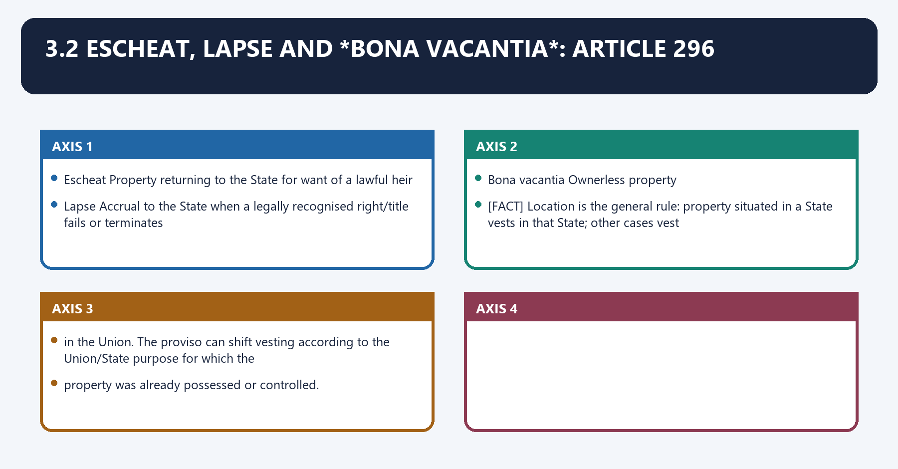
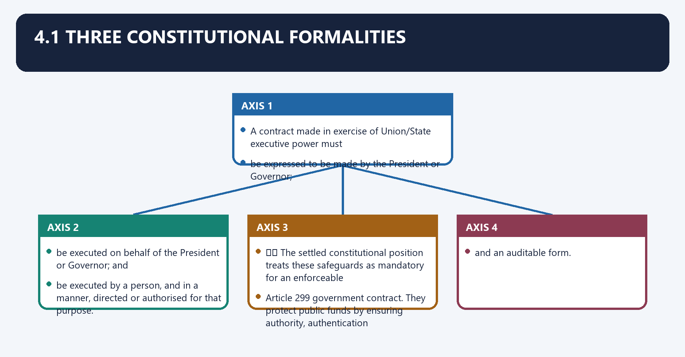
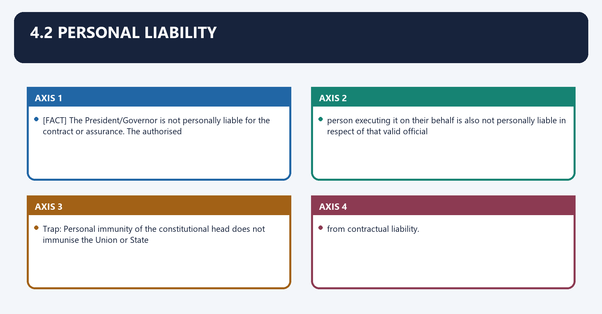
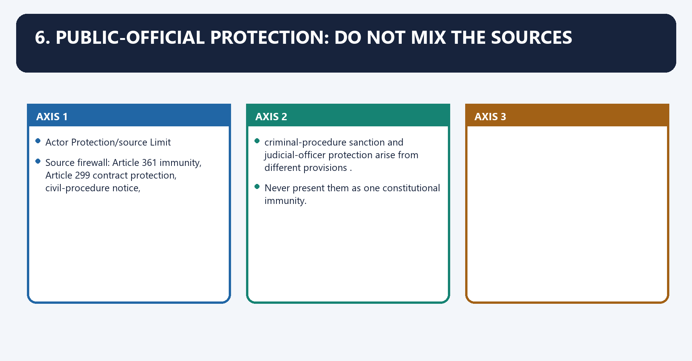
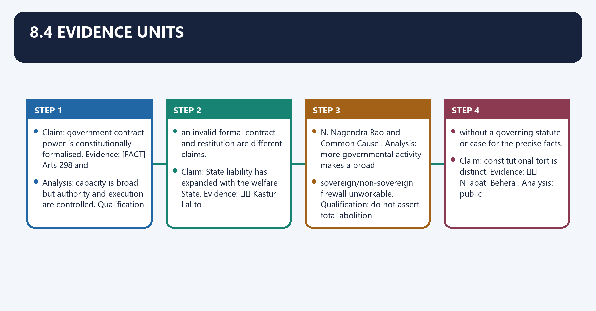

# Rights and Liabilities of the Government — Complete Uncompressed Learning Session

**Complete independent learning session + verified PYQ routing + solved practice workbook + final consolidated register notes**

**Legal/current control date:** 25 August 2026 (Asia/Kolkata)

> **Tag key:** `[FACT]` = named constitutional, statutory, official, judicial or audited local support; `[ANALYSIS]` = reasoned examination; `[CURRENT]` = checked for the control date; `[LIMIT]` = qualification.
>
> **Answer-writing discipline:** claim -> named evidence -> analysis -> qualification.

- [CURRENT] Status is controlled to **25 August 2026, Asia/Kolkata**.
- [CURRENT] **Live official refresh, 25 August 2026:** The Constitution, Government e-Marketplace and official expenditure, legislative and Supreme Court portals were rechecked on 25 August 2026. Procurement manuals and platform instructions are administrative controls; an arbitration proposal changes the 1996 Act only if duly enacted.

#### How to Use This Package

[FACT] The complete Basic/Core owner is taught first in source order. Cross-topic Markdown, local OCR books and verified PYQ ledgers supplement it.

[FACT] Advanced-owner material appears only after the Core and practice sections under the required optional-depth label.

[LIMIT] Articles 294-300 create governmental legal capacity and liability; they do not establish blanket sovereign immunity. Article 299 form, Contract Act Section 70 restitution, private tort, constitutional tort, Article 361 official protection and CPC notice are separate legal routes.

#### Local Owner Gateway

> **Subject:** Polity · **Tier:** Core · **GS Paper:** GS-II
> **Official clause:** "Functions and responsibilities of the Union and the States" and
> "Structure, organization and functioning of the Executive."
> **Grounded in:** Constitution of India, Part XII, Arts 294–300; M. Laxmikanth,
> *Courseware on Indian Polity*, Eighth Edition (2026), Ch. 76.
> **Status legend:** [FACT] constitutional/textual fact · 📜 statute/rule · ⚖️ judicial holding ·
> 🧾 non-binding recommendation · [LIMIT] analytical inference.
> **Rule:** This Core owner is independently sufficient for Prelims and 10/15/20-mark Mains.
> No Advanced companion is required.

---

## BASIC LEARNING SESSION

### 01. 1. Core proposition

1. Core proposition denotes the constitutional rules and institutional links organised around Articles 294–300 treat the Union and the States as legal actors capable of holding property,.
1. Core proposition operates through making contracts and suing or being sued. The controlling tension is, connected with continuity of the State.
The operative mechanism matters because capacity to own, trade and contract.
Its principal consequence is that personal liability of constitutional heads.
The decisive contrast is between residual sovereign-immunity doctrine and GOVERNMENT UNDER LAW.
The exam-safe limitation is that master distinction: Governmental legal personality does not mean every public official is.

Articles **294–300** treat the Union and the States as legal actors capable of holding property,
making contracts and suing or being sued. The controlling tension is:

```text
PUBLIC POWER
   + continuity of the State
   + capacity to own, trade and contract
   - personal liability of constitutional heads
   - residual sovereign-immunity doctrine
   =
GOVERNMENT UNDER LAW
```

> **Master distinction:** Governmental legal personality does not mean every public official is
> personally liable, and official immunity does not mean the governmental action is beyond review.

---

### 02. 2. Article map

2. Article map denotes the constitutional rules and institutional links organised around Article Constitutional subject Examination distinction.
2. Article map operates through 294 Succession to Dominion/provincial property, assets, rights, liabilities and obligations Constitutional continuity at commencement, connected with 297 Maritime lands, minerals and resources Territorial-water/continental-shelf/EEZ value and resources vest in the Union.
The operative mechanism matters because 299 Government contracts Mandatory constitutional form and personal-immunity rule.
Its principal consequence is that trap: Article 300A is the right-to-property provision. It is adjacent to, but not part of,.
The decisive contrast is between the Arts 294–300 government-liability sequence and Article Constitutional subject Examination distinction.
The exam-safe limitation is that article Constitutional subject Examination distinction.

| Article | Constitutional subject | Examination distinction |
|---:|---|---|
| **294** | Succession to Dominion/provincial property, assets, rights, liabilities and obligations | Constitutional continuity at commencement |
| **295** | Succession concerning former Indian States | Union/State succession follows the purpose and constitutional field, subject to agreement |
| **296** | Escheat, lapse and *bona vacantia* | Ownerless property normally vests in the State where situated; otherwise Union, subject to the use/control proviso |
| **297** | Maritime lands, minerals and resources | Territorial-water/continental-shelf/EEZ value and resources vest in the Union |
| **298** | Trade, business, property and contracts | Union and State executive power extends to these activities, subject to legislative competence controls |
| **299** | Government contracts | Mandatory constitutional form and personal-immunity rule |
| **300** | Suits and proceedings | Union of India and the State are the proper juristic names; liability retains the pre-Constitution baseline subject to legislation |

> **Trap:** Article **300A** is the right-to-property provision. It is adjacent to, but not part of,
> the Arts 294–300 government-liability sequence.

---

### 03. 3.1 Succession: Articles 294–295

3.1 Succession: Articles 294–295 denotes the constitutional rules and institutional links organised around [FACT] At commencement, governmental property, rights, liabilities and obligations did not disappear.
3.1 Succession: Articles 294–295 operates through they passed to the Union or the corresponding State. Article 294 addresses the Dominion and, connected with Governor's Provinces; Article 295 addresses the former Indian States and uses the governmental.
The operative mechanism matters because purpose/Union-List connection.
Its principal consequence is that [LIMIT] These are primarily transitional continuity provisions , but they establish the enduring idea.
The decisive contrast is between that the State is a juristic successor rather than a set of personally liable office-holders and [FACT] At commencement, governmental property, rights, liabilities and obligations did not disappear.
The exam-safe limitation is that [FACT] At commencement, governmental property, rights, liabilities and obligations did not disappear.

[FACT] At commencement, governmental property, rights, liabilities and obligations did not disappear;
they passed to the Union or the corresponding State. Article 294 addresses the Dominion and
Governor's Provinces; Article 295 addresses the former Indian States and uses the governmental
purpose/Union-List connection.

[LIMIT] These are primarily **transitional continuity provisions**, but they establish the enduring idea
that the State is a juristic successor rather than a set of personally liable office-holders.

### 04. 3.2 Escheat, lapse and *bona vacantia*: Article 296

3.2 Escheat, lapse and *bona vacantia*: Article 296 denotes the constitutional rules and institutional links organised around Escheat Property returning to the State for want of a lawful heir.
3.2 Escheat, lapse and *bona vacantia*: Article 296 operates through Lapse Accrual to the State when a legally recognised right/title fails or terminates, connected with Bona vacantia Ownerless property.
The operative mechanism matters because [FACT] Location is the general rule: property situated in a State vests in that State; other cases vest.
Its principal consequence is that in the Union. The proviso can shift vesting according to the Union/State purpose for which the.
The decisive contrast is between property was already possessed or controlled and Escheat Property returning to the State for want of a lawful heir.
The exam-safe limitation is that escheat Property returning to the State for want of a lawful heir.

| Term | Safe meaning |
|---|---|
| **Escheat** | Property returning to the State for want of a lawful heir |
| **Lapse** | Accrual to the State when a legally recognised right/title fails or terminates |
| **Bona vacantia** | Ownerless property |

[FACT] Location is the general rule: property situated in a State vests in that State; other cases vest
in the Union. The proviso can shift vesting according to the Union/State purpose for which the
property was already possessed or controlled.

### 05. 3.3 Maritime resources: Article 297

3.3 Maritime resources: Article 297 denotes the constitutional rules and institutional links organised around [FACT] Lands, minerals and things of value underlying the ocean within India's territorial waters,.
3.3 Maritime resources: Article 297 operates through continental shelf and exclusive economic zone, and other EEZ resources, vest in the Union, connected with 📜 Maritime-zone limits are specified under parliamentary law; do not convert a statutory distance.
The operative mechanism matters because into the wording of Article 297.
Its principal consequence is that [FACT] Lands, minerals and things of value underlying the ocean within India's territorial waters,.
The decisive contrast is between [FACT] Lands, minerals and things of value underlying the ocean within India's territorial waters, and [FACT] Lands, minerals and things of value underlying the ocean within India's territorial waters,.
The exam-safe limitation is that [FACT] Lands, minerals and things of value underlying the ocean within India's territorial waters,.

[FACT] Lands, minerals and things of value underlying the ocean within India's territorial waters,
continental shelf and exclusive economic zone, and other EEZ resources, vest in the Union.
📜 Maritime-zone limits are specified under parliamentary law; do not convert a statutory distance
into the wording of Article 297.

### 06. 3.4 Trade and property: Article 298

3.4 Trade and property: Article 298 denotes the constitutional rules and institutional links organised around [FACT] Union and State executive power extends to trade/business, acquiring, holding and disposing of.
3.4 Trade and property: Article 298 operates through property, and making contracts. The provisos preserve the relevant legislature's competence where, connected with the executive activity falls outside the ordinary legislative field of that government.
The operative mechanism matters because trap: Article 298 grants executive capacity; it does not exempt a public enterprise or.
Its principal consequence is that contract from ordinary law, Fundamental Rights, competition rules or legislative control.
The decisive contrast is between [FACT] Union and State executive power extends to trade/business, acquiring, holding and disposing of and [FACT] Union and State executive power extends to trade/business, acquiring, holding and disposing of.
The exam-safe limitation is that [FACT] Union and State executive power extends to trade/business, acquiring, holding and disposing of.

[FACT] Union and State executive power extends to trade/business, acquiring, holding and disposing of
property, and making contracts. The provisos preserve the relevant legislature's competence where
the executive activity falls outside the ordinary legislative field of that government.

> **Trap:** Article 298 grants executive capacity; it does not exempt a public enterprise or
> contract from ordinary law, Fundamental Rights, competition rules or legislative control.

---

### 07. 4.1 Three constitutional formalities

4.1 Three constitutional formalities denotes the constitutional rules and institutional links organised around A contract made in exercise of Union/State executive power must.
4.1 Three constitutional formalities operates through be expressed to be made by the President or Governor, connected with be executed on behalf of the President or Governor; and.
The operative mechanism matters because be executed by a person, and in a manner, directed or authorised for that purpose.
Its principal consequence is that ⚖️ The settled constitutional position treats these safeguards as mandatory for an enforceable.
The decisive contrast is between Article 299 government contract. They protect public funds by ensuring authority, authentication and and an auditable form.
The exam-safe limitation is that a contract made in exercise of Union/State executive power must.

A contract made in exercise of Union/State executive power must:

1. be **expressed** to be made by the President or Governor;
2. be **executed on behalf of** the President or Governor; and
3. be executed by a person, and in a manner, **directed or authorised** for that purpose.

⚖️ The settled constitutional position treats these safeguards as mandatory for an enforceable
Article 299 government contract. They protect public funds by ensuring authority, authentication
and an auditable form.

### 08. 4.2 Personal liability

4.2 Personal liability denotes the constitutional rules and institutional links organised around [FACT] The President/Governor is not personally liable for the contract or assurance. The authorised.
4.2 Personal liability operates through person executing it on their behalf is also not personally liable in respect of that valid official, connected with Trap: Personal immunity of the constitutional head does not immunise the Union or State.
The operative mechanism matters because from contractual liability.
Its principal consequence is that [FACT] The President/Governor is not personally liable for the contract or assurance. The authorised.
The decisive contrast is between [FACT] The President/Governor is not personally liable for the contract or assurance. The authorised and [FACT] The President/Governor is not personally liable for the contract or assurance. The authorised.
The exam-safe limitation is that [FACT] The President/Governor is not personally liable for the contract or assurance. The authorised.

[FACT] The President/Governor is not personally liable for the contract or assurance. The authorised
person executing it on their behalf is also not personally liable **in respect of that valid official
execution**.

> **Trap:** Personal immunity of the constitutional head does **not** immunise the Union or State
> from contractual liability.

### 09. 4.3 Invalid formal contract versus restitution

4.3 Invalid formal contract versus restitution denotes the constitutional rules and institutional links organised around [LIMIT] Failure of Article 299 form can make the purported contract unenforceable as a government.
4.3 Invalid formal contract versus restitution operates through contract. That does not automatically permit the State to retain a non-gratuitous benefit without, connected with payment; an independent restitutionary claim may arise under ordinary law if its conditions are.
The operative mechanism matters because proved. Keep the contract claim and the restitution claim analytically separate.
Its principal consequence is that [LIMIT] Failure of Article 299 form can make the purported contract unenforceable as a government.
The decisive contrast is between [LIMIT] Failure of Article 299 form can make the purported contract unenforceable as a government and [LIMIT] Failure of Article 299 form can make the purported contract unenforceable as a government.
The exam-safe limitation is that [LIMIT] Failure of Article 299 form can make the purported contract unenforceable as a government.
[LIMIT] Failure of Article 299 form can make the purported contract unenforceable as a government
contract. That does not automatically permit the State to retain a non-gratuitous benefit without
payment; an independent restitutionary claim may arise under ordinary law if its conditions are
proved. Keep the **contract claim** and the **restitution claim** analytically separate.

---

### 10. 5.1 Proper party

5.1 Proper party denotes the constitutional rules and institutional links organised around [FACT] Union Government sues or is sued as the Union of India.
5.1 Proper party operates through [FACT] A State Government sues or is sued by the name of the State, connected with [FACT] Article 300 preserves the pre-Constitution liability baseline, subject to any competent.
The operative mechanism matters because parliamentary/State legislation.
Its principal consequence is that [FACT] Union Government sues or is sued as the Union of India.
The decisive contrast is between [FACT] Union Government sues or is sued as the Union of India and [FACT] Union Government sues or is sued as the Union of India.
The exam-safe limitation is that [FACT] Union Government sues or is sued as the Union of India.

- [FACT] Union Government sues or is sued as the **Union of India**.
- [FACT] A State Government sues or is sued by the **name of the State**.
- [FACT] Article 300 preserves the pre-Constitution liability baseline, subject to any competent
  parliamentary/State legislation.

### 11. 5.2 Sovereign-immunity trajectory

5.2 Sovereign-immunity trajectory denotes the constitutional rules and institutional links organised around Stage Case/proposition Correct use.
5.2 Sovereign-immunity trajectory operates through Restrictive reaffirmation ⚖️ Kasturi Lal Police custody/property-loss claim reflected the older sovereign-function immunity, connected with [LIMIT] The safest Mains position is not "sovereign immunity has completely vanished" and not "the State.
The operative mechanism matters because is immune for sovereign acts." State that the old distinction has been strongly narrowed and.
Its principal consequence is that criticised , while public-law constitutional compensation and private-law tort liability remain.
The decisive contrast is between distinct remedial routes and Stage Case/proposition Correct use.
The exam-safe limitation is that stage Case/proposition Correct use.
| Stage | Case/proposition | Correct use |
|---|---|---|
| Colonial distinction | ⚖️ *P & O Steam Navigation* | State liable for non-sovereign/commercial functions; immunity associated with sovereign functions |
| Restrictive reaffirmation | ⚖️ *Kasturi Lal* | Police custody/property-loss claim reflected the older sovereign-function immunity |
| Narrowing | ⚖️ *N. Nagendra Rao & Co.* (1994) | Welfare-State functions make broad immunity untenable; immunity survives, if at all, only in narrow inalienable fields |
| Further erosion | ⚖️ *Common Cause* (1999); *State of A.P. v. Challa Ramkrishna Reddy* (2000) | Broad sovereign immunity is incompatible with rule-of-law accountability |
| Public-law compensation | ⚖️ *Nilabati Behera* (1993) | Compensation for a Fundamental-Right violation is a constitutional/public-law remedy, distinct from a private tort suit |

[LIMIT] The safest Mains position is not "sovereign immunity has completely vanished" and not "the State
is immune for sovereign acts." State that the old distinction has been **strongly narrowed and
criticised**, while public-law constitutional compensation and private-law tort liability remain
distinct remedial routes.

---

### 12. 6. Public-official protection: do not mix the sources

6. Public-official protection: do not mix the sources denotes the constitutional rules and institutional links organised around Actor Protection/source Limit.
6. Public-official protection: do not mix the sources operates through Source firewall: Article 361 immunity, Article 299 contract protection, civil-procedure notice,, connected with criminal-procedure sanction and judicial-officer protection arise from different provisions.
The operative mechanism matters because never present them as one constitutional immunity.
Its principal consequence is that actor Protection/source Limit.
The decisive contrast is between Actor Protection/source Limit and Actor Protection/source Limit.
The exam-safe limitation is that actor Protection/source Limit.

| Actor | Protection/source | Limit |
|---|---|---|
| President/Governor | [FACT] **Art 361**: not answerable to court for official powers; no criminal proceeding or arrest during term; personal civil proceeding requires two months' prior notice | Validity of governmental action remains reviewable; appropriate proceedings may lie against Union/State |
| Minister | No blanket personal constitutional immunity for unlawful personal acts | Advice to President/Governor is protected from judicial inquiry under [FACT] Art 74(2)/163(3), but the resulting governmental action can be reviewed |
| Judicial officer | 📜 Statutory protection for acts done judicially/in discharge of judicial duty | Not a licence for corruption or conduct wholly outside judicial duty |
| Civil servant | Article 299 protects an authorised official signatory from personal contract liability; procedural statutes may require notice/sanction for specified official acts | No general immunity for personal illegality, mala fide action or acts outside official duty |

> **Source firewall:** Article 361 immunity, Article 299 contract protection, civil-procedure notice,
> criminal-procedure sanction and judicial-officer protection arise from **different provisions**.
> Never present them as one constitutional immunity.

---

### 13. Why formalities exist

Why formalities exist denotes the constitutional rules and institutional links organised around Article 299 prevents informal officers from binding the public exchequer.
Why formalities exist operates through Article 300 gives citizens a named defendant and preserves legal continuity, connected with Judicial narrowing of immunity aligns a welfare State with equality and rule of law.
The operative mechanism matters because public-law compensation supplies a remedy where State misconduct violates Fundamental Rights.
Its principal consequence is that article 299 prevents informal officers from binding the public exchequer.
The decisive contrast is between Article 299 prevents informal officers from binding the public exchequer and Article 299 prevents informal officers from binding the public exchequer.
The exam-safe limitation is that article 299 prevents informal officers from binding the public exchequer.
- Article 299 prevents informal officers from binding the public exchequer.
- Article 300 gives citizens a named defendant and preserves legal continuity.
- Judicial narrowing of immunity aligns a welfare State with equality and rule of law.
- Public-law compensation supplies a remedy where State misconduct violates Fundamental Rights.

### 14. Continuing weakness

Continuing weakness denotes the constitutional rules and institutional links organised around [LIMIT] India still lacks a single comprehensive constitutional code of State tort liability. The.
Continuing weakness operates through result is a case-law-heavy distinction between contractual liability, private tort, constitutional, connected with tort and official protection.
The operative mechanism matters because [LIMIT] India still lacks a single comprehensive constitutional code of State tort liability. The.
Its principal consequence is that [LIMIT] India still lacks a single comprehensive constitutional code of State tort liability. The.
The decisive contrast is between [LIMIT] India still lacks a single comprehensive constitutional code of State tort liability. The and [LIMIT] India still lacks a single comprehensive constitutional code of State tort liability. The.
The exam-safe limitation is that [LIMIT] India still lacks a single comprehensive constitutional code of State tort liability. The.

[LIMIT] India still lacks a single comprehensive constitutional code of State tort liability. The
result is a case-law-heavy distinction between contractual liability, private tort, constitutional
tort and official protection.

---

### 15. 8.1 Demand map

8.1 Demand map denotes the constitutional rules and institutional links organised around Demand Answer spine.
8.1 Demand map operates through Articles 294–300 overview Succession/property → trade/contracts → suits/liability → rule-of-law verdict, connected with Government contracts Art 298 capacity → Art 299 formalities → personal immunity → restitution caution.
The operative mechanism matters because sovereign immunity Art 300 baseline → case trajectory → constitutional tort → qualified verdict.
Its principal consequence is that public-official immunity Actor-by-actor source map → distinction between personal protection and reviewability.
The decisive contrast is between Government as juristic person Proper party → continuity → legal accountability → institutional significance and Demand Answer spine.
The exam-safe limitation is that demand Answer spine.
| Demand | Answer spine |
|---|---|
| Articles 294–300 overview | Succession/property → trade/contracts → suits/liability → rule-of-law verdict |
| Government contracts | Art 298 capacity → Art 299 formalities → personal immunity → restitution caution |
| Sovereign immunity | Art 300 baseline → case trajectory → constitutional tort → qualified verdict |
| Public-official immunity | Actor-by-actor source map → distinction between personal protection and reviewability |
| Government as juristic person | Proper party → continuity → legal accountability → institutional significance |

### 16. 8.2 Thesis options

8.2 Thesis options denotes the constitutional rules and institutional links organised around Articles 298–300 convert the executive from a sovereign ruler into a legal actor: it may trade.
8.2 Thesis options operates through and contract, but only through authorised form and with liability before courts, connected with The sovereign-immunity doctrine has moved from a broad colonial exception toward narrow,.
The operative mechanism matters because rights-sensitive accountability, though private tort and constitutional compensation remain.
Its principal consequence is that official immunity protects the office from personal litigation; it does not place governmental.
The decisive contrast is between action beyond judicial review and Articles 298–300 convert the executive from a sovereign ruler into a legal actor: it may trade.
The exam-safe limitation is that articles 298–300 convert the executive from a sovereign ruler into a legal actor: it may trade.

- *Articles 298–300 convert the executive from a sovereign ruler into a legal actor: it may trade
  and contract, but only through authorised form and with liability before courts.*
- *The sovereign-immunity doctrine has moved from a broad colonial exception toward narrow,
  rights-sensitive accountability, though private tort and constitutional compensation remain
  distinct.*
- *Official immunity protects the office from personal litigation; it does not place governmental
  action beyond judicial review.*

### 17. 8.3 Mark-scaled structures

8.3 Mark-scaled structures denotes the constitutional rules and institutional links organised around Marks Structure Evidence.
8.3 Mark-scaled structures operates through 10 Direct thesis → Articles 299/300 → one case distinction → verdict 3 anchors, connected with 15 Property/contract/suit map → immunity trajectory → public-official distinction → verdict 5–6 anchors.
The operative mechanism matters because 20 Arts 294–300 sequence → contract form → tort and constitutional remedies → official protection → reform/graded verdict 7–8 anchors.
Its principal consequence is that marks Structure Evidence.
The decisive contrast is between Marks Structure Evidence and Marks Structure Evidence.
The exam-safe limitation is that marks Structure Evidence.
| Marks | Structure | Evidence |
|---:|---|---|
| 10 | Direct thesis → Articles 299/300 → one case distinction → verdict | 3 anchors |
| 15 | Property/contract/suit map → immunity trajectory → public-official distinction → verdict | 5–6 anchors |
| 20 | Arts 294–300 sequence → contract form → tort and constitutional remedies → official protection → reform/graded verdict | 7–8 anchors |

### 18. 8.4 Evidence units

8.4 Evidence units denotes the constitutional rules and institutional links organised around Claim: government contract power is constitutionally formalised. Evidence: [FACT] Arts 298 and.
8.4 Evidence units operates through Analysis: capacity is broad but authority and execution are controlled. Qualification, connected with an invalid formal contract and restitution are different claims.
The operative mechanism matters because claim: State liability has expanded with the welfare State. Evidence: ⚖️ Kasturi Lal to.
Its principal consequence is that n. Nagendra Rao and Common Cause . Analysis: more governmental activity makes a broad.
The decisive contrast is between sovereign/non-sovereign firewall unworkable. Qualification: do not assert total abolition and without a governing statute or case for the precise facts.
The exam-safe limitation is that claim: constitutional tort is distinct. Evidence: ⚖️ Nilabati Behera . Analysis: public.

- **Claim:** government contract power is constitutionally formalised. **Evidence:** [FACT] Arts 298 and
  299. **Analysis:** capacity is broad but authority and execution are controlled. **Qualification:**
  an invalid formal contract and restitution are different claims.
- **Claim:** State liability has expanded with the welfare State. **Evidence:** ⚖️ *Kasturi Lal* to
  *N. Nagendra Rao* and *Common Cause*. **Analysis:** more governmental activity makes a broad
  sovereign/non-sovereign firewall unworkable. **Qualification:** do not assert total abolition
  without a governing statute or case for the precise facts.
- **Claim:** constitutional tort is distinct. **Evidence:** ⚖️ *Nilabati Behera*. **Analysis:** public
  compensation vindicates Fundamental Rights rather than merely compensating a private wrong.
  **Qualification:** it does not replace every ordinary civil remedy.

---

### 19. 9. Must-Know Facts

9. Must-Know Facts denotes the constitutional rules and institutional links organised around [FACT] Arts 294–300 are in Part XII.
9. Must-Know Facts operates through [FACT] Art 296 deals with escheat, lapse and bona vacantia, connected with [FACT] Art 297 vests specified maritime value/resources in the Union.
The operative mechanism matters because [FACT] Art 298 grants executive capacity to trade, hold property and contract.
Its principal consequence is that [FACT] Art 299 imposes three mandatory contract formalities.
The decisive contrast is between [FACT] Art 300 names the Union of India/State as the suable juristic party and [FACT] Art 361 concerns President/Governor immunity; it is not the source of State tort immunity.
The exam-safe limitation is that ⚖️ Public-law compensation for rights violations is distinct from private-law damages.
- [FACT] Arts **294–300** are in Part XII.
- [FACT] Art 296 deals with escheat, lapse and *bona vacantia*.
- [FACT] Art 297 vests specified maritime value/resources in the Union.
- [FACT] Art 298 grants executive capacity to trade, hold property and contract.
- [FACT] Art 299 imposes three mandatory contract formalities.
- [FACT] Art 300 names the Union of India/State as the suable juristic party.
- [FACT] Art 361 concerns President/Governor immunity; it is not the source of State tort immunity.
- ⚖️ Public-law compensation for rights violations is distinct from private-law damages.

---

### 20. 10. UPSC traps and source discipline

Close-option source discipline means the systematic verification of legal source, institutional category, status and exception before choosing a close option.
Technically, close-option source discipline comprises source attribution, doctrinal classification, date control and remedy-specific qualification.
The operative mechanism matters because do not state "government can never be sued for sovereign functions" as settled modern law.
Its principal consequence is that do not state that official immunity prevents review of the governmental action.
The decisive contrast is between Do not use a repealed procedural-code section from memory; verify the current statute before and citing notice or sanction provisions.
The exam-safe limitation is that write separately: [FACT] constitutional text · 📜 statute/rule · ⚖️ holding · 🧾 proposal ·.

- Do not cite Article 300A for government contracts or suits.
- Do not say the President/Governor personally enters executive contracts.
- Do not treat an officer's signature as enough without Article 299 authority and form.
- Do not state "government can never be sued for sovereign functions" as settled modern law.
- Do not state that official immunity prevents review of the governmental action.
- Do not use a repealed procedural-code section from memory; verify the current statute before
  citing notice or sanction provisions.
- Write separately: [FACT] constitutional text · 📜 statute/rule · ⚖️ holding · 🧾 proposal ·
  [LIMIT] inference.

### 21. Cross-links

Cross-links denotes the constitutional rules and institutional links organised around Right to property: Fundamental-Rights.md.
Cross-links operates through Executive power: President-and-Vice-President.md , Governor-and-CM.md, connected with Federal allocation: Centre-State-Relations.md.
The operative mechanism matters because judicial remedies: Supreme-Court.md , High-Court.md.
Its principal consequence is that right to property: Fundamental-Rights.md.
The decisive contrast is between Right to property: Fundamental-Rights.md and Right to property: Fundamental-Rights.md.
The exam-safe limitation is that right to property: Fundamental-Rights.md.
- Right to property: `Fundamental-Rights.md`
- Executive power: `President-and-Vice-President.md`, `Governor-and-CM.md`
- Federal allocation: `Centre-State-Relations.md`
- Judicial remedies: `Supreme-Court.md`, `High-Court.md`

### 22. Succession after commencement and reorganisation

Succession after commencement and reorganisation denotes the constitutional rules and institutional links organised around constitutional commencement - property/assets/rights/liabilities continue.
Succession after commencement and reorganisation operates through Union/State successor identified by constitutional field and purpose, connected with LATER REORGANISATION.
The operative mechanism matters because reorganisation statute/agreement - apportion land, undertakings, debt, guarantees.
Its principal consequence is that allocate employees/pensions - substitute parties in pending proceedings.
The decisive contrast is between continue or adapt contracts, licences and records and [LIMIT] Articles 294-295 do not supply one permanent formula for every later territorial change.
The exam-safe limitation is that constitutional commencement - property/assets/rights/liabilities continue.
ARTICLES 294-295
constitutional commencement -> property/assets/rights/liabilities continue
-> Union/State successor identified by constitutional field and purpose.

LATER REORGANISATION
reorganisation statute/agreement -> apportion land, undertakings, debt, guarantees
-> allocate employees/pensions -> substitute parties in pending proceedings
-> continue or adapt contracts, licences and records.

[LIMIT] Articles 294-295 do not supply one permanent formula for every later territorial change.

### 23. Section 70 restitution and quantum meruit

Section 70 restitution and quantum meruit denotes the constitutional rules and institutional links organised around ARTICLE 299 DEFECT.
Section 70 restitution and quantum meruit operates through no enforceable government contract merely by consent/performance, connected with CONTRACT ACT SECTION 70.
The operative mechanism matters because lawful act/delivery + non-gratuitous intention + government enjoys benefit.
Its principal consequence is that restitutionary compensation for proved benefit.
The decisive contrast is between B.K. Mondal & Sons (1961) and supports independent non-gratuitous-benefit liability.
The exam-safe limitation is that mulamchand v. State of Madhya Pradesh (1968).
ARTICLE 299 DEFECT
no enforceable government contract merely by consent/performance.

CONTRACT ACT SECTION 70
lawful act/delivery + non-gratuitous intention + government enjoys benefit
-> restitutionary compensation for proved benefit.

B.K. Mondal & Sons (1961)
supports independent non-gratuitous-benefit liability.

Mulamchand v. State of Madhya Pradesh (1968)
keeps mandatory Article 299 form distinct from restitution.

[LIMIT] Section 70 does not validate the void contract or automatically award its price.

### 24. Article 300 suits and CPC Sections 79-80

Article 300 suits and CPC Sections 79-80 denotes the constitutional rules and institutional links organised around Union transaction - Union of India.
Article 300 suits and CPC Sections 79-80 operates through State transaction - State by its legal name, connected with procedural naming of the governmental defendant/plaintiff.
The operative mechanism matters because ordinary suit concerning official act - statutory two-month prior notice.
Its principal consequence is that urgent/immediate relief - court-controlled exception under Section 80(2).
The decisive contrast is between [LIMIT] Notice is a procedural precondition with statutory exceptions, not sovereign immunity and Union transaction - Union of India.
The exam-safe limitation is that union transaction - Union of India.
PROPER PARTY
Union transaction -> Union of India;
State transaction -> State by its legal name.

CPC SECTION 79
procedural naming of the governmental defendant/plaintiff.

CPC SECTION 80
ordinary suit concerning official act -> statutory two-month prior notice;
urgent/immediate relief -> court-controlled exception under Section 80(2).

[LIMIT] Notice is a procedural precondition with statutory exceptions, not sovereign immunity.

### 25. Sovereign-immunity trajectory in private tort

Sovereign-immunity trajectory in private tort denotes the constitutional rules and institutional links organised around P & O Steam Navigation (1861).
Sovereign-immunity trajectory in private tort operates through sovereign/non-sovereign colonial distinction, connected with State of Rajasthan v. Vidyawati (1962).
The operative mechanism matters because liability for ordinary operational negligence.
Its principal consequence is that kasturi Lal v. State of Uttar Pradesh (1964).
The decisive contrast is between older immunity for police sovereign function and N. Nagendra Rao & Co. (1994).
The exam-safe limitation is that welfare State makes broad immunity untenable; any residue is narrow.
P & O Steam Navigation (1861)
-> sovereign/non-sovereign colonial distinction.

State of Rajasthan v. Vidyawati (1962)
-> liability for ordinary operational negligence.

Kasturi Lal v. State of Uttar Pradesh (1964)
-> older immunity for police sovereign function.

N. Nagendra Rao & Co. (1994)
-> welfare State makes broad immunity untenable; any residue is narrow.

VERDICT
no blanket immunity; identify function, duty, remedy and controlling authority.

### 26. Constitutional tort and public-law compensation

Constitutional tort and public-law compensation denotes the constitutional rules and institutional links organised around Rudul Sah v. State of Bihar (1983).
Constitutional tort and public-law compensation operates through compensation for unlawful detention under writ jurisdiction, connected with Nilabati Behera v. State of Orissa (1993).
The operative mechanism matters because public-law compensation for Fundamental-Right violation.
Its principal consequence is that is distinct from private tort damages.
The decisive contrast is between State of Andhra Pradesh v. Challa Ramkrishna Reddy (2000) and rule-of-law accountability rejects broad immunity for prison-rights harm.
The exam-safe limitation is that [LIMIT] Constitutional compensation does not decide every private damages issue or replace trial.
Rudul Sah v. State of Bihar (1983)
-> compensation for unlawful detention under writ jurisdiction.

Nilabati Behera v. State of Orissa (1993)
-> public-law compensation for Fundamental-Right violation
is distinct from private tort damages.

State of Andhra Pradesh v. Challa Ramkrishna Reddy (2000)
-> rule-of-law accountability rejects broad immunity for prison-rights harm.

[LIMIT] Constitutional compensation does not decide every private damages issue or replace trial.

### 27. Vicarious liability, act of State and official protection

Vicarious liability, act of State and official protection denotes the constitutional rules and institutional links organised around VICARIOUS LIABILITY.
Vicarious liability, act of State and official protection operates through employee tort in course of employment - possible governmental liability, connected with subject to function, duty, causation and defence.
The operative mechanism matters because external sovereign dealing historically distinguished from ordinary domestic administration.
Its principal consequence is that personal protection for President/Governor during office.
The decisive contrast is between governmental action remains reviewable through proper proceedings and [LIMIT] Article 299 signatory protection, Article 361 immunity, sanction and CPC notice differ.
The exam-safe limitation is that vICARIOUS LIABILITY.
VICARIOUS LIABILITY
employee tort in course of employment -> possible governmental liability
subject to function, duty, causation and defence.

ACT OF STATE
external sovereign dealing historically distinguished from ordinary domestic administration.

ARTICLE 361
personal protection for President/Governor during office;
governmental action remains reviewable through proper proceedings.

[LIMIT] Article 299 signatory protection, Article 361 immunity, sanction and CPC notice differ.

### 28. Government property, Article 300A and eminent domain

Government property, Article 300A and eminent domain denotes the constitutional rules and institutional links organised around GOVERNMENT PROPERTY.
Government property, Article 300A and eminent domain operates through acquire/hold/dispose under Article 298 - statute, budget, public trust and audit controls, connected with Article 300A - deprivation only by authority of law.
The operative mechanism matters because public acquisition - legislative authority + public purpose framework.
Its principal consequence is that compensation according to governing constitutional/statutory doctrine.
The decisive contrast is between [LIMIT] Article 300A is not the source of Article 299 contracts or Article 300 suits and GOVERNMENT PROPERTY.
The exam-safe limitation is that gOVERNMENT PROPERTY.
GOVERNMENT PROPERTY
acquire/hold/dispose under Article 298 -> statute, budget, public trust and audit controls.

PRIVATE PROPERTY
Article 300A -> deprivation only by authority of law.

EMINENT DOMAIN
public acquisition -> legislative authority + public purpose framework
-> compensation according to governing constitutional/statutory doctrine.

[LIMIT] Article 300A is not the source of Article 299 contracts or Article 300 suits.

### 29. Procurement, arbitration and accountable contracting

Procurement, arbitration and accountable contracting denotes the constitutional rules and institutional links organised around need - sanction - fair specification - competition - reasoned award.
Procurement, arbitration and accountable contracting operates through Article 299 execution - performance/payment - CAG/audit, connected with valid authorised clause - tribunal - award - statutory challenge/enforcement.
The operative mechanism matters because geM is a dated digital procurement mechanism; manuals/platform rules do not amend.
Its principal consequence is that the Constitution, CPC, Contract Act or Arbitration and Conciliation Act 1996.
The decisive contrast is between [LIMIT] A reform proposal or model clause is not enacted law and need - sanction - fair specification - competition - reasoned award.
The exam-safe limitation is that need - sanction - fair specification - competition - reasoned award.
PROCUREMENT
need -> sanction -> fair specification -> competition -> reasoned award
-> Article 299 execution -> performance/payment -> CAG/audit.

ARBITRATION
valid authorised clause -> tribunal -> award -> statutory challenge/enforcement.

CURRENT ANCHOR
GeM is a dated digital procurement mechanism; manuals/platform rules do not amend
the Constitution, CPC, Contract Act or Arbitration and Conciliation Act 1996.

[LIMIT] A reform proposal or model clause is not enacted law.

## BASIC MCQS / REMEDIATION

### Original MCQs 1-36 — Broad Coverage
#### OM1. Which statement most accurately describes Articles 294 and 295?

- A. These provisions continue and allocate commencement-era property, rights, liabilities and obligations between Union and States.
- B. They create the current procurement code.
- C. They govern only private inheritance.
- D. They abolish later reorganisation statutes.

**Answer: A**

**Explanation:** They are succession and continuity provisions. The other options collapse distinct legal sources, institutions or consequences and therefore fail the close-option test.

#### OM2. Which statement most accurately describes Article 296?

- A. Escheat, lapse and bona vacantia generally vest ownerless property by location, subject to the constitutional proviso.
- B. It is the eminent-domain article.
- C. It governs government contracts.
- D. All ownerless property vests in the Union.

**Answer: A**

**Explanation:** Location and prior governmental purpose matter. The other options collapse distinct legal sources, institutions or consequences and therefore fail the close-option test.

#### OM3. Which statement most accurately describes Article 298?

- A. Union and State executive power extends to trade, business, property and contracts, subject to legislative-field provisos.
- B. It exempts government companies from ordinary law.
- C. It personally contracts through the President.
- D. It creates sovereign immunity.

**Answer: A**

**Explanation:** Capacity does not remove statutory or rights controls. The other options collapse distinct legal sources, institutions or consequences and therefore fail the close-option test.

#### OM4. Which statement most accurately describes Article 299 form?

- A. Government contracts must be expressed in the President/Governor's name, executed on their behalf and by authorised persons/manner.
- B. Substantial compliance always cures missing authority.
- C. The President becomes personally liable.
- D. An oral promise binds the exchequer automatically.

**Answer: A**

**Explanation:** The formalities are mandatory public-fund safeguards. The other options collapse distinct legal sources, institutions or consequences and therefore fail the close-option test.

#### OM5. Which statement most accurately describes Section 70 restitution?

- A. A lawful non-gratuitous act whose benefit government enjoys may found restitution independently of an invalid contract.
- B. Section 70 validates the Article 299-defective contract.
- C. It requires no proof of benefit.
- D. It always awards the quoted contract price.

**Answer: A**

**Explanation:** Contract enforcement and restitution are distinct. The other options collapse distinct legal sources, institutions or consequences and therefore fail the close-option test.

#### OM6. Which statement most accurately describes Article 300 party?

- A. The Union sues or is sued as Union of India; a State uses the name of the State.
- B. Every ministry is a separate constitutional defendant.
- C. The President must be personally impleaded.
- D. Article 300 bars tort suits.

**Answer: A**

**Explanation:** Correct party naming reflects governmental legal personality. The other options collapse distinct legal sources, institutions or consequences and therefore fail the close-option test.

#### OM7. Which statement most accurately describes CPC Sections 79 and 80?

- A. Section 79 governs party description; Section 80 ordinarily requires two-month notice before specified government/official suits, with an urgent-relief exception.
- B. Section 80 is blanket sovereign immunity.
- C. Notice is never required.
- D. Section 79 creates Article 299 authority.

**Answer: A**

**Explanation:** These are procedural rules distinct from substantive liability. The other options collapse distinct legal sources, institutions or consequences and therefore fail the close-option test.

#### OM8. Which statement most accurately describes private tort trajectory?

- A. The colonial sovereign-function distinction has been narrowed as welfare-State operations expanded.
- B. Kasturi Lal abolished immunity.
- C. Nagendra Rao restored blanket immunity.
- D. Every policy decision creates damages.

**Answer: A**

**Explanation:** Identify function, duty, causation and modern authority. The other options collapse distinct legal sources, institutions or consequences and therefore fail the close-option test.

#### OM9. Which statement most accurately describes constitutional tort?

- A. Writ courts may award public-law compensation for Fundamental-Right violations, distinct from private damages.
- B. It validates an invalid contract.
- C. It requires no State action.
- D. It replaces every civil trial.

**Answer: A**

**Explanation:** The remedy vindicates constitutional rights. The other options collapse distinct legal sources, institutions or consequences and therefore fail the close-option test.

#### OM10. Which statement most accurately describes vicarious liability?

- A. Government may answer for employee torts in the course of employment while personal and disciplinary responsibility remain separately possible.
- B. State liability always excludes officer liability.
- C. Every private act binds the State.
- D. Good faith automatically defeats all claims.

**Answer: A**

**Explanation:** Employment nexus, function and statutory protection matter. The other options collapse distinct legal sources, institutions or consequences and therefore fail the close-option test.

#### OM11. Which statement most accurately describes Article 300A?

- A. No person may be deprived of property except by authority of law; it is distinct from Articles 294-300 liability mechanics.
- B. It is a Fundamental Right in Part III.
- C. It authorises all government contracts.
- D. Executive instruction alone is always authority of law.

**Answer: A**

**Explanation:** Property deprivation requires legal authority. The other options collapse distinct legal sources, institutions or consequences and therefore fail the close-option test.

#### OM12. Which statement most accurately describes procurement and arbitration?

- A. Fair procurement, authorised Article 299 execution, audit and a valid arbitration clause create accountable dispute resolution.
- B. GeM replaces Article 299.
- C. Arbitration removes judicial supervision entirely.
- D. A draft amendment changes current law.

**Answer: A**

**Explanation:** Platform, manual, contract and statute must be distinguished. The other options collapse distinct legal sources, institutions or consequences and therefore fail the close-option test.

#### OM13. Which is the safest UPSC distinction concerning Articles 294 and 295?

- A. These provisions continue and allocate commencement-era property, rights, liabilities and obligations between Union and States.
- B. They create the current procurement code.
- C. They govern only private inheritance.
- D. They abolish later reorganisation statutes.

**Answer: A**

**Explanation:** They are succession and continuity provisions. The other options collapse distinct legal sources, institutions or consequences and therefore fail the close-option test.

#### OM14. Which is the safest UPSC distinction concerning Article 296?

- A. Escheat, lapse and bona vacantia generally vest ownerless property by location, subject to the constitutional proviso.
- B. It is the eminent-domain article.
- C. It governs government contracts.
- D. All ownerless property vests in the Union.

**Answer: A**

**Explanation:** Location and prior governmental purpose matter. The other options collapse distinct legal sources, institutions or consequences and therefore fail the close-option test.

#### OM15. Which is the safest UPSC distinction concerning Article 298?

- A. Union and State executive power extends to trade, business, property and contracts, subject to legislative-field provisos.
- B. It exempts government companies from ordinary law.
- C. It personally contracts through the President.
- D. It creates sovereign immunity.

**Answer: A**

**Explanation:** Capacity does not remove statutory or rights controls. The other options collapse distinct legal sources, institutions or consequences and therefore fail the close-option test.

#### OM16. Which is the safest UPSC distinction concerning Article 299 form?

- A. Government contracts must be expressed in the President/Governor's name, executed on their behalf and by authorised persons/manner.
- B. Substantial compliance always cures missing authority.
- C. The President becomes personally liable.
- D. An oral promise binds the exchequer automatically.

**Answer: A**

**Explanation:** The formalities are mandatory public-fund safeguards. The other options collapse distinct legal sources, institutions or consequences and therefore fail the close-option test.

#### OM17. Which is the safest UPSC distinction concerning Section 70 restitution?

- A. A lawful non-gratuitous act whose benefit government enjoys may found restitution independently of an invalid contract.
- B. Section 70 validates the Article 299-defective contract.
- C. It requires no proof of benefit.
- D. It always awards the quoted contract price.

**Answer: A**

**Explanation:** Contract enforcement and restitution are distinct. The other options collapse distinct legal sources, institutions or consequences and therefore fail the close-option test.

#### OM18. Which is the safest UPSC distinction concerning Article 300 party?

- A. The Union sues or is sued as Union of India; a State uses the name of the State.
- B. Every ministry is a separate constitutional defendant.
- C. The President must be personally impleaded.
- D. Article 300 bars tort suits.

**Answer: A**

**Explanation:** Correct party naming reflects governmental legal personality. The other options collapse distinct legal sources, institutions or consequences and therefore fail the close-option test.

#### OM19. Which is the safest UPSC distinction concerning CPC Sections 79 and 80?

- A. Section 79 governs party description; Section 80 ordinarily requires two-month notice before specified government/official suits, with an urgent-relief exception.
- B. Section 80 is blanket sovereign immunity.
- C. Notice is never required.
- D. Section 79 creates Article 299 authority.

**Answer: A**

**Explanation:** These are procedural rules distinct from substantive liability. The other options collapse distinct legal sources, institutions or consequences and therefore fail the close-option test.

#### OM20. Which is the safest UPSC distinction concerning private tort trajectory?

- A. The colonial sovereign-function distinction has been narrowed as welfare-State operations expanded.
- B. Kasturi Lal abolished immunity.
- C. Nagendra Rao restored blanket immunity.
- D. Every policy decision creates damages.

**Answer: A**

**Explanation:** Identify function, duty, causation and modern authority. The other options collapse distinct legal sources, institutions or consequences and therefore fail the close-option test.

#### OM21. Which is the safest UPSC distinction concerning constitutional tort?

- A. Writ courts may award public-law compensation for Fundamental-Right violations, distinct from private damages.
- B. It validates an invalid contract.
- C. It requires no State action.
- D. It replaces every civil trial.

**Answer: A**

**Explanation:** The remedy vindicates constitutional rights. The other options collapse distinct legal sources, institutions or consequences and therefore fail the close-option test.

#### OM22. Which is the safest UPSC distinction concerning vicarious liability?

- A. Government may answer for employee torts in the course of employment while personal and disciplinary responsibility remain separately possible.
- B. State liability always excludes officer liability.
- C. Every private act binds the State.
- D. Good faith automatically defeats all claims.

**Answer: A**

**Explanation:** Employment nexus, function and statutory protection matter. The other options collapse distinct legal sources, institutions or consequences and therefore fail the close-option test.

#### OM23. Which is the safest UPSC distinction concerning Article 300A?

- A. No person may be deprived of property except by authority of law; it is distinct from Articles 294-300 liability mechanics.
- B. It is a Fundamental Right in Part III.
- C. It authorises all government contracts.
- D. Executive instruction alone is always authority of law.

**Answer: A**

**Explanation:** Property deprivation requires legal authority. The other options collapse distinct legal sources, institutions or consequences and therefore fail the close-option test.

#### OM24. Which is the safest UPSC distinction concerning procurement and arbitration?

- A. Fair procurement, authorised Article 299 execution, audit and a valid arbitration clause create accountable dispute resolution.
- B. GeM replaces Article 299.
- C. Arbitration removes judicial supervision entirely.
- D. A draft amendment changes current law.

**Answer: A**

**Explanation:** Platform, manual, contract and statute must be distinguished. The other options collapse distinct legal sources, institutions or consequences and therefore fail the close-option test.

#### OM25. A candidate makes a close-option error about Articles 294 and 295. Which correction is most accurate?

- A. These provisions continue and allocate commencement-era property, rights, liabilities and obligations between Union and States.
- B. They create the current procurement code.
- C. They govern only private inheritance.
- D. They abolish later reorganisation statutes.

**Answer: A**

**Explanation:** They are succession and continuity provisions. The other options collapse distinct legal sources, institutions or consequences and therefore fail the close-option test.

#### OM26. A candidate makes a close-option error about Article 296. Which correction is most accurate?

- A. Escheat, lapse and bona vacantia generally vest ownerless property by location, subject to the constitutional proviso.
- B. It is the eminent-domain article.
- C. It governs government contracts.
- D. All ownerless property vests in the Union.

**Answer: A**

**Explanation:** Location and prior governmental purpose matter. The other options collapse distinct legal sources, institutions or consequences and therefore fail the close-option test.

#### OM27. A candidate makes a close-option error about Article 298. Which correction is most accurate?

- A. Union and State executive power extends to trade, business, property and contracts, subject to legislative-field provisos.
- B. It exempts government companies from ordinary law.
- C. It personally contracts through the President.
- D. It creates sovereign immunity.

**Answer: A**

**Explanation:** Capacity does not remove statutory or rights controls. The other options collapse distinct legal sources, institutions or consequences and therefore fail the close-option test.

#### OM28. A candidate makes a close-option error about Article 299 form. Which correction is most accurate?

- A. Government contracts must be expressed in the President/Governor's name, executed on their behalf and by authorised persons/manner.
- B. Substantial compliance always cures missing authority.
- C. The President becomes personally liable.
- D. An oral promise binds the exchequer automatically.

**Answer: A**

**Explanation:** The formalities are mandatory public-fund safeguards. The other options collapse distinct legal sources, institutions or consequences and therefore fail the close-option test.

#### OM29. A candidate makes a close-option error about Section 70 restitution. Which correction is most accurate?

- A. A lawful non-gratuitous act whose benefit government enjoys may found restitution independently of an invalid contract.
- B. Section 70 validates the Article 299-defective contract.
- C. It requires no proof of benefit.
- D. It always awards the quoted contract price.

**Answer: A**

**Explanation:** Contract enforcement and restitution are distinct. The other options collapse distinct legal sources, institutions or consequences and therefore fail the close-option test.

#### OM30. A candidate makes a close-option error about Article 300 party. Which correction is most accurate?

- A. The Union sues or is sued as Union of India; a State uses the name of the State.
- B. Every ministry is a separate constitutional defendant.
- C. The President must be personally impleaded.
- D. Article 300 bars tort suits.

**Answer: A**

**Explanation:** Correct party naming reflects governmental legal personality. The other options collapse distinct legal sources, institutions or consequences and therefore fail the close-option test.

#### OM31. A candidate makes a close-option error about CPC Sections 79 and 80. Which correction is most accurate?

- A. Section 79 governs party description; Section 80 ordinarily requires two-month notice before specified government/official suits, with an urgent-relief exception.
- B. Section 80 is blanket sovereign immunity.
- C. Notice is never required.
- D. Section 79 creates Article 299 authority.

**Answer: A**

**Explanation:** These are procedural rules distinct from substantive liability. The other options collapse distinct legal sources, institutions or consequences and therefore fail the close-option test.

#### OM32. A candidate makes a close-option error about private tort trajectory. Which correction is most accurate?

- A. The colonial sovereign-function distinction has been narrowed as welfare-State operations expanded.
- B. Kasturi Lal abolished immunity.
- C. Nagendra Rao restored blanket immunity.
- D. Every policy decision creates damages.

**Answer: A**

**Explanation:** Identify function, duty, causation and modern authority. The other options collapse distinct legal sources, institutions or consequences and therefore fail the close-option test.

#### OM33. A candidate makes a close-option error about constitutional tort. Which correction is most accurate?

- A. Writ courts may award public-law compensation for Fundamental-Right violations, distinct from private damages.
- B. It validates an invalid contract.
- C. It requires no State action.
- D. It replaces every civil trial.

**Answer: A**

**Explanation:** The remedy vindicates constitutional rights. The other options collapse distinct legal sources, institutions or consequences and therefore fail the close-option test.

#### OM34. A candidate makes a close-option error about vicarious liability. Which correction is most accurate?

- A. Government may answer for employee torts in the course of employment while personal and disciplinary responsibility remain separately possible.
- B. State liability always excludes officer liability.
- C. Every private act binds the State.
- D. Good faith automatically defeats all claims.

**Answer: A**

**Explanation:** Employment nexus, function and statutory protection matter. The other options collapse distinct legal sources, institutions or consequences and therefore fail the close-option test.

#### OM35. A candidate makes a close-option error about Article 300A. Which correction is most accurate?

- A. No person may be deprived of property except by authority of law; it is distinct from Articles 294-300 liability mechanics.
- B. It is a Fundamental Right in Part III.
- C. It authorises all government contracts.
- D. Executive instruction alone is always authority of law.

**Answer: A**

**Explanation:** Property deprivation requires legal authority. The other options collapse distinct legal sources, institutions or consequences and therefore fail the close-option test.

#### OM36. A candidate makes a close-option error about procurement and arbitration. Which correction is most accurate?

- A. Fair procurement, authorised Article 299 execution, audit and a valid arbitration clause create accountable dispute resolution.
- B. GeM replaces Article 299.
- C. Arbitration removes judicial supervision entirely.
- D. A draft amendment changes current law.

**Answer: A**

**Explanation:** Platform, manual, contract and statute must be distinguished. The other options collapse distinct legal sources, institutions or consequences and therefore fail the close-option test.

### Remedial MCQs 1-12 — Common Error Repair
#### RM1. Which statement best repairs a recurring error about Articles 294 and 295?

- A. These provisions continue and allocate commencement-era property, rights, liabilities and obligations between Union and States.
- B. They govern only private inheritance.
- C. They abolish later reorganisation statutes.
- D. They create the current procurement code.

**Answer: A**

**Remedial explanation:** They are succession and continuity provisions. Write the governing source, then the mechanism, and finally the limitation before choosing an option.

#### RM2. Which statement best repairs a recurring error about Article 296?

- A. Escheat, lapse and bona vacantia generally vest ownerless property by location, subject to the constitutional proviso.
- B. It governs government contracts.
- C. All ownerless property vests in the Union.
- D. It is the eminent-domain article.

**Answer: A**

**Remedial explanation:** Location and prior governmental purpose matter. Write the governing source, then the mechanism, and finally the limitation before choosing an option.

#### RM3. Which statement best repairs a recurring error about Article 298?

- A. Union and State executive power extends to trade, business, property and contracts, subject to legislative-field provisos.
- B. It personally contracts through the President.
- C. It creates sovereign immunity.
- D. It exempts government companies from ordinary law.

**Answer: A**

**Remedial explanation:** Capacity does not remove statutory or rights controls. Write the governing source, then the mechanism, and finally the limitation before choosing an option.

#### RM4. Which statement best repairs a recurring error about Article 299 form?

- A. Government contracts must be expressed in the President/Governor's name, executed on their behalf and by authorised persons/manner.
- B. The President becomes personally liable.
- C. An oral promise binds the exchequer automatically.
- D. Substantial compliance always cures missing authority.

**Answer: A**

**Remedial explanation:** The formalities are mandatory public-fund safeguards. Write the governing source, then the mechanism, and finally the limitation before choosing an option.

#### RM5. Which statement best repairs a recurring error about Section 70 restitution?

- A. A lawful non-gratuitous act whose benefit government enjoys may found restitution independently of an invalid contract.
- B. It requires no proof of benefit.
- C. It always awards the quoted contract price.
- D. Section 70 validates the Article 299-defective contract.

**Answer: A**

**Remedial explanation:** Contract enforcement and restitution are distinct. Write the governing source, then the mechanism, and finally the limitation before choosing an option.

#### RM6. Which statement best repairs a recurring error about Article 300 party?

- A. The Union sues or is sued as Union of India; a State uses the name of the State.
- B. The President must be personally impleaded.
- C. Article 300 bars tort suits.
- D. Every ministry is a separate constitutional defendant.

**Answer: A**

**Remedial explanation:** Correct party naming reflects governmental legal personality. Write the governing source, then the mechanism, and finally the limitation before choosing an option.

#### RM7. Which statement best repairs a recurring error about CPC Sections 79 and 80?

- A. Section 79 governs party description; Section 80 ordinarily requires two-month notice before specified government/official suits, with an urgent-relief exception.
- B. Notice is never required.
- C. Section 79 creates Article 299 authority.
- D. Section 80 is blanket sovereign immunity.

**Answer: A**

**Remedial explanation:** These are procedural rules distinct from substantive liability. Write the governing source, then the mechanism, and finally the limitation before choosing an option.

#### RM8. Which statement best repairs a recurring error about private tort trajectory?

- A. The colonial sovereign-function distinction has been narrowed as welfare-State operations expanded.
- B. Nagendra Rao restored blanket immunity.
- C. Every policy decision creates damages.
- D. Kasturi Lal abolished immunity.

**Answer: A**

**Remedial explanation:** Identify function, duty, causation and modern authority. Write the governing source, then the mechanism, and finally the limitation before choosing an option.

#### RM9. Which statement best repairs a recurring error about constitutional tort?

- A. Writ courts may award public-law compensation for Fundamental-Right violations, distinct from private damages.
- B. It requires no State action.
- C. It replaces every civil trial.
- D. It validates an invalid contract.

**Answer: A**

**Remedial explanation:** The remedy vindicates constitutional rights. Write the governing source, then the mechanism, and finally the limitation before choosing an option.

#### RM10. Which statement best repairs a recurring error about vicarious liability?

- A. Government may answer for employee torts in the course of employment while personal and disciplinary responsibility remain separately possible.
- B. Every private act binds the State.
- C. Good faith automatically defeats all claims.
- D. State liability always excludes officer liability.

**Answer: A**

**Remedial explanation:** Employment nexus, function and statutory protection matter. Write the governing source, then the mechanism, and finally the limitation before choosing an option.

#### RM11. Which statement best repairs a recurring error about Article 300A?

- A. No person may be deprived of property except by authority of law; it is distinct from Articles 294-300 liability mechanics.
- B. It authorises all government contracts.
- C. Executive instruction alone is always authority of law.
- D. It is a Fundamental Right in Part III.

**Answer: A**

**Remedial explanation:** Property deprivation requires legal authority. Write the governing source, then the mechanism, and finally the limitation before choosing an option.

#### RM12. Which statement best repairs a recurring error about procurement and arbitration?

- A. Fair procurement, authorised Article 299 execution, audit and a valid arbitration clause create accountable dispute resolution.
- B. Arbitration removes judicial supervision entirely.
- C. A draft amendment changes current law.
- D. GeM replaces Article 299.

**Answer: A**

**Remedial explanation:** Platform, manual, contract and statute must be distinguished. Write the governing source, then the mechanism, and finally the limitation before choosing an option.

## PYQS AND ANSWER PRACTICE

### Verified and Supporting PYQs with Model Solutions
#### Supporting routed PYQ 1 — 2025 Prelims GS-I Q59

**Question:** Evaluate statements on a Governor's answerability to courts, the bar on criminal proceedings during the term, and legislative immunity for words spoken inside a State Legislature.

**Directive:** Objective immunity-source distinction · **Marks:** 2 · **Word limit:** objective

**Model solution**

**Opening:** Evaluate statements on a Governor's answerability to courts, the bar on criminal proceedings during the term, and legislative immunity for words spoken inside a State Legislature. The answer must respond to the directive **Objective immunity-source distinction** rather than merely describe the topic.

- **Claim -> evidence -> analysis -> qualification:** The official Set-A key is D: all three constitutional statements are correct.
- **Claim -> evidence -> analysis -> qualification:** Article 361 protects the Governor personally for official powers and during the term.
- **Claim -> evidence -> analysis -> qualification:** Article 194 protects legislative speech/vote within the constitutional privilege field.
- **Claim -> evidence -> analysis -> qualification:** These personal/legislative protections do not create blanket governmental immunity.
- **Claim -> evidence -> analysis -> qualification:** Article 299, Article 300, CPC notice and criminal sanction arise from different sources.

**Conclusion:** The strongest answer identifies the governing design, shows how it operates with named evidence, tests the counter-position and ends with a qualified institutional verdict.

### Original Solved Mains Practice
#### M1. Map the rights, property and liability provisions in Articles 294 to 300.

**Directive:** Map · **Marks:** 10 · **Suggested words:** 150

**Demand decode:** Define the exact institutional or doctrinal issue, answer the directive, use named constitutional/statutory/judicial evidence, include the strongest counterpoint and reach a qualified verdict.

**Examiner opening:** Map the rights, property and liability provisions in Articles 294 to 300. The issue should be analysed through constitutional purpose, operating mechanism and enforceable limitation.

- **Article 296 — claim -> evidence -> analysis -> qualification:** Escheat, lapse and bona vacantia generally vest ownerless property by location, subject to the constitutional proviso. Location and prior governmental purpose matter.
- **Article 298 — claim -> evidence -> analysis -> qualification:** Union and State executive power extends to trade, business, property and contracts, subject to legislative-field provisos. Capacity does not remove statutory or rights controls.
- **Article 299 Form — claim -> evidence -> analysis -> qualification:** Government contracts must be expressed in the President/Governor's name, executed on their behalf and by authorised persons/manner. The formalities are mandatory public-fund safeguards.
- **Section 70 Restitution — claim -> evidence -> analysis -> qualification:** A lawful non-gratuitous act whose benefit government enjoys may found restitution independently of an invalid contract. Contract enforcement and restitution are distinct.
- **Article 300 Party — claim -> evidence -> analysis -> qualification:** The Union sues or is sued as Union of India; a State uses the name of the State. Correct party naming reflects governmental legal personality.

**Counter-position:** Institutional reform can improve accountability, but overbroad regulation may displace autonomy, federal choice, expertise or access. The answer must identify the exact trade-off rather than offer a generic reform list.

**Conclusion:** Prefer a calibrated design that preserves the institution's constitutional purpose while adding transparency, independence, reason-giving and judicially reviewable safeguards.

#### M2. Explain the mandatory requirements and consequences of Article 299 government contracts.

**Directive:** Explain · **Marks:** 10 · **Suggested words:** 150

**Demand decode:** Define the exact institutional or doctrinal issue, answer the directive, use named constitutional/statutory/judicial evidence, include the strongest counterpoint and reach a qualified verdict.

**Examiner opening:** Explain the mandatory requirements and consequences of Article 299 government contracts. The issue should be analysed through constitutional purpose, operating mechanism and enforceable limitation.

- **Article 298 — claim -> evidence -> analysis -> qualification:** Union and State executive power extends to trade, business, property and contracts, subject to legislative-field provisos. Capacity does not remove statutory or rights controls.
- **Article 299 Form — claim -> evidence -> analysis -> qualification:** Government contracts must be expressed in the President/Governor's name, executed on their behalf and by authorised persons/manner. The formalities are mandatory public-fund safeguards.
- **Section 70 Restitution — claim -> evidence -> analysis -> qualification:** A lawful non-gratuitous act whose benefit government enjoys may found restitution independently of an invalid contract. Contract enforcement and restitution are distinct.
- **Article 300 Party — claim -> evidence -> analysis -> qualification:** The Union sues or is sued as Union of India; a State uses the name of the State. Correct party naming reflects governmental legal personality.
- **Cpc Sections 79 And 80 — claim -> evidence -> analysis -> qualification:** Section 79 governs party description; Section 80 ordinarily requires two-month notice before specified government/official suits, with an urgent-relief exception. These are procedural rules distinct from substantive liability.

**Counter-position:** Institutional reform can improve accountability, but overbroad regulation may displace autonomy, federal choice, expertise or access. The answer must identify the exact trade-off rather than offer a generic reform list.

**Conclusion:** Prefer a calibrated design that preserves the institution's constitutional purpose while adding transparency, independence, reason-giving and judicially reviewable safeguards.

#### M3. Distinguish an enforceable government contract from restitution under Contract Act Section 70.

**Directive:** Distinguish · **Marks:** 15 · **Suggested words:** 250

**Demand decode:** Define the exact institutional or doctrinal issue, answer the directive, use named constitutional/statutory/judicial evidence, include the strongest counterpoint and reach a qualified verdict.

**Examiner opening:** Distinguish an enforceable government contract from restitution under Contract Act Section 70. The issue should be analysed through constitutional purpose, operating mechanism and enforceable limitation.

- **Article 299 Form — claim -> evidence -> analysis -> qualification:** Government contracts must be expressed in the President/Governor's name, executed on their behalf and by authorised persons/manner. The formalities are mandatory public-fund safeguards.
- **Section 70 Restitution — claim -> evidence -> analysis -> qualification:** A lawful non-gratuitous act whose benefit government enjoys may found restitution independently of an invalid contract. Contract enforcement and restitution are distinct.
- **Article 300 Party — claim -> evidence -> analysis -> qualification:** The Union sues or is sued as Union of India; a State uses the name of the State. Correct party naming reflects governmental legal personality.
- **Cpc Sections 79 And 80 — claim -> evidence -> analysis -> qualification:** Section 79 governs party description; Section 80 ordinarily requires two-month notice before specified government/official suits, with an urgent-relief exception. These are procedural rules distinct from substantive liability.
- **Private Tort Trajectory — claim -> evidence -> analysis -> qualification:** The colonial sovereign-function distinction has been narrowed as welfare-State operations expanded. Identify function, duty, causation and modern authority.

**Counter-position:** Institutional reform can improve accountability, but overbroad regulation may displace autonomy, federal choice, expertise or access. The answer must identify the exact trade-off rather than offer a generic reform list.

**Conclusion:** Prefer a calibrated design that preserves the institution's constitutional purpose while adding transparency, independence, reason-giving and judicially reviewable safeguards.

#### M4. Examine Article 300 with CPC Sections 79 and 80 in suits against government.

**Directive:** Examine · **Marks:** 15 · **Suggested words:** 250

**Demand decode:** Define the exact institutional or doctrinal issue, answer the directive, use named constitutional/statutory/judicial evidence, include the strongest counterpoint and reach a qualified verdict.

**Examiner opening:** Examine Article 300 with CPC Sections 79 and 80 in suits against government. The issue should be analysed through constitutional purpose, operating mechanism and enforceable limitation.

- **Section 70 Restitution — claim -> evidence -> analysis -> qualification:** A lawful non-gratuitous act whose benefit government enjoys may found restitution independently of an invalid contract. Contract enforcement and restitution are distinct.
- **Article 300 Party — claim -> evidence -> analysis -> qualification:** The Union sues or is sued as Union of India; a State uses the name of the State. Correct party naming reflects governmental legal personality.
- **Cpc Sections 79 And 80 — claim -> evidence -> analysis -> qualification:** Section 79 governs party description; Section 80 ordinarily requires two-month notice before specified government/official suits, with an urgent-relief exception. These are procedural rules distinct from substantive liability.
- **Private Tort Trajectory — claim -> evidence -> analysis -> qualification:** The colonial sovereign-function distinction has been narrowed as welfare-State operations expanded. Identify function, duty, causation and modern authority.
- **Constitutional Tort — claim -> evidence -> analysis -> qualification:** Writ courts may award public-law compensation for Fundamental-Right violations, distinct from private damages. The remedy vindicates constitutional rights.

**Counter-position:** Institutional reform can improve accountability, but overbroad regulation may displace autonomy, federal choice, expertise or access. The answer must identify the exact trade-off rather than offer a generic reform list.

**Conclusion:** Prefer a calibrated design that preserves the institution's constitutional purpose while adding transparency, independence, reason-giving and judicially reviewable safeguards.

#### M5. Trace the evolution of sovereign immunity in Indian tort law and state the present qualified position.

**Directive:** Trace · **Marks:** 20 · **Suggested words:** 300

**Demand decode:** Define the exact institutional or doctrinal issue, answer the directive, use named constitutional/statutory/judicial evidence, include the strongest counterpoint and reach a qualified verdict.

**Examiner opening:** Trace the evolution of sovereign immunity in Indian tort law and state the present qualified position. The issue should be analysed through constitutional purpose, operating mechanism and enforceable limitation.

- **Article 300 Party — claim -> evidence -> analysis -> qualification:** The Union sues or is sued as Union of India; a State uses the name of the State. Correct party naming reflects governmental legal personality.
- **Cpc Sections 79 And 80 — claim -> evidence -> analysis -> qualification:** Section 79 governs party description; Section 80 ordinarily requires two-month notice before specified government/official suits, with an urgent-relief exception. These are procedural rules distinct from substantive liability.
- **Private Tort Trajectory — claim -> evidence -> analysis -> qualification:** The colonial sovereign-function distinction has been narrowed as welfare-State operations expanded. Identify function, duty, causation and modern authority.
- **Constitutional Tort — claim -> evidence -> analysis -> qualification:** Writ courts may award public-law compensation for Fundamental-Right violations, distinct from private damages. The remedy vindicates constitutional rights.
- **Vicarious Liability — claim -> evidence -> analysis -> qualification:** Government may answer for employee torts in the course of employment while personal and disciplinary responsibility remain separately possible. Employment nexus, function and statutory protection matter.

**Counter-position:** Institutional reform can improve accountability, but overbroad regulation may displace autonomy, federal choice, expertise or access. The answer must identify the exact trade-off rather than offer a generic reform list.

**Conclusion:** Prefer a calibrated design that preserves the institution's constitutional purpose while adding transparency, independence, reason-giving and judicially reviewable safeguards.

#### M6. Analyse the distinction between private tort liability and constitutional-tort compensation.

**Directive:** Analyse · **Marks:** 20 · **Suggested words:** 300

**Demand decode:** Define the exact institutional or doctrinal issue, answer the directive, use named constitutional/statutory/judicial evidence, include the strongest counterpoint and reach a qualified verdict.

**Examiner opening:** Analyse the distinction between private tort liability and constitutional-tort compensation. The issue should be analysed through constitutional purpose, operating mechanism and enforceable limitation.

- **Cpc Sections 79 And 80 — claim -> evidence -> analysis -> qualification:** Section 79 governs party description; Section 80 ordinarily requires two-month notice before specified government/official suits, with an urgent-relief exception. These are procedural rules distinct from substantive liability.
- **Private Tort Trajectory — claim -> evidence -> analysis -> qualification:** The colonial sovereign-function distinction has been narrowed as welfare-State operations expanded. Identify function, duty, causation and modern authority.
- **Constitutional Tort — claim -> evidence -> analysis -> qualification:** Writ courts may award public-law compensation for Fundamental-Right violations, distinct from private damages. The remedy vindicates constitutional rights.
- **Vicarious Liability — claim -> evidence -> analysis -> qualification:** Government may answer for employee torts in the course of employment while personal and disciplinary responsibility remain separately possible. Employment nexus, function and statutory protection matter.
- **Article 300A — claim -> evidence -> analysis -> qualification:** No person may be deprived of property except by authority of law; it is distinct from Articles 294-300 liability mechanics. Property deprivation requires legal authority.

**Counter-position:** Institutional reform can improve accountability, but overbroad regulation may displace autonomy, federal choice, expertise or access. The answer must identify the exact trade-off rather than offer a generic reform list.

**Conclusion:** Prefer a calibrated design that preserves the institution's constitutional purpose while adding transparency, independence, reason-giving and judicially reviewable safeguards.

#### M7. Assess vicarious liability, official protection and the act-of-State distinction.

**Directive:** Assess · **Marks:** 15 · **Suggested words:** 250

**Demand decode:** Define the exact institutional or doctrinal issue, answer the directive, use named constitutional/statutory/judicial evidence, include the strongest counterpoint and reach a qualified verdict.

**Examiner opening:** Assess vicarious liability, official protection and the act-of-State distinction. The issue should be analysed through constitutional purpose, operating mechanism and enforceable limitation.

- **Private Tort Trajectory — claim -> evidence -> analysis -> qualification:** The colonial sovereign-function distinction has been narrowed as welfare-State operations expanded. Identify function, duty, causation and modern authority.
- **Constitutional Tort — claim -> evidence -> analysis -> qualification:** Writ courts may award public-law compensation for Fundamental-Right violations, distinct from private damages. The remedy vindicates constitutional rights.
- **Vicarious Liability — claim -> evidence -> analysis -> qualification:** Government may answer for employee torts in the course of employment while personal and disciplinary responsibility remain separately possible. Employment nexus, function and statutory protection matter.
- **Article 300A — claim -> evidence -> analysis -> qualification:** No person may be deprived of property except by authority of law; it is distinct from Articles 294-300 liability mechanics. Property deprivation requires legal authority.
- **Procurement And Arbitration — claim -> evidence -> analysis -> qualification:** Fair procurement, authorised Article 299 execution, audit and a valid arbitration clause create accountable dispute resolution. Platform, manual, contract and statute must be distinguished.

**Counter-position:** Institutional reform can improve accountability, but overbroad regulation may displace autonomy, federal choice, expertise or access. The answer must identify the exact trade-off rather than offer a generic reform list.

**Conclusion:** Prefer a calibrated design that preserves the institution's constitutional purpose while adding transparency, independence, reason-giving and judicially reviewable safeguards.

#### M8. Discuss public procurement and arbitration as instruments of accountable governmental contracting.

**Directive:** Discuss · **Marks:** 20 · **Suggested words:** 300

**Demand decode:** Define the exact institutional or doctrinal issue, answer the directive, use named constitutional/statutory/judicial evidence, include the strongest counterpoint and reach a qualified verdict.

**Examiner opening:** Discuss public procurement and arbitration as instruments of accountable governmental contracting. The issue should be analysed through constitutional purpose, operating mechanism and enforceable limitation.

- **Constitutional Tort — claim -> evidence -> analysis -> qualification:** Writ courts may award public-law compensation for Fundamental-Right violations, distinct from private damages. The remedy vindicates constitutional rights.
- **Vicarious Liability — claim -> evidence -> analysis -> qualification:** Government may answer for employee torts in the course of employment while personal and disciplinary responsibility remain separately possible. Employment nexus, function and statutory protection matter.
- **Article 300A — claim -> evidence -> analysis -> qualification:** No person may be deprived of property except by authority of law; it is distinct from Articles 294-300 liability mechanics. Property deprivation requires legal authority.
- **Procurement And Arbitration — claim -> evidence -> analysis -> qualification:** Fair procurement, authorised Article 299 execution, audit and a valid arbitration clause create accountable dispute resolution. Platform, manual, contract and statute must be distinguished.
- **Articles 294 And 295 — claim -> evidence -> analysis -> qualification:** These provisions continue and allocate commencement-era property, rights, liabilities and obligations between Union and States. They are succession and continuity provisions.

**Counter-position:** Institutional reform can improve accountability, but overbroad regulation may displace autonomy, federal choice, expertise or access. The answer must identify the exact trade-off rather than offer a generic reform list.

**Conclusion:** Prefer a calibrated design that preserves the institution's constitutional purpose while adding transparency, independence, reason-giving and judicially reviewable safeguards.

## OPTIONAL ADVANCED DEPTH — NOT REQUIRED FOR A CORE ANSWER

> **Subject:** Polity · **Tier:** Advanced enrichment · **GS Paper:** GS-II
> **Companion:** `../basic/Rights-and-Liabilities-of-the-Government.md`
> **Firewall:** The Core independently supplies Articles 294–300, contract formalities,
> suit identity and the modern sovereign-immunity trajectory.

---

#### 1. The State as a legal person

The Union and each State possess legal continuity beyond individual governments and officials.
They can own property, enter authorised contracts, incur obligations, sue and be sued. This
juristic capacity supports stable administration while separating the public treasury from the
personal estate of a President, Governor, minister or civil servant.

Legal personality does not erase constitutional limits. Public contracts, property disposal,
procurement and commercial action remain subject to equality, statutory power, appropriation,
audit and judicial review.

---

#### 2. Public and private law remedies

| Route | Trigger | Principal object | Typical forum |
|---|---|---|---|
| Contract | Enforceable promise and breach | Expectation or agreed performance | Civil/commercial court or arbitration |
| Restitution | Non-gratuitous lawful benefit retained | Reverse unjust enrichment | Civil court |
| Private tort | Duty, breach, causation and damage | Compensate civil wrong | Civil court |
| Constitutional tort | State violation of Fundamental Rights | Public-law vindication and compensation | Supreme Court/High Court |
| Judicial review | Illegality, jurisdiction, procedure or rights defect | Control public power | Supreme Court/High Court |

A single factual episode may permit more than one route, but each has distinct ingredients,
limitation rules, evidence and remedies.

---

#### 3. Article 299 and relational contracting

Government contracts often involve long duration, public regulation and changing policy.
Article 299 formalities identify the authorised public commitment; they do not answer every later
question about:

- variation and extension;
- force majeure and change in law;
- price adjustment;
- termination for public interest;
- blacklisting and procedural fairness;
- arbitration clauses; or
- public-law review of an otherwise contractual decision.

The first question remains whether a valid government contract exists. Only then should the answer
move to contractual allocation of risk and remedy.

---

#### 4. Restitution without an enforceable contract

Contract Act Section 70 prevents the State from retaining a lawful, non-gratuitous benefit without
compensation when:

1. a person lawfully does something for, or delivers something to, another;
2. the act was not intended to be gratuitous; and
3. the other person enjoys the benefit.

Restitution is not a method for validating an Article 299-defective contract. It is an independent
obligation measured by the benefit proved, not automatically by the invalid contract's promised
price.

---

#### 5. Sovereign immunity and institutional incentives

Broad immunity weakens incentives to train, supervise, preserve property and compensate preventable
harm. Unlimited liability can conversely make officials excessively risk-averse and divert public
funds from services.

A modern design should distinguish:

- combat, foreign affairs and core legislative/judicial functions;
- policing, custody and coercive power;
- ordinary transport, property and commercial operations;
- regulatory enforcement; and
- Fundamental-Right violations.

The correct answer is a narrow, reasoned immunity doctrine with public-law compensation for rights
violations and ordinary tort accountability for operational negligence.

---

#### 6. Vicarious liability and personal fault

Government may be vicariously liable for an employee's tort committed in the course of employment.
The official may separately face disciplinary, criminal or personal civil consequences where law
and facts justify them.

Do not assume:

- every official wrong creates State liability;
- State liability excludes personal liability;
- a bona fide mistake automatically attracts damages; or
- mala fide conduct is protected merely because public office supplied the opportunity.

The analysis requires function, course of employment, statutory protection, causation, remedy and
the distinction between personal fault and institutional responsibility.

---

#### 7. Procurement as constitutional administration

Public procurement joins contract law to public law because the buyer spends public money and must
act non-arbitrarily.

The accountability chain is:

```text
identified need -> budget/sanction -> transparent specification -> fair competition
-> authorised award -> Article 299-compliant execution -> performance monitoring
-> payment/audit -> dispute resolution and disclosure
```

Equality does not require the State to accept the cheapest bid regardless of quality or risk.
It requires relevant criteria, equal opportunity, recorded reasons and freedom from favouritism.

---

#### 8. Arbitration and sovereign accountability

The State may agree to arbitration through a valid authorised contract. Arbitration supplies a
private adjudicatory mechanism; it does not:

- waive every statutory or constitutional defence;
- authorise an official who lacked Article 299 power;
- prevent judicial review of a separate public-law wrong;
- remove audit and appropriation duties; or
- convert a reform proposal into enacted law.

Government litigation policy should favour realistic claims, early settlement, competent contract
management and compliance with awards rather than routine appeals.

---

#### 9. Reorganisation and succession

When territory or governmental organisation changes, legislation and agreements ordinarily address:

- vesting of land, buildings, records and undertakings;
- apportionment of debts, guarantees and contractual liabilities;
- employee allocation and pension responsibility;
- pending litigation and substitution of parties;
- tax and public-account balances; and
- continuation or adaptation of licences and statutory orders.

Articles 294–295 establish constitutional continuity at commencement; later reorganisation depends
on the governing reorganisation statute and transfer instruments. No universal apportionment
formula should be invented.

---

#### 10. Reform framework

1. enact clearer State-tort principles without restoring broad sovereign immunity;
2. standardise preservation of evidence and compensation after custodial or operational harm;
3. strengthen pre-contract authority and digital audit trails;
4. train procurement and contract-management cadres;
5. use proportionate blacklisting with notice and reasons;
6. screen government litigation and appeals for public value;
7. align arbitration strategy with settlement and award compliance; and
8. publish performance and dispute data without compromising legitimate confidentiality.

## CONSOLIDATED REGISTER NOTES

### Rights and Liabilities of the Government: Rapid Constitutional Recall

- **Current-control rule:** The Constitution, Government e-Marketplace and official expenditure, legislative and Supreme Court portals were rechecked on 25 August 2026. Procurement manuals and platform instructions are administrative controls; an arbitration proposal changes the 1996 Act only if duly enacted.
- **Factual caveat:** Articles 294-300 create governmental legal capacity and liability; they do not establish blanket sovereign immunity. Article 299 form, Contract Act Section 70 restitution, private tort, constitutional tort, Article 361 official protection and CPC notice are separate legal routes.

#### 1. Core proposition

- Articles 294–300 treat the Union and the States as legal actors capable of holding property,
- making contracts and suing or being sued. The controlling tension is
- capacity to own, trade and contract

#### 2. Article map

- Article Constitutional subject Examination distinction
- 294 Succession to Dominion/provincial property, assets, rights, liabilities and obligations Constitutional continuity at commencement
- 295 Succession concerning former Indian States Union/State succession follows the purpose and constitutional field, subject to agreement

#### 3.1 Succession: Articles 294–295

- [FACT] At commencement, governmental property, rights, liabilities and obligations did not disappear;
- they passed to the Union or the corresponding State. Article 294 addresses the Dominion and
- Governor's Provinces; Article 295 addresses the former Indian States and uses the governmental

#### 3.2 Escheat, lapse and *bona vacantia*: Article 296

- Escheat Property returning to the State for want of a lawful heir
- Lapse Accrual to the State when a legally recognised right/title fails or terminates
- Bona vacantia Ownerless property

#### 3.3 Maritime resources: Article 297

- [FACT] Lands, minerals and things of value underlying the ocean within India's territorial waters,
- continental shelf and exclusive economic zone, and other EEZ resources, vest in the Union.
- 📜 Maritime-zone limits are specified under parliamentary law; do not convert a statutory distance

#### 3.4 Trade and property: Article 298

- [FACT] Union and State executive power extends to trade/business, acquiring, holding and disposing of
- property, and making contracts. The provisos preserve the relevant legislature's competence where
- the executive activity falls outside the ordinary legislative field of that government.

#### 4.1 Three constitutional formalities

- A contract made in exercise of Union/State executive power must
- be expressed to be made by the President or Governor;
- be executed on behalf of the President or Governor; and

#### 4.2 Personal liability

- [FACT] The President/Governor is not personally liable for the contract or assurance. The authorised
- person executing it on their behalf is also not personally liable in respect of that valid official
- Trap: Personal immunity of the constitutional head does not immunise the Union or State

#### 4.3 Invalid formal contract versus restitution

- [LIMIT] Failure of Article 299 form can make the purported contract unenforceable as a government
- contract. That does not automatically permit the State to retain a non-gratuitous benefit without
- payment; an independent restitutionary claim may arise under ordinary law if its conditions are

#### 5.1 Proper party

- [FACT] Union Government sues or is sued as the Union of India .
- [FACT] A State Government sues or is sued by the name of the State .
- [FACT] Article 300 preserves the pre-Constitution liability baseline, subject to any competent

#### 5.2 Sovereign-immunity trajectory

- Stage Case/proposition Correct use
- Colonial distinction ⚖️ P & O Steam Navigation State liable for non-sovereign/commercial functions; immunity associated with sovereign functions
- Restrictive reaffirmation ⚖️ Kasturi Lal Police custody/property-loss claim reflected the older sovereign-function immunity

#### 6. Public-official protection: do not mix the sources

- Actor Protection/source Limit
- Minister No blanket personal constitutional immunity for unlawful personal acts Advice to President/Governor is protected from judicial inquiry under [FACT] Art 74(2)/163(3), but the resulting governmental action can be reviewed
- Judicial officer 📜 Statutory protection for acts done judicially/in discharge of judicial duty Not a licence for corruption or conduct wholly outside judicial duty

#### Why formalities exist

- Article 299 prevents informal officers from binding the public exchequer.
- Article 300 gives citizens a named defendant and preserves legal continuity.
- Judicial narrowing of immunity aligns a welfare State with equality and rule of law.

#### Continuing weakness

- [LIMIT] India still lacks a single comprehensive constitutional code of State tort liability. The
- result is a case-law-heavy distinction between contractual liability, private tort, constitutional
- tort and official protection.

#### 8.1 Demand map

- Articles 294–300 overview Succession/property → trade/contracts → suits/liability → rule-of-law verdict
- Government contracts Art 298 capacity → Art 299 formalities → personal immunity → restitution caution
- Sovereign immunity Art 300 baseline → case trajectory → constitutional tort → qualified verdict

#### 8.2 Thesis options

- Articles 298–300 convert the executive from a sovereign ruler into a legal actor: it may trade
- and contract, but only through authorised form and with liability before courts.
- The sovereign-immunity doctrine has moved from a broad colonial exception toward narrow,

#### 8.3 Mark-scaled structures

- 10 Direct thesis → Articles 299/300 → one case distinction → verdict 3 anchors
- 15 Property/contract/suit map → immunity trajectory → public-official distinction → verdict 5–6 anchors
- 20 Arts 294–300 sequence → contract form → tort and constitutional remedies → official protection → reform/graded verdict 7–8 anchors

#### 8.4 Evidence units

- Claim: government contract power is constitutionally formalised. Evidence: [FACT] Arts 298 and
- Analysis: capacity is broad but authority and execution are controlled. Qualification
- an invalid formal contract and restitution are different claims.

#### 9. Must-Know Facts

- [FACT] Arts 294–300 are in Part XII.
- [FACT] Art 296 deals with escheat, lapse and bona vacantia .
- [FACT] Art 297 vests specified maritime value/resources in the Union.

#### 10. UPSC traps and source discipline

- Do not cite Article 300A for government contracts or suits.
- Do not say the President/Governor personally enters executive contracts.
- Do not treat an officer's signature as enough without Article 299 authority and form.

#### Cross-links

- Right to property: Fundamental-Rights.md
- Executive power: President-and-Vice-President.md , Governor-and-CM.md
- Federal allocation: Centre-State-Relations.md

#### Succession after commencement and reorganisation

- constitutional commencement - property/assets/rights/liabilities continue
- Union/State successor identified by constitutional field and purpose.
- reorganisation statute/agreement - apportion land, undertakings, debt, guarantees

#### Section 70 restitution and quantum meruit

- no enforceable government contract merely by consent/performance.
- lawful act/delivery + non-gratuitous intention + government enjoys benefit
- restitutionary compensation for proved benefit.

#### Article 300 suits and CPC Sections 79-80

- Union transaction - Union of India;
- State transaction - State by its legal name.
- procedural naming of the governmental defendant/plaintiff.

#### Sovereign-immunity trajectory in private tort

- P & O Steam Navigation (1861)
- sovereign/non-sovereign colonial distinction.
- State of Rajasthan v. Vidyawati (1962)

#### Constitutional tort and public-law compensation

- Rudul Sah v. State of Bihar (1983)
- compensation for unlawful detention under writ jurisdiction.
- Nilabati Behera v. State of Orissa (1993)

#### Vicarious liability, act of State and official protection

- employee tort in course of employment - possible governmental liability
- subject to function, duty, causation and defence.
- external sovereign dealing historically distinguished from ordinary domestic administration.

#### Government property, Article 300A and eminent domain

- acquire/hold/dispose under Article 298 - statute, budget, public trust and audit controls.
- Article 300A - deprivation only by authority of law.
- public acquisition - legislative authority + public purpose framework

#### Procurement, arbitration and accountable contracting

- need - sanction - fair specification - competition - reasoned award
- Article 299 execution - performance/payment - CAG/audit.
- valid authorised clause - tribunal - award - statutory challenge/enforcement.

### Final Answer Spine

- Define the institution or design in plain and technical language.
- State the exact constitutional, statutory, order-based or policy source.
- Explain the operating mechanism with named Indian evidence.
- Separate settled law from recommendation, policy, pending litigation and dated status.
- Present the strongest democratic, federal, independence or accountability counterpoint.
- Conclude with a calibrated reform or comparative verdict.
