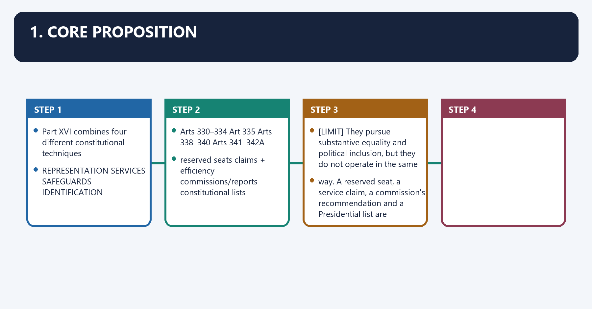
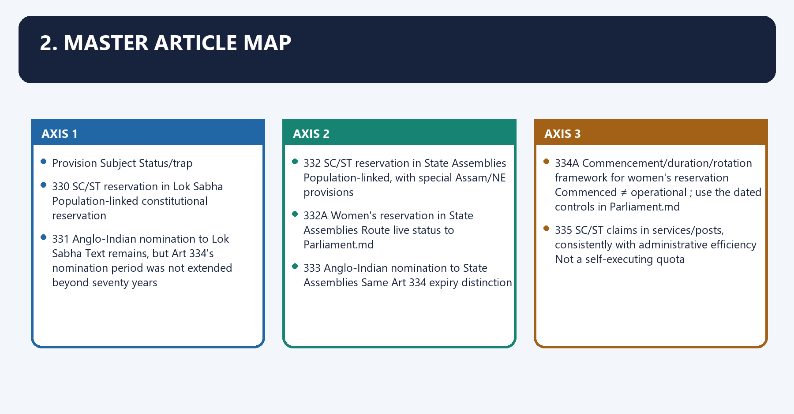
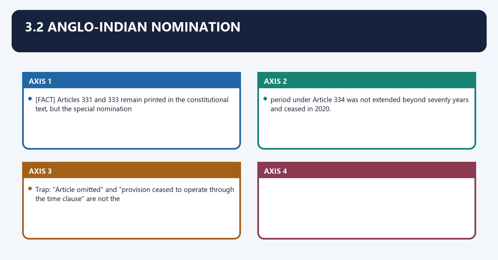
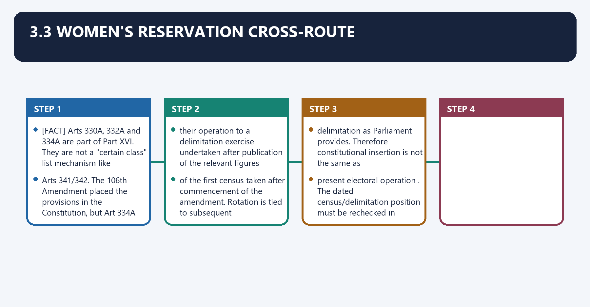
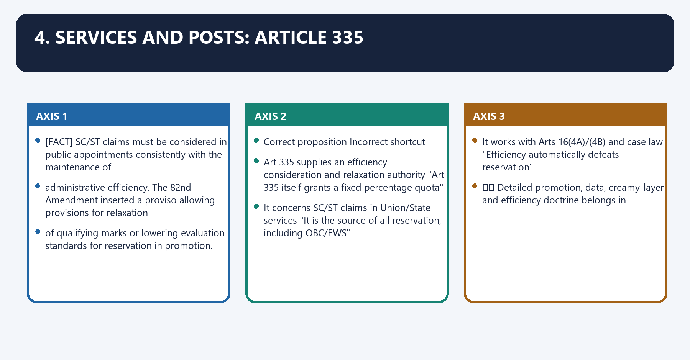
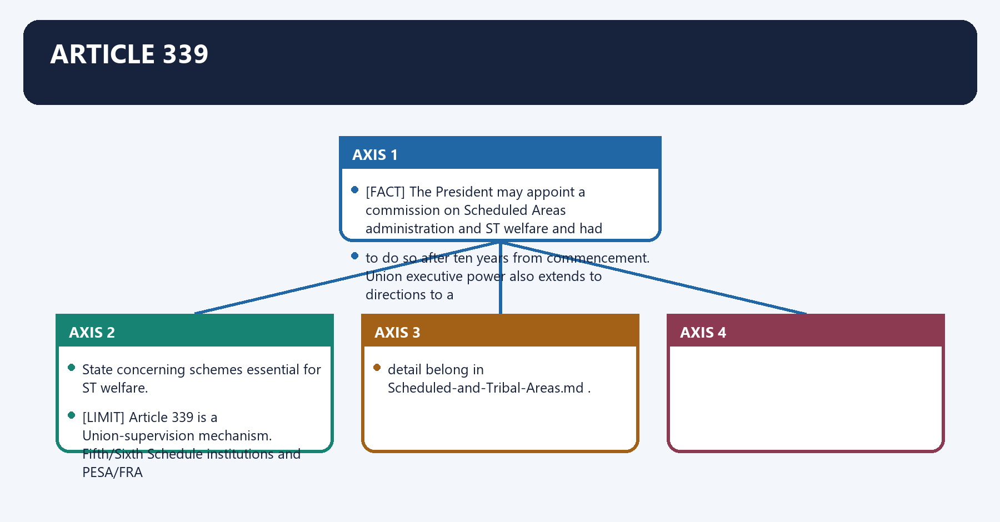
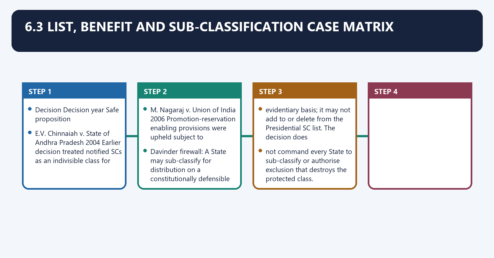
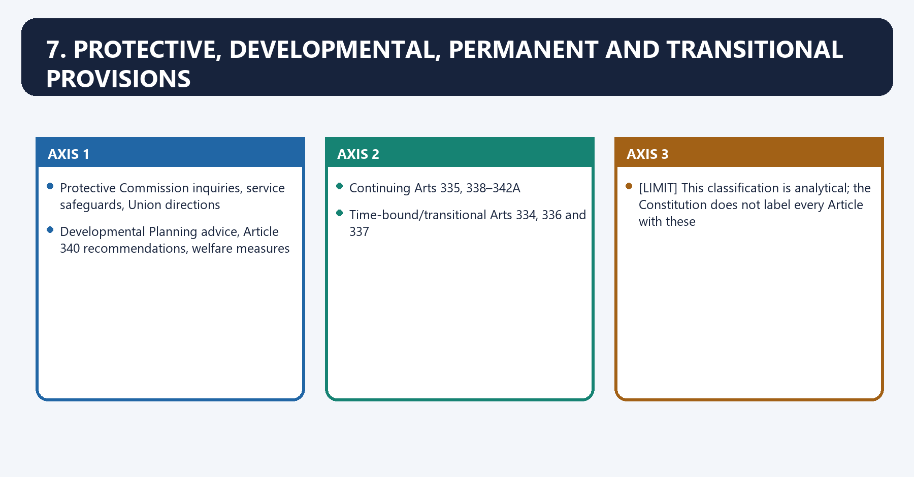

# Special Provisions Relating to Certain Classes — Complete Uncompressed Learning Session

**Complete independent learning session + verified PYQ routing + solved practice workbook + final consolidated register notes**

**Legal/current control date:** 5 September 2026 (Asia/Kolkata)

> **Tag key:** `[FACT]` = named constitutional, statutory, official, judicial or audited local support; `[ANALYSIS]` = reasoned examination; `[CURRENT]` = checked for the control date; `[LIMIT]` = qualification.
>
> **Answer-writing discipline:** claim -> named evidence -> analysis -> qualification.

- [CURRENT] Status is controlled to **5 September 2026, Asia/Kolkata**.
- [CURRENT] **Live official refresh, 5 September 2026:** The official Constitution and Social Justice/NCSC/NCST/NCBC portals were rechecked on 5 September 2026. The 106th Amendment provisions are in the constitutional text but remain tied to the census-delimitation trigger; current lists, schemes and implementation notifications remain date-specific.

#### How to Use This Package

[FACT] The complete Basic/Core owner is taught first in source order. Cross-topic Markdown, local OCR books and verified PYQ ledgers supplement it.

[FACT] Advanced-owner material appears only after the Core and practice sections under the required optional-depth label.

[LIMIT] Part XVI is not a single reservation code. Representation, service claims, commissions and constitutional lists use different legal mechanisms. Davinder Singh (2024) permits evidence-based SC sub-classification for distribution; it does not transfer Article 341 list-alteration power to States.

#### Local Owner Gateway

> **Subject:** Polity · **Tier:** Core · **GS Paper:** GS-II
> **Official clauses:** "Rights Issues" and "Appointment to various Constitutional posts, powers,
> functions and responsibilities of various Constitutional Bodies."
> **Grounded in:** Constitution of India, Part XVI, Arts 330–342A; M. Laxmikanth,
> *Courseware on Indian Polity*, Eighth Edition (2026), Ch. 77.
> **Status legend:** [FACT] constitutional/textual fact · 📜 statute/rule · ⚖️ judicial holding ·
> 🧾 non-binding recommendation · [LIMIT] analytical inference.
> **Rule:** This owner supplies the consolidated map. Specialist owners retain detailed reservation
> doctrine and commission design. It is independently sufficient for Prelims and 10/15/20-mark
> Mains; no Advanced companion is required.

---

## BASIC LEARNING SESSION

### 01. 1. Core proposition

1. Core proposition denotes the constitutional rules and institutional links organised around Part XVI combines four different constitutional techniques.
1. Core proposition operates through REPRESENTATION SERVICES SAFEGUARDS IDENTIFICATION, connected with Arts 330–334 Art 335 Arts 338–340 Arts 341–342A.
The operative mechanism matters because reserved seats claims + efficiency commissions/reports constitutional lists.
Its principal consequence is that [LIMIT] They pursue substantive equality and political inclusion, but they do not operate in the same.
The decisive contrast is between way. A reserved seat, a service claim, a commission's recommendation and a Presidential list are and Part XVI combines four different constitutional techniques.
The exam-safe limitation is that part XVI combines four different constitutional techniques.

Part XVI combines four different constitutional techniques:

```text
REPRESENTATION        SERVICES             SAFEGUARDS            IDENTIFICATION
Arts 330–334          Art 335              Arts 338–340          Arts 341–342A
reserved seats        claims + efficiency  commissions/reports   constitutional lists
```

[LIMIT] They pursue substantive equality and political inclusion, but they do not operate in the same
way. A reserved seat, a service claim, a commission's recommendation and a Presidential list are
legally distinct.

---

### 02. 2. Master Article map

2. Master Article map denotes the constitutional rules and institutional links organised around Provision Subject Status/trap.
2. Master Article map operates through 330 SC/ST reservation in Lok Sabha Population-linked constitutional reservation, connected with 331 Anglo-Indian nomination to Lok Sabha Text remains, but Art 334's nomination period was not extended beyond seventy years.
The operative mechanism matters because 332 SC/ST reservation in State Assemblies Population-linked, with special Assam/NE provisions.
Its principal consequence is that 332A Women's reservation in State Assemblies Route live status to Parliament.md.
The decisive contrast is between 333 Anglo-Indian nomination to State Assemblies Same Art 334 expiry distinction and 334A Commencement/duration/rotation framework for women's reservation Commenced ≠ operational ; use the dated controls in Parliament.md.
The exam-safe limitation is that 335 SC/ST claims in services/posts, consistently with administrative efficiency Not a self-executing quota.

| Provision | Subject | Status/trap |
|---:|---|---|
| **330** | SC/ST reservation in Lok Sabha | Population-linked constitutional reservation |
| **330A** | Women's reservation in Lok Sabha, including within SC/ST seats | [FACT] In constitutional text; current operation/status is controlled in `Parliament.md` |
| **331** | Anglo-Indian nomination to Lok Sabha | Text remains, but Art 334's nomination period was not extended beyond seventy years |
| **332** | SC/ST reservation in State Assemblies | Population-linked, with special Assam/NE provisions |
| **332A** | Women's reservation in State Assemblies | Route live status to `Parliament.md` |
| **333** | Anglo-Indian nomination to State Assemblies | Same Art 334 expiry distinction |
| **334** | Time limit for SC/ST seat reservation and Anglo-Indian nomination | 104th Amendment extended SC/ST reservation to eighty years; did not extend nomination |
| **334A** | Commencement/duration/rotation framework for women's reservation | **Commenced ≠ operational**; use the dated controls in `Parliament.md` |
| **335** | SC/ST claims in services/posts, consistently with administrative efficiency | Not a self-executing quota |
| **336–337** | Transitional Anglo-Indian services and educational-grant protections | Historical; ended after ten years |
| **338** | NCSC | Constitutional commission; Art 338(10) retains an Anglo-Indian reference |
| **338A** | NCST | Constitutional commission |
| **338B** | NCBC | Constitutional since 102nd Amendment |
| **339** | Union control/commission concerning Scheduled Areas and ST welfare | Distinct from Fifth/Sixth Schedule institutions |
| **340** | Commission to investigate backward-class conditions | Source of Kalelkar/Mandal commissions |
| **341** | Scheduled Castes | President specifies; Parliament alone includes/excludes |
| **342** | Scheduled Tribes | Same list architecture |
| **342A** | Socially and educationally backward classes | Central List plus State/UT lists after 105th Amendment |

---

### 03. 3.1 SC/ST seats

3.1 SC/ST seats denotes the constitutional rules and institutional links organised around [FACT] Articles 330 and 332 reserve seats in the Lok Sabha and State Legislative Assemblies broadly in.
3.1 SC/ST seats operates through proportion to the relevant SC/ST population. Reservation identifies constituencies/seats; it does, connected with not create a separate electorate—voters in the constituency vote in the ordinary territorial.
The operative mechanism matters because [FACT] Article 334 now provides an eighty-year period from commencement for SC/ST legislative-seat.
Its principal consequence is that reservation. The 104th Amendment made this extension while leaving the Anglo-Indian nomination.
The decisive contrast is between period at seventy years and [FACT] Articles 330 and 332 reserve seats in the Lok Sabha and State Legislative Assemblies broadly in.
The exam-safe limitation is that [FACT] Articles 330 and 332 reserve seats in the Lok Sabha and State Legislative Assemblies broadly in.

[FACT] Articles 330 and 332 reserve seats in the Lok Sabha and State Legislative Assemblies broadly in
proportion to the relevant SC/ST population. Reservation identifies constituencies/seats; it does
not create a separate electorate—voters in the constituency vote in the ordinary territorial
election.

[FACT] Article 334 now provides an **eighty-year** period from commencement for SC/ST legislative-seat
reservation. The 104th Amendment made this extension while leaving the Anglo-Indian nomination
period at seventy years.

### 04. 3.2 Anglo-Indian nomination

3.2 Anglo-Indian nomination denotes the constitutional rules and institutional links organised around [FACT] Articles 331 and 333 remain printed in the constitutional text, but the special nomination.
3.2 Anglo-Indian nomination operates through period under Article 334 was not extended beyond seventy years and ceased in 2020, connected with Trap: "Article omitted" and "provision ceased to operate through the time clause" are not the.
The operative mechanism matters because [FACT] Articles 331 and 333 remain printed in the constitutional text, but the special nomination.
Its principal consequence is that [FACT] Articles 331 and 333 remain printed in the constitutional text, but the special nomination.
The decisive contrast is between [FACT] Articles 331 and 333 remain printed in the constitutional text, but the special nomination and [FACT] Articles 331 and 333 remain printed in the constitutional text, but the special nomination.
The exam-safe limitation is that [FACT] Articles 331 and 333 remain printed in the constitutional text, but the special nomination.

[FACT] Articles 331 and 333 remain printed in the constitutional text, but the special nomination
period under Article 334 was not extended beyond seventy years and ceased in 2020.

> **Trap:** "Article omitted" and "provision ceased to operate through the time clause" are not the
> same statement.

### 05. 3.3 Women's reservation cross-route

3.3 Women's reservation cross-route denotes the constitutional rules and institutional links organised around [FACT] Arts 330A, 332A and 334A are part of Part XVI. They are not a "certain class" list mechanism like.
3.3 Women's reservation cross-route operates through Arts 341/342. The 106th Amendment placed the provisions in the Constitution, but Art 334A links, connected with their operation to a delimitation exercise undertaken after publication of the relevant figures.
The operative mechanism matters because of the first census taken after commencement of the amendment. Rotation is tied to subsequent.
Its principal consequence is that delimitation as Parliament provides. Therefore constitutional insertion is not the same as.
The decisive contrast is between present electoral operation . The dated census/delimitation position must be rechecked in and [FACT] Arts 330A, 332A and 334A are part of Part XVI. They are not a "certain class" list mechanism like.
The exam-safe limitation is that [FACT] Arts 330A, 332A and 334A are part of Part XVI. They are not a "certain class" list mechanism like.

[FACT] Arts 330A, 332A and 334A are part of Part XVI. They are not a "certain class" list mechanism like
Arts 341/342. The 106th Amendment placed the provisions in the Constitution, but Art 334A links
their operation to a delimitation exercise undertaken after publication of the relevant figures
of the first census taken after commencement of the amendment. Rotation is tied to subsequent
delimitation as Parliament provides. Therefore **constitutional insertion is not the same as
present electoral operation**. The dated census/delimitation position must be rechecked in
`Parliament.md`.

---

### 06. 4. Services and posts: Article 335

4. Services and posts: Article 335 denotes the constitutional rules and institutional links organised around [FACT] SC/ST claims must be considered in public appointments consistently with the maintenance of.
4. Services and posts: Article 335 operates through administrative efficiency. The 82nd Amendment inserted a proviso allowing provisions for relaxation, connected with of qualifying marks or lowering evaluation standards for reservation in promotion.
The operative mechanism matters because correct proposition Incorrect shortcut.
Its principal consequence is that art 335 supplies an efficiency consideration and relaxation authority "Art 335 itself grants a fixed percentage quota".
The decisive contrast is between It concerns SC/ST claims in Union/State services "It is the source of all reservation, including OBC/EWS" and It works with Arts 16(4A)/(4B) and case law "Efficiency automatically defeats reservation".
The exam-safe limitation is that ⚖️ Detailed promotion, data, creamy-layer and efficiency doctrine belongs in.

[FACT] SC/ST claims must be considered in public appointments consistently with the maintenance of
administrative efficiency. The 82nd Amendment inserted a proviso allowing provisions for relaxation
of qualifying marks or lowering evaluation standards for reservation in promotion.

| Correct proposition | Incorrect shortcut |
|---|---|
| Art 335 supplies an efficiency consideration and relaxation authority | "Art 335 itself grants a fixed percentage quota" |
| It concerns SC/ST claims in Union/State services | "It is the source of all reservation, including OBC/EWS" |
| It works with Arts 16(4A)/(4B) and case law | "Efficiency automatically defeats reservation" |

⚖️ Detailed promotion, data, creamy-layer and efficiency doctrine belongs in
`Fundamental-Rights.md`.

---

### 07. 5. Constitutional commission architecture

5. Constitutional commission architecture denotes the constitutional rules and institutional links organised around Body Article Shared core Specialist route.
5. Constitutional commission architecture operates through NCST 338A Same broad architecture plus tribal-specific mandate Same, connected with NCBC 338B Constitutional SEBC commission since 102nd Amendment Same.
The operative mechanism matters because [FACT] Their reports go to the President and Parliament with action-taken/non-acceptance explanations.
Its principal consequence is that state-related material routes through the Governor to the State legislature.
The decisive contrast is between Trap: Civil-court powers during investigation do not make recommendations binding or convert and the commissions into courts.
The exam-safe limitation is that body Article Shared core Specialist route.
| Body | Article | Shared core | Specialist route |
|---|---:|---|---|
| NCSC | **338** | Chair + Vice-Chair + 3 members; President appoints; safeguards, complaints, planning advice, reports, civil-court inquiry powers | `National-Commissions-SC-ST-BC.md` |
| NCST | **338A** | Same broad architecture plus tribal-specific mandate | Same |
| NCBC | **338B** | Constitutional SEBC commission since 102nd Amendment | Same |

[FACT] Their reports go to the President and Parliament with action-taken/non-acceptance explanations;
State-related material routes through the Governor to the State legislature.

> **Trap:** Civil-court powers during investigation do not make recommendations binding or convert
> the commissions into courts.

### 08. Article 339

Article 339 denotes the constitutional rules and institutional links organised around [FACT] The President may appoint a commission on Scheduled Areas administration and ST welfare and had.
Article 339 operates through to do so after ten years from commencement. Union executive power also extends to directions to a, connected with State concerning schemes essential for ST welfare.
The operative mechanism matters because [LIMIT] Article 339 is a Union-supervision mechanism. Fifth/Sixth Schedule institutions and PESA/FRA.
Its principal consequence is that detail belong in Scheduled-and-Tribal-Areas.md.
The decisive contrast is between [FACT] The President may appoint a commission on Scheduled Areas administration and ST welfare and had and [FACT] The President may appoint a commission on Scheduled Areas administration and ST welfare and had.
The exam-safe limitation is that [FACT] The President may appoint a commission on Scheduled Areas administration and ST welfare and had.

[FACT] The President may appoint a commission on Scheduled Areas administration and ST welfare and had
to do so after ten years from commencement. Union executive power also extends to directions to a
State concerning schemes essential for ST welfare.

[LIMIT] Article 339 is a Union-supervision mechanism. Fifth/Sixth Schedule institutions and PESA/FRA
detail belong in `Scheduled-and-Tribal-Areas.md`.

### 09. Article 275 welfare-grant cross-link

Article 275 welfare-grant cross-link denotes the constitutional rules and institutional links organised around [FACT] Article 275(1), outside Part XVI, authorises grants-in-aid to States in need and contains a.
Article 275 welfare-grant cross-link operates through specific route for schemes promoting Scheduled Tribe welfare and raising the administration of, connected with Scheduled Areas. It is a fiscal support provision, not a power to alter an Art 342 list or replace.
The operative mechanism matters because the Fifth/Sixth Schedules.
Its principal consequence is that [FACT] Article 275(1), outside Part XVI, authorises grants-in-aid to States in need and contains a.
The decisive contrast is between [FACT] Article 275(1), outside Part XVI, authorises grants-in-aid to States in need and contains a and [FACT] Article 275(1), outside Part XVI, authorises grants-in-aid to States in need and contains a.
The exam-safe limitation is that [FACT] Article 275(1), outside Part XVI, authorises grants-in-aid to States in need and contains a.
[FACT] Article 275(1), outside Part XVI, authorises grants-in-aid to States in need and contains a
specific route for schemes promoting Scheduled Tribe welfare and raising the administration of
Scheduled Areas. It is a fiscal support provision, not a power to alter an Art 342 list or replace
the Fifth/Sixth Schedules.

### 10. Article 340

Article 340 denotes the constitutional rules and institutional links organised around [FACT] The President may appoint a commission to investigate SEBC conditions and recommend measures and.
Article 340 operates through grants; its report and an action memorandum are laid before Parliament. The Kalelkar and Mandal, connected with Commissions are the standard examples.
The operative mechanism matters because trap: An Article 340 commission is temporary/investigative; the NCBC under Art 338B is the.
Its principal consequence is that standing constitutional commission.
The decisive contrast is between [FACT] The President may appoint a commission to investigate SEBC conditions and recommend measures and and [FACT] The President may appoint a commission to investigate SEBC conditions and recommend measures and.
The exam-safe limitation is that [FACT] The President may appoint a commission to investigate SEBC conditions and recommend measures and.

[FACT] The President may appoint a commission to investigate SEBC conditions and recommend measures and
grants; its report and an action memorandum are laid before Parliament. The Kalelkar and Mandal
Commissions are the standard examples.

> **Trap:** An Article 340 commission is temporary/investigative; the NCBC under Art 338B is the
> standing constitutional commission.

---

### 11. 6.1 Scheduled Castes and Scheduled Tribes

6.1 Scheduled Castes and Scheduled Tribes denotes the constitutional rules and institutional links organised around Stage Arts 341/342 rule.
6.1 Scheduled Castes and Scheduled Tribes operates through Initial specification President, by public notification; consultation with Governor where a State is concerned, connected with Inclusion/exclusion Parliament by law.
The operative mechanism matters because state power A State cannot independently alter the Presidential SC/ST list.
Its principal consequence is that territorial character Lists are State/UT-specific; status is not automatically identical across India.
The decisive contrast is between ⚖️ State of Punjab v. Davinder Singh (2024) permits evidence-based sub-classification within the and Scheduled Castes for distribution of benefits, but does not transfer Article 341 list-alteration.
The exam-safe limitation is that power to a State or require sub-classification.
| Stage | Arts 341/342 rule |
|---|---|
| Initial specification | President, by public notification; consultation with Governor where a State is concerned |
| Inclusion/exclusion | **Parliament by law** |
| State power | A State cannot independently alter the Presidential SC/ST list |
| Territorial character | Lists are State/UT-specific; status is not automatically identical across India |

⚖️ *State of Punjab v. Davinder Singh* (2024) permits evidence-based sub-classification within the
Scheduled Castes for distribution of benefits, but does not transfer Article 341 list-alteration
power to a State or require sub-classification.

### 12. 6.3 List, benefit and sub-classification case matrix

6.3 List, benefit and sub-classification case matrix denotes the constitutional rules and institutional links organised around Decision Decision year Safe proposition.
6.3 List, benefit and sub-classification case matrix operates through E.V. Chinnaiah v. State of Andhra Pradesh 2004 Earlier decision treated notified SCs as an indivisible class for sub-classification, connected with M. Nagaraj v. Union of India 2006 Promotion-reservation enabling provisions were upheld subject to constitutional conditions.
The operative mechanism matters because davinder firewall: A State may sub-classify for distribution on a constitutionally defensible.
Its principal consequence is that evidentiary basis; it may not add to or delete from the Presidential SC list. The decision does.
The decisive contrast is between not command every State to sub-classify or authorise exclusion that destroys the protected class and Decision Decision year Safe proposition.
The exam-safe limitation is that decision Decision year Safe proposition.

| Decision | Decision year | Safe proposition |
|---|---:|---|
| *Indra Sawhney v. Union of India* | 1992 | Backward-class reservation doctrine, creamy layer and the ordinary 50% framework arise under equality provisions, not Part XVI list alteration |
| *E.V. Chinnaiah v. State of Andhra Pradesh* | 2004 | Earlier decision treated notified SCs as an indivisible class for sub-classification |
| *M. Nagaraj v. Union of India* | 2006 | Promotion-reservation enabling provisions were upheld subject to constitutional conditions |
| *Jarnail Singh v. Lachhmi Narain Gupta* | 2018 | Modified the *Nagaraj* data rule and applied creamy-layer exclusion logic in the promotion context |
| *Jaishri Laxmanrao Patil v. Chief Minister, Maharashtra* | 2021 | Interpreted the 102nd Amendment before the 105th Amendment restored express State/UT list competence |
| *State of Punjab v. Davinder Singh* | 2024 | Overruled *E.V. Chinnaiah* on this point and permitted evidence-based SC sub-classification for fair distribution of benefits |

> **Davinder firewall:** A State may sub-classify for distribution on a constitutionally defensible
> evidentiary basis; it may not add to or delete from the Presidential SC list. The decision does
> not command every State to sub-classify or authorise exclusion that destroys the protected class.

### 13. 6.2 Socially and educationally backward classes

6.2 Socially and educationally backward classes denotes the constitutional rules and institutional links organised around [FACT] The 102nd Amendment inserted Arts 338B and 342A. After the 105th Amendment.
6.2 Socially and educationally backward classes operates through Central List: President specifies for Central-Government purposes; Parliament includes or, connected with State/UT List: each State/UT may by law prepare and maintain its own list for its own.
The operative mechanism matters because purposes; entries may differ from the Central List.
Its principal consequence is that master trap: "Which community is on a constitutional list?" and "What reservation/benefit does.
The decisive contrast is between it receive?" are separate questions. A list identifies a class; the benefit requires its own and constitutional, statutory or policy authority.
The exam-safe limitation is that [FACT] The 102nd Amendment inserted Arts 338B and 342A. After the 105th Amendment.
[FACT] The 102nd Amendment inserted Arts 338B and 342A. After the 105th Amendment:

- **Central List:** President specifies for Central-Government purposes; Parliament includes or
  excludes.
- **State/UT List:** each State/UT may **by law** prepare and maintain its own list for its own
  purposes; entries may differ from the Central List.

> **Master trap:** "Which community is on a constitutional list?" and "What reservation/benefit does
> it receive?" are separate questions. A list identifies a class; the benefit requires its own
> constitutional, statutory or policy authority.

---

### 14. 7. Protective, developmental, permanent and transitional provisions

7. Protective, developmental, permanent and transitional provisions denotes the constitutional rules and institutional links organised around Protective Commission inquiries, service safeguards, Union directions.
7. Protective, developmental, permanent and transitional provisions operates through Developmental Planning advice, Article 340 recommendations, welfare measures, connected with Continuing Arts 335, 338–342A.
The operative mechanism matters because time-bound/transitional Arts 334, 336 and 337.
Its principal consequence is that [LIMIT] This classification is analytical; the Constitution does not label every Article with these.
The decisive contrast is between Protective Commission inquiries, service safeguards, Union directions and Protective Commission inquiries, service safeguards, Union directions.
The exam-safe limitation is that protective Commission inquiries, service safeguards, Union directions.

| Axis | Examples |
|---|---|
| Protective | Commission inquiries, service safeguards, Union directions |
| Developmental | Planning advice, Article 340 recommendations, welfare measures |
| Continuing | Arts 335, 338–342A |
| Time-bound/transitional | Arts 334, 336 and 337 |

[LIMIT] This classification is analytical; the Constitution does not label every Article with these
categories.

---

### 15. 8. Local-body reservation and owner-scope firewall

Close-option source discipline means the systematic verification of legal source, institutional category, status and exception before choosing a close option.
Technically, close-option source discipline comprises source attribution, doctrinal classification, date control and remedy-specific qualification.
The operative mechanism matters because question asked Correct owner.
Its principal consequence is that who is constitutionally specified as SC/ST/SEBC? Arts 341, 342 and 342A.
The decisive contrast is between What is the parliamentary/assembly representation architecture? Arts 330–334A and What is the local-body reservation architecture? Arts 243D and 243T.
The exam-safe limitation is that what reservation is available in education/employment? Arts 15–16, law/policy and controlling case law.
[FACT] Articles 243D and 243T separately govern reservation in Panchayats and Municipalities, including
SC/ST seats and offices and women's reservation. They are cross-references, not Part XVI
legislative-seat provisions.

| Question asked | Correct owner |
|---|---|
| Who is constitutionally specified as SC/ST/SEBC? | Arts 341, 342 and 342A |
| What is the parliamentary/assembly representation architecture? | Arts 330–334A |
| What is the local-body reservation architecture? | Arts 243D and 243T |
| What reservation is available in education/employment? | Arts 15–16, law/policy and controlling case law |
| How are Scheduled Areas administered? | Fifth/Sixth Schedules, PESA and specialist owner |
| What welfare scheme applies? | The exact statute, rule, budget or scheme—not constitutional-list status alone |

> **Master distinction:** A constitutional list identifies a class; a reservation provision
> authorises a representational benefit; a welfare scheme supplies a dated programme; and area
> administration allocates territorial governance. None is a synonym for the others.

---

### 16. 9.1 Demand map

9.1 Demand map denotes the constitutional rules and institutional links organised around Demand Answer spine.
9.1 Demand map operates through Part XVI overview Representation → services → commissions → lists → equality verdict, connected with SC/ST list versus sub-classification Arts 341/342 → Parliament's list power → Davinder Singh distribution distinction.
The operative mechanism matters because backward-class architecture Art 340 → NCBC/338B → 102nd → 105th → Central/State lists.
Its principal consequence is that commission effectiveness Constitutional design → civil-court powers/report route → advisory limit.
The decisive contrast is between Reservation and efficiency Art 335 → Art 16 route → case-law discipline → substantive-equality verdict and Demand Answer spine.
The exam-safe limitation is that demand Answer spine.

| Demand | Answer spine |
|---|---|
| Part XVI overview | Representation → services → commissions → lists → equality verdict |
| SC/ST list versus sub-classification | Arts 341/342 → Parliament's list power → *Davinder Singh* distribution distinction |
| Backward-class architecture | Art 340 → NCBC/338B → 102nd → 105th → Central/State lists |
| Commission effectiveness | Constitutional design → civil-court powers/report route → advisory limit |
| Reservation and efficiency | Art 335 → Art 16 route → case-law discipline → substantive-equality verdict |

### 17. 9.2 Thesis options

9.2 Thesis options denotes the constitutional rules and institutional links organised around Part XVI is not a single reservation code; it combines political representation, service claims,.
9.2 Thesis options operates through constitutional monitoring and list identification through legally distinct mechanisms, connected with The constitutional lists answer who belongs to a protected class, while Articles 15, 16, 330,.
The operative mechanism matters because 332 and ordinary law answer what benefit follows.
Its principal consequence is that the 102nd–105th Amendment sequence constitutionalised the NCBC while restoring a federal division.
The decisive contrast is between between the Central SEBC List and State lists and Part XVI is not a single reservation code; it combines political representation, service claims,.
The exam-safe limitation is that part XVI is not a single reservation code; it combines political representation, service claims,.
- *Part XVI is not a single reservation code; it combines political representation, service claims,
  constitutional monitoring and list identification through legally distinct mechanisms.*
- *The constitutional lists answer who belongs to a protected class, while Articles 15, 16, 330,
  332 and ordinary law answer what benefit follows.*
- *The 102nd–105th Amendment sequence constitutionalised the NCBC while restoring a federal division
  between the Central SEBC List and State lists.*

### 18. 9.3 Mark-scaled structures

9.3 Mark-scaled structures denotes the constitutional rules and institutional links organised around Marks Structure Evidence.
9.3 Mark-scaled structures operates through 10 Define issue → 3–4 Articles → one distinction → verdict 3–4 anchors, connected with 15 Representation/services/commission/list map → amendment/case → limit → verdict 5–6 anchors.
The operative mechanism matters because 20 Part XVI architecture → equality rationale → SC/ST/SEBC mechanisms → federal/implementation critique → graded conclusion 7–9 anchors.
Its principal consequence is that marks Structure Evidence.
The decisive contrast is between Marks Structure Evidence and Marks Structure Evidence.
The exam-safe limitation is that marks Structure Evidence.

| Marks | Structure | Evidence |
|---:|---|---|
| 10 | Define issue → 3–4 Articles → one distinction → verdict | 3–4 anchors |
| 15 | Representation/services/commission/list map → amendment/case → limit → verdict | 5–6 anchors |
| 20 | Part XVI architecture → equality rationale → SC/ST/SEBC mechanisms → federal/implementation critique → graded conclusion | 7–9 anchors |

### 19. 9.4 Evidence units

9.4 Evidence units denotes the constitutional rules and institutional links organised around Claim: list power is constitutionally centralised for SC/STs. Evidence: [FACT] Arts 341/342.
9.4 Evidence units operates through Analysis: uniform legal alteration through Parliament protects list integrity, connected with Qualification: ⚖️ States may design evidence-based distribution within a list under.
The operative mechanism matters because davinder Singh without changing it.
Its principal consequence is that claim: Article 335 balances representation and administration. Evidence: [FACT] text plus 82nd.
The decisive contrast is between Amendment proviso. Analysis: efficiency is integrated into, not placed above, substantive and equality. Qualification: exact promotion conditions arise from Arts 16 and case law.
The exam-safe limitation is that claim: commission status does not equal binding power. Evidence: [FACT] Arts 338–338B reporting.
- **Claim:** list power is constitutionally centralised for SC/STs. **Evidence:** [FACT] Arts 341/342.
  **Analysis:** uniform legal alteration through Parliament protects list integrity.
  **Qualification:** ⚖️ States may design evidence-based distribution within a list under
  *Davinder Singh* without changing it.
- **Claim:** Article 335 balances representation and administration. **Evidence:** [FACT] text plus 82nd
  Amendment proviso. **Analysis:** efficiency is integrated into, not placed above, substantive
  equality. **Qualification:** exact promotion conditions arise from Arts 16 and case law.
- **Claim:** commission status does not equal binding power. **Evidence:** [FACT] Arts 338–338B reporting
  and inquiry design. **Analysis:** leverage is parliamentary visibility and consultation.
  **Qualification:** governments retain final policy authority subject to review.

---

### 20. 10. Must-Know Facts

10. Must-Know Facts denotes the constitutional rules and institutional links organised around [FACT] Part XVI runs from Arts 330–342A and now also contains 330A, 332A and 334A.
10. Must-Know Facts operates through [FACT] SC/ST seat reservation and Anglo-Indian nomination have different Article 334 time positions, connected with [FACT] Art 335 is a service-claim/efficiency provision, not a universal reservation clause.
The operative mechanism matters because [FACT] NCSC/NCST/NCBC are constitutional; Article 340 commissions are separately appointed.
Its principal consequence is that [FACT] President specifies SC/ST lists; Parliament alone includes/excludes.
The decisive contrast is between [FACT] After the 105th Amendment, Central and State/UT SEBC lists are distinct and [FACT] Arts 336–337 are exhausted transitional provisions.
The exam-safe limitation is that [FACT] Arts 243D/243T and Art 275 are cross-links, not substitutes for Part XVI.

- [FACT] Part XVI runs from Arts **330–342A** and now also contains 330A, 332A and 334A.
- [FACT] SC/ST seat reservation and Anglo-Indian nomination have different Article 334 time positions.
- [FACT] Art 335 is a service-claim/efficiency provision, not a universal reservation clause.
- [FACT] NCSC/NCST/NCBC are constitutional; Article 340 commissions are separately appointed.
- [FACT] President specifies SC/ST lists; Parliament alone includes/excludes.
- [FACT] After the 105th Amendment, Central and State/UT SEBC lists are distinct.
- [FACT] Arts 336–337 are exhausted transitional provisions.
- [FACT] Arts 243D/243T and Art 275 are cross-links, not substitutes for Part XVI.
- ⚖️ *Davinder Singh* (2024) distinguishes benefit distribution through sub-classification from
  alteration of the Art 341 list.

---

### 21. 11. UPSC traps and source discipline

Close-option source discipline means the systematic verification of legal source, institutional category, status and exception before choosing a close option.
Technically, close-option source discipline comprises source attribution, doctrinal classification, date control and remedy-specific qualification.
The operative mechanism matters because do not present a commission's civil-court powers as binding adjudication.
Its principal consequence is that do not calculate or simplify women's-reservation dates here; route to Parliament.md.
The decisive contrast is between Do not treat Articles 336–337 as current benefits and Keep [FACT] constitutional text, 📜 implementing law, ⚖️ case holding, 🧾 recommendation and.
The exam-safe limitation is that [LIMIT] inference separate.
- Do not equate SC/ST legislative reservation with separate electorates.
- Do not say States can add a caste/tribe to Arts 341/342 lists by executive order.
- Do not say the 105th Amendment abolished the Central SEBC List.
- Do not present a commission's civil-court powers as binding adjudication.
- Do not calculate or simplify women's-reservation dates here; route to `Parliament.md`.
- Do not treat Articles 336–337 as current benefits.
- Keep [FACT] constitutional text, 📜 implementing law, ⚖️ case holding, 🧾 recommendation and
  [LIMIT] inference separate.

### 22. Cross-links

Cross-links denotes the constitutional rules and institutional links organised around Reservation/equality cases: Fundamental-Rights.md.
Cross-links operates through Commission detail: National-Commissions-SC-ST-BC.md, connected with Scheduled/tribal administration: Scheduled-and-Tribal-Areas.md.
The operative mechanism matters because women's reservation and delimitation status: Parliament.md.
Its principal consequence is that election administration: Election-Commission.md.
The decisive contrast is between Reservation/equality cases: Fundamental-Rights.md and Reservation/equality cases: Fundamental-Rights.md.
The exam-safe limitation is that reservation/equality cases: Fundamental-Rights.md.
- Reservation/equality cases: `Fundamental-Rights.md`
- Commission detail: `National-Commissions-SC-ST-BC.md`
- Scheduled/tribal administration: `Scheduled-and-Tribal-Areas.md`
- Women's reservation and delimitation status: `Parliament.md`
- Election administration: `Election-Commission.md`

### 23. Part XVI architecture by legal effect

Part XVI architecture by legal effect denotes the constitutional rules and institutional links organised around Arts 341/342/342A - who is constitutionally listed.
Part XVI architecture by legal effect operates through Arts 330-334A - who receives legislative-seat protection and for how long, connected with Art 335 - SC/ST claims + administrative efficiency + relaxation proviso.
The operative mechanism matters because arts 338/338A/338B/339/340 - commissions, reports, directions and investigation.
Its principal consequence is that art 275 cross-link - specified ST welfare/Scheduled Area grants.
The decisive contrast is between [LIMIT] Identification, reservation, welfare funding and area administration are separate and Arts 341/342/342A - who is constitutionally listed.
The exam-safe limitation is that arts 341/342/342A - who is constitutionally listed.
IDENTIFY
Arts 341/342/342A -> who is constitutionally listed.

REPRESENT
Arts 330-334A -> who receives legislative-seat protection and for how long.

SERVICES
Art 335 -> SC/ST claims + administrative efficiency + relaxation proviso.

MONITOR
Arts 338/338A/338B/339/340 -> commissions, reports, directions and investigation.

FUND
Art 275 cross-link -> specified ST welfare/Scheduled Area grants.

[LIMIT] Identification, reservation, welfare funding and area administration are separate.

### 24. Sub-classification after Davinder Singh

Sub-classification after Davinder Singh denotes the constitutional rules and institutional links organised around President specifies - Parliament includes/excludes.
Sub-classification after Davinder Singh operates through BENEFIT DISTRIBUTION, connected with State designs evidence-based sub-classification within the notified class.
The operative mechanism matters because data, rational basis, class integrity, non-exclusion and equality.
Its principal consequence is that e.V. Chinnaiah (2004) - earlier indivisibility rule.
The decisive contrast is between Davinder Singh (2024) - overruled that rule; distribution is distinct from list alteration and President specifies - Parliament includes/excludes.
The exam-safe limitation is that president specifies - Parliament includes/excludes.
ARTICLE 341 LIST
President specifies -> Parliament includes/excludes.
                    |
                    v
BENEFIT DISTRIBUTION
State designs evidence-based sub-classification within the notified class.
                    |
                    v
JUDICIAL REVIEW
data, rational basis, class integrity, non-exclusion and equality.

E.V. Chinnaiah (2004) -> earlier indivisibility rule.
Davinder Singh (2024) -> overruled that rule; distribution is distinct from list alteration.

### 25. Representation clocks and cross-links

Representation clocks and cross-links denotes the constitutional rules and institutional links organised around SC/ST seat reservation - extended to eighty years from commencement.
Representation clocks and cross-links operates through Anglo-Indian nomination - not extended beyond seventy years; ceased in 2020, connected with 106th Amendment text - census figures - delimitation - operation/rotation.
The operative mechanism matters because arts 243D/243T - separate Panchayat/Municipality reservation architecture.
Its principal consequence is that [LIMIT] Constitutional insertion, commencement and electoral operation are not synonyms.
The decisive contrast is between SC/ST seat reservation - extended to eighty years from commencement and SC/ST seat reservation - extended to eighty years from commencement.
The exam-safe limitation is that sC/ST seat reservation - extended to eighty years from commencement.
ARTICLE 334
SC/ST seat reservation -> extended to eighty years from commencement.
Anglo-Indian nomination -> not extended beyond seventy years; ceased in 2020.

ARTICLE 334A
106th Amendment text -> census figures -> delimitation -> operation/rotation.

LOCAL GOVERNMENT
Arts 243D/243T -> separate Panchayat/Municipality reservation architecture.

[LIMIT] Constitutional insertion, commencement and electoral operation are not synonyms.

### Semantic-completeness ownership and PYQ control

- **Four-technique map:** Articles 330-334A govern legislative representation;
  Article 335 concerns SC/ST service claims and efficiency; Articles 338-340
  create safeguard, supervision and investigation mechanisms; Articles
  341-342A identify constitutional beneficiary classes.
- **Representation:** Articles 330 and 332 reserve Lok Sabha and Assembly seats
  for SCs/STs while the ordinary territorial electorate votes. They do not
  create separate electorates or Rajya Sabha/Legislative Council reservation.
- **Article 334 clocks:** the 104th Amendment extended SC/ST legislative-seat
  reservation to eighty years from commencement, presently to 25 January 2030,
  but did not extend Anglo-Indian nomination beyond the seventy-year period.
- **106th Amendment commencement:** Gazette notification S.O. 1922(E), dated
  16 April 2026, appointed that date under section 1(2), so the amendment's
  provisions are now in force. Earlier statements that commencement was not
  notified are superseded.
- **Electoral-operation gate:** commencement is not implementation. Article
  334A still requires publication of figures from the first post-commencement
  census and a delimitation exercise for this purpose before reserved seats
  operate. Census publication alone cannot draw or rotate constituencies.
- **Women-within-category design:** Articles 330A and 332A include one-third
  reservation within SC/ST reserved seats for Lok Sabha, State Assemblies and
  the Delhi Assembly; they do not extend to Rajya Sabha or Legislative Councils.
- **Services:** Article 335 supplies an efficiency consideration and the 82nd
  Amendment relaxation proviso. It neither defines efficiency nor creates a
  universal quota; education/employment benefits principally route through
  Articles 15-16, valid law and controlling case doctrine.
- **Commissions and lists:** Articles 338, 338A and 338B establish NCSC, NCST
  and NCBC. Civil-court inquiry powers do not make reports binding decrees.
  Under Articles 341-342, the President initially specifies State/UT lists and
  Parliament alone includes or excludes communities by law.
- **SEBC/EWS firewall:** the 102nd-105th Amendment sequence preserves a Central
  SEBC List and State/UT own-purpose lists by law. EWS derives separately from
  Articles 15(6)-16(6), upheld 3:2 in Janhit Abhiyan, not Article 342A or 335.
- **Davinder Singh:** State of Punjab v Davinder Singh (2024) permits
  evidence-based SC sub-classification for fair benefit distribution but does
  not transfer Article 341 list alteration, compel a nationwide model or permit
  complete exclusion of a listed caste.
- **Live-status control, checked 5 September 2026:** official constitutional,
  Gazette, Census, commission and Social Justice sources control current lists
  and implementation. The amendment is commenced but women's legislative
  reservation is not yet electorally operational.

## BASIC MCQS / REMEDIATION

### Original MCQs 1-36 — Broad Coverage
#### OM1. Which statement most accurately describes Part XVI?

- A. Part XVI combines representation, services, commissions and list identification.
- B. It is only an employment quota code.
- C. It administers Scheduled Areas completely.
- D. It contains every welfare scheme.

**Answer: A**

**Explanation:** Different Articles produce different legal effects. The other options collapse distinct legal sources, institutions or consequences and therefore fail the close-option test.

#### OM2. Which statement most accurately describes reserved seats?

- A. Articles 330 and 332 reserve SC/ST seats without creating separate electorates.
- B. Only SC/ST voters vote there.
- C. Seats are executive grants.
- D. Article 335 creates them.

**Answer: A**

**Explanation:** Territorial electorate and candidate reservation differ. The other options collapse distinct legal sources, institutions or consequences and therefore fail the close-option test.

#### OM3. Which statement most accurately describes women reservation?

- A. Arts 330A, 332A and 334A are inserted but operation is tied to census-delimitation.
- B. They were removed.
- C. They operate without delimitation.
- D. They alter SC/ST lists.

**Answer: A**

**Explanation:** Insertion is not current electoral operation. The other options collapse distinct legal sources, institutions or consequences and therefore fail the close-option test.

#### OM4. Which statement most accurately describes Anglo-Indian nomination?

- A. The Article 334 period was not extended beyond seventy years and nomination ceased in 2020.
- B. Articles 331/333 were necessarily omitted.
- C. It continues to eighty years.
- D. The 104th Amendment ended SC/ST seats.

**Answer: A**

**Explanation:** Text presence and time-clause operation differ. The other options collapse distinct legal sources, institutions or consequences and therefore fail the close-option test.

#### OM5. Which statement most accurately describes Article 335?

- A. It joins SC/ST service claims with efficiency and contains a promotion-relaxation proviso.
- B. It fixes all quota percentages.
- C. It governs OBC lists.
- D. Efficiency automatically defeats reservation.

**Answer: A**

**Explanation:** Read it with Article 16 and cases. The other options collapse distinct legal sources, institutions or consequences and therefore fail the close-option test.

#### OM6. Which statement most accurately describes commission cross-reference?

- A. Arts 338, 338A and 338B create NCSC, NCST and NCBC.
- B. Article 340 creates all three.
- C. Civil-court powers make reports binding.
- D. They are statutory tribunals.

**Answer: A**

**Explanation:** Commission detail remains cross-owned. The other options collapse distinct legal sources, institutions or consequences and therefore fail the close-option test.

#### OM7. Which statement most accurately describes Article 339?

- A. It supports Union directions and commissions concerning Scheduled Areas and ST welfare.
- B. It alters Article 342 lists.
- C. It is the Sixth Schedule.
- D. It creates local reservations.

**Answer: A**

**Explanation:** Supervision is distinct from list and area institutions. The other options collapse distinct legal sources, institutions or consequences and therefore fail the close-option test.

#### OM8. Which statement most accurately describes Article 275?

- A. It includes a fiscal route for specified ST welfare and Scheduled Area administration grants.
- B. It permits caste-list amendment.
- C. It is a reservation Article.
- D. It abolishes State discretion.

**Answer: A**

**Explanation:** Fiscal support does not redefine status. The other options collapse distinct legal sources, institutions or consequences and therefore fail the close-option test.

#### OM9. Which statement most accurately describes SC/ST lists?

- A. President specifies; Parliament alone includes or excludes under Arts 341-342.
- B. States may alter by executive order.
- C. Courts maintain lists.
- D. Lists are nationally identical.

**Answer: A**

**Explanation:** Lists are territorial and constitutionally controlled. The other options collapse distinct legal sources, institutions or consequences and therefore fail the close-option test.

#### OM10. Which statement most accurately describes SEBC lists?

- A. After the 105th Amendment Central and State/UT lists serve different governmental purposes.
- B. Only one list exists.
- C. States may alter SC lists.
- D. NCBC alone legislates entries.

**Answer: A**

**Explanation:** The federal list split is explicit. The other options collapse distinct legal sources, institutions or consequences and therefore fail the close-option test.

#### OM11. Which statement most accurately describes Davinder Singh?

- A. The 2024 decision permits evidence-based SC sub-classification for benefit distribution.
- B. It lets States alter Article 341.
- C. It mandates exclusion of every advanced group.
- D. It restored E.V. Chinnaiah.

**Answer: A**

**Explanation:** Distribution and identification remain separate. The other options collapse distinct legal sources, institutions or consequences and therefore fail the close-option test.

#### OM12. Which statement most accurately describes local-body cross-link?

- A. Arts 243D and 243T separately govern Panchayat and Municipal reservation.
- B. They are Part XVI provisions.
- C. Article 334 governs all local seats.
- D. Lists automatically create local quotas.

**Answer: A**

**Explanation:** Local representation has its own source. The other options collapse distinct legal sources, institutions or consequences and therefore fail the close-option test.

#### OM13. Which is the safest UPSC distinction concerning Part XVI?

- A. Part XVI combines representation, services, commissions and list identification.
- B. It is only an employment quota code.
- C. It administers Scheduled Areas completely.
- D. It contains every welfare scheme.

**Answer: A**

**Explanation:** Different Articles produce different legal effects. The other options collapse distinct legal sources, institutions or consequences and therefore fail the close-option test.

#### OM14. Which is the safest UPSC distinction concerning reserved seats?

- A. Articles 330 and 332 reserve SC/ST seats without creating separate electorates.
- B. Only SC/ST voters vote there.
- C. Seats are executive grants.
- D. Article 335 creates them.

**Answer: A**

**Explanation:** Territorial electorate and candidate reservation differ. The other options collapse distinct legal sources, institutions or consequences and therefore fail the close-option test.

#### OM15. Which is the safest UPSC distinction concerning women reservation?

- A. Arts 330A, 332A and 334A are inserted but operation is tied to census-delimitation.
- B. They were removed.
- C. They operate without delimitation.
- D. They alter SC/ST lists.

**Answer: A**

**Explanation:** Insertion is not current electoral operation. The other options collapse distinct legal sources, institutions or consequences and therefore fail the close-option test.

#### OM16. Which is the safest UPSC distinction concerning Anglo-Indian nomination?

- A. The Article 334 period was not extended beyond seventy years and nomination ceased in 2020.
- B. Articles 331/333 were necessarily omitted.
- C. It continues to eighty years.
- D. The 104th Amendment ended SC/ST seats.

**Answer: A**

**Explanation:** Text presence and time-clause operation differ. The other options collapse distinct legal sources, institutions or consequences and therefore fail the close-option test.

#### OM17. Which is the safest UPSC distinction concerning Article 335?

- A. It joins SC/ST service claims with efficiency and contains a promotion-relaxation proviso.
- B. It fixes all quota percentages.
- C. It governs OBC lists.
- D. Efficiency automatically defeats reservation.

**Answer: A**

**Explanation:** Read it with Article 16 and cases. The other options collapse distinct legal sources, institutions or consequences and therefore fail the close-option test.

#### OM18. Which is the safest UPSC distinction concerning commission cross-reference?

- A. Arts 338, 338A and 338B create NCSC, NCST and NCBC.
- B. Article 340 creates all three.
- C. Civil-court powers make reports binding.
- D. They are statutory tribunals.

**Answer: A**

**Explanation:** Commission detail remains cross-owned. The other options collapse distinct legal sources, institutions or consequences and therefore fail the close-option test.

#### OM19. Which is the safest UPSC distinction concerning Article 339?

- A. It supports Union directions and commissions concerning Scheduled Areas and ST welfare.
- B. It alters Article 342 lists.
- C. It is the Sixth Schedule.
- D. It creates local reservations.

**Answer: A**

**Explanation:** Supervision is distinct from list and area institutions. The other options collapse distinct legal sources, institutions or consequences and therefore fail the close-option test.

#### OM20. Which is the safest UPSC distinction concerning Article 275?

- A. It includes a fiscal route for specified ST welfare and Scheduled Area administration grants.
- B. It permits caste-list amendment.
- C. It is a reservation Article.
- D. It abolishes State discretion.

**Answer: A**

**Explanation:** Fiscal support does not redefine status. The other options collapse distinct legal sources, institutions or consequences and therefore fail the close-option test.

#### OM21. Which is the safest UPSC distinction concerning SC/ST lists?

- A. President specifies; Parliament alone includes or excludes under Arts 341-342.
- B. States may alter by executive order.
- C. Courts maintain lists.
- D. Lists are nationally identical.

**Answer: A**

**Explanation:** Lists are territorial and constitutionally controlled. The other options collapse distinct legal sources, institutions or consequences and therefore fail the close-option test.

#### OM22. Which is the safest UPSC distinction concerning SEBC lists?

- A. After the 105th Amendment Central and State/UT lists serve different governmental purposes.
- B. Only one list exists.
- C. States may alter SC lists.
- D. NCBC alone legislates entries.

**Answer: A**

**Explanation:** The federal list split is explicit. The other options collapse distinct legal sources, institutions or consequences and therefore fail the close-option test.

#### OM23. Which is the safest UPSC distinction concerning Davinder Singh?

- A. The 2024 decision permits evidence-based SC sub-classification for benefit distribution.
- B. It lets States alter Article 341.
- C. It mandates exclusion of every advanced group.
- D. It restored E.V. Chinnaiah.

**Answer: A**

**Explanation:** Distribution and identification remain separate. The other options collapse distinct legal sources, institutions or consequences and therefore fail the close-option test.

#### OM24. Which is the safest UPSC distinction concerning local-body cross-link?

- A. Arts 243D and 243T separately govern Panchayat and Municipal reservation.
- B. They are Part XVI provisions.
- C. Article 334 governs all local seats.
- D. Lists automatically create local quotas.

**Answer: A**

**Explanation:** Local representation has its own source. The other options collapse distinct legal sources, institutions or consequences and therefore fail the close-option test.

#### OM25. A candidate makes a close-option error about Part XVI. Which correction is most accurate?

- A. Part XVI combines representation, services, commissions and list identification.
- B. It is only an employment quota code.
- C. It administers Scheduled Areas completely.
- D. It contains every welfare scheme.

**Answer: A**

**Explanation:** Different Articles produce different legal effects. The other options collapse distinct legal sources, institutions or consequences and therefore fail the close-option test.

#### OM26. A candidate makes a close-option error about reserved seats. Which correction is most accurate?

- A. Articles 330 and 332 reserve SC/ST seats without creating separate electorates.
- B. Only SC/ST voters vote there.
- C. Seats are executive grants.
- D. Article 335 creates them.

**Answer: A**

**Explanation:** Territorial electorate and candidate reservation differ. The other options collapse distinct legal sources, institutions or consequences and therefore fail the close-option test.

#### OM27. A candidate makes a close-option error about women reservation. Which correction is most accurate?

- A. Arts 330A, 332A and 334A are inserted but operation is tied to census-delimitation.
- B. They were removed.
- C. They operate without delimitation.
- D. They alter SC/ST lists.

**Answer: A**

**Explanation:** Insertion is not current electoral operation. The other options collapse distinct legal sources, institutions or consequences and therefore fail the close-option test.

#### OM28. A candidate makes a close-option error about Anglo-Indian nomination. Which correction is most accurate?

- A. The Article 334 period was not extended beyond seventy years and nomination ceased in 2020.
- B. Articles 331/333 were necessarily omitted.
- C. It continues to eighty years.
- D. The 104th Amendment ended SC/ST seats.

**Answer: A**

**Explanation:** Text presence and time-clause operation differ. The other options collapse distinct legal sources, institutions or consequences and therefore fail the close-option test.

#### OM29. A candidate makes a close-option error about Article 335. Which correction is most accurate?

- A. It joins SC/ST service claims with efficiency and contains a promotion-relaxation proviso.
- B. It fixes all quota percentages.
- C. It governs OBC lists.
- D. Efficiency automatically defeats reservation.

**Answer: A**

**Explanation:** Read it with Article 16 and cases. The other options collapse distinct legal sources, institutions or consequences and therefore fail the close-option test.

#### OM30. A candidate makes a close-option error about commission cross-reference. Which correction is most accurate?

- A. Arts 338, 338A and 338B create NCSC, NCST and NCBC.
- B. Article 340 creates all three.
- C. Civil-court powers make reports binding.
- D. They are statutory tribunals.

**Answer: A**

**Explanation:** Commission detail remains cross-owned. The other options collapse distinct legal sources, institutions or consequences and therefore fail the close-option test.

#### OM31. A candidate makes a close-option error about Article 339. Which correction is most accurate?

- A. It supports Union directions and commissions concerning Scheduled Areas and ST welfare.
- B. It alters Article 342 lists.
- C. It is the Sixth Schedule.
- D. It creates local reservations.

**Answer: A**

**Explanation:** Supervision is distinct from list and area institutions. The other options collapse distinct legal sources, institutions or consequences and therefore fail the close-option test.

#### OM32. A candidate makes a close-option error about Article 275. Which correction is most accurate?

- A. It includes a fiscal route for specified ST welfare and Scheduled Area administration grants.
- B. It permits caste-list amendment.
- C. It is a reservation Article.
- D. It abolishes State discretion.

**Answer: A**

**Explanation:** Fiscal support does not redefine status. The other options collapse distinct legal sources, institutions or consequences and therefore fail the close-option test.

#### OM33. A candidate makes a close-option error about SC/ST lists. Which correction is most accurate?

- A. President specifies; Parliament alone includes or excludes under Arts 341-342.
- B. States may alter by executive order.
- C. Courts maintain lists.
- D. Lists are nationally identical.

**Answer: A**

**Explanation:** Lists are territorial and constitutionally controlled. The other options collapse distinct legal sources, institutions or consequences and therefore fail the close-option test.

#### OM34. A candidate makes a close-option error about SEBC lists. Which correction is most accurate?

- A. After the 105th Amendment Central and State/UT lists serve different governmental purposes.
- B. Only one list exists.
- C. States may alter SC lists.
- D. NCBC alone legislates entries.

**Answer: A**

**Explanation:** The federal list split is explicit. The other options collapse distinct legal sources, institutions or consequences and therefore fail the close-option test.

#### OM35. A candidate makes a close-option error about Davinder Singh. Which correction is most accurate?

- A. The 2024 decision permits evidence-based SC sub-classification for benefit distribution.
- B. It lets States alter Article 341.
- C. It mandates exclusion of every advanced group.
- D. It restored E.V. Chinnaiah.

**Answer: A**

**Explanation:** Distribution and identification remain separate. The other options collapse distinct legal sources, institutions or consequences and therefore fail the close-option test.

#### OM36. A candidate makes a close-option error about local-body cross-link. Which correction is most accurate?

- A. Arts 243D and 243T separately govern Panchayat and Municipal reservation.
- B. They are Part XVI provisions.
- C. Article 334 governs all local seats.
- D. Lists automatically create local quotas.

**Answer: A**

**Explanation:** Local representation has its own source. The other options collapse distinct legal sources, institutions or consequences and therefore fail the close-option test.

### Remedial MCQs 1-12 — Common Error Repair
#### RM1. Which statement best repairs a recurring error about Part XVI?

- A. Part XVI combines representation, services, commissions and list identification.
- B. It administers Scheduled Areas completely.
- C. It contains every welfare scheme.
- D. It is only an employment quota code.

**Answer: A**

**Remedial explanation:** Different Articles produce different legal effects. Write the governing source, then the mechanism, and finally the limitation before choosing an option.

#### RM2. Which statement best repairs a recurring error about reserved seats?

- A. Articles 330 and 332 reserve SC/ST seats without creating separate electorates.
- B. Seats are executive grants.
- C. Article 335 creates them.
- D. Only SC/ST voters vote there.

**Answer: A**

**Remedial explanation:** Territorial electorate and candidate reservation differ. Write the governing source, then the mechanism, and finally the limitation before choosing an option.

#### RM3. Which statement best repairs a recurring error about women reservation?

- A. Arts 330A, 332A and 334A are inserted but operation is tied to census-delimitation.
- B. They operate without delimitation.
- C. They alter SC/ST lists.
- D. They were removed.

**Answer: A**

**Remedial explanation:** Insertion is not current electoral operation. Write the governing source, then the mechanism, and finally the limitation before choosing an option.

#### RM4. Which statement best repairs a recurring error about Anglo-Indian nomination?

- A. The Article 334 period was not extended beyond seventy years and nomination ceased in 2020.
- B. It continues to eighty years.
- C. The 104th Amendment ended SC/ST seats.
- D. Articles 331/333 were necessarily omitted.

**Answer: A**

**Remedial explanation:** Text presence and time-clause operation differ. Write the governing source, then the mechanism, and finally the limitation before choosing an option.

#### RM5. Which statement best repairs a recurring error about Article 335?

- A. It joins SC/ST service claims with efficiency and contains a promotion-relaxation proviso.
- B. It governs OBC lists.
- C. Efficiency automatically defeats reservation.
- D. It fixes all quota percentages.

**Answer: A**

**Remedial explanation:** Read it with Article 16 and cases. Write the governing source, then the mechanism, and finally the limitation before choosing an option.

#### RM6. Which statement best repairs a recurring error about commission cross-reference?

- A. Arts 338, 338A and 338B create NCSC, NCST and NCBC.
- B. Civil-court powers make reports binding.
- C. They are statutory tribunals.
- D. Article 340 creates all three.

**Answer: A**

**Remedial explanation:** Commission detail remains cross-owned. Write the governing source, then the mechanism, and finally the limitation before choosing an option.

#### RM7. Which statement best repairs a recurring error about Article 339?

- A. It supports Union directions and commissions concerning Scheduled Areas and ST welfare.
- B. It is the Sixth Schedule.
- C. It creates local reservations.
- D. It alters Article 342 lists.

**Answer: A**

**Remedial explanation:** Supervision is distinct from list and area institutions. Write the governing source, then the mechanism, and finally the limitation before choosing an option.

#### RM8. Which statement best repairs a recurring error about Article 275?

- A. It includes a fiscal route for specified ST welfare and Scheduled Area administration grants.
- B. It is a reservation Article.
- C. It abolishes State discretion.
- D. It permits caste-list amendment.

**Answer: A**

**Remedial explanation:** Fiscal support does not redefine status. Write the governing source, then the mechanism, and finally the limitation before choosing an option.

#### RM9. Which statement best repairs a recurring error about SC/ST lists?

- A. President specifies; Parliament alone includes or excludes under Arts 341-342.
- B. Courts maintain lists.
- C. Lists are nationally identical.
- D. States may alter by executive order.

**Answer: A**

**Remedial explanation:** Lists are territorial and constitutionally controlled. Write the governing source, then the mechanism, and finally the limitation before choosing an option.

#### RM10. Which statement best repairs a recurring error about SEBC lists?

- A. After the 105th Amendment Central and State/UT lists serve different governmental purposes.
- B. States may alter SC lists.
- C. NCBC alone legislates entries.
- D. Only one list exists.

**Answer: A**

**Remedial explanation:** The federal list split is explicit. Write the governing source, then the mechanism, and finally the limitation before choosing an option.

#### RM11. Which statement best repairs a recurring error about Davinder Singh?

- A. The 2024 decision permits evidence-based SC sub-classification for benefit distribution.
- B. It mandates exclusion of every advanced group.
- C. It restored E.V. Chinnaiah.
- D. It lets States alter Article 341.

**Answer: A**

**Remedial explanation:** Distribution and identification remain separate. Write the governing source, then the mechanism, and finally the limitation before choosing an option.

#### RM12. Which statement best repairs a recurring error about local-body cross-link?

- A. Arts 243D and 243T separately govern Panchayat and Municipal reservation.
- B. Article 334 governs all local seats.
- C. Lists automatically create local quotas.
- D. They are Part XVI provisions.

**Answer: A**

**Remedial explanation:** Local representation has its own source. Write the governing source, then the mechanism, and finally the limitation before choosing an option.

## PYQS AND ANSWER PRACTICE

### Verified and Supporting PYQs with Model Solutions
#### Verified direct PYQ 1 — 2023 Prelims GS-I Q40

**Question:** Evaluate statements linking reservation under Article 16 with administrative efficiency under Article 335.

**Directive:** Objective statement evaluation · **Marks:** 2 · **Word limit:** objective

**Model solution**

**Opening:** Evaluate statements linking reservation under Article 16 with administrative efficiency under Article 335. The answer must respond to the directive **Objective statement evaluation** rather than merely describe the topic.

- **Claim -> evidence -> analysis -> qualification:** Article 335 concerns SC/ST claims consistently with administrative efficiency.
- **Claim -> evidence -> analysis -> qualification:** Its proviso permits qualifying-mark or standard relaxation in promotion.
- **Claim -> evidence -> analysis -> qualification:** Article 335 is not the source of every reservation category.
- **Claim -> evidence -> analysis -> qualification:** Read it with Article 16 and controlling case law.

**Conclusion:** The strongest answer identifies the governing design, shows how it operates with named evidence, tests the counter-position and ends with a qualified institutional verdict.

#### Verified direct PYQ 2 — 2024 Prelims GS-I Q81

**Question:** Evaluate statements concerning the Nari Shakti Vandan Adhiniyam and women's legislative reservation.

**Directive:** Objective statement evaluation · **Marks:** 2 · **Word limit:** objective

**Model solution**

**Opening:** Evaluate statements concerning the Nari Shakti Vandan Adhiniyam and women's legislative reservation. The answer must respond to the directive **Objective statement evaluation** rather than merely describe the topic.

- **Claim -> evidence -> analysis -> qualification:** Arts 330A, 332A and 334A are now constitutional text.
- **Claim -> evidence -> analysis -> qualification:** Women-within-SC/ST reserved seats is part of the architecture.
- **Claim -> evidence -> analysis -> qualification:** Operation is linked to census figures and delimitation under Article 334A.
- **Claim -> evidence -> analysis -> qualification:** Constitutional insertion must not be confused with current electoral operation.

**Conclusion:** The strongest answer identifies the governing design, shows how it operates with named evidence, tests the counter-position and ends with a qualified institutional verdict.

#### Supporting routed PYQ 3 — 2018 GS-II Q2

**Question:** Examine the role of the NCSC and reservation for Scheduled Castes in minority institutions.

**Directive:** Examine · **Marks:** 10 · **Word limit:** 150

**Model solution**

**Opening:** Examine the role of the NCSC and reservation for Scheduled Castes in minority institutions. The answer must respond to the directive **Examine** rather than merely describe the topic.

- **Claim -> evidence -> analysis -> qualification:** Article 338 creates NCSC monitoring and reporting functions.
- **Claim -> evidence -> analysis -> qualification:** Civil-court inquiry powers do not make recommendations binding.
- **Claim -> evidence -> analysis -> qualification:** Educational reservation arises from equality provisions and law, not Article 338 alone.
- **Claim -> evidence -> analysis -> qualification:** Minority-right limitations require the specialist rights framework.
- **Claim -> evidence -> analysis -> qualification:** Keep commission, list and benefit sources separate.

**Conclusion:** The strongest answer identifies the governing design, shows how it operates with named evidence, tests the counter-position and ends with a qualified institutional verdict.

#### Supporting routed PYQ 4 — 2022 GS-II Q5

**Question:** Discuss the constitutionalisation of the National Commission for Backward Classes.

**Directive:** Discuss · **Marks:** 10 · **Word limit:** 150

**Model solution**

**Opening:** Discuss the constitutionalisation of the National Commission for Backward Classes. The answer must respond to the directive **Discuss** rather than merely describe the topic.

- **Claim -> evidence -> analysis -> qualification:** The 102nd Amendment inserted Article 338B and Article 342A.
- **Claim -> evidence -> analysis -> qualification:** NCBC status is distinct from an Article 340 temporary commission.
- **Claim -> evidence -> analysis -> qualification:** Jaishri Laxmanrao Patil (2021) preceded the 105th Amendment response.
- **Claim -> evidence -> analysis -> qualification:** The 105th Amendment restored express State/UT list competence for own purposes.
- **Claim -> evidence -> analysis -> qualification:** Commission advice, list identification and reservation policy remain distinct.

**Conclusion:** The strongest answer identifies the governing design, shows how it operates with named evidence, tests the counter-position and ends with a qualified institutional verdict.

### Original Solved Mains Practice
#### M1. Explain the four-part architecture of Part XVI.

**Directive:** Explain · **Marks:** 10 · **Suggested words:** 150

**Demand decode:** Define the exact institutional or doctrinal issue, answer the directive, use named constitutional/statutory/judicial evidence, include the strongest counterpoint and reach a qualified verdict.

**Examiner opening:** Explain the four-part architecture of Part XVI. The issue should be analysed through constitutional purpose, operating mechanism and enforceable limitation.

- **Reserved Seats — claim -> evidence -> analysis -> qualification:** Articles 330 and 332 reserve SC/ST seats without creating separate electorates. Territorial electorate and candidate reservation differ.
- **Women Reservation — claim -> evidence -> analysis -> qualification:** Arts 330A, 332A and 334A are inserted but operation is tied to census-delimitation. Insertion is not current electoral operation.
- **Anglo-Indian Nomination — claim -> evidence -> analysis -> qualification:** The Article 334 period was not extended beyond seventy years and nomination ceased in 2020. Text presence and time-clause operation differ.
- **Article 335 — claim -> evidence -> analysis -> qualification:** It joins SC/ST service claims with efficiency and contains a promotion-relaxation proviso. Read it with Article 16 and cases.
- **Commission Cross-Reference — claim -> evidence -> analysis -> qualification:** Arts 338, 338A and 338B create NCSC, NCST and NCBC. Commission detail remains cross-owned.

**Counter-position:** Institutional reform can improve accountability, but overbroad regulation may displace autonomy, federal choice, expertise or access. The answer must identify the exact trade-off rather than offer a generic reform list.

**Conclusion:** Prefer a calibrated design that preserves the institution's constitutional purpose while adding transparency, independence, reason-giving and judicially reviewable safeguards.

#### M2. Distinguish constitutional-list identification from reservation policy.

**Directive:** Distinguish · **Marks:** 10 · **Suggested words:** 150

**Demand decode:** Define the exact institutional or doctrinal issue, answer the directive, use named constitutional/statutory/judicial evidence, include the strongest counterpoint and reach a qualified verdict.

**Examiner opening:** Distinguish constitutional-list identification from reservation policy. The issue should be analysed through constitutional purpose, operating mechanism and enforceable limitation.

- **Women Reservation — claim -> evidence -> analysis -> qualification:** Arts 330A, 332A and 334A are inserted but operation is tied to census-delimitation. Insertion is not current electoral operation.
- **Anglo-Indian Nomination — claim -> evidence -> analysis -> qualification:** The Article 334 period was not extended beyond seventy years and nomination ceased in 2020. Text presence and time-clause operation differ.
- **Article 335 — claim -> evidence -> analysis -> qualification:** It joins SC/ST service claims with efficiency and contains a promotion-relaxation proviso. Read it with Article 16 and cases.
- **Commission Cross-Reference — claim -> evidence -> analysis -> qualification:** Arts 338, 338A and 338B create NCSC, NCST and NCBC. Commission detail remains cross-owned.
- **Article 339 — claim -> evidence -> analysis -> qualification:** It supports Union directions and commissions concerning Scheduled Areas and ST welfare. Supervision is distinct from list and area institutions.

**Counter-position:** Institutional reform can improve accountability, but overbroad regulation may displace autonomy, federal choice, expertise or access. The answer must identify the exact trade-off rather than offer a generic reform list.

**Conclusion:** Prefer a calibrated design that preserves the institution's constitutional purpose while adding transparency, independence, reason-giving and judicially reviewable safeguards.

#### M3. Examine Article 335 as a balance between representation and administrative efficiency.

**Directive:** Examine · **Marks:** 15 · **Suggested words:** 250

**Demand decode:** Define the exact institutional or doctrinal issue, answer the directive, use named constitutional/statutory/judicial evidence, include the strongest counterpoint and reach a qualified verdict.

**Examiner opening:** Examine Article 335 as a balance between representation and administrative efficiency. The issue should be analysed through constitutional purpose, operating mechanism and enforceable limitation.

- **Anglo-Indian Nomination — claim -> evidence -> analysis -> qualification:** The Article 334 period was not extended beyond seventy years and nomination ceased in 2020. Text presence and time-clause operation differ.
- **Article 335 — claim -> evidence -> analysis -> qualification:** It joins SC/ST service claims with efficiency and contains a promotion-relaxation proviso. Read it with Article 16 and cases.
- **Commission Cross-Reference — claim -> evidence -> analysis -> qualification:** Arts 338, 338A and 338B create NCSC, NCST and NCBC. Commission detail remains cross-owned.
- **Article 339 — claim -> evidence -> analysis -> qualification:** It supports Union directions and commissions concerning Scheduled Areas and ST welfare. Supervision is distinct from list and area institutions.
- **Article 275 — claim -> evidence -> analysis -> qualification:** It includes a fiscal route for specified ST welfare and Scheduled Area administration grants. Fiscal support does not redefine status.

**Counter-position:** Institutional reform can improve accountability, but overbroad regulation may displace autonomy, federal choice, expertise or access. The answer must identify the exact trade-off rather than offer a generic reform list.

**Conclusion:** Prefer a calibrated design that preserves the institution's constitutional purpose while adding transparency, independence, reason-giving and judicially reviewable safeguards.

#### M4. Analyse the 102nd-105th Amendment sequence governing SEBC lists.

**Directive:** Analyse · **Marks:** 15 · **Suggested words:** 250

**Demand decode:** Define the exact institutional or doctrinal issue, answer the directive, use named constitutional/statutory/judicial evidence, include the strongest counterpoint and reach a qualified verdict.

**Examiner opening:** Analyse the 102nd-105th Amendment sequence governing SEBC lists. The issue should be analysed through constitutional purpose, operating mechanism and enforceable limitation.

- **Article 335 — claim -> evidence -> analysis -> qualification:** It joins SC/ST service claims with efficiency and contains a promotion-relaxation proviso. Read it with Article 16 and cases.
- **Commission Cross-Reference — claim -> evidence -> analysis -> qualification:** Arts 338, 338A and 338B create NCSC, NCST and NCBC. Commission detail remains cross-owned.
- **Article 339 — claim -> evidence -> analysis -> qualification:** It supports Union directions and commissions concerning Scheduled Areas and ST welfare. Supervision is distinct from list and area institutions.
- **Article 275 — claim -> evidence -> analysis -> qualification:** It includes a fiscal route for specified ST welfare and Scheduled Area administration grants. Fiscal support does not redefine status.
- **Sc/St Lists — claim -> evidence -> analysis -> qualification:** President specifies; Parliament alone includes or excludes under Arts 341-342. Lists are territorial and constitutionally controlled.

**Counter-position:** Institutional reform can improve accountability, but overbroad regulation may displace autonomy, federal choice, expertise or access. The answer must identify the exact trade-off rather than offer a generic reform list.

**Conclusion:** Prefer a calibrated design that preserves the institution's constitutional purpose while adding transparency, independence, reason-giving and judicially reviewable safeguards.

#### M5. Assess the constitutional position of Anglo-Indian nomination after the 104th Amendment.

**Directive:** Assess · **Marks:** 15 · **Suggested words:** 250

**Demand decode:** Define the exact institutional or doctrinal issue, answer the directive, use named constitutional/statutory/judicial evidence, include the strongest counterpoint and reach a qualified verdict.

**Examiner opening:** Assess the constitutional position of Anglo-Indian nomination after the 104th Amendment. The issue should be analysed through constitutional purpose, operating mechanism and enforceable limitation.

- **Commission Cross-Reference — claim -> evidence -> analysis -> qualification:** Arts 338, 338A and 338B create NCSC, NCST and NCBC. Commission detail remains cross-owned.
- **Article 339 — claim -> evidence -> analysis -> qualification:** It supports Union directions and commissions concerning Scheduled Areas and ST welfare. Supervision is distinct from list and area institutions.
- **Article 275 — claim -> evidence -> analysis -> qualification:** It includes a fiscal route for specified ST welfare and Scheduled Area administration grants. Fiscal support does not redefine status.
- **Sc/St Lists — claim -> evidence -> analysis -> qualification:** President specifies; Parliament alone includes or excludes under Arts 341-342. Lists are territorial and constitutionally controlled.
- **Sebc Lists — claim -> evidence -> analysis -> qualification:** After the 105th Amendment Central and State/UT lists serve different governmental purposes. The federal list split is explicit.

**Counter-position:** Institutional reform can improve accountability, but overbroad regulation may displace autonomy, federal choice, expertise or access. The answer must identify the exact trade-off rather than offer a generic reform list.

**Conclusion:** Prefer a calibrated design that preserves the institution's constitutional purpose while adding transparency, independence, reason-giving and judicially reviewable safeguards.

#### M6. Discuss legislative representation safeguards under Articles 330-334A.

**Directive:** Discuss · **Marks:** 20 · **Suggested words:** 300

**Demand decode:** Define the exact institutional or doctrinal issue, answer the directive, use named constitutional/statutory/judicial evidence, include the strongest counterpoint and reach a qualified verdict.

**Examiner opening:** Discuss legislative representation safeguards under Articles 330-334A. The issue should be analysed through constitutional purpose, operating mechanism and enforceable limitation.

- **Article 339 — claim -> evidence -> analysis -> qualification:** It supports Union directions and commissions concerning Scheduled Areas and ST welfare. Supervision is distinct from list and area institutions.
- **Article 275 — claim -> evidence -> analysis -> qualification:** It includes a fiscal route for specified ST welfare and Scheduled Area administration grants. Fiscal support does not redefine status.
- **Sc/St Lists — claim -> evidence -> analysis -> qualification:** President specifies; Parliament alone includes or excludes under Arts 341-342. Lists are territorial and constitutionally controlled.
- **Sebc Lists — claim -> evidence -> analysis -> qualification:** After the 105th Amendment Central and State/UT lists serve different governmental purposes. The federal list split is explicit.
- **Davinder Singh — claim -> evidence -> analysis -> qualification:** The 2024 decision permits evidence-based SC sub-classification for benefit distribution. Distribution and identification remain separate.

**Counter-position:** Institutional reform can improve accountability, but overbroad regulation may displace autonomy, federal choice, expertise or access. The answer must identify the exact trade-off rather than offer a generic reform list.

**Conclusion:** Prefer a calibrated design that preserves the institution's constitutional purpose while adding transparency, independence, reason-giving and judicially reviewable safeguards.

#### M7. Evaluate Davinder Singh (2024) and the boundary between sub-classification and list alteration.

**Directive:** Evaluate · **Marks:** 20 · **Suggested words:** 300

**Demand decode:** Define the exact institutional or doctrinal issue, answer the directive, use named constitutional/statutory/judicial evidence, include the strongest counterpoint and reach a qualified verdict.

**Examiner opening:** Evaluate Davinder Singh (2024) and the boundary between sub-classification and list alteration. The issue should be analysed through constitutional purpose, operating mechanism and enforceable limitation.

- **Article 275 — claim -> evidence -> analysis -> qualification:** It includes a fiscal route for specified ST welfare and Scheduled Area administration grants. Fiscal support does not redefine status.
- **Sc/St Lists — claim -> evidence -> analysis -> qualification:** President specifies; Parliament alone includes or excludes under Arts 341-342. Lists are territorial and constitutionally controlled.
- **Sebc Lists — claim -> evidence -> analysis -> qualification:** After the 105th Amendment Central and State/UT lists serve different governmental purposes. The federal list split is explicit.
- **Davinder Singh — claim -> evidence -> analysis -> qualification:** The 2024 decision permits evidence-based SC sub-classification for benefit distribution. Distribution and identification remain separate.
- **Local-Body Cross-Link — claim -> evidence -> analysis -> qualification:** Arts 243D and 243T separately govern Panchayat and Municipal reservation. Local representation has its own source.

**Counter-position:** Institutional reform can improve accountability, but overbroad regulation may displace autonomy, federal choice, expertise or access. The answer must identify the exact trade-off rather than offer a generic reform list.

**Conclusion:** Prefer a calibrated design that preserves the institution's constitutional purpose while adding transparency, independence, reason-giving and judicially reviewable safeguards.

#### M8. Part XVI is a layered equality architecture, not a single reservation code. Comment.

**Directive:** Comment · **Marks:** 20 · **Suggested words:** 300

**Demand decode:** Define the exact institutional or doctrinal issue, answer the directive, use named constitutional/statutory/judicial evidence, include the strongest counterpoint and reach a qualified verdict.

**Examiner opening:** Part XVI is a layered equality architecture, not a single reservation code. Comment. The issue should be analysed through constitutional purpose, operating mechanism and enforceable limitation.

- **Sc/St Lists — claim -> evidence -> analysis -> qualification:** President specifies; Parliament alone includes or excludes under Arts 341-342. Lists are territorial and constitutionally controlled.
- **Sebc Lists — claim -> evidence -> analysis -> qualification:** After the 105th Amendment Central and State/UT lists serve different governmental purposes. The federal list split is explicit.
- **Davinder Singh — claim -> evidence -> analysis -> qualification:** The 2024 decision permits evidence-based SC sub-classification for benefit distribution. Distribution and identification remain separate.
- **Local-Body Cross-Link — claim -> evidence -> analysis -> qualification:** Arts 243D and 243T separately govern Panchayat and Municipal reservation. Local representation has its own source.
- **Part Xvi — claim -> evidence -> analysis -> qualification:** Part XVI combines representation, services, commissions and list identification. Different Articles produce different legal effects.

**Counter-position:** Institutional reform can improve accountability, but overbroad regulation may displace autonomy, federal choice, expertise or access. The answer must identify the exact trade-off rather than offer a generic reform list.

**Conclusion:** Prefer a calibrated design that preserves the institution's constitutional purpose while adding transparency, independence, reason-giving and judicially reviewable safeguards.

## OPTIONAL ADVANCED DEPTH — NOT REQUIRED FOR A CORE ANSWER

> Companion to `basic/Special-Provisions-Relating-to-Certain-Classes.md`.
> The Core owns Part XVI. This file adds analytical depth without replacing specialist commission,
> reservation-doctrine or Scheduled-Area owners.

#### Representation, recognition and redistribution

Part XVI can be read as three constitutional moves:

- recognition through Arts 341, 342 and 342A;
- representation through Arts 330–334A; and
- oversight/claims through Arts 335 and 338–340.

Redistributive outcomes, however, also depend on Arts 15–16, legislation, budget, delimitation,
service rules and welfare programmes. This explains why list status does not itself determine the
kind or quantum of benefit.

#### Federal differentiation

SC/ST list alteration remains parliamentary under Arts 341–342. SEBC architecture is expressly
dual after the 105th Amendment: a Central List for Central purposes and State/UT lists for their
purposes. Federal differentiation may improve local responsiveness but demands transparent
criteria and reliable data.

#### Sub-classification after Davinder Singh (2024)

The constitutional issue is distribution within a notified class, not list alteration. A defensible
scheme should identify inadequate representation or unequal benefit capture through evidence,
retain the integrity of the protected class, avoid political labelling without data and remain
open to judicial review.

#### Duration and democratic renewal

Repeated Article 334 extensions show that political reservation is constitutionally time-framed
but periodically renewed through amendment. Evaluation should combine continuing structural
exclusion, representative gains, constituency accountability and the danger of treating a
time-limit clause as proof that the underlying disadvantage has ended.

## CONSOLIDATED REGISTER NOTES

### Special Provisions Relating to Certain Classes: Rapid Constitutional Recall

- **Current-control rule:** The official Constitution and Social Justice/NCSC/NCST/NCBC portals were rechecked on 5 September 2026. The 106th Amendment provisions are in the constitutional text but remain tied to the census-delimitation trigger; current lists, schemes and implementation notifications remain date-specific.
- **Factual caveat:** Part XVI is not a single reservation code. Representation, service claims, commissions and constitutional lists use different legal mechanisms. Davinder Singh (2024) permits evidence-based SC sub-classification for distribution; it does not transfer Article 341 list-alteration power to States.

#### 1. Core proposition

- Part XVI combines four different constitutional techniques
- REPRESENTATION SERVICES SAFEGUARDS IDENTIFICATION
- Arts 330–334 Art 335 Arts 338–340 Arts 341–342A

#### 2. Master Article map

- Provision Subject Status/trap
- 330 SC/ST reservation in Lok Sabha Population-linked constitutional reservation
- 330A Women's reservation in Lok Sabha, including within SC/ST seats [FACT] In constitutional text; current operation/status is controlled in Parliament.md

#### 3.1 SC/ST seats

- [FACT] Articles 330 and 332 reserve seats in the Lok Sabha and State Legislative Assemblies broadly in
- proportion to the relevant SC/ST population. Reservation identifies constituencies/seats; it does
- not create a separate electorate—voters in the constituency vote in the ordinary territorial

#### 3.2 Anglo-Indian nomination

- [FACT] Articles 331 and 333 remain printed in the constitutional text, but the special nomination
- period under Article 334 was not extended beyond seventy years and ceased in 2020.
- Trap: "Article omitted" and "provision ceased to operate through the time clause" are not the

#### 3.3 Women's reservation cross-route

- [FACT] Arts 330A, 332A and 334A are part of Part XVI. They are not a "certain class" list mechanism like
- Arts 341/342. The 106th Amendment placed the provisions in the Constitution, but Art 334A links
- their operation to a delimitation exercise undertaken after publication of the relevant figures

#### 4. Services and posts: Article 335

- [FACT] SC/ST claims must be considered in public appointments consistently with the maintenance of
- administrative efficiency. The 82nd Amendment inserted a proviso allowing provisions for relaxation
- of qualifying marks or lowering evaluation standards for reservation in promotion.

#### 5. Constitutional commission architecture

- Body Article Shared core Specialist route
- NCSC 338 Chair + Vice-Chair + 3 members; President appoints; safeguards, complaints, planning advice, reports, civil-court inquiry powers National-Commissions-SC-ST-BC.md
- NCST 338A Same broad architecture plus tribal-specific mandate Same

#### Article 339

- [FACT] The President may appoint a commission on Scheduled Areas administration and ST welfare and had
- to do so after ten years from commencement. Union executive power also extends to directions to a
- State concerning schemes essential for ST welfare.

#### Article 275 welfare-grant cross-link

- [FACT] Article 275(1), outside Part XVI, authorises grants-in-aid to States in need and contains a
- specific route for schemes promoting Scheduled Tribe welfare and raising the administration of
- Scheduled Areas. It is a fiscal support provision, not a power to alter an Art 342 list or replace

#### Article 340

- [FACT] The President may appoint a commission to investigate SEBC conditions and recommend measures and
- grants; its report and an action memorandum are laid before Parliament. The Kalelkar and Mandal
- Commissions are the standard examples.

#### 6.1 Scheduled Castes and Scheduled Tribes

- Initial specification President, by public notification; consultation with Governor where a State is concerned
- Inclusion/exclusion Parliament by law
- State power A State cannot independently alter the Presidential SC/ST list

#### 6.3 List, benefit and sub-classification case matrix

- Decision Decision year Safe proposition
- Indra Sawhney v. Union of India 1992 Backward-class reservation doctrine, creamy layer and the ordinary 50% framework arise under equality provisions, not Part XVI list alteration
- E.V. Chinnaiah v. State of Andhra Pradesh 2004 Earlier decision treated notified SCs as an indivisible class for sub-classification

#### 6.2 Socially and educationally backward classes

- [FACT] The 102nd Amendment inserted Arts 338B and 342A. After the 105th Amendment
- Central List: President specifies for Central-Government purposes; Parliament includes or
- State/UT List: each State/UT may by law prepare and maintain its own list for its own

#### 7. Protective, developmental, permanent and transitional provisions

- Protective Commission inquiries, service safeguards, Union directions
- Developmental Planning advice, Article 340 recommendations, welfare measures
- Continuing Arts 335, 338–342A

#### 8. Local-body reservation and owner-scope firewall

- [FACT] Articles 243D and 243T separately govern reservation in Panchayats and Municipalities, including
- SC/ST seats and offices and women's reservation. They are cross-references, not Part XVI
- legislative-seat provisions.

#### 9.1 Demand map

- Part XVI overview Representation → services → commissions → lists → equality verdict
- SC/ST list versus sub-classification Arts 341/342 → Parliament's list power → Davinder Singh distribution distinction
- Backward-class architecture Art 340 → NCBC/338B → 102nd → 105th → Central/State lists

#### 9.2 Thesis options

- Part XVI is not a single reservation code; it combines political representation, service claims,
- constitutional monitoring and list identification through legally distinct mechanisms.
- The constitutional lists answer who belongs to a protected class, while Articles 15, 16, 330,

#### 9.3 Mark-scaled structures

- 10 Define issue → 3–4 Articles → one distinction → verdict 3–4 anchors
- 15 Representation/services/commission/list map → amendment/case → limit → verdict 5–6 anchors
- 20 Part XVI architecture → equality rationale → SC/ST/SEBC mechanisms → federal/implementation critique → graded conclusion 7–9 anchors

#### 9.4 Evidence units

- Claim: list power is constitutionally centralised for SC/STs. Evidence: [FACT] Arts 341/342.
- Analysis: uniform legal alteration through Parliament protects list integrity.
- Qualification: ⚖️ States may design evidence-based distribution within a list under

#### 10. Must-Know Facts

- [FACT] Part XVI runs from Arts 330–342A and now also contains 330A, 332A and 334A.
- [FACT] SC/ST seat reservation and Anglo-Indian nomination have different Article 334 time positions.
- [FACT] Art 335 is a service-claim/efficiency provision, not a universal reservation clause.

#### 11. UPSC traps and source discipline

- Do not equate SC/ST legislative reservation with separate electorates.
- Do not say States can add a caste/tribe to Arts 341/342 lists by executive order.
- Do not say the 105th Amendment abolished the Central SEBC List.

#### Cross-links

- Reservation/equality cases: Fundamental-Rights.md
- Commission detail: National-Commissions-SC-ST-BC.md
- Scheduled/tribal administration: Scheduled-and-Tribal-Areas.md

#### Part XVI architecture by legal effect

- Arts 341/342/342A - who is constitutionally listed.
- Arts 330-334A - who receives legislative-seat protection and for how long.
- Art 335 - SC/ST claims + administrative efficiency + relaxation proviso.

#### Sub-classification after Davinder Singh

- President specifies - Parliament includes/excludes.
- State designs evidence-based sub-classification within the notified class.
- data, rational basis, class integrity, non-exclusion and equality.

#### Representation clocks and cross-links

- SC/ST seat reservation - extended to eighty years from commencement.
- Anglo-Indian nomination - not extended beyond seventy years; ceased in 2020.
- 106th Amendment text - census figures - delimitation - operation/rotation.

### Final Answer Spine

- Define the institution or design in plain and technical language.
- State the exact constitutional, statutory, order-based or policy source.
- Explain the operating mechanism with named Indian evidence.
- Separate settled law from recommendation, policy, pending litigation and dated status.
- Present the strongest democratic, federal, independence or accountability counterpoint.
- Conclude with a calibrated reform or comparative verdict.
