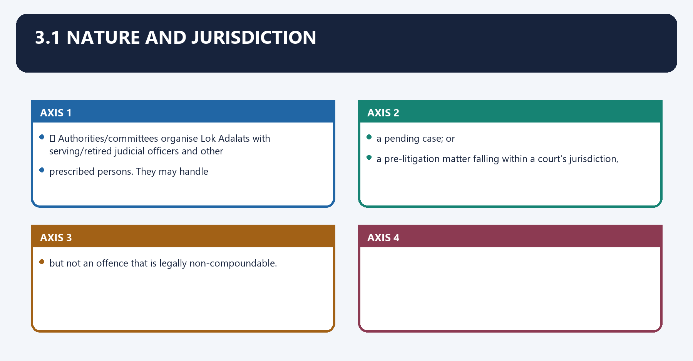
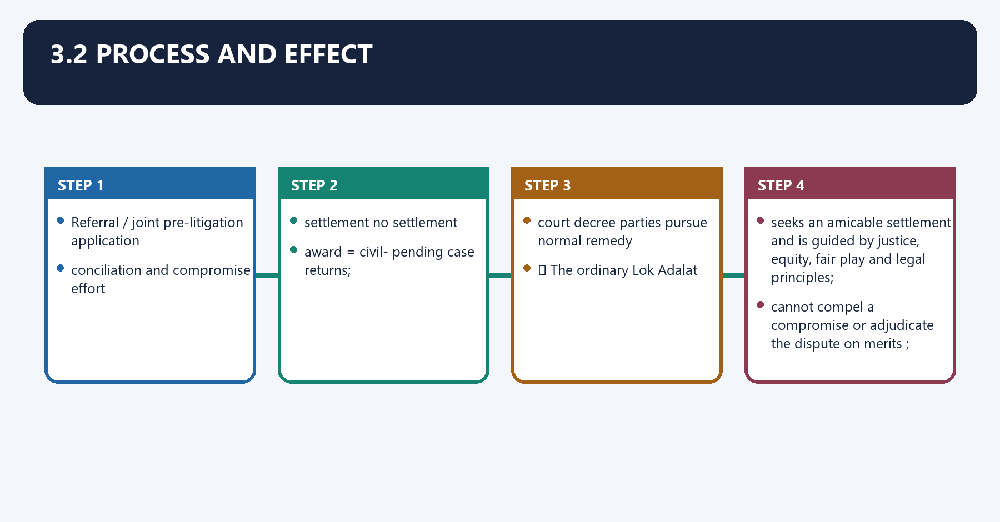
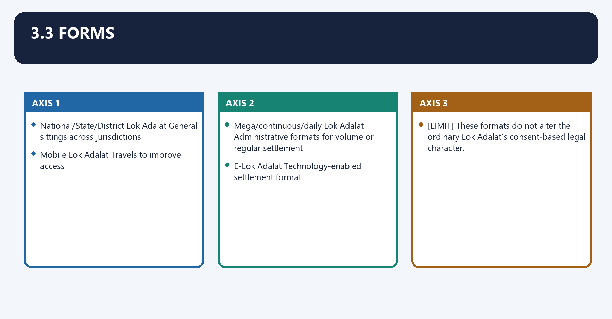
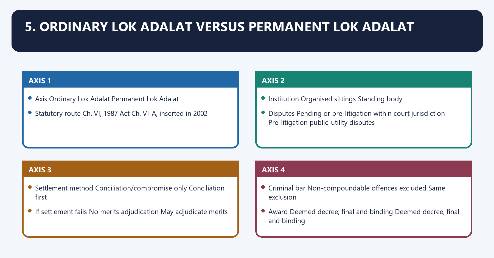
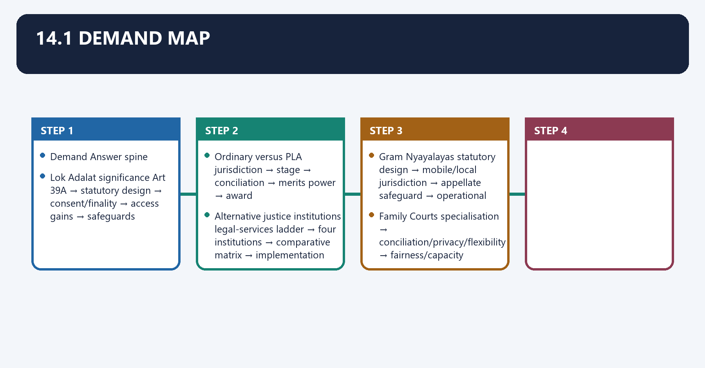
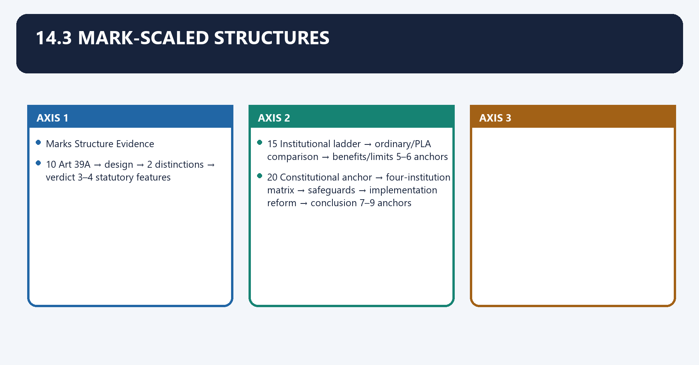

# Lok Adalats and Other Courts — Complete Uncompressed Learning Session

**Complete independent learning session + verified PYQ routing + solved practice workbook + final consolidated register notes**

**Legal/current control date:** 5 September 2026 (Asia/Kolkata)

> **Tag key:** `[FACT]` = named constitutional, statutory, official, judicial or audited local support; `[ANALYSIS]` = reasoned examination; `[CURRENT]` = checked for the control date; `[LIMIT]` = qualification.
>
> **Answer-writing discipline:** claim -> named evidence -> analysis -> qualification.

- [CURRENT] Status is controlled to **5 September 2026, Asia/Kolkata**.
- [CURRENT] **Live official refresh, 5 September 2026:** NALSA, the Department of Justice and India Code sources for the Legal Services Authorities Act 1987, Gram Nyayalayas Act 2008 and Mediation Act 2023 were rechecked on 5 September 2026. No notification-sensitive pecuniary ceiling, operational court count or commencement assumption is frozen.

#### How to Use This Package

[FACT] The complete Basic/Core owner is taught first in source order. Cross-topic Markdown, local OCR books and verified PYQ ledgers supplement it.

[FACT] Advanced-owner material appears only after the Core and practice sections under the required optional-depth label.

[LIMIT] Ordinary Lok Adalats settle only by compromise and cannot decide merits. Permanent Lok Adalats are pre-litigation public-utility bodies that conciliate first and may then decide an eligible dispute. Courts, tribunals, mediation, schemes and operational Lok Adalat formats remain legally distinct.

#### Local Owner Gateway

> **Subject:** Polity · **Tier:** Core · **GS Paper:** GS-II
> **Official clause:** "Structure, organization and functioning of the Executive and the Judiciary"
> and "mechanisms, laws, institutions and Bodies constituted for the protection and betterment of
> these vulnerable sections."
> **Grounded in:** Constitution of India, Art 39A; Legal Services Authorities Act 1987; Family
> Courts Act 1984; Gram Nyayalayas Act 2008; M. Laxmikanth, *Courseware on Indian Polity*, Eighth
> Edition (2026), Ch. 38.
> **Status legend:** [FACT] constitutional/settled static fact · 📜 statute/rule · ⚖️ judicial holding ·
> [LIMIT] analytical inference/current implementation caveat.
> **Core firewall:** This is the consolidated owner for legal-services institutions, ordinary and
> Permanent Lok Adalats, Family Courts and Gram Nyayalayas. Judiciary/body owners should cross-link,
> not reproduce these capsules. It is independently sufficient for Prelims and 10/15/20-mark
> Mains; no Advanced companion is required.

---

## BASIC LEARNING SESSION

### 01. 1. Constitutional anchor: access to justice

1. Constitutional anchor: access to justice denotes the constitutional rules and institutional links organised around [FACT] Article 39A directs the State to secure a legal system promoting justice on equal opportunity and.
1. Constitutional anchor: access to justice operates through to provide free legal aid so that economic or other disability does not deny access to justice, connected with ⚖️ The Supreme Court has linked meaningful legal aid and speedy justice to fair procedure under.
The operative mechanism matters because [LIMIT] Article 39A is a Directive Principle, but statutes and rights jurisprudence give operational.
Its principal consequence is that content to its access-to-justice objective.
The decisive contrast is between [FACT] Article 39A directs the State to secure a legal system promoting justice on equal opportunity and and [FACT] Article 39A directs the State to secure a legal system promoting justice on equal opportunity and.
The exam-safe limitation is that [FACT] Article 39A directs the State to secure a legal system promoting justice on equal opportunity and.

[FACT] Article 39A directs the State to secure a legal system promoting justice on equal opportunity and
to provide free legal aid so that economic or other disability does not deny access to justice.

⚖️ The Supreme Court has linked meaningful legal aid and speedy justice to fair procedure under
Article 21.

[LIMIT] Article 39A is a Directive Principle, but statutes and rights jurisprudence give operational
content to its access-to-justice objective.

---

### 02. 2. Legal-services authorities: institutional ladder

2. Legal-services authorities: institutional ladder denotes the constitutional rules and institutional links organised around 📜 The Legal Services Authorities Act 1987 creates this structure.
2. Legal-services authorities: institutional ladder operates through National Legal Services Authority (NALSA), connected with State Legal Services Authorities.
The operative mechanism matters because high Court Legal Services Committees.
Its principal consequence is that district Legal Services Authorities.
The decisive contrast is between Taluk Legal Services Committees and Institution Key position.
The exam-safe limitation is that high Court Committee Provides legal services for matters before the High Court.

📜 The Legal Services Authorities Act 1987 creates this structure:

```text
National Legal Services Authority (NALSA)
                 │
      State Legal Services Authorities
                 │
     High Court Legal Services Committees
                 │
      District Legal Services Authorities
                 │
      Taluk Legal Services Committees
```

| Institution | Key position |
|---|---|
| NALSA | Lays down policy/principles and frames effective/economical legal-services schemes; Patron-in-Chief is the CJI; Executive Chairman is a serving/retired Supreme Court judge nominated in the statutory manner |
| State Authority | Implements Central policy and coordinates State legal services/Lok Adalats; Patron-in-Chief is the Chief Justice of the High Court |
| High Court Committee | Provides legal services for matters before the High Court |
| District Authority | Implements programmes and coordinates Taluk activity; District Judge is chairman |
| Taluk Committee | Coordinates services and Lok Adalats at taluk/mandal level |

### 03. Eligibility for free legal services

Eligibility for free legal services denotes the constitutional rules and institutional links organised around 📜 Section 12 covers specified vulnerable groups, including members of SC/ST, trafficking/begar.
Eligibility for free legal services operates through victims, women or children, persons with disability, disaster/violence victims, industrial workmen,, connected with persons in custody and persons below the prescribed income limit. The authority must also be.
The operative mechanism matters because satisfied that there is a prima facie case to prosecute or defend.
Its principal consequence is that trap: Free legal aid is broader than representation in a criminal trial and is not confined to.
The decisive contrast is between persons below an income threshold; several statutory categories are status-based and 📜 Section 12 covers specified vulnerable groups, including members of SC/ST, trafficking/begar.
The exam-safe limitation is that 📜 Section 12 covers specified vulnerable groups, including members of SC/ST, trafficking/begar.

📜 Section 12 covers specified vulnerable groups, including members of SC/ST, trafficking/begar
victims, women or children, persons with disability, disaster/violence victims, industrial workmen,
persons in custody and persons below the prescribed income limit. The authority must also be
satisfied that there is a prima facie case to prosecute or defend.

> **Trap:** Free legal aid is broader than representation in a criminal trial and is not confined to
> persons below an income threshold; several statutory categories are status-based.

---

### 04. 3.1 Nature and jurisdiction

3.1 Nature and jurisdiction denotes the constitutional rules and institutional links organised around 📜 Authorities/committees organise Lok Adalats with serving/retired judicial officers and other.
3.1 Nature and jurisdiction operates through prescribed persons. They may handle, connected with a pending case; or.
The operative mechanism matters because a pre-litigation matter falling within a court's jurisdiction,.
Its principal consequence is that but not an offence that is legally non-compoundable.
The decisive contrast is between 📜 Authorities/committees organise Lok Adalats with serving/retired judicial officers and other and 📜 Authorities/committees organise Lok Adalats with serving/retired judicial officers and other.
The exam-safe limitation is that 📜 Authorities/committees organise Lok Adalats with serving/retired judicial officers and other.

📜 Authorities/committees organise Lok Adalats with serving/retired judicial officers and other
prescribed persons. They may handle:

- a pending case; or
- a pre-litigation matter falling within a court's jurisdiction,

but not an offence that is legally non-compoundable.

### 05. 3.2 Process and effect

3.2 Process and effect denotes the constitutional rules and institutional links organised around Referral / joint pre-litigation application.
3.2 Process and effect operates through conciliation and compromise effort, connected with settlement no settlement.
The operative mechanism matters because award = civil- pending case returns.
Its principal consequence is that court decree parties pursue normal remedy.
The decisive contrast is between 📜 The ordinary Lok Adalat and seeks an amicable settlement and is guided by justice, equity, fair play and legal principles.
The exam-safe limitation is that cannot compel a compromise or adjudicate the dispute on merits.

```text
Referral / joint pre-litigation application
                 ↓
     conciliation and compromise effort
          ┌──────┴────────┐
          ↓               ↓
     settlement      no settlement
          ↓               ↓
 award = civil-      pending case returns;
 court decree        parties pursue normal remedy
```

📜 The ordinary Lok Adalat:

- seeks an amicable settlement and is guided by justice, equity, fair play and legal principles;
- **cannot compel a compromise or adjudicate the dispute on merits**;
- makes an award when parties settle;
- gives the award the status of a civil-court decree;
- makes the award final and binding, with no statutory appeal; and
- enables refund of court fee in a referred case.

⚖️ An award based on compromise is ordinarily challengeable only through constitutional review on
limited grounds such as absence of genuine consent/fraud—not by a statutory appeal.

> **Master trap:** Finality of an agreed award does not authorise a Lok Adalat to impose a merits
> decision when compromise fails.

### 06. 3.3 Forms

3.3 Forms denotes the constitutional rules and institutional links organised around National/State/District Lok Adalat General sittings across jurisdictions.
3.3 Forms operates through Mobile Lok Adalat Travels to improve access, connected with Mega/continuous/daily Lok Adalat Administrative formats for volume or regular settlement.
The operative mechanism matters because e-Lok Adalat Technology-enabled settlement format.
Its principal consequence is that [LIMIT] These formats do not alter the ordinary Lok Adalat's consent-based legal character.
The decisive contrast is between National/State/District Lok Adalat General sittings across jurisdictions and National/State/District Lok Adalat General sittings across jurisdictions.
The exam-safe limitation is that national/State/District Lok Adalat General sittings across jurisdictions.

| Form | Feature |
|---|---|
| National/State/District Lok Adalat | General sittings across jurisdictions |
| Mobile Lok Adalat | Travels to improve access |
| Mega/continuous/daily Lok Adalat | Administrative formats for volume or regular settlement |
| E-Lok Adalat | Technology-enabled settlement format |

[LIMIT] These formats do not alter the ordinary Lok Adalat's consent-based legal character.

---

### 07. 4. Permanent Lok Adalat (PLA)

4. Permanent Lok Adalat (PLA) denotes the constitutional rules and institutional links organised around 📜 A Permanent Lok Adalat is established under the Legal Services Authorities Act for one or more.
4. Permanent Lok Adalat (PLA) operates through public utility services . It is permanent in institution and works principally at the, connected with pre-litigation stage.
The operative mechanism matters because 📜 A Permanent Lok Adalat is established under the Legal Services Authorities Act for one or more.
Its principal consequence is that 📜 A Permanent Lok Adalat is established under the Legal Services Authorities Act for one or more.
The decisive contrast is between 📜 A Permanent Lok Adalat is established under the Legal Services Authorities Act for one or more and 📜 A Permanent Lok Adalat is established under the Legal Services Authorities Act for one or more.
The exam-safe limitation is that 📜 A Permanent Lok Adalat is established under the Legal Services Authorities Act for one or more.
📜 A Permanent Lok Adalat is established under the Legal Services Authorities Act for one or more
**public utility services**. It is permanent in institution and works principally at the
pre-litigation stage.

### 08. 4.1 Public utility services

4.1 Public utility services denotes the constitutional rules and institutional links organised around Statutory illustrations include transport, postal/telephone, supply of power/light/water, public.
4.1 Public utility services operates through conservancy/sanitation, hospital/dispensary and insurance services, plus notified services, connected with Statutory illustrations include transport, postal/telephone, supply of power/light/water, public.
The operative mechanism matters because statutory illustrations include transport, postal/telephone, supply of power/light/water, public.
Its principal consequence is that statutory illustrations include transport, postal/telephone, supply of power/light/water, public.
The decisive contrast is between Statutory illustrations include transport, postal/telephone, supply of power/light/water, public and Statutory illustrations include transport, postal/telephone, supply of power/light/water, public.
The exam-safe limitation is that statutory illustrations include transport, postal/telephone, supply of power/light/water, public.

Statutory illustrations include transport, postal/telephone, supply of power/light/water, public
conservancy/sanitation, hospital/dispensary and insurance services, plus notified services.

### 09. 4.2 Hybrid process

4.2 Hybrid process denotes the constitutional rules and institutional links organised around Party applies before dispute reaches a court.
4.2 Hybrid process operates through PLA conciliates first, connected with ┌────────────┴────────────┐.
The operative mechanism matters because settlement conciliation fails.
Its principal consequence is that award on settlement PLA may decide merits.
The decisive contrast is between (unless non-compoundable offence) and 📜 Key distinctions.
The exam-safe limitation is that jurisdiction is pre-litigation and sector-specific.
```text
Party applies before dispute reaches a court
                    ↓
          PLA conciliates first
       ┌────────────┴────────────┐
       ↓                         ↓
 settlement                 conciliation fails
       ↓                         ↓
 award on settlement     PLA may decide merits
                          (unless non-compoundable offence)
```

📜 Key distinctions:

- jurisdiction is pre-litigation and sector-specific;
- a party cannot invoke another court for that dispute after applying while PLA proceedings
  continue;
- PLA first conducts conciliation;
- if conciliation fails, it may decide the dispute on merits, subject to statutory exclusions and
  the Central Government's notified pecuniary limit;
- its award is final, binding, deemed a civil-court decree and not to be called in question in an
  original suit/application/execution proceeding;
- it is guided by natural justice, objectivity, fair play, equity and other principles of justice,
  and is not bound by the CPC or Evidence Act.

> **Trap:** Do not attach a stale rupee ceiling to the Act. The Central Government may revise the
> limit by notification; verify the current notification for a current-affairs answer.

---

### 10. 5. Ordinary Lok Adalat versus Permanent Lok Adalat

5. Ordinary Lok Adalat versus Permanent Lok Adalat denotes the constitutional rules and institutional links organised around Axis Ordinary Lok Adalat Permanent Lok Adalat.
5. Ordinary Lok Adalat versus Permanent Lok Adalat operates through Statutory route Ch. VI, 1987 Act Ch. VI-A, inserted in 2002, connected with Institution Organised sittings Standing body.
The operative mechanism matters because disputes Pending or pre-litigation within court jurisdiction Pre-litigation public-utility disputes.
Its principal consequence is that settlement method Conciliation/compromise only Conciliation first.
The decisive contrast is between If settlement fails No merits adjudication May adjudicate merits and Criminal bar Non-compoundable offences excluded Same exclusion.
The exam-safe limitation is that award Deemed decree; final and binding Deemed decree; final and binding.

| Axis | Ordinary Lok Adalat | Permanent Lok Adalat |
|---|---|---|
| Statutory route | Ch. VI, 1987 Act | Ch. VI-A, inserted in 2002 |
| Institution | Organised sittings | Standing body |
| Disputes | Pending or pre-litigation within court jurisdiction | Pre-litigation public-utility disputes |
| Settlement method | Conciliation/compromise only | Conciliation first |
| If settlement fails | No merits adjudication | May adjudicate merits |
| Criminal bar | Non-compoundable offences excluded | Same exclusion |
| Award | Deemed decree; final and binding | Deemed decree; final and binding |

---

### 11. 6. Family Courts

6. Family Courts denotes the constitutional rules and institutional links organised around 📜 The Family Courts Act 1984 provides specialised courts for conciliation and speedy settlement of.
6. Family Courts operates through family/matrimonial disputes, connected with Primary approach Endeavour toward settlement before adjudication where consistent with the case.
The operative mechanism matters because procedure Flexible statutory procedure; may receive material that assists effective resolution.
Its principal consequence is that privacy Proceedings may be held in camera and must be so held if either party desires.
The decisive contrast is between Lawyers No right as of course to legal representation; court may seek legal-expert assistance and Appeal To High Court from a non-interlocutory judgment/order, subject to statutory exclusions.
The exam-safe limitation is that [LIMIT] Specialisation and conciliation do not remove judicial fairness. Family Courts exercise.
📜 The Family Courts Act 1984 provides specialised courts for conciliation and speedy settlement of
family/matrimonial disputes.

| Feature | Position |
|---|---|
| Establishment | State Government, after consultation with High Court; mandatory for specified cities/towns above the statutory population threshold and discretionary elsewhere |
| Jurisdiction | Matrimonial status, property between spouses, legitimacy, maintenance, guardianship/custody/access and connected family disputes |
| Primary approach | Endeavour toward settlement before adjudication where consistent with the case |
| Procedure | Flexible statutory procedure; may receive material that assists effective resolution |
| Privacy | Proceedings may be held in camera and must be so held if either party desires |
| Lawyers | No right as of course to legal representation; court may seek legal-expert assistance |
| Appeal | To High Court from a non-interlocutory judgment/order, subject to statutory exclusions |

[LIMIT] Specialisation and conciliation do not remove judicial fairness. Family Courts exercise
statutory judicial power and differ from compromise-only ordinary Lok Adalats.

---

### 12. 7. Gram Nyayalayas

7. Gram Nyayalayas denotes the constitutional rules and institutional links organised around 📜 The Gram Nyayalayas Act 2008 seeks doorstep justice in rural areas through courts of first.
7. Gram Nyayalayas operates through Design element Position, connected with Establishment State Government, after consultation with High Court; statutory wording is enabling and implementation is State-dependent.
The operative mechanism matters because level Intermediate Panchayat or group of contiguous Panchayats; headquarters may be mobile.
Its principal consequence is that jurisdiction Specified criminal offences and civil disputes in the Schedules; limits may be altered through statutory process.
The decisive contrast is between Territorial access Mobile court may hold proceedings close to where parties reside/cause arose and Settlement Endeavour to assist conciliation in civil disputes; conciliators may be used.
The exam-safe limitation is that procedure Summary orientation, natural justice and statutory flexibility.

📜 The Gram Nyayalayas Act 2008 seeks doorstep justice in rural areas through courts of first
instance.

| Design element | Position |
|---|---|
| Establishment | State Government, after consultation with High Court; statutory wording is enabling and implementation is State-dependent |
| Level | Intermediate Panchayat or group of contiguous Panchayats; headquarters may be mobile |
| Presiding officer | Nyayadhikari, appointed by State Government in consultation with High Court; qualified for appointment as Judicial Magistrate First Class |
| Jurisdiction | Specified criminal offences and civil disputes in the Schedules; limits may be altered through statutory process |
| Territorial access | Mobile court may hold proceedings close to where parties reside/cause arose |
| Settlement | Endeavour to assist conciliation in civil disputes; conciliators may be used |
| Procedure | Summary orientation, natural justice and statutory flexibility |
| Appeals | Criminal appeal to Court of Session; civil appeal to District Court, subject to statutory exceptions |

[LIMIT] A Gram Nyayalaya is a statutory court—not a village panchayat, khap, mediation camp or Lok
Adalat. Current counts and operational coverage vary and require dated official verification.

---

### 13. 8. Comparative institution map

8. Comparative institution map denotes the constitutional rules and institutional links organised around Institution Primary function Consent needed for outcome? Can decide merits? Appeal/control.
8. Comparative institution map operates through Ordinary Lok Adalat Settlement Yes No No statutory appeal; limited judicial review, connected with Family Court Specialised family adjudication + conciliation Not for judgment Yes Statutory High Court appeal with exclusions.
The operative mechanism matters because gram Nyayalaya Rural first-instance court Not for judgment Yes Session/District appellate routes.
Its principal consequence is that institution Primary function Consent needed for outcome? Can decide merits? Appeal/control.
The decisive contrast is between Institution Primary function Consent needed for outcome? Can decide merits? Appeal/control and Institution Primary function Consent needed for outcome? Can decide merits? Appeal/control.
The exam-safe limitation is that institution Primary function Consent needed for outcome? Can decide merits? Appeal/control.
| Institution | Primary function | Consent needed for outcome? | Can decide merits? | Appeal/control |
|---|---|---:|---:|---|
| Ordinary Lok Adalat | Settlement | Yes | No | No statutory appeal; limited judicial review |
| Permanent Lok Adalat | Public-utility pre-litigation conciliation/adjudication | Not for post-failure merits award | Yes | Statutory finality; constitutional review remains |
| Family Court | Specialised family adjudication + conciliation | Not for judgment | Yes | Statutory High Court appeal with exclusions |
| Gram Nyayalaya | Rural first-instance court | Not for judgment | Yes | Session/District appellate routes |

---

### 14. 9. Other courts and justice-delivery designs

9. Other courts and justice-delivery designs denotes the constitutional rules and institutional links organised around Design Legal source Core function UPSC distinction.
9. Other courts and justice-delivery designs operates through Family Courts Family Courts Act 1984 Family adjudication plus settlement orientation Judicial decision remains available, connected with Gram Nyayalayas Gram Nyayalayas Act 2008 Local/mobile first-instance justice Statutory court with appeals.
The operative mechanism matters because [LIMIT] A “special”, “fast”, “commercial” or “evening” label identifies a design or jurisdiction. It.
Its principal consequence is that does not by itself answer appointment, procedure, appeal or constitutional status.
The decisive contrast is between Design Legal source Core function UPSC distinction and Design Legal source Core function UPSC distinction.
The exam-safe limitation is that design Legal source Core function UPSC distinction.

| Design | Legal source | Core function | UPSC distinction |
|---|---|---|---|
| Fast Track Courts | Government/finance-supported scheme implemented through States and High Courts | Additional capacity for selected pending cases | Not a separate constitutional species or uniform permanent court |
| Special Courts | Particular statute or valid notification | Trial/adjudication of a defined offence, person or subject | Jurisdiction depends on the parent law |
| Commercial Courts | Commercial Courts Act 2015, as amended | Specified-value commercial disputes with case-management and pre-institution processes | Statutory civil courts, not tribunals or Lok Adalats |
| Evening/Morning Courts | High Court/State administrative design under ordinary court authority | Extend hearing hours for suitable minor matters | Administrative format, not a new constitutional hierarchy |
| Family Courts | Family Courts Act 1984 | Family adjudication plus settlement orientation | Judicial decision remains available |
| Gram Nyayalayas | Gram Nyayalayas Act 2008 | Local/mobile first-instance justice | Statutory court with appeals |

[LIMIT] A “special”, “fast”, “commercial” or “evening” label identifies a design or jurisdiction. It
does not by itself answer appointment, procedure, appeal or constitutional status.

---

### 15. 10. Mediation Act 2023 interface

10. Mediation Act 2023 interface denotes the constitutional rules and institutional links organised around 📜 The Mediation Act 2023 supplies a general statutory framework for mediation, including.
10. Mediation Act 2023 interface operates through pre-litigation, institutional, online and community-mediation concepts, mediated-settlement, connected with agreements, confidentiality and enforcement/challenge rules. Its commencement, rules and any.
The operative mechanism matters because sectoral exclusions must be checked provision by provision on the control date.
Its principal consequence is that neutral facilitates party-made settlement.
The decisive contrast is between ORDINARY LOK ADALAT and statutory forum records compromise as award/deemed decree.
The exam-safe limitation is that pERMANENT LOK ADALAT.
📜 The Mediation Act 2023 supplies a general statutory framework for mediation, including
pre-litigation, institutional, online and community-mediation concepts, mediated-settlement
agreements, confidentiality and enforcement/challenge rules. Its commencement, rules and any
sectoral exclusions must be checked provision by provision on the control date.

```text
MEDIATION
neutral facilitates party-made settlement
        ≠
ORDINARY LOK ADALAT
statutory forum records compromise as award/deemed decree
        ≠
PERMANENT LOK ADALAT
conciliation first; eligible public-utility dispute may then be decided on merits
        ≠
COURT / TRIBUNAL
authoritative adjudication under jurisdiction and appeal/review rules
```

The Commercial Courts Act's pre-institution mediation route and the Mediation Act must not be
collapsed into the Lok Adalat regime. Settlement remains party-made in mediation; an ordinary Lok
Adalat award follows compromise; a PLA has a limited post-conciliation adjudicatory power.

---

### 16. 11. Courts, tribunals and ADR

11. Courts, tribunals and ADR denotes the constitutional rules and institutional links organised around Axis Court Tribunal ADR/mediation Lok Adalat.
11. Courts, tribunals and ADR operates through Primary role Adjudication Specialised adjudication Facilitated/party-chosen resolution Statutory settlement; PLA hybrid, connected with Trap: “Alternative forum” does not mean identical power. Consent, subject matter,.
The operative mechanism matters because pre-litigation status, merits power, enforcement and review must be tested separately.
Its principal consequence is that axis Court Tribunal ADR/mediation Lok Adalat.
The decisive contrast is between Axis Court Tribunal ADR/mediation Lok Adalat and Axis Court Tribunal ADR/mediation Lok Adalat.
The exam-safe limitation is that axis Court Tribunal ADR/mediation Lok Adalat.

| Axis | Court | Tribunal | ADR/mediation | Lok Adalat |
|---|---|---|---|---|
| Source | Constitution/statute and judicial hierarchy | Statute under constitutional limits | Contract/statute/court referral | Legal Services Authorities Act |
| Primary role | Adjudication | Specialised adjudication | Facilitated/party-chosen resolution | Statutory settlement; PLA hybrid |
| Binding outcome without consent | Yes | Yes | Generally no mediated settlement without consent | Ordinary: no; PLA: yes after failed conciliation within scope |
| Appeal/review | Hierarchical/statutory | Statutory appeal plus constitutional review | Enforcement/challenge under governing law | Statutory finality plus limited constitutional review |

> **Trap:** “Alternative forum” does not mean identical power. Consent, subject matter,
> pre-litigation status, merits power, enforcement and review must be tested separately.

---

### 17. 12. Leading cases and legal effects

12. Leading cases and legal effects denotes the constitutional rules and institutional links organised around Decision Decision year Exam-safe holding/use.
12. Leading cases and legal effects operates through Hussainara Khatoon v. State of Bihar 1979 Speedy justice and legal assistance are integral to fair procedure under Art 21, connected with State of Punjab v. Jalour Singh 2008 Ordinary Lok Adalat has no adjudicatory role; award must rest on compromise.
The operative mechanism matters because afcons Infrastructure v. Cherian Varkey Construction 2010 Structured guidance on court referral to ADR processes.
Its principal consequence is that bar Council of India v. Union of India 2012 Upheld the PLA public-utility conciliation-cum-adjudication design.
The decisive contrast is between [LIMIT] Case use must track the exact statutory mechanism. A decision about commercial mediation, and ordinary Lok Adalat or PLA cannot be applied as if all three were the same forum.
The exam-safe limitation is that decision Decision year Exam-safe holding/use.
| Decision | Decision year | Exam-safe holding/use |
|---|---:|---|
| *Hussainara Khatoon v. State of Bihar* | 1979 | Speedy justice and legal assistance are integral to fair procedure under Art 21 |
| *State of Punjab v. Jalour Singh* | 2008 | Ordinary Lok Adalat has no adjudicatory role; award must rest on compromise |
| *Afcons Infrastructure v. Cherian Varkey Construction* | 2010 | Structured guidance on court referral to ADR processes |
| *InterGlobe Aviation v. N. Satchidanand* | 2011 | Ordinary Lok Adalat and Permanent Lok Adalat are legally distinct; merits power cannot be casually transferred |
| *Bar Council of India v. Union of India* | 2012 | Upheld the PLA public-utility conciliation-cum-adjudication design |
| *Patil Automation v. Rakheja Engineers* | 2022 | Commercial pre-institution mediation requirement is mandatory where the statutory urgent-relief exception does not apply |
| *Canara Bank v. G.S. Jayarama* | 2022 | Clarified PLA conciliation procedure and its limited power to decide an eligible dispute after conciliation fails |

[LIMIT] Case use must track the exact statutory mechanism. A decision about commercial mediation,
ordinary Lok Adalat or PLA cannot be applied as if all three were the same forum.

---

### 18. Advantages

Advantages denotes the constitutional rules and institutional links organised around lowers cost, distance and procedural complexity.
Advantages operates through improves access for vulnerable litigants, connected with promotes conciliation where continuing relationships matter.
The operative mechanism matters because diverts suitable disputes from regular courts.
Its principal consequence is that combines legal aid with institutional access.
The decisive contrast is between lowers cost, distance and procedural complexity and lowers cost, distance and procedural complexity.
The exam-safe limitation is that lowers cost, distance and procedural complexity.

- lowers cost, distance and procedural complexity;
- improves access for vulnerable litigants;
- promotes conciliation where continuing relationships matter;
- diverts suitable disputes from regular courts;
- combines legal aid with institutional access.

### 19. Limits

Close-option source discipline means the systematic verification of legal source, institutional category, status and exception before choosing a close option.
Technically, close-option source discipline comprises source attribution, doctrinal classification, date control and remedy-specific qualification.
The operative mechanism matters because low utilisation or uneven State implementation may prevent designed access from becoming actual.
Its principal consequence is that [LIMIT] ADR is a complement, not a wholesale substitute, for independent courts. The constitutional.
The decisive contrast is between test is affordable access with voluntariness, fairness and review against illegality and settlement systems risk pressure or unequal bargaining if consent is not real.
The exam-safe limitation is that settlement systems risk pressure or unequal bargaining if consent is not real.
- settlement systems risk pressure or unequal bargaining if consent is not real;
- specialised/local institutions need judges, staff, awareness and infrastructure;
- statutory finality cannot cure jurisdictional error or denial of natural justice;
- low utilisation or uneven State implementation may prevent designed access from becoming actual
  access.

[LIMIT] ADR is a complement, not a wholesale substitute, for independent courts. The constitutional
test is affordable access **with** voluntariness, fairness and review against illegality.

---

### 20. 14.1 Demand map

14.1 Demand map denotes the constitutional rules and institutional links organised around Demand Answer spine.
14.1 Demand map operates through Lok Adalat significance Art 39A → statutory design → consent/finality → access gains → safeguards, connected with Ordinary versus PLA jurisdiction → stage → conciliation → merits power → award.
The operative mechanism matters because alternative justice institutions legal-services ladder → four institutions → comparative matrix → implementation.
Its principal consequence is that gram Nyayalayas statutory design → mobile/local jurisdiction → appellate safeguard → operational gaps.
The decisive contrast is between Family Courts specialisation → conciliation/privacy/flexibility → fairness/capacity and Demand Answer spine.
The exam-safe limitation is that demand Answer spine.

| Demand | Answer spine |
|---|---|
| Lok Adalat significance | Art 39A → statutory design → consent/finality → access gains → safeguards |
| Ordinary versus PLA | jurisdiction → stage → conciliation → merits power → award |
| Alternative justice institutions | legal-services ladder → four institutions → comparative matrix → implementation |
| Gram Nyayalayas | statutory design → mobile/local jurisdiction → appellate safeguard → operational gaps |
| Family Courts | specialisation → conciliation/privacy/flexibility → fairness/capacity |

### 21. 14.2 Thesis options

14.2 Thesis options denotes the constitutional rules and institutional links organised around Lok Adalats constitutionalise access through consensual settlement, but their legitimacy depends.
14.2 Thesis options operates through on genuine compromise rather than docket disposal, connected with The Permanent Lok Adalat is a hybrid: conciliation remains first, but limited statutory.
The operative mechanism matters because adjudication follows failure in public-utility disputes.
Its principal consequence is that india's access-to-justice architecture is plural, yet statutory proximity must be matched by.
The decisive contrast is between personnel, awareness and procedural fairness and Lok Adalats constitutionalise access through consensual settlement, but their legitimacy depends.
The exam-safe limitation is that lok Adalats constitutionalise access through consensual settlement, but their legitimacy depends.
- *Lok Adalats constitutionalise access through consensual settlement, but their legitimacy depends
  on genuine compromise rather than docket disposal.*
- *The Permanent Lok Adalat is a hybrid: conciliation remains first, but limited statutory
  adjudication follows failure in public-utility disputes.*
- *India's access-to-justice architecture is plural, yet statutory proximity must be matched by
  personnel, awareness and procedural fairness.*

### 22. 14.3 Mark-scaled structures

14.3 Mark-scaled structures denotes the constitutional rules and institutional links organised around Marks Structure Evidence.
14.3 Mark-scaled structures operates through 10 Art 39A → design → 2 distinctions → verdict 3–4 statutory features, connected with 15 Institutional ladder → ordinary/PLA comparison → benefits/limits 5–6 anchors.
The operative mechanism matters because 20 Constitutional anchor → four-institution matrix → safeguards → implementation reform → conclusion 7–9 anchors.
Its principal consequence is that marks Structure Evidence.
The decisive contrast is between Marks Structure Evidence and Marks Structure Evidence.
The exam-safe limitation is that marks Structure Evidence.

| Marks | Structure | Evidence |
|---:|---|---|
| 10 | Art 39A → design → 2 distinctions → verdict | 3–4 statutory features |
| 15 | Institutional ladder → ordinary/PLA comparison → benefits/limits | 5–6 anchors |
| 20 | Constitutional anchor → four-institution matrix → safeguards → implementation reform → conclusion | 7–9 anchors |

### 23. 14.4 Evidence units

14.4 Evidence units denotes the constitutional rules and institutional links organised around Claim: an ordinary Lok Adalat is conciliatory, not adjudicatory. Evidence: 📜 compromise.
14.4 Evidence units operates through design and award provisions. Analysis: consent legitimises finality. Qualification: limited, connected with constitutional challenge remains.
The operative mechanism matters because claim: PLA fills a pre-litigation public-service gap. Evidence: 📜 public-utility and.
Its principal consequence is that post-conciliation merits powers. Analysis: combines settlement with enforceable resolution.
The decisive contrast is between Qualification: jurisdiction is sectoral and notification-sensitive and Claim: proximity alone does not ensure justice. Evidence: 📜 mobile Gram Nyayalaya design.
The exam-safe limitation is that analysis: reduces distance. Qualification: State establishment, staffing and awareness.
- **Claim:** an ordinary Lok Adalat is conciliatory, not adjudicatory. **Evidence:** 📜 compromise
  design and award provisions. **Analysis:** consent legitimises finality. **Qualification:** limited
  constitutional challenge remains.
- **Claim:** PLA fills a pre-litigation public-service gap. **Evidence:** 📜 public-utility and
  post-conciliation merits powers. **Analysis:** combines settlement with enforceable resolution.
  **Qualification:** jurisdiction is sectoral and notification-sensitive.
- **Claim:** proximity alone does not ensure justice. **Evidence:** 📜 mobile Gram Nyayalaya design.
  **Analysis:** reduces distance. **Qualification:** State establishment, staffing and awareness
  determine actual access.

---

### 24. 15. Must-Know Facts and traps

Close-option source discipline means the systematic verification of legal source, institutional category, status and exception before choosing a close option.
Technically, close-option source discipline comprises source attribution, doctrinal classification, date control and remedy-specific qualification.
The operative mechanism matters because 📜 PLA may decide merits after failed conciliation in eligible public-utility disputes.
Its principal consequence is that 📜 Both awards are treated as civil-court decrees and are final/binding.
The decisive contrast is between 📜 Family Courts and Gram Nyayalayas are statutory courts with adjudicatory power and 📜 Fast Track Courts and evening courts are designs/schemes; special and commercial courts.
The exam-safe limitation is that derive jurisdiction from their governing law.
- [FACT] Art 39A is the constitutional anchor.
- 📜 Legal Services Authorities Act 1987 creates the authority ladder and Lok Adalats.
- 📜 Ordinary Lok Adalat cannot decide merits after failed compromise.
- 📜 PLA may decide merits after failed conciliation in eligible public-utility disputes.
- 📜 Both awards are treated as civil-court decrees and are final/binding.
- 📜 Family Courts and Gram Nyayalayas are statutory courts with adjudicatory power.
- 📜 Fast Track Courts and evening courts are designs/schemes; special and commercial courts
  derive jurisdiction from their governing law.
- 📜 Mediation, ordinary Lok Adalat and PLA have different consent and merits-decision rules.
- [LIMIT] Current pecuniary limits, notified services and operational counts require dated official
  verification.

### 25. Source discipline

Close-option source discipline means the systematic verification of legal source, institutional category, status and exception before choosing a close option.
Technically, close-option source discipline comprises source attribution, doctrinal classification, date control and remedy-specific qualification.
The operative mechanism matters because do not merge Permanent Lok Adalat with an ordinary permanent sitting.
Its principal consequence is that do not call Gram Nyayalaya a Panchayat institution.
The decisive contrast is between Never use "people's court" to imply absence of law or fairness and Never use "people's court" to imply absence of law or fairness.
The exam-safe limitation is that never use "people's court" to imply absence of law or fairness.
- Never use "people's court" to imply absence of law or fairness.
- Do not say all Lok Adalat disputes are pre-litigation.
- Do not say no legal challenge of any kind can ever lie against an award.
- Do not merge Permanent Lok Adalat with an ordinary permanent sitting.
- Do not call Gram Nyayalaya a Panchayat institution.

### 26. Cross-links

Cross-links denotes the constitutional rules and institutional links organised around High Court supervision/review: High-Court.md.
Cross-links operates through Tribunals and specialised adjudication: Administrative-Tribunals.md, connected with Statutory/quasi-judicial bodies: Statutory-Regulatory-and-Quasi-Judicial-Bodies.md.
The operative mechanism matters because dPSP context: Directive-Principles.md.
Its principal consequence is that high Court supervision/review: High-Court.md.
The decisive contrast is between High Court supervision/review: High-Court.md and High Court supervision/review: High-Court.md.
The exam-safe limitation is that high Court supervision/review: High-Court.md.
- High Court supervision/review: `High-Court.md`
- Tribunals and specialised adjudication: `Administrative-Tribunals.md`
- Statutory/quasi-judicial bodies: `Statutory-Regulatory-and-Quasi-Judicial-Bodies.md`
- DPSP context: `Directive-Principles.md`

### 27. Referral and outcome decision map

Referral and outcome decision map denotes the constitutional rules and institutional links organised around PENDING/PRE-LITIGATION DISPUTE.
Referral and outcome decision map operates through ordinary Lok Adalat - compromise? yes: award; no: return/normal remedy, connected with PLA public utility - conciliate; fail: eligible merits decision.
The operative mechanism matters because mediation - party-made settlement; no settlement: chosen legal route.
Its principal consequence is that court/tribunal - authoritative adjudication under jurisdiction.
The decisive contrast is between [LIMIT] Finality cannot create jurisdiction or genuine consent where none existed and PENDING/PRE-LITIGATION DISPUTE.
The exam-safe limitation is that pENDING/PRE-LITIGATION DISPUTE.
PENDING/PRE-LITIGATION DISPUTE
        |
        +-- ordinary Lok Adalat -> compromise? yes: award; no: return/normal remedy.
        |
        +-- PLA public utility -> conciliate; fail: eligible merits decision.
        |
        +-- mediation -> party-made settlement; no settlement: chosen legal route.
        |
        +-- court/tribunal -> authoritative adjudication under jurisdiction.

[LIMIT] Finality cannot create jurisdiction or genuine consent where none existed.

### 28. Gram Nyayalaya implementation test

Gram Nyayalaya implementation test denotes the constitutional rules and institutional links organised around State establishment + High Court consultation + Nyayadhikari + mobile sittings.
Gram Nyayalaya implementation test operates through scheduled civil/criminal matters + local procedure + settlement effort, connected with Sessions Court criminal District Court civil, subject to statutory exceptions.
The operative mechanism matters because notifications + judges + staff + buildings + awareness + legal aid.
Its principal consequence is that [LIMIT] Enabling legislation does not prove uniform establishment or utilisation.
The decisive contrast is between State establishment + High Court consultation + Nyayadhikari + mobile sittings and State establishment + High Court consultation + Nyayadhikari + mobile sittings.
The exam-safe limitation is that state establishment + High Court consultation + Nyayadhikari + mobile sittings.
STATUTORY DESIGN
State establishment + High Court consultation + Nyayadhikari + mobile sittings.
        |
        v
JURISDICTION
scheduled civil/criminal matters + local procedure + settlement effort.
        |
        v
APPEAL
Sessions Court criminal | District Court civil, subject to statutory exceptions.
        |
        v
REAL ACCESS
notifications + judges + staff + buildings + awareness + legal aid.

[LIMIT] Enabling legislation does not prove uniform establishment or utilisation.

### 29. Mediation, commercial justice and operational forms

Mediation, commercial justice and operational forms denotes the constitutional rules and institutional links organised around Mediation Act 2023 - statutory mediation framework; verify commencement/rules.
Mediation, commercial justice and operational forms operates through Commercial Courts Act - pre-institution mediation subject to statutory exception, connected with National/Mega/Mobile/E-Lok Adalat - operational modes under existing legal character.
The operative mechanism matters because fast Track/Evening Courts - capacity or scheduling designs, not new constitutional levels.
Its principal consequence is that special Court - exact parent statute controls jurisdiction and appeal.
The decisive contrast is between [LIMIT] A label never answers consent, merits power, appeal or review by itself and Mediation Act 2023 - statutory mediation framework; verify commencement/rules.
The exam-safe limitation is that mediation Act 2023 - statutory mediation framework; verify commencement/rules.
Mediation Act 2023 -> statutory mediation framework; verify commencement/rules.
Commercial Courts Act -> pre-institution mediation subject to statutory exception.
National/Mega/Mobile/E-Lok Adalat -> operational modes under existing legal character.
Fast Track/Evening Courts -> capacity or scheduling designs, not new constitutional levels.
Special Court -> exact parent statute controls jurisdiction and appeal.

[LIMIT] A label never answers consent, merits power, appeal or review by itself.

### Semantic-completeness ownership and PYQ control

- **Constitutional anchor:** Article 39A directs equal-opportunity justice and
  free legal aid. Article 21 jurisprudence supplies fair-procedure and speedy-
  justice reinforcement; Article 39A does not itself create every forum.
- **Institutional ladder:** the Legal Services Authorities Act, 1987 creates
  NALSA, the Supreme Court Committee, SLSAs, High Court Committees, DLSAs and
  Taluk Committees. Section 12 combines status-based vulnerability categories
  with prescribed income eligibility and a prima-facie-case gate.
- **Ordinary Lok Adalat:** it handles pending or pre-litigation matters within
  court jurisdiction, excluding non-compoundable offences, and can only
  facilitate compromise. Jalour Singh confirms that failure of settlement
  returns the matter to the ordinary route; no merits award may be imposed.
- **Ordinary award:** a genuine settlement award is deemed a civil-court
  decree, final and binding with no statutory appeal. Finality does not cure
  fraud, absence of consent, jurisdictional error or constitutional illegality.
- **Permanent Lok Adalat:** Chapter VI-A creates a standing pre-litigation
  public-utility forum. It conciliates first and, after failed conciliation, may
  decide an eligible dispute on merits within statutory exclusions and the
  currently notified pecuniary framework.
- **Court firewall:** Gram Nyayalayas and Family Courts are statutory courts
  capable of adjudication with defined appeal routes. Fast-track courts are
  capacity schemes; special and commercial courts derive jurisdiction from
  their parent law. Labels do not determine constitutional status.
- **ADR firewall:** mediation produces a party-made settlement, arbitration an
  adjudicatory award, ordinary Lok Adalat a compromise award, and Permanent Lok
  Adalat a limited post-conciliation merits decision. Consent and review differ.
- **Mediation commencement:** S.O. 4384(E) commenced only sections 1, 3, 26,
  31-38, 45-47, 50-54 and 56-57 on 9 October 2023. Unnotified sections must not
  be described as fully operative.
- **2026 institutional update:** S.O. 4781(E), dated 27 August 2026, established
  the Mediation Council of India under section 31(1), with head office at Delhi.
  Establishment does not retrospectively commence every provision of the Act.
- **Implementation control:** Gram Nyayalaya, Family Court, Lok Adalat and legal
  aid counts are date-sensitive. Access must be evaluated through voluntariness,
  counsel quality, staffing, distance, digital inclusion, reasons and review.
- **Official-source control, checked 5 September 2026:** NALSA, India Code,
  Department of Justice, Parliament and Gazette sources control. The verified
  2020, 2023 and 2024 demands remain routed without inventing an official key.

## BASIC MCQS / REMEDIATION

### Original MCQs 1-36 — Broad Coverage
#### OM1. Which statement most accurately describes Article 39A?

- A. It directs equal-opportunity justice and free legal aid.
- B. It creates every Lok Adalat directly.
- C. It is a Fundamental Right text.
- D. It abolishes court fees.

**Answer: A**

**Explanation:** Statutes and Article 21 doctrine operationalise the directive. The other options collapse distinct legal sources, institutions or consequences and therefore fail the close-option test.

#### OM2. Which statement most accurately describes authority ladder?

- A. The 1987 Act links NALSA, State, High Court, District and Taluk bodies.
- B. NALSA is a trial court.
- C. Only income-based persons qualify.
- D. DLSA is constitutional.

**Answer: A**

**Explanation:** The ladder combines policy and delivery. The other options collapse distinct legal sources, institutions or consequences and therefore fail the close-option test.

#### OM3. Which statement most accurately describes ordinary Lok Adalat?

- A. It settles pending or pre-litigation disputes only through compromise.
- B. It always decides merits.
- C. It hears non-compoundable offences.
- D. It is an arbitral tribunal.

**Answer: A**

**Explanation:** Consent is the source of the award. The other options collapse distinct legal sources, institutions or consequences and therefore fail the close-option test.

#### OM4. Which statement most accurately describes failed settlement?

- A. A pending case returns to court when ordinary Lok Adalat settlement fails.
- B. The Lok Adalat imposes judgment.
- C. The claim is extinguished.
- D. PLA rules automatically apply.

**Answer: A**

**Explanation:** No compromise means no ordinary award. The other options collapse distinct legal sources, institutions or consequences and therefore fail the close-option test.

#### OM5. Which statement most accurately describes award effect?

- A. A compromise award is final, binding and deemed a civil-court decree with no statutory appeal.
- B. No review is conceivable.
- C. It is merely advice.
- D. It requires arbitral enforcement.

**Answer: A**

**Explanation:** Limited constitutional challenge survives fraud/consent/jurisdiction defects. The other options collapse distinct legal sources, institutions or consequences and therefore fail the close-option test.

#### OM6. Which statement most accurately describes Permanent Lok Adalat?

- A. PLA is pre-litigation, public-utility specific and conciliates before eligible merits adjudication.
- B. It is an ordinary permanent sitting.
- C. It hears every civil dispute.
- D. Consent is always required for the final merits award.

**Answer: A**

**Explanation:** Its hybrid power is statutory and limited. The other options collapse distinct legal sources, institutions or consequences and therefore fail the close-option test.

#### OM7. Which statement most accurately describes operational forms?

- A. National, Mega, Mobile and E-Lok Adalats do not change the underlying legal character.
- B. Each is a new constitutional court.
- C. E-Lok Adalat can compel settlement.
- D. Mobile format creates appeal.

**Answer: A**

**Explanation:** Format is not jurisdiction. The other options collapse distinct legal sources, institutions or consequences and therefore fail the close-option test.

#### OM8. Which statement most accurately describes Gram Nyayalaya?

- A. It is a statutory local/mobile first-instance court with scheduled jurisdiction and appeals.
- B. It is a Panchayat.
- C. It is a Lok Adalat.
- D. It has no adjudicatory power.

**Answer: A**

**Explanation:** Establishment and utilisation remain State-dependent. The other options collapse distinct legal sources, institutions or consequences and therefore fail the close-option test.

#### OM9. Which statement most accurately describes Family Court?

- A. It is a statutory court combining family adjudication with settlement orientation.
- B. It is compromise-only.
- C. Lawyers always have an absolute right of appearance.
- D. It is a tribunal under Article 323B.

**Answer: A**

**Explanation:** Specialisation does not remove fairness or appeal rules. The other options collapse distinct legal sources, institutions or consequences and therefore fail the close-option test.

#### OM10. Which statement most accurately describes other courts?

- A. Fast Track/evening courts are designs; special/commercial courts depend on governing law.
- B. Every label creates a constitutional level.
- C. All are ADR.
- D. All have identical appeals.

**Answer: A**

**Explanation:** Source determines power. The other options collapse distinct legal sources, institutions or consequences and therefore fail the close-option test.

#### OM11. Which statement most accurately describes mediation?

- A. Mediation produces a party-made settlement and differs from PLA merits adjudication.
- B. Mediator imposes a decree.
- C. Every mediation is Lok Adalat.
- D. The 2023 Act erases sectoral laws.

**Answer: A**

**Explanation:** Check commencement, rules and exclusions. The other options collapse distinct legal sources, institutions or consequences and therefore fail the close-option test.

#### OM12. Which statement most accurately describes fairness?

- A. Access gains must be tested against consent quality, power asymmetry and digital exclusion.
- B. Disposal volume alone proves justice.
- C. Finality cures coercion.
- D. Online access has no exclusion risk.

**Answer: A**

**Explanation:** Access requires affordability and procedural fairness. The other options collapse distinct legal sources, institutions or consequences and therefore fail the close-option test.

#### OM13. Which is the safest UPSC distinction concerning Article 39A?

- A. It directs equal-opportunity justice and free legal aid.
- B. It creates every Lok Adalat directly.
- C. It is a Fundamental Right text.
- D. It abolishes court fees.

**Answer: A**

**Explanation:** Statutes and Article 21 doctrine operationalise the directive. The other options collapse distinct legal sources, institutions or consequences and therefore fail the close-option test.

#### OM14. Which is the safest UPSC distinction concerning authority ladder?

- A. The 1987 Act links NALSA, State, High Court, District and Taluk bodies.
- B. NALSA is a trial court.
- C. Only income-based persons qualify.
- D. DLSA is constitutional.

**Answer: A**

**Explanation:** The ladder combines policy and delivery. The other options collapse distinct legal sources, institutions or consequences and therefore fail the close-option test.

#### OM15. Which is the safest UPSC distinction concerning ordinary Lok Adalat?

- A. It settles pending or pre-litigation disputes only through compromise.
- B. It always decides merits.
- C. It hears non-compoundable offences.
- D. It is an arbitral tribunal.

**Answer: A**

**Explanation:** Consent is the source of the award. The other options collapse distinct legal sources, institutions or consequences and therefore fail the close-option test.

#### OM16. Which is the safest UPSC distinction concerning failed settlement?

- A. A pending case returns to court when ordinary Lok Adalat settlement fails.
- B. The Lok Adalat imposes judgment.
- C. The claim is extinguished.
- D. PLA rules automatically apply.

**Answer: A**

**Explanation:** No compromise means no ordinary award. The other options collapse distinct legal sources, institutions or consequences and therefore fail the close-option test.

#### OM17. Which is the safest UPSC distinction concerning award effect?

- A. A compromise award is final, binding and deemed a civil-court decree with no statutory appeal.
- B. No review is conceivable.
- C. It is merely advice.
- D. It requires arbitral enforcement.

**Answer: A**

**Explanation:** Limited constitutional challenge survives fraud/consent/jurisdiction defects. The other options collapse distinct legal sources, institutions or consequences and therefore fail the close-option test.

#### OM18. Which is the safest UPSC distinction concerning Permanent Lok Adalat?

- A. PLA is pre-litigation, public-utility specific and conciliates before eligible merits adjudication.
- B. It is an ordinary permanent sitting.
- C. It hears every civil dispute.
- D. Consent is always required for the final merits award.

**Answer: A**

**Explanation:** Its hybrid power is statutory and limited. The other options collapse distinct legal sources, institutions or consequences and therefore fail the close-option test.

#### OM19. Which is the safest UPSC distinction concerning operational forms?

- A. National, Mega, Mobile and E-Lok Adalats do not change the underlying legal character.
- B. Each is a new constitutional court.
- C. E-Lok Adalat can compel settlement.
- D. Mobile format creates appeal.

**Answer: A**

**Explanation:** Format is not jurisdiction. The other options collapse distinct legal sources, institutions or consequences and therefore fail the close-option test.

#### OM20. Which is the safest UPSC distinction concerning Gram Nyayalaya?

- A. It is a statutory local/mobile first-instance court with scheduled jurisdiction and appeals.
- B. It is a Panchayat.
- C. It is a Lok Adalat.
- D. It has no adjudicatory power.

**Answer: A**

**Explanation:** Establishment and utilisation remain State-dependent. The other options collapse distinct legal sources, institutions or consequences and therefore fail the close-option test.

#### OM21. Which is the safest UPSC distinction concerning Family Court?

- A. It is a statutory court combining family adjudication with settlement orientation.
- B. It is compromise-only.
- C. Lawyers always have an absolute right of appearance.
- D. It is a tribunal under Article 323B.

**Answer: A**

**Explanation:** Specialisation does not remove fairness or appeal rules. The other options collapse distinct legal sources, institutions or consequences and therefore fail the close-option test.

#### OM22. Which is the safest UPSC distinction concerning other courts?

- A. Fast Track/evening courts are designs; special/commercial courts depend on governing law.
- B. Every label creates a constitutional level.
- C. All are ADR.
- D. All have identical appeals.

**Answer: A**

**Explanation:** Source determines power. The other options collapse distinct legal sources, institutions or consequences and therefore fail the close-option test.

#### OM23. Which is the safest UPSC distinction concerning mediation?

- A. Mediation produces a party-made settlement and differs from PLA merits adjudication.
- B. Mediator imposes a decree.
- C. Every mediation is Lok Adalat.
- D. The 2023 Act erases sectoral laws.

**Answer: A**

**Explanation:** Check commencement, rules and exclusions. The other options collapse distinct legal sources, institutions or consequences and therefore fail the close-option test.

#### OM24. Which is the safest UPSC distinction concerning fairness?

- A. Access gains must be tested against consent quality, power asymmetry and digital exclusion.
- B. Disposal volume alone proves justice.
- C. Finality cures coercion.
- D. Online access has no exclusion risk.

**Answer: A**

**Explanation:** Access requires affordability and procedural fairness. The other options collapse distinct legal sources, institutions or consequences and therefore fail the close-option test.

#### OM25. A candidate makes a close-option error about Article 39A. Which correction is most accurate?

- A. It directs equal-opportunity justice and free legal aid.
- B. It creates every Lok Adalat directly.
- C. It is a Fundamental Right text.
- D. It abolishes court fees.

**Answer: A**

**Explanation:** Statutes and Article 21 doctrine operationalise the directive. The other options collapse distinct legal sources, institutions or consequences and therefore fail the close-option test.

#### OM26. A candidate makes a close-option error about authority ladder. Which correction is most accurate?

- A. The 1987 Act links NALSA, State, High Court, District and Taluk bodies.
- B. NALSA is a trial court.
- C. Only income-based persons qualify.
- D. DLSA is constitutional.

**Answer: A**

**Explanation:** The ladder combines policy and delivery. The other options collapse distinct legal sources, institutions or consequences and therefore fail the close-option test.

#### OM27. A candidate makes a close-option error about ordinary Lok Adalat. Which correction is most accurate?

- A. It settles pending or pre-litigation disputes only through compromise.
- B. It always decides merits.
- C. It hears non-compoundable offences.
- D. It is an arbitral tribunal.

**Answer: A**

**Explanation:** Consent is the source of the award. The other options collapse distinct legal sources, institutions or consequences and therefore fail the close-option test.

#### OM28. A candidate makes a close-option error about failed settlement. Which correction is most accurate?

- A. A pending case returns to court when ordinary Lok Adalat settlement fails.
- B. The Lok Adalat imposes judgment.
- C. The claim is extinguished.
- D. PLA rules automatically apply.

**Answer: A**

**Explanation:** No compromise means no ordinary award. The other options collapse distinct legal sources, institutions or consequences and therefore fail the close-option test.

#### OM29. A candidate makes a close-option error about award effect. Which correction is most accurate?

- A. A compromise award is final, binding and deemed a civil-court decree with no statutory appeal.
- B. No review is conceivable.
- C. It is merely advice.
- D. It requires arbitral enforcement.

**Answer: A**

**Explanation:** Limited constitutional challenge survives fraud/consent/jurisdiction defects. The other options collapse distinct legal sources, institutions or consequences and therefore fail the close-option test.

#### OM30. A candidate makes a close-option error about Permanent Lok Adalat. Which correction is most accurate?

- A. PLA is pre-litigation, public-utility specific and conciliates before eligible merits adjudication.
- B. It is an ordinary permanent sitting.
- C. It hears every civil dispute.
- D. Consent is always required for the final merits award.

**Answer: A**

**Explanation:** Its hybrid power is statutory and limited. The other options collapse distinct legal sources, institutions or consequences and therefore fail the close-option test.

#### OM31. A candidate makes a close-option error about operational forms. Which correction is most accurate?

- A. National, Mega, Mobile and E-Lok Adalats do not change the underlying legal character.
- B. Each is a new constitutional court.
- C. E-Lok Adalat can compel settlement.
- D. Mobile format creates appeal.

**Answer: A**

**Explanation:** Format is not jurisdiction. The other options collapse distinct legal sources, institutions or consequences and therefore fail the close-option test.

#### OM32. A candidate makes a close-option error about Gram Nyayalaya. Which correction is most accurate?

- A. It is a statutory local/mobile first-instance court with scheduled jurisdiction and appeals.
- B. It is a Panchayat.
- C. It is a Lok Adalat.
- D. It has no adjudicatory power.

**Answer: A**

**Explanation:** Establishment and utilisation remain State-dependent. The other options collapse distinct legal sources, institutions or consequences and therefore fail the close-option test.

#### OM33. A candidate makes a close-option error about Family Court. Which correction is most accurate?

- A. It is a statutory court combining family adjudication with settlement orientation.
- B. It is compromise-only.
- C. Lawyers always have an absolute right of appearance.
- D. It is a tribunal under Article 323B.

**Answer: A**

**Explanation:** Specialisation does not remove fairness or appeal rules. The other options collapse distinct legal sources, institutions or consequences and therefore fail the close-option test.

#### OM34. A candidate makes a close-option error about other courts. Which correction is most accurate?

- A. Fast Track/evening courts are designs; special/commercial courts depend on governing law.
- B. Every label creates a constitutional level.
- C. All are ADR.
- D. All have identical appeals.

**Answer: A**

**Explanation:** Source determines power. The other options collapse distinct legal sources, institutions or consequences and therefore fail the close-option test.

#### OM35. A candidate makes a close-option error about mediation. Which correction is most accurate?

- A. Mediation produces a party-made settlement and differs from PLA merits adjudication.
- B. Mediator imposes a decree.
- C. Every mediation is Lok Adalat.
- D. The 2023 Act erases sectoral laws.

**Answer: A**

**Explanation:** Check commencement, rules and exclusions. The other options collapse distinct legal sources, institutions or consequences and therefore fail the close-option test.

#### OM36. A candidate makes a close-option error about fairness. Which correction is most accurate?

- A. Access gains must be tested against consent quality, power asymmetry and digital exclusion.
- B. Disposal volume alone proves justice.
- C. Finality cures coercion.
- D. Online access has no exclusion risk.

**Answer: A**

**Explanation:** Access requires affordability and procedural fairness. The other options collapse distinct legal sources, institutions or consequences and therefore fail the close-option test.

### Remedial MCQs 1-12 — Common Error Repair
#### RM1. Which statement best repairs a recurring error about Article 39A?

- A. It directs equal-opportunity justice and free legal aid.
- B. It is a Fundamental Right text.
- C. It abolishes court fees.
- D. It creates every Lok Adalat directly.

**Answer: A**

**Remedial explanation:** Statutes and Article 21 doctrine operationalise the directive. Write the governing source, then the mechanism, and finally the limitation before choosing an option.

#### RM2. Which statement best repairs a recurring error about authority ladder?

- A. The 1987 Act links NALSA, State, High Court, District and Taluk bodies.
- B. Only income-based persons qualify.
- C. DLSA is constitutional.
- D. NALSA is a trial court.

**Answer: A**

**Remedial explanation:** The ladder combines policy and delivery. Write the governing source, then the mechanism, and finally the limitation before choosing an option.

#### RM3. Which statement best repairs a recurring error about ordinary Lok Adalat?

- A. It settles pending or pre-litigation disputes only through compromise.
- B. It hears non-compoundable offences.
- C. It is an arbitral tribunal.
- D. It always decides merits.

**Answer: A**

**Remedial explanation:** Consent is the source of the award. Write the governing source, then the mechanism, and finally the limitation before choosing an option.

#### RM4. Which statement best repairs a recurring error about failed settlement?

- A. A pending case returns to court when ordinary Lok Adalat settlement fails.
- B. The claim is extinguished.
- C. PLA rules automatically apply.
- D. The Lok Adalat imposes judgment.

**Answer: A**

**Remedial explanation:** No compromise means no ordinary award. Write the governing source, then the mechanism, and finally the limitation before choosing an option.

#### RM5. Which statement best repairs a recurring error about award effect?

- A. A compromise award is final, binding and deemed a civil-court decree with no statutory appeal.
- B. It is merely advice.
- C. It requires arbitral enforcement.
- D. No review is conceivable.

**Answer: A**

**Remedial explanation:** Limited constitutional challenge survives fraud/consent/jurisdiction defects. Write the governing source, then the mechanism, and finally the limitation before choosing an option.

#### RM6. Which statement best repairs a recurring error about Permanent Lok Adalat?

- A. PLA is pre-litigation, public-utility specific and conciliates before eligible merits adjudication.
- B. It hears every civil dispute.
- C. Consent is always required for the final merits award.
- D. It is an ordinary permanent sitting.

**Answer: A**

**Remedial explanation:** Its hybrid power is statutory and limited. Write the governing source, then the mechanism, and finally the limitation before choosing an option.

#### RM7. Which statement best repairs a recurring error about operational forms?

- A. National, Mega, Mobile and E-Lok Adalats do not change the underlying legal character.
- B. E-Lok Adalat can compel settlement.
- C. Mobile format creates appeal.
- D. Each is a new constitutional court.

**Answer: A**

**Remedial explanation:** Format is not jurisdiction. Write the governing source, then the mechanism, and finally the limitation before choosing an option.

#### RM8. Which statement best repairs a recurring error about Gram Nyayalaya?

- A. It is a statutory local/mobile first-instance court with scheduled jurisdiction and appeals.
- B. It is a Lok Adalat.
- C. It has no adjudicatory power.
- D. It is a Panchayat.

**Answer: A**

**Remedial explanation:** Establishment and utilisation remain State-dependent. Write the governing source, then the mechanism, and finally the limitation before choosing an option.

#### RM9. Which statement best repairs a recurring error about Family Court?

- A. It is a statutory court combining family adjudication with settlement orientation.
- B. Lawyers always have an absolute right of appearance.
- C. It is a tribunal under Article 323B.
- D. It is compromise-only.

**Answer: A**

**Remedial explanation:** Specialisation does not remove fairness or appeal rules. Write the governing source, then the mechanism, and finally the limitation before choosing an option.

#### RM10. Which statement best repairs a recurring error about other courts?

- A. Fast Track/evening courts are designs; special/commercial courts depend on governing law.
- B. All are ADR.
- C. All have identical appeals.
- D. Every label creates a constitutional level.

**Answer: A**

**Remedial explanation:** Source determines power. Write the governing source, then the mechanism, and finally the limitation before choosing an option.

#### RM11. Which statement best repairs a recurring error about mediation?

- A. Mediation produces a party-made settlement and differs from PLA merits adjudication.
- B. Every mediation is Lok Adalat.
- C. The 2023 Act erases sectoral laws.
- D. Mediator imposes a decree.

**Answer: A**

**Remedial explanation:** Check commencement, rules and exclusions. Write the governing source, then the mechanism, and finally the limitation before choosing an option.

#### RM12. Which statement best repairs a recurring error about fairness?

- A. Access gains must be tested against consent quality, power asymmetry and digital exclusion.
- B. Finality cures coercion.
- C. Online access has no exclusion risk.
- D. Disposal volume alone proves justice.

**Answer: A**

**Remedial explanation:** Access requires affordability and procedural fairness. Write the governing source, then the mechanism, and finally the limitation before choosing an option.

## PYQS AND ANSWER PRACTICE

### Verified and Supporting PYQs with Model Solutions
#### Verified direct PYQ 1 — 2020 Prelims GS-I Q9

**Question:** Evaluate eligibility categories for free legal services under the Legal Services Authorities framework.

**Directive:** Objective statement evaluation · **Marks:** 2 · **Word limit:** objective

**Model solution**

**Opening:** Evaluate eligibility categories for free legal services under the Legal Services Authorities framework. The answer must respond to the directive **Objective statement evaluation** rather than merely describe the topic.

- **Claim -> evidence -> analysis -> qualification:** Section 12 contains status-based and income-based categories.
- **Claim -> evidence -> analysis -> qualification:** SC/ST members, women/children, custody and specified vulnerability may qualify.
- **Claim -> evidence -> analysis -> qualification:** Free legal services are broader than criminal-trial representation.
- **Claim -> evidence -> analysis -> qualification:** The authority also considers whether a prima facie case exists.

**Conclusion:** The strongest answer identifies the governing design, shows how it operates with named evidence, tests the counter-position and ends with a qualified institutional verdict.

#### Verified direct PYQ 2 — 2023 GS-II Q2

**Question:** Assess entitlement to free legal aid and the role of NALSA.

**Directive:** Assess · **Marks:** 10 · **Word limit:** 150

**Model solution**

**Opening:** Assess entitlement to free legal aid and the role of NALSA. The answer must respond to the directive **Assess** rather than merely describe the topic.

- **Claim -> evidence -> analysis -> qualification:** Article 39A supplies the constitutional access-to-justice anchor.
- **Claim -> evidence -> analysis -> qualification:** NALSA sets policy and schemes under the 1987 Act.
- **Claim -> evidence -> analysis -> qualification:** State, District and Taluk institutions deliver legal services.
- **Claim -> evidence -> analysis -> qualification:** Hussainara Khatoon (1979) links legal aid and speed to fair procedure.
- **Claim -> evidence -> analysis -> qualification:** Quality, awareness and continuity qualify formal entitlement.

**Conclusion:** The strongest answer identifies the governing design, shows how it operates with named evidence, tests the counter-position and ends with a qualified institutional verdict.

#### Verified direct PYQ 3 — 2024 GS-II Q2

**Question:** Explain and distinguish Lok Adalats and Arbitration Tribunals.

**Directive:** Explain and distinguish · **Marks:** 10 · **Word limit:** 150

**Model solution**

**Opening:** Explain and distinguish Lok Adalats and Arbitration Tribunals. The answer must respond to the directive **Explain and distinguish** rather than merely describe the topic.

- **Claim -> evidence -> analysis -> qualification:** Ordinary Lok Adalat is statutory compromise-based settlement.
- **Claim -> evidence -> analysis -> qualification:** An arbitral tribunal derives adjudicatory authority from agreement and statute.
- **Claim -> evidence -> analysis -> qualification:** Lok Adalat award is a deemed decree; arbitral award follows the arbitration enforcement route.
- **Claim -> evidence -> analysis -> qualification:** Ordinary Lok Adalat cannot impose a merits result after settlement fails.
- **Claim -> evidence -> analysis -> qualification:** PLA is a separate public-utility hybrid and must not be used to define every Lok Adalat.

**Conclusion:** The strongest answer identifies the governing design, shows how it operates with named evidence, tests the counter-position and ends with a qualified institutional verdict.

### Original Solved Mains Practice
#### M1. Distinguish an ordinary Lok Adalat from a Permanent Lok Adalat.

**Directive:** Distinguish · **Marks:** 10 · **Suggested words:** 150

**Demand decode:** Define the exact institutional or doctrinal issue, answer the directive, use named constitutional/statutory/judicial evidence, include the strongest counterpoint and reach a qualified verdict.

**Examiner opening:** Distinguish an ordinary Lok Adalat from a Permanent Lok Adalat. The issue should be analysed through constitutional purpose, operating mechanism and enforceable limitation.

- **Authority Ladder — claim -> evidence -> analysis -> qualification:** The 1987 Act links NALSA, State, High Court, District and Taluk bodies. The ladder combines policy and delivery.
- **Ordinary Lok Adalat — claim -> evidence -> analysis -> qualification:** It settles pending or pre-litigation disputes only through compromise. Consent is the source of the award.
- **Failed Settlement — claim -> evidence -> analysis -> qualification:** A pending case returns to court when ordinary Lok Adalat settlement fails. No compromise means no ordinary award.
- **Award Effect — claim -> evidence -> analysis -> qualification:** A compromise award is final, binding and deemed a civil-court decree with no statutory appeal. Limited constitutional challenge survives fraud/consent/jurisdiction defects.
- **Permanent Lok Adalat — claim -> evidence -> analysis -> qualification:** PLA is pre-litigation, public-utility specific and conciliates before eligible merits adjudication. Its hybrid power is statutory and limited.

**Counter-position:** Institutional reform can improve accountability, but overbroad regulation may displace autonomy, federal choice, expertise or access. The answer must identify the exact trade-off rather than offer a generic reform list.

**Conclusion:** Prefer a calibrated design that preserves the institution's constitutional purpose while adding transparency, independence, reason-giving and judicially reviewable safeguards.

#### M2. Explain the constitutional and statutory basis of free legal aid.

**Directive:** Explain · **Marks:** 10 · **Suggested words:** 150

**Demand decode:** Define the exact institutional or doctrinal issue, answer the directive, use named constitutional/statutory/judicial evidence, include the strongest counterpoint and reach a qualified verdict.

**Examiner opening:** Explain the constitutional and statutory basis of free legal aid. The issue should be analysed through constitutional purpose, operating mechanism and enforceable limitation.

- **Ordinary Lok Adalat — claim -> evidence -> analysis -> qualification:** It settles pending or pre-litigation disputes only through compromise. Consent is the source of the award.
- **Failed Settlement — claim -> evidence -> analysis -> qualification:** A pending case returns to court when ordinary Lok Adalat settlement fails. No compromise means no ordinary award.
- **Award Effect — claim -> evidence -> analysis -> qualification:** A compromise award is final, binding and deemed a civil-court decree with no statutory appeal. Limited constitutional challenge survives fraud/consent/jurisdiction defects.
- **Permanent Lok Adalat — claim -> evidence -> analysis -> qualification:** PLA is pre-litigation, public-utility specific and conciliates before eligible merits adjudication. Its hybrid power is statutory and limited.
- **Operational Forms — claim -> evidence -> analysis -> qualification:** National, Mega, Mobile and E-Lok Adalats do not change the underlying legal character. Format is not jurisdiction.

**Counter-position:** Institutional reform can improve accountability, but overbroad regulation may displace autonomy, federal choice, expertise or access. The answer must identify the exact trade-off rather than offer a generic reform list.

**Conclusion:** Prefer a calibrated design that preserves the institution's constitutional purpose while adding transparency, independence, reason-giving and judicially reviewable safeguards.

#### M3. Assess Gram Nyayalayas as instruments of doorstep justice.

**Directive:** Assess · **Marks:** 15 · **Suggested words:** 250

**Demand decode:** Define the exact institutional or doctrinal issue, answer the directive, use named constitutional/statutory/judicial evidence, include the strongest counterpoint and reach a qualified verdict.

**Examiner opening:** Assess Gram Nyayalayas as instruments of doorstep justice. The issue should be analysed through constitutional purpose, operating mechanism and enforceable limitation.

- **Failed Settlement — claim -> evidence -> analysis -> qualification:** A pending case returns to court when ordinary Lok Adalat settlement fails. No compromise means no ordinary award.
- **Award Effect — claim -> evidence -> analysis -> qualification:** A compromise award is final, binding and deemed a civil-court decree with no statutory appeal. Limited constitutional challenge survives fraud/consent/jurisdiction defects.
- **Permanent Lok Adalat — claim -> evidence -> analysis -> qualification:** PLA is pre-litigation, public-utility specific and conciliates before eligible merits adjudication. Its hybrid power is statutory and limited.
- **Operational Forms — claim -> evidence -> analysis -> qualification:** National, Mega, Mobile and E-Lok Adalats do not change the underlying legal character. Format is not jurisdiction.
- **Gram Nyayalaya — claim -> evidence -> analysis -> qualification:** It is a statutory local/mobile first-instance court with scheduled jurisdiction and appeals. Establishment and utilisation remain State-dependent.

**Counter-position:** Institutional reform can improve accountability, but overbroad regulation may displace autonomy, federal choice, expertise or access. The answer must identify the exact trade-off rather than offer a generic reform list.

**Conclusion:** Prefer a calibrated design that preserves the institution's constitutional purpose while adding transparency, independence, reason-giving and judicially reviewable safeguards.

#### M4. Compare Family Courts, Commercial Courts and Fast Track Courts.

**Directive:** Compare · **Marks:** 15 · **Suggested words:** 250

**Demand decode:** Define the exact institutional or doctrinal issue, answer the directive, use named constitutional/statutory/judicial evidence, include the strongest counterpoint and reach a qualified verdict.

**Examiner opening:** Compare Family Courts, Commercial Courts and Fast Track Courts. The issue should be analysed through constitutional purpose, operating mechanism and enforceable limitation.

- **Award Effect — claim -> evidence -> analysis -> qualification:** A compromise award is final, binding and deemed a civil-court decree with no statutory appeal. Limited constitutional challenge survives fraud/consent/jurisdiction defects.
- **Permanent Lok Adalat — claim -> evidence -> analysis -> qualification:** PLA is pre-litigation, public-utility specific and conciliates before eligible merits adjudication. Its hybrid power is statutory and limited.
- **Operational Forms — claim -> evidence -> analysis -> qualification:** National, Mega, Mobile and E-Lok Adalats do not change the underlying legal character. Format is not jurisdiction.
- **Gram Nyayalaya — claim -> evidence -> analysis -> qualification:** It is a statutory local/mobile first-instance court with scheduled jurisdiction and appeals. Establishment and utilisation remain State-dependent.
- **Family Court — claim -> evidence -> analysis -> qualification:** It is a statutory court combining family adjudication with settlement orientation. Specialisation does not remove fairness or appeal rules.

**Counter-position:** Institutional reform can improve accountability, but overbroad regulation may displace autonomy, federal choice, expertise or access. The answer must identify the exact trade-off rather than offer a generic reform list.

**Conclusion:** Prefer a calibrated design that preserves the institution's constitutional purpose while adding transparency, independence, reason-giving and judicially reviewable safeguards.

#### M5. Analyse the Mediation Act 2023 interface with Lok Adalats and commercial justice.

**Directive:** Analyse · **Marks:** 15 · **Suggested words:** 250

**Demand decode:** Define the exact institutional or doctrinal issue, answer the directive, use named constitutional/statutory/judicial evidence, include the strongest counterpoint and reach a qualified verdict.

**Examiner opening:** Analyse the Mediation Act 2023 interface with Lok Adalats and commercial justice. The issue should be analysed through constitutional purpose, operating mechanism and enforceable limitation.

- **Permanent Lok Adalat — claim -> evidence -> analysis -> qualification:** PLA is pre-litigation, public-utility specific and conciliates before eligible merits adjudication. Its hybrid power is statutory and limited.
- **Operational Forms — claim -> evidence -> analysis -> qualification:** National, Mega, Mobile and E-Lok Adalats do not change the underlying legal character. Format is not jurisdiction.
- **Gram Nyayalaya — claim -> evidence -> analysis -> qualification:** It is a statutory local/mobile first-instance court with scheduled jurisdiction and appeals. Establishment and utilisation remain State-dependent.
- **Family Court — claim -> evidence -> analysis -> qualification:** It is a statutory court combining family adjudication with settlement orientation. Specialisation does not remove fairness or appeal rules.
- **Other Courts — claim -> evidence -> analysis -> qualification:** Fast Track/evening courts are designs; special/commercial courts depend on governing law. Source determines power.

**Counter-position:** Institutional reform can improve accountability, but overbroad regulation may displace autonomy, federal choice, expertise or access. The answer must identify the exact trade-off rather than offer a generic reform list.

**Conclusion:** Prefer a calibrated design that preserves the institution's constitutional purpose while adding transparency, independence, reason-giving and judicially reviewable safeguards.

#### M6. Evaluate India's plural access-to-justice architecture.

**Directive:** Evaluate · **Marks:** 20 · **Suggested words:** 300

**Demand decode:** Define the exact institutional or doctrinal issue, answer the directive, use named constitutional/statutory/judicial evidence, include the strongest counterpoint and reach a qualified verdict.

**Examiner opening:** Evaluate India's plural access-to-justice architecture. The issue should be analysed through constitutional purpose, operating mechanism and enforceable limitation.

- **Operational Forms — claim -> evidence -> analysis -> qualification:** National, Mega, Mobile and E-Lok Adalats do not change the underlying legal character. Format is not jurisdiction.
- **Gram Nyayalaya — claim -> evidence -> analysis -> qualification:** It is a statutory local/mobile first-instance court with scheduled jurisdiction and appeals. Establishment and utilisation remain State-dependent.
- **Family Court — claim -> evidence -> analysis -> qualification:** It is a statutory court combining family adjudication with settlement orientation. Specialisation does not remove fairness or appeal rules.
- **Other Courts — claim -> evidence -> analysis -> qualification:** Fast Track/evening courts are designs; special/commercial courts depend on governing law. Source determines power.
- **Mediation — claim -> evidence -> analysis -> qualification:** Mediation produces a party-made settlement and differs from PLA merits adjudication. Check commencement, rules and exclusions.

**Counter-position:** Institutional reform can improve accountability, but overbroad regulation may displace autonomy, federal choice, expertise or access. The answer must identify the exact trade-off rather than offer a generic reform list.

**Conclusion:** Prefer a calibrated design that preserves the institution's constitutional purpose while adding transparency, independence, reason-giving and judicially reviewable safeguards.

#### M7. Consent is the legitimacy boundary of settlement justice. Discuss.

**Directive:** Discuss · **Marks:** 20 · **Suggested words:** 300

**Demand decode:** Define the exact institutional or doctrinal issue, answer the directive, use named constitutional/statutory/judicial evidence, include the strongest counterpoint and reach a qualified verdict.

**Examiner opening:** Consent is the legitimacy boundary of settlement justice. Discuss. The issue should be analysed through constitutional purpose, operating mechanism and enforceable limitation.

- **Gram Nyayalaya — claim -> evidence -> analysis -> qualification:** It is a statutory local/mobile first-instance court with scheduled jurisdiction and appeals. Establishment and utilisation remain State-dependent.
- **Family Court — claim -> evidence -> analysis -> qualification:** It is a statutory court combining family adjudication with settlement orientation. Specialisation does not remove fairness or appeal rules.
- **Other Courts — claim -> evidence -> analysis -> qualification:** Fast Track/evening courts are designs; special/commercial courts depend on governing law. Source determines power.
- **Mediation — claim -> evidence -> analysis -> qualification:** Mediation produces a party-made settlement and differs from PLA merits adjudication. Check commencement, rules and exclusions.
- **Fairness — claim -> evidence -> analysis -> qualification:** Access gains must be tested against consent quality, power asymmetry and digital exclusion. Access requires affordability and procedural fairness.

**Counter-position:** Institutional reform can improve accountability, but overbroad regulation may displace autonomy, federal choice, expertise or access. The answer must identify the exact trade-off rather than offer a generic reform list.

**Conclusion:** Prefer a calibrated design that preserves the institution's constitutional purpose while adding transparency, independence, reason-giving and judicially reviewable safeguards.

#### M8. Suggest reforms for accessible, fair and digitally inclusive dispute resolution.

**Directive:** Suggest · **Marks:** 20 · **Suggested words:** 300

**Demand decode:** Define the exact institutional or doctrinal issue, answer the directive, use named constitutional/statutory/judicial evidence, include the strongest counterpoint and reach a qualified verdict.

**Examiner opening:** Suggest reforms for accessible, fair and digitally inclusive dispute resolution. The issue should be analysed through constitutional purpose, operating mechanism and enforceable limitation.

- **Family Court — claim -> evidence -> analysis -> qualification:** It is a statutory court combining family adjudication with settlement orientation. Specialisation does not remove fairness or appeal rules.
- **Other Courts — claim -> evidence -> analysis -> qualification:** Fast Track/evening courts are designs; special/commercial courts depend on governing law. Source determines power.
- **Mediation — claim -> evidence -> analysis -> qualification:** Mediation produces a party-made settlement and differs from PLA merits adjudication. Check commencement, rules and exclusions.
- **Fairness — claim -> evidence -> analysis -> qualification:** Access gains must be tested against consent quality, power asymmetry and digital exclusion. Access requires affordability and procedural fairness.
- **Article 39A — claim -> evidence -> analysis -> qualification:** It directs equal-opportunity justice and free legal aid. Statutes and Article 21 doctrine operationalise the directive.

**Counter-position:** Institutional reform can improve accountability, but overbroad regulation may displace autonomy, federal choice, expertise or access. The answer must identify the exact trade-off rather than offer a generic reform list.

**Conclusion:** Prefer a calibrated design that preserves the institution's constitutional purpose while adding transparency, independence, reason-giving and judicially reviewable safeguards.

## OPTIONAL ADVANCED DEPTH — NOT REQUIRED FOR A CORE ANSWER

> Companion to `basic/Lok-Adalats-and-Other-Courts.md`.
> Apply only after the complete statutory and comparative Core.

#### Dispute-system design

A justice system should match forum to dispute:

| Dispute characteristic | Suitable design consideration |
|---|---|
| Continuing relationship | conciliation/mediation with consent safeguards |
| Urgent coercive relief | court with enforceable interim jurisdiction |
| Technical recurring field | specialised court/tribunal with review |
| Low-value local claim | accessible first-instance forum and simplified procedure |
| Public-utility pre-litigation dispute | PLA only within statutory jurisdiction |

No forum should be chosen merely to improve disposal statistics.

#### Consent quality and power asymmetry

Settlement legitimacy requires informed consent, access to advice, absence of intimidation,
understanding of consequences and neutral facilitation. Women, workers, accident victims,
consumers and persons with limited digital access may face unequal bargaining power. A signed
settlement is therefore not the end of the fairness inquiry where fraud, coercion or jurisdictional
defect is credibly alleged.

#### Digital justice

E-Lok Adalats and online mediation can reduce travel and scheduling cost, but require identity
assurance, private communication, document access, language support, disability access and an
offline alternative. Digital convenience must not become a condition for accessing justice.

#### Reform metrics

Evaluate access institutions by:

- time and cost saved;
- representation and informed-consent quality;
- settlement durability and compliance;
- geographic and social reach;
- reasoned handling of failed settlement;
- staffing, infrastructure and legal-aid quality; and
- review of jurisdictional or natural-justice error.

## CONSOLIDATED REGISTER NOTES

### Lok Adalats and Other Courts: Rapid Constitutional Recall

- **Current-control rule:** NALSA, the Department of Justice and India Code sources for the Legal Services Authorities Act 1987, Gram Nyayalayas Act 2008 and Mediation Act 2023 were rechecked on 5 September 2026. No notification-sensitive pecuniary ceiling, operational court count or commencement assumption is frozen.
- **Factual caveat:** Ordinary Lok Adalats settle only by compromise and cannot decide merits. Permanent Lok Adalats are pre-litigation public-utility bodies that conciliate first and may then decide an eligible dispute. Courts, tribunals, mediation, schemes and operational Lok Adalat formats remain legally distinct.

#### 1. Constitutional anchor: access to justice

- [FACT] Article 39A directs the State to secure a legal system promoting justice on equal opportunity and
- to provide free legal aid so that economic or other disability does not deny access to justice.
- ⚖️ The Supreme Court has linked meaningful legal aid and speedy justice to fair procedure under

#### 2. Legal-services authorities: institutional ladder

- 📜 The Legal Services Authorities Act 1987 creates this structure
- National Legal Services Authority (NALSA)
- State Legal Services Authorities

#### Eligibility for free legal services

- 📜 Section 12 covers specified vulnerable groups, including members of SC/ST, trafficking/begar
- victims, women or children, persons with disability, disaster/violence victims, industrial workmen,
- persons in custody and persons below the prescribed income limit. The authority must also be

#### 3.1 Nature and jurisdiction

- 📜 Authorities/committees organise Lok Adalats with serving/retired judicial officers and other
- prescribed persons. They may handle
- a pre-litigation matter falling within a court's jurisdiction,

#### 3.2 Process and effect

- Referral / joint pre-litigation application
- conciliation and compromise effort
- award = civil- pending case returns;

#### 3.3 Forms

- National/State/District Lok Adalat General sittings across jurisdictions
- Mobile Lok Adalat Travels to improve access
- Mega/continuous/daily Lok Adalat Administrative formats for volume or regular settlement

#### 4. Permanent Lok Adalat (PLA)

- 📜 A Permanent Lok Adalat is established under the Legal Services Authorities Act for one or more
- public utility services . It is permanent in institution and works principally at the

#### 4.1 Public utility services

- Statutory illustrations include transport, postal/telephone, supply of power/light/water, public
- conservancy/sanitation, hospital/dispensary and insurance services, plus notified services.

#### 4.2 Hybrid process

- Party applies before dispute reaches a court
- settlement conciliation fails
- award on settlement PLA may decide merits

#### 5. Ordinary Lok Adalat versus Permanent Lok Adalat

- Axis Ordinary Lok Adalat Permanent Lok Adalat
- Statutory route Ch. VI, 1987 Act Ch. VI-A, inserted in 2002
- Institution Organised sittings Standing body

#### 6. Family Courts

- 📜 The Family Courts Act 1984 provides specialised courts for conciliation and speedy settlement of
- family/matrimonial disputes.
- Establishment State Government, after consultation with High Court; mandatory for specified cities/towns above the statutory population threshold and discretionary elsewhere

#### 7. Gram Nyayalayas

- 📜 The Gram Nyayalayas Act 2008 seeks doorstep justice in rural areas through courts of first
- Establishment State Government, after consultation with High Court; statutory wording is enabling and implementation is State-dependent
- Level Intermediate Panchayat or group of contiguous Panchayats; headquarters may be mobile

#### 8. Comparative institution map

- Institution Primary function Consent needed for outcome? Can decide merits? Appeal/control
- Ordinary Lok Adalat Settlement Yes No No statutory appeal; limited judicial review
- Permanent Lok Adalat Public-utility pre-litigation conciliation/adjudication Not for post-failure merits award Yes Statutory finality; constitutional review remains

#### 9. Other courts and justice-delivery designs

- Design Legal source Core function UPSC distinction
- Fast Track Courts Government/finance-supported scheme implemented through States and High Courts Additional capacity for selected pending cases Not a separate constitutional species or uniform permanent court
- Special Courts Particular statute or valid notification Trial/adjudication of a defined offence, person or subject Jurisdiction depends on the parent law

#### 10. Mediation Act 2023 interface

- 📜 The Mediation Act 2023 supplies a general statutory framework for mediation, including
- pre-litigation, institutional, online and community-mediation concepts, mediated-settlement
- agreements, confidentiality and enforcement/challenge rules. Its commencement, rules and any

#### 11. Courts, tribunals and ADR

- Axis Court Tribunal ADR/mediation Lok Adalat
- Source Constitution/statute and judicial hierarchy Statute under constitutional limits Contract/statute/court referral Legal Services Authorities Act
- Primary role Adjudication Specialised adjudication Facilitated/party-chosen resolution Statutory settlement; PLA hybrid

#### 12. Leading cases and legal effects

- Decision Decision year Exam-safe holding/use
- Hussainara Khatoon v. State of Bihar 1979 Speedy justice and legal assistance are integral to fair procedure under Art 21
- State of Punjab v. Jalour Singh 2008 Ordinary Lok Adalat has no adjudicatory role; award must rest on compromise

#### Advantages

- lowers cost, distance and procedural complexity;
- improves access for vulnerable litigants;
- promotes conciliation where continuing relationships matter;

#### Limits

- settlement systems risk pressure or unequal bargaining if consent is not real;
- specialised/local institutions need judges, staff, awareness and infrastructure;
- statutory finality cannot cure jurisdictional error or denial of natural justice;

#### 14.1 Demand map

- Lok Adalat significance Art 39A → statutory design → consent/finality → access gains → safeguards
- Ordinary versus PLA jurisdiction → stage → conciliation → merits power → award
- Alternative justice institutions legal-services ladder → four institutions → comparative matrix → implementation

#### 14.2 Thesis options

- Lok Adalats constitutionalise access through consensual settlement, but their legitimacy depends
- on genuine compromise rather than docket disposal.
- The Permanent Lok Adalat is a hybrid: conciliation remains first, but limited statutory

#### 14.3 Mark-scaled structures

- 10 Art 39A → design → 2 distinctions → verdict 3–4 statutory features
- 15 Institutional ladder → ordinary/PLA comparison → benefits/limits 5–6 anchors
- 20 Constitutional anchor → four-institution matrix → safeguards → implementation reform → conclusion 7–9 anchors

#### 14.4 Evidence units

- Claim: an ordinary Lok Adalat is conciliatory, not adjudicatory. Evidence: 📜 compromise
- design and award provisions. Analysis: consent legitimises finality. Qualification: limited
- constitutional challenge remains.

#### 15. Must-Know Facts and traps

- [FACT] Art 39A is the constitutional anchor.
- 📜 Legal Services Authorities Act 1987 creates the authority ladder and Lok Adalats.
- 📜 Ordinary Lok Adalat cannot decide merits after failed compromise.

#### Source discipline

- Never use "people's court" to imply absence of law or fairness.
- Do not say all Lok Adalat disputes are pre-litigation.
- Do not say no legal challenge of any kind can ever lie against an award.

#### Cross-links

- High Court supervision/review: High-Court.md
- Tribunals and specialised adjudication: Administrative-Tribunals.md
- Statutory/quasi-judicial bodies: Statutory-Regulatory-and-Quasi-Judicial-Bodies.md

#### Referral and outcome decision map

- PENDING/PRE-LITIGATION DISPUTE
- ordinary Lok Adalat - compromise? yes: award; no: return/normal remedy.
- PLA public utility - conciliate; fail: eligible merits decision.

#### Gram Nyayalaya implementation test

- State establishment + High Court consultation + Nyayadhikari + mobile sittings.
- scheduled civil/criminal matters + local procedure + settlement effort.
- Sessions Court criminal District Court civil, subject to statutory exceptions.

#### Mediation, commercial justice and operational forms

- Mediation Act 2023 - statutory mediation framework; verify commencement/rules.
- Commercial Courts Act - pre-institution mediation subject to statutory exception.
- National/Mega/Mobile/E-Lok Adalat - operational modes under existing legal character.

### Final Answer Spine

- Define the institution or design in plain and technical language.
- State the exact constitutional, statutory, order-based or policy source.
- Explain the operating mechanism with named Indian evidence.
- Separate settled law from recommendation, policy, pending litigation and dated status.
- Present the strongest democratic, federal, independence or accountability counterpoint.
- Conclude with a calibrated reform or comparative verdict.
