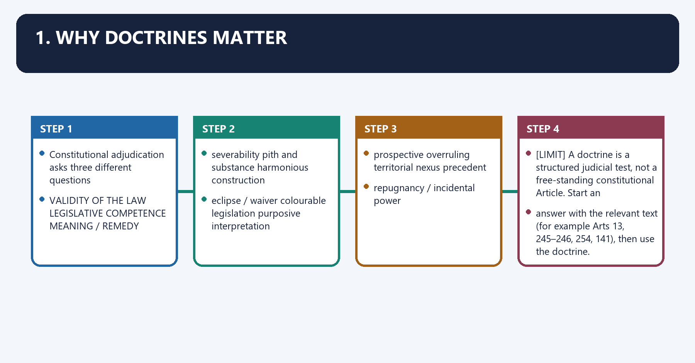
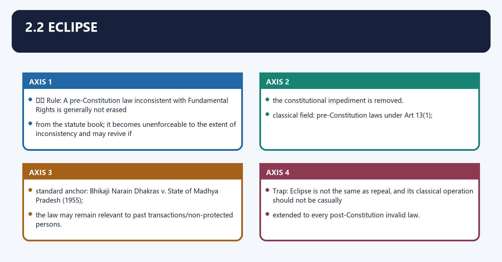
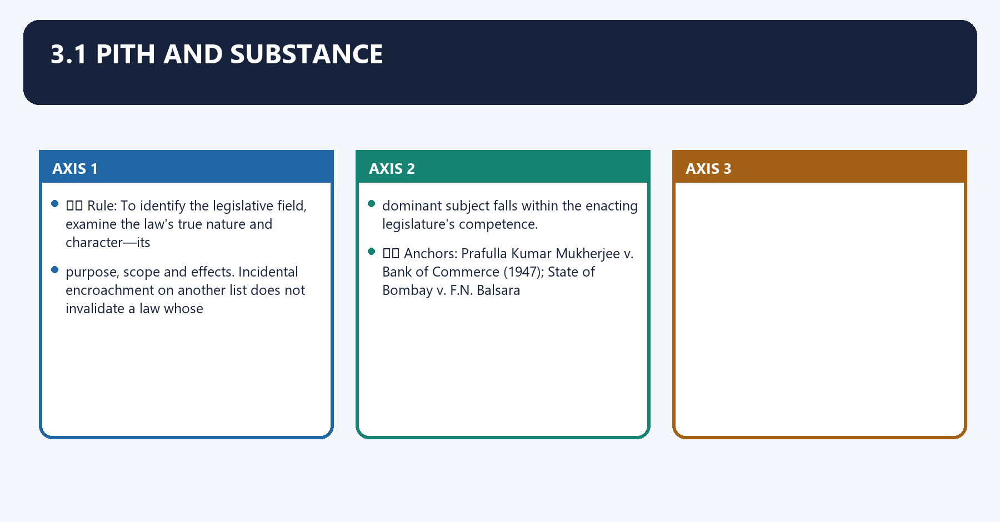
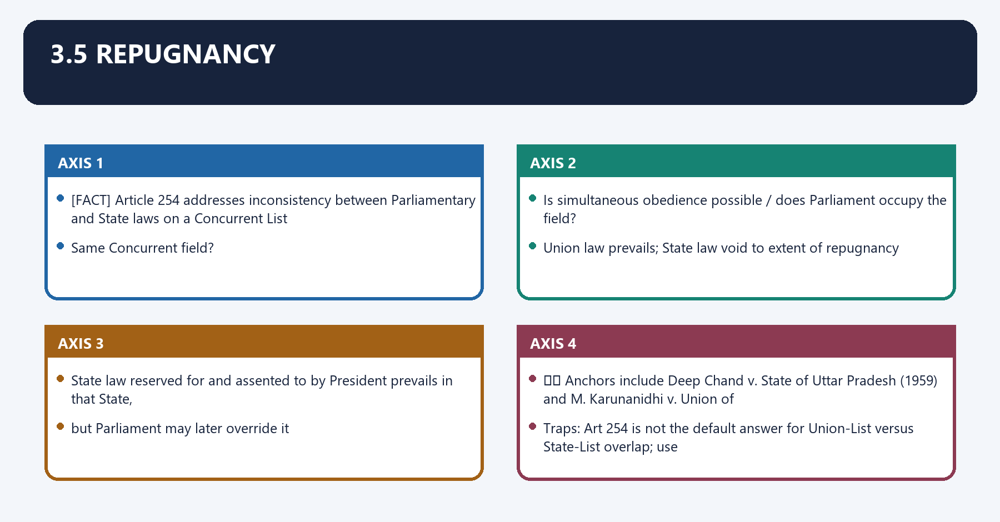
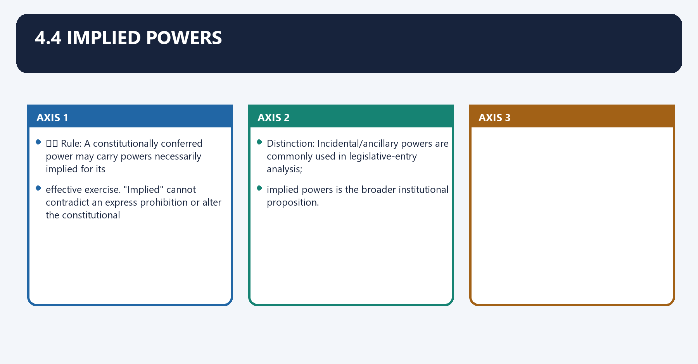
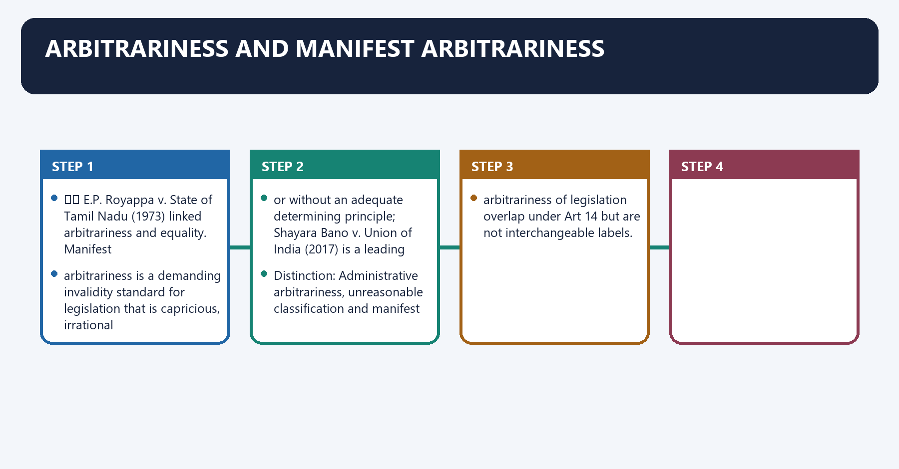

# Constitutional Interpretation Doctrines — Complete Uncompressed Learning Session

**Complete independent learning session + verified PYQ routing + solved practice workbook + final consolidated register notes**

**Legal/current control date:** 5 September 2026 (Asia/Kolkata)

> **Tag key:** `[FACT]` = named constitutional, statutory, official, judicial or audited local support; `[ANALYSIS]` = reasoned examination; `[CURRENT]` = checked for the control date; `[LIMIT]` = qualification.
>
> **Answer-writing discipline:** claim -> named evidence -> analysis -> qualification.

- [CURRENT] Status is controlled to **5 September 2026, Asia/Kolkata**.
- [CURRENT] **Live official refresh, 5 September 2026:** The official Constitution/Supreme Court portals and the controlling decision-year ledger were rechecked on 5 September 2026. Decided holdings are separated from later references, reviews, interim orders and pending questions; no pending doctrinal issue is presented as settled law.

#### How to Use This Package

[FACT] The complete Basic/Core owner is taught first in source order. Cross-topic Markdown, local OCR books and verified PYQ ledgers supplement it.

[FACT] Advanced-owner material appears only after the Core and practice sections under the required optional-depth label.

[LIMIT] A doctrine is a structured test anchored in text, structure and precedent, not a substitute for the governing Article. Interpretation, amendment and judicial legislation are distinct. Bench strength, decision year, legal effect and limitation must accompany every case-based doctrine.

#### Local Owner Gateway

> **Subject:** Polity · **Tier:** Core · **GS Paper:** GS-II
> **Official clause:** "Indian Constitution—historical underpinnings, evolution, features,
> amendments, significant provisions and basic structure" and "Functions and responsibilities of
> the Union and the States ... federal structure."
> **Grounded in:** Constitution of India; leading Supreme Court doctrine; M. Laxmikanth,
> *Courseware on Indian Polity*, Eighth Edition (2026), Ch. 94.
> **Status legend:** [FACT] constitutional/textual proposition · ⚖️ judicial doctrine/holding ·
> 📜 statute/rule · [LIMIT] analytical synthesis.
> **Core firewall:** This is the routing map for interpretive doctrines. `Fundamental-Rights.md` and
> `Centre-State-Relations.md` retain detailed cases in their fields; use links rather than duplicate
> long case narratives. It is independently sufficient for Prelims and 10/15/20-mark Mains; no
> Advanced companion is required.

---

## BASIC LEARNING SESSION

### 01. 1. Why doctrines matter

1. Why doctrines matter denotes the constitutional rules and institutional links organised around Constitutional adjudication asks three different questions.
1. Why doctrines matter operates through VALIDITY OF THE LAW LEGISLATIVE COMPETENCE MEANING / REMEDY, connected with severability pith and substance harmonious construction.
The operative mechanism matters because eclipse / waiver colourable legislation purposive interpretation.
Its principal consequence is that prospective overruling territorial nexus precedent.
The decisive contrast is between repugnancy / incidental power and [LIMIT] A doctrine is a structured judicial test, not a free-standing constitutional Article. Start an.
The exam-safe limitation is that answer with the relevant text (for example Arts 13, 245–246, 254, 141), then use the doctrine.

Constitutional adjudication asks three different questions:

```text
VALIDITY OF THE LAW        LEGISLATIVE COMPETENCE       MEANING / REMEDY
severability               pith and substance           harmonious construction
eclipse / waiver           colourable legislation       purposive interpretation
prospective overruling     territorial nexus            precedent
                           repugnancy / incidental power
```

[LIMIT] A doctrine is a structured judicial test, not a free-standing constitutional Article. Start an
answer with the relevant text (for example Arts 13, 245–246, 254, 141), then use the doctrine.

---

### 02. Interpretive methods before applying doctrine

Interpretive methods before applying doctrine denotes the constitutional rules and institutional links organised around Method Central question Legitimate use Limit.
Interpretive methods before applying doctrine operates through Examiner opening: Constitutional interpretation moves from text to structure, purpose,, connected with history and binding precedent; it is not a choice between literalism and judicial preference.
The operative mechanism matters because method Central question Legitimate use Limit.
Its principal consequence is that method Central question Legitimate use Limit.
The decisive contrast is between Method Central question Legitimate use Limit and Method Central question Legitimate use Limit.
The exam-safe limitation is that method Central question Legitimate use Limit.

| Method | Central question | Legitimate use | Limit |
|---|---|---|---|
| Textual | What do the enacted words, definitions and grammar permit? | Starting point for every issue | A word cannot be isolated from its Part, proviso or structure |
| Structural | What arrangement follows from institutions, fields, rights and checks? | Resolves relationships and constitutional silence | Structure cannot contradict express text |
| Historical | What problem, drafting history or constitutional background explains the clause? | Clarifies context and rejected alternatives | History informs; it does not freeze future application |
| Purposive | What constitutional object makes the guarantee or power effective? | Rights, remedies and institutional design | Purpose remains anchored in text and competence |
| Precedent-based | What binding ratio and bench-strength rule controls? | Equality, certainty and disciplined development | Obiter and smaller benches do not overrule |

> **Examiner opening:** Constitutional interpretation moves from text to structure, purpose,
> history and binding precedent; it is not a choice between literalism and judicial preference.

---

### 03. 2.1 Severability

2.1 Severability denotes the constitutional rules and institutional links organised around ⚖️ Rule: If the unconstitutional portion of a law can be separated from the valid portion and.
2.1 Severability operates through the legislature would have enacted the valid remainder independently, the court invalidates only, connected with the offending part.
The operative mechanism matters because textual separation Can valid and invalid parts be separated?.
Its principal consequence is that legislative intent Would the valid part have been enacted alone?.
The decisive contrast is between Functional completeness Can the remainder operate coherently? and Scheme unity Are the parts so mixed that the whole must fail?.
The exam-safe limitation is that ⚖️ Standard anchor: R.M.D. Chamarbaugwala v. Union of India (1957).

⚖️ **Rule:** If the unconstitutional portion of a law can be separated from the valid portion and
the legislature would have enacted the valid remainder independently, the court invalidates only
the offending part.

| Test | Question |
|---|---|
| Textual separation | Can valid and invalid parts be separated? |
| Legislative intent | Would the valid part have been enacted alone? |
| Functional completeness | Can the remainder operate coherently? |
| Scheme unity | Are the parts so mixed that the whole must fail? |

⚖️ Standard anchor: *R.M.D. Chamarbaugwala v. Union of India* (1957).

> **Trap:** Severability preserves a workable valid remainder; courts do not rewrite the legislative
> scheme.

### 04. 2.2 Eclipse

2.2 Eclipse denotes the constitutional rules and institutional links organised around ⚖️ Rule: A pre-Constitution law inconsistent with Fundamental Rights is generally not erased.
2.2 Eclipse operates through from the statute book; it becomes unenforceable to the extent of inconsistency and may revive if, connected with the constitutional impediment is removed.
The operative mechanism matters because classical field: pre-Constitution laws under Art 13(1).
Its principal consequence is that standard anchor: Bhikaji Narain Dhakras v. State of Madhya Pradesh (1955).
The decisive contrast is between the law may remain relevant to past transactions/non-protected persons and Trap: Eclipse is not the same as repeal, and its classical operation should not be casually.
The exam-safe limitation is that extended to every post-Constitution invalid law.

⚖️ **Rule:** A pre-Constitution law inconsistent with Fundamental Rights is generally not erased
from the statute book; it becomes unenforceable to the extent of inconsistency and may revive if
the constitutional impediment is removed.

- classical field: pre-Constitution laws under Art 13(1);
- standard anchor: *Bhikaji Narain Dhakras v. State of Madhya Pradesh* (1955);
- the law may remain relevant to past transactions/non-protected persons.

> **Trap:** Eclipse is not the same as repeal, and its classical operation should not be casually
> extended to every post-Constitution invalid law.

### 05. 2.3 Waiver of Fundamental Rights

2.3 Waiver of Fundamental Rights denotes the constitutional rules and institutional links organised around ⚖️ Rule: An individual cannot generally waive a Fundamental Right in a manner that validates.
2.3 Waiver of Fundamental Rights operates through State action contrary to the Constitution. Fundamental Rights express public constitutional policy,, connected with not merely private benefits.
The operative mechanism matters because ⚖️ Standard anchor: Basheshar Nath v. CIT (1958).
Its principal consequence is that trap: This is not a rule that every private legal right or procedural protection is.
The decisive contrast is between ⚖️ Rule: An individual cannot generally waive a Fundamental Right in a manner that validates and ⚖️ Rule: An individual cannot generally waive a Fundamental Right in a manner that validates.
The exam-safe limitation is that ⚖️ Rule: An individual cannot generally waive a Fundamental Right in a manner that validates.

⚖️ **Rule:** An individual cannot generally waive a Fundamental Right in a manner that validates
State action contrary to the Constitution. Fundamental Rights express public constitutional policy,
not merely private benefits.

⚖️ Standard anchor: *Basheshar Nath v. CIT* (1958).

> **Trap:** This is not a rule that every private legal right or procedural protection is
> non-waivable.

---

### 06. 3.1 Pith and substance

3.1 Pith and substance denotes the constitutional rules and institutional links organised around ⚖️ Rule: To identify the legislative field, examine the law's true nature and character—its.
3.1 Pith and substance operates through purpose, scope and effects. Incidental encroachment on another list does not invalidate a law whose, connected with dominant subject falls within the enacting legislature's competence.
The operative mechanism matters because ⚖️ Anchors: Prafulla Kumar Mukherjee v. Bank of Commerce (1947); State of Bombay v. F.N. Balsara.
Its principal consequence is that ⚖️ Rule: To identify the legislative field, examine the law's true nature and character—its.
The decisive contrast is between ⚖️ Rule: To identify the legislative field, examine the law's true nature and character—its and ⚖️ Rule: To identify the legislative field, examine the law's true nature and character—its.
The exam-safe limitation is that ⚖️ Rule: To identify the legislative field, examine the law's true nature and character—its.

⚖️ **Rule:** To identify the legislative field, examine the law's true nature and character—its
purpose, scope and effects. Incidental encroachment on another list does not invalidate a law whose
dominant subject falls within the enacting legislature's competence.

⚖️ Anchors: *Prafulla Kumar Mukherjee v. Bank of Commerce* (1947); *State of Bombay v. F.N. Balsara*
(1951).

### 07. 3.2 Incidental and ancillary powers

3.2 Incidental and ancillary powers denotes the constitutional rules and institutional links organised around ⚖️ Rule: A legislative entry includes powers reasonably necessary to make the granted subject.
3.2 Incidental and ancillary powers operates through effective. The doctrine supports incidental provisions but cannot create competence over an, connected with independent, forbidden field.
The operative mechanism matters because [LIMIT] It often works with pith and substance: first locate the dominant field, then assess whether the.
Its principal consequence is that additional measure is genuinely ancillary.
The decisive contrast is between ⚖️ Rule: A legislative entry includes powers reasonably necessary to make the granted subject and ⚖️ Rule: A legislative entry includes powers reasonably necessary to make the granted subject.
The exam-safe limitation is that ⚖️ Rule: A legislative entry includes powers reasonably necessary to make the granted subject.
⚖️ **Rule:** A legislative entry includes powers reasonably necessary to make the granted subject
effective. The doctrine supports incidental provisions but cannot create competence over an
independent, forbidden field.

[LIMIT] It often works with pith and substance: first locate the dominant field, then assess whether the
additional measure is genuinely ancillary.

### 08. 3.3 Colourable legislation

3.3 Colourable legislation denotes the constitutional rules and institutional links organised around ⚖️ Rule: What cannot be done directly cannot be done indirectly. The court examines legislative.
3.3 Colourable legislation operates through competence , not the legislature's political motive: form cannot disguise a law whose substance, connected with lies outside power.
The operative mechanism matters because ⚖️ Anchor: K.C. Gajapati Narayan Deo v. State of Orissa (1953).
Its principal consequence is that trap: A bad motive does not by itself make a competent law colourable.
The decisive contrast is between ⚖️ Rule: What cannot be done directly cannot be done indirectly. The court examines legislative and ⚖️ Rule: What cannot be done directly cannot be done indirectly. The court examines legislative.
The exam-safe limitation is that ⚖️ Rule: What cannot be done directly cannot be done indirectly. The court examines legislative.

⚖️ **Rule:** What cannot be done directly cannot be done indirectly. The court examines legislative
**competence**, not the legislature's political motive: form cannot disguise a law whose substance
lies outside power.

⚖️ Anchor: *K.C. Gajapati Narayan Deo v. State of Orissa* (1953).

> **Trap:** A bad motive does not by itself make a competent law colourable.

### 09. 3.4 Territorial nexus

3.4 Territorial nexus denotes the constitutional rules and institutional links organised around [FACT] Arts 245–246 structure territorial and subject-matter competence. ⚖️ A State law affecting.
3.4 Territorial nexus operates through matters beyond its territory can survive where the connection between the State and the subject is, connected with real and sufficient and the liability/operation is relevant to that connection.
The operative mechanism matters because ⚖️ Anchor: State of Bombay v. R.M.D. Chamarbaugwala (1957).
Its principal consequence is that [FACT] Arts 245–246 structure territorial and subject-matter competence. ⚖️ A State law affecting.
The decisive contrast is between [FACT] Arts 245–246 structure territorial and subject-matter competence. ⚖️ A State law affecting and [FACT] Arts 245–246 structure territorial and subject-matter competence. ⚖️ A State law affecting.
The exam-safe limitation is that [FACT] Arts 245–246 structure territorial and subject-matter competence. ⚖️ A State law affecting.
[FACT] Arts 245–246 structure territorial and subject-matter competence. ⚖️ A State law affecting
matters beyond its territory can survive where the connection between the State and the subject is
real and sufficient and the liability/operation is relevant to that connection.

⚖️ Anchor: *State of Bombay v. R.M.D. Chamarbaugwala* (1957).

### 10. 3.5 Repugnancy

3.5 Repugnancy denotes the constitutional rules and institutional links organised around [FACT] Article 254 addresses inconsistency between Parliamentary and State laws on a Concurrent List.
3.5 Repugnancy operates through Same Concurrent field?, connected with Is simultaneous obedience possible / does Parliament occupy the field?.
The operative mechanism matters because union law prevails; State law void to extent of repugnancy.
Its principal consequence is that state law reserved for and assented to by President prevails in that State,.
The decisive contrast is between but Parliament may later override it and ⚖️ Anchors include Deep Chand v. State of Uttar Pradesh (1959) and M. Karunanidhi v. Union of.
The exam-safe limitation is that traps: Art 254 is not the default answer for Union-List versus State-List overlap; use.

[FACT] Article 254 addresses inconsistency between Parliamentary and State laws on a **Concurrent List**
matter.

```text
Same Concurrent field?
       ↓ yes
Is simultaneous obedience possible / does Parliament occupy the field?
       ↓ conflict
Union law prevails; State law void to extent of repugnancy
       ↓ exception
State law reserved for and assented to by President prevails in that State,
but Parliament may later override it
```

⚖️ Anchors include *Deep Chand v. State of Uttar Pradesh* (1959) and *M. Karunanidhi v. Union of
India* (1979).

> **Traps:** Art 254 is not the default answer for Union-List versus State-List overlap; use
> pith-and-substance/harmonious construction first. Presidential assent is neither permanent
> immunity nor a cure for lack of State legislative competence.

**Occupied field** is an inference that Parliament intended its law to cover the relevant
Concurrent field so completely that inconsistent State supplementation cannot co-exist. Mere
existence of a Union law is insufficient: identify the same field, statutory scheme and actual
conflict.

---

### 11. 4.1 Harmonious construction

4.1 Harmonious construction denotes the constitutional rules and institutional links organised around ⚖️ Rule: Read apparently conflicting provisions so each has meaningful operation and neither is.
4.1 Harmonious construction operates through rendered redundant where a reasonable reconciliation is possible, connected with reconciling Fundamental Rights and Directive Principles.
The operative mechanism matters because interpreting entries in the Seventh Schedule.
Its principal consequence is that reading powers, limitations and institutional provisions together.
The decisive contrast is between ⚖️ Anchor: In re Kerala Education Bill (1958); the broader Part III–Part IV balance is developed and through later constitutional cases.
The exam-safe limitation is that ⚖️ Rule: Read apparently conflicting provisions so each has meaningful operation and neither is.
⚖️ **Rule:** Read apparently conflicting provisions so each has meaningful operation and neither is
rendered redundant where a reasonable reconciliation is possible.

Uses:

- reconciling Fundamental Rights and Directive Principles;
- interpreting entries in the Seventh Schedule;
- reading powers, limitations and institutional provisions together.

⚖️ Anchor: *In re Kerala Education Bill* (1958); the broader Part III–Part IV balance is developed
through later constitutional cases.

### 12. 4.2 Federal supremacy

4.2 Federal supremacy denotes the constitutional rules and institutional links organised around [FACT] Where a genuine and irreconcilable conflict remains after harmonious construction, the.
4.2 Federal supremacy operates through Constitution's supremacy clauses operate—especially Union priority in Art 246 and repugnancy under, connected with Art 254 in its proper field.
The operative mechanism matters because sequence trap: Federal supremacy is a last-stage constitutional resolution, not a reason to.
Its principal consequence is that skip the attempt to assign each entry a meaningful field.
The decisive contrast is between [FACT] Where a genuine and irreconcilable conflict remains after harmonious construction, the and [FACT] Where a genuine and irreconcilable conflict remains after harmonious construction, the.
The exam-safe limitation is that [FACT] Where a genuine and irreconcilable conflict remains after harmonious construction, the.

[FACT] Where a genuine and irreconcilable conflict remains after harmonious construction, the
Constitution's supremacy clauses operate—especially Union priority in Art 246 and repugnancy under
Art 254 in its proper field.

> **Sequence trap:** Federal supremacy is a last-stage constitutional resolution, not a reason to
> skip the attempt to assign each entry a meaningful field.

### 13. 4.3 Purposive and liberal interpretation

4.3 Purposive and liberal interpretation denotes the constitutional rules and institutional links organised around ⚖️ Rule: Constitutional language is read in light of its object, structure, history and.
4.3 Purposive and liberal interpretation operates through transformative purpose rather than as an isolated literal code. Rights provisions commonly receive, connected with a generous interpretation that makes the guarantee effective.
The operative mechanism matters because [LIMIT] Purpose constrains interpretation; it does not authorise a judge to replace clear text or create.
Its principal consequence is that an unlimited power. Text, structure, precedent and institutional competence remain controls.
The decisive contrast is between ⚖️ Rule: Constitutional language is read in light of its object, structure, history and and ⚖️ Rule: Constitutional language is read in light of its object, structure, history and.
The exam-safe limitation is that ⚖️ Rule: Constitutional language is read in light of its object, structure, history and.
⚖️ **Rule:** Constitutional language is read in light of its object, structure, history and
transformative purpose rather than as an isolated literal code. Rights provisions commonly receive
a generous interpretation that makes the guarantee effective.

[LIMIT] Purpose constrains interpretation; it does not authorise a judge to replace clear text or create
an unlimited power. Text, structure, precedent and institutional competence remain controls.

### 14. 4.4 Implied powers

4.4 Implied powers denotes the constitutional rules and institutional links organised around ⚖️ Rule: A constitutionally conferred power may carry powers necessarily implied for its.
4.4 Implied powers operates through effective exercise. "Implied" cannot contradict an express prohibition or alter the constitutional, connected with Distinction: Incidental/ancillary powers are commonly used in legislative-entry analysis.
The operative mechanism matters because implied powers is the broader institutional proposition.
Its principal consequence is that ⚖️ Rule: A constitutionally conferred power may carry powers necessarily implied for its.
The decisive contrast is between ⚖️ Rule: A constitutionally conferred power may carry powers necessarily implied for its and ⚖️ Rule: A constitutionally conferred power may carry powers necessarily implied for its.
The exam-safe limitation is that ⚖️ Rule: A constitutionally conferred power may carry powers necessarily implied for its.

⚖️ **Rule:** A constitutionally conferred power may carry powers necessarily implied for its
effective exercise. "Implied" cannot contradict an express prohibition or alter the constitutional
allocation.

> **Distinction:** Incidental/ancillary powers are commonly used in legislative-entry analysis;
> implied powers is the broader institutional proposition.

---

### 15. 5.1 Prospective overruling

5.1 Prospective overruling denotes the constitutional rules and institutional links organised around ⚖️ Rule: The court may declare a new rule for the future while preserving specified past.
5.1 Prospective overruling operates through transactions or existing effects to avoid disruptive injustice, connected with ⚖️ Introduced into Indian constitutional adjudication in I.C. Golaknath v. State of Punjab.
The operative mechanism matters because (1967), with later use tailored to the case.
Its principal consequence is that trap: It is not automatic whenever precedent changes; the court must deliberately shape the.
The decisive contrast is between ⚖️ Rule: The court may declare a new rule for the future while preserving specified past and ⚖️ Rule: The court may declare a new rule for the future while preserving specified past.
The exam-safe limitation is that ⚖️ Rule: The court may declare a new rule for the future while preserving specified past.
⚖️ **Rule:** The court may declare a new rule for the future while preserving specified past
transactions or existing effects to avoid disruptive injustice.

⚖️ Introduced into Indian constitutional adjudication in *I.C. Golaknath v. State of Punjab*
(1967), with later use tailored to the case.

> **Trap:** It is not automatic whenever precedent changes; the court must deliberately shape the
> temporal effect.

### 16. 5.2 Precedent and Article 141

5.2 Precedent and Article 141 denotes the constitutional rules and institutional links organised around [FACT] The law declared by the Supreme Court is binding on all courts within India under Art 141.
5.2 Precedent and Article 141 operates through Ratio decidendi Legal principle necessary to decide the case; binding component, connected with Obiter dicta Persuasive observation not necessary to the result.
The operative mechanism matters because distinguishing Earlier ratio does not control because materially relevant facts/legal context differ.
Its principal consequence is that per incuriam Decision rendered in ignorance of binding law; narrowly used.
The decisive contrast is between Bench strength Smaller bench cannot overrule a larger-bench ruling; coordinate conflict routes to larger bench and Art 142 Power to do complete justice in a cause; not a replacement for Art 141 doctrine.
The exam-safe limitation is that ⚖️ Constitutional courts may reconsider their own precedents through proper bench procedure.

[FACT] The law declared by the Supreme Court is binding on all courts within India under Art 141.

| Concept | Meaning |
|---|---|
| Ratio decidendi | Legal principle necessary to decide the case; binding component |
| Obiter dicta | Persuasive observation not necessary to the result |
| Distinguishing | Earlier ratio does not control because materially relevant facts/legal context differ |
| Per incuriam | Decision rendered in ignorance of binding law; narrowly used |
| Bench strength | Smaller bench cannot overrule a larger-bench ruling; coordinate conflict routes to larger bench |
| Art 142 | Power to do complete justice in a cause; not a replacement for Art 141 doctrine |

⚖️ Constitutional courts may reconsider their own precedents through proper bench procedure.
Precedent promotes equality, certainty and institutional legitimacy while allowing reasoned change.

---

### 17. Reading down, reading into and judicial-legislation limits

Close-option source discipline means the systematic verification of legal source, institutional category, status and exception before choosing a close option.
Technically, close-option source discipline comprises source attribution, doctrinal classification, date control and remedy-specific qualification.
The operative mechanism matters because defined setting. It is more interventionist and requires a strong textual or structural basis.
Its principal consequence is that ⚖️ Shreya Singhal v. Union of India (2015) refused to save an incurably vague provision through.
The decisive contrast is between judicial rewriting. A court may interpret but cannot enact a new legislative scheme and Tool Legal effect Limit.
The exam-safe limitation is that reading down Preserves a provision through a narrower valid construction Text must reasonably support it.
⚖️ **Reading down** chooses a constitutionally valid meaning that the statutory text can reasonably
bear. *Kedar Nath Singh v. State of Bihar* (1962) is a standard narrowing example.

⚖️ **Reading into** supplies an implication necessary to protect a constitutional guarantee in a
defined setting. It is more interventionist and requires a strong textual or structural basis.

⚖️ *Shreya Singhal v. Union of India* (2015) refused to save an incurably vague provision through
judicial rewriting. A court may interpret but cannot enact a new legislative scheme.

| Tool | Legal effect | Limit |
|---|---|---|
| Reading down | Preserves a provision through a narrower valid construction | Text must reasonably support it |
| Reading into | Recognises a necessary implication or safeguard | Cannot contradict express exclusion or create a complete code |
| Severability | Removes separable invalid matter | Remainder must be workable and intended |
| Striking down | Invalidates the unconstitutional provision/law | Used when no valid saving construction exists |

---

### 18. Basic structure as an interpretive limit on amendment

Close-option source discipline means the systematic verification of legal source, institutional category, status and exception before choosing a close option.
Technically, close-option source discipline comprises source attribution, doctrinal classification, date control and remedy-specific qualification.
The operative mechanism matters because trigger Provision Effect Limit/trap.
Its principal consequence is that the doctrine is interpretive because the Constitution does not enumerate a closed list. It is not.
The decisive contrast is between an independent judicial amendment power and ⚖️ Kesavananda Bharati v. State of Kerala (1973) holds that Parliament's Art 368 power is wide.
The exam-safe limitation is that ⚖️ Kesavananda Bharati v. State of Kerala (1973) holds that Parliament's Art 368 power is wide.

⚖️ *Kesavananda Bharati v. State of Kerala* (1973) holds that Parliament's Art 368 power is wide
but cannot damage the Constitution's basic structure. *Minerva Mills v. Union of India* (1980)
confirms limited amending power and harmony between Fundamental Rights and DPSPs.

| Trigger | Provision | Effect | Limit/trap |
|---|---|---|---|
| Constitutional amendment challenged | Art 368 read with constitutional structure | Amendment may be invalidated for damaging a basic feature | Doctrine reviews amendments, not every policy disagreement |

The doctrine is interpretive because the Constitution does not enumerate a closed list. It is not
an independent judicial amendment power.

---

### 19. Presumption of constitutionality

Presumption of constitutionality denotes the constitutional rules and institutional links organised around Courts ordinarily presume legislation valid and place an initial burden on the challenger, while.
Presumption of constitutionality operates through the intensity of justification varies with the right, classification and available evidence, connected with Ram Krishna Dalmia v. Justice S.R. Tendolkar (1958) is a standard classification anchor.
The operative mechanism matters because trap: The presumption is rebuttable and cannot cure lack of competence, explicit.
Its principal consequence is that discrimination or a disproportionate rights restriction.
The decisive contrast is between Courts ordinarily presume legislation valid and place an initial burden on the challenger, while and Courts ordinarily presume legislation valid and place an initial burden on the challenger, while.
The exam-safe limitation is that courts ordinarily presume legislation valid and place an initial burden on the challenger, while.
Courts ordinarily presume legislation valid and place an initial burden on the challenger, while
the intensity of justification varies with the right, classification and available evidence.
*Ram Krishna Dalmia v. Justice S.R. Tendolkar* (1958) is a standard classification anchor.

> **Trap:** The presumption is rebuttable and cannot cure lack of competence, explicit
> discrimination or a disproportionate rights restriction.

### 20. Arbitrariness and manifest arbitrariness

Arbitrariness and manifest arbitrariness denotes the constitutional rules and institutional links organised around ⚖️ E.P. Royappa v. State of Tamil Nadu (1973) linked arbitrariness and equality. Manifest.
Arbitrariness and manifest arbitrariness operates through arbitrariness is a demanding invalidity standard for legislation that is capricious, irrational, connected with or without an adequate determining principle; Shayara Bano v. Union of India (2017) is a leading.
The operative mechanism matters because distinction: Administrative arbitrariness, unreasonable classification and manifest.
Its principal consequence is that arbitrariness of legislation overlap under Art 14 but are not interchangeable labels.
The decisive contrast is between ⚖️ E.P. Royappa v. State of Tamil Nadu (1973) linked arbitrariness and equality. Manifest and ⚖️ E.P. Royappa v. State of Tamil Nadu (1973) linked arbitrariness and equality. Manifest.
The exam-safe limitation is that ⚖️ E.P. Royappa v. State of Tamil Nadu (1973) linked arbitrariness and equality. Manifest.

⚖️ *E.P. Royappa v. State of Tamil Nadu* (1973) linked arbitrariness and equality. **Manifest
arbitrariness** is a demanding invalidity standard for legislation that is capricious, irrational
or without an adequate determining principle; *Shayara Bano v. Union of India* (2017) is a leading
anchor.

> **Distinction:** Administrative arbitrariness, unreasonable classification and manifest
> arbitrariness of legislation overlap under Art 14 but are not interchangeable labels.

### 21. Proportionality

Proportionality denotes the constitutional rules and institutional links organised around ⚖️ Proportionality tests lawful authority, legitimate aim, rational connection, necessity or a.
Proportionality operates through less restrictive alternative, and balance between rights harm and public benefit, connected with Modern Dental College v. State of Madhya Pradesh (2016), K.S. Puttaswamy v. Union of India.
The operative mechanism matters because (2017) and Anuradha Bhasin v. Union of India (2020) are major anchors.
Its principal consequence is that trap: Proportionality is structured review, not judicial substitution of a preferred policy.
The decisive contrast is between ⚖️ Proportionality tests lawful authority, legitimate aim, rational connection, necessity or a and ⚖️ Proportionality tests lawful authority, legitimate aim, rational connection, necessity or a.
The exam-safe limitation is that ⚖️ Proportionality tests lawful authority, legitimate aim, rational connection, necessity or a.
⚖️ Proportionality tests lawful authority, legitimate aim, rational connection, necessity or a
less restrictive alternative, and balance between rights harm and public benefit.

*Modern Dental College v. State of Madhya Pradesh* (2016), *K.S. Puttaswamy v. Union of India*
(2017) and *Anuradha Bhasin v. Union of India* (2020) are major anchors.

> **Trap:** Proportionality is structured review, not judicial substitution of a preferred policy.

---

### 22. Constitutional morality and transformative constitutionalism

Constitutional morality and transformative constitutionalism denotes the constitutional rules and institutional links organised around Constitutional morality requires fidelity to the Constitution's text, procedures, equal.
Constitutional morality and transformative constitutionalism operates through citizenship and institutional role morality rather than social or personal morality, connected with Transformative constitutionalism treats the Constitution as a lawful project for dismantling.
The operative mechanism matters because status hierarchy and realising liberty, equality, dignity and fraternity.
Its principal consequence is that ⚖️ Navtej Singh Johar v. Union of India (2018) is a leading rights application. Each use must be.
The decisive contrast is between connected to an identifiable provision, structure and remedy and Trap: Neither doctrine authorises free-standing moral review or permits a court to ignore.
The exam-safe limitation is that democratic competence and precedent.

**Constitutional morality** requires fidelity to the Constitution's text, procedures, equal
citizenship and institutional role morality rather than social or personal morality.

**Transformative constitutionalism** treats the Constitution as a lawful project for dismantling
status hierarchy and realising liberty, equality, dignity and fraternity.

⚖️ *Navtej Singh Johar v. Union of India* (2018) is a leading rights application. Each use must be
connected to an identifiable provision, structure and remedy.

> **Trap:** Neither doctrine authorises free-standing moral review or permits a court to ignore
> democratic competence and precedent.

---

### 23. Essential religious practices and current doctrinal caution

Close-option source discipline means the systematic verification of legal source, institutional category, status and exception before choosing a close option.
Technically, close-option source discipline comprises source attribution, doctrinal classification, date control and remedy-specific qualification.
The operative mechanism matters because public-order, morality, health and other Fundamental Rights limits.
Its principal consequence is that the doctrine may draw courts into theology, freeze internal diversity and obscure a direct.
The decisive contrast is between rights-conflict analysis. Indian Young Lawyers Association v. State of Kerala (2018) illustrates and the interaction among religious freedom, equality, dignity and constitutional morality. Any.
The exam-safe limitation is that pending larger-bench or review question must be labelled pending, not a fresh final holding.
⚖️ *Commissioner, Hindu Religious Endowments v. Sri Lakshmindra Thirtha Swamiar of Shirur Mutt*
(1954) is the classic source of the essential-religious-practices inquiry. The court distinguishes
protected matters of religion from secular activities associated with religion, while applying
public-order, morality, health and other Fundamental Rights limits.

The doctrine may draw courts into theology, freeze internal diversity and obscure a direct
rights-conflict analysis. *Indian Young Lawyers Association v. State of Kerala* (2018) illustrates
the interaction among religious freedom, equality, dignity and constitutional morality. Any
pending larger-bench or review question must be labelled pending, not a fresh final holding.

---

### 24. Constitutionally relevant neighbouring doctrines

Constitutionally relevant neighbouring doctrines denotes the constitutional rules and institutional links organised around Doctrine Constitutional relevance Leading anchor Distinction/limit.
Constitutionally relevant neighbouring doctrines operates through Constitutional silence Text leaves an institutional matter unstated Structure, convention and precedent Silence is not unlimited power, connected with Firewall: Pleasure concerns tenure; legitimate expectation concerns fair administrative.
The operative mechanism matters because treatment; promissory estoppel concerns reliance; casus omissus concerns an omitted textual case.
Its principal consequence is that doctrine Constitutional relevance Leading anchor Distinction/limit.
The decisive contrast is between Doctrine Constitutional relevance Leading anchor Distinction/limit and Doctrine Constitutional relevance Leading anchor Distinction/limit.
The exam-safe limitation is that doctrine Constitutional relevance Leading anchor Distinction/limit.

| Doctrine | Constitutional relevance | Leading anchor | Distinction/limit |
|---|---|---|---|
| Pleasure | Arts 310–311 and responsible government | *Shamsher Singh v. State of Punjab* (1974) | Controlled by express safeguards and constitutional-head conventions |
| Legitimate expectation | Fair, non-arbitrary administration under Art 14 | *Navjyoti Cooperative Group Housing Society v. Union of India* (1992) | Usually protects fair consideration/procedure, not automatic entitlement |
| Promissory estoppel | Rule-of-law control of governmental representation | *Motilal Padampat Sugar Mills v. State of Uttar Pradesh* (1978) | Cannot compel violation of statute, duty or overriding public interest |
| Casus omissus | Judicial restraint where text has a gap | *Padma Sundara Rao v. State of Tamil Nadu* (2002) | Court ordinarily cannot supply an omission because the result is inconvenient |
| Constitutional silence | Text leaves an institutional matter unstated | Structure, convention and precedent | Silence is not unlimited power |

> **Firewall:** Pleasure concerns tenure; legitimate expectation concerns fair administrative
> treatment; promissory estoppel concerns reliance; casus omissus concerns an omitted textual case.

---

### 25. Constitutional silence, conventions and restraint

Constitutional silence, conventions and restraint denotes the constitutional rules and institutional links organised around express text and prohibitions.
Constitutional silence, conventions and restraint operates through constitutional structure and responsible-government logic, connected with binding precedent and established legal practice.
The operative mechanism matters because political convention, comparative aid and history.
Its principal consequence is that minimum rule necessary to preserve accountability.
The decisive contrast is between A convention may guide political conduct without becoming judicially enforceable law. Courts may and protect the legal structure within which conventions operate, but should not constitutionalise.
The exam-safe limitation is that every political expectation.
```text
express text and prohibitions
        ↓
constitutional structure and responsible-government logic
        ↓
binding precedent and established legal practice
        ↓
political convention, comparative aid and history
        ↓
minimum rule necessary to preserve accountability
```

A convention may guide political conduct without becoming judicially enforceable law. Courts may
protect the legal structure within which conventions operate, but should not constitutionalise
every political expectation.

Article 142 permits complete justice in the cause before the Supreme Court but does not authorise
disregard of substantive law. *Supreme Court Bar Association v. Union of India* (1998) is the
standard limitation anchor. A coordinate or smaller bench that doubts controlling law should seek
a proper reference rather than silently disregard the larger bench.

---

### 26. Legislative competence

Legislative competence denotes the constitutional rules and institutional links organised around enacting legislature + entry.
Legislative competence operates through pith and substance, connected with incidental overlap? → ancillary power.
The operative mechanism matters because disguised lack of power? → colourable legislation.
Its principal consequence is that state extra-territorial reach? → territorial nexus.
The decisive contrast is between same Concurrent field + actual conflict? → Art 254 repugnancy/assent and enacting legislature + entry.
The exam-safe limitation is that enacting legislature + entry.
```text
enacting legislature + entry
        ↓
pith and substance
        ↓
incidental overlap? → ancillary power
        ↓
disguised lack of power? → colourable legislation
        ↓
State extra-territorial reach? → territorial nexus
        ↓
same Concurrent field + actual conflict? → Art 254 repugnancy/assent
```

### 27. Rights review

Rights review denotes the constitutional rules and institutional links organised around State action + affected right.
Rights review operates through authority of law + legitimate aim, connected with classification/arbitrariness.
The operative mechanism matters because proportionality: connection → necessity → balance.
Its principal consequence is that valid saving meaning? → read down.
The decisive contrast is between sever / strike; shape time only through reasoned prospective overruling and State action + affected right.
The exam-safe limitation is that state action + affected right.
```text
State action + affected right
        ↓
authority of law + legitimate aim
        ↓
classification/arbitrariness
        ↓
proportionality: connection → necessity → balance
        ↓
valid saving meaning? → read down
        ↓ no
sever / strike; shape time only through reasoned prospective overruling
```

### 28. Remedy and precedent

Remedy and precedent denotes the constitutional rules and institutional links organised around controlling Article + larger-bench ratio.
Remedy and precedent operates through apply or distinguish, connected with doubt remains? → proper reference, not silent overruling.
The operative mechanism matters because declaration / severability / reading down / injunction / compensation.
Its principal consequence is that art 142 remains case-bound and substantively limited.
The decisive contrast is between controlling Article + larger-bench ratio and controlling Article + larger-bench ratio.
The exam-safe limitation is that controlling Article + larger-bench ratio.
```text
controlling Article + larger-bench ratio
        ↓
apply or distinguish
        ↓
doubt remains? → proper reference, not silent overruling
        ↓
declaration / severability / reading down / injunction / compensation
        ↓
Art 142 remains case-bound and substantively limited
```

---

### 29. 6. Doctrine-selection matrix

6. Doctrine-selection matrix denotes the constitutional rules and institutional links organised around Problem in question Start with Then test.
6. Doctrine-selection matrix operates through One provision of a law violates a right Art 13 Severability, connected with Old law conflicts with a Fundamental Right Art 13(1) Eclipse.
The operative mechanism matters because person consented to rights-infringing State action Relevant FR Non-waiver.
Its principal consequence is that union/State field overlap Arts 245–246, Seventh Schedule Pith and substance → ancillary power → harmonious construction.
The decisive contrast is between Legislature disguises lack of competence Competence provision Colourable legislation and State law has extra-territorial effect Art 245 Territorial nexus.
The exam-safe limitation is that union and State laws clash in Concurrent field Art 254 Repugnancy and assent.
| Problem in question | Start with | Then test |
|---|---|---|
| One provision of a law violates a right | Art 13 | Severability |
| Old law conflicts with a Fundamental Right | Art 13(1) | Eclipse |
| Person consented to rights-infringing State action | Relevant FR | Non-waiver |
| Union/State field overlap | Arts 245–246, Seventh Schedule | Pith and substance → ancillary power → harmonious construction |
| Legislature disguises lack of competence | Competence provision | Colourable legislation |
| State law has extra-territorial effect | Art 245 | Territorial nexus |
| Union and State laws clash in Concurrent field | Art 254 | Repugnancy and assent |
| Two constitutional provisions appear inconsistent | Text/structure | Harmonious construction; supremacy only if irreconcilable |
| New constitutional interpretation threatens settled transactions | Relevant judgment | Prospective overruling |
| Lower court faces Supreme Court statement | Art 141 | Ratio, bench strength, distinguishing |
| Text is broad/open-ended | Text + constitutional purpose | Purposive/liberal interpretation within structural limits |
| Law restricts a right for a public objective | Rights text + authority | Proportionality |
| Legislation is attacked as capricious | Art 14 | Manifest arbitrariness, with a demanding threshold |
| Statute has two plausible meanings | Governing text/right | Reading down if the valid meaning is textually available |
| Amendment damages constitutional identity | Art 368 | Basic structure |
| Religious-practice claim conflicts with equality/dignity | Arts 25–26 plus other rights | ERP inquiry with current doctrinal caution |
| Constitutional text is silent | Text + structure + precedent | Convention only as a bounded aid |

---

### 30. 7. Cross-topic routing map

7. Cross-topic routing map denotes the constitutional rules and institutional links organised around FUNDAMENTAL RIGHTS FEDERALISM / LEGISLATION.
7. Cross-topic routing map operates through severability ───────────────┐ pith and substance ────────┐, connected with eclipse ├─► THIS OWNER ◄─ colourable law │.
The operative mechanism matters because waiver │ territorial nexus ├─►.
Its principal consequence is that prospective overruling │ repugnancy │.
The decisive contrast is between rights-liberal reading ─────┘ ancillary power ──────┘ and harmonious construction / supremacy.
The exam-safe limitation is that rights case detail and Article 13: Fundamental-Rights.md.
```text
FUNDAMENTAL RIGHTS                    FEDERALISM / LEGISLATION
severability ───────────────┐         pith and substance ────────┐
eclipse                     ├─► THIS OWNER ◄─ colourable law     │
waiver                      │              territorial nexus     ├─►
prospective overruling      │              repugnancy            │
rights-liberal reading ─────┘              ancillary power ──────┘
                                     │
                       harmonious construction / supremacy
```

- Rights case detail and Article 13: `Fundamental-Rights.md`
- Legislative relations and federal cases: `Centre-State-Relations.md`
- Basic structure/amending power: `Amendment-and-Basic-Structure.md`
- Judicial review/precedent institutions: `Supreme-Court.md`, `High-Court.md`

---

### 31. 8.1 Demand map

8.1 Demand map denotes the constitutional rules and institutional links organised around Demand Answer spine.
8.1 Demand map operates through Explain one doctrine Textual anchor → rule/test → case → application → limit, connected with Compare doctrines Trigger → legal effect → scope → case → trap.
The operative mechanism matters because doctrines and federalism competence map → pith/substance → reconciliation → repugnancy/supremacy.
Its principal consequence is that judicial creativity purposive reading + implied powers → precedent/limits → legitimacy verdict.
The decisive contrast is between Invalidity and remedies severability/eclipse → temporal effect/prospective overruling → rule-of-law balance and Demand Answer spine.
The exam-safe limitation is that demand Answer spine.
| Demand | Answer spine |
|---|---|
| Explain one doctrine | Textual anchor → rule/test → case → application → limit |
| Compare doctrines | Trigger → legal effect → scope → case → trap |
| Doctrines and federalism | competence map → pith/substance → reconciliation → repugnancy/supremacy |
| Judicial creativity | purposive reading + implied powers → precedent/limits → legitimacy verdict |
| Invalidity and remedies | severability/eclipse → temporal effect/prospective overruling → rule-of-law balance |

### 32. 8.2 Thesis options

8.2 Thesis options denotes the constitutional rules and institutional links organised around Interpretive doctrines translate a terse constitutional text into predictable tests, but their.
8.2 Thesis options operates through legitimacy depends on anchoring each test in text, structure and precedent, connected with Federal doctrines first seek to preserve both legislative fields; Union supremacy resolves only.
The operative mechanism matters because the irreducible conflict authorised by the Constitution.
Its principal consequence is that severability, eclipse and prospective overruling all moderate invalidity, but operate on.
The decisive contrast is between different objects—the law's parts, its enforceability and the judgment's temporal effect and Interpretive doctrines translate a terse constitutional text into predictable tests, but their.
The exam-safe limitation is that interpretive doctrines translate a terse constitutional text into predictable tests, but their.
- *Interpretive doctrines translate a terse constitutional text into predictable tests, but their
  legitimacy depends on anchoring each test in text, structure and precedent.*
- *Federal doctrines first seek to preserve both legislative fields; Union supremacy resolves only
  the irreducible conflict authorised by the Constitution.*
- *Severability, eclipse and prospective overruling all moderate invalidity, but operate on
  different objects—the law's parts, its enforceability and the judgment's temporal effect.*

### 33. 8.3 Mark-scaled structures

8.3 Mark-scaled structures denotes the constitutional rules and institutional links organised around Marks Structure Evidence.
8.3 Mark-scaled structures operates through 10 Define → textual anchor → test → one case → limit 2–3 authorities, connected with 15 Doctrine cluster → compare operation/effect → cases → constitutional rationale 4–5 authorities.
The operative mechanism matters because 20 Textual framework → multiple doctrine sequence → institutional/equality rationale → critiques → balanced conclusion 6–8 authorities.
Its principal consequence is that marks Structure Evidence.
The decisive contrast is between Marks Structure Evidence and Marks Structure Evidence.
The exam-safe limitation is that marks Structure Evidence.
| Marks | Structure | Evidence |
|---:|---|---|
| 10 | Define → textual anchor → test → one case → limit | 2–3 authorities |
| 15 | Doctrine cluster → compare operation/effect → cases → constitutional rationale | 4–5 authorities |
| 20 | Textual framework → multiple doctrine sequence → institutional/equality rationale → critiques → balanced conclusion | 6–8 authorities |

### 34. 8.4 Evidence units

8.4 Evidence units denotes the constitutional rules and institutional links organised around Claim: pith and substance protects workable federalism. Evidence: ⚖️ dominant-character.
8.4 Evidence units operates through test. Analysis: allows incidental overlap in a detailed regulatory state. Qualification, connected with cannot rescue a disguised law whose true subject is outside competence.
The operative mechanism matters because claim: severability favours constitutional restraint. Evidence: ⚖️ invalid part alone may.
Its principal consequence is that fall. Analysis: respects the valid legislative choice. Qualification: remainder must be.
The decisive contrast is between independent and workable and Claim: precedent is structured, not mechanical. Evidence: [FACT] Art 141 and bench hierarchy.
The exam-safe limitation is that analysis: creates certainty/equality. Qualification: distinguishing and larger-bench.
- **Claim:** pith and substance protects workable federalism. **Evidence:** ⚖️ dominant-character
  test. **Analysis:** allows incidental overlap in a detailed regulatory state. **Qualification:**
  cannot rescue a disguised law whose true subject is outside competence.
- **Claim:** severability favours constitutional restraint. **Evidence:** ⚖️ invalid part alone may
  fall. **Analysis:** respects the valid legislative choice. **Qualification:** remainder must be
  independent and workable.
- **Claim:** precedent is structured, not mechanical. **Evidence:** [FACT] Art 141 and bench hierarchy.
  **Analysis:** creates certainty/equality. **Qualification:** distinguishing and larger-bench
  reconsideration permit principled development.

---

### 35. Comprehensive doctrine atlas

Comprehensive doctrine atlas denotes the constitutional rules and institutional links organised around Doctrine Definition and trigger Provision/field Leading case (decision year) Legal effect Limitation and UPSC trap.
Comprehensive doctrine atlas operates through Interpretation–amendment firewall: Interpretation resolves meaning and remedy within the, connected with enacted Constitution. Amendment changes constitutional text through Art 368. Judicial.
The operative mechanism matters because legislation begins where a court abandons available text/structure and creates a policy code.
Its principal consequence is that doctrine Definition and trigger Provision/field Leading case (decision year) Legal effect Limitation and UPSC trap.
The decisive contrast is between Doctrine Definition and trigger Provision/field Leading case (decision year) Legal effect Limitation and UPSC trap and Doctrine Definition and trigger Provision/field Leading case (decision year) Legal effect Limitation and UPSC trap.
The exam-safe limitation is that doctrine Definition and trigger Provision/field Leading case (decision year) Legal effect Limitation and UPSC trap.
| Doctrine | Definition and trigger | Provision/field | Leading case (decision year) | Legal effect | Limitation and UPSC trap |
|---|---|---|---|---|---|
| Textual interpretation | Reads enacted words in context when meaning is disputed | Entire Constitution | *Kesavananda Bharati* (1973) used text with structure | Fixes the permissible semantic starting range | Text is the start, not an isolated dictionary exercise |
| Structural interpretation | Infers meaning from institutional and federal architecture | Parts, Schedules and relationships | *S.R. Bommai* (1994) | Preserves constitutional relationships/features | Structure cannot override express text |
| Historical interpretation | Uses framing history/background to clarify ambiguity | Relevant provision | *In re Berubari Union* (1960) | Supplies context | History informs, not freezes |
| Purposive interpretation | Reads language to make constitutional object effective | Rights/powers | *Maneka Gandhi* (1978) | Gives effective, coherent protection | Purpose cannot create unlimited power |
| Harmonious construction | Reconciles apparently conflicting provisions | Whole Constitution | *Kerala Education Bill* (1958) | Allows both provisions meaningful operation | Cannot erase an express priority |
| Pith and substance | Finds a law's true nature where fields overlap | Arts 245–246, Seventh Schedule | *Prafulla Kumar Mukherjee* (1947) | Dominant field controls; incidental overlap tolerated | Does not save disguised incompetence |
| Colourable legislation | Tests whether form disguises lack of competence | Arts 245–246 | *K.C. Gajapati Narayan Deo* (1953) | Invalidates law outside true competence | Bad motive alone is insufficient |
| Incidental/ancillary power | Includes measures necessary to make an entry effective | Legislative entry | *State of Bombay v. F.N. Balsara* (1951) | Supports genuine auxiliary provisions | Cannot create an independent forbidden field |
| Occupied field/repugnancy | Tests conflicting Union/State laws in same Concurrent field | Art 254 | *M. Karunanidhi* (1979) | Union prevails to conflict, subject to assent route | Not the default for List I/List II overlap |
| Territorial nexus | Requires real connection for extra-territorial State effect | Art 245 | *State of Bombay v. R.M.D. Chamarbaugwala* (1957) | Sustains law where nexus is sufficient | Remote or illusory nexus fails |
| Severability | Removes a separable unconstitutional part | Art 13 | *R.M.D. Chamarbaugwala v. Union of India* (1957) | Preserves workable valid remainder | Court cannot rewrite scheme |
| Eclipse | Makes inconsistent pre-Constitution law dormant to that extent | Art 13(1) | *Bhikaji Narain Dhakras* (1955) | Law may revive if impediment removed | Not repeal; classical scope is pre-Constitution law |
| Waiver of Fundamental Rights | Rejects consent as validation of unconstitutional State action | Part III | *Basheshar Nath* (1958) | Preserves public constitutional policy | Not every private/procedural right is non-waivable |
| Prospective overruling | Controls future effect of a newly declared rule | Judicial remedy | *I.C. Golaknath* (1967) | Protects specified settled effects | Must be expressly and reasonedly invoked |
| Basic structure | Limits damage to constitutional identity by amendment | Art 368 | *Kesavananda Bharati* (1973) | Invalidates a damaging amendment | Not an ordinary policy veto |
| Reading down | Chooses a narrower constitutionally valid meaning | Rights + statute | *Kedar Nath Singh* (1962) | Preserves valid scope | Text must reasonably bear the meaning |
| Reading into | Recognises a necessary implication/safeguard | Rights + structure | *Vishaka v. State of Rajasthan* (1997) | Temporarily protects a constitutional guarantee | Cannot contradict statute or permanently legislate |
| Presumption of constitutionality | Starts ordinary legislation as valid | Judicial review | *Ram Krishna Dalmia* (1958) | Initial burden rests on challenger | Rebuttable; cannot cure incompetence |
| Arbitrariness/equality | Treats arbitrary State action as unequal | Art 14 | *E.P. Royappa* (1973) | Invalidates arbitrary action | Identify administrative/classification context |
| Manifest arbitrariness | Reviews legislation for caprice/irrationality/no determining principle | Art 14 | *Shayara Bano* (2017) | May invalidate legislation | Demanding standard, not mere disagreement |
| Constitutional morality | Gives priority to constitutional values/forms over social morality | Preamble, Part III, structure | *Navtej Singh Johar* (2018) | Guides rights and institutional reasoning | Must have textual/structural anchor |
| Transformative constitutionalism | Applies rights to dismantle status hierarchy | Preamble and Part III | *Navtej Singh Johar* (2018) | Advances liberty, equality, dignity and fraternity | Not free-standing judicial policy |
| Proportionality | Tests legality, aim, connection, necessity and balance | Part III | *Modern Dental College* (2016) | Invalidates excessive rights restriction | Court reviews justification, not policy preference |
| Essential religious practices | Distinguishes protected religious matters from regulable secular activity | Arts 25–26 | *Shirur Mutt* (1954) | Defines protected scope subject to limitations | Apply current caution; do not treat pending reconsideration as settled change |
| Pleasure | Constitutional tenure power subject to safeguards | Arts 310–311 | *Shamsher Singh* (1974) | Explains formal and responsible authority | Not arbitrary dismissal power |
| Legitimate expectation | Protects fair consideration based on representation/practice | Art 14 administration | *Navjyoti Cooperative Group Housing* (1992) | Usually procedural fairness | Not automatic substantive entitlement |
| Promissory estoppel | Controls governmental departure from relied-on representation | Rule of law/Art 14 | *Motilal Padampat Sugar Mills* (1978) | May hold government to promise | Cannot compel illegality or defeat overriding public interest |
| Casus omissus | Restraint against supplying an omitted case | Interpretation | *Padma Sundara Rao* (2002) | Leaves genuine omission to legislature | Inconvenience is not authority to legislate |
| Precedent/bench strength | Applies binding ratio through judicial hierarchy | Arts 141–142 | *Supreme Court Bar Association* (1998) | Ensures certainty and proper reference | Art 142 is not a source to disregard substantive law |

> **Interpretation–amendment firewall:** Interpretation resolves meaning and remedy within the
> enacted Constitution. Amendment changes constitutional text through Art 368. Judicial
> legislation begins where a court abandons available text/structure and creates a policy code.

---

### 36. 9. Must-Know Facts

9. Must-Know Facts denotes the constitutional rules and institutional links organised around [FACT] Art 13 anchors invalid-law doctrine; Arts 245–246 and 254 anchor federal competence/conflict.
9. Must-Know Facts operates through Art 141 anchors binding Supreme Court law, connected with ⚖️ Severability removes the separable invalid portion.
The operative mechanism matters because ⚖️ Eclipse classically makes an inconsistent pre-Constitution law dormant to that extent.
Its principal consequence is that ⚖️ Fundamental Rights generally cannot be waived to validate unconstitutional State action.
The decisive contrast is between ⚖️ Pith and substance tolerates genuine incidental encroachment and ⚖️ Colourability concerns competence, not motive.
The exam-safe limitation is that ⚖️ Repugnancy is centred on the Concurrent field and is only to the extent of conflict.
- [FACT] Art 13 anchors invalid-law doctrine; Arts 245–246 and 254 anchor federal competence/conflict;
  Art 141 anchors binding Supreme Court law.
- ⚖️ Severability removes the separable invalid portion.
- ⚖️ Eclipse classically makes an inconsistent pre-Constitution law dormant to that extent.
- ⚖️ Fundamental Rights generally cannot be waived to validate unconstitutional State action.
- ⚖️ Pith and substance tolerates genuine incidental encroachment.
- ⚖️ Colourability concerns competence, not motive.
- ⚖️ Repugnancy is centred on the Concurrent field and is only to the extent of conflict.
- ⚖️ Prospective overruling controls temporal effect; precedent controls authoritative effect.
- ⚖️ Reading down preserves only a meaning the text can reasonably bear.
- ⚖️ Proportionality tests authority, aim, rational connection, necessity and balance.
- ⚖️ Basic structure limits amendment, while rights doctrines review ordinary State action through
  their own provisions and standards.

---

### 37. 10. UPSC traps and source discipline

Close-option source discipline means the systematic verification of legal source, institutional category, status and exception before choosing a close option.
Technically, close-option source discipline comprises source attribution, doctrinal classification, date control and remedy-specific qualification.
The operative mechanism matters because do not say eclipse repeals the law.
Its principal consequence is that do not say purposive interpretation permits ignoring text.
The decisive contrast is between Do not equate every Supreme Court sentence with binding ratio and Do not use harmonious construction to erase an express priority clause.
The exam-safe limitation is that do not collapse reading down into judicial legislation.
- Do not cite a doctrine without the governing Article/constitutional allocation.
- Do not treat every overlap as repugnancy.
- Do not equate colourable legislation with political bad faith.
- Do not say eclipse repeals the law.
- Do not say purposive interpretation permits ignoring text.
- Do not equate every Supreme Court sentence with binding ratio.
- Do not use harmonious construction to erase an express priority clause.
- Do not collapse reading down into judicial legislation.
- Do not use constitutional morality without a textual or structural anchor.
- Do not present a pending review/reference as a decided doctrinal change.
- Separate [FACT] text, ⚖️ doctrine/holding, 📜 statutory modification and [LIMIT] evaluation.

### 38. Interpretation, amendment and judicial-legislation firewall

Close-option source discipline means the systematic verification of legal source, institutional category, status and exception before choosing a close option.
Technically, close-option source discipline comprises source attribution, doctrinal classification, date control and remedy-specific qualification.
The operative mechanism matters because no available textual meaning + policy code created + institutional choices displaced.
Its principal consequence is that trigger + provision + test + case-year + effect + limit + narrow remedy.
The decisive contrast is between text + structure + history + purpose + precedent - meaning and remedy and text + structure + history + purpose + precedent - meaning and remedy.
The exam-safe limitation is that text + structure + history + purpose + precedent - meaning and remedy.
INTERPRETATION
text + structure + history + purpose + precedent -> meaning and remedy.

AMENDMENT
Article 368 procedure -> changed constitutional text -> basic-structure review.

JUDICIAL LEGISLATION RISK
no available textual meaning + policy code created + institutional choices displaced.

CONTROL
trigger + provision + test + case-year + effect + limit + narrow remedy.

### 39. Invalidity and remedy sequence

Invalidity and remedy sequence denotes the constitutional rules and institutional links organised around read down if text bears valid meaning.
Invalidity and remedy sequence operates through sever invalid part if independent, connected with strike if defect is incurable.
The operative mechanism matters because pRE-CONSTITUTION LAW.
Its principal consequence is that eclipse may suspend enforceability to inconsistency.
The decisive contrast is between prospective overruling only when the court expressly shapes temporal effect and [LIMIT] These doctrines alter different objects: meaning, parts, enforceability and time.
The exam-safe limitation is that read down if text bears valid meaning.
RIGHTS DEFECT
read down if text bears valid meaning
-> sever invalid part if independent
-> strike if defect is incurable.

PRE-CONSTITUTION LAW
eclipse may suspend enforceability to inconsistency.

NEW RULE
prospective overruling only when the court expressly shapes temporal effect.

[LIMIT] These doctrines alter different objects: meaning, parts, enforceability and time.

### 40. Doctrinal caution and pending questions

Close-option source discipline means the systematic verification of legal source, institutional category, status and exception before choosing a close option.
Technically, close-option source discipline comprises source attribution, doctrinal classification, date control and remedy-specific qualification.
The operative mechanism matters because temporary procedural control, not necessarily final doctrine.
Its principal consequence is that cONSTITUTIONAL MORALITY / ERP / TRANSFORMATION.
The decisive contrast is between identify text, right, conflict, precedent and remedy; never invoke as slogans and holding + decision year + bench strength + operative remedy.
The exam-safe limitation is that holding + decision year + bench strength + operative remedy.
DECIDED CASE
holding + decision year + bench strength + operative remedy.

PENDING REVIEW/REFERENCE
question remains open; earlier binding ratio is not silently erased.

INTERIM ORDER
temporary procedural control, not necessarily final doctrine.

CONSTITUTIONAL MORALITY / ERP / TRANSFORMATION
identify text, right, conflict, precedent and remedy; never invoke as slogans.

### Semantic-completeness ownership and PYQ control

- **Method before label:** begin with constitutional text, structure, purpose,
  history and binding precedent. Identify whether the problem concerns
  competence, rights, meaning, precedent, time or remedy before naming a doctrine.
- **Rights-validity set:** severability preserves an intended workable valid
  remainder; classical eclipse suspends inconsistent pre-Constitution law;
  Fundamental Rights generally cannot be waived to validate unconstitutional
  State action. These doctrines have different triggers and legal effects.
- **Competence set:** pith and substance locates true nature; ancillary power
  supports effective exercise; colourability tests disguised lack of competence;
  territorial nexus tests real connection; Article 254 repugnancy operates in
  the Concurrent field and cannot cure lack of competence.
- **Meaning/remedy set:** harmonious construction reconciles provisions;
  reading down chooses a textually available valid meaning; reading into needs
  a strong constitutional basis; severance or striking down follows when no
  lawful saving construction remains. Courts may interpret but not enact a code.
- **Authority and time:** Article 141 binds through ratio subject to
  bench-strength discipline. Article 142 does complete justice in the cause but
  is not a substitute for binding law. Prospective overruling must be expressly
  fashioned rather than presumed whenever precedent changes.
- **Amendment control:** Kesavananda Bharati, Indira Nehru Gandhi, Minerva Mills,
  Waman Rao and I.R. Coelho keep Article 368 amendment power wide but limited
  by basic structure. The doctrine is judicially developed, not an enumerated list.
- **Equality intensity:** presumption of constitutionality is rebuttable;
  administrative arbitrariness, classification review and manifest arbitrariness
  are not synonyms. Proportionality asks legality, legitimate aim, rational
  connection, necessity and balance without transferring policy choice to courts.
- **Morality and transformation:** constitutional morality and transformative
  constitutionalism must be anchored in text, equal citizenship, role morality,
  precedent and a legitimate remedy. They do not authorise personal moral review.
- **Religion caution:** Shirur Mutt anchors essential-religious-practices
  analysis, but equality, dignity, denominational autonomy and secular activity
  remain separate questions. The nine-judge reference arising from the
  Sabarimala review remains pending; no fresh final holding is asserted.
- **Neighbouring doctrines:** pleasure, legitimate expectation, promissory
  estoppel, casus omissus, constitutional silence and conventions solve narrower
  problems and must not replace the primary competence or rights doctrine.
- **Official-source control, checked 5 September 2026:** the Constitution,
  Supreme Court/e-SCR judgments and bench procedure remain authoritative. No
  located 2025-26 decision displaced the established map; direct and routed PYQ
  ownership is preserved without treating a smaller bench as overruling.

## BASIC MCQS / REMEDIATION

### Original MCQs 1-36 — Broad Coverage
#### OM1. Which statement most accurately describes method order?

- A. Begin with text, then structure, history, purpose and binding precedent.
- B. Choose any preferred value first.
- C. History always controls.
- D. Purpose can contradict text.

**Answer: A**

**Explanation:** Interpretive legitimacy requires an explained method. The other options collapse distinct legal sources, institutions or consequences and therefore fail the close-option test.

#### OM2. Which statement most accurately describes severability?

- A. A separable invalid part may fall while a workable intended remainder survives.
- B. The whole law always falls.
- C. Court rewrites the scheme.
- D. It applies only to amendments.

**Answer: A**

**Explanation:** Intent and functional completeness matter. The other options collapse distinct legal sources, institutions or consequences and therefore fail the close-option test.

#### OM3. Which statement most accurately describes eclipse?

- A. A pre-Constitution law may become unenforceable to the extent of FR inconsistency.
- B. It is repealed.
- C. Every post-Constitution law revives.
- D. It waives the right.

**Answer: A**

**Explanation:** Classical eclipse is not repeal. The other options collapse distinct legal sources, institutions or consequences and therefore fail the close-option test.

#### OM4. Which statement most accurately describes waiver?

- A. Consent cannot ordinarily validate State action contrary to a Fundamental Right.
- B. Every private right is non-waivable.
- C. Waiver amends Part III.
- D. Only Parliament can invoke it.

**Answer: A**

**Explanation:** The rule protects public constitutional policy. The other options collapse distinct legal sources, institutions or consequences and therefore fail the close-option test.

#### OM5. Which statement most accurately describes pith and substance?

- A. Dominant nature controls competence and tolerates genuine incidental overlap.
- B. Every overlap is repugnancy.
- C. Political motive controls.
- D. Ancillary power creates any field.

**Answer: A**

**Explanation:** Identify true subject and effect. The other options collapse distinct legal sources, institutions or consequences and therefore fail the close-option test.

#### OM6. Which statement most accurately describes colourability?

- A. The doctrine tests disguised lack of legislative competence, not bad motive alone.
- B. It is a corruption test.
- C. It applies only to executive action.
- D. Form always controls.

**Answer: A**

**Explanation:** Substance defeats disguise. The other options collapse distinct legal sources, institutions or consequences and therefore fail the close-option test.

#### OM7. Which statement most accurately describes repugnancy?

- A. Article 254 addresses actual conflict in the same Concurrent field.
- B. It governs every Union-State overlap.
- C. Assent cures lack of competence.
- D. State law permanently overrides Parliament.

**Answer: A**

**Explanation:** Field, conflict and assent must be separate. The other options collapse distinct legal sources, institutions or consequences and therefore fail the close-option test.

#### OM8. Which statement most accurately describes reading down?

- A. A court may preserve a textually available narrower meaning.
- B. It may create a new code.
- C. It is identical to severability.
- D. It ignores clear words.

**Answer: A**

**Explanation:** Textual availability is the limit. The other options collapse distinct legal sources, institutions or consequences and therefore fail the close-option test.

#### OM9. Which statement most accurately describes basic structure?

- A. Article 368 amendment cannot damage basic constitutional structure.
- B. Every ordinary policy is reviewed under it.
- C. It is an enumerated Article list.
- D. Court may amend text directly.

**Answer: A**

**Explanation:** It limits amendment, not democratic choice generally. The other options collapse distinct legal sources, institutions or consequences and therefore fail the close-option test.

#### OM10. Which statement most accurately describes manifest arbitrariness?

- A. Legislation may fail Article 14 when capricious or without an adequate principle.
- B. Any disagreement suffices.
- C. It replaces proportionality.
- D. It tests only motive.

**Answer: A**

**Explanation:** The threshold is demanding. The other options collapse distinct legal sources, institutions or consequences and therefore fail the close-option test.

#### OM11. Which statement most accurately describes proportionality?

- A. Review tests authority, aim, connection, necessity and balance.
- B. Court selects its preferred policy.
- C. It applies without a right.
- D. It is only classification.

**Answer: A**

**Explanation:** Identify the right and restriction first. The other options collapse distinct legal sources, institutions or consequences and therefore fail the close-option test.

#### OM12. Which statement most accurately describes precedent?

- A. Article 141 binds through ratio and bench strength; Article 142 remains substantively limited.
- B. Every observation is ratio.
- C. Smaller benches overrule larger benches.
- D. Article 142 replaces legislation.

**Answer: A**

**Explanation:** Reference and remedy discipline preserve legitimacy. The other options collapse distinct legal sources, institutions or consequences and therefore fail the close-option test.

#### OM13. Which is the safest UPSC distinction concerning method order?

- A. Begin with text, then structure, history, purpose and binding precedent.
- B. Choose any preferred value first.
- C. History always controls.
- D. Purpose can contradict text.

**Answer: A**

**Explanation:** Interpretive legitimacy requires an explained method. The other options collapse distinct legal sources, institutions or consequences and therefore fail the close-option test.

#### OM14. Which is the safest UPSC distinction concerning severability?

- A. A separable invalid part may fall while a workable intended remainder survives.
- B. The whole law always falls.
- C. Court rewrites the scheme.
- D. It applies only to amendments.

**Answer: A**

**Explanation:** Intent and functional completeness matter. The other options collapse distinct legal sources, institutions or consequences and therefore fail the close-option test.

#### OM15. Which is the safest UPSC distinction concerning eclipse?

- A. A pre-Constitution law may become unenforceable to the extent of FR inconsistency.
- B. It is repealed.
- C. Every post-Constitution law revives.
- D. It waives the right.

**Answer: A**

**Explanation:** Classical eclipse is not repeal. The other options collapse distinct legal sources, institutions or consequences and therefore fail the close-option test.

#### OM16. Which is the safest UPSC distinction concerning waiver?

- A. Consent cannot ordinarily validate State action contrary to a Fundamental Right.
- B. Every private right is non-waivable.
- C. Waiver amends Part III.
- D. Only Parliament can invoke it.

**Answer: A**

**Explanation:** The rule protects public constitutional policy. The other options collapse distinct legal sources, institutions or consequences and therefore fail the close-option test.

#### OM17. Which is the safest UPSC distinction concerning pith and substance?

- A. Dominant nature controls competence and tolerates genuine incidental overlap.
- B. Every overlap is repugnancy.
- C. Political motive controls.
- D. Ancillary power creates any field.

**Answer: A**

**Explanation:** Identify true subject and effect. The other options collapse distinct legal sources, institutions or consequences and therefore fail the close-option test.

#### OM18. Which is the safest UPSC distinction concerning colourability?

- A. The doctrine tests disguised lack of legislative competence, not bad motive alone.
- B. It is a corruption test.
- C. It applies only to executive action.
- D. Form always controls.

**Answer: A**

**Explanation:** Substance defeats disguise. The other options collapse distinct legal sources, institutions or consequences and therefore fail the close-option test.

#### OM19. Which is the safest UPSC distinction concerning repugnancy?

- A. Article 254 addresses actual conflict in the same Concurrent field.
- B. It governs every Union-State overlap.
- C. Assent cures lack of competence.
- D. State law permanently overrides Parliament.

**Answer: A**

**Explanation:** Field, conflict and assent must be separate. The other options collapse distinct legal sources, institutions or consequences and therefore fail the close-option test.

#### OM20. Which is the safest UPSC distinction concerning reading down?

- A. A court may preserve a textually available narrower meaning.
- B. It may create a new code.
- C. It is identical to severability.
- D. It ignores clear words.

**Answer: A**

**Explanation:** Textual availability is the limit. The other options collapse distinct legal sources, institutions or consequences and therefore fail the close-option test.

#### OM21. Which is the safest UPSC distinction concerning basic structure?

- A. Article 368 amendment cannot damage basic constitutional structure.
- B. Every ordinary policy is reviewed under it.
- C. It is an enumerated Article list.
- D. Court may amend text directly.

**Answer: A**

**Explanation:** It limits amendment, not democratic choice generally. The other options collapse distinct legal sources, institutions or consequences and therefore fail the close-option test.

#### OM22. Which is the safest UPSC distinction concerning manifest arbitrariness?

- A. Legislation may fail Article 14 when capricious or without an adequate principle.
- B. Any disagreement suffices.
- C. It replaces proportionality.
- D. It tests only motive.

**Answer: A**

**Explanation:** The threshold is demanding. The other options collapse distinct legal sources, institutions or consequences and therefore fail the close-option test.

#### OM23. Which is the safest UPSC distinction concerning proportionality?

- A. Review tests authority, aim, connection, necessity and balance.
- B. Court selects its preferred policy.
- C. It applies without a right.
- D. It is only classification.

**Answer: A**

**Explanation:** Identify the right and restriction first. The other options collapse distinct legal sources, institutions or consequences and therefore fail the close-option test.

#### OM24. Which is the safest UPSC distinction concerning precedent?

- A. Article 141 binds through ratio and bench strength; Article 142 remains substantively limited.
- B. Every observation is ratio.
- C. Smaller benches overrule larger benches.
- D. Article 142 replaces legislation.

**Answer: A**

**Explanation:** Reference and remedy discipline preserve legitimacy. The other options collapse distinct legal sources, institutions or consequences and therefore fail the close-option test.

#### OM25. A candidate makes a close-option error about method order. Which correction is most accurate?

- A. Begin with text, then structure, history, purpose and binding precedent.
- B. Choose any preferred value first.
- C. History always controls.
- D. Purpose can contradict text.

**Answer: A**

**Explanation:** Interpretive legitimacy requires an explained method. The other options collapse distinct legal sources, institutions or consequences and therefore fail the close-option test.

#### OM26. A candidate makes a close-option error about severability. Which correction is most accurate?

- A. A separable invalid part may fall while a workable intended remainder survives.
- B. The whole law always falls.
- C. Court rewrites the scheme.
- D. It applies only to amendments.

**Answer: A**

**Explanation:** Intent and functional completeness matter. The other options collapse distinct legal sources, institutions or consequences and therefore fail the close-option test.

#### OM27. A candidate makes a close-option error about eclipse. Which correction is most accurate?

- A. A pre-Constitution law may become unenforceable to the extent of FR inconsistency.
- B. It is repealed.
- C. Every post-Constitution law revives.
- D. It waives the right.

**Answer: A**

**Explanation:** Classical eclipse is not repeal. The other options collapse distinct legal sources, institutions or consequences and therefore fail the close-option test.

#### OM28. A candidate makes a close-option error about waiver. Which correction is most accurate?

- A. Consent cannot ordinarily validate State action contrary to a Fundamental Right.
- B. Every private right is non-waivable.
- C. Waiver amends Part III.
- D. Only Parliament can invoke it.

**Answer: A**

**Explanation:** The rule protects public constitutional policy. The other options collapse distinct legal sources, institutions or consequences and therefore fail the close-option test.

#### OM29. A candidate makes a close-option error about pith and substance. Which correction is most accurate?

- A. Dominant nature controls competence and tolerates genuine incidental overlap.
- B. Every overlap is repugnancy.
- C. Political motive controls.
- D. Ancillary power creates any field.

**Answer: A**

**Explanation:** Identify true subject and effect. The other options collapse distinct legal sources, institutions or consequences and therefore fail the close-option test.

#### OM30. A candidate makes a close-option error about colourability. Which correction is most accurate?

- A. The doctrine tests disguised lack of legislative competence, not bad motive alone.
- B. It is a corruption test.
- C. It applies only to executive action.
- D. Form always controls.

**Answer: A**

**Explanation:** Substance defeats disguise. The other options collapse distinct legal sources, institutions or consequences and therefore fail the close-option test.

#### OM31. A candidate makes a close-option error about repugnancy. Which correction is most accurate?

- A. Article 254 addresses actual conflict in the same Concurrent field.
- B. It governs every Union-State overlap.
- C. Assent cures lack of competence.
- D. State law permanently overrides Parliament.

**Answer: A**

**Explanation:** Field, conflict and assent must be separate. The other options collapse distinct legal sources, institutions or consequences and therefore fail the close-option test.

#### OM32. A candidate makes a close-option error about reading down. Which correction is most accurate?

- A. A court may preserve a textually available narrower meaning.
- B. It may create a new code.
- C. It is identical to severability.
- D. It ignores clear words.

**Answer: A**

**Explanation:** Textual availability is the limit. The other options collapse distinct legal sources, institutions or consequences and therefore fail the close-option test.

#### OM33. A candidate makes a close-option error about basic structure. Which correction is most accurate?

- A. Article 368 amendment cannot damage basic constitutional structure.
- B. Every ordinary policy is reviewed under it.
- C. It is an enumerated Article list.
- D. Court may amend text directly.

**Answer: A**

**Explanation:** It limits amendment, not democratic choice generally. The other options collapse distinct legal sources, institutions or consequences and therefore fail the close-option test.

#### OM34. A candidate makes a close-option error about manifest arbitrariness. Which correction is most accurate?

- A. Legislation may fail Article 14 when capricious or without an adequate principle.
- B. Any disagreement suffices.
- C. It replaces proportionality.
- D. It tests only motive.

**Answer: A**

**Explanation:** The threshold is demanding. The other options collapse distinct legal sources, institutions or consequences and therefore fail the close-option test.

#### OM35. A candidate makes a close-option error about proportionality. Which correction is most accurate?

- A. Review tests authority, aim, connection, necessity and balance.
- B. Court selects its preferred policy.
- C. It applies without a right.
- D. It is only classification.

**Answer: A**

**Explanation:** Identify the right and restriction first. The other options collapse distinct legal sources, institutions or consequences and therefore fail the close-option test.

#### OM36. A candidate makes a close-option error about precedent. Which correction is most accurate?

- A. Article 141 binds through ratio and bench strength; Article 142 remains substantively limited.
- B. Every observation is ratio.
- C. Smaller benches overrule larger benches.
- D. Article 142 replaces legislation.

**Answer: A**

**Explanation:** Reference and remedy discipline preserve legitimacy. The other options collapse distinct legal sources, institutions or consequences and therefore fail the close-option test.

### Remedial MCQs 1-12 — Common Error Repair
#### RM1. Which statement best repairs a recurring error about method order?

- A. Begin with text, then structure, history, purpose and binding precedent.
- B. History always controls.
- C. Purpose can contradict text.
- D. Choose any preferred value first.

**Answer: A**

**Remedial explanation:** Interpretive legitimacy requires an explained method. Write the governing source, then the mechanism, and finally the limitation before choosing an option.

#### RM2. Which statement best repairs a recurring error about severability?

- A. A separable invalid part may fall while a workable intended remainder survives.
- B. Court rewrites the scheme.
- C. It applies only to amendments.
- D. The whole law always falls.

**Answer: A**

**Remedial explanation:** Intent and functional completeness matter. Write the governing source, then the mechanism, and finally the limitation before choosing an option.

#### RM3. Which statement best repairs a recurring error about eclipse?

- A. A pre-Constitution law may become unenforceable to the extent of FR inconsistency.
- B. Every post-Constitution law revives.
- C. It waives the right.
- D. It is repealed.

**Answer: A**

**Remedial explanation:** Classical eclipse is not repeal. Write the governing source, then the mechanism, and finally the limitation before choosing an option.

#### RM4. Which statement best repairs a recurring error about waiver?

- A. Consent cannot ordinarily validate State action contrary to a Fundamental Right.
- B. Waiver amends Part III.
- C. Only Parliament can invoke it.
- D. Every private right is non-waivable.

**Answer: A**

**Remedial explanation:** The rule protects public constitutional policy. Write the governing source, then the mechanism, and finally the limitation before choosing an option.

#### RM5. Which statement best repairs a recurring error about pith and substance?

- A. Dominant nature controls competence and tolerates genuine incidental overlap.
- B. Political motive controls.
- C. Ancillary power creates any field.
- D. Every overlap is repugnancy.

**Answer: A**

**Remedial explanation:** Identify true subject and effect. Write the governing source, then the mechanism, and finally the limitation before choosing an option.

#### RM6. Which statement best repairs a recurring error about colourability?

- A. The doctrine tests disguised lack of legislative competence, not bad motive alone.
- B. It applies only to executive action.
- C. Form always controls.
- D. It is a corruption test.

**Answer: A**

**Remedial explanation:** Substance defeats disguise. Write the governing source, then the mechanism, and finally the limitation before choosing an option.

#### RM7. Which statement best repairs a recurring error about repugnancy?

- A. Article 254 addresses actual conflict in the same Concurrent field.
- B. Assent cures lack of competence.
- C. State law permanently overrides Parliament.
- D. It governs every Union-State overlap.

**Answer: A**

**Remedial explanation:** Field, conflict and assent must be separate. Write the governing source, then the mechanism, and finally the limitation before choosing an option.

#### RM8. Which statement best repairs a recurring error about reading down?

- A. A court may preserve a textually available narrower meaning.
- B. It is identical to severability.
- C. It ignores clear words.
- D. It may create a new code.

**Answer: A**

**Remedial explanation:** Textual availability is the limit. Write the governing source, then the mechanism, and finally the limitation before choosing an option.

#### RM9. Which statement best repairs a recurring error about basic structure?

- A. Article 368 amendment cannot damage basic constitutional structure.
- B. It is an enumerated Article list.
- C. Court may amend text directly.
- D. Every ordinary policy is reviewed under it.

**Answer: A**

**Remedial explanation:** It limits amendment, not democratic choice generally. Write the governing source, then the mechanism, and finally the limitation before choosing an option.

#### RM10. Which statement best repairs a recurring error about manifest arbitrariness?

- A. Legislation may fail Article 14 when capricious or without an adequate principle.
- B. It replaces proportionality.
- C. It tests only motive.
- D. Any disagreement suffices.

**Answer: A**

**Remedial explanation:** The threshold is demanding. Write the governing source, then the mechanism, and finally the limitation before choosing an option.

#### RM11. Which statement best repairs a recurring error about proportionality?

- A. Review tests authority, aim, connection, necessity and balance.
- B. It applies without a right.
- C. It is only classification.
- D. Court selects its preferred policy.

**Answer: A**

**Remedial explanation:** Identify the right and restriction first. Write the governing source, then the mechanism, and finally the limitation before choosing an option.

#### RM12. Which statement best repairs a recurring error about precedent?

- A. Article 141 binds through ratio and bench strength; Article 142 remains substantively limited.
- B. Smaller benches overrule larger benches.
- C. Article 142 replaces legislation.
- D. Every observation is ratio.

**Answer: A**

**Remedial explanation:** Reference and remedy discipline preserve legitimacy. Write the governing source, then the mechanism, and finally the limitation before choosing an option.

## PYQS AND ANSWER PRACTICE

### Verified and Supporting PYQs with Model Solutions
#### Verified direct PYQ 1 — 2019 GS-II Q4

**Question:** Explain the principles of federal supremacy and harmonious construction.

**Directive:** Explain · **Marks:** 10 · **Word limit:** 150

**Model solution**

**Opening:** Explain the principles of federal supremacy and harmonious construction. The answer must respond to the directive **Explain** rather than merely describe the topic.

- **Claim -> evidence -> analysis -> qualification:** Begin with Articles 245-246 and the Seventh Schedule.
- **Claim -> evidence -> analysis -> qualification:** Harmonious construction first gives each field meaningful operation.
- **Claim -> evidence -> analysis -> qualification:** Pith and substance tolerates incidental overlap.
- **Claim -> evidence -> analysis -> qualification:** Federal supremacy resolves only an irreconcilable conflict authorised by the Constitution.
- **Claim -> evidence -> analysis -> qualification:** Article 254 has its own Concurrent-field test.

**Conclusion:** The strongest answer identifies the governing design, shows how it operates with named evidence, tests the counter-position and ends with a qualified institutional verdict.

#### Verified direct PYQ 2 — 2021 GS-II Q1

**Question:** Explain the doctrine of constitutional morality with illustrations.

**Directive:** Explain with illustrations · **Marks:** 10 · **Word limit:** 150

**Model solution**

**Opening:** Explain the doctrine of constitutional morality with illustrations. The answer must respond to the directive **Explain with illustrations** rather than merely describe the topic.

- **Claim -> evidence -> analysis -> qualification:** Define it through constitutional forms, equality, dignity and institutional roles.
- **Claim -> evidence -> analysis -> qualification:** Use Navtej Singh Johar (2018) as a bounded illustration.
- **Claim -> evidence -> analysis -> qualification:** Connect the doctrine to text, structure and remedy.
- **Claim -> evidence -> analysis -> qualification:** Distinguish it from social or personal morality.
- **Claim -> evidence -> analysis -> qualification:** State that it cannot become free-standing judicial preference.

**Conclusion:** The strongest answer identifies the governing design, shows how it operates with named evidence, tests the counter-position and ends with a qualified institutional verdict.

#### Supporting routed PYQ 3 — 2019 GS-II Q12

**Question:** Explain Article 368 amending power and the basic structure doctrine.

**Directive:** Explain · **Marks:** 15 · **Word limit:** 250

**Model solution**

**Opening:** Explain Article 368 amending power and the basic structure doctrine. The answer must respond to the directive **Explain** rather than merely describe the topic.

- **Claim -> evidence -> analysis -> qualification:** Article 368 provides the amendment procedure and power.
- **Claim -> evidence -> analysis -> qualification:** Kesavananda Bharati (1973) supplies the damage-to-basic-structure limit.
- **Claim -> evidence -> analysis -> qualification:** Minerva Mills (1980) confirms limited amendment power.
- **Claim -> evidence -> analysis -> qualification:** Interpretation applies the limit; it does not itself amend text.
- **Claim -> evidence -> analysis -> qualification:** A strong conclusion reconciles adaptation with constitutional identity.

**Conclusion:** The strongest answer identifies the governing design, shows how it operates with named evidence, tests the counter-position and ends with a qualified institutional verdict.

#### Supporting routed PYQ 4 — 2020 Prelims GS-I Q13

**Question:** Identify the correct meaning of the basic structure doctrine and judicial review.

**Directive:** Objective doctrine identification · **Marks:** 2 · **Word limit:** objective

**Model solution**

**Opening:** Identify the correct meaning of the basic structure doctrine and judicial review. The answer must respond to the directive **Objective doctrine identification** rather than merely describe the topic.

- **Claim -> evidence -> analysis -> qualification:** The doctrine limits Parliament's constitutional-amendment power.
- **Claim -> evidence -> analysis -> qualification:** It does not place every ordinary law beyond its own rights/competence tests.
- **Claim -> evidence -> analysis -> qualification:** The Constitution does not contain a closed textual list of features.
- **Claim -> evidence -> analysis -> qualification:** Bench holdings and context determine the doctrinal proposition.

**Conclusion:** The strongest answer identifies the governing design, shows how it operates with named evidence, tests the counter-position and ends with a qualified institutional verdict.

#### Supporting routed PYQ 5 — 2023 Prelims GS-I Q34

**Question:** Evaluate constitutional amendments enacted in response to judicial interpretation.

**Directive:** Objective chronology and effect · **Marks:** 2 · **Word limit:** objective

**Model solution**

**Opening:** Evaluate constitutional amendments enacted in response to judicial interpretation. The answer must respond to the directive **Objective chronology and effect** rather than merely describe the topic.

- **Claim -> evidence -> analysis -> qualification:** A constitutional amendment changes text through Article 368.
- **Claim -> evidence -> analysis -> qualification:** A judgment interprets the existing text and may invalidate law.
- **Claim -> evidence -> analysis -> qualification:** Later amendment does not erase the historical holding.
- **Claim -> evidence -> analysis -> qualification:** The amendment itself remains open to basic-structure review.

**Conclusion:** The strongest answer identifies the governing design, shows how it operates with named evidence, tests the counter-position and ends with a qualified institutional verdict.

#### Supporting routed PYQ 6 — 2025 GS-II Q11

**Question:** Explain constitutional morality in relation to judicial independence and accountability.

**Directive:** Explain · **Marks:** 15 · **Word limit:** 250

**Model solution**

**Opening:** Explain constitutional morality in relation to judicial independence and accountability. The answer must respond to the directive **Explain** rather than merely describe the topic.

- **Claim -> evidence -> analysis -> qualification:** Judicial independence is a structural guarantee, not personal immunity.
- **Claim -> evidence -> analysis -> qualification:** Accountability uses reasons, ethics, procedure and review-compatible mechanisms.
- **Claim -> evidence -> analysis -> qualification:** Constitutional morality disciplines every institution's role.
- **Claim -> evidence -> analysis -> qualification:** Article 141 bench hierarchy and Article 142 limits support institutional restraint.
- **Claim -> evidence -> analysis -> qualification:** The conclusion should join independence with transparent constitutional responsibility.

**Conclusion:** The strongest answer identifies the governing design, shows how it operates with named evidence, tests the counter-position and ends with a qualified institutional verdict.

### Original Solved Mains Practice
#### M1. Explain severability, eclipse and waiver as distinct Article 13 doctrines.

**Directive:** Explain · **Marks:** 10 · **Suggested words:** 150

**Demand decode:** Define the exact institutional or doctrinal issue, answer the directive, use named constitutional/statutory/judicial evidence, include the strongest counterpoint and reach a qualified verdict.

**Examiner opening:** Explain severability, eclipse and waiver as distinct Article 13 doctrines. The issue should be analysed through constitutional purpose, operating mechanism and enforceable limitation.

- **Severability — claim -> evidence -> analysis -> qualification:** A separable invalid part may fall while a workable intended remainder survives. Intent and functional completeness matter.
- **Eclipse — claim -> evidence -> analysis -> qualification:** A pre-Constitution law may become unenforceable to the extent of FR inconsistency. Classical eclipse is not repeal.
- **Waiver — claim -> evidence -> analysis -> qualification:** Consent cannot ordinarily validate State action contrary to a Fundamental Right. The rule protects public constitutional policy.
- **Pith And Substance — claim -> evidence -> analysis -> qualification:** Dominant nature controls competence and tolerates genuine incidental overlap. Identify true subject and effect.
- **Colourability — claim -> evidence -> analysis -> qualification:** The doctrine tests disguised lack of legislative competence, not bad motive alone. Substance defeats disguise.

**Counter-position:** Institutional reform can improve accountability, but overbroad regulation may displace autonomy, federal choice, expertise or access. The answer must identify the exact trade-off rather than offer a generic reform list.

**Conclusion:** Prefer a calibrated design that preserves the institution's constitutional purpose while adding transparency, independence, reason-giving and judicially reviewable safeguards.

#### M2. Distinguish pith and substance from colourable legislation.

**Directive:** Distinguish · **Marks:** 10 · **Suggested words:** 150

**Demand decode:** Define the exact institutional or doctrinal issue, answer the directive, use named constitutional/statutory/judicial evidence, include the strongest counterpoint and reach a qualified verdict.

**Examiner opening:** Distinguish pith and substance from colourable legislation. The issue should be analysed through constitutional purpose, operating mechanism and enforceable limitation.

- **Eclipse — claim -> evidence -> analysis -> qualification:** A pre-Constitution law may become unenforceable to the extent of FR inconsistency. Classical eclipse is not repeal.
- **Waiver — claim -> evidence -> analysis -> qualification:** Consent cannot ordinarily validate State action contrary to a Fundamental Right. The rule protects public constitutional policy.
- **Pith And Substance — claim -> evidence -> analysis -> qualification:** Dominant nature controls competence and tolerates genuine incidental overlap. Identify true subject and effect.
- **Colourability — claim -> evidence -> analysis -> qualification:** The doctrine tests disguised lack of legislative competence, not bad motive alone. Substance defeats disguise.
- **Repugnancy — claim -> evidence -> analysis -> qualification:** Article 254 addresses actual conflict in the same Concurrent field. Field, conflict and assent must be separate.

**Counter-position:** Institutional reform can improve accountability, but overbroad regulation may displace autonomy, federal choice, expertise or access. The answer must identify the exact trade-off rather than offer a generic reform list.

**Conclusion:** Prefer a calibrated design that preserves the institution's constitutional purpose while adding transparency, independence, reason-giving and judicially reviewable safeguards.

#### M3. Analyse occupied field and repugnancy under Article 254.

**Directive:** Analyse · **Marks:** 15 · **Suggested words:** 250

**Demand decode:** Define the exact institutional or doctrinal issue, answer the directive, use named constitutional/statutory/judicial evidence, include the strongest counterpoint and reach a qualified verdict.

**Examiner opening:** Analyse occupied field and repugnancy under Article 254. The issue should be analysed through constitutional purpose, operating mechanism and enforceable limitation.

- **Waiver — claim -> evidence -> analysis -> qualification:** Consent cannot ordinarily validate State action contrary to a Fundamental Right. The rule protects public constitutional policy.
- **Pith And Substance — claim -> evidence -> analysis -> qualification:** Dominant nature controls competence and tolerates genuine incidental overlap. Identify true subject and effect.
- **Colourability — claim -> evidence -> analysis -> qualification:** The doctrine tests disguised lack of legislative competence, not bad motive alone. Substance defeats disguise.
- **Repugnancy — claim -> evidence -> analysis -> qualification:** Article 254 addresses actual conflict in the same Concurrent field. Field, conflict and assent must be separate.
- **Reading Down — claim -> evidence -> analysis -> qualification:** A court may preserve a textually available narrower meaning. Textual availability is the limit.

**Counter-position:** Institutional reform can improve accountability, but overbroad regulation may displace autonomy, federal choice, expertise or access. The answer must identify the exact trade-off rather than offer a generic reform list.

**Conclusion:** Prefer a calibrated design that preserves the institution's constitutional purpose while adding transparency, independence, reason-giving and judicially reviewable safeguards.

#### M4. Examine reading down and its boundary with judicial legislation.

**Directive:** Examine · **Marks:** 15 · **Suggested words:** 250

**Demand decode:** Define the exact institutional or doctrinal issue, answer the directive, use named constitutional/statutory/judicial evidence, include the strongest counterpoint and reach a qualified verdict.

**Examiner opening:** Examine reading down and its boundary with judicial legislation. The issue should be analysed through constitutional purpose, operating mechanism and enforceable limitation.

- **Pith And Substance — claim -> evidence -> analysis -> qualification:** Dominant nature controls competence and tolerates genuine incidental overlap. Identify true subject and effect.
- **Colourability — claim -> evidence -> analysis -> qualification:** The doctrine tests disguised lack of legislative competence, not bad motive alone. Substance defeats disguise.
- **Repugnancy — claim -> evidence -> analysis -> qualification:** Article 254 addresses actual conflict in the same Concurrent field. Field, conflict and assent must be separate.
- **Reading Down — claim -> evidence -> analysis -> qualification:** A court may preserve a textually available narrower meaning. Textual availability is the limit.
- **Basic Structure — claim -> evidence -> analysis -> qualification:** Article 368 amendment cannot damage basic constitutional structure. It limits amendment, not democratic choice generally.

**Counter-position:** Institutional reform can improve accountability, but overbroad regulation may displace autonomy, federal choice, expertise or access. The answer must identify the exact trade-off rather than offer a generic reform list.

**Conclusion:** Prefer a calibrated design that preserves the institution's constitutional purpose while adding transparency, independence, reason-giving and judicially reviewable safeguards.

#### M5. Discuss constitutional morality and transformative constitutionalism.

**Directive:** Discuss · **Marks:** 15 · **Suggested words:** 250

**Demand decode:** Define the exact institutional or doctrinal issue, answer the directive, use named constitutional/statutory/judicial evidence, include the strongest counterpoint and reach a qualified verdict.

**Examiner opening:** Discuss constitutional morality and transformative constitutionalism. The issue should be analysed through constitutional purpose, operating mechanism and enforceable limitation.

- **Colourability — claim -> evidence -> analysis -> qualification:** The doctrine tests disguised lack of legislative competence, not bad motive alone. Substance defeats disguise.
- **Repugnancy — claim -> evidence -> analysis -> qualification:** Article 254 addresses actual conflict in the same Concurrent field. Field, conflict and assent must be separate.
- **Reading Down — claim -> evidence -> analysis -> qualification:** A court may preserve a textually available narrower meaning. Textual availability is the limit.
- **Basic Structure — claim -> evidence -> analysis -> qualification:** Article 368 amendment cannot damage basic constitutional structure. It limits amendment, not democratic choice generally.
- **Manifest Arbitrariness — claim -> evidence -> analysis -> qualification:** Legislation may fail Article 14 when capricious or without an adequate principle. The threshold is demanding.

**Counter-position:** Institutional reform can improve accountability, but overbroad regulation may displace autonomy, federal choice, expertise or access. The answer must identify the exact trade-off rather than offer a generic reform list.

**Conclusion:** Prefer a calibrated design that preserves the institution's constitutional purpose while adding transparency, independence, reason-giving and judicially reviewable safeguards.

#### M6. Construct a doctrine-based decision tree for reviewing a rights-restricting law.

**Directive:** Construct · **Marks:** 20 · **Suggested words:** 300

**Demand decode:** Define the exact institutional or doctrinal issue, answer the directive, use named constitutional/statutory/judicial evidence, include the strongest counterpoint and reach a qualified verdict.

**Examiner opening:** Construct a doctrine-based decision tree for reviewing a rights-restricting law. The issue should be analysed through constitutional purpose, operating mechanism and enforceable limitation.

- **Repugnancy — claim -> evidence -> analysis -> qualification:** Article 254 addresses actual conflict in the same Concurrent field. Field, conflict and assent must be separate.
- **Reading Down — claim -> evidence -> analysis -> qualification:** A court may preserve a textually available narrower meaning. Textual availability is the limit.
- **Basic Structure — claim -> evidence -> analysis -> qualification:** Article 368 amendment cannot damage basic constitutional structure. It limits amendment, not democratic choice generally.
- **Manifest Arbitrariness — claim -> evidence -> analysis -> qualification:** Legislation may fail Article 14 when capricious or without an adequate principle. The threshold is demanding.
- **Proportionality — claim -> evidence -> analysis -> qualification:** Review tests authority, aim, connection, necessity and balance. Identify the right and restriction first.

**Counter-position:** Institutional reform can improve accountability, but overbroad regulation may displace autonomy, federal choice, expertise or access. The answer must identify the exact trade-off rather than offer a generic reform list.

**Conclusion:** Prefer a calibrated design that preserves the institution's constitutional purpose while adding transparency, independence, reason-giving and judicially reviewable safeguards.

#### M7. Evaluate proportionality and manifest arbitrariness as standards of rights review.

**Directive:** Evaluate · **Marks:** 20 · **Suggested words:** 300

**Demand decode:** Define the exact institutional or doctrinal issue, answer the directive, use named constitutional/statutory/judicial evidence, include the strongest counterpoint and reach a qualified verdict.

**Examiner opening:** Evaluate proportionality and manifest arbitrariness as standards of rights review. The issue should be analysed through constitutional purpose, operating mechanism and enforceable limitation.

- **Reading Down — claim -> evidence -> analysis -> qualification:** A court may preserve a textually available narrower meaning. Textual availability is the limit.
- **Basic Structure — claim -> evidence -> analysis -> qualification:** Article 368 amendment cannot damage basic constitutional structure. It limits amendment, not democratic choice generally.
- **Manifest Arbitrariness — claim -> evidence -> analysis -> qualification:** Legislation may fail Article 14 when capricious or without an adequate principle. The threshold is demanding.
- **Proportionality — claim -> evidence -> analysis -> qualification:** Review tests authority, aim, connection, necessity and balance. Identify the right and restriction first.
- **Precedent — claim -> evidence -> analysis -> qualification:** Article 141 binds through ratio and bench strength; Article 142 remains substantively limited. Reference and remedy discipline preserve legitimacy.

**Counter-position:** Institutional reform can improve accountability, but overbroad regulation may displace autonomy, federal choice, expertise or access. The answer must identify the exact trade-off rather than offer a generic reform list.

**Conclusion:** Prefer a calibrated design that preserves the institution's constitutional purpose while adding transparency, independence, reason-giving and judicially reviewable safeguards.

#### M8. Constitutional interpretation is disciplined creativity, not judicial sovereignty. Comment.

**Directive:** Comment · **Marks:** 20 · **Suggested words:** 300

**Demand decode:** Define the exact institutional or doctrinal issue, answer the directive, use named constitutional/statutory/judicial evidence, include the strongest counterpoint and reach a qualified verdict.

**Examiner opening:** Constitutional interpretation is disciplined creativity, not judicial sovereignty. Comment. The issue should be analysed through constitutional purpose, operating mechanism and enforceable limitation.

- **Basic Structure — claim -> evidence -> analysis -> qualification:** Article 368 amendment cannot damage basic constitutional structure. It limits amendment, not democratic choice generally.
- **Manifest Arbitrariness — claim -> evidence -> analysis -> qualification:** Legislation may fail Article 14 when capricious or without an adequate principle. The threshold is demanding.
- **Proportionality — claim -> evidence -> analysis -> qualification:** Review tests authority, aim, connection, necessity and balance. Identify the right and restriction first.
- **Precedent — claim -> evidence -> analysis -> qualification:** Article 141 binds through ratio and bench strength; Article 142 remains substantively limited. Reference and remedy discipline preserve legitimacy.
- **Method Order — claim -> evidence -> analysis -> qualification:** Begin with text, then structure, history, purpose and binding precedent. Interpretive legitimacy requires an explained method.

**Counter-position:** Institutional reform can improve accountability, but overbroad regulation may displace autonomy, federal choice, expertise or access. The answer must identify the exact trade-off rather than offer a generic reform list.

**Conclusion:** Prefer a calibrated design that preserves the institution's constitutional purpose while adding transparency, independence, reason-giving and judicially reviewable safeguards.

## OPTIONAL ADVANCED DEPTH — NOT REQUIRED FOR A CORE ANSWER

> Companion to `basic/Constitutional-Interpretation-Doctrines.md`.
> The Core doctrine atlas is independently sufficient. This file adds synthesis and criticism.

#### Doctrine stacking

Real constitutional disputes commonly require a sequence rather than one doctrine:

```text
jurisdiction/competence
    -> meaning
    -> rights standard
    -> invalidity scope
    -> temporal effect
    -> remedy and precedent
```

For example, a State law may first require pith-and-substance analysis, then Art 254 repugnancy,
then proportionality under a Fundamental Right, followed by severability and a reasoned remedy.

#### Standards of review

Not every doctrine applies with equal intensity. Classification review, manifest arbitrariness,
proportionality and institutional-deference questions differ in trigger and burden. An examiner
should identify the right, nature of State action, evidence available, institutional competence
and remedial consequence before naming a standard.

#### Democratic legitimacy and judicial restraint

Interpretation is legitimate when the court:

- identifies enacted text and binding precedent;
- explains the doctrinal trigger;
- gives reasons for the standard of review;
- distinguishes interpretation from policy choice;
- chooses a remedy no broader than necessary; and
- leaves genuine legislative gaps to the competent institution unless an enforceable
  constitutional duty requires minimum protection.

#### Doctrinal uncertainty

Pending reviews, reference questions and conflicting smaller-bench observations must be described
as unresolved. A later hearing, interim order or reference does not itself erase a larger-bench
ratio. Current doctrinal status should therefore be stated through decision year, bench strength,
operative holding and pending qualification.

#### Answer synthesis

The strongest doctrine answer follows:

`constitutional text -> trigger -> test -> leading case and decision year -> application ->
legal effect -> institutional limitation -> qualified remedy`.

## CONSOLIDATED REGISTER NOTES

### Constitutional Interpretation Doctrines: Rapid Constitutional Recall

- **Current-control rule:** The official Constitution/Supreme Court portals and the controlling decision-year ledger were rechecked on 5 September 2026. Decided holdings are separated from later references, reviews, interim orders and pending questions; no pending doctrinal issue is presented as settled law.
- **Factual caveat:** A doctrine is a structured test anchored in text, structure and precedent, not a substitute for the governing Article. Interpretation, amendment and judicial legislation are distinct. Bench strength, decision year, legal effect and limitation must accompany every case-based doctrine.

#### 1. Why doctrines matter

- Constitutional adjudication asks three different questions
- VALIDITY OF THE LAW LEGISLATIVE COMPETENCE MEANING / REMEDY
- severability pith and substance harmonious construction

#### Interpretive methods before applying doctrine

- Method Central question Legitimate use Limit
- Textual What do the enacted words, definitions and grammar permit? Starting point for every issue A word cannot be isolated from its Part, proviso or structure
- Structural What arrangement follows from institutions, fields, rights and checks? Resolves relationships and constitutional silence Structure cannot contradict express text

#### 2.1 Severability

- ⚖️ Rule: If the unconstitutional portion of a law can be separated from the valid portion and
- the legislature would have enacted the valid remainder independently, the court invalidates only
- Textual separation Can valid and invalid parts be separated?

#### 2.2 Eclipse

- ⚖️ Rule: A pre-Constitution law inconsistent with Fundamental Rights is generally not erased
- from the statute book; it becomes unenforceable to the extent of inconsistency and may revive if
- the constitutional impediment is removed.

#### 2.3 Waiver of Fundamental Rights

- ⚖️ Rule: An individual cannot generally waive a Fundamental Right in a manner that validates
- State action contrary to the Constitution. Fundamental Rights express public constitutional policy,
- not merely private benefits.

#### 3.1 Pith and substance

- ⚖️ Rule: To identify the legislative field, examine the law's true nature and character—its
- purpose, scope and effects. Incidental encroachment on another list does not invalidate a law whose
- dominant subject falls within the enacting legislature's competence.

#### 3.2 Incidental and ancillary powers

- ⚖️ Rule: A legislative entry includes powers reasonably necessary to make the granted subject
- effective. The doctrine supports incidental provisions but cannot create competence over an
- independent, forbidden field.

#### 3.3 Colourable legislation

- ⚖️ Rule: What cannot be done directly cannot be done indirectly. The court examines legislative
- competence , not the legislature's political motive: form cannot disguise a law whose substance
- ⚖️ Anchor: K.C. Gajapati Narayan Deo v. State of Orissa (1953).

#### 3.4 Territorial nexus

- [FACT] Arts 245–246 structure territorial and subject-matter competence. ⚖️ A State law affecting
- matters beyond its territory can survive where the connection between the State and the subject is
- real and sufficient and the liability/operation is relevant to that connection.

#### 3.5 Repugnancy

- [FACT] Article 254 addresses inconsistency between Parliamentary and State laws on a Concurrent List
- Is simultaneous obedience possible / does Parliament occupy the field?
- Union law prevails; State law void to extent of repugnancy

#### 4.1 Harmonious construction

- ⚖️ Rule: Read apparently conflicting provisions so each has meaningful operation and neither is
- rendered redundant where a reasonable reconciliation is possible.
- reconciling Fundamental Rights and Directive Principles;

#### 4.2 Federal supremacy

- [FACT] Where a genuine and irreconcilable conflict remains after harmonious construction, the
- Constitution's supremacy clauses operate—especially Union priority in Art 246 and repugnancy under
- Art 254 in its proper field.

#### 4.3 Purposive and liberal interpretation

- ⚖️ Rule: Constitutional language is read in light of its object, structure, history and
- transformative purpose rather than as an isolated literal code. Rights provisions commonly receive
- a generous interpretation that makes the guarantee effective.

#### 4.4 Implied powers

- ⚖️ Rule: A constitutionally conferred power may carry powers necessarily implied for its
- effective exercise. "Implied" cannot contradict an express prohibition or alter the constitutional
- Distinction: Incidental/ancillary powers are commonly used in legislative-entry analysis;

#### 5.1 Prospective overruling

- ⚖️ Rule: The court may declare a new rule for the future while preserving specified past
- transactions or existing effects to avoid disruptive injustice.
- ⚖️ Introduced into Indian constitutional adjudication in I.C. Golaknath v. State of Punjab

#### 5.2 Precedent and Article 141

- [FACT] The law declared by the Supreme Court is binding on all courts within India under Art 141.
- Ratio decidendi Legal principle necessary to decide the case; binding component
- Obiter dicta Persuasive observation not necessary to the result

#### Reading down, reading into and judicial-legislation limits

- ⚖️ Reading down chooses a constitutionally valid meaning that the statutory text can reasonably
- bear. Kedar Nath Singh v. State of Bihar (1962) is a standard narrowing example.
- ⚖️ Reading into supplies an implication necessary to protect a constitutional guarantee in a

#### Basic structure as an interpretive limit on amendment

- ⚖️ Kesavananda Bharati v. State of Kerala (1973) holds that Parliament's Art 368 power is wide
- but cannot damage the Constitution's basic structure. Minerva Mills v. Union of India (1980)
- confirms limited amending power and harmony between Fundamental Rights and DPSPs.

#### Presumption of constitutionality

- Courts ordinarily presume legislation valid and place an initial burden on the challenger, while
- the intensity of justification varies with the right, classification and available evidence.
- Ram Krishna Dalmia v. Justice S.R. Tendolkar (1958) is a standard classification anchor.

#### Arbitrariness and manifest arbitrariness

- ⚖️ E.P. Royappa v. State of Tamil Nadu (1973) linked arbitrariness and equality. Manifest
- arbitrariness is a demanding invalidity standard for legislation that is capricious, irrational
- or without an adequate determining principle; Shayara Bano v. Union of India (2017) is a leading

#### Proportionality

- ⚖️ Proportionality tests lawful authority, legitimate aim, rational connection, necessity or a
- less restrictive alternative, and balance between rights harm and public benefit.
- Modern Dental College v. State of Madhya Pradesh (2016), K.S. Puttaswamy v. Union of India

#### Constitutional morality and transformative constitutionalism

- Constitutional morality requires fidelity to the Constitution's text, procedures, equal
- citizenship and institutional role morality rather than social or personal morality.
- Transformative constitutionalism treats the Constitution as a lawful project for dismantling

#### Essential religious practices and current doctrinal caution

- ⚖️ Commissioner, Hindu Religious Endowments v. Sri Lakshmindra Thirtha Swamiar of Shirur Mutt
- (1954) is the classic source of the essential-religious-practices inquiry. The court distinguishes
- protected matters of religion from secular activities associated with religion, while applying

#### Constitutionally relevant neighbouring doctrines

- Doctrine Constitutional relevance Leading anchor Distinction/limit
- Pleasure Arts 310–311 and responsible government Shamsher Singh v. State of Punjab (1974) Controlled by express safeguards and constitutional-head conventions
- Legitimate expectation Fair, non-arbitrary administration under Art 14 Navjyoti Cooperative Group Housing Society v. Union of India (1992) Usually protects fair consideration/procedure, not automatic entitlement

#### Constitutional silence, conventions and restraint

- express text and prohibitions
- constitutional structure and responsible-government logic
- binding precedent and established legal practice

#### Legislative competence

- enacting legislature + entry
- incidental overlap? → ancillary power
- disguised lack of power? → colourable legislation

#### Rights review

- State action + affected right
- authority of law + legitimate aim
- classification/arbitrariness

#### Remedy and precedent

- controlling Article + larger-bench ratio
- doubt remains? → proper reference, not silent overruling
- declaration / severability / reading down / injunction / compensation

#### 6. Doctrine-selection matrix

- Problem in question Start with Then test
- One provision of a law violates a right Art 13 Severability
- Old law conflicts with a Fundamental Right Art 13(1) Eclipse

#### 7. Cross-topic routing map

- FUNDAMENTAL RIGHTS FEDERALISM / LEGISLATION
- severability ───────────────┐ pith and substance ────────┐
- eclipse ├─► THIS OWNER ◄─ colourable law │

#### 8.1 Demand map

- Explain one doctrine Textual anchor → rule/test → case → application → limit
- Compare doctrines Trigger → legal effect → scope → case → trap
- Doctrines and federalism competence map → pith/substance → reconciliation → repugnancy/supremacy

#### 8.2 Thesis options

- Interpretive doctrines translate a terse constitutional text into predictable tests, but their
- legitimacy depends on anchoring each test in text, structure and precedent.
- Federal doctrines first seek to preserve both legislative fields; Union supremacy resolves only

#### 8.3 Mark-scaled structures

- 10 Define → textual anchor → test → one case → limit 2–3 authorities
- 15 Doctrine cluster → compare operation/effect → cases → constitutional rationale 4–5 authorities
- 20 Textual framework → multiple doctrine sequence → institutional/equality rationale → critiques → balanced conclusion 6–8 authorities

#### 8.4 Evidence units

- Claim: pith and substance protects workable federalism. Evidence: ⚖️ dominant-character
- test. Analysis: allows incidental overlap in a detailed regulatory state. Qualification
- cannot rescue a disguised law whose true subject is outside competence.

#### Comprehensive doctrine atlas

- Doctrine Definition and trigger Provision/field Leading case (decision year) Legal effect Limitation and UPSC trap
- Textual interpretation Reads enacted words in context when meaning is disputed Entire Constitution Kesavananda Bharati (1973) used text with structure Fixes the permissible semantic starting range Text is the start, not an isolated dictionary exercise
- Structural interpretation Infers meaning from institutional and federal architecture Parts, Schedules and relationships S.R. Bommai (1994) Preserves constitutional relationships/features Structure cannot override express text

#### 9. Must-Know Facts

- [FACT] Art 13 anchors invalid-law doctrine; Arts 245–246 and 254 anchor federal competence/conflict;
- Art 141 anchors binding Supreme Court law.
- ⚖️ Severability removes the separable invalid portion.

#### 10. UPSC traps and source discipline

- Do not cite a doctrine without the governing Article/constitutional allocation.
- Do not treat every overlap as repugnancy.
- Do not equate colourable legislation with political bad faith.

#### Interpretation, amendment and judicial-legislation firewall

- text + structure + history + purpose + precedent - meaning and remedy.
- Article 368 procedure - changed constitutional text - basic-structure review.
- no available textual meaning + policy code created + institutional choices displaced.

#### Invalidity and remedy sequence

- read down if text bears valid meaning
- sever invalid part if independent
- strike if defect is incurable.

#### Doctrinal caution and pending questions

- holding + decision year + bench strength + operative remedy.
- question remains open; earlier binding ratio is not silently erased.
- temporary procedural control, not necessarily final doctrine.

### Final Answer Spine

- Define the institution or design in plain and technical language.
- State the exact constitutional, statutory, order-based or policy source.
- Explain the operating mechanism with named Indian evidence.
- Separate settled law from recommendation, policy, pending litigation and dated status.
- Present the strongest democratic, federal, independence or accountability counterpoint.
- Conclude with a calibrated reform or comparative verdict.
